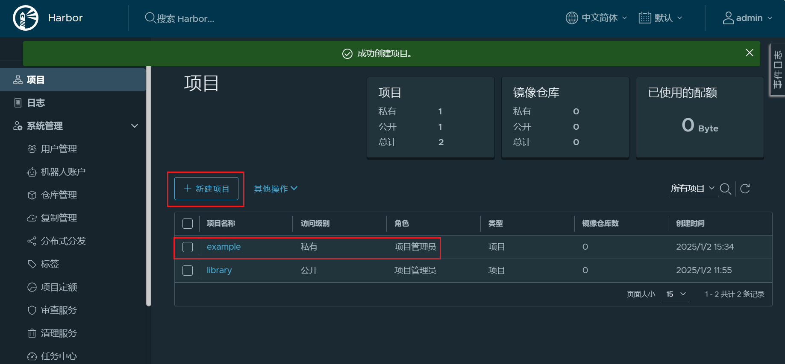
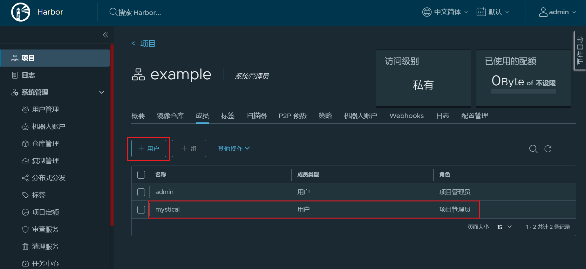
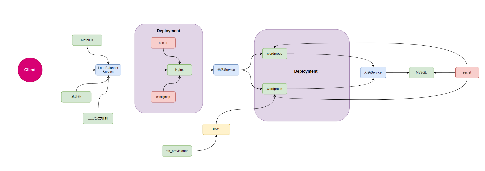

## Kubernetes配置管理


**文章内存**

- **配置说明**
- **ConfigMap**
- **Secret**
- **downwardAPI**
- **Projected**


### 配置说明

kubernetes提供了对 Pod 容器应用可以实现集中式的配置管理功能的相关资源：

- ConfigMap
- Secret
- downwardAPI
- Projected 


通过这些组件来实现向pod中的容器应用中注入配置信息的机制，从而避免了开发者参与

注意：**对于运行中容器的配置改变，还需要通过应用程序重载相关配置才能生效**


#### 配置组件简介

**configMap**

Configmap是Kubernetes集群中非常重要的一种配置管理资源对象。

借助于ConfigMap API可以向pod中的容器中注入配置信息。

ConfigMap不仅可以保存环境变量或命令行参数等属性，也可以用来保存整个配置文件或者JSON格式的 文件。

各种配置属性和数据以 k/v或嵌套k/v 样式 存在到Configmap中

注意：所有的配置信息都是**以明文的方式**来进行保存，实现资源配置的快速获取或者更新。


**Secret**

Kubernetes集群中，有一些配置属性信息是非常敏感的，所以这些信息在传递的过程中，是不希望其他人能够看到的

Kubernetes提供了一种加密场景中的配置管理资源对象Secret。

它在进行数据传输之前，会对数据进行编码，在数据获取的时候，会对数据进行解码。从而保证整个数 据传输过程的安全。

**注意：这些数据通常采用Base64机制保存，所以安全性一般**


**DownwardAPI**

downwardAPI 为运行在pod中的应用容器提供了一种反向引用。让容器中的应用程序了解所处pod或 Node的一些基础外部属性信息。

从严格意义上来说，downwardAPI不是存储卷，它自身就存在

相较于configmap、secret等资源对象需要创建后才能使用，而downwardAPI引用的是Pod自身的运行环境信息，这些信息在Pod启动的时候就存在


 **Projected**

一个 projected Volumes 投射卷可以将若干现有的卷源映射到同一个目录之上。


### ConfigMap


#### ConfigMap说明

Kubernetes提供了对pod中容器应用的集中配置管理组件：ConfigMap。

通过ConfigMap来实现向pod中的容器中注入配置信息的机制。

可以把configmap理解为Linux系统中的/etc目录，专门用来存储配置文件的目录

Kubernetes借助于ConfigMap对象实现了将配置信息从容器镜像中解耦，从而增强了工作负载的可移樟 性、使其配置更易于更改和管理并避免了将配置数据硬编码到Pod配置清单中

**ConfigMap不仅仅可以保存单个属性，也可以用来保存整个配置文件。**

从Kubernetes v1.19版本开始，ConfigMap和Secret支持使用**immutable字段**创建不可变实例，实现不 可变基础设施效果


##### 基本属性

```bash
# kubectl explain cm
    binaryData              # 二进制数据
    data                    # 文本数据，支持变量和文件
    immutable <boolean>     # 设为true，不能被修改只能删除，默认为nil可以随时被修改
    
#注意：基于data的方式传递信息的话，会在pod的容器内部生成一个单独的数据文件    
```


##### 数据配置的格式

```bash
#单行配置数据格式
属性名称key: 属性值value   #单行配置内容，一般保存变量，参数等
文件名：单行内容            #配置文件如果只有一行，也使用此方式，key为文件名，value为文件内容


#多行文件数据格式     
文件名称1: |     #注意：| 是"多行键值"的标识符
 文件内容行1    #内容大小不能超过1M
 文件内容行2
 ......
文件名称2: |     #注意：| 是"多行键值"的标识符
 文件内容行1    #内容大小不能超过1M
 文件内容行2
 ......
```

configmap资源类型的创建，与Kubernetes的其他很多资源对象的创建方式一样，主要涉及到两种方式：

- **命令行工具**：配置中有大量简单的键值对时建议使用
- **资源定义文件**：配置为大量文本内容时建议使用，此方式需要事先准备在资源清单元文件中加入配置文件内容


通常为了避免配置更新后没有生效的问题，可以在更新 ConfigMap 之后，手动重创建相关的 Pod 或者 Deployment

- 运维方式：可以通过 **重启** 或 **重建** 的方式 
  - 使用 kubectl rollout restart 命令来重启 Deployment 
  - 使用 kubectl delete pod 命令来删除 Pod，从而触发 Pod 的重启


#### ConfigMap创建和更新

##### 命令行创建方式

```bash
# 创建命令格式
kubectl create configmap NAME [--from-file=[key=]source] [--from-literal=key1=value1] [--dry-run=server|client|none] [-n <namespace>] [options]

# 参数详解：
--from-literal=key1=value1          #以设置键值对的方式实现变量配置数据
--from-env-file=/PATH/TO/FILE       #以环境变量专用文件的方式实现配置数据
--from-file=[key=]/PATH/TO/FILE     #以配置文件的方式创建配置文件数据，如不指定key，FILE名称为key名
--from-file=/PATH/TO/DIR            #以配置文件所在目录的方式创建配置文件数据

--dry-run=client -o yaml            #测试运行并显示cm内容


#查看configmap
kubectl create configmap <cm_name> -n <namespace> [-o yaml] --dry-run=client
kubectl get configmap <cm_name> -n <namespace>
kubectl describe configmap <cm_name> -n <namespace>


#删除configmap
kubectl delete configmap <cm_name> [-n <namespace>]
```


##### **命令行创建方式案例**


**范例：命令行创建基于key/value形式的变量配置**

```bash
# 在使用kubectl创建的时候，通过在命令行直接传递键值对创建
[root@master1 ~]#kubectl create configmap cm-test1 --from-literal=key1='value1' --from-literal=key2='value2'

# 查看
[root@master1 nsf-provisioner]#kubectl get cm
NAME               DATA   AGE
cm-test1           2      7s
kube-root-ca.crt   1      3d1h

# 查看yaml清单
[root@master1 nsf-provisioner]#kubectl get cm cm-test1 -o yaml
apiVersion: v1
data:
  key1: value1
  key2: value2
kind: ConfigMap
metadata:
  creationTimestamp: "2024-12-31T09:27:23Z"
  name: cm-test1
  namespace: default
  resourceVersion: "165446"
  uid: 8f831d4c-3b2d-4058-ae76-342c819f38a3

# 查看describe
[root@master1 nsf-provisioner]#kubectl describe cm cm-test1 
Name:         cm-test1
Namespace:    default
Labels:       <none>
Annotations:  <none>

Data
====
key1:
----
value1
key2:
----
value2

BinaryData
====

Events:  <none>

# 删除cm
[root@master1 nsf-provisioner]#kubectl delete cm cm-test1 
configmap "cm-test1" deleted
```


**范例: 命令行创建基于key/value形式的变量配置**

```bash
[root@master1 ~]# kubectl create configmap pod-test-config --from-literal=host="127.0.0.1" --from-literal=port="8888"
configmap/pod-test-config created

# 查看
[root@master1 ~]# kubectl get cm
NAME               DATA   AGE
kube-root-ca.crt   1      3d22h
pod-test-config    2      5s

# 输出清单
[root@master1 ~]# kubectl get cm pod-test-config -o yaml;
apiVersion: v1
data:
  host: 127.0.0.1
  port: "8888"
kind: ConfigMap
metadata:
  creationTimestamp: "2025-01-01T06:27:29Z"
  name: pod-test-config
  namespace: default
  resourceVersion: "197278"
  uid: 297b056b-8fa0-42e3-8394-93470a208147
```


**范例: 命令行创建基于环境变量文件的变量配置**

```bash
# 如果变量较多，使用上面方式一个个的设定环境变量太繁琐，可以全部添加到环境变量文件中然后基于它来创建CM
# 定制环境变量文件
[root@master1 conf.d]#cat env
key1=value1
key2=value2

# 注意：env文件中所有的配置项以“属性名=属性值”格式定制

# 将所有环境变量添加到configmap中
[root@master1 conf.d]# kubectl create configmap cm-test2 --from-env-file=./env 
configmap/cm-test2 created

# 查看清单文件
[root@master1 conf.d]# kubectl get cm cm-test2 -o yaml
apiVersion: v1
data:
  key1: value1
  key2: value2
kind: ConfigMap
metadata:
  creationTimestamp: "2025-01-01T06:32:42Z"
  name: cm-test2
  namespace: default
  resourceVersion: "197783"
  uid: e3a193ae-5093-4822-9c34-3b212fafc473

# 删除cm
[root@master1 conf.d]# kubectl delete cm pod-test-config 
configmap "pod-test-config" deleted
```


**范例：命令行创建基于配置文件的文件形式CM**

```bash
# 直接将多个配置文件创建为一个ConfigMap
[root@master1 ~]# ls conf.d/
app1.conf app2.conf app3.conf

[root@master1 ~]# cat conf.d/app1.conf
[app1]
config1

[root@master1 ~]# cat conf.d/app2.conf
[app2]
config2

#文件名自动成为key名
[root@master1 conf.d]#kubectl create configmap cm-test3 --from-file=./app1.conf --from-file=./app2.conf 
configmap/cm-test3 created

# 查看
[root@master1 conf.d]#kubectl get cm cm-test3 -o yaml
apiVersion: v1
data:
  app1.conf: |
    [app1]
    config1
  app2.conf: |
    [app2]
    config2
kind: ConfigMap
metadata:
  creationTimestamp: "2025-01-01T06:36:45Z"
  name: cm-test3
  namespace: default
  resourceVersion: "198174"
  uid: ee772063-dd7d-4ed5-acab-74423104695b
  
# 删除CM
[root@master1 conf.d]#kubectl delete cm cm-test3 
configmap "cm-test3" deleted
```


**范例: 命令行创建基于目录的CM**

```bash
[root@master1 conf.d]# ls
app1.conf  app2.conf  app3.conf

[root@master1 conf.d]#cat *
[app1]
config1
[app2]
config2
[app3]
config3

#直接将一个目录下的所有配置文件创建为一个ConfigMap
[root@master1 cm]#kubectl create cm cm-test4 --from-file=./conf.d/
configmap/cm-test4 created

#结果显示：多个文件之间，属性名是文件名，属性值是文件内容
[root@master1 cm]#kubectl get cm cm-test4 -o yaml;
apiVersion: v1
data:
  app1.conf: |
    [app1]
    config1
  app2.conf: |
    [app2]
    config2
  app3.conf: |
    [app3]
    config3
kind: ConfigMap
metadata:
  creationTimestamp: "2025-01-01T06:40:19Z"
  name: cm-test4
  namespace: default
  resourceVersion: "198521"
  uid: 4c83e7d6-b191-46a5-b0f4-a1c8b14f905a

# 删除CM
[root@master1 ~]#kubectl delete cm cm-test4
```


##### 资源清单文件创建方式

**资源清单文件命令格式说明**

```yaml
# 清单文件格式
apiVersion: v1
kind: ConfigMap
metadata:
  name: cm_name
  namespace: default
data:
  key: value          # 配置信息如果只有一行，也使用此方式，使用卷挂载时，key即为文件名，value为文件内容
  文件名： |
    文件内容行1
    文件内容行2
    ......
# 注意：CM的清单文件没有spec信息，而是data

# 命令式：
kubectl create -f /path/file
# 声明式
kubectl apply -f /path/file
```

注意：此方式需要事先将配置文件的内容全部写入清单文件，而且配置文件的格式需要调整才能匹配， 所以很不方便，推荐如下方式解决

- 先在命令行执行时指定配置文件的方式创建 CM
- 通过 kubectl get cm  -o yaml > cm.yaml 方式导出资源清单文件
- 或者 kubectl create configmap NAME --dry-run=client -o yaml > cm.yaml 方式导出资源清单文件
- 最后调整和修改上面生成的 yaml资源清单文件


##### 资源清单文件创建方式案例

```yaml
# 资源定义文件
[root@master1 cm] # vim storage-configmap-test.yaml
apiVersion: v1
kind: ConfigMap
metadata:
  name: config-test
data:
  author: wangxiaochun
  file.conf: |
    [class]
    linux
    go
    java
    
    
# 创建资源对象
[root@master1 cm] # kubectl apply -f storage-configmap-test.yaml 
configmap/config-test created

# 查看
[root@master1 cm] # kubectl describe cm config-test 
Name:         config-test
Namespace:    default
Labels:       <none>
Annotations:  <none>

Data
====
author:
----
wangxiaochun
file.conf:
----
[class]
linux
go
java


BinaryData
====

Events:  <none>

# 可以在线修改
[root@master1 cm] # kubectl edit cm config-test

# 删除
[root@master1 cm]#kubectl delete cm config-test 
configmap "config-test" deleted
```


**范例: 只读的configmap**

```yaml
[root@master1 cm] # vim storage-configmap-immutable-test.yaml
apiVersion: v1
kind: ConfigMap
metadata:
  name: cm-immutable-test
data:
  author: wangxiaochun
  file.conf: |
    [class]
    linux
    go
    java
immutable: true  # 只读

# 应用
[root@master1 cm]#kubectl apply -f storage-configmap-immutable-test.yaml 
configmap/cm-immutable-test created

# 查看
[root@master1 cm]#kubectl get cm cm-immutable-test 
NAME                DATA   AGE
cm-immutable-test   2      31s

# 在线修改configmap提示出错
[root@master1 cm]#kubectl edit cm cm-immutable-test 
error: configmaps "cm-immutable-test" is invalid

# 可以删除
[root@master1 cm]#kubectl delete cm cm-immutable-test 
configmap "cm-immutable-test" deleted
```


##### 在线更新configmap

注意：configmap虽然支持在线更新，但是configmap更新后可能不会对已有的Pod的应用生效，可能 还需要重建Pod才能生效

```bash
#创建 configmap
[root@master1 ~]#kubectl create cm cm-nginx-conf --from-file=nginx.conf

#修改configmap
#方法1,旧版中如果配置内容如果不大,多行内容可以显示在一行,但此方式不方便修改,但如果过大,此方式只
能显示大小,而非内容,所以不能修改,新版无此问题
[root@master1 ~]#kubectl edit cm cm-nginx-conf


#方法2
[root@master1 ~]#kubectl get cm cm-nginx-conf -o yaml > cm-config-conf.yaml
[root@master1 ~]#vim cm-config-conf.yaml
[root@master1 ~]#kubectl apply -f cm-config-conf.yaml


#方法3
#修改配置
[root@master1 ~]#vim nginx.conf
[root@master1 ~]#kubectl create cm cm-nginx-conf --from-file=nginx.conf --dry-run=client -oyaml |kubectl apply -f -
```


#### ConfigMap使用

**使用ConfigMap主要有两种方式：**

- 通过环境变量的方式直接传递pod
- 使用volume的方式挂载入到pod内的文件中


**注意：**

- ConfigMap必须在Pod之前创建
- 与ConfigMap在同一个namespace内的pod才能使用ConfigMap**，即ConfigMap不能跨命名空间调用。**
- ConfigMap通常存放的数据不要超过1M
- CM 可以支持实时更新，在原来的pod里面直接看到效果


#####  通过环境变量的方式直接传递 Pod

引用ConfigMap对象上特定的key，以**valueFrom**赋值给Pod上指定的环境变量

也可以在Pod上使用**envFrom**一次性导入ConfigMap对象上的所有的key-value,key(可以统一附加特定前 缀）即为环境变量,value自动成为相应的变量值

环境变量是容器启动时注入的，容器启动后变量的值不会随CM更改而发生变化,即一次性加载 configmap,除非删除容器重建


**方式1：env 对指定的变量一个一个赋值**

```bash
kubectl explain pod.spec.containers.env
    name          # 手工定制环境变量时，设置环境变量的名称，必选字段
    value         # 手工定制环境变量时，直接设置环境变量的属性值，不通过CM获取配置，可选字段
    valueFrom     # #手工定制环境变量时，设置环境变量的属性来源，可以支持从CM,Secret,downwordAPI获取

kubectl explain pod.spec.containers.env.valueFrom.configMapKeyRef
    name          # 引用指定的configmap
    key           # 引用指定的configmap中的具体哪个key
    optional      # 如果设置为false，标识该项是必选项，如果设置为true标识这个key是可选的。默认false

#此方式实现过程
1）容器中自定义环境变量名
2）根据CM的名称和Key名，找到对应的value
3) 再将value赋值给容器的环境变量
```


**方式2：envFrom 使用CM的所有变量实现对变量的批量赋值，此方式生产更为推荐**

```bash
kubectl explain pod.spec.containers.envFrom
    configMapRef     # ConfigMap对象中的所有Key
    secretKeyRef     # Secret对象中的所有Key
    prefix           # #为ConfigMap中的每个属性都添加前缀标识

#此方实现过程
1）容器中自定义环境变量名，并且和CM的key同名
2）找到指定的CM中所有Key名，将值批量直接赋值给容器中相同名称的变量
```


##### 使用volume的方式挂载入到pod内的文件中

在Pod上将 configMap对象引用为存储卷，而后整体由容器mount至某个目录下，key转为文件名， value即为相应的文件内容

在Pod上定义configMap卷时，仅引用其中的部分key，而后由容器mount至目录下

在容器上仅mount configMap卷上指定的key

容器中挂载的Volume数据可以**根据时间戳机制和ConfigMap 同步更新**，即configmap变更后会自动加载，但更新时间是不确定的，

所以一般建议当更新configmap的配置后，可以通过重新Pod使之生效，符合不可变基础设施的理念 

推荐滚动升级pod的方式来让ConfigMap内容变化生效


##### ConfigMap实战案例

**范例：env 变量**

```yaml
# 资源清单文件
[root@master1 cm] # vim storage-configmap-simple-env.yaml
apiVersion: v1
kind: ConfigMap
metadata:
  name: cm-nginx-config
data:
  port: "10086"  # 注意：只支持字符串，需要用引号引起来
  user: "www"
---
apiVersion: v1
kind: Pod
metadata:
  name: configmap-env-test
spec:
  containers:
  - name: configmap-env-test
    image: registry.cn-beijing.aliyuncs.com/wangxiaochun/nginx:1.20.0
    env:
    - name: NGINX_HOST
      value: "10.0.0.100"  #直接变量赋值
    - name: NGINX_PORT
      valueFrom:
        configMapKeyRef:
          name: cm-nginx-config
          key: port
          optional: true  # 即使找不到对应的 ConfigMap 或 Key，也不会让 Pod 启动失败，而是忽略这个变量，Pod 照常启动。
    - name: NGINX_USER
      valueFrom:
        configMapKeyRef:
          name: cm-nginx-config
          key: user
          optional: false
#配置解析：这里面我们可以使用两种方式在pod中传递变量

# 资源创建
[root@master1 cm] # kubectl apply -f storage-configmap-simple-env.yaml 
configmap/cm-nginx-config created
pod/configmap-env-test created

# 查看
[root@master1 cm] # kubectl get pod
NAME                 READY   STATUS    RESTARTS   AGE
configmap-env-test   1/1     Running   0          9s
[root@master1 cm] # kubectl get cm
NAME               DATA   AGE
cm-nginx-config    2      32s

# 验证变量
[root@master1 cm] # kubectl exec configmap-env-test -- env
PATH=/usr/local/sbin:/usr/local/bin:/usr/sbin:/usr/bin:/sbin:/bin
HOSTNAME=configmap-env-test
NGINX_HOST=10.0.0.100 
NGINX_PORT=10086   # ---------------------- ConfigMap传入变量
NGINX_USER=www     # ---------------------- ConfigMap传入变量
KUBERNETES_PORT_443_TCP_PROTO=tcp
KUBERNETES_PORT_443_TCP_PORT=443
KUBERNETES_PORT_443_TCP_ADDR=10.96.0.1
KUBERNETES_SERVICE_HOST=10.96.0.1
KUBERNETES_SERVICE_PORT=443
KUBERNETES_SERVICE_PORT_HTTPS=443
KUBERNETES_PORT=tcp://10.96.0.1:443
KUBERNETES_PORT_443_TCP=tcp://10.96.0.1:443
NGINX_VERSION=1.20.0
NJS_VERSION=0.5.3
PKG_RELEASE=1~buster
HOME=/root

# 资源删除
[root@master1 cm] # kubectl delete -f storage-configmap-simple-env.yaml 
configmap "cm-nginx-config" deleted
pod "configmap-env-test" deleted
```


**范例：env 变量**

```yaml
# 创建配置文件
[root@master1 cm] # vim storage-configmap-valueFrom-env.yaml
apiVersion: v1
kind: ConfigMap
metadata:
  name: cm-pod-test
  namespace: default
data:
  host: 0.0.0.0
  port: "8888"

---
apiVersion: v1
kind: Pod
metadata:
  name: configmap-env-demo
spec:
  containers:
  - image: registry.cn-beijing.aliyuncs.com/wangxiaochun/pod-test:v0.1
    name: pod-test
    env:
    - name: HOST
      valueFrom:
        configMapKeyRef:
          name: cm-pod-test
          key: host
          optional: true  #true时,如果configmap中的key即使不存在,也不会导致容器无法初始

    - name: PORT
      valueFrom:
        configMapKeyRef:
          name: cm-pod-test
          key: port
          optional: false # false时，如果configmap中的key不存在，会导致容器无法初始化


# 应用
[root@master1 cm] # kubectl apply -f storage-configmap-valueFrom-env.yaml 
configmap/cm-pod-test created
pod/configmap-env-demo created

# 查看
[root@master1 cm] # kubectl exec configmap-env-demo -- env
PATH=/usr/local/sbin:/usr/local/bin:/usr/sbin:/usr/bin:/sbin:/bin
HOSTNAME=configmap-env-demo
HOST=0.0.0.0
PORT=8888
KUBERNETES_PORT_443_TCP=tcp://10.96.0.1:443
KUBERNETES_PORT_443_TCP_PROTO=tcp
KUBERNETES_PORT_443_TCP_PORT=443
KUBERNETES_PORT_443_TCP_ADDR=10.96.0.1
KUBERNETES_SERVICE_HOST=10.96.0.1
KUBERNETES_SERVICE_PORT=443
KUBERNETES_SERVICE_PORT_HTTPS=443
KUBERNETES_PORT=tcp://10.96.0.1:443
DEPLOYENV=Production
RELEASE=Stable
PS1=[\u@\h \w]\$ 
HOME=/root

# 删除资源
[root@master1 cm]#kubectl delete -f storage-configmap-valueFrom-env.yaml 
configmap "cm-pod-test" deleted
pod "configmap-env-demo" deleted
```


**范例：env 变量**

```yaml
# 清单文件
[root@master1 cm] # vim storage-configmap-simple-envargs.yaml
apiVersion: v1
kind: ConfigMap
metadata:
  name: cm-command-arg
data:
  time: "3600"
---
apiVersion: v1
kind: Pod
metadata:
  name: pod-cm-command-arg
spec:
  containers:
  - name: pod-cm-command-arg-container
    image: busybox:1.32.0
    command: ["/bin/sh", "-c", "sleep ${SPECIAL_TIME}"]
    env:
    - name: SPECIAL_TIME
      valueFrom:
        configMapKeyRef:
          name: cm-command-arg
          key: time
    - name: NAME
      value: "wangxiaochun"
  restartPolicy: Never

# 应用
[root@master1 cm] # kubectl apply -f storage-configmap-simple-envargs.yaml 
configmap/cm-command-arg created
pod/pod-cm-command-arg created

# 查看
[root@master1 cm] # kubectl get pod
NAME                 READY   STATUS    RESTARTS   AGE
pod-cm-command-arg   1/1     Running   0          3s

[root@master1 cm] # kubectl exec pod-cm-command-arg -- ps aux
PID   USER     TIME  COMMAND
    1 root      0:00 sleep 3600
    8 root      0:00 ps aux

# 删除
[root@master1 cm]#kubectl delete -f storage-configmap-simple-envargs.yaml 
configmap "cm-command-arg" deleted
pod "pod-cm-command-arg" deleted
```


**范例：envFrom 批量导入所有变量**

```yaml
# 配置文件资源定义文件
[root@master1 cm] # vim storage-configmap-simple-envfrom.yaml
[root@master1 cm]#cat storage-configmap-simple-envfrom.yaml 
apiVersion: v1
kind: ConfigMap
metadata:
  name: cm-nginx
data:
  NGINX_PORT: "10086"
  NGINX_USER: "www"
---
apiVersion: v1
kind: Pod
metadata:
  name: configmap-envfrom-test
spec:
  containers:
  - name: configmap-envfrom-test
    image: registry.cn-beijing.aliyuncs.com/wangxiaochun/nginx:1.20.0
    envFrom:
    - configMapRef:
        name: cm-nginx  # 所有变量从cm中读取
        
# 应用
[root@master1 cm] # kubectl apply -f storage-configmap-simple-envfrom.yaml 
configmap/cm-nginx unchanged
pod/configmap-envfrom-test created

# 查看
[root@master1 cm] # kubectl get pod
NAME                     READY   STATUS    RESTARTS   AGE
configmap-envfrom-test   1/1     Running   0          2s

[root@master1 cm] # kubectl exec configmap-envfrom-test -- env
PATH=/usr/local/sbin:/usr/local/bin:/usr/sbin:/usr/bin:/sbin:/bin
HOSTNAME=configmap-envfrom-test
NGINX_PORT=10086
NGINX_USER=www
KUBERNETES_PORT_443_TCP_ADDR=10.96.0.1
KUBERNETES_SERVICE_HOST=10.96.0.1
KUBERNETES_SERVICE_PORT=443
KUBERNETES_SERVICE_PORT_HTTPS=443
KUBERNETES_PORT=tcp://10.96.0.1:443
KUBERNETES_PORT_443_TCP=tcp://10.96.0.1:443
KUBERNETES_PORT_443_TCP_PROTO=tcp
KUBERNETES_PORT_443_TCP_PORT=443
NGINX_VERSION=1.20.0
NJS_VERSION=0.5.3
PKG_RELEASE=1~buster
HOME=/root

# 删除
[root@master1 cm]#kubectl delete -f storage-configmap-simple-envfrom.yaml 
configmap "cm-nginx" deleted
pod "configmap-envfrom-test" deleted
```


 **范例：volume 生成配置文件并更新生效**

```yaml
# configmap资源定义
[root@master1 cm] # vim storage-configmap-simple-volume.yaml
apiVersion: v1
kind: ConfigMap
metadata:
  name: cm-volume
data:
  author: wangxiaochun
  file.conf: |
    [app]
    config1
    config2

---
apiVersion: v1
kind: Pod
metadata:
  name: pod-volume-test
spec:
  volumes:
  - name: volume-config  # 指定卷名
    configMap:
      name: cm-volume    # 指定卷来自cm
  containers:
  - name: nginx
    image: registry.cn-beijing.aliyuncs.com/wangxiaochun/nginx:1.20.0
    volumeMounts:
    - name: volume-config # 调用前面定义的卷名
      mountPath: /cmap/   # 指定Pod中的挂载点目录
      
# 应用
[root@master1 cm] # kubectl apply -f storage-configmap-simple-volume.yaml 
configmap/cm-volume created
pod/pod-volume-test created

# 查看
[root@master1 cm] # kubectl get pod
NAME              READY   STATUS    RESTARTS   AGE
pod-volume-test   1/1     Running   0          4s

[root@master1 cm] # kubectl exec pod-volume-test -- ls /cmap/
author
file.conf

# 进入容器查看
[root@master1 cm] # kubectl exec -it pod-volume-test -- sh
# cd /cmap     
# ls
author	file.conf
# ls -al
total 12
drwxrwxrwx 3 root root 4096 Jan  1 09:26 .
drwxr-xr-x 1 root root 4096 Jan  1 09:26 ..
drwxr-xr-x 2 root root 4096 Jan  1 09:26 ..2025_01_01_09_26_31.673800736
lrwxrwxrwx 1 root root   31 Jan  1 09:26 ..data -> ..2025_01_01_09_26_31.673800736
lrwxrwxrwx 1 root root   13 Jan  1 09:26 author -> ..data/author
lrwxrwxrwx 1 root root   16 Jan  1 09:26 file.conf -> ..data/file.conf
# cd ..2025*        
# ls
author	file.conf

# 结果显示：
# 这些文件虽然看起来是挂载在目录下，实际上，它是经过两层的软链接才能找到真正的挂载的文件，容器内挂载目录的生成的文件
# ..2025_01_01_09_26_31.673800736
# ..data -> ..2025_01_01_09_26_31.673800736
# author -> ..data/author
# file.conf -> ..data/file.conf
# 通过这种双层软连接的方式，只要容器支持重载技术，那么只需要更改配置文件就可以实现容器应用的变动

# 修改cm
[root@master1 cm] # kubectl edit cm cm-volume 
apiVersion: v1
data:
 author: wang  #修改此行
 file.conf: |
   [app]
   config1
   config2
   config3  #加此行
kind: ConfigMap
.....
configmap/cm-volume edited

# 等一会儿进入pod可以看到配置文件变化
[root@master1 cm] # kubectl exec -it pod-volume-test -- sh
# cd /cmap
# ls -al
total 12
drwxrwxrwx 3 root root 4096 Jan  1 09:33 .
drwxr-xr-x 1 root root 4096 Jan  1 09:26 ..
drwxr-xr-x 2 root root 4096 Jan  1 09:33 ..2025_01_01_09_33_42.2079151602
lrwxrwxrwx 1 root root   32 Jan  1 09:33 ..data -> ..2025_01_01_09_33_42.2079151602
lrwxrwxrwx 1 root root   13 Jan  1 09:26 author -> ..data/author
lrwxrwxrwx 1 root root   16 Jan  1 09:26 file.conf -> ..data/file.conf
# cat file.conf                     
[app]
config1
config2
config3
# exit

#删除
[root@master1 cm] # kubectl delete -f storage-configmap-simple-volume.yaml 
configmap "cm-volume" deleted
pod "pod-volume-test" deleted
```


**范例：volume 挂载全部内容**

```yaml
# 命令行创建CM，创建Nginx的配置信息
[root@master1 nginx.conf.d] # vim default.conf
server {
    listen 8080;
    server_name localhost;
    location / {
        root /usr/share/nginx/html;
        index index.html index.htm;
    }
    error_page 500 502 503 504 /50x.html;
    location /50x.html {
        root /usr/share/nginx/html;
    }
}

# 命令行创建CM
[root@master1 cm] # kubectl create configmap cm-nginx-conf-files --from-file=nginx.conf.d/
configmap/cm-nginx-conf-files created

# 查看
[root@master1 cm]#kubectl get cm
NAME                  DATA   AGE
cm-nginx-conf-files   1      87s

# 清单文件
[root@master1 cm] # vim storage-configmap-nginx-file.yaml
apiVersion: v1
kind: ConfigMap
metadata:
  name: cm-nginx-index
data:
  index.html: "Nginx Configmap Page!" # 单行内容生成configmap
---
apiVersion: v1
kind: Pod
metadata:
  name: pod-nginx-conf-configmap
spec:
  volumes:
  - name: nginx-conf
    configMap:
      name: cm-nginx-conf-files
      optional: false
  - name: nginx-index
    configMap:
      name: cm-nginx-index
      optional: false
  containers:
  - image: registry.cn-beijing.aliyuncs.com/wangxiaochun/nginx:1.20.0
    name: nginx
    volumeMounts:
    - name: nginx-conf
      mountPath: /etc/nginx/conf.d/
      readOnly: true
    - name: nginx-index
      mountPath: /usr/share/nginx/html/
      readOnly: true
      
      
# 应用
[root@master1 cm] # kubectl apply -f storage-configmap-nginx-file.yaml 
configmap/cm-nginx-index created
pod/pod-nginx-conf-configmap created

# 查看
[root@master1 cm] # kubectl get cm
NAME                  DATA   AGE
cm-nginx-conf-files   1      7m31s
cm-nginx-index        1      55s

# 测试效果
[root@master1 cm] # kubectl get pod -o wide
NAME                       READY   STATUS    RESTARTS   AGE   IP             NODE    NOMINATED NODE   READINESS GATES
pod-nginx-conf-configmap   1/1     Running   0          77s   10.244.3.138   node3   <none>           <none>

[root@master1 cm] # curl 10.244.3.138
curl: (7) Failed to connect to 10.244.3.138 port 80 after 0 ms: 拒绝连接

# 读取了configmap传入的配置文件
[root@master1 cm] # curl 10.244.3.138:8080
Nginx Configmap Page!

# 删除
[root@master1 cm] # kubectl delete -f storage-configmap-nginx-file.yaml 
configmap "cm-nginx-index" deleted
pod "pod-nginx-conf-configmap" deleted

[root@master1 cm] # kubectl delete cm cm-nginx-conf-files 
configmap "cm-nginx-conf-files" deleted
```


**范例：volume 挂载 CM 中部分文件**

```yaml
# 准备配置文件
[root@master1 nginx.conf.d] #ls
default.conf  myserver.conf  myserver-gzip.cfg  myserver-status.cfg

# 配置文件
[root@master1 cm] #cat nginx.conf.d/myserver.conf 
server {
    listen 8888;
    server_name www.wang.org;
    include /etc/nginx/conf.d/myserver-*.cfg
    location / {
        root /usr/share/nginx/html;
    }
}

# 子配置文件,注意:文件是以cfg为后缀,不能以conf文件后缀,会导致冲突
[root@master1 cm] # cat nginx.conf.d/myserver-gzip.cfg 
gzip on;
gzip_comp_level 5;
gzip_proxied     expired no-cache no-store private auth;
gzip_types text/plain text/css application/xml text/javascript;

[root@master1 cm] # cat nginx.conf.d/myserver-status.cfg 
location /nginx-status {
   stub_status on;
   access_log off;
}

# 创建cm
[root@master1 cm] # kubectl create cm cm-nginx-conf-files --from-file=nginx.conf.d/
configmap/cm-nginx-conf-files created

# 清单文件
apiVersion: v1
kind: ConfigMap
metadata:
  name: cm-nginx-index
data:
  index.html: "Nginx Sub Configmap Page\n"
---
apiVersion: v1
kind: Pod
metadata:
  name: pod-cm-nginx-conf
spec:
  volumes:
  - name: nginx-conf
    configMap:
      name: cm-nginx-conf-files
      items:                            # 指定cm中的key
      - key: myserver.conf              # cm中的key名称
        path: myserver.conf             # Pod中的文件名
        mode: 0644                      # Pod中的文件权限
      - key: myserver-status.cfg
        path: myserver-status.cfg
        mode: 0644
      - key: myserver-gzip.cfg
        path: myserver-gzip.cfg
        mode: 0644
      optional: false
  - name: nginx-index
    configMap:
      name: cm-nginx-index
      optional: false
  containers:
  - image: registry.cn-beijing.aliyuncs.com/wangxiaochun/nginx:1.20.0
    name: pod-cm-nginx-conf-container
    volumeMounts:
    - name: nginx-conf
      mountPath: /etc/nginx/conf.d/
      readOnly: true
    - name: nginx-index
      mountPath: /usr/share/nginx/html/
      readOnly: true

# 应用
[root@master1 cm] # kubectl apply -f storage-configmap-nginx-subfile.yaml 
configmap/cm-nginx-index created
pod/pod-cm-nginx-conf created

# 查看
[root@master1 cm]#kubectl exec pod-cm-nginx-conf -- ls /etc/nginx/conf.d
myserver-gzip.cfg
myserver-status.cfg
myserver.conf

# 查看资源
[root@master1 cm]#kubectl get cm cm-nginx-conf-files -o yaml
apiVersion: v1
data:
  default.conf: |
    server {
        listen 8080;
        server_name localhost;
        location / {
            root /usr/share/nginx/html;
            index index.html index.htm;
        }
        error_page 500 502 503 504 /50x.html;
        location /50x.html {
            root /usr/share/nginx/html;
        }
    }
  myserver-gzip.cfg: |
    gzip on;
    gzip_comp_level 5;
    gzip_proxied     expired no-cache no-store private auth;
    gzip_types text/plain text/css application/xml text/javascript;
  myserver-status.cfg: |+
    location /nginx-status {
       stub_status on;
       access_log off;
    }

  myserver.conf: |
    server {
        listen 8888;
        server_name www.wang.org;
        include /etc/nginx/conf.d/myserver-*.cfg;
        location / {
            root /usr/share/nginx/html;
        }
    }
kind: ConfigMap
metadata:
  creationTimestamp: "2025-01-01T10:54:52Z"
  name: cm-nginx-conf-files
  namespace: default
  resourceVersion: "224964"
  uid: 80862286-fb45-4dc2-ba8a-4d886f88e015
  
# 查看效果
[root@master1 cm] # curl 10.244.3.140:8888
Nginx Sub Configmap Page

# 删除资源
#删除资源
[root@master1 yaml] #kubectl delete -f storage-configmap-nginx-subfile.yaml
[root@master1 yaml] #kubectl delete cm cm-nginx-conf-files
```


**范例：volume 基于subpath实现挂载CM部分文件并修改配置文件名称**

```yaml
kubectl explain pod.spec.volumes.configMap.items

FIELDS:
   key <string> -required-
     key is the key to project.
     
   mode <integer>
     mode is Optional: mode bits used to set permissions on this file. Must be
     an octal value between 0000 and 0777 or a decimal value between 0 and 511.
     YAML accepts both octal and decimal values, JSON requires decimal values
     for mode bits. If not specified, the volume defaultMode will be used. This
     might be in conflict with other options that affect the file mode, like
     fsGroup, and the result can be other mode bits set.
     
   path <string> -required-
     path is the relative path of the file to map the key to. May not be an
     absolute path. May not contain the path element '..'. May not start with
     the string '..'.
     
kubectl explain pod.spec.containers.volumeMounts
FIELDS:
   mountPath <string> -required-
     Path within the container at which the volume should be mounted. Must not
     contain ':'.
     
   mountPropagation <string>
     mountPropagation determines how mounts are propagated from the host to
     container and the other way around. When not set, MountPropagationNone is
     used. This field is beta in 1.10.
     
   name <string> -required-
     This must match the Name of a Volume.
     
   readOnly <boolean>
     Mounted read-only if true, read-write otherwise (false or unspecified).
     Defaults to false.
     
   subPath <string>
     Path within the volume from which the container's volume should be mounted.
     Defaults to "" (volume's root).

   subPathExpr <string>
     Expanded path within the volume from which the container's volume should be
     mounted. Behaves similarly to SubPath but environment variable references
     $(VAR_NAME) are expanded using the container's environment. Defaults to ""
     (volume's root). SubPathExpr and SubPath are mutually exclusive
```

**范例**

```yaml
# 准备配置文件同上一样
[root@master1 cm] #ls nginx.conf.d/
default.conf  myserver.conf  myserver-gzip.cfg  myserver-status.cfg

# 将上面的配置文件都加入cm
[root@master1 cm] # kubectl create cm cm-nginx-conf-files --from-file=nginx.conf.d/
configmap/cm-nginx-conf-files created

# 清单文件
[root@master1 cm] # vim storage-configmap-nginx-usesubfile.yaml
apiVersion: v1
kind: ConfigMap
metadata:
  name: cm-nginx-index
data:
  index.html: "Nginx Use Sub Configmap Page\n"
---
apiVersion: v1
kind: Pod
metadata:
  name: pod-cm-nginx-conf
spec:
  volumes:
  - name: nginx-conf
    configMap:
      name: cm-nginx-conf-files
      optional: false
  - name: nginx-index
    configMap:
      name: cm-nginx-index
      optional: false
  containers:
  - image: registry.cn-beijing.aliyuncs.com/wangxiaochun/nginx:1.20.0
    name: pod-cm-nginx-conf-container
    volumeMounts:
    - name: nginx-conf
      mountPath: /etc/nginx/conf.d/myserver2.conf   # 修改生成的配置文件名
      subPath: myserver.conf                        # 指定nginx-conf中的特定文件，而非所有文件
      readOnly: true
    - name: nginx-conf
      mountPath: /etc/nginx/conf.d/myserver-gzip2.cfg   # 修改生成的配置文件名
      subPath: myserver-gzip.cfg                        # 指定nginx-conf中的特定文件，而非所有文件
      readOnly: true
    - name: nginx-index
      mountPath: /usr/share/nginx/html/
      readOnly: true


[root@master1 cm] # kubectl apply -f storage-configmap-nginx-usesubfile.yaml 
configmap/cm-nginx-index created
pod/pod-cm-nginx-conf created

[root@master1 cm] # kubectl get pod
NAME                READY   STATUS    RESTARTS   AGE
pod-cm-nginx-conf   1/1     Running   0          2s

[root@master1 cm] # kubectl get pod -o wide
NAME                READY   STATUS    RESTARTS   AGE   IP             NODE    NOMINATED NODE   READINESS GATES
pod-cm-nginx-conf   1/1     Running   0          15s   10.244.3.142   node3   <none>           <none>

[root@master1 cm] # kubectl exec pod-cm-nginx-conf -- ls /etc/nginx/conf.d
default.conf
myserver-gzip2.cfg
myserver2.conf

# 删除

```


**范例：volume 基于subPath 挂载CM 部分文件并保留原目录中的其它文件**

```yaml
# 查看容器内的文件列表
[root@master1 cm] # docker run --rm --name nginx wangxiaochun/nginx:1.20.0 ls /etc/nginx/
conf.d
fastcgi_params
mime.types
modules
nginx.conf
scgi_params
uwsgi_params

# 导出配置文件
[root@master1 cm] # docker run --rm --name nginx wangxiaochun/nginx:1.20.0 cat /etc/nginx/nginx.conf > nginx.conf

# 创建configmap
[root@master1 cm] # kubectl create cm cm-nginx-conf --from-file=nginx.conf
configmap/cm-nginx-conf created

# 查看配置内容
[root@master1 cm] # kubectl describe cm cm-nginx-conf 
Name:         cm-nginx-conf
Namespace:    default
Labels:       <none>
Annotations:  <none>

Data
====
nginx.conf:
----

user  nginx;
worker_processes  auto;

error_log  /var/log/nginx/error.log notice;
pid        /var/run/nginx.pid;


events {
    worker_connections  1024;
}


http {
    include       /etc/nginx/mime.types;
    default_type  application/octet-stream;

    log_format  main  '$remote_addr - $remote_user [$time_local] "$request" '
                      '$status $body_bytes_sent "$http_referer" '
                      '"$http_user_agent" "$http_x_forwarded_for"';

    access_log  /var/log/nginx/access.log  main;

    sendfile        on;
    #tcp_nopush     on;

    keepalive_timeout  65;

    #gzip  on;

    include /etc/nginx/conf.d/*.conf;
}


BinaryData
====

Events:  <none>


# 准备配置文件
[root@master1 cm] # vim storage-configmap-subPath-nginx-1.yaml
apiVersion: v1
kind: Pod
metadata:
  name: pod-cn-nginx-conf
spec:
  volumes:
  - name: volume-nginx-conf
    configMap:
      name: cm-nginx-conf
  containers:
  - image: registry.cn-beijing.aliyuncs.com/wangxiaochun/nginx:1.20.0
    name: pod-cm-nginx-conf-container
    command: ["sh", "-c", "sleep 3600"]
    volumeMounts:
    - name: volume-nginx-conf
      mountPath: /etc/nginx/

# 应用
[root@master1 cm] # kubectl apply -f storage-configmap-subPath-nginx-1.yaml 
pod/pod-cn-nginx-conf created

# 查看
[root@master1 cm] # kubectl get pod
NAME                READY   STATUS    RESTARTS   AGE
pod-cn-nginx-conf   1/1     Running   0          3s

# 直接将整个目录覆盖了
[root@master1 cm] # kubectl exec pod-cn-nginx-conf -- ls /etc/nginx
nginx.conf

# 删除
[root@master1 cm] # kubectl delete -f storage-configmap-subPath-nginx-1.yaml 
pod "pod-cn-nginx-conf" deleted

# 修改清单文件
[root@master1 cm] # cat storage-configmap-subPath-nginx-2.yaml 
apiVersion: v1
kind: Pod
metadata:
  name: pod-cm-nginx-conf
spec:
  volumes:
  - name: volume-nginx-conf
    configMap:
      name: cm-nginx-conf
      items:
      - key: nginx.conf
        path: etc/nginx/nginx.conf       # 必须是相对路径，且和下面subPath路径相同
  containers:
  - image: registry.cn-beijing.aliyuncs.com/wangxiaochun/nginx:1.20.0
    name: pod-cm-nginx-conf-container
    command: ["sh", "-c", "sleep 3600"]
    volumeMounts:
    - name: volume-nginx-conf
      mountPath: /etc/nginx/nginx.conf
      subPath: etc/nginx/nginx.conf     # 必须是相对路径，且和volumes的path路径相同
      
[root@master1 cm] # kubectl apply -f storage-configmap-subPath-nginx-2.yaml 
pod/pod-cm-nginx-conf created

[root@master1 cm] # kubectl get pod
NAME                READY   STATUS    RESTARTS   AGE
pod-cm-nginx-conf   1/1     Running   0          3s

[root@master1 cm] # kubectl exec -it pod-cm-nginx-conf -- ls /etc/nginx/
conf.d		mime.types  nginx.conf	 uwsgi_params
fastcgi_params	modules     scgi_params
```


**关于上面案例中，volumes.configMap.items.path相对路径补充说明：**

在 `ConfigMap` 中，`path` 是用来指定该键值对在 **`volume` 根目录下的相对路径**。

- **必须是相对路径的原因**： Kubernetes 的设计中，`ConfigMap` 的 `items` 是将键值对映射为文件，并存储到 `volume` 的临时文件目录中。这个目录是动态创建的，无法提前确定一个具体的绝对路径。因此，`path` 是相对于 **`volume` 的根目录** 的相对路径


**详细解释：它相对于谁的路径？**

**卷（`volume`）的根目录**：

- `ConfigMap` 数据被挂载到容器之前，Kubernetes 会将数据放在一个临时目录中，比如：

  ```js
  /var/lib/kubelet/pods/<pod-id>/volumes/kubernetes.io~configmap/<volume-name>/
  ```

- 在 `path` 中指定的路径是 **相对于这个临时目录** 的相对路径。

- 假设 `ConfigMap` 中有一条定义：

  ```yaml
  items:
    - key: nginx.conf
      path: etc/nginx/nginx.conf
  ```

- Kubernetes 会将键`nginx.conf`的值写入文件：

  ```js
  /var/lib/kubelet/pods/<pod-id>/volumes/kubernetes.io~configmap/<volume-name>/etc/nginx/nginx.conf
  ```

**挂载点的层次化设计:**

- `path` 是相对于 `volume` 内容的根路径，而不是容器内的 `mountPath`。
- 如果允许 `path` 是绝对路径（如 `/etc/nginx/nginx.conf`），则 Kubernetes 无法将它挂载到 `volume` 的临时目录中，因为这样会和文件系统结构冲突。


**`mountPath` 和 `subPath` 的关系**

- **`mountPath`**：是容器中挂载点的绝对路径，表示挂载点在容器文件系统中的位置。
- **`subPath`**：表示挂载点内部（`volume` 内部）的相对路径，它从 `volumes` 指定的资源（如 `ConfigMap` 或 `PersistentVolume`）的根目录开始。


**挂载路径的逻辑**

- `mountPath` 定义了容器中的文件/目录挂载位置，比如 `/etc/nginx/nginx.conf`。
- `subPath` 定义了在卷中选择具体的文件或路径，比如 `etc/nginx/nginx.conf`。
- **`subPath` 是相对于 `volumes` 挂载内容的路径，而不是 `mountPath` 的路径。**


### ConfigMap的问题与生产中的扩展

#### ConfigMap/Secret 的大小限制

Kubernetes 中对单个对象（包括 `ConfigMap` 和 `Secret`）的大小有限制：

- **单个 ConfigMap/Secret 的大小上限为 1MiB**
- 且 **建议远低于此值**，否则会影响 apiserver 性能、ETCD 存储效率等

原因：所有资源都存在 etcd 中，大对象会导致 etcd 性能下降。


#### 配置文件超过1MiB的场景

常见场景如下：

- 前端 SPA 项目打包产物（如 index.html）
- 各种证书（如大型 CA 链）
- 自定义语言模型文件（如 tokenizer、embedding）
- 大型 YAML/JSON 配置（如复杂的业务规则）


#### 解决方案：使用Nacos解决k8s上的配置管理

**在公司中将 Nacos 部署在 Kubernetes 中用于配置管理，是一种非常常见且成熟的方式**，尤其是在使用微服务架构（如 Spring Clo

### Secret


#### Secret介绍


Secret 和 Configmap 相似，也可以提供配置数据，但主要用于为Pod提供敏感需要加密的信息

Secret 主要用于存储密码、证书私钥，SSH 密钥，OAuth令牌等敏感信息，这些敏感信息采用base64编 码保存，相对明文存储更安全

相比于直接将敏感数据配置在Pod的定义或者镜像中，Secret提供了更加安全的机制，将需要共享的数 据进行加密，防止数据泄露。

Secret的对象需要单独定义并创建，通常以数据卷的形式挂载到Pod中，Secret的数据将以文件的形式 保存，容器通过读取文件可以获取需要的数据

Secret volume是通过tmpfs（内存文件系统）实现的，所以**这种类型的volume不是永久存储的。**

**每个Secret的数据不能超过1MB**，支持通过资源限额控制每个名称空间的Secret的数量

**注意: Secret 属于名称空间级别，只能被同一个名称空间的Pod引用**


**Secret 分成以下常见大的分类**

| 类型            | 解析                                                         |
| --------------- | ------------------------------------------------------------ |
| generic         | 通用类型，基于**base64编码**用来存储密码，公钥等。<br />常见的子类型有： Opaque,kubernetes.io/service-account-token,kubernetes.io/basicauth,kubernetes.io/ssh-auth,bootstrap.kubernetes.io/token,kubernetes.io/rbd |
| tls             | 专门用于保存tls/ssl用到证书和配对的私钥,常见的子类型:kubernetes.io/tls |
| docker-registry | 专用于让kubelet启动Pod时从私有镜像仓库pull镜像时，首先认证到仓库Registry时使用 <br />常见的子类型:kubernetes.io/dockercfg,kubernetes.io/dockerconfigjson |


**Secret 细化为的子类型(Type)**

| 大类型          | Builtin Type                       | 说明                                        |
| --------------- | ---------------------------------- | ------------------------------------------- |
| generic         | opaque                             | arbitrary user-defined data                 |
| generic         | kubernetes.io/service-accounttoken | service account token                       |
| generic         | kubernetes.io/basic-auth           | credentials for basic authentication        |
| generic         | kubernetes.io/ssh-auth             | credentials for SSH authentication          |
| generic         | bootstrap.kubernetes.io/token      | bootstrap token data 初始化                 |
| tls             | kubernetes.io/tls                  | data for a TLS client or server             |
| docker-registry | kubernetes.io/dockerconfigjson     | serialized ~/ .docker/config.json file 新版 |
| docker-registry | kubernetes.io/dockercfg            | serialized -/ .dockercfg file 旧版          |


**注意：**

不同类型的Secret，在定义时支持使用的标准字段也有所不同

例如: ssh-auth类型的Secret应该使用ssh-privatekey，而basic-auth类型的Secret则需要使用 username和password等

另外也可能存在一些特殊的类型, 用于支撑第三方需求，例如: ceph的keyring信息使用的 kubernetes.io/rbd等


**Secret 创建方式**

- **手动创建**：用户自行创建的Secret 常用来存储用户私有的一些信息
- **自动创建**：集群自动创建的Secret 用来作为集群中各个组件之间通信的身份校验使用


**查看Secret**

```bash
[root@master1 cm]# kubectl get secrets -A
NAMESPACE     NAME                     TYPE                            DATA   AGE
kube-system   bootstrap-token-8loc6r   bootstrap.kubernetes.io/token   6      4d6h

[root@master1 cm]# kubectl get secrets -n kube-system  bootstrap-token-8loc6r -o yaml
apiVersion: v1
data:
  auth-extra-groups: c3lzdGVtOmJvb3RzdHJhcHBlcnM6a3ViZWFkbTpkZWZhdWx0LW5vZGUtdG9rZW4=
  description: VGhlIGRlZmF1bHQgYm9vdHN0cmFwIHRva2VuIGdlbmVyYXRlZCBieSAna3ViZWFkbSBpbml0Jy4=
  token-id: OGxvYzZy
  token-secret: cjFybWE3dzQ4eG1kdmJudA==
  usage-bootstrap-authentication: dHJ1ZQ==
  usage-bootstrap-signing: dHJ1ZQ==
kind: Secret
metadata:
  creationTimestamp: "2024-12-28T07:55:15Z"
  name: bootstrap-token-8loc6r
  namespace: kube-system
  resourceVersion: "215"
  uid: b50e2dd9-50e8-4f60-879f-89086ff35b2f
type: bootstrap.kubernetes.io/token

# basey64解码查看description具体数据
[root@master1 cm]#echo -n "VGhlIGRlZmF1bHQgYm9vdHN0cmFwIHRva2VuIGdlbmVyYXRlZCBieSAna3ViZWFkbSBpbml0Jy4="|base64 -d
The default bootstrap token generated by 'kubeadm init'.
```


#### Secret命令式创建


**格式**

```bash
 kubectl create secret [flags] [options] [-n <namespace>]
```


**命令格式**

```bash
# generic类型
kubectl create secret generic NAME [--type=string] [--from-file=[key=]source] [--from-literal=key1=value1]

--from-literal=key1=value1       #以命令行设置键值对的环境变量方式配置数据
--from-env-file=/PATH/FILE       #以环境变量的专用文件的方式配置数据
--from-file=[key=]/PATH/FILE     #以配置文件的方式创建配置数据，如不指定key，FILE名称为key名
--from-file=/PATH/DIR            #以配置文件所在目录的方式创建配置数据

#该命令中的--type选项进行定义除了后面docker-registry和tls命令之外的其它子类型，有些类型有key的特定要求
#注意: 如果vaule中有特殊字符,比如:$,\,*,=,!等,需要用\进行转义或用单引号''引起来

#tls类型
kubectl create secret tls NAME --cert=/path/file --key=/path/file
#其保存cert文件内容的key名称不能指定自动为tls.crt，而保存private key的key不能指定自动tls.key

#docker-registry类型
#方式1:基于用户名和密码方式实现
kubectl create secret docker-registry NAME --docker-username=user --docker-password=password --docker-email=email [--docker-server=string] [--from-file=[key=]source]

#方式2:基于dockerconfig文件方式实现
kubectl create secret docker-registry KEYNAME --fromfile=.dockerconfigjson=path/to/.docker/config.json
#从已有的json格式的文件加载生成的就是dockerconfigjson类型，命令行直接生成的也是该类型
```


**范例**

```bash
# 创建generic类型
kubectl create secret generic my-secret-generic --from-file=/path/bar

kubectl create secret generic my-secret-generic --from-file=ssh-privatekey=~/.ssh/id_rsa --from-file=ssh-publickey=~/.ssh/id_rsa.pub

kubectl create secret generic my-secret-generic --from-literal=username=admin --from-literal=password=123456

kubectl create secret generic my-secret-generic --from-env-file=path/to/bar.env


# 创建tls类型
kubectl create secret tls my-secret-tls --cert=certs/wang.org.cert --key=certs/wang.org.key

#创建docker-registry类型
#参考示例：https://Kubernetesmeetup.github.io/docs/tasks/configure-podcontainer/pull-image-private-registry/
#基于私有仓库的用户名和密码
kubectl create secret docker-registry my-secret-docker-registry --docker-server=harbor.wang.org --docker-username=admin --docker-password=123456 --docker-email=29308620@qq.com

#先登录并认证到目标仓库server上，认证凭据自动保存在dockercfg文件中,基于dockerconfig文件实现
kubectl create secret docker-registry dockerharbor-auth --from-file=.dockerconfigjson=/root/.docker/config.json

kubectl create secret generic dockerharbor-auth --
type='kubernetes.io/dockerconfigjson' --from-file=.dockerconfigjson=/root/.docker/config.json
```


#### Secret声明式创建

Secret 数据存放在data或stringData字段,其中**data字段中的Key/value必须使用base64编码存放**,而 stringData使用明文存放

Secret 资源的元数据：除了name, namespace之外，常用的还有labels, annotations

- annotation的名称遵循类似于labels的名称命名格式，但其数据长度不受限制
- 它不能用于被标签选择器作为筛选条件；但常用于为那些仍处于Beta阶段的应用程序提供临时的配置接口
- 管理命令：kubectl annotate TYPE/NAME KEY=VALUE

```bash
[root@master1 ~]#kubectl explain secret
KIND:       Secret
VERSION:    v1

DESCRIPTION:
    Secret holds secret data of a certain type. The total bytes of the values in
    the Data field must be less than MaxSecretSize bytes.
    
FIELDS:
  apiVersion	<string>
    APIVersion defines the versioned schema of this representation of an object.
    Servers should convert recognized schemas to the latest internal value, and
    may reject unrecognized values. More info:
    https://git.k8s.io/community/contributors/devel/sig-architecture/api-conventions.md#resources

  data	<map[string]string>
    Data contains the secret data. Each key must consist of alphanumeric
    characters, '-', '_' or '.'. The serialized form of the secret data is a
    base64 encoded string, representing the arbitrary (possibly non-string) data
    value here. Described in https://tools.ietf.org/html/rfc4648#section-4

  immutable	<boolean>
    Immutable, if set to true, ensures that data stored in the Secret cannot be
    updated (only object metadata can be modified). If not set to true, the
    field can be modified at any time. Defaulted to nil.

  kind	<string>
    Kind is a string value representing the REST resource this object
    represents. Servers may infer this from the endpoint the client submits
    requests to. Cannot be updated. In CamelCase. More info:
    https://git.k8s.io/community/contributors/devel/sig-architecture/api-conventions.md#types-kinds

  metadata	<ObjectMeta>
    Standard object's metadata. More info:
    https://git.k8s.io/community/contributors/devel/sig-architecture/api-conventions.md#metadata

  stringData	<map[string]string>
    stringData allows specifying non-binary secret data in string form. It is
    provided as a write-only input field for convenience. All keys and values
    are merged into the data field on write, overwriting any existing values.
    The stringData field is never output when reading from the API.

  type	<string>
    Used to facilitate programmatic handling of secret data. More info:
    https://kubernetes.io/docs/concepts/configuration/secret/#secret-types

```


#### Secret引用

Secret资源在Pod中引用的方式有三种

- **环境变量**
  - 引用Secret对象上特定的key，以valueFrom赋值给Pod上指定的环境变量
  - 在Pod上使用envFrom一次性导入Secret对象上的所有key-value，key(也可以统一附加特定前缀） 即为环境变量名,value自动成 为相应的变量值
  - 注意：容器很可能会将环境变量打印到日志中,基于安全考虑**不建议以环境变量方式引用Secret中的敏感数据**
- **secret卷**
  - 在Pod上将Secret对象引用为存储卷，而后整体由容器mount至某个目录下,其中key名称转为文件 名，value的值转为相应的文件内容
  - 在Pod上定义Secret卷时，也可以仅引用其中的指定的部分key，而后由容器mount至目录下
- **拉取镜像**
  - 在Pod 上使用 imagePullSecrets 拉取私有仓库镜像使用
  - Pod引用Secret的方式：pods.spec.imagePullSecrets


#### Generic案例

generic 主要用于实现用户名和密码的加密保存

注意: generic加密保存要注意换行问题 `\n `

```bash
#generic类型
kubectl create secret generic NAME [--type=string] [--from-file=[key=]source] [--from-literal=key1=value1]

--from-literal=key1=value1        #以命令行设置键值对的方式配置数据
--from-env-file=/PATH/TO/FILE       #以环境变量专用文件的方式配置数据
--from-file=[key=]/PATH/TO/FILE #以配置文件的方式创建配置数据，如不指定key，FILE名称为key名
--from-file=/PATH/TO/DIR        #以配置文件所在目录的方式创建配置数据

#该命令中的--type选项进行定义除了后面docker-registry和tls命令之外的其它子类型，有些类型有key的特定要求
#注意: 如果vaule中有特殊字符,比如:$,\,*,=,!等,需要用\进行转义或用单引号''引起来
```


##### 范例：命令式创建 generic

```bash
# 命令式创建
[root@master1 ~]# kubectl create secret generic secret-mysql-root --from-literal=username=root --f
rom-literal=password=123456
secret/secret-mysql-root created

# 查看
[root@master1 ~]# kubectl get secrets 
NAME                TYPE     DATA   AGE
secret-mysql-root   Opaque   2      6s

# 查看Generic使用Base64编码
[root@master1 ~]# kubectl get secrets secret-mysql-root -o yaml
apiVersion: v1
data:
  password: MTIzNDU2
  username: cm9vdA==
kind: Secret
metadata:
  creationTimestamp: "2025-01-02T01:19:55Z"
  name: secret-mysql-root
  namespace: default
  resourceVersion: "247070"
  uid: 5e668e52-7990-47ec-93b6-a412649c5417
type: Opaque

# 解码
[root@master1 ~]# echo -n "MTIzNDU2" | base64 -d
123456
[root@master1 ~]# echo -n "cm9vdA==" | base64 -d
root

# 删除
[root@master1 ~]# kubectl delete secrets secret-mysql-root 
secret "secret-mysql-root" deleted
```


##### 范例：stringData明文数据

```yaml
# 清单文件
[root@master1 secret] # vim storage-secret-opaque-stringData.yaml
apiVersion: v1
kind: Secret
metadata:
  name: secret-stringdata
  namespace: default
type: opaque
stringData:                  # stringData表示明文存放数据，data表示必须以base64编码存放
  user: 'admin'
  password: '123456'


# 应用
[root@master1 secret] # kubectl apply -f storage-secret-opaque-stringData.yaml 
secret/secret-stringdata created

# 查看
[root@master1 secret] # kubectl get secrets 
NAME                TYPE     DATA   AGE
secret-stringdata   opaque   2      5s

# 查看
[root@master1 secret] # kubectl get secrets secret-stringdata -o yaml
apiVersion: v1
data:
  password: MTIzNDU2
  user: YWRtaW4=
kind: Secret
metadata:
  annotations:
    kubectl.kubernetes.io/last-applied-configuration: |
      {"apiVersion":"v1","kind":"Secret","metadata":{"annotations":{},"name":"secret-stringdata","namespace":"default"},"stringData":{"password":"123456","user":"admin"},"type":"opaque"}
  creationTimestamp: "2025-01-02T01:27:51Z"
  name: secret-stringdata
  namespace: default
  resourceVersion: "247832"
  uid: 58fa1297-3800-4c02-bfd7-b9a63212f1e3
type: opaque

# 删除
[root@master1 secret] # kubectl delete -f storage-secret-opaque-stringData.yaml 
secret "secret-stringdata" deleted
```


#####  范例: Secret 通过环境变量为提供MySQL环境初始化的密码信息

```yaml
# MySQL容器支持MYSQL_ROOT_PASSWORD变量存放密码,使用环境变量创建MySQL容器
[root@master1 secret] # docker run --name mysql_test -e MYSQL_ROOT_PASSWORD=123456 -d mysql:8.0

# 登录验证
[root@master1 secret] # docker exec mysql_test mysql -uroot -h127.0.0.1 -p123456 -e status
mysql: [Warning] Using a password on the command line interface can be insecure.
--------------
mysql  Ver 8.0.40 for Linux on x86_64 (MySQL Community Server - GPL)

Connection id:		8
Current database:	
Current user:		root@127.0.0.1
SSL:			Cipher in use is TLS_AES_256_GCM_SHA384
Current pager:		stdout
Using outfile:		''
Using delimiter:	;
Server version:		8.0.40 MySQL Community Server - GPL
Protocol version:	10
Connection:		127.0.0.1 via TCP/IP
Server characterset:	utf8mb4
Db     characterset:	utf8mb4
Client characterset:	latin1
Conn.  characterset:	latin1
TCP port:		3306
Uptime:			48 sec

Threads: 2  Questions: 5  Slow queries: 0  Opens: 119  Flush tables: 3  Open tables: 38  Queries per second avg: 0.104
--------------

# 生成密码的base64编码
[root@master1 secret] # echo -n root|base64
cm9vdA==
[root@master1 secret] # echo -n 123456|base64
MTIzNDU2

# 清单文件，secret 通过环境为提供MySQL环境初始化的密码信息，但很不安全
[root@master1 secret]#cat storage-secret-mysql-init.yaml 
apiVersion: v1
kind: Secret
metadata:
  name: secret-mysql
type: kubernetes.io/basic-auth
# type: Opaque  # 也可以用Opaque类型
data:
  username: cm9vdA==
  password: MTIzNDU2
---
apiVersion: v1
kind: Pod
metadata:
  name: pod-secret-mysql-init
spec:
  containers:
  - name: mysql
    image: registry.cn-beijing.aliyuncs.com/wangxiaochun/mysql:8.0.29-oracle
    env:
    - name: MYSQL_ROOT_PASSWORD
      valueFrom:
        secretKeyRef:
          name: secret-mysql   # 引用指定的secret
          key: password        # 引用指定的secret中对应的key
          optional: false      # 必须存在

# 应用
[root@master1 secret] # kubectl apply -f storage-secret-mysql-init.yaml 
secret/secret-mysql created
pod/pod-secret-mysql-init created

# 查看结果
[root@master1 secret] # kubectl get secrets 
NAME           TYPE                       DATA   AGE
secret-mysql   kubernetes.io/basic-auth   2      28s

[root@master1 secret] # kubectl get pod
NAME                    READY   STATUS    RESTARTS      AGE
pod-secret-mysql-init   1/1     Running   0             47s

# 可以通过环境变量查看到密码，很不安全
[root@master1 secret]#kubectl exec pod-secret-mysql-init -- env
PATH=/usr/local/sbin:/usr/local/bin:/usr/sbin:/usr/bin:/sbin:/bin
HOSTNAME=pod-secret-mysql-init # -------------- secret变量
MYSQL_ROOT_PASSWORD=123456     # -------------- secret变量
KUBERNETES_PORT_443_TCP=tcp://10.96.0.1:443
KUBERNETES_PORT_443_TCP_PROTO=tcp
KUBERNETES_PORT_443_TCP_PORT=443
KUBERNETES_PORT_443_TCP_ADDR=10.96.0.1
KUBERNETES_SERVICE_HOST=10.96.0.1
KUBERNETES_SERVICE_PORT=443
KUBERNETES_SERVICE_PORT_HTTPS=443
KUBERNETES_PORT=tcp://10.96.0.1:443
GOSU_VERSION=1.14
MYSQL_MAJOR=8.0
MYSQL_VERSION=8.0.29-1.el8
MYSQL_SHELL_VERSION=8.0.29-1.el8
HOME=/root

# 验证密码登录MySQL
[root@master1 secret] # kubectl exec pod-secret-mysql-init -- mysql -uroot -p123456 -e status
mysql: [Warning] Using a password on the command line interface can be insecure.
--------------
mysql  Ver 8.0.29 for Linux on x86_64 (MySQL Community Server - GPL)

Connection id:		8
Current database:	
Current user:		root@localhost
SSL:			Not in use
Current pager:		stdout
Using outfile:		''
Using delimiter:	;
Server version:		8.0.29 MySQL Community Server - GPL
Protocol version:	10
Connection:		Localhost via UNIX socket
Server characterset:	utf8mb4
Db     characterset:	utf8mb4
Client characterset:	latin1
Conn.  characterset:	latin1
UNIX socket:		/var/run/mysqld/mysqld.sock
Uptime:			2 min 27 sec

Threads: 2  Questions: 5  Slow queries: 0  Opens: 117  Flush tables: 3  Open tables: 36  Queries per second avg: 0.034
--------------

# 更改密码
[root@master1 yaml] # echo -n 654321 | base64 
NjU0MzIx

[root@master1 yaml] # vim storage-secret-mysql-init.yaml
data:
 username: cm9vdAo=
 password: NjU0MzIx   #修改密码
 
# 重新应用
[root@master1 secret] # kubectl apply -f storage-secret-mysql-init.yaml 
secret/secret-mysql configured
pod/pod-secret-mysql-init unchanged

# 查看是否变化
[root@master1 secret] # kubectl get secrets secret-mysql -o yaml
apiVersion: v1
data:
  password: NjU0MzIx        # 成功更新
  username: cm9vdA==
kind: Secret
metadata:
  annotations:
    kubectl.kubernetes.io/last-applied-configuration: |
      {"apiVersion":"v1","data":{"password":"NjU0MzIx","username":"cm9vdA=="},"kind":"Secret","metadata":{"annotations":{},"name":"secret-mysql","namespace":"default"},"type":"kubernetes.io/basic-auth"}
  creationTimestamp: "2025-01-02T01:40:21Z"
  name: secret-mysql
  namespace: default
  resourceVersion: "249464"
  uid: 1ba61d4f-41d6-4f3a-989d-4f572ec08734
type: kubernetes.io/basic-auth

# Pod内变量没有自动更新
[root@master1 secret] # kubectl exec pod-secret-mysql-init -- env|grep PASSWORD
MYSQL_ROOT_PASSWORD=123456

# 删除Pod重建
[root@master1 secret] # kubectl delete pod pod-secret-mysql-init 
pod "pod-secret-mysql-init" deleted

[root@master1 secret] # kubectl apply -f storage-secret-mysql-init.yaml 
secret/secret-mysql unchanged
pod/pod-secret-mysql-init created

# Pod内变量更新成功
[root@master1 secret] # kubectl exec pod-secret-mysql-init -- env|grep PASSWORD
MYSQL_ROOT_PASSWORD=654321

# 清理环境
[root@master1 secret] # kubectl delete -f storage-secret-mysql-init.yaml 
secret "secret-mysql" deleted
pod "pod-secret-mysql-init" deleted
```


##### 范例: 通过卷调用 secret

```yaml
# 清单文件
[root@master1 secret] # cat storage-secret-test-pod.yaml 
apiVersion: v1
kind: Secret
metadata:
  name: secret-test
type: kubernetes.io/basic-auth
data:
  username: YWRtaW4=
  password: cGFzc3dvcmQ=

# 说明：
#type类型指定为 Opaque 或者 kubernetes.io/basic-auth,username和password是加密的信息
#资源定义文件时，与命令行创建secret的--from-literal=username=admin 效果是一样的,但命令行的变量无需加密

---
# 调用secret的清单文件
apiVersion: v1
kind: Pod
metadata:
  name: pod-secret-volume
spec:
  volumes:
  - name: secret
    secret:
      secretName: secret-test    # 指定secret的名称
  containers:
  - name: secret-test-container
    image: registry.cn-beijing.aliyuncs.com/wangxiaochun/nginx:1.20.0
    volumeMounts:
    - name: secret
      mountPath: /secret/
      readOnly: true

# 创建资源
[root@master1 secret] # kubectl apply -f  storage-secret-test-pod.yaml 
secret/secret-test unchanged
pod/pod-secret-volume created

# 查看
[root@master1 secret] # kubectl get secrets 
NAME          TYPE                       DATA   AGE
secret-test   kubernetes.io/basic-auth   2      56s

# 验证
[root@master1 secret]#kubectl exec pod-secret-volume  -- ls /secret
password
username

# 在Pod运行的宿主机上可以看到secret对应的文件
[root@node2 ~] # find /var/lib/kubelet -name password
/var/lib/kubelet/pods/0439bb26-fdfc-4769-9cc9-d47c718fb301/volumes/kubernetes.io~secret/secret/password

[root@node2 ~] # cat /var/lib/kubelet/pods/0439bb26-fdfc-4769-9cc9-d47c718fb301/volumes/kubernetes.io~secret/secret/password
password

# 清理环境
[root@master1 secret] # kubectl delete -f storage-secret-test-pod.yaml 
secret "secret-test" deleted
pod "pod-secret-volume" deleted
```


##### 范例: 为 Service Account 创建 Secret

```yaml
#k8s-v1.24版本后,创建SA不会自动创建secret,需要手动创建secret
[root@master1 secret] # cat storage-secret-sa.yaml 
apiVersion: v1
kind: ServiceAccount
metadata:
  name: testsa
---
apiVersion: v1
kind: Secret
type: kubernetes.io/service-account-token
metadata:
  name: testsa-secret
  namespace: default
  annotations:
    kubernetes.io/service-account.name: "testsa"

# 查看
[root@master1 secret] # kubectl get secrets,sa
NAME                   TYPE                                  DATA   AGE
secret/testsa-secret   kubernetes.io/service-account-token   3      29s

NAME                     SECRETS   AGE
serviceaccount/default   0         4d18h
serviceaccount/testsa    0         29s

# 查看对应token
[root@master1 secret] # kubectl get secrets testsa-secret -o yaml
apiVersion: v1
data:
  ca.crt: LS0tLS1CRUdJTiBDRVJUSUZJQ0FURS0tLS0tCk1JSURCVENDQWUyZ0F3SUJBZ0lJZHhKUmVsbVJDVlF3RFFZSktvWklodmNOQVFFTEJRQXdGVEVUTUJFR0ExVUUKQXhNS2EzVmlaWEp1WlhSbGN6QWVGdzB5TkRFeU1qZ3dOelV3TURWYUZ3MHpOREV5TWpZd056VTFNRFZhTUJVeApFekFSQmdOVkJBTVRDbXQxWW1WeWJtVjBaWE13Z2dFaU1BMEdDU3FHU0liM0RRRUJBUVVBQTRJQkR3QXdnZ0VLCkFvSUJBUUMrdG9oRDcwaUhEVzNxeFhPeVlsaFpveER0bUZFSTRjTk93K0RySDZFcFVxaVdSUDM0TmwxSzNuR3kKdlRJM3BlRkJtQnF4cXFSSGhCV3M3QUNHTUNFM3VJTHdpN21WTTBrOXJrTW9XeDBIL0draTFyQUJRRXhCS0xyUgp3MTJTdE1QNTFKMHJKaUpxU1I3SElCQ1N5b2NSTzFmYmZNY0VQKzRvK2ZLaWxybHZtTVZIS08vb1czSlJBSXA1CjNkSTBlZUNHTytIN1FFV0RDUlZwek10emtRUGg5L2hMM0t2eEVtSFRtcGt5N2NLNFVoc3c5ZVBrOTVxTmgybnoKUExKd0laNTBpRkh0M05VclRjVUJwTUlpN2VKZEZ0T0ZCTXEraEdvLzJRZlIzUTZ1dmpLdFdrTk9tcFcwRmRaYwpvbHlwbjFmZjdUUEFMVFc4eWdlSGIwRnhIR1R6QWdNQkFBR2pXVEJYTUE0R0ExVWREd0VCL3dRRUF3SUNwREFQCkJnTlZIUk1CQWY4RUJUQURBUUgvTUIwR0ExVWREZ1FXQkJTWGtXOGRYRVVpanlhRThiZGFRU1pxd2k5UVFUQVYKQmdOVkhSRUVEakFNZ2dwcmRXSmxjbTVsZEdWek1BMEdDU3FHU0liM0RRRUJDd1VBQTRJQkFRQ0FkTTQ3RHNHUApla2VUQXRXdTFFc3NJVlJJWUZ4bzZhNzBPZG8rOGxyQ2xVdjc1SzRHbkxxc3ByaFA5Y2dPN0JZbXpxb0xNazR2Cmwyem1VOFlqbXYrblVpaWVFMkcyekh6dFNZRXZ2RHBoL1FUajl0Yk1LYmpqenRQYWlNTE9RUXB6bXNXR2FIYzIKUTMrMnZlYzNFY3JneTJidCtUOWNDUE9za0ZZemlNTzZaMEVtNXdtRkgxbk9CRkdCSWpwVUJUZmV5TURkMjNwNwp6THB5M0RUMkNTVWkva2NOeWpOd0tZczhTTmNwRjYyc1VCS2h1eUdidG8rSEo2Q3J6UmFTb3hRcW9BeHdtRUl6CjhYZHhnbEFaSm5tY0F2L0lKVW1HOGVTRFhYMTZNdDBsSm5XT0JzTHJXU08rN1BwWkR0UFlnaG5rVGgweHNmNHUKODEydFFWelpnYjFsCi0tLS0tRU5EIENFUlRJRklDQVRFLS0tLS0K
  namespace: ZGVmYXVsdA==
  token: ZXlKaGJHY2lPaUpTVXpJMU5pSXNJbXRwWkNJNkltdERURWRTV0VwNFozbGpTamxMWlhsTFRrTjZMWE5EZUZsQmJsaE5OR1paY1hSelowTkhjelUzVURnaWZRLmV5SnBjM01pT2lKcmRXSmxjbTVsZEdWekwzTmxjblpwWTJWaFkyTnZkVzUwSWl3aWEzVmlaWEp1WlhSbGN5NXBieTl6WlhKMmFXTmxZV05qYjNWdWRDOXVZVzFsYzNCaFkyVWlPaUprWldaaGRXeDBJaXdpYTNWaVpYSnVaWFJsY3k1cGJ5OXpaWEoyYVdObFlXTmpiM1Z1ZEM5elpXTnlaWFF1Ym1GdFpTSTZJblJsYzNSellTMXpaV055WlhRaUxDSnJkV0psY201bGRHVnpMbWx2TDNObGNuWnBZMlZoWTJOdmRXNTBMM05sY25acFkyVXRZV05qYjNWdWRDNXVZVzFsSWpvaWRHVnpkSE5oSWl3aWEzVmlaWEp1WlhSbGN5NXBieTl6WlhKMmFXTmxZV05qYjNWdWRDOXpaWEoyYVdObExXRmpZMjkxYm5RdWRXbGtJam9pTURNNVpUZGpNalF0TXpkaVpTMDBNamt4TFRneE9HTXRNemxqWWpKaFkyVmhOekkySWl3aWMzVmlJam9pYzNsemRHVnRPbk5sY25acFkyVmhZMk52ZFc1ME9tUmxabUYxYkhRNmRHVnpkSE5oSW4wLkI3SFQtQWx5MWt2Wk1TTGFfSTREWHBGM0lkZ2JVaHJXWkczZXBQdVprcTQtWkpfcGN5MTJabkVCTUttLVRTbTFwNWhrQ3gzQm5NQzJ6QmF0VHJIRmp5TkhQSWRuZFJwMk9NMzZHeHNKOGNna0tOU21FMVg3bmM4R2w0ZkxYcDJXSWdUQVN2ZWFVOFI3UWFlZWhXaXdpNzNLNjVpMjNqNEtFYW9YRHhyS2hmb1RIWkdhVG5hVFdTTFZPNW5aRTBZNjg4VnVvem9rcEtrX21Qa1RteUpYUFhPanJKTGNBbHNkSGw2enVhaklJSlkyOGhUQTdCR2NyRnRGSzN3Nm1SLUdTSWpra2pzUmRkQW1mR1lsSVhlci1UMkItZ2Z0eWVaeElvM214OVJzRWhNdzY0Z2V6LUh6NmR6cC1JUVNqMHZwNmtHME1pbTR0WDdRZHpiOWhZaWNtQQ==
kind: Secret
metadata:
  annotations:
    kubectl.kubernetes.io/last-applied-configuration: |
      {"apiVersion":"v1","kind":"Secret","metadata":{"annotations":{"kubernetes.io/service-account.name":"testsa"},"name":"testsa-secret","namespace":"default"},"type":"kubernetes.io/service-account-token"}
    kubernetes.io/service-account.name: testsa
    kubernetes.io/service-account.uid: 039e7c24-37be-4291-818c-39cb2acea726
  creationTimestamp: "2025-01-02T02:16:03Z"
  name: testsa-secret
  namespace: default
  resourceVersion: "252537"
  uid: 61a2410e-06eb-4222-ba61-df9a4589db5e
type: kubernetes.io/service-account-token

# 获取上面的Token值并解码生成变量TOKEN
[root@master1 secret]#TOKEN=$(echo ZXlKaGJHY2lPaUpTVXpJMU5pSXNJbXRwWkNJNkltdERURWRTV0VwNFozbGpTamxMWlhsTFRrTjZMWE5EZUZsQmJsaE5OR1paY1hSelowTkhjelUzVURnaWZRLmV5SnBjM01pT2lKcmRXSmxjbTVsZEdWekwzTmxjblpwWTJWaFkyTnZkVzUwSWl3aWEzVmlaWEp1WlhSbGN5NXBieTl6WlhKMmFXTmxZV05qYjNWdWRDOXVZVzFsYzNCaFkyVWlPaUprWldaaGRXeDBJaXdpYTNWaVpYSnVaWFJsY3k1cGJ5OXpaWEoyYVdObFlXTmpiM1Z1ZEM5elpXTnlaWFF1Ym1GdFpTSTZJblJsYzNSellTMXpaV055WlhRaUxDSnJkV0psY201bGRHVnpMbWx2TDNObGNuWnBZMlZoWTJOdmRXNTBMM05sY25acFkyVXRZV05qYjNWdWRDNXVZVzFsSWpvaWRHVnpkSE5oSWl3aWEzVmlaWEp1WlhSbGN5NXBieTl6WlhKMmFXTmxZV05qYjNWdWRDOXpaWEoyYVdObExXRmpZMjkxYm5RdWRXbGtJam9pTURNNVpUZGpNalF0TXpkaVpTMDBNamt4TFRneE9HTXRNemxqWWpKaFkyVmhOekkySWl3aWMzVmlJam9pYzNsemRHVnRPbk5sY25acFkyVmhZMk52ZFc1ME9tUmxabUYxYkhRNmRHVnpkSE5oSW4wLkI3SFQtQWx5MWt2Wk1TTGFfSTREWHBGM0lkZ2JVaHJXWkczZXBQdVprcTQtWkpfcGN5MTJabkVCTUttLVRTbTFwNWhrQ3gzQm5NQzJ6QmF0VHJIRmp5TkhQSWRuZFJwMk9NMzZHeHNKOGNna0tOU21FMVg3bmM4R2w0ZkxYcDJXSWdUQVN2ZWFVOFI3UWFlZWhXaXdpNzNLNjVpMjNqNEtFYW9YRHhyS2hmb1RIWkdhVG5hVFdTTFZPNW5aRTBZNjg4VnVvem9rcEtrX21Qa1RteUpYUFhPanJKTGNBbHNkSGw2enVhaklJSlkyOGhUQTdCR2NyRnRGSzN3Nm1SLUdTSWpra2pzUmRkQW1mR1lsSVhlci1UMkItZ2Z0eWVaeElvM214OVJzRWhNdzY0Z2V6LUh6NmR6cC1JUVNqMHZwNmtHME1pbTR0WDdRZHpiOWhZaWNtQQ==|base64 -d)

# 使用上面TOKEN访问，验证用户身份，但权限不足
[root@master1 secret] # curl -s --cacert /etc/kubernetes/pki/ca.crt -H "Authorization:Bearer ${TOKEN}" https://10.0.0.201:6443 
{
  "kind": "Status",
  "apiVersion": "v1",
  "metadata": {},
  "status": "Failure",
  "message": "forbidden: User \"system:serviceaccount:default:testsa\" cannot get path \"/\"",
  "reason": "Forbidden",
  "details": {},
  "code": 403
}

# 删除
[root@master1 secret] # kubectl delete -f storage-secret-sa.yaml 
serviceaccount "testsa" deleted
```


#### TLS案例

TLS 类型的 Secret 主要用于对**https场景**的证书和密钥文件来进行加密传输

```bash
#tls类型格式
kubectl create secret tls NAME --cert=/path/file --key=/path/file

#注意：
#保存cert文件内容的key名称不能指定，自动为tls.crt，卷挂载后生成的文件名也为tls.crt
#保存private key文件内容的key不能指定,自动为tls.key，卷挂载后生成的文件名也为tls.key

```


下面案例实现一个基于https 的nginx的web服务

#####  创建 TLS 证书文件

```bash
# 生成私钥
[root@master1 tls]# openssl genrsa -out nginx-certs/mystical.org.key 2048

# 生成自签证书
[root@master1 tls]# openssl req -new -x509 -key nginx-certs/mystical.org.key -days 3650 -out nginx-certs/mystical.org.crt -subj /C=CN/ST=Beijing/L=Beijing/O=DevOps/CN=www.mystical.org
#注意：CN指向的域名必须是nginx配置中使用的域名信息

# 查看文件
[root@master1 tls]# ls nginx-certs/
mystical.org.crt  mystical.org.key
```


##### 基于 TLS 证书文件创建对应的 Secret

```yaml
[root@master1 tls] # kubectl create secret tls secret-nginx-ssl --cert=nginx-certs/mystical.org.crt  --key=nginx-certs/mystical.org.key 
secret/secret-nginx-ssl created

# 查看结果
[root@master1 tls] # kubectl get secrets 
NAME               TYPE                DATA   AGE
secret-nginx-ssl   kubernetes.io/tls   2      23s

# 查看内容
[root@master1 tls]#kubectl get secrets secret-nginx-ssl -o yaml
apiVersion: v1
data:
  tls.crt: LS0tLS1CRUdJTiBDRVJUSUZJQ0FURS0tLS0tCk1JSURtekNDQW9PZ0F3SUJBZ0lVTjJtZHRnQU1obHNvdlRhbkxaK2F5M29oNW9jd0RRWUpLb1pJaHZjTkFRRUwKQlFBd1hURUxNQWtHQTFVRUJoTUNRMDR4RURBT0JnTlZCQWdNQjBKbGFXcHBibWN4RURBT0JnTlZCQWNNQjBKbAphV3BwYm1jeER6QU5CZ05WQkFvTUJrUmxkazl3Y3pFWk1CY0dBMVVFQXd3UWQzZDNMbTE1YzNScFkyRnNMbTl5Clp6QWVGdzB5TlRBeE1ESXdNak14TlRsYUZ3MHpOREV5TXpFd01qTXhOVGxhTUYweEN6QUpCZ05WQkFZVEFrTk8KTVJBd0RnWURWUVFJREFkQ1pXbHFhVzVuTVJBd0RnWURWUVFIREFkQ1pXbHFhVzVuTVE4d0RRWURWUVFLREFaRQpaWFpQY0hNeEdUQVhCZ05WQkFNTUVIZDNkeTV0ZVhOMGFXTmhiQzV2Y21jd2dnRWlNQTBHQ1NxR1NJYjNEUUVCCkFRVUFBNElCRHdBd2dnRUtBb0lCQVFEaVVZUjVacFoxY2NML0wydVNTZTB0aU5RMVpCVzRFaHN2YVdweHJTbncKeENac3NWb0pnbzV3eExmeTV6dTY1QmFLOTJsR29xbWRUWFYxbG54UTJERWQ0S3JXVmNDQnhlaHNDRGx1bVZUVgpIRGF0QkFpeWtzRWd4bmszNzdma2FHbGtKSmp0dWlCalRNdlNFUnlMYWlWbGI4Y1BjWDFyNzdNNXJMQ3lhdkZDCm5yM21JWWxYQi9POE42N21zdHI3TlNVNkN4ZFgzVkdXVzdRYzFLVFJ4SGhmQ1o0aHd3RTBFOFNZeHZuTTRsUkIKNitidThZbEpsb0JUZGFOQko3NkpaOE5CbzJpcEc0VTZSMmhMNEVPdnkyOGJBOWlCdisyc2RmM3NzQ0F3U1pqUgpab1RoTlQyaXU2cG5sTXR5Nzg5WmFpSTBPMThWZ2hVQ0swYU4zRmRnTE9VN0FnTUJBQUdqVXpCUk1CMEdBMVVkCkRnUVdCQlRGTGhreDFCQTJEMHNTUG1jVnhPNktDSWF0b3pBZkJnTlZIU01FR0RBV2dCVEZMaGt4MUJBMkQwc1MKUG1jVnhPNktDSWF0b3pBUEJnTlZIUk1CQWY4RUJUQURBUUgvTUEwR0NTcUdTSWIzRFFFQkN3VUFBNElCQVFDZwoxTmhtZlcrOTRHTFBuNXE4QlFqcXpzL1ZSSlBGMTNYbXBDVTREczJFdm5ya0JXb0NRYXJlSmdiUjZzMi82R1dKCjVud0Ewbjd4VnBiYk1UV2U0bVdrd3N0STJPRXJhYnhlQml2NVdBeGF5ZzMzOXQ3WkhCQkJpdzFqZU14d28yNm4KMnlJUFkxU0dYMVdoY2RqL21FNVQyZnRYb3RLUHFrUk5lNFBpdDdXRlBEOUlWd3FJdWM3Q3QwSjFDaFpQVWZONgpxdGhaTUd4S2RQbVc4TnZaeU5GUDV6Q2JheXVXQmJFZjc0WE9tQ0Jqa0x4a0NIcHFkTjRwVkhQb3QxUkxRQ3pkCjlhWCsyUS9XMWdkS3pGMzNucnJLSTMzd3Jpclo3UVp5QjVBaHplOUxwMFBiQjRlTFkyUzgvRkxiaWhSZm90SEMKREJaQzltckFsNWNHK0pIeE42OFoKLS0tLS1FTkQgQ0VSVElGSUNBVEUtLS0tLQo=
  tls.key: LS0tLS1CRUdJTiBQUklWQVRFIEtFWS0tLS0tCk1JSUV2Z0lCQURBTkJna3Foa2lHOXcwQkFRRUZBQVNDQktnd2dnU2tBZ0VBQW9JQkFRRGlVWVI1WnBaMWNjTC8KTDJ1U1NlMHRpTlExWkJXNEVoc3ZhV3B4clNud3hDWnNzVm9KZ281d3hMZnk1enU2NUJhSzkybEdvcW1kVFhWMQpsbnhRMkRFZDRLcldWY0NCeGVoc0NEbHVtVlRWSERhdEJBaXlrc0VneG5rMzc3ZmthR2xrSkpqdHVpQmpUTXZTCkVSeUxhaVZsYjhjUGNYMXI3N001ckxDeWF2RkNucjNtSVlsWEIvTzhONjdtc3RyN05TVTZDeGRYM1ZHV1c3UWMKMUtUUnhIaGZDWjRod3dFMEU4U1l4dm5NNGxSQjYrYnU4WWxKbG9CVGRhTkJKNzZKWjhOQm8yaXBHNFU2UjJoTAo0RU92eTI4YkE5aUJ2KzJzZGYzc3NDQXdTWmpSWm9UaE5UMml1NnBubE10eTc4OVphaUkwTzE4VmdoVUNLMGFOCjNGZGdMT1U3QWdNQkFBRUNnZ0VBQ3Bvb3NML3FadGhzVUU4VTVOYXd2K21CT00vQS9XSzFGNmRYdjJQamdKak4KSWdTOFErWWVyU1ZuWnFveXovZTFIMC9RTHo1dk5XUWhEMS84TlQ5WTF3ajZNb05Ka0VBZUQzTGloSTRMVXRaNQpCZW1YOTJHaVNZVHl2YzVDN2t0K2tISHZJTWZrNTRkUlR4SFNlcXpVMFZLSFgrK3E5cWovMjVaUzlYREd4UE9iClFzQW5KejYrb2syVDhwMWNNZXZqSUZUWkIrbk8vYmhQWkZUZHAwalZ5WWhsMHkvRXk2Z2pEQ1pBaEM3UFFZck4KQ2lLZWpSL2ZpQ1NUaURkSXJ0Y2JoQmlCL2xVZWhyd3JldnpvOWhFcnBWb3daeThhRHVERVkxL0ZWTVRsMUc0agppTWhMcUxSYkFFZ1R6T1pNYUY4TU5KNTR4KzZURFAxTldxcUFDYkt1VFFLQmdRRHdydGR2cmVHOTJmTWVNT3RHCnhhdFpZUDZWd2laYU0zbmJIN1B3UkxXMkVjODlaMjRLVnJhUGt6bjhWOC8ySTNBTVVhRElxeTlvb0ZWNThzeEoKc044VWcxdzZObTZQR043UWFEUUR3ZWRxbGtxSzFzK0dXWFVZWXVjUmM2eE5ESm5EZHlKRmJPc05ubzdCNlRabAppWGhtdVJ6NWl0V1RrWVg4YldkVkpRdkwvUUtCZ1FEd3VLYlEvS3A2NUs2aXJVM3dXZzJlK0RIUlZUZWwrV1F4Cm9JbUJVODFkNUVMVzFUNHdOZSs4WWxoVmJwR0lMeTczeWo3a2xBY2VsMlJJM3JqK0xtd05iNFZPN05LTkc1VkwKNW5tdW4wcUlocUNya1ZOL2hWcUovK1h1eFJtMWpmYlRROURCSHl6WVJJVjBKU3QvV2tmUnFTeFE2Wk5zTXlZawp0RTYwZVQ3UGx3S0JnUUNtYVMwNTRXN2d0bzQ3UkxXWUpGb2FIVTlKT29rTCt1VjVGVTF6aGY1aG1hVEJudjdkCmxTRDYybC9RVXVMT0c2aUFTL3d3WXZRUGtqUW5jakcvamRSZ09ZY09GTTZTa0M2V3lFV1doMzQ3R3hrRk1Bc2kKcUQybkU5TVNKUGx2K0pOa0s3MzlaSmFNdnlHVGYyMEYvV3ZMRXBpdkRVZ29sUWlnQlFEYVJSZ0gvUUtCZ0d1dgp6MENTcDVsT2tDbEtLaUdweDRva01mVVprRWw1cGE3bHlGM0lwWWlwUXBWazArc3hWY3dLbXNXdEx3R2pTZm1qCnlqcnJWYndEc2VNL2I3YVdBZFNJM1RRUGthbDZlM0YyNjF5SStnalZZUzhmVmlFb0FQYlhPWDkxUVNrTkZ5d3YKbkVXb3NxRVZGalo5SWxaWWh1UnVMOXNLZ3Q3V2l1dkVsYWo2ekhTRkFvR0JBSTFaZnFiK2VpVkhDU0JBaHN5bgpiYzRRazlHNmxoaXByYnZlQXRTUjRsWnFXeWlXdmpvZU5WZWVJVk14Wm1XVUtEZ29ZZDNPNC96RFpmYm9PNCtqCk1QWk40RzhrYS9IcWNKRFl0N3pzRXJ5WU5QVnVNSmsyTzhMcXAxbzBwdVM2cUFoaDVXVjJ1c1UvNXZKZDY0emcKa05ENWk5S3E3b250YzRHdVVvWTRpeGdLCi0tLS0tRU5EIFBSSVZBVEUgS0VZLS0tLS0K
kind: Secret
metadata:
  creationTimestamp: "2025-01-02T02:35:26Z"
  name: secret-nginx-ssl
  namespace: default
  resourceVersion: "254403"
  uid: e4c5eeac-23a3-4412-8f7e-c07dbf5dc837
type: kubernetes.io/tls
```


准备Nginx配置文件

```bash
# nginx主配置文件 myserver.conf
[root@master1 tls]#vim myserver.conf
server {
    listen 80;
    server_name www.mystical.org;
    return 301 https://$host$request_uri;
}

server {
    listen 443 ssl;
    server_name www.mystical.org;
    
     ssl_certificate /etc/nginx/certs/tls.crt; 
     ssl_certificate_key /etc/nginx/certs/tls.key;
     ssl_session_timeout 5m;
     ssl_protocols TLSv1 TLSv1.1 TLSv1.2 TLSv1.3; 
     ssl_ciphers ECDHE-RSA-AES128-GCM-SHA256:HIGH:!aNULL:!MD5:!RC4:!DHE; 
     ssl_prefer_server_ciphers on;
     include /etc/nginx/conf.d/myserver-*.cfg;

     location / {
         root /usr/share/nginx/html;
     }
}

# nginx的压缩配置文件:myserver-gzip.cfg
[root@master1 tls]#vim myserver-gzip.cfg
gzip on;
gzip_comp_level 5;
gzip_proxied     expired no-cache no-store private auth;
gzip_types text/plain text/css application/xml text/javascript;


# nginx的状态页配置文件myserver-status.cfg
[root@master1 tls]#vim myserver-status.cfg
location /status {
   stub_status on;
   access_log off;
}
```


#####  创建配置文件对应的 Configmap

```bash
# 查看配置文件
[root@master1 tls]# ls nginx-ssl-conf.d/
myserver.conf  myserver-gzip.cfg  myserver-status.cfg

# 创建cm
[root@master1 tls]# kubectl create configmap cm-nginx-ssl-conf --from-file=nginx-ssl-conf.d/
configmap/cm-nginx-ssl-conf created

# 查看
[root@master1 tls]# kubectl get cm
NAME                DATA   AGE
cm-nginx-ssl-conf   3      42s
kube-root-ca.crt    1      4d18h
```


##### 创建引用Secret和configmap资源配置文件

```yaml
# 创建资源配置文件
[root@master1 tls] # cat storage-secret-nginx-ssl.yaml 
apiVersion: v1
kind: Pod
metadata:
  name: pod-nginx-ssl
  namespace: default
spec:
  volumes:
  - name: nginx-certs
    secret:
      secretName: secret-nginx-ssl
  - name: nginx-confs
    configMap:
      name: cm-nginx-ssl-conf
      optional: false
  containers:
  - image: registry.cn-beijing.aliyuncs.com/wangxiaochun/nginx:1.20.0
    name: nginx-ssl-server
    volumeMounts:
    - name: nginx-certs
      mountPath: /etc/nginx/certs/  # 其保存cert文件自动命名为tls.crt，而private key文件会自动命名为tls.key
      readOnly: true
    - name: nginx-confs
      mountPath: /etc/nginx/conf.d/
      readOnly: true


# 应用
[root@master1 tls] # kubectl apply -f storage-secret-nginx-ssl.yaml 
pod/pod-nginx-ssl created

# 验证结果
[root@master1 tls] # kubectl get pod pod-nginx-ssl -o wide
NAME            READY   STATUS    RESTARTS   AGE   IP             NODE    NOMINATED NODE   READINESS GATES
pod-nginx-ssl   1/1     Running   0          24s   10.244.3.150   node3   <none>           <none>

# 查看生成的证书文件，表示为关联时间戳目录下的两个双层软链接文件tls.crt和tls.key,保存证书的原始文件,而非base64格式
[root@master1 tls] # kubectl exec -it pod-nginx-ssl -- ls -l /etc/nginx/certs/
total 0
lrwxrwxrwx 1 root root 14 Jan  2 02:47 tls.crt -> ..data/tls.crt
lrwxrwxrwx 1 root root 14 Jan  2 02:47 tls.key -> ..data/tls.key

# 访问Pod
[root@master1 tls]#curl -H'host: www.mystical.org' http://10.244.3.150 -I
HTTP/1.1 301 Moved Permanently
Server: nginx/1.20.0
Date: Thu, 02 Jan 2025 02:59:02 GMT
Content-Type: text/html
Content-Length: 169
Connection: keep-alive
Location: https://www.mystical.org/

[root@master1 tls] # curl 10.244.3.150 -kL
<!DOCTYPE html>
<html>
<head>
<title>Welcome to nginx!</title>
<style>
    body {
        width: 35em;
        margin: 0 auto;
        font-family: Tahoma, Verdana, Arial, sans-serif;
    }
</style>
</head>
<body>
<h1>Welcome to nginx!</h1>
<p>If you see this page, the nginx web server is successfully installed and
working. Further configuration is required.</p>

<p>For online documentation and support please refer to
<a href="http://nginx.org/">nginx.org</a>.<br/>
Commercial support is available at
<a href="http://nginx.com/">nginx.com</a>.</p>

<p><em>Thank you for using nginx.</em></p>
</body>
</html>

# 清理环境
[root@master1 tls] # kubectl delete -f storage-secret-nginx-ssl.yaml 
pod "pod-nginx-ssl" deleted
[root@master1 tls] # kubectl delete cm cm-nginx-ssl-conf 
configmap "cm-nginx-ssl-conf" deleted
[root@master1 tls] # kubectl delete secrets tls secret-nginx-ssl 
secret "secret-nginx-ssl" deleted
```


#### Docker-registry案例

有时Docker的仓库是私有的,如果想下载镜像,就需要在下载镜像的主机上登录仓库并认证后才能实现

但是在Kubernetes集群使用私有仓库镜像就比较繁琐,因为运行Pod 的宿主机并不固定,如果在每个 worker节点登录验证显然是不方便的

dockercfg及dockerconfigjson类型的Secret 适用于实现让kubelet从私有Image Registry中下载容器镜像

其引用定义在pod.spec.imagePullSecrets字段上的列表,即支持多个docker-registry类型的Secret,从上至下逐个进行匹配


**创建此种secret 可以通过下面方式实现**

**方法1: 通过命令创建**

```bash
kubectl create secret docker-registry KEYNAME --docker-server=DOCKER_REGISTRY_SERVER --docker-username=DOCKER_USER --docker-password=DOCKER_PASSWORD --docker-email=EMAIL
```


**方式二: 通过docker认证文件创建**

```bash
# 先登录并认证到目标仓库server上，认证凭据自动保存在~/.docker/config.json文件中
docker login --username=DOCKER_USER DOCKER_REGISTRY_SERVER

#基于config.json文件生成secret
kubectl create secret docker-registry KEYNAME --from-file=.dockerconfigjson=path/to/.docker/config.json

kubectl create secret generic KEYNAME --type='kubernetes.io/dockerconfigjson' --from-file=.dockerconfigjson=/root/.docker/config.json

# 示例
kubectl create secret docker-registry my-secret --from-file=.dockerconfigjson=path/to/.docker/config.json

kubectl create secret generic dockerharbor-auth --
type='kubernetes.io/dockerconfigjson' --from-file=.dockerconfigjson=/root/.docker/config.json
```


##### 通过命令创建私有仓库登录认证信息


**安装并创建Harbor的私有仓库和项目**

```bash
# 下载harbor的包
wget https://www.mysticalrecluse.com/script/tools/harbor-offline-installer-v2.11.0.tgz
# 使用脚本下载并部署harbor
wget https://www.mysticalrecluse.com/script/Shell/install_harbor.sh
bash install_harbor.sh
......
Harbor 安装完成

Harbor安装完成!                                            [  OK  ]
-------------------------------------------------------------------
请访问链接: http://10.0.0.131/
用户和密码: admin/123456
```


##### 创建Harbor用户


##### 给library项目添加成员


##### 将harbor的域名解析添加到域名服务器上

```bash
[root@ubuntu2204 ~]#cat /etc/bind/db.mystical.org 
$TTL 86400

@ IN  SOA dns1 msticalrecluse.gmail.com (123 12H 10M 3D 1D)

  IN  NS dns1

dns1 A 10.0.0.131
harbor A 10.0.0.131
feng A 11.11.11.11
nfs A 10.0.0.131

# 之前在CoreDNS上已经指定了转发的DNS服务器为10.0.0.131
# 随便创建一个Pod测试
[root@master1 yaml]# kubectl apply -f myapp.yaml 
deployment.apps/myapp created

# 成功解析
[root@master1 yaml]#kubectl exec myapp-7b94444f8d-7zqjv -- ping harbor.mystical.org
PING harbor.mystical.org. (10.0.0.131): 56 data bytes
64 bytes from 10.0.0.131: seq=0 ttl=63 time=0.755 ms
64 bytes from 10.0.0.131: seq=1 ttl=63 time=0.190 ms

# 更改harbor的yaml文件，指定域名访问
[root@ubuntu2204 ~]#vim /usr/local/harbor/harbor.yml
hostname: harbor.mystical.org  # ---这里更改为指定域名，后续使用域名访问harbor

# 使用prepare重新生成脚本
[root@ubuntu2204 harbor]# ls
common     docker-compose.yml     harbor.yml       install.sh  prepare
common.sh  harbor.v2.11.0.tar.gz  harbor.yml.tmpl  LICENSE
[root@ubuntu2204 harbor]# ./prepare 
prepare base dir is set to /usr/local/harbor
WARNING:root:WARNING: HTTP protocol is insecure. Harbor will deprecate http protocol in the future. Please make sure to upgrade to https
Clearing the configuration file: /config/nginx/nginx.conf
Clearing the configuration file: /config/registryctl/config.yml
Clearing the configuration file: /config/registryctl/env
Clearing the configuration file: /config/db/env
Clearing the configuration file: /config/log/rsyslog_docker.conf
Clearing the configuration file: /config/log/logrotate.conf
Clearing the configuration file: /config/registry/config.yml
Clearing the configuration file: /config/registry/root.crt
Clearing the configuration file: /config/registry/passwd
Clearing the configuration file: /config/core/env
Clearing the configuration file: /config/core/app.conf
Clearing the configuration file: /config/portal/nginx.conf
Clearing the configuration file: /config/jobservice/config.yml
Clearing the configuration file: /config/jobservice/env
Generated configuration file: /config/portal/nginx.conf
Generated configuration file: /config/log/logrotate.conf
Generated configuration file: /config/log/rsyslog_docker.conf
Generated configuration file: /config/nginx/nginx.conf
Generated configuration file: /config/core/env
Generated configuration file: /config/core/app.conf
Generated configuration file: /config/registry/config.yml
Generated configuration file: /config/registryctl/env
Generated configuration file: /config/registryctl/config.yml
Generated configuration file: /config/db/env
Generated configuration file: /config/jobservice/env
Generated configuration file: /config/jobservice/config.yml
loaded secret from file: /data/secret/keys/secretkey
Generated configuration file: /compose_location/docker-compose.yml
Clean up the input dir

# 删除之前的docker compose起的harbor，重新创建harbor
[root@ubuntu2204 harbor]# docker-compose down
Stopping harbor-jobservice ... done
Stopping nginx             ... done
Stopping harbor-core       ... done
Stopping redis             ... done
Stopping harbor-db         ... done
Stopping harbor-portal     ... done
Stopping registry          ... done
Stopping registryctl       ... done
Stopping harbor-log        ... done
Removing harbor-jobservice ... done
Removing nginx             ... done
Removing harbor-core       ... done
Removing redis             ... done
Removing harbor-db         ... done
Removing harbor-portal     ... done
Removing registry          ... done
Removing registryctl       ... done
Removing harbor-log        ... done
Removing network harbor_harbor

# 重新使用service启动harbor
[root@ubuntu2204 harbor]# systemctl start harbor.service 
```


##### 更改宿主机上的host文件后，使用域名登录harbor


##### 使docker信任harbor，修改所有节点上的docker配置

```bash
# 修改所有集群节点的Docker配置支持私有仓库
[root@node1 ~]# vim /etc/docker/daemon.json 
{
      "registry-mirrors": ["https://si7y70hh.mirror.aliyuncs.com"],
      "insecure-registries": ["harbor.mystical.org"], # 添加此行
      "no-proxy": "127.0.0.0/8,172.17.0.0/16,10.0.0.0/24,10.244.0.0/16,192.168.0.0/16,wang.org,cluster.local,harbor.mystical.org" # 如果配了代理，在代理中将harbor.mystical.org排除，也就是添加harbor.mystical.org在noproxy字段
     }

# 更改代理配置，修改 /etc/systemd/system/docker.service.d/http-proxy.conf 文件
[root@node1 ~]# vim /etc/systemd/system/docker.service.d/http-proxy.conf
[Service]
Environment="NO_PROXY=127.0.0.0/8,172.17.0.0/16,10.0.0.0/24,10.244.0.0/16,192.168.0.0/16,wang.org,cluster.local,harbor.mystical.org" # 修改这行


# 重启docker
[root@node1 ~]#systemctl daemon-reload
[root@node1 ~]# systemctl restart docker

# 查看
[root@node1 ~]#docker info
......
 HTTP Proxy: http://10.0.0.1:10809/
 HTTPS Proxy: http://10.0.0.1:10809/
 # 在noproxy中添加harbor.mystical.org
 No Proxy: 127.0.0.0/8,172.17.0.0/16,10.0.0.0/24,10.244.0.0/16,192.168.0.0/16,wang.org,cluster.local,harbor.mystical.org
 Experimental: false
 # 添加信任
 Insecure Registries:
  harbor.mystical.org
  127.0.0.0/8
 Registry Mirrors:
  https://si7y70hh.mirror.aliyuncs.com/
 Live Restore Enabled: false
 Product License: Community Engine


# 登录测试
[root@node1 ~]# docker login harbor.mystical.org -u mystical -p 'Zyf646130..'
WARNING! Using --password via the CLI is insecure. Use --password-stdin.
WARNING! Your password will be stored unencrypted in /root/.docker/config.json.
Configure a credential helper to remove this warning. See
https://docs.docker.com/engine/reference/commandline/login/#credentials-store

Login Succeeded
```


##### 使用命令行方式创建docker-registry类型的secret

```bash
[root@master1 yaml]# kubectl create secret docker-registry harbor-docker-registry-secret --docker-server=harbor.mystical.org --docker-username=mystical --docker-password=Zyf646130..
secret/harbor-docker-registry-secret created

# 查看
[root@master1 yaml]# kubectl get secret
NAME                            TYPE                             DATA   AGE
harbor-docker-registry-secret   kubernetes.io/dockerconfigjson   1      21s

```


##### 使用admin账号，创建一个私有项目example，并添加成员mystical






##### 在node节点测试私有仓能否上传下载镜像

```bash
# 登录
[root@node3 ~]#docker login harbor.mystical.org -u mystical -p 'Zyf646130..'
WARNING! Using --password via the CLI is insecure. Use --password-stdin.
WARNING! Your password will be stored unencrypted in /root/.docker/config.json.
Configure a credential helper to remove this warning. See
https://docs.docker.com/engine/reference/commandline/login/#credentials-store

Login Succeeded

# 查看docker镜像，选一个上传到harbor仓库
[root@node3 ~]#docker images

# 更改镜像tag名称
[root@node3 ~]#docker tag registry.cn-beijing.aliyuncs.com/wangxiaochun/nginx:1.20.0 harbor.mystical.org/example/nginx:1.20.0

# 上传成功
[root@node3 ~]#docker push harbor.mystical.org/example/nginx:1.20.0
The push refers to repository [harbor.mystical.org/example/nginx]
272bc57d3405: Pushed 
f7141923aaa3: Pushed 
9b63e6289fbe: Pushed 
a2f4f809e04e: Pushed 
1839f9962bd8: Pushed 
02c055ef67f5: Pushed 
1.20.0: digest: sha256:598057a5c482d2fb42092fd6f4ba35ea4cc86c41f5db8bb68d1ab92c4c40db98 size: 1570
```


##### 使用创建的secret让k8s从私有仓中拉取镜像

```bash
[root@master1 yaml]#cat storage-secret-docker-registry-harbor.yaml 
apiVersion: apps/v1
kind: Deployment
metadata:
  name: deployment-harbor-docker-registry-secret
spec:
  replicas: 3
  selector:
    matchLabels:
      app: pod-test-harbor-docker-registry-secret
  template:
    metadata:
      labels:
        app: pod-test-harbor-docker-registry-secret
    spec:
      containers:
      - name: pod-test-harbor-docker-registry-secret
        image: harbor.mystical.org/example/nginx:1.20.0
      imagePullSecrets:
      - name: harbor-docker-registry-secret  # 指定docker-registry类型的secret，如果有多个会逐个验证

# 应用
[root@master1 yaml]# kubectl apply -f storage-secret-docker-registry-harbor.yaml 
deployment.apps/deployment-harbor-docker-registry-secret created

# 查看
[root@master1 yaml]#kubectl get pod -o wide
NAME                                                       READY   STATUS    RESTARTS      AGE   IP             NODE    NOMINATED NODE   READINESS GATES
deployment-harbor-docker-registry-secret-97787d89c-fbw8v   1/1     Running   0             22s   10.244.1.143   node1   <none>           <none>
deployment-harbor-docker-registry-secret-97787d89c-plcdx   1/1     Running   0             22s   10.244.2.88    node2   <none>           <none>
deployment-harbor-docker-registry-secret-97787d89c-tgzmx   1/1     Running   0             22s   10.244.3.154   node3   <none>           <none>
myapp-7b94444f8d-7zqjv                                     1/1     Running   2 (20m ago)   88m   10.244.2.86    node2   <none>           <none>
myapp-7b94444f8d-9x8xk                                     1/1     Running   1 (20m ago)   88m   10.244.3.152   node3   <none>           <none>
myapp-7b94444f8d-dh7jd                                     1/1     Running   4 (28m ago)   88m   10.244.1.140   node1   <none>           <none>
```


##### 不同名称空间 Pod 使用 Secret 拉取私有镜像解决方案

在 Kubernetes 中，**不同命名空间的 Pod 不能直接使用其他命名空间下的 Secret**。默认情况下，Secret 的作用范围**仅限于其所在的命名空间**，也就是说，你不能在 `my-namespace` 下的 Pod 直接使用 `default` 命名空间的 Secret 来拉取 Harbor 镜像。


1️⃣ **复制 Secret 到目标命名空间（推荐）**

最简单的方法是**复制 `default` 命名空间的 Secret 到其他命名空间**：

```bash
kubectl get secret my-secret -n default -o yaml | sed 's/namespace: default/namespace: my-namespace/g' | kubectl apply -f -
```

然后在 Pod 配置：

```yaml
spec:
  imagePullSecrets:
    - name: my-secret
```

✅ **适用于多个命名空间需要共用 Secret 的情况**。


2️⃣ **使用 Mutating Admission Webhook 自动注入 Secret**

如果你不想手动复制 Secret，可以使用 Kubernetes **Mutating Admission Webhook**，自动在创建 Pod 时**注入 `imagePullSecrets`**。

```ABAP
详细解决方案：查看知识扩展，关于Mutating Admission Webhook的完整教学
```


3️⃣ **使用 `kubelet` 的 `dockercfg` 共享**

如果集群规模较大，**可以将 Harbor 认证信息放入 `/var/lib/kubelet/config.json`**，这样所有 `namespace` 的 Pod 都可以拉取私有镜像：

```bash
cp ~/.docker/config.json /var/lib/kubelet/
systemctl restart kubelet
```

但这种方式适用于 **无 RBAC 限制的环境**


**✅ 最佳实践**

| 方案                        | 适用场景               | 复杂度 | 适配性         |
| --------------------------- | ---------------------- | ------ | -------------- |
| **复制 Secret**             | 适合少量命名空间       | 低     | 推荐           |
| **Webhook 自动注入 Secret** | 适合大规模集群         | 高     | 适合企业       |
| **共享 `dockercfg`**        | 适合无 RBAC 限制的集群 | 中     | 适用于部分环境 |

如果你的需求是 **Pod 跨命名空间共用 Secret**，推荐 **直接复制 Secret**（方案 1），或者**使用 Admission Webhook** 进行自动注入（方案 2）。


#### External-Secrets-Operator(ESO)—Vault


### downwardAPI

#### dockerwardAPI介绍

在Kubernetes中 可以基于一种 downwardAPI 的对象，**将宿主机相关的信息以存储卷的样式加载到pod内部**。

相较于configmap、secret等资源对象需要创建后才能使用，downwardAPI 不是存储卷，无需人为创 建，它自身一直就存在。

downwardAPI 不是一种独立的API资源类型，只是一种引用Pod自身的运行环境信息

downwardAPI 包括Pod的metadata,spect或status字段值，将这些信息注入到容器内部的方式

downwardAPI 为运行在pod中的应用容器提供了一种反向引用。让容器中的应用程序了解所处pod或 Node的一些基础属性信息。


不过，**通常只有常量类型的属性**才能够通过环境变量注入到容器中，毕竟，在进程启动完成后无法再向 其告知变量值的变动，于是，环境变量也就不支持中途的更新操作。


**DownwardAPI提供了两种方式用于将 Pod 的信息注入到容器内部**

- **环境变量**：用于单个变量，可以将 Pod 信息和容器信息直接注入容器内部
- **Volume挂载**：将 Pod 信息生成为文件，再挂载到容器内部中


类似于ConfigMap或Secret资源，容器能够在环境变量中**valueFrom字段**中基于**两个字段**来引用其所属 Pod对象的元数据信息

- **fieldRef**：引用常规性的元数据
- **resourceFieldRef**：引用和资源限制和资源请求相关的元数据


**Downward API fields injected via the fieldRef field**

| Field                       | Description                                                  | Allowed in env | Allowed in volume |
| --------------------------- | ------------------------------------------------------------ | -------------- | ----------------- |
| metadata.name               | The pod’s name.                                              | Yes            | Yes               |
| metadata.namespace          | The pod’s namespace.                                         | Yes            | Yes               |
| metadata.uid                | The pod’s UID.                                               | Yes            | Yes               |
| metadata.labels             | All the pod’s labels, one label per line, formatted as key=” value” . | No             | Yes               |
| metadata.labels['key']      | The value of the specified label.                            | Yes            | Yes               |
| metadata.annotations        | All the pod’s annotations, one per line, formatted as key=” value” . | No             | Yes               |
| metadata.annotations['key'] | The value of the specified annotation.                       | Yes            | Yes               |
| spec.nodeName               | The name of the worker node the pod runs on.                 | Yes            | No                |
| spec.serviceAccountName     | The name of the pod’s service account.                       | Yes            | No                |
| status.podIP                | The pod’s IP address                                         | Yes            | No                |
| status.hostIP               | The worker node’s IP address.                                | Yes            | No                |


**Table 9.6 Downward API resource fields injected via the resourceFieldRef field**

| Resource field             | Description                                | Allowed in env | Allowed in vol |
| -------------------------- | ------------------------------------------ | -------------- | -------------- |
| requests.cpu               | The container’s CPU request.               | Yes            | Yes            |
| requests.memory            | The container’s memory request.            | Yes            | Yes            |
| requests.ephemeral-storage | The container’s ephemeral storage request. | Yes            | Yes            |
| limits.cpu                 | The container’s CPU limit.                 | Yes            | Yes            |
| limits.memory              | The container’s memory limit.              | Yes            | Yes            |
| limits.ephemeral-storage   | The container’s ephemeral storage limit.   | Yes            | Yes            |


#### downwardAPI案例

##### 范例：获取基本的变量信息通过变量方式引用

```yaml
# 定制的资源对象
[root@master1 yaml] # vim storage-downwardapi-env-test.yaml
apiVersion: v1
kind: Pod
metadata:
  name: downwardapi-env-test
  labels:
    app: downwardapi-env
spec:
  containers:
  - name: downwardapi-env-test
    image: registry.cn-beijing.aliyuncs.com/wangxiaochun/pod-test:v0.1
    resources:
      requests:
        memory: "32Mi"
        cpu: "250m"
      limits:
        memory: "64Mi"
        cpu: "500m"
    env:
    - name: THIS_POD_NAME
      valueFrom:
        fieldRef:                 
          fieldPath: metadata.name 
          # "fieldPath"指定的是 Pod 的某些元数据字段的路径，它告诉 Kubernetes 要从 Pod 的哪些部分提取值。
    - name: THIS_POD_NAMESPACE
      valueFrom:
        fieldRef:
          fieldPath: metadata.namespace
    - name: THIS_APP_LABEL
      valueFrom:
        fieldRef:
          fieldPath: metadata.labels['app']
    - name: THIS_CPU_LIMIT
      valueFrom:
        resourceFieldRef:
          resource: limits.cpu
    - name: THIS_MEM_REQUEST
      valueFrom:
        resourceFieldRef:
          resource: requests.memory
          divisor: 1Mi
    - name: VAR_REF
      value: $(THIS_POD_NAMESPACE).wang.org  # 变量引用格式:$(VAR_NAME)


[root@master1 yaml] # kubectl apply -f storage-downwardapi-env-test.yaml 
pod/downwardapi-env-test created

[root@master1 yaml] # kubectl get pod
NAME                   READY   STATUS    RESTARTS   AGE
downwardapi-env-test   1/1     Running   0          2m36s

# 查看环境变量
[root@master1 yaml] # kubectl exec -it downwardapi-env-test -- env
PATH=/usr/local/sbin:/usr/local/bin:/usr/sbin:/usr/bin:/sbin:/bin
HOSTNAME=downwardapi-env-test
TERM=xterm
THIS_APP_LABEL=downwardapi-env
THIS_CPU_LIMIT=1
THIS_MEM_REQUEST=32
VAR_REF=default.wang.org
THIS_POD_NAME=downwardapi-env-test
THIS_POD_NAMESPACE=default
KUBERNETES_PORT_443_TCP_PROTO=tcp
KUBERNETES_PORT_443_TCP_PORT=443
KUBERNETES_PORT_443_TCP_ADDR=10.96.0.1
KUBERNETES_SERVICE_HOST=10.96.0.1
KUBERNETES_SERVICE_PORT=443
KUBERNETES_SERVICE_PORT_HTTPS=443
KUBERNETES_PORT=tcp://10.96.0.1:443
KUBERNETES_PORT_443_TCP=tcp://10.96.0.1:443
DEPLOYENV=Production
RELEASE=Stable
PS1=[\u@\h \w]\$ 
HOME=/root

# 删除
[root@master1 yaml]#kubectl delete pod downwardapi-env-test 
pod "downwardapi-env-test" deleted
```


##### 范例：存储卷方式使用

```yaml
[root@master1 yaml] # vim storage-downwardapi-volume-test.yaml
apiVersion: v1
kind: Pod
metadata:
  name: downwardapi-volume-test
  labels:
    zone: Beijing
    rack: zhongguancun
    app: redis-master
  annotations:
    region: Asia-China
spec:
  volumes:
  - name: podinfo
    downwardAPI:
      defaultMode: 0420  # 文件权限，默认0644
      items:
      - fieldRef:
          fieldPath: metadata.namespace
        path: pod_namespace
      - fieldRef:
          fieldPath: metadata.labels
        path: pod_labels
      - fieldRef:
          fieldPath: metadata.annotations
        path: pod_annotations
      - resourceFieldRef:
          containerName: downwardapi-volume-test
          resource: limits.cpu
        path: "cpu_limit"
      - resourceFieldRef:
          containerName: downwardapi-volume-test
          resource: requests.memory
          divisor: "1Mi"              # 将资源值进行整除操作，从而将资源值转换为以指定单位为基准的整数值。
        path: "mem_request"
  containers:
  - name: downwardapi-volume-test
    image: registry.cn-beijing.aliyuncs.com/wangxiaochun/pod-test:v0.1
    resources:
      requests:
        memory: "32Mi"
        cpu: "250m"
      limits:
        memory: "64Mi"
        cpu: "500m"
    volumeMounts:
    - name: podinfo
      mountPath: /etc/podinfo
      readOnly: false

# 应用
[root@master1 yaml] # kubectl apply -f storage-downwardapi-volume-test.yaml 
pod/downwardapi-volume-test created

# 查看
[root@master1 yaml]#kubectl get pod
NAME                      READY   STATUS    RESTARTS   AGE
downwardapi-volume-test   1/1     Running   0          3s

# 查看容器内挂载的文件及其内容
[root@master1 yaml] # kubectl exec downwardapi-volume-test -- ls /etc/podinfo -l
total 0
lrwxrwxrwx    1 root     root            16 Jan  2 09:31 cpu_limit -> ..data/cpu_limit
lrwxrwxrwx    1 root     root            18 Jan  2 09:31 mem_request -> ..data/mem_request
lrwxrwxrwx    1 root     root            22 Jan  2 09:31 pod_annotations -> ..data/pod_annotations
lrwxrwxrwx    1 root     root            17 Jan  2 09:31 pod_labels -> ..data/pod_labels
lrwxrwxrwx    1 root     root            20 Jan  2 09:31 pod_namespace -> ..data/pod_namespace

[root@master1 yaml] # kubectl exec downwardapi-volume-test -- cat /etc/podinfo/pod_labels
app="redis-master"
rack="zhongguancun"
zone="Beijing"

# 删除
[root@master1 yaml] # kubectl delete pod downwardapi-volume-test 
pod "downwardapi-volume-test" deleted
```


### Projected

#### Projected说明

之前的CM,Secret等卷资源在Pod内的一个目录同时只能挂载一个卷，而我们有时希望在一个目录内生成 来自多个卷的多个文件

**Projected volumes 是一种特殊的卷类型，支持同时投射多个卷至同一个挂载点**

Projected 不是一个独立的API 资源类型，但其可以引用现有的configmap、secret资源对象，或 downwardAPI中的元数据信息

此类的卷一般用于为容器提供预先定义好的数据


**Projected Volume仅支持对如下四种类型的卷（数据源）进行投射操作**

- **Secret**：投射Secret对象
- **ConfigMap**：投射ConfgMap对象
- **DownwardAPI**：投射Pod元数据
- **ServiceAccountToken**：投射ServiceAccountToken


#### Projected案例

##### 范例：Example configuration with a secret, a downwardAPI, and a configMap

```yaml
# 资源清单文件
[root@master1 yaml] # vim storage-projected-demo.yaml
apiVersion: v1
kind: Secret
metadata:
  name: mysecret
  namespace: default
data:
  username: d2FuZ3hpYW9jaHVu
type: Opaque
---
apiVersion: v1
kind: ConfigMap
metadata:
  name: myconfigmap
  namespace: default
data:
  myconfig: Hello, Myconfig
---
apiVersion: v1
kind: Pod
metadata:
  name: projected-volume-demo
spec:
  containers:
  - name: container-test
    image: registry.cn-beijing.aliyuncs.com/wangxiaochun/pod-test:v0.1
    volumeMounts:
    - name: all-in-one
      mountPath: "/projected-volume"
      readOnly: true
  volumes:
  - name: all-in-one
    projected:
      sources:
      - secret:
          name: mysecret
          items:
          - key: username
            path: my-group/my-username
      - downwardAPI:
          items:
          - path: "labels"
            fieldRef:
              fieldPath: metadata.labels
          - path: "cpu_limit"
            resourceFieldRef:
              containerName: container-test
              resource: limits.cpu
      - configMap:
          name: myconfigmap
          items:
          - key: myconfig
            path: my-group/my-config

# 应用
[root@master1 yaml] # kubectl apply -f storage-projected-demo.yaml 
secret/mysecret unchanged
configmap/myconfigmap unchanged
pod/projected-volume-demo created

# 查看
[root@master1 yaml] # kubectl get pod
NAME                    READY   STATUS    RESTARTS   AGE
projected-volume-demo   1/1     Running   0          7s

# 查看挂载文件
[root@master1 yaml] # kubectl exec projected-volume-demo -- ls /projected-volume -l
total 0
lrwxrwxrwx    1 root     root            16 Jan  2 10:03 cpu_limit -> ..data/cpu_limit
lrwxrwxrwx    1 root     root            13 Jan  2 10:03 labels -> ..data/labels
lrwxrwxrwx    1 root     root            15 Jan  2 10:03 my-group -> ..data/my-group

[root@master1 yaml] # kubectl exec projected-volume-demo -- ls /projected-volume/my-group/  -l
total 8
-rw-r--r--    1 root     root            15 Jan  2 10:03 my-config
-rw-r--r--    1 root     root            12 Jan  2 10:03 my-username

```


### 综合案例-使用持久卷部署WordPress和MySQL

在kubernetes部署 wordpress，要满足以下要求：

- 部署一个独立的nginx Pod实例，为wordpress提供反向代理；同时提供https和http虚拟主机，其中发往http的请求都重定向给https；以ConfigMap和Secret提供必要的配置
- 独立部署两个wordpress Pod实例，它们使用NFS StorageClass 存储卷存储用户上传的图片或文 件等数据；以ConfigMap和Secret提供必要的配置
- 部署一个MySQL数据库；以ConfigMap和Secret提供必要的配置
- service 暴露 nginx的服务，然后以反向代理的方式进行访问
- 动态的蓝绿发布和滚动发布
  - 对于wordpress 来说，没有本质的区别
  - nginx的更新，依赖configmap和secret的内容


**简单版：无nginx反向代理**

```yaml
# 提前准备好动态置备程序的Pod，sa
# 提前准备名为sc-nfs的storageClass
[root@master1 yaml] # kubectl get sc
NAME     PROVISIONER                                   RECLAIMPOLICY   VOLUMEBINDINGMODE   ALLOWVOLUMEEXPANSION   AGE
sc-nfs   k8s-sigs.io/nfs-subdir-external-provisioner   Delete          Immediate           false                  2d8h

[root@master1 nsf-provisioner] # kubectl get pod -n nfs-provisioner-demo 
NAME                                      READY   STATUS    RESTARTS   AGE
nfs-client-provisioner-649b64df96-tq8hq   1/1     Running   0          7m29s

[root@master1 nsf-provisioner] # kubectl get sa -n nfs-provisioner-demo 
NAME                     SECRETS   AGE
default                  0         8m27s
nfs-client-provisioner   0         8m27s

# 清单文件
[root@master1 yaml] # cat mysql-wordpress-persistent-volume.yaml 
apiVersion: v1
kind: Secret
metadata:
  name: mysql-pass
type: kubernetes.io/basic-auth
data:
  password: MTIzNDU2

---
apiVersion: v1
kind: Service
metadata:
  name: wordpress-mysql
  labels: 
    app: wordpress
spec:
  ports:
  - port: 3306
  selector:
    app: wordpress
    tier: mysql
  clusterIP: None

---
apiVersion: v1
kind: PersistentVolumeClaim
metadata:
  name: mysql-pv-claim
  labels:
    app: wordpress
spec:
  storageClassName: sc-nfs
  accessModes:
  - ReadWriteOnce
  resources:
    requests:
      storage: 20Gi

---
apiVersion: apps/v1
kind: Deployment
metadata:
  name: wordpress-mysql
  labels:
    app: wordpress
spec:
  selector:
    matchLabels:
      app: wordpress
      tier: mysql
  strategy:
    type: Recreate
  template:
    metadata:
      labels:
        app: wordpress
        tier: mysql
    spec:
      containers:
      - image: registry.cn-beijing.aliyuncs.com/wangxiaochun/mysql:8.0.29-oracle
        name: mysql
        env:
        - name: MYSQL_ROOT_PASSWORD
          valueFrom:
            secretKeyRef:
              name: mysql-pass
              key: password
        - name: MYSQL_DATABASE
          value: wordpress
        - name: MYSQL_USER
          value: wordpress
        - name: MYSQL_PASSWORD
          valueFrom:
            secretKeyRef:
              name: mysql-pass
              key: password
        ports:  # ports 本身不对容器的端口监听产生实际作用，只是一个声明。但是，它在 Kubernetes 资源协作、文档化、以及某些工具中，间接具有重要意义。
        - containerPort: 3306
          name: mysql
        volumeMounts:
        - name: mysql-persistent-storage
          mountPath: /var/lib/mysql
      volumes:
      - name: mysql-persistent-storage
        persistentVolumeClaim:
          claimName: mysql-pv-claim
---
apiVersion: v1
kind: Service
metadata:
  name: wordpress
  labels:
    app: wordpress
spec:
  ports:
  - port: 80
  selector:
    app: wordpress
    tier: frontend
  type: LoadBalancer
---
apiVersion: v1
kind: PersistentVolumeClaim
metadata:
  name: wp-pv-claim
  labels:
    app: wordpress
spec:
  storageClassName: sc-nfs
  accessModes:
  - ReadWriteOnce
  resources:
    requests:
      storage: 20Gi
---
apiVersion: apps/v1
kind: Deployment
metadata:
  name: wordpress
  labels:
    app: wordpress
spec:
  selector:
    matchLabels:
      app: wordpress
      tier: frontend
  strategy:
    type: Recreate
  template:
    metadata:
      labels:
        app: wordpress
        tier: frontend
    spec:
      containers:
      - image: registry.cn-beijing.aliyuncs.com/wangxiaochun/wordpress:php8.2-apache
        name: wordpress
        env:
        - name: WORDPRESS_DB_HOST
          value: wordpress-mysql
        - name: WORDPRESS_DB_PASSWORD
          valueFrom:
            secretKeyRef:
              name: mysql-pass
              key: password
        - name: WORDPRESS_DB_USER
          value: wordpress
        ports:
        - containerPort: 80
          name: wordpress
        volumeMounts:
        - name: wordpress-persistent-storage
          mountPath: /var/www/html
      volumes:
      - name: wordpress-persistent-storage
        persistentVolumeClaim:
          claimName: wp-pv-claim

#应用
[root@master1 yaml] # kubectl apply -f mysql-wordpress-persistent-volume.yaml 
secret/mysql-pass created
service/wordpress-mysql created
persistentvolumeclaim/mysql-pv-claim created
deployment.apps/wordpress-mysql created
service/wordpress created
persistentvolumeclaim/wp-pv-claim created
deployment.apps/wordpress created

# 查看
[root@master1 yaml] # kubectl get svc
NAME              TYPE           CLUSTER-IP     EXTERNAL-IP   PORT(S)        AGE
kubernetes        ClusterIP      10.96.0.1      <none>        443/TCP        5d4h
wordpress         LoadBalancer   10.102.38.58   <pending>     80:31889/TCP   31s
wordpress-mysql   ClusterIP      None           <none>        3306/TCP       31s

# 浏览器访问10.0.0.202:31889
```


**进阶：完全按要求配置**




```yaml
# 目录结构
[root@master1 lnmp] # ls
mysql  nginx  nginx.conf.d  plugin  wordpress

[root@master1 lnmp] # tree .
.
├── mysql
│   ├── lnmp-mysql.yaml
│   └── service-mysql.yaml
├── nginx
│   ├── lnmp-nginx-deloyment.yaml
│   ├── service-nginx.yaml
│   └── tls
│       ├── mystical.org.crt
│       └── mystical.org.key
├── nginx.conf.d
│   └── wordpress.mystical.org.conf
├── plugin
│   ├── metalLB
│   │   ├── metallb-native.yaml
│   │   ├── service-metallb-IPAddressPool.yaml
│   │   └── service-metallb-L2Advertisement.yaml
│   └── nfc-sc
│       ├── nfs-client-provisioner.yaml
│       ├── nfs-storageClass.yaml
│       └── rbac.yaml
└── wordpress
    ├── lnmp-wordpress.yaml
    ├── service-wordpress-loadbalancer.yaml
    └── service-wordpress.yaml


# 插件清单 -- MetalLB
[root@master1 lnmp] # METALLB_VERSION='v0.14.7'
[root@master1 lnmp] # wget https://raw.githubusercontent.com/metallb/metallb/${METALLB_VERSION}/config/manifests/metallb-native.yaml

# 应用
[root@master1 metalLB]# kubectl apply -f metallb-native.yaml 
namespace/metallb-system created
customresourcedefinition.apiextensions.k8s.io/bfdprofiles.metallb.io created
customresourcedefinition.apiextensions.k8s.io/bgpadvertisements.metallb.io created
customresourcedefinition.apiextensions.k8s.io/bgppeers.metallb.io created
customresourcedefinition.apiextensions.k8s.io/communities.metallb.io created
customresourcedefinition.apiextensions.k8s.io/ipaddresspools.metallb.io created
customresourcedefinition.apiextensions.k8s.io/l2advertisements.metallb.io created
customresourcedefinition.apiextensions.k8s.io/servicel2statuses.metallb.io created
serviceaccount/controller created
serviceaccount/speaker created
role.rbac.authorization.k8s.io/controller created
role.rbac.authorization.k8s.io/pod-lister created
clusterrole.rbac.authorization.k8s.io/metallb-system:controller created
clusterrole.rbac.authorization.k8s.io/metallb-system:speaker created
rolebinding.rbac.authorization.k8s.io/controller created
rolebinding.rbac.authorization.k8s.io/pod-lister created
clusterrolebinding.rbac.authorization.k8s.io/metallb-system:controller created
clusterrolebinding.rbac.authorization.k8s.io/metallb-system:speaker created
configmap/metallb-excludel2 created
secret/metallb-webhook-cert created
service/metallb-webhook-service created
deployment.apps/controller created
daemonset.apps/speaker created
validatingwebhookconfiguration.admissionregistration.k8s.io/metallb-webhook-configuration created

# 创建地址池
# 注意: IPAddressPool 必须使用Kuberetes集群节点的IP地址段
[root@master1 metalLB]#vim service-metallb-IPAddressPool.yaml
apiVersion: metallb.io/v1beta1
kind: IPAddressPool
metadata:
  name: localip-pool
  namespace: metallb-system
spec:
  addresses:
  - 10.0.0.10-10.0.0.50
  autoAssign: true
  avoidBuggyIPs: true
  
# 应用
[root@master1 metalLB]#kubectl apply -f service-metallb-IPAddressPool.yaml
ipaddresspool.metallb.io/localip-pool created

# 创建二层公告机制
[root@master1 metalLB]#vim service-metallb-L2Advertisement.yaml
apiVersion: metallb.io/v1beta1
kind: L2Advertisement
metadata:
  name: localip-pool-l2a
  namespace: metallb-system
spec:
  ipAddressPools:
  - localip-pool
  interfaces:
  - eth0 # 用于发送免费ARP公告

# 应用
[root@master1 metalLB] # kubectl apply -f service-metallb-L2Advertisement.yaml 
l2advertisement.metallb.io/localip-pool-l2a created

####################################################################################################

# 存储制备器
[root@master1 nfc-sc]#cat rbac.yaml 
apiVersion: v1
kind: Namespace
metadata:
  name: nfs-provisioner-demo
---
apiVersion: v1
kind: ServiceAccount
metadata:
  name: nfs-client-provisioner
  # replace with namespace where provisioner is deployed 根据业务需要修改此处名称空间
  namespace: nfs-provisioner-demo
  
---
apiVersion: rbac.authorization.k8s.io/v1
kind: ClusterRole
metadata:
  name: nfs-client-provisioner-runner
rules:
  - apiGroups: [""]
    resources: ["nodes"]
    verbs: ["get", "list", "watch"]
  - apiGroups: [""]
    resources: ["persistentvolumes"]
    verbs: ["get", "list", "watch", "create", "delete"]
  - apiGroups: [""]
    resources: ["persistentvolumeclaims"]
    verbs: ["get", "list", "watch", "update"]
  - apiGroups: ["storage.k8s.io"]
    resources: ["storageclasses"]
    verbs: ["get", "list", "watch"]
  - apiGroups: [""]
    resources: ["events"]
    verbs: ["create", "update", "patch"]
  - apiGroups: [""]
    resources: ["services", "endpoints"]
    verbs: ["get", "list", "watch", "create", "update", "delete"]
    
---
apiVersion: rbac.authorization.k8s.io/v1
kind: ClusterRoleBinding
metadata:
  name: run-nfs-client-provisioner
subjects:
  - kind: ServiceAccount
    name: nfs-client-provisioner
    # replace with namespace where provisioner is deployed
    namespace: nfs-provisioner-demo
roleRef:
  kind: ClusterRole
  name: nfs-client-provisioner-runner
  apiGroup: rbac.authorization.k8s.io
  
---
apiVersion: rbac.authorization.k8s.io/v1
kind: Role
metadata:
  name: leader-locking-nfs-client-provisioner
  # replace with namespace where provisioner is deployed
  namespace: nfs-provisioner-demo
rules:
  - apiGroups: [""]
    resources: ["endpoints"]
    verbs: ["get", "list", "watch", "create", "update", "patch"]
    
---
kind: RoleBinding
apiVersion: rbac.authorization.k8s.io/v1
metadata:
  name: leader-locking-nfs-client-provisioner
  # replace with namespace where provisioner is deployed
  namespace: nfs-provisioner-demo
subjects:
  - kind: ServiceAccount
    name: nfs-client-provisioner
    # replace with namespace where provisioner is deployed
    namespace: nfs-provisioner-demo
roleRef:
  kind: Role
  name: leader-locking-nfs-client-provisioner
  apiGroup: rbac.authorization.k8s.io
  
# 应用
[root@master1 nfc-sc] # kubectl apply -f rbac.yaml

[root@master1 nfc-sc] # cat nfs-client-provisioner.yaml 
apiVersion: apps/v1
kind: Deployment
metadata:
  name: nfs-client-provisioner
  labels:
    app: nfs-client-provisioner
  namespace: nfs-provisioner-demo
spec:
  replicas: 1
  strategy:
    type: Recreate
  selector:
    matchLabels:
      app: nfs-client-provisioner
  template:
    metadata:
      labels:
        app: nfs-client-provisioner
    spec:
      serviceAccountName: nfs-client-provisioner
      containers:
      - name: nfs-client-provisioner     
        image: k8s.gcr.io/sig-storage/nfs-subdir-external-provisioner:v4.0.2 #此镜像国内可能无法访问
        imagePullPolicy: IfNotPresent
        volumeMounts:
        - name: nfs-client-root
          mountPath: /persistentvolumes
        env:
        - name: PROVISIONER_NAME
          value: k8s-sigs.io/nfs-subdir-external-provisioner # 名称确保与nfs-StorageClass.yaml文件中的provisioner名称保持一致
        - name: NFS_SERVER
          value: nfs.mystical.org
        - name: NFS_PATH
          value: /nfs-data/sc-nfs
      volumes:
      - name: nfs-client-root
        nfs:
          server: nfs.mystical.org
          path: /nfs-data/sc-nfs

# 应用
[root@master1 nfc-sc] # kubectl apply -f nfs-client-provisioner.yaml

[root@master1 nfc-sc] # cat nfs-storageClass.yaml 
apiVersion: storage.k8s.io/v1
kind: StorageClass
metadata:
  name: sc-nfs
  annotations:
    storageclass.kubernetes.io/is-default-class: "false" # 是否设置为默认的storageClass
provisioner: k8s-sigs.io/nfs-subdir-external-provisioner # or choose another name, must match deployment's env PROVISIONER_NAME
parameters:
  archiveOnDelete: "true"

# 应用
[root@master1 nfc-sc] # kubectl apply -f nfs-storageClass.yaml 

####################################################################################################

# MySQL清单资源
[root@master1 lnmp] # cat mysql/lnmp-mysql.yaml 
apiVersion: v1
kind: Secret
metadata:
  name: mysql-pass
type: kubernetes.io/basic-auth
data:
  password: MTIzNDU2

---
apiVersion: v1
kind: PersistentVolumeClaim
metadata:
  name: mysql-pv-claim
  labels:
    app: wordpress
spec:
  storageClassName: sc-nfs
  accessModes:
  - ReadWriteOnce
  resources:
    requests:
      storage: 20Gi

---
apiVersion: apps/v1
kind: Deployment
metadata:
  name: wordpress-mysql
  labels:
    app: wordpress
spec:
  selector:
    matchLabels:
      app: wordpress
      tier: mysql
  strategy:
    type: Recreate
  template:
    metadata:
      labels:
        app: wordpress
        tier: mysql
    spec:
      containers:
      - image: registry.cn-beijing.aliyuncs.com/wangxiaochun/mysql:8.0.29-oracle
        name: mysql
        env:
        - name: MYSQL_ROOT_PASSWORD
          valueFrom:
            secretKeyRef:
              name: mysql-pass
              key: password
        - name: MYSQL_DATABASE
          value: wordpress
        - name: MYSQL_USER
          value: wordpress
        - name: MYSQL_PASSWORD
          valueFrom:
            secretKeyRef:
              name: mysql-pass
              key: password
        ports:
        - containerPort: 3306
          name: mysql
        volumeMounts:
        - name: mysql-persistent-storage
          mountPath: /var/lib/mysql
      volumes:
      - name: mysql-persistent-storage
        persistentVolumeClaim:
          claimName: mysql-pv-claim

# 应用
[root@master1 nfc-sc] # kubectl apply -f mysql/lnmp-mysql.yaml

[root@master1 lnmp] # cat mysql/service-mysql.yaml 
apiVersion: v1
kind: Service
metadata:
  name: wordpress-mysql
  labels:
    app: wordpress
spec:
  ports:
  - port: 3306
  selector:
    app: wordpress
    tier: mysql
  clusterIP: None

# 应用
[root@master1 nfc-sc] # kubectl apply -f mysql/service-mysql.yaml 

######################################################################################################

# wordpress资源清单
[root@master1 lnmp] # cat wordpress/lnmp-wordpress.yaml 
apiVersion: v1
kind: PersistentVolumeClaim
metadata:
  name: wp-pv-claim
  labels:
    app: wordpress
spec:
  storageClassName: sc-nfs
  accessModes:
  - ReadWriteOnce
  resources:
    requests:
      storage: 20Gi

---
apiVersion: apps/v1
kind: Deployment
metadata:
  name: wordpress
  labels:
    app: wordpress
spec:
  replicas: 2
  selector:
    matchLabels:
      app: wordpress
      tier: frontend
  strategy:
    type: Recreate
  template:
    metadata:
      labels:
        app: wordpress
        tier: frontend
    spec:
      containers:
      - image: registry.cn-beijing.aliyuncs.com/wangxiaochun/wordpress:php8.2-apache
        name: wordpress
        env:
        - name: WORDPRESS_DB_HOST
          value: wordpress-mysql
        - name: WORDPRESS_DB_PASSWORD
          valueFrom:
            secretKeyRef:
              name: mysql-pass
              key: password
        - name: WORDPRESS_DB_USER
          value: wordpress
        ports:
        - containerPort: 80
          name: wordpress
        volumeMounts:
        - name: wordpress-persistent-storage
          mountPath: /var/www/html
      volumes:
      - name: wordpress-persistent-storage
        persistentVolumeClaim:
          claimName: wp-pv-claim
          
# 应用
[root@master1 nfc-sc] # kubectl apply -f wordpress/lnmp-wordpress.yaml

[root@master1 lnmp] # cat wordpress/service-wordpress.yaml 
apiVersion: v1
kind: Service
metadata:
  name: wordpress
  labels:
    app: wordpress
spec:
  ports:
  - port: 80
  selector:
    app: wordpress
    tier: frontend
  clusterIP: None

# 应用
[root@master1 nfc-sc] # kubectl apply -f wordpress/service-wordpress.yaml
#########################################################################################################

# nginx资源清单
# nginx配置文件
[root@master1 lnmp] # cat nginx.conf.d/wordpress.mystical.org.conf 
server {
    listen 80;
    server_name wordpress.mystical.org;
    return 301 https://$host$request_uri;
}

server {
    listen 443 ssl;
    server_name www.mystical.org;
    
    ssl_certificate /etc/nginx/certs/tls.crt; 
    ssl_certificate_key /etc/nginx/certs/tls.key;
    ssl_session_timeout 5m;
    ssl_protocols TLSv1 TLSv1.1 TLSv1.2 TLSv1.3; 
    ssl_ciphers ECDHE-RSA-AES128-GCM-SHA256:HIGH:!aNULL:!MD5:!RC4:!DHE; 
    ssl_prefer_server_ciphers on;
    include /etc/nginx/conf.d/myserver-*.cfg;

    location / {
        proxy_pass http://wordpress;                       # wordpress的svc名称
        proxy_set_header Host $host;                       # 必须写，将用户的hosts传给wordpress
        proxy_set_header X-Forwarded-Proto $scheme;
    }
}


# 生成cm
[root@master1 lnmp] #kubectl create cm cm-nginx-conf --from-file=./wordpress.mystical.org.conf

# nginx的deployment
[root@master1 lnmp] # cat nginx/lnmp-nginx-deloyment.yaml 
apiVersion: apps/v1
kind: Deployment
metadata:
  name: lnmp-nginx-deploy
  labels:
    app: wordpress
spec:
  replicas: 2
  selector:
    matchLabels:
      app: wordpress
      tier: nginx
  strategy:
    type: Recreate
  template:
    metadata:
      labels:
        app: wordpress
        tier: nginx
    spec:
      containers:
      - image: registry.cn-beijing.aliyuncs.com/wangxiaochun/nginx:1.20.0
        name: nginx
        env:
        - name: UPSTREAM_URL
          value: "http://wordpress"
        volumeMounts:
        - name: nginx-config-volume
          mountPath: /etc/nginx/conf.d
        - name: nginx-certs
          mountPath: /etc/nginx/certs/
      volumes:
      - name: nginx-config-volume
        configMap:
          name: cm-nginx-conf
      - name: nginx-certs
        secret:
          secretName: secret-nginx-ssl

# 应用
[root@master1 nfc-sc] # kubectl apply -f nginx/lnmp-nginx-deloyment.yaml 

# nginx对外的Service
[root@master1 lnmp] # cat nginx/service-nginx.yaml 
apiVersion: v1
kind: Service
metadata:
  name: server-nodeport-nginx
spec:
  type: LoadBalancer
  selector:
    app: wordpress
    tier: nginx
  ports:                         # 注意暴露两个端口
  - name: https
    protocol: TCP
    port: 443  
    targetPort: 443
  - name: http
    protocol: TCP
    port: 80
    targetPort: 80

# 应用
[root@master1 nfc-sc] # kubectl apply -f nginx/service-nginx.yaml
```