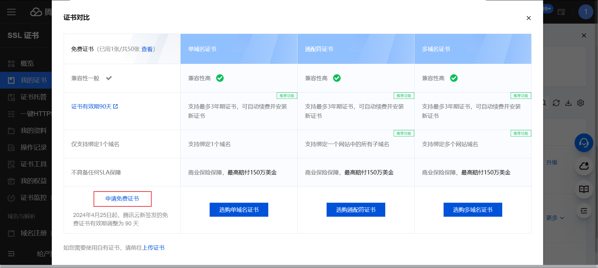
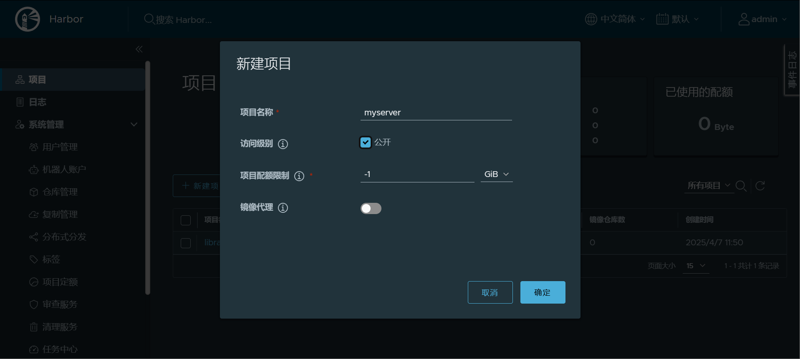
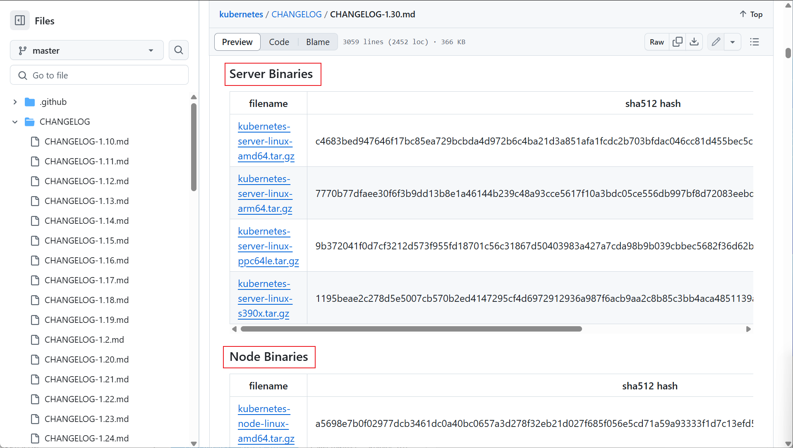

## Kubernetes集群部署


### Kubernetes 集群组件运行模式

#### **独立组件模式** 

- 各关键组件都以二进制方式部署于主机节点上，并以守护进程形式运行 
- 各附件Add-ons 则以Pod形式运行 
- 需要实现各种证书的申请颁发
-  部署过程繁琐复杂


#### **静态Pod模式**

- **kubelet和容器运行时docker以二进制部署，运行为守护进程**
- 除此之外所有组件为Pod 方式运行

- 控制平台各组件以静态Pod对象运行于Master主机之上
- 静态Pod由kubelet所控制实现创建管理,而无需依赖kube-apiserver等控制平台组件
- kube-proxy等则以Pod形式运行
- 相关pod早期是从仓库k8s.gcr.io下载镜像，新版改为仓库registry.k8s.io
- 使用kubernetes官方提供的kubeadm工具实现kubernetes集群方便快速的部署


### 基于Kubeadm和 Docker 部署 kubernetes 高可用集群


参考文档：

``````
https://kubernetes.io/docs/setup/production-environment/tools/kubeadm/ https://kubernetes.io/docs/setup/production-environment/tools/kubeadm/install-kubeadm/
https://kubernetes.io/zh-cn/docs/setup/production-environment/tools/kubeadm/create-cluster-kubeadm/
https://github.com/kubernetes/kubeadm/blob/master/docs/design/design_v1.10.md
``````


kubeadm是Kubernetes社区提供的集群构建工具

- 负责执行构建一个最小化可用集群并将其启动等必要的基本步骤
- Kubernetes集群全生命周期管理工具，可用于实现集群的部署、升级/降级及卸载等
- kubeadm仅关心如何初始化并拉起一个集群，其职责仅限于下图中背景蓝色的部分
- 蓝色的部分以外的其它组件还需要自行部署 


注意：在kubeadm方式安装时，Kubernetes 的所有组件中除kubelet 是以传统服务进程的方式运行，其它都以容器运行


#### 部署环境说明


| IP         | 主机名           | 角色                                      |
| ---------- | ---------------- | ----------------------------------------- |
| 10.0.0.101 | master1.wang.org | K8s 集群主节点 1，Master和etcd            |
| 10.0.0.102 | master2.wang.org | K8s 集群主节点 2，Master和etcd            |
| 10.0.0.103 | master3.wang.org | K8s 集群主节点 3，Master和etcd            |
| 10.0.0.104 | node1.wang.org   | K8s 集群工作节点 1                        |
| 10.0.0.105 | node2.wang.org   | K8s 集群工作节点 2                        |
| 10.0.0.106 | node3.wang.org   | K8s 集群工作节点 3                        |
| 10.0.0.107 | ha1.wang.org     | K8s 主节点访问入口 1,提供高可用及负载均衡 |
| 10.0.0.108 | ha2.wang.org     | K8s 主节点访问入口 2,提供高可用及负载均衡 |
| 10.0.0.109 | harbor.wang.org  | 容器镜像仓库                              |
| 10.0.0.100 | kubeapi.wang.org | VIP，在ha1和ha2主机实现                   |

注意： Master节点内存至少2G以上，否则在初始化时会出错


#### 网络地址规划

``````bash
物理主机网络        10.0.0.0/24 
集群pod网络        --pod-network-cidr=10.244.0.0/16
应用service网络    --service-cidr=10.96.0.0/12 
``````


#### 基于 kubeadm 和 Docker 实现Kuberenetes集群流程说明

- 每个节点主机的初始环境准备
- 准备代理服务,以便访问k8s.gcr.io，或根据部署过程提示的方法获取相应的I国内镜像的image（可选）
- Kubernetes集群API访问入口的高可用和harbor（可选）
- **在所有Master和Node节点都安装容器运行时 Docker**
- **在所有节点安装和配置 cri-dockerd(kubernetes-v1.24版本以后需要)**
- **在所有Master和Node节点都安装kubeadm 、kubelet、kubectl(集群管理工具,在node节点可 不安装)**
- **在第一个 master 节点运行 kubeadm init 初始化命令 ,并验证 master 节点状态**
- **在第一个 master 节点安装配置CNI规范的网络插件**
- 在其它master节点运行kubeadm join 命令加入到控制平面集群中实现高可用(测试环境可选)
- **在所有 node 节点使用 kubeadm join 命令加入集群 , 并验证 node 节点状态**
- 创建 pod 并启动容器测试访问 ，并测试网络通信


#### 初始环境准备

- 硬件准备环境: 每个主机至少2G以上内存,CPU2核以上
- 操作系统: 最小化安装支持Kubernetes的Linux系统
- 唯一的主机名，MAC地址以及product_uuid和主机名解析
- 保证各个节点网络配置正确,并且保证通信正常
- 禁用 swap 
- 禁用 SELinux
- 放行Kubernetes使用到的相关端口或禁用firewalld/iptables
- 配置正确的时区和时间同步
- 内核参数优化 
- 所有节点实现基于 ssh key 验证(可选)


**检查每台机器的product_uuid，project_uuid要具备唯一性**

``````bash
[root@ubuntu2204 ~]#cat /sys/class/dmi/id/product_uuid
e0c84d56-f33b-6754-eab2-d5e7cb846dc1
 
[root@rocky8 ~]#cat /sys/class/dmi/id/product_uuid
10324d56-9c12-c716-dfa1-196e5242b4d3
``````


**每天机器上设置hostname,并配置/etc/hosts**

``````bash
# cat >> /etc/hosts <<EOF
10.0.0.100 kubeapi kubeapi.wang.org 
10.0.0.101 master1 master1.wang.org
10.0.0.102 master2 master2.wang.org
10.0.0.103 master3 master3.wang.org
10.0.0.104 node1 node1.wang.org
10.0.0.105 node2 node2.wang.org
10.0.0.106 node3 node3.wang.org
10.0.0.107 ha1 ha1.wang.org
10.0.0.108 ha2 ha2.wang.org
10.0.0.109 harbor harbor.wang.org
EOF
``````


**使用ssh打通每台机器**

``````bash
ssh-keygen

ssh-copy-id 127.0.0.1

for i in {101..108}; do scp -r .ssh 10.0.0.$i:/root/; done
``````


**设置每台主机的主机名**

``````bash
for i in {1..3} ;do ssh 10.0.0.10$i hostnamectl set-hostname master$i;done
for i in {4..6} ;do ssh 10.0.0.10$i hostnamectl set-hostname node$(($i-3));done
ssh 10.0.0.107 hostnamectl set-hostname ha1
ssh 10.0.0.108 hostnamectl set-hostname ha2
``````


**实现主机时间同步**

``````bash
timedatectl set-timezone Asia/Shanghai

apt update
apt install  chrony -y

vim /etc/chrony/chrony.conf
 #加下面一行
pool ntp.aliyun.com        iburst maxsources 2
pool ntp.ubuntu.com        iburst maxsources 4
pool 0.ubuntu.pool.ntp.org iburst maxsources 1
pool 1.ubuntu.pool.ntp.org iburst maxsources 1
pool 2.ubuntu.pool.ntp.org iburst maxsources 2

systemctl enable chrony
systemctl restart chrony
``````


 **关闭SELinux**

``````bash
 ~# setenforce 0
 ~# sed -i 's#^\(SELINUX=\).*#\1disabled#' /etc/sysconfig/selinux
``````


**关闭防火墙**

``````bash
# Rocky
systemctl disable --now firewalld 

# Ubuntu
systemctl disable --now ufw
``````


 **禁用 Swap 设备**

``````bash
#方法1
~# swapoff -a
~# sed -i  '/swap/s/^/#/' /etc/fstab
~# for i in {101..106};do ssh 10.0.0.$i "sed -i  '/swap/s/^/#/' /etc/fstab"; ssh 10.0.0.$i swapoff -a ; done

#方法2
~# systemctl stop  swap.img.swap
~# systemctl mask swap.img.swap 或者 systemctl mask swap.target
 
#方法3
~# systemctl mask swap.img.swap 或者 systemctl mask swap.target
~# reboot

#确认是否禁用swap
~# systemctl -t swap 
~# swapon -s 

``````


**内核优化**  

根据硬件和业务需求,对内核参数做相应的优化 

注意:安装docker时会自动修改内核参数


#### 实现高可用的反向代理


**实现 keepalived**

在两台主机ha1和ha2 按下面步骤部署和配置 keepalived

``````bash
[root@ha1 ~]#apt update && apt -y install keepalived 

#keepalived配置
[root@ha1 ~]#cp  /usr/share/doc/keepalived/samples/keepalived.conf.vrrp /etc/keepalived/keepalived.conf

[root@ha1 ~]#vim /etc/keepalived/keepalived.conf

! Configuration File for keepalived
global_defs {
  notification_email {
    acassen
  }
  notification_email_from Alexandre.Cassen@firewall.loc
  smtp_server 192.168.200.1
  smtp_connect_timeout 30
  router_id ha1.wang.org  #指定router_id,#在ha2上为ha2.wang.org
}
vrrp_script check_haproxy {
   script "/etc/keepalived/check_haproxy.sh"
   interval 1
   weight -30
   fall 3
   rise 2
   timeout 2
}
vrrp_instance VI_1 {
   state MASTER              #在ha2上为BACKUP        
   interface eth0
   garp_master_delay 10
   smtp_alert
   virtual_router_id 66      #指定虚拟路由器ID,ha1和ha2此值必须相同
   priority 100              #在ha2上为80          
   advert_int 1
   authentication {
       auth_type PASS
       auth_pass 123456      #指定验证密码,ha1和ha2此值必须相同  
   }
   virtual_ipaddress {
       10.0.0.100/24 dev eth0  label eth0:1  #指定VIP,ha1和ha2此值必须相同
   }
   track_script {
       check_haproxy 
   }
}
 [root@ha1 ~]#cat /etc/keepalived/check_haproxy.sh
 #!/bin/bash
 /usr/bin/killall -0 haproxy  || systemctl restart haproxy
 [root@ha1 ~]#chmod +x /etc/keepalived/check_haproxy.sh
 [root@ha1 ~]#hostname -I
 10.0.0.107 
[root@ha1 ~]#systemctl start keepalived.service 
#验证keepalived服务是否正常
``````


**实现 Haproxy**

通过 Harproxy 实现 kubernetes Api-server的四层反向代理和负载均衡功能

``````bash
#在两台主机ha1和ha2都执行下面操作
[root@ha1 ~]#cat >> /etc/sysctl.conf <<EOF
net.ipv4.ip_nonlocal_bind = 1
EOF
root@ha1 ~]#sysctl -p 

#安装配置haproxy
[root@ha1 ~]#apt -y install haproxy
[root@ha1 ~]#vim /etc/haproxy/haproxy.cfg 
[root@ha1 ~]#cat /etc/haproxy/haproxy.cfg

global
	log /dev/log	local0
	log /dev/log	local1 notice
	chroot /var/lib/haproxy
	stats socket /run/haproxy/admin.sock mode 660 level admin expose-fd listeners
	stats timeout 30s
	user haproxy
	group haproxy
	daemon

	# Default SSL material locations
	ca-base /etc/ssl/certs
	crt-base /etc/ssl/private

	# See: https://ssl-config.mozilla.org/#server=haproxy&server-version=2.0.3&config=intermediate
        ssl-default-bind-ciphers ECDHE-ECDSA-AES128-GCM-SHA256:ECDHE-RSA-AES128-GCM-SHA256:ECDHE-ECDSA-AES256-GCM-SHA384:ECDHE-RSA-AES256-GCM-SHA384:ECDHE-ECDSA-CHACHA20-POLY1305:ECDHE-RSA-CHACHA20-POLY1305:DHE-RSA-AES128-GCM-SHA256:DHE-RSA-AES256-GCM-SHA384
        ssl-default-bind-ciphersuites TLS_AES_128_GCM_SHA256:TLS_AES_256_GCM_SHA384:TLS_CHACHA20_POLY1305_SHA256
        ssl-default-bind-options ssl-min-ver TLSv1.2 no-tls-tickets

defaults
	log	global
	mode	http
	option	httplog
	option	dontlognull
        timeout connect 5000
        timeout client  50000
        timeout server  50000
	errorfile 400 /etc/haproxy/errors/400.http
	errorfile 403 /etc/haproxy/errors/403.http
	errorfile 408 /etc/haproxy/errors/408.http
	errorfile 500 /etc/haproxy/errors/500.http
	errorfile 502 /etc/haproxy/errors/502.http
	errorfile 503 /etc/haproxy/errors/503.http
	errorfile 504 /etc/haproxy/errors/504.http

##########添加以下内容######################

listen stats
    mode http
    bind 0.0.0.0:8888
    stats enable
    log global
    stats uri /status
    stats auth admin:123456

listen  kubernetes-api-6443
    bind 10.0.0.100:6443
    mode tcp 
    server master1 10.0.0.101:6443 check inter 3s fall 3 rise 3 
    server master2 10.0.0.102:6443 check inter 3s fall 3 rise 3 
    server master3 10.0.0.103:6443 check inter 3s fall 3 rise 3 
``````


浏览器访问： http://ha2.wang.org:8888/status ，可以看到下面界面


#### 在master和worker上安装docker

``````bash
# master
wget https://www.mysticalrecluse.com/script/Shell/install_docker_offline.sh
bash install_docker_offline.sh
``````


####  所有主机安装 cri-dockerd(v1.24以后版本)

```````bash
wget https://mirror.ghproxy.com/https://github.com/Mirantis/cri-dockerd/releases/download/v0.3.14/cri-dockerd_0.3.14.3-0.ubuntu-jammy_amd64.deb

# 如果出现依赖问题，使用该命令修复
apt --fix-broken install -y

# 如果出现如下报错
[root@ubuntu2204 ~]#systemctl status cri-docker.service 
○ cri-docker.service - CRI Interface for Docker Application Container Engine
     Loaded: loaded (/lib/systemd/system/cri-docker.service; enabled; vendor preset: enabled)
     Active: inactive (dead)
TriggeredBy: × cri-docker.socket
       Docs: https://docs.mirantis.com

12月 15 16:23:19 master2 systemd[1]: Dependency failed for CRI Interface for Docker Application Container Engine.
12月 15 16:23:19 master2 systemd[1]: cri-docker.service: Job cri-docker.service/start failed with result 'dependency'.

# 解决方法：添加docker组
groupadd docker

# 重启cri-docker
systemctl restart cri-docker.service
systemctl status cri-docker.service
```````


#### 所有主机配置 cri-dockerd(v1.24以后版本

``````bash
# vim /lib/systemd/system/cri-docker.service
ExecStart=/usr/bin/cri-dockerd --container-runtime-endpoint fd:// --pod-infra-container-image registry.aliyuncs.com/google_containers/pause:3.9
``````


#### 所有 master 和 node 节点安装kubeadm等相关包

所有 master 和 node 节点都安装kubeadm, kubelet,kubectl 相关包

注意: node节点可以不安装管理工具 kubectl 包,但依赖关系会自动安装


``````bash
# cat install_k8s.sh
#!/bin/bash
apt update && apt-get install -y apt-transport-https
curl -fsSL https://mirrors.aliyun.com/kubernetes-new/core/stable/v1.30/deb/Release.key | gpg --dearmor -o /etc/apt/keyrings/kubernetes-apt-keyring.gpg
echo "deb [signed-by=/etc/apt/keyrings/kubernetes-apt-keyring.gpg] https://mirrors.aliyun.com/kubernetes-new/core/stable/v1.30/deb/ /" | tee /etc/apt/sources.list.d/kubernetes.list
apt-get update
apt-get install -y kubelet kubeadm kubectl
``````


#### 在第一个 master 节点运行 kubeadm init 初始化命令

``````
K8S_RELEASE_VERSION=1.30.2 && kubeadm init --control-plane-endpoint kubeapi.wang.org --kubernetes-version=v${K8S_RELEASE_VERSION} --pod-network-cidr 10.244.0.0/16 --service-cidr 10.96.0.0/12 --image-repository registry.aliyuncs.com/google_containers --token-ttl=0 --upload-certs --cri-socket=unix:///run/cri-dockerd.sock
``````


**完整命令**

``````bash
K8S_RELEASE_VERSION=1.30.2 && kubeadm init --control-plane-endpoint master1.mystical.org --kubernetes-version=v${K8S_RELEASE_VERSION} --pod-network-cidr 10.244.0.0/16 --service-cidr 10.96.0.0/12 --image-repository registry.aliyuncs.com/google_containers --token-ttl=0 --upload-certs --cri-socket=unix:///run/cri-dockerd.sock
``````


**逐个字段的详细解释**

1️⃣ `K8S_RELEASE_VERSION=1.30.2`

- **含义**：定义一个环境变量 `K8S_RELEASE_VERSION`，用于指定 Kubernetes 版本。

- **作用**：在 `kubeadm init` 命令中，通过 `${K8S_RELEASE_VERSION}` 引用这个变量，简化版本控制，便于更新 Kubernetes 版本。

- 示例：

  ```
  bashCopy codeK8S_RELEASE_VERSION=1.30.2
  echo $K8S_RELEASE_VERSION  # 输出 1.30.2
  ```


2️⃣ **`kubeadm init`**

- **含义**：`kubeadm init` 命令用于初始化 Kubernetes 控制平面（Master 节点）。
- **作用**：该命令在控制节点上运行，初始化 Kubernetes 集群，生成 token、证书和 Kubeconfig 文件，并生成 `kubeadm join` 命令，以便其他节点加入集群。


3️⃣ **`--control-plane-endpoint kubeapi.wang.org`**

- **含义**：设置 Kubernetes 控制平面的**高可用入口地址**。
- 作用：
  - 如果你有多个 master 控制平面节点，需要为这些控制平面提供一个**统一的访问入口**。
  - 这个控制平面入口（`kubeapi.wang.org`）通常是一个 **VIP (虚拟IP)**，或者是一个可以负载均衡到多个控制平面节点的 FQDN。
  - 这样，Kubernetes 集群内的 kubelet 只需连接这个域名，**不需要知道具体的控制平面节点的 IP**。
- 示例：
  - 如果你有 3 台控制平面节点，`10.0.0.1, 10.0.0.2, 10.0.0.3`，那么你可以设置一个 VIP 例如 `10.0.0.100` 并将域名 `kubeapi.wang.org` 解析为 `10.0.0.100`。
  - 通过 **Keepalived** 和 **HAProxy**，可以将请求从 `10.0.0.100` 转发到 3 台控制平面节点中的任意一个。


4️⃣ **`--kubernetes-version=v${K8S_RELEASE_VERSION}`**

- **含义**：指定要安装的 Kubernetes 版本。

- **作用**：强制 kubeadm 使用特定版本的 Kubernetes 组件。

- 示例：

  ```bash
  --kubernetes-version=v1.30.2
  ```


5️⃣ **`--pod-network-cidr 10.244.0.0/16`**

- **含义**：设置 Pod 网络的 CIDR 地址段。
- 作用：
  - 在 Kubernetes 集群中，每个 Pod 都需要有一个唯一的 IP 地址。
  - `--pod-network-cidr` 指定了**Pod IP 地址段**。
  - 该 IP 地址段被 CNI（如 Flannel、Calico、Weave）使用，通常不与服务器的本地 IP 地址冲突。
- 注意事项：
  - Flannel 通常使用 `10.244.0.0/16`。
  - Calico 默认使用 `192.168.0.0/16`。
- 示例：
  - `--pod-network-cidr=10.244.0.0/16` 表示 Pod IP 地址的范围是 `10.244.0.0 - 10.244.255.255`。


6️⃣ **`--service-cidr 10.96.0.0/12`**

- **含义**：指定 Service 的虚拟 IP 地址段。

- 作用：

  - 在 Kubernetes 中，Service 是一种集群内的**虚拟 IP**，这些 IP 不与物理主机 IP 冲突。
  - 这个 IP 段由 kube-proxy 和 iptables 维护。

- 注意事项：

  - Service IP 只能在**集群内部访问**。
  - 通常不与物理网络 IP 段冲突。
  - 一般是 `10.96.0.0/12`，表示 `10.96.0.0 - 10.111.255.255` 这个范围。

- 示例：

  ```bash
  --service-cidr=10.96.0.0/12
  ```


7️⃣ **`--image-repository registry.aliyuncs.com/google_containers`**

- **含义**：指定 Kubernetes 组件镜像的拉取地址。

- 作用：

  - 由于国内无法直接访问 **Google 容器镜像仓库 (gcr.io)**，所以用阿里云的镜像源。
  - `registry.aliyuncs.com/google_containers` 是国内常用的镜像源，包含所有 Kubernetes 相关的镜像。

- 示例：

  ```bash
  --image-repository registry.aliyuncs.com/google_containers
  ```


8️⃣ **`--token-ttl=0`**

- **含义**：设置 kubeadm join 命令中 Token 的有效时间。

- 作用：

  - 默认的 token 过期时间是 24 小时。
  - 通过 `--token-ttl=0`，表示生成的 token**永不过期**。
  - 适用于长时间部署节点，或者需要一段时间内多次加入新节点的场景。

- 示例：

  ```bash
  --token-ttl=0
  ```


9️⃣ **`--upload-certs`**

- **含义**：将证书上传到集群中的控制平面节点。

- 作用：

  - 在高可用集群中，控制平面节点之间需要共享证书。
  - kubeadm 会将证书加密存储在 **Kubernetes Secret** 中。
  - 通过这个参数，**允许其他控制平面节点下载这些证书**。

- 示例：

  ```
  --upload-certs
  ```


🔟 **`--cri-socket=unix:///run/cri-dockerd.sock`**

- **含义**：指定 Kubelet 连接的 CRI（容器运行时接口）。

- 作用：

  - Kubernetes 支持多个 CRI，如 **containerd**、**cri-o** 和 **Docker**。
  - cri-dockerd 是一个专门的 Docker CRI 插件。
  - 此选项告诉 Kubernetes：**将 Kubelet 连接到 /run/cri-dockerd.sock**。

- 注意：

  - 如果未指定此选项，Kubelet 将尝试自动检测 CRI。
  - cri-dockerd 是用于从 Docker 转换到 Containerd 的临时解决方案。

- 示例：

  ```bash
  --cri-socket=unix:///run/cri-dockerd.sock
  ```


**总结**

| 选项                       | 含义                 | 示例                           |
| -------------------------- | -------------------- | ------------------------------ |
| `--control-plane-endpoint` | 控制平面的高可用入口 | `kubeapi.feng.org`             |
| `--kubernetes-version`     | 指定 Kubernetes 版本 | `v1.30.2`                      |
| `--pod-network-cidr`       | 指定 Pod IP 地址段   | `10.244.0.0/16`                |
| `--service-cidr`           | Service IP 地址段    | `10.96.0.0/12`                 |
| `--image-repository`       | 容器镜像仓库         | `registry.aliyuncs.com`        |
| `--token-ttl`              | kubeadm token 有效期 | `0` 表示永不过期               |
| `--upload-certs`           | 上传控制平面证书     | **启用证书共享**               |
| `--cri-socket`             | 容器运行时接口 (CRI) | `unix:///run/cri-dockerd.sock` |


如果运行出现问题，需要重置，执行如下命令

``````
kubeadm reset -f
``````


#### 将其他的master和worker主机加入集群


执行上述初始化命令后，得到如下结果

``````bash
############ 这部分是授权kubectl命令 #######################################################
o start using your cluster, you need to run the following as a regular user:

  mkdir -p $HOME/.kube
  sudo cp -i /etc/kubernetes/admin.conf $HOME/.kube/config
  sudo chown $(id -u):$(id -g) $HOME/.kube/config

Alternatively, if you are the root user, you can run:

  export KUBECONFIG=/etc/kubernetes/admin.conf

You should now deploy a pod network to the cluster.
Run "kubectl apply -f [podnetwork].yaml" with one of the options listed at:
  https://kubernetes.io/docs/concepts/cluster-administration/addons/

You can now join any number of the control-plane node running the following command on each as root:

############## 这部分是master节点加入集群的命令###############################

  kubeadm join kubeapi.wang.org:6443 --token jizd9o.tjfoyvdoisbklfi5 \
	--discovery-token-ca-cert-hash sha256:c27e15a7a39394b6d64e419b60df835f9dedb7b015a92c1d9285effa1fbea600 \
	--control-plane --certificate-key 9fa84696a800c6b995a9249972c1dd76735701e5ea2ae05191c9f612a0d1252c --cri-socket=unix:///run/cri-dockerd.sock # 后面追加 --cri-socket=unix:///run/cri-dockerd.sock

Please note that the certificate-key gives access to cluster sensitive data, keep it secret!
As a safeguard, uploaded-certs will be deleted in two hours; If necessary, you can use
"kubeadm init phase upload-certs --upload-certs" to reload certs afterward.

Then you can join any number of worker nodes by running the following on each as root:

############## 这部分是worker节点加入集群的命令###############################

kubeadm join kubeapi.wang.org:6443 --token jizd9o.tjfoyvdoisbklfi5 \
	--discovery-token-ca-cert-hash sha256:c27e15a7a39394b6d64e419b60df835f9dedb7b015a92c1d9285effa1fbea600 --cri-socket=unix:///run/cri-dockerd.sock # 后面追加 --cri-socket=unix:///run/cri-dockerd.sock
``````


根据上述指令加master主机和其他worker主机加入集群


#### 安装网络插件flanny

``````bash
wget https://mirror.ghproxy.com/https://github.com/flannel-io/flannel/releases/latest/download/kube-flannel.yml

# 要确保docker可以拉取镜像，建议开代理
kubectl apply -f kube-flannel.yml
``````


#### 查看是否部署成功

``````bash
[root@ubuntu2204 ~]#kubectl get nodes
NAME      STATUS   ROLES           AGE   VERSION
master1   Ready    control-plane   97m   v1.30.8
master2   Ready    control-plane   94m   v1.30.8
master3   Ready    control-plane   93m   v1.30.8
node1     Ready    <none>          92m   v1.30.8
node2     Ready    <none>          92m   v1.30.8
node3     Ready    <none>          92m   v1.30.8

``````


#### 启用自动补全脚本


### 基于Kubeadm和Containerd部署Kubernetes

部署环境Ubuntu 22.04.X

```bash
root@k8s-master1
root@k8s-node1
root@k8s-node2
```


#### 安装运行时

```bash
# 所有节点都部署containerd，runc，cni，nerdctl（node节点选做）
[root@node1 ~]# bash k8s_containerd_runc_cni.sh

# 查看脚本
#!/bin/bash

PROXY_IP=11.0.1.1
PROXY_PORT=10809
DIR=/usr/local/src

ubuntu_install_containerd() {
	if [ -e k8s_contaierd-2.0.4-runc-1.2.6-buildkit-0.20.2-nerdctl-2.0.4-cni-1.6.2.tar ];then
		echo -e "\e[1;32m安装包已存在\e[0m"

        else
	        wget https://www.mysticalrecluse.com/script/tools/k8s_contaierd-2.0.4-runc-1.2.6-buildkit-0.20.2-nerdctl-2.0.4-cni-1.6.2.tar
	fi
	tar xf k8s_contaierd-2.0.4-runc-1.2.6-buildkit-0.20.2-nerdctl-2.0.4-cni-1.6.2.tar -C ${DIR}
	tar xf ${DIR}/containerd-2.0.4-linux-amd64.tar.gz -C /usr/local
	cat >/lib/systemd/system/containerd.service<<EOF
[Unit]
Description=containerd container runtime
Documentation=https://containerd.io
After=network.target local-fs.target dbus.service

[Service]
#uncomment to enable the experimental sbservice (sandboxed) version of containerd/cri integration
#Environment="ENABLE_CRI_SANDBOXES=sandboxed"
Environment="HTTP_PROXY=http://${PROXY_IP}:${PROXY_PORT}"
Environment="HTTPS_PROXY=http://${PROXY_IP}:${PROXY_PORT}"
ExecStartPre=-/sbin/modprobe overlay
ExecStart=/usr/local/bin/containerd

Type=notify
Delegate=yes
KillMode=process
Restart=always
RestartSec=5
# Having non-zero Limit*s causes performance problems due to accounting overhead
# in the kernel. We recommend using cgroups to do container-local accounting.
LimitNPROC=infinity
LimitCORE=infinity
LimitNOFILE=infinity
# Comment TasksMax if your systemd version does not supports it.
# Only systemd 226 and above support this version.
TasksMax=infinity
OOMScoreAdjust=-999

[Install]
WantedBy=multi-user.target
EOF
    mkdir /etc/containerd -p
	containerd config default > /etc/containerd/config.toml
    systemctl daemon-reload
	systemctl restart containerd.service
	systemctl enable containerd.service
	chmod a+x ${DIR}/runc.amd64
	mv ${DIR}/runc.amd64 /usr/local/bin/runc
	tar xf ${DIR}/nerdctl-2.0.4-linux-amd64.tar.gz  -C /usr/local/bin
	tar xf ${DIR}/buildkit-v0.20.2.linux-amd64.tar.gz -C /usr/local/bin
	mkdir /etc/nerdctl
	cat > /etc/nerdctl/nerdctl.toml <<EOF
namespace    = "k8s.io"
debug        = false
debug_full   = false
insecure_registry = true
address = "/run/containerd/containerd.sock"
EOF
        mkdir /opt/cni/bin -p
	tar xf ${DIR}/cni-plugins-linux-amd64-v1.6.2.tgz -C /opt/cni/bin/
	if echo $? &>/dev/null ;then
	        echo -e "\e[1;32m安装包已存在\e[0m"
	else
		echo -e "\e[1;31m部署失败\e[0m"
	fi
    
}

ubuntu_install_containerd
```


#### 部署 kubeadm、kubectl、kubelet

```bash
# Debian/Ubuntu
apt-get update && apt-get install -y apt-transport-https
curl -fsSL https://mirrors.aliyun.com/kubernetes-new/core/stable/v1.28/deb/Release.key |
    gpg --dearmor -o /etc/apt/keyrings/kubernetes-apt-keyring.gpg
echo "deb [signed-by=/etc/apt/keyrings/kubernetes-apt-keyring.gpg] https://mirrors.aliyun.com/kubernetes-new/core/stable/v1.32/deb/ /" |
    tee /etc/apt/sources.list.d/kubernetes.list
apt-get update
apt-get install -y kubelet kubeadm kubectl

# CentOS / RHEL / Fedora
cat <<EOF | tee /etc/yum.repos.d/kubernetes.repo
[kubernetes]
name=Kubernetes
baseurl=https://mirrors.aliyun.com/kubernetes-new/core/stable/v1.28/rpm/
enabled=1
gpgcheck=1
gpgkey=https://mirrors.aliyun.com/kubernetes-new/core/stable/v1.28/rpm/repodata/repomd.xml.key
EOF
setenforce 0
yum install -y kubelet kubeadm kubectl
systemctl enable kubelet && systemctl start kubelet
```


#### 配置代理

```bash
[root@master1 ~]# vim .bashrc
export http_proxy=http://11.0.1.1:10809
export https_proxy=http://11.0.1.1:10809
export no_proxy="localhost,127.0.0.1,::1,10.0.0.0/8,10.96.0.0/12,10.244.0.0/16,11.0.1.101,11.0.1.102,11.0.1.103,master1.mystical.org,node1.mystical.org,node2.mystical.org,192.168.0.0/16"

[root@master1 ~]# . .bashrc
```


#### 下载 Kubernetes 镜像

提前下载镜像的好处：防止初始化的时候由于镜像下载超时而报错

```bash
# 查看需要的镜像
[root@master1 ~]# kubeadm config images list --kubernetes-version v1.32.0
registry.k8s.io/kube-apiserver:v1.32.0
registry.k8s.io/kube-controller-manager:v1.32.0
registry.k8s.io/kube-scheduler:v1.32.0
registry.k8s.io/kube-proxy:v1.32.0
registry.k8s.io/pause:3.9
registry.k8s.io/etcd:3.5.15-0
registry.k8s.io/coredns/coredns:v1.10.1

# 下载
[root@master1 ~]# cat images-down.sh 
#!/bin/bash
#nerdctl pull registry.k8s.io/kube-apiserver:v1.32.0
#nerdctl pull registry.k8s.io/kube-controller-manager:v1.32.0
#nerdctl pull registry.k8s.io/kube-scheduler:v1.32.0
#nerdctl pull registry.k8s.io/kube-proxy:v1.32.0
#nerdctl pull registry.k8s.io/pause:3.9
#nerdctl pull registry.k8s.io/etcd:3.5.15-0
#nerdctl pull registry.k8s.io/coredns/coredns:v1.10.1

nerdctl pull registry.cn-hangzhou.aliyuncs.com/google_containers/kube-apiserver:v1.32.0
nerdctl pull registry.cn-hangzhou.aliyuncs.com/google_containers/kube-controller-manager:v1.32.0
nerdctl pull registry.cn-hangzhou.aliyuncs.com/google_containers/kube-scheduler:v1.32.0
nerdctl pull registry.cn-hangzhou.aliyuncs.com/google_containers/kube-proxy:v1.32.0
nerdctl pull registry.cn-hangzhou.aliyuncs.com/google_containers/pause:3.9
nerdctl pull registry.cn-hangzhou.aliyuncs.com/google_containers/etcd:3.5.15-0
nerdctl pull registry.cn-hangzhou.aliyuncs.com/google_containers/coredns:v1.10.1
```


#### 内核参数优化

```bash
[root@master1 ~]# vim /etc/sysctl.conf
net.ipv4.ip_forward=1                     # 数据包跨网卡传输，必须打开
vm.max_map_count=262144
kernel.pid.max=4194303
fs.file-max=100000
net.ipv4.tcp_max_tw_buckets=6000
net.netfilter.nf_conntrack_max=2097152

net.bridge.bridge-nf-call-ip6tables=1
net.bridge.bridge-nf-call-iptables=1      # 内核支持对网桥上的报文的检查，必须打开
vm.swappiness=0

[root@node1 ~]# sysctl --load

# 内核模块开机挂载
[root@master1 ~]# vim /etc/modules-load.d/modules.conf 
ip_vs
ip_vs_ls
ip_vs_lblc
ip_vs_lblcr
ip_vs_rr
ip_vs_wrr
ip_vs_sh
ip_vs_dh
ip_vs_fo
ip_vs_nq
ip_vs_sed
ip_vs_ftp
ip_vs_sh
ip_tables
ip_set
ipt_set
ipt_rpfilter
ipt_REJECT
ipip
xt_set
br_netfilter
nf_conntrack
overlay

# 验证内核模块与内存参数
[root@master1 ~]# lsmod|grep br_netfilter

# 优化内核能打开的最大文件数（生产中一定要做）
[root@master1 ~]# vim /etc/security/limits.conf
root     soft   core  unlimited
root     hard   core  unlimited
root     soft   nproc  1000000
root     hard   nproc  1000000
root     soft   nofile 1000000
root     hard   nofile 1000000
root     soft   memlock 32000
root     hard   memlock 32000
root     soft   msgqueue 819200
root     hard   msgqueue 819200

# 修改后重启
[root@master1 ~]# reboot
```


#### Kubernetes 集群初始化

```bash
# 这里的版本一定要和上面的kubeadm匹配，否则容易报错
k8s_release_version=1.32.0 && kubeadm init --control-plane-endpoint master1.mystical.org --kubernetes-version=v${k8s_release_version} --pod-network-cidr 192.168.0.0/16 --service-cidr 10.96.0.0/12 --token-ttl=0 --upload-certs

# 初始化
  mkdir -p $HOME/.kube
  sudo cp -i /etc/kubernetes/admin.conf $HOME/.kube/config
  sudo chown $(id -u):$(id -g) $HOME/.kube/config
```


#### Kubernetes - 基于init文件初始化 - 推荐

```bash
# kubeadm config print init-defaults # 输出默认初始化配置
# kubeadm config print init-defaults > kubeadm-init.yaml  # 将默认配置输出至文件
# cat kubeadm-init.yaml  # 修改后的初始化文件内容
[root@master1 ~]# cat kubeadm-init.yaml 
apiVersion: kubeadm.k8s.io/v1beta4
bootstrapTokens:
- groups:
  - system:bootstrappers:kubeadm:default-node-token
  token: abcdef.0123456789abcdef
  ttl: 24h0m0s
  usages:
  - signing
  - authentication
kind: InitConfiguration
localAPIEndpoint:
  advertiseAddress: 11.0.1.101   # 这里改为某个master上的IP地址，一般为当前master的IP地址
  bindPort: 6443
nodeRegistration:
  criSocket: unix:///var/run/containerd/containerd.sock  # 这里默认1.24开始使用containerd,这里是containerd的                                                                 socket文件
  imagePullPolicy: IfNotPresent
  imagePullSerial: true
  name: node
  taints: null
timeouts:
  controlPlaneComponentHealthCheck: 4m0s
  discovery: 5m0s
  etcdAPICall: 2m0s
  kubeletHealthCheck: 4m0s
  kubernetesAPICall: 1m0s
  tlsBootstrap: 5m0s
  upgradeManifests: 5m0s
---
apiServer: 
  timeoutForControlPlane: 4m0s       # 这里添加初始化的超时时间
apiVersion: kubeadm.k8s.io/v1beta4
caCertificateValidityPeriod: 87600h0m0s
certificateValidityPeriod: 8760h0m0s
certificatesDir: /etc/kubernetes/pki
clusterName: kubernetes
controlPlaneEndpoint: IP:6443        # 自行添加这行，这行是一般是负载均衡器的VIP监听的端口地址
                                     # 如果没有使用负载均衡器，这里可以删掉
controllerManager: {}
dns: {}
encryptionAlgorithm: RSA-2048
etcd:
  local:
    dataDir: /var/lib/etcd
imageRepository: registry.k8s.io      # 镜像仓库，可以换成国内仓库，比如：
                                      # registry.cn-hangzhou.aliyuncs.com/google_containers
kind: ClusterConfiguration
kubernetesVersion: 1.32.0             # 这里可以换成你想装的k8s版本
networking:
  dnsDomain: cluster.local
  podSubnet: 10.200.0.0/16            # 自行在这里添加pod网络网段，和CNI网络插件的网段地址一致
  serviceSubnet: 10.96.0.0/12
proxy: {}
scheduler: {}

--- # 指定kubelet使用systemd
kind: KubeletConfiguration
apiVersion: kubelet.config.k8s.io/v1beta1
cgroupDriver: systemd            # 这里要和containerd的cgroup驱动一致
                                 # 尤其是ubuntu22.04之后，cgroup使用v2，这里就必须强行指定为systemd

--- # 指定Kubeproxy使用ipvs
apiVersion: kubeproxy.config.k8s.io/v1alpha1
kind: KubeProxyConfiguration
mode: ipvs

# 使用初始化文件进行初始化
[root@master1 ~]# kubeadm init --config kubeadm-init.yaml   # 基于文件执行k8s master初始化
```


##### 补充：kubelet 与容器运行时的 cgroup driver 要一致

**背景：资源限制依赖的 cgroup 驱动**

- 容器运行时如 `Docker`、`containerd` 都使用 Linux 的 **cgroup** 实现资源限制（如 CPU、内存）。
- `cgroup` 本身有两个版本：**cgroup v1** 和 **cgroup v2**。
- 对于如何**管理这些 cgroup 的分层结构**，存在两种主流驱动方式：
  - **`cgroupfs`**（早期 Docker 默认）
  - **`systemd`**（Kubernetes 推荐）


**kubelet 与容器运行时的 cgroup driver 要一致**

 kubelet 和容器运行时（无论是 docker 还是 containerd）**必须使用同一种 cgroup 驱动**，否则 pod 会因为资源无法限制或识别而调度失败。


**查看 containerd 的 cgroup 驱动**

**查看 containerd 配置文件**

打开配置文件 `/etc/containerd/config.toml`，找到这一段：

```toml
[plugins."io.containerd.grpc.v1.cri".containerd.runtimes.runc.options]
  SystemdCgroup = true
```

- `SystemdCgroup = true` 表示使用 `systemd` 驱动
- `SystemdCgroup = true` 或不存在该字段，则表示使用 `cgroupfs`


如果没有该配置文件，可自行创建修改

```bash
containerd config default > /etc/containerd/config.toml
```

然后编辑 `config.toml`，手动加上 `SystemdCgroup = true`：

```toml
[plugins."io.containerd.grpc.v1.cri".containerd.runtimes.runc.options]
  SystemdCgroup = true
```

⚠️ 修改后请务必重启 containerd：

```bash
systemctl restart containerd
```


**同时别忘了确保 kubelet 的配置一致：**

```yaml
# /var/lib/kubelet/config.yaml
cgroupDriver: systemd
```

也需要重启 kubelet：

```bash
systemctl restart kubelet
```


#### 将node节点加入集群

````bash
kubeadm join master1.mystical.org:6443 --token 75y4xk.fceeqawwqvujq7la \
	--discovery-token-ca-cert-hash sha256:441a979658ef2c8605752dbf7f87d15423963a25ec0099d09aea864e7821c88e
````


#### 部署网络插件Calico

```bash
curl https://raw.githubusercontent.com/projectcalico/calico/v3.28.1/manifests/calico.yaml -o

# 编辑修改calico.yaml
# 选用的pod cidr及子网掩码长度  
- name: calico_ipv4pool_cidr
  vlaue: "192.168.0.0/16"
  name: calico_ipv4pool_block_size
  values: "24"

# 选用的路由模式：always, never, cross-subnet
env:
- name: IP_AUTODETECTION_METHOD   # 指定基于eth0的网卡IP建立BGP连接，默认为服务器第一块
  value: "interface=eth0"
- name: calico_ipv4pool_ipip
  value: "always"
- name: calico_ipv4pool_vxlan
  value: "never"
- name: calico_ipv6pool_vxlan
  value: "never"
```

- 执行calico的yaml

```shell
kubectl apply -f calico.yaml

# calico需要将.kube/config文件拷贝到所有节点，因为calico需要做认证
scp .kube/config node1:
scp .kube/config node2:

# 下载calicoctl
curl -l https://github.com/projectcalico/calico/releases/download/v3.28.1/calicoctl-linux-amd64 -o calicoctl

# 授权并加入path变量
chmod +x ./calicoctl
mv calicoctl /usr/local/bin

# 使用calicoctl查看node状态
[root@master1 ~]#calicoctl get node -o wide
name               asn       ipv4            ipv6   
master1.feng.org   (64512)   10.0.0.121/24          
worker1.feng.org   (64512)   10.0.0.122/24          
worker2.feng.org   (64512)   10.0.0.123/24          
worker3.feng.org   (64512)   10.0.0.124/24 
```


### 二进制部署高可用k8s集群部署

- 多master、实现master高可用和高性能，master最少三个，分布在不同可用区
- 单独的etcd分布式集群，高可用持久化Kubernetes资源对象数据，并实现高可用
  - etcd应该使用高性能硬盘，比如SSD
  - 也可以使用4块10000-15000转的SAS盘做raid10，在组raid的时候，建议同厂商，同规格，至少要保证同规格
  - etcd最少三个，分布在不同可用区
- 多node节点运行业务pod，node节点可以是不同硬件规格，如CPU节点、Memory节点，GPU节点，Bigdata节点等
- 各node节点通过负载均衡器与Master相连，由负载均衡器实现对master的轮询调用及状态监测及路障转移，以在master出现宕机的时候依然可以保持node与master的通信
  - 同时实现node节点与master节点之间的解耦
  - 负载均衡器会负责对master即后端服务器进行周期性健康性监测
- 各节点可弹性伸缩

| 类型        | 服务器IP   | 主机名               | VIP        |
| ----------- | ---------- | -------------------- | ---------- |
| K8S Master1 | 10.0.0.201 | master1.mystical.org | 10.0.0.200 |
| K8S Master2 | 10.0.0.202 | master2.mystical.org | rooroot    |
| K8S Master3 | 10.0.0.203 | master3.mystical.org |            |
| Harbor1     | 10.0.0.204 | harbor1.mystical.org |            |
| Harbor2     | 10.0.0.205 | harbor2.mystical.org |            |
| etcd节点1   | 10.0.0.206 | etcd1.mystical.org   |            |
| etcd节点2   | 10.0.0.207 | etcd2.mystical.org   |            |
| etcd节点3   | 10.0.0.208 | etcd3.mystical.org   |            |
| Haproxy1    | 10.0.0.209 | ha1.mystical.org     |            |
| Haproxy2    | 10.0.0.210 | ha2.mystical.org     |            |
| Node节点1   | 10.0.0.211 | node1.mystical.org   |            |
| Node节点2   | 10.0.0.212 | node2.mystical.org   |            |
| Node节点3   | 100.0.213  | node3.mystical.org   |            |

- k8s集群节点的主机名一定不能一样，否则后期kube-proxy会出现异常

- machine-id也不能一样，如果一样需要重新生成不一样的id

  ```bash
  rm -rf /etc/machine-id && dbus-uuidgen --ensure=/etc/machine-id && cat /etc/macheine-id
  ```

- 在k8s集群这一层，machine-id一样是没问题的，那是有些服务会出问题，所以建议所以节点的machine-id修改为不一样的

- 向etcd,zookeeper这种服务，并不是机器越多，性能越强，因为会有**写放大**现象，如果集群数量越多，一主多备的情况下，向主数据库写入数据，它会向其他所有备用数据库进行复制，所以备用数据库越多，会导致写IO过多，性能变差


#### Linux Kernel 升级（选做）

k8s,docker,cilium等很多功能、**特性需要较新的linux内核支持，所以有必要在集群部署前对内核进行升级**；CentOS7 和 Ubuntu16.04可以很方便的完成内核升级。

##### CentOS7

红帽企业版 Linux 仓库网站 [https://www.elrepo.org，主要提供各种硬件驱动（显卡、网卡、声卡等）和内核升级相关资源；兼容](https://www.elrepo.xn--org,();-2o3fa1948e1xbtycqzkwdwf25rn5cinbb925a0zdt91bfjp0v1chhnvsmjj7bb70codjwwk02l531a36exp2iil2ag45h/) CentOS7 内核升级。如下按照网站提示载入elrepo公钥及最新elrepo版本，然后按步骤升级内核（以安装长期支持版本 kernel-lt 为例）

```bash
# 载入公钥
rpm --import https://www.elrepo.org/RPM-GPG-KEY-elrepo.org
# 安装ELRepo
rpm -Uvh http://www.elrepo.org/elrepo-release-7.0-3.el7.elrepo.noarch.rpm
# 载入elrepo-kernel元数据
yum --disablerepo=\* --enablerepo=elrepo-kernel repolist
# 查看可用的rpm包
yum --disablerepo=\* --enablerepo=elrepo-kernel list kernel*
# 安装长期支持版本的kernel
yum --disablerepo=\* --enablerepo=elrepo-kernel install -y kernel-lt.x86_64
# 删除旧版本工具包
yum remove kernel-tools-libs.x86_64 kernel-tools.x86_64 -y
# 安装新版本工具包
yum --disablerepo=\* --enablerepo=elrepo-kernel install -y kernel-lt-tools.x86_64

#查看默认启动顺序
awk -F\' '$1=="menuentry " {print $2}' /etc/grub2.cfg  
CentOS Linux (4.4.183-1.el7.elrepo.x86_64) 7 (Core)  
CentOS Linux (3.10.0-327.10.1.el7.x86_64) 7 (Core)  
CentOS Linux (0-rescue-c52097a1078c403da03b8eddeac5080b) 7 (Core)
#默认启动的顺序是从0开始，新内核是从头插入（目前位置在0，而4.4.4的是在1），所以需要选择0。
grub2-set-default 0  
#重启并检查
reboot
```


##### Ubuntu16.04

```bash
打开 http://kernel.ubuntu.com/~kernel-ppa/mainline/ 并选择列表中选择你需要的版本（以4.16.3为例）。
接下来，根据你的系统架构下载 如下.deb 文件：
Build for amd64 succeeded (see BUILD.LOG.amd64):
  linux-headers-4.16.3-041603_4.16.3-041603.201804190730_all.deb
  linux-headers-4.16.3-041603-generic_4.16.3-041603.201804190730_amd64.deb
  linux-image-4.16.3-041603-generic_4.16.3-041603.201804190730_amd64.deb
#安装后重启即可
$ sudo dpkg -i *.deb
```


#### 部署 keepalived 和 haproxy

##### 实现 keepalived

```bash
# haproxy1.mystical.org 和 haproxy2.mystical.org 这两个服务器上部署
[root@haproxy1 ~]#apt install -y keepalived haproxy

# 使用keepalived配置vip
[root@haproxy1 ~]#cp  /usr/share/doc/keepalived/samples/keepalived.conf.vrrp /etc/keepalived/keepalived.conf

[root@haproxy1 ~]#vim /etc/keepalived/keepalived.conf

! Configuration File for keepalived
global_defs {
  notification_email {
    acassen
  }
  notification_email_from Alexandre.Cassen@firewall.loc
  smtp_server 192.168.200.1
  smtp_connect_timeout 30
  router_id ha1.wang.org  #指定router_id,#在ha2上为ha2.wang.org
}
vrrp_script check_haproxy {
   script "/etc/keepalived/check_haproxy.sh"
   interval 1
   weight -30
   fall 3
   rise 2
   timeout 2
}
vrrp_instance VI_1 {
   state MASTER              #在ha2上为BACKUP        
   interface eth0
   garp_master_delay 10
   smtp_alert
   virtual_router_id 66      #指定虚拟路由器ID,ha1和ha2此值必须相同
   priority 100              #在ha2上为80          
   advert_int 1
   authentication {
       auth_type PASS
       auth_pass 123456      #指定验证密码,ha1和ha2此值必须相同  
   }
   virtual_ipaddress {
        10.0.0.88/24 dev eth0 label eth0:0   # 这里是k8s-master的vip
        10.0.0.89/24 dev eth0 label eth0:1   # 后续服务的vip，用于测试k8s中的vip能否访问
        10.0.0.90/24 dev eth0 label eth0:2   # 后续服务的vip，用于测试k8s中的vip能否访问
        10.0.0.91/24 dev eth0 label eth0:3   # 后续服务的vip，用于测试k8s中的vip能否访问

   }
   track_script {
       check_haproxy 
   }
}
 [root@ha1 ~]#cat /etc/keepalived/check_haproxy.sh
 #!/bin/bash
 /usr/bin/killall -0 haproxy  || systemctl restart haproxy
 [root@ha1 ~]#chmod +x /etc/keepalived/check_haproxy.sh
 [root@ha1 ~]#hostname -I
 10.0.0.107 
[root@ha1 ~]#systemctl start keepalived.service 
#验证keepalived服务是否正常

# 启用开机自启
[root@haproxy1 ~]# systemctl enable keepalived
Synchronizing state of keepalived.service with SysV service script with /lib/systemd/systemd-sysv-install.
Executing: /lib/systemd/systemd-sysv-install enable keepalived
```


**实现 Haproxy**

通过 Harproxy 实现 kubernetes Api-server的四层反向代理和负载均衡功能

``````bash
#在两台主机ha1和ha2都执行下面操作
# 下面的内核参数必须修改，因为haproxy默认不能监听本机没有的ip，加上开启下面的内核参数，才能允许
[root@ha1 ~]#cat >> /etc/sysctl.conf <<EOF
net.ipv4.ip_nonlocal_bind = 1
EOF
root@ha1 ~]#sysctl -p 

#安装配置haproxy
[root@ha1 ~]#apt -y install haproxy
[root@ha1 ~]#vim /etc/haproxy/haproxy.cfg 
[root@ha1 ~]#cat /etc/haproxy/haproxy.cfg

global
	log /dev/log	local0
	log /dev/log	local1 notice
	chroot /var/lib/haproxy
	stats socket /run/haproxy/admin.sock mode 660 level admin expose-fd listeners
	stats timeout 30s
	user haproxy
	group haproxy
	daemon

	# Default SSL material locations
	ca-base /etc/ssl/certs
	crt-base /etc/ssl/private

	# See: https://ssl-config.mozilla.org/#server=haproxy&server-version=2.0.3&config=intermediate
        ssl-default-bind-ciphers ECDHE-ECDSA-AES128-GCM-SHA256:ECDHE-RSA-AES128-GCM-SHA256:ECDHE-ECDSA-AES256-GCM-SHA384:ECDHE-RSA-AES256-GCM-SHA384:ECDHE-ECDSA-CHACHA20-POLY1305:ECDHE-RSA-CHACHA20-POLY1305:DHE-RSA-AES128-GCM-SHA256:DHE-RSA-AES256-GCM-SHA384
        ssl-default-bind-ciphersuites TLS_AES_128_GCM_SHA256:TLS_AES_256_GCM_SHA384:TLS_CHACHA20_POLY1305_SHA256
        ssl-default-bind-options ssl-min-ver TLSv1.2 no-tls-tickets

defaults
	log	global
	mode	http
	option	httplog
	option	dontlognull
        timeout connect 5000
        timeout client  50000
        timeout server  50000
	errorfile 400 /etc/haproxy/errors/400.http
	errorfile 403 /etc/haproxy/errors/403.http
	errorfile 408 /etc/haproxy/errors/408.http
	errorfile 500 /etc/haproxy/errors/500.http
	errorfile 502 /etc/haproxy/errors/502.http
	errorfile 503 /etc/haproxy/errors/503.http
	errorfile 504 /etc/haproxy/errors/504.http

##########添加以下内容######################

listen stats
    mode http
    bind 0.0.0.0:8888
    stats enable
    log global
    stats uri /status
    stats auth admin:123456

listen  kubernetes-api-6443
    bind 10.0.0.88:6443
    mode tcp 
    server master1 10.0.0.201:6443 check inter 3s fall 3 rise 3 
    server master2 10.0.0.202:6443 check inter 3s fall 3 rise 3 
    server master3 10.0.0.203:6443 check inter 3s fall 3 rise 3 
``````


浏览器访问： http://ha2.wang.org:8888/status ，可以看到下面界面


#### 部署harbor

##### 申请证书（生产环境中不建议使用自签证书）

要使用https的harbor，建议使用商业版的证书，而不是自签证书

在阿里云或腾讯云买个域名，有免费证书额度，可以使用免费证书





##### **添加一块数据盘，用来放harbor的镜像**

```bash
# 查看新加磁盘是否识别
[root@harbor1 ~]#fdisk -l
Disk /dev/sda：200 GiB，214748364800 字节，419430400 个扇区
Disk model: VMware Virtual S
单元：扇区 / 1 * 512 = 512 字节
扇区大小(逻辑/物理)：512 字节 / 512 字节
I/O 大小(最小/最佳)：512 字节 / 512 字节
磁盘标签类型：gpt
磁盘标识符：CD107A96-8A31-4B05-B62C-EA05609760ED

设备          起点      末尾      扇区  大小 类型
/dev/sda1     2048      4095      2048    1M BIOS 启动
/dev/sda2     4096   4198399   4194304    2G Linux 文件系统
/dev/sda3  4198400 419428351 415229952  198G Linux 文件系统


Disk /dev/sdb：500 GiB，536870912000 字节，1048576000 个扇区       # 已识别
Disk model: VMware Virtual S
单元：扇区 / 1 * 512 = 512 字节
扇区大小(逻辑/物理)：512 字节 / 512 字节
I/O 大小(最小/最佳)：512 字节 / 512 字节


Disk /dev/mapper/ubuntu--vg-ubuntu--lv：99 GiB，106296246272 字节，207609856 个扇区
单元：扇区 / 1 * 512 = 512 字节
扇区大小(逻辑/物理)：512 字节 / 512 字节
I/O 大小(最小/最佳)：512 字节 / 512 字节

# 格式化磁盘
[root@harbor1 ~]#mkfs.xfs /dev/sdb
meta-data=/dev/sdb               isize=512    agcount=4, agsize=32768000 blks
         =                       sectsz=512   attr=2, projid32bit=1
         =                       crc=1        finobt=1, sparse=1, rmapbt=0
         =                       reflink=1    bigtime=0 inobtcount=0
data     =                       bsize=4096   blocks=131072000, imaxpct=25
         =                       sunit=0      swidth=0 blks
naming   =version 2              bsize=4096   ascii-ci=0, ftype=1
log      =internal log           bsize=4096   blocks=64000, version=2
         =                       sectsz=512   sunit=0 blks, lazy-count=1
realtime =无                    extsz=4096   blocks=0, rtextents=0

# 编辑下/etc/fstab
[root@harbor1 ~]#vim /etc/fstab 
/dev/sdb /data  xfs defaults 0 0    # 添加这行

[root@harbor1 ~]#mkdir /data
[root@harbor1 ~]#mount -a

# 检查是否成功挂载
[root@harbor1 ~]#df -TH
文件系统                          类型   大小  已用  可用 已用% 挂载点
tmpfs                             tmpfs  407M  1.6M  405M    1% /run
/dev/mapper/ubuntu--vg-ubuntu--lv ext4   105G  9.0G   90G   10% /
tmpfs                             tmpfs  2.1G     0  2.1G    0% /dev/shm
tmpfs                             tmpfs  5.3M     0  5.3M    0% /run/lock
/dev/sda2                         ext4   2.1G  247M  1.7G   13% /boot
tmpfs                             tmpfs  407M     0  407M    0% /run/user/0
/dev/sdb                          xfs    537G  3.8G  533G    1% /data             # 挂载成功
```


##### 部署harbor

harbor下载网址

```http
https://github.com/goharbor/harbor/releases   # 注意下载正式版，不要下载rc版本
```

```bash
# 下载harbor
[root@harbor1 ~]#wget https://github.com/goharbor/harbor/releases/download/v2.12.2/harbor-offline-installer-v2.12.2.tgz

# 部署docker
[root@harbor1 harbor]#wget https://www.mysticalrecluse.com/script/Shell/install_docker_offline.sh
[root@harbor1 harbor]#bash install_docker_offline.sh
[root@harbor1 harbor]#source /etc/bash_completion.d/docker_completion

# 部署docker-compose
[root@harbor1 harbor]# cat ~/docker-compose-repo.sh
# Add Docker's official GPG key:
apt-get update
apt-get install ca-certificates curl
install -m 0755 -d /etc/apt/keyrings
curl -fsSL https://download.docker.com/linux/ubuntu/gpg -o /etc/apt/keyrings/docker.asc
chmod a+r /etc/apt/keyrings/docker.asc

echo "GPG OVER"

# Add the repository to Apt sources:
echo \
  "deb [arch=$(dpkg --print-architecture) signed-by=/etc/apt/keyrings/docker.asc] https://download.docker.com/linux/ubuntu \
  $(. /etc/os-release && echo "${UBUNTU_CODENAME:-$VERSION_CODENAME}") stable" | \
  sudo tee /etc/apt/sources.list.d/docker.list > /dev/null
sudo apt-get update

[root@harbor1 harbor]# bash ~/docker-compose-repo.sh

# 官方仓库配置好后，执行下面的指令
[root@ubuntu2204 ~]#apt install -y docker-compose-plugin

# 创建放置harbor的目录
[root@ubuntu2204 ~]#mkdir /apps
[root@ubuntu2204 ~]#tar xvf harbor-offline-installer-v2.12.2.tgz -C /apps/
harbor/harbor.v2.12.2.tar.gz
harbor/prepare
harbor/LICENSE
harbor/install.sh
harbor/common.sh
harbor/harbor.yml.tmpl

[root@ubuntu2204 harbor]# cd /apps/harbor

# 创建证书目录
[root@harbor1 harbor]#mkdir certs

# 将下载nginx格式的证书传入该目录
[root@harbor1 certs]# ls
harbor.mysticalrecluse.com_nginx.zip

# 解压
[root@harbor1 certs]#unzip harbor.mysticalrecluse.com_nginx.zip 
Archive:  harbor.mysticalrecluse.com_nginx.zip
   creating: harbor.mysticalrecluse.com_nginx/
  inflating: harbor.mysticalrecluse.com_nginx/harbor.mysticalrecluse.com.csr  
  inflating: harbor.mysticalrecluse.com_nginx/harbor.mysticalrecluse.com_bundle.crt  
  inflating: harbor.mysticalrecluse.com_nginx/harbor.mysticalrecluse.com_bundle.pem  
  inflating: harbor.mysticalrecluse.com_nginx/harbor.mysticalrecluse.com.key
[root@harbor1 certs]# cd harbor.mysticalrecluse.com_nginx/
[root@harbor1 harbor.mysticalrecluse.com_nginx]# ls
harbor.mysticalrecluse.com_bundle.crt  harbor.mysticalrecluse.com.csr
harbor.mysticalrecluse.com_bundle.pem  harbor.mysticalrecluse.com.key


[root@ubuntu2204 harbor]#cp harbor.yml.tmpl harbor.yml
[root@ubuntu2204 harbor]#vim harbor.yml
# 这里的域名一定和证书的域名一致
hostname: harbor.mysticalrecluse.com

# http related config
http:
  # port for http, default is 80. If https enabled, this port will redirect to https port
  port: 80

# https related config
https:
  # https port for harbor, default is 443
  port: 443
  # The path of cert and key files for nginx  
  certificate: /apps/harbor/certs/harbor.mysticalrecluse.com_nginx/harbor.mysticalrecluse.com_bundle.pem
  private_key: /apps/harbor/certs/harbor.mysticalrecluse.com_nginx/harbor.mysticalrecluse.com.key
......
# 更改harbor的密码
harbor_admin_password: 646130

......
# 这里可以更改harbor的数据存放路径，建议这里挂一个数据盘来保存harbor的镜像，将数据和系统分开，系统挂了不影响数据
data_volume: /data

# 启用镜像漏洞扫描
trivy:
  enabled: true

# 启用部署harbor
[root@harbor1 harbor]#./install.sh 
......
[Step 5]: starting Harbor ...
[+] Running 10/10
 ✔ Network harbor_harbor        Created                                               0.2s 
 ✔ Container harbor-log         Started                                               1.4s 
 ✔ Container redis              Started                                               4.5s 
 ✔ Container registryctl        Started                                               5.2s 
 ✔ Container harbor-db          Started                                               5.2s 
 ✔ Container harbor-portal      Started                                               4.8s 
 ✔ Container registry           Started                                               4.5s 
 ✔ Container harbor-core        Started                                               6.3s 
 ✔ Container harbor-jobservice  Started                                               7.9s 
 ✔ Container nginx              Started                                               8.6s 
✔ ----Harbor has been installed and started successfully.----

# 部署成功后，浏览器访问测试
https://harbor.mysticalrecluse.com/
```


为公司创建一个项目（暂设为公开，如果设为私有，后面需要在k8s中配置secret）




##### nerdctl测试登录harbor

在harbor2节点测试登录harbor服务器，以验证是否能够登录harbor及push镜像

```bash
# 安装部署containerd及客户端nerdctl
[root@harbor2 ~]#wget https://www.mysticalrecluse.com/script/Shell/k8s_containerd_runc_cni.sh
[root@harbor2 ~]#bash k8s_containerd_runc_cni.sh
[root@harbor2 ~]#nerdctl login harbor.mysticalrecluse.com
Enter Username: admin
Enter Password: 
WARN[0004] skipping verifying HTTPS certs for "harbor.mysticalrecluse.com:443" 

WARNING! Your credentials are stored unencrypted in '/root/.docker/config.json'.
Configure a credential helper to remove this warning. See
https://docs.docker.com/go/credential-store/

Login Succeeded

# 测试上传
[root@harbor2 ~]#nerdctl pull alpine
docker.io/library/alpine:latest:                                                  resolved       |++++++++++++++++++++++++++++++++++++++| 
index-sha256:a8560b36e8b8210634f77d9f7f9efd7ffa463e380b75e2e74aff4511df3ef88c:    done           |++++++++++++++++++++++++++++++++++++++| 
manifest-sha256:1c4eef651f65e2f7daee7ee785882ac164b02b78fb74503052a26dc061c90474: done           |++++++++++++++++++++++++++++++++++++++| 
config-sha256:aded1e1a5b3705116fa0a92ba074a5e0b0031647d9c315983ccba2ee5428ec8b:   done           |++++++++++++++++++++++++++++++++++++++| 
layer-sha256:f18232174bc91741fdf3da96d85011092101a032a93a388b79e99e69c2d5c870:    done           |++++++++++++++++++++++++++++++++++++++| 
elapsed: 8.5 s                                                                    total:  3.5 Mi (419.7 KiB/s) 

[root@harbor2 ~]#nerdctl tag alpine:latest harbor.mysticalrecluse.com/baseimages/alpine:latest
[root@harbor2 ~]#nerdctl push harbor.mysticalrecluse.com/baseimages/alpine
INFO[0000] pushing as a reduced-platform image (application/vnd.oci.image.index.v1+json, sha256:c5048da63aaf2a23ef85098b8a8dfc0cf571ccfa285812d28b71e21e7d60de7f) 
WARN[0000] skipping verifying HTTPS certs for "harbor.mysticalrecluse.com" 
index-sha256:c5048da63aaf2a23ef85098b8a8dfc0cf571ccfa285812d28b71e21e7d60de7f:    done           |++++++++++++++++++++++++++++++++++++++| 
manifest-sha256:1c4eef651f65e2f7daee7ee785882ac164b02b78fb74503052a26dc061c90474: done           |++++++++++++++++++++++++++++++++++++++| 
layer-sha256:f18232174bc91741fdf3da96d85011092101a032a93a388b79e99e69c2d5c870:    done           |++++++++++++++++++++++++++++++++++++++| 
config-sha256:aded1e1a5b3705116fa0a92ba074a5e0b0031647d9c315983ccba2ee5428ec8b:   done           |++++++++++++++++++++++++++++++++++++++| 
elapsed: 0.8 s                                                                    total:  3.5 Mi (4.3 MiB/s)

# 查看harbor
```


```bash
# 测试下载
[root@harbor2 ~]#nerdctl images
REPOSITORY                                      TAG       IMAGE ID        CREATED          PLATFORM       SIZE       BLOB SIZE
harbor.mysticalrecluse.com/baseimages/alpine    latest    a8560b36e8b8    2 minutes ago    linux/amd64    8.503MB    3.644MB
<none>                                          <none>    a8560b36e8b8    4 minutes ago    linux/amd64    8.503MB    3.644MB
alpine                                          latest    a8560b36e8b8    4 minutes ago    linux/amd64    8.503MB    3.644MB
[root@harbor2 ~]#nerdctl rmi -f a8560b36e8b8
[root@harbor2 ~]#nerdctl pull harbor.mysticalrecluse.com/baseimages/alpine
WARN[0000] skipping verifying HTTPS certs for "harbor.mysticalrecluse.com" 
harbor.mysticalrecluse.com/baseimages/alpine:latest:                              resolved       |++++++++++++++++++++++++++++++++++++++| 
index-sha256:c5048da63aaf2a23ef85098b8a8dfc0cf571ccfa285812d28b71e21e7d60de7f:    done           |++++++++++++++++++++++++++++++++++++++| 
manifest-sha256:1c4eef651f65e2f7daee7ee785882ac164b02b78fb74503052a26dc061c90474: done           |++++++++++++++++++++++++++++++++++++++| 
config-sha256:aded1e1a5b3705116fa0a92ba074a5e0b0031647d9c315983ccba2ee5428ec8b:   done           |++++++++++++++++++++++++++++++++++++++| 
layer-sha256:f18232174bc91741fdf3da96d85011092101a032a93a388b79e99e69c2d5c870:    done           |++++++++++++++++++++++++++++++++++++++| 
elapsed: 1.1 s                                                                    total:  3.5 Mi (3.2 MiB/s) 
```


#### kubeasz部署高可用Kubernetes


- 上述架构有两类负载均衡器
  - kube-lb：使用nignx实现，所有的kubelet将请求发给127.0.0.1:6443，然后由nginx，反向代理给各master
  - external-lb：这里使用haproxy，用于承接kubectl或者dashboard等外部请求，缓解了外部负载均衡器的压力


使用ansible在部署服务器部署k8s集群

```bash
#!/bin/bash

# 密钥打通脚本
IP="
10.0.0.201
10.0.0.202
10.0.0.203
10.0.0.204
10.0.0.205
10.0.0.206
10.0.0.207
10.0.0.208
10.0.0.209
10.0.0.210
10.0.0.211
10.0.0.212
10.0.0.213
"
REMOTE_PORT="22"
REMOTE_USER="root"
REMOTE_PASS="646130"

for REMOTE_HOST in ${IP}; do
  REMOTE_CMD="echo ${REMOTE_HOST} is successfully!"
  # 添加目标远程主机公钥，相当于输入yes
  ssh-keyscan -p "${REMOTE_PORT}" "${REMOTE_HOST}" >> ~/.ssh/known_hosts
  
  # 通过sshpass配置免秘钥登录，并创建python3软链接
  apt install -y sshpass
  sshpass -p "${REMOTE_PASS}" ssh-copy-id "${REMOTE_USER}@${REMOTE_HOST}"
  ssh ${REMOTE_HOST} ln -sv /usr/bin/python3 /usr/bin/python
  echo ${REMOTE_HOST} 免秘钥配置完成！
done
```


```bash
# 部署ansible，这里在haproxy1服务器作为部署服务器
[root@haproxy1 ~]#wget https://www.mysticalrecluse.com/script/Shell/install_ansible.sh
[root@haproxy1 ~]#bash install_ansible.sh

# 所有节点打通，配置免密认证
# 测试
[root@haproxy1 ansible]#ansible test -m ping
10.0.0.202 | SUCCESS => {
    "changed": false,
    "ping": "pong"
}
10.0.0.207 | SUCCESS => {
    "changed": false,
    "ping": "pong"
}
10.0.0.201 | SUCCESS => {
    "changed": false,
    "ping": "pong"
}
10.0.0.206 | SUCCESS => {
    "changed": false,
    "ping": "pong"
}
10.0.0.203 | SUCCESS => {
    "changed": false,
    "ping": "pong"
}
10.0.0.208 | SUCCESS => {
    "changed": false,
    "ping": "pong"
}
10.0.0.213 | SUCCESS => {
    "changed": false,
    "ping": "pong"
}
10.0.0.212 | SUCCESS => {
    "changed": false,
    "ping": "pong"
}
10.0.0.211 | SUCCESS => {
    "changed": false,
    "ping": "pong"
}

```


#### 下载kubeasz项目及组件

```bash
# 现部署k8sv1.30
[root@haproxy1 ~]#mkdir 1.30
[root@haproxy1 ~]#cd 1.30/
[root@haproxy1 1.30]#wget https://github.com/easzlab/kubeasz/releases/download/3.6.4/ezdow
[root@haproxy1 1.30]#chmod a+x ezdown
[root@haproxy1 1.30]#./ezdown -D
```


#### 生产并自定义hosts文件

```bash
[root@haproxy1 1.30]#cd /etc/kubeasz/
[root@haproxy1 kubeasz]#ls
ansible.cfg  docs  example  ezdown     pics       README.md  tools
bin          down  ezctl    manifests  playbooks  roles

[root@haproxy1 kubeasz]#./ezctl new k8s-cluster1
2025-04-07 15:33:44 DEBUG generate custom cluster files in /etc/kubeasz/clusters/k8s-cluster1
2025-04-07 15:33:44 DEBUG set versions
2025-04-07 15:33:44 DEBUG cluster k8s-cluster1: files successfully created.
2025-04-07 15:33:44 INFO next steps 1: to config '/etc/kubeasz/clusters/k8s-cluster1/hosts'
2025-04-07 15:33:44 INFO next steps 2: to config '/etc/kubeasz/clusters/k8s-cluster1/config.yml'

# config.yaml针对Kubernetes的具体配置
[root@haproxy1 kubeasz]#vim clusters/k8s-cluster1/config.yml
......
############################
# role:deploy
############################
# default: ca will expire in 100 years
# default: certs issued by the ca will expire in 50 years
CA_EXPIRY: "876000h"           # 这里配置证书有效期
CERT_EXPIRY: "438000h"

############################
# role:etcd
############################
# 设置不同的wal目录，可以避免磁盘io竞争，提高性能，etcd这里最好是高性能固态盘，性能好，etcd非常消耗磁盘IO
ETCD_DATA_DIR: "/var/lib/etcd"
ETCD_WAL_DIR: ""


############################
# role:runtime [containerd,docker]
############################
# [.]启用拉取加速镜像仓库
ENABLE_MIRROR_REGISTRY: true

# [.]添加信任的私有仓库
# 必须按照如下示例格式，协议头'http://'和'https://'不能省略
INSECURE_REG:                                               # 这里可以放本地自签名的harbor地址，进行信任
  - "http://easzlab.io.local:5000"
  - "https://reg.yourcompany.com"

# [.]基础容器镜像
SANDBOX_IMAGE: "easzlab.io.local:5000/easzlab/pause:3.9"     # 这里可以换成私有仓库的地址提供pause容器

# [containerd]容器持久化存储目录
CONTAINERD_STORAGE_DIR: "/var/lib/containerd"                # 容器数据目录可以单独给一块高性能数据盘，提高容器的运行                                                                速度，如果使用机械盘，速度非常慢

# [docker]容器存储目录
DOCKER_STORAGE_DIR: "/var/lib/docker"

......
############################
# role:kube-master
############################
# k8s 集群 master 节点证书配置，可以添加多个ip和域名（比如增加公网ip和域名）
MASTER_CERT_HOSTS:
  - "10.0.0.88"                                              # 打算通过哪里访问，这里证书就签发给谁，比如通过负载均衡                                                                器访问，这个地址就是用vip,也因此公有云上的公网ip是不                                                                能随便换的，否则会导致证书和对应的ip不一致，会出问题
  - "api.mystical.org"
  #- "www.test.com"

# node 节点上 pod 网段掩码长度（决定每个节点最多能分配的pod ip地址）
# 如果flannel 使用 --kube-subnet-mgr 参数，那么它将读取该设置为每个节点分配pod网段
# https://github.com/coreos/flannel/issues/847
NODE_CIDR_LEN: 24

############################
# role:kube-node
############################
# Kubelet 根目录
KUBELET_ROOT_DIR: "/var/lib/kubelet"

# node节点最大pod 数
MAX_PODS: 110                                              # 如果服务器性能特别强，这里可以把pod数上调

############################
# role:cluster-addon
############################
# coredns 自动安装
dns_install: "no"                                          # 这里改为no，可以后面自己装
corednsVer: "1.11.1"
ENABLE_LOCAL_DNS_CACHE: false                              # true启用缓存，提高性能
dnsNodeCacheVer: "1.22.28"
# 设置 local dns cache 地址
LOCAL_DNS_CACHE: "169.254.20.10"

# metric server 自动安装
metricsserver_install: "no"
metricsVer: "v0.7.1"

# dashboard 自动安装
dashboard_install: "no"
dashboardVer: "v2.7.0"
dashboardMetricsScraperVer: "v1.0.8"

# prometheus 自动安装
prom_install: "no"
prom_namespace: "monitor"

```


#### 编辑ansible hosts文件

指定etcd节点、master节点、node节点、VIP、运行时、网络组件类型、Service IP与Pod IP范围等配置信息

```bash
[root@haproxy1 kubeasz]#vim clusters/k8s-cluster1/hosts
# 'etcd' cluster should have odd member(s) (1,3,5,...)
[etcd]
10.0.0.206
10.0.0.207
10.0.0.208
# master node(s), set unique 'k8s_nodename' for each node
# CAUTION: 'k8s_nodename' must consist of lower case alphanumeric characters, '-' or '.',
# and must start and end with an alphanumeric character
[kube_master]
10.0.0.201 k8s_nodename='master-01'
10.0.0.202 k8s_nodename='master-02'

# work node(s), set unique 'k8s_nodename' for each node
# CAUTION: 'k8s_nodename' must consist of lower case alphanumeric characters, '-' or '.',
# and must start and end with an alphanumeric character
[kube_node]
10.0.0.211 k8s_nodename='worker-01'
10.0.0.212 k8s_nodename='worker-02'
......
# K8S Service CIDR, not overlap with node(host) networking      # 不同机房的网段一定不能一样，否则会导致无法通信
SERVICE_CIDR="10.100.0.0/16"

# Cluster CIDR (Pod CIDR), not overlap with node(host) networking
CLUSTER_CIDR="10.200.0.0/16"
......

bin_dir="/user/local/bin"          # 二进制文件放置路径

......
# Default python interpreter
ansible_python_interpreter=/usr/bin/python3.10
```


#### 启用Kubeasz部署 — 环境初始化

```bash
[root@haproxy1 kubeasz]#./ezctl setup k8s-cluster1 00
Usage: ezctl setup <cluster> <step>
available steps:
    01  prepare            to prepare CA/certs & kubeconfig & other system settings 
    02  etcd               to setup the etcd cluster
    03  container-runtime  to setup the container runtime(docker or containerd)
    04  kube-master        to setup the master nodes
    05  kube-node          to setup the worker nodes
    06  network            to setup the network plugin
    07  cluster-addon      to setup other useful plugins
    90  all                to run 01~07 all at once
    10  ex-lb              to install external loadbalance for accessing k8s from outside
    11  harbor             to install a new harbor server or to integrate with an existed one

examples: ./ezctl setup test-k8s 01  (or ./ezctl setup test-k8s prepare)
	  ./ezctl setup test-k8s 02  (or ./ezctl setup test-k8s etcd)
          ./ezctl setup test-k8s all
          ./ezctl setup test-k8s 04 -t restart_master
          
# 启用01,环境初始化
[root@haproxy1 kubeasz]#./ezctl setup k8s-cluster1 01
......
PLAY RECAP ********************************************************************************
10.0.0.201                 : ok=28   changed=7    unreachable=0    failed=0    skipped=115  rescued=0    ignored=0   
10.0.0.202                 : ok=25   changed=4    unreachable=0    failed=0    skipped=111  rescued=0    ignored=0   
10.0.0.206                 : ok=25   changed=20   unreachable=0    failed=0    skipped=111  rescued=0    ignored=0   
10.0.0.207                 : ok=25   changed=4    unreachable=0    failed=0    skipped=111  rescued=0    ignored=0   
10.0.0.208                 : ok=25   changed=4    unreachable=0    failed=0    skipped=111  rescued=0    ignored=0   
10.0.0.211                 : ok=25   changed=4    unreachable=0    failed=0    skipped=111  rescued=0    ignored=0   
10.0.0.212                 : ok=25   changed=20   unreachable=0    failed=0    skipped=111  rescued=0    ignored=0   
localhost                  : ok=31   changed=21   unreachable=0    failed=0    skipped=13   rescued=0    ignored=0 
```


#### 部署ETCD集群

```bash
# 部署etcd集群,02
[root@haproxy1 kubeasz]#./ezctl setup k8s-cluster1 02
......
PLAY RECAP ********************************************************************************
10.0.0.206                 : ok=10   changed=9    unreachable=0    failed=0    skipped=0    rescued=0    ignored=0   
10.0.0.207                 : ok=8    changed=7    unreachable=0    failed=0    skipped=0    rescued=0    ignored=0   
10.0.0.208                 : ok=8    changed=7    unreachable=0    failed=0    skipped=0    rescued=0    ignored=0 

# 各etcd服务器验证etcd服务
[root@haproxy1 kubeasz]# export NODE_IPS="10.0.0.206 10.0.0.207 10.0.0.208"
[root@k8s-10-0-0-206 ~]#for ip in ${NODE_IPS}; do ETCDCTL_API=3 etcdctl --endpoints=https://${ip}:2379 --cacert=/etc/kubernetes/ssl/ca.pem --cert=/etc/kubernetes/ssl/etcd.pem --key=/etc/kubernetes/ssl/etcd-key.pem endpoint health; done
https://10.0.0.206:2379 is healthy: successfully committed proposal: took = 79.772114ms
https://10.0.0.207:2379 is healthy: successfully committed proposal: took = 96.188498ms
https://10.0.0.208:2379 is healthy: successfully committed proposal: took = 92.900676ms

# 查看etcd.service文件
[root@k8s-10-0-0-206 ~]#vim /etc/systemd/system/etcd.service
```


#### 部署容器运行时containerd

由证书签发机构签发的证书不需要执行分发步骤，证书可被信任

```bash
# 验证基础容器镜像
[root@haproxy1 kubeasz]#grep SANDBOX_IMAGE ./clusters/* -R
./clusters/k8s-cluster1/config.yml:SANDBOX_IMAGE: "harbor.mysticalrecluse.com/baseimages/pause:3.9“

# 将pause容器拉下来后，上传至私有harbor仓库，后续的pause容器从私有仓拉取
[root@harbor1 harbor]# docker pull registry.cn-hangzhou.aliyuncs.com/google_containers/pause:3.9
[root@harbor1 harbor]# docker tag registry.cn-hangzhou.aliyuncs.com/google_containers/pause:3.9 harbor.mysticalrecluse.com/baseimages/pause:3.9
[root@harbor1 harbor]#docker push harbor.mysticalrecluse.com/baseimages/pause:3.9

# 配置基础镜像
[root@haproxy1 kubeasz]#vim clusters/k8s-cluster1/config.yml
......
SANDBOX_IMAGE: "harbor.mysticalrecluse.com/baseimages/pause:3.9“
......

# 配置harbor镜像仓库域名解析-公司有DNS服务器进行域名解析
[root@haproxy1 kubeasz]#vim roles/containerd/tasks/main.yml
......
    - name: 添加 crictl 自动补全
      lineinfile:
        dest: ~/.bashrc
        state: present
        regexp: 'crictl completion'
        line: 'source <(crictl completion bash) # generated by kubeasz'

    # 添加如下两行
    - name: 添加域名解析
      shell: "echo '10.0.0.204 harbor.mysticalrecluse.com' >> /etc/hosts"

# 可选自定义containers配置文件
[root@haproxy1 kubeasz]#vim roles/containerd/templates/config.toml.j2 


# 配置nerdctl客户端
[root@haproxy1 ~]#wget https://github.com/containerd/nerdctl/releases/download/v2.0.4/nerdctl-2.0.4-linux-amd64.tar.gz
[root@haproxy1 ~]#tar xvf nerdctl-2.0.4-linux-amd64.tar.gz -C /etc/kubeasz/bin/containerd-bin/
nerdctl
containerd-rootless-setuptool.sh
containerd-rootless.sh

[root@haproxy1 roles]#vim containerd/tasks/main.yml
- block:
    - name: 准备containerd相关目录
      file: name={{ item }} state=directory
      with_items:
      - "{{ bin_dir }}/containerd-bin"
      - "/etc/containerd"
      - "/etc/nerdctl/"                          # 添加这行，配置文件目录
      
      
    - name: 下载 containerd 二进制文件
      copy: src={{ item }} dest={{ bin_dir }}/containerd-bin/ mode=0755
      with_fileglob:                             # 用来批量读取本地多个文件，并循环处理
      - "{{ base_dir }}/bin/containerd-bin/*"
      tags: upgrade

    - name: 创建 containerd 配置文件
      template: src=config.toml.j2 dest=/etc/containerd/config.toml
      tags: upgrade

    # 添加下面三行
    - name: 创建 nerdctl 配置文件
      template: src=nerdctl.toml.j2 dest=/etc/nerdctl/nerdctl.toml
      tags: upgrade
      
[root@haproxy1 kubeasz]#vim roles/containerd/templates/nerdctl.toml.j2
namespace    = "k8s.io"
debug        = false
debug_full   = false
insecure_registry = true

# 启用03 创建运行时
[root@haproxy1 kubeasz]#./ezctl setup k8s-cluster1 03
......
PLAY RECAP ********************************************************************************
10.0.0.201                 : ok=15   changed=14   unreachable=0    failed=0    skipped=13   rescued=0    ignored=0   
10.0.0.202                 : ok=15   changed=14   unreachable=0    failed=0    skipped=10   rescued=0    ignored=0   
10.0.0.211                 : ok=15   changed=14   unreachable=0    failed=0    skipped=10   rescued=0    ignored=0   
10.0.0.212                 : ok=15   changed=14   unreachable=0    failed=0    skipped=10   rescued=0    ignored=0 

# 在master2测试
[root@master-02 ~]# nerdctl pull nginx
[root@master-02 ~]# nerdctl tag nginx:lastest harbor.mysticalrecluse.com/myserver/nginx:v1
[root@master-02 ~]# nerdctl login harbor.mysticalrecluse.com
[root@master-02 ~]# nerdctl push harbor.mysticalrecluse.com/myserver/nginx:v1

# 在node1测试是否能拉私有仓的镜像
[root@worker-01 ~]#nerdctl pull harbor.mysticalrecluse.com/myserver/nginx:v1
```


#### 部署 Kubernetes master 节点

可选更改启动脚本参数以及路径等自定义功能

```bash
[root@haproxy1 kubeasz]#./ezctl setup k8s-cluster1 04

# 默认情况下，只在部署节点有kubeconfig文件
[root@haproxy1 kubeasz]#kubectl get nodes
NAME        STATUS                     ROLES    AGE    VERSION
master-01   Ready,SchedulingDisabled   master   8m8s   v1.30.1
master-02   Ready,SchedulingDisabled   master   8m8s   v1.30.1
```


#### 部署 Kubernetes Node 节点

```bash
[root@haproxy1 kubeasz]#./ezctl setup k8s-cluster1 05
......
PLAY RECAP ********************************************************************************
10.0.0.211                 : ok=38   changed=36   unreachable=0    failed=0    skipped=2    rescued=0    ignored=0   
10.0.0.212                 : ok=38   changed=36   unreachable=0    failed=0    skipped=2    rescued=0    ignored=0

# 在部署节点查看
[root@haproxy1 kubeasz]#kubectl get nodes
NAME        STATUS                     ROLES    AGE    VERSION
master-01   Ready,SchedulingDisabled   master   8m8s   v1.30.1
master-02   Ready,SchedulingDisabled   master   8m8s   v1.30.1
worker-01   Ready                      node     32s    v1.30.1
worker-02   Ready                      node     33s    v1.30.1

```


#### 部署网络服务calico

可选更改calico的镜像地址及各种配置信息

```bash
[root@haproxy1 kubeasz]# vim clusters/k8s-cluster1/config.yml
# ------------------------------------------- calico
# [calico] IPIP隧道模式可选项有: [Always, CrossSubnet, Never],跨子网可以配置为Always与CrossSubnet(公有云建议使用always比较省事，其他的话需要修改各自公有云的网络配置，具体可以参考各个
公有云说明)
# 其次CrossSubnet为隧道+BGP路由混合模式可以提升网络性能，同子网配置为Never即可.
CALICO_IPV4POOL_IPIP: "Always"

# [calico]设置 calico-node使用的host IP，bgp邻居通过该地址建立，可手工指定也可以自动发现
IP_AUTODETECTION_METHOD: "can-reach={{ groups['kube_master'][0] }}"

# [calico]设置calico 网络 backend: bird, vxlan, none
CALICO_NETWORKING_BACKEND: "bird"

# [calico]设置calico 是否使用route reflectors
# 如果集群规模超过50个节点，建议启用该特性
CALICO_RR_ENABLED: false

# CALICO_RR_NODES 配置route reflectors的节点，如果未设置默认使用集群master节点 
# CALICO_RR_NODES: ["192.168.1.1", "192.168.1.2"]
CALICO_RR_NODES: []

# [calico]更新支持calico 版本: ["3.19", "3.23"]
calico_ver: "v3.26.4"

# [calico]calico 主版本
calico_ver_main: "{{ calico_ver.split('.')[0] }}.{{ calico_ver.split('.')[1] }}"


# 查看部署节点镜像
[root@haproxy1 kubeasz]#docker images
REPOSITORY                                           TAG       IMAGE ID       CREATED         SIZE
easzlab/kubeasz                                      3.6.4     1108a8be8fcc   9 months ago    157MB
easzlab/kubeasz-ext-bin                              1.10.1    fb29543bf6ab   10 months ago   722MB
easzlab/kubeasz-k8s-bin                              v1.30.1   41c3580883c5   10 months ago   1.2GB
easzlab/metrics-server                               v0.7.1    2c06895dd9cd   12 months ago   66.9MB
easzlab.io.local:5000/easzlab/metrics-server         v0.7.1    2c06895dd9cd   12 months ago   66.9MB
calico/kube-controllers                              v3.26.4   b32f99198153   16 months ago   74.7MB
easzlab.io.local:5000/calico/kube-controllers        v3.26.4   b32f99198153   16 months ago   74.7MB
easzlab.io.local:5000/calico/cni                     v3.26.4   17d35f5bad38   16 months ago   209MB
calico/cni                                           v3.26.4   17d35f5bad38   16 months ago   209MB
calico/node                                          v3.26.4   ded66453eb63   16 months ago   252MB
easzlab.io.local:5000/calico/node                    v3.26.4   ded66453eb63   16 months ago   252MB
easzlab/k8s-dns-node-cache                           1.22.28   c0120d8e4c91   17 months ago   77.5MB
easzlab.io.local:5000/easzlab/k8s-dns-node-cache     1.22.28   c0120d8e4c91   17 months ago   77.5MB
registry                                             2         26b2eb03618e   18 months ago   25.4MB
coredns/coredns                                      1.11.1    cbb01a7bd410   20 months ago   59.8MB
easzlab.io.local:5000/coredns/coredns                1.11.1    cbb01a7bd410   20 months ago   59.8MB
easzlab/pause                                        3.9       78d53e70b442   2 years ago     744kB
easzlab.io.local:5000/easzlab/pause                  3.9       78d53e70b442   2 years ago     744kB
kubernetesui/dashboard                               v2.7.0    07655ddf2eeb   2 years ago     246MB
easzlab.io.local:5000/kubernetesui/dashboard         v2.7.0    07655ddf2eeb   2 years ago     246MB
kubernetesui/metrics-scraper                         v1.0.8    115053965e86   2 years ago     43.8MB
easzlab.io.local:5000/kubernetesui/metrics-scraper   v1.0.8    115053965e86   2 years ago     43.8MB

# 查看ansible文件，引用的镜像
[root@haproxy1 kubeasz]#grep "image:" roles/calico/templates/calico-v3.26.yaml.j2 
          image: easzlab.io.local:5000/calico/cni:{{ calico_ver }}
          image: easzlab.io.local:5000/calico/node:{{ calico_ver }} 
          image: easzlab.io.local:5000/calico/node:{{ calico_ver }}
          image: easzlab.io.local:5000/calico/kube-controllers:{{ calico_ver }}
          
# 查看/kubeasz/clusters/k8s-cluster1/config.yml
[root@haproxy1 kubeasz]#vim clusters/k8s-cluster1/config.yml
......
# [calico]更新支持calico 版本: ["3.19", "3.23"]
calico_ver: "v3.26.4

# 将calico相关镜像上传到私有仓库
[root@haproxy1 kubeasz]# docker login harbor.mysticalrecluse.com
Username: admin
Password: 
WARNING! Your password will be stored unencrypted in /root/.docker/config.json.
Configure a credential helper to remove this warning. See
https://docs.docker.com/engine/reference/commandline/login/#credentials-store

Login Succeeded

[root@haproxy1 ~]# docker tag easzlab.io.local:5000/calico/cni:v3.26.4 harbor.mysticalrecluse.com/baseimages/calico-cni:v3.26.4
[root@haproxy1 ~]# docker push harbor.mysticalrecluse.com/baseimages/calico-cni:v3.26.4
[root@haproxy1 ~]#docker tag easzlab.io.local:5000/calico/node:v3.26.4 harbor.mysticalrecluse.com/baseimages/calico-node:v3.26.4
[root@haproxy1 ~]#docker push harbor.mysticalrecluse.com/baseimages/calico-node:v3.26.4
[root@haproxy1 ~]#docker tag easzlab.io.local:5000/calico/kube-controllers:v3.26.4 harbor.mysticalrecluse.com/baseimages/calico-kube-controllers:v3.26.4
[root@haproxy1 ~]#docker push harbor.mysticalrecluse.com/baseimages/calico-kube-controllers:v3.26.4

# 更改配置文件
[root@haproxy1 kubeasz]#vim roles/calico/templates/calico-v3.26.yaml.j2
......
initContainers:
        # This container installs the CNI binaries
        # and CNI network config file on each node.
        - name: install-cni
          #image: easzlab.io.local:5000/calico/cni:{{ calico_ver }}
          image: harbor.mysticalrecluse.com/baseimages/calico-cni:v3.26.4
          imagePullPolicy: IfNotPresent
          command: ["/opt/cni/bin/install"]
          envFrom:
          - configMapRef:
              # Allow KUBERNETES_SERVICE_HOST and KUBERNETES_SERVICE_PORT to be overridden for eBPF mode.
......
        # in best effort fashion, i.e. no failure for errors, to not disrupt pod creation in iptable mode.
        - name: "mount-bpffs"
          # image: easzlab.io.local:5000/calico/node:{{ calico_ver }} 
          image: harbor.mysticalrecluse.com/baseimages/calico-node:v3.26.4
          imagePullPolicy: IfNotPresent
          command: ["calico-node", "-init", "-best-effort"]
          volumeMounts:
            - mountPath: /sys/fs
              name: sys-fs
......
      containers:
        # Runs calico-node container on each Kubernetes node. This
        # container programs network policy and routes on each
        # host.
        - name: calico-node
          # image: easzlab.io.local:5000/calico/node:{{ calico_ver }}
          image: harbor.mysticalrecluse.com/baseimages/calico-node:v3.26.4
          imagePullPolicy: IfNotPresent
          envFrom:
          - configMapRef:
              # Allow KUBERNETES_SERVICE_HOST and KUBERNETES_SERVICE_PORT to be overridden for eBPF mode.
              name: kubernetes-services-endpoint
              optional: true
......
      containers:
        - name: calico-kube-controllers
          # image: easzlab.io.local:5000/calico/kube-controllers:{{ calico_ver }}
          image: harbor.mysticalrecluse.com/baseimages/calico-kube-controllers:v3.26.4
          imagePullPolicy: IfNotPresent
          env:
            # The location of the etcd cluster.
            - name: ETCD_ENDPOINTS
              valueFrom:
                configMapKeyRef:
                  name: calico-config
                  key: etcd_endpoints
                  
# 检查测试
[root@haproxy1 kubeasz]#grep "image:" roles/calico/templates/calico-v3.26.yaml.j2
          # image: easzlab.io.local:5000/calico/cni:{{ calico_ver }}
          image: harbor.mysticalrecluse.com/baseimages/calico-cni:v3.26.4
          # image: easzlab.io.local:5000/calico/node:{{ calico_ver }} 
          image: harbor.mysticalrecluse.com/baseimages/calico-node:v3.26.4
          # image: easzlab.io.local:5000/calico/node:{{ calico_ver }}
          image: harbor.mysticalrecluse.com/baseimages/calico-node:v3.26.4
          # image: easzlab.io.local:5000/calico/kube-controllers:{{ calico_ver }}
          image: harbor.mysticalrecluse.com/baseimages/calico-kube-controllers:v3.26.4

# https镜像仓库配置下载认证

# 启用
[root@haproxy1 kubeasz]#./ezctl setup k8s-cluster1 06
......
PLAY RECAP ********************************************************************************
10.0.0.201                 : ok=13   changed=12   unreachable=0    failed=0    skipped=36   rescued=0    ignored=0   
10.0.0.202                 : ok=7    changed=6    unreachable=0    failed=0    skipped=13   rescued=0    ignored=0   
10.0.0.211                 : ok=7    changed=6    unreachable=0    failed=0    skipped=13   rescued=0    ignored=0   
10.0.0.212                 : ok=7    changed=6    unreachable=0    failed=0    skipped=13   rescued=0    ignored=0 

# 在master节点测试
[root@master-01 ~]#calicoctl node status
Calico process is running.

IPv4 BGP status
+--------------+-------------------+-------+----------+-------------+
| PEER ADDRESS |     PEER TYPE     | STATE |  SINCE   |    INFO     |
+--------------+-------------------+-------+----------+-------------+
| 10.0.0.212   | node-to-node mesh | up    | 02:43:28 | Established |
| 10.0.0.211   | node-to-node mesh | up    | 02:43:41 | Established |
| 10.0.0.202   | node-to-node mesh | up    | 02:43:50 | Established |
+--------------+-------------------+-------+----------+-------------+

IPv6 BGP status
No IPv6 peers found.

# 将部署节点的config文件复制到master节点
[root@haproxy1 kubeasz]#scp /root/.kube/config master1:/root/.kube/
config                                                   100% 6194     2.8MB/s   00:00 

# 在worker的contianerd.service配置代理，注意：这里进作用于containerd，对宿主机无效
# 同时在宿主机配置的代理，仅作用于宿主机，对containerd无效，而k8s中是kubelet调用containerd进行镜像拉取
[root@worker-02 ~]#vim /etc/systemd/system/containerd.service
[Service]
Environment="HTTP_PROXY=http://your.proxy:port"
Environment="HTTPS_PROXY=http://your.proxy:port"
Environment="NO_PROXY=127.0.0.1,localhost,::1,10.0.0.0/8,10.244.0.0/16,10.96.0.0/12"
```


#### 验证Pod通信

```bash
[root@master-01 ~]#kubectl run net-test1 --image=centos:7.9.2009 sleep 10000000
[root@master-01 ~]#kubectl run net-test2 --image=centos:7.9.2009 sleep 10000000
[root@master-01 ~]#kubectl get pod
NAME        READY   STATUS    RESTARTS   AGE
net-test1   1/1     Running   0          11m
net-test2   1/1     Running   0          23m

# 测试，访问外网ip
[root@master-01 ~]#kubectl exec net-test1 -- ping 223.6.6.6
PING 223.6.6.6 (223.6.6.6) 56(84) bytes of data.
64 bytes from 223.6.6.6: icmp_seq=1 ttl=127 time=6.32 ms
64 bytes from 223.6.6.6: icmp_seq=2 ttl=127 time=5.81 ms

# 测试，访问net-test2
[root@master-01 ~]#kubectl exec net-test1 -- ping 10.200.171.2
```


### 集群节点伸缩管理

集群管理主要是添加master、添加node、删除master与删除node等节点管理及监控

```bash
# 当前集群状态
[root@master-01 ~]#kubectl get nodes
NAME        STATUS                     ROLES    AGE    VERSION
master-01   Ready,SchedulingDisabled   master   128m   v1.30.1
master-02   Ready,SchedulingDisabled   master   128m   v1.30.1
worker-01   Ready                      node     120m   v1.30.1
worker-02   Ready                      node     120m   v1.30.1

[root@haproxy1 kubeasz]#./ezctl --help
Usage: ezctl COMMAND [args]
-------------------------------------------------------------------------------------
Cluster setups:
    list		             to list all of the managed clusters
    checkout    <cluster>            to switch default kubeconfig of the cluster
    new         <cluster>            to start a new k8s deploy with name 'cluster'
    setup       <cluster>  <step>    to setup a cluster, also supporting a step-by-step way
    start       <cluster>            to start all of the k8s services stopped by 'ezctl stop'
    stop        <cluster>            to stop all of the k8s services temporarily
    upgrade     <cluster>            to upgrade the k8s cluster
    destroy     <cluster>            to destroy the k8s cluster
    backup      <cluster>            to backup the cluster state (etcd snapshot)
    restore     <cluster>            to restore the cluster state from backups
    start-aio		             to quickly setup an all-in-one cluster with default settings

Cluster ops:
    add-etcd    <cluster>  <ip>      to add a etcd-node to the etcd cluster
    add-master  <cluster>  <ip>      to add a master node to the k8s cluster
    add-node    <cluster>  <ip>      to add a work node to the k8s cluster
    del-etcd    <cluster>  <ip>      to delete a etcd-node from the etcd cluster
    del-master  <cluster>  <ip>      to delete a master node from the k8s cluster
    del-node    <cluster>  <ip>      to delete a work node from the k8s cluster

Extra operation:
    kca-renew   <cluster>            to force renew CA certs and all the other certs (with caution)
    kcfg-adm    <cluster>  <args>    to manage client kubeconfig of the k8s cluster

Use "ezctl help <command>" for more information about a given command.

```


#### 添加Node节点

```bash
# 1. 打通新加入的Node节点和集群内其他节点的ssh

# 2. 在集群部署服务器，即kubeasz所在服务器，比如新加入node的ip是10.0.0.213
[root@haproxy1 kubeasz]#./ezctl add-node k8s-cluster1 10.0.0.213

# 查看
[root@master-01 ~]#kubectl get node
NAME             STATUS                     ROLES    AGE    VERSION
k8s-10-0-0-213   Ready                      node     54s    v1.30.1
master-01        Ready,SchedulingDisabled   master   144m   v1.30.1
master-02        Ready,SchedulingDisabled   master   144m   v1.30.1
worker-01        Ready                      node     137m   v1.30.1
worker-02        Ready                      node     137m   v1.30.1
```


#### 添加master节点

```bash
# 1. 打通新加入的master节点和集群内其他节点的ssh

# 2. 在集群部署服务器，即kubeasz所在服务器，比如新加入master的ip是10.0.0.203
[root@haproxy1 kubeasz]#./ezctl add-master k8s-cluster1 10.0.0.203

# 查看
[root@master-01 ~]#kubectl get node
NAME             STATUS                     ROLES    AGE     VERSION
k8s-10-0-0-203   Ready,SchedulingDisabled   master   2m36s   v1.30.1
k8s-10-0-0-213   Ready                      node     19m     v1.30.1
master-01        Ready,SchedulingDisabled   master   163m    v1.30.1
master-02        Ready,SchedulingDisabled   master   163m    v1.30.1
worker-01        Ready                      node     155m    v1.30.1
worker-02        Ready                      node     155m    v1.30.1
```


#### 删除node节点

```bash
# 本质上是忽略daemonset,强制drain驱逐node上的pod，再踢出node节点
# --delete-local-data --ignore-daemonsets --force
# --delete-emptydir-data --ignore-daemonsets --force

# 注意！！！，该操作不建议在业务高峰期执行

# 执行删除指定节点
[root@haproxy1 kubeasz]#./ezctl del-node k8s-cluster1 10.0.0.213

# 查看
[root@master-01 ~]#kubectl get node
NAME             STATUS                     ROLES    AGE    VERSION
k8s-10-0-0-203   Ready,SchedulingDisabled   master   10m    v1.30.1
master-01        Ready,SchedulingDisabled   master   170m   v1.30.1
master-02        Ready,SchedulingDisabled   master   170m   v1.30.1
worker-01        Ready                      node     163m   v1.30.1
worker-02        Ready                      node     163m   v1.30.1

# 删除后，重启被删除的node节点，以清理缓存信息
# 但是！！！，此时可能会出现一个问题，就是删除的节点，无法直接再加入集群，原因是hosts文件内的该主机名没有被删除，删除后重新添加就可以了
[root@haproxy1 kubeasz]#vim clusters/k8s-cluster1/hosts
[kube_node]
10.0.0.211 k8s_nodename='worker-01'
10.0.0.212 k8s_nodename='worker-02'
# ？？？ 原10.0.0.213，如果这里没有仍然后痕迹，可能会导致无法加入集群

# 将10.0.0.213再次加入集群
[root@haproxy1 kubeasz]#./ezctl add-node k8s-cluster1 10.0.0.213

# 查看
[root@master-01 ~]#kubectl get node
NAME             STATUS                     ROLES    AGE     VERSION
k8s-10-0-0-203   Ready,SchedulingDisabled   master   36m     v1.30.1
k8s-10-0-0-213   Ready                      node     17m     v1.30.1
master-01        Ready,SchedulingDisabled   master   3h17m   v1.30.1
master-02        Ready,SchedulingDisabled   master   3h17m   v1.30.1
worker-01        Ready                      node     3h10m   v1.30.1
worker-02        Ready                      node     3h10m   v1.30.1
```


### 升级集群

对当前 Kubernetes 集群进行版本更新，解决已知 Bug 或新增某些功能

升级的主要行为是替换二进制

如果跨小版本升级，比如1.26.0升级到1.26.4，通常没有问题，如果是跨大版本升级，比如1.26升级到1.27，需要看官方的兼容性，可能会出问题，比如大版本升级后，源版本的参数可能在新版本不支持

```bash
[root@master-01 src]#kubectl api-resources 
NAME                                SHORTNAMES   APIVERSION                        NAMESPACED   KIND
bindings                                         v1                                true         Binding
componentstatuses                   cs           v1                                false        ComponentStatus
configmaps                          cm           v1                                true         ConfigMap
endpoints                           ep           v1                                true         Endpoints
events                              ev           v1                                true         Event
limitranges                         limits       v1                                true         LimitRange
namespaces                          ns           v1                                false        Namespace
nodes                               no           v1                                false        Node
persistentvolumeclaims              pvc          v1                                true         PersistentVolumeClaim
persistentvolumes                   pv           v1                                false        PersistentVolume
pods                                po           v1                                true         Pod
podtemplates                                     v1                                true         PodTemplate
replicationcontrollers              rc           v1                                true         ReplicationController
resourcequotas                      quota        v1                                true         ResourceQuota
secrets                                          v1                                true         Secret
serviceaccounts                     sa           v1                                true         ServiceAccount
services                            svc          v1                                true         Service
mutatingwebhookconfigurations                    admissionregistration.k8s.io/v1   false        MutatingWebhookConfiguration
validatingadmissionpolicies                      admissionregistration.k8s.io/v1   false        ValidatingAdmissionPolicy
validatingadmissionpolicybindings                admissionregistration.k8s.io/v1   false        ValidatingAdmissionPolicyBinding
validatingwebhookconfigurations                  admissionregistration.k8s.io/v1   false        ValidatingWebhookConfiguration
customresourcedefinitions           crd,crds     apiextensions.k8s.io/v1           false        CustomResourceDefinition
apiservices                                      apiregistration.k8s.io/v1         false        APIService
controllerrevisions                              apps/v1                           true         ControllerRevision
daemonsets                          ds           apps/v1                           true         DaemonSet
deployments                         deploy       apps/v1                           true         Deployment
replicasets                         rs           apps/v1                           true         ReplicaSet
statefulsets                        sts          apps/v1                           true         StatefulSet
......

# 如果升级后，比如Statefulset的apiVersion从apps/v1变为v1，那么升级后，源k8s集群的Statefuls无法使用，所以所有的Statefuls都需要重新创建，因此跨大版本升级，最好在测试环境做好足够的测试再升级
# 通常情况下，升级1到2个大版本，没有大问题，重点看官方说明
```


#### 批量更新

```bash
# 当前集群版本
[root@master-01 ~]#kubectl get node
NAME             STATUS                     ROLES    AGE     VERSION
k8s-10-0-0-203   Ready,SchedulingDisabled   master   85m     v1.30.1
k8s-10-0-0-213   Ready                      node     66m     v1.30.1
master-01        Ready,SchedulingDisabled   master   4h6m    v1.30.1
master-02        Ready,SchedulingDisabled   master   4h6m    v1.30.1
worker-01        Ready                      node     3h58m   v1.30.1
worker-02        Ready                      node     3h58m   v1.30.1

```

**升级需要下载Kubernetes对应版本的源码包和二进制包**
**下载网站**

```http
https://github.com/kubernetes/kubernetes/blob/master/CHANGELOG/CHANGELOG-1.30.md#source-code
```




```bash
[root@haproxy1 src]#pwd
/usr/local/src

# 下载Source Code
[root@haproxy1 src]# wget https://dl.k8s.io/v1.30.11/kubernetes.tar.gz

# 下载 Client Binaries
[root@haproxy1 src]#wget https://dl.k8s.io/v1.30.11/kubernetes-client-linux-amd64.tar.gz

# 下载 Server Binaries
[root@haproxy1 src]#wget https://dl.k8s.io/v1.30.11/kubernetes-server-linux-amd64.tar.gz

# 下载 Node Binaries
[root@haproxy1 src]#wget https://dl.k8s.io/v1.30.11/kubernetes-node-linux-amd64.tar.gz

# 查看
[root@haproxy1 src]#ls
kubernetes-client-linux-amd64.tar.gz  kubernetes-server-linux-amd64.tar.gz
kubernetes-node-linux-amd64.tar.gz    kubernetes.tar.gz


# 全部解压
[root@haproxy1 src]#tar xf kubernetes-client-linux-amd64.tar.gz 
[root@haproxy1 src]#tar xf kubernetes-node-linux-amd64.tar.gz 
[root@haproxy1 src]#tar xf kubernetes-server-linux-amd64.tar.gz 
[root@haproxy1 src]#tar xf kubernetes.tar.gz 

# 查看
[root@haproxy1 src]#ls
kubernetes                            kubernetes-server-linux-amd64.tar.gz
kubernetes-client-linux-amd64.tar.gz  kubernetes.tar.gz
kubernetes-node-linux-amd64.tar.gz
[root@haproxy1 src]#ls kubernetes
addons  cluster  hack                   LICENSES  README.md  version
client  docs     kubernetes-src.tar.gz  node      server

# 进入二进制所在目录
[root@haproxy1 src]#cd kubernetes/server/bin/
[root@haproxy1 bin]#ls
apiextensions-apiserver             kubectl.docker_tag
kubeadm                             kubectl.tar
kube-aggregator                     kubelet
kube-apiserver                      kube-log-runner
kube-apiserver.docker_tag           kube-proxy
kube-apiserver.tar                  kube-proxy.docker_tag
kube-controller-manager             kube-proxy.tar
kube-controller-manager.docker_tag  kube-scheduler
kube-controller-manager.tar         kube-scheduler.docker_tag
kubectl                             kube-scheduler.tar
kubectl-convert                     mounter


# 查看源二进制文件版本
[root@haproxy1 bin]#/etc/kubeasz/bin/kube-apiserver --version
Kubernetes v1.30.1

# （可选）如果是跨大版本升级，可能需要改kube-apiserver，kube-scheduler等service文件
[root@haproxy1 bin]#vim /etc/kubeasz/roles/kube-master/templates/
aggregator-proxy-csr.json.j2        kubernetes-csr.json.j2
kube-apiserver.service.j2           kube-scheduler.service.j2
kube-controller-manager.service.j2 

# 将所有的新版二进制复制到kubeasz项目的bin目录下
[root@haproxy1 bin]#cp kube-apiserver kube-controller-manager kubectl kubelet kube-proxy kube-scheduler /etc/kubeasz/bin/

# 覆盖后查看版本，确认覆盖成功
[root@haproxy1 bin]#/etc/kubeasz/bin/kube-apiserver --version
Kubernetes v1.30.11

# 执行命令，批量升级
[root@haproxy1 kubeasz]#./ezctl upgrade k8s-cluster1
......
PLAY RECAP ***************************************************************************
10.0.0.201                 : ok=50   changed=38   unreachable=0    failed=0    skipped=1    rescued=0    ignored=0   
10.0.0.202                 : ok=50   changed=38   unreachable=0    failed=0    skipped=1    rescued=0    ignored=0   
10.0.0.203                 : ok=55   changed=40   unreachable=0    failed=0    skipped=2    rescued=0    ignored=0   
10.0.0.211                 : ok=31   changed=22   unreachable=0    failed=0    skipped=2    rescued=0    ignored=0   
10.0.0.212                 : ok=31   changed=22   unreachable=0    failed=0    skipped=2    rescued=0    ignored=0   
10.0.0.213                 : ok=31   changed=22   unreachable=0    failed=0    skipped=2    rescued=0    ignored=0  

# 查看
[root@master-01 ~]#kubectl get node
NAME             STATUS                     ROLES    AGE   VERSION
k8s-10-0-0-203   Ready,SchedulingDisabled   master   18m   v1.30.11
k8s-10-0-0-213   Ready                      node     16m   v1.30.11
master-01        Ready,SchedulingDisabled   master   18m   v1.30.11
master-02        Ready,SchedulingDisabled   master   18m   v1.30.11
worker-01        Ready                      node     16m   v1.30.11
worker-02        Ready                      node     16m   v1.30.11
```

```ABAP
为避免对业务造成实质性影响，一定要在晚上升级
```


#### 手动更新

**方式1**：将二进制文件同步到其它路径，修改service文件加载新版本二进制：**即用新版本替换旧版本**

**方法2**：关闭源服务，替换二进制文件然后启动服务：**即直接替换旧版本**

```bash
# 升级node节点

# 注意覆盖二进制，尽量在业务低峰期执行，因为会停服务
[root@master-01 ~]#kubectl get node
NAME             STATUS                     ROLES    AGE     VERSION
k8s-10-0-0-203   Ready,SchedulingDisabled   master   146m    v1.30.1
k8s-10-0-0-213   Ready                      node     127m    v1.30.1
master-01        Ready,SchedulingDisabled   master   5h7m    v1.30.1
master-02        Ready,SchedulingDisabled   master   5h7m    v1.30.1
worker-01        Ready                      node     4h59m   v1.30.1
worker-02        Ready                      node     4h59m   v1.30.1

# 下线待更新节点，即后续不会往这个节点调度pod
[root@master-01 ~]#kubectl cordon k8s-10-0-0-213
node/k8s-10-0-0-213 cordoned

# 查看
[root@master-01 ~]#kubectl get node
NAME             STATUS                     ROLES    AGE    VERSION
k8s-10-0-0-203   Ready,SchedulingDisabled   master   147m   v1.30.1
k8s-10-0-0-213   Ready,SchedulingDisabled   node     127m   v1.30.1
master-01        Ready,SchedulingDisabled   master   5h7m   v1.30.1
master-02        Ready,SchedulingDisabled   master   5h7m   v1.30.1
worker-01        Ready                      node     5h     v1.30.1
worker-02        Ready                      node     5h     v1.30.1

# 驱逐下线节点上面的pod，dadmonsets类型的pod要忽略掉，如果有带数据的pod，也要忽略掉
[root@master-01 ~]#kubectl drain k8s-10-0-0-213 --ignore-daemonsets
node/k8s-10-0-0-213 already cordoned
Warning: ignoring DaemonSet-managed Pods: kube-system/calico-node-btpzm
node/k8s-10-0-0-213 drained

# 此时就可以在10.0.0.213这个节点任意操作，不会影响到原集群
# 替换升级kubelet
## 查看原kubelet版本
[root@k8s-10-0-0-213 ~]#/usr/local/bin/kubelet --version
Kubernetes v1.30.1

## 停止服务
[root@k8s-10-0-0-213 ~]#systemctl stop kubelet.service

## 用新版kubelet替换掉旧版kubelet 
[root@haproxy1 bin]#scp kubelet node3:/usr/local/bin/
kubelet                                             100%   96MB  42.5MB/s   00:02 

## 查看
[root@k8s-10-0-0-213 ~]#/usr/local/bin/kubelet --version
Kubernetes v1.30.11

## 然后启动kubelet
[root@k8s-10-0-0-213 ~]#systemctl start kubelet.service

## 在master节点查看
[root@master-01 ~]#kubectl get node
NAME             STATUS                     ROLES    AGE     VERSION
k8s-10-0-0-203   Ready,SchedulingDisabled   master   155m    v1.30.1
k8s-10-0-0-213   Ready,SchedulingDisabled   node     136m    v1.30.11      # 升级成功
master-01        Ready,SchedulingDisabled   master   5h16m   v1.30.1
master-02        Ready,SchedulingDisabled   master   5h16m   v1.30.1
worker-01        Ready                      node     5h8m    v1.30.1
worker-02        Ready                      node     5h8m    v1.30.1

## 升级成功后，恢复调度
[root@master-01 ~]#kubectl uncordon k8s-10-0-0-213
node/k8s-10-0-0-213 uncordoned
```


### 部署Kubernetes内部域名解析服务—CoreDNS

目前常用的dns组件有kube-dns和Coredns两个，到k8s版本1.17.X都可以使用，kube-dns和coredns用于解析k8s集群中service name所对应得到IP地址，从Kubernetes v1.18开始不支持使用kube-dns


#### 部署Coredns

复制coredns.yaml模版

```http
https://github.com/coredns/deployment/blob/master/kubernetes/coredns.yaml.sed
```


```bash
# 拷贝并更改coredns.yaml模版
[root@master-01 ~]# vim coredns.yaml
apiVersion: v1
kind: ServiceAccount
metadata:
  name: coredns
  namespace: kube-system
---
apiVersion: rbac.authorization.k8s.io/v1
kind: ClusterRole
metadata:
  labels:
    kubernetes.io/bootstrapping: rbac-defaults
  name: system:coredns
rules:
  - apiGroups:
    - ""
    resources:
    - endpoints
    - services
    - pods
    - namespaces
    verbs:
    - list
    - watch
  - apiGroups:
    - discovery.k8s.io
    resources:
    - endpointslices
    verbs:
    - list
    - watch
---
apiVersion: rbac.authorization.k8s.io/v1
kind: ClusterRoleBinding
metadata:
  annotations:
    rbac.authorization.kubernetes.io/autoupdate: "true"
  labels:
    kubernetes.io/bootstrapping: rbac-defaults
  name: system:coredns
roleRef:
  apiGroup: rbac.authorization.k8s.io
  kind: ClusterRole
  name: system:coredns
subjects:
- kind: ServiceAccount
  name: coredns
  namespace: kube-system
---
apiVersion: v1
kind: ConfigMap
metadata:
  name: coredns
  namespace: kube-system
data:
  Corefile: |
    .:53 {
        errors                      # errors插件：错误信息标准输出
        health {                    # health插件：在CoreDNS的http://localhost:8080/health端口提供CoreDNS服务的健                                       康报告
          lameduck 5s
        }
        ready                       # ready插件：监听8181端口，当coredns的插件都已就绪时，访问该端口会返回200 OK
        # CLUSTER_DOMAIN REVERSE_CIDRS 改为 cluster.local in-addr.arpa ip6.arpa
        # 基于Kubernetes service name进行DNS查询并返回查询记录给客户端
        kubernetes CLUSTER_DOMAIN REVERSE_CIDRS {
          fallthrough in-addr.arpa ip6.arpa
        }
        # CoreDNS的度量指标数据以Prometheus的key-value的格式在http://localhost:9153/metrics URL上提供
        prometheus :9153
        # 这里 UPSTREAMNAMESERVER 改为 /etc/resolv.conf
        # 集群内解析不了的域名，转发给宿主机的/etc/resolv.conf解析
        forward . UPSTREAMNAMESERVER {
          max_concurrent 1000
        }
        cache 30             # 启用service解析缓存，单位为秒
        # 检测域名解析是否有死循环，如coredns转发给内网DNS服务器，而内网DNS服务器又转给coredns，如果发现解析是死循环，则强制           中止CoreDNS进程（Kubernetes会重建）
        loop
        # 检测corefile是否更改，在重新编辑configmap配置后，默认2分钟后会优雅的自动加载
        reload
        loadbalance           # 轮询DNS域名解析，如果一个域名存在多个记录则轮询解析
    }STUBDOMAINS              # 删除 STUBDOMAINS
    
    # 集群内解析不了的域名，转发给233.6.6.6解析
    forward . 223.6.6.6 {
        max_concurrent 1000
    }
---
apiVersion: apps/v1
kind: Deployment
metadata:
  name: coredns
  namespace: kube-system
  labels:
    k8s-app: kube-dns
    kubernetes.io/name: "CoreDNS"
    app.kubernetes.io/name: coredns
spec:
  # replicas: not specified here:
  # 1. Default is 1.
  # 2. Will be tuned in real time if DNS horizontal auto-scaling is turned on.
  # 这里可以改为 replicas: 2，保证高可用
  strategy:
    type: RollingUpdate
    rollingUpdate:
      maxUnavailable: 1
  selector:
    matchLabels:
      k8s-app: kube-dns
      app.kubernetes.io/name: coredns
  template:
    metadata:
      labels:
        k8s-app: kube-dns
        app.kubernetes.io/name: coredns
    spec:
      priorityClassName: system-cluster-critical
      serviceAccountName: coredns
      tolerations:
        - key: "CriticalAddonsOnly"
          operator: "Exists"
      nodeSelector:
        kubernetes.io/os: linux
      affinity:
         podAntiAffinity:
           requiredDuringSchedulingIgnoredDuringExecution:
           - labelSelector:
               matchExpressions:
               - key: k8s-app
                 operator: In
                 values: ["kube-dns"]
             topologyKey: kubernetes.io/hostname
      containers:
      - name: coredns
        image: coredns/coredns:1.9.4            # 这里可以改为私有镜像仓库地址
        imagePullPolicy: IfNotPresent
        resources:
          limits:
            memory: 170Mi
          requests:                          # 这里的资源限制，在高负载，需要频繁解析域名的场景下，可能要加大资源（比                                                  如1-2CPU,512Mi内存/1G,这个要根据监控来定），否则CoreDNS会解析域名可能                                                会很慢，导致网站打开慢，再或者也可以多副本解决
            cpu: 100m            
            memory: 70Mi
        args: [ "-conf", "/etc/coredns/Corefile" ]
        volumeMounts:
        - name: config-volume
          mountPath: /etc/coredns
          readOnly: true
        ports:
        - containerPort: 53
          name: dns
          protocol: UDP
        - containerPort: 53
          name: dns-tcp
          protocol: TCP
        - containerPort: 9153
          name: metrics
          protocol: TCP
        securityContext:
          allowPrivilegeEscalation: false
          capabilities:
            add:
            - NET_BIND_SERVICE
            drop:
            - all
          readOnlyRootFilesystem: true
        livenessProbe:
          httpGet:
            path: /health
            port: 8080
            scheme: HTTP
          initialDelaySeconds: 60
          timeoutSeconds: 5
          successThreshold: 1
          failureThreshold: 5
        readinessProbe:
          httpGet:
            path: /ready
            port: 8181
            scheme: HTTP
      dnsPolicy: Default
      volumes:
        - name: config-volume
          configMap:
            name: coredns
            items:
            - key: Corefile
              path: Corefile
---
apiVersion: v1
kind: Service
metadata:
  name: kube-dns
  namespace: kube-system
  annotations:
    prometheus.io/port: "9153"
    prometheus.io/scrape: "true"
  labels:
    k8s-app: kube-dns
    kubernetes.io/cluster-service: "true"
    kubernetes.io/name: "CoreDNS"
    app.kubernetes.io/name: coredns
spec:
  selector:
    k8s-app: kube-dns
    app.kubernetes.io/name: coredns
  clusterIP: CLUSTER_DNS_IP    # 这里改为10.100.0.2 ,根据POD_IP网段确定，通常是第二个
  ports:
  - name: dns
    port: 53
    protocol: UDP
  - name: dns-tcp
    port: 53
    protocol: TCP
  - name: metrics
    port: 9153
    protocol: TCP
```

```bash
# 启用
[root@master-01 ~]#kubectl apply -f coredns.yaml
```


### Kubectl 常用命令

**kubectl命令行使用简介**

```http
https://kubernetes.io/zh-cn/docs/reference/kubectl/generated/
```

| 命令集       | 命令                                                         | 用途         |
| ------------ | ------------------------------------------------------------ | ------------ |
| 基础命令     | **create/delete/edit/get/describe/logs/scale**               | 增删改查     |
| 配置命令     | **Label**：标签管理<br />**apply**：动态配置<br />**cluster-info/top**：集群状态 |              |
| 集群管理命令 | **cordon**：警戒线，标记node不被调度<br />**uncordon**：取消警戒线标记为cordon的node<br />**drain**：驱逐node上的pod，用于node下线等场景<br />**taint**：给node标记污点，实现反亲和与node反亲和性<br />**api-resources/api-versions/version**：api资源<br />**config**：客户端kube-config配置 | node节点管理 |