# 微服务


## ZooKeeper


### Zookeeper解决的问题

- 实现了服务注册,服务发现
- 即实现了分布式服务管理


### Zookeeper的功能

- 实现了服务的**命名服务**

  - 即给每个服务取个名称进行存放，并对其进行对应的解析，解析成对应的地址，实现服务发现，服务注册

- Zookeeper内部可以看作是一个树状存储数据库

  - 在启动一个服务的时候，可以将自己的地址信息注册到Zookeeper的树状数据库中，在数据库中将每个服务的地址，端口号注册进Zookeeper(类比：pod的启动的时候会将自己的地址和端口号注册进service的endpoint中)，
    - 后续有程序需要使用这个服务，就取Zookeeper中查询即可
    - Zookeeper做注册中心，需要在java程序中配置注册中心（Zookeeper）的地址
  - 然后zookeeper给每个服务取一个名称，通过名称借助数据库解析为对应的ip地址和端口
  - 同时Zookeeper也可以存放一些状态信息
  - Zookeeper也可以做配置中心

  

#### 解决的问题

- 服务的地址端口预先不确定的情况下，如何实现服务间通讯


### 单机部署Zookeeper

#### 包安装

```bash
[root@ubuntu2204 ~]#apt list zookeeper
正在列表... 完成
zookeeper/jammy-security,jammy-updates 3.4.13-6ubuntu4.1 all

apt -y install zookeeper

# 启动zookeeper
/usr/share/zookeeper/bin/zkServer.sh start
```


#### 二进制安装

```bash
# 安装java环境
apt install -y openjdk-11-jdk
# 下载zookeeper
wget https://mirrors.tuna.tsinghua.edu.cn/apache/zookeeper/current/apache-zookeeper-3.9.3-bin.tar.gz

# 解压并放入指定目录
tar xf apache-zookeeper-3.9.2-bin.tar.gz -C /usr/local/

# 将其放入PATH目录中
# vim /etc/profile
PATH=$PATH:/usr/local/zookeeper/bin/

# 加载
. /etc/profile

# 创建配置文件zoo.cfg
cd /usr/local/zookeeper/conf
cp zoo_sample.cfg zoo.cfg

# 启动zookeeper并查看状态
[root@ubuntu2204 conf]#zkServer.sh start
/usr/bin/java
ZooKeeper JMX enabled by default
Using config: /usr/local/zookeeper/bin/../conf/zoo.cfg
Starting zookeeper ... STARTED
[root@ubuntu2204 conf]#zkServer.sh status
/usr/bin/java
ZooKeeper JMX enabled by default
Using config: /usr/local/zookeeper/bin/../conf/zoo.cfg
Client port found: 2181. Client address: localhost. Client SSL: false.
Mode: standalone  # 表示是单机模式，不是集群

# 查看zookeeper端口（2181以打开），本质上就是java程序
[root@ubuntu2204 conf]#ss -nltp
State      Recv-Q     Send-Q         Local Address:Port          Peer Address:Port    Process                                       
LISTEN     0          4096           127.0.0.53%lo:53                 0.0.0.0:*        users:(("systemd-resolve",pid=810,fd=14))    
LISTEN     0          128                  0.0.0.0:22                 0.0.0.0:*        users:(("sshd",pid=862,fd=3))                
LISTEN     0          50                         *:2181                     *:*        users:(("java",pid=16738,fd=77))             
LISTEN     0          50                         *:8080                     *:*        users:(("java",pid=16738,fd=69))             
LISTEN     0          50                         *:32785                    *:*        users:(("java",pid=16738,fd=68))             
LISTEN     0          128                     [::]:22                    [::]:*        users:(("sshd",pid=862,fd=4)) 
```


#### Zookeeper配置文件

```bash
# 可以更改配置使其暴露端口被Prometheus监控
cat /usr/local/zookeeper/conf/zoo.cfg
# The number of milliseconds of each tick
tickTime=2000  # 滴答时间，是后续时间的基本单位
# The number of ticks that the initial 
# synchronization phase can take
initLimit=10   # 因为滴答时间是2000毫秒，也就是2秒，因此这里initlimit的时间是20s
# The number of ticks that can pass between 
# sending a request and getting an acknowledgement
syncLimit=5
# the directory where the snapshot is stored.
# do not use /tmp for storage, /tmp here is just 
# example sakes.
dataDir=/tmp/zookeeper        # 指定数据目录，这里不建议使用tmp目录，因为tmp目录下的数据无法持久化
# the port at which the clients will connect
clientPort=2181
# the maximum number of client connections.
# increase this if you need to handle more clients
#maxClientCnxns=60
#
# Be sure to read the maintenance section of the 
# administrator guide before turning on autopurge.
#
# https://zookeeper.apache.org/doc/current/zookeeperAdmin.html#sc_maintenance
#
# The number of snapshots to retain in dataDir
#autopurge.snapRetainCount=3    # 只保留最近的3个版本的镜像文件
# Purge task interval in hours
# Set to "0" to disable auto purge feature
#autopurge.purgeInterval=1    # 自动数据清理

## Metrics Providers
#
# https://prometheus.io Metrics Exporter
metricsProvider.className=org.apache.zookeeper.metrics.prometheus.PrometheusMetricsProvider
metricsProvider.httpHost=0.0.0.0
metricsProvider.httpPort=7000    # 打开7000端口
metricsProvider.exportJvmInfo=true
```


**访问Prometheus指标**

```bash
curl 127.0.0.1:7000/metrics
```


#### 前台执行Zookeeper(制作镜像时使用)

```bash
zkServer.sh start-foreground
```

**注意**

```http
如果配置service，zkServer.sh和systemctl不要混用，否则无法启用
```


#### Service文件

```bash
cat > /lib/systemd/system/zookeeper.service <<EOF
[Unit]
Description=zookeeper.service
After=network.target

[Service]
Type=forking
ExecStart=/usr/local/zookeeper/bin/zkServer.sh start
ExecStop=/usr/local/zookeeper/bin/zkServer.sh stop
ExecReload=/usr/local/zookeeper/bin/zkServer.sh restart

[Install]
WantedBy=multi-user.target
EOF

systemctl daemon-reload

systemctl enable --now zookeeper.service
```


### Zookeeper集群部署

- 因为选举机制，半数以上可用，所以建议奇数个节点
- Zookeeper的选举基于ZAB协议（原子广播协议）
  - Zab(Zookeeper Atomic Broadcast原子广播)：强一致性协议
- 集群中节点数越多，写性能越差，读性能越好


#### 集群角色

- 领导者(Leader)
  - 负责处理写入请求的，事务请求的唯一调度和处理者，负责进行投票发起和决议，更新系统状态

- 跟随者(Follower)
  - 接收客户请求并向客户端返回结果，在选Leader中参与投票

- 观察者(Observer)
  - 转交客户端写请求给leader节点，和同步leader状态和Follower唯一区别就是不参与Leader投票，也不参与写操作的“过半写成功”策略
  - 它的作用类似于专用于Zookeeper集群的反向代理

- 学习者(Learner)
  - 和leader进行状态同步的节点统称Learner，包括Follower和Observer

- 客户端(Client)
  - 请求发起者

#### 选举ID

- ZXID(zookeeper transaction id): 每个改变Zookeeper状态的操作都会自动生成一个对应的zxid。ZXID最大的节点优先选为Leader
  - ZXID大说明该节点的数据是最新的，ZXID可以理解为事务ID
- myid: 服务器的唯一标识(SID)，通过配置myid文件指定，集群中唯一，当ZXID一样时，myid大的节点优先选为Leader


#### 协议说明（重要）

在分布式系统中，有多种协议被设计来解决一致性问题，Paxos、Raft、ZAB等分布式算法经常会被称作是“强一致性”的分布式共识协议

**ZAB(Zookeeper Atomic Broadcast 原子广播)**

Zab协议是由Apache Zookeeper项目提出的一种原子广播协议，是为分布式协调服务Zookeeper专门设计的一种支持崩溃恢复的原子广播协议。在Zookeeper中，主要依赖ZAB协议来实现分布式数据一致性，基于该协议，Zookeeper实现了一种主备模式的系统架构来保持集群中各个副本之间的数据一致性

**Raft**

Raft是一个为分布式系统提供一致性的算法。与Paxos相比，Raft的主要目标是提供一种更加易于理解和实现的一致性算法。Raft通过选举算法确保了分布式系统中的领导者唯一性所有的写操作都通过领导者完成，这样就可以确保所有的复制节点上的数据一致性，一些知名的分布式系统，如：kafka,etcd,nacos和Consul，都采用了Raft算法


#### Zookeeper集群部署实现

```bash
# 在三台机器上安装Zookeeper

# 当所有的机器都准备好Zookeeper之后，准备配置文件
# 配置文件的最后添加
# 将路径指向指定的myid所在路径
dataDir=/usr/local/zookeeper/data
# 格式：server.MyID服务器唯一编号=服务器IP:Leader和Follower的数据同步端口(只有leader才会打开)：Leader和Follower选举端口(L和F都有)
server.1=10.0.0.131:2888:3888
server.2=10.0.0.132:2888:3888
server.3=10.0.0.133:2888:3888

# 2888是集群中节点之间数据的同步，通过2888
# 3888是选举端口

# 如果添加节点，只需要在所有节点上添加新节点的上面形式的配置行，在新节点创建myid文件，并重启所有节点服务即可

# 将配置文件同步到其他机器
scp /usr/local/zookeeper/conf/zoo.cfg 10.0.0.132:/usr/local/zookeeper/conf/
scp /usr/local/zookeeper/conf/zoo.cfg 10.0.0.133:/usr/local/zookeeper/conf/
```

**在各个节点生成ID文件**

```bash
echo 1 > /usr/local/zookeeper/data/myid
echo 2 > /usr/local/zookeeper/data/myid
echo 3 > /usr/local/zookeeper/data/myid
```

**各服务启动Zookeeper**

```bash
zkServer.sh start   # 三台机器都启动

# node1
[root@ubuntu2204 conf]#zkServer.sh status
/usr/bin/java
ZooKeeper JMX enabled by default
Using config: /usr/local/zookeeper/bin/../conf/zoo.cfg
Client port found: 2181. Client address: localhost. Client SSL: false.
Mode: follower

# node2
[root@ubuntu2204 zookeeper]#zkServer.sh status
/usr/bin/java
ZooKeeper JMX enabled by default
Using config: /usr/local/zookeeper/bin/../conf/zoo.cfg
Client port found: 2181. Client address: localhost. Client SSL: false.
Mode: leader

# node3
[root@ubuntu2204 data]#zkServer.sh status
/usr/bin/java
ZooKeeper JMX enabled by default
Using config: /usr/local/zookeeper/bin/../conf/zoo.cfg
Client port found: 2181. Client address: localhost. Client SSL: false.
Mode: follower
```


### ZooKeeper客户端访问

#### 命令行客户端访问ZooKeeper

```bash
# 使用命令行访问
# 如果不写ip:port，默认本机
zkCli.sh -server 10.0.0.131:2181

[zk: 10.0.0.132:2181(CONNECTED) 1] ls /
[zookeeper]

# 查看zookeeper集群数据
[zk: 10.0.0.132:2181(CONNECTED) 4] ls /zookeeper 
[config, quota]
[zk: 10.0.0.132:2181(CONNECTED) 5] ls /zookeeper/config 
[]
[zk: 10.0.0.132:2181(CONNECTED) 6] get /zookeeper/config 
server.1=10.0.0.131:2888:3888:participant
server.2=10.0.0.132:2888:3888:participant
server.3=10.0.0.133:2888:3888:participant
version=0

# 在zookeeper中创建子目录create,以及在文件中添加数据set
# zookeeper中，目录即是目录也是可以保存数据的文件
[zk: 10.0.0.132:2181(CONNECTED) 7] ls /
[zookeeper]
[zk: 10.0.0.132:2181(CONNECTED) 8] create /myapp1
Created /myapp1
[zk: 10.0.0.132:2181(CONNECTED) 9] ls /
[myapp1, zookeeper]
[zk: 10.0.0.132:2181(CONNECTED) 10] set /myapp1 M58
[zk: 10.0.0.132:2181(CONNECTED) 11] get /myaap1
Node does not exist: /myaap1
[zk: 10.0.0.132:2181(CONNECTED) 12] get /myapp1
M58
```


#### nc访问Zookeeper

Zookeeper支持某些特定的四字命令字母与其交互，它们大多是查询命令，用来获取ZooKeeper服务的当前状态和相关信息

**常用命令列表**

```bash
conf #输出相关服务配置的详细信息
cons #列出所有连接到服务器的客户端的完全的连接/会话的详细信息
envi #输出关于服务环境的详细信息
dump #列出未经处理的会话和临时节点
stat #查看哪个节点被选择作为Follower或者Leader
ruok #测试是否启动了该Server，若回复imok表示已经启动
mntr #输出一些运行时信息
reqs #列出未经处理的请求
wchs #列出服务器watch的简要信息
wchc #通过session列出服务器watch的详细信息
wchp #通过路径列出服务器watch的详细信息
```

**命令安全限制**

```bash
# 默认情况下，这些4字命令有可能会被拒绝，提示如下报错
xxxx is not executed because it is not in the whitelist.

#解决办法:在 zoo.cfg文件中添加如下配置,如果是集群需要在所有节点上添加下面配置
# vim conf/zoo.cfg
4lw.commands.whitelist=*

#在服务状态查看命令中有很多存在隐患的命令，为了避免生产中的安全隐患，要对这些"危险"命令进行一些安全限制，只需要编辑服务的zoo.cfg文件即可

# vim conf/zoo.cfg
4lw.commands.whitelist=conf,stat,ruok,isro
```


### 图形化客户端Zoolnspector

#### Linux客户端

**编译zooinspector**

注意：此软件因年代久远，仅支持JAVA-8，且不支持Ubuntu20.04但支持Ubuntu22.04和Rocky8

```bash
#Ubuntu22.04编译
apt update && apt -y install openjdk-8-jdk
apt update && apt -y install maven

# 添加阿里云加速
vim /etc/maven/settings.xml 
<mirrors>
   <!--阿里云镜像-->
   <mirror>
       <id>nexus-aliyun</id>
       <mirrorOf>*</mirrorOf>
       <name>Nexus aliyun</name>
       <url>http://maven.aliyun.com/nexus/content/groups/public</url>
   </mirror>                                                                                               
</mirrors>

# 下载zooInspector
git clone https://mirror.ghproxy.com/https://github.com/zzhang5/zooinspector.git

cd zooinspector/
mvn clean package -Dmaven.test.skip=true

# 授权
chmod +x zooinspector-pkg/bin/zooinspector.sh

# windows宿主机上开启Xmanager

# Linux定义环境变量
export DISPLAY=10.0.0.1:0.0

# 运行
./zooinspector-pkg/bin/zooinspector.sh
```


## Kafka

### 消息队列简介

#### MQ定义

```http
#阿里云消息队列
https://www.aliyun.com/product/ons?spm=5176.234368.h2v3icoap.427.2620db25lcHi1Q&amp;aly_as=Tz_Lue_o
```

在分布式场景中，相对于大量的用户请求来说，内部的功能主机之间、功能模块之间等，数据传递的数据量是无法想象的，因为一个用户请求，会涉及到各种内部的业务逻辑跳转等操作。那么，在大量用户的业务场景中，如何保证所有的内部业务逻辑请求都处于稳定而且快捷的 数据传递呢? 消息队列(Message Queue)技术可以满足此需求

消息队列（Message Queue，简称 MQ）是构建分布式互联网应用的基础设施，通过 MQ 实现的松耦合架构设计可以提高系统可用性以及可扩展性，是适用于现代应用的最佳设计方案。

消息队列是一种异步的服务间通信方式，适用于无服务器和微服务架构。消息在被处理和删除之前一直存储在队列上。每条消息仅可被一位用户处理一次。消息队列可被用于分离重量级处理、缓冲或批处理工作以及缓解高峰期工作负载。


#### MQ 使用场合

消息队列作为高并发系统的核心组件之一，能够帮助业务系统结构提升开发效率和系统稳定性

**消息队列主要有以下应用场景**

- **削峰填谷**
  - 诸如电商业务中的秒杀、抢红包、企业开门红等大型活动时皆会带来较高的流量脉冲，或因没做相应的保护而导致系统超负荷甚至崩溃，或因限制太过导致请求大量失败而影响用户体验，消息队列可提供削峰填谷的服务来解决该问题。
- **异步解耦**
  - 交易系统作为淘宝等电商的最核心的系统，每笔交易订单数据的产生会引起几百个下游业务系统的关注，包括物流、购物车、积分、流计算分析等等，整体业务系统庞大而且复杂，消息队列可实现异步通信和应用解耦，确保主站业务的连续性。

- **顺序收发**
  - 细数日常中需要保证顺序的应用场景非常多，例如证券交易过程时间优先原则，交易系统中的订单创建、支付、退款等流程，航班中的旅客登机消息处理等等。与先进先出FIFO（First In First Out）原理类似，消息队列提供的顺序消息即保证消息FIFO。

- **分布式事务一致性**
  - 交易系统、支付红包等场景需要确保数据的最终一致性，大量引入消息队列的分布式事务，既可以实现系统之间的解耦，又可以保证最终的数据一致性。

- **大数据分析**
  - 数据在“流动”中产生价值，传统数据分析大多是基于批量计算模型，而无法做到实时的数据分析，利用消息队列与流式计算引擎相结合，可以很方便的实现业务数据的实时分析。

- **分布式缓存同步**
  - 电商的大促，各个分会场琳琅满目的商品需要实时感知价格变化，大量并发访问数据库导致会场页面响应时间长，集中式缓存因带宽瓶颈，限制了商品变更的访问流量，通过消息队列构建分布式缓存，实时通知商品数据的变化

- **蓄流压测**
  - 线上有些链路不方便做压力测试，可以通过堆积一定量消息再放开来压测


#### 主流MQ

目前主流的消息队列软件有 **Kafka**、**RabbitMQ**、ActiveMQ、**RocketMQ**等，还有相对小众的消息队列软件如ZeroMQ、Apache Qpid 


### Kafka介绍


Kafka 被称为下一代分布式消息系统，由 **Scala 和 Java编写**，是非营利性组织ASF(Apache Software Foundation)基金会中的一个开源项 目，比如:HTTP Server、Tomcat、Hadoop、ActiveMQ等开源软件都属于 Apache基金会的开源软件，类似的消息系统还有RabbitMQ、 ActiveMQ、ZeroMQ。

Kafka用于构建实时数据管道和流应用程序。 它具有水平可伸缩性，容错性，快速性，可在数千家组织中同时投入生产协同工作。


### Kafka 特点和优势


**特点**

- **分布式**: 支持分布式多主机部署实现
- **分区**: 一个消息.可以拆分出多个，分别存储在多个位置
- **多副本**: 防止信息丢失，可以多来几个备份
- **多订阅者**: 可以有很多应用连接kafka
- **Zookeeper**: 早期版本的Kafka依赖于zookeeper， **2021年**4月19日**Kafka 2.8.0**正式发布，此版本包括了很多重要改动，最主要的是 kafka通过自我管理的仲裁来替代ZooKeeper，即Kafka**将不再需要ZooKeeper！**


**优势**

- Kafka 通过 O(1)的磁盘数据结构提供消息的持久化，这种结构对于即使数以 TB 级别以上的消息存储也能够保持长时间的稳定性能。
- **高吞吐量**：即使是非常普通的硬件Kafka也可以支持每秒数百万的消息。支持通过Kafka 服务器分区消息。
- **分布式**： Kafka 基于分布式集群实现高可用的容错机制，可以实现自动的故障转移
- **顺序保证**：在大多数使用场景下，数据处理的顺序都很重要。大部分消息队列本来就是排序的，并且能保证数据会按照特定的顺序来处理。 Kafka保证一个Partiton内的消息的有序性（分区间数据是无序的，如果对数据的顺序有要求，应将在创建主题时将分区数partitions设置为1）
- 支持 Hadoop 并行数据加载
- 通常用于大数据场合,传递单条消息比较大，而Rabbitmq 消息主要是传输业务的指令数据,单条数据较小


### Kafka角色和流程

####  Kafka概念


**Producer**：Producer即生产者，消息的产生者，是消息的入口。负责发布消息到Kafka broker

**Consumer**：消费者，用于消费消息，即处理消息

**Broker**：Broker是kafka实例，每个服务器上可以有一个或多个kafka的实例，假设每个broker对应一台服务器。每个kafka集群内的broker 都有一个不重复的编号，如: broker-0、broker-1等…...

**Controller**：是整个 Kafka 集群的管理者角色，任何集群范围内的状态变更都需要通过 Controller 进行，在整个集群中是个单点的服务，可以通过选举协议进行故障转移，负责集群范围内的一些关键操作：主题的新建和删除，主题分区的新建、重新分配，Broker 的加入、退出， 触发分区 Leader 选举等，每个 Broker 里都有一个 Controller 实例，多个 Broker 的集群同时最多只有一个 Controller 可以对外提供集群管理服务，Controller 可以在 Broker 之间进行故障转移，Kafka 集群管理的工作主要是由 Controller 来完成的，而 Controller 又通过监听  Zookeeper 节点的变动来进行监听集群变化事件，Controller 进行集群管理需要保存集群元数据，监听集群状态变化情况并进行处理，以及 处理集群中修改集群元数据的请求，这些主要都是**利用 Zookeeper 来实现**

**Topic** ：消息的主题，可以理解为消息的分类，一个Topic相当于数据库中的一张表,一条消息相当于关系数据库的一条记录，或者一个Topic 相当于Redis中列表数据类型的一个Key，一条消息即为列表中的一个元素。kafka的数据就保存在topic。在每个broker上都可以创建多个 topic。  虽然一个 topic的消息保存于一个或多个broker 上同一个目录内, 物理上不同 topic 的消息分开存储在不同的文件夹，但用户只需指定消息的 topic即可生产或消费数据而不必关心数据存于何处，topic 在逻辑上对record(记录、日志)进行分组保存，消费者需要订阅相应的topic 才能 消费topic中的消息。

**Consumer group**: 每个consumer 属于一个特定的consumer group（可为每个consumer 指定 group name，若不指定 group name 则 属于默认的group），同一topic的一条消息只能被同一个consumer group 内的一个consumer 消费，类似于一对一的单播机制，但多个 consumer group 可同时消费这一消息，类似于一对多的多播机制，默认消费组的多个消费者是共享消息。**（同一组内的consumer是生产者消费者模式，即抢占模式，不同组内的consumer是发布者订阅者模式，可以同时订阅同一个消息）**

**Partition** ：是物理上的概念，每个 topic 分割为一个或多个partition，即一个topic切分为多份, 当创建 topic 时可指定 partition 数量， partition的表现形式就是一个一个的文件夹,该文件夹下存储该partition的数据和索引文件，分区的作用还可以实现负载均衡，提高kafka的吞吐量。同一个topic在不同的分区的数据是不重复的,一般Partition数不要超过节点数，注意同一个partition数据是有顺序的，但不同的 partition则是无序的。（**即分片**）

**Replication**: 同样数据的副本，包括leader和follower的副本数,基本于数据安全,建议至少2个,是Kafka的高可靠性的保障，和ES的副本有所 不同，**Kafka中的副(leader+follower）数包括主分片数,而ES中的副本数(follower)不包括主分片数**

为了实现数据的高可用，比如将分区 0 的数据分散到不同的kafka 节点，每一个分区都有一个 broker 作为 Leader 和一个 broker 作为 Follower，类似于ES中的主分片和副本分片，

假设分区为 3, 即分三个分区0-2，副本为3，即每个分区都有一个 leader，再加两个follower，分区 0 的leader为服务器A，则服务器 B 和服 务器 C 为 A 的follower，而分区 1 的leader为服务器B，则服务器 A 和C 为服务器B 的follower，而分区 2 的leader 为C，则服务器A 和 B 为 C 的follower。

**AR**： Assigned Replicas，分区中的所有副本的统称，包括leader和 follower，AR= lSR+ OSR

**lSR**：ln Sync Replicas，所有与leader副本保持同步的副本 follower和leader本身组成的集合，包括leader和 follower，是AR的子集

**OSR**：out-of-Sync Replied，所有与leader副本同步不能同步的 follower的集合，是AR的子集


#### Kafka 工作机制

Apache Kafka的选举机制涉及到其使用的分区复制模式（partition replication）。

每个Kafka Topic 的分区都有一个领导者（leader）和零个或多个追随者（follower）。

领导者负责所有客户端请求的读写操作，而追随者则复制领导者的数据(kafka2.4新版本后，也支持读)

**Kafka的领导者选举过程发生在以下情况中：**

- 当新的分区创建时，Kafka选择ISR（In-Sync Replica）列表中的第一个副本作为领导者。
- 当领导者失败或无法与ZooKeeper通信时，会重新选举新的领导者。这个过程被称为领导者故障转移（leader failover）


**Kafka领导者选举的详细步骤**

-  当领导者发生故障，ZooKeeper将会检测到它的会话过期。
-  ZooKeeper接着将通知所有的副本进行领导者选举。
- 副本们会查看它们在ZooKeeper中存储的元数据并确定新的领导者，选择规则是选取副本集合（ISR）中最新的副本。
- 一旦新的领导者被选出，ZooKeeper将通知所有的副本更新它们的元数据。

**注意**：Kafka 2.8.0版本开始，增加了KRaft（KRaft是Kafka Raft协议模式的简称）模式，这个模式下Kafka不再需要ZooKeeper，而是使用内 置的Raft协议来进行元数据的管理和领导者选举。Raft协议是一种为分布式系统提供一致性的算法，它更易于理解和实施，同时也保证了系 统的可用性和数据的一致性。


Apache Kafka可以配置为提供**强一致性**的语义，但这是以牺牲一定的性能为代价的

在Kafka中，数据被分布在各个分区上，每个分区都有一个领导者（leader）和若干个追随者（follower）。领导者负责处理所有读写请求， 而追随者则复制领导者的数据。这种设计确保了数据的高可用性和容错性

然而，为了保证高性能和低延迟，Kafka允许领导者在数据还未被所有的追随者复制之前就将写操作确认为成功。这就带来了一种可能的情况，即在领导者确认写操作成功后、新数据还未被所有追随者复制完成之前，领导者发生故障，此时新数据可能会丢失，从而造成一致性问题。

要实现强一致性，你需要将Kafka的 **min.insync.replicas** 参数设置为大于1，这样可以确保至少有N个副本确认数据写入才认为写操作成 功。并且需要设置 acks 为 all 或者-1，表示领导者需要等待所有的ISR（In-Sync Replicas）确认接收到消息后，才向生产者返回ack。这 样，即使领导者发生故障，由于至少有一个追随者已经复制了数据，新的领导者仍然可以提供所有的数据，从而保证了强一致性。

总的来说，Kafka可以配置为提供强一致性，但这可能会影响其性能和吞吐量。在实际使用中，你需要根据自己的业务需求在一致性和性能 之间进行权衡


### Kafka 部署

#### Kafka 部署说明

**kafka 版本选择**

kafka 基于scala语言实现,所以使用kafka需要指定scala的相应的版本.kafka 为多个版本的Scala构建。这仅在使用 Scala 时才重要，并且希望为使用的相同Scala 版本构建一个版本。否则，任何版本都可以

**kafka下载链接**

```http
http://kafka.apache.org/downloads
```

 **kafka版本格式**

```ABAP
kafka_<scala 版本>_<kafka 版本>
#示例:kafka_2.13-2.7.0.tgz
```

 scala 语言官网:  https://www.scala-lang.org/

scale 与 java关系: https://baike.baidu.com/item/Scala/2462287?fr=aladdin

**官方文档**

```http
http://kafka.apache.org/quickstart
```


#### 单机部署

##### 单机部署Kafka 脚本

```bash
#!/bin/bash
#
#********************************************************************
#Author:            mystical
#QQ:                29308620
#Date:              2020-06-03
#FileName:          install_kafka_single_node.sh
#URL:               http://www.wangxiaochun.com
#Description:       The test script
#Copyright (C):     2020 All rights reserved
#********************************************************************
 
 #支持在线和离线安装安装
 
KAFKA_VERSION=3.8.0
#KAFKA_VERSION=3.5.1
#KAFKA_VERSION=3.5.0
#KAFKA_VERSION=3.4.0
#KAFKA_VERSION=3.3.2
#KAFKA_VERSION=3.2.0
#KAFKA_VERSION=-3.0.0
SCALA_VERSION=2.13
 KAFKA_URL="https://mirrors.tuna.tsinghua.edu.cn/apache/kafka/${KAFKA_VERSION}/kafka_${SCALA_VERSION}-${KAFKA_VERSION}.tgz"
#KAFKA_URL="https://mirrors.tuna.tsinghua.edu.cn/apache/kafka/2.8.1/kafka_2.13-2.8.1.tgz"
#KAFKA_URL="https://mirrors.tuna.tsinghua.edu.cn/apache/kafka/2.7.1/kafka_2.13-2.7.1.tgz"

KAFKA_INSTALL_DIR=/usr/local/kafka
HOST=`hostname -I|awk '{print $1}'`
.  /etc/os-release

color () {
    RES_COL=60
    MOVE_TO_COL="echo -en \\033[${RES_COL}G"
    SETCOLOR_SUCCESS="echo -en \\033[1;32m"
    SETCOLOR_FAILURE="echo -en \\033[1;31m"
    SETCOLOR_WARNING="echo -en \\033[1;33m"
    SETCOLOR_NORMAL="echo -en \E[0m"
    echo -n "$1" && $MOVE_TO_COL
    echo -n "["
    if [ $2 = "success" -o $2 = "0" ] ;then
        ${SETCOLOR_SUCCESS}
        echo -n $"  OK  "    
    elif [ $2 = "failure" -o $2 = "1"  ] ;then 
        ${SETCOLOR_FAILURE}
        echo -n $"FAILED"
    else
        ${SETCOLOR_WARNING}
        echo -n $"WARNING"
    fi
    ${SETCOLOR_NORMAL}
    echo -n "]"
    echo 
}

env () {
    echo $HOST `hostname` >> /etc/hosts
}

install_jdk() {
    java -version &>/dev/null && { color "JDK 已安装!" 1 ; return;  }
    if command -v yum &>/dev/null ; then
        yum -y install java-1.8.0-openjdk-devel || { color "安装JDK失败!" 1; exit 1; }
    elif command -v apt &>/dev/null ; then
        apt update
        #apt install openjdk-11-jdk -y || { color "安装JDK失败!" 1; exit 1; } 
        apt install openjdk-8-jdk -y || { color "安装JDK失败!" 1; exit 1; } 
    else
        color "不支持当前操作系统!" 1
        exit 1
    fi
    java -version && { color "安装 JDK 完成!" 0 ; } || { color "安装JDK失败!" 1; exit 1; } 
}

install_zookeeper() {
    cat > ${KAFKA_INSTALL_DIR}/bin/zookeeper-startup.sh <<EOF
#!/bin/bash
nohup ${KAFKA_INSTALL_DIR}/bin/zookeeper-server-start.sh ${KAFKA_INSTALL_DIR}/config/zookeeper.properties  &
EOF
    chmod +x ${KAFKA_INSTALL_DIR}/bin/zookeeper-startup.sh
    cat > /lib/systemd/system/zookeeper.service <<EOF
[Unit]
Description=zookeeper.service
After=network.target
[Service]
Type=forking
ExecStart=${KAFKA_INSTALL_DIR}/bin/zookeeper-startup.sh
ExecStop=${KAFKA_INSTALL_DIR}/bin/zookeeper-server-stop.sh 
[Install]
WantedBy=multi-user.target
EOF
    systemctl daemon-reload
    systemctl enable --now  zookeeper.service
    systemctl is-active zookeeper.service
    if [ $? -eq 0 ] ;then 
        color "zookeeper 安装成功!" 0  
    else 
        color "zookeeper 安装失败!" 1
        exit 1
    fi  
}

install_kafka(){
    if [ ! -f kafka_${SCALA_VERSION}-${KAFKA_VERSION}.tgz ];then
        wget -P /usr/local/src/  --no-check-certificate $KAFKA_URL  || { color  "下载失败!" 1 ;exit ; }
    fi
    tar xf /usr/local/src/${KAFKA_URL##*/}  -C /usr/local/
    ln -s /usr/local/kafka_${SCALA_VERSION}-${KAFKA_VERSION}  ${KAFKA_INSTALL_DIR}
    install_zookeeper
    echo PATH=${KAFKA_INSTALL_DIR}/bin:'$PATH' >> /etc/profile
    cat > ${KAFKA_INSTALL_DIR}/bin/kafka-startup.sh <<EOF
#!/bin/bash
nohup ${KAFKA_INSTALL_DIR}/bin/kafka-server-start.sh  ${KAFKA_INSTALL_DIR}/config/server.properties &
EOF
    chmod +x ${KAFKA_INSTALL_DIR}/bin/kafka-startup.sh
    cat > /lib/systemd/system/kafka.service <<EOF
[Unit]                                                                          
Description=Apache kafka
After=network.target
[Service]
Type=forking
ExecStart=${KAFKA_INSTALL_DIR}/bin/kafka-startup.sh
ExecStop=/bin/kill  -TERM \${MAINPID}
Restart=always
RestartSec=20
[Install]
WantedBy=multi-user.target
EOF
    systemctl daemon-reload
    systemctl enable --now kafka.service
    #kafka-server-start.sh -daemon ${KAFKA_INSTALL_DIR}/config/server.properties 
    systemctl is-active kafka.service
    if [ $? -eq 0 ] ;then 
        color "kafka 安装成功!" 0  
    else 
        color "kafka 安装失败!" 1
        exit 1
    fi    
}

env 
install_jdk
install_kafka
```

```bash
#Ubuntu22.04编译
apt update && apt -y install openjdk-8-jdk
apt update && apt -y install maven

# 添加阿里云加速
vim /etc/maven/settings.xml 
<mirrors>
   <!--阿里云镜像-->
   <mirror>
       <id>nexus-aliyun</id>
       <mirrorOf>*</mirrorOf>
       <name>Nexus aliyun</name>
       <url>http://maven.aliyun.com/nexus/content/groups/public</url>
   </mirror>                                                                                               
</mirrors>

# 下载zooInspector
git clone https://mirror.ghproxy.com/https://github.com/zzhang5/zooinspector.git

cd zooinspector/
mvn clean package -Dmaven.test.skip=true

# 授权
chmod +x zooinspector-pkg/bin/zooinspector.sh

# windows宿主机上开启Xmanager

# Linux定义环境变量
export DISPLAY=10.0.0.1:0.0

# 运行
./zooinspector-pkg/bin/zooinspector.sh
```

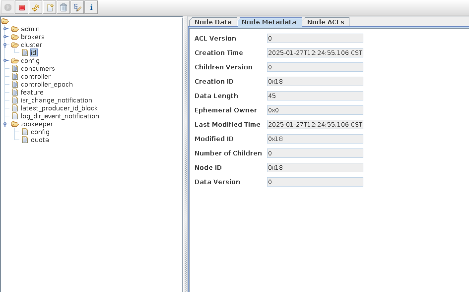


#### 集群部署

##### 环境准备

**主机名解析**

注意：每个kafka节点的主机名称解析需要提前准备，否则会导致失败

```bash
#修改每个kafka节点的主机名
[root@ubuntu2204 ~]#hostnamectl hostname node1
[root@ubuntu2204 ~]#hostnamectl hostname node2
[root@ubuntu2204 ~]#hostnamectl hostname node3

#在所有kafka节点上实现主机名称解析
[root@ubuntu2204 ~]#cat /etc/hosts
10.0.0.101 node1
10.0.0.102 node2
10.0.0.103 node3
```

**安装JDK**

```bash
# 所有节点安装jdk，因为zookeeper是java程序
[root@node1 ~]# apt update && apt install openjdk-8-jdk -y
[root@node2 ~]# apt update && apt install openjdk-8-jdk -y
[root@node3 ~]# apt update && apt install openjdk-8-jdk -y
```

##### **安装 ZooKeeper**

注意:如果使用kafka自带的zookeeper，需要修改配置文件

```bash
# 集群所有节点执行下面操作
# 下载kafka
[root@node1 ~]# wget -P /usr/local/src https://mirrors.tuna.tsinghua.edu.cn/apache/kafka/3.8.0/kafka_2.13-3.8.0.tgz

# 解压
[root@node1 src]# tar xf /usr/local/src/kafka_2.13-3.8.0.tgz -C /usr/local/

# 创建软链接
[root@node1 local]# ln -s /usr/local/kafka_2.13-3.8.0/ /usr/local/kafka

#注意如果使用kafka自带的zookeeper，需要修改配置文件
[root@node1 ~]#vim /usr/local/kafka/config/zookeeper.properties
# 更改数据目录
dataDir=/usr/local/kafka/data
#添加三行时间相关配置
tickTime=2000
# The number of ticks that the initial 
# synchronization phase can take
initLimit=10
# The number of ticks that can pass between 
# sending a request and getting an acknowledgement
syncLimit=5
#添加下面集群配置
 
server.1=10.0.0.101:2888:3888
server.2=10.0.0.102:2888:3888
server.3=10.0.0.103:2888:3888

# 同步到其他节点
[root@node1 config]#scp zookeeper.properties 10.0.0.102:/usr/local/kafka/config/zookeeper.properties
zookeeper.properties 
[root@node1 config]#scp zookeeper.properties 10.0.0.103:/usr/local/kafka/config/zookeeper.properties
zookeeper.properties 

# 创建目录
[root@node1 kafka]# mkdir data
[root@node2 kafka]# mkdir data
[root@node3 kafka]# mkdir data

# 每个节点配置myid
[root@node1 data]# echo 1 > /usr/local/kafka/data/myid
[root@node2 data]# echo 2 > /usr/local/kafka/data/myid
[root@node3 data]# echo 3 > /usr/local/kafka/data/myid

# 创建启动文件
[root@node1 ~]# cat > /usr/local/kafka/bin/zookeeper-startup.sh <<EOF
#!/bin/bash
nohup /usr/local/kafka/bin/zookeeper-server-start.sh /usr/local/kafka/config/zookeeper.properties &
EOF
[root@node1 ~]# chmod +x /usr/local/kafka/bin/zookeeper-startup.sh

# 将二进制执行文件同步到其他节点
[root@node1 ~]# rsync -a /usr/local/kafka/bin/zookeeper-startup.sh 10.0.0.102:/usr/local/kafka/bin/
[root@node1 ~]# rsync -a /usr/local/kafka/bin/zookeeper-startup.sh 10.0.0.103:/usr/local/kafka/bin/

# 创建service文件
[root@node1 ~]# cat > /lib/systemd/system/zookeeper.service<<EOF
[Unit]
Description=zookeeper.service
After=network.target
[Service]
Type=forking
ExecStart=/usr/local/kafka/bin/zookeeper-startup.sh
ExecStop=/usr/local/kafka/bin/zookeeper-server-stop.sh 
[Install]
WantedBy=multi-user.target
EOF

# 将service文件同步到其他节点
[root@node1 ~]# scp /lib/systemd/system/zookeeper.service 10.0.0.102:/lib/systemd/system/
[root@node1 ~]# scp /lib/systemd/system/zookeeper.service 10.0.0.103:/lib/systemd/system/

# 所有节点启动服务
[root@node1 bin]#systemctl daemon-reload 
[root@node1 bin]#systemctl restart zookeeper.service 
```


##### 各节点部署Kafka

**配置文件说明**

```bash
#配置文件 ./conf/server.properties内容说明

############################# Server Basics###############################

# broker的id，值为整数，且必须唯一，在一个集群中不能重复，此行必须修改
broker.id=1

############################# Socket ServerSettings ######################

# kafka监听端口，默认9092
listeners=PLAINTEXT://10.0.0.101:9092 #指定当前主机的IP做为监听地址,注意:不支持0.0.0.0

# 处理网络请求的线程数量，默认为3个
num.network.threads=3

# 执行磁盘IO操作的线程数量，默认为8个
num.io.threads=8

# socket服务发送数据的缓冲区大小，默认100KB
socket.send.buffer.bytes=102400

# socket服务接受数据的缓冲区大小，默认100KB
socket.receive.buffer.bytes=102400

# socket服务所能接受的一个请求的最大大小，默认为100M
socket.request.max.bytes=104857600

############################# Log Basics###################################

# kafka存储消息数据的目录
log.dirs=../data

# 每个topic默认的partition
num.partitions=1

# 设置副本数量为3,当Leader的Replication故障，会进行故障自动转移。
default.replication.factor=3

# 在启动时恢复数据和关闭时刷新数据时每个数据目录的线程数量
num.recovery.threads.per.data.dir=1

############################# Log FlushPolicy #############################
# 消息刷新到磁盘中的消息条数阈值
log.flush.interval.messages=10000

# 消息刷新到磁盘中的最大时间间隔1s,单位是ms
log.flush.interval.ms=1000

############################# Log RetentionPolicy #########################
# 日志保留小时数，超时会自动删除，默认为7天
log.retention.hours=168

# 日志保留大小，超出大小会自动删除，默认为1G
#log.retention.bytes=1073741824

# 日志分片策略，单个日志文件的大小最大为1G，超出后则创建一个新的日志文件
log.segment.bytes=1073741824

# 每隔多长时间检测数据是否达到删除条件,300s
log.retention.check.interval.ms=300000

############################# Zookeeper ####################################
# Zookeeper连接信息，如果是zookeeper集群，则以逗号隔开，此行必须修改
zookeeper.connect=10.0.0.101:2181,10.0.0.102:2181,10.0.0.103:2181

# 连接zookeeper的超时时间,6s
zookeeper.connection.timeout.ms=6000

# 是否允许删除topic，默认为false，topic只会标记为marked for deletion
delete.topic.enable=true
```

**部署Kafka**

```bash
#配置PATH变量
[root@node1 ~]# echo 'PATH=/usr/local/kafka/bin:$PATH' > /etc/profile.d/kafka.sh
[root@node1 ~]# . /etc/profile.d/kafka.sh

#修改配置文件
[root@node1 ~]# vim /usr/local/kafka/config/server.properties
broker.id=1 #每个broker在集群中每个节点的正整数唯一标识，此值保存在log.dirs下的meta.properties文件，修改此行
listeners=PLAINTEXT://10.0.0.101:9092 #指定当前主机的IP做为监听地址,注意:不支持0.0.0.0
log.dirs=/usr/local/kafka/data #kakfa用于保存数据的目录，所有的消息都会存储在该目录当中，修改此行
num.partitions=3 #设置创建新的topic时默认分区数量,建议和kafka的节点数量一致
default.replication.factor=3 #指定默认的副本数为3，可以实现故障的自动转移
log.retention.hours=168 #设置kafka中消息保留时间，默认为168小时即7天
zookeeper.connect=10.0.0.101:2181,10.0.0.102:2181,10.0.0.103:2181 #指定连接的zk的地址,zk中存储了broker的元数据信息，修改此行
zookeeper.connection.timeout.ms=6000 #设置连接zookeeper的超时时间，单位为ms,默认6秒钟

#准备数据目录,安装zookeeper的时候应该创建过
[root@node1 ~]#mkdir /usr/local/kafka/data

# 先同步配置文件，后对其进行修改
[root@node1 ~]#scp /usr/local/kafka/config/server.properties 10.0.0.102:/usr/local/kafka/config
[root@node1 ~]#scp /usr/local/kafka/config/server.properties 10.0.0.103:/usr/local/kafka/config

#修改第2个节点配置
[root@node2 ~]#vim /usr/local/kafka/config/server.properties
broker.id=2 #每个broker 在集群中的唯一标识，正整数。
listeners=PLAINTEXT://10.0.0.102:9092 #指定当前主机的IP做为监听地址,注意:不支持0.0.0.0

#修改第3个节点配置
[root@node3 ~]#vim /usr/local/kafka/config/server.properties
broker.id=3  #每个broker 在集群中的唯一标识，正整数。
listeners=PLAINTEXT://10.0.0.103:9092 #指定当前主机的IP做为监听地址,注意:不支持0.0.0.0

#可以调整内存
[root@node1 ~]#vim /usr/local/kafka/bin/kafka-server-start.sh
......
if[ " x$KAFKA_HEAP_OPTS"="x"] ; then
    export KAFKA_HEAP_OPTS=" -Xmx1G -Xms1G"  
fi
......
```


##### 准备Kafka的service文件

```bash
[root@node1 bin]# cat /lib/systemd/system/kafka.service
[Unit]                                                                          
Description=Apache kafka
After=network.target
[Service]
Type=forking
ExecStart=/usr/local/kafka/bin/kafka-startup.sh
ExecStop=/bin/kill  -TERM \${MAINPID}
Restart=always
RestartSec=20
[Install]
WantedBy=multi-user.target

# 同步service文件，并重启服务
[root@node1 bin]# scp /lib/systemd/system/kafka.service 10.0.0.102:/lib/systemd/system/  
[root@node1 bin]# scp /lib/systemd/system/kafka.service 10.0.0.103:/lib/systemd/system/

# 所有节点上重启服务
[root@node1 bin]# systemctl daemon-reload 
[root@node1 bin]# systemctl restart kafka

# 查看zooInspector
```


**注意**

```ABAP
如果有服务器加入集群失败，可以将data和logs目录里的内容删掉，重启
！！！记住，两个目录的内容都要删掉
```


### Kafka 读写数据

参考文档

```http
http://kafka.apache.org/quickstart
```

常见命令

```bash
kafka-topics.sh             #消息的管理命令           
kafka-console-producer.sh   #生产者的模拟命令
kafka-console-consumer.sh   #消费者的模拟命令
```


#### 创建Topic

创建topic名为 mystical，partitions(分区)为3，replication(每个分区的副本数/每个分区的分区因子)为 2

```bash
#新版命令,通过--bootstrap-server指定kafka的地址
[root@node1 ~]# /usr/local/kafka/bin/kafka-topics.sh --create --topic mystical --bootstrap-server 10.0.0.101:9092 --partitions 3 --replication-factor 2

#旧版命令，通过--zookeeper指定zookeeper的地址
[root@node1 ~]# /usr/local/kafka/bin/kafka-topics.sh --create --zookeeper 10.0.0.101:2181,10.0.0.102:2181,10.0.0.103:2181 --partitions 3 --replication-factor 2 --topic mystical

#在各节点上观察生成的相关数据
[root@node1 ~]# ls /usr/local/kafka/data
cleaner-offset-checkpoint    meta.properties  mystical-0  recovery-point-offset-checkpoint  version-2
log-start-offset-checkpoint  myid             mystical-1  replication-offset-checkpoint

[root@node2 bin]# ls /usr/local/kafka/data
cleaner-offset-checkpoint    meta.properties  mystical-1  recovery-point-offset-checkpoint  version-2
log-start-offset-checkpoint  myid             mystical-2  replication-offset-checkpoint

[root@node3 ~]#ls /usr/local/kafka/data/
cleaner-offset-checkpoint    meta.properties  mystical-0  recovery-point-offset-checkpoint  version-2
log-start-offset-checkpoint  myid             mystical-2  replication-offset-checkpoint
```


#### 获取所有 Topic

```bash
#新版命令
[root@node1 ~]# /usr/local/kafka/bin/kafka-topics.sh --list --bootstrap-server 10.0.0.101:9092

#旧版命令
[root@node1 ~]# /usr/local/kafka/bin/kafka-topics.sh --list --zookeeper 10.0.0.101:2181,10.0.0.102:2181,10.0.0.103:2181
```


####  查看 Topic 详情

状态说明：mystical 有三个分区分别为0、1、2，分区0的leader是3 （broker.id），分区 0 有2 个副本，并且状态都为 lsr（ln-sync，表示可 以参加选举成为 leader）

```bash
# 新版命令
[root@node1 data]# /usr/local/kafka/bin/kafka-topics.sh --describe --bootstrap-server 10.0.0.101:9092  --topic mystical
[2025-01-27 19:50:51,936] WARN [AdminClient clientId=adminclient-1] The DescribeTopicPartitions API is not supported, using Metadata API to describe topics. (org.apache.kafka.clients.admin.KafkaAdminClient)
Topic: mystical	TopicId: 1xuTntXbTfO9ewL3SRfhRw	PartitionCount: 3	ReplicationFactor: 2	Configs: 
	Topic: mystical	Partition: 0	Leader: 1	Replicas: 1,3	Isr: 1,3	Elr: N/A	LastKnownElr: N/A
	Topic: mystical	Partition: 1	Leader: 2	Replicas: 2,1	Isr: 2,1	Elr: N/A	LastKnownElr: N/A
	Topic: mystical	Partition: 2	Leader: 3	Replicas: 3,2	Isr: 3,2	Elr: N/A	LastKnownElr: N/A
	
#旧版命令
[root@node1 ~]# /usr/local/kafka/bin/kafka-topics.sh --describe --zookeeper 10.0.0.101:2181,10.0.0.102:2181,10.0.0.103:2181 --topic wang
```


#### 生产 Topic

kafka-console-producer.sh 格式

```bash
#发送消息命令格式:
[root@node1 ~]# kafka-console-producer.sh --broker-list <kafkaIP1>:<端口>,<kafkaIP2>:<端口> --topic <topic名称> --producer property group.id=<组名>
```

范例

```bash
#交互式输入消息,按Ctrl+C退出
[root@node1 ~]# /usr/local/kafka/bin/kafka-console-producer.sh --broker-list 10.0.0.101:9092,10.0.0.102:9092,10.0.0.103:9092 --topic mystical
>message1
>message2
>message3
>
 #或者下面方式
[root@node1 ~]#/usr/local/kafka/bin/kafka-console-producer.sh --topic mystical --bootstrap-server 10.0.0.101:9092
```


#### 消费 Topic

kafka-console-consumer.sh 格式

```bash
# 接收消息命令格式:
[root@node1 ~]# kafka-console-consumer.sh --bootstrap-server <host>:<post> --topic <topic名称> --from-beginning --consumer-property group.id=<组名称>
```

注意：

- 生产者先生产消息，消费者后续启动，也能收到之前生产的消息
- 同一个消息在同一个group内的消费者只有被一个消费者消费，比如：共100条消息，在一个group内有A，B两个消费者，其中A消费 50条，B消费另外的50条消息。从而实现负载均衡，不同group内的消费者则可以同时消费同一个消息
- `--from-beginning` 表示消费前发布的消息也能收到，默认只能收到消费后发布的新消息

范例

```bash
#交互式持续接收消息,按Ctrl+C退出
[root@node1 ~]#/usr/local/kafka/bin/kafka-console-consumer.sh --topic wang --bootstrap-server 10.0.0.102:9092 --from-beginning
message1
message3
message2

#一个消息同时只能被同一个组内一个消费者消费（单播机制），实现负载均衡，而不同组可以同时消费同一个消息（多播机制）
# 其中如果不指定组，则消费者算作是默认组中，而默认组中的消费者，共享消息
[root@node2 ~]#/usr/local/kafka/bin/kafka-console-consumer.sh --topic wang --bootstrap-server 10.0.0.102:9092 --from-beginning --consumer-property group.id=group1

[root@node2 ~]#/usr/local/kafka/bin/kafka-console-consumer.sh --topic wang --bootstrap-server 10.0.0.102:9092 --from-beginning --consumer-property group.id=group1
```


#### 删除 Topic

```bash
#注意：需要修改配置文件server.properties中的delete.topic.enable=true并重启
#新版本
[root@node3 ~]#/usr/local/kafka/bin/kafka-topics.sh --delete --bootstrap-server 10.0.0.101:9092,10.0.0.102:9092,10.0.0.103:9092 --topic wang

#旧版本
[root@node3 ~]#/usr/local/kafka/bin/kafka-topics.sh --delete --zookeeper 10.0.0.101:2181,10.0.0.102:2181,10.0.0.103:2181 --topic wang
Topic wang is marked for deletion.
Note: This will have no impact if delete.topic.enable is not set to true.
```


### 消息积压

消息积压是指在消息传递系统中，积累了大量未被处理或未被消费的消息

Kafka 消息积压可能由多种原因引起，以下是一些可能的原因：

- **消费者处理速度慢**： 如果消费者处理消息的速度不足以跟上生产者的速度，就会导致消息积压。这可能是因为消费者逻辑复杂、消费 者数量不足、消费者宕机或者网络延迟等原因引起的。
-  **消费者宕机**： 如果某个消费者宕机，其负责处理的分区将没有消费者来消费消息，导致消息在该分区上积压
- **网络问题**： 网络故障可能导致生产者和消费者之间的通信延迟或中断，从而影响消息的传递速度
- **硬件资源不足**： Kafka 集群所在的机器，包括生产者、消费者和 Broker 所在的机器，可能由于 CPU、内存或磁盘等资源不足，导致消息处理速度变慢
-  **分区不均匀**： 如果某些分区的负载比其他分区更高，可能导致这些分区上的消息积压。这可能是由于分区数量设置不合理、数据分布 不均匀等原因引起的
- **生产者速度过快**： 如果生产者生产消息的速度过快，而消费者无法及时处理，就会导致消息积压
- **配置不当**： Kafka 的一些配置参数，如副本数、分区数、消费者数量等，需要根据实际情况进行合理的配置。如果配置不当，可能导致 消息积压问题。
- **异常情况**： 突发性的异常情况，如硬件故障、网络故障、软件 bug 等，都可能导致消息积压


Kafka 消息积压可能的解决方案

- **增加消费者数量**：如果消费者处理速度不足导致消息积压，可以增加消费者的数量来提高处理速度。
- **扩展Kafka集群**：如果消息积压是由于Kafka集群的吞吐量达到极限导致的，考虑扩展Kafka集群的规模来增加其处理能力。
- **数据分区**：合理划分数据分区可以提高并行处理能力，从而减少消息积压。
- **数据清理**：定期清理过期的数据和日志文件，以释放磁盘空间并提高性能。
- **优化消费者代码**：检查消费者代码，确保它们是高效的。可能存在一些性能瓶颈或不必要的延迟。
- **调整Kafka配置**：根据需要调整Kafka的配置参数，例如增加分区数量、调整副本数量、调整日志清理策略等。
- **监控和警报**：设置监控系统，及时发现消息积压问题并发送警报。这样可以在问题出现之前采取行动。
- **故障排除**：检查系统日志，查找可能的问题源，并采取相应的措施解决问题。


kafka 要发现消息积压，可以考虑以下方法

- **监控工具**： Kafka 提供了一些监控工具，例如 Kafka Manager、Burrow、Kafka Offset Monitor 等。这些工具可以帮助你监控每个分区的偏移量（offset）和消费者组的状态。通过检查偏移量的增长速度，你可以判断是否有消息积压
- **Consumer Lag**： Consumer Lag 是指消费者组相对于生产者的消息偏移量的差异。通过监控 Consumer Lag，你可以了解消费者是 否跟上了生产者的速度。如果 Consumer Lag 增长较快，可能表示消息积压
- **Kafka Logs 目录**： Kafka 的每个分区都有一个日志目录，其中包含了该分区的消息数据。可以检查每个分区的日志目录，查看是否有 大量的未消费的消息
- **Kafka Broker Metrics**： Kafka 提供了一系列的 broker metrics，包括消息入队速率、出队速率等。通过监控这些指标，可以了解 Kafka 集群的负载状况
- **操作系统资源**： 如果 Kafka 所在的机器资源不足，可能导致消息积压。监控 CPU、内存、磁盘等系统资源，确保它们没有达到极限
- **警报系统**： 设置警报系统，当某些指标达到预定的阈值时触发警报，通知运维人员或相关团队及时处理


通过Kafka提供的工具查看格式：

```bash
#发现当前消费的offset和最后一条的offset差距很大,说明有大量的数据积压
kafka-consumer-groups.sh --bootstrap-server {kafka连接地址} --describe --group {消费组} | --all-groups
```

范例

```bash
#模拟生产者生产大量消息
[root@ubuntu2204 ~]#( while true; do echo $i;let i++;done ) | kafka-console-producer.sh --broker-list 
10.0.0.101:9092,10.0.0.102:9092,10.0.0.103:9092 --topic mystical

#下面命令查看消费组中每个Topic的堆积消息数。“LAG”表示每个Topic的总堆积数
[root@ubuntu2204 ~]#kafka-consumer-groups.sh --bootstrap-server 10.0.0.101:9092 --describe --all-groups
```


### Kafka工具

#### 图形工具 Offset Explorer (Kafka Tool)


Offset Explorer ，旧称Kafka Tool，工具是一个 GUI 应用程序，用于管理和使用 Apache Kafka 群集。它提供了一个直观的 UI，允许人们快速查看 Kafka 群集中的对象以及存储在群集主题中的消息。它包含面向开发人员和管理员的功能。一些关键功能包括

- 快速查看您的所有 Kafka 集群，包括其经纪人、主题和消费者
- 查看分区中邮件的内容并添加新邮件
- 查看消费者的偏移量，包括阿帕奇风暴卡夫卡喷口消费者
- 以漂亮的打印格式显示 JSON和 XML 消息
- 添加和删除主题以及其他管理功能
- 将单个邮件从分区保存到本地硬盘驱动器
- 编写自己的插件，允许您查看自定义数据格式
- Kafka 工具在Windows、Linux 和 Mac 操作系统上运行


下载链接

```http
https://www.kafkatool.com/download.html
```


下载安装后，直接连接（有代理的注意代理网络）


### Kafka监控项

| Kafka集群 |                      |                                        |         |
| --------- | -------------------- | -------------------------------------- | ------- |
| 序号      | 指标别名             | 指标含义解释                           | 单位    |
| 1         | Partitions总数       | 集群中所有节点Partition数之和          | 个      |
| 2         | 未复制分区总数       | 集群中所有节点未复制分区数之和         | 个      |
| 3         | 离线分区总数         | 集群中所有节点离线分区数之和           | 个      |
| 4         | Controller存活数     | 集群中Controller存活的数量             | 个      |
| 5         | 失败请求（生产者）   | 集群中所有节点生产者失败请求的速率之和 | 次/s    |
| 6         | 失败请求（消费者）   | 集群中所有节点消费者失败请求的速率     | 次/s    |
| 7         | 生产者流量           | 集群中所有节点生产者流量之和           | Bytes/s |
| 8         | 消费者流量           | 集群中所有节点消费者流量之和           | Bytes/s |
| 9         | 生产者QPS            | 集群中所有节点生产者QPS之和            | 次/s    |
| 10        | 消费者QPS            | 集群中所有节点消费者QPS之和            | 次/s    |
| 11        | 存活节点数           | 集群中存活的节点数量                   | 个      |
| 12        | 每秒流入消息数       | 集群中所有节点流入消息数之和           | 个/s    |
| 13        | 最大CPU利用率        | 集群中所有节点CPU利用率最大值          |         |
| 14        | 最大内存利用率       | 集群中所有节点内存利用率最大值         |         |
| 15        | 最大Heap区利用率     | 集群中所有节点堆内存利用率最大值       |         |
| 16        | 最大Non-Heap区利用率 | 集群中所有节点非堆内存利用率最大值     |         |
| 17        | 最大Minor GC次数     | 集群中所有节点每分钟Minor GC次数最大值 |         |
| 18        | 最大Major GC次数     | 集群中所有节点每分钟Major GC次数最大值 |         |
| 19        | 最大Minor GC时间     | 集群中所有节点每分钟Minor GC时间       |         |
| 20        | 最大Major GC时间     | 集群中所有节点每分钟Major GC时间       |         |


### Kafka常见面试题

#### 说说kafka是怎样选举的

- 当新的分区创建时，Kafka选择ISR(In-Sync Replica)列表中的第一个副本作为领导者

- 当领导者发生故障

  - ZooKeeper将会检测到它的`会话过期`

  ```
  当Kafka broker启动时，会与Zookeeper建立一个会话，并定期发送心跳信号，保持会话的活跃状态
  Kafka broker会定期发送心跳到Zookeeper，告诉它自己还活着
  如果因为网路原因，broker故障等原因，Zookeeper在一定时间内（通常是几秒到几分钟的超时时间）没有收到broker的心跳信号，就会认为这个broker已经失效，称之为会话过期
  ```

  - Zookeeper会将该broker标记为失效，并通知其他相关组件
  - 如果失效的是某个分区的leader，Zookeeper会触发leader选举机制，从该分区的其他副本中选出一个新的leader

  ```java
  // Zookeeper维护了每个分区的ISR列表，该列表包含当前处于同步状态的副本
  // /brokers/topics/example-topic/partitions/0/state
  {
    "controller_epoch": 1,
    "leader": 1,
    "version": 1,
    "leader_epoch": 1,
    "isr": [1, 2, 3]
  }
  
  /brokers/topics/example-topic/partitions/1/state
  {
    "controller_epoch": 1,
    "leader": 2,
    "version": 1,
    "leader_epoch": 1,
    "isr": [2, 1, 3]
  }
  
  /brokers/topics/example-topic/partitions/2/state
  {
    "controller_epoch": 1,
    "leader": 3,
    "version": 1,
    "leader_epoch": 1,
    "isr": [3, 1, 2]
  }
  //从ISR列表中选择brokerID最小的副本作为新的leader
  List<Integer> isr = getIsrForPartition(partitionId);
  int newLeader = Collections.min(isr);  // 选择 ID 最小的副本作为新的 leader
  updatePartitionLeader(partitionId, newLeader);
  ```

  - Zookeeper会将新的leader信息通知Kafka集群中的其他brokers和相关消费者，让它们更新leader信息，继续处理消息

#### 说一下同步投递和重复消费

- 同步投递
  - 同步投递是Kafka中实现消息可靠性的重要机制, 但这种方式可能增加延迟和资源消耗，适用于对消息传递要求严格的场景
  - 其具体实现细节如下
    - 生产者先从集群获取分区的leader
      - 生产者初始化的时候，会连接到Kafka集群的一个或多个broker(通常称为bootstrap servers)
      - 生产者会向这些broker请求集群元数据信息，包括主题的分区信息和每个分区的leader副本
      - broker收到请求后会返回主题的分区信息，包括每个分区的leader副本和ISR列表
      - 生产者将这些元数据缓存到本地，以便在发送消息时快速查找每个分区的leader信息
    - 生产者将消息发送给leader副本
    - leader副本将消息写入本地日志文件
    - leader副本将消息传递给ISR列表中的所有follower副本
    - 每个follower副本将消息写入自己的本地日志文件
    - 每个foolower副本在成功写入消息后，发送确认给leader副本
    - 当leader副本收到所有ISR副本的确认后，向生产者发送确认消息
    - 生产者在接受到副本的确认后，才认为消息已成功发送

```shell
# acks配置
acks=0: 生产者不会等待任何确认。消息发送后立即返回。这种方式最快，但风险最大，因为消息可能丢失
acks=1: 生产者会等待leader副本确认消息写入日志后才返回，提供了一定可靠性，但是如果leader副本在消息传递给follower之前发生故障，消息可能会丢失。
acks=all(或-1): 生产者会等待所有ISRI(同步副本)确认消息写入后才返回。提供最高的可靠性（即同步投递）

# 关于同步投递的性能优化建议
为了在保证数据可靠性的同时优化性能，可以考虑以下建议：

配置优化：

调整 retries 和 retry.backoff.ms 参数，以适应实际的网络和系统状况，减少消息发送失败的重试次数。
配置 linger.ms 和 batch.size，通过批量发送消息来提高吞吐量。
集群扩展：

根据订单数据的量和并发要求，适当扩展 Kafka 集群，增加 broker 的数量和分区的数量，以提高系统的处理能力。
监控和调优：

通过监控 Kafka 集群的运行状态，及时发现和解决性能瓶颈和故障。
定期调优 Kafka 集群的配置，优化网络和存储性能，以适应不断增长的数据量和并发要求。
```

- 重复消费
  - 重复消费指消费者多次读取同一条信息。
  - 理解重复消费的前提知识
    - 偏移量(Offset)：偏移量是一个分区内每条消息的唯一标识，表示消息在分区日志中的位置，消费者通过偏移量来跟踪已消费的消费位置
    - 消费者可以从分区的起始偏移量(最早的消息)，或末尾偏移量开始消费
    - 偏移量主要由消费者管理，Kafka提供了机制来存储和检索偏移量，但具体的管理和提交由消费者负责
    - 消费者会定期调用`poll`方法，从Kafka中获取消息
    - 消费者维护它自己的消费进度，通过偏移量来跟踪它已经消费到哪条信息
    - 每次消费者拉取消息时，它会告诉Kafka从哪个偏移量开始读取消息，Kafka根据这个便宜量返回相应的消息
    - 消费者可以自动提交偏移量（由Kafka自动管理）或手动提交偏移量(由开发人员显式管理)
  - 重复消费的实现
    - 消费者使用自动提交偏移量，自动提交每5秒会将消费者的偏移量提交给Kafka，如果消费者处理消息的时候过长(或者消费者在处理完消息之前崩溃或重启)，超过这个时间，那么下次就会发生重复消费
  - 解决方法
    - 建议使用手动提交偏移量
    - 设计一些幂等性操作
    - 使用事务


## RabbitMQ

### RabbitMQ介绍


**官网**

```http
https://www.rabbitmq.com/
```


RabbitMQ 基于 Erlang 语言开发，Erlang 语言由爱立信 Ericson 开发设计

Erlang语言在高并发,分布式编程和故障恢复方面表现优异，因此在电信领域被广泛使用


**Erlang版本和RabbitMQ版本的对应**

```http
https://www.rabbitmq.com/which-erlang.html
https://www.rabbitmq.com/docs/which-erlang
```


**RabbitMQ优势**

- 基于Erlang 语言开发，具有高并发优点、支持分布式
- 具有消息确认机制、消息持久化机制，消息可靠性和集群可靠性高、简单易用、运行稳定、跨平台、多语言
- 自带图形 Web 管理功能
- 开源


### RabbitMQ架构


**Message:** 消息，消息是不具名的，它由消息头和消息体组成。消息体是不透明的，而消息头则由一系列的可选属性组成，这些属性包括 routing-key（路由键）、priority（相对于其他消息的优先权）、delivery-mode（指出该消息可能需要持久性存储）等。

**Publisher:** 消息的生产者，就是一个向交换器发布消息的客户端应用程序。

**Consumer:** 消息的消费者，表示一个从消息队列中取得消息的客户端应用程序。

**Broker:** 接收和分发消息的应用，表示消息队列服务器实体。**RabbitMQ Server 就是Message Broker。**

**Virtual host:** 为了支持多租户和安全原因，当多个不同的用户使用同一个RabbitMQ Server时，可以先划分出多个 vhost，每个用户使用独 立的vhost创建exchange／queue 等。每一个虚拟主机表示一批交换器、消息队列和相关对象的集合。虚拟主机是共享相同的身份认证和加 密环境的独立服务器域。每个 vhost 本质上就是一个 mini 版的 RabbitMQ 服务器，拥有自己的队列、交换器、绑定和权限机制。vhost 是 AMQP 概念的基础，必须在连接时指定，RabbitMQ 默认的 vhost 是 / 。

**Exchange:** 交换器，用来接收生产者发送的消息并将这些消息路由给服务器中的队列。message 到达 broker 会由Exchange 根据分发规 则，匹配查询表中的路由信息，分发消息到队列中。常用的类型：direct (point to poing 点对点),topic (publish subscribe发布者订阅者) 和 fanout (multicast多播)等

**Queue:** 消息队列，用来保存消息直到发送给消费者。它是消息的容器，也是消息的终点。一个消息可投入一个或多个队列。消息一直在队 列里面，等待消费者连接到这个队列将其取走。

**Binding:** 绑定，用于消息队列和交换器之间的关联。一个绑定就是基于路由键将交换器和消息队列连接起来的路由规则，所以可以将交换器 理解成一个由绑定构成的路由表。exchange 和 queue 之间的虚拟连接，binding 中可以包含 routing key。Binding 信息被保存到 exchange 中的查询表中，用于message 的分发依据。

**Connection:** 网络连接，比如一个TCP连接。publisher／consumer 和 broker 之间的TCP 连接。**（类似ssh的会话，每个会话独占一个TCP连接）**

**Channel:** 信道，多路复用连接中的一条独立的双向数据流通道。信道是建立在真实的TCP连接内部的虚拟连接，AMQP 命令都是通过信道 发出去的，不管是发布消息、订阅队列还是接收消息，这些动作都是通过信道完成。因为对于操作系统来说建立和销毁 TCP 都是非常昂贵的 开销，所以引入了信道的概念，以复用一条 TCP 连接。Channel 是在 connection内部建立的逻辑连接，如果应用程序支持多线程，通常每 个 thread创建单独的channel 进行通讯，AMQP method 包含了channel id 帮助客户端和messagebroker极大减少了操作系统建立TCP  connection 的开销**（类比ssh的隧道，一个会话可以有多个隧道，多个隧道共用一个TCP连接）**


### RabbitMQ 生产者消费者


- 生产者发送消息到 broker server（RabbitMQ）
- 在 Broker 内部，用户创建Exchange／Queue，通过 Binding 规则将两者联系在一起
- Exchange 分发消息，根据类型／binding 的不同分发策略有区别
- 消息最后来到Queue 中，等待消费者取走。


### RabbitMQ 单机部署


#### 基于Docker部署RabbitMQ

```bash
[root@mystical ~]# docker run -d --name rabbitmq-single-node --name rabbitmq -p 5672:5672 -p 15672:15672 rabbitmq:3-management
Unable to find image 'rabbitmq:3-management' locally
3-management: Pulling from library/rabbitmq
de44b265507a: Pull complete 
609d1f44794c: Pull complete 
93bc35f205f7: Pull complete 
ae78677340ad: Pull complete 
f4546f4074da: Pull complete 
25a4431bdb90: Pull complete 
d18e4e86d7da: Pull complete 
fb48d524e912: Pull complete 
e7dfc1785660: Pull complete 
eb2c807d46cb: Pull complete 
Digest: sha256:29ded394fc8639f891e0c80fac7b8f594bb8edaa83e15dc8c5795ef8d6c15f6a
Status: Downloaded newer image for rabbitmq:3-management
765260f64c9d5bbd63a0e4f1ff466876a0fdcbf1f8a5e27e6c553adbe3998033


# 查看
[root@mystical ~]# docker ps
CONTAINER ID   IMAGE                   COMMAND                  CREATED         STATUS         PORTS                                                                                                                                                 NAMES
765260f64c9d   rabbitmq:3-management   "docker-entrypoint.s…"   2 minutes ago   Up 2 minutes   4369/tcp, 5671/tcp, 0.0.0.0:5672->5672/tcp, :::5672->5672/tcp, 15671/tcp, 15691-15692/tcp, 25672/tcp, 0.0.0.0:15672->15672/tcp, :::15672->15672/tcp   rabbitmq

# 访问浏览器：http://IP:15672
# 默认用户密码都是guest/guest
# 5672端口：客户端访问
# 15672端口：web访问
```


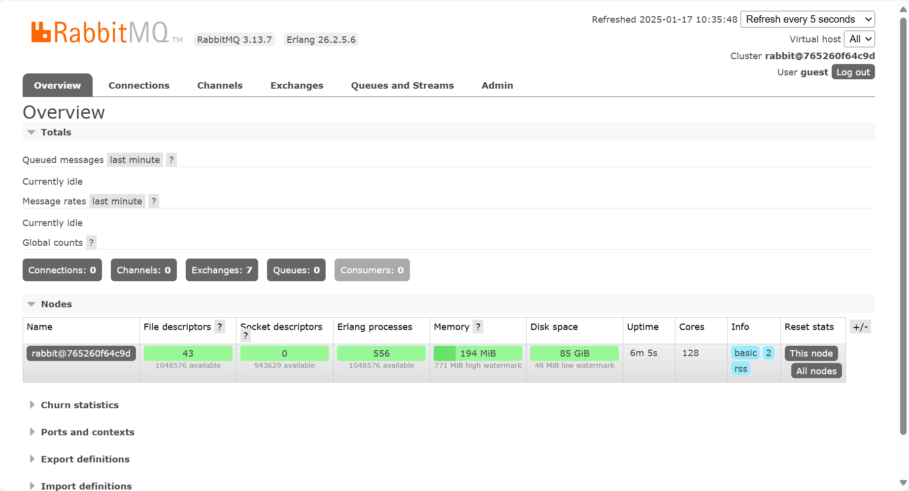


#### 基于包方式在Ubuntu 安装单机版 RabbitMQ

##### 主机名解析（可选）

早期版本安装必须做主机名解析,否则无法启动RabbitMQ服务,并且后续不能再修改主机名

**注意**: 当前版本不再有此限制

在当前MQ 服务器配置本地主机名解析

```bash
[root@mystical ~]# hostnamectl set-hostname rabbitmq.mystical.org

[root@mystical ~]# vim /etc/hosts
10.0.0.151 rabbitmq.mystical.org rabbitmq
```


##### 系统内置仓库安装

```bash
[root@mystical ~]# apt list |grep -i rabbitmq

WARNING: apt does not have a stable CLI interface. Use with caution in scripts.

kamailio-rabbitmq-modules/jammy 5.5.4-1 amd64
libanyevent-rabbitmq-perl/jammy 1.22~dfsg-1 all
libmojo-rabbitmq-client-perl/jammy 0.3.1-2 all
libmono-messaging-rabbitmq4.0-cil/jammy 6.8.0.105+dfsg-3.2 all
libmono-rabbitmq4.0-cil/jammy 6.8.0.105+dfsg-3.2 all
librabbitmq-client-java/jammy 5.0.0-1.1 all
librabbitmq-dev/jammy 0.10.0-1ubuntu2 amd64
librabbitmq4/jammy 0.10.0-1ubuntu2 amd64
nagios-plugins-rabbitmq/jammy 1:1.2.0-2.2ubuntu1 all
puppet-module-puppetlabs-rabbitmq/jammy 8.5.0-7 all
rabbitmq-server/jammy-updates 3.9.27-0ubuntu0.1 all

[root@mystical ~]# apt install -y rabbitmq-server
```


##### 官方仓库脚本包安装指定较新版本

```http
https://www.rabbitmq.com/docs/install-debian#apt-quick-start-cloudsmith
```


```bash
# Ubuntu2204

#!/bin/sh

sudo apt update && apt-get install curl gnupg apt-transport-https -y

## Team RabbitMQ's main signing key
curl -1sLf "https://keys.openpgp.org/vks/v1/by-fingerprint/0A9AF2115F4687BD29803A206B73A36E6026DFCA" | sudo gpg --dearmor | sudo tee /usr/share/keyrings/com.rabbitmq.team.gpg > /dev/null

## Community mirror of Cloudsmith: modern Erlang repository
curl -1sLf https://github.com/rabbitmq/signing-keys/releases/download/3.0/cloudsmith.rabbitmq-erlang.E495BB49CC4BBE5B.key | sudo gpg --dearmor | sudo tee /usr/share/keyrings/rabbitmq.E495BB49CC4BBE5B.gpg > /dev/null

## Community mirror of Cloudsmith: RabbitMQ repository
curl -1sLf https://github.com/rabbitmq/signing-keys/releases/download/3.0/cloudsmith.rabbitmq-server.9F4587F226208342.key | sudo gpg --dearmor | sudo tee /usr/share/keyrings/rabbitmq.9F4587F226208342.gpg > /dev/null

## Add apt repositories maintained by Team RabbitMQ
sudo tee /etc/apt/sources.list.d/rabbitmq.list <<EOF
## Provides modern Erlang/OTP releases
##
deb [arch=amd64 signed-by=/usr/share/keyrings/rabbitmq.E495BB49CC4BBE5B.gpg] https://ppa1.rabbitmq.com/rabbitmq/rabbitmq-erlang/deb/ubuntu jammy main
deb-src [signed-by=/usr/share/keyrings/rabbitmq.E495BB49CC4BBE5B.gpg] https://ppa1.rabbitmq.com/rabbitmq/rabbitmq-erlang/deb/ubuntu jammy main

# another mirror for redundancy
deb [arch=amd64 signed-by=/usr/share/keyrings/rabbitmq.E495BB49CC4BBE5B.gpg] https://ppa2.rabbitmq.com/rabbitmq/rabbitmq-erlang/deb/ubuntu jammy main
deb-src [signed-by=/usr/share/keyrings/rabbitmq.E495BB49CC4BBE5B.gpg] https://ppa2.rabbitmq.com/rabbitmq/rabbitmq-erlang/deb/ubuntu jammy main

## Provides RabbitMQ
##
deb [arch=amd64 signed-by=/usr/share/keyrings/rabbitmq.9F4587F226208342.gpg] https://ppa1.rabbitmq.com/rabbitmq/rabbitmq-server/deb/ubuntu jammy main
deb-src [signed-by=/usr/share/keyrings/rabbitmq.9F4587F226208342.gpg] https://ppa1.rabbitmq.com/rabbitmq/rabbitmq-server/deb/ubuntu jammy main

# another mirror for redundancy
deb [arch=amd64 signed-by=/usr/share/keyrings/rabbitmq.9F4587F226208342.gpg] https://ppa2.rabbitmq.com/rabbitmq/rabbitmq-server/deb/ubuntu jammy main
deb-src [signed-by=/usr/share/keyrings/rabbitmq.9F4587F226208342.gpg] https://ppa2.rabbitmq.com/rabbitmq/rabbitmq-server/deb/ubuntu jammy main
EOF

## Update package indices
sudo apt-get update -y

## Install Erlang packages
sudo apt-get install -y erlang-base \
                        erlang-asn1 erlang-crypto erlang-eldap erlang-ftp erlang-inets \
                        erlang-mnesia erlang-os-mon erlang-parsetools erlang-public-key \
                        erlang-runtime-tools erlang-snmp erlang-ssl \
                        erlang-syntax-tools erlang-tftp erlang-tools erlang-xmerl

## Install rabbitmq-server and its dependencies
sudo apt-get install rabbitmq-server -y --fix-missing
```


#### 二进制安装RabbitMQ

**通用二进制安装官方说明**

```http
https://www.rabbitmq.com/install-generic-unix.html
```


**RabbitMQ版本和Erlang版本对应要求**

```http
https://www.rabbitmq.com/which-erlang.html
```


**RabbitMQ和Erlang各版本二进制tar包下载**

```bash
# RabbitMQ:
https://github.com/rabbitmq/rabbitmq-server

# Erlang:
https://github.com/erlang/otp/releases
```


**范例：二进制安装一键安装脚本**

```bash
#!/bin/bash

RABBITMQ_VERSION=3.13.7
OPT_VERSION=26.2.5.1
INSTALL_DIR="/usr/local/rabbitmq"

SRC_DIR=`pwd`
CPUS=`grep -c processor /proc/cpuinfo`
GREEN="echo -e \E[32;1m"
END="\E[0m"
HOST=`hostname -I|awk '{print $1}'`

. /etc/os-release

color () {
    RES_COL=60
    MOVE_TO_COL="echo -en \\033[${RES_COL}G"
    SETCOLOR_SUCCESS="echo -en \\033[1;32m"
    SETCOLOR_FAILURE="echo -en \\033[1;31m"
    SETCOLOR_WARNING="echo -en \\033[1;33m"
    SETCOLOR_NORMAL="echo -en \E[0m"
    echo -n "$1" && $MOVE_TO_COL
    echo -n "["
    if [ $2 = "success" -o $2 = "0" ] ;then
        ${SETCOLOR_SUCCESS}
        echo -n $" OK "    
    elif [ $2 = "failure" -o $2 = "1" ] ;then
        ${SETCOLOR_FAILURE}
        echo -n $"FAILED"
    else
        ${SETCOLOR_WARNING}
        echo -n $"WARNING"
    fi
    ${SETCOLOR_NORMAL}
    echo -n "]"
    echo
}

install_erlang() {

   apt update
   apt -y install gcc build-essential make ncurses-dev libssl-dev libncurses5-dev libwxgtk3.0-gtk3-dev libalien-wxwidgets-perl pkg-config default-jdk unixodbc unixodbc-dev g++ xsltproc fop libxml2-utils socat || { color "安装相关包失败!" 1;exit; }
   [ -e otp_src_${OPT_VERSION}.tar.gz ] || { color "otp-src-${OPT_VERSION}.tar.gz 文件不存在!" 1;wget https://mirror.ghproxy.com/https://github.com/erlang/otp/releases/download/OTP-${OPT_VERSION}/otp_src_${OPT_VERSION}.tar.gz ; }
   tar xf otp_src_${OPT_VERSION}.tar.gz -C /usr/local
    cd /usr/local/otp_src_${OPT_VERSION}
   ./configure --prefix=/apps/erlang \
            --enable-kernel-poll \
            --enable-threads \
            --enable-smp-support \
            --enable-dirty-schedulers \
            --with-ssl=/usr \
            --enable-dynamic-ssl-lib \
            --enable-sharing-of-heap \
            --enable-hipe \
            --enable-escript
    make -j $CPUS && make install 
    echo 'PATH=/apps/erlang/bin:$PATH' >> /etc/profile
    ln -s /apps/erlang/bin/* /usr/bin/
}

install_rabbitmq() {
    cd $SRC_DIR
   [ -e rabbitmq-server-generic-unix-${RABBITMQ_VERSION}.tar.xz ] || { color "rabbitmq-server-genericunix-${RABBITMQ_VERSION}.tar.xz 文件不存在!" 1;wget https://mirror.ghproxy.com/https://github.com/rabbitmq/rabbitmq-server/releases/download/v${RABBITMQ_VERSION}/rabbitmq-server-generic-unix-${RABBITMQ_VERSION}.tar.xz; }
   tar xf rabbitmq-server-generic-unix-${RABBITMQ_VERSION}.tar.xz -C /usr/local/
   [ -e `dirname ${INSTALL_DIR}` ] || mkdir `dirname ${INSTALL_DIR}`
    ln -s /usr/local/rabbitmq_server-${RABBITMQ_VERSION}  ${INSTALL_DIR}
    ln -s ${INSTALL_DIR}/sbin/* /usr/sbin/
    useradd -r -m rabbitmq
    chown -R rabbitmq.rabbitmq ${INSTALL_DIR}/
    
    cat > /lib/systemd/system/rabbitmq-server.service <<EOF
# systemd unit example
[Unit]
Description=RabbitMQ broker
After=network.target epmd@0.0.0.0.socket
Wants=network.target epmd@0.0.0.0.socket
[Service]
Type=notify
User=rabbitmq
Group=rabbitmq
UMask=0027
NotifyAccess=all
TimeoutStartSec=600
# To override LimitNOFILE, create the following file:
#
# /etc/systemd/system/rabbitmq-server.service.d/limits.conf
#
# with the following content:
#
# [Service]
# LimitNOFILE=65536
LimitNOFILE=32768
# The following setting will automatically restart RabbitMQ
# in the event of a failure. systemd service restarts are not a
# replacement for service monitoring. Please see
# https://www.rabbitmq.com/monitoring.html
Restart=on-failure
RestartSec=10
#WorkingDirectory=/var/lib/rabbitmq
ExecStart=${INSTALL_DIR}/sbin/rabbitmq-server
ExecStop=${INSTALL_DIR}/sbin/rabbitmqctl shutdown
# See rabbitmq/rabbitmq-server-release#51
SuccessExitStatus=69
[Install]
WantedBy=multi-user.target
EOF
   systemctl daemon-reload
   systemctl enable rabbitmq-server.service
}

config_rabbitmq(){
    rabbitmq-plugins enable rabbitmq_management
    echo  "loopback_users = none" > ${INSTALL_DIR}/etc/rabbitmq/rabbitmq.conf 
    systemctl restart rabbitmq-server.service
}

start_rabbitmq() { 
   systemctl is-active rabbitmq-server.service    
    if [ $?  -eq 0 ];then  
        echo
       color "RabbitMQ安装完成!" 0
        echo "-------------------------------------------------------------------"
        echo -e "访问链接: \c"
        ${GREEN}"http://${HOST}:15672/"${END}
        echo -e "用户和密码: \c"
 ${GREEN}"guest/guest"${END}
    else
       color "RabbitMQ安装失败!" 1
        exit
    fi
}


install_erlang
install_rabbitmq
config_rabbitmq
start_rabbitmq
```


### RabbitMQ管理

#### 启用远程登录Web管理页面

##### RabbitMQ 插件管理说明

**官方文档：**

```http
https://www.rabbitmq.com/management.html
```


**端口说明：**

```bash
5672   #客户端访问的端口
15672  #web 管理端口,默认没有打开,需要启用插件
25672  #集群状态通信端口
```


##### 安装Web管理插件rabbitmq_management

```bash
# 添加web管理插件
[root@mystical /apps/erlang/bin]# rabbitmq-plugins enable rabbitmq_management
Enabling plugins on node rabbit@mystical:
rabbitmq_management
The following plugins have been configured:
  rabbitmq_management
  rabbitmq_management_agent
  rabbitmq_web_dispatch
Applying plugin configuration to rabbit@mystical...
The following plugins have been enabled:
  rabbitmq_management
  rabbitmq_management_agent
  rabbitmq_web_dispatch

set 3 plugins.
Offline change; changes will take effect at broker restart.

# 重启服务
[root@mystical /apps/erlang/bin]# systemctl restart rabbitmq-server.service

# 可以看到15762/tcp端口打开
[root@mystical /apps/erlang/bin]# ss -nlt
State       Recv-Q      Send-Q             Local Address:Port              Peer Address:Port      Process   
LISTEN      0           1024                     0.0.0.0:15672                  0.0.0.0:*                   
LISTEN      0           4096                     0.0.0.0:4369                   0.0.0.0:*                   
LISTEN      0           128                      0.0.0.0:22                     0.0.0.0:*                   
LISTEN      0           128                      0.0.0.0:25672                  0.0.0.0:*                   
LISTEN      0           4096                     127.0.0.53%lo:53               0.0.0.0:*    

#开启插件本质修改了如下文件
[root@mq-server ~]#cat /etc/rabbitmg/enabled plugins
[rabbitmg management]

# 注意: rabbitmq 从 3.3.0 开始禁止使用guest/guest 权限通过除localhost外的访问，直接访问报错
# 因此需要开启用户 guest 远程登录功能
```


#####  开启用户 guest 远程登录功能

```bash
[root@mystical ~]# ls /etc/rabbitmq/
enabled_plugins

#创建配置文件开启远程登录功能
[root@mystical ~]# echo "loopback_users = none" > /etc/rabbitmq/rabbitmq.conf 
[root@mystical ~]# systemctl restart rabbitmq-server.service

#如果多台主机需要打开远程Web访问功能，可以将两个文件同步到其它主机
[root@mq-server ~]#scp /etc/rabbitmq/* 10.0.0.101:/etc/rabbitmq/
root@10.0.0.101's password: 
enabled_plugins                                                  100%   23    55.1KB/s   00:00    
rabbitmq.conf                                                    100%   22    34.6KB/s   00:00 

#再次用户guest远程登录验证
```

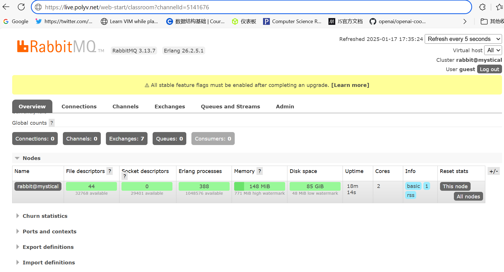


#### 修改guest密码

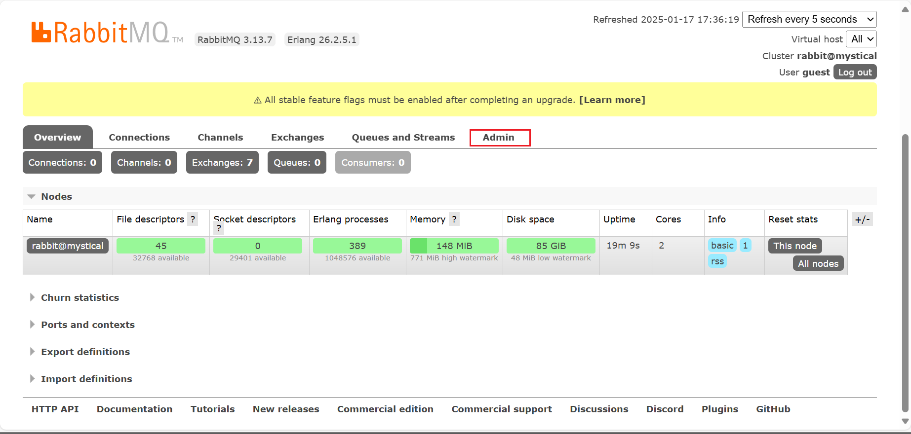


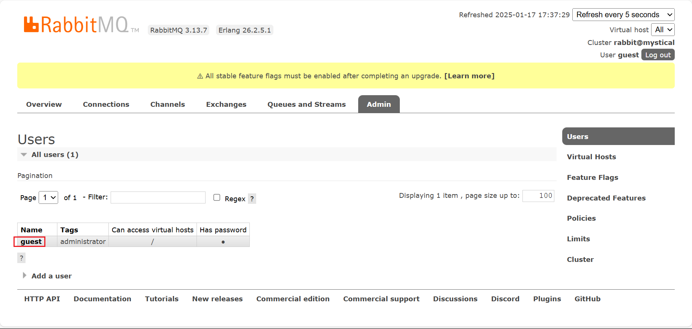


#### 创建新用户

上面可以设置guest用户远程登录,但基于安全起见建议创建新的管理用户

```bash
# 查看用户
[root@mystical ~]# rabbitmqctl list_users
Listing users ...
user	tags
guest	[administrator]

# 可能出现的报错
[root@mystical ~]# rabbitmqctl cluster_status
Error: unable to perform an operation on node 'rabbit@mystical'. Please see diagnostics information and suggestions below.

# 出错原因：Erlang Cookie不一致 或者 host主机名和节点名称不一致
# 解决方案：
# 包安装：确保两个文件内容一致
cat /var/lib/rabbitmq/.erlang.cookie
cat ~/.erlang.cookie

# 编译安装，确保下面两个文件内容一致
[root@mystical ~]# find / -name '.erlang.cookie'
/home/rabbitmq/.erlang.cookie
/root/.erlang.cookie

[root@mystical ~]# cp /home/rabbitmq/.erlang.cookie ~/.erlang.cookie

# 重启服务
[root@mystical ~]# systemctl restart rabbitmq-server.service 
```

#### 管理用户

```bash
# 创建用户
[root@mystical ~]# rabbitmqctl add_user admin 123456
Adding user "admin" ...
Done. Don't forget to grant the user permissions to some virtual hosts! See 'rabbitmqctl help set_permissions' to learn more.

# 查看用户
[root@mystical ~]# rabbitmqctl list_users
Listing users ...
user	tags
admin	[]
guest	[administrator]

# 修改密码
[root@mystical ~]# rabbitmqctl change_password admin 646130
Changing password for user "admin" ...

# 加入管理员角色，可以登录Web管理页面进行管理，但仍然无法访问virtual hosts,需要授权才可以
[root@mystical ~]# rabbitmqctl set_user_tags admin administrator
Setting tags for user "admin" to [administrator] ...

# 查看
[root@mystical ~]# rabbitmqctl list_users
Listing users ...
user	tags
admin	[administrator]
guest	[administrator]

# 设置vhost权限，格式如下
rabbitmqctl [--node <node>] [--longnames] [--quiet] set_permissions [--vhost <vhost>] <username> <conf> 
<write> <read>

# 设置对vhost “/” 给admin用户授予:configure配置，write写，read读的权限，“.*”表示正则表达式的任意字符串
# 默认vhost为 "/"

# 示例
[root@mystical ~]# rabbitmqctl set_permissions [--vhost /] admin ".*" ".*" ".*"
Setting permissions for user "admin" in vhost "/" ...

# 验证权限
[root@mystical ~]# rabbitmqctl list_user_permissions admin
Listing permissions for user "admin" ...
vhost	configure	write	read
/	.*	.*	.*

# 给指定vhost设置权限
```

#### 删除用户

```bash
[root@mq-server ~]#rabbitmqctl list_users
Listing users ...
user tags
admin [administrator]
wang [administrator]
guest [administrator]

[root@mq-server ~]#rabbitmqctl delete_user wang
Deleting user "wang" ...
```


#### 创建vhost


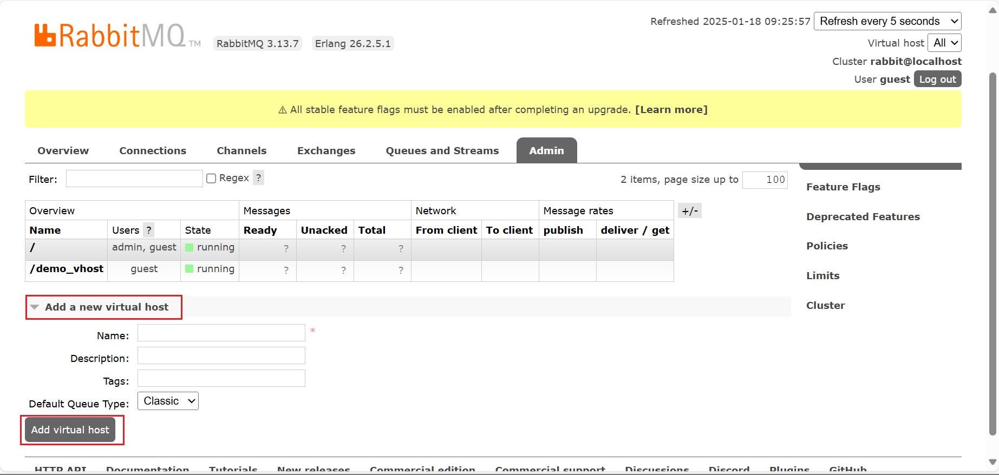


**命令行操作vhost**

```bash
[root@mystical ~]# rabbitmqctl 
......
Virtual hosts:

   add_vhost                                     Creates a virtual host
   clear_vhost_limits                            Clears virtual host limits
   delete_vhost                                  Deletes a virtual host
   list_vhost_limits                             Displays configured virtual host limits
   reconcile_vhosts                              Makes sure all virtual hosts were initialized on all                                                        reachable cluster nodes
   restart_vhost                                 Restarts a failed vhost data stores and queues
   set_vhost_limits                              Sets virtual host limits
   set_vhost_tags                                Sets virtual host tags
   trace_off                                     
   trace_on                                      
   update_vhost_metadata                         Updates metadata (tags, description, default queue type) a                                                  virtual host

......
```


#### 创建Queue

**Queue类似于Kafka的Topic，后续可以向里面写入数据**

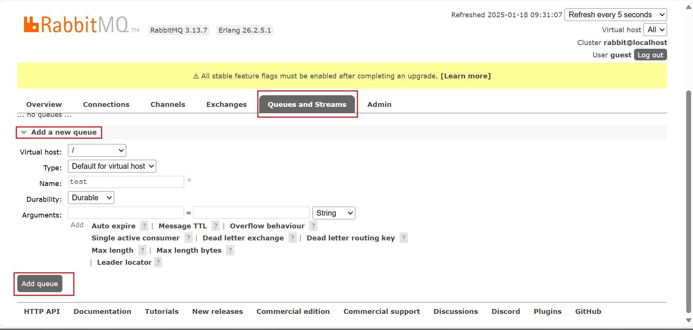


**Durability字段解析**

- **Durable**：

  - 队列是持久化的。

  - 即使 RabbitMQ 服务重启，队列仍然会保留。

  - 队列的元数据存储在磁盘上，而不是仅保存在内存中。

- **Transient**：

  - 队列是非持久化的。

  - 当 RabbitMQ 服务重启时，队列会被删除。

  - 队列的元数据仅存储在内存中。

- **Durable 参数的作用**

  - `Durable` 参数是在声明队列时指定的，其主要目的是控制队列是否在 RabbitMQ 服务重启后保留。

  - **设置 Durable 为 true**：
    - 队列的元数据会被存储到磁盘。
    - 在服务重启后，队列依然存在。

  - **设置 Durable 为 false**：
    - 队列仅存在于内存中。
    - 如果 RabbitMQ 服务重启，队列会丢失。

- **消息持久化 vs 队列持久化**
  - 需要注意的是，**队列的持久化**（通过 `Durable` 参数设置）和**消息的持久化**是两个不同的概念：
  - **队列持久化**：
    - 队列的元数据存储到磁盘。
    - 通过声明队列时设置 `Durable=true`。
  - **消息持久化**：
    - 消息存储到磁盘。
    - 需要在消息发布时，将消息的 `delivery_mode` 属性设置为 2（持久化）。
  - **持久化队列不等于持久化消息**：
    - 即使队列是持久化的，如果消息没有设置持久化属性，服务重启后消息仍然会丢失。
    - 反之，若队列是非持久化的，即使消息设置了持久化，服务重启后消息也会丢失。

```ABAP
生产环境通常会设置队列为持久化（Durable=true），并确保消息的 delivery_mode=2，以实现高可靠性数据传输。
```


### Python客户端访问RabbitMQ

#### 生产者（producter）

队列消息的产生者，负责生产消息，并将消息传入队列

```bash
[root@mystical ~]# apt install -y python3 python3-pip

# 加速配置
[root@mystical ~]# python3 -m pip config set global.index-url https://pypi.tuna.tsinghua.edu.cn/simple
Writing to /root/.config/pip/pip.conf

# 下载pika模块
[root@mystical ~]# pip3 install pika
Looking in indexes: https://pypi.tuna.tsinghua.edu.cn/simple
Collecting pika
  Downloading https://pypi.tuna.tsinghua.edu.cn/packages/f9/f3/f412836ec714d36f0f4ab581b84c491e3f42c6b5b97a6c6ed1817f3c16d0/pika-1.3.2-py3-none-any.whl (155 kB)
     ━━━━━━━━━━━━━━━━━━━━━━━━━━━━━━━━━━━━━━━━ 155.4/155.4 KB 7.4 MB/s eta 0:00:00
Installing collected packages: pika
Successfully installed pika-1.3.2
WARNING: Running pip as the 'root' user can result in broken permissions and conflicting behaviour with the system package manager. It is recommended to use a virtual environment instead: https://pip.pypa.io/warnings/venv
```

```python
import pika
import json

username = 'guest'
password = 'guest'
host = '127.0.0.1'
port = 5672

def publish_messages():
   credentials = pika.PlainCredentials(username, password)
   connection = pika.BlockingConnection(pika.ConnectionParameters(host=host, port=port, virtual_host='/', 
credentials=credentials))
   channel = connection.channel()
    
   queue_name = 'new_test'
   channel.queue_declare(queue=queue_name)
    
   for i in range(10):
       message = json.dumps({'OrderId': f"1000{i}"})
       channel.basic_publish(exchange='', routing_key=queue_name, body=message)
       print(message)
        
   connection.close()

if __name__ == "__main__":
   publish_messages()
```

```bash
# 运行脚本
[root@mystical ~]# python3 rabbitmq_product.py 
{"OrderId": "10000"}
{"OrderId": "10001"}
{"OrderId": "10002"}
{"OrderId": "10003"}
{"OrderId": "10004"}
{"OrderId": "10005"}
{"OrderId": "10006"}
{"OrderId": "10007"}
{"OrderId": "10008"}
{"OrderId": "10009"}
```


#### 消费者（consumer）

```python
import pika

# Define MQ parameters
username = 'guest'
password = '123456'
host = '10.0.0.150'
port = 5672

def consume_messages():
   credentials = pika.PlainCredentials(username, password)
   connection = pika.BlockingConnection(pika.ConnectionParameters(host=host, port=port, virtual_host='/', credentials=credentials))
   channel = connection.channel()

   channel.queue_declare(queue='new_test', durable=False)
    
   def callback(ch, method, properties, body):
       print(body.decode())
       ch.basic_ack(delivery_tag=method.delivery_tag)
    
   channel.basic_consume(queue='new_test', on_message_callback=callback, auto_ack=False)

   channel.start_consuming()
    
if __name__ == "__main__":
   consume_messages()
```


**查看队列和删除**

```bash
# 查看队列
[root@mystical ~]# rabbitmqctl list_queues
Timeout: 60.0 seconds ...
Listing queues for vhost / ...
name	messages
new_test	0
rabbit-test 10
test	0

# 删除队列
[root@mystical ~]# rabbitmqctl delete_queue new_test
Deleting queue 'new_test' on vhost '/' ...
Queue was successfully deleted with 0 ready messages

#清空队列
[root@mystical ~]# rabbitmqctl purge_queue rabbit-test
Purging queue 'rabbit-test' in vhost '/' ...

# 再次查看
[root@mq-server ~]#rabbitmqctl list_queues
Timeout: 60.0 seconds ...
Listing queues for vhost / ...
name messages
rabbit-test 0
```


### RabbitMQ集群部署

#### RabbitMQ集群模式

RabbitMQ集群模式分为两种:普通和镜像模式

- **普通集群模式：**
  - 创建好RabbitMQ集群之后的默认模式
  - queue 创建之后，如果没有其它policy，消息实体只存在于其中一个节点
  - 假设 A、B 两个 Rabbitmq节点仅有相同的元数据，即队列结构，但队列的数据仅保存有一份，即创建该队列的rabbitmq节点（A 节 点）
  - 当消息进入 A 节点的 Queue 中后，consumer 从 B节点拉取时，RabbitMQ 会临时在 A、B 间进行消息传输，把 A中的消息实体取出 并经过 B 发送给consumer，所以 consumer可以连接每一个节点，从中取消息
  - 该模式存在一个问题就是当 A 节点故障后，B节点无法取到A 节点中还未消费的消息实体。可能会丢失数据
  - **缺点： 没有数据高可用**
  - **优点：多个节点可以实现负载均衡**


- **镜像集群模式：** 
  - 把需要的队列做成镜像队列，存在于多个节点，属于 RabbitMQ 的 HA方案（镜像模式是在普通模式的基础上，增加一些镜像策略）
  - 该模式解决了普通模式中的数据丢失问题，其实质和普通模式不同之处在于，消息实体会主动在镜像节点间同步，而不是在consumer 取数据时临时拉取
  - 该模式带来的副作用也很明显，除了降低系统性能外，如果镜像队列数量过多，加之大量的消息进入，集群内部的网络带宽将会被这种 同步通讯大大消耗掉，所以在对可靠性要求较高的场合中适用
  - 一个队列想做成镜像队列，需要先设置policy， 然后客户端创建队列的时候，rabbitmq集群根据“队列名称”自动设置是普通集群模式或 镜像队列
  - **优点：此模式因数据有冗余,比较常用**
  - **缺点：性能不佳**


- **集群中两种节点类型:**
  - 内存节点：只将数据保存到内存
  - 磁盘节点：保存数据到内存和磁盘。

```ABAP
内存节点执行效率比磁盘节点要高，集群中只需要一个磁盘节点来保存数据就可以
如果集群中只有内存节点，那么不能全部停止它们，否则所有数据消息在服务器全部停机之后都会丢失。
```


 **推荐设计架构**

在一个rabbitmq 集群里，有 3 台或以上机器，其中 1台使用磁盘模式，其它节点使用内存模式，内存节点访问速度更快，由于磁盘IO相对 较慢，因此可作为数据备份使用。


#### 安装RabbitMQ集群

##### 环境准备

集群节点之间通信依赖主机名，每个节点需要有唯一的主机名

集群环境准备三台服务器，不同节点需要指定的主机名

```bash
[root@ubuntu1804 ~]#hostnamectl set-hostname node1.wang.org
[root@ubuntu1804 ~]#hostnamectl set-hostname node2.wang.org
[root@ubuntu1804 ~]#hostnamectl set-hostname node3.wang.org

[root@node1 ~]#cat >> /etc/hosts <<EOF
10.0.0.101 node1.wang.org node1
10.0.0.102 node2.wang.org node2
10.0.0.103 node3.wang.org node3
EOF

[root@node1 ~]#scp /etc/hosts node2:/etc/hosts
[root@node1 ~]#scp /etc/hosts node3:/etc/hosts
```


##### 各节点分别安装RabbitMQ并启用Web管理

```bash
# 下载rabbitmq
[root@node1 ~]# wget https://www.mysticalrecluse.com/script/tools/rabbitmq-server-generic-unix-3.13.7.tar.xz
[root@node1 ~]# wget https://www.mysticalrecluse.com/script/tools/otp_src_26.2.5.1.tar.gz

# 下载RabbitMQ安装脚本
[root@node1 ~]# wget https://www.mysticalrecluse.com/script/Shell/install_rabbitmq.sh

# 访问IP:15672,验证各个节点都可以用guest/guest登录
```

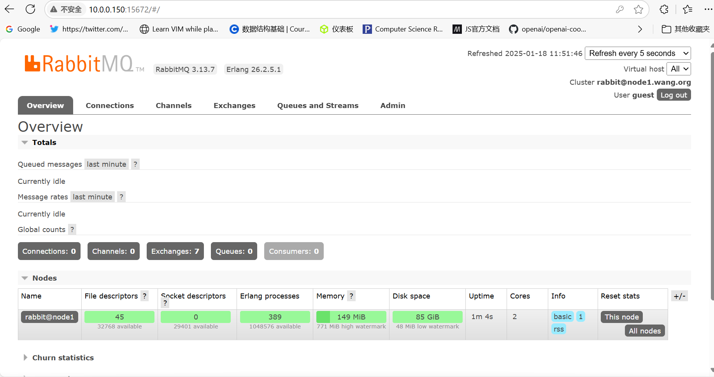


##### 同步 cookie 文件

RabbitMQ 的集群是依赖于 erlang 的集群来工作的，所以必须先构建起 erlang的集群环境

而 Erlang 的集群中各节点是通过一个 magic cookie来实现的

这个 cookie 存放在 `/var/lib/rabbitmq/.erlang.cookie` 中，编译安装是在`/home/rabbitmq/.erlang.cookie`

文件是 400的权限,所以必须保证各节点cookie 保持一致，否则节点之间就无法通信。

```bash
[root@node1 ~]# ll /home/rabbitmq/.erlang.cookie 
-r-------- 1 rabbitmq rabbitmq 20 Jan 18 00:00 /home/rabbitmq/.erlang.cookie

[root@node1 ~]# cat /home/rabbitmq/.erlang.cookie 
QQYNWDZEONWPFROEDSFM

[root@node1 ~]# scp /home/rabbitmq/.erlang.cookie node2:/home/rabbitmq/.erlang.cookie
.erlang.cookie                                                               100%   20    61.7KB/s   00:00    
[root@node1 ~]# scp /home/rabbitmq/.erlang.cookie node3:/home/rabbitmq/.erlang.cookie
.erlang.cookie                                                               100%   20    54.2KB/s   00:00 

# 重启服务生效
[root@node1 ~]# systemctl restart rabbitmq-server.service
[root@node2 ~]# systemctl restart rabbitmq-server.service
[root@node3 ~]# systemctl restart rabbitmq-server.service
```


##### 创建集群

```bash
# 在 node2,node3 节点执行以下命令作为内存节点添加到 node1 所在集群
# 将 node2 加入集群
[root@node2 ~]# rabbitmqctl stop_app                    # 停止app服务
Stopping rabbit application on node rabbit@node2 ...

[root@node2 ~]# rabbitmqctl reset                       # 清空元数据
Resetting node rabbit@node2 ...

#将node2添加到集群当中，并成为内存节点，不加--ram 默认是磁盘节点,此步依赖于/etc/hosts的名称解析
[root@node2 ~]# rabbitmqctl join_cluster rabbit@node1 --ram
Clustering node rabbit@node2 with rabbit@node1

# 启动app服务
[root@node3 ~]# rabbitmqctl start_app
Starting node rabbit@node3 ...

# 将 node3 加入集群
[root@node3 ~]# rabbitmqctl stop_app
Stopping rabbit application on node rabbit@node3 ...

[root@node3 ~]# rabbitmqctl reset
Resetting node rabbit@node3 ...

[root@node3 ~]# rabbitmqctl join_cluster rabbit@node1 --ram
Clustering node rabbit@node3 with rabbit@node1

[root@node3 ~]# rabbitmqctl start_app
Starting node rabbit@node3 ...
```

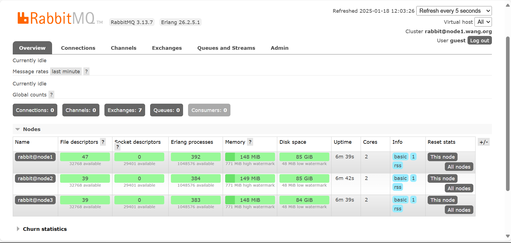


##### 将集群设置为镜像模式

创建的集群默认为普通模式,没有冗余性,可以修改为镜像模式

```bash
# 命令说明
rabbitmqctl set_policy [-p Vhost] Name Pattern Definition [Priority]

# 参数说明
-p Vhost                # 可选参数，针对指定vhost下的queue进行设置
Name                    # policy的名称
Pattern                 # queue的匹配模式(正则表达式)
Definition              # 镜像定义，包括三个部分ha-mode, ha-params, ha-sync-mode
ha-mode                 #指明镜像队列的模式，有效值为 all/exactly/nodes
all                     # 表示在集群中所有的节点上进行镜像
exactly                 # 表示在指定个数的节点上进行镜像，节点的个数由ha-params指定
nodes                   # 表示在指定的节点上进行镜像，节点名称通过ha-params指定
ha-params               # ha-mode模式需要用到的参数
ha-sync-mode            # 进行队列中消息的同步方式，有效值为automatic和manual
priority                # 可选参数，policy的优先级
```

默认模式为普通模式,无数据冗余功能,可以通过设置镜像模式,实现集群的高可用性功能

```bash
#在任意一个节点执行一次下面操作即可
[root@node1 ~]# rabbitmqctl set_policy ha-all "^" '{"ha-mode":"all"}'
Setting policy "ha-all" for pattern "^" to "{"ha-mode":"all"}" with priority "0" for vhost "/" ...

# 查看
[root@node1 ~]# rabbitmqctl list_policies
Listing policies for vhost "/" ...
vhost	name	pattern	apply-to	definition	priority
/	ha-all	^	all	{"ha-mode":"all"}	0
```


##### 验证镜像模式

```bash
#在任意节点创建用户并设置权限,会自动同步至其它节点
[root@node1 ~]# rabbitmqctl add_user mystical 123456
Adding user "mystical" ...
Done. Don't forget to grant the user permissions to some virtual hosts! See 'rabbitmqctl help set_permissions' to learn more.

[root@node1 ~]# rabbitmqctl set_user_tags mystical administrator
Setting tags for user "mystical" to [administrator] ...

[root@node1 ~]# rabbitmqctl set_permissions mystical ".*" ".*" ".*" 
Setting permissions for user "mystical" in vhost "/" ...

[root@node1 ~]# rabbitmqctl list_users
Listing users ...
user	tags
mystical	[administrator]
guest	[administrator]

# 在任何其他节点上查看用户信息
[root@node2 ~]# rabbitmqctl list_users
Listing users ...
user	tags
mystical	[administrator]
guest	    [administrator]
```


## MINIO


**内容概述**

- **MINIO 介绍**
- **MINIO 部署**
- **MINIO 使用**
- **MINIO 故障恢复**
- **MINIO 扩容和缩容**
- **MINIO 备份和还原**
- **MINIO 监控**


### MINIO介绍


MinIO 是GlusterFS创始人之一Anand Babu Periasamy发布的新的开源项目。

MinlO 是一个**用 GoLang 语言开发**的基于 **GNU AGPL v3** 开源协议的对象存储服务(Object Storage  Service, OSS)

对象存储服务是一种海量、安全、低成本、高可靠的云存储服务，适合存放任意类型的文件。

对象存储服务支持容量和处理能力弹性扩展，多种存储类型供选择，全面优化存储成本。

MinlO **兼容亚马逊S3云存储服务接口**，非常适合于存储大容量非结构化的数据，例如:图片、视频、日志 文件、备份数据和容器/虚拟机镜像等

MinlO 支持的一个对象文件可以是任意大小，从几kb到最大5T不等

MinlO 是一个非常轻量的服务， 可以很简单的和其他应用的结合,也支持各种操作系统,比 如:Linux,Windows,Mac等

**对于中小型企业的对象存储**，如果不选择公有云存储，那么Minio是个不错的选择

MinIO 除了直接作为对象存储使用,还可以作为云上对象存储服务的网关层，无缝对接到Amazon S3、 MicroSoft Azure。


**MINIO特点**

- MinIO 提供高性能、与S3 兼容的对象存储系统，让你自己能够构建自己的云储存服务。
- MinIO 使用和部署非常简单，可以让您在最快的时间内实现下载到生产环境的部署。
- MinIO 读写性能优异,高性能MinIO 是世界上最快的对象存储，没有之一。在 32 个 NVMe 驱动器节点和 100Gbe 网络上发布的 GET/PUT 结果超过 325 GiB/秒和 165 GiB/秒
- MinIO 支持的对象文件小到几kb到最大5T,并实现了数据的高可用
- MinIO 原生支持 Kubernetes，它可用于每个独立的公共云、每个 Kubernetes 发行版、私有云和 边缘的对象存储套件
- MinIO 是软件定义的，不需要购买其他任何硬件，在 GNU AGPL v3 下是 100% 开源的


**MINIO性能**

```ABAP
节点越多，性能越好
```


### MINIO工作机制

#### MINIO相关术语

- **0bject 对象**
  - 存储到Minio的基本对象,如文件、字节流等任意数据
- **Bucket 桶**
  - 用来存储Object的逻辑空间。
  - 每个Bucket之间的数据是相互隔离的。
  - 对于客户端而言，就相当于一个存放文件的顶层文件夹，用于实现不同资源的分类存储
  - 通常一个项目或同一类资源可以对应于一个Bucket
- **Drive 驱动器**
  - 即存储数据的磁盘,**一个Drive通常对应一块物理磁盘**或者一个独立目录
  - **在MinIO启动时，以参数的方式传入**
  - Minio 中所有的对象数据都会存储在Drive里
- **Set 存储集**
  - 一组Drive的集合,即一组相关的磁盘的集合
  - 分布式部署时,MinIO会根据集群规模自动划分一个或多个Set，每个Set中的Drive分布在不同位置。
  - 一个对象存储在一个Set上
  - 一个集群划分为多个Set
  - 一个Set包含的Drive数量是固定的， 默认由系统根据集群规模自动计算得出
  - 一个Set中的Drive尽可能分布在不同的节点上


####  纠删码EC（Erasure Code）

分布式存储，很关键的点在于数据的可靠性，即保证数据的完整,不丢失，不损坏。只有在可靠性实现的 前提下，才有了追求一-致性、高可用、高性能的基础。而对于在存储领域，一 般对于保证数据可靠性的 方法主要有两类，一类是**冗余法**，一 类是**校验法**。


- **冗余法**
  - 冗余法即对存储的数据进行副本备份，当数据出现丢失，损坏，即可使用备份内容进行恢复，而副 本备份的多少，决定了数据可靠性的高低。这其中会有成本的考量，副本数据越多，数据越可靠， 但需要的设备就越多，成本就越高。可靠性是允许丢失其中一份数据。
  - 当前有很多分布式系统采用此种方式实现，如：ELasticsearch的索引副本，Kafka的副本，Redis 的集群，MySQL的主从模式，Hadoop的多副本的文件系统
- **校验法**
  - 校验法即通过校验码的数学计算的方式，对出现丢失、损坏的数据可以实现**校验**和**还原**两个功能
  - 通过对数据进行校验和( checksum )进行计算，可以检查数据是否完整，有无损坏或更改，在数据 传输和保存时经常用到，如TCP协议
  - 恢复还原，通过对数据结合校验码进行数学计算，还原丢失或损坏的数据，可以在保证数据可靠的 前提下，降低冗余，如单机硬盘存储中的RAID技术，纠删码(Erasure Code)技术等。
  - **MinlO采用的就是纠删码技术**


MinIO 纠删码EC (Erasure Code) 是一种数据冗余和可用性功能，允许具有多个驱动器的 MinIO 部署即 时自动重建对象，即使群集中丢失了多个驱动器或节点。 纠删码提供了**对象级修复**

Minio使用纠删码erasure code 和校验和checksum来保护数据免受硬件故障和无声数据损坏。即便您 丢失一 半数量(N/2) 的硬盘,您仍然可以恢复数据

纠删码是一种恢复铁和损坏数据的数学算法，Minio采用Reed-Solomon code将对象拆分成N/2数据和 N/2奇偶校验块。

```ABAP
当损坏总磁盘数的一半磁盘时,只能读取而不能上传新的文件,只要保证正常磁盘数大于等n/2+1时,就可以支持写入新数据
```

这就意味着如果是12块盘，一个对象会被分成6个数据块、6个奇偶校验块，你可以失任意6块盘(不管其 是存放的数据块还是奇偶校验块)，你仍可以从剩下的盘中的数据进行恢复

```ABAP
实现纠删码 EC 至少需要4块磁盘以上
```

纠删码是可以通过数学计算,实现数据冗余,功能上类似于RAID技术,当磁盘损坏时,可以通过计算把丢失的 数据进行还原，它可以将n份原始数据,增加m份数据,并能通过n+m份中的任意n份数据,还原为原始数 据。即如果有**任意小于等于m份**的数据失效,仍然能通过剩下的数据还原出来。


#### MinIO 工作流程


### MINIO部署


 **部署模式**

- **单机单硬盘**
- **单机多硬盘**
- **多机多硬盘**


**部署方法**

- **包安装**
- **二进制安装**
- **Docker容器化安装**
- **基于Kubernetes部署**


#### 单机部署

minio server的standalone模式，即单机模式，所有管理的磁盘都在一个主机上。

该启动模式一般仅用于实验环境、测试环境、开发环境的验证和学习使用。

在standalone模式下，还可以分为**non-erasure code mode**和**erasure code mode(纠删码)**。

- **non-erasure code mode**
  - 当minio server 运行时只传入一个本地磁盘参数。即为 non-erasure code mode
  - 在此启动模式下，对于每一份对象数据， minio直接存储这份数据，不会建立副本，也不会启用纠删码机制。
  - 因此,这种模式无论是服务实例还是磁盘都是”单点"，无任何高可用保障，磁盘损坏就意味着数据丢失。
- **erasure code mode**
  - 此模式需要为minio server实例传入多个本地磁盘参数。
  - 一旦遇到多于一 个磁盘的参数， minio server会自动启用erasure code mode.
  - erasure code对磁盘的个数是有要求的，至少4个磁盘, 如不满足要求，实例启动将失败。
  - erasure code启用后，要求传给minio server的endpoint(standalone模式下，即本地磁盘上的目录)至少为4个。


##### 包安装

**Debian/Ubuntu包安装**

```bash
# 下载deb包
[root@mystical ~]# wget https://dl.min.io/server/minio/release/linux-amd64/archive/minio_20230829230735.0.0_amd64.deb -O minio.deb

# 安装
[root@mystical ~]# dqkg -i minio.deb

# 查看
[root@mystical ~]# which minio
/usr/local/bin/minio

[root@mystical ~]# minio -v
minio version RELEASE.2023-08-29T23-07-35Z (commit-id=07b1281046c8934c47184d1b56c78995ef960f7d)
Runtime: go1.19.12 linux/amd64
License: GNU AGPLv3 <https://www.gnu.org/licenses/agpl-3.0.html>
Copyright: 2015-2023 MinIO, Inc.

# 查看service文件
[root@mystical ~]# grep -Ev "#|^$" /lib/systemd/system/minio.service
[Unit]
Description=MinIO
Documentation=https://docs.min.io
Wants=network-online.target
After=network-online.target
AssertFileIsExecutable=/usr/local/bin/minio
[Service]
Type=notify
WorkingDirectory=/usr/local
User=minio-user
Group=minio-user
ProtectProc=invisible
EnvironmentFile=-/etc/default/minio
ExecStartPre=/bin/bash -c "if [ -z \"${MINIO_VOLUMES}\" ]; then echo \"Variable MINIO_VOLUMES not set in /etc/default/minio\"; exit 1; fi"
ExecStart=/usr/local/bin/minio server $MINIO_OPTS $MINIO_VOLUMES
Restart=always
LimitNOFILE=1048576
TasksMax=infinity
TimeoutStopSec=infinity
SendSIGKILL=no
[Install]
WantedBy=multi-user.target

# 需自行创建用户
[root@mystical ~]# groupadd -r minio-user
[root@mystical ~]# useradd -M -r -s /sbin/nologin -g minio-user minio-user

# 准备多个数据目录,minio数据目录不允许和根文件系统在一起，注意：新版允许
[root@mystical ~]# mkdir -p /data

# 在现有卷组中，切10G逻辑卷
[root@mystical ~]# lvcreate -n minio -L 10G ubuntu-vg 
  Logical volume "minio" created.
  
# 给新逻辑卷创建文件系统
[root@mystical ~]# mkfs.ext4 /dev/ubuntu-vg/minio 
mke2fs 1.46.5 (30-Dec-2021)
Creating filesystem with 2621440 4k blocks and 655360 inodes
Filesystem UUID: 956b6bf3-8709-4c30-a8e1-97eda95cba2a
Superblock backups stored on blocks: 
	32768, 98304, 163840, 229376, 294912, 819200, 884736, 1605632

Allocating group tables: done                            
Writing inode tables: done                            
Creating journal (16384 blocks): done
Writing superblocks and filesystem accounting information: done 

# 配置持久化
[root@mystical ~]# echo /dev/ubuntu-vg/minio /data ext4 defaults 0 0 >> /etc/fstab

# 挂载
[root@mystical ~]# mount -a

[root@mystical ~]# mkdir -p /data/minio{1..4} 
[root@mystical ~]# chown -R minio-user.minio-user /data/
[root@mystical ~]# ll -d /data/minio{1..4}
drwxr-xr-x 2 minio-user minio-user 4096 Jan 18 08:22 /data/minio1/
drwxr-xr-x 2 minio-user minio-user 4096 Jan 18 08:22 /data/minio2/
drwxr-xr-x 2 minio-user minio-user 4096 Jan 18 08:22 /data/minio3/
drwxr-xr-x 2 minio-user minio-user 4096 Jan 18 08:22 /data/minio4/

# 创建初始化参数（注意在实验时将注释去掉，防止干扰）
[root@mystical ~]# cat > /etc/default/minio <<EOF
> MINIO_ROOT_USER=admin                #默认minioadmin
MINIO_ROOT_PASSWORD=12345678           #默认minioadmin
MINIO_VOLUMES="/data/minio{1...4}"     #必选项
MINIO_OPTS='--console-address :9001'   #默认端口随机端口
> EOF

# 开机自启服务并启动minio
[root@mystical ~]# systemctl enable --now minio.service 

#登录 http://10.0.0.100:9001/ 用户名密码:admin/12345678 
```


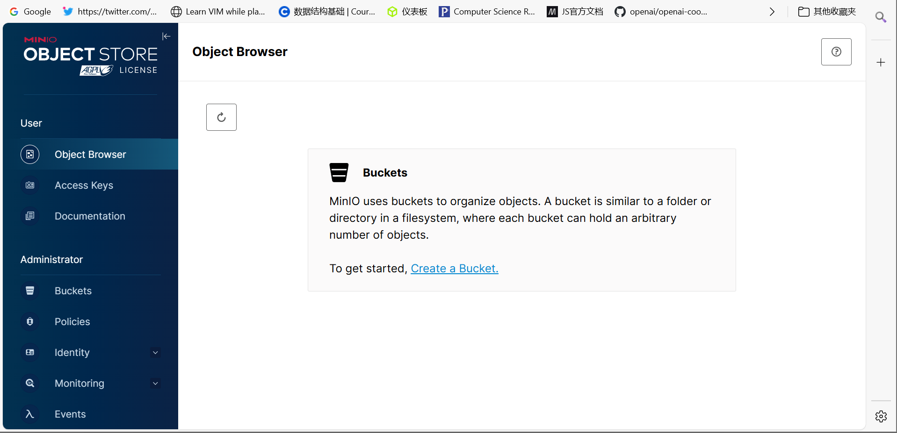


**红帽系统包安装**

```bash
# 下载rpm包
[root@localhost ~]# wget https://dl.min.io/server/minio/release/linux-amd64/archive/minio-20230829230735.0.0.x86_64.rpm -O minio.rpm

# 安装
[root@localhost ~]# yum install -y ./minio.rpm 

# 应用
[root@localhost ~]# mkdir ~/minio
[root@localhost ~]# minio server ~/minio --console-address :9090

#默认用户和密码
#RootUser: minioadmin 
#RootPass: minioadmin 
```


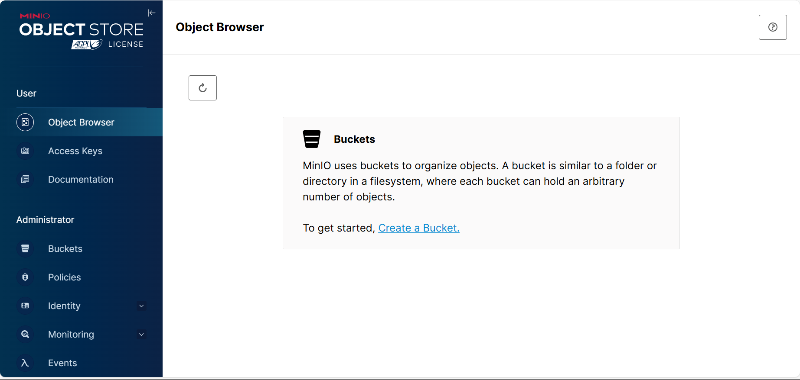


##### 二进制表示部署

```bash
# 官方下载网站
https://dl.min.io/server/minio/release/linux-amd64/

# 下载二进制文件
[root@mystical ~]# wget https://dl.min.io/server/minio/release/linux-amd64/minio

# 添加到PATH路径并添加执行权限
[root@mystical ~]# install minio /usr/local/bin

# 准备数据目录，建议此目录为逻辑卷，方便后期动态扩容
[root@mystical /data/minio]# lvcreate -n minio -L 10G ubuntu-vg
[root@mystical /data/minio]# mkdir -p /data
[root@mystical /data/minio]# mkfs.ext4 /dev/ubuntu-vg/minio 
[root@mystical /data/minio]# echo /dev/ubuntu-vg/minio /data ext4 defaults 0 0 >> /etc/fstab
[root@mystical /data/minio]# mount -a
# 实际生产中，4个目录对应4块独立硬盘，这里仅做模拟
[root@mystical /data/minio]# mkdir -p /data/minio{1..4}
[root@mystical /data/minio]# chown -R minio.minio /data/

# 创建用户
[root@mystical ~]# useradd -s /sbin/nologin -r minio

# 给目录授权
[root@mystical ~]# chown -R minio.minio /data/minio/

# 创建service文件，新版对密码强度有要求，不要用弱密码
[root@mystical /data/minio]# cat /lib/systemd/system/minio.service
[Unit]
Description=Minio
After=systemd-networkd.service systemd-resolved.service
Documentation=https://min.io
[Service]
Type=notify
Environment=MINIO_ROOT_USER=admin MINIO_ROOT_PASSWORD=Zyf123456
ExecStart=/usr/local/bin/minio server /data/minio{1...4} --console-address ":9999"
Restart=on-failure
User=minio
Group=minio
LimitNOFILE=infinity
LimitNPROC=infinity
LimitCORE=infinity
[Install]
WantedBy=multi-user.target

[root@mystical /data/minio]# systemctl enable --now minio

# 访问10.0.0.151:9999
```

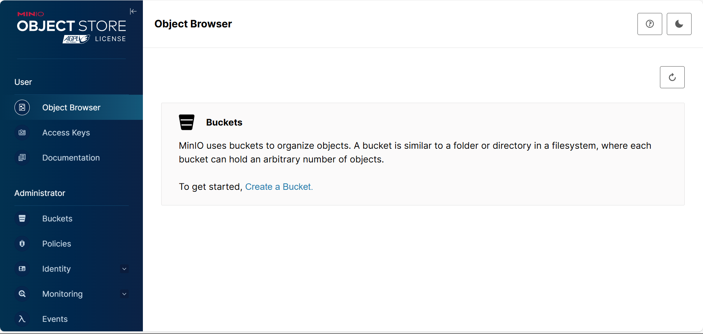


#### 分布式集群部署


**分布式Minio优势**

- **数据保护**
  - 分布式Minio采用纠删码来防范多个节点宕机和位衰减bit rot。
  - 分布式Minio至少需要4个硬盘，使用分布式Minio 会自动引入纠删码功能
- **高可用**
  - 单机Minio服务存在单点故障，相反，如果是一个有N块硬盘的分布式Minio,只要有N/2硬盘在线， 数据就是安全的。不过你需要至少有N/2+1个硬盘来创建新的对象。
  - 例如，一个16节点Minio集群，每个节点16块硬盘，就算8台服务器宕机，这个集群仍然可读的， 不过需要9台服务器才能写数据。
- **性能**
  - 多个节点负载均衡，提升性能
- **一致性**
  - Minio在分布式和单机模式下，所有读写操作都严格遵守read-after-write一致性模型。


**分布式Minio实现条件**

- 在所有节点运行同样的命令启动一个分布式Minio实例，只需要把硬盘位置做为参数传给minio  server命令即可
- 分布式Minio中的所有节点需要有同样的环境变量MINIO_ACCESS_KEY和MINIO_SECRET_KEY，才 能建立分布式集群
  - 注意：新版本使用环境变量 **MINIO_ROOT_USER**和**MINIO_ROOT_PASSWORD**
- 分布式Minio使用的磁盘里必须是干净的，里面没有数据
- 分布式Minio里的节点时间差不能超过3秒，可以使用NTP来保证时间一致


**分布式Minio注意事项**

- minio服务器多块数据磁盘需申请独立的磁盘，在物理底层要相互独立避免遇到磁盘io竞争，导致 minio性能直线下降,如果性能下降严重，数据量大时甚至会导致集群不可用
- minio数据磁盘最大不超过2T,如果使用lvm逻辑卷，逻辑卷大小也不要超过2T，过大的磁盘或文件 系统会导致后期IO延迟较高导致minio性能降
- minio集群共M节点每个节点N块数据磁盘，磁盘只要存活M*N/2，minio集群数据就是安全的，在 节点数剩余M/2+1时节点可以正常读写
- 如果使用lvm方式扩展集群容量，请在部署阶段minio数据目录就使用lvm。
- 如果需要备份minio集群数据，请准备存放minio集群所有对象数据的空间容量
  - 比如: 一个2T/盘*4块/节点*8节点=64T的集群所有容量的一半存储空间即32T服务器，配置内存 CPU配置不需要太高
- 如果网络环境允许请把minio集群节点配置双网卡，节点通信网络与客户端访问网络分开避免网络瓶颈
- 配置反向代理实现MinIO的负载均衡, 可以使用云服务SLB或者2台haproxy/nginx结合keepalived 实现高可用
- minio系统中不要安装消耗IO较高的应用,比如:updatedb程序，如安装请排除扫描minio数据目录, 否则可以会导致磁盘io延迟过高，会导致cpu负载过高，从而降低minio性能


**二进制安装MinIO 实现3节点4磁盘的分布式集群部署**

```bash
#准备三台主机,在所有节点上做好名称解析
[root@minio1 ~]# cat /etc/hosts
10.0.0.150 minio1.mystical.org minio1
10.0.0.151 minio2.mystical.org minio2
10.0.0.152 minio3.mystical.org minio3

# 在所有节点下载二进制程序
[root@minio1 ~]# wget https://dl.min.io/server/minio/release/linux-amd64/minio
[root@minio1 ~]# install minio /usr/local/bin/minio

#在所有节点上准备数据目录和用户
[root@minio1 ~]# lvcreate -n minio -L 10G ubuntu-vg
[root@minio1 ~]# mkfs.ext4 /dev/ubuntu-vg/minio
[root@minio1 ~]# echo /dev/ubuntu-vg/minio /data/ ext4 defaults 0 0 >> /etc/fstab
[root@minio1 ~]# mkdir -p /data
[root@minio1 ~]# mkdir -p /data/minio{1..4}
[root@minio1 ~]# useradd -r -s /sbin/nologin minio
[root@minio1 ~]# chown -R minio. /data

# 在所有节点上准备环境变量
[root@minio3 ~]# cat > /etc/default/minio <<EOF
> MINIO_ROOT_USER=admin
MINIO_ROOT_PASSWORD=12345678
MINIO_VOLUMES='http://minio{1...3}.mystical.org:9000/data/minio{1...4}'
MINIO_OPTS='--console-address :9001'
MINIO_PROMETHEUS_AUTH_TYPE="public"
> EOF


#在所有节点上创建service文件
[root@minio1 ~]# vim/lib/systemd/system/minio.service
[Unit]
Description=MinIO
Documentation=https://docs.min.io
Wants=network-noline.target
After=network-noline.target

[Service]
WorkingDirectory=/usr/local
User=minio
Group=minio
EnvironmentFile=-/etc/default/minio
ExecStartPre=/bin/bash -c "if [ -z \"${MINIO_VOLUMES}\" ]; then echo \"Variable MINIO_VOLUMES not set in /etc/default/minio\"; exit 1; fi"
ExecStart=/usr/local/bin/minio server $MINIO_OPTS $MINIO_VOLUMES
Restart=always
LimitNOFILE=1048576
TasksMax=infinity

[Install]
WantedBy=multi-user.target


# 在所有节点启动服务
#浏览器访问 http://minio{1..3}.wang.org:9000/ 用户名密码:admin/12345678
```


**配置反向代理，通过haproxy或nginx实现minio的反向代理**

```bash
#配置反向代理,通过Haproxy或者Nginx实现minio的反向代理
#Haproxy配置
[root@mystical ~]# apt update && apt -y instapt update && apt -y install haproxy

[root@mystical ~]# vim /etc/haproxy/haproxy.cfg
...
listen stats
   mode http
   bind 0.0.0.0:9999
   stats enable
   log global
   stats uri /haproxy-status
   stats auth admin:123456
listen minio
   bind 10.0.0.100:9000
   mode http
   log global
   server 10.0.0.101 10.0.0.101:9000 check inter 3000 fall 2 rise 5
   server 10.0.0.102 10.0.0.102:9000 check inter 3000 fall 2 rise 5
   server 10.0.0.103 10.0.0.103:9000 check inter 3000 fall 2 rise 5
listen minio_console
   bind 10.0.0.100:9001
   mode http
   log global
   server 10.0.0.101 10.0.0.101:9001 check inter 3000 fall 2 rise 5
   server 10.0.0.102 10.0.0.102:9001 check inter 3000 fall 2 rise 5
   server 10.0.0.103 10.0.0.103:9001 check inter 3000 fall 2 rise 5

# 重启haproxy
[root@mystical ~]# systemctl restart haproxy.service

# 访问10.0.0.100:9000
```


