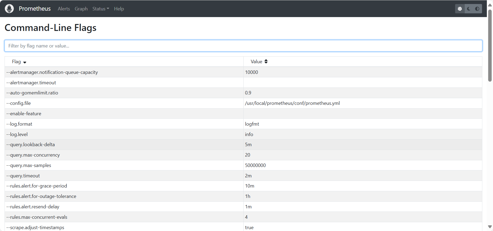
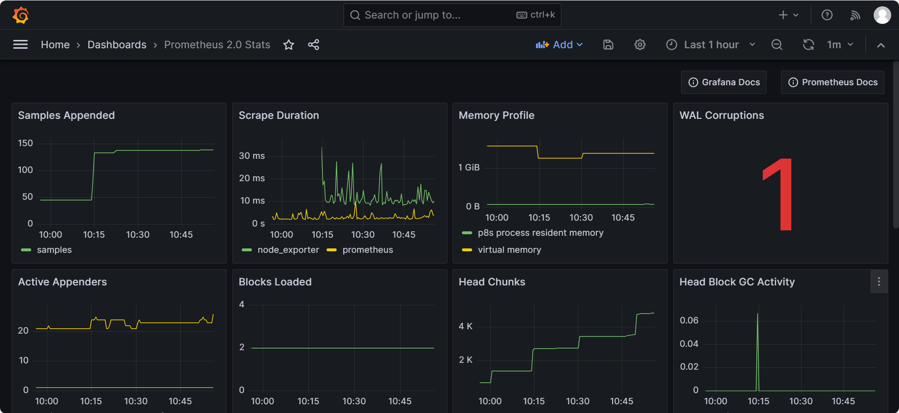
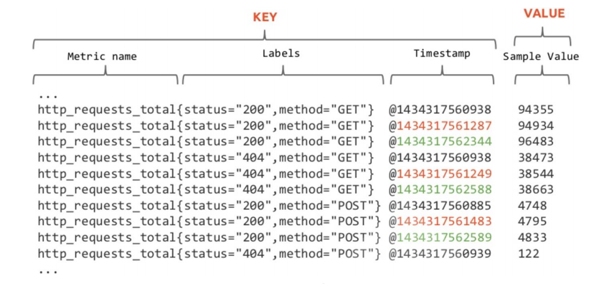
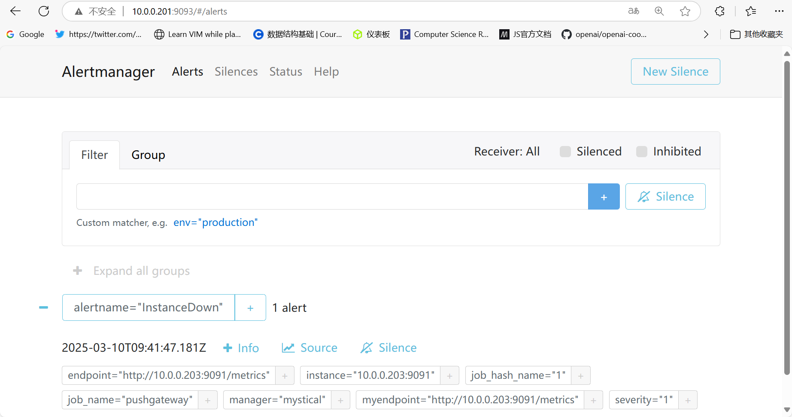
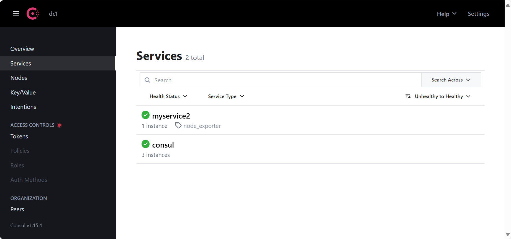
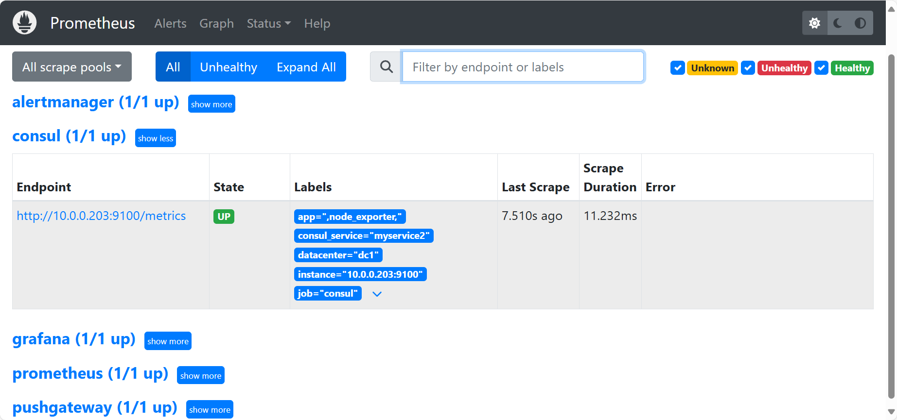
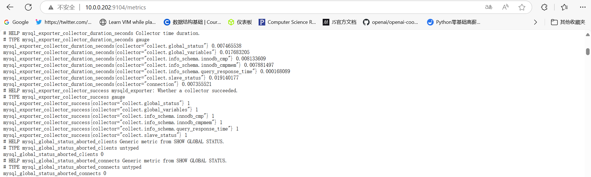

# Prometheus


- **Prometheus 介绍**
- **Prometheus 部署和配置**
- **Node Exporter 采集数据**
- **Pushgateway 采集数据**
- **PromQL 查询语言**
- **Grafana 图形化展示**
- **Prometheus 标签管理**
- **Prometheus 告警机制**
- **Prometheus 服务发现**
- **各种 Exporter 高级功能**
- **Prometheus 实现容器监控**
- **Prometheus 联邦 Federation**
- **Prometheus 远程存储 VictoriaMetrics**
- **Kubernetes 集成 Prometheus**


## Prometheus 介绍

监控是运维的第一道防线，业务系统可以不做运维自动化，可以不做 DevOps，但一定不能不做监控。 监控是业务的"眼睛"，能在第一时间发现对应的异常问题，只有这样才能第一时间去解决问题。

"无监控、不运维"，没了监控，什么基础运维，业务运维都是"瞎子"。监控是运维岗位的基本要求。运维 工作做的好不好，更多的是看监控有没有做好。

一个完整的监控系统需要包括如下功能：数据产生、数据采集、数据存储、数据处理、数据展示分析、 告警


### 监控系统组成

#### 数据来源

我们如果要监控数据，首先得有数据，也就是说，这些数据应该可以被记录下来，或者被暴露出来，数据常见的产生、直接或间接暴露方式的方式如下

- 硬件本身的记录信息 - 以文件或者以内存属性的方式存在
- 应用业务的接口 - 主动暴露软件本身的运行状态，比如 redis info、各种status等
- 相关的信息采集工具 - 方便收集数据或者采集数据的系统级别的命令等


注意：这些数据在长时间的运行过程中，都是以固定的"属性指标"来描述他们，我们把这些称为 **metric**。

监控系统就需要对每个环境的每一个指标都要进行数据的获取，并且按照用户需要的方式提供给用户来使用。


#### 数据采集

对于上面所说的Metric指标数据，我们通常不会只获取一次，而是需要持续性、周期性的方式来采集。 根据数据采集方式的不同划分为了两个分类：

- **软件方式**

  **agent**: 专用的软件的一种应用机制。

  **http**:  基于http 协议实现数据采集

  **ssh**: 系统常见的一种应用通信机制，但是并非所有系统都支持。

  **SNMP**: 简单网络管理协议(Simple Network Management Protocol),是工作在各种网络设备中的一 种机制。

- **硬件方式**

  **IPMI**: 智慧平台管理接口(Intelligent Platform Management Interface)是一种工业标准用于采集硬 件设备的各种物理健康状态数据，如温度、电压、风扇工作状态、电源状态等。

注意：由于每个业务场景，需要采集的指标数量是不确定的，有时只是一个业务场景，就需要采集数百 个指标，如果按照上述所说的周期性采集的方式来说，数据的采集量是相当大的


#### 数据存储

由于我们采集到的"样本数据"，不是一次性使用的，尤其是单个数据是没有意义的，我们需要将这些数据存储下来，在后续的工作场景中进行聚合操作，从而来满足我们的需求。所以这些数据的存储也是一个非常重要的点。同时，我们在后续使用这些数据的时候，不仅仅要知道这些数据，还要知道这些数据的**时间属性**--什么时候的数据。所以这些数据在存储的时候，必须有一个重要的**时间维度**。

所以我们一般将这种用于监控场景的数据，称为**时间序列数据 - TS(Time series data)**,专门用于存储这些 数据的数据库，称其为**时序数据库(TSDB Time series database）**


**时序列数据库**是用来存储时序列（time-series）数据并以时间（点或区间）建立索引的软件

一般**时序列数据**都具备以下特点

- 数据结构简单：某一度量指标在某一时间点只会有一个值，没有复杂的结构（嵌套、层次等）和关 系（关联、主外键等）
- 数据量大：由于时序列数据由所监控的大量数据源来产生、收集和发送，比如主机、IoT设备、终端或App等


#### 数据处理

如果仅仅采集到的是原始的数据，本身往往没有太大的意义，通常还需要对数据进行各种聚合和处理操作才可以正常的用于工作分析场景。


#### 数据分析展示

对于各种聚合操作之后的数据，我们也需要进行分析和展示

无论是采集到的时序数据，还是经过聚合分析之后的统计数据，由于数据量巨大,用肉眼观察很难能够看得情楚，尤其是通过表格来查看成千上万条数据，来分析其内在的逻辑趋势关系更是如此。

所以，对于监控系统来说，其本身的数据可视化功能是非常重要的，以各种图形演示的方式展示数据的 发展趋势，方便进行分析。


#### 告警

需要在某些特殊情况下，提醒我们去看相关的数据，所以我们就需要根据日常工作中采集到的数据，来分析出正常的状态值，然后将其作为一个阈值指标。

接下来在后续数据采集的时候，让实时的数据，与阈值进行比较，一旦超出阈值判断机制，就通过告警机制通知给我们,从而及进行处理, 

采集到的数据达到一定的条件,比如磁盘空间满等,应该自动触发告警提示,比如:微信,邮件,短信等,方便及时发现问题并解决


### 监控内容和方法


#### 监控内容

##### 资源数据

**硬件设备**：服务器、路由器、交换机、IO系统等

**系统资源**：OS、网络、容器、VM实例

**应用软件**：Nginx、MySQL、Java应用等


##### 业务服务

**业务状态**：服务通信、服务运行、服务下线、性能指标、QPS、DAU(Daily Active User )日活、转化率、业务接口(登陆，注册，聊天，留⾔)、产品转化率、充值额度、⽤户投诉等

**一般故障**：访问缓慢、存储空间不足，数据同步延迟，主机宕机、主机不可达

**严重故障**：服务不可用、集群故障


##### 趋势分析

**数据统计**：时间序列数据展示历史数据等

**数据预测**：事件什么时候发生、持续时间、发生概率是多大等,比如:电商大促时间


#### 监控方法

Google的四个黄金指标

常用于在服务级别帮助衡量**终端用户体验**、**服务中断**、**业务影响**等层面的问题，适用于应用及服务监控

- **延迟(Latency)**

  服务请求所需要的时长，例如HTTP请求平均延迟

  应用程序响应时间会受到所有核心系统资源（包括网络、存储、CPU和内存）延迟的影响

  需要区分失败请求和成功请求

- **流量(Traffic)，也称为吞吐量**

  衡量服务的容量需求，例如每秒处理的**HTTP请求数QPS**或者数据库系统的**事务数量TPS**

  吞吐量指标包括每秒Web请求、API调用等示例，并且被描述为通常表示为每秒请求数的需求

- **错误(Errors)**

  失败的请求（流量)的数量，通常以绝对数量或错误请求占请求总数的百分比表示，请求失败的速率，用于衡量错误发生的情况

  例如：HTTP 500错误数等显式失败，返回错误内容或无效内容等隐式失败，以及由策略原因导致的失败(例如强制要求响应时间超过30毫秒的请求视为错误)

- **饱和度(Saturation)**

  衡量资源的使用情况,用于表达应用程序有多"满"

  资源的整体利用率，包括CPU（容量、配额、节流)、内存(容量、分配)、存储（容量、分配和 I/O 吞吐量)和网络

  例如：内存、CPU、I/O、磁盘等资源的使用量


#### 监控设施实现方式

对于Linux系统来说，它的系统监控的实现方式很多，主要有系统命令、开源软件、监控平台等

##### 系统命令


##### 开源软件


对于传统的业务数据监控来说，Zabbix 监控软件是优秀的，由于 Zabbix 诞生的时代业务数据量相对不是太多，所以它默认采取的是关系型数据库作为后端存储。

所以随着业务场景的发展，尤其是微服务、云原生场景的发展，大量数据的存储和动态容器的监控缺失 成为了 Zabbix 本身的限制。所以就出现了另外一种监控软件 Prometheus。


##### 监控平台


### 时序数据库

#### 什么是序列数据

参考资料： https://db-engines.com/en/ranking/time+series+dbms


**时间序列数据(TimeSeries Data)** : 按照时间顺序记录系统、设备状态变化的数据被称为时序数据。

时序数据库记录的数据以时间为横座标,纵坐标为数据

**时间序列数据库 (Time Series Database , 简称 TSDB)** 是一种高性能、低成本、稳定可靠的在线时间序 列数据库服务，提供高效读写、高压缩比存储、时序数据插值及聚合计算等服务，广泛应用于物联网 （IoT）设备监控系统、企业能源管理系统（EMS）、生产安全监控系统和电力检测系统等行业场景；除 此以外，还提供时空场景的查询和分析的能力。

**TSDB 具备秒级写入百万级时序数据的性能**，提供高压缩比低成本存储、预降采样、插值、多维聚合计算、可视化查询结果等功能，解决由设备采集点数量巨大、数据采集频率高造成的存储成本高、写入和 查询分析效率低的问题。

**TSDB是一个分布式时间序列数据库，具备多副本高可用能力**。同时在高负载大规模数据量的情况下可以方便地进行弹性扩容，方便用户结合业务流量特点进行动态规划与调整。


**应用的场景：**

- 物联网设备无时无刻不在产生海量的设备状态数据和业务消息数据，这些数据有助于进行设备监控、业务分析预测和故障诊断。
- 传统电力化工以及工业制造行业需要通过实时的监控系统进行设备状态检测，故障发现以及业务趋势分析
- 系统运维和业务实时监控,通过对大规模应用集群和机房设备的监控，实时关注设备运行状态、资源 利用率和业务趋势，实现数据化运营和自动化开发运维。


#### 时间序列数据特点

- 大部分时间都是**顺序写入**操作，**很少涉及修改数据**

  删除操作都是删除一段时间的数据，而不涉及到删除无规律数据

  读操作一般都是升序或者降序

- **高效的压缩算法**，节省存储空间，有效降低 IO**,存储成本低**

  TSDB 使用高效的数据压缩技术，将单个数据点的平均使用存储空间降为1~2个字节，可以降低

  90%存储使用空间，同时加快数据写入的速度。

- **高性能读写**, 每秒百万级数据点写入，亿级数据点聚合结果秒级返回


### Prometheus 简介

#### Prometheus 简介


Prometheus 普罗米修斯是希腊神话中的一个人物，他从太阳神阿波罗那里盗走火种送给人类，给人类 带来了光明，是一位让人敬仰的神

**Prometheus 是一款时序(time series）数据库TSDB**，也是一款设计用于实现基于目标(Target)的监控系 统的关键组件，结合其它组件，例如Pushgateway、Altermanager和Grafana等，可构成一个完整的监控系统

Prometheus 启发于 Google 的 borgmon 监控系统，在一定程度上可以理解为，是Google BorgMon监 控系统的开源版本。

该软件由工作在 SoundCloud 的 google 前员工在 2012 年创建，作为社区开源项目进行开发，并于  2015 年正式发布。2016 年，Prometheus 正式加入 CNCF(Cloud Native Computing Foundation)，成 为继 Kubernetes之后第二个在CNCF托管的项目, 现已广泛用于在容器和微服务领域中得到了广泛的应 用，当然不仅限于此

云原生:  https://landscape.cncf.io/


Prometheus 本身**基于Go语言开发**的一套开源的系统监控报警框架和**时序列数据库(TSDB)**。

Prometheus 的监控功能很完善和全面，性能也足够支撑上万台规模的集群。

**网站**： https://prometheus.io/

**github**： https://github.com/prometheus


**其特点主要如下**

- 支持多维数据模型：由度量名和键值对组成的时间序列数据
- 内置时间序列数据库TSDB(Time Series Database )
- 支持PromQL(Prometheus Query Language)查询语言，可以完成非常复杂的查询和分析，对图表 展示和告警非常有意义
- 支持 HTTP 的 Pull 方式采集时间序列数据
- 支持 PushGateway 采集瞬时任务的数据
- 支持静态配置和服务发现两种方式发现目标
- 多种可视化和仪表盘,支持第三方 Dashboard,比如:Grafana


**数据特点**

- **监控指标**，采用独创的指标格式，我们称之为Prometheus格式，这个格式在监控场景中很常见。
- **数据标签**，支持多维度标签，每个独立的标签组合都代表一个独立的时间序列
- **数据处理**，Prometheus内部支持多种数据的聚合、切割、切片等功能。
- **数据存储**，Prometheus支持双精度浮点型数据存储和字符串


**适用场景**

Prometheus 非常适合记录任何纯数字时间序列。它既适合以机器为中心的监控场景，也适合于高度动态的面向服务的体系结构的监控场景。尤其是在微服务世界中，它对多维数据收集和查询的支持是一种特别的优势。

Prometheus的设计旨在提高可靠性，使其成为中断期间要使用的系统，以使您能够快速诊断问题。每个Prometheus服务器都是独立的，而不依赖于网络存储或其他远程服务。当基础结构的其他部分故障时，您可以依靠它，并且无需设置广泛的基础结构即可使用它。

由于Prometheus重视可靠性。在故障情况下，我们可以查看有关系统的可用统计信息。但是如果**您需要100％的准确性，则Prometheus并不是一个不错的选择，因为所收集的数据可能不会足够详细和完整**。在这种情况下，最好使用其他系统来收集和分析数据以进行计费，并使用Prometheus进行其余的监视。


**Prometheus 不足**

- 不支持集群化
- 被监控集群规模过大后本身性能有一定瓶颈
- 中文支持不好
- 功能不完整，需要结合其它组件实现监控的全部功能


#### Prometheus 架构

官方文档

```http
https://prometheus.io/docs/ 
https://prometheus.io/docs/introduction/overview/
```


##### 数据获取逻辑

Prometheus 同其它TSDB相比有一个非常典型的特性：它主动从各Target上"**拉取（pull)**"数据，相当于 Zabbix里的被动模式,而非等待被监控端的"推送（push）"

两个方式各有优劣，其中，Pull模型的优势在于：集中控制：有利于将配置集在 Prometheus Server上 完成，包括指标及采取速率等,Prometheus的根本目标在于收集在Target上预先完成聚合的聚合型数 据，而非一款由事件驱动的存储系统


#####  Prometheus 架构

```http
https://github.com/prometheus/prometheus
```


**Prometheus 的主要模块包括：**

- **prometheus** 
  - 时序数据存储、监控指标管理
- **可视化**
  - **Prometheus web UI** : 集群状态管理、promQL
  - **Grafana**:非常全面的可视化套件
- **数据采集**
  - **Exporter**: 为当前的客户端暴露出符合 Prometheus 规格的数据指标,Exporter 以守护进程的模式 运行井开始采集数据,Exporter 本身也是一个http_server 可以对http请求作出响应返回数据 (K/V形 式的metrics)
  - **Pushgateway** : 拉模式下数据的采集工具
- **监控目标**
  - **服务发现** :文件方式、dns方式、console方式、k8s方式 
- **告警**
  - **alertmanager**


**Prometheus 由几个主要的软件组件组成，其职责概述如下**

| 组件               | 解析                                                         |
| ------------------ | ------------------------------------------------------------ |
| Prometheus Server  | 彼此独立运行，仅依靠其本地存储来实现其核心功能：抓取时序数据，规则处理 和警报等。 |
| Client Library     | 客户端库，为需要监控的服务生成相应的 metrics 并暴露给 Prometheus server。当 Prometheus server 来 pull 时，直接返回实时状态的 metrics。 |
| Push Gateway       | exporter采集类型已经很丰富，但是依然需要很多自定义的监控数据,用 pushgateway可以实现自定义的监控数据,任意灵活想做什么都可以做到 exporter的开发需要使用真正的编程语言，不支持shell这种快速脚本,而 pushgateway开发去容易的多<br />pushgateway主要用于短期的 jobs。由于这类 jobs 存在时间较短，可能在 Prometheus 来 pull 之前就消失了。为此，这次 jobs 可以直接向 Prometheus server 端推送它们的 metrics。这种方式主要用于服务层面的 metrics，对于机 器层面的metrices，需要使用 node exporter |
| Exporters          | 部署到第三方软件主机上，用于暴露已有的第三方服务的 metrics 给 Prometheus。 |
| Alertmanager       | 从 Prometheus server 端接收到 alerts 后，会进行去除重复数据，分组，并路 由到对应的接受方式，以高效向用户完成告警信息发送。常见的接收方式有：电 子邮件，pagerduty，OpsGenie, webhook 等,一些其他的工具。 |
| Data Visualization | Prometheus Web UI （Prometheus Server内建），及Grafana等     |
| Service Discovery  | 动态发现待监控的Target，从而完成监控配置的重要组件，在容器化环境中尤为 有用；该组件目前由Prometheus Server内建支持； |

在上诉的组件中，大多数都是用Go编写的，因此易于构建和部署为静态二进制文件。


##### 工作流程

- Prometheus server 定期从配置好的 jobs 或者 exporters 中拉 metrics，或者拉取  Pushgateway 采集的 metrics，或者从其他的 Prometheus server 中拉 metrics。（**Pushgateway** **不会主动向 Prometheus 推送数据**，而是 **等待 Prometheus 来拉取（pull）数据**。）
- Prometheus server 在本地存储收集到的 metrics，并运行已定义好的 alert.rules，记录新的时间序列或者向 Alertmanager 推送警报，实现一定程度上的完全冗余功能。
- Alertmanager 根据配置文件，对接收到的警报进行去重分组，根据路由配置，向对应主机发出告警。
- 集成Grafana或其他API作为图形界面，用于可视化收集的数据。


##### 生态组件

Prometheus 只负责时序型指标数据的采集及存储

其它的功能,如: 数据的分析、聚合及直观展示以及告警等功能并非由Prometheus Server所负责,需要配 合其它组件实现

支持丰富的 Exporter 实现各种应用的监控

```http
https://prometheus.io/docs/instrumenting/exporters/
```


#### Prometheus 数据模型

Prometheus中存储的数据为时间序列，即基于同一度量标准或者同一时间维度的数据流。

除了时间序列数据的正常存储之外，Prometheus还会基于原始数据临时生成新的时间序列数据，用于后续查询的依据或结果。

每个时间序列都由metric名称(表示某项指标或者度量)和标签(键值对形式,表示属性,其为可选项)组合成 唯一标识

```ABAP
metric {<label_name>=<label_value>,...} <---- 标签
```


##### Metric 名字

- 该指标Metric名字应该有意义，用于表示 metric 的一般性功能，例如：http_requests_total  表示  http 请求的总数。
- metric 名字由 ASCII 字符，数字，下划线，以及冒号组成，且必须满足正则表达式 `[a-zA-Z_:][a-zA-Z0-9_:]*` 的查询需求。
- 注意：冒号是为用户定义的记录规则保留的。


##### 标签

- 标签是以键值对的样式而存在，不同的标签用于表示时间序列的不同维度标识

- 基本格式

  ```bash
  <metric name>{<label name>=<label value>, …}
  
  #示例样式：
  http_requests_total{method="POST",endpoint="/api/tracks"}
  解析： http_requests_total{method="POST"} 表示所有 http 请求中的 POST 请求，
  endpoint="/api/tracks"表示请求的url地址是/api/tracks。当 method="GET" 时，则为新的一个 metric
  ```

  

- 标签中的键名由 ASCII 字符，数字，以及下划线组成，且必须满足正则表达式`[a-zA-Z_:][a-zA-Z0-9_:]*`。以__开头的标签名称保留供内部使用

- 标签值可以包含任何Unicode字符，标签值为空的标签被认为等同于不存在的标签

查询语言允许基于这些维度进行过滤和聚合。更改任何标签值，包括添加或删除标签，都会创建一个新的时间序列。


##### 数据格式

Prometheus 对收集的数据有一定的格式要求，本质上就是将收集的数据转化为对应的文本格式，并提供响应给Prometheus Server的 http 请求。

Exporter 收集的数据转化的文本内容以行 (\n) 为单位，空行将被忽略, 文本内容最后一行为空行

文本内容，如果以 # 开头通常表示注释。

以 # HELP 开头表示 metric 帮助说明

以 # TYPE 开头表示定义 metric 类型，包含 **counter**, **gauge**, **histogram**, **summary**, 和 **untyped** 类型。

其他表示一般注释，供阅读使用，将被 Prometheus 忽略


##### 任务 Job 和实例 Instance

一个单独 `scrape(<host>:<port>)`的目标 Target 也称为一个实例 instance，通常为IP:PORT形式,对应于单个应用的进程

一组同种类型的 instances集合称为一个 job，主要用于保证可扩展性和可靠性。


例如：一个 API 服务 job 包含四个 instances

```bash
job: api-server
instance 1: 1.2.3.4:5670
instance 2: 1.2.3.4:5671
instance 3: 5.6.7.8:5670
instance 4: 5.6.7.8:5671
```

对于任务实例来说，还可以借助于特殊的字符串来表示通用的功能，常见的使用样式如下：

```bash
#判断任务是否健康，1代表正常，0代表不正常
up{job="<job-name>", instance="<instance-id>"}

#获取任务的持续时间
scrape_duration_seconds{job="<job-name>", instance="<instance-id>"}

#任务执行后剩余的样本数
scrape_samples_post_metric_relabeling{job="<job-name>", instance="<instanceid>"}

#暴露的样本数量
scrape_samples_scraped{job="<job-name>", instance="<instance-id>"}

#样本的大概数量
scrape_series_added{job="<job-name>", instance="<instance-id>"}
```

**总结**

- 数据模型：metric名称+标签
- 数据类型：Counter+Gauge+Histogram+Summary
- 任务：多个instances组成一个jobs


#### Prometheus 数据处理

##### 数据获取

这些metric数据，是基于HTTP call方式来进行获取的，从对方的配置文件中指定的网络端点(endpoint, 即IP:Port,表示一个应用)上周期性获取指标数据。每一个端点上几乎不可能只有一个数据指标。


Prometheus的Metric 指标都必须以**http**的方式暴露出来，**因此 prometheus无法直接获取内核等相关数据**的原因，只能借助于其他的机制才可以。

prometheus默认支持通过三种类型的途径从目标上"抓取（Scrape）"指标数据


| 方式            | 解析                                                         |
| --------------- | ------------------------------------------------------------ |
| Instrumentation | 指附加到应用程序中形成内置的检测系统，采集数据并暴露出来的客户端库，暴露的方式也是http方式，**常用于较新出现的自身天然就支持Prometheus的应用** |
| Exporters       | 部署到对应节点上，负责从目标应用程序上采集和聚合原始格式的数据，并转换或聚合为Prometheus格式的指标，以http方式向外暴露本地节点数据 后，**常用于较早期出现的原本并不支持Prometheus的应用** |
| Pushgateway     | 执行被监控节点的作业任务（通常不是持续执行的守护进程，而是周期性的 作业）主动Push数据到 Pushgateway,并转换成 Prometheus 格式数据，然后Prometheus再pull 此数据 |


##### 数据存储

Prometheus 采用的是time-series(时间序列)的方式以一种自定义的格式**存储在本地硬盘**上

Prometheus的本地T-S(time-series)数据库以每两小时为间隔, 分成Block为单位存储，每一个Block中又分为多个Chunk文件

Chunk是作为存储的基本单位,用来存放采集过来的数据的T-S数据,包括metadata和索引文件(index)。

Index文件是对metrics(对应一次KV采集数据)和 labels(标签)进行索引之后存储在chunk文件中

Prometheus平时是将采集过来的数据先都存放在内存之中, 以类似缓存的方式用于加快搜索和访问。

rometheus提供一种保护机制叫做WAL( **Write-Ahead Logging 预写日志**)可以将数据存入硬盘中的chunk文件， 当出现宕机时，重新启动时利用此日志系统来恢复加载至内存


##### 数据分析

Prometheus提供了数据查询语言 PromQL（全称为Prometheus Query Language），支持用户进行实时的数据查询及聚合操作；

PromQL支持处理两种向量，并内置提供了一组用于数据处理的函数

- **即时向量**：在最近一次的单个时间戳上采集和跟踪的数据指标,即时间点数据
- **时间范围向量**：指定时间范围内的所有时间戳上的数据指标,即时间段数据


##### 数据告警

抓取到异常值后，Prometheus支持通过告警（Alert）机制向用户发送反馈或警示，以触发用户能够及时采取应对措施；但是**Prometheus Server仅负责生成告警指示**，具体的告警行为由另一个独立的应用程序 AlertManager 负责

- 告警指示由Prometheus Server基于用户提供的告警规则周期性计算生
- Alertmanager接收到Prometheus Server 发来的告警指示后，基于用户定义的告警路由(route)向 告警接收人发送告警信息；


## Prometheus 部署和监控

Prometheus部署相关软件版本

为了更好的更全面的演示 Prometheus 功能，我们将相关的组件也安装起来，以实现业务环境的全监 控，相关软件版本信息如下

| 软件            | 地址                                                         |
| --------------- | ------------------------------------------------------------ |
| prometheus      | https://github.com/prometheus/prometheus/releases/download/v2.30.3/prometheus-2.30.3.linux-amd64.tar.gz |
| Alertmanager    | https://github.com/prometheus/alertmanager/releases/download/v0.23.0/alertmanager-0.23.0.linux-amd64.tar.gz |
| node_exporter   | https://github.com/prometheus/node_exporter/releases/download/v1.2.2/node_exporter-1.2.2.linux-amd64.tar.gz |
| mysqld_exporter | https://github.com/prometheus/mysqld_exporter/releases/download/v0.13.0/mysqld_exporter-0.13.0.linux-amd64.tar.gz |
| grafana         | https://dl.grafana.com/enterprise/release/grafana-enterprise_8.2.1_amd64.deb |


### Prometheus 部署和配置

#### 常见部署方式

```http
https://prometheus.io/docs/prometheus/latest/installation/
```

- **包安装**

  - **RHEL系统**

    ```http
    https://packagecloud.io/app/prometheus-rpm/release/search
    ```

  - **Ubuntu和Debian**：可直接使用apt命令使用内置仓库直接安装

- **二进制安装**

  ```http
  https://prometheus.io/download/
  ```

- **基于Docker运行**

  ```http
  https://prometheus.io/docs/prometheus/latest/installation/
  ```

- **基于Docker Compose安装**

  ```http
  https://github.com/mohamadhoseinmoradi/Docker-Compose-Prometheus-and-Grafana/blob/master/docker-compose.yml
  ```

- **基于Kubernetes Operator安装**

  ```http
  https://github.com/coreos/kube-prometheus
  https://github.com/prometheus-operator/kube-prometheus
  ```


#### 包安装

##### Ubuntn 包安装

```bash
# Ubuntu22.04
[root@ubuntu2204 ~]#apt list prometheus
正在列表... 完成
prometheus/jammy-security,jammy-updates 2.31.2+ds1-1ubuntu1.22.04.3 amd64

# 安装
[root@ubuntu2204 ~]#apt install -y prometheus

# 查看端口
[root@ubuntu2204 ~]#ss -nlt
State       Recv-Q      Send-Q           Local Address:Port           Peer Address:Port     Process     
LISTEN      0           4096             127.0.0.53%lo:53                  0.0.0.0:*                    
LISTEN      0           128                    0.0.0.0:22                  0.0.0.0:*                    
LISTEN      0           128                  127.0.0.1:6010                0.0.0.0:*                    
LISTEN      0           128                       [::]:22                     [::]:*                    
LISTEN      0           128                      [::1]:6010                   [::]:*                    
LISTEN      0           4096                         *:9090                      *:*                    
LISTEN      0           4096                         *:9100                      *:* 

# 包安装内置了node exporter，端口9100
[root@ubuntu2204 ~]#systemctl status prometheus-node-exporter
● prometheus-node-exporter.service - Prometheus exporter for machine metrics
     Loaded: loaded (/lib/systemd/system/prometheus-node-exporter.service; enabled; vendor preset: enab>
     Active: active (running) since Wed 2025-03-05 20:12:55 CST; 2min 6s ago
       Docs: https://github.com/prometheus/node_exporter
   Main PID: 142344 (prometheus-node)
      Tasks: 6 (limit: 4534)
     Memory: 8.4M
        CPU: 355ms
     CGroup: /system.slice/prometheus-node-exporter.service
             └─142344 /usr/bin/prometheus-node-exporter
             
# 查看apt包安装prometheus版本
[root@ubuntu2204 ~]#prometheus --version
prometheus, version 2.31.2+ds1 (branch: debian/sid, revision: 2.31.2+ds1-1ubuntu1.22.04.3)
  build user:       team+pkg-go@tracker.debian.org
  build date:       20241115-22:48:14
  go version:       go1.18.1
  platform:         linux/amd64

             
# 访问IP:9090
```


##### RHEL/Rocky/CentOS

RHEL/Rocky/CentOS上默认没有Prometheus的仓库，可自行配置基于yum repository安装 Prometheus-Serve

```http
https://packagecloud.io/app/prometheus-rpm/release/search
```

范例：Repo配置

```bash
[root@localhost ~]# cd /etc/yum.repos.d/
[root@localhost /etc/yum.repos.d]# vim Prometheus.repo
[root@localhost /etc/yum.repos.d]# yum makecache
[prometheus]
name=prometheus
baseurl=https://packagecloud.io/prometheus-rpm/release/el/$releasever/$basearch
repo_gpgcheck=1
enabled=1
gpgkey=https://packagecloud.io/prometheus-rpm/release/gpgkey
       https://raw.githubusercontent.com/lest/prometheus-rpm/master/RPM-GPG-KEY-prometheus-rpm
gpgcheck=1
metadata_expire=300

# 查看
[root@localhost /etc/yum.repos.d] $yum search prometheus
Last metadata expiration check: 0:00:34 ago on Wed 05 Mar 2025 08:24:17 PM CST.
=========================== Name & Summary Matched: prometheus ============================
prometheus-jmx-exporter.noarch : Prometheus JMX Exporter
prometheus-jmx-exporter-openjdk11.noarch : OpenJDK 11 binding for prometheus-jmx-exporter
prometheus-jmx-exporter-openjdk17.noarch : OpenJDK 17 binding for prometheus-jmx-exporter
prometheus-jmx-exporter-openjdk8.noarch : OpenJDK 1.8.0 binding for prometheus-jmx-exporter
prometheus2.x86_64 : The Prometheus monitoring system and time series database.

# 启动prometheus服务
[root@localhost ~]# systemctl start prometheus.service

# 查看服务
[root@localhost ~]# systemctl status prometheus.service
● prometheus.service - The Prometheus monitoring system and time series database.
   Loaded: loaded (/usr/lib/systemd/system/prometheus.service; disabled; vendor preset: di>
   Active: active (running) since Wed 2025-03-05 20:31:15 CST; 1min 24s ago
     Docs: https://prometheus.io
 Main PID: 1994 (prometheus)
    Tasks: 7 (limit: 22924)
   Memory: 24.5M
   CGroup: /system.slice/prometheus.service
           └─1994 /usr/bin/prometheus --config.file=/etc/prometheus/prometheus.yml --stora>


# 安装后查看版本
[root@localhost ~] $prometheus --version
prometheus, version 2.55.1 (branch: HEAD, revision: 6d7569113f1ca814f1e149f74176656540043b8d)
  build user:       root@194e0f5dd5e8
  build date:       20241106-10:08:33
  go version:       go1.23.2
  platform:         linux/amd64
  tags:             netgo,builtinassets,stringlabels
```


#### 二进制安装 Prometheus

##### 下载二进制包并解压

官方下载

```http
https://prometheus.io/download/
https://github.com/prometheus/prometheus/releases
```

**版本选择**

生产建议安装LTS版本


```bash
[root@ubuntu2204 src]#pwd
/usr/local/src

# 下载 TLS 版本的 prometheus 的二进制压缩包
[root@ubuntu2204 src]#wget https://github.com/prometheus/prometheus/releases/download/v2.53.3/prometheus-2.53.3.linux-amd64.tar.gz

# 解压
[root@ubuntu2204 src]# tar xf prometheus-2.53.3.linux-amd64.tar.gz -C /usr/local

# 创建软链接
[root@ubuntu2204 src]# ln -s prometheus-2.53.3.linux-amd64 prometheus

# 查看
[root@ubuntu2204 local]#ls /usr/local/prometheus
console_libraries  consoles  LICENSE  NOTICE  prometheus  prometheus.yml  promtool

# 创建相关目录,data目录是默认的存放数据目录,可以不创建,系统会自动创建
# 可以通过选项 --storage.tsdb.path="data/"修改

[root@ubuntu2204 prometheus]# mkdir bin conf data

# 将各类文件分类放到对应的目录中
[root@ubuntu2204 prometheus]#mv promtool prometheus bin/
[root@ubuntu2204 prometheus]#mv prometheus.yml conf/
[root@ubuntu2204 prometheus]#useradd -r -s /sbin/nologin prometheus
[root@ubuntu2204 prometheus]#chown -R prometheus. /usr/local/prometheus/

 #修改环境变量
[root@prometheus ~]#vim /etc/profile
export PROMETHEUS_HOME=/usr/local/prometheus
export PATH=${PROMETHEUS_HOME}/bin:$PATH

[root@ubuntu2204 prometheus]#source /etc/profile
```


##### 创建 Service 文件

```bash
[root@ubuntu2204 prometheus]#cat /lib/systemd/system/prometheus.service
[Unit]
Description=Prometheus Server
Documentation=https://prometheus.io/docs/introduction/overview/
After=network.target
[Service]
Restart=on-failure
User=prometheus
Group=prometheus
WorkingDirectory=/usr/local/prometheus/
ExecStart=/usr/local/prometheus/bin/prometheus --config.file=/usr/local/prometheus/conf/prometheus.yml --web.enable-lifecycle --storage.tsdb.path="data/"
ExecReload=/bin/kill -HUP \$MAINPID
LimitNOFILE=65535
[Install]
WantedBy=multi-user.target

# 启用服务
[root@ubuntu2204 prometheus]#systemctl daemon-reload 
[root@ubuntu2204 prometheus]#systemctl enable --now prometheus.service

#选项--web.enable-lifecycle支持reload加载修改过的配置
[root@prometheus ~]#curl -X POST http://prometheus.wang.org:9090/-/reload

# 查看端口
[root@ubuntu2204 prometheus]#ss -nlt
State       Recv-Q      Send-Q           Local Address:Port           Peer Address:Port     Process     
LISTEN      0           4096             127.0.0.53%lo:53                  0.0.0.0:*                    
LISTEN      0           128                    0.0.0.0:22                  0.0.0.0:*                    
LISTEN      0           128                  127.0.0.1:6010                0.0.0.0:*                    
LISTEN      0           4096                         *:9090                      *:*
```


##### 测试访问

```bash
# 访问：IP:9090
```


```bash
# 浏览器访问：
IP:9090/metrics
```


##### Dashboard 菜单说明

```bash
#一级目录解析
Alerts  # Prometheus的告警信息菜单
Graph   # Prometheus的图形展示界面，这是prometheus默认访问的界面
Status  # Prometheus的状态数据界面
Help    # Prometheus的帮助信息界面

#Status子菜单,在Status菜单下存在很多的子选项，其名称和功能效果如下
Runtime & Build Information       # 服务主机的运行状态信息及内部的监控项基本信息
Command-Line Flags                # 启动时候从配置文件中加载的属性信息
Configuration                     # 配置文件的具体内容(yaml格式)
Rules                             # 查询、告警、可视化等数据分析动作的规则记录
Targets                           # 监控的目标对象，包括主机、服务等以endpoint形式存在
Service Discovery                 # 自动发现的各种Targets对象列表
```

点击一级菜单Graph，该界面的基本功能分区样式如下


注意：

我们选择监控项的作用就是生成规则表达式，当然，规则表达式的功能远远超过选择监控项的功能。

但是这些定制采集数据的表达式，在刷新的时候，就没有了，这也是我们需要可视化插件的原因

我们选择一个监控项"scrape_duration_seconds"，然后点击"Execute"，查看效果


##### 常用命令选项

```bash
[root@ubuntu2204 prometheus]#prometheus --help
usage: prometheus [<flags>]

The Prometheus monitoring server


Flags:
--config.file="prometheus.yml"       # Prometheus configuration file path.
--web.listen-address="0.0.0.0:9090"  # Address to listen on for UI, API, and telemetry.
--storage.tsdb.path="data/"          # Base path for metrics storage. Use with server mode only.
```


##### API 访问

Prometheus提供了一组管理API，以简化自动化和集成。

注意：{ip:port} 是Prometheus所在的IP和端口

- **健康性检查**

  ```bash
  # GET {ip:Port}/-/healthy -> 该端点始终返回200，应用于检查Prometheus的运行状况。
  # 示例
  [root@ubuntu2204 prometheus]# curl 10.0.0.201:9090/-/healthy
  Prometheus Server is Healthy
  ```

- **准备检查**

  ```bash
  # GET {IP:Port}/-/ready -> 当Prometheus准备服务流量（即响应查询）时，此端点返回200。
  # 示例
  [root@ubuntu2204 prometheus]#curl 10.0.0.201:9090/-/ready
  Prometheus Server is Ready.
  ```

- **加载配置**

  ```bash
  PUT  {ip:port}/-/reload
  POST {ip:port}/-/reload
  
  #修改配置后可以加载服务而无需重启服务
  [root@ubuntu2204 ~]# curl -X POST http://10.0.0.201:9090/-/reload
  ```

- **关闭服务**

  ```bash
  PUT  {ip:port}/-/quit
  POST {ip:port}/-/quit
  
  # 示例
  [root@ubuntu2204 ~]# curl -X POST http://10.0.0.201:9090/-/quit
  Requesting termination... Goodbye!
  
  #取消--web.enable-lifecycle选项，关闭API中的Load和quit功能，仍然支持healthy和ready
  [root@ubuntu2204 ~]# vim /lib/systemd/system/prometheus.service
  ......
  [Service]
  ExecStart=/usr/local/prometheus/bin/prometheus -
  config.file=/usr/local/prometheus/conf/prometheus.yml
  ......
  [root@ubuntu2204 ~]# systemctl daemon-reload && systemctl restart prometheus
  [root@ubuntu2204 prometheus]# curl -X POST http://10.0.0.201:9090/-/quit
  Lifecycle API is not enabled.
  ```

  

##### 优化配置

```bash
--web.read-timeout=5m          # 请求连接的最大等待时间，可以防止太多的空闲连接占用资源
--storage.tsdb.retention=15d   # 开始采集监控数据后，会存在内存中和硬盘中对于保留期限的设置，太长硬盘和内存都吃不消，太短要								 查历史数据就没有了，企业中设置15天为宜，默认为0
--storage.tsdb.path="data/"    # 存储数据路径，建议独立分区，防止把根目录塞满，默认data/目录
--web.max-connection=512       # 限制prometheus最多能连接多少用户，多少监控主机
--query.max-concurrency=20     # 并发最大查询次数 默认20
```

查看当前命令行参数




#### 容器化启动

```http
https://prometheus.io/docs/prometheus/latest/installation/
```

##### 范例: Docker 启动

```bash
#简单启动
[root@prometheus ~]# docker run -d --name prometheus -p 9090:9090 prom/prometheus

#定制配置文件启动，默认容器的配置文件路径/etc/prometheus/prometheus.yml,数据目录在/prometheus
# 注意数据目录的挂载
[root@ubuntu2204 ~]#docker run -d --name=prometheus -p 9090:9090 -v /root/prometheus.yml:/etc/prometheus/prometheus.yml -v /data/prometheus:/prometheus prom/prometheus

[root@ubuntu2204 ~]#docker ps
CONTAINER ID   IMAGE             COMMAND                   CREATED         STATUS              PORTS                                       NAMES
6d498591afcb   prom/prometheus   "/bin/prometheus --c…"   2 minutes ago   Up About a minute   0.0.0.0:9090->9090/tcp, :::9090->9090/tcp   prometheus

# 浏览器访问
```


##### 范例：Docker compose

```yaml
version: '3.6'

volumes:
  prometheus_data: {}
    
networks:
  monitoring:
    driver: bridge

services:
  prometheus:
    images: prom/prometheus:v2.40.2
    volumes:
      - ./prometheus/:/etc/prometheus/
      - prometheus_data:/prometheus
    command:
      - '--config.file=/etc/prometheus/prometheus.yml'
      - '--storage.tsdb.path=/prometheus'
      - '--web.console.libraries=/usr/share/prometheus/console_libraries'
      - '--web.console.templates=/usr/share/prometheus/consoles'
      - '--web.enable-lifecycle'
    networks:
      - monitoring
    ports:
      - 9090:9090
    restart: always
```


#### 配置文件解析

```bash
[root@ubuntu2204 prometheus]# cat conf/prometheus.yml 
# my global config
global:
  # 刮擦间隔，即数据采集的时间间隔，每个15s，采集一次数据
  scrape_interval: 15s # Set the scrape interval to every 15 seconds. Default is every 1 minute.
  
  # 评估间隔，Prometheus 每 15 秒评估一次所有的 recording rules 和 alerting rules。
  # 一般来说，evaluation_interval 设置为 scrape_interval 的 一半或更小
  evaluation_interval: 15s # Evaluate rules every 15 seconds. The default is every 1 minute.
  
  # 刮如果 Prometheus 连续 10 秒请求目标（如 node_exporter）但都失败，会发生以下情况：
  # 当前采集周期数据丢失：Prometheus 不会存储失败的采集数据，时间序列会出现空洞（gaps）。
  # 目标状态变为 DOWN：在 Prometheus UI 中，目标的状态可能会从 UP 变为 DOWN。
  # scrape_timeout is set to the global default (10s).

# Alertmanager configuration
alerting:
  alertmanagers:
    - static_configs:
        - targets:
          # - alertmanager:9093

# Load rules once and periodically evaluate them according to the global 'evaluation_interval'.
rule_files:
  # - "first_rules.yml"
  # - "second_rules.yml"

# A scrape configuration containing exactly one endpoint to scrape:
# Here it's Prometheus itself.
scrape_configs:
  # The job name is added as a label `job=<job_name>` to any timeseries scraped from this config.
  - job_name: "prometheus"

    # metrics_path defaults to '/metrics'
    # scheme defaults to 'http'.

    static_configs:
      - targets: ["localhost:9090"]
```

```bash
#核心配置：
global          #全局配置内容        
alerting        #触发告警相关的配置，主要是与Alertmanager相关的设置。      
rule_files      #各种各样的外置规则文件配置，包含了各种告警表达式、数据查询表达式等
scrape_configs  #监控项的配置列表，这是最核心的配置

#除了默认的四项配置之外，prometheus还有另外可选的其它配置如下
#扩展配置(8项)
tls_config、static_config、relabel_config、metric_relabel_configs、
alert_relabel_configs、alertmanager_config、remote_write、remote_read

#平台集成配置(12项)
azure_sd_config、consul_sd_config、dns_sd_config、ec2_sd_config、
openstack_sd_config、file_sd_config、gce_sd_config、kubernetes_sd_config、
marathon_sd_config、nerve_sd_config、serverset_sd_config、triton_sd_config
```

**scrape_configs 管理**

scrape_configs 是操作最多的一个配置段，它指定了一组监控目标及其细节配置参数，这些目标和参数 描述了如何获取指定主机上的时序数据。配置样例如下：

```bash
scrape_configs:
  - job_name: '<job_name>'
    static_configs:
      - targets: [ '<host_ip:host_port>', ... ]
        labels: { <labelname>: <labelvalue> ... }
        
#配置解析：
#在一般情况下，一个scrape_configs配置需要指定一个或者多个job，根据我们之前对基本概念的了解，每一个job都是一系列的instance集合，借助job我们可以将目标主机进行分组管理。
#对于job内部的每一个instance的配置，都需要借助于static_configs参数获取目标列表，只要在该列表位置的目标，都可以被Prometheus动态服务自动发现。
#static_configs可以借助于 targets 以ip+port 方式发现目标，也可以使用labels以标签方式发现目标。
```


**浏览器看全部配置**


### Node Exporter安装

安装 Node Exporter 用于收集各 node **主机节点**上**的监控指标数据**，监听端口为**9100**

 **github 链接** 

```http
https://github.com/prometheus/node_exporter
```


**官方下载**

```http
https://prometheus.io/download/
```

                                                                                                                                                                                                                                                                                                                                                                                                                                                                                                                                                                                                                                                                                                                                                                                                                                                                                                                                                                                                                                                                                                                                                                                                                   


#### 下载并解压

在需要监控的所有节点主机上进行安装

```bash
[root@ubuntu2204 src]# wget -P /usr/local/src https://github.com/prometheus/node_exporter/releases/download/v1.9.0/node_exporter-1.9.0.linux-amd64.tar.gz

# 解压
[root@ubuntu2204 src]# tar xf node_exporter-1.9.0.linux-amd64.tar.gz -C /usr/local

# 创建软链接
[root@ubuntu2204 local]# ln -s node_exporter-1.9.0.linux-amd64 node_exporter
[root@ubuntu2204 local]# cd node_exporter
[root@ubuntu2204 node_exporter]# mkdir bin
[root@ubuntu2204 node_exporter]# mv node_exporter bin/
[root@ubuntu2204 node_exporter]# useradd -r -s /sbin/nologin prometheus
[root@ubuntu2204 node_exporter]# chown -R prometheus. /usr/local/node_exporter/
```


#### 准备Service文件

node_exporter 通过Collecters 采集各种系统信息，默认采集如下信息

```http
https://github.com/prometheus/node_exporter
```


范例：

```bash
[root@ubuntu2204 node_exporter]#cat /lib/systemd/system/node_exporter.service
[Unit]
Description=Prometheus Node Exporter
After=network.target

[Service]
Type=simple
ExecStart=/usr/local/node_exporter/bin/node_exporter --collector.zoneinfo
ExecReload=/bin/kill -HUP $MAINPID
Restart=on-failure
User=prometheus
Group=prometheus

[Install]
WantedBy=multi-user.target
```


#### 启动 Node Exporter服务

```bash
[root@ubuntu2204 node_exporter]# systemctl daemon-reload 
[root@ubuntu2204 node_exporter]# systemctl enable --now node_exporter.service 
Created symlink /etc/systemd/system/multi-user.target.wants/node_exporter.service → /lib/systemd/system/node_exporter.service.
[root@ubuntu2204 node_exporter]# systemctl is-active node_exporter.service 
active

# 默认监听9100/tcp端口
[root@ubuntu2204 node_exporter]#ss -nlt
State       Recv-Q      Send-Q           Local Address:Port           Peer Address:Port     Process     
LISTEN      0           4096                         *:9100                      *:*
```


#### 访问 Node Exporter Web 界面

浏览器访问

```http
http://IP|domain:9100/
```


#### 容器化启动

```http	
https://hub.docker.com/r/prom/node-exporter
https://github.com/prometheus/node_exporter
```

范例：
```bash
docker run -d --net="host" --pid="host" -v "/:/host:ro,rslave"  quay.io/prometheus/node-exporter:latest --path.rootfs=/host
```

**指令解析**

**`-v "/:/host:ro,rslave"` 的作用**

这个 `-v` 选项是 Docker 的 **绑定挂载（Bind Mount）**，它将**宿主机的根目录 `/` 挂载到容器的 `/host` 目录下**

```bash
-v "/:/host:ro,rslave"
```

📌 **分解解释**：

- `/` 👉 **宿主机的根目录**（表示整个系统文件结构）。
- `/host` 👉 **容器内部的 `/host` 目录**（用来访问宿主机文件）。
- `ro` 👉 **只读模式（read-only）**，防止容器修改宿主机文件。
- `rslave` 👉 **挂载传播模式（Mount Propagation Mode）**，用于处理宿主机动态挂载的存储设备。

📌 **为什么要这么做？**

- Node Exporter 需要访问 **宿主机的 `/proc`、`/sys`、`/dev` 等系统文件** 来收集 CPU、内存、磁盘等指标。
- 但**容器是隔离的**，默认无法访问宿主机的完整文件系统，因此需要**手动挂载 `/`**。
- `ro`（只读）确保容器不能修改宿主机数据，提高安全性。


**`--path.rootfs=/host` 的作用**

📌 **解释**：

- **Node Exporter 默认从 `/proc` 和 `/sys` 读取系统信息**，但在容器环境中，`/proc` 和 `/sys` **是容器自身的，而不是宿主机的**。

- `--path.rootfs=/host` **告诉 Node Exporter，在 `/host` 目录下查找宿主机的 `/proc` 和 `/sys`**。

- 由于 

  ```
  -v "/:/host:ro,rslave"
  ```

   绑定了宿主机的 

  ```
  /
  ```

  ，所以：

  - 容器内部的 `/host/proc` 👉 实际上是宿主机的 `/proc`
  - 容器内部的 `/host/sys` 👉 实际上是宿主机的 `/sys`
  - 容器内部的 `/host/dev` 👉 实际上是宿主机的 `/dev`

- 这样，**Node Exporter 就可以正确读取宿主机的指标**，而不会误采集容器本身的数据。zqs


**范例：docker compose 方式**

```yaml
---
version: '3.8'

services:
  node_exporter:
    image: quay.io/prometheus/node-exporter:latest
    container_name: node_exporter
    command:
    - '--path.rootfs=/host'
    network_mode: host
    pid: host
    restart: unless-stopped
    volumes:
    - '/:/host:ro,rslave'
```


#### Node Exporter 常见的指标

```bash
node_boot_time：            # 系统自启动以后的总计时间
node_cpu：                  # 系统CPU使用量
node_disk*：                # 磁盘IO
 node_filesystem*：         # 系统文件系统用量
node_load1：                # 系统CPU负载
node_memeory*：             # 内存使用量
node_network*：             # 网络带宽指标
node_time：                 # 当前系统时间
go_*：                      # node exporter中go相关指标
process_*：                 # node exporter自身进程相关运行指标
```


### Prometheus 采集 Node Exporter 数据

配置 prometheus 通过 node exporter 组件采集node节点的监控指标数据


#### 修改 Prometheus 配置文件

```http
https://prometheus.io/docs/prometheus/latest/configuration/configuration
```

范例

```bash
[root@ubuntu2204 local]#cat /usr/local/prometheus/conf/prometheus.yml 
# my global config
global:
  ......

# Alertmanager configuration
alerting:
  ......
# Load rules once and periodically evaluate them according to the global 'evaluation_interval'.
rule_files:
  ......

# A scrape configuration containing exactly one endpoint to scrape:
# Here it's Prometheus itself.
scrape_configs:
  # The job name is added as a label `job=<job_name>` to any timeseries scraped from this config.
  - job_name: "prometheus"

    # metrics_path defaults to '/metrics'
    # scheme defaults to 'http'.

    static_configs:
      - targets: ["localhost:9090"]
  - job_name: 'node_exporter'            # 添加以下行，指定监控的node_exporter节点
    metrics_path: /metricsd              # 指定路径，此为默认值，可省略
    scheme: http                         # 指定路径，此为默认值，可省略
    static_configs:
      - targets: ['10.0.0.201:9100', '10.0.0.203:9100']

# 检查语法
[root@ubuntu2204 local]# promtool check config /usr/local/prometheus/conf/prometheus.yml 
Checking /usr/local/prometheus/conf/prometheus.yml
SUCCESS: /usr/local/prometheus/conf/prometheus.yml is valid prometheus config file syntax

# 重启服务使其生效
[root@ubuntu2204 local]# systemctl restart prometheus.service 
```


#### Prometheus 验证 Node 节点状态

浏览器访问如下地址


#### Prometheus 验证 Node 节点监控数据

点上面页面的主机链接,可以直接跳转至对应节点的页面


查看具体指标


### Grafana 展示 Prometheus 数据

#### Grafana 简介

Grafana是一个开源的度量分析与可视化套件，它基于go语言开发。经常被用作基础设施的时间序列数 据和应用程序分析的可视化，应用场景非常多。

Grafana不仅仅支持很多类型的时序数据库数据源，比如Graphite、InfluxDB、Prometheus、 Elasticsearch等，虽然每种数据源都有独立的查询语言和能力，但是Grafana的查询编辑器支持所有的数据源，而且能很好的支持每种数据源的特性。

通过该查询编辑器可以对所有数据进行整合，而且还可以在同一个dashboard上进行综合展示

Grafana最具特色的就是各种各样漂亮的可视化界面，在Grafana提供了各种定制好的，可以直接给各种 软件直接使用的展示界面模板

Grafana 默认监听于**TCP协议的3000端口**，支持集成其他认证服务，且能够**通过/metrics输出内建指标**

可以在  https://grafana.com/dashboards/ 页面查询到我们想要的各种dashboard模板。


#### Grafana 部署

Grafana官方下载链接

```http
https://grafana.com/grafana/download
```

在 prometheus 服务器同时也安装 grafana

##### 基于包安装

```bash
# 安装软件
[root@grafana ~]#wget https://dl.grafana.com/enterprise/release/grafana-h enterprise_8.2.1_amd64.deb

#从国内镜站下载
[root@ubuntu2204 src]#wget https://mirrors.tuna.tsinghua.edu.cn/grafana/apt/pool/main/g/grafana/grafana_10.0.13_amd64.deb

#注意：安装的是本地文件，所以要加文件路径
[root@ubuntu2204 src]#apt update && apt install -y ./grafana_10.0.13_amd64.deb

#如果安装失败,解决依赖关系
[root@grafana ~]#apt -y --fix-broken install

#安装饼状图的插件,如果安装失败,多试几次(此步可选)
[root@ubuntu2204 src]# grafana-cli plugins install grafana-piechart-panel
✔ Downloaded and extracted grafana-piechart-panel v1.6.4 zip successfully to /var/lib/grafana/plugins/grafana-piechart-panel

Please restart Grafana after installing or removing plugins. Refer to Grafana documentation for instructions if necessary.

# 查看下载的插件
[root@ubuntu2204 src]#grafana-cli plugins ls
installed plugins:
grafana-piechart-panel @ 1.6.4

# 安装的插件存放在如下目录中
[root@ubuntu2204 src]#ls /var/lib/grafana/plugins/
grafana-piechart-panel

 #启动服务
[root@ubuntu2204 src]#systemctl daemon-reload 
[root@ubuntu2204 src]#systemctl enable --now grafana-server.service 

# 查看端口，3000端口开放
[root@ubuntu2204 src]#ss -nlt
State       Recv-Q      Send-Q           Local Address:Port           Peer Address:Port     Process     
LISTEN      0           4096             127.0.0.53%lo:53                  0.0.0.0:*                    
LISTEN      0           128                    0.0.0.0:22                  0.0.0.0:*                    
LISTEN      0           128                  127.0.0.1:6010                0.0.0.0:*                    
LISTEN      0           4096                         *:9100                      *:*                    
LISTEN      0           128                       [::]:22                     [::]:*                    
LISTEN      0           4096                         *:3000                      *:*                    
LISTEN      0           128                      [::1]:6010                   [::]:*                    
LISTEN      0           4096                         *:9090                      *:* 
```


##### 基于docker 安装

```http
https://hub.docker.com/r/grafana/grafana
```

范例

```bash
docker run -d --name=grafana -p 3000:3000 grafana/grafana
```


#### 配置 Prometheus 数据源

##### 登录 Grafana Web

```bash
#浏览器访问 http://IP|domain:3000/，查看效果
#输入用户名和密码：admin/admin，就会进入到更改密码的页面，查看效果
```


**更改密码**


##### 添加 Prometheus 的数据源

添加数据源: 点击 "Add your first data source"


选择 "Prometheus" 出现添加界面


按照如下配置信息，在Settings界面对Prometheus进行配置 ，效果如下


```bash
#输入Prometheus的地址(10.0.0.101:9090或者localhost:9090)，其它没有做任何变动。
```

其它信息不用设置，点击最下面的"Save & Test" 查看效果


##### 使用数据源插件中内置的Dashboard

点 Dashboards 页签内的import,导入内置的三个模板


查看默认的三个模板




注意: 由于没有将grafana纳入到prometheus监控的target,所以以下没有数据


只要将grafana:3000/metrics加入prometheus的配置文件即可实现下图的正常显示

```bash
[root@ubuntu2204 local]# cat prometheus/conf/prometheus.yml 
......
scrape_configs:
  # The job name is added as a label `job=<job_name>` to any timeseries scraped from this config.
  - job_name: "prometheus"

    # metrics_path defaults to '/metrics'
    # scheme defaults to 'http'.

    static_configs:
      - targets: ["localhost:9090"]
  - job_name: 'node_exporter'
    static_configs:
      - targets: ['10.0.0.201:9100', '10.0.0.203:9100']
  - job_name: 'grafana'              # 添加grafana
    static_configs:
      - targets: ['10.0.0.201:3000']
      
# 重启服务
[root@ubuntu2204 local]#systemctl restart prometheus.service 

# 浏览器查看
```


再次查看Grafana metrics的面板，出现数据


#### 导入指定模板展示 Node Exporter 数据

上面内置的模板不太理想,导入指定的网络上比较合适的 Dashboard 模板

##### 登录 Grafana 官网查找模板

```http
https://grafana.com/grafana/dashboards/
```


点击喜欢的模版，比如：Node Exporter Full


复制ID


##### 导入指定模板

导入8919（中文）,1860,11074,13978模板


选择数据源，然后 import 导入


### 监控 Zookeeper

监控的指标可以通过下面方式提供

- Prometheus 内置
- instrumentation 程序仪表: 应用内置的指标功能,比如: Zookeeper,Gitlab,Grafana等
- 额外的exporter,使用第三方开发的功能
- Pushgateway 提供
- 通过自行编程实现的功能代码,需要开发能力


#### 安装和配置 Zookeeper

```bash
# 安装java环境
apt install -y openjdk-11-jdk
# 下载zookeeper
wget https://mirrors.tuna.tsinghua.edu.cn/apache/zookeeper/current/apache-zookeeper-3.9.3-bin.tar.gz

# 解压并放入指定目录
tar xf apache-zookeeper-3.9.2-bin.tar.gz -C /usr/local/

# 将其放入PATH目录中
# vim /etc/profile
PATH=$PATH:/usr/local/zookeeper/bin/

# 加载
. /etc/profile

# 创建配置文件zoo.cfg
cd /usr/local/zookeeper/conf
cp zoo_sample.cfg zoo.cfg

# 启动zookeeper并查看状态
[root@ubuntu2204 conf]#zkServer.sh start
/usr/bin/java
ZooKeeper JMX enabled by default
Using config: /usr/local/zookeeper/bin/../conf/zoo.cfg
Starting zookeeper ... STARTED
[root@ubuntu2204 conf]#zkServer.sh status
/usr/bin/java
ZooKeeper JMX enabled by default
Using config: /usr/local/zookeeper/bin/../conf/zoo.cfg
Client port found: 2181. Client address: localhost. Client SSL: false.
Mode: standalone  # 表示是单机模式，不是集群
```


#### Zookeeper配置文件

```bash
# 可以更改配置使其暴露端口被Prometheus监控
cat /usr/local/zookeeper/conf/zoo.cfg
# The number of milliseconds of each tick
tickTime=2000  # 滴答时间，是后续时间的基本单位
# The number of ticks that the initial 
# synchronization phase can take
initLimit=10   # 因为滴答时间是2000毫秒，也就是2秒，因此这里initlimit的时间是20s
# The number of ticks that can pass between 
# sending a request and getting an acknowledgement
syncLimit=5
# the directory where the snapshot is stored.
# do not use /tmp for storage, /tmp here is just 
# example sakes.
dataDir=/tmp/zookeeper        # 指定数据目录，这里不建议使用tmp目录，因为tmp目录下的数据无法持久化
# the port at which the clients will connect
clientPort=2181
# the maximum number of client connections.
# increase this if you need to handle more clients
#maxClientCnxns=60
#
# Be sure to read the maintenance section of the 
# administrator guide before turning on autopurge.
#
# https://zookeeper.apache.org/doc/current/zookeeperAdmin.html#sc_maintenance
#
# The number of snapshots to retain in dataDir
#autopurge.snapRetainCount=3    # 只保留最近的3个版本的镜像文件
# Purge task interval in hours
# Set to "0" to disable auto purge feature
#autopurge.purgeInterval=1    # 自动数据清理

## Metrics Providers
#
# https://prometheus.io Metrics Exporter
metricsProvider.className=org.apache.zookeeper.metrics.prometheus.PrometheusMetricsProvider
metricsProvider.httpHost=0.0.0.0
metricsProvider.httpPort=7000    # 打开7000端口
metricsProvider.exportJvmInfo=true
```


#### Service文件

```bash
[root@ubuntu2204 conf]# cat > /lib/systemd/system/zookeeper.service <<EOF
[Unit]
Description=zookeeper.service
After=network.target

[Service]
Type=forking
ExecStart=/usr/local/zookeeper/bin/zkServer.sh start
ExecStop=/usr/local/zookeeper/bin/zkServer.sh stop
ExecReload=/usr/local/zookeeper/bin/zkServer.sh restart

[Install]
WantedBy=multi-user.target
EOF

[root@ubuntu2204 conf]# systemctl daemon-reload

[root@ubuntu2204 conf]# systemctl enable --now zookeeper.service

# 重启服务后，浏览器访问：http://ip|domain:7000/metrics
```


#### 修改 Prometheus 配置

```bash
[root@ubuntu2204 local]#cat prometheus/conf/prometheus.yml 
......
scrape_configs:
  # The job name is added as a label `job=<job_name>` to any timeseries scraped from this config.
  - job_name: "prometheus"

    # metrics_path defaults to '/metrics'
    # scheme defaults to 'http'.

    static_configs:
      - targets: ["localhost:9090"]
  - job_name: 'node_exporter'
    static_configs:
      - targets: ['10.0.0.201:9100', '10.0.0.203:9100']
  - job_name: 'grafana'
    static_configs:
      - targets: ['10.0.0.201:3000']
  - job_name: 'zookeeper'               # 添加zookeeper的target
    static_configs:
      - targets: ['10.0.0.203:7000']

[root@ubuntu2204 local]# systemctl restart prometheus.service
```


查看 Prometheus 的监控数据


#### 查看 Grafana 监控数据

访问下面地址,搜索zookeeper

```http
https://grafana.com/grafana/dashboards/
```


选择一个模版，复制id


访问grafana管理页面

```http
http://ip|domain:3000/
```


### Pushgateway 采集自定义数据

#### Pushgateway 介绍


官方连接

```http
https://prometheus.io/docs/practices/pushing/
```

Pushgateway 是一项中介服务，允许您从无法抓取的作业中推送指标

虽然有很多的Exporter提供了丰富的数据,但生产环境中仍需要采集用户自定义的数据,可以利用 Pushgateway 实现

Pushgateway 是另⼀种采⽤客户端主动推送数据的⽅式,也可以获取监控数据的prometheus 插件

**Pushgateway**与exporter 不同, Exporter 是被**动采集数据**

Pushgateway是可以单独运⾏在任何节点上的插件，并不⼀定要在被监控客户端

**用户自定义的脚本或程序将需要监控的数据推送给 Pushgateway ,然后prometheus server再向 pushgateway拉取数据**

**Pushgateway 缺点**

- Pushgateway 会形成⼀个单点瓶颈，假如好多个应用同时发送给⼀个pushgateway的进程,如果这 个进程有故障，那么监控数据也就无法获取了
- 将失去 Prometheus 通过 up 指标（每次抓取时生成）的自动实例运行状况监控。
- Pushgateway 永远不会忘记推送给它的数据，并将它们永远暴露给 Prometheus，除非这些数据通过 Pushgateway 的 API 手动删除。
- Pushgateway 并不能对发送过来的数据进⾏更智能的判断,假如脚本中间采集出问题,那么有问题的数据 pushgateway⼀样照单全收发送给prometheus


#### 安装 Pushgateway

```http
https://prometheus.io/download/
https://github.com/prometheus/pushgateway/releases
```


范例：

```bash
[root@ubuntu2204 src]# wget -P /usr/local/src https://github.com/prometheus/pushgateway/releases/download/v1.11.0/pushgateway-1.11.0.linux-amd64.tar.gz

[root@ubuntu2204 src]# tar xf pushgateway-1.11.0.linux-amd64.tar.gz -C /usr/local
[root@ubuntu2204 local]# ln -s pushgateway-1.11.0.linux-amd64/ pushgateway
[root@ubuntu2204 pushgateway]# mkdir /usr/local/pushgateway/bin
[root@ubuntu2204 pushgateway]# mv /usr/local/pushgateway/pushgateway /usr/local/pushgateway/bin
[root@prometheus ~]# useradd -r -s /sbin/nologin prometheus
[root@ubuntu2204 pushgateway]#ln -s /usr/local/pushgateway/bin/pushgateway /usr/local/bin/

# 准备service文件
[root@ubuntu2204 pushgateway]#cat /lib/systemd/system/pushgateway.service
[Unit]
Description=Prometheus Pushgateway
After=network.target
[Service]
Type=simple
ExecStart=/usr/local/pushgateway/bin/pushgateway
#ExecReload=/bin/kill -HUP $MAINPID
Restart=on-failure
User=prometheus
Group=prometheus
[Install]
WantedBy=multi-user.target

# 启动服务
[root@ubuntu2204 pushgateway]#systemctl daemon-reload 
[root@ubuntu2204 pushgateway]#systemctl enable --now pushgateway.service

# 访问ip|domain:9091
```


范例：docker安装

```bash
docker pull prom/pushgateway

docker run -d -p 9091:9091 prom/pushgateway
```


#### 配置 Prometheus 收集 Pushgateway 数据

范例：静态发现

```bash
[root@ubuntu2204 local]#cat /usr/local/prometheus/conf/prometheus.yml 
......
  - job_name: 'pushgateway'
    # 可选项，设置为true，那么Prometheus将使用Pushgateway上的job和instance标签。如果设置为false那么它将重命名这些值，在它们前面加上exported_前缀，并在服务器上为这些标签附加新值。,默认值为false,后面有详细解释
    honor_labels: true  
    scrape_interval: 10s  #可选项
    static_configs:
      - targets: ['10.0.0.203:9091']
      
# 重启服务
[root@ubuntu2204 local]#systemctl restart prometheus.service
```

范例：支持文件形式的自动发现格式

```bash
[root@ubuntu2204 local]#cat /usr/local/prometheus/conf/prometheus.yml 
......
  - job_name: 'pushgateway'
    honor_labels: true
    file_sd_configs:
    - files:
      - targets/pushgateway/*.json
      refresh_interval: 5m
      
# pushgateway目标:
[root@prometheus ~]#vim /usr/local/prometheus/conf/targets/pushgateway/test.json
[{"targets": ["pushgateway1.wang.org：9091"]}]

# 重启服务
[root@ubuntu2204 local]#systemctl restart prometheus.service
```


##### `honor_labels` 在 Prometheus 中的作用

`honor_labels` 选项用于**控制 Prometheus 在拉取（scrape）Pushgateway 或其他目标的指标时，是否保留已有的 `labels`，还是用 `scrape_configs` 里定义的 `labels` 覆盖它们**。


**`1. honor_labels: true` vs. `honor_labels: false`**

| **配置**              | **行为**                                                     | **适用场景**                                                 |
| --------------------- | ------------------------------------------------------------ | ------------------------------------------------------------ |
| `honor_labels: true`  | **保留** Pushgateway 指标里已有的 `labels`                   | **避免 Pushgateway 数据被 Prometheus 采集时的 `labels` 覆盖** |
| `honor_labels: false` | **覆盖** Pushgateway 指标里的 `labels`，使用 Prometheus `scrape_configs` 里定义的 `labels` | **防止不同 Pushgateway 实例上报相同的 label 导致冲突**       |


**`2. honor_labels` 的作用示例**

**(1) `honor_labels: false`（默认）**

假设 **Pushgateway 里的指标有 `instance="pushgateway:9091"`**：

```bash
my_metric{instance="pushgateway:9091", job="my_job"}  42
```

如果 Prometheus `scrape_configs` 配置：

```yaml
scrape_configs:
  - job_name: "pushgateway"
    honor_labels: false
    static_configs:
      - targets: ["pushgateway:9091"]
        labels:
          instance: "prometheus-instance"
        # 如果整体讲解比较乱，以下两行为准
        # 如果不写任何labels，则自动被instance="pushgateway_IP:9091",和job="pushgateway"替换
        # 如果原pushgateway上没有instance和job，则在后面追加instance="pushgateway_IP:9091",和job="pushgateway"，
        # 而原值加exported_前缀，补在前面
```

🔹 **最终 Prometheus 采集的结果是：**

```bash
my_metric{exported_instance="pushgateway:9091",exported_job="my_job",instance="prometheus-instance", job="pushgateway"}  42
```

📌 **`instance="pushgateway:9091"` 被 `instance="prometheus-instance"` 覆盖了！**


**(2) `honor_labels: true`**

如果修改 `prometheus.yml` 配置

```yaml
scrape_configs:
  - job_name: "pushgateway"
    honor_labels: true
    static_configs:
      - targets: ["pushgateway:9091"]
        labels:
          instance: "prometheus-instance"
```

🔹 **最终 Prometheus 采集的结果是**

```bash
my_metric{instance="pushgateway:9091", job="my_job"}  42
```

📌 **Pushgateway 指标的 `instance="pushgateway:9091"` **不会被 `prometheus.yml` 里的 `instance="prometheus-instance"` 覆盖


**`3. honor_labels` 适用场景**

**✅ 适用 `honor_labels: true` 的情况**

1. **避免 Prometheus 采集的 labels 覆盖 Pushgateway 的 labels**。
2. **多个 Prometheus 实例同时拉取 Pushgateway**，确保 Pushgateway 指标的 `job` 和 `instance` label 不被覆盖。
3. **需要保留推送到 Pushgateway 的 `job` 和 `instance`，以便在 Grafana 中区分不同的指标来源**。

**✅ 适用 `honor_labels: false`（默认） 的情况**

1. **统一 Prometheus 采集的数据**，确保所有实例的 `instance` label 都被标准化，防止不同的 Pushgateway 上报相同的 `instance` 导致冲突。
2. **Prometheus 需要强制使用 `scrape_configs` 里定义的 labels**，防止 Pushgateway 的 `job` 或 `instance` 影响数据一致性。
3. **适用于非 Pushgateway 目标（如 Node Exporter），避免不同实例的 `instance` label 冲突**。


**4. 结论**

| **问题**                            | **答案**                                                     |
| ----------------------------------- | ------------------------------------------------------------ |
| `honor_labels` 作用是什么？         | **控制 Prometheus 是否保留 Pushgateway 指标里的 labels，还是用 `scrape_configs` 的 labels 覆盖它们。** |
| `honor_labels: true` 行为？         | **Prometheus 采集时，保留 Pushgateway 指标已有的 labels，不覆盖。** |
| `honor_labels: false`（默认）行为？ | **Prometheus 采集时，覆盖 Pushgateway 指标的 labels，使用 `scrape_configs` 里的 labels。** |
| 什么时候用 `true`？                 | **需要保留 Pushgateway 指标的 `instance` 和 `job`，防止数据被 Prometheus 配置覆盖时。** |
| 什么时候用 `false`？                | **Prometheus 需要标准化所有实例的 `instance`，防止 label 冲突。** |

🚀 **推荐：**

- **如果你使用 Pushgateway，并希望保留它的 `instance` 和 `job`，建议 `honor_labels: true`。**
- **如果你想让 Prometheus 统一管理 labels，建议 `honor_labels: false`（默认）。**


#### 配置客户端发送数据给 Pushgateway

```http
https://github.com/prometheus/pushgateway/blob/master/README.md
```


推送 Metric 格式

```http
http://<pushgateway_address>:<push_port>/metrics/job/<job_name>/[<label_name1>/<label_value1>]/[<label_nameN> /<label_valueN>
```

示例

```bash
[root@ubuntu2204 local]#echo "age 18" | curl --data-binary @- http://10.0.0.203:9091/metrics/job/pushgateway/instance/`hostname -I`

# 浏览器查看pushgateway
# pushgateway中的job和instance，在被prometheus采集后，标签名会变为exported_instance和exported_job
# Prometheus 在抓取 Pushgateway 的数据时，如果 honor_labels: false（默认），会将 Pushgateway 中的标签名加上 exported_ 前缀。
```


**上述发生了两件事**

- Prometheus 的 `scrape_configs` 里的 `instance="prometheus-instance"` 和 `job="pushgateway"` 覆盖了 Pushgateway 里的 `instance` 和 `job`。
- 原本的 `instance="pushgateway:9091"` 和 `job="my_push_job"` 没有被丢弃，而是被改成 `exported_instance` 和 `exported_job`。


**如何避免 `exported_*`？**

如果你**不希望 Prometheus 改变 Pushgateway 的标签**，可以显式配置：

```yaml
scrape_configs:
  - job_name: "pushgateway"
    honor_labels: true  # 保留 Pushgateway 原始 labels
    static_configs:
      - targets: ["pushgateway:9091"]
```

📌 **这样 Prometheus 采集后，标签不会变成 `exported_\*`，而是直接保留原始的 `instance` 和 `job` 标签**：

```bash
my_metric{instance="pushgateway:9091", job="my_push_job"}  42
```


示例：当把honor_labels改为true后，观察

```bash
[root@ubuntu2204 local]#cat prometheus/conf/prometheus.yml
......
  - job_name: 'pushgateway'
    honor_labels: true       # 改为true
    scrape_interval: 10s
    static_configs:
      - targets: ['10.0.0.203:9091']
      
# 向pushgateway传入数据
[root@ubuntu2204 local]#echo "age 18" | curl --data-binary @- http://10.0.0.203:9091/metrics/job/pushgateway/instance/`hostname -I`

# 浏览器上观察
```


删除 Metric 命令格式，或者通过Pushgateway 图形删除

```bash
#删除指定job_name中的所有metric
curl -X DELETE http://<pushgateway_address>:<push_port>/metrics/job/<job_name>

#删除指定实例的metric
curl -X DELETE http://<pushgateway_address>:<push_port/metrics/job/<job_name>/instance/<instance_name>
```


范例：命令

```bash
#下面为发送一次数据,如果想周期性发送,可以通过cron或脚本循环实现
[root@ubuntu2004 ~]#echo "age 18" | curl --data-binary @- http://10.0.0.203:9091/metrics/job/pushgateway/instance/`hostname -I`

#说明
10.0.0.203:9091    # 安装为Pushgateway主机的IP和端口
pushgateway        # 指定jobname,会自动添加一个新标签名称为exported_pushgateway 
`hostname -I`      # 取当前主机的IP为instance名称
@file              # 表示从file中读取数据
@-                 # 表示从标准输入读取数据
```


**通用脚本**

```bash
[root@ubuntu2204 pushgateway]#cat pushgateway_metric.sh 
#!/bin/bash
#
#********************************************************************
#Author:            mystical
#Email:             mysticalrecluse@gmail.com
#Date:              2025-03-06
#FileName:          pushgateway_metric.sh
#URL:               http://www.mysticalrecluse.com
#Description:       The test script
#Copyright (C):     2025 All rights reserved
#********************************************************************

METRIC_NAME=login_number
METRIC_VALUE_CMD="who | wc -l"
METRIC_TYPE=gauge
METRIC_HELP="login user number"
#METRIC_NAME=mem_free
#METRIC_VALUE_CMD="free -b  | awk 'NR==2{print \$4}'"
#METRIC_TYPE=gauge
#METRIC_HELP="free memory"

PUSHGATEWAY_HOST=10.0.0.203:9091
EXPORTED_JOB=pushgateway_job
# INSTANCE=`hostname -I|awk '{print $1}'`
# 上面的命令有问题，前面会多出一个\n，导致出现标签为instance=""的错误指标
# 使用下面的命令，删除所有空白符
INSTANCE=$(hostname -I | awk '{print $1}' | tr -d '[:space:]')
SLEEP_TIME=1

CURL_URL="curl --data-binary @- http://${PUSHGATEWAY_HOST}/metrics/job/${EXPORTED_JOB}/instance/${INSTANCE}"

push_metric() {
    while true; do
        VALUE=`eval "$METRIC_VALUE_CMD"`
        cat <<EOF | $CURL_URL
# HELP ${METRIC_NAME} ${METRIC_HELP}
# TYPE ${METRIC_NAME} ${METRIC_TYPE}
${METRIC_NAME} ${VALUE}
EOF
        sleep $SLEEP_TIME
    done
}

push_metric

# 后台执行
[root@ubuntu2204 pushgateway]#nohup bash pushgateway_metric.sh &> /dev/null &
```


#### 验证数据


## PromQL

### 指标数据

#### 数据基础

**时间序列数据：**

- 按照时间顺序记录系统、设备状态变化的数据，每个数据称为一个样本
- 数据采集以特定的时间周期进行，随着时间将这些样本数据记录下来，将生成一个离散的样本数据序列,该序列也称为向量（Vector）
- 将多个序列放在同一个坐标系内（以时间为横轴，以序列为纵轴），将形成一个由数据点组成的矩阵


```ABAP
向量（也称为欧几里得向量、几何向量、矢量），指具有大小（magnitude）和方向的量。它可以形象化地表示为带箭头的线段。箭头所指：代表向量的方向；线段长度：代表向量的大小。与向量对应的量叫做数量（物理学中称标量），数量（或标量）只有大小，没有方向。
```


Prometheus基于指标名称（metrics name）以及附属的标签集（labelset）唯一定义一条时间序列

- **指标名称（Metrics）**代表着监控目标上某类可测量属性的基本特征标识
- **标签（Labels）**则是这个基本特征上再次细分的多个可测量维度


#### 数据模型

Prometheus中，每个时间序列都由指标名称（Metric Name）和标签（Label）来唯一标识

Metric Name的表示方式有下面两种

```ABAP
<metric name>{<label name>=<label value>, …}"
{__name__="metric name",<label name>=<label value>, …} #通常用于Prometheus内部
```


- **指标名称**
  - 通常用于描述系统上要测定的某个特征
  - 支持使用字母、数字、下划线和冒号，且必须能匹配RE2规范的正则表达式
  - 例如：http_requests_total表示接收到的HTTP请求总数
- **标签**
  - 键值型数据，附加在指标名称之上，从而让指标能够支持更多细化的多纬度特征；此为可选项
  - 标签名称可使用字母、数字和下划线，且必须能匹配RE2规范的正则表达式
  - 注意：**以两个下划线 "__" 为前缀的名称为Prometheus系统预留使用**

例如: 下面代表着两个不同的时间序列

```ABAP
http_requests_total{method=GET}
http_requests_total{method=POST} 
```


#### 样本数据

Prometheus的每个数据样本由两部分组成

- key: 包括三部分**Metric** 名称,**Label**, **Timestamp**(毫秒精度的时间戳)
- value: float64格式的数据




PromQL支持基于定义的指标维度进行过滤，统计和聚合

- 指标名称和标签的特定组合代表着一个时间序列
- 不同的指标名称代表着不同的时间序列
- 指标名称相同，但标签不同的组合分别代表着不同的时间序列
- 更改任何标签值，包括添加或删除标签，都会创建一个新的时间序列
- 应该**尽可能地保持标签的稳定性**，否则，则很可能创建新的时间序列，更甚者会生成一个动态的数据环境，并使得监控的数据源难以跟踪，从而导致建立在该指标之上的图形、告警及记录规则变得无效


### PromQL 基础

#### PromQL简介

Prometheus 提供一个内置的函数式的表达式语言PromQL(Prometheus Query Language)，可以帮助用户实现实时地查找和聚合时间序列数据。

PromQL表达式计算结果可以在图表中展示，也可以在Prometheus表达式浏览器中以表格形式展示，或 作为数据源, 以HTTP API的方式提供给外部系统使用。

注意：默认情况下，是以当前时间为基准点，来进行数据的获取操作


#### 表达式形式

官方文档

```http
https://prometheus.io/docs/prometheus/latest/querying/basics/
```

每一个PromQL其实都是一个表达式，这些语句表达式或子表达式的计算结果可以为以下四种类型：

- **instant vector** 即时向量,瞬时数据

  具有相同时间戳的一组样本值的集合

  在某一时刻，抓取的所有监控项数据。这些度量指标数据放在同一个key中。

  一组时间序列，包含每个时间序列的单个样本，所有时间序列共享相同的时间戳

- **range vector** 范围向量

  指定时间范围内的所有时间戳上的数据指标，即在一个时间段内，抓取的所有监控项数据。

  一组时间序列，其中包含每个时间序列随时间变化的一系列数据点

- **scalar** 标量

  一个简单的浮点类型数值

- **string** 字符串

  一个简单字符串类型, 当前并没有使用, a simple string value; currently unused


PromQL的查询操需要针对有限个时间序列上的样本数据进行，**挑选出目标时间序列**是构建表达式时最为关键的一步,然后根据挑选出给定指标名称下的所有时间序列或部分时间序列的即时（当前）样本值或 至过去某个时间范围内的样本值。

范例: 利用API查询数据

```bash
#即时数据,指定时间点的数据
[root@ubuntu2204 pushgateway]#curl --data 'query=prometheus_http_requests_total' --data time=1741260000 'http://10.0.0.201:9090/api/v1/query'

# 结果如下
{"status":"success","data":{"resultType":"vector","result":[{"metric":{"__name__":"prometheus_http_requests_total","code":"200","handler":"/","instance":"localhost:9090","job":"prometheus"},"value":[1741260000,"0"]},{"metric":{"__name__":"prometheus_http_requests_total","code":"200","handler":"/-/healthy","instance":"localhost:9090","job":"prometheus"},"value":[1741260000,"0"]},{"metric":{"__name__":"prometheus_http_requests_total","code":"200","handler":"/-/quit","instance":"localhost:9090","job":"prometheus"},"value":[1741260000,"0"]},{"metric":{"__name__":"prometheus_http_requests_total","code":"200","handler":"/-/ready","instance":"localhost:9090","job":"prometheus"},"value":[1741260000,"10"]},{"metric":{"__name__":"prometheus_http_requests_total","code":"200","handler":"/-/reload","instance":"localhost:9090","job":"prometheus"},"value":[1741260000,"0"]}......
# 在某一个时间戳下，一系列相同指标，不同标签的数据集合

 #范围数据,指定时间前1分钟的数据
[root@ubuntu2204 pushgateway]#curl --data 'query=node_memory_MemFree_bytes{instance=~"10.0.0.(201|203):9100"}[1m]' --data time=1741260000 'http://10.0.0.201:9090/api/v1/query'
 
# 结果如下
{"status":"success","data":{"resultType":"matrix","result":[{"metric":{"__name__":"node_memory_MemFree_bytes","instance":"10.0.0.201:9100","job":"node_exporter"},"values":[[1741259942.052,"1084055552"],[1741259957.052,"1084055552"],[1741259972.052,"1084055552"],[1741259987.052,"1084055552"]]},
{"metric":{"__name__":"node_memory_MemFree_bytes","instance":"10.0.0.203:9100","job":"node_exporter"},"values":[[1741259941.594,"1527631872"],[1741259956.594,"1526349824"],[1741259971.594,"1527918592"],[1741259986.594,"1528098816"]]}]}}

# 这里之所以每个序列4个数据点的原因
# Prometheus 采集频率由 scrape_interval 决定，假设 scrape_interval=15s
# 1 分钟采集的次数 = 60s / 15s = 4 次

#标量数据,利用scalar()函数将即时数据转换为标量
[root@ubuntu2204 pushgateway]#curl --data 'query=scalar(sum(node_memory_MemTotal_bytes{instance=~"10.0.0.(201|203):9100"}))' --data time=1741260000 'http://10.0.0.201:9090/api/v1/query'

# 结果如下
{"status":"success","data":{"resultType":"scalar","result":[1741260000,"8142884864"]}}
```


**基本语法**

**数值：**对于数值来说，主要记住两种类型的数值：**字符串** 和 **数字**。

**字符串**

```bash
#字符串可以用单引号，双引号或反引号指定为文字，如果字符串内的特殊符号想要生效，可以使用反引号。
"this is a string"
'these are unescaped: n  t'
`these are not unescaped: n ' " t`
```

**数字**

```bash
#对于数据值的表示，可以使用我们平常时候的书写方法 "[-](digits)[.(digits)]"
2、2.43、-2.43等
```


#### 表达式使用要点

表达式的返回值类型是即时向量、范围向量、标量或字符串4种数据类型其中之一，但是，有些使用场景要求表达式返回值必须满足特定的条件，例如

- 需要将返回值绘制成图形时,**仅支持即时向量类型**的数据

- 对于诸如rate一类的速率函数来说，其要求使用的却又必须是**范围向量型**的数据

由于范围向量选择器的返回的是范围向量型数据，它不能用于表达式浏览器中图形绘制功能，否则，表达式浏览器会返回"`Error executing query: invalid expressiontype "range vector" for range query,  must be Scalar or instant Vector`"一类的错误

**范围向量**选择几乎总是结合速率类的**函数rate**一同使用


#### 数据选择器

所谓的数据选择器，其实指的是获取实时数据或者历史数据的一种方法

样式：

```bash
metrics_name{筛选label=值,...}[<时间范围>] offset <偏移>
```

**数据选择器主要以下几种分类：**


##### 即时向量选择器 Instant Vector Selector

Instant Vector Selector 获取0个，1个或多个时间序列的即时样本值

```ABAP
"0 个"：查询条件不匹配，返回空结果
如果查询的时间点 没有匹配的时间序列，或者数据已被删除，Prometheus 不会返回任何结果。

"1 个"：匹配到单个时间序列
如果查询的筛选条件（label 选择器） 只匹配到一个时间序列，则返回 该时间点的单个值。

"多个"：匹配到多个时间序列
如果查询条件匹配到了 多个不同 instance 或 job 的时间序列，Prometheus 会返回 所有匹配的时间序列的最新样本值。
```


即时向量选择器由两部分组成

- **指标名称**: 用于限定特定指标下的时间序列，即负责过滤指标;可选
- **匹配器(Matcher)** :或称为标签选择器，用于过滤时间序列上的标签;定义在{}之中;可选
- 定义即时向量选择器时，以上两个部分应该至少给出一个


根据数据的精确度，可以有以下几种使用方法：

- 根据监控项名称获取最新值

  **仅给定指标名称**，或在标签名称上使用了空值的匹配器

  返回给定的指标下的所有时间序列各自的即时样本

  例如：`http_requests_total`和`http_requests_total{}`的功能相同，都是用于返回 `http_requests_total`指标下各时间序列的即时样本

  ```ABAP
  node_filefd_allocated
  prometheus_http_requests_total
  ```

- 通过`__name__`匹配多个监控项的名称

  ```ABAP
  {__name__="prometheus_http_requests_total"}
  {__name__=~"^prometheus_http_.*"}
  ```

- **仅给定匹配器**

  返回所有符合给定的匹配器的所有时间序列上的即时样本 

  注意:这些时间序列可能会有很多的不同的指标名称

  ```ABAP
  {job=".*", method="get"}

- **指标名称和匹配器的组合**

  通过 `name{key=value,...}`样式获取符合条件的数据值

  返回给定的指定下的，且符合给定的标签过滤器的所有时间序列上的即时样本

  ```ABAP
  http_requests_total{method="get"}
  {__name__="prometheus_http_requests_total",handler="/-/reload"}
  prometheus_http_requests_total{handler="/-/reload"}
  ```


**匹配器 Matcher 使用规则**

匹配器用于定义标签过滤条件，目前支持如下4种匹配操作符

```bash
=     #精确匹配
!=    #不匹配
=~    #正则匹配,全部匹配，而非包含 
!~    #正则不匹配
```

```ABAP
匹配到空标签值的匹配器时，所有未定义该标签的时间序列同样符合条件
```


**规则1**：匹配到空标签值的匹配器时，所有未定义该标签的时间序列同样符合条件

```bash
http_requests_total (env="")  #该指标名称上所有未使用该标签env的时间序列或者env的值为空的都符合条件

# 该指标未使用env标签，因此也能匹配上述的规则
http_requests_total {method ="get"} 
```

**规则2**：正则表达式将执行完全锚定机制，它需要匹配指定的标签的整个值

```bash
# 错误，因为仅部分匹配
http_requests_total {method =~"^ge"} 

# 正确，整个值匹配
http_requests_total {method =~"^ge.*"}  
```

**规则3**：多个条件（标签）间可以使用逗号","隔开，每个条件内部可以通过多种符号，表示不同含义

```bash
{instance="10.0.0.201:9100", job="node_exporter"}
```

**规则4**：如果条件中存在多值，可以使用"|"表示或

```bash
env=~"staging|testing|development"
```

**规则5**：向量选择器至少要包含一个指标名称,或者条件中至少包含一个非空标签值的选择器

```bash
# 不能写成{job=~".*"}和{job=""}
```

**规则6**：使用__name__做为标签名称，能够对指标名称进行过滤

```bash
#示例：
{__name__=~"http_requests_.*"}
#能够匹配所有以"http_requests_"为前缀的所有指标
```


##### 范围选择器 Range Vector Selector

Range Vector Selector 工作方式与瞬时向量选择器一样，区别在于时间范围长一些

返回0个、1个或多个时间序列上在给定时间范围内的各自的一组样本值（这句话不理解的，参考瞬时选择器）

主要是在瞬时选择器多了一个**`[]格式`**的时间范围后缀

在`[]`内部可以采用多个单位表示不同的时间范围，比如s(秒)、m(分)、h(时)、d(日)、w(周)、y(年)

必须使用整数时间单位，且能够将多个不同级别的单位进行串联组合，以时间单位由大到小为顺序

```ABAP
例如：1h30m，但不能使用1.5h
```

```bash
prometheus_http_requests_total{job="prometheus"}[5m]
#属性解析：这表示过去5分钟内的监控数据值，这些数据一般以表格方式展示，而不是列表方式展示
```


**注意：**

- 范围向量选择器返回的是一定时间范围内的数据样本，虽然不同时间序列的数据抓取时间点相同， 但它们的**时间戳并不会严格对齐**

  ```json
  {
    "status": "success",
    "data": {
      "resultType": "matrix",
      "result": [
        {
          "metric": { "__name__": "node_memory_MemFree_bytes", "instance": "10.0.0.201:9100", "job": "node_exporter" },
          "values": [
            [1741259942.052, "1084055552"],
            [1741259957.052, "1084055552"],
            [1741259972.052, "1084055552"],
            [1741259987.052, "1084055552"]
          ]
        },
        {
          "metric": { "__name__": "node_memory_MemFree_bytes", "instance": "10.0.0.203:9100", "job": "node_exporter" },
          "values": [
            [1741259941.594, "1527631872"],
            [1741259956.594, "1526349824"],
            [1741259971.594, "1527918592"],
            [1741259986.594, "1528098816"]
          ]
        }
      ]
    }
  }
  // 虽然 scrape_interval=15s，但每个 instance 的数据采样时间略有偏差（如 201 采样在 42.052s，203 采样在 41.594s）。
  // 这就叫“时间戳并不会严格对齐” —— 不同 instance 采集的时间点虽然接近，但不完全相同。
  ```

- 多个Target上的数据抓取需要分散在抓取时间点前后一定的时间范围内，以均衡Prometheus  Server的负载

  | **问题**                   | **解释**                                                     |
  | -------------------------- | ------------------------------------------------------------ |
  | **为什么抓取时间要分散？** | 避免 Prometheus 在同一时间点采集所有 Target，防止 CPU、I/O 负载过高。 |
  | **Prometheus 如何做到？**  | 1. `scrape_interval` 自动分布采集时间点。 2. `scrape_timeout` 影响时间偏移。 3. `relabel_configs` 让不同 Target 采集频率不同。 |
  | **如何手动优化？**         | 1. 调整 `scrape_interval` 让不同 Target 采集频率不同。 2. 使用 `scrape_timeout` 限制长时间采集的 Target。 |

  🚀 **如果你的 Prometheus 负载高，查询慢，可以调整 `scrape_interval` 或 `scrape_timeout`，让 Target 采集时间更均衡！😃**

- 因而，Prometheus在趋势上准确，但并非绝对精准


**Instant Vector Selector vs. Range Vector**

| **类型**           | **作用**                                  | **查询方式**                                            | **返回数据格式**                    |
| ------------------ | ----------------------------------------- | ------------------------------------------------------- | ----------------------------------- |
| **Instant Vector** | 获取 **当前时间点**（t=now）的 **最新值** | `node_memory_MemFree_bytes{instance="10.0.0.201:9100"}` | **单个或多个时间序列的最新值**      |
| **Range Vector**   | 获取 **过去一段时间内的数据**             | `node_memory_MemFree_bytes[5m]`                         | **多个时间点的值**（`matrix` 结果） |


##### 偏移修饰符 offset

默认情况下，即时向量选择器和范围向量选择器都以当前时间为基准时间点，而偏移量修改器能够修改该基准

**对于某个历史时间段中的数据，需要通过offset时间偏移的方式来进行获取**

偏移量修改器的使用方法是紧跟在选择器表达式之后使用"offset"关键字指定

注意：offset与数据选择器是一个整体，不能分割，offset 偏移的是时间基点

```bash
prometheus_http_requests_total offset 5m #表示获取以prometheus_http_requests_total为指标名称的所有时间序列在过去5分钟之时的即时样本
prometheus_http_requests_total{code="200"} offset 5m

#如果既有偏移又有范围,先偏移后再取范围,如[5m] offset 3m 表示取当前时间的3分钟前的5m范围的值
http_requests_total[5m] offset 1d #表示获取距此刻1天时间之前的5分钟之内的所有样本
http_requests_total{handler="/metrics"}[5m] offset 3m
```


#### 指标类型

Prometheus客户端库提供了四种核心度量标准类型。

官方说明

```http
https://prometheus.io/docs/concepts/metric_types/
https://prometheus.io/docs/practices/histograms/
```

```bash
[root@ubuntu2204 local]#curl  -s http://10.0.0.201:9090/metrics |awk '$2=="TYPE"{type[$NF]++}END{for(i in type){print type[i],i}}'
87 gauge
15 histogram
12 summary
102 counter
```

**说明**


| 类型              | 解析                                                         |
| ----------------- | ------------------------------------------------------------ |
| Counter - 计数器  | counter是一个累加的计数器，代表一个**从0开始累积单调递增**的计数器，其值只能在重新启动时增加或重置为零。典型的应用如：用户的访问量,请求的总个数，任务的完成数量或错误的总数量等。不能使用Counter来表示递减值。但可以重置为0， 即重新计数 |
| Gauge -计 量器    | Gauge是一种度量标准，只有一个简单的返回值，或者叫瞬时状态，可以代表可以**任意metric的上下波动的数值**。通常用于指定时间的测量值，例如，**硬盘剩余空间**, **当前的内存使用量**,**一个待处理队列中任务的个数**等，还用于可能上升和下降的“计 数”，例如, 并发请求数。 |
| Histogram- 直方图 | Histogram统计数据的分布情况。比如最小值，最大值，中间值，还有中位数，75 百分位,90百分位, 95百分位.98百分位,99百分位,和9.9百分位的值(percenties ,代表着近似的百分比估算数值<br />比如: 每天1000万请中,统计http_response_time不同响应时间的分布情况,响应时间在0-0.05s有多少,0.05s到2s有多少,10s以上有多少 每个存储桶都以"_BucketFuncName{...}" 样式来命名.例如 hist_sum、hist_count 等<br />可以基于histogram_quantile()函数对直方图甚至是直方图的聚合来进行各种分析计算。<br />比如: 统计考试成绩在0-60分之间有多少,60-80之间有多少个,80-100分之间有多少 个<br />示例:prometheus_tsdb_compaction_chunk_range_seconds_bucket histogram中位数由服务端计算完成，对于分位数的计算而言，Histogram则会消 耗更多的资源 |
| Summary- 摘要     | 和Histogram类似，用于表示一段时间内的数据采样结果,典型的应用如：请求持续 时间，响应大小。它直接存储了分位数(将一个随机变量的概率分布范围分为几个等 份的数值点，常用的有中位数即二分位数、四分位数、百分位数等)，而不是通过区 间来计算。类似于直方图，摘要会基于阶段性的采样观察结果进行信息描述。它还 提供了观测值的累计计算、百分位计算等功能，每个摘要的命名与Histogram 类 似，例如：summary_sum、summary_count等<br />示例: go_gc_duration_seconds<br />Sumamry的分位数则是直接在客户端计算完成，对于分位数的计算而言， Summary在通过PromQL进行查询时有更好的性能表现 |

 

##### Counter和Gauge

通常情况不会直接使用Counter总数，而是需要借助于rate、topk、incrcase和irate等函数来生成样本数据的变化状况(增长率)

```bash
topk(3, http_requests_total)， #获取该指标下http请求总数排名前3的时间序列
rate(http_requests_total[2h])，#获取2小时内，各时间序列上的http总请求数的增长速率，此为平均值，无法反映近期的精确情况
irate(http_requests_total[2h]) #高灵敏度函数，用于计算指标的瞬时速率，基于样本范围内的最后两个样本进行计算，相较于rate函数来说，irate更适用于精准反映出短期时间范围内的变化速率
```


###### `rate()`和`irate()`详解

**`rate()` 和 `irate()` 的基本定义**

| **函数**      | **作用**                              | **计算方式**                             | **适用场景**                                           |
| ------------- | ------------------------------------- | ---------------------------------------- | ------------------------------------------------------ |
| **`rate()`**  | 计算 **一定时间窗口内的平均速率**     | 使用 **窗口内所有数据点** 计算增量的均值 | **适用于长时间趋势分析，如 CPU 使用率、请求速率等**    |
| **`irate()`** | 计算 **最近两个数据点之间的瞬时速率** | 只考虑**最新的两个数据点**               | **适用于短时间内变化剧烈的指标，如流量突增、峰值监测** |


**🔍 `rate()` 详解**

**`rate()` 的定义**

```bash
rate(<counter_metric>[时间范围])
# rate() 计算的是 Counter 指标（单调递增）的平均增长速率
# 它会在指定时间范围内取多个数据点，然后计算这些点之间的增量的平均速率
```

**示例**：**计算 HTTP 请求的平均速率**

```bash
rate(http_requests_total[1m])
```

**解释**：

- `http_requests_total` 是一个 **Counter（累积计数器）**，用于记录 **HTTP 请求的总数**。
- `rate(http_requests_total[1m])` 计算的是 **过去 1 分钟内 HTTP 请求的平均速率（请求数/秒）**

**假设 `http_requests_total` 采集数据**

```ABAP
时间点     值
-----------------
10:00:00   100
10:00:15   120
10:00:30   140
10:00:45   160
10:01:00   180
```

**计算方式：**

1. 计算时间范围 `[1m]` 内的增量
   - `180 - 100 = 80`（1分钟内增长了 80 个请求）
2. 计算平均速率（单位：请求数/秒）
   - `80 / 60 = 1.33 req/sec`

**最终** `rate(http_requests_total[1m]) = 1.33 req/sec`

**它表示：过去 1 分钟内，HTTP 请求的平均速率是 1.33 次/秒**


🔍**`irate()` 详解**

**`irate()` 的定义**

```bash
irate(<counter_metric>[时间范围])
```

- `irate()` 计算的是 **最近两个数据点之间的速率**，忽略更早的数据点
- 适用于 **需要检测瞬时变化情况的场景**

**示例 2：计算 HTTP 请求的瞬时速率**

```bash
irate(http_requests_total[5m])
```

**解释**：

- `irate(http_requests_total[5m])` 只计算**最近两个数据点之间的速率**，而不是整个 5 分钟窗口内的均值。

**假设** `http_requests_total` **采集数据**

```ABAP
时间点     值
-----------------
10:00:00   100
10:00:15   120
10:00:30   140
10:00:45   160
10:01:00   180
```

**计算方式：**

1. `irate()` 只考虑最近两个数据点：
   - `180 - 160 = 20`（最近 15 秒内增长 20 个请求）
2. 计算瞬时速率（单位：请求数/秒）：
   - `20 / 15 = 1.33 req/sec`

📌 **最终 `irate(http_requests_total[5m]) = 1.33 req/sec`**
**它表示：最近一次采集周期内（15 秒内），HTTP 请求的瞬时速率是 1.33 次/秒**

```ABAP
注意：irate(http_requests_total[1m]) 和 irate(http_requests_total[5m]) 在你的例子中返回的数值是相同的，因为 irate() 只使用最近两个数据点，无论 [1m] 还是 [5m]，它们都只考虑 最近的两个采样点，而不会看整个窗口的数据。
```


**Gauge**用于存储其值可增可减的指标的样本数据，常用于进行求和、取平均值、最小值、最大值等聚合计算

也会经常结合PromQL的predict_linear和delta函数使用

predict_linear(v range-vector, t, scalar)函数可以预测时间序列v在t秒后的值，它通过线性回归的方式来预测样本数据的Gauge变化趋势

delta(v range-vector)函数计算范围向量中每个时间序列元素的第一个值与最后一个值之差，从而展示不同时间点上的样本值的差值

```bash
delta(cpu_temp_celsius {host="prometheus.wang.org"[2h]) #返回该服务器上的CPU温度与2小时之前的差异
```


##### Histogram

###### 为什么需要 Histogram

在 Prometheus 里，普通的 Counter 和 Gauge **只能记录单个数值**，比如：

- **Counter**（计数器）：记录 **某个 API 调用的总次数**。
- **Gauge**（仪表盘）：记录 **当前 CPU 使用率**。

但如果你想分析：

- **某个 API 的响应时间分布**（多少请求在 1ms 以内？多少请求超过 5ms？）。
- **文件上传大小的分布**（多少个文件小于 10MB？多少个文件大于 100MB？）。
- **测量数据库查询时间（DB query time）** 

这种时候，**你需要 Histogram！**


###### Histogram 是如何工作的？

Histogram **会把数据划分成多个桶（buckets）**，然后统计**落入不同区间的数据点数量**。

举个例子：API 响应时间

假设你在监控 **HTTP 请求的响应时间**，你可以定义一个 Histogram

```yaml
http_request_duration_seconds_bucket{le="0.1"}  5
http_request_duration_seconds_bucket{le="0.5"}  15
http_request_duration_seconds_bucket{le="1"}    25
http_request_duration_seconds_bucket{le="5"}    40
http_request_duration_seconds_bucket{le="+Inf"} 50
```

这里的 `le`（less than or equal to）表示桶的上限

- **`le="0.1"`：有 5 个请求响应时间 ≤ 0.1 秒。**
- **`le="0.5"`：有 15 个请求响应时间 ≤ 0.5 秒。（包含 `0.1s` 内的 5 个）**
- **`le="1"`：有 25 个请求响应时间 ≤ 1 秒。**
- **`le="5"`：有 40 个请求响应时间 ≤ 5 秒。**
- **`le="+Inf"`：总共有 50 个请求。**

👉 **这种方式让 Prometheus 知道，多少请求是“快”的，多少请求是“慢”的，帮助你分析性能瓶颈！**

```ABAP
💡你可以这样记住 Histogram
🎯 Counter 记录“多少次？” 🎯 Gauge 记录“现在是多少？” 🎯 Histogram 记录“数据的分布是什么样的？
```


###### Histogram 在 Prometheus 中的表现形式

在 Prometheus 中，**Histogram 主要由 3 种指标组成**，分别用于存储数据的 **分布情况、总数、总和**。你可以通过 PromQL 查询它们。

假设我们有一个 **监控 HTTP 请求响应时间** 的 Histogram 指标

```bash
# Histogram 的基本结构
http_request_duration_seconds_bucket{le="0.1"}  5
http_request_duration_seconds_bucket{le="0.5"}  15
http_request_duration_seconds_bucket{le="1"}    25
http_request_duration_seconds_bucket{le="5"}    40
http_request_duration_seconds_bucket{le="+Inf"} 50
http_request_duration_seconds_count 50
http_request_duration_seconds_sum 75
```

**Histogram 由 3 类指标组成**：

| **指标名称**  | **作用**                     | **示例数据**                                      |
| ------------- | ---------------------------- | ------------------------------------------------- |
| **`_bucket`** | 记录**落入不同区间的数据量** | `http_request_duration_seconds_bucket{le="1"} 25` |
| **`_count`**  | 记录**总请求数**             | `http_request_duration_seconds_count 50`          |
| **`_sum`**    | 记录**所有请求的总响应时间** | `http_request_duration_seconds_sum 75`            |


###### 如何计算 Histogram 指标

**计算某个时间窗口内的平均请求时间**

```bash
rate(http_request_duration_seconds_sum[5m]) / rate(http_request_duration_seconds_count[5m])
# rate(http_request_duration_seconds_sum[5m]) 是5分钟内的响应时间差/300 = 每秒的响应时间总和
# rate(http_request_duration_seconds_count[5m]) 是5分钟内响应数量差/300 = 每秒的响应数量
# 相除即为每个请求的平均响应时间
```

计算逻辑


用于监控 API 的平均响应时间趋势


**计算 P95 响应时间**

```sql
histogram_quantile(0.95, rate(http_request_duration_seconds_bucket[5m]))
```

**计算逻辑：**

- **P95（95% 响应时间）**：表示 **95% 的请求比这个时间更快，5% 的请求比这个时间更慢**。
- `histogram_quantile(0.95, rate(...))` 让 Prometheus 根据 `bucket` 数据，估算 P95 响应时间。

 **用于查看 API 的 95% 响应时间，发现慢请求。**


##### summary

在 Prometheus 中，`Summary` 和 `Histogram` 都是用于**统计数据的分布情况**，但是它们的存储方式和计算方式不同。

**`Summary` 主要用于计算：**

1. **请求的总数量**（类似 Counter）。
2. **请求的总响应时间**（类似 Counter）。
3. **指定分位数（quantiles）的统计数据**（例如 P50、P90、P99 响应时间）。


###### Summary 在 Prometheus 的表现形式

```yaml
http_request_duration_seconds{quantile="0.5"}  0.3
http_request_duration_seconds{quantile="0.9"}  0.7
http_request_duration_seconds{quantile="0.99"} 1.2
http_request_duration_seconds_sum 75
http_request_duration_seconds_count 50
```

**Summary 由 3 类指标组成：**

| **指标名称**   | **作用**                        | **示例数据**                                         |
| -------------- | ------------------------------- | ---------------------------------------------------- |
| **`_sum`**     | 记录所有请求的响应时间总和      | `http_request_duration_seconds_sum 75`               |
| **`_count`**   | 记录总请求数                    | `http_request_duration_seconds_count 50`             |
| **`quantile`** | 预计算的分位数（P50, P90, P99） | `http_request_duration_seconds{quantile="0.99"} 1.2` |


###### Summary 各部分的含义

**`quantile` 指标**

- **`quantile="0.5"`（P50）**   👉 50% 的请求比这个时间更快，50% 的请求比这个时间更慢。

- **`quantile="0.9"`（P90）**   👉 90% 的请求比这个时间更快，10% 的请求比这个时间更慢。

- **`quantile="0.99"`（P99）** 👉 99% 的请求比这个时间更快，1% 的请求比这个时间更慢。

这些值是 Exporter（应用程序）预先计算好的，并直接暴露出来，Prometheus 只负责存储。

**`_sum` 和 `_count`**

- `_sum` 记录了所有请求的总响应时间（单位：秒）

- `_count` 记录了所有请求的总数量

- 可以计算平均响应时间

  ```bash
  rate(http_request_duration_seconds_sum[5m]) / rate(http_request_duration_seconds_count[5m])
  ```

  **这个计算方式等于**


###### 示例数据

**HTTP 请求响应时间**

假设 Prometheus 采集到如下 Summary 数据

```bash
http_request_duration_seconds{quantile="0.5"}  0.3
http_request_duration_seconds{quantile="0.9"}  0.7
http_request_duration_seconds{quantile="0.99"} 1.2
http_request_duration_seconds_sum 75
http_request_duration_seconds_count 50
```

**解读**

- **P50（中位数）= 0.3s** 👉 一半的请求响应时间小于 0.3s。
- **P90 = 0.7s** 👉 90% 的请求响应时间小于 0.7s。
- **P99 = 1.2s** 👉 99% 的请求响应时间小于 1.2s。
- **过去所有请求的总耗时 = 75s**，总共处理了 **50 个请求**。


###### **Summary vs Histogram**

| **比较项**                                     | **Summary**                          | **Histogram**                                     |
| ---------------------------------------------- | ------------------------------------ | ------------------------------------------------- |
| **是否有 `_bucket`？**                         | ❌ 没有                               | ✅ 有                                              |
| **是否支持 `histogram_quantile()` 计算 P95？** | ❌ 不支持，只能用 `quantile` 直接查询 | ✅ 支持，`histogram_quantile()` 可以计算任意分位数 |
| **是否可以计算 P95、P99？**                    | ✅ 但只能在 Exporter 端计算           | ✅ 可以在 Prometheus 端计算                        |
| **是否适用于全局查询？**                       | ❌ 只能在单个实例上计算               | ✅ 适用于多个实例的全局查询                        |
| **是否可以被 `rate()` 计算？**                 | ✅ `_sum` 和 `_count` 可用于 `rate()` | ✅ `_sum` 和 `_count` 可用于 `rate()`              |

📌 **Histogram 适用于全局查询，Summary 适用于单个实例监控。**


##### 补充：P95、P99在生产环境中的作用

P95 和 P99 主要用于 **监控系统性能、优化应用响应速度，以及做出业务决策**，以下是几个关键场景：

###### 监控 API 响应时间

**场景：** Web 应用 API 需要保障低延迟，业务对用户体验要求高。
**如何使用 P95/P99？**

- 监控 API 响应时间，**确保大多数用户体验流畅**。
- 如果 **P95 明显升高**（比如从 500ms 增加到 1s），说明长尾请求响应时间变慢，可能需要优化。

**生产案例**

```bash
histogram_quantile(0.95, rate(http_request_duration_seconds_bucket[5m]))
```

计算过去 5 分钟的 **P95 响应时间**，如果 P95 超过 1s，可能影响 5% 的用户体验，需要优化。


###### 发现系统性能瓶颈

**场景：** 监控数据库查询时间，判断查询是否变慢。

**如何使用 P95/P99？**

- **P50（中位数）低，但 P99 高**，说明大部分查询快，但少数查询非常慢（可能是索引问题）
- 如果 **P99 上升到 2s+，说明数据库性能可能存在瓶颈**，需要分析慢查询 SQL

**生产案例**

```bash
histogram_quantile(0.99, rate(mysql_query_duration_seconds_bucket[5m]))
```

计算数据库查询时间的 **P99，识别异常慢查询**。


###### 评估负载均衡策略

**场景：** 监控 Nginx 或 Kubernetes 负载均衡，分析流量分布是否均匀。
 **如何使用 P95/P99？**

- **如果 P99 远高于 P95**，说明部分服务器负载可能过高，导致长尾请求变慢。
- **如果 P99 在不同实例间差异很大**，可能是负载均衡分配不均匀，需要调整调度策略。

**生产案例**

```bash
histogram_quantile(0.99, rate(nginx_request_duration_seconds_bucket[5m])) by (instance)
```

计算每个 Nginx 实例的 **P99 响应时间，检查负载是否均匀**


###### 评估扩容策略

**场景：** Kubernetes 自动扩容（HPA）需要基于实际负载进行决策。
**如何使用 P95/P99？**

- 监控 P95/P99 响应时间，如果 P99 超过 1s，说明负载过高，可能需要扩容。
- 结合 CPU、内存等指标，做出智能扩容决策。

**生产案例**

```bash
histogram_quantile(0.95, rate(http_request_duration_seconds_bucket[5m])) > 0.8
```

**如果 P95 响应时间超过 800ms，增加 Pod 数量**


###### **P95 和 P99 代表的不同业务影响**

| **指标**          | **代表含义**                             | **业务影响**                               |
| ----------------- | ---------------------------------------- | ------------------------------------------ |
| **P50（中位数）** | 50% 的请求比这个时间快，50% 比这个时间慢 | 影响普通用户的体验                         |
| **P90**           | 90% 的请求比这个时间快                   | 影响大部分用户的体验                       |
| **P95**           | 95% 的请求比这个时间快                   | **影响高级用户体验，客户可能开始抱怨**     |
| **P99**           | 99% 的请求比这个时间快                   | **影响 VIP 用户、大客户，可能流失客户**    |
| **P99.9**         | 99.9% 的请求比这个时间快                 | **影响极端高要求用户，比如金融、证券系统** |


### PromQL 运算

对于PromQL来说，它的操作符号主要有以下两类

- **二元运算符**
- **聚合运算**


#### 二元运算符

```http
https://prometheus.io/docs/prometheus/latest/querying/operators/
```

二元运算符是prometheus进行数据可视化或者数据分析操作的时候，应用非常多的一种功能

对于二元运算符来说，它主要包含三类：**算术**、**比较**、**逻辑**

```bash
#算术运算符：
+ (addition)- (subtraction)
* (multiplication)
/ (division)
% (modulo)
^ (power/exponentiation)

 #比较运算符：
== (equal)
!= (not-equal)
> (greater-than)
< (less-than)
>= (greater-or-equal)
<= (less-or-equal)

#逻辑运算符：
and、or、unless 
#目前该运算符仅允许在两个即时向量之间进行操作，不支持标量(标量只有一个数字，没有时序)参与运算

#运算符从高到低的优先级
1 ^ 
2 *, /, %
3 +, 
4 ==, !=, <=, <, >=, >
5 and, unless
6 or

#注意：
#具有相同优先级的运算符满足结合律（左结合)，但幂运算除外，因为它是右结合机制
#可以使用括号()改变运算次序
```


**范例：取GC平均值**

```bash
go_gc_duration_seconds_sum{instance="localhost:9090", job="prometheus"}/go_gc_duration_seconds_count{instance="localhost:9090", job="prometheus"}
```


简单示例

```bash
# 正则表达式
node_memory_MemAvailable_bytes{instance =~ "10.0.0.20.:9100"}
node_memory_MemAvailable_bytes{instance =~ "10.0.0.20[12]:9100"}
node_memory_MemAvailable_bytes{instance =~ "10.0.0.20[1-3]:9100"}
node_memory_MemAvailable_bytes{instance =~ "10.0.0.20.*:9100"}
node_memory_MemAvailable_bytes{instance =~ "10.0.0.20[0-9]:9100"}
node_memory_MemAvailable_bytes{instance =~ "10.0.0.20[^01]:9100"}
node_memory_MemAvailable_bytes{instance !~ "10.0.0.20[12]:9100"}

#单位换算
node_memory_MemFree_bytes / (1024 * 1024)

#可用内存占用率
node_memory_MemAvailable_bytes/node_memory_MemTotal_bytes * 100

#磁盘使用率
(node_filesystem_size_bytes{mountpoint="/"} - node_filesystem_free_bytes{mountpoint="/"}) / node_filesystem_size_bytes{mountpoint="/"} * 100

#阈值判断
(node_memory_MemTotal_bytes - node_memory_MemFree_bytes) / node_memory_MemTotal_bytes > 0.95

#内存利用率是否超过80
( 1 - node_memory_MemAvailable_bytes/node_memory_MemTotal_bytes ) * 100  > bool 80

#布尔值,当超过1000为1,否则为0
prometheus_http_requests_total > bool 1000
```


##### 补充：Prometheus 中 `bool` 运算符的用法

在 **PromQL**（Prometheus 查询语言）中，**`bool` 运算符用于强制将比较运算符的结果转换为 `0` 或 `1`（布尔值）**。
 这在告警规则和条件判断时非常有用。

###### `bool` 运算符的基本用法

**语法格式**

```bash
<表达式1> <比较运算符> bool <表达式2>
```

**常见的比较运算符：**

- `>`（大于）
- `<`（小于）
- `>=`（大于等于）
- `<=`（小于等于）
- `==`（等于）
- `!=`（不等于）

**默认情况下，Prometheus 仅返回满足条件的时间序列**，而 `bool` 运算符会**返回所有时间序列，并将结果转换为 `1` 或 `0`**：

- **如果条件满足，返回 `1`**。
- **如果条件不满足，返回 `0`**。


###### 普通比较 vs. `bool` 运算

假设 `prometheus_http_requests_total` 指标的当前数据

```ABAP
实例                 prometheus_http_requests_total
------------------------------------------------
instance1           1500
instance2           900
instance3           2000
```

**不使用 `bool`**

```ABAP
prometheus_http_requests_total > 1000
```

 **输出结果**

```ABAP
实例                 prometheus_http_requests_total
------------------------------------------------
instance1           1500  ✅ （满足条件，返回原值）
instance3           2000  ✅ （满足条件，返回原值）
```

**这里 `instance2` 的值小于 `1000`，所以它不在结果中**。


**使用 `bool`**

```ABAP
prometheus_http_requests_total > bool 1000
```

 **输出结果**

```ABAP
实例                 结果
-----------------------------------
instance1           1  ✅ （1500 > 1000）
instance2           0  ❌ （900 <= 1000）
instance3           1  ✅ （2000 > 1000）
```

即使 `instance2` 不满足 `> 1000`，它仍然会出现在结果中，且值为 `0`。


###### `bool` 运算的实际应用

**用途 1：用于告警规则**

如果你想要创建一个告警规则，当请求数超过 1000 时触发

```ABAP
(prometheus_http_requests_total > bool 1000) == 1
```

- 结果为 `1`（表示超出 1000 的实例）。

- 结果为 `0`（表示未超出 1000 的实例）。

- 这样可以在 **Alertmanager** 里直接用 `== 1` 触发告警。

**用途 2：避免数据丢失**

默认的 PromQL 只会返回 **满足条件的数据点**，如果某些实例不满足条件，它们会**直接从结果集中消失**。
 如果你希望所有实例都显示，而不是让它们消失，你可以使用 `bool`。

```ABAP
prometheus_http_requests_total > bool 1000
```

- 这样，即使某个实例 `prometheus_http_requests_total < 1000`，它也会返回 `0` 而不是消失。


##### 集合处理

```bash
#并集 or
node_memory_MemTotal_bytes{instance="10.0.0.104:9100"} or node_memory_MemFree_bytes{instance="10.0.0.105:9100" }
node_memory_MemTotal_bytes{instance=~"10.0.0.(103|104):9100"} 

#交集 and
node_memory_MemTotal_bytes{instance="10.0.0.101:9100"} and node_memory_MemFree_bytes{instance="10.0.0.104:9100" }

#补集 unless
node_memory_MemTotal_bytes{job_name="k8s-node"} unless node_memory_MemTotal_bytes{instance="10.0.0.104:9100"}

#注意：
and、or、unless 主要是针对获取的数据值进行条件选集合用的
and、or、unless 针对的对象是一个完整的表达式
```


##### 向量匹配

###### 向量匹配关键字

```bash
#https://prometheus.io/docs/prometheus/latest/querying/operators/#one-to-one-vector-matches
ignoring   # 定义匹配检测时要忽略的标签
on         # 定义匹配检测时只使用的标签
```

###### 组修饰符

```bash
#https://prometheus.io/docs/prometheus/latest/querying/operators/#group-modifiers
group_left   #多对一
group_right  #一对多

#left和right表示哪一侧为多
```

###### 一对一向量匹配

**基本语法**

```bash
<vector expr> <bin-op> ignoring(<label list>) <vector expr>
<vector expr> <bin-op> on(<label list>) <vector expr>
```

- **`bin-op`（二元运算符）**：`+`，`-`，`*`，`/`，`>`，`<`，`>=`，`<=`，`==`，`!=` 等比较或算术运算符。

- **`<label list>`（标签列表）**：指定要忽略或匹配的标签。

| 关键字                       | **作用**                                         |
| ---------------------------- | ------------------------------------------------ |
| **`ignoring(<label list>)`** | **忽略某些标签，仅根据剩余的标签进行向量匹配**。 |
| **`on(<label list>)`**       | **只基于指定的标签进行匹配，忽略其他标签**。     |

**`on()` 与 `ignoring()` 的区别**

假设 Prometheus 采集了 **两个指标**，表示 **CPU 使用率（cpu_usage）** 和 **CPU 限制（cpu_limit）**

```bash
# CPU使用率
cpu_usage{instance="10.0.0.1", job="app1", core="0"} 40
cpu_usage{instance="10.0.0.1", job="app1", core="1"} 50
cpu_usage{instance="10.0.0.2", job="app1", core="0"} 30
cpu_usage{instance="10.0.0.2", job="app1", core="1"} 60

# CPU限制
cpu_limit{instance="10.0.0.1", job="app1"} 80
cpu_limit{instance="10.0.0.2", job="app1"} 90

# cpu_usage 包含 core 这个标签（表示 CPU 核心）。
# cpu_limit 没有 core 标签（表示整个实例的 CPU 限制）。

# ignoring()：忽略标签
# ignoring(core)
# 忽略 core 标签，仅匹配 instance 和 job
# 由于 cpu_limit 只有 instance 和 job，所以它与 cpu_usage 进行 一对一匹配，并忽略 core。
cpu_usage / ignoring(core) cpu_limit

# 结果
instance="10.0.0.1", job="app1", core="0"  40 / 80 = 0.5
instance="10.0.0.1", job="app1", core="1"  50 / 80 = 0.625
instance="10.0.0.2", job="app1", core="0"  30 / 90 = 0.333
instance="10.0.0.2", job="app1", core="1"  60 / 90 = 0.667

# on()：仅匹配特定标签
# on(instance, job)
# 只基于 instance 和 job 进行匹配，完全忽略 core 以外的标签；这样 cpu_limit 只匹配相同 instance 的 cpu_usage 值
cpu_usage / on(instance, job) cpu_limit

# 结果
instance="10.0.0.1", job="app1", core="0"  40 / 80 = 0.5
instance="10.0.0.1", job="app1", core="1"  50 / 80 = 0.625
instance="10.0.0.2", job="app1", core="0"  30 / 90 = 0.333
instance="10.0.0.2", job="app1", core="1"  60 / 90 = 0.667
```


###### 多对一和一对多向量匹配

默认情况下，Prometheus 采用 **一对一（1:1）匹配**，如果左右表达式的标签组合不一致，Prometheus **无法匹配它们**

为了解决这种情况，我们可以使用：

- **`group_left()`** 👉 **解决 "多对一"（N:1）匹配**
- **`group_right()`** 👉 **解决 "一对多"（1:N）匹配**

**示例**

```bash
# CPU使用率
cpu_usage{instance="10.0.0.1", core="0"} 40
cpu_usage{instance="10.0.0.1", core="1"} 50
cpu_usage{instance="10.0.0.2", core="0"} 30
cpu_usage{instance="10.0.0.2", core="1"} 60

# CPU限制
cpu_limit{instance="10.0.0.1"} 80
cpu_limit{instance="10.0.0.2"} 90

# group_left()
cpu_usage / group_left() cpu_limit

# 结果
instance="10.0.0.1", core="0"  40 / 80 = 0.5
instance="10.0.0.1", core="1"  50 / 80 = 0.625
instance="10.0.0.2", core="0"  30 / 90 = 0.333
instance="10.0.0.2", core="1"  60 / 90 = 0.667

# group_left() 让 cpu_limit 适用于多个 core，避免匹配失败
# cpu_limit{instance="10.0.0.1"} 匹配所有 core 值

======================================================================================================

# 应用版本
app_version{app="web"} 2.1
app_version{app="api"} 1.8

# 请求统计
app_requests{app="web", endpoint="/home"} 100
app_requests{app="web", endpoint="/login"} 200
app_requests{app="api", endpoint="/get"} 300
app_requests{app="api", endpoint="/post"} 400

# group_right()
group_right() app_version * app_requests

# 结果
app="web", endpoint="/home"  2.1 * 100 = 210
app="web", endpoint="/login" 2.1 * 200 = 420
app="api", endpoint="/get"   1.8 * 300 = 540
app="api", endpoint="/post"  1.8 * 400 = 720

# group_right() 让 app_version 扩展到 app_requests 的每个 endpoint
# app_version{app="web"} 适用于所有 web 请求。
```

可以借助于**without**和**by**功能获取数据集中的一部分进行分组统计


#### 聚合操作

官方文档

```http
https://prometheus.io/docs/prometheus/latest/querying/operators/
```

一般说来，单个指标的价值不大，监控场景中往往需要联合并可视化一组指标，这种联合机制是指"聚 合"操作，例如，将计数、求和、平均值、分位数、标准差及方差等统计函数应用于时间序列的样本之上 生成具有统计学意义的结果等

对查询结果事先按照某种分类机制进行分组(groupby）并将查询结果按组进行聚合计算也是较为常见的 需求，例如分组统计、分组求平均值、分组求和等

聚合操作由聚合函数也称为聚合操作符针对一组值进行计算并返回单个值或少量值作为结果

**聚合操作符aggregation operators**虽然是一个个的功能，但是并不属于功能函数，仅仅代表对数据进行 简单的功能处理。

##### 常见的11种聚合操作

```bash
sum、min、max、avg、count、count_values(值计数)stddev(标准差)、stdvar(标准差异)、bottomk(最小取样)、topk(最大取样，即取前几个)、quantile(分布统计)

sum()             #对样本值求和
avg()             #对样本值求平均值，这是进行指标数据分析的标准方法
count()           #对分组内的时间序列进行数量统计
min()             #求取样本值中的最小者
max()             #求取样本值中的最大者
topk()            #逆序返回分组内的样本值最大的前k个时间序列及其值
bottomk()         #顺序返回分组内的样本值最小的前k个时间序列及其值
quantile()        #分位数用于评估数据的分布状态，该函数会返回分组内指定的分位数的值，即数值落在小于等于指定的分位区间的比例
count_values()    #对分组内的时间序列的样本值进行数量统计
stddev()          #对样本值求标准差，以帮助用户了解数据的波动大小(或称之为波动程度) 
stdvar()          #对样本值求方差，它是求取标准差过程中的中间状态
```

示例

```bash
#显示系统版本
node_os_version
node_os_version{id="ubuntu", id_like="debian", instance="10.0.0.200:9100", job="nodeexporter", name="Ubuntu"} 22.04
node_os_version{id="ubuntu", id_like="debian", instance="10.0.0.201:9100", job="nodeexporter", name="Ubuntu"} 22.04
node_os_version{id="ubuntu", id_like="debian", instance="10.0.0.202:9100", job="nodeexporter", name="Ubuntu"} 22.04
node_os_version{id="ubuntu", id_like="debian", instance="10.0.0.203:9100", job="nodeexporter", name="Ubuntu"} 22.04

#统计Ubuntu系统主机数
count(node_os_version{id="ubuntu"})
```

```bash
#分别统计不同OS的数量
#按node_os_version返回值value分组统计个数,将不同value加个新标签为os_version
count_values("os_version",node_os_version)
{os_version="22.04"}  4
{os_version="20.04"}  2
```


```bash
 #内存总量
sum(node_memory_MemTotal_bytes)
```


##### without 和 by 

可以借助于without和by功能获取数据集中的一部分进行分组统计

```bash
#without 表示显示信息的时候，排除此处指定的标签列表，对以外的标签进行分组统计，即：使用除此标签之外的其它标签进行分组统计
#by      表示显示信息的时候，仅显示指定的标签的分组统计，即针对哪些标签分组统计
```

without 和 by 格式如下

```bash
#两种格式：先从所有数据中利用数据选择表达式过滤出部分数据，进行分组后，再进行聚合运算，最终得出来结果

# 格式1
聚合操作符(数据选择表达式) without|by (<label list>)
<aggr-op>([parameter,] <vector expression>) [without|by (<label list>)]

# 示例
#按instance分组统计内存总量
sum(node_memory_MemTotal_bytes) by (instance)
# 结果
{instance="10.0.0.203:9100"}  4064149504

#按handler,instance分组统计
max(prometheus_http_requests_total) by (handler,instance)

# 格式2
聚合操作符 without|by (<label list>) (数据选择表达式) 
<aggr-op> [without|by (<label list>)] ([parameter,] <vector expression>)

# 示例
#对除了instance和job以外的标签分组求和
sum(prometheus_http_requests_total) without (instance,job)
```


#### 功能函数

官方文档

```http
https://prometheus.io/docs/prometheus/latest/querying/functions/
```

默认prometheus官方提供功能函数有40个,主要有以下几类

##### 计算相关

```ABAP
绝对值abs()、导数deriv()、指数exp()、对数ln()、二进制对数log2()、10进制对数log10()、平方根sqrt()
向上取整ceil()、向下取整floor()、四舍五入round()
样本差idelta()、差值delta()、递增值increase()、重置次数resets()
递增率irate()、变化率rate()、平滑值holt_winters()、直方百分位histogram_quantile()
预测值predict_linear()、参数vector()
范围最小值min_over_time()、范围最大值max_over_time()、范围平均值avg_over_time()、范围求
和值sum_over_time()、范围计数值count_over_time()、范围分位数quantile_over_time()、范围
标准差stddev_over_time()、范围标准方差stdvar_over_time()
```

**取样相关**

```ABAP
获取样本absent()、升序sort()、降序sort_desc()、变化数changes()
即时数据转换为标量scalar()、判断大clamp_max()、判断小clamp_min()
范围采样值absent_over_time()，
```

**时间相关**

```ABAP
day_of_month()、day_of_week()、days_in_month()、hour()、minute()、month()、time()、timestamp()、year()
```

**标签相关**

```ABAP
标签合并label_join()、标签替换labelreplace()
```


##### [`rate()`和`irate()`详解](#`rate()`和`irate()`详解)


### 定制 Exporter（待定）

#### 定制 Exporter 说明

Prometheus 监控的指标可以通过下面方式提供

- Prometheus 内置
- instrumentation 程序仪表: 应用内置的指标功能,比如: Zookeeper,Gitlab,Grafana等
- 额外的exporter,使用第三方开发的功能
- Pushgateway 提供
- 通过自行编程实现的功能代码,需要开发能力

Prometheus对于监控功能的核心要素就是metric的监控项是否正常工作

Metric 本质就是对应的服务启动后自动生成的一个基于http协议URL地址，通过该地址可以获取想要的监控项。

实际生产环境中，想要监控好多指标，但是prometheus 可能并没有提供相应的metric监控项条目，比如: 某业务指标、转化率等，所以就需要实现自定义的metric条目。

开发应用服务的时候，就需要根据metric的数据格式，定制标准的/metric接口

各种语言帮助手册

```http
https://github.com/prometheus/client_golang
https://github.com/prometheus/client_python
https://github.com/prometheus/client_java
https://github.com/prometheus/client_rust
```


### 基于 PromQL 实现 Grafana 展示

#### Grafana 基础

Grafana是一款基于go语言开发的通用可视化工具，**支持从多种不同的数据源加载并展示数据**，可作为其数据源的部分存储系统,如下所示

- TSDB: Prometheus、 InfluxDB、 OpenTSDB 和 Graphit
- 日志和文档存储: Loki 和 ElasitchSearch
- 分布式请求跟踪: Zipkin、 Jaeger 和 SkyWalking 等
- SQL DB: MySQL、PostgreSQL和Microsoft SQL Server

**Grafana基础**

- 默认监听于TCP协议的3000端口，支持集成其他认证服务，且能够通过/metrics输出内建指标
- 数据源(Data Source) :提供用于展示的数据的存储系统
- 仪表盘(Dashboard) :组织和管 理数据的可视化面板 (Panel) 
- 团队和用户:提供了面向企业组织层级的管理能力

Grafana是一个可视化的集成套件，可以借助于现成的dashboard模板进行通用的界面展示，但是**对于一些特殊的监控项的展示**来说，我们还是需要实现独有的界面展示，而这就需要**借助于Grafana的图形类型来实现**特定的展示效果，对于绘图时候用到的可视化功能主要有两种方式：**默认可视化方式**和**可视化插件**


**默认可视化方式**


**可视化插件**

对于可视化插件来说，我们就需要借助于grafana-cli plugins命令从 https://grafana.com/plugins/页面 下载我们想要的可视化插件，每种插件中都集成了一些特定的可视化样式，我们可以点击左侧变量的"齿轮"，点击"Plugins"，就可以看到我们所安装的插件样式集，效果如下


**图形展示**

接下来我们通过现有的模板页面来学习一下Grafana中图形的展示方式以及制作流程。点击我们之前加 载好的prometheus的模板页面，效果如下


当把鼠标放在图形的标题位置，就会出现一个"△"，然后点击该三角就会出现图形的操作信息，效果如下


操作属性：

```bash
View     #当前Graph的综合展示
Edit     #Graph的属性编辑
Share    #表示当前Graph对外分享时候的一些配置属性
explore  #类似于view,综合展示更详细的信息
More     #这部分包含了对当前图形的一些扩展信息，比如切割、复制、json数据展示、数据导出、触发器
```

点击View或者键盘输入缩写"x",进入到图形综合展示界面，效果如下


点击Explore或者键盘输入缩写"v",进入到图形详情展示界面


点击Edit或者键盘输入缩写"e",进入到图形编辑界面


**实践流程**

如果要制作一个Graph，需要按照如下步骤进行操作

- 了解业务，分析指标
- 创建 Dashboard
- 创建 Graph
- 完善 Graph
- 其他信息,比如告警等


#### 绘图案例

##### 案例说明

在上一节，我们通过自定义的metric的方式，做好了一个监控项，那么接下来我们就需要完成以下绘图

**要求**

- 绘制每分钟请求数量的曲线 QPS

**需求分析如下**

```bash
#上面的三个需求基本上都是曲线图，所以我们在Graph中选择折线图就可以了，而在绘图的时候，第一步需要做的就是获取数据，所以我们现在需要做的就是在prometheus上，将这三个需求的PromQL写出来，效果如下

increase(grafana_http_request_duration_seconds_count{handler="/metrics",status_code="200"}[1m])
```

##### 绘图实现

详情如下：


挑选合适的图例


填写信息后保存


## Prometheus 标签管理

### 标签简介


**标签功能**:  用于对数据分组和分类,利用标签可以将数据进行过滤筛选

**标签管理的常见场景**

- 删除不必要的指标
- 从指标中删除敏感或不需要的标签
- 添加、编辑或修改指标的标签值或标签格式

**标签分类**

- 默认标签: Prometheus 自身内置
  - 形式:  `__keyname__`
- 应用标签: 应用本身内置
  - 形式:  `keyname`
- 自定义标签: 用户定义
  - 形式:  `keyname`


范例: 添加主机标签

```bash
# 编辑prometheus.yml配置文件
[root@ubuntu2204 conf]#vim prometheus.yml
......
  - job_name: 'node_exporter'
    static_configs:
      - targets: ['10.0.0.201:9100', '10.0.0.203:9100']
        labels:
          node: "worker node"
          type: "test"
  - job_name: 'grafana'
    static_configs:
      - targets: ['10.0.0.201:3000']
  - job_name: 'zookeeper'
    static_configs:
      - targets: ['10.0.0.203:7000']
        labels: {app: 'zookeeper', type: 'dev'}
  - job_name: 'pushgateway'
    honor_labels: true
    scrape_interval: 10s
    static_configs:
      - targets: ['10.0.0.203:9091']


# 重启服务
[root@ubuntu2204 conf]#systemctl restart prometheus.service 

# 浏览器访问确认
```


### 指标的生命周期

标签主要有两种表现形式

**私有标签**

```ABAP
私有标签以"__*"样式存在，用于获取监控目标的默认元数据属性，比如__address__用于获取目标的地址，__scheme__用户获取目标的请求协议方法，__metrics_path__获取请求的url地址等
```

**普通标签**

```ABAP
对个监控主机节点上的监控指标进行各种灵活的管理操作，常见的操作有，删除不必要|敏感指标，添加、编辑或者修改指标的标签值或者标签格式
```

**Prometheus对数据的处理流程**：


- 在每个scrape_interval期间，Prometheus都会检查执行的作业 Job

- 这些作业首先会根据Job上指定的发现配置生成target列表，此即**服务发现过程**

  - 服务发现会返回一个Target列表，其中包含一组称为元数据的标签，这些标签都以"`__meta__`" 为 前缀

  - 服务发现还会**根据目标配置来设置其它标签**，这些标签带有`"__"`前缀和后缀，包括如下：

    ```bash
    "__scheme__"          #协议http或https，默认为http
    "__address__"         #target的地址
    "__metrics_path__"    #target指标的URI路径（默认为/metrics）
    
    #若URI路径中存在任何参数，则它们的前缀会设置为 "__param__"
    ```

    

  - 这些目标列表和标签会返回给Prometheus，其中的一些标签也可以配置为被覆盖或替换为其它标签

- 配置标签会在抓取的生命周期中被利用以生成其他标签

  - 例如：指标上的instance标签的默认值就来自于 __address__ 标签的值

- 对于发现的各个目标，Prometheus提供了可以重新标记(relabel_config) 目标的机会，它定义在 Job 配置段的 **relabel_config** 配置中，常用于实现如下功能

  - 将来自服务发现的元数据标签中的信息附加到指标的标签上
  - 过滤目标

- 数据抓取、以及指标返回的过程

- 抓取而来的指标在保存之前，还允许用户对指标重新打标并过滤的方式，它定义在job配置段的 **metric_relabel_configs** 配置中，常用于实现如下功能

  - 删除不必要的指标
  - 从指标中删除敏感或不需要的标签
  - 添加、编辑或修改指标的标签值或标签格式


### relabel_configs 和 metric_relabel_configs

**relabel_config**、**metric_relabel_configs** 这两个配置虽然在作用上类似，但是还是有本质上的区别的， 这些区别体现在两个方面：执行顺序和数据处理上。

| 区别     | 解析                                                         |
| -------- | ------------------------------------------------------------ |
| 执行顺序 | relabel_configs用与scrape目标上metric前的标签设置，也就是说在scrape_configs前 生效，针对的是target对象本身<br />metric_relabel_configs 作用于scrape_configs 生效后，即针对target对象上的metric监控数据 |
| 数据处理 | metric_relabel_configs 是 prometheus 在保存数据前的最后一步标签重新编辑，针对 的是metric对象<br />默认情况下，它将监控不需要的数据，直接丢掉，不在prometheus 中保存 |

**对target重新打标**

对target重新打标是**在数据抓取之前**动态重写target标签的强大工具

在每个数据抓取配置中，可以定义多个relabel步骤，它们将按照定义的顺序依次执行

对于发现的每个target，Prometheus默认会执行如下操作

```bash
job的标签设定为配置文件中其所属的job_name的值
__address__标签的值为该target的套接字地址"<host>:<port>"
instance标签的值为__address__的值
__scheme__标签的值为抓取该target上指标时使用的协议(http或https) 
__metrics_path__标签的值为抓取该target上的指标时使用URI路径，默认为/metrics
__param_<name>标签的值为传递的URL参数中第一个名称为<name>的参数的值，此项依赖于URL中是否存在参数
```

重新标记期间，还可以使用该target上以 "__meta_" 开头的元标签,各服务发现机制为其target添加的元标签会有所不同

重新标记完成后，该target上以`"__"`开头的所有标签都会被移除,若在relabel的过程中需要临时存储标签值，则要使用 __tmp 标签名称为前缀进行保存，以避免同Prometheus的内建标签冲突


**对抓取到的metric重新打标**

对metric重新打标是在数据抓取之后动态重写metric标签的工具，在每个数据抓取配置中，可以定义多个metric relabel的步骤

对metric重新打标的配置格式与target重新打标的格式相同，但前者要定义在专用的 metric_relabel_configs字段中

它们将按照定义的顺序依次执行

- 删除不必要的指标
- 从指标中删除敏感或不需要的标签
- 添加、编辑或修改指标的标签值或标签格式

要注意的是，更改或添加标签会创建新的时间序列

- 应该明确地使用各个标签，并尽可能保持不变，以避免创建出一个动态的数据环境
- 标签是时间序列的唯一性约束，删除标签并导致时间序列重复时，可能会导致系统出现问题


#### **`relabel_configs` vs `metric_relabel_configs`**细致解读

##### **`relabel_configs` 是在采集数据前生效**

**作用阶段**：

- 在 Prometheus **从目标（target）拉取数据之前** 生效
- 主要用于 **修改、重命名、删除采集目标的标签**
- 也可以 **决定是否要拉取某些目标的数据**

**🚀 作用范围**：

- **作用于整个目标（target）**，比如 `node_exporter`
- **不会影响具体的指标（metrics）**

**🔹 示例 1：拒绝采集某些 `target`**

```yaml
relabel_configs:
  - source_labels: ['__address__']
    regex: '10.0.0.203:9100'
    action: drop
```

**效果**：不采集 `10.0.0.203:9100` 这个 `node_exporter` 目标。

**🔹 示例 2：修改 `instance` 标签**

```yaml
relabel_configs:
  - source_labels: ['__address__']
    target_label: 'instance'
    regex: '(.+):9100'
    replacement: 'node-$1'
```

**效果**：`instance=10.0.0.203:9100` → `instance=node-10.0.0.203`


##### `metric_relabel_configs` 是在时间序列存储前生效

**作用阶段**：

- Prometheus **已经抓取了数据**，在存入 **时间序列数据库（TSDB）之前** 生效
- 主要用于 **修改、删除、过滤具体的指标**

**作用范围**：

- **作用于每个指标（metric）**
- **不会影响目标（target）是否被采集**

**🔹 示例 1：删除所有 `go_\*` 开头的指标**

```yaml
metric_relabel_configs:
  - source_labels: ['__name__']
    regex: 'go_.*'
    action: drop
```

**效果**：删除所有 `go_info`、`go_memstats_*` 等 `go_*` 开头的指标，但目标（如 `node_exporter`）仍然被采集

**🔹 示例 2：修改 `instance` 标签**

```yaml
metric_relabel_configs:
  - source_labels: ['instance']
    target_label: 'server'
```

**效果**：`instance="10.0.0.203:9100"` → `server="10.0.0.203:9100"`


##### **`relabel_configs` vs `metric_relabel_configs` 区别**

| 配置项                   | 作用时机       | 作用范围               | 常用于                                  |
| ------------------------ | -------------- | ---------------------- | --------------------------------------- |
| `relabel_configs`        | 采集前         | **整个目标（target）** | 目标筛选、修改 `job` 或 `instance` 标签 |
| `metric_relabel_configs` | 采集后，存储前 | **具体指标（metric）** | 过滤、修改、删除指标                    |

**结论**

- **`relabel_configs` 影响的是采集目标**，可以决定是否拉取目标数据
- **`metric_relabel_configs` 影响的是具体的指标**，但不影响采集目标


### 标签管理

#### 全局性标签

对于一些全局性的标签，可以在global部分通过属性来设置，格式如下：

```yaml
global:
  ...
  # 与外部系统通信时添加到任何时间序列或警报的标签
  external_labels:
    <label_name>: <labelvalue>  # 这里是键值对，不是列表
```

**示例**

```bash
[root@ubuntu2204 ~]#cat /usr/local/prometheus/conf/prometheus.yml 
# my global config
global:
  scrape_interval: 15s # Set the scrape interval to every 15 seconds. Default is every 1 minute.
  evaluation_interval: 15s # Evaluate rules every 15 seconds. The default is every 1 minute.
  # scrape_timeout is set to the global default (10s).
  external_labels:
    manager: "mystical"
......

# 重启服务
[root@ubuntu2204 ~]#systemctl restart prometheus.service

# 检查 external_labels 是否生效
[root@ubuntu2204 ~]# echo -e $(curl -s http://10.0.0.201:9090/api/v1/status/config|jq '.data.yaml')|grep  "manager:"
 manager: mystical
```

**🔍`external_labels` 的作用**

**`external_labels` 只在远程存储、联邦（federation）、远程写入（remote_write）时生效**。

- 它不会影响 **PromQL 查询结果**，也不会自动添加到 `Prometheus` 内部存储的时间序列数据中。
- 它的主要作用是在 **数据推送到远程存储或联邦集群** 时，确保数据可以被正确标识。


#### relabel_config、metric_relabel_configs

**常见配置如下：**

```bash
# 配置示例如下：
scrape_configs:
  - job_name: 'prometheus'
    relabel_configs|metric_relabel_configs:
    - source_labels: [<labelname> [, ...]]
      separater: '<string> | default = ;'
      regex: '<regex> | default = (.*)'
      replacement: '<string> | default = $1'
      target_label: '<labelname>'
      action: '<relabel_action> | default = replace'
 
# 属性解析：
action        # 对标签或指标进行管理，常见的动作有replace|keep|drop|labelmap|labeldrop等，默认为replace
source_labels # 指定正则表达式匹配成功的Label进行标签管理,此为列表
target_label  # 在进行标签替换的时候，可以将原来的source_labels替换为指定修改后的label
reparator     # 指定用于联接多个source_labels为一个字符串的分隔符,默认为分号
regex         # 表示source_labels对应Label的名称或者值(和action有关)进行匹配此处指定的正则表达式
replacement   # 替换标签时,将 target_label对应的值进行修改成此处的值

# action说明
# 1) 替换标签的值:
replace       # 此为默认值，首先将source labels中指定的各标签的值使用separator指定的字符进行串连,如果串连后的值和regex匹                  配，则使用replacement指定正则表达式模式或值对target_label字段进行赋值，如果target_label不存在，也可以用                  于创建新的标签名为target_label
hashmod       # 对标签的值 计算哈希值, 然后对该哈希值进行 取模运算，并存储到 target_label

# 2）保留或删除指标(值): 该处的每个指标名称对应一个target或metric
keep          # 如果获取指标的source_labels的各标签的值串连后的值与regex匹配时,则保留该指标,反之则删除该指标
drop          # 如果获取指标的source_labels的各标签的值串连后的值与regex匹配时,则删除该指标,反之则保留该指标，即与keep相反

# 3）创建或删除标签(键)
labeldrop     # 如果source labels中指定的标签名称和regex相匹配,则删除此标签,相当于标签黑名单
labelkeep     # 如果source labels中指定的标签名称和regex相匹配,则保留,不匹配则删除此标签,相当于标签白名单
labelmap      # 一般用于生成新标签，将regex对source labels中指定的标签名称进行匹配，而后将匹配到的标签的值赋值给                          replacement字段指定的标签；通常用于取出匹配的标签名的一部分生成新标签,旧的标签仍会存在

# 4）大小写转换
lowercase     # 将串联的 source_labels 映射为其对应的小写字母
uppercase     # 将串联的 source_labels 映射到其对应的大写字母
```


#### 案例

##### 范例：基于source_labels的值赋值给新的标签名（即替换标签名，值不变）

```bash
scrape_configs:
  ...
  - job_name: 'pushgateway'
    static_configs:
      - targets: ['10.0.0.203:9091']
    relabel_configs:
    - source_labels: ['instance']   
      target_label: 'ip_address'

# 重启服务
[root@ubuntu2204 ~]#systemctl restart prometheus.service
```


**没出现新标签 `ip_address`**，因为`relabel_configs` **主要用于修改 Prometheus 内部变量（discovered labels）**，即从目标发现阶段 (`service discovery`) 获取的原始标签，如 `__address__`、`__meta_kubernetes_pod_name` 等。

```ABAP
它不能修改 Prometheus 已经抓取的 metrics 数据，只能在采集目标发现阶段生效
```


**修改后**

```bash
scrape_configs:
  ...
  - job_name: 'pushgateway'
    static_configs:
      - targets: ['10.0.0.203:9091']
    relabel_configs:
    - source_labels: ['__address__']     # 这里改为Prometheus内部变量
      target_label: 'ip_address'
      
# 重启服务
[root@ubuntu2204 ~]#systemctl restart prometheus.service
```


##### 将Target的默认标签修改为定制的新标签

```bash
scrape_configs:
  .....
  - job_name: 'pushgateway'
    static_configs:
      - targets: ['10.0.0.203:9091']
    relabel_configs:
    - source_labels: 
      - '__scheme__'
      - '__address__'
      - '__metrics_path__'
      regex: "(http|https)(.*)"
      separator: ""
      target_label: "endpoint"
      replacement: "${1}://${2}"

# 重启服务
[root@ubuntu2204 ~]#systemctl restart prometheus.service

# 上述标签管理行为解析
# 1. 上述配置没有action，所以action是默认值replace
#     而replace的作用是将source_labels上指定的标签的值，使用separator串联起来，形成一个新值
# 2. 如果串连后的值和regex匹配，则使用replacement指定正则表达式模式或值对target_label字段进行赋值
# 3. 如果target_label不存在，也可以用于创建新的标签名,为target_label
```


#####  基于Target上已存在的标签名称进行匹配生成新标签，然后进行删除旧标签

```bash
scrape_configs:
  .....
  - job_name: 'pushgateway'
    static_configs:
      - targets: ['10.0.0.203:9091']
    relabel_configs:
    - source_labels: 
      - '__scheme__'
      - '__address__'
      - '__metrics_path__'
      regex: "(http|https)(.*)"
      separator: ""
      target_label: "endpoint"
      replacement: "${1}://${2}"
    - regex: "(job|app)"
      replacement: ${1}_name
      action: labelmap
    - regex: "(job|app)"
      action: labeldrop
    - source_labels: [endpoint]
      target_label: myendpoint

# 重启服务
[root@ubuntu2204 ~]#systemctl status prometheus.service 
```


上面的`regex` 和 `- regex` 的区别

| 部分         | **匹配作用**              | **匹配对象**                 | **修改内容**                       |
| ------------ | ------------------------- | ---------------------------- | ---------------------------------- |
| **第一部分** | 处理 `source_labels` 的值 | **标签值（labels' values）** | 生成 `endpoint`                    |
| **第二部分** | 处理标签名                | **标签名（labels' keys）**   | `job → job_name`, `app → app_name` |

**`regex` 的用途不同，主要是因为 `action` 不同**。所以在分析 `relabel_configs` 时，正确的步骤应该是：

 **先分析 `action`**

不同的 `action` 决定了 `regex` 如何被应用：

- **`replace`**：用于修改标签的值
- **`labelmap`**：用于修改标签的名称
- **`keep/drop`**：用于保留或丢弃某些匹配的目标
- **`hashmod`**：用于计算哈希并存储到目标标签
- **`uppercase/lowercase`**：用于转换标签的值大小写
- **`keepequal/dropequal`**：用于比较两个标签的值并决定保留或丢弃

**再分析 `regex`**

- **如果 `action` 作用在标签名**（例如 `labelmap`），`regex` 就匹配 **标签的名称（key）**
- **如果 `action` 作用在标签值**（例如 `replace`），`regex` 就匹配 **标签的值（value）**


##### `hashmod` 在 `relabel_configs` 中的作用详解

**`hashmod` 的作用是**：

- 对标签的值 **计算哈希值**
- 然后对该哈希值进行 **取模运算**，并存储到 `target_label`

💡 **主要用途**：

- **负载均衡采集**：将实例分散到多个 Prometheus 任务中
- **分片存储**：对数据进行分区，保证不同的数据片段在不同的存储层
- **均匀分配告警**：给不同的监控实例分配不同的 `shard` 号

**举例：demo测试**

```yaml
......
    relabel_configs:
    - regex: "(job_name)"
      target_label: 'job_hash_name'
      action: hashmod
      modulus: 3
```


**举例：将实例均匀分配到 3 个采集任务**

```yaml
relabel_configs:
  - source_labels: ['instance']
    target_label: 'shard'
    action: hashmod
    modulus: 3
```

**解析**

- `source_labels: ['instance']` → 选取 `instance` 作为哈希计算的输入
- `action: hashmod` → 计算哈希值，并对 `modulus` 进行取模运算
- `modulus: 3` → 取模 3，结果范围是 `0`, `1`, `2`
- `target_label: 'shard'` → 计算结果存入 `shard` 这个标签

**示例数据**

| `instance`        | `hash(instance) % 3` | `shard` |
| ----------------- | -------------------- | ------- |
| `10.0.0.201:9090` | `12345 % 3 = 0`      | `0`     |
| `10.0.0.202:9090` | `67890 % 3 = 1`      | `1`     |
| `10.0.0.203:9090` | `54321 % 3 = 2`      | `2`     |
| `10.0.0.204:9090` | `98765 % 3 = 0`      | `0`     |
| `10.0.0.205:9090` | `13579 % 3 = 1`      | `1`     |

**应用场景**

**✅负载均衡 Prometheus 采集**

如果有多个 Prometheus 负责采集，我们可以使用 `shard` 进行负载均衡

```yaml
- job_name: 'kubernetes-nodes'
  static_configs:
    - targets:
        - "10.0.0.201:9100"
        - "10.0.0.202:9100"
        - "10.0.0.203:9100"
        - "10.0.0.204:9100"
        - "10.0.0.205:9100"
  relabel_configs:
    - source_labels: ['instance']
      target_label: 'shard'
      action: hashmod
      modulus: 3
```

然后，多个 Prometheus 任务可以只采集 `shard=0`, `shard=1`, `shard=2` 的数据，以减轻单个 Prometheus 的压力。

**✅在 `Alertmanager` 进行告警分片**

如果你有多个 `Alertmanager` 服务器，你可以用 `hashmod` 确保不同 `instance` 的告警被不同的 `Alertmanager` 处理：

```yaml
relabel_configs:
  - source_labels: ['instance']
    target_label: 'alert_shard'
    action: hashmod
    modulus: 2  # 两个 Alertmanager 进行负载均衡
```

这样：

- `alert_shard=0` 走 `Alertmanager A`
- `alert_shard=1` 走 `Alertmanager B`

**总结**

- `hashmod` **计算哈希值并取模**
- **主要用于分片数据**，如 **Prometheus 负载均衡、告警分片**
- 可以让数据**均匀分布**，避免单点压力过大

🚀 **使用 `hashmod`，可以让 Prometheus 采集和存储更加可扩展，避免单点瓶颈！**


##### 用于在相应的job上，删除发现的各target之上面以"go"为前名称前缀的指标

```bash
#默认有很多go开头的指标，下面删除此类指标
......
  - job_name: 'node_exporter'
    static_configs:
      - targets: ['10.0.0.201:9100','10.0.0.203:9100']
        labels:
          node: "work node"
          type: "test"
    metric_relabel_configs:
    - source_labels: ['__name__']
      regex: 'go.*'
      action: drop

# 重启服务
[root@ubuntu2204 ~]#systemctl restart prometheus.service

# 查看浏览器
```


**删除标签前，查询 go_info**


##### 关于`labelmap`的解读

**`labelmap` 的作用**

`labelmap` 主要用于 **重命名或筛选标签**。它的典型应用包括：

- **批量修改标签名称**

- **删除匹配某个模式的标签**

- **给标签添加前缀/后缀**

**`labelmap` 语法**

```yaml
- action: labelmap
  regex: "<匹配的标签名正则表达式>"
  replacement: "<新的标签名>"
```

**🔹 示例 1：给 `app` 和 `job` 标签名加 `_name` 后缀**

```yaml
relabel_configs:
  - regex: "(app|job)"
    replacement: "${1}_name"
    action: labelmap
```

**作用**

| 原始标签              | 变更后                     |
| --------------------- | -------------------------- |
| `app="nginx"`         | `app_name="nginx"`         |
| `job="node_exporter"` | `job_name="node_exporter"` |

**📝 解析**：

- `regex: "(app|job)"` 匹配 `app` 或 `job`
- `replacement: "${1}_name"` 让匹配到的 `app` 变成 `app_name`，`job` 变成 `job_name`
- `action: labelmap` 说明这是一个**标签名重命名**

**🔹 示例 2：删除所有 `env_` 开头的标签**

```yaml
relabel_configs:
  - regex: "env_.*"
    action: labelmap
```

**作用**

| 原始标签            | 变更后   |
| ------------------- | -------- |
| `env_prod="true"`   | ❌ 被删除 |
| `env_stage="false"` | ❌ 被删除 |

**📝 解析**：

- 这个 `regex: "env_.*"` 匹配所有 `env_` 开头的标签
- `action: labelmap` 作用是**删除匹配的标签**

**🔹 示例 3：将 `app_` 开头的标签转换为 `service_`**

```yaml
relabel_configs:
  - regex: "app_(.*)"
    replacement: "service_${1}"
    action: labelmap
```

**作用**

| 原始标签             | 变更后                   |
| -------------------- | ------------------------ |
| `app_backend="true"` | `service_backend="true"` |
| `app_db="postgres"`  | `service_db="postgres"`  |

**解析**：

- `regex: "app_(.*)"` 匹配 `app_` 开头的标签
- `replacement: "service_${1}"` 让 `app_backend` 变成 `service_backend`
- `action: labelmap` 让标签名进行转换

**结论**

- **`labelmap` 主要用于标签名的批量修改**
- **可以用 `regex` 匹配标签名，并用 `replacement` 进行替换**
- **如果 `replacement` 为空，则删除匹配的标签**


## 记录和告警规则


### 记录规则

#### 规则简介

**Prometheus 支持两种类型的规则：**

- **记录规则**
- **警报规则**

它们可以进行配置，然后定期进行评估。 要将规则包含在Prometheus中，需要先创建一个包含必要规 则语句的文件，并让Prometheus通过Prometheus配置中的rule_fies字段加载该文件。 默认情况下， prometheus的规则文件使用YAML格式

**规则的使用流程**

- 首先创建一个满足规则标准的规则语句，然后发送SIGHUP给Prometheus进程
- prometheus在运行时重新加载规则文件，从而让规则在prometheus运行环境中生效


**规则语法检查**

```bash
promtool check rules prometheus_rues_fie.yml

# 说明：
# 当该文件在语法上有效时，检查器将已解析规则的文本表示形式打印到标准输出，然后以0返回状态退出。
# 如果有任何语法错误或无效的输入参数，它将打印一条错误消息为标准错误，并以1返回状态退出。
```

可以在prometheus.yaml配置文件中通过rule_fies属性进行导入即可，格式如下

```yaml
rule_files:
  - "first_rules.yaml"
  - "second_rules.yaml"
  - "../rules/*.yaml"

# #注意: 如果用相对路径是指相对于prometheus.yml配置文件的路径
```


### 记录规则说明

```http
https://prometheus.io/docs/prometheus/latest/configuration/recording_rules/
```

在Prometheus的表达式浏览器进行的查询会生成的新的数据序列，但其结果仅会临时保存于 Prometheus Server 上

在样本数据量较大、工作较为繁忙的Prometheus Server上，对于那些查询频率较高且运算较为复杂的查询来说，实时查询可能会存在一定程度的响应延迟

记录规则的作用其实将之前的监控命令采用配置文件的方式进行编写，从而大大减轻工作量

记录规则(Recording rule）能够预先运行频繁用到或计算消耗较大的表达式，并将其结果保存为一组新的时间序列

记录规则是定义在Prometheus配置文件中的查询语句，由Server加载后以类似批处理任务的方式在后 台周期性(evaluation_interval)的执行并记录查询结果

客户端只需要查询由记录规则生成的结果序列上的样本数据即可，速度远快于实时查询;常用于跨多个时间序列生成聚合数据，或者计算消耗较大的查询等场景中

多见于同可视化工具结合使用的需求中，也可**用于生成可产生告警信息的时间序列**

**记录规则常用的场景**

- 将预先计算经常需要或计算量大的复杂的PromQL语句指定为一个独立的metric监控项，这样在查询的时候就非常方便，而且查询预计算结果通常比每次需要原始表达式都要快得多，尤其是**对于仪表板特别有用**，仪表板每次刷新时都需要重复查询相同的表达式。

- 此外在告警规则中也可以引用记录规则
- 记录规则效果与shell中的别名相似

```yaml
#规则文件的语法为：
groups:
  - name: <规则组名称>
    interval: <执行间隔时间>
    rules:
      - record: <新指标名称>
        expr: <PromQL 表达式>
        labels:
          <自定义标签>

#简单的规则文件示例
groups:
  - name: cpu_usage
    interval: 1m
    #limit: <init> | default=0
    rules:
      - record: instance:cpu:usage:rate5m
        expr: rate(node_cpu_seconds_total{mode!="idle"}[5m])
        labels:
          job: "node_exporter"
```

**属性解析**

```bash
name       # 规则组名，必须是唯一的
interval   # 定制规则执行的间隔时间,默认值为prometheus.yml配置文件中global.evaluation_interval
limit      # 限制条件，对于记录规则用于限制其最多可生成序列数量，对于告警规则用于限制最多可生成的告警数量
rules      # 设定规则具体信息
record     # 定制指标的名称
expr       # 执行成功的PromQL
labels     # 为该规则设定标签
```


### 记录规则案例

#### 案例说明

```bash
#在Prometheus查询部分指标时需要通过将现有的规则组合成一个复杂的表达式，才能查询到对应的指标结果，比如在查询"自定义的指标请求处理时间"，参考如下
rate(node_cpu_seconds_total{mode!="idle"}[5m]) #计算5分钟内 CPU 非空闲时间的平均使用率

#以上的查询语句写起来非常长，在我们graph绘图的时候，每次输入命令都是非常繁琐,很容易出现问题
```


#### 记录规则实现

```bash
# 创建规则记录文件
[root@ubuntu2204 ~]# cd /usr/local/prometheus
[root@ubuntu2204 prometheus]# mkdir /usr/local/prometheus/rules
[root@ubuntu2204 prometheus]# vim /usr/local/prometheus/rules/prometheus_record_rules.yml
groups:
- name: myrules
  interval: 15s
  rules:
  - record: "cpu_usage"
    expr: rate(node_cpu_seconds_total{mode!="idle"}[5m])
    labels:
      job_demo: "node_exporter"

[root@ubuntu2204 prometheus]#vim /usr/local/prometheus/conf/prometheus.yml
......
rule_files:
  # - "first_rules.yml"
  # - "second_rules.yml"
  - ../rules/*.yml
......

# 检查文件有效性
[root@ubuntu2204 prometheus]#promtool check config /usr/local/prometheus/conf/prometheus.yml 
Checking /usr/local/prometheus/conf/prometheus.yml
  SUCCESS: 1 rule files found
 SUCCESS: /usr/local/prometheus/conf/prometheus.yml is valid prometheus config file syntax

Checking /usr/local/prometheus/rules/prometheus_record_rules.yml
  SUCCESS: 1 rules found

# 重启服务，加载prometheus配置
[root@ubuntu2204 prometheus]#systemctl restart prometheus.service

# 查看浏览器
```


点击 Status 下面的 Rules，查看效果


示例：系统相关指标的记录规则

```bash
[root@ubuntu2204 prometheus]#vim /usr/local/prometheus/rules/prometheus_record_rules.yml
groups:
- name: myrules
  interval: 15s
  rules:
  - record: "cpu_usage"
    expr: rate(node_cpu_seconds_total{mode!="idle"}[5m])
    labels:
      job_demo: "node_exporter"
  - record: "instance:node_cpu:avg_rate5m"
    expr: 100 - avg(irate(node_cpu_seconds_total{job="node_exporter", mode="idle"}[5m])) by (instance) * 100
  - record: instace:node_memory_MemFree_percent
    expr: 100 - (100 * node_memory_MemFree_bytes / node_memory_MemTotal_bytes)
  - record: instance:root:node_filesystem_free_percent
    expr: 100 * node_filesystem_free_bytes{mountpoint="/"} / node_filesystem_size_bytes{mountpoint="/"}
```


### 告警说明 和 Alertmanager 部署

#### 告警介绍

官方文档

```http
https://prometheus.io/docs/alerting/latest/overview/
```

Prometheus作为一个大数据量场景下的监控平台来说，数据收集是核心功能，虽然监控数据可视化 了，也非常容易观察到运行状态。但是最能产生价值的地方就是对数据分析后的告警处理措施，因为我 们很难做到时刻盯着监控并及时做出正确的决策，所以程序来帮巡检并自动告警，是保障业务稳定性的决定性措施。可以说任何一个监控平台如果没有告警平台，那么他就逊色不少甚至都不能称之为平台。

Prometheus报警功能主要是利用Alertmanager这个组件来实现功能的。Alertmanager作为一个独立的 组件，负责接收并处理来自Prometheus Server(也可以是其它的客户端程序)的告警信息。

Alertmanager可以对这些告警信息进行进一步的处理，比如当接收到大量重复告警时能够消除重复的告 警信息，同时对告警信息进行分组并且路由到正确的通知方，Prometheus内置了对邮件，Slack等多种通知方式的支持，同时还支持与Webhook的集成，以支持更多定制化的场景。


#### 告警组件

告警能力在Prometheus的架构中被划分成两个独立的部分。

- 通过在Prometheus中定义AlertRule(告警规则)，Prometheus会周期性的对告警规则进行计算，如果满足告警触发条件就会向Alertmanager发送告警信息。

- 然后，Alertmanager管理这些告警，包括进行重复数据删除，分组和路由，以及告警的静默和抑制

当Alertmanager接收到 Prometheus 或者其它应用发送过来的 Alerts 时，Alertmanager 会对 Alerts  进行去重复，分组，按标签内容发送不同报警组，包括：邮件，微信，Webhook。AlertManager还提供了静默和告警抑制机制来对告警通知行为进行优化。


#### 告警特性

```http
https://prometheus.io/docs/alerting/latest/alertmanager/
```


**去重**

将多个相同的告警,去掉重复的告警,只保留不同的告警

**分组 Grouping**

分组机制可以将相似的告警信息合并成一个通知

在某些情况下，比如由于系统宕机导致大量的告警被同时触发，在这种情况下分组机制可以将这些 被触发的告警合并为一个告警通知，避免一次性接受大量的告警通知，而无法对问题进行快速定位。

告警分组，告警时间，以及告警的接受方式可以通过Alertmanager的配置文件进行配置。

**抑制 Inhibition**

系统中某个组件或服务故障，那些依赖于该组件或服务的其它组件或服务可能也会因此而触发告 警，抑制便是避免类似的级联告警的一种特性，从而让用户能将精力集中于真正的故障所在

抑制可以避免当某种问题告警产生之后用户接收到大量由此问题导致的一系列的其它告警通知

抑制的关键作用在于，同时存在的两组告警条件中，其中一组告警如果生效，能使得另一组告警失效

同样通过Alertmanager的配置文件进行设置

**静默 Silent**

静默提供了一个简单的机制可以快速根据标签在一定的时间对告警进行静默处理。

如果接收到的告警符合静默的配置，Alertmanager则不会发送告警通知。

比如：通常在系统例行维护期间，需要激活告警系统的静默特性

静默设置可以在Alertmanager的Web页面上进行设置。

**路由 Route**

将不同的告警定制策略路由发送至不同的目标，比如：不同的接收人或接收媒介


#### Alertmanager 部署

##### 二进制部署

Alertmanager 下载链接

```http
https://github.com/prometheus/alertmanager/releases
```

软件安装配置

```bash
# 下载软件
[root@ubuntu2204 prometheus]# wget -P /usr/local/src https://github.com/prometheus/alertmanager/releases/download/v0.23.0/alertmanager-0.23.0.linux-amd64.tar.gz

# 解压软件
[root@ubuntu2204 prometheus]# tar xf /usr/local/src/alertmanager-0.23.0.linux-amd64.tar.gz -C /usr/local/
[root@ubuntu2204 prometheus]# ln -s /usr/local/alertmanager-0.23.0.linux-amd64 /usr/local/alertmanager

# 准备工作
[root@ubuntu2204 prometheus]# cd /usr/local/alertmanager
[root@ubuntu2204 alertmanager]# mkdir {bin,conf,data}
[root@ubuntu2204 alertmanager]# mv alertmanager amtool bin/
[root@ubuntu2204 alertmanager]# cp alertmanager.yml conf/
[root@ubuntu2204 alertmanager]# useradd -r -s /sbin/nologin prometheus
[root@ubuntu2204 alertmanager]# chown -R prometheus.prometheus /usr/local/alertmanager/
```

服务文件

```bash
[root@ubuntu2204 alertmanager]#cat /lib/systemd/system/alertmanager.service
[Unit]
Description=alertmanager project
After=network.target

[Service]
Type=simple
ExecStart=/usr/local/alertmanager/bin/alertmanager --config.file=/usr/local/alertmanager/conf/alertmanager.yml --storage.path=/usr/local/alertmanager/data --web.listen-address=0.0.0.0:9093
ExecReload=/bin/kill -HUP $MAINPID
Restart=on-failure
User=prometheus
Group=prometheus

[Install]
WantedBy=multi-user.target

# 属性解析：最好配置 --web.listen-address ，因为默认的配置是:9093,有可能在启动时候报错

# 启动服务
[root@ubuntu2204 alertmanager]# systemctl daemon-reload 
[root@ubuntu2204 alertmanager]# systemctl enable --now alertmanager.service 
[root@ubuntu2204 alertmanager]# systemctl status alertmanager.service

# 查看端口
[root@ubuntu2204 alertmanager]# ss -nltp|grep alertmanager
LISTEN 0      4096               *:9093            *:*    users:(("alertmanager",pid=142794,fd=8))   
LISTEN 0      4096               *:9094            *:*    users:(("alertmanager",pid=142794,fd=3))

# 结果显示：当前主机上出现了两个端口9093(与prometheus交互端口)和9094(Alertmanager集群HA mode使用)
# 查看AlertManager也会暴露指标，http://alertmanager_server:9093/metrics
# 可以通过访问http://alertmanager_server:9093/ 来看 alertmanager 提供的 Web 界面
```


##### 容器方式部署

基于 docker compose 方式部署

```yaml
version: '3.6'

#volumes:
#  alertmanager_data: {}
networks:
  monitoring:
    driver: bridge
    ipam:
      config:
      - subnet: 172.31.0.0/24

services:
  alertmanager:
    image: prom/alertmanager:v0.24.0
    volumes:
    - ./alertmanager/:/etc/alertmanager
    networks:
    - monitoring
    restart: always
    ports:
    - 9093:9093
    command:
    - '--config.file=/etc/alertmanager/config.yml'
    - '--storage.path=/alertmanager'
    - '--log.level=debug'
```


#### Prometheus 集成

配置修改

```bash
# 修改配置文件，加载alertmanager配置属性
# 方式1：静态配置
[root@ubuntu2204 prometheus]# vim /usr/local/prometheus/conf/prometheus.yml
......
alerting:
  alertmanagers:
    - static_configs:
        - targets: ["10.0.0.201:9093"]
......
#注意：alertmanager服务启动时候的监控开放主机地址必须保证正确，否则服务启动不起来

# 方式2: 文件发现
[root@ubuntu2204 conf]#cat prometheus.yml
alerting:
  alertmanagers:
    - file_sd_configs:
      - files:
        - "targets/alertmanager*.yaml"
        
[root@ubuntu2204 conf]#cat targets/alertmanager.yml 
- targets:
  - "10.0.0.201:9093"
  labels:
    app: alertmanager
    job: alertmanager

# 检查语法
[root@ubuntu2204 conf]#promtool check config /usr/local/prometheus/conf/prometheus.yml

# 重启服务
[root@ubuntu2204 conf]#systemctl restart prometheus.service

# 建议配置alertmanager自身也被Prometheus监控
# 方式1：
[root@ubuntu2204 conf]#cat prometheus.yml
......
  - job_name: "alertmanager"
    static_configs:
      - targets: ["10.0.0.201:9093"]

# 方式2：
[root@ubuntu2204 conf]#cat prometheus.yml 
......
  - job_name: "alertmanager"
    file_sd_configs:
    - files:
      - targets/alertmanager.yml
      
[root@ubuntu2204 conf]#cat targets/alertmanager.yml 
- targets:
  - "10.0.0.201:9093"
  labels:
    app: alertmanager
    job: alertmanager
    
# 重启服务
[root@ubuntu2204 conf]#systemctl restart prometheus.service
```


#### Alertmanager 配置文件

##### Alertmanager 配置文件说明

官文文档

```http
https://prometheus.io/docs/alerting/latest/configuration/
```

 Alertmanager 通过yml格式的配置文件

Alertmanager 配置文件格式说明

```yaml
# 配置文件总共定义了五个模块，global、templates、route，receivers，inhibit_rules
global:
  resolve_timeout: 1m
  smtp_smarthost: 'localhost:25'
  smtp_from: 'ops@example.com'
  smpt_require_tls: false

templates:
- '/etc/alertmanager/template/*.tmpl'

route:
  receiver: 'mystical'
  group_by: ['alertname']
  group_wait: 20s
  group_interval: 10m
  repeat_interval: 3h
  
receivers:
- name: 'admin'
  email_configs:
  - to: 'admin@example.com'
  
# 说明
global
# 用于定义Alertmanager的全局配置
# 相关配置参数
resolve_timeout   # 定义持续多长时间未接收到告警标记后，就将告警状态标记为resolved
# resolve_timeout 具体作用
# 当 Prometheus 监控的某个指标触发了告警规则，它会将告警发送给 Alertmanager。
# 只要该指标持续超过阈值，Prometheus 会定期向 Alertmanager 发送告警，这通常由 group_interval 和 repeat_interval 控制。
# 如果 Prometheus 在 resolve_timeout 时间内没有再发送该告警，Alertmanager 会将告警状态标记为 resolved，并通知接收方（如 Slack、邮件等），表示该告警 已恢复。

smtp_smarthost     # 指定SMTP服务器地址和端口
smtp_from          # 定义了邮件发件的的地址
smtp_require_tls   # 配置禁用TLS的传输方式

# ======================================================================================================== #

templates          # 用于指定告警通知的信息模板，如邮件模板等。由于Alertmanager的信息可以发送到多种接收介质，如邮件、微信                        等，通常需要能够自定义警报所包含的信息，这个就可以通过模板来实现。

# ======================================================================================================== #

route（顶级路由）
# 用于定义告警的路由规则，决定哪些告警发送到哪个接收器（receiver）。
# receivers 用于定义具体的通知方式（如邮件、Slack、Webhook 等）。
# route.receiver 字段用于关联 receivers.name，确保告警可以正确发送。

# 简易化理解：
# route 负责分类、筛选、转发告警 
# receivers 负责实际发送告警

receiver          # 指定默认的（default）接收器（receiver），即如果没有子路由匹配（即routes里的匹配规则都不生效），就使用                     这个接收器
routes            # 定义子规则，用于匹配特定的告警并指定不同的接收器（receiver）。它可以有多个 matchers 规则。
group_by          # 对相同标签的告警进行分组，避免重复发送
group_wait        # 当 Alertmanager 收到一个告警组时，它会在 group_wait 时间内等待是否还有其他属于同一组的告警。如果在这                     个时间内没有收到其他属于同一组的告警，Alertmanager 将认为该组的告警已经完整，并开始进行通知操作。这样做                     可以在一定程度上避免频繁发送不完整的告警通知，而是等待一段时间后再一起发送
group_interval    # 用于控制在一段时间内收集这些相同告警规则的实例，并将它们组合成一个告警组。在这个时间间隔内，如果相同的告警                     规则再次触发，它们将被添加到同一个告警组中。这样做可以避免过于频繁地发送重复的告警通知，从而避免对接收者造                     成困扰。配置分组等待的时间间隔，在这个时间内收到的告警，会根据前面的规则做合并
repeat_interval   # 告警首次触发后，Alertmanager 发送告警通知。
                  # 如果告警状态仍然是 "FIRING"，则每隔 repeat_interval 时间 再次发送同样的告警。
                  # 如果告警恢复（RESOLVED），则会发送 RESOLVED 状态的通知（如果 send_resolved: true）。
                  # 如果 repeat_interval 设置得太短，可能会导致告警风暴。

# ======================================================================================================== #

receivers
# 用于定义相关接收者的地址信息
# 告警的方式支持如下
email_configs     # 配置相关的邮件地址信息
wechat_configs    # 指定微信配置
webhook_configs   # 指定webhook配置,比如:dingtalk

# ======================================================================================================== #

inhibit_rules（抑制规则）
# 用于防止某些告警在特定条件下发送
# 应用场景：
# 屏蔽低级告警：当高优先级告警已经触发时，不再发送低优先级告警。
# 减少重复告警：避免同一问题触发多个告警，导致运维人员被“告警风暴”淹没
# 层级依赖屏蔽：如果 某个服务不可用，它的下游服务也会报警。只发送上游告警，抑制下游告警。

source_matchers   # 匹配源告警（高优先级告警）
target_matchers   # 匹配目标告警（低优先级告警）
equal             # 要求两个告警的这些 label 值必须一致，才会触发抑制
```

alertmanager配置文件语法检查命令

```ABAP
amtool check-config /usr/local/alertmanager/conf/alertmanager.yml
```


##### Alertmanager 启用邮件告警

```http
https://prometheus.io/docs/alerting/latest/configuration/#email_config
```

###### 启用邮箱

邮箱服务器开启smtp的授权码，每个邮箱开**启授权码**操作不同

**QQ邮箱开启邮件通知功能**


**网易邮箱开启邮件通知功能**


##### Alertmanager 实现邮件告警

范例:  实现邮件告警的配置文件

```bash
[root@ubuntu2204 conf]#vim /usr/local/alertmanager/conf/alertmanager.yml 
global:
  resolve_timeout: 5m
  smtp_smarthost: 'smtp.qq.com:25或465'   # 基于全局指定发件人信息
  smtp_from: '3140394153@qq.com'
  smtp_auth_username: '3140394153@qq.com'
  smtp_auth_password: 'xxxxxxxxxxxxxxxxx'
  smtp_hello: 'qq.com'
  smtp_require_tls: false                 # 开启tls安全，默认true

route:
  group_by: ['alertname', 'cluster']
  group_wait: 10s
  group_interval: 10s
  repeat_interval: 10s                    # 此值不要过低，否则短期会收到大量告警通知
  receiver: 'email'                       # 默认接受者

receivers:
- name: 'email'
  email_configs:
  - to: '15104600741@163.com'
    send_resolved: true                   # 问题解决后也会发送恢复通知
    # from: '29308620@qq.com'             # 除了前面的基于全局块实现发件人信息，也支持在此处配置发件人信息
    # smarthost: 'smtp.qq.com:25或465'
    # auth_username: '29308620@qq.com'
    # auth_password: 'xxxxxxxxxxxxxxx'
    # require_tls: false                  # 启用tls安全,默认true   
    # headers:                            # 定制邮件格式，可选
    #    subject: "{{ .Status | toUpper }} {{ .CommonLabels.env }}:{{ .CommonLabels.cluster }} {{ .CommonLabels.alertname }}" 
    # html: '{{ template "email.default.html" . }}' 

########### 以下可选 ###################
# 抑制规则，此为可选项
inhibit_rules:
  - source_match:
      severity: 'critical'
    target_match:
      severity: 'warning'
    equal: ['alertname', 'dev', 'instance']

#属性解析：repeat_interval配置项，用于降低告警收敛，减少报警，发送关键报警，对于email来说，此项不可以设置过低，否则将会由于邮件发送太多频繁，被smtp服务器拒绝

# 语法检查
[root@ubuntu2204 bin]# amtool  check-config /usr/local/alertmanager/conf/alertmanager.yml
Checking '/usr/local/alertmanager/conf/alertmanager.yml'  SUCCESS
Found:
 - global config
 - route
 - 1 inhibit rules
 - 1 receivers
 - 0 templates
 
#重启服务
systemctl restart alertmanager.service
```


### 告警规则

#### 告警规则说明

```http
https://prometheus.io/docs/prometheus/latest/configuration/alerting_rules/
```

警报规则可以实现基于Prometheus表达式语言定义警报条件，并将有关触发警报的通知发送到外部服务。 只要警报表达式在给定的时间点生成一个或多个动作元素，警报就被视为这些元素的标签集处于活动状态。

**告警规则中使用的查询语句较为复杂时**，可将**其保存为记录规则**，而后通过查询该记录规则生成的时间序列来参与比较，从而避免实时查询导致的较长时间延迟

警报规则在Prometheus中的基本配置方式与记录规则基本一致。

在Prometheus中一条告警规则主要由以下几部分组成

- **告警名称**：用户需要为告警规则命名，当然对于命名而言，需要能够直接表达出该告警的主要内容
- **告警规则**：告警规则实际上主要由PromQL进行定义，其实际意义是当表达式（PromQL）查询结 果持续多长时间（During）后出发告警

在Prometheus中，还可以通过Group（告警组）对一组相关的告警进行统一定义。这些定义都是通过 YAML文件来统一管理的

**告警规则文件示例**

```yaml
groups:
- name: example
  rules:
  - alert: HighRequestLatency
    # expr: up == 0
    expr: job:request_latency_seconds:mean5m{job="myjob"} > 0.5   # 这里使用了记录规则
    for: 10m
    labels:
      severity: warning
      project: myproject
    annotations:
      summary: "Instance {{ $labels.instance }} down"
      description: "{{ $labels.instance }} of job {{ $labels.job }} has been down for more than 1 minutes."
      
# 属性解析
alert            # 定制告警的动作名称
expr             # 是一个布尔型的条件表达式，一般表示满足此条件时即为需要告警的异常状态
for              # 条件表达式被触发后，一直持续满足该条件长达此处时长后才会告警，即发现满足expr表达式后，在告警前的等待时                        长，默认为0，此时间前为pending状态，之后为firing，此值应该大于抓取间隔时长，避免偶然性的故障
labels           # 指定告警规则的标签，若已添加，则每次告警都会覆盖前一次的标签值 
labels.severity  # 自定义的告警级别的标签
annotations      # 自定义注释信息，注释信息中的变量需要从模板中或者系统中读取，最终体现在告警通知的信息中
```

**范例: Node  Exporter的告警规则**

```yaml
groups:
- name: node-exporter
  rules:
  # Host out of memory
  - alert: HostOutOfMemory
    expr: node_memory_MemAvailable_bytes / node_memory_MemTotal_bytes * 100 < 10
    for: 2m
    labels:
      severity: warning
    annotations:
      summary: Host Out of memory (instance {{ $labels.instance }})
      description: "Node memory is filling up (< 10% left)\n VALUE = {{ $value }}\n LABELS = {{ $labels }}"
      
  # Host unusual network throughput in
  - alert: HostUnusualNetworkThroughputIn
    expr: sum by (instance) (rate(node_network_receive_bytes_total[2m])) / 1024 / 1024 > 100
    for: 5m
    labels:
      severity: warning
    annotations:
      summary: Host unusual network throughput in (instance {{ $labels.instance }})
      description: "Host network interfaces are probably receiving too much data (>100 MB/s)\n VALUE = {{ $value }}\n LABELS = {{ $labels }}"
       
  # Host unusual network throughput out
  - alert: HostUnusualNetworkThroughputOut
    expr: sum by (instance) (rate(node_network_transmit_bytes_total[2m])) / 1024 / 1024 > 100
    for: 5m
    labels:
      severity: warning
    annotations:
      summary: Host unusual network througput out (instance {{ $labels.instance }})
      description: "Host network interfaces are probably sending too much data (> 100 MB/s)\n VALUE = {{ $value }}\n LABELS = {{ $labels }}"
    
  # Host out of disk space
  # --collector.filesystem.ignored-mount-points="^/(sys|proc|dev|run)($|/)" 用于告诉 node_exporter 忽略这些挂载点，如果不忽略 /sys、/proc、/dev、/run 这些挂载点，可能会触发 node_filesystem_free_bytes 相关的告警（即磁盘空间不足）
  # 因为这些目录通常是虚拟文件系统，非 root 用户可能会看到它们“满了”，但实际上这些不是普通的磁盘存储
  # 因此，忽略这些挂载点可以减少无意义的告警
  - alert: HostOutOfDiskSpace
    expr: (node_filesystem_avail_bytes * 100) / node_filesystem_size_bytes < 10 and ON (instance, device, mountpoint) node_filesystem_readonly == 0
    for: 2m
    labels:
      severity: warning
    annotations:
      summary: Host out of disk space (instance {{ $labels.instance }})
      description: "Disk is almost full (< 10% left)\n VALUE = {{ $value }}\n LABELS = {{ $labels }}"
 
  # Host high CPU load
  - alert: HostHighCpuLoad
    expr: 100 - (avg by(instance)(rate(node_cpu_seconds_total{mode="idle"}[2m])) * 100) > 80
    for: 0m
    labels:
      severity: warning
    annotations:
      summary: Host high CPU load (instance {{ $labels.instance }})
      description: "CPU load is > 80%\n VALUE = {{ $value }}\n LABELS = {{ $labels }}"  
      
  # Host CPU high iowait
  - alert: HostCpuHignIowait
    expr: avg by (instance) (rate(node_cpu_seconds_total{mode="iowait"}[5m])) * 100 > 5
    for: 0m
    labels:
      severity:warning
    annotations:
      summary: Host CPU high iowait (instance {{ $labels.instance }})
      description: "CPU iowait > 5%. A high iowait means that you are disk or network bound.\n VALUE = {{ $value }}\n LABELS = {{ $labels }}" 
```

范例：MySQL的告警规则

```yaml
groups:
- name: mysqld
  rules:
  # MySQL instance is down on {{ $labels.instance }}
  - alert: MysqlDown
    expr: mysql_up == 0
    for: 0m
    labels:
      severity: critical
    annotations:
      summary: MySQL down (instance {{ $labels.instance }})
      description: "MySQL instance is down on {{ $labels.instance }}\n VALUE = {{ $value }}\n LABELS = {{ $labels }}"
      
  # MySQL too many connections (> 80%)
  - alert: MysqlTooManyConnections(>80%)
    expr: max_over_time(mysql_global_status_threads_connected[1m]) / mysql_global_variables_max_connections * 100 > 80
    for: 2m
    labels:
      severity: warning
    annotations:
      summary: MySQL too many connections (> 80%) (instance {{ $labels.instance}})
      description: "More than 80% of MySQL connections are in use on {{ $labels.instance }}\n  VALUE = {{ $value }}\n  LABELS = {{ $labels }}"
      
  # MySQL Slave IO thread not running
  - alert: MysqlSlaveIoThreadNotRunning
    expr: mysql_slave_status_master_server_id > 0 and ON (instance) mysql_slave_status_slave_io_running == 0
    for: 0m
    labels:
      severity: critical
    annotations:
      summary: MySQL Slave IO thread not running (instance {{ $labels.instance }})
      description: "MySQL Slave IO thread not running on {{ $labels.instance }}\n  VALUE = {{ $value }}\n  LABELS = {{ $labels }}"
  # MySQL Slave SQL thread not running
  - alert: MysqlSlaveSqlThreadNotRunning
    expr: mysql_slave_status_master_server_id > 0 and ON (instance) mysql_slave_status_slave_sql_running == 0 # and ON (instance) 解读：只在 instance 相同的情况下，将 master_server_id > 0 的实例 和 slave_sql_running == 0 的实例 进行匹配。如果一个实例同时满足两个条件，则返回该实例的数据点。
    for: 0m
    labels:
      severity: critical
    annotations:
      summary: MySQL Slave SQL thread not running (instance {{ $labels.instance }})
      description: "MySQL Slave SQL thread not running on {{ $labels.instance }}\n  VALUE = {{ $value }}\n  LABELS = {{ $labels }}"
```

范例：blackbox 的告警规则

```yaml
groups:
- name: blackbos
  rules:
  
  # Blackbox probe failed
  - alert: BlackbosProbeFaild
    expr: probe_success == 0
    for: 0m
    labels:
      severity: critical
    annotations:
      summary: Blackbox probe failed (instance {{ $labels.instance }})
      description: "Probe failed\n  VALUE = {{ $value }}\n  LABELS = {{ $labels }}"
      
   # Blackbox slow probe
   - alert: BlackboxSlowProbe
    expr: avg_over_time(probe_duration_seconds[1m]) > 1
    for: 1m
    labels:
      severity: warning
    annotations:
      summary: Blackbox slow probe (instance {{ $labels.instance }})
      description: "Blackbox probe took more than 1s to complete\n  VALUE = {{ $value }}\n  LABELS = {{ $labels }}"
      
  # Blackbox probe HTTP failure
  - alert: BlackboxProbeHttpFailure
    expr: probe_http_status_code <= 199 OR probe_http_status_code >= 400
    for: 0m
    labels:
      severity: critical
    annotations:
      summary: Blackbox probe HTTP failure (instance {{ $labels.instance }})
      description: "HTTP status code is not 200-399\n  VALUE = {{ $value }}\n LABELS = {{ $labels }}"
```


#### 告警规则案例: 邮件告警

##### 案例说明

编写一个检查自定义metrics的接口的告警规则，在prometheus中我们可以借助于up指标来获取对应的 状态效果，查询语句如下：

```bash
up{job_name="pushgateway"}
#注意：如果结果是1表示服务正常，否则表示该接口的服务出现了问题。
```


##### 配置告警规则

编写规则定义文件

```bash
# 确认包含rules目录中的yml文件
[root@ubuntu2204 prometheus]#cat /usr/local/prometheus/conf/prometheus.yml 
rule_files:
  # - "first_rules.yml"
  # - "second_rules.yml"
  - ../rules/*.yml

# 准备告警rule文件
[root@ubuntu2204 prometheus]#cat /usr/local/prometheus/rules/prometheus_alert_rules.yml
groups:
- name: pushgateway      # 指定分组名称,在一个组中可以有多个 alert ,只要其中一个alert条件满足,就会触发告警
  rules:
  - alert: InstanceDown
    expr: up{job_name="pushgateway"} == 0
    for: 1m
    labels:
      severity: 1
    annotations:
      summary: "Instance {{ $labels.instance  }} 停止工作"
      description: "{{ $labels.instance  }} job {{ $labels.job  }} 已经停止1m以上"

# 语法检查
[root@ubuntu2204 rules]#promtool check rules prometheus_alert_rules.yml
Checking prometheus_alert_rules.yml
  SUCCESS: 1 rules found

#重启prometheus服务
systemctl restart prometheus.service
```

浏览器查看 Prometheus  的 rules 的页面查看效果


查看告警界面效果


**告警状态**

- **Inactive**：正常效果
- **Pending**：已触发阈值，但未满足告警持续时间（即rule中的for字段）
- **Firing**：已触发阈值且满足告警持续时间。


**验证结果**

```bash
# 停止pushgateway
[root@ubuntu2204 ~]#systemctl stop pushgateway.service
```


等待时间超过for持续的标准后，就会改变告警的状态，效果如下




**邮件告警效果**

Alertmanager 的配置文件设置

```bash
[root@ubuntu2204 conf]#cat alertmanager.yml 
global:
  resolve_timeout: 5m
  smtp_smarthost: 'smtp.163.com:25'   # 基于全局指定发件人信息
  smtp_from: '15104600741@163.com'
  smtp_auth_username: '15104600741@163.com'
  smtp_auth_password: 'XXXXXXXXXXXXXXXXXX'
  smtp_hello: '163.com'
  smtp_require_tls: false                 # 开启tls安全，默认true

route:
  group_by: ['alertname', 'cluster']
  group_wait: 10s
  group_interval: 10s
  repeat_interval: 30s                    # 此值不要过低，否则短期会收到大量告警通知
  receiver: 'email'                       # 默认接受者

receivers:
- name: 'email'
  email_configs:
  - to: '3140394153@qq.com'
    send_resolved: true
```


因为 `repeat_interval: 30s `，因此 30s 发送一次告警邮件


**重启服务后也会收到恢复通知邮件，如下界面**


### 告警模板

#### 告警模板说明

```http
https://prometheus.io/docs/alerting/latest/notifications/
```

默认的告警信息界面有些简单，可以借助于告警的模板信息，对告警信息进行丰富。需要借助于 alertmanager的模板功能来实现。

**使用流程**

- **分析关键信息**
- **定制模板内容**
- **Alertmanager 加载模板文件**
- **告警信息使用模板内容属性**


#### 定制模板案例

##### 定制模板

模板文件使用标准的Go语法，并暴露一些包含时间标签和值的变量

```bash
标签引用： {{ $labels.<label_name> }}
指标样本值引用： {{ $value }}

#示例：若要在description注解中引用触发告警的时间序列上的instance和iob标签的值，可分别使用
{{$label.instance}}和{{$label.job}}
```

为了更好的显示效果,需要了解html相关技术,参考链接

```http
https://www.w3school.com.cn/html/html_tables.asp
```

范例:  邮件告警通知模板

```bash
#建立邮件模板文件
[root@ubuntu2204 alertmanager]# mkdir /usr/local/alertmanager/tmpl -p

#基于jin2的模板内容
[root@ubuntu2204 alertmanager]# vim /usr/local/alertmanager/tmpl/email.tmpl

{{ define "test.html" }}
<table border="1">
       <tr>
               <th>报警项</th>
               <th>实例</th>
               <th>报警阀值</th>
               <th>开始时间</th>
       </tr>
       {{ range $i, $alert := .Alerts }}
               <tr>
                       <td>{{ index $alert.Labels "alertname" }}</td>
                       <td>{{ index $alert.Labels "instance" }}</td>
                       <td>{{ index $alert.Annotations "value" }}</td>
                       <td>{{ $alert.StartsAt }}</td>
               </tr>
       {{ end }}
</table>
{{ end }}
 
#属性解析
{{ define "test.html" }} 表示定义了一个 test.html 模板文件，通过该名称在配置文件中应用上边模板文件就是使用了大量的jinja2模板语言。$alert.xxx 其实是从默认的告警信息中提取出来的重要信息
```

范例：邮件模板2

```bash
root@ubuntu2204 tmpl]#cat email_template.tmpl 
{{ define "email.html" }}
{{- if gt (len .Alerts.Firing) 0 -}}
{{ range .Alerts }}
=========start==========<br>
告警程序: prometheus_alert <br>
告警级别: {{ .Labels.severity }} <br>
告警类型: {{ .Labels.alertname }} <br>
告警主机: {{ .Labels.instance }} <br>
告警主题: {{ .Annotations.summary }}  <br>
告警详情: {{ .Annotations.description }} <br>
触发时间: {{ .StartsAt.Format "2006-01-02 15:04:05" }} <br>
=========end==========<br>
{{ end }}{{ end -}}
{{- if gt (len .Alerts.Resolved) 0 -}}
{{ range .Alerts }}
=========start==========<br>
告警程序: prometheus_alert <br>
告警级别: {{ .Labels.severity }} <br>
告警类型: {{ .Labels.alertname }} <br>
告警主机: {{ .Labels.instance }} <br>
告警主题: {{ .Annotations.summary }} <br>
告警详情: {{ .Annotations.description }} <br>
触发时间: {{ .StartsAt.Format "2006-01-02 15:04:05" }} <br>
恢复时间: {{ .EndsAt.Format "2006-01-02 15:04:05" }} <br>
 =========end==========<br>
{{ end }}{{ end -}}
{{- end }}

#说明
# "2006-01-02 15:04:05"是一个特殊的日期时间格式化模式，在Golang中，日期和时间的格式化是通过指定特定的模式来实现的。它用于表示日期和时间的具体格式
```


##### **应用模版**

```bash
# 更改配置文件
[root@ubuntu2204 tmpl]#vim /usr/local/alertmanager/conf/alertmanager.yml
global:
...
templates:
  - '../tmpl/*.tmpl'
  
route:
...
# 收信人员
receivers:
- name: 'email'
  email_configs:
  - to: '3140394153@qq.com'
    send_resolved: true
    headers: { Subject: "[WARN] 报警邮件" }
    html: '{{ template "test.html" . }}'
...

# 属性解析
{{}} 属性用于加载其它信息，所以应该使用单引号括住
{} 不需要使用单引号，否则服务启动不成功

# 重启服务
[root@ubuntu2204 tmpl]#systemctl restart alertmanager.service

# 关闭pushgateway，查看报警邮件
[root@ubuntu2204 ~]#systemctl stop pushgateway.service 

# 收到的告警信息中告警阈值是空的
```


##### 更改规则

上面我们定制的邮件内容中包含阈值的部分，而我们在规则中并没有指定，所以需要修改一下规则文 件，效果如下

```bash
[root@ubuntu2204 rules]#cat prometheus_alert_rules.yml 
groups:
- name: pushgateway
  rules:
  - alert: InstanceDown
    expr: up{job_name="pushgateway"} == 0
    for: 1m
    labels:
      severity: 1
    annotations:
      summary: "Instance {{ $labels.instance  }} 停止工作"
      description: "{{ $labels.instance  }} job {{ $labels.job  }} 已经停止1m以上"
      value: "{{$value}}"      # 只添加这一行

#属性解析：这里在注释部分增加了一个value的属性信息，会从prometheus的默认信息中获取阈值
#annotations这部分内容不再显示邮件中,而按模板形式显示

#语法检查
[root@ubuntu2204 rules]# promtool check rules /usr/local/prometheus/rules/prometheus_alert_tmpl.yml
[root@ubuntu2204 rules]# promtool check config /usr/local/prometheus/conf/prometheus.yml

#重启prometheus服务生效
[root@ubuntu2204 rules]#systemctl restart prometheus.service 
```

##### 测试结果


### 告警路由

#### 告警路由说明

Alertmanager的route配置段支持定义"树"状路由表，入口位置称为根节点，每个子节点可以基于匹配条件定义出一个独立的路由分支

- 所有告警都将进入路由根节点，而后进行子节点遍历
- 若路由上的continue字段的值为false，则遇到第一个匹配的路由分支后即终止；否则，将继续匹配后续的子节点


上图所示：Alertmanager中的第一个Route是根节点，每一个match 都是子节点

比如，我们之前定义的告警策略中，只有一个route，这意味着所有由Prometheus产生的告警在发送到 Alertmanager之后都会通过名为email的receiver接收。

```ABAP
注意: 新版中使用指令matchers替换了match和match_re指令
```

范例：路由示例

```yaml
route:
  group_by: ['alertname', 'cluster']
  group_wait: 10s
  group_interval: 10s
  repeat_interval: 10s
  receiver: 'email'
```

通过在Prometheus中给不同的告警规则添加不同的label,再在Alertmanager中添加针对不同的lable使 用不同的路由至不同的receiver,即可以实现路由的分组功能

Alertmanager 的相关配置参数

```bash
# 默认信息的接收者，这一项是必须选项，否则程序启动不成功
[ receiver: <string> ]

# 分组时使用的标签，默认情况下，所有的告警都组织在一起，而一旦指定分组标签，则Alertmanager将按这些标签进行分组
[ group_by: '[' <labelname>, ... ']' ]

# 在匹配成功的前提下，是否继续进行深层次的告警规则匹配
[ continue: <boolean> | default = false ]

# 基于字符串验证，判断当前告警中是否存在标签labelname并且其值等于label value，满足则进行内部的后续处理。
# 新版使用指令matchers替换match和match_re
matchers:
  - alertname = Watchdog
  - severity =~ "warning|critical"
  
match:
  [ <labelname>: <labelvalue>, ... ]
  
match_re:
  [ <labelname>: <regex>, ... ]
  
  
# 当 Alertmanager 收到一个告警组时，它会在 group_wait 时间内等待是否还有其他属于同一组的告警。如果在这个时间内没有收到其他属于同一组的告警，Alertmanager 将认为该组的告警已经完整，并开始进行通知操作。这样做可以在一定程度上避免频繁发送不完整的告警通知，而是等待一段时间后再一起发送
[ group_wait: <duration> | default = 30s ]

# 配置分组等待的时间间隔，在这个时间内收到的告警，会根据前面的规则做合并
[ group_interval: <duration> | default = 5m ]

# 成功发送了告警后再次发送告警信息需要等待的时长，一般至少为3个小时
[ repeat_interval: <duration> | default = 4h ]

# 子路由配置
routes:
  [ - <route> ... ]
  
#注意：每一个告警都会从配置文件中顶级的route进入路由树，需要注意的是顶级的route必须匹配所有告警, 不能有 match 和 match_re
```

**配置示例**

```bash
#1) 在prometheus上定制告警规则
groups:
- name: example
  ......
- name: nodes_alerts
  rules:
  - alert: DiskwillFillIn12Hours
    expr: predict_linear(node_filesystem_free_bytes{mountpoint="/"}[h], 12*3600)
    for: 1h
    labels:
      severity: critital
    annotations:
      discription: Disk on {{ $label.instance }} will fill in approximately 12 hours
- name: prometheus_alerts
  rules:
  - alert: PrometheusConfigReloadFailed
    expr: prometheus_config_last_reload_successful == 0
    for: 3m
    labels:
      severity: warning
    annotations:
      description: Reloading Prometheus configuration has failed on {{ $labels.instance }}

#2) 在alertmanager 定制路由
global:
  ...
templates:
  ...
route:
  group_by: ['instance']
  ...
  receiver: email-receiver
  routes:
  - match:
      severity: critical
    receiver: leader-team
  - match_re:
      severity: ^(warning)
    receiver: ops-team
    
receivers:
  - name:email-receiver
    email_configs:
      - to: 'mysticalrecluse@gmail.com'
  - name: 'leader-team'
    email_configs:
    # - to: '29308620@qq.com', 'admin@qq.com'  错误写法，to: 只能写一个邮箱地址，多个邮箱不能用逗号 , 分隔
      - to: '29308620@qq.com'
      - to: 'admin@qq.com'
  - name: 'ops-team'
    email_configs:
      - to: 'root@wangxiaochun.com'
      - to: 'wang@163.com'
```


#### 告警路由案例

**定制路由分组**

```bash
# 指定路由分组
vim /usr/local/alertmanager/conf/alertmanager.yml
# 全局配置
global:
  resolve_timeout: 5m
  smtp_smarthost: 'smtp.163.com:25'
  smtp_from: '15104600741@163.com'
  smtp_auth_username: '15104600741@163.com'
  smtp_auth_password: 'XXXXXXXXXXXXXXXXXXX'
  smtp_hello: '163.com'
  smtp_require_tls: false
  
# 模版配置
templates:
  - '../tmpl/*.tmpl'
  
# 路由配置
# 新版使用指令matchers替换match和match_re,如下示例
route:
  group_by: ['instance', 'cluster']
  group_wait: 10s
  group_interval: 10s
  repeat_interval: 10s
  routes:
  - receiver: 'leader-team'
    matchers:
    - severity: "critical"
  - receiver: 'ops-team'
    matchers:
    - severity =~ "^(warning)$"
    
# 收信人员
receivers:
- name: 'email'
  email_configs:
  - to: 'root@wang.com'
    send_resolved: true
    html: '{{ template "test.html" . }}'
    headers: { Subject: "[WARN] 报警邮件"}
- name: 'leader-team'
  email_configs:
  - to: 'root@wang.com'
    html: '{{ template "test.html" . }}'
    headers: { Subject: "[CRITICLAL] 应用服务报警邮件"}
    send_resolved: true
- name: 'ops-team'
  email_configs:
  - to: 'root@wang.com'
    html: '{{ template "test.html" }}'
    headers: {Subject: "[WARNING] QPS负载报警邮件"}
    send_resolved: true
    
# 定义邮件模板文件
vim /usr/local/alertmanager/tmpl/email.tmpl
{{ define "test.html" }}
<table border="1">
        <tr>
                <th>报警项</th>
                <th>实例</th>
                <th>报警阀值</th>
                <th>开始时间</th>
        </tr>
        {{ range $i, $alert := .Alerts }}
                <tr>
                        <td>{{ index $alert.Labels "alertname" }}</td>
                        <td>{{ index $alert.Labels "instance" }}</td>
                        <td>{{ index  $alert.Annotations "value" }}</td>
                        <td>{{ $alert.StartsAt }}</td>
                </tr>
        {{ end }}
</table>
{{ end }}

# 服务生效
systemctl restart alertmanager.service
```


##### 不同严重等级，设定不同的 `repeat_interval`

```bash
route:
  receiver: "default"
  routes:
    - match:
        severity: "critical"
      receiver: "pagerduty"
      repeat_interval: 30m   # 关键告警，每30分钟重复
    - match:
        severity: "warning"
      receiver: "email-alert"
      repeat_interval: 6h    # 普通警告，每6小时重复
```


#### 补充

##### `group_by`详解

###### `group_by` 的作用

在 **Alertmanager** 配置中，`group_by` **决定了告警如何被分组**，确保相似的告警不会单独发送，而是合并在一起，从而**减少重复告警通知。**


###### group_by 详细解析

- **将告警按照 `group_by` 指定的标签进行分组**

- **相同组的告警会合并，并在 `group_wait` 时间后一起发送**

- **可以减少邮件/通知的频率，防止告警风暴**

- **未指定的标签默认全部被分到一起**


###### `group_by` 例子

**1️⃣ 按 `instance` 进行分组**

```yaml
route:
  group_by: ['instance']
  receiver: email-receiver
  group_wait: 30s
  group_interval: 5m
  repeat_interval: 3h
```

**📌 解释**

- **假设收到的告警：**
  - `instance=node1:9100` 发生 **CPU 过高**
  - `instance=node1:9100` 发生 **内存使用率过高**
  - `instance=node2:9100` 发生 **磁盘使用率过高**
- **`group_by: ['instance']` 的效果**
  - **`node1:9100` 的 CPU 和内存告警** 被合并为一个通知
  - **`node2:9100` 的磁盘告警** 被单独发送

**✅ 这样，每个实例（instance）只会收到一条合并的告警，减少通知数量。**


**2️⃣ 按 `alertname` 和 `severity` 进行分组**

```yaml
route:
  group_by: ['alertname', 'severity']
  receiver: email-receiver
  group_wait: 30s
  group_interval: 5m
  repeat_interval: 3h
```

 **解释**

- **假设收到的告警：**
  - `alertname=CPUHighUsage` 且 `severity=critical`
  - `alertname=CPUHighUsage` 且 `severity=warning`
  - `alertname=MemoryUsageHigh` 且 `severity=critical`
- **`group_by: ['alertname', 'severity']` 的效果**
  - **所有 `CPUHighUsage` 且 `severity=critical` 的告警合并成一个**
  - **所有 `CPUHighUsage` 且 `severity=warning` 的告警合并成一个**
  - **所有 `MemoryUsageHigh` 且 `severity=critical` 的告警合并成一个**

**✅ 这样，相同告警名称+相同严重级别的告警会被合并，减少告警混乱。**


**3️⃣ `group_by: ['...']` 代表所有告警都合并**

```yaml
route:
  group_by: ['...']
  receiver: email-receiver
  group_wait: 30s
  group_interval: 5m
  repeat_interval: 3h
```

**📌 解释**

- **无论告警属于哪个 `instance` 或 `alertname`，都会合并在一起。**
- **所有告警都只会生成一个通知**
- 适用于 **单个团队接收所有告警，且不需要细粒度分组** 的场景。

**⚠️ 可能导致的问题**

- **如果短时间内告警数量激增，合并后的通知可能包含太多告警，影响可读性。**


**4️⃣ `group_by: []` 代表完全不分组，每个告警单独通知**

```yaml
route:  
  group_by: []
  receiver: email-receiver
  group_wait: 30s
  group_interval: 5m
  repeat_interval: 3h
```

**📌 解释**

- **收到的每个告警都是一个独立的通知**
- 适用于 **每个告警都需要立即被关注** 的情况（比如核心业务告警）。


##### `html: '{{ template "test.html" . }}'` 语法解析

`html: '{{ template "test.html" . }}'` 这行代码中的 **`.`（dot，点）** 代表 **当前上下文对象（context）**，用于将告警数据传递给 `test.html` 模板文件。

在 Go 模板语法中，`template "test.html" .` 的含义是：

- **`template "test.html"`** ：引用 `test.html` 这个模板文件。
- **`.`（dot）** ：代表 **当前数据上下文**，即 `Alertmanager` 传递给模板的数据。

**📝 如果不加 `.`，模板文件 `test.html` 可能无法正确获取告警数据**


###### `.` 代表的是什么数据？

在 Alertmanager 中，`.`（dot） 代表 **整个告警通知对象**，它包含多个字段，如：

- **`.CommonLabels`** ：公共标签（如 `severity`、`instance`）
- **`.CommonAnnotations`** ：公共注释（如 `description`）
- **`.GroupLabels`** ：用于分组的标签
- **`.Alerts`** ：包含所有告警的详细信息列表


###### 例子：`test.html` 解析 `.（dot）`

`test.html` 示例

```html
<!DOCTYPE html>
<html>
<head>
    <style>
        body { font-family: Arial, sans-serif; }
        .alert { color: red; font-weight: bold; }
        .content { margin: 10px 0; }
    </style>
</head>
<body>
    <h2>🚨 [ALERT] Prometheus 告警通知 🚨</h2>
    <p class="alert">严重级别: <b>{{ .CommonLabels.severity }}</b></p>
    <p class="content">告警名称: {{ .CommonLabels.alertname }}</p>
    <p class="content">发生实例: {{ .CommonLabels.instance }}</p>
    <p class="content">告警详情: {{ .CommonAnnotations.description }}</p>
    <hr>
    <p>请尽快处理该告警。</p>
</body>
</html>
```


###### `.` 在模板中的实际作用

假设 `Alertmanager` 触发了以下告警：

```json
{
  "receiver": "ops-team",
  "status": "firing",
  "groupLabels": {
    "alertname": "HighLoad"
  },
  "commonLabels": {
    "alertname": "HighLoad",
    "instance": "server01",
    "severity": "critical"
  },
  "commonAnnotations": {
    "description": "服务器 CPU 使用率过高"
  },
  "alerts": [
    {
      "status": "firing",
      "labels": {
        "alertname": "HighLoad",
        "instance": "server01",
        "severity": "critical"
      },
      "annotations": {
        "description": "服务器 CPU 使用率过高"
      }
    }
  ]
}
```

**解析 `.` 的结果**

如果 `html: '{{ template "test.html" . }}'` 传递数据，`test.html` 模板会被渲染成：

```html
<!DOCTYPE html>
<html>
<head>
    <style>
        body { font-family: Arial, sans-serif; }
        .alert { color: red; font-weight: bold; }
        .content { margin: 10px 0; }
    </style>
</head>
<body>
    <h2>🚨 [ALERT] Prometheus 告警通知 🚨</h2>
    <p class="alert">严重级别: <b>critical</b></p>
    <p class="content">告警名称: HighLoad</p>
    <p class="content">发生实例: server01</p>
    <p class="content">告警详情: 服务器 CPU 使用率过高</p>
    <hr>
    <p>请尽快处理该告警。</p>
</body>
</html>
```


### 告警机制总结

#### **Prometheus 监控并触发告警**

- **Prometheus** 通过 `alerting` 字段配置 `Alertmanager` 的 **targets**
- **Prometheus** 通过 `rule_files` 字段加载 **告警规则文件**
- **告警规则** 在 `rule_files` 中定义，比如 **某个指标超过阈值时触发告警**
- **Prometheus 评估规则，若满足条件，则触发告警**
- **告警信息通过 HTTP API 发送给 Alertmanager**

💡 **涉及的配置文件**： ✅ **Prometheus 主配置文件 (`prometheus.yml`)** ✅ **Prometheus 告警规则文件 (`rules/\*.yml`)**


#### **Alertmanager 处理告警**

- **Alertmanager 接收 Prometheus 发送的告警**
- **Alertmanager 根据 `route` 规则，决定告警发送给谁**
- **根据 `group_by` 对类似告警进行合并**
- **根据 `inhibit_rules` 进行告警抑制（如高优先级告警会抑制低优先级告警）**
- **最终决定如何发送（邮件、Slack、Webhook、短信等）**

💡 **涉及的配置文件**： ✅ **Alertmanager 主配置文件 (`alertmanager.yml`)**


#### **Alertmanager 生成告警消息**

- **Alertmanager 使用 `template` 模板文件**
- **格式化告警消息**
- **最终将消息发送到指定渠道（邮件、Slack、Webhook等）**

💡 **涉及的配置文件**： ✅ **Alertmanager 模板文件 (`templates/\*.tmpl`)**


#### **接收告警**

- **运维人员或其他系统接收告警**
- **根据告警信息采取相应措施（处理、自动化恢复等）**
- **可以在 Grafana 等监控平台上查看告警状态**


```ABAP
主要涉及4个配置文件，分别是 
prometheus.yml
rules/*.yml
alertmanager.yml
templates/*.tmpl
```


### 告警抑制

#### 告警抑制说明

对于一种业务场景，有相互依赖的两种服务：A服务和B服务，一旦A服务异常，依赖A服务的B服务也会 异常,从而导致本来没有问题的B服务也不断的发出告警

Alertmanager的抑制机制可以避免当某种问题告警产生之后用户接收到大量由此问题导致的一系列的其它告警通知。例如当集群不可用时，用户可能只希望接收到一条告警，告知用户这时候集群出现了问 题，而不是大量的如集群中的应用异常、中间件服务异常的告警通知。

当已经发送的告警通知匹配到target_match和target_match_re规则，当有新的告警规则如果满足 source_match或者定义的匹配规则，并且已发送的告警与新产生的告警中equal定义的标签完全相同， 则启动抑制机制，新的告警不会发送。

通过上面的配置，可以在alertname/operations/instance相同的情况下，high的报警会抑制warning级 别的报警信息

抑制是当出现其它告警的时候压制当前告警的通知，可以有效的防止告警风暴。

```ABAP
比如当机房出现网络故障时，所有服务都将不可用而产生大量服务不可用告警，但这些警告并不能反映真实问题在哪，真正需要发出的应该是网络故障告警。当出现网络故障告警的时候，应当抑制服务不可用告警的通知。
```


**配置解析**

```bash
#源告警信息匹配 -- 报警的来源
source_match:
  [ <labelname>: <labelvalue>, ... ]
source_match_re:
  [ <labelname>: <regex>, ... ]
  
#目标告警信息匹配 - 触发的其他告警
target_match:
  [ <labelname>: <labelvalue>, ... ]
target_match_re:
  [ <labelname>: <regex>, ... ]
  
#目标告警是否是被触发的 - 要保证业务是同一处来源
[ equal: '[' <labelname>, ... ']' ]
#同时告警目标上的标签与之前的告警标签一样，那么就不再告警
```

**配置示例**

集群中的A主机节点异常导致NodeDown告警被触发，该告警会触发一个severity=critical的告警级别。 

由于A主机异常导致该主机上相关的服务，会因为不可用而触发关联告警。 根据抑制规则的定义： 

如果有新的告警级别为severity=critical，且告警中标签的node值与NodeDown告警的相同 则说明新的告警是由NodeDown导致的，则启动抑制机制,从而停止向接收器发送通知。

```yaml
inhibit_rules:
- source_match:
    alertname: NodeDown
    severity: critical
  target_match:
    severity: normal
  equal:
    - instance
```


#### 完整的抑制告警（Inhibit Rules）部署流程

##### 第一步：查看 Prometheus 告警规则的 Labels

在配置 `inhibit_rules` 之前，你需要知道 **当前告警规则的 Labels**，以便定义 **匹配规则**。

🔍 **使用 Prometheus API 查询现有告警规则**

```bash
curl -s http://localhost:9090/api/v1/rules | jq '.data.groups[].rules[] | {alert: .name, labels: .labels}'
```

**🔍 示例输出**

```json
{
  "alert": "InstanceDown",
  "labels": {
    "severity": "critical",
    "team": "ops"
  }
}
{
  "alert": "HighMemoryUsage",
  "labels": {
    "severity": "warning",
    "team": "ops"
  }
}
```

**解释**：

- `InstanceDown` 这个告警的 `severity` 是 `critical`
- `HighMemoryUsage` 这个告警的 `severity` 是 `warning`
- `team` 标签表明它属于 `ops` 团队

**💡 目标**：

- 当 **`InstanceDown` (critical)** 触发时，我们 **抑制** `HighMemoryUsage` (warning) 告警


##### **第二步：配置 Alertmanager 的 Inhibit Rules**

在 Alertmanager 配置文件 **`alertmanager.yml`** 中，添加 `inhibit_rules` 规则

**🚀 具体配置**

```yaml
inhibit_rules:
  - source_match:
      severity: "critical"
    target_match:
      severity: "warning"
    equal: ["instance", "job"]
```

**解释**：

- **source_match**: 代表 **"触发抑制规则的告警"**，即 **当 `severity="critical"` 的告警触发** 时
- **target_match**: 代表 **"被抑制的告警"**，即 **`severity="warning"` 的告警会被抑制**
- **equal**: 只有 **相同的 `instance` 和 `job`** 才触发抑制

**💡 作用**： 当 **某个 `instance` 触发了 `critical` 告警** (`InstanceDown`)，则该 `instance` 的 `warning` 级别 (`HighMemoryUsage`) 告警 **不会被发送**。


##### 第三步：重启 Alertmanager 使配置生效

修改 `alertmanager.yml` 之后，需要重启 Alertmanager：

```
systemctl restart alertmanager
```


##### 第四步：验证抑制规则是否生效

在 Alertmanager UI 页面 `http://localhost:9093` 上：

1. 点击 **“Alerts”** 选项卡，查看当前触发的告警
2. 被抑制的告警会显示 **“Inhibited”** 状态

或者使用 API 检查已触发的告警：

```bash
curl -s http://localhost:9093/api/v2/alerts | jq
```

如果 `HighMemoryUsage` 告警没有出现在 API 返回值中，说明它被 `InstanceDown` 告警 **成功抑制**


##### 结论

| 步骤       | 说明                                                         |
| ---------- | ------------------------------------------------------------ |
| **第一步** | 使用 Prometheus API 查看告警规则的 Labels                    |
| **第二步** | 在 `alertmanager.yml` 中配置 `inhibit_rules`                 |
| **第三步** | 重启 Alertmanager 使新规则生效                               |
| **第四步** | 在 UI 或 API 界面验证抑制效果                                |
| **第五步** | 进行测试，确认 `warning` 级别告警被 `critical` 级别告警成功抑制 |


#### 告警抑制案例

##### 案例说明

对于当前的flask应用的监控来说，上面做了两个监控指标：

- 告警级别为 critical 的 服务异常终止
- 告警级别为 warning 的 QPS访问量突然降低为0，这里以服务状态来模拟

当python服务异常终止的时候，不要触发同节点上的 QPS 过低告警动作。

##### 告警规则

```bash
# 准备告警规则
[root@ubuntu2204 rules]# vim /usr/local/prometheus/rules/prometheus_alert_inhibit.yml
groups:
- name: flask_web
  rules:
  - alert: InstanceDown
    expr: up{job="my_metric"} == 0
    for: 1m
    labels:
      severity: critical
    annotations:
      summary: "Instance {{ $labels.instance }} 停止工作"
      description: "{{ $labels.instance }} job {{ $labels.job }} 已经停止1分钟以上"
      value: "{{$value}}"
- name: flask_QPS
  rules:
  - alert: InstanceQPSIsHight
    expr: increase(request_count_total{job="my_metric"}[1m]) > 50
    for: 1m
    labels:
      severity: warning
    annotations:
      summary: "Instance {{ $labels.instance }} QPS 持续过高"
      description: "{{ $labels.instance }} job {{ $labels.job }} QPS 持续过高"
      value: "{{$value}}"
  - alert: InstanceQPSIsLow
    expr: up{job="my_metric"} == 0
    for: 1m
    labels:
      severity: warning
    annotations:
      summary: "Instance {{ $labels.instance }} QPS 异常为零"
      description: "{{ $labels.instance }} job {{ $labels.job }} QPS 异常为0"
      
# 定制告警对象，并定定制抑制
[root@ubuntu2204 rules]# vim /usr/local/alertmanager/conf/alertmanager.yml
# 全局配置
global:
  resolve_timeout: 5m
  smtp_smarthost: 'smtp.qq.com:25'
  smtp_from: '3140394153@qq.com'
  smtp_auth_username: '3140394153@qq.com'
  smtp_auth_password: 'XXXXXXXXXXXXXXXXX'
  smtp_hello: 'qq.com'
  smtp_require_tls: false

# 模版配置
templates:
  - '../tmpl/*.tmpl'
  
# 路由配置
route:
  group_by: ['instance', 'cluster']
  group_wait: 10s
  group_interval: 10s
  repeat_interval: 10s
  receiver: 'email'
  routes:
  - match:
      severity: critical
    receiver: 'admin-team'
  - match_re:
      severity: ^(warning)$
    receiver: 'supper-team'

# 收信人员
receivers:
- name: 'email'
  email_configs:
  - to: '15104600741@163.com'
    send_resolved: true
    html: '{{ template "test.html" . }}'
    headers: { Subject: "[WARN] 报警邮件"}
- name: 'admin-team'
  email-configs:
  - to: '15104600741@163.com'
    html: '{{ template "test.html" . }}'
    headers: { Subject "[CRITICAL] 应用服务报警邮件"}
    send_resolved: true
- name: 'supper-team'
  email_configs:
  - to: '15104600741@163.com'
    html: '{{ template "test.html" . }}'
    headers: { Subject: "[WARNNING] QPS负载告警邮件"}
    send_resolved: true
    
# 抑制措施
inhibit_rules:
- source_match:
    severity: critical
  target_match
    severity: warning
  equal:
    - instance

# 重启ALertmanager服务
[root@ubuntu2204 rules]# systemctl restart alertmanager.service
```


### Alertmanager 高可用

#### 负载均衡


#### Gossip协议实现

```http
https://yunlzheng.gitbook.io/prometheus-book/part-ii-prometheus-jin-jie/readmd/alertmanager-high-availability
```

Alertmanager引入了Gossip机制。**Gossip机制为多个Alertmanager之间提供了信息传递的机制**。确保及时在多个Alertmanager分别接收到相同告警信息的情况下，也只有一个告警通知被发送给Receiver。


**Gossip**是分布式系统中被广泛使用的协议，**用于实现分布式节点之间的信息交换和状态同步**。Gossip协议同步状态类似于流言或者病毒的传播，[详请查看补充知识：Gossip协议](#Gossip协议)

Gossip有两种实现方式分别为 **Push-based** 和 **Pull-based**。

**Push-based**：在Push-based当集群中某一节点A完成一个工作后，随机的挑选其它节点B并向其发送相应的消息，节 点B接收到消息后在重复完成相同的工作，直到传播到集群中的所有节点。

**Pull-based**：Pull-based的实现中节点A会随机的向节点B发起询问是否有新的状态需要同步，如果有则返回


##### 搭建本地集群环境

为了能够让Alertmanager节点之间进行通讯，需要在Alertmanager启动时设置相应的参数。其中主要 的参数包括：

```bash
--web.listen-address string          #当前实例Web监听地址和端口,默认9093
--cluster.listen-address string      #当前实例集群服务监听地址,默认9094,集群必选
--cluster.peer value                 #后续集群实例在初始化时需要关联集群中的已有实例的服务地址,集群的后续节点必选
```

**范例：在同一个主机用Alertmanager多实例实现**

定义Alertmanager实例A1，其中Alertmanager的服务运行在9093端口，集群服务地址运行在8001端口。

```bash
alertmanager  --web.listen-address=":9093" --cluster.listen-address="127.0.0.1:8001" --config.file=/etc/prometheus/alertmanager.yml  --storage.path=/data/alertmanager/
```

定义Alertmanager实例A2，其中Alertmanager的服务运行在9094端口，集群服务运行在8002端口。 

为了将A1，A2组成集群。 A2启动时需要定义--cluster.peer参数并且指向A1实例的集群服务地址:8001

```bash
alertmanager  --web.listen-address=":9094" --cluster.listen-address="127.0.0.1:8002" --cluster.peer=127.0.0.1:8001 --config.file=/etc/prometheus/alertmanager.yml  --storage.path=/data/alertmanager2/
```

**范例: 同一个主机上alertmanager三个实例实现Promthues与Alertmanager HA部署结构**


```bash
# 创建Alertmanager配置文件/etc/prometheus/alertmanager-ha.yml, 为了验证Alertmanager的集群行为，这里在本地启动一个webhook服务用于打印Alertmanager发送的告警通知信息
route:
  receiver: 'default-receiver'
receivers:
  - name: default-receiver
    webhook_configs:
    - url: 'http://127.0.0.1:5001/'
    
# 获取alertmanager提供的webhook示例，如果该目录下定义了main函数，go get会自动将其编译成可执行文件
go get github.com/prometheus/alertmanager/examples/webhook

# 设置环境变量指向GOPATH的bin目录
export PATH=$GOPATH/bin:$PATH
# 启动服务
webhook

#a1:
alertmanager  --web.listen-address=":9093" --cluster.listen-address="127.0.0.1:8001" --config.file=/etc/prometheus/alertmanager-ha.yml  --storage.path=/data/alertmanager/ --log.level=debug
#a2:
alertmanager  --web.listen-address=":9094" --cluster.listen-address="127.0.0.1:8002" --cluster.peer=127.0.0.1:8001 --config.file=/etc/prometheus/alertmanager-ha.yml  --storage.path=/data/alertmanager2/ --log.level=debug
#a3:
alertmanager  --web.listen-address=":9095" --cluster.listen-address="127.0.0.1:8003" --cluster.peer=127.0.0.1:8001 --config.file=/etc/prometheus/alertmanager-ha.yml  --storage.path=/data/alertmanager2/ --log.level=debug

#创建Promthues集群配置文件/etc/prometheus/prometheus-ha.yml，完整内容如下：
global:
  scrape_interval: 15s
  scrape_timeout: 10s
  evaluation_interval: 15s
rule_files:
  - /etc/prometheus/rules/*.rules
alerting:
  alertmanagers:
  - static_configs:
    - targets:
      - 127.0.0.1:9093
      - 127.0.0.1:9094
      - 127.0.0.1:9095
scrate_configs:
- job_name: prometheus
  static_configs:
  - targets:
    - localhost: 9090
- job_name: 'node'
  static_configs:
  - targets: ['localhost:9100']
  
#同时定义告警规则文件/etc/prometheus/rules/hoststats-alert.rules，如下所示：
groups:
- name: hostStatsAlert
  rules:
  - alert: hostCpuUsageAlert
    expr: sum(avg without (cpu)(irate(node_cpu{mode!='idle'}[5m]))) by(instance) * 100 > 50
    for: 1m
    labels:
      severity: page
    annotations:
      summary: "Instance {{ $labels.instance }} CPU usage high"
      description: "{{ $labels.instance }} CPU usage above 50% (current value: {{ $value }})"
  - alert: hostMamUsageAlert
    expr:  (node_memory_MemTotal - node_memory_MemAvailable)/node_memory_MemTotal * 100 > 85
    for: 1m
    labels:
      severity: page
    annotations:
      summary: "Instance {{ $labels.instance }} MEM usage high"
      description: "{{ $labels.instance }} MEM usage above 85% (crrent value: {{ $value }})"
      
# 创建prometheus.procfile文件，创建两个Promthues节点，分别监听9090和9091端口:
# p1:
prometheus --config.file=/etc/prometheus/prometheus-ha.yml --storage.tsdb.path=/data/prometheus/ --web.listen-address="127.0.0.1:9090"
# p2:
prometheus --config.file=/etc/prometheus/prometheus-ha.yml --storage.tsdb.path=/data/prometheus2/ --web.listen-address="127.0.0.1:9091"

#node_exporter
node_exporter: node_exporter -web.listen-address="0.0.0.0:9100"
```

范例：docker compose 实现

```yaml
version: '3.6'
networks:
  monitoring:
    driver: bridge
    ipam:
      config:
        - subnet: 172.31.0.0/24
        
volumes:
  alertmanager01_data: {}
  alertmanager02_data: {}
  alertmanager03_data: {}
  
services:
  alertmanager01:
    image: prom/alertmanager:v0.24.0
    volumes:
      - ./alertmanager/:/etc/alertmanager/
      - alertmanager01_data:/alertmanager
    networks:
      - monitoring
    ports:
      - 9093:9093
    command:
      - '--config.file=/etc/alertmanager/config.yml'
      - '--storage.path=/alertmanager'
      - '--cluster.listen-address=0.0.0.0:9094'
      -- '--cluster.peer-timeout=15s'
      
  alertmanager02:
    image: prom/alertmanager:v0.24.0
    volumes:
      - ./alertmanager/:/etc/alertmanager/
      - alertmanager02_data:/alertmanager
    networks:
      - monitoring
    ports:
      - 19093:9093
    command:
      - '--config.file=/etc/alertmanager/config.yml'
      - '--storage.path=/alertmanager'
      - '--cluster.listen-address=0.0.0.0:9094'
      -- '--cluster.peer-timeout=15s'
      
  alertmanager03:
    image: prom/alertmanager:v0.24.0
    volumes:
      - ./alertmanager/:/etc/alertmanager/
      - alertmanager03_data:/alertmanager
    networks:
      - monitoring
    ports:
      - 29093:9093
    command:
      - '--config.file=/etc/alertmanager/config.yml'
      - '--storage.path=/alertmanager'
      - '--cluster.listen-address=0.0.0.0:9094'
      -- '--cluster.peer-timeout=15s'
      
  prometheus-webhook-dingtalk:
    image: timonwong/prometheus-webhook-dingtalk:v2.1.0
    volumes:
      - ./dingtalk/:/etc/prometheus-webhook-dingtalk/
    #command:
      # --config.file=config.yml
      # --config.file=/etc/prometheus-webhook-dingtalk/config-with-template.yml
    networks:
      - monitoring
    ports:
      - 8086:8086
      
# prometheus.yml 添加配置
......
alerting:
  alertmanager:
  - static_configs:
    - targets:
      - alert.mystical.org:9093
      - alert.mystical.org:19093
      - alert.mystical.org:29093
......
```


## 服务发现

### 服务发现原理

#### 服务发现介绍

Prometheus Server的数据抓取工作于Pull模型，因而，它必需要事先知道各Target的位置，然后才能从相应的Exporter或Instrumentation中抓取数据。

在不同的场景下，需要结合不同的机制来实现对应的数据抓取目的。

对于小型的系统环境来说，通过static_configs指定各Target便能解决问题，这也是最简单的配置方法,我 们只需要在配置文件中，将每个Targets用一个网络端点（ip:port）进行标识；

```bash
  - job_name: 'node_exporter'
    static_configs:
    - targets: ['10.0.0.101:9100']
```

对于中大型的系统环境或具有较强动态性的云计算环境来说，由于场景体量的因素，静态配置显然难以适用


因此，Prometheus为此专门设计了一组服务发现机制，以便于能够基于服务注册中心自动发现、检测、分类可被监控的各Target，以及更新发生了变动的Target

各个节点会主动注册相关属性信息到服务注册中心，即使属性发生变动，注册中心的属性也会随之更改。

一旦节点过期了，或者失效了，服务注册中心，会周期性的方式自动将这些信息清理出去。

**服务发现机制**

```http
https://prometheus.io/docs/prometheus/latest/configuration/configuration/
```

对于prometheus的服务发现机制，这里面提供了二十多种服务发现机制，常见的几种机制如下：

| 方法                 | 解析                                                         |
| -------------------- | ------------------------------------------------------------ |
| 静态服务发现         | 在Prometheus配置文件中**通过static_config项**,手动添加监控的主机实现 |
| 基于文件的服务发现   | 将各target记录到文件中，prometheus启动后，周期性刷新这个文件，从而获取最新的target |
| 基于 DNS 的服务发现  | 针对一组DNS域名进行定期查询，以发现待监控的目标，并持续监视相关资源的变动 |
| 基于 Consul 服务发现 | 基于 Consul 服务实现动态自动发现                             |
| 基于 HTTP 的服务发现 | 基于 HTTP 的服务发现提供了一种更通用的方式来配置静态目标，并用作插入自定义 服务发现机制的接口。<br />它从包含零个或多个  列表的 HTTP 端点获取目标。 目标必须回复 HTTP 200 响应。 HTTP header Content-Type 必须是 application/json，body 必须 是有效的 JSON |
| 基于 API 的服务发现  | 支持将Kubernetes API Server中Node、Service、Endpoint、Pod和Ingress等资源类型下相应的各资源对象视作target，并持续监视相关资源的变动。 |


#### 服务发现原理


Prometheus 的 **服务发现（Service Discovery, SD）** 主要用于动态发现要监控的目标（targets），避免手动配置目标 IP 或主机名，特别适用于 **云环境、Kubernetes、Consul、ECS** 等动态变化的场景。 

##### 服务发现的主要组成部分

Prometheus 服务发现大致由以下 3 个部分组成：

- 配置处理模块（配置解析）
- `DiscoveryManager` 发现管理器
- Scrape 组件（拉取数据）

**配置处理模块**

- **作用：** 解析 `prometheus.yml` 中的 `scrape_configs` 配置，将每个 `job` **生成不同类型的 Discoverer（发现器）**。
- **不同的 Discoverer 实现方式：**
  - 静态配置（Static Configuration）
  - Kubernetes API 服务发现（Kubernetes SD）
  - Consul 服务发现（Consul SD）
  - EC2、Azure、OpenStack、Docker、Eureka 等

**示例**

```bash
scrape_configs:
  - job_name: 'node'
    static_configs:
      - targets: ['10.0.0.1:9100', '10.0.0.2:9100']
    file_sd_configs:
      - files:
        - 'targets.json'
```

**解析过程**：Prometheus 发现 `scrape_configs` 下有 `static_configs` 和 `file_sd_configs`，它会生成两个不同的 Discoverer 进行 target 发现。


##### DiscoveryManager 组件

**作用：** 负责管理所有 Discoverer，并定期检查是否有新的 targets 出现或消失。

**工作方式:**

- **每 5 秒检查** target 列表
- **如果有变更**，则将最新的 target 信息放入 `syncCh` 消息队列
- `syncCh` 里的数据会被 `Scrape` 组件消费

**作用类似 “搬运工”**，本身不做任何处理，只负责发现并同步 targets。

**示例**

```bash
scrape_configs:
  - job_name: 'consul'
    consul_sd_configs:
      - server: 'consul-server:8500'
```

**发现过程：**

- Prometheus 发现 `consul_sd_configs`，创建 `ConsulDiscoverer`
- `ConsulDiscoverer` 连接到 `consul-server`
- **每 5 秒轮询 Consul API**，如果有服务变更，就更新 targets 并放入 `syncCh` 队列


##### Scrape 组件

**作用：** 负责实际的 `HTTP` 拉取目标数据

**如何使用服务发现结果**

- `Scrape` 组件不关心服务发现的细节
- 只会消费 `syncCh` 队列里的 targets
- 如果 `syncCh` 里有变更，就更新 `scrape` 任务

**示例**

```yaml
scrape_configs:
  - job_name: 'kubernetes-nodes'
    kubernetes_sd_configs:
      - role: node
    relabel_configs:
      - source_labels: ['__meta_kubernetes_node_name']
        target_label: 'node'
```

**拉取过程：**

- `kubernetes_sd_configs` 发现 Kubernetes `node` 变更
- `syncCh` 收到新 targets
- `Scrape` 组件收到后，开始对新的 targets 进行数据拉取


##### **总结**

| 组件                 | 作用                                  | 关键点                                 |
| -------------------- | ------------------------------------- | -------------------------------------- |
| **配置解析**         | 解析 `scrape_configs` 生成 Discoverer | 不同 Discoverer 负责不同类型的服务发现 |
| **DiscoveryManager** | 统一管理所有 Discoverer，每 5 秒同步  | 发现目标变更并存入 `syncCh` 队列       |
| **Scrape 组件**      | 实际拉取数据的执行者                  | 只消费 `syncCh` 里的 targets           |

✅ **不同 Discoverer 维护各自的 target 列表，而 DiscoveryManager 统一管理这些 Discoverer**。
✅ **DiscoveryManager 每 5s 检查 Discoverer 发现的 targets 是否有变化**，如果有变化，就**向 `syncCh` 发送变更通知**。
✅ **Scrape 组件监听 `syncCh`，并从 `DiscoveryManager` 获取最新的 targets 列表，以更新抓取任务，最终拉取监控数据**。


### 文件服务发现

#### 文件发现服务说明

基于文件的服务发现是仅仅略优于静态配置的服务发现方式，它不依赖于任何平台或第三方服务，因而也是最为简单和通用的实现方式

**文件发现原理**

- Target的文件可由手动创建或利用工具生成，例如Ansible或Saltstack等配置管理系统，也可能是由脚本基于CMDB定期查询生成
- 文件可使用YAML和JSON格式，它含有定义的Target列表，以及可选的标签信息,YAML 适合于运维场景, JSON 更适合于开发场景
- Prometheus Server定期从文件中加载Target信息，根据文件内容发现相应的Target

**参考资料**

```http
https://prometheus.io/blog/2015/06/01/advanced-service-discovery/#custom-service-discovery
https://prometheus.io/docs/prometheus/latest/configuration/configuration/#file_sd_config
```

**配置过程和格式**

```bash
# 准备主机节点列表文件,可以支持 yaml 格式和 json 格式
# 注意：此文件不建议就地编写生成，可能出现加载一部分的情况
cat targets/prometheus*.yaml
- targets:
  - master1: 9100
  labels:
    app: prometheus

# 修改prometheus配置文件自动加载实现自动发现
cat prometheus.yml
......
  - job_name: 'file_sd_prometheus'
    scrape_interval: 10s             # 指定抓取数据的时间间隔,默认继取全局的配置15s
    file_sd_configs:
    - files:                         # 指定要加载的文件列表
      - targets/prometheus*.yaml     # 要加载的yml或json文件路径，支持glob通配符,相对路径是相对于prometheus.yml配置文                                        件路径
      refresh_interval: 2m           # 每隔2分钟重新加载一次文件中定义的Targets，默认为5m
      
# 注意：文件格式都是yaml或json格式
```


#### 文件服务发现案例

范例:  通过yaml格式的文件发现，将所有的节点都采用自动发现机制

```bash
# 创建目标目录
[root@ubuntu2204 rules]# mkdir /usr/local/prometheus/conf/targets
[root@ubuntu2204 rules]# cd /usr/local/prometheus/conf/targets

# 添加linux主机目标
[root@ubuntu2204 rules]# ls /usr/local/prometheus/conf/targets/
prometheues-flask.yml  prometheues-node.yml  prometheues-server.yml

# 创建prometheus的服务配置
[root@ubuntu2204 rules]# cat  /usr/local/prometheus/conf/targets/prometheues-server.yml
- targets:
  - 10.0.0.101:9090
  labels:
    app: prometheus-server
    job: prometheus-server
    
[root@ubuntu2204 rules]# cat  /usr/local/prometheus/conf/targets/prometheues-node.yml
- targets:
  - 10.0.0.101:9100
  labels:
    app: prometheus
    job: prometheus
- targets:
  - 10.0.0.104:9100
  - 10.0.0.105:9100
  labels:
    app: node-exporter
    job: node
    
[root@ubuntu2204 rules]# cat  /usr/local/prometheus/conf/targets/prometheues-flask.yml
- targets:
  - 10.0.0.101:8000
  labels:
    app: flask-web
    job: prometheus-flask
    
# 修改prometheus的配置文件，让它自动加载文件中的节点信息
cd /usr/local/prometheus/conf
cp prometheus.yml{,.bak}

# 编辑配置文件
[root@ubuntu2204 rules]# cat /usr/local/prometheus/conf/prometheus.yml
global:
  scrape_interval: 15s
  evaluation_interval: 15s

alerting:
  alertmanagers:
    - static_configs:
      - targets:

rule_files:
scrape_configs:
  - job_name: "file_sd_prometheus"
    scrape_interval: 10s               # 指定抓取数据的时间间隔
    file_sd_configs:
    - files:
      - targets/prometheus-server.yml
      refresh_interval: 10s            # 指定重读文件的时间间隔
      
  - job_name: 'file_sd_node_exporter'
    file_sd_configs:
    - files:
      - targets/prometheus-node.yml
      refresh_interval: 10s
  
  - job_name: 'file_sd_flask_web'
    file_sd_configs:
    - files:
      - targets/prometheus-flask.yml
      refresh_interval: 10s
      
# 配置文件语法检查
promtool check config prometheus.yml

# 重启服务
systemctl restart prometheus.service

# 稍等几秒钟，到浏览器中查看监控目标
# c结果显示：所有的节点都添加完毕了，而且每个节点都有自己的标签信息
```

```bash
# 后续可以自由的编辑文件，无需重启prometheus服务，就可以做到自动发现的效果
[root@ubuntu2204 rules]# cd /usr/local/prometheus/targets
[root@ubuntu2204 rules]# vim  prometheues-node.yml

# 添加linux主机目标
[root@ubuntu2204 rules]# cat prometheues-node.yml
- targets:
  - 10.0.0.104: 9100
  - 10.0.0.105: 9100
  - 10.0.0.106: 9100   # 加此行
......

# 文件保存后，稍等几秒钟，会自动加载当前的配置文件里面的信息，查看一下浏览器
# 结果显示：节点的自动服务发现成功了。以后，对所有节点批量管理的时候，借助于ansible等工具，就可以非常轻松的实现
# 如果将文件中的指定的节点行删除，Prometheus也会自动将其从发现列表中删除
```


### DNS 服务发现

#### DNS 服务发现说明

参考资料：

```http
https://prometheus.io/docs/prometheus/latest/configuration/configuration/#dns_sd_config
```

基于DNS的服务发现针对一组DNS域名进行定期查询，以发现待监控的目标

- 查询时使用的DNS服务器由Prometheus服务器的 **/etc/resolv.conf** 文件指定
- 该发现机制依赖于A、AAAA和SRV资源记录，且仅支持该类方法，尚不支持RFC6763中的高级 DNS 发现方式

基于DNS服务发现会自动生成的元数据标签：

```bash
__meta_dns_name
    the record name that produced the discovered target.
__meta_dns_srv_record_target
    the target field of the SRV record
__meta_dns_srv_record_port
    the port field of the SRV record
```


#### SRV记录详解

SRV (**Service Record**) 记录是一种 **DNS 记录**，用于指定某个**服务**（如 HTTP、LDAP、SIP、Minecraft 等）在哪些服务器上运行，以及它们的**端口**、**优先级**和**权重**。

**它的主要作用：**

- 允许为**同一个服务**（如 `sip.example.com`）使用多个服务器
- 方便**将服务从一个主机迁移到另一个主机**，而无需更改客户端配置
- 允许**负载均衡和主备切换**，通过不同的优先级（`priority`）和权重（`weight`）控制流量分配


##### 🔍 SRV 记录的格式

```ABAP
_service._protocol.name. TTL class SRV priority weight port target
```

| **字段**    | **说明**                               |
| ----------- | -------------------------------------- |
| `_service`  | 服务名称，例如 `_sip`, `_ldap`         |
| `_protocol` | 使用的协议，如 `_tcp`, `_udp`          |
| `name`      | 关联的域名                             |
| `TTL`       | 生存时间                               |
| `class`     | 通常为 `IN`（Internet）                |
| `SRV`       | 记录类型                               |
| `priority`  | **优先级**（数值越小优先级越高）       |
| `weight`    | **权重**（相同优先级时，用于流量分配） |
| `port`      | 该服务监听的端口                       |
| `target`    | 提供该服务的主机名                     |


##### **🔍 SRV 记录示例**

假设 **example.com** 提供 SIP 服务，运行在 3 台服务器上：

1. 主服务器：sip1.example.com
   - 端口 **5060**
   - **优先级** 10
   - **权重** 60%
2. 备用服务器 1：sip2.example.com
   - 端口 **5060**
   - **优先级** 10
   - **权重** 40%
3. 备用服务器 2：sip3.example.com
   - 端口 **5060**
   - **优先级** 20（备用）
   - **权重** 100%（如果启用）

**DNS 配置**

```bash
_sip._tcp.example.com. 3600 IN SRV 10 60 5060 sip1.example.com.
_sip._tcp.example.com. 3600 IN SRV 10 40 5060 sip2.example.com.
_sip._tcp.example.com. 3600 IN SRV 20 100 5060 sip3.example.com.
```


##### 🛠 如何解析 SRV 记录？

当客户端请求 `_sip._tcp.example.com`，DNS 服务器返回：

1. **sip1.example.com（优先级 10，权重 60）**
2. **sip2.example.com（优先级 10，权重 40）**
3. **sip3.example.com（优先级 20，权重 100，仅 sip1 和 sip2 不可用时才会用）**

客户端解析方式：

- **先选择优先级最低的（数值最小的）**
- 在相同优先级下，按权重分配流量（如 60% 给 `sip1`，40% 给 `sip2`）
- 只有当 **sip1 和 sip2 均不可用** 时，才会使用 `sip3`


##### 🔍 使用 `nslookup` 查询 SRV 记录

**语法**

```bash
nslookup -querytype=SRV _service._protocol.domain
```

其中：

- `_service`：要查询的服务名，例如 `_sip`
- `_protocol`：使用的协议，如 `_tcp` 或 `_udp`
- `domain`：所属的域名

**示例 1：查询 VoIP / SIP 服务**

如果 `example.com` 提供 SIP 服务器：

```bash
_sip._tcp.example.com. 3600 IN SRV 10 60 5060 sip1.example.com.
_sip._tcp.example.com. 3600 IN SRV 10 40 5060 sip2.example.com.
_sip._tcp.example.com. 3600 IN SRV 20 100 5060 sip-backup.example.com.
```

**使用 `nslookup` 查询**

```bash
nslookup -querytype=SRV _sip._tcp.example.com
```

**输出示例**

```bash
Server:  dns.example.com
Address:  192.168.1.1

Non-authoritative answer:
_sip._tcp.example.com  SRV service location:
   priority = 10
   weight   = 60
   port     = 5060
   target   = sip1.example.com
_sip._tcp.example.com  SRV service location:
   priority = 10
   weight   = 40
   port     = 5060
   target   = sip2.example.com
_sip._tcp.example.com  SRV service location:
   priority = 20
   weight   = 100
   port     = 5060
   target   = sip-backup.example.com
```

**解析**

- `sip1.example.com` 和 `sip2.example.com` 具有相同的 **优先级 10**，所以会进行 **60:40 负载均衡**
- `sip-backup.example.com` 的 **优先级 20**，只有在前两个不可用时才会被使用


#### Prometheus 使用 DNS SRV 进行服务发现的流程

- **查询 SRV 记录**

	Prometheus 解析 `SRV` 记录，获取目标服务的**主机名和端口**。

- **解析 A / AAAA 记录**

	解析 `SRV` 记录中指定的主机名，获取其对应的**IP 地址**（A 记录返回 IPv4，AAAA 记录返回 IPv6）

- **最终生成 Target 列表**

	Prometheus 将解析出的 **(IP:Port) 目标列表** 添加到 `scrape` 任务中，并定期更新。


**示例：使用 DNS SRV 进行 Prometheus 服务发现**

**1️⃣ DNS 配置**

假设 `example.com` 负责负载均衡 `node-exporter` 进程，我们可以配置 SRV 记录：

```bash
# DNS SRV 记录 (提供 node-exporter 的主机名 + 端口)
_node-exporter._tcp.example.com. 300 IN SRV 10 60 9100 node1.example.com.
_node-exporter._tcp.example.com. 300 IN SRV 10 40 9100 node2.example.com.

# DNS A 记录 (解析主机名到 IP 地址)
node1.example.com.  300 IN A 192.168.1.10
node2.example.com.  300 IN A 192.168.1.20
```

**解析结果**

- **SRV 记录告诉 Prometheus**：
  - `node1.example.com:9100`（60% 权重）
  - `node2.example.com:9100`（40% 权重）
- **A 记录解析**：
  - `node1.example.com` → `192.168.1.10`
  - `node2.example.com` → `192.168.1.20`
- **最终 Prometheus 发现的 Targets**：
  - `192.168.1.10:9100`
  - `192.168.1.20:9100`

**2️⃣ Prometheus 配置**

在 `prometheus.yml` 配置文件中使用 `dns_sd_configs`：

```yaml
scrape_configs:
  - job_name: 'node-exporter'
    dns_sd_configs:
      - names:
          - '_node-exporter._tcp.example.com'
        type: 'SRV'
        refresh_interval: 30s  # 每30秒重新发现
```

🔹 `names`: 指定 `SRV` 记录的名称
 🔹 `type`: 设为 `SRV`，让 Prometheus 使用 **SRV + A 记录** 完整解析
 🔹 `refresh_interval`: 定期检查更新 Target 列表（默认 30s）

**3️⃣ Prometheus 执行解析**

**先查询 `_node-exporter._tcp.example.com` 的 `SRV` 记录，获得：**

```bash
node1.example.com:9100
node2.example.com:9100
```

**再查询 `A` 记录，将主机名解析为 IP**

```bash
192.168.1.10:9100
192.168.1.20:9100
```

**最终 Prometheus 开始抓取数据** 🎯

```bash
http://192.168.1.10:9100/metrics
http://192.168.1.20:9100/metrics
```


#### Prometheus 解析 SRV 记录的过程

**🔍 Prometheus 的 DNS 服务发现机制**

1. **从 `scrape_configs` 读取 `dns_sd_configs` 配置**

   ```yaml
   scrape_configs:
     - job_name: 'srv_example'
       dns_sd_configs:
         - names:
             - '_database._tcp.example.com'
           type: 'SRV'
           refresh_interval: 30s
   ```

   这里指定 **Prometheus 使用 `SRV` 记录进行服务发现**，每 `30s` 重新解析一次。

2. **调用 `Discoverer` 组件**

   - `Discoverer` 组件会查询 **DNS SRV 记录**，获取**主机名（域名）和端口**。

   - 例如：

     ```bash
     _database._tcp.example.com.  300  IN  SRV  10  100  5432  db1.example.com.
     _database._tcp.example.com.  300  IN  SRV  20  100  5432  db2.example.com.
     ```

   - 这个 `SRV` 记录告诉 Prometheus：

     - `db1.example.com`（优先级 10）端口 `5432`
     - `db2.example.com`（优先级 20）端口 `5432`

3. **解析 SRV 记录的主机名**

   - `Discoverer` 进一步查询 `A` 记录或 `CNAME` 将域名解析成 IP 地址：

     ```bash
     db1.example.com.  300  IN  A  192.168.1.10
     db2.example.com.  300  IN  A  192.168.1.20
     ```

   - 最终，Prometheus 发现了这两个 `target`：

     ```bash
     192.168.1.10:5432
     192.168.1.20:5432
     ```

4. **将发现的 `target` 存入 `targets` 列表**

   - Prometheus `Discoverer` 组件把解析出的 IP + 端口添加到 `targets` 列表，并在 `scrape_interval` 进行数据抓取。

```ABAP
注意：对于 Prometheus 的服务发现，SRV 记录的优先级（priority）没有作用，Prometheus 会并行抓取所有解析出的 targets，并不会根据优先级进行筛选或排序。
```


#### DNS服务发现案例

##### 部署和配置 DNS

```bash
#安装软件
apt update && apt -y install bind9

# 定制正向解析zone的配置
[root@devops bind]# cat /etc/bind/named.conf.default-zones 
zone "mystical.org" {
    type master;
    file "/etc/bind/db.mystical.org";
};

# 定制主域名的zone文件
[root@devops bind]#cat /etc/bind/db.mystical.org 
$TTL 86400

@ IN SOA ns1 mysticalrecluse.gmail.com. (123 1h 10m 1D 12h)

      NS ns1
ns1   A  10.0.0.207
node1 A  10.0.0.201
node2 A  10.0.0.203

# 重启dns服务
[root@devops bind]# systemctl restart named

# 配置prometheus服务器使用DNS域名服务器
network:
  version: 2
  renderer: networkd
  ethernets:
    eth0:
      addresses:
      - 10.0.0.201/24
      gateway4: 10.0.0.2
      nameservers:
        addresses: [10.0.0.207]

# 应用网络配置
[root@ubuntu2204 ~]#netplan apply

# 确认dns解析结果
[root@ubuntu2204 ~]#nslookup node1.mystical.org
Server:		127.0.0.53
Address:	127.0.0.53#53

Non-authoritative answer:
Name:	node1.mystical.org
Address: 10.0.0.201
```

##### 配置 DNS 服务支持 SRV 记录

```bash
# 添加SRV记录
[root@devops bind]#cat /etc/bind/db.mystical.org 
$TTL 86400

@ IN SOA ns1 mysticalrecluse.gmail.com. (123 1h 10m 1D 12h)

      NS ns1
ns1   A  10.0.0.207
node1 A  10.0.0.201
node2 A  10.0.0.203

# 添加下面的SRV记录，对应上面的两条A记录
_prometheus._tcp.mystical.org. SRV 10 10 9100 node1.mystical.org.
_prometheus._tcp.mystical.org. SRV 10 10 9100 node2.mystical.org.

# 生效
[root@devops bind]#rndc reload

# 测试解析
[root@ubuntu2204 ~]#nslookup -querytype=SRV _prometheus._tcp.mystical.org
Server:		127.0.0.53
Address:	127.0.0.53#53

Non-authoritative answer:
_prometheus._tcp.mystical.org	service = 10 10 9100 node2.mystical.org.
_prometheus._tcp.mystical.org	service = 10 10 9100 node1.mystical.org.

Authoritative answers can be found from:
node1.mystical.org	internet address = 10.0.0.201
node2.mystical.org	internet address = 10.0.0.203
```

##### 配置 Prometheus 使用 DNS

```bash
[root@ubuntu2204 ~]#vim /usr/local/prometheus/conf/prometheus.yml
......
  - job_name: "dns_sd_node_exporter"            # 实现批量主机解析
    dns_sd_configs:
    - name: ['_prometheus._tcp_mystical.org']   # SRV记录必须通过DNS的实现
      refresh_interval: 10s                     # 指定DNS资源记录的刷新间隔,默认30s
      :wq
#  - job_name: 'dns_sd_node'                    # 实现单个主机定制的信息解析，也支持DNS或/etc/hosts文件实现解析
#    dns_sd_configs:
#    - name: ['node1.mystical.org']
#      type: A                                  # 指定记录类型，默认SRV
#      port: 9100                               # 不是SRV时，需要指定Port号
#      refresh_interval: 10s

# 语法检查
[root@ubuntu2204 ~]#promtool check config /usr/local/prometheus/conf/prometheus.yml

# 重启
[root@ubuntu2204 ~]#systemctl restart prometheus.service
```

##### 验证结果


##### 添加和删除SRV记录

```bash
[root@devops bind]#cat /etc/bind/db.mystical.org 
$TTL 86400

@ IN SOA ns1 mysticalrecluse.gmail.com. (123 1h 10m 1D 12h)

      NS ns1
ns1   A  10.0.0.207
node1 A  10.0.0.201
node2 A  10.0.0.203
node3 A  10.0.0.202

_prometheus._tcp.mystical.org. SRV 10 10 9100 node1.mystical.org.
_prometheus._tcp.mystical.org. SRV 10 10 9100 node2.mystical.org.
_prometheus._tcp.mystical.org. SRV 10 10 9100 node3.mystical.org.     # 添加这一行

# 注意将安全策略关闭
[root@devops bind]#cat /etc/bind/named.conf.options 
options {
	directory "/var/cache/bind";

	// If there is a firewall between you and nameservers you want
	// to talk to, you may need to fix the firewall to allow multiple
	// ports to talk.  See http://www.kb.cert.org/vuls/id/800113

	// If your ISP provided one or more IP addresses for stable 
	// nameservers, you probably want to use them as forwarders.  
	// Uncomment the following block, and insert the addresses replacing 
	// the all-0's placeholder.

	// forwarders {
	// 	0.0.0.0;
	// };

	//========================================================================
	// If BIND logs error messages about the root key being expired,
	// you will need to update your keys.  See https://www.isc.org/bind-keys
	//========================================================================
	dnssec-validation no;    # 一定要显式的改为no

	listen-on-v6 { any; };
};

# 测试
[root@ubuntu2204 ~]#nslookup -q=srv _prometheus._tcp.mystical.org
Server:		127.0.0.53
Address:	127.0.0.53#53

Non-authoritative answer:
_prometheus._tcp.mystical.org	service = 10 10 9100 node2.mystical.org.
_prometheus._tcp.mystical.org	service = 10 10 9100 node1.mystical.org.
_prometheus._tcp.mystical.org	service = 10 10 9100 node3.mystical.org.

Authoritative answers can be found from:
node2.mystical.org	internet address = 10.0.0.203
node1.mystical.org	internet address = 10.0.0.201
node3.mystical.org	internet address = 10.0.0.202
```

#####  确认是否自动发现生效


### Consul 服务发现

#### Consul 介绍


单体架构逐渐被微服务架构所替代，原本不同功能模被拆分成了多个不同的服务

原本模块间的通信只需要函数调用就能够实现，现在却做不到了，因为它们不在同一个进程中，甚至服务都可能部署到不同的机房。

服务间的通信成为了迈向微服务大门的第一道难关

- ServiceA 如何知道 ServiceB 在哪里
- ServiceB 可能会有多个副本提供服务，其中有些可能会挂掉，如何避免访问到"不健康的"的  ServiceB
- 如何控制只有 ServiceA 可以访问到 ServiceB

Consul 是HashiCorp 公司开发的一种服务网格解决方案，使团队能够管理服务之间以及跨本地和多云环境和运行时的安全网络连接

Consul 提供服务发现、服务网格、流量管理和网络基础设施设备的自动更新

Consul 是一个用来实现分布式系统的服务发现与配置的开源工具

Consul 采用golang开发

Consul 具有高可用和横向扩展特性

Consul的一**致性协议采用更流行的Raft 算法**（Paxos的简单版本），用来**保证服务的高可用**

Consul **使用 GOSSIP 协议**（P2P的分布式协议去中心化结构下，通过将信息部分传递，达到全集群的状态信息传播,和 Raft 目标是强一致性不同，Gossip 达到的是最终一致性）**管理成员和广播消息, 并且支持  ACL 访问控制**

Consul自带一个Web UI管理系统， 可以通过参数启动并在浏览器中直接查看信息。

Consul 提供了一个控制平面，使您能够注册、查询和保护跨网络部署的服务。控制平面是网络基础结构的一部分，它维护一个中央注册表来跟踪服务及其各自的 IP 地址。它是一个分布式系统，在节点集群上运行，例如物理服务器、云实例、虚拟机或容器。

**官网:**

```http
https://www.consul.io/
```


**帮助文档**

```http
https://developer.hashicorp.com/consul/docs
```

 **Consul 关键特性：**

- **service discovery**：consul通过DNS或者HTTP接口实现服务注册和服务发现
- **health checking**：健康检测使consul可以快速的告警在集群中的操作。和服务发现的集成，可以 防止服务转发到故障的服务上面。
- **key/value storage**：一个用来存储动态配置的系统。提供简单的HTTP接口，可以在任何地方操作
- **multi-datacenter**：无需复杂的配置，即可支持任意数量的区域


**Gossip vs Raft 在 Consul 中的作用**

Consul **同时使用** **Gossip 协议** 和 **Raft 共识算法**，但它们的 **作用范围不同**：

| **协议**   | **作用**                                               | **在哪些组件之间使用**                     | **作用范围**         |
| ---------- | ------------------------------------------------------ | ------------------------------------------ | -------------------- |
| **Gossip** | 维护集群成员状态（节点发现、健康检查、失效检测）       | `所有 Server Agent` 和 `所有 Client Agent` | 轻量级元数据传播     |
| **Raft**   | 维护 Server 之间的数据一致性（KV 存储、服务注册、ACL） | `仅用于 Server Agent 之间`                 | **强一致性数据复制** |


#### Consul 数据同步流程

##### **（1）Gossip 协议**

**作用：**

- **节点发现**
- **健康状态传播**
- **Failure Detection（失效检测）**

**Gossip 负责的是元数据，而不是服务注册数据**

- Gossip **不会在 Client → Server 之间同步服务注册**
- **Gossip 只负责节点信息的传播**，比如：
  - **“这个节点是健康的”**
  - **“这个节点已经宕机”**
  - **“这个 Client Agent 连接到了哪个 Server”**

**Gossip 在 Server 和 Client 之间同步的内容**

- **Server 发现新的 Client**
- **Client 发现并连接最近的 Server**
- **Client 发现其他 Client**
- **Server 之间同步彼此的健康状态**

**示例**

```sql
+------------------+    Gossip    +------------------+
|  Client Agent 1  | <----------> |  Client Agent 2  |
+------------------+              +------------------+

+------------------+    Gossip    +------------------+
|  Server Agent 1  | <----------> |  Server Agent 2  |
+------------------+              +------------------+
```

##### **（2）Raft 协议**

**作用：**

- **Server 之间的数据一致性**
- **维护服务发现、KV 存储、ACL、Session 信息**
- **选举 Leader**

**Raft 仅用于 Server 之间**

- 当 **Client Agent** 向 **Server** 注册服务时，**Server 需要将服务注册数据存储到 Raft 日志**，以确保所有 Server 看到相同的数据。

**示例**

```sql
+------------------+     Raft     +------------------+     Raft     +------------------+
|  Server Agent 1  | <---------> |  Server Agent 2  | <---------> |  Server Agent 3  |
+------------------+              +------------------+              +------------------+
```

**Server 之间的数据同步**

- **Leader 负责存储数据，并通过 Raft 复制到 Follower**
- 如果 Leader 挂了，其他 Server 通过 Raft 重新选举新的 Leader
- **Client Agent 查询时，会被路由到当前的 Leader Server**

##### （3）Client 代理查询

**服务注册流程**

1. **服务（比如 Nginx）注册到本地 Client Agent**
2. **Client Agent 通过 API 将注册信息发送给 Server**
3. **Server 使用 Raft 复制数据**
4. **所有 Server 现在都知道这个服务**

**查询流程**

1. **Client Agent 发送查询请求**
2. **Client Agent 代理请求到 Server**
3. **Server 直接查询 Raft 日志，返回数据**
4. **Client Agent 缓存查询结果**

**示例**

```sql
+------------------+     HTTP API    +------------------+
|  Client Agent 1  | -------------> |  Server Agent 1  |
+------------------+                 +------------------+

+------------------+      Raft      +------------------+
|  Server Agent 1  | <-----------> |  Server Agent 2  |
+------------------+                +------------------+
```


**Prometheus 基于的Consul服务发现过程：**


- 安装并启动 Consul 服务
- 在Prometheus的配置中关联 Consul服务发现
- 新增服务节点向Consul进行注册
- Prometheus 自动添加新增的服务节点的Target


#### Consul 部署

##### 部署 Consul 单机

**说明**

```http
https://developer.hashicorp.com/consul/docs/agent/config
```

###### 包安装 Consul

官方安装

```http
https://developer.hashicorp.com/consul/tutorials/production-deploy/deployment-guide
```

范例: Ubuntu 包安装 Consul

```bash
#Ubuntu2204内置consul源，直接安装
[root@devops ~]#apt list consul
正在列表... 完成
consul/jammy 1.8.7+dfsg1-3 amd64

# 导入密钥
[root@devops ~]# curl --fail --silent --show-error --location https://apt.releases.hashicorp.com/gpg |gpg --dearmor |dd of=/usr/share/keyrings/hashicorp-archive-keyring.gpg

[root@devops ~]# echo "deb [arch=amd64 signed-by=/usr/share/keyrings/hashicorp-archive-keyring.gpg] https://apt.releases.hashicorp.com $(lsb_release -cs) main" |tee -a /etc/apt/sources.list.d/hashicorp.list

[root@devops ~]# apt update

# 查看版本
[root@devops ~]#apt-cache policy consul
consul:
  已安装：(无)
  候选： 1.20.4-1
  版本列表：
     1.20.4-1 500
        500 https://apt.releases.hashicorp.com jammy/main amd64 Packages
     1.20.3-1 500
        500 https://apt.releases.hashicorp.com jammy/main amd64 Packages
     1.20.2-1 500
        500 https://apt.releases.hashicorp.com jammy/main amd64 Packages
     1.20.1-1 500
        500 https://apt.releases.hashicorp.com jammy/main amd64 Packages
     1.20.0-1 500
        500 https://apt.releases.hashicorp.com jammy/main amd64 Packages
     ......
     
# 安装指定版本
[root@devops ~]# apt -y install consul=1.8.3

# 安装最新版
[root@devops ~]# apt -y install consul

# 更改配置文件
[root@devops consul.d]#cat consul.hcl
......
# bootstrap
# This flag is used to control if a server is in "bootstrap" mode.
# It is important that no more than one server per datacenter be running in this mode.
# Technically, a server in bootstrap mode is allowed to self-elect as the Raft leader.
# It is important that only a single node is in this mode; otherwise, consistency
# cannot be guaranteed as multiple nodes are able to self-elect. It is not recommended
# to use this flag after a cluster has been bootstrapped.
bootstrap=true      # 取消注释，这里表示单机模式

# server
# This flag is used to control if an agent is in server or client mode. When provided,
# an agent will act as a Consul server. Each Consul cluster must have at least one
# server and ideally no more than 5 per datacenter. All servers participate in the Raft
# consensus algorithm to ensure that transactions occur in a consistent, linearizable
# manner. Transactions modify cluster state, which is maintained on all server nodes to
# ensure availability in the case of node failure. Server nodes also participate in a
# WAN gossip pool with server nodes in other datacenters. Servers act as gateways to
# other datacenters and forward traffic as appropriate.
server = true      # 取消注释，必须开启 Server 模式

# 重启
[root@devops consul.d]#systemctl restart consul.service 

# 查看端口
[root@devops consul.d]#ss -nlt
State         Recv-Q        Send-Q               Local Address:Port               Peer Address:Port       Process        
LISTEN        0             4096                 127.0.0.53%lo:53                      0.0.0.0:*            
LISTEN        0             128                        0.0.0.0:22                      0.0.0.0:*            
LISTEN        0             128                      127.0.0.1:6010                    0.0.0.0:* 
LISTEN        0             4096                             *:8300                          *:*
LISTEN        0             4096                             *:8301                          *:*  
LISTEN        0             4096                             *:8302                          *:*  
LISTEN        0             4096                             *:8500                          *:*  
LISTEN        0             4096                             *:8600                          *:* 

# 端口说明
8500    # http端口，用于 http 接口和 web ui
8300    # server rpc 端口，同一数据中心 consul server 之间通过该端口通信
8301    # serf lan 端口，统一数据中心 consul client 通过该端口通信
8302    # serf wan 端口，不同数据中心 consul server 通过该端口通信
8600    # dns端口，用于服务发现
```


###### 二进制安装 Consul

**下载链接**

```http
https://releases.hashicorp.com/consul/
```

**范例**

```bash
[root@devops ~]#wget https://releases.hashicorp.com/consul/1.13.3/consul_1.13.3_linux_amd64.zip
[root@devops ~]#apt update && apt install -y unzip
[root@devops ~]#unzip consul_1.13.3_linux_amd64.zip -d /usr/local/bin

#实现consul命令自动补全
[root@devops ~]#consul -autocomplete-install

# 重新登录生效
[root@devops ~]#exit

 #创建用户
[root@devops ~]#useradd -s /sbin/nologin consul

# 创建目录
[root@devops ~]#mkdir -p /data/consul /etc/consul.d
[root@devops ~]#chown -R consul.consul /data/consul /etc/consul.d

# 以server模式启动服务consul agent
# 创建service文件
[root@devops ~]#cat /lib/systemd/system/consul.service
[Unit]
Description="HashiCorp Consul - A service mesh solution"
Documentation=https://www.consul.io/
Requires=network-online.target
After=network-online.target
[Service]
Type=simple
User=consul
Group=consul
ExecStart=/usr/local/bin/consul agent -server -bind=0.0.0.0 -ui -bootstrap-expect=1 -data-dir=/data/consul -node=consul -client=0.0.0.0 -config-dir=/etc/consul.d
#ExecReload=/bin/kill --signal HUP \$MAINPID
KillMode=process
KillSignal=SIGTERM
Restart=on-failure
LimitNOFILE=65536
[Install]
WantedBy=multi-user.target

# 重启
[root@devops ~]#systemctl daemon-reload
[root@devops ~]#systemctl restart consul.service

# 浏览器查看
```


###### Docker 启动 Consul

```bash
docker pull consul # 默认拉取latest,现在会报错
docker pull consul:1.6.1 # 拉取指定版本

[root@devops ~]# docker run -d -p 18500:8500 -p 18301:8301/udp -p 18302:8302/udp -p 18600:8600/udp -p 18300:8300 --restart=always --name=consul consul:1.15.4 agent -server -client=0.0.0.0 -bootstrap-expect=1 -ui


#相关参数
–net=host         # docker参数, 使得docker容器越过了netnamespace的隔离，免去手动指定端口映射的步骤
-server           # consul支持以server或client的模式运行, server是服务发现模块的核心, client主要用于转发请求
-advertise        # 将本机私有IP传递到consul
-bootstrap-expect #指定consul将等待几个节点连通，成为一个完整的集群
-retry-join       #指定要加入的consul节点地址，失败会重试, 可多次指定不同的地址
-bind             #该地址用来在集群内部的通讯，集群内的所有节点到地址都必须是可达的，默认是0.0.0.0,有多个IP需要手动指定,否则会出错
-client           #设置客户端访问的监听地址,此地址提供HTTP、DNS、RPC等服务，默认是127.0.0.1,0.0.0.0 表示任何地址可以访问
--name            # DOCKER容器的名称
-ui               # 提供图形化的界
```


##### 部署 Consul 集群

###### Consul 集群说明

**帮助**

```http
https://developer.hashicorp.com/consul/docs/agent/config/config-files
https://developer.hashicorp.com/consul/docs/agent/config/cli-flags
```

**集群架构说明**

```http
https://developer.hashicorp.com/consul/docs/install/glossary
```

**Consul 集群架构**


Server是consul服务端高可用集群，Client是consul客户端

consul客户端不保存数据，客户端将接收到的请求转发给响应的Server端。

Server之间通过局域网或广域网通信实现数据一致性。

每个Server或Client都是一个consul agent。

Consul集群节点之间使用了**GOSSIP协议 **通信和 **raft一致性算法**。

**Consul 集群中的每个 Agent 生命周期**

```http
https://developer.hashicorp.com/consul/docs/agent
```

- Agent 可以手动启动，也可以通过自动化或程序化过程启动。 新启动的 Agent 不知道集群中的其他节点。
- Agent 加入集群，使 Agent 能够发现 Agent 对等点。 当发出加入命令或根据自动加入配置时，  Agent 会在启动时加入集群。
-  有关 Agent 的信息被传递到整个集群。 结果，所有节点最终都会相互了解
- 如果 Agent 是 Server，现有服务器将开始复制到新节点。


###### 二进制部署 Consul 集群

**官方说明**

```http
https://developer.hashicorp.com/consul/docs/agent/config/cli-flags
```

 **consul agent  选项说明**

```bash
-server               #使用 server 模式运行consul 服务,consul支持以server或client的模式运行, server是服务发现模块的核                        心, client主要用于转发请求
-bootstrap            #首次部署使用初始化模式
-bostrap-expect 2     #集群"至少"两台服务器，才能选举集群leader,默认值为3
-bind                 #该地址用来在集群内部的通讯，集群内的所有节点到地址都必须是可达的，默认是0.0.0.0,有多个IP需要手动指                          定,否则可能会出错
-client               #设置客户端访问的监听地址,此地址提供HTTP、DNS、RPC等服务，默认是127.0.0.1
-data-dir             #指定数据保存路径
-ui                   #运行 web 控制台,监听8500/tcp端口
-node                 #此节点的名称,群集中必须唯一
-datacenter=dc1       #数据中心名称，默认是dc1
-retry-join           #指定要加入的consul节点地址，失败会重试, 可多次指定不同的地址,代替旧版本中的join选项 
```

范例

```bash
# node1
[root@devops ~]# consul agent -server -bind=10.0.0.201 -client=0.0.0.0 -data-dir=/data/consul  -node=node1 -ui -bootstrap

# node2
[root@devops ~]# consul agent -server -bind=10.0.0.202 -client=0.0.0.0 -data-dir=/data/consul  -node=node2 -ui -retry-join=10.0.0.201 -ui -bootstrap-expect 2

# node3
[root@devops ~]# consul agent -server -bind=10.0.0.203 -client=0.0.0.0 -data-dir=/data/consul  -node=node3 -ui -retry-join=10.0.0.201 -ui -bootstrap-expect 2
```


###### docker部署consul集群

```bash
# 创建一个自定义网络
root@devops ~]# docker network create --subnet 172.31.0.0/16 net1

# 创建并运行consul集群
[root@devops ~]# docker run -d --net=net1 -p 18500:8500 -p 18301:8301/udp -p 18302:8302/udp -p 18600:8600/udp -p 18300:8300 --restart=always --name=consul consul:1.15.4 agent -server  -client=0.0.0.0 -bootstrap-expect=2 -ui -node=node1

[root@devops ~]# docker run -d --net=net1 -p 18510:8500 -p 18311:8301/udp -p 18312:8302/udp -p 18610:8600/udp -p 18310:8300 --restart=always --name=consul2 consul:1.15.4 agent -server -client=0.0.0.0 -bootstrap-expect=2 -retry-join=consul -ui -node=node2

[root@devops ~]# docker run -d --net=net1 -p 18520:8500 -p 18321:8301/udp -p 18322:8302/udp -p 18620:8600/udp -p 18320:8300 --restart=always --name=consul3 consul:1.15.4 agent -server -client=0.0.0.0 -bootstrap-expect=2 -retry-join=consul -ui -node=node3

# 浏览器查看
```


##### consul 集群管理

**查看集群成员**

- 使用consul members命令

```bash
# 执行consul members <node_name>
[root@devops ~]#docker exec -it consul consul members node
Node   Address          Status  Type    Build   Protocol  DC   Partition  Segment
node1  172.31.0.2:8301  alive   server  1.15.4  2         dc1  default    <all>
node2  172.31.0.3:8301  alive   server  1.15.4  2         dc1  default    <all>
node3  172.31.0.4:8301  alive   server  1.15.4  2         dc1  default    <all>

[root@devops ~]#curl localhost:18500/v1/catalog/nodes|jq
[
  {
    "ID": "8323f85c-bbf3-3be6-cee8-88f25df5d340",
    "Node": "node1",
    "Address": "172.31.0.2",
    "Datacenter": "dc1",
    "TaggedAddresses": {
      "lan": "172.31.0.2",
      "lan_ipv4": "172.31.0.2",
      "wan": "172.31.0.2",
      "wan_ipv4": "172.31.0.2"
    },
    "Meta": {
      "consul-network-segment": ""
    },
    "CreateIndex": 12,
    "ModifyIndex": 17
  },
  {
    "ID": "d13ba523-4b21-01b1-f564-5ff8f5634b3d",
    "Node": "node2",
    "Address": "172.31.0.3",
    "Datacenter": "dc1",
    "TaggedAddresses": {
      "lan": "172.31.0.3",
      "lan_ipv4": "172.31.0.3",
      "wan": "172.31.0.3",
      "wan_ipv4": "172.31.0.3"
    },
    "Meta": {
      "consul-network-segment": ""
    },
    "CreateIndex": 14,
    "ModifyIndex": 15
  },
  {
    "ID": "709e6ce3-cd6a-5ff5-fbdc-2928bbbb09a0",
    "Node": "node3",
    "Address": "172.31.0.4",
    "Datacenter": "dc1",
    "TaggedAddresses": {
      "lan": "172.31.0.4",
      "lan_ipv4": "172.31.0.4",
      "wan": "172.31.0.4",
      "wan_ipv4": "172.31.0.4"
    },
    "Meta": {
      "consul-network-segment": ""
    },
    "CreateIndex": 28,
    "ModifyIndex": 31
  }
]
```

**在Server上添加其它agent**

```bash
# 用于 让单个 Consul 服务器或客户端加入现有的 Consul 集群。
consul join [options] address ...
```

**在agent主机上，设置该agent离开集群并关闭agent**

```bash
consul leave 
```


#### Consul 自动注册和删除服务

##### Consul 常用 API 接口

官方文档 API

```http
https://developer.hashicorp.com/consul/api-docs
```

用法说明

```bash
# 列出数据中心
curl http://consul.mystical.org:8500/v1/catalog/datacenters
# 示例
[root@devops ~]#curl localhost:18500/v1/catalog/datacenters|jq
[
  "dc1"
]

# 列出节点
curl http://localhost:8500/v1/catalog/nodes
# 示例
[root@devops ~]#curl localhost:18500/v1/catalog/nodes|jq
[
  {
    "ID": "8323f85c-bbf3-3be6-cee8-88f25df5d340",
    "Node": "node1",
    "Address": "172.31.0.2",
    "Datacenter": "dc1",
    "TaggedAddresses": {
      "lan": "172.31.0.2",
      "lan_ipv4": "172.31.0.2",
      "wan": "172.31.0.2",
      "wan_ipv4": "172.31.0.2"
    },
    "Meta": {
      "consul-network-segment": ""
    },
    "CreateIndex": 12,
    "ModifyIndex": 17
  },
  {
    "ID": "d13ba523-4b21-01b1-f564-5ff8f5634b3d",
    "Node": "node2",
    "Address": "172.31.0.3",
    "Datacenter": "dc1",
    "TaggedAddresses": {
      "lan": "172.31.0.3",
      "lan_ipv4": "172.31.0.3",
      "wan": "172.31.0.3",
      "wan_ipv4": "172.31.0.3"
    },
    "Meta": {
      "consul-network-segment": ""
    },
    "CreateIndex": 14,
    "ModifyIndex": 15
  },
  {
    "ID": "709e6ce3-cd6a-5ff5-fbdc-2928bbbb09a0",
    "Node": "node3",
    "Address": "172.31.0.4",
    "Datacenter": "dc1",
    "TaggedAddresses": {
      "lan": "172.31.0.4",
      "lan_ipv4": "172.31.0.4",
      "wan": "172.31.0.4",
      "wan_ipv4": "172.31.0.4"
    },
    "Meta": {
      "consul-network-segment": ""
    },
    "CreateIndex": 28,
    "ModifyIndex": 31
  }
]

# 列出服务
curl http://consul.wang.org:8500/v1/catalog/services
# 示例
[root@devops ~]#curl localhost:18500/v1/catalog/services|jq
{
  "consul": []
}

# 指定节点状态
curl http://consul.wang.org:8500/v1/health/node/node2
# 举例
[root@devops ~]#curl localhost:18500/v1/health/node/node2|jq
[
  {
    "Node": "node2",
    "CheckID": "serfHealth",
    "Name": "Serf Health Status",
    "Status": "passing",
    "Notes": "",
    "Output": "Agent alive and reachable",
    "ServiceID": "",
    "ServiceName": "",
    "ServiceTags": [],
    "Type": "",
    "Interval": "",
    "Timeout": "",
    "ExposedPort": 0,
    "Definition": {},
    "CreateIndex": 14,
    "ModifyIndex": 14
  }
]

#提交Json格式的数据进行注册服务
curl -X PUT -d '{"id": "myservice-id","name": "myservice","address": "10.0.0.201","port": 9100,"tags": ["service"],"checks": [{"http":"http://10.0.0.201:9100/","interval": "5s"}]}' http://localhost:18500/v1/agent/service/register

#也可以将注册信息保存在json格式的文件中，再执行下面命令注册
[root@devops ~]#cat nodes.json
{
  "id": "myservice-id",
  "name": "myservice",
  "address": "10.0.0.201",
  "port": 9100,
  "tags": [
    "service"
    ],
  "checks": [
    {
     "http": "http://10.0.0.201:9100/",
     "interval": "5s"
    }
  ]
}

[root@devops ~]#curl -X PUT --data @nodes.json http://localhost:18500/v1/agent/service/register

#查询指定节点以及指定的服务信息
curl http://consul.wang.org:8500/v1/catalog/service/<service_name>
# 示例
[root@devops ~]#curl http://localhost:18500/v1/catalog/service/myservice|jq
[
  {
    "ID": "8323f85c-bbf3-3be6-cee8-88f25df5d340",
    "Node": "node1",
    "Address": "172.31.0.2",
    "Datacenter": "dc1",
    "TaggedAddresses": {
      "lan": "172.31.0.2",
      "lan_ipv4": "172.31.0.2",
      "wan": "172.31.0.2",
      "wan_ipv4": "172.31.0.2"
    },
    "NodeMeta": {
      "consul-network-segment": ""
    },
    "ServiceKind": "",
    "ServiceID": "myservice-id",   # myservice的id，可以使用它取消注册
    "ServiceName": "myservice",
    "ServiceTags": [
      "service"
    ],
    "ServiceAddress": "10.0.0.201",
    "ServiceTaggedAddresses": {
      "lan_ipv4": {
        "Address": "10.0.0.201",
        "Port": 9100
      },
      "wan_ipv4": {
        "Address": "10.0.0.201",
        "Port": 9100
      }
    },
    "ServiceWeights": {
      "Passing": 1,
      "Warning": 1
    },
    "ServiceMeta": {},
    "ServicePort": 9100,
    "ServiceSocketPath": "",
    "ServiceEnableTagOverride": false,
    "ServiceProxy": {
      "Mode": "",
      "MeshGateway": {},
      "Expose": {}
    },
    "ServiceConnect": {},
    "CreateIndex": 299,
    "ModifyIndex": 299
  }
]

#删除服务，注意：集群模式下需要在service_id所有在主机节点上执行才能删除该service
curl -X PUT http://consul.wang.org:8500/v1/agent/service/deregister/<service_id>
# 示例
curl -X PUT http://localhost:18500/v1/agent/service/deregister/myservice-id
```

范例：查看节点状态

```bash
[root@devops ~]#curl -s http://localhost:18500/v1/health/node/node2|jq
[
  {
    "Node": "node2",
    "CheckID": "serfHealth",
    "Name": "Serf Health Status",
    "Status": "passing",
    "Notes": "",
    "Output": "Agent alive and reachable",
    "ServiceID": "",
    "ServiceName": "",
    "ServiceTags": [],
    "Type": "",
    "Interval": "",
    "Timeout": "",
    "ExposedPort": 0,
    "Definition": {},
    "CreateIndex": 14,
    "ModifyIndex": 14
  }
]
```


##### 使用consul services命令注册和注销服务

consul services register命令也可用于进行服务注册，只是其使用的配置格式与直接请求HTTP API有所 不同。

**注册服务**

```bash
consul services register /path/file.json
```

注册单个服务时，file.json文件使用service进行定义，注册多个服务时，使用services以列表格式进行定义。

示例: 定义了单个要注册的服务

```json
{
    "service": {
        "id": "myservice-id",
        "name": "myservice",
        "address": "10.0.0.201",
        "port": 9100,
        "tags": ["node_exporter"],
        "checks": [{
            "http": "http://10.0.0.201:9100/metrics",
            "interval": "5s"
        }]
    }
}
```

示例: 以多个的服务的格式给出了定义

```bash
[root@devops ~]#vim nodes.json
{
    "services": [
        {
            "id": "myservice1-id",
            "name": "myservice1",
            "address": "10.0.0.201",
            "port": 9100,
            "tags": ["node_exporter"],
            "checks": [{
                "http": "http://10.0.0.201:9100/metrics",
                "interval": "5s"
            }]
        },
        {
            "id": "myservice2-id",    # Consul 使用 id 作为唯一标识
            "name": "myservice2",
            "address": "10.0.0.203",
            "port": 9100,
            "tags": ["node_exporter"],
            "checks": [{
                "http": "http://10.0.0.203:9100/metrics",
                "interval": "5s"
            }]
        },
        {......}
    ]
}

[root@devops ~]#docker cp nodes.json consul:/opt/
[root@devops ~]#docker exec -it consul consul services register /opt/nodes.json
Registered service: myservice1
Registered service: myservice2

# 查看浏览器
```


**注册服务**

可以使用consul services deregister命令实现

```bash
consul services deregister -id <SERVICE_ID>
```


#### 配置 Prometheus 使用 Consul 服务发现

官方文档

```http
https://prometheus.io/docs/prometheus/latest/configuration/configuration/#consul_sd_config
```

默认情况下，当Prometheus加载Target实例完成后，这些Target时候都会包含一些默认的标签：

```bash
__address__        #当前Target实例的访问地址<host>:<port>
__scheme__         #采集目标服务访问地址的HTTP Scheme，HTTP或者HTTPS
__metrics_path__   #采集目标服务访问地址的访问路径
__param_<name>     #采集任务目标服务的中包含的请求参数
```

通过Consul动态发现的服务实例还会包含以下Metadata标签信息

```bash
__meta_consul_address            # consul地址
__meta_consul_dc                 # consul中服务所在的数据中心
__meta_consulmetadata            # 服务的metadata
__meta_consul_node               # 服务所在consul节点的信息
__meta_consul_service_address    # 服务访问地址
__meta_consul_service_id         # 服务ID
__meta_consul_service_port       # 服务端口
__meta_consul_service            # 服务名称
__meta_consul_tags               # 服务包含的标签信息
```

利用 Relabeling 实现基于Target实例中包含的metadata标签，动态的添加或者覆盖标签。

```bash
[root@ubuntu2204 ~]#vim /usr/local/prometheus/conf/prometheus.yml
......
  - job_name: 'consul'
    honor_labels: true                          # 如果标签冲突，覆盖Prometheus添加的标签，保留原标签
    consul_sd_configs:
      - server: '10.0.0.208:18500'
        services: []                            # 指定需要发现的service名称,默认为所有service，或者如下面两行指定只从                                                   consul中加载特定的service
        # tags:                                 # 可以过滤具有指定的tag的service
        # - "service"
        # refresh_interval: 2m                  # 刷新时间间隔，默认30s
      - server: '10.0.0.208:18510'              # 添加其它两个节点实现冗余
      - server: '10.0.0.208:18520'              # 添加其它两个节点实现冗余
    relabel_configs:
    - source_labels: ['__meta_consul_service']  # 生成新标签名
      target_label: 'consul_service'
    - source_labels: ['__meta_consul_dc']       # 生成新标签名
      target_label: 'datacenter'
    - source_labels: ['__meta_consul_tags']     # 生成新标签名
      target_label: 'app'
    - source_labels: ['__meta_consul_service']  # 删除consul的service,此service是consul内置,但并不提供metrics数据
      regex: "consul"
      action: drop
      
# 语法检查
[root@ubuntu2204 ~]#promtool check config /usr/local/prometheus/conf/prometheus.yml

# 重启服务
[root@ubuntu2204 ~]#systemctl restart prometheus.service

# 查看浏览器
```


**删除服务**

```bash
[root@devops ~]#docker exec -it consul consul services deregister -id myservice1-id
Deregistered service: myservice1-id
```






### Kubernetes 发现

```http
https://prometheus.io/docs/prometheus/latest/configuration/configuration/#kubernetes_sd_config
https://github.com/prometheus/prometheus/blob/release-2.44/documentation/examples/prometheus-kubernetes.yml
https://github.com/prometheus/prometheus/blob/release-2.46/documentation/examples/prometheus-kubernetes.yml
```

#### 基于Kubernetes API的服务发现介绍

基于Kubernetes API的服务发现机制，支持将API Server中Node、Service、Endpoint、Pod和Ingress 等资源类型下相应的各资源对象视作target，并持续监视相关资源的变动

- Node、Service、Endpoint、Pod和Ingress资源分别由各自的发现机制进行定义
- 负责发现每种类型资源对象的组件，在Prometheus中称为一个"role"
- 同时支持在集群上基于DaemonSet控制器部署node-exporter后发现各节点

##### **Node资源发现**

Prometheus的node role将Kubernetes集群中的每个节点视作一个target，这些节点都监听着kubelet 使用的端口

node role依次检索节点规范上的NodeInternallP、NodeInternallP、NodeExternallP、 NodeLegacyHostP和NodeHostName字段，并将发现的第一个地址作为目标地址（__address__) ;

可用的meta标签有如下几个:

```bash
__meta_kubernetes_node_name:                               # The name of the node object.
__meta_kubernetes_node_provider_id                         # The cloud provider's name for the node object.
__meta_kubernetes_node_label_<labelname>                   # Each label from the node object.
__meta_kubernetes_node_labelpresent_<labelname>            # true for each label from the node object.
__meta_kubernetes_node_annotation_<annotationname>         # Each annotation from the node object.
__meta_kubernetes_node_annotationpresent_<annotationname>  # true for each annotation from the node object.
__meta_kubernetes_node_address_<address_type>  # The first address for each node address type, if it exists.
```

节点上instance标签的值取自从API Server中发现的节点的名称;

##### Pod资源发现

Prometheus 的 pod role 负责发现 Kubernetes 集群上的每个 Pod 资源并暴露其容器为 target

- 把Pod上声明的每个端口视作一个target
- 会为未指定端口的容器创建“无端口”类型的target，以便于用户通过relabel机制手动添加端口
- 可用的部分metadata标签如下

```bash
__meta_kubernetes_namespace                               # The namespace of the pod object.
__meta_kubernetes_pod_name                                # The name of the pod object.
__meta_kubernetes_pod_ip                                  # The pod IP of the pod object.
__meta_kubernetes_pod_label_<labelname>                   # Each label from the pod object.
__meta_kubernetes_pod_labelpresent_<labelname>            # true for each label from the pod object.
__meta_kubernetes_pod_annotation_<annotationname>         # Each annotation from the pod object.
__meta_kubernetes_pod_annotationpresent_<annotationname>  # true for each annotation from the pod object.
__meta_kubernetes_pod_container_init                      # true if the container is an InitContainer
__meta_kubernetes_pod_container_name                      # Name of the container the target address points                                                           to.
__meta_kubernetes_pod_container_id                        # ID of the container the target address points                                                             to. The ID is in the form <type>://<container_id>.
__meta_kubernetes_pod_container_image                     # The image the container is using.
__meta_kubernetes_pod_container_port_name                 # Name of the container port.
__meta_kubernetes_pod_container_port_number               # Number of the container port. 
__meta_kubernetes_pod_container_port_protocol             # Protocol of the container port.
__meta_kubernetes_pod_ready                               # Set to true or false for the pod's ready state.
__meta_kubernetes_pod_phase                               # Set to Pending, Running, Succeeded, Failed or                                                             Unknown in the lifecycle.
__meta_kubernetes_pod_node_name                           # The name of the node the pod is scheduled onto.
__meta_kubernetes_pod_host_ip                             # The current host IP of the pod object.
__meta_kubernetes_pod_uid                                 # The UID of the pod object.
__meta_kubernetes_pod_controller_kind                     # Object kind of the pod controller.
__meta_kubernetes_pod_controller_name                     # Name of the pod controller.
```

##### Service资源发现

Prometheus的service role负责发现Kubernetes集群上的每个Service资源

- 把Service上声明的每个端口视作一个target
- 特别适用于对Service进行黑盒监控的场景；
- target地址为Service的DNS名称及相应的端口
- 可用的部分meta标签如下

```bash
__meta_kubernetes_namespace                                   # The namespace of the service object.
__meta_kubernetes_service_annotation_<annotationname>         # Each annotation from the service object.
__meta_kubernetes_service_annotationpresent_<annotationname>  # "true" for each annotation of the service                                                                   object.
__meta_kubernetes_service_cluster_ip                          # The cluster IP address of the service. (Does                                                                 not apply to services of type ExternalName)
__meta_kubernetes_service_loadbalancer_ip                     # The IP address of the loadbalancer. (Applies                                                                 to services of type LoadBalancer)
__meta_kubernetes_service_external_name                       # The DNS name of the service.(Applies to                                                                     services of type ExternalName)
__meta_kubernetes_service_label_<labelname>                   # Each label from the service object.
__meta_kubernetes_service_labelpresent_<labelname>            # true for each label of the service object.
__meta_kubernetes_service_name                                # The name of the service object.
__meta_kubernetes_service_port_name                           # Name of the service port for the target.
__meta_kubernetes_service_port_number                         # Number of the service port for the target. 
__meta_kubernetes_service_port_protocol                       # Protocol of the service port for the target.
__meta_kubernetes_service_type                                # The type of the service.
```

#####  Endpoint资源发现

Prometheus的endpoint role从各Endpoint资源中发现目标；

- 它把endpoint上的每个端口都视作一个单独的target
- 若endpoint的后端工作负载是Pod，则会把该Pod上其它未绑定到endpoint的端口同样视作一个单独的目标
- 可用的部分meta标签如下

```bash
__meta_kubernetes_namespace                                # The namespace of the endpoints object.
__meta_kubernetes_endpoints_name                           # The names of the endpoints object.
__meta_kubernetes_endpoints_label_<labelname>              # Each label from the endpoints object.
__meta_kubernetes_endpoints_labelpresent_<labelname>       # true for each label from the endpoints object.
__meta_kubernetes_endpoints_annotation_<annotationname>    # Each annotation from the endpoints object.
__meta_kubernetes_endpoints_annotationpresent_<annotationname> 
# true for each annotation from the endpoints object.

#对于通过附加在Endpoint资源上的端口发现的各target，还以如下meta标签
__meta_kubernetes_endpoint_hostname                   # Hostname of the endpoint.
__meta_kubernetes_endpoint_node_name                  # Name of the node hosting the endpoint.
__meta_kubernetes_endpoint_ready                      # Set to true or false for the endpoint's ready state.
__meta_kubernetes_endpoint_port_name                  # Name of the endpoint port.
__meta_kubernetes_endpoint_port_protocol              # Protocol of the endpoint port.
__meta_kubernetes_endpoint_address_target_kind        # Kind of the endpoint address target.
__meta_kubernetes_endpoint_address_target_name        # Name of the endpoint address target.
```

##### Ingress资源发现

Prometheus的ingress role负责从API Server中发现Ingress资源

- 它把Ingress资源上的每个path视作一个target
- 特别适用于对Ingress进行黑盒监控的场景；
- 相关的地址被设定为Ingress资源上相关host字段的值；
- 可用的部署meta标签如下

```bash
__meta_kubernetes_namespace                                   # The namespace of the ingress object.
__meta_kubernetes_ingress_name                                # The name of the ingress object.
__meta_kubernetes_ingress_label_<labelname>                   # Each label from the ingress object.
__meta_kubernetes_ingress_labelpresent_<labelname>            # true for each label from the ingress object.
__meta_kubernetes_ingress_annotation_<annotationname>         # Each annotation from the ingress object.
__meta_kubernetes_ingress_annotationpresent_<annotationname>  # true for each annotation from the ingress                                                                   object.
__meta_kubernetes_ingress_class_name                          # Class name from ingress spec, if present.
__meta_kubernetes_ingress_scheme                              # Protocol scheme of ingress, https if TLS                                                                     config is set. Defaults to http.
__meta_kubernetes_ingress_path                                # Path from ingress spec. Defaults to /.
```


#### 基于 Kubernetes 的服务发现机制详解

Prometheus 提供了 **Kubernetes 服务发现（Kubernetes Service Discovery）**，可以**自动发现 Kubernetes 集群中的目标对象（Targets）**，例如 **Pods、Services、Endpoints、Nodes、Ingress 等**，并根据配置动态调整监控目标。本文将详细讲解 `kubernetes_sd_configs` 相关的配置参数，并结合示例帮助理解。


##### Kubernetes 服务发现机制

Prometheus 通过 `kubernetes_sd_configs` 发现 Kubernetes 中的监控目标，主要有**两种模式**：

- **运行在 Kubernetes 集群内部**：直接使用 Pod 自带的 ServiceAccount 访问 API Server。
- **运行在 Kubernetes 集群外部**：需要提供 API Server 地址、认证信息等。

**Prometheus 在 Kubernetes 内部运行**

- Prometheus **自动发现 API Server**，不需要额外配置 `api_server`。
- 通过 ServiceAccount **自动认证**，不需要手动提供 `bearer_token` 或 `kubeconfig`。
- **默认读取 `/var/run/secrets/kubernetes.io/serviceaccount/` 目录**，包含：
  - `ca.crt`：CA 证书
  - `token`：身份认证 Token
  - `namespace`：当前命名空间


**Prometheus 在 Kubernetes 外部运行**

- 需要 **手动指定 `api_server` 地址**，否则无法访问 Kubernetes API。
- 需要提供 **身份认证信息**，例如 `bearer_token`、`kubeconfig`。


##### 关键配置参数解析

🔹 `api_server`**（Kubernetes API 服务器地址）**

```yaml
api_server: "https://10.0.0.1:6443"
```

- **仅在 Prometheus 运行在 Kubernetes 外部时需要配置**。
- 如果 Prometheus 运行在集群内部，则 **会自动发现 API Server**，无需手动配置。
- **默认为空**，即自动发现 API Server。


🔹 `role`**（发现目标的类型）**

```yaml
role: pod
```

- **指定 Prometheus 需要发现的 Kubernetes 资源类型**。
- **可选值**：
  - `pod`：发现 Pod（最常用）
  - `service`：发现 Service
  - `endpoints`：发现 Endpoints
  - `endpointslice`：发现 EndpointSlice
  - `node`：发现 Node
  - `ingress`：发现 Ingress

📌 **示例：发现集群中的 Pods**

```yaml
kubernetes_sd_configs:
  - role: pod
```

📌 **示例：发现集群中的 Nodes**

```yaml
kubernetes_sd_configs:
  - role: node
```


🔹 `kubeconfig_file`**（Kubeconfig 认证方式）**

```yaml
kubeconfig_file: "/root/.kube/config"
```

- **指定 Prometheus 访问 Kubernetes API 的 `kubeconfig` 文件**，用于认证。
- **`api_server` 和 `kubeconfig_file` 不能同时使用**，否则会冲突。
- 仅在 **Prometheus 运行在 Kubernetes 集群外部** 时需要手动配置。


🔹 `basic_auth`**（HTTP Basic 认证）**

```yaml
basic_auth:
  username: "admin"
  password: "secret"
```

- **使用 HTTP Basic 认证访问 Kubernetes API**，适用于 Kubernetes API Server 需要用户名和密码的情况。
- **与 `authorization` 方式互斥**，不能同时使用。


🔹 `authorization`**（Token 认证）**

```yaml
authorization:
  type: Bearer
  credentials: "my-token"
```

- **使用 Bearer Token 进行身份认证**（Kubernetes 默认的认证方式）。
- `credentials` 可直接提供 Token，或使用 `credentials_file` 指定 Token 文件。


🔹 `oauth2`**（OAuth 认证）**

```yaml
oauth2:
  token_url: "https://example.com/oauth2/token"
  client_id: "prometheus"
  client_secret: "secret"
```

- **使用 OAuth 认证** 访问 Kubernetes API（较少使用）。


🔹 `proxy_url` & `no_proxy`**（代理配置）**

```yaml
proxy_url: "http://proxy.example.com:8080"
no_proxy: "10.0.0.0/8,127.0.0.1"
```

- **使用代理访问 Kubernetes API**。
- `no_proxy` 用于**排除不走代理的 IP 或域名**。


🔹 `follow_redirects`**（是否跟随 3xx 跳转）**

```yaml
follow_redirects: true  # 默认值
```

- **是否允许 Prometheus 追踪 3xx HTTP 重定向**。


🔹 `enable_http2`**（是否启用 HTTP2）**

```yaml
enable_http2: true  # 默认值
```

- **是否使用 HTTP2 访问 Kubernetes API**。


🔹 `tls_config`**（TLS 安全配置）**

```yaml
tls_config:
  insecure_skip_verify: false
  ca_file: "/etc/prometheus/ca.crt"
  cert_file: "/etc/prometheus/tls.crt"
  key_file: "/etc/prometheus/tls.key"
```

- **配置 TLS 证书，确保 Prometheus 访问 Kubernetes API Server 的安全性**。


##### 目标筛选

🔹 `namespaces`**（限制服务发现的命名空间）**

```yaml
namespaces:
  own_namespace: true
```

- **仅发现当前 Prometheus 运行所在的命名空间内的资源**。

```yaml
namespaces:
  names:
    - "monitoring"
    - "default"
```

- **仅发现 `monitoring` 和 `default` 命名空间内的资源**。


🔹 `selectors`**（标签 & 字段选择器）**

```yaml
selectors:
  - role: pod
    label: "app=nginx"
```

- **筛选 `app=nginx` 的 Pods**，只发现 **Nginx** 相关的 Pod。

```yaml
selectors:
  - role: node
    field: "metadata.name=worker-node-1"

```

- 仅发现 `worker-node-1` 这个 Node


🔹 `attach_metadata`**（自动附加 Kubernetes 元数据）**

```yaml
attach_metadata:
  node: true
```

- **自动附加 Kubernetes Node 的元数据到目标**，适用于 **pod、endpoints、endpointslice**。


##### 完整配置示例

**方式 1：Kubernetes 内部运行（推荐方式）**

```yaml
kubernetes_sd_configs:
  - role: pod
    namespaces:
      names:
        - "monitoring"
    selectors:
      - role: pod
        label: "app=nginx"
    attach_metadata:
      node: true
```

📌 **解释**

- 发现 **`monitoring` 命名空间内的 Pods**
- 仅发现 **`app=nginx` 的 Pods**
- 自动附加 **Node 元数据**


**方式 2：Kubernetes 外部运行**

```yaml
kubernetes_sd_configs:
  - api_server: "https://10.0.0.1:6443"
    role: pod
    kubeconfig_file: "/root/.kube/config"
    authorization:
      credentials_file: "/etc/prometheus/token"
    namespaces:
      names:
        - "default"
```

📌 **解释**

- **手动指定 API Server**
- **使用 `kubeconfig_file` 认证**
- **仅发现 `default` 命名空间的 Pods**


#### 案例: 基于Kubernetes API的服务发现

范例:  配置实现自动发现各种Kubernetes 资源

```bash
[root@master1 prom]#cat prometheus-cfg.yaml
---
kind: ConfigMap
apiVersion: v1
metadata:
  labels:
    app: prometheus
  name: prometheus-config
  namespace: prom
data:
  prometheus.yaml: |
  global:
    scrape_interval: 15s
    scrate_timeout: 10s
    evaluation_interval: 1m
    
  rule_files:
    - /etc/prometheus/prometheus.rules
    
  alerting:
    alertmanagers:
    - scheme: http
      static_configs:
      - targets:
        - "alertmanager: 9093"
        
  scrape_configs:
  - job_name: 'kubernetes-apiservers'
    kubernetes_sd_configs:
    - role: endpoints
    scheme: https
    tls_config:
      ca_file: /var/run/secrets/kubernetes.io/serviceaccount/ca.crt
      bearer_token_file: /var/run/secrets/kubernetes.io/serviceaccount/token
    relabels_configs:
    - source_labels: [__meta_kubernetes_namespace, __meta_kubernetes_service_name, __meta_kubernetes_endpoint_port_name]
      action: keep
      regex: default; kubernetes; https
......
```


## 各种 Exporter

Prometheus 指供了大量的 Exporter 实现各种应用的监控功能

Exporter 分类

- **应用内置**: 软件内就内置了Exporter,比如: Grafana,Zookeeper,Gitlab,MinIO等
- **应用外置**: 应用安装后,还需要单独安装对应的 Exporter,比如: MySQL,Redis,MongoDB,PostgreSQL等
- **定制开发**: 如有特殊需要,用户自行开发

Exporter 官方文档

```http
https://prometheus.io/docs/instrumenting/exporters/
```


### Node Exporter 监控服务

#### 服务监控说明

对于一些服务应用来说，我们可以通过对于node_exporter的启动参数改造来实现更多功能的获取

```bash
# 查看node_exporter命令的帮助信息，发现它有很多扩展的参数，通过这些参数来实现更多的功能监控
[root@ubuntu2204 ~]#/usr/local/node_exporter/bin/node_exporter --help
......
--collector.systemd                   # 显示当前系统中所有的服务状态信息
--collector.systemd.unit-include      # 仅仅显示符合条件的systemd服务条目
--collector.systemd.unit-exclude      # 显示排除列表范围之外的服务条目

# 注意：
上面三条仅显示已安装的服务条目，没有安装的服务条目是不会被显示的。
而且后面两个属性是依赖于第一条属性的
这些信息会被显示在 node_systemd_unit_state对应的metrics中
```

#### 实战案例

##### 修改 node_exporter 的配置文件

```bash
# 在node1节点修改node_exporter配置文件
[root@ubuntu2204 ~]#vim /lib/systemd/system/node_exporter.service
[Unit]
Description=Prometheus Node Exporter
After=network.target

[Service]
Type=simple
ExecStart=/usr/local/node_exporter/bin/node_exporter --collector.zoneinfo --collector.systemd --collector.systemd.unit-include=".*(ssh|mysql|node_exporter|nginx).*"
ExecReload=/bin/kill -HUP $MAINPID
Restart=on-failure
User=prometheus
Group=prometheus

[Install]
WantedBy=multi-user.target

# 属性解析:
# 如果没有提前安装的服务，是不会被查看到的
# 服务名称的正则符号必须解析正确，否则无法匹配要现实的服务名称

# 重启node_exporter服务
[root@ubuntu2204 ~]#systemctl daemon-reload 
[root@ubuntu2204 ~]#systemctl restart node_exporter.service
```

```bash
 # 稍等几秒钟，到浏览器中查看监控目标 
 # 结果显示：每个服务都有五种状态，只有成功的状态才会显示值为1，其他状态为0
 # 只有已安装的服务才会在这里显示，否则不显示
```


```bash
#在node1节点安装nginx服务后,再次观察可以看到下面结果
[root@node1 ~]#apt -y install nginx
```


### MySQL 监控

#### MySQL 监控说明

prometheus提供了专属于 MySQL 的服务监控工具 mysqld_exporter，可以借助于该模块，来实现数据库的基本监控

```bash
#下载链接
https://prometheus.io/download/
#使用说明
https://github.com/prometheus/mysqld_exporter
```


#### 案例：二进制安装

##### MySQL 数据库环境准备

```bash
#安装数据库软件
# apt update && apt -y install mysql-server

# 二进制安装mysql
[root@ubuntu2204 ~]#wget https://www.mysticalrecluse.com/script/Shell/install_mysql_binary.sh
[root@ubuntu2204 ~]#bash install_mysql_binary.sh

# 为mysqld_exporter配置获取数据库信息的用户并授权
[root@ubuntu2204 ~]# mysql -uroot -h127.0.0.1 -p'123456'
mysql: [Warning] Using a password on the command line interface can be insecure.
Welcome to the MySQL monitor.  Commands end with ; or \g.
Your MySQL connection id is 11
Server version: 8.4.2 MySQL Community Server - GPL

Copyright (c) 2000, 2024, Oracle and/or its affiliates.

Oracle is a registered trademark of Oracle Corporation and/or its
affiliates. Other names may be trademarks of their respective
owners.

Type 'help;' or '\h' for help. Type '\c' to clear the current input statement.

mysql> CREATE USER 'exporter'@'localhost' IDENTIFIED BY '123456' WITH MAX_USER_CONNECTIONS 3;
Query OK, 0 rows affected (0.02 sec)

mysql> GRANT PROCESS, REPLICATION CLIENT, SELECT ON *.* TO 'exporter'@'localhost';
Query OK, 0 rows affected (0.00 sec)

mysql> flush privileges;
Query OK, 0 rows affected (0.00 sec)
```

##### mysqld_exporter 安装

```bash
# 获取软件
[root@ubuntu2204 ~]#wget -P /usr/local/src https://github.com/prometheus/mysqld_exporter/releases/download/v0.17.2/mysqld_exporter-0.17.2.linux-amd64.tar.gz

# 解压软件
[root@ubuntu2204 ~]#tar xf /usr/local/src/mysqld_exporter-0.17.2.linux-amd64.tar.gz -C /usr/local
[root@ubuntu2204 ~]#ln -s /usr/local/mysqld_exporter-0.17.2.linux-amd64 /usr/local/mysqld_exporter
[root@ubuntu2204 ~]#cd /usr/local/mysqld_exporter
[root@ubuntu2204 mysqld_exporter]#ls
LICENSE  mysqld_exporter  NOTICE
[root@ubuntu2204 mysqld_exporter]#mkdir bin
[root@ubuntu2204 mysqld_exporter]#mv mysqld_exporter bin/

# 在mysqld_exporter的服务目录下，创建 .my.cnf 隐藏文件，为mysqld_exporter配置获取数据库信息的基本属性
[root@ubuntu2204 mysqld_exporter]#cat /usr/local/mysqld_exporter/.my.cnf
[client]
host=127.0.0.1
port=3306
user=exporter
password=123456

# 创建mysqld_exporter的服务启动文件
[root@ubuntu2204 mysqld_exporter]#cat /lib/systemd/system/mysqld_exporter.service
[Unit]
Description=mysqld exporter project
After=network.target

[Service]
Type=simple
ExecStart=/usr/local/mysqld_exporter/bin/mysqld_exporter --config.my-cnf="/usr/local/mysqld_exporter/.my.cnf"
Restart=on-failure

[Install]
WantedBy=multi-user.target

#配置解析：在原来的配置文件基础上，添加了 --config.my-cnf属性

# 重载并启动服务
[root@ubuntu2204 mysqld_exporter]#systemctl daemon-reload 
[root@ubuntu2204 mysqld_exporter]#systemctl enable --now mysqld_exporter.service 

# 检查是否打开9104/tcp端口
[root@ubuntu2204 mysqld_exporter]#ss -nlt
LISTEN        0             4096              *:9104                    *:* 
#结果显示：该组件对外暴露的端口是 9104 端口
```



##### 修改 Prometheus 配置

```bash
#修改prometheus的配置文件，让它自动过滤文件中的节点信息
[root@ubuntu2204 ~]#vim /usr/local/prometheus/conf/prometheus.yml
  - job_name: "mysqld_exporter"
    static_configs:
      - targets: ["10.0.0.202:9104"]
      
#重启服务
[root@ubuntu2204 ~]#systemctl restart prometheus.service

#稍等几秒钟，到浏览器中查看监控目标
```


#### Grafana 图形展示

```bash
#导入grafana的镜像模板文件 
https://grafana.com/grafana/dashboards/14057,7362,11323,13106,17320(中文版)
```

**14057 模版**


###  Java 应用监控

对于 Java 应用，可以借助于专门的 **jmx exporter** 方式来暴露相关的指标数据

```bash
#下载链接:
https://prometheus.io/download/
#官方地址：
https://github.com/prometheus/jmx_exporter
```

#### 准备 Java 环境

```bash
# 安装tomcat
# 方法1：包安装 Tomcat
[root@ubuntu2204 ~]#apt install -y tomcat9

# 方法2: 二进制安装
[root@ubuntu2204 ~]#wget https://www.mysticalrecluse.com/script/Shell/install_tomcat.sh
[root@ubuntu2204 ~]#bash install_tomcat.sh 

# 启动tomcat
[root@ubuntu2204 ~]#systemctl start tomcat.service 
```

####  准备 Jmx Exporter

```bash
# 获取软件
[root@ubuntu2204 ~]#wget -P /usr/local/src https://github.com/prometheus/jmx_exporter/releases/download/1.2.0/jmx_prometheus_javaagent-1.2.0.jar

# 配置文件
[root@ubuntu2204 ~]#cat tomcat.yml 
# https://grafana.com/grafana/dashboards/8704-tomcat-dashboard/
---   
lowercaseOutputLabelNames: true
lowercaseOutputName: true
whitelistObjectNames: ["java.lang:type=OperatingSystem", "Catalina:*"]
blacklistObjectNames: []
rules:
  - pattern: 'Catalina<type=Server><>serverInfo: (.+)'
    name: tomcat_serverinfo
    value: 1
    labels:
      serverInfo: "$1"
    type: COUNTER
  - pattern: 'Catalina<type=GlobalRequestProcessor, name=\"(\w+-\w+)-(\d+)\"><>(\w+):'
    name: tomcat_$3_total
    labels:
      port: "$2"
      protocol: "$1"
    help: Tomcat global $3
    type: COUNTER
  - pattern: 'Catalina<j2eeType=Servlet, WebModule=//([-a-zA-Z0-9+&@#/%?=~_|!:.,;]*[-a-zA-Z0-9+&@#/%=~_|]), name=([-a-zA-Z0-9+/$%~_-|!.]*), J2EEApplication=none, J2EEServer=none><>(requestCount|processingTime|errorCount):'
    name: tomcat_servlet_$3_total
    labels:
      module: "$1"
      servlet: "$2"
    help: Tomcat servlet $3 total
    type: COUNTER
  - pattern: 'Catalina<type=ThreadPool, name="(\w+-\w+)-(\d+)"><>(currentThreadCount|currentThreadsBusy|keepAliveCount|connectionCount|acceptCount|acceptorThreadCount|pollerThreadCount|maxThreads|minSpareThreads):'
    name: tomcat_threadpool_$3
    labels:
      port: "$2"
      protocol: "$1"
    help: Tomcat threadpool $3
    type: GAUGE
  - pattern: 'Catalina<type=Manager, host=([-a-zA-Z0-9+&@#/%?=~_|!:.,;]*[-a-zA-Z0-9+&@#/%=~_|]), context=([-a-zA-Z0-9+/$%~_-|!.]*)><>(processingTime|sessionCounter|rejectedSessions|expiredSessions):'
    name: tomcat_session_$3_total
    labels:
      context: "$2"
      host: "$1"
    help: Tomcat session $3 total
    type: COUNTER  
    
# 准备相关文件
[root@ubuntu2204 ~]#cp /usr/local/src/jmx_prometheus_javaagent-1.2.0.jar /usr/local/tomcat/bin/
[root@ubuntu2204 ~]#cp tomcat.yml /usr/local/tomcat/bin/

# 修改tomcat的启动脚本 catalina.sh ，插入下面2两行
[root@ubuntu2204 ~]#vim /usr/local/tomcat/bin/catalina.sh
# OS specific support.  $var _must_ be set to either true or false.
JAVA_OPTS="$JAVA_OPTS $JSSE_OPTS"
JAVA_OPTS="-javaagent:/usr/local/tomcat/bin/jmx_prometheus_javaagent-1.2.0.jar=9527:/usr/local/tomcat/bin/tomcat.yml"

# 重启tomcat
[root@ubuntu2204 ~]#vim /usr/local/tomcat/bin/catalina.sh

# 浏览器访问
http://10.0.0.203:9527/metrics
```


#### 修改 Prometheus 配置

```bash
#修改prometheus的配置文件，让它自动过滤文件中的节点信息
[root@ubuntu2204 ~]#cat /usr/local/prometheus/conf/prometheus.yml
......
  - job_name: "metrics_from_tomcat"
    static_configs:
      - targets: ["10.0.0.203:9527"]

# 重启服务
[root@ubuntu2204 ~]#systemctl restart prometheus.service
```


####  Grafana 图形展示


### Nginx 监控

Nginx 默认自身没有提供 Json 格式的指标数据,可以通过下两种方式实现 Prometheus 监控Nginx 默认自身没有提供 Json 格式的指标数据,可以通过下两种方式实现 Prometheus 监控

- **方法1**：通过nginx/nginx-prometheus-exporter容器配合nginx的stub状态页实现nginx的监控
- **方法2**：需要先编译安装一个模块nginx-vts,将状态页转换为Json格式，再利用nginx-vts-exporter采集数据到Prometheus


#### nginx-prometheus-exporter 容器实现

```http
https://hub.docker.com/r/nginx/nginx-prometheus-exporter
```

**范例：基于 docker 实现**

```bash
[root@devops ~]#apt install -y nginx

# 开启stub_tatus
[root@devops ~]#vim /etc/nginx/sites-enabled/default
...
location /stub_status {
        stub_status;
    }
...

# 测试
[root@devops ~]#curl 127.0.0.1/stub_status
Active connections: 1 
server accepts handled requests
 1 1 1 
Reading: 0 Writing: 1 Waiting: 0 

# 使用 docker 创建 nginx-prometheus-exporter
[root@devops ~]#docker run -p 9113:9113 nginx/nginx-prometheus-exporter:1.1.0 --nginx.scrape-uri=http://localhost/stub_status

# 测试
[root@devops ~]# curl -s 127.0.0.1:9113/metrics|grep nginx
# HELP nginx_exporter_build_info A metric with a constant '1' value labeled by version, revision, branch, goversion from which nginx_exporter was built, and the goos and goarch for the build.
# TYPE nginx_exporter_build_info gauge
nginx_exporter_build_info{branch="HEAD",goarch="amd64",goos="linux",goversion="go1.21.5",revision="85fa58b9f8979eeed776a1df58495ef5baa4d9d7",tags="unknown",version="1.1.0"} 1
# HELP nginx_up Status of the last metric scrape
# TYPE nginx_up gauge
nginx_up 0

[root@ubuntu2204 ~]#vim /usr/local/prometheus/conf/prometheus.yml 
......
  - job_name: "nginx_exporter"
    static_configs:
      - targets: ["10.0.0.208:9113"]
[root@ubuntu2204 ~]#systemctl restart prometheus.service
```


### Consul 监控

Consul Exporter 可以实现对 Consul 的监控

需要为每个Consul实例部署consul-exporter，它负责将Consul的状态信息转为Prometheus兼容的指标格式并予以暴露。


#### 下载程序包和展开程序包

```bash
#先安装consul.再部署consul_exporter
[root@devops ~]#wget -P /usr/local/src https://github.com/prometheus/consul_exporter/releases/download/v0.8.0/consul_exporter-0.8.0.linux-amd64.tar.gz

[root@devops ~]#tar xf /usr/local/src/consul_exporter-0.8.0.linux-amd64.tar.gz -C /usr/local
[root@devops ~]#ln -sv /usr/local/consul_exporter-0.8.0.linux-amd64 /usr/local/consul_exporter
```

#### 创建用户

若consul用户已经存在，可略过该步骤：

```bash
[root@devops ~]#id consul
uid=1001(consul) gid=1001(consul) 组=1001(consul)

# 如果不存在
[root@devops ~]#useradd -r consul
```

#### 创建 Service 文件

保存于/lib/systemd/system/consul_exporter.service文件中

```bash
[root@devops ~]#cat /lib/systemd/system/consul_exporter.service
[Unit]
Description=consul_exporter
Documentation=https://prometheus.io/docs/introduction/overview/
After=network.target

[Service]
Type=simple
User=consul
EnvironmentFile=-/etc/default/consul_exporter
ExecStart=/usr/local/consul_exporter/consul_exporter --consul.server="http://localhost:18500" --web.listen-address=":9107" --web.telemetry-path="/metrics" --log.level=info $ARGS
ExecReload=/bin/kill -HUP $MAINPID
TimeoutStopSec=20s
Restart=always

[Install]
WantedBy=multi-user.target

# 启用服务
[root@devops ~]#systemctl daemon-reload 
[root@devops ~]#systemctl start consul_exporter.service
```

#### 验证监听的端口，并测试访问其暴露的指标

```bash
[root@devops ~]#ss -nlt|grep 9107
LISTEN 0      4096               *:9107             *:*

# 浏览器访问： http://10.0.0.208:9107/metrics
```


#### 修改prometheus配置文件监控 consul_exporter

```bash
[root@ubuntu2204 ~]#vim /usr/local/prometheus/conf/prometheus.yml
......
  - job_name: "consul_exporter"
    static_configs:
      - targets: ["10.0.0.208:9107"]
      
# 重启服务
[root@ubuntu2204 ~]#systemctl restart prometheus.service
```


### 黑盒监控 blackbox_exporter

#### blackbox_exporter 说明


黑盒监视也称远端探测，监测应用程序的外部，可以查询应用程序的外部特征

比如：是否开放相应的端口,并返回正确的数据或响应代码，执行icmp或者echo检查并确认收到响应

prometheus探测工具是通过运行一个blackbox exporter来探测远程目标，并公开在本地端点上

blackbox_exporter允许通过HTTP、HTTPS、DNS、TCP和ICMP等协议来探测端点状态

blackbox_exporter中，定义一系列执行特定检查的模块，例:检查正在运行的web服务器，或者DNS解析记录

blackbox_exporter运行时，它会在URL上公开这些模块和API

blackbox_exporter是一个二进制Go应用程序，默认监听端口9115

Github 链接

```http
https://github.com/prometheus/blackbox_exporter
https://github.com/prometheus/blackbox_exporter/blob/master/blackbox.yml
https://github.com/prometheus/blackbox_exporter/blob/master/example.yml
```


#### 黑盒监控的核心作用

##### **1️⃣ 监测外部可用性**

即使你的 **应用、数据库、服务器状态都正常**，但是：

- **CDN 故障** 可能导致用户访问不到网站
- **DNS 解析失败** 可能导致客户端无法获取服务 IP
- **防火墙规则错误** 可能导致外部无法访问
- **TLS 证书过期** 可能导致 HTTPS 访问失败
- **API 依赖故障** 可能导致你的 API 无法访问

**✅ 解决方案：** 使用 `blackbox_exporter` 进行外部监控：

- `HTTP` 探测：检测 **Web 应用的可用性**
- `ICMP` 探测：检测 **服务器是否存活**
- `TCP` 探测：检测 **端口是否可用**
- `DNS` 探测：检查 **域名解析是否正常**

##### **2️⃣ 监控整个服务链路**

你的 `Prometheus` **白盒监控** 只能监控 **本地服务的运行状态**，但它不能判断：

- **请求是否能成功传递到目标服务？**
- **多个微服务之间是否有异常？**
- **用户从不同地区访问是否有问题？**

**✅ 解决方案：**

- **HTTP 探测 API 端点**，查看是否返回 `200`
- **端到端测试**，检查多个服务是否联通
- **全球站点监控**，模拟不同地区的用户访问服务

##### **3️⃣ 提供“最终用户体验”视角**

即使 `Prometheus` 采集的数据都正常，但：

- 用户 **仍然可能访问不到你的服务**
- 页面 **可能加载很慢**
- `TLS 证书` 可能已经快过期了

**✅ 解决方案：**

- **监测 HTTP 响应时间**，查看页面是否加载过慢
- **检测 SSL 证书有效期**，提前告警
- **探测 API 端点**，确保 API 服务可用


##### **黑盒监控 vs. 白盒监控**

| 监控方式                             | 主要监测内容                       | 作用                                 |
| ------------------------------------ | ---------------------------------- | ------------------------------------ |
| **白盒监控**（Prometheus Exporters） | 服务器状态、应用程序状态、业务指标 | **内部视角，分析系统健康状况**       |
| **黑盒监控**（Blackbox Exporter）    | HTTP、TCP、ICMP、DNS 探测          | **外部视角，检测用户是否能访问服务** |


#### blackbox_exporter 安装

```http
https://prometheus.io/download/#blackbox_exporter
```

#####  二进制安装

```bash
[root@ubuntu2204 ~]# wget -P /usr/local/src https://github.com/prometheus/blackbox_exporter/releases/download/v0.22.0/blackbox_exporter-0.22.0.linux-amd64.tar.gz
[root@ubuntu2204 ~]# tar xf /usr/local/src/blackbox_exporter-0.22.0.linux-amd64.tar.gz -C /usr/local
[root@ubuntu2204 ~]#ln -s /usr/local/blackbox_exporter-0.22.0.linux-amd64 /usr/local/blackbox_exporter
[root@ubuntu2204 ~]#cd /usr/local/blackbox_exporter
[root@ubuntu2204 blackbox_exporter]#ls
blackbox_exporter  blackbox.yml  LICENSE  NOTICE

[root@ubuntu2204 blackbox_exporter]#mkdir bin conf
[root@ubuntu2204 blackbox_exporter]#mv blackbox_exporter bin/
[root@ubuntu2204 blackbox_exporter]#mv blackbox.yml conf/

#默认配置文件无需修改
[root@ubuntu2204 blackbox_exporter]#cat conf/blackbox.yml 
modules:
  http_2xx:           # 名字
    prober: http      # 协议
  http_post_2xx:
    prober: http
    http:
      method: POST     # 支持GET,POST,默认GET
  tcp_connect:
    prober: tcp
  pop3s_banner:
    prober: tcp
    tcp:
      query_response:
      - expect: "^+OK"
      tls: true
      tls_config:
        insecure_skip_verify: false  # 启用远程探测证书检查
  grpc:
    prober: grpc
    grpc:
      tls: true
      preferred_ip_protocol: "ip4"   # 探测的ip协议版本
  grpc_plain:
    prober: grpc
    grpc:
      tls: false
      service: "service1"
  ssh_banner:
    prober: tcp
    tcp:
      query_response:
      - expect: "^SSH-2.0-"
      - send: "SSH-2.0-blackbox-ssh-check"
  irc_banner:
    prober: tcp
    tcp:
      query_response:
      - send: "NICK prober"
      - send: "USER prober prober prober :prober"
      - expect: "PING :([^ ]+)"
        send: "PONG ${1}"
      - expect: "^:[^ ]+ 001"
  icmp:
    prober: icmp
  icmp_ttl5:
    prober: icmp
    timeout: 5s
    icmp:
      ttl: 5
      
# 创建 Service 文件
[root@ubuntu2204 blackbox_exporter]#vim /lib/systemd/system/blackbox_exporter.service
[Unit]
Description=Prometheus Black Exporter
After=network.target
[Service]
Type=simple
ExecStart=/usr/local/blackbox_exporter/bin/blackbox_exporter --config.file=/usr/local/blackbox_exporter/conf/blackbox.yml --web.listen-address=:9115
Restart=on-failure
LimitNOFILE=100000
[Install]
WantedBy=multi-user.target

# 重启服务
[root@ubuntu2204 blackbox_exporter]#systemctl daemon-reload 
[root@ubuntu2204 blackbox_exporter]#systemctl enable --now blackbox_exporter.service

# 浏览器访问下面链接,可以看到如下
http://10.0.0.203:9115/
```


##### Docker 容器启动

```bash
docker run --rm -d -p 9115:9115 -v pwd:/config prom/blackbox-exporter:master --config.file=/config/blackbox.yml
```


#### blackbox_exporter 的工作机制

- **Prometheus 发送请求** 给 `blackbox_exporter`，请求探测某个目标（带参数）。
- `blackbox_exporter` **执行探测任务**（Ping、HTTP 请求、DNS 解析等）。
- `blackbox_exporter` **将探测结果以 Prometheus 指标格式暴露出来**。
- **Prometheus 采集这些指标** 并存入 TSDB（时序数据库）。

##### 详细流程

假设 Prometheus 配置如下：

```bash
- job_name: 'http_status_blackbox_exporter'
  metrics_path: /probe
  params:
    module: [http_2xx]  # 选择 HTTP 探测模式
  static_configs:
    - targets:
      - "https://example.com"
      - "https://mywebsite.com"
  relabel_configs:
    - source_labels: [__address__]
      target_label: __param_target
    - target_label: instance
      source_labels: [__param_target]
    - target_label: __address__
      replacement: "blackbox_exporter:9115"
```

**🔹 第一步：Prometheus 发送请求**

Prometheus 向 `blackbox_exporter` 发送如下 HTTP 请求：

```bash
http://blackbox_exporter:9115/probe?module=http_2xx&target=https://example.com
http://blackbox_exporter:9115/probe?module=http_2xx&target=https://mywebsite.com
```

📌 **参数解析**

- `module=http_2xx`：指定 `blackbox_exporter` 执行 HTTP 监测，期望返回 2xx 状态码。
- `target=https://example.com`：`blackbox_exporter` 需要探测的目标地址。

**🔹 第二步：`blackbox_exporter` 进行探测**

`blackbox_exporter` **根据参数执行探测**：

- **执行 HTTP 请求**

  ```bash
  curl -I https://example.com
  ```

- **检查 HTTP 状态码**

  - **返回 `200 OK`** ✅  说明服务正常。
  - **返回 `500 Internal Server Error`** ❌  说明服务异常

**🔹 第三步：`blackbox_exporter` 暴露探测结果**

`blackbox_exporter` 处理后，**将探测数据暴露成 Prometheus 指标**：

```bash
curl http://blackbox_exporter:9115/metrics
```

示例返回值：

```bash
probe_success 1
probe_http_status_code 200
probe_duration_seconds 0.123
probe_ssl_earliest_cert_expiry 1.6958e+09
```

📌 **指标解析**

- `probe_success 1`：探测成功（`0` 表示失败）。
- `probe_http_status_code 200`：目标网站返回 **200 OK** 状态码。
- `probe_duration_seconds 0.123`：探测耗时 **123ms**。

**🔹 第四步：Prometheus 采集数据**

Prometheus **定期抓取 `blackbox_exporter` 的 `/metrics`**，并将数据存入 TSDB（时序数据库）。

```yaml
scrape_configs:
  - job_name: 'blackbox'
    metrics_path: /probe
    static_configs:
      - targets:
        - "https://example.com"
```


#### Prometheus 配置定义监控规则

在 Prometheus 上定义实现具体的业务的监控规则的配置

##### 网络连通性监控

```bash
[root@ubuntu2204 ~]#vim /usr/local/prometheus/conf/prometheus.yml 
......
  - job_name: 'ping_status_blackbox_exporter'
    metrics_path: /probe
    params:
      module: [icmp]
    static_configs:
      - targets: ['10.0.0.202', '10.0.0.203']
        labels:
          instance: 'ping_status'
          group: 'icmp'
    relabel_configs:
      - source_labels: [__address__]      # 修改目标URL地址的标签[__address__]为__param_target,用于发送给blackbox                                             使用
        target_label: __param_target
      - target_label: __address__
        replacement: '10.0.0.203:9115'
      - source_labels: [__param_target]
        target_label: ipaddr
        
# 检查语法
[root@ubuntu2204 ~]#promtool check config /usr/local/prometheus/conf/prometheus.yml 
```


##### TCP端口连通性监控

```bash
[root@ubuntu2204 ~]#vim /usr/local/prometheus/conf/prometheus.yml
......
  - job_name: 'port_status_blackbox_exporter'
    metrics_path: /probe
    params:
      module: [tcp_connect]
    static_configs:
      - targets: ['10.0.0.208:80']
        labels:
          instance: 'port_status'
          group: 'port'
    relabel_configs:
      - source_labels: [__address__]
        target_label: __param_target
      - target_label: __address__
        replacement: 10.0.0.203:9115
      - source_labels: [__param_target]
        target_label: ipaddr_port
   
[root@ubuntu2204 ~]#promtool check config /usr/local/prometheus/conf/prometheus.yml
[root@ubuntu2204 ~]#systemctl restart prometheus.service
```


##### Http/Https 网站监控

```bash
[root@ubuntu2204 ~]#vim /usr/local/prometheus/conf/prometheus.yml 
......
  - job_name: 'http_status_blackbox_exporter'
    metrics_path: /probe
    params:
      module: [http_2xx]
    static_configs:
      - targets: ['https://www.baidu.com']
        labels:
          instance: http_status
          group: web
    relabel_configs:
      - source_labels: [__address__]
        target_label: __param_target
      - target_label: __address__
        replacement: 10.0.0.203:9115
      - source_labels: [__param_target]
        target_label: url

# 语法检查
[root@ubuntu2204 ~]#promtool check config /usr/local/prometheus/conf/prometheus.yml

# 重启服务
[root@ubuntu2204 ~]#systemctl restart prometheus.service
```


#### Grafana 展示

**Grafana 导入模板 9965**


## Prometheus 实现容器监控

###  cAdvisor 简介


对于物理主机可以在其上安装Node Exporter实现监控，但是对于容器的监控并不适用

对于一些容器类型的服务应用来说，可以借助于一些专用工具的方式来实现监控，比如docker类型的容器应用，可以通过 cAdvisor 的方式来进行监控。

cadvisor(Container Advisor容器顾问) 是 Google 开源的一个容器监控工具，它以守护进程方式运行， 用于收集、聚合、处理和导出正在运行容器的有关信息。具体来说，该组件对每个容器都会记录其资源隔离参数、历史资源使用情况、完整历史资源使用情况的直方图和网络统计信息。它不仅可以搜集一台机器上所有运行的容器信息，还提供基础查询界面和http接口，方便其他组件如Prometheus进行数据 抓取

cAdvisor使用Go语言开发，对Node机器上的资源及容器进行实时监控和性能数据采集，包括CPU使用情况、内存使用情况、网络吞吐量及文件系统使用情况，**利用Linux的cgroups**获取容器的资源使用信息，可用于对容器资源的使用情况和性能进行监控。

在Kubernetes1.10之前cAdvisor内置在kubelet,通过启动参数–cadvisor-port可以定义cAdvisor对外提供服务的端口，默认为4194。可以通过浏览器访问,Kubernetes1.11之后不再内置,需自行安装

```http
https://github.com/kubernetes/kubernetes/pull/65707
```

安装 cAdvisor 后,通过  http://cAdvisor-server:8080/metrics 暴露metrics

```ABAP
注意：一个cAdvisor仅对一台主机进行监控。在Kubernetes集群中可以通过DaemonSet方式自行安装在每个节点主机
```

项目主页： http://github.com/google/cadvisor

**下载地址**

```http
https://github.com/google/cadvisor/releases/latest
https://github.com/google/cadvisor/archive/refs/tags/v0.39.3.tar.gz
```


### cAdvisor 工作原理


#### cAdvisor 主要组件

从 **架构图** 看，cAdvisor 主要由以下几个核心部分组成：

- **cAdvisor API**
- **Manager 管理组件**
- **Machine Info 机器信息**
- **Container Info 容器信息**
- **Process List 进程列表**
- **Metrics 采集与存储**


#### 详细工作流程

##### 1️⃣ 采集主机信息（Machine Info）

cAdvisor 需要获取宿主机的资源信息，包括：

- **CPU 频率** (`/proc/cpuinfo`)
- **内存信息** (`/proc/meminfo`)
- **主机 ID** (`/var/lib/dbus/machine-id`)
- **系统 UUID** (`/sys/class/dmi/id/product_uuid`)
- **文件系统信息** (`/proc/diskstats`)
- **网络设备信息** (`/sys/class/net/`)

📌 **获取方式**

- cAdvisor **直接读取 Linux 相关的系统文件** 来获取主机资源信息。
- 例如，获取 CPU 频率时，它会解析 `/proc/cpuinfo` 文件。


##### 2️⃣ 容器管理与监控（Manager）

cAdvisor 的 **Manager 组件** 负责管理所有正在运行的容器，并通过 **Docker API 或直接访问 cgroup** 来收集容器的性能数据。

**Manager 主要功能**

- **getDockerContainer()** ➜ 获取 Docker 容器信息
- **getProcessList()** ➜ 获取容器内的进程列表
- **MachineInfo()** ➜ 获取主机信息
- **GetStats()** ➜ 获取容器运行时状态
- **GetSpec()** ➜ 获取容器的 `cgroup` 配置信息

📌 **关键点**

- cAdvisor **默认扫描 `/sys/fs/cgroup` 目录**，获取容器的 cgroup 信息。
- 访问 `/var/lib/docker/execdriver/native/containerID/state.json` 解析容器配置。
- 通过 **Docker API** 获取运行中的容器状态。


##### 3️⃣ 采集容器资源信息（Container Info）

cAdvisor 需要获取 **每个容器的资源使用情况**，主要包括：

1. **CPU、内存、网络、磁盘使用情况**
2. **容器的 `cgroup` 限制**
3. **容器内部运行的进程**

📌 **数据来源**

- **CPU、内存、磁盘**
  - `/sys/fs/cgroup/cpuacct/docker/<container_id>/cpuacct.usage`
  - `/sys/fs/cgroup/memory/docker/<container_id>/memory.usage_in_bytes`
  - `/sys/fs/cgroup/blkio/docker/<container_id>/blkio.throttle.io_service_bytes`
- **网络**
  - `/sys/class/net/docker0/statistics/`
  - 直接解析 `/proc/net/dev` 获取网络流量数据
- **进程**
  - `ps -eo user,pid,stime,pcpu,pmem,rss,vsz,stat,time,comm,cgroup`


##### 4️⃣ 进程列表（Process List）

cAdvisor 还可以监控 **容器内部运行的进程**，通过 `ps` 命令获取 **CPU、内存、状态等信息**

```bash
ps -eo user,pid,stime,pcpu,pmem,rss,vsz,stat,time,comm,cgroup
```

- **pid** ➜ 进程 ID
- **pcpu** ➜ 进程 CPU 使用率
- **pmem** ➜ 进程内存使用率
- **rss** ➜ 进程占用的物理内存
- **stat** ➜ 进程状态

📌 **关键点**

- cAdvisor **使用 `proc` 文件系统** 读取进程信息。
- `/proc/<pid>/stat` 存储了该进程的详细资源占用情况。


##### 5️⃣ 数据暴露与存储

cAdvisor 采集完数据后，会：

1. **暴露 API 端点**
   - `/api/v1.3/docker/`
   - `/api/v2.0/containers/`
   - `/metrics`（Prometheus 格式）
2. **存储到监控系统**
   - **Prometheus**
   - **InfluxDB**
   - **Elasticsearch**
   - **Google Cloud Monitoring**

📌 **Prometheus 采集示例**

```yaml
- job_name: "cadvisor"
  static_configs:
    - targets: ["localhost:8080"]
```

- **Prometheus 通过 `cAdvisor` 提供的 `/metrics` 端点拉取监控数据**

- **Grafana 可以直接可视化这些数据**


#### cAdvisor 的核心原理总结

✅ **1. 获取主机信息**

- 通过读取 `/proc` 和 `/sys/class/` 目录，获取 CPU、内存、磁盘、网络等信息。

✅ **2. 监控容器**

- 直接读取 `cgroup` 数据，分析 CPU、内存、I/O 资源使用情况。
- 读取 `/proc/net/dev` 解析网络流量。
- 解析 Docker API 获取容器状态。

✅ **3. 获取进程信息**

- 通过 `ps` 命令获取容器内进程的 CPU、内存使用情况。

✅ **4. 暴露指标**

- 通过 `/metrics` 端点，向 **Prometheus** 提供监控数据。


### cAdvisor 安装

在需要被监控docker的主机准备 docker 环境

#### 源码编译安装 cAdvisor

官方文档

```http
https://github.com/google/cadvisor/blob/master/docs/development/build.md
```

范例: 编译安装cadvisor

```bash
#安装go环境，必须在 1.14+ 版本,注意:不要使用1.18以上版
[root@devops ~]#wget -P /usr/local/src https://studygolang.com/dl/golang/go1.17.6.linux-amd64.tar.gz
[root@devops ~]#tar -xf /usr/local/src/go1.17.6.linux-amd64.tar.gz  -C /usr/local/
[root@devops ~]#vim /etc/profile
export GOROOT=/usr/local/go
export PATH=$PATH:$GOROOT/bin
[root@devops ~]#. /etc/profile

[root@devops ~]#go version
go version go1.17.6 linux/amd64

# 获取源码
[root@devops ~]#wget https://github.com/google/cadvisor/archive/refs/tags/v0.39.3.tar.gz
[root@devops ~]#tar xf v0.39.3.tar.gz -C /usr/local/
[root@devops ~]#ln -s /usr/local/cadvisor-0.39.3 /usr/local/cadvisor
[root@devops ~]#cd /usr/local/cadvisor

#获取软件依赖
go env -w GOPROXY=https://goproxy.cn
go get -d github.com/google/cadvisor

#Ubuntu系统
apt -y install gcc make  libpfm4 libpfm4-dev jq
#rhel系列
yum -y install gcc make
#编译安装cadvisor
make build

#确认效果
[root@devops cadvisor]#./cadvisor --help
Usage of ./cadvisor:
  -add_dir_header
    	If true, adds the file directory to the header of the log messages
  -allow_dynamic_housekeeping
    	Whether to allow the housekeeping interval to be dynamic (default true)
  -alsologtostderr
    	log to standard error as well as files
......

# 启动cadvisor
[root@devops cadvisor]#./cadvisor -port=8080 &>>/var/log/cadvisor.log &

# 浏览器访问 10.0.0.208:8080，可以查看cadvisor的默认ui页面的浏览器效果
```


```bash
#浏览器访问 10.0.0.208:8080/metrics，可以查看cadvisor的默认采集的容器指标效果
```


#### Docker 方式安装 cAdvisor

**安装说明**

```http
https://github.com/google/cadvisor/
```

**cAdvisor 版本**

```http
https://github.com/google/cadvisor/releases
```

**容器下载**

```ABAP
gcr.io/cadvisor/cadvisor
```

**范例: 拉取镜像**

```bash
#docker官方仓库的cAdvisor镜像只有旧版本,而且不再更新
docker pull google/cadvisor:v0.33.0  

#从google下载最新版的docker镜像,需要科学上网
docker pull gcr.io/cadvisor/cadvisor:v0.49.1
docker pull gcr.io/cadvisor/cadvisor:v0.47.0
docker pull gcr.io/cadvisor/cadvisor:v0.37.0
 
#从国内镜像下载
docker pull wangxiaochun/cadvisor:v0.49.1
docker pull wangxiaochun/cadvisor:v0.47.0
docker pull wangxiaochun/cadvisor:v0.45.0
docker pull wangxiaochun/cadvisor:v0.37.0
 
#代理网站下载:https://dockerproxy.com/
docker pull gcr.dockerproxy.com/cadvisor/cadvisor:v0.49.1

#第三方镜像
https://hub.docker.com/r/zcube/cadvisor/tags`
```

**在线下载并启动**

```bash
#从google官方下载需要科学上网
VERSION=v0.49.1
docker run \
  --volume=/:/rootfs:ro \
  --volume=/var/run:/var/run:ro \
  --volume=/sys:/sys:ro \
  --volume=/var/lib/docker/:/var/lib/docker:ro \
  --volume=/dev/disk/:/dev/disk:ro \
  --publish=8081:8080 \
  --detach=true \
  --name=cadvisor \
  --privileged \
  --device=/dev/kmsg \
  gcr.dockerproxy.com/cadvisor/cadvisor:$VERSION
```

**离线下载镜像并启动容器**

```bash
#导入提前下载的镜像
docker load -i cadvisor-v0.49.1.tar.gz
docker load -i cadvisor-v0.37.0.tar.gz

#注意：如果使用containerd容器运行时，改为下面内容
-- volume=/var/lib/containerd/:/var/lib/containerd:ro 

docker run \
  --volume=/:/rootfs:ro \
  --volume=/var/run:/var/run:ro \
  --volume=/sys:/sys:ro \
  --volume=/var/lib/docker/:/var/lib/docker:ro \
 #-- volume=/var/lib/containerd/:/var/lib/containerd:ro \
  --volume=/dev/disk/:/dev/disk:ro \
  --publish=8081:8080 \
  --detach=true \
  --name=cadvisor \
  --privileged \
  --device=/dev/kmsg \
  gcr.io/cadvisor/cadvisor:v0.37.0
```


#### kubernetes 方式部署 cAdvisor

```bash
[root@devops cadvisor]# cat /data/prometheus/yaml/cadvisor-daemonset.yaml
apiVersion: apps/v1
kind: DaemonSet
metadata:
  name: cadvisor
  namespace: monitoring
spec:
  selector:
    matchLabels:
      app: cadvisor
  template:
    metadata:
      labels:
        app: cAdvisor
    spec:
      tolerations:
      - key: node-role.kubernetes.io/control-plane
        operator: Exists
        effect: NoSchedule
      - key: node-role.kubernetes.io/master
        operator: Exists
        effect: NoSchedule
      hostNetwork: true      # 使用宿主机网络，注意：8080的端口不要冲突
      restartPolicy: Always
      volumes:
      - name: root
        hostPath:
          path: /
      - name: run
        hostPath:
          path: /var/run
      - name: sys
        hostPath:
          path: /sys
      - name: docker
        hostPath:
          # path: /var/lib/containerd
          path: /var/lib/docker
      - name: dev
        hostPath:
          path: /dev/disk
      containers:
      - name: cadvisor
        image: gcr.io/cadvisor/cadvisor:v0.37.0
        imagePullPolicy: IfNotPresent
        ports:
        - containerPort: 8080
        volumeMounts:
          - name: root
            mountPath: /rootfs
          - name: run
            mountPath: /var/run
          - name: sys
            mountPath: /sys
          - name: docker
            mountPath: /var/lib/containerd
          - name: dev
            mountPath: /dev/disk
            
[root@master1 ~]#kubectl apply -f yaml/cadvisor-daemonset.yaml
```


### Prometheus 配置

 修改 Prometheus 配置

```bash
#修改prometheus的配置文件，让它自动过滤文件中的节点信息
[root@ubuntu2204 ~]# vim /usr/local/prometheus/conf/prometheus.yml
......
  - job_name: "cadvisor"
    static_configs:
      - targets:
        - "10.0.0.208:8080"

#重启服务
[root@ubuntu2204 ~]# systemctl restart prometheus.service

#稍等几秒钟，到浏览器中查看监控目标
```


### cAdvisor 常见指标

```http
https://github.com/google/cadvisor/blob/master/metrics/testdata/prometheus_metrics
```

**指标说明**

```bash
container_tasks_state  #gauge类型，容器特定状态的任务数,根据不同的pod_name和state有600+的不同label
container_memory_failures_total #counter类型，内存分配失败的累积计数,根据不同的pod_name和state有600+的不同label.
container_network_receive_errors_total #counter类型，容器网络接收时遇到的累计错误数。
container_network_transmit_bytes_total #counter类型，容器发送传输的累计字节数。
container_network_transmit_packets_dropped_total  #counter类型，容器传输时丢弃的累计包数
container_network_transmit_packets_total  #counter类型，传输数据包的累计计数
container_network_transmit_errors_total  #counter类型，传输时遇到的累积错误数
container_network_receive_bytes_total  #counter类型，收到的累计字节数
container_network_receive_packets_dropped_total  #counter类型，接收时丢弃的累计数据包数
container_network_receive_packets_total  #counter类型，收到的累计数据包数
container_spec_cpu_period  #gauge类型，容器的CPU period。
container_spec_memory_swap_limit_bytes  #容器swap内存交换限制字节
container_memory_failcnt  #counter类型，内存使用次数达到限制
container_spec_memory_reservation_limit_bytes  #容器规格内存预留限制字节
container_spec_cpu_shares  #gauge类型，
container_spec_memory_limit_bytes  #容器规格内存限制字节
container_memory_max_usage_bytes  #gauge类型，以字节为单位记录的最大内存使用量
container_cpu_load_average_10s  #gauge类型，最近10秒钟内的容器CPU平均负载值。
container_memory_rss  #gauge类型，容器RSS的大小（以字节为单位）
container_start_time_seconds  #gauge类型，从Unix纪元开始的容器开始时间（以秒为单位）。
container_memory_mapped_file  #gauge类型，内存映射文件的大小（以字节为单位）
container_cpu_user_seconds_total  #conter类型，累计CPU user 时间（以秒为单位）
container_memory_cache  #gauge类型，内存的cache字节数。
container_memory_working_set_bytes  #gague类型，当前工作集（以字节为单位）
container_cpu_system_seconds_total  #conter类型，累计CPU system时间（以秒为单位）
container_memory_swap  #gauge类型，容器交换使用量（以字节为单位）
container_memory_usage_bytes  #gauge类型，当前内存使用情况（以字节为单位），包括所有内存，无论何时访问
container_last_seen  #gauge类型，上一次export看到此容器的时间
container_fs_writes_total  #counter类型，累计写入次数
container_fs_reads_total   #counter类型，类型读取次数
container_cpu_usage_seconds_total  #counter类型，累计消耗CPU的总时间
container_fs_reads_bytes_total  #容器读取的总字节数
container_fs_writes_bytes_total  #容器写入的总字节数
container_fs_sector_reads_total  #counter类型，扇区已完成读取的累计计数
container_fs_inodes_free  #gauge类型，可用的Inode数量
container_fs_io_current  #gauge类型，当前正在进行的I/O数
container_fs_io_time_weighted_seconds_total  #counter类型，累积加权I/O时间（以秒为单位）
container_fs_usage_bytes  #gauge类型，此容器在文件系统上使用的字节数
container_fs_limit_bytes  #gauge类型，此容器文件系统上可以使用的字节数
container_fs_inodes_total  #gauge类型，inode数
container_fs_sector_writes_total  #counter类型，扇区写入累计计数
container_fs_io_time_seconds_total  #counter类型，I/O花费的秒数累计
container_fs_writes_merged_total  #counter类型，合并的累计写入数
container_fs_reads_merged_total  #counter类型，合并的累计读取数
container_fs_write_seconds_total  #counter类型，写花费的秒数累计
container_fs_read_seconds_total   #counter类型，读花费的秒数累计
container_cpu_cfs_periods_total  #counter类型，执行周期间隔时间数
container_cpu_cfs_throttled_periods_total  #counter类型，节流周期间隔数
container_cpu_cfs_throttled_seconds_total  #counter类型，容器被节流的总时间
container_spec_cpu_quota  #gauge类型，容器的CPU配额
machine_memory_bytes  #gauge类型，机器上安装的内存量
machine_cpu_cores  #gauge类型，机器上的CPU核心数
container_scrape_error  #gauge类型，如果获取容器指标时出错，则为1，否则为0
```


### Grafana 监控

**193模版**


```bash
#模板中没有看到标签的样式，在当前的dashboard上定制一个查询的变量名，点击当前dashboard右侧的齿轮(编辑)，编辑内容如下：
#过滤的标签:label_values(up,instance)
#筛选的值:   .*:8080 
```


 


## Prometheus Federation 联邦

### Prometheus Federation 说明

```http
https://prometheus.io/docs/prometheus/latest/federation/
```

在生产环境中，一个Prometheus服务节点所能接管的主机数量有限。只使用一个prometheus节点，随 着监控数据的持续增长，将会导致压力越来越大

可以采用prometheus的集群联邦模式，即在原有 Prometheus的Master 节点基础上,再部署多个 prometheus的Slave 从节点，分别负责不同的监控数据采集，而Master节点只负责汇总数据与  Grafana 数据展示

联邦模式允许 Prometheus 服务器从另一个 Prometheus 服务器抓取特定数据。

联邦有不同的用例。 通常，它用于实现可扩展的Prometheus监控设置或将相关指标从一个服务的 Prometheus拉到另一个服务。

联邦模式有**分层联邦**和**跨服务联邦**两种模式，分层联邦较为常用，且配置简单


#### **跨服务联邦（Cross-Service Federation）详解**

跨服务联邦是 Prometheus **数据共享机制**，允许 **一个 Prometheus 实例从另一个 Prometheus 实例中拉取数据**，这样就可以在同一个 Prometheus 服务器中查询不同来源的数据，从而实现 **更全面的监控**。

##### 为什么需要跨服务联邦？

在一个大型系统中，不同的服务可能会运行在不同的 Prometheus 服务器上。例如：

1. **集群级别的 Prometheus**：
   - 监控整个集群的 **CPU、内存、磁盘等资源使用情况**。
   - 例如，监控 **Kubernetes 节点、容器的 CPU 和内存使用情况**。
2. **服务级别的 Prometheus**：
   - 只监控特定的 **业务应用程序**，例如 Web 服务、数据库等。
   - 这些 Prometheus 服务器只存储和应用本身相关的指标，例如 **HTTP 请求数、错误率等**。

💡 **问题：**

- 业务应用的开发者 **只关心它们的服务**，但有时候也需要知道 **这些服务消耗了多少 CPU 和内存**。
- 但是，**服务级 Prometheus 服务器并没有 CPU 和内存数据**，因为它不抓取集群级数据。
- 这时，我们希望 **服务级 Prometheus 能从 集群级 Prometheus 中获取这些数据**，这样 **它们能在同一台服务器上进行查询、告警**，这就是 **跨服务联邦**。


##### 具体实现

Prometheus **服务级联邦**的实现方式是：

- **业务服务的 Prometheus** **（服务级）** **主动** 从 **集群的 Prometheus** **（集群级）** 中拉取相关指标。
- 业务 Prometheus 配置 **federate 规则**，只抓取自己关心的数据。

**📌 示例：**

假设我们有两个 Prometheus 服务器：

1. 集群级 Prometheus（抓取集群资源数据）
   - 采集 **所有 Kubernetes Pod 和节点的 CPU、内存等指标**。
2. 服务级 Prometheus（抓取业务服务数据）
   - 采集 **HTTP 请求、数据库查询等应用级指标**。

**🎯 目标：**

让 **服务级 Prometheus** 能够访问 **集群级 Prometheus** 采集的 CPU、内存数据。


###### Prometheus 配置

在服务级 Prometheus 添加 `federate` 规则

在 **服务级 Prometheus** 的 `prometheus.yml` 里添加：

```yaml
scrape_configs:
  - job_name: 'federate'
    scrape_interval: 15s
    honor_labels: true
    metrics_path: '/federate'
    params:
      'match[]': 
        - '{job="kubernetes-nodes"}'
        - '{job="kubernetes-pods"}'
    static_configs:
      - targets:
          - 'cluster-prometheus:9090'
```

**解析配置**

1. `metrics_path: '/federate'` → 让 Prometheus 通过 `/federate` 路径抓取数据。
2. `params: match[]` → 只拉取 `kubernetes-nodes` 和 `kubernetes-pods` 相关的 **CPU 和内存指标**。
3. `targets: ['cluster-prometheus:9090']` → **从集群级 Prometheus 抓取数据**。


##### 跨服务联邦的好处

- **在同一个 Prometheus 服务器上，业务开发者可以同时查询应用指标和 CPU、内存使用情况**，避免分开查询。

- **提高监控数据的可用性和查询效率**，避免跨集群查询时的网络延迟。

- **实现更精准的告警**：

  - 以前，业务 Prometheus 只知道 **HTTP 请求量高了**，但不知道是否是 **CPU 资源不足导致的**。

  - 现在，它可以直接 **查询 CPU 使用率和 HTTP 请求量的关系**，实现更智能的告警。


#### 分层联邦（Hierarchical Federation）详解

分层联邦（Hierarchical Federation）是 **Prometheus 在大规模环境中进行数据汇总** 的一种方法，主要用于 **大规模集群或跨区域环境**，通过多个层级的 Prometheus **逐层汇总数据**，最终在一个中央 Prometheus 服务器上统一查询和告警。

##### 为什么需要分层联邦？

当监控的数据量过大时，单个 Prometheus 服务器可能会遇到 **性能瓶颈**，例如：

- **存储压力**：如果所有数据都存储在同一个 Prometheus 服务器上，会导致磁盘空间快速增长，查询性能下降。
- **查询延迟**：查询所有指标需要遍历大量数据，查询时间可能会很长。
- **网络负载**：如果所有指标都从远程拉取，网络带宽可能会成为瓶颈。

💡 **解决方案：** 使用 **分层联邦**，**不同层级的 Prometheus 负责不同级别的指标**，并逐层聚合，最终形成 **全局可视化监控**

##### 分层联邦的架构

分层联邦通常采用 **三层结构**：

1. **边缘（Edge）Prometheus**

   - 部署在 **每个数据中心** 或 **每个 Kubernetes 集群** 中。
   - 采集 **本地应用、节点、网络等数据**。
   - 只保存**短时间内的原始数据**（例如 1-7 天）。
   - **不会直接进行全局查询**，而是将数据上报给更高一级的 Prometheus。

2. **区域（Regional）Prometheus**

   - 每个 **大区域（例如 中国区、美国区、欧洲区）** 部署一个 Prometheus。

   - 只从 

     边缘 Prometheus 拉取

      重要的聚合数据，例如：

     - 每个服务的 **QPS、CPU、内存使用率、错误率**。

   - 只存储 **中期数据**（例如 30 天）。

   - **不会直接抓取边缘的所有数据**，而是基于 `/federate` 拉取一部分关键数据。

3. **中心（Global）Prometheus**

   - 部署在 **总部** 或 **云端**，用来汇总所有区域的数据。

   - 只拉取 

     区域 Prometheus 的聚合数据

     ，例如：

     - 每个区域的总 QPS、总 CPU 负载、总错误率。

   - 只存储 **长期数据**（例如 1 年）。

   - **最终用于全局告警、数据分析、长期存储**。

##### 分层联邦的配置

在 **区域 Prometheus** 拉取 **边缘 Prometheus** 的数据：

```yaml
scrape_configs:
  - job_name: 'federate'
    scrape_interval: 1m
    honor_labels: true
    metrics_path: '/federate'
    params:
      'match[]':
        - '{job="app1"}'  # 只拉取 app1 的数据
        - '{job="app2"}'  # 只拉取 app2 的数据
    static_configs:
      - targets:
          - 'edge-prometheus-1:9090'  # 从边缘 Prometheus 拉取
          - 'edge-prometheus-2:9090'
```

然后，在 **中心 Prometheus** 配置

```yaml
scrape_configs:
  - job_name: 'federate'
    scrape_interval: 5m
    honor_labels: true
    metrics_path: '/federate'
    params:
      'match[]':
        - '{job="region1"}'  # 只拉取区域级别的汇总数据
        - '{job="region2"}'
    static_configs:
      - targets:
          - 'region-prometheus-1:9090'  # 从区域 Prometheus 拉取
          - 'region-prometheus-2:9090'
```

##### 分层联邦的优势

- **提高 Prometheus 服务器的可扩展性**：每一层只存储自己需要的数据，减轻单个 Prometheus 的负担。

- **减少存储开销**：边缘只存储短期数据，区域存储中期数据，中心存储长期数据。

- **减少查询压力**：全球级查询只需要查询汇总数据，而不需要扫描所有原始数据。

- **提高数据可用性**：即使某个边缘 Prometheus 挂了，区域和中心仍然可以提供部分数据。


#### 分层联邦 和 跨服务联邦 区别

分层联邦（Hierarchical Federation）和跨服务联邦（Cross-Service Federation）最大的本质区别就在于 **上层 Prometheus 是否负责直接抓取业务指标**。

##### 1️⃣ 分层联邦（Hierarchical Federation）

上层 Prometheus 只从下层 Prometheus 拉取数据，不直接抓取业务指标！

**用途**：

- 适用于 **多数据中心、大规模集群** 的情况。
- **上层 Prometheus** 只负责汇总数据，不直接拉取任何具体的监控指标。
- **下层 Prometheus** 负责直接抓取 Kubernetes / 物理机 / 数据库 / 应用等具体的监控数据。

**架构**

```markdown
                 ┌────────────────────────────────┐
                 │    上层 Prometheus（汇总层）   │
                 │       仅汇总子级数据          │
                 └────────────────────────────────┘
                                ▲
                                │ Federation 机制
                                ▼
┌────────────────────────────────┐     ┌────────────────────────────────┐
│  下层 Prometheus（数据采集层） │ ◀── │  下层 Prometheus（数据采集层） │
│  采集 K8s / 物理机 / API       │     │  采集 MySQL / Redis / Blackbox │
└────────────────────────────────┘     └────────────────────────────────┘
```

**Prometheus 配置（上层汇总层 Prometheus）**

```yaml
scrape_configs:
  - job_name: 'federation'
    scrape_interval: 5m
    metrics_path: '/federate'
    params:
      'match[]':
        - '{job="kubernetes-pods"}'
        - '{job="node_exporter"}'
        - '{job="mysql"}'
    static_configs:
      - targets:
          - 'prometheus-k8s:9090'
          - 'prometheus-db:9090'
```

**总结**： 

✅ **上层 Prometheus 只从子级 Prometheus 拉取数据，不负责具体采集！**
✅ **适用于大规模、多层次架构，减少 Prometheus 直接采集的数据量！**


##### 2️⃣ 跨服务联邦（Cross-Service Federation）

一个 Prometheus 既从本地抓取业务指标，又从另一个 Prometheus 获取补充数据！

**用途**

- 用于 **不同服务的 Prometheus 之间需要共享数据** 的场景。

**例如：**

- 一个 Prometheus 负责 **采集 Kubernetes 集群的资源利用率**（CPU / 内存）。
- 另一个 Prometheus 采集 **应用自身的业务指标**（QPS / 错误率）。
- 业务 Prometheus **需要 Kubernetes 资源数据**，因此它从 K8s Prometheus 拉取数据补充进来。

**架构**

```css
             ┌────────────────────────────────┐
             │  Service A 的 Prometheus       │
             │  采集业务数据（QPS, 错误率）   │
             └────────────────────────────────┘
                                 ▲
                                 │ Federation 机制（补充数据）
                                 ▼
             ┌────────────────────────────────┐
             │  K8s 资源监控的 Prometheus     │
             │  采集 Node / Pod 资源使用率   │
             └────────────────────────────────┘
```

Prometheus 配置（跨服务抓取补充数据）：

```yaml
scrape_configs:
  - job_name: 'k8s_resource_metrics'
    scrape_interval: 1m
    metrics_path: '/federate'
    params:
      'match[]':
        - '{job="kubernetes-nodes"}'
        - '{job="kubernetes-pods"}'
    static_configs:
      - targets:
          - 'prometheus-k8s:9090'
```

**总结**： ✅ **两个 Prometheus 都采集业务指标，一个 Prometheus 需要补充另一个 Prometheus 的数据！**
 ✅ **适用于跨服务共享数据，应用服务 Prometheus 需要补充集群资源数据！**

##### **3️⃣ 分层联邦 vs. 跨服务联邦（核心区别）**

| **对比项**                                 | **分层联邦（Hierarchical Federation）**            | **跨服务联邦（Cross-Service Federation）**         |
| ------------------------------------------ | -------------------------------------------------- | -------------------------------------------------- |
| **上级 Prometheus 是否直接抓取业务指标？** | ❌ 只汇总，不直接采集                               | ✅ 既抓取本地指标，又从其他 Prometheus 获取数据     |
| **适用场景**                               | **大规模集群，数据汇总到统一查询层**               | **不同服务需要共享监控数据**                       |
| **Prometheus 角色**                        | **上级只做数据汇总，下级负责采集**                 | **两个 Prometheus 都采集数据，一个补充另一个数据** |
| **示例应用**                               | **企业多数据中心，多个区域的 Prometheus 统一汇总** | **某个业务 Prometheus 需要 Kubernetes 的资源指标** |


### 实战案例: Prometheus 联邦


| 编号 | 地址       | 角色                  |
| ---- | ---------- | --------------------- |
| 1    | 10.0.0.201 | Prometheus Master     |
| 2    | 10.0.0.202 | Prometheus Federation |
| 3    | 10.0.0.203 | Prometheus Federation |
| 4    | 10.0.0.204 | Node Exporter         |
| 5    | 10.0.0.205 | Node Exporter         |


#### 部署 Prometheus 主节点和联邦节点

所有联邦节点和Prometheus的主节点安装方法是一样的


#### 部署 Node Exporter 节点

在所有被监控的节点上安装 Node Exporter,安装方式一样


#### 配置 Prometheus 联邦节点监控 Node Exporter

```bash
#第一个联邦节点配置监控Node Exporter
[root@ubuntu2204 bin]#vim /usr/local/prometheus/conf/prometheus.yml
......
  - job_name: "node_exporter"
    static_configs:
      - targets: ["10.0.0.204:9100"]

# 重启服务 
[root@ubuntu2204 bin]#systemctl restart prometheus.service 

#第二个联邦节点配置监控Node Exporter
[root@ubuntu2204 bin]#vim /usr/local/prometheus/conf/prometheus.yml
......
  - job_name: "node_exporter"
    static_configs:
      - targets: ["10.0.0.2045:9100"]
```


#### 配置 Prometheus 主节点管理 Prometheus 联邦节点

在任何给在任何给定的Prometheus 服务器上，/federate端点允许检索该服务器中所选时间序列集的当前值。定的Prometheus 服务器上，/federate端点允许检索该服务器中所选时间序列集的当前值。

必须至少指定一个match[] URL参数才能选择要公开的系列。 每个match[]参数都需要指定一个即时向量 选择器。 如果提供了多个match[]参数，则选择所有匹配系列的并集。

要将指标从一个服务器采集至另一个服务器，需要将目标Prometheus服务器配置为从源服务器 的/federate端点进行刮取，同时还启用honor_labels scrape选项（以不覆盖源服务器公开的任何标 签）并传入所需的 match[]参数。 

**配置 Prometheus 主节点管理 Prometheus 联邦节点**

```bash
[root@ubuntu2204 ~]#vim /usr/local/prometheus/conf/prometheus.yml
......
  - job_name: 'federate-202'
    scrape_interval: 15s
    honor_labels: true
    metrics_path: '/federate'
    static_configs:
      - targets:
        - '10.0.0.202:9090'
    params:
      'match[]':
        - '{job="prometheus"}'
        - '{job="node_exporter"}'
        - '{__name__=~"job:.*"}'
        - '{__name__=~"node:.*"}'
  
  - job_name: 'federate-203'
    scrape_interval: 15s
    honor_labels: true
    metrics_path: '/federate'
    static_configs:
      - targets:
        - '10.0.0.203:9090'
    params:
      'match[]':
        - '{job="prometheus"}'
        - '{job="node_exporter"}'
        - '{__name__=~"job:.*"}'
        - '{__name__=~"node:.*"}'
        
# 重启服务
[root@ubuntu2204 ~]#systemctl restart prometheus.service
```

#### Prometheus 联邦验证

在 Prometheus 主节点验证联邦信息


查看指定指标node_os_info,可以看到Node节点上的数据如下


Grafana导入**8919**模板


## Prometheus 存储

### Prometheus 本地存储

#### Prometheus TSDB数据库

Prometheus 默认提供了本地存储（TSDB）时序型数据库的存储方式

早期是一个单独的TSDB项目 ，从2.1.x版本后不单独维护这个项目，直接将这个项目合并到了 prometheus的主干上

Prometheus内置TSDB经历了三个版本

- v1.0: **基于LevelDB数据库**(Google基于C实现的K/V数据库)，性能不高，每秒只能接收**50000个样本**
- v2.0: **基于LevelDB数据库**，但使用了**Facebook的Gorilla压缩算法**，极大地压缩了单个样本的大 小，每个采样数据仅仅占用3.5byte左右空间，每秒可接收的样本提升到80000个
- v3.0: 基于自研的**Prometheus数据库**,由Prometheus 2.0时引入，是一个独立维护的TSDB开源项目;在单机上，每秒可处理数**百万个样本**


#### Prometheus TSDB数据存储机制

##### Prometheus 的 Block（时间序列数据块）

在 Prometheus TSDB 中，**Block** 是用于存储 **时间序列数据的逻辑单元**，它包括：

- **时间范围**（通常是 2 小时）
- **数据**（存储在 chunks 文件中）
- **索引**（index 文件）
- **元数据**（meta.json）
- **删除标记**（tombstones 文件）

```bash
├── 01JPKDSXSV22PF9KAMFMNNABC4
│   ├── chunks       
│   │   └── 000001     # 数据
│   ├── index          # index文件
│   ├── meta.json      # 元数据
│   └── tombstones     # 删除标记
├── 01JPKDSXXJYHJX9GDT4T7Y2M14
│   ├── chunks
│   │   └── 000001
│   ├── index
│   ├── meta.json
│   └── tombstones
```

**主要作用**：

- **时间序列数据的存储管理**（以时间范围划分）
- **查询优化**（减少 I/O 开销）
- **定期合并**（减少小文件碎片）


##### CheckPoint详解

**在 Prometheus 生产 WAL 日志的同时**，系统会**定期生成 Checkpoint 文件**，它是 **WAL 的精简版数据**，用于加速数据恢复和时间序列索引的重建。

**1️⃣ 什么时候生成 Checkpoint？**

Prometheus **不会在每次写 WAL 时都创建 Checkpoint**，而是：

- **每 2 小时**（Prometheus 落盘数据时）

- **WAL segment 文件达到一定数量**（默认 3 个 segment 以上）

  - 在生成Checkpoint后，如果前面的0000001和0000002中的数据已经落盘，则删除前两个文件，如果没有落盘，则仅生成Checkpoint，而不会删除前面的文件

    ```bash
    wal/
    ├── 00000003  ✅ (最新 WAL)
    ├── 00000004
    ├── checkpoint.00000003  ✅ (替代 00000001 和 00000002) # 这里如果1和2没有落盘，则不会被删除，这里删除说明1和2已经落盘，生成Block文件
    ```

- **Prometheus 重启前**，会触发 **WAL Checkpoint** 生成

**2️⃣ Checkpoint 生成过程**

- **Prometheus 将 WAL 数据写入 `wal/` 目录**：

  - 每条写入的指标都会存入 **WAL segment 文件**（如 `00000001`、`00000002`）。
  - WAL 记录 **最新的时间序列、样本数据**。

- **在 WAL 目录中创建 Checkpoint**

  - WAL 里如果有足够的 segment（比如 3 个），就会触发 **Checkpoint 生成**。
  - Prometheus **会将最新的 WAL 记录精简后**，生成 Checkpoint，如

- **Checkpoint 主要包含**

  | **存储内容**                      | **作用**                                                     |
  | --------------------------------- | ------------------------------------------------------------ |
  | **Series ID → 时间序列信息**      | 存储 **指标名称（metric name）**、**标签（labels）**、**Series ID** 的映射 |
  | **Samples（部分最新的数据点）**   | 仅存少量最新的样本数据（时间戳、值），用于恢复时减少 WAL 解析的负担 |
  | **时间戳索引（Index）**           | 记录 WAL 数据的时间戳索引，帮助快速定位 WAL 中的历史数据     |
  | **事务标记（Transaction Marks）** | 记录 WAL 事务状态，确保 WAL 之间的一致性                     |

- **删除旧 WAL segment**
  - 生成 Checkpoint 后，Prometheus **会删除已经被 Checkpoint 记录的 WAL 文件**。
  - 例如，`checkpoint.00000003` 生成后，`00000001`、`00000002` 会被删除（说明`0000001`和`0000002`已落盘，如未落盘，则不会删除）


##### Prometheus TSDB存储流程

- 最新的数据是保存在内存中（Head Block），并同时写入至预写日志（WAL）

  ```ABAP
  chunks_head/ 存储的是 Head Block（内存块） 的数据片段（chunks）
  这些数据尚未写入到 2 小时一个的 Block 目录。
  查询时，Prometheus 优先从内存（chunks_head/）读取，如果数据在 Block 中，就从磁盘读取。
  每 2 小时，Prometheus 将 chunks_head/ 数据刷入磁盘 Block，并清空 chunks_head/，并删除不再需要的WAL segment文件。
  
  checkpoint更新
  每隔一定时间（通常每 30 分钟）或者 WAL segment 文件达到 3 个后，Prometheus 会创建 Checkpoint 来加速恢复。
  Checkpoint 会保存 最近的 WAL 状态，并删除更早的 WAL segment 文件。
  ```

  ```ABAP
  Checkpoint的作用是优化恢复，而不是存储数据，
  Checkpoint优化恢复的原理
  WAL Checkpoint 优化恢复的本质，就是存储了 Series ID -> 时间戳 + 值，而 Series ID 可以直接映射到指标名称（Metric Name）和标签（Labels），从而减少需要遍历的数据量，但会增加一定的计算开销。
  同事Checkpoint可以加速构建索引
  
  Prometheus 倒排索引示例
  假设 Prometheus 监控以下 3 个实例
  instance="10.0.0.1", job="nginx"
  instance="10.0.0.2", job="nginx"
  instance="10.0.0.3", job="mysql"
  
  倒排索引存储结构如下
  "instance=10.0.0.1" -> [Series ID: 1001]
  "instance=10.0.0.2" -> [Series ID: 1002]
  "instance=10.0.0.3" -> [Series ID: 1003]
  "job=nginx" -> [Series ID: 1001, 1002]
  "job=mysql" -> [Series ID: 1003]
  ```

  ```ABAP
  总结：Checkpoint 是 WAL 文件的精简版数据，它的主要作用是加速 WAL 回放，快速恢复时间序列索引，而不是存储所有 WAL 数据
  ```

  

- 以每2小时为一个时间窗口，将内存中的数据存储为一个单独的 Block

  - 将 `chunks_head/` 数据写入新的 Block（数据块）
  - 创建新的 Block 目录（`data/01JPKD.../`）
  - 完成后，清空 `chunks_head/` 目录
  - 删除不再需要的 WAL segment 文件

- Block会被压缩及合并历史Block块，压缩合并后Block数量会减少

  - Prometheus **TSDB（时间序列数据库）** 会**定期合并 Block**，以减少查询开销和提高存储效率。默认情况下：

    - **每 2 小时**创建一个新的 Block。

    - **大约每 10 分钟**会执行一次 Block 合并（Compaction）

    - **合并策略：** 主要基于 Block 的时间跨度（时间窗口大小）。

      - **多个小 Block（小于 10% 存储周期的数据）合并成一个较大的 Block**。

      - Block 会按 **固定的时间范围** 进行分层合并

        Prometheus 会按照 Block 的**时间跨度（时间范围）**进行合并，具体规则如下：

        | **层级** | **Block 存储时间范围** | **合并条件**              |
        | -------- | ---------------------- | ------------------------- |
        | **L1**   | **2小时** (默认)       | 刚从 WAL 刷盘形成的 Block |
        | **L2**   | **6小时**              | **3个** L1 Block 合并     |
        | **L3**   | **24小时**             | **4个** L2 Block 合并     |
        | **L4**   | **7天**                | **7个** L3 Block 合并     |
        | **L5**   | **14天**               | **2个** L4 Block 合并     |
        | **L6**   | **30天**               | **2个** L5 Block 合并     |

        **➡️ 合并过程**

        - 当有 **3 个 2 小时 Block**（L1）时，它们会被合并成 **6 小时 Block**（L2）。
        - 当有 **4 个 6 小时 Block**（L2）时，它们会被合并成 **24 小时 Block**（L3）。
        - 依次类推，最终达到 **长期存储优化的 Block**。

  - 手动触发合并

    - 你可以使用 `promtool tsdb compact` 命令手动触发合并：

      ```bash
      promtool tsdb compact <data-dir>
      # 其中 <data-dir> 是你的 TSDB 存储路径
      ```

- 后续生成的新数据保存在内存和WAL中，重复以上过程


##### Prometheus数据目录如下

```bash
.
├── 01JPKDSXSV22PF9KAMFMNNABC4
│   ├── chunks
│   │   └── 000001
│   ├── index
│   ├── meta.json
│   └── tombstones
├── 01JPKDSXXJYHJX9GDT4T7Y2M14
│   ├── chunks
│   │   └── 000001
│   ├── index
│   ├── meta.json
│   └── tombstones
├── chunks_head
│   ├── 000007
│   └── 000008
├── lock
├── queries.active
└── wal
    ├── 00000004
    ├── 00000005
    ├── 00000006
    ├── 00000007
    ├── checkpoint.00000003
    │   └── 00000000
    └── tmp_dbro_sandbox1465868253

```


**目录文件解读**

- **chunks目录**

  用于保存时序数据文件

  chunks目录中的样例被分组到一个或多个段文件中，各Chunk文件以数字编号,比如:000001

  每个chunk文件的默认最大上限为512MB，如果达到上限则截断并创建为另一 个Chunk

-  **index 文件（倒排索引）**

  索引文件，它是Prometheus TSDB实现高效查询的基础

  可以通过Metrics Name和Labels查找时间序列数据在chunk文件中的位置

  索引文件指标名称和标签索引到chunks目录中的时间序列上

- **tombstones 文件**

  用于对数据进行软删除，不会立即删除块段（chunk segment）中的数据，即“ 标记删除”，以降低 删除操作的开销

  删除的记录并保存于墓碑 tombstones文件中，而读取时间序列上的数据时，会基于tombstones 进行过滤已经删除的部分

- **meta.json 文件**

  block的元数据信息，这些元数据信息是block的合并、删除等操作的基础依赖


#### Prometheus 压缩机制


**基于上图的结论**

- 最佳压缩效果大约在 2 小时左右（120 min）
- 这与 **Prometheus 的 2 小时 Block 设计** 是吻合的
- **超过 2 小时后，压缩收益递减**，继续增大会增加查询成本，性价比降低


Prometheus将最近的数据保存在内存中，这样查询最近的数据会变得非常快，然后通过一个 compactor定时将数据打包到磁盘。

数据在内存中最少保留2个小时(storage.tsdb.min-block-duration)

之所以设置2小时这个值，应该是Gorilla那篇论文中上图观察得出的结论

即压缩率在2小时时候达到最高，如果保留的时间更短，就无法最大化的压缩

最新的数据是保存在内存中的，并同时写入至磁盘上的预写日志（WAL），每一次动作都会记录到预写 日志中。

预写日志文件被保存在wal目录中，以**128MB**的段形式存在

这些预写日志文件包含尚未压缩的原始数据，因此它们比常规的块文件大得多

**prometheus至少保留3个预写日志文件**

高流量的服务器可能会保留多于3个的预写日志文件，以至少保留2个小时的原始数据

```ABAP
如何手动设置 WAL 预写日志的保留数量？
Prometheus 通过 --storage.tsdb.min-block-duration 参数 来决定 WAL 转换为 Block 的最小周期，
而 WAL segment（预写日志分片）的数量 主要由 segment 大小 和 数据写入速度 共同决定

1️⃣ 通过 --storage.tsdb.wal-segment-size 调整 WAL segment 大小
Prometheus 默认每个 WAL segment 最大 128MB，但可以通过 以下参数调整：
--storage.tsdb.wal-segment-size=SIZE

例如，改为 256MB
--storage.tsdb.wal-segment-size=256MB

2️⃣ 通过 --storage.tsdb.retention.time 控制 WAL 至少保留多久
默认情况下，WAL 预写日志文件会保留 至少 2 小时的数据。
如果想 保留更长时间的数据，可以修改
--storage.tsdb.retention.time=6h
这样即使 2 小时周期到了，WAL 也不会立刻删除，而是至少存储 6 小时。

3️⃣ 通过 --storage.tsdb.min-block-duration 影响 WAL 何时转成 Block
默认情况下，Prometheus 每 2 小时 将 WAL 落盘为 Block，并清除已转换的 WAL 预写日志。
如果你想加快 Block 生成，减少 WAL 预写日志的保留时间，可以降低 min-block-duration：
--storage.tsdb.min-block-duration=1h
这样 WAL 每 1 小时就转换为 Block 并删除。
```


如果prometheus 崩溃时，就会重放这些日志，因此就能恢复数据

2小时块最终在后台会被压缩成更长久的块


#### Prometheus本地存储架构的问题

Prometheus **本地存储的架构** 是 **阻碍其集群化** 的一个关键因素，主要原因是 **本地存储是单机存储，没有内置的集群同步机制**，无法像分布式数据库那样**自动扩展、负载均衡和故障恢复**。以下是详细原因和示例：


##### **Prometheus 本地存储的特点**

- **数据存储在本地磁盘**（TSDB, Time Series Database）。
- **不支持数据共享**，一个 Prometheus 只能访问自己的数据。
- **无法自动水平扩展**，即使有多个 Prometheus 实例，它们的数据是相互独立的，不能互相查询。
- **数据丢失风险**：如果节点宕机，未备份的数据会丢失。

这些限制导致 Prometheus **难以在集群环境中直接使用**。


##### **本地存储阻碍集群化的几个问题**

**（1）数据分片和扩展性问题**

- Prometheus 只能将数据存储在 **本地磁盘**，不能自动分布式存储数据。
- 当监控目标 **增加**（比如从 1000 个变成 10,000 个），Prometheus 需要**更大的存储和计算能力**。
- 举例：
  - 你有 10 台 Kubernetes 节点，每个节点运行 50 个 Pod，总计 500 个监控目标。
  - Prometheus 单实例可能还能支撑，但如果 **监控目标增长到 5000**，单实例 Prometheus 无法承受 CPU 和磁盘 IOPS 的负载。
  - **如果是分布式存储**，新节点可以加入集群并接管部分存储负担。

**（2）负载均衡和查询效率问题**

- Prometheus 的查询（PromQL）**只能查询本地存储的数据**，不同 Prometheus 之间无法共享数据。
- 这导致：
  - **负载均衡困难**：如果有多个 Prometheus，每个实例只能查询自己的数据，查询需要跨多个实例进行手动合并。
  - **查询性能受限**：当数据量过大，查询性能下降，因为所有查询操作都在单个 Prometheus 节点上执行。
  - 举例：
    - 假设你有 **1000 台服务器**，每台服务器上有 500 个监控指标，每 5 秒采集一次。
    - 单台 Prometheus 需要处理 **10,000,000+ 数据点**，如果 CPU 处理能力不够，查询会变慢。
    - **如果是分布式存储**，可以将查询负载分散到多个节点，提高查询效率。

**（3）高可用性问题**

- **单节点 Prometheus** 如果崩溃或磁盘损坏，数据可能丢失，无法提供监控数据。
- 举例：
  - 你在 **Kubernetes 集群** 里部署了一个 Prometheus，存储在 **本地 SSD**。
  - **主机宕机** 或者 **磁盘损坏**，你丢失了最近 1 个月的监控数据，无法分析历史数据。
  - **如果是分布式存储**，即使某个节点宕机，其他节点仍然可以提供数据。


##### **解决方案：使用分布式存储**

为了解决 **本地存储阻碍集群化** 的问题，可以使用 **远程存储解决方案**，例如：

**（1）Thanos**

- **特点**：
  - 允许多个 Prometheus 共享数据，提供长期存储。
  - 允许 **跨 Prometheus 实例** 进行查询，实现全局视图。
  - 可以存储数据到 **对象存储（S3, MinIO, GCS）**，无需担心本地磁盘存储限制。
- **示例架构**：
  - 5 个 Kubernetes 集群，每个集群运行自己的 Prometheus。
  - 通过 **Thanos Sidecar** 让多个 Prometheus 共享数据，并存储到 MinIO/S3。
  - 运行一个 **Thanos Query 组件**，允许查询所有 Prometheus 采集的数据。

**（2）VictoriaMetrics**

- **特点**：
  - 兼容 Prometheus，支持大规模分布式存储。
  - **比 TSDB 更高效**，存储压缩率更高，查询更快。
  - **可以作为远程存储**，让 Prometheus 将数据推送到 VictoriaMetrics。
- **示例架构**：
  - Kubernetes 中运行多个 **Prometheus + VictoriaMetrics**，Prometheus 采集数据并推送给 VictoriaMetrics。
  - VictoriaMetrics 作为**统一存储**，可以从多个 Prometheus 读取数据，实现集群化监控。

**（3）InfluxDB**

- 特点：
  - 适用于**时序数据库存储**，可作为 Prometheus 远程存储。
  - 支持**分布式部署**，但查询语言（Flux）不同于 PromQL。


### Prometheus 远程存储 VictoriaMetrics

#### VictoriaMetrics 介绍


**官网**

```http
https://victoriametrics.com/
官方你网站
https://docs.victoriametrics.com/?_gl=1*1fyq899*_ga*MTE5MDAzMDA0NS4xNzQyMjc5MjIz*_ga_N9SVT8S3HK*MTc0MjI3OTIyMi4xLjEuMTc0MjI3OTI0MS40MS4wLjA.
```

Prometheus 默认的本地存储存在**单点的可用性**和**性能瓶颈问题**

Prometheus的远程存储可以解决以上问题，远程存储有多种方案，比如：VictoriaMetrics， Thanos（灭霸） 和 influxdb，也可以通过adapter适配器间接的存储在Elasticsearch或PostgreSQL中

VictoriaMetrics(VM) 是一个支持高可用、经济高效且可扩展的监控解决方案和时间序列数据库，可用于  Prometheus 监控数据做长期远程存储。Thanos 方案也可以用来解决 Prometheus 的高可用和远程存储的问题

相对于 Thanos，VictoriaMetrics 主要是一个可水平扩容的本地全量持久化存储方案，性能比thanos性 能要更好

而 Thanos不是本地全量的，它很多历史数据是存放在对象存储当中的，如果要查询历史数据都要从对 象存储当中去拉取，这肯定比本地获取数据要慢，VictoriaMetrics要比Thanos性能要好 


**VictoriaMetrics具有以下突出特点**

- 它可以用作Prometheus的长期储存。
- 它可以用作Grafana中Prometheus的直接替代品，因为它支持Prometheus查询 API
- 它可以用作Grafana中Graphite的直接替代品，因为它支持Graphite API。
- 它实现了基于PromQL的查询语言MetricsQL，它在PromQL之上提供了改进的功能。
- 它提供全局查询视图。多个Prometheus实例或任何其他数据源可能会将数据摄取到VictoriaMetrics中。 稍后可以通过单个查询查询此数据。
- 它为数据引入和数据查询提供了高性能以及良好的垂直和水平可扩展性。它的性能比InfluxDB和 TimescaleDB高出20倍。
- 在处理数百万个独特的时间序列（又称高基数）时，它使用的RAM比InfluxDB少10倍，比Prometheus、 Thanos 或 Cortex 少7倍。
- 它针对具有高流失率的时间序列进行了优化。
- 它提供了高数据压缩，因此与TimescaleDB相比，可以将多达70倍的数据点塞入有限的存储空间，与 Prometheus，Thanos或Cortex相比，所需的存储空间最多可减少7倍。
- 它针对具有高延迟IO和低IOPS（AWS，Google Cloud，Microsoft Azure等中的HDD和网络存储）的存储 进行了优化
- 单节点VictoriaMetrics可以替代使用Thanos，M3DB，Cortex，InfluxDB或TimescaleDB等竞争解决方案构建的中等规模的集群。
- 由于存储架构，它可以在不干净关闭（即OOM，硬件重置或kill -9）时保护存储免受数据损坏。 它支持指标重新标记。
- 它可以通过序列限制器处理高基数问题和高流失率问题
- 它非常适合处理来自APM、Kubernetes、物联网传感器、联网汽车、工业遥测、财务数据和各种企业工作负载的大量时间序列数据。
- **它具有开源群集版本**。


**VictoriaMetrics 分为单节点和集群两个方案**

- 官方建议如果采集数据点(data points)低于 100w/s时推荐单节点，但不支持告警。
- 集群支持数据水平拆分


**常见部署方式**

- 基于二进制单机安装 
- 基于集群安装
- 基于 Docker 运行
- 基于 Docker Compose 安装


#### VictoriaMetrics 单机布署

##### 基于二进制单机部署

**官方下载**

```http
https://github.com/VictoriaMetrics/VictoriaMetrics/releases
```

**示例**

```bash
# 单机链接：https://github.com/VictoriaMetrics/VictoriaMetrics/releases/download/v1.113.0/victoria-metrics-linux-amd64-v1.113.0.tar.gz

# 下载安装包
[root@ubuntu2204 data]# wget -P /usr/local/src https://github.com/VictoriaMetrics/VictoriaMetrics/releases/download/v1.113.0/victoria-metrics-linux-amd64-v1.113.0.tar.gz

# 解压并放入环境变量
[root@ubuntu2204 src]#tar xf /usr/local/src/victoria-metrics-linux-amd64-v1.113.0.tar.gz -C /usr/local/bin

# 查看支持选项
[root@ubuntu2204 src]#victoria-metrics-prod --help

# 准备用户和数据目录
[root@ubuntu2204 src]#useradd -r -s /sbin/nologin victoriametrics
[root@ubuntu2204 src]#mkdir -p /data/victoriametrics
[root@ubuntu2204 src]#chown victoriametrics.victoriametrics /data/victoriametrics

# 创建 service 文件
[root@ubuntu2204 src]#cat /lib/systemd/system/victoriametrics.service
[Unit]
Description=VictoriaMetrics
Documentation=https://docs.victoriametrics.com/Single-server-victoriaMetrics.html
After=network.target

[Service]
Restart=on-failure
User=victoriametrics
Group=victoriametrics
ExecStart=/usr/local/bin/victoria-metrics-prod -httpListenAddr=0.0.0.0:8428 -storageDataPath=/data/victoriametrics -retentionPeriod=12
#ExecReload=/bin/kill -HUP \$MAINPID
LimitNOFILE=65535

[Install]
WantedBy=multi-user.target

# 启用服务
[root@ubuntu2204 src]#systemctl daemon-reload 
[root@ubuntu2204 src]#systemctl enable --now victoriametrics.service

# 查看服务状态
[root@ubuntu2204 src]#systemctl status victoriametrics.service

# 确认端口
[root@ubuntu2204 src]#ss -nltp|grep victoria-metric
LISTEN 0      4096         0.0.0.0:8428      0.0.0.0:*    users:(("victoria-metric",pid=134525,fd=6))

# 数据目录自动生成相关数据
[root@ubuntu2204 src]#ls /data/victoriametrics/
data  flock.lock  indexdb  metadata  snapshots  tmp

# 浏览器访问
```


###### 修改prometheus 使用victoriametrics 实现远程存储

```bash
[root@ubuntu2204 src]#cat /usr/local/prometheus/conf/prometheus.yml 
# my global config
global:
  scrape_interval: 15s # Set the scrape interval to every 15 seconds. Default is every 1 minute.
  evaluation_interval: 15s # Evaluate rules every 15 seconds. The default is every 1 minute.
  # scrape_timeout is set to the global default (10s).

#加下面两行，和global平级
remote_write:
  - url: http://10.0.0.201:8428/api/v1/write
  
# 重启生效
[root@ubuntu2204 ~]#systemctl resload prometheus.service

# 访问 victoriametrics 的Web UI 验证数据
http://10.0.0.201:8428/vmui
```


###### Grafana 展示 victoriametrics 数据

在Grafana 添加新的数据源,类型为 Prometheus,URL为 victoriametrics 的地址和端口


导入模板8919,1860,11074等模板,指定使用上面创建的数据源


##### 基于 Docker 部署

```bash
docker run -it --rm -v /path/to/victoria-metrics-data:/victoria-metrics-data -p 8428:8428 victoriametrics/victoria-metrics
```


##### 补充

在 **Prometheus 配置 remote_write 发送数据到 VictoriaMetrics（VM）后，存储行为如下**：

###### 是否仍然存储本地数据？

**1️⃣ 本地存储**

- **默认情况下，Prometheus 仍然会在本地存储数据**（除非手动禁用）。

- 本地的存储机制 

  (WAL + TSDB)

   仍然会工作：

  - **WAL (预写日志)** 继续写入
  - **TSDB (块存储)** 仍然会定期创建新的数据块并合并

- 只要 Prometheus 运行，它就会同时存本地并远程写入 VM。

**2️⃣ 远程存储**

- **remote_write** 机制会把数据复制并异步发送到 VictoriaMetrics。
- **VM 作为远程存储**，它会存储所有的时间序列数据，而 **Prometheus 仍然可以继续查询 VM 的数据**（如果配置了 remote_read）。


###### 如何只使用 VM 存储，不存本地？

如果你想 **完全依赖 VM，不在本地存储数据**，可以：

**✅ 方式 1：禁用本地存储**

在 Prometheus 启动参数中 **禁用本地 TSDB**：

```bash
--storage.tsdb.retention.time=0d
```

这样，Prometheus 只会存 WAL，并且不会创建本地块存储。

**✅ 方式 2：只运行 Prometheus 作为数据转发器**

你可以运行 Prometheus 仅作为一个 **数据代理（采集端）**

```bash
global:
  scrape_interval: 15s

remote_write:
  - url: "http://victoriametrics:8428/api/v1/write"

storage.tsdb.retention.time: 1h  # 只保留1小时数据
```

这样：

- Prometheus 仍然会存一点数据（比如 1 小时），但主要数据都在 VM。
- **查询历史数据时，直接查询 VM，而不是本地存储。**


#### VictoriaMetrics 集群部署

##### VictoriaMetrics 集群说明

VictoriaMetrics 集群可以解决单机的单点可用性和性能瓶颈问题

```http
https://docs.victoriametrics.com/Cluster-VictoriaMetrics.html
```


**vmstorage**

数据存储节点，负责存储时序数据,默认使用3个端口

API Server的端口: `8482/tcp`，由选项 `-httpListenAddr` 指定

从vminsert接收并存入数据的端口:`8400/ tcp`，由选项`-vminsertAddr`指定

从vmselect接收查询并返回数据的端口:`8401 / tcp`，由选项`-vmselectAddr`指定

vmstorage节点间不进行任何交互，都是独立的个体, 使用上层的vminsert产生副本和分片

有状态，一个vmstorage节点故障，会丢失约1/N的历史数据(N为vmstorage节点的数量)

数据存储于选项`-storageDataPath`指定的目录中，默认为`./vmstorage-data/`

 **vmstorage的节点数量,需要真实反映到vminsert和vmselect之上**

支持单节点和集群模式:集群模式支持多租户，其API端点也有所不同


**vminsert**

数据插入节点，负责接收用户插入请求，**基于metric名称和label使用一致性Hash算法**向不同的 vmstorage写入时序数据

负责接收来自客户端的数据写入请求，并转发到选定的vmstorage节点，监听一个端口（8400）

接收数据存入请求的端口:`8480/ tcp`，由选项`-httpListenAddr`指定

它是Prometheus remote_write协议的一个实现，可接收和解析通过该协议远程写入的数据若接入的是VM存储集群时

其调用端点的URL格式为

```bash
http: //<vminsert>:8480 /insert/<accountID>/<suffix>

#<accountID>是租户标识
#<suffix>中，值/prometheus和/prometheus/api/v1/write的作用相同，专用于接收prometheus写入请求
```

**vminsert 如何写入数据？**

`vminsert` 负责接收数据，并通过 **HTTP API** 将数据传输到 `vmstorage`，具体流程如下：

**✅ 1. 主要数据写入 API**

```bash
http://<vminsert>:8480/insert/<accountID>/<suffix>
```

- **`<vminsert>`**：指向 `vminsert` 组件的地址（可以是 VM 单机版或集群版）。
- **`<accountID>`**：用于多租户架构的 **租户 ID**（在单机 VM 模式下默认为 `0`）。
- **`<suffix>`**：可选的后缀，通常用于数据分区管理。

**✅ 2. Prometheus remote_write**

在 **Prometheus remote_write** 配置中，可以这样写

```bash
remote_write:
  - url: "http://vminsert:8480/api/v1/write"
```

这样，`Prometheus` 采集的时间序列数据会通过 `vminsert` 转发到 `vmstorage`。

**vminsert ➝ vmstorage 数据流**

- **数据源**（Prometheus 或其他 TSDB 兼容数据源）
- **`remote_write` API** 将数据发往 `vminsert`（默认 `8480` 端口）。
- **`vminsert`** 解析数据，并通过 `vmstorage` API 将数据存入 `vmstorage`。
- **`vmstorage`** 负责管理持久化存储，并最终存入磁盘

```ABAP
是的，vminsert 通过 8480 端口接收数据，并通过 随机端口 向 vmstorage 的 8400 端口发送数据。
```


**vmselect**

数据查询节点，负责接收用户查询请求，向vmstorage查询时序数据

负责接收来自客户端的数据查询请求，转发到各vmstorage节点完成查询，并将结果**合并后**返回给客户端监听一个端口

```ABAP
VM 采用了一种叫做 merge read 的方案，一个查询请求发给 vmselect 之后，vmselect 会向所有的 vmstorage 发起查询请求。注意，是所有的 vmstorage，然后把结果合并在一起，返回给前端。所以，vmselect 压根就不用关心数据位于哪个 vmstorage。此时 vminsert 用什么分片算法都无所谓了，数据写到哪个 vmstorage 都行，反正最后都会 merge read

上述设计的问题
 vmstorage 集群不能
太大。如果有几千个节点，随便一个查询过来，vmselect 都会向所有 vmstorage 发起查询，任何一个节点慢了都会拖慢整体速度，这就让人无法接受了。一般来讲，一个 vmstorage 集群，有一二十个节点还是比较健康的，这个容量就已经非常大了，能满足大部分公司的需求，所以这不是个大问题
```

基于metric名称和label使用一致性Hash算法向不同的vmstorage查询时序数据

接收数据查询请求的端口:`8481/tcp`，可由选项`-httpListenAddr`指定

它是prometheus remote_read协议的一个实现，可接收和解析通过该协议传入的远程查询请求

专用于prometheus的URL格式为

```bash
http://<vmselect>:8481/select/<accountID>/prometheus #<accountID>是租户标识
```


**vmagent**

可以用来替换 Prometheus，实现数据指标抓取，支持多种后端存储，会占用本地磁盘缓存

相比于 Prometheus 抓取指标来说具有更多的灵活性，支持pull和push指标**（默认端口8429）**


**vmalert**

报警相关组件，如果不需要告警功能可以不使用，默认端口为 8880

```ABAP
以上组件中 vminsert 以及 vmselect（几乎）都是无状态的，所以扩展很简单，只有 vmstorage 是有状态的。
```

在部署时可以按照需求，不同的微服务部署不同的副本，以应对业务需求：

- 若数据量比较大，部署较多的vmstorage副本 
- 若查询请求比较多，部署较多的vmselect副本 
- 若插入请求比较多，部署较多的vminsert副本


上述图片的统一讲解

```bash
# vminsert配置
-httpListenAddr:8480                  # vminsert监听8480端口，Prometheus将数据从8480端口发给vminsert
-storageNode 127.0.0.1:8400           # vminsert收到数据后，将数据通过<vmstorage.ip>:8400发送给vmstorage进行存储
                                      # 在这个过程中，会基于指标名和标签算出数据的hash值从而发送到指定vmstorage上，从而                                         实现负载均衡
                                
# vmselect配置
-httpListenAddr:8481                  # vmselect监听8481端口，用户可以向8481端口，发送要查询的数据，vmselect在8481端                                         口接收到数据后，去vmstorage上去找，通过<vmstorage.ip:8401>与vmstorage通信，                                         从而获取要查询的数据
-storageNode 127.0.0.1:8401

# vmstorage配置
-httpListenAddr:8482                 # vmstorage 的 HTTP 监听端口，提供监控和状态查询
-vmselectAddr:8401                   # vmselect 查询数据 时使用的端口
-storageDataPath ./vmstorage_data
-vminsertAddr:8400                   # vminsert 写入数据 时使用的端口
```


##### Vmstorage的高可用解决方案

正常情况下，如果 **某个 `vmstorage` 故障**，确实会导致 **部分数据丢失**，因为 `vminsert` 是根据 **hash 计算** 选择存储目标的，某个 `vmstorage` 挂掉后，其存储的数据将不可用。**为了解决这个问题，可以使用以下高可用方案：**

**1️⃣ 方案一：配置 `replicationFactor`，在多个 `vmstorage` 之间复制数据**

`vminsert` 支持 **数据复制**，可以通过 `-replicationFactor=N` 来设置 **每个数据点写入多个 `vmstorage`**，这样即使某个 `vmstorage` 故障，数据仍然可以从其他副本恢复。

**✅ 配置方法**

```bash
vminsert -storageNode=<vmstorage1>:8400, <vmstorage2>:8400, <vmstorage3>:8400 -replicationFactor=2
```

- **默认情况下 `replicationFactor=1`**（每个数据只写入一个 `vmstorage`）。

- **如果 `replicationFactor=2`**，则数据会写入 **两个 `vmstorage`**，保证 **任意 `vmstorage` 挂掉，数据仍然可用**。

**数据复制示意**

```ABAP
                ┌──────────────────┐
                │ Prometheus        │
                └────────▲─────────┘
                         │ remote_write
                         ▼
                ┌──────────────────┐
                │ vminsert:8480     │
                ├──────────────────┤
                │ 计算 hash 值       │
                │ 复制数据到2个目标  │
                └──────┬───────┬────┘
                       │       │
         ┌────────────▼───────▼──────────┐
         │            vmstorage 集群       │
         │                                │
         │  vmstorage-1:8400 (数据1, 备份1) │
         │  vmstorage-2:8400 (数据2, 备份2) │
         │  vmstorage-3:8400 (数据3, 备份3) │
         └───────────────────────────────┘
```

**2️⃣ 方案二：使用 `thanos` 或 `victoriametrics-cluster` 进行 HA 读写**

如果需要更高级的 **高可用存储**，可以使用：

1. **Thanos + Object Storage（S3, GCS, Ceph 等）**：将数据定期持久化到云存储，防止 `vmstorage` 丢失数据。
2. VictoriaMetrics Cluster Mode：
   - **多个 `vmstorage` 组成存储集群**
   - **多个 `vmselect` 组成查询层**
   - **使用 `replicationFactor` 确保高可用**

✅ **配置 VictoriaMetrics 集群**

```bash
vminsert -storageNode=vmstorage1:8400, vmstorage2:8400, vmstorage3:8400 -replicationFactor=2
vmselect -storageNode=vmstorage1:8401, vmstorage2:8401, vmstorage3:8401
```

✔ **查询时自动选择可用 `vmstorage`**，即使某个 `vmstorage` 挂掉，也不会影响数据查询。


**3️⃣ 方案三：外部存储 + 备份**

- 使用 **远程存储（S3, GCS, MinIO）** 存储历史数据，定期备份 `vmstorage` 数据，防止丢失。
- 配置 **多个 `vminsert` 服务器**，避免 `vminsert` 本身成为单点故障。


##### VictoriaMetrics 集群二进制部署

以下实现部署一个三节点的 VictoriaMetrics 集群，且三节点同时都提供**vmstorage**，**vminsert**和 **vmselect**角色


###### **下载集群二进制程序文件**

在所有三个节点下载集群的二进制程序文件

```bash
# 下载
[root@ubuntu2204 ~]#wget -P /usr/local/src https://github.com/VictoriaMetrics/VictoriaMetrics/releases/download/v1.113.0/victoria-metrics-linux-amd64-v1.113.0-cluster.tar.gz

# 解压并放入环境变量
[root@ubuntu2204 ~]#tar xf /usr/local/src/victoria-metrics-linux-amd64-v1.113.0-cluster.tar.gz -C /usr/local/bin

# 查看
[root@ubuntu2204 ~]#ls /usr/local/bin
vminsert-prod  vmselect-prod  vmstorage-prod
```


###### 配置和启动 vmstorage

在所有三个节点都部署 vmstorage

```bash
[root@ubuntu2204 ~]#mkdir -p  /data/vmstorage

# 创建Service文件
[root@ubuntu2204 ~]#cat /lib/systemd/system/vmstorage.service
[Unit]
Description=VictoriaMetrics Cluster Vmstorage
Documentation=https://docs.victoriametrics.com/Cluster-VictoriaMetrics.html
After=network.target

[Service]
Restart=on-failure
ExecStart=/usr/local/bin/vmstorage-prod  -httpListenAddr :8482 -vminsertAddr :8400 -vmselectAddr :8401 -storageDataPath /data/vmstorage -loggerTimezone Asia/Shanghai
#ExecReload=/bin/kill -HUP \$MAINPID
LimitNOFILE=65535

[Install]
WantedBy=multi-user.target

# 启动服务
[root@ubuntu2204 ~]#systemctl daemon-reload 
[root@ubuntu2204 ~]#systemctl enable --now vmstorage.service

# 查看端口
[root@ubuntu2204 ~]#ss -nltp|grep vms*
LISTEN 0      4096         0.0.0.0:8400      0.0.0.0:*    users:(("vmstorage-prod",pid=2045,fd=6)) 
LISTEN 0      4096         0.0.0.0:8401      0.0.0.0:*    users:(("vmstorage-prod",pid=2045,fd=7)) 
LISTEN 0      4096         0.0.0.0:8482      0.0.0.0:*    users:(("vmstorage-prod",pid=2045,fd=8))

# 测试访问
http://10.0.0.206:8482/metrics
http://10.0.0.207:8482/metrics
http://10.0.0.208:8482/metrics
```


###### 配置和启动 vminsert

在所有三个节点部署 vminsert

```bash
# 查看vminsert选项
[root@ubuntu2204 ~]#vminsert-prod --help

# 创建Service文件
[root@ubuntu2204 ~]#cat /lib/systemd/system/vminsert.service
[Unit]
Description=VictoriaMetrics Cluster Vminsert
Documentation=https://docs.victoriametrics.com/Cluster-VictoriaMetrics.html
After=network.target
[Service]
Restart=on-failure
ExecStart=/usr/local/bin/vminsert-prod -httpListenAddr :8480 -storageNode=10.0.0.206:8400,10.0.0.207:8400,10.0.0.208:8400
#ExecReload=/bin/kill -HUP \$MAINPID
LimitNOFILE=65535
[Install]
WantedBy=multi-user.target

# 启动服务
[root@ubuntu2204 ~]#systemctl daemon-reload 
[root@ubuntu2204 ~]#systemctl restart vminsert.service 

# 查看服务
[root@ubuntu2204 ~]#systemctl status vminsert.service

# 测试访问
http://10.0.0.206:8480/metrics
http://10.0.0.207:8480/metrics
http://10.0.0.208:8480/metrics
```


###### 配置和启动 vmselect

在所有三个节点部署 vmselect

```bash
# 查看选项
[root@ubuntu2204 ~]#vmselect-prod --help

# 创建Service文件
[root@ubuntu2204 ~]#cat /lib/systemd/system/vmselect.service
[Unit]
Description=VictoriaMetrics Cluster Vmselect
Documentation=https://docs.victoriametrics.com/Cluster-VictoriaMetrics.html
After=network.target

[Service]
Restart=on-failure
ExecStart=/usr/local/bin/vmselect-prod  -httpListenAddr :8481 -storageNode=10.0.0.206:8401,10.0.0.207:8401,10.0.0.208:8401
#ExecReload=/bin/kill -HUP \$MAINPID
LimitNOFILE=65535

[Install]
WantedBy=multi-user.target

# 启用服务
[root@ubuntu2204 ~]#systemctl daemon-reload 
[root@ubuntu2204 ~]#systemctl enable --now vmselect.service

# 测试访问
http://10.0.0.206:8481/metrics
http://10.0.0.207:8481/metrics
http://10.0.0.208:8481/metrics
```


###### 配置 Prometheus 使用 victoriametrics 实现集群存储

```bash
[root@ubuntu2204 src]#cat /usr/local/prometheus/conf/prometheus.yml 
# my global config
global:
  scrape_interval: 15s # Set the scrape interval to every 15 seconds. Default is every 1 minute.
  evaluation_interval: 15s # Evaluate rules every 15 seconds. The default is every 1 minute.
  # scrape_timeout is set to the global default (10s).

#加下面集群地址的行
remote_write:
  - url: http://10.0.0.206:8480/insert/0/prometheus
  - url: http://10.0.0.207:8480/insert/0/prometheus
  - url: http://10.0.0.208:8480/insert/0/prometheus
remote_read:
  - url: http://10.0.0.201:8481/select/0/prometheus
  - url: http://10.0.0.202:8481/select/0/prometheus
  - url: http://10.0.0.203:8481/select/0/prometheus
  
# 说明
# 10.0.0.20[1-3]:8480为 三个集群节点的IP和vminsert组件端口
# 0表示租户ID,即逻辑名称空间,用于区分不同的prometheus集群

# 重启服务
[root@ubuntu2204 src]#systemctl restart prometheus.service
```


###### Grafna 展示

在Grafana 添加新的数据源,类型为 Prometheus,URL为 victoriametrics 任意集群节点的的地址和 vmselect端口,如下填写

```bash
http://10.0.0.206:8481/select/0/prometheus
#0表示租户ID
```

也可以使用负载均衡的VIP和端口,以Haproxy为例,如下配置

```bash
vim /etc/haproxy/haproxy.cfg
......
listen victoriametrics-vmselect-8481
   bind 10.0.0.200:8481
   mode tcp
   server vmselect1 10.0.0.206:8481 check inter 1s fall 3 rise 5
   server vmselect2 10.0.0.207:8481 check inter 1s fall 3 rise 5
   server vmselect3 10.0.0.208:8481 check inter 1s fall 3 rise 5
......

#URL填写下面VIP地址和端口
http://10.0.0.200:8481/select/0/prometheus
```


导入模板 8919或11074或13824,指定使用上面创建的数据源, 注意: 如果以前存在,先删除模板再导入 模板8919显示如下


## Kubernetes 集成 Prometheus


### 部署 Prometheus

在Kubernetes中部署 Prometheus 有多种方法

#### 案例: 基于 Operator 部署 Prometheus

##### Operator 部署 Prometheus 说明

部署Prometheus及其相关的各组件是一项复杂的任务，而 Prometheus Operator项目能够在 Kubernetes环境上简化和自动化该过程。

Operator建立在Kubernetes的两个关键原则之上：自定义资源 (CR)，它通过自定义资源定义 (CRD) 和 自定义的Controller实现。

Kube-Prometheus Opertor的主要目的，是用于简化和自动化管理在Kubernetes集群上运行的 Prometheus监控套件。本质上，它是一个自定义控制器，用于监视通过以下CRD引入的资源类型下的对象。

- **Prometheus**：编排运行Prometheus Server实例
- **Alertmanager**：编排运行Alertmanager实例
- **ServiceMonitor**：定义要监视Kubernetes Service资源对象
- **PodMonitor**：定义要监视的Pod资源对象
- **Probe**：定义要监控的Ingess或静态Target，黑盒监控模式
- **PrometheusRule**：为Prometheus Server定义告警规划或记录规则
- **AlertmanagerConfig**：以声明方式为Alertmanager提供配置段
- **PrometheusAgent**：编排运行Prometheus Agent
- **scrapeconfigs**：为Prometheus Server提供scrape_config相关的配置段
- **thanosrulers**：

```ABAP
建议架构：
使用 Prometheus Federation 从 Kubernetes 内部 Prometheus 拉取数据
集群外的 Prometheus 通过 remote_write 将数据存入 VictoriaMetrics。
VictoriaMetrics 负责持久化存储，并提供查询接口。

VM性能要比Thanos好
```

**github 参考链接**

```http
https://github.com/prometheus-operator/kube-prometheus
https://github.com/prometheus-operator/kube-prometheus/tree/main/manifests
```


**获取代码**

```bash
[root@master1 ~]#git clone -b v0.14.0 https://github.com/prometheus-operator/kube-prometheus.git
[root@master1 ~]#cd kube-prometheus/

[root@master1 kube-prometheus]#ls
build.sh            developer-workspace  experimental  jsonnetfile.json           LICENSE    RELEASE.md
CHANGELOG.md        docs                 go.mod        jsonnetfile.lock.json      Makefile   scripts
code-of-conduct.md  example.jsonnet      go.sum        kubescape-exceptions.json  manifests  tests
CONTRIBUTING.md     examples             jsonnet       kustomization.yaml         README.md

[root@master1 kube-prometheus]#cd manifests/
```


##### 修改配置

```bash
# 创建名称空间
[root@master1 manifests]# kub
namespace/monitoring created


```

