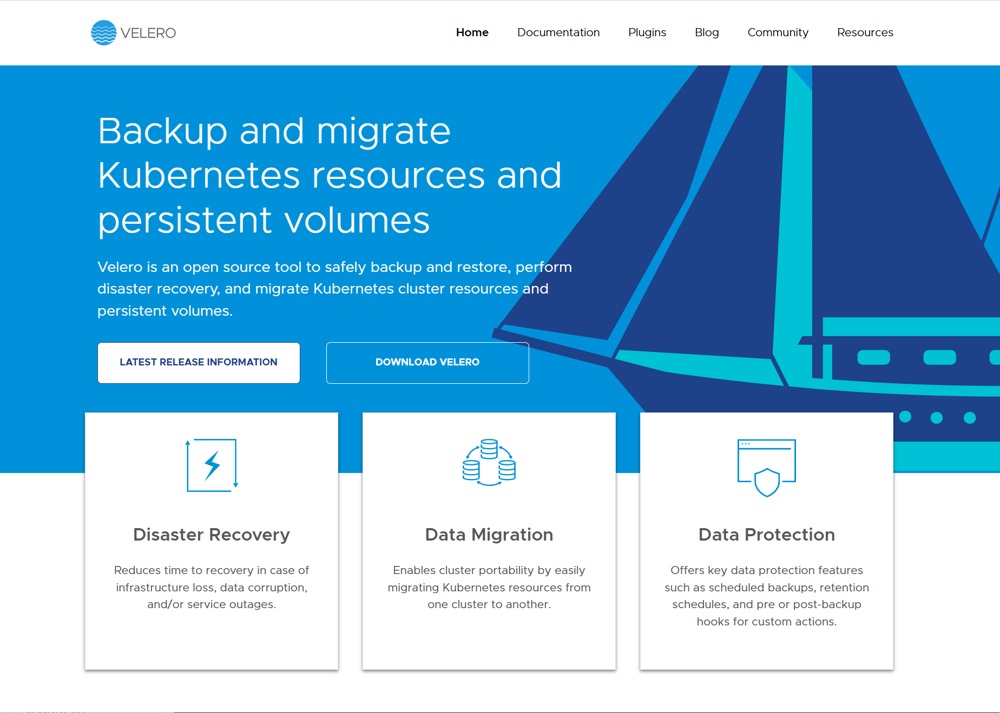
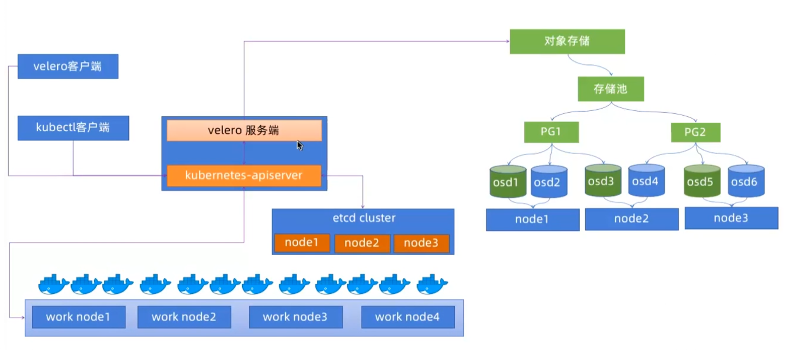
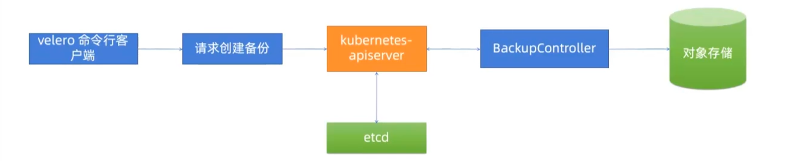
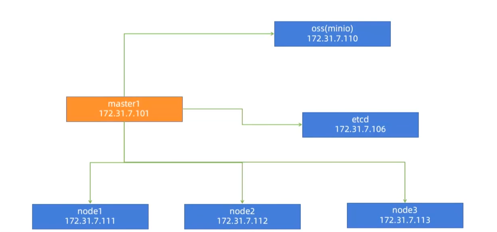

## velero架构及备份流程


### Velero简介



- Velero是vmware开源的一个云原生的灾难恢复和迁移工具，它本身也是开源的，采用GO语言编写，可以安全的备份，恢复和迁移Kubernetes集群资源数据，官网：https://velero.io/
- Velero是西班牙语意思是帆船，非常符合Kubernetes社区的命名风格，Velero的开发公司Heotio，已被Vmware收购
- Velero支持标准的K8S集群，既可以是私有云平台也可以是公有云，除了灾备之外它还能做资源转移，支持把容器应用从一个集群迁移到另一个集群。
- Velero的工作方式就是把Kubernetes中的数据备份到对象存储以实现高可用和持久化，默认的备份保存时间为720小时，并在需要的时候进行下载和恢复


### Velero 与 etcd 快照备份的区别

- etcd快照是全局完成备份（类似于MySQL全量备份），即使需要恢复一个资源对象（类似于只恢复MySQL的一个库），但是也需要做全局恢复到备份的状态（类似于MySQL的全库恢复），即会影响其它namespace中pod运行服务（类似于会影响MySQL其他数据库的数据）
- Velero可以有针对性的备份，比如按照namespace单独备份，只备份单独的资源对象等，在恢复的时候可以根据备份只恢复单独的namespace或资源对象，而不影响其它namespace中pod运行服务
- Velero支持ceph，OSS等对象存储，etcd快照是一个本地文件
- Velero支持任务计划实现周期备份，但etcd快照也可以基于cronjob实现
- Velero支持对AWS EBS创建快照及还原
  - https://www.qloudx.com/velero-for-kubernetes-backup-restore-stateful-workloads-with-aws-ebs-snapshots/
  - https://github.com/vmware-tanzu/velero-plugin-for-aws #Elastic Block Store


### Velero整体架构及备份流程




#### 备份流程

```bash
velero backup create myserver-ns-backup-${DATE} --include-namespace myserver --kubeconfig=./awsuser.kubeconfig --namespace velero-system
```

- Velero 客户端调用Kubernetes API Server 创建 Backup 任务
- Backup 控制器基于watch机制通过API Server获取到备份任务
- Backup 控制器开始执行备份动作，其会通过请求 API Server 获取需要备份的数据
- Backup 控制器将获取到的数据备份到指定的对象存储Server端




#### 部署环境




#### 部署minio

```bash
# 创建数据目录
[root@minio ~]#docker pull minio/minio:RELEASE.2022-04-12T06-55-35Z
[root@minio ~]#mkdir -p /data/minio

[root@minio ~]#docker run --name minio   -p 9000:9000 -p 9999:9999   -e "MINIO_ROOT_USER=admin"   -e "MINIO_ROOT_PASSWORD=admin123"   -v /data/minio/data:/data   --restart=always   -d minio/minio   server /data --console-address ":9999"

# 查看容器
[root@minio ~]#docker ps
CONTAINER ID   IMAGE         COMMAND                   CREATED         STATUS         PORTS                                                                                  NAMES
d335ed0e9a7e   minio/minio   "/usr/bin/docker-ent…"   8 seconds ago   Up 6 seconds   0.0.0.0:9000->9000/tcp, :::9000->9000/tcp, 0.0.0.0:9999->9999/tcp, :::9999->9999/tcp   minio

# 服务起来之后，创建bucket,起名为Kubernetes-velero-backup
```


#### 部署 Velero

在部署前，要先查看velero与Kubernetes的对应版本


```bash
# 下载velero（Velero客户端）
[root@master-01 src]#wget https://github.com/vmware-tanzu/velero/releases/download/v1.16.0/velero-v1.16.0-linux-amd64.tar.gz -O /usr/local/src/velero-v1.16.0-linux-amd64.tar.gz

[root@master-01 src]#tar xf velero-v1.16.0-linux-amd64.tar.gz 
[root@master-01 src]#mv velero-v1.16.0-linux-amd64/velero /usr/local/bin

# 测试
[root@master-01 src]#velero version
Client:
	Version: v1.16.0
	Git commit: 8f31599fe4af5453dee032beaf8a16bd75de91a5
```


#### 配置Velero认证环境

```bash
# 工作目录：
[root@master-01 src]#mkdir -p /data/velero
[root@master-01 src]#cd /data/velero/

# 访问minio的认证文件：
[root@master-01 velero]#vim velero-auth.txt
[default]
aws_access_key_id = admin
aws_secret_access_key = 12345678

# 准备user-csr文件
[root@master-01 velero]#vim awsuser-csr.json
{
  "CN": "awsuser",
  "hosts": [],
  "key": {
    "algo": "rsa",
    "size": 2048
  },
  "names": [
    {
      "C": "CN",
      "ST": "BeiJing",
      "L": "BeiJing",
      "O": "k8s",
      "OU": "System"
    }
  ]
}

# 准备证书签发环境
[root@master-01 velero]#apt install golang-cfssl -y
[root@master-01 velero]#wget https://github.com/cloudflare/cfssl/releases/download/v1.6.1/cfssl_1.6.1_linux_amd64
[root@master-01 velero]#wget https://github.com/cloudflare/cfssl/releases/download/v1.6.1/cfssljson_1.6.1_linux_amd64
[root@master-01 velero]#wget https://github.com/cloudflare/cfssl/releases/download/v1.6.1/cfssl-certinfo_1.6.1_linux_amd64
[root@master-01 velero]#mv cfssl-certinfo_1.6.1_linux_amd64 cfssl-certinfo
[root@master-01 velero]#mv cfssl_1.6.1_linux_amd64 cfssl
[root@master-01 velero]#mv cfssljson_1.6.1_linux_amd64 cfssljson
[root@master-01 velero]#cp cfssl-certinfo cfssljson cfssl /usr/local/bin/
[root@master-01 velero]#chmod a+x /usr/local/bin/cfssl*

# 执行证书签发
# kubernetes版本 >= 1.24
[root@haproxy1 ssl]#scp /etc/kubeasz/clusters/k8s-cluster1/ssl/ca-config.json master1:/data/valero

[root@master-01 velero]#cfssl gencert -ca=/etc/kubernetes/ssl/ca.pem -ca-key=/etc/kubernetes/ssl/ca-key.pem -config=./ca-config.json -profile=kubernetes ./awsuser-csr.json |cfssljson -bare awsuser
2025/04/22 19:57:35 [INFO] generate received request
2025/04/22 19:57:35 [INFO] received CSR
2025/04/22 19:57:35 [INFO] generating key: rsa-2048
2025/04/22 19:57:36 [INFO] encoded CSR
2025/04/22 19:57:36 [INFO] signed certificate with serial number 486780908032241703022092215985611021871723081777
2025/04/22 19:57:36 [WARNING] This certificate lacks a "hosts" field. This makes it unsuitable for
websites. For more information see the Baseline Requirements for the Issuance and Management
of Publicly-Trusted Certificates, v.1.1.6, from the CA/Browser Forum (https://cabforum.org);
specifically, section 10.2.3 ("Information Requirements").

[root@master-01 velero]#ll
总计 40264
drwxr-xr-x 2 root root     4096  4月 22 19:57 ./
drwxr-xr-x 3 root root     4096  4月 22 19:55 ../
-rw-r--r-- 1 root root      997  4月 22 19:57 awsuser.csr
-rw-r--r-- 1 root root      220  4月 22 18:05 awsuser-csr.json
-rw------- 1 root root     1675  4月 22 19:57 awsuser-key.pem     # 私钥
-rw-r--r-- 1 root root     1391  4月 22 19:57 awsuser.pem         # 证书
-rw-r--r-- 1 root root      459  4月 22 19:55 ca-config.json
-rw-r--r-- 1 root root 16659824 12月  7  2021 cfssl
-rw-r--r-- 1 root root 13502544 12月  7  2021 cfssl-certinfo
-rw-r--r-- 1 root root 11029744 12月  7  2021 cfssljson
-rw-r--r-- 1 root root       69  4月 22 17:58 velero-auth.txt

# 分发证书到api-server证书路径
[root@master-01 velero]#cp awsuser-key.pem /etc/kubernetes/ssl/
[root@master-01 velero]#cp awsuser.pem /etc/kubernetes/ssl/

# 生成集群认证config文件
[root@master-01 velero]# export KUBE_APISERVER="https://10.0.0.201:6443"
[root@master-01 velero]# kubectl config set-cluster kubernetes --certificate-authority=/etc/kubernetes/ssl/ca.pem --embed-certs=true --server=${KUBE_APISERVER} --kubeconfig=./awsuser.kubeconfig

# 设置客户端证书认证
[root@master-01 velero]#kubectl config set-credentials awsuser --client-certificate=/etc/kubernetes/ssl/awsuser.pem --client-key=/etc/kubernetes/ssl/awsuser-key.pem --embed-certs=true --kubeconfig=./awsuser.kubeconfig

# 设置上下文参数
[root@master-01 velero]#kubectl config set-context kubernetes --cluster=kubernetes --user=awsuser --namespace=velero-system --kubeconfig=./awsuser.kubeconfig 
Context "kubernetes" created.

# 设置默认上下文
[root@master-01 velero]#kubectl config use-context kubernetes --kubeconfig=awsuser.kubeconfig 
Switched to context "kubernetes".

# k8s集群中创建awsuser账户
[root@master-01 velero]#kubectl create clusterrolebinding awsuser --clusterrole=admin --user=awsuser
clusterrolebinding.rbac.authorization.k8s.io/awsuser created

# 创建名称空间
[root@master-01 velero]#kubectl create ns velero-system
namespace/velero-system created

# 创建sa
[root@master-01 velero]#kubectl create sa --namespace velero-system awsuser
serviceaccount/awsuser created

# 测试创建的kube-config文件,awsuser.kubeconfig权限是否ok
[root@master-01 velero]#kubectl --kubeconfig=./awsuser.kubeconfig get nodes
NAME             STATUS                        ROLES    AGE   VERSION
k8s-10-0-0-203   NotReady,SchedulingDisabled   master   14d   v1.30.11
k8s-10-0-0-213   Ready                         node     14d   v1.30.11
master-01        Ready,SchedulingDisabled      master   14d   v1.30.11
master-02        NotReady,SchedulingDisabled   master   14d   v1.30.11
worker-01        Ready                         node     14d   v1.30.11
worker-02        Ready                         node     14d   v1.30.11

# 执行安装
[root@master-01 velero]#velero --kubeconfig ./awsuser.kubeconfig install --provider aws --plugins velero/velero-plugin-for-aws:v1.5.5 --bucket kubernetes-velero-backup --secret-file ./velero-auth.txt --use-volume-snapshots=false --namespace velero-system --backup-location-config region=minio,s3ForcePathStyle="true",s3Url=http://10.0.0.205:9000

# 卸载velero
# velero uninstall --kubeconfig ./awsuser.kubeconfig --namespace velero-system


# 查看
[root@master-01 velero]#kubectl get pod -n velero-system 
NAME                      READY   STATUS    RESTARTS   AGE
velero-8569494b66-mkj5c   1/1     Running   0          2m12s

# 测试
[root@master-01 velero]#velero --namespace velero-system backup-location get
NAME      PROVIDER   BUCKET/PREFIX              PHASE       LAST VALIDATED                  ACCESS MODE   DEFAULT
default   aws        kubernetes-velero-backup   Available   2025-04-22 22:42:52 +0800 CST   ReadWrite     true

```


#### 对 default ns 进行备份

```bash
[root@master-01 velero]#pwd
/data/velero

[root@master-01 ~]#DATE=`date +%Y%m%d%H%M%S`
[root@master-01 velero]#velero backup create default-backup-${DATE} \
--include-cluster-resources=true \          # 导入集群资源
--include-namespaces default \              # 导入（备份）哪个namespace的资源，默认*,代表全部
--kubeconfig=./awsuser.kubeconfig \
--namespace velero-system                   # 指定server端的namespace

# 验证备份
[root@master-01 velero]#velero backup describe default-backup-20250422224724 --kubeconfig=./awsuser.kubeconfig --namespace velero-system
Name:         default-backup-20250422224724
Namespace:    velero-system
Labels:       velero.io/storage-location=default
Annotations:  velero.io/resource-timeout=10m0s
              velero.io/source-cluster-k8s-gitversion=v1.30.11
              velero.io/source-cluster-k8s-major-version=1
              velero.io/source-cluster-k8s-minor-version=30

Phase:  Completed


Namespaces:
  Included:  default
  Excluded:  <none>

Resources:
  Included:        *
  Excluded:        <none>
  Cluster-scoped:  included

Label selector:  <none>

Or label selector:  <none>

Storage Location:  default

Velero-Native Snapshot PVs:  auto
Snapshot Move Data:          false
Data Mover:                  velero

TTL:  720h0m0s

CSISnapshotTimeout:    10m0s
ItemOperationTimeout:  4h0m0s

Hooks:  <none>

Backup Format Version:  1.1.0

Started:    2025-04-22 22:51:28 +0800 CST
Completed:  2025-04-22 22:51:33 +0800 CST

Expiration:  2025-05-22 22:51:28 +0800 CST

Total items to be backed up:  298
Items backed up:              298

Backup Volumes:
  Velero-Native Snapshots: <none included>

  CSI Snapshots: <none included>

  Pod Volume Backups: <none included>

HooksAttempted:  0
HooksFailed:     0
```


#### 删除Pod并验证数据恢复

```bash
# 删除pod
[root@master-01 velero]#kubectl delete deployments.apps -n default deployment-pod-test 
deployment.apps "deployment-pod-test" deleted

# 恢复pod
[root@master-01 velero]#velero restore create --from-backup default-backup-20250422224724 --wait --kubeconfig=./awsuser.kubeconfig --namespace velero-system
Restore request "default-backup-20250422224724-20250422225706" submitted successfully.
Waiting for restore to complete. You may safely press ctrl-c to stop waiting - your restore will continue in the background.
....
Restore completed with status: Completed. You may check for more information using the commands `velero restore describe default-backup-20250422224724-20250422225706` and `velero restore logs default-backup-20250422224724-20250422225706`.

# 查看已恢复的pod
[root@master-01 velero]#kubectl get pod
NAME                                   READY   STATUS    RESTARTS   AGE
deployment-pod-test-587f5cfffb-97pgb   1/1     Running   0          7s
deployment-pod-test-587f5cfffb-mdqjx   1/1     Running   0          7s
deployment-pod-test-587f5cfffb-zszsh   1/1     Running   0          7s
```


#### 备份指定资源对象

```bash
# 备份指定namespace中的pod或特定资源
[root@master-01 ~]#kubectl run net-test1 --image=harbor.mysticalrecluse.com/baseimages/mystical-centos-base@sha256:037c2b37ec9acc9c48077f88b573bd15f67c6b4401d9f0ba20eb53d78831b2a4 sleep 100000000
pod/net-test1 created

# 查看
[root@master-01 ~]#kubectl get pod
NAME                                   READY   STATUS    RESTARTS      AGE
deployment-pod-test-587f5cfffb-97pgb   1/1     Running   1 (23m ago)   10h
deployment-pod-test-587f5cfffb-mdqjx   1/1     Running   1 (23m ago)   10h
deployment-pod-test-587f5cfffb-zszsh   1/1     Running   1 (23m ago)   10h
net-test1                              1/1     Running   0             4s

[root@master-01 ~]#kubectl run net-test1 --image=harbor.mysticalrecluse.com/baseimages/mystical-centos-base@sha256:037c2b37ec9acc9c48077f88b573bd15f67c6b4401d9f0ba20eb53d78831b2a4 sleep 100000000 -n proc-test
pod/net-test1 created

# 查看
[root@master-01 ~]#kubectl get pod -n proc-test net-test1 
NAME        READY   STATUS    RESTARTS   AGE
net-test1   1/1     Running   0          2m31s


# 备份指定pod:net-test1,分别位于default和proc-test名称空间下
[root@master-01 ~]#DATE=`date +%Y%m%d%H%M%S`
[root@master-01 ~]#velero backup create pod-backup-${DATE} --include-cluster-resources=true --ordered-resources 'pods=proc-test/net-test1,default/net-test1' --namespace velero-system --include-namespaces=proc-test,default
Backup request "pod-backup-20250423093402" submitted successfully.
Run `velero backup describe pod-backup-20250423093402` or `velero backup logs pod-backup-20250423093402` for more details.

# 如果要备份不同类型资源要用分号隔开
# 示例：--ordered-resources string                           Mapping Kinds to an ordered list of specific resources of that Kind.  Resource names are separated by commas and their names are in format 'namespace/resourcename'. For cluster scope resource, simply use resource name. Key-value pairs in the mapping are separated by semi-colon.  Example: 'pods=ns1/pod1,ns1/pod2;persistentvolumeclaims=ns1/pvc4,ns1/pvc8'.  Optional.
```


#### 批量备份所有namespace

```bash
[root@master-01 ~]#cat /data/velero/ns-back.sh
#!/bin/bash
NS_NAME=`kubectl get ns|awk '{if(NR>2)print}'|awk '{print $1}'`
DATE=`date +%Y%m%d%H%M%S`
cd /data/velero

for i in $NS_NAME; do
velero backup create ${i}-ns-backup-${DATE} \
--include-cluster-resources=true \
--include-namespaces ${i} \
--kubeconfig=/root/.kube/config \
--namespace velero-system
done

[root@master-01 ~]#bash /data/velero/ns-back.sh
```


### 使用 Velero 实现 **Kubernetes 集群迁移** 的完整实战流程

目标：从一个集群（源集群）迁移全部或部分资源到另一个集群（目标集群）


#### 场景说明

- **源集群**：已有业务运行在其中，需要迁移。

- **目标集群**：全新集群，环境已搭建完成。

- 使用对象存储（如 MinIO、S3）作为中转仓库。

- 工具：Velero + MinIO（或 S3 兼容存储）


#### 准备工作

**1. 两个集群都能访问同一个对象存储**

如 MinIO 提供服务 `http://10.0.0.205:9000`，已配置好桶 `kubernetes-velero-backup`

**2. 创建对象存储认证文件（两边一样）**

```bash
cat > velero-auth.txt <<EOF
[default]
aws_access_key_id = admin
aws_secret_access_key = 12345678
EOF
```

**3. 在两个集群中都安装 Velero**

安装（源集群 & 目标集群都执行）

```bash
velero install \
  --provider aws \
  --plugins velero/velero-plugin-for-aws:v1.5.5 \
  --bucket kubernetes-velero-backup \
  --secret-file ./velero-auth.txt \
  --backup-location-config region=minio,s3ForcePathStyle="true",s3Url=http://10.0.0.205:9000 \
  --use-volume-snapshots=false \
  --namespace velero-system

```


#### 在源集群执行备份

**1. 备份指定 namespace（例如：`prod-app`）**

```bash
velero backup create prod-app-backup --include-namespaces prod-app
```

**2. 查看备份状态**

```bash
velero backup get
velero backup describe prod-app-backup
```

如果看到 `Completed`，说明备份成功。


#### 在目标集群执行恢复

**1. 确保 Velero 在目标集群部署正常，并连接相同的对象存储**

**2. 查看已存在的备份**

```bash
velero backup get
```

**3. 执行还原操作**

```bash
velero restore create --from-backup prod-app-backup
```

查看还原状态


#### 成功标志

- Pod/Service/Ingress 等资源在目标集群恢复成功。
- PVC 恢复视底层存储支持情况，如使用 NFS、Ceph 或 OpenEBS 会有更高的成功率。
- 配置建议提前创建好 `StorageClass`


#### 注意事项

1. 如果使用了默认 `ReadWriteOnce` 的 PVC，可能需要使用 `--volume-snapshot`。
2. 可以借助 label/namespace 进行资源精确控制。
3. 备份内容默认包括：
   - Deployment、Service、ConfigMap、Secret、PVC 等
   - 可通过 `--include-resources` 和 `--exclude-resources` 控制
4. `velero backup describe` 输出 YAML 可分析备份详情