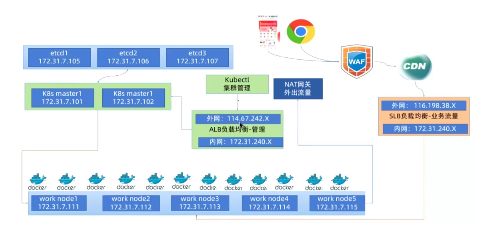
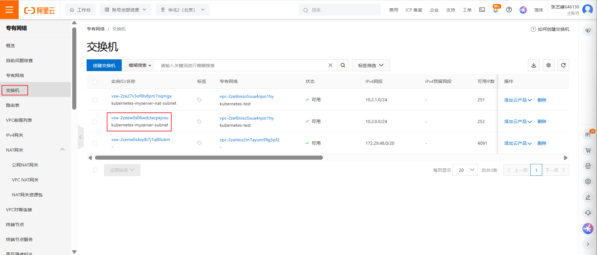
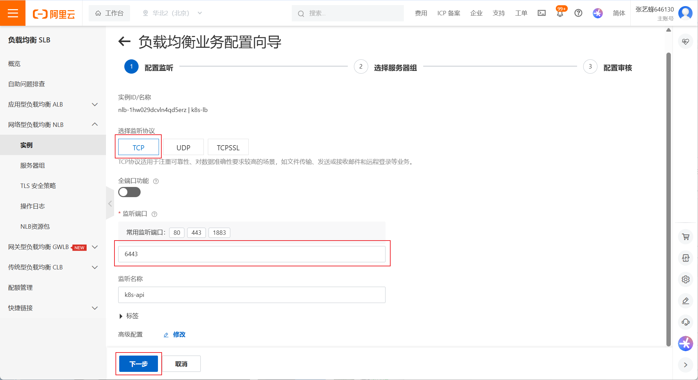
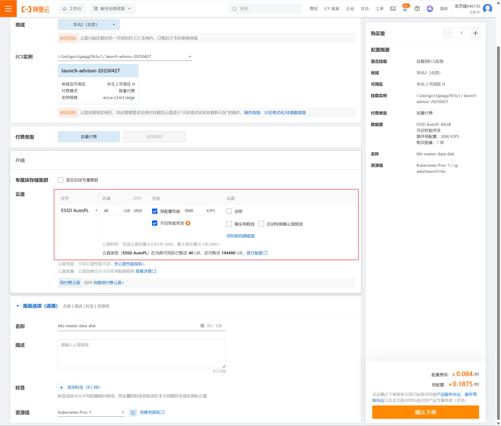
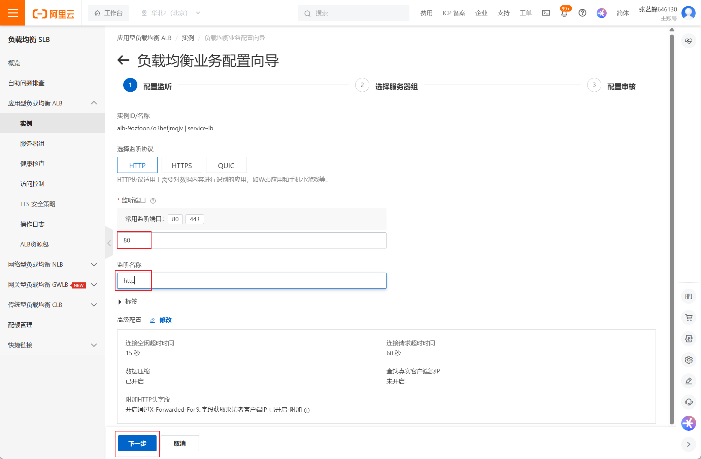

# 公有云自建高可用Kubernetes集群


## 架构简介




## 基础环境准备（阿里云）

```http
https://cn.aliyun.com
```

### 创建资源组（可选）

阿里云资源组的作用就是统一归类资源、隔离权限、核算成本，提升管理效率。


### 创建VPC并配置安全组

#### 创建私有网络VPC


#### 创建子网

创建子网，放置Kubernetes集群的Node主机


### 创建NAT网关

NAT网关不能和云主机在一个子网

#### 新建NAT网关子网


生产环境建议放在不同可用区


#### 新建NAT网关


#### 配置子网路由使用NAT网关

找到不能上外网的子网，点击进入




这里自动在下一跳这里绑定了NAT网关，在有些公有云，这里不会自动配置，此时就需要手动配置路由表，让NAT网关关联子网


### 创建ECS服务器

#### 创建3台node节点

在刚刚创建的子网内，创建3台node节点


这里不建议选择2CPU、2.0GiB，阿里云的2.0GiB，实际内存为1.6GiB，etcd会因为资源问题导致起不来，所以建议最低选择**2CPU、4.0GiB**内存的ECS


点击确认下单（注意账户余额不能低于100，否则需要充值）


测试实例是否能连接外网


输入密码后，进入终端并测试网络


## 创建负载均衡器NLB

这里**建议使用NLB做四层负载**，如果使用ALB做7层负载，则需要先创建k8s，然后基于K8S集群的证书，签发ALB使用的证书，上传，做到证书链统一


这里建议选择**网络型负载均衡NLB**，做四层负载，不用考虑负载均衡器这边的证书问题


**点击立即开通**


选择刚刚创建的NLB实例，**创建监听**


选择监听协议TCP，监听6443端口，该端口是apiserver服务



**创建服务器组**


在刚刚创建的服务器组中添加服务器


**选择要加入后端的服务器**


选择端口后确定


返回之前的页面刷新，就能看到加入的服务器，然后下一步


检查，没什么问题直接提交


提交后，通常就显示创建成功


查看创建好的实例详情，可以看到高可用的两个VIP，`10.2.1.222`和`10.2.0.251`，都可以代理到后端master服务器


创建好负载均衡器后，记得将后端服务器的6443端口在安全组打开


## 初始化集群

### 主机基础优化

同集群内各节点主机名必须唯一，内核参数，数据盘挂载等

```bash
# 将三台ECS设置主机名
hostnamectl set-hostname master1.mystical.org
hostnamectl set-hostname node1.mystical.org
hostnamectl set-hostname node2.mystical.org

# 内核参数优化
# 编写脚本
root@master1:~# cat k8s-init.sh 
#!/bin/bash

cat >>/etc/sysctl.conf <<EOF
net.ipv4.ip_forward=1
vm.max_map_count=262144
kernel.pid.max=4194303
fs.file-max=100000
net.ipv4.tcp_max_tw_buckets=6000
net.netfilter.nf_conntrack_max=2097152

net.bridge.bridge-nf-call-ip6tables=1
net.bridge.bridge-nf-call-iptables=1
vm.swappiness=0
EOF

cat >> /etc/modules-load.d/modules.conf <<EOF
ip_vs
ip_vs_ls
ip_vs_lblc
ip_vs_lblcr
ip_vs_rr
ip_vs_wrr
ip_vs_sh
ip_vs_dh
ip_vs_fo
ip_vs_nq
ip_vs_sed
ip_vs_ftp
ip_vs_sh
ip_tables
ip_set
ipt_set
ipt_rpfilter
ipt_REJECT
ipip
xt_set
br_netfilter
nf_conntrack
overlay
EOF

sysctl -p

# 执行脚本
root@master1:~# bash k8s-init.sh 

# 将脚本传到其他机器执行
root@master1:~# scp k8s-init.sh node1:                                                                      
root@master1:~# scp k8s-init.sh node2:

# 执行后重启
reboot

# 重启后验证内核模块与内存参数
root@master1:~# lsmod|grep br_netfilter
br_netfilter           32768  0
bridge                311296  1 br_netfilter

# 单独分一块云盘保存Containerd的数据
# 一定要用单独的云盘保存业务数据，这样及时主机挂了，数据也不会丢失，做到数据分离
```


### 创建云盘




**解读性能突发：**

阿里云的**性能突发**是指在业务负载突然增加时，云盘可以**临时提升性能**，以应对突发的数据读写需求。ESSD AutoPL 云盘默认开启性能突发，适用于**波动性业务**，例如：

- **业务流量不稳定**，偶尔会出现高峰期，需要短时间内提升存储性能。
- **IO密集型应用**，如数据库、日志分析等，对存储性能要求较高。
- **时延敏感型应用**，需要快速响应数据请求。

如果您的业务有**稳定的存储需求**，且不需要额外的性能提升，可以选择**关闭性能突发**，以节约成本。


在 Kubernetes (K8s) 集群中，所有节点的数据盘 IOPS** 需要根据**集群规模**和**工作负载**来合理配置，以确保稳定性和性能。以下是一些建议：

### **IOPS 配置建议**

1. **小型集群 (1-10 个节点)**：
   - **IOPS**：建议 **1000-3000** IOPS
   - **适用场景**：测试环境、小规模应用
2. **中型集群 (10-100 个节点)**：
   - **IOPS**：建议 **3000-8000** IOPS
   - **适用场景**：生产环境、一般业务应用
3. **大型集群 (100+ 节点)**：
   - **IOPS**：建议 **8000+** IOPS
   - **适用场景**：高并发、高吞吐量应用，如数据库、日志分析等

### **优化 IOPS 的方法**

- **使用高性能存储**：如 **SSD** 或 **NVMe** 盘，以提高读写速度。
- **调整存储类 (StorageClasses)**：根据业务需求选择合适的存储策略。
- **监控 IOPS 使用情况**：使用 **Prometheus + Grafana** 监控存储性能，避免瓶颈。
- **合理分配资源**：避免 Master 节点过载，影响 API Server 和 etcd 的稳定性。

如果您的集群规模较大，建议使用 **ESSD 云盘** 或 **NVMe SSD**，并结合 **IOPS 监控** 来优化性能


购买云盘并创建后，在绑定的ECS查看

```bash
root@master1:/usr/local/src# lsblk
NAME   MAJ:MIN RM  SIZE RO TYPE MOUNTPOINTS
loop0    7:0    0 61.9M  1 loop /snap/core20/1405
loop1    7:1    0 79.9M  1 loop /snap/lxd/22923
loop2    7:2    0 63.8M  1 loop /snap/core20/2501
loop3    7:3    0 89.4M  1 loop /snap/lxd/31333
loop4    7:4    0 44.4M  1 loop /snap/snapd/23771
vda    252:0    0   40G  0 disk 
├─vda1 252:1    0    1M  0 part 
├─vda2 252:2    0  200M  0 part /boot/efi
└─vda3 252:3    0 39.8G  0 part /
root@master1:/usr/local/src# lsblk
NAME   MAJ:MIN RM  SIZE RO TYPE MOUNTPOINTS
loop0    7:0    0 61.9M  1 loop /snap/core20/1405
loop1    7:1    0 79.9M  1 loop /snap/lxd/22923
loop2    7:2    0 63.8M  1 loop /snap/core20/2501
loop3    7:3    0 89.4M  1 loop /snap/lxd/31333
loop4    7:4    0 44.4M  1 loop /snap/snapd/23771
vda    252:0    0   40G  0 disk 
├─vda1 252:1    0    1M  0 part 
├─vda2 252:2    0  200M  0 part /boot/efi
└─vda3 252:3    0 39.8G  0 part /
vdb    252:16   0   40G  0 disk       # 成功绑定云盘，生产中数据盘大一些，通常几个T

# 将该磁盘分区挂载到云主机上
root@master1:/usr/local/src# fdisk /dev/vdb

Welcome to fdisk (util-linux 2.37.2).
Changes will remain in memory only, until you decide to write them.
Be careful before using the write command.

Device does not contain a recognized partition table.
Created a new DOS disklabel with disk identifier 0xa4255b5d.

Command (m for help): n
Partition type
   p   primary (0 primary, 0 extended, 4 free)
   e   extended (container for logical partitions)
Select (default p): p
Partition number (1-4, default 1): 
First sector (2048-83886079, default 2048): 
Last sector, +/-sectors or +/-size{K,M,G,T,P} (2048-83886079, default 83886079): 

Created a new partition 1 of type 'Linux' and of size 40 GiB.

Command (m for help): t
Selected partition 1
Hex code or alias (type L to list all): 8e
Changed type of partition 'Linux' to 'Linux LVM'

Command (m for help): p
Disk /dev/vdb: 40 GiB, 42949672960 bytes, 83886080 sectors
Units: sectors of 1 * 512 = 512 bytes
Sector size (logical/physical): 512 bytes / 512 bytes
I/O size (minimum/optimal): 512 bytes / 512 bytes
Disklabel type: dos
Disk identifier: 0x8180245d

Device     Boot Start      End  Sectors Size Id Type
/dev/vdb1        2048 83886079 83884032  40G 8e Linux LVM

Command (m for help): w
The partition table has been altered.
Calling ioctl() to re-read partition table.
Syncing disks.

root@master1:/usr/local/src# lsblk
NAME   MAJ:MIN RM  SIZE RO TYPE MOUNTPOINTS
loop0    7:0    0 61.9M  1 loop /snap/core20/1405
loop1    7:1    0 79.9M  1 loop /snap/lxd/22923
loop2    7:2    0 63.8M  1 loop /snap/core20/2501
loop3    7:3    0 89.4M  1 loop /snap/lxd/31333
loop4    7:4    0 44.4M  1 loop /snap/snapd/23771
vda    252:0    0   40G  0 disk 
├─vda1 252:1    0    1M  0 part 
├─vda2 252:2    0  200M  0 part /boot/efi
└─vda3 252:3    0 39.8G  0 part /
vdb    252:16   0   40G  0 disk 
└─vdb1 252:17   0   40G  0 part 

# 格式化为物理机pv
root@master1:/usr/local/src# pvcreate /dev/vdb1

# 创建卷组（VG）
root@master1:/usr/local/src# vgcreate containerd-data /dev/vdb1

# 创建逻辑卷
# 这里不能直接创建40G，因为元数据也需要存储空间
root@master1:/usr/local/src# lvcreate -L 38G -n my_lv containerd-data

# 查看
root@master1:/usr/local/src# lsblk
NAME                       MAJ:MIN RM  SIZE RO TYPE MOUNTPOINTS
loop0                        7:0    0 61.9M  1 loop /snap/core20/1405
loop1                        7:1    0 79.9M  1 loop /snap/lxd/22923
loop2                        7:2    0 63.8M  1 loop /snap/core20/2501
loop3                        7:3    0 89.4M  1 loop /snap/lxd/31333
loop4                        7:4    0 44.4M  1 loop /snap/snapd/23771
vda                        252:0    0   40G  0 disk 
├─vda1                     252:1    0    1M  0 part 
├─vda2                     252:2    0  200M  0 part /boot/efi
└─vda3                     252:3    0 39.8G  0 part /
vdb                        252:16   0   40G  0 disk 
└─vdb1                     252:17   0   40G  0 part 
  └─contaienrd--data-my_vg 253:0    0   38G  0 lvm
  
# 格式化逻辑卷
root@master1:/usr/local/src# mkfs.xfs /dev/contaienrd-data/my_lv
meta-data=/dev/contaienrd-data/my_vg isize=512    agcount=4, agsize=2490368 blks
         =                       sectsz=512   attr=2, projid32bit=1
         =                       crc=1        finobt=1, sparse=1, rmapbt=0
         =                       reflink=1    bigtime=0 inobtcount=0
data     =                       bsize=4096   blocks=9961472, imaxpct=25
         =                       sunit=0      swidth=0 blks
naming   =version 2              bsize=4096   ascii-ci=0, ftype=1
log      =internal log           bsize=4096   blocks=4864, version=2
         =                       sectsz=512   sunit=0 blks, lazy-count=1
realtime =none                   extsz=4096   blocks=0, rtextents=0

# 查看逻辑卷的UUID
root@master1:/usr/local/src# blkid /dev/contaienrd-data/my_lv
/dev/contaienrd-data/my_vg: UUID="2702e0f7-c4c5-44f3-906d-c8205aa828bc" BLOCK_SIZE="512" TYPE="xfs"

# 挂载
root@master1:/usr/local/src# vim /etc/fstab 
# /etc/fstab: static file system information.
#
# Use 'blkid' to print the universally unique identifier for a
# device; this may be used with UUID= as a more robust way to name devices
# that works even if disks are added and removed. See fstab(5).
#
# <file system> <mount point>   <type>  <options>       <dump>  <pass>
# / was on /dev/vda3 during curtin installation
UUID=b7d783c2-a360-4d89-b9a0-5f5efbe3589c / ext4 defaults 0 1
# /boot/efi was on /dev/vda2 during curtin installation
UUID=424C-42AA /boot/efi vfat errors=remount-ro 0 1

/dev/contaienrd-data/my_vg  /var/lib/containerd xfs defaults,_netdev 0 0   # 添加这行

# 

root@master1:/usr/local/src# mount -a
root@master1:/usr/local/src# df
Filesystem                         1K-blocks    Used Available Use% Mounted on
tmpfs                                 164764    1080    163684   1% /run
/dev/vda3                           40901312 2888944  36122000   8% /
tmpfs                                 823816       0    823816   0% /dev/shm
tmpfs                                   5120       0      5120   0% /run/lock
/dev/vda2                             201615    6192    195423   4% /boot/efi
tmpfs                                 164760       4    164756   1% /run/user/0
/dev/mapper/contaienrd--data-my_vg  39826432  310712  39515720   1% /var/lib/containerd
```


### 所有节点部署运行时

```bash
root@node2:~# wget https://www.mysticalrecluse.com/script/tools/k8s_contaierd-2.0.4-runc-1.2.6-buildkit-0.20.2-nerdctl-2.0.4-cni-1.6.2.tar
root@node2:~# wget https://www.mysticalrecluse.com/script/Shell/k8s_containerd_runc_cni.sh

# 运行脚本
root@node2:~# bash k8s_containerd_runc_cni.sh

# 测试
root@node2:~# nerdctl ps
CONTAINER ID    IMAGE    COMMAND    CREATED    STATUS    PORTS    NAMES
```

```ABAP
上述脚本安装的containerd是2.X版本，和Kubernetes1.27版本以下不兼容
Kubernetes1.27版本以下建议使用containerd版本为1.6.X

注意点1：
而且这里要注意的是containerd1.6.X的配置文件和2.X的配置文件不一样，要重新生成
containerd config default > /etc/containerd/config.toml

然后记得修改sanbox的值
root@master1:~# vim /etc/containerd/config.toml
    [plugins.'io.containerd.cri.v1.images'.pinned_images]
      sandbox = 'registry.cn-hangzhou.aliyuncs.com/google_containers/pause:3.10'     # 这里修改为国内地址
......
 [plugins.'io.containerd.grpc.v1.cri']
    disable_tcp_service = true
    stream_server_address = '127.0.0.1'
    stream_server_port = '0'
    stream_idle_timeout = '4h0m0s'
    enable_tls_streaming = false
    sandbox_image = "registry.cn-hangzhou.aliyuncs.com/google_containers/pause:3.10"    # 添加这行
......

# 注意点2：
将containerd.service中的代理配置关闭
root@master1:~# systemctl cat containerd.service 
# /lib/systemd/system/containerd.service
[Unit]
Description=containerd container runtime
Documentation=https://containerd.io
After=network.target local-fs.target dbus.service

[Service]
#uncomment to enable the experimental sbservice (sandboxed) version of containerd/cri integration
#Environment="ENABLE_CRI_SANDBOXES=sandboxed"
#Environment="HTTP_PROXY=http://11.0.1.1:10809"      # 这行注释掉
#Environment="HTTPS_PROXY=http://11.0.1.1:10809"     # 这行也注释掉
ExecStartPre=-/sbin/modprobe overlay
ExecStart=/usr/local/bin/containerd

Type=notify
Delegate=yes
KillMode=process
Restart=always
RestartSec=5
# Having non-zero Limit*s causes performance problems due to accounting overhead
# in the kernel. We recommend using cgroups to do container-local accounting.
LimitNPROC=infinity
LimitCORE=infinity
LimitNOFILE=infinity
# Comment TasksMax if your systemd version does not supports it.
# Only systemd 226 and above support this version.
TasksMax=infinity
OOMScoreAdjust=-999

[Install]
WantedBy=multi-user.target
```


### 各节点安装kubeadm、kubectl、kubelet

```bash
# Debian/Ubuntu
apt-get update && apt-get install -y apt-transport-https
curl -fsSL https://mirrors.aliyun.com/kubernetes-new/core/stable/v1.28/deb/Release.key |
    gpg --dearmor -o /etc/apt/keyrings/kubernetes-apt-keyring.gpg
echo "deb [signed-by=/etc/apt/keyrings/kubernetes-apt-keyring.gpg] https://mirrors.aliyun.com/kubernetes-new/core/stable/v1.32/deb/ /" |
    tee /etc/apt/sources.list.d/kubernetes.list
apt-get update
apt-get install -y kubelet kubeadm kubectl

# CentOS / RHEL / Fedora
cat <<EOF | tee /etc/yum.repos.d/kubernetes.repo
[kubernetes]
name=Kubernetes
baseurl=https://mirrors.aliyun.com/kubernetes-new/core/stable/v1.28/rpm/
enabled=1
gpgcheck=1
gpgkey=https://mirrors.aliyun.com/kubernetes-new/core/stable/v1.28/rpm/repodata/repomd.xml.key
EOF
setenforce 0
yum install -y kubelet kubeadm kubectl
systemctl enable kubelet && systemctl start kubelet
```


### 下载Kubernetes镜像

```bash
# 检查1.32这个版本所需要下载的镜像的版本
root@master1:~# cat images.sh 
#!/bin/bash
nerdctl pull registry.cn-hangzhou.aliyuncs.com/google_containers/kube-apiserver:v1.32.0
nerdctl pull registry.cn-hangzhou.aliyuncs.com/google_containers/kube-controller-manager:v1.32.0
nerdctl pull registry.cn-hangzhou.aliyuncs.com/google_containers/kube-scheduler:v1.32.0
nerdctl pull registry.cn-hangzhou.aliyuncs.com/google_containers/kube-proxy:v1.32.0
nerdctl pull registry.cn-hangzhou.aliyuncs.com/google_containers/pause:3.9
nerdctl pull registry.cn-hangzhou.aliyuncs.com/google_containers/etcd:3.5.15-0
nerdctl pull registry.cn-hangzhou.aliyuncs.com/google_containers/coredns:v1.10.1
root@node2:~# bash images.sh
```


### 执行Kubernetes集群初始化

```bash
# 初始化参数模版
root@master1:~# kubeadm config print init-defaults

# 重定向到文件，编辑文件
root@master1:~# kubeadm config print init-defaults > kubeadm-init.yaml
root@master1:~# cat kubeadm-init.yaml 
apiVersion: kubeadm.k8s.io/v1beta4
bootstrapTokens:
- groups:
  - system:bootstrappers:kubeadm:default-node-token
  token: abcdef.0123456789abcdef
  ttl: 24h0m0s
  usages:
  - signing
  - authentication
kind: InitConfiguration
localAPIEndpoint:
  advertiseAddress: 10.2.0.248   # 改为master本机IP
  bindPort: 6443
nodeRegistration:
  criSocket: unix:///var/run/containerd/containerd.sock  # 检查下containerd.sock路径没问题
  imagePullPolicy: IfNotPresent
  imagePullSerial: true
  name: master1  # 这里改为指定的节点名称
  taints: null
timeouts:
  controlPlaneComponentHealthCheck: 4m0s
  discovery: 5m0s
  etcdAPICall: 2m0s
  kubeletHealthCheck: 4m0s
  kubernetesAPICall: 1m0s
  tlsBootstrap: 5m0s
  upgradeManifests: 5m0s
---
apiServer: 
  certSANs:
  - 127.0.0.1
  - 10.2.0.248      # master节点IP
  - 10.2.0.251      # NLB VIP     证书的SANs里必须添加NLB的VIP，否则worker节点无法通过NLB加入集群
  - 10.2.1.222      # NLB VIP
  - 10.100.0.1      # service clusterIP
apiVersion: kubeadm.k8s.io/v1beta4
caCertificateValidityPeriod: 87600h0m0s
certificateValidityPeriod: 8760h0m0s
certificatesDir: /etc/kubernetes/pki
clusterName: kubernetes
# controlPlaneEndpoint: 10.2.0.251:6443 # 这里指向负载均衡器内网地址  这里绝对不能添加这行，原因是阿里云的NLB不能回环访问
# 即阿里云的NLB不能后端的master节点通过NLB访问自己
# 所以如果想要使用NLB实现负载均衡，必须master节点上访问，不通过NLB，直接访问自己，用户在其他机器访问可以通过NLB，worker节点的kubelet访问通过NLB，但是后端要在join的时候单独指定
controllerManager: {}
dns: {}
encryptionAlgorithm: RSA-2048
etcd:
  local:
    dataDir: /var/lib/etcd
imageRepository: registry.cn-hangzhou.aliyuncs.com/google_containers
kind: ClusterConfiguration
kubernetesVersion: 1.32.0   # 更改为指定版本
networking:
  dnsDomain: cluster.local
  podSubnet: 10.200.0.0/16    # 指定pod网络网段
  serviceSubnet: 10.100.0.0/16   # 指定service网络网段
proxy: {}
scheduler: {}

--- # 指定kubelet使用systemd
kind: KubeletConfiguration
apiVersion: kubelet.config.k8s.io/v1beta1
cgroupDriver: systemd

--- # 指定Kubeproxy使用ipvs
apiVersion: kubeproxy.config.k8s.io/v1alpha1
kind: KubeProxyConfiguration
mode: ipvs

# 初始化
root@master1:~# kubeadm init --config kubeadm-init.yaml
......
Your Kubernetes control-plane has initialized successfully!

To start using your cluster, you need to run the following as a regular user:

  mkdir -p $HOME/.kube
  sudo cp -i /etc/kubernetes/admin.conf $HOME/.kube/config
  sudo chown $(id -u):$(id -g) $HOME/.kube/config

Alternatively, if you are the root user, you can run:

  export KUBECONFIG=/etc/kubernetes/admin.conf

You should now deploy a pod network to the cluster.
Run "kubectl apply -f [podnetwork].yaml" with one of the options listed at:
  https://kubernetes.io/docs/concepts/cluster-administration/addons/

Then you can join any number of worker nodes by running the following on each as root:

kubeadm join 10.2.0.248:6443 --token abcdef.0123456789abcdef \
        --discovery-token-ca-cert-hash sha256:4c1340194a641c9c1ee4a4fa57273cb9e1bb8961c9f4d546bd45fbfdd27419ff 
```


### 将Worker节点加入集群

```bash
# 在worker节点测试负载均衡器是否正常
root@node1:~# curl https://10.2.0.251:6443 -k
{
  "kind": "Status",
  "apiVersion": "v1",
  "metadata": {},
  "status": "Failure",
  "message": "forbidden: User \"system:anonymous\" cannot get path \"/\"",
  "reason": "Forbidden",
  "details": {},
  "code": 403    # 返回403则说明能正常访问
}

# 这里的重点是将IP改为负载均衡器的IP，这样kubelet会自动配置，后续使用负载均衡器和master节点访问，从而减少apiserver的压力
root@node1:~# kubeadm join 10.2.0.251:6443 --token abcdef.0123456789abcdef --discovery-token-ca-cert-hash sha256:4c1340194a641c9c1ee4a4fa57273cb9e1bb8961c9f4d546bd45fbfdd27419ff 

# 在master节点进行测试
root@master1:~# kubectl get node
NAME                 STATUS     ROLES           AGE     VERSION
master1              NotReady   control-plane   5m13s   v1.32.4
node1.mystical.org   NotReady   <none>          99s     v1.32.4
node2.mystical.org   NotReady   <none>          25s     v1.32.4
```


### 部署网络组

```ABAP
注意：公有云不支持BGP，所以建议使用VXLAN协议的网络组件，Flannel，Calico都行
```

下载网络组件的官网

```http
kubernetes.io/docs/concepts/cluster-administration/addons
```

点击 **Flannel**


点击后跳转到Github，然后下载


```bash
# 下载yaml文件，进行编辑修改
root@master1:~# wget https://github.com/flannel-io/flannel/releases/latest/download/kube-flannel.yml

# 修改
root@master1:~# vim kube-flannel.yaml
......
  net-conf.json: |
    {
      "Network": "10.200.0.0/16",   # 这里改为初始化的时候指定的pod网段
      "EnableNFTables": false,
      "Backend": {
        "Type": "vxlan"
      }
    }
    
# 镜像地址建议改为公司内网的Harbor仓库地址
root@master1:~# kubectl apply -f flannel.yaml
root@master1:~# kubectl get pod -A
NAMESPACE      NAME                              READY   STATUS    RESTARTS   AGE
kube-flannel   kube-flannel-ds-4nmfs             1/1     Running   0          26s
kube-flannel   kube-flannel-ds-n6gvn             1/1     Running   0          26s
kube-flannel   kube-flannel-ds-vzr2x             1/1     Running   0          26s
kube-system    coredns-76fccbbb6b-kqpnx          1/1     Running   0          31m
kube-system    coredns-76fccbbb6b-rtqsh          1/1     Running   0          31m
kube-system    etcd-master1                      1/1     Running   2          31m
kube-system    kube-apiserver-master1            1/1     Running   10         31m
kube-system    kube-controller-manager-master1   1/1     Running   3          31m
kube-system    kube-proxy-4rvzq                  1/1     Running   0          27m
kube-system    kube-proxy-lnk95                  1/1     Running   0          26m
kube-system    kube-proxy-lqksm                  1/1     Running   0          31m
kube-system    kube-scheduler-master1            1/1     Running   3          31m

root@master1:~# kubectl get node
NAME                 STATUS   ROLES           AGE   VERSION
master1              Ready    control-plane   32m   v1.32.4
node1.mystical.org   Ready    <none>          28m   v1.32.4
node2.mystical.org   Ready    <none>          27m   v1.32.4
```


## 部署web服务

```bash
# 部署web服务
root@master1:~# kubectl create deployment myapp --image registry.cn-beijing.aliyuncs.com/wangxiaochun/nginx --replicas 2

# 使用nodeport暴露
root@master1:~# cat nodeport.yaml 
apiVersion: v1
kind: Service
metadata:
  name: service-nodeport
spec:
  type: NodePort
  #externalTrafficPolicy: Local # 默认值为Cluster,如果是Local只能被当前运行Pod的节点处理流量，并且可以获取客户端真实IP
  selector:
    app: myapp
  ports:
  - name: http
    protocol: TCP
    port: 80
    targetPort: 80
    nodePort: 31179
    
root@master1:~# kubectl apply -f nodeport.yaml

# 查看
root@master1:~# kubectl get svc
NAME               TYPE        CLUSTER-IP      EXTERNAL-IP   PORT(S)        AGE
kubernetes         ClusterIP   10.100.0.1      <none>        443/TCP        3h
service-nodeport   NodePort    10.100.142.68   <none>        80:31179/TCP   94m
```


## 使用ALB代理，使外部客户访问


购买**ALB**


**购买后，创建监听**


**选择前端协议 http**



**选择服务器组**


重点：**注意后端协议选择http**，因为创建的nginx仅监听80，没有监听443端口


**添加服务器**


选择后端worker节点


**选定端口**


**创建成功**


**提交**


**查看实例详情**


```ABAP
注意：后端的worker节点的服务器，安全组一定要开放31179端口
```

**访问其中一个负载均衡器的公网IP,成功访问**


