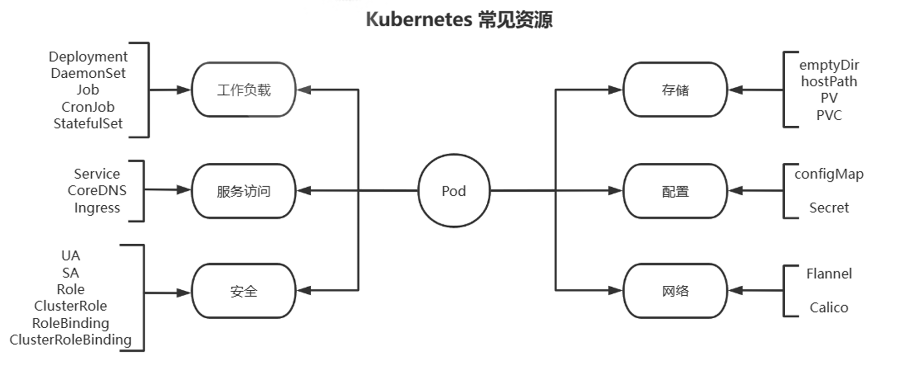

# CloudNative


## 什么是云原生（Cloud Native）?


**云原生（Cloud Native）是一种设计理念和技术架构**，旨在充分利用云环境的优势，来开发、部署和管理**高效、弹性、可扩展和自动化的现代化应用程序**。

云原生的核心目标是让应用程序能够**动态调整资源**，实现**高可用性**、**高可扩展性**和**灵活性**。云原生的实现通常依赖于**容器化技术（如Docker）**、**编排系统（如Kubernetes）**、**微服务架构**和**持续交付/集成（CI/CD）**等技术。


## 云原生的核心思想


**松耦合的架构**

- 传统的“单体应用”与“云原生应用”最大的区别是，云原生应用通过**微服务**将每个模块独立部署、独立扩缩。
- 云原生应用**每个服务模块独立开发、独立测试、独立部署**，互不影响。

**声明式的API**

- 云原生使用**声明式API**（Declarative API）管理基础架构和服务。
- 例如，Kubernetes中的**YAML文件**就是声明式API的典型示例，用户只需要声明期望的状态，而不需要关心如何实现。

**自动化运维 (Self-Healing)**

- 云原生应用依赖**自动化监控和告警系统**。
- Kubernetes中的**重启策略、健康检查（health check）、就绪探针（readiness probe）**，都可以实现自动恢复和修复。
- 在容器失败、崩溃时，Kubernetes会**自动重建Pod**，无需人工干预。

**弹性和自适应能力**

- 云原生应用具备**自动扩容和缩容**的能力。
- 当流量激增时，Kubernetes可以在几秒钟内**自动扩展Pod数量**，当流量下降时，Pod数量会自动减少，降低成本。

**基础设施即代码 (IaC)**

- 云原生强调**一切基础设施和配置都要以代码的形式存在**，这使得环境的创建、变更和销毁都变得可自动化。
- 使用的工具有**Terraform**、**Ansible**、**Helm**等。

**可观测性**

- 在分布式系统中，必须确保系统的**日志（log）**、**指标（metrics）\**和\**追踪（tracing）**。
- 使用Prometheus、Grafana等工具，可以直观地了解云原生系统的运行状态，检测瓶颈和故障点。


## 云原生的四大技术基石


**容器化 (Containerization)**

- 容器是云原生的最核心技术，它提供了一个与操作系统隔离的运行环境，便于**跨平台部署**。
- **Docker** 和 **OCI 容器**（如containerd、Podman）等工具就是容器化的典型代表。
- **好处**：更快的启动、更高的资源利用率、环境一致性和高可移植性。

**动态编排 (Orchestration)**

- 容器化的应用需要一个调度器来管理这些容器的**自动部署、扩缩容和故障修复**。
- **Kubernetes**（K8s）就是这种调度器的代表。
- Kubernetes可以管理**多集群的多节点分布式服务**，以实现跨云平台的高可用部署。

**微服务架构 (Microservices)**

- 将原本的单体应用拆解成多个**可独立开发和部署的微服务**，这些微服务通过**API或消息队列**进行通信。
- 各微服务可以单独部署、扩容、回滚、升级，而不影响其他模块。

**持续交付和持续集成 (CI/CD)**

- **CI/CD**使得开发人员的代码变更能够被**自动化构建、测试和部署**。
- 使用的工具有**Jenkins**、**GitLab CI/CD** 和 **ArgoCD** 等。
- CI/CD流水线可在开发到生产的过程中进行**自动化验证、回滚和监控**。


## 云原生的关键技术栈


| **领域**       | **技术**             | **作用**                             |
| -------------- | -------------------- | ------------------------------------ |
| **容器化**     | Docker, Podman       | 提供标准的容器化运行环境             |
| **容器编排**   | Kubernetes (K8s)     | 管理和编排容器，提供扩缩容和自愈能力 |
| **微服务**     | Spring Boot, Istio   | 支持微服务架构                       |
| **CI/CD**      | Jenkins, GitLab CI   | 持续交付和持续集成                   |
| **监控与日志** | Prometheus, Grafana  | 监控、日志、告警系统                 |
| **网络管理**   | Calico, Flannel      | 容器网络                             |
| **服务网格**   | Istio, Linkerd       | 管理微服务的通信，提供可观察性       |
| **存储**       | Ceph, Rook, Longhorn | 提供云原生的分布式存储解决方案       |
| **配置管理**   | Helm, Ansible        | 管理应用和集群的配置                 |

------


## 云原生的实际场景


1. **电商大促销**
   - 促销活动流量高峰，使用Kubernetes的**HPA（水平自动扩展）**来动态扩展服务实例。
   - 日常流量低时，Pod数量减少，**节省计算资源**。
2. **金融支付系统**
   - **微服务架构**可将支付系统拆分为多个服务：用户服务、支付服务、订单服务等。
   - **服务网格（如Istio）**实现微服务的流量治理、熔断、流量限流和分布式追踪。
3. **DevOps平台**
   - 使用**Jenkins + Docker + Kubernetes**，构建CI/CD流水线，自动化部署到生产环境。
   - **GitOps**使用**ArgoCD**，将代码提交到Git后，自动完成部署。


## 云原生的优势


| **优势**         | **描述**                                       |
| ---------------- | ---------------------------------------------- |
| **敏捷性**       | 通过CI/CD流水线实现快速的迭代发布              |
| **弹性扩展**     | 动态扩缩容，流量高峰期自动扩展，低峰期缩容     |
| **高可用性**     | 故障节点自动恢复，避免宕机                     |
| **多云/混合云**  | 支持跨云部署，避免单一云服务商的锁定           |
| **资源利用率高** | 使用容器化和Kubernetes的资源调度实现资源最优化 |


## 云原生官网

``````
https://www.cncf.io/
``````


# Docker


# CICD


# Prometheus


# Kubernetes


## Kubernets逻辑架构


## Kubernetes组件


### Kubernetes组件间安全通信


**Kubernetes集群中有三套CA机制**

- **etcd-ca**        ETCD集群内部的TLS通信
- **kubernetes-ca**    Kubernetes集群内部节点间的双向TLS通信
- **front-proxy-ca**    Kubernetes集群与外部扩展服务简单双向TLS通信


#### 详解Kubernetes-ca


**用途**：Kubernetes 集群内部的双向 TLS 通信


**作用和场景**

- **kubernetes-ca** 是 Kubernetes 集群的**主CA**，为**集群核心组件的内部双向通信**提供 TLS 证书。
- 它确保**集群中的各个核心组件之间的双向 TLS 通信是安全的**。
- 组件通过 **kubernetes-ca** 签发的证书来**验证彼此的身份**，并且**所有的通信内容都会加密**。
- 主要用于**Kubernetes 控制平面组件、工作节点和客户端**之间的通信。


**主要受控的组件和通信场景**

| **通信组件1**      | **通信组件2**               | **使用的证书**        | **使用的CA**      |
| ------------------ | --------------------------- | --------------------- | ----------------- |
| **kube-apiserver** | **kubelet**                 | kubelet-client.crt    | **kubernetes-ca** |
| **kube-apiserver** | **kube-scheduler**          | scheduler-client.crt  | **kubernetes-ca** |
| **kube-apiserver** | **kube-controller-manager** | controller-client.crt | **kubernetes-ca** |
| **kube-apiserver** | **kubectl客户端**           | kubectl.crt           | **kubernetes-ca** |
| **kube-apiserver** | **etcd**                    | etcd-client.crt       | **kubernetes-ca** |
| **kube-apiserver** | **service-account token**   | service-account.crt   | **kubernetes-ca** |
| **kubelet**        | **kube-apiserver**          | kubelet-server.crt    | **kubernetes-ca** |
| **kube-proxy**     | **kube-apiserver**          | kube-proxy-client.crt | **kubernetes-ca** |

> **示例解释：**

- **kube-apiserver 和 kubelet 之间的通信**：

  - kube-apiserver 需要使用客户端证书（`kubelet-client.crt`）通过双向TLS通信访问工作节点的 kubelet API。
  - kubelet 也会使用服务器证书（`kubelet-server.crt`）来确认自己的身份。
  - 这些证书都由 **kubernetes-ca** 签发。

- **kubectl 和 kube-apiserver 的通信**：

  - 用户的 kubectl 命令行工具通过 TLS 连接到 kube-apiserver，**kubectl** 使用的客户端证书（或 KubeConfig 文件）由**kubernetes-ca** 签发。
  - 这确保了**kubectl 的用户身份验证**和**与 API Server 的通信加密**。

  

**典型证书**

- **kubernetes-ca.crt**：根 CA 证书，所有的子证书都由它签发。
- **kube-apiserver.crt**：kube-apiserver 的服务器证书。
- **kube-apiserver-key.pem**：kube-apiserver 证书的私钥。
- **kubelet.crt** 和 **kubelet-key.pem**：kubelet 服务器证书和私钥。
- **kube-controller-manager.crt**：controller manager 使用的客户端证书。
- **kube-scheduler.crt**：scheduler 使用的客户端证书。
- **kube-proxy.crt**：kube-proxy 组件的客户端证书。


####  Front-proxy-ca

**用途：**用于 Kubernetes 的 API 聚合层的 TLS 通信


**作用和场景**

- **front-proxy-ca** 是为了支持**Kubernetes的API聚合层**，确保聚合层组件（如`metrics-server`和`custom-apis`）的通信安全。
- 它的主要目的是**为API代理和扩展API服务器（如Aggregator Server）之间的双向通信提供TLS加密和身份验证**。
- 这使得外部的 API 可以无缝地集成到Kubernetes API中。

> **API 聚合层的场景：**

- **metrics-server** 是一个常见的示例。
- 用户调用 `kubectl top nodes` 命令，kube-apiserver 需要**转发请求到metrics-server**。
- 这时，kube-apiserver 会使用**front-proxy-client.crt** 与**metrics-server**通信，确保数据是加密的，并能**验证metrics-server的身份**。


**主要受控的组件和通信场景**

| **通信组件1**      | **通信组件2**          | **使用的证书**         | **使用的CA**       |
| ------------------ | ---------------------- | ---------------------- | ------------------ |
| **kube-apiserver** | **API聚合层**          | front-proxy-client.crt | **front-proxy-ca** |
| **kube-apiserver** | **metrics-server**     | metrics-server.crt     | **front-proxy-ca** |
| **kube-apiserver** | **Custom API Service** | custom-api.crt         | **front-proxy-ca** |

> **示例解释：**

- **kube-apiserver 和 metrics-server 的通信**：
  - kube-apiserver 通过 TLS 请求 metrics-server。
  - metrics-server 使用**front-proxy-ca** 颁发的证书（如`metrics-server.crt`）来验证自己的身份。
  - **kube-apiserver 也会使用`front-proxy-client.crt` 进行认证和通信**。
- **kube-apiserver 和 Custom API Service 的通信**：
  - 用户可能会在集群中部署一个**自定义 API 扩展**。
  - 这时，kube-apiserver 使用**front-proxy-client.crt** 连接到**Aggregator Server**，并通过TLS通信与扩展API服务通信。


**典型证书**

- **front-proxy-ca.crt**：前端代理CA的根证书。
- **front-proxy-client.crt**：kube-apiserver 连接 API 聚合层（如 metrics-server）的证书。
- **front-proxy-client-key.pem**：kube-apiserver 使用的前端代理的私钥。


#### API聚合器是什么？

API 聚合器是 **kube-apiserver 的一个逻辑组件**，它的主要职责是：

- **将第三方 API 服务和 Kubernetes 自身的 API 进行聚合**。
- **统一暴露 API 端点**，使客户端（例如 `kubectl`）可以像操作原生资源（如Pod、Service）一样操作自定义的 API 资源。
- 通过 `kubectl get`、`kubectl describe` 等命令管理这些**非原生资源**。
- **将多个 API 扩展的路径挂载到 kube-apiserver** 的 URL 结构中，通常路径是 `/apis/{API_GROUP}/{VERSION}/{RESOURCE}`。


**API聚合器的位置和作用**

在 Kubernetes 架构中，API 聚合器是**kube-apiserver的一部分**。如下图所示，API 聚合器与 kube-apiserver 是一体的。

```lua
+------------------------------------------------------+
|                   kube-apiserver                     |
|                                                      |
|   +----------------+  +---------------------------+  |
|   | 原生 API 资源  |  |   自定义 API 聚合层      |  |
|   | (pods, svc)    |  | (metrics-server, custom)  |  |
|   +----------------+  +---------------------------+  |
|                                                      |
+------------------------------------------------------+
                          |
                          |
         +------------------------------------+
         |           API 聚合器                |
         +------------------------------------+
                          |
                          |
         +----------------+      +------------------+
         | 外部 API 服务   |      | 自定义API服务    |
         +----------------+      +------------------+
```

------

**具体的工作流程**

1. **请求的发起**：客户端（如 `kubectl top nodes`）发起 API 请求，路径为 `/apis/metrics.k8s.io/v1beta1/nodes`。
2. **kube-apiserver 路由**：kube-apiserver 识别到 `/apis/metrics.k8s.io/` 是**自定义API路径**，于是将请求转发到**API聚合器**。
3. API聚合器工作：
   - API聚合器通过**front-proxy-client.crt** 证书与**外部的扩展API服务器**通信。
   - 将请求转发到**扩展API服务**，如**metrics-server**。
4. 数据返回：
   - 扩展 API 服务（如 metrics-server）处理请求，并返回**监控数据**。
   - API 聚合器将数据返回给 kube-apiserver，最终返回给 `kubectl`。


## Kubernetes 版本

**通常每年更新四个大版本,从v1.22后已经修改为每年发布3个大版本** 

Kubernetes 的版本以 X.Y.Z 模式命名，其中 X 是主版本号，Y 是小版本号，Z 是补丁版本号。

 Kubernetes 一次支持三个小版本，也就是只支持包含当前的发布版本和两个之前的版本。 

参阅 GitHub 上的  Kubernetes Release 页面以获取最新的发布信息。


## Kubernetes扩展接口


Kubernetes提供了三个特定功能的接口,kubernetes通过调用这几个接口，来完成相应的功能。

- **容器运行时接口CRI**: Container Runtime Interface 

  - CRI 首次发布于2016年12月的Kubernetes 1.5 版本。 

  - 在此版本之前，Kubernetes 直接与 Docker 通信，没有标准化的接口。 

  - 从 Kubernetes 1.5 开始，CRI 成为 Kubernetes 与容器运行时交互的标准接口，使得 Kubernetes  可以与各种容器运行时进行通信，从而增加了灵活性和可移植性。

  - kubernetes 对于容器的解决方案，只是预留了容器接口，只要符合CRI标准的解决方案都可以使用


#### 扩展：dockershim 是什么，为什么它会消失

``````
在 Kubernetes 的早期，我们只支持一个容器运行时。那个运行时是 Docker Engine。当时，没有太多其他选择，Docker 是处理容器的主要工具，所以这不是个有争议的选择。最终，我们开始添加更多的容器运行时，比如 rkt 和 hypernetes，很明显 Kubernetes 用户希望选择最适合他们的运行时。因此 Kubernetes 需要种方法，来允许集群操作者灵活地使用他们选择的任何运行时。

发布CRI[1]（Container Runtime Interface，容器运行时接口）就是为了提供这种灵活性。CRI 的引入对项目和用户来说都很棒，但它也引入了一个问题：Docker Engine 作为容器运行时的使用早于 CRI，Docker Engine 与 CRI 不兼容。为了解决这个问题，引入了一个小软件垫片（"shim"，dockershim）作为 kubelet 组件的一部分，专门用于填补 Docker Engine 和 CRI 之间的空白，允许集群运营商继续使用 Docker Engine 作为他们的容器运行时，基本上不会给中断。

然而，这个小小的软件垫片从来就不是永久的解决方案。多年来，它的存在给 kubelet 本身带来了许多不必要的复杂性。由于这个垫片，Docker 的一些集成实现不一致，导致维护人员的负担增加，并且维护特定于供应商的代码不符合我们的开源理念。为了减少这种维护负担，并向一个支持开放标准的更具协作性的社区发展，KEP-2221 获引入[2]，它建议去掉 dockershim。随着 Kubernetes v1.20 的发布，这一弃用成为
正式。

我们没有很好地传达这一点，不幸的是，弃用声明导致了社区内的一些恐慌。对于 Docker 作为一家公司来说这意味着什么，由 Docker 构建的容器镜像能否运行，以及 Docker Engine 实际是什么导致了社交媒体上的一场大火。这是我们的过失；我们应该更清楚地沟通当时发生了什么以及原因。为了解决这个问题，我们发布了一个博客[3]和相关的常见问题[4]，以减轻社区的恐惧，并纠正一些关于 Docker 是什么，以及容
器如何在 Kubernetes 中工作的误解。由于社区的关注，Docker 和 Mirantis 共同同意以cridocker[5]的形式继续支持 dockershim 代码，允许你在需要时继续使用 Docker Engine 作为你的容器运行时。为了让那些想尝试其他运行时（如 containerd 或 cri-o）的用户感兴趣，编写了迁移文档[6]。

我们后来对社区进行了调查[7]，发现仍然有许多用户有问题和顾虑[8]。作为回应，Kubernetes 维护者和CNCF 致力于通过扩展文档和其他程序来解决这些问题。事实上，这篇博文就是这个计划的一部分。随着如此多的最终用户成功地迁移到其他运行时，以及文档的改进，我们相信现在每个人都有了迁移的道路

无论是作为工具还是作为公司，Docker 都不会消失。它是云原生社区和 Kubernetes 项目历史的重要组成部分。没有他们我们不会有今天。也就是说，从 kubelet 中移除 dockershim 最终对社区、生态系统、项目和整个开源都有好处。这是我们所有人一起支持开放标准的机会，我们很高兴在 Docker 和社区的帮助下这样做。
``````


- 方式1: Containerd 
  - 默认情况下,Kubernetes在创建集群的时候,使用的就是Containerd 方式。 
- 方式2: Docker 
  - Docker Engine 没有实现 CRI， 而这是容器运行时在 Kubernetes 中工作所需要的。  因此必须安装一个额外的服务,早期使用由k8s提供的dockershim,但它在 1.24 版本从 kubelet 中被 移除 还可以借助于Mirantis维护的cri-dockerd插件方式来实现Kubernetes集群的创建。 cri-dockerd 项目站点:  https://github.com/Mirantis/cri-dockerd 
- 方式3: CRI-O 
  - 2016年成立,2019年4月8号加入CNCF孵化。 CRI-O的方式是Kubernetes创建容器最直接的一种方式 在创建集群的时候,需要借助于cri-o插件的方式来实现Kubernetes集群的创建。


- **容器网络接口CN**I: Container Network Interface
  - kubernetes 对于网络的解决方案，只是预留了网络接口，只要符合CNI标准的解决方案都可以使用
- **容器存储接口CSI:** Container Storage Interface
  - kubernetes 对于存储的解决方案，只是预留了存储接口，只要符合CSI标准的解决方案都可以使用 此接口非必须


## Kubernetes集群部署


### Kubernetes 集群组件运行模式

#### **独立组件模式** 

- 各关键组件都以二进制方式部署于主机节点上，并以守护进程形式运行 
- 各附件Add-ons 则以Pod形式运行 
- 需要实现各种证书的申请颁发
-  部署过程繁琐复杂


#### **静态Pod模式**

- **kubelet和容器运行时docker以二进制部署，运行为守护进程**
- 除此之外所有组件为Pod 方式运行

- 控制平台各组件以静态Pod对象运行于Master主机之上
- 静态Pod由kubelet所控制实现创建管理,而无需依赖kube-apiserver等控制平台组件
- kube-proxy等则以Pod形式运行
- 相关pod早期是从仓库k8s.gcr.io下载镜像，新版改为仓库registry.k8s.io
- 使用kubernetes官方提供的kubeadm工具实现kubernetes集群方便快速的部署


### 基于Kubeadm和 Docker 部署 kubernetes 高可用集群


参考文档：

``````
https://kubernetes.io/docs/setup/production-environment/tools/kubeadm/ https://kubernetes.io/docs/setup/production-environment/tools/kubeadm/install-kubeadm/
https://kubernetes.io/zh-cn/docs/setup/production-environment/tools/kubeadm/create-cluster-kubeadm/
https://github.com/kubernetes/kubeadm/blob/master/docs/design/design_v1.10.md
``````


kubeadm是Kubernetes社区提供的集群构建工具

- 负责执行构建一个最小化可用集群并将其启动等必要的基本步骤
- Kubernetes集群全生命周期管理工具，可用于实现集群的部署、升级/降级及卸载等
- kubeadm仅关心如何初始化并拉起一个集群，其职责仅限于下图中背景蓝色的部分
- 蓝色的部分以外的其它组件还需要自行部署 


注意：在kubeadm方式安装时，Kubernetes 的所有组件中除kubelet 是以传统服务进程的方式运行，其它都以容器运行


#### 部署环境说明


| IP         | 主机名           | 角色                                      |
| ---------- | ---------------- | ----------------------------------------- |
| 10.0.0.101 | master1.wang.org | K8s 集群主节点 1，Master和etcd            |
| 10.0.0.102 | master2.wang.org | K8s 集群主节点 2，Master和etcd            |
| 10.0.0.103 | master3.wang.org | K8s 集群主节点 3，Master和etcd            |
| 10.0.0.104 | node1.wang.org   | K8s 集群工作节点 1                        |
| 10.0.0.105 | node2.wang.org   | K8s 集群工作节点 2                        |
| 10.0.0.106 | node3.wang.org   | K8s 集群工作节点 3                        |
| 10.0.0.107 | ha1.wang.org     | K8s 主节点访问入口 1,提供高可用及负载均衡 |
| 10.0.0.108 | ha2.wang.org     | K8s 主节点访问入口 2,提供高可用及负载均衡 |
| 10.0.0.109 | harbor.wang.org  | 容器镜像仓库                              |
| 10.0.0.100 | kubeapi.wang.org | VIP，在ha1和ha2主机实现                   |

注意： Master节点内存至少2G以上，否则在初始化时会出错


#### 网络地址规划

``````bash
物理主机网络        10.0.0.0/24 
集群pod网络        --pod-network-cidr=10.244.0.0/16
应用service网络    --service-cidr=10.96.0.0/12 
``````


#### 基于 kubeadm 和 Docker 实现Kuberenetes集群流程说明

- 每个节点主机的初始环境准备
- 准备代理服务,以便访问k8s.gcr.io，或根据部署过程提示的方法获取相应的I国内镜像的image（可选）
- Kubernetes集群API访问入口的高可用和harbor（可选）
- **在所有Master和Node节点都安装容器运行时 Docker**
- **在所有节点安装和配置 cri-dockerd(kubernetes-v1.24版本以后需要)**
- **在所有Master和Node节点都安装kubeadm 、kubelet、kubectl(集群管理工具,在node节点可 不安装)**
- **在第一个 master 节点运行 kubeadm init 初始化命令 ,并验证 master 节点状态**
- **在第一个 master 节点安装配置CNI规范的网络插件**
- 在其它master节点运行kubeadm join 命令加入到控制平面集群中实现高可用(测试环境可选)
- **在所有 node 节点使用 kubeadm join 命令加入集群 , 并验证 node 节点状态**
- 创建 pod 并启动容器测试访问 ，并测试网络通信


#### 初始环境准备

- 硬件准备环境: 每个主机至少2G以上内存,CPU2核以上
- 操作系统: 最小化安装支持Kubernetes的Linux系统
- 唯一的主机名，MAC地址以及product_uuid和主机名解析
- 保证各个节点网络配置正确,并且保证通信正常
- 禁用 swap 
- 禁用 SELinux
- 放行Kubernetes使用到的相关端口或禁用firewalld/iptables
- 配置正确的时区和时间同步
- 内核参数优化 
- 所有节点实现基于 ssh key 验证(可选)


**检查每台机器的product_uuid，project_uuid要具备唯一性**

``````bash
[root@ubuntu2204 ~]#cat /sys/class/dmi/id/product_uuid
e0c84d56-f33b-6754-eab2-d5e7cb846dc1
 
[root@rocky8 ~]#cat /sys/class/dmi/id/product_uuid
10324d56-9c12-c716-dfa1-196e5242b4d3
``````


**每天机器上设置hostname,并配置/etc/hosts**

``````
# cat >> /etc/hosts <<EOF
10.0.0.100 kubeapi kubeapi.wang.org 
10.0.0.101 master1 master1.wang.org
10.0.0.102 master2 master2.wang.org
10.0.0.103 master3 master3.wang.org
10.0.0.104 node1 node1.wang.org
10.0.0.105 node2 node2.wang.org
10.0.0.106 node3 node3.wang.org
10.0.0.107 ha1 ha1.wang.org
10.0.0.108 ha2 ha2.wang.org
10.0.0.109 harbor harbor.wang.org
EOF
``````


**使用ssh打通每台机器**

``````bash
ssh-keygen

ssh-copy-id 127.0.0.1

for i in {101..108}; do scp -r .ssh 10.0.0.$i:/root/; done
``````


**设置每台主机的主机名**

``````bash
for i in {1..3} ;do ssh 10.0.0.10$i hostnamectl set-hostname master$i;done
for i in {4..6} ;do ssh 10.0.0.10$i hostnamectl set-hostname node$(($i-3));done
ssh 10.0.0.107 hostnamectl set-hostname ha1
ssh 10.0.0.108 hostnamectl set-hostname ha2

``````


**实现主机时间同步**

``````bash
timedatectl set-timezone Asia/Shanghai

apt update
apt install  chrony -y

vim /etc/chrony/chrony.conf
 #加下面一行
pool ntp.aliyun.com        iburst maxsources 2
pool ntp.ubuntu.com        iburst maxsources 4
pool 0.ubuntu.pool.ntp.org iburst maxsources 1
pool 1.ubuntu.pool.ntp.org iburst maxsources 1
pool 2.ubuntu.pool.ntp.org iburst maxsources 2

systemctl enable chrony
systemctl restart chrony
``````


 **关闭SELinux**

``````bash
 ~# setenforce 0
 ~# sed -i 's#^\(SELINUX=\).*#\1disabled#' /etc/sysconfig/selinux
``````


**关闭防火墙**

``````bash
# Rocky
systemctl disable --now firewalld 

# Ubuntu
systemctl disable --now ufw
``````


 **禁用 Swap 设备**

``````bash
#方法1
~# swapoff -a
~# sed -i  '/swap/s/^/#/' /etc/fstab
~# for i in {101..106};do ssh 10.0.0.$i "sed -i  '/swap/s/^/#/' /etc/fstab"; ssh 10.0.0.$i swapoff -a ; done

#方法2
~# systemctl stop  swap.img.swap
~# systemctl mask swap.img.swap 或者 systemctl mask swap.target
 
#方法3
~# systemctl mask swap.img.swap 或者 systemctl mask swap.target
~# reboot

#确认是否禁用swap
~# systemctl -t swap 
~# swapon -s 

``````


**内核优化**  

根据硬件和业务需求,对内核参数做相应的优化 

注意:安装docker时会自动修改内核参数


#### 实现高可用的反向代理


**实现 keepalived**

在两台主机ha1和ha2 按下面步骤部署和配置 keepalived

``````bash
[root@ha1 ~]#apt update && apt -y install keepalived 

#keepalived配置
[root@ha1 ~]#cp  /usr/share/doc/keepalived/samples/keepalived.conf.vrrp /etc/keepalived/keepalived.conf

[root@ha1 ~]#vim /etc/keepalived/keepalived.conf

! Configuration File for keepalived
global_defs {
  notification_email {
    acassen
  }
  notification_email_from Alexandre.Cassen@firewall.loc
  smtp_server 192.168.200.1
  smtp_connect_timeout 30
  router_id ha1.wang.org  #指定router_id,#在ha2上为ha2.wang.org
}
vrrp_script check_haproxy {
   script "/etc/keepalived/check_haproxy.sh"
   interval 1
   weight -30
   fall 3
   rise 2
   timeout 2
}
vrrp_instance VI_1 {
   state MASTER              #在ha2上为BACKUP        
   interface eth0
   garp_master_delay 10
   smtp_alert
   virtual_router_id 66      #指定虚拟路由器ID,ha1和ha2此值必须相同
   priority 100              #在ha2上为80          
   advert_int 1
   authentication {
       auth_type PASS
       auth_pass 123456      #指定验证密码,ha1和ha2此值必须相同  
   }
   virtual_ipaddress {
       10.0.0.100/24 dev eth0  label eth0:1  #指定VIP,ha1和ha2此值必须相同
   }
   track_script {
       check_haproxy 
   }
}
 [root@ha1 ~]#cat /etc/keepalived/check_haproxy.sh
 #!/bin/bash
 /usr/bin/killall -0 haproxy  || systemctl restart haproxy
 [root@ha1 ~]#chmod +x /etc/keepalived/check_haproxy.sh
 [root@ha1 ~]#hostname -I
 10.0.0.107 
[root@ha1 ~]#systemctl start keepalived.service 
#验证keepalived服务是否正常
``````


**实现 Haproxy**

通过 Harproxy 实现 kubernetes Api-server的四层反向代理和负载均衡功能

``````bash
#在两台主机ha1和ha2都执行下面操作
[root@ha1 ~]#cat >> /etc/sysctl.conf <<EOF
net.ipv4.ip_nonlocal_bind = 1
EOF
root@ha1 ~]#sysctl -p 

#安装配置haproxy
[root@ha1 ~]#apt -y install haproxy
[root@ha1 ~]#vim /etc/haproxy/haproxy.cfg 
[root@ha1 ~]#cat /etc/haproxy/haproxy.cfg

global
	log /dev/log	local0
	log /dev/log	local1 notice
	chroot /var/lib/haproxy
	stats socket /run/haproxy/admin.sock mode 660 level admin expose-fd listeners
	stats timeout 30s
	user haproxy
	group haproxy
	daemon

	# Default SSL material locations
	ca-base /etc/ssl/certs
	crt-base /etc/ssl/private

	# See: https://ssl-config.mozilla.org/#server=haproxy&server-version=2.0.3&config=intermediate
        ssl-default-bind-ciphers ECDHE-ECDSA-AES128-GCM-SHA256:ECDHE-RSA-AES128-GCM-SHA256:ECDHE-ECDSA-AES256-GCM-SHA384:ECDHE-RSA-AES256-GCM-SHA384:ECDHE-ECDSA-CHACHA20-POLY1305:ECDHE-RSA-CHACHA20-POLY1305:DHE-RSA-AES128-GCM-SHA256:DHE-RSA-AES256-GCM-SHA384
        ssl-default-bind-ciphersuites TLS_AES_128_GCM_SHA256:TLS_AES_256_GCM_SHA384:TLS_CHACHA20_POLY1305_SHA256
        ssl-default-bind-options ssl-min-ver TLSv1.2 no-tls-tickets

defaults
	log	global
	mode	http
	option	httplog
	option	dontlognull
        timeout connect 5000
        timeout client  50000
        timeout server  50000
	errorfile 400 /etc/haproxy/errors/400.http
	errorfile 403 /etc/haproxy/errors/403.http
	errorfile 408 /etc/haproxy/errors/408.http
	errorfile 500 /etc/haproxy/errors/500.http
	errorfile 502 /etc/haproxy/errors/502.http
	errorfile 503 /etc/haproxy/errors/503.http
	errorfile 504 /etc/haproxy/errors/504.http

##########添加以下内容######################

listen stats
    mode http
    bind 0.0.0.0:8888
    stats enable
    log global
    stats uri /status
    stats auth admin:123456

listen  kubernetes-api-6443
    bind 10.0.0.100:6443
    mode tcp 
    server master1 10.0.0.101:6443 check inter 3s fall 3 rise 3 
    server master2 10.0.0.102:6443 check inter 3s fall 3 rise 3 
    server master3 10.0.0.103:6443 check inter 3s fall 3 rise 3 
``````


浏览器访问： http://ha2.wang.org:8888/status ，可以看到下面界面


#### 在master和worker上安装docker

``````bash
# master
wget https://www.mysticalrecluse.com/script/Shell/install_docker_offline.sh
bash install_docker_offline.sh
``````


####  所有主机安装 cri-dockerd(v1.24以后版本)

```````bash
wget https://github.com/Mirantis/cri-dockerd/releases/download/v0.3.14/cri-dockerd_0.3.14.3-0.ubuntu-jammy_amd64.deb

# 如果出现依赖问题，使用该命令修复
apt --fix-broken install -y

# 如果出现如下报错
[root@ubuntu2204 ~]#systemctl status cri-docker.service 
○ cri-docker.service - CRI Interface for Docker Application Container Engine
     Loaded: loaded (/lib/systemd/system/cri-docker.service; enabled; vendor preset: enabled)
     Active: inactive (dead)
TriggeredBy: × cri-docker.socket
       Docs: https://docs.mirantis.com

12月 15 16:23:19 master2 systemd[1]: Dependency failed for CRI Interface for Docker Application Container Engine.
12月 15 16:23:19 master2 systemd[1]: cri-docker.service: Job cri-docker.service/start failed with result 'dependency'.

# 解决方法：添加docker组
groupadd docker

# 重启cri-docker
systemctl restart cri-docker.service
systemctl status cri-docker.service
```````


#### 所有主机配置 cri-dockerd(v1.24以后版本

``````bash
# vim /lib/systemd/system/cri-docker.service
ExecStart=/usr/bin/cri-dockerd --container-runtime-endpoint fd:// --pod-infra-container-image registry.aliyuncs.com/google_containers/pause:3.9
``````


#### 所有 master 和 node 节点安装kubeadm等相关包

所有 master 和 node 节点都安装kubeadm, kubelet,kubectl 相关包

注意: node节点可以不安装管理工具 kubectl 包,但依赖关系会自动安装


``````bash
# cat install_k8s.sh
#!/bin/bash
apt update && apt-get install -y apt-transport-https
curl -fsSL https://mirrors.aliyun.com/kubernetes-new/core/stable/v1.30/deb/Release.key | gpg --dearmor -o /etc/apt/keyrings/kubernetes-apt-keyring.gpg
echo "deb [signed-by=/etc/apt/keyrings/kubernetes-apt-keyring.gpg] https://mirrors.aliyun.com/kubernetes-new/core/stable/v1.30/deb/ /" | tee /etc/apt/sources.list.d/kubernetes.list
apt-get update
apt-get install -y kubelet kubeadm kubectl
``````


#### 在第一个 master 节点运行 kubeadm init 初始化命令

``````
K8S_RELEASE_VERSION=1.30.2 && kubeadm init --control-plane-endpoint kubeapi.wang.org --kubernetes-version=v${K8S_RELEASE_VERSION} --pod-network-cidr 10.244.0.0/16 --service-cidr 10.96.0.0/12 --image-repository registry.aliyuncs.com/google_containers --token-ttl=0 --upload-certs --cri-socket=unix:///run/cri-dockerd.sock
``````


**完整命令**

``````bash
K8S_RELEASE_VERSION=1.30.2 && kubeadm init --control-plane-endpoint master1.mystical.org --kubernetes-version=v${K8S_RELEASE_VERSION} --pod-network-cidr 10.244.0.0/16 --service-cidr 10.96.0.0/12 --image-repository registry.aliyuncs.com/google_containers --token-ttl=0 --upload-certs --cri-socket=unix:///run/cri-dockerd.sock
``````


**逐个字段的详细解释**

1️⃣ `K8S_RELEASE_VERSION=1.30.2`

- **含义**：定义一个环境变量 `K8S_RELEASE_VERSION`，用于指定 Kubernetes 版本。

- **作用**：在 `kubeadm init` 命令中，通过 `${K8S_RELEASE_VERSION}` 引用这个变量，简化版本控制，便于更新 Kubernetes 版本。

- 示例：

  ```
  bashCopy codeK8S_RELEASE_VERSION=1.30.2
  echo $K8S_RELEASE_VERSION  # 输出 1.30.2
  ```


2️⃣ **`kubeadm init`**

- **含义**：`kubeadm init` 命令用于初始化 Kubernetes 控制平面（Master 节点）。
- **作用**：该命令在控制节点上运行，初始化 Kubernetes 集群，生成 token、证书和 Kubeconfig 文件，并生成 `kubeadm join` 命令，以便其他节点加入集群。


3️⃣ **`--control-plane-endpoint kubeapi.wang.org`**

- **含义**：设置 Kubernetes 控制平面的**高可用入口地址**。
- 作用：
  - 如果你有多个 master 控制平面节点，需要为这些控制平面提供一个**统一的访问入口**。
  - 这个控制平面入口（`kubeapi.wang.org`）通常是一个 **VIP (虚拟IP)**，或者是一个可以负载均衡到多个控制平面节点的 FQDN。
  - 这样，Kubernetes 集群内的 kubelet 只需连接这个域名，**不需要知道具体的控制平面节点的 IP**。
- 示例：
  - 如果你有 3 台控制平面节点，`10.0.0.1, 10.0.0.2, 10.0.0.3`，那么你可以设置一个 VIP 例如 `10.0.0.100` 并将域名 `kubeapi.wang.org` 解析为 `10.0.0.100`。
  - 通过 **Keepalived** 和 **HAProxy**，可以将请求从 `10.0.0.100` 转发到 3 台控制平面节点中的任意一个。


4️⃣ **`--kubernetes-version=v${K8S_RELEASE_VERSION}`**

- **含义**：指定要安装的 Kubernetes 版本。

- **作用**：强制 kubeadm 使用特定版本的 Kubernetes 组件。

- 示例：

  ```bash
  --kubernetes-version=v1.30.2
  ```


5️⃣ **`--pod-network-cidr 10.244.0.0/16`**

- **含义**：设置 Pod 网络的 CIDR 地址段。
- 作用：
  - 在 Kubernetes 集群中，每个 Pod 都需要有一个唯一的 IP 地址。
  - `--pod-network-cidr` 指定了**Pod IP 地址段**。
  - 该 IP 地址段被 CNI（如 Flannel、Calico、Weave）使用，通常不与服务器的本地 IP 地址冲突。
- 注意事项：
  - Flannel 通常使用 `10.244.0.0/16`。
  - Calico 默认使用 `192.168.0.0/16`。
- 示例：
  - `--pod-network-cidr=10.244.0.0/16` 表示 Pod IP 地址的范围是 `10.244.0.0 - 10.244.255.255`。


6️⃣ **`--service-cidr 10.96.0.0/12`**

- **含义**：指定 Service 的虚拟 IP 地址段。

- 作用：

  - 在 Kubernetes 中，Service 是一种集群内的**虚拟 IP**，这些 IP 不与物理主机 IP 冲突。
  - 这个 IP 段由 kube-proxy 和 iptables 维护。

- 注意事项：

  - Service IP 只能在**集群内部访问**。
  - 通常不与物理网络 IP 段冲突。
  - 一般是 `10.96.0.0/12`，表示 `10.96.0.0 - 10.111.255.255` 这个范围。

- 示例：

  ```bash
  --service-cidr=10.96.0.0/12
  ```


7️⃣ **`--image-repository registry.aliyuncs.com/google_containers`**

- **含义**：指定 Kubernetes 组件镜像的拉取地址。

- 作用：

  - 由于国内无法直接访问 **Google 容器镜像仓库 (gcr.io)**，所以用阿里云的镜像源。
  - `registry.aliyuncs.com/google_containers` 是国内常用的镜像源，包含所有 Kubernetes 相关的镜像。

- 示例：

  ```bash
  --image-repository registry.aliyuncs.com/google_containers
  ```


8️⃣ **`--token-ttl=0`**

- **含义**：设置 kubeadm join 命令中 Token 的有效时间。

- 作用：

  - 默认的 token 过期时间是 24 小时。
  - 通过 `--token-ttl=0`，表示生成的 token**永不过期**。
  - 适用于长时间部署节点，或者需要一段时间内多次加入新节点的场景。

- 示例：

  ```bash
  --token-ttl=0
  ```


9️⃣ **`--upload-certs`**

- **含义**：将证书上传到集群中的控制平面节点。

- 作用：

  - 在高可用集群中，控制平面节点之间需要共享证书。
  - kubeadm 会将证书加密存储在 **Kubernetes Secret** 中。
  - 通过这个参数，**允许其他控制平面节点下载这些证书**。

- 示例：

  ```
  --upload-certs
  ```


🔟 **`--cri-socket=unix:///run/cri-dockerd.sock`**

- **含义**：指定 Kubelet 连接的 CRI（容器运行时接口）。

- 作用：

  - Kubernetes 支持多个 CRI，如 **containerd**、**cri-o** 和 **Docker**。
  - cri-dockerd 是一个专门的 Docker CRI 插件。
  - 此选项告诉 Kubernetes：**将 Kubelet 连接到 /run/cri-dockerd.sock**。

- 注意：

  - 如果未指定此选项，Kubelet 将尝试自动检测 CRI。
  - cri-dockerd 是用于从 Docker 转换到 Containerd 的临时解决方案。

- 示例：

  ```bash
  --cri-socket=unix:///run/cri-dockerd.sock
  ```


**总结**

| 选项                       | 含义                 | 示例                           |
| -------------------------- | -------------------- | ------------------------------ |
| `--control-plane-endpoint` | 控制平面的高可用入口 | `kubeapi.feng.org`             |
| `--kubernetes-version`     | 指定 Kubernetes 版本 | `v1.30.2`                      |
| `--pod-network-cidr`       | 指定 Pod IP 地址段   | `10.244.0.0/16`                |
| `--service-cidr`           | Service IP 地址段    | `10.96.0.0/12`                 |
| `--image-repository`       | 容器镜像仓库         | `registry.aliyuncs.com`        |
| `--token-ttl`              | kubeadm token 有效期 | `0` 表示永不过期               |
| `--upload-certs`           | 上传控制平面证书     | **启用证书共享**               |
| `--cri-socket`             | 容器运行时接口 (CRI) | `unix:///run/cri-dockerd.sock` |


如果运行出现问题，需要重置，执行如下命令

``````
kubeadm reset -f
``````


#### 将其他的master和worker主机加入集群


执行上述初始化命令后，得到如下结果

``````bash
############ 这部分是授权kubectl命令 #######################################################
o start using your cluster, you need to run the following as a regular user:

  mkdir -p $HOME/.kube
  sudo cp -i /etc/kubernetes/admin.conf $HOME/.kube/config
  sudo chown $(id -u):$(id -g) $HOME/.kube/config

Alternatively, if you are the root user, you can run:

  export KUBECONFIG=/etc/kubernetes/admin.conf

You should now deploy a pod network to the cluster.
Run "kubectl apply -f [podnetwork].yaml" with one of the options listed at:
  https://kubernetes.io/docs/concepts/cluster-administration/addons/

You can now join any number of the control-plane node running the following command on each as root:

############## 这部分是master节点加入集群的命令###############################

  kubeadm join kubeapi.wang.org:6443 --token jizd9o.tjfoyvdoisbklfi5 \
	--discovery-token-ca-cert-hash sha256:c27e15a7a39394b6d64e419b60df835f9dedb7b015a92c1d9285effa1fbea600 \
	--control-plane --certificate-key 9fa84696a800c6b995a9249972c1dd76735701e5ea2ae05191c9f612a0d1252c --cri-socket=unix:///run/cri-dockerd.sock # 后面追加 --cri-socket=unix:///run/cri-dockerd.sock

Please note that the certificate-key gives access to cluster sensitive data, keep it secret!
As a safeguard, uploaded-certs will be deleted in two hours; If necessary, you can use
"kubeadm init phase upload-certs --upload-certs" to reload certs afterward.

Then you can join any number of worker nodes by running the following on each as root:

############## 这部分是worker节点加入集群的命令###############################

kubeadm join kubeapi.wang.org:6443 --token jizd9o.tjfoyvdoisbklfi5 \
	--discovery-token-ca-cert-hash sha256:c27e15a7a39394b6d64e419b60df835f9dedb7b015a92c1d9285effa1fbea600 --cri-socket=unix:///run/cri-dockerd.sock # 后面追加 --cri-socket=unix:///run/cri-dockerd.sock
``````


根据上述指令加master主机和其他worker主机加入集群


#### 安装网络插件flanny

``````bash
wget https://mirror.ghproxy.com/https://github.com/flannel-io/flannel/releases/latest/download/kube-flannel.yml

# 要确保docker可以拉取镜像，建议开代理
kubectl apply -f kube-flannel.yml
``````


#### 查看是否部署成功

``````bash
[root@ubuntu2204 ~]#kubectl get nodes
NAME      STATUS   ROLES           AGE   VERSION
master1   Ready    control-plane   97m   v1.30.8
master2   Ready    control-plane   94m   v1.30.8
master3   Ready    control-plane   93m   v1.30.8
node1     Ready    <none>          92m   v1.30.8
node2     Ready    <none>          92m   v1.30.8
node3     Ready    <none>          92m   v1.30.8

``````


#### 启用自动补全脚本

``````bash
# 临时补全命令
source <(kubectl completion bash)


# 用户永久补全，每次登录都生效
echo 'source <(kubectl completion bash)' >> ~/.bashrc
source ~/.bashrc
``````


## Kubernetes资源对象和Pod资源


**本章内容**

- **资源对象**
- **名称空间**
- **Pod资源**


### 资源对象

#### Kubernetes常见资源对象




#### Kubernetes中资源对象的分类


**独立存在的资源**

Kubernetes 系统将一切事物都称为资源对象, 相当于面向对象的思想 

有一些独立存在,即不依赖于其它对象存在的资源类型, Kubernetes 提供了单独的 API 资源，其**遵循  REST 风格**组织并管理这些资源对象

对这些API 资源类型支持使用标准的 HTTP 方法(POST,PUT,PATCH,DELETE 和 GET)对资源进行增、删、 改和查。


**不能独立存在的资源**

也有一些资源Kubernetes  中并没有提供对应独立的API资源类型,不能独立创建,需要依附其它资源的存 在, 比如: Label,emptyDir等


```ABAP
在 Kubernetes 系统中，资源代表了对象的集合，例如：Pod 资源可用于描述所有 Pod类型的对象。对 象实质是资源类型生成的实例。
```


 

**Kubernetes 的API  资源分为两种:**

- 内置API 资源: Kubernetes 安装后自身具有的自定义的API 资源: 
- 用户自定义的API,称为CRD(Custom Resource Definition),可以通过安装一些组件生成


**从资源的主要功能上Kubernetes 的资源对象分为**

- Workloads(工作负载)
- Service,LoadBalancing and Networking(服务发现和负载均衡)
- 存储和配置(Storage&Configuration)
- Cluster Admin(集群管理)
- Policies&Scheduling(策略和调度)
-  Metadata(元数据)


**K8S资源还可以按适用范围分为:名称空间级别、集群级别、元数据类型**

- **名称空间级别**
  - 仅在此名称中生效。举个例子，我们之前通过 kubeadm 去安装我们K8S 集群的时 候，他会默认把所有组件放到 kube-system 这个名称空间下去运行，然后我们可以通过命令 kubectl get pod 的时候会看到它获取不到，对应的我们系统一些 pod 的信息，原因是默认情况 下该命令什么都不加的话相当于是 kubectl get pod -n default ，但是我们的  K8S 本身组件他 是放在我们的 kube-system 名称空间下的，所有这种情况我们会发现，在  kube-system 名称空间 下的资源我们在其他名称空间中是看不见的。这就是典型的名称空间级别资源。


- **集群级别**
  - 比如、role 等等，这都是集群级别的资源，不管在什么名称空间下去定义，在其他的名 称空间下都能够看得到，其实他在定义的时候都没有去指定所谓的名称空间，也就意味着一旦经过 定义以后在全集群中都能够被可见以及调用，这种级别呢我们就把它集群级别下的名称空间，并且 把这种东西叫做集群级别的资源


- **元数据型**
  - 负责提供一种指标，源数据类型它不像我们的名称空间级别和集群级别，其实它也可以 归属在这两者之间，但是它又有自己的特点所以我们将他拿出来进行单独的分类。比如前面讲过的  HPA 他就是可以通过我们的 CPU 进行平滑扩展，他就是典型的源数据型。通过我们的指标进行操 作。


#### 资源及其在 API 中的组织形式

Kubernetes 利用标准的 **RESTful 术语**来描述其 API 概念

- **资源类型**：是指在 URL 中使用的名称，如 Pod、Namespace 和 Service 等，其 URL 格式 为"**/GROUP/VERSION/RESOURCE**"，示例：/apps/v1/deployment

- 所有资源类型都有一个对应的 JSON 表示格式：**kind(种类)**，在 K8s 中用户创建对象必须以 JSON格 式提交对象的配置信息
- 隶属于同一资源类型的对象组成的列表称为 **collection(集合)**，如 PodList
-   某种类型的单个实例称为**"resource"(资源)**或**"object"(对象)**，如运行的名为 pod-test 的 Pod 对象


**API群组**

Kubernetes 将 API 分割为多个逻辑组合，称为API 群组，不同的群组支持单独启用或禁用，并可以再次 分解。群组化管理的 API 使得其可以更轻松的进行扩展。当前 K8s 集群系统上的 API server 上的相关信 息可以使用 kubectl api-versions 获取。配置资源清单时会使用 API 群组

```bash
#显示API群组,结果格式为: GROUP_NAME/VERSOIN,同一个组可以有多版本并存
#GROUP_NAME：API群组名，如果省略表示属于core核心组
#VERSION:v1,经过验证的稳定版本，可以生产环境使用,如:apps/v1
#alpha:内测,可能包含错误，生产不建议使用
#beta: 公测，存在变动的可能或者潜在的问题，生产不建议使用,如:autoscaling/v2beta2
```

Kubernetes 的 API 以层级结构组织在一起

- Object：资源型对象，表现为 **http url中path**
- 非Object：非资源型对象，kubernetes特有，例如: /healthz


Object资源型对象对应的 API 群组可以归为以下两类：

- **核心群组(core group)：**

  -  在资源的配置信息 apiVersion 字段中引用时可以不用指定路径,如:"apiVersion: v1
  - **REST 路径为 /api/v1**

  ```bash
  # RESTful风格的URL格式 
  https://API_SERVER:HOST/api/v1/namespaces/<NS_NAME>/<RESOURCE_NANE>/<OBJECT_NAME>
  
  #default名称空间下的mypod的Pod资源，URL路径直接访问
  curl https://API_SERVER:HOST/api/vl/namespaces/default/pods/mypod
  ```

  扩展：**kubectl get --raw 作用详解**

  - **直接访问 Kubernetes API**

    - `kubectl get --raw` 不像 `kubectl get pods` 这样的命令会对数据做额外的处理
    - 它的效果和以下命令几乎一致：

    ```bash
    curl -k -H "Authorization: Bearer $(cat /var/run/secrets/kubernetes.io/serviceaccount/token)" \
      https://<API_SERVER>:6443/api/v1/namespaces/default/pods/myapp-7b94444f8d-66d4h
    ```

  - **返回的是完整的原始 JSON 格式的响应**

    - `kubectl get pods` 通常会输出表格数据：

    ```bash
    NAME                          READY   STATUS    RESTARTS   AGE
    myapp-7b94444f8d-66d4h        1/1     Running   0          10m
    ```

    - 但是 `kubectl get --raw` 返回的则是 **原始的 JSON 格式**，示例如下：

    ```json
    {
      "kind": "Pod",
      "apiVersion": "v1",
      "metadata": {
        "name": "myapp-7b94444f8d-66d4h",
        "namespace": "default",
        "uid": "12345678-1234-1234-1234-123456789abc",
        "creationTimestamp": "2024-12-15T10:00:00Z"
      },
      "spec": {
        "containers": [
          {
            "name": "myapp",
            "image": "nginx:1.26.0",
            "ports": [
              {
                "containerPort": 80,
                "protocol": "TCP"
              }
            ]
          }
        ]
      },
      "status": {
        "phase": "Running",
        "conditions": [
          {
            "type": "Initialized",
            "status": "True"
          },
          {
            "type": "Ready",
            "status": "True"
          },
          {
            "type": "ContainersReady",
            "status": "True"
          }
        ]
      }
    }
    
    ```

  - **常见使用场景**

    - **查看 Kubernetes 的所有API资源**

    ```bash
    kubectl get --raw="/apis"
    # 这会列出当前 Kubernetes 集群中可用的 API 版本和资源
    ```

    - **获取特定pod的详细信息**

    ```bash
    kubectl get --raw="/api/v1/namespaces/default/pods/myapp-7b94444f8d-66d4h"
    # 解释：返回这个 pod 的详细信息，比 kubectl get pod myapp-7b94444f8d-66d4h -o json 提供更多的API元数据信息。
    ```

    -  **获取 Kube-Proxy 的健康检查**

    ```bash
    kubectl get --raw="/healthz"
    # 返回字符串
    ```

    - **查看所有 Kubernetes 版本API**

    ```bash
    kubectl get --raw="/version"
    # 返回json数据
    ```

    - **访问 webhook 请求日志**

    ```bash
    kubectl get --raw="/logs"
    ```

- **命名的群组(named group)**

  - 即有名称的群组
  -  REST 路径为 `/apis/$GROUP_NAME/$VERSION` , 如 `/apis/apps/v1`

  ```bash
  https://API_SERVER:HOST/apis/GROUP_NANE/VERSION/namespaces/<NS_MTNE>/<RESOURCE_NAME>/<0B3ECT_NNE
  /apis/<GROUP_NAME>/<VERSION>/<NAMESPACE>/default/deployments/
  /apis/<GROUP_NAME>/<VERSION>/<NAMESPACE>/default/deployments/<PODNAME>
   
  #示例： 
  kubectl get --raw="/apis/apps/v1/namespaces/kube-system/deployments/coredns" | jq
  ```

  

#### 访问 Kubernetes REST API

```bash
# 这个TOKEN在后面学习创建SA的时候会学习如何得到
#TOKEN=$(echo ZXlKaGJHY2lw==|base64 -d)

#利用上面生成的TOEKN才能访问
curl -s  --cacert /etc/kubernetes/pki/ca.crt -H "Authorization: Bearer ${TOKEN}" https://kubeapi.wang.org:6443
```


#### 查看资源对象的命令

##### 查看资源类型

```bash
[root@ubuntu2204 ~]# kubectl api-resources 

NAME                                SHORTNAMES   APIVERSION                        NAMESPACED   KIND
bindings                                         v1                                true         Binding
componentstatuses                   cs           v1                                false        ComponentStatus
#configmaps                          cm           v1                                true         ConfigMap
#endpoints                           ep           v1                                true         Endpoints
events                              ev           v1                                true         Event
#limitranges                         limits       v1                                true         LimitRange
#namespaces                          ns           v1                                false        Namespace
#nodes                               no           v1                                false        Node
#persistentvolumeclaims              pvc          v1                                true         PersistentVolumeClaim
#persistentvolumes                   pv           v1                                false        PersistentVolume
#pods                                po           v1                                true         Pod
#podtemplates                                     v1                                true         PodTemplate
#replicationcontrollers              rc           v1                                true         ReplicationController
resourcequotas                      quota        v1                                true         ResourceQuota
#secrets                                          v1                                true         Secret
#serviceaccounts                     sa           v1                                true         ServiceAccount
#services                            svc          v1                                true         Service
mutatingwebhookconfigurations                    admissionregistration.k8s.io/v1   false        MutatingWebhookConfiguration
validatingadmissionpolicies                      admissionregistration.k8s.io/v1   false        ValidatingAdmissionPolicy
validatingadmissionpolicybindings                admissionregistration.k8s.io/v1   false        ValidatingAdmissionPolicyBinding
validatingwebhookconfigurations                  admissionregistration.k8s.io/v1   false        ValidatingWebhookConfiguration
customresourcedefinitions           crd,crds     apiextensions.k8s.io/v1           false        CustomResourceDefinition
apiservices                                      apiregistration.k8s.io/v1         false        APIService
controllerrevisions                              apps/v1                           true         ControllerRevision
#daemonsets                          ds           apps/v1                           true         DaemonSet
#deployments                         deploy       apps/v1                           true         Deployment
#replicasets                         rs           apps/v1                           true         ReplicaSet
#statefulsets                        sts          apps/v1                           true         StatefulSet
selfsubjectreviews                               authentication.k8s.io/v1          false        SelfSubjectReview
tokenreviews                                     authentication.k8s.io/v1          false        TokenReview
localsubjectaccessreviews                        authorization.k8s.io/v1           true         LocalSubjectAccessReview
selfsubjectaccessreviews                         authorization.k8s.io/v1           false        SelfSubjectAccessReview
selfsubjectrulesreviews                          authorization.k8s.io/v1           false        SelfSubjectRulesReview
subjectaccessreviews                             authorization.k8s.io/v1           false        SubjectAccessReview
horizontalpodautoscalers            hpa          autoscaling/v2                    true         HorizontalPodAutoscaler
#cronjobs                            cj           batch/v1                          true         CronJob
#jobs                                             batch/v1                          true         Job
certificatesigningrequests          csr          certificates.k8s.io/v1            false        CertificateSigningRequest
leases                                           coordination.k8s.io/v1            true         Lease
endpointslices                                   discovery.k8s.io/v1               true         EndpointSlice
events                              ev           events.k8s.io/v1                  true         Event
flowschemas                                      flowcontrol.apiserver.k8s.io/v1   false        FlowSchema
prioritylevelconfigurations                      flowcontrol.apiserver.k8s.io/v1   false        PriorityLevelConfiguration
ingressclasses                                   networking.k8s.io/v1              false        IngressClass
#ingresses                           ing          networking.k8s.io/v1              true         Ingress
networkpolicies                     netpol       networking.k8s.io/v1              true         NetworkPolicy
runtimeclasses                                   node.k8s.io/v1                    false        RuntimeClass
poddisruptionbudgets                pdb          policy/v1                         true         PodDisruptionBudget
#clusterrolebindings                              rbac.authorization.k8s.io/v1      false        #ClusterRoleBinding
#clusterroles                                     rbac.authorization.k8s.io/v1      false        ClusterRole
#rolebindings                                     rbac.authorization.k8s.io/v1      true         RoleBinding
#roles                                            rbac.authorization.k8s.io/v1      true         Role
priorityclasses                     pc           scheduling.k8s.io/v1              false        PriorityClass
csidrivers                                       storage.k8s.io/v1                 false        CSIDriver
csinodes                                         storage.k8s.io/v1                 false        CSINode
csistoragecapacities                             storage.k8s.io/v1                 true         CSIStorageCapacity
#storageclasses                      sc           storage.k8s.io/v1                 false        StorageClass
volumeattachments                                storage.k8s.io/v1                 false        VolumeAttachment
```


##### 查看所有资源

```bash
[root@ubuntu2204 ~]# kubectl get all -A

NAMESPACE      NAME                                  READY   STATUS    RESTARTS        AGE
default        pod/myapp-7b94444f8d-66d4h            1/1     Running   0               161m
default        pod/myapp-7b94444f8d-nctmp            1/1     Running   0               161m
default        pod/myapp-7b94444f8d-tnj2j            1/1     Running   0               161m
kube-flannel   pod/kube-flannel-ds-8c9x7             1/1     Running   0               3h42m
kube-flannel   pod/kube-flannel-ds-8xd9g             1/1     Running   0               3h42m
kube-flannel   pod/kube-flannel-ds-lgtbb             1/1     Running   0               3h42m
kube-flannel   pod/kube-flannel-ds-q2fvl             1/1     Running   0               3h42m
kube-flannel   pod/kube-flannel-ds-wdmsn             1/1     Running   0               3h42m
kube-flannel   pod/kube-flannel-ds-wfmst             1/1     Running   0               3h42m
kube-system    pod/coredns-cb4864fb5-4tsg8           1/1     Running   0               4h13m
kube-system    pod/coredns-cb4864fb5-kpzdd           1/1     Running   0               4h13m
kube-system    pod/etcd-master1                      1/1     Running   1 (3h45m ago)   4h13m
kube-system    pod/etcd-master2                      1/1     Running   1 (3h43m ago)   4h10m
kube-system    pod/etcd-master3                      1/1     Running   1 (3h43m ago)   4h8m
kube-system    pod/kube-apiserver-master1            1/1     Running   1 (3h45m ago)   4h13m
kube-system    pod/kube-apiserver-master2            1/1     Running   1 (3h43m ago)   4h10m
kube-system    pod/kube-apiserver-master3            1/1     Running   1               4h8m
kube-system    pod/kube-controller-manager-master1   1/1     Running   1 (3h45m ago)   4h13m
kube-system    pod/kube-controller-manager-master2   1/1     Running   1 (3h43m ago)   4h10m
kube-system    pod/kube-controller-manager-master3   1/1     Running   1               4h8m
kube-system    pod/kube-proxy-42n9v                  1/1     Running   1               4h8m
kube-system    pod/kube-proxy-4ckkx                  1/1     Running   1 (3h43m ago)   4h7m
kube-system    pod/kube-proxy-755mw                  1/1     Running   1 (3h45m ago)   4h13m
kube-system    pod/kube-proxy-c977c                  1/1     Running   1 (3h43m ago)   4h7m
kube-system    pod/kube-proxy-htdr6                  1/1     Running   1 (3h43m ago)   4h8m
kube-system    pod/kube-proxy-nxqr6                  1/1     Running   1 (3h43m ago)   4h10m
kube-system    pod/kube-scheduler-master1            1/1     Running   1 (3h45m ago)   4h13m
kube-system    pod/kube-scheduler-master2            1/1     Running   1 (3h43m ago)   4h10m
kube-system    pod/kube-scheduler-master3            1/1     Running   1 (3h43m ago)   4h8m


```


##### 查看CRD

```bash
[root@master1 ~]# kubectl get crd
NAME                                                  CREATED AT
bgpconfigurations.crd.projectcalico.org               2023-07-22T12:10:37Z             
bgpfilters.crd.projectcalico.org                      2023-07-22T12:10:37Z                  
bgppeers.crd.projectcalico.org                        2023-07-22T12:10:37Z                    
blockaffinities.crd.projectcalico.org                 2023-07-22T12:10:37Z            
caliconodestatuses.crd.projectcalico.org              2023-07-22T12:10:37Z
clusterinformations.crd.projectcalico.org             2023-07-22T12:10:37Z 
felixconfigurations.crd.projectcalico.org             2023-07-22T12:10:37Z
globalnetworkpolicies.crd.projectcalico.org           2023-07-22T12:10:37Z
globalnetworksets.crd.projectcalico.org               2023-07-22T12:10:37Z
hostendpoints.crd.projectcalico.org                   2023-07-22T12:10:37Z  
```


##### 查看指定API Group的资源

```bash
[root@ubuntu2204 ~]# kubectl api-resources --api-group apps
NAME                  SHORTNAMES   APIVERSION   NAMESPACED   KIND
controllerrevisions                apps/v1      true         ControllerRevision
daemonsets            ds           apps/v1      true         DaemonSet
deployments           deploy       apps/v1      true         Deployment
replicasets           rs           apps/v1      true         ReplicaSet
statefulsets          sts          apps/v1      true         StatefulSet
```


#### 用代理访问访问APIServer

```bash
# 前台启动一个代理
[root@master1 ~]#kubectl proxy --port=8081
Starting to serve on 127.0.0.1:8081

#在另一个终端执行下面
#使用 jq 命令(json 数据处理的命令行工具)处理结果：
[root@master1 ~]#curl -s 127.0.0.1:8081/api/  | jq .kind
"APIVersions"

# 查看版本
[root@master1 ~]#curl -s 127.0.0.1:8081/version  | jq 
{
  "major": "1",
  "minor": "30",
  "gitVersion": "v1.30.2",
  "gitCommit": "39683505b630ff2121012f3c5b16215a1449d5ed",
  "gitTreeState": "clean",
  "buildDate": "2024-06-11T20:21:00Z",
  "goVersion": "go1.22.4",
  "compiler": "gc",
  "platform": "linux/amd64"
}
```


### 资源清单格式

#### 资源配置清单介绍

资源配置清单的格式采用 Yaml 格式

第一级字段名一般包括: **apiVersion**、**kind**、**metadata**、**spec**、**status** 五个字段

字段名采有小驼峰命名法,而值一般采用大驼峰命令法


**第一级字段简介**

- apiVersion、kind 和 metadata 字段的功能基本相同
- spec 用于规定资源的期望状态，而资源的嵌套属性是有很大差别的。
- status字段则记录活动对象的当前状态，其要与 spec 中定义的状态相同，或者处于正转换为与其相同的 过程中。
- 用户可以使用 `kubectl get TYPE/NAME -o yaml/json` 命令来获取任何一个对象的yaml 或者 json 格式 的配置清单


**资源清单示例**

```yaml
# kubectl get namespace kube-system -o yaml
apiVersion: v1
kind: Namespace
metadata:
  creationTimestamp: "2020-02-22T07:56:11Z"
  labels:
    kubernetes.io/metadata.name: kube-system
  name: kube-system
  resourceVersion: "7"
  uid: a176ab46-ab7b-4737-ab52-2e53ca1d1d46
spec:
  finalizers:- kubernetes
status:
  phase: Active
  
  
# kubectl get namespace kube-system -o json
{
 "apiVersion": "v1",
 "kind": "Namespace",
 "metadata": {
 "creationTimestamp": "2020-02-22T07:56:11Z",
 "labels": {
 "kubernetes.io/metadata.name": "kube-system"
        },
 "name": "kube-system",
 "resourceVersion": "7",
 "uid": "a176ab46-ab7b-4737-ab52-2e53ca1d1d46"
    },
 "spec": {
 "finalizers": [
 "kubernetes"
        ]
    },
 "status": {
 "phase": "Active"
    }
}
```


#### apiVersion和kind

apiVersion和kind 描述类型的元数据

- **apiVersion**：API版本,用于对同一资源对象的不同版本进行并行管理，主要有 alpha、betal、 stable
  - 格式：组名/版本
  - 查看命令：kubectl api-versions，可以看到当前共有27+个分组和版本
- **kind**：资源类型,kubernetes的专用资源对象
  - 查看命令： kubectl api-resources  [--api-group=]，可以看到当前共有50+种资源对象和对应的 APIVERSION 版本信息


#### metadata 嵌套字段

metadata 字段用于描述对象的元数据,即属性信息，其内嵌多个用于定义资源的元数据，如 **name** 和  **labels** 等。这些字段可以分为必选字段和可选字段


**必选字段：**

- **name**: 设定当前对象的名称，名称空间间级的资源在其所属的名称空间的同一类型中必须唯一
- **namespace**: 指定当前对象隶属的名称空间，默认值为 default，实现资源隔离
- **uid**: 当前对象的唯一标识符，用于区别"已删除"和"重新创建"的同一个名称的对象,系统可以自动生 成


**可选字段：**

- **labels**: 设定用于标识当前对象的标签，键值数据，格式：key1: value1 ,常用作标签选择器的挑选条件
- **annotation**: 非标识型键值数据，格式：key1: value1,用来作为挑选条件，用于 labels 的补充，不支持标签选择器的选择
- **resourceVersion**:当前对象的内部版本标识，用来让客户端确定对象的变动与否
- **generation**: 标识当前对象目标状态的代别
- **creationTimestamp**: 当前对象创建日期的时间戳
- **deletionTimestamp**: 当前对象删除日期的时间戳


####  spec 和 status 字段

定义资源配置清单时，spec 是必须的字段。用于描述对象的目标状态，也就是用户期望对象所表现出来的特征。

**spec 字段**

- Specification 规格字段
- 此字段对于不同的对象类型来说各不相同，具体字段含义及所接受的数据类型需要参照 Kubernets  API 手册中的说明进行获取。可通过命令  **kubectl explain KIND.spec** 获取具体帮助


**status 字段**

- 此字段记录对象的当前实际运行的状态，由 Kubernetes 系统负责更新，用户不能手动定义。
- Master 节点的 controller manager 通过相应的控制器组件动态管理并确保对象的实际转态匹配用 户所期望的状态。比如:Deployment 是一种描述集群中运行应用的资源对象，因此，创建  Deployment 类型对象时，需要为目标 Deployment 对象设定 spec，指定期望需要运行的 Pod 副 本数量、使用的标签选择器以及 Pod 模板等。在创建时，Kubernetes 相关组件读取待创建的  Deployment 对象的 spec以及系统上相应的活动对象的当前状态，必要时对活动的对象更新以确 保 status 字段吻合 spec 字段中期望的状态。
- **注意：**数据类的资源对象无spec, Status 字段，比如：configmaps，secrets ， endpoints 等


#### 使用命令生成清单文件

``````yaml
# 不执行，而是生产对应的清单文本内容输出到终端
kubectl create deployment myapp --image registry.cn-beijing.aliyuncs.com/wangxiaochun/myapp:v1.0 --replicas 3 --dry-run=client -o yaml

apiVersion: apps/v1
kind: Deployment
metadata:
  creationTimestamp: null
  labels:
    app: myapp
  name: myapp
spec:
  replicas: 3
  selector:
    matchLabels:
      app: myapp
  strategy: {}
  template:
    metadata:
      creationTimestamp: null
      labels:
        app: myapp
    spec:
      containers:
      - image: registry.cn-beijing.aliyuncs.com/wangxiaochun/myapp:v1.0
        name: myapp
        resources: {}
status: {}


# 将其输入到文件
kubectl create deployment myapp --image registry.cn-beijing.aliyuncs.com/wangxiaochun/myapp:v1.0 --replicas 3 --dry-run=client -o yaml > myapp.yaml

# 得到资源清单后，可以根据需求进行更改
``````


#### 基于现有资源生成清单文件

```yaml
# 查看现有Services资源
[root@master1 ~]# kubectl get services
NAME         TYPE        CLUSTER-IP      EXTERNAL-IP   PORT(S)        AGE
kubernetes   ClusterIP   10.96.0.1       <none>        443/TCP        7h4m
myapp        NodePort    10.98.161.155   <none>        80:31021/TCP   5h29m

# 基于myapp，输出它的资源清单文件
[root@master1 ~]# kubectl get services myapp -o yaml
apiVersion: v1
kind: Service
metadata:
  creationTimestamp: "2024-12-15T12:03:41Z"
  labels:
    app: myapp
  name: myapp
  namespace: default
  resourceVersion: "13753"
  uid: e9d14260-ef75-4256-8887-200867c3d60a
spec:
  clusterIP: 10.98.161.155
  clusterIPs:
  - 10.98.161.155
  externalTrafficPolicy: Cluster
  internalTrafficPolicy: Cluster
  ipFamilies:
  - IPv4
  ipFamilyPolicy: SingleStack
  ports:
  - name: 80-80
    nodePort: 31021
    port: 80
    protocol: TCP
    targetPort: 80
  selector:
    app: myapp
  sessionAffinity: None
  type: NodePort
status:
  loadBalancer: {}
```


#### 资源清单格式文档帮助Explain

```bash
[root@master1 ~]#kubectl explain pod
KIND:       Pod
VERSION:    v1

DESCRIPTION:
    Pod is a collection of containers that can run on a host. This resource is
    created by clients and scheduled onto hosts.
    
FIELDS:
  apiVersion	<string>
    APIVersion defines the versioned schema of this representation of an object.
    Servers should convert recognized schemas to the latest internal value, and
    may reject unrecognized values. More info:
    https://git.k8s.io/community/contributors/devel/sig-architecture/api-conventions.md#resources

  kind	<string>
    Kind is a string value representing the REST resource this object
    represents. Servers may infer this from the endpoint the client submits
    requests to. Cannot be updated. In CamelCase. More info:
    https://git.k8s.io/community/contributors/devel/sig-architecture/api-conventions.md#types-kinds

  metadata	<ObjectMeta>
    Standard object's metadata. More info:
    https://git.k8s.io/community/contributors/devel/sig-architecture/api-conventions.md#metadata

  spec	<PodSpec>
    Specification of the desired behavior of the pod. More info:
    https://git.k8s.io/community/contributors/devel/sig-architecture/api-conventions.md#spec-and-status

  status	<PodStatus>
    Most recently observed status of the pod. This data may not be up to date.
    Populated by the system. Read-only. More info:
    https://git.k8s.io/community/contributors/devel/sig-architecture/api-conventions.md#spec-and-status

# 递进查询
[root@master1 ~]#kubectl explain pod.spec
KIND:       Pod
VERSION:    v1

FIELD: spec <PodSpec>


DESCRIPTION:
    Specification of the desired behavior of the pod. More info:
    https://git.k8s.io/community/contributors/devel/sig-architecture/api-conventions.md#spec-and-status
    PodSpec is a description of a pod.
    
FIELDS:
  activeDeadlineSeconds	<integer>
    Optional duration in seconds the pod may be active on the node relative to
    StartTime before the system will actively try to mark it failed and kill
    associated containers. Value must be a positive integer.

  affinity	<Affinity>
    If specified, the pod's scheduling constraints

  automountServiceAccountToken	<boolean>
    AutomountServiceAccountToken indicates whether a service account token
    should be automatically mounted.

  containers	<[]Container> -required-
    List of containers belonging to the pod. Containers cannot currently be
    added or removed. There must be at least one container in a Pod. Cannot be
    updated.

  dnsConfig	<PodDNSConfig>
    Specifies the DNS parameters of a pod. Parameters specified here will be
    merged to the generated DNS configuration based on DNSPolicy.
...
```


#### 资源对象的管理方式

kubectl 命令可分为三类命令：

- **指令式命令(imperative command)**

  - 指令式命令包括**kubectl run/expose/delete/ge**t等命令
  - 适合完成一次性的操作任务

  

- **指令式对象配置(imperative object configuration)**

  - 指令式对象配置管理包括**kubectl create/delete/get/replace/edit**等
  - 基于资源配置文件执行对象管理操作，但只能独立引用每个配置清单文件
  - **此方式没有幂等性,重复执行可能会出错,生产不推荐使用**

  

- **声明式对象配置(declarative object configration)**

  - 基于资源配置文件执行对象管理操作
  - 可直接引用目录下的所有配置清单文件，也可直接作用于单个配置文件
  - 资源对象的创建、删除及修改操作全部通过命令**kubectl apply/patch**等来完成，并且每次操作 时，提供给命令的配置信息都将保存于对象的注释信息(kubectl.kubernetes.io/last-applied configuration)中，

  

  ```bash
  kubectl apply -f /path/file -f .....    #加载指定文件
  kubectl apply -f /path                  #加载指定目录下的所有以.yaml,.yml,.json后缀的文件
  kubectl apply -f /path -f /path1/path2  # 不支持递归，所以如果目录下有子目录，需要多个-f分别加载
  kubectl apply -f URL                    #加载URL的文件
  ```

  


### 名称空间


#### 名称空间说明


Kubernetes 的资源工作的有效范围分成两种级别:

- **集群级别**: 针对整个Kubernetes集群内都有效
  - 
- **名称空间级别**: 只针对指定名称空间内有效,而不属于任务名称空间


##### **名称空间的作用**

- 名称空间 Namespace 用于将集群分隔为多个隔离的逻辑分区以配置给不同的用户、租户、环境或者项目使用。
- 名称空间限定了资源对象工作在指定的名称范围内的作用域
- **注意: 名称空间本身是 Kubernetes 集群级别的资源**


##### **名称空间的使用场景**

- **环境管理**：需要在同一Kubernetes集群上隔离研发、预发和生产等一类的环境时，可以通过名称空间进行
- **隔离**：多个项目团队的不同产品线需要部署于同一Kubernetes集群时，可以使用名称空间进行隔离
- **资源控制**：名称空间可用作资源配额的承载单位，从而限制其内部所有应用可以使用的CPU/Memory/PV各自 的资源总和
  - 需要在产品线或团队等隔离目标上分配各自总体可用的系统资源时，可通过名称空间实现
- **权限控制**：基于RBAC鉴权体系，能够在名称空间级别进行权限配置
- **提高集群性能**：进行资源搜索时，名称空间有利于Kubernetes API缩小查找范围，从而对减少搜索延迟和提升性能 有一定的帮助


##### **名称空间分类**（**两类**）

- **系统级名称空间**
  - 由Kubernetes集群默认创建，主要用来隔离系统级的资源对象 所有的系统级名称空间均不能进行删除操作（即使删除也会自动重建） **除default外，其它三个系统级名称空间**不应该用作业务应用的部署目标
  - **default**：为任何名称空间级别的资源提供的默认的名称空间
  - **kuhe-system**：Kubernetes集群自身组件及其它系统级组件使用的名称空间，Kubernetes自身的 关键组件均部署在该名称空间中
  - **kube-public**：公众开放的名称空间，所有用户（包括Anonymous）都可以读取内部的资源,通常为空
  - **kube-node-lease**：节点租约资源所用的名称空间
    - 分布式系统通常使用“租约(Leqse)”机制来锁定共享资源并协调集群成员之间的活动 Kubernetes上的租约概念由API群组coordination.k8s.io群组下的Lease资源所承载，以支撑系统 级别的功能需求，例如节点心跳( node heartbeats)和组件级的领导选举等 Kubernetes集群的每个管理组件在该名称空间下都有一个与同名的Iease资源对象 
    - `~# kubectl -n kube-node-lease get lease`


- **自定义名称空间**
  - 由用户按需创建
  - 比如: 根据项目和场景, 分别创建对应不同的名称空间


#### 查看名称空间及资源对象

```bash
[root@master1 ~]#kubectl get ns
NAME              STATUS   AGE
default           Active   65m
kube-flannel      Active   63m
kube-node-lease   Active   65m
kube-public       Active   65m
kube-system  
Active   65m


[root@master1 ~]#kubectl get ns default -o yaml
apiVersion: v1
kind: Namespace
metadata:
  creationTimestamp: "2024-12-16T05:34:09Z"
  labels:
    kubernetes.io/metadata.name: default
  name: default
  resourceVersion: "42"
  uid: b650835c-84e8-464a-84af-4955cb56285e
spec:
  finalizers:
  - kubernetes
status:
  phase: Active
  
  
# 查看指定信息
[root@master1 ~]#kubectl get ns default -o jsonpath={.metadata.name}
default

[root@master1 ~]#kubectl get ns default -o jsonpath={.apiVersion}
v1

# 查看默认名称下的资源
[root@master1 ~]# kubectl get all
NAME                         READY   STATUS    RESTARTS   AGE
pod/myapp-7b94444f8d-9xld5   1/1     Running   0          61m
pod/myapp-7b94444f8d-dhkdj   1/1     Running   0          61m
pod/myapp-7b94444f8d-ssp7z   1/1     Running   0          61m

NAME                 TYPE        CLUSTER-IP   EXTERNAL-IP   PORT(S)   AGE
service/kubernetes   ClusterIP   10.96.0.1    <none>        443/TCP   69m

NAME                    READY   UP-TO-DATE   AVAILABLE   AGE
deployment.apps/myapp   3/3     3            3           61m

NAME                               DESIRED   CURRENT   READY   AGE
replicaset.apps/myapp-7b94444f8d   3         3         3       61m

# 查看指定名称空间的资源
[root@master1 ~]# kubectl get all -n kube-system 
NAME                                  READY   STATUS    RESTARTS   AGE
pod/coredns-cb4864fb5-5rbqf           1/1     Running   0          70m
pod/coredns-cb4864fb5-mzd84           1/1     Running   0          70m
pod/etcd-master1                      1/1     Running   0          70m
pod/kube-apiserver-master1            1/1     Running   0          70m
pod/kube-controller-manager-master1   1/1     Running   0          70m
pod/kube-proxy-h2kx8                  1/1     Running   0          68m
pod/kube-proxy-kklfd                  1/1     Running   0          68m
pod/kube-proxy-kmzqq                  1/1     Running   0          70m
pod/kube-proxy-vlvhj                  1/1     Running   0          69m
pod/kube-scheduler-master1            1/1     Running   0          70m

NAME               TYPE        CLUSTER-IP   EXTERNAL-IP   PORT(S)                  AGE
service/kube-dns   ClusterIP   10.96.0.10   <none>        53/UDP,53/TCP,9153/TCP   70m

NAME                        DESIRED   CURRENT   READY   UP-TO-DATE   AVAILABLE   NODE SELECTOR            AGE
daemonset.apps/kube-proxy   4         4         4       4            4           kubernetes.io/os=linux   70m

NAME                      READY   UP-TO-DATE   AVAILABLE   AGE
deployment.apps/coredns   2/2     2            2           70m

NAME                                DESIRED   CURRENT   READY   AGE
replicaset.apps/coredns-cb4864fb5   2         2         2       70m


```


#### 创建Namespace资源


##### **指令式命令创建**

使用指令式命令 `kubectl create` 可以直接创建名称空间，只需指定名称空间名称

```bash
[root@master1 ~]# kubectl create ns ns-mystical
namespace/ns-mystical created

[root@master1 ~]# kubectl get ns ns-mystical 
NAME          STATUS   AGE
ns-mystical   Active   8s
```

**注意**：实际生产中不建议使用指令式命令和配置，直接使用声明式就可以。


##### **指令式配置创建**

`kubectl create -f </path/to/namespace-obj.yaml `实现创建

此方式生产不建议使用,执行此命令需要指定的namespace不存在

```bash
[root@master1 ~]#vim namespace-test1.yaml
apiVersion: v1
kind: Namespace
metadata:
  name: namespace-test1

# 创建
[root@master1 ~]#kubectl create -f namespace-test1.yaml 
namespace/namespace-test1 created

# 查看
[root@master1 ~]#kubectl get ns namespace-test1 
NAME              STATUS   AGE
namespace-test1   Active   8s
```


##### 声明式配置创建

Namespace 是 Kubernetes API 的标准资源类型之一，其配置主要有 kind、apiVolume、metadata 和 spec 等一级字段组成。使用 kubectl create/apply -f /path/to/namespace-obj.yaml 命令就可以 创建名称空间资源

```bash
[root@master1 ~]#vim namespace-test2.yaml 

[root@master1 ~]#cat namespace-test2.yaml 
apiVersion: v1
kind: Namespace
metadata:
  name: namespace-test2
  
[root@master1 ~]#kubectl apply -f namespace-test2.yaml 
namespace/namespace-test2 created

[root@master1 ~]#kubectl get namespaces namespace-test2 
NAME              STATUS   AGE
namespace-test2   Active   16s

# 使用命令生成声明式yaml文件
[root@master1 ~]# kubectl create ns stage --dry-run=client -o yaml > stage-ns.yaml
[root@master1 ~]# cat stage-ns.yaml 
apiVersion: v1
kind: Namespace
metadata:
  creationTimestamp: null
  name: stage
spec: {}
status: {}
```


#### 删除Namespace资源

注意: **删除 Namespace 会级联删除此名称空间的所有资源**,非常危险

```bash
[root@master1 ~]#kubectl delete namespaces namespace-test1 
namespace "namespace-test1" deleted

[root@master1 ~]#kubectl delete -f namespace-test2.yaml 
namespace "namespace-test2" deleted

# 在指定名称空间下创建资源
[root@master1 ~]#kubectl apply -f myapp.yaml -n ns-mystical 
deployment.apps/myapp created

# 查看指定名称空间(ns-mystical)下的指定资源(pod)
[root@master1 ~]#kubectl get pod -n ns-mystical 
NAME                     READY   STATUS    RESTARTS   AGE
myapp-7b94444f8d-6ms2c   1/1     Running   0          23s
myapp-7b94444f8d-c9g6n   1/1     Running   0          23s
myapp-7b94444f8d-l5bgb   1/1     Running   0          23s

# 删除指定名称空间
[root@master1 ~]#kubectl delete namespaces ns-mystical 
namespace "ns-mystical" deleted

# 所有此名称空间下的资源都被删除
[root@master1 ~]#kubectl get -n ns-mystical all
No resources found in ns-mystical namespace.
```


#### 删除指定名称空间的资源 

使用 kubectl 管理资源时，如果提供了名称空间选项，就表示此管理操作仅针对指定名称空间进行，而 删除 Namespace 资源则会级联删除其包含的所有其他资源对象

| 命令格式                        | 功能                                   |
| ------------------------------- | -------------------------------------- |
| kubectl delete TYPE RESOURCE -n | 删除指定名称空间内的指定资源           |
| kubectl delete TYPE --all -n    | 删除指定名称空间内的指定类型的所有资源 |
| kubectl delete all -n           | 删除指定名称空间内的所有资源           |
| kubectl delete all --all        | 删除所有名称空间中的所有资源           |


### Pod资源


#### Pod资源基础

Pod 是 Kubernetes API 中最常见最核心资源类型

**Pod 是一个或多个容器的集合**，因而也可称为容器集，但却是Kubernetes调度、部署和运行应用的原子单元

- 同一Pod内的所有容器都将运行于由Scheduler选定的同一个worker节点上
- 在同一个pod内的容器共享的**存储资源**、**网络协议栈**及容器的**运行控制策略**等
- 每个Pod中的容器依赖于一个特殊名为**pause容器**事先创建出可被各应用容器共享的**基础环境**，包括 Network、IPC和UTS名称空间共享给Pod中各个容器，PID名称空间也可以共享，但需要用户显式定 义,**Mount和User是不共享的**,每个容器有独立的Mount,User的名称空间


Pod的组成形式有两种

- **单容器Pod**：除Pause容器外,仅含有一个容器
- **多容器Pod**：除Pause容器外，含有多个具有“超亲密”关系的容器，一般由主容器和辅助容器（比 如：**sidecar容器**）构成


**Pod资源分类**

- **自主式 Pod**
  - 由用户直接定义并提交给API Server创建的Pods
- **由Workload Controller管控的 Pod**
  - 比如: 由Deployment控制器管理的Pod
- **静态 Pod**
  - 由kubelet加载配置信息后，自动在对应的节点上创建的Pod
  - 用于实现Master节点上的系统组件API Server 、Controller-Manager 、Scheduler 和Etcd功能的 Pod
  - 相关配置存放在控制节点的 **`/etc/kubernetes/manifests`** 目录下


**总结：**

- Pod中最少有2个容器
- Pod = **Pause容器** + 业务容器


Pod的管理链

``````ABAP
# 自定义pod创建流程
kuebctl --> apiserver --> kubelet --> docker runc --> pod容器

# 在/etc/kubernetes/manifests目录下的yaml文件，不需要apiserver管理，会直接读取yaml文本执行创建pod

# 静态pod创建流程
/etc/kubernetes/mainfests目录下yaml文件 ---> kubelet --> docker runc --> ETCD | ApiServer Pod ...
``````


```bash
[root@master1 manifests]#ll /etc/kubernetes/manifests/
总计 24
drwxrwxr-x 2 root root 4096 12月 16 13:33 ./
drwxrwxr-x 4 root root 4096 12月 16 13:33 ../
-rw------- 1 root root 2408 12月 16 13:33 etcd.yaml
-rw------- 1 root root 4046 12月 16 13:33 kube-apiserver.yaml
-rw------- 1 root root 3567 12月 16 13:33 kube-controller-manager.yaml
-rw-r--r-- 1 root root    0 12月 10 20:09 .kubelet-keep
-rw------- 1 root root 1487 12月 16 13:33 kube-scheduler.yaml
```


#### 自主式Pod


##### 指令式命令创建Pod

通过kubectl 命令行工具指定选项创建 Pod，适合**临时性**工作

基本语法

```bash
kubectl run NAME --image=image [--port=port] [--replicas=replicas] 

kubectl run NAME --image=image [--env="key=value"] [--port=port] [--dryrun=server|client] [--overrides=inline-json] [--command] -- [COMMAND] [args...] [options]

#参数详解
--image='' #指定容器要运行的镜像
--port='' #设定容器暴露的端口
--dry-run=true #以模拟的方式来进行执行命令
--env=[] #执行的时候，向对象中传入一些变量
--labels='' #设定pod对象的标签
--limits='cpu=200m,memory=512Mi' #设定容器启动后的资源配置
--replicas=n #设定pod的副本数量,新版不再支持
--command=false     #设为true，将 -- 后面的字符串做为命令代替容器默认的启动命令，而非做为默
认启动命令的参数
-it            #打开交互终端
--rm           #即出即删除容器
--restart=Never #不会重启
```


示例

```bash
#初始化一个Pod对象，包含一个nginx容器
[root@master1 manifests]#kubectl run myapp-pod --image=registry.cn-beijing.aliyuncs.com/wangxiaochun/myapp:v1.0
pod/myapp-pod created

#创建Busybox的Pod,默认busybox没有前台进程,需要指定前台程序才能持继运行
[root@master1 manifests]#kubectl run busbox --image busybox:1.30 -- sleep 3600
pod/busbox created

[root@master1 manifests]#kubectl get pod
NAME                     READY   STATUS    RESTARTS   AGE
busbox                   1/1     Running   0          17s

# 进入容器
[root@master1 manifests]#kubectl exec -it busbox -- sh
/ # 

# 运行pod时定义一个变量
[root@master1 manifests]#kubectl run busybox --image busybox:1.30 --env="NAME=mystical" -- sleep 3600
pod/busybox created

[root@master1 manifests]#kubectl get pod
NAME                     READY   STATUS    RESTARTS   AGE
busybox                  1/1     Running   0          8s
myapp-7b94444f8d-9xld5   1/1     Running   0          133m
myapp-7b94444f8d-dhkdj   1/1     Running   0          133m
myapp-7b94444f8d-ssp7z   1/1     Running   0          133m
myapp-pod                1/1     Running   0          8m28s

[root@master1 manifests]#kubectl exec -it busybox -- sh
/ # echo $NAME
mystical
```


#### pod资源清单说明


##### yaml格式的Pod清单文件-极简版

```yaml
apiVersion: v1
kind: Pod
metadata:
  name: myapp2
  namespace: m58-namespace
spec:
  containers:
  - image: registry.cn-beijing.aliyuncs.com/wangxiaochun/myapp:v1.0
    name: myapp2
```


##### yaml格式的Pod清单文件实例-完整版

```yaml
# yaml格式的Pod定义文件完整内容
apiVersion: v1
kind: Pod
metadata:
  name: string
  namespace: string
  labels:
    name: string
  annotations:
    name: string
spec:
  initContainers:
  - name: string
    image: string
    imagePullPolicy: Always  # Options: Always, Never, IfNotPresent
    command: 
      - string
    args: 
      - string
  containers:
  - name: string
    image: string
    imagePullPolicy: Always  # Options: Always, Never, IfNotPresent
    command: 
      - string
    args: 
      - string
    workingDir: string
    volumeMounts:
    - name: string
      mountPath: string
      readOnly: true  # Options: true, false
    ports:
    - name: string
      containerPort: 80  # Replace with the correct port
      hostPort: 80  # Replace with the correct port
      protocol: TCP  # Options: TCP, UDP, SCTP
    env:
    - name: string
      value: string
    resources:
      limits:
        cpu: "500m"  # Replace with actual limit
        memory: "128Mi"  # Replace with actual limit
      requests:
        cpu: "250m"  # Replace with actual request
        memory: "64Mi"  # Replace with actual request
    startupProbe:
      httpGet:
        path: /healthz
        port: 80  # Replace with actual port
    livenessProbe:
      exec:
        command: 
          - string
      httpGet:
        path: /healthz
        port: 80  # Replace with actual port
        host: localhost  # Replace with actual host
        scheme: HTTP  # Options: HTTP, HTTPS
        httpHeaders:
        - name: string
          value: string
      tcpSocket:
        port: 80  # Replace with actual port
      initialDelaySeconds: 10
      timeoutSeconds: 5
      periodSeconds: 10
      successThreshold: 1
      failureThreshold: 3
    securityContext:
      privileged: false  # Options: true, false
  restartPolicy: Always  # Options: Always, Never, OnFailure
  nodeSelector: 
    disktype: ssd  # Example node selector
  nodeName: string  # Replace with actual node name
  imagePullSecrets:
  - name: my-secret  # Replace with actual secret name
  hostNetwork: false  # Options: true, false
  volumes: 
  - name: empty-volume
    emptyDir: {}
  - name: host-path-volume
    hostPath:
      path: /data/volume  # Replace with actual path
  - name: secret-volume
    secret:
      secretName: string  # Replace with actual secret name
      items:     
      - key: string
        path: string
  - name: configmap-volume
    configMap:
      name: string  # Replace with actual ConfigMap name
      items:
      - key: string
        path: string
```


##### 更新Pod资源

```bash
# 方法1
# 导出配置
# kubectl get pods pod-test1 -o yaml pod-test1-update.yaml

# 编译导出的配置清单
[root@master1 ~]# vim myapp-pod-update.yaml 
apiVersion: v1
kind: Pod
metadata:
  creationTimestamp: "2024-12-16T07:47:09Z"
  labels:
    run: myapp-pod
  name: myapp-pod
  namespace: default
  resourceVersion: "13553"
  uid: 6e9fe649-9761-4d71-a7f9-9e8423e105b4
spec:
  containers:
  - image: registry.cn-beijing.aliyuncs.com/wangxiaochun/myapp:1.0  # 改为myapp:2.0
    imagePullPolicy: IfNotPresent
...

# 更新
kubectl replace -f myapp-pod-update.yaml # replace不建议使用，没有幂等性，建议apply

# 验证是否修改
[root@master1 ~]# kubectl describe -f myapp-pod-update.yaml
...
Events:
  Type    Reason     Age                  From               Message
  ----    ------     ----                 ----               -------
  Normal  Scheduled  48m                  default-scheduler  Successfully assigned default/myapp-pod to node1
  Normal  Pulled     48m                  kubelet            Container image "registry.cn-beijing.aliyuncs.com/wangxiaochun/myapp:v1.0" already present on machine
  Normal  Pulling    5m23s                kubelet            Pulling image "registry.cn-beijing.aliyuncs.com/wangxiaochun/myapp:v2.0"
  Normal  Pulled     5m12s                kubelet            Successfully pulled image "registry.cn-beijing.aliyuncs.com/wangxiaochun/myapp:v2.0" in 10.467s (10.468s including waiting). Image size: 23012239 bytes.
  Normal  Killing    60s (x2 over 5m23s)  kubelet            Container myapp-pod definition changed, will be restarted
  Normal  Pulling    60s                  kubelet            Pulling image "registry.cn-beijing.aliyuncs.com/wangxiaochun/myapp:v3.0"
  Normal  Created    43s (x3 over 48m)    kubelet            Created container myapp-pod
  Normal  Pulled     43s                  kubelet            Successfully pulled image "registry.cn-beijing.aliyuncs.com/wangxiaochun/myapp:v3.0" in 16.971s (16.971s including waiting). Image size: 23012239 bytes.
  Normal  Started    42s (x3 over 48m)    kubelet            Started container myapp-pod

```


##### 声明式对象管理方式

**创建 Pod 资源对象**

```bash
[root@master1 yaml]#kubectl apply -f pod-test1.yaml 
pod/pod-test1 created

[root@master1 yaml]#kubectl get -f pod-test1.yaml -o wide
NAME       READY   STATUS   RESTARTS   AGE   IP           NODE               
NOMINATED NODE   READINESS GATES
pod-test1   1/1     Running   0         5m8s   172.16.3.13   node1.wang.org   
<none>           <none>

[root@master1 ~]#curl 172.16.3.13 -I
HTTP/1.1 200 OK
Server: nginx/1.21.5
Date: Tue, 01 Mar 2022 04:32:32 GMT
Content-Type: text/html
Content-Length: 615
Last-Modified: Tue, 28 Dec 2021 15:28:38 GMT
Connection: keep-alive
ETag: "61cb2d26-267"
Accept-Ranges: bytes
```


**更新应用版本**

```bash
# 更新对象的操作，可以直接在原有的资源清单文件上修改后再执行kubectl apply
# 生产环境下，建议使用，具有幂等性
[root@master1 yaml]#vim pod-test1.yaml
[root@master1 yaml]#cat pod-test1.yaml
apiVersion: v1
kind: Pod      
metadata:       
 name: pod-test1 
 labels:      
   app: test1  
   version: v1.0
spec:         
 containers:  
  - name: nginx-web01
   image: registry.cn-beijing.aliyuncs.com/wangxiaochun/nginx:1.20.0 #修改此行
   
#应用更新
[root@master1 yaml]#kubectl apply -f pod-test1.yaml 
pod/pod-test1 configured
```


#### Pod查看状态

可以通过以下命令查看Pod 状态

```bash
kubectl get pod <pod_name> [(-o|--output=)json|yaml|jsonpath] [-n namespace]
kubectl describe pod <pod_name> [-n namespace]
```


范例

``````bash
#查看当前名称空间的所有pod
[root@master1 ~]# kubectl get pod

#查看所有空间的所有pod
[root@master1 ~]# kubectl get pod -A

#查看指定pod当前状态信息
[root@master1 yaml]# kubectl get -f pod-test1.yaml 
[root@master1 ~]# kubectl get pod pod-test1 
[root@master1 ~]# kubectl get po pod-test1 #支持缩写po
NAME       READY   STATUS   RESTARTS   AGE
pod-test1   1/1     Running   0         67s

#持续查看pod状态
# kubectl get pods pod-test1 -w

#查看扩展信息
[root@master1 ~]#kubectl get pod pod-test1 -o wide
NAME       READY   STATUS   RESTARTS   AGE   IP           NODE               
NOMINATED NODE   READINESS GATES
pod-test1   1/1     Running   0         88s   172.16.3.12   node1.wang.org   
<none>           <none>

#通过 -o yaml 的方式来进行查看yaml格式的详细信息
[root@master1 ~]#kubectl get pod pod-test -o yaml
apiVersion: v1
kind: Pod
metadata:
 annotations:
   kubectl.kubernetes.io/last-applied-configuration: |
......

#查看pod上面的label
[root@master1 ~]#kubectl get pod pod-test1 --show-labels
NAME       READY   STATUS   RESTARTS       AGE   LABELS
pod-test1   1/1     Running   7 (7h4m ago)   14d   app=test1,version=v2.0
``````


#### 查看Pod中指定容器应用的日志

```bash
kubectl logs [-f] (POD | TYPE/NAME) [-c CONTAINER] [options]
# 选项

-p 前一个已退出的容器的日志
--all-containers=true 所有容器
--tail=N 最后N个日志

# 示例
[root@master1 ~]#kubectl logs myapp-pod 
10.244.0.0 - - [16/Dec/2024:16:34:39 +0800] "GET / HTTP/1.1" 200 31 "-" "curl/7.81.0"

# 进入容器内执行操作
[root@master1 ~]#kubectl exec myapp-pod -- ps aux
PID   USER     TIME  COMMAND
    1 root      0:00 nginx: master process nginx -g daemon off;
    7 nginx     0:00 nginx: worker process
    8 root      0:00 ps aux
```


####  进入Pod 执行命令

```bash
kubectl exec (POD | TYPE/NAME) [-c CONTAINER] [flags] -- COMMAND [args...] [options]
```

范例

```bash
# 交互式执行
[root@master1 ~]#kubectl exec -it myapp-pod -- sh
/ # ps aux
PID   USER     TIME  COMMAND
    1 root      0:00 nginx: master process nginx -g daemon off;
    7 nginx     0:00 nginx: worker process
   14 root      0:00 sh
   20 root      0:00 ps aux
```


#### 删除 Pod

删除资源对象推荐使用指令式管理命令 `kubectl delete`

```bash
kubectl delete pod <pod_name> ... [--force --grace-period=0]
```


范例

```bash
#优雅删除
[root@master1 ~]#kubectl delete pod pod-test1

#立即删除
[root@master1 ~]#kubectl delete pod pod-test1 --force --grace-period=0
warning: Immediate deletion does not wait for confirmation that the running 
resource has been terminated. The resource may continue to run on the cluster 
indefinitely.
pod "pod-test1" force deleted

#删除多个资源
[root@master1 yaml]#kubectl delete -f pod-test1.yaml -f /data/kubernetes/yaml/pod-test2.yaml

#删除所有pod
[root@master1 ~]#kubectl get po|cut -d" " -f1 | tail -n +2 |xargs kubectl delete pod

#快速删除所有pod
[root@master1 ~]#kubectl get pod|awk 'NR!=1{print $1}'|xargs -i kubectl delete pod {} --force --grace-period=0
```


#### 创建定制的Pod

kubernets 支持多种定制 Pod 的实现方法

- 对于不同应用的Pod,重新定制对应的镜像
- 启动容器时指定env环境变量
- 启动容器的指定command和args
- 将配置信息基于卷资源对象，再将其加载到容器，比如：configMap和secret等


#####  利用环境变量`env`实现容器传参

在容器上嵌套使用env字段

- 每个环境变量需要通过`pod.spec.containers.env.name`给出指定的名称
- 传递的值则定义在`pod.spec.containers.env.value`字段上


示例：实现LAMP的应用wordpress

```bash
# mysql
[root@master1 lamp]# vim pod-mysql.yaml
[root@master1 lamp]# cat pod-mysql.yaml 
apiVersion: v1
kind: Pod
metadata:
  name: mydb
  namespace: default
spec:
  containers:
  - name: mysql
    image: registry.cn-beijing.aliyuncs.com/wangxiaochun/mysql:8.0.29-oracle
    env:
    - name: MYSQL_ROOT_PASSWORD
      value: "654321"
    - name: MYSQL_DATABASE
      value: wordpress
    - name: MYSQL_USER
      value: wpuser
    - name: MYSQL_PASSWORD
      value: "123456
   
# 查看MySQL对应Pod的IP
[root@master1 lamp]#kubectl apply -f pod-mysql.yaml
pod/mydb created

[root@master1 lamp]#kubectl get pods mydb -o wide
NAME   READY   STATUS    RESTARTS   AGE     IP           NODE    NOMINATED NODE   READINESS GATES
mydb   1/1     Running   0          2m44s   10.244.2.6   node2   <none>           <none>


# wordpress
[root@master1 lamp]#vim pod-wordpress.yaml
[root@master1 lamp]#cat pod-wordpress.yaml 
apiVersion: v1
kind: Pod
metadata:
  name: wordpress
  namespace: default
spec:
  hostNetwork: true
  containers:
  - name: wordpress
    image: registry.cn-beijing.aliyuncs.com/wangxiaochun/wordpress:php8.2-apache
    env:
    - name: WORDPRESS_DB_HOST
      value: 10.244.2.6
    - name: WORDPRESS_DB_NAME
      value: wordpress
    - name: WORDPRESS_DB_USER
      value: wpuser
    - name: WORDPRESS_DB_PASSWORD
      value: "123456"

[root@master1 lamp]#kubectl get pod -o wide
NAME                     READY   STATUS    RESTARTS      AGE     IP           NODE    NOMINATED NODE   READINESS GATES
myapp-7b94444f8d-9xld5   1/1     Running   0             4h16m   10.244.1.2   node1   <none>           <none>
myapp-7b94444f8d-dhkdj   1/1     Running   0             4h16m   10.244.2.2   node2   <none>           <none>
myapp-7b94444f8d-ssp7z   1/1     Running   0             4h16m   10.244.3.4   node3   <none>           <none>
myapp-pod                1/1     Running   2 (84m ago)   131m    10.244.1.5   node1   <none>           <none>
mydb                     1/1     Running   0             48m     10.244.2.6   node2   <none>           <none>
wordpress                1/1     Running   0             5m22s   10.0.0.202   node1   <none>           <none>
```


##### 利用`command`和`args`字段传递容器的启动命令和参数

Pod配置中，spec.containers[].command字段能够在容器上指定替代镜像默认运行的应用程序，且可 同时使用spec.containers[].args字段进行参数传递，它们将覆盖镜像中的默认定义的参数。

- 若仅定义了command字段时，其值将覆盖镜像中定义的程序及参数。
- 若仅是定义了args字段，该字段值将作为参数传递给镜像中默认指定运行的应用程序
- **注意: args中使用环境变量,需要使用格式: $(环境变量名)**


**添加运行命令和参数**

```bash
[root@master1 yaml]#cat pod-with-cmd-and-args.yaml 
apiVersion: v1
kind: Pod
metadata:
  name: pod-with-cmd-and-args
spec:
  containers:
  - name: pod-test
    image: registry.cn-beijing.aliyuncs.com/wangxiaochun/pod-test:v0.1
    imagePullPolicy: IfNotPresent
    command: ['/bin/sh','-c']
    args: ['python3 /usr/local/bin/demo.py -p 8080']
    
[root@master1 yaml]#kubectl get pod -o wide
NAME                     READY   STATUS    RESTARTS      AGE   IP           NODE    NOMINATED NODE   READINESS GATES
myapp-7b94444f8d-66d4h   1/1     Running   1 (12m ago)   29h   10.244.4.4   node2   <none>           <none>
myapp-7b94444f8d-nctmp   1/1     Running   1 (12m ago)   29h   10.244.3.5   node1   <none>           <none>
myapp-7b94444f8d-tnj2j   1/1     Running   1 (12m ago)   29h   10.244.5.3   node3   <none>           <none>
pod-with-cmd-and-args    1/1     Running   1 (12m ago)   60m   10.244.3.4   node1   <none>           <none>

[root@master1 yaml]#curl 10.244.3.4:8080
kubernetes pod-test v0.1!! ClientIP: 10.244.0.0, ServerName: pod-with-cmd-and-args, ServerIP: 10.244.3.4!
```


**添加运行命令，参数和环境变量**

```bash
[root@master1 yaml]#cat pod-with-cmd-and-args.yaml 
apiVersion: v1
kind: Pod
metadata:
  name: pod-with-cmd-and-args
spec:
  containers:
  - name: pod-test
    image: registry.cn-beijing.aliyuncs.com/wangxiaochun/pod-test:v0.1
    imagePullPolicy: IfNotPresent
    command: ['/bin/sh','-c']
    args: ['python3 /usr/local/bin/demo.py -p $port']
    env:
    - name: port
      value: "8888"
      
[root@master1 yaml]#kubectl get pod -o wide
NAME                     READY   STATUS    RESTARTS      AGE   IP           NODE    NOMINATED NODE   READINESS GATES
myapp-7b94444f8d-66d4h   1/1     Running   1 (29m ago)   29h   10.244.4.4   node2   <none>           <none>
myapp-7b94444f8d-nctmp   1/1     Running   1 (29m ago)   29h   10.244.3.5   node1   <none>           <none>
myapp-7b94444f8d-tnj2j   1/1     Running   1 (29m ago)   29h   10.244.5.3   node3   <none>           <none>
pod-with-cmd-and-args    1/1     Running   0             59s   10.244.5.4   node3   <none>           <none>
      
[root@master1 yaml]#curl 10.244.5.4:8888
kubernetes pod-test v0.1!! ClientIP: 10.244.0.0, ServerName: pod-with-cmd-and-args, ServerIP: 10.244.5.4!
```

 

##### 使用宿主机网络实现容器的外部访问

默认容器使用私有的独立网段，无法从集群外直接访问，可以通过下面两种方式实现外部访问

- 让容器直接使用宿主机的网络地址，即容器使用host的网路模型
- 让容器通过宿主机的端口映射实现，即DNAT

注意：都要避免端口冲突


```bash
[root@master1 yaml]#cat pod-hostnetwork.yaml 
apiVersion: v1
kind: Pod
metadata:
  name: pod-hostnetwork-demo
spec:
  hostNetwork: true
  containers:
  - name: demo-env
    image: registry.cn-beijing.aliyuncs.com/wangxiaochun/pod-test:v0.1
    env:
    - name: PORT
      value: "9999"
      
[root@master1 yaml]#kubectl apply -f pod-hostnetwork.yaml 
pod/pod-hostnetwork-demo created

[root@master1 yaml]#kubectl get pod -o wide
NAME                     READY   STATUS    RESTARTS      AGE     IP           NODE    NOMINATED NODE   READINESS GATES
myapp-7b94444f8d-66d4h   1/1     Running   1 (35m ago)   29h     10.244.4.4   node2   <none>           <none>
myapp-7b94444f8d-nctmp   1/1     Running   1 (35m ago)   29h     10.244.3.5   node1   <none>           <none>
myapp-7b94444f8d-tnj2j   1/1     Running   1 (35m ago)   29h     10.244.5.3   node3   <none>           <none>
pod-hostnetwork-demo     1/1     Running   0             21s     10.0.0.105   node2   <none>           <none>
pod-with-cmd-and-args    1/1     Running   0             7m33s   10.244.5.4   node3   <none>           <none>

[root@master1 yaml]#curl 10.0.0.105:9999
kubernetes pod-test v0.1!! ClientIP: 10.0.0.101, ServerName: node2, ServerIP: 10.0.0.105!
```


使用容器所在宿主机指定的端口

```bash
# 使用端口映射
[root@master1 yaml]#cat pod-hostport.yaml 
apiVersion: v1
kind: Pod
metadata:
  name: pod-hostport-demo
spec:
  containers:
  - name: demo-env
    image: registry.cn-beijing.aliyuncs.com/wangxiaochun/pod-test:v0.1
    env:
    - name: PORT
      value: "9999"
    ports:                           # 使用宿主机指定端口
    - name: http                     # 不支持大写字母
      containerPort: 9999            # 使用上面变量相同的端口
      hostPort: 8888


# 本质上就是通过宿主机的DNAT策略实现
[root@master1 yaml]#ssh 10.0.0.104 iptables -vnL -t nat |grep DNAT|grep 8888
    1    60 DNAT       tcp  --  *      *       0.0.0.0/0            0.0.0.0/0            tcp dpt:8888 to:10.244.3.6:9999

[root@master1 yaml]#iptables --version
iptables v1.8.7 (nf_tables)

# 这里的 (nf_tables) 表示 iptables 是在 nftables 框架中实现的
# iptables 实际上是一个对 nftables 的封装
```


#### 临时容器

#####  了解临时容器

Pod 是 Kubernetes 应用程序的基本构建块。 由于 Pod 是一次性且可替换的，因此一旦 Pod 创建，就 无法将容器加入到 Pod 中。 取而代之的是，通常使用 Deployment 以受控的方式来删除并替换 Pod。

有时有必要检查现有 Pod 的状态。例如，对于难以复现的故障进行排查。 在这些场景中，可以在现有  Pod 中运行临时容器来检查其状态并运行任意命令。

Kubernetes v1.16推出临时容器, Kubernetes v1.25稳定可用, 就是在原有的Pod 上，添加一个**临时的 Container，这个Container可以包含我们排查问题所有的工具**, 比如: ip、ss、ps、pstree、top、kill、 top、jstat、jmap等


### Pod工作机制


#### Pod基本原理


##### Pause容器

**什么是 pause 容器？**

- **pause 容器** 是每个 Pod 中的一个“基础”或“辅助”容器，作为 **“Pod的基础环境”**。
- **pause 容器的核心目的是**：
  1. 作为 Pod 中所有其他容器的“**根命名空间**”（包括网络、PID、IPC、用户命名空间等）。
  2. 提供一个**管理所有容器的父容器**。
  3. 充当**网络栈的宿主**，即将 Pod 的 IP 地址分配到 pause 容器。
  4. **防止孤儿进程**：pause 容器负责回收 Pod 中子进程（即僵尸进程），防止孤儿进程残留。
  5. **统一管理生命周期**：当 Pod 被销毁时，**所有与 pause 容器共享命名空间的容器**也会被销毁。


🟢 **pause 容器的主要作用**

| **作用**          | **描述**                                                     |
| ----------------- | ------------------------------------------------------------ |
| **网络命名空间**  | Pod 中的网络栈是 pause 容器的网络栈，所有其他容器与它共享 IP 地址、端口和网络命名空间。 |
| **PID 命名空间**  | Pod 内的所有容器与 pause 容器共享一个 PID 命名空间，Pod 内的进程能“看到”彼此的进程列表。 |
| **IPC 命名空间**  | 容器之间的进程通信（如信号、信号量）是通过 IPC 实现的，Pod 中的 IPC 命名空间由 pause 容器提供。 |
| **Volume 卷管理** | 如果 Pod 中有挂载卷，卷的路径通常先挂载到 pause 容器的文件系统中，其他容器共享这个路径。 |
| **僵尸进程回收**  | 如果 Pod 内的某个容器内的子进程退出，这个僵尸进程不会直接被宿主机的 init 进程 (PID 1) 回收，而是由 pause 容器回收。 |
| **父进程作用**    | pause 容器的 PID 始终是 Pod 中的第一个进程 (PID=1)，所有其他进程（即业务容器的进程）都是 pause 容器的“子进程”。 |


🟢 **实际的机制（深入剖析）**

- 1️⃣ 当 kubelet 启动一个 Pod 时：
  - **pause 容器首先启动**，这是 Pod 的第一个容器。
  - 启动 pause 容器的原因是：它会创建**PID 命名空间、网络命名空间、IPC 命名空间和 UTS 命名空间**。
  - pause 容器的 PID 在 Pod 命名空间中是 **1**，即**PID=1**。
- 2️⃣ 当其他业务容器启动时：
  - 业务容器不会从 pause 容器 fork() 出来，而是**containerd 或 dockerd** 启动的。
  - 业务容器和 pause 容器**共享 pause 容器的命名空间**（网络、IPC、PID、Volume 等），这就是“共享”命名空间的含义。
  - **从 PID 视角看**，所有业务容器中的进程都属于 pause 容器的子进程。


🟢 **为什么需要 pause 容器？**

- **统一命名空间**：
  - Pod 中的多个业务容器共享**网络命名空间**，这使得它们共享一个 IP 地址（Pod IP）。
  - 通过 pause 容器的 PID 1，所有业务容器可以共享同一个 PID 命名空间。
- **负责回收子进程**：
  - **回收僵尸进程**：如果业务容器内部的进程 (PID) 终止，会成为僵尸进程，系统的 init 进程通常负责回收僵尸进程。
  - 在 Pod 中，**pause 容器就是 Pod 中的 "init 进程"**，负责回收业务容器中的僵尸进程。
- **网络栈的基础**：
  - 通过 pause 容器的网络命名空间，Pod 中的每个业务容器共享一个 IP 地址和端口空间。


**🟢pod通信机制**

- Pod内多容器通信：容器件通信（容器模型）借助于pause容器实现
- 单节点内多Pod通信：主机间容器通信（host模型），利用kube-proxy实现
- 多节点内多Pod通信：跨主机网络解决方案（overlay模型），利用网络插件flannel，calico等实现


##### 静态Pod和动态Pod

基于控制的特性Pod 主要有两类：**静态pod**和**动态pod**

- 动态Pod

  - 之前创建管理的pod都是动态pod，也是应用最广泛的pod
  - 动态Pod 直接被集群中的API Server 进行管理

- 静态pod

  - 由特定节点上的kubelet进程来管理,对于**API Server 只能查看，而不能管理**。

  - 在本质上与动态pod没有区别，只是在于静态pod只能在特定的节点上运行

  - kubelet 默认会加载**/etc/kubernetes/manifests/*.yaml** 从而生成的静态Pod

  - 静态pod实现方式主要有两种：**配置文件**或者**http方式**。

    - 配置文件

      所谓的配置文件的方式，其实就是在特定的目录下存放我们定制好的资源对象文件，然后节点上的 kubelet服务周期性的检查该目录下的所有内容，对静态pod进行增删改查。其配置方式主要有两 步 

      1 定制kubelet服务定期检查配置目录 

      2 增删定制资源文件 

    - http方式

      1 准备http方式提供资源文件的web站点 

      2 工作节点的kubelet配置–manifest-url=<资源文件的url下载地址>

  ```bash
  # 查找静态文件配置路径的过程
  [root@master1 net.d]#systemctl status kubelet.service 
  ● kubelet.service - kubelet: The Kubernetes Node Agent
       Loaded: loaded (/lib/systemd/system/kubelet.service; enabled; vendor preset: enabled)
      Drop-In: /usr/lib/systemd/system/kubelet.service.d
               └─10-kubeadm.conf
       Active: active (running) since Tue 2024-12-17 14:20:02 CST; 6h ago
         Docs: https://kubernetes.io/docs/
     Main PID: 815 (kubelet)
        Tasks: 13 (limit: 2196)
       Memory: 68.4M
          CPU: 3min 13ms
       CGroup: /system.slice/kubelet.service
               └─815 /usr/bin/kubelet --bootstrap-kubeconfig=/etc/kubernetes/bootstrap-kubelet.conf --kubeconfig
               
  # 基于上述的loaded (/lib/systemd/system/kubelet.service; enabled; vendor preset: enabled)
  [root@master1 net.d]#cat /lib/systemd/system/kubelet.service.d/10-kubeadm.conf 
  # Note: This dropin only works with kubeadm and kubelet v1.11+
  [Service]
  Environment="KUBELET_KUBECONFIG_ARGS=--bootstrap-kubeconfig=/etc/kubernetes/bootstrap-kubelet.conf --kubeconfig=/etc/kubernetes/kubelet.conf"
  Environment="KUBELET_CONFIG_ARGS=--config=/var/lib/kubelet/config.yaml"
  # This is a file that "kubeadm init" and "kubeadm join" generates at runtime, populating the KUBELET_KUBEADM_ARGS variable dynamically
  EnvironmentFile=-/var/lib/kubelet/kubeadm-flags.env
  # This is a file that the user can use for overrides of the kubelet args as a last resort. Preferably, the user should use
  # the .NodeRegistration.KubeletExtraArgs object in the configuration files instead. KUBELET_EXTRA_ARGS should be sourced from this file.
  EnvironmentFile=-/etc/default/kubelet
  ExecStart=
  ExecStart=/usr/bin/kubelet $KUBELET_KUBECONFIG_ARGS $KUBELET_CONFIG_ARGS $KUBELET_KUBEADM_ARGS $KUBELET_EXTRA_ARGS
  
  # 找到Environment="KUBELET_CONFIG_ARGS=--config=/var/lib/kubelet/config.yaml"这样，说明kubelet的配置参数主要是在/var/lib/kubelet/config.yaml文件中定义
  
  [root@master1 net.d]#cat /var/lib/kubelet/config.yaml|grep static
  staticPodPath: /etc/kubernetes/manifests
  
  # 这个就是静态pod的专用目录
  
  ```


#### Pod管理机制


#### Pod创建流程

客户端使用kubectl创建pod，需要先通知API Server，而kubectl能通知API Server是因为配置中，记录了API Server的地址

```bash
[root@master1 .kube]#grep server ~/.kube/config 
    server: https://master1.mystical.org:6443
    
# host中记录了master1.mystical.org对应的ip
[root@master1 .kube]#cat /etc/hosts
127.0.0.1 localhost
127.0.1.1 ubuntu2204

# The following lines are desirable for IPv6 capable hosts
::1     ip6-localhost ip6-loopback
fe00::0 ip6-localnet
ff00::0 ip6-mcastprefix
ff02::1 ip6-allnodes
ff02::2 ip6-allrouters

10.0.0.201 master1 master1.mystical.org
10.0.0.202 node1 node1.mystical.org
10.0.0.203 node2 node2.mystical.org
10.0.0.204 node3 node3.mystical.org

```

##### 🌐 **1. 入口：kubectl 命令的发起**

**命令示例**：

```bash
kubectl run nginx --image=nginx --replicas=1
```

**操作过程**

1. kubectl 发起请求：

   - kubectl 将请求打包为一个 **HTTP REST 请求**，并发送到 **Kubernetes API Server**。
   - 通过 `kubectl` 命令，API Server 接收到**POST请求**，其中包含了 **Pod的定义信息**（YAML/JSON 格式的PodManifest）。

   

##### 📡 **2. API Server 处理请求**

**API Server的作用**：

1. 验证请求：

   - 进行身份验证（Authentication）和权限验证（Authorization）。
   - 例如，检查请求的用户是否具有创建Pod的权限。

   

2. 请求合法性校验：

   - 通过 **Admission Controllers** 进行一系列的规则检查（比如资源配额、Pod调度限制等）。
   - Admission Controller 可以拒绝不符合规范的Pod。

   

3. 对象序列化和持久化：

   - 检查请求的YAML/JSON定义是否符合 **Pod Schema**。
   - 如果检查通过，将其存储到 **etcd** 中。
   - 通过 `apiserver` 的 **etcd client** 将Pod信息序列化为二进制数据，并存储到etcd的**存储路径** `/registry/pods/{namespace}/{pod-name}` 中。

   

##### 📦 **3. etcd 存储 Pod 定义**

**etcd的作用**：

1. 数据存储：
   - etcd 存储的是**完整的Pod的定义**，如镜像、CPU/内存配额、环境变量等。
   - etcd 是一个分布式的键值存储，所有的K8s资源（Pod、Service、ConfigMap）都以路径的形式存储。
2. 数据变更触发通知：
   - etcd 作为一个**发布/订阅系统**，一旦新的Pod定义被存储，所有监听该路径的控制器（如**Controller-Manager** 和 **Scheduler**）都会被**Watch事件**触发。


##### ⚙️ **4. Scheduler 调度 Pod**

**Scheduler的作用**：

1. **监听Pod的变更**：
   - Scheduler 监听 `/registry/pods/` 目录的变更。
   - 监听到一个**未绑定Node的Pod**，即 `.spec.nodeName == null`，则启动调度。
2. **调度决策**：
   - Scheduler 会从所有**可用的Node中选择一个最优的Node**来运行这个Pod。
   - Scheduler会考虑以下因素：
     - **资源约束**：Node的CPU、内存是否足够。
     - **亲和性/反亲和性**：Pod的亲和性和反亲和性规则。
     - **污点和容忍度**：节点上是否有污点。
     - **节点健康状态**：节点是否Ready。
3. **写回调度结果**：
   - Scheduler 将调度的结果（`spec.nodeName: node01`）回写到 etcd，通知API Server。


##### 🔄 **5. Kubelet 监控 Pod 变更**

**Kubelet的作用**：

1. **监听 API Server 的事件**：
   - Kubelet 监听 `/registry/pods/{namespace}/{pod-name}` 目录的变更。
   - 一旦有变更，Kubelet会发现自己需要在本节点上**拉取一个新的Pod**。
2. **创建Pod沙箱（Pause容器）**：
   - Kubelet 使用 **container runtime (Docker/Containerd/CRI-O)** 创建一个**pause容器**。
   - pause 容器的作用：
     - **网络命名空间**：其他容器会和pause容器共享网络命名空间。
     - **PID命名空间**：共享进程命名空间。
     - **数据卷管理**：挂载Pod定义的卷到pause容器上，其他容器共享。
3. **创建Pod中的业务容器**：
   - **container runtime** 拉取镜像（如 nginx:latest），并在 pause 容器的**网络和PID命名空间中运行业务容器**。
   - 这个过程分为以下几个阶段：
     - **拉取镜像**：从**镜像仓库**中拉取镜像（docker hub、Harbor等）。
     - **解压镜像**：解压 tar 文件，加载容器文件系统。
     - **启动容器**：调用 `runc` 启动容器，和 pause 容器共享命名空间。


##### 📊 **6. 容器状态同步回 API Server**

**Kubelet的反馈机制**：

1. **Kubelet 汇报Pod状态**：
   - Pod 启动完成后，Kubelet 会将Pod的状态同步回API Server。
   - API Server将这些状态写入 etcd，状态路径是 `/registry/pods/{namespace}/{pod-name}`。
   - 用户可以通过 `kubectl get pods` 查看Pod的状态。
2. **容器健康检查和Liveness Probe**：
   - Kubelet 定期检查Pod的健康状态。
   - 如果容器的Liveness Probe失败，Kubelet会**重启容器**。


##### 流程图（可视化理解）

```scss
       kubectl run 
           │
           ▼
   ┌─────────────────┐
   │  API Server     │
   └─────────────────┘
           │  (身份验证、请求验证)
           ▼
   ┌─────────────────┐
   │  etcd 存储      │
   └─────────────────┘
           │
   (通知)  │   ┌─────────────────┐
           └─▶│ Scheduler 调度  │
               └─────────────────┘
                      │
               选择最佳节点
                      │
               ┌───────────┐
               │ etcd 存储 │
               └───────────┘
                      │
               (监听通知)
   ┌─────────────────┐
   │    Kubelet      │
   └─────────────────┘
      (在节点上启动Pod)

```


##### 🚀 **面试回答示例**

> **面试官问**：Kubernetes Pod 是如何创建的？ **回答思路**：

1. **kubectl run** 将YAML/JSON请求发到 **API Server**。
2. **API Server** 验证请求，将Pod定义写入 **etcd**。
3. **Scheduler** 监听到**etcd变更**，调度Pod到**最佳Node**。
4. **Kubelet** 监听到Pod定义，启动**Pause容器和业务容器**。
5. **Kubelet** 反馈Pod状态，用户可通过 `kubectl get pods` 查看状态。


##### 注意事项

1. **etcd 监听 API Server**：
   当用户通过 `kubectl` 创建、更新或删除 Pod 资源时，这些更改会存储到 **etcd**。
2. **API Server 监听 etcd**：
   **API Server 监听 etcd 中的变化**，并将变化通知 Kubelet 和 Controller Manager。
3. **Kubelet 监听 API Server**：
   Kubelet 通过 Watch API 从 API Server 获取其所在 Node 上的 Pod 列表，并在本地启动或终止相应的 Pod。

> 📝 **Kubelet 只能通过 API Server 来与 etcd 间接通信**。
> 这是为了确保所有数据的操作都由 API Server 统一控制和验证。


##### Pod创建流程自述（面试必背）


- 当使用 `kubectl apply -f pod.yaml` 时，kubectl 会将 YAML 文件中的**Kubernetes 资源对象**（Pod）转换为**JSON 格式的请求体**，并通过 **HTTP POST** 发送到 API Server
  - **kubectl 作为客户端**，会将 YAML 文件转换为**RESTful API 请求**，API Server 充当**服务端**。
  - 使用的是 **HTTP/2**，并且需要身份认证和权限控制（RBAC）。
  - API Server 会**先将 Pod 资源保存在内存中（Watch Cache）**，并异步写入 etcd。


- API Server通过gRPC与etcd通信，将Pod的数据持久化到etcd，**此时Pod的状态是Pending**，因为此时Pod还未被调度到某个节点


- Scheduler 通过 **watch 机制监听 API Server 中的 Pending Pods**。并通过预选过滤，优选打分，选择出最适合的节点，并将Pod通过POST请求binding到这个目标节点上


- API Server 将 Pod 的状态从 `Pending` 变为 `Scheduled`。并使用**PUT 请求** 更新 Pod 的状态，并同步到 etcd。同时**API Server 通过 Watch 机制将 Pod 变更事件推送给 Kubelet**。


- Kubelet 收到 API Server 发送的 Pod 数据后，Kubelet 使用**CRI（Container Runtime Interface）调用 containerd**。containerd 调用**runc**，创建 Pod 的 Linux 容器。Pod 进入**Running**状态。


#### Pod的生命周期


- 创建指令送到apiserver
- 通知Schedule调度此请求到合适的节点
- **init容器**
  - 初始化容器（一次性容器，初始化结束，该容器就退出了），独立于主容器之外，即和主容器是隔离的
  - Pod可以拥有任意数量的init容器，init顺序执行，最后一个执行完成后，才启动主容器
  - init容器不支持探针检测功能
    - 它主要是为了主容器准备运行环境的功能，比如：给主容器准备配置文件，向主容器的存储写入数据，然后将存储卷挂载到主容器上，下载相关资源，监测主容器依赖服务等
- **启动后钩子PostStart（Post Start Hook）**: 与主容器同时启动
- 状态监测
- **Startup probe：启动探针**：启动探针用来探测这个服务是否起来的，如果探针检查失败，会认为该容器不健康，因此会重新启动容器，如果健康，就会进入下一步
  - 启动探针只检测容器是否启动，容器启动后，后续不再检查
- **Liveiness probe（存活探针）**：判断当前Pod是否处于存活状态，是Readiness存活的前提，对应READY状态的m/n的n值
- **Readiness Probe（就绪探针**）：判断当前Pod的主应用容器是否可以正常对外提供服务，只有Liveiness为存活，Readiness
  - Liveness probe和Readiness Probe持续容器终身，只要容器在启动，会不断地探测，如果容器出故障，可以进行一些操作
  - 三个探针就是用来检测容器健康性的


- Service关联Pod
- 接收用户请求


#### 关闭Pod流程


Kubernetes 中的 **Pod 关闭流程**（Pod Termination）是一个**多阶段的有序过程**，其目的是在**优雅关闭（Graceful Termination）\**和\**强制删除（Force Deletion）\**之间取得平衡。这个流程涉及\**负载均衡器（Service 代理）、preStop 钩子、API Server、Kubelet、etcd、containerd 和 runc** 等多个组件的协作。


整个流程可分为**5 个主要阶段**：


##### 阶段 1：请求删除 Pod

**发起删除请求**：

- 通过 `kubectl delete pod <pod-name>`，kubectl 向 API Server 发起一个**DELETE 请求**。

- 这时，API Server 会**立即**将 Pod 的**状态标记为 Terminating**。

- API 请求示例：

  ```http
  DELETE /api/v1/namespaces/default/pods/nginx-pod
  ```

**体面终止期（graceful termination period）设置**：

- 当执行 `kubectl delete` 时，可以通过 `--grace-period=<seconds>` 指定**体面终止限期**。

- 如果未指定，默认为 30 秒。

- etcd 存储的状态：

  ```ABAP
  /registry/pods/default/nginx-pod
  {
    "status": {
      "phase": "Terminating"
    }
  }
  ```

**通知 Controller 和 Service**：

- API Server 通过**watch 机制**通知 **Controller Manager** 和 **Service 代理（例如 kube-proxy）**。
- **Service 代理（例如 kube-proxy）**会将 Pod 从 **Endpoints** 中删除，从而不再将流量路由到该 Pod


##### 阶段 2：通知 Kubelet

**Watch 机制通知 Kubelet**：

- API Server 向 Node 上的 Kubelet 发送一个**Pod 变更事件**，标识该 Pod 处于 **Terminating** 状态。

- watch URL：

  ```http
  GET /api/v1/nodes/<node-name>/pods?watch=true
  ```

**Kubelet 处理 Pod 变更**：

- Kubelet 在收到变更事件后，**检查 Pod 的体面终止限期（graceful termination period）**。
- Kubelet 确保 Pod 在**宽限期内停止运行**。
- **注意**：在此期间，Pod 可能仍在运行，直到 **preStop 钩子**和**容器被停止**


##### **阶段 3：执行 preStop 钩子和终止容器**

**执行 preStop 钩子**：

- 如果在 Pod 的 YAML 中定义了**preStop 钩子**，Kubelet 会**同步执行 preStop 钩子**。

- preStop 是**阻塞操作**，即在 preStop 钩子运行完成前，Pod 不会进入终止阶段。

- **！！preStop钩子和SIGTERM同步执行**

- 示例 Pod 定义：

  ```yaml
  lifecycle:
    preStop:
      exec:
        command: ["/bin/sh", "-c", "echo 'Goodbye, world!' > /tmp/goodbye.txt"]
  ```

**停止容器**：

- preStop 钩子执行完毕后，Kubelet 调用 **containerd** 和 **runc** 停止 Pod 中的容器。

- 通过调用 CRI gRPC，Kubelet 执行以下步骤：

  1. **停止信号**：发送**SIGTERM** 信号给 Pod 中的所有容器。
  2. **等待体面终止限期**：等待宽限期（默认 30 秒）内的终止。
  3. 执行 preStop 钩子
  4. **强制终止**：如果超时，Kubelet 会向容器发送**SIGKILL**，强制终止容器。

- 流程摘要：

  ```rust
  Kubelet --> containerd --> runc --> SIGTERM (宽限期)
  Kubelet --> containerd --> runc --> SIGKILL (强制杀死)
  ```


##### **阶段 4：移除 Pod Endpoints（从负载均衡中删除）**

**更新 Service Endpoints**：

- prestop钩子和Kubelet向Pod发送SIGTERM以及通过**Endpoints Controller**和**kube-proxy**将 Pod 从 Service 的 Endpoints 中移除。这三个操作同步执行

- 在体面终止限期的**开始时**，API Server 就会通过**Endpoints Controller**和**kube-proxy**将 Pod 从 Service 的 Endpoints 中移除。
- **原因**：即使 Pod 仍在运行，但为了防止发送到即将被终止的 Pod 的流量，提前将其从流量路径中删除。

**Service 负载均衡更新**：

- kube-proxy 监听 Endpoints 变更（**watch /api/v1/endpoints**）。
- kube-proxy 在 iptables 中**删除相关的规则**，以防止新流量发送到该 Pod。


##### 阶段 5：从 etcd 中删除 Pod

**Kubelet 向 API Server 发送删除请求**：

- 如果 Kubelet 发现 Pod 进程已完全终止（所有容器都已关闭），Kubelet 向 API Server 发送 **DELETE 请求**。

- API 请求示例：

  ```http
  DELETE /api/v1/namespaces/default/pods/nginx-pod
  ```

**API Server 通知 etcd 删除 Pod**：

- API Server 通过 gRPC 调用 etcd 删除与 Pod 相关的

  存储路径：

  ```http
  DELETE /registry/pods/default/nginx-pod
  ```

**从 etcd 中移除 Pod 对象**：

- Pod 对象从 etcd 中被物理删除，所有与之相关的**watch 监听器（Kubelet, Controller, Scheduler）**都会立即收到事件。


##### 总结


**Pod 关闭流程的状态变化**

| **阶段**   | **状态**      | **描述**                                    |
| ---------- | ------------- | ------------------------------------------- |
| **阶段 1** | `Running`     | Pod 处于正常运行状态                        |
| **阶段 2** | `Terminating` | `kubectl delete` 触发了删除事件             |
| **阶段 3** | `Terminating` | 体面终止限期内，preStop 钩子和 SIGTERM 执行 |
| **阶段 4** | `Terminating` | Pod 从 Service 的 Endpoints 中被删除        |
| **阶段 5** | **已删除**    | 体面终止限期结束，Pod 彻底被清除            |


**强制删除（Force Deletion）流程**

**当指定 `--grace-period=0` 时，流程的关键变化如下：**

| **组件**              | **行为变化**         | **解释**                                   |
| --------------------- | -------------------- | ------------------------------------------ |
| **体面终止**          | **跳过**             | 不执行宽限期，直接发出**SIGKILL**          |
| **preStop 钩子**      | **跳过**             | 不会执行 preStop 脚本                      |
| **Service Endpoints** | **立即删除**         | Pod 会立刻被从 Endpoints 中删除            |
| **Pod 终止状态**      | 立即终止             | API Server 将 Pod 立即标记为 `Terminating` |
| **Kubelet 删除**      | **立即发出 SIGKILL** | Kubelet 直接调用 SIGKILL                   |
| **Pod 删除**          | **立即删除**         | Kubelet 直接调用 API Server 删除           |


**关键总结**

1. **优雅终止**：
   - **宽限期**：体面终止限期内，Pod 从 Service 中被移除，接收 SIGTERM，并执行 preStop 钩子。
   - **状态变更**：Running → Terminating → 删除。
   - **删除过程**：当宽限期超时后，Pod 被 SIGKILL 终止，Kubelet 向 API Server 发送删除请求。
2. **强制删除**：
   - **直接跳过宽限期**，不执行 preStop 钩子，立即发送 SIGKILL。
   - **从负载均衡中删除**：立即将 Pod 从 Endpoints 中删除。


#### 设置终止宽限期

```bash
spec.terminationGracePeriod，默认为30s,此值为优雅终止宽限期

#删除命令：kubectl delete pod mypod --grace-period=5
#强制删除：kubectl delete pod mypod --grace-period=0 --force
```


范例

```bash
[root@master1 ~]#kubectl explain pod.spec.terminationGracePeriodSeconds
KIND:     Pod
VERSION: v1
FIELD:   terminationGracePeriodSeconds <integer>
DESCRIPTION:
     Optional duration in seconds the pod needs to terminate gracefully. May be
     decreased in delete request. Value must be non-negative integer. The value
     zero indicates stop immediately via the kill signal (no opportunity to shut
     down). If this value is nil, the default grace period will be used instead.
     The grace period is the duration in seconds after the processes running in
     the pod are sent a termination signal and the time when the processes are
     forcibly halted with a kill signal. Set this value longer than the expected
     cleanup time for your process. Defaults to 30 seconds.
```


示例

```yaml
spec:
 terminationGracePeriodSeconds: 3600  # Pod 级别设置，等价于--grace-period=3600
 containers:
  - name: test
   image: ...
   ports:
    - name: liveness-port
     containerPort: 8080
     hostPort: 8080
   livenessProbe:
     httpGet:
       path: /healthz
         port: liveness-port
       failureThreshold: 1
       periodSeconds: 60
        # 重载 Pod 级别的 terminationGracePeriodSeconds
       terminationGracePeriodSeconds: 60
       
# 解析上述两个terminationGracePeriodSeconds的含义与区别
# 第一个terminationGracePeriodSeconds：决定了Kubelet 在发送 SIGKILL 信号前的等待时间。 -- Pod级别
# 第二个terminationGracePeriodSeconds：在容器重启时生效。触发下列事件时，Kubelet会重启某个特定容器 -- 容器级别
# Liveness 探针失败。
# Kubelet 发现容器状态异常（例如 OOM、CrashLoopBackOff 等）。
# 容器的自我崩溃（containerd 发现容器进程退出）。

# 行为和信号流程：

# Kubelet 发现Liveness 探针失败或容器需要重启。
# Kubelet 向特定的容器发送 SIGTERM 信号。
# Kubelet 等待 terminationGracePeriodSeconds 秒，默认是 30 秒。
# 如果在宽限期内容器未退出，Kubelet 向容器发送 SIGKILL 信号。
# Kubelet 通过 CRI gRPC 请求 containerd 来删除和重启这个容器。
```


##### 特别说明

```ABAP
当 Kubernetes 删除一个 Pod 时，Kubelet 向容器发送 SIGTERM 信号的同时，执行 preStop 钩子。这两个动作是同时触发的。宽限期（grace period）从这两个操作开始时计时，这意味着 preStop 必须在宽限期内完成，否则 Kubelet 会在宽限期结束时直接向容器发送 SIGKILL，不论 preStop 是否完成。

preStop 触发的具体时间点
触发点
preStop 在Kubelet 发送 SIGTERM 的同时触发。
这两个操作（发送 SIGTERM 和 执行 preStop 钩子）是并行的，不依赖彼此。

如果 preStop 未能在宽限期内完成，Kubelet 仍会在宽限期结束后发送 SIGKILL，这会立即终止容器
如果 preStop 本身的逻辑依赖于较长时间的任务（如数据迁移、持久化操作），你需要确保 preStop 钩子在宽限期内完成。
```


#### 两种钩子PostStart和PreStop


根据上面Pod的启动流程，当容器中的进程启动前或者容器中的进程终止之前都会有一些额外的动作执 行，这是由kubelet所设置的，在这里，我们称之为 **pod hook。**


对于Pod的流程启动，主要有两种钩子：

- **postStart**：**容器创建完成后立即运行**，不保证一定会于容器中ENTRYPOINT之前运行,而Init  Container可以实现
- **preStop**：**容器终止操作之前立即运行**，在其完成前会阻塞删除容器的操作调用


##### Poststart钩子

```yaml
# cat pod-poststart.yaml
apiVersion: v1
kind: Pod
metadata:
  name: pod-poststart
spec:
  containers:
    - name: busybox
      image: busybox:1.32.0
      lifecycle:
        postStart:
          exec:
            command: ["/bin/sh","-c","echo lifecycle poststart at $(date) > /tmp/poststart.log"]
      command: ['sh', '-c', 'echo The app is running at $(date) ! && sleep 3600']
      
# 查看pod执行      
#[root@master1 yaml]#kubectl logs pod-poststart
#The app is running at Wed Dec 18 03:34:41 UTC 2024 !

#[root@master1 yaml]#kubectl exec pod-poststart -- cat /tmp/poststart.log
#lifecycle poststart at Wed Dec 18 03:34:41 UTC 2024
```

```ABAP
基于上述现象，容器启动和PostStart钩子函数执行，几乎是同时的
```


##### Prestop钩子

**功能**：实现pod对象移除之前，需要做一些清理工作，比如:释放资源，解锁等

示例

```yaml
#由于默认情况下，删除的动作和日志我们都没有办法看到，那么我们这里采用一种间接的方法，在删除动作之前，给本地目录创建第一个文件，输入一些内容
# cat pod-prestop.yaml
apiVersion: v1
kind: Pod
metadata:
  name: pod-prestop
spec:
  volumes:
  - name: vol-prestop
    hostPath:
      path: /tmp
  containers:
  - name: prestop-pod-container
    image: busybox:1.32.0
    volumeMounts:
    - name: vol-prestop
      mountPath: /tmp
    command: ['sh', '-c', 'echo The app is running at $(date) ! && sleep 3600']
    lifecycle:
      postStart:
        exec:
          command: ['/bin/sh', '-c', 'echo lifecycle poststart at $(date) > /tmp/poststart.log']
      preStop:
        exec:
          command: ['/bin/sh', '-c', 'echo lifecycle prestop at $(date) > /tmp/prestop.log']
```


#### Pod状态


##### Pod phase阶段（相位）


| Value     | Description                                                  |
| --------- | ------------------------------------------------------------ |
| Pending   | Pod 已被 Kubernetes 集群接受，但一个或多个容器尚未设置并准备好运行。 这 包括 Pod 等待调度所花费的时间以及通过网络下载容器镜像所花费的时间。 |
| Running   | Pod 已经绑定到一个节点，并且所有的容器都已经创建。 至少有一个容器仍在运 行，或者正在启动或重新启动。 |
| Succeeded | Pod 中的所有容器都已成功终止，并且不会重新启动。             |
| Failed    | Pod 中的所有容器都已终止，并且至少有一个容器因故障而终止。 也就是说，容 器要么以非零状态退出，要么被系统终止。 |
| Unknown   | 由于某种原因，无法获取 Pod 的状态。 此阶段通常是由于与 Pod 应运行的节点通 信时出现错误而发生的。 |


##### Pod 的启动流程状态

| 流程状态        | 描述                              |
| --------------- | --------------------------------- |
| PodScheduled    | Pod被调度到某一个节点             |
| Ready           | 准备就绪，Pod可以处理请求         |
| Initialized     | Pod中所有初始init容器启动完毕     |
| Unschedulable   | 由于资源等限制，导致pod无法被调度 |
| ContainersReady | Pod中所有的容器都启动完毕了       |


##### Pod重启策略（面试题）


**注意：同一个 Pod 内所有容器只能使用统一的重启策略**


| 重启策略  | 描述                                                         |
| --------- | ------------------------------------------------------------ |
| Always    | 无论退出码exit code是否为0，都要重启，即只要退出就重启，并且重启次数并没有限制，此为默认值 |
| OnFailure | 容器终止运行退出码exit code不为0时才重启,重启次数并没有限制  |
| Never     | 无论何种退出码exit code,Pod都不重启。主要针对Job和CronJob    |


示例：

```bash
[root@master1 tmp]#kubectl get pod myapp-pod -o yaml|grep restartPolicy
  restartPolicy: Always
```


#####  Pod 镜像拉取状态（面试题）

| 拉取策略     | 描述                                                         |
| ------------ | ------------------------------------------------------------ |
| Always       | 总是拉取新镜像，注意：如果**镜像的Tag为latest**，拉取策略为always或 ifNotPresent 都会重新拉取镜像 |
| IfNotPresent | 此为默认值，如果本地不存在的话，再拉取新镜像，例外情况:如果镜像的Tag为 latest，仍会重新拉取镜像 |
| Never        | 只使用本地的镜像，从不获取新镜像                             |


```bash
[root@master1 tmp]#kubectl get pod myapp-pod -o yaml|grep imagePullPolicy
    imagePullPolicy: IfNotPresent   # 默认值
```


##### Pod状态汇总

| 状态                       | 描述                                                         |
| -------------------------- | ------------------------------------------------------------ |
| Pending                    | APIserver已经创建该pod对象，但是kubelet启动容器之前，都处于Pending状态 |
| Running                    | Pod内所有的容器已创建，且**至少有一个容器处于运行状态**，正 在启动或重启状态 |
| Waiting                    | Pod 等待启动中                                               |
| Terminating                | Pod 正在删除，若超过终止宽限期仍无法删除，可以强制删除 kubectl delete pod  -n --grace-period=0 --force |
| Succeeded                  | 所有容器均成功执行退出，且不会再重启                         |
| Ready                      | Pod 已经准备好,可以提供服务                                  |
| Failed                     | Pod内所有容器都已退出，其中至少有一个容器退出失败            |
| CrashLookBackOff           | 曾经启动Pod成功，但是后来异常情况下，重启次数过多导致异常<br />**终止Pod退避算法**：第1次0秒立刻重启，第二次10秒后重启，第三次 20秒后重启, ... 第6次160秒后重启，第7次300秒后重启，如仍然 重启失败，则为 CrashLookBackOff状态 |
| Error                      | 因为集群配置、安全限制、资源等原因导致Pod 启动过程中发生 了错误 |
| Evicted                    | 集群节点系统**内存或硬盘资源不足**导致Pod出现异常            |
| Completed                  | 表示Pod已经执行完成,比如: **一次性的Job或周期性的CronJob**中 的Pod执行完成后,会显示此状态 |
| Unschedulable              | Pod 不能调度到节点,一般可能是因为没有合适的节点主机          |
| PodScheduled               | Pod 正在被调度过程,但此状态的时间很短                        |
| Initialized                | Pod中所有初始init容器启动完毕                                |
| ImagePullBackOff           | Pod对应的镜像拉取失败                                        |
| InvalidImageName           | 镜像名称无效导致镜像无法下载                                 |
| ImageInspectError          | 镜像检查错误，通常因为镜像不完整                             |
| ErrlmageNeverPull          | 拉取镜像因策略禁止错误，**镜像仓库权限拒绝或私有导致**       |
| RegistryUnavailable        | 镜像仓库服务不可用，比如:网络原因或仓库服务器宕机            |
| ErrImagePull               | 镜像拉取错误，可能是因为超时或拉取被强行终止                 |
| NetworkPluginNotReady      | 网络插件异常,会导致新建容器出错,但旧的容器不受影响           |
| NodeLost                   | Pod所在节点无法联系                                          |
| CreateContainerConfigError | 创建容器配置错误                                             |
| CreateContainerError       | 创建容器错误                                                 |
| RunContainerError          | 运行容器错误，比如:容器中没有PID为1的前台进程等原因          |
| ContainersNotInitialized   | 容器没有初始化完成                                           |
| ContainersNotReady         | 容器没有准备好                                               |
| ContainerCreating          | 容器正在创建过程中                                           |
| PodInitializing            | 容器正在初始化中                                             |
| DockerDaemonNotReady       | 节点的Docker服务异常                                         |
|                            |                                                              |


#### Pod 的健康状态监测


##### Pod的状态监控

实际上，我们需要一种可以及时的获取容器的各种运行状态数据，所以对于容器任务编排的环境下，他们都应该考虑到一种场景：主动的将容器运行的相关数据暴露出来 -- **数据暴露接口**。比如：包含大量 metric指标数据的API接口。


对于kubernetes内部的pod环境来说，常见的这些API接口有：


```bash
process health #状态健康检测接口
readiness #容器可读状态的接口
liveness #容器存活状态的接口
metrics #监控指标接口
tracing #全链路监控的埋点(探针)接口
logs #容器日志接口
```


##### Pod 的健康性监控

Pod 通过**探针**要制实现Pod 健康性监控,当一旦检测出Pod故障时，会**重置Pod**或**将Pod从service后端 endpoint删除**，从而实现服务的高可用


**探针类型**

针对运行中的容器， kubelet 可以选择是否执行以下三种探针，以及如何针对探测结果作出反应


**过程详解**


- 初始刚启动容器的时候，有个初始化时间（**InitialDelaySeconds for Startup Probe**该时间可以自己定义），然后在执行**Startup Probe** Execution
  - 这种可能使用的场景：java程序启动较慢，容器启动时间可能比较长，所以需要容器启动一段时间后，再使用**Startup Probe**进行探测，否则可能容器还未启动成功，Startup Probe就开始探测，会探测失败
  - 而Startup Probe**探测失败**的结果是容器会**立即重启**
  - **Startup Probe只探测一次，探测成功后，后续不会再探测**

- 容器启动成功后，后续会有两个探针Livness Probe和Readiness Probe，在两个探针之前，分别有两个等待时间，即
  - Livness Probe ----- initialDelaySeconds for Liveness Probe
  - Readiness Probe ----- initialDelaySeconds for Readiness Probe
- 如果Liveness Probe检测失败，会重启容器
- 如果Readiness Probe探测失败，不会重启容器，而是将容器从调度列表中移除
  - 用户通常是通过service来访问后端的Pod，如果Readiness Probe检测失败，会将其从Service的列表中移除，但是Pod不会重启
- 如果Liveness Probe检测成功后，会有一个等待的时间，即PeriodSeconds，然后会继续探测，也就是说后续会周期性探测，每过PeriodSeconds时间，会探测一次
- 如果Readiness Probe检测成功，也会有一个等待的事件，即PeriodSeconds，然后会继续探测


##### 配置探针

probe有很多配置字段，可以使用这些字段精确地控制启动，存活和就绪检测的行为

- `initialDelaySeconds`：容器启动后要等到多少秒后，才启动**启动**，**存活**，**就绪**探针，默认是0秒，最小值是0.
- `periodSeconds`：执行探测的时间间隔（单位是秒）。默认是10秒，最小值是1。
- `timeoutSeconds`：探测超时后，等待多少秒。默认值是1秒，最小值是1
- `successThreshold`：探针在失败后，被视为成功的最小连续成功数。默认值是1.存活和启动探测的这个值必须是1，最小值是1
- `failureThreshold`：当探测失败时，Kubernetes的重试次数。对存活探针而言。放弃就意味着重新启动容器
  - 对就绪探针而言，放弃意味着POd会被打上未就绪的标签。默认是3，最小值是1


``````yaml
spec:
  containers:
  - name: string
    image: string
    livenessProbe:
      exec <Object>                    # 命令式探针
      httpGet <Object>                 # http GET类型的探针
      tcpSocket <Object>               # tcp Socket类型的探针
      initialDelaySeconds <integer>    # 发起初次探测请求前的延迟时长，默认为0，生产根据服务起哦多功能时长来设置，比如60s
      periodSeconds <integer>          # 每次探针请求间隔，即探测的周期，默认10s，如果Pod众多，可适当设长，比如60s
      timeoutSeconds <integer>         # 探测的超时时长，默认是1s
      successThreshold <integer>       # 连续成功几次才表示状态正常，默认值是1次，注意：liveness和startup只能是1
      failureThreshold <integer>       # 连续失败几次才表示状态异常，默认值是3次，即从成功变为失败的检查次数
``````


##### 实现探针的三种方式

对于Pod中多容器的场景，只有所有容器就绪，才认为Pod就绪

kubelet 定期执行LivenessProbe和ReadinessProbe探针来诊断Pod的健康状况，Pod探针的实现方式 有很多，常见的有如下三种：

| 监测的实现方式 | 解析                                                         |
| -------------- | ------------------------------------------------------------ |
| Exec           | 直接执行指定的命令，**根据**命令结果的**状态码$?判断是否成功**，成功则返回表示探测成功 |
| TCPSocket      | 根据相应TCP套接字连接建立状态判断,如果**端口能正常打开**，即成功 |
| HTTPGet        | 根据指定Http/Https服务URL的响应码结果判断，当**2xx, 3xx的响应码表示成功** |
| gRPC           | 使用 gRPC 执行一个远程过程调用。 目标应该实现 gRPC健康检查。 如果**响应的状态是 "SERVING"**，则认为诊断成功。 gRPC 探针是一个 Alpha 特性，只有在你启用 了 "GRPCContainerProbe" 特性门控时才能使用 |


##### Exec方式案例

exec 其实就是尝试通过在容器内部来执行一个命令，看看能不能执行成功，如果成功，那么说明该对象 是正常的，否则就是失败的。

范例

```yaml
# cat pod-startup-exec.yaml
apiVersion: v1
kind: Pod
metadata:
  name: pod-startup-exec
  namespace: default
  labels:
    app: pod-startup-exec
spec:
  containers:
  - name: pod-startup-exec-container
    image: registry.cn-beijing.aliyuncs.com/wangxiaochun/pod-test:v0.1
    imagePullPolicy: IfNotPresent
    startupProbe:
      exec:
        command: ['/bin/sh', '-c', '["`$(curl -s 127.0.0.1/lives)" == "0k" ]']
      initialDelaySeconds: 60
      timeoutSeconds: 1
      periodSeconds: 5
      successThreshold: 1
      failureThreshold: 1
      
# 启动POd
kubectl apply -f pod-startup-exec.yaml

# 查看
[root@master1 yaml]#kubectl get pod 
NAME               READY   STATUS    RESTARTS      AGE
pod-startup-exec   0/1     Running   2 (12s ago)   3m28s

# 解析READY 0/1
# EADY = 当前“处于就绪(Ready)状态的容器数” / Pod 中的总容器数

# 这个pod里的容器里的程序是故意第一次启动会有一个延迟，超过1s,，因为timeoutSeconds: 1，因此会检测失败，unhealthy，导致重启
# 后续会循环重启

# 解决方案：将超时时间改为10
```


#### pod资源限制

kubernetes 可以支持在**容器级**及**namespace级**分别实现资源限制


Kubernetes 已经对Pod做了相应的资源配额设置，这些资源主要体现在：CPU和内存、存储，因为存储 在k8s中有专门的资源对象（PV,PVC）来进行管控，所以当前的pod资源限制，主要指的计算资源，即**CPU和内存。**


为了方便与k8s的其他单独的资源对象区分开来，一般将**CPU和内存**其称为**计算资源**。

如果运行的Pod使用的资源超过宿主机的最大可用资源,会导致**OOM**和**Pod驱逐**到其它宿主机


##### 可限制的资源单位

常见在容器级别的CPU和内存的限制


- **CPU**
  - 特点：是一种可压缩资源，cpu资源是支持抢占的
  - 单位：CPU的资源单位是CPU(Core)的数量,是一个绝对
  - 大小：在Kubernetes中通常以千分之一的CPU(Core)为最小单位，用毫 m 表示,即**一个CPU核心表示为1000m**
  - 经验：**一个资源占用不多的容器占用的CPU**通常在100~300m，即**0.1-0.3个CPU**
  - 注意：mi 代表是1024进制的


- **内存**
  - 特点：是不可压缩资源，当pod资源扩展的时候，如果node上资源不够，那么就会发生资源抢占， 或者OOM问题
  - 单位：内存的资源以字节数为单位，是一个绝对值
  - 大小：内存配额对于绝大多数容器来说很重要，在Kubernetes中通常以Mi,Gi为单位来分配。通常 分配置1G,2G,最多16G或32G
  - 注意：如果内存分配不足,可能会出现OOM现象（Java程序常见）


- **注意**
  - CPU属于可压缩（compressible）型资源，即资源额度可按需收缩
  - 内存（当前）则是不可压缩型资源，对其执行收缩操作可能会导致某种程度的问题，例如进程崩溃 等。


- **Extended Resources 扩展资源限制（常见：GPU资源）**
  - 所有不属于kubernetes.io域的资源,为扩展资源,如:"**nvidia.com/gpu**"
  - kubernetes 也支持针到扩展资源限制


##### 配额限制参数

Kubernetes中，对于每种资源的配额限定都需要两个参数：**Requests和Limits**


- **资源需求Requests**
  - 业务运行时资源预留的最小使用量，即所需资源的**最低下限**，**该参数的值必须满足，若不满足，业务无法运行**。
  - 容器运行时可能用不到这些额度的资源，但用到时必须确保有相应数量的资源可用
  - 资源需求的定义会影响调度器的决策,只会将Pod调度至满足所有容器总的资源需求的节点
  - 当资源不足时，**实际使用的资源超出 Requests 的部分，可能会被回收**
  - **不能超过对应的limits值**
  - **不能超过物理节点可用分配的资源值**


- **资源限制 Limits**
  - 运行时资源允许使用最大可用量，即所需资源的最高上限，该参数的值不能被突破，超出该额度的资源使用请求通常会被拒绝
  - **该限制需要大于等于requests的值**，但系统在其某项资源紧张时，会从容器那里回收其使用的超出 其requests值的那部分
  - 针对内存而言,为防止上面回收情况的发生,一般**建议将内存的 Requests 和 Limits 设为相同**
  - 资源限制**Limit**的定义**不影响调度器的决策**
  - 不能低于对应的limits值
  - 可以超过物理节点可用分配的资源值
  - **提示:为保证性能,生产推荐Requests和Limits设置为相同的值**


##### k8s资源查看

要实现资源限制,需要先**安装metrics-server**

```bash
[root@master1 ~]# curl -LO https://github.com/kubernetes-sigs/metrics-server/releases/latest/download/components.yaml

#默认文件需要修改才能工作,因为默认需要内部证书验证和镜像地址k8s.gcr.io所以修改
# vim components.yaml
spec:
      containers:
      - args:
        - --cert-dir=/tmp
        - --secure-port=10250
        - --kubelet-preferred-address-types=InternalIP,ExternalIP,Hostname
        - --kubelet-use-node-status-port
        - --metric-resolution=15s
        - --kubelet-insecure-tls
        #image: registry.cn-hangzhou.aliyuncs.com/google_containers/metricsserver:v0.7.1 # 可以添加国内源
        image: registry.k8s.io/metrics-server/metrics-server:v0.7.2
        imagePullPolicy: IfNotPresent
        livenessProbe:
          failureThreshold: 3
          httpGet:
            path: /livez
            port: https
            scheme: HTTPS
          periodSeconds: 10
        name: metrics-server
        ports:
        - containerPort: 10250
          name: https
          protocol: TCP
          
[root@master1 yaml]# kubectl apply -f components.yaml 
serviceaccount/metrics-server created
clusterrole.rbac.authorization.k8s.io/system:aggregated-metrics-reader created
clusterrole.rbac.authorization.k8s.io/system:metrics-server created
rolebinding.rbac.authorization.k8s.io/metrics-server-auth-reader created
clusterrolebinding.rbac.authorization.k8s.io/metrics-server:system:auth-delegator created
clusterrolebinding.rbac.authorization.k8s.io/system:metrics-server created
service/metrics-server created
deployment.apps/metrics-server created
apiservice.apiregistration.k8s.io/v1beta1.metrics.k8s.io created


root@master1 yaml]#kubectl get pod -n kube-system metrics-server-b79d5c976-hqrct 
NAME                             READY   STATUS    RESTARTS   AGE
metrics-server-b79d5c976-hqrct   1/1     Running   0          60s
[root@master1 yaml]#kubectl top node
NAME      CPU(cores)   CPU%   MEMORY(bytes)   MEMORY%   
master1   62m          3%     910Mi           49%       
node1     30m          1%     669Mi           36%       
node2     20m          1%     927Mi           50%       
node3     27m          1%     715Mi           39% 
```


##### 资源限制实现

范例：limits和requests值大小

```yaml
# [root@master1 yaml]# cat pod-limit-request.yaml 
apiVersion: v1
kind: Pod
metadata:
  name: pod-limit-request
spec:
  containers:
  - name: pod-limit-request-container
    image: registry.cn-beijing.aliyuncs.com/wangxiaochun/nginx:1.20.0
    imagePullPolicy: IfNotPresent
    resources:
      requests:
        memory: "500Mi"
        cpu: "250m"
      limits:
        memory: "500Mi"
        cpu: "250m"

```


##### 压力测试

```yaml
# cat pod-stress.yaml
apiVersion: v1
kind: Pod
metadata:
  name: pod-stress
spec:
  containers:
  - name: pod-stress
    image: registry.cn-beijing.aliyuncs.com/wangxiaochun/stress-ng
    imagePullPolicy: IfNotPresent
    command: ["/usr/bin/stress-ng", "-c 2", "--metrics-brief"]
    resources:
      requests:
        memory: 128Mi
        cpu: 200m
      limits:
        memory: 256Mi
        cpu: 500m

# 查看
[root@master1 yaml]#kubectl exec pod-stress -- top
Mem: 1853284K used, 120644K free, 4744K shrd, 55064K buff, 832920K cached
CPU:  24% usr   0% sys   0% nic  74% idle   0% io   0% irq   0% sirq
Load average: 0.35 0.30 0.17 3/513 14
  PID  PPID USER     STAT   VSZ %VSZ CPU %CPU COMMAND
    8     1 root     R     6904   0%   1  13% {stress-ng-cpu} /usr/bin/stress-ng
    7     1 root     R     6904   0%   0  12% {stress-ng-cpu} /usr/bin/stress-ng
    1     0 root     S     6264   0%   1   0% /usr/bin/stress-ng -c 2 --metrics-
q   9     0 root     R     1520   0%   0   0% top
```


#### Pod安全

##### 资源安全属性

容器一般是基于6个命名空间实现资源的隔离，而一个 Pod 就是一个容器集合，包含多个容器

这个命名空间是按照下面方式来使用的：

- 内部的所有容器共享底层 pause容器的 UTS，Network 两个名称空间资源
- 可选共享命名空间：IPC，PID
- MNT和USER 两个命名空间默认没有共享,从而实现应用的隔离。


##### 容器安全上下文

pod在其生命周期中，涉及到多种场景(多容器的关联关系)，将这种相关的作用关系称为容器上下文，其 中有一些涉及到权限、限制等安全相关的内容，称其为安全上下文。

安全上下文是一组用于决定容器是如何创建和运行的约束条件，它们代表着创建和运行容器时使用的运行时参数。

它根据约束的作用范围主要包括三个级别：

- Pod级别：针对pod范围内的所有容器
- 容器级别：仅针对pod范围内的指定容器
- PSP级别：PodSecurityPolicy，全局级别的Pod安全策略，涉及到准入控制相关知识


Pod和容器的安全上下文设置主要包括以下几个方面

- 容器进程运行身份及资源访问权限
- Linux Capabilities
- 自主访问控制DAC
- seccomp：securecomputing mode，实现限制程序使用某些系统调用
- AppArmor：Application Armor 与SELinux类似，可以限制程序的功能，比如程序可以读、写或运 行哪些文件，是否可以打开端口等
- SELinux
- Privilege Mode
- Privilege Escalation 特权提升


##### 安全上下文相关属性

```bash
#Pod级安全上下文
~]#kubectl explain pod.spec.securityContext
#容器级安全上下文
~]#kubectl explain pod.spec.containers.securityContext
apiVersion: v1
kind: Pod
metadata: {…}
spec:
 securityContext:                        # Pod级别的安全上下文，对内部所有容器均有效
   runAsUser <integer>                   # 以指定的用户身份运行容器进程，默认由镜像中的USER指定
   runAsGroup <integer>                  # 以指定的用户组运行容器进程，默认使用的组随容器运行时
   supplementalGroups <[]integer>        # 为容器中1号进程的用户添加的附加组；
   fsGroup <integer>                     # 为容器中的1号进程附加的一个专用组，其功能类似于sgid
   runAsNonRoot <boolean>                # 是否以非root身份运行
   seLinuxOptions <Object>               # SELinux的相关配置
   sysctls <[]Object>                    # 应用到当前Pod上的名称或网络空间级别的sysctl参数设置列表
   windowsOptions <Object>               # Windows容器专用的设置
 containers:
  - name: …
   image: …
   securityContext:                      # 容器级别的安全上下文，仅生效于当前容器
     runAsUser <integer>                 # 以指定的用户身份运行容器进程
     runAsGroup <integer>                # 以指定的用户组运行容器进程
     runAsNonRoot <boolean>              # 是否以非root身份运行
     allowPrivilegeEscalation <boolean>  # 是否允许特权升级
     readOnlyRootFilesystem <boolean>    # 是否设置rootfs只读
     capabilities <Object>               # 于当前容器上添加（add）或删除（drop）的操作内核某些资源的能力
       add <[]string>                    # 添加由列表格式定义的各内核能力
       drop <[]string>                   # 移除由列表格式定义的各内核能力
     privileged <boolean>                # 是否运行为特权容器
     procMount <string>                  # 设置容器的procMount类型，默认为DefaultProcMount；
     readOnlyRootFilesystem <boolean>    # 是否将根文件系统设置为只读模式
     seLinuxOptions <Object>             # SELinux的相关配置
     windowsOptions <Object>             # windows容器专用的设置   
     
#注意：上面的属性仅是最常用的属性，而不是所有的属性
```


##### 资源策略

**用户级别**

默认Pod的容器进程是以root身份运行，可以通过下面属性指定其它用户

但此root用户只具有对容器内的相关资源比如文件系统等有管理权限，对于宿主机的内核不具有管理权 限，即是个**“伪"root用户**

相关的属性: 

- runAsUser
- runAsGroup


范例：默认root身份运行Pod内的进程

```yaml
# cat pod-test.yaml
apiVersion: v1
kind: Pod
metadata:
  name: pod-test
spec:
  containers:
  - name: pod-test
  image: registry.cn-beijing.aliyuncs.com/wangxiaochun/pod-test:v0.1
  
# kubectl apply -f pod-test.yaml

# 查看用户
# kubectl exec pod-test -- id
uid=0(root) gid=0(root) 
groups=0(root),1(bin),2(daemon),3(sys),4(adm),6(disk),10(wheel),11(floppy),20(dialout),26(tape),27(video)

# 注意：默认情况下一旦Pod创建好后，是不允许对用户归属权限进行任意修改的，所以需要修改的话，必须先关闭，再开启
```


范例：添加安全上下文属性实现**指定用户身份运行Pod内进程**

```yaml
# cat pod-securitycontext-runasuser.yaml
apiVersion: v1
kind: Pod
metadata:
  name: pod-securitycontext-runasuser
  namespace: default
spec:
  containers:
  - name: pod-test
    image: registry.cn-beijing.aliyuncs.com/wangxiaochun/pod-test:v0.1
    imagePullPolicy: IfNotPresent
    env:
    - name: PORT
      value: "8080"
    securityContext:
      runasuser: 1001     # 指定运行身份
      runAsGroup: 1001
```


##### 资源能力

在 Linux 中，**root 用户（UID 0）** 默认拥有所有权限，但在容器化环境（如 Kubernetes）中，为了**安全性**，容器默认会剥夺部分 `root` 用户的特权，确保容器无法对宿主机造成威胁。

```bash
CAP_CHOWN                  #改变文件的所有者和所属组   
CAP_MKNOD                  #mknod()，创建设备文件  
CAP_NET_ADMIN              #网络管理权限
CAP_SYS_TIME               #更改系统的时钟
CAP_SYS_MODULE             #装载卸载内核模块
CAP_NET_BIND_SERVER：      #允许普通用户绑定1024以内的特权端口
CAP_SYS_ADMIN              #大部分的管理权限,基本相当于root权
```


范例：默认能力无法直接创建iptables规则

```yaml
# cat pod-securitycontext-capabailities.yaml
apiVersion: v1
kind: Pod
metadata:
  name: pod-securitycontext-capabilities
  namespace: default
spec:
  containers:
  - name: pod-test
    image: registry.cn-beijing.aliyuncs.com/wangxiaochun/pod-test:v0.1
    imagePullPolicy: IfNotPresent
    command: ["/bin/sh", "-c"]
    args: ["/sbin/iptables -t nat -A PREROUTING -p tcp --dport 8080 -j REDIRECT --to-port 80 && /usr/bin/python3 /usr/local/bin/demo.py"]

# 注意：可以在容器内部通过command + args运行一个自定义的容器启动命令

# 创建资源
kubectl apply -f pod-securitycontext-capabilities.yaml

# 检查效果
kubectl get pod pod-securitycontext-capabilities
NAME                               READY   STATUS   RESTARTS     AGE
pod-securitycontext-capabilities   0/1     Error    2 (30s ago)   67s

[root@master1 ~]#kubectl logs pod-securitycontext-capabilities 
getsockopt failed strangely: Operation not permitted
#结果提示：当容器在启动的时候，默认是以linux系统普通用户启动的，所以普通用户是没有权限更改系统级别的内容的，所以导致我们更改命令权限失败
```


范例：通过添加add指令添加特权

```yaml
# cat pod-securitycontext-capabilities.yaml
apiVersion: v1
kind: Pod
metadata:
  name: pod-securitycontext-capabilities
  namespace: default
spec:
  containers:
  - name: pod-test
    image: registry.cn-beijing.aliyuncs.com/wangxiaochun/pod-test:v0.1
    imagePullPolicy: IfNotPresent
    command: ["/bin/sh", "-c"]
    args: ["/sbin/iptables -t nat -A PREROUTING -p tcp --dport 8080 -j REDIRECT --to-port 80 && /usr/bin/python3 /usr/local/bin/demo.py"]
    # 添加下面三行
    securityContext:
      capailities:
        add: ['NET_ADMIN']
        
# 注意：add后面的权限能力使用单引号(''),也可以使用双引号("")
```


范例: 使用 drop 指令删除特权

```yaml
# cat pod-securitycontext-capabilities.yaml
apiVersion: v1
kind: Pod
metadata:
  name: pod-securitycontext-capabilities
  namespace: default
spec:
  containers:
  - name: pod-test
    image: registry.cn-beijing.aliyuncs.com/wangxiaochun/pod-test:v0.1
    imagePullPolicy: IfNotPresent
    command: ["/bin/sh", "-c"]
    args: ["/sbin/iptables -t nat -A PREROUTING -p tcp --dport 8080 -j REDIRECT --to-port 80 && /usr/bin/python3 /usr/local/bin/demo.py"]
    securityContext:
      capabilities:
        add: ['NET_ADMIN']
        drop: ['CHOWN'] # 添加此行
        
# 应用配置
kubectl apply -f pod-securitycontext-capabilities.yaml

# 验证结果
#kubectl exec pod-securitycontext-capabilities   -- chown 1001:1001 /etc/hosts

#kubectl exec pod-securitycontext-capabilities   -- ls -l /etc/hosts
-rw-r--r--    1 root     root           228 Mar 17 07:22 /etc/hosts
#结果显示：文件权限不能随意的更改了
```


##### 添加特权模式：Privileged 模式

在某些场景下，如果需要容器具备**完全的 root 权限**，可以将容器运行在**特权模式**下：

```yaml
apiVersion: v1
kind: Pod
metadata:
  name: privileged-pod
spec:
  containers:
  - name: test-container
    image: nginx
    securityContext:
      privileged: true  # 运行在特权模式
```

**注意**：

- `privileged: true` 会授予容器 **所有 Linux 能力**，包括 `SYS_ADMIN`、`NET_ADMIN` 等。
- 特权模式可能会引发**安全风险**，应谨慎使用。


##### 内核参数

**Kubernetes 内核参数管理机制**

Kubernetes 通过 **`sysctl`** 来管理和修改内核参数。由于 `sysctl` 修改的是操作系统内核的全局配置，作用范围是整个 **Linux 命名空间**，因此：

- **Pod 内的所有容器共享相同的内核命名空间**。
- **无法针对单个容器** 修改独立的内核参数，因为同一 Pod 内的容器使用相同的 **Linux 内核命名空间**。


**为什么只能在 Pod 级别修改？**

**原因：命名空间的共享**

在 Kubernetes 中，Pod 是由一组容器组成的，它们共享以下资源：

- **内核命名空间（Kernel Namespace）**：sysctl 参数属于全局或命名空间级别。
- **网络命名空间（Net Namespace）**：Pod 级别的网络栈。
- **PID 命名空间**：Pod 内的所有进程共享 PID 空间。

**影响**

- 如果修改了一个 Pod 的内核参数，那么 Pod 内的所有容器都会受到影响。
- Kubernetes 没有为单个容器提供独立的内核命名空间，因此无法针对单个容器进行内核参数的修改。


**如何在 Pod 级别修改内核参数？**

Kubernetes 提供了 **`sysctl` 支持** 来设置 Pod 级别的内核参数，可以通过 `securityContext` 中的 **`sysctls` 字段** 进行配置。

**示例：Pod 级别修改内核参数**

```yaml
apiVersion: v1
kind: Pod
metadata:
  name: sysctl-example
spec:
  securityContext:
    sysctls:                # Pod 级别的 sysctl 配置
    - name: net.core.somaxconn
      value: "1024"
    - name: net.ipv4.tcp_syncookies
      value: "1"
  containers:
  - name: nginx
    image: nginx
```

**解释**：

- **`securityContext.sysctls`**：在 Pod 级别设置内核参数。
- 修改的内核参数如 `net.core.somaxconn` 和 `net.ipv4.tcp_syncookies`，会作用于整个 Pod，而非单个容器。


**支持的 sysctl 参数**

Kubernetes 中的 sysctl 参数分为 **安全（safe）** 和 **不安全（unsafe）** 两类：

1. **安全参数**（Safe Sysctls）：

   - 这些参数作用范围限制在 Pod 的网络或 IPC 命名空间内。
   - 示例参数：
     - `net.ipv4.tcp_syncookies`
     - `net.ipv4.ip_unprivileged_port_start`
     - `net.core.somaxconn`
     - `net.ipv4.ping_group_range`

2. **不安全参数**（Unsafe Sysctls）：

   - 这些参数可能影响整个节点，可能会引发安全风险。

   - 需要在 kubelet 启动时添加参数启用：

     ```bash
     kubelet --allowed-unsafe-sysctls='kernel.*,net.*'
     ```


#### Pod服务质量QoS

#### 服务质量分类

QoS（服务质量等级）是作用在Pod上的一个配置

当Kubernetes创建一个Pod时，它就会给这个Pod分配一个QoS等级


QoS三个等级（图例）


- 低优先级BestEffort：没有任何一个容器设置了requests或limits的属性。（最低优先级）
- 中优先级Burstable：Pod至少有一个容器设置了cpu或内存的requests和limits，且不相同

- 高优先级Guaranteed：Pod内的每个容器同时设置了CPU和内存的requests和limits  而且所有值 必须相等


**当主机出现OOM时,先删除服务质量为BestEffort的Pod，然后在删除Burstable，Quaranteed最后被删除**


#### Pod设计模式

##### 容器设计模式

基于容器的分布式系统中常用三类设计模式

- **单容器模式**：单一容器形式运行的应用,此模式应用最为广泛,相当于一个人
- **单节点多容器模式**：由强耦合的多个容器协同共生,容器之间关系密切,通常需要工作在同一个 worker主机上,相当于一个多成员的家庭,**Pod就是此模式的代表**
- **多节点多容器模式**：基于特定部署单元（ Pod）实现分布式算法,通常容器间需要跨网络通信,相当 于多个家庭此模式依赖于应用自身的实现, 例如: MySQL主从复制集群分布在不同节点的Pod


##### 单节点多容器模式


**注意:此处的节点指一个pod,而非worker节点主机**

一种跨容器的设计模式，目的是在**单个Pod之上**同时**运行多个共生关系的容器**，因而容器管理系统需要由将它们作为一个原子单位进行统一调度

**Pod概念就是这个设计模式的实现之一**

一个容器有多个容器,分为两类

- 主容器: 完成主要核心业务
- 辅助容器: 提供辅助功能,比如监控,内核优化,代理等


**单节点多容器模式的常见实现**

辅助容器跟据和主容器的关系,可以由下面几种模式

- **Init Container 模式**
  - Init Container模式只会出现在容器初始化阶段
  - Init容器负责以不同于主容器的生命周期来完成那些必要的初始化任务，包括在文件系统上设置必 要的特殊权限、数据库模式设置或为主应用程序提供初始数据等，但这些初始化逻辑无法包含在应 用程序的镜像文件中，或者出于安全原因，应用程序镜像没有执行初始化活动的权限等等
  - 一个Pod中可以同时定义多个Init容器
  - Init容器需要串行运行，且在**所有Init容器均正常终止后，才能运行主容器**
  - 注意: 此模式用`kubectl get pods` 显示一个Pod只有一个容器


- **Sidecar 模式**
  - Sidecar模式即边车(摩托车的挎斗)模式
  - Pod中的应用由主应用程序（通常是基于HTTP协议的应用程序）以及一个Sidecar的辅助容器组成 Sidecar做为辅助容器用于为主容器提供辅助服务以增强主容器的功能，是主应用程序是必不可少 的一部分，但却未必非得运行为应用的一部分,比如：服务网格的Envoy代理, filebeat 日志收
  - Sidecar容器可以对客户端和主容器之间的所有流量进行干预和监控 
  - 常见应用场景: 为主容器提供代理服务


- **Ambassador 模式**
  - Ambassador模式即大使模式,功能类似一国的大使
  - Pod中的应用由**主应用程序和一个Ambassador容器组成**
  - Ambassador辅助容器代表主容器发送网络请求至特定的外部环境中，因此可以将其视作主容器应 用的“大使”


- **Adapter 模式**
  - Adapter模式即适配器模式
  - Pod中的应用由主应用程序和一个Adapter容器组成，主要为从外部应用向主应用容器访问提供支 持，和Ambassador 模式方向相反
  - Adapter容器为主应用程序提供一致的接口，实现模块重用，支持主容器应用程序的标准化和规范 化输出以便于从外部服务进行访问
  - Adapter容器帮助主容器通信过程中的信息格式修正,将客户端的数据格式转换成主容器能够识别的 数据格式
  - 常见应用场景: 外部prometheus服务通过Adapter 模式的Exporter容器抓取nginx容器的日志,中间 Exporter需要转换两者之间的格式   


##### init模式案例

```yaml
# cat pod-init-container.yaml

apiVersion: v1
kind: Pod
metadata:
  name: pod-init-container
  namespace: default
spec:
  initContainers:
  - name: iptables-init
    image: registry.cn-beijing.aliyuncs.com/wangxiaochun/admin-box:v0.1
    imagePullPolicy: IfNotPresent
    command: ['/bin/bash', '-c']
    args: ['iptables -t nat -A -PREROUTING -p tcp --dport 8000 -j REDIRECT --to-port:80']
    securityContext:
      capabilities:
        add:
        - NET_ADMIN
  containers:
  - name: demo
    image: registry.cn-beijing.aliyuncs.com/wangxiaochun/pod-test:v0.1
    ports:
    - name: http
      containerPort: 80
```


##### sidecar模式案例

```yaml
# cat pod-sidecar-test.yaml
apiServer: v1
kind: Pod
metadata:
  name: sidecar-test
spec:
  containers:
  - name: proxy
    image: registry.cn-beijing.aliyuncs.com/wangxiaochun/envoy-alpine:v1.14.1
    command: ['sh', '-c', 'sleep 5 && envoy -c /etc/envoy/envoy.yaml']
    lifecycle:
      postStart:
        exec:
          command: ["/bin/sh", "-c", "wget -O /etc/envoy/envoy.yaml http://www.wangxiaochun.com:8888/kubernetes/yaml/envoy.yaml"]
  - name: pod-test
    image: registry.cn-beijing.aliyuncs.com/wangxiaochun/pod-test:v0.1
    env:
    - name: HOST
      value: "127.0.0.1"
    - name: PORT
      value: "8000"
```


# 知识扩展


## Watch机制


**watch 本质上就是一个基于 HTTPS 的长连接请求**。在这个长连接中，**API Server 会向客户端主动推送资源变更事件**，但要注意的是，**客户端在发起 watch 请求后不会反复发送请求，后续的所有数据都是由 API Server 主动推送的**。


### HTTP/2实现

#### **1. 技术核心：HTTP/2 的特性**

Kubernetes 的 watch 机制依赖于**HTTP/2 协议**的**多路复用和流式数据传输**。和传统的 HTTP/1.1 不同，**HTTP/2 提供了持久的双向数据流**，这是实现“**一次请求，多次响应**”的核心。


##### **HTTP/2 的关键特性**

| **特性**            | **描述**                                   | **在 watch 中的作用**                                  |
| ------------------- | ------------------------------------------ | ------------------------------------------------------ |
| **多路复用**        | 单个 TCP 连接中允许多个流的并行交付        | 允许 kubelet 和 apiserver 通过单连接传输多个请求和响应 |
| **数据流 (Stream)** | 数据以流的形式发送，流 ID 用于标识数据段   | kube-apiserver 不断向 kubelet 发送流数据               |
| **流式响应**        | 不必等待请求完成，可以多次传输分段响应数据 | 在 watch 中，每次 Pod 变化都会立刻推送到客户端         |
| **长连接**          | 连接不关闭，维持客户端与服务端的长连接     | 客户端的 watch 请求一直保持连接，直到中断              |
| **头部压缩**        | HTTP 头的 HPACK 压缩，减少网络流量消耗     | kube-apiserver 的请求和响应的头部变小，减少延迟        |


##### **HTTP/2 是如何实现“请求-多次响应”的？**

1. **多路复用**：
   - 在 HTTP/2 中，客户端与服务端之间只建立一个 TCP 连接，但可以在该连接上同时处理多个 HTTP 请求。
   - watch 请求（`GET /api/v1/pods?watch=true`）**只占用一个 HTTP 流**，即使有其他请求（例如 List Pods）也不会影响 watch 流。
2. **数据流 (Stream)**：
   - HTTP/2 使用“**数据流**”的概念。
   - 当 kube-apiserver 监测到 Pod 变化时，**将变化的事件打包为一条消息**，推送到与客户端的流中。
   - **客户端监听到事件后可以立刻接收并处理，而不需要关闭或重新请求。**
3. **流式响应**：
   - 在 HTTP/1.1 中，响应数据必须等待请求完成后，才能完整返回。
   - 在 HTTP/2 中，服务端可以**一段一段地将数据发送回客户端**，这正是 Kubernetes 中 watch 机制的关键。
   - **每次 Pod 状态变化时，API Server 会将事件推送到客户端，客户端立即收到变化数据。**


#### **2. 在 Kubernetes 中的实现**

##### **Watch 请求**

``` 
GET /api/v1/pods?watch=true&resourceVersion=123456 HTTP/2
Host: kube-apiserver:6443
```

- **GET** 请求，路径是 `/api/v1/pods`，带有参数 `watch=true`。
- `resourceVersion=123456`：这表示客户端希望**从版本 123456 之后的事件开始监听**。
- 这是一个 HTTP/2 请求，它**不关闭连接**，相当于在 TCP 上创建一个**长连接**，并保持数据流。


##### **响应数据**

API Server 检测到 Pod 变化后，会不断地**流式传输**变更事件。

```json
jsonCopy code{
  "type": "ADDED",
  "object": {
    "metadata": {
      "name": "nginx-pod",
      "namespace": "default",
      "resourceVersion": "123457"
    },
    "status": {
      "phase": "Running"
    }
  }
}
{
  "type": "MODIFIED",
  "object": {
    "metadata": {
      "name": "nginx-pod",
      "namespace": "default",
      "resourceVersion": "123458"
    },
    "status": {
      "phase": "Terminating"
    }
  }
}
{
  "type": "DELETED",
  "object": {
    "metadata": {
      "name": "nginx-pod",
      "namespace": "default",
      "resourceVersion": "123459"
    }
  }
}
```

- 这些事件是**分段返回的 JSON 消息**。
- 每条事件都有一个**事件类型 (type)**，可以是 `ADDED`, `MODIFIED`, `DELETED`。
- **流式数据传输**：每个事件都是独立的 JSON 块，kubelet 立刻能读取这些数据，而不需要等待所有数据返回。
- **不关闭连接**：API Server **只会在连接断开时关闭流**，否则会持续发送数据。


#### **3. 这与 WebSocket 的对比**

| **特性**     | **HTTP/2**               | **WebSocket**              |
| ------------ | ------------------------ | -------------------------- |
| **连接类型** | HTTP/2 长连接，流式响应  | TCP 长连接，类似双工通信   |
| **协议层**   | TCP + HTTP/2             | TCP + WebSocket (ws://)    |
| **多路复用** | 支持                     | 不支持（一个请求一个通道） |
| **并发性**   | 高并发，多请求一个 TCP   | 需要多个 TCP 连接          |
| **数据传输** | 以**数据流**传输分段数据 | 以数据包/消息方式传输      |
| **使用场景** | Kubernetes watch、API流  | 聊天室、游戏等双工通信     |
| **网络效率** | 较高，资源利用率高       | 较高，适合双工通信         |


#### **4. 关键的网络协议特性**

| **网络协议/特性** | **HTTP/2** | **描述**                             |
| ----------------- | ---------- | ------------------------------------ |
| **TCP**           | 需要       | HTTP/2 是基于 TCP 传输的（TLS/SSL）  |
| **TLS/SSL**       | 必须       | 传输时使用 TLS 加密，增强数据安全    |
| **多路复用**      | 支持       | 单个 TCP 连接可传输多个 HTTP 请求    |
| **流控制**        | 支持       | 控制每个流的流量，避免某个流占满带宽 |
| **分段传输**      | 支持       | 不必等待所有数据，流式传输响应片段   |
| **头部压缩**      | 支持       | 使用 HPACK 压缩头部，减少带宽        |


#### **5. 关键问题解答**

1. **“一次请求，多次响应” 是怎么实现的？**

- 使用**HTTP/2 中的流式响应**。
- 通过在 HTTP/2 中维持一个**长连接**，服务端 API Server 会不断地将事件推送给客户端。
- 这些事件是一个个**分段的 JSON 数据块**，流式返回给客户端。
- **客户端只需要发起一次请求**，API Server 会主动推送资源的变化数据。


2. **watch 机制与传统的“轮询 (polling)” 有何不同？**

- **传统轮询**：客户端定期发送请求，获取全量资源列表，开销大，延迟高。
- **watch 机制**：客户端只发送一次请求，API Server 持续推送变更，实时性强，资源开销小。


3. **如果连接断开了怎么办？**

- 客户端会检测到断开，并自动重新发起 watch 请求。
- 如何避免丢失数据？
  - 客户端会使用最后的 `resourceVersion` 来恢复。
  - 如果 `resourceVersion` 太旧，API Server 会返回**HTTP 410 Gone**，这时客户端会触发**List + Watch**操作来重新同步数据。


#### **总结**

- **一次请求、多次响应**的关键在于**HTTP/2 的长连接和流式传输**。
- watch 使用的**HTTP/2 协议、流式响应、多路复用和长连接**技术，避免了客户端的重复请求，提升了性能。
- **不需要客户端反复请求**，一条请求，API Server 持续推送。
- **网络协议的支撑**：HTTP/2 流、长连接、TLS 加密和数据分段传输。


### 各组件在HTTP/2的角色

#### **1. 各组件在 HTTP/2 请求中的角色**

| **组件对**                 | **客户端 (Client)** | **服务端 (Server)** | **协议**   | **是否使用长连接** | **长连接的作用**                           |
| -------------------------- | ------------------- | ------------------- | ---------- | ------------------ | ------------------------------------------ |
| **Scheduler - API Server** | **Scheduler**       | **API Server**      | **HTTP/2** | 是                 | Scheduler 向 API Server 申请调度的资源更新 |
| **Kubelet - API Server**   | **Kubelet**         | **API Server**      | **HTTP/2** | 是                 | Kubelet 监听 Pod 变更 (watch)              |
| **API Server - etcd**      | **API Server**      | **etcd**            | **gRPC**   | 是                 | API Server 查询/更新 etcd 数据             |

------

#### **2. 角色解析**

##### **(1) Scheduler - API Server**

- **客户端**：Scheduler 是客户端。

- **服务端**：API Server 是服务端。

- **通信方式**：Scheduler 通过**HTTP/2 长连接**请求 API Server。

- **请求类型**：

  - Scheduler 向 API Server 发送请求，筛选出未绑定的 Pod。

  - 当 Scheduler 决定将 Pod 绑定到某个节点时，它会向 API Server 发送 **Bind API 请求**。

  - 请求示例：

    ```http
    POST /api/v1/namespaces/default/pods/<pod-name>/binding HTTP/2
    ```

- **长连接作用**：

  - 由于 Scheduler 不需要**watch**资源（不像 kubelet 监听 Pod 变更），所以 Scheduler 的长连接更多是为了**提高请求性能**，避免频繁建立和关闭 TCP 连接。
  - 当有多个调度请求时，长连接的**多路复用**特性显著提高了效率。


##### **(2) Kubelet - API Server**

- **客户端**：Kubelet 是客户端。

- **服务端**：API Server 是服务端。

- **通信方式**：**HTTP/2 长连接**，**watch 机制**。

- **请求类型**：

  - kubelet 监听特定的资源（如 Pods）：

    ```http
    GET /api/v1/nodes/<node-name>/pods?watch=true&resourceVersion=<RV> HTTP/2
    ```

  - 通过 watch 机制，Kubelet 可以**实时监听 Pod 的变化**（新增、修改、删除）。

  - watch 机制通过**流式响应**，API Server 在资源变更时，**主动推送变更事件**到 Kubelet。

- **长连接作用**：

  - Kubelet 只发送**一次请求**，API Server 保持长连接，推送资源变更事件。
  - 如果 watch 连接断开，Kubelet 会使用最后的 `resourceVersion` 重新发起 watch 请求。


##### **(3) API Server - etcd**

- **客户端**：API Server 是客户端。

- **服务端**：etcd 是服务端。

- **通信方式**：**gRPC 长连接**（HTTP/2）。

- **请求类型**：

  - 读操作：

    ```go
    etcdClient.Get(ctx, "/registry/pods/default/nginx-pod")
    ```

  - 写操作：

    ```go
    etcdClient.Put(ctx, "/registry/pods/default/nginx-pod", "<pod-data>")
    ```

- **长连接作用**：

  - gRPC 是基于 **HTTP/2** 的远程过程调用（RPC）框架。
  - **API Server 不会在每次请求时重新创建 TCP 连接**，而是维持一个**持久的 HTTP/2 连接**，这显著减少了 etcd 和 API Server 之间的网络开销。
  - **etcd 使用 MVCC（多版本并发控制）** 机制，每个变更都会生成一个**新的 revision**，API Server 使用这个 revision 来进行增量监听。


#### **3. HTTPS 证书的使用**

> **在 Kubernetes 中的 "三套证书" 是指：**

1. **ETCD 组件通信证书**（API Server ↔ ETCD）
2. **Kubernetes 组件之间的通信证书**（API Server、Scheduler、Kubelet、Controller Manager）
3. **外部用户的通信证书**（kubectl、外部 API 请求）


##### **(1) Scheduler - API Server**

- **证书类型**：**Kubernetes 组件内部通信证书**
- 证书说明：
  - Scheduler 需要与 API Server 进行 HTTPS 认证。
  - API Server 公开了**kube-apiserver.crt** 和 **kube-apiserver.key**。
  - Scheduler 使用 **kube-controller-manager.crt** 和 **kube-controller-manager.key** 来与 API Server 通信。
  - 这些证书存储在 **/etc/kubernetes/pki** 目录下。
  - 组件之间的**客户端证书**和**服务器证书**均由 **Kubernetes CA 证书**签名。


##### **(2) Kubelet - API Server**

- **证书类型**：**Kubernetes 组件内部通信证书**
- 证书说明：
  - Kubelet 需要与 API Server 通信以获取 Pod 信息。
  - Kubelet 证书：**kubelet.crt** 和 **kubelet.key**。
  - Kubelet 使用 **client-certificate-data** 和 **client-key-data** 进行客户端身份验证。
  - API Server 端的 **kube-apiserver.crt** 和 **kube-apiserver.key** 用于提供 HTTPS 连接的服务端证书。


##### **(3) API Server - etcd**

- **证书类型**：**ETCD 组件通信证书**

- 证书说明

  ：

  - API Server 作为**客户端**，etcd 作为**服务端**。
  - etcd 证书：**etcd-server.crt** 和 **etcd-server.key**。
  - API Server 作为客户端发起请求时，使用 **etcd-client.crt** 和 **etcd-client.key** 进行双向认证。
  - 这也是三套证书中**专门为 ETCD 组件通信生成的证书**。


##### **总结三套证书的作用**

| **证书类型**      | **通信场景**                    | **证书路径**               | **作用**                                  |
| ----------------- | ------------------------------- | -------------------------- | ----------------------------------------- |
| **ETCD 组件证书** | API Server ↔ etcd               | /etc/kubernetes/pki/etcd/  | etcd 和 API Server 之间的加密通信         |
| **K8s 组件证书**  | kubelet、Scheduler ↔ API Server | /etc/kubernetes/pki/       | Kubelet、Scheduler、API Server 之间的通信 |
| **用户 API 证书** | kubectl ↔ API Server            | /etc/kubernetes/admin.conf | 用户使用 kubectl 访问 API Server          |


#### **4. 关键总结**

1. **谁是客户端，谁是服务端？**
   - **Scheduler ↔ API Server**: Scheduler 是客户端，API Server 是服务端。
   - **Kubelet ↔ API Server**: Kubelet 是客户端，API Server 是服务端。
   - **API Server ↔ etcd**: API Server 是客户端，etcd 是服务端。
2. **长连接**
   - **Scheduler 和 API Server 之间**：HTTP/2 长连接。
   - **Kubelet 和 API Server 之间**：HTTP/2 长连接（watch 机制，推送变化事件）。
   - **API Server 和 etcd 之间**：gRPC（基于 HTTP/2 的长连接）。
3. **三套证书的使用**
   - **ETCD 证书**：API Server ↔ etcd 通信。
   - **Kubernetes 组件证书**：Scheduler、Kubelet、Controller Manager 与 API Server 之间的通信。
   - **用户 API 证书**：外部用户（如 kubectl）与 API Server 之间的通信。


