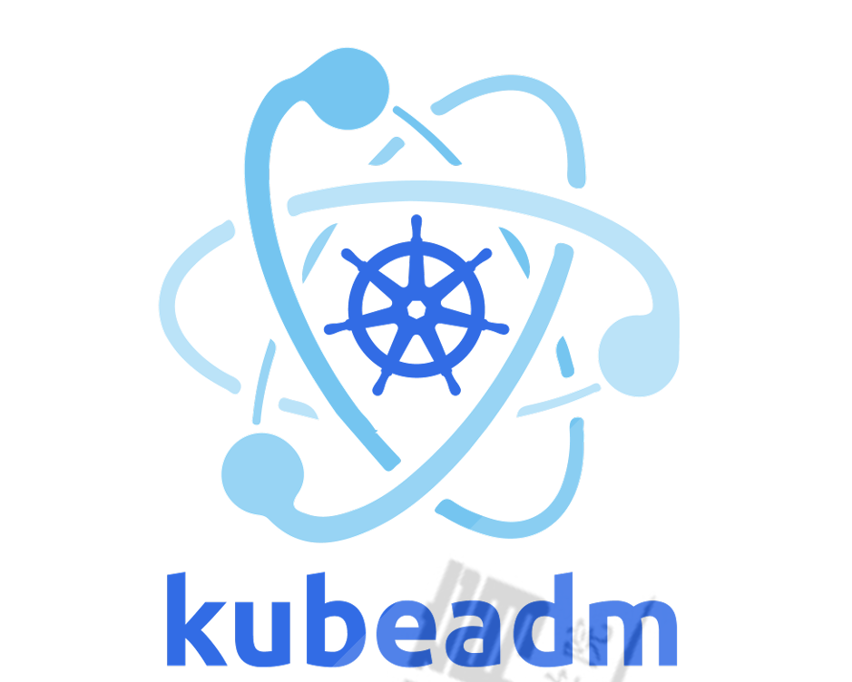

# CloudNative


## 什么是云原生（Cloud Native）?


**云原生（Cloud Native）是一种设计理念和技术架构**，旨在充分利用云环境的优势，来开发、部署和管理**高效、弹性、可扩展和自动化的现代化应用程序**。

云原生的核心目标是让应用程序能够**动态调整资源**，实现**高可用性**、**高可扩展性**和**灵活性**。云原生的实现通常依赖于**容器化技术（如Docker）**、**编排系统（如Kubernetes）**、**微服务架构**和**持续交付/集成（CI/CD）**等技术。


## 云原生的核心思想


**松耦合的架构**

- 传统的“单体应用”与“云原生应用”最大的区别是，云原生应用通过**微服务**将每个模块独立部署、独立扩缩。
- 云原生应用**每个服务模块独立开发、独立测试、独立部署**，互不影响。

**声明式的API**

- 云原生使用**声明式API**（Declarative API）管理基础架构和服务。
- 例如，Kubernetes中的**YAML文件**就是声明式API的典型示例，用户只需要声明期望的状态，而不需要关心如何实现。

**自动化运维 (Self-Healing)**

- 云原生应用依赖**自动化监控和告警系统**。
- Kubernetes中的**重启策略、健康检查（health check）、就绪探针（readiness probe）**，都可以实现自动恢复和修复。
- 在容器失败、崩溃时，Kubernetes会**自动重建Pod**，无需人工干预。

**弹性和自适应能力**

- 云原生应用具备**自动扩容和缩容**的能力。
- 当流量激增时，Kubernetes可以在几秒钟内**自动扩展Pod数量**，当流量下降时，Pod数量会自动减少，降低成本。

**基础设施即代码 (IaC)**

- 云原生强调**一切基础设施和配置都要以代码的形式存在**，这使得环境的创建、变更和销毁都变得可自动化。
- 使用的工具有**Terraform**、**Ansible**、**Helm**等。

**可观测性**

- 在分布式系统中，必须确保系统的**日志（log）**、**指标（metrics）\**和\**追踪（tracing）**。
- 使用Prometheus、Grafana等工具，可以直观地了解云原生系统的运行状态，检测瓶颈和故障点。


## 云原生的四大技术基石


**容器化 (Containerization)**

- 容器是云原生的最核心技术，它提供了一个与操作系统隔离的运行环境，便于**跨平台部署**。
- **Docker** 和 **OCI 容器**（如containerd、Podman）等工具就是容器化的典型代表。
- **好处**：更快的启动、更高的资源利用率、环境一致性和高可移植性。

**动态编排 (Orchestration)**

- 容器化的应用需要一个调度器来管理这些容器的**自动部署、扩缩容和故障修复**。
- **Kubernetes**（K8s）就是这种调度器的代表。
- Kubernetes可以管理**多集群的多节点分布式服务**，以实现跨云平台的高可用部署。

**微服务架构 (Microservices)**

- 将原本的单体应用拆解成多个**可独立开发和部署的微服务**，这些微服务通过**API或消息队列**进行通信。
- 各微服务可以单独部署、扩容、回滚、升级，而不影响其他模块。

**持续交付和持续集成 (CI/CD)**

- **CI/CD**使得开发人员的代码变更能够被**自动化构建、测试和部署**。
- 使用的工具有**Jenkins**、**GitLab CI/CD** 和 **ArgoCD** 等。
- CI/CD流水线可在开发到生产的过程中进行**自动化验证、回滚和监控**。


## 云原生的关键技术栈


| **领域**       | **技术**             | **作用**                             |
| -------------- | -------------------- | ------------------------------------ |
| **容器化**     | Docker, Podman       | 提供标准的容器化运行环境             |
| **容器编排**   | Kubernetes (K8s)     | 管理和编排容器，提供扩缩容和自愈能力 |
| **微服务**     | Spring Boot, Istio   | 支持微服务架构                       |
| **CI/CD**      | Jenkins, GitLab CI   | 持续交付和持续集成                   |
| **监控与日志** | Prometheus, Grafana  | 监控、日志、告警系统                 |
| **网络管理**   | Calico, Flannel      | 容器网络                             |
| **服务网格**   | Istio, Linkerd       | 管理微服务的通信，提供可观察性       |
| **存储**       | Ceph, Rook, Longhorn | 提供云原生的分布式存储解决方案       |
| **配置管理**   | Helm, Ansible        | 管理应用和集群的配置                 |

------


## 云原生的实际场景


1. **电商大促销**
   - 促销活动流量高峰，使用Kubernetes的**HPA（水平自动扩展）**来动态扩展服务实例。
   - 日常流量低时，Pod数量减少，**节省计算资源**。
2. **金融支付系统**
   - **微服务架构**可将支付系统拆分为多个服务：用户服务、支付服务、订单服务等。
   - **服务网格（如Istio）**实现微服务的流量治理、熔断、流量限流和分布式追踪。
3. **DevOps平台**
   - 使用**Jenkins + Docker + Kubernetes**，构建CI/CD流水线，自动化部署到生产环境。
   - **GitOps**使用**ArgoCD**，将代码提交到Git后，自动完成部署。


## 云原生的优势


| **优势**         | **描述**                                       |
| ---------------- | ---------------------------------------------- |
| **敏捷性**       | 通过CI/CD流水线实现快速的迭代发布              |
| **弹性扩展**     | 动态扩缩容，流量高峰期自动扩展，低峰期缩容     |
| **高可用性**     | 故障节点自动恢复，避免宕机                     |
| **多云/混合云**  | 支持跨云部署，避免单一云服务商的锁定           |
| **资源利用率高** | 使用容器化和Kubernetes的资源调度实现资源最优化 |


## 云原生官网

``````
https://www.cncf.io/
``````


# Docker


# CICD


# Prometheus


# Kubernetes


## Kubernets逻辑架构


## Kubernetes组件


### Kubernetes组件间安全通信


**Kubernetes集群中有三套CA机制**

- **etcd-ca**        ETCD集群内部的TLS通信
- **kubernetes-ca**    Kubernetes集群内部节点间的双向TLS通信
- **front-proxy-ca**    Kubernetes集群与外部扩展服务简单双向TLS通信


#### 详解Kubernetes-ca


**用途**：Kubernetes 集群内部的双向 TLS 通信


**作用和场景**

- **kubernetes-ca** 是 Kubernetes 集群的**主CA**，为**集群核心组件的内部双向通信**提供 TLS 证书。
- 它确保**集群中的各个核心组件之间的双向 TLS 通信是安全的**。
- 组件通过 **kubernetes-ca** 签发的证书来**验证彼此的身份**，并且**所有的通信内容都会加密**。
- 主要用于**Kubernetes 控制平面组件、工作节点和客户端**之间的通信。


**主要受控的组件和通信场景**

| **通信组件1**      | **通信组件2**               | **使用的证书**        | **使用的CA**      |
| ------------------ | --------------------------- | --------------------- | ----------------- |
| **kube-apiserver** | **kubelet**                 | kubelet-client.crt    | **kubernetes-ca** |
| **kube-apiserver** | **kube-scheduler**          | scheduler-client.crt  | **kubernetes-ca** |
| **kube-apiserver** | **kube-controller-manager** | controller-client.crt | **kubernetes-ca** |
| **kube-apiserver** | **kubectl客户端**           | kubectl.crt           | **kubernetes-ca** |
| **kube-apiserver** | **etcd**                    | etcd-client.crt       | **kubernetes-ca** |
| **kube-apiserver** | **service-account token**   | service-account.crt   | **kubernetes-ca** |
| **kubelet**        | **kube-apiserver**          | kubelet-server.crt    | **kubernetes-ca** |
| **kube-proxy**     | **kube-apiserver**          | kube-proxy-client.crt | **kubernetes-ca** |

> **示例解释：**

- **kube-apiserver 和 kubelet 之间的通信**：

  - kube-apiserver 需要使用客户端证书（`kubelet-client.crt`）通过双向TLS通信访问工作节点的 kubelet API。
  - kubelet 也会使用服务器证书（`kubelet-server.crt`）来确认自己的身份。
  - 这些证书都由 **kubernetes-ca** 签发。

- **kubectl 和 kube-apiserver 的通信**：

  - 用户的 kubectl 命令行工具通过 TLS 连接到 kube-apiserver，**kubectl** 使用的客户端证书（或 KubeConfig 文件）由**kubernetes-ca** 签发。
  - 这确保了**kubectl 的用户身份验证**和**与 API Server 的通信加密**。

  

**典型证书**

- **kubernetes-ca.crt**：根 CA 证书，所有的子证书都由它签发。
- **kube-apiserver.crt**：kube-apiserver 的服务器证书。
- **kube-apiserver-key.pem**：kube-apiserver 证书的私钥。
- **kubelet.crt** 和 **kubelet-key.pem**：kubelet 服务器证书和私钥。
- **kube-controller-manager.crt**：controller manager 使用的客户端证书。
- **kube-scheduler.crt**：scheduler 使用的客户端证书。
- **kube-proxy.crt**：kube-proxy 组件的客户端证书。


####  Front-proxy-ca

**用途：**用于 Kubernetes 的 API 聚合层的 TLS 通信


**作用和场景**

- **front-proxy-ca** 是为了支持**Kubernetes的API聚合层**，确保聚合层组件（如`metrics-server`和`custom-apis`）的通信安全。
- 它的主要目的是**为API代理和扩展API服务器（如Aggregator Server）之间的双向通信提供TLS加密和身份验证**。
- 这使得外部的 API 可以无缝地集成到Kubernetes API中。

> **API 聚合层的场景：**

- **metrics-server** 是一个常见的示例。
- 用户调用 `kubectl top nodes` 命令，kube-apiserver 需要**转发请求到metrics-server**。
- 这时，kube-apiserver 会使用**front-proxy-client.crt** 与**metrics-server**通信，确保数据是加密的，并能**验证metrics-server的身份**。


**主要受控的组件和通信场景**

| **通信组件1**      | **通信组件2**          | **使用的证书**         | **使用的CA**       |
| ------------------ | ---------------------- | ---------------------- | ------------------ |
| **kube-apiserver** | **API聚合层**          | front-proxy-client.crt | **front-proxy-ca** |
| **kube-apiserver** | **metrics-server**     | metrics-server.crt     | **front-proxy-ca** |
| **kube-apiserver** | **Custom API Service** | custom-api.crt         | **front-proxy-ca** |

> **示例解释：**

- **kube-apiserver 和 metrics-server 的通信**：
  - kube-apiserver 通过 TLS 请求 metrics-server。
  - metrics-server 使用**front-proxy-ca** 颁发的证书（如`metrics-server.crt`）来验证自己的身份。
  - **kube-apiserver 也会使用`front-proxy-client.crt` 进行认证和通信**。
- **kube-apiserver 和 Custom API Service 的通信**：
  - 用户可能会在集群中部署一个**自定义 API 扩展**。
  - 这时，kube-apiserver 使用**front-proxy-client.crt** 连接到**Aggregator Server**，并通过TLS通信与扩展API服务通信。


**典型证书**

- **front-proxy-ca.crt**：前端代理CA的根证书。
- **front-proxy-client.crt**：kube-apiserver 连接 API 聚合层（如 metrics-server）的证书。
- **front-proxy-client-key.pem**：kube-apiserver 使用的前端代理的私钥。


#### API聚合器是什么？

API 聚合器是 **kube-apiserver 的一个逻辑组件**，它的主要职责是：

- **将第三方 API 服务和 Kubernetes 自身的 API 进行聚合**。
- **统一暴露 API 端点**，使客户端（例如 `kubectl`）可以像操作原生资源（如Pod、Service）一样操作自定义的 API 资源。
- 通过 `kubectl get`、`kubectl describe` 等命令管理这些**非原生资源**。
- **将多个 API 扩展的路径挂载到 kube-apiserver** 的 URL 结构中，通常路径是 `/apis/{API_GROUP}/{VERSION}/{RESOURCE}`。


**API聚合器的位置和作用**

在 Kubernetes 架构中，API 聚合器是**kube-apiserver的一部分**。如下图所示，API 聚合器与 kube-apiserver 是一体的。

```lua
+------------------------------------------------------+
|                   kube-apiserver                     |
|                                                      |
|   +----------------+  +---------------------------+  |
|   | 原生 API 资源  |  |   自定义 API 聚合层      |  |
|   | (pods, svc)    |  | (metrics-server, custom)  |  |
|   +----------------+  +---------------------------+  |
|                                                      |
+------------------------------------------------------+
                          |
                          |
         +------------------------------------+
         |           API 聚合器                |
         +------------------------------------+
                          |
                          |
         +----------------+      +------------------+
         | 外部 API 服务   |      | 自定义API服务    |
         +----------------+      +------------------+
```

------

**具体的工作流程**

1. **请求的发起**：客户端（如 `kubectl top nodes`）发起 API 请求，路径为 `/apis/metrics.k8s.io/v1beta1/nodes`。
2. **kube-apiserver 路由**：kube-apiserver 识别到 `/apis/metrics.k8s.io/` 是**自定义API路径**，于是将请求转发到**API聚合器**。
3. API聚合器工作：
   - API聚合器通过**front-proxy-client.crt** 证书与**外部的扩展API服务器**通信。
   - 将请求转发到**扩展API服务**，如**metrics-server**。
4. 数据返回：
   - 扩展 API 服务（如 metrics-server）处理请求，并返回**监控数据**。
   - API 聚合器将数据返回给 kube-apiserver，最终返回给 `kubectl`。


## Kubernetes 版本

**通常每年更新四个大版本,从v1.22后已经修改为每年发布3个大版本** 

Kubernetes 的版本以 X.Y.Z 模式命名，其中 X 是主版本号，Y 是小版本号，Z 是补丁版本号。

 Kubernetes 一次支持三个小版本，也就是只支持包含当前的发布版本和两个之前的版本。 

参阅 GitHub 上的  Kubernetes Release 页面以获取最新的发布信息。


## Kubernetes扩展接口


Kubernetes提供了三个特定功能的接口,kubernetes通过调用这几个接口，来完成相应的功能。

- **容器运行时接口CRI**: Container Runtime Interface 

  - CRI 首次发布于2016年12月的Kubernetes 1.5 版本。 

  - 在此版本之前，Kubernetes 直接与 Docker 通信，没有标准化的接口。 

  - 从 Kubernetes 1.5 开始，CRI 成为 Kubernetes 与容器运行时交互的标准接口，使得 Kubernetes  可以与各种容器运行时进行通信，从而增加了灵活性和可移植性。

  - kubernetes 对于容器的解决方案，只是预留了容器接口，只要符合CRI标准的解决方案都可以使用


#### 扩展：dockershim 是什么，为什么它会消失

``````
在 Kubernetes 的早期，我们只支持一个容器运行时。那个运行时是 Docker Engine。当时，没有太多其他选择，Docker 是处理容器的主要工具，所以这不是个有争议的选择。最终，我们开始添加更多的容器运行时，比如 rkt 和 hypernetes，很明显 Kubernetes 用户希望选择最适合他们的运行时。因此 Kubernetes 需要种方法，来允许集群操作者灵活地使用他们选择的任何运行时。

发布CRI[1]（Container Runtime Interface，容器运行时接口）就是为了提供这种灵活性。CRI 的引入对项目和用户来说都很棒，但它也引入了一个问题：Docker Engine 作为容器运行时的使用早于 CRI，Docker Engine 与 CRI 不兼容。为了解决这个问题，引入了一个小软件垫片（"shim"，dockershim）作为 kubelet 组件的一部分，专门用于填补 Docker Engine 和 CRI 之间的空白，允许集群运营商继续使用 Docker Engine 作为他们的容器运行时，基本上不会给中断。

然而，这个小小的软件垫片从来就不是永久的解决方案。多年来，它的存在给 kubelet 本身带来了许多不必要的复杂性。由于这个垫片，Docker 的一些集成实现不一致，导致维护人员的负担增加，并且维护特定于供应商的代码不符合我们的开源理念。为了减少这种维护负担，并向一个支持开放标准的更具协作性的社区发展，KEP-2221 获引入[2]，它建议去掉 dockershim。随着 Kubernetes v1.20 的发布，这一弃用成为
正式。

我们没有很好地传达这一点，不幸的是，弃用声明导致了社区内的一些恐慌。对于 Docker 作为一家公司来说这意味着什么，由 Docker 构建的容器镜像能否运行，以及 Docker Engine 实际是什么导致了社交媒体上的一场大火。这是我们的过失；我们应该更清楚地沟通当时发生了什么以及原因。为了解决这个问题，我们发布了一个博客[3]和相关的常见问题[4]，以减轻社区的恐惧，并纠正一些关于 Docker 是什么，以及容
器如何在 Kubernetes 中工作的误解。由于社区的关注，Docker 和 Mirantis 共同同意以cridocker[5]的形式继续支持 dockershim 代码，允许你在需要时继续使用 Docker Engine 作为你的容器运行时。为了让那些想尝试其他运行时（如 containerd 或 cri-o）的用户感兴趣，编写了迁移文档[6]。

我们后来对社区进行了调查[7]，发现仍然有许多用户有问题和顾虑[8]。作为回应，Kubernetes 维护者和CNCF 致力于通过扩展文档和其他程序来解决这些问题。事实上，这篇博文就是这个计划的一部分。随着如此多的最终用户成功地迁移到其他运行时，以及文档的改进，我们相信现在每个人都有了迁移的道路

无论是作为工具还是作为公司，Docker 都不会消失。它是云原生社区和 Kubernetes 项目历史的重要组成部分。没有他们我们不会有今天。也就是说，从 kubelet 中移除 dockershim 最终对社区、生态系统、项目和整个开源都有好处。这是我们所有人一起支持开放标准的机会，我们很高兴在 Docker 和社区的帮助下这样做。
``````


- 方式1: Containerd 
  - 默认情况下,Kubernetes在创建集群的时候,使用的就是Containerd 方式。 
- 方式2: Docker 
  - Docker Engine 没有实现 CRI， 而这是容器运行时在 Kubernetes 中工作所需要的。  因此必须安装一个额外的服务,早期使用由k8s提供的dockershim,但它在 1.24 版本从 kubelet 中被 移除 还可以借助于Mirantis维护的cri-dockerd插件方式来实现Kubernetes集群的创建。 cri-dockerd 项目站点:  https://github.com/Mirantis/cri-dockerd 
- 方式3: CRI-O 
  - 2016年成立,2019年4月8号加入CNCF孵化。 CRI-O的方式是Kubernetes创建容器最直接的一种方式 在创建集群的时候,需要借助于cri-o插件的方式来实现Kubernetes集群的创建。


- **容器网络接口CN**I: Container Network Interface
  - kubernetes 对于网络的解决方案，只是预留了网络接口，只要符合CNI标准的解决方案都可以使用
- **容器存储接口CSI:** Container Storage Interface
  - kubernetes 对于存储的解决方案，只是预留了存储接口，只要符合CSI标准的解决方案都可以使用 此接口非必须


## Kubernetes集群部署


### Kubernetes 集群组件运行模式

#### **独立组件模式** 

- 各关键组件都以二进制方式部署于主机节点上，并以守护进程形式运行 
- 各附件Add-ons 则以Pod形式运行 
- 需要实现各种证书的申请颁发
-  部署过程繁琐复杂


#### **静态Pod模式**

- **kubelet和容器运行时docker以二进制部署，运行为守护进程**
- 除此之外所有组件为Pod 方式运行

- 控制平台各组件以静态Pod对象运行于Master主机之上
- 静态Pod由kubelet所控制实现创建管理,而无需依赖kube-apiserver等控制平台组件
- kube-proxy等则以Pod形式运行
- 相关pod早期是从仓库k8s.gcr.io下载镜像，新版改为仓库registry.k8s.io
- 使用kubernetes官方提供的kubeadm工具实现kubernetes集群方便快速的部署


### 基于Kubeadm和 Docker 部署 kubernetes 高可用集群





参考文档：

``````
https://kubernetes.io/docs/setup/production-environment/tools/kubeadm/ https://kubernetes.io/docs/setup/production-environment/tools/kubeadm/install-kubeadm/
https://kubernetes.io/zh-cn/docs/setup/production-environment/tools/kubeadm/create-cluster-kubeadm/
https://github.com/kubernetes/kubeadm/blob/master/docs/design/design_v1.10.md
``````


kubeadm是Kubernetes社区提供的集群构建工具

- 负责执行构建一个最小化可用集群并将其启动等必要的基本步骤
- Kubernetes集群全生命周期管理工具，可用于实现集群的部署、升级/降级及卸载等
- kubeadm仅关心如何初始化并拉起一个集群，其职责仅限于下图中背景蓝色的部分
- 蓝色的部分以外的其它组件还需要自行部署 


注意：在kubeadm方式安装时，Kubernetes 的所有组件中除kubelet 是以传统服务进程的方式运行，其它都以容器运行


#### 部署环境说明


| IP         | 主机名           | 角色                                      |
| ---------- | ---------------- | ----------------------------------------- |
| 10.0.0.101 | master1.wang.org | K8s 集群主节点 1，Master和etcd            |
| 10.0.0.102 | master2.wang.org | K8s 集群主节点 2，Master和etcd            |
| 10.0.0.103 | master3.wang.org | K8s 集群主节点 3，Master和etcd            |
| 10.0.0.104 | node1.wang.org   | K8s 集群工作节点 1                        |
| 10.0.0.105 | node2.wang.org   | K8s 集群工作节点 2                        |
| 10.0.0.106 | node3.wang.org   | K8s 集群工作节点 3                        |
| 10.0.0.107 | ha1.wang.org     | K8s 主节点访问入口 1,提供高可用及负载均衡 |
| 10.0.0.108 | ha2.wang.org     | K8s 主节点访问入口 2,提供高可用及负载均衡 |
| 10.0.0.109 | harbor.wang.org  | 容器镜像仓库                              |
| 10.0.0.100 | kubeapi.wang.org | VIP，在ha1和ha2主机实现                   |

注意： Master节点内存至少2G以上，否则在初始化时会出错


#### 网络地址规划

``````bash
物理主机网络        10.0.0.0/24 
集群pod网络        --pod-network-cidr=10.244.0.0/16
应用service网络    --service-cidr=10.96.0.0/12 
``````


#### 基于 kubeadm 和 Docker 实现Kuberenetes集群流程说明

- 每个节点主机的初始环境准备
- 准备代理服务,以便访问k8s.gcr.io，或根据部署过程提示的方法获取相应的I国内镜像的image（可选）
- Kubernetes集群API访问入口的高可用和harbor（可选）
- **在所有Master和Node节点都安装容器运行时 Docker**
- **在所有节点安装和配置 cri-dockerd(kubernetes-v1.24版本以后需要)**
- **在所有Master和Node节点都安装kubeadm 、kubelet、kubectl(集群管理工具,在node节点可 不安装)**
- **在第一个 master 节点运行 kubeadm init 初始化命令 ,并验证 master 节点状态**
- **在第一个 master 节点安装配置CNI规范的网络插件**
- 在其它master节点运行kubeadm join 命令加入到控制平面集群中实现高可用(测试环境可选)
- **在所有 node 节点使用 kubeadm join 命令加入集群 , 并验证 node 节点状态**
- 创建 pod 并启动容器测试访问 ，并测试网络通信


#### 初始环境准备

- 硬件准备环境: 每个主机至少2G以上内存,CPU2核以上
- 操作系统: 最小化安装支持Kubernetes的Linux系统
- 唯一的主机名，MAC地址以及product_uuid和主机名解析
- 保证各个节点网络配置正确,并且保证通信正常
- 禁用 swap 
- 禁用 SELinux
- 放行Kubernetes使用到的相关端口或禁用firewalld/iptables
- 配置正确的时区和时间同步
- 内核参数优化 
- 所有节点实现基于 ssh key 验证(可选)


**检查每台机器的product_uuid，project_uuid要具备唯一性**

``````bash
[root@ubuntu2204 ~]#cat /sys/class/dmi/id/product_uuid
e0c84d56-f33b-6754-eab2-d5e7cb846dc1
 
[root@rocky8 ~]#cat /sys/class/dmi/id/product_uuid
10324d56-9c12-c716-dfa1-196e5242b4d3
``````


**每天机器上设置hostname,并配置/etc/hosts**

``````
# cat >> /etc/hosts <<EOF
10.0.0.100 kubeapi kubeapi.wang.org 
10.0.0.101 master1 master1.wang.org
10.0.0.102 master2 master2.wang.org
10.0.0.103 master3 master3.wang.org
10.0.0.104 node1 node1.wang.org
10.0.0.105 node2 node2.wang.org
10.0.0.106 node3 node3.wang.org
10.0.0.107 ha1 ha1.wang.org
10.0.0.108 ha2 ha2.wang.org
10.0.0.109 harbor harbor.wang.org
EOF
``````


**使用ssh打通每台机器**

``````bash
ssh-keygen

ssh-copy-id 127.0.0.1

for i in {101..108}; do scp -r .ssh 10.0.0.$i:/root/; done
``````


**设置每台主机的主机名**

``````bash
for i in {1..3} ;do ssh 10.0.0.10$i hostnamectl set-hostname master$i;done
for i in {4..6} ;do ssh 10.0.0.10$i hostnamectl set-hostname node$(($i-3));done
ssh 10.0.0.107 hostnamectl set-hostname ha1
ssh 10.0.0.108 hostnamectl set-hostname ha2

``````


**实现主机时间同步**

``````bash
timedatectl set-timezone Asia/Shanghai

apt update
apt install  chrony -y

vim /etc/chrony/chrony.conf
 #加下面一行
pool ntp.aliyun.com        iburst maxsources 2
pool ntp.ubuntu.com        iburst maxsources 4
pool 0.ubuntu.pool.ntp.org iburst maxsources 1
pool 1.ubuntu.pool.ntp.org iburst maxsources 1
pool 2.ubuntu.pool.ntp.org iburst maxsources 2

systemctl enable chrony
systemctl restart chrony
``````


 **关闭SELinux**

``````bash
 ~# setenforce 0
 ~# sed -i 's#^\(SELINUX=\).*#\1disabled#' /etc/sysconfig/selinux
``````


**关闭防火墙**

``````bash
# Rocky
systemctl disable --now firewalld 

# Ubuntu
systemctl disable --now ufw
``````


 **禁用 Swap 设备**

``````bash
#方法1
~# swapoff -a
~# sed -i  '/swap/s/^/#/' /etc/fstab
~# for i in {101..106};do ssh 10.0.0.$i "sed -i  '/swap/s/^/#/' /etc/fstab"; ssh 10.0.0.$i swapoff -a ; done

#方法2
~# systemctl stop  swap.img.swap
~# systemctl mask swap.img.swap 或者 systemctl mask swap.target
 
#方法3
~# systemctl mask swap.img.swap 或者 systemctl mask swap.target
~# reboot

#确认是否禁用swap
~# systemctl -t swap 
~# swapon -s 

``````


**内核优化**  

根据硬件和业务需求,对内核参数做相应的优化 

注意:安装docker时会自动修改内核参数


#### 实现高可用的反向代理


**实现 keepalived**

在两台主机ha1和ha2 按下面步骤部署和配置 keepalived

``````bash
[root@ha1 ~]#apt update && apt -y install keepalived 

#keepalived配置
[root@ha1 ~]#cp  /usr/share/doc/keepalived/samples/keepalived.conf.vrrp /etc/keepalived/keepalived.conf

[root@ha1 ~]#vim /etc/keepalived/keepalived.conf

! Configuration File for keepalived
global_defs {
  notification_email {
    acassen
  }
  notification_email_from Alexandre.Cassen@firewall.loc
  smtp_server 192.168.200.1
  smtp_connect_timeout 30
  router_id ha1.wang.org  #指定router_id,#在ha2上为ha2.wang.org
}
vrrp_script check_haproxy {
   script "/etc/keepalived/check_haproxy.sh"
   interval 1
   weight -30
   fall 3
   rise 2
   timeout 2
}
vrrp_instance VI_1 {
   state MASTER              #在ha2上为BACKUP        
   interface eth0
   garp_master_delay 10
   smtp_alert
   virtual_router_id 66      #指定虚拟路由器ID,ha1和ha2此值必须相同
   priority 100              #在ha2上为80          
   advert_int 1
   authentication {
       auth_type PASS
       auth_pass 123456      #指定验证密码,ha1和ha2此值必须相同  
   }
   virtual_ipaddress {
       10.0.0.100/24 dev eth0  label eth0:1  #指定VIP,ha1和ha2此值必须相同
   }
   track_script {
       check_haproxy 
   }
}
 [root@ha1 ~]#cat /etc/keepalived/check_haproxy.sh
 #!/bin/bash
 /usr/bin/killall -0 haproxy  || systemctl restart haproxy
 [root@ha1 ~]#chmod +x /etc/keepalived/check_haproxy.sh
 [root@ha1 ~]#hostname -I
 10.0.0.107 
[root@ha1 ~]#systemctl start keepalived.service 
#验证keepalived服务是否正常
``````


**实现 Haproxy**

通过 Harproxy 实现 kubernetes Api-server的四层反向代理和负载均衡功能

``````bash
#在两台主机ha1和ha2都执行下面操作
[root@ha1 ~]#cat >> /etc/sysctl.conf <<EOF
net.ipv4.ip_nonlocal_bind = 1
EOF
root@ha1 ~]#sysctl -p 

#安装配置haproxy
[root@ha1 ~]#apt -y install haproxy
[root@ha1 ~]#vim /etc/haproxy/haproxy.cfg 
[root@ha1 ~]#cat /etc/haproxy/haproxy.cfg

global
	log /dev/log	local0
	log /dev/log	local1 notice
	chroot /var/lib/haproxy
	stats socket /run/haproxy/admin.sock mode 660 level admin expose-fd listeners
	stats timeout 30s
	user haproxy
	group haproxy
	daemon

	# Default SSL material locations
	ca-base /etc/ssl/certs
	crt-base /etc/ssl/private

	# See: https://ssl-config.mozilla.org/#server=haproxy&server-version=2.0.3&config=intermediate
        ssl-default-bind-ciphers ECDHE-ECDSA-AES128-GCM-SHA256:ECDHE-RSA-AES128-GCM-SHA256:ECDHE-ECDSA-AES256-GCM-SHA384:ECDHE-RSA-AES256-GCM-SHA384:ECDHE-ECDSA-CHACHA20-POLY1305:ECDHE-RSA-CHACHA20-POLY1305:DHE-RSA-AES128-GCM-SHA256:DHE-RSA-AES256-GCM-SHA384
        ssl-default-bind-ciphersuites TLS_AES_128_GCM_SHA256:TLS_AES_256_GCM_SHA384:TLS_CHACHA20_POLY1305_SHA256
        ssl-default-bind-options ssl-min-ver TLSv1.2 no-tls-tickets

defaults
	log	global
	mode	http
	option	httplog
	option	dontlognull
        timeout connect 5000
        timeout client  50000
        timeout server  50000
	errorfile 400 /etc/haproxy/errors/400.http
	errorfile 403 /etc/haproxy/errors/403.http
	errorfile 408 /etc/haproxy/errors/408.http
	errorfile 500 /etc/haproxy/errors/500.http
	errorfile 502 /etc/haproxy/errors/502.http
	errorfile 503 /etc/haproxy/errors/503.http
	errorfile 504 /etc/haproxy/errors/504.http

##########添加以下内容######################

listen stats
    mode http
    bind 0.0.0.0:8888
    stats enable
    log global
    stats uri /status
    stats auth admin:123456

listen  kubernetes-api-6443
    bind 10.0.0.100:6443
    mode tcp 
    server master1 10.0.0.101:6443 check inter 3s fall 3 rise 3 
    server master2 10.0.0.102:6443 check inter 3s fall 3 rise 3 
    server master3 10.0.0.103:6443 check inter 3s fall 3 rise 3 
``````


浏览器访问： http://ha2.wang.org:8888/status ，可以看到下面界面


#### 在master和worker上安装docker

``````bash
# master
wget https://www.mysticalrecluse.com/script/Shell/install_docker_offline.sh
bash install_docker_offline.sh
``````


####  所有主机安装 cri-dockerd(v1.24以后版本)

```````bash
wget https://github.com/Mirantis/cri-dockerd/releases/download/v0.3.14/cri-dockerd_0.3.14.3-0.ubuntu-jammy_amd64.deb

# 如果出现依赖问题，使用该命令修复
apt --fix-broken install -y

# 如果出现如下报错
[root@ubuntu2204 ~]#systemctl status cri-docker.service 
○ cri-docker.service - CRI Interface for Docker Application Container Engine
     Loaded: loaded (/lib/systemd/system/cri-docker.service; enabled; vendor preset: enabled)
     Active: inactive (dead)
TriggeredBy: × cri-docker.socket
       Docs: https://docs.mirantis.com

12月 15 16:23:19 master2 systemd[1]: Dependency failed for CRI Interface for Docker Application Container Engine.
12月 15 16:23:19 master2 systemd[1]: cri-docker.service: Job cri-docker.service/start failed with result 'dependency'.

# 解决方法：添加docker组
groupadd docker

# 重启cri-docker
systemctl restart cri-docker.service
systemctl status cri-docker.service
```````


#### 所有主机配置 cri-dockerd(v1.24以后版本

``````bash
# vim /lib/systemd/system/cri-docker.service
ExecStart=/usr/bin/cri-dockerd --container-runtime-endpoint fd:// --pod-infra-container-image registry.aliyuncs.com/google_containers/pause:3.9
``````


#### 所有 master 和 node 节点安装kubeadm等相关包

所有 master 和 node 节点都安装kubeadm, kubelet,kubectl 相关包

注意: node节点可以不安装管理工具 kubectl 包,但依赖关系会自动安装


``````bash
# cat install_k8s.sh
#!/bin/bash
apt update && apt-get install -y apt-transport-https
curl -fsSL https://mirrors.aliyun.com/kubernetes-new/core/stable/v1.30/deb/Release.key | gpg --dearmor -o /etc/apt/keyrings/kubernetes-apt-keyring.gpg
echo "deb [signed-by=/etc/apt/keyrings/kubernetes-apt-keyring.gpg] https://mirrors.aliyun.com/kubernetes-new/core/stable/v1.30/deb/ /" | tee /etc/apt/sources.list.d/kubernetes.list
apt-get update
apt-get install -y kubelet kubeadm kubectl
``````


#### 在第一个 master 节点运行 kubeadm init 初始化命令

``````
K8S_RELEASE_VERSION=1.30.2 && kubeadm init --control-plane-endpoint kubeapi.wang.org --kubernetes-version=v${K8S_RELEASE_VERSION} --pod-network-cidr 10.244.0.0/16 --service-cidr 10.96.0.0/12 --image-repository registry.aliyuncs.com/google_containers --token-ttl=0 --upload-certs --cri-socket=unix:///run/cri-dockerd.sock
``````


**完整命令**

``````bash
K8S_RELEASE_VERSION=1.30.2 && kubeadm init --control-plane-endpoint kubeapi.wang.org --kubernetes-version=v${K8S_RELEASE_VERSION} --pod-network-cidr 10.244.0.0/16 --service-cidr 10.96.0.0/12 --image-repository registry.aliyuncs.com/google_containers --token-ttl=0 --upload-certs --cri-socket=unix:///run/cri-dockerd.sock
``````


**逐个字段的详细解释**

1️⃣ `K8S_RELEASE_VERSION=1.30.2`

- **含义**：定义一个环境变量 `K8S_RELEASE_VERSION`，用于指定 Kubernetes 版本。

- **作用**：在 `kubeadm init` 命令中，通过 `${K8S_RELEASE_VERSION}` 引用这个变量，简化版本控制，便于更新 Kubernetes 版本。

- 示例：

  ```
  bashCopy codeK8S_RELEASE_VERSION=1.30.2
  echo $K8S_RELEASE_VERSION  # 输出 1.30.2
  ```


2️⃣ **`kubeadm init`**

- **含义**：`kubeadm init` 命令用于初始化 Kubernetes 控制平面（Master 节点）。
- **作用**：该命令在控制节点上运行，初始化 Kubernetes 集群，生成 token、证书和 Kubeconfig 文件，并生成 `kubeadm join` 命令，以便其他节点加入集群。


3️⃣ **`--control-plane-endpoint kubeapi.wang.org`**

- **含义**：设置 Kubernetes 控制平面的**高可用入口地址**。
- 作用：
  - 如果你有多个 master 控制平面节点，需要为这些控制平面提供一个**统一的访问入口**。
  - 这个控制平面入口（`kubeapi.wang.org`）通常是一个 **VIP (虚拟IP)**，或者是一个可以负载均衡到多个控制平面节点的 FQDN。
  - 这样，Kubernetes 集群内的 kubelet 只需连接这个域名，**不需要知道具体的控制平面节点的 IP**。
- 示例：
  - 如果你有 3 台控制平面节点，`10.0.0.1, 10.0.0.2, 10.0.0.3`，那么你可以设置一个 VIP 例如 `10.0.0.100` 并将域名 `kubeapi.wang.org` 解析为 `10.0.0.100`。
  - 通过 **Keepalived** 和 **HAProxy**，可以将请求从 `10.0.0.100` 转发到 3 台控制平面节点中的任意一个。


4️⃣ **`--kubernetes-version=v${K8S_RELEASE_VERSION}`**

- **含义**：指定要安装的 Kubernetes 版本。

- **作用**：强制 kubeadm 使用特定版本的 Kubernetes 组件。

- 示例：

  ```bash
  --kubernetes-version=v1.30.2
  ```


5️⃣ **`--pod-network-cidr 10.244.0.0/16`**

- **含义**：设置 Pod 网络的 CIDR 地址段。
- 作用：
  - 在 Kubernetes 集群中，每个 Pod 都需要有一个唯一的 IP 地址。
  - `--pod-network-cidr` 指定了**Pod IP 地址段**。
  - 该 IP 地址段被 CNI（如 Flannel、Calico、Weave）使用，通常不与服务器的本地 IP 地址冲突。
- 注意事项：
  - Flannel 通常使用 `10.244.0.0/16`。
  - Calico 默认使用 `192.168.0.0/16`。
- 示例：
  - `--pod-network-cidr=10.244.0.0/16` 表示 Pod IP 地址的范围是 `10.244.0.0 - 10.244.255.255`。


6️⃣ **`--service-cidr 10.96.0.0/12`**

- **含义**：指定 Service 的虚拟 IP 地址段。

- 作用：

  - 在 Kubernetes 中，Service 是一种集群内的**虚拟 IP**，这些 IP 不与物理主机 IP 冲突。
  - 这个 IP 段由 kube-proxy 和 iptables 维护。

- 注意事项：

  - Service IP 只能在**集群内部访问**。
  - 通常不与物理网络 IP 段冲突。
  - 一般是 `10.96.0.0/12`，表示 `10.96.0.0 - 10.111.255.255` 这个范围。

- 示例：

  ```bash
  --service-cidr=10.96.0.0/12
  ```


7️⃣ **`--image-repository registry.aliyuncs.com/google_containers`**

- **含义**：指定 Kubernetes 组件镜像的拉取地址。

- 作用：

  - 由于国内无法直接访问 **Google 容器镜像仓库 (gcr.io)**，所以用阿里云的镜像源。
  - `registry.aliyuncs.com/google_containers` 是国内常用的镜像源，包含所有 Kubernetes 相关的镜像。

- 示例：

  ```bash
  --image-repository registry.aliyuncs.com/google_containers
  ```


8️⃣ **`--token-ttl=0`**

- **含义**：设置 kubeadm join 命令中 Token 的有效时间。

- 作用：

  - 默认的 token 过期时间是 24 小时。
  - 通过 `--token-ttl=0`，表示生成的 token**永不过期**。
  - 适用于长时间部署节点，或者需要一段时间内多次加入新节点的场景。

- 示例：

  ```bash
  --token-ttl=0
  ```


9️⃣ **`--upload-certs`**

- **含义**：将证书上传到集群中的控制平面节点。

- 作用：

  - 在高可用集群中，控制平面节点之间需要共享证书。
  - kubeadm 会将证书加密存储在 **Kubernetes Secret** 中。
  - 通过这个参数，**允许其他控制平面节点下载这些证书**。

- 示例：

  ```
  --upload-certs
  ```


🔟 **`--cri-socket=unix:///run/cri-dockerd.sock`**

- **含义**：指定 Kubelet 连接的 CRI（容器运行时接口）。

- 作用：

  - Kubernetes 支持多个 CRI，如 **containerd**、**cri-o** 和 **Docker**。
  - cri-dockerd 是一个专门的 Docker CRI 插件。
  - 此选项告诉 Kubernetes：**将 Kubelet 连接到 /run/cri-dockerd.sock**。

- 注意：

  - 如果未指定此选项，Kubelet 将尝试自动检测 CRI。
  - cri-dockerd 是用于从 Docker 转换到 Containerd 的临时解决方案。

- 示例：

  ```bash
  --cri-socket=unix:///run/cri-dockerd.sock
  ```


**总结**

| 选项                       | 含义                 | 示例                           |
| -------------------------- | -------------------- | ------------------------------ |
| `--control-plane-endpoint` | 控制平面的高可用入口 | `kubeapi.feng.org`             |
| `--kubernetes-version`     | 指定 Kubernetes 版本 | `v1.30.2`                      |
| `--pod-network-cidr`       | 指定 Pod IP 地址段   | `10.244.0.0/16`                |
| `--service-cidr`           | Service IP 地址段    | `10.96.0.0/12`                 |
| `--image-repository`       | 容器镜像仓库         | `registry.aliyuncs.com`        |
| `--token-ttl`              | kubeadm token 有效期 | `0` 表示永不过期               |
| `--upload-certs`           | 上传控制平面证书     | **启用证书共享**               |
| `--cri-socket`             | 容器运行时接口 (CRI) | `unix:///run/cri-dockerd.sock` |


如果运行出现问题，需要重置，执行如下命令

``````
kubeadm reset -f
``````


#### 将其他的master和worker主机加入集群


执行上述初始化命令后，得到如下结果

``````bash
############ 这部分是授权kubectl命令 #######################################################
o start using your cluster, you need to run the following as a regular user:

  mkdir -p $HOME/.kube
  sudo cp -i /etc/kubernetes/admin.conf $HOME/.kube/config
  sudo chown $(id -u):$(id -g) $HOME/.kube/config

Alternatively, if you are the root user, you can run:

  export KUBECONFIG=/etc/kubernetes/admin.conf

You should now deploy a pod network to the cluster.
Run "kubectl apply -f [podnetwork].yaml" with one of the options listed at:
  https://kubernetes.io/docs/concepts/cluster-administration/addons/

You can now join any number of the control-plane node running the following command on each as root:

############## 这部分是master节点加入集群的命令###############################

  kubeadm join kubeapi.wang.org:6443 --token jizd9o.tjfoyvdoisbklfi5 \
	--discovery-token-ca-cert-hash sha256:c27e15a7a39394b6d64e419b60df835f9dedb7b015a92c1d9285effa1fbea600 \
	--control-plane --certificate-key 9fa84696a800c6b995a9249972c1dd76735701e5ea2ae05191c9f612a0d1252c --cri-socket=unix:///run/cri-dockerd.sock # 后面追加 --cri-socket=unix:///run/cri-dockerd.sock

Please note that the certificate-key gives access to cluster sensitive data, keep it secret!
As a safeguard, uploaded-certs will be deleted in two hours; If necessary, you can use
"kubeadm init phase upload-certs --upload-certs" to reload certs afterward.

Then you can join any number of worker nodes by running the following on each as root:

############## 这部分是worker节点加入集群的命令###############################

kubeadm join kubeapi.wang.org:6443 --token jizd9o.tjfoyvdoisbklfi5 \
	--discovery-token-ca-cert-hash sha256:c27e15a7a39394b6d64e419b60df835f9dedb7b015a92c1d9285effa1fbea600 --cri-socket=unix:///run/cri-dockerd.sock # 后面追加 --cri-socket=unix:///run/cri-dockerd.sock
``````


根据上述指令加master主机和其他worker主机加入集群


#### 安装网络插件flanny

``````bash
wget https://mirror.ghproxy.com/https://github.com/flannel-io/flannel/releases/latest/download/kube-flannel.yml

# 要确保docker可以拉取镜像，建议开代理
kubectl apply -f kube-flannel.yml
``````


#### 查看是否部署成功

``````bash
[root@ubuntu2204 ~]#kubectl get nodes
NAME      STATUS   ROLES           AGE   VERSION
master1   Ready    control-plane   97m   v1.30.8
master2   Ready    control-plane   94m   v1.30.8
master3   Ready    control-plane   93m   v1.30.8
node1     Ready    <none>          92m   v1.30.8
node2     Ready    <none>          92m   v1.30.8
node3     Ready    <none>          92m   v1.30.8

``````


#### 启用自动补全脚本

``````bash
# 临时补全命令
source <(kubectl completion bash)


# 用户永久补全，每次登录都生效
echo 'source <(kubectl completion bash)' >> ~/.bashrc
source ~/.bashrc
``````


## Kubernetes资源对象和Pod资源


**本章内容**

- **资源对象**
- **名称空间**
- **Pod资源**


### 资源对象

#### Kubernetes常见资源对象


#### Kubernetes中资源对象的分类


**独立存在的资源**

Kubernetes 系统将一切事物都称为资源对象, 相当于面向对象的思想 

有一些独立存在,即不依赖于其它对象存在的资源类型, Kubernetes 提供了单独的 API 资源，其**遵循  REST 风格**组织并管理这些资源对象

对这些API 资源类型支持使用标准的 HTTP 方法(POST,PUT,PATCH,DELETE 和 GET)对资源进行增、删、 改和查。


**不能独立存在的资源**

也有一些资源Kubernetes  中并没有提供对应独立的API资源类型,不能独立创建,需要依附其它资源的存 在, 比如: Label,emptyDir等


```ABAP
在 Kubernetes 系统中，资源代表了对象的集合，例如：Pod 资源可用于描述所有 Pod类型的对象。对 象实质是资源类型生成的实例。
```


 

**Kubernetes 的API  资源分为两种:**

- 内置API 资源: Kubernetes 安装后自身具有的自定义的API 资源: 
- 用户自定义的API,称为CRD(Custom Resource Definition),可以通过安装一些组件生成


**从资源的主要功能上Kubernetes 的资源对象分为**

- Workloads(工作负载)
- Service,LoadBalancing and Networking(服务发现和负载均衡)
- 存储和配置(Storage&Configuration)
- Cluster Admin(集群管理)
- Policies&Scheduling(策略和调度)
-  Metadata(元数据)


**K8S资源还可以按适用范围分为:名称空间级别、集群级别、元数据类型**

- **名称空间级别**
  - 仅在此名称中生效。举个例子，我们之前通过 kubeadm 去安装我们K8S 集群的时 候，他会默认把所有组件放到 kube-system 这个名称空间下去运行，然后我们可以通过命令 kubectl get pod 的时候会看到它获取不到，对应的我们系统一些 pod 的信息，原因是默认情况 下该命令什么都不加的话相当于是 kubectl get pod -n default ，但是我们的  K8S 本身组件他 是放在我们的 kube-system 名称空间下的，所有这种情况我们会发现，在  kube-system 名称空间 下的资源我们在其他名称空间中是看不见的。这就是典型的名称空间级别资源。


- **集群级别**
  - 比如、role 等等，这都是集群级别的资源，不管在什么名称空间下去定义，在其他的名 称空间下都能够看得到，其实他在定义的时候都没有去指定所谓的名称空间，也就意味着一旦经过 定义以后在全集群中都能够被可见以及调用，这种级别呢我们就把它集群级别下的名称空间，并且 把这种东西叫做集群级别的资源


- **元数据型**
  - 负责提供一种指标，源数据类型它不像我们的名称空间级别和集群级别，其实它也可以 归属在这两者之间，但是它又有自己的特点所以我们将他拿出来进行单独的分类。比如前面讲过的  HPA 他就是可以通过我们的 CPU 进行平滑扩展，他就是典型的源数据型。通过我们的指标进行操 作。


#### 资源及其在 API 中的组织形式

Kubernetes 利用标准的 **RESTful 术语**来描述其 API 概念

- **资源类型**：是指在 URL 中使用的名称，如 Pod、Namespace 和 Service 等，其 URL 格式 为"**/GROUP/VERSION/RESOURCE**"，示例：/apps/v1/deployment

- 所有资源类型都有一个对应的 JSON 表示格式：**kind(种类)**，在 K8s 中用户创建对象必须以 JSON格 式提交对象的配置信息
- 隶属于同一资源类型的对象组成的列表称为 **collection(集合)**，如 PodList
-   某种类型的单个实例称为**"resource"(资源)**或**"object"(对象)**，如运行的名为 pod-test 的 Pod 对象


**API群组**

Kubernetes 将 API 分割为多个逻辑组合，称为API 群组，不同的群组支持单独启用或禁用，并可以再次 分解。群组化管理的 API 使得其可以更轻松的进行扩展。当前 K8s 集群系统上的 API server 上的相关信 息可以使用 kubectl api-versions 获取。配置资源清单时会使用 API 群组

```bash
#显示API群组,结果格式为: GROUP_NAME/VERSOIN,同一个组可以有多版本并存
#GROUP_NAME：API群组名，如果省略表示属于core核心组
#VERSION:v1,经过验证的稳定版本，可以生产环境使用,如:apps/v1
#alpha:内测,可能包含错误，生产不建议使用
#beta: 公测，存在变动的可能或者潜在的问题，生产不建议使用,如:autoscaling/v2beta2
```

Kubernetes 的 API 以层级结构组织在一起

- Object：资源型对象，表现为 **http url中path**
- 非Object：非资源型对象，kubernetes特有，例如: /healthz


Object资源型对象对应的 API 群组可以归为以下两类：

- **核心群组(core group)：**

  -  在资源的配置信息 apiVersion 字段中引用时可以不用指定路径,如:"apiVersion: v1
  - **REST 路径为 /api/v1**

  ```bash
  # RESTful风格的URL格式 
  https://API_SERVER:HOST/api/v1/namespaces/<NS_NAME>/<RESOURCE_NANE>/<OBJECT_NAME>
  
  #default名称空间下的mypod的Pod资源，URL路径直接访问
  curl https://API_SERVER:HOST/api/vl/namespaces/default/pods/mypod
  ```

  扩展：**kubectl get --raw 作用详解**

  - **直接访问 Kubernetes API**

    - `kubectl get --raw` 不像 `kubectl get pods` 这样的命令会对数据做额外的处理
    - 它的效果和以下命令几乎一致：

    ```bash
    curl -k -H "Authorization: Bearer $(cat /var/run/secrets/kubernetes.io/serviceaccount/token)" \
      https://<API_SERVER>:6443/api/v1/namespaces/default/pods/myapp-7b94444f8d-66d4h
    ```

  - **返回的是完整的原始 JSON 格式的响应**

    - `kubectl get pods` 通常会输出表格数据：

    ```bash
    NAME                          READY   STATUS    RESTARTS   AGE
    myapp-7b94444f8d-66d4h        1/1     Running   0          10m
    ```

    - 但是 `kubectl get --raw` 返回的则是 **原始的 JSON 格式**，示例如下：

    ```json
    {
      "kind": "Pod",
      "apiVersion": "v1",
      "metadata": {
        "name": "myapp-7b94444f8d-66d4h",
        "namespace": "default",
        "uid": "12345678-1234-1234-1234-123456789abc",
        "creationTimestamp": "2024-12-15T10:00:00Z"
      },
      "spec": {
        "containers": [
          {
            "name": "myapp",
            "image": "nginx:1.26.0",
            "ports": [
              {
                "containerPort": 80,
                "protocol": "TCP"
              }
            ]
          }
        ]
      },
      "status": {
        "phase": "Running",
        "conditions": [
          {
            "type": "Initialized",
            "status": "True"
          },
          {
            "type": "Ready",
            "status": "True"
          },
          {
            "type": "ContainersReady",
            "status": "True"
          }
        ]
      }
    }
    
    ```

  - **常见使用场景**

    - **查看 Kubernetes 的所有API资源**

    ```bash
    kubectl get --raw="/apis"
    # 这会列出当前 Kubernetes 集群中可用的 API 版本和资源
    ```

    - **获取特定pod的详细信息**

    ```bash
    kubectl get --raw="/api/v1/namespaces/default/pods/myapp-7b94444f8d-66d4h"
    # 解释：返回这个 pod 的详细信息，比 kubectl get pod myapp-7b94444f8d-66d4h -o json 提供更多的API元数据信息。
    ```

    -  **获取 Kube-Proxy 的健康检查**

    ```bash
    kubectl get --raw="/healthz"
    # 返回字符串
    ```

    - **查看所有 Kubernetes 版本API**

    ```bash
    kubectl get --raw="/version"
    # 返回json数据
    ```

    - **访问 webhook 请求日志**

    ```bash
    kubectl get --raw="/logs"
    ```

- **命名的群组(named group)**

  - 即有名称的群组
  -  REST 路径为 `/apis/$GROUP_NAME/$VERSION` , 如 `/apis/apps/v1`

  ```bash
  https://API_SERVER:HOST/apis/GROUP_NANE/VERSION/namespaces/<NS_MTNE>/<RESOURCE_NAME>/<0B3ECT_NNE
  /apis/<GROUP_NAME>/<VERSION>/<NAMESPACE>/default/deployments/
  /apis/<GROUP_NAME>/<VERSION>/<NAMESPACE>/default/deployments/<PODNAME>
   
  #示例： 
  kubectl get --raw="/apis/apps/v1/namespaces/kube-system/deployments/coredns" | jq
  ```

  

#### 访问 Kubernetes REST API

```bash
# 这个TOKEN在后面学习创建SA的时候会学习如何得到
#TOKEN=$(echo ZXlKaGJHY2lw==|base64 -d)

#利用上面生成的TOEKN才能访问
curl -s  --cacert /etc/kubernetes/pki/ca.crt -H "Authorization: Bearer ${TOKEN}" https://kubeapi.wang.org:6443
```


#### 查看资源对象的命令

##### 查看资源类型

```bash
[root@ubuntu2204 ~]# kubectl api-resources 

NAME                                SHORTNAMES   APIVERSION                        NAMESPACED   KIND
bindings                                         v1                                true         Binding
componentstatuses                   cs           v1                                false        ComponentStatus
#configmaps                          cm           v1                                true         ConfigMap
#endpoints                           ep           v1                                true         Endpoints
events                              ev           v1                                true         Event
#limitranges                         limits       v1                                true         LimitRange
#namespaces                          ns           v1                                false        Namespace
#nodes                               no           v1                                false        Node
#persistentvolumeclaims              pvc          v1                                true         PersistentVolumeClaim
#persistentvolumes                   pv           v1                                false        PersistentVolume
#pods                                po           v1                                true         Pod
#podtemplates                                     v1                                true         PodTemplate
#replicationcontrollers              rc           v1                                true         ReplicationController
resourcequotas                      quota        v1                                true         ResourceQuota
#secrets                                          v1                                true         Secret
#serviceaccounts                     sa           v1                                true         ServiceAccount
#services                            svc          v1                                true         Service
mutatingwebhookconfigurations                    admissionregistration.k8s.io/v1   false        MutatingWebhookConfiguration
validatingadmissionpolicies                      admissionregistration.k8s.io/v1   false        ValidatingAdmissionPolicy
validatingadmissionpolicybindings                admissionregistration.k8s.io/v1   false        ValidatingAdmissionPolicyBinding
validatingwebhookconfigurations                  admissionregistration.k8s.io/v1   false        ValidatingWebhookConfiguration
customresourcedefinitions           crd,crds     apiextensions.k8s.io/v1           false        CustomResourceDefinition
apiservices                                      apiregistration.k8s.io/v1         false        APIService
controllerrevisions                              apps/v1                           true         ControllerRevision
#daemonsets                          ds           apps/v1                           true         DaemonSet
#deployments                         deploy       apps/v1                           true         Deployment
#replicasets                         rs           apps/v1                           true         ReplicaSet
#statefulsets                        sts          apps/v1                           true         StatefulSet
selfsubjectreviews                               authentication.k8s.io/v1          false        SelfSubjectReview
tokenreviews                                     authentication.k8s.io/v1          false        TokenReview
localsubjectaccessreviews                        authorization.k8s.io/v1           true         LocalSubjectAccessReview
selfsubjectaccessreviews                         authorization.k8s.io/v1           false        SelfSubjectAccessReview
selfsubjectrulesreviews                          authorization.k8s.io/v1           false        SelfSubjectRulesReview
subjectaccessreviews                             authorization.k8s.io/v1           false        SubjectAccessReview
horizontalpodautoscalers            hpa          autoscaling/v2                    true         HorizontalPodAutoscaler
#cronjobs                            cj           batch/v1                          true         CronJob
#jobs                                             batch/v1                          true         Job
certificatesigningrequests          csr          certificates.k8s.io/v1            false        CertificateSigningRequest
leases                                           coordination.k8s.io/v1            true         Lease
endpointslices                                   discovery.k8s.io/v1               true         EndpointSlice
events                              ev           events.k8s.io/v1                  true         Event
flowschemas                                      flowcontrol.apiserver.k8s.io/v1   false        FlowSchema
prioritylevelconfigurations                      flowcontrol.apiserver.k8s.io/v1   false        PriorityLevelConfiguration
ingressclasses                                   networking.k8s.io/v1              false        IngressClass
#ingresses                           ing          networking.k8s.io/v1              true         Ingress
networkpolicies                     netpol       networking.k8s.io/v1              true         NetworkPolicy
runtimeclasses                                   node.k8s.io/v1                    false        RuntimeClass
poddisruptionbudgets                pdb          policy/v1                         true         PodDisruptionBudget
#clusterrolebindings                              rbac.authorization.k8s.io/v1      false        #ClusterRoleBinding
#clusterroles                                     rbac.authorization.k8s.io/v1      false        ClusterRole
#rolebindings                                     rbac.authorization.k8s.io/v1      true         RoleBinding
#roles                                            rbac.authorization.k8s.io/v1      true         Role
priorityclasses                     pc           scheduling.k8s.io/v1              false        PriorityClass
csidrivers                                       storage.k8s.io/v1                 false        CSIDriver
csinodes                                         storage.k8s.io/v1                 false        CSINode
csistoragecapacities                             storage.k8s.io/v1                 true         CSIStorageCapacity
#storageclasses                      sc           storage.k8s.io/v1                 false        StorageClass
volumeattachments                                storage.k8s.io/v1                 false        VolumeAttachment
```


##### 查看所有资源

```bash
[root@ubuntu2204 ~]# kubectl get all -A

NAMESPACE      NAME                                  READY   STATUS    RESTARTS        AGE
default        pod/myapp-7b94444f8d-66d4h            1/1     Running   0               161m
default        pod/myapp-7b94444f8d-nctmp            1/1     Running   0               161m
default        pod/myapp-7b94444f8d-tnj2j            1/1     Running   0               161m
kube-flannel   pod/kube-flannel-ds-8c9x7             1/1     Running   0               3h42m
kube-flannel   pod/kube-flannel-ds-8xd9g             1/1     Running   0               3h42m
kube-flannel   pod/kube-flannel-ds-lgtbb             1/1     Running   0               3h42m
kube-flannel   pod/kube-flannel-ds-q2fvl             1/1     Running   0               3h42m
kube-flannel   pod/kube-flannel-ds-wdmsn             1/1     Running   0               3h42m
kube-flannel   pod/kube-flannel-ds-wfmst             1/1     Running   0               3h42m
kube-system    pod/coredns-cb4864fb5-4tsg8           1/1     Running   0               4h13m
kube-system    pod/coredns-cb4864fb5-kpzdd           1/1     Running   0               4h13m
kube-system    pod/etcd-master1                      1/1     Running   1 (3h45m ago)   4h13m
kube-system    pod/etcd-master2                      1/1     Running   1 (3h43m ago)   4h10m
kube-system    pod/etcd-master3                      1/1     Running   1 (3h43m ago)   4h8m
kube-system    pod/kube-apiserver-master1            1/1     Running   1 (3h45m ago)   4h13m
kube-system    pod/kube-apiserver-master2            1/1     Running   1 (3h43m ago)   4h10m
kube-system    pod/kube-apiserver-master3            1/1     Running   1               4h8m
kube-system    pod/kube-controller-manager-master1   1/1     Running   1 (3h45m ago)   4h13m
kube-system    pod/kube-controller-manager-master2   1/1     Running   1 (3h43m ago)   4h10m
kube-system    pod/kube-controller-manager-master3   1/1     Running   1               4h8m
kube-system    pod/kube-proxy-42n9v                  1/1     Running   1               4h8m
kube-system    pod/kube-proxy-4ckkx                  1/1     Running   1 (3h43m ago)   4h7m
kube-system    pod/kube-proxy-755mw                  1/1     Running   1 (3h45m ago)   4h13m
kube-system    pod/kube-proxy-c977c                  1/1     Running   1 (3h43m ago)   4h7m
kube-system    pod/kube-proxy-htdr6                  1/1     Running   1 (3h43m ago)   4h8m
kube-system    pod/kube-proxy-nxqr6                  1/1     Running   1 (3h43m ago)   4h10m
kube-system    pod/kube-scheduler-master1            1/1     Running   1 (3h45m ago)   4h13m
kube-system    pod/kube-scheduler-master2            1/1     Running   1 (3h43m ago)   4h10m
kube-system    pod/kube-scheduler-master3            1/1     Running   1 (3h43m ago)   4h8m


```


##### 查看CRD

```bash
[root@master1 ~]# kubectl get crd
NAME                                                  CREATED AT
bgpconfigurations.crd.projectcalico.org               2023-07-22T12:10:37Z             
bgpfilters.crd.projectcalico.org                      2023-07-22T12:10:37Z                  
bgppeers.crd.projectcalico.org                        2023-07-22T12:10:37Z                    
blockaffinities.crd.projectcalico.org                 2023-07-22T12:10:37Z            
caliconodestatuses.crd.projectcalico.org              2023-07-22T12:10:37Z
clusterinformations.crd.projectcalico.org             2023-07-22T12:10:37Z 
felixconfigurations.crd.projectcalico.org             2023-07-22T12:10:37Z
globalnetworkpolicies.crd.projectcalico.org           2023-07-22T12:10:37Z
globalnetworksets.crd.projectcalico.org               2023-07-22T12:10:37Z
hostendpoints.crd.projectcalico.org                   2023-07-22T12:10:37Z  
```


##### 查看指定API Group的资源

```bash
[root@ubuntu2204 ~]# kubectl api-resources --api-group apps
NAME                  SHORTNAMES   APIVERSION   NAMESPACED   KIND
controllerrevisions                apps/v1      true         ControllerRevision
daemonsets            ds           apps/v1      true         DaemonSet
deployments           deploy       apps/v1      true         Deployment
replicasets           rs           apps/v1      true         ReplicaSet
statefulsets          sts          apps/v1      true         StatefulSet
```


#### 用代理访问访问APIServer

```bash
# 前台启动一个代理
[root@master1 ~]#kubectl proxy --port=8081
Starting to serve on 127.0.0.1:8081

#在另一个终端执行下面
#使用 jq 命令(json 数据处理的命令行工具)处理结果：
[root@master1 ~]#curl -s 127.0.0.1:8081/api/  | jq .kind
"APIVersions"

# 查看版本
[root@master1 ~]#curl -s 127.0.0.1:8081/version  | jq 
{
  "major": "1",
  "minor": "30",
  "gitVersion": "v1.30.2",
  "gitCommit": "39683505b630ff2121012f3c5b16215a1449d5ed",
  "gitTreeState": "clean",
  "buildDate": "2024-06-11T20:21:00Z",
  "goVersion": "go1.22.4",
  "compiler": "gc",
  "platform": "linux/amd64"
}
```


### 资源清单格式

#### 资源配置清单介绍

资源配置清单的格式采用 Yaml 格式

第一级字段名一般包括: **apiVersion**、**kind**、**metadata**、**spec**、**status** 五个字段

字段名采有小驼峰命名法,而值一般采用大驼峰命令法


**第一级字段简介**

- apiVersion、kind 和 metadata 字段的功能基本相同
- spec 用于规定资源的期望状态，而资源的嵌套属性是有很大差别的。
- status字段则记录活动对象的当前状态，其要与 spec 中定义的状态相同，或者处于正转换为与其相同的 过程中。
- 用户可以使用 `kubectl get TYPE/NAME -o yaml/json` 命令来获取任何一个对象的yaml 或者 json 格式 的配置清单


**资源清单示例**

```yaml
# kubectl get namespace kube-system -o yaml
apiVersion: v1
kind: Namespace
metadata:
  creationTimestamp: "2020-02-22T07:56:11Z"
  labels:
    kubernetes.io/metadata.name: kube-system
  name: kube-system
  resourceVersion: "7"
  uid: a176ab46-ab7b-4737-ab52-2e53ca1d1d46
spec:
  finalizers:- kubernetes
status:
  phase: Active
  
  
# kubectl get namespace kube-system -o json
{
 "apiVersion": "v1",
 "kind": "Namespace",
 "metadata": {
 "creationTimestamp": "2020-02-22T07:56:11Z",
 "labels": {
 "kubernetes.io/metadata.name": "kube-system"
        },
 "name": "kube-system",
 "resourceVersion": "7",
 "uid": "a176ab46-ab7b-4737-ab52-2e53ca1d1d46"
    },
 "spec": {
 "finalizers": [
 "kubernetes"
        ]
    },
 "status": {
 "phase": "Active"
    }
}
```


#### apiVersion和kind

apiVersion和kind 描述类型的元数据

- **apiVersion**：API版本,用于对同一资源对象的不同版本进行并行管理，主要有 alpha、betal、 stable
  - 格式：组名/版本
  - 查看命令：kubectl api-versions，可以看到当前共有27+个分组和版本
- **kind**：资源类型,kubernetes的专用资源对象
  - 查看命令： kubectl api-resources  [--api-group=]，可以看到当前共有50+种资源对象和对应的 APIVERSION 版本信息


#### metadata 嵌套字段

metadata 字段用于描述对象的元数据,即属性信息，其内嵌多个用于定义资源的元数据，如 **name** 和  **labels** 等。这些字段可以分为必选字段和可选字段


**必选字段：**

- **name**: 设定当前对象的名称，名称空间间级的资源在其所属的名称空间的同一类型中必须唯一
- **namespace**: 指定当前对象隶属的名称空间，默认值为 default，实现资源隔离
- **uid**: 当前对象的唯一标识符，用于区别"已删除"和"重新创建"的同一个名称的对象,系统可以自动生 成


**可选字段：**

- **labels**: 设定用于标识当前对象的标签，键值数据，格式：key1: value1 ,常用作标签选择器的挑选条件
- **annotation**: 非标识型键值数据，格式：key1: value1,用来作为挑选条件，用于 labels 的补充，不支持标签选择器的选择
- **resourceVersion**:当前对象的内部版本标识，用来让客户端确定对象的变动与否
- **generation**: 标识当前对象目标状态的代别
- **creationTimestamp**: 当前对象创建日期的时间戳
- **deletionTimestamp**: 当前对象删除日期的时间戳


####  spec 和 status 字段

定义资源配置清单时，spec 是必须的字段。用于描述对象的目标状态，也就是用户期望对象所表现出来的特征。

**spec 字段**

- Specification 规格字段
- 此字段对于不同的对象类型来说各不相同，具体字段含义及所接受的数据类型需要参照 Kubernets  API 手册中的说明进行获取。可通过命令  **kubectl explain KIND.spec** 获取具体帮助


**status 字段**

- 此字段记录对象的当前实际运行的状态，由 Kubernetes 系统负责更新，用户不能手动定义。
- Master 节点的 controller manager 通过相应的控制器组件动态管理并确保对象的实际转态匹配用 户所期望的状态。比如:Deployment 是一种描述集群中运行应用的资源对象，因此，创建  Deployment 类型对象时，需要为目标 Deployment 对象设定 spec，指定期望需要运行的 Pod 副 本数量、使用的标签选择器以及 Pod 模板等。在创建时，Kubernetes 相关组件读取待创建的  Deployment 对象的 spec以及系统上相应的活动对象的当前状态，必要时对活动的对象更新以确 保 status 字段吻合 spec 字段中期望的状态。
- **注意：**数据类的资源对象无spec, Status 字段，比如：configmaps，secrets ， endpoints 等


#### 使用命令生成清单文件

``````yaml
# 不执行，而是生产对应的清单文本内容输出到终端
kubectl create deployment myapp --image registry.cn-beijing.aliyuncs.com/wangxiaochun/myapp:v1.0 --replicas 3 --dry-run=client -o yaml

apiVersion: apps/v1
kind: Deployment
metadata:
  creationTimestamp: null
  labels:
    app: myapp
  name: myapp
spec:
  replicas: 3
  selector:
    matchLabels:
      app: myapp
  strategy: {}
  template:
    metadata:
      creationTimestamp: null
      labels:
        app: myapp
    spec:
      containers:
      - image: registry.cn-beijing.aliyuncs.com/wangxiaochun/myapp:v1.0
        name: myapp
        resources: {}
status: {}


# 将其输入到文件
kubectl create deployment myapp --image registry.cn-beijing.aliyuncs.com/wangxiaochun/myapp:v1.0 --replicas 3 --dry-run=client -o yaml > myapp.yaml

# 得到资源清单后，可以根据需求进行更改
``````


#### 基于现有资源生成清单文件

```yaml
# 查看现有Services资源
[root@master1 ~]# kubectl get services
NAME         TYPE        CLUSTER-IP      EXTERNAL-IP   PORT(S)        AGE
kubernetes   ClusterIP   10.96.0.1       <none>        443/TCP        7h4m
myapp        NodePort    10.98.161.155   <none>        80:31021/TCP   5h29m

# 基于myapp，输出它的资源清单文件
[root@master1 ~]# kubectl get services myapp -o yaml
apiVersion: v1
kind: Service
metadata:
  creationTimestamp: "2024-12-15T12:03:41Z"
  labels:
    app: myapp
  name: myapp
  namespace: default
  resourceVersion: "13753"
  uid: e9d14260-ef75-4256-8887-200867c3d60a
spec:
  clusterIP: 10.98.161.155
  clusterIPs:
  - 10.98.161.155
  externalTrafficPolicy: Cluster
  internalTrafficPolicy: Cluster
  ipFamilies:
  - IPv4
  ipFamilyPolicy: SingleStack
  ports:
  - name: 80-80
    nodePort: 31021
    port: 80
    protocol: TCP
    targetPort: 80
  selector:
    app: myapp
  sessionAffinity: None
  type: NodePort
status:
  loadBalancer: {}
```


#### 资源清单格式文档帮助Explain

```bash
[root@master1 ~]#kubectl explain pod
KIND:       Pod
VERSION:    v1

DESCRIPTION:
    Pod is a collection of containers that can run on a host. This resource is
    created by clients and scheduled onto hosts.
    
FIELDS:
  apiVersion	<string>
    APIVersion defines the versioned schema of this representation of an object.
    Servers should convert recognized schemas to the latest internal value, and
    may reject unrecognized values. More info:
    https://git.k8s.io/community/contributors/devel/sig-architecture/api-conventions.md#resources

  kind	<string>
    Kind is a string value representing the REST resource this object
    represents. Servers may infer this from the endpoint the client submits
    requests to. Cannot be updated. In CamelCase. More info:
    https://git.k8s.io/community/contributors/devel/sig-architecture/api-conventions.md#types-kinds

  metadata	<ObjectMeta>
    Standard object's metadata. More info:
    https://git.k8s.io/community/contributors/devel/sig-architecture/api-conventions.md#metadata

  spec	<PodSpec>
    Specification of the desired behavior of the pod. More info:
    https://git.k8s.io/community/contributors/devel/sig-architecture/api-conventions.md#spec-and-status

  status	<PodStatus>
    Most recently observed status of the pod. This data may not be up to date.
    Populated by the system. Read-only. More info:
    https://git.k8s.io/community/contributors/devel/sig-architecture/api-conventions.md#spec-and-status

# 递进查询
[root@master1 ~]#kubectl explain pod.spec
KIND:       Pod
VERSION:    v1

FIELD: spec <PodSpec>


DESCRIPTION:
    Specification of the desired behavior of the pod. More info:
    https://git.k8s.io/community/contributors/devel/sig-architecture/api-conventions.md#spec-and-status
    PodSpec is a description of a pod.
    
FIELDS:
  activeDeadlineSeconds	<integer>
    Optional duration in seconds the pod may be active on the node relative to
    StartTime before the system will actively try to mark it failed and kill
    associated containers. Value must be a positive integer.

  affinity	<Affinity>
    If specified, the pod's scheduling constraints

  automountServiceAccountToken	<boolean>
    AutomountServiceAccountToken indicates whether a service account token
    should be automatically mounted.

  containers	<[]Container> -required-
    List of containers belonging to the pod. Containers cannot currently be
    added or removed. There must be at least one container in a Pod. Cannot be
    updated.

  dnsConfig	<PodDNSConfig>
    Specifies the DNS parameters of a pod. Parameters specified here will be
    merged to the generated DNS configuration based on DNSPolicy.
...
```


#### 资源对象的管理方式

kubectl 命令可分为三类命令：

- **指令式命令(imperative command)**

  - 指令式命令包括**kubectl run/expose/delete/ge**t等命令
  - 适合完成一次性的操作任务

  

- **指令式对象配置(imperative object configuration)**

  - 指令式对象配置管理包括**kubectl create/delete/get/replace/edit**等
  - 基于资源配置文件执行对象管理操作，但只能独立引用每个配置清单文件
  - **此方式没有幂等性,重复执行可能会出错,生产不推荐使用**

  

- **声明式对象配置(declarative object configration)**

  - 基于资源配置文件执行对象管理操作
  - 可直接引用目录下的所有配置清单文件，也可直接作用于单个配置文件
  - 资源对象的创建、删除及修改操作全部通过命令**kubectl apply/patch**等来完成，并且每次操作 时，提供给命令的配置信息都将保存于对象的注释信息(kubectl.kubernetes.io/last-applied configuration)中，

  

  ```bash
  kubectl apply -f /path/file -f .....    #加载指定文件
  kubectl apply -f /path                  #加载指定目录下的所有以.yaml,.yml,.json后缀的文件
  kubectl apply -f /path -f /path1/path2  # 不支持递归，所以如果目录下有子目录，需要多个-f分别加载
  kubectl apply -f URL                    #加载URL的文件
  ```

  


### 名称空间


### Pod资源
