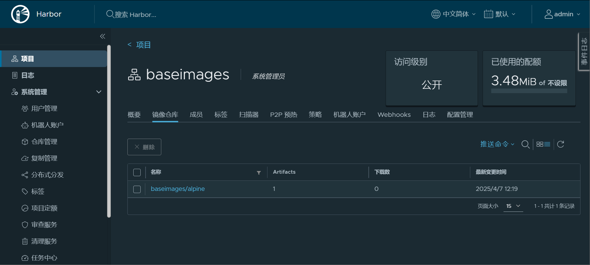
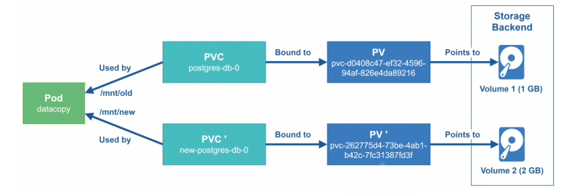
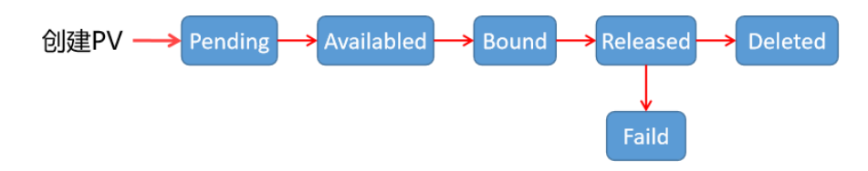
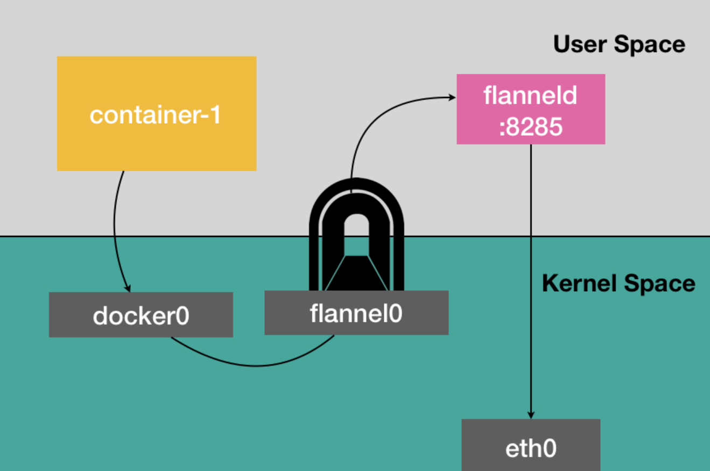

# CloudNative


## 什么是云原生（Cloud Native）?


**云原生（Cloud Native）是一种设计理念和技术架构**，旨在充分利用云环境的优势，来开发、部署和管理**高效、弹性、可扩展和自动化的现代化应用程序**。

云原生的核心目标是让应用程序能够**动态调整资源**，实现**高可用性**、**高可扩展性**和**灵活性**。云原生的实现通常依赖于**容器化技术（如Docker）**、**编排系统（如Kubernetes）**、**微服务架构**和**持续交付/集成（CI/CD）**等技术。


## 云原生的核心思想


**松耦合的架构**

- 传统的“单体应用”与“云原生应用”最大的区别是，云原生应用通过**微服务**将每个模块独立部署、独立扩缩。
- 云原生应用**每个服务模块独立开发、独立测试、独立部署**，互不影响。

**声明式的API**

- 云原生使用**声明式API**（Declarative API）管理基础架构和服务。
- 例如，Kubernetes中的**YAML文件**就是声明式API的典型示例，用户只需要声明期望的状态，而不需要关心如何实现。

**自动化运维 (Self-Healing)**

- 云原生应用依赖**自动化监控和告警系统**。
- Kubernetes中的**重启策略、健康检查（health check）、就绪探针（readiness probe）**，都可以实现自动恢复和修复。
- 在容器失败、崩溃时，Kubernetes会**自动重建Pod**，无需人工干预。

**弹性和自适应能力**

- 云原生应用具备**自动扩容和缩容**的能力。
- 当流量激增时，Kubernetes可以在几秒钟内**自动扩展Pod数量**，当流量下降时，Pod数量会自动减少，降低成本。

**基础设施即代码 (IaC)**

- 云原生强调**一切基础设施和配置都要以代码的形式存在**，这使得环境的创建、变更和销毁都变得可自动化。
- 使用的工具有**Terraform**、**Ansible**、**Helm**等。

**可观测性**

- 在分布式系统中，必须确保系统的**日志（log）**、**指标（metrics）\**和\**追踪（tracing）**。
- 使用Prometheus、Grafana等工具，可以直观地了解云原生系统的运行状态，检测瓶颈和故障点。


## 云原生的四大技术基石


**容器化 (Containerization)**

- 容器是云原生的最核心技术，它提供了一个与操作系统隔离的运行环境，便于**跨平台部署**。
- **Docker** 和 **OCI 容器**（如containerd、Podman）等工具就是容器化的典型代表。
- **好处**：更快的启动、更高的资源利用率、环境一致性和高可移植性。

**动态编排 (Orchestration)**

- 容器化的应用需要一个调度器来管理这些容器的**自动部署、扩缩容和故障修复**。
- **Kubernetes**（K8s）就是这种调度器的代表。
- Kubernetes可以管理**多集群的多节点分布式服务**，以实现跨云平台的高可用部署。

**微服务架构 (Microservices)**

- 将原本的单体应用拆解成多个**可独立开发和部署的微服务**，这些微服务通过**API或消息队列**进行通信。
- 各微服务可以单独部署、扩容、回滚、升级，而不影响其他模块。

**持续交付和持续集成 (CI/CD)**

- **CI/CD**使得开发人员的代码变更能够被**自动化构建、测试和部署**。
- 使用的工具有**Jenkins**、**GitLab CI/CD** 和 **ArgoCD** 等。
- CI/CD流水线可在开发到生产的过程中进行**自动化验证、回滚和监控**。


## 云原生的关键技术栈


| **领域**       | **技术**             | **作用**                             |
| -------------- | -------------------- | ------------------------------------ |
| **容器化**     | Docker, Podman       | 提供标准的容器化运行环境             |
| **容器编排**   | Kubernetes (K8s)     | 管理和编排容器，提供扩缩容和自愈能力 |
| **微服务**     | Spring Boot, Istio   | 支持微服务架构                       |
| **CI/CD**      | Jenkins, GitLab CI   | 持续交付和持续集成                   |
| **监控与日志** | Prometheus, Grafana  | 监控、日志、告警系统                 |
| **网络管理**   | Calico, Flannel      | 容器网络                             |
| **服务网格**   | Istio, Linkerd       | 管理微服务的通信，提供可观察性       |
| **存储**       | Ceph, Rook, Longhorn | 提供云原生的分布式存储解决方案       |
| **配置管理**   | Helm, Ansible        | 管理应用和集群的配置                 |

------


## 云原生的实际场景


1. **电商大促销**
   - 促销活动流量高峰，使用Kubernetes的**HPA（水平自动扩展）**来动态扩展服务实例。
   - 日常流量低时，Pod数量减少，**节省计算资源**。
2. **金融支付系统**
   - **微服务架构**可将支付系统拆分为多个服务：用户服务、支付服务、订单服务等。
   - **服务网格（如Istio）**实现微服务的流量治理、熔断、流量限流和分布式追踪。
3. **DevOps平台**
   - 使用**Jenkins + Docker + Kubernetes**，构建CI/CD流水线，自动化部署到生产环境。
   - **GitOps**使用**ArgoCD**，将代码提交到Git后，自动完成部署。


## 云原生的优势


| **优势**         | **描述**                                       |
| ---------------- | ---------------------------------------------- |
| **敏捷性**       | 通过CI/CD流水线实现快速的迭代发布              |
| **弹性扩展**     | 动态扩缩容，流量高峰期自动扩展，低峰期缩容     |
| **高可用性**     | 故障节点自动恢复，避免宕机                     |
| **多云/混合云**  | 支持跨云部署，避免单一云服务商的锁定           |
| **资源利用率高** | 使用容器化和Kubernetes的资源调度实现资源最优化 |


## 云原生官网

``````
https://www.cncf.io/
``````


# Skywalking


# 微服务


## ZooKeeper


### Zookeeper解决的问题

- 实现了服务注册,服务发现
- 即实现了分布式服务管理


### Zookeeper的功能

- 实现了服务的**命名服务**

  - 即给每个服务取个名称进行存放，并对其进行对应的解析，解析成对应的地址，实现服务发现，服务注册

- Zookeeper内部可以看作是一个树状存储数据库

  - 在启动一个服务的时候，可以将自己的地址信息注册到Zookeeper的树状数据库中，在数据库中将每个服务的地址，端口号注册进Zookeeper(类比：pod的启动的时候会将自己的地址和端口号注册进service的endpoint中)，
    - 后续有程序需要使用这个服务，就取Zookeeper中查询即可
    - Zookeeper做注册中心，需要在java程序中配置注册中心（Zookeeper）的地址
  - 然后zookeeper给每个服务取一个名称，通过名称借助数据库解析为对应的ip地址和端口
  - 同时Zookeeper也可以存放一些状态信息
  - Zookeeper也可以做配置中心

  

#### 解决的问题

- 服务的地址端口预先不确定的情况下，如何实现服务间通讯


### 单机部署Zookeeper

#### 包安装

```bash
[root@ubuntu2204 ~]#apt list zookeeper
正在列表... 完成
zookeeper/jammy-security,jammy-updates 3.4.13-6ubuntu4.1 all

apt -y install zookeeper

# 启动zookeeper
/usr/share/zookeeper/bin/zkServer.sh start
```


#### 二进制安装

```bash
# 安装java环境
apt install -y openjdk-11-jdk
# 下载zookeeper
wget https://mirrors.tuna.tsinghua.edu.cn/apache/zookeeper/current/apache-zookeeper-3.9.3-bin.tar.gz

# 解压并放入指定目录
tar xf apache-zookeeper-3.9.2-bin.tar.gz -C /usr/local/

# 将其放入PATH目录中
# vim /etc/profile
PATH=$PATH:/usr/local/zookeeper/bin/

# 加载
. /etc/profile

# 创建配置文件zoo.cfg
cd /usr/local/zookeeper/conf
cp zoo_sample.cfg zoo.cfg

# 启动zookeeper并查看状态
[root@ubuntu2204 conf]#zkServer.sh start
/usr/bin/java
ZooKeeper JMX enabled by default
Using config: /usr/local/zookeeper/bin/../conf/zoo.cfg
Starting zookeeper ... STARTED
[root@ubuntu2204 conf]#zkServer.sh status
/usr/bin/java
ZooKeeper JMX enabled by default
Using config: /usr/local/zookeeper/bin/../conf/zoo.cfg
Client port found: 2181. Client address: localhost. Client SSL: false.
Mode: standalone  # 表示是单机模式，不是集群

# 查看zookeeper端口（2181以打开），本质上就是java程序
[root@ubuntu2204 conf]#ss -nltp
State      Recv-Q     Send-Q         Local Address:Port          Peer Address:Port    Process                                       
LISTEN     0          4096           127.0.0.53%lo:53                 0.0.0.0:*        users:(("systemd-resolve",pid=810,fd=14))    
LISTEN     0          128                  0.0.0.0:22                 0.0.0.0:*        users:(("sshd",pid=862,fd=3))                
LISTEN     0          50                         *:2181                     *:*        users:(("java",pid=16738,fd=77))             
LISTEN     0          50                         *:8080                     *:*        users:(("java",pid=16738,fd=69))             
LISTEN     0          50                         *:32785                    *:*        users:(("java",pid=16738,fd=68))             
LISTEN     0          128                     [::]:22                    [::]:*        users:(("sshd",pid=862,fd=4)) 
```


#### Zookeeper配置文件

```bash
# 可以更改配置使其暴露端口被Prometheus监控
cat /usr/local/zookeeper/conf/zoo.cfg
# The number of milliseconds of each tick
tickTime=2000  # 滴答时间，是后续时间的基本单位
# The number of ticks that the initial 
# synchronization phase can take
initLimit=10   # 因为滴答时间是2000毫秒，也就是2秒，因此这里initlimit的时间是20s
# The number of ticks that can pass between 
# sending a request and getting an acknowledgement
syncLimit=5
# the directory where the snapshot is stored.
# do not use /tmp for storage, /tmp here is just 
# example sakes.
dataDir=/tmp/zookeeper        # 指定数据目录，这里不建议使用tmp目录，因为tmp目录下的数据无法持久化
# the port at which the clients will connect
clientPort=2181
# the maximum number of client connections.
# increase this if you need to handle more clients
#maxClientCnxns=60
#
# Be sure to read the maintenance section of the 
# administrator guide before turning on autopurge.
#
# https://zookeeper.apache.org/doc/current/zookeeperAdmin.html#sc_maintenance
#
# The number of snapshots to retain in dataDir
#autopurge.snapRetainCount=3    # 只保留最近的3个版本的镜像文件
# Purge task interval in hours
# Set to "0" to disable auto purge feature
#autopurge.purgeInterval=1    # 自动数据清理

## Metrics Providers
#
# https://prometheus.io Metrics Exporter
metricsProvider.className=org.apache.zookeeper.metrics.prometheus.PrometheusMetricsProvider
metricsProvider.httpHost=0.0.0.0
metricsProvider.httpPort=7000    # 打开7000端口
metricsProvider.exportJvmInfo=true
```


**访问Prometheus指标**

```bash
curl 127.0.0.1:7000/metrics
```


#### 前台执行Zookeeper(制作镜像时使用)

```bash
zkServer.sh start-foreground
```

**注意**

```http
如果配置service，zkServer.sh和systemctl不要混用，否则无法启用
```


#### Service文件

```bash
cat > /lib/systemd/system/zookeeper.service <<EOF
[Unit]
Description=zookeeper.service
After=network.target

[Service]
Type=forking
ExecStart=/usr/local/zookeeper/bin/zkServer.sh start
ExecStop=/usr/local/zookeeper/bin/zkServer.sh stop
ExecReload=/usr/local/zookeeper/bin/zkServer.sh restart

[Install]
WantedBy=multi-user.target
EOF

systemctl daemon-reload

systemctl enable --now zookeeper.service
```


### Zookeeper集群部署

- 因为选举机制，半数以上可用，所以建议奇数个节点
- Zookeeper的选举基于ZAB协议（原子广播协议）
  - Zab(Zookeeper Atomic Broadcast原子广播)：强一致性协议
- 集群中节点数越多，写性能越差，读性能越好


#### 集群角色

- 领导者(Leader)
  - 负责处理写入请求的，事务请求的唯一调度和处理者，负责进行投票发起和决议，更新系统状态

- 跟随者(Follower)
  - 接收客户请求并向客户端返回结果，在选Leader中参与投票

- 观察者(Observer)
  - 转交客户端写请求给leader节点，和同步leader状态和Follower唯一区别就是不参与Leader投票，也不参与写操作的“过半写成功”策略
  - 它的作用类似于专用于Zookeeper集群的反向代理

- 学习者(Learner)
  - 和leader进行状态同步的节点统称Learner，包括Follower和Observer

- 客户端(Client)
  - 请求发起者

#### 选举ID

- ZXID(zookeeper transaction id): 每个改变Zookeeper状态的操作都会自动生成一个对应的zxid。ZXID最大的节点优先选为Leader
  - ZXID大说明该节点的数据是最新的，ZXID可以理解为事务ID
- myid: 服务器的唯一标识(SID)，通过配置myid文件指定，集群中唯一，当ZXID一样时，myid大的节点优先选为Leader


#### 协议说明（重要）

在分布式系统中，有多种协议被设计来解决一致性问题，Paxos、Raft、ZAB等分布式算法经常会被称作是“强一致性”的分布式共识协议

**ZAB(Zookeeper Atomic Broadcast 原子广播)**

Zab协议是由Apache Zookeeper项目提出的一种原子广播协议，是为分布式协调服务Zookeeper专门设计的一种支持崩溃恢复的原子广播协议。在Zookeeper中，主要依赖ZAB协议来实现分布式数据一致性，基于该协议，Zookeeper实现了一种主备模式的系统架构来保持集群中各个副本之间的数据一致性

**Raft**

Raft是一个为分布式系统提供一致性的算法。与Paxos相比，Raft的主要目标是提供一种更加易于理解和实现的一致性算法。Raft通过选举算法确保了分布式系统中的领导者唯一性所有的写操作都通过领导者完成，这样就可以确保所有的复制节点上的数据一致性，一些知名的分布式系统，如：kafka,etcd,nacos和Consul，都采用了Raft算法


#### Zookeeper集群部署实现

```bash
# 在三台机器上安装Zookeeper

# 当所有的机器都准备好Zookeeper之后，准备配置文件
# 配置文件的最后添加
# 将路径指向指定的myid所在路径
dataDir=/usr/local/zookeeper/data
# 格式：server.MyID服务器唯一编号=服务器IP:Leader和Follower的数据同步端口(只有leader才会打开)：Leader和Follower选举端口(L和F都有)
server.1=10.0.0.131:2888:3888
server.2=10.0.0.132:2888:3888
server.3=10.0.0.133:2888:3888

# 2888是集群中节点之间数据的同步，通过2888
# 3888是选举端口

# 如果添加节点，只需要在所有节点上添加新节点的上面形式的配置行，在新节点创建myid文件，并重启所有节点服务即可

# 将配置文件同步到其他机器
scp /usr/local/zookeeper/conf/zoo.cfg 10.0.0.132:/usr/local/zookeeper/conf/
scp /usr/local/zookeeper/conf/zoo.cfg 10.0.0.133:/usr/local/zookeeper/conf/
```

**在各个节点生成ID文件**

```bash
echo 1 > /usr/local/zookeeper/data/myid
echo 2 > /usr/local/zookeeper/data/myid
echo 3 > /usr/local/zookeeper/data/myid
```

**各服务启动Zookeeper**

```bash
zkServer.sh start   # 三台机器都启动

# node1
[root@ubuntu2204 conf]#zkServer.sh status
/usr/bin/java
ZooKeeper JMX enabled by default
Using config: /usr/local/zookeeper/bin/../conf/zoo.cfg
Client port found: 2181. Client address: localhost. Client SSL: false.
Mode: follower

# node2
[root@ubuntu2204 zookeeper]#zkServer.sh status
/usr/bin/java
ZooKeeper JMX enabled by default
Using config: /usr/local/zookeeper/bin/../conf/zoo.cfg
Client port found: 2181. Client address: localhost. Client SSL: false.
Mode: leader

# node3
[root@ubuntu2204 data]#zkServer.sh status
/usr/bin/java
ZooKeeper JMX enabled by default
Using config: /usr/local/zookeeper/bin/../conf/zoo.cfg
Client port found: 2181. Client address: localhost. Client SSL: false.
Mode: follower
```


### ZooKeeper客户端访问

#### 命令行客户端访问ZooKeeper

```bash
# 使用命令行访问
# 如果不写ip:port，默认本机
zkCli.sh -server 10.0.0.131:2181

[zk: 10.0.0.132:2181(CONNECTED) 1] ls /
[zookeeper]

# 查看zookeeper集群数据
[zk: 10.0.0.132:2181(CONNECTED) 4] ls /zookeeper 
[config, quota]
[zk: 10.0.0.132:2181(CONNECTED) 5] ls /zookeeper/config 
[]
[zk: 10.0.0.132:2181(CONNECTED) 6] get /zookeeper/config 
server.1=10.0.0.131:2888:3888:participant
server.2=10.0.0.132:2888:3888:participant
server.3=10.0.0.133:2888:3888:participant
version=0

# 在zookeeper中创建子目录create,以及在文件中添加数据set
# zookeeper中，目录即是目录也是可以保存数据的文件
[zk: 10.0.0.132:2181(CONNECTED) 7] ls /
[zookeeper]
[zk: 10.0.0.132:2181(CONNECTED) 8] create /myapp1
Created /myapp1
[zk: 10.0.0.132:2181(CONNECTED) 9] ls /
[myapp1, zookeeper]
[zk: 10.0.0.132:2181(CONNECTED) 10] set /myapp1 M58
[zk: 10.0.0.132:2181(CONNECTED) 11] get /myaap1
Node does not exist: /myaap1
[zk: 10.0.0.132:2181(CONNECTED) 12] get /myapp1
M58
```


#### nc访问Zookeeper

Zookeeper支持某些特定的四字命令字母与其交互，它们大多是查询命令，用来获取ZooKeeper服务的当前状态和相关信息

**常用命令列表**

```bash
conf #输出相关服务配置的详细信息
cons #列出所有连接到服务器的客户端的完全的连接/会话的详细信息
envi #输出关于服务环境的详细信息
dump #列出未经处理的会话和临时节点
stat #查看哪个节点被选择作为Follower或者Leader
ruok #测试是否启动了该Server，若回复imok表示已经启动
mntr #输出一些运行时信息
reqs #列出未经处理的请求
wchs #列出服务器watch的简要信息
wchc #通过session列出服务器watch的详细信息
wchp #通过路径列出服务器watch的详细信息
```

**命令安全限制**

```bash
# 默认情况下，这些4字命令有可能会被拒绝，提示如下报错
xxxx is not executed because it is not in the whitelist.

#解决办法:在 zoo.cfg文件中添加如下配置,如果是集群需要在所有节点上添加下面配置
# vim conf/zoo.cfg
4lw.commands.whitelist=*

#在服务状态查看命令中有很多存在隐患的命令，为了避免生产中的安全隐患，要对这些"危险"命令进行一些安全限制，只需要编辑服务的zoo.cfg文件即可

# vim conf/zoo.cfg
4lw.commands.whitelist=conf,stat,ruok,isro
```


### 图形化客户端Zoolnspector

#### Linux客户端

**编译zooinspector**

注意：此软件因年代久远，仅支持JAVA-8，且不支持Ubuntu20.04但支持Ubuntu22.04和Rocky8

```bash
#Ubuntu22.04编译
apt update && apt -y install openjdk-8-jdk
apt update && apt -y install maven

# 添加阿里云加速
vim /etc/maven/settings.xml 
<mirrors>
   <!--阿里云镜像-->
   <mirror>
       <id>nexus-aliyun</id>
       <mirrorOf>*</mirrorOf>
       <name>Nexus aliyun</name>
       <url>http://maven.aliyun.com/nexus/content/groups/public</url>
   </mirror>                                                                                               
</mirrors>

# 下载zooInspector
git clone https://mirror.ghproxy.com/https://github.com/zzhang5/zooinspector.git

cd zooinspector/
mvn clean package -Dmaven.test.skip=true

# 授权
chmod +x zooinspector-pkg/bin/zooinspector.sh

# windows宿主机上开启Xmanager

# Linux定义环境变量
export DISPLAY=10.0.0.1:0.0

# 运行
./zooinspector-pkg/bin/zooinspector.sh
```


## Kafka

### 消息队列简介

#### MQ定义

```http
#阿里云消息队列
https://www.aliyun.com/product/ons?spm=5176.234368.h2v3icoap.427.2620db25lcHi1Q&amp;aly_as=Tz_Lue_o
```

在分布式场景中，相对于大量的用户请求来说，内部的功能主机之间、功能模块之间等，数据传递的数据量是无法想象的，因为一个用户请求，会涉及到各种内部的业务逻辑跳转等操作。那么，在大量用户的业务场景中，如何保证所有的内部业务逻辑请求都处于稳定而且快捷的 数据传递呢? 消息队列(Message Queue)技术可以满足此需求

消息队列（Message Queue，简称 MQ）是构建分布式互联网应用的基础设施，通过 MQ 实现的松耦合架构设计可以提高系统可用性以及可扩展性，是适用于现代应用的最佳设计方案。

消息队列是一种异步的服务间通信方式，适用于无服务器和微服务架构。消息在被处理和删除之前一直存储在队列上。每条消息仅可被一位用户处理一次。消息队列可被用于分离重量级处理、缓冲或批处理工作以及缓解高峰期工作负载。


#### MQ 使用场合

消息队列作为高并发系统的核心组件之一，能够帮助业务系统结构提升开发效率和系统稳定性

**消息队列主要有以下应用场景**

- **削峰填谷**
  - 诸如电商业务中的秒杀、抢红包、企业开门红等大型活动时皆会带来较高的流量脉冲，或因没做相应的保护而导致系统超负荷甚至崩溃，或因限制太过导致请求大量失败而影响用户体验，消息队列可提供削峰填谷的服务来解决该问题。
- **异步解耦**
  - 交易系统作为淘宝等电商的最核心的系统，每笔交易订单数据的产生会引起几百个下游业务系统的关注，包括物流、购物车、积分、流计算分析等等，整体业务系统庞大而且复杂，消息队列可实现异步通信和应用解耦，确保主站业务的连续性。

- **顺序收发**
  - 细数日常中需要保证顺序的应用场景非常多，例如证券交易过程时间优先原则，交易系统中的订单创建、支付、退款等流程，航班中的旅客登机消息处理等等。与先进先出FIFO（First In First Out）原理类似，消息队列提供的顺序消息即保证消息FIFO。

- **分布式事务一致性**
  - 交易系统、支付红包等场景需要确保数据的最终一致性，大量引入消息队列的分布式事务，既可以实现系统之间的解耦，又可以保证最终的数据一致性。

- **大数据分析**
  - 数据在“流动”中产生价值，传统数据分析大多是基于批量计算模型，而无法做到实时的数据分析，利用消息队列与流式计算引擎相结合，可以很方便的实现业务数据的实时分析。

- **分布式缓存同步**
  - 电商的大促，各个分会场琳琅满目的商品需要实时感知价格变化，大量并发访问数据库导致会场页面响应时间长，集中式缓存因带宽瓶颈，限制了商品变更的访问流量，通过消息队列构建分布式缓存，实时通知商品数据的变化

- **蓄流压测**
  - 线上有些链路不方便做压力测试，可以通过堆积一定量消息再放开来压测


#### 主流MQ

目前主流的消息队列软件有 **Kafka**、**RabbitMQ**、ActiveMQ、**RocketMQ**等，还有相对小众的消息队列软件如ZeroMQ、Apache Qpid 


### Kafka介绍


Kafka 被称为下一代分布式消息系统，由 **Scala 和 Java编写**，是非营利性组织ASF(Apache Software Foundation)基金会中的一个开源项 目，比如:HTTP Server、Tomcat、Hadoop、ActiveMQ等开源软件都属于 Apache基金会的开源软件，类似的消息系统还有RabbitMQ、 ActiveMQ、ZeroMQ。

Kafka用于构建实时数据管道和流应用程序。 它具有水平可伸缩性，容错性，快速性，可在数千家组织中同时投入生产协同工作。


### Kafka 特点和优势


**特点**

- **分布式**: 支持分布式多主机部署实现
- **分区**: 一个消息.可以拆分出多个，分别存储在多个位置
- **多副本**: 防止信息丢失，可以多来几个备份
- **多订阅者**: 可以有很多应用连接kafka
- **Zookeeper**: 早期版本的Kafka依赖于zookeeper， **2021年**4月19日**Kafka 2.8.0**正式发布，此版本包括了很多重要改动，最主要的是 kafka通过自我管理的仲裁来替代ZooKeeper，即Kafka**将不再需要ZooKeeper！**


**优势**

- Kafka 通过 O(1)的磁盘数据结构提供消息的持久化，这种结构对于即使数以 TB 级别以上的消息存储也能够保持长时间的稳定性能。
- **高吞吐量**：即使是非常普通的硬件Kafka也可以支持每秒数百万的消息。支持通过Kafka 服务器分区消息。
- **分布式**： Kafka 基于分布式集群实现高可用的容错机制，可以实现自动的故障转移
- **顺序保证**：在大多数使用场景下，数据处理的顺序都很重要。大部分消息队列本来就是排序的，并且能保证数据会按照特定的顺序来处理。 Kafka保证一个Partiton内的消息的有序性（分区间数据是无序的，如果对数据的顺序有要求，应将在创建主题时将分区数partitions设置为1）
- 支持 Hadoop 并行数据加载
- 通常用于大数据场合,传递单条消息比较大，而Rabbitmq 消息主要是传输业务的指令数据,单条数据较小


### Kafka角色和流程

####  Kafka概念


**Producer**：Producer即生产者，消息的产生者，是消息的入口。负责发布消息到Kafka broker

**Consumer**：消费者，用于消费消息，即处理消息

**Broker**：Broker是kafka实例，每个服务器上可以有一个或多个kafka的实例，假设每个broker对应一台服务器。每个kafka集群内的broker 都有一个不重复的编号，如: broker-0、broker-1等…...

**Controller**：是整个 Kafka 集群的管理者角色，任何集群范围内的状态变更都需要通过 Controller 进行，在整个集群中是个单点的服务，可以通过选举协议进行故障转移，负责集群范围内的一些关键操作：主题的新建和删除，主题分区的新建、重新分配，Broker 的加入、退出， 触发分区 Leader 选举等，每个 Broker 里都有一个 Controller 实例，多个 Broker 的集群同时最多只有一个 Controller 可以对外提供集群管理服务，Controller 可以在 Broker 之间进行故障转移，Kafka 集群管理的工作主要是由 Controller 来完成的，而 Controller 又通过监听  Zookeeper 节点的变动来进行监听集群变化事件，Controller 进行集群管理需要保存集群元数据，监听集群状态变化情况并进行处理，以及 处理集群中修改集群元数据的请求，这些主要都是**利用 Zookeeper 来实现**

**Topic** ：消息的主题，可以理解为消息的分类，一个Topic相当于数据库中的一张表,一条消息相当于关系数据库的一条记录，或者一个Topic 相当于Redis中列表数据类型的一个Key，一条消息即为列表中的一个元素。kafka的数据就保存在topic。在每个broker上都可以创建多个 topic。  虽然一个 topic的消息保存于一个或多个broker 上同一个目录内, 物理上不同 topic 的消息分开存储在不同的文件夹，但用户只需指定消息的 topic即可生产或消费数据而不必关心数据存于何处，topic 在逻辑上对record(记录、日志)进行分组保存，消费者需要订阅相应的topic 才能 消费topic中的消息。

**Consumer group**: 每个consumer 属于一个特定的consumer group（可为每个consumer 指定 group name，若不指定 group name 则 属于默认的group），同一topic的一条消息只能被同一个consumer group 内的一个consumer 消费，类似于一对一的单播机制，但多个 consumer group 可同时消费这一消息，类似于一对多的多播机制，默认消费组的多个消费者是共享消息。**（同一组内的consumer是生产者消费者模式，即抢占模式，不同组内的consumer是发布者订阅者模式，可以同时订阅同一个消息）**

**Partition** ：是物理上的概念，每个 topic 分割为一个或多个partition，即一个topic切分为多份, 当创建 topic 时可指定 partition 数量， partition的表现形式就是一个一个的文件夹,该文件夹下存储该partition的数据和索引文件，分区的作用还可以实现负载均衡，提高kafka的吞吐量。同一个topic在不同的分区的数据是不重复的,一般Partition数不要超过节点数，注意同一个partition数据是有顺序的，但不同的 partition则是无序的。（**即分片**）

**Replication**: 同样数据的副本，包括leader和follower的副本数,基本于数据安全,建议至少2个,是Kafka的高可靠性的保障，和ES的副本有所 不同，**Kafka中的副(leader+follower）数包括主分片数,而ES中的副本数(follower)不包括主分片数**

为了实现数据的高可用，比如将分区 0 的数据分散到不同的kafka 节点，每一个分区都有一个 broker 作为 Leader 和一个 broker 作为 Follower，类似于ES中的主分片和副本分片，

假设分区为 3, 即分三个分区0-2，副本为3，即每个分区都有一个 leader，再加两个follower，分区 0 的leader为服务器A，则服务器 B 和服 务器 C 为 A 的follower，而分区 1 的leader为服务器B，则服务器 A 和C 为服务器B 的follower，而分区 2 的leader 为C，则服务器A 和 B 为 C 的follower。

**AR**： Assigned Replicas，分区中的所有副本的统称，包括leader和 follower，AR= lSR+ OSR

**lSR**：ln Sync Replicas，所有与leader副本保持同步的副本 follower和leader本身组成的集合，包括leader和 follower，是AR的子集

**OSR**：out-of-Sync Replied，所有与leader副本同步不能同步的 follower的集合，是AR的子集


#### Kafka 工作机制

Apache Kafka的选举机制涉及到其使用的分区复制模式（partition replication）。

每个Kafka Topic 的分区都有一个领导者（leader）和零个或多个追随者（follower）。

领导者负责所有客户端请求的读写操作，而追随者则复制领导者的数据(kafka2.4新版本后，也支持读)

**Kafka的领导者选举过程发生在以下情况中：**

- 当新的分区创建时，Kafka选择ISR（In-Sync Replica）列表中的第一个副本作为领导者。
- 当领导者失败或无法与ZooKeeper通信时，会重新选举新的领导者。这个过程被称为领导者故障转移（leader failover）


**Kafka领导者选举的详细步骤**

-  当领导者发生故障，ZooKeeper将会检测到它的会话过期。
-  ZooKeeper接着将通知所有的副本进行领导者选举。
- 副本们会查看它们在ZooKeeper中存储的元数据并确定新的领导者，选择规则是选取副本集合（ISR）中最新的副本。
- 一旦新的领导者被选出，ZooKeeper将通知所有的副本更新它们的元数据。

**注意**：Kafka 2.8.0版本开始，增加了KRaft（KRaft是Kafka Raft协议模式的简称）模式，这个模式下Kafka不再需要ZooKeeper，而是使用内 置的Raft协议来进行元数据的管理和领导者选举。Raft协议是一种为分布式系统提供一致性的算法，它更易于理解和实施，同时也保证了系 统的可用性和数据的一致性。


Apache Kafka可以配置为提供**强一致性**的语义，但这是以牺牲一定的性能为代价的

在Kafka中，数据被分布在各个分区上，每个分区都有一个领导者（leader）和若干个追随者（follower）。领导者负责处理所有读写请求， 而追随者则复制领导者的数据。这种设计确保了数据的高可用性和容错性

然而，为了保证高性能和低延迟，Kafka允许领导者在数据还未被所有的追随者复制之前就将写操作确认为成功。这就带来了一种可能的情况，即在领导者确认写操作成功后、新数据还未被所有追随者复制完成之前，领导者发生故障，此时新数据可能会丢失，从而造成一致性问题。

要实现强一致性，你需要将Kafka的 **min.insync.replicas** 参数设置为大于1，这样可以确保至少有N个副本确认数据写入才认为写操作成 功。并且需要设置 acks 为 all 或者-1，表示领导者需要等待所有的ISR（In-Sync Replicas）确认接收到消息后，才向生产者返回ack。这 样，即使领导者发生故障，由于至少有一个追随者已经复制了数据，新的领导者仍然可以提供所有的数据，从而保证了强一致性。

总的来说，Kafka可以配置为提供强一致性，但这可能会影响其性能和吞吐量。在实际使用中，你需要根据自己的业务需求在一致性和性能 之间进行权衡


### Kafka 部署

#### Kafka 部署说明

**kafka 版本选择**

kafka 基于scala语言实现,所以使用kafka需要指定scala的相应的版本.kafka 为多个版本的Scala构建。这仅在使用 Scala 时才重要，并且希望为使用的相同Scala 版本构建一个版本。否则，任何版本都可以

**kafka下载链接**

```http
http://kafka.apache.org/downloads
```

 **kafka版本格式**

```ABAP
kafka_<scala 版本>_<kafka 版本>
#示例:kafka_2.13-2.7.0.tgz
```

 scala 语言官网:  https://www.scala-lang.org/

scale 与 java关系: https://baike.baidu.com/item/Scala/2462287?fr=aladdin

**官方文档**

```http
http://kafka.apache.org/quickstart
```


#### 单机部署

##### 单机部署Kafka 脚本

```bash
#!/bin/bash
#
#********************************************************************
#Author:            mystical
#QQ:                29308620
#Date:              2020-06-03
#FileName:          install_kafka_single_node.sh
#URL:               http://www.wangxiaochun.com
#Description:       The test script
#Copyright (C):     2020 All rights reserved
#********************************************************************
 
 #支持在线和离线安装安装
 
KAFKA_VERSION=3.8.0
#KAFKA_VERSION=3.5.1
#KAFKA_VERSION=3.5.0
#KAFKA_VERSION=3.4.0
#KAFKA_VERSION=3.3.2
#KAFKA_VERSION=3.2.0
#KAFKA_VERSION=-3.0.0
SCALA_VERSION=2.13
 KAFKA_URL="https://mirrors.tuna.tsinghua.edu.cn/apache/kafka/${KAFKA_VERSION}/kafka_${SCALA_VERSION}-${KAFKA_VERSION}.tgz"
#KAFKA_URL="https://mirrors.tuna.tsinghua.edu.cn/apache/kafka/2.8.1/kafka_2.13-2.8.1.tgz"
#KAFKA_URL="https://mirrors.tuna.tsinghua.edu.cn/apache/kafka/2.7.1/kafka_2.13-2.7.1.tgz"

KAFKA_INSTALL_DIR=/usr/local/kafka
HOST=`hostname -I|awk '{print $1}'`
.  /etc/os-release

color () {
    RES_COL=60
    MOVE_TO_COL="echo -en \\033[${RES_COL}G"
    SETCOLOR_SUCCESS="echo -en \\033[1;32m"
    SETCOLOR_FAILURE="echo -en \\033[1;31m"
    SETCOLOR_WARNING="echo -en \\033[1;33m"
    SETCOLOR_NORMAL="echo -en \E[0m"
    echo -n "$1" && $MOVE_TO_COL
    echo -n "["
    if [ $2 = "success" -o $2 = "0" ] ;then
        ${SETCOLOR_SUCCESS}
        echo -n $"  OK  "    
    elif [ $2 = "failure" -o $2 = "1"  ] ;then 
        ${SETCOLOR_FAILURE}
        echo -n $"FAILED"
    else
        ${SETCOLOR_WARNING}
        echo -n $"WARNING"
    fi
    ${SETCOLOR_NORMAL}
    echo -n "]"
    echo 
}

env () {
    echo $HOST `hostname` >> /etc/hosts
}

install_jdk() {
    java -version &>/dev/null && { color "JDK 已安装!" 1 ; return;  }
    if command -v yum &>/dev/null ; then
        yum -y install java-1.8.0-openjdk-devel || { color "安装JDK失败!" 1; exit 1; }
    elif command -v apt &>/dev/null ; then
        apt update
        #apt install openjdk-11-jdk -y || { color "安装JDK失败!" 1; exit 1; } 
        apt install openjdk-8-jdk -y || { color "安装JDK失败!" 1; exit 1; } 
    else
        color "不支持当前操作系统!" 1
        exit 1
    fi
    java -version && { color "安装 JDK 完成!" 0 ; } || { color "安装JDK失败!" 1; exit 1; } 
}

install_zookeeper() {
    cat > ${KAFKA_INSTALL_DIR}/bin/zookeeper-startup.sh <<EOF
#!/bin/bash
nohup ${KAFKA_INSTALL_DIR}/bin/zookeeper-server-start.sh ${KAFKA_INSTALL_DIR}/config/zookeeper.properties  &
EOF
    chmod +x ${KAFKA_INSTALL_DIR}/bin/zookeeper-startup.sh
    cat > /lib/systemd/system/zookeeper.service <<EOF
[Unit]
Description=zookeeper.service
After=network.target
[Service]
Type=forking
ExecStart=${KAFKA_INSTALL_DIR}/bin/zookeeper-startup.sh
ExecStop=${KAFKA_INSTALL_DIR}/bin/zookeeper-server-stop.sh 
[Install]
WantedBy=multi-user.target
EOF
    systemctl daemon-reload
    systemctl enable --now  zookeeper.service
    systemctl is-active zookeeper.service
    if [ $? -eq 0 ] ;then 
        color "zookeeper 安装成功!" 0  
    else 
        color "zookeeper 安装失败!" 1
        exit 1
    fi  
}

install_kafka(){
    if [ ! -f kafka_${SCALA_VERSION}-${KAFKA_VERSION}.tgz ];then
        wget -P /usr/local/src/  --no-check-certificate $KAFKA_URL  || { color  "下载失败!" 1 ;exit ; }
    fi
    tar xf /usr/local/src/${KAFKA_URL##*/}  -C /usr/local/
    ln -s /usr/local/kafka_${SCALA_VERSION}-${KAFKA_VERSION}  ${KAFKA_INSTALL_DIR}
    install_zookeeper
    echo PATH=${KAFKA_INSTALL_DIR}/bin:'$PATH' >> /etc/profile
    cat > ${KAFKA_INSTALL_DIR}/bin/kafka-startup.sh <<EOF
#!/bin/bash
nohup ${KAFKA_INSTALL_DIR}/bin/kafka-server-start.sh  ${KAFKA_INSTALL_DIR}/config/server.properties &
EOF
    chmod +x ${KAFKA_INSTALL_DIR}/bin/kafka-startup.sh
    cat > /lib/systemd/system/kafka.service <<EOF
[Unit]                                                                          
Description=Apache kafka
After=network.target
[Service]
Type=forking
ExecStart=${KAFKA_INSTALL_DIR}/bin/kafka-startup.sh
ExecStop=/bin/kill  -TERM \${MAINPID}
Restart=always
RestartSec=20
[Install]
WantedBy=multi-user.target
EOF
    systemctl daemon-reload
    systemctl enable --now kafka.service
    #kafka-server-start.sh -daemon ${KAFKA_INSTALL_DIR}/config/server.properties 
    systemctl is-active kafka.service
    if [ $? -eq 0 ] ;then 
        color "kafka 安装成功!" 0  
    else 
        color "kafka 安装失败!" 1
        exit 1
    fi    
}

env 
install_jdk
install_kafka
```

```bash
#Ubuntu22.04编译
apt update && apt -y install openjdk-8-jdk
apt update && apt -y install maven

# 添加阿里云加速
vim /etc/maven/settings.xml 
<mirrors>
   <!--阿里云镜像-->
   <mirror>
       <id>nexus-aliyun</id>
       <mirrorOf>*</mirrorOf>
       <name>Nexus aliyun</name>
       <url>http://maven.aliyun.com/nexus/content/groups/public</url>
   </mirror>                                                                                               
</mirrors>

# 下载zooInspector
git clone https://mirror.ghproxy.com/https://github.com/zzhang5/zooinspector.git

cd zooinspector/
mvn clean package -Dmaven.test.skip=true

# 授权
chmod +x zooinspector-pkg/bin/zooinspector.sh

# windows宿主机上开启Xmanager

# Linux定义环境变量
export DISPLAY=10.0.0.1:0.0

# 运行
./zooinspector-pkg/bin/zooinspector.sh
```


#### 集群部署

##### 环境准备

**主机名解析**

注意：每个kafka节点的主机名称解析需要提前准备，否则会导致失败

```bash
#修改每个kafka节点的主机名
[root@ubuntu2204 ~]#hostnamectl hostname node1
[root@ubuntu2204 ~]#hostnamectl hostname node2
[root@ubuntu2204 ~]#hostnamectl hostname node3

#在所有kafka节点上实现主机名称解析
[root@ubuntu2204 ~]#cat /etc/hosts
10.0.0.101 node1
10.0.0.102 node2
10.0.0.103 node3
```

**安装JDK**

```bash
# 所有节点安装jdk，因为zookeeper是java程序
[root@node1 ~]# apt update && apt install openjdk-8-jdk -y
[root@node2 ~]# apt update && apt install openjdk-8-jdk -y
[root@node3 ~]# apt update && apt install openjdk-8-jdk -y
```

##### **安装 ZooKeeper**

注意:如果使用kafka自带的zookeeper，需要修改配置文件

```bash
# 集群所有节点执行下面操作
# 下载kafka
[root@node1 ~]# wget -P /usr/local/src https://mirrors.tuna.tsinghua.edu.cn/apache/kafka/3.8.0/kafka_2.13-3.8.0.tgz

# 解压
[root@node1 src]# tar xf /usr/local/src/kafka_2.13-3.8.0.tgz -C /usr/local/

# 创建软链接
[root@node1 local]# ln -s /usr/local/kafka_2.13-3.8.0/ /usr/local/kafka

#注意如果使用kafka自带的zookeeper，需要修改配置文件
[root@node1 ~]#vim /usr/local/kafka/config/zookeeper.properties
# 更改数据目录
dataDir=/usr/local/kafka/data
#添加三行时间相关配置
tickTime=2000
# The number of ticks that the initial 
# synchronization phase can take
initLimit=10
# The number of ticks that can pass between 
# sending a request and getting an acknowledgement
syncLimit=5
#添加下面集群配置
 
server.1=10.0.0.101:2888:3888
server.2=10.0.0.102:2888:3888
server.3=10.0.0.103:2888:3888

# 同步到其他节点
[root@node1 config]#scp zookeeper.properties 10.0.0.102:/usr/local/kafka/config/zookeeper.properties
zookeeper.properties 
[root@node1 config]#scp zookeeper.properties 10.0.0.103:/usr/local/kafka/config/zookeeper.properties
zookeeper.properties 

# 创建目录
[root@node1 kafka]# mkdir data
[root@node2 kafka]# mkdir data
[root@node3 kafka]# mkdir data

# 每个节点配置myid
[root@node1 data]# echo 1 > /usr/local/kafka/data/myid
[root@node2 data]# echo 2 > /usr/local/kafka/data/myid
[root@node3 data]# echo 3 > /usr/local/kafka/data/myid

# 创建启动文件
[root@node1 ~]# cat > /usr/local/kafka/bin/zookeeper-startup.sh <<EOF
#!/bin/bash
nohup /usr/local/kafka/bin/zookeeper-server-start.sh /usr/local/kafka/config/zookeeper.properties &
EOF
[root@node1 ~]# chmod +x /usr/local/kafka/bin/zookeeper-startup.sh

# 将二进制执行文件同步到其他节点
[root@node1 ~]# rsync -a /usr/local/kafka/bin/zookeeper-startup.sh 10.0.0.102:/usr/local/kafka/bin/
[root@node1 ~]# rsync -a /usr/local/kafka/bin/zookeeper-startup.sh 10.0.0.103:/usr/local/kafka/bin/

# 创建service文件
[root@node1 ~]# cat > /lib/systemd/system/zookeeper.service<<EOF
[Unit]
Description=zookeeper.service
After=network.target
[Service]
Type=forking
ExecStart=/usr/local/kafka/bin/zookeeper-startup.sh
ExecStop=/usr/local/kafka/bin/zookeeper-server-stop.sh 
[Install]
WantedBy=multi-user.target
EOF

# 将service文件同步到其他节点
[root@node1 ~]# scp /lib/systemd/system/zookeeper.service 10.0.0.102:/lib/systemd/system/
[root@node1 ~]# scp /lib/systemd/system/zookeeper.service 10.0.0.103:/lib/systemd/system/

# 所有节点启动服务
[root@node1 bin]#systemctl daemon-reload 
[root@node1 bin]#systemctl restart zookeeper.service 
```


##### 各节点部署Kafka

**配置文件说明**

```bash
#配置文件 ./conf/server.properties内容说明

############################# Server Basics###############################

# broker的id，值为整数，且必须唯一，在一个集群中不能重复，此行必须修改
broker.id=1

############################# Socket ServerSettings ######################

# kafka监听端口，默认9092
listeners=PLAINTEXT://10.0.0.101:9092 #指定当前主机的IP做为监听地址,注意:不支持0.0.0.0

# 处理网络请求的线程数量，默认为3个
num.network.threads=3

# 执行磁盘IO操作的线程数量，默认为8个
num.io.threads=8

# socket服务发送数据的缓冲区大小，默认100KB
socket.send.buffer.bytes=102400

# socket服务接受数据的缓冲区大小，默认100KB
socket.receive.buffer.bytes=102400

# socket服务所能接受的一个请求的最大大小，默认为100M
socket.request.max.bytes=104857600

############################# Log Basics###################################

# kafka存储消息数据的目录
log.dirs=../data

# 每个topic默认的partition
num.partitions=1

# 设置副本数量为3,当Leader的Replication故障，会进行故障自动转移。
default.replication.factor=3

# 在启动时恢复数据和关闭时刷新数据时每个数据目录的线程数量
num.recovery.threads.per.data.dir=1

############################# Log FlushPolicy #############################
# 消息刷新到磁盘中的消息条数阈值
log.flush.interval.messages=10000

# 消息刷新到磁盘中的最大时间间隔1s,单位是ms
log.flush.interval.ms=1000

############################# Log RetentionPolicy #########################
# 日志保留小时数，超时会自动删除，默认为7天
log.retention.hours=168

# 日志保留大小，超出大小会自动删除，默认为1G
#log.retention.bytes=1073741824

# 日志分片策略，单个日志文件的大小最大为1G，超出后则创建一个新的日志文件
log.segment.bytes=1073741824

# 每隔多长时间检测数据是否达到删除条件,300s
log.retention.check.interval.ms=300000

############################# Zookeeper ####################################
# Zookeeper连接信息，如果是zookeeper集群，则以逗号隔开，此行必须修改
zookeeper.connect=10.0.0.101:2181,10.0.0.102:2181,10.0.0.103:2181

# 连接zookeeper的超时时间,6s
zookeeper.connection.timeout.ms=6000

# 是否允许删除topic，默认为false，topic只会标记为marked for deletion
delete.topic.enable=true
```

**部署Kafka**

```bash
#配置PATH变量
[root@node1 ~]# echo 'PATH=/usr/local/kafka/bin:$PATH' > /etc/profile.d/kafka.sh
[root@node1 ~]# . /etc/profile.d/kafka.sh

#修改配置文件
[root@node1 ~]# vim /usr/local/kafka/config/server.properties
broker.id=1 #每个broker在集群中每个节点的正整数唯一标识，此值保存在log.dirs下的meta.properties文件，修改此行
listeners=PLAINTEXT://10.0.0.101:9092 #指定当前主机的IP做为监听地址,注意:不支持0.0.0.0
log.dirs=/usr/local/kafka/data #kakfa用于保存数据的目录，所有的消息都会存储在该目录当中，修改此行
num.partitions=3 #设置创建新的topic时默认分区数量,建议和kafka的节点数量一致
default.replication.factor=3 #指定默认的副本数为3，可以实现故障的自动转移
log.retention.hours=168 #设置kafka中消息保留时间，默认为168小时即7天
zookeeper.connect=10.0.0.101:2181,10.0.0.102:2181,10.0.0.103:2181 #指定连接的zk的地址,zk中存储了broker的元数据信息，修改此行
zookeeper.connection.timeout.ms=6000 #设置连接zookeeper的超时时间，单位为ms,默认6秒钟

#准备数据目录,安装zookeeper的时候应该创建过
[root@node1 ~]#mkdir /usr/local/kafka/data

# 先同步配置文件，后对其进行修改
[root@node1 ~]#scp /usr/local/kafka/config/server.properties 10.0.0.102:/usr/local/kafka/config
[root@node1 ~]#scp /usr/local/kafka/config/server.properties 10.0.0.103:/usr/local/kafka/config

#修改第2个节点配置
[root@node2 ~]#vim /usr/local/kafka/config/server.properties
broker.id=2 #每个broker 在集群中的唯一标识，正整数。
listeners=PLAINTEXT://10.0.0.102:9092 #指定当前主机的IP做为监听地址,注意:不支持0.0.0.0

#修改第3个节点配置
[root@node3 ~]#vim /usr/local/kafka/config/server.properties
broker.id=3  #每个broker 在集群中的唯一标识，正整数。
listeners=PLAINTEXT://10.0.0.103:9092 #指定当前主机的IP做为监听地址,注意:不支持0.0.0.0

#可以调整内存
[root@node1 ~]#vim /usr/local/kafka/bin/kafka-server-start.sh
......
if[ " x$KAFKA_HEAP_OPTS"="x"] ; then
    export KAFKA_HEAP_OPTS=" -Xmx1G -Xms1G"  
fi
......
```


##### 准备Kafka的service文件

```bash
[root@node1 bin]# cat /lib/systemd/system/kafka.service
[Unit]                                                                          
Description=Apache kafka
After=network.target
[Service]
Type=forking
ExecStart=/usr/local/kafka/bin/kafka-startup.sh
ExecStop=/bin/kill  -TERM \${MAINPID}
Restart=always
RestartSec=20
[Install]
WantedBy=multi-user.target

# 同步service文件，并重启服务
[root@node1 bin]# scp /lib/systemd/system/kafka.service 10.0.0.102:/lib/systemd/system/  
[root@node1 bin]# scp /lib/systemd/system/kafka.service 10.0.0.103:/lib/systemd/system/

# 所有节点上重启服务
[root@node1 bin]# systemctl daemon-reload 
[root@node1 bin]# systemctl restart kafka

# 查看zooInspector
```


**注意**

```ABAP
如果有服务器加入集群失败，可以将data和logs目录里的内容删掉，重启
！！！记住，两个目录的内容都要删掉
```


### Kafka 读写数据

参考文档

```http
http://kafka.apache.org/quickstart
```

常见命令

```bash
kafka-topics.sh             #消息的管理命令           
kafka-console-producer.sh   #生产者的模拟命令
kafka-console-consumer.sh   #消费者的模拟命令
```


#### 创建Topic

创建topic名为 mystical，partitions(分区)为3，replication(每个分区的副本数/每个分区的分区因子)为 2

```bash
#新版命令,通过--bootstrap-server指定kafka的地址
[root@node1 ~]# /usr/local/kafka/bin/kafka-topics.sh --create --topic mystical --bootstrap-server 10.0.0.101:9092 --partitions 3 --replication-factor 2

#旧版命令，通过--zookeeper指定zookeeper的地址
[root@node1 ~]# /usr/local/kafka/bin/kafka-topics.sh --create --zookeeper 10.0.0.101:2181,10.0.0.102:2181,10.0.0.103:2181 --partitions 3 --replication-factor 2 --topic mystical

#在各节点上观察生成的相关数据
[root@node1 ~]# ls /usr/local/kafka/data
cleaner-offset-checkpoint    meta.properties  mystical-0  recovery-point-offset-checkpoint  version-2
log-start-offset-checkpoint  myid             mystical-1  replication-offset-checkpoint

[root@node2 bin]# ls /usr/local/kafka/data
cleaner-offset-checkpoint    meta.properties  mystical-1  recovery-point-offset-checkpoint  version-2
log-start-offset-checkpoint  myid             mystical-2  replication-offset-checkpoint

[root@node3 ~]#ls /usr/local/kafka/data/
cleaner-offset-checkpoint    meta.properties  mystical-0  recovery-point-offset-checkpoint  version-2
log-start-offset-checkpoint  myid             mystical-2  replication-offset-checkpoint
```


#### 获取所有 Topic

```bash
#新版命令
[root@node1 ~]# /usr/local/kafka/bin/kafka-topics.sh --list --bootstrap-server 10.0.0.101:9092

#旧版命令
[root@node1 ~]# /usr/local/kafka/bin/kafka-topics.sh --list --zookeeper 10.0.0.101:2181,10.0.0.102:2181,10.0.0.103:2181
```


####  查看 Topic 详情

状态说明：mystical 有三个分区分别为0、1、2，分区0的leader是3 （broker.id），分区 0 有2 个副本，并且状态都为 lsr（ln-sync，表示可 以参加选举成为 leader）

```bash
# 新版命令
[root@node1 data]# /usr/local/kafka/bin/kafka-topics.sh --describe --bootstrap-server 10.0.0.101:9092  --topic mystical
[2025-01-27 19:50:51,936] WARN [AdminClient clientId=adminclient-1] The DescribeTopicPartitions API is not supported, using Metadata API to describe topics. (org.apache.kafka.clients.admin.KafkaAdminClient)
Topic: mystical	TopicId: 1xuTntXbTfO9ewL3SRfhRw	PartitionCount: 3	ReplicationFactor: 2	Configs: 
	Topic: mystical	Partition: 0	Leader: 1	Replicas: 1,3	Isr: 1,3	Elr: N/A	LastKnownElr: N/A
	Topic: mystical	Partition: 1	Leader: 2	Replicas: 2,1	Isr: 2,1	Elr: N/A	LastKnownElr: N/A
	Topic: mystical	Partition: 2	Leader: 3	Replicas: 3,2	Isr: 3,2	Elr: N/A	LastKnownElr: N/A
	
#旧版命令
[root@node1 ~]# /usr/local/kafka/bin/kafka-topics.sh --describe --zookeeper 10.0.0.101:2181,10.0.0.102:2181,10.0.0.103:2181 --topic wang
```


#### 生产 Topic

kafka-console-producer.sh 格式

```bash
#发送消息命令格式:
[root@node1 ~]# kafka-console-producer.sh --broker-list <kafkaIP1>:<端口>,<kafkaIP2>:<端口> --topic <topic名称> --producer property group.id=<组名>
```

范例

```bash
#交互式输入消息,按Ctrl+C退出
[root@node1 ~]# /usr/local/kafka/bin/kafka-console-producer.sh --broker-list 10.0.0.101:9092,10.0.0.102:9092,10.0.0.103:9092 --topic mystical
>message1
>message2
>message3
>
 #或者下面方式
[root@node1 ~]#/usr/local/kafka/bin/kafka-console-producer.sh --topic mystical --bootstrap-server 10.0.0.101:9092
```


#### 消费 Topic

kafka-console-consumer.sh 格式

```bash
# 接收消息命令格式:
[root@node1 ~]# kafka-console-consumer.sh --bootstrap-server <host>:<post> --topic <topic名称> --from-beginning --consumer-property group.id=<组名称>
```

注意：

- 生产者先生产消息，消费者后续启动，也能收到之前生产的消息
- 同一个消息在同一个group内的消费者只有被一个消费者消费，比如：共100条消息，在一个group内有A，B两个消费者，其中A消费 50条，B消费另外的50条消息。从而实现负载均衡，不同group内的消费者则可以同时消费同一个消息
- `--from-beginning` 表示消费前发布的消息也能收到，默认只能收到消费后发布的新消息

范例

```bash
#交互式持续接收消息,按Ctrl+C退出
[root@node1 ~]#/usr/local/kafka/bin/kafka-console-consumer.sh --topic wang --bootstrap-server 10.0.0.102:9092 --from-beginning
message1
message3
message2

#一个消息同时只能被同一个组内一个消费者消费（单播机制），实现负载均衡，而不同组可以同时消费同一个消息（多播机制）
# 其中如果不指定组，则消费者算作是默认组中，而默认组中的消费者，共享消息
[root@node2 ~]#/usr/local/kafka/bin/kafka-console-consumer.sh --topic wang --bootstrap-server 10.0.0.102:9092 --from-beginning --consumer-property group.id=group1

[root@node2 ~]#/usr/local/kafka/bin/kafka-console-consumer.sh --topic wang --bootstrap-server 10.0.0.102:9092 --from-beginning --consumer-property group.id=group1
```


#### 删除 Topic

```bash
#注意：需要修改配置文件server.properties中的delete.topic.enable=true并重启
#新版本
[root@node3 ~]#/usr/local/kafka/bin/kafka-topics.sh --delete --bootstrap-server 10.0.0.101:9092,10.0.0.102:9092,10.0.0.103:9092 --topic wang

#旧版本
[root@node3 ~]#/usr/local/kafka/bin/kafka-topics.sh --delete --zookeeper 10.0.0.101:2181,10.0.0.102:2181,10.0.0.103:2181 --topic wang
Topic wang is marked for deletion.
Note: This will have no impact if delete.topic.enable is not set to true.
```


### 消息积压

消息积压是指在消息传递系统中，积累了大量未被处理或未被消费的消息

Kafka 消息积压可能由多种原因引起，以下是一些可能的原因：

- **消费者处理速度慢**： 如果消费者处理消息的速度不足以跟上生产者的速度，就会导致消息积压。这可能是因为消费者逻辑复杂、消费 者数量不足、消费者宕机或者网络延迟等原因引起的。
-  **消费者宕机**： 如果某个消费者宕机，其负责处理的分区将没有消费者来消费消息，导致消息在该分区上积压
- **网络问题**： 网络故障可能导致生产者和消费者之间的通信延迟或中断，从而影响消息的传递速度
- **硬件资源不足**： Kafka 集群所在的机器，包括生产者、消费者和 Broker 所在的机器，可能由于 CPU、内存或磁盘等资源不足，导致消息处理速度变慢
-  **分区不均匀**： 如果某些分区的负载比其他分区更高，可能导致这些分区上的消息积压。这可能是由于分区数量设置不合理、数据分布 不均匀等原因引起的
- **生产者速度过快**： 如果生产者生产消息的速度过快，而消费者无法及时处理，就会导致消息积压
- **配置不当**： Kafka 的一些配置参数，如副本数、分区数、消费者数量等，需要根据实际情况进行合理的配置。如果配置不当，可能导致 消息积压问题。
- **异常情况**： 突发性的异常情况，如硬件故障、网络故障、软件 bug 等，都可能导致消息积压


Kafka 消息积压可能的解决方案

- **增加消费者数量**：如果消费者处理速度不足导致消息积压，可以增加消费者的数量来提高处理速度。
- **扩展Kafka集群**：如果消息积压是由于Kafka集群的吞吐量达到极限导致的，考虑扩展Kafka集群的规模来增加其处理能力。
- **数据分区**：合理划分数据分区可以提高并行处理能力，从而减少消息积压。
- **数据清理**：定期清理过期的数据和日志文件，以释放磁盘空间并提高性能。
- **优化消费者代码**：检查消费者代码，确保它们是高效的。可能存在一些性能瓶颈或不必要的延迟。
- **调整Kafka配置**：根据需要调整Kafka的配置参数，例如增加分区数量、调整副本数量、调整日志清理策略等。
- **监控和警报**：设置监控系统，及时发现消息积压问题并发送警报。这样可以在问题出现之前采取行动。
- **故障排除**：检查系统日志，查找可能的问题源，并采取相应的措施解决问题。


kafka 要发现消息积压，可以考虑以下方法

- **监控工具**： Kafka 提供了一些监控工具，例如 Kafka Manager、Burrow、Kafka Offset Monitor 等。这些工具可以帮助你监控每个分区的偏移量（offset）和消费者组的状态。通过检查偏移量的增长速度，你可以判断是否有消息积压
- **Consumer Lag**： Consumer Lag 是指消费者组相对于生产者的消息偏移量的差异。通过监控 Consumer Lag，你可以了解消费者是 否跟上了生产者的速度。如果 Consumer Lag 增长较快，可能表示消息积压
- **Kafka Logs 目录**： Kafka 的每个分区都有一个日志目录，其中包含了该分区的消息数据。可以检查每个分区的日志目录，查看是否有 大量的未消费的消息
- **Kafka Broker Metrics**： Kafka 提供了一系列的 broker metrics，包括消息入队速率、出队速率等。通过监控这些指标，可以了解 Kafka 集群的负载状况
- **操作系统资源**： 如果 Kafka 所在的机器资源不足，可能导致消息积压。监控 CPU、内存、磁盘等系统资源，确保它们没有达到极限
- **警报系统**： 设置警报系统，当某些指标达到预定的阈值时触发警报，通知运维人员或相关团队及时处理


通过Kafka提供的工具查看格式：

```bash
#发现当前消费的offset和最后一条的offset差距很大,说明有大量的数据积压
kafka-consumer-groups.sh --bootstrap-server {kafka连接地址} --describe --group {消费组} | --all-groups
```

范例

```bash
#模拟生产者生产大量消息
[root@ubuntu2204 ~]#( while true; do echo $i;let i++;done ) | kafka-console-producer.sh --broker-list 
10.0.0.101:9092,10.0.0.102:9092,10.0.0.103:9092 --topic mystical

#下面命令查看消费组中每个Topic的堆积消息数。“LAG”表示每个Topic的总堆积数
[root@ubuntu2204 ~]#kafka-consumer-groups.sh --bootstrap-server 10.0.0.101:9092 --describe --all-groups
```


### Kafka工具

#### 图形工具 Offset Explorer (Kafka Tool)


Offset Explorer ，旧称Kafka Tool，工具是一个 GUI 应用程序，用于管理和使用 Apache Kafka 群集。它提供了一个直观的 UI，允许人们快速查看 Kafka 群集中的对象以及存储在群集主题中的消息。它包含面向开发人员和管理员的功能。一些关键功能包括

- 快速查看您的所有 Kafka 集群，包括其经纪人、主题和消费者
- 查看分区中邮件的内容并添加新邮件
- 查看消费者的偏移量，包括阿帕奇风暴卡夫卡喷口消费者
- 以漂亮的打印格式显示 JSON和 XML 消息
- 添加和删除主题以及其他管理功能
- 将单个邮件从分区保存到本地硬盘驱动器
- 编写自己的插件，允许您查看自定义数据格式
- Kafka 工具在Windows、Linux 和 Mac 操作系统上运行


下载链接

```http
https://www.kafkatool.com/download.html
```


下载安装后，直接连接（有代理的注意代理网络）


### Kafka监控项

| Kafka集群 |                      |                                        |         |
| --------- | -------------------- | -------------------------------------- | ------- |
| 序号      | 指标别名             | 指标含义解释                           | 单位    |
| 1         | Partitions总数       | 集群中所有节点Partition数之和          | 个      |
| 2         | 未复制分区总数       | 集群中所有节点未复制分区数之和         | 个      |
| 3         | 离线分区总数         | 集群中所有节点离线分区数之和           | 个      |
| 4         | Controller存活数     | 集群中Controller存活的数量             | 个      |
| 5         | 失败请求（生产者）   | 集群中所有节点生产者失败请求的速率之和 | 次/s    |
| 6         | 失败请求（消费者）   | 集群中所有节点消费者失败请求的速率     | 次/s    |
| 7         | 生产者流量           | 集群中所有节点生产者流量之和           | Bytes/s |
| 8         | 消费者流量           | 集群中所有节点消费者流量之和           | Bytes/s |
| 9         | 生产者QPS            | 集群中所有节点生产者QPS之和            | 次/s    |
| 10        | 消费者QPS            | 集群中所有节点消费者QPS之和            | 次/s    |
| 11        | 存活节点数           | 集群中存活的节点数量                   | 个      |
| 12        | 每秒流入消息数       | 集群中所有节点流入消息数之和           | 个/s    |
| 13        | 最大CPU利用率        | 集群中所有节点CPU利用率最大值          |         |
| 14        | 最大内存利用率       | 集群中所有节点内存利用率最大值         |         |
| 15        | 最大Heap区利用率     | 集群中所有节点堆内存利用率最大值       |         |
| 16        | 最大Non-Heap区利用率 | 集群中所有节点非堆内存利用率最大值     |         |
| 17        | 最大Minor GC次数     | 集群中所有节点每分钟Minor GC次数最大值 |         |
| 18        | 最大Major GC次数     | 集群中所有节点每分钟Major GC次数最大值 |         |
| 19        | 最大Minor GC时间     | 集群中所有节点每分钟Minor GC时间       |         |
| 20        | 最大Major GC时间     | 集群中所有节点每分钟Major GC时间       |         |


### Kafka常见面试题

#### 说说kafka是怎样选举的

- 当新的分区创建时，Kafka选择ISR(In-Sync Replica)列表中的第一个副本作为领导者

- 当领导者发生故障

  - ZooKeeper将会检测到它的`会话过期`

  ```
  当Kafka broker启动时，会与Zookeeper建立一个会话，并定期发送心跳信号，保持会话的活跃状态
  Kafka broker会定期发送心跳到Zookeeper，告诉它自己还活着
  如果因为网路原因，broker故障等原因，Zookeeper在一定时间内（通常是几秒到几分钟的超时时间）没有收到broker的心跳信号，就会认为这个broker已经失效，称之为会话过期
  ```

  - Zookeeper会将该broker标记为失效，并通知其他相关组件
  - 如果失效的是某个分区的leader，Zookeeper会触发leader选举机制，从该分区的其他副本中选出一个新的leader

  ```java
  // Zookeeper维护了每个分区的ISR列表，该列表包含当前处于同步状态的副本
  // /brokers/topics/example-topic/partitions/0/state
  {
    "controller_epoch": 1,
    "leader": 1,
    "version": 1,
    "leader_epoch": 1,
    "isr": [1, 2, 3]
  }
  
  /brokers/topics/example-topic/partitions/1/state
  {
    "controller_epoch": 1,
    "leader": 2,
    "version": 1,
    "leader_epoch": 1,
    "isr": [2, 1, 3]
  }
  
  /brokers/topics/example-topic/partitions/2/state
  {
    "controller_epoch": 1,
    "leader": 3,
    "version": 1,
    "leader_epoch": 1,
    "isr": [3, 1, 2]
  }
  //从ISR列表中选择brokerID最小的副本作为新的leader
  List<Integer> isr = getIsrForPartition(partitionId);
  int newLeader = Collections.min(isr);  // 选择 ID 最小的副本作为新的 leader
  updatePartitionLeader(partitionId, newLeader);
  ```

  - Zookeeper会将新的leader信息通知Kafka集群中的其他brokers和相关消费者，让它们更新leader信息，继续处理消息

#### 说一下同步投递和重复消费

- 同步投递
  - 同步投递是Kafka中实现消息可靠性的重要机制, 但这种方式可能增加延迟和资源消耗，适用于对消息传递要求严格的场景
  - 其具体实现细节如下
    - 生产者先从集群获取分区的leader
      - 生产者初始化的时候，会连接到Kafka集群的一个或多个broker(通常称为bootstrap servers)
      - 生产者会向这些broker请求集群元数据信息，包括主题的分区信息和每个分区的leader副本
      - broker收到请求后会返回主题的分区信息，包括每个分区的leader副本和ISR列表
      - 生产者将这些元数据缓存到本地，以便在发送消息时快速查找每个分区的leader信息
    - 生产者将消息发送给leader副本
    - leader副本将消息写入本地日志文件
    - leader副本将消息传递给ISR列表中的所有follower副本
    - 每个follower副本将消息写入自己的本地日志文件
    - 每个foolower副本在成功写入消息后，发送确认给leader副本
    - 当leader副本收到所有ISR副本的确认后，向生产者发送确认消息
    - 生产者在接受到副本的确认后，才认为消息已成功发送

```shell
# acks配置
acks=0: 生产者不会等待任何确认。消息发送后立即返回。这种方式最快，但风险最大，因为消息可能丢失
acks=1: 生产者会等待leader副本确认消息写入日志后才返回，提供了一定可靠性，但是如果leader副本在消息传递给follower之前发生故障，消息可能会丢失。
acks=all(或-1): 生产者会等待所有ISRI(同步副本)确认消息写入后才返回。提供最高的可靠性（即同步投递）

# 关于同步投递的性能优化建议
为了在保证数据可靠性的同时优化性能，可以考虑以下建议：

配置优化：

调整 retries 和 retry.backoff.ms 参数，以适应实际的网络和系统状况，减少消息发送失败的重试次数。
配置 linger.ms 和 batch.size，通过批量发送消息来提高吞吐量。
集群扩展：

根据订单数据的量和并发要求，适当扩展 Kafka 集群，增加 broker 的数量和分区的数量，以提高系统的处理能力。
监控和调优：

通过监控 Kafka 集群的运行状态，及时发现和解决性能瓶颈和故障。
定期调优 Kafka 集群的配置，优化网络和存储性能，以适应不断增长的数据量和并发要求。
```

- 重复消费
  - 重复消费指消费者多次读取同一条信息。
  - 理解重复消费的前提知识
    - 偏移量(Offset)：偏移量是一个分区内每条消息的唯一标识，表示消息在分区日志中的位置，消费者通过偏移量来跟踪已消费的消费位置
    - 消费者可以从分区的起始偏移量(最早的消息)，或末尾偏移量开始消费
    - 偏移量主要由消费者管理，Kafka提供了机制来存储和检索偏移量，但具体的管理和提交由消费者负责
    - 消费者会定期调用`poll`方法，从Kafka中获取消息
    - 消费者维护它自己的消费进度，通过偏移量来跟踪它已经消费到哪条信息
    - 每次消费者拉取消息时，它会告诉Kafka从哪个偏移量开始读取消息，Kafka根据这个便宜量返回相应的消息
    - 消费者可以自动提交偏移量（由Kafka自动管理）或手动提交偏移量(由开发人员显式管理)
  - 重复消费的实现
    - 消费者使用自动提交偏移量，自动提交每5秒会将消费者的偏移量提交给Kafka，如果消费者处理消息的时候过长(或者消费者在处理完消息之前崩溃或重启)，超过这个时间，那么下次就会发生重复消费
  - 解决方法
    - 建议使用手动提交偏移量
    - 设计一些幂等性操作
    - 使用事务


## RabbitMQ

### RabbitMQ介绍


**官网**

```http
https://www.rabbitmq.com/
```


RabbitMQ 基于 Erlang 语言开发，Erlang 语言由爱立信 Ericson 开发设计

Erlang语言在高并发,分布式编程和故障恢复方面表现优异，因此在电信领域被广泛使用


**Erlang版本和RabbitMQ版本的对应**

```http
https://www.rabbitmq.com/which-erlang.html
https://www.rabbitmq.com/docs/which-erlang
```


**RabbitMQ优势**

- 基于Erlang 语言开发，具有高并发优点、支持分布式
- 具有消息确认机制、消息持久化机制，消息可靠性和集群可靠性高、简单易用、运行稳定、跨平台、多语言
- 自带图形 Web 管理功能
- 开源


### RabbitMQ架构


**Message:** 消息，消息是不具名的，它由消息头和消息体组成。消息体是不透明的，而消息头则由一系列的可选属性组成，这些属性包括 routing-key（路由键）、priority（相对于其他消息的优先权）、delivery-mode（指出该消息可能需要持久性存储）等。

**Publisher:** 消息的生产者，就是一个向交换器发布消息的客户端应用程序。

**Consumer:** 消息的消费者，表示一个从消息队列中取得消息的客户端应用程序。

**Broker:** 接收和分发消息的应用，表示消息队列服务器实体。**RabbitMQ Server 就是Message Broker。**

**Virtual host:** 为了支持多租户和安全原因，当多个不同的用户使用同一个RabbitMQ Server时，可以先划分出多个 vhost，每个用户使用独 立的vhost创建exchange／queue 等。每一个虚拟主机表示一批交换器、消息队列和相关对象的集合。虚拟主机是共享相同的身份认证和加 密环境的独立服务器域。每个 vhost 本质上就是一个 mini 版的 RabbitMQ 服务器，拥有自己的队列、交换器、绑定和权限机制。vhost 是 AMQP 概念的基础，必须在连接时指定，RabbitMQ 默认的 vhost 是 / 。

**Exchange:** 交换器，用来接收生产者发送的消息并将这些消息路由给服务器中的队列。message 到达 broker 会由Exchange 根据分发规 则，匹配查询表中的路由信息，分发消息到队列中。常用的类型：direct (point to poing 点对点),topic (publish subscribe发布者订阅者) 和 fanout (multicast多播)等

**Queue:** 消息队列，用来保存消息直到发送给消费者。它是消息的容器，也是消息的终点。一个消息可投入一个或多个队列。消息一直在队 列里面，等待消费者连接到这个队列将其取走。

**Binding:** 绑定，用于消息队列和交换器之间的关联。一个绑定就是基于路由键将交换器和消息队列连接起来的路由规则，所以可以将交换器 理解成一个由绑定构成的路由表。exchange 和 queue 之间的虚拟连接，binding 中可以包含 routing key。Binding 信息被保存到 exchange 中的查询表中，用于message 的分发依据。

**Connection:** 网络连接，比如一个TCP连接。publisher／consumer 和 broker 之间的TCP 连接。**（类似ssh的会话，每个会话独占一个TCP连接）**

**Channel:** 信道，多路复用连接中的一条独立的双向数据流通道。信道是建立在真实的TCP连接内部的虚拟连接，AMQP 命令都是通过信道 发出去的，不管是发布消息、订阅队列还是接收消息，这些动作都是通过信道完成。因为对于操作系统来说建立和销毁 TCP 都是非常昂贵的 开销，所以引入了信道的概念，以复用一条 TCP 连接。Channel 是在 connection内部建立的逻辑连接，如果应用程序支持多线程，通常每 个 thread创建单独的channel 进行通讯，AMQP method 包含了channel id 帮助客户端和messagebroker极大减少了操作系统建立TCP  connection 的开销**（类比ssh的隧道，一个会话可以有多个隧道，多个隧道共用一个TCP连接）**


### RabbitMQ 生产者消费者


- 生产者发送消息到 broker server（RabbitMQ）
- 在 Broker 内部，用户创建Exchange／Queue，通过 Binding 规则将两者联系在一起
- Exchange 分发消息，根据类型／binding 的不同分发策略有区别
- 消息最后来到Queue 中，等待消费者取走。


### RabbitMQ 单机部署


#### 基于Docker部署RabbitMQ

```bash
[root@mystical ~]# docker run -d --name rabbitmq-single-node --name rabbitmq -p 5672:5672 -p 15672:15672 rabbitmq:3-management
Unable to find image 'rabbitmq:3-management' locally
3-management: Pulling from library/rabbitmq
de44b265507a: Pull complete 
609d1f44794c: Pull complete 
93bc35f205f7: Pull complete 
ae78677340ad: Pull complete 
f4546f4074da: Pull complete 
25a4431bdb90: Pull complete 
d18e4e86d7da: Pull complete 
fb48d524e912: Pull complete 
e7dfc1785660: Pull complete 
eb2c807d46cb: Pull complete 
Digest: sha256:29ded394fc8639f891e0c80fac7b8f594bb8edaa83e15dc8c5795ef8d6c15f6a
Status: Downloaded newer image for rabbitmq:3-management
765260f64c9d5bbd63a0e4f1ff466876a0fdcbf1f8a5e27e6c553adbe3998033


# 查看
[root@mystical ~]# docker ps
CONTAINER ID   IMAGE                   COMMAND                  CREATED         STATUS         PORTS                                                                                                                                                 NAMES
765260f64c9d   rabbitmq:3-management   "docker-entrypoint.s…"   2 minutes ago   Up 2 minutes   4369/tcp, 5671/tcp, 0.0.0.0:5672->5672/tcp, :::5672->5672/tcp, 15671/tcp, 15691-15692/tcp, 25672/tcp, 0.0.0.0:15672->15672/tcp, :::15672->15672/tcp   rabbitmq

# 访问浏览器：http://IP:15672
# 默认用户密码都是guest/guest
# 5672端口：客户端访问
# 15672端口：web访问
```


#### 基于包方式在Ubuntu 安装单机版 RabbitMQ

##### 主机名解析（可选）

早期版本安装必须做主机名解析,否则无法启动RabbitMQ服务,并且后续不能再修改主机名

**注意**: 当前版本不再有此限制

在当前MQ 服务器配置本地主机名解析

```bash
[root@mystical ~]# hostnamectl set-hostname rabbitmq.mystical.org

[root@mystical ~]# vim /etc/hosts
10.0.0.151 rabbitmq.mystical.org rabbitmq
```


##### 系统内置仓库安装

```bash
[root@mystical ~]# apt list |grep -i rabbitmq

WARNING: apt does not have a stable CLI interface. Use with caution in scripts.

kamailio-rabbitmq-modules/jammy 5.5.4-1 amd64
libanyevent-rabbitmq-perl/jammy 1.22~dfsg-1 all
libmojo-rabbitmq-client-perl/jammy 0.3.1-2 all
libmono-messaging-rabbitmq4.0-cil/jammy 6.8.0.105+dfsg-3.2 all
libmono-rabbitmq4.0-cil/jammy 6.8.0.105+dfsg-3.2 all
librabbitmq-client-java/jammy 5.0.0-1.1 all
librabbitmq-dev/jammy 0.10.0-1ubuntu2 amd64
librabbitmq4/jammy 0.10.0-1ubuntu2 amd64
nagios-plugins-rabbitmq/jammy 1:1.2.0-2.2ubuntu1 all
puppet-module-puppetlabs-rabbitmq/jammy 8.5.0-7 all
rabbitmq-server/jammy-updates 3.9.27-0ubuntu0.1 all

[root@mystical ~]# apt install -y rabbitmq-server
```


##### 官方仓库脚本包安装指定较新版本

```http
https://www.rabbitmq.com/docs/install-debian#apt-quick-start-cloudsmith
```


```bash
# Ubuntu2204

#!/bin/sh

sudo apt update && apt-get install curl gnupg apt-transport-https -y

## Team RabbitMQ's main signing key
curl -1sLf "https://keys.openpgp.org/vks/v1/by-fingerprint/0A9AF2115F4687BD29803A206B73A36E6026DFCA" | sudo gpg --dearmor | sudo tee /usr/share/keyrings/com.rabbitmq.team.gpg > /dev/null

## Community mirror of Cloudsmith: modern Erlang repository
curl -1sLf https://github.com/rabbitmq/signing-keys/releases/download/3.0/cloudsmith.rabbitmq-erlang.E495BB49CC4BBE5B.key | sudo gpg --dearmor | sudo tee /usr/share/keyrings/rabbitmq.E495BB49CC4BBE5B.gpg > /dev/null

## Community mirror of Cloudsmith: RabbitMQ repository
curl -1sLf https://github.com/rabbitmq/signing-keys/releases/download/3.0/cloudsmith.rabbitmq-server.9F4587F226208342.key | sudo gpg --dearmor | sudo tee /usr/share/keyrings/rabbitmq.9F4587F226208342.gpg > /dev/null

## Add apt repositories maintained by Team RabbitMQ
sudo tee /etc/apt/sources.list.d/rabbitmq.list <<EOF
## Provides modern Erlang/OTP releases
##
deb [arch=amd64 signed-by=/usr/share/keyrings/rabbitmq.E495BB49CC4BBE5B.gpg] https://ppa1.rabbitmq.com/rabbitmq/rabbitmq-erlang/deb/ubuntu jammy main
deb-src [signed-by=/usr/share/keyrings/rabbitmq.E495BB49CC4BBE5B.gpg] https://ppa1.rabbitmq.com/rabbitmq/rabbitmq-erlang/deb/ubuntu jammy main

# another mirror for redundancy
deb [arch=amd64 signed-by=/usr/share/keyrings/rabbitmq.E495BB49CC4BBE5B.gpg] https://ppa2.rabbitmq.com/rabbitmq/rabbitmq-erlang/deb/ubuntu jammy main
deb-src [signed-by=/usr/share/keyrings/rabbitmq.E495BB49CC4BBE5B.gpg] https://ppa2.rabbitmq.com/rabbitmq/rabbitmq-erlang/deb/ubuntu jammy main

## Provides RabbitMQ
##
deb [arch=amd64 signed-by=/usr/share/keyrings/rabbitmq.9F4587F226208342.gpg] https://ppa1.rabbitmq.com/rabbitmq/rabbitmq-server/deb/ubuntu jammy main
deb-src [signed-by=/usr/share/keyrings/rabbitmq.9F4587F226208342.gpg] https://ppa1.rabbitmq.com/rabbitmq/rabbitmq-server/deb/ubuntu jammy main

# another mirror for redundancy
deb [arch=amd64 signed-by=/usr/share/keyrings/rabbitmq.9F4587F226208342.gpg] https://ppa2.rabbitmq.com/rabbitmq/rabbitmq-server/deb/ubuntu jammy main
deb-src [signed-by=/usr/share/keyrings/rabbitmq.9F4587F226208342.gpg] https://ppa2.rabbitmq.com/rabbitmq/rabbitmq-server/deb/ubuntu jammy main
EOF

## Update package indices
sudo apt-get update -y

## Install Erlang packages
sudo apt-get install -y erlang-base \
                        erlang-asn1 erlang-crypto erlang-eldap erlang-ftp erlang-inets \
                        erlang-mnesia erlang-os-mon erlang-parsetools erlang-public-key \
                        erlang-runtime-tools erlang-snmp erlang-ssl \
                        erlang-syntax-tools erlang-tftp erlang-tools erlang-xmerl

## Install rabbitmq-server and its dependencies
sudo apt-get install rabbitmq-server -y --fix-missing
```


#### 二进制安装RabbitMQ

**通用二进制安装官方说明**

```http
https://www.rabbitmq.com/install-generic-unix.html
```


**RabbitMQ版本和Erlang版本对应要求**

```http
https://www.rabbitmq.com/which-erlang.html
```


**RabbitMQ和Erlang各版本二进制tar包下载**

```bash
# RabbitMQ:
https://github.com/rabbitmq/rabbitmq-server

# Erlang:
https://github.com/erlang/otp/releases
```


**范例：二进制安装一键安装脚本**

```bash
#!/bin/bash

RABBITMQ_VERSION=3.13.7
OPT_VERSION=26.2.5.1
INSTALL_DIR="/usr/local/rabbitmq"

SRC_DIR=`pwd`
CPUS=`grep -c processor /proc/cpuinfo`
GREEN="echo -e \E[32;1m"
END="\E[0m"
HOST=`hostname -I|awk '{print $1}'`

. /etc/os-release

color () {
    RES_COL=60
    MOVE_TO_COL="echo -en \\033[${RES_COL}G"
    SETCOLOR_SUCCESS="echo -en \\033[1;32m"
    SETCOLOR_FAILURE="echo -en \\033[1;31m"
    SETCOLOR_WARNING="echo -en \\033[1;33m"
    SETCOLOR_NORMAL="echo -en \E[0m"
    echo -n "$1" && $MOVE_TO_COL
    echo -n "["
    if [ $2 = "success" -o $2 = "0" ] ;then
        ${SETCOLOR_SUCCESS}
        echo -n $" OK "    
    elif [ $2 = "failure" -o $2 = "1" ] ;then
        ${SETCOLOR_FAILURE}
        echo -n $"FAILED"
    else
        ${SETCOLOR_WARNING}
        echo -n $"WARNING"
    fi
    ${SETCOLOR_NORMAL}
    echo -n "]"
    echo
}

install_erlang() {

   apt update
   apt -y install gcc build-essential make ncurses-dev libssl-dev libncurses5-dev libwxgtk3.0-gtk3-dev libalien-wxwidgets-perl pkg-config default-jdk unixodbc unixodbc-dev g++ xsltproc fop libxml2-utils socat || { color "安装相关包失败!" 1;exit; }
   [ -e otp_src_${OPT_VERSION}.tar.gz ] || { color "otp-src-${OPT_VERSION}.tar.gz 文件不存在!" 1;wget https://mirror.ghproxy.com/https://github.com/erlang/otp/releases/download/OTP-${OPT_VERSION}/otp_src_${OPT_VERSION}.tar.gz ; }
   tar xf otp_src_${OPT_VERSION}.tar.gz -C /usr/local
    cd /usr/local/otp_src_${OPT_VERSION}
   ./configure --prefix=/apps/erlang \
            --enable-kernel-poll \
            --enable-threads \
            --enable-smp-support \
            --enable-dirty-schedulers \
            --with-ssl=/usr \
            --enable-dynamic-ssl-lib \
            --enable-sharing-of-heap \
            --enable-hipe \
            --enable-escript
    make -j $CPUS && make install 
    echo 'PATH=/apps/erlang/bin:$PATH' >> /etc/profile
    ln -s /apps/erlang/bin/* /usr/bin/
}

install_rabbitmq() {
    cd $SRC_DIR
   [ -e rabbitmq-server-generic-unix-${RABBITMQ_VERSION}.tar.xz ] || { color "rabbitmq-server-genericunix-${RABBITMQ_VERSION}.tar.xz 文件不存在!" 1;wget https://mirror.ghproxy.com/https://github.com/rabbitmq/rabbitmq-server/releases/download/v${RABBITMQ_VERSION}/rabbitmq-server-generic-unix-${RABBITMQ_VERSION}.tar.xz; }
   tar xf rabbitmq-server-generic-unix-${RABBITMQ_VERSION}.tar.xz -C /usr/local/
   [ -e `dirname ${INSTALL_DIR}` ] || mkdir `dirname ${INSTALL_DIR}`
    ln -s /usr/local/rabbitmq_server-${RABBITMQ_VERSION}  ${INSTALL_DIR}
    ln -s ${INSTALL_DIR}/sbin/* /usr/sbin/
    useradd -r -m rabbitmq
    chown -R rabbitmq.rabbitmq ${INSTALL_DIR}/
    
    cat > /lib/systemd/system/rabbitmq-server.service <<EOF
# systemd unit example
[Unit]
Description=RabbitMQ broker
After=network.target epmd@0.0.0.0.socket
Wants=network.target epmd@0.0.0.0.socket
[Service]
Type=notify
User=rabbitmq
Group=rabbitmq
UMask=0027
NotifyAccess=all
TimeoutStartSec=600
# To override LimitNOFILE, create the following file:
#
# /etc/systemd/system/rabbitmq-server.service.d/limits.conf
#
# with the following content:
#
# [Service]
# LimitNOFILE=65536
LimitNOFILE=32768
# The following setting will automatically restart RabbitMQ
# in the event of a failure. systemd service restarts are not a
# replacement for service monitoring. Please see
# https://www.rabbitmq.com/monitoring.html
Restart=on-failure
RestartSec=10
#WorkingDirectory=/var/lib/rabbitmq
ExecStart=${INSTALL_DIR}/sbin/rabbitmq-server
ExecStop=${INSTALL_DIR}/sbin/rabbitmqctl shutdown
# See rabbitmq/rabbitmq-server-release#51
SuccessExitStatus=69
[Install]
WantedBy=multi-user.target
EOF
   systemctl daemon-reload
   systemctl enable rabbitmq-server.service
}

config_rabbitmq(){
    rabbitmq-plugins enable rabbitmq_management
    echo  "loopback_users = none" > ${INSTALL_DIR}/etc/rabbitmq/rabbitmq.conf 
    systemctl restart rabbitmq-server.service
}

start_rabbitmq() { 
   systemctl is-active rabbitmq-server.service    
    if [ $?  -eq 0 ];then  
        echo
       color "RabbitMQ安装完成!" 0
        echo "-------------------------------------------------------------------"
        echo -e "访问链接: \c"
        ${GREEN}"http://${HOST}:15672/"${END}
        echo -e "用户和密码: \c"
 ${GREEN}"guest/guest"${END}
    else
       color "RabbitMQ安装失败!" 1
        exit
    fi
}


install_erlang
install_rabbitmq
config_rabbitmq
start_rabbitmq
```


### RabbitMQ管理

#### 启用远程登录Web管理页面

##### RabbitMQ 插件管理说明

**官方文档：**

```http
https://www.rabbitmq.com/management.html
```


**端口说明：**

```bash
5672   #客户端访问的端口
15672  #web 管理端口,默认没有打开,需要启用插件
25672  #集群状态通信端口
```


##### 安装Web管理插件rabbitmq_management

```bash
# 添加web管理插件
[root@mystical /apps/erlang/bin]# rabbitmq-plugins enable rabbitmq_management
Enabling plugins on node rabbit@mystical:
rabbitmq_management
The following plugins have been configured:
  rabbitmq_management
  rabbitmq_management_agent
  rabbitmq_web_dispatch
Applying plugin configuration to rabbit@mystical...
The following plugins have been enabled:
  rabbitmq_management
  rabbitmq_management_agent
  rabbitmq_web_dispatch

set 3 plugins.
Offline change; changes will take effect at broker restart.

# 重启服务
[root@mystical /apps/erlang/bin]# systemctl restart rabbitmq-server.service

# 可以看到15762/tcp端口打开
[root@mystical /apps/erlang/bin]# ss -nlt
State       Recv-Q      Send-Q             Local Address:Port              Peer Address:Port      Process   
LISTEN      0           1024                     0.0.0.0:15672                  0.0.0.0:*                   
LISTEN      0           4096                     0.0.0.0:4369                   0.0.0.0:*                   
LISTEN      0           128                      0.0.0.0:22                     0.0.0.0:*                   
LISTEN      0           128                      0.0.0.0:25672                  0.0.0.0:*                   
LISTEN      0           4096                     127.0.0.53%lo:53               0.0.0.0:*    

#开启插件本质修改了如下文件
[root@mq-server ~]#cat /etc/rabbitmg/enabled plugins
[rabbitmg management]

# 注意: rabbitmq 从 3.3.0 开始禁止使用guest/guest 权限通过除localhost外的访问，直接访问报错
# 因此需要开启用户 guest 远程登录功能
```


#####  开启用户 guest 远程登录功能

```bash
[root@mystical ~]# ls /etc/rabbitmq/
enabled_plugins

#创建配置文件开启远程登录功能
[root@mystical ~]# echo "loopback_users = none" > /etc/rabbitmq/rabbitmq.conf 
[root@mystical ~]# systemctl restart rabbitmq-server.service

#如果多台主机需要打开远程Web访问功能，可以将两个文件同步到其它主机
[root@mq-server ~]#scp /etc/rabbitmq/* 10.0.0.101:/etc/rabbitmq/
root@10.0.0.101's password: 
enabled_plugins                                                  100%   23    55.1KB/s   00:00    
rabbitmq.conf                                                    100%   22    34.6KB/s   00:00 

#再次用户guest远程登录验证
```


#### 修改guest密码


#### 创建新用户

上面可以设置guest用户远程登录,但基于安全起见建议创建新的管理用户

```bash
# 查看用户
[root@mystical ~]# rabbitmqctl list_users
Listing users ...
user	tags
guest	[administrator]

# 可能出现的报错
[root@mystical ~]# rabbitmqctl cluster_status
Error: unable to perform an operation on node 'rabbit@mystical'. Please see diagnostics information and suggestions below.

# 出错原因：Erlang Cookie不一致 或者 host主机名和节点名称不一致
# 解决方案：
# 包安装：确保两个文件内容一致
cat /var/lib/rabbitmq/.erlang.cookie
cat ~/.erlang.cookie

# 编译安装，确保下面两个文件内容一致
[root@mystical ~]# find / -name '.erlang.cookie'
/home/rabbitmq/.erlang.cookie
/root/.erlang.cookie

[root@mystical ~]# cp /home/rabbitmq/.erlang.cookie ~/.erlang.cookie

# 重启服务
[root@mystical ~]# systemctl restart rabbitmq-server.service 
```

#### 管理用户

```bash
# 创建用户
[root@mystical ~]# rabbitmqctl add_user admin 123456
Adding user "admin" ...
Done. Don't forget to grant the user permissions to some virtual hosts! See 'rabbitmqctl help set_permissions' to learn more.

# 查看用户
[root@mystical ~]# rabbitmqctl list_users
Listing users ...
user	tags
admin	[]
guest	[administrator]

# 修改密码
[root@mystical ~]# rabbitmqctl change_password admin 646130
Changing password for user "admin" ...

# 加入管理员角色，可以登录Web管理页面进行管理，但仍然无法访问virtual hosts,需要授权才可以
[root@mystical ~]# rabbitmqctl set_user_tags admin administrator
Setting tags for user "admin" to [administrator] ...

# 查看
[root@mystical ~]# rabbitmqctl list_users
Listing users ...
user	tags
admin	[administrator]
guest	[administrator]

# 设置vhost权限，格式如下
rabbitmqctl [--node <node>] [--longnames] [--quiet] set_permissions [--vhost <vhost>] <username> <conf> 
<write> <read>

# 设置对vhost “/” 给admin用户授予:configure配置，write写，read读的权限，“.*”表示正则表达式的任意字符串
# 默认vhost为 "/"

# 示例
[root@mystical ~]# rabbitmqctl set_permissions [--vhost /] admin ".*" ".*" ".*"
Setting permissions for user "admin" in vhost "/" ...

# 验证权限
[root@mystical ~]# rabbitmqctl list_user_permissions admin
Listing permissions for user "admin" ...
vhost	configure	write	read
/	.*	.*	.*

# 给指定vhost设置权限
```

#### 删除用户

```bash
[root@mq-server ~]#rabbitmqctl list_users
Listing users ...
user tags
admin [administrator]
wang [administrator]
guest [administrator]

[root@mq-server ~]#rabbitmqctl delete_user wang
Deleting user "wang" ...
```


#### 创建vhost


**命令行操作vhost**

```bash
[root@mystical ~]# rabbitmqctl 
......
Virtual hosts:

   add_vhost                                     Creates a virtual host
   clear_vhost_limits                            Clears virtual host limits
   delete_vhost                                  Deletes a virtual host
   list_vhost_limits                             Displays configured virtual host limits
   reconcile_vhosts                              Makes sure all virtual hosts were initialized on all                                                        reachable cluster nodes
   restart_vhost                                 Restarts a failed vhost data stores and queues
   set_vhost_limits                              Sets virtual host limits
   set_vhost_tags                                Sets virtual host tags
   trace_off                                     
   trace_on                                      
   update_vhost_metadata                         Updates metadata (tags, description, default queue type) a                                                  virtual host

......
```


#### 创建Queue

**Queue类似于Kafka的Topic，后续可以向里面写入数据**


**Durability字段解析**

- **Durable**：

  - 队列是持久化的。

  - 即使 RabbitMQ 服务重启，队列仍然会保留。

  - 队列的元数据存储在磁盘上，而不是仅保存在内存中。

- **Transient**：

  - 队列是非持久化的。

  - 当 RabbitMQ 服务重启时，队列会被删除。

  - 队列的元数据仅存储在内存中。

- **Durable 参数的作用**

  - `Durable` 参数是在声明队列时指定的，其主要目的是控制队列是否在 RabbitMQ 服务重启后保留。

  - **设置 Durable 为 true**：
    - 队列的元数据会被存储到磁盘。
    - 在服务重启后，队列依然存在。

  - **设置 Durable 为 false**：
    - 队列仅存在于内存中。
    - 如果 RabbitMQ 服务重启，队列会丢失。

- **消息持久化 vs 队列持久化**
  - 需要注意的是，**队列的持久化**（通过 `Durable` 参数设置）和**消息的持久化**是两个不同的概念：
  - **队列持久化**：
    - 队列的元数据存储到磁盘。
    - 通过声明队列时设置 `Durable=true`。
  - **消息持久化**：
    - 消息存储到磁盘。
    - 需要在消息发布时，将消息的 `delivery_mode` 属性设置为 2（持久化）。
  - **持久化队列不等于持久化消息**：
    - 即使队列是持久化的，如果消息没有设置持久化属性，服务重启后消息仍然会丢失。
    - 反之，若队列是非持久化的，即使消息设置了持久化，服务重启后消息也会丢失。

```ABAP
生产环境通常会设置队列为持久化（Durable=true），并确保消息的 delivery_mode=2，以实现高可靠性数据传输。
```


### Python客户端访问RabbitMQ

#### 生产者（producter）

队列消息的产生者，负责生产消息，并将消息传入队列

```bash
[root@mystical ~]# apt install -y python3 python3-pip

# 加速配置
[root@mystical ~]# python3 -m pip config set global.index-url https://pypi.tuna.tsinghua.edu.cn/simple
Writing to /root/.config/pip/pip.conf

# 下载pika模块
[root@mystical ~]# pip3 install pika
Looking in indexes: https://pypi.tuna.tsinghua.edu.cn/simple
Collecting pika
  Downloading https://pypi.tuna.tsinghua.edu.cn/packages/f9/f3/f412836ec714d36f0f4ab581b84c491e3f42c6b5b97a6c6ed1817f3c16d0/pika-1.3.2-py3-none-any.whl (155 kB)
     ━━━━━━━━━━━━━━━━━━━━━━━━━━━━━━━━━━━━━━━━ 155.4/155.4 KB 7.4 MB/s eta 0:00:00
Installing collected packages: pika
Successfully installed pika-1.3.2
WARNING: Running pip as the 'root' user can result in broken permissions and conflicting behaviour with the system package manager. It is recommended to use a virtual environment instead: https://pip.pypa.io/warnings/venv
```

```python
import pika
import json

username = 'guest'
password = 'guest'
host = '127.0.0.1'
port = 5672

def publish_messages():
   credentials = pika.PlainCredentials(username, password)
   connection = pika.BlockingConnection(pika.ConnectionParameters(host=host, port=port, virtual_host='/', 
credentials=credentials))
   channel = connection.channel()
    
   queue_name = 'new_test'
   channel.queue_declare(queue=queue_name)
    
   for i in range(10):
       message = json.dumps({'OrderId': f"1000{i}"})
       channel.basic_publish(exchange='', routing_key=queue_name, body=message)
       print(message)
        
   connection.close()

if __name__ == "__main__":
   publish_messages()
```

```bash
# 运行脚本
[root@mystical ~]# python3 rabbitmq_product.py 
{"OrderId": "10000"}
{"OrderId": "10001"}
{"OrderId": "10002"}
{"OrderId": "10003"}
{"OrderId": "10004"}
{"OrderId": "10005"}
{"OrderId": "10006"}
{"OrderId": "10007"}
{"OrderId": "10008"}
{"OrderId": "10009"}
```


#### 消费者（consumer）

```python
import pika

# Define MQ parameters
username = 'guest'
password = '123456'
host = '10.0.0.150'
port = 5672

def consume_messages():
   credentials = pika.PlainCredentials(username, password)
   connection = pika.BlockingConnection(pika.ConnectionParameters(host=host, port=port, virtual_host='/', credentials=credentials))
   channel = connection.channel()

   channel.queue_declare(queue='new_test', durable=False)
    
   def callback(ch, method, properties, body):
       print(body.decode())
       ch.basic_ack(delivery_tag=method.delivery_tag)
    
   channel.basic_consume(queue='new_test', on_message_callback=callback, auto_ack=False)

   channel.start_consuming()
    
if __name__ == "__main__":
   consume_messages()
```


**查看队列和删除**

```bash
# 查看队列
[root@mystical ~]# rabbitmqctl list_queues
Timeout: 60.0 seconds ...
Listing queues for vhost / ...
name	messages
new_test	0
rabbit-test 10
test	0

# 删除队列
[root@mystical ~]# rabbitmqctl delete_queue new_test
Deleting queue 'new_test' on vhost '/' ...
Queue was successfully deleted with 0 ready messages

#清空队列
[root@mystical ~]# rabbitmqctl purge_queue rabbit-test
Purging queue 'rabbit-test' in vhost '/' ...

# 再次查看
[root@mq-server ~]#rabbitmqctl list_queues
Timeout: 60.0 seconds ...
Listing queues for vhost / ...
name messages
rabbit-test 0
```


### RabbitMQ集群部署

#### RabbitMQ集群模式

RabbitMQ集群模式分为两种:普通和镜像模式

- **普通集群模式：**
  - 创建好RabbitMQ集群之后的默认模式
  - queue 创建之后，如果没有其它policy，消息实体只存在于其中一个节点
  - 假设 A、B 两个 Rabbitmq节点仅有相同的元数据，即队列结构，但队列的数据仅保存有一份，即创建该队列的rabbitmq节点（A 节 点）
  - 当消息进入 A 节点的 Queue 中后，consumer 从 B节点拉取时，RabbitMQ 会临时在 A、B 间进行消息传输，把 A中的消息实体取出 并经过 B 发送给consumer，所以 consumer可以连接每一个节点，从中取消息
  - 该模式存在一个问题就是当 A 节点故障后，B节点无法取到A 节点中还未消费的消息实体。可能会丢失数据
  - **缺点： 没有数据高可用**
  - **优点：多个节点可以实现负载均衡**


- **镜像集群模式：** 
  - 把需要的队列做成镜像队列，存在于多个节点，属于 RabbitMQ 的 HA方案（镜像模式是在普通模式的基础上，增加一些镜像策略）
  - 该模式解决了普通模式中的数据丢失问题，其实质和普通模式不同之处在于，消息实体会主动在镜像节点间同步，而不是在consumer 取数据时临时拉取
  - 该模式带来的副作用也很明显，除了降低系统性能外，如果镜像队列数量过多，加之大量的消息进入，集群内部的网络带宽将会被这种 同步通讯大大消耗掉，所以在对可靠性要求较高的场合中适用
  - 一个队列想做成镜像队列，需要先设置policy， 然后客户端创建队列的时候，rabbitmq集群根据“队列名称”自动设置是普通集群模式或 镜像队列
  - **优点：此模式因数据有冗余,比较常用**
  - **缺点：性能不佳**


- **集群中两种节点类型:**
  - 内存节点：只将数据保存到内存
  - 磁盘节点：保存数据到内存和磁盘。

```ABAP
内存节点执行效率比磁盘节点要高，集群中只需要一个磁盘节点来保存数据就可以
如果集群中只有内存节点，那么不能全部停止它们，否则所有数据消息在服务器全部停机之后都会丢失。
```


 **推荐设计架构**

在一个rabbitmq 集群里，有 3 台或以上机器，其中 1台使用磁盘模式，其它节点使用内存模式，内存节点访问速度更快，由于磁盘IO相对 较慢，因此可作为数据备份使用。


#### 安装RabbitMQ集群

##### 环境准备

集群节点之间通信依赖主机名，每个节点需要有唯一的主机名

集群环境准备三台服务器，不同节点需要指定的主机名

```bash
[root@ubuntu1804 ~]#hostnamectl set-hostname node1.wang.org
[root@ubuntu1804 ~]#hostnamectl set-hostname node2.wang.org
[root@ubuntu1804 ~]#hostnamectl set-hostname node3.wang.org

[root@node1 ~]#cat >> /etc/hosts <<EOF
10.0.0.101 node1.wang.org node1
10.0.0.102 node2.wang.org node2
10.0.0.103 node3.wang.org node3
EOF

[root@node1 ~]#scp /etc/hosts node2:/etc/hosts
[root@node1 ~]#scp /etc/hosts node3:/etc/hosts
```


##### 各节点分别安装RabbitMQ并启用Web管理

```bash
# 下载rabbitmq
[root@node1 ~]# wget https://www.mysticalrecluse.com/script/tools/rabbitmq-server-generic-unix-3.13.7.tar.xz
[root@node1 ~]# wget https://www.mysticalrecluse.com/script/tools/otp_src_26.2.5.1.tar.gz

# 下载RabbitMQ安装脚本
[root@node1 ~]# wget https://www.mysticalrecluse.com/script/Shell/install_rabbitmq.sh

# 访问IP:15672,验证各个节点都可以用guest/guest登录
```


##### 同步 cookie 文件

RabbitMQ 的集群是依赖于 erlang 的集群来工作的，所以必须先构建起 erlang的集群环境

而 Erlang 的集群中各节点是通过一个 magic cookie来实现的

这个 cookie 存放在 `/var/lib/rabbitmq/.erlang.cookie` 中，编译安装是在`/home/rabbitmq/.erlang.cookie`

文件是 400的权限,所以必须保证各节点cookie 保持一致，否则节点之间就无法通信。

```bash
[root@node1 ~]# ll /home/rabbitmq/.erlang.cookie 
-r-------- 1 rabbitmq rabbitmq 20 Jan 18 00:00 /home/rabbitmq/.erlang.cookie

[root@node1 ~]# cat /home/rabbitmq/.erlang.cookie 
QQYNWDZEONWPFROEDSFM

[root@node1 ~]# scp /home/rabbitmq/.erlang.cookie node2:/home/rabbitmq/.erlang.cookie
.erlang.cookie                                                               100%   20    61.7KB/s   00:00    
[root@node1 ~]# scp /home/rabbitmq/.erlang.cookie node3:/home/rabbitmq/.erlang.cookie
.erlang.cookie                                                               100%   20    54.2KB/s   00:00 

# 重启服务生效
[root@node1 ~]# systemctl restart rabbitmq-server.service
[root@node2 ~]# systemctl restart rabbitmq-server.service
[root@node3 ~]# systemctl restart rabbitmq-server.service
```


##### 创建集群

```bash
# 在 node2,node3 节点执行以下命令作为内存节点添加到 node1 所在集群
# 将 node2 加入集群
[root@node2 ~]# rabbitmqctl stop_app                    # 停止app服务
Stopping rabbit application on node rabbit@node2 ...

[root@node2 ~]# rabbitmqctl reset                       # 清空元数据
Resetting node rabbit@node2 ...

#将node2添加到集群当中，并成为内存节点，不加--ram 默认是磁盘节点,此步依赖于/etc/hosts的名称解析
[root@node2 ~]# rabbitmqctl join_cluster rabbit@node1 --ram
Clustering node rabbit@node2 with rabbit@node1

# 启动app服务
[root@node3 ~]# rabbitmqctl start_app
Starting node rabbit@node3 ...

# 将 node3 加入集群
[root@node3 ~]# rabbitmqctl stop_app
Stopping rabbit application on node rabbit@node3 ...

[root@node3 ~]# rabbitmqctl reset
Resetting node rabbit@node3 ...

[root@node3 ~]# rabbitmqctl join_cluster rabbit@node1 --ram
Clustering node rabbit@node3 with rabbit@node1

[root@node3 ~]# rabbitmqctl start_app
Starting node rabbit@node3 ...
```


##### 将集群设置为镜像模式

创建的集群默认为普通模式,没有冗余性,可以修改为镜像模式

```bash
# 命令说明
rabbitmqctl set_policy [-p Vhost] Name Pattern Definition [Priority]

# 参数说明
-p Vhost                # 可选参数，针对指定vhost下的queue进行设置
Name                    # policy的名称
Pattern                 # queue的匹配模式(正则表达式)
Definition              # 镜像定义，包括三个部分ha-mode, ha-params, ha-sync-mode
ha-mode                 #指明镜像队列的模式，有效值为 all/exactly/nodes
all                     # 表示在集群中所有的节点上进行镜像
exactly                 # 表示在指定个数的节点上进行镜像，节点的个数由ha-params指定
nodes                   # 表示在指定的节点上进行镜像，节点名称通过ha-params指定
ha-params               # ha-mode模式需要用到的参数
ha-sync-mode            # 进行队列中消息的同步方式，有效值为automatic和manual
priority                # 可选参数，policy的优先级
```

默认模式为普通模式,无数据冗余功能,可以通过设置镜像模式,实现集群的高可用性功能

```bash
#在任意一个节点执行一次下面操作即可
[root@node1 ~]# rabbitmqctl set_policy ha-all "^" '{"ha-mode":"all"}'
Setting policy "ha-all" for pattern "^" to "{"ha-mode":"all"}" with priority "0" for vhost "/" ...

# 查看
[root@node1 ~]# rabbitmqctl list_policies
Listing policies for vhost "/" ...
vhost	name	pattern	apply-to	definition	priority
/	ha-all	^	all	{"ha-mode":"all"}	0
```


##### 验证镜像模式

```bash
#在任意节点创建用户并设置权限,会自动同步至其它节点
[root@node1 ~]# rabbitmqctl add_user mystical 123456
Adding user "mystical" ...
Done. Don't forget to grant the user permissions to some virtual hosts! See 'rabbitmqctl help set_permissions' to learn more.

[root@node1 ~]# rabbitmqctl set_user_tags mystical administrator
Setting tags for user "mystical" to [administrator] ...

[root@node1 ~]# rabbitmqctl set_permissions mystical ".*" ".*" ".*" 
Setting permissions for user "mystical" in vhost "/" ...

[root@node1 ~]# rabbitmqctl list_users
Listing users ...
user	tags
mystical	[administrator]
guest	[administrator]

# 在任何其他节点上查看用户信息
[root@node2 ~]# rabbitmqctl list_users
Listing users ...
user	tags
mystical	[administrator]
guest	    [administrator]
```


## MINIO


**内容概述**

- **MINIO 介绍**
- **MINIO 部署**
- **MINIO 使用**
- **MINIO 故障恢复**
- **MINIO 扩容和缩容**
- **MINIO 备份和还原**
- **MINIO 监控**


### MINIO介绍


MinIO 是GlusterFS创始人之一Anand Babu Periasamy发布的新的开源项目。

MinlO 是一个**用 GoLang 语言开发**的基于 **GNU AGPL v3** 开源协议的对象存储服务(Object Storage  Service, OSS)

对象存储服务是一种海量、安全、低成本、高可靠的云存储服务，适合存放任意类型的文件。

对象存储服务支持容量和处理能力弹性扩展，多种存储类型供选择，全面优化存储成本。

MinlO **兼容亚马逊S3云存储服务接口**，非常适合于存储大容量非结构化的数据，例如:图片、视频、日志 文件、备份数据和容器/虚拟机镜像等

MinlO 支持的一个对象文件可以是任意大小，从几kb到最大5T不等

MinlO 是一个非常轻量的服务， 可以很简单的和其他应用的结合,也支持各种操作系统,比 如:Linux,Windows,Mac等

**对于中小型企业的对象存储**，如果不选择公有云存储，那么Minio是个不错的选择

MinIO 除了直接作为对象存储使用,还可以作为云上对象存储服务的网关层，无缝对接到Amazon S3、 MicroSoft Azure。


**MINIO特点**

- MinIO 提供高性能、与S3 兼容的对象存储系统，让你自己能够构建自己的云储存服务。
- MinIO 使用和部署非常简单，可以让您在最快的时间内实现下载到生产环境的部署。
- MinIO 读写性能优异,高性能MinIO 是世界上最快的对象存储，没有之一。在 32 个 NVMe 驱动器节点和 100Gbe 网络上发布的 GET/PUT 结果超过 325 GiB/秒和 165 GiB/秒
- MinIO 支持的对象文件小到几kb到最大5T,并实现了数据的高可用
- MinIO 原生支持 Kubernetes，它可用于每个独立的公共云、每个 Kubernetes 发行版、私有云和 边缘的对象存储套件
- MinIO 是软件定义的，不需要购买其他任何硬件，在 GNU AGPL v3 下是 100% 开源的


**MINIO性能**

```ABAP
节点越多，性能越好
```


### MINIO工作机制

#### MINIO相关术语

- **0bject 对象**
  - 存储到Minio的基本对象,如文件、字节流等任意数据
- **Bucket 桶**
  - 用来存储Object的逻辑空间。
  - 每个Bucket之间的数据是相互隔离的。
  - 对于客户端而言，就相当于一个存放文件的顶层文件夹，用于实现不同资源的分类存储
  - 通常一个项目或同一类资源可以对应于一个Bucket
- **Drive 驱动器**
  - 即存储数据的磁盘,**一个Drive通常对应一块物理磁盘**或者一个独立目录
  - **在MinIO启动时，以参数的方式传入**
  - Minio 中所有的对象数据都会存储在Drive里
- **Set 存储集**
  - 一组Drive的集合,即一组相关的磁盘的集合
  - 分布式部署时,MinIO会根据集群规模自动划分一个或多个Set，每个Set中的Drive分布在不同位置。
  - 一个对象存储在一个Set上
  - 一个集群划分为多个Set
  - 一个Set包含的Drive数量是固定的， 默认由系统根据集群规模自动计算得出
  - 一个Set中的Drive尽可能分布在不同的节点上


####  纠删码EC（Erasure Code）

分布式存储，很关键的点在于数据的可靠性，即保证数据的完整,不丢失，不损坏。只有在可靠性实现的 前提下，才有了追求一-致性、高可用、高性能的基础。而对于在存储领域，一 般对于保证数据可靠性的 方法主要有两类，一类是**冗余法**，一 类是**校验法**。


- **冗余法**
  - 冗余法即对存储的数据进行副本备份，当数据出现丢失，损坏，即可使用备份内容进行恢复，而副 本备份的多少，决定了数据可靠性的高低。这其中会有成本的考量，副本数据越多，数据越可靠， 但需要的设备就越多，成本就越高。可靠性是允许丢失其中一份数据。
  - 当前有很多分布式系统采用此种方式实现，如：ELasticsearch的索引副本，Kafka的副本，Redis 的集群，MySQL的主从模式，Hadoop的多副本的文件系统
- **校验法**
  - 校验法即通过校验码的数学计算的方式，对出现丢失、损坏的数据可以实现**校验**和**还原**两个功能
  - 通过对数据进行校验和( checksum )进行计算，可以检查数据是否完整，有无损坏或更改，在数据 传输和保存时经常用到，如TCP协议
  - 恢复还原，通过对数据结合校验码进行数学计算，还原丢失或损坏的数据，可以在保证数据可靠的 前提下，降低冗余，如单机硬盘存储中的RAID技术，纠删码(Erasure Code)技术等。
  - **MinlO采用的就是纠删码技术**


MinIO 纠删码EC (Erasure Code) 是一种数据冗余和可用性功能，允许具有多个驱动器的 MinIO 部署即 时自动重建对象，即使群集中丢失了多个驱动器或节点。 纠删码提供了**对象级修复**

Minio使用纠删码erasure code 和校验和checksum来保护数据免受硬件故障和无声数据损坏。即便您 丢失一 半数量(N/2) 的硬盘,您仍然可以恢复数据

纠删码是一种恢复铁和损坏数据的数学算法，Minio采用Reed-Solomon code将对象拆分成N/2数据和 N/2奇偶校验块。

```ABAP
当损坏总磁盘数的一半磁盘时,只能读取而不能上传新的文件,只要保证正常磁盘数大于等n/2+1时,就可以支持写入新数据
```

这就意味着如果是12块盘，一个对象会被分成6个数据块、6个奇偶校验块，你可以失任意6块盘(不管其 是存放的数据块还是奇偶校验块)，你仍可以从剩下的盘中的数据进行恢复

```ABAP
实现纠删码 EC 至少需要4块磁盘以上
```

纠删码是可以通过数学计算,实现数据冗余,功能上类似于RAID技术,当磁盘损坏时,可以通过计算把丢失的 数据进行还原，它可以将n份原始数据,增加m份数据,并能通过n+m份中的任意n份数据,还原为原始数 据。即如果有**任意小于等于m份**的数据失效,仍然能通过剩下的数据还原出来。


#### MinIO 工作流程


### MINIO部署


 **部署模式**

- **单机单硬盘**
- **单机多硬盘**
- **多机多硬盘**


**部署方法**

- **包安装**
- **二进制安装**
- **Docker容器化安装**
- **基于Kubernetes部署**


#### 单机部署

minio server的standalone模式，即单机模式，所有管理的磁盘都在一个主机上。

该启动模式一般仅用于实验环境、测试环境、开发环境的验证和学习使用。

在standalone模式下，还可以分为**non-erasure code mode**和**erasure code mode(纠删码)**。

- **non-erasure code mode**
  - 当minio server 运行时只传入一个本地磁盘参数。即为 non-erasure code mode
  - 在此启动模式下，对于每一份对象数据， minio直接存储这份数据，不会建立副本，也不会启用纠删码机制。
  - 因此,这种模式无论是服务实例还是磁盘都是”单点"，无任何高可用保障，磁盘损坏就意味着数据丢失。
- **erasure code mode**
  - 此模式需要为minio server实例传入多个本地磁盘参数。
  - 一旦遇到多于一 个磁盘的参数， minio server会自动启用erasure code mode.
  - erasure code对磁盘的个数是有要求的，至少4个磁盘, 如不满足要求，实例启动将失败。
  - erasure code启用后，要求传给minio server的endpoint(standalone模式下，即本地磁盘上的目录)至少为4个。


##### 包安装

**Debian/Ubuntu包安装**

```bash
# 下载deb包
[root@mystical ~]# wget https://dl.min.io/server/minio/release/linux-amd64/archive/minio_20230829230735.0.0_amd64.deb -O minio.deb

# 安装
[root@mystical ~]# dqkg -i minio.deb

# 查看
[root@mystical ~]# which minio
/usr/local/bin/minio

[root@mystical ~]# minio -v
minio version RELEASE.2023-08-29T23-07-35Z (commit-id=07b1281046c8934c47184d1b56c78995ef960f7d)
Runtime: go1.19.12 linux/amd64
License: GNU AGPLv3 <https://www.gnu.org/licenses/agpl-3.0.html>
Copyright: 2015-2023 MinIO, Inc.

# 查看service文件
[root@mystical ~]# grep -Ev "#|^$" /lib/systemd/system/minio.service
[Unit]
Description=MinIO
Documentation=https://docs.min.io
Wants=network-online.target
After=network-online.target
AssertFileIsExecutable=/usr/local/bin/minio
[Service]
Type=notify
WorkingDirectory=/usr/local
User=minio-user
Group=minio-user
ProtectProc=invisible
EnvironmentFile=-/etc/default/minio
ExecStartPre=/bin/bash -c "if [ -z \"${MINIO_VOLUMES}\" ]; then echo \"Variable MINIO_VOLUMES not set in /etc/default/minio\"; exit 1; fi"
ExecStart=/usr/local/bin/minio server $MINIO_OPTS $MINIO_VOLUMES
Restart=always
LimitNOFILE=1048576
TasksMax=infinity
TimeoutStopSec=infinity
SendSIGKILL=no
[Install]
WantedBy=multi-user.target

# 需自行创建用户
[root@mystical ~]# groupadd -r minio-user
[root@mystical ~]# useradd -M -r -s /sbin/nologin -g minio-user minio-user

# 准备多个数据目录,minio数据目录不允许和根文件系统在一起，注意：新版允许
[root@mystical ~]# mkdir -p /data

# 在现有卷组中，切10G逻辑卷
[root@mystical ~]# lvcreate -n minio -L 10G ubuntu-vg 
  Logical volume "minio" created.
  
# 给新逻辑卷创建文件系统
[root@mystical ~]# mkfs.ext4 /dev/ubuntu-vg/minio 
mke2fs 1.46.5 (30-Dec-2021)
Creating filesystem with 2621440 4k blocks and 655360 inodes
Filesystem UUID: 956b6bf3-8709-4c30-a8e1-97eda95cba2a
Superblock backups stored on blocks: 
	32768, 98304, 163840, 229376, 294912, 819200, 884736, 1605632

Allocating group tables: done                            
Writing inode tables: done                            
Creating journal (16384 blocks): done
Writing superblocks and filesystem accounting information: done 

# 配置持久化
[root@mystical ~]# echo /dev/ubuntu-vg/minio /data ext4 defaults 0 0 >> /etc/fstab

# 挂载
[root@mystical ~]# mount -a

[root@mystical ~]# mkdir -p /data/minio{1..4} 
[root@mystical ~]# chown -R minio-user.minio-user /data/
[root@mystical ~]# ll -d /data/minio{1..4}
drwxr-xr-x 2 minio-user minio-user 4096 Jan 18 08:22 /data/minio1/
drwxr-xr-x 2 minio-user minio-user 4096 Jan 18 08:22 /data/minio2/
drwxr-xr-x 2 minio-user minio-user 4096 Jan 18 08:22 /data/minio3/
drwxr-xr-x 2 minio-user minio-user 4096 Jan 18 08:22 /data/minio4/

# 创建初始化参数（注意在实验时将注释去掉，防止干扰）
[root@mystical ~]# cat > /etc/default/minio <<EOF
> MINIO_ROOT_USER=admin                #默认minioadmin
MINIO_ROOT_PASSWORD=12345678           #默认minioadmin
MINIO_VOLUMES="/data/minio{1...4}"     #必选项
MINIO_OPTS='--console-address :9001'   #默认端口随机端口
> EOF

# 开机自启服务并启动minio
[root@mystical ~]# systemctl enable --now minio.service 

#登录 http://10.0.0.100:9001/ 用户名密码:admin/12345678 
```


**红帽系统包安装**

```bash
# 下载rpm包
[root@localhost ~]# wget https://dl.min.io/server/minio/release/linux-amd64/archive/minio-20230829230735.0.0.x86_64.rpm -O minio.rpm

# 安装
[root@localhost ~]# yum install -y ./minio.rpm 

# 应用
[root@localhost ~]# mkdir ~/minio
[root@localhost ~]# minio server ~/minio --console-address :9090

#默认用户和密码
#RootUser: minioadmin 
#RootPass: minioadmin 
```


##### 二进制表示部署

```bash
# 官方下载网站
https://dl.min.io/server/minio/release/linux-amd64/

# 下载二进制文件
[root@mystical ~]# wget https://dl.min.io/server/minio/release/linux-amd64/minio

# 添加到PATH路径并添加执行权限
[root@mystical ~]# install minio /usr/local/bin

# 准备数据目录，建议此目录为逻辑卷，方便后期动态扩容
[root@mystical /data/minio]# lvcreate -n minio -L 10G ubuntu-vg
[root@mystical /data/minio]# mkdir -p /data
[root@mystical /data/minio]# mkfs.ext4 /dev/ubuntu-vg/minio 
[root@mystical /data/minio]# echo /dev/ubuntu-vg/minio /data ext4 defaults 0 0 >> /etc/fstab
[root@mystical /data/minio]# mount -a
# 实际生产中，4个目录对应4块独立硬盘，这里仅做模拟
[root@mystical /data/minio]# mkdir -p /data/minio{1..4}
[root@mystical /data/minio]# chown -R minio.minio /data/

# 创建用户
[root@mystical ~]# useradd -s /sbin/nologin -r minio

# 给目录授权
[root@mystical ~]# chown -R minio.minio /data/minio/

# 创建service文件，新版对密码强度有要求，不要用弱密码
[root@mystical /data/minio]# cat /lib/systemd/system/minio.service
[Unit]
Description=Minio
After=systemd-networkd.service systemd-resolved.service
Documentation=https://min.io
[Service]
Type=notify
Environment=MINIO_ROOT_USER=admin MINIO_ROOT_PASSWORD=Zyf123456
ExecStart=/usr/local/bin/minio server /data/minio{1...4} --console-address ":9999"
Restart=on-failure
User=minio
Group=minio
LimitNOFILE=infinity
LimitNPROC=infinity
LimitCORE=infinity
[Install]
WantedBy=multi-user.target

[root@mystical /data/minio]# systemctl enable --now minio

# 访问10.0.0.151:9999
```


#### 分布式集群部署


**分布式Minio优势**

- **数据保护**
  - 分布式Minio采用纠删码来防范多个节点宕机和位衰减bit rot。
  - 分布式Minio至少需要4个硬盘，使用分布式Minio 会自动引入纠删码功能
- **高可用**
  - 单机Minio服务存在单点故障，相反，如果是一个有N块硬盘的分布式Minio,只要有N/2硬盘在线， 数据就是安全的。不过你需要至少有N/2+1个硬盘来创建新的对象。
  - 例如，一个16节点Minio集群，每个节点16块硬盘，就算8台服务器宕机，这个集群仍然可读的， 不过需要9台服务器才能写数据。
- **性能**
  - 多个节点负载均衡，提升性能
- **一致性**
  - Minio在分布式和单机模式下，所有读写操作都严格遵守read-after-write一致性模型。


**分布式Minio实现条件**

- 在所有节点运行同样的命令启动一个分布式Minio实例，只需要把硬盘位置做为参数传给minio  server命令即可
- 分布式Minio中的所有节点需要有同样的环境变量MINIO_ACCESS_KEY和MINIO_SECRET_KEY，才 能建立分布式集群
  - 注意：新版本使用环境变量 **MINIO_ROOT_USER**和**MINIO_ROOT_PASSWORD**
- 分布式Minio使用的磁盘里必须是干净的，里面没有数据
- 分布式Minio里的节点时间差不能超过3秒，可以使用NTP来保证时间一致


**分布式Minio注意事项**

- minio服务器多块数据磁盘需申请独立的磁盘，在物理底层要相互独立避免遇到磁盘io竞争，导致 minio性能直线下降,如果性能下降严重，数据量大时甚至会导致集群不可用
- minio数据磁盘最大不超过2T,如果使用lvm逻辑卷，逻辑卷大小也不要超过2T，过大的磁盘或文件 系统会导致后期IO延迟较高导致minio性能降
- minio集群共M节点每个节点N块数据磁盘，磁盘只要存活M*N/2，minio集群数据就是安全的，在 节点数剩余M/2+1时节点可以正常读写
- 如果使用lvm方式扩展集群容量，请在部署阶段minio数据目录就使用lvm。
- 如果需要备份minio集群数据，请准备存放minio集群所有对象数据的空间容量
  - 比如: 一个2T/盘*4块/节点*8节点=64T的集群所有容量的一半存储空间即32T服务器，配置内存 CPU配置不需要太高
- 如果网络环境允许请把minio集群节点配置双网卡，节点通信网络与客户端访问网络分开避免网络瓶颈
- 配置反向代理实现MinIO的负载均衡, 可以使用云服务SLB或者2台haproxy/nginx结合keepalived 实现高可用
- minio系统中不要安装消耗IO较高的应用,比如:updatedb程序，如安装请排除扫描minio数据目录, 否则可以会导致磁盘io延迟过高，会导致cpu负载过高，从而降低minio性能


**二进制安装MinIO 实现3节点4磁盘的分布式集群部署**

```bash
#准备三台主机,在所有节点上做好名称解析
[root@minio1 ~]# cat /etc/hosts
10.0.0.150 minio1.mystical.org minio1
10.0.0.151 minio2.mystical.org minio2
10.0.0.152 minio3.mystical.org minio3

# 在所有节点下载二进制程序
[root@minio1 ~]# wget https://dl.min.io/server/minio/release/linux-amd64/minio
[root@minio1 ~]# install minio /usr/local/bin/minio

#在所有节点上准备数据目录和用户
[root@minio1 ~]# lvcreate -n minio -L 10G ubuntu-vg
[root@minio1 ~]# mkfs.ext4 /dev/ubuntu-vg/minio
[root@minio1 ~]# echo /dev/ubuntu-vg/minio /data/ ext4 defaults 0 0 >> /etc/fstab
[root@minio1 ~]# mkdir -p /data
[root@minio1 ~]# mkdir -p /data/minio{1..4}
[root@minio1 ~]# useradd -r -s /sbin/nologin minio
[root@minio1 ~]# chown -R minio. /data

# 在所有节点上准备环境变量
[root@minio3 ~]# cat > /etc/default/minio <<EOF
> MINIO_ROOT_USER=admin
MINIO_ROOT_PASSWORD=12345678
MINIO_VOLUMES='http://minio{1...3}.mystical.org:9000/data/minio{1...4}'
MINIO_OPTS='--console-address :9001'
MINIO_PROMETHEUS_AUTH_TYPE="public"
> EOF


#在所有节点上创建service文件
[root@minio1 ~]# vim/lib/systemd/system/minio.service
[Unit]
Description=MinIO
Documentation=https://docs.min.io
Wants=network-noline.target
After=network-noline.target

[Service]
WorkingDirectory=/usr/local
User=minio
Group=minio
EnvironmentFile=-/etc/default/minio
ExecStartPre=/bin/bash -c "if [ -z \"${MINIO_VOLUMES}\" ]; then echo \"Variable MINIO_VOLUMES not set in /etc/default/minio\"; exit 1; fi"
ExecStart=/usr/local/bin/minio server $MINIO_OPTS $MINIO_VOLUMES
Restart=always
LimitNOFILE=1048576
TasksMax=infinity

[Install]
WantedBy=multi-user.target


# 在所有节点启动服务
#浏览器访问 http://minio{1..3}.wang.org:9000/ 用户名密码:admin/12345678
```


**配置反向代理，通过haproxy或nginx实现minio的反向代理**

```bash
#配置反向代理,通过Haproxy或者Nginx实现minio的反向代理
#Haproxy配置
[root@mystical ~]# apt update && apt -y instapt update && apt -y install haproxy

[root@mystical ~]# vim /etc/haproxy/haproxy.cfg
...
listen stats
   mode http
   bind 0.0.0.0:9999
   stats enable
   log global
   stats uri /haproxy-status
   stats auth admin:123456
listen minio
   bind 10.0.0.100:9000
   mode http
   log global
   server 10.0.0.101 10.0.0.101:9000 check inter 3000 fall 2 rise 5
   server 10.0.0.102 10.0.0.102:9000 check inter 3000 fall 2 rise 5
   server 10.0.0.103 10.0.0.103:9000 check inter 3000 fall 2 rise 5
listen minio_console
   bind 10.0.0.100:9001
   mode http
   log global
   server 10.0.0.101 10.0.0.101:9001 check inter 3000 fall 2 rise 5
   server 10.0.0.102 10.0.0.102:9001 check inter 3000 fall 2 rise 5
   server 10.0.0.103 10.0.0.103:9001 check inter 3000 fall 2 rise 5

# 重启haproxy
[root@mystical ~]# systemctl restart haproxy.service

# 访问10.0.0.100:9000
```


​                                                                                                                                                                                                                                                                                                                                                                                                                                                                                                                                                                                                                                                                                                                                                                                                                                                                                                                                                                                                                                                                                                                                                                                                                                                                                                                                                                                                                                                                                                                                                                                                                                                                                                                                                                                                                                                                                                                                                   

# Kubernetes


## Kubernets逻辑架构


## Kubernetes组件


### Kubernetes组件间安全通信


**Kubernetes集群中有三套CA机制**

- **etcd-ca**        ETCD集群内部的TLS通信
- **kubernetes-ca**    Kubernetes集群内部节点间的双向TLS通信
- **front-proxy-ca**    Kubernetes集群与外部扩展服务简单双向TLS通信


#### 详解Kubernetes-ca


**用途**：Kubernetes 集群内部的双向 TLS 通信


**作用和场景**

- **kubernetes-ca** 是 Kubernetes 集群的**主CA**，为**集群核心组件的内部双向通信**提供 TLS 证书。
- 它确保**集群中的各个核心组件之间的双向 TLS 通信是安全的**。
- 组件通过 **kubernetes-ca** 签发的证书来**验证彼此的身份**，并且**所有的通信内容都会加密**。
- 主要用于**Kubernetes 控制平面组件、工作节点和客户端**之间的通信。


**主要受控的组件和通信场景**

| **通信组件1**      | **通信组件2**               | **使用的证书**        | **使用的CA**      |
| ------------------ | --------------------------- | --------------------- | ----------------- |
| **kube-apiserver** | **kubelet**                 | kubelet-client.crt    | **kubernetes-ca** |
| **kube-apiserver** | **kube-scheduler**          | scheduler-client.crt  | **kubernetes-ca** |
| **kube-apiserver** | **kube-controller-manager** | controller-client.crt | **kubernetes-ca** |
| **kube-apiserver** | **kubectl客户端**           | kubectl.crt           | **kubernetes-ca** |
| **kube-apiserver** | **etcd**                    | etcd-client.crt       | **kubernetes-ca** |
| **kube-apiserver** | **service-account token**   | service-account.crt   | **kubernetes-ca** |
| **kubelet**        | **kube-apiserver**          | kubelet-server.crt    | **kubernetes-ca** |
| **kube-proxy**     | **kube-apiserver**          | kube-proxy-client.crt | **kubernetes-ca** |

> **示例解释：**

- **kube-apiserver 和 kubelet 之间的通信**：

  - kube-apiserver 需要使用客户端证书（`kubelet-client.crt`）通过双向TLS通信访问工作节点的 kubelet API。
  - kubelet 也会使用服务器证书（`kubelet-server.crt`）来确认自己的身份。
  - 这些证书都由 **kubernetes-ca** 签发。

- **kubectl 和 kube-apiserver 的通信**：

  - 用户的 kubectl 命令行工具通过 TLS 连接到 kube-apiserver，**kubectl** 使用的客户端证书（或 KubeConfig 文件）由**kubernetes-ca** 签发。
  - 这确保了**kubectl 的用户身份验证**和**与 API Server 的通信加密**。

  

**典型证书**

- **kubernetes-ca.crt**：根 CA 证书，所有的子证书都由它签发。
- **kube-apiserver.crt**：kube-apiserver 的服务器证书。
- **kube-apiserver-key.pem**：kube-apiserver 证书的私钥。
- **kubelet.crt** 和 **kubelet-key.pem**：kubelet 服务器证书和私钥。
- **kube-controller-manager.crt**：controller manager 使用的客户端证书。
- **kube-scheduler.crt**：scheduler 使用的客户端证书。
- **kube-proxy.crt**：kube-proxy 组件的客户端证书。


####  Front-proxy-ca

**用途：**用于 Kubernetes 的 API 聚合层的 TLS 通信


**作用和场景**

- **front-proxy-ca** 是为了支持**Kubernetes的API聚合层**，确保聚合层组件（如`metrics-server`和`custom-apis`）的通信安全。
- 它的主要目的是**为API代理和扩展API服务器（如Aggregator Server）之间的双向通信提供TLS加密和身份验证**。
- 这使得外部的 API 可以无缝地集成到Kubernetes API中。

> **API 聚合层的场景：**

- **metrics-server** 是一个常见的示例。
- 用户调用 `kubectl top nodes` 命令，kube-apiserver 需要**转发请求到metrics-server**。
- 这时，kube-apiserver 会使用**front-proxy-client.crt** 与**metrics-server**通信，确保数据是加密的，并能**验证metrics-server的身份**。


**主要受控的组件和通信场景**

| **通信组件1**      | **通信组件2**          | **使用的证书**         | **使用的CA**       |
| ------------------ | ---------------------- | ---------------------- | ------------------ |
| **kube-apiserver** | **API聚合层**          | front-proxy-client.crt | **front-proxy-ca** |
| **kube-apiserver** | **metrics-server**     | metrics-server.crt     | **front-proxy-ca** |
| **kube-apiserver** | **Custom API Service** | custom-api.crt         | **front-proxy-ca** |

> **示例解释：**

- **kube-apiserver 和 metrics-server 的通信**：
  - kube-apiserver 通过 TLS 请求 metrics-server。
  - metrics-server 使用**front-proxy-ca** 颁发的证书（如`metrics-server.crt`）来验证自己的身份。
  - **kube-apiserver 也会使用`front-proxy-client.crt` 进行认证和通信**。
- **kube-apiserver 和 Custom API Service 的通信**：
  - 用户可能会在集群中部署一个**自定义 API 扩展**。
  - 这时，kube-apiserver 使用**front-proxy-client.crt** 连接到**Aggregator Server**，并通过TLS通信与扩展API服务通信。


**典型证书**

- **front-proxy-ca.crt**：前端代理CA的根证书。
- **front-proxy-client.crt**：kube-apiserver 连接 API 聚合层（如 metrics-server）的证书。
- **front-proxy-client-key.pem**：kube-apiserver 使用的前端代理的私钥。


#### API聚合器是什么？

API 聚合器是 **kube-apiserver 的一个逻辑组件**，它的主要职责是：

- **将第三方 API 服务和 Kubernetes 自身的 API 进行聚合**。
- **统一暴露 API 端点**，使客户端（例如 `kubectl`）可以像操作原生资源（如Pod、Service）一样操作自定义的 API 资源。
- 通过 `kubectl get`、`kubectl describe` 等命令管理这些**非原生资源**。
- **将多个 API 扩展的路径挂载到 kube-apiserver** 的 URL 结构中，通常路径是 `/apis/{API_GROUP}/{VERSION}/{RESOURCE}`。


**API聚合器的位置和作用**

在 Kubernetes 架构中，API 聚合器是**kube-apiserver的一部分**。如下图所示，API 聚合器与 kube-apiserver 是一体的。

```lua
+------------------------------------------------------+
|                   kube-apiserver                     |
|                                                      |
|   +----------------+  +---------------------------+  |
|   | 原生 API 资源  |  |   自定义 API 聚合层      |  |
|   | (pods, svc)    |  | (metrics-server, custom)  |  |
|   +----------------+  +---------------------------+  |
|                                                      |
+------------------------------------------------------+
                          |
                          |
         +------------------------------------+
         |           API 聚合器                |
         +------------------------------------+
                          |
                          |
         +----------------+      +------------------+
         | 外部 API 服务   |      | 自定义API服务    |
         +----------------+      +------------------+
```

------

**具体的工作流程**

1. **请求的发起**：客户端（如 `kubectl top nodes`）发起 API 请求，路径为 `/apis/metrics.k8s.io/v1beta1/nodes`。
2. **kube-apiserver 路由**：kube-apiserver 识别到 `/apis/metrics.k8s.io/` 是**自定义API路径**，于是将请求转发到**API聚合器**。
3. API聚合器工作：
   - API聚合器通过**front-proxy-client.crt** 证书与**外部的扩展API服务器**通信。
   - 将请求转发到**扩展API服务**，如**metrics-server**。
4. 数据返回：
   - 扩展 API 服务（如 metrics-server）处理请求，并返回**监控数据**。
   - API 聚合器将数据返回给 kube-apiserver，最终返回给 `kubectl`。


## Kubernetes 版本

**通常每年更新四个大版本,从v1.22后已经修改为每年发布3个大版本** 

Kubernetes 的版本以 X.Y.Z 模式命名，其中 X 是主版本号，Y 是小版本号，Z 是补丁版本号。

 Kubernetes 一次支持三个小版本，也就是只支持包含当前的发布版本和两个之前的版本。 

参阅 GitHub 上的  Kubernetes Release 页面以获取最新的发布信息。


## Kubernetes扩展接口


Kubernetes提供了三个特定功能的接口,kubernetes通过调用这几个接口，来完成相应的功能。

- **容器运行时接口CRI**: Container Runtime Interface 

  - CRI 首次发布于2016年12月的Kubernetes 1.5 版本。 

  - 在此版本之前，Kubernetes 直接与 Docker 通信，没有标准化的接口。 

  - 从 Kubernetes 1.5 开始，CRI 成为 Kubernetes 与容器运行时交互的标准接口，使得 Kubernetes  可以与各种容器运行时进行通信，从而增加了灵活性和可移植性。

  - kubernetes 对于容器的解决方案，只是预留了容器接口，只要符合CRI标准的解决方案都可以使用


#### 扩展：dockershim 是什么，为什么它会消失

``````
在 Kubernetes 的早期，我们只支持一个容器运行时。那个运行时是 Docker Engine。当时，没有太多其他选择，Docker 是处理容器的主要工具，所以这不是个有争议的选择。最终，我们开始添加更多的容器运行时，比如 rkt 和 hypernetes，很明显 Kubernetes 用户希望选择最适合他们的运行时。因此 Kubernetes 需要种方法，来允许集群操作者灵活地使用他们选择的任何运行时。

发布CRI[1]（Container Runtime Interface，容器运行时接口）就是为了提供这种灵活性。CRI 的引入对项目和用户来说都很棒，但它也引入了一个问题：Docker Engine 作为容器运行时的使用早于 CRI，Docker Engine 与 CRI 不兼容。为了解决这个问题，引入了一个小软件垫片（"shim"，dockershim）作为 kubelet 组件的一部分，专门用于填补 Docker Engine 和 CRI 之间的空白，允许集群运营商继续使用 Docker Engine 作为他们的容器运行时，基本上不会给中断。

然而，这个小小的软件垫片从来就不是永久的解决方案。多年来，它的存在给 kubelet 本身带来了许多不必要的复杂性。由于这个垫片，Docker 的一些集成实现不一致，导致维护人员的负担增加，并且维护特定于供应商的代码不符合我们的开源理念。为了减少这种维护负担，并向一个支持开放标准的更具协作性的社区发展，KEP-2221 获引入[2]，它建议去掉 dockershim。随着 Kubernetes v1.20 的发布，这一弃用成为
正式。

我们没有很好地传达这一点，不幸的是，弃用声明导致了社区内的一些恐慌。对于 Docker 作为一家公司来说这意味着什么，由 Docker 构建的容器镜像能否运行，以及 Docker Engine 实际是什么导致了社交媒体上的一场大火。这是我们的过失；我们应该更清楚地沟通当时发生了什么以及原因。为了解决这个问题，我们发布了一个博客[3]和相关的常见问题[4]，以减轻社区的恐惧，并纠正一些关于 Docker 是什么，以及容
器如何在 Kubernetes 中工作的误解。由于社区的关注，Docker 和 Mirantis 共同同意以cridocker[5]的形式继续支持 dockershim 代码，允许你在需要时继续使用 Docker Engine 作为你的容器运行时。为了让那些想尝试其他运行时（如 containerd 或 cri-o）的用户感兴趣，编写了迁移文档[6]。

我们后来对社区进行了调查[7]，发现仍然有许多用户有问题和顾虑[8]。作为回应，Kubernetes 维护者和CNCF 致力于通过扩展文档和其他程序来解决这些问题。事实上，这篇博文就是这个计划的一部分。随着如此多的最终用户成功地迁移到其他运行时，以及文档的改进，我们相信现在每个人都有了迁移的道路

无论是作为工具还是作为公司，Docker 都不会消失。它是云原生社区和 Kubernetes 项目历史的重要组成部分。没有他们我们不会有今天。也就是说，从 kubelet 中移除 dockershim 最终对社区、生态系统、项目和整个开源都有好处。这是我们所有人一起支持开放标准的机会，我们很高兴在 Docker 和社区的帮助下这样做。
``````


- 方式1: Containerd 
  - 默认情况下,Kubernetes在创建集群的时候,使用的就是Containerd 方式。 
- 方式2: Docker 
  - Docker Engine 没有实现 CRI， 而这是容器运行时在 Kubernetes 中工作所需要的。  因此必须安装一个额外的服务,早期使用由k8s提供的dockershim,但它在 1.24 版本从 kubelet 中被 移除 还可以借助于Mirantis维护的cri-dockerd插件方式来实现Kubernetes集群的创建。 cri-dockerd 项目站点:  https://github.com/Mirantis/cri-dockerd 
- 方式3: CRI-O 
  - 2016年成立,2019年4月8号加入CNCF孵化。 CRI-O的方式是Kubernetes创建容器最直接的一种方式 在创建集群的时候,需要借助于cri-o插件的方式来实现Kubernetes集群的创建。


- **容器网络接口CN**I: Container Network Interface
  - kubernetes 对于网络的解决方案，只是预留了网络接口，只要符合CNI标准的解决方案都可以使用
- **容器存储接口CSI:** Container Storage Interface
  - kubernetes 对于存储的解决方案，只是预留了存储接口，只要符合CSI标准的解决方案都可以使用 此接口非必须


## Kubernetes集群部署


### Kubernetes 集群组件运行模式

#### **独立组件模式** 

- 各关键组件都以二进制方式部署于主机节点上，并以守护进程形式运行 
- 各附件Add-ons 则以Pod形式运行 
- 需要实现各种证书的申请颁发
-  部署过程繁琐复杂


#### **静态Pod模式**

- **kubelet和容器运行时docker以二进制部署，运行为守护进程**
- 除此之外所有组件为Pod 方式运行

- 控制平台各组件以静态Pod对象运行于Master主机之上
- 静态Pod由kubelet所控制实现创建管理,而无需依赖kube-apiserver等控制平台组件
- kube-proxy等则以Pod形式运行
- 相关pod早期是从仓库k8s.gcr.io下载镜像，新版改为仓库registry.k8s.io
- 使用kubernetes官方提供的kubeadm工具实现kubernetes集群方便快速的部署


### 基于Kubeadm和 Docker 部署 kubernetes 高可用集群


参考文档：

``````
https://kubernetes.io/docs/setup/production-environment/tools/kubeadm/ https://kubernetes.io/docs/setup/production-environment/tools/kubeadm/install-kubeadm/
https://kubernetes.io/zh-cn/docs/setup/production-environment/tools/kubeadm/create-cluster-kubeadm/
https://github.com/kubernetes/kubeadm/blob/master/docs/design/design_v1.10.md
``````


kubeadm是Kubernetes社区提供的集群构建工具

- 负责执行构建一个最小化可用集群并将其启动等必要的基本步骤
- Kubernetes集群全生命周期管理工具，可用于实现集群的部署、升级/降级及卸载等
- kubeadm仅关心如何初始化并拉起一个集群，其职责仅限于下图中背景蓝色的部分
- 蓝色的部分以外的其它组件还需要自行部署 


注意：在kubeadm方式安装时，Kubernetes 的所有组件中除kubelet 是以传统服务进程的方式运行，其它都以容器运行


#### 部署环境说明


| IP         | 主机名           | 角色                                      |
| ---------- | ---------------- | ----------------------------------------- |
| 10.0.0.101 | master1.wang.org | K8s 集群主节点 1，Master和etcd            |
| 10.0.0.102 | master2.wang.org | K8s 集群主节点 2，Master和etcd            |
| 10.0.0.103 | master3.wang.org | K8s 集群主节点 3，Master和etcd            |
| 10.0.0.104 | node1.wang.org   | K8s 集群工作节点 1                        |
| 10.0.0.105 | node2.wang.org   | K8s 集群工作节点 2                        |
| 10.0.0.106 | node3.wang.org   | K8s 集群工作节点 3                        |
| 10.0.0.107 | ha1.wang.org     | K8s 主节点访问入口 1,提供高可用及负载均衡 |
| 10.0.0.108 | ha2.wang.org     | K8s 主节点访问入口 2,提供高可用及负载均衡 |
| 10.0.0.109 | harbor.wang.org  | 容器镜像仓库                              |
| 10.0.0.100 | kubeapi.wang.org | VIP，在ha1和ha2主机实现                   |

注意： Master节点内存至少2G以上，否则在初始化时会出错


#### 网络地址规划

``````bash
物理主机网络        10.0.0.0/24 
集群pod网络        --pod-network-cidr=10.244.0.0/16
应用service网络    --service-cidr=10.96.0.0/12 
``````


#### 基于 kubeadm 和 Docker 实现Kuberenetes集群流程说明

- 每个节点主机的初始环境准备
- 准备代理服务,以便访问k8s.gcr.io，或根据部署过程提示的方法获取相应的I国内镜像的image（可选）
- Kubernetes集群API访问入口的高可用和harbor（可选）
- **在所有Master和Node节点都安装容器运行时 Docker**
- **在所有节点安装和配置 cri-dockerd(kubernetes-v1.24版本以后需要)**
- **在所有Master和Node节点都安装kubeadm 、kubelet、kubectl(集群管理工具,在node节点可 不安装)**
- **在第一个 master 节点运行 kubeadm init 初始化命令 ,并验证 master 节点状态**
- **在第一个 master 节点安装配置CNI规范的网络插件**
- 在其它master节点运行kubeadm join 命令加入到控制平面集群中实现高可用(测试环境可选)
- **在所有 node 节点使用 kubeadm join 命令加入集群 , 并验证 node 节点状态**
- 创建 pod 并启动容器测试访问 ，并测试网络通信


#### 初始环境准备

- 硬件准备环境: 每个主机至少2G以上内存,CPU2核以上
- 操作系统: 最小化安装支持Kubernetes的Linux系统
- 唯一的主机名，MAC地址以及product_uuid和主机名解析
- 保证各个节点网络配置正确,并且保证通信正常
- 禁用 swap 
- 禁用 SELinux
- 放行Kubernetes使用到的相关端口或禁用firewalld/iptables
- 配置正确的时区和时间同步
- 内核参数优化 
- 所有节点实现基于 ssh key 验证(可选)


**检查每台机器的product_uuid，project_uuid要具备唯一性**

``````bash
[root@ubuntu2204 ~]#cat /sys/class/dmi/id/product_uuid
e0c84d56-f33b-6754-eab2-d5e7cb846dc1
 
[root@rocky8 ~]#cat /sys/class/dmi/id/product_uuid
10324d56-9c12-c716-dfa1-196e5242b4d3
``````


**每天机器上设置hostname,并配置/etc/hosts**

``````
# cat >> /etc/hosts <<EOF
10.0.0.100 kubeapi kubeapi.wang.org 
10.0.0.101 master1 master1.wang.org
10.0.0.102 master2 master2.wang.org
10.0.0.103 master3 master3.wang.org
10.0.0.104 node1 node1.wang.org
10.0.0.105 node2 node2.wang.org
10.0.0.106 node3 node3.wang.org
10.0.0.107 ha1 ha1.wang.org
10.0.0.108 ha2 ha2.wang.org
10.0.0.109 harbor harbor.wang.org
EOF
``````


**使用ssh打通每台机器**

``````bash
ssh-keygen

ssh-copy-id 127.0.0.1

for i in {101..108}; do scp -r .ssh 10.0.0.$i:/root/; done
``````


**设置每台主机的主机名**

``````bash
for i in {1..3} ;do ssh 10.0.0.10$i hostnamectl set-hostname master$i;done
for i in {4..6} ;do ssh 10.0.0.10$i hostnamectl set-hostname node$(($i-3));done
ssh 10.0.0.107 hostnamectl set-hostname ha1
ssh 10.0.0.108 hostnamectl set-hostname ha2

``````


**实现主机时间同步**

``````bash
timedatectl set-timezone Asia/Shanghai

apt update
apt install  chrony -y

vim /etc/chrony/chrony.conf
 #加下面一行
pool ntp.aliyun.com        iburst maxsources 2
pool ntp.ubuntu.com        iburst maxsources 4
pool 0.ubuntu.pool.ntp.org iburst maxsources 1
pool 1.ubuntu.pool.ntp.org iburst maxsources 1
pool 2.ubuntu.pool.ntp.org iburst maxsources 2

systemctl enable chrony
systemctl restart chrony
``````


 **关闭SELinux**

``````bash
 ~# setenforce 0
 ~# sed -i 's#^\(SELINUX=\).*#\1disabled#' /etc/sysconfig/selinux
``````


**关闭防火墙**

``````bash
# Rocky
systemctl disable --now firewalld 

# Ubuntu
systemctl disable --now ufw
``````


 **禁用 Swap 设备**

``````bash
#方法1
~# swapoff -a
~# sed -i  '/swap/s/^/#/' /etc/fstab
~# for i in {101..106};do ssh 10.0.0.$i "sed -i  '/swap/s/^/#/' /etc/fstab"; ssh 10.0.0.$i swapoff -a ; done

#方法2
~# systemctl stop  swap.img.swap
~# systemctl mask swap.img.swap 或者 systemctl mask swap.target
 
#方法3
~# systemctl mask swap.img.swap 或者 systemctl mask swap.target
~# reboot

#确认是否禁用swap
~# systemctl -t swap 
~# swapon -s 

``````


**内核优化**  

根据硬件和业务需求,对内核参数做相应的优化 

注意:安装docker时会自动修改内核参数


#### 实现高可用的反向代理


**实现 keepalived**

在两台主机ha1和ha2 按下面步骤部署和配置 keepalived

``````bash
[root@ha1 ~]#apt update && apt -y install keepalived 

#keepalived配置
[root@ha1 ~]#cp  /usr/share/doc/keepalived/samples/keepalived.conf.vrrp /etc/keepalived/keepalived.conf

[root@ha1 ~]#vim /etc/keepalived/keepalived.conf

! Configuration File for keepalived
global_defs {
  notification_email {
    acassen
  }
  notification_email_from Alexandre.Cassen@firewall.loc
  smtp_server 192.168.200.1
  smtp_connect_timeout 30
  router_id ha1.wang.org  #指定router_id,#在ha2上为ha2.wang.org
}
vrrp_script check_haproxy {
   script "/etc/keepalived/check_haproxy.sh"
   interval 1
   weight -30
   fall 3
   rise 2
   timeout 2
}
vrrp_instance VI_1 {
   state MASTER              #在ha2上为BACKUP        
   interface eth0
   garp_master_delay 10
   smtp_alert
   virtual_router_id 66      #指定虚拟路由器ID,ha1和ha2此值必须相同
   priority 100              #在ha2上为80          
   advert_int 1
   authentication {
       auth_type PASS
       auth_pass 123456      #指定验证密码,ha1和ha2此值必须相同  
   }
   virtual_ipaddress {
       10.0.0.100/24 dev eth0  label eth0:1  #指定VIP,ha1和ha2此值必须相同
   }
   track_script {
       check_haproxy 
   }
}
 [root@ha1 ~]#cat /etc/keepalived/check_haproxy.sh
 #!/bin/bash
 /usr/bin/killall -0 haproxy  || systemctl restart haproxy
 [root@ha1 ~]#chmod +x /etc/keepalived/check_haproxy.sh
 [root@ha1 ~]#hostname -I
 10.0.0.107 
[root@ha1 ~]#systemctl start keepalived.service 
#验证keepalived服务是否正常
``````


**实现 Haproxy**

通过 Harproxy 实现 kubernetes Api-server的四层反向代理和负载均衡功能

``````bash
#在两台主机ha1和ha2都执行下面操作
[root@ha1 ~]#cat >> /etc/sysctl.conf <<EOF
net.ipv4.ip_nonlocal_bind = 1
EOF
root@ha1 ~]#sysctl -p 

#安装配置haproxy
[root@ha1 ~]#apt -y install haproxy
[root@ha1 ~]#vim /etc/haproxy/haproxy.cfg 
[root@ha1 ~]#cat /etc/haproxy/haproxy.cfg

global
	log /dev/log	local0
	log /dev/log	local1 notice
	chroot /var/lib/haproxy
	stats socket /run/haproxy/admin.sock mode 660 level admin expose-fd listeners
	stats timeout 30s
	user haproxy
	group haproxy
	daemon

	# Default SSL material locations
	ca-base /etc/ssl/certs
	crt-base /etc/ssl/private

	# See: https://ssl-config.mozilla.org/#server=haproxy&server-version=2.0.3&config=intermediate
        ssl-default-bind-ciphers ECDHE-ECDSA-AES128-GCM-SHA256:ECDHE-RSA-AES128-GCM-SHA256:ECDHE-ECDSA-AES256-GCM-SHA384:ECDHE-RSA-AES256-GCM-SHA384:ECDHE-ECDSA-CHACHA20-POLY1305:ECDHE-RSA-CHACHA20-POLY1305:DHE-RSA-AES128-GCM-SHA256:DHE-RSA-AES256-GCM-SHA384
        ssl-default-bind-ciphersuites TLS_AES_128_GCM_SHA256:TLS_AES_256_GCM_SHA384:TLS_CHACHA20_POLY1305_SHA256
        ssl-default-bind-options ssl-min-ver TLSv1.2 no-tls-tickets

defaults
	log	global
	mode	http
	option	httplog
	option	dontlognull
        timeout connect 5000
        timeout client  50000
        timeout server  50000
	errorfile 400 /etc/haproxy/errors/400.http
	errorfile 403 /etc/haproxy/errors/403.http
	errorfile 408 /etc/haproxy/errors/408.http
	errorfile 500 /etc/haproxy/errors/500.http
	errorfile 502 /etc/haproxy/errors/502.http
	errorfile 503 /etc/haproxy/errors/503.http
	errorfile 504 /etc/haproxy/errors/504.http

##########添加以下内容######################

listen stats
    mode http
    bind 0.0.0.0:8888
    stats enable
    log global
    stats uri /status
    stats auth admin:123456

listen  kubernetes-api-6443
    bind 10.0.0.100:6443
    mode tcp 
    server master1 10.0.0.101:6443 check inter 3s fall 3 rise 3 
    server master2 10.0.0.102:6443 check inter 3s fall 3 rise 3 
    server master3 10.0.0.103:6443 check inter 3s fall 3 rise 3 
``````


浏览器访问： http://ha2.wang.org:8888/status ，可以看到下面界面


#### 在master和worker上安装docker

``````bash
# master
wget https://www.mysticalrecluse.com/script/Shell/install_docker_offline.sh
bash install_docker_offline.sh
``````


####  所有主机安装 cri-dockerd(v1.24以后版本)

```````bash
wget https://mirror.ghproxy.com/https://github.com/Mirantis/cri-dockerd/releases/download/v0.3.14/cri-dockerd_0.3.14.3-0.ubuntu-jammy_amd64.deb

# 如果出现依赖问题，使用该命令修复
apt --fix-broken install -y

# 如果出现如下报错
[root@ubuntu2204 ~]#systemctl status cri-docker.service 
○ cri-docker.service - CRI Interface for Docker Application Container Engine
     Loaded: loaded (/lib/systemd/system/cri-docker.service; enabled; vendor preset: enabled)
     Active: inactive (dead)
TriggeredBy: × cri-docker.socket
       Docs: https://docs.mirantis.com

12月 15 16:23:19 master2 systemd[1]: Dependency failed for CRI Interface for Docker Application Container Engine.
12月 15 16:23:19 master2 systemd[1]: cri-docker.service: Job cri-docker.service/start failed with result 'dependency'.

# 解决方法：添加docker组
groupadd docker

# 重启cri-docker
systemctl restart cri-docker.service
systemctl status cri-docker.service
```````


#### 所有主机配置 cri-dockerd(v1.24以后版本

``````bash
# vim /lib/systemd/system/cri-docker.service
ExecStart=/usr/bin/cri-dockerd --container-runtime-endpoint fd:// --pod-infra-container-image registry.aliyuncs.com/google_containers/pause:3.9
``````


#### 所有 master 和 node 节点安装kubeadm等相关包

所有 master 和 node 节点都安装kubeadm, kubelet,kubectl 相关包

注意: node节点可以不安装管理工具 kubectl 包,但依赖关系会自动安装


``````bash
# cat install_k8s.sh
#!/bin/bash
apt update && apt-get install -y apt-transport-https
curl -fsSL https://mirrors.aliyun.com/kubernetes-new/core/stable/v1.30/deb/Release.key | gpg --dearmor -o /etc/apt/keyrings/kubernetes-apt-keyring.gpg
echo "deb [signed-by=/etc/apt/keyrings/kubernetes-apt-keyring.gpg] https://mirrors.aliyun.com/kubernetes-new/core/stable/v1.30/deb/ /" | tee /etc/apt/sources.list.d/kubernetes.list
apt-get update
apt-get install -y kubelet kubeadm kubectl
``````


#### 在第一个 master 节点运行 kubeadm init 初始化命令

``````
K8S_RELEASE_VERSION=1.30.2 && kubeadm init --control-plane-endpoint kubeapi.wang.org --kubernetes-version=v${K8S_RELEASE_VERSION} --pod-network-cidr 10.244.0.0/16 --service-cidr 10.96.0.0/12 --image-repository registry.aliyuncs.com/google_containers --token-ttl=0 --upload-certs --cri-socket=unix:///run/cri-dockerd.sock
``````


**完整命令**

``````bash
K8S_RELEASE_VERSION=1.30.2 && kubeadm init --control-plane-endpoint master1.mystical.org --kubernetes-version=v${K8S_RELEASE_VERSION} --pod-network-cidr 10.244.0.0/16 --service-cidr 10.96.0.0/12 --image-repository registry.aliyuncs.com/google_containers --token-ttl=0 --upload-certs --cri-socket=unix:///run/cri-dockerd.sock
``````


**逐个字段的详细解释**

1️⃣ `K8S_RELEASE_VERSION=1.30.2`

- **含义**：定义一个环境变量 `K8S_RELEASE_VERSION`，用于指定 Kubernetes 版本。

- **作用**：在 `kubeadm init` 命令中，通过 `${K8S_RELEASE_VERSION}` 引用这个变量，简化版本控制，便于更新 Kubernetes 版本。

- 示例：

  ```
  bashCopy codeK8S_RELEASE_VERSION=1.30.2
  echo $K8S_RELEASE_VERSION  # 输出 1.30.2
  ```


2️⃣ **`kubeadm init`**

- **含义**：`kubeadm init` 命令用于初始化 Kubernetes 控制平面（Master 节点）。
- **作用**：该命令在控制节点上运行，初始化 Kubernetes 集群，生成 token、证书和 Kubeconfig 文件，并生成 `kubeadm join` 命令，以便其他节点加入集群。


3️⃣ **`--control-plane-endpoint kubeapi.wang.org`**

- **含义**：设置 Kubernetes 控制平面的**高可用入口地址**。
- 作用：
  - 如果你有多个 master 控制平面节点，需要为这些控制平面提供一个**统一的访问入口**。
  - 这个控制平面入口（`kubeapi.wang.org`）通常是一个 **VIP (虚拟IP)**，或者是一个可以负载均衡到多个控制平面节点的 FQDN。
  - 这样，Kubernetes 集群内的 kubelet 只需连接这个域名，**不需要知道具体的控制平面节点的 IP**。
- 示例：
  - 如果你有 3 台控制平面节点，`10.0.0.1, 10.0.0.2, 10.0.0.3`，那么你可以设置一个 VIP 例如 `10.0.0.100` 并将域名 `kubeapi.wang.org` 解析为 `10.0.0.100`。
  - 通过 **Keepalived** 和 **HAProxy**，可以将请求从 `10.0.0.100` 转发到 3 台控制平面节点中的任意一个。


4️⃣ **`--kubernetes-version=v${K8S_RELEASE_VERSION}`**

- **含义**：指定要安装的 Kubernetes 版本。

- **作用**：强制 kubeadm 使用特定版本的 Kubernetes 组件。

- 示例：

  ```bash
  --kubernetes-version=v1.30.2
  ```


5️⃣ **`--pod-network-cidr 10.244.0.0/16`**

- **含义**：设置 Pod 网络的 CIDR 地址段。
- 作用：
  - 在 Kubernetes 集群中，每个 Pod 都需要有一个唯一的 IP 地址。
  - `--pod-network-cidr` 指定了**Pod IP 地址段**。
  - 该 IP 地址段被 CNI（如 Flannel、Calico、Weave）使用，通常不与服务器的本地 IP 地址冲突。
- 注意事项：
  - Flannel 通常使用 `10.244.0.0/16`。
  - Calico 默认使用 `192.168.0.0/16`。
- 示例：
  - `--pod-network-cidr=10.244.0.0/16` 表示 Pod IP 地址的范围是 `10.244.0.0 - 10.244.255.255`。


6️⃣ **`--service-cidr 10.96.0.0/12`**

- **含义**：指定 Service 的虚拟 IP 地址段。

- 作用：

  - 在 Kubernetes 中，Service 是一种集群内的**虚拟 IP**，这些 IP 不与物理主机 IP 冲突。
  - 这个 IP 段由 kube-proxy 和 iptables 维护。

- 注意事项：

  - Service IP 只能在**集群内部访问**。
  - 通常不与物理网络 IP 段冲突。
  - 一般是 `10.96.0.0/12`，表示 `10.96.0.0 - 10.111.255.255` 这个范围。

- 示例：

  ```bash
  --service-cidr=10.96.0.0/12
  ```


7️⃣ **`--image-repository registry.aliyuncs.com/google_containers`**

- **含义**：指定 Kubernetes 组件镜像的拉取地址。

- 作用：

  - 由于国内无法直接访问 **Google 容器镜像仓库 (gcr.io)**，所以用阿里云的镜像源。
  - `registry.aliyuncs.com/google_containers` 是国内常用的镜像源，包含所有 Kubernetes 相关的镜像。

- 示例：

  ```bash
  --image-repository registry.aliyuncs.com/google_containers
  ```


8️⃣ **`--token-ttl=0`**

- **含义**：设置 kubeadm join 命令中 Token 的有效时间。

- 作用：

  - 默认的 token 过期时间是 24 小时。
  - 通过 `--token-ttl=0`，表示生成的 token**永不过期**。
  - 适用于长时间部署节点，或者需要一段时间内多次加入新节点的场景。

- 示例：

  ```bash
  --token-ttl=0
  ```


9️⃣ **`--upload-certs`**

- **含义**：将证书上传到集群中的控制平面节点。

- 作用：

  - 在高可用集群中，控制平面节点之间需要共享证书。
  - kubeadm 会将证书加密存储在 **Kubernetes Secret** 中。
  - 通过这个参数，**允许其他控制平面节点下载这些证书**。

- 示例：

  ```
  --upload-certs
  ```


🔟 **`--cri-socket=unix:///run/cri-dockerd.sock`**

- **含义**：指定 Kubelet 连接的 CRI（容器运行时接口）。

- 作用：

  - Kubernetes 支持多个 CRI，如 **containerd**、**cri-o** 和 **Docker**。
  - cri-dockerd 是一个专门的 Docker CRI 插件。
  - 此选项告诉 Kubernetes：**将 Kubelet 连接到 /run/cri-dockerd.sock**。

- 注意：

  - 如果未指定此选项，Kubelet 将尝试自动检测 CRI。
  - cri-dockerd 是用于从 Docker 转换到 Containerd 的临时解决方案。

- 示例：

  ```bash
  --cri-socket=unix:///run/cri-dockerd.sock
  ```


**总结**

| 选项                       | 含义                 | 示例                           |
| -------------------------- | -------------------- | ------------------------------ |
| `--control-plane-endpoint` | 控制平面的高可用入口 | `kubeapi.feng.org`             |
| `--kubernetes-version`     | 指定 Kubernetes 版本 | `v1.30.2`                      |
| `--pod-network-cidr`       | 指定 Pod IP 地址段   | `10.244.0.0/16`                |
| `--service-cidr`           | Service IP 地址段    | `10.96.0.0/12`                 |
| `--image-repository`       | 容器镜像仓库         | `registry.aliyuncs.com`        |
| `--token-ttl`              | kubeadm token 有效期 | `0` 表示永不过期               |
| `--upload-certs`           | 上传控制平面证书     | **启用证书共享**               |
| `--cri-socket`             | 容器运行时接口 (CRI) | `unix:///run/cri-dockerd.sock` |


如果运行出现问题，需要重置，执行如下命令

``````
kubeadm reset -f
``````


#### 将其他的master和worker主机加入集群


执行上述初始化命令后，得到如下结果

``````bash
############ 这部分是授权kubectl命令 #######################################################
o start using your cluster, you need to run the following as a regular user:

  mkdir -p $HOME/.kube
  sudo cp -i /etc/kubernetes/admin.conf $HOME/.kube/config
  sudo chown $(id -u):$(id -g) $HOME/.kube/config

Alternatively, if you are the root user, you can run:

  export KUBECONFIG=/etc/kubernetes/admin.conf

You should now deploy a pod network to the cluster.
Run "kubectl apply -f [podnetwork].yaml" with one of the options listed at:
  https://kubernetes.io/docs/concepts/cluster-administration/addons/

You can now join any number of the control-plane node running the following command on each as root:

############## 这部分是master节点加入集群的命令###############################

  kubeadm join kubeapi.wang.org:6443 --token jizd9o.tjfoyvdoisbklfi5 \
	--discovery-token-ca-cert-hash sha256:c27e15a7a39394b6d64e419b60df835f9dedb7b015a92c1d9285effa1fbea600 \
	--control-plane --certificate-key 9fa84696a800c6b995a9249972c1dd76735701e5ea2ae05191c9f612a0d1252c --cri-socket=unix:///run/cri-dockerd.sock # 后面追加 --cri-socket=unix:///run/cri-dockerd.sock

Please note that the certificate-key gives access to cluster sensitive data, keep it secret!
As a safeguard, uploaded-certs will be deleted in two hours; If necessary, you can use
"kubeadm init phase upload-certs --upload-certs" to reload certs afterward.

Then you can join any number of worker nodes by running the following on each as root:

############## 这部分是worker节点加入集群的命令###############################

kubeadm join kubeapi.wang.org:6443 --token jizd9o.tjfoyvdoisbklfi5 \
	--discovery-token-ca-cert-hash sha256:c27e15a7a39394b6d64e419b60df835f9dedb7b015a92c1d9285effa1fbea600 --cri-socket=unix:///run/cri-dockerd.sock # 后面追加 --cri-socket=unix:///run/cri-dockerd.sock
``````


根据上述指令加master主机和其他worker主机加入集群


#### 安装网络插件flanny

``````bash
wget https://mirror.ghproxy.com/https://github.com/flannel-io/flannel/releases/latest/download/kube-flannel.yml

# 要确保docker可以拉取镜像，建议开代理
kubectl apply -f kube-flannel.yml
``````


#### 查看是否部署成功

``````bash
[root@ubuntu2204 ~]#kubectl get nodes
NAME      STATUS   ROLES           AGE   VERSION
master1   Ready    control-plane   97m   v1.30.8
master2   Ready    control-plane   94m   v1.30.8
master3   Ready    control-plane   93m   v1.30.8
node1     Ready    <none>          92m   v1.30.8
node2     Ready    <none>          92m   v1.30.8
node3     Ready    <none>          92m   v1.30.8

``````


#### 启用自动补全脚本


### 基于Kubeadm和Containerd部署Kubernetes

部署环境Ubuntu 22.04.X

```bash
root@k8s-master1
root@k8s-node1
root@k8s-node2
```


#### 安装运行时

```bash
# 所有节点都部署containerd，runc，cni，nerdctl（node节点选做）
[root@node1 ~]# bash k8s_containerd_runc_cni.sh

# 查看脚本
#!/bin/bash

PROXY_IP=11.0.1.1
PROXY_PORT=10809
DIR=/usr/local/src

ubuntu_install_containerd() {
	if [ -e k8s_contaierd-2.0.4-runc-1.2.6-buildkit-0.20.2-nerdctl-2.0.4-cni-1.6.2.tar ];then
		echo -e "\e[1;32m安装包已存在\e[0m"

        else
	        wget https://www.mysticalrecluse.com/script/tools/k8s_contaierd-2.0.4-runc-1.2.6-buildkit-0.20.2-nerdctl-2.0.4-cni-1.6.2.tar
	fi
	tar xf k8s_contaierd-2.0.4-runc-1.2.6-buildkit-0.20.2-nerdctl-2.0.4-cni-1.6.2.tar -C ${DIR}
	tar xf ${DIR}/containerd-2.0.4-linux-amd64.tar.gz -C /usr/local
	cat >/lib/systemd/system/containerd.service<<EOF
[Unit]
Description=containerd container runtime
Documentation=https://containerd.io
After=network.target local-fs.target dbus.service

[Service]
#uncomment to enable the experimental sbservice (sandboxed) version of containerd/cri integration
#Environment="ENABLE_CRI_SANDBOXES=sandboxed"
Environment="HTTP_PROXY=http://${PROXY_IP}:${PROXY_PORT}"
Environment="HTTPS_PROXY=http://${PROXY_IP}:${PROXY_PORT}"
ExecStartPre=-/sbin/modprobe overlay
ExecStart=/usr/local/bin/containerd

Type=notify
Delegate=yes
KillMode=process
Restart=always
RestartSec=5
# Having non-zero Limit*s causes performance problems due to accounting overhead
# in the kernel. We recommend using cgroups to do container-local accounting.
LimitNPROC=infinity
LimitCORE=infinity
LimitNOFILE=infinity
# Comment TasksMax if your systemd version does not supports it.
# Only systemd 226 and above support this version.
TasksMax=infinity
OOMScoreAdjust=-999

[Install]
WantedBy=multi-user.target
EOF
    mkdir /etc/containerd -p
	containerd config default > /etc/containerd/config.toml
    systemctl daemon-reload
	systemctl restart containerd.service
	systemctl enable containerd.service
	chmod a+x ${DIR}/runc.amd64
	mv ${DIR}/runc.amd64 /usr/local/bin/runc
	tar xf ${DIR}/nerdctl-2.0.4-linux-amd64.tar.gz  -C /usr/local/bin
	tar xf ${DIR}/buildkit-v0.20.2.linux-amd64.tar.gz -C /usr/local/bin
	mkdir /etc/nerdctl
	cat > /etc/nerdctl/nerdctl.toml <<EOF
namespace    = "k8s.io"
debug        = false
debug_full   = false
insecure_registry = true
address = "/run/containerd/containerd.sock"
EOF
        mkdir /opt/cni/bin -p
	tar xf ${DIR}/cni-plugins-linux-amd64-v1.6.2.tgz -C /opt/cni/bin/
	if echo $? &>/dev/null ;then
	        echo -e "\e[1;32m安装包已存在\e[0m"
	else
		echo -e "\e[1;31m部署失败\e[0m"
	fi
    
}

ubuntu_install_containerd
```


#### 部署 kubeadm、kubectl、kubelet

```bash
# Debian/Ubuntu
apt-get update && apt-get install -y apt-transport-https
curl -fsSL https://mirrors.aliyun.com/kubernetes-new/core/stable/v1.28/deb/Release.key |
    gpg --dearmor -o /etc/apt/keyrings/kubernetes-apt-keyring.gpg
echo "deb [signed-by=/etc/apt/keyrings/kubernetes-apt-keyring.gpg] https://mirrors.aliyun.com/kubernetes-new/core/stable/v1.32/deb/ /" |
    tee /etc/apt/sources.list.d/kubernetes.list
apt-get update
apt-get install -y kubelet kubeadm kubectl

# CentOS / RHEL / Fedora
cat <<EOF | tee /etc/yum.repos.d/kubernetes.repo
[kubernetes]
name=Kubernetes
baseurl=https://mirrors.aliyun.com/kubernetes-new/core/stable/v1.28/rpm/
enabled=1
gpgcheck=1
gpgkey=https://mirrors.aliyun.com/kubernetes-new/core/stable/v1.28/rpm/repodata/repomd.xml.key
EOF
setenforce 0
yum install -y kubelet kubeadm kubectl
systemctl enable kubelet && systemctl start kubelet
```


#### 配置代理

```bash
[root@master1 ~]# vim .bashrc
export http_proxy=http://11.0.1.1:10809
export https_proxy=http://11.0.1.1:10809
export no_proxy="localhost,127.0.0.1,::1,10.0.0.0/8,10.96.0.0/12,10.244.0.0/16,11.0.1.101,11.0.1.102,11.0.1.103,master1.mystical.org,node1.mystical.org,node2.mystical.org,192.168.0.0/16"

[root@master1 ~]# . .bashrc
```


#### 下载 Kubernetes 镜像

提前下载镜像的好处：防止初始化的时候由于镜像下载超时而报错

```bash
# 查看需要的镜像
[root@master1 ~]# kubeadm config images list --kubernetes-version v1.32.0
registry.k8s.io/kube-apiserver:v1.32.0
registry.k8s.io/kube-controller-manager:v1.32.0
registry.k8s.io/kube-scheduler:v1.32.0
registry.k8s.io/kube-proxy:v1.32.0
registry.k8s.io/pause:3.9
registry.k8s.io/etcd:3.5.15-0
registry.k8s.io/coredns/coredns:v1.10.1

# 下载
[root@master1 ~]# cat images-down.sh 
#!/bin/bash
#nerdctl pull registry.k8s.io/kube-apiserver:v1.32.0
#nerdctl pull registry.k8s.io/kube-controller-manager:v1.32.0
#nerdctl pull registry.k8s.io/kube-scheduler:v1.32.0
#nerdctl pull registry.k8s.io/kube-proxy:v1.32.0
#nerdctl pull registry.k8s.io/pause:3.9
#nerdctl pull registry.k8s.io/etcd:3.5.15-0
#nerdctl pull registry.k8s.io/coredns/coredns:v1.10.1

nerdctl pull registry.cn-hangzhou.aliyuncs.com/google_containers/kube-apiserver:v1.32.0
nerdctl pull registry.cn-hangzhou.aliyuncs.com/google_containers/kube-controller-manager:v1.32.0
nerdctl pull registry.cn-hangzhou.aliyuncs.com/google_containers/kube-scheduler:v1.32.0
nerdctl pull registry.cn-hangzhou.aliyuncs.com/google_containers/kube-proxy:v1.32.0
nerdctl pull registry.cn-hangzhou.aliyuncs.com/google_containers/pause:3.9
nerdctl pull registry.cn-hangzhou.aliyuncs.com/google_containers/etcd:3.5.15-0
nerdctl pull registry.cn-hangzhou.aliyuncs.com/google_containers/coredns:v1.10.1
```


#### 内核参数优化

```bash
[root@master1 ~]# vim /etc/sysctl.conf
net.ipv4.ip_forward=1                     # 数据包跨网卡传输，必须打开
vm.max_map_count=262144
kernel.pid.max=4194303
fs.file-max=100000
net.ipv4.tcp_max_tw_buckets=6000
net.netfilter.nf_conntrack_max=2097152

net.bridge.bridge-nf-call-ip6tables=1
net.bridge.bridge-nf-call-iptables=1      # 内核支持对网桥上的报文的检查，必须打开
vm.swappiness=0

[root@node1 ~]# sysctl --load

# 内核模块开机挂载
[root@master1 ~]# vim /etc/modules-load.d/modules.conf 
ip_vs
ip_vs_ls
ip_vs_lblc
ip_vs_lblcr
ip_vs_rr
ip_vs_wrr
ip_vs_sh
ip_vs_dh
ip_vs_fo
ip_vs_nq
ip_vs_sed
ip_vs_ftp
ip_vs_sh
ip_tables
ip_set
ipt_set
ipt_rpfilter
ipt_REJECT
ipip
xt_set
br_netfilter
nf_conntrack
overlay

# 验证内核模块与内存参数
[root@master1 ~]# lsmod|grep br_netfilter

# 优化内核能打开的最大文件数（生产中一定要做）
[root@master1 ~]# vim /etc/security/limits.conf
root     soft   core  unlimited
root     hard   core  unlimited
root     soft   nproc  1000000
root     hard   nproc  1000000
root     soft   nofile 1000000
root     hard   nofile 1000000
root     soft   memlock 32000
root     hard   memlock 32000
root     soft   msgqueue 819200
root     hard   msgqueue 819200

# 修改后重启
[root@master1 ~]# reboot
```


#### Kubernetes 集群初始化

```bash
# 这里的版本一定要和上面的kubeadm匹配，否则容易报错
k8s_release_version=1.32.0 && kubeadm init --control-plane-endpoint master1.mystical.org --kubernetes-version=v${k8s_release_version} --pod-network-cidr 192.168.0.0/16 --service-cidr 10.96.0.0/12 --token-ttl=0 --upload-certs

# 初始化
  mkdir -p $HOME/.kube
  sudo cp -i /etc/kubernetes/admin.conf $HOME/.kube/config
  sudo chown $(id -u):$(id -g) $HOME/.kube/config
```


#### Kubernetes - 基于init文件初始化 - 推荐

```bash
# kubeadm config print init-defaults # 输出默认初始化配置
# kubeadm config print init-defaults > kubeadm-init.yaml  # 将默认配置输出至文件
# cat kubeadm-init.yaml  # 修改后的初始化文件内容
[root@master1 ~]# cat kubeadm-init.yaml 
apiVersion: kubeadm.k8s.io/v1beta4
bootstrapTokens:
- groups:
  - system:bootstrappers:kubeadm:default-node-token
  token: abcdef.0123456789abcdef
  ttl: 24h0m0s
  usages:
  - signing
  - authentication
kind: InitConfiguration
localAPIEndpoint:
  advertiseAddress: 11.0.1.101   # 这里改为某个master上的IP地址，一般为当前master的IP地址
  bindPort: 6443
nodeRegistration:
  criSocket: unix:///var/run/containerd/containerd.sock  # 这里默认1.24开始使用containerd,这里是containerd的                                                                 socket文件
  imagePullPolicy: IfNotPresent
  imagePullSerial: true
  name: node
  taints: null
timeouts:
  controlPlaneComponentHealthCheck: 4m0s
  discovery: 5m0s
  etcdAPICall: 2m0s
  kubeletHealthCheck: 4m0s
  kubernetesAPICall: 1m0s
  tlsBootstrap: 5m0s
  upgradeManifests: 5m0s
---
apiServer: 
  timeoutForControlPlane: 4m0s       # 这里添加初始化的超时时间
apiVersion: kubeadm.k8s.io/v1beta4
caCertificateValidityPeriod: 87600h0m0s
certificateValidityPeriod: 8760h0m0s
certificatesDir: /etc/kubernetes/pki
clusterName: kubernetes
controlPlaneEndpoint: IP:6443        # 自行添加这行，这行是一般是负载均衡器的VIP监听的端口地址
                                     # 如果没有使用负载均衡器，这里可以删掉
controllerManager: {}
dns: {}
encryptionAlgorithm: RSA-2048
etcd:
  local:
    dataDir: /var/lib/etcd
imageRepository: registry.k8s.io      # 镜像仓库，可以换成国内仓库，比如：
                                      # registry.cn-hangzhou.aliyuncs.com/google_containers
kind: ClusterConfiguration
kubernetesVersion: 1.32.0             # 这里可以换成你想装的k8s版本
networking:
  dnsDomain: cluster.local
  podSubnet: 10.200.0.0/16            # 自行在这里添加pod网络网段，和CNI网络插件的网段地址一致
  serviceSubnet: 10.96.0.0/12
proxy: {}
scheduler: {}

--- # 指定kubelet使用systemd
kind: KubeletConfiguration
apiVersion: kubelet.config.k8s.io/v1beta1
cgroupDriver: systemd            # 这里要和containerd的cgroup驱动一致
                                 # 尤其是ubuntu22.04之后，cgroup使用v2，这里就必须强行指定为systemd

--- # 指定Kubeproxy使用ipvs
apiVersion: kubeproxy.config.k8s.io/v1alpha1
kind: KubeProxyConfiguration
mode: ipvs

# 使用初始化文件进行初始化
[root@master1 ~]# kubeadm init --config kubeadm-init.yaml   # 基于文件执行k8s master初始化
```


##### 补充：kubelet 与容器运行时的 cgroup driver 要一致

**背景：资源限制依赖的 cgroup 驱动**

- 容器运行时如 `Docker`、`containerd` 都使用 Linux 的 **cgroup** 实现资源限制（如 CPU、内存）。
- `cgroup` 本身有两个版本：**cgroup v1** 和 **cgroup v2**。
- 对于如何**管理这些 cgroup 的分层结构**，存在两种主流驱动方式：
  - **`cgroupfs`**（早期 Docker 默认）
  - **`systemd`**（Kubernetes 推荐）


**kubelet 与容器运行时的 cgroup driver 要一致**

 kubelet 和容器运行时（无论是 docker 还是 containerd）**必须使用同一种 cgroup 驱动**，否则 pod 会因为资源无法限制或识别而调度失败。


**查看 containerd 的 cgroup 驱动**

**查看 containerd 配置文件**

打开配置文件 `/etc/containerd/config.toml`，找到这一段：

```toml
[plugins."io.containerd.grpc.v1.cri".containerd.runtimes.runc.options]
  SystemdCgroup = true
```

- `SystemdCgroup = true` 表示使用 `systemd` 驱动
- `SystemdCgroup = true` 或不存在该字段，则表示使用 `cgroupfs`


如果没有该配置文件，可自行创建修改

```bash
containerd config default > /etc/containerd/config.toml
```

然后编辑 `config.toml`，手动加上 `SystemdCgroup = true`：

```toml
[plugins."io.containerd.grpc.v1.cri".containerd.runtimes.runc.options]
  SystemdCgroup = true
```

⚠️ 修改后请务必重启 containerd：

```bash
systemctl restart containerd
```


**同时别忘了确保 kubelet 的配置一致：**

```yaml
# /var/lib/kubelet/config.yaml
cgroupDriver: systemd
```

也需要重启 kubelet：

```bash
systemctl restart kubelet
```


#### 将node节点加入集群

````bash
kubeadm join master1.mystical.org:6443 --token 75y4xk.fceeqawwqvujq7la \
	--discovery-token-ca-cert-hash sha256:441a979658ef2c8605752dbf7f87d15423963a25ec0099d09aea864e7821c88e
````


#### 部署网络插件Calico

```bash
curl https://raw.githubusercontent.com/projectcalico/calico/v3.28.1/manifests/calico.yaml -o

# 编辑修改calico.yaml
# 选用的pod cidr及子网掩码长度  
- name: calico_ipv4pool_cidr
  vlaue: "192.168.0.0/16"
  name: calico_ipv4pool_block_size
  values: "24"

# 选用的路由模式：always, never, cross-subnet
env:
- name: IP_AUTODETECTION_METHOD   # 指定基于eth0的网卡IP建立BGP连接，默认为服务器第一块
  value: "interface=eth0"
- name: calico_ipv4pool_ipip
  value: "always"
- name: calico_ipv4pool_vxlan
  value: "never"
- name: calico_ipv6pool_vxlan
  value: "never"
```

- 执行calico的yaml

```shell
kubectl apply -f calico.yaml

# calico需要将.kube/config文件拷贝到所有节点，因为calico需要做认证
scp .kube/config node1:
scp .kube/config node2:

# 下载calicoctl
curl -l https://github.com/projectcalico/calico/releases/download/v3.28.1/calicoctl-linux-amd64 -o calicoctl

# 授权并加入path变量
chmod +x ./calicoctl
mv calicoctl /usr/local/bin

# 使用calicoctl查看node状态
[root@master1 ~]#calicoctl get node -o wide
name               asn       ipv4            ipv6   
master1.feng.org   (64512)   10.0.0.121/24          
worker1.feng.org   (64512)   10.0.0.122/24          
worker2.feng.org   (64512)   10.0.0.123/24          
worker3.feng.org   (64512)   10.0.0.124/24 
```


### 二进制部署高可用k8s集群部署v.1.30.x

- 多master、实现master高可用和高性能，master最少三个，分布在不同可用区
- 单独的etcd分布式集群，高可用持久化Kubernetes资源对象数据，并实现高可用
  - etcd应该使用高性能硬盘，比如SSD
  - 也可以使用4块10000-15000转的SAS盘做raid10，在组raid的时候，建议同厂商，同规格，至少要保证同规格
  - etcd最少三个，分布在不同可用区
- 多node节点运行业务pod，node节点可以是不同硬件规格，如CPU节点、Memory节点，GPU节点，Bigdata节点等
- 各node节点通过负载均衡器与Master相连，由负载均衡器实现对master的轮询调用及状态监测及路障转移，以在master出现宕机的时候依然可以保持node与master的通信
  - 同时实现node节点与master节点之间的解耦
  - 负载均衡器会负责对master即后端服务器进行周期性健康性监测
- 各节点可弹性伸缩

| 类型        | 服务器IP   | 主机名               | VIP        |
| ----------- | ---------- | -------------------- | ---------- |
| K8S Master1 | 10.0.0.201 | master1.mystical.org | 10.0.0.200 |
| K8S Master2 | 10.0.0.202 | master2.mystical.org | rooroot    |
| K8S Master3 | 10.0.0.203 | master3.mystical.org |            |
| Harbor1     | 10.0.0.204 | harbor1.mystical.org |            |
| Harbor2     | 10.0.0.205 | harbor2.mystical.org |            |
| etcd节点1   | 10.0.0.206 | etcd1.mystical.org   |            |
| etcd节点2   | 10.0.0.207 | etcd2.mystical.org   |            |
| etcd节点3   | 10.0.0.208 | etcd3.mystical.org   |            |
| Haproxy1    | 10.0.0.209 | ha1.mystical.org     |            |
| Haproxy2    | 10.0.0.210 | ha2.mystical.org     |            |
| Node节点1   | 10.0.0.211 | node1.mystical.org   |            |
| Node节点2   | 10.0.0.212 | node2.mystical.org   |            |
| Node节点3   | 100.0.213  | node3.mystical.org   |            |

- k8s集群节点的主机名一定不能一样，否则后期kube-proxy会出现异常

- machine-id也不能一样，如果一样需要重新生成不一样的id

  ```bash
  rm -rf /etc/machine-id && dbus-uuidgen --ensure=/etc/machine-id && cat /etc/macheine-id
  ```

- 在k8s集群这一层，machine-id一样是没问题的，那是有些服务会出问题，所以建议所以节点的machine-id修改为不一样的

- 向etcd,zookeeper这种服务，并不是机器越多，性能越强，因为会有**写放大**现象，如果集群数量越多，一主多备的情况下，向主数据库写入数据，它会向其他所有备用数据库进行复制，所以备用数据库越多，会导致写IO过多，性能变差


#### Linux Kernel 升级（选做）

k8s,docker,cilium等很多功能、**特性需要较新的linux内核支持，所以有必要在集群部署前对内核进行升级**；CentOS7 和 Ubuntu16.04可以很方便的完成内核升级。

##### CentOS7

红帽企业版 Linux 仓库网站 [https://www.elrepo.org，主要提供各种硬件驱动（显卡、网卡、声卡等）和内核升级相关资源；兼容](https://www.elrepo.xn--org,();-2o3fa1948e1xbtycqzkwdwf25rn5cinbb925a0zdt91bfjp0v1chhnvsmjj7bb70codjwwk02l531a36exp2iil2ag45h/) CentOS7 内核升级。如下按照网站提示载入elrepo公钥及最新elrepo版本，然后按步骤升级内核（以安装长期支持版本 kernel-lt 为例）

```bash
# 载入公钥
rpm --import https://www.elrepo.org/RPM-GPG-KEY-elrepo.org
# 安装ELRepo
rpm -Uvh http://www.elrepo.org/elrepo-release-7.0-3.el7.elrepo.noarch.rpm
# 载入elrepo-kernel元数据
yum --disablerepo=\* --enablerepo=elrepo-kernel repolist
# 查看可用的rpm包
yum --disablerepo=\* --enablerepo=elrepo-kernel list kernel*
# 安装长期支持版本的kernel
yum --disablerepo=\* --enablerepo=elrepo-kernel install -y kernel-lt.x86_64
# 删除旧版本工具包
yum remove kernel-tools-libs.x86_64 kernel-tools.x86_64 -y
# 安装新版本工具包
yum --disablerepo=\* --enablerepo=elrepo-kernel install -y kernel-lt-tools.x86_64

#查看默认启动顺序
awk -F\' '$1=="menuentry " {print $2}' /etc/grub2.cfg  
CentOS Linux (4.4.183-1.el7.elrepo.x86_64) 7 (Core)  
CentOS Linux (3.10.0-327.10.1.el7.x86_64) 7 (Core)  
CentOS Linux (0-rescue-c52097a1078c403da03b8eddeac5080b) 7 (Core)
#默认启动的顺序是从0开始，新内核是从头插入（目前位置在0，而4.4.4的是在1），所以需要选择0。
grub2-set-default 0  
#重启并检查
reboot
```


##### Ubuntu16.04

```bash
打开 http://kernel.ubuntu.com/~kernel-ppa/mainline/ 并选择列表中选择你需要的版本（以4.16.3为例）。
接下来，根据你的系统架构下载 如下.deb 文件：
Build for amd64 succeeded (see BUILD.LOG.amd64):
  linux-headers-4.16.3-041603_4.16.3-041603.201804190730_all.deb
  linux-headers-4.16.3-041603-generic_4.16.3-041603.201804190730_amd64.deb
  linux-image-4.16.3-041603-generic_4.16.3-041603.201804190730_amd64.deb
#安装后重启即可
$ sudo dpkg -i *.deb
```


#### 部署 keepalived 和 haproxy

##### 实现 keepalived

```bash
# haproxy1.mystical.org 和 haproxy2.mystical.org 这两个服务器上部署
[root@haproxy1 ~]#apt install -y keepalived haproxy

# 使用keepalived配置vip
[root@haproxy1 ~]#cp  /usr/share/doc/keepalived/samples/keepalived.conf.vrrp /etc/keepalived/keepalived.conf

[root@haproxy1 ~]#vim /etc/keepalived/keepalived.conf

! Configuration File for keepalived
global_defs {
  notification_email {
    acassen
  }
  notification_email_from Alexandre.Cassen@firewall.loc
  smtp_server 192.168.200.1
  smtp_connect_timeout 30
  router_id ha1.wang.org  #指定router_id,#在ha2上为ha2.wang.org
}
vrrp_script check_haproxy {
   script "/etc/keepalived/check_haproxy.sh"
   interval 1
   weight -30
   fall 3
   rise 2
   timeout 2
}
vrrp_instance VI_1 {
   state MASTER              #在ha2上为BACKUP        
   interface eth0
   garp_master_delay 10
   smtp_alert
   virtual_router_id 66      #指定虚拟路由器ID,ha1和ha2此值必须相同
   priority 100              #在ha2上为80          
   advert_int 1
   authentication {
       auth_type PASS
       auth_pass 123456      #指定验证密码,ha1和ha2此值必须相同  
   }
   virtual_ipaddress {
        10.0.0.88/24 dev eth0 label eth0:0   # 这里是k8s-master的vip
        10.0.0.89/24 dev eth0 label eth0:1   # 后续服务的vip，用于测试k8s中的vip能否访问
        10.0.0.90/24 dev eth0 label eth0:2   # 后续服务的vip，用于测试k8s中的vip能否访问
        10.0.0.91/24 dev eth0 label eth0:3   # 后续服务的vip，用于测试k8s中的vip能否访问

   }
   track_script {
       check_haproxy 
   }
}
 [root@ha1 ~]#cat /etc/keepalived/check_haproxy.sh
 #!/bin/bash
 /usr/bin/killall -0 haproxy  || systemctl restart haproxy
 [root@ha1 ~]#chmod +x /etc/keepalived/check_haproxy.sh
 [root@ha1 ~]#hostname -I
 10.0.0.107 
[root@ha1 ~]#systemctl start keepalived.service 
#验证keepalived服务是否正常

# 启用开机自启
[root@haproxy1 ~]# systemctl enable keepalived
Synchronizing state of keepalived.service with SysV service script with /lib/systemd/systemd-sysv-install.
Executing: /lib/systemd/systemd-sysv-install enable keepalived
```


**实现 Haproxy**

通过 Harproxy 实现 kubernetes Api-server的四层反向代理和负载均衡功能

``````bash
#在两台主机ha1和ha2都执行下面操作
# 下面的内核参数必须修改，因为haproxy默认不能监听本机没有的ip，加上开启下面的内核参数，才能允许
[root@ha1 ~]#cat >> /etc/sysctl.conf <<EOF
net.ipv4.ip_nonlocal_bind = 1
EOF
root@ha1 ~]#sysctl -p 

#安装配置haproxy
[root@ha1 ~]#apt -y install haproxy
[root@ha1 ~]#vim /etc/haproxy/haproxy.cfg 
[root@ha1 ~]#cat /etc/haproxy/haproxy.cfg

global
	log /dev/log	local0
	log /dev/log	local1 notice
	chroot /var/lib/haproxy
	stats socket /run/haproxy/admin.sock mode 660 level admin expose-fd listeners
	stats timeout 30s
	user haproxy
	group haproxy
	daemon

	# Default SSL material locations
	ca-base /etc/ssl/certs
	crt-base /etc/ssl/private

	# See: https://ssl-config.mozilla.org/#server=haproxy&server-version=2.0.3&config=intermediate
        ssl-default-bind-ciphers ECDHE-ECDSA-AES128-GCM-SHA256:ECDHE-RSA-AES128-GCM-SHA256:ECDHE-ECDSA-AES256-GCM-SHA384:ECDHE-RSA-AES256-GCM-SHA384:ECDHE-ECDSA-CHACHA20-POLY1305:ECDHE-RSA-CHACHA20-POLY1305:DHE-RSA-AES128-GCM-SHA256:DHE-RSA-AES256-GCM-SHA384
        ssl-default-bind-ciphersuites TLS_AES_128_GCM_SHA256:TLS_AES_256_GCM_SHA384:TLS_CHACHA20_POLY1305_SHA256
        ssl-default-bind-options ssl-min-ver TLSv1.2 no-tls-tickets

defaults
	log	global
	mode	http
	option	httplog
	option	dontlognull
        timeout connect 5000
        timeout client  50000
        timeout server  50000
	errorfile 400 /etc/haproxy/errors/400.http
	errorfile 403 /etc/haproxy/errors/403.http
	errorfile 408 /etc/haproxy/errors/408.http
	errorfile 500 /etc/haproxy/errors/500.http
	errorfile 502 /etc/haproxy/errors/502.http
	errorfile 503 /etc/haproxy/errors/503.http
	errorfile 504 /etc/haproxy/errors/504.http

##########添加以下内容######################

listen stats
    mode http
    bind 0.0.0.0:8888
    stats enable
    log global
    stats uri /status
    stats auth admin:123456

listen  kubernetes-api-6443
    bind 10.0.0.88:6443
    mode tcp 
    server master1 10.0.0.201:6443 check inter 3s fall 3 rise 3 
    server master2 10.0.0.202:6443 check inter 3s fall 3 rise 3 
    server master3 10.0.0.203:6443 check inter 3s fall 3 rise 3 
``````


浏览器访问： http://ha2.wang.org:8888/status ，可以看到下面界面


#### 部署harbor

##### 申请证书（生产环境中不建议使用自签证书）

要使用https的harbor，建议使用商业版的证书，而不是自签证书

在阿里云或腾讯云买个域名，有免费证书额度，可以使用免费证书


##### **添加一块数据盘，用来放harbor的镜像**

```bash
# 查看新加磁盘是否识别
[root@harbor1 ~]#fdisk -l
Disk /dev/sda：200 GiB，214748364800 字节，419430400 个扇区
Disk model: VMware Virtual S
单元：扇区 / 1 * 512 = 512 字节
扇区大小(逻辑/物理)：512 字节 / 512 字节
I/O 大小(最小/最佳)：512 字节 / 512 字节
磁盘标签类型：gpt
磁盘标识符：CD107A96-8A31-4B05-B62C-EA05609760ED

设备          起点      末尾      扇区  大小 类型
/dev/sda1     2048      4095      2048    1M BIOS 启动
/dev/sda2     4096   4198399   4194304    2G Linux 文件系统
/dev/sda3  4198400 419428351 415229952  198G Linux 文件系统


Disk /dev/sdb：500 GiB，536870912000 字节，1048576000 个扇区       # 已识别
Disk model: VMware Virtual S
单元：扇区 / 1 * 512 = 512 字节
扇区大小(逻辑/物理)：512 字节 / 512 字节
I/O 大小(最小/最佳)：512 字节 / 512 字节


Disk /dev/mapper/ubuntu--vg-ubuntu--lv：99 GiB，106296246272 字节，207609856 个扇区
单元：扇区 / 1 * 512 = 512 字节
扇区大小(逻辑/物理)：512 字节 / 512 字节
I/O 大小(最小/最佳)：512 字节 / 512 字节

# 格式化磁盘
[root@harbor1 ~]#mkfs.xfs /dev/sdb
meta-data=/dev/sdb               isize=512    agcount=4, agsize=32768000 blks
         =                       sectsz=512   attr=2, projid32bit=1
         =                       crc=1        finobt=1, sparse=1, rmapbt=0
         =                       reflink=1    bigtime=0 inobtcount=0
data     =                       bsize=4096   blocks=131072000, imaxpct=25
         =                       sunit=0      swidth=0 blks
naming   =version 2              bsize=4096   ascii-ci=0, ftype=1
log      =internal log           bsize=4096   blocks=64000, version=2
         =                       sectsz=512   sunit=0 blks, lazy-count=1
realtime =无                    extsz=4096   blocks=0, rtextents=0

# 编辑下/etc/fstab
[root@harbor1 ~]#vim /etc/fstab 
/dev/sdb /data  xfs defaults 0 0    # 添加这行

[root@harbor1 ~]#mkdir /data
[root@harbor1 ~]#mount -a

# 检查是否成功挂载
[root@harbor1 ~]#df -TH
文件系统                          类型   大小  已用  可用 已用% 挂载点
tmpfs                             tmpfs  407M  1.6M  405M    1% /run
/dev/mapper/ubuntu--vg-ubuntu--lv ext4   105G  9.0G   90G   10% /
tmpfs                             tmpfs  2.1G     0  2.1G    0% /dev/shm
tmpfs                             tmpfs  5.3M     0  5.3M    0% /run/lock
/dev/sda2                         ext4   2.1G  247M  1.7G   13% /boot
tmpfs                             tmpfs  407M     0  407M    0% /run/user/0
/dev/sdb                          xfs    537G  3.8G  533G    1% /data             # 挂载成功
```


##### 部署harbor

harbor下载网址

```http
https://github.com/goharbor/harbor/releases   # 注意下载正式版，不要下载rc版本
```

```bash
# 下载harbor
[root@harbor1 ~]#wget https://github.com/goharbor/harbor/releases/download/v2.12.2/harbor-offline-installer-v2.12.2.tgz

# 部署docker
[root@harbor1 harbor]#wget https://www.mysticalrecluse.com/script/Shell/install_docker_offline.sh
[root@harbor1 harbor]#bash install_docker_offline.sh
[root@harbor1 harbor]#source /etc/bash_completion.d/docker_completion

# 部署docker-compose
[root@harbor1 harbor]# cat ~/docker-compose-repo.sh
# Add Docker's official GPG key:
apt-get update
apt-get install ca-certificates curl
install -m 0755 -d /etc/apt/keyrings
curl -fsSL https://download.docker.com/linux/ubuntu/gpg -o /etc/apt/keyrings/docker.asc
chmod a+r /etc/apt/keyrings/docker.asc

echo "GPG OVER"

# Add the repository to Apt sources:
echo \
  "deb [arch=$(dpkg --print-architecture) signed-by=/etc/apt/keyrings/docker.asc] https://download.docker.com/linux/ubuntu \
  $(. /etc/os-release && echo "${UBUNTU_CODENAME:-$VERSION_CODENAME}") stable" | \
  sudo tee /etc/apt/sources.list.d/docker.list > /dev/null
sudo apt-get update

[root@harbor1 harbor]# bash ~/docker-compose-repo.sh

# 官方仓库配置好后，执行下面的指令
[root@ubuntu2204 ~]#apt install -y docker-compose-plugin

# 创建放置harbor的目录
[root@ubuntu2204 ~]#mkdir /apps
[root@ubuntu2204 ~]#tar xvf harbor-offline-installer-v2.12.2.tgz -C /apps/
harbor/harbor.v2.12.2.tar.gz
harbor/prepare
harbor/LICENSE
harbor/install.sh
harbor/common.sh
harbor/harbor.yml.tmpl

[root@ubuntu2204 harbor]# cd /apps/harbor

# 创建证书目录
[root@harbor1 harbor]#mkdir certs

# 将下载nginx格式的证书传入该目录
[root@harbor1 certs]# ls
harbor.mysticalrecluse.com_nginx.zip

# 解压
[root@harbor1 certs]#unzip harbor.mysticalrecluse.com_nginx.zip 
Archive:  harbor.mysticalrecluse.com_nginx.zip
   creating: harbor.mysticalrecluse.com_nginx/
  inflating: harbor.mysticalrecluse.com_nginx/harbor.mysticalrecluse.com.csr  
  inflating: harbor.mysticalrecluse.com_nginx/harbor.mysticalrecluse.com_bundle.crt  
  inflating: harbor.mysticalrecluse.com_nginx/harbor.mysticalrecluse.com_bundle.pem  
  inflating: harbor.mysticalrecluse.com_nginx/harbor.mysticalrecluse.com.key
[root@harbor1 certs]# cd harbor.mysticalrecluse.com_nginx/
[root@harbor1 harbor.mysticalrecluse.com_nginx]# ls
harbor.mysticalrecluse.com_bundle.crt  harbor.mysticalrecluse.com.csr
harbor.mysticalrecluse.com_bundle.pem  harbor.mysticalrecluse.com.key


[root@ubuntu2204 harbor]#cp harbor.yml.tmpl harbor.yml
[root@ubuntu2204 harbor]#vim harbor.yml
# 这里的域名一定和证书的域名一致
hostname: harbor.mysticalrecluse.com

# http related config
http:
  # port for http, default is 80. If https enabled, this port will redirect to https port
  port: 80

# https related config
https:
  # https port for harbor, default is 443
  port: 443
  # The path of cert and key files for nginx  
  certificate: /apps/harbor/certs/harbor.mysticalrecluse.com_nginx/harbor.mysticalrecluse.com_bundle.pem
  private_key: /apps/harbor/certs/harbor.mysticalrecluse.com_nginx/harbor.mysticalrecluse.com.key
......
# 更改harbor的密码
harbor_admin_password: 646130

......
# 这里可以更改harbor的数据存放路径，建议这里挂一个数据盘来保存harbor的镜像，将数据和系统分开，系统挂了不影响数据
data_volume: /data

# 启用镜像漏洞扫描
trivy:
  enabled: true

# 启用部署harbor
[root@harbor1 harbor]#./install.sh 
......
[Step 5]: starting Harbor ...
[+] Running 10/10
 ✔ Network harbor_harbor        Created                                               0.2s 
 ✔ Container harbor-log         Started                                               1.4s 
 ✔ Container redis              Started                                               4.5s 
 ✔ Container registryctl        Started                                               5.2s 
 ✔ Container harbor-db          Started                                               5.2s 
 ✔ Container harbor-portal      Started                                               4.8s 
 ✔ Container registry           Started                                               4.5s 
 ✔ Container harbor-core        Started                                               6.3s 
 ✔ Container harbor-jobservice  Started                                               7.9s 
 ✔ Container nginx              Started                                               8.6s 
✔ ----Harbor has been installed and started successfully.----

# 部署成功后，浏览器访问测试
https://harbor.mysticalrecluse.com/
```


为公司创建一个项目（暂设为公开，如果设为私有，后面需要在k8s中配置secret）


##### nerdctl测试登录harbor

在harbor2节点测试登录harbor服务器，以验证是否能够登录harbor及push镜像

```bash
# 安装部署containerd及客户端nerdctl
[root@harbor2 ~]#wget https://www.mysticalrecluse.com/script/Shell/k8s_containerd_runc_cni.sh
[root@harbor2 ~]#bash k8s_containerd_runc_cni.sh
[root@harbor2 ~]#nerdctl login harbor.mysticalrecluse.com
Enter Username: admin
Enter Password: 
WARN[0004] skipping verifying HTTPS certs for "harbor.mysticalrecluse.com:443" 

WARNING! Your credentials are stored unencrypted in '/root/.docker/config.json'.
Configure a credential helper to remove this warning. See
https://docs.docker.com/go/credential-store/

Login Succeeded

# 测试上传
[root@harbor2 ~]#nerdctl pull alpine
docker.io/library/alpine:latest:                                                  resolved       |++++++++++++++++++++++++++++++++++++++| 
index-sha256:a8560b36e8b8210634f77d9f7f9efd7ffa463e380b75e2e74aff4511df3ef88c:    done           |++++++++++++++++++++++++++++++++++++++| 
manifest-sha256:1c4eef651f65e2f7daee7ee785882ac164b02b78fb74503052a26dc061c90474: done           |++++++++++++++++++++++++++++++++++++++| 
config-sha256:aded1e1a5b3705116fa0a92ba074a5e0b0031647d9c315983ccba2ee5428ec8b:   done           |++++++++++++++++++++++++++++++++++++++| 
layer-sha256:f18232174bc91741fdf3da96d85011092101a032a93a388b79e99e69c2d5c870:    done           |++++++++++++++++++++++++++++++++++++++| 
elapsed: 8.5 s                                                                    total:  3.5 Mi (419.7 KiB/s) 

[root@harbor2 ~]#nerdctl tag alpine:latest harbor.mysticalrecluse.com/baseimages/alpine:latest
[root@harbor2 ~]#nerdctl push harbor.mysticalrecluse.com/baseimages/alpine
INFO[0000] pushing as a reduced-platform image (application/vnd.oci.image.index.v1+json, sha256:c5048da63aaf2a23ef85098b8a8dfc0cf571ccfa285812d28b71e21e7d60de7f) 
WARN[0000] skipping verifying HTTPS certs for "harbor.mysticalrecluse.com" 
index-sha256:c5048da63aaf2a23ef85098b8a8dfc0cf571ccfa285812d28b71e21e7d60de7f:    done           |++++++++++++++++++++++++++++++++++++++| 
manifest-sha256:1c4eef651f65e2f7daee7ee785882ac164b02b78fb74503052a26dc061c90474: done           |++++++++++++++++++++++++++++++++++++++| 
layer-sha256:f18232174bc91741fdf3da96d85011092101a032a93a388b79e99e69c2d5c870:    done           |++++++++++++++++++++++++++++++++++++++| 
config-sha256:aded1e1a5b3705116fa0a92ba074a5e0b0031647d9c315983ccba2ee5428ec8b:   done           |++++++++++++++++++++++++++++++++++++++| 
elapsed: 0.8 s                                                                    total:  3.5 Mi (4.3 MiB/s)

# 查看harbor
```



```bash
# 测试下载
[root@harbor2 ~]#nerdctl images
REPOSITORY                                      TAG       IMAGE ID        CREATED          PLATFORM       SIZE       BLOB SIZE
harbor.mysticalrecluse.com/baseimages/alpine    latest    a8560b36e8b8    2 minutes ago    linux/amd64    8.503MB    3.644MB
<none>                                          <none>    a8560b36e8b8    4 minutes ago    linux/amd64    8.503MB    3.644MB
alpine                                          latest    a8560b36e8b8    4 minutes ago    linux/amd64    8.503MB    3.644MB
[root@harbor2 ~]#nerdctl rmi -f a8560b36e8b8
[root@harbor2 ~]#nerdctl pull harbor.mysticalrecluse.com/baseimages/alpine
WARN[0000] skipping verifying HTTPS certs for "harbor.mysticalrecluse.com" 
harbor.mysticalrecluse.com/baseimages/alpine:latest:                              resolved       |++++++++++++++++++++++++++++++++++++++| 
index-sha256:c5048da63aaf2a23ef85098b8a8dfc0cf571ccfa285812d28b71e21e7d60de7f:    done           |++++++++++++++++++++++++++++++++++++++| 
manifest-sha256:1c4eef651f65e2f7daee7ee785882ac164b02b78fb74503052a26dc061c90474: done           |++++++++++++++++++++++++++++++++++++++| 
config-sha256:aded1e1a5b3705116fa0a92ba074a5e0b0031647d9c315983ccba2ee5428ec8b:   done           |++++++++++++++++++++++++++++++++++++++| 
layer-sha256:f18232174bc91741fdf3da96d85011092101a032a93a388b79e99e69c2d5c870:    done           |++++++++++++++++++++++++++++++++++++++| 
elapsed: 1.1 s                                                                    total:  3.5 Mi (3.2 MiB/s) 
```


#### kubeasz部署高可用Kubernetes


- 上述架构有两类负载均衡器
  - kube-lb：使用nignx实现，所有的kubelet将请求发给127.0.0.1:6443，然后由nginx，反向代理给各master
  - external-lb：这里使用haproxy，用于承接kubectl或者dashboard等外部请求，缓解了外部负载均衡器的压力


使用ansible在部署服务器部署k8s集群

```bash
#!/bin/bash

# 密钥打通脚本
IP="
10.0.0.201
10.0.0.202
10.0.0.203
10.0.0.204
10.0.0.205
10.0.0.206
10.0.0.207
10.0.0.208
10.0.0.209
10.0.0.210
10.0.0.211
10.0.0.212
10.0.0.213
"
REMOTE_PORT="22"
REMOTE_USER="root"
REMOTE_PASS="646130"

for REMOTE_HOST in ${IP}; do
  REMOTE_CMD="echo ${REMOTE_HOST} is successfully!"
  # 添加目标远程主机公钥，相当于输入yes
  ssh-keyscan -p "${REMOTE_PORT}" "${REMOTE_HOST}" >> ~/.ssh/known_hosts
  
  # 通过sshpass配置免秘钥登录，并创建python3软链接
  apt install -y sshpass
  sshpass -p "${REMOTE_PASS}" ssh-copy-id "${REMOTE_USER}@${REMOTE_HOST}"
  ssh ${REMOTE_HOST} ln -sv /usr/bin/python3 /usr/bin/python
  echo ${REMOTE_HOST} 免秘钥配置完成！
done
```


```bash
# 部署ansible，这里在haproxy1服务器作为部署服务器
[root@haproxy1 ~]#wget https://www.mysticalrecluse.com/script/Shell/install_ansible.sh
[root@haproxy1 ~]#bash install_ansible.sh

# 所有节点打通，配置免密认证
# 测试
[root@haproxy1 ansible]#ansible test -m ping
10.0.0.202 | SUCCESS => {
    "changed": false,
    "ping": "pong"
}
10.0.0.207 | SUCCESS => {
    "changed": false,
    "ping": "pong"
}
10.0.0.201 | SUCCESS => {
    "changed": false,
    "ping": "pong"
}
10.0.0.206 | SUCCESS => {
    "changed": false,
    "ping": "pong"
}
10.0.0.203 | SUCCESS => {
    "changed": false,
    "ping": "pong"
}
10.0.0.208 | SUCCESS => {
    "changed": false,
    "ping": "pong"
}
10.0.0.213 | SUCCESS => {
    "changed": false,
    "ping": "pong"
}
10.0.0.212 | SUCCESS => {
    "changed": false,
    "ping": "pong"
}
10.0.0.211 | SUCCESS => {
    "changed": false,
    "ping": "pong"
}

```


#### 下载kubeasz项目及组件

```bash
# 现部署k8sv1.30
[root@haproxy1 ~]#mkdir 1.30
[root@haproxy1 ~]#cd 1.30/
[root@haproxy1 1.30]#wget https://github.com/easzlab/kubeasz/releases/download/3.6.4/ezdow
[root@haproxy1 1.30]#chmod a+x ezdown
[root@haproxy1 1.30]#./ezdown -D
```


#### 生产并自定义hosts文件

```bash
[root@haproxy1 1.30]#cd /etc/kubeasz/
[root@haproxy1 kubeasz]#ls
ansible.cfg  docs  example  ezdown     pics       README.md  tools
bin          down  ezctl    manifests  playbooks  roles

[root@haproxy1 kubeasz]#./ezctl new k8s-cluster1
2025-04-07 15:33:44 DEBUG generate custom cluster files in /etc/kubeasz/clusters/k8s-cluster1
2025-04-07 15:33:44 DEBUG set versions
2025-04-07 15:33:44 DEBUG cluster k8s-cluster1: files successfully created.
2025-04-07 15:33:44 INFO next steps 1: to config '/etc/kubeasz/clusters/k8s-cluster1/hosts'
2025-04-07 15:33:44 INFO next steps 2: to config '/etc/kubeasz/clusters/k8s-cluster1/config.yml'

# config.yaml针对Kubernetes的具体配置
[root@haproxy1 kubeasz]#vim clusters/k8s-cluster1/config.yml
......
############################
# role:deploy
############################
# default: ca will expire in 100 years
# default: certs issued by the ca will expire in 50 years
CA_EXPIRY: "876000h"           # 这里配置证书有效期
CERT_EXPIRY: "438000h"

############################
# role:etcd
############################
# 设置不同的wal目录，可以避免磁盘io竞争，提高性能，etcd这里最好是高性能固态盘，性能好，etcd非常消耗磁盘IO
ETCD_DATA_DIR: "/var/lib/etcd"
ETCD_WAL_DIR: ""


############################
# role:runtime [containerd,docker]
############################
# [.]启用拉取加速镜像仓库
ENABLE_MIRROR_REGISTRY: true

# [.]添加信任的私有仓库
# 必须按照如下示例格式，协议头'http://'和'https://'不能省略
INSECURE_REG:                                               # 这里可以放本地自签名的harbor地址，进行信任
  - "http://easzlab.io.local:5000"
  - "https://reg.yourcompany.com"

# [.]基础容器镜像
SANDBOX_IMAGE: "easzlab.io.local:5000/easzlab/pause:3.9"     # 这里可以换成私有仓库的地址提供pause容器

# [containerd]容器持久化存储目录
CONTAINERD_STORAGE_DIR: "/var/lib/containerd"                # 容器数据目录可以单独给一块高性能数据盘，提高容器的运行                                                                速度，如果使用机械盘，速度非常慢

# [docker]容器存储目录
DOCKER_STORAGE_DIR: "/var/lib/docker"

......
############################
# role:kube-master
############################
# k8s 集群 master 节点证书配置，可以添加多个ip和域名（比如增加公网ip和域名）
MASTER_CERT_HOSTS:
  - "10.0.0.88"                                              # 打算通过哪里访问，这里证书就签发给谁，比如通过负载均衡                                                                器访问，这个地址就是用vip,也因此公有云上的公网ip是不                                                                能随便换的，否则会导致证书和对应的ip不一致，会出问题
  - "api.mystical.org"
  #- "www.test.com"

# node 节点上 pod 网段掩码长度（决定每个节点最多能分配的pod ip地址）
# 如果flannel 使用 --kube-subnet-mgr 参数，那么它将读取该设置为每个节点分配pod网段
# https://github.com/coreos/flannel/issues/847
NODE_CIDR_LEN: 24

############################
# role:kube-node
############################
# Kubelet 根目录
KUBELET_ROOT_DIR: "/var/lib/kubelet"

# node节点最大pod 数
MAX_PODS: 110                                              # 如果服务器性能特别强，这里可以把pod数上调

############################
# role:cluster-addon
############################
# coredns 自动安装
dns_install: "no"                                          # 这里改为no，可以后面自己装
corednsVer: "1.11.1"
ENABLE_LOCAL_DNS_CACHE: false                              # true启用缓存，提高性能
dnsNodeCacheVer: "1.22.28"
# 设置 local dns cache 地址
LOCAL_DNS_CACHE: "169.254.20.10"

# metric server 自动安装
metricsserver_install: "no"
metricsVer: "v0.7.1"

# dashboard 自动安装
dashboard_install: "no"
dashboardVer: "v2.7.0"
dashboardMetricsScraperVer: "v1.0.8"

# prometheus 自动安装
prom_install: "no"
prom_namespace: "monitor"

```


#### 编辑ansible hosts文件

指定etcd节点、master节点、node节点、VIP、运行时、网络组件类型、Service IP与Pod IP范围等配置信息

```bash
[root@haproxy1 kubeasz]#vim clusters/k8s-cluster1/hosts
# 'etcd' cluster should have odd member(s) (1,3,5,...)
[etcd]
10.0.0.206
10.0.0.207
10.0.0.208
# master node(s), set unique 'k8s_nodename' for each node
# CAUTION: 'k8s_nodename' must consist of lower case alphanumeric characters, '-' or '.',
# and must start and end with an alphanumeric character
[kube_master]
10.0.0.201 k8s_nodename='master-01'
10.0.0.202 k8s_nodename='master-02'

# work node(s), set unique 'k8s_nodename' for each node
# CAUTION: 'k8s_nodename' must consist of lower case alphanumeric characters, '-' or '.',
# and must start and end with an alphanumeric character
[kube_node]
10.0.0.211 k8s_nodename='worker-01'
10.0.0.212 k8s_nodename='worker-02'
......
# K8S Service CIDR, not overlap with node(host) networking      # 不同机房的网段一定不能一样，否则会导致无法通信
SERVICE_CIDR="10.100.0.0/16"

# Cluster CIDR (Pod CIDR), not overlap with node(host) networking
CLUSTER_CIDR="10.200.0.0/16"
......

bin_dir="/user/local/bin"          # 二进制文件放置路径

......
# Default python interpreter
ansible_python_interpreter=/usr/bin/python3.10
```


#### 启用Kubeasz部署 — 环境初始化

```bash
[root@haproxy1 kubeasz]#./ezctl setup k8s-cluster1 00
Usage: ezctl setup <cluster> <step>
available steps:
    01  prepare            to prepare CA/certs & kubeconfig & other system settings 
    02  etcd               to setup the etcd cluster
    03  container-runtime  to setup the container runtime(docker or containerd)
    04  kube-master        to setup the master nodes
    05  kube-node          to setup the worker nodes
    06  network            to setup the network plugin
    07  cluster-addon      to setup other useful plugins
    90  all                to run 01~07 all at once
    10  ex-lb              to install external loadbalance for accessing k8s from outside
    11  harbor             to install a new harbor server or to integrate with an existed one

examples: ./ezctl setup test-k8s 01  (or ./ezctl setup test-k8s prepare)
	  ./ezctl setup test-k8s 02  (or ./ezctl setup test-k8s etcd)
          ./ezctl setup test-k8s all
          ./ezctl setup test-k8s 04 -t restart_master
          
# 启用01,环境初始化
[root@haproxy1 kubeasz]#./ezctl setup k8s-cluster1 01
......
PLAY RECAP ********************************************************************************
10.0.0.201                 : ok=28   changed=7    unreachable=0    failed=0    skipped=115  rescued=0    ignored=0   
10.0.0.202                 : ok=25   changed=4    unreachable=0    failed=0    skipped=111  rescued=0    ignored=0   
10.0.0.206                 : ok=25   changed=20   unreachable=0    failed=0    skipped=111  rescued=0    ignored=0   
10.0.0.207                 : ok=25   changed=4    unreachable=0    failed=0    skipped=111  rescued=0    ignored=0   
10.0.0.208                 : ok=25   changed=4    unreachable=0    failed=0    skipped=111  rescued=0    ignored=0   
10.0.0.211                 : ok=25   changed=4    unreachable=0    failed=0    skipped=111  rescued=0    ignored=0   
10.0.0.212                 : ok=25   changed=20   unreachable=0    failed=0    skipped=111  rescued=0    ignored=0   
localhost                  : ok=31   changed=21   unreachable=0    failed=0    skipped=13   rescued=0    ignored=0 
```


#### 部署ETCD集群

```bash
# 部署etcd集群,02
[root@haproxy1 kubeasz]#./ezctl setup k8s-cluster1 02
......
PLAY RECAP ********************************************************************************
10.0.0.206                 : ok=10   changed=9    unreachable=0    failed=0    skipped=0    rescued=0    ignored=0   
10.0.0.207                 : ok=8    changed=7    unreachable=0    failed=0    skipped=0    rescued=0    ignored=0   
10.0.0.208                 : ok=8    changed=7    unreachable=0    failed=0    skipped=0    rescued=0    ignored=0 

# 各etcd服务器验证etcd服务
[root@haproxy1 kubeasz]# export NODE_IPS="10.0.0.206 10.0.0.207 10.0.0.208"
[root@k8s-10-0-0-206 ~]#for ip in ${NODE_IPS}; do ETCDCTL_API=3 etcdctl --endpoints=https://${ip}:2379 --cacert=/etc/kubernetes/ssl/ca.pem --cert=/etc/kubernetes/ssl/etcd.pem --key=/etc/kubernetes/ssl/etcd-key.pem endpoint health; done
https://10.0.0.206:2379 is healthy: successfully committed proposal: took = 79.772114ms
https://10.0.0.207:2379 is healthy: successfully committed proposal: took = 96.188498ms
https://10.0.0.208:2379 is healthy: successfully committed proposal: took = 92.900676ms

# 查看etcd.service文件
[root@k8s-10-0-0-206 ~]#vim /etc/systemd/system/etcd.service
```


#### 部署容器运行时containerd

由证书签发机构签发的证书不需要执行分发步骤，证书可被信任

```bash
# 验证基础容器镜像
[root@haproxy1 kubeasz]#grep SANDBOX_IMAGE ./clusters/* -R
./clusters/k8s-cluster1/config.yml:SANDBOX_IMAGE: "harbor.mysticalrecluse.com/baseimages/pause:3.9“

# 将pause容器拉下来后，上传至私有harbor仓库，后续的pause容器从私有仓拉取
[root@harbor1 harbor]# docker pull registry.cn-hangzhou.aliyuncs.com/google_containers/pause:3.9
[root@harbor1 harbor]# docker tag registry.cn-hangzhou.aliyuncs.com/google_containers/pause:3.9 harbor.mysticalrecluse.com/baseimages/pause:3.9
[root@harbor1 harbor]#docker push harbor.mysticalrecluse.com/baseimages/pause:3.9

# 配置基础镜像
[root@haproxy1 kubeasz]#vim clusters/k8s-cluster1/config.yml
......
SANDBOX_IMAGE: "harbor.mysticalrecluse.com/baseimages/pause:3.9“
......

# 配置harbor镜像仓库域名解析-公司有DNS服务器进行域名解析
[root@haproxy1 kubeasz]#vim roles/containerd/tasks/main.yml
......
    - name: 添加 crictl 自动补全
      lineinfile:
        dest: ~/.bashrc
        state: present
        regexp: 'crictl completion'
        line: 'source <(crictl completion bash) # generated by kubeasz'

    # 添加如下两行
    - name: 添加域名解析
      shell: "echo '10.0.0.204 harbor.mysticalrecluse.com' >> /etc/hosts"

# 可选自定义containers配置文件
[root@haproxy1 kubeasz]#vim roles/containerd/templates/config.toml.j2 


# 配置nerdctl客户端
[root@haproxy1 ~]#wget https://github.com/containerd/nerdctl/releases/download/v2.0.4/nerdctl-2.0.4-linux-amd64.tar.gz
[root@haproxy1 ~]#tar xvf nerdctl-2.0.4-linux-amd64.tar.gz -C /etc/kubeasz/bin/containerd-bin/
nerdctl
containerd-rootless-setuptool.sh
containerd-rootless.sh

[root@haproxy1 roles]#vim containerd/tasks/main.yml
- block:
    - name: 准备containerd相关目录
      file: name={{ item }} state=directory
      with_items:
      - "{{ bin_dir }}/containerd-bin"
      - "/etc/containerd"
      - "/etc/nerdctl/"                          # 添加这行，配置文件目录
      
      
    - name: 下载 containerd 二进制文件
      copy: src={{ item }} dest={{ bin_dir }}/containerd-bin/ mode=0755
      with_fileglob:                             # 用来批量读取本地多个文件，并循环处理
      - "{{ base_dir }}/bin/containerd-bin/*"
      tags: upgrade

    - name: 创建 containerd 配置文件
      template: src=config.toml.j2 dest=/etc/containerd/config.toml
      tags: upgrade

    # 添加下面三行
    - name: 创建 nerdctl 配置文件
      template: src=nerdctl.toml.j2 dest=/etc/nerdctl/nerdctl.toml
      tags: upgrade
      
[root@haproxy1 kubeasz]#vim roles/containerd/templates/nerdctl.toml.j2
namespace    = "k8s.io"
debug        = false
debug_full   = false
insecure_registry = true

# 启用03 创建运行时
[root@haproxy1 kubeasz]#./ezctl setup k8s-cluster1 03
......
PLAY RECAP ********************************************************************************
10.0.0.201                 : ok=15   changed=14   unreachable=0    failed=0    skipped=13   rescued=0    ignored=0   
10.0.0.202                 : ok=15   changed=14   unreachable=0    failed=0    skipped=10   rescued=0    ignored=0   
10.0.0.211                 : ok=15   changed=14   unreachable=0    failed=0    skipped=10   rescued=0    ignored=0   
10.0.0.212                 : ok=15   changed=14   unreachable=0    failed=0    skipped=10   rescued=0    ignored=0 

# 在master2测试
[root@master-02 ~]# nerdctl pull nginx
[root@master-02 ~]# nerdctl tag nginx:lastest harbor.mysticalrecluse.com/myserver/nginx:v1
[root@master-02 ~]# nerdctl login harbor.mysticalrecluse.com
[root@master-02 ~]# nerdctl push harbor.mysticalrecluse.com/myserver/nginx:v1

# 在node1测试是否能拉私有仓的镜像
[root@worker-01 ~]#nerdctl pull harbor.mysticalrecluse.com/myserver/nginx:v1
```


#### 部署 Kubernetes master 节点

可选更改启动脚本参数以及路径等自定义功能

```bash
[root@haproxy1 kubeasz]#./ezctl setup k8s-cluster1 04

# 默认情况下，只在部署节点有kubeconfig文件
[root@haproxy1 kubeasz]#kubectl get nodes
NAME        STATUS                     ROLES    AGE    VERSION
master-01   Ready,SchedulingDisabled   master   8m8s   v1.30.1
master-02   Ready,SchedulingDisabled   master   8m8s   v1.30.1
```


#### 部署 Kubernetes Node 节点

```bash
[root@haproxy1 kubeasz]#./ezctl setup k8s-cluster1 05
......
PLAY RECAP ********************************************************************************
10.0.0.211                 : ok=38   changed=36   unreachable=0    failed=0    skipped=2    rescued=0    ignored=0   
10.0.0.212                 : ok=38   changed=36   unreachable=0    failed=0    skipped=2    rescued=0    ignored=0

# 在部署节点查看
[root@haproxy1 kubeasz]#kubectl get nodes
NAME        STATUS                     ROLES    AGE    VERSION
master-01   Ready,SchedulingDisabled   master   8m8s   v1.30.1
master-02   Ready,SchedulingDisabled   master   8m8s   v1.30.1
worker-01   Ready                      node     32s    v1.30.1
worker-02   Ready                      node     33s    v1.30.1

```


#### 部署网络服务calico

可选更改calico的镜像地址及各种配置信息

```bash
[root@haproxy1 kubeasz]# vim clusters/k8s-cluster1/config.yml
# ------------------------------------------- calico
# [calico] IPIP隧道模式可选项有: [Always, CrossSubnet, Never],跨子网可以配置为Always与CrossSubnet(公有云建议使用always比较省事，其他的话需要修改各自公有云的网络配置，具体可以参考各个
公有云说明)
# 其次CrossSubnet为隧道+BGP路由混合模式可以提升网络性能，同子网配置为Never即可.
CALICO_IPV4POOL_IPIP: "Always"

# [calico]设置 calico-node使用的host IP，bgp邻居通过该地址建立，可手工指定也可以自动发现
IP_AUTODETECTION_METHOD: "can-reach={{ groups['kube_master'][0] }}"

# [calico]设置calico 网络 backend: bird, vxlan, none
CALICO_NETWORKING_BACKEND: "bird"

# [calico]设置calico 是否使用route reflectors
# 如果集群规模超过50个节点，建议启用该特性
CALICO_RR_ENABLED: false

# CALICO_RR_NODES 配置route reflectors的节点，如果未设置默认使用集群master节点 
# CALICO_RR_NODES: ["192.168.1.1", "192.168.1.2"]
CALICO_RR_NODES: []

# [calico]更新支持calico 版本: ["3.19", "3.23"]
calico_ver: "v3.26.4"

# [calico]calico 主版本
calico_ver_main: "{{ calico_ver.split('.')[0] }}.{{ calico_ver.split('.')[1] }}"


# 查看部署节点镜像
[root@haproxy1 kubeasz]#docker images
REPOSITORY                                           TAG       IMAGE ID       CREATED         SIZE
easzlab/kubeasz                                      3.6.4     1108a8be8fcc   9 months ago    157MB
easzlab/kubeasz-ext-bin                              1.10.1    fb29543bf6ab   10 months ago   722MB
easzlab/kubeasz-k8s-bin                              v1.30.1   41c3580883c5   10 months ago   1.2GB
easzlab/metrics-server                               v0.7.1    2c06895dd9cd   12 months ago   66.9MB
easzlab.io.local:5000/easzlab/metrics-server         v0.7.1    2c06895dd9cd   12 months ago   66.9MB
calico/kube-controllers                              v3.26.4   b32f99198153   16 months ago   74.7MB
easzlab.io.local:5000/calico/kube-controllers        v3.26.4   b32f99198153   16 months ago   74.7MB
easzlab.io.local:5000/calico/cni                     v3.26.4   17d35f5bad38   16 months ago   209MB
calico/cni                                           v3.26.4   17d35f5bad38   16 months ago   209MB
calico/node                                          v3.26.4   ded66453eb63   16 months ago   252MB
easzlab.io.local:5000/calico/node                    v3.26.4   ded66453eb63   16 months ago   252MB
easzlab/k8s-dns-node-cache                           1.22.28   c0120d8e4c91   17 months ago   77.5MB
easzlab.io.local:5000/easzlab/k8s-dns-node-cache     1.22.28   c0120d8e4c91   17 months ago   77.5MB
registry                                             2         26b2eb03618e   18 months ago   25.4MB
coredns/coredns                                      1.11.1    cbb01a7bd410   20 months ago   59.8MB
easzlab.io.local:5000/coredns/coredns                1.11.1    cbb01a7bd410   20 months ago   59.8MB
easzlab/pause                                        3.9       78d53e70b442   2 years ago     744kB
easzlab.io.local:5000/easzlab/pause                  3.9       78d53e70b442   2 years ago     744kB
kubernetesui/dashboard                               v2.7.0    07655ddf2eeb   2 years ago     246MB
easzlab.io.local:5000/kubernetesui/dashboard         v2.7.0    07655ddf2eeb   2 years ago     246MB
kubernetesui/metrics-scraper                         v1.0.8    115053965e86   2 years ago     43.8MB
easzlab.io.local:5000/kubernetesui/metrics-scraper   v1.0.8    115053965e86   2 years ago     43.8MB

# 查看ansible文件，引用的镜像
[root@haproxy1 kubeasz]#grep "image:" roles/calico/templates/calico-v3.26.yaml.j2 
          image: easzlab.io.local:5000/calico/cni:{{ calico_ver }}
          image: easzlab.io.local:5000/calico/node:{{ calico_ver }} 
          image: easzlab.io.local:5000/calico/node:{{ calico_ver }}
          image: easzlab.io.local:5000/calico/kube-controllers:{{ calico_ver }}
          
# 查看/kubeasz/clusters/k8s-cluster1/config.yml
[root@haproxy1 kubeasz]#vim clusters/k8s-cluster1/config.yml
......
# [calico]更新支持calico 版本: ["3.19", "3.23"]
calico_ver: "v3.26.4

# 将calico相关镜像上传到私有仓库
[root@haproxy1 kubeasz]# docker login harbor.mysticalrecluse.com
Username: admin
Password: 
WARNING! Your password will be stored unencrypted in /root/.docker/config.json.
Configure a credential helper to remove this warning. See
https://docs.docker.com/engine/reference/commandline/login/#credentials-store

Login Succeeded

[root@haproxy1 ~]# docker tag easzlab.io.local:5000/calico/cni:v3.26.4 harbor.mysticalrecluse.com/baseimages/calico-cni:v3.26.4
[root@haproxy1 ~]# docker push harbor.mysticalrecluse.com/baseimages/calico-cni:v3.26.4
[root@haproxy1 ~]#docker tag easzlab.io.local:5000/calico/node:v3.26.4 harbor.mysticalrecluse.com/baseimages/calico-node:v3.26.4
[root@haproxy1 ~]#docker push harbor.mysticalrecluse.com/baseimages/calico-node:v3.26.4
[root@haproxy1 ~]#docker tag easzlab.io.local:5000/calico/kube-controllers:v3.26.4 harbor.mysticalrecluse.com/baseimages/calico-kube-controllers:v3.26.4
[root@haproxy1 ~]#docker push harbor.mysticalrecluse.com/baseimages/calico-kube-controllers:v3.26.4

# 更改配置文件
[root@haproxy1 kubeasz]#vim roles/calico/templates/calico-v3.26.yaml.j2
......
initContainers:
        # This container installs the CNI binaries
        # and CNI network config file on each node.
        - name: install-cni
          #image: easzlab.io.local:5000/calico/cni:{{ calico_ver }}
          image: harbor.mysticalrecluse.com/baseimages/calico-cni:v3.26.4
          imagePullPolicy: IfNotPresent
          command: ["/opt/cni/bin/install"]
          envFrom:
          - configMapRef:
              # Allow KUBERNETES_SERVICE_HOST and KUBERNETES_SERVICE_PORT to be overridden for eBPF mode.
......
        # in best effort fashion, i.e. no failure for errors, to not disrupt pod creation in iptable mode.
        - name: "mount-bpffs"
          # image: easzlab.io.local:5000/calico/node:{{ calico_ver }} 
          image: harbor.mysticalrecluse.com/baseimages/calico-node:v3.26.4
          imagePullPolicy: IfNotPresent
          command: ["calico-node", "-init", "-best-effort"]
          volumeMounts:
            - mountPath: /sys/fs
              name: sys-fs
......
      containers:
        # Runs calico-node container on each Kubernetes node. This
        # container programs network policy and routes on each
        # host.
        - name: calico-node
          # image: easzlab.io.local:5000/calico/node:{{ calico_ver }}
          image: harbor.mysticalrecluse.com/baseimages/calico-node:v3.26.4
          imagePullPolicy: IfNotPresent
          envFrom:
          - configMapRef:
              # Allow KUBERNETES_SERVICE_HOST and KUBERNETES_SERVICE_PORT to be overridden for eBPF mode.
              name: kubernetes-services-endpoint
              optional: true
......
      containers:
        - name: calico-kube-controllers
          # image: easzlab.io.local:5000/calico/kube-controllers:{{ calico_ver }}
          image: harbor.mysticalrecluse.com/baseimages/calico-kube-controllers:v3.26.4
          imagePullPolicy: IfNotPresent
          env:
            # The location of the etcd cluster.
            - name: ETCD_ENDPOINTS
              valueFrom:
                configMapKeyRef:
                  name: calico-config
                  key: etcd_endpoints
                  
# 检查测试
[root@haproxy1 kubeasz]#grep "image:" roles/calico/templates/calico-v3.26.yaml.j2
          # image: easzlab.io.local:5000/calico/cni:{{ calico_ver }}
          image: harbor.mysticalrecluse.com/baseimages/calico-cni:v3.26.4
          # image: easzlab.io.local:5000/calico/node:{{ calico_ver }} 
          image: harbor.mysticalrecluse.com/baseimages/calico-node:v3.26.4
          # image: easzlab.io.local:5000/calico/node:{{ calico_ver }}
          image: harbor.mysticalrecluse.com/baseimages/calico-node:v3.26.4
          # image: easzlab.io.local:5000/calico/kube-controllers:{{ calico_ver }}
          image: harbor.mysticalrecluse.com/baseimages/calico-kube-controllers:v3.26.4

# https镜像仓库配置下载认证

# 启用
[root@haproxy1 kubeasz]#./ezctl setup k8s-cluster1 06
......
PLAY RECAP ********************************************************************************
10.0.0.201                 : ok=13   changed=12   unreachable=0    failed=0    skipped=36   rescued=0    ignored=0   
10.0.0.202                 : ok=7    changed=6    unreachable=0    failed=0    skipped=13   rescued=0    ignored=0   
10.0.0.211                 : ok=7    changed=6    unreachable=0    failed=0    skipped=13   rescued=0    ignored=0   
10.0.0.212                 : ok=7    changed=6    unreachable=0    failed=0    skipped=13   rescued=0    ignored=0 

# 在master节点测试
[root@master-01 ~]#calicoctl node status
Calico process is running.

IPv4 BGP status
+--------------+-------------------+-------+----------+-------------+
| PEER ADDRESS |     PEER TYPE     | STATE |  SINCE   |    INFO     |
+--------------+-------------------+-------+----------+-------------+
| 10.0.0.212   | node-to-node mesh | up    | 02:43:28 | Established |
| 10.0.0.211   | node-to-node mesh | up    | 02:43:41 | Established |
| 10.0.0.202   | node-to-node mesh | up    | 02:43:50 | Established |
+--------------+-------------------+-------+----------+-------------+

IPv6 BGP status
No IPv6 peers found.

# 将部署节点的config文件复制到master节点
[root@haproxy1 kubeasz]#scp /root/.kube/config master1:/root/.kube/
config                                                   100% 6194     2.8MB/s   00:00 

# 在worker的contianerd.service配置代理，注意：这里进作用于containerd，对宿主机无效
# 同时在宿主机配置的代理，仅作用于宿主机，对containerd无效，而k8s中是kubelet调用containerd进行镜像拉取
[root@worker-02 ~]#vim /etc/systemd/system/containerd.service
[Service]
Environment="HTTP_PROXY=http://your.proxy:port"
Environment="HTTPS_PROXY=http://your.proxy:port"
Environment="NO_PROXY=127.0.0.1,localhost,::1,10.0.0.0/8,10.244.0.0/16,10.96.0.0/12"
```


#### 验证Pod通信

```bash
[root@master-01 ~]#kubectl run net-test1 --image=centos:7.9.2009 sleep 10000000
[root@master-01 ~]#kubectl run net-test2 --image=centos:7.9.2009 sleep 10000000
[root@master-01 ~]#kubectl get pod
NAME        READY   STATUS    RESTARTS   AGE
net-test1   1/1     Running   0          11m
net-test2   1/1     Running   0          23m

# 测试，访问外网ip
[root@master-01 ~]#kubectl exec net-test1 -- ping 223.6.6.6
PING 223.6.6.6 (223.6.6.6) 56(84) bytes of data.
64 bytes from 223.6.6.6: icmp_seq=1 ttl=127 time=6.32 ms
64 bytes from 223.6.6.6: icmp_seq=2 ttl=127 time=5.81 ms

# 测试，访问net-test2
[root@master-01 ~]#kubectl exec net-test1 -- ping 10.200.171.2
```


### 集群节点伸缩管理

集群管理主要是添加master、添加node、删除master与删除node等节点管理及监控

```bash
# 当前集群状态
[root@master-01 ~]#kubectl get nodes
NAME        STATUS                     ROLES    AGE    VERSION
master-01   Ready,SchedulingDisabled   master   128m   v1.30.1
master-02   Ready,SchedulingDisabled   master   128m   v1.30.1
worker-01   Ready                      node     120m   v1.30.1
worker-02   Ready                      node     120m   v1.30.1

[root@haproxy1 kubeasz]#./ezctl --help
Usage: ezctl COMMAND [args]
-------------------------------------------------------------------------------------
Cluster setups:
    list		             to list all of the managed clusters
    checkout    <cluster>            to switch default kubeconfig of the cluster
    new         <cluster>            to start a new k8s deploy with name 'cluster'
    setup       <cluster>  <step>    to setup a cluster, also supporting a step-by-step way
    start       <cluster>            to start all of the k8s services stopped by 'ezctl stop'
    stop        <cluster>            to stop all of the k8s services temporarily
    upgrade     <cluster>            to upgrade the k8s cluster
    destroy     <cluster>            to destroy the k8s cluster
    backup      <cluster>            to backup the cluster state (etcd snapshot)
    restore     <cluster>            to restore the cluster state from backups
    start-aio		             to quickly setup an all-in-one cluster with default settings

Cluster ops:
    add-etcd    <cluster>  <ip>      to add a etcd-node to the etcd cluster
    add-master  <cluster>  <ip>      to add a master node to the k8s cluster
    add-node    <cluster>  <ip>      to add a work node to the k8s cluster
    del-etcd    <cluster>  <ip>      to delete a etcd-node from the etcd cluster
    del-master  <cluster>  <ip>      to delete a master node from the k8s cluster
    del-node    <cluster>  <ip>      to delete a work node from the k8s cluster

Extra operation:
    kca-renew   <cluster>            to force renew CA certs and all the other certs (with caution)
    kcfg-adm    <cluster>  <args>    to manage client kubeconfig of the k8s cluster

Use "ezctl help <command>" for more information about a given command.

```


#### 添加Node节点

```bash
# 1. 打通新加入的Node节点和集群内其他节点的ssh

# 2. 在集群部署服务器，即kubeasz所在服务器，比如新加入node的ip是10.0.0.213
[root@haproxy1 kubeasz]#./ezctl add-node k8s-cluster1 10.0.0.213

# 查看
[root@master-01 ~]#kubectl get node
NAME             STATUS                     ROLES    AGE    VERSION
k8s-10-0-0-213   Ready                      node     54s    v1.30.1
master-01        Ready,SchedulingDisabled   master   144m   v1.30.1
master-02        Ready,SchedulingDisabled   master   144m   v1.30.1
worker-01        Ready                      node     137m   v1.30.1
worker-02        Ready                      node     137m   v1.30.1
```


#### 添加master节点

```bash
# 1. 打通新加入的master节点和集群内其他节点的ssh

# 2. 在集群部署服务器，即kubeasz所在服务器，比如新加入master的ip是10.0.0.203
[root@haproxy1 kubeasz]#./ezctl add-master k8s-cluster1 10.0.0.203

# 查看
[root@master-01 ~]#kubectl get node
NAME             STATUS                     ROLES    AGE     VERSION
k8s-10-0-0-203   Ready,SchedulingDisabled   master   2m36s   v1.30.1
k8s-10-0-0-213   Ready                      node     19m     v1.30.1
master-01        Ready,SchedulingDisabled   master   163m    v1.30.1
master-02        Ready,SchedulingDisabled   master   163m    v1.30.1
worker-01        Ready                      node     155m    v1.30.1
worker-02        Ready                      node     155m    v1.30.1
```


#### 删除node节点

```bash
# 本质上是忽略daemonset,强制drain驱逐node上的pod，再踢出node节点
# --delete-local-data --ignore-daemonsets --force
# --delete-emptydir-data --ignore-daemonsets --force

# 注意！！！，该操作不建议在业务高峰期执行

# 执行删除指定节点
[root@haproxy1 kubeasz]#./ezctl del-node k8s-cluster1 10.0.0.213

# 查看
[root@master-01 ~]#kubectl get node
NAME             STATUS                     ROLES    AGE    VERSION
k8s-10-0-0-203   Ready,SchedulingDisabled   master   10m    v1.30.1
master-01        Ready,SchedulingDisabled   master   170m   v1.30.1
master-02        Ready,SchedulingDisabled   master   170m   v1.30.1
worker-01        Ready                      node     163m   v1.30.1
worker-02        Ready                      node     163m   v1.30.1

# 删除后，重启被删除的node节点，以清理缓存信息
# 但是！！！，此时可能会出现一个问题，就是删除的节点，无法直接再加入集群，原因是hosts文件内的该主机名没有被删除，删除后重新添加就可以了
[root@haproxy1 kubeasz]#vim clusters/k8s-cluster1/hosts
[kube_node]
10.0.0.211 k8s_nodename='worker-01'
10.0.0.212 k8s_nodename='worker-02'
# ？？？ 原10.0.0.213，如果这里没有仍然后痕迹，可能会导致无法加入集群

# 将10.0.0.213再次加入集群
[root@haproxy1 kubeasz]#./ezctl add-node k8s-cluster1 10.0.0.213

# 查看
[root@master-01 ~]#kubectl get node
NAME             STATUS                     ROLES    AGE     VERSION
k8s-10-0-0-203   Ready,SchedulingDisabled   master   36m     v1.30.1
k8s-10-0-0-213   Ready                      node     17m     v1.30.1
master-01        Ready,SchedulingDisabled   master   3h17m   v1.30.1
master-02        Ready,SchedulingDisabled   master   3h17m   v1.30.1
worker-01        Ready                      node     3h10m   v1.30.1
worker-02        Ready                      node     3h10m   v1.30.1
```


### 升级集群

对当前 Kubernetes 集群进行版本更新，解决已知 Bug 或新增某些功能

升级的主要行为是替换二进制

如果跨小版本升级，比如1.26.0升级到1.26.4，通常没有问题，如果是跨大版本升级，比如1.26升级到1.27，需要看官方的兼容性，可能会出问题，比如大版本升级后，源版本的参数可能在新版本不支持

```bash
[root@master-01 src]#kubectl api-resources 
NAME                                SHORTNAMES   APIVERSION                        NAMESPACED   KIND
bindings                                         v1                                true         Binding
componentstatuses                   cs           v1                                false        ComponentStatus
configmaps                          cm           v1                                true         ConfigMap
endpoints                           ep           v1                                true         Endpoints
events                              ev           v1                                true         Event
limitranges                         limits       v1                                true         LimitRange
namespaces                          ns           v1                                false        Namespace
nodes                               no           v1                                false        Node
persistentvolumeclaims              pvc          v1                                true         PersistentVolumeClaim
persistentvolumes                   pv           v1                                false        PersistentVolume
pods                                po           v1                                true         Pod
podtemplates                                     v1                                true         PodTemplate
replicationcontrollers              rc           v1                                true         ReplicationController
resourcequotas                      quota        v1                                true         ResourceQuota
secrets                                          v1                                true         Secret
serviceaccounts                     sa           v1                                true         ServiceAccount
services                            svc          v1                                true         Service
mutatingwebhookconfigurations                    admissionregistration.k8s.io/v1   false        MutatingWebhookConfiguration
validatingadmissionpolicies                      admissionregistration.k8s.io/v1   false        ValidatingAdmissionPolicy
validatingadmissionpolicybindings                admissionregistration.k8s.io/v1   false        ValidatingAdmissionPolicyBinding
validatingwebhookconfigurations                  admissionregistration.k8s.io/v1   false        ValidatingWebhookConfiguration
customresourcedefinitions           crd,crds     apiextensions.k8s.io/v1           false        CustomResourceDefinition
apiservices                                      apiregistration.k8s.io/v1         false        APIService
controllerrevisions                              apps/v1                           true         ControllerRevision
daemonsets                          ds           apps/v1                           true         DaemonSet
deployments                         deploy       apps/v1                           true         Deployment
replicasets                         rs           apps/v1                           true         ReplicaSet
statefulsets                        sts          apps/v1                           true         StatefulSet
......

# 如果升级后，比如Statefulset的apiVersion从apps/v1变为v1，那么升级后，源k8s集群的Statefuls无法使用，所以所有的Statefuls都需要重新创建，因此跨大版本升级，最好在测试环境做好足够的测试再升级
# 通常情况下，升级1到2个大版本，没有大问题，重点看官方说明
```


#### 批量更新

```bash
# 当前集群版本
[root@master-01 ~]#kubectl get node
NAME             STATUS                     ROLES    AGE     VERSION
k8s-10-0-0-203   Ready,SchedulingDisabled   master   85m     v1.30.1
k8s-10-0-0-213   Ready                      node     66m     v1.30.1
master-01        Ready,SchedulingDisabled   master   4h6m    v1.30.1
master-02        Ready,SchedulingDisabled   master   4h6m    v1.30.1
worker-01        Ready                      node     3h58m   v1.30.1
worker-02        Ready                      node     3h58m   v1.30.1

```

**升级需要下载Kubernetes对应版本的源码包和二进制包**
**下载网站**

```http
https://github.com/kubernetes/kubernetes/blob/master/CHANGELOG/CHANGELOG-1.30.md#source-code
```


```bash
[root@haproxy1 src]#pwd
/usr/local/src

# 下载Source Code
[root@haproxy1 src]# wget https://dl.k8s.io/v1.30.11/kubernetes.tar.gz

# 下载 Client Binaries
[root@haproxy1 src]#wget https://dl.k8s.io/v1.30.11/kubernetes-client-linux-amd64.tar.gz

# 下载 Server Binaries
[root@haproxy1 src]#wget https://dl.k8s.io/v1.30.11/kubernetes-server-linux-amd64.tar.gz

# 下载 Node Binaries
[root@haproxy1 src]#wget https://dl.k8s.io/v1.30.11/kubernetes-node-linux-amd64.tar.gz

# 查看
[root@haproxy1 src]#ls
kubernetes-client-linux-amd64.tar.gz  kubernetes-server-linux-amd64.tar.gz
kubernetes-node-linux-amd64.tar.gz    kubernetes.tar.gz


# 全部解压
[root@haproxy1 src]#tar xf kubernetes-client-linux-amd64.tar.gz 
[root@haproxy1 src]#tar xf kubernetes-node-linux-amd64.tar.gz 
[root@haproxy1 src]#tar xf kubernetes-server-linux-amd64.tar.gz 
[root@haproxy1 src]#tar xf kubernetes.tar.gz 

# 查看
[root@haproxy1 src]#ls
kubernetes                            kubernetes-server-linux-amd64.tar.gz
kubernetes-client-linux-amd64.tar.gz  kubernetes.tar.gz
kubernetes-node-linux-amd64.tar.gz
[root@haproxy1 src]#ls kubernetes
addons  cluster  hack                   LICENSES  README.md  version
client  docs     kubernetes-src.tar.gz  node      server

# 进入二进制所在目录
[root@haproxy1 src]#cd kubernetes/server/bin/
[root@haproxy1 bin]#ls
apiextensions-apiserver             kubectl.docker_tag
kubeadm                             kubectl.tar
kube-aggregator                     kubelet
kube-apiserver                      kube-log-runner
kube-apiserver.docker_tag           kube-proxy
kube-apiserver.tar                  kube-proxy.docker_tag
kube-controller-manager             kube-proxy.tar
kube-controller-manager.docker_tag  kube-scheduler
kube-controller-manager.tar         kube-scheduler.docker_tag
kubectl                             kube-scheduler.tar
kubectl-convert                     mounter


# 查看源二进制文件版本
[root@haproxy1 bin]#/etc/kubeasz/bin/kube-apiserver --version
Kubernetes v1.30.1

# （可选）如果是跨大版本升级，可能需要改kube-apiserver，kube-scheduler等service文件
[root@haproxy1 bin]#vim /etc/kubeasz/roles/kube-master/templates/
aggregator-proxy-csr.json.j2        kubernetes-csr.json.j2
kube-apiserver.service.j2           kube-scheduler.service.j2
kube-controller-manager.service.j2 

# 将所有的新版二进制复制到kubeasz项目的bin目录下
[root@haproxy1 bin]#cp kube-apiserver kube-controller-manager kubectl kubelet kube-proxy kube-scheduler /etc/kubeasz/bin/

# 覆盖后查看版本，确认覆盖成功
[root@haproxy1 bin]#/etc/kubeasz/bin/kube-apiserver --version
Kubernetes v1.30.11

# 执行命令，批量升级
[root@haproxy1 kubeasz]#./ezctl upgrade k8s-cluster1
......
PLAY RECAP ***************************************************************************
10.0.0.201                 : ok=50   changed=38   unreachable=0    failed=0    skipped=1    rescued=0    ignored=0   
10.0.0.202                 : ok=50   changed=38   unreachable=0    failed=0    skipped=1    rescued=0    ignored=0   
10.0.0.203                 : ok=55   changed=40   unreachable=0    failed=0    skipped=2    rescued=0    ignored=0   
10.0.0.211                 : ok=31   changed=22   unreachable=0    failed=0    skipped=2    rescued=0    ignored=0   
10.0.0.212                 : ok=31   changed=22   unreachable=0    failed=0    skipped=2    rescued=0    ignored=0   
10.0.0.213                 : ok=31   changed=22   unreachable=0    failed=0    skipped=2    rescued=0    ignored=0  

# 查看
[root@master-01 ~]#kubectl get node
NAME             STATUS                     ROLES    AGE   VERSION
k8s-10-0-0-203   Ready,SchedulingDisabled   master   18m   v1.30.11
k8s-10-0-0-213   Ready                      node     16m   v1.30.11
master-01        Ready,SchedulingDisabled   master   18m   v1.30.11
master-02        Ready,SchedulingDisabled   master   18m   v1.30.11
worker-01        Ready                      node     16m   v1.30.11
worker-02        Ready                      node     16m   v1.30.11
```

```ABAP
为避免对业务造成实质性影响，一定要在晚上升级
```


#### 手动更新

**方式1**：将二进制文件同步到其它路径，修改service文件加载新版本二进制：**即用新版本替换旧版本**

**方法2**：关闭源服务，替换二进制文件然后启动服务：**即直接替换旧版本**

```bash
# 升级node节点

# 注意覆盖二进制，尽量在业务低峰期执行，因为会停服务
[root@master-01 ~]#kubectl get node
NAME             STATUS                     ROLES    AGE     VERSION
k8s-10-0-0-203   Ready,SchedulingDisabled   master   146m    v1.30.1
k8s-10-0-0-213   Ready                      node     127m    v1.30.1
master-01        Ready,SchedulingDisabled   master   5h7m    v1.30.1
master-02        Ready,SchedulingDisabled   master   5h7m    v1.30.1
worker-01        Ready                      node     4h59m   v1.30.1
worker-02        Ready                      node     4h59m   v1.30.1

# 下线待更新节点，即后续不会往这个节点调度pod
[root@master-01 ~]#kubectl cordon k8s-10-0-0-213
node/k8s-10-0-0-213 cordoned

# 查看
[root@master-01 ~]#kubectl get node
NAME             STATUS                     ROLES    AGE    VERSION
k8s-10-0-0-203   Ready,SchedulingDisabled   master   147m   v1.30.1
k8s-10-0-0-213   Ready,SchedulingDisabled   node     127m   v1.30.1
master-01        Ready,SchedulingDisabled   master   5h7m   v1.30.1
master-02        Ready,SchedulingDisabled   master   5h7m   v1.30.1
worker-01        Ready                      node     5h     v1.30.1
worker-02        Ready                      node     5h     v1.30.1

# 驱逐下线节点上面的pod，dadmonsets类型的pod要忽略掉，如果有带数据的pod，也要忽略掉
[root@master-01 ~]#kubectl drain k8s-10-0-0-213 --ignore-daemonsets
node/k8s-10-0-0-213 already cordoned
Warning: ignoring DaemonSet-managed Pods: kube-system/calico-node-btpzm
node/k8s-10-0-0-213 drained

# 此时就可以在10.0.0.213这个节点任意操作，不会影响到原集群
# 替换升级kubelet
## 查看原kubelet版本
[root@k8s-10-0-0-213 ~]#/usr/local/bin/kubelet --version
Kubernetes v1.30.1

## 停止服务
[root@k8s-10-0-0-213 ~]#systemctl stop kubelet.service

## 用新版kubelet替换掉旧版kubelet 
[root@haproxy1 bin]#scp kubelet node3:/usr/local/bin/
kubelet                                             100%   96MB  42.5MB/s   00:02 

## 查看
[root@k8s-10-0-0-213 ~]#/usr/local/bin/kubelet --version
Kubernetes v1.30.11

## 然后启动kubelet
[root@k8s-10-0-0-213 ~]#systemctl start kubelet.service

## 在master节点查看
[root@master-01 ~]#kubectl get node
NAME             STATUS                     ROLES    AGE     VERSION
k8s-10-0-0-203   Ready,SchedulingDisabled   master   155m    v1.30.1
k8s-10-0-0-213   Ready,SchedulingDisabled   node     136m    v1.30.11      # 升级成功
master-01        Ready,SchedulingDisabled   master   5h16m   v1.30.1
master-02        Ready,SchedulingDisabled   master   5h16m   v1.30.1
worker-01        Ready                      node     5h8m    v1.30.1
worker-02        Ready                      node     5h8m    v1.30.1

## 升级成功后，恢复调度
[root@master-01 ~]#kubectl uncordon k8s-10-0-0-213
node/k8s-10-0-0-213 uncordoned
```


### 部署Kubernetes内部域名解析服务—CoreDNS

目前常用的dns组件有kube-dns和Coredns两个，到k8s版本1.17.X都可以使用，kube-dns和coredns用于解析k8s集群中service name所对应得到IP地址，从Kubernetes v1.18开始不支持使用kube-dns


#### 部署Coredns

复制coredns.yaml模版

```http
https://github.com/coredns/deployment/blob/master/kubernetes/coredns.yaml.sed
```


```bash
# 拷贝并更改coredns.yaml模版
[root@master-01 ~]# vim coredns.yaml
apiVersion: v1
kind: ServiceAccount
metadata:
  name: coredns
  namespace: kube-system
---
apiVersion: rbac.authorization.k8s.io/v1
kind: ClusterRole
metadata:
  labels:
    kubernetes.io/bootstrapping: rbac-defaults
  name: system:coredns
rules:
  - apiGroups:
    - ""
    resources:
    - endpoints
    - services
    - pods
    - namespaces
    verbs:
    - list
    - watch
  - apiGroups:
    - discovery.k8s.io
    resources:
    - endpointslices
    verbs:
    - list
    - watch
---
apiVersion: rbac.authorization.k8s.io/v1
kind: ClusterRoleBinding
metadata:
  annotations:
    rbac.authorization.kubernetes.io/autoupdate: "true"
  labels:
    kubernetes.io/bootstrapping: rbac-defaults
  name: system:coredns
roleRef:
  apiGroup: rbac.authorization.k8s.io
  kind: ClusterRole
  name: system:coredns
subjects:
- kind: ServiceAccount
  name: coredns
  namespace: kube-system
---
apiVersion: v1
kind: ConfigMap
metadata:
  name: coredns
  namespace: kube-system
data:
  Corefile: |
    .:53 {
        errors                      # errors插件：错误信息标准输出
        health {                    # health插件：在CoreDNS的http://localhost:8080/health端口提供CoreDNS服务的健                                       康报告
          lameduck 5s
        }
        ready                       # ready插件：监听8181端口，当coredns的插件都已就绪时，访问该端口会返回200 OK
        # CLUSTER_DOMAIN REVERSE_CIDRS 改为 cluster.local in-addr.arpa ip6.arpa
        # 基于Kubernetes service name进行DNS查询并返回查询记录给客户端
        kubernetes CLUSTER_DOMAIN REVERSE_CIDRS {
          fallthrough in-addr.arpa ip6.arpa
        }
        # CoreDNS的度量指标数据以Prometheus的key-value的格式在http://localhost:9153/metrics URL上提供
        prometheus :9153
        # 这里 UPSTREAMNAMESERVER 改为 /etc/resolv.conf
        # 集群内解析不了的域名，转发给宿主机的/etc/resolv.conf解析
        forward . UPSTREAMNAMESERVER {
          max_concurrent 1000
        }
        cache 30             # 启用service解析缓存，单位为秒
        # 检测域名解析是否有死循环，如coredns转发给内网DNS服务器，而内网DNS服务器又转给coredns，如果发现解析是死循环，则强制           中止CoreDNS进程（Kubernetes会重建）
        loop
        # 检测corefile是否更改，在重新编辑configmap配置后，默认2分钟后会优雅的自动加载
        reload
        loadbalance           # 轮询DNS域名解析，如果一个域名存在多个记录则轮询解析
    }STUBDOMAINS              # 删除 STUBDOMAINS
    
    # 集群内解析不了的域名，转发给233.6.6.6解析
    forward . 223.6.6.6 {
        max_concurrent 1000
    }
---
apiVersion: apps/v1
kind: Deployment
metadata:
  name: coredns
  namespace: kube-system
  labels:
    k8s-app: kube-dns
    kubernetes.io/name: "CoreDNS"
    app.kubernetes.io/name: coredns
spec:
  # replicas: not specified here:
  # 1. Default is 1.
  # 2. Will be tuned in real time if DNS horizontal auto-scaling is turned on.
  # 这里可以改为 replicas: 2，保证高可用
  strategy:
    type: RollingUpdate
    rollingUpdate:
      maxUnavailable: 1
  selector:
    matchLabels:
      k8s-app: kube-dns
      app.kubernetes.io/name: coredns
  template:
    metadata:
      labels:
        k8s-app: kube-dns
        app.kubernetes.io/name: coredns
    spec:
      priorityClassName: system-cluster-critical
      serviceAccountName: coredns
      tolerations:
        - key: "CriticalAddonsOnly"
          operator: "Exists"
      nodeSelector:
        kubernetes.io/os: linux
      affinity:
         podAntiAffinity:
           requiredDuringSchedulingIgnoredDuringExecution:
           - labelSelector:
               matchExpressions:
               - key: k8s-app
                 operator: In
                 values: ["kube-dns"]
             topologyKey: kubernetes.io/hostname
      containers:
      - name: coredns
        image: coredns/coredns:1.9.4            # 这里可以改为私有镜像仓库地址
        imagePullPolicy: IfNotPresent
        resources:
          limits:
            memory: 170Mi
          requests:                          # 这里的资源限制，在高负载，需要频繁解析域名的场景下，可能要加大资源（比                                                  如1-2CPU,512Mi内存/1G,这个要根据监控来定），否则CoreDNS会解析域名可能                                                会很慢，导致网站打开慢，再或者也可以多副本解决
            cpu: 100m            
            memory: 70Mi
        args: [ "-conf", "/etc/coredns/Corefile" ]
        volumeMounts:
        - name: config-volume
          mountPath: /etc/coredns
          readOnly: true
        ports:
        - containerPort: 53
          name: dns
          protocol: UDP
        - containerPort: 53
          name: dns-tcp
          protocol: TCP
        - containerPort: 9153
          name: metrics
          protocol: TCP
        securityContext:
          allowPrivilegeEscalation: false
          capabilities:
            add:
            - NET_BIND_SERVICE
            drop:
            - all
          readOnlyRootFilesystem: true
        livenessProbe:
          httpGet:
            path: /health
            port: 8080
            scheme: HTTP
          initialDelaySeconds: 60
          timeoutSeconds: 5
          successThreshold: 1
          failureThreshold: 5
        readinessProbe:
          httpGet:
            path: /ready
            port: 8181
            scheme: HTTP
      dnsPolicy: Default
      volumes:
        - name: config-volume
          configMap:
            name: coredns
            items:
            - key: Corefile
              path: Corefile
---
apiVersion: v1
kind: Service
metadata:
  name: kube-dns
  namespace: kube-system
  annotations:
    prometheus.io/port: "9153"
    prometheus.io/scrape: "true"
  labels:
    k8s-app: kube-dns
    kubernetes.io/cluster-service: "true"
    kubernetes.io/name: "CoreDNS"
    app.kubernetes.io/name: coredns
spec:
  selector:
    k8s-app: kube-dns
    app.kubernetes.io/name: coredns
  clusterIP: CLUSTER_DNS_IP    # 这里改为10.100.0.2 ,根据POD_IP网段确定，通常是第二个
  ports:
  - name: dns
    port: 53
    protocol: UDP
  - name: dns-tcp
    port: 53
    protocol: TCP
  - name: metrics
    port: 9153
    protocol: TCP
```

```bash
# 启用
[root@master-01 ~]#kubectl apply -f coredns.yaml
```


### Kubectl 常用命令

**kubectl命令行使用简介**

```http
https://kubernetes.io/zh-cn/docs/reference/kubectl/generated/
```

| 命令集       | 命令                                                         | 用途         |
| ------------ | ------------------------------------------------------------ | ------------ |
| 基础命令     | **create/delete/edit/get/describe/logs/scale**               | 增删改查     |
| 配置命令     | **Label**：标签管理<br />**apply**：动态配置<br />**cluster-info/top**：集群状态 |              |
| 集群管理命令 | **cordon**：警戒线，标记node不被调度<br />**uncordon**：取消警戒线标记为cordon的node<br />**drain**：驱逐node上的pod，用于node下线等场景<br />**taint**：给node标记污点，实现反亲和与node反亲和性<br />**api-resources/api-versions/version**：api资源<br />**config**：客户端kube-config配置 | node节点管理 |


## Kubernetes—etcd

### etcd简介

- etcd是CoreOS团队于2013年6月发起的开源项目，它的目标是构建一个高可用的分布式键值（key-value）数据库。etcd内部采用raft协议作为一致性算法，etcd基于Go语言实现
- 官方网站：http://etcd.io
- github地址：https://github.com/etcd-io/etcd
- 官方硬件推荐：https://etcd.io/docs/v3.5/op-guide/hardware/
- 官方文档：https://etcd.io/docs/v3.5/op-guide/maintenance


**etcd具有下面这些属性**

- 完全复制：集群中的每个节点都可以使用完整的存档
- 高可用性：Etcd可用于避免硬件的单点故障或网络问题
- 一致性：每次读取都会返回跨多主机的最新写入
- 简单：包括一个定义良好，面向用户的API（gRPC）
- 安全：实现了带有可选的客户端证书身份验证的自动化TLS
- 快速：每秒10000次写入基准速度
- 可靠：使用Raft算法实现了存储的合理分布Etcd的工作原理


**etcd的service文件**

```bash
[root@k8s-10-0-0-206 ~]#cat /etc/systemd/system/etcd.service
[Unit]
Description=Etcd Server
After=network.target
After=network-online.target
Wants=network-online.target
Documentation=https://github.com/coreos

[Service]
Type=notify
WorkingDirectory=/var/lib/etcd
# etcd没有配置文件，直接传递参数
ExecStart=/usr/local/bin/etcd \
  --name=etcd-10.0.0.206 \        # etcd基于当前节点名称识别节点，因此etcd集群的每个节点名称不能一样
  --cert-file=/etc/kubernetes/ssl/etcd.pem \
  --key-file=/etc/kubernetes/ssl/etcd-key.pem \
  --peer-cert-file=/etc/kubernetes/ssl/etcd.pem \
  --peer-key-file=/etc/kubernetes/ssl/etcd-key.pem \
  --trusted-ca-file=/etc/kubernetes/ssl/ca.pem \
  --peer-trusted-ca-file=/etc/kubernetes/ssl/ca.pem \
  --initial-advertise-peer-urls=https://10.0.0.206:2380 \   # 通告自己的集群端口
  --listen-peer-urls=https://10.0.0.206:2380 \              # 集群之间的通信端口
  --listen-client-urls=https://10.0.0.206:2379,http://127.0.0.1:2379 \   # 客户端访问地址
  --advertise-client-urls=https://10.0.0.206:2379 \                      # 通告自己的客户端端口
  --initial-cluster-token=etcd-cluster-0 \               # 创建集群使用的token，一个集群内的节点保持一致
  --initial-cluster=etcd-10.0.0.206=https://10.0.0.206:2380,etcd-10.0.0.207=https://10.0.0.207:2380,etcd-10.0.0.208=https://10.0.0.208:2380 \                     # 集群所有的节点信息，节点间会进行健康性检测
  --initial-cluster-state=new \                # 新建集群的时候的值为new，如果是已经存在的集群为existing
  --data-dir=/var/lib/etcd \                   # 数据目录路径
  --wal-dir= \
  --snapshot-count=50000 \
  --auto-compaction-retention=1 \
  --auto-compaction-mode=periodic \
  --max-request-bytes=10485760 \
  --quota-backend-bytes=8589934592
Restart=always
RestartSec=15
LimitNOFILE=65536
OOMScoreAdjust=-999

[Install]
WantedBy=multi-user.target
```


### etcd选举

- etcd基于Raft算法进行集群角色选举，使用Raft的还有consul，InfluxDB，Kafka等
- Raft详解 — 知识扩展有详解


### etcd配置优化

```bash
# rquests size limit (请求的最大字节数，默认一个key最大1.5Mib，官方最大不要超过10Mib)
--max-request-bytes=10485760 

# storage size limit (磁盘存储空间大小限制，默认为2G，此值超过8G启动会有警告信息)
# 因为etcd存储的通常都是集群的元数据，因此占用磁盘大小不大，但是磁盘IO很高
--quota-backend-bytes=8589934592

# 集群碎片整理，时间长了可以做一下，提升性能
# 早期
ETCDCTL_API=3 /usr/local/bin/etcdctl defrag --cluster --endpoints=https://10.0.0.206:2379 --cacert=/etc/kubernetes/ssl/ca.pem --cert=/etc/kubernetes/ssl/etcd.pem --key=/etc/kubernetes/ssl/etcd-key.pem

# 现在基本都是使用v3，以前可能有使用v2的，因此需要声明v3，现在默认都是v3，所以不需要声明
[root@k8s-10-0-0-206 ~]#/usr/local/bin/etcdctl defrag --cluster --endpoints=https://10.0.0.206:2379 --cacert=/etc/kubernetes/ssl/ca.pem --cert=/etc/kubernetes/ssl/etcd.pem --key=/etc/kubernetes/ssl/etcd-key.pem
Finished defragmenting etcd member[https://10.0.0.207:2379]
Finished defragmenting etcd member[https://10.0.0.206:2379]
Finished defragmenting etcd member[https://10.0.0.208:2379]

```


### etcd操作

#### etcd成员列表

```bash
[root@k8s-10-0-0-206 ~]#export NODE_IPS="10.0.0.206 10.0.0.207 10.0.0.208"

[root@k8s-10-0-0-206 ~]#ETCDCTL_API=3 /usr/local/bin/etcdctl --write-out=table member list --endpoints=https://10.0.0.206:2379 --cacert=/etc/kubernetes/ssl/ca.pem --cert=/etc/kubernetes/ssl/etcd.pem --key=/etc/kubernetes/ssl/etcd-key.pem
+------------------+---------+-----------------+-------------------------+-------------------------+------------+
|        ID        | STATUS  |      NAME       |       PEER ADDRS        |      CLIENT ADDRS       | IS LEARNER |
+------------------+---------+-----------------+-------------------------+-------------------------+------------+
| 2323451019f6428d | started | etcd-10.0.0.207 | https://10.0.0.207:2380 | https://10.0.0.207:2379 |      false |
| 23d31ba59ca79fa0 | started | etcd-10.0.0.206 | https://10.0.0.206:2380 | https://10.0.0.206:2379 |      false |
| 7a42012c95def99e | started | etcd-10.0.0.208 | https://10.0.0.208:2380 | https://10.0.0.208:2379 |      false |
+------------------+---------+-----------------+-------------------------+-------------------------+------------+
```


#### etcd验证节点心跳状态

```bash
[root@k8s-10-0-0-207 ~]#for ip in ${NODE_IPS}; do ETCDCTL_API=3 /usr/local/bin/etcdctl --endpoints=https://${ip}:2379 --cacert=/etc/kubernetes/ssl/ca.pem --cert=/etc/kubernetes/ssl/etcd.pem --key=/etc/kubernetes/ssl/etcd-key.pem endpoint health; done
https://10.0.0.206:2379 is healthy: successfully committed proposal: took = 68.505353ms
https://10.0.0.207:2379 is healthy: successfully committed proposal: took = 101.925588ms
https://10.0.0.208:2379 is healthy: successfully committed proposal: took = 109.962263ms
```


#### etcd查看详细信息

```bash
[root@k8s-10-0-0-207 ~]#for ip in ${NODE_IPS}; do ETCDCTL_API=3 /usr/local/bin/etcdctl --write-out=table endpoint status --endpoints=https://${ip}:2379 --cacert=/etc/kubernetes/ssl/ca.pem --cert=/etc/kubernetes/ssl/etcd.pem --key=/etc/kubernetes/ssl/etcd-key.pem; done
+-------------------------+------------------+---------+---------+-----------+------------+-----------+------------+--------------------+--------+
|        ENDPOINT         |        ID        | VERSION | DB SIZE | IS LEADER | IS LEARNER | RAFT TERM | RAFT INDEX | RAFT APPLIED INDEX | ERRORS |
+-------------------------+------------------+---------+---------+-----------+------------+-----------+------------+--------------------+--------+
| https://10.0.0.206:2379 | 23d31ba59ca79fa0 |  3.5.12 |  2.2 MB |     false |      false |         4 |     144353 |             144353 |        |
+-------------------------+------------------+---------+---------+-----------+------------+-----------+------------+--------------------+--------+
+-------------------------+------------------+---------+---------+-----------+------------+-----------+------------+--------------------+--------+
|        ENDPOINT         |        ID        | VERSION | DB SIZE | IS LEADER | IS LEARNER | RAFT TERM | RAFT INDEX | RAFT APPLIED INDEX | ERRORS |
+-------------------------+------------------+---------+---------+-----------+------------+-----------+------------+--------------------+--------+
| https://10.0.0.207:2379 | 2323451019f6428d |  3.5.12 |  2.2 MB |      true |      false |         4 |     144354 |             144354 |        |
+-------------------------+------------------+---------+---------+-----------+------------+-----------+------------+--------------------+--------+
+-------------------------+------------------+---------+---------+-----------+------------+-----------+------------+--------------------+--------+
|        ENDPOINT         |        ID        | VERSION | DB SIZE | IS LEADER | IS LEARNER | RAFT TERM | RAFT INDEX | RAFT APPLIED INDEX | ERRORS |
+-------------------------+------------------+---------+---------+-----------+------------+-----------+------------+--------------------+--------+
| https://10.0.0.208:2379 | 7a42012c95def99e |  3.5.12 |  2.2 MB |     false |      false |         4 |     144354 |             144354 |        |
+-------------------------+------------------+---------+---------+-----------+------------+-----------+------------+--------------------+--------+

```


#### 查看etcd数据

```bash
# 以路径的方式所有key信息
ETCD_API=3 etcdctl get / --prefix --keys-only  

# 查看pod信息：
[root@k8s-10-0-0-207 ~]#ETCD_API=3 etcdctl get / --prefix --keys-only|grep pod
/calico/ipam/v2/handle/k8s-pod-network.bff6832b73978900eea1e2cb579bbd2efaee3e114030af52c8a68e27b879e7be
/calico/resources/v3/projectcalico.org/profiles/ksa.kube-system.horizontal-pod-autoscaler
/calico/resources/v3/projectcalico.org/profiles/ksa.kube-system.pod-garbage-collector
/registry/clusterrolebindings/system:controller:horizontal-pod-autoscaler
/registry/clusterrolebindings/system:controller:pod-garbage-collector
/registry/clusterroles/system:controller:horizontal-pod-autoscaler
/registry/clusterroles/system:controller:pod-garbage-collector
/registry/poddisruptionbudgets/kube-system/calico-kube-controllers
/registry/pods/kube-system/calico-kube-controllers-cdf8978d8-d2xmc
/registry/pods/kube-system/calico-node-57htk
/registry/pods/kube-system/calico-node-5hmhr
/registry/pods/kube-system/calico-node-79jxn
/registry/pods/kube-system/calico-node-gs4xt
/registry/pods/kube-system/calico-node-j25th
/registry/pods/kube-system/calico-node-slntd
/registry/pods/kube-system/coredns-55c868d7f5-d76zv
/registry/serviceaccounts/kube-system/horizontal-pod-autoscaler
/registry/serviceaccounts/kube-system/pod-garbage-collector

# namespace信息
[root@k8s-10-0-0-207 ~]#ETCD_API=3 etcdctl get / --prefix --keys-only|grep namespaces
/registry/namespaces/default
/registry/namespaces/kube-node-lease
/registry/namespaces/kube-public
/registry/namespaces/kube-system

# 查看deployment控制器信息
[root@k8s-10-0-0-207 ~]#ETCD_API=3 etcdctl get / --prefix --keys-only|grep deployment
/calico/resources/v3/projectcalico.org/profiles/ksa.kube-system.deployment-controller
/registry/clusterrolebindings/system:controller:deployment-controller
/registry/clusterroles/system:controller:deployment-controller
/registry/deployments/kube-system/calico-kube-controllers
/registry/deployments/kube-system/coredns
/registry/serviceaccounts/kube-system/deployment-controller

# 查看calico组件信息
[root@k8s-10-0-0-207 ~]#ETCD_API=3 etcdctl get / --prefix --keys-only|grep calico
/calico/ipam/v2/assignment/ipv4/block/10.200.129.0-26
/calico/ipam/v2/assignment/ipv4/block/10.200.171.0-26
/calico/ipam/v2/assignment/ipv4/block/10.200.184.64-26
/calico/ipam/v2/assignment/ipv4/block/10.200.222.0-26
/calico/ipam/v2/assignment/ipv4/block/10.200.37.192-26
/calico/ipam/v2/assignment/ipv4/block/10.200.49.0-26
/calico/ipam/v2/config
......

# 查看key的值，内容可能存在乱码，需要工具（auger）进行解码，将etcd编码的数据重新排列
# 下载
[root@k8s-10-0-0-207 ~]# wget https://github.com/etcd-io/auger/releases/download/v1.0.3/auger_1.0.3_linux_amd64.tar.gz
[root@k8s-10-0-0-206 ~]#tar xf auger_1.0.3_linux_amd64.tar.gz 
[root@k8s-10-0-0-206 ~]#mv auger augerctl /usr/local/bin

# 相当于kubectl get pod -n kube-system calico-node-57htk -o yaml
[root@k8s-10-0-0-206 ~]#etcdctl get /registry/pods/kube-system/calico-node-57htk|auger decode
```


#### etcd增删改查

```bash
# 添加数据
[root@k8s-10-0-0-206 ~]# etcdctl put /name "tom"
OK

# 查询数据
[root@k8s-10-0-0-206 ~]#etcdctl get /name
/name
tom

# 修改数据，重新put，将值覆盖掉
[root@k8s-10-0-0-206 ~]#etcdctl put /name curry
OK
[root@k8s-10-0-0-206 ~]#etcdctl get /name
/name
curry

# 删除数据
[root@k8s-10-0-0-206 ~]#etcdctl del /name
1
```


#### etcd数据watch机制

基于不断监看数据，发生变化就主动触发通知客户端，Etcd v3 的watch机制支持watch某个固定的key，也支持watch一个范围

```bash
# 在etcd1 上watch一个key，没有此key也可以执行watch，后期可以再创建
[root@k8s-10-0-0-206 ~]#etcdctl watch /data

# 在etcd2 修改数据，验证etcd1是否发生数据变化
[root@k8s-10-0-0-207 ~]#etcdctl put /data "data v1"
OK

# 观察etcd1
[root@k8s-10-0-0-206 ~]#etcdctl watch /data
PUT
/data
data v1

[root@k8s-10-0-0-207 ~]#etcdctl put /data "data v2"
OK

[root@k8s-10-0-0-206 ~]#etcdctl watch /data
PUT
/data
data v1
PUT
/data
data v2
```


#### Kubernetes 上 Watch机制示例

```bash
# kuber-scheduler会watch /registry/pods，/registry/nodes，/registry/bindings
# 在etcd1 watch /registry/pods
[root@k8s-10-0-0-206 ~]#etcdctl watch --prefix /registry/pods

# 创建一个pod
[root@master-01 pod]#kubectl apply -f myapp.yaml 
pod/alpine3 created

# 观察刚刚watch的路径
[root@k8s-10-0-0-206 ~]#etcdctl watch --prefix /registry/pods
PUT
/registry/pods/default/alpine3
k8s
......

# 删除刚刚创建的pod->alpine3
# 查看etcd的key
[root@k8s-10-0-0-207 ~]#etcdctl get / --prefix --keys-only |grep events
/registry/apiregistration.k8s.io/apiservices/v1.events.k8s.io
/registry/events/default/alpine3.1834a7d6ad5491c5
/registry/events/default/alpine3.1834a7d6ffc8fbb9
/registry/events/default/alpine3.1834a7d86aa93aa4
/registry/events/default/alpine3.1834a7d8788b8e49
/registry/events/default/alpine3.1834a7d88764f93d
/registry/events/default/alpine3.1834a7dbe6982b44
/registry/events/default/alpine3.1834a7eec882ed84
/registry/events/default/alpine3.1834a7ef13aa3e3e
/registry/events/default/alpine3.1834a7f05f0ef84e
/registry/events/default/alpine3.1834a7f0616b646a
/registry/events/default/alpine3.1834a7f06d7c3b22
/registry/events/default/alpine3.1834a7f0f67862de

# 为什么 /registry/events/default/alpine3.* 有这么多条目？
# 你创建 Pod alpine3 后，Kubernetes 控制平面（尤其是 kubelet 和 controller-manager）会对该 Pod 的生命周期过程不断记录事件，例如：Scheduled，Pulling image，Created container，Started container......
# 每条事件都会单独作为一个对象写入 etcd，路径就是：/registry/events/{namespace}/{pod-name}.{event-uuid}
# 所以会看到很多条/registry/events/default/alpine3.XXXXXXX

# 那我把 Pod 删除了，为什么这些事件还在？
# 事件资源（events.k8s.io）是 非绑定生命周期资源（non-owner reference），即使 Pod 被删除，事件并不会马上被清理掉。

# 事件的保留策略如下：
# 类型: CoreV1 Event   ---->  默认保留时间 ~1 小时左右（1h）
# 类型: Events.k8s.io/v1   ---->  默认也大约 1 小时，具体取决于 GC 策略

# 这些事件由 event 控制器定期清理，或者由组件（如 kube-controller-manager）后台垃圾回收。
# 你可以通过以下方式验证其 TTL：kubectl get events --all-namespaces --output=wide
# 你也可以 watch /registry/events 的变化，过一会它们会自动从 etcd 中清除。

# kube-proxy会 watch /registry/services/specs/
# 如果想要观察到这个路径下的变化要关掉所有节点上的kube-proxy，否则刚删除数据变化，就会被kube-proxy消费掉
```


### etcd v3 API版本数据备份与恢复

**WAL**是write ahead log（预写日志）的缩写，顾名思义，也就是在执行真正的写操作之前先写一个日志，预写日志（详情可以看补充：raft协议详解）

**WAL**：存放预写式日志，最大的作用是记录了整个数据变化的全部历程。在etcd中，所有数据的修改在提交前，都要先写入到WAL中。


#### V3版本备份数据

```bash
ETCDCTL_API=3 etcdctl snapshot save snapshot.db

# 示例
[root@k8s-10-0-0-206 ~]#etcdctl snapshot save /tmp/etcd.db
{"level":"info","ts":"2025-04-09T21:43:15.766559+0800","caller":"snapshot/v3_snapshot.go:65","msg":"created temporary db file","path":"/tmp/etcd.db.part"}
{"level":"info","ts":"2025-04-09T21:43:15.776496+0800","logger":"client","caller":"v3@v3.5.12/maintenance.go:212","msg":"opened snapshot stream; downloading"}
{"level":"info","ts":"2025-04-09T21:43:15.776865+0800","caller":"snapshot/v3_snapshot.go:73","msg":"fetching snapshot","endpoint":"127.0.0.1:2379"}
{"level":"info","ts":"2025-04-09T21:43:15.998158+0800","logger":"client","caller":"v3@v3.5.12/maintenance.go:220","msg":"completed snapshot read; closing"}
{"level":"info","ts":"2025-04-09T21:43:16.006574+0800","caller":"snapshot/v3_snapshot.go:88","msg":"fetched snapshot","endpoint":"127.0.0.1:2379","size":"2.3 MB","took":"now"}
{"level":"info","ts":"2025-04-09T21:43:16.007478+0800","caller":"snapshot/v3_snapshot.go:97","msg":"saved","path":"/tmp/etcd.db"}
Snapshot saved at /tmp/etcd.db

# 查看
[root@k8s-10-0-0-206 ~]#ls /tmp/
etcd.db

# 如果后期etcd集群数据损坏，可以使用这个etcd.db，将数据恢复
```


#### V3版本恢复数据

```bash
# 将数据恢复到一个新的不存在的目录中，单机恢复
# 恢复数据指定的数据目录必须是新的
ETCDCTL_API=3 etcdctl snapshot restore snapshot.db --data-dir=/opt/etcd-testdir

# 实际生产中数据恢复
# 注意：集群恢复必须加下面的参数，否则恢复的是单机状态！！！
ETCDCTL_API=3 /usr/local/bin/etcdctl snapshot restore snapshot.db \
--name etcd-{{ inventory_hostname }} \    # 这里必须加etcd的name，下面的参数可以通过etcd.service查看
--initial-cluster {{ ETCD_NODES }} \
--initial-cluster-token etcd-cluster-0 \
--initial-advertise-peer-urls https://{{ inventory_hostname }}:2380

# 恢复数据至etcd数据目录
cp -rf /etc/_backup/etcd-{{ inventory_hostnamme }}.etcd/member {{ ETCD_DATA_DIR }}/

# 重启etcd数据目录
systemctl restart etcd.service
```


#### 自动备份数据

```bash
[root@k8s-10-0-0-206 ~]# mkdir /data/etcd-backup-dir/ -p
[root@k8s-10-0-0-206 ~]# cat etcd-backup.sh
#!/bin/bash
source /etc/profile
DATE=`data +%Y-%m-%d_%H-%M-%S`
ETCDCTL_API=3 /usr/local/bin/etcdctl snapshot save /data/etcd-backup-dir/etcd-snapshot-${DATE}.db
```


#### 使用kubeasz备份恢复集群数据

```bash
# ./ezctl backup <集群名>
[root@haproxy1 ~]#./ezctl backup k8s-cluster1

# 查看备份的数据
[root@haproxy1 kubeasz]#ls clusters/k8s-cluster1/backup/
snapshot_202504092210.db  snapshot.db

# 恢复指定版本/日期的备份文件
# 方法1：修改ansible
[root@haproxy1 kubeasz]# vim ./roles/cluster-restore/defaults/main.yaml
# 指定需要恢复的 etcd 数据备份，默认使用最近的一次备份
# 在ansible 控制端查看备份目录：/etc/kubeasz/clusters/_cluster_name_/backup
db_to_restore: "snapshot.db"    # 改这里

# 方法2：将指定版本/日期备份文件覆盖snapshot.db
[root@haproxy1 kubeasz]# cd  clusters/k8s-cluster1/backup/ && cp snapshot_XXXX.db snapshot.db

# 恢复数据
# 恢复数据的时候，会关闭master上的apiserver禁止写入
[root@haproxy1 kubeasz]# ./ezctl restore k8s-cluster1

# 注意！！！：执行恢复前查看
[root@haproxy1 kubeasz]#cat roles/cluster-restore/tasks/main.yml 
- name: 停止ectd 服务
  service: name=etcd state=stopped

- name: 清除etcd 数据目录
  file: name={{ ETCD_DATA_DIR }}/member state=absent

- name: 清理上次备份恢复数据
  file: name=/etcd_backup state=absent

- name: 生成备份目录
  file: name=/etcd_backup state=directory

- name: 准备指定的备份etcd 数据
  copy:
    src: "{{ cluster_dir }}/backup/{{ db_to_restore }}"
    dest: "/etcd_backup/snapshot.db"

- name: etcd 数据恢复
  shell: "cd /etcd_backup && \
	ETCDCTL_API=3 {{ bin_dir }}/etcdctl snapshot restore snapshot.db \   # 下面必须加参数，否则会出现bug
	--name etcd-{{ inventory_hostname }} \
	--initial-cluster {{ ETCD_NODES }} \
	--initial-cluster-token etcd-cluster-0 \
	--initial-advertise-peer-urls https://{{ inventory_hostname }}:2380"

- name: 恢复数据至etcd 数据目录
  shell: "cp -rf /etcd_backup/etcd-{{ inventory_hostname }}.etcd/member {{ ETCD_DATA_DIR }}/"

- name: 重启etcd 服务
  service: name=etcd state=restarted

- name: 以轮询的方式等待服务同步完成
  shell: "systemctl is-active etcd.service"
  register: etcd_status
  until: '"active" in etcd_status.stdout'
  retries: 8
  delay: 8
```


#### ETCD数据恢复流程

当etcd集群宕机数量超过集群总节点一半以上的时候（如总数为三台宕机两台），就会导致整个集群宕机，后期需要恢复数据

- 恢复服务器系统
- 重新部署ETCD集群
- 停止kube-apisever/controller-manager/scheduler/kubelet/kube-proxy
- 停止ETCD集群
- 各ETCD节点恢复同一份备份数据
- 启动各节点并验证ETCD集群
- 启动kube-apisever/controller-manager/scheduler/kubelet/kube-proxy
- 验证k8s master状态及pod数据


### ETCD集群节点添加与删除

- add-etcd
- del-etcd


## Kubernetes资源对象和Pod资源


**本章内容**

- **资源对象**
- **名称空间**
- **Pod资源**
- **Pod工作机制**


### 资源对象

#### Kubernetes常见资源对象


#### Kubernetes中资源对象的分类


**独立存在的资源**

Kubernetes 系统将一切事物都称为资源对象, 相当于面向对象的思想 

有一些独立存在,即不依赖于其它对象存在的资源类型, Kubernetes 提供了单独的 API 资源，其**遵循  REST 风格**组织并管理这些资源对象

对这些API 资源类型支持使用标准的 HTTP 方法(POST,PUT,PATCH,DELETE 和 GET)对资源进行增、删、 改和查。


**不能独立存在的资源**

也有一些资源Kubernetes  中并没有提供对应独立的API资源类型,不能独立创建,需要依附其它资源的存 在, 比如: Label,emptyDir等


```ABAP
在 Kubernetes 系统中，资源代表了对象的集合，例如：Pod 资源可用于描述所有 Pod类型的对象。对 象实质是资源类型生成的实例。
```


 

**Kubernetes 的API  资源分为两种:**

- 内置API 资源: Kubernetes 安装后自身具有的自定义的API 资源: 
- 用户自定义的API,称为CRD(Custom Resource Definition),可以通过安装一些组件生成


**从资源的主要功能上Kubernetes 的资源对象分为**

- Workloads(工作负载)
- Service,LoadBalancing and Networking(服务发现和负载均衡)
- 存储和配置(Storage&Configuration)
- Cluster Admin(集群管理)
- Policies&Scheduling(策略和调度)
-  Metadata(元数据)


**K8S资源还可以按适用范围分为:名称空间级别、集群级别、元数据类型**

- **名称空间级别**
  - 仅在此名称中生效。举个例子，我们之前通过 kubeadm 去安装我们K8S 集群的时 候，他会默认把所有组件放到 kube-system 这个名称空间下去运行，然后我们可以通过命令 kubectl get pod 的时候会看到它获取不到，对应的我们系统一些 pod 的信息，原因是默认情况 下该命令什么都不加的话相当于是 kubectl get pod -n default ，但是我们的  K8S 本身组件他 是放在我们的 kube-system 名称空间下的，所有这种情况我们会发现，在  kube-system 名称空间 下的资源我们在其他名称空间中是看不见的。这就是典型的名称空间级别资源。


- **集群级别**
  - 比如、role 等等，这都是集群级别的资源，不管在什么名称空间下去定义，在其他的名 称空间下都能够看得到，其实他在定义的时候都没有去指定所谓的名称空间，也就意味着一旦经过 定义以后在全集群中都能够被可见以及调用，这种级别呢我们就把它集群级别下的名称空间，并且 把这种东西叫做集群级别的资源


- **元数据型**
  - 负责提供一种指标，源数据类型它不像我们的名称空间级别和集群级别，其实它也可以 归属在这两者之间，但是它又有自己的特点所以我们将他拿出来进行单独的分类。比如前面讲过的  HPA 他就是可以通过我们的 CPU 进行平滑扩展，他就是典型的源数据型。通过我们的指标进行操 作。


#### 资源及其在 API 中的组织形式

Kubernetes 利用标准的 **RESTful 术语**来描述其 API 概念

- **资源类型**：是指在 URL 中使用的名称，如 Pod、Namespace 和 Service 等，其 URL 格式 为"**/GROUP/VERSION/RESOURCE**"，示例：/apps/v1/deployment

- 所有资源类型都有一个对应的 JSON 表示格式：**kind(种类)**，在 K8s 中用户创建对象必须以 JSON格 式提交对象的配置信息
- 隶属于同一资源类型的对象组成的列表称为 **collection(集合)**，如 PodList
-   某种类型的单个实例称为**"resource"(资源)**或**"object"(对象)**，如运行的名为 pod-test 的 Pod 对象


**API群组**

Kubernetes 将 API 分割为多个逻辑组合，称为API 群组，不同的群组支持单独启用或禁用，并可以再次 分解。群组化管理的 API 使得其可以更轻松的进行扩展。当前 K8s 集群系统上的 API server 上的相关信 息可以使用 kubectl api-versions 获取。配置资源清单时会使用 API 群组

```bash
#显示API群组,结果格式为: GROUP_NAME/VERSOIN,同一个组可以有多版本并存
#GROUP_NAME：API群组名，如果省略表示属于core核心组
#VERSION:v1,经过验证的稳定版本，可以生产环境使用,如:apps/v1
#alpha:内测,可能包含错误，生产不建议使用
#beta: 公测，存在变动的可能或者潜在的问题，生产不建议使用,如:autoscaling/v2beta2
```

Kubernetes 的 API 以层级结构组织在一起

- Object：资源型对象，表现为 **http url中path**
- 非Object：非资源型对象，kubernetes特有，例如: /healthz


Object资源型对象对应的 API 群组可以归为以下两类：

- **核心群组(core group)：**

  -  在资源的配置信息 apiVersion 字段中引用时可以不用指定路径,如:"apiVersion: v1
  - **REST 路径为 /api/v1**

  ```bash
  # RESTful风格的URL格式 
  https://API_SERVER:HOST/api/v1/namespaces/<NS_NAME>/<RESOURCE_NANE>/<OBJECT_NAME>
  
  #default名称空间下的mypod的Pod资源，URL路径直接访问
  curl https://API_SERVER:HOST/api/vl/namespaces/default/pods/mypod
  ```

  扩展：**kubectl get --raw 作用详解**

  - **直接访问 Kubernetes API**

    - `kubectl get --raw` 不像 `kubectl get pods` 这样的命令会对数据做额外的处理
    - 它的效果和以下命令几乎一致：

    ```bash
    curl -k -H "Authorization: Bearer $(cat /var/run/secrets/kubernetes.io/serviceaccount/token)" \
      https://<API_SERVER>:6443/api/v1/namespaces/default/pods/myapp-7b94444f8d-66d4h
    ```

  - **返回的是完整的原始 JSON 格式的响应**

    - `kubectl get pods` 通常会输出表格数据：

    ```bash
    NAME                          READY   STATUS    RESTARTS   AGE
    myapp-7b94444f8d-66d4h        1/1     Running   0          10m
    ```

    - 但是 `kubectl get --raw` 返回的则是 **原始的 JSON 格式**，示例如下：

    ```json
    {
      "kind": "Pod",
      "apiVersion": "v1",
      "metadata": {
        "name": "myapp-7b94444f8d-66d4h",
        "namespace": "default",
        "uid": "12345678-1234-1234-1234-123456789abc",
        "creationTimestamp": "2024-12-15T10:00:00Z"
      },
      "spec": {
        "containers": [
          {
            "name": "myapp",
            "image": "nginx:1.26.0",
            "ports": [
              {
                "containerPort": 80,
                "protocol": "TCP"
              }
            ]
          }
        ]
      },
      "status": {
        "phase": "Running",
        "conditions": [
          {
            "type": "Initialized",
            "status": "True"
          },
          {
            "type": "Ready",
            "status": "True"
          },
          {
            "type": "ContainersReady",
            "status": "True"
          }
        ]
      }
    }
    
    ```

  - **常见使用场景**

    - **查看 Kubernetes 的所有API资源**

    ```bash
    kubectl get --raw="/apis"
    # 这会列出当前 Kubernetes 集群中可用的 API 版本和资源
    ```

    - **获取特定pod的详细信息**

    ```bash
    kubectl get --raw="/api/v1/namespaces/default/pods/myapp-7b94444f8d-66d4h"
    # 解释：返回这个 pod 的详细信息，比 kubectl get pod myapp-7b94444f8d-66d4h -o json 提供更多的API元数据信息。
    ```

    -  **获取 Kube-Proxy 的健康检查**

    ```bash
    kubectl get --raw="/healthz"
    # 返回字符串
    ```

    - **查看所有 Kubernetes 版本API**

    ```bash
    kubectl get --raw="/version"
    # 返回json数据
    ```

    - **访问 webhook 请求日志**

    ```bash
    kubectl get --raw="/logs"
    ```

- **命名的群组(named group)**

  - 即有名称的群组
  -  REST 路径为 `/apis/$GROUP_NAME/$VERSION` , 如 `/apis/apps/v1`

  ```bash
  https://API_SERVER:HOST/apis/GROUP_NANE/VERSION/namespaces/<NS_MTNE>/<RESOURCE_NAME>/<0B3ECT_NNE
  /apis/<GROUP_NAME>/<VERSION>/<NAMESPACE>/default/deployments/
  /apis/<GROUP_NAME>/<VERSION>/<NAMESPACE>/default/deployments/<PODNAME>
   
  #示例： 
  kubectl get --raw="/apis/apps/v1/namespaces/kube-system/deployments/coredns" | jq
  ```

  

#### 访问 Kubernetes REST API

```bash
# 这个TOKEN在后面学习创建SA的时候会学习如何得到
#TOKEN=$(echo ZXlKaGJHY2lw==|base64 -d)

#利用上面生成的TOEKN才能访问
curl -s  --cacert /etc/kubernetes/pki/ca.crt -H "Authorization: Bearer ${TOKEN}" https://kubeapi.wang.org:6443
```


#### 查看资源对象的命令

##### 查看资源类型

```bash
[root@ubuntu2204 ~]# kubectl api-resources 

NAME                                SHORTNAMES   APIVERSION                        NAMESPACED   KIND
bindings                                         v1                                true         Binding
componentstatuses                   cs           v1                                false        ComponentStatus
#configmaps                          cm           v1                                true         ConfigMap
#endpoints                           ep           v1                                true         Endpoints
events                              ev           v1                                true         Event
#limitranges                         limits       v1                                true         LimitRange
#namespaces                          ns           v1                                false        Namespace
#nodes                               no           v1                                false        Node
#persistentvolumeclaims              pvc          v1                                true         PersistentVolumeClaim
#persistentvolumes                   pv           v1                                false        PersistentVolume
#pods                                po           v1                                true         Pod
#podtemplates                                     v1                                true         PodTemplate
#replicationcontrollers              rc           v1                                true         ReplicationController
resourcequotas                      quota        v1                                true         ResourceQuota
#secrets                                          v1                                true         Secret
#serviceaccounts                     sa           v1                                true         ServiceAccount
#services                            svc          v1                                true         Service
mutatingwebhookconfigurations                    admissionregistration.k8s.io/v1   false        MutatingWebhookConfiguration
validatingadmissionpolicies                      admissionregistration.k8s.io/v1   false        ValidatingAdmissionPolicy
validatingadmissionpolicybindings                admissionregistration.k8s.io/v1   false        ValidatingAdmissionPolicyBinding
validatingwebhookconfigurations                  admissionregistration.k8s.io/v1   false        ValidatingWebhookConfiguration
customresourcedefinitions           crd,crds     apiextensions.k8s.io/v1           false        CustomResourceDefinition
apiservices                                      apiregistration.k8s.io/v1         false        APIService
controllerrevisions                              apps/v1                           true         ControllerRevision
#daemonsets                          ds           apps/v1                           true         DaemonSet
#deployments                         deploy       apps/v1                           true         Deployment
#replicasets                         rs           apps/v1                           true         ReplicaSet
#statefulsets                        sts          apps/v1                           true         StatefulSet
selfsubjectreviews                               authentication.k8s.io/v1          false        SelfSubjectReview
tokenreviews                                     authentication.k8s.io/v1          false        TokenReview
localsubjectaccessreviews                        authorization.k8s.io/v1           true         LocalSubjectAccessReview
selfsubjectaccessreviews                         authorization.k8s.io/v1           false        SelfSubjectAccessReview
selfsubjectrulesreviews                          authorization.k8s.io/v1           false        SelfSubjectRulesReview
subjectaccessreviews                             authorization.k8s.io/v1           false        SubjectAccessReview
horizontalpodautoscalers            hpa          autoscaling/v2                    true         HorizontalPodAutoscaler
#cronjobs                            cj           batch/v1                          true         CronJob
#jobs                                             batch/v1                          true         Job
certificatesigningrequests          csr          certificates.k8s.io/v1            false        CertificateSigningRequest
leases                                           coordination.k8s.io/v1            true         Lease
endpointslices                                   discovery.k8s.io/v1               true         EndpointSlice
events                              ev           events.k8s.io/v1                  true         Event
flowschemas                                      flowcontrol.apiserver.k8s.io/v1   false        FlowSchema
prioritylevelconfigurations                      flowcontrol.apiserver.k8s.io/v1   false        PriorityLevelConfiguration
ingressclasses                                   networking.k8s.io/v1              false        IngressClass
#ingresses                           ing          networking.k8s.io/v1              true         Ingress
networkpolicies                     netpol       networking.k8s.io/v1              true         NetworkPolicy
runtimeclasses                                   node.k8s.io/v1                    false        RuntimeClass
poddisruptionbudgets                pdb          policy/v1                         true         PodDisruptionBudget
#clusterrolebindings                              rbac.authorization.k8s.io/v1      false        #ClusterRoleBinding
#clusterroles                                     rbac.authorization.k8s.io/v1      false        ClusterRole
#rolebindings                                     rbac.authorization.k8s.io/v1      true         RoleBinding
#roles                                            rbac.authorization.k8s.io/v1      true         Role
priorityclasses                     pc           scheduling.k8s.io/v1              false        PriorityClass
csidrivers                                       storage.k8s.io/v1                 false        CSIDriver
csinodes                                         storage.k8s.io/v1                 false        CSINode
csistoragecapacities                             storage.k8s.io/v1                 true         CSIStorageCapacity
#storageclasses                      sc           storage.k8s.io/v1                 false        StorageClass
volumeattachments                                storage.k8s.io/v1                 false        VolumeAttachment
```


##### 查看所有资源

```bash
[root@ubuntu2204 ~]# kubectl get all -A

NAMESPACE      NAME                                  READY   STATUS    RESTARTS        AGE
default        pod/myapp-7b94444f8d-66d4h            1/1     Running   0               161m
default        pod/myapp-7b94444f8d-nctmp            1/1     Running   0               161m
default        pod/myapp-7b94444f8d-tnj2j            1/1     Running   0               161m
kube-flannel   pod/kube-flannel-ds-8c9x7             1/1     Running   0               3h42m
kube-flannel   pod/kube-flannel-ds-8xd9g             1/1     Running   0               3h42m
kube-flannel   pod/kube-flannel-ds-lgtbb             1/1     Running   0               3h42m
kube-flannel   pod/kube-flannel-ds-q2fvl             1/1     Running   0               3h42m
kube-flannel   pod/kube-flannel-ds-wdmsn             1/1     Running   0               3h42m
kube-flannel   pod/kube-flannel-ds-wfmst             1/1     Running   0               3h42m
kube-system    pod/coredns-cb4864fb5-4tsg8           1/1     Running   0               4h13m
kube-system    pod/coredns-cb4864fb5-kpzdd           1/1     Running   0               4h13m
kube-system    pod/etcd-master1                      1/1     Running   1 (3h45m ago)   4h13m
kube-system    pod/etcd-master2                      1/1     Running   1 (3h43m ago)   4h10m
kube-system    pod/etcd-master3                      1/1     Running   1 (3h43m ago)   4h8m
kube-system    pod/kube-apiserver-master1            1/1     Running   1 (3h45m ago)   4h13m
kube-system    pod/kube-apiserver-master2            1/1     Running   1 (3h43m ago)   4h10m
kube-system    pod/kube-apiserver-master3            1/1     Running   1               4h8m
kube-system    pod/kube-controller-manager-master1   1/1     Running   1 (3h45m ago)   4h13m
kube-system    pod/kube-controller-manager-master2   1/1     Running   1 (3h43m ago)   4h10m
kube-system    pod/kube-controller-manager-master3   1/1     Running   1               4h8m
kube-system    pod/kube-proxy-42n9v                  1/1     Running   1               4h8m
kube-system    pod/kube-proxy-4ckkx                  1/1     Running   1 (3h43m ago)   4h7m
kube-system    pod/kube-proxy-755mw                  1/1     Running   1 (3h45m ago)   4h13m
kube-system    pod/kube-proxy-c977c                  1/1     Running   1 (3h43m ago)   4h7m
kube-system    pod/kube-proxy-htdr6                  1/1     Running   1 (3h43m ago)   4h8m
kube-system    pod/kube-proxy-nxqr6                  1/1     Running   1 (3h43m ago)   4h10m
kube-system    pod/kube-scheduler-master1            1/1     Running   1 (3h45m ago)   4h13m
kube-system    pod/kube-scheduler-master2            1/1     Running   1 (3h43m ago)   4h10m
kube-system    pod/kube-scheduler-master3            1/1     Running   1 (3h43m ago)   4h8m


```


##### 查看CRD

```bash
[root@master1 ~]# kubectl get crd
NAME                                                  CREATED AT
bgpconfigurations.crd.projectcalico.org               2023-07-22T12:10:37Z             
bgpfilters.crd.projectcalico.org                      2023-07-22T12:10:37Z                  
bgppeers.crd.projectcalico.org                        2023-07-22T12:10:37Z                    
blockaffinities.crd.projectcalico.org                 2023-07-22T12:10:37Z            
caliconodestatuses.crd.projectcalico.org              2023-07-22T12:10:37Z
clusterinformations.crd.projectcalico.org             2023-07-22T12:10:37Z 
felixconfigurations.crd.projectcalico.org             2023-07-22T12:10:37Z
globalnetworkpolicies.crd.projectcalico.org           2023-07-22T12:10:37Z
globalnetworksets.crd.projectcalico.org               2023-07-22T12:10:37Z
hostendpoints.crd.projectcalico.org                   2023-07-22T12:10:37Z  
```


##### 查看指定API Group的资源

```bash
[root@ubuntu2204 ~]# kubectl api-resources --api-group apps
NAME                  SHORTNAMES   APIVERSION   NAMESPACED   KIND
controllerrevisions                apps/v1      true         ControllerRevision
daemonsets            ds           apps/v1      true         DaemonSet
deployments           deploy       apps/v1      true         Deployment
replicasets           rs           apps/v1      true         ReplicaSet
statefulsets          sts          apps/v1      true         StatefulSet
```


#### 用代理访问访问APIServer

```bash
# 前台启动一个代理
[root@master1 ~]#kubectl proxy --port=8081
Starting to serve on 127.0.0.1:8081

#在另一个终端执行下面
#使用 jq 命令(json 数据处理的命令行工具)处理结果：
[root@master1 ~]#curl -s 127.0.0.1:8081/api/  | jq .kind
"APIVersions"

# 查看版本
[root@master1 ~]#curl -s 127.0.0.1:8081/version  | jq 
{
  "major": "1",
  "minor": "30",
  "gitVersion": "v1.30.2",
  "gitCommit": "39683505b630ff2121012f3c5b16215a1449d5ed",
  "gitTreeState": "clean",
  "buildDate": "2024-06-11T20:21:00Z",
  "goVersion": "go1.22.4",
  "compiler": "gc",
  "platform": "linux/amd64"
}
```


### 资源清单格式

#### 资源配置清单介绍

资源配置清单的格式采用 Yaml 格式

第一级字段名一般包括: **apiVersion**、**kind**、**metadata**、**spec**、**status** 五个字段

字段名采有小驼峰命名法,而值一般采用大驼峰命令法


**第一级字段简介**

- apiVersion、kind 和 metadata 字段的功能基本相同
- spec 用于规定资源的期望状态，而资源的嵌套属性是有很大差别的。
- status字段则记录活动对象的当前状态，其要与 spec 中定义的状态相同，或者处于正转换为与其相同的 过程中。
- 用户可以使用 `kubectl get TYPE/NAME -o yaml/json` 命令来获取任何一个对象的yaml 或者 json 格式 的配置清单


**资源清单示例**

```yaml
# kubectl get namespace kube-system -o yaml
apiVersion: v1
kind: Namespace
metadata:
  creationTimestamp: "2020-02-22T07:56:11Z"
  labels:
    kubernetes.io/metadata.name: kube-system
  name: kube-system
  resourceVersion: "7"
  uid: a176ab46-ab7b-4737-ab52-2e53ca1d1d46
spec:
  finalizers:- kubernetes
status:
  phase: Active
  
  
# kubectl get namespace kube-system -o json
{
 "apiVersion": "v1",
 "kind": "Namespace",
 "metadata": {
 "creationTimestamp": "2020-02-22T07:56:11Z",
 "labels": {
 "kubernetes.io/metadata.name": "kube-system"
        },
 "name": "kube-system",
 "resourceVersion": "7",
 "uid": "a176ab46-ab7b-4737-ab52-2e53ca1d1d46"
    },
 "spec": {
 "finalizers": [
 "kubernetes"
        ]
    },
 "status": {
 "phase": "Active"
    }
}
```


#### apiVersion和kind

apiVersion和kind 描述类型的元数据

- **apiVersion**：API版本,用于对同一资源对象的不同版本进行并行管理，主要有 alpha、betal、 stable
  - 格式：组名/版本
  - 查看命令：kubectl api-versions，可以看到当前共有27+个分组和版本
- **kind**：资源类型,kubernetes的专用资源对象
  - 查看命令： kubectl api-resources  [--api-group=]，可以看到当前共有50+种资源对象和对应的 APIVERSION 版本信息


#### metadata 嵌套字段

metadata 字段用于描述对象的元数据,即属性信息，其内嵌多个用于定义资源的元数据，如 **name** 和  **labels** 等。这些字段可以分为必选字段和可选字段


**必选字段：**

- **name**: 设定当前对象的名称，名称空间间级的资源在其所属的名称空间的同一类型中必须唯一
- **namespace**: 指定当前对象隶属的名称空间，默认值为 default，实现资源隔离
- **uid**: 当前对象的唯一标识符，用于区别"已删除"和"重新创建"的同一个名称的对象,系统可以自动生 成


**可选字段：**

- **labels**: 设定用于标识当前对象的标签，键值数据，格式：key1: value1 ,常用作标签选择器的挑选条件
- **annotation**: 非标识型键值数据，格式：key1: value1,用来作为挑选条件，用于 labels 的补充，不支持标签选择器的选择
- **resourceVersion**:当前对象的内部版本标识，用来让客户端确定对象的变动与否
- **generation**: 标识当前对象目标状态的代别
- **creationTimestamp**: 当前对象创建日期的时间戳
- **deletionTimestamp**: 当前对象删除日期的时间戳


####  spec 和 status 字段

定义资源配置清单时，spec 是必须的字段。用于描述对象的目标状态，也就是用户期望对象所表现出来的特征。

**spec 字段**

- Specification 规格字段
- 此字段对于不同的对象类型来说各不相同，具体字段含义及所接受的数据类型需要参照 Kubernets  API 手册中的说明进行获取。可通过命令  **kubectl explain KIND.spec** 获取具体帮助


**status 字段**

- 此字段记录对象的当前实际运行的状态，由 Kubernetes 系统负责更新，用户不能手动定义。
- Master 节点的 controller manager 通过相应的控制器组件动态管理并确保对象的实际转态匹配用 户所期望的状态。比如:Deployment 是一种描述集群中运行应用的资源对象，因此，创建  Deployment 类型对象时，需要为目标 Deployment 对象设定 spec，指定期望需要运行的 Pod 副 本数量、使用的标签选择器以及 Pod 模板等。在创建时，Kubernetes 相关组件读取待创建的  Deployment 对象的 spec以及系统上相应的活动对象的当前状态，必要时对活动的对象更新以确 保 status 字段吻合 spec 字段中期望的状态。
- **注意：**数据类的资源对象无spec, Status 字段，比如：configmaps，secrets ， endpoints 等


#### 使用命令生成清单文件

``````yaml
# 不执行，而是生产对应的清单文本内容输出到终端
kubectl create deployment myapp --image registry.cn-beijing.aliyuncs.com/wangxiaochun/myapp:v1.0 --replicas 3 --dry-run=client -o yaml

apiVersion: apps/v1
kind: Deployment
metadata:
  creationTimestamp: null
  labels:
    app: myapp
  name: myapp
spec:
  replicas: 3
  selector:
    matchLabels:
      app: myapp
  strategy: {}
  template:
    metadata:
      creationTimestamp: null
      labels:
        app: myapp
    spec:
      containers:
      - image: registry.cn-beijing.aliyuncs.com/wangxiaochun/myapp:v1.0
        name: myapp
        resources: {}
status: {}


# 将其输入到文件
kubectl create deployment myapp --image registry.cn-beijing.aliyuncs.com/wangxiaochun/myapp:v1.0 --replicas 3 --dry-run=client -o yaml > myapp.yaml

# 得到资源清单后，可以根据需求进行更改
``````


#### 基于现有资源生成清单文件

```yaml
# 查看现有Services资源
[root@master1 ~]# kubectl get services
NAME         TYPE        CLUSTER-IP      EXTERNAL-IP   PORT(S)        AGE
kubernetes   ClusterIP   10.96.0.1       <none>        443/TCP        7h4m
myapp        NodePort    10.98.161.155   <none>        80:31021/TCP   5h29m

# 基于myapp，输出它的资源清单文件
[root@master1 ~]# kubectl get services myapp -o yaml
apiVersion: v1
kind: Service
metadata:
  creationTimestamp: "2024-12-15T12:03:41Z"
  labels:
    app: myapp
  name: myapp
  namespace: default
  resourceVersion: "13753"
  uid: e9d14260-ef75-4256-8887-200867c3d60a
spec:
  clusterIP: 10.98.161.155
  clusterIPs:
  - 10.98.161.155
  externalTrafficPolicy: Cluster
  internalTrafficPolicy: Cluster
  ipFamilies:
  - IPv4
  ipFamilyPolicy: SingleStack
  ports:
  - name: 80-80
    nodePort: 31021
    port: 80
    protocol: TCP
    targetPort: 80
  selector:
    app: myapp
  sessionAffinity: None
  type: NodePort
status:
  loadBalancer: {}
```


#### 资源清单格式文档帮助Explain

```bash
[root@master1 ~]#kubectl explain pod
KIND:       Pod
VERSION:    v1

DESCRIPTION:
    Pod is a collection of containers that can run on a host. This resource is
    created by clients and scheduled onto hosts.
    
FIELDS:
  apiVersion	<string>
    APIVersion defines the versioned schema of this representation of an object.
    Servers should convert recognized schemas to the latest internal value, and
    may reject unrecognized values. More info:
    https://git.k8s.io/community/contributors/devel/sig-architecture/api-conventions.md#resources

  kind	<string>
    Kind is a string value representing the REST resource this object
    represents. Servers may infer this from the endpoint the client submits
    requests to. Cannot be updated. In CamelCase. More info:
    https://git.k8s.io/community/contributors/devel/sig-architecture/api-conventions.md#types-kinds

  metadata	<ObjectMeta>
    Standard object's metadata. More info:
    https://git.k8s.io/community/contributors/devel/sig-architecture/api-conventions.md#metadata

  spec	<PodSpec>
    Specification of the desired behavior of the pod. More info:
    https://git.k8s.io/community/contributors/devel/sig-architecture/api-conventions.md#spec-and-status

  status	<PodStatus>
    Most recently observed status of the pod. This data may not be up to date.
    Populated by the system. Read-only. More info:
    https://git.k8s.io/community/contributors/devel/sig-architecture/api-conventions.md#spec-and-status

# 递进查询
[root@master1 ~]#kubectl explain pod.spec
KIND:       Pod
VERSION:    v1

FIELD: spec <PodSpec>


DESCRIPTION:
    Specification of the desired behavior of the pod. More info:
    https://git.k8s.io/community/contributors/devel/sig-architecture/api-conventions.md#spec-and-status
    PodSpec is a description of a pod.
    
FIELDS:
  activeDeadlineSeconds	<integer>
    Optional duration in seconds the pod may be active on the node relative to
    StartTime before the system will actively try to mark it failed and kill
    associated containers. Value must be a positive integer.

  affinity	<Affinity>
    If specified, the pod's scheduling constraints

  automountServiceAccountToken	<boolean>
    AutomountServiceAccountToken indicates whether a service account token
    should be automatically mounted.

  containers	<[]Container> -required-
    List of containers belonging to the pod. Containers cannot currently be
    added or removed. There must be at least one container in a Pod. Cannot be
    updated.

  dnsConfig	<PodDNSConfig>
    Specifies the DNS parameters of a pod. Parameters specified here will be
    merged to the generated DNS configuration based on DNSPolicy.
...
```


#### 资源对象的管理方式

kubectl 命令可分为三类命令：

- **指令式命令(imperative command)**

  - 指令式命令包括**kubectl run/expose/delete/ge**t等命令
  - 适合完成一次性的操作任务

  

- **指令式对象配置(imperative object configuration)**

  - 指令式对象配置管理包括**kubectl create/delete/get/replace/edit**等
  - 基于资源配置文件执行对象管理操作，但只能独立引用每个配置清单文件
  - **此方式没有幂等性,重复执行可能会出错,生产不推荐使用**

  

- **声明式对象配置(declarative object configration)**

  - 基于资源配置文件执行对象管理操作
  - 可直接引用目录下的所有配置清单文件，也可直接作用于单个配置文件
  - 资源对象的创建、删除及修改操作全部通过命令**kubectl apply/patch**等来完成，并且每次操作 时，提供给命令的配置信息都将保存于对象的注释信息(kubectl.kubernetes.io/last-applied configuration)中，

  

  ```bash
  kubectl apply -f /path/file -f .....    #加载指定文件
  kubectl apply -f /path                  #加载指定目录下的所有以.yaml,.yml,.json后缀的文件
  kubectl apply -f /path -f /path1/path2  # 不支持递归，所以如果目录下有子目录，需要多个-f分别加载
  kubectl apply -f URL                    #加载URL的文件
  ```

  


### 名称空间


#### 名称空间说明


Kubernetes 的资源工作的有效范围分成两种级别:

- **集群级别**: 针对整个Kubernetes集群内都有效
  - 
- **名称空间级别**: 只针对指定名称空间内有效,而不属于任务名称空间


##### **名称空间的作用**

- 名称空间 Namespace 用于将集群分隔为多个隔离的逻辑分区以配置给不同的用户、租户、环境或者项目使用。
- 名称空间限定了资源对象工作在指定的名称范围内的作用域
- **注意: 名称空间本身是 Kubernetes 集群级别的资源**


##### **名称空间的使用场景**

- **环境管理**：需要在同一Kubernetes集群上隔离研发、预发和生产等一类的环境时，可以通过名称空间进行
- **隔离**：多个项目团队的不同产品线需要部署于同一Kubernetes集群时，可以使用名称空间进行隔离
- **资源控制**：名称空间可用作资源配额的承载单位，从而限制其内部所有应用可以使用的CPU/Memory/PV各自 的资源总和
  - 需要在产品线或团队等隔离目标上分配各自总体可用的系统资源时，可通过名称空间实现
- **权限控制**：基于RBAC鉴权体系，能够在名称空间级别进行权限配置
- **提高集群性能**：进行资源搜索时，名称空间有利于Kubernetes API缩小查找范围，从而对减少搜索延迟和提升性能 有一定的帮助


##### **名称空间分类**（**两类**）

- **系统级名称空间**
  - 由Kubernetes集群默认创建，主要用来隔离系统级的资源对象 所有的系统级名称空间均不能进行删除操作（即使删除也会自动重建） **除default外，其它三个系统级名称空间**不应该用作业务应用的部署目标
  - **default**：为任何名称空间级别的资源提供的默认的名称空间
  - **kuhe-system**：Kubernetes集群自身组件及其它系统级组件使用的名称空间，Kubernetes自身的 关键组件均部署在该名称空间中
  - **kube-public**：公众开放的名称空间，所有用户（包括Anonymous）都可以读取内部的资源,通常为空
  - **kube-node-lease**：节点租约资源所用的名称空间
    - 分布式系统通常使用“租约(Leqse)”机制来锁定共享资源并协调集群成员之间的活动 Kubernetes上的租约概念由API群组coordination.k8s.io群组下的Lease资源所承载，以支撑系统 级别的功能需求，例如节点心跳( node heartbeats)和组件级的领导选举等 Kubernetes集群的每个管理组件在该名称空间下都有一个与同名的Iease资源对象 
    - `~# kubectl -n kube-node-lease get lease`


- **自定义名称空间**
  - 由用户按需创建
  - 比如: 根据项目和场景, 分别创建对应不同的名称空间


#### 查看名称空间及资源对象

```bash
[root@master1 ~]#kubectl get ns
NAME              STATUS   AGE
default           Active   65m
kube-flannel      Active   63m
kube-node-lease   Active   65m
kube-public       Active   65m
kube-system  
Active   65m


[root@master1 ~]#kubectl get ns default -o yaml
apiVersion: v1
kind: Namespace
metadata:
  creationTimestamp: "2024-12-16T05:34:09Z"
  labels:
    kubernetes.io/metadata.name: default
  name: default
  resourceVersion: "42"
  uid: b650835c-84e8-464a-84af-4955cb56285e
spec:
  finalizers:
  - kubernetes
status:
  phase: Active
  
  
# 查看指定信息
[root@master1 ~]#kubectl get ns default -o jsonpath={.metadata.name}
default

[root@master1 ~]#kubectl get ns default -o jsonpath={.apiVersion}
v1

# 查看默认名称下的资源
[root@master1 ~]# kubectl get all
NAME                         READY   STATUS    RESTARTS   AGE
pod/myapp-7b94444f8d-9xld5   1/1     Running   0          61m
pod/myapp-7b94444f8d-dhkdj   1/1     Running   0          61m
pod/myapp-7b94444f8d-ssp7z   1/1     Running   0          61m

NAME                 TYPE        CLUSTER-IP   EXTERNAL-IP   PORT(S)   AGE
service/kubernetes   ClusterIP   10.96.0.1    <none>        443/TCP   69m

NAME                    READY   UP-TO-DATE   AVAILABLE   AGE
deployment.apps/myapp   3/3     3            3           61m

NAME                               DESIRED   CURRENT   READY   AGE
replicaset.apps/myapp-7b94444f8d   3         3         3       61m

# 查看指定名称空间的资源
[root@master1 ~]# kubectl get all -n kube-system 
NAME                                  READY   STATUS    RESTARTS   AGE
pod/coredns-cb4864fb5-5rbqf           1/1     Running   0          70m
pod/coredns-cb4864fb5-mzd84           1/1     Running   0          70m
pod/etcd-master1                      1/1     Running   0          70m
pod/kube-apiserver-master1            1/1     Running   0          70m
pod/kube-controller-manager-master1   1/1     Running   0          70m
pod/kube-proxy-h2kx8                  1/1     Running   0          68m
pod/kube-proxy-kklfd                  1/1     Running   0          68m
pod/kube-proxy-kmzqq                  1/1     Running   0          70m
pod/kube-proxy-vlvhj                  1/1     Running   0          69m
pod/kube-scheduler-master1            1/1     Running   0          70m

NAME               TYPE        CLUSTER-IP   EXTERNAL-IP   PORT(S)                  AGE
service/kube-dns   ClusterIP   10.96.0.10   <none>        53/UDP,53/TCP,9153/TCP   70m

NAME                        DESIRED   CURRENT   READY   UP-TO-DATE   AVAILABLE   NODE SELECTOR            AGE
daemonset.apps/kube-proxy   4         4         4       4            4           kubernetes.io/os=linux   70m

NAME                      READY   UP-TO-DATE   AVAILABLE   AGE
deployment.apps/coredns   2/2     2            2           70m

NAME                                DESIRED   CURRENT   READY   AGE
replicaset.apps/coredns-cb4864fb5   2         2         2       70m


```


#### 创建Namespace资源


##### **指令式命令创建**

使用指令式命令 `kubectl create` 可以直接创建名称空间，只需指定名称空间名称

```bash
[root@master1 ~]# kubectl create ns ns-mystical
namespace/ns-mystical created

[root@master1 ~]# kubectl get ns ns-mystical 
NAME          STATUS   AGE
ns-mystical   Active   8s
```

**注意**：实际生产中不建议使用指令式命令和配置，直接使用声明式就可以。


##### **指令式配置创建**

`kubectl create -f </path/to/namespace-obj.yaml `实现创建

此方式生产不建议使用,执行此命令需要指定的namespace不存在

```bash
[root@master1 ~]#vim namespace-test1.yaml
apiVersion: v1
kind: Namespace
metadata:
  name: namespace-test1

# 创建
[root@master1 ~]#kubectl create -f namespace-test1.yaml 
namespace/namespace-test1 created

# 查看
[root@master1 ~]#kubectl get ns namespace-test1 
NAME              STATUS   AGE
namespace-test1   Active   8s
```


##### 声明式配置创建

Namespace 是 Kubernetes API 的标准资源类型之一，其配置主要有 kind、apiVolume、metadata 和 spec 等一级字段组成。使用 kubectl create/apply -f /path/to/namespace-obj.yaml 命令就可以 创建名称空间资源

```bash
[root@master1 ~]#vim namespace-test2.yaml 

[root@master1 ~]#cat namespace-test2.yaml 
apiVersion: v1
kind: Namespace
metadata:
  name: namespace-test2
  
[root@master1 ~]#kubectl apply -f namespace-test2.yaml 
namespace/namespace-test2 created

[root@master1 ~]#kubectl get namespaces namespace-test2 
NAME              STATUS   AGE
namespace-test2   Active   16s

# 使用命令生成声明式yaml文件
[root@master1 ~]# kubectl create ns stage --dry-run=client -o yaml > stage-ns.yaml
[root@master1 ~]# cat stage-ns.yaml 
apiVersion: v1
kind: Namespace
metadata:
  creationTimestamp: null
  name: stage
spec: {}
status: {}
```


#### 删除Namespace资源

注意: **删除 Namespace 会级联删除此名称空间的所有资源**,非常危险

```bash
[root@master1 ~]#kubectl delete namespaces namespace-test1 
namespace "namespace-test1" deleted

[root@master1 ~]#kubectl delete -f namespace-test2.yaml 
namespace "namespace-test2" deleted

# 在指定名称空间下创建资源
[root@master1 ~]#kubectl apply -f myapp.yaml -n ns-mystical 
deployment.apps/myapp created

# 查看指定名称空间(ns-mystical)下的指定资源(pod)
[root@master1 ~]#kubectl get pod -n ns-mystical 
NAME                     READY   STATUS    RESTARTS   AGE
myapp-7b94444f8d-6ms2c   1/1     Running   0          23s
myapp-7b94444f8d-c9g6n   1/1     Running   0          23s
myapp-7b94444f8d-l5bgb   1/1     Running   0          23s

# 删除指定名称空间
[root@master1 ~]#kubectl delete namespaces ns-mystical 
namespace "ns-mystical" deleted

# 所有此名称空间下的资源都被删除
[root@master1 ~]#kubectl get -n ns-mystical all
No resources found in ns-mystical namespace.
```


#### 删除指定名称空间的资源 

使用 kubectl 管理资源时，如果提供了名称空间选项，就表示此管理操作仅针对指定名称空间进行，而 删除 Namespace 资源则会级联删除其包含的所有其他资源对象

| 命令格式                        | 功能                                   |
| ------------------------------- | -------------------------------------- |
| kubectl delete TYPE RESOURCE -n | 删除指定名称空间内的指定资源           |
| kubectl delete TYPE --all -n    | 删除指定名称空间内的指定类型的所有资源 |
| kubectl delete all -n           | 删除指定名称空间内的所有资源           |
| kubectl delete all --all        | 删除所有名称空间中的所有资源           |


### Pod资源


#### 什么是 Pod

```ABAP
关于Pod最重要的一个事实是：它只是一个逻辑概念
```

也就是说，Kubernetes 真正处理的，还是宿主机操作系统上 Linux 容器的 Namespace 和 Cgroups，而并不存在一个所谓的 Pod 的边界或者隔离环境。

那么，Pod 又是怎么被“创建”出来的呢？

答案是：Pod，其实是一组共享了某些资源的容器。

具体的说：**Pod 里的所有容器，共享的是同一个 Network Namespace，并且可以声明共享同一个 Volume。**

那这么来看的话，一个有 A、B 两个容器的 Pod，不就是等同于一个容器（容器 A）共享另外一个容器（容器 B）的网络和 Volume 的玩儿法么？

这好像通过 docker run --net --volumes-from 这样的命令就能实现嘛，比如：

```bash
$ docker run --net=B --volumes-from=B --name=A image-A ...
```

但是，你有没有考虑过，如果真这样做的话，容器 B 就必须比容器 A 先启动，这样一个 Pod 里的多个容器就不是对等关系，而是拓扑关系了。

所以，在 Kubernetes 项目里，Pod 的实现需要使用一个中间容器，这个容器叫作 **Infra 容器**。在这个 Pod 中，Infra 容器永远都是第一个被创建的容器，而其他用户定义的容器，则通过 Join Network Namespace 的方式，与 Infra 容器关联在一起。这样的组织关系，可以用下面这样一个示意图来表达


如上图所示，这个 Pod 里有两个用户容器 A 和 B，还有一个 Infra 容器。很容易理解，在 Kubernetes 项目里，Infra 容器一定要占用极少的资源，所以它使用的是一个非常特殊的镜像，叫作：k8s.gcr.io/pause。这个镜像是一个用汇编语言编写的、永远处于“暂停”状态的容器，解压后的大小也只有 100~200 KB 左右。

而在 Infra 容器“Hold 住”Network Namespace 后，用户容器就可以加入到 Infra 容器的 Network Namespace 当中了。所以，如果你查看这些容器在宿主机上的 Namespace 文件,它们指向的值一定是完全一样的。

```bash
[root@node1 ~]#docker ps|grep myapp
2687320f8a75   22193a221b18                                        "/bin/sh -c 'python3…"   24 minutes ago   Up 24 minutes             k8s_pod-test_myapp-547df679bb-9nt5m_default_6a4910c2-a75f-4108-be3c-c00f6cf35889_1
0563af6e6a3b   registry.aliyuncs.com/google_containers/pause:3.9   "/pause"                  24 minutes ago   Up 24 minutes             k8s_POD_myapp-547df679bb-9nt5m_default_6a4910c2-a75f-4108-be3c-c00f6cf35889_1

[root@node1 ~]#docker inspect 2687320f8a75|grep -i pid
            "Pid": 3961,
            "PidMode": "",
            "PidsLimit": null,
[root@node1 ~]#docker inspect 0563af6e6a3b|grep -i pid
            "Pid": 3856,
            "PidMode": "",
            "PidsLimit": null,

[root@node1 ~]#ls -l /proc/3961/ns
总计 0
lrwxrwxrwx 1 root root 0  3月 27 09:31 cgroup -> 'cgroup:[4026533210]'
lrwxrwxrwx 1 root root 0  3月 27 09:31 ipc -> 'ipc:[4026533128]'
lrwxrwxrwx 1 root root 0  3月 27 09:31 mnt -> 'mnt:[4026533207]'
lrwxrwxrwx 1 root root 0  3月 27 09:31 net -> 'net:[4026533130]'
lrwxrwxrwx 1 root root 0  3月 27 09:31 pid -> 'pid:[4026533209]'
lrwxrwxrwx 1 root root 0  3月 27 09:31 pid_for_children -> 'pid:[4026533209]'
lrwxrwxrwx 1 root root 0  3月 27 09:31 time -> 'time:[4026531834]'
lrwxrwxrwx 1 root root 0  3月 27 09:31 time_for_children -> 'time:[4026531834]'
lrwxrwxrwx 1 root root 0  3月 27 09:31 user -> 'user:[4026531837]'
lrwxrwxrwx 1 root root 0  3月 27 09:31 uts -> 'uts:[4026533208]'
[root@node1 ~]#ls -l /proc/3856/ns
总计 0
lrwxrwxrwx 1 65535 65535 0  3月 27 09:32 cgroup -> 'cgroup:[4026533204]'
lrwxrwxrwx 1 65535 65535 0  3月 27 09:06 ipc -> 'ipc:[4026533128]'                # 相同
lrwxrwxrwx 1 65535 65535 0  3月 27 09:32 mnt -> 'mnt:[4026533126]'
lrwxrwxrwx 1 65535 65535 0  3月 27 09:06 net -> 'net:[4026533130]'                # 相同
lrwxrwxrwx 1 65535 65535 0  3月 27 09:32 pid -> 'pid:[4026533129]'
lrwxrwxrwx 1 65535 65535 0  3月 27 09:32 pid_for_children -> 'pid:[4026533129]'
lrwxrwxrwx 1 65535 65535 0  3月 27 09:32 time -> 'time:[4026531834]'              # 相同
lrwxrwxrwx 1 65535 65535 0  3月 27 09:32 time_for_children -> 'time:[4026531834]' # 相同
lrwxrwxrwx 1 65535 65535 0  3月 27 09:32 user -> 'user:[4026531837]'              # 相同
lrwxrwxrwx 1 65535 65535 0  3月 27 09:32 uts -> 'uts:[4026533127]'
```

这也就意味着，对于 Pod 里的容器 A 和容器 B 来说：

- 它们可以直接使用 localhost 进行通信；
- 它们看到的网络设备跟 Infra 容器看到的完全一样；
- 一个 Pod 只有一个 IP 地址，也就是这个 Pod 的 Network Namespace 对应的 IP 地址；
- 当然，其他的所有网络资源，都是一个 Pod 一份，并且被该 Pod 中的所有容器共享；
- Pod 的生命周期只跟 Infra 容器一致，而与容器 A 和 B 无关。

对于同一个 Pod 里面的所有用户容器来说，它们的进出流量，也可以认为都是通过 Infra 容器完成的。这一点很重要，因为**将来如果你要为 Kubernetes 开发一个网络插件时，应该重点考虑的是如何配置这个 Pod 的 Network Namespace，而不是每一个用户容器如何使用你的网络配置，这是没有意义的。**

这就意味着，如果你的网络插件需要在容器里安装某些包或者配置才能完成的话，是不可取的：Infra 容器镜像的 rootfs 里几乎什么都没有，没有你随意发挥的空间。当然，这同时也意味着你的网络插件完全不必关心用户容器的启动与否，而只需要关注如何配置 Pod，也就是 Infra 容器的 Network Namespace 即可。

有了这个设计之后，共享 Volume 就简单多了：Kubernetes 项目只要把所有 Volume 的定义都设计在 Pod 层级即可

这样，一个 Volume 对应的宿主机目录对于 Pod 来说就只有一个，Pod 里的容器只要声明挂载这个 Volume，就一定可以共享这个 Volume 对应的宿主机目录。比如下面这个例子：

```yaml
apiVersion: v1
kind: Pod
metadata:
  name: two-containers
spec:
  restartPolicy: Never
  volumes:
  - name: shared-data
    hostPath:      
      path: /data
  containers:
  - name: nginx-container
    image: nginx
    volumeMounts:
    - name: shared-data
      mountPath: /usr/share/nginx/html
  - name: debian-container
    image: debian
    volumeMounts:
    - name: shared-data
      mountPath: /pod-data
    command: ["/bin/sh"]
    args: ["-c", "echo Hello from the debian container > /pod-data/index.html"]
```

在这个例子中，debian-container 和 nginx-container 都声明挂载了 shared-data 这个 Volume。而 shared-data 是 hostPath 类型。所以，它对应在宿主机上的目录就是：/data。而这个目录，其实就被同时绑定挂载进了上述两个容器当中。

这就是为什么，nginx-container 可以从它的 /usr/share/nginx/html 目录中，读取到 debian-container 生成的 index.html 文件的原因。


#### Pod资源基础

Pod 是 Kubernetes API 中最常见最核心资源类型

**Pod 是一个或多个容器的集合**，因而也可称为容器集，但却是Kubernetes调度、部署和运行应用的原子单元

- 同一Pod内的所有容器都将运行于由Scheduler选定的同一个worker节点上
- 在同一个pod内的容器共享的**存储资源**、**网络协议栈**及容器的**运行控制策略**等
- 每个Pod中的容器依赖于一个特殊名为**pause容器**事先创建出可被各应用容器共享的**基础环境**，包括 Network、IPC和UTS名称空间共享给Pod中各个容器，PID名称空间也可以共享，但需要用户显式定 义,**Mount和User是不共享的**,每个容器有独立的Mount,User的名称空间


Pod的组成形式有两种

- **单容器Pod**：除Pause容器外,仅含有一个容器
- **多容器Pod**：除Pause容器外，含有多个具有“超亲密”关系的容器，一般由主容器和辅助容器（比 如：**sidecar容器**）构成


**Pod资源分类**

- **自主式 Pod**
  - 由用户直接定义并提交给API Server创建的Pods
- **由Workload Controller管控的 Pod**
  - 比如: 由Deployment控制器管理的Pod
- **静态 Pod**
  - 由kubelet加载配置信息后，自动在对应的节点上创建的Pod
  - 用于实现Master节点上的系统组件API Server 、Controller-Manager 、Scheduler 和Etcd功能的 Pod
  - 相关配置存放在控制节点的 **`/etc/kubernetes/manifests`** 目录下


**总结：**

- Pod中最少有2个容器
- Pod = **Pause容器** + 业务容器


Pod的管理链

``````ABAP
# 自定义pod创建流程
kuebctl --> apiserver --> kubelet --> docker runc --> pod容器

# 在/etc/kubernetes/manifests目录下的yaml文件，不需要apiserver管理，会直接读取yaml文本执行创建pod

# 静态pod创建流程
/etc/kubernetes/mainfests目录下yaml文件 ---> kubelet --> docker runc --> ETCD | ApiServer Pod ...
``````


```bash
[root@master1 manifests]#ll /etc/kubernetes/manifests/
总计 24
drwxrwxr-x 2 root root 4096 12月 16 13:33 ./
drwxrwxr-x 4 root root 4096 12月 16 13:33 ../
-rw------- 1 root root 2408 12月 16 13:33 etcd.yaml
-rw------- 1 root root 4046 12月 16 13:33 kube-apiserver.yaml
-rw------- 1 root root 3567 12月 16 13:33 kube-controller-manager.yaml
-rw-r--r-- 1 root root    0 12月 10 20:09 .kubelet-keep
-rw------- 1 root root 1487 12月 16 13:33 kube-scheduler.yaml
```


#### 自主式Pod


##### 指令式命令创建Pod

通过kubectl 命令行工具指定选项创建 Pod，适合**临时性**工作

基本语法

```bash
kubectl run NAME --image=image [--port=port] [--replicas=replicas] 

kubectl run NAME --image=image [--env="key=value"] [--port=port] [--dryrun=server|client] [--overrides=inline-json] [--command] -- [COMMAND] [args...] [options]

#参数详解
--image='' #指定容器要运行的镜像
--port='' #设定容器暴露的端口
--dry-run=true #以模拟的方式来进行执行命令
--env=[] #执行的时候，向对象中传入一些变量
--labels='' #设定pod对象的标签
--limits='cpu=200m,memory=512Mi' #设定容器启动后的资源配置
--replicas=n #设定pod的副本数量,新版不再支持
--command=false     #设为true，将 -- 后面的字符串做为命令代替容器默认的启动命令，而非做为默
认启动命令的参数
-it            #打开交互终端
--rm           #即出即删除容器
--restart=Never #不会重启
```


示例

```bash
#初始化一个Pod对象，包含一个nginx容器
[root@master1 manifests]#kubectl run myapp-pod --image=registry.cn-beijing.aliyuncs.com/wangxiaochun/myapp:v1.0
pod/myapp-pod created

#创建Busybox的Pod,默认busybox没有前台进程,需要指定前台程序才能持继运行
[root@master1 manifests]#kubectl run busbox --image busybox:1.30 -- sleep 3600
pod/busbox created

[root@master1 manifests]#kubectl get pod
NAME                     READY   STATUS    RESTARTS   AGE
busbox                   1/1     Running   0          17s

# 进入容器
[root@master1 manifests]#kubectl exec -it busbox -- sh
/ # 

# 运行pod时定义一个变量
[root@master1 manifests]#kubectl run busybox --image busybox:1.30 --env="NAME=mystical" -- sleep 3600
pod/busybox created

[root@master1 manifests]#kubectl get pod
NAME                     READY   STATUS    RESTARTS   AGE
busybox                  1/1     Running   0          8s
myapp-7b94444f8d-9xld5   1/1     Running   0          133m
myapp-7b94444f8d-dhkdj   1/1     Running   0          133m
myapp-7b94444f8d-ssp7z   1/1     Running   0          133m
myapp-pod                1/1     Running   0          8m28s

[root@master1 manifests]#kubectl exec -it busybox -- sh
/ # echo $NAME
mystical
```


#### pod资源清单说明


##### yaml格式的Pod清单文件-极简版

```yaml
apiVersion: v1
kind: Pod
metadata:
  name: myapp2
  namespace: m58-namespace
spec:
  containers:
  - image: registry.cn-beijing.aliyuncs.com/wangxiaochun/myapp:v1.0
    name: myapp2
```


##### yaml格式的Pod清单文件实例-完整版

```yaml
# yaml格式的Pod定义文件完整内容
apiVersion: v1
kind: Pod
metadata:
  name: string
  namespace: string
  labels:
    name: string
  annotations:
    name: string
spec:
  initContainers:
  - name: string
    image: string
    imagePullPolicy: Always  # Options: Always, Never, IfNotPresent
    command: 
      - string
    args: 
      - string
  containers:
  - name: string
    image: string
    imagePullPolicy: Always  # Options: Always, Never, IfNotPresent
    command: 
      - string
    args: 
      - string
    workingDir: string
    volumeMounts:
    - name: string
      mountPath: string
      readOnly: true  # Options: true, false
    ports:
    - name: string
      containerPort: 80  # Replace with the correct port
      hostPort: 80  # Replace with the correct port
      protocol: TCP  # Options: TCP, UDP, SCTP
    env:
    - name: string
      value: string
    resources:
      limits:
        cpu: "500m"  # Replace with actual limit
        memory: "128Mi"  # Replace with actual limit
      requests:
        cpu: "250m"  # Replace with actual request
        memory: "64Mi"  # Replace with actual request
    startupProbe:
      httpGet:
        path: /healthz
        port: 80  # Replace with actual port
    livenessProbe:
      exec:
        command: 
          - string
      httpGet:
        path: /healthz
        port: 80  # Replace with actual port
        host: localhost  # Replace with actual host
        scheme: HTTP  # Options: HTTP, HTTPS
        httpHeaders:
        - name: string
          value: string
      tcpSocket:
        port: 80  # Replace with actual port
      initialDelaySeconds: 10
      timeoutSeconds: 5
      periodSeconds: 10
      successThreshold: 1
      failureThreshold: 3
    securityContext:
      privileged: false  # Options: true, false
  restartPolicy: Always  # Options: Always, Never, OnFailure
  nodeSelector: 
    disktype: ssd  # Example node selector
  nodeName: string  # Replace with actual node name
  imagePullSecrets:
  - name: my-secret  # Replace with actual secret name
  hostNetwork: false  # Options: true, false
  volumes: 
  - name: empty-volume
    emptyDir: {}
  - name: host-path-volume
    hostPath:
      path: /data/volume  # Replace with actual path
  - name: secret-volume
    secret:
      secretName: string  # Replace with actual secret name
      items:     
      - key: string
        path: string
  - name: configmap-volume
    configMap:
      name: string  # Replace with actual ConfigMap name
      items:
      - key: string
        path: string
```


##### 更新Pod资源

```bash
# 方法1
# 导出配置
# kubectl get pods pod-test1 -o yaml pod-test1-update.yaml

# 编译导出的配置清单
[root@master1 ~]# vim myapp-pod-update.yaml 
apiVersion: v1
kind: Pod
metadata:
  creationTimestamp: "2024-12-16T07:47:09Z"
  labels:
    run: myapp-pod
  name: myapp-pod
  namespace: default
  resourceVersion: "13553"
  uid: 6e9fe649-9761-4d71-a7f9-9e8423e105b4
spec:
  containers:
  - image: registry.cn-beijing.aliyuncs.com/wangxiaochun/myapp:1.0  # 改为myapp:2.0
    imagePullPolicy: IfNotPresent
...

# 更新
kubectl replace -f myapp-pod-update.yaml # replace不建议使用，没有幂等性，建议apply

# 验证是否修改
[root@master1 ~]# kubectl describe -f myapp-pod-update.yaml
...
Events:
  Type    Reason     Age                  From               Message
  ----    ------     ----                 ----               -------
  Normal  Scheduled  48m                  default-scheduler  Successfully assigned default/myapp-pod to node1
  Normal  Pulled     48m                  kubelet            Container image "registry.cn-beijing.aliyuncs.com/wangxiaochun/myapp:v1.0" already present on machine
  Normal  Pulling    5m23s                kubelet            Pulling image "registry.cn-beijing.aliyuncs.com/wangxiaochun/myapp:v2.0"
  Normal  Pulled     5m12s                kubelet            Successfully pulled image "registry.cn-beijing.aliyuncs.com/wangxiaochun/myapp:v2.0" in 10.467s (10.468s including waiting). Image size: 23012239 bytes.
  Normal  Killing    60s (x2 over 5m23s)  kubelet            Container myapp-pod definition changed, will be restarted
  Normal  Pulling    60s                  kubelet            Pulling image "registry.cn-beijing.aliyuncs.com/wangxiaochun/myapp:v3.0"
  Normal  Created    43s (x3 over 48m)    kubelet            Created container myapp-pod
  Normal  Pulled     43s                  kubelet            Successfully pulled image "registry.cn-beijing.aliyuncs.com/wangxiaochun/myapp:v3.0" in 16.971s (16.971s including waiting). Image size: 23012239 bytes.
  Normal  Started    42s (x3 over 48m)    kubelet            Started container myapp-pod

```


##### 声明式对象管理方式

**创建 Pod 资源对象**

```bash
[root@master1 yaml]#kubectl apply -f pod-test1.yaml 
pod/pod-test1 created

[root@master1 yaml]#kubectl get -f pod-test1.yaml -o wide
NAME       READY   STATUS   RESTARTS   AGE   IP           NODE               
NOMINATED NODE   READINESS GATES
pod-test1   1/1     Running   0         5m8s   172.16.3.13   node1.wang.org   
<none>           <none>

[root@master1 ~]#curl 172.16.3.13 -I
HTTP/1.1 200 OK
Server: nginx/1.21.5
Date: Tue, 01 Mar 2022 04:32:32 GMT
Content-Type: text/html
Content-Length: 615
Last-Modified: Tue, 28 Dec 2021 15:28:38 GMT
Connection: keep-alive
ETag: "61cb2d26-267"
Accept-Ranges: bytes
```


**更新应用版本**

```bash
# 更新对象的操作，可以直接在原有的资源清单文件上修改后再执行kubectl apply
# 生产环境下，建议使用，具有幂等性
[root@master1 yaml]#vim pod-test1.yaml
[root@master1 yaml]#cat pod-test1.yaml
apiVersion: v1
kind: Pod      
metadata:       
 name: pod-test1 
 labels:      
   app: test1  
   version: v1.0
spec:         
 containers:  
  - name: nginx-web01
   image: registry.cn-beijing.aliyuncs.com/wangxiaochun/nginx:1.20.0 #修改此行
   
#应用更新
[root@master1 yaml]#kubectl apply -f pod-test1.yaml 
pod/pod-test1 configured
```


#### Pod查看状态

可以通过以下命令查看Pod 状态

```bash
kubectl get pod <pod_name> [(-o|--output=)json|yaml|jsonpath] [-n namespace]
kubectl describe pod <pod_name> [-n namespace]
```


范例

``````bash
#查看当前名称空间的所有pod
[root@master1 ~]# kubectl get pod

#查看所有空间的所有pod
[root@master1 ~]# kubectl get pod -A

#查看指定pod当前状态信息
[root@master1 yaml]# kubectl get -f pod-test1.yaml 
[root@master1 ~]# kubectl get pod pod-test1 
[root@master1 ~]# kubectl get po pod-test1 #支持缩写po
NAME       READY   STATUS   RESTARTS   AGE
pod-test1   1/1     Running   0         67s

#持续查看pod状态
# kubectl get pods pod-test1 -w

#查看扩展信息
[root@master1 ~]#kubectl get pod pod-test1 -o wide
NAME       READY   STATUS   RESTARTS   AGE   IP           NODE               
NOMINATED NODE   READINESS GATES
pod-test1   1/1     Running   0         88s   172.16.3.12   node1.wang.org   
<none>           <none>

#通过 -o yaml 的方式来进行查看yaml格式的详细信息
[root@master1 ~]#kubectl get pod pod-test -o yaml
apiVersion: v1
kind: Pod
metadata:
 annotations:
   kubectl.kubernetes.io/last-applied-configuration: |
......

#查看pod上面的label
[root@master1 ~]#kubectl get pod pod-test1 --show-labels
NAME       READY   STATUS   RESTARTS       AGE   LABELS
pod-test1   1/1     Running   7 (7h4m ago)   14d   app=test1,version=v2.0
``````


#### 查看Pod中指定容器应用的日志

```bash
kubectl logs [-f] (POD | TYPE/NAME) [-c CONTAINER] [options]
# 选项

-p 前一个已退出的容器的日志
--all-containers=true 所有容器
--tail=N 最后N个日志

# 示例
[root@master1 ~]#kubectl logs myapp-pod 
10.244.0.0 - - [16/Dec/2024:16:34:39 +0800] "GET / HTTP/1.1" 200 31 "-" "curl/7.81.0"

# 进入容器内执行操作
[root@master1 ~]#kubectl exec myapp-pod -- ps aux
PID   USER     TIME  COMMAND
    1 root      0:00 nginx: master process nginx -g daemon off;
    7 nginx     0:00 nginx: worker process
    8 root      0:00 ps aux
```


####  进入Pod 执行命令

```bash
kubectl exec (POD | TYPE/NAME) [-c CONTAINER] [flags] -- COMMAND [args...] [options]
```

范例

```bash
# 交互式执行
[root@master1 ~]#kubectl exec -it myapp-pod -- sh
/ # ps aux
PID   USER     TIME  COMMAND
    1 root      0:00 nginx: master process nginx -g daemon off;
    7 nginx     0:00 nginx: worker process
   14 root      0:00 sh
   20 root      0:00 ps aux
```


#### 删除 Pod

删除资源对象推荐使用指令式管理命令 `kubectl delete`

```bash
kubectl delete pod <pod_name> ... [--force --grace-period=0]
```


范例

```bash
#优雅删除
[root@master1 ~]#kubectl delete pod pod-test1

#立即删除
[root@master1 ~]#kubectl delete pod pod-test1 --force --grace-period=0
warning: Immediate deletion does not wait for confirmation that the running 
resource has been terminated. The resource may continue to run on the cluster 
indefinitely.
pod "pod-test1" force deleted

#删除多个资源
[root@master1 yaml]#kubectl delete -f pod-test1.yaml -f /data/kubernetes/yaml/pod-test2.yaml

#删除所有pod
[root@master1 ~]#kubectl get po|cut -d" " -f1 | tail -n +2 |xargs kubectl delete pod

#快速删除所有pod
[root@master1 ~]#kubectl get pod|awk 'NR!=1{print $1}'|xargs -i kubectl delete pod {} --force --grace-period=0
```


#### 创建定制的Pod

kubernets 支持多种定制 Pod 的实现方法

- 对于不同应用的Pod,重新定制对应的镜像
- 启动容器时指定env环境变量
- 启动容器的指定command和args
- 将配置信息基于卷资源对象，再将其加载到容器，比如：configMap和secret等


#####  利用环境变量`env`实现容器传参

在容器上嵌套使用env字段

- 每个环境变量需要通过`pod.spec.containers.env.name`给出指定的名称
- 传递的值则定义在`pod.spec.containers.env.value`字段上


示例：实现LAMP的应用wordpress

```bash
# mysql
[root@master1 lamp]# vim pod-mysql.yaml
[root@master1 lamp]# cat pod-mysql.yaml 
apiVersion: v1
kind: Pod
metadata:
  name: mydb
  namespace: default
spec:
  containers:
  - name: mysql
    image: registry.cn-beijing.aliyuncs.com/wangxiaochun/mysql:8.0.29-oracle
    env:
    - name: MYSQL_ROOT_PASSWORD
      value: "654321"
    - name: MYSQL_DATABASE
      value: wordpress
    - name: MYSQL_USER
      value: wpuser
    - name: MYSQL_PASSWORD
      value: "123456
   
# 查看MySQL对应Pod的IP
[root@master1 lamp]#kubectl apply -f pod-mysql.yaml
pod/mydb created

[root@master1 lamp]#kubectl get pods mydb -o wide
NAME   READY   STATUS    RESTARTS   AGE     IP           NODE    NOMINATED NODE   READINESS GATES
mydb   1/1     Running   0          2m44s   10.244.2.6   node2   <none>           <none>


# wordpress
[root@master1 lamp]#vim pod-wordpress.yaml
[root@master1 lamp]#cat pod-wordpress.yaml 
apiVersion: v1
kind: Pod
metadata:
  name: wordpress
  namespace: default
spec:
  hostNetwork: true
  containers:
  - name: wordpress
    image: registry.cn-beijing.aliyuncs.com/wangxiaochun/wordpress:php8.2-apache
    env:
    - name: WORDPRESS_DB_HOST
      value: 10.244.2.6
    - name: WORDPRESS_DB_NAME
      value: wordpress
    - name: WORDPRESS_DB_USER
      value: wpuser
    - name: WORDPRESS_DB_PASSWORD
      value: "123456"

[root@master1 lamp]#kubectl get pod -o wide
NAME                     READY   STATUS    RESTARTS      AGE     IP           NODE    NOMINATED NODE   READINESS GATES
myapp-7b94444f8d-9xld5   1/1     Running   0             4h16m   10.244.1.2   node1   <none>           <none>
myapp-7b94444f8d-dhkdj   1/1     Running   0             4h16m   10.244.2.2   node2   <none>           <none>
myapp-7b94444f8d-ssp7z   1/1     Running   0             4h16m   10.244.3.4   node3   <none>           <none>
myapp-pod                1/1     Running   2 (84m ago)   131m    10.244.1.5   node1   <none>           <none>
mydb                     1/1     Running   0             48m     10.244.2.6   node2   <none>           <none>
wordpress                1/1     Running   0             5m22s   10.0.0.202   node1   <none>           <none>
```


##### 利用`command`和`args`字段传递容器的启动命令和参数

Pod配置中，spec.containers[].command字段能够在容器上指定替代镜像默认运行的应用程序，且可 同时使用spec.containers[].args字段进行参数传递，它们将覆盖镜像中的默认定义的参数。

- 若仅定义了command字段时，其值将覆盖镜像中定义的程序及参数。
- 若仅是定义了args字段，该字段值将作为参数传递给镜像中默认指定运行的应用程序
- **注意: args中使用环境变量,需要使用格式: $(环境变量名)**


**添加运行命令和参数**

```bash
[root@master1 yaml]#cat pod-with-cmd-and-args.yaml 
apiVersion: v1
kind: Pod
metadata:
  name: pod-with-cmd-and-args
spec:
  containers:
  - name: pod-test
    image: registry.cn-beijing.aliyuncs.com/wangxiaochun/pod-test:v0.1
    imagePullPolicy: IfNotPresent
    command: ['/bin/sh','-c']
    args: ['python3 /usr/local/bin/demo.py -p 8080']
    
[root@master1 yaml]#kubectl get pod -o wide
NAME                     READY   STATUS    RESTARTS      AGE   IP           NODE    NOMINATED NODE   READINESS GATES
myapp-7b94444f8d-66d4h   1/1     Running   1 (12m ago)   29h   10.244.4.4   node2   <none>           <none>
myapp-7b94444f8d-nctmp   1/1     Running   1 (12m ago)   29h   10.244.3.5   node1   <none>           <none>
myapp-7b94444f8d-tnj2j   1/1     Running   1 (12m ago)   29h   10.244.5.3   node3   <none>           <none>
pod-with-cmd-and-args    1/1     Running   1 (12m ago)   60m   10.244.3.4   node1   <none>           <none>

[root@master1 yaml]#curl 10.244.3.4:8080
kubernetes pod-test v0.1!! ClientIP: 10.244.0.0, ServerName: pod-with-cmd-and-args, ServerIP: 10.244.3.4!
```


**添加运行命令，参数和环境变量**

```bash
[root@master1 yaml]#cat pod-with-cmd-and-args.yaml 
apiVersion: v1
kind: Pod
metadata:
  name: pod-with-cmd-and-args
spec:
  containers:
  - name: pod-test
    image: registry.cn-beijing.aliyuncs.com/wangxiaochun/pod-test:v0.1
    imagePullPolicy: IfNotPresent
    command: ['/bin/sh','-c']
    args: ['python3 /usr/local/bin/demo.py -p $port']
    env:
    - name: port
      value: "8888"
      
[root@master1 yaml]#kubectl get pod -o wide
NAME                     READY   STATUS    RESTARTS      AGE   IP           NODE    NOMINATED NODE   READINESS GATES
myapp-7b94444f8d-66d4h   1/1     Running   1 (29m ago)   29h   10.244.4.4   node2   <none>           <none>
myapp-7b94444f8d-nctmp   1/1     Running   1 (29m ago)   29h   10.244.3.5   node1   <none>           <none>
myapp-7b94444f8d-tnj2j   1/1     Running   1 (29m ago)   29h   10.244.5.3   node3   <none>           <none>
pod-with-cmd-and-args    1/1     Running   0             59s   10.244.5.4   node3   <none>           <none>
      
[root@master1 yaml]#curl 10.244.5.4:8888
kubernetes pod-test v0.1!! ClientIP: 10.244.0.0, ServerName: pod-with-cmd-and-args, ServerIP: 10.244.5.4!
```

 

##### 使用宿主机网络实现容器的外部访问

默认容器使用私有的独立网段，无法从集群外直接访问，可以通过下面两种方式实现外部访问

- 让容器直接使用宿主机的网络地址，即容器使用host的网路模型
- 让容器通过宿主机的端口映射实现，即DNAT

注意：都要避免端口冲突


```bash
[root@master1 yaml]#cat pod-hostnetwork.yaml 
apiVersion: v1
kind: Pod
metadata:
  name: pod-hostnetwork-demo
spec:
  hostNetwork: true
  containers:
  - name: demo-env
    image: registry.cn-beijing.aliyuncs.com/wangxiaochun/pod-test:v0.1
    env:
    - name: PORT
      value: "9999"
      
[root@master1 yaml]#kubectl apply -f pod-hostnetwork.yaml 
pod/pod-hostnetwork-demo created

[root@master1 yaml]#kubectl get pod -o wide
NAME                     READY   STATUS    RESTARTS      AGE     IP           NODE    NOMINATED NODE   READINESS GATES
myapp-7b94444f8d-66d4h   1/1     Running   1 (35m ago)   29h     10.244.4.4   node2   <none>           <none>
myapp-7b94444f8d-nctmp   1/1     Running   1 (35m ago)   29h     10.244.3.5   node1   <none>           <none>
myapp-7b94444f8d-tnj2j   1/1     Running   1 (35m ago)   29h     10.244.5.3   node3   <none>           <none>
pod-hostnetwork-demo     1/1     Running   0             21s     10.0.0.105   node2   <none>           <none>
pod-with-cmd-and-args    1/1     Running   0             7m33s   10.244.5.4   node3   <none>           <none>

[root@master1 yaml]#curl 10.0.0.105:9999
kubernetes pod-test v0.1!! ClientIP: 10.0.0.101, ServerName: node2, ServerIP: 10.0.0.105!
```


使用容器所在宿主机指定的端口

```bash
# 使用端口映射
[root@master1 yaml]#cat pod-hostport.yaml 
apiVersion: v1
kind: Pod
metadata:
  name: pod-hostport-demo
spec:
  containers:
  - name: demo-env
    image: registry.cn-beijing.aliyuncs.com/wangxiaochun/pod-test:v0.1
    env:
    - name: PORT
      value: "9999"
    ports:                           # 使用宿主机指定端口
    - name: http                     # 不支持大写字母
      containerPort: 9999            # 使用上面变量相同的端口
      hostPort: 8888


# 本质上就是通过宿主机的DNAT策略实现
[root@master1 yaml]#ssh 10.0.0.104 iptables -vnL -t nat |grep DNAT|grep 8888
    1    60 DNAT       tcp  --  *      *       0.0.0.0/0            0.0.0.0/0            tcp dpt:8888 to:10.244.3.6:9999

[root@master1 yaml]#iptables --version
iptables v1.8.7 (nf_tables)

# 这里的 (nf_tables) 表示 iptables 是在 nftables 框架中实现的
# iptables 实际上是一个对 nftables 的封装
```


#### 临时容器

#####  了解临时容器

Pod 是 Kubernetes 应用程序的基本构建块。 由于 Pod 是一次性且可替换的，因此一旦 Pod 创建，就 无法将容器加入到 Pod 中。 取而代之的是，通常使用 Deployment 以受控的方式来删除并替换 Pod。

有时有必要检查现有 Pod 的状态。例如，对于难以复现的故障进行排查。 在这些场景中，可以在现有  Pod 中运行临时容器来检查其状态并运行任意命令。

Kubernetes v1.16推出临时容器, Kubernetes v1.25稳定可用, 就是在原有的Pod 上，添加一个**临时的 Container，这个Container可以包含我们排查问题所有的工具**, 比如: ip、ss、ps、pstree、top、kill、 top、jstat、jmap等


### Pod工作机制


#### Pod基本原理


##### Pause容器

**什么是 pause 容器？**

- **pause 容器** 是每个 Pod 中的一个“基础”或“辅助”容器，作为 **“Pod的基础环境”**。
- **pause 容器的核心目的是**：
  1. 作为 Pod 中所有其他容器的“**根命名空间**”（包括网络、PID、IPC、用户命名空间等）。
  2. 提供一个**管理所有容器的父容器**。
  3. 充当**网络栈的宿主**，即将 Pod 的 IP 地址分配到 pause 容器。
  4. **防止孤儿进程**：pause 容器负责回收 Pod 中子进程（即僵尸进程），防止孤儿进程残留。
  5. **统一管理生命周期**：当 Pod 被销毁时，**所有与 pause 容器共享命名空间的容器**也会被销毁。


🟢 **pause 容器的主要作用**

| **作用**          | **描述**                                                     |
| ----------------- | ------------------------------------------------------------ |
| **网络命名空间**  | Pod 中的网络栈是 pause 容器的网络栈，所有其他容器与它共享 IP 地址、端口和网络命名空间。 |
| **PID 命名空间**  | Pod 内的所有容器与 pause 容器共享一个 PID 命名空间，Pod 内的进程能“看到”彼此的进程列表。 |
| **IPC 命名空间**  | 容器之间的进程通信（如信号、信号量）是通过 IPC 实现的，Pod 中的 IPC 命名空间由 pause 容器提供。 |
| **Volume 卷管理** | 如果 Pod 中有挂载卷，卷的路径通常先挂载到 pause 容器的文件系统中，其他容器共享这个路径。 |
| **僵尸进程回收**  | 如果 Pod 内的某个容器内的子进程退出，这个僵尸进程不会直接被宿主机的 init 进程 (PID 1) 回收，而是由 pause 容器回收。 |
| **父进程作用**    | pause 容器的 PID 始终是 Pod 中的第一个进程 (PID=1)，所有其他进程（即业务容器的进程）都是 pause 容器的“子进程”。 |


🟢 **实际的机制（深入剖析）**

- 1️⃣ 当 kubelet 启动一个 Pod 时：
  - **pause 容器首先启动**，这是 Pod 的第一个容器。
  - 启动 pause 容器的原因是：它会创建**PID 命名空间、网络命名空间、IPC 命名空间和 UTS 命名空间**。
  - pause 容器的 PID 在 Pod 命名空间中是 **1**，即**PID=1**。
- 2️⃣ 当其他业务容器启动时：
  - 业务容器不会从 pause 容器 fork() 出来，而是**containerd 或 dockerd** 启动的。
  - 业务容器和 pause 容器**共享 pause 容器的命名空间**（网络、IPC、PID、Volume 等），这就是“共享”命名空间的含义。
  - **从 PID 视角看**，所有业务容器中的进程都属于 pause 容器的子进程。


🟢 **为什么需要 pause 容器？**

- **统一命名空间**：
  - Pod 中的多个业务容器共享**网络命名空间**，这使得它们共享一个 IP 地址（Pod IP）。
  - 通过 pause 容器的 PID 1，所有业务容器可以共享同一个 PID 命名空间。
- **负责回收子进程**：
  - **回收僵尸进程**：如果业务容器内部的进程 (PID) 终止，会成为僵尸进程，系统的 init 进程通常负责回收僵尸进程。
  - 在 Pod 中，**pause 容器就是 Pod 中的 "init 进程"**，负责回收业务容器中的僵尸进程。
- **网络栈的基础**：
  - 通过 pause 容器的网络命名空间，Pod 中的每个业务容器共享一个 IP 地址和端口空间。


**🟢pod通信机制**

- Pod内多容器通信：容器件通信（容器模型）借助于pause容器实现
- 单节点内多Pod通信：主机间容器通信（host模型），利用kube-proxy实现
- 多节点内多Pod通信：跨主机网络解决方案（overlay模型），利用网络插件flannel，calico等实现


##### 静态Pod和动态Pod

基于控制的特性Pod 主要有两类：**静态pod**和**动态pod**

- 动态Pod

  - 之前创建管理的pod都是动态pod，也是应用最广泛的pod
  - 动态Pod 直接被集群中的API Server 进行管理

- 静态pod

  - 由特定节点上的kubelet进程来管理,对于**API Server 只能查看，而不能管理**。

  - 在本质上与动态pod没有区别，只是在于静态pod只能在特定的节点上运行

  - kubelet 默认会加载**/etc/kubernetes/manifests/*.yaml** 从而生成的静态Pod

  - 静态pod实现方式主要有两种：**配置文件**或者**http方式**。

    - 配置文件

      所谓的配置文件的方式，其实就是在特定的目录下存放我们定制好的资源对象文件，然后节点上的 kubelet服务周期性的检查该目录下的所有内容，对静态pod进行增删改查。其配置方式主要有两 步 

      1 定制kubelet服务定期检查配置目录 

      2 增删定制资源文件 

    - http方式

      1 准备http方式提供资源文件的web站点 

      2 工作节点的kubelet配置–manifest-url=<资源文件的url下载地址>

  ```bash
  # 查找静态文件配置路径的过程
  [root@master1 net.d]#systemctl status kubelet.service 
  ● kubelet.service - kubelet: The Kubernetes Node Agent
       Loaded: loaded (/lib/systemd/system/kubelet.service; enabled; vendor preset: enabled)
      Drop-In: /usr/lib/systemd/system/kubelet.service.d
               └─10-kubeadm.conf
       Active: active (running) since Tue 2024-12-17 14:20:02 CST; 6h ago
         Docs: https://kubernetes.io/docs/
     Main PID: 815 (kubelet)
        Tasks: 13 (limit: 2196)
       Memory: 68.4M
          CPU: 3min 13ms
       CGroup: /system.slice/kubelet.service
               └─815 /usr/bin/kubelet --bootstrap-kubeconfig=/etc/kubernetes/bootstrap-kubelet.conf --kubeconfig
               
  # 基于上述的loaded (/lib/systemd/system/kubelet.service; enabled; vendor preset: enabled)
  [root@master1 net.d]#cat /lib/systemd/system/kubelet.service.d/10-kubeadm.conf 
  # Note: This dropin only works with kubeadm and kubelet v1.11+
  [Service]
  Environment="KUBELET_KUBECONFIG_ARGS=--bootstrap-kubeconfig=/etc/kubernetes/bootstrap-kubelet.conf --kubeconfig=/etc/kubernetes/kubelet.conf"
  Environment="KUBELET_CONFIG_ARGS=--config=/var/lib/kubelet/config.yaml"
  # This is a file that "kubeadm init" and "kubeadm join" generates at runtime, populating the KUBELET_KUBEADM_ARGS variable dynamically
  EnvironmentFile=-/var/lib/kubelet/kubeadm-flags.env
  # This is a file that the user can use for overrides of the kubelet args as a last resort. Preferably, the user should use
  # the .NodeRegistration.KubeletExtraArgs object in the configuration files instead. KUBELET_EXTRA_ARGS should be sourced from this file.
  EnvironmentFile=-/etc/default/kubelet
  ExecStart=
  ExecStart=/usr/bin/kubelet $KUBELET_KUBECONFIG_ARGS $KUBELET_CONFIG_ARGS $KUBELET_KUBEADM_ARGS $KUBELET_EXTRA_ARGS
  
  # 找到Environment="KUBELET_CONFIG_ARGS=--config=/var/lib/kubelet/config.yaml"这样，说明kubelet的配置参数主要是在/var/lib/kubelet/config.yaml文件中定义
  
  [root@master1 net.d]#cat /var/lib/kubelet/config.yaml|grep static
  staticPodPath: /etc/kubernetes/manifests
  
  # 这个就是静态pod的专用目录
  
  ```


#### Pod管理机制


#### Pod创建流程

客户端使用kubectl创建pod，需要先通知API Server，而kubectl能通知API Server是因为配置中，记录了API Server的地址

```bash
[root@master1 .kube]#grep server ~/.kube/config 
    server: https://master1.mystical.org:6443
    
# host中记录了master1.mystical.org对应的ip
[root@master1 .kube]#cat /etc/hosts
127.0.0.1 localhost
127.0.1.1 ubuntu2204

# The following lines are desirable for IPv6 capable hosts
::1     ip6-localhost ip6-loopback
fe00::0 ip6-localnet
ff00::0 ip6-mcastprefix
ff02::1 ip6-allnodes
ff02::2 ip6-allrouters

10.0.0.201 master1 master1.mystical.org
10.0.0.202 node1 node1.mystical.org
10.0.0.203 node2 node2.mystical.org
10.0.0.204 node3 node3.mystical.org

```

##### 🌐 **1. 入口：kubectl 命令的发起**

**命令示例**：

```bash
kubectl run nginx --image=nginx --replicas=1
```

**操作过程**

1. kubectl 发起请求：

   - kubectl 将请求打包为一个 **HTTP REST 请求**，并发送到 **Kubernetes API Server**。
   - 通过 `kubectl` 命令，API Server 接收到**POST请求**，其中包含了 **Pod的定义信息**（YAML/JSON 格式的PodManifest）。

   

##### 📡 **2. API Server 处理请求**

**API Server的作用**：

1. 验证请求：

   - 进行身份验证（Authentication）和权限验证（Authorization）。
   - 例如，检查请求的用户是否具有创建Pod的权限。

   

2. 请求合法性校验：

   - 通过 **Admission Controllers** 进行一系列的规则检查（比如资源配额、Pod调度限制等）。
   - Admission Controller 可以拒绝不符合规范的Pod。

   

3. 对象序列化和持久化：

   - 检查请求的YAML/JSON定义是否符合 **Pod Schema**。
   - 如果检查通过，将其存储到 **etcd** 中。
   - 通过 `apiserver` 的 **etcd client** 将Pod信息序列化为二进制数据，并存储到etcd的**存储路径** `/registry/pods/{namespace}/{pod-name}` 中。

   

##### 📦 **3. etcd 存储 Pod 定义**

**etcd的作用**：

1. 数据存储：
   - etcd 存储的是**完整的Pod的定义**，如镜像、CPU/内存配额、环境变量等。
   - etcd 是一个分布式的键值存储，所有的K8s资源（Pod、Service、ConfigMap）都以路径的形式存储。
2. 数据变更触发通知：
   - etcd 作为一个**发布/订阅系统**，一旦新的Pod定义被存储，所有监听该路径的控制器（如**Controller-Manager** 和 **Scheduler**）都会被**Watch事件**触发。


##### ⚙️ **4. Scheduler 调度 Pod**

**Scheduler的作用**：

1. **监听Pod的变更**：
   - Scheduler 监听 `/registry/pods/` 目录的变更。
   - 监听到一个**未绑定Node的Pod**，即 `.spec.nodeName == null`，则启动调度。
2. **调度决策**：
   - Scheduler 会从所有**可用的Node中选择一个最优的Node**来运行这个Pod。
   - Scheduler会考虑以下因素：
     - **资源约束**：Node的CPU、内存是否足够。
     - **亲和性/反亲和性**：Pod的亲和性和反亲和性规则。
     - **污点和容忍度**：节点上是否有污点。
     - **节点健康状态**：节点是否Ready。
3. **写回调度结果**：
   - Scheduler 将调度的结果（`spec.nodeName: node01`）回写到 etcd，通知API Server。


##### 🔄 **5. Kubelet 监控 Pod 变更**

**Kubelet的作用**：

1. **监听 API Server 的事件**：
   - Kubelet 监听 `/registry/pods/{namespace}/{pod-name}` 目录的变更。
   - 一旦有变更，Kubelet会发现自己需要在本节点上**拉取一个新的Pod**。
2. **创建Pod沙箱（Pause容器）**：
   - Kubelet 使用 **container runtime (Docker/Containerd/CRI-O)** 创建一个**pause容器**。
   - pause 容器的作用：
     - **网络命名空间**：其他容器会和pause容器共享网络命名空间。
     - **PID命名空间**：共享进程命名空间。
     - **数据卷管理**：挂载Pod定义的卷到pause容器上，其他容器共享。
3. **创建Pod中的业务容器**：
   - **container runtime** 拉取镜像（如 nginx:latest），并在 pause 容器的**网络和PID命名空间中运行业务容器**。
   - 这个过程分为以下几个阶段：
     - **拉取镜像**：从**镜像仓库**中拉取镜像（docker hub、Harbor等）。
     - **解压镜像**：解压 tar 文件，加载容器文件系统。
     - **启动容器**：调用 `runc` 启动容器，和 pause 容器共享命名空间。


##### 📊 **6. 容器状态同步回 API Server**

**Kubelet的反馈机制**：

1. **Kubelet 汇报Pod状态**：
   - Pod 启动完成后，Kubelet 会将Pod的状态同步回API Server。
   - API Server将这些状态写入 etcd，状态路径是 `/registry/pods/{namespace}/{pod-name}`。
   - 用户可以通过 `kubectl get pods` 查看Pod的状态。
2. **容器健康检查和Liveness Probe**：
   - Kubelet 定期检查Pod的健康状态。
   - 如果容器的Liveness Probe失败，Kubelet会**重启容器**。


##### 流程图（可视化理解）

```scss
       kubectl run 
           │
           ▼
   ┌─────────────────┐
   │  API Server     │
   └─────────────────┘
           │  (身份验证、请求验证)
           ▼
   ┌─────────────────┐
   │  etcd 存储      │
   └─────────────────┘
           │
   (通知)  │   ┌─────────────────┐
           └─▶│ Scheduler 调度  │
               └─────────────────┘
                      │
               选择最佳节点
                      │
               ┌───────────┐
               │ etcd 存储 │
               └───────────┘
                      │
               (监听通知)
   ┌─────────────────┐
   │    Kubelet      │
   └─────────────────┘
      (在节点上启动Pod)

```


##### 🚀 **面试回答示例**

> **面试官问**：Kubernetes Pod 是如何创建的？ **回答思路**：

1. **kubectl run** 将YAML/JSON请求发到 **API Server**。
2. **API Server** 验证请求，将Pod定义写入 **etcd**。
3. **Scheduler** 监听到**etcd变更**，调度Pod到**最佳Node**。
4. **Kubelet** 监听到Pod定义，启动**Pause容器和业务容器**。
5. **Kubelet** 反馈Pod状态，用户可通过 `kubectl get pods` 查看状态。


##### 注意事项

1. **etcd 监听 API Server**：
   当用户通过 `kubectl` 创建、更新或删除 Pod 资源时，这些更改会存储到 **etcd**。
2. **API Server 监听 etcd**：
   **API Server 监听 etcd 中的变化**，并将变化通知 Kubelet 和 Controller Manager。
3. **Kubelet 监听 API Server**：
   Kubelet 通过 Watch API 从 API Server 获取其所在 Node 上的 Pod 列表，并在本地启动或终止相应的 Pod。

> 📝 **Kubelet 只能通过 API Server 来与 etcd 间接通信**。
> 这是为了确保所有数据的操作都由 API Server 统一控制和验证。


##### Pod创建流程自述（面试必背）


- 当使用 `kubectl apply -f pod.yaml` 时，kubectl 会将 YAML 文件中的**Kubernetes 资源对象**（Pod）转换为**JSON 格式的请求体**，并通过 **HTTP POST** 发送到 API Server
  - **kubectl 作为客户端**，会将 YAML 文件转换为**RESTful API 请求**，API Server 充当**服务端**。
  - 使用的是 **HTTP/2**，并且需要身份认证和权限控制（RBAC）。
  - API Server 会**先将 Pod 资源保存在内存中（Watch Cache）**，并异步写入 etcd。


- API Server通过gRPC与etcd通信，将Pod的数据持久化到etcd，**此时Pod的状态是Pending**，因为此时Pod还未被调度到某个节点


- Scheduler 通过 **watch 机制监听 API Server 中的 Pending Pods**。并通过预选过滤，优选打分，选择出最适合的节点，并将Pod通过POST请求binding到这个目标节点上


- API Server 将 Pod 的状态从 `Pending` 变为 `Scheduled`。并使用**PUT 请求** 更新 Pod 的状态，并同步到 etcd。同时**API Server 通过 Watch 机制将 Pod 变更事件推送给 Kubelet**。


- Kubelet 收到 API Server 发送的 Pod 数据后，Kubelet 使用**CRI（Container Runtime Interface）调用 containerd**。containerd 调用**runc**，创建 Pod 的 Linux 容器。Pod 进入**Running**状态。


#### 各部分角色 & 通信方式说明：

| 组件                   | 与谁通信                     | 是客户端还是服务端 | 使用协议        | 说明                                                         |
| ---------------------- | ---------------------------- | ------------------ | --------------- | ------------------------------------------------------------ |
| **scheduler**          | API Server                   | 客户端             | HTTP/HTTPS REST | 使用 API Server 提供的 `/api/v1/pods` 接口                   |
| **controller-manager** | API Server                   | 客户端             | HTTP/HTTPS REST | 通过 `Watch` 或 `List` + `Patch` 等方法                      |
| **API Server**         | scheduler/controller-manager | 服务端             | HTTP/HTTPS REST | 提供统一的入口                                               |
| **API Server**         | etcd                         | 客户端             | **gRPC**        | 通过 [etcd client-go](https://github.com/etcd-io/etcd/tree/main/client/v3) 与 etcd 通信 |
| **etcd**               | API Server                   | 服务端             | gRPC            | 只和 apiserver 通信，其他组件无直接权限访问                  |


#### Pod的状态详解

- **Pending**

  ```bash
  # Pod 还没有完全准备好运行。包括还没被调度，或调度了但容器镜像还在拉取等
  # 总结起来就是镜像拉取成功前的状态
  
  # 显示位置
  kubectl get pod 的 status列
  
  # 常见触发原因
  资源不足、PVC 未绑定、调度器还没选中节点等
  ```

  - **Unschedulable**

    ```bash
    # 是 Pending 的一种细化原因，说明 调度器尝试过调度但失败
    # 属于 Pending 的子状态
    
    # 显示位置
    显示在 kubectl describe pod 的 Events 中
    
    # 常见触发原因
    节点没满足条件（资源不足、亲和性不满足、Taints/Tolerations 不匹配）等
    ```

  - **PodScheduled**

    ```bash
    # PodScheduled 是 Pending 状态下的一个子条件（Condition）
    # 举个例子：kubectl get pod -o yaml 里的状态
    status:
      phase: Pending
      conditions:
      - type: PodScheduled
        status: "True"
        lastProbeTime: null
        lastTransitionTime: "2025-04-16T03:11:12Z"
      - type: Initialized
        status: "True"
      - type: ContainersReady
        status: "False"
      - type: Ready
        status: "False"
    
    # PodScheduled 的含义：表示调度器是否已成功将 Pod 分配给某个节点
    # Pod 处于 Pending 状态时，如果 PodScheduled=True，说明调度已经完成；
    # 如果 PodScheduled=False 且 Reason=Unschedulable，那就是调度器还没找到合适节点，卡在调度这一步。
    ```

    

- **Unknown/NotReady**

  ```bash
  # 如果 kubelet 异常或无法汇报,当 kubelet 无法与 API Server 通信（例如 kubelet 崩溃、节点宕机、网络断开等）
  1. 节点的状态 NodeStatus 将在一段时间（默认 40 秒）后被标记为: NotReady
  
  2. 节点上所有的 Pod 状态 将显示为: Unknow
  
  # 详解：
  ## Kubelet 会周期性地向 API Server 报告：
  当前节点的状态（NodeStatus）
  每个 Pod 的状态（PodStatus）
  
  ## node-controller（运行在 controller-manager 中）负责检测 kubelet 是否失联
  如果 心跳（node status）在 --node-monitor-grace-period（默认 40s）内没更新，会认为 kubelet 异常，并设置
  Node 为 NotReady
  Pod 状态为 Unknown
  
  ## 关键参数（可以在 controller-manager 里配置）：
  
  参数名	                         说明	                                   默认值
  --node-monitor-grace-period	   多久没收到 kubelet 心跳就认为它“掉线”	      40s
  --pod-eviction-timeout	       失联节点上的 Pod 被驱逐前的等待时间	         5m
  ```


- **Failed**

  ```bash
  # Failed 是 Pod 的一种终态（Terminal Phase）
  # Failed 表示已经运行过了，但 失败退出了，是一个终点状态。
  
  # 举个例子帮助理解
  kubectl get pod mypod -o wide
  如果状态是 Failed，说明：
  - Pod 曾经成功调度到了节点。
  - 至少有一个容器运行过。
  - 后来因为 非 0 退出码 或 CrashLoopBackOff 最后失败 被标记为失败。
  ```

  

- **CrashLoopBackOff**

  ```bash
  # 它是一种 容器级别的状态，出现在 Pod 的容器因为崩溃而不断重启时
  # 它不是 status.phase 的一种，而是 containerStatuses.state.waiting.reason
  # 示例
  state:
    waiting:
      reason: CrashLoopBackOff
  
  # 重启次数和失败状态之间的关系详解
  1. 默认情况下，Kubernetes 会根据 Pod 的 restartPolicy 来决定是否重启容器。
  - Always（默认）：不管失败多少次，都会尝试重启。
  - OnFailure：仅在非 0 退出时重启
  	- 示例：如果容器主进程是 sleep 10；10 秒后自然退出，退出码 0，OnFailure 不会重启。
  - Never：不管退出码如何，都不会重启。
  
  2. CrashLoopBackOff 是带有指数退避的重启机制
  - 首次失败后会马上重启
  - 失败多次后，每次重启的间隔时间越来越长（最大约为 5 分钟）。
  
  3. 它不会自行转换成 Pod 的 Failed 状态，除非 restartPolicy: Never/OnFailure 且失败了。
  
  # 可以控制人为控制重启次数，否则会不断重启
  1. 对于 Job
  spec:
    backoffLimit: 3   # Job 的 Pod 重启失败 3 次后就 Failed
  
  2. 对于容器测试
  可以使用 liveness probe 让它失败几次后被标记为不健康，但这不影响 CrashLoopBackOff 本身
  ```


- **ImagePullBackOff**
  - Pod所在node节点下载镜像失败

- **Terminating**

  - Pod正在被销毁

  

#### Pod的生命周期


- 创建指令送到apiserver
- 通知Schedule调度此请求到合适的节点
- **init容器**
  - 初始化容器（一次性容器，初始化结束，该容器就退出了），独立于主容器之外，即和主容器是隔离的
  - Pod可以拥有任意数量的init容器，init顺序执行，最后一个执行完成后，才启动主容器
  - init容器不支持探针检测功能
    - 它主要是为了主容器准备运行环境的功能，比如：给主容器准备配置文件，向主容器的存储写入数据，然后将存储卷挂载到主容器上，下载相关资源，监测主容器依赖服务等
  
  ```yaml
  # init container示例
  ......
  spec:
    containers:
      - name: myserver-myapp-container
        image: nginx:1.20.0
        # imagePullPolicy: Always
        volumeMounts:
        - mountPath: "/usr/share/nginx/html/myserver"
          name: myserver-data
        - name: tz-config
          mountPath: "/etc/localtime"
    initContainers:
      - name: init-web-data
        image: centos:7.9.2009
        command: ['/bin/bash','-c',"for i in `seq 1 10`;do echo '<h1>'$1 web page at $(date +%Y%m%d%H%M%S) '</h1>' >> /data/nginx/html/myserver/index.html; sleep 1; done"]
        volumeMounts:
        - mountPath: "/data/nginx/html/myserver"
          name: server-data
        - name: tz-config
          mountPath: "/etc/localtime"
      - name: change-data-owner
        image: busybox:1.28
        command: ['/bin/sh','-c',"/bin/chmod 644 /data/nginx/html/myserver/* -R"]
        volumeMounts:
        - mountPath: "/data/nginx/html/myserver"
          name: myserver-data
        - name: tz-config
          mountPath: "/etc/localtime"
    volumes:
    - name: myserver-data
      hostPath:
        path: /tmp/data/html
    - name: tz-config
      hostPath:
        path: /etc/localtime
  ```
- **启动后钩子PostStart（Post Start Hook）**: 与主容器同时启动
- 状态监测
- **Startup probe：启动探针**：启动探针用来探测这个服务是否起来的，如果探针检查失败，会认为该容器不健康，因此会重新启动容器，如果健康，就会进入下一步
  - 启动探针只检测容器是否启动，容器启动后，后续不再检查
  
  ```ABAP
  Startup Probe 是为了解决容器“启动特别慢”时被误杀的问题。
  ```
  
  - **实际应用场景**
  
    - 场景 1：大型 Java 应用容器（SpringBoot）
  
      ```yaml
      startupProbe:
        httpGet:
          path: /healthz
          port: 8080
        failureThreshold: 30
        periodSeconds: 10
      ```
  
      - 某些 SpringBoot 服务可能需要 3~5 分钟才能启动；
      - 若使用 `livenessProbe` 默认参数（失败3次，间隔10s），30秒内不响应就会被重启；
      - 而 `startupProbe` 设置为最多失败 30 次，每次间隔 10 秒，总共 **最多等 5 分钟**
      - 一旦 `/healthz` 返回 200，就进入就绪阶段，才启用 livenessProbe。
  
  - **什么时候应该使用 `startupProbe`**
  
    | 适用场景                                    | 是否建议   |
    | ------------------------------------------- | ---------- |
    | 服务启动时间很长（大于 liveness 超时）      | ✅ 强烈建议 |
    | 使用 Java / .NET Core / 大模型服务          | ✅ 建议     |
    | 启动流程依赖其他系统、DB等外部依赖          | ✅ 建议     |
    | 容器启动瞬间会报错（如 healthz 一开始报错） | ✅ 建议     |
    | 容器启动极快（<5 秒）                       | ❌ 可省略   |
- **Liveiness probe（存活探针）**：判断当前Pod是否处于存活状态，是Readiness存活的前提，对应READY状态的m/n的n值
- **Readiness Probe（就绪探针**）：判断当前Pod的主应用容器是否可以正常对外提供服务，只有Liveiness为存活，Readiness
  - Liveness probe和Readiness Probe持续容器终身，只要容器在启动，会不断地探测，如果容器出故障，可以进行一些操作
  - 三个探针就是用来检测容器健康性的

- Service关联Pod
- 接收用户请求


#### 关闭Pod流程


Kubernetes 中的 **Pod 关闭流程**（Pod Termination）是一个**多阶段的有序过程**，其目的是在**优雅关闭（Graceful Termination）\**和\**强制删除（Force Deletion）\**之间取得平衡。这个流程涉及\**负载均衡器（Service 代理）、preStop 钩子、API Server、Kubelet、etcd、containerd 和 runc** 等多个组件的协作。


整个流程可分为**5 个主要阶段**：


##### 阶段 1：请求删除 Pod

**发起删除请求**：

- 通过 `kubectl delete pod <pod-name>`，kubectl 向 API Server 发起一个**DELETE 请求**。

- 这时，API Server 会**立即**将 Pod 的**状态标记为 Terminating**。

- API 请求示例：

  ```http
  DELETE /api/v1/namespaces/default/pods/nginx-pod
  ```

**体面终止期（graceful termination period）设置**：

- 当执行 `kubectl delete` 时，可以通过 `--grace-period=<seconds>` 指定**体面终止限期**。

- 如果未指定，默认为 30 秒。

- etcd 存储的状态：

  ```ABAP
  /registry/pods/default/nginx-pod
  {
    "status": {
      "phase": "Terminating"
    }
  }
  ```

**通知 Controller 和 Service**：

- API Server 通过**watch 机制**通知 **Controller Manager** 和 **Service 代理（例如 kube-proxy）**。
- **Service 代理（例如 kube-proxy）**会将 Pod 从 **Endpoints** 中删除，从而不再将流量路由到该 Pod


##### 阶段 2：通知 Kubelet

**Watch 机制通知 Kubelet**：

- API Server 向 Node 上的 Kubelet 发送一个**Pod 变更事件**，标识该 Pod 处于 **Terminating** 状态。

- watch URL：

  ```http
  GET /api/v1/nodes/<node-name>/pods?watch=true
  ```

**Kubelet 处理 Pod 变更**：

- Kubelet 在收到变更事件后，**检查 Pod 的体面终止限期（graceful termination period）**。
- Kubelet 确保 Pod 在**宽限期内停止运行**。
- **注意**：在此期间，Pod 可能仍在运行，直到 **preStop 钩子**和**容器被停止**


##### **阶段 3：执行 preStop 钩子和终止容器**

**执行 preStop 钩子**：

- 如果在 Pod 的 YAML 中定义了**preStop 钩子**，Kubelet 会**同步执行 preStop 钩子**。

- preStop 是**阻塞操作**，即在 preStop 钩子运行完成前，Pod 不会进入终止阶段。

- **！！preStop钩子和SIGTERM同步执行**

- 示例 Pod 定义：

  ```yaml
  lifecycle:
    preStop:
      exec:
        command: ["/bin/sh", "-c", "echo 'Goodbye, world!' > /tmp/goodbye.txt"]
  ```

**停止容器**：

- preStop 钩子执行完毕后，Kubelet 调用 **containerd** 和 **runc** 停止 Pod 中的容器。

- 通过调用 CRI gRPC，Kubelet 执行以下步骤：

  1. **停止信号**：发送**SIGTERM** 信号给 Pod 中的所有容器。
  2. **等待体面终止限期**：等待宽限期（默认 30 秒）内的终止。
  3. 执行 preStop 钩子
  4. **强制终止**：如果超时，Kubelet 会向容器发送**SIGKILL**，强制终止容器。

- 流程摘要：

  ```rust
  Kubelet --> containerd --> runc --> SIGTERM (宽限期)
  Kubelet --> containerd --> runc --> SIGKILL (强制杀死)
  ```


##### **阶段 4：移除 Pod Endpoints（从负载均衡中删除）**

**更新 Service Endpoints**：

- prestop钩子和Kubelet向Pod发送SIGTERM以及通过**Endpoints Controller**和**kube-proxy**将 Pod 从 Service 的 Endpoints 中移除。这三个操作同步执行

- 在体面终止限期的**开始时**，API Server 就会通过**Endpoints Controller**和**kube-proxy**将 Pod 从 Service 的 Endpoints 中移除。
- **原因**：即使 Pod 仍在运行，但为了防止发送到即将被终止的 Pod 的流量，提前将其从流量路径中删除。

**Service 负载均衡更新**：

- kube-proxy 监听 Endpoints 变更（**watch /api/v1/endpoints**）。
- kube-proxy 在 iptables 中**删除相关的规则**，以防止新流量发送到该 Pod。


##### 阶段 5：从 etcd 中删除 Pod

**Kubelet 向 API Server 发送删除请求**：

- 如果 Kubelet 发现 Pod 进程已完全终止（所有容器都已关闭），Kubelet 向 API Server 发送 **DELETE 请求**。

- API 请求示例：

  ```http
  DELETE /api/v1/namespaces/default/pods/nginx-pod
  ```

**API Server 通知 etcd 删除 Pod**：

- API Server 通过 gRPC 调用 etcd 删除与 Pod 相关的

  存储路径：

  ```http
  DELETE /registry/pods/default/nginx-pod
  ```

**从 etcd 中移除 Pod 对象**：

- Pod 对象从 etcd 中被物理删除，所有与之相关的**watch 监听器（Kubelet, Controller, Scheduler）**都会立即收到事件。


##### 总结


**Pod 关闭流程的状态变化**

| **阶段**   | **状态**      | **描述**                                    |
| ---------- | ------------- | ------------------------------------------- |
| **阶段 1** | `Running`     | Pod 处于正常运行状态                        |
| **阶段 2** | `Terminating` | `kubectl delete` 触发了删除事件             |
| **阶段 3** | `Terminating` | 体面终止限期内，preStop 钩子和 SIGTERM 执行 |
| **阶段 4** | `Terminating` | Pod 从 Service 的 Endpoints 中被删除        |
| **阶段 5** | **已删除**    | 体面终止限期结束，Pod 彻底被清除            |


**强制删除（Force Deletion）流程**

**当指定 `--grace-period=0` 时，流程的关键变化如下：**

| **组件**              | **行为变化**         | **解释**                                   |
| --------------------- | -------------------- | ------------------------------------------ |
| **体面终止**          | **跳过**             | 不执行宽限期，直接发出**SIGKILL**          |
| **preStop 钩子**      | **跳过**             | 不会执行 preStop 脚本                      |
| **Service Endpoints** | **立即删除**         | Pod 会立刻被从 Endpoints 中删除            |
| **Pod 终止状态**      | 立即终止             | API Server 将 Pod 立即标记为 `Terminating` |
| **Kubelet 删除**      | **立即发出 SIGKILL** | Kubelet 直接调用 SIGKILL                   |
| **Pod 删除**          | **立即删除**         | Kubelet 直接调用 API Server 删除           |


**关键总结**

1. **优雅终止**：
   - **宽限期**：体面终止限期内，Pod 从 Service 中被移除，接收 SIGTERM，并执行 preStop 钩子。
   - **状态变更**：Running → Terminating → 删除。
   - **删除过程**：当宽限期超时后，Pod 被 SIGKILL 终止，Kubelet 向 API Server 发送删除请求。
2. **强制删除**：
   - **直接跳过宽限期**，不执行 preStop 钩子，立即发送 SIGKILL。
   - **从负载均衡中删除**：立即将 Pod 从 Endpoints 中删除。


#### 设置终止宽限期

```bash
spec.terminationGracePeriod，默认为30s,此值为优雅终止宽限期

#删除命令：kubectl delete pod mypod --grace-period=5
#强制删除：kubectl delete pod mypod --grace-period=0 --force
```


范例

```bash
[root@master1 ~]#kubectl explain pod.spec.terminationGracePeriodSeconds
KIND:     Pod
VERSION: v1
FIELD:   terminationGracePeriodSeconds <integer>
DESCRIPTION:
     Optional duration in seconds the pod needs to terminate gracefully. May be
     decreased in delete request. Value must be non-negative integer. The value
     zero indicates stop immediately via the kill signal (no opportunity to shut
     down). If this value is nil, the default grace period will be used instead.
     The grace period is the duration in seconds after the processes running in
     the pod are sent a termination signal and the time when the processes are
     forcibly halted with a kill signal. Set this value longer than the expected
     cleanup time for your process. Defaults to 30 seconds.
```


示例

```yaml
spec:
 terminationGracePeriodSeconds: 3600  # Pod 级别设置，等价于--grace-period=3600
 containers:
  - name: test
   image: ...
   ports:
    - name: liveness-port
     containerPort: 8080
     hostPort: 8080
   livenessProbe:
     httpGet:
       path: /healthz
         port: liveness-port
       failureThreshold: 1
       periodSeconds: 60
        # 重载 Pod 级别的 terminationGracePeriodSeconds
       terminationGracePeriodSeconds: 60
       
# 解析上述两个terminationGracePeriodSeconds的含义与区别
# 第一个terminationGracePeriodSeconds：决定了Kubelet 在发送 SIGKILL 信号前的等待时间。 -- Pod级别
# 第二个terminationGracePeriodSeconds：在容器重启时生效。触发下列事件时，Kubelet会重启某个特定容器 -- 容器级别
# Liveness 探针失败。
# Kubelet 发现容器状态异常（例如 OOM、CrashLoopBackOff 等）。
# 容器的自我崩溃（containerd 发现容器进程退出）。

# 行为和信号流程：

# Kubelet 发现Liveness 探针失败或容器需要重启。
# Kubelet 向特定的容器发送 SIGTERM 信号。
# Kubelet 等待 terminationGracePeriodSeconds 秒，默认是 30 秒。
# 如果在宽限期内容器未退出，Kubelet 向容器发送 SIGKILL 信号。
# Kubelet 通过 CRI gRPC 请求 containerd 来删除和重启这个容器。
```


##### 特别说明

```ABAP
当 Kubernetes 删除一个 Pod 时，Kubelet 向容器发送 SIGTERM 信号的同时，执行 preStop 钩子。这两个动作是同时触发的。宽限期（grace period）从这两个操作开始时计时，这意味着 preStop 必须在宽限期内完成，否则 Kubelet 会在宽限期结束时直接向容器发送 SIGKILL，不论 preStop 是否完成。

preStop 触发的具体时间点
触发点
preStop 在Kubelet 发送 SIGTERM 的同时触发。
这两个操作（发送 SIGTERM 和 执行 preStop 钩子）是并行的，不依赖彼此。

如果 preStop 未能在宽限期内完成，Kubelet 仍会在宽限期结束后发送 SIGKILL，这会立即终止容器
如果 preStop 本身的逻辑依赖于较长时间的任务（如数据迁移、持久化操作），你需要确保 preStop 钩子在宽限期内完成。
```


#### 两种钩子PostStart和PreStop


根据上面Pod的启动流程，当容器中的进程启动前或者容器中的进程终止之前都会有一些额外的动作执 行，这是由kubelet所设置的，在这里，我们称之为 **pod hook。**


对于Pod的流程启动，主要有两种钩子：

- **postStart**：**容器创建完成后立即运行**，不保证一定会于容器中ENTRYPOINT之前运行,而Init  Container可以实现
- **preStop**：**容器终止操作之前立即运行**，在其完成前会阻塞删除容器的操作调用


##### Poststart钩子

```yaml
# cat pod-poststart.yaml
apiVersion: v1
kind: Pod
metadata:
  name: pod-poststart
spec:
  containers:
    - name: busybox
      image: busybox:1.32.0
      lifecycle:
        postStart:
          exec:
            command: ["/bin/sh","-c","echo lifecycle poststart at $(date) > /tmp/poststart.log"]
      command: ['sh', '-c', 'echo The app is running at $(date) ! && sleep 3600']
      
# 查看pod执行      
#[root@master1 yaml]#kubectl logs pod-poststart
#The app is running at Wed Dec 18 03:34:41 UTC 2024 !

#[root@master1 yaml]#kubectl exec pod-poststart -- cat /tmp/poststart.log
#lifecycle poststart at Wed Dec 18 03:34:41 UTC 2024
```

```ABAP
基于上述现象，容器启动和PostStart钩子函数执行，几乎是同时的
```


##### Prestop钩子

**功能**：实现pod对象移除之前，需要做一些清理工作，比如:释放资源，解锁等

示例

```yaml
#由于默认情况下，删除的动作和日志我们都没有办法看到，那么我们这里采用一种间接的方法，在删除动作之前，给本地目录创建第一个文件，输入一些内容
# cat pod-prestop.yaml
apiVersion: v1
kind: Pod
metadata:
  name: pod-prestop
spec:
  volumes:
  - name: vol-prestop
    hostPath:
      path: /tmp
  containers:
  - name: prestop-pod-container
    image: busybox:1.32.0
    volumeMounts:
    - name: vol-prestop
      mountPath: /tmp
    command: ['sh', '-c', 'echo The app is running at $(date) ! && sleep 3600']
    lifecycle:
      postStart:
        exec:
          command: ['/bin/sh', '-c', 'echo lifecycle poststart at $(date) > /tmp/poststart.log']
      preStop:
        exec:
          command: ['/bin/sh', '-c', 'echo lifecycle prestop at $(date) > /tmp/prestop.log']
```


#### Pod状态


##### Pod phase阶段（相位）


| Value     | Description                                                  |
| --------- | ------------------------------------------------------------ |
| Pending   | Pod 已被 Kubernetes 集群接受，但一个或多个容器尚未设置并准备好运行。 这 包括 Pod 等待调度所花费的时间以及通过网络下载容器镜像所花费的时间。 |
| Running   | Pod 已经绑定到一个节点，并且所有的容器都已经创建。 至少有一个容器仍在运 行，或者正在启动或重新启动。 |
| Succeeded | Pod 中的所有容器都已成功终止，并且不会重新启动。             |
| Failed    | Pod 中的所有容器都已终止，并且至少有一个容器因故障而终止。 也就是说，容 器要么以非零状态退出，要么被系统终止。 |
| Unknown   | 由于某种原因，无法获取 Pod 的状态。 此阶段通常是由于与 Pod 应运行的节点通 信时出现错误而发生的。 |


##### Pod 的启动流程状态

| 流程状态        | 描述                              |
| --------------- | --------------------------------- |
| PodScheduled    | Pod被调度到某一个节点             |
| Ready           | 准备就绪，Pod可以处理请求         |
| Initialized     | Pod中所有初始init容器启动完毕     |
| Unschedulable   | 由于资源等限制，导致pod无法被调度 |
| ContainersReady | Pod中所有的容器都启动完毕了       |


##### Pod重启策略（面试题）


**注意：同一个 Pod 内所有容器只能使用统一的重启策略**


| 重启策略  | 描述                                                         |
| --------- | ------------------------------------------------------------ |
| Always    | 无论退出码exit code是否为0，都要重启，即只要退出就重启，并且重启次数并没有限制，此为默认值 |
| OnFailure | 容器终止运行退出码exit code不为0时才重启,重启次数并没有限制，比如：如果容器主进程是 sleep 10；10 秒后自然退出，退出码 0，OnFailure 不会重启 |
| Never     | 无论何种退出码exit code,Pod都不重启。主要针对Job和CronJob    |


示例：

```bash
[root@master1 tmp]#kubectl get pod myapp-pod -o yaml|grep restartPolicy
  restartPolicy: Always
```


#####  Pod 镜像拉取状态（面试题）

| 拉取策略     | 描述                                                         |
| ------------ | ------------------------------------------------------------ |
| Always       | 总是拉取新镜像，注意：如果**镜像的Tag为latest**，拉取策略为always或 ifNotPresent 都会重新拉取镜像 |
| IfNotPresent | 此为默认值，如果本地不存在的话，再拉取新镜像，例外情况:如果镜像的Tag为 latest，仍会重新拉取镜像 |
| Never        | 只使用本地的镜像，从不获取新镜像                             |


```bash
[root@master1 tmp]#kubectl get pod myapp-pod -o yaml|grep imagePullPolicy
    imagePullPolicy: IfNotPresent   # 默认值
```


##### Pod状态汇总

| 状态                       | 描述                                                         |
| -------------------------- | ------------------------------------------------------------ |
| Pending                    | APIserver已经创建该pod对象，但是kubelet启动容器之前，都处于Pending状态 |
| Running                    | Pod内所有的容器已创建，且**至少有一个容器处于运行状态**，正 在启动或重启状态 |
| Waiting                    | Pod 等待启动中                                               |
| Terminating                | Pod 正在删除，若超过终止宽限期仍无法删除，可以强制删除 kubectl delete pod  -n --grace-period=0 --force |
| Succeeded                  | 所有容器均成功执行退出，且不会再重启                         |
| Ready                      | Pod 已经准备好,可以提供服务                                  |
| Failed                     | Pod内所有容器都已退出，其中至少有一个容器退出失败            |
| CrashLookBackOff           | 曾经启动Pod成功，但是后来异常情况下，重启次数过多导致异常<br />**终止Pod退避算法**：第1次0秒立刻重启，第二次10秒后重启，第三次 20秒后重启, ... 第6次160秒后重启，第7次300秒后重启，如仍然 重启失败，则为 CrashLookBackOff状态 |
| Error                      | 因为集群配置、安全限制、资源等原因导致Pod 启动过程中发生 了错误 |
| Evicted                    | 集群节点系统**内存或硬盘资源不足**导致Pod出现异常            |
| Completed                  | 表示Pod已经执行完成,比如: **一次性的Job或周期性的CronJob**中 的Pod执行完成后,会显示此状态 |
| Unschedulable              | Pod 不能调度到节点,一般可能是因为没有合适的节点主机          |
| PodScheduled               | Pod 正在被调度过程,但此状态的时间很短                        |
| Initialized                | Pod中所有初始init容器启动完毕                                |
| ImagePullBackOff           | Pod对应的镜像拉取失败                                        |
| InvalidImageName           | 镜像名称无效导致镜像无法下载                                 |
| ImageInspectError          | 镜像检查错误，通常因为镜像不完整                             |
| ErrlmageNeverPull          | 拉取镜像因策略禁止错误，**镜像仓库权限拒绝或私有导致**       |
| RegistryUnavailable        | 镜像仓库服务不可用，比如:网络原因或仓库服务器宕机            |
| ErrImagePull               | 镜像拉取错误，可能是因为超时或拉取被强行终止                 |
| NetworkPluginNotReady      | 网络插件异常,会导致新建容器出错,但旧的容器不受影响           |
| NodeLost                   | Pod所在节点无法联系                                          |
| CreateContainerConfigError | 创建容器配置错误                                             |
| CreateContainerError       | 创建容器错误                                                 |
| RunContainerError          | 运行容器错误，比如:容器中没有PID为1的前台进程等原因          |
| ContainersNotInitialized   | 容器没有初始化完成                                           |
| ContainersNotReady         | 容器没有准备好                                               |
| ContainerCreating          | 容器正在创建过程中                                           |
| PodInitializing            | 容器正在初始化中                                             |
| DockerDaemonNotReady       | 节点的Docker服务异常                                         |
|                            |                                                              |


#### Pod 的健康状态监测


##### Pod的状态监控

实际上，我们需要一种可以及时的获取容器的各种运行状态数据，所以对于容器任务编排的环境下，他们都应该考虑到一种场景：主动的将容器运行的相关数据暴露出来 -- **数据暴露接口**。比如：包含大量 metric指标数据的API接口。


对于kubernetes内部的pod环境来说，常见的这些API接口有：


```bash
process health #状态健康检测接口
readiness #容器可读状态的接口
liveness #容器存活状态的接口
metrics #监控指标接口
tracing #全链路监控的埋点(探针)接口
logs #容器日志接口
```


##### Pod 的健康性监控

Pod 通过**探针**要制实现Pod 健康性监控,当一旦检测出Pod故障时，会**重置Pod**或**将Pod从service后端 endpoint删除**，从而实现服务的高可用


**探针类型**

针对运行中的容器， kubelet 可以选择是否执行以下三种探针，以及如何针对探测结果作出反应


**过程详解**


- 初始刚启动容器的时候，有个初始化时间（**InitialDelaySeconds for Startup Probe**该时间可以自己定义），然后在执行**Startup Probe** Execution
  - 这种可能使用的场景：java程序启动较慢，容器启动时间可能比较长，所以需要容器启动一段时间后，再使用**Startup Probe**进行探测，否则可能容器还未启动成功，Startup Probe就开始探测，会探测失败
  - 而Startup Probe**探测失败**的结果是容器会**立即重启**
  - **Startup Probe只探测一次，探测成功后，后续不会再探测**

- 容器启动成功后，后续会有两个探针Livness Probe和Readiness Probe，在两个探针之前，分别有两个等待时间，即
  - Livness Probe ----- initialDelaySeconds for Liveness Probe
  - Readiness Probe ----- initialDelaySeconds for Readiness Probe
- 如果Liveness Probe检测失败，会重启容器
- 如果Readiness Probe探测失败，不会重启容器，而是将容器从调度列表中移除
  - 用户通常是通过service来访问后端的Pod，如果Readiness Probe检测失败，会将其从Service的列表中移除，但是Pod不会重启
- 如果Liveness Probe检测成功后，会有一个等待的时间，即PeriodSeconds，然后会继续探测，也就是说后续会周期性探测，每过PeriodSeconds时间，会探测一次
- 如果Readiness Probe检测成功，也会有一个等待的事件，即PeriodSeconds，然后会继续探测


##### 配置探针

probe有很多配置字段，可以使用这些字段精确地控制启动，存活和就绪检测的行为

- `initialDelaySeconds`：容器启动后要等到多少秒后，才启动**启动**，**存活**，**就绪**探针，默认是0秒，最小值是0.
- `periodSeconds`：执行探测的时间间隔（单位是秒）。默认是10秒，最小值是1。
- `timeoutSeconds`：探测超时后，等待多少秒。默认值是1秒，最小值是1
- `successThreshold`：探针在失败后，被视为成功的最小连续成功数。默认值是1.存活和启动探测的这个值必须是1，最小值是1
- `failureThreshold`：当探测失败时，Kubernetes的重试次数。对存活探针而言。放弃就意味着重新启动容器
  - 对就绪探针而言，放弃意味着POd会被打上未就绪的标签。默认是3，最小值是1


``````yaml
spec:
  containers:
  - name: string
    image: string
    livenessProbe:
      exec <Object>                    # 命令式探针
      httpGet <Object>                 # http GET类型的探针
      tcpSocket <Object>               # tcp Socket类型的探针
      initialDelaySeconds <integer>    # 发起初次探测请求前的延迟时长，默认为0，生产根据服务起哦多功能时长来设置，比如60s
      periodSeconds <integer>          # 每次探针请求间隔，即探测的周期，默认10s，如果Pod众多，可适当设长，比如60s
      timeoutSeconds <integer>         # 探测的超时时长，默认是1s
      successThreshold <integer>       # 连续成功几次才表示状态正常，默认值是1次，注意：liveness和startup只能是1
      failureThreshold <integer>       # 连续失败几次才表示状态异常，默认值是3次，即从成功变为失败的检查次数
``````


##### 实现探针的三种方式

对于Pod中多容器的场景，只有所有容器就绪，才认为Pod就绪

kubelet 定期执行LivenessProbe和ReadinessProbe探针来诊断Pod的健康状况，Pod探针的实现方式 有很多，常见的有如下三种：

| 监测的实现方式 | 解析                                                         |
| -------------- | ------------------------------------------------------------ |
| Exec           | 直接执行指定的命令，**根据**命令结果的**状态码$?判断是否成功**，成功则返回表示探测成功 |
| TCPSocket      | 根据相应TCP套接字连接建立状态判断,如果**端口能正常打开**，即成功 |
| HTTPGet        | 根据指定Http/Https服务URL的响应码结果判断，当**2xx, 3xx的响应码表示成功** |
| gRPC           | 使用 gRPC 执行一个远程过程调用。 目标应该实现 gRPC健康检查。 如果**响应的状态是 "SERVING"**，则认为诊断成功。 gRPC 探针是一个 Alpha 特性，只有在你启用 了 "GRPCContainerProbe" 特性门控时才能使用 |


##### Exec方式案例

exec 其实就是尝试通过在容器内部来执行一个命令，看看能不能执行成功，如果成功，那么说明该对象 是正常的，否则就是失败的。

范例：startup probe

```yaml
# cat pod-startup-exec.yaml
apiVersion: v1
kind: Pod
metadata:
  name: pod-startup-exec
  namespace: default
  labels:
    app: pod-startup-exec
spec:
  containers:
  - name: pod-startup-exec-container
    image: registry.cn-beijing.aliyuncs.com/wangxiaochun/pod-test:v0.1
    imagePullPolicy: IfNotPresent
    startupProbe:
      exec:
        command: ['/bin/sh', '-c', '["`$(curl -s 127.0.0.1/lives)" == "0k" ]']
      initialDelaySeconds: 60
      timeoutSeconds: 1
      periodSeconds: 5
      successThreshold: 1
      failureThreshold: 1
      
# 启动POd
kubectl apply -f pod-startup-exec.yaml

# 查看
[root@master1 yaml]#kubectl get pod 
NAME               READY   STATUS    RESTARTS      AGE
pod-startup-exec   0/1     Running   2 (12s ago)   3m28s

# 解析READY 0/1
# EADY = 当前“处于就绪(Ready)状态的容器数” / Pod 中的总容器数

# 这个pod里的容器里的程序是故意第一次启动会有一个延迟，超过1s,，因为timeoutSeconds: 1，因此会检测失败，unhealthy，导致重启
# 后续会循环重启

# 解决方案：将超时时间改为10
```


范例：livenessProbe

```yaml
# cat pod-liveness-exec-cmd.yaml
apiVersion: v1
kind: Pod
metadata:
  name: pod-liveness-exec-cmd
  namespace: default
spec:
  containers:
  - name: pod-liveness-exec-cmd-container
    image: busybox:1.32.0
    imagePullPolicy: IfNotPresent
    command: ["/bin/sh", "-c", "touch /tmp/healthy; sleep 3; rm -f /tmp/healthy; sleep 3600"]
    livenessProbe:
      exec:
        command: ["test", "-e", "/tmp/healthy"]
      initialDelaySeconds: 1
      periodSeconds: 3
      
# 创建容器
kubectl apply -f pod-liveness-exec-cmd.yaml

# 实时监控，发现不断重启
[root@master1 yaml]#kubectl get pod pod-liveness-exec-cmd -w
NAME                    READY   STATUS    RESTARTS   AGE
pod-liveness-exec-cmd   1/1     Running   0          22s
pod-liveness-exec-cmd   1/1     Running   1 (1s ago)   55s
pod-liveness-exec-cmd   1/1     Running   2 (5s ago)   101s
pod-liveness-exec-cmd   1/1     Running   3 (1s ago)   2m19s
pod-liveness-exec-cmd   1/1     Running   4 (1s ago)   3m1s
pod-liveness-exec-cmd   1/1     Running   5 (0s ago)   3m42s
pod-liveness-exec-cmd   0/1     CrashLoopBackOff   5 (1s ago)   4m25s
pod-liveness-exec-cmd   1/1     Running            6 (85s ago)   5m49s
pod-liveness-exec-cmd   0/1     CrashLoopBackOff   6 (1s ago)    6m31s
pod-liveness-exec-cmd   1/1     Running            7 (2m50s ago)   9m20s
pod-liveness-exec-cmd   0/1     CrashLoopBackOff   7 (1s ago)      10m
pod-liveness-exec-cmd   1/1     Running            8 (5m5s ago)    15m
pod-liveness-exec-cmd   1/1     Running            9 (1s ago)      15m
pod-liveness-exec-cmd   0/1     CrashLoopBackOff   9 (1s ago)      16m
```


##### Tcpsocket方式案例

使用此配置， kubelet 将尝试在指定端口上打开容器的套接字。如果可以建立连接，容器被认为是健康 的，如果不能就认为是失败的，实际上就是**检查端口**。

对于 TCP 探测而言，kubelet 在节点上（不是在 Pod 里面）发起探测连接， 这意味着你不能在 host 参数上配置服务名称，因为 kubelet 不能解析服务名称。


**liveness的Tcpsocket探针**

```yaml
# cat pod-liveness-tcpsocket.yaml
apiVersion: v1
kind: Pod
metadata:
  name: pod-liveness-tcpsocket
  namespace: default
spec:
  containers:
  - name: pod-liveness-tcpsocket-container
    image: registry.cn-beijing.aliyuncs.com/wangxiaochun/pod-test:v0.1
    imagePullPolicy: IfNotPresent
    ports:
    - name: http           # 给指定端口定义别名
      containerPort: 80
    securityContext:       # 添加特权，否则添加iptables规则会提示：getsockopt failed strangely: Operation not permitted
      capabilities:
        add:
        - NET_ADMIN
    livenessProbe:
      tcpSocket:
        port: http        # 引用上面端口的定义
      periodSeconds: 5
      initialDelaySeconds: 5
      
# 注意：由于此镜像应用对外暴露的端口是80端口，所以要探测80端口

# 模拟探测失败，添加防火墙规则，禁止探测
kubectl exec pod-liveness-tcpsocket -- iptables -A INPUT -p tcp --dport 80 -j REJECT

# 查看状态异常
kubectl describe pod pod-liveness-tcpsocket
...
Events:
  Type     Reason     Age               From               Message
  ----     ------     ----              ----               -------
  Normal   Scheduled  98s               default-scheduler  Successfully assigned default/pod-liveness-tcpsocket to node1
  Normal   Pulled     98s               kubelet            Container image "registry.cn-beijing.aliyuncs.com/wangxiaochun/pod-test:v0.1" already present on machine
  Normal   Created    98s               kubelet            Created container pod-liveness-tcpsocket-container
  Normal   Started    97s               kubelet            Started container pod-liveness-tcpsocket-container
  Warning  Unhealthy  3s (x3 over 13s)  kubelet            Liveness probe failed: dial tcp 10.244.1.15:80: connect: connection refused
  Normal   Killing    3s                kubelet            Container pod-liveness-tcpsocket-container failed liveness probe, will be restarted
  
# 注意：livenessProbe探测失败，会重启容器，而重启容器并不是重新创建容器，因此内核相关功能无法重置，也就导致即便重启，防火墙规则仍然在，会导致探测失败，后续不断重启
```


**Readiness的Tcpsocket探针**

```yaml
# cat pod-readiness-tcpsocket.yaml
apiVersion: v1
kind: Pod
metadata:
  name: pod-readiness-tcpsocket
  labels: 
    app: pod-readiness-tcpsocket
spec:
  containers:
  - name: pod-readiness-tcpsocket-container
    image: registry.cn-beijing.aliyuncs.com/wangxiaochun/nginx:1.20.0
    readinessProbe:
      tcpSocket:
        port: 80
      initialDelaySeconds: 5
      periodSeconds: 10
    livenessProbe:
      tcpSocket:
        port: 80
      initialDelaySeconds: 15
      periodSeconds: 20
---
apiVersion: v1
kind: Service
metadata:
  name: pod-readiness-tcpsocket-svc
spec:
  ports:
  - name: http
    port: 80
    protocol: TCP
    targetPort: 80
  selector:
    app: pod-readiness-tcpsocket     # 指定上面Pod相同的标签
    
# 查看Service的IP    
[root@master1 yaml]# kubectl get svc
NAME                          TYPE        CLUSTER-IP     EXTERNAL-IP   PORT(S)   AGE
kubernetes                    ClusterIP   10.96.0.1      <none>        443/TCP   25h
pod-readiness-tcpsocket-svc   ClusterIP   10.104.62.95   <none>        80/TCP    8s

# curl 10.104.62.95
<!DOCTYPE html>
<html>
<head>
<title>Welcome to nginx!</title>
<style>
    body {
        width: 35em;
        margin: 0 auto;
        font-family: Tahoma, Verdana, Arial, sans-serif;
    }
</style>
</head>
...


# 将readniessProbe上的探测端口改为8080，因为没有打开8080端口，因此readinessProbe必然失败
# cat pod-readiness-tcpsocket.yaml
apiVersion: v1
kind: Pod
metadata:
  name: pod-readiness-tcpsocket
  labels: 
    app: pod-readiness-tcpsocket
spec:
  containers:
  - name: pod-readiness-tcpsocket-container
    image: registry.cn-beijing.aliyuncs.com/wangxiaochun/nginx:1.20.0
    readinessProbe:
      tcpSocket:
        port: 8080                 # 改为8080
      initialDelaySeconds: 5
      periodSeconds: 10
    livenessProbe:
      tcpSocket:
        port: 80
      initialDelaySeconds: 15
      periodSeconds: 20
---
apiVersion: v1
kind: Service
metadata:
  name: pod-readiness-tcpsocket-svc
spec:
  ports:
  - name: http
    port: 80
    protocol: TCP
    targetPort: 80
  selector:
    app: pod-readiness-tcpsocket     # 指定上面Pod相同的标签
    
# 创建资源
[root@master1 yaml]#kubectl apply -f pod-readiness-tcpsocket.yaml 
pod/pod-readiness-tcpsocket created
service/pod-readiness-tcpsocket-svc created

# 查看状态
[root@master1 yaml]#kubectl get pod
NAME                      READY   STATUS    RESTARTS   AGE
pod-readiness-tcpsocket   0/1     Running   0          4s
pod-startup-exec          1/1     Running   0          3h26m

[root@master1 yaml]#kubectl describe pod pod-readiness-tcpsocket 
...
Events:
  Type     Reason     Age               From               Message
  ----     ------     ----              ----               -------
  Normal   Scheduled  25s               default-scheduler  Successfully assigned default/pod-readiness-tcpsocket to node1
  Normal   Pulled     24s               kubelet            Container image "registry.cn-beijing.aliyuncs.com/wangxiaochun/nginx:1.20.0" already present on machine
  Normal   Created    24s               kubelet            Created container pod-readiness-tcpsocket-container
  Normal   Started    24s               kubelet            Started container pod-readiness-tcpsocket-container
  Warning  Unhealthy  4s (x2 over 14s)  kubelet            Readiness probe failed: dial tcp 10.244.1.17:8080: connect: connection refused

# 可以看到Readiness Probe失败
# 观察Service的ep
[root@master1 yaml]#kubectl get ep
NAME                          ENDPOINTS         AGE
kubernetes                    10.0.0.201:6443   25h
pod-readiness-tcpsocket-svc                     41s

# 由于readniessProbe探测失败，因此将Pod从service的endponits列表移除
```


##### HttpGet方式案例

HTTP 探测通过对容器内容开放的web服务，进行http方法的请求探测，如果**探测成功(状态码为2XX和 3XX)**，那么表示http服务是正常的，否则就是失败的。

HTTP Probes 允许针**对 httpGet 配置额外的字段**：

```yaml
#示例:
httpHeaders:
  - name: user_agent
    value: curl

# 其他字段
# host： 连接使用的主机名，默认是 Pod 的 IP。也可以在 HTTP 头中设置 “Host” 来代替。一般不配置此项
# scheme ： 用于设置连接主机的方式（HTTP 还是 HTTPS）。默认是 "HTTP"。一般不配置此项
# path： 访问 HTTP 服务的路径。默认值为 "/"。一般会配置此项
# port： 访问容器的端口号或者端口名。如果数字必须在 1～65535 之间。一般会配置此项
# httpHeaders：请求中自定义的 HTTP 头。HTTP 头字段允许重复。一般不配置此项
```


**Liveness的httpGet探针**

```yaml
# cat pod-liveness-http.yaml
apiVersion: v1
kind: Pod
metadata:
  name: pod-liveness-http
spec:
  containers:
  - name: pod-liveness-http-container
    image: busybox:1.32.0
    ports:
    - name: http
      containerPort: 80
    livenessProbe:
      httpGet:
        port: http
        path: /index.html
      initialDelaySeconds: 1
      periodSeconds: 3

# 启用容器
kubectl apply -f pod-liveness-http.yaml
pod/pod-liveness-http created
```


 **Readiness 的 httpGet 探针**

通过readiness的属性，尝试判断资源对象是否准备好了相关服务，来接受用户请求。 如果readiness检测失败,相关的service会将此pod从Endpoints中移除,但不会重启pod 

```yaml
# cat pod-readiness-http.yaml
apiVersion: v1
kind: Pod
metadata:
  name: pod-readiness-http
spec:
  containers:
  - name: pod-readiness-http-container
    image: busybox:1.32.0
    ports:
    - name: http
      containerPort: 80
    readinessProbe:
      httpGet:
        port: http
        path: /index.html
      initialDelaySeconds: 1
      periodSeconds: 3
      
# 创建容器
kubectl apply -f pod-readiness-http.yaml

#实时监控
[root@master1 ~]#kubectl get pod -w
NAME                 READY   STATUS             RESTARTS     AGE
pod-readiness-http   0/1     CrashLoopBackOff   1 (26s ago)   43s
pod-readiness-http   0/1     Completed          2 (32s ago)   49s
```


#### pod资源限制

kubernetes 可以支持在**容器级**及**namespace级**分别实现资源限制


Kubernetes 已经对Pod做了相应的资源配额设置，这些资源主要体现在：CPU和内存、存储，因为存储 在k8s中有专门的资源对象（PV,PVC）来进行管控，所以当前的pod资源限制，主要指的计算资源，即**CPU和内存。**


为了方便与k8s的其他单独的资源对象区分开来，一般将**CPU和内存**其称为**计算资源**。

如果运行的Pod使用的资源超过宿主机的最大可用资源,会导致**OOM**和**Pod驱逐**到其它宿主机


##### 可限制的资源单位

常见在容器级别的CPU和内存的限制


- **CPU**
  - 特点：是一种可压缩资源，cpu资源是支持抢占的
  - 单位：CPU的资源单位是CPU(Core)的数量,是一个绝对
  - 大小：在Kubernetes中通常以千分之一的CPU(Core)为最小单位，用毫 m 表示,即**一个CPU核心表示为1000m**
  - 经验：**一个资源占用不多的容器占用的CPU**通常在100~300m，即**0.1-0.3个CPU**
  - 注意：mi 代表是1024进制的


- **内存**
  - 特点：是不可压缩资源，当pod资源扩展的时候，如果node上资源不够，那么就会发生资源抢占， 或者OOM问题
  - 单位：内存的资源以字节数为单位，是一个绝对值
  - 大小：内存配额对于绝大多数容器来说很重要，在Kubernetes中通常以Mi,Gi为单位来分配。通常 分配置1G,2G,最多16G或32G
  - 注意：如果内存分配不足,可能会出现OOM现象（Java程序常见）


- **注意**
  - CPU属于可压缩（compressible）型资源，即资源额度可按需收缩
  - 内存（当前）则是不可压缩型资源，对其执行收缩操作可能会导致某种程度的问题，例如进程崩溃 等。


- **Extended Resources 扩展资源限制（常见：GPU资源）**
  - 所有不属于kubernetes.io域的资源,为扩展资源,如:"**nvidia.com/gpu**"
  - kubernetes 也支持针到扩展资源限制


##### 配额限制参数

Kubernetes中，对于每种资源的配额限定都需要两个参数：**Requests和Limits**


- **资源需求Requests**
  - 业务运行时资源预留的最小使用量，即所需资源的**最低下限**，**该参数的值必须满足，若不满足，业务无法运行**。
  - 容器运行时可能用不到这些额度的资源，但用到时必须确保有相应数量的资源可用
  - 资源需求的定义会影响调度器的决策,只会将Pod调度至满足所有容器总的资源需求的节点
  - 当资源不足时，**实际使用的资源超出 Requests 的部分，可能会被回收**
  - **不能超过对应的limits值**
  - **不能超过物理节点可用分配的资源值**


- **资源限制 Limits**
  - 运行时资源允许使用最大可用量，即所需资源的最高上限，该参数的值不能被突破，超出该额度的资源使用请求通常会被拒绝
  - **该限制需要大于等于requests的值**，但系统在其某项资源紧张时，会从容器那里回收其使用的超出 其requests值的那部分
  - 针对内存而言,为防止上面回收情况的发生,一般**建议将内存的 Requests 和 Limits 设为相同**
  - 资源限制**Limit**的定义**不影响调度器的决策**
  - 不能低于对应的limits值
  - 可以超过物理节点可用分配的资源值
  - **提示:为保证性能,生产推荐Requests和Limits设置为相同的值**


##### k8s资源查看

要实现资源限制,需要先**安装metrics-server**

```bash
[root@master1 ~]# curl -LO https://github.com/kubernetes-sigs/metrics-server/releases/latest/download/components.yaml

#默认文件需要修改才能工作,因为默认需要内部证书验证和镜像地址k8s.gcr.io所以修改
# vim components.yaml
spec:
      containers:
      - args:
        - --cert-dir=/tmp
        - --secure-port=10250
        - --kubelet-preferred-address-types=InternalIP,ExternalIP,Hostname
        - --kubelet-use-node-status-port
        - --metric-resolution=15s
        - --kubelet-insecure-tls
        #image: registry.cn-hangzhou.aliyuncs.com/google_containers/metricsserver:v0.7.1 # 可以添加国内源
        image: registry.k8s.io/metrics-server/metrics-server:v0.7.2
        imagePullPolicy: IfNotPresent
        livenessProbe:
          failureThreshold: 3
          httpGet:
            path: /livez
            port: https
            scheme: HTTPS
          periodSeconds: 10
        name: metrics-server
        ports:
        - containerPort: 10250
          name: https
          protocol: TCP
          
[root@master1 yaml]# kubectl apply -f components.yaml 
serviceaccount/metrics-server created
clusterrole.rbac.authorization.k8s.io/system:aggregated-metrics-reader created
clusterrole.rbac.authorization.k8s.io/system:metrics-server created
rolebinding.rbac.authorization.k8s.io/metrics-server-auth-reader created
clusterrolebinding.rbac.authorization.k8s.io/metrics-server:system:auth-delegator created
clusterrolebinding.rbac.authorization.k8s.io/system:metrics-server created
service/metrics-server created
deployment.apps/metrics-server created
apiservice.apiregistration.k8s.io/v1beta1.metrics.k8s.io created


root@master1 yaml]#kubectl get pod -n kube-system metrics-server-b79d5c976-hqrct 
NAME                             READY   STATUS    RESTARTS   AGE
metrics-server-b79d5c976-hqrct   1/1     Running   0          60s
[root@master1 yaml]#kubectl top node
NAME      CPU(cores)   CPU%   MEMORY(bytes)   MEMORY%   
master1   62m          3%     910Mi           49%       
node1     30m          1%     669Mi           36%       
node2     20m          1%     927Mi           50%       
node3     27m          1%     715Mi           39% 
```


##### 资源限制实现

范例：limits和requests值大小

```yaml
# [root@master1 yaml]# cat pod-limit-request.yaml 
apiVersion: v1
kind: Pod
metadata:
  name: pod-limit-request
spec:
  containers:
  - name: pod-limit-request-container
    image: registry.cn-beijing.aliyuncs.com/wangxiaochun/nginx:1.20.0
    imagePullPolicy: IfNotPresent
    resources:
      requests:
        memory: "500Mi"
        cpu: "250m"
      limits:
        memory: "500Mi"
        cpu: "250m"

```


##### 压力测试

```yaml
# cat pod-stress.yaml
apiVersion: v1
kind: Pod
metadata:
  name: pod-stress
spec:
  containers:
  - name: pod-stress
    image: registry.cn-beijing.aliyuncs.com/wangxiaochun/stress-ng
    imagePullPolicy: IfNotPresent
    command: ["/usr/bin/stress-ng", "-c 2", "--metrics-brief"]
    resources:
      requests:
        memory: 128Mi
        cpu: 200m
      limits:
        memory: 256Mi
        cpu: 500m

# 查看
[root@master1 yaml]#kubectl exec pod-stress -- top
Mem: 1853284K used, 120644K free, 4744K shrd, 55064K buff, 832920K cached
CPU:  24% usr   0% sys   0% nic  74% idle   0% io   0% irq   0% sirq
Load average: 0.35 0.30 0.17 3/513 14
  PID  PPID USER     STAT   VSZ %VSZ CPU %CPU COMMAND
    8     1 root     R     6904   0%   1  13% {stress-ng-cpu} /usr/bin/stress-ng
    7     1 root     R     6904   0%   0  12% {stress-ng-cpu} /usr/bin/stress-ng
    1     0 root     S     6264   0%   1   0% /usr/bin/stress-ng -c 2 --metrics-
q   9     0 root     R     1520   0%   0   0% top
```


##### 基于Namespace级别的资源限制

在 **Kubernetes 中基于 Namespace 级别的资源限制**，我们通常使用 **ResourceQuota** 和 **LimitRange** 来实现对命名空间中资源的使用限制。


**资源限制的实现方式**

| **方式**          | **对象**       | **限制类型**                   | **典型限制内容**                             |
| ----------------- | -------------- | ------------------------------ | -------------------------------------------- |
| **ResourceQuota** | **Namespace**  | **命名空间级别的资源总量限制** | 限制 Namespace 中 Pod、CPU、内存、存储的总量 |
| **LimitRange**    | **Pod 和容器** | **单个 Pod/容器的资源限制**    | 限制每个 Pod/容器的 CPU 和内存的最小和最大值 |

------


**资源限制的工作机制**

**1️⃣ ResourceQuota (限制 Namespace 资源总量)**

- **作用范围**：
  限制整个 Namespace 中的资源总量，包括 Pod 数量、CPU、内存和存储。
- **常见的限制项目**：
  - Pod 总数 (`pods`)
  - 容器的总 CPU 请求 (`requests.cpu`) 和总限制 (`limits.cpu`)
  - 容器的总内存请求 (`requests.memory`) 和总限制 (`limits.memory`)
  - PersistentVolumeClaim (PVC) 的总存储使用量 (`requests.storage`)
- **典型场景**：
  限制一个项目团队在其 Namespace 中最多只能使用 10 个 Pod，CPU 总量不超过 10 核，内存总量不超过 32GiB。


**2️⃣ LimitRange (限制单个 Pod 和容器的资源)**

- **作用范围**：
  限制 **每个 Pod 或每个容器** 的 CPU 和内存的最大、最小值。
- **常见的限制项目**：
  - 容器的最小 CPU 请求 (`min.cpu`) 和最大限制 (`max.cpu`)
  - 容器的最小内存请求 (`min.memory`) 和最大限制 (`max.memory`)
- **典型场景**：
  每个 Pod 中的容器都必须请求最少 100m 的 CPU，但最多不能超过 2 核 CPU，最少 200Mi 的内存，最多不能超过 2GiB 的内存。


**ResourceQuota示例（命名空间的资源总量限制）**

限制 **整个命名空间中的 Pod 数量、CPU 和内存使用量**。

```yaml
# cat resource-quota.yaml
apiVersion: v1
kind: ResourceQuota
metadata:
  name: namespace-quota
  namespace: my-namespace
spec:
  hard:
    pods: "10"                    # 限制命名空间中最多有 10 个 Pod
    requests.cpu: "10"            # 所有 Pod 的 CPU 请求总和不能超过 10 核
    requests.memory: "32Gi"       # 所有 Pod 的内存请求总和不能超过 32Gi
    limits.cpu: "20"              # 所有 Pod 中 CPU 限制的总和不能超过 20 核
    limits.memory: "64Gi"         # 所有 Pod 中内存限制的总和不能超过 64Gi
    persistentvolumeclaims: "5"   # 限制 Namespace 中的 PVC 数量为 5 个
    requests.storage: "100Gi"     # 限制所有 PVC 请求的存储总量为 100Gi

```


**LimitRange示例（Pod和容器的资源限制）**

为 **单个 Pod 和容器** 限制其 CPU 和内存的最小值和最大值。

```yaml
cat limit-range.yaml
apiVersion: v1
kind: LimitRange
metadata:
  name: container-limit-range
  namespace: my-namespace
spec:
  limits:
  - type: Pod                # 作用范围为POd
    max:                     # max：指定 Pod 总的 CPU 和内存上限，CPU 不能超过 2 核，内存不能超过 4Gi。
      cpu: "2"               # 每个 Pod 的最大 CPU 限制为 2 核
      memory: "4Gi"          # 每个 Pod 的最大内存限制为 4 GiB
    min:                     # min：指定 Pod 的最小资源请求，CPU 不低于 250m，内存不低于 128Mi。
      cpu: "250m"            # 每个 Pod 的最小 CPU 请求为 250m
      memory: "128Mi"        # 每个 Pod 的最小内存请求为 128Mi
  - type: Container          # type: Container：作用范围为 Pod 内的每个容器
    default:
      cpu: "500m"            # 每个容器的默认 CPU 请求为 500m
      memory: "512Mi"        # 每个容器的默认内存请求为 512Mi
    defaultRequest:
      cpu: "250m"            # 如果未指定请求，默认 CPU 请求为 250m
      memory: "256Mi"        # 如果未指定请求，默认内存请求为 256Mi
    max:
      cpu: "1"               # 每个容器的最大 CPU 限制为 1 核
      memory: "2Gi"          # 每个容器的最大内存限制为 2GiB
    min:
      cpu: "100m"            # 每个容器的最小 CPU 请求为 100m
      memory: "128Mi"        # 每个容器的最小内存请求为 128Mi

```


#### Pod安全

##### 资源安全属性

容器一般是基于6个命名空间实现资源的隔离，而一个 Pod 就是一个容器集合，包含多个容器

这个命名空间是按照下面方式来使用的：

- 内部的所有容器共享底层 pause容器的 UTS，Network 两个名称空间资源
- 可选共享命名空间：IPC，PID
- MNT和USER 两个命名空间默认没有共享,从而实现应用的隔离。


##### 容器安全上下文

pod在其生命周期中，涉及到多种场景(多容器的关联关系)，将这种相关的作用关系称为容器上下文，其 中有一些涉及到权限、限制等安全相关的内容，称其为安全上下文。

安全上下文是一组用于决定容器是如何创建和运行的约束条件，它们代表着创建和运行容器时使用的运行时参数。

它根据约束的作用范围主要包括三个级别：

- Pod级别：针对pod范围内的所有容器
- 容器级别：仅针对pod范围内的指定容器
- PSP级别：PodSecurityPolicy，全局级别的Pod安全策略，涉及到准入控制相关知识


Pod和容器的安全上下文设置主要包括以下几个方面

- 容器进程运行身份及资源访问权限
- Linux Capabilities
- 自主访问控制DAC
- seccomp：securecomputing mode，实现限制程序使用某些系统调用
- AppArmor：Application Armor 与SELinux类似，可以限制程序的功能，比如程序可以读、写或运 行哪些文件，是否可以打开端口等
- SELinux
- Privilege Mode
- Privilege Escalation 特权提升


##### 安全上下文相关属性

```bash
#Pod级安全上下文
~]#kubectl explain pod.spec.securityContext
#容器级安全上下文
~]#kubectl explain pod.spec.containers.securityContext
apiVersion: v1
kind: Pod
metadata: {…}
spec:
 securityContext:                        # Pod级别的安全上下文，对内部所有容器均有效
   runAsUser <integer>                   # 以指定的用户身份运行容器进程，默认由镜像中的USER指定
   runAsGroup <integer>                  # 以指定的用户组运行容器进程，默认使用的组随容器运行时
   supplementalGroups <[]integer>        # 为容器中1号进程的用户添加的附加组；
   fsGroup <integer>                     # 为容器中的1号进程附加的一个专用组，其功能类似于sgid
   runAsNonRoot <boolean>                # 是否以非root身份运行
   seLinuxOptions <Object>               # SELinux的相关配置
   sysctls <[]Object>                    # 应用到当前Pod上的名称或网络空间级别的sysctl参数设置列表
   windowsOptions <Object>               # Windows容器专用的设置
 containers:
  - name: …
   image: …
   securityContext:                      # 容器级别的安全上下文，仅生效于当前容器
     runAsUser <integer>                 # 以指定的用户身份运行容器进程
     runAsGroup <integer>                # 以指定的用户组运行容器进程
     runAsNonRoot <boolean>              # 是否以非root身份运行
     allowPrivilegeEscalation <boolean>  # 是否允许特权升级
     readOnlyRootFilesystem <boolean>    # 是否设置rootfs只读
     capabilities <Object>               # 于当前容器上添加（add）或删除（drop）的操作内核某些资源的能力
       add <[]string>                    # 添加由列表格式定义的各内核能力
       drop <[]string>                   # 移除由列表格式定义的各内核能力
     privileged <boolean>                # 是否运行为特权容器
     procMount <string>                  # 设置容器的procMount类型，默认为DefaultProcMount；
     readOnlyRootFilesystem <boolean>    # 是否将根文件系统设置为只读模式
     seLinuxOptions <Object>             # SELinux的相关配置
     windowsOptions <Object>             # windows容器专用的设置   
     
#注意：上面的属性仅是最常用的属性，而不是所有的属性
```


##### 资源策略

**用户级别**

默认Pod的容器进程是以root身份运行，可以通过下面属性指定其它用户

但此root用户只具有对容器内的相关资源比如文件系统等有管理权限，对于宿主机的内核不具有管理权 限，即是个**“伪"root用户**

相关的属性: 

- runAsUser
- runAsGroup


范例：默认root身份运行Pod内的进程

```yaml
# cat pod-test.yaml
apiVersion: v1
kind: Pod
metadata:
  name: pod-test
spec:
  containers:
  - name: pod-test
  image: registry.cn-beijing.aliyuncs.com/wangxiaochun/pod-test:v0.1
  
# kubectl apply -f pod-test.yaml

# 查看用户
# kubectl exec pod-test -- id
uid=0(root) gid=0(root) 
groups=0(root),1(bin),2(daemon),3(sys),4(adm),6(disk),10(wheel),11(floppy),20(dialout),26(tape),27(video)

# 注意：默认情况下一旦Pod创建好后，是不允许对用户归属权限进行任意修改的，所以需要修改的话，必须先关闭，再开启
```


范例：添加安全上下文属性实现**指定用户身份运行Pod内进程**

```yaml
# cat pod-securitycontext-runasuser.yaml
apiVersion: v1
kind: Pod
metadata:
  name: pod-securitycontext-runasuser
  namespace: default
spec:
  containers:
  - name: pod-test
    image: registry.cn-beijing.aliyuncs.com/wangxiaochun/pod-test:v0.1
    imagePullPolicy: IfNotPresent
    env:
    - name: PORT
      value: "8080"
    securityContext:
      runasuser: 1001     # 指定运行身份
      runAsGroup: 1001
```


##### 资源能力

在 Linux 中，**root 用户（UID 0）** 默认拥有所有权限，但在容器化环境（如 Kubernetes）中，为了**安全性**，容器默认会剥夺部分 `root` 用户的特权，确保容器无法对宿主机造成威胁。

```bash
CAP_CHOWN                  #改变文件的所有者和所属组   
CAP_MKNOD                  #mknod()，创建设备文件  
CAP_NET_ADMIN              #网络管理权限
CAP_SYS_TIME               #更改系统的时钟
CAP_SYS_MODULE             #装载卸载内核模块
CAP_NET_BIND_SERVER：      #允许普通用户绑定1024以内的特权端口
CAP_SYS_ADMIN              #大部分的管理权限,基本相当于root权
```


范例：默认能力无法直接创建iptables规则

```yaml
# cat pod-securitycontext-capabailities.yaml
apiVersion: v1
kind: Pod
metadata:
  name: pod-securitycontext-capabilities
  namespace: default
spec:
  containers:
  - name: pod-test
    image: registry.cn-beijing.aliyuncs.com/wangxiaochun/pod-test:v0.1
    imagePullPolicy: IfNotPresent
    command: ["/bin/sh", "-c"]
    args: ["/sbin/iptables -t nat -A PREROUTING -p tcp --dport 8080 -j REDIRECT --to-port 80 && /usr/bin/python3 /usr/local/bin/demo.py"]

# 注意：可以在容器内部通过command + args运行一个自定义的容器启动命令

# 创建资源
kubectl apply -f pod-securitycontext-capabilities.yaml

# 检查效果
kubectl get pod pod-securitycontext-capabilities
NAME                               READY   STATUS   RESTARTS     AGE
pod-securitycontext-capabilities   0/1     Error    2 (30s ago)   67s

[root@master1 ~]#kubectl logs pod-securitycontext-capabilities 
getsockopt failed strangely: Operation not permitted
#结果提示：当容器在启动的时候，默认是以linux系统普通用户启动的，所以普通用户是没有权限更改系统级别的内容的，所以导致我们更改命令权限失败
```


范例：通过添加add指令添加特权

```yaml
# cat pod-securitycontext-capabilities.yaml
apiVersion: v1
kind: Pod
metadata:
  name: pod-securitycontext-capabilities
  namespace: default
spec:
  containers:
  - name: pod-test
    image: registry.cn-beijing.aliyuncs.com/wangxiaochun/pod-test:v0.1
    imagePullPolicy: IfNotPresent
    command: ["/bin/sh", "-c"]
    args: ["/sbin/iptables -t nat -A PREROUTING -p tcp --dport 8080 -j REDIRECT --to-port 80 && /usr/bin/python3 /usr/local/bin/demo.py"]
    # 添加下面三行
    securityContext:
      capailities:
        add: ['NET_ADMIN']
        
# 注意：add后面的权限能力使用单引号(''),也可以使用双引号("")
```


范例: 使用 drop 指令删除特权

```yaml
# cat pod-securitycontext-capabilities.yaml
apiVersion: v1
kind: Pod
metadata:
  name: pod-securitycontext-capabilities
  namespace: default
spec:
  containers:
  - name: pod-test
    image: registry.cn-beijing.aliyuncs.com/wangxiaochun/pod-test:v0.1
    imagePullPolicy: IfNotPresent
    command: ["/bin/sh", "-c"]
    args: ["/sbin/iptables -t nat -A PREROUTING -p tcp --dport 8080 -j REDIRECT --to-port 80 && /usr/bin/python3 /usr/local/bin/demo.py"]
    securityContext:
      capabilities:
        add: ['NET_ADMIN']
        drop: ['CHOWN'] # 添加此行
        
# 应用配置
kubectl apply -f pod-securitycontext-capabilities.yaml

# 验证结果
#kubectl exec pod-securitycontext-capabilities   -- chown 1001:1001 /etc/hosts

#kubectl exec pod-securitycontext-capabilities   -- ls -l /etc/hosts
-rw-r--r--    1 root     root           228 Mar 17 07:22 /etc/hosts
#结果显示：文件权限不能随意的更改了
```


##### 添加特权模式：Privileged 模式

在某些场景下，如果需要容器具备**完全的 root 权限**，可以将容器运行在**特权模式**下：

```yaml
apiVersion: v1
kind: Pod
metadata:
  name: privileged-pod
spec:
  containers:
  - name: test-container
    image: nginx
    securityContext:
      privileged: true  # 运行在特权模式
```

**注意**：

- `privileged: true` 会授予容器 **所有 Linux 能力**，包括 `SYS_ADMIN`、`NET_ADMIN` 等。
- 特权模式可能会引发**安全风险**，应谨慎使用。


##### 内核参数

**Kubernetes 内核参数管理机制**

Kubernetes 通过 **`sysctl`** 来管理和修改内核参数。由于 `sysctl` 修改的是操作系统内核的全局配置，作用范围是整个 **Linux 命名空间**，因此：

- **Pod 内的所有容器共享相同的内核命名空间**。
- **无法针对单个容器** 修改独立的内核参数，因为同一 Pod 内的容器使用相同的 **Linux 内核命名空间**。


**为什么只能在 Pod 级别修改？**

**原因：命名空间的共享**

在 Kubernetes 中，Pod 是由一组容器组成的，它们共享以下资源：

- **内核命名空间（Kernel Namespace）**：sysctl 参数属于全局或命名空间级别。
- **网络命名空间（Net Namespace）**：Pod 级别的网络栈。
- **PID 命名空间**：Pod 内的所有进程共享 PID 空间。

**影响**

- 如果修改了一个 Pod 的内核参数，那么 Pod 内的所有容器都会受到影响。
- Kubernetes 没有为单个容器提供独立的内核命名空间，因此无法针对单个容器进行内核参数的修改。


**如何在 Pod 级别修改内核参数？**

Kubernetes 提供了 **`sysctl` 支持** 来设置 Pod 级别的内核参数，可以通过 `securityContext` 中的 **`sysctls` 字段** 进行配置。

**示例：Pod 级别修改内核参数**

```yaml
apiVersion: v1
kind: Pod
metadata:
  name: sysctl-example
spec:
  securityContext:
    sysctls:                # Pod 级别的 sysctl 配置
    - name: net.core.somaxconn
      value: "1024"
    - name: net.ipv4.tcp_syncookies
      value: "1"
  containers:
  - name: nginx
    image: nginx
```

**解释**：

- **`securityContext.sysctls`**：在 Pod 级别设置内核参数。
- 修改的内核参数如 `net.core.somaxconn` 和 `net.ipv4.tcp_syncookies`，会作用于整个 Pod，而非单个容器。


**支持的 sysctl 参数**

Kubernetes 中的 sysctl 参数分为 **安全（safe）** 和 **不安全（unsafe）** 两类：

1. **安全参数**（Safe Sysctls）：

   - 这些参数作用范围限制在 Pod 的网络或 IPC 命名空间内。
   - 示例参数：
     - `net.ipv4.tcp_syncookies`
     - `net.ipv4.ip_unprivileged_port_start`
     - `net.core.somaxconn`
     - `net.ipv4.ping_group_range`

2. **不安全参数**（Unsafe Sysctls）：

   - 这些参数可能影响整个节点，可能会引发安全风险。

   - 需要在 kubelet 启动时添加参数启用：

     ```bash
     kubelet --allowed-unsafe-sysctls='kernel.*,net.*'
     ```


#### Pod服务质量QoS

#### 服务质量分类

QoS（服务质量等级）是作用在Pod上的一个配置

当Kubernetes创建一个Pod时，它就会给这个Pod分配一个QoS等级


QoS三个等级（图例）


- 低优先级BestEffort：没有任何一个容器设置了requests或limits的属性。（最低优先级）
- 中优先级Burstable：Pod至少有一个容器设置了cpu或内存的requests和limits，且不相同

- 高优先级Guaranteed：Pod内的每个容器同时设置了CPU和内存的requests和limits  而且所有值 必须相等


**当主机出现OOM时,先删除服务质量为BestEffort的Pod，然后在删除Burstable，Quaranteed最后被删除**


#### Pod设计模式

##### 容器设计模式

基于容器的分布式系统中常用三类设计模式

- **单容器模式**：单一容器形式运行的应用,此模式应用最为广泛,相当于一个人
- **单节点多容器模式**：由强耦合的多个容器协同共生,容器之间关系密切,通常需要工作在同一个 worker主机上,相当于一个多成员的家庭,**Pod就是此模式的代表**
- **多节点多容器模式**：基于特定部署单元（ Pod）实现分布式算法,通常容器间需要跨网络通信,相当 于多个家庭此模式依赖于应用自身的实现, 例如: MySQL主从复制集群分布在不同节点的Pod


##### 单节点多容器模式


**注意:此处的节点指一个pod,而非worker节点主机**

一种跨容器的设计模式，目的是在**单个Pod之上**同时**运行多个共生关系的容器**，因而容器管理系统需要由将它们作为一个原子单位进行统一调度

**Pod概念就是这个设计模式的实现之一**

一个容器有多个容器,分为两类

- 主容器: 完成主要核心业务
- 辅助容器: 提供辅助功能,比如监控,内核优化,代理等


**单节点多容器模式的常见实现**

辅助容器跟据和主容器的关系,可以由下面几种模式

- **Init Container 模式**
  - Init Container模式只会出现在容器初始化阶段
  - Init容器负责以不同于主容器的生命周期来完成那些必要的初始化任务，包括在文件系统上设置必 要的特殊权限、数据库模式设置或为主应用程序提供初始数据等，但这些初始化逻辑无法包含在应 用程序的镜像文件中，或者出于安全原因，应用程序镜像没有执行初始化活动的权限等等
  - 一个Pod中可以同时定义多个Init容器
  - Init容器需要串行运行，且在**所有Init容器均正常终止后，才能运行主容器**
  - 注意: 此模式用`kubectl get pods` 显示一个Pod只有一个容器


- **Sidecar 模式**
  - Sidecar模式即边车(摩托车的挎斗)模式
  - Pod中的应用由主应用程序（通常是基于HTTP协议的应用程序）以及一个Sidecar的辅助容器组成 Sidecar做为辅助容器用于为主容器提供辅助服务以增强主容器的功能，是主应用程序是必不可少 的一部分，但却未必非得运行为应用的一部分,比如：服务网格的Envoy代理, filebeat 日志收
  - Sidecar容器可以对客户端和主容器之间的所有流量进行干预和监控 
  - 常见应用场景: 为主容器提供代理服务


- **Ambassador 模式**
  - Ambassador模式即大使模式,功能类似一国的大使
  - Pod中的应用由**主应用程序和一个Ambassador容器组成**
  - Ambassador辅助容器代表主容器发送网络请求至特定的外部环境中，因此可以将其视作主容器应 用的“大使”


- **Adapter 模式**
  - Adapter模式即适配器模式
  - Pod中的应用由主应用程序和一个Adapter容器组成，主要为从外部应用向主应用容器访问提供支 持，和Ambassador 模式方向相反
  - Adapter容器为主应用程序提供一致的接口，实现模块重用，支持主容器应用程序的标准化和规范 化输出以便于从外部服务进行访问
  - Adapter容器帮助主容器通信过程中的信息格式修正,将客户端的数据格式转换成主容器能够识别的 数据格式
  - 常见应用场景: 外部prometheus服务通过Adapter 模式的Exporter容器抓取nginx容器的日志,中间 Exporter需要转换两者之间的格式   


##### init模式案例

```yaml
# cat pod-init-container.yaml

apiVersion: v1
kind: Pod
metadata:
  name: pod-init-container
  namespace: default
spec:
  initContainers:
  - name: iptables-init
    image: registry.cn-beijing.aliyuncs.com/wangxiaochun/admin-box:v0.1
    imagePullPolicy: IfNotPresent
    command: ['/bin/bash', '-c']
    args: ['iptables -t nat -A -PREROUTING -p tcp --dport 8000 -j REDIRECT --to-port:80']
    securityContext:
      capabilities:
        add:
        - NET_ADMIN
  containers:
  - name: demo
    image: registry.cn-beijing.aliyuncs.com/wangxiaochun/pod-test:v0.1
    ports:
    - name: http
      containerPort: 80
```


##### sidecar模式案例

```yaml
# cat pod-sidecar-test.yaml
apiServer: v1
kind: Pod
metadata:
  name: sidecar-test
spec:
  containers:
  - name: proxy
    image: registry.cn-beijing.aliyuncs.com/wangxiaochun/envoy-alpine:v1.14.1
    command: ['sh', '-c', 'sleep 5 && envoy -c /etc/envoy/envoy.yaml']
    lifecycle:
      postStart:
        exec:
          command: ["/bin/sh", "-c", "wget -O /etc/envoy/envoy.yaml http://www.wangxiaochun.com:8888/kubernetes/yaml/envoy.yaml"]
  - name: pod-test
    image: registry.cn-beijing.aliyuncs.com/wangxiaochun/pod-test:v0.1
    env:
    - name: HOST
      value: "127.0.0.1"
    - name: PORT
      value: "8000"
```


## Kubernetes工作负载


**本章内容**

- **控制器原理**
- **标签和标签选择器**
- **Replica Set**
- **Deployment**
- **DaemonSet**
- **Job**
- **CronJob**


### 控制器原理

#### 资源对象


对于Kubernetes 集群应用来说，所有的程序应用都是

- 运行在 **Pod 资源**对象里面
- 借助于**service资源**对象向外提供服务访问
- 借助于各种**存储资源对象**实现数据的可持久化
- 借助于各种**配置资源对象**实现配置属性、敏感信息的管理操作


#### 应用编排

在工作中为了完成大量的业务目标，首先会根据业务应用内部的关联关系，**把业务拆分成多个子任务**， 然后**对这些子任务进行顺序组合**，当子任务按照方案执行完毕后，就完成了业务目标。

任务编排实现就是对多个子任务的执行顺序进行确定的过程。

对于Kubernetes 来说:

- 对于**紧密相关**的多个子任务，把它们放到**同一个pod内部**
- 对于**非紧密关联**的多个任务，分别放到**不同的pod中**
- 然后借助于**endpoint+service**的方式实现彼此之间的相互调用

- 为了让这些纷乱繁杂的任务能够互相发现，通过集群的 **CoreDNS**组件实现服务注册发现功能。


对于Kubernetes场景中的应用任务，主要存在部署、扩容、缩容、更新、回滚等常见编排操作。

虽然基于pod的方式实现了应用任务的部署功能操作，但是对于自主式的pod来说，它并不能实现其他 的更多编排任务。

因此在Kubernetes集群的核心功能之上，有一群非常重要的组件专用于对pod实现所谓的任务编排功 能，这些组件统统将其称为**控制器Controller**。


**Kubernetes的声明式API**

- 用户能够以声明式定义资源对象的目标状态，即spec字段
- 由控制器代码（机器智能组件）负责确保实际状态，即**status字段与期望状态spec字段一致**
- 控制器相当于“人工智能机器人”，负责确保各项具体任务得以落地，而控制器通常由API的提供者负 责开发编写
- 用户需要做的是根据资源类型及其控制器提供的DSL（领域特定语言）进行声明式编程


**Kubernetes的控制器类型**

- Kubernetes内置控制器：
  - Kubernetes默认就提供的实现基础型、核心型的控制器
  - Controller Manager中内置提供了许多的控制器，例如Service Controller、DeploymentController等
  - 以kube-controller-manager组件的程序方式运行实现
- 第三方控制器
  - 实现高级控制器，通常需要借助于基础型控制器完成其功能
  - 例如Ingress插件ingress-nginx的Controller，网络插件Project Calico的Controller等
  - 通常以Pod形式托管运行于Kubernetes之上，而且这些Pod再由内置的控制器所控制


**控制器种类**

- 节点控制器(Node Controller): 负责在节点出现故障时进行通知和响应
- 任务控制器(Job controller): 监测代表一次性任务的 Job 对象，然后创建 Pods 来运行这些任务直至完成
- 端点控制器(Endpoints Controller): 填充端点(Endpoints)对象(即加入 Service 与 Pod)
- 服务帐户和令牌控制器(Service Account & Token Controllers): 为新的命名空间创建默认帐户和 API 访问令牌


**Kubernetes Controller的控制回路机制**


- Controller根据Spec，控制Systems生成当前实际Status
- Controller借助于Sensor持续监视System的Spec和Status，在每一次控制回路中都会对二者进行 比较
- 确保System的Status不断逼近或完全等同Spec


#### Kubernetes Controller 流程


- 用户向 APIserver中插入一个应用资源对象的请求
- 这个请求包含的数据形态中定义了该资源对象的 "期望"状态
- 数据经由 APIserver 保存到 ETCD 中
- kube-controller-manager 中的各种控制器会监视 Apiserver上与自己相关的资源对象的变动 比如 Pod Controller只负责Pod资源的控制，Service Controller只负责Service资源的控制等。
- 一旦API Server中的资源对象发生变动，对应的Controller执行相关的配置代码，到对应的node节 点上运行
- 该资源对象会在当前节点上，按照用户的"期望"进行运行
- 这些实体对象的运行状态称为 "实际状态"
- 即控制器的作用就是确保 "期望状态" 与 "实际状态" 相一致
- Controller将这些实际的资源对象状态，通过APIServer存储到ETCD的同一个数据条目的status的 字段中
- 资源对象在运行过程中，Controller 会循环的方式向 APIServer 监控 spec 和 status 的值是否一致
- 如果两个状态不一致，那么就指挥node节点的资源进行修改，保证两个状态一致
- 状态一致后，通过APIServer同步更新当前资源对象在ETCD上的数据


### 工作负载资源

工作负载是在 Kubernetes 上运行的应用程序。

为了减轻用户的使用负担，通常不需要用户直接管理每个 Pod 。 而是**使用负载资源来替用户管理 一组 Pod**。 这些负载资源通过对应的配置控制器来确保正确类型的、处于运行状态的 Pod 个数是正确 的，与用户所指定的状态相一致。

以编排Pod化运行的应用为核心的控制器，通常被统称为工作负载型控制器，用于管理与之同名的工作负载型资源类型的资源对象


**Kubernetes 提供若干种内置的工作负载资源：**

- **无状态应用编排**: Deployment 和 ReplicaSet （替换原来的资源 ReplicationController）。 Deployment 很适合用来管理你的集群上的无状态应用， Deployment 中的所有 Pod 都是相互等价的，并且在需要的时候被替换。
- **有状态应用编排**:StatefulSet 让你能够运行一个或者多个以某种方式跟踪应用状态的 Pod。 例如， 如果你的负载会将数据作持久存储，你可以运行一个 StatefulSet ，将每个 Pod 与某个 PersistentVolume 对应起来。你在 StatefulSet 中各个 Pod 内运行的代码可以将数据复制到 同一 StatefulSet 中的其它 Pod 中以提高整体的服务可靠性。
- **系统级应用**:DaemonSet 定义提供节点本地支撑设施的 Pod 。这些 Pod 可能对于你的集群的运维 是 非常重要的，例如作为网络链接的辅助工具或者作为网络 插件 的一部分等等。每次你向集群中 添加一个新节点时，如果该节点与某 DaemonSet 的规约匹配，则控制平面会为该 DaemonSet 调度一个 Pod 到该新节点上运行。
- **作业类应用:**Job 和 CronJob。 定义一些一直运行到结束并停止的任务。 Job 用来执行一次性任 务，而 CronJob 用来执行的根据时间规划反复运行的任务。


| 控制器                | 解析                                                         |
| --------------------- | ------------------------------------------------------------ |
| ReplicationController | 最早期的Pod控制器，目前已被废弃                              |
| RelicaSet             | 副本集，负责管理一个应用(Pod)的多个副本状态                  |
| Deployment            | 它不直接管理Pod，而是借助于ReplicaSet来管理Pod；最常用的无状态应用控制器 |
| DaemonSet             | 守护进程集，用于确保在每个节点仅运行某个应用的一个Pod副本。用于完成系统级任务 |
| Job                   | 有终止期限的一次性作业式任务，而非一直处于运行状态的服务进程 |
| CronJob               | 有终止期限的周期性作业式任务                                 |
| StatefulSet           | 功能类似于Deployment，但StatefulSet专用于编排有状态应用      |

注意：

- 当前主要 apps/v1 版本下的控制器
- 每个控制器对象也需要对应的controller来进行管理


#### **控制器和Pod**

- 控制器主要是通过管理pod来实现任务的编排效果
- 控制器是通过**标签或者标签选择器**找到pod
- 控制器对象仅负责确保API Server上有相应数量的符合标签选择器的Pod对象的定义
- Pod 对象的Status如何与Spec保持一致，则要由相应节点上的kubelet负责保证


#### 节点控制器和Worker节点


- 节点控制器**每间隔5秒检查一次** Worker 节点的状态
- 如果节点控制器没有收到来自Worker 节点的心跳，则将该Worker 节点被标记为**不可达**
- 如果该Worker节点被标记为不可达后,节点控制器再**等待40秒后**仍无法得到此节点的心跳,将该节点 标记为**无法访问**
- 如果该Worker 节点被标记为无法访问后,再**等待5分钟后,**还没有心跳, 节点控制器会**删除当前 Worker节点上面的所有pod,并在其它可用的Worker节点重建这些 pod**


### **标签和标签选择器**

#### 标签说明

Kubernetes通过标签来管理对应或者相关联的各种资源对象，**Label**是kubernetes中的核心概念之一。

Label 不是一个独立的API 资源类型,但Label对象可以关联到各种资源对象上

通过对Label的管理从而达到对相同Label的资源进行分组管理、分配、调度、配置、部署等。

标签Label 是可以附加在任何资源对象上的键值型元数据,即**Label本质上是一个key/value键值对**，其中 key与value由用户自己指定

key键标识由键前缀和键名组成,格式为 **[key_prefix/]key_name**


**`kubectl label`** 命令可管理对象的标签

创建：Label通常在资源对象定义时确定，也可以在对象创建后动态添加或者删除

一个资源对象可以定义多个Label，同一个Label 也可以关联多个资源对象上去


**常用标签使用场景：**

- 版本标签："release" : "stable"，"release" : "canary"，"release" : "beta"
- 环境标签："environment" : "dev"，"environment" : "qa"，"environment" : "prod"
- 应用标签："app" : "ui"，"app" : "as"，"app" : "pc"，"app" : "sc"
- 架构层级标签："tier" : "frontend"，"tier" : "backend", "tier" : "cache"
- 分区标签："partition" : "customerA"，"partition" : "customerB"
- 品控级别标签："track" : "daily"，"track" : "weekly"


#### 管理标签

关于label的创建操作主要有两种：

- 命令行方法
- yaml文件方法


#####  命令行方法

**管理标签：**

```bash
# 添加标签
kubectl label 资源类型 资源名称 label_name=label_value [label_name=label_value] ...

# 修改标签
kubectl label 资源类型 资源名称 label_name=label_value [label_name=label_value] ... --overwrite[=true]

# 删除标签
kubectl label 资源类型 资源名称 label_name- [label_name-] ...

# 参数说明
同时增加多个标签，只需要在后面多写几个就可以了，使用空格隔开
默认情况下，已存在的标签是不能修改的，使用 --overwrite=true 表示强制覆盖
label_name=label_value样式写成 label_name- 即表示删除label
```


**查看标签和指定标签的资源**

```bash
#查看所有标签
kubectl get 资源类型 [资源名称] --show-labels

#示例:
kubectl get pods --show-labels

#查看指定标签的资源
kubectl get pods -l label_name[=label_value]

# 参数：
-l #指定标签条件，获取指定资源对象，=表示匹配，!= 表示不匹配, 如果后面的选择标签有多个的话，使用逗号隔开

# 如果针对标签的值进行范围过滤的话，可以使用如下格式：
-l 'label_name in (value1, value2, value3, ...)'      #包括其中一个label
-l 'label_name notin (value1, value2, value3, ...)'   #不包括其中任何一个label
kube
#是否存在label的判断
-l 'label_name'    #存在label
-l '!label_name'   #不存在label,注意使用单引号.不支持双引号】
```


示例

```bash
# 添加标签
[root@master1 yaml]#kubectl label pod pod-startup-exec type=test
pod/pod-startup-exec labeled

# 查看标签
[root@master1 yaml]#kubectl get pod --show-labels 
NAME               READY   STATUS    RESTARTS   AGE     LABELS
pod-startup-exec   1/1     Running   0          5h51m   app=pod-startup-exec,type=test

# 修改标签
[root@master1 yaml]#kubectl label pod pod-startup-exec type=proc --overwrite
pod/pod-startup-exec labeled

# 查看标签
[root@master1 yaml]#kubectl get pod --show-labels 
NAME               READY   STATUS    RESTARTS   AGE     LABELS
pod-startup-exec   1/1     Running   0          5h52m   app=pod-startup-exec,type=proc

# 删除标签
[root@master1 yaml]#kubectl label pod pod-startup-exec type-
pod/pod-startup-exec unlabeled

# 查看标签
[root@master1 yaml]#kubectl get pod --show-labels 
NAME               READY   STATUS    RESTARTS   AGE     LABELS
pod-startup-exec   1/1     Running   0          5h53m   app=pod-startup-exec
```


##### yaml方法

资源对象 Label 不是一个独立的API资源，需要依附在某些资源对象上才可以

比如：依附在Pod，Service，Deployment 等对象上

初始化Pod资源对象应用时候，在资源对象的元数据metadata属性下添加一条Labels配置：

在特定的属性后面按照指定方式增加内容即可，格式如下：

```YAML
metadata:
  labels:
    key1: value1
    key2: value2
    ......
    
# 注意：labels复数
```


示例：

```yaml
# Label在之前的Pod的资源文件中定义,标签的内容是：app: nginx和 version: v1.20.0
# cat pod-label-nginx.yaml
apiVersion: v1
kind: Pod
metadata:
  name: pod-label-nginx
  labels:
    app: nginx
    version: v1.20.0
spec:
  containers:
  - name: pod-label-nginx-container
    image: registry.cn-beijing.aliyuncs.com/wangxiaochun/nginx:1.20.0
    
# 查看
[root@master1 yaml]#kubectl get pod --show-labels 
NAME              READY   STATUS    RESTARTS   AGE   LABELS
pod-label-nginx   1/1     Running   0          10s   app=nginx,version=v1.20.0

# 添加新label
[root@master1 yaml]# kubectl label pod pod-label-nginx arch=frontend role=proxy
pod/pod-label-nginx labeled

[root@master1 yaml]# kubectl get pod --show-labels 
NAME              READY   STATUS    RESTARTS   AGE    LABELS
pod-label-nginx   1/1     Running   0          111s   app=nginx,arch=frontend,role=proxy,version=v1.20.0

```


#### 标签选择器

Label附加到Kubernetes集群中的各种资源对象上，目的是对这些资源对象可以进行**后续的分组管理** 而分组管理的核心就是：**标签选择器Label Selector**。

可以通过Label Selector查询和筛选某些特定Label的资源对象，进而可以对他们进行相应的操作管理


**标签选择器的主要应用场景：**

监控具体的Pod、负载均衡调度、定向调度，常用于 Pod、Node等资源对象

**Label Selector**跟Label一样，不能单独定义，必须附加在一些资源对象的定义文件上。一般附加在RS， Deployment 和Service等资源定义文件中。

Label Selector使用时候有两种常见的标签选择算符表达式：**等值**和**集合**


##### 等值和不等值

```bash
# 等值
name = nginx                                   # 匹配所有具有标签name = nginx的资源对象
name == nginx                                  # 同上
name                                           # 表示匹配存在name标签的资源对象

# 不等值
!name                                          # 表示匹配不存在name标签的资源对象
name != nginx                                  # 匹配所有没有name标签或者标签name的值不等于nginx的资源对象

# 示例：pod调度到指定标签的Node节点上
apiVersion: v1
kind: Pod
metadata:
  name: cuda-test
spec:
  containers:
  - name: cuda-test
    image: "registry.k8s.io/cuda-vector-add:v0.1"
    resources:
      limits:
        nvidia.com/gpu: 1
  nodeSelector:
    acclerator: nvidia-tesla-p100
    
# 将所有的有app: myapp标签的pod管理在service下
apiVersion: v1
kind: Service
metadata:
  name: service-loadbalancer-lbaas
spec:
  type: LoadBalancer
  externalTrafficPolicy: Local
  selector:
    app: myapp
  ports:
  - name: http
    protocol: TCP
    port: 80
    targetPort: 80
```


##### 集合

```bash
# 示例
env in (dev, test)                # 匹配所有具有标签 env = dev 或者 env = test的资源对象
name notin (frontend, backent)    # 匹配所有不具有标签name=frontend或者name=backend或者没有name标签的资源对象
```


后续Kubernetes 的集合表达式又增加了两种新的写法：匹配标签、匹配表达式


##### **匹配标签：matchLabels**

```bash
# 匹配标签
matchLabels:
  name: nginx
  app: myapp
  
# 当 matchLabels 中有多个标签时，它们之间的关系是逻辑与（AND）关系

#如下所示：
matchLabels:
 app: frontend
 environment: production
#那么只有那些标签中同时包含 app=frontend 和 environment=production 的资源才会被选中。
```


##### **匹配表达式 matchExpressions**

```bash
#匹配表达式：
   matchExpressions:
      - {key: name, operator: NotIn, values: [frontend]}
#当 matchExpressions 中包含多个标签表达式时，它们之间的关系是逻辑与（AND）关系。

#常见的operator操作属性值有：
   In、NotIn、Exists、NotExists等
   Exists和NotExist时，values必须为空，即 { key: environment, opetator: Exists,values:}
#注意：这些表达式一般应用在RS、RC、Deployment等其它管理对象中。

#示例
matchExpressions:
  - key: environment
    operator: In
    values:
      - production
      - staging
  - key: app
    operator: NotIn
    values:
      - test
#那么只有那些标签满足以下两个条件的资源才会被选中：
- 标签中 environment 的值是 production 或 staging
- 标签中 app 的值不是 test
```


#### 标签选择器操作方式

标签选择器两种方式

- 命令
- 文件


##### 命令方式

```bash
kubectl get TYPE -l SELECTOR1[,SELECTOR2,...]
kubectl get TYPE -l SELECTOR1 [-l SELECTOR2] ...

# 示例：
[root@master1 yaml]#kubectl get node -l ai
NAME    STATUS   ROLES    AGE    VERSION
node1   Ready    <none>   2d2h   v1.30.8
```


##### 配置文件

```yaml
# 基于等值，多个为与关系
selector:
  component: reids
  
# 基于集合
selector:
  matchLabels:
    component: redis
  matchExpressions:
    - key: tier            # 等价 - { key: tier, operator: In, values: [cache] }
      operator: In
      values: [cache]
    - key: environment     # 等价 - { key: environment, operator: NotIn, values: [dev] }
      operator: NotIn
      values: [dev]
```


### Replica Set

####  Replica Set 工作机制

Replica Set 是Pod 最常用的控制器

Replica Set 其实是定义了一个期望的场景，RS有以下特点：

负责编排无状态应用的基础控制器是ReplicaSet，定义编排一个无状态应用相应的资源类型主要的**三个关键属**性如下

- **replicas**：Pod期待的副本数量
- **selector**：筛选目标Pod的标签选择器,支持matchExpressions和matchLabels
- **template**：如果Pod数量不满足预期值，自动创建Pod时候用到的模板(template)，清单文件格式 和自主式Pod一样

意义：自动监控Pod运行的副本数目符合预期，保证Pod高可用的核心组件，常用于Pod的生命周期管理


**工作机制**

- 当通过"资源定义文件"定义好了一个RS资源对象，把它提交到Kubernetes集群
- Master节点上的Controller Manager组件就得到通知
- Controller Manager 根据 ReplicaSet Control Loop 管理 ReplicaSet Object
- 由该对象向API Server请求管理Pod对象(标签选择器选定的）
- 如果没有pod：以**Pod模板**向API Server请求创建Pod对象，由Scheduler调度并绑定至某节点，由相应节点kubelet负责运行
- 定期巡检系统中当前存活的Pod，并确保Pod实例数量刚到满足RC的期望值。
- 如果Pod数量大于RS定义的期望值，那么就杀死一些Pod
- 如果Pod数量小于RS定义的期望值，那么就创建一些Pod
- 所以通过RS资源对象，Kubernetes实现了业务应用集群的高可用性，大大减少了人工干预，提高了管理 的自动化。
- 如果后续想要扩充Pod副本的数量，可以直接修改replicas的值即可
- 当其中一个Node的Pod意外终止，根据RS的定义，Pod的期望值是2，所以会随机找一个Node结点重新 再创建一个新的Pod，来保证整个集群中始终存在两个Pod运行


注意：

- 删除RS并不会影响通过该RS资源对象创建好的Pod。
- 如果要删除所有的Pod那么可以设置RS的replicas的值为0，然后更新该RS。
- 另外kubectl提供了stop和delete命令来一次性删除RS和RS控制的Pod。
- Pod提供的如果无状态服务，不会影响到客户的访问效果。


RS可以实现应用的部署，扩缩容和卸载，但一般很少单独使用，它**主要是被Deployment这个更高层的资源对象所使用**，从而形成了一整套Pod的创建、删除、更新的编排机制。


#### Replica Set 资源清单文件示例

```yaml
apiVersion: apps/v1
kind: ReplicaSet
metadata:
  name: ...                                   # ReplicaSet名称，生成的Pod名称以此处的ReplicaSet名称为前缀+随机字符
  namespace: ...
spec:
  minReadySeconds <integer>                   # Pod就绪后多少秒内，Pod任一容器无crash方可视为“就绪”
  replicas <integer>                          # 期望的Pod副本数，默认为1
  selector:                                   # 标签选择器，必须匹配template字段中Pod模版中的标签
    matchExpressions <[]Object>
    matchLabels <map[string]String>
  template:                                   # pod模版对象
    metadata:                                 # pod对象元数据
      labels:                                 # 由模版创建出的Pod对象所拥有的标签，必须要能够匹配前面定义的标签选择器
    spec:                                     # pod规范，格式同自主式Pod
```


#### 创建资源对象

```yaml
# cat controller-replicaset.yaml
apiVersion: apps/v1
kind: ReplicaSet
metadata:
  name: controller-replicaset-test
spec:
  minReadySeconds: 0
  replicas: 3
  selector:
    matchLabels:
      app: rs-test
      release: stable
      version: v1.0
  template:
    metadata:
      labels:
        app: rs-test
        release: stable
        version: v1.0
    spec:
      containers:
      - name: rs-test
        image: registry.cn-beijing.aliyuncs.com/wangxiaochun/pod-test:v0.1
        
# 创建
kubectl apply -f controller-replicaset.yaml

# 查看
[root@master1 controller]#kubectl get rs
NAME                         DESIRED   CURRENT   READY   AGE
controller-replicaset-test   3         3         3       50s

[root@master1 controller]#kubectl get pod
NAME                               READY   STATUS    RESTARTS   AGE
controller-replicaset-test-27mmp   1/1     Running   0          57s
controller-replicaset-test-2hf65   1/1     Running   0          57s
controller-replicaset-test-jm29c   1/1     Running   0          57s
pod-label-nginx                    1/1     Running   0          78m
pod-label-nginx2                   1/1     Running   0          50m

```


#### 扩容和缩容

```yaml
# 扩容：调整Pod副本数量更多
# 方法1：修改清单文件
[root@master1 controller]#cat controller-replicaset.yaml 
apiVersion: apps/v1
kind: ReplicaSet
metadata:
  name: controller-replicaset-test
spec:
  minReadySeconds: 0
  replicas: 4                                    # 修改这里，将其改为4
  selector:
    matchLabels:
      app: rs-test
      release: stable
      version: v1.0
  template:
    metadata:
      labels:
        app: rs-test
        release: stable
        version: v1.0
    spec:
      containers:
      - name: rs-test
        image: registry.cn-beijing.aliyuncs.com/wangxiaochun/pod-test:v0.1

# 查看，数量变为4
[root@master1 controller]#kubectl get po
NAME                               READY   STATUS    RESTARTS   AGE
controller-replicaset-test-27mmp   1/1     Running   0          17m
controller-replicaset-test-2hf65   1/1     Running   0          17m
controller-replicaset-test-85dbn   1/1     Running   0          2m11s
controller-replicaset-test-jm29c   1/1     Running   0          17m


# 命令式，使用命令将其缩减为3个
[root@master1 controller]#kubectl scale --replicas=3 rs/controller-replicaset-test 
replicaset.apps/controller-replicaset-test scaled

# 查看
[root@master1 controller]#kubectl get po
NAME                               READY   STATUS    RESTARTS   AGE
controller-replicaset-test-27mmp   1/1     Running   0          18m
controller-replicaset-test-2hf65   1/1     Running   0          18m
controller-replicaset-test-jm29c   1/1     Running   0          18m
```


更新Pod镜像版本

```yaml
# 升级镜像版本
# 方法1：清单文件
cat controller-replicaset.yaml
apiVersion: apps/v1
kind: ReplicaSet
metadata:
  name: controller-replicaset-test
spec:
  minReadySeconds: 0
  replicas: 6           # 修改此行，原pod版本不变，新pod的版本发生变化，更新为v0.2
  selector:
    matchLabels:
      app: rs-test
      release: stable
      version: v1.0
  template:
    metadata:
      labels:
        app: rs-test
        release: stable
        version: v1.0
    spec:
      containers:
      - name: rs-test
        image: registry.cn-beijing.aliyuncs.com/wangxiaochun/pod-test:v0.2  # 修改此行
```


#### Replica Set 版本发布

##### 滚动发布

```yaml
# 准备service
# cat svc-controller-replicaset.yaml
apiVersion: v1
kind: Service
metadata:
  name: svc-replicaset
spec:
  type: ClusterIP
  selector:
    app: rs-test
  ports:
  - name: http
    port: 80
    protocol: TCP
    targetPort: 80
    
# 准备旧版本的replicaset的清单文件
# cat controller-replicaset-1.yaml
apiVersion: apps/v1
kind: ReplicaSet
metadata:
  name: replicaset-test
spec:
  minReadySeconds: 0
  replicas: 3
  selector:
    matchLabels:
      app: rs-test
      release: stable
      version: v0.1
  template:
    metadata:
      labels:
        app: rs-test
        release: stable
        version: v0.1
    spec:
      containers:
      - name: rs-test
        image: registry.cn-beijing.aliyuncs.com/wangxiaochun/pod-test:v0.1

# 准备新版本的replicaset清单文件
# cat controller-replicaset-2.yaml
apiVersion: apps/v2
kind: ReplicaSet
metadata:
  name: replicaset-test-2
spec:
  minReadySeconds: 0
  replicas: 0                   # 注意此处为0
  selector:
    matchLabels:
      app: rs-test
      release: stable
      version: v0.2
  template:
    metadata:
      labels:
        app: rs-test
        release: stable
        version: v0.2
    spec:
      containers:
      - name: rs-test
        image: registry.cn-beijing.aliyuncs.com/wangxiaochun/pod-test:v0.2

# 启动资源
kubectl apply -f svc-controller-replicaset.yaml
kubectl apply -f controller-replicaset-1.yaml
kubectl apply -f controller-replicaset-2.yaml

# 对旧版的RS缩容，对新版本的RS扩容
[root@master1 controller]# kubectl scale --replicas=2 rs/replicaset-test; kubectl scale --replicas=1 rs/replicaset-test-2
replicaset.apps/replicaset-test scaled
replicaset.apps/replicaset-test-2 scaled

# 观察结果
[root@master1 controller]#kubectl get pod --show-labels 
NAME                      READY   STATUS    RESTARTS      AGE   LABELS
pod-label-nginx           1/1     Running   1 (55m ago)   27h   app=nginx,version=v1.20.0
pod-label-nginx2          1/1     Running   1 (57m ago)   27h   app=nginx,version=v1.20.0
replicaset-test-2-ffh5j   1/1     Running   0             68s   app=rs-test,release=stable,version=v0.2
replicaset-test-2pbdk     1/1     Running   0             11m   app=rs-test,release=stable,version=v0.1
replicaset-test-v8967     1/1     Running   0             11m   app=rs-test,release=stable,version=v0.1


# 再次对旧版的RS缩容,对新版本的RS扩容
[root@master1 controller]#kubectl scale --replicas=1 rs/replicaset-test; kubectl scale --replicas=2 rs/replicaset-test-2
replicaset.apps/replicaset-test scaled
replicaset.apps/replicaset-test-2 scaled

#最后一次对旧版的RS缩容为0,对新版本的RS扩容到3
[root@master1 ~]#kubectl scale --replicas=0 rs/replicaset-test;kubectl scale -- replicas=3 rs/replicaset-test-2

# 上述手动实现滚动升级
```


##### 蓝绿发布

```yaml
# cat controller-replicaset-blue-green.yaml
apiVersion: v1
kind: Service
metadata:
  name: svc-replicaset-blue-green
spec:
  type: ClusterIP
  selector:
    app: rs-test
    ctr: rs-${DEPLOY}
    version: ${VERSION}
  ports:
  - name: http
    port: 80
    protocol: TCP
    targetPort: 80
---
apiVersion: apps/v1
kind: ReplicaSet
metadata:
  name: rs-${DEPLOY}
spec:
  minReadySeconds: 3
  replicas: 2
  selector:
    matchLabels:
      app: rs-test
      ctr: rs-${DEPLOY}
      version: ${VERSION}
  template:
    metadata:
      labels:
        app: rs-test
        ctr: rs-${DEPLOY}
        version: ${VERSION}
    spec:
      containers:
      - name: pod-test
        image: registry.cn-beijing.aliyuncs.com/wangxiaochun/pod-test:${VERSION}
        
        
# 开启蓝色发布旧版本
[root@master1 controller]#DEPLOY=blue VERSION=v0.1 envsubst < controller-replicaset-blue-green.yaml |kubectl apply -f -
service/svc-replicaset-blue-green created
replicaset.apps/rs-blue created


# 开启测试pod访问Service
[root@master1 controller]#kubectl run pod-$RANDOM --image=registry.cn-beijing.aliyuncs.com/wangxiaochun/admin-box:v0.1 -it --rm --command -- /bin/bash
If you don't see a command prompt, try pressing enter.
root@pod-3326 /# 
root@pod-3326 /# curl svc-replicaset-blue-green
kubernetes pod-test v0.1!! ClientIP: 10.244.2.26, ServerName: rs-blue-qbmlm, ServerIP: 10.244.3.30!
root@pod-3326 /# curl svc-replicaset-blue-green
kubernetes pod-test v0.1!! ClientIP: 10.244.2.26, ServerName: rs-blue-6hkbt, ServerIP: 10.244.1.25!


# 切换至绿色版本
[root@master1 ~]#DEPLOY=green VERSION=v0.2 envsubst < ./yaml/controller/controller-replicaset-blue-green.yaml |kubectl apply -f -
service/svc-replicaset-blue-green configured
replicaset.apps/rs-green created

# 此时在测试pod上进行测试
root@pod-3326 /# curl svc-replicaset-blue-green
kubernetes pod-test v0.2!! ClientIP: 10.244.2.26, ServerName: rs-green-m5psl, ServerIP: 10.244.3.31!
root@pod-3326 /# curl svc-replicaset-blue-green
kubernetes pod-test v0.2!! ClientIP: 10.244.2.26, ServerName: rs-green-hlmxv, ServerIP: 10.244.1.26!

# 已成功切换至v0.2，此时当前k8s上有两套rs
[root@master1 controller]#kubectl get rs
NAME       DESIRED   CURRENT   READY   AGE
rs-blue    2         2         2       5m20s
rs-green   2         2         2       87s

# 上述就是蓝绿发
```


### Deployment

#### **Deployment工作机制**

**Deployment 介绍**

Deployment资源对象一般用于部署**无状态服务**,比如 java应用，Web等，这也是最常用的控制器

可以管理多个副本的Pod, 实现无缝迁移、自动扩容缩容、自动灾难恢复、一键回滚等功能

**Deployment相对于RC或RS的一个最大的升级是:支持滚动发布策略,其它功能几乎一样**

Deployment资源对象在内部使用Replica Set来实现Pod的自动化编排


**Deployment工作流程**

- 创建Deployment资源对象，自动生成对应的Replicas Set并完成Pod的自动管理，而无需人为显示创建 Replicas Set
- 检查Deployment对象状态，检查Pod自动管理效果
- 扩展Deployment资源对象，以应对应用业务的高可用


#### 资源对象 Deployment 和 Replica Set 关系

**Deployment 本质上是依赖并调用 Replica Set 的完成来基本的编排功能，并额外提供了滚动更新，回滚的功能**

- 先由Deployment 创建 Replica Set 资源对象并进行编排
- 再由Replica Set 创建并对 Pod 的编排
- Deployment是建立在ReplicaSet控制器上层的更高级的控制器
- Deployment 位于ReplicaSet更上面一层，基于ReplieaSet，提供了滚动更新、回滚等更为强大的 应用编排功能
- Deployment是 Replica Set 的编排工具，Deployment编排ReplicaSet，ReplicaSet编排Pod
- Replica Set的名称由Deployment名称-Template的Hash值生成
- **Deployment 并不直接管理 Pod**，必须间接的利用 Replica Set 来完成对Pod的编排
- 通常应该直接通过定义Deployment资源来编排Pod应用，而ReplicaSet无须显式配置


#### Deployment 的资源定义

Deployment的定义与Replica Set的定义类似，除了API声明与Kind类型有所区别，其他基本上都一样。


**注意：Deployment对滚动更新多了一些更新策略的功能**

```yaml
apiVersion: apps/v1                 # API群组及版本
kind: Deployment                    # 资源类型特有标识
metadata: 
  name: <string>                    # 资源名称，在作用域中要唯一，生成Pod名称：Deployment + Pod模版Hash + 随机字符串
  namespace: <string>               # 名称空间：Deployment隶属名称空间级别
spec:
  minReadySeconds: <integer>
  replicas: <integer>
  selector: <object>
    matchLabels:
      app: <string>
  template: <object>
  revisionHistoryLimit: <integer>    # 滚动更新历史记录数量，默认为10，如果为0表示不保留历史数据
  strategy: <object>                 # 滚动更新策略
    type: <string>                   # 滚动更新类型，可用值有Recreate（删除所有旧POd再创建新Pod）和RollingUpdate     
    rollingUpdate: <Object>          # 滚动更新类型，专用于RollingUpdate类型，逐步更新，先创建新Pod再逐步删除旧Pod
      maxSurge: <string>             # 更新期间可比期望的POd数量能够多出的最大数量或比例
      maxUnavaiLabel: <String>       # 更新期间可比期望的Pod数量能够缺少的最大数量或比例
  progressDeadlineSeconds: <integer> # 滚动更新故障超时时长，默认为600秒
  paused: <boolean>                  # 是否暂停部署过程
```


#### Deployment实现


**命令行创建对象**

```bash
kubectl create deployment NAME --image=image -- [COMMAND] [args...] [options]
```


**示例**

```bash
# 创建命令
kubectl create deployment deployment-pod-test --image=wangxiaochun/pod-test:v0.1 --replicas=3

# 查看效果
[root@master1 controller]#kubectl get all
NAME                                       READY   STATUS    RESTARTS       AGE
pod/deployment-pod-test-587f5cfffb-btv2w   1/1     Running   0              36s
pod/deployment-pod-test-587f5cfffb-cbkrn   1/1     Running   0              36s
pod/deployment-pod-test-587f5cfffb-ctjvc   1/1     Running   0              36s
......

NAME                                  READY   UP-TO-DATE   AVAILABLE   AGE
deployment.apps/deployment-pod-test   3/3     3            3           36s

NAME                                             DESIRED   CURRENT   READY   AGE
replicaset.apps/deployment-pod-test-587f5cfffb   3         3         3       36s

# 注意:创建deployment会自动创建相应的RS和POD
# RS的名称=deployment名称+template_hash值
# Pod的名称=deployment名称+replcaset_id+pod_id


# 使用命令查看资源对象格式
[root@master1 controller]# kubectl create deployment myapp --image registry.cn- beijing.aliyuncs.com/wangxiaochun/pod-test:v0.1 --replicas 3 --dry-run=client -o yaml
apiVersion: apps/v1
kind: Deployment
metadata:
  creationTimestamp: null
  labels:
    app: myapp
  name: myapp
spec:
  replicas: 3
  selector:
    matchLabels:
      app: myapp
  strategy: {}
  template:
    metadata:
      creationTimestamp: null
      labels:
        app: myapp
    spec:
      containers:
      - image: registry.cn-beijing.aliyuncs.com/wangxiaochun/pod-test:v0.1
        name: pod-test
        resources: {}
status: {}
```


**资源定义文件创建对象**

示例

```yaml
# cat controller-deployment-test.yaml
apiVersion: apps/v1
kind: Deployment
metadata:
  name: deployment-test
spec:
  replicas: 3
  selector: 
    matchLabels:
      app: rs-test
  template:
    metadata:
      labels:
        app: rs-test
    spec:
      containers:
      - name: pod-test
        image: registry.cn-beijing.aliyuncs.com/wangxiaochun/pod-test:v0.1
        
# 启动资源清单
[root@master1 controller]#kubectl apply -f controller-deployment-test.yaml 
deployment.apps/deployment-test created

# 查看
[root@master1 controller]#kubectl get deploy
NAME              READY   UP-TO-DATE   AVAILABLE   AGE
deployment-test   3/3     3            3           53s

# 自动生成rs
[root@master1 controller]#kubectl get rs
NAME                         DESIRED   CURRENT   READY   AGE
deployment-test-65495d86f9   3         3         3       95s

# 只要template模版内容变量，就会生成新的rs，因为hash值会变
[root@master1 controller]#cat controller-deployment-test.yaml 
apiVersion: apps/v1
kind: Deployment
metadata:
  name: deployment-test
spec:
  replicas: 3
  selector: 
    matchLabels:
      app: rs-test
  template:
    metadata:
      labels:
        app: rs-test
    spec:
      containers:
      - name: pod-test
        image: registry.cn-beijing.aliyuncs.com/wangxiaochun/pod-test:v0.2        # 这里改为v0.2
      
# 查看：可以看到2个rs      
[root@master1 controller]#kubectl get rs
NAME                         DESIRED   CURRENT   READY   AGE
deployment-test-65495d86f9   0         0         0       10m
deployment-test-79f667698b   3         3         3       18s
```


#### Deployment实现扩容缩容

**基于Deployment调整Pod有两种方法**

```bash
# 基于资源对象调整
kubectl scale  [--current-replicas=<当前副本数>] --replicas=<新副本数> deployment/deploy_name

# 基于资源文件调整
kubectl scale --replicas=<新副本数> -f deploy_name.yaml
```


示例

```bash
[root@master1 controller]#kubectl scale deployment deployment-test --replicas=5
deployment.apps/deployment-test scaled

[root@master1 controller]#kubectl get pod
NAME                               READY   STATUS    RESTARTS       AGE
deployment-test-65495d86f9-4sl7h   1/1     Running   0              2s
deployment-test-65495d86f9-kk28x   1/1     Running   0              3m33s
deployment-test-65495d86f9-qr2mr   1/1     Running   0              3m30s
deployment-test-65495d86f9-rfspr   1/1     Running   0              2s
deployment-test-65495d86f9-tl7sp   1/1     Running   0              3m32s
pod-label-nginx                    1/1     Running   1 (167m ago)   29h
pod-label-nginx2                   1/1     Running   1 (169m ago)   29h
```


#### Deployment动态更新回滚

##### 命令介绍

```bash
# 更新命令1
kubectl set SUBCOMMAND [options] 资源类型 资源名称
SUBCOMMAND：子命令，常用的子命令就是image

# 参数详解
--record=true       # 更改时，会将信息增加到历史记录中

#更新命令2：（用的很少）
kubectl patch (-f FILENAME | TYPE NAME) -p PATCH [options]

#参数详解：
--patch='' #设定对象属性内容

#回滚命令：
kubectl rollout SUBCOMMAND [options] 资源类型 资源名称

SUBCOMMAND 子命令：
history         #显示 rollout 历史,默认只保留最近的10个版本
pause           #标记resource为中止状态，配合resume可实现灰度发布，pause目前仅支持deployment,可配合kubectl set实现批量更新
restart         #重启一个 resource
resume          #继续一个停止的 resource
status          #显示 rollout 的状态
undo            #撤销上一次的 rollout
--revision=n    #查看指定版本的详细信息
--to-revision=0 #rollback至指定版本,默认为0,表示前一个版本
```


##### 案例：命令式更新和回滚

```bash
# 创建deployment
[root@master1 controller]# kubectl create deployment nginx --image registry.cn-beijing.aliyuncs.com/wangxiaochun/nginx:1.18.0
deployment.apps/nginx created


# 修改版本两种格式
#kubectl set image deployment/nginx nginx='registry.cn-beijing.aliyuncs.com/wangxiaochun/nginx:1.20.0' --record=true

# 查看历史kubectl rollout history
[root@master1 controller]#kubectl rollout history deployment nginx
deployment.apps/nginx 
REVISION  CHANGE-CAUSE
1         <none>
2         kubectl set image deployment/nginx nginx=registry.cnbeijing.aliyuncs.com/wangxiaochun/nginx:1.20.0 --record=true

# 撤销/回退上次的更改：注意：只能回退一次
kubectl rollout undo deployment nginx

# 回退到指定版本
kubectl rollout undo --to-revision=2 deployment nginx
```


##### 案例: 基于声明清单文件实现升级和降级

```yaml
# cat controller-deployment-test.yaml
apiVersion: apps/v1
kind: Deployment
metadata:
  name: deployment-test
spec:
  replicas: 3
  selector:
    matchLabels:
      app: rs-test
  template:
    metadata:
      labels:
        app: rs-test
    spec:
      containers:
      - name: pod-test
        image: registry.cn-beijing.aliyuncs.com/wangxiaochun/pod-test:v0.2        # 直接改这里

# 完成升级
kubectl apply -f controller-deployment-test.yaml
```


##### 批量更新

默认只更改一次就会触发重新生成新Pod可能会影响业务的稳定,可以将多次批量更新合并为只触发一次 重新创建Pod,从而保证业务的稳定

```bash
# 暂停更新
kubectl rollout pause deployment pod-test

# 第一次更改
kubectl set image deployment pod-test pod-test=registry.cn-beijing.aliyuncs.com/wangxiaochun/pod-test:v0.2 --record

# 第二次更改
kubectl set resources deployment nginx --limits=cpu=200m,memory=128Mi --requests=cpu=100m,memory=64Mi


# 恢复批量更新
kubectl rollout resume deployment nginx
```


#### Deployment滚动更新策略

Deployment 控制器支持两种更新策略

- **重建式更新 recreate**
  - 当使用Recreate策略时，Deployment会直接**删除全部的旧的Pod**，然后创建新的Pod。
  - 这意味着在部署新版本时，整个应用会停止服务一段时间，直到所有旧的Pod都被删除并且新的 Pod被创建并运行起来。
  - 这可能会导致一段时间内的服务中断，因为旧版本的Pod被直接替换掉了。
  - **此方式可以防止端口冲突**

- **滚动式更新 rolling updates** 
  - 此为默认策略
  - RollingUpdate策略允许在部署新版本时逐步更新Pod。
  - 它会先创建新版本的Pod，然后逐步替换旧版本的Pod，直到所有Pod都已经更新为新版本。
  - 这种方式可以确保应用一直处于可用状态，因为在整个更新过程中，至少有一部分Pod一直在运行。
  - 逐批次更新Pod的方式，支持按百分比或具体的数量定义批次规模
  - 触发条件:
    - **podTemplate的hash码**变动，即仅podTemplate的配置变动才会导致hash码改变
    - replicas和selector的变更不会导致podTemplate的hash变动


**存在的问题**:必须以Pod为最小单位来调整规模比例，而无法实现流量路由比例的控制，比如: 共3个Pod 实现20%流量比例

要实现流量路由比例的控制，就需要使用更高级的工具比如: Ingress 才能实现


**属性解析**

```bash
kubectl explain deployment.spec.strategy

type <string> #主要有两种类型："Recreate"、"RollingUpdate-默认"
Recreate            #重建,先删除旧Pod,再创建新Pod,比如可以防止端口冲突

kubectl explain deployment.spec.strategy.rollingUpdate
rollingUpdate       <Object>
 maxSurge   <string>#更新时允许超过期望值的最大Pod数量或百分比,默认为25%,如果为0,表示先减,再加，此时maxUnavaible不能为0
 maxUnavailabel <string> #更新时允许最大多少个或百分比的Pod不可用,默认为25%,如果为0,表示先加后减，此时maxSurge不能为0
#如果maxSurge为正整数, maxUnavailabel为0,表示先添加新版本的Pod,再删除旧版本的Pod，即先加再减
#如果maxSurge为0, maxUnavaiLabel为正整数,表示先删除旧版本的Pod,再添加新版本的Pod，即先减再加
#如果maxSurge为100%，maxUnavaiLabel为100%，实现蓝绿发布，注意：资源要足够
```


| 属性            | 解析                                                         |
| --------------- | ------------------------------------------------------------ |
| minReadySeconds | Kubernetes在等待设置的时间后才进行升级<br />如果没有设置该值，Kubernetes会假设该容器启动起来后就提供服务了<br />如果没有设置该值，在某些情况下可能会造成服务不正常运行 |
| maxSurge        | 升级过程中Pod最多可比预期值多出的Pod数量，其值可以是0或正整数,或 者相对预期值的百分比<br />默认是25%<br />例如：maxSurage=1，replicas=5,则表示Kubernetes会先启动1一个新的 Pod后才删掉一个旧的POD，整个升级过程中最多会有5+1个Pod。 |
| maxUnavailabel  | 升级过程中最多有多少个Pod处于无法提供服务的状态<br />默认是25%<br />当maxSurge不为0时，该值也不能为0<br />例如：maxUnavaible=1，则表示Kubernetes整个升级过程中最多会有1个 POD处于无法服务的状态。 |


**资源清单文件基本样式**

```yaml
#基本属性样式：
minReadySeconds: 5
strategy:
 type: RollingUpdate
 rollingUpdate:
   maxSurge: 1
   maxUnavaiLabel: 1
```


##### 案例：定制滚动更新文件

```yaml
# cat controller-deployment-rollupdate.yaml
apiVersion: apps/v1
kind: Deployment
metadata:
  name: deployment-rolling-update
spec:
  replicas: 6
  selector:
    matchLabels:
      app: pod-test
  template:
    metadata:
      labels:
        app: pod-test
    spec:
      containers:
      - name: pod-rolling-update
        image: registry.cn-beijing.aliyuncs.com/wangxiaochun/pod-test:v0.1
    minReadySeconds: 5
    strategy:
      type: RollingUpdate
      rollingUpdate:
        maxSurge: 1
        maxUnavailable: 1
# 属性解析
minReadySeconds: 5 #表示在更新的时候，需要先等待5秒，而不是一旦发生变化就滚动更新
maxSurge: 1 #定义了在更新期间允许超过期望数量的 Pod 实例,此处表示允许超过期望数量的一个额外的 Pod 实例。
maxUnavaiLabel: 1 #定义了在更新期间允许不可用的最大 Pod 数量。此处表示在更新期间允许最多一个 Pod 不可用。
```


##### 案例：金丝雀发布

```yaml
# cat controller-deployment-rollupdate-canary.yaml
apiVersion: apps/v1
kind: Deployment
metadata:
  name: deployment-rolling-update-canary
spec:
  replicas: 3
  selector:
    matchLabels:
      app: pod-test
  template:
    metadata:
      labels:
        app: pod-test
    spec:
      containers:
      - name: pod-rolling-update-canary
        image: registry.cn-beijing.aliyuncs.com/wangxiaochun/pod-test:v0.1
  strategy:
    type: RollingUpdate
    rollingUpdate:
      maxSurge: 1         # 先加后减
      maxUnavailable: 0
---
apiVersion: v1
kind: Service
metadata:
  labels:
    app: pod-test
  name: pod-test
spec:
  ports:
  - name: "80"
    port: 80
    protocol: TCP
    targetPort: 80
  selector:
    app: pod-test
  type: ClusterIP
 
 
# 启动资源清单
[root@master1 controller] # kubectl apply -f controller-deployment-rollupdate-canary.yaml 
deployment.apps/deployment-rolling-update-canary created
service/pod-test created

# 当前状态
[root@master1 controller] # kubectl get pod
NAME                                                READY   STATUS    RESTARTS        AGE
deployment-rolling-update-canary-6794cd6c97-6ljcw   1/1     Running   0               45s
deployment-rolling-update-canary-6794cd6c97-dmsgg   1/1     Running   0               45s
deployment-rolling-update-canary-6794cd6c97-xmjnh   1/1     Running   0               45s

# 升级版本
[root@master1 controller]#sed -i 's/pod-test:v0.1/pod-test:v0.2/' controller-deployment-rollupdate-canary.yaml

# 金丝雀发布
[root@master1 controller] # kubectl apply -f controller-deployment-rollupdate-canary.yaml && kubectl rollout pause deployment deployment-rolling-update-canary
deployment.apps/deployment-rolling-update-canary configured
service/pod-test unchanged
deployment.apps/deployment-rolling-update-canary paused
[root@master1 controller] # kubectl get pod
NAME                                                READY   STATUS    RESTARTS        AGE
deployment-rolling-update-canary-65687cb7cb-b9ghp   1/1     Running   0               4s
deployment-rolling-update-canary-6794cd6c97-6ljcw   1/1     Running   0               3m34s
deployment-rolling-update-canary-6794cd6c97-dmsgg   1/1     Running   0               3m34s
deployment-rolling-update-canary-6794cd6c97-xmjnh   1/1     Running   0               3m34s

# 更新
[root@master1 controller] # kubectl rollout status deployment deployment-rolling-update-canary 
Waiting for deployment "deployment-rolling-update-canary" rollout to finish: 1 out of 3 new replicas have been updated...

# 观察
[root@master1 ~]#while true;do curl 10.103.158.212; sleep 1;done
87cb7cb-b9ghp, ServerIP: 10.244.3.41!
kubernetes pod-test v0.1!! ClientIP: 10.244.0.0, ServerName: deployment-rolling-update-canary-6794cd6c97-6ljcw, ServerIP: 10.244.3.40!
kubernetes pod-test v0.1!! ClientIP: 10.244.0.0, ServerName: deployment-rolling-update-canary-6794cd6c97-6ljcw, ServerIP: 10.244.3.40!
kubernetes pod-test v0.2!! ClientIP: 10.244.0.0, ServerName: deployment-rolling-update-canary-65687cb7cb-b9ghp, ServerIP: 10.244.3.41!
kubernetes pod-test v0.1!! ClientIP: 10.244.0.0, ServerName: deployment-rolling-update-canary-6794cd6c97-dmsgg, ServerIP: 10.244.2.32!
kubernetes pod-test v0.2!! ClientIP: 10.244.0.0, ServerName: deployment-rolling-update-canary-65687cb7cb-b9ghp, ServerIP: 10.244.3.41!
kubernetes pod-test v0.2!! ClientIP: 10.244.0.0, ServerName: deployment-rolling-update-canary-65687cb7cb-b9ghp, ServerIP: 10.244.3.41!
kubernetes pod-test v0.1!! ClientIP: 10.244.0.0, ServerName: deployment-rolling-update-canary-6794cd6c97-6ljcw, ServerIP: 10.244.3.40!


# 确信没问题之后，继续完成一部分更新
[root@master1 controller] # kubectl rollout resume deployment deployment-rolling-update-canary && kubectl rollout pause deployment deployment-rolling-update-canary
deployment.apps/deployment-rolling-update-canary resumed
deployment.apps/deployment-rolling-update-canary paused
```


##### 案例：**模拟蓝绿发布**

```yaml
# cat controller-deployment-rollupdate-bluegreen.yaml
apiVersion: apps/v1
kind: Deployment
metadata:
  name: deployment-rolling-update-bluegreen
spec:
  replicas: 3
  selector:
    matchLabels:
      app: pod-test
  template:
    metadata:
      labels:
        app: pod-test
    spec:
      containers:
      - name: pod-rolling-update-bluegreen
        image: registry.cn-beijing.aliyuncs.com/wangxiaochun/pod-test:v0.1
  strategy:
    type: RollingUpdate
    rollingUpdate:
      maxSurge: 100%
      maxUnavailable: 100%
---
apiVersion: v1
kind: Service
metadata:
  labels:
    app: pod-test
  name: pod-test
spec:
  ports:
  - name: "80"
    port: 80
    protocol: TCP
    targetPort: 80
  selector:
    app: pod-test
  type: ClusterIP
  
  
# 启动资源清单
[root@master1 controller]#kubectl apply -f controller-deployment-rollupdate-bluegreen.yaml 
deployment.apps/deployment-rolling-update-bluegreen created
service/pod-test unchanged

# 查看
[root@master1 controller]#kubectl get pod
NAME                                                   READY   STATUS    RESTARTS        AGE
deployment-rolling-update-bluegreen-854d466b88-d2fk4   1/1     Running   0               4s
deployment-rolling-update-bluegreen-854d466b88-dmpfg   1/1     Running   0               4s
deployment-rolling-update-bluegreen-854d466b88-nmkc4   1/1     Running   0               4s

# 修改版本
[root@master1 controller]#sed -i 's/pod-test:v0.1/pod-test:v0.2/' controller-deployment-rollupdate-bluegreen.yaml 

# 启动并观察结果
[root@master1 controller]#kubectl apply -f controller-deployment-rollupdate-bluegreen.yaml 
deployment.apps/deployment-rolling-update-bluegreen configured
service/pod-test unchanged

# 全部删除，全部换成新版本
[root@master1 controller]#kubectl get pod
NAME                                                   READY   STATUS        RESTARTS        AGE
deployment-rolling-update-bluegreen-5dcf45995c-6srwf   1/1     Running       0               6s
deployment-rolling-update-bluegreen-5dcf45995c-bmcr7   1/1     Running       0               6s
deployment-rolling-update-bluegreen-5dcf45995c-xr5ds   1/1     Running       0               6s
deployment-rolling-update-bluegreen-854d466b88-d2fk4   1/1     Terminating   0               115s
deployment-rolling-update-bluegreen-854d466b88-dmpfg   1/1     Terminating   0               115s
deployment-rolling-update-bluegreen-854d466b88-nmkc4   1/1     Terminating   0               115

# 回退
[root@master1 controller]#kubectl rollout undo deployment deployment-rolling-update-bluegreen 
deployment.apps/deployment-rolling-update-bluegreen rolled back

# 查看状态
[root@master1 controller]#kubectl get pod
NAME                                                   READY   STATUS        RESTARTS        AGE
deployment-rolling-update-bluegreen-5dcf45995c-6srwf   1/1     Terminating   0               70s
deployment-rolling-update-bluegreen-5dcf45995c-bmcr7   1/1     Terminating   0               70s
deployment-rolling-update-bluegreen-5dcf45995c-xr5ds   1/1     Terminating   0               70s
deployment-rolling-update-bluegreen-854d466b88-b2nmw   1/1     Running       0               2s
deployment-rolling-update-bluegreen-854d466b88-nvprx   1/1     Running       0               2s
deployment-rolling-update-bluegreen-854d466b88-rq7nw   1/1     Running       0               2s
```


### DaemonSet


有些情况下，**需要在所有节点都运行一个Pod**，因为Node数量会变化，所以指定Pod的副本数就不合适 了

DaemonSet能够让所有（或者特定）的节点"精确的"运行同一个pod

当节点加入到kubernetes集群中，Pod会被DaemonSet 控制器调度到该节点上运行

当节点从Kubrenetes集群中被移除，被DaemonSet调度的pod也会被移除

如果删除DaemonSet，所有跟这个DaemonSet相关的pods都会被删除

在某种程度上，DaemonSet承担了RS的部分功能，它也能保证相关pods持续运行


**DaemonSet 的一些典型用法**

- 在每个节点上运行集群守护进程
- 在每个节点上运行日志收集守护进程
- 在每个节点上运行监控守护进程


**常用于后台支撑服务**

- Kubernetes集群的系统级应用: kube-proxy,flannel,calico
- 集群存储守护进程，如：ceph，glusterd
- 日志收集服务，如：fluentd，logstash
- 监控服务，如：Prometheus，collectd
- 暴露服务: 如: Ingress nginx


DaemonSet属性解析

```yaml
apiVersion: apps/v1
kind: DaemonSet
metadata:
  name: <string>
  namespace: <string>
spec:
  minReadySeconds: <integer>
  selector: <object>
  template: <object>
  revisionHistoryLimit: <integer>
  updateStrategy: <object>          # 滚动更新策略
    type: <string>                  # 滚动更新类型，OnDelete(删除时更新，手动触发)和RollingUpdate(默认值，滚动更新)
    rollingUpdate: <object>
      maxSurge
      maxUnavailable: <string>
```


官方示例

```yaml
#https://kubernetes.io/zh-cn/docs/concepts/workloads/controllers/daemonset/
apiVersion: apps/v1
kind: DaemonSet
metadata:
  name: fluentd-elasticsearch
  namespace: kube-system
  labels:
    k8s-app: fluentd-logging
spec:
  selector:
    matchLabels:
      name: fluentd-elasticsearch
  template:
    metadata:
      labels:
        name: fluentd-elasticsearch
    spec:
      tolerations:
      # 这些容忍度设置是为了让该守护进程集在控制平面节点上运行
      # 如果你不希望自己的控制平面节点运行Pod，可以删除它们
      - key: node-role.kubernetes.io/control-plane
        operator: Exists
        effect: NoSchedule
      - key: node-role.kubernetes.io/master
        operator: Exists
        effect: NoSchedule
      containers:
      - name: fluentd-elasticsearch
        image: quay.io/fluentd_elasticsearch/fluentd:v2.5.2
        resources:
          limits:
            memory: 200Mi
          requests:
            cpu: 100m
            memory: 200Mi
        volumeMounts:
        - name: varlog
          mountPath: /var/log
      terminationGracePeriodSeconds: 30
      volumes:
      - name: varlog
        hostPath:
          path: /var/log
```


**查看当前所有名称空间内的DaemonSet**

```bash
kubectl get ds -A    # -A表示所有名称空间
```


##### DaemonSet案例

```yaml
# cat controller-daemonset-test.yaml
apiVersion: apps/v1
kind: DaemonSet
metadata:
  name: controller-daemonset-test
spec:
  selector:
    matchLabels:
      app: pod-test
  template:
    metadata:
      labels:
        app: pod-test
    spec:
      # hostNetwork: true #使用宿主机的网络和端口,可以通过宿主机直接访问Pod,性能好,但要防止端口冲突
      #hostPID: true #直接使用宿主机的PID
      containers:
      - name: pod-test
        image: registry.cn-beijing.aliyuncs.com/wangxiaochun/pod-test:v0.1


# 查看，每个节点有一个
[root@master1 controller]#kubectl get pod -o wide
NAME                                                   READY   STATUS    RESTARTS      AGE   IP            NODE    NOMINATED NODE   READINESS GATES
controller-daemonset-test-hb2w4                        1/1     Running   0             16s   10.244.2.41   node2   <none>           <none>
controller-daemonset-test-q5zgl                        1/1     Running   0             16s   10.244.3.48   node3   <none>           <none>
controller-daemonset-test-wz55z                        1/1     Running   0             16s   10.244.1.43   node1   <none>           <none>

# daemonset对象也支持滚动更新
kubectl set image daemonsets controller-daemonset-test pod-test='wangxiaochun/pod-test:v0.2' --record=true && kubectl rollout status daemonset controller-daemonset-test

# 注意：daemonset对象不支持pause动作
```


##### 案例：: 在所有节点上部署监控软件prometheus采集指标数据

```yaml
# cat controller-daemonset-prometheus.yaml
apiVersion: apps/v1
kind: DaemonSet
metadata:
  name: daemonset-demo
  namespace: default
  labels:
    app: prometheus
    component: node-exporter
spec:
  selector:
    matchLabels:
      app: prometheus
      component: node-exporter
  template:
    metadata:
      name: prometheus-node-exporter
      labels:
        app: prometheus
        component: node-exporter
    spec:
      #tolerations:
      #- key: node-role.kubernetes.io/control-plane
      #  operator: Exists
      #  effect: NoSchedule
      #- key: node-role.kubernetes.io/master
      #  operator: Exists
      #  effect: NoSchedule
      containers:
      - image: prom/node-exporter:v1.2.2
        name: prometheus-node-exporter
        ports:
        - name: prom-node-exp
          containerPort: 9100
          #hostPort: 9100
        livenessProbe:
          tcpSocket:
            port: prom-node-exp
          initialDelaySeconds: 3
        readinessProbe:
          httpGet:
            path: '/metrics'
            port: prom-node-exp
            scheme: HTTP
          initialDelaySeconds: 5
      hostNetwork: true
      hostPID: true
```


**案例：仅在指定标签的每个主机上运行一个Pod**

```bash
# 在指定的节点上打便签
[root@master1 yaml]#kubectl label node node1.wang.org node2.wang.org ds=true
node/node1.wang.org labeled
node/node2.wang.org labeled

[root@master1 yaml]#cat controller-daemonset-label-test.yaml 
apiVersion: apps/v1
kind: DaemonSet
metadata:
  name: controller-daemonset-label-test
spec:
  selector:
    matchLabels:
      app: pod-test
  template:
    metadata:
      labels:
        app: pod-test
    spec:
      nodeSelector:      # 使用节点标签选择器
        ds: "true"       #指定条件
      containers:
      - name: pod-test
        image: registry.cn-beijing.aliyuncs.com/wangxiaochun/pod-test:v0.1
```


### Job


#### Job工作机制

在日常的工作中，经常会遇到临时执行一个任务，但是这个任务必须在某个时间点执行才可以

前面的Deployment和DaemonSet主要负责编排始终**持续运行的守护进程类的应用**，并不适合此场景

针对于这种场景，一般使用job的方式来完成任务。


**Job负责编排运行有结束时间的“一次性”任务**

- 控制器要确保Pod内的进程“正常（成功完成任务)”退出
- **非正常退出的Pod可以根据需要重启，并在重试指定的次数后终止**
- Job 可以是单次任务，也可以是在多个Pod分别各自运行一次，实现运行多次（次数通常固定)
- Job 支持同时创建及并行运行多个Pod以加快任务处理速度，Job控制器支持用户自定义其并行度


**关于job的执行主要有两种并行度的类型：**

- **串行 job**：即所有的job任务都在上一个job执行完毕后，再开始执行
- **并行 job**：如果存在多个 job，可以设定并行执行的 job 数量。


Job资源同样需要标签选择器和Pod模板，但它不需要指定replicas，且需要给定**completions**，即需要完成的作业次数，默认为1次

- Job资源会为其Pod对象自动添加“job-name=JOB_NAME”和“controller-uid=UID”标签，并使用标 签选择器完成对controller-uid标签的关联，因此，selector并非必选字段
- Pod的命名格式：$(job-name)-$(index)-$(random-string)，其中的$(index)字段取值与 completions和completionMode有关


**注意**：

- Job 资源是标准的API资源类型
- Job 资源所在群组为“batch/v1”
- Job 资源中，Pod的RestartPolicy的取值只能为**Never**或**OnFailure**


#### job属性解析

```yaml
apiVersion: batch/v1                   # API群组及版本
kind: Job
metadata:
  name: <string>             
  namespace: <string>                  # 名称空间：Job资源隶属名称空间级别
spec:
  selector: <object>                   # 标签选择器，必须匹配template字段中Pod模版中的标签
  suspend: <boolean>                   # 是否挂起当前Job的执行，挂起作业会重置StartTime字段的值
  template: <object>                   # Pod模版对象
  completions: <integer>               # 期望的成功完成的作业次数，成功运行结束的Pod数量，默认1次
  completionMode: <string>             # 追踪Pod完成模式，支持有序的Indexed和无序的NonIndexed（默认）两种
  ttlSecondsAfterFinished: <integer>   # Completed终止状态作业的生存时长，超时将被删除
  parallelism: <integer>               # 作业的最大并行度，默认为1
  backoffLimit: <integer>              # 将作业标记为Failed之前的重试次数，默认为6
  activeDeadlineSeconds: <integer>     # 作业启动后可处于活动状态的时长
```


**并行配置示例**

```yaml
#串行运行共5次任务
spec
  parallelism: 1
  completion: 5
 
#并行2个队列，总共运行6次任务
spec
  parallelism: 2
  completion: 6
```


#### Job案例

##### 示例：单个任务

```yaml
# cat controller-job-single.yaml
apiVersion: batch/v1
kind: Job
metadata:
  name: job-single
spec:
  template:
    metadata:
      name: job-single
    spec:
      restartPolicy: Never
      containers:
      - name: job-single
        image: busybox:1.30.0
        command: ["/bin/sh", "-c", "for i in `seq 10 -1 1`; do echo $i; sleep 2; done"]
# 属性解析：job重启策略只有两种，仅支持Never和OnFailure两种，不支持Always,否则的话就成死循环了

# 查看
[root@master1 loadBalancer]#kubectl logs job-single-t58q9 -f --timestamps=true
2024-12-23T03:08:42.128553849Z 10
2024-12-23T03:08:44.131895308Z 9
2024-12-23T03:08:46.132162071Z 8
2024-12-23T03:08:48.132344330Z 7
2024-12-23T03:08:50.132757393Z 6
2024-12-23T03:08:52.133286967Z 5
2024-12-23T03:08:54.133431930Z 4
2024-12-23T03:08:56.134113681Z 3
2024-12-23T03:08:58.134510385Z 2
2024-12-23T03:09:00.134875367Z 1

# 结果显示：job任务执行完毕后，状态是Completed
[root@master1 loadBalancer]#kubectl get pod
NAME                                                   READY   STATUS      RESTARTS       AGE
job-single-t58q9                                       0/1     Completed   0              13m

```


##### 示例：多个串行任务

```yaml
# cat controller-job-multi-serial.yaml
apiVersion: batch/v1
kind: Job
metadata:
  name: job-multi-serial
spec:
  completions: 5
  parallelism: 1              # parallelism为1表示串行
  # completionMode: Indexed
  template:
    spec:
      containers:
      - name: job-multi-serial
        image: busybox:1.30.0
        command: ["/bin/sh", "-c", "echo serial job; sleep 3"]
      restartPolicy: OnFailure

# 验证是否串行
# job_list=$(kubectl get pod |sort -k5 | awk '!/^NAME/{print $1}')
[root@master1 loadBalancer] # for i in $job_list ;do kubectl logs $i --timestamps;done
2024-12-23T03:36:53.978861730Z serial job
2024-12-23T03:37:19.492071239Z serial job
2024-12-23T03:37:12.968879900Z serial job
2024-12-23T03:37:06.853185566Z serial job
2024-12-23T03:37:00.775452672Z serial job
#结果显示：这些任务，确实是串行的方式来执行，由于涉及到任务本身是启动和删除，所以时间间隔要大于3s
```


##### 示例：并行任务

```yaml
# cat controller-job-multi-parallel.yaml 
apiVersion: batch/v1
kind: Job
metadata:
  name: job-multi-parallel
spec:
  completions: 6
  parallelism: 2   # #completions/parallelism 如果不能整除,最后一次为剩余的符务数
  ttlSecondsAfterFinished: 3600
  backoffLimit: 3
  activeDeadlineSeconds: 1200
  template:
    spec:
      containers:
      - name: job-multi-parallel
        image: busybox:1.30.0
        command: ["/bin/sh", "-c", "echo parallel job; sleep 3"]
      restartPolicy: OnFailure
      
[root@master1 loadBalancer] # kubectl apply -f controller-job-multi-parallel.yaml 
job.batch/job-multi-parallel created

# 查看Pod
[root@master1 loadBalancer] # kubectl get pod
NAME                       READY   STATUS      RESTARTS   AGE
job-multi-parallel-9mcfj   0/1     Completed   0          42s
job-multi-parallel-cmgjq   0/1     Completed   0          54s
job-multi-parallel-n9kc2   0/1     Completed   0          48s
job-multi-parallel-t7hrz   0/1     Completed   0          54s
job-multi-parallel-vzrrp   0/1     Completed   0          42s
job-multi-parallel-z2bsl   0/1     Completed   0          48s

# 验证结果
[root@master1 loadBalancer] # job_list=$(kubectl get pod |sort -k5 | awk '!/^NAME/{print $1}')
[root@master1 loadBalancer] # for i in $job_list ;do kubectl logs $i --timestamps;done
2024-12-23T03:45:54.982398422Z parallel job
2024-12-23T03:45:54.921097939Z parallel job
2024-12-23T03:45:48.912076981Z parallel job
2024-12-23T03:45:48.908837334Z parallel job
2024-12-23T03:45:42.743753059Z parallel job
2024-12-23T03:45:42.739638339Z parallel job
#结果显示：这6条任务确实是两两并行执行的
```


### CronJob

#### CronJob工作机制


对于**周期性的定时任务**，kubernetes提供了 Cronjob控制器实现任务的编排

CronJob 建立在Job的功能之上，是更高层级的控制器

它以Job控制器完成单批次的任务编排，而后为这种Job作业提供需要运行的周期定义

CronJob其实就是在Job的基础上加上了时间调度，可以在给定的时间点启动一个Pod 来运行任务，也可 以周期性地在给定时间点启动Pod运行任务。

CronJob 被调用的时间是来自于controller-manager的时间,需要确保controller-manager准确

另外CronJob执行时,需要拉取镜像也需要一定的时间,所以可能会导致真正执行的时间不准确 对于没有指定时区的 CronJob，kube-controller-manager 基于本地时区解释排期表（Schedule）

**删除CronJob，同时会级联删除相关的Job和Pod**

一个CronJob对象其实就对应中crontab文件中的一行，它根据配置的时间格式周期性地运行一个Job， 格式和crontab也是相同的

注意：在CronJob中，通配符“?”和“*”的意义相同，它们都表示任何可用的有效值


**Cron 时间表语法**

```bash
# ┌───────────── 分钟 (0 - 59)
# │ ┌───────────── 小时 (0 - 23)
# │ │ ┌───────────── 月的某天 (1 - 31)
# │ │ │ ┌───────────── 月份 (1 - 12)
# │ │ │ │ ┌───────────── 周的某天 (0 - 6)（周日到周一；在某些系统上，7 也是星期日）
# │ │ │ │ │                         或者是 sun，mon，tue，web，thu，fri，sat
# │ │ │ │ │
# │ │ │ │ │
# * * * * *
```


| 输入                   | 描述                         | 相当于    |
| ---------------------- | ---------------------------- | --------- |
| @yearly (or @annually) | 每年 1 月 1 日的午夜运行一次 | 0 0 1 1 * |
| @monthly               | 每月第一天的午夜运行一次     | 0 0 1 * * |
| @weekly                | 每周的周日午夜运行一次       | 0 0 * * 0 |
| @daily (or @midnight)  | 每天午夜运行一次             | 0 0 * * * |
| @hourly                | 每小时的开始一次             | 0 * * * * |


#### CronJob属性解析

```yaml
apiVersion: batch/v1
kind: CronJob
metadata:
  name: <string>
  namespace: <string>
spec:
  jobTemplate: <object>
    metadata: <object>
    spec: <object>
  schedule: <string>                   # 调度时间设定，必选字段，格式和Linux的cronjob相同
  concurrencyPolicy: <string>          # 多个Cronjob是否运行并发策略，可用值有Allow,Forbid和Replace
                                       # Allow 允许上一个CronJob没有完成，开始新的一个CronJob开始执行
                                       # Forbid 禁止在上一个CronJob还没完成，就开始新的任务
                                       # Replace 当上一个CronJob没有完成时，杀掉旧任务，用新的任务代替
  failedJobsHistoryLimit: <integer>    # 失败作业的历史记录数，默认为1，建议设置此值稍大一些，方便查看原因
  successfulDeadlineSeconds: <integer> # 成功作业的历史记录数，默认为3
  startingDeadlineSeconds: <integer>   # 因错过时间点而未执行的作业的可超期时长，仍可继续执行
  suspend: <boolean>                   # 是否挂起后续的作业，不影响当前的作业，默认为false
  

# 官方示例
apiVersion: batch/v1
kind: CronJob
metadata:
  name: hello
spec:
  schedule: "* * * * *"
  jobTemplate:
    spec:
      template:
        spec:
          containers:
          - name: hello
            image: busybox:1.28
            imagePullPolicy: IfNotPresent
            command:
            - /bin/sh
            - -c
            - date; echo Hello from the kubernetes cluster
          restartPolicy: OnFailure
```


#### CronJob案例

##### 示例：单周期任务

```yaml
# cat controller-cronjob-simple.yaml
apiVersion: batch/v1
kind: CronJob
metadata:
  name: cronjob
spec:
  schedule: "*/2 * * * *"   # 每2分钟执行1次
  jobTemplate:
    spec:
      #parallelism: 2       # 两路并行
      #completions: 2
      template:
        spec:
          restartPolicy: OnFailure
          containers:
          - name: cronjob
            image: busybox:1.30.0
            command: ["/bin/sh", "-c", "echo Cron Job"]
            
# 启动
[root@master1 loadBalancer]#kubectl apply -f controller-cronjob-simple.yaml 
cronjob.batch/cronjob created

# 查看cronjob
[root@master1 loadBalancer]#kubectl get cronjobs.batch 
NAME      SCHEDULE      TIMEZONE   SUSPEND   ACTIVE   LAST SCHEDULE   AGE
cronjob   */2 * * * *   <none>     False     0        <none>          13s

# 可以观察到cronjob是周期性创建job
[root@master1 loadBalancer]#kubectl get job
NAME               STATUS     COMPLETIONS   DURATION   AGE
cronjob-28915564   Complete   1/1           3s         2m14s
cronjob-28915566   Complete   1/1           3s         14s

[root@master1 loadBalancer]#kubectl get pod
NAME                     READY   STATUS      RESTARTS   AGE
cronjob-28915564-zx5vh   0/1     Completed   0          2m50s
cronjob-28915566-trj2l   0/1     Completed   0          50s
```


## Kubernetes服务发现


**本章内容**

- **服务访问**
- **服务发现**
- **域名解析**
- **无头服务**


### 服务访问

Kubernetes集群提供了这样的一个资源对象Service，它定义了一组Pod的逻辑集合和一个用于访问它们 的入口策略

Service 可以**基于标签的方式**自动找到对应的pod应用，而无需关心pod的ip地址变化与否，从而实现了 类似负载均衡的效果

Service 本质上就是一个**四层的反向代理**，集群内和外的客户端可以通过如下流程最终实现访问Pod应用

```ABAP
集群内部Client --> service网络 --> Pod网络 --> 容器应用
集群外部Client --> 集群内节点网络 --> service网络 --> Pod网络 --> 容器应用

Kubernetes网络
Pod网络     ----  cni
Service网络 ----  kubeproxy
node网络    ----  宿主机网络
```


Service 资源在master端的Controller组件中，由 Service Controller 来进行统一管理。

service是Kubernetes里最核心的API资源对象之一，它是由coredns或者kube-dns组件提供的功能。

Service 是基于名称空间的资源


Kubernetes 的 Service定义了一个服务的访问入口地址，前端的应用Pod通过Service访问其背后一组有 Pod副本组成的集群实例，Service通过**Label Selector**访问指定的后端Pod，RC保证Service的服务能力和服务质量处于预期状态。


每个Pod都有一个专用的IP地址，加上Pod内部容器的Port端口，就组成了一个访问Pod专用的 EndPoint(Pod IP+Container Port)，从而实现了用户外部资源访问Pod内部应用的效果。

这个EndPoint资源在master端的Controller组件中，由EndPoint Controller 来进行统一管理。

当多个Pod组成了一个业务集群来提供外部服务，那么外部客户端怎么才能访问业务集群服务呢？


根据Pod所处的Node场景，有两种情况：

- 所有Pod副本都在同一Node节点上：对于这种情况，将Node物理节点专用的IP，作为负载均衡器 的VIP，即可实现负载均衡后端服务的效果。
- 所有Pod副本不在同一Node节点上：Node节点的物理ip就没有办法作为负载均衡器的VIP了，这也 是更为常见的情况。


Kubernetes发明了一种设计，给Service分配一个全局唯一的虚拟ip地址--**cluster IP**，它不存在任何网络 设备上，Service通过内部的**标签选择器**，指定相应该Service的Pod资源，当请求发给cluster IP，后端 的Pod资源收到请求后，就会响应请求。

这种情况下，每个Service都有一个全局唯一通信地址，整个系统的内部服务间调用就变成了最基础的 TCP/IP网络通信问题。如果我们的集群内部的服务想要和外部的网络进行通信，可以有多种方法，比 如：

- NodePort类型，通过在所有节点上增加一个对外的端口，用于接入集群外部请求
- ingress类型，通过集群附加服务功能，将外部的域名流量转交到集群内部。


**Service 核心功能**

- 服务发现: 利用标签选择器，在同一个namespace中筛选符合的条件的Pod, 从面实现发现一组提供 了相同服务的Pod
- 负载均衡: Service作为流量入口和负载均衡器，其入口为ClusterIP, 这组筛选出的Pod的IP地址，将 作为该Service的后端服务器
- 名称解析: 利用Cluster DNS，为该组Pod所代表的服务提供一个名称, 在DNS中 对于每个Service， 自动生成一个A、PTR和SRV记录


```ABAP
[root@master1 loadBalancer]#kubectl get svc -A
NAMESPACE     NAME         TYPE        CLUSTER-IP   EXTERNAL-IP   PORT(S)                  AGE
default       kubernetes   ClusterIP   10.96.0.1    <none>        443/TCP                  4d1h
kube-system   kube-dns     ClusterIP   10.96.0.10   <none>        53/UDP,53/TCP,9153/TCP   4d1h

# 使用10.96.0.1来访问api-server
# 使用10.96.0.10来访问dns，进行域名解析
# 因为在k8s中，core-dns和api-server都是以容器方式存在，本身地址不固定，因此需要借助service进行访问
```


#### Endpoints

当创建 Service资源的时候，最重要的就是为Service指定能够提供服务的标签选择器

Service Controller就会根据标签选择器会自动创建一个同名的**Endpoint**资源对象，Kubernetes新版中还增加了**endpointslices**资源

- Endpoint Controller使用Endpoint的标签选择器(继承自Service标签选择器)，筛选符合条件(包括 符合标签选择器条件和处于Ready 状态)的pod资源
- Endpoint Controller 将符合要求的pod资源绑定到Endpoint上，并告知给Service资源谁可以正常提供服务
- Service 会自动获取一个固定的 **cluster IP**向外提供由Endpoint提供的服务资源
- Service 其实就是为动态的一组 pod 资源对象提供一个固定的访问入口。即 Service实现了后端Pod 应用服务的发现功能 


- 每创建一个Service ,自动创建一个和之同名的API 资源类型 Endpoints
- Endpoints负责维护由相关Service标签选择器匹配的Pod对象
- Endpoints对象上保存Service匹配到的所有Pod的IP和Port信息,称之为端点
- ETCD是K/V数据库, 而一个**Endpoints对象对应一个Key**,所有**后端Pod端点信息为其Value**
- 当一个Endpoints对象对应后端每个Pod的每次变动，都需更新整个Endpoints对象，并将新的 Endpoints对象重新保存至API Server和ETCD
- 此外还需要将该对象同步至每个节点的kube-proxy
- 在ETCD中的对象默认最大为1.5MB,一个Endpoints对象至多可以存储5000个左右的端点信息,这意 味着平均每端点占300KB


#### EndpointSlice

新版Kubernetes为什么需要引用EndpointSlice呢?


- 基于Endpoints机制，即便只有一个Pod的IP等信息发生变动，就需要向集群中的每个节点上的 kube-proxy发送整个endpoints对象
- 比如: 一个由2000个节点组成的集群中，更新一个有5000个Pod IP占用1.5MB空间的Endpoints 对 象，就需要发送3GB的数据
  - 若以滚动更新机制，一次只升级更新一个Pod的信息，这将导致更新这个Endpoints对象需要发送 15T的数据
- EndpointSlice资源通过将Endpoints切分为多片来解决上述问题
- 自Kubernetes v1.16引入EndpointSlice
- 每个端点信息的变动，仅需要更新和发送一个**EndpontSlice对象**,而非整个Endpoints对象
- 每个EndpointSlice默认存储100个端点信息，不会超过 etcd对单个对象的存储限制
- 可在kube-controller-manager程序上使用 **--max-endpoints-per-slice** 选项进行配置
- EndpointSlice并未取代Endpoints，二者同时存在


```bash
# 查看endpoint和endpointslices
[root@master1 loadBalancer]#kubectl get endpointslices -A
NAMESPACE     NAME             ADDRESSTYPE   PORTS        ENDPOINTS                 AGE
default       kubernetes       IPv4          6443         10.0.0.201                4d2h
kube-system   kube-dns-5zfkl   IPv4          9153,53,53   10.244.2.40,10.244.2.38   4d2h
[root@master1 loadBalancer]#kubectl get ep -A
NAMESPACE     NAME         ENDPOINTS                                                  AGE
default       kubernetes   10.0.0.201:6443                                            4d2h
kube-system   kube-dns     10.244.2.38:53,10.244.2.40:53,10.244.2.38:53 + 3 more...   4d2h
```


#### Service访问过程


#### endpoints扩展思路

```ABAP
可以手动创建endpoints，并将集群外资源加入endpoints的队列中，实现集群内的pod访问集群外资源的效果
```


#### Service 工作模型

一个Service对象最终体现为工作节点上的一些**iptables或ipvs规则**，这些规则是由kube-proxy进行实时生成和维护\


**针对某一特定服务，如何将集群中的每个节点都变成其均衡器：**

- 在每个节点上运行一个kube-proxy，由kube-proxy注册监视API Server的Service资源的创建、修 改和删除
- 将Service的定义，转为本地负载均衡功能的落地实现


**kube-proxy将请求代理至相应端点的实现方式有四种：**

- userspace（在kubernetes  v1.2以后淘汰）
- **iptables**： iptables工具，默认模式
- **ipvs**
- nftables: 从kubernetes-v1.29.0 之后版本支持,nft 工具
- kernelspace: 仅Windows使用


这些方法的目的是：kube-proxy如何确保service能在每个节点实现并正常工作

注意: 一个集群只能选择使用一种Mode，即集群中所有节点要使用相同的方式


#### Service和kube-proxy关联关系


- Service作为一个独立的API资源对象，它会在API Service服务中定义出来的
- 在创建任何存在标签选择器的Service时，都会被自动创建一个同名的Endpoints资源，Endpoints  对象会使用Label Selector自动发现后端端点，并各端点的IP配置为可用地址列表的元素
- Service Controller 触发每个节点上的kube-proxy，由kube-proxy实时的转换为本地节点上面的 ipvs/iptables规则。
- 默认情况下，内核中的ipvs或iptables规则，仅仅是负责本地节点用户空间pod客户端发出请求时 的拦截或者转发规则
- 如果Pod客户端向Service发出请求,客户端向内核发出请求，根据ipvs或iptables规则，匹配目标 service
- 如果service匹配，会返回当前service随对应的后端endpoint有哪些
- iptables或ipvs会根据情况挑选一个合适的endpoint地址
  - 如果endpoint是本机上的，则会转发给本机的endpoint
  - 如果endpoint是其他主机上的，则转发给其他主机上的endpoint


#### Service类型

对于Kubernetes 可以实现内部服务的自由通信,也可以将平台内部的服务发布到外部环境

Service主要有四种类型，实现不同的网络通信功能

- ClusterIP
- NodePort
- LoadBalancer
- ExternalName


| 类型         | 解析                                                         |
| ------------ | ------------------------------------------------------------ |
| ClusterIP    | 此为Service的默认类型<br />为**集群内部的客户端访问**,包括节点和Pod等，**外部网络无法访问**<br />In client --> clusterIP: ServicePort (Service) --> PodIP: PodPort |
| NodePort     | 本质上**在ClusterIP模式基础上,再多加了一层端口映射的封装**,相当于增强版的 ClusterIP<br />通过NodeIP:NodePort对外部网络提供服务，默认**随机端口范围30000~32767**, 可指定为固定端口<br />NodePort是一个随机的端口，以防止端口冲突,在**所有安装kube-proxy的节点 上都会打开此相同的端口**<br />可通过访问ClusterIP实现集群内部访问,也可以通过NodeIP:NortPort的方式实 现从集群外部至内部的访问<br />Ex Client --> NodeIP:NodePort (Service) --> PodIP:PodPort |
| LoadBalancer | 基于NodePort基础之上**，使用集群外部的运营商负载均衡器方式实现对外提供** 服务,增强版的NodePort<br/>基于云运营商IaaS云创建一个Kubernetes云，云平台也支持LBaaS(Load Balance as a Service)产品服务<br/>Master借助cloud-manager向LBaaS的API请求动态创建软件LB,即支持和Kubernetes API Server 进行交互<br/>如果没有云服务,将无法获取EXTERNAL-IP,显示Pending状态,则降级为 NodePort类型<br/>Ex Client --> LB_IP:LB_PORT --> NodeIP:NodePort(Service)--> PodIP:PodPort |
| ExternalName | 当Kubernetes集群需要访问集群外部服务时，需要通过externalName**将外部主机引入到集群内部**<br />外部主机名以 DNS方式解析为一个 CNAME记录给Kubernetes集群的其他主机来使用<br />**这种Service既没有ClusterIP，也没有NodePort.而且依赖于内部的CoreDNS功能**<br />In client -->Cluster ServiceName --> CName --> External Service Name |


### ExternalIP

如果有外部 IP 能够路由到一个或多个集群节点上，则 Kubernetes 可以通过 externalIPs 将Service  公开出去。

当网络流量进入集群时，如果 externalIPs 作为目的 IP 地址和端口都与该 Service 匹配， Kubernetes  所配置的规则和路由会确保流量被路由到该 Service 的端点之一。

Service可通过使用节点上配置的辅助IP地址接入集群外部客户端流量

流量入口仅能是配置有该IP地址的节点，其它节点无效，因而此时在节点间无负载均衡的效果

external IP所在的节点故障后，该流量入口失效，除非将该IP地址转移配置到其它节点

定义 Service 时，你可以为任何服务类型externalIPs。

由于 externalIPs 是绑定在某一个节点上,而此节点存在单点问题,可以通过Keepalived等方式实现高可用

**高可用对外解决方案**

```ABAP
ExternalIP + VRRP Keepalived -----> Service -----> Pod
```


#### ExternalIP实现

```yaml
# 创建带externalIPs的service
apiVersion: v1
kind: Service
metadata:
  name: my-service
spec:
  selector:
    app.kubernetes.io/name: MyApp
  ports:
    - name: http
      protocol: TCP
      port: 80
      targetPort: 80
  externalIPs:
    - 10.0.0.88   

# 查看
[root@master1 ExternalIP]#kubectl get svc
NAME         TYPE        CLUSTER-IP       EXTERNAL-IP   PORT(S)   AGE
kubernetes   ClusterIP   10.96.0.1        <none>        443/TCP   4d4h
my-service   ClusterIP   10.108.156.228   10.0.0.88     80/TCP    60s

# 创建deployment
apiVersion: apps/v1
kind: Deployment
metadata:
  name: deployment-test
spec:
  replicas: 3
  selector:
    matchLabels:
      app: rs-test
  template:
    metadata:
      labels:
        app: rs-test
        app.kubernetes.io/name: MyApp
    spec:
      containers:
      - name: pod-test
        image: registry.cn-beijing.aliyuncs.com/wangxiaochun/pod-test:v0.1


[root@master1 loadBalancer] #kubectl apply -f controller-deployment-test.yaml 
deployment.apps/deployment-test created

# 查看ep
[root@master1 loadBalancer]#kubectl get ep
NAME         ENDPOINTS                                      AGE
kubernetes   10.0.0.201:6443                                4d4h
my-service   10.244.1.88:80,10.244.2.44:80,10.244.3.99:80   11m

# 在其中一个节点上添加ip
ip a a 10.0.0.88 dev eth0:1

# 验证效果
[root@master1 ExternalIP]#curl 10.0.0.88
kubernetes pod-test v0.1!! ClientIP: 10.244.0.0, ServerName: deployment-test-74b7f7d459-j4fx6, ServerIP: 10.244.2.44!
```


### Service管理


#### 创建 Service 方式说明

对于Service的创建有两种方法：

- 命令行方法
- YAML 文件方法


##### 命令行的方式

```bash
# 创建命令1：（单独创建一个service服务）
kubectl create service [flags] NAME [--tcp=port:targetPort] [--dry-run]

# flags参数详解：
clusterip   Create a ClusterIP service.将集群专用服务接口
nodeport     创建一个 NodePort service.将集群内部服务以端口形式对外提供
loadbalancer 创建一个 LoadBalancer service.主要针对公有云服务
externalname Create an ExternalName service.将集群外部服务引入集群内部

# 创建命令2：（针对一个已存在的deployment、pod、ReplicaSet等创建一个service）
kubectl expose (-f FILENAME | TYPE NAME) [--port=port] [--protocol=TCP|UDP|SCTP] [--target-port=number-or-name] [--name=name] [--external-ip=external-ip-of-service] [--type=type] [options]

# 参数详解
--port=''            #设定service对外的端口信息
--target-port=''     #设定容器的端口,默认和service的端口相同    
--type=''            #设定类型，支持四种：ClusterIP(默认), NodePort, LoadBalancer,ExternalName    
--cluster-ip=''      #设定对外的ClusterIP地址
--name=''            #创建service对外的svc名称

# 创建命令3：（创建自主式Pod时动创建Service）
kubectl run <Pod_name> --image 镜像 --expose --port <容器端口>

# 查看命令
kubectl get svc

# 删除service
kubectl delete svc <svc_name> [ -n <namespace>[] [--all]
```


##### 文件方式

语法解析

```yaml
apiVersion: v1
kind: Service
metadata:
  name: ...
  namespace: ...
  labels:
    key1: value1
    key2: value2
spec:
  type: <string>                    # service类型，默认为ClusterIP
  selector: <map[string]string>     # 指定用于过滤出service所代理的后端pod的标签，指支持等值类型的标签选择器
  ports:                            # Service的端口对象列表
  - name: <string>                  # 端口名称，需要保证唯一性
    protocol: <string>              # 协议，目前仅支持TCP、UDP和SCTP，默认为TCP
    port: <integer>                 # Service端口号
    targetPort: <string>            # 后端Pod的端口号或名称，名称需由Pod中的规范定义，如果不写，默认和port一致
    nodePort: <integer>             # 节点端口号，仅使用NodePort和LoadBalancerl类型，范围：30000-32768，建议系统分配
  - name: <string>
    ...
  clusterIP: <string>               # 指定Service的集群IP，建议不指定而由系统分配
  internalTrafficPolicy: <string>   # 内部流量策略处理方式，Local表示由当前节点处理，Cluster表示向集群范围调度，默认                                         Cluster
  externalTrafficPolicy: <string>   # 外部流量策略处理方式，默认为Cluster，当为Local时，表示由当前节点处理，性能好，但无                                       负载均衡功能，且可以看到客户端真实IP，Cluster表示向集群范围调度，和Local相反，基于                                       性能原因，生产更建议Local，此方式只支持type是NodePort和LoadBalancer类型或者                                         ExternalIps
  loadBalancerIP: <string>          # 外部负载均衡器使用的IP地址，仅适用于LoadBalancer，此字段未来可能删除
  externalName: <string>            # 外部服务名称，该名称将作为Service的DNS CNAME值
  externalIPs: <[]string>           # 群集中的节点将接受此服务的流量的IP地址列表。这些IP不由Kubernetes管理。用户负责确保                                       流量到达具有此 IP 的节点。常见的是不属于 Kubernetes 系统的外部负载均衡器，注意：                                       此IP和Type类型无关
```


#### 补充：Deployment.Name 和 Service.Name 相同时会自动匹配的原理

```bash
[root@master1 manifests]#kubectl create deployment pod-test1 --image=registry.cn-beijing.aliyuncs.com/wangxiaochun/pod-test:v0.1 --replicas=3
deployment.apps/pod-test1 created

[root@master1 manifests]# kubectl create service clusterip pod-test1 --tcp=80:80
service/pod-test1 created

[root@master1 manifests]#kubectl get svc
NAME         TYPE        CLUSTER-IP       EXTERNAL-IP   PORT(S)   AGE
kubernetes   ClusterIP   10.96.0.1        <none>        443/TCP   36d
pod-test1    ClusterIP   10.109.224.115   <none>        80/TCP    4s

[root@master1 manifests]#kubectl get ep pod-test1 
NAME        ENDPOINTS                                                 AGE
pod-test1   192.168.123.238:80,192.168.22.134:80,192.168.253.172:80   26s
```

- **Service 并不会直接匹配 Deployment 的 name**，它匹配的是 **Pod 的 labels**。

- **`kubectl create deployment` 默认会给 Pod 加上 `app: <name>` 作为 label**。

- **`kubectl create service` 也默认使用 `app: <name>` 作为 `selector`，从而实现“自动匹配”**。

- **如果你 `kubectl create service` 时加 `--selector` 指定不同的 label，就不会匹配成功**。


#### ClusterIP Service实现

#####  单端口应用

```yaml
# 如果基于资源配置文件创建资源，依赖于后端pod的标签，才可以关联后端的资源
# 准备多个后端Pod对象
[root@master1 loadBalancer] # kubectl create deployment myweb --image=registry.cn-beijing.aliyuncs.com/wangxiaochun/pod-test:v0.1 --replicas=3
deployment.apps/myweb created

# 查看效果
[root@master1 service] # kubectl get pod --show-labels 
NAME                     READY   STATUS    RESTARTS   AGE     LABELS
myweb-565cb68445-6c928   1/1     Running   0          5m49s   app=myweb,pod-template-hash=565cb68445
myweb-565cb68445-fc6xg   1/1     Running   0          5m49s   app=myweb,pod-template-hash=565cb68445
myweb-565cb68445-rsbs6   1/1     Running   0          5m49s   app=myweb,pod-template-hash=565cb68445


# 创建service对象
[root@master1 service] # vim service-clusterip-test.yaml
apiVersion: v1
kind: Service
metadata: 
  name: service-clusterip-test
spec:
  #type: ClusterIP            # 默认即为ClusterIP，此行可省略
  #clusterIP: 192.168.64.100  #可以手动指定IP，但一般都是系统自动指定而无需添加此行
  selector:
    app: myweb                # 引用上面deployment的名称，同时也是Pod的Lable中的app值
  ports:
  - name: http
    protocol: TCP
    port: 80
    targetPort: 80

[root@master1 service] # kubectl apply -f service-clusterip-test.yaml 
service/service-clusterip-test created

# 查看
[root@master1 service] # kubectl get svc
NAME                     TYPE        CLUSTER-IP       EXTERNAL-IP   PORT(S)   AGE
kubernetes               ClusterIP   10.96.0.1        <none>        443/TCP   4d7h
my-service               ClusterIP   10.108.156.228   10.0.0.88     80/TCP    158m
service-clusterip-test   ClusterIP   10.102.58.175    <none>        80/TCP    4s

# 测试
[root@master1 service]# curl 10.102.58.175
kubernetes pod-test v0.1!! ClientIP: 10.244.0.0, ServerName: myweb-565cb68445-rsbs6, ServerIP: 10.244.1.89!

```


##### 多端口实现

有很多服务都会同时开启多个端口，典型的比如：tomcat三个端口，接下来实现创建多端口的Service

```yaml
# 创建多端口Service
[root@master1 service] # vim service-clusterip-multi-port.yaml
apiVersion: v1
kind: Service
metadata:
  name: service-clusterip-multi-port
spec:
  selector:
    app: myweb
  ports:
  - name: http
    protocol: TCP
    port: 80
  - name: https
    protocol: TCP
    port: 443
#关键点：只能有一个ports属性，多了会覆盖,每一个子port必须有一个name属性,由于service是基于标签的方式来管理pod的，所以必须有标签选择器 
```


#### NodePort Service实现

NodePort会在所有节点主机上，向外暴露一个指定或者随机的端口，供集群外部的应用能够访问

注意：nodePort 属性范围为 30000-32767，且type 类型只支持 NodePort或LoadBalancer

**注意: 此方式有安全风险，端口为非标端口,而且性能一般,生产一般较少使用**

**生产中建议使用Ingress方式向外暴露集群内的服务**


##### externaltrafficpolicy 的两种策略


- **cluster模式**
  - 此为默认模式
  - 集群外的请求报文从某节点的NodePort进入，该节点的Service可以将请求流量调度到其他节点上的Pod，无需关心Pod在哪个节点上
  - **Kube-proxy转发外部请求时会替换掉报文的源IP和目标IP,相当于FULLNAT**
  - 返回时需要从原路返回,可能会产生跨节点的跃点转发流量
  - 此模式负载均衡效果好，因为无论容器实例怎么分布在多个节点上，它都会转发过去。
  - 但是由于多了一次转发，性能会损失
  - 如果是NodePort类型,Pod无法获取外部客户端真实客户端IP


- **local模式**
  - 集群外的请求报文从某节点的NodePort进入,该节点的Service 只会将请求流量调度到当前节点上 的Pod
  - **外部请求流量只发给本机的Pod, Kube-proxy转发时只会替换掉报文的目标IP,即只实现DNAT**
  - 即：容器收到的报文，看到源IP地址还是用户的原有 IP  
  - 此模式的负载均衡效果不是很好，因为一旦容器实例分布在多个节点上，它只转发给本机，不产生 跨节点的跃点转发流量。
  - 但是少了一次转发，性能会相对好
  - 由于本机不会跨节点转发报文，所以要想对所有节点上的容器实现负载均衡，就需要借助外部的 Loadbalancer来实现
  - 因此使用Local 模式,一般会使用 LoadBalancer Service 类型结合 Loadbalancer 实现


##### nodePort实现

```yaml
[root@master1 service] # vim service-nodeport.yaml
apiVersion: v1
kind: Service
metadata:
  name: service-nodeport
spec:
  type: NodePort
  #externalTrafficPolicy: Local # 默认值为Cluster,如果是Local只能被当前运行Pod的节点处理流量，并且可以获取客户端真实IP
  selector:
    app: myweb
  ports:
  - name: http
    protocol: TCP
    port: 80
    targetPort: 80
    nodePort: 30066   # 指定固定端口(30000-32767)，使用NodePort类型且不指定nodeport，会自动分配随机端口向外暴露

[root@master1 service] # kubectl apply -f service-nodeport.yaml 
service/service-nodeport created

# 查看
[root@master1 service] # kubectl get svc
NAME                     TYPE        CLUSTER-IP       EXTERNAL-IP   PORT(S)        AGE
service-nodeport         NodePort    10.104.196.234   <none>        80:30066/TCP   33s

# 默认externalTrafficPolicy: Cluster，所以使用访问集群中任意一个物理节点的地址都可以，但是Pod上看不到真实客户端地址
[root@master1 service]#curl 10.0.0.202:30066
kubernetes pod-test v0.1!! ClientIP: 10.244.1.0, ServerName: myweb-565cb68445-6c928, ServerIP: 10.244.2.46!
[root@master1 service]#curl 10.0.0.202:30066
kubernetes pod-test v0.1!! ClientIP: 10.244.1.1, ServerName: myweb-565cb68445-rsbs6, ServerIP: 10.244.1.90!
[root@master1 service]#curl 10.0.0.202:30066
kubernetes pod-test v0.1!! ClientIP: 10.244.1.0, ServerName: myweb-565cb68445-fc6xg, ServerIP: 10.244.3.101!
[root@master1 

# 指定externalTrafficPolicy: Local，Pod能看到客户端真实IP，同时每个节点只能调度该节点上的Pod
[root@master1 service] #curl 10.0.0.202:30066
kubernetes pod-test v0.1!! ClientIP: 10.0.0.201, ServerName: myweb-565cb68445-rsbs6, ServerIP: 10.244.1.90!
[root@master1 service] #curl 10.0.0.202:30066
kubernetes pod-test v0.1!! ClientIP: 10.0.0.201, ServerName: myweb-565cb68445-rsbs6, ServerIP: 10.244.1.90!
[root@master1 service] #curl 10.0.0.202:30066
kubernetes pod-test v0.1!! ClientIP: 10.0.0.201, ServerName: myweb-565cb68445-rsbs6, ServerIP: 10.244.1.90!
[root@master1 service] #curl 10.0.0.203:30066
kubernetes pod-test v0.1!! ClientIP: 10.0.0.201, ServerName: myweb-565cb68445-6c928, ServerIP: 10.244.2.46!
[root@master1 service] #curl 10.0.0.203:30066
kubernetes pod-test v0.1!! ClientIP: 10.0.0.201, ServerName: myweb-565cb68445-6c928, ServerIP: 10.244.2.46!
[root@master1 service] #curl 10.0.0.203:30066
kubernetes pod-test v0.1!! ClientIP: 10.0.0.201, ServerName: myweb-565cb68445-6c928, ServerIP: 10.244.2.46!

# 将deploy缩容至1
[root@master1 service] #kubectl scale deployment myweb --replicas=1
deployment.apps/myweb scaled

# 查看
[root@master1 service]#kubectl get pod -o wide
NAME                     READY   STATUS    RESTARTS      AGE   IP             NODE    NOMINATED NODE   READINESS GATES
myweb-565cb68445-fc6xg   1/1     Running   1 (17m ago)   13h   10.244.3.101   node3   <none>           <none>

# 访问node1上的端口
[root@master1 service]#curl 10.0.0.202:30066
阻塞...
```


#### LoadBalancer Service实现


只有Kubernetes集群是部署在一个LBaaS平台上且指供有一个集群外部的LB才适合使用LoadBalancer 

一般的公有云都提供了此功能,但可能会有费用产生

如果在一个非公用云的普通的Kubernetes集群上，创建了一个LoadBalancer类型的Service，一般情况 默认环境中是没有LBaaS的，所以会导致由于找不到指定的服务，状态会一直处于 Pending 状态

如果在私有云环境中使用 LoadBalancer Service，可以使用云原生的开源项目实现负载均衡器，比如 **OpenELB, MetalLB** 实现

Loadbalancer 可以获取用户访问的Service对应的Pod在哪个节点上,因此支持externaltrafficpolicy为 Local模式的流量转发


##### OpenElB实现LBaas服务


OpenELB 是一个开源的云原生负载均衡器实现

可以在基于裸金属服务器、边缘以及虚拟化的 Kubernetes 环境中使用 LoadBalancer 类型的 Service 对 外暴露服务。

OpenELB 项目最初由国内青云的 KubeSphere 社区发起，目前已作为 CNCF 沙箱项目加入 CNCF 基金 会，由 OpenELB 开源社区维护与支持。

官网: 

```ABAP
https://openelb.io/
https://github.com/openelb/openelb
```


OpenELB 也拥有两种主要工作模式：**Layer2** 模式和 **BGP** 模式。OpenELB 的 BGP 模式目前暂不支持 IPv6。

因为 OpenELB 是针对裸金属服务器设计的，因此如果是在云环境中部署，需要注意是否满足条件。

核心功能

- BGP模式和二层网络模式下的负载均衡
- ECMP路由和负载均衡
- IP地址池管理
- 基于CRD来管理BGP配置

**注意: 此应用可能不支持 Openstack 等云环境**


##### OpenELB 实现

部署和使用OpenELB

```bash
[root@master1 ~]#wget https://raw.githubusercontent.com/openelb/openelb/master/deploy/openelb.yaml

# 启用
[root@master1 openelb] #kubectl apply -f openelb.yaml 
namespace/openelb-system created
customresourcedefinition.apiextensions.k8s.io/bgpconfs.network.kubesphere.io created
customresourcedefinition.apiextensions.k8s.io/bgppeers.network.kubesphere.io created
customresourcedefinition.apiextensions.k8s.io/eips.network.kubesphere.io created
serviceaccount/openelb-admission created
serviceaccount/openelb-controller created
serviceaccount/openelb-speaker created
role.rbac.authorization.k8s.io/openelb-admission created
clusterrole.rbac.authorization.k8s.io/openelb-admission created
clusterrole.rbac.authorization.k8s.io/openelb-controller created
clusterrole.rbac.authorization.k8s.io/openelb-speaker created
rolebinding.rbac.authorization.k8s.io/openelb-admission created
clusterrolebinding.rbac.authorization.k8s.io/openelb-admission created
clusterrolebinding.rbac.authorization.k8s.io/openelb-controller created
clusterrolebinding.rbac.authorization.k8s.io/openelb-speaker created
secret/memberlist created
service/openelb-controller created
deployment.apps/openelb-controller created
daemonset.apps/openelb-speaker created
job.batch/openelb-admission-create created
job.batch/openelb-admission-patch created
validatingwebhookconfiguration.admissionregistration.k8s.io/openelb-admission created

# 查看创建的CRD自定义资源类型
[root@master1 openelb]#kubectl get crd
NAME                             CREATED AT
bgpconfs.network.kubesphere.io   2024-12-24T01:49:36Z
bgppeers.network.kubesphere.io   2024-12-24T01:49:36Z
eips.network.kubesphere.io       2024-12-24T01:49:36Z

# 确认openelb-manager Pod已经处于Running状态，且容器已经Ready
[root@master1 openelb]#kubectl get pods -n openelb-system 
NAME                                  READY   STATUS      RESTARTS   AGE
openelb-admission-create-r28c5        0/1     Completed   0          69s
openelb-admission-patch-h8g6n         0/1     Completed   2          69s
openelb-controller-7f8788f446-22j7d   1/1     Running     0          69s
openelb-speaker-f462b                 1/1     Running     0          69s
openelb-speaker-mzhpb                 1/1     Running     0          69s
openelb-speaker-phzd8                 1/1     Running     0          69s
openelb-speaker-tb2ms                 1/1     Running     0          69s

#创建了一个Eip资源对象，它提供了一个地址池给LoadBalancer Service使用
[root@master1 openelb] #vim service-loadbalancer-eip-pool.yaml
apiVersion: network.kubesphere.io/v1alpha2
kind: Eip
metadata:
  name: eip-pool
  annotations:
    eip.openelb.kubesphere.io/is-default-eip: "true" #指定当前EIP作为向LoadBalancer Server分片地>址时使用的默认的eip对象
spec:
  address: 10.0.0.10-10.0.0.50 #指定排除主机节点之外的地址范围，可以使用单个IP或者带有掩码长度的>网络地址
  protocol: layer2 #指定OpenELB模式，支持bgp,layer2和vip三种，默认bgp
  interface: eth0 #OpenELB侦听ARP或NDP请求时使用的网络接口名称，仅layer2模式下有效
  disable: false
  
  
# 创建资源
[root@master1 openelb]#kubectl apply -f service-loadbalancer-eip-pool.yaml 
eip.network.kubesphere.io/eip-pool created

# 查看结果
[root@master1 openelb]#kubectl get eip
NAME       CIDR                  USAGE   TOTAL
eip-pool   10.0.0.10-10.0.0.50           41

# 创建Deployment和LoadBalancer类型的Service，测试地址池是否能给Service分配LoadBalancerIP
[root@master1 openelb] #kubectl create deployment myapp --image=registry.cn-beijing.aliyuncs.com/wangxiaochun/pod-test:v0.1 --replicas=3
deployment.apps/myapp created

[root@master1 openelb]#vim service-loadbalancer-lbaas.yaml
apiVersion: v1
kind: Service
metadata:
  name: service-loadbalancer-lbaas
spec:
  type: LoadBalancer
  externalTrafficPolicy: Local
  selector:
    app: myapp
  ports:
  - name: http
    protocol: TCP
    port: 80
    targetPort: 80

# 应用
[root@master1 openelb ]#kubectl apply -f service-loadbalancer-lbaas.yaml 
service/service-loadbalancer-lbaas created

# 查看service资源对象myapp是否自动获得了EXTERNAL IP，获取失败...
[root@master1 openelb]#kubectl get svc service-loadbalancer-lbaas 
NAME                         TYPE           CLUSTER-IP      EXTERNAL-IP   PORT(S)        AGE
service-loadbalancer-lbaas   LoadBalancer   10.97.215.163   <pending>     80:30214/TCP   8m41s
```


##### metalLB实现LBaaS服务


官网

```ABAP
https://github.com/metallb/metallb
https://metallb.universe.tf/
```

MetalLB 是由 Google 开源提供

MetalLB 功能实现依赖于两种机制

- Address Allocation 地址分配：基于用户配置的地址池，为用户创建的LoadBalancer分配IP地址, 并配置在节点上
- External Announcement 对外公告：让集群外部的网络了解新分配的P地址，MetalLB使用ARP、 NDP或BGP实现


MetallB 可配置为在二层模式或BGP模式下运行

- 二层模式(ARP/NDP)
  - LoadBalancer IP地址配置在某一个节点上，并使用ARP(IPv4)或NDP(IPv6)对外公告
  - 拥有LoadBalancer IP 地址的节点将成为Service流量的惟一入口，并在节点故障时自动进行故障转 移
  - 并未真正实现负载均衡，存在性能瓶颈，且故障转移存在秒级的延迟
- BGP模式
  - 集群中的所有节点与本地网络中的BGP Router建立BGP对等会话，通告LoadBalancer IP，从而告知Router如何进行流量路由
  - 可以实现跨多个节点的真正意义上的负载均衡


**注意: 此应用可能不支持 Openstack 等云环境**


##### MetalLB 实现

```bash
# 部署MetalLB至Kubernetes集群
METALLB_VERSION='v0.14.7'
wget https://raw.githubusercontent.com/metallb/metallb/${METALLB_VERSION}/config/manifests/metallb-native.yaml

# 应用
[root@master1 metalLB]# kubectl apply -f metallb-native.yaml 
namespace/metallb-system created
customresourcedefinition.apiextensions.k8s.io/bfdprofiles.metallb.io created
customresourcedefinition.apiextensions.k8s.io/bgpadvertisements.metallb.io created
customresourcedefinition.apiextensions.k8s.io/bgppeers.metallb.io created
customresourcedefinition.apiextensions.k8s.io/communities.metallb.io created
customresourcedefinition.apiextensions.k8s.io/ipaddresspools.metallb.io created
customresourcedefinition.apiextensions.k8s.io/l2advertisements.metallb.io created
customresourcedefinition.apiextensions.k8s.io/servicel2statuses.metallb.io created
serviceaccount/controller created
serviceaccount/speaker created
role.rbac.authorization.k8s.io/controller created
role.rbac.authorization.k8s.io/pod-lister created
clusterrole.rbac.authorization.k8s.io/metallb-system:controller created
clusterrole.rbac.authorization.k8s.io/metallb-system:speaker created
rolebinding.rbac.authorization.k8s.io/controller created
rolebinding.rbac.authorization.k8s.io/pod-lister created
clusterrolebinding.rbac.authorization.k8s.io/metallb-system:controller created
clusterrolebinding.rbac.authorization.k8s.io/metallb-system:speaker created
configmap/metallb-excludel2 created
secret/metallb-webhook-cert created
service/metallb-webhook-service created
deployment.apps/controller created
daemonset.apps/speaker created
validatingwebhookconfiguration.admissionregistration.k8s.io/metallb-webhook-configuration created

# 查看CRD资源类型
[root@master1 metalLB]#kubectl get crd
NAME                           CREATED AT
bfdprofiles.metallb.io         2024-12-24T02:27:38Z
bgpadvertisements.metallb.io   2024-12-24T02:27:38Z
bgppeers.metallb.io            2024-12-24T02:27:38Z
communities.metallb.io         2024-12-24T02:27:38Z
ipaddresspools.metallb.io      2024-12-24T02:27:38Z
l2advertisements.metallb.io    2024-12-24T02:27:38Z
servicel2statuses.metallb.io   2024-12-24T02:27:38Z

# 创建地址池
# 注意: IPAddressPool 必须使用Kuberetes集群节点的IP地址段
[root@master1 metalLB]#vim service-metallb-IPAddressPool.yaml
apiVersion: metallb.io/v1beta1
kind: IPAddressPool
metadata:
  name: localip-pool
  namespace: metallb-system
spec:
  addresses:
  - 10.0.0.10-10.0.0.50
  autoAssign: true
  avoidBuggyIPs: true
  
# 应用
[root@master1 metalLB]#kubectl apply -f service-metallb-IPAddressPool.yaml
ipaddresspool.metallb.io/localip-pool created

# 创建二层公告机制
[root@master1 metalLB]#vim service-metallb-L2Advertisement.yaml
apiVersion: metallb.io/v1beta1
kind: L2Advertisement
metadata:
  name: localip-pool-l2a
  namespace: metallb-system
spec:
  ipAddressPools:
  - localip-pool
  interfaces:
  - eth0 # 用于发送免费ARP公告

[root@master1 metalLB]#kubectl apply -f service-metallb-L2Advertisement.yaml 
l2advertisement.metallb.io/localip-pool-l2a created

# 创建Service和Deployment，测试地址池是否能给Service分配LoadBalancer IP
[root@master1 ~]#kubectl create deployment myapp --image=registry.cn-beijing.aliyuncs.com/wangxiaochun/pod-test:v0.1 --replicas=3

[root@master1 metalLB]# vim service-loadbalancer-lbaas.yaml
apiVersion: v1
kind: Service
metadata:
  name: service-loadbalancer-lbaas
spec:
  type: LoadBalancer
  externalTrafficPolicy: Local
  selector:
    app: myapp
  ports:
  - name: http
    protocol: TCP
    port: 80
    targetPort: 80
    
# 应用
[root@master1 metalLB]#kubectl apply -f service-loadbalancer-lbaas.yaml 
service/service-loadbalancer-lbaas created

# 查看
[root@master1 metalLB]#kubectl get svc service-loadbalancer-lbaas 
NAME                         TYPE           CLUSTER-IP       EXTERNAL-IP   PORT(S)        AGE
service-loadbalancer-lbaas   LoadBalancer   10.111.219.193   10.0.0.10     80:32248/TCP   7s

# 从外部访问测试
[root@master1 metalLB]#curl 10.0.0.10
kubernetes pod-test v0.1!! ClientIP: 10.244.0.0, ServerName: myapp-547df679bb-57pnm, ServerIP: 10.244.2.51!
```


##### 实际生产环境

- 通常使用公有云提供的LBaaS，而不是这种开源的负载均衡器，MetalLB有Bug，在Local模式下，没有负载均衡效果
- 更多的是使用ingress进行对外暴露


#### ExternalName Service实现

Service 不仅可以实现Kubernetes集群内Pod应用之间的相互访问以及从集群外部访问集群中的Pod

还可以支持做为外部服务的代理实现集群中Pod访问集群外的服务

```ABAP
Pod --> Service_name --> External Name --> 外部DNS --> 外部服务IP
```


**Service代理Kubernetes外部应用的使用场景**

- 在生产环境中Pod 希望使用某个固定的名称而非IP地址进行访问集群外部的服务
- 使用Service指向另一个Namespace中或其它Kubernetes集群中的服务
- 某个项目正在迁移至Kubernetes集群，但是一部分服务仍然在集群外部，此时可以使用service代理至k8s集群外部的服务


**使用ExternalName Service实现代理外部服务（公网IP的服务）**

```bash
[root@master1 service]# vim service-externalname-web.yaml
apiVersion: v1
kind: Service
metadata:
  name: svc-externalname-web
  namespace: default
spec:
  type: ExternalName
  externalName: www.mysticalrecluse.com
  ports:                      # 可选字段（optional），而且基本是 占位作用，不会实际参与流量转发或监听端口。
  - protocol: TCP
    port: 80
    targetPort: 80
    nodePort: 0
  selector: {}

# 应用
[root@master1 service]#kubectl apply -f service-externalname-web.yaml 
service/svc-externalname-web created

# 查看
#注意: service没有Cluster-IP,即为无头服务Headless Service
[root@master1 service]#kubectl get svc
NAME                   TYPE           CLUSTER-IP   EXTERNAL-IP               PORT(S)   AGE
svc-externalname-web   ExternalName   <none>       www.mysticalrecluse.com   80/TCP    7s

# 创建一个测试pod，解析域名
[root@master1 service]# kubectl run pod-$RANDOM --image=registry.cn-beijing.aliyuncs.com/wangxiaochun/admin-box:v0.1 -it --rm --command -- /bin/bash
If you don't see a command prompt, try pressing enter.
root@pod-18379 /# 
root@pod-18379 /# host svc-externalname-web
svc-externalname-web.default.svc.cluster.local is an alias for www.mysticalrecluse.com.
root@pod-18379 /# ping -c1 svc-externalname-web
PING svc-externalname-web (101.35.250.82): 56 data bytes
64 bytes from 101.35.250.82: seq=0 ttl=127 time=30.567 ms
```


##### ExternalName本质

它是 Kubernetes 中的一种特殊 Service 类型，用来**给一个外部域名起别名**，让集群内的 Pod 通过 Kubernetes 的服务域名来访问这个外部地址

**举个例子说明**

比如你有一个外部服务 `api.external.com`，你想让 Pod 通过 `my-external-svc.default.svc.cluster.local` 来访问它：

```yaml
apiVersion: v1
kind: Service
metadata:
  name: my-external-svc
  namespace: default
spec:
  type: ExternalName
  externalName: api.external.com
```

那么集群中的 Pod 就可以这样访问它

```bash
curl http://my-external-svc.default.svc.cluster.local
```

DNS 会把这个地址解析为 `api.external.com`。


**关键特性总结**：

| 特性                | 说明                                                         |
| ------------------- | ------------------------------------------------------------ |
| 是否创建 Endpoint   | ❌ 不创建。没有 selector、没有 endpoints。                    |
| 是否负载均衡        | ❌ 不会轮询，只是一个 DNS 别名。                              |
| 是否可以是 IP       | ⚠️ 不推荐。应使用 **合法的 DNS 名称**。                       |
| 作用机制            | CoreDNS 通过 `CNAME` 把 Service 名称解析为 `externalName` 指定的域名。 |
| 是否会转发流量      | ❌ 不做流量转发，仅 DNS 层处理。                              |
| 能否用于 TLS 等功能 | ❌ 不适合做 Ingress 或 Gateway 的后端，因为它不是一个真正的 Endpoint。 |


**使用自建的Endpoint实现基于ClusterIP类型的Service代理集群外部服务**

- 手动创建一个Endpoints资源对象，直接把外部端点的IP地址，放入可用地址列表
- 额外创建一个不带selector的同名的Service对象

```bash
# 在k8s集群外安装redis
[root@master1 ~]#apt update && apt -y install redis
[root@master1 ~]#vim /etc/redis/redis.conf
bind 0.0.0.0
[root@master1 ~]#systemctl restart redis

[root@master1 service]# vim service-endpoints.yaml
apiVersion: v1
kind: Endpoints
metadata:
  name: service-redis  # 和下面的service必须同名
  namespace: default
subsets:
  - addresses:
    - ip: 10.0.0.131  # 外部服务的FQDN或IP
    ports:
    - name: reids
      port: 6379
      protocol: TCP
---
apiVersion: v1
kind: Service
metadata:
  name: service-redis  # 和上面的endpoints必须同名
  namespace: default
spec:
  type: ClusterIP
  clusterIP: "None"
  ports:
  - name: redis
    port: 6379
    protocol: TCP
    targetPort: 6379

  
# 应用
[root@master1 service]#kubectl apply -f service-endpoints.yaml 
endpoints/service-redis created
service/service-redis created

# 查看
[root@master1 service]#kubectl get svc
NAME                   TYPE           CLUSTER-IP   EXTERNAL-IP               PORT(S)    AGE
kubernetes             ClusterIP      10.96.0.1    <none>                    443/TCP    26m
service-redis          ClusterIP      None         <none>                    6379/TCP   38s

[root@master1 service]#kubectl get ep service-redis 
NAME            ENDPOINTS         AGE
service-redis   10.0.0.131:6379   76s

# 测试访问，使用service名做为域名，访问外部redis
[root@master1 service]#kubectl run pod-$RANDOM --image=registry.cn-beijing.aliyuncs.com/wangxiaochun/admin-box:v0.1 -it --rm --command -- /bin/bash
If you don't see a command prompt, try pressing enter.
root@pod-28779 /# nc service-redis 6379
info
```


#### 会话粘滞

kubernetes的Service默认是按照轮询机制进行转发至后端的多个pod

如果用户请求有一定的会话要求，即希望同一个客户每次总是能访问同一个pod的时候，可以使用 service的**affinity机制**来实现

它能将同一个客户端的请求始终转发至同一个后端Pod对象，它是由**kube-proxy的ipvs机制**来实现的。

默认情况下，service所提供的会话粘性效果默认在**10800s(3小时)**后会重新调度,而且仅能基于客户端IP 进行识别，调度粒度较粗


**属性解析**

```yaml
# 属性信息
service.spec.sessionAffinity  # 定义粘性会话的类型，可为 None 和 ClientIP,默认值为None即不开启会话沾滞
service.spec.sessionAffinityConfig.clinetIP.timeoutSeconds # 配置会话保持时长，默认10800s，范围1-86400

# 配置格式
  sessionAffinity: ClientIP
  sessionAffinityConfig:
    clientIP:
      timeoutSeconds: 10800
```


**实现会话粘滞**

```yaml
# 创建deployment资源
[root@master1 service] # kubectl create deployment myweb --image=registry.cn-beijing.aliyuncs.com/wangxiaochun/pod-test:v0.1 --replicas=3
deployment.apps/myweb created

[root@master1 service] # kubectl get pod
NAME                     READY   STATUS    RESTARTS   AGE
myweb-565cb68445-2sqx9   1/1     Running   0          3s
myweb-565cb68445-8z59d   1/1     Running   0          3s
myweb-565cb68445-nts2b   1/1     Running   0          3s

# 创建Service资源对象
[root@master1 service] # vim service-session.yaml
apiVersion: v1
kind: Service
metadata:
  name: service-session
spec:
  type: LoadBalancer
  ports:
  - port: 80
  selector:
    app: myweb
  sessionAffinity: ClientIP
  sessionAffinityConfig:
    clientIP:
      timeoutSeconds: 1800 # 默认值为10800，即3小时

# 应用
[root@master1 service]  #kubectl apply -f service-session.yaml 
service/service-session created

# 同一个客户端，多次访问都是调度到同一个Pod上
[root@master1 service] # curl 10.109.193.1
kubernetes pod-test v0.1!! ClientIP: 10.244.0.0, ServerName: myweb-565cb68445-8z59d, ServerIP: 10.244.2.52!
[root@master1 service] # curl 10.109.193.1
kubernetes pod-test v0.1!! ClientIP: 10.244.0.0, ServerName: myweb-565cb68445-8z59d, ServerIP: 10.244.2.52!
[root@master1 service] # curl 10.109.193.1
kubernetes pod-test v0.1!! ClientIP: 10.244.0.0, ServerName: myweb-565cb68445-8z59d, ServerIP: 10.244.2.52!
```


#### ipvs模式


ipvs会在每个节点上创建一个名为kube-ipvs0的虚拟接口，并将集群所有Service对象的ClusterIP和ExternalIP都配置在该接口； 所以每增加一个ClusterIP 或者ExternalIP，就相当于为 kube-ipvs0 关联 了一个地址罢了。

kube-proxy为每个service生成一个虚拟服务器( IPVS Virtual Server)的定义。


**基本流程：**

- 当前节点接收到外部流量后，如果该数据包是交给当前节点上的clusterIP，则会直接将数据包交给 kube-ipvs0，而这个接口是内核虚拟出来的，而kube-proxy定义的VS直接关联到kube-ipvs0上。
- 如果是本地节点pod发送的请求，基本上属于本地通信，效率是非常高的。
- 默认情况下，这里的ipvs使用的是nat转发模型，而且支持更多的后端调度算法。仅仅在涉及到源地址转 换的场景中，会涉及到极少量的iptables规则(应该不会超过20条)
- 对于Kubernetes来说，默认情况下，支持的规则是 iptables，可以通过多种方式对代理模式进行更改， 因为这些规则都是**基于kube-proxy**来定制的，所以，如果要更改代理模式的话，就需要调整kube-proxy 的属性。


**注意：Kubernetes-v1.29版本后，不再使用iptables，而使用nftables framework，工具使用nft  list ruleset 查看**


更改kube-proxy为IPVS模式方法说明

```bash
#方法1： 在集群创建的时候，修改kubeadm-init.yml 添加如下配置，此方法是生产中推荐
kubeadm config print init-defaults > kubeadm-init.yaml

# 在文件最后面添加一下几行
---
apiVersion: kubeproxy.config.Kubernetes.io/v1alpha1
kind: KubeProxyConfiguration
featureGates:
  SupportIPVSProxyMode: true
mode: ipvs

# 在初始阶段可能修改的参数
apiVersion: kubeadm.k8s.io/v1beta3
kind: InitConfiguration
localAPIEndpoint:
  advertiseAddress: 192.168.0.100
  bindPort: 6443
nodeRegistration:
  criSocket: unix:///run/cri-dockerd.sock                  # 配置cri-dockerd插槽
  name: master1
  taints:
  - effect: NoSchedule
    key: node-role.kubernetes.io/control-plane

---
apiVersion: kubeadm.k8s.io/v1beta3
kind: ClusterConfiguration
kubernetesVersion: "v1.30.2"
controlPlaneEndpoint: "master1.mystical.org:6443"            # 修改控制平面域名
networking:
  podSubnet: "10.244.0.0/16"                                 # 修改集群网路配置，pod网络
  serviceSubnet: "10.96.0.0/12"                              # service网络
imageRepository: registry.aliyuncs.com/google_containers     # 修改镜像仓库（如使用国内镜像）
apiServer:
  extraArgs:
    authorization-mode: Node,RBAC


# 更改好配置文件后，执行命令初始化
kubeadm init --config=kubeadm-init.yaml --token-ttl --upload-certs

# 验证集群状态
mkdir -p $HOME/.kube
sudo cp -i /etc/kubernetes/admin.conf $HOME/.kube/config
sudo chown $(id -u):$(id -g) $HOME/.kube/config

# 看集群是否正常运行
kubectl get nodes
kubectl get pods -n kube-system


# 方法2：在测试环境中，临时修改一下configmap中proxy的基本属性，此方式在测试环境中推荐使用
[root@master1 ~] # kubectl edit cm  kube-proxy -n kube-system
...
mode: "ipvs"  #修改此行，默认为空”“表示iptables模式
...

# 更改后，需要稍等一会儿才能生效

# 如果想立即生效，需要重启所有的kube-proxy pod对象
[root@master1 ~]#kubectl get ds -n kube-system 
NAME         DESIRED   CURRENT   READY   UP-TO-DATE   AVAILABLE   NODE SELECTOR            AGE
kube-proxy   4         4         4       4            4           kubernetes.io/os=linux   5d1h

[root@master1 ~]#kubectl get pod -n kube-system -l k8s-app=kube-proxy
NAME               READY   STATUS    RESTARTS        AGE
kube-proxy-7fc2q   1/1     Running   5 (5h50m ago)   5d1h
kube-proxy-7slb9   1/1     Running   5 (5h49m ago)   5d1h
kube-proxy-n66cg   1/1     Running   5 (5h49m ago)   5d1h
kube-proxy-vkqh5   1/1     Running   5 (5h47m ago)   5d1h

# 重启pod
[root@master1 ~]#kubectl rollout restart daemonset -n kube-system kube-proxy 
daemonset.apps/kube-proxy restarted

# 重启方式2：删除原pod，使damonset自动重新创建
kubectl delete pod -n kube-system -l k8s-app=kube-proxy

# 安装ipvsadm查看效果
[root@master1 ~]#apt update && apt -y install ipvsadm
[root@master1 ~]#ipvsadm -Ln
IP Virtual Server version 1.2.1 (size=4096)
Prot LocalAddress:Port Scheduler Flags
  -> RemoteAddress:Port           Forward Weight ActiveConn InActConn
TCP  172.17.0.1:30433 rr persistent 1800
  -> 10.244.1.99:80               Masq    1      0          0         
  -> 10.244.2.52:80               Masq    1      0          0         
  -> 10.244.3.106:80              Masq    1      0          0         
TCP  10.0.0.201:30433 rr persistent 1800
  -> 10.244.1.99:80               Masq    1      0          0         
  -> 10.244.2.52:80               Masq    1      0          0         
  -> 10.244.3.106:80              Masq    1      0          0 
  ......
```

```ABAP
kube-proxy 启用 IPVS 后仍保留部分 iptables 是 设计如此，不要手动清理，否则可能影响 Service 功能。只要 IPVS 规则已生效，说明你的服务流量已经走 IPVS，iptables 是辅助存在的。
```


### 综合案例：Wordpress

```yaml
[root@master1 controller] # vim wordpress-mysql.yaml
apiVersion: v1
kind: Namespace
metadata:
  name: demo
---
apiVersion: v1
kind: Service
metadata:
  name: wordpress
  namespace: demo
spec:
  type: LoadBalancer
  externalTrafficPolicy: Local
  selector:
    app: wordpress
  ports:
  - name: http
    protocol: TCP
    port: 80
    targetPort: 80
---
apiVersion: apps/v1
kind: Deployment
metadata:
  name: wordpress
  namespace: demo
spec:
  replicas: 1
  selector:
    matchLabels:
      app: wordpress
  template:
    metadata:
      labels:
        app: wordpress
    spec:
      containers:
      - image: registry.cn-beijing.aliyuncs.com/wangxiaochun/wordpress:php8.2-apache
        name: wordpress
        env:
        - name: WORDPRESS_DB_HOST
          value: mysql.demo.svc.cluster.local.
        - name: WORDPRESS_DB_USER
          value: wordpress
        - name: WORDPRESS_DB_PASSWORD
          value: "123456"
        - name: WORDPRESS_DB_NAME
          value: wordpress
---
apiVersion: v1
kind: Service
metadata:
  name: mysql
  namespace: demo
spec:
  ports:
  - port: 3306
    protocol: TCP
    targetPort: 3306
  selector:
    app: mysql

---
apiVersion: apps/v1
kind: Deployment
metadata:
  name: mysql
  namespace: demo
spec:
  replicas: 1
  selector:
    matchLabels:
      app: mysql
  template:
    metadata:
      labels:
        app: mysql
    spec:
      containers:
      - image: registry.cn-beijing.aliyuncs.com/wangxiaochun/mysql:8.0.29-oracle
        name: mysql
        env:
        - name: MYSQL_ROOT_PASSWORD
          value: "123456"
        - name: MYSQL_DATABASE
          value: "wordpress"
        - name: MYSQL_USER
          value: wordpress
        - name: MYSQL_PASSWORD
          value: "123456"
          
# 查看svc
[root@master1 controller]#kubectl get svc -n demo 
NAME        TYPE           CLUSTER-IP    EXTERNAL-IP   PORT(S)        AGE
mysql       ClusterIP      10.111.9.21   <none>        3306/TCP       23s
wordpress   LoadBalancer   10.97.65.76   10.0.0.11     80:30371/TCP   23s

# 浏览器访问
http://10.0.0.11/
```


## Kubernetes域名解析

### 服务发现机制

在传统的系统部署中，服务运行在一个固定的已知的 IP 和端口上，如果一个服务需要调用另外一个服 务，可以通过地址直接调用

在Kubernetes 集群中，基于clusterip地址来访问每service是很不方便的

虽然通过配置DNS可以实现名称解析来访问，但是在Kubernetes集群中，服务实例的启动和销毁是很频 繁的，服务地址在动态的变化，所以传统的方式配置DNS解析记录就很不友好了。


将请求发送到动态变化的服务实例上，可以通过以下两个步骤来实现：

- **服务注册** — 创建服务实例后，主动将当前服务实例的信息，存储到一个集中式的服务管理中心。
- **服务发现** — 当A服务需要找未知的B服务时，先去服务管理中心查找B服务地址，然后根据该地址找到B服务


**Kubernetes主要有两种服务发现机制：**

- 环境变量
- DNS解析


### 环境变量

对于环境变量来说，它主要有两种实现方式

- **Kubernetes Service环境变量**

  - Kubernetes为每个Service资源生成包括以下形式的环境变量在内一系列环境变量
  - 在同一名称空间中后续创建的Pod对象都会自动拥有这些变量
  - 注意：此方式不支持Service的动态变化，即在创建Pod对象以后，Service的变化不会生成相关的 环境变量，生产此方式不太常见
  - Service相关环境变量形式如下

  ```bash
  {SVCNAME}_SERVICE_HOST {SVCNAME}_PORT
  
  # 比如：default名称空间创建名为test的Service，default名称空间下的每个Pod内部会被自动注入 和service相关的变量
  TEST_SERVICE_HOST=ClusterIP
  TEST_PORT=tcp://ClusterIP:80
  ```

  ```yaml
  # 注意：如果先创建Pod，然后关联到Service是不生效的
  # 一定要先创建Service，在创建Service下的pod资源类型或者deploy等，才会看到环境变量
  
  
  # 相关实验
  创建service
  [root@master1 controller]#kubectl create svc clusterip myweb --tcp=80:80
  service/myweb created
  
  # 创建相关svc下的deployment
  apiVersion: apps/v1
  kind: Deployment
  metadata:
    labels:
      app: myweb                            # 必须是myweb,因为svc是myweb
    name: myweb
  spec:
    progressDeadlineSeconds: 600
    replicas: 3
    revisionHistoryLimit: 10
    selector:
      matchLabels:
        app: myweb
    template:
      metadata:
        labels:
          app: myweb
      spec:
        containers:
        - image: registry.cn-beijing.aliyuncs.com/wangxiaochun/pod-test:v0.1
          imagePullPolicy: IfNotPresent
          name: pod-test
        dnsPolicy: ClusterFirst
        restartPolicy: Always
        schedulerName: default-scheduler
  
  # 应用
  [root@master1 controller] # kubectl apply -f myweb-deploy-test1.yaml
  deployment.apps/myweb created
  
  # 查看
  [root@master1 controller] # kubectl get pod
  NAME                     READY   STATUS        RESTARTS   AGE
  myweb-565cb68445-btlj8   1/1     Running       0          12s
  myweb-565cb68445-c8drb   1/1     Running       0          12s
  myweb-565cb68445-lj7bq   1/1     Running       0          12s
  
  [root@master1 controller] # kubectl get svc
  NAME         TYPE        CLUSTER-IP       EXTERNAL-IP   PORT(S)   AGE
  kubernetes   ClusterIP   10.96.0.1        <none>        443/TCP   4h59m
  myweb        ClusterIP   10.104.153.124   <none>        80/TCP    13m
  
  
  # 查看pod内的环境变量
  [root@master1 controller] # kubectl exec myweb-565cb68445-btlj8 -it -- /bin/sh
  [root@myweb-565cb68445-btlj8 /]# env
  KUBERNETES_SERVICE_PORT=443
  KUBERNETES_PORT=tcp://10.96.0.1:443
  HOSTNAME=myweb-565cb68445-btlj8
  MYWEB_SERVICE_HOST=10.104.153.124        # MYWEB_SERVICE_HOST
  SHLVL=1
  HOME=/root
  PS1=[\u@\h \w]\$ 
  MYWEB_SERVICE_PORT=80
  MYWEB_PORT=tcp://10.104.153.124:80       # MYWEB_PORT
  TERM=xterm
  MYWEB_PORT_80_TCP_ADDR=10.104.153.124
  KUBERNETES_PORT_443_TCP_ADDR=10.96.0.1
  MYWEB_SERVICE_PORT_80_80=80
  PATH=/usr/local/sbin:/usr/local/bin:/usr/sbin:/usr/bin:/sbin:/bin
  MYWEB_PORT_80_TCP_PORT=80
  
  ```


### COREDNS

#### CoreDNS介绍


专用于kubernetes集群中的服务注册和发现的解决方案就是KubeDNS。

kubeDNS自从Kubernetes诞生以来，其方案的具体实现方案前后经历了三代，分别是 SkyDNS、 KubeDNS、CoreDNS。

Kubernetes-v1.3之前使用SkyDNS, 之后到Kubernetes-v1.13之前使用KubeDNS,当前默认使用 **CoreDNS**

CoreDNS 是一个DNS服务器。Go实现，由于其灵活性，它可以在多种环境中使用。

CoreDNS 是一个云原生计算基金会毕业的项目。CoreDNS通过 Kubernetes 插件与 Kubernetes 集 成，或者通过etcd插件与etcd 集成,实现服务发现

**CoreDNS 官方网站**

```ABAP
https://coredns.io/
https://github.com/coredns/coredns
```


#### CoreDNS解析流程

CoreDNS 通过访问名为 kubernetes 的 Service,找到 API Server 进而连接到 ETCD, 从而实现 Kubernetess集群中的Service,Endpoint,Pod 等资源的查找


- Client Pod **查询自身的/etc/resolv.conf** 指向的DNS服务器地址,此地址为kube-dns service的地址, 即将解析请求转发给名为 kube-dns的 service

  ```bash
  [root@master1 controller]#kubectl exec myweb-565cb68445-btlj8 -it -- /bin/sh
  [root@myweb-565cb68445-btlj8 /]# cat /etc/resolv.conf 
  nameserver 10.96.0.10      # COREDNS的svc地址
  search default.svc.cluster.local svc.cluster.local cluster.local wang.org
  options ndots:5
  ```

- kube-dns service会将请求转发到后端CoreDNS Pod,为了DNS的高可用,通常有两个CoreDNS Pod, 并位于kube-system名称空间

  ```bash
  [root@master1 controller]#kubectl get svc -n kube-system
  NAME       TYPE        CLUSTER-IP   EXTERNAL-IP   PORT(S)                  AGE
  kube-dns   ClusterIP   10.96.0.10   <none>        53/UDP,53/TCP,9153/TCP   5d3h
  ```

- Coredns Pod 根据Corefile的配置会连接到在default名称空间的名为kubernetes的service,而 kubernetes service对应的Endpoints为所有kube-apiserver:6443的地址

  ```bash
  [root@master1 controller]#kubectl get svc -n kube-system
  NAME       TYPE        CLUSTER-IP   EXTERNAL-IP   PORT(S)                  AGE
  kube-dns   ClusterIP   10.96.0.10   <none>        53/UDP,53/TCP,9153/TCP   5d3h
  
  [root@master1 controller]#kubectl get ep
  NAME         ENDPOINTS                                        AGE
  kubernetes   10.0.0.201:6443                                  5h17m
  ```

- kubernetes service 监视service IP的变动，维护DNS解析记录,并将变化发送至ETCD实现DNS记录 的存储

- CoreDNS查询到service name对应的IP后返回给客户端

- 如果查询的是外部域名，**CoreDNS无法解析，就转发给指定的域名服务器**，**一般是节点 上/etc/resolv.conf中的服务器解析**

  ```bash
  # 要使其生效，需要在更改coredns所在节点上的dns后，更新corednsPod
  [root@master1 controller]#kubectl rollout restart deployment -n kube-system coredns 
  deployment.apps/coredns restarted
  ```


#### CoreDNS域名解析


Cluster DNS（CoreDNS）是Kubernetes集群的必备附件，负责为Kubernetes提供名称解析和服务发现

每个Service资源对象，在**CoreDNS上都会自动生成如下格式的名称，结合该名称会生成对应的一些不同 类型的DNS资源记录**

```bash
<service>.<ns>.svc.<zone>
<service>： #当前Service对象的名称
<ns>：      #当前Service对象所属的名称空间
<zone>：    #当前Kubernetes集群使用的域名后缀，默认为“cluster.local”pass
```

范例：kubeadm安装方式时查看默认Zone名称

```bash
[root@master1 ~]#kubeadm config print init-defaults |grep dns
dns: {}
  dnsDomain: cluster.local
```

CoreDNS会持续监视API Server上的Service资源对象的变动，并实时反映到相关的DNS资源记录中

Pod中各容器内部默认会在其 /etc/resolv.conf中，将nameserver指向CoreDNS相关的Service的 ClusterIP，默认为service网段的第10个IP，比如：10.96.0.10，其后面的Endpoint是coredns对应的 Pod的IP，此配置由kubelet创建Pod时根据指定的配置自动注入


范例：集群上的一个随机选择的Pod中的容器查看DNS客户端配置

```bash
[root@master1 ~]#kubectl exec myweb-5d78b4dcbd-6rgv4 -- cat /etc/resolv.conf
nameserver 10.96.0.10
search default.svc.cluster.local svc.cluster.local cluster.local wang.org
options ndots:5

#上述search参数中指定的DNS各搜索域，是以次序指定的几个域名后缀，它们各自的如下所示。
#<ns>.svc.<zone>：附带有特定名称空间的域名，例如default.svc.cluster.local
#svc. <zone>：附带了Kubernetes标识Service专用子域svc的域名，例如svc.cluster.local；
<zone>：集群本地域名，例如cluster.local。
#ndots:5，表示如果手工查询时候给的域名包含的点“.”不超过5个，那么进行DNS查找时将使用非完全限定
名称，即用search指定的域名补全
即 <手工输入域名> 或者 <手工输入域名>.<search 部分给定的域名后缀>
如果你查询的域名包含点数大于等于5，那么DNS查询，默认会使用绝对域名进行查询。
即 <手工输入域名>
```


#### Service 资源对应的DNS资源记录

基于DNS的服务发现，对于每个Service对象，都会具有以下3个类型的DNS资源记录**A/AAAA**，**PTR**和 **SRV**

- 根据ClusterIP的地址类型，为IPv4生成固定格式的 A记录，为IPv6生成AAAA记录

```bash
<service>.<ns>.svc.<zone>. <ttl> IN A <cluster-ip>
<service>.<ns>.svc.<zone>. <ttl> IN AAAA <cluster-ip>
#示例：
testapp.default.svc.cluster.local.
#注意：cluster.local 是默认zone名称，在初始化Kubernetes集群中，自己通过dnsDomain属性定制的。
```

- 对于每个给定的A记录或AAAA记录都要生成PTR记录，格式如下所示

```bash
<d>.<c>.<b>.<a>.in-addr.arpa. <ttl> IN PTR <service>.<ns>.svc.<zone>.
h4.h3.h2.h1.g4.g3.g2.g1.f4.f3.f2.f1.e4.e3.e2.e1.d4.d3.d2.d1.c4.c3.c2.c1.b4.b3.b2
.b1.a4.a3.a2.a1.ip6.arpa <ttl> IN PTR <service>.<ns>.svc.<zone>.
```

- 为每个定义了名称的端口生成一个SRV记录，未命名的端口号则不具有该记录

```bash
_<port_name>._<proto>.<service>.<ns>.svc.<zone>. <ttl> IN SRV <weight> 
<priority> <port-number> <service>.<ns>.svc.<zone>.
```


#### Pod的DNS解析策略和配置

Kubernetes支持在单个Pod资源规范上自定义DNS解析策略和配置，并组合生效

- **pod.spec.dnsPolicy**：解析策略
  - **Default**：从运行在的节点/etc/resolv.conf继承DNS名称解析相关的配置
  - **ClusterFirst**：**此为默认值**，优先使用集群内DNS服务上解析集群域内的名称，其他域名的解析则 交由从节点/etc/resolv.conf继承的名称服务器 即使用Default策略
  - **ClusterFirstWithHostNet**：专用于在设置了hostNetwork（使用宿主机的网络）的Pod对象上并不会使用节点网络的DNS，仍然使用的ClusterFirst策略
  - **None**：用于忽略Kubernetes集群的默认设定，而仅使用由dnsConfig自定义的配置
- **pod.spec.dnsConfig**：名称解析机制
  - **nameservers <[]string>**：DNS名称服务器列表，附加于由dnsPolicy生成的DNS名称服务器之后
  - **searches <[]string>**：DNS名称解析时的搜索域，附加由于dnsPolicy生成的搜索域之后
  - **options <[]Object>**：DNS解析选项列表，同dnsPolicy生成的解析选项合并成最终生效的定义


范例：dnsPolicy 的 None 的解析策略

```yaml
# cat service-pod-with-dnspolicy.yaml
apiVersion: v1
kind: Pod
metadata:
  name: service-pod-with-dnspolicy
  namespace: default
spec:
  containers:
  - name: demo
    image: wangxiaochun/pod-test:v0.1
    imagePullPolicy: IfNotPresent
  dnsPolicy: None
  dnsConfig:
    nameservers:
    - 10.96.0.10
    - 180.76.76.76
    - 233.6.6.6
    searches:
    - svc.cluster.local
    - cluster.local
    - wang.org
    options:
    - name: ndots
      value: "5"  #意味着如果域名中只有5个或更少的点，则系统会尝试在其末尾添加搜索域。
```


#### CoreDNS配置

CoreDNS的配置都存储在名为**coredns的ConfigMap**对象中，该对象位于**kube-system**名称空间中

服务器配置段(Server Blocks)，用于定义负责解析的权威区域，配置段放置于其后的花括号{}中

服务器配置段也可以指定要监听的端口号,端口号之前需要使用一个冒号，默认为53


**配置解析**

```bash
# coredns的配置是存放在 configmap中
[root@master1 ~]#kubectl get cm -n kube-system
NAME                                                   DATA   AGE
coredns                                                1      5d20h

#查看配置内容
apiVersion: v1
data:
  Corefile: |
    .:53 {                               # 包括跟区域的所有区域对应的监听端口进行解析
        errors                           # 将错误信息进行输出
        health {                         # LivenessProbe检测，http://localhost:8080/health实现
           lameduck 5s
        }
        ready                            # readinessProbe检测，http://localhost:8181/ready coredns就绪返回200
        kubernetes cluster.local in-addr.arpa ip6.arpa {  # 基于Kubernetes的service名称进行查询返回查询结果
           pods insecure
           fallthrough in-addr.arpa ip6.arpa    # 如果in-addr.arpa ip6.arpa区域解析失败，交由后续的插件进行解析
           ttl 30
        }
        prometheus :9153                # 配置访问端口给Prometheus实现监控
        forward . /etc/resolv.conf {    # forward 转发配置，如果集群内部无法解析，交由宿主机的文件解析，也可为IP地址
           max_concurrent 1000          # 最大连接数，提高此值可以提高并发性
        }
        cache 30                        # 启用缓存，单位s
        loop                            # 检测发现环路时重建corendns对应的Pod显示CrashLoopBackOff状态而停止查询，比如CoreDNS直接将请求发给上游服务器，后者再将请求转发回CoreDNS
        reload                          # 检测Corefile是否变化，修改configmap会默认2M后自动加载
        loadbalance                     # 基于随机算法实现DNS查询记录负载均衡
    }

...
        # 对于企业内的dns解决方案，可以通过forward来实现，格式如下
        forward <域名> <转发至外部DNS的地址> {  # 转发配置，如果集群内部无法解析，交由宿主机文件或外部DNS的IP解析
            max_concurrent 最大连接配置
            except 排除域名
        }
        # 示例：转发域名解析至集群外的DNS服务器,"."点表示所有域名
        forward . 10.0.0.10 10.0.0.20 {
            prefer_udp                   # 优先使用UDP
        }
        #注意：如果仅仅对某个域名进行转发的话，只需要将 <域名> 部分设置为指定的域名即可。
        #生产中不推荐直接将 "." 的转发地址使用公网的dns地址，推荐在当前主机的/etc/resolv.conf中配置外网，实现间接效果
        
        # 添加特定主机的正向解析记录，类似于/etc/hosts文件功能
        hosts {
            192.168.10.100 www.example.com
            10.0.0.101 gitlab.example.org nfs.example.org
            10.0.0.102 jenkins.wang.org
            10.0.0.100 harbor.wang.org
            fallthrough
        }
```

```ABAP
插件的定义和执行是按照配置文件的顺序进行解析的，并且 CoreDNS 会对第一个匹配的 forward 插件进行处理。一旦匹配成功，就不会继续处理后续的 forward 插件。

如果匹配后无法解析该域名，CoreDNS 将返回 NXDOMAIN 或 SERVFAIL。
如果希望前面无法解析的情况下，继续尝试后续的配置，可以在配置中添加fallthrough

# 示例：
forward wang.org 10.0.0.200 {
    fallthrough
}
```


范例: 不使用默认的转发策略，使用自定义的转发策略

```bash
# 修改配置文件
[root@master1 ~]#kubectl edit cm coredns -n kube-system 
configmap/coredns edited

# 修改之后重启CoreDNS
[root@master1 ~]#kubectl rollout restart -n kube-system deployment coredns 
deployment.apps/coredns restarted
```


### Headless Service

#### 无头服务机制

无头服务场景下，Kubernetes会将一个集群内部的所有Pod成员提供唯一的DNS域名来作为每个成员的 网络标识，集群内部成员之间使用域名通信，这个时候，就特别依赖service的selector属性配置了。


**广义上Headless Service，它们又可以为分两种情形**

- 有标签选择器，或者没有标签选择器,但有着与Service对象同名的Endpoint资源
  - Service的DNS名称直接解析为后端各就绪状态的Pod的IP地址
  - 调度功能也将由DNS完成
  - 各Pod IP相关PTR记录将解析至Pod名称，假设Pod IP为a.b.c.d，则其Pod名称为a-b-c-d...SVC.
  - 这种类型也就是狭义上的Headless Service
  - 主要应用于有状态服务的**statefulSet**资源对象

- 无标签选择器且也没有与Service对象同名的Endpoint资源
  - 用于集群外部 ExternalName 类型的Service
  - Service的DNS名称将会生成一条CNAME记录，对应值由Service对象上的spec.externalName字段指定

```ABAP
注意: headless service是一个四层调度，因为iptatbles/ipvs都是四层的
```


**主要的应用场景**

- ServiceName --> (label Selector，Pod) --> 所有Pod的IP地址，此方式又称为狭义的Headless  Service，主要应用在 **StatefulSet**
- ServiceName --> CName （**ExternalName**） --> ExternalService IP，此方式称为狭义的 External Service


**无头服务管理的域名是如下的格式：**

```bash
$(service_name).$(Kubernetes_namespace).svc.cluster.local
```


**DNS 解析记录**

```bash
#A记录
<a>-<b>-<c>-<d>.<service>.<ns>.svc.<zone> A PodIP

#PodIP的PTR反解析记录  
<d>.<c>.<b>.<a>.in-addr.arpa IN PTR <用横线分隔的PodIP>.<service>.<ns>.svc.<zone>

#关键点：
正向解析:svc_name的解析结果从常规Service的ClusterIP，转为解析成各个Pod的IP地址
反向解析:从常规的clusterip解析为service name，转为从podip到hostname, <a>-<b>-<c>-<d>.
<service>.<ns>.svc.<zone>
<hostname>指的是a-b-c-d格式，而非Pod自己的主机名；
```


**案例：: Headless Service**

```bash
# 命令行方式
[root@master1 ~]#kubectl create service clusterip service-headless-cmd --clusterip="None"

# 创建文件
[root@master1 headlessService]#vim service-headless.yaml
apiVersion: v1
kind: Service
metadata:
  name: service-headless
spec:
  selector:
    app: myweb
  clusterIP: "None"  #无头服务
  
# 应用
[root@master1 headlessService]#kubectl apply -f service-headless.yaml 
service/service-headless created

# 查看
[root@master1 headlessService]#kubectl exec myweb-565cb68445-btlj8 -- host service-headless
service-headless.default.svc.cluster.local has address 10.244.1.104
service-headless.default.svc.cluster.local has address 10.244.2.56
service-headless.default.svc.cluster.local has address 10.244.3.111
```


## Kubernetes数据存储


**本章内容**

- **存储机制**
- **emptyDir**
- **hostPath**
- **网络共享存储**
- **PV和PVC**
- **StorageClass**
- **CNS的存储方案OpenEBS**


### 数据存储


#### 存储机制

Container 中的文件在磁盘上是临时存放的，这给 Container 中运行的较重要的应用程序带来一些问题。

- 当容器崩溃时。 kubelet 可能会重新创建容器，可能会导致容器漂移至新的宿主机，容器会以干净的状态重建。导致数据丢失
- 在同一 Pod 中运行多个容器需要共享数据


Kubernetes 卷（Volume） 这一抽象概念能够解决这两个问题


Kubernetes 集群中的容器数据存储


**Kubernetes支持的存储类型**

Kubernetes支持丰富的存储类型，可以分为树内和树外两种


**树内 In-Tree 存储卷插件**

| 类型         | 举例                                                         |
| ------------ | ------------------------------------------------------------ |
| 临时存储卷   | emptyDir                                                     |
| 本地数据卷   | hostPath、local                                              |
| 文件系统     | NFS、CephFS、GlusterFS、fastdfs、Cinder、gitRepo(DEPRECATED) |
| 块设备       | iSCSI、FC、rdb(块设备)、vSphereVolume                        |
| 存储平台     | Quobyte、PortworxVolume、StorageOS、ScaleIO                  |
| 云存储数据卷 | Aliyun OSS、Amazon S3、AWS Elastic Block Store、Google gcePersistentDisk等 |
| 特殊存储卷   | ConfigMap、Secret、DownwardAPI、Projectd、flocker            |


**树外 Out-of_Tree 存储卷插件**

经由**容器存储接口CSI**或**FlexVolume接口（已淘汰）**扩展出的外部的存储系统称为Out-of-Trec类的存储插件


- **CSI 插件**

  - Container Storage Interface 是当前Kubernetes社区推荐的插件实现方案
  - CSI 不仅支持Kubernetes平台存储插件接口，而且也作为云原生生态中容器存储接口的标准,公用 云对其有更好的支持
  - Kubernetes 支持 CSI 的接口方式实现更大范围的存储功能扩展,更为推荐使用

  ```bash
  https://github.com/container-storage-interface/spec/blob/master/spec.md
  ```

  

CSI 主要包含两个部分：**CSI Controller Server** 与 **CSI Node Server**，分别对应**Controller Server Pod**和 **Node Server Pod**


- **Controller Server**
  - 也称为CSI Controller
  - 在集群中只需要部署一个 Controller Server，以 deployment 或者 StatefulSet 的形式运行
  - 主要负责与存储服务API通信完成后端存储的管理操作，比如 provision 和 attach 工作。


- **Node Server**
  - 也称为CSI Node 或 Node Plugin
  - 保证每一个节点会有一个 Pod 部署出来，负责在节点级别完成存储卷管理，和 CSI Controller 一起 完成 volume 的 mount 操作。
  - Node Server Pod 是个 DaemonSet，它会在每个节点上进行注册。
  - Kubelet 会直接通过 Socket 的方式直接和 CSI Node Server 进行通信、调用 Attach/Detach/Mount/Unmount 等。


**CSI 插件包括以下两部分**

- **CSI-Plugin**:实现数据卷的挂载、卸载功能。
- **CSI-Provisioner**: 制备器（Provisioner）实现数据卷的自动创建管理能力，即驱动程序，比如: 支 持云盘、NAS等存储卷创建能力


**Kubernetes 存储架构**

存储的组件主要有：attach/detach controller、pv controller、volume manager、volume plugins、 scheduler

每个组件分工明确


- **AD控制器**：负责存储设备的Attach/Detach操作
  - Attach：将设备附加到目标节点
  - Detach：将设备从目标节点上卸载
- **Volume Manager**：存储卷管理器，负责完成卷的Mount/Umount操作，以及设备的格式化操作等
- **PV Controller** ：负责PV/PVC的绑定、生命周期管理，以及存储卷的Provision/Delete操作
- **volume plugins**：包含k8s原生的和各厂商的的存储插件，扩展各种存储类型的卷管理能力
  - 原生的包括：emptydir、hostpath、csi等
  - 各厂商的包括：aws-ebs、azure等
- scheduler：实现Pod的调度，涉及到volume的调度。比如ebs、csi关于单node最大可attach磁盘 数量的predicate策略，scheduler的调度至哪个指定目标节点也会受到存储插件的影响


### Pod的存储卷Volume

Kubernetes 支持在Pod上创建不同类型的任意数量的卷来实现不同数据的存储


**单节点存储**


**多节点存储**


存储卷本质上表现为 Pod中**所有容器共享访问的目录**

而此目录的创建方式、使用的存储介质以及目录的初始内容是由Pod规范中声明的存储卷类型来源决定

**kubelet内置支持多种存储卷插件**，**存储卷是由各种存储插件(存储驱动)来提供存储服务**

存储卷插件(存储驱动)决定了支持的后端存储介质或存储服务，例如hostPath插件使用宿主机文件系 统，而nfs插件则对接指定的NFS存储服务等

Pod在规范中需要指定其包含的卷以及这些卷在容器中的挂载路径

**存储卷需要定义在指定的Pod之上**

有些卷本身的生命周期与Pod相同，但其后端的存储及相关数据的生命周期通常要取决于存储介质


存储卷可以分为：**临时卷和持久卷**

- **临时卷类型**的生命周期与 Pod 相同， 当 Pod 不再存在时，Kubernetes 也会销毁临时卷
- 持久卷可以比 Pod 的存活期长。当 Pod 不再存在时，Kubernetes 不会销毁持久卷。
- 但对于给定 Pod 中任何类型的卷，在容器重启期间数据都不会丢失。


#### Pod中卷的使用

- 一个Pod可以添加任意个卷
- 同一个Pod内每个容器可以在不同位置按需挂载Pod上的任意个卷，或者不挂载任何卷
- 同一个Pod上的某个卷，也可以同时被该Pod内的多个容器同时挂载，以共享数据
- 如果支持，多个Pod也可以通过卷接口访问同一个后端存储单元


**存储卷的配置由两部分组成**

- 通过.spec.volumes字段定义在Pod之上的存储卷列表，它经由特定的存储卷插件并结合特定的存储供给方的访问接口进行定义
- 嵌套定义在容器的volumeMounts字段上的存储卷挂载列表，它只能挂载当前Pod对象中定义的存储卷


**Pod 内部容器使用存储卷有两步：**

- 在Pod上定义存储卷，并关联至目标存储服务上 **volumes**
  - **定义卷**
- 在需要用到存储卷的容器上，挂载其所属的Pod中pause的存储卷 **volumesMount**
  - **引用卷**


**容器引擎对共享式存储设备的支持类型：**

- **单路读写** - 多个容器内可以通过同一个中间容器对同一个存储设备进行读写操作
- **多路并行读写** - 多个容器内可以同时对同一个存储设备进行读写操作
- **多路只读** - 多个容器内可以同时对同一个存储设备进行只读操作


**Pod的卷资源对象属性**

```yaml
apiVersion: v1
kind: Pod
metadata:
  name: <string>
  namespace: <string>
spec:
  volumes:                       # 定义卷
  - name: <string>               # 存储卷名称标识，仅可使用DNS标签格式的字符，在当前Pod必须唯一
    VOL_TYPE: <Object>           # 存储卷插件及具体的目标存储供给方的相关配置
  containers:
  - name: ...
    image: ...
    volumeMounts:                # 挂载卷
    - name: <string>             # 要挂载的存储卷的名称，必须匹配存储卷列表中某项的定义
      mountPath: <string>        # 容器文件系统上的挂载点路径
      readOnly: <boolean>        # 是否挂载为只读模式，默认为"否"，即可读可写
      subPath: <string>          # 挂载存储卷上的一个子目录至指定挂载点
      subPathExpr: <string>      # 挂载有指定的模式匹配到的存储卷的文件或目录至挂载点
```


### emptyDir

一个emptyDir volume在pod被调度到某个Node时候自动创建的，无需指定宿主机上对应的目录。 适用于在一个**Pod中不同容器间的临时数据的共享**


**emptyDir 数据存放在宿主机的路径如下**

```bash
/var/lib/kubelet/pods/<pod_id>/volumes/kubernetes.io~empty-dir/<volume_name>/<FILE>

#注意：此目录随着Pod删除，也会随之删除，不能实现持久化

# 查看pod所在节点
[root@master1 pods]#kubectl get pods -o wide
NAME                     READY   STATUS    RESTARTS        AGE   IP             NODE    NOMINATED NODE   READINESS GATES
myweb-565cb68445-btlj8   1/1     Running   1 (7h25m ago)   24h   10.244.2.56    node2   <none>           <none>
myweb-565cb68445-c8drb   1/1     Running   1 (7h26m ago)   24h   10.244.1.104   node1   <none>           <none>
myweb-565cb68445-lj7bq   1/1     Running   1 (7h25m ago)   24h   10.244.3.111   node3   <none>           <none>

# 查看pod节点上emptyDir数据存放的路径
[root@master1 pods]#ssh 10.0.0.203 ls /var/lib/kubelet/pods/
242cc64b-4330-4c00-ba80-9228f2186367
4a737c21-36e2-413d-a53f-ce65b9b4698e
9fe61621-a076-4d35-add9-c329ca6b12db
eed8a3fa-73e0-4a1e-b897-4235d77cae66

# 查看对应的pod的uid
[root@master1 pods]#kubectl get pod myweb-565cb68445-btlj8 -o yaml|grep -i uid
    uid: 4db8879a-ee0d-48d3-8b7e-675581eb4fa2
  uid: eed8a3fa-73e0-4a1e-b897-4235d77cae66      # -------- 匹配上面的路径uid
```


**emptyDir 特点如下：**

- 此为**默认存储类型**
- 此方式只能临时存放数据，不能实现数据持久化
- 跟随Pod初始化而来，开始是空数据卷
- Pod 被删除，emptyDir对应的宿主机目录也被删除，当然目录内的数据随之永久消除
- emptyDir 数据卷介质种类跟当前主机的磁盘一样。
- emptyDir 主机可以为同一个Pod内多个容器共享
- emptyDir 容器数据的临时存储目录主要用于数据缓存和**同一个Pod内的多个容器共享使用**


**emptyDir属性解析**

```bash
kubectl explain pod.spec.volumes.emptyDir
    medium       # 指定媒介类型，主要有default和memory两种
                 # 默认情况下，emptyDir卷支持节点上的任何介质，SSD、磁盘或网络存储，具体取决于自身所在Node的环境
                 # 将字段设置为Memory，让K8S使用tmpfs，虽然tmpfs快，但是Pod重启时，数据会被清除，并且设置的大小会被计入                    # Container的内存限制当中
    sizeLimit    # 当前存储卷的空闲限制，默认值为nil表示不限制
    
kubectl explain pod.spec.containers.volumeMounts
    mountPath    # 挂载到容器中的路径,此目录会自动生成
    name         # 指定挂载的volumes名称
    readOnly     # 是否只读挂载
    subPath      # 是否挂载子目录的路径,默认不挂载子目录
```


**配置示例**

```yaml
# volume配置格式
volumes:
- name: volume_name
  emptyDir: {}
  
# volume使用格式
containers:
- volumeMounts:
  - name: volume_name
    mountPath: /path/to/container/  # 容器内路径


# 示例1
apiVersion: v1
kind: Pod
metadata:
  name: test-pod
spec:
  containers:
  - image: registry.k8s.io/test-webserver
    name: test-container
    volumeMounts:
    - mountPath: /cache
      name: cache-volume
  volumes:
  - name: cache-volume
    emptyDir: {}
    
# 示例2：
apiVersion: v1
kind: Pod
metadata:
  name: test-pd
spec:
  containers:
  - image: registry.k8s.io/test-webserver
    name: test-container
    volumeMounts:
    - mountPath: /cache
      name: cache-volume
  volumes:
  - name: cache-volume
    emptyDir:
      medium: Memory
      sizeLimit: 500Mi
```


范例：在一个Pod中定义多个容器通过emptyDir共享数据

```yaml
[root@master1 storage] # vim storage-emptydir-2.yaml
apiVersion: v1
kind: Pod
metadata:
  name: storage-emptydir
spec:
  volumes:
  - name: nginx-data
    emptyDir: {}
  containers:
  - name: storage-emptydir-nginx
    image: registry.cn-beijing.aliyuncs.com/wangxiaochun/nginx:1.20.0
    volumeMounts:
    - name: nginx-data
      mountPath: /usr/share/nginx/html/
  - name: storage-emptydir-busybox
    image: registry.cn-beijing.aliyuncs.com/wangxiaochun/busybox:1.32.0
    volumeMounts:
    - name: nginx-data
      mountPath: /data/
    command:
    - "/bin/sh"
    - "-c"
    - "while true; do date > /data/index.html; sleep 1; done"

# 应用
[root@master1 storage]#kubectl apply -f storage-emptydir-2.yaml 
pod/storage-emptydir created

# 查看Pod
[root@master1 storage] # kubectl get pod -o wide
NAME                     READY   STATUS              RESTARTS      AGE   IP             NODE    NOMINATED NODE   READINESS GATES
myweb-565cb68445-btlj8   1/1     Running             1 (11h ago)   27h   10.244.2.56    node2   <none>           <none>
myweb-565cb68445-c8drb   1/1     Running             1 (11h ago)   27h   10.244.1.104   node1   <none>           <none>
myweb-565cb68445-lj7bq   1/1     Running             1 (11h ago)   27h   10.244.3.111   node3   <none>           <none>
storage-emptydir         0/2     ContainerCreating   0             9s    <none>         node2   <none>           <none>

# 查看Pod的网络IP
[root@master1 storage] # kubectl get pod -o wide
NAME                     READY   STATUS    RESTARTS      AGE   IP             NODE    NOMINATED NODE   READINESS GATES
myweb-565cb68445-btlj8   1/1     Running   1 (11h ago)   27h   10.244.2.56    node2   <none>           <none>
myweb-565cb68445-c8drb   1/1     Running   1 (11h ago)   27h   10.244.1.104   node1   <none>           <none>
myweb-565cb68445-lj7bq   1/1     Running   1 (11h ago)   27h   10.244.3.111   node3   <none>           <none>
storage-emptydir         2/2     Running   0             14s   10.244.2.59    node2   <none>           <none>

# 测试效果
[root@master1 storage] #curl 10.244.2.59
Wed Dec 25 12:05:05 UTC 2024
[root@master1 storage] #curl 10.244.2.59
Wed Dec 25 12:05:06 UTC 2024
[root@master1 storage] #curl 10.244.2.59
Wed Dec 25 12:05:07 UTC 2024
[root@master1 storage] #curl 10.244.2.59
Wed Dec 25 12:05:08 UTC 2024
[root@master1 storage] #curl 10.244.2.59
Wed Dec 25 12:05:08 UTC 2024
```


### hostPath

hostPath 可以将**宿主机上的目录**挂载到 Pod 中作为数据的存储目录


**hostPath 一般用在如下场景：**

- 容器应用程序中某些文件需要永久保存

- Pod删除，hostPath数据对应在宿主机文件不受影响,即hostPath的生命周期和Pod不同,而和节点相同
- **宿主机和容器的目录都会自动创建**
- 某些容器应用需要用到容器的自身的内部数据，可将宿主机的/var/lib/[docker|containerd]挂载到 Pod中


**hostPath 使用注意事项：**

- 不同宿主机的目录和文件内容不一定完全相同，所以Pod迁移前后的访问效果不一样
- 不适合Deployment这种分布式的资源，更适合于DaemonSet
- 宿主机的目录不属于独立的资源对象的资源，所以**对资源设置的资源配额限制对hostPath目录无效**


**配置属性**

```bash
# 配置属性
kubectl explain pod.spec.volumes.hostPath
path                         # 指定哪个宿主机的目录或文件被共享给Pod使用
type                         # 指定路径的类型，一共有7种，默认的类型是没有指定
     空字符串                 # 默认配置，在关联hostPath存储卷之前不进行任何检查，如果宿主机没有对应的目录，会自动创建
     DirectoryCreate         # 宿主机上不存在，创建此0755权限的空目录，属主属组均为kubelet
     Directory               # 必须存在，挂载已存在目录
     FileOrCreate            # 宿主机上不存在挂载文件，就创建0644权限的空文件，属主属组均为kubelet
     File                    # 必须存在文件
     Socket                  # 事先必须存在Socket文件路径
     CharDevice              # 事先必须存在的字符设备文件路径
     BlockDevice             # 事先必须存在的块设备文件路径
     
     
# 配置格式：
  volumes:
  - name: volume_name
    hostPath:
      path: /path/to/host
      
# 示例：
apiVersion: v1
kind: Pod
metadata:
  name: test-pod
  spec:
    containers:
    - image: registry.k8s.io/test-webserver
      name: test-container
      volumeMounts:
      - mountPath: /test-pod
        name: test-volume
    volumes:
    - name: test-volume
      hostPath:
        path: /data           # 宿主机上目录位置
        type: Directory       # 此字段为可选
```


范例：使用你主机的时区配置

```yaml
[root@master1 storage] # vim storage-hostpath-timezone.yaml
apiVersion: v1
kind: Pod
metadata:
  name: pod-hostpath-timezone
spec:
  volumes:
  - name: timezone
    hostPath:
      path: /etc/timezone        # 此文件是影响时区
      type: File
  - name: localtime              # 此文件挂载失败，不影响时区
    hostPath:
      path: /etc/localtime
      type: File
  containers:
  - name: c01
    image: registry.cn-beijing.aliyuncs.com/wangxiaochun/nginx:1.20.0
    command: ["sh", "-c", "sleep 3600"]
  - name: c02
    image: registry.cn-beijing.aliyuncs.com/wangxiaochun/nginx:1.20.0
    command: ["sh", "-c", "sleep 3600"]
    volumeMounts:
    - name: timezone
      mountPath: /etc/timezone    # 容器此为文件是普通文件， 挂载节点目录成功
    - name: localtime
      mountPath: /etc/localtime   # 容器此为文件是软连接， 挂载节点目录失败

# 应用
[root@master1 storage] # kubectl apply -f storage-hostpath-timezone.yaml 
pod/pod-hostpath-timezone created

# 查看Pod
[root@master1 storage]#kubectl get pod
NAME                     READY   STATUS    RESTARTS      AGE
pod-hostpath-timezone    2/2     Running   0             3s

# 测试效果
[root@master1 storage] # kubectl exec pod-hostpath-timezone -c c01 -- date
Wed Dec 25 13:19:40 UTC 2024
[root@master1 storage] # kubectl exec pod-hostpath-timezone -c c02 -- date
Wed Dec 25 21:19:46 CST 2024

[root@master1 storage] # kubectl exec pod-hostpath-timezone -c c01 -- cat /etc/timezone
Etc/UTC
[root@master1 storage] # kubectl exec pod-hostpath-timezone -c c02 -- cat /etc/timezone
Asia/Shanghai
```


**范例：实现NFS服务**

```yaml
[root@master1 storage ]# cat storage-nfs-server.yaml
---
apiVersion: v1
kind: Service
metadata:
  name: nfs-server
  labels:
    app: nfs-server
spec:
  type: ClusterIP
  selector: 
    app: nfs-server
  ports:
    - name: tcp-2049            # 未显示指定tartPort，默认和port一致
      port: 2049
      protocol: TCP
    - name: udp-111
      port: 111
      protocol: UDP
---
apiVersion: apps/v1
kind: Deployment
metadata:
  name: nfs-server
spec:
  replicas: 1
  selector:
    matchLabels:
      app: nfs-server
  template:
    metadata:
      name: nfs-server
      labels:
        app: nfs-server
    spec:
      nodeSelector:
        "kubernetes.io/os": linux
        "server": nfs
      containers:
      - name: nfs-server
        image: registry.cn-beijing.aliyuncs.com/wangxiaochun/nfs-server-alpine:12
        env:
        - name: SHARED_DIRECTORY
          value: "/exports"
        volumeMounts:
        - mountPath: /exports
          name: nfs-vol
        securityContext:
          privileged: true
        ports:                       # 声明性说明，无直接功能，除非Service配置了targetPort匹配这些端口
        - name: tcp-2049
          containerPort: 2049
          protocol: TCP
        - name: udp-111
          containerPort: 111
          protocol: UDP
      volumes:
      - name: nfs-vol
        hostPath:
          path: /nfs-vol
          type: DirectoryOrCreate
```


### 网络共享存储

和传统的方式一样, 通过 NFS 网络文件系统可以实现Kubernetes数据的网络存储共享

使用NFS提供的共享目录存储数据时，需要在系统中部署一个NFS环境，通过volume的配置，实现pod 内的容器间共享NFS目录。


**属性解析**

```bash
# 配置属性
kubectl explain pod.spec.volumes.nfs
server                                     #指定nfs服务器的地址
path                                       #指定nfs服务器暴露的共享地址
readOnly                                   #是否只能读，默认false

#配置格式：
 volumes:
  - name: <卷名称>
   nfs:
     server: nfs_server_address           #指定NFS服务器地址
     path: "共享目录"                      #指定NFS共享目录
     readOnly: false                      #指定权限

# 示例
apiVersion: v1
kind: Pod
metadata:
 name: test-pd
spec:
 containers:
  - image: registry.k8s.io/test-webserver
   name: test-container
   volumeMounts:
    - mountPath: /my-nfs-data
     name: test-volume
 volumes:
  - name: test-volume
   nfs:
     server: my-nfs-server.example.com
     path: /my-nfs-volume
     readonly: true
```


范例：使用集群外的NFS存储

```bash
#NFS服务器软件安装,10.0.0.131
[root@nfs ~]#apt update && apt install -y nfs-kernel-server 或者 nfs-server

#配置共享目录
[root@nfs ~]#mkdir /nfs-data
[root@nfs ~]#echo '/nfs-data *(rw,all_squash,anonuid=0,anongid=0)' >> /etc/exports

#重启服务
[root@nfs ~]#exportfs -r
[root@nfs ~]#exportfs -v

# 在所有kubernetes的worker节点充当NFS客户端，都需要安装NFS客户端软件
[root@node1 ~]#apt update && apt -y install nfs-common 或者 nfs-client
[root@node2 ~]#apt update && apt -y install nfs-common 或者 nfs-client
[root@node3 ~]#apt update && apt -y install nfs-common 或者 nfs-client

#测试访问
[root@node1 ~]#showmount -e 10.0.0.131
Export list for 10.0.0.101:
/nfs-data *

#编写资源配置文件
[root@master1 storage]#cat storage-nfs-1.yaml
apiVersion: v1
kind: Namespace
metadata:
  name: storage

---
apiVersion: apps/v1
kind: Deployment
metadata:
  name: nginx-nfs
  namespace: storage
  labels:
    app: nginx-nfs
spec:
  replicas: 3
  selector:
    matchLabels:
      app: nginx-nfs
  template:
    metadata:
      labels:
        app: nginx-nfs
    spec:
      volumes:
      - name: html
        nfs:
          server: nfs.mystical.org
          path: /nfs-data/nginx
      containers:
      - image: registry.cn-beijing.aliyuncs.com/wangxiaochun/nginx:1.20.0
        name: nginx
        volumeMounts:
        - name: html
          mountPath: /usr/share/nginx/html
          
# 注意：nfs中的域名解析，使用的式Node上的DNS，而不是COREDNS，所以需要在Node节点上将DNS指向私有DNS
```


### **PV和PVC**



#### PV Persistent Volume 定义

工作中的存储资源一般都是独立于Pod的，将之称为资源对象Persistent Volume(PV)，是由管理员设置的存储，它是kubernetes集群的一部分，PV 是 Volume 之类的卷插件，**但具有独立于使用 PV 的 Pod  的生命周期**


**Persistent Volume 跟 Volume类似，区别就是：**

- PV 是集群级别的资源，负责将存储空间引入到集群中，通常由管理员定义
- PV 就是Kubernetes集群中的网络存储，不属于Namespace、Node、Pod等资源，但可以被它们访问
- **PV 属于Kubernetes 整个集群,即可以被所有集群的Pod访问**
- **PV是独立的网络存储资源对象，有自己的生命周期**
- PV 支持很多种volume类型,PV对象可以有很多常见的类型：本地磁盘、NFS、分布式文件系统...


**PV持久卷的类型**

PV持久卷是用插件的形式来实现的。Kubernetes目前支持一下插件：

- **cephfs** - CephFS volume
- **csi** - 容器存储接口（CSI）
- **fc** - Fibre Channel（FC）存储
- **hostPath** - HostPath卷（仅供单节点测试使用，不适用于多节点集群；请尝试使用lcoal作为替代）
- **iscsi** = iSCSI（SCSI over IP）存储
- **local** - 节点上挂载的本地存储设备
- **nfs** - 网络文件系统（NFS）存储
- **rbd** - Rados块设备（RBD）卷


#### PVC Persistent Volume Claim定义

Persistent Volume Claim(PVC) 是一个网络存储服务的**请求**。

**PVC 属于名称空间级别的资源**，只能被同一个名称空间的Pod引用

由用户定义，用于在空闲的PV中申请使用符合过滤条件的PV之一，与选定的PV是“一对一”的关系

用户在Pod上**通过pvc插件**请求绑定使用定义好的PVC资源

Pod能够申请特定的CPU和MEM资源，但是Pod只能通过PVC到PV上请求一块独立大小的网络存储空 间，而PVC 可以动态的根据用户请求去申请PV资源，不仅仅涉及到存储空间，还有对应资源的访问模 式，对于真正使用存储的用户不需要关心底层的存储实现细节，只需要直接使用 PVC 即可。


#### Pod、PV、PVC 关系


**前提：**

- 存储管理员配置各种类型的PV对象
- Pod、PVC 必须在同一个命名空间


**用户需要存储资源的时候：**

- 用户根据资源需求创建PVC，由PVC自动匹配(权限、容量)合适的PV对象
- PVC 允许用户按需指定期望的存储特性，并以之为条件，按特定的条件顺序进行PV的过滤 
  - VolumeMode → LabelSelector → StorageClassName → AccessMode → Size 
- 在Pod内部通过 PVC 将 PV 绑定到当前的空间，进行使用
- 如果用户不再使用存储资源，解绑 PVC 和 Pod 即可


**PV和PVC的生命周期**


**PV和PVC的配置流程**


- 用户创建了一个包含 PVC 的 Pod，该 PVC 要求使用动态存储卷
- Scheduler 根据 Pod 配置、节点状态、PV 配置等信息，把 Pod 调度到一个合适的 Worker 节点上
- PV 控制器 watch 到该 Pod 使用的 PVC 处于 Pending 状态，于是调用 Volume Plugin(in-tree)创 建存储卷，并创建 PV 对象(out-of-tree 由 External Provisioner 来处理)
- AD 控制器发现 Pod 和 PVC 处于待挂接状态，于是调用 Volume Plugin 挂接存储设备到目标 Worker 节点上
- 在 Worker 节点上，Kubelet 中的 Volume Manager 等待存储设备挂接完成，并通过 Volume  Plugin 将设备挂载到全局目录：**/var/lib/kubelet/pods/[pod_uid]/volumes/kubernetes.io~iscsi/[PVname] (以iscsi为例)**
- Kubelet 通过 Docker 启动 Pod 的 Containers，用 bind mount 方式将已挂载到本地全局目录的卷 映射到容器中


#### PV和PVC管理

**PV的Provison 置备（创建）方法**

- **静态**：集群管理员预先手动创建一些 PV。它们带有可供群集用户使用的实际存储的细节
- **动态**：集群尝试根据用户请求动态地自动完成创建卷。此配置基于 StorageClasses：PVC 必须请 求存储类，并且管理员必须预先创建并配置该 StorageClasses才能进行动态创建。声明该类为空字 符串 ""， 可以有效地禁用其动态配置。


##### PV属性

```bash
# PV作为存储资源，主要包括存储能力，访问模式，存储类型，回收策略等关键信息，注意：PV的名称不支持大写
kubectl explain pv.spec
    capacity                            # 定义pv使用多少资源，仅限于空间的设定
    accessModes                         # 访问模式,支持单路读写，多路读写，多路只读，单Pod读写，可同时支持多种模式
    volumeMode                          # 文件系统或块设备,默认文件系统
    mountOptions                        # 挂载选项,比如:["ro", "soft"]    
    persistentVolumeReclaimPolicy       # 资源回收策略，主要三种Retain、Delete、Recycle 
    storageClassName                    # 存储类的名称,如果配置必须和PVC的storageClassName相同才能绑定
    
#注意:PersistentVolume 对象的名称必须是合法的 DNS 子域名

# 示例
apiVersion: v1
kind: PersistentVolume
metadata:
  name: pv0003
  labels:
    release: "stable"    # 便签可以支持匹配过滤PVC
spec:
  capacity:
    storage: 5Gi
  volumeMode: Filesystem
  accessModes:
    - ReadWriteOnce
  persistentVolumeReclaimPolicy: Recycle
  storageClassName: slow  # 必须和PVC相同
  mountOptions:
    - hard
    - nfsvers=4.1
  nfs:
    path: /tmp
    server: 172.17.0.2  
```


##### PVC属性

```bash
#PVC属性信息,与所有空间都能使用的PV不一样，PVC是属于名称空间级别的资源对象，即只有特定的资源才能使用
kubectl explain pvc.spec
    accessModes            # 访问模式  
    resources              # 资源限制
    volumeMode             # 后端存储卷的模式,文件系统或块,默认为文件系统
    volumeName             # 指定绑定的卷(pv)的名称

kubectl explain pod.spec.volumes.persistentVolumeClaim
    claimName              # 定义pvc的名称,PersistentVolumeClaim 对象的名称必须是合法的 DNS 子域名
    readOnly               # 设定pvc是否只读
    storageClassName       # 存储类的名称,如果配置必须和PV的storageClassName相同才能绑定
    selector                # 标签选择器实现选择绑定PV
    
# storageClassName类
PVC可以通过为storageClassName属性设置StorageClass的名称来请求特定的存储类。只有所请求的类的PV的StorageClass值与PVC设置相同，才能绑定

# selector选择算符
PVC可以设置标签选择算符,来进一步过滤卷集合。只有标签与选择算符相匹配的卷能够绑定到PVC上。选择算符包含两个字段：

matchLabels - 卷必须包含带有此值的标签
 
matchExpressions - 通过设定键（key）、值列表和操作符（operator） 来构造的需求。合法的操作符
有 In、NotIn、Exists 和 DoesNotExist。
来自 matchLabels 和 matchExpressions 的所有需求都按逻辑与的方式组合在一起。 这些需求都必须被满足才被视为匹配。

# 示例：
apiVersion: v1
kind: PersistentVolumeClaim
metadata:
  name: myclaim
spec:
  accessModes:
  - ReadWriteOnce
  volumeMode: Filesystem
  resources:
    requests:
      storage: 8Gi
  storageClassName: slow  # 必须和PV相同
  selector：
    matchLabels:
      release: "stable"
    matchExpressions:
    - {key: environment, operator: In, values: [dev]}
```


##### 属性进阶

**PV状态**

PV 有生命周期,自然也有自己特定的状态

注意：这个过程是单向过程，不能逆向


| 状态       | 解析                                                  |
| ---------- | ----------------------------------------------------- |
| Availabled | 空闲状态，表示PV没有被其他PVC对象使用                 |
| Bound      | 绑定状态，表示PV已经被其他PVC对象使用                 |
| Released   | 未回收状态，表示PVC已经被删除了，但是资源还没有被回收 |
| Faild      | 资源回收失败                                          |





**AccessMode 访问模式**

AccessModes 是用来对 PV 进行访问模式的设置，用于描述用户应用对存储资源的访问权限，访问权限包括

| 类型                   | 解析                                                         |
| ---------------------- | ------------------------------------------------------------ |
| ReadWriteOnce（RWO）   | 单节点读写,卷可以被一个节点以读写方式挂载。 <br />ReadWriteOnce 访问模式仍然可以在同一节点上运行的多个 Pod <br />访问该卷即不支持并行(非并发)写入 |
| ReadOnlyMany（ROX）    | 多节点只读                                                   |
| ReadWriteMany（RWX）   | 多节点读写                                                   |
| ReadWriteOncePod(RWOP) | 卷可以被单个 Pod 以读写方式挂载。 如果你想确保整个集群中只 有一个 Pod 可以读取或写入该 PVC， 请使用 ReadWriteOncePod 访问模式。单Pod读写,v1.22版以后才支 持,v1.29版stable可用 |


注意：

- 不同的后端存储支持不同的访问模式，所以要根据后端存储类型来设置访问模式。
- 一些 PV 可能支持多种访问模式，但是在挂载的时候只能使用一种访问模式，多种访问模式是不会 生效的


**PV资源回收策略**

PV 三种资源回收策略

当 Pod 结束 volume 后可以回收资源对象删除PVC，而绑定关系就不存在了，当绑定关系不存在后这个 PV需要怎么处理，而PersistentVolume 的回收策略告诉集群在存储卷声明释放后应如何处理该PV卷。 目前，volume 的处理策略有保留、回收或删除。

当PVC被删除后, Kubernetes 会自动生成一个recycler-for-的Pod实现回收工作,但Retain策 略除外

回收完成后,PV的状态变为Availabled,如果其它处于Pending状态的PVC和此PV条件匹配,则可以再次此 PV进行绑定

| 类型    | 解析                                                         |
| ------- | ------------------------------------------------------------ |
| Retain  | 保留PV和存储空间数据，后续数据的删除需要人工干预，**一般推荐使用此项**，对于**手动创建的PV此为默认值** |
| Delete  | 相关的存储实例PV和数据都一起删除。需要支持删除功能的存储才能实现，**动态存储 一般会默认采用此方式** |
| Recycle | **当前此项已废弃**，保留PV，但清空存储空间的数据，仅支持NFS和hostPath |


##### PV和PVC的使用流程

实现方法

- 准备存储
- 基于存储创建PV
- 根据需求创建PVC: PVC会根据capacity和accessModes及其它条件自动找到相匹配的PV进行绑定, 一个PVC对应一个PV
- 创建Pod
  - 在Pod中的 volumes 指定调用上面创建的 PVC 名称
  - 在Pod中的容器中的volumeMounts指定PVC挂载容器内的目录路径


##### 案例

**PV和PVC使用**

```yaml
[root@master1 storage] # cat storage-mysql-pv-pvc.yaml 
apiVersion: v1
kind: PersistentVolume
metadata:
  name: mysql-pv-volume
  labels:
    type: local
spec:
  storageClassName: manual
  capacity:
    storage: 20Gi
  accessModes:
  - ReadWriteOnce
  hostPath:
    path: "/mnt/data"

---
apiVersion: v1
kind: PersistentVolumeClaim
metadata:
  name: mysql-pv-claim
spec:
  storageClassName: manual
  accessModes:
  - ReadWriteOnce
  resources:
    requests:
      storage: 20Gi

---
apiVersion: v1
kind: Service
metadata:
  name: mysql
spec:
  ports:
  - port: 3306
  selector:
    app: mysql
  clusterIP: None
---
apiVersion: apps/v1
kind: Deployment
metadata:
  name: mysql
spec:
  selector:
    matchLabels:
      app: mysql
  strategy:
    type: Recreate
  template:
    metadata:
      labels:
        app: mysql
    spec:
      containers:
      - image: registry.cn-beijing.aliyuncs.com/wangxiaochun/mysql:8.0.29-oracle
        name: mysql
        env:
        - name: MYSQL_ROOT_PASSWORD
          value: "123456"
        ports:
        - containerPort: 3306
          name: mysql
        volumeMounts:
        - name: mysql-persistent-storage
          mountPath: /var/lib/mysql
      volumes:
      - name: mysql-persistent-storage
        persistentVolumeClaim:
          claimName: mysql-pv-claim

# 安装mysql客户端
[root@master1 storage] #apt install -y mysql-client

# 通过svc域名，解析出mysql的pod的IP
[root@master1 storage]#nslookup mysql.default.svc.cluster.local 10.96.0.10
Server:		10.96.0.10
Address:	10.96.0.10#53

Name:	mysql.default.svc.cluster.local
Address: 10.244.2.73

# 测试访问
[root@master1 storage] # mysql -h10.244.2.73 -p123456 -uroot

# 查看Mysql的Pod所在主机
[root@master1 storage] # kubectl get pod -o wide
NAME                     READY   STATUS    RESTARTS   AGE     IP            NODE    NOMINATED NODE   READINESS GATES
mysql-7ffdfbdf6f-fsv6c   1/1     Running   0          7m34s   10.244.2.73   node2   <none>           <none>

# 查看node2节点的/mnt/data，自动创建/mnt/data目录
[root@node2 ~] # cd /mnt/data/
[root@node2 data]#ls
 auto.cnf        client-cert.pem      ib_logfile0     mysql.sock           sys
 binlog.000001   client-key.pem       ib_logfile1     performance_schema   undo_001
 binlog.000002  '#ib_16384_0.dblwr'   ibtmp1          private_key.pem      undo_002
 binlog.index   '#ib_16384_1.dblwr'  '#innodb_temp'   public_key.pem
 ca-key.pem      ib_buffer_pool       mysql           server-cert.pem
 ca.pem          ibdata1              mysql.ibd       server-key.pem
```


范例：以NFS类型创建一个3G大小的存储资源对象PV

```yaml
# 准备NFS共享存储
[root@master1 ~] #mkdir /nfs-data
[root@master1 ~] #apt -y install nfs-server
[root@master1 ~] #echo "/nfs-data *(rw,no_root_squash)" >> /etc/exports
[root@master1 ~] #exportfs -r
[root@master1 ~] #exportfs -v
/nfs-data     <world>
(rw,wdelay,no_root_squash,no_subtree_check,sec=sys,rw,secure,no_root_squash,no_a
ll_squash)

#在所有worker节点安装nfs软件
[root@node1 ~] #apt -y install nfs-common

# 准备PV，定制一个具体空间大小的存储对象
[root@master1 ~] #cat storage-pv.yaml 
apiVersion: v1
kind: PersistentVolume
metadata:
  name: pv-test
spec:
  capacity:
    storage: 3Gi
  accessModes:
    - ReadWriteOnce
    - ReadWriteMany
    - ReadOnlyMany
  nfs:
    path: /nfs-data
    server: nfs.mystical.org # 需要名称解析

# 应用
[root@master1 ~] #kubectl apply -f storage-pv.yaml
persistentvolume/pv-test created

# 查看
[root@master1 ~] #kubectl get pv
NAME     CAPACITY   ACCESS MODES   RECLAIM POLICY   STATUS     CLAIM   
STORAGECLASS   REASON   AGE
pv-test   3Gi       RWO,ROX,RWX   Retain           Available                   
                7s
# 结果显示：虽然我们在创建pv的时候没有指定回收策略，而其策略自动帮我们配置了Retain

# 准备PVC，定义一个资源对象，请求空间1Gi
[root@master1 ~] #cat storage-pvc.yaml 
apiVersion: v1
kind: PersistentVolumeClaim
metadata:
  name: pvc-test
spec:
  accessModes:
    - ReadWriteOnce
  resources:
    requests:
      storage: 1Gi
#注意：请求的资源大小必须在 pv资源的范围内

[root@master1 ~] #kubectl apply -f storage-pvc.yaml

#结果显示：一旦启动pvc会自动去搜寻合适的可用的pv，然后绑定在一起
#如果pvc找不到对应的pv资源，状态会一直处于pending

# 准备Pod
[root@master1 ~] #cat storage-nginx-pvc.yaml 
apiVersion: v1
kind: Pod
metadata:
  name: Pod-nginx
spec:
  volumes:
  - name: volume-nginx
    persistentVolumeClaim:
      claimName: pvc-test
  containers:
  - name: pvc-nginx-container
    image: registry.cn-beijing.aliyuncs.com/wangxiaochun/nginx:1.20.0
    volumeMounts:
    - name: volume-nginx
      mountPath: "/usr/share/nginx/html"
      
#属性解析：
#spec.volumes 是针对pod资源申请的存储资源来说的，这里使用的主要是pvc的方式。
#spec.containers.volumeMounts 是针对pod资源对申请的存储资源的信息。将pvc挂载的容器目录 
```


**案例： PVC自动绑定相匹配的PV,PVC和 PV 是自动关联的，而且会匹配容量和权限**

```yaml
[root@master1 ~] # mkdir /nfs-data/data{1..3}
[root@master1 ~] # cat /etc/exports
/nfs-data *(rw,no_root_squash)

# PV清单文件
[root@master1 ~] # cat storage-multi-pv.yaml
apiVersion: v1
kind: PersistentVolume
metadata:
  name: pv-nfs-1
spec:
  capacity:
    storage: 5Gi
  volumeMode: Filesystem
  accessModes:
    - ReadWriteMany
  persistentVolumeclaimPolicy: Retain
  nfs:
    path: "/nfs-data/data1"
    server: nfs.mystical.org
---
apiVersion: v1
kind: PersistentVolume
metadata:
  name: pv-nfs-2
spec:
  capacity:
    storage: 5Gi
  volumeMode: Filesystem
  accessModes:
  - ReadOnlyMany
  persistentVolumeReclaimPolicy: Retain
  nfs:
    path: "/nfs-data/data2"
    server: nfs.mystical.org
---
apiVersion: v1
kind: PersistentVolume
metadata:
  name: pv-nfs-3
spec:
  capacity:
    storage: 1Gi
  volumeMode: Filesystem
  accessModes:
  - ReadWriteOnce
  persistentVolumeReclaimPolicy: Retain
  nfs:
    path: "/nfs-data/data3"
    server: nfs.mystical.org

# 应用
[root@master1 ~] # kubectl apply -f storage-multi-pv.yaml

# kubectl get pv
[root@master1 storage] # kubectl get pv
NAME       CAPACITY   ACCESS MODES   RECLAIM POLICY   STATUS      CLAIM   STORAGECLASS   VOLUMEATTRIBUTESCLASS   REASON   AGE
pv-nfs-1   5Gi        RWX            Retain           Available                          <unset>                          3s
pv-nfs-2   5Gi        ROX            Retain           Available                          <unset>                          2m13s
pv-nfs-3   1Gi        RWO            Retain           Available                          <unset>                          2m13s


# PVC清单文件
[root@master1 ~] # cat storage-multi-pvc.yaml
apiVersion: v1
kind: PersistentVolumeClaim
metadata:
  name: pvc-demo-1
  namespace: default
spec:
  accessModes: ["ReadWriteMany"]
  volumeMode: Filesystem
  resources:
    requests:
      storage: 3Gi
    limits:
      storage: 10Gi
      
# 应用
[root@master1 storage] # kubectl apply -f storage-multi-pvc.yaml 
persistentvolumeclaim/pvc-demo-1 created

# 查看PVC
[root@master1 storage] # kubectl get pvc
NAME         STATUS   VOLUME     CAPACITY   ACCESS MODES   STORAGECLASS   VOLUMEATTRIBUTESCLASS   AGE
pvc-demo-1   Bound    pv-nfs-1   5Gi        RWX                           <unset>                 14s

# 自动绑定PVC至容器和权限都匹配的PV
[root@master1 storage]#kubectl get pv
NAME       CAPACITY   ACCESS MODES   RECLAIM POLICY   STATUS      CLAIM                STORAGECLASS   VOLUMEATTRIBUTESCLASS   REASON   AGE
pv-nfs-1   5Gi        RWX            Retain           Bound       default/pvc-demo-1                  <unset>                          3m7s
pv-nfs-2   5Gi        ROX            Retain           Available                                       <unset>                          5m17s
pv-nfs-3   1Gi        RWO            Retain           Available                                       <unset>                          5m17s
```


##### 强制删除

生产中，对于存储资源的释放，最好按照流程来，即先清空应用，然后在清空pvc，但是生产中，经常遇 到应用资源意外终止或者其他情况，导致我们的pvc资源没有使用，而且也没有清空

有多种方式解决，最常用的一种方式就是，在所有的应用pod中增加一个prestop的钩子函数，从而让我们的应用资源合理的清空

**而对于特殊的异常情况，我们还有另外一种策略，即强制清空,但是一般不推荐使用。**

```yaml
#对于这种无论何种方法都无法删除的时候，我们可以通过修改配置属性的方式，从记录中删除该信息
[root@master1 ~]#kubectl patch pv pv-nfs-1 -p '{"metadata":{"finalizers":null}}'
persistentvolume/pv-nfs-1 patched
```


##### subPath

上面范例中的nginx首页存放在/nfs-data的一级目录中，但是生产中，一个NFS共享资源通常是给多个应 用来使用的，比如需要定制每个app的分配单独的子目录存放首页资源，但是如果我们采用PV实现定制 的方式，就需要多个PV,此方式有些太繁琐了 

**可以通过subPath实现针对不同的应用对应子目录的挂载**

volumeMounts.subPath 属性可用于指定所引用的卷内的子路径，而不是其根路径。

下面例子展示了如何配置某包含 LAMP 堆栈（Linux Apache MySQL PHP）的 Pod 使用同一共享卷。 **此示例中的 subPath 配置不建议在生产环境中使用**。 PHP 应用的代码和相关数据映射到卷的 html 文 件夹，MySQL 数据库存储在卷的 mysql 文件夹中：

```yaml
[root@master1 storage] # cat storage-nginx-pvc-subdir.yaml 
apiVersion: v1
kind: Pod
metadata:
  name: pod-nginx-1
spec:
  volume:
  - name: nginx-volume
    persistentVolumeClaim:
      claimName: pvc-test
  containers:
  - name: nginx-pv
    image: registry.cn-beijing.aliyuncs.com/wangxiaochun/nginx:1.20.0
    volumeMounts:
    - name: nginx-volume
      mountPath: "/usr/share/nginx/html"
      subPath: web1
---
apiVersion: v1
kind: Pod
metadata:
  name: pod-nginx-2
spec:
  volumes:
  - name: nginx-volume
    persistentVolumeClaim:
      claimName: pvc-test
  containers:
  - name: nginx-flask
    image: registry.cn-beijing.aliyuncs.com/wangxiaochun/nginx:1.20.0
    volumeMounts:
    - name: nginx-volume
      mountPath: "/usr/share/nginx/html"
      subPath: web2
```


##### subPath 人话版

**`subPath` 是什么？**

在 Kubernetes 的 `volumeMounts` 中，`subPath` 表示：

**只挂载指定 Volume 的子目录** 到容器中，而不是整个 Volume。

**示例解析**

```yaml
volumeMounts:
  - name: data
    mountPath: /var/lib/mysql
    subPath: mysql
```

这段的含义是：

- 将 `data` 这个 Volume 中的 **`mysql/` 子目录**，挂载到容器内的 `/var/lib/mysql` 路径。
- 容器内部看到的是 `/var/lib/mysql`，但实际上只访问 Volume 中的 `mysql` 这个子目录。
- 如果 `data` Volume 持久化的是 `/mnt/data/`，那么容器中 `/var/lib/mysql` 实际对应的就是 `/mnt/data/mysql`。


**使用场景举例**

**✅多个容器或路径共享一个 Volume，但需要不同子目录：**

```yaml
volumeMounts:
- name: shared-data
  mountPath: /var/log/nginx
  subPath: nginx-logs

- name: shared-data
  mountPath: /var/log/mysql
  subPath: mysql-logs
```

- 上面的例子中，`nginx` 和 `mysql` 访问的是同一个 PVC，但分属不同子目录，互不干扰。

**✅配合 `emptyDir` 创建多个挂载点：**

```yaml
volumes:
- name: data
  emptyDir: {}
```

然后用不同容器挂不同的子目录：

```yaml
containers:
- name: web
  volumeMounts:
  - name: data
    mountPath: /app/cache
    subPath: web-cache
- name: worker
  volumeMounts:
  - name: data
    mountPath: /worker/cache
    subPath: worker-cache
```

⚠️ **注意事项**

- **`subPath` 是单独目录**，无法在容器内动态创建多级目录（比如 `a/b/c` 这样不行，除非 `a/b` 已存在）。
- 如果使用 `subPath` 写入数据后，删除 PVC，并重新使用这个 PVC，**子目录数据仍会保留**。
- `subPath` 不适合挂载只读 ConfigMap 或 Secret，这类挂载推荐用 `subPathExpr` 或 `items` 精确路径。


### StorageClass

#### storageClass说明

对于 PV 和 PVC 的使用整个过程是比较繁琐的，不仅需要自己定义PV和PVC还需要将其与Pod进行关 联，而且对于PV和PVC的适配我们也要做好前提规划，而生产环境中，这种繁琐的事情是有悖于我们使 用kubernetes的原则的，而且这种方式在很大程度上并不能满足我们的需求，而且不同的应用程序对于 存储性能的要求可能也不尽相同，比如读写速度、并发性能等，比如我们有一个应用需要对存储的并发 度要求比较高，而另外一个应用对读写速度又要求比较高，特别是对于 StatefulSet 类型的应用简单的来 使用静态的 PV 就很不合适了，这种情况下就需要用到**动态 PV**。


Kubernetes 引入了一个**新的资源对象：StorageClass**，通过 StorageClass 的定义，管理员可以将存储资源定义为某种类型的资源，比如存储质量、快速存储、慢速存储等，为了满足不同用户的多种多样的 需求，用户根据 StorageClass 的描述就可以非常直观的知道各种存储资源的具体特性了，这样就可以根据应用的特性去申请合适的存储资源了。

所以,StorageClass提供了一种资源使用的描述方式，使得管理员能够描述提供的存储的服务质量和等级，进而做出不同级别的存储服务和后端策略。

StorageClass 用于定义不同的存储配置和属性，以供 PersistentVolume（PV）的动态创建和管理。它 为开发人员和管理员提供了一种在不同的存储提供商之间抽象出存储配置的方式。

**在 Kubernetes 中，StorageClass 是集群级别的资源，而不是名称空间级别。**

PVC和PV可以属于某个SC，也可以不属于任何SC,PVC只能够在同一个storageClass中过滤PV


**能建立绑定关系的PVC和PV一定满足如下条件：**

- 二者隶属于同个SC
- 二者都不属于任何SC


**StorageClass这个API对象可以自动创建PV的机制,即:Dynamic Provisioning**


**StorageClass对象会定义下面两部分内容:**

- PV的属性.比如,存储类型,Volume的大小等
- 创建这种PV需要用到的存储插件

提供以上两个信息,Kubernetes就能够根据用户提交的PVC,找到一个对应的StorageClass,之后 Kubernetes就会调用该StorageClass声明的存储插件,进而创建出需要的PV.


要使用 StorageClass，就得**安装对应的自动配置程序**，比如存储后端使用的是 nfs，那么就需要使用到 一个 nfs-client 的自动配置程序，也称为 Provisioner，这个程序使用已经配置好的 nfs 服务器，来自动 创建持久卷 PV。


#### storageClass API

每个 StorageClass 都包含 **provisioner** 、 **parameters** 和 **reclaimPolicy** 字段， 这些字段会在 StorageClass 需要动态制备 PersistentVolume 时会使用到。

StorageClass 对象的命名很重要，用户使用这个命名来请求生成一个特定的类。 当创建 StorageClass  对象时，管理员设置 StorageClass 对象的命名和其他参数。

```yaml
apiVersion: storage.k8s.io/v1
kind: StorageClass
metadata:
  name: standard
provisioner: kubernetes.io/aws-ebs
parameters:
  type: gp2
reclaimPolicy: Retain
# 允许 PVC 进行在线扩容，即在不删除 PVC 的情况下，调整存储大小
# 适用于支持在线扩容的存储提供程序，如 AWS EBS、GCE Persistent Disk、Ceph RBD 等。
# 仅适用于 支持动态存储扩容的存储提供商。
# 某些存储（如本地存储）不支持扩展，即使设置 allowVolumeExpansion: true 也无效。
# 扩容后，Pod 可能需要重新挂载 PVC 才能生效。
allowVolumeExpansion: true
mountOptions:
- discard   # discard 选项用于 TRIM 操作，适用于支持 SSD 硬盘 的存储系统。
            # 当 Kubernetes 释放块存储上的空间时，discard 允许操作系统通知存储设备，释放已删除的数据块，从而提高存储效率和               性能。
            # ✅ 适用于 SSD 存储（如 AWS EBS gp3、GCE PD SSD、Ceph RBD）
            # ❌ 不适用于机械硬盘（HDD），HDD 不支持 TRIM。
volumeBindingMode: Immediate | WaitForFirstConsumer（延迟绑定，只有Pod准备好才绑定）
# 如果使用 SSD 存储，建议 discard 选项。
# 如果需要保证存储性能，使用 guaranteedReadWriteLatency: "true"。


# 管理员可以为没有申请绑定到特定StorageClass的PVC指定一个默认的存储类
apiVersion: v1
kind: PersistentVolumeClaim
metadata:
  name: myclaim
spec:
  accessModes:
  - ReadWriteOnce
  volumeMode: Filesystem
  resources:
    requests:
      storage: 8Gi
  storageClassName: standard
  selector:
    matchLabels:
      release: "stable"
    matchExpressions:
      - {key: environment, operator: In, values: [dev]}
```


##### 补充：Kubernetes **Persistent Volume (PV) 绑定模式 (`volumeBindingMode`)** 

**volumeBindingMode: Immediate**

**工作机制**

- **PV 和 PVC 会立即绑定**，无论 Pod 是否已创建。
- **PVC 绑定后，PV 可能会被调度到与 Pod 运行的节点不匹配的存储上**。
- 适用于 **共享存储（Networked Storage），如 NFS、Ceph、EBS（非本地存储）**，因为这些存储不依赖特定节点。

**使用场景**

✅ **网络存储 (NFS, Ceph, AWS EBS, GCE Persistent Disk)**

- 这些存储可以跨多个节点访问，因此 PVC 立即绑定后，不会影响 Pod 的调度。

❌ **本地存储 (HostPath, Local SSD, Node-specific Storage)**

- 由于 PVC 可能绑定到不合适的 PV，导致 Pod 无法正确调度。


**volumeBindingMode: WaitForFirstConsumer**

**工作机制**

- **PVC 不会立即绑定 PV，直到 Pod 被调度到某个节点。**
- **存储调度会在 Pod 绑定节点后进行**，确保存储和计算节点匹配。
- 适用于 **本地存储（Local Storage, SSD, Node-specific Storage, EBS GP3/IO2等）**。

**使用场景**

✅ **本地存储 (Local SSD, Local Persistent Volumes)**

- 只有在 Pod 确定运行在哪个节点后，PVC 才绑定到该节点的 PV，防止存储和计算不匹配的问题。

✅ **Kubernetes 资源调度优化**

- 允许 Kubernetes **在调度 Pod 时综合考虑存储位置**，减少数据传输延迟。

❌ **共享存储 (NFS, Ceph, AWS EBS)**

- 这些存储没有节点限制，不需要延迟绑定


**`Immediate` vs `WaitForFirstConsumer` 对比总结**

| 绑定模式               | 绑定时间                             | 适用存储类型                          | 适用场景                                         | 主要问题                                |
| ---------------------- | ------------------------------------ | ------------------------------------- | ------------------------------------------------ | --------------------------------------- |
| `Immediate`            | PVC 立即绑定 PV                      | 共享存储 (NFS, Ceph, AWS EBS, GCE PD) | **云存储、网络存储**，PVC 可以提前绑定           | **本地存储可能导致 PVC 绑定到错误节点** |
| `WaitForFirstConsumer` | **Pod 运行在哪个节点，PVC 才会绑定** | 本地存储 (Local SSD, NVMe, EBS GP3)   | **本地存储或高性能 SSD**，确保存储与计算节点一致 | **Pod 需要先调度，PVC 才能绑定**        |


#### 存储制备器

每个 StorageClass 都有**一个制备器（Provisioner）**，用于提供存储驱动，用来决定使用哪个卷插件制备 PV。 **该字段必须指定**

| 卷插件         | 内置制备器 |                           配置示例                           |
| :------------- | :--------: | :----------------------------------------------------------: |
| AzureFile      |     ✓      | [Azure File](https://kubernetes.io/zh-cn/docs/concepts/storage/storage-classes/#azure-file) |
| CephFS         |     -      |                              -                               |
| FC             |     -      |                              -                               |
| FlexVolume     |     -      |                              -                               |
| iSCSI          |     -      |                              -                               |
| Local          |     -      | [Local](https://kubernetes.io/zh-cn/docs/concepts/storage/storage-classes/#local) |
| NFS            |     -      | [NFS](https://kubernetes.io/zh-cn/docs/concepts/storage/storage-classes/#nfs) |
| PortworxVolume |     ✓      | [Portworx Volume](https://kubernetes.io/zh-cn/docs/concepts/storage/storage-classes/#portworx-volume) |
| RBD            |     ✓      | [Ceph RBD](https://kubernetes.io/zh-cn/docs/concepts/storage/storage-classes/#ceph-rbd) |
| VsphereVolume  |     ✓      | [vSphere](https://kubernetes.io/zh-cn/docs/concepts/storage/storage-classes/#vsphere) |


#### Local Volume


#####  hostPath存在的问题

过去我们经常会通过hostPath volume让Pod能够使用本地存储，将Node文件系统中的文件或者目录挂 载到容器内，但是hostPath volume的使用是很难受的，并不适合在生产环境中使用。

- 由于集群内每个节点的差异化，要使用hostPath Volume，我们需要通过**NodeSelector**等方式进行精确调度，这种事情多了，你就会不耐烦了。

- 注意DirectoryOrCreate和FileOrCreate两种类型的hostPath，当Node上没有对应的 File/Directory时，你需要保**证kubelet有在 Node上Create File/Directory的权限**。
- 另外，如果Node上的文件或目录是由root创建的，挂载到容器内之后，你通常还要保证容器内进程有权限对该文件或者目录进行写入，比如你需要以root用户启动进程并运行于privileged容器， 或者你需要事先修改好Node上的文件权限配置。
- **Scheduler并不会考虑hostPath volume的大小，hostPath也不能申明需要的storagesize**，这样调度时存储的考虑，就需要人为检查并保证。


#####  Local PV 使用场景

Local Persistent Volume 并不适用于所有应用。它的适用范围非常固定，比如：高优先级的系统应用， 需要在多个不同节点上存储数据，而且对 I/O 要求较高。Kubernetes 直接使用宿主机的本地磁盘目录 ，来持久化存储容器的数据。它的**读写性能相比于大多数远程存储来说，要好得多，尤其是 SSD 盘**。

典型的应用包括：分布式数据存储比如 MongoDB，分布式文件系统比如 GlusterFS、Ceph 等，以及需 要在本地磁盘上进行大量数据缓存的分布式应用，其次使用 Local Persistent Volume 的应用必须具备 数据备份和恢复的能力，允许你把这些数据定时备份在其他位置。


#####  Local PV 的实现

LocalPV 的实现可以理解为我们前面使用的 hostpath 加上 nodeAffinity ，比如：在宿主机 NodeA 上 提前创建好目录 ，然后在定义 Pod 时添加 nodeAffinity=NodeA ，指定 Pod 在我们提前创建好目录的 主机上运行。但是**我们绝不应该把一个宿主机上的目录当作 PV 使用**，因为本地目录的磁盘随时都可能 被应用写满，甚至造成整个宿主机宕机。而且，不同的本地目录之间也缺乏哪怕最基础的 I/O 隔离机 制。所以，**一个 Local Persistent Volume 对应的存储介质，一定是一块额外挂载在宿主机的磁盘或者 块设备**（“额外” 的意思是，它不应该是宿主机根目录所使用的主硬盘）。这个原则，我们可以称为 “**一个 PV 一块盘**”。


#####  Local PV 和常规 PV 的区别

对于常规的 PV，Kubernetes 都是先调度 Pod 到某个节点上，然后再持久化 这台机器上的 Volume 目 录。而 Local PV，则需要运维人员提前准备好节点的磁盘。它们在不同节点上的挂载情况可以完全不 同，甚至有的节点可以没这种磁盘。所以调度器就必须能够知道所有节点与 Local Persistent Volume  对应的磁盘的关联关系，然后根据这个信息来调度 Pod。也就是在调度的时候考虑 Volume 分布。


k8s v1.10+以上的版本中推出local pv方案。Local volume 允许用户通过标准 PVC 接口以简单且可移植 的方式访问 node 节点的本地存储。 PV 的定义中需要包含描述节点亲和性的信息，k8s 系统则使用该信 息将容器调度到正确的 node 节点。

在 Kubernetes 中，HostPath 和 Local Volume 都可以用于将主机上的文件系统挂载到容器内部。虽然 它们有一些相似之处，但是它们之间也有一些重要的区别。

HostPath卷类型会直接挂载主机的文件系统到Pod中，这个文件系统可以是一个文件或者是一个目录。 当Pod被调度到一个节点上时，该节点上的文件系统就会被挂载到Pod中。这使得可以很容易地在容器 内部访问主机上的文件，例如主机上的日志或配置文件。但是，使用 HostPath 卷类型可能会存在安全 风险，因为容器可以访问主机上的所有文件和目录，包括其他容器的文件。

相比之下，Local Volume 卷类型只能将节点上的一个目录挂载到容器内部。当Pod被调度到一个节点上 时，Kubernetes 会为该节点创建一个唯一的目录，并将该目录挂载到 Pod 中。因为每个 Pod 只能访问 其本地的 Local Volume 目录，所以这种卷类型更加安全。但是，如果节点故障或被删除，Local  Volume 中的数据将会丢失。因此，使用 Local Volume 卷类型需要谨慎，需要确保有备份机制或持久化 存储。


**local Volume 默认不支持动态配置，只能用作静态创建的持久卷国。但可以采有第三方方案实现动态配置**

local 类型的PV是一种更高级的本地存储抽象，它可以**允许通过StorageClass来进行管理**。

与 hostPath 卷相比， local 卷能够以持久和可移植的方式使用，而无需手动将 Pod 调度到节点。

同样使用节点上的本地存储，但相比于 hostPath ， l**ocal Volume可以声明为动态供应，并且可以利 用节点标签（nodeAffinity）实现存储亲和性，确保Pod调度到包含所需数据的节点上**。而hostPath卷 在Pod重建后可能会调度至新的节点，而导致旧的数据无法使用


然而， local 卷仍然取决于底层节点的可用性，并不适合所有应用程序。 如果节点变得不健康，那么 local 卷也将变得不可被 Pod 访问。使用它的 Pod 将不能运行。 使用 local 卷的应用程序必须能够 容忍这种可用性的降低，以及因底层磁盘的耐用性特征而带来的潜在的数据丢失风险


##### 创建Local PV

下面是一个使用 local 卷和 nodeAffinity 的持久卷示例：

```yaml
apiVersion: storage.k8s.io/v1
kind: StorageClass
metadata:
  name: local-storage
provisioner: kubernetes.io/no-provisioner #表示该存储类不使用任何 provisioner，即不支持动态分配持久卷。这意味着管理员需要手动创建并管理持久卷。
volumeBindingMode: WaitForFirstConsumer #延迟绑定，只有Pod准备好才绑定PV至PVC，否则PVC处于Pending状态

---
apiVersion: v1
kind: PersistentVolume
metadata:
  name: example-pv
spec:
  capacity:
    storage: 100Gi
  volumeMode: Filesystem
  accessModes:
  - ReadWriteOnce
  persistentVolumeReclaimPolicy: Delete
  sotrageClassName: local-storage
  local:
    path: /mnt/disks/ssd1
  nodeAffinity:
    required:
      nodeSelectorTerms:
      - matchExpressions:
        - key: kubernetes.io/hostname
          operator: In
          values:
          - example-node
```

使用 local 卷时，你需要设置 PersistentVolume 对象的 nodeAffinity 字段。 Kubernetes 调度器 使用 PersistentVolume 的 nodeAffinity 信息来将使用 local 卷的 Pod 调度到正确的节点。

使用 local 卷时，**建议创建一个 StorageClass 并将其 volumeBindingMode 设置为 WaitForFirstConsumer** 。要了解更多详细信息，请参考 local StorageClass 示例。 延迟卷绑定的操作 可以确保 Kubernetes 在为 PersistentVolumeClaim 作出绑定决策时，会评估 Pod 可能具有的其他节点 约束，例如：如节点资源需求、节点选择器、Pod 亲和性和 Pod 反亲和性。


**使用Local卷流程**

- 创建PV，使用 nodeAffinity 指定绑定的节点提供存储
- 创建 PVC，绑定PV的存储条件
- 创建Pod，引用前面的PVC和PV实现Local 存储


##### 案例：基于StorageClass实现Local卷

```yaml
#事先准备目标节点准备目录，对于本地存储Kubernetes 本身并不会自动创建路径，这是因为Kubernetes 不能控制节点上的本地存储，因此无法自动创建路径。
[root@node2 ~] # mkdir -p /data/www

#如果没有准备目录，会出现下面提示错误
[root@master1 yaml]#kubectl describe pod pod-sc-local-demo
Events:
 Type     Reason           Age               From               Message
  ----     ------            ----              ----               -------
 Warning FailedScheduling 2m2s             default-scheduler  0/4 nodes are 
available: pod has unbound immediate PersistentVolumeClaims. preemption: 0/4 
nodes are available: 4 No preemption victims found for incoming pod..
 Normal   Scheduled         2m1s             default-scheduler Successfully 
assigned default/pod-sc-local-demo to node2.wang.org
 Warning FailedMount       56s (x8 over 2m) kubelet           
MountVolume.NewMounter initialization failed for volume "example-pv" : path 
"/data/www" does not exist

#准备清单文件, #kubernetes内置了Local的置备器，所以下面StorageClass资源可以不创建
[root@master1 yaml] # cat storage-sc-local-pv-pvc-pod.yaml
---
apiVersion: storage.k8s.io/v1
kind: StorageClass
metadata:
  name: local-storage
provisioner: kubernetes.io/no-provisioner
volumeBindingMode: waitForFirstConsumer #延迟绑定，只有Pod启动后再绑定PV到Pod所在节点，否则PVC处于Pending状态

---
apiVersion: v1
kind: PersistentVolume
metadata:
  name: pv-sc-local
spec:
  capacity:
    storage: 100Gi
  volumeMode: Filesystem
  accessModes:
  - ReadWriteOnce
  persistentVolumeReclaimPolicy: Delete
  storageClassName: local-storage
  local:
    path: /data/www/
  nodeAffinity:
    required:
      nodeSelectorTerms:
      - matchExpressions:
        - key: kubernetes.io/hostname
          operator: In
          values:
          - node2.mystical.org
          
---
apiVersion: v1
kind: PersistentVolumeClaim
metadata:
  name: pvc-sc-local
spec:
  storageClassName: local-storage
  accessModes: ["ReadWriteOnce"]
  resources:
    requests:
      storage: 100Mi

---
apiVersion: v1
kind: Pod
metadata:
  name: pod-sc-local-demo
spec:
  containers:
  - name: pod-sc-local-demo
    image: registry.cn-beijing.aliyuncs.com/wangxiaochun/nginx:1.20.0
    volumeMounts:
    - name: pvc-sc-local
      mountPath: "/usr/share/nginx/html"
  restartPolicy: "Nerver"
  volumes:
  - name: pvc-sc-local
    persistentVolumeClaim:
      claimName: pvc-sc-local
      
#应用清单文件
[root@master1 yaml] # kubectl apply -f storage-sc-local-pv-pvc-pod.yaml
persistentvolume/pv-sc-local created
persistentvolumeclaim/pvc-sc-local created
pod/pod-sc-local-demo created

# 这里Pod的节点调度取决于PV定义的节点位置，是由于PV上定义了node2节点，因此Pod必然调度到node2节点
# 而hostPath是先确定Pod，然后在根据Pod调度到的节点来确定路径。
# 而且PV可以限定大小，而PV无法限定
```


#### NFS StorageClass

##### NFS的存储制备器方案

NFS 的自动配置程序 Provisioner 可以通过不同的项目实现,比如：

- **csi-driver-nfs**

  ```http
  https://github.com/kubernetes-csi/csi-driver-nfs
  ```

  

- **nfs-client-provisioner**

  - nfs-client-provisioner 是一个自动配置卷程序，它使用现有的和已配置的 NFS 服务器来支持通过 PVC动态配置 PV
  - nfs-client-provisioner **目前已经不提供更新**，nfs-client-provisioner 的 Github 仓库当前已经迁移 到 NFS-Subdir-External-Provisioner的仓库

  ```http
  https://github.com/kubernetes-retired/external-storage/tree/master/nfs-client
  https://github.com/kubernetes-sigs/sig-storage-lib-external-provisioner
  ```


- **NFS-Subdir-External-Provisioner（官方推荐）**

  - 此组件是由Kubernetes SIGs 社区开发,也是Kubernetes官方推荐实现
  - 是对 nfs-client-provisioner 组件的扩展

  ```http
  https://kubernetes.io/docs/concepts/storage/storage-classes/#nfs
  ```

  - NFS-Subdir-External-Provisioner 是一个自动配置卷程序，可以在 NFS 服务器上通过PVC动态创 建和配置 Kubernetes 持久卷
  - PV命名规则如下

  ```bash
  自动创建的 PV 以${namespace}-${pvcName}-${pvName} 命名格式创建在 NFS 服务器上的共享数据目录中
  当这个 PV 被回收后会以 archieved-${namespace}-${pvcName}-${pvName} 命名格式存在NFS 服务器中
  ```


- **NFS Ganesha server and external provisioner**

  ```http
  https://github.com/kubernetes-sigs/nfs-ganesha-server-and-external-provisioner
  ```

  - nfs-ganesha-server-and-external-provisioner 是 Kubernetes 1.14+ 的树外动态配置程序。 您可以使用它快速轻松地部署几乎可以在任何地方使用的共享存储。


##### 案例: 基于 nfs-subdir-external-provisione 创建 NFS 共享存储的 storageclass

部署相关文件

```http
https://github.com/kubernetes-sigs/nfs-subdir-external-provisioner
https://github.com/kubernetes-sigs/nfs-subdir-external-provisioner/tree/master/deploy
https://github.com/kubernetes-sigs/nfs-subdir-external-provisioner?tab=readme-ov-file#manuall
```


创建NFS共享存储的storageclass步骤如下

- 创建 NFS 共享
- 创建 **Service Account** 并授予管控NFS provisioner在k8s集群中运行的权限
- 部署 NFS-Subdir-External-Provisioner 对应的 **Deployment**
- 创建 StorageClass 负责建立PVC并调用NFS provisioner进行预定的工作,并让PV与PVC建立联系
- 创建 PVC 时自动调用SC创建PV


**创建NFS服务**

```bash
[root@master1 ~] # apt update && apt -y install nfs-server
[root@master1 ~] # systemctl status nfs-server.service 
● nfs-server.service - NFS server and services
     Loaded: loaded (/lib/systemd/system/nfs-server.service; enabled; vendor 
preset: enabled)
     Active: active (exited) since Thu 2021-09-29 09:28:41 CST; 5min ago
   Main PID: 64029 (code=exited, status=0/SUCCESS)
     Tasks: 0 (limit: 2236)
     Memory: 0B
     CGroup: /system.slice/nfs-server.service
9月 29 09:28:40 master1.wang.org systemd[1]: Starting NFS server and services...
9月 29 09:28:41 master1.wang.org systemd[1]: Finished NFS server and services.


[root@master1 ~]#mkdir -pv /data/sc-nfs 
[root@master1 ~]#chown 777 /data/sc-nfs
[root@master1 ~]#vim /etc/exports
#授权worker节点的网段可以挂载
#/data/sc-nfs *(rw,no_root_squash,all_squash,anonuid=0,anongid=0) 
/data/sc-nfs *(rw,no_root_squash)

[root@master1 ~]#exportfs -r
[root@master1 ~]#exportfs -v
/data/sc-nfs <world>
(sync,wdelay,hide,no_subtree_check,anonuid=0,anongid=0,sec=sys,rw,secure,no_root_squash,all_squash)

#并在所有worker节点安装NFS客户端 
[root@nodeX ~]#apt update && apt -y install nfs-common 或者 nfs-client
```


**创建ServiceAccount并授权**

```yaml
[root@master1 yaml] # cat rbac.yaml 
# 创建独立的名称空间
apiVersion: v1
kind: Namespace
metadata:
  name: nfs-provisioner-demo
---
apiVersion: v1
kind: ServiceAccount
metadata:
  name: nfs-client-provisioner
  # replace with namespace where provisioner is deployed 根据业务需要修改此处名称空间
  namespace: nfs-provisioner-demo
  
---
apiVersion: rbac.authorization.k8s.io/v1
kind: ClusterRole
metadata:
  name: nfs-client-provisioner-runner
rules:
  - apiGroups: [""]
    resources: ["nodes"]
    verbs: ["get", "list", "watch"]
  - apiGroups: [""]
    resources: ["persistentvolumes"]
    verbs: ["get", "list", "watch", "create", "delete"]
  - apiGroups: [""]
    resources: ["persistentvolumeclaims"]
    verbs: ["get", "list", "watch", "update"]
  - apiGroups: ["storage.k8s.io"]
    resources: ["storageclasses"]
    verbs: ["get", "list", "watch"]
  - apiGroups: [""]
    resources: ["events"]
    verbs: ["create", "update", "patch"]
  - apiGroups: [""]
    resources: ["services", "endpoints"]
    verbs: ["get", "list", "watch", "create", "update", "delete"]
    
---
apiVersion: rbac.authorization.k8s.io/v1
kind: ClusterRoleBinding
metadata:
  name: run-nfs-client-provisioner
subjects:
  - kind: ServiceAccount
    name: nfs-client-provisioner
    # replace with namespace where provisioner is deployed
    namespace: nfs-provisioner-demo
roleRef:
  kind: ClusterRole
  name: nfs-client-provisioner-runner
  apiGroup: rbac.authorization.k8s.io
  
---
apiVersion: rbac.authorization.k8s.io/v1
kind: Role
metadata:
  name: leader-locking-nfs-client-provisioner
  # replace with namespace where provisioner is deployed
  namespace: nfs-provisioner-demo
rules:
  - apiGroups: [""]
    resources: ["endpoints"]
    verbs: ["get", "list", "watch", "create", "update", "patch"]
    
---
kind: RoleBinding
apiVersion: rbac.authorization.k8s.io/v1
metadata:
  name: leader-locking-nfs-client-provisioner
  # replace with namespace where provisioner is deployed
  namespace: nfs-provisioner-demo
subjects:
  - kind: ServiceAccount
    name: nfs-client-provisioner
    # replace with namespace where provisioner is deployed
    namespace: nfs-provisioner-demo
roleRef:
  kind: Role
  name: leader-locking-nfs-client-provisioner
  apiGroup: rbac.authorization.k8s.io


# 应用
[root@master1 yaml] # kubectl apply -f rbac.yaml
serviceaccount/nfs-client-provisioner created
clusterrole.rbac.authorization.k8s.io/nfs-client-provisioner-runner created
clusterrolebinding.rbac.authorization.k8s.io/run-nfs-client-provisioner created
role.rbac.authorization.k8s.io/leader-locking-nfs-client-provisioner created
rolebinding.rbac.authorization.k8s.io/leader-locking-nfs-client-provisioner created

# 查看系统用户
[root@master1 yaml]#kubectl get sa
NAME                     SECRETS   AGE
default                  0         34d
nfs-client-provisioner   0         9s
```


**部署 NFS-Subdir-External-Provisioner 对应的 Deployment**

```yaml
[root@master1 nsf-provisioner] #vim nfs-client-provisioner.yaml
apiVersion: apps/v1
kind: Deployment
metadata:
  name: nfs-client-provisioner
  labels:
    app: nfs-client-provisioner
  namespace: nfs-provisioner-demo
spec:
  replicas: 1
  strategy:
    type: Recreate
  selector:
    matchLabels:
      app: nfs-client-provisioner
  template:
    metadata:
      labels:
        app: nfs-client-provisioner
    spec:
      serviceAccountName: nfs-client-provisioner
      containers:
      - name: nfs-client-provisioner     
        image: k8s.gcr.io/sig-storage/nfs-subdir-external-provisioner:v4.0.2 #此镜像国内可能无法访问
        imagePullPolicy: IfNotPresent
        volumeMounts:
        - name: nfs-client-root
          mountPath: /persistentvolumes
        env:
        - name: PROVISIONER_NAME
          value: k8s-sigs.io/nfs-subdir-external-provisioner # 名称确保与nfs-StorageClass.yaml文件中的provisioner名称保持一致
        - name: NFS_SERVER
          value: nfs.mystical.org
        - name: NFS_PATH
          value: /nfs-data/sc-nfs
      volumes:
      - name: nfs-client-root
        nfs:
          server: nfs.mystical.org
          path: /nfs-data/sc-nfs
          
# 应用
[root@master1 nsf-provisioner]#kubectl apply -f nfs-client-provisioner.yaml 
deployment.apps/nfs-client-provisioner created

# 查看
[root@master1 nsf-provisioner]#kubectl get pod -n nfs-provisioner-demo 
NAME                                      READY   STATUS    RESTARTS   AGE
nfs-client-provisioner-74d7c6bf46-kkpmd   1/1     Running   0          4m9s
```


**创建NFS资源的storageClass**

```yaml
[root@master1 nsf-provisioner] # vim nfs-storageClass.yaml
apiVersion: storage.k8s.io/v1
kind: StorageClass
metadata:
  name: sc-nfs
  annotations:
    storageclass.kubernetes.io/is-default-class: "false" # 是否设置为默认的storageClass
provisioner: k8s-sigs.io/nfs-subdir-external-provisioner # or choose another name, must match deployment's env PROVISIONER_NAME
parameters:
  archiveOnDelete: "true" # 设置为false时删除PVC不会保留数据，"true"则保留数据，基于安全原因建议设为"true"


# 应用
[root@master1 nsf-provisioner] # kubectl apply -f nfs-storageClass.yaml 
storageclass.storage.k8s.io/sc-nfs created

# 查看
[root@master1 nsf-provisioner]#kubectl get sc -n nfs-provisioner-demo 
NAME     PROVISIONER                                   RECLAIMPOLICY   VOLUMEBINDINGMODE   ALLOWVOLUMEEXPANSION   AGE
sc-nfs   k8s-sigs.io/nfs-subdir-external-provisioner   Delete          Immediate           false                  15s
```


**创建PVC**

```yaml
[root@master1 nsf-provisioner] # vim pvc.yaml
apiVersion: v1
kind: PersistentVolumeClaim
metadata:
  name: pvc-nfs-sc
spec:
  storageClassName: sc-nfs # 需要和前面创建的storageClass名称相同
  accessModes: ["ReadWriteMany", "ReadOnlyMany"]
  resources:
    requests:
      storage: 100Mi


# 应用
[root@master1 nsf-provisioner] # kubectl apply -f pvc.yaml 
persistentvolumeclaim/pvc-nfs-sc created

# 查看pvc
[root@master1 nsf-provisioner] # kubectl get pvc
NAME         STATUS   VOLUME                                     CAPACITY   ACCESS MODES   STORAGECLASS   VOLUMEATTRIBUTESCLASS   AGE
pvc-nfs-sc   Bound    pvc-a77fd2d8-3f14-475c-8e81-b5c0b24c4358   100Mi      ROX,RWX        sc-nfs         <unset>                 9m46s

# 自动生成pv
[root@master1 nsf-provisioner]#kubectl get pv
NAME                                       CAPACITY   ACCESS MODES   RECLAIM POLICY   STATUS   CLAIM                STORAGECLASS   VOLUMEATTRIBUTESCLASS   REASON   AGE
pvc-a77fd2d8-3f14-475c-8e81-b5c0b24c4358   100Mi      ROX,RWX        Delete           Bound    default/pvc-nfs-sc   sc-nfs         <unset>                          10m


# 如果pv没有创建出来，可能的问题查看下rbac的权限，是否ServiceAccount给予的权限不够
# 可以通过logs命令查看，根据输出的日志进行排错
[root@master1 nsf-provisioner] # kubectl logs pod/nfs-client-provisioner-649b64df96-sb7sg -n nfs-provisioner-demo
```


**创建Pod**

```yaml
[root@master1 nsf-provisioner] # cat pod-test.yaml 
apiVersion: v1
kind: Pod
metadata:
  name: pod-nfs-sc-test
spec:
  containers:
  - name: pod-nfs-sc-test
    image: registry.cn-beijing.aliyuncs.com/wangxiaochun/nginx:1.20.0
    volumeMounts:
    - name: nfs-pvc
      mountPath: "/usr/share/nginx/html/"
  restartPolicy: "Never"
  volumes:
  - name: nfs-pvc
    persistentVolumeClaim:
      claimName: pvc-nfs-sc

# 应用
[root@master1 nsf-provisioner] # kubectl apply -f pod-test.yaml                          
pod/pod-nfs-sc-test created

# 查看
[root@master1 nsf-provisioner] # kubectl get pod -o wide
NAME              READY   STATUS    RESTARTS   AGE   IP             NODE    NOMINATED NODE   READINESS GATES
pod-nfs-sc-test   1/1     Running   0          11s   10.244.1.125   node1   <none>           <none>

# curlIP
[root@master1 nsf-provisioner] # curl 10.244.1.125
<html>
<head><title>403 Forbidden</title></head>
<body>
<center><h1>403 Forbidden</h1></center>
<hr><center>nginx/1.20.0</center>
</body>
</html>

# 因为根目录下没有内容，因此返回403
# 在nfs目录下，添加index.html文件
[root@ubuntu2204 ~] # echo web1 > /nfs-data/sc-nfs/default-pvc-nfs-sc-pvc-a77fd2d8-3f14-475c-8e81-b5c0b24c4358/index.html

# 等一段时间后（有短时间的延迟），再次查看，
[root@master1 nsf-provisioner] # curl 10.244.1.125
web1
```


### CAS 和 OpenEBS

#### Kubernetes存储架构

存储卷的具体的管理操作由相关的控制器向**卷插件**发起调用请求完成

这里的卷插件指的就是CSI插件，也就是存储制备器，比如：provisioner

- AD控制器：负责存储设备的Attach/Detach操作
  - Attach：将设备附加到目标节点
  - Detach：将设备从目标节点上拆除
- 存储卷管理器：负责完成卷的Mount/Umount操作，以及设备的格式化操作等
- PV控制器：负责PV/PVC的绑定、生命周期管理，以及存储卷的Provision/Delete操作


##### **三大组成组件（逻辑上）**

| 组件名                                          | 职责                                               | 举例                                                         |
| ----------------------------------------------- | -------------------------------------------------- | ------------------------------------------------------------ |
| **AD 控制器**（Attach/Detach Controller）       | 控制器组件，负责将远端卷挂载到节点（如果是网络盘） | 把阿里云的云盘 attach 到某个 node 上                         |
| **存储卷管理器**（Node Plugin / Mount Manager） | 运行在每个 Node 上，完成真正的挂载、格式化等操作   | 在某节点上将挂载好的云盘格式化为 ext4 并 mount 到 Pod 的路径 |
| **PV 控制器**（Volume Provisioner Controller）  | 创建 / 删除 Volume（Provision 和 Delete 操作）     | 根据 PVC 的请求，去阿里云 API 创建云盘                       |


##### **它们在 Kubernetes 中的体现**

**AD 控制器：Attach/Detach Controller**

- **是一个集群级别的控制器**，运行在 kube-controller-manager 里。
- 在 CSI 模型中，由 **external-attacher** Sidecar 容器实现。
- 作用：
  - 负责在需要时将 Volume 附加（attach）到对应的节点。
  - 如果是本地盘，则不需要该组件（不支持 attach）。

🧠 举例：

> Pod 计划在 Node1 上运行，使用了一块阿里云盘，这个组件就会让这块云盘先 attach 到 Node1。


**存储卷管理器：Node Plugin**

- 通常就是 CSI 插件部署在每个 Node 上的 `DaemonSet`。
- 作用：
  - 实际执行挂载动作（mount/umount）
  - 格式化卷（mkfs）
  - 确保挂载点可用

🧠 举例：

> Pod 在 Node1 上启动后，Node Plugin 会把刚刚 attach 过来的云盘 `/dev/vdb` 格式化，然后挂载到 `/var/lib/kubelet/pods/<uuid>/volumes/...`，再 bind mount 到 Pod 内。


**V控制器：external-provisioner**

- 由 CSI 插件附带的 Sidecar 实现（external-provisioner）。
- 当你创建 PVC 时，Kubernetes 会调用这个组件去创建实际的 Volume。
- 通常运行在控制器组件的 Deployment 中。

🧠 举例：

> 当你创建一个 PVC，请求 10Gi 云盘时，这个 controller 会调用云厂商 API 创建对应资源，并生成一个 PV。


**举个真实例子（以阿里云盘为例）**

阿里云盘 CSI 插件通常包含以下组件：

| Pod/容器            | 作用                                   |
| ------------------- | -------------------------------------- |
| **csi-provisioner** | 实现 PV Controller（provision/delete） |
| **csi-attacher**    | 实现 AD Controller（attach/detach）    |
| **csi-plugin**      | 节点上的 NodePlugin，挂载云盘          |

当你创建一个 PVC 的流程如下：

1. `external-provisioner` 监听 PVC 事件，并调用阿里云 API 创建一块盘。
2. 创建 PV 资源，并标注其 VolumeHandle。
3. 当 Pod 被调度到某个 Node 上，`external-attacher` 负责将云盘 attach 到该节点。
4. Node 上的 `csi-plugin`（DaemonSet）接收到请求，执行格式化和挂载动作。
5. Pod 中的路径挂载完成，数据可读写。

```ABAP
通常CSI 的 attach、provision 和 node plugin 都不是内置的，它们都是 由各个 CSI 插件厂商提供的组件，需要我们 手动部署（通常作为一组 Helm Chart 或 YAML 文件部署）。
```


Scheduler：特定调度插件的调度决策会受到目标节点上的存储卷的影响


##### CSI 简介

- 容器存储接口规范，与平台无关
- 驱动程序组件
  - **CSI Controller**：负责与存储服务的API通信，从而完成后端存储的管理操作
  - **Node Plugin**：也称为CSI-Node，负责在节点级别完成存储卷的管理

```ABAP
CSI 插件由 控制平面的 Controller（如 Provisioner 和 Attacher） 和 数据平面的 Node Plugin 组成，前者通常由 Deployment 或 StatefulSet 管理，后者作为 DaemonSet 运行在每个节点上，负责实际的存储操作。
```


#### CAS  (Container Attached Storage)

##### CAS 简介

**容器附加存储（Container Attached Storage）**

Kubernetes的卷通常是基于外部文件系统或块存储实现的，这种存储方案称为共享存储（Shared Storage）

CAS则是将存储系统自身部署为Kubernetes集群上的一种较新的存储解决方案

- 存储系统自身（包括存储控制器）在Kubernetes上以容器化微服务的方式运行

- 使得工作负载更易于移植，且更容器根据应用程序的需求改动使用的存储

- 通常基于工作负载或者按集群部署，因此消除了共享存储的跨工作负载甚至是跨集群的爆炸半径

  ```ABAP
  CAS 通过在每个节点部署 容器化的存储组件（如代理、存储引擎），聚合节点上的本地磁盘资源，构建起一个具备分布式特性、高可用能力、K8s 深度集成的存储系统。
  ```

存储在CAS中的数据可以直接从集群内的容器访问，从而能显著较少读/写时间

OpenEBS是CAS存储机制的著名实现之一，由CNCF孵化


**基于CAS的存储解决方案，通常包含两类组件**

**控制平面**

- 负责配置卷以及其他同存储相关的任务
- 由存储控制器，存储策略以及如何配置数据平面的指令组成

**数据平面**

- 接受并执行来自控制平面的有关如何保存和访问容器信息的指令
- 主要组件是实现池化存储的存储引擎，这类引擎本质上负责输入/输出卷路径
- OpenEBS支持存储引擎包括Mayastor、cStor、Jiva和 OpenEBS LocalPV 等


#### OpenEBS

##### openEBS 简介

OpenEBS能够将Kubernetes工作节点上可用的任何存储转换为本地卷或分布式复制卷

最初由MayaData构建，后捐赠给了CNCF，目前是CNCF的沙箱级项目


##### OpenEBS 架构

- **数据引擎**

- **控制平面**


###### OpenEBS 数据引擎

**数据引擎的功能**

数据引擎类似于存储控制器，也可将其比作是一种SDS的实现

OpenEBS提供了一系列的数据引擎，所有引擎都支持PV的动态置备和数据的强一致性


**数据引擎的分类**

**本地引擎**

- 本地引擎可以从本地磁盘设备（依赖NDM【Node Disk Manager，后续详解】）或主机路径创建PV，也可以基于集群节点上的LVM或ZFS创建PV
- 适合内置可用性和可扩展性功能的应用程序，或者作业类的有状态工作负载
- 基于节点上支持的存储机制，可选的动态 Local PV 包括 Local PV hostpath、Local PV device、ZFS Local PV、LVM Local PV 和 Rawfile Local PV 这五种

✅ 什么是 Node Disk Manager？

**NDM 是 OpenEBS 项目中的一个关键组件，专门用于**：在每个节点上自动发现、管理、监控可用的物理存储设备（如裸盘、块设备）。

✅ NDM 的职责包括：

| 功能           | 描述                                                         |
| -------------- | ------------------------------------------------------------ |
| 🧭 自动发现     | 自动扫描节点上的所有块设备（例如 `/dev/sdb`, `/dev/nvme0n1`） |
| 🔍 过滤和标记   | 排除系统盘、正在被使用的盘，只暴露真正可用的裸设备           |
| 🧱 存储资源注册 | 把每个盘注册为 Kubernetes CR（如 BlockDevice）               |
| 🧩 卷调度支持   | 帮助 CSI 控制器根据磁盘情况调度 LocalPV 或 cStor Pool        |
| 📊 健康监控     | 监控盘的容量、状态、I/O 错误等信息                           |

✅ 工作流程（简化版）：

1. 每个节点运行一个 NDM DaemonSet
2. 启动后扫描本地 `/dev/` 下的块设备
3. 判断该设备是否空闲 & 非系统盘（通过 udev 规则、挂载点检测等）
4. 生成一个对应的 **`BlockDevice` CRD**
5. 控制面通过这些 CRD 调度和绑定设备
6. 用户请求 PVC 时，CSI Plugin 结合 BlockDevice 创建 Local PV

✅ 补充：NDM 发现后会生成哪些资源？

NDM 会创建这些 CRD 资源：

- `BlockDevice`：每块裸盘都会对应一个 BlockDevice 资源
- `BlockDeviceClaim`：请求使用 BlockDevice 时创建的声明
- `BD` 标签：会标记设备是 “Active”, “InUse”, “Unclaimed” 等状态


**复制引擎**

- 复制卷，顾名思义，就是那些可以将数据同步复制到多个节点的卷
- 复制引擎允许从复制节点范围内的任一节点上进行数据访问，并支持跨可用区进行复制
- 复制卷通常还支持快照、克隆、扩展等功能
- 基于节点上支持的存储机制，可选的复制引擎包括Mayastor、cStor 和 Jiva


###### **数据引擎 和 NDM**

**如何选择数据引擎**

- 应用程序处于生成状态且不需要存储级复制，则首先LocalPV
- 应用程序处于生产状态并且需要存储级复制，则首先cStor
- 应用程序较小，需要存储级复制但不需要快照和克隆，则首先Jiva
- 应用程序需要低延迟和接近磁盘的吞吐量，需要存储级复制，并且工作节点具有性能较高的CPU，RAM和NVME，那么Mayastor首选

**NDM（Node Disk Manager）**

- 部署OpenEBS的过程中，NDM由专用DaemonSet编排运行于每个节点上
  - 负责发现裸设别并过滤不支持使用的设备，比如已经带有文件系统的磁盘
  - 需要特权模式，访问/dev，/proc 和 /sys 目录来监视连接的设备，并使用各种探测器获取这些设备的详细信息
- 根据过滤器（filter）检测附加到节点上的裸磁盘设备，并将它们识别为“块设备CRD”
  - NDM 支持使用include filter 或 exclude filter
  - filter 的配置保存于 ConfigMap 中
- 基于节点上的罗磁盘设备提供PV的存储引擎，会依赖于NDM实现其功能，这包括LocalPV device 和 cStor


##### 配置使用OpenEBS

**openEBS官网**

```http
https://openebs.io/docs/quickstart-guide/installation
```


**部署使用OpenEBS的基本流程**

- 在各节点上部署 **iSCSI client**
- 在Kubernetes集群上部署OpenEBS
- 选择要使用的数据引擎
- 为选择的数据引擎准备StorageClass


```bash
# 下载yaml文件
[root@master1 OpenEBS]#wget https://openebs.github.io/charts/openebs-operator.yaml
[root@master1 OpenEBS]#ls
openebs-operator.yaml

# 启用
[root@master1 OpenEBS]#kubectl apply -f openebs-operator.yaml 
namespace/openebs created
serviceaccount/openebs-maya-operator created
clusterrole.rbac.authorization.k8s.io/openebs-maya-operator created
clusterrolebinding.rbac.authorization.k8s.io/openebs-maya-operator created
customresourcedefinition.apiextensions.k8s.io/blockdevices.openebs.io created
customresourcedefinition.apiextensions.k8s.io/blockdeviceclaims.openebs.io created
configmap/openebs-ndm-config created
daemonset.apps/openebs-ndm created
deployment.apps/openebs-ndm-operator created
deployment.apps/openebs-ndm-cluster-exporter created
service/openebs-ndm-cluster-exporter-service created
daemonset.apps/openebs-ndm-node-exporter created
service/openebs-ndm-node-exporter-service created
deployment.apps/openebs-localpv-provisioner created
storageclass.storage.k8s.io/openebs-hostpath created
storageclass.storage.k8s.io/openebs-device created

# 会创建一个OpenEBS的专用名称空间
[root@master1 OpenEBS]#kubectl get ns openebs 
NAME      STATUS   AGE
openebs   Active   58s

# 查看openebs-hostpath
[root@master1 OpenEBS]#kubectl get sc openebs-hostpath -o yaml
apiVersion: storage.k8s.io/v1
kind: StorageClass
metadata:
  annotations:
    # 可以在下面添加一行，将其设置为默认的目录
    storageclass.kubernetes.io/is-default-class: "true" # 是否设置为默认的storageClass
    cas.openebs.io/config: "#hostpath type will create a PV by \n# creating a sub-directory
      under the\n# BASEPATH provided below.\n- name: StorageType\n  value: \"hostpath\"\n#Specify
      the location (directory) where\n# where PV(volume) data will be saved. \n# A
      sub-directory with pv-name will be \n# created. When the volume is deleted,
      \n# the PV sub-directory will be deleted.\n#Default value is /var/openebs/local\n-
      name: BasePath\n  value: \"/var/openebs/local/\"\n"
    kubectl.kubernetes.io/last-applied-configuration: |
      {"apiVersion":"storage.k8s.io/v1","kind":"StorageClass","metadata":{"annotations":{"cas.openebs.io/config":"#hostpath type will create a PV by \n# creating a sub-directory under the\n# BASEPATH provided below.\n- name: StorageType\n  value: \"hostpath\"\n#Specify the location (directory) where\n# where PV(volume) data will be saved. \n# A sub-directory with pv-name will be \n# created. When the volume is deleted, \n# the PV sub-directory will be deleted.\n#Default value is /var/openebs/local\n- name: BasePath\n  value: \"/var/openebs/local/\"\n","openebs.io/cas-type":"local"},"name":"openebs-hostpath"},"provisioner":"openebs.io/local","reclaimPolicy":"Delete","volumeBindingMode":"WaitForFirstConsumer"}  # 可以看到会在每个节点上创建/var/openebs/local作为存储后端，
    openebs.io/cas-type: local
  creationTimestamp: "2025-03-30T03:37:03Z"
  name: openebs-hostpath
  resourceVersion: "284993"
  uid: f67224f9-6542-4003-8c3d-ec4661b6465b
provisioner: openebs.io/local
reclaimPolicy: Delete
volumeBindingMode: WaitForFirstConsumer

# 注意openebs-hostpath只支持单路读写，即ReadWriteOnce，不支持多路读写
```


###### 支持多路读写的解决方案

```bash
[root@master1 OpenEBS]#wget https://openebs.github.io/charts/nfs-operator.yaml

# 启用
[root@master1 OpenEBS]#kubectl apply -f nfs-operator.yaml 
namespace/openebs unchanged
serviceaccount/openebs-maya-operator unchanged
clusterrole.rbac.authorization.k8s.io/openebs-maya-operator configured
clusterrolebinding.rbac.authorization.k8s.io/openebs-maya-operator unchanged
deployment.apps/openebs-nfs-provisioner created
storageclass.storage.k8s.io/openebs-rwx created

# 查看
[root@master1 OpenEBS]#kubectl get sc openebs-rwx 
NAME          PROVISIONER         RECLAIMPOLICY   VOLUMEBINDINGMODE   ALLOWVOLUMEEXPANSION   AGE
openebs-rwx   openebs.io/nfsrwx   Delete          Immediate           false                  50s

# 测试
---
apiVersion: v1
kind: PersistentVolumeClaim
metadata:
  name: nfs-pvc
spec:
  accessModes:
    - ReadWriteMany
  storageClassName: "openebs-rwx"
  resources:
    requests:
      storage: 1Gi
```


#### OpenEBS Jiva 复制卷部署

OpenEBS 管理每个 Kubernetes 节点上可用的存储，并使用该存储为有状态工作负载提供本地或分布式（也称为复制）持久卷。

如果是本地卷：

- OpenEBS 可以使用原始块设备或分区，或使用主机路径上的子目录，或使用 LVM、ZFS 或稀疏文件来创建持久卷。
- 本地卷直接安装到 Stateful Pod 中，数据路径中没有来自 OpenEBS 的任何额外开销，从而减少了延迟。
- OpenEBS 为本地卷提供了额外的工具，用于监控、备份/恢复、灾难恢复、ZFS 或 LVM 支持的快照、基于容量的调度等。


在分布式（又名复制）卷的情况下：

- OpenEBS 使用其引擎之一（Mayastor、cStor 或 Jiva）为每个分布式持久卷创建微服务。
- Stateful Pod 将数据写入 OpenEBS 引擎，这些引擎将数据同步复制到集群中的多个节点。OpenEBS 引擎本身部署为 pod，由 Kubernetes 编排。当运行有状态 pod 的节点发生故障时，该 pod 将被重新调度到集群中的另一个节点，OpenEBS 使用其他节点上的可用数据副本提供对数据的访问。
- Stateful Pod 使用 iSCSI（cStor 和 Jiva）或 NVMeoF（Mayastor）连接到 OpenEBS 分布式持久卷。
- OpenEBS cStor 和 Jiva 专注于存储的易用性和耐用性。这些引擎分别使用定制版本的 ZFS 和 Longhorn 技术将数据写入存储。
- OpenEBS Mayastor 是最新的引擎，以耐用性和性能为设计目标而开发；OpenEBS Mayastor 有效地管理计算（hugepages、内核）和存储（NVMe 驱动器）以提供快速的分布式块存储。


OpenEBS 贡献者更喜欢将分布式块存储卷称为**复制卷**，以避免与传统的分布式块存储混淆，原因如下：

- 分布式块存储倾向于将卷的数据块分片到集群中的多个节点上。复制卷将卷的所有数据块保存在节点上，并且为了持久性将整个数据复制到集群中的其他节点。
- 在访问卷数据时，分布式块存储依赖于元数据哈希算法来定位块所在的节点，而复制卷可以从任何持久保存数据的节点（也称为副本节点）访问数据。
- 与传统的分布式块存储相比，复制卷的爆炸半径更小。
- 复制卷专为云原生有状态工作负载而设计，这些工作负载需要大量容量的卷，这些容量通常可以从单个节点提供服务，而不是数据在集群中的多个节点之间分片的单个大卷。
- 复制卷是将其数据同步复制到多个节点的卷。复制卷可以承受节点故障。还可以跨可用性区域设置复制，帮助应用程序跨可用性区域移动。


##### **储存引擎**

OpenEBS 有三种储存引擎，不同的引擎能提供不同的功能。

- [Mayastor](https://wiki.pha.pub/Mayastor)
- [cStor](https://openebs.io/docs/concepts/cstor)
- [Jiva](https://openebs.io/docs/concepts/jiva)

超链接内有详细介绍。

除了这三种引擎，还有 Local PV，不太算存储引擎。
Local PV 意味着存储只能从单个节点使用。Local PV 表示已挂载的本地存储设备，例如磁盘、分区或目录。

以下表格部分摘自 https://zhuanlan.zhihu.com/p/519172233

| 特性                 | Jiva  | cStor    | Local PV | Mayastor |
| -------------------- | ----- | -------- | -------- | -------- |
| 轻量级运行于用户空间 | Yes   | Yes      | Yes      | 测试中   |
| 同步复制             | Yes   | Yes      | No       |          |
| 适合低容量工作负载   | Yes   | Yes      | Yes      |          |
| 支持快照，克隆       | Basic | Advanced | No       |          |
| 数据一致性           | Yes   | Yes      | NA       |          |
| 使用 Velero 恢复备份 | Yes   | Yes      | Yes      |          |
| 适合高容量工作负载   | No    | Yes      | Yes      |          |
| 自动精简配置         |       | Yes      | No       |          |
| 磁盘池或聚合支持     |       | Yes      | No       |          |
| 动态扩容             |       | Yes      | Yes      |          |
| 数据弹性 (RAID 支持) |       | Yes      | No       |          |
| 接近原生磁盘性能     | No    | No       | Yes      |          |

| 应用需求                                         | 存储类型                          | OpenEBS 卷类型                                               |
| ------------------------------------------------ | --------------------------------- | ------------------------------------------------------------ |
| 低时延、高可用性、同步复制、快照、克隆、精简配置 | 未格式化的块设备 (SSD/HDD/云硬盘) | OpenEBS Mayastor                                             |
| 高可用性、同步复制、快照、克隆、精简配置         | 未格式化的块设备 (SSD/HDD/云硬盘) | OpenEBS cStor                                                |
| 高可用性、同步复制、精简配置                     | 主机路径或外部挂载存储            | OpenEBS Jiva                                                 |
| 低时延、本地 PV                                  | 主机路径或外部挂载存储            | Dynamic Local PV - Hostpath, Dynamic Local PV - Rawfile      |
| 低时延、本地 PV                                  | 未格式化的块设备 (SSD/HDD/云硬盘) | Dynamic Local PV - Device                                    |
| 低延迟，本地 PV，快照，克隆                      | 未格式化的块设备 (SSD/HDD/云硬盘) | OpenEBS Dynamic Local PV - ZFS , OpenEBS Dynamic Local PV - LVM |

对于我的需求来说，Jiva 可以直接使用主机上的已有路径，而其他两个则需要使用空的块设备。
我不需要非常高性能的储存，添加新硬盘也不是想就能有的，所以选择 Jiva 是不错的选择。


##### **先决条件**

- Kubernetes 1.18 或更高版本；
- 所有工作节点安装并运行 iscsi-initiator-utils 或 open-iscsi；
- 有权将 RBAC 组件安装到 kube-system 命名空间中；
- OpenEBS localpv-hostpath 2.6.0 或更高版本；


##### **安装 iSCSI initiator utils**

###### **RHEL/CentOS 系列**

在所有工作节点执行

```bash
sudo yum install iscsi-initiator-utils
sudo systemctl enable --now iscsid
modprobe iscsi_tcp
echo iscsi_tcp >/etc/modules-load.d/iscsi-tcp.conf
```

###### Ubuntu/Debian 系列

在所有工作节点执行

```bash
# 1. 安装 iscsi initiator 工具包
sudo apt update
sudo apt install -y open-iscsi

# 2. 启用并启动 iscsid 服务
sudo systemctl enable --now iscsid

# 3. 加载内核模块 iscsi_tcp（如果未自动加载）
sudo modprobe iscsi_tcp

# 4. 设置开机自动加载该模块
echo iscsi_tcp | sudo tee /etc/modules-load.d/iscsi-tcp.conf
```


**通过 Helm 安装**

添加源：

```bash
helm repo add openebs https://openebs.github.io/charts
helm repo update
```

使用 CSI 驱动程序安装 Jiva：

```bash
helm install openebs openebs/openebs --namespace openebs --create-namespace \
--set legacy.enabled=false \
--set jiva.enabled=true \
--set openebs-ndm.enabled=true \
--set localpv-provisioner.enabled=true \
--set jiva.defaultStoragePath=/var/openebs \
--set image.repository=k8s-gcr.m.daocloud.io
```

- `legacy.enabled=false` 禁用旧的 out-of-tree 树外组件；
- `jiva.enabled=true` 启用 Jiva；
- `openebs-ndm.enabled=true` 启用 ndm；
- `localpv-provisioner.enabled=true` 启用Local PV provisioner；
- `jiva.defaultStoragePath=<储存路径>` 自定义 Jiva 储存目录，默认 /var/openebs；
- `image.repository=<源地址>` 自定义源地址，默认为 k8s.gcr.io，此处设置为 Daocloud 镜像；

此命令会在 openebs 命名空间内安装 OpenEBS Jiva 和 Local PV 组件。


##### **验证 OpenEBS 安装**

使用 `kubectl get pods -n openebs -o wide` 你应该能看到有以下几种 pod 正在全数正常运行。

```bash
[root@master-01 ~]#kubectl get pods -n openebs -o wide
NAME                                           READY   STATUS    RESTARTS      AGE   IP              NODE             NOMINATED NODE   READINESS GATES
openebs-jiva-csi-controller-0                  5/5     Running   8 (30m ago)   93m   10.200.129.17   k8s-10-0-0-213   <none>           <none>
openebs-jiva-csi-node-582gn                    3/3     Running   3 (55m ago)   93m   10.0.0.203      k8s-10-0-0-203   <none>           <none>
openebs-jiva-csi-node-j97w8                    3/3     Running   0             19m   10.0.0.201      master-01        <none>           <none>
openebs-jiva-csi-node-l2v9x                    3/3     Running   3 (50m ago)   93m   10.0.0.212      worker-02        <none>           <none>
openebs-jiva-csi-node-p9k64                    3/3     Running   3 (58m ago)   93m   10.0.0.202      master-02        <none>           <none>
openebs-jiva-csi-node-qwlz5                    3/3     Running   3 (50m ago)   93m   10.0.0.213      k8s-10-0-0-213   <none>           <none>
openebs-jiva-csi-node-tx4n8                    3/3     Running   3 (51m ago)   93m   10.0.0.211      worker-01        <none>           <none>
openebs-jiva-operator-6f9649578b-vzgq9         1/1     Running   2 (49m ago)   93m   10.200.171.28   worker-01        <none>           <none>
openebs-localpv-provisioner-574c44f48c-zfnpq   1/1     Running   5 (30m ago)   93m   10.200.37.204   worker-02        <none>           <none>
openebs-ndm-9p2dg                              1/1     Running   2 (52m ago)   93m   10.0.0.202      master-02        <none>           <none>
openebs-ndm-g9tp6                              1/1     Running   1 (50m ago)   93m   10.0.0.212      worker-02        <none>           <none>
openebs-ndm-m7jjs                              1/1     Running   1 (50m ago)   93m   10.0.0.213      k8s-10-0-0-213   <none>           <none>
openebs-ndm-mrbdl                              1/1     Running   1 (55m ago)   93m   10.0.0.203      k8s-10-0-0-203   <none>           <none>
openebs-ndm-operator-6c5cb7b544-8kcjw          1/1     Running   2 (49m ago)   93m   10.200.171.30   worker-01        <none>           <none>
openebs-ndm-z6zh2                              1/1     Running   1 (51m ago)   93m   10.0.0.211      worker-01        <none>           <none>
openebs-ndm-z8dmr                              1/1     Running   2 (64m ago)   93m   10.0.0.201      master-01        <none>           <none>
```

如果一直 ContainerCreating，大概率是镜像问题。
安装时别忘了设置镜像，默认的 k8s.gcr.io 大陆无法访问。

**验证储存类**

使用 `kubectl get sc` 你应该能看到一下几种 StorageClasses

```bash
[root@master-01 ~]#kubectl get sc
NAME                       PROVISIONER           RECLAIMPOLICY   VOLUMEBINDINGMODE
openebs-device             openebs.io/local      Delete          WaitForFirstConsu
openebs-hostpath           openebs.io/local      Delete          WaitForFirstConsu
openebs-jiva-csi-default   jiva.csi.openebs.io   Delete          Immediate
```

- `openebs-jiva-csi-default` 用于配置 jiva 卷，此类默认就会复制；
- `openebs-hostpath` 用于在主机路径上配置本地 PV，不会复制；
- `openebs-device` 用于在设备上配置本地 PV，不会复制；


##### **简单测试**

创建一个 PVC

```yaml
kind: PersistentVolumeClaim
apiVersion: v1
metadata:
  name: example-jiva-csi-pvc
spec:
  storageClassName: openebs-jiva-csi-default
  accessModes:
    - ReadWriteOnce
  resources:
    requests:
      storage: 4Gi
```

```ABAP
Pod 一律通过 Target Pod 来访问卷数据，数据不会直接从副本中“就近提取”；
```


##### 卷策略

如果你不想用默认的卷复制策略，或是需要调整资源限制、容忍读、节点选择器等，你可以创建 JivaVolumePolicy（JVP）。

```yaml
apiVersion: openebs.io/v1alpha1
kind: JivaVolumePolicy
metadata:
  name: example-jivavolumepolicy
  namespace: openebs
spec:
  replicaSC: openebs-hostpath
  target:
    # This sets the number of replicas for high-availability
    # replication factor <= no. of (CSI) nodes
    replicationFactor: 3
    # disableMonitor: false
    # auxResources:
    # tolerations:
    # resources:
    # affinity:
    # nodeSelector:
    # priorityClassName:
  # replica:
    # tolerations:
    # resources:
    # affinity:
    # nodeSelector:
    # priorityClassName:
```

然后使用 JVP 创建新的储存类：

```yaml
apiVersion: storage.k8s.io/v1
kind: StorageClass
metadata:
  name: openebs-jiva-csi-sc
provisioner: jiva.csi.openebs.io
allowVolumeExpansion: true
parameters:
  cas-type: "jiva"
  policy: "example-jivavolumepolicy"
```


##### 查看默认jvp

```yaml
[root@master1 ~] # kubectl get jivavolumepolicies.openebs.io openebs-jiva-default-policy  -n openebs -o yaml
apiVersion: openebs.io/v1
kind: JivaVolumePolicy
metadata:
  annotations:
    meta.helm.sh/release-name: openebs
    meta.helm.sh/release-namespace: openebs
  creationTimestamp: "2025-04-10T13:06:17Z"
  generation: 1
  labels:
    app.kubernetes.io/managed-by: Helm
  name: openebs-jiva-default-policy
  namespace: openebs
  resourceVersion: "209691"
  uid: 0d7baeb1-1e12-4225-aad1-41d445fa42b2
spec:
  replicaSC: openebs-hostpath
  target:
    replicationFactor: 3       # 默认副本数
```

**也可以在创建pvc的时候指定副本数**

```yaml
apiVersion: v1
kind: PersistentVolumeClaim
metadata:
  name: example-jiva-csi-pvc
  annotations:
    openebs.io/capacity: "2Gi"
    openebs.io/replica-count: "3"
spec:
  accessModes:
    - ReadWriteOnce
  storageClassName: openebs-jiva-csi-default
  resources:
    requests:
      storage: 2Gi
```


## Kubernetes配置管理


**文章内存**

- **配置说明**
- **ConfigMap**
- **Secret**
- **downwardAPI**
- **Projected**


### 配置说明

kubernetes提供了对 Pod 容器应用可以实现集中式的配置管理功能的相关资源：

- ConfigMap
- Secret
- downwardAPI
- Projected 


通过这些组件来实现向pod中的容器应用中注入配置信息的机制，从而避免了开发者参与

注意：**对于运行中容器的配置改变，还需要通过应用程序重载相关配置才能生效**


#### 配置组件简介

**configMap**

Configmap是Kubernetes集群中非常重要的一种配置管理资源对象。

借助于ConfigMap API可以向pod中的容器中注入配置信息。

ConfigMap不仅可以保存环境变量或命令行参数等属性，也可以用来保存整个配置文件或者JSON格式的 文件。

各种配置属性和数据以 k/v或嵌套k/v 样式 存在到Configmap中

注意：所有的配置信息都是**以明文的方式**来进行保存，实现资源配置的快速获取或者更新。


**Secret**

Kubernetes集群中，有一些配置属性信息是非常敏感的，所以这些信息在传递的过程中，是不希望其他人能够看到的

Kubernetes提供了一种加密场景中的配置管理资源对象Secret。

它在进行数据传输之前，会对数据进行编码，在数据获取的时候，会对数据进行解码。从而保证整个数 据传输过程的安全。

**注意：这些数据通常采用Base64机制保存，所以安全性一般**


**DownwardAPI**

downwardAPI 为运行在pod中的应用容器提供了一种反向引用。让容器中的应用程序了解所处pod或 Node的一些基础外部属性信息。

从严格意义上来说，downwardAPI不是存储卷，它自身就存在

相较于configmap、secret等资源对象需要创建后才能使用，而downwardAPI引用的是Pod自身的运行环境信息，这些信息在Pod启动的时候就存在


 **Projected**

一个 projected Volumes 投射卷可以将若干现有的卷源映射到同一个目录之上。


### ConfigMap


#### ConfigMap说明

Kubernetes提供了对pod中容器应用的集中配置管理组件：ConfigMap。

通过ConfigMap来实现向pod中的容器中注入配置信息的机制。

可以把configmap理解为Linux系统中的/etc目录，专门用来存储配置文件的目录

Kubernetes借助于ConfigMap对象实现了将配置信息从容器镜像中解耦，从而增强了工作负载的可移樟 性、使其配置更易于更改和管理并避免了将配置数据硬编码到Pod配置清单中

**ConfigMap不仅仅可以保存单个属性，也可以用来保存整个配置文件。**

从Kubernetes v1.19版本开始，ConfigMap和Secret支持使用**immutable字段**创建不可变实例，实现不 可变基础设施效果


##### 基本属性

```bash
# kubectl explain cm
    binaryData              # 二进制数据
    data                    # 文本数据，支持变量和文件
    immutable <boolean>     # 设为true，不能被修改只能删除，默认为nil可以随时被修改
    
#注意：基于data的方式传递信息的话，会在pod的容器内部生成一个单独的数据文件    
```


##### 数据配置的格式

```bash
#单行配置数据格式
属性名称key: 属性值value   #单行配置内容，一般保存变量，参数等
文件名：单行内容            #配置文件如果只有一行，也使用此方式，key为文件名，value为文件内容


#多行文件数据格式     
文件名称1: |     #注意：| 是"多行键值"的标识符
 文件内容行1    #内容大小不能超过1M
 文件内容行2
 ......
文件名称2: |     #注意：| 是"多行键值"的标识符
 文件内容行1    #内容大小不能超过1M
 文件内容行2
 ......
```

configmap资源类型的创建，与Kubernetes的其他很多资源对象的创建方式一样，主要涉及到两种方式：

- **命令行工具**：配置中有大量简单的键值对时建议使用
- **资源定义文件**：配置为大量文本内容时建议使用，此方式需要事先准备在资源清单元文件中加入配置文件内容


通常为了避免配置更新后没有生效的问题，可以在更新 ConfigMap 之后，手动重创建相关的 Pod 或者 Deployment

- 运维方式：可以通过 **重启** 或 **重建** 的方式 
  - 使用 kubectl rollout restart 命令来重启 Deployment 
  - 使用 kubectl delete pod 命令来删除 Pod，从而触发 Pod 的重启


#### ConfigMap创建和更新

##### 命令行创建方式

```bash
# 创建命令格式
kubectl create configmap NAME [--from-file=[key=]source] [--from-literal=key1=value1] [--dry-run=server|client|none] [-n <namespace>] [options]

# 参数详解：
--from-literal=key1=value1          #以设置键值对的方式实现变量配置数据
--from-env-file=/PATH/TO/FILE       #以环境变量专用文件的方式实现配置数据
--from-file=[key=]/PATH/TO/FILE     #以配置文件的方式创建配置文件数据，如不指定key，FILE名称为key名
--from-file=/PATH/TO/DIR            #以配置文件所在目录的方式创建配置文件数据

--dry-run=client -o yaml            #测试运行并显示cm内容


#查看configmap
kubectl create configmap <cm_name> -n <namespace> [-o yaml] --dry-run=client
kubectl get configmap <cm_name> -n <namespace>
kubectl describe configmap <cm_name> -n <namespace>


#删除configmap
kubectl delete configmap <cm_name> [-n <namespace>]
```


##### **命令行创建方式案例**


**范例：命令行创建基于key/value形式的变量配置**

```bash
# 在使用kubectl创建的时候，通过在命令行直接传递键值对创建
[root@master1 ~]#kubectl create configmap cm-test1 --from-literal=key1='value1' --from-literal=key2='value2'

# 查看
[root@master1 nsf-provisioner]#kubectl get cm
NAME               DATA   AGE
cm-test1           2      7s
kube-root-ca.crt   1      3d1h

# 查看yaml清单
[root@master1 nsf-provisioner]#kubectl get cm cm-test1 -o yaml
apiVersion: v1
data:
  key1: value1
  key2: value2
kind: ConfigMap
metadata:
  creationTimestamp: "2024-12-31T09:27:23Z"
  name: cm-test1
  namespace: default
  resourceVersion: "165446"
  uid: 8f831d4c-3b2d-4058-ae76-342c819f38a3

# 查看describe
[root@master1 nsf-provisioner]#kubectl describe cm cm-test1 
Name:         cm-test1
Namespace:    default
Labels:       <none>
Annotations:  <none>

Data
====
key1:
----
value1
key2:
----
value2

BinaryData
====

Events:  <none>

# 删除cm
[root@master1 nsf-provisioner]#kubectl delete cm cm-test1 
configmap "cm-test1" deleted
```


**范例: 命令行创建基于key/value形式的变量配置**

```bash
[root@master1 ~]# kubectl create configmap pod-test-config --from-literal=host="127.0.0.1" --from-literal=port="8888"
configmap/pod-test-config created

# 查看
[root@master1 ~]# kubectl get cm
NAME               DATA   AGE
kube-root-ca.crt   1      3d22h
pod-test-config    2      5s

# 输出清单
[root@master1 ~]# kubectl get cm pod-test-config -o yaml;
apiVersion: v1
data:
  host: 127.0.0.1
  port: "8888"
kind: ConfigMap
metadata:
  creationTimestamp: "2025-01-01T06:27:29Z"
  name: pod-test-config
  namespace: default
  resourceVersion: "197278"
  uid: 297b056b-8fa0-42e3-8394-93470a208147
```


**范例: 命令行创建基于环境变量文件的变量配置**

```bash
# 如果变量较多，使用上面方式一个个的设定环境变量太繁琐，可以全部添加到环境变量文件中然后基于它来创建CM
# 定制环境变量文件
[root@master1 conf.d]#cat env
key1=value1
key2=value2

# 注意：env文件中所有的配置项以“属性名=属性值”格式定制

# 将所有环境变量添加到configmap中
[root@master1 conf.d]# kubectl create configmap cm-test2 --from-env-file=./env 
configmap/cm-test2 created

# 查看清单文件
[root@master1 conf.d]# kubectl get cm cm-test2 -o yaml
apiVersion: v1
data:
  key1: value1
  key2: value2
kind: ConfigMap
metadata:
  creationTimestamp: "2025-01-01T06:32:42Z"
  name: cm-test2
  namespace: default
  resourceVersion: "197783"
  uid: e3a193ae-5093-4822-9c34-3b212fafc473

# 删除cm
[root@master1 conf.d]# kubectl delete cm pod-test-config 
configmap "pod-test-config" deleted
```


**范例：命令行创建基于配置文件的文件形式CM**

```bash
# 直接将多个配置文件创建为一个ConfigMap
[root@master1 ~]# ls conf.d/
app1.conf app2.conf app3.conf

[root@master1 ~]# cat conf.d/app1.conf
[app1]
config1

[root@master1 ~]# cat conf.d/app2.conf
[app2]
config2

#文件名自动成为key名
[root@master1 conf.d]#kubectl create configmap cm-test3 --from-file=./app1.conf --from-file=./app2.conf 
configmap/cm-test3 created

# 查看
[root@master1 conf.d]#kubectl get cm cm-test3 -o yaml
apiVersion: v1
data:
  app1.conf: |
    [app1]
    config1
  app2.conf: |
    [app2]
    config2
kind: ConfigMap
metadata:
  creationTimestamp: "2025-01-01T06:36:45Z"
  name: cm-test3
  namespace: default
  resourceVersion: "198174"
  uid: ee772063-dd7d-4ed5-acab-74423104695b
  
# 删除CM
[root@master1 conf.d]#kubectl delete cm cm-test3 
configmap "cm-test3" deleted
```


**范例: 命令行创建基于目录的CM**

```bash
[root@master1 conf.d]# ls
app1.conf  app2.conf  app3.conf

[root@master1 conf.d]#cat *
[app1]
config1
[app2]
config2
[app3]
config3

#直接将一个目录下的所有配置文件创建为一个ConfigMap
[root@master1 cm]#kubectl create cm cm-test4 --from-file=./conf.d/
configmap/cm-test4 created

#结果显示：多个文件之间，属性名是文件名，属性值是文件内容
[root@master1 cm]#kubectl get cm cm-test4 -o yaml;
apiVersion: v1
data:
  app1.conf: |
    [app1]
    config1
  app2.conf: |
    [app2]
    config2
  app3.conf: |
    [app3]
    config3
kind: ConfigMap
metadata:
  creationTimestamp: "2025-01-01T06:40:19Z"
  name: cm-test4
  namespace: default
  resourceVersion: "198521"
  uid: 4c83e7d6-b191-46a5-b0f4-a1c8b14f905a

# 删除CM
[root@master1 ~]#kubectl delete cm cm-test4
```


##### 资源清单文件创建方式

**资源清单文件命令格式说明**

```yaml
# 清单文件格式
apiVersion: v1
kind: ConfigMap
metadata:
  name: cm_name
  namespace: default
data:
  key: value          # 配置信息如果只有一行，也使用此方式，使用卷挂载时，key即为文件名，value为文件内容
  文件名： |
    文件内容行1
    文件内容行2
    ......
# 注意：CM的清单文件没有spec信息，而是data

# 命令式：
kubectl create -f /path/file
# 声明式
kubectl apply -f /path/file
```

注意：此方式需要事先将配置文件的内容全部写入清单文件，而且配置文件的格式需要调整才能匹配， 所以很不方便，推荐如下方式解决

- 先在命令行执行时指定配置文件的方式创建 CM
- 通过 kubectl get cm  -o yaml > cm.yaml 方式导出资源清单文件
- 或者 kubectl create configmap NAME --dry-run=client -o yaml > cm.yaml 方式导出资源清单文件
- 最后调整和修改上面生成的 yaml资源清单文件


##### 资源清单文件创建方式案例

```yaml
# 资源定义文件
[root@master1 cm] # vim storage-configmap-test.yaml
apiVersion: v1
kind: ConfigMap
metadata:
  name: config-test
data:
  author: wangxiaochun
  file.conf: |
    [class]
    linux
    go
    java
    
    
# 创建资源对象
[root@master1 cm] # kubectl apply -f storage-configmap-test.yaml 
configmap/config-test created

# 查看
[root@master1 cm] # kubectl describe cm config-test 
Name:         config-test
Namespace:    default
Labels:       <none>
Annotations:  <none>

Data
====
author:
----
wangxiaochun
file.conf:
----
[class]
linux
go
java


BinaryData
====

Events:  <none>

# 可以在线修改
[root@master1 cm] # kubectl edit cm config-test

# 删除
[root@master1 cm]#kubectl delete cm config-test 
configmap "config-test" deleted
```


**范例: 只读的configmap**

```yaml
[root@master1 cm] # vim storage-configmap-immutable-test.yaml
apiVersion: v1
kind: ConfigMap
metadata:
  name: cm-immutable-test
data:
  author: wangxiaochun
  file.conf: |
    [class]
    linux
    go
    java
immutable: true  # 只读

# 应用
[root@master1 cm]#kubectl apply -f storage-configmap-immutable-test.yaml 
configmap/cm-immutable-test created

# 查看
[root@master1 cm]#kubectl get cm cm-immutable-test 
NAME                DATA   AGE
cm-immutable-test   2      31s

# 在线修改configmap提示出错
[root@master1 cm]#kubectl edit cm cm-immutable-test 
error: configmaps "cm-immutable-test" is invalid

# 可以删除
[root@master1 cm]#kubectl delete cm cm-immutable-test 
configmap "cm-immutable-test" deleted
```


##### 在线更新configmap

注意：configmap虽然支持在线更新，但是configmap更新后可能不会对已有的Pod的应用生效，可能 还需要重建Pod才能生效

```bash
#创建 configmap
[root@master1 ~]#kubectl create cm cm-nginx-conf --from-file=nginx.conf

#修改configmap
#方法1,旧版中如果配置内容如果不大,多行内容可以显示在一行,但此方式不方便修改,但如果过大,此方式只
能显示大小,而非内容,所以不能修改,新版无此问题
[root@master1 ~]#kubectl edit cm cm-nginx-conf


#方法2
[root@master1 ~]#kubectl get cm cm-nginx-conf -o yaml > cm-config-conf.yaml
[root@master1 ~]#vim cm-config-conf.yaml
[root@master1 ~]#kubectl apply -f cm-config-conf.yaml


#方法3
#修改配置
[root@master1 ~]#vim nginx.conf
[root@master1 ~]#kubectl create cm cm-nginx-conf --from-file=nginx.conf --dry-run=client -oyaml |kubectl apply -f -
```


#### ConfigMap使用

**使用ConfigMap主要有两种方式：**

- 通过环境变量的方式直接传递pod
- 使用volume的方式挂载入到pod内的文件中


**注意：**

- ConfigMap必须在Pod之前创建
- 与ConfigMap在同一个namespace内的pod才能使用ConfigMap**，即ConfigMap不能跨命名空间调用。**
- ConfigMap通常存放的数据不要超过1M
- CM 可以支持实时更新，在原来的pod里面直接看到效果


#####  通过环境变量的方式直接传递 Pod

引用ConfigMap对象上特定的key，以**valueFrom**赋值给Pod上指定的环境变量

也可以在Pod上使用**envFrom**一次性导入ConfigMap对象上的所有的key-value,key(可以统一附加特定前 缀）即为环境变量,value自动成为相应的变量值

环境变量是容器启动时注入的，容器启动后变量的值不会随CM更改而发生变化,即一次性加载 configmap,除非删除容器重建


**方式1：env 对指定的变量一个一个赋值**

```bash
kubectl explain pod.spec.containers.env
    name          # 手工定制环境变量时，设置环境变量的名称，必选字段
    value         # 手工定制环境变量时，直接设置环境变量的属性值，不通过CM获取配置，可选字段
    valueFrom     # #手工定制环境变量时，设置环境变量的属性来源，可以支持从CM,Secret,downwordAPI获取

kubectl explain pod.spec.containers.env.valueFrom.configMapKeyRef
    name          # 引用指定的configmap
    key           # 引用指定的configmap中的具体哪个key
    optional      # 如果设置为false，标识该项是必选项，如果设置为true标识这个key是可选的。默认false

#此方式实现过程
1）容器中自定义环境变量名
2）根据CM的名称和Key名，找到对应的value
3) 再将value赋值给容器的环境变量
```


**方式2：envFrom 使用CM的所有变量实现对变量的批量赋值，此方式生产更为推荐**

```bash
kubectl explain pod.spec.containers.envFrom
    configMapRef     # ConfigMap对象中的所有Key
    secretKeyRef     # Secret对象中的所有Key
    prefix           # #为ConfigMap中的每个属性都添加前缀标识

#此方实现过程
1）容器中自定义环境变量名，并且和CM的key同名
2）找到指定的CM中所有Key名，将值批量直接赋值给容器中相同名称的变量
```


##### 使用volume的方式挂载入到pod内的文件中

在Pod上将 configMap对象引用为存储卷，而后整体由容器mount至某个目录下，key转为文件名， value即为相应的文件内容

在Pod上定义configMap卷时，仅引用其中的部分key，而后由容器mount至目录下

在容器上仅mount configMap卷上指定的key

容器中挂载的Volume数据可以**根据时间戳机制和ConfigMap 同步更新**，即configmap变更后会自动加载，但更新时间是不确定的，

所以一般建议当更新configmap的配置后，可以通过重新Pod使之生效，符合不可变基础设施的理念 

推荐滚动升级pod的方式来让ConfigMap内容变化生效


##### ConfigMap实战案例

**范例：env 变量**

```yaml
# 资源清单文件
[root@master1 cm] # vim storage-configmap-simple-env.yaml
apiVersion: v1
kind: ConfigMap
metadata:
  name: cm-nginx-config
data:
  port: "10086"  # 注意：只支持字符串，需要用引号引起来
  user: "www"
---
apiVersion: v1
kind: Pod
metadata:
  name: configmap-env-test
spec:
  containers:
  - name: configmap-env-test
    image: registry.cn-beijing.aliyuncs.com/wangxiaochun/nginx:1.20.0
    env:
    - name: NGINX_HOST
      value: "10.0.0.100"  #直接变量赋值
    - name: NGINX_PORT
      valueFrom:
        configMapKeyRef:
          name: cm-nginx-config
          key: port
          optional: true  # 即使找不到对应的 ConfigMap 或 Key，也不会让 Pod 启动失败，而是忽略这个变量，Pod 照常启动。
    - name: NGINX_USER
      valueFrom:
        configMapKeyRef:
          name: cm-nginx-config
          key: user
          optional: false
#配置解析：这里面我们可以使用两种方式在pod中传递变量

# 资源创建
[root@master1 cm] # kubectl apply -f storage-configmap-simple-env.yaml 
configmap/cm-nginx-config created
pod/configmap-env-test created

# 查看
[root@master1 cm] # kubectl get pod
NAME                 READY   STATUS    RESTARTS   AGE
configmap-env-test   1/1     Running   0          9s
[root@master1 cm] # kubectl get cm
NAME               DATA   AGE
cm-nginx-config    2      32s

# 验证变量
[root@master1 cm] # kubectl exec configmap-env-test -- env
PATH=/usr/local/sbin:/usr/local/bin:/usr/sbin:/usr/bin:/sbin:/bin
HOSTNAME=configmap-env-test
NGINX_HOST=10.0.0.100 
NGINX_PORT=10086   # ---------------------- ConfigMap传入变量
NGINX_USER=www     # ---------------------- ConfigMap传入变量
KUBERNETES_PORT_443_TCP_PROTO=tcp
KUBERNETES_PORT_443_TCP_PORT=443
KUBERNETES_PORT_443_TCP_ADDR=10.96.0.1
KUBERNETES_SERVICE_HOST=10.96.0.1
KUBERNETES_SERVICE_PORT=443
KUBERNETES_SERVICE_PORT_HTTPS=443
KUBERNETES_PORT=tcp://10.96.0.1:443
KUBERNETES_PORT_443_TCP=tcp://10.96.0.1:443
NGINX_VERSION=1.20.0
NJS_VERSION=0.5.3
PKG_RELEASE=1~buster
HOME=/root

# 资源删除
[root@master1 cm] # kubectl delete -f storage-configmap-simple-env.yaml 
configmap "cm-nginx-config" deleted
pod "configmap-env-test" deleted
```


**范例：env 变量**

```yaml
# 创建配置文件
[root@master1 cm] # vim storage-configmap-valueFrom-env.yaml
apiVersion: v1
kind: ConfigMap
metadata:
  name: cm-pod-test
  namespace: default
data:
  host: 0.0.0.0
  port: "8888"

---
apiVersion: v1
kind: Pod
metadata:
  name: configmap-env-demo
spec:
  containers:
  - image: registry.cn-beijing.aliyuncs.com/wangxiaochun/pod-test:v0.1
    name: pod-test
    env:
    - name: HOST
      valueFrom:
        configMapKeyRef:
          name: cm-pod-test
          key: host
          optional: true  #true时,如果configmap中的key即使不存在,也不会导致容器无法初始

    - name: PORT
      valueFrom:
        configMapKeyRef:
          name: cm-pod-test
          key: port
          optional: false # false时，如果configmap中的key不存在，会导致容器无法初始化


# 应用
[root@master1 cm] # kubectl apply -f storage-configmap-valueFrom-env.yaml 
configmap/cm-pod-test created
pod/configmap-env-demo created

# 查看
[root@master1 cm] # kubectl exec configmap-env-demo -- env
PATH=/usr/local/sbin:/usr/local/bin:/usr/sbin:/usr/bin:/sbin:/bin
HOSTNAME=configmap-env-demo
HOST=0.0.0.0
PORT=8888
KUBERNETES_PORT_443_TCP=tcp://10.96.0.1:443
KUBERNETES_PORT_443_TCP_PROTO=tcp
KUBERNETES_PORT_443_TCP_PORT=443
KUBERNETES_PORT_443_TCP_ADDR=10.96.0.1
KUBERNETES_SERVICE_HOST=10.96.0.1
KUBERNETES_SERVICE_PORT=443
KUBERNETES_SERVICE_PORT_HTTPS=443
KUBERNETES_PORT=tcp://10.96.0.1:443
DEPLOYENV=Production
RELEASE=Stable
PS1=[\u@\h \w]\$ 
HOME=/root

# 删除资源
[root@master1 cm]#kubectl delete -f storage-configmap-valueFrom-env.yaml 
configmap "cm-pod-test" deleted
pod "configmap-env-demo" deleted
```


**范例：env 变量**

```yaml
# 清单文件
[root@master1 cm] # vim storage-configmap-simple-envargs.yaml
apiVersion: v1
kind: ConfigMap
metadata:
  name: cm-command-arg
data:
  time: "3600"
---
apiVersion: v1
kind: Pod
metadata:
  name: pod-cm-command-arg
spec:
  containers:
  - name: pod-cm-command-arg-container
    image: busybox:1.32.0
    command: ["/bin/sh", "-c", "sleep ${SPECIAL_TIME}"]
    env:
    - name: SPECIAL_TIME
      valueFrom:
        configMapKeyRef:
          name: cm-command-arg
          key: time
    - name: NAME
      value: "wangxiaochun"
  restartPolicy: Never

# 应用
[root@master1 cm] # kubectl apply -f storage-configmap-simple-envargs.yaml 
configmap/cm-command-arg created
pod/pod-cm-command-arg created

# 查看
[root@master1 cm] # kubectl get pod
NAME                 READY   STATUS    RESTARTS   AGE
pod-cm-command-arg   1/1     Running   0          3s

[root@master1 cm] # kubectl exec pod-cm-command-arg -- ps aux
PID   USER     TIME  COMMAND
    1 root      0:00 sleep 3600
    8 root      0:00 ps aux

# 删除
[root@master1 cm]#kubectl delete -f storage-configmap-simple-envargs.yaml 
configmap "cm-command-arg" deleted
pod "pod-cm-command-arg" deleted
```


**范例：envFrom 批量导入所有变量**

```yaml
# 配置文件资源定义文件
[root@master1 cm] # vim storage-configmap-simple-envfrom.yaml
[root@master1 cm]#cat storage-configmap-simple-envfrom.yaml 
apiVersion: v1
kind: ConfigMap
metadata:
  name: cm-nginx
data:
  NGINX_PORT: "10086"
  NGINX_USER: "www"
---
apiVersion: v1
kind: Pod
metadata:
  name: configmap-envfrom-test
spec:
  containers:
  - name: configmap-envfrom-test
    image: registry.cn-beijing.aliyuncs.com/wangxiaochun/nginx:1.20.0
    envFrom:
    - configMapRef:
        name: cm-nginx  # 所有变量从cm中读取
        
# 应用
[root@master1 cm] # kubectl apply -f storage-configmap-simple-envfrom.yaml 
configmap/cm-nginx unchanged
pod/configmap-envfrom-test created

# 查看
[root@master1 cm] # kubectl get pod
NAME                     READY   STATUS    RESTARTS   AGE
configmap-envfrom-test   1/1     Running   0          2s

[root@master1 cm] # kubectl exec configmap-envfrom-test -- env
PATH=/usr/local/sbin:/usr/local/bin:/usr/sbin:/usr/bin:/sbin:/bin
HOSTNAME=configmap-envfrom-test
NGINX_PORT=10086
NGINX_USER=www
KUBERNETES_PORT_443_TCP_ADDR=10.96.0.1
KUBERNETES_SERVICE_HOST=10.96.0.1
KUBERNETES_SERVICE_PORT=443
KUBERNETES_SERVICE_PORT_HTTPS=443
KUBERNETES_PORT=tcp://10.96.0.1:443
KUBERNETES_PORT_443_TCP=tcp://10.96.0.1:443
KUBERNETES_PORT_443_TCP_PROTO=tcp
KUBERNETES_PORT_443_TCP_PORT=443
NGINX_VERSION=1.20.0
NJS_VERSION=0.5.3
PKG_RELEASE=1~buster
HOME=/root

# 删除
[root@master1 cm]#kubectl delete -f storage-configmap-simple-envfrom.yaml 
configmap "cm-nginx" deleted
pod "configmap-envfrom-test" deleted
```


 **范例：volume 生成配置文件并更新生效**

```yaml
# configmap资源定义
[root@master1 cm] # vim storage-configmap-simple-volume.yaml
apiVersion: v1
kind: ConfigMap
metadata:
  name: cm-volume
data:
  author: wangxiaochun
  file.conf: |
    [app]
    config1
    config2

---
apiVersion: v1
kind: Pod
metadata:
  name: pod-volume-test
spec:
  volumes:
  - name: volume-config  # 指定卷名
    configMap:
      name: cm-volume    # 指定卷来自cm
  containers:
  - name: nginx
    image: registry.cn-beijing.aliyuncs.com/wangxiaochun/nginx:1.20.0
    volumeMounts:
    - name: volume-config # 调用前面定义的卷名
      mountPath: /cmap/   # 指定Pod中的挂载点目录
      
# 应用
[root@master1 cm] # kubectl apply -f storage-configmap-simple-volume.yaml 
configmap/cm-volume created
pod/pod-volume-test created

# 查看
[root@master1 cm] # kubectl get pod
NAME              READY   STATUS    RESTARTS   AGE
pod-volume-test   1/1     Running   0          4s

[root@master1 cm] # kubectl exec pod-volume-test -- ls /cmap/
author
file.conf

# 进入容器查看
[root@master1 cm] # kubectl exec -it pod-volume-test -- sh
# cd /cmap     
# ls
author	file.conf
# ls -al
total 12
drwxrwxrwx 3 root root 4096 Jan  1 09:26 .
drwxr-xr-x 1 root root 4096 Jan  1 09:26 ..
drwxr-xr-x 2 root root 4096 Jan  1 09:26 ..2025_01_01_09_26_31.673800736
lrwxrwxrwx 1 root root   31 Jan  1 09:26 ..data -> ..2025_01_01_09_26_31.673800736
lrwxrwxrwx 1 root root   13 Jan  1 09:26 author -> ..data/author
lrwxrwxrwx 1 root root   16 Jan  1 09:26 file.conf -> ..data/file.conf
# cd ..2025*        
# ls
author	file.conf

# 结果显示：
# 这些文件虽然看起来是挂载在目录下，实际上，它是经过两层的软链接才能找到真正的挂载的文件，容器内挂载目录的生成的文件
# ..2025_01_01_09_26_31.673800736
# ..data -> ..2025_01_01_09_26_31.673800736
# author -> ..data/author
# file.conf -> ..data/file.conf
# 通过这种双层软连接的方式，只要容器支持重载技术，那么只需要更改配置文件就可以实现容器应用的变动

# 修改cm
[root@master1 cm] # kubectl edit cm cm-volume 
apiVersion: v1
data:
 author: wang  #修改此行
 file.conf: |
   [app]
   config1
   config2
   config3  #加此行
kind: ConfigMap
.....
configmap/cm-volume edited

# 等一会儿进入pod可以看到配置文件变化
[root@master1 cm] # kubectl exec -it pod-volume-test -- sh
# cd /cmap
# ls -al
total 12
drwxrwxrwx 3 root root 4096 Jan  1 09:33 .
drwxr-xr-x 1 root root 4096 Jan  1 09:26 ..
drwxr-xr-x 2 root root 4096 Jan  1 09:33 ..2025_01_01_09_33_42.2079151602
lrwxrwxrwx 1 root root   32 Jan  1 09:33 ..data -> ..2025_01_01_09_33_42.2079151602
lrwxrwxrwx 1 root root   13 Jan  1 09:26 author -> ..data/author
lrwxrwxrwx 1 root root   16 Jan  1 09:26 file.conf -> ..data/file.conf
# cat file.conf                     
[app]
config1
config2
config3
# exit

#删除
[root@master1 cm] # kubectl delete -f storage-configmap-simple-volume.yaml 
configmap "cm-volume" deleted
pod "pod-volume-test" deleted
```


**范例：volume 挂载全部内容**

```yaml
# 命令行创建CM，创建Nginx的配置信息
[root@master1 nginx.conf.d] # vim default.conf
server {
    listen 8080;
    server_name localhost;
    location / {
        root /usr/share/nginx/html;
        index index.html index.htm;
    }
    error_page 500 502 503 504 /50x.html;
    location /50x.html {
        root /usr/share/nginx/html;
    }
}

# 命令行创建CM
[root@master1 cm] # kubectl create configmap cm-nginx-conf-files --from-file=nginx.conf.d/
configmap/cm-nginx-conf-files created

# 查看
[root@master1 cm]#kubectl get cm
NAME                  DATA   AGE
cm-nginx-conf-files   1      87s

# 清单文件
[root@master1 cm] # vim storage-configmap-nginx-file.yaml
apiVersion: v1
kind: ConfigMap
metadata:
  name: cm-nginx-index
data:
  index.html: "Nginx Configmap Page!" # 单行内容生成configmap
---
apiVersion: v1
kind: Pod
metadata:
  name: pod-nginx-conf-configmap
spec:
  volumes:
  - name: nginx-conf
    configMap:
      name: cm-nginx-conf-files
      optional: false
  - name: nginx-index
    configMap:
      name: cm-nginx-index
      optional: false
  containers:
  - image: registry.cn-beijing.aliyuncs.com/wangxiaochun/nginx:1.20.0
    name: nginx
    volumeMounts:
    - name: nginx-conf
      mountPath: /etc/nginx/conf.d/
      readOnly: true
    - name: nginx-index
      mountPath: /usr/share/nginx/html/
      readOnly: true
      
      
# 应用
[root@master1 cm] # kubectl apply -f storage-configmap-nginx-file.yaml 
configmap/cm-nginx-index created
pod/pod-nginx-conf-configmap created

# 查看
[root@master1 cm] # kubectl get cm
NAME                  DATA   AGE
cm-nginx-conf-files   1      7m31s
cm-nginx-index        1      55s

# 测试效果
[root@master1 cm] # kubectl get pod -o wide
NAME                       READY   STATUS    RESTARTS   AGE   IP             NODE    NOMINATED NODE   READINESS GATES
pod-nginx-conf-configmap   1/1     Running   0          77s   10.244.3.138   node3   <none>           <none>

[root@master1 cm] # curl 10.244.3.138
curl: (7) Failed to connect to 10.244.3.138 port 80 after 0 ms: 拒绝连接

# 读取了configmap传入的配置文件
[root@master1 cm] # curl 10.244.3.138:8080
Nginx Configmap Page!

# 删除
[root@master1 cm] # kubectl delete -f storage-configmap-nginx-file.yaml 
configmap "cm-nginx-index" deleted
pod "pod-nginx-conf-configmap" deleted

[root@master1 cm] # kubectl delete cm cm-nginx-conf-files 
configmap "cm-nginx-conf-files" deleted
```


**范例：volume 挂载 CM 中部分文件**

```yaml
# 准备配置文件
[root@master1 nginx.conf.d] #ls
default.conf  myserver.conf  myserver-gzip.cfg  myserver-status.cfg

# 配置文件
[root@master1 cm] #cat nginx.conf.d/myserver.conf 
server {
    listen 8888;
    server_name www.wang.org;
    include /etc/nginx/conf.d/myserver-*.cfg
    location / {
        root /usr/share/nginx/html;
    }
}

# 子配置文件,注意:文件是以cfg为后缀,不能以conf文件后缀,会导致冲突
[root@master1 cm] # cat nginx.conf.d/myserver-gzip.cfg 
gzip on;
gzip_comp_level 5;
gzip_proxied     expired no-cache no-store private auth;
gzip_types text/plain text/css application/xml text/javascript;

[root@master1 cm] # cat nginx.conf.d/myserver-status.cfg 
location /nginx-status {
   stub_status on;
   access_log off;
}

# 创建cm
[root@master1 cm] # kubectl create cm cm-nginx-conf-files --from-file=nginx.conf.d/
configmap/cm-nginx-conf-files created

# 清单文件
apiVersion: v1
kind: ConfigMap
metadata:
  name: cm-nginx-index
data:
  index.html: "Nginx Sub Configmap Page\n"
---
apiVersion: v1
kind: Pod
metadata:
  name: pod-cm-nginx-conf
spec:
  volumes:
  - name: nginx-conf
    configMap:
      name: cm-nginx-conf-files
      items:                            # 指定cm中的key
      - key: myserver.conf              # cm中的key名称
        path: myserver.conf             # Pod中的文件名
        mode: 0644                      # Pod中的文件权限
      - key: myserver-status.cfg
        path: myserver-status.cfg
        mode: 0644
      - key: myserver-gzip.cfg
        path: myserver-gzip.cfg
        mode: 0644
      optional: false
  - name: nginx-index
    configMap:
      name: cm-nginx-index
      optional: false
  containers:
  - image: registry.cn-beijing.aliyuncs.com/wangxiaochun/nginx:1.20.0
    name: pod-cm-nginx-conf-container
    volumeMounts:
    - name: nginx-conf
      mountPath: /etc/nginx/conf.d/
      readOnly: true
    - name: nginx-index
      mountPath: /usr/share/nginx/html/
      readOnly: true

# 应用
[root@master1 cm] # kubectl apply -f storage-configmap-nginx-subfile.yaml 
configmap/cm-nginx-index created
pod/pod-cm-nginx-conf created

# 查看
[root@master1 cm]#kubectl exec pod-cm-nginx-conf -- ls /etc/nginx/conf.d
myserver-gzip.cfg
myserver-status.cfg
myserver.conf

# 查看资源
[root@master1 cm]#kubectl get cm cm-nginx-conf-files -o yaml
apiVersion: v1
data:
  default.conf: |
    server {
        listen 8080;
        server_name localhost;
        location / {
            root /usr/share/nginx/html;
            index index.html index.htm;
        }
        error_page 500 502 503 504 /50x.html;
        location /50x.html {
            root /usr/share/nginx/html;
        }
    }
  myserver-gzip.cfg: |
    gzip on;
    gzip_comp_level 5;
    gzip_proxied     expired no-cache no-store private auth;
    gzip_types text/plain text/css application/xml text/javascript;
  myserver-status.cfg: |+
    location /nginx-status {
       stub_status on;
       access_log off;
    }

  myserver.conf: |
    server {
        listen 8888;
        server_name www.wang.org;
        include /etc/nginx/conf.d/myserver-*.cfg;
        location / {
            root /usr/share/nginx/html;
        }
    }
kind: ConfigMap
metadata:
  creationTimestamp: "2025-01-01T10:54:52Z"
  name: cm-nginx-conf-files
  namespace: default
  resourceVersion: "224964"
  uid: 80862286-fb45-4dc2-ba8a-4d886f88e015
  
# 查看效果
[root@master1 cm] # curl 10.244.3.140:8888
Nginx Sub Configmap Page

# 删除资源
#删除资源
[root@master1 yaml] #kubectl delete -f storage-configmap-nginx-subfile.yaml
[root@master1 yaml] #kubectl delete cm cm-nginx-conf-files
```


**范例：volume 基于subpath实现挂载CM部分文件并修改配置文件名称**

```yaml
kubectl explain pod.spec.volumes.configMap.items

FIELDS:
   key <string> -required-
     key is the key to project.
     
   mode <integer>
     mode is Optional: mode bits used to set permissions on this file. Must be
     an octal value between 0000 and 0777 or a decimal value between 0 and 511.
     YAML accepts both octal and decimal values, JSON requires decimal values
     for mode bits. If not specified, the volume defaultMode will be used. This
     might be in conflict with other options that affect the file mode, like
     fsGroup, and the result can be other mode bits set.
     
   path <string> -required-
     path is the relative path of the file to map the key to. May not be an
     absolute path. May not contain the path element '..'. May not start with
     the string '..'.
     
kubectl explain pod.spec.containers.volumeMounts
FIELDS:
   mountPath <string> -required-
     Path within the container at which the volume should be mounted. Must not
     contain ':'.
     
   mountPropagation <string>
     mountPropagation determines how mounts are propagated from the host to
     container and the other way around. When not set, MountPropagationNone is
     used. This field is beta in 1.10.
     
   name <string> -required-
     This must match the Name of a Volume.
     
   readOnly <boolean>
     Mounted read-only if true, read-write otherwise (false or unspecified).
     Defaults to false.
     
   subPath <string>
     Path within the volume from which the container's volume should be mounted.
     Defaults to "" (volume's root).

   subPathExpr <string>
     Expanded path within the volume from which the container's volume should be
     mounted. Behaves similarly to SubPath but environment variable references
     $(VAR_NAME) are expanded using the container's environment. Defaults to ""
     (volume's root). SubPathExpr and SubPath are mutually exclusive
```

**范例**

```yaml
# 准备配置文件同上一样
[root@master1 cm] #ls nginx.conf.d/
default.conf  myserver.conf  myserver-gzip.cfg  myserver-status.cfg

# 将上面的配置文件都加入cm
[root@master1 cm] # kubectl create cm cm-nginx-conf-files --from-file=nginx.conf.d/
configmap/cm-nginx-conf-files created

# 清单文件
[root@master1 cm] # vim storage-configmap-nginx-usesubfile.yaml
apiVersion: v1
kind: ConfigMap
metadata:
  name: cm-nginx-index
data:
  index.html: "Nginx Use Sub Configmap Page\n"
---
apiVersion: v1
kind: Pod
metadata:
  name: pod-cm-nginx-conf
spec:
  volumes:
  - name: nginx-conf
    configMap:
      name: cm-nginx-conf-files
      optional: false
  - name: nginx-index
    configMap:
      name: cm-nginx-index
      optional: false
  containers:
  - image: registry.cn-beijing.aliyuncs.com/wangxiaochun/nginx:1.20.0
    name: pod-cm-nginx-conf-container
    volumeMounts:
    - name: nginx-conf
      mountPath: /etc/nginx/conf.d/myserver2.conf   # 修改生成的配置文件名
      subPath: myserver.conf                        # 指定nginx-conf中的特定文件，而非所有文件
      readOnly: true
    - name: nginx-conf
      mountPath: /etc/nginx/conf.d/myserver-gzip2.cfg   # 修改生成的配置文件名
      subPath: myserver-gzip.cfg                        # 指定nginx-conf中的特定文件，而非所有文件
      readOnly: true
    - name: nginx-index
      mountPath: /usr/share/nginx/html/
      readOnly: true


[root@master1 cm] # kubectl apply -f storage-configmap-nginx-usesubfile.yaml 
configmap/cm-nginx-index created
pod/pod-cm-nginx-conf created

[root@master1 cm] # kubectl get pod
NAME                READY   STATUS    RESTARTS   AGE
pod-cm-nginx-conf   1/1     Running   0          2s

[root@master1 cm] # kubectl get pod -o wide
NAME                READY   STATUS    RESTARTS   AGE   IP             NODE    NOMINATED NODE   READINESS GATES
pod-cm-nginx-conf   1/1     Running   0          15s   10.244.3.142   node3   <none>           <none>

[root@master1 cm] # kubectl exec pod-cm-nginx-conf -- ls /etc/nginx/conf.d
default.conf
myserver-gzip2.cfg
myserver2.conf

# 删除

```


**范例：volume 基于subPath 挂载CM 部分文件并保留原目录中的其它文件**

```yaml
# 查看容器内的文件列表
[root@master1 cm] # docker run --rm --name nginx wangxiaochun/nginx:1.20.0 ls /etc/nginx/
conf.d
fastcgi_params
mime.types
modules
nginx.conf
scgi_params
uwsgi_params

# 导出配置文件
[root@master1 cm] # docker run --rm --name nginx wangxiaochun/nginx:1.20.0 cat /etc/nginx/nginx.conf > nginx.conf

# 创建configmap
[root@master1 cm] # kubectl create cm cm-nginx-conf --from-file=nginx.conf
configmap/cm-nginx-conf created

# 查看配置内容
[root@master1 cm] # kubectl describe cm cm-nginx-conf 
Name:         cm-nginx-conf
Namespace:    default
Labels:       <none>
Annotations:  <none>

Data
====
nginx.conf:
----

user  nginx;
worker_processes  auto;

error_log  /var/log/nginx/error.log notice;
pid        /var/run/nginx.pid;


events {
    worker_connections  1024;
}


http {
    include       /etc/nginx/mime.types;
    default_type  application/octet-stream;

    log_format  main  '$remote_addr - $remote_user [$time_local] "$request" '
                      '$status $body_bytes_sent "$http_referer" '
                      '"$http_user_agent" "$http_x_forwarded_for"';

    access_log  /var/log/nginx/access.log  main;

    sendfile        on;
    #tcp_nopush     on;

    keepalive_timeout  65;

    #gzip  on;

    include /etc/nginx/conf.d/*.conf;
}


BinaryData
====

Events:  <none>


# 准备配置文件
[root@master1 cm] # vim storage-configmap-subPath-nginx-1.yaml
apiVersion: v1
kind: Pod
metadata:
  name: pod-cn-nginx-conf
spec:
  volumes:
  - name: volume-nginx-conf
    configMap:
      name: cm-nginx-conf
  containers:
  - image: registry.cn-beijing.aliyuncs.com/wangxiaochun/nginx:1.20.0
    name: pod-cm-nginx-conf-container
    command: ["sh", "-c", "sleep 3600"]
    volumeMounts:
    - name: volume-nginx-conf
      mountPath: /etc/nginx/

# 应用
[root@master1 cm] # kubectl apply -f storage-configmap-subPath-nginx-1.yaml 
pod/pod-cn-nginx-conf created

# 查看
[root@master1 cm] # kubectl get pod
NAME                READY   STATUS    RESTARTS   AGE
pod-cn-nginx-conf   1/1     Running   0          3s

# 直接将整个目录覆盖了
[root@master1 cm] # kubectl exec pod-cn-nginx-conf -- ls /etc/nginx
nginx.conf

# 删除
[root@master1 cm] # kubectl delete -f storage-configmap-subPath-nginx-1.yaml 
pod "pod-cn-nginx-conf" deleted

# 修改清单文件
[root@master1 cm] # cat storage-configmap-subPath-nginx-2.yaml 
apiVersion: v1
kind: Pod
metadata:
  name: pod-cm-nginx-conf
spec:
  volumes:
  - name: volume-nginx-conf
    configMap:
      name: cm-nginx-conf
      items:
      - key: nginx.conf
        path: etc/nginx/nginx.conf       # 必须是相对路径，且和下面subPath路径相同
  containers:
  - image: registry.cn-beijing.aliyuncs.com/wangxiaochun/nginx:1.20.0
    name: pod-cm-nginx-conf-container
    command: ["sh", "-c", "sleep 3600"]
    volumeMounts:
    - name: volume-nginx-conf
      mountPath: /etc/nginx/nginx.conf
      subPath: etc/nginx/nginx.conf     # 必须是相对路径，且和volumes的path路径相同
      
[root@master1 cm] # kubectl apply -f storage-configmap-subPath-nginx-2.yaml 
pod/pod-cm-nginx-conf created

[root@master1 cm] # kubectl get pod
NAME                READY   STATUS    RESTARTS   AGE
pod-cm-nginx-conf   1/1     Running   0          3s

[root@master1 cm] # kubectl exec -it pod-cm-nginx-conf -- ls /etc/nginx/
conf.d		mime.types  nginx.conf	 uwsgi_params
fastcgi_params	modules     scgi_params
```


**关于上面案例中，volumes.configMap.items.path相对路径补充说明：**

在 `ConfigMap` 中，`path` 是用来指定该键值对在 **`volume` 根目录下的相对路径**。

- **必须是相对路径的原因**： Kubernetes 的设计中，`ConfigMap` 的 `items` 是将键值对映射为文件，并存储到 `volume` 的临时文件目录中。这个目录是动态创建的，无法提前确定一个具体的绝对路径。因此，`path` 是相对于 **`volume` 的根目录** 的相对路径


**详细解释：它相对于谁的路径？**

**卷（`volume`）的根目录**：

- `ConfigMap` 数据被挂载到容器之前，Kubernetes 会将数据放在一个临时目录中，比如：

  ```js
  /var/lib/kubelet/pods/<pod-id>/volumes/kubernetes.io~configmap/<volume-name>/
  ```

- 在 `path` 中指定的路径是 **相对于这个临时目录** 的相对路径。

- 假设 `ConfigMap` 中有一条定义：

  ```yaml
  items:
    - key: nginx.conf
      path: etc/nginx/nginx.conf
  ```

- Kubernetes 会将键`nginx.conf`的值写入文件：

  ```js
  /var/lib/kubelet/pods/<pod-id>/volumes/kubernetes.io~configmap/<volume-name>/etc/nginx/nginx.conf
  ```

**挂载点的层次化设计:**

- `path` 是相对于 `volume` 内容的根路径，而不是容器内的 `mountPath`。
- 如果允许 `path` 是绝对路径（如 `/etc/nginx/nginx.conf`），则 Kubernetes 无法将它挂载到 `volume` 的临时目录中，因为这样会和文件系统结构冲突。


**`mountPath` 和 `subPath` 的关系**

- **`mountPath`**：是容器中挂载点的绝对路径，表示挂载点在容器文件系统中的位置。
- **`subPath`**：表示挂载点内部（`volume` 内部）的相对路径，它从 `volumes` 指定的资源（如 `ConfigMap` 或 `PersistentVolume`）的根目录开始。


**挂载路径的逻辑**

- `mountPath` 定义了容器中的文件/目录挂载位置，比如 `/etc/nginx/nginx.conf`。
- `subPath` 定义了在卷中选择具体的文件或路径，比如 `etc/nginx/nginx.conf`。
- **`subPath` 是相对于 `volumes` 挂载内容的路径，而不是 `mountPath` 的路径。**


### ConfigMap的问题与生产中的扩展

#### ConfigMap/Secret 的大小限制

Kubernetes 中对单个对象（包括 `ConfigMap` 和 `Secret`）的大小有限制：

- **单个 ConfigMap/Secret 的大小上限为 1MiB**
- 且 **建议远低于此值**，否则会影响 apiserver 性能、ETCD 存储效率等

原因：所有资源都存在 etcd 中，大对象会导致 etcd 性能下降。


#### 配置文件超过1MiB的场景

常见场景如下：

- 前端 SPA 项目打包产物（如 index.html）
- 各种证书（如大型 CA 链）
- 自定义语言模型文件（如 tokenizer、embedding）
- 大型 YAML/JSON 配置（如复杂的业务规则）


#### 解决方案：使用Nacos解决k8s上的配置管理

**在公司中将 Nacos 部署在 Kubernetes 中用于配置管理，是一种非常常见且成熟的方式**，尤其是在使用微服务架构（如 Spring Clo

### Secret


#### Secret介绍


Secret 和 Configmap 相似，也可以提供配置数据，但主要用于为Pod提供敏感需要加密的信息

Secret 主要用于存储密码、证书私钥，SSH 密钥，OAuth令牌等敏感信息，这些敏感信息采用base64编 码保存，相对明文存储更安全

相比于直接将敏感数据配置在Pod的定义或者镜像中，Secret提供了更加安全的机制，将需要共享的数 据进行加密，防止数据泄露。

Secret的对象需要单独定义并创建，通常以数据卷的形式挂载到Pod中，Secret的数据将以文件的形式 保存，容器通过读取文件可以获取需要的数据

Secret volume是通过tmpfs（内存文件系统）实现的，所以**这种类型的volume不是永久存储的。**

**每个Secret的数据不能超过1MB**，支持通过资源限额控制每个名称空间的Secret的数量

**注意: Secret 属于名称空间级别，只能被同一个名称空间的Pod引用**


**Secret 分成以下常见大的分类**

| 类型            | 解析                                                         |
| --------------- | ------------------------------------------------------------ |
| generic         | 通用类型，基于**base64编码**用来存储密码，公钥等。<br />常见的子类型有： Opaque,kubernetes.io/service-account-token,kubernetes.io/basicauth,kubernetes.io/ssh-auth,bootstrap.kubernetes.io/token,kubernetes.io/rbd |
| tls             | 专门用于保存tls/ssl用到证书和配对的私钥,常见的子类型:kubernetes.io/tls |
| docker-registry | 专用于让kubelet启动Pod时从私有镜像仓库pull镜像时，首先认证到仓库Registry时使用 <br />常见的子类型:kubernetes.io/dockercfg,kubernetes.io/dockerconfigjson |


**Secret 细化为的子类型(Type)**

| 大类型          | Builtin Type                       | 说明                                        |
| --------------- | ---------------------------------- | ------------------------------------------- |
| generic         | opaque                             | arbitrary user-defined data                 |
| generic         | kubernetes.io/service-accounttoken | service account token                       |
| generic         | kubernetes.io/basic-auth           | credentials for basic authentication        |
| generic         | kubernetes.io/ssh-auth             | credentials for SSH authentication          |
| generic         | bootstrap.kubernetes.io/token      | bootstrap token data 初始化                 |
| tls             | kubernetes.io/tls                  | data for a TLS client or server             |
| docker-registry | kubernetes.io/dockerconfigjson     | serialized ~/ .docker/config.json file 新版 |
| docker-registry | kubernetes.io/dockercfg            | serialized -/ .dockercfg file 旧版          |


**注意：**

不同类型的Secret，在定义时支持使用的标准字段也有所不同

例如: ssh-auth类型的Secret应该使用ssh-privatekey，而basic-auth类型的Secret则需要使用 username和password等

另外也可能存在一些特殊的类型, 用于支撑第三方需求，例如: ceph的keyring信息使用的 kubernetes.io/rbd等


**Secret 创建方式**

- **手动创建**：用户自行创建的Secret 常用来存储用户私有的一些信息
- **自动创建**：集群自动创建的Secret 用来作为集群中各个组件之间通信的身份校验使用


**查看Secret**

```bash
[root@master1 cm]# kubectl get secrets -A
NAMESPACE     NAME                     TYPE                            DATA   AGE
kube-system   bootstrap-token-8loc6r   bootstrap.kubernetes.io/token   6      4d6h

[root@master1 cm]# kubectl get secrets -n kube-system  bootstrap-token-8loc6r -o yaml
apiVersion: v1
data:
  auth-extra-groups: c3lzdGVtOmJvb3RzdHJhcHBlcnM6a3ViZWFkbTpkZWZhdWx0LW5vZGUtdG9rZW4=
  description: VGhlIGRlZmF1bHQgYm9vdHN0cmFwIHRva2VuIGdlbmVyYXRlZCBieSAna3ViZWFkbSBpbml0Jy4=
  token-id: OGxvYzZy
  token-secret: cjFybWE3dzQ4eG1kdmJudA==
  usage-bootstrap-authentication: dHJ1ZQ==
  usage-bootstrap-signing: dHJ1ZQ==
kind: Secret
metadata:
  creationTimestamp: "2024-12-28T07:55:15Z"
  name: bootstrap-token-8loc6r
  namespace: kube-system
  resourceVersion: "215"
  uid: b50e2dd9-50e8-4f60-879f-89086ff35b2f
type: bootstrap.kubernetes.io/token

# basey64解码查看description具体数据
[root@master1 cm]#echo -n "VGhlIGRlZmF1bHQgYm9vdHN0cmFwIHRva2VuIGdlbmVyYXRlZCBieSAna3ViZWFkbSBpbml0Jy4="|base64 -d
The default bootstrap token generated by 'kubeadm init'.
```


#### Secret命令式创建


**格式**

```bash
 kubectl create secret [flags] [options] [-n <namespace>]
```


**命令格式**

```bash
# generic类型
kubectl create secret generic NAME [--type=string] [--from-file=[key=]source] [--from-literal=key1=value1]

--from-literal=key1=value1       #以命令行设置键值对的环境变量方式配置数据
--from-env-file=/PATH/FILE       #以环境变量的专用文件的方式配置数据
--from-file=[key=]/PATH/FILE     #以配置文件的方式创建配置数据，如不指定key，FILE名称为key名
--from-file=/PATH/DIR            #以配置文件所在目录的方式创建配置数据

#该命令中的--type选项进行定义除了后面docker-registry和tls命令之外的其它子类型，有些类型有key的特定要求
#注意: 如果vaule中有特殊字符,比如:$,\,*,=,!等,需要用\进行转义或用单引号''引起来

#tls类型
kubectl create secret tls NAME --cert=/path/file --key=/path/file
#其保存cert文件内容的key名称不能指定自动为tls.crt，而保存private key的key不能指定自动tls.key

#docker-registry类型
#方式1:基于用户名和密码方式实现
kubectl create secret docker-registry NAME --docker-username=user --docker-password=password --docker-email=email [--docker-server=string] [--from-file=[key=]source]

#方式2:基于dockerconfig文件方式实现
kubectl create secret docker-registry KEYNAME --fromfile=.dockerconfigjson=path/to/.docker/config.json
#从已有的json格式的文件加载生成的就是dockerconfigjson类型，命令行直接生成的也是该类型
```


**范例**

```bash
# 创建generic类型
kubectl create secret generic my-secret-generic --from-file=/path/bar

kubectl create secret generic my-secret-generic --from-file=ssh-privatekey=~/.ssh/id_rsa --from-file=ssh-publickey=~/.ssh/id_rsa.pub

kubectl create secret generic my-secret-generic --from-literal=username=admin --from-literal=password=123456

kubectl create secret generic my-secret-generic --from-env-file=path/to/bar.env


# 创建tls类型
kubectl create secret tls my-secret-tls --cert=certs/wang.org.cert --key=certs/wang.org.key

#创建docker-registry类型
#参考示例：https://Kubernetesmeetup.github.io/docs/tasks/configure-podcontainer/pull-image-private-registry/
#基于私有仓库的用户名和密码
kubectl create secret docker-registry my-secret-docker-registry --docker-server=harbor.wang.org --docker-username=admin --docker-password=123456 --docker-email=29308620@qq.com

#先登录并认证到目标仓库server上，认证凭据自动保存在dockercfg文件中,基于dockerconfig文件实现
kubectl create secret docker-registry dockerharbor-auth --from-file=.dockerconfigjson=/root/.docker/config.json

kubectl create secret generic dockerharbor-auth --
type='kubernetes.io/dockerconfigjson' --from-file=.dockerconfigjson=/root/.docker/config.json
```


#### Secret声明式创建

Secret 数据存放在data或stringData字段,其中**data字段中的Key/value必须使用base64编码存放**,而 stringData使用明文存放

Secret 资源的元数据：除了name, namespace之外，常用的还有labels, annotations

- annotation的名称遵循类似于labels的名称命名格式，但其数据长度不受限制
- 它不能用于被标签选择器作为筛选条件；但常用于为那些仍处于Beta阶段的应用程序提供临时的配置接口
- 管理命令：kubectl annotate TYPE/NAME KEY=VALUE

```bash
[root@master1 ~]#kubectl explain secret
KIND:       Secret
VERSION:    v1

DESCRIPTION:
    Secret holds secret data of a certain type. The total bytes of the values in
    the Data field must be less than MaxSecretSize bytes.
    
FIELDS:
  apiVersion	<string>
    APIVersion defines the versioned schema of this representation of an object.
    Servers should convert recognized schemas to the latest internal value, and
    may reject unrecognized values. More info:
    https://git.k8s.io/community/contributors/devel/sig-architecture/api-conventions.md#resources

  data	<map[string]string>
    Data contains the secret data. Each key must consist of alphanumeric
    characters, '-', '_' or '.'. The serialized form of the secret data is a
    base64 encoded string, representing the arbitrary (possibly non-string) data
    value here. Described in https://tools.ietf.org/html/rfc4648#section-4

  immutable	<boolean>
    Immutable, if set to true, ensures that data stored in the Secret cannot be
    updated (only object metadata can be modified). If not set to true, the
    field can be modified at any time. Defaulted to nil.

  kind	<string>
    Kind is a string value representing the REST resource this object
    represents. Servers may infer this from the endpoint the client submits
    requests to. Cannot be updated. In CamelCase. More info:
    https://git.k8s.io/community/contributors/devel/sig-architecture/api-conventions.md#types-kinds

  metadata	<ObjectMeta>
    Standard object's metadata. More info:
    https://git.k8s.io/community/contributors/devel/sig-architecture/api-conventions.md#metadata

  stringData	<map[string]string>
    stringData allows specifying non-binary secret data in string form. It is
    provided as a write-only input field for convenience. All keys and values
    are merged into the data field on write, overwriting any existing values.
    The stringData field is never output when reading from the API.

  type	<string>
    Used to facilitate programmatic handling of secret data. More info:
    https://kubernetes.io/docs/concepts/configuration/secret/#secret-types

```


#### Secret引用

Secret资源在Pod中引用的方式有三种

- **环境变量**
  - 引用Secret对象上特定的key，以valueFrom赋值给Pod上指定的环境变量
  - 在Pod上使用envFrom一次性导入Secret对象上的所有key-value，key(也可以统一附加特定前缀） 即为环境变量名,value自动成 为相应的变量值
  - 注意：容器很可能会将环境变量打印到日志中,基于安全考虑**不建议以环境变量方式引用Secret中的敏感数据**
- **secret卷**
  - 在Pod上将Secret对象引用为存储卷，而后整体由容器mount至某个目录下,其中key名称转为文件 名，value的值转为相应的文件内容
  - 在Pod上定义Secret卷时，也可以仅引用其中的指定的部分key，而后由容器mount至目录下
- **拉取镜像**
  - 在Pod 上使用 imagePullSecrets 拉取私有仓库镜像使用
  - Pod引用Secret的方式：pods.spec.imagePullSecrets


#### Generic 案例

generic 主要用于实现用户名和密码的加密保存

注意: generic加密保存要注意换行问题 `\n `

```bash
#generic类型
kubectl create secret generic NAME [--type=string] [--from-file=[key=]source] [--from-literal=key1=value1]

--from-literal=key1=value1        #以命令行设置键值对的方式配置数据
--from-env-file=/PATH/TO/FILE       #以环境变量专用文件的方式配置数据
--from-file=[key=]/PATH/TO/FILE #以配置文件的方式创建配置数据，如不指定key，FILE名称为key名
--from-file=/PATH/TO/DIR        #以配置文件所在目录的方式创建配置数据

#该命令中的--type选项进行定义除了后面docker-registry和tls命令之外的其它子类型，有些类型有key的特定要求
#注意: 如果vaule中有特殊字符,比如:$,\,*,=,!等,需要用\进行转义或用单引号''引起来
```


##### 范例：命令式创建 generic

```bash
# 命令式创建
[root@master1 ~]# kubectl create secret generic secret-mysql-root --from-literal=username=root --f
rom-literal=password=123456
secret/secret-mysql-root created

# 查看
[root@master1 ~]# kubectl get secrets 
NAME                TYPE     DATA   AGE
secret-mysql-root   Opaque   2      6s

# 查看Generic使用Base64编码
[root@master1 ~]# kubectl get secrets secret-mysql-root -o yaml
apiVersion: v1
data:
  password: MTIzNDU2
  username: cm9vdA==
kind: Secret
metadata:
  creationTimestamp: "2025-01-02T01:19:55Z"
  name: secret-mysql-root
  namespace: default
  resourceVersion: "247070"
  uid: 5e668e52-7990-47ec-93b6-a412649c5417
type: Opaque

# 解码
[root@master1 ~]# echo -n "MTIzNDU2" | base64 -d
123456
[root@master1 ~]# echo -n "cm9vdA==" | base64 -d
root

# 删除
[root@master1 ~]# kubectl delete secrets secret-mysql-root 
secret "secret-mysql-root" deleted
```


##### 范例：stringData明文数据

```yaml
# 清单文件
[root@master1 secret] # vim storage-secret-opaque-stringData.yaml
apiVersion: v1
kind: Secret
metadata:
  name: secret-stringdata
  namespace: default
type: opaque
stringData:                  # stringData表示明文存放数据，data表示必须以base64编码存放
  user: 'admin'
  password: '123456'


# 应用
[root@master1 secret] # kubectl apply -f storage-secret-opaque-stringData.yaml 
secret/secret-stringdata created

# 查看
[root@master1 secret] # kubectl get secrets 
NAME                TYPE     DATA   AGE
secret-stringdata   opaque   2      5s

# 查看
[root@master1 secret] # kubectl get secrets secret-stringdata -o yaml
apiVersion: v1
data:
  password: MTIzNDU2
  user: YWRtaW4=
kind: Secret
metadata:
  annotations:
    kubectl.kubernetes.io/last-applied-configuration: |
      {"apiVersion":"v1","kind":"Secret","metadata":{"annotations":{},"name":"secret-stringdata","namespace":"default"},"stringData":{"password":"123456","user":"admin"},"type":"opaque"}
  creationTimestamp: "2025-01-02T01:27:51Z"
  name: secret-stringdata
  namespace: default
  resourceVersion: "247832"
  uid: 58fa1297-3800-4c02-bfd7-b9a63212f1e3
type: opaque

# 删除
[root@master1 secret] # kubectl delete -f storage-secret-opaque-stringData.yaml 
secret "secret-stringdata" deleted
```


#####  范例: Secret 通过环境变量为提供MySQL环境初始化的密码信息

```yaml
# MySQL容器支持MYSQL_ROOT_PASSWORD变量存放密码,使用环境变量创建MySQL容器
[root@master1 secret] # docker run --name mysql_test -e MYSQL_ROOT_PASSWORD=123456 -d mysql:8.0

# 登录验证
[root@master1 secret] # docker exec mysql_test mysql -uroot -h127.0.0.1 -p123456 -e status
mysql: [Warning] Using a password on the command line interface can be insecure.
--------------
mysql  Ver 8.0.40 for Linux on x86_64 (MySQL Community Server - GPL)

Connection id:		8
Current database:	
Current user:		root@127.0.0.1
SSL:			Cipher in use is TLS_AES_256_GCM_SHA384
Current pager:		stdout
Using outfile:		''
Using delimiter:	;
Server version:		8.0.40 MySQL Community Server - GPL
Protocol version:	10
Connection:		127.0.0.1 via TCP/IP
Server characterset:	utf8mb4
Db     characterset:	utf8mb4
Client characterset:	latin1
Conn.  characterset:	latin1
TCP port:		3306
Uptime:			48 sec

Threads: 2  Questions: 5  Slow queries: 0  Opens: 119  Flush tables: 3  Open tables: 38  Queries per second avg: 0.104
--------------

# 生成密码的base64编码
[root@master1 secret] # echo -n root|base64
cm9vdA==
[root@master1 secret] # echo -n 123456|base64
MTIzNDU2

# 清单文件，secret 通过环境为提供MySQL环境初始化的密码信息，但很不安全
[root@master1 secret]#cat storage-secret-mysql-init.yaml 
apiVersion: v1
kind: Secret
metadata:
  name: secret-mysql
type: kubernetes.io/basic-auth
# type: Opaque  # 也可以用Opaque类型
data:
  username: cm9vdA==
  password: MTIzNDU2
---
apiVersion: v1
kind: Pod
metadata:
  name: pod-secret-mysql-init
spec:
  containers:
  - name: mysql
    image: registry.cn-beijing.aliyuncs.com/wangxiaochun/mysql:8.0.29-oracle
    env:
    - name: MYSQL_ROOT_PASSWORD
      valueFrom:
        secretKeyRef:
          name: secret-mysql   # 引用指定的secret
          key: password        # 引用指定的secret中对应的key
          optional: false      # 必须存在

# 应用
[root@master1 secret] # kubectl apply -f storage-secret-mysql-init.yaml 
secret/secret-mysql created
pod/pod-secret-mysql-init created

# 查看结果
[root@master1 secret] # kubectl get secrets 
NAME           TYPE                       DATA   AGE
secret-mysql   kubernetes.io/basic-auth   2      28s

[root@master1 secret] # kubectl get pod
NAME                    READY   STATUS    RESTARTS      AGE
pod-secret-mysql-init   1/1     Running   0             47s

# 可以通过环境变量查看到密码，很不安全
[root@master1 secret]#kubectl exec pod-secret-mysql-init -- env
PATH=/usr/local/sbin:/usr/local/bin:/usr/sbin:/usr/bin:/sbin:/bin
HOSTNAME=pod-secret-mysql-init # -------------- secret变量
MYSQL_ROOT_PASSWORD=123456     # -------------- secret变量
KUBERNETES_PORT_443_TCP=tcp://10.96.0.1:443
KUBERNETES_PORT_443_TCP_PROTO=tcp
KUBERNETES_PORT_443_TCP_PORT=443
KUBERNETES_PORT_443_TCP_ADDR=10.96.0.1
KUBERNETES_SERVICE_HOST=10.96.0.1
KUBERNETES_SERVICE_PORT=443
KUBERNETES_SERVICE_PORT_HTTPS=443
KUBERNETES_PORT=tcp://10.96.0.1:443
GOSU_VERSION=1.14
MYSQL_MAJOR=8.0
MYSQL_VERSION=8.0.29-1.el8
MYSQL_SHELL_VERSION=8.0.29-1.el8
HOME=/root

# 验证密码登录MySQL
[root@master1 secret] # kubectl exec pod-secret-mysql-init -- mysql -uroot -p123456 -e status
mysql: [Warning] Using a password on the command line interface can be insecure.
--------------
mysql  Ver 8.0.29 for Linux on x86_64 (MySQL Community Server - GPL)

Connection id:		8
Current database:	
Current user:		root@localhost
SSL:			Not in use
Current pager:		stdout
Using outfile:		''
Using delimiter:	;
Server version:		8.0.29 MySQL Community Server - GPL
Protocol version:	10
Connection:		Localhost via UNIX socket
Server characterset:	utf8mb4
Db     characterset:	utf8mb4
Client characterset:	latin1
Conn.  characterset:	latin1
UNIX socket:		/var/run/mysqld/mysqld.sock
Uptime:			2 min 27 sec

Threads: 2  Questions: 5  Slow queries: 0  Opens: 117  Flush tables: 3  Open tables: 36  Queries per second avg: 0.034
--------------

# 更改密码
[root@master1 yaml] # echo -n 654321 | base64 
NjU0MzIx

[root@master1 yaml] # vim storage-secret-mysql-init.yaml
data:
 username: cm9vdAo=
 password: NjU0MzIx   #修改密码
 
# 重新应用
[root@master1 secret] # kubectl apply -f storage-secret-mysql-init.yaml 
secret/secret-mysql configured
pod/pod-secret-mysql-init unchanged

# 查看是否变化
[root@master1 secret] # kubectl get secrets secret-mysql -o yaml
apiVersion: v1
data:
  password: NjU0MzIx        # 成功更新
  username: cm9vdA==
kind: Secret
metadata:
  annotations:
    kubectl.kubernetes.io/last-applied-configuration: |
      {"apiVersion":"v1","data":{"password":"NjU0MzIx","username":"cm9vdA=="},"kind":"Secret","metadata":{"annotations":{},"name":"secret-mysql","namespace":"default"},"type":"kubernetes.io/basic-auth"}
  creationTimestamp: "2025-01-02T01:40:21Z"
  name: secret-mysql
  namespace: default
  resourceVersion: "249464"
  uid: 1ba61d4f-41d6-4f3a-989d-4f572ec08734
type: kubernetes.io/basic-auth

# Pod内变量没有自动更新
[root@master1 secret] # kubectl exec pod-secret-mysql-init -- env|grep PASSWORD
MYSQL_ROOT_PASSWORD=123456

# 删除Pod重建
[root@master1 secret] # kubectl delete pod pod-secret-mysql-init 
pod "pod-secret-mysql-init" deleted

[root@master1 secret] # kubectl apply -f storage-secret-mysql-init.yaml 
secret/secret-mysql unchanged
pod/pod-secret-mysql-init created

# Pod内变量更新成功
[root@master1 secret] # kubectl exec pod-secret-mysql-init -- env|grep PASSWORD
MYSQL_ROOT_PASSWORD=654321

# 清理环境
[root@master1 secret] # kubectl delete -f storage-secret-mysql-init.yaml 
secret "secret-mysql" deleted
pod "pod-secret-mysql-init" deleted
```


##### 范例: 通过卷调用 secret

```yaml
# 清单文件
[root@master1 secret] # cat storage-secret-test-pod.yaml 
apiVersion: v1
kind: Secret
metadata:
  name: secret-test
type: kubernetes.io/basic-auth
data:
  username: YWRtaW4=
  password: cGFzc3dvcmQ=

# 说明：
#type类型指定为 Opaque 或者 kubernetes.io/basic-auth,username和password是加密的信息
#资源定义文件时，与命令行创建secret的--from-literal=username=admin 效果是一样的,但命令行的变量无需加密

---
# 调用secret的清单文件
apiVersion: v1
kind: Pod
metadata:
  name: pod-secret-volume
spec:
  volumes:
  - name: secret
    secret:
      secretName: secret-test    # 指定secret的名称
  containers:
  - name: secret-test-container
    image: registry.cn-beijing.aliyuncs.com/wangxiaochun/nginx:1.20.0
    volumeMounts:
    - name: secret
      mountPath: /secret/
      readOnly: true

# 创建资源
[root@master1 secret] # kubectl apply -f  storage-secret-test-pod.yaml 
secret/secret-test unchanged
pod/pod-secret-volume created

# 查看
[root@master1 secret] # kubectl get secrets 
NAME          TYPE                       DATA   AGE
secret-test   kubernetes.io/basic-auth   2      56s

# 验证
[root@master1 secret]#kubectl exec pod-secret-volume  -- ls /secret
password
username

# 在Pod运行的宿主机上可以看到secret对应的文件
[root@node2 ~] # find /var/lib/kubelet -name password
/var/lib/kubelet/pods/0439bb26-fdfc-4769-9cc9-d47c718fb301/volumes/kubernetes.io~secret/secret/password

[root@node2 ~] # cat /var/lib/kubelet/pods/0439bb26-fdfc-4769-9cc9-d47c718fb301/volumes/kubernetes.io~secret/secret/password
password

# 清理环境
[root@master1 secret] # kubectl delete -f storage-secret-test-pod.yaml 
secret "secret-test" deleted
pod "pod-secret-volume" deleted
```


##### 范例: 为 Service Account 创建 Secret

```yaml
#k8s-v1.24版本后,创建SA不会自动创建secret,需要手动创建secret
[root@master1 secret] # cat storage-secret-sa.yaml 
apiVersion: v1
kind: ServiceAccount
metadata:
  name: testsa
---
apiVersion: v1
kind: Secret
type: kubernetes.io/service-account-token
metadata:
  name: testsa-secret
  namespace: default
  annotations:
    kubernetes.io/service-account.name: "testsa"

# 查看
[root@master1 secret] # kubectl get secrets,sa
NAME                   TYPE                                  DATA   AGE
secret/testsa-secret   kubernetes.io/service-account-token   3      29s

NAME                     SECRETS   AGE
serviceaccount/default   0         4d18h
serviceaccount/testsa    0         29s

# 查看对应token
[root@master1 secret] # kubectl get secrets testsa-secret -o yaml
apiVersion: v1
data:
  ca.crt: LS0tLS1CRUdJTiBDRVJUSUZJQ0FURS0tLS0tCk1JSURCVENDQWUyZ0F3SUJBZ0lJZHhKUmVsbVJDVlF3RFFZSktvWklodmNOQVFFTEJRQXdGVEVUTUJFR0ExVUUKQXhNS2EzVmlaWEp1WlhSbGN6QWVGdzB5TkRFeU1qZ3dOelV3TURWYUZ3MHpOREV5TWpZd056VTFNRFZhTUJVeApFekFSQmdOVkJBTVRDbXQxWW1WeWJtVjBaWE13Z2dFaU1BMEdDU3FHU0liM0RRRUJBUVVBQTRJQkR3QXdnZ0VLCkFvSUJBUUMrdG9oRDcwaUhEVzNxeFhPeVlsaFpveER0bUZFSTRjTk93K0RySDZFcFVxaVdSUDM0TmwxSzNuR3kKdlRJM3BlRkJtQnF4cXFSSGhCV3M3QUNHTUNFM3VJTHdpN21WTTBrOXJrTW9XeDBIL0draTFyQUJRRXhCS0xyUgp3MTJTdE1QNTFKMHJKaUpxU1I3SElCQ1N5b2NSTzFmYmZNY0VQKzRvK2ZLaWxybHZtTVZIS08vb1czSlJBSXA1CjNkSTBlZUNHTytIN1FFV0RDUlZwek10emtRUGg5L2hMM0t2eEVtSFRtcGt5N2NLNFVoc3c5ZVBrOTVxTmgybnoKUExKd0laNTBpRkh0M05VclRjVUJwTUlpN2VKZEZ0T0ZCTXEraEdvLzJRZlIzUTZ1dmpLdFdrTk9tcFcwRmRaYwpvbHlwbjFmZjdUUEFMVFc4eWdlSGIwRnhIR1R6QWdNQkFBR2pXVEJYTUE0R0ExVWREd0VCL3dRRUF3SUNwREFQCkJnTlZIUk1CQWY4RUJUQURBUUgvTUIwR0ExVWREZ1FXQkJTWGtXOGRYRVVpanlhRThiZGFRU1pxd2k5UVFUQVYKQmdOVkhSRUVEakFNZ2dwcmRXSmxjbTVsZEdWek1BMEdDU3FHU0liM0RRRUJDd1VBQTRJQkFRQ0FkTTQ3RHNHUApla2VUQXRXdTFFc3NJVlJJWUZ4bzZhNzBPZG8rOGxyQ2xVdjc1SzRHbkxxc3ByaFA5Y2dPN0JZbXpxb0xNazR2Cmwyem1VOFlqbXYrblVpaWVFMkcyekh6dFNZRXZ2RHBoL1FUajl0Yk1LYmpqenRQYWlNTE9RUXB6bXNXR2FIYzIKUTMrMnZlYzNFY3JneTJidCtUOWNDUE9za0ZZemlNTzZaMEVtNXdtRkgxbk9CRkdCSWpwVUJUZmV5TURkMjNwNwp6THB5M0RUMkNTVWkva2NOeWpOd0tZczhTTmNwRjYyc1VCS2h1eUdidG8rSEo2Q3J6UmFTb3hRcW9BeHdtRUl6CjhYZHhnbEFaSm5tY0F2L0lKVW1HOGVTRFhYMTZNdDBsSm5XT0JzTHJXU08rN1BwWkR0UFlnaG5rVGgweHNmNHUKODEydFFWelpnYjFsCi0tLS0tRU5EIENFUlRJRklDQVRFLS0tLS0K
  namespace: ZGVmYXVsdA==
  token: ZXlKaGJHY2lPaUpTVXpJMU5pSXNJbXRwWkNJNkltdERURWRTV0VwNFozbGpTamxMWlhsTFRrTjZMWE5EZUZsQmJsaE5OR1paY1hSelowTkhjelUzVURnaWZRLmV5SnBjM01pT2lKcmRXSmxjbTVsZEdWekwzTmxjblpwWTJWaFkyTnZkVzUwSWl3aWEzVmlaWEp1WlhSbGN5NXBieTl6WlhKMmFXTmxZV05qYjNWdWRDOXVZVzFsYzNCaFkyVWlPaUprWldaaGRXeDBJaXdpYTNWaVpYSnVaWFJsY3k1cGJ5OXpaWEoyYVdObFlXTmpiM1Z1ZEM5elpXTnlaWFF1Ym1GdFpTSTZJblJsYzNSellTMXpaV055WlhRaUxDSnJkV0psY201bGRHVnpMbWx2TDNObGNuWnBZMlZoWTJOdmRXNTBMM05sY25acFkyVXRZV05qYjNWdWRDNXVZVzFsSWpvaWRHVnpkSE5oSWl3aWEzVmlaWEp1WlhSbGN5NXBieTl6WlhKMmFXTmxZV05qYjNWdWRDOXpaWEoyYVdObExXRmpZMjkxYm5RdWRXbGtJam9pTURNNVpUZGpNalF0TXpkaVpTMDBNamt4TFRneE9HTXRNemxqWWpKaFkyVmhOekkySWl3aWMzVmlJam9pYzNsemRHVnRPbk5sY25acFkyVmhZMk52ZFc1ME9tUmxabUYxYkhRNmRHVnpkSE5oSW4wLkI3SFQtQWx5MWt2Wk1TTGFfSTREWHBGM0lkZ2JVaHJXWkczZXBQdVprcTQtWkpfcGN5MTJabkVCTUttLVRTbTFwNWhrQ3gzQm5NQzJ6QmF0VHJIRmp5TkhQSWRuZFJwMk9NMzZHeHNKOGNna0tOU21FMVg3bmM4R2w0ZkxYcDJXSWdUQVN2ZWFVOFI3UWFlZWhXaXdpNzNLNjVpMjNqNEtFYW9YRHhyS2hmb1RIWkdhVG5hVFdTTFZPNW5aRTBZNjg4VnVvem9rcEtrX21Qa1RteUpYUFhPanJKTGNBbHNkSGw2enVhaklJSlkyOGhUQTdCR2NyRnRGSzN3Nm1SLUdTSWpra2pzUmRkQW1mR1lsSVhlci1UMkItZ2Z0eWVaeElvM214OVJzRWhNdzY0Z2V6LUh6NmR6cC1JUVNqMHZwNmtHME1pbTR0WDdRZHpiOWhZaWNtQQ==
kind: Secret
metadata:
  annotations:
    kubectl.kubernetes.io/last-applied-configuration: |
      {"apiVersion":"v1","kind":"Secret","metadata":{"annotations":{"kubernetes.io/service-account.name":"testsa"},"name":"testsa-secret","namespace":"default"},"type":"kubernetes.io/service-account-token"}
    kubernetes.io/service-account.name: testsa
    kubernetes.io/service-account.uid: 039e7c24-37be-4291-818c-39cb2acea726
  creationTimestamp: "2025-01-02T02:16:03Z"
  name: testsa-secret
  namespace: default
  resourceVersion: "252537"
  uid: 61a2410e-06eb-4222-ba61-df9a4589db5e
type: kubernetes.io/service-account-token

# 获取上面的Token值并解码生成变量TOKEN
[root@master1 secret]#TOKEN=$(echo ZXlKaGJHY2lPaUpTVXpJMU5pSXNJbXRwWkNJNkltdERURWRTV0VwNFozbGpTamxMWlhsTFRrTjZMWE5EZUZsQmJsaE5OR1paY1hSelowTkhjelUzVURnaWZRLmV5SnBjM01pT2lKcmRXSmxjbTVsZEdWekwzTmxjblpwWTJWaFkyTnZkVzUwSWl3aWEzVmlaWEp1WlhSbGN5NXBieTl6WlhKMmFXTmxZV05qYjNWdWRDOXVZVzFsYzNCaFkyVWlPaUprWldaaGRXeDBJaXdpYTNWaVpYSnVaWFJsY3k1cGJ5OXpaWEoyYVdObFlXTmpiM1Z1ZEM5elpXTnlaWFF1Ym1GdFpTSTZJblJsYzNSellTMXpaV055WlhRaUxDSnJkV0psY201bGRHVnpMbWx2TDNObGNuWnBZMlZoWTJOdmRXNTBMM05sY25acFkyVXRZV05qYjNWdWRDNXVZVzFsSWpvaWRHVnpkSE5oSWl3aWEzVmlaWEp1WlhSbGN5NXBieTl6WlhKMmFXTmxZV05qYjNWdWRDOXpaWEoyYVdObExXRmpZMjkxYm5RdWRXbGtJam9pTURNNVpUZGpNalF0TXpkaVpTMDBNamt4TFRneE9HTXRNemxqWWpKaFkyVmhOekkySWl3aWMzVmlJam9pYzNsemRHVnRPbk5sY25acFkyVmhZMk52ZFc1ME9tUmxabUYxYkhRNmRHVnpkSE5oSW4wLkI3SFQtQWx5MWt2Wk1TTGFfSTREWHBGM0lkZ2JVaHJXWkczZXBQdVprcTQtWkpfcGN5MTJabkVCTUttLVRTbTFwNWhrQ3gzQm5NQzJ6QmF0VHJIRmp5TkhQSWRuZFJwMk9NMzZHeHNKOGNna0tOU21FMVg3bmM4R2w0ZkxYcDJXSWdUQVN2ZWFVOFI3UWFlZWhXaXdpNzNLNjVpMjNqNEtFYW9YRHhyS2hmb1RIWkdhVG5hVFdTTFZPNW5aRTBZNjg4VnVvem9rcEtrX21Qa1RteUpYUFhPanJKTGNBbHNkSGw2enVhaklJSlkyOGhUQTdCR2NyRnRGSzN3Nm1SLUdTSWpra2pzUmRkQW1mR1lsSVhlci1UMkItZ2Z0eWVaeElvM214OVJzRWhNdzY0Z2V6LUh6NmR6cC1JUVNqMHZwNmtHME1pbTR0WDdRZHpiOWhZaWNtQQ==|base64 -d)

# 使用上面TOKEN访问，验证用户身份，但权限不足
[root@master1 secret] # curl -s --cacert /etc/kubernetes/pki/ca.crt -H "Authorization:Bearer ${TOKEN}" https://10.0.0.201:6443 
{
  "kind": "Status",
  "apiVersion": "v1",
  "metadata": {},
  "status": "Failure",
  "message": "forbidden: User \"system:serviceaccount:default:testsa\" cannot get path \"/\"",
  "reason": "Forbidden",
  "details": {},
  "code": 403
}

# 删除
[root@master1 secret] # kubectl delete -f storage-secret-sa.yaml 
serviceaccount "testsa" deleted
```


#### TLS案例

TLS 类型的 Secret 主要用于对**https场景**的证书和密钥文件来进行加密传输

```bash
#tls类型格式
kubectl create secret tls NAME --cert=/path/file --key=/path/file

#注意：
#保存cert文件内容的key名称不能指定，自动为tls.crt，卷挂载后生成的文件名也为tls.crt
#保存private key文件内容的key不能指定,自动为tls.key，卷挂载后生成的文件名也为tls.key

```


下面案例实现一个基于https 的nginx的web服务

#####  创建 TLS 证书文件

```bash
# 生成私钥
[root@master1 tls]# openssl genrsa -out nginx-certs/mystical.org.key 2048

# 生成自签证书
[root@master1 tls]# openssl req -new -x509 -key nginx-certs/mystical.org.key -days 3650 -out nginx-certs/mystical.org.crt -subj /C=CN/ST=Beijing/L=Beijing/O=DevOps/CN=www.mystical.org
#注意：CN指向的域名必须是nginx配置中使用的域名信息

# 查看文件
[root@master1 tls]# ls nginx-certs/
mystical.org.crt  mystical.org.key
```


##### 基于 TLS 证书文件创建对应的 Secret

```yaml
[root@master1 tls] # kubectl create secret tls secret-nginx-ssl --cert=nginx-certs/mystical.org.crt  --key=nginx-certs/mystical.org.key 
secret/secret-nginx-ssl created

# 查看结果
[root@master1 tls] # kubectl get secrets 
NAME               TYPE                DATA   AGE
secret-nginx-ssl   kubernetes.io/tls   2      23s

# 查看内容
[root@master1 tls]#kubectl get secrets secret-nginx-ssl -o yaml
apiVersion: v1
data:
  tls.crt: LS0tLS1CRUdJTiBDRVJUSUZJQ0FURS0tLS0tCk1JSURtekNDQW9PZ0F3SUJBZ0lVTjJtZHRnQU1obHNvdlRhbkxaK2F5M29oNW9jd0RRWUpLb1pJaHZjTkFRRUwKQlFBd1hURUxNQWtHQTFVRUJoTUNRMDR4RURBT0JnTlZCQWdNQjBKbGFXcHBibWN4RURBT0JnTlZCQWNNQjBKbAphV3BwYm1jeER6QU5CZ05WQkFvTUJrUmxkazl3Y3pFWk1CY0dBMVVFQXd3UWQzZDNMbTE1YzNScFkyRnNMbTl5Clp6QWVGdzB5TlRBeE1ESXdNak14TlRsYUZ3MHpOREV5TXpFd01qTXhOVGxhTUYweEN6QUpCZ05WQkFZVEFrTk8KTVJBd0RnWURWUVFJREFkQ1pXbHFhVzVuTVJBd0RnWURWUVFIREFkQ1pXbHFhVzVuTVE4d0RRWURWUVFLREFaRQpaWFpQY0hNeEdUQVhCZ05WQkFNTUVIZDNkeTV0ZVhOMGFXTmhiQzV2Y21jd2dnRWlNQTBHQ1NxR1NJYjNEUUVCCkFRVUFBNElCRHdBd2dnRUtBb0lCQVFEaVVZUjVacFoxY2NML0wydVNTZTB0aU5RMVpCVzRFaHN2YVdweHJTbncKeENac3NWb0pnbzV3eExmeTV6dTY1QmFLOTJsR29xbWRUWFYxbG54UTJERWQ0S3JXVmNDQnhlaHNDRGx1bVZUVgpIRGF0QkFpeWtzRWd4bmszNzdma2FHbGtKSmp0dWlCalRNdlNFUnlMYWlWbGI4Y1BjWDFyNzdNNXJMQ3lhdkZDCm5yM21JWWxYQi9POE42N21zdHI3TlNVNkN4ZFgzVkdXVzdRYzFLVFJ4SGhmQ1o0aHd3RTBFOFNZeHZuTTRsUkIKNitidThZbEpsb0JUZGFOQko3NkpaOE5CbzJpcEc0VTZSMmhMNEVPdnkyOGJBOWlCdisyc2RmM3NzQ0F3U1pqUgpab1RoTlQyaXU2cG5sTXR5Nzg5WmFpSTBPMThWZ2hVQ0swYU4zRmRnTE9VN0FnTUJBQUdqVXpCUk1CMEdBMVVkCkRnUVdCQlRGTGhreDFCQTJEMHNTUG1jVnhPNktDSWF0b3pBZkJnTlZIU01FR0RBV2dCVEZMaGt4MUJBMkQwc1MKUG1jVnhPNktDSWF0b3pBUEJnTlZIUk1CQWY4RUJUQURBUUgvTUEwR0NTcUdTSWIzRFFFQkN3VUFBNElCQVFDZwoxTmhtZlcrOTRHTFBuNXE4QlFqcXpzL1ZSSlBGMTNYbXBDVTREczJFdm5ya0JXb0NRYXJlSmdiUjZzMi82R1dKCjVud0Ewbjd4VnBiYk1UV2U0bVdrd3N0STJPRXJhYnhlQml2NVdBeGF5ZzMzOXQ3WkhCQkJpdzFqZU14d28yNm4KMnlJUFkxU0dYMVdoY2RqL21FNVQyZnRYb3RLUHFrUk5lNFBpdDdXRlBEOUlWd3FJdWM3Q3QwSjFDaFpQVWZONgpxdGhaTUd4S2RQbVc4TnZaeU5GUDV6Q2JheXVXQmJFZjc0WE9tQ0Jqa0x4a0NIcHFkTjRwVkhQb3QxUkxRQ3pkCjlhWCsyUS9XMWdkS3pGMzNucnJLSTMzd3Jpclo3UVp5QjVBaHplOUxwMFBiQjRlTFkyUzgvRkxiaWhSZm90SEMKREJaQzltckFsNWNHK0pIeE42OFoKLS0tLS1FTkQgQ0VSVElGSUNBVEUtLS0tLQo=
  tls.key: LS0tLS1CRUdJTiBQUklWQVRFIEtFWS0tLS0tCk1JSUV2Z0lCQURBTkJna3Foa2lHOXcwQkFRRUZBQVNDQktnd2dnU2tBZ0VBQW9JQkFRRGlVWVI1WnBaMWNjTC8KTDJ1U1NlMHRpTlExWkJXNEVoc3ZhV3B4clNud3hDWnNzVm9KZ281d3hMZnk1enU2NUJhSzkybEdvcW1kVFhWMQpsbnhRMkRFZDRLcldWY0NCeGVoc0NEbHVtVlRWSERhdEJBaXlrc0VneG5rMzc3ZmthR2xrSkpqdHVpQmpUTXZTCkVSeUxhaVZsYjhjUGNYMXI3N001ckxDeWF2RkNucjNtSVlsWEIvTzhONjdtc3RyN05TVTZDeGRYM1ZHV1c3UWMKMUtUUnhIaGZDWjRod3dFMEU4U1l4dm5NNGxSQjYrYnU4WWxKbG9CVGRhTkJKNzZKWjhOQm8yaXBHNFU2UjJoTAo0RU92eTI4YkE5aUJ2KzJzZGYzc3NDQXdTWmpSWm9UaE5UMml1NnBubE10eTc4OVphaUkwTzE4VmdoVUNLMGFOCjNGZGdMT1U3QWdNQkFBRUNnZ0VBQ3Bvb3NML3FadGhzVUU4VTVOYXd2K21CT00vQS9XSzFGNmRYdjJQamdKak4KSWdTOFErWWVyU1ZuWnFveXovZTFIMC9RTHo1dk5XUWhEMS84TlQ5WTF3ajZNb05Ka0VBZUQzTGloSTRMVXRaNQpCZW1YOTJHaVNZVHl2YzVDN2t0K2tISHZJTWZrNTRkUlR4SFNlcXpVMFZLSFgrK3E5cWovMjVaUzlYREd4UE9iClFzQW5KejYrb2syVDhwMWNNZXZqSUZUWkIrbk8vYmhQWkZUZHAwalZ5WWhsMHkvRXk2Z2pEQ1pBaEM3UFFZck4KQ2lLZWpSL2ZpQ1NUaURkSXJ0Y2JoQmlCL2xVZWhyd3JldnpvOWhFcnBWb3daeThhRHVERVkxL0ZWTVRsMUc0agppTWhMcUxSYkFFZ1R6T1pNYUY4TU5KNTR4KzZURFAxTldxcUFDYkt1VFFLQmdRRHdydGR2cmVHOTJmTWVNT3RHCnhhdFpZUDZWd2laYU0zbmJIN1B3UkxXMkVjODlaMjRLVnJhUGt6bjhWOC8ySTNBTVVhRElxeTlvb0ZWNThzeEoKc044VWcxdzZObTZQR043UWFEUUR3ZWRxbGtxSzFzK0dXWFVZWXVjUmM2eE5ESm5EZHlKRmJPc05ubzdCNlRabAppWGhtdVJ6NWl0V1RrWVg4YldkVkpRdkwvUUtCZ1FEd3VLYlEvS3A2NUs2aXJVM3dXZzJlK0RIUlZUZWwrV1F4Cm9JbUJVODFkNUVMVzFUNHdOZSs4WWxoVmJwR0lMeTczeWo3a2xBY2VsMlJJM3JqK0xtd05iNFZPN05LTkc1VkwKNW5tdW4wcUlocUNya1ZOL2hWcUovK1h1eFJtMWpmYlRROURCSHl6WVJJVjBKU3QvV2tmUnFTeFE2Wk5zTXlZawp0RTYwZVQ3UGx3S0JnUUNtYVMwNTRXN2d0bzQ3UkxXWUpGb2FIVTlKT29rTCt1VjVGVTF6aGY1aG1hVEJudjdkCmxTRDYybC9RVXVMT0c2aUFTL3d3WXZRUGtqUW5jakcvamRSZ09ZY09GTTZTa0M2V3lFV1doMzQ3R3hrRk1Bc2kKcUQybkU5TVNKUGx2K0pOa0s3MzlaSmFNdnlHVGYyMEYvV3ZMRXBpdkRVZ29sUWlnQlFEYVJSZ0gvUUtCZ0d1dgp6MENTcDVsT2tDbEtLaUdweDRva01mVVprRWw1cGE3bHlGM0lwWWlwUXBWazArc3hWY3dLbXNXdEx3R2pTZm1qCnlqcnJWYndEc2VNL2I3YVdBZFNJM1RRUGthbDZlM0YyNjF5SStnalZZUzhmVmlFb0FQYlhPWDkxUVNrTkZ5d3YKbkVXb3NxRVZGalo5SWxaWWh1UnVMOXNLZ3Q3V2l1dkVsYWo2ekhTRkFvR0JBSTFaZnFiK2VpVkhDU0JBaHN5bgpiYzRRazlHNmxoaXByYnZlQXRTUjRsWnFXeWlXdmpvZU5WZWVJVk14Wm1XVUtEZ29ZZDNPNC96RFpmYm9PNCtqCk1QWk40RzhrYS9IcWNKRFl0N3pzRXJ5WU5QVnVNSmsyTzhMcXAxbzBwdVM2cUFoaDVXVjJ1c1UvNXZKZDY0emcKa05ENWk5S3E3b250YzRHdVVvWTRpeGdLCi0tLS0tRU5EIFBSSVZBVEUgS0VZLS0tLS0K
kind: Secret
metadata:
  creationTimestamp: "2025-01-02T02:35:26Z"
  name: secret-nginx-ssl
  namespace: default
  resourceVersion: "254403"
  uid: e4c5eeac-23a3-4412-8f7e-c07dbf5dc837
type: kubernetes.io/tls
```


准备Nginx配置文件

```bash
# nginx主配置文件 myserver.conf
[root@master1 tls]#vim myserver.conf
server {
    listen 80;
    server_name www.mystical.org;
    return 301 https://$host$request_uri;
}

server {
    listen 443 ssl;
    server_name www.mystical.org;
    
     ssl_certificate /etc/nginx/certs/tls.crt; 
     ssl_certificate_key /etc/nginx/certs/tls.key;
     ssl_session_timeout 5m;
     ssl_protocols TLSv1 TLSv1.1 TLSv1.2 TLSv1.3; 
     ssl_ciphers ECDHE-RSA-AES128-GCM-SHA256:HIGH:!aNULL:!MD5:!RC4:!DHE; 
     ssl_prefer_server_ciphers on;
     include /etc/nginx/conf.d/myserver-*.cfg;

     location / {
         root /usr/share/nginx/html;
     }
}

# nginx的压缩配置文件:myserver-gzip.cfg
[root@master1 tls]#vim myserver-gzip.cfg
gzip on;
gzip_comp_level 5;
gzip_proxied     expired no-cache no-store private auth;
gzip_types text/plain text/css application/xml text/javascript;


# nginx的状态页配置文件myserver-status.cfg
[root@master1 tls]#vim myserver-status.cfg
location /status {
   stub_status on;
   access_log off;
}
```


#####  创建配置文件对应的 Configmap

```bash
# 查看配置文件
[root@master1 tls]# ls nginx-ssl-conf.d/
myserver.conf  myserver-gzip.cfg  myserver-status.cfg

# 创建cm
[root@master1 tls]# kubectl create configmap cm-nginx-ssl-conf --from-file=nginx-ssl-conf.d/
configmap/cm-nginx-ssl-conf created

# 查看
[root@master1 tls]# kubectl get cm
NAME                DATA   AGE
cm-nginx-ssl-conf   3      42s
kube-root-ca.crt    1      4d18h
```


##### 创建引用Secret和configmap资源配置文件

```yaml
# 创建资源配置文件
[root@master1 tls] # cat storage-secret-nginx-ssl.yaml 
apiVersion: v1
kind: Pod
metadata:
  name: pod-nginx-ssl
  namespace: default
spec:
  volumes:
  - name: nginx-certs
    secret:
      secretName: secret-nginx-ssl
  - name: nginx-confs
    configMap:
      name: cm-nginx-ssl-conf
      optional: false
  containers:
  - image: registry.cn-beijing.aliyuncs.com/wangxiaochun/nginx:1.20.0
    name: nginx-ssl-server
    volumeMounts:
    - name: nginx-certs
      mountPath: /etc/nginx/certs/  # 其保存cert文件自动命名为tls.crt，而private key文件会自动命名为tls.key
      readOnly: true
    - name: nginx-confs
      mountPath: /etc/nginx/conf.d/
      readOnly: true


# 应用
[root@master1 tls] # kubectl apply -f storage-secret-nginx-ssl.yaml 
pod/pod-nginx-ssl created

# 验证结果
[root@master1 tls] # kubectl get pod pod-nginx-ssl -o wide
NAME            READY   STATUS    RESTARTS   AGE   IP             NODE    NOMINATED NODE   READINESS GATES
pod-nginx-ssl   1/1     Running   0          24s   10.244.3.150   node3   <none>           <none>

# 查看生成的证书文件，表示为关联时间戳目录下的两个双层软链接文件tls.crt和tls.key,保存证书的原始文件,而非base64格式
[root@master1 tls] # kubectl exec -it pod-nginx-ssl -- ls -l /etc/nginx/certs/
total 0
lrwxrwxrwx 1 root root 14 Jan  2 02:47 tls.crt -> ..data/tls.crt
lrwxrwxrwx 1 root root 14 Jan  2 02:47 tls.key -> ..data/tls.key

# 访问Pod
[root@master1 tls]#curl -H'host: www.mystical.org' http://10.244.3.150 -I
HTTP/1.1 301 Moved Permanently
Server: nginx/1.20.0
Date: Thu, 02 Jan 2025 02:59:02 GMT
Content-Type: text/html
Content-Length: 169
Connection: keep-alive
Location: https://www.mystical.org/

[root@master1 tls] # curl 10.244.3.150 -kL
<!DOCTYPE html>
<html>
<head>
<title>Welcome to nginx!</title>
<style>
    body {
        width: 35em;
        margin: 0 auto;
        font-family: Tahoma, Verdana, Arial, sans-serif;
    }
</style>
</head>
<body>
<h1>Welcome to nginx!</h1>
<p>If you see this page, the nginx web server is successfully installed and
working. Further configuration is required.</p>

<p>For online documentation and support please refer to
<a href="http://nginx.org/">nginx.org</a>.<br/>
Commercial support is available at
<a href="http://nginx.com/">nginx.com</a>.</p>

<p><em>Thank you for using nginx.</em></p>
</body>
</html>

# 清理环境
[root@master1 tls] # kubectl delete -f storage-secret-nginx-ssl.yaml 
pod "pod-nginx-ssl" deleted
[root@master1 tls] # kubectl delete cm cm-nginx-ssl-conf 
configmap "cm-nginx-ssl-conf" deleted
[root@master1 tls] # kubectl delete secrets tls secret-nginx-ssl 
secret "secret-nginx-ssl" deleted
```


#### Docker-registry案例

有时Docker的仓库是私有的,如果想下载镜像,就需要在下载镜像的主机上登录仓库并认证后才能实现

但是在Kubernetes集群使用私有仓库镜像就比较繁琐,因为运行Pod 的宿主机并不固定,如果在每个 worker节点登录验证显然是不方便的

dockercfg及dockerconfigjson类型的Secret 适用于实现让kubelet从私有Image Registry中下载容器镜像

其引用定义在pod.spec.imagePullSecrets字段上的列表,即支持多个docker-registry类型的Secret,从上至下逐个进行匹配


**创建此种secret 可以通过下面方式实现**

**方法1: 通过命令创建**

```bash
kubectl create secret docker-registry KEYNAME --docker-server=DOCKER_REGISTRY_SERVER --docker-username=DOCKER_USER --docker-password=DOCKER_PASSWORD --docker-email=EMAIL
```


**方式二: 通过docker认证文件创建**

```bash
# 先登录并认证到目标仓库server上，认证凭据自动保存在~/.docker/config.json文件中
docker login --username=DOCKER_USER DOCKER_REGISTRY_SERVER

#基于config.json文件生成secret
kubectl create secret docker-registry KEYNAME --from-file=.dockerconfigjson=path/to/.docker/config.json

kubectl create secret generic KEYNAME --type='kubernetes.io/dockerconfigjson' --from-file=.dockerconfigjson=/root/.docker/config.json

# 示例
kubectl create secret docker-registry my-secret --from-file=.dockerconfigjson=path/to/.docker/config.json

kubectl create secret generic dockerharbor-auth --
type='kubernetes.io/dockerconfigjson' --from-file=.dockerconfigjson=/root/.docker/config.json
```


##### 通过命令创建私有仓库登录认证信息


**安装并创建Harbor的私有仓库和项目**

```bash
# 下载harbor的包
wget https://www.mysticalrecluse.com/script/tools/harbor-offline-installer-v2.11.0.tgz
# 使用脚本下载并部署harbor
wget https://www.mysticalrecluse.com/script/Shell/install_harbor.sh
bash install_harbor.sh
......
Harbor 安装完成

Harbor安装完成!                                            [  OK  ]
-------------------------------------------------------------------
请访问链接: http://10.0.0.131/
用户和密码: admin/123456
```


##### 创建Harbor用户


##### 给library项目添加成员


##### 将harbor的域名解析添加到域名服务器上

```bash
[root@ubuntu2204 ~]#cat /etc/bind/db.mystical.org 
$TTL 86400

@ IN  SOA dns1 msticalrecluse.gmail.com (123 12H 10M 3D 1D)

  IN  NS dns1

dns1 A 10.0.0.131
harbor A 10.0.0.131
feng A 11.11.11.11
nfs A 10.0.0.131

# 之前在CoreDNS上已经指定了转发的DNS服务器为10.0.0.131
# 随便创建一个Pod测试
[root@master1 yaml]# kubectl apply -f myapp.yaml 
deployment.apps/myapp created

# 成功解析
[root@master1 yaml]#kubectl exec myapp-7b94444f8d-7zqjv -- ping harbor.mystical.org
PING harbor.mystical.org. (10.0.0.131): 56 data bytes
64 bytes from 10.0.0.131: seq=0 ttl=63 time=0.755 ms
64 bytes from 10.0.0.131: seq=1 ttl=63 time=0.190 ms

# 更改harbor的yaml文件，指定域名访问
[root@ubuntu2204 ~]#vim /usr/local/harbor/harbor.yml
hostname: harbor.mystical.org  # ---这里更改为指定域名，后续使用域名访问harbor

# 使用prepare重新生成脚本
[root@ubuntu2204 harbor]# ls
common     docker-compose.yml     harbor.yml       install.sh  prepare
common.sh  harbor.v2.11.0.tar.gz  harbor.yml.tmpl  LICENSE
[root@ubuntu2204 harbor]# ./prepare 
prepare base dir is set to /usr/local/harbor
WARNING:root:WARNING: HTTP protocol is insecure. Harbor will deprecate http protocol in the future. Please make sure to upgrade to https
Clearing the configuration file: /config/nginx/nginx.conf
Clearing the configuration file: /config/registryctl/config.yml
Clearing the configuration file: /config/registryctl/env
Clearing the configuration file: /config/db/env
Clearing the configuration file: /config/log/rsyslog_docker.conf
Clearing the configuration file: /config/log/logrotate.conf
Clearing the configuration file: /config/registry/config.yml
Clearing the configuration file: /config/registry/root.crt
Clearing the configuration file: /config/registry/passwd
Clearing the configuration file: /config/core/env
Clearing the configuration file: /config/core/app.conf
Clearing the configuration file: /config/portal/nginx.conf
Clearing the configuration file: /config/jobservice/config.yml
Clearing the configuration file: /config/jobservice/env
Generated configuration file: /config/portal/nginx.conf
Generated configuration file: /config/log/logrotate.conf
Generated configuration file: /config/log/rsyslog_docker.conf
Generated configuration file: /config/nginx/nginx.conf
Generated configuration file: /config/core/env
Generated configuration file: /config/core/app.conf
Generated configuration file: /config/registry/config.yml
Generated configuration file: /config/registryctl/env
Generated configuration file: /config/registryctl/config.yml
Generated configuration file: /config/db/env
Generated configuration file: /config/jobservice/env
Generated configuration file: /config/jobservice/config.yml
loaded secret from file: /data/secret/keys/secretkey
Generated configuration file: /compose_location/docker-compose.yml
Clean up the input dir

# 删除之前的docker compose起的harbor，重新创建harbor
[root@ubuntu2204 harbor]# docker-compose down
Stopping harbor-jobservice ... done
Stopping nginx             ... done
Stopping harbor-core       ... done
Stopping redis             ... done
Stopping harbor-db         ... done
Stopping harbor-portal     ... done
Stopping registry          ... done
Stopping registryctl       ... done
Stopping harbor-log        ... done
Removing harbor-jobservice ... done
Removing nginx             ... done
Removing harbor-core       ... done
Removing redis             ... done
Removing harbor-db         ... done
Removing harbor-portal     ... done
Removing registry          ... done
Removing registryctl       ... done
Removing harbor-log        ... done
Removing network harbor_harbor

# 重新使用service启动harbor
[root@ubuntu2204 harbor]# systemctl start harbor.service 
```


##### 更改宿主机上的host文件后，使用域名登录harbor


##### 使docker信任harbor，修改所有节点上的docker配置

```bash
# 修改所有集群节点的Docker配置支持私有仓库
[root@node1 ~]# vim /etc/docker/daemon.json 
{
      "registry-mirrors": ["https://si7y70hh.mirror.aliyuncs.com"],
      "insecure-registries": ["harbor.mystical.org"], # 添加此行
      "no-proxy": "127.0.0.0/8,172.17.0.0/16,10.0.0.0/24,10.244.0.0/16,192.168.0.0/16,wang.org,cluster.local,harbor.mystical.org" # 如果配了代理，在代理中将harbor.mystical.org排除，也就是添加harbor.mystical.org在noproxy字段
     }

# 更改代理配置，修改 /etc/systemd/system/docker.service.d/http-proxy.conf 文件
[root@node1 ~]# vim /etc/systemd/system/docker.service.d/http-proxy.conf
[Service]
Environment="NO_PROXY=127.0.0.0/8,172.17.0.0/16,10.0.0.0/24,10.244.0.0/16,192.168.0.0/16,wang.org,cluster.local,harbor.mystical.org" # 修改这行


# 重启docker
[root@node1 ~]#systemctl daemon-reload
[root@node1 ~]# systemctl restart docker

# 查看
[root@node1 ~]#docker info
......
 HTTP Proxy: http://10.0.0.1:10809/
 HTTPS Proxy: http://10.0.0.1:10809/
 # 在noproxy中添加harbor.mystical.org
 No Proxy: 127.0.0.0/8,172.17.0.0/16,10.0.0.0/24,10.244.0.0/16,192.168.0.0/16,wang.org,cluster.local,harbor.mystical.org
 Experimental: false
 # 添加信任
 Insecure Registries:
  harbor.mystical.org
  127.0.0.0/8
 Registry Mirrors:
  https://si7y70hh.mirror.aliyuncs.com/
 Live Restore Enabled: false
 Product License: Community Engine


# 登录测试
[root@node1 ~]# docker login harbor.mystical.org -u mystical -p 'Zyf646130..'
WARNING! Using --password via the CLI is insecure. Use --password-stdin.
WARNING! Your password will be stored unencrypted in /root/.docker/config.json.
Configure a credential helper to remove this warning. See
https://docs.docker.com/engine/reference/commandline/login/#credentials-store

Login Succeeded
```


##### 使用命令行方式创建docker-registry类型的secret

```bash
[root@master1 yaml]# kubectl create secret docker-registry harbor-docker-registry-secret --docker-server=harbor.mystical.org --docker-username=mystical --docker-password=Zyf646130..
secret/harbor-docker-registry-secret created

# 查看
[root@master1 yaml]# kubectl get secret
NAME                            TYPE                             DATA   AGE
harbor-docker-registry-secret   kubernetes.io/dockerconfigjson   1      21s

```


##### 使用admin账号，创建一个私有项目example，并添加成员mystical


##### 在node节点测试私有仓能否上传下载镜像

```bash
# 登录
[root@node3 ~]#docker login harbor.mystical.org -u mystical -p 'Zyf646130..'
WARNING! Using --password via the CLI is insecure. Use --password-stdin.
WARNING! Your password will be stored unencrypted in /root/.docker/config.json.
Configure a credential helper to remove this warning. See
https://docs.docker.com/engine/reference/commandline/login/#credentials-store

Login Succeeded

# 查看docker镜像，选一个上传到harbor仓库
[root@node3 ~]#docker images

# 更改镜像tag名称
[root@node3 ~]#docker tag registry.cn-beijing.aliyuncs.com/wangxiaochun/nginx:1.20.0 harbor.mystical.org/example/nginx:1.20.0

# 上传成功
[root@node3 ~]#docker push harbor.mystical.org/example/nginx:1.20.0
The push refers to repository [harbor.mystical.org/example/nginx]
272bc57d3405: Pushed 
f7141923aaa3: Pushed 
9b63e6289fbe: Pushed 
a2f4f809e04e: Pushed 
1839f9962bd8: Pushed 
02c055ef67f5: Pushed 
1.20.0: digest: sha256:598057a5c482d2fb42092fd6f4ba35ea4cc86c41f5db8bb68d1ab92c4c40db98 size: 1570
```


##### 使用创建的secret让k8s从私有仓中拉取镜像

```bash
[root@master1 yaml]#cat storage-secret-docker-registry-harbor.yaml 
apiVersion: apps/v1
kind: Deployment
metadata:
  name: deployment-harbor-docker-registry-secret
spec:
  replicas: 3
  selector:
    matchLabels:
      app: pod-test-harbor-docker-registry-secret
  template:
    metadata:
      labels:
        app: pod-test-harbor-docker-registry-secret
    spec:
      containers:
      - name: pod-test-harbor-docker-registry-secret
        image: harbor.mystical.org/example/nginx:1.20.0
      imagePullSecrets:
      - name: harbor-docker-registry-secret  # 指定docker-registry类型的secret，如果有多个会逐个验证

# 应用
[root@master1 yaml]# kubectl apply -f storage-secret-docker-registry-harbor.yaml 
deployment.apps/deployment-harbor-docker-registry-secret created

# 查看
[root@master1 yaml]#kubectl get pod -o wide
NAME                                                       READY   STATUS    RESTARTS      AGE   IP             NODE    NOMINATED NODE   READINESS GATES
deployment-harbor-docker-registry-secret-97787d89c-fbw8v   1/1     Running   0             22s   10.244.1.143   node1   <none>           <none>
deployment-harbor-docker-registry-secret-97787d89c-plcdx   1/1     Running   0             22s   10.244.2.88    node2   <none>           <none>
deployment-harbor-docker-registry-secret-97787d89c-tgzmx   1/1     Running   0             22s   10.244.3.154   node3   <none>           <none>
myapp-7b94444f8d-7zqjv                                     1/1     Running   2 (20m ago)   88m   10.244.2.86    node2   <none>           <none>
myapp-7b94444f8d-9x8xk                                     1/1     Running   1 (20m ago)   88m   10.244.3.152   node3   <none>           <none>
myapp-7b94444f8d-dh7jd                                     1/1     Running   4 (28m ago)   88m   10.244.1.140   node1   <none>           <none>
```


##### 不同名称空间 Pod 使用 Secret 拉取私有镜像解决方案

在 Kubernetes 中，**不同命名空间的 Pod 不能直接使用其他命名空间下的 Secret**。默认情况下，Secret 的作用范围**仅限于其所在的命名空间**，也就是说，你不能在 `my-namespace` 下的 Pod 直接使用 `default` 命名空间的 Secret 来拉取 Harbor 镜像。


1️⃣ **复制 Secret 到目标命名空间（推荐）**

最简单的方法是**复制 `default` 命名空间的 Secret 到其他命名空间**：

```bash
kubectl get secret my-secret -n default -o yaml | sed 's/namespace: default/namespace: my-namespace/g' | kubectl apply -f -
```

然后在 Pod 配置：

```yaml
spec:
  imagePullSecrets:
    - name: my-secret
```

✅ **适用于多个命名空间需要共用 Secret 的情况**。


2️⃣ **使用 Mutating Admission Webhook 自动注入 Secret**

如果你不想手动复制 Secret，可以使用 Kubernetes **Mutating Admission Webhook**，自动在创建 Pod 时**注入 `imagePullSecrets`**。

```ABAP
详细解决方案：查看知识扩展，关于Mutating Admission Webhook的完整教学
```


3️⃣ **使用 `kubelet` 的 `dockercfg` 共享**

如果集群规模较大，**可以将 Harbor 认证信息放入 `/var/lib/kubelet/config.json`**，这样所有 `namespace` 的 Pod 都可以拉取私有镜像：

```bash
cp ~/.docker/config.json /var/lib/kubelet/
systemctl restart kubelet
```

但这种方式适用于 **无 RBAC 限制的环境**


**✅ 最佳实践**

| 方案                        | 适用场景               | 复杂度 | 适配性         |
| --------------------------- | ---------------------- | ------ | -------------- |
| **复制 Secret**             | 适合少量命名空间       | 低     | 推荐           |
| **Webhook 自动注入 Secret** | 适合大规模集群         | 高     | 适合企业       |
| **共享 `dockercfg`**        | 适合无 RBAC 限制的集群 | 中     | 适用于部分环境 |

如果你的需求是 **Pod 跨命名空间共用 Secret**，推荐 **直接复制 Secret**（方案 1），或者**使用 Admission Webhook** 进行自动注入（方案 2）。


#### External Secrets Operator (ESO) — Vault


### downwardAPI

#### dockerwardAPI介绍

在Kubernetes中 可以基于一种 downwardAPI 的对象，**将宿主机相关的信息以存储卷的样式加载到pod内部**。

相较于configmap、secret等资源对象需要创建后才能使用，downwardAPI 不是存储卷，无需人为创 建，它自身一直就存在。

downwardAPI 不是一种独立的API资源类型，只是一种引用Pod自身的运行环境信息

downwardAPI 包括Pod的metadata,spect或status字段值，将这些信息注入到容器内部的方式

downwardAPI 为运行在pod中的应用容器提供了一种反向引用。让容器中的应用程序了解所处pod或 Node的一些基础属性信息。


不过，**通常只有常量类型的属性**才能够通过环境变量注入到容器中，毕竟，在进程启动完成后无法再向 其告知变量值的变动，于是，环境变量也就不支持中途的更新操作。


**DownwardAPI提供了两种方式用于将 Pod 的信息注入到容器内部**

- **环境变量**：用于单个变量，可以将 Pod 信息和容器信息直接注入容器内部
- **Volume挂载**：将 Pod 信息生成为文件，再挂载到容器内部中


类似于ConfigMap或Secret资源，容器能够在环境变量中**valueFrom字段**中基于**两个字段**来引用其所属 Pod对象的元数据信息

- **fieldRef**：引用常规性的元数据
- **resourceFieldRef**：引用和资源限制和资源请求相关的元数据


**Downward API fields injected via the fieldRef field**

| Field                       | Description                                                  | Allowed in env | Allowed in volume |
| --------------------------- | ------------------------------------------------------------ | -------------- | ----------------- |
| metadata.name               | The pod’s name.                                              | Yes            | Yes               |
| metadata.namespace          | The pod’s namespace.                                         | Yes            | Yes               |
| metadata.uid                | The pod’s UID.                                               | Yes            | Yes               |
| metadata.labels             | All the pod’s labels, one label per line, formatted as key=” value” . | No             | Yes               |
| metadata.labels['key']      | The value of the specified label.                            | Yes            | Yes               |
| metadata.annotations        | All the pod’s annotations, one per line, formatted as key=” value” . | No             | Yes               |
| metadata.annotations['key'] | The value of the specified annotation.                       | Yes            | Yes               |
| spec.nodeName               | The name of the worker node the pod runs on.                 | Yes            | No                |
| spec.serviceAccountName     | The name of the pod’s service account.                       | Yes            | No                |
| status.podIP                | The pod’s IP address                                         | Yes            | No                |
| status.hostIP               | The worker node’s IP address.                                | Yes            | No                |


**Table 9.6 Downward API resource fields injected via the resourceFieldRef field**

| Resource field             | Description                                | Allowed in env | Allowed in vol |
| -------------------------- | ------------------------------------------ | -------------- | -------------- |
| requests.cpu               | The container’s CPU request.               | Yes            | Yes            |
| requests.memory            | The container’s memory request.            | Yes            | Yes            |
| requests.ephemeral-storage | The container’s ephemeral storage request. | Yes            | Yes            |
| limits.cpu                 | The container’s CPU limit.                 | Yes            | Yes            |
| limits.memory              | The container’s memory limit.              | Yes            | Yes            |
| limits.ephemeral-storage   | The container’s ephemeral storage limit.   | Yes            | Yes            |


#### downwardAPI案例

##### 范例：获取基本的变量信息通过变量方式引用

```yaml
# 定制的资源对象
[root@master1 yaml] # vim storage-downwardapi-env-test.yaml
apiVersion: v1
kind: Pod
metadata:
  name: downwardapi-env-test
  labels:
    app: downwardapi-env
spec:
  containers:
  - name: downwardapi-env-test
    image: registry.cn-beijing.aliyuncs.com/wangxiaochun/pod-test:v0.1
    resources:
      requests:
        memory: "32Mi"
        cpu: "250m"
      limits:
        memory: "64Mi"
        cpu: "500m"
    env:
    - name: THIS_POD_NAME
      valueFrom:
        fieldRef:                 
          fieldPath: metadata.name 
          # "fieldPath"指定的是 Pod 的某些元数据字段的路径，它告诉 Kubernetes 要从 Pod 的哪些部分提取值。
    - name: THIS_POD_NAMESPACE
      valueFrom:
        fieldRef:
          fieldPath: metadata.namespace
    - name: THIS_APP_LABEL
      valueFrom:
        fieldRef:
          fieldPath: metadata.labels['app']
    - name: THIS_CPU_LIMIT
      valueFrom:
        resourceFieldRef:
          resource: limits.cpu
    - name: THIS_MEM_REQUEST
      valueFrom:
        resourceFieldRef:
          resource: requests.memory
          divisor: 1Mi
    - name: VAR_REF
      value: $(THIS_POD_NAMESPACE).wang.org  # 变量引用格式:$(VAR_NAME)


[root@master1 yaml] # kubectl apply -f storage-downwardapi-env-test.yaml 
pod/downwardapi-env-test created

[root@master1 yaml] # kubectl get pod
NAME                   READY   STATUS    RESTARTS   AGE
downwardapi-env-test   1/1     Running   0          2m36s

# 查看环境变量
[root@master1 yaml] # kubectl exec -it downwardapi-env-test -- env
PATH=/usr/local/sbin:/usr/local/bin:/usr/sbin:/usr/bin:/sbin:/bin
HOSTNAME=downwardapi-env-test
TERM=xterm
THIS_APP_LABEL=downwardapi-env
THIS_CPU_LIMIT=1
THIS_MEM_REQUEST=32
VAR_REF=default.wang.org
THIS_POD_NAME=downwardapi-env-test
THIS_POD_NAMESPACE=default
KUBERNETES_PORT_443_TCP_PROTO=tcp
KUBERNETES_PORT_443_TCP_PORT=443
KUBERNETES_PORT_443_TCP_ADDR=10.96.0.1
KUBERNETES_SERVICE_HOST=10.96.0.1
KUBERNETES_SERVICE_PORT=443
KUBERNETES_SERVICE_PORT_HTTPS=443
KUBERNETES_PORT=tcp://10.96.0.1:443
KUBERNETES_PORT_443_TCP=tcp://10.96.0.1:443
DEPLOYENV=Production
RELEASE=Stable
PS1=[\u@\h \w]\$ 
HOME=/root

# 删除
[root@master1 yaml]#kubectl delete pod downwardapi-env-test 
pod "downwardapi-env-test" deleted
```


##### 范例：存储卷方式使用

```yaml
[root@master1 yaml] # vim storage-downwardapi-volume-test.yaml
apiVersion: v1
kind: Pod
metadata:
  name: downwardapi-volume-test
  labels:
    zone: Beijing
    rack: zhongguancun
    app: redis-master
  annotations:
    region: Asia-China
spec:
  volumes:
  - name: podinfo
    downwardAPI:
      defaultMode: 0420  # 文件权限，默认0644
      items:
      - fieldRef:
          fieldPath: metadata.namespace
        path: pod_namespace
      - fieldRef:
          fieldPath: metadata.labels
        path: pod_labels
      - fieldRef:
          fieldPath: metadata.annotations
        path: pod_annotations
      - resourceFieldRef:
          containerName: downwardapi-volume-test
          resource: limits.cpu
        path: "cpu_limit"
      - resourceFieldRef:
          containerName: downwardapi-volume-test
          resource: requests.memory
          divisor: "1Mi"              # 将资源值进行整除操作，从而将资源值转换为以指定单位为基准的整数值。
        path: "mem_request"
  containers:
  - name: downwardapi-volume-test
    image: registry.cn-beijing.aliyuncs.com/wangxiaochun/pod-test:v0.1
    resources:
      requests:
        memory: "32Mi"
        cpu: "250m"
      limits:
        memory: "64Mi"
        cpu: "500m"
    volumeMounts:
    - name: podinfo
      mountPath: /etc/podinfo
      readOnly: false

# 应用
[root@master1 yaml] # kubectl apply -f storage-downwardapi-volume-test.yaml 
pod/downwardapi-volume-test created

# 查看
[root@master1 yaml]#kubectl get pod
NAME                      READY   STATUS    RESTARTS   AGE
downwardapi-volume-test   1/1     Running   0          3s

# 查看容器内挂载的文件及其内容
[root@master1 yaml] # kubectl exec downwardapi-volume-test -- ls /etc/podinfo -l
total 0
lrwxrwxrwx    1 root     root            16 Jan  2 09:31 cpu_limit -> ..data/cpu_limit
lrwxrwxrwx    1 root     root            18 Jan  2 09:31 mem_request -> ..data/mem_request
lrwxrwxrwx    1 root     root            22 Jan  2 09:31 pod_annotations -> ..data/pod_annotations
lrwxrwxrwx    1 root     root            17 Jan  2 09:31 pod_labels -> ..data/pod_labels
lrwxrwxrwx    1 root     root            20 Jan  2 09:31 pod_namespace -> ..data/pod_namespace

[root@master1 yaml] # kubectl exec downwardapi-volume-test -- cat /etc/podinfo/pod_labels
app="redis-master"
rack="zhongguancun"
zone="Beijing"

# 删除
[root@master1 yaml] # kubectl delete pod downwardapi-volume-test 
pod "downwardapi-volume-test" deleted
```


### Projected

#### Projected说明

之前的CM,Secret等卷资源在Pod内的一个目录同时只能挂载一个卷，而我们有时希望在一个目录内生成 来自多个卷的多个文件

**Projected volumes 是一种特殊的卷类型，支持同时投射多个卷至同一个挂载点**

Projected 不是一个独立的API 资源类型，但其可以引用现有的configmap、secret资源对象，或 downwardAPI中的元数据信息

此类的卷一般用于为容器提供预先定义好的数据


**Projected Volume仅支持对如下四种类型的卷（数据源）进行投射操作**

- **Secret**：投射Secret对象
- **ConfigMap**：投射ConfgMap对象
- **DownwardAPI**：投射Pod元数据
- **ServiceAccountToken**：投射ServiceAccountToken


#### Projected案例

##### 范例：Example configuration with a secret, a downwardAPI, and a configMap

```yaml
# 资源清单文件
[root@master1 yaml] # vim storage-projected-demo.yaml
apiVersion: v1
kind: Secret
metadata:
  name: mysecret
  namespace: default
data:
  username: d2FuZ3hpYW9jaHVu
type: Opaque
---
apiVersion: v1
kind: ConfigMap
metadata:
  name: myconfigmap
  namespace: default
data:
  myconfig: Hello, Myconfig
---
apiVersion: v1
kind: Pod
metadata:
  name: projected-volume-demo
spec:
  containers:
  - name: container-test
    image: registry.cn-beijing.aliyuncs.com/wangxiaochun/pod-test:v0.1
    volumeMounts:
    - name: all-in-one
      mountPath: "/projected-volume"
      readOnly: true
  volumes:
  - name: all-in-one
    projected:
      sources:
      - secret:
          name: mysecret
          items:
          - key: username
            path: my-group/my-username
      - downwardAPI:
          items:
          - path: "labels"
            fieldRef:
              fieldPath: metadata.labels
          - path: "cpu_limit"
            resourceFieldRef:
              containerName: container-test
              resource: limits.cpu
      - configMap:
          name: myconfigmap
          items:
          - key: myconfig
            path: my-group/my-config

# 应用
[root@master1 yaml] # kubectl apply -f storage-projected-demo.yaml 
secret/mysecret unchanged
configmap/myconfigmap unchanged
pod/projected-volume-demo created

# 查看
[root@master1 yaml] # kubectl get pod
NAME                    READY   STATUS    RESTARTS   AGE
projected-volume-demo   1/1     Running   0          7s

# 查看挂载文件
[root@master1 yaml] # kubectl exec projected-volume-demo -- ls /projected-volume -l
total 0
lrwxrwxrwx    1 root     root            16 Jan  2 10:03 cpu_limit -> ..data/cpu_limit
lrwxrwxrwx    1 root     root            13 Jan  2 10:03 labels -> ..data/labels
lrwxrwxrwx    1 root     root            15 Jan  2 10:03 my-group -> ..data/my-group

[root@master1 yaml] # kubectl exec projected-volume-demo -- ls /projected-volume/my-group/  -l
total 8
-rw-r--r--    1 root     root            15 Jan  2 10:03 my-config
-rw-r--r--    1 root     root            12 Jan  2 10:03 my-username

```


### 综合案例：使用持久卷部署WordPress和MySQL

在kubernetes部署 wordpress，要满足以下要求：

- 部署一个独立的nginx Pod实例，为wordpress提供反向代理；同时提供https和http虚拟主机，其中发往http的请求都重定向给https；以ConfigMap和Secret提供必要的配置
- 独立部署两个wordpress Pod实例，它们使用NFS StorageClass 存储卷存储用户上传的图片或文 件等数据；以ConfigMap和Secret提供必要的配置
- 部署一个MySQL数据库；以ConfigMap和Secret提供必要的配置
- service 暴露 nginx的服务，然后以反向代理的方式进行访问
- 动态的蓝绿发布和滚动发布
  - 对于wordpress 来说，没有本质的区别
  - nginx的更新，依赖configmap和secret的内容


**简单版：无nginx反向代理**

```yaml
# 提前准备好动态置备程序的Pod，sa
# 提前准备名为sc-nfs的storageClass
[root@master1 yaml] # kubectl get sc
NAME     PROVISIONER                                   RECLAIMPOLICY   VOLUMEBINDINGMODE   ALLOWVOLUMEEXPANSION   AGE
sc-nfs   k8s-sigs.io/nfs-subdir-external-provisioner   Delete          Immediate           false                  2d8h

[root@master1 nsf-provisioner] # kubectl get pod -n nfs-provisioner-demo 
NAME                                      READY   STATUS    RESTARTS   AGE
nfs-client-provisioner-649b64df96-tq8hq   1/1     Running   0          7m29s

[root@master1 nsf-provisioner] # kubectl get sa -n nfs-provisioner-demo 
NAME                     SECRETS   AGE
default                  0         8m27s
nfs-client-provisioner   0         8m27s

# 清单文件
[root@master1 yaml] # cat mysql-wordpress-persistent-volume.yaml 
apiVersion: v1
kind: Secret
metadata:
  name: mysql-pass
type: kubernetes.io/basic-auth
data:
  password: MTIzNDU2

---
apiVersion: v1
kind: Service
metadata:
  name: wordpress-mysql
  labels: 
    app: wordpress
spec:
  ports:
  - port: 3306
  selector:
    app: wordpress
    tier: mysql
  clusterIP: None

---
apiVersion: v1
kind: PersistentVolumeClaim
metadata:
  name: mysql-pv-claim
  labels:
    app: wordpress
spec:
  storageClassName: sc-nfs
  accessModes:
  - ReadWriteOnce
  resources:
    requests:
      storage: 20Gi

---
apiVersion: apps/v1
kind: Deployment
metadata:
  name: wordpress-mysql
  labels:
    app: wordpress
spec:
  selector:
    matchLabels:
      app: wordpress
      tier: mysql
  strategy:
    type: Recreate
  template:
    metadata:
      labels:
        app: wordpress
        tier: mysql
    spec:
      containers:
      - image: registry.cn-beijing.aliyuncs.com/wangxiaochun/mysql:8.0.29-oracle
        name: mysql
        env:
        - name: MYSQL_ROOT_PASSWORD
          valueFrom:
            secretKeyRef:
              name: mysql-pass
              key: password
        - name: MYSQL_DATABASE
          value: wordpress
        - name: MYSQL_USER
          value: wordpress
        - name: MYSQL_PASSWORD
          valueFrom:
            secretKeyRef:
              name: mysql-pass
              key: password
        ports:  # ports 本身不对容器的端口监听产生实际作用，只是一个声明。但是，它在 Kubernetes 资源协作、文档化、以及某些工具中，间接具有重要意义。
        - containerPort: 3306
          name: mysql
        volumeMounts:
        - name: mysql-persistent-storage
          mountPath: /var/lib/mysql
      volumes:
      - name: mysql-persistent-storage
        persistentVolumeClaim:
          claimName: mysql-pv-claim
---
apiVersion: v1
kind: Service
metadata:
  name: wordpress
  labels:
    app: wordpress
spec:
  ports:
  - port: 80
  selector:
    app: wordpress
    tier: frontend
  type: LoadBalancer
---
apiVersion: v1
kind: PersistentVolumeClaim
metadata:
  name: wp-pv-claim
  labels:
    app: wordpress
spec:
  storageClassName: sc-nfs
  accessModes:
  - ReadWriteOnce
  resources:
    requests:
      storage: 20Gi
---
apiVersion: apps/v1
kind: Deployment
metadata:
  name: wordpress
  labels:
    app: wordpress
spec:
  selector:
    matchLabels:
      app: wordpress
      tier: frontend
  strategy:
    type: Recreate
  template:
    metadata:
      labels:
        app: wordpress
        tier: frontend
    spec:
      containers:
      - image: registry.cn-beijing.aliyuncs.com/wangxiaochun/wordpress:php8.2-apache
        name: wordpress
        env:
        - name: WORDPRESS_DB_HOST
          value: wordpress-mysql
        - name: WORDPRESS_DB_PASSWORD
          valueFrom:
            secretKeyRef:
              name: mysql-pass
              key: password
        - name: WORDPRESS_DB_USER
          value: wordpress
        ports:
        - containerPort: 80
          name: wordpress
        volumeMounts:
        - name: wordpress-persistent-storage
          mountPath: /var/www/html
      volumes:
      - name: wordpress-persistent-storage
        persistentVolumeClaim:
          claimName: wp-pv-claim

#应用
[root@master1 yaml] # kubectl apply -f mysql-wordpress-persistent-volume.yaml 
secret/mysql-pass created
service/wordpress-mysql created
persistentvolumeclaim/mysql-pv-claim created
deployment.apps/wordpress-mysql created
service/wordpress created
persistentvolumeclaim/wp-pv-claim created
deployment.apps/wordpress created

# 查看
[root@master1 yaml] # kubectl get svc
NAME              TYPE           CLUSTER-IP     EXTERNAL-IP   PORT(S)        AGE
kubernetes        ClusterIP      10.96.0.1      <none>        443/TCP        5d4h
wordpress         LoadBalancer   10.102.38.58   <pending>     80:31889/TCP   31s
wordpress-mysql   ClusterIP      None           <none>        3306/TCP       31s

# 浏览器访问10.0.0.202:31889
```


**进阶：完全按要求配置**


```yaml
# 目录结构
[root@master1 lnmp] # ls
mysql  nginx  nginx.conf.d  plugin  wordpress

[root@master1 lnmp] # tree .
.
├── mysql
│   ├── lnmp-mysql.yaml
│   └── service-mysql.yaml
├── nginx
│   ├── lnmp-nginx-deloyment.yaml
│   ├── service-nginx.yaml
│   └── tls
│       ├── mystical.org.crt
│       └── mystical.org.key
├── nginx.conf.d
│   └── wordpress.mystical.org.conf
├── plugin
│   ├── metalLB
│   │   ├── metallb-native.yaml
│   │   ├── service-metallb-IPAddressPool.yaml
│   │   └── service-metallb-L2Advertisement.yaml
│   └── nfc-sc
│       ├── nfs-client-provisioner.yaml
│       ├── nfs-storageClass.yaml
│       └── rbac.yaml
└── wordpress
    ├── lnmp-wordpress.yaml
    ├── service-wordpress-loadbalancer.yaml
    └── service-wordpress.yaml


# 插件清单 -- MetalLB
[root@master1 lnmp] # METALLB_VERSION='v0.14.7'
[root@master1 lnmp] # wget https://raw.githubusercontent.com/metallb/metallb/${METALLB_VERSION}/config/manifests/metallb-native.yaml

# 应用
[root@master1 metalLB]# kubectl apply -f metallb-native.yaml 
namespace/metallb-system created
customresourcedefinition.apiextensions.k8s.io/bfdprofiles.metallb.io created
customresourcedefinition.apiextensions.k8s.io/bgpadvertisements.metallb.io created
customresourcedefinition.apiextensions.k8s.io/bgppeers.metallb.io created
customresourcedefinition.apiextensions.k8s.io/communities.metallb.io created
customresourcedefinition.apiextensions.k8s.io/ipaddresspools.metallb.io created
customresourcedefinition.apiextensions.k8s.io/l2advertisements.metallb.io created
customresourcedefinition.apiextensions.k8s.io/servicel2statuses.metallb.io created
serviceaccount/controller created
serviceaccount/speaker created
role.rbac.authorization.k8s.io/controller created
role.rbac.authorization.k8s.io/pod-lister created
clusterrole.rbac.authorization.k8s.io/metallb-system:controller created
clusterrole.rbac.authorization.k8s.io/metallb-system:speaker created
rolebinding.rbac.authorization.k8s.io/controller created
rolebinding.rbac.authorization.k8s.io/pod-lister created
clusterrolebinding.rbac.authorization.k8s.io/metallb-system:controller created
clusterrolebinding.rbac.authorization.k8s.io/metallb-system:speaker created
configmap/metallb-excludel2 created
secret/metallb-webhook-cert created
service/metallb-webhook-service created
deployment.apps/controller created
daemonset.apps/speaker created
validatingwebhookconfiguration.admissionregistration.k8s.io/metallb-webhook-configuration created

# 创建地址池
# 注意: IPAddressPool 必须使用Kuberetes集群节点的IP地址段
[root@master1 metalLB]#vim service-metallb-IPAddressPool.yaml
apiVersion: metallb.io/v1beta1
kind: IPAddressPool
metadata:
  name: localip-pool
  namespace: metallb-system
spec:
  addresses:
  - 10.0.0.10-10.0.0.50
  autoAssign: true
  avoidBuggyIPs: true
  
# 应用
[root@master1 metalLB]#kubectl apply -f service-metallb-IPAddressPool.yaml
ipaddresspool.metallb.io/localip-pool created

# 创建二层公告机制
[root@master1 metalLB]#vim service-metallb-L2Advertisement.yaml
apiVersion: metallb.io/v1beta1
kind: L2Advertisement
metadata:
  name: localip-pool-l2a
  namespace: metallb-system
spec:
  ipAddressPools:
  - localip-pool
  interfaces:
  - eth0 # 用于发送免费ARP公告

# 应用
[root@master1 metalLB] # kubectl apply -f service-metallb-L2Advertisement.yaml 
l2advertisement.metallb.io/localip-pool-l2a created

####################################################################################################

# 存储制备器
[root@master1 nfc-sc]#cat rbac.yaml 
apiVersion: v1
kind: Namespace
metadata:
  name: nfs-provisioner-demo
---
apiVersion: v1
kind: ServiceAccount
metadata:
  name: nfs-client-provisioner
  # replace with namespace where provisioner is deployed 根据业务需要修改此处名称空间
  namespace: nfs-provisioner-demo
  
---
apiVersion: rbac.authorization.k8s.io/v1
kind: ClusterRole
metadata:
  name: nfs-client-provisioner-runner
rules:
  - apiGroups: [""]
    resources: ["nodes"]
    verbs: ["get", "list", "watch"]
  - apiGroups: [""]
    resources: ["persistentvolumes"]
    verbs: ["get", "list", "watch", "create", "delete"]
  - apiGroups: [""]
    resources: ["persistentvolumeclaims"]
    verbs: ["get", "list", "watch", "update"]
  - apiGroups: ["storage.k8s.io"]
    resources: ["storageclasses"]
    verbs: ["get", "list", "watch"]
  - apiGroups: [""]
    resources: ["events"]
    verbs: ["create", "update", "patch"]
  - apiGroups: [""]
    resources: ["services", "endpoints"]
    verbs: ["get", "list", "watch", "create", "update", "delete"]
    
---
apiVersion: rbac.authorization.k8s.io/v1
kind: ClusterRoleBinding
metadata:
  name: run-nfs-client-provisioner
subjects:
  - kind: ServiceAccount
    name: nfs-client-provisioner
    # replace with namespace where provisioner is deployed
    namespace: nfs-provisioner-demo
roleRef:
  kind: ClusterRole
  name: nfs-client-provisioner-runner
  apiGroup: rbac.authorization.k8s.io
  
---
apiVersion: rbac.authorization.k8s.io/v1
kind: Role
metadata:
  name: leader-locking-nfs-client-provisioner
  # replace with namespace where provisioner is deployed
  namespace: nfs-provisioner-demo
rules:
  - apiGroups: [""]
    resources: ["endpoints"]
    verbs: ["get", "list", "watch", "create", "update", "patch"]
    
---
kind: RoleBinding
apiVersion: rbac.authorization.k8s.io/v1
metadata:
  name: leader-locking-nfs-client-provisioner
  # replace with namespace where provisioner is deployed
  namespace: nfs-provisioner-demo
subjects:
  - kind: ServiceAccount
    name: nfs-client-provisioner
    # replace with namespace where provisioner is deployed
    namespace: nfs-provisioner-demo
roleRef:
  kind: Role
  name: leader-locking-nfs-client-provisioner
  apiGroup: rbac.authorization.k8s.io
  
# 应用
[root@master1 nfc-sc] # kubectl apply -f rbac.yaml

[root@master1 nfc-sc] # cat nfs-client-provisioner.yaml 
apiVersion: apps/v1
kind: Deployment
metadata:
  name: nfs-client-provisioner
  labels:
    app: nfs-client-provisioner
  namespace: nfs-provisioner-demo
spec:
  replicas: 1
  strategy:
    type: Recreate
  selector:
    matchLabels:
      app: nfs-client-provisioner
  template:
    metadata:
      labels:
        app: nfs-client-provisioner
    spec:
      serviceAccountName: nfs-client-provisioner
      containers:
      - name: nfs-client-provisioner     
        image: k8s.gcr.io/sig-storage/nfs-subdir-external-provisioner:v4.0.2 #此镜像国内可能无法访问
        imagePullPolicy: IfNotPresent
        volumeMounts:
        - name: nfs-client-root
          mountPath: /persistentvolumes
        env:
        - name: PROVISIONER_NAME
          value: k8s-sigs.io/nfs-subdir-external-provisioner # 名称确保与nfs-StorageClass.yaml文件中的provisioner名称保持一致
        - name: NFS_SERVER
          value: nfs.mystical.org
        - name: NFS_PATH
          value: /nfs-data/sc-nfs
      volumes:
      - name: nfs-client-root
        nfs:
          server: nfs.mystical.org
          path: /nfs-data/sc-nfs

# 应用
[root@master1 nfc-sc] # kubectl apply -f nfs-client-provisioner.yaml

[root@master1 nfc-sc] # cat nfs-storageClass.yaml 
apiVersion: storage.k8s.io/v1
kind: StorageClass
metadata:
  name: sc-nfs
  annotations:
    storageclass.kubernetes.io/is-default-class: "false" # 是否设置为默认的storageClass
provisioner: k8s-sigs.io/nfs-subdir-external-provisioner # or choose another name, must match deployment's env PROVISIONER_NAME
parameters:
  archiveOnDelete: "true"

# 应用
[root@master1 nfc-sc] # kubectl apply -f nfs-storageClass.yaml 

####################################################################################################

# MySQL清单资源
[root@master1 lnmp] # cat mysql/lnmp-mysql.yaml 
apiVersion: v1
kind: Secret
metadata:
  name: mysql-pass
type: kubernetes.io/basic-auth
data:
  password: MTIzNDU2

---
apiVersion: v1
kind: PersistentVolumeClaim
metadata:
  name: mysql-pv-claim
  labels:
    app: wordpress
spec:
  storageClassName: sc-nfs
  accessModes:
  - ReadWriteOnce
  resources:
    requests:
      storage: 20Gi

---
apiVersion: apps/v1
kind: Deployment
metadata:
  name: wordpress-mysql
  labels:
    app: wordpress
spec:
  selector:
    matchLabels:
      app: wordpress
      tier: mysql
  strategy:
    type: Recreate
  template:
    metadata:
      labels:
        app: wordpress
        tier: mysql
    spec:
      containers:
      - image: registry.cn-beijing.aliyuncs.com/wangxiaochun/mysql:8.0.29-oracle
        name: mysql
        env:
        - name: MYSQL_ROOT_PASSWORD
          valueFrom:
            secretKeyRef:
              name: mysql-pass
              key: password
        - name: MYSQL_DATABASE
          value: wordpress
        - name: MYSQL_USER
          value: wordpress
        - name: MYSQL_PASSWORD
          valueFrom:
            secretKeyRef:
              name: mysql-pass
              key: password
        ports:
        - containerPort: 3306
          name: mysql
        volumeMounts:
        - name: mysql-persistent-storage
          mountPath: /var/lib/mysql
      volumes:
      - name: mysql-persistent-storage
        persistentVolumeClaim:
          claimName: mysql-pv-claim

# 应用
[root@master1 nfc-sc] # kubectl apply -f mysql/lnmp-mysql.yaml

[root@master1 lnmp] # cat mysql/service-mysql.yaml 
apiVersion: v1
kind: Service
metadata:
  name: wordpress-mysql
  labels:
    app: wordpress
spec:
  ports:
  - port: 3306
  selector:
    app: wordpress
    tier: mysql
  clusterIP: None

# 应用
[root@master1 nfc-sc] # kubectl apply -f mysql/service-mysql.yaml 

######################################################################################################

# wordpress资源清单
[root@master1 lnmp] # cat wordpress/lnmp-wordpress.yaml 
apiVersion: v1
kind: PersistentVolumeClaim
metadata:
  name: wp-pv-claim
  labels:
    app: wordpress
spec:
  storageClassName: sc-nfs
  accessModes:
  - ReadWriteOnce
  resources:
    requests:
      storage: 20Gi

---
apiVersion: apps/v1
kind: Deployment
metadata:
  name: wordpress
  labels:
    app: wordpress
spec:
  replicas: 2
  selector:
    matchLabels:
      app: wordpress
      tier: frontend
  strategy:
    type: Recreate
  template:
    metadata:
      labels:
        app: wordpress
        tier: frontend
    spec:
      containers:
      - image: registry.cn-beijing.aliyuncs.com/wangxiaochun/wordpress:php8.2-apache
        name: wordpress
        env:
        - name: WORDPRESS_DB_HOST
          value: wordpress-mysql
        - name: WORDPRESS_DB_PASSWORD
          valueFrom:
            secretKeyRef:
              name: mysql-pass
              key: password
        - name: WORDPRESS_DB_USER
          value: wordpress
        ports:
        - containerPort: 80
          name: wordpress
        volumeMounts:
        - name: wordpress-persistent-storage
          mountPath: /var/www/html
      volumes:
      - name: wordpress-persistent-storage
        persistentVolumeClaim:
          claimName: wp-pv-claim
          
# 应用
[root@master1 nfc-sc] # kubectl apply -f wordpress/lnmp-wordpress.yaml

[root@master1 lnmp] # cat wordpress/service-wordpress.yaml 
apiVersion: v1
kind: Service
metadata:
  name: wordpress
  labels:
    app: wordpress
spec:
  ports:
  - port: 80
  selector:
    app: wordpress
    tier: frontend
  clusterIP: None

# 应用
[root@master1 nfc-sc] # kubectl apply -f wordpress/service-wordpress.yaml
#########################################################################################################

# nginx资源清单
# nginx配置文件
[root@master1 lnmp] # cat nginx.conf.d/wordpress.mystical.org.conf 
server {
    listen 80;
    server_name wordpress.mystical.org;
    return 301 https://$host$request_uri;
}

server {
    listen 443 ssl;
    server_name www.mystical.org;
    
    ssl_certificate /etc/nginx/certs/tls.crt; 
    ssl_certificate_key /etc/nginx/certs/tls.key;
    ssl_session_timeout 5m;
    ssl_protocols TLSv1 TLSv1.1 TLSv1.2 TLSv1.3; 
    ssl_ciphers ECDHE-RSA-AES128-GCM-SHA256:HIGH:!aNULL:!MD5:!RC4:!DHE; 
    ssl_prefer_server_ciphers on;
    include /etc/nginx/conf.d/myserver-*.cfg;

    location / {
        proxy_pass http://wordpress;                       # wordpress的svc名称
        proxy_set_header Host $host;                       # 必须写，将用户的hosts传给wordpress
        proxy_set_header X-Forwarded-Proto $scheme;
    }
}


# 生成cm
[root@master1 lnmp] #kubectl create cm cm-nginx-conf --from-file=./wordpress.mystical.org.conf

# nginx的deployment
[root@master1 lnmp] # cat nginx/lnmp-nginx-deloyment.yaml 
apiVersion: apps/v1
kind: Deployment
metadata:
  name: lnmp-nginx-deploy
  labels:
    app: wordpress
spec:
  replicas: 2
  selector:
    matchLabels:
      app: wordpress
      tier: nginx
  strategy:
    type: Recreate
  template:
    metadata:
      labels:
        app: wordpress
        tier: nginx
    spec:
      containers:
      - image: registry.cn-beijing.aliyuncs.com/wangxiaochun/nginx:1.20.0
        name: nginx
        env:
        - name: UPSTREAM_URL
          value: "http://wordpress"
        volumeMounts:
        - name: nginx-config-volume
          mountPath: /etc/nginx/conf.d
        - name: nginx-certs
          mountPath: /etc/nginx/certs/
      volumes:
      - name: nginx-config-volume
        configMap:
          name: cm-nginx-conf
      - name: nginx-certs
        secret:
          secretName: secret-nginx-ssl

# 应用
[root@master1 nfc-sc] # kubectl apply -f nginx/lnmp-nginx-deloyment.yaml 

# nginx对外的Service
[root@master1 lnmp] # cat nginx/service-nginx.yaml 
apiVersion: v1
kind: Service
metadata:
  name: server-nodeport-nginx
spec:
  type: LoadBalancer
  selector:
    app: wordpress
    tier: nginx
  ports:                         # 注意暴露两个端口
  - name: https
    protocol: TCP
    port: 443  
    targetPort: 443
  - name: http
    protocol: TCP
    port: 80
    targetPort: 80

# 应用
[root@master1 nfc-sc] # kubectl apply -f nginx/service-nginx.yaml
```


## Kubernetes流量调度-Ingress


**本章内容**

- **Ingress原理**
- **Ingress-nginx安装和配置**
- **Ingress-nginx实现**
- **Ingress-nginx 实现蓝绿和灰度发布**


### Ingress原理

Ingress本质就是**七层代理**, 所以可以基于http/https的方式，将集群外部的流量统一的引入到集群内部

通过一个统一的流量入口，避免将集群内部大量的端口直接暴露给外部

Ingress 可为 Service 提供外部可访问的 URL、负载均衡流量、终止 SSL/TLS，以及基于名称的虚拟托管。 Ingress 控制器 通常负责通过负载均衡器来实现 Ingress，尽管它也可以配置边缘路由器或其他前端来帮助处理流量。

Ingress 不会公开任意端口或协议。 将 HTTP 和 HTTPS 以外的服务公开到 Internet 时，通常使用 Service.Type=NodePort 或 Service.Type=LoadBalancer 类型的 Service。

Ingress这种利用应用层协议来进行流量的负载均衡效果，它可以实现让用户通过域名来访问相应的 service就可以了，无需关心Node IP及Port是什么，避免了信息的泄露。


**ingress 主要包含两个组件Ingress API和Ingress Controller**

ingress 其具备了动态更新并加载新配置的特性。而且ingress本身是不具备实现集群内外流量通信的功能的，这个功能是通过 controller来实现的。**Ingress Controller本身是运行于集群中的Pod资源对象**

| 组件               | 解析                                                         |
| ------------------ | ------------------------------------------------------------ |
| Ingress API        | Kubernetes上的标准API资源类型之一 仅定义了抽象路由配置信息，只是元数据，需要由相应的控制器动态加载 将代理配置抽象成一个Ingress对象，每个服务对应一个yaml配置文件 负责以k8s标准的资源格式定义流量调度、路由等规则 属于名称空间级资源,完成将同一个名空间的service资源进行暴露 |
| Ingress Controller | 七层反向代理服务程序 需要监视（watch）API Server上 Ingress资源的变动，并生成具体应用的自身的配 置文件格式，即将新加入的Ingress转化成反向代理的配置文件并动态加载使之生效，最终并据此完成流量转发 <br />Ingress Controller非为内置的控制器，需要额外自行部署 <br />通常以Pod形式运行于Kubernetes集群之上 一般应该由专用的LB Service负责为其接入集群外部流量 |


**因为ingress Controller是以pod的方式部署的,所以需要解决如下问题**

- ingress的pod如何引入外部流量
  - 通过一个专用的service 即可实现
- 如何实现ingress的Pod的流量负载均衡
  - 关于pod负载均衡的流量，直接通过deployment/daemonset等controller转发给后端pod即可。
- 后端应用的 Pod 很多，如何找到要转发的目标？
  - 通过k8s的service对所有的pod进行分组管理，再用controller内部的负载均衡配置，找到对应的目标。
  - 即后端应用的Pod对应的service 只是起到服务发现Pod的功能，而从外部访问应用的Pod的流量转发过程中不需要再经过此service 


#### Ingress 访问过程

- 从外部流量调度到kubernetes中Ingress service，有多种实现方案，比如使用节点网络中的 EXTERNAL-IP或者NodePort方式
- 从service调度到ingress-controller
- ingress-controller根据ingress Pod 中的定义，比如虚拟主机或者后端的url
- 根据虚拟主机名直接调度到后端的一组应用pod中


注意：

- 整个流程中涉及到了两处service内容
- service ingress-nginx 是帮助 ingress controller Pod 接入外部流量的
- **后端的服务对应的service**只起到帮助 ingress controller Pod 找到具体的服务的Pod，即**只用于服务发现** ，而**流量不需要经过后端服务的Service**，直接从ingress controller Pod转到至具体的Pod
- 虚线表示service对后端的应用进行分组，实线表示ingress实际的访问流向


###  Ingress controller 常见的解决方案

对于Ingress controller的软件实现，其实没有特殊的要求，只要能够实现七层的负载均衡功能效果即可

Ingress controller 支持由任何具有反向代理功能的程序实现，如Nginx、Traefik、Envoy、HAProxy、 Vulcand等

Kubernetes支持同时部署二个或以上的数量的Ingress Controller

**Ingress资源配置指定Ingress Controller类型的方法**

- 专用的**annotation**：kubernetes.io/ingress.class，老版本用法
- Ingress资源的spec的专有字段：**ingressClassName**，引用的IngressClass是一种特定的资源类 型，此方式v1.18版本起使用，新版本推荐


### Ingress-nginx Controller 安装和配置


#### 基于YAML部署

基于kubectl apply 部署

```bash
#获取配置文件,可能需要科学上网才能下载
https://kubernetes.github.io/ingress-nginx/deploy/

# 新版
[root@master1 ~]#wget https://raw.githubusercontent.com/kubernetes/ingress-nginx/controller-v1.11.1/deploy/static/provider/cloud/deploy.yaml

[root@master1 ~]#wget https://raw.githubusercontent.com/kubernetes/ingress-nginx/controller-v1.8.2/deploy/static/provider/cloud/deploy.yaml

[root@master1 ~]#wget https://raw.githubusercontent.com/kubernetes/ingress-nginx/controller-v1.8.0/deploy/static/provider/cloud/deploy.yaml

# 查看资源
[root@master1 ~]#cat deploy-v1.11.1.yaml |grep "^kind"
kind: Namespace
kind: ServiceAccount
kind: ServiceAccount
kind: Role
kind: Role
kind: ClusterRole
kind: ClusterRole
kind: RoleBinding
kind: RoleBinding
kind: ClusterRoleBinding
kind: ClusterRoleBinding
kind: ConfigMap
kind: Service
kind: Service
kind: Deployment
kind: Job
kind: Job
kind: IngressClass
kind: ValidatingWebhookConfiguration

# 编辑deploy-v1.11.1.yaml
# 1）默认镜像可能需要翻墙，需要修改基础镜像（共改3处，其中2处相同）
[root@master1 ~]#vim deploy.yaml
        # image: registry.k8s.io/ingress-nginx/controller:v1.11.1@sha256:e6439a12b52076965928e83b7b56aae6731231677b01e81818bce7fa5c60161a
          image: registry.cn-hangzhou.aliyuncs.com/google_containers/nginx-ingress-controller:v1.11.1
        # image: registry.k8s.io/ingress-nginx/kube-webhook-certgen:v1.4.1@sha256:36d05b4077fb8e3d13663702fa337f124675ba8667cbd949c03a8e8ea6fa4366  
          image: registry.cn-hangzhou.aliyuncs.com/google_containers/kube-webhook-certgen:v20230407
        # image: registry.k8s.io/ingress-nginx/kube-webhook-certgen:v1.4.1@sha256:36d05b4077fb8e3d13663702fa337f124675ba8667cbd949c03a8e8ea6fa4366  
          image: registry.cn-hangzhou.aliyuncs.com/google_containers/kube-webhook-certgen:v20230407
          
#2）开放外部访问入口地址
apiVersion: v1
kind: Service
metadata:
  labels:
    app.kubernetes.io/component: controller
    app.kubernetes.io/instance: ingress-nginx
    app.kubernetes.io/name: ingress-nginx
    app.kubernetes.io/part-of: ingress-nginx
    app.kubernetes.io/version: 1.11.1
  name: ingress-nginx-controller
  namespace: ingress-nginx
  annotations:                       # 添加如下三行，用于支持Prometheus监控，可选
    prometheus.io/scrape: "true"
    prometheus.io/port: "10254"
spec:
  externalTrafficPolicy: Local
  ipFamilies:
  - IPv4
  ipFamilyPolicy: SingleStack
  ports:
  - appProtocol: http
    name: http
    port: 80
    protocol: TCP
    targetPort: http
  - appProtocol: https
    name: https
    port: 443
    protocol: TCP
    targetPort: https
  selector:
    app.kubernetes.io/component: controller
    app.kubernetes.io/instance: ingress-nginx
    app.kubernetes.io/name: ingress-nginx
  type: LoadBalancer             # 这里使用LoadBalancer，因此需要部署MetalLB
  
#3）默认ingress-nginx-controller只有一个Pod副本的,
#方法1: 指定2个副本实现高可用（此步可选）
  name: ingress-nginx-controller
  namespace: ingress-nginx
spec:
  replicas: 2  # 添加副本数
  
# 配置MetalLB
[root@master1 metalLB]#kubectl apply -f metallb-native.yaml 
namespace/metallb-system created
customresourcedefinition.apiextensions.k8s.io/bfdprofiles.metallb.io created
customresourcedefinition.apiextensions.k8s.io/bgpadvertisements.metallb.io created
customresourcedefinition.apiextensions.k8s.io/bgppeers.metallb.io created
customresourcedefinition.apiextensions.k8s.io/communities.metallb.io created
customresourcedefinition.apiextensions.k8s.io/ipaddresspools.metallb.io created
customresourcedefinition.apiextensions.k8s.io/l2advertisements.metallb.io created
customresourcedefinition.apiextensions.k8s.io/servicel2statuses.metallb.io created
serviceaccount/controller created
serviceaccount/speaker created
role.rbac.authorization.k8s.io/controller created
role.rbac.authorization.k8s.io/pod-lister created
clusterrole.rbac.authorization.k8s.io/metallb-system:controller created
clusterrole.rbac.authorization.k8s.io/metallb-system:speaker created
rolebinding.rbac.authorization.k8s.io/controller created
rolebinding.rbac.authorization.k8s.io/pod-lister created
clusterrolebinding.rbac.authorization.k8s.io/metallb-system:controller created
clusterrolebinding.rbac.authorization.k8s.io/metallb-system:speaker created
configmap/metallb-excludel2 created
secret/metallb-webhook-cert created
service/metallb-webhook-service created
deployment.apps/controller created
daemonset.apps/speaker created
validatingwebhookconfiguration.admissionregistration.k8s.io/metallb-webhook-configuration created

[root@master1 metalLB]#kubectl apply -f service-metallb-IPAddressPool.yaml 
ipaddresspool.metallb.io/localip-pool created

[root@master1 metalLB]#kubectl apply -f service-metallb-L2Advertisement.yaml 
l2advertisement.metallb.io/localip-pool-l2a created

# 应用Ingress-nginx资源配置文件
[root@master1 ~]#kubectl apply -f deploy-v1.11.1.yaml 
namespace/ingress-nginx created
serviceaccount/ingress-nginx created
serviceaccount/ingress-nginx-admission created
role.rbac.authorization.k8s.io/ingress-nginx created
role.rbac.authorization.k8s.io/ingress-nginx-admission created
clusterrole.rbac.authorization.k8s.io/ingress-nginx created
clusterrole.rbac.authorization.k8s.io/ingress-nginx-admission created
rolebinding.rbac.authorization.k8s.io/ingress-nginx created
rolebinding.rbac.authorization.k8s.io/ingress-nginx-admission created
clusterrolebinding.rbac.authorization.k8s.io/ingress-nginx created
clusterrolebinding.rbac.authorization.k8s.io/ingress-nginx-admission created
configmap/ingress-nginx-controller created
service/ingress-nginx-controller created
service/ingress-nginx-controller-admission created
deployment.apps/ingress-nginx-controller created
job.batch/ingress-nginx-admission-create created
job.batch/ingress-nginx-admission-patch created
ingressclass.networking.k8s.io/nginx created
validatingwebhookconfiguration.admissionregistration.k8s.io/ingress-nginx-admission created

# 查看
[root@master1 ~]# kubectl get all -n ingress-nginx 
NAME                                        READY   STATUS      RESTARTS   AGE
pod/ingress-nginx-admission-create-lx764    0/1     Completed   0          91s
pod/ingress-nginx-admission-patch-vqttt     0/1     Completed   1          91s
pod/ingress-nginx-controller-666487-9cvb7   1/1     Running     0          91s
pod/ingress-nginx-controller-666487-z24f8   1/1     Running     0          91s

NAME                                         TYPE           CLUSTER-IP       EXTERNAL-IP   PORT(S)                      AGE
service/ingress-nginx-controller             LoadBalancer   10.100.252.99    10.0.0.10     80:30529/TCP,443:31050/TCP   91s
service/ingress-nginx-controller-admission   ClusterIP      10.110.228.129   <none>        443/TCP                      91s

NAME                                       READY   UP-TO-DATE   AVAILABLE   AGE
deployment.apps/ingress-nginx-controller   2/2     2            2           91s

NAME                                              DESIRED   CURRENT   READY   AGE
replicaset.apps/ingress-nginx-controller-666487   2         2         2       91s

NAME                                       STATUS     COMPLETIONS   DURATION   AGE
job.batch/ingress-nginx-admission-create   Complete   1/1           20s        91s
job.batch/ingress-nginx-admission-patch    Complete   1/1           22s        91s

```


### Ingress命令式实现

#### 命令式实现说明

```bash
# 类比nginx反向代理配置文件
http {
    upstream service_name {
        server xxxx: port
        server xxxx: port
    }
    server {
        listen 80;
        server_name domain;
        location /url {
            proxy_pass http://upstream_name;
        }
    }
}

# 创建Ingress命令
kubectl create ingress NAME --rule=domain/url=service:port[, tls[=secret]] [option]

# 常用option
--annotation=[]  # 注解信息：格式"annotation=value"
--rule=[]        # 代理规则，格式"host/path=service:port[,tls=secretname]",,注意:rule中外部域名要在所有的名称空间唯一
--class=''       # 此Ingress适配的Ingress Class Controller

# 基于URI方式代理不同应用的请求时，后端应用的URI若与代理时使用的URI不同，则需要启用URL Rewrite完成URI的重写
# Ingress-Nginx支持使用“annotation nginx.ingress.kubernetes.io/rewrite-target”注解进行
```


#### 命令式实现案例

**准备环境实现两个service应用 pod-test1和pod-test2**

```bash
# 准备后端的应用pod-test v0.1和相应的service
[root@master1 ~]# kubectl create deployment pod-test1 --image=registry.cn-beijing.aliyuncs.com/wangxiaochun/pod-test:v0.1 --replicas=3
deployment.apps/pod-test1 created

[root@master1 ~]# kubectl create service clusterip pod-test1 --tcp=80:80
service/pod-test1 created

# 准备后端的应用pod-test v0.2和相应的service
[root@master1 ~]# kubectl create deployment pod-test2 --image=registry.cn-beijing.aliyuncs.com/wangxiaochun/pod-test:v0.2 --replicas=3
deployment.apps/pod-test2 created

[root@master1 ~]#kubectl create service clusterip pod-test2 --tcp=80:80
service/pod-test2 created

[root@master1 ~]#kubectl get ep
NAME         ENDPOINTS                                         AGE
kubernetes   10.0.0.201:6443                                   4h47m
pod-test1    10.244.1.159:80,10.244.2.107:80,10.244.3.173:80   3m10s
pod-test2    10.244.1.160:80,10.244.2.108:80,10.244.3.174:80   13s
```


##### 单域名单URL

**实现单域名不支持子URL**

范例：命令式实现单域名不支持子URL，子URL无法访问，返回404

```bash
#路径精确匹配,对于发往www.wang.org的请求，代理至service/pod-test1，其它的URL则无法代理
[root@master1 ~]# kubectl create ingress demo-ingress --rule="www.mystical.org/=pod-test1:80" --class=nginx -o yaml --dry-run=client
apiVersion: networking.k8s.io/v1
kind: Ingress
metadata:
  creationTimestamp: null
  name: demo-ingress
spec:
  ingressClassName: nginx
  rules:
  - host: www.mystical.org
    http:
      paths:
      - backend:
          service:
            name: pod-test1
            port:
              number: 80
        path: /
        pathType: Exact    # #表示精确匹配，--rule="www.wang.org/*=pod-test1:80",则为prefix
status:
  loadBalancer: {}

# 创建
[root@master1 ~]#kubectl create ingress demo-ingress --rule="www.mystical.org/=pod-test1:80" --class=nginx
ingress.networking.k8s.io/demo-ingress created

# 查看生成的yaml文件
[root@master1 ~]#kubectl get ingress demo-ingress -o yaml
apiVersion: networking.k8s.io/v1
kind: Ingress
metadata:
  creationTimestamp: "2025-01-04T06:37:06Z"
  generation: 1
  name: demo-ingress
  namespace: default
  resourceVersion: "30734"
  uid: a87cc2f4-3755-45fd-ab85-36a800869698
spec:
  ingressClassName: nginx
  rules:
  - host: www.mystical.org
    http:
      paths:
      - backend:
          service:
            name: pod-test1
            port:
              number: 80
        path: /
        pathType: Exact
status:
  loadBalancer: {}


# 查看ingress资源
[root@master1 ~]#kubectl get ingress
NAME           CLASS   HOSTS              ADDRESS     PORTS   AGE
demo-ingress   nginx   www.mystical.org   10.0.0.10   80      2m37s


# 查看ingress-nginx-controller对应的Pod中Nginx配置文件的变化
[root@master1 ~]# kubectl exec -it -n ingress-nginx ingress-nginx-controller-666487-9cvb7  -- grep mystical.org /etc/nginx/nginx.conf
	## start server www.mystical.org
		server_name www.mystical.org ;
	## end server www.mystical.org


# 集群外访问
[root@master1 ~]#curl -H"host: www.mystical.org" http://10.0.0.10
kubernetes pod-test v0.1!! ClientIP: 10.244.1.158, ServerName: pod-test1-cd487559d-pmf2j, ServerIP: 10.244.3.173!
[root@master1 ~]#curl -H"host: www.mystical.org" http://10.0.0.10
kubernetes pod-test v0.1!! ClientIP: 10.244.1.158, ServerName: pod-test1-cd487559d-v6pl7, ServerIP: 10.244.1.159!


# 访问子URL失败，原因是只发布了www.wang.org的根目录，其它URL没有发布
[root@master1 ~]#curl -H"host: www.mystical.org" http://10.0.0.10/hostname
<html>
<head><title>404 Not Found</title></head>
<body>
<center><h1>404 Not Found</h1></center>
<hr><center>nginx</center>
</body>
</html>


#清理
[root@master1 ~]#kubectl delete ingress demo-ingress 
ingress.networking.k8s.io "demo-ingress" deleted
```


**实现单域名支持子URL**

```bash
#添加/*，支持子URL，如果有URL则转发至Pod对应相同的URL
[root@master1 ~]# kubectl create ingress demo-ingress --class=nginx --rule="www.mystical.org/*=pod-test1:80" -o yaml --dry-run=client
apiVersion: networking.k8s.io/v1
kind: Ingress
metadata:
  creationTimestamp: null
  name: demo-ingress
spec:
  ingressClassName: nginx
  rules:
  - host: www.mystical.org
    http:
      paths:
      - backend:
          service:
            name: pod-test1
            port:
              number: 80
        path: /
        pathType: Prefix
status:
  loadBalancer: {}


# 创建
[root@master1 ~]#kubectl create ingress demo-ingress --rule="www.mystical.org/*=pod-test1:80" --class=nginx
ingress.networking.k8s.io/demo-ingress created

# 查看
[root@master1 ~]#kubectl get ingress
NAME           CLASS   HOSTS              ADDRESS   PORTS   AGE
demo-ingress   nginx   www.mystical.org             80      5s

# 测试访问，且支持子URL
[root@master1 ~]#curl -H"host: www.mystical.org" 10.0.0.10/hostname
ServerName: pod-test1-cd487559d-gs725

# 清理
[root@master1 ~]#kubectl delete ingress demo-ingress 
ingress.networking.k8s.io "demo-ingress" deleted
```


##### 单域名多URL


在同一个FQDN下通过不同的URL完成不同应用间的流量分发


**单域名多URL不支持子URL**

范例: 命令式实现单域名多URL，不支持子URL，如果子URL访问，也全部转发至后端Pod的根路径 / 

```bash
#路径精确匹配,对于发往www.wang.org/v1和www.wang.org/v2的请求，分别代理至service/pod-test1和service/pod-test2的对应的子URL
[root@master1 ~]# kubectl create ingress demo-ingress1 --rule="www.mystical.org/v1=pod-test1:80" --rule="www.mystical.org/v2=pod-test2:80" --class=nginx
ingress.networking.k8s.io/demo-ingress1 created

# 集群外访问失败，原因是后端服务没有对应的/v1这样的子URL资源
[root@master1 ~]# curl -H"host: www.mystical.org" 10.0.0.10/v1/
<html>
<head><title>404 Not Found</title></head>
<body>
<center><h1>404 Not Found</h1></center>
<hr><center>nginx</center>
</body>
</html>
[root@mas

[root@master1 ~]# curl -H"host: www.mystical.org" 10.0.0.10/v2/
<html>
<head><title>404 Not Found</title></head>
<body>
<center><h1>404 Not Found</h1></center>
<hr><center>nginx</center>
</body>
</html>

# 路径精确匹配,对于发往www.wang.org/v1和/v2的请求，分别代理至service/pod-test1和service/pod-test2的根
[root@master1 ~]# kubectl create ingress demo-ingress1 --rule="www.mystical.org/v1=pod-test1:80" --rule="www.mystical.org/v2=pod-test2:80" --class=nginx --annotation nginx.ingress.kubernetes.io/rewrite-target="/"

# --annotation nginx.ingress.kubernetes.io/rewrite-target="/" 表示代理至后端服务的根/，而非默认代理至后端服务的子URL/v1和/v2

# 查看对应的yaml文件
[root@master1 ~]# kubectl get ingress demo-ingress1 -o yaml
apiVersion: networking.k8s.io/v1
kind: Ingress
metadata:
  annotations:
    nginx.ingress.kubernetes.io/rewrite-target: /
  creationTimestamp: "2025-01-04T07:49:12Z"
  generation: 1
  name: demo-ingress1
  namespace: default
  resourceVersion: "38353"
  uid: 822e0bb2-0ae3-4b17-acc2-13db0bfe5499
spec:
  ingressClassName: nginx
  rules:
  - host: www.mystical.org
    http:
      paths:
      - backend:
          service:
            name: pod-test1
            port:
              number: 80
        path: /v1
        pathType: Exact
      - backend:
          service:
            name: pod-test2
            port:
              number: 80
        path: /v2
        pathType: Exact
status:
  loadBalancer:
    ingress:
    - ip: 10.0.0.10


# 测试
[root@master1 ~]#curl -H"host: www.mystical.org" 10.0.0.10/v2/
kubernetes pod-test v0.2!! ClientIP: 10.244.3.172, ServerName: pod-test2-6fb54b5db8-jkvjx, ServerIP: 10.244.1.160!
[root@master1 ~]#curl -H"host: www.mystical.org" 10.0.0.10/v1
kubernetes pod-test v0.1!! ClientIP: 10.244.1.158, ServerName: pod-test1-cd487559d-pmf2j, ServerIP: 10.244.3.173!

# 如果有URL，则访问的资源仍然是根目录，不支持对应的子URL
[root@master1 ~]#curl -H"host: www.mystical.org" 10.0.0.10/v1/hostname
kubernetes pod-test v0.1!! ClientIP: 10.244.1.158, ServerName: pod-test1-cd487559d-v6pl7, ServerIP: 10.244.1.159!

# 清理
[root@master1 ~]#kubectl delete ingress demo-ingress1 
ingress.networking.k8s.io "demo-ingress1" deleted
```


**单域名多URL支持子URL**

范例：命令式实现单域名多URL，支持子URL

```bash
# 使用URI的前缀匹配，而非精确匹配，且基于正则表达式模式进行url rewrite
[root@master1 ~]# kubectl create ingress demo-ingress2 --rule='www.mystical.org/v1(/|$)(.*)=pod-test1:80' --rule='www.mystical.org/v2(/|$)(.*)=pod-test2:80' --class=nginx --annotation nginx.ingress.kubernetes.io/rewrite-target='/$2'
Warning: path /v1(/|$)(.*) cannot be used with pathType Exact
Warning: path /v2(/|$)(.*) cannot be used with pathType Exact
ingress.networking.k8s.io/demo-ingress2 created


# 查看
[root@master1 ~]#kubectl get ingress
NAME            CLASS   HOSTS              ADDRESS     PORTS   AGE
demo-ingress2   nginx   www.mystical.org   10.0.0.10   80      75s


# 查看yaml文件
[root@master1 ~]# kubectl get ingress demo-ingress2 -o yaml
apiVersion: networking.k8s.io/v1
kind: Ingress
metadata:
  annotations:
    nginx.ingress.kubernetes.io/rewrite-target: /$2
  creationTimestamp: "2025-01-04T07:58:21Z"
  generation: 1
  name: demo-ingress2
  namespace: default
  resourceVersion: "39303"
  uid: de4a2bb8-e2aa-4458-ba39-3660dc46ed5f
spec:
  ingressClassName: nginx
  rules:
  - host: www.mystical.org
    http:
      paths:
      - backend:
          service:
            name: pod-test1
            port:
              number: 80
        path: /v1(/|$)(.*)
        pathType: Exact
      - backend:
          service:
            name: pod-test2
            port:
              number: 80
        path: /v2(/|$)(.*)
        pathType: Exact
status:
  loadBalancer:
    ingress:
    - ip: 10.0.0.10


# 测试
[root@master1 ~]# curl -H"host: www.mystical.org" 10.0.0.10/v1/hostname
ServerName: pod-test1-cd487559d-v6pl7
[root@master1 ~]# curl -H"host: www.mystical.org" 10.0.0.10/v2/hostname
ServerName: pod-test2-6fb54b5db8-p6bwc
 
# 清理
[root@master1 ~]# kubectl delete ingress demo-ingress2 
ingress.networking.k8s.io "demo-ingress2" deleted
```


##### 多域名


范例：命令式实现基于主机头的多虚拟主机

```bash
# 环境准备：
# 基于FQDN名称代理不同应用的请求时，需要事先准备好多个域名，且确保对这些域名的解析能够达到Igress Controller

# 对test1.wang.org的请求代理至service/pod-test1，对test2.wang.org请求代理至service/pod-test2
[root@master1 ~]# kubectl create ingress demo-ingress3 --rule="test1.mystical.org/*=pod-test1:80" --rule="test2.mystical.org/*=pod-test2:80" --class=nginx
ingress.networking.k8s.io/demo-ingress3 created


# 查看
[root@master1 ~]# kubectl get ingress
NAME            CLASS   HOSTS                                  ADDRESS   PORTS   AGE
demo-ingress3   nginx   test1.mystical.org,test2.mytical.org             80      25s

[root@master1 ~]# kubectl get ingress demo-ingress3 -o yaml
apiVersion: networking.k8s.io/v1
kind: Ingress
metadata:
  creationTimestamp: "2025-01-04T08:11:21Z"
  generation: 1
  name: demo-ingress3
  namespace: default
  resourceVersion: "40668"
  uid: af274e94-7c95-4ee3-9dd3-4da09fcd0937
spec:
  ingressClassName: nginx
  rules:
  - host: test1.mystical.org
    http:
      paths:
      - backend:
          service:
            name: pod-test1
            port:
              number: 80
        path: /
        pathType: Prefix
  - host: test2.mystical.org
    http:
      paths:
      - backend:
          service:
            name: pod-test2
            port:
              number: 80
        path: /
        pathType: Prefix
status:
  loadBalancer:
    ingress:
    - ip: 10.0.0.10


# 测试
[root@master1 ~]#curl -H'host: test1.mystical.org' 10.0.0.10
kubernetes pod-test v0.1!! ClientIP: 10.244.3.172, ServerName: pod-test1-cd487559d-gs725, ServerIP: 10.244.2.107!

[root@master1 ~]#curl -H'host: test2.mystical.org' 10.0.0.10
kubernetes pod-test v0.2!! ClientIP: 10.244.1.158, ServerName: pod-test2-6fb54b5db8-jkvjx, ServerIP: 10.244.1.160!

# 清理
[root@master1 ~]#kubectl delete ingress demo-ingress3 
ingress.networking.k8s.io "demo-ingress3" deleted
```


##### HTTPS

范例：命令式实现HTTPS

```bash
# 基于TLS的Ingress要求事先准备好专用的“kubernetes.io/tls”类型的Secret资源对象
[root@master1 tls]#ls
mystical.org.crt  mystical.org.key

#创建Secret
[root@master1 tls]#kubectl create secret tls tls-mystical --cert=./mystical.org.crt --key=./mystical.org.key 
secret/tls-mystical created

# 查看
[root@master1 tls]#kubectl get secrets
NAME           TYPE                DATA   AGE
tls-mystical   kubernetes.io/tls   2      45s

#创建虚拟主机代理规则，同时将该主机定义为TLS类型，默认HTTP自动跳转至HTTPS
[root@master1 tls]#kubectl create ingress tls-demo-ingress --rule='www.mystical.org/*=pod-test1:80, tls=tls-mystical' --class=nginx
ingress.networking.k8s.io/tls-demo-ingress created

# 注意：启用tls后，该域名下的所有URI默认为强制将http请求利用308跳转至https，若不希望使用该跳转功能，可以使用如下注解选项
--annotation nginx.ingress.kubernetes.io/ssl-redirect=false，即如下形式
[root@master1 ~]# kubectl create ingress tls-demo-ingress -- rule='www.wang.org/*=pod-test1:80,tls=tls-wang' --class=nginx --annotation nginx.ingress.kubernetes.io/ssl-redirect=false

# 查看
[root@master1 tls]#kubectl get ingress tls-demo-ingress -o yaml
apiVersion: networking.k8s.io/v1
kind: Ingress
metadata:
  creationTimestamp: "2025-01-04T08:47:00Z"
  generation: 1
  name: tls-demo-ingress
  namespace: default
  resourceVersion: "44442"
  uid: 42e90245-143b-4f74-a128-8216da28b839
spec:
  ingressClassName: nginx
  rules:
  - host: www.mystical.org
    http:
      paths:
      - backend:
          service:
            name: pod-test1
            port:
              number: 80
        path: /
        pathType: Prefix
  tls:
  - hosts:
    - www.mystical.org
    secretName: tls-mystical
status:
  loadBalancer:
    ingress:
    - ip: 10.0.0.10


#集群外客户端测试访问
https://www.mystical.org/
```


##### 证书更新

HTTPS 的证书的有效期一般为1年,到期前需要提前更新证书

```bash
#重新颁发证书
[root@master1 ~]# (umask 077; openssl genrsa -out wang.key 2048)
[root@master1 ~]# openssl req -new -x509 -key wang.key -out wang.crt -subj /C=CN/ST=Beijing/L=Beijing/O=SRE/CN=www.wang.org -days 3650

# 方法1：
#在线修改证书配置,需要提前先将新证书文件用base64编码并删除换行符
[root@master1 ~]# cat wang.crt |base64 | tr -d '\n' 
[root@master1 ~]# cat wang.key |base64 | tr -d '\n'

#上面生成的内容替换下面命令的内容,立即生效
[root@master1 ~]# kubectl edit secrets tls-wang 

# 方法2：
#方法2
#删除旧证书配置
[root@master1 ~]#kubectl delete secrets tls-wang 

#创建新证书配置
[root@master1 ~]# kubectl create secret tls tls-wang --cert=./wang.crt --key=./wang.key
```


### Ingress声明式实现

#### 声明式实现说明

基于命令方式格式功能有限，且不利于后续的重复使用，**工作中更多的使用声明式实现Ingress**

在实际的工作中，可能会基于域名访问,也可能会基于不同的功能服务以子路径的方式来进行访问，以及 与https相关的访问。


**配置文件解析**

```yaml
apiVersion: networking.k8s.io/v1
kind: Ingress
metadata:
  name: <string>
  annotations:                                 # 资源注解，v1beta1使用下面的注解来指定要解析该资源的控制器类型
    kubernetes.io/ingress.class: <string>      # 适配的Ingress控制器类别，便于多ingress组件场景下，挑选针对的类型
    # 用于URL重写
    nginx.ingress.kubernetes.io/rewrite-target: /   
  namespace: <string>
spec:
  rules: <[]object>                            # Ingress规则列表，也就是http转发时候用到的 url关键字
  - host: <string>                             # 虚拟主机的FQDN，支持"*"前缀通配，不支持IP，不支持指定端口
    http: <object>
      paths: <[]object>                        # 虚拟主机PATH定义的列表，由path和backend组成
      - path: <string>                         # 流量匹配的HTTP PATH，必须以/开头
        pathType: <string>                     # 支持Exact、Prefix和ImplementationSpecific, 必须
        backend: <object>                      # 匹配到的流量转发到的目标后端
          resource: <object>                   # 引用的同一名称空间下的资源，与下面两个字段互斥
          service: <object>                    # 关联的后端Service对象
            name: <string>                     # 后端Service的名称
            port: <string>                     # 后端Service上的端口对象
              name: <string>                   # 端口名称
              number: <integer>                # 后端Service的端口号cat
  tls: <[]Object>                              # TLS配置，用于指定上rules中定义的哪些host需要工作https模式
  - hosts: <[]string>                          # 使用同一组证书的主机名称列表
    secretName: <string>                       # 保存于数字证书和私钥信息的Secret资源名称，用于主机认证
  backend: <Object>                            # 默认backend的定义，可嵌套字段及使用格式跟rules字段中的相同
  ingressClassName: <string>                   # ingress类名称，用于指定适配的控制器，类似于注解的功能，未来代替                                                        annotations
```


#### 补充：三种 `pathType` 及其含义与使用方式

1️⃣ `Exact`

- **含义**：完全匹配路径，只有请求路径与规则中的路径 **完全一致** 才会被匹配。
- **场景**：适用于需要精确控制的 API 入口等情况。

**示例：**

```yaml
path: /app
pathType: Exact
```

| 请求路径  | 是否匹配 |
| --------- | -------- |
| `/app`    | ✅ 是     |
| `/app/`   | ❌ 否     |
| `/app/v1` | ❌ 否     |


2️⃣ `Prefix`

- **含义**：匹配以指定路径为前缀的请求路径，且路径分段（以 `/` 分隔）必须完整匹配。
- **这是使用最广泛的类型**。

**示例：**

```yaml
path: /app
pathType: Prefix
```

| 请求路径       | 是否匹配 |
| -------------- | -------- |
| `/app`         | ✅ 是     |
| `/app/`        | ✅ 是     |
| `/app/page`    | ✅ 是     |
| `/application` | ❌ 否     |

注意：**`/app/page`** ✅ 是因为它是以 `/app` 这个段开头，而 `/application` ❌ 是因为整个段不匹配。


3️⃣ `ImplementationSpecific`

- **含义**：由 Ingress Controller 自己决定如何匹配路径，行为 **可能因控制器不同而异**。
- **不推荐生产使用**，容易出现不一致行为。

 **示例：**

```
path: /app
pathType: ImplementationSpecific
```

| 请求路径    | 是否匹配 |
| ----------- | -------- |
| `/app`      | 可能是   |
| `/app2`     | 可能也是 |
| `/app/test` | 可能是   |

取决于你用的是哪个 Ingress Controller，例如 NGINX、Traefik、HAProxy 等都实现略有不同。


#### 补充：Ingress重定向实现

`nginx.ingress.kubernetes.io/rewrite-target: /` 这个 annotation 用于 **URL 重写**，它的作用是 **将进入 Ingress 的请求路径“修改后”再转发给后端服务**。

##### 例子：URL 重写

**目标**

- 用户访问 **`http://example.org/app`** 时，后端实际收到的是 `/`。
- 适用于后端服务不希望处理 `app` 这个前缀的情况。

**1️⃣ 创建 Service**

```yaml
apiVersion: v1
kind: Service
metadata:
  name: echo-service
  namespace: default
spec:
  selector:
    app: echo
  ports:
    - protocol: TCP
      port: 80
      targetPort: 80
```

**2️⃣ 创建 Deployment**

```yaml
apiVersion: apps/v1
kind: Deployment
metadata:
  name: echo-deployment
  namespace: default
spec:
  replicas: 2
  selector:
    matchLabels:
      app: echo
  template:
    metadata:
      labels:
        app: echo
    spec:
      containers:
      - name: echo-container
        image: hashicorp/http-echo
        args:
        - "-text=Hello from backend!"
        ports:
        - containerPort: 80
```

**3️⃣ 创建 Ingress**

```yaml
apiVersion: networking.k8s.io/v1
kind: Ingress
metadata:
  name: echo-ingress
  namespace: default
  annotations:
    nginx.ingress.kubernetes.io/rewrite-target: /
spec:
  ingressClassName: nginx
  rules:
  - host: example.org
    http:
      paths:
      - path: /app
        pathType: Prefix
        backend:
          service:
            name: echo-service
            port:
              number: 80
```

**解析**

1. **用户请求**：`http://example.org/app`
2. Ingress 处理：
   - 由于 `rewrite-target: /`，请求的路径 `/app` 会被**替换成 `/`**。
   - Nginx Ingress 发送请求给后端时，路径变为 `/`。
3. 后端收到请求：
   - `echo-service` 只接收 `/`，返回 `Hello from backend!`。


#### 补充：Ingress 记录 `Service` 端口的意义

##### 为什么 `Ingress` 需要 `Service` 端口

**🔹 Ingress Controller 需要找到 `Service`**

- `Ingress` 不能直接定义 **Pod** 作为后端，而是 **必须通过 `Service`**，以实现负载均衡和动态更新后端 Pod 列表
- `Service` 可能有多个端口，而 Ingress Controller **必须知道应该把流量转发到哪个端口**。

**🔹 Ingress 需要匹配 `Service` 的 `port`**

- `Ingress` 规则指定的是 **Service 的端口**，而不是 Pod 的端口

- `Service` 可能映射 Pod 上的不同端口，比如

  ```yaml
  apiVersion: v1
  kind: Service
  metadata:
    name: my-service
  spec:
    ports:
      - name: http
        port: 8080        # Service 暴露的端口
        targetPort: 80    # Pod 内部的端口
  ```

  此时，Ingress 规则必须指定 `port: 8080`，否则流量不会正确转发！

  ```bash
  apiVersion: networking.k8s.io/v1
  kind: Ingress
  metadata:
    name: my-ingress
  spec:
    rules:
    - host: "example.org"
      http:
        paths:
        - path: "/"
          pathType: Prefix
          backend:
            service:
              name: my-service
              port:
                number: 8080  # 这里必须匹配 Service 的端口
  ```

  **🔹 重点：**

  - `Ingress` 通过 **`Service` 端口** 查找后端服务，并转发流量。
  - `Service` 再将流量转发到对应的 `Pod`（`targetPort`）。


##### Ingress 实际上如何和 Pod 通信

虽然 `Ingress` 配置的是 `Service` 的端口，但 `Ingress Controller` **最终会绕过 `Service`，直接和 Pod 通信**（Service 主要用于发现 Pod）。

**流程如下：**

1. 用户请求 `example.org`

   ```bash
   curl http://example.org
   ```

2. DNS 解析 `example.org`，指向 `Ingress Controller`

3. `Ingress Controller` 根据 `Host` 和 `Path` 规则匹配到 `Service`

4. `Ingress Controller` 查询 `Service` 的 `Endpoints`（实际的 Pod 列表）

5. `Ingress Controller` 直接转发流量到后端`Pod`

   - Ingress Controller **不会再经过 `Service` 负载均衡，而是直接选择一个 `Pod` 并转发请求**。


#### 声明式实现案例

##### 单域名案例


范例 : 单域名支持子URL

```yaml
# 准备后端服务所需资源
[root@master1 ingress] # cat ingress-deployment-svc.yaml 
apiVersion: apps/v1
kind: Deployment
metadata:
  name: deployment-test
spec:
  replicas: 3
  selector:
    matchLabels:
      app: pod-test
  template:
    metadata:
      labels:
        app: pod-test
    spec:
      containers:
      - name: pod-test
        image: registry.cn-beijing.aliyuncs.com/wangxiaochun/pod-test:v0.1
        imagePullPolicy: IfNotPresent
        ports:
        - containerPort: 80
          name: http
---
apiVersion: v1
kind: Service
metadata:
  name: deployment-service
spec:
  selector:
    app: pod-test
  ports:
  - name: http
    port: 80
    targetPort: 80
    
# 应用
[root@master1 yaml] # kubectl apply -f ingress-deployment-svc.yaml 
deployment.apps/deployment-test created

# 自定义创建ingress资源文件
[root@master1 ingress] # vim ingress-http-test.yaml 
apiVersion: networking.k8s.io/v1
kind: Ingress
metadata:
  name: ingress-test
  #annotations:
  #  kubernetes.io/ingress.class: "nginx"
spec:
  ingressClassName: nginx
  rules:
  - host: www.mystical.org
    http:
      paths:
      - path: /
        pathType: Prefix
        backend:
          service:
            name: deployment-service
            port:
              number: 80

# 查看ingress
[root@master1 ingress] # kubectl get ingress
NAME           CLASS   HOSTS              ADDRESS     PORTS   AGE
ingress-test   nginx   www.mystical.org   10.0.0.10   80      2m12s

# 测试
# 这里的客户端显示的是ingress的Pod的IP，而不是真实的客户端IP
[root@master1 ingress] # curl -H"host: www.mystical.org" 10.0.0.10
kubernetes pod-test v0.1!! ClientIP: 10.244.3.178, ServerName: deployment-test-5cc5b8d4cd-bzbnm, ServerIP: 10.244.2.112!
[root@master1 ingress] # curl -H"host: www.mystical.org" 10.0.0.10
kubernetes pod-test v0.1!! ClientIP: 10.244.1.164, ServerName: deployment-test-5cc5b8d4cd-qv78g, ServerIP: 10.244.3.177!

# 清理删除
[root@master1 ingress]#kubectl delete -f ingress-http-test.yaml 
ingress.networking.k8s.io "ingress-test" deleted
```


##### 获取真实客户端IP

```yaml
# 环境准备，直接使用上述环境即可
[root@master1 ingress] # kubectl create deployment myapp --image registry.cn-beijing.aliyuncs.com/wangxiaochun/nginx:1.20.0
deployment.apps/myapp created

[root@master1 ingress] # kubectl create svc clusterip myapp --tcp 80
service/myapp created

# Ingress配置
[root@master1 ingress] # cat ingress-http-real-ip.yaml 
apiVersion: networking.k8s.io/v1
kind: Ingress
metadata:
  name: ingress-myapp
  annotations:
    nginx.ingress.kubernetes.io/enable-real-ip: "true" # 允许IP透传，此为默认值
spec:
  ingressClassName: nginx
  rules:
  - host: www.mystical.org
    http:
      paths:
      - backend:
          service:
            name: myapp
            port:
              number: 80
        path: /
        pathType: Prefix
        
# 查看ingress-nginx的pod里的配置
[root@master1 ingress] # kubectl exec -n ingress-nginx ingress-nginx-controller-666487-9cvb7 -- nginx -T|grep 'proxy_set_header X-Forwarded-For'
nginx: the configuration file /etc/nginx/nginx.conf syntax is ok
nginx: configuration file /etc/nginx/nginx.conf test is successful
			proxy_set_header X-Forwarded-For        $remote_addr;
			proxy_set_header X-Forwarded-For        $remote_addr;
			
# 从集群外访问 
[root@ubuntu2204 ~] # curl www.mystical.org
<!DOCTYPE html>
<html>
<head>
<title>Welcome to nginx!</title>
...

# 查看日志信息
[root@master1 ingress] # kubectl logs myapp-56cc856b4-k9hjv 
10.244.3.178 - - [06/Jan/2025:06:28:39 +0000] "GET / HTTP/1.1" 200 612 "-" "curl/7.81.0" "10.0.0.132"
10.244.3.178 - - [06/Jan/2025:06:28:42 +0000] "GET / HTTP/1.1" 200 612 "-" "curl/7.81.0" "10.0.0.132"
```


##### 单域名多URL案例

范例：环境准备两个HTTP应用

```yaml
# 如果前面的资源已删除，重新应用上面小节的资源文件生成deployment和对应的SVC
#访问 www.wang.org/flask的时候，返回flask的结果
#访问 www.wang.org/nginx的时候，返回nginx的结果

[root@master1 ingress] # cat ingress-deployment-svc.yaml 
apiVersion: apps/v1
kind: Deployment
metadata:
  name: deployment-test
spec:
  replicas: 3
  selector:
    matchLabels:
      app: pod-test
  template:
    metadata:
      labels:
        app: pod-test
    spec:
      containers:
      - name: pod-test
        image: registry.cn-beijing.aliyuncs.com/wangxiaochun/pod-test:v0.1
        imagePullPolicy: IfNotPresent
        ports:
        - containerPort: 80
          name: http
---
apiVersion: v1
kind: Service
metadata:
  name: deployment-service
spec:
  selector:
    app: pod-test
  ports:
  - name: http
    port: 80
    targetPort: 80


# 应用
[root@master1 ingress] # kubectl apply -f ingress-deployment-svc.yaml 
deployment.apps/deployment-test created
service/deployment-service created

# 在添加一个nginx的服务，定义资源文件
[root@master1 ingress] # cat ingress-deployment-nginx.yaml 
apiVersion: apps/v1
kind: Deployment
metadata:
  name: deployment-nginx
spec:
  replicas: 3
  selector:
    matchLabels:
      app: nginx-test
  template:
    metadata:
      labels:
        app: nginx-test
    spec:
      containers:
      - name: nginx-test
        image: registry.cn-beijing.aliyuncs.com/wangxiaochun/nginx:1.20.0
        imagePullPolicy: IfNotPresent
        ports:
        - containerPort: 80
          name: nginx

---
apiVersion: v1
kind: Service
metadata:
  name: nginx-service
spec:
  selector:
    app: nginx-test
  ports:
  - name: nginx
    port: 80
    targetPort: 80
    
# 应用
[root@master1 ingress] # kubectl apply -f ingress-deployment-nginx.yaml 
deployment.apps/deployment-nginx created
service/nginx-service created

# 查看
[root@master1 ingress] # kubectl get deployments,svc
NAME                               READY   UP-TO-DATE   AVAILABLE   AGE
deployment.apps/deployment-nginx   3/3     3            3           113s
deployment.apps/deployment-test    3/3     3            3           10m
deployment.apps/myapp              1/1     1            1           21m

NAME                         TYPE        CLUSTER-IP       EXTERNAL-IP   PORT(S)   AGE
service/deployment-service   ClusterIP   10.105.47.74     <none>        80/TCP    10m
service/kubernetes           ClusterIP   10.96.0.1        <none>        443/TCP   2d5h
service/myapp                ClusterIP   10.102.162.246   <none>        80/TCP    21m
service/nginx-service        ClusterIP   10.102.157.212   <none>        80/TCP    113s
```


**单域名多URL不支持子URL**

```yaml
# 清单文件
[root@master1 ingress] # cat ingress-http-mul-url.yaml 
apiVersion: networking.k8s.io/v1
kind: Ingress
metadata:
  name: ingress-mul-url
  annotations:
#    kubenetes.io/ingress.class: "nginx"   # 新版k8s好像不支持注解的用法
    nginx.ingress.kubernetes.io/rewrite-target: / # 默认会转发给后端时会带URL，添加此行，表示转发时删除后面的URL
spec:
  ingressClassName: nginx  # 新版建议使用此项指定controller类型
  rules:
  - host: www.mystical.org
    http:
      paths:
      - path: /flask
        pathType: Prefix # 表示以/flask为开始即可
        backend:
          service:
            name: deployment-service  # 指定对应Service的名称
            port:
              name: http
      - path: /nginx
        pathType: Prefix
        backend:
          service:
            name: nginx-service
            port:
              name: nginx

# 应用
[root@master1 ingress] # kubectl apply -f ingress-http-mul-url.yaml 
ingress.networking.k8s.io/ingress-mul-url created

# 查看
[root@master1 ingress] # kubectl get ingress
NAME              CLASS   HOSTS              ADDRESS     PORTS   AGE
ingress-mul-url   nginx   www.mystical.org   10.0.0.10   80      5s

# 测试
[root@ubuntu2204 ~] # curl www.mystical.org/flask
kubernetes pod-test v0.1!! ClientIP: 10.244.3.178, ServerName: deployment-test-5cc5b8d4cd-nrv8t, ServerIP: 10.244.1.166!

[root@ubuntu2204 ~] # curl www.mystical.org/nginx
<!DOCTYPE html>
<html>
<head>
<title>Welcome to nginx!</title>
......

#注意事项：
#默认转给后端服务时会将url也同时转发，而后端服务有可能不存在此URL，所以需要在后端url转发的时候，取消转发关键字。
#方法就是，在annotation中添加一个重写的规则nginx.ingress.kubernetes.io/rewrite-target: / 即所有的请求把ingress匹配到的url关键字清除掉

```


**单域名多URL支持子URL**

```yaml
# 准备后端的应用pod-test v0.1和相应的service
[root@master1 ~]# kubectl create deployment pod-test1 --image=registry.cn-beijing.aliyuncs.com/wangxiaochun/pod-test:v0.1 --replicas=3
deployment.apps/pod-test1 created

[root@master1 ~]# kubectl create service clusterip pod-test1 --tcp=80:80
service/pod-test1 created

# 准备后端的应用pod-test v0.2和相应的service
[root@master1 ~]# kubectl create deployment pod-test2 --image=registry.cn-beijing.aliyuncs.com/wangxiaochun/pod-test:v0.2 --replicas=3
deployment.apps/pod-test2 created

[root@master1 ~]#kubectl create service clusterip pod-test2 --tcp=80:80
service/pod-test2 created

[root@master1 ~]#kubectl get ep
NAME         ENDPOINTS                                         AGE
kubernetes   10.0.0.201:6443                                   4h47m
pod-test1    10.244.1.159:80,10.244.2.107:80,10.244.3.173:80   3m10s
pod-test2    10.244.1.160:80,10.244.2.108:80,10.244.3.174:80   13s


# 资源文件
[root@master1 ingress] # cat ingress-http-mul-suburl.yaml 
apiVersion: networking.k8s.io/v1
kind: Ingress
metadata:
  annotations:
    nginx.ingress.kubernetes.io/rewrite-target: /$2  # 正则表达式
  name: ingress-http-mul-suburl
spec:
  ingressClassName: nginx
  rules:
  - host: www.mystical.org
    http:
      paths:
      - backend:
          service:
            name: pod-test1
            port:
              number: 80
        path: /v1(/|$)(.*)
        pathType: Exact
      - backend:
          service:
            name: pod-test2
            port:
              number: 80
        path: /v2(/|$)(.*)
        pathType: Exact

# 应用
[root@master1 ingress] # kubectl apply -f ingress-http-mul-suburl.yaml 
Warning: path /v1(/|$)(.*) cannot be used with pathType Exact
Warning: path /v2(/|$)(.*) cannot be used with pathType Exact
ingress.networking.k8s.io/ingress-http-mul-suburl created

# 查看
[root@master1 ingress] # kubectl get ingress
NAME                      CLASS   HOSTS              ADDRESS     PORTS   AGE
ingress-http-mul-suburl   nginx   www.mystical.org   10.0.0.10   80      9s

# 测试
[root@ubuntu2204 ~]#curl www.mystical.org/v1/hostname
ServerName: pod-test1-cd487559d-wfvhs
[root@ubuntu2204 ~]#curl www.mystical.org/v2/hostname
ServerName: pod-test2-6fb54b5db8-mmrjm
```


##### 多域名案例

```yaml
# 访问flask.mystical.org/的时候，返回flask的结果
# 访问flask.mystical.org/的时候，返回nginx的结果
[root@master1 ingress] # kubectl apply -f ingress-deployment-nginx.yaml 
deployment.apps/deployment-nginx created
service/nginx-service created

[root@master1 ingress] # kubectl apply -f ingress-deployment-svc.yaml
deployment.apps/deployment-test created
service/deployment-service created

# 编辑Ingress资源定义文件
[root@master1 ingress]#cat ingress-http-mul-host.yaml 
apiVersion: networking.k8s.io/v1
kind: Ingress
metadata:
  name: ingress-mul-url
  annotations:
    nginx.ingress.kubernetes.io/use-regex: "true"           # 指定后面rules定义的path使用的正则表达式
    nginx.ingress.kubernetes.io/proxy-body-size: "100m"     # 客户端上传文件最大值，默认1m
    nginx.ingress.kubernetes.io/proxy-connect-timeout: "60" # 后端服务器的连接超时的时间，默认值为5s
    nginx.ingress.kubernetes.io/proxy-send-timeout: "120"   # 后端服务器数据回传超时时间，即规定时间之内后端服务器必须传完所有的数据，默认值为60s
    nginx.ingress.kubernetes.io/proxy-read-timeout: "120"   # 后端服务器响应的超时时间，默认60s
    #nginx.ingress.kubernetes.io/app-root: /index.html      #指定默认页面文件
spec:
  ingressClassName: nginx                                   # 新版建议使用此项指定controllerl类型
  rules:
  - host: flask.mystical.org
    http:
      paths:
      - path: /
        pathType: Prefix
        backend:
          service:
            name: deployment-service
            port:
              name: http                                  # 匹配service中的端口 name: http
  - host: nginx.mystical.org
    http:
      paths:
      - path: /
        pathType: Prefix
        backend:
          service:
            name: nginx-service
            port:
              name: nginx

# 应用
[root@master1 ingress] # kubectl apply -f ingress-http-mul-host.yaml 
ingress.networking.k8s.io/ingress-mul-url created

# 查看
[root@master1 ingress]#kubectl get ingress
NAME              CLASS   HOSTS                                   ADDRESS     PORTS   AGE
ingress-mul-url   nginx   flask.mystical.org,nginx.mystical.org   10.0.0.10   80      65s

# 测试
[root@ubuntu2204 ~] # curl flask.mystical.org
kubernetes pod-test v0.1!! ClientIP: 10.244.3.178, ServerName: deployment-test-5cc5b8d4cd-69cgm, ServerIP: 10.244.3.184!

[root@ubuntu2204 ~] # curl nginx.mystical.org
<!DOCTYPE html>
<html>
<head>
<title>Welcome to nginx!</title>
<style>

#清理环境
[root@master1 ingress] # kubectl delete -f ingress-http-mul-host.yaml 
ingress.networking.k8s.io "ingress-mul-url" deleted

[root@master1 ingress] # kubectl delete -f ingress-deployment-svc.yaml 
deployment.apps "deployment-test" deleted
service "deployment-service" deleted

[root@master1 ingress] # kubectl delete -f ingress-deployment-nginx.yaml 
deployment.apps "deployment-nginx" deleted
service "nginx-service" deleted
```


#####  HTTPS 案例

```yaml
# 准备好证书相关的secret
[root@master1 ingress] # kubectl get secret
NAME           TYPE                DATA   AGE
tls-mystical   kubernetes.io/tls   2      47h

# 准备好后面的deployment和service
[root@master1 ingress] # kubectl apply -f ingress-deployment-svc.yaml 
deployment.apps/deployment-test created
service/deployment-service created

# 定义资源配置文件，实现HTTP自动跳转至HTTPS
[root@master1 ingress]#cat ingress-http-tls-test.yaml 
apiVersion: networking.k8s.io/v1
kind: Ingress
metadata:
  name: ingress-test
spec:
  ingressClassName: nginx
  rules:
  - host: www.mystical.org
    http:
      paths:
      - path: /
        pathType: Prefix
        backend:
          service:
            name: deployment-service
            port:
              number: 80
# - host: m.mystical.org
# ...

# https证书配置
  tls:
  - hosts:
    - www.mystical.org
    secretName: tls-mystical
 #- hosts:                                             # 多个域名分别对应不同的证书
 #  - m.mystical.org
 #  secretName: ingress-tls-m


# 应用
[root@master1 ingress] # kubectl apply -f ingress-http-tls-test.yaml 
ingress.networking.k8s.io/ingress-test created

# 查看
[root@master1 ingress] # kubectl get ingress
NAME           CLASS   HOSTS              ADDRESS     PORTS     AGE
ingress-test   nginx   www.mystical.org   10.0.0.10   80, 443   2m11s


# 测试
[root@ubuntu2204 ~] # curl www.mystical.org -Lk
kubernetes pod-test v0.1!! ClientIP: 10.244.3.178, ServerName: deployment-test-5cc5b8d4cd-ww8fc, ServerIP: 10.244.3.185!
[root@ubuntu2204 ~] # curl www.mystical.org -Lk
kubernetes pod-test v0.1!! ClientIP: 10.244.3.178, ServerName: deployment-test-5cc5b8d4cd-lkf2v, ServerIP: 10.244.2.119!
```


### Ingress Nginx 实现蓝绿BlueGreen 和灰度Canary 发布


####  Ingress Nginx 进行BlueGreen 和 Canary 灰度发布说明


Service 虽然支持流量分配,但是**只支持基于Pod的数量或比例实现**,而**不支持基于Header,cookie,权重等** 更为清确的流量发配策略

**Ingress-Nginx支持配置Ingress Annotations来实现不同场景下的灰度发布和测试**，它能够满足金丝雀 发布、蓝绿部署与A/B测试等不同的业务场景

**注意**：Ingress-Nginx 只能支持南北向的流量发布，而东西向流量的发布可以利用工作负载型如 deployment的更新策略或者服务网格技术实现


**Ingress Nginx的流量发布机制**


- **蓝绿**：
  - production: 100%, canary: 0%
  - production: 0%, canary: 100% --> Canary变成后面的Production
- **金丝雀Canary**：
  - **流量比例化切分**: 逐渐调整
  - **流量识别，将特定的流量分发给Canary**：
    - By-Header：基于特定的标头识别
      -  Header 值默认：只有Always 或 Nerver 两种值 
      - Header 值自定义 
      - Header 值可以基于正则表达式Pattern进行匹配
    - By-Cookie: 基于Cookie识别


**基于Ingress Nginx的Canary规则**

Ingress Nginx 的 Annotations支持的Canary规则， Annotations 和 Label 相似也是保存资源对象上的 元数据，但不能被标签选择器选择，且没有Label的名称最长63个字符的限制


- **nginx.ingress.kubernetes.io/canary-weight**：
  - 基于服务权重进行流量切分，适用于蓝绿或灰度发布，权重范围0 - 100按百分比将请求路由到 Canary Ingress中指定的服务
  - 权重为 0 意味着该金丝雀规则不会向Canary入口的服务发送任何请求
  - 权重为100意味着所有请求都将被发送到 Canary 入口

- **nginx.ingress.kubernetes.io/canary-by-cookie**：
  - 基于 cookie 的流量切分，适用于灰度发布与 A/B 测试
  - cookie 的值设置为 always 时，它将被路由到Canary入口
  - cookie 的值设置为 never 时，请求不会被发送到Canary入口
  - 对于任何其他值，将忽略 cookie 并将请求与其他金丝雀规则进行优先级的比较，默认转发给旧版 本


**规则的应用次序**

- Canary规则会按特定的次序进行评估
- 优先级从低到高顺序：**canary -weight- -> canary-by-cookie --> canary-by-header** 


#### 实战案例

##### 范例：初始环境准备新旧两个版本应用

```yaml
# 准备新旧版本对应的各自独立的两套deployment和service
[root@master1 project-caray] # cat deploy-pod-test-v1.yaml 
apiVersion: apps/v1
kind: Deployment
metadata:
  labels:
    app: pod-test
  name: pod-test-v1
spec:
  replicas: 1
  selector:
    matchLabels:
      app: pod-test
      version: v0.1
  strategy: {}
  template:
    metadata:
      labels:
        app: pod-test
        version: v0.1
    spec:
      containers:
      - image: registry.cn-beijing.aliyuncs.com/wangxiaochun/pod-test:v0.1
        name: pod-test

---
apiVersion: v1
kind: Service
metadata:
  labels:
    app: pod-test
  name: pod-test-v1
spec:
  ports:
  - name: http-80
    port: 80
    protocol: TCP
    targetPort: 80
  selector:
    app: pod-test
    version: v0.1
  type: ClusterIP

[root@master1 project-caray] # cat deploy-pod-test-v2.yaml 
apiVersion: apps/v1
kind: Deployment
metadata:
  labels:
    app: pod-test
  name: pod-test-v2
spec:
  replicas: 1
  selector:
    matchLabels:
      app: pod-test
      version: v0.2
  strategy: {}
  template:
    metadata:
      labels:
        app: pod-test
        version: v0.2
    spec:
      containers:
      - image: registry.cn-beijing.aliyuncs.com/wangxiaochun/pod-test:v0.2
        name: pod-test

---
apiVersion: v1
kind: Service
metadata:
  labels:
    app: pod-test
  name: pod-test-v2
spec:
  ports:
  - name: http-80
    port: 80
    protocol: TCP
    targetPort: 80
  selector:
    app: pod-test
    version: v0.2
  type: ClusterIP


# 部署新旧两个版本
[root@master1 project-caray] # kubectl apply -f deploy-pod-test-v1.yaml 
deployment.apps/pod-test-v1 created
service/pod-test-v1 created

[root@master1 project-caray] # kubectl apply -f deploy-pod-test-v2.yaml 
deployment.apps/pod-test-v2 created
service/pod-test-v2 created

# 测试
[root@master1 project-caray] # kubectl get svc
NAME          TYPE        CLUSTER-IP      EXTERNAL-IP   PORT(S)   AGE
kubernetes    ClusterIP   10.96.0.1       <none>        443/TCP   2d7h
pod-test-v1   ClusterIP   10.99.14.10     <none>        80/TCP    84s
pod-test-v2   ClusterIP   10.96.114.114   <none>        80/TCP    81s

[root@master1 project-caray] # curl 10.99.14.10
kubernetes pod-test v0.1!! ClientIP: 10.244.0.0, ServerName: pod-test-v1-5b856c4b5b-g9ltz, ServerIP: 10.244.1.173!

[root@master1 project-caray] # curl 10.96.114.114
kubernetes pod-test v0.2!! ClientIP: 10.244.0.0, ServerName: pod-test-v2-54df7d7958-c427f, ServerIP: 10.244.3.186!
```


##### 范例：蓝绿发布

```yaml
# 创建Ingress，使其对应旧版本应用
[root@master1 project-caray] # cat ingress-blue-green.yaml 
apiVersion: networking.k8s.io/v1
kind: Ingress
metadata:
  name: ingress-blue-green
spec:
  ingressClassName: nginx
  rules:
  - host: www.mystical.org
    http:
      paths:
      - backend:
          service:
            name: pod-test-v1
            port:
              number: 80 
        path: /
        pathType: Prefix

# 查看
[root@master1 project-caray] # kubectl get ingress
NAME                 CLASS   HOSTS              ADDRESS     PORTS   AGE
ingress-blue-green   nginx   www.mystical.org   10.0.0.10   80      54s

# 测试
[root@ubuntu2204 ~] # curl www.mystical.org
kubernetes pod-test v0.1!! ClientIP: 10.244.3.178, ServerName: pod-test-v1-5b856c4b5b-g9ltz, ServerIP: 10.244.1.173!

# 修改Ingress切换成v0.2版本
[root@master1 project-caray]#cat ingress-blue-green.yaml 
apiVersion: networking.k8s.io/v1
kind: Ingress
metadata:
  name: ingress-blue-green
spec:
  ingressClassName: nginx
  rules:
  - host: www.mystical.org
    http:
      paths:
      - backend:
          service:
            name: pod-test-v2              # 修改Service版本
            port:
              number: 80 
        path: /
        pathType: Prefix

# 应用
[root@master1 project-caray] # kubectl apply -f ingress-blue-green.yaml 
ingress.networking.k8s.io/ingress-blue-green configured

# 测试
[root@ubuntu2204 ~] # curl www.mystical.org
kubernetes pod-test v0.2!! ClientIP: 10.244.3.178, ServerName: pod-test-v2-54df7d7958-c427f, ServerIP: 10.244.3.186!
```


##### 范例：基于权重的金丝雀发布

```yaml
# 清单文件
[root@master1 project-caray] # cat canary-by-weight.yaml 
apiVersion: networking.k8s.io/v1
kind: Ingress
metadata:
  annotations:
    nginx.ingress.kubernetes.io/canary: "true"
    nginx.ingress.kubernetes.io/canary-weight: "10"  # 指定使用金丝雀新版占用百分比
  name: pod-test-canary-by-weight
spec:
  ingressClassName: nginx
  rules:
  - host: www.mystical.org
    http:
      paths:
      - backend:
          service:
            name: pod-test-v2
            port:
              number: 80
        path: /
        pathType: Prefix

# 应用
[root@master1 project-caray] # kubectl apply -f canary-by-weight.yaml 
ingress.networking.k8s.io/pod-test-canary-by-weight created

# 集群外客户端访问，观察新旧版本的比例
[root@ubuntu2204 ~]#while true; do curl www.mystical.org; sleep 1; done
kubernetes pod-test v0.1!! ClientIP: 10.244.3.178, ServerName: pod-test-v1-5b856c4b5b-g9ltz, ServerIP: 10.244.1.173!
kubernetes pod-test v0.1!! ClientIP: 10.244.3.178, ServerName: pod-test-v1-5b856c4b5b-g9ltz, ServerIP: 10.244.1.173!
kubernetes pod-test v0.1!! ClientIP: 10.244.3.178, ServerName: pod-test-v1-5b856c4b5b-g9ltz, ServerIP: 10.244.1.173!
kubernetes pod-test v0.1!! ClientIP: 10.244.3.178, ServerName: pod-test-v1-5b856c4b5b-g9ltz, ServerIP: 10.244.1.173!
kubernetes pod-test v0.1!! ClientIP: 10.244.3.178, ServerName: pod-test-v1-5b856c4b5b-g9ltz, ServerIP: 10.244.1.173!
kubernetes pod-test v0.1!! ClientIP: 10.244.3.178, ServerName: pod-test-v1-5b856c4b5b-g9ltz, ServerIP: 10.244.1.173!
kubernetes pod-test v0.1!! ClientIP: 10.244.3.178, ServerName: pod-test-v1-5b856c4b5b-g9ltz, ServerIP: 10.244.1.173!
kubernetes pod-test v0.1!! ClientIP: 10.244.3.178, ServerName: pod-test-v1-5b856c4b5b-g9ltz, ServerIP: 10.244.1.173!
kubernetes pod-test v0.1!! ClientIP: 10.244.3.178, ServerName: pod-test-v1-5b856c4b5b-g9ltz, ServerIP: 10.244.1.173!
kubernetes pod-test v0.1!! ClientIP: 10.244.3.178, ServerName: pod-test-v1-5b856c4b5b-g9ltz, ServerIP: 10.244.1.173!
kubernetes pod-test v0.1!! ClientIP: 10.244.3.178, ServerName: pod-test-v1-5b856c4b5b-g9ltz, ServerIP: 10.244.1.173!
kubernetes pod-test v0.2!! ClientIP: 10.244.3.178, ServerName: pod-test-v2-54df7d7958-c427f, ServerIP: 10.244.3.186!

# 调整weight权重为90
[root@master1 project-caray]# cat canary-by-weight.yaml 
......
    nginx.ingress.kubernetes.io/canary-weight: "90"
    ......
    
# 观察比例变化
[root@ubuntu2204 ~] # while true; do curl www.mystical.org; sleep 1; done
kubernetes pod-test v0.1!! ClientIP: 10.244.3.178, ServerName: pod-test-v1-5b856c4b5b-g9ltz, ServerIP: 10.244.1.173!
kubernetes pod-test v0.1!! ClientIP: 10.244.3.178, ServerName: pod-test-v1-5b856c4b5b-g9ltz, ServerIP: 10.244.1.173!
kubernetes pod-test v0.1!! ClientIP: 10.244.3.178, ServerName: pod-test-v1-5b856c4b5b-g9ltz, ServerIP: 10.244.1.173!
kubernetes pod-test v0.1!! ClientIP: 10.244.3.178, ServerName: pod-test-v1-5b856c4b5b-g9ltz, ServerIP: 10.244.1.173!
kubernetes pod-test v0.1!! ClientIP: 10.244.3.178, ServerName: pod-test-v1-5b856c4b5b-g9ltz, ServerIP: 10.244.1.173!
kubernetes pod-test v0.1!! ClientIP: 10.244.3.178, ServerName: pod-test-v1-5b856c4b5b-g9ltz, ServerIP: 10.244.1.173!
kubernetes pod-test v0.2!! ClientIP: 10.244.3.178, ServerName: pod-test-v2-54df7d7958-c427f, ServerIP: 10.244.3.186!
kubernetes pod-test v0.2!! ClientIP: 10.244.3.178, ServerName: pod-test-v2-54df7d7958-c427f, ServerIP: 10.244.3.186!
kubernetes pod-test v0.2!! ClientIP: 10.244.3.178, ServerName: pod-test-v2-54df7d7958-c427f, ServerIP: 10.244.3.186!
kubernetes pod-test v0.2!! ClientIP: 10.244.3.178, ServerName: pod-test-v2-54df7d7958-c427f, ServerIP: 10.244.3.186!
kubernetes pod-test v0.2!! ClientIP: 10.244.3.178, ServerName: pod-test-v2-54df7d7958-c427f, ServerIP: 10.244.3.186!
kubernetes pod-test v0.2!! ClientIP: 10.244.3.178, ServerName: pod-test-v2-54df7d7958-c427f, ServerIP: 10.244.3.186!
kubernetes pod-test v0.2!! ClientIP: 10.244.3.178, ServerName: pod-test-v2-54df7d7958-c427f, ServerIP: 10.244.3.186!
kubernetes pod-test v0.2!! ClientIP: 10.244.3.178, ServerName: pod-test-v2-54df7d7958-c427f, ServerIP: 10.244.3.186!
kubernetes pod-test v0.2!! ClientIP: 10.244.3.178, ServerName: pod-test-v2-54df7d7958-c427f, ServerIP: 10.244.3.186!
kubernetes pod-test v0.2!! ClientIP: 10.244.3.178, ServerName: pod-test-v2-54df7d7958-c427f, ServerIP: 10.244.3.186!
kubernetes pod-test v0.1!! ClientIP: 10.244.3.178, ServerName: pod-test-v1-5b856c4b5b-g9ltz, ServerIP: 10.244.1.173!
kubernetes pod-test v0.2!! ClientIP: 10.244.3.178, ServerName: pod-test-v2-54df7d7958-c427f, ServerIP: 10.244.3.186!

# 清理
[root@master1 project-caray] # kubectl delete -f canary-by-weight.yaml 
ingress.networking.k8s.io "pod-test-canary-by-weight" deleted
```


##### 范例：基于Cookie实现金丝雀发布

```yaml
# 清单文件
[root@master1 project-caray] # cat canary-by-cookie.yaml 
apiVersion: networking.k8s.io/v1
kind: Ingress
metadata:
  annotations:
    nginx.ingress.kubernetes.io/canary: "true"
    nginx.ingress.kubernetes.io/canary-by-cookie: "vip_user"  # cookie中vip_user=always时才用金丝雀发布下面新版本
  name: pod-test-canary-by-cookie
spec:
  ingressClassName: nginx
  rules:
  - host: www.mystical.org
    http:
      paths:
      - backend:
          service:
            name: pod-test-v2
            port:
              number: 80
        path: /
        pathType: Prefix

# 应用
[root@master1 project-caray] # kubectl apply -f canary-by-cookie.yaml 
ingress.networking.k8s.io/pod-test-canary-by-cookie created

# 外部正常访问
[root@ubuntu2204 ~] # while true; do curl www.mystical.org; sleep 1; done
kubernetes pod-test v0.1!! ClientIP: 10.244.3.178, ServerName: pod-test-v1-5b856c4b5b-g9ltz, ServerIP: 10.244.1.173!
kubernetes pod-test v0.1!! ClientIP: 10.244.3.178, ServerName: pod-test-v1-5b856c4b5b-g9ltz, ServerIP: 10.244.1.173!
kubernetes pod-test v0.1!! ClientIP: 10.244.3.178, ServerName: pod-test-v1-5b856c4b5b-g9ltz, ServerIP: 10.244.1.173!

# 将Cookie上面添加：vip_user=always，测试成功
[root@ubuntu2204 ~]#while true; do curl -b "vip_user=always" www.mystical.org; sleep 1; done
kubernetes pod-test v0.2!! ClientIP: 10.244.3.178, ServerName: pod-test-v2-54df7d7958-c427f, ServerIP: 10.244.3.186!
kubernetes pod-test v0.2!! ClientIP: 10.244.3.178, ServerName: pod-test-v2-54df7d7958-c427f, ServerIP: 10.244.3.186!
kubernetes pod-test v0.2!! ClientIP: 10.244.3.178, ServerName: pod-test-v2-54df7d7958-c427f, ServerIP: 10.244.3.186!

# 清理

```


##### 范例：基于请求Header固定值的金丝雀发布

```yaml
# 清单文件
[root@master1 project-caray ]# cat canary-by-header.yaml 
apiVersion: networking.k8s.io/v1
kind: Ingress
metadata:
  annotations:
    nginx.ingress.kubernetes.io/canary: "true"
    nginx.ingress.kubernetes.io/canary-by-header: "X-Canary" # X-Canary首部字段值为always时才使用金丝雀发布下面新版本,否则为旧版本
  name: pod-test-canary-by-header
spec:
  ingressClassName: nginx
  rules:
  - host: www.mystical.org
    http:
      paths:
      - backend:
          service:
            name: pod-test-v2
            port:
              number: 80
        path: /
        pathType: Prefix
        
# 应用
[root@master1 project-caray] # kubectl apply -f canary-by-header.yaml 
ingress.networking.k8s.io/pod-test-canary-by-header created

# 测试
[root@ubuntu2204 ~]#while true; do curl www.mystical.org; sleep 1; done
kubernetes pod-test v0.1!! ClientIP: 10.244.3.178, ServerName: pod-test-v1-5b856c4b5b-g9ltz, ServerIP: 10.244.1.173!
kubernetes pod-test v0.1!! ClientIP: 10.244.3.178, ServerName: pod-test-v1-5b856c4b5b-g9ltz, ServerIP: 10.244.1.173!

# 添加header，实现版本切换
[root@ubuntu2204 ~]#while true; do curl -H "X-Canary: always" www.mystical.org; sleep 1; done
kubernetes pod-test v0.2!! ClientIP: 10.244.3.178, ServerName: pod-test-v2-54df7d7958-c427f, ServerIP: 10.244.3.186!
kubernetes pod-test v0.2!! ClientIP: 10.244.3.178, ServerName: pod-test-v2-54df7d7958-c427f, ServerIP: 10.244.3.186!
kubernetes pod-test v0.2!! ClientIP: 10.244.3.178, ServerName: pod-test-v2-54df7d7958-c427f, ServerIP: 10.244.3.186!

# 清理

```


##### 范例: 基于请求 Header 精确匹配指定值的金丝雀发布

```yaml
# 清单
[root@master1 project-caray] # cat canary-by-header-value.yaml 
apiVersion: networking.k8s.io/v1
kind: Ingress
metadata:
  annotations:
    nginx.ingress.kubernetes.io/canary: "true"
    nginx.ingress.kubernetes.io/canary-by-header: "IsVIP"
    nginx.ingress.kubernetes.io/canary-by-header-value: "true" #IsVIP首部字段的值为true就使用金丝雀发布下面新版本,否则为旧版本
  name: pod-test-canary-by-header-value
spec:
  ingressClassName: nginx
  rules:
  - host: www.mystical.org
    http:
      paths:
      - backend:
          service:
            name: pod-test-v2
            port: 
              number: 80
        path: /
        pathType: Prefix


# 应用
[root@master1 project-caray] # kubectl apply -f canary-by-header-value.yaml 
ingress.networking.k8s.io/pod-test-canary-by-header-value created

# 测试
[root@ubuntu2204 ~] # while true; do curl -H "IsVIP: true" www.mystical.org; sleep 1; done
kubernetes pod-test v0.2!! ClientIP: 10.244.3.178, ServerName: pod-test-v2-54df7d7958-c427f, ServerIP: 10.244.3.186!
kubernetes pod-test v0.2!! ClientIP: 10.244.3.178, ServerName: pod-test-v2-54df7d7958-c427f, ServerIP: 10.244.3.186!
kubernetes pod-test v0.2!! ClientIP: 10.244.3.178, ServerName: pod-test-v2-54df7d7958-c427f, ServerIP: 10.244.3.186!

# 清理
[root@master1 project-caray] # kubectl delete -f canary-by-header-value.yaml 
ingress.networking.k8s.io "pod-test-canary-by-header-value" deleted
```


##### 范例：基于请求 Header 正则表达式模式匹配的指定值的金丝雀发布

```yaml
# 清单文件
[root@master1 project-caray] # cat canary-by-header-pattern.yaml 
apiVersion: networking.k8s.io/v1
kind: Ingress
metadata:
  annotations:
    nginx.ingress.kubernetes.io/canary: "true"
    nginx.ingress.kubernetes.io/canary-by-header: "username"
    nginx.ingress.kubernetes.io/canary-by-header-pattern: "(vip|VIP)_.*" #首部字段的值为username且正则表达式匹配时使用新版，否则使用旧版
  name: pod-test-canary-by-header-pattern
spec:
  ingressClassName: nginx
  rules:
  - host: www.mystical.org
    http:
      paths:
      - backend:
          service:
            name: pod-test-v2
            port: 
              number: 80
        path: /
        pathType: Prefix

# 应用
[root@master1 project-caray] # kubectl apply -f canary-by-header-pattern.yaml 
ingress.networking.k8s.io/pod-test-canary-by-header-pattern created

# 集群外客户端访问
[root@ubuntu2204 ~]#while true; do curl -H "username: vip_user" www.mystical.org; sleep 1; done
kubernetes pod-test v0.2!! ClientIP: 10.244.3.178, ServerName: pod-test-v2-54df7d7958-c427f, ServerIP: 10.244.3.186!
kubernetes pod-test v0.2!! ClientIP: 10.244.3.178, ServerName: pod-test-v2-54df7d7958-c427f, ServerIP: 10.244.3.186!
kubernetes pod-test v0.2!! ClientIP: 10.244.3.178, ServerName: pod-test-v2-54df7d7958-c427f, ServerIP: 10.244.3.186!

# 换个username的值，可以匹配正则，因此仍是新版
[root@ubuntu2204 ~]#while true; do curl -H "username: VIP_man" www.mystical.org; sleep 1; done
kubernetes pod-test v0.2!! ClientIP: 10.244.3.178, ServerName: pod-test-v2-54df7d7958-c427f, ServerIP: 10.244.3.186!
kubernetes pod-test v0.2!! ClientIP: 10.244.3.178, ServerName: pod-test-v2-54df7d7958-c427f, ServerIP: 10.244.3.186!
kubernetes pod-test v0.2!! ClientIP: 10.244.3.178, ServerName: pod-test-v2-54df7d7958-c427f, ServerIP: 10.244.3.186!

# 清理
[root@master1 project-caray] # kubectl delete -f canary-by-header-pattern.yaml 
ingress.networking.k8s.io "pod-test-canary-by-header-pattern" deleted
```


**Ingress 的不足之处**

- Ingress只能根据 **Host** 和 **Path** 来对 HTTP/HTTPS 进行路由，但无法根据 **Query Parameter** 来路由请求
- Ingress 只能用到了 **Host 请求头**，无法对其他 **Request / Reponse 头**进行 **增加 / 删除 / 修改** 动作 
- Ingress **对于一个Path**，**不支持多个Service作为Backend**，做不到多版本的Service
- Ingress 不能支持跨名称空间的Service后端
- 不支持L4 和 非 HTTP/HTTPS 业务流量（如gRPC）


## Kubernetes Gateway API

 为了克服Ingress的不足之处，Kubernetes提出来Gateway API

实现了Gateway API的开源Kubernetes生态软件是 **Istio**


### Gateway API 介绍

**官方网站**

```http
https://gateway-api.sigs.k8s.io/
```


如上图：Gateway API 把人员角色分为3类

1. **Infrastructure Provider**：基础设施提供者，主要负责GatewayClass，把Gateway Controller 和 Gateway 关联起来，负责整个底层设施的提供，给Gateway 提供 gatewayClassName
2. **Cluster Operator**：集群操作者，主要负责 Gateway，**类似反向代理的前端**
3. **Application Develops**：应用开发者，负责开发业务 Service，**类似反向代理的后端**


### Gateway API 流量分发流程

#### A Simple Gateway


**1️⃣ 客户端请求**

客户端（例如浏览器或 API 调用）向某个域名或 IP 发起 HTTP/S 请求。

**2️⃣ 负载均衡（Gateway）**

**Gateway** 组件充当了整个系统的入口，通常对应一个 **Load Balancer**（负载均衡器）或者 Kubernetes 内部的 `Gateway` 资源。

- Gateway 的作用
  - 监听外部请求（通常是 HTTP 或 HTTPS）
  - 将匹配的流量转发给适当的 **HTTPRoute**
  - 可绑定多个 `HTTPRoute` 资源，处理不同路径的流量

**Gateway 配置示例**

```yaml
apiVersion: gateway.networking.k8s.io/v1
kind: Gateway
metadata:
  name: foo-gateway
  namespace: default
spec:
  gatewayClassName: nginx
  listeners:
    - protocol: HTTP
      port: 80
      name: http
      allowedRoutes:
        namespaces:
          from: All	
```

- **gatewayClassName: nginx** → 说明使用 Nginx Gateway Controller 处理流量

- **listeners.port: 80** → 监听 HTTP 80 端口

- **allowedRoutes** → 允许所有命名空间的 `HTTPRoute` 关联该 `Gateway`

**3️⃣ 路由匹配（HTTPRoute）**

**HTTPRoute** 负责定义流量的转发规则，例如：

- **路径匹配（Path Matching）**
- **主机匹配（Host Matching）**
- **流量权重（Traffic Splitting）**

**HTTPRoute 配置示例**

```yaml
apiVersion: gateway.networking.k8s.io/v1
kind: HTTPRoute
metadata:
  name: foo-route
  namespace: default
spec:
  parentRefs:
    - name: foo-gateway  # 绑定 Gateway
  rules:
    - matches:
        - path:
            type: PathPrefix
            value: "/"  # 匹配所有流量
      backendRefs:
        - name: foo-svc  # 指定 Service
          port: 80
```

- **`parentRefs: foo-gateway`** → 说明该 HTTPRoute 绑定到 `foo-gateway`
- **`matches: path: "/"`** → 说明匹配所有请求路径
- **`backendRefs: foo-svc`** → 指定流量转发到 `foo-svc` Service

**4️⃣ Service 发现**

Gateway 发现 `foo-svc` Service，并将流量转发给该 Service。

- Service 的作用
  - 负责负载均衡，将请求转发给 Pod
  - 通过 `selector` 选择匹配的 Pod

**Service 配置示例**

```yaml
apiVersion: v1
kind: Service
metadata:
  name: foo-svc
  namespace: default
spec:
  selector:
    app: foo
  ports:
    - port: 80
      targetPort: 8080  # 转发到 Pod 的 8080 端口
```

- **selector: app=foo** → 选择标签为 `app=foo` 的 Pod
- **port: 80 → targetPort: 8080** → Service 监听 80 端口，但实际转发给 Pod 的 8080 端口

**5️⃣ 进入 Pod**

最终，流量会被路由到 **符合 `app=foo` 选择器的 Pod**，Pod 上的应用程序处理请求并返回响应。

```ABAP
注意：和Ingress相同，从 Gateway API 接收请求会直接发往后端 Pod，Service在这里用作服务发现
```


### Gateway 声明式实现

```yaml
apiVersion: gateway.networking.k8s.io/v1
kind: Gateway
metadata:
  name: prod-web
spec:
  gatewayClassName: example    # 使用的GatewayClass是什么
  listeners:
  - protocol: HTTP
    port: 80
    name: prod-web-gw
    allowedRoutes:
      namespaces:
        from: Same        # 这里表明Gateway可以跨名称空间路由，但是Ingress不行
```


### HTTPRoute 声明式实现

```yaml
apiVersion: gateway.networking.k8s.io/v1
kind: HTTPRoute
metadata:
  name: foo
spec:
  parentRefs:
  - name: prod-web          # 关联指定的Gateway的Name
  rules:
  - backendRefs:
    - name: foo-svc
      port: 8080
```


#### HTTPRoute 官方示例


##### 创建 Gateway 资源

```yaml
apiVersion: gateway.networking.k8s.io/v1
kind: Gateway
metadata:
  name: example-gateway
spec:
  gatewayClassName: example-gateway-class
  listeners:
  - name: http
    protocol: HTTP
    port: 80
    
---
apiVersion: gateway.networking.k8s.io/v1
kind: HTTPRoute
metadata:
  name: foo-route
spec:
  parentRefs:
  - name: example-gateway
  hostnames:
  - "foo.example.com"
  rules:
  - matches:
    - path:
        type: PathPrefix
        value: /login
    backendRefs:
    - name: foo-svc
      port: 8080
      
---
apiVersion: gateway.networking.k8s.io/v1
kind: HTTPRoute
metadata:
  name: bar-route
spec:
  parentRefs:
  - name: example-gateway
  hostnames:
  - "bar.example.com"
  rules:
  - matches:
    - headers:
      - type: Exact
        name: env
        value: canary
    backendRefs:
    - name: bar-svc-canary
      port: 8080
  - backendRefs:
    - name: bar-svc
      port: 8080
```


#### HTTP redirects and rewrites ( 重定向与重写 )

##### HTTP redirects Http -> Https

重定向会将 HTTP 3XX 响应返回给客户端，指示其检索其他资源。RequestRedirect 规则过滤器指示网关对与已过滤 HTTPRoute 规则匹配的请求发出重定向响应。

重定向过滤器可以独立替换各种 URL 组件。例如，要发出从 HTTP 到 HTTPS 的永久重定向 (301)，请配置`requestRedirect.statusCode=301` 和  `requestRedirect.scheme="https"`：

```yaml
apiVersion: gateway.networking.k8s.io/v1
kind: HTTPRoute
metadata:
  name: http-filter-redirect
spec:
  parentRefs:
  - name: redirect-gateway
    sectionName: http                    # 这里要匹配Gateway资源的listeners.name
  hostnames:
  - redirect.example
  rules:
  - filters:                             # 使用过滤器重定向
    - type: RequestRedirect              # 类型：请求重定向
      requestRedirect:
        scheme: https                    # 重定向到https
        statusCode: 301                  # 指定重定向状态码
```

因为上面的示例是从 http 重定向到 https，所以 Gateway 肯定要监听 https，下面是 Gateway 的示例

```yaml
apiVersion: gateway.networking.k8s.io/v1
kind: Gateway
metadata:
  name: redirect-gateway
spec:
  gatewayClassName: foo-lb
  listeners:
  - name: http
    protocol: HTTP
    port: 80
  - name: https
    protocol: HTTPS
    port: 443
    tls:
      mode: Terminate
      certificateRefs:
      - name: redirect-example
```

###### tls.mode详解

在 **Gateway API** 的 `HTTPRoute` 或 `Gateway` 配置中，`tls.mode` 决定了 **TLS 终结方式**，即如何处理 HTTPS 流量。

**🔹 `tls.mode` 可选值**

| **值**        | **含义**                                                     |
| ------------- | ------------------------------------------------------------ |
| `Terminate`   | **终结 TLS（TLS Termination）**：Gateway 终结 TLS 连接并将流量解密后转发给后端（后端使用 HTTP） |
| `Passthrough` | **透传 TLS（TLS Passthrough）**：Gateway 不终结 TLS，直接将加密流量转发给后端（后端处理 TLS 证书） |
| `Mutual`      | **双向 TLS（mTLS，Mutual TLS）**：除了终结 TLS 外，还要求客户端提供证书进行双向认证 |

**示例：TLS 终结（TLS Termination）**

```yaml
apiVersion: gateway.networking.k8s.io/v1
kind: Gateway
metadata:
  name: example-gateway
  namespace: default
spec:
  gatewayClassName: nginx
  listeners:
    - protocol: HTTPS
      port: 443
      name: https
      tls:
        mode: Terminate  # 在 Gateway 终结 TLS
        certificateRefs:
          - name: example-tls-secret  # 这里是 Kubernetes Secret 名称
  addresses:
    - type: IPAddress
      value: 192.168.1.100
```

 **解释**

- **`tls.mode: Terminate`** → 说明 **TLS 由 Gateway 处理**
- **`certificateRefs.name: example-tls-secret`** → 这个 `example-tls-secret` 必须是一个包含证书的 Kubernetes Secret
- **后端 Pod 只需要处理 HTTP（不需要 TLS）**


**示例：TLS 透传（TLS Passthrough）**

```yaml
apiVersion: gateway.networking.k8s.io/v1
kind: Gateway
metadata:
  name: example-gateway
  namespace: default
spec:
  gatewayClassName: nginx
  listeners:
    - protocol: HTTPS
      port: 443
      name: passthrough-https
      tls:
        mode: Passthrough  # 直接将加密流量传递给后端
```

**解释**

- **`tls.mode: Passthrough`** → 说明 **Gateway 不处理 TLS，加密流量直接传给后端**
- **后端 Service 需要监听 443 端口，并自己处理 TLS**


**示例：mTLS（双向认证）**

```yaml
apiVersion: gateway.networking.k8s.io/v1
kind: Gateway
metadata:
  name: example-gateway
  namespace: default
spec:
  gatewayClassName: nginx
  listeners:
    - protocol: HTTPS
      port: 443
      name: mutual-tls
      tls:
        mode: Mutual  # 启用双向 TLS
        certificateRefs:
          - name: example-tls-secret  # 服务器证书
        options:
          clientCA: "ca-secret"  # 客户端 CA 证书，用于验证客户端证书
```

**解释**

- **`tls.mode: Mutual`** → Gateway 需要验证客户端证书
- **`certificateRefs.name: example-tls-secret`** → 服务器端 TLS 证书
- **`options.clientCA: ca-secret`** → 客户端 CA 证书（用于验证客户端）


###### 补充：addresses字段详解

**完整示例**

```bash
apiVersion: gateway.networking.k8s.io/v1
kind: Gateway
metadata:
  name: example-gateway
  namespace: default
spec:
  gatewayClassName: nginx
  listeners:
    - protocol: HTTPS
      port: 443
      name: https
      tls:
        mode: Terminate               # 在 Gateway 终结 TLS
        certificateRefs:
          - name: example-tls-secret  # 这里是 Kubernetes Secret 名称
  addresses:                          # 客户端访问 192.168.1.100 时，流量会进入 Gateway
    - type: IPAddress                 # 指定 Gateway 绑定一个静态 IP（192.168.1.100）
      value: 192.168.1.100            # 具体的 IP 地址
```

在 Gateway API 的 `Gateway` 资源中，`addresses` 用于指定 **Gateway 绑定的网络地址**，即监听流量的 IP 地址或其他网络端点。

**`addresses.type` 可选值**

Gateway API 支持多种 `type`，具体如下：

| **值**         | **作用**                                                     |
| -------------- | ------------------------------------------------------------ |
| `IPAddress`    | 指定 Gateway 绑定的 **静态 IP**（适用于 MetalLB 或云提供商的静态 IP） |
| `NamedAddress` | 绑定一个 **云服务提供商的 IP 名称**（如 AWS Elastic IP，GCP Cloud Load Balancer） |
| `Hostname`     | 绑定到 **主机名**（如 `example.com`，用于 DNS 解析）         |
| `Service`      | 绑定到 **某个 Kubernetes Service**（一般用于 LoadBalancer 类型的 Service） |

**示例 1：使用 `IPAddress` 绑定静态 IP**

适用于 **裸机环境**（MetalLB 或手动分配 IP）。

```yaml
addresses:
  - type: IPAddress
    value: 192.168.1.100
```

**流量会通过 192.168.1.100 进入 Gateway**。


**示例 2：使用 `NamedAddress` 绑定云负载均衡 IP**

适用于 **云环境（AWS/GCP/AlibabaCloud）**。

```yaml
addresses:
  - type: NamedAddress
    value: my-cloud-lb-ip  # 绑定云提供商的负载均衡 IP 名称
```

这里的 **`my-cloud-lb-ip`** 由云提供商（如 AWS Elastic IP）管理。


**示例 3：使用 `Hostname` 绑定 DNS 名称**

适用于 **托管环境**（Cloudflare、Cloud Load Balancer）

```yaml
addresses:
  - type: Hostname
    value: gateway.example.com
```

这个 **`gateway.example.com`** 必须在 DNS 解析到 Gateway 的 IP。


**示例 4：使用 `Service` 绑定 Kubernetes Service**

适用于 **Kubernetes Service 负载均衡**。

```yaml
addresses:
  - type: Service
    value: my-gateway-service  # Gateway 绑定到 Service
```

**流量会通过 `my-gateway-service` 进入 Gateway**。


**什么时候用什么类型？**

| **场景**                   | **推荐 `type`** | **说明**                |
| -------------------------- | --------------- | ----------------------- |
| **裸机集群（MetalLB）**    | `IPAddress`     | 绑定本地 IP             |
| **云环境（AWS/GCP）**      | `NamedAddress`  | 绑定云提供商的 IP 名称  |
| **DNS 入口（Cloudflare）** | `Hostname`      | 绑定域名                |
| **内部 Service 负载均衡**  | `Service`       | 绑定 Kubernetes Service |


##### Path redirects

路径重定向使用 HTTP 路径修饰符来替换整个路径或路径前缀。例如，下面的 HTTPRoute 将向所有以 /cayenne 开头的 `redirect.example` 请求发出 302 重定向到 `/paprika`：

```yaml
apiVersion: gateway.networking.k8s.io/v1
kind: HTTPRoute
metadata:
  name: http-filter-redirect
spec:
  hostnames:
    - redirect.example
  rules:
    - matches:
        - path:
            type: PathPrefix
            value: /cayenne
      filters:
        - type: RequestRedirect
          requestRedirect:
            path:
              type: ReplaceFullPath             # ReplaceFullPath 会完全替换路径，而不是保留后缀路径
              replaceFullPath: /paprika
            statusCode: 302
```

```ABAP
如果客户端请求 redirect.example/cayenne，它会 302 重定向 到 redirect.example/paprika，这个是 正确的 ✅。
```

**举例验证**

| **原请求**                               | **是否匹配 `/cayenne` 规则？** | **最终重定向 URL**         |
| ---------------------------------------- | ------------------------------ | -------------------------- |
| `redirect.example/cayenne`               | ✅ **匹配**                     | `redirect.example/paprika` |
| `redirect.example/cayenne/`              | ✅ **匹配**                     | `redirect.example/paprika` |
| `redirect.example/cayenne/a/a.txt`       | ✅ **匹配**                     | `redirect.example/paprika` |
| `redirect.example/cayenne/a.txt`         | ✅ **匹配**                     | `redirect.example/paprika` |
| `redirect.example/cayenne/anything/else` | ✅ **匹配**                     | `redirect.example/paprika` |

**无论 `/cayenne` 后面是什么，都会被重定向到 `/paprika`，不会保留后缀路径** 🚨。


###### `requestRedirect.path.type` 的可选值及其含义

在 `HTTPRoute` 资源中，`requestRedirect.path.type` 用于指定 **如何修改路径**，它有以下 **三种可选值**：

| **可选值**           | **含义**                                                     | **示例**                                                     |
| -------------------- | ------------------------------------------------------------ | ------------------------------------------------------------ |
| `ReplaceFullPath`    | **完整替换路径**，无论原始路径如何，都会被替换成固定值       | `/old/path` → `/new/path`                                    |
| `ReplacePrefixMatch` | **替换前缀**，仅替换匹配的路径前缀，保留后缀部分             | `/old/path/foo` → `/new/path/foo`                            |
| `ReplacePathMatch`   | **仅替换匹配部分的路径**，如果匹配的路径完全相同，则替换，否则不变 | `/old/path` → `/new/path` （但 `/old/path/foo` **不会改变**） |


**`ReplaceFullPath` —— 完全替换路径**

- **作用**：所有匹配到的请求路径都会被完全替换成新的路径，不管原路径后面有没有子路径
- **适用场景**：
  - 你希望所有匹配到的路径都跳转到一个 **固定的 URL**。
  - 例如：`/cayenne` 及其所有子路径都重定向到 `/paprika`。

**示例**

```yaml
filters:
  - type: RequestRedirect
    requestRedirect:
      path:
        type: ReplaceFullPath
        replaceFullPath: /paprika
      statusCode: 302
```

**结果**

| **原请求 URL**     | **最终重定向 URL** |
| ------------------ | ------------------ |
| `/cayenne`         | `/paprika`         |
| `/cayenne/foo`     | `/paprika`         |
| `/cayenne/bar/baz` | `/paprika`         |
| `/cayenne/a.txt`   | `/paprika`         |

📌 **无论 `/cayenne` 后面是什么，都会变成 `/paprika`**，后缀不会保留 🚨。


**`ReplacePrefixMatch` —— 仅替换路径前缀**

- **作用**：**只替换匹配的路径前缀，保留后缀部分**。
- **适用场景**：
  - 你希望 `/old/path/foo` 变成 `/new/path/foo`，而不是 `/new/path`。
  - 例如：把 `/cayenne/xxx` 变成 `/paprika/xxx`，但 `/cayenne` 仍然变成 `/paprika`。

**示例**

```yaml
filters:
  - type: RequestRedirect
    requestRedirect:
      path:
        type: ReplacePrefixMatch
        replacePrefixMatch: /paprika
      statusCode: 302
```

 **结果**

| **原请求 URL**     | **最终重定向 URL** |
| ------------------ | ------------------ |
| `/cayenne`         | `/paprika`         |
| `/cayenne/foo`     | `/paprika/foo`     |
| `/cayenne/bar/baz` | `/paprika/bar/baz` |
| `/cayenne/a.txt`   | `/paprika/a.txt`   |

📌 **路径后缀得到了保留！** ✅


**`ReplacePathMatch` —— 仅替换完全匹配的路径**

**作用**：如果路径 **完全匹配** 设定的值，就替换，否则不做改变。

**适用场景**：

- 你只想替换特定的路径，而不影响子路径。
- 例如：`/cayenne` 变成 `/paprika`，但 `/cayenne/foo` **不会改变**。

```yaml
filters:
  - type: RequestRedirect
    requestRedirect:
      path:
        type: ReplacePathMatch
        replacePathMatch: /paprika
      statusCode: 302
```

**结果**

| **原请求 URL**     | **最终重定向 URL** |
| ------------------ | ------------------ |
| `/cayenne`         | `/paprika`         |
| `/cayenne/foo`     | `/cayenne/foo`     |
| `/cayenne/bar/baz` | `/cayenne/bar/baz` |
| `/cayenne/a.txt`   | `/cayenne/a.txt`   |

📌 **只有 `/cayenne` 被重定向，子路径完全不变！** 🚀


##### HTTP Rewrite

重写会在将客户端请求代理到上游之前修改其组件。URLRewrite 过滤器可以更改上游请求的**主机名**和/**路径**。例如，以下 HTTPRoute 将接受 `https://rewrite.example/cardamom` 的请求，并将其上游发送到 `example-svc`，请求标头中的 `host: else.example` 而不是 `host: rewrite.example`。

```yaml
apiVersion: gateway.networking.k8s.io/v1
kind: HTTPRoute
metadata:
  name: http-filter-rewrite
spec:
  hostnames:
    - rewrite.example
  rules:
    - filters:
        - type: URLRewrite
          urlRewrite:
            hostname: elsewhere.example
      backendRefs:
        - name: example-svc
          weight: 1                            # 权重
          port: 80
```

路径重写也使用 HTTP 路径修饰符。下面的 HTTPRoute 将接受` https://rewrite.example/cardamom/smidgen` 的请求，并将对 `https://elsewhere.example/fennel` 的请求代理到 example-svc 上游。

```yaml
apiVersion: gateway.networking.k8s.io/v1
kind: HTTPRoute
metadata:
  name: http-filter-rewrite
spec:
  hostnames:
    - rewrite.example
  rules:
    - matches:
        - path:
            type: PathPrefix
            value: /cardamom
      filters:
        - type: URLRewrite
          urlRewrite:
            hostname: elsewhere.example
            path:
              type: ReplaceFullPath
              replaceFullPath: /fennel
      backendRefs:
        - name: example-svc
          weight: 1
          port: 80
```


#### HTTP traffic splitting 分流

HTTPRoute 资源允许您指定权重以在不同的后端之间转移流量。这对于在推出、金丝雀变更或紧急情况下分割流量非常有用。

`HTTPRoutespec.rules.backendRefs` 接受路由规则将向其发送流量的后端列表。这些后端的相对权重定义了它们之间的流量分割。以下 YAML 代码片段显示了如何将两个服务列为单个路由规则的后端。此路由规则将流量的 90% 分割到 foo-v1，10% 分割到 foo-v2。


```yaml
apiVersion: gateway.networking.k8s.io/v1
kind: HTTPRoute
metadata:
  name: simple-split
spec:
  rules:
  - backendRefs:
    - name: foo-v1
      port: 8080
      weight: 90
    - name: foo-v2
      port: 8080
      weight: 10
```


##### 限制 Gateway 能够处理的 HTTPRoute 规则来源

```yaml
apiVersion: gateway.networking.k8s.io/v1
kind: Gateway
metadata:
  name: prod-web
spec:
  gatewayClassName: example
  listeners:
  - protocol: HTTP
    port: 80
    name: prod-web-gw
    allowedRoutes:            # 用于限制 Gateway 能够处理的 HTTPRoute 规则来源
      namespaces:
        from: Same
```


##### 基于 http 头部字段进行分流


```yaml
apiVersion: gateway.networking.k8s.io/v1
kind: HTTPRoute
metadata:
  name: foo-route
  labels:
    gateway: prod-web-gw
spec:
  hostnames:
  - foo.example.com
  rules:
  - backendRefs:
    - name: foo-v1
      port: 8080
  - matches:
    - headers:
      - name: traffic
        value: test
    backendRefs:
    - name: foo-v2
      port: 8080
```


#### Cross-Namespace routing 不同名称空间之间的路由 

**Gateway -> Route**：对名称空间没有限制（除非 **`allowedRoutes` 限制**）。

**Route -> Backend:** 对名称空间有限制，默认需要再同一个名称空间


##### 补充：`allowedRoutes.namespaces.from` 字段的可选值

`allowedRoutes.namespaces.from` 字段用于控制 **哪些 Namespace 的 `HTTPRoute` 可以绑定到 `Gateway`**。

它有以下可选值：

1. **`Same`**（仅允许相同 Namespace）
2. **`Selector`**（允许特定 Label 选择的 Namespace）
3. **`All`**（允许所有 Namespace）


###### `Same`（仅允许相同 Namespace）

**含义：**

- 只允许和 `Gateway` **相同 Namespace** 的 `HTTPRoute` 绑定。
- **其他 Namespace 不能** 绑定这个 `Gateway`。

**🔹 适用场景：**

- **单租户环境**，只允许当前 Namespace 的服务使用该 `Gateway`。

**🔹 配置示例**

```yaml
apiVersion: gateway.networking.k8s.io/v1
kind: Gateway
metadata:
  name: web-gateway
  namespace: web
spec:
  gatewayClassName: example
  listeners:
    - protocol: HTTP
      port: 80
      name: web-gateway-listener
  allowedRoutes:
    namespaces:
      from: Same  # ✅ 只允许 web Namespace 下的 HTTPRoute 绑定
```

➡️ `web` Namespace 下的 `HTTPRoute` 可以绑定，但 `default`、`app` Namespace 不能使用。


###### `Selector`（允许特定 Namespace）

**含义：**

- 允许 **特定 Label 选择的 Namespace** 绑定 `Gateway`。
- 适用于**部分共享 Gateway** 的场景。

**🔹 适用场景：**

- **多租户环境**，不同团队的 `Namespace` 需要共享同一个 `Gateway`。

**🔹 配置示例**

```yaml
apiVersion: gateway.networking.k8s.io/v1
kind: Gateway
metadata:
  name: shared-gateway
  namespace: infra
spec:
  gatewayClassName: example
  listeners:
    - protocol: HTTP
      port: 80
      name: shared-listener
  allowedRoutes:
    namespaces:
      from: Selector  # ✅ 允许特定 Label 的 Namespace 绑定
      selector:
        matchLabels:
          team: frontend  # ✅ 只有带 team=frontend Label 的 Namespace 才能绑定
```

`web` 和 `app` Namespace 需要添加 Label 才能使用

```yaml
apiVersion: v1
kind: Namespace
metadata:
  name: web
  labels:
    team: frontend  # ✅ 允许绑定 Gateway
---
apiVersion: v1
kind: Namespace
metadata:
  name: app
  labels:
    team: frontend  # ✅ 允许绑定 Gateway
```

**➡️ 只有 `web` 和 `app` Namespace 能绑定这个 `Gateway`，其他不带 `team=frontend` 的不能用。**


###### `All`（允许所有 Namespace）

**含义：**

- **任何 Namespace** 的 `HTTPRoute` 都可以绑定这个 `Gateway`。
- **默认值**，如果 `allowedRoutes` 字段省略，则默认 `All`。

**🔹 适用场景：**

- **全局共享 Gateway**，允许整个集群的 `HTTPRoute` 使用。

**🔹 配置示例**

```yaml
apiVersion: gateway.networking.k8s.io/v1
kind: Gateway
metadata:
  name: global-gateway
  namespace: infra
spec:
  gatewayClassName: example
  listeners:
    - protocol: HTTP
      port: 80
      name: global-listener
  allowedRoutes:
    namespaces:
      from: All  # ✅ 允许所有 Namespace
```

**➡️ `default`、`web`、`app`、`test` 等 Namespace 的 `HTTPRoute` \**都可以\** 绑定这个 `Gateway`。**


**总结**

| `from` 选项  | 说明                                         | 适用场景         |
| ------------ | -------------------------------------------- | ---------------- |
| **Same**     | 仅允许**相同 Namespace** 的 `HTTPRoute` 绑定 | 单租户，严格隔离 |
| **Selector** | 允许带**特定 Label** 的 `Namespace` 绑定     | 多租户，部分共享 |
| **All**      | 允许所有 `Namespace` 绑定**（默认值）**      | 全局共享 Gateway |


##### 补充：HTTPRoute 资源中，HTTPRoute 和 Backend是否必须在同一名称空间

在 `HTTPRoute` 中，`backendRefs` 默认指向 **与 `HTTPRoute` 处于同一 `Namespace`** 的 `Service`。

###### 默认行为

如果 `backendRefs` 没有指定 `namespace`，它默认指向 **`HTTPRoute` 所在的 Namespace`** 的 `Service`

```yaml
apiVersion: gateway.networking.k8s.io/v1
kind: HTTPRoute
metadata:
  name: https-route
  namespace: app-ns   # ✅ HTTPRoute 在 app-ns Namespace 下
spec:
  parentRefs:
  - name: redirect-gateway
    sectionName: https
  hostnames:
  - redirect.example
  rules:
  - backendRefs:
    - name: example-svc  # ✅ 默认 app-ns/example-svc
      port: 80
```

➡ `example-svc` 默认会在 `app-ns` Namespace 里查找！


###### 如果 `backendRefs` 指定了 `namespace`

可以显式指定 `Service` 的 `namespace`，允许 `HTTPRoute` 访问其他 Namespace 下的 `Service`（**但 `Gateway` 需要允许跨 Namespace 绑定**）

```yaml
apiVersion: gateway.networking.k8s.io/v1
kind: HTTPRoute
metadata:
  name: https-route
  namespace: app-ns
spec:
  parentRefs:
  - name: redirect-gateway
    sectionName: https
  hostnames:
  - redirect.example
  rules:
  - backendRefs:
    - name: example-svc
      namespace: backend-ns  # ✅ 明确指定 backend-ns Namespace 的 Service
      port: 80
```

**➡ 这里 `HTTPRoute` 在 `app-ns`，但它的 `backendRefs` 绑定了 `backend-ns` 下的 `Service`！**


**关键点**

| **字段**                       | **默认行为**                                         | **可以改吗？**                                          |
| ------------------------------ | ---------------------------------------------------- | ------------------------------------------------------- |
| `backendRefs.name`             | 只查找 **`HTTPRoute` 同名 `Namespace`** 的 `Service` | ✅ 可以指定 `namespace`                                  |
| `backendRefs.namespace`        | **默认不跨 Namespace**                               | ✅ 可以手动指定                                          |
| `Gateway` 是否允许跨 Namespace | **默认只允许 Same `Namespace`**                      | ✅ 需要 `allowedRoutes.namespaces.from: All 或 Selector` |


##### Route Attachment

由于路由和 Gateway 在不同名称空间，所以在 parentRefs 中要指定 Gateway 的名称空间

```yaml
apiVersion: gateway.networking.k8s.io/v1
kind: HTTPRoute
metadata:
  name: store
  namespace: store-ns
spec:
  parentRefs:
  - name: shared-gateway
    namespace: infra-ns            # 因为Gateway和HTTPRoute不在同一名称空间，因此这里需要指定关联的Gateway的名称空间
  rules:
  - matches:
    - path:
        value: /store
    backendRefs:
    - name: store
      port: 8080
```


#### HTTP 请求头部字段修改

HTTP 标头修改是在传入请求中添加、删除或修改 HTTP 头部字段的过程。

要配置 HTTP 标头修改，请使用一个或多个 HTTP 过滤器定义 Gateway 对象。每个过滤器指定对传入请求进行的特定修改，例如添加自定义标头或修改现有标头。

要向 HTTP 请求添加标头，请使用 RequestHeaderModifier 类型的过滤器，并带有添加操作以及标头的名称和值：

```yaml
apiVersion: gateway.networking.k8s.io/v1
kind: HTTPRoute
metadata:
  name: header-http-echo
spec:
  parentRefs:
    - name: acme-gw
  rules:
    - matches:
        - path:
            type: PathPrefix
            value: /add-a-request-header
      filters:
        - type: RequestHeaderModifier
          requestHeaderModifier:
            add:
              - name: my-header-name
                value: my-header-value
      backendRefs:
        - name: echo
          port: 8080
```

要编辑现有标题，请使用设置操作并指定要修改的标题的值和要设置的新标题值。

```yaml
filters:
    - type: RequestHeaderModifier
      requestHeaderModifier:
        set:
          - name: my-header-name
            value: my-new-header-value
```

Headers can also be removed, by using the `remove` keyword and a list of header names.

```yaml
 filters:
    - type: RequestHeaderModifier
      requestHeaderModifier:
        remove: ["x-request-id"]
```


#### HTTP 响应头部字段修改

就像编辑请求标头很有用一样，响应标头也很有用。例如，它允许团队仅为某个后端添加/删除 cookie，这有助于识别之前重定向到该后端的某些用户。

另一个潜在的用例是，当你的前端需要知道它正在与后端服务器的稳定版本还是测试版本对话时，以便呈现不同的 UI 或相应地调整其响应解析

修改 HTTP 标头响应利用与修改原始请求非常相似的语法，尽管使用了不同的过滤器（ResponseHeaderModifier）。

可以添加、编辑和删除标题。可以添加多个标题，如下例所示：

```yaml
  filters:
    - type: ResponseHeaderModifier
      responseHeaderModifier:
        add:
        - name: X-Header-Add-1
          value: header-add-1
        - name: X-Header-Add-2
          value: header-add-2
        - name: X-Header-Add-3
          value: header-add-3
```


### TCP routing

Gateway API 旨在与多种协议配合使用，而 TCPRoute 就是这样一种路由，它允许管理 TCP 流量。

在此示例中，我们有一个 Gateway 资源和两个 TCPRoute 资源，它们按照以下规则分配流量：

- Gateway 端口 8080 上的所有 TCP 流都转发到 my-foo-service Kubernetes 服务的端口 6000。
- Gateway 端口 8090 上的所有 TCP 流都转发到 my-bar-service Kubernetes 服务的端口 6000。

在此示例中，将向 Gateway 应用两个 TCP 侦听器，以便将它们路由到两个单独的后端 TCPRoute，请注意，Gateway 上侦听器的协议设置为 TCP：

```yaml
apiVersion: gateway.networking.k8s.io/v1
kind: Gateway
metadata:
  name: my-tcp-gateway
spec:
  gatewayClassName: my-tcp-gateway-class
  listeners:
  - name: foo
    protocol: TCP
    port: 8080
    allowedRoutes:
      kinds:
      - kind: TCPRoute
  - name: bar
    protocol: TCP
    port: 8090
    allowedRoutes:
      kinds:
      - kind: TCPRoute
---
apiVersion: gateway.networking.k8s.io/v1alpha2
kind: TCPRoute
metadata:
  name: tcp-app-1
spec:
  parentRefs:
  - name: my-tcp-gateway
    sectionName: foo
  rules:
  - backendRefs:
    - name: my-foo-service
      port: 6000
---
apiVersion: gateway.networking.k8s.io/v1alpha2
kind: TCPRoute
metadata:
  name: tcp-app-2
spec:
  parentRefs:
  - name: my-tcp-gateway
    sectionName: bar
  rules:
  - backendRefs:
    - name: my-bar-service
      port: 6000
```


#### `allowedRoutes.kinds.kind` 可选值及使用场景

在 `Gateway` 资源中，`allowedRoutes.kinds.kind` 用于 **定义 `Gateway` 能接受的路由类型**，确保 `Gateway` 只能绑定特定类型的 `Route`（如 `HTTPRoute`、`TCPRoute`、`TLSRoute` 等）。

```ABAP
默认 allowedRoutes.kinds 允许所有类型，但为了安全性，建议 显式指定 允许的 Route 类型。
```

**✅ 可选值**

| **值 (`kind`)** | **作用**                        | **适用场景**                                 |
| --------------- | ------------------------------- | -------------------------------------------- |
| `HTTPRoute`     | 允许 `Gateway` 绑定 `HTTPRoute` | Web 应用、API 服务                           |
| `TCPRoute`      | 允许 `Gateway` 绑定 `TCPRoute`  | 纯 TCP 流量，如数据库连接、MQTT              |
| `TLSRoute`      | 允许 `Gateway` 绑定 `TLSRoute`  | 需要 L4 TLS 透传的场景，如 `TLS Passthrough` |
| `GRPCRoute`     | 允许 `Gateway` 绑定 `GRPCRoute` | gRPC 服务，如微服务 RPC                      |
| `UDPRoute`      | 允许 `Gateway` 绑定 `UDPRoute`  | VoIP、DNS 解析等 UDP 服务                    |


**配置示例**

🟢 允许 `Gateway` 只绑定 `HTTPRoute`

```yaml
apiVersion: gateway.networking.k8s.io/v1
kind: Gateway
metadata:
  name: web-gateway
spec:
  gatewayClassName: nginx
  listeners:
  - protocol: HTTP
    port: 80
    allowedRoutes:
      kinds:
      - kind: HTTPRoute  # ✅ 只允许绑定 HTTPRoute
```

**适用场景**

- 只允许 HTTP 路由流量
- 用于 Web 应用/API 服务器


🟢 允许 `Gateway` 绑定 `TCPRoute` 和 `TLSRoute`

```yaml
apiVersion: gateway.networking.k8s.io/v1
kind: Gateway
metadata:
  name: tcp-gateway
spec:
  gatewayClassName: cilium
  listeners:
  - protocol: TLS
    port: 443
    allowedRoutes:
      kinds:
      - kind: TCPRoute  # ✅ 允许 TCP 代理
      - kind: TLSRoute  # ✅ 允许 TLS 代理
```

**适用场景**

- 需要代理 TCP 连接，如数据库（MySQL、PostgreSQL）
- 需要 TLS Passthrough，如邮件服务器、VPN


🟢 允许 `Gateway` 绑定所有类型的 `Route`

```yaml
apiVersion: gateway.networking.k8s.io/v1
kind: Gateway
metadata:
  name: multi-protocol-gateway
spec:
  gatewayClassName: istio
  listeners:
  - protocol: HTTP
    port: 80
    allowedRoutes:
      kinds:
      - kind: HTTPRoute
      - kind: TCPRoute
      - kind: TLSRoute
      - kind: GRPCRoute
      - kind: UDPRoute
```

**适用场景**

- 一个 `Gateway` 处理多种协议，如 Web API、数据库、VoIP
- 适用于多协议代理（如 Istio）


### TLSRoute

#### TLSRoute 在 Downstream 端解密 和 Upstream 端加密详解

###### Downstream 端解密 (TLS Termination)

**场景**

- **客户端 (browser/curl)** 使用 `HTTPS` 访问 `Gateway`。
- `Gateway` **解密** TLS 流量，并将 **纯 HTTP** 发送给后端 `Service` 进行处理。
- 适用于 Web 服务器、API 代理等场景。

**配置示例**

```yaml
apiVersion: gateway.networking.k8s.io/v1
kind: Gateway
metadata:
  name: tls-gateway
spec:
  gatewayClassName: istio
  listeners:
    - protocol: HTTPS
      port: 443
      tls:
        mode: Terminate  # ✅ 终结 TLS
        certificateRefs:
          - name: my-tls-secret  # Kubernetes Secret，包含 TLS 证书
```

```yaml
apiVersion: gateway.networking.k8s.io/v1
kind: TLSRoute
metadata:
  name: tls-route
spec:
  parentRefs:
    - name: tls-gateway
  rules:
    - backendRefs:
        - name: my-http-service
          port: 80  # ❗️发送纯 HTTP
```

**流量路径**

1️⃣ **客户端** 发起 `HTTPS` 请求 → `curl https://example.com`
2️⃣ **`Gateway` 终结 TLS**，使用 `my-tls-secret` 解密流量
3️⃣ **明文 HTTP** 转发到 `my-http-service:80` 处理请求


###### Upstream 端加密 (TLS Passthrough / TLS Origination)

`TLSRoute` 也可以用于 **透传 TLS** 或 **为上游重新加密 TLS**。

**场景 1: TLS 透传 (TLS Passthrough)**

- **客户端** 直接连接后端 `Service`，`Gateway` **不解密 TLS**，直接转发。
- 适用于 **邮件服务器 (IMAP, SMTP)**、**数据库 (MySQL, PostgreSQL)** 等应用。

**配置示例**

```yaml
apiVersion: gateway.networking.k8s.io/v1
kind: Gateway
metadata:
  name: passthrough-gateway
spec:
  gatewayClassName: istio
  listeners:
    - protocol: TLS
      port: 443
      tls:
        mode: Passthrough  # ✅ 透传 TLS
```

```yaml
apiVersion: gateway.networking.k8s.io/v1
kind: TLSRoute
metadata:
  name: tls-passthrough-route
spec:
  parentRefs:
    - name: passthrough-gateway
  rules:
    - backendRefs:
        - name: my-tls-service
          port: 443  # ❗️后端 `Service` 直接接收 TLS
```

**流量路径**

1️⃣ **客户端** `curl https://example.com`
2️⃣ **`Gateway` 不解密 TLS**，直接透传流量
3️⃣ **后端 `my-tls-service` 处理 TLS**，使用自己配置的证书解密


**场景 2: TLS 重新加密 (Upstream TLS Origination)**

- `Gateway` **解密 TLS**，但在转发给 `Service` 时 **重新加密 TLS**。
- 适用于 **安全要求较高的微服务环境**，避免在集群内传输明文流量。

**配置示例**

```yaml
apiVersion: gateway.networking.k8s.io/v1
kind: Gateway
metadata:
  name: tls-reencrypt-gateway
spec:
  gatewayClassName: istio
  listeners:
    - protocol: HTTPS
      port: 443
      tls:
        mode: Terminate  # ✅ 终结 TLS
        certificateRefs:
          - name: my-tls-secret
```

```yaml
apiVersion: gateway.networking.k8s.io/v1
kind: TLSRoute
metadata:
  name: tls-frontend-route
spec:
  parentRefs:
    - name: tls-reencrypt-gateway
  rules:
    - backendRefs:
        - name: my-secure-service
          port: 443
          tls:
            mode: Simple  # ✅ 重新加密
            certificateRefs:
              - name: backend-tls-secret
```

**流量路径**

1️⃣ **客户端** `curl https://example.com`
2️⃣ **`Gateway` 终结 TLS**，使用 `my-tls-secret` 解密
3️⃣ **`Gateway` 重新加密 TLS**，使用 `backend-tls-secret` 发送给 `my-secure-service`


**`mode` 选项总结**

| **TLS Mode**            | **描述**                             | **适用场景**       |
| ----------------------- | ------------------------------------ | ------------------ |
| `Terminate`             | `Gateway` 终结 TLS，转发明文 HTTP    | 普通 HTTPS 站点    |
| `Passthrough`           | 直接透传 TLS，`Service` 自己解密     | 邮件服务器、数据库 |
| `Simple` (Upstream TLS) | `Gateway` 先解密，然后重新加密后转发 | 内部微服务安全加密 |

```ABAP
Gateway支持双向认证
```


#### Wildcard（通配符证书） TLS Listeners

```yaml
apiVersion: gateway.networking.k8s.io/v1
kind: Gateway
metadata:
  name: wildcard-tls-gateway
spec:
  gatewayClassName: example
  listeners:
  - name: foo-https
    protocol: HTTPS
    port: 443
    hostname: foo.example.com
    tls:
      certificateRefs:
      - kind: Secret
        group: ""
        name: foo-example-com-cert
  - name: wildcard-https
    protocol: HTTPS
    port: 443
    hostname: "*.example.com"
    tls:
      certificateRefs:
      - kind: Secret
        group: ""
        name: wildcard-example-com-cert
```

**Wildcard 证书的限制**

1. ❌ 不能跨级别子域

   ```ini
   CN = *.example.com
   ```

   **✅ 支持**：`api.example.com`, `blog.example.com`
   **❌ 不支持**：`sub.api.example.com`

   - **如果需要跨层级通配符证书**，可以使用 `*.api.example.com`。

2. **❌ 不能用于 `example.com` (裸域)**
   - 解决方案：**申请额外的 `example.com` 证书** 或 **使用 SAN 证书**。


#### 跨命名空间引用证书

在此示例中，网关配置为引用不同命名空间中的证书。这是通过在目标命名空间中创建的 **ReferenceGrant** 允许的。如果没有该 ReferenceGrant，跨命名空间引用将无效。

```yaml
apiVersion: gateway.networking.k8s.io/v1
kind: Gateway
metadata:
  name: cross-namespace-tls-gateway
  namespace: gateway-api-example-ns1
spec:
  gatewayClassName: example
  listeners:
  - name: https
    protocol: HTTPS
    port: 443
    hostname: "*.example.com"
    tls:
      certificateRefs:
      - kind: Secret
        group: ""       # 这里可以省略，因为默认就是 core group
        name: wildcard-example-com-cert
        namespace: gateway-api-example-ns2
---
apiVersion: gateway.networking.k8s.io/v1beta1
kind: ReferenceGrant             # ReferenceGrant 和 Secret 创建在同一名称空间
metadata:
  name: allow-ns1-gateways-to-ref-secrets
  namespace: gateway-api-example-ns2
spec:
  from:
  # 上面的ReferenceGrant，不是针对某一个Gateway授权，而是针对Gateway所在的名称空间授权
  - group: gateway.networking.k8s.io    # 非核心 API 组（比如 Gateway、HTTPRoute、ReferenceGrant 等），必须显式声                                           明 group，否则解析失败。
    kind: Gateway
    namespace: gateway-api-example-ns1
  to:
  - group: ""     # 这里可以省略，因为默认就是 core group
    kind: Secret
```


##### 补充：`group` 字段的含义

在 Kubernetes **Gateway API** 以及 **ReferenceGrant** 资源中，`group` 字段用于指定 Kubernetes API 资源的 **API 组** (API Group)，也就是该资源所属的 API 组。

Kubernetes 资源的 **完整 API 组** 结构通常是：

```php
<kind>.<group>/<version>
```

**例如**：

- `Gateway` 属于 `gateway.networking.k8s.io/v1`
- `Secret` 属于 `core` API 组（`""` 代表 `core` 组）
- `ReferenceGrant` 属于 `gateway.networking.k8s.io/v1beta1`


**上述配置中的 `group` 的解释**

```yaml
tls:
  certificateRefs:
  - kind: Secret
    group: ""
    name: wildcard-example-com-cert
    namespace: gateway-api-example-ns2
```

- **group: `""`**
  - 这里 `""` 为空，表示 **Secret 资源** 来自 Kubernetes **Core API 组** (`v1`)。
  - `Secret` 属于 Kubernetes **核心 API**，因此 **API 组为空** (`""`)。
  - 完整路径：`Secret.v1` (即 `core/v1`)

```yaml
spec:
  from:
  - group: gateway.networking.k8s.io
    kind: Gateway
    namespace: gateway-api-example-ns1
```

- **group: `gateway.networking.k8s.io`**
  - 表示 **Gateway 资源**，它属于 `gateway.networking.k8s.io/v1` API 组。
  - 允许 `gateway-api-example-ns1` 中的 **Gateway 访问** `gateway-api-example-ns2` 里的 Secret。

```yaml
  to:
  - group: ""
    kind: Secret
```

- group: `""`
  - 表示目标资源是 **Secret**，属于 Kubernetes **核心 API 组** (`core/v1`)。


**如何确定 `group` 值**

可以使用 `kubectl api-resources` 命令，查看 API 组信息：

```bash
kubectl api-resources
```


#### TargetRefs and TLS

`BackendTLSPolicy` 是 **Kubernetes Gateway API** 中的一种扩展资源，用于“**验证后端 TLS 服务是否可信**”的！

```ABAP
再强调一遍: BackendTLSPolicy 并不是用于“建立 TLS 通信”的，而是用于“验证后端 TLS 服务是否可信”的！
也就是说：TLSRoute.backendRefs.tls 管“我怎么连过去”，BackendTLSPolicy 管“我信不信你”。
```

##### 示例 YAML 拆解说明

```yaml
apiVersion: gateway.networking.k8s.io/v1alpha3
kind: BackendTLSPolicy
metadata:
  name: tls-upstream-dev
spec:
  targetRefs:
    - kind: Service
      name: dev
      group: ""
  validation:
    wellKnownCACertificates: "System"
    hostname: dev.example.com
```

**作用概述：**

配置 Gateway 访问 `Service/dev` 时，使用 **HTTPS** 协议，**并信任系统根 CA**，**对服务端证书的域名进行校验**。


##### 字段详细说明

1. **`targetRefs`**

指定此策略要应用在哪个**后端服务（Service）**上。

```yaml
targetRefs:
  - kind: Service         # 应用于哪个类型的资源，必须是 Service
    name: dev             # Service 的名称
    group: ""             # group 为空表示 core 组（标准 Kubernetes 资源）
```

🔎 **用途**：指明是哪个 Service 使用 Upstream TLS。


2. **`validation`**

配置 TLS 的**验证规则**：

```yaml
validation:
  wellKnownCACertificates: "System"
  hostname: dev.example.com
```

**a) `wellKnownCACertificates: "System"`**

- 表示信任系统默认的根证书（如 Ubuntu/RHEL 中 `/etc/ssl/certs` 中的根证书）。

- 用于验证后端服务的 TLS 证书是合法颁发的。

- 支持的值（当前阶段）：

  | 值             | 含义                                                         |
  | -------------- | ------------------------------------------------------------ |
  | `"System"`     | 使用 **Gateway 所在节点操作系统** 的默认 CA 信任列表（通常是 `/etc/ssl/certs/ca-certificates.crt` 或等效路径） |
  | `null`（不填） | 不启用默认信任 CA。你需要通过 `caCertRefs` 字段自己指定可信 CA 证书 Secret。 |

​       作用：用于**验证后端服务证书是否被可信 CA 签发**，防止中间人攻击，确保你信任的服务才被通信。

- 使用你自签的 CA 来校验后端证书：

  ```yaml
  validation:
    caCertRefs:
      - name: my-root-ca
        kind: Secret
        group: ""
    hostname: dev.internal.svc
  ```

**b) `hostname: dev.example.com`**

- 表示连接时需要校验后端服务器 TLS 证书中的 **CN/SAN 域名** 是否匹配 `dev.example.com`。

- 它会被验证匹配 **证书的 SAN（Subject Alternative Name）字段**，如果 SAN 没有设置，才会 fallback 到证书的 **Subject 的 Common Name (CN)** 字段。

  | 优先级                              | 匹配字段 |
  | ----------------------------------- | -------- |
  | 1️⃣ SAN (Subject Alternative Name)    |          |
  | 2️⃣ CN (Common Name) – 已过时，但兼容 |          |

- 你后端证书长这样（用 `openssl x509 -text` 查看）：

  ```ruby
  Subject: CN = dev.example.com
  X509v3 Subject Alternative Name:
      DNS:dev.example.com, DNS:*.example.com
  ```

  那么配置：

  ```yaml
  validation:
    hostname: dev.example.com
  ```

  是 ✅ 匹配成功的。

- 类似于 curl 中的 `--resolve` 或浏览器的证书校验行为。

📌 如果证书的 SAN 字段中没有这个域名，会导致连接失败。


### 实战案例

#### 把 HTTP 请求重定向为 HTTPS

1️⃣ **用RequestRedirect 这个Filter实现重定向，Gateway 要有 HTTP 和 HTTPS 两个前端Listener**

```yaml
apiVersion: gateway.networking.k8s.io/v1
kind: Gateway
metadata:
  name: redirect-gateway
spec:
  gatewayClassName: foo-lb
  listeners:
  - name: http
    protocol: HTTP
    port: 80
  - name: https
    protocol: HTTPS
    port: 443
    tls:
      mode: Terminate
      certificateRefs:
      - name: redirect-example
```

**2️⃣该 Route 把 HTTP 重定向为 HTTPS**

```yaml
apiVersion: gateway.networking.k8s.io/v1
kind: HTTPRoute
metadata:
  name: http-filter-redirect
spec:
  parentRefs:
  - name: redirect-gateway       # Gateway.name
    sectionName: http            # 匹配 Gateway 资源的 Listeners.name
  hostnames:
  - redirect.example
  rules:
  - filters:
    - type: RequestRedirect
      requestRedirect
        scheme: https
        statusCode: 301
```

**3️⃣下一个 Route 把 HTTPS 请求路由到相应的业务 Service**

```yaml
apiVersion: gateway.networking.k8s.io/v1
kind: HTTPRoute
metadata:
  name: https-route
  labels:
    gateway: redirect-gateway
spec:
  parentRefs:
  - name: redirect-gateway
    sectionName: https
  hostname:
  - redirect.example
  rules:
  - backendRefs:
    - name: example-svc
      port: 80                # 这里backend没有指定名称空间，默认和gateway在同一个名称空间
```


#### Gateway 双向 TLS 认证 (Mutual TLS, mTLS) 

**场景**

- **客户端 (Browser, API Consumer)** 需要 **提供客户端证书** 以证明身份。
- **`Gateway` 验证客户端证书**，并决定是否允许访问。
- **`Gateway` 终结 TLS** 并将请求转发给后端 `Service`。


**具体实现**

##### 1️⃣ 创建 CA 证书 & 服务器、客户端证书

```bash
# 生成 CA 证书
openssl req -new -x509 -days 365 -keyout ca.key -out ca.crt -subj "/CN=MyCA"

# 生成服务器证书 (用于 Gateway)
openssl req -newkey rsa:2048 -nodes -keyout server.key -out server.csr -subj "/CN=gateway.example.com"
openssl x509 -req -in server.csr -CA ca.crt -CAkey ca.key -CAcreateserial -out server.crt -days 365

# 生成客户端证书 (用于 API 调用)
openssl req -newkey rsa:2048 -nodes -keyout client.key -out client.csr -subj "/CN=ClientApp"
openssl x509 -req -in client.csr -CA ca.crt -CAkey ca.key -CAcreateserial -out client.crt -days 365
```

##### **2️⃣ 创建 Kubernetes Secret**

```bash
# 存储 Gateway 服务器端证书
kubectl create secret tls gateway-server-tls --cert=server.crt --key=server.key -n default

# 存储 CA 证书 (用于验证客户端)
kubectl create secret generic gateway-ca-secret --from-file=ca.crt=ca.crt -n default
```

##### 3️⃣ 配置 `Gateway`

```yaml
apiVersion: gateway.networking.k8s.io/v1
kind: Gateway
metadata:
  name: mtls-gateway
  namespace: default
spec:
  gatewayClassName: istio
  listeners:
    - name: https-mtls
      protocol: HTTPS
      port: 443
      tls:
        mode: Terminate  # ✅ 终结 TLS
        certificateRefs:
          - name: gateway-server-tls  # 服务器证书
        options:
          clientCertificate: Required  # ✅ 强制客户端提供证书
          clientCertificateRefs:
            - name: gateway-ca-secret  # ✅ 客户端证书 CA
```

**解释**

- `mode: Terminate` → `Gateway` 终结 TLS，解密 HTTPS 流量。
- `clientCertificate: Required` → `Gateway` 强制要求客户端提供证书。
- `clientCertificateRefs: gateway-ca-secret` → 通过 **CA 证书** 验证客户端身份。


##### 4️⃣ 配置 `TLSRoute`

```yaml
apiVersion: gateway.networking.k8s.io/v1
kind: TLSRoute
metadata:
  name: secure-api
  namespace: default
spec:
  parentRefs:
    - name: mtls-gateway
  rules:
    - backendRefs:
        - name: my-secure-service
          port: 443  # 发送到后端 HTTPS
          tls:
            mode: Simple  # ✅ 重新加密 TLS
            certificateRefs:
              - name: backend-tls-secret  
              
---
apiVersion: gateway.networking.k8s.io/v1alpha3
kind: BackendTLSPolicy
spec:
  targetRefs:
    - kind: Service
      name: my-secure-service
  validation:
    wellKnownCACertificates: "System"
    hostname: my-service.example.com
```

**解释**

- **`Gateway` 终结 TLS**，但后端 `Service` **仍然使用 HTTPS**。
- **`mode: Simple`** → `Gateway` 重新加密 TLS，并发送给后端。
- **目前支持的 `mode` 值（来自官方文档）：**

  | 值            | 含义                                                         |
  | ------------- | ------------------------------------------------------------ |
  | `Terminate`   | Gateway 终止 TLS，向后端发送明文 HTTP（常用于 HTTPS Termination） |
  | `Passthrough` | Gateway 不处理 TLS，**原样转发 TLS 流量**给后端              |
  | `Simple`      | Gateway 会 **主动重新加密**，即与客户端和后端都用各自的 TLS 通信 |

- 引用的 `backend-tls-secret` 是一个 **TLS 类型的 Kubernetes Secret**，里面一般包含这几个字段：

  | 字段             | 内容                             | 说明                                                        |
  | ---------------- | -------------------------------- | ----------------------------------------------------------- |
  | `tls.crt`        | 客户端证书（Client Certificate） | Gateway 用来向后端 Pod 证明自己身份                         |
  | `tls.key`        | 客户端证书对应的私钥             | Gateway 在与后端进行 TLS 握手时使用的私钥                   |
  | `ca.crt`（可选） | 后端的根证书或中间证书           | 用于验证后端 Pod 的服务端证书是否合法（属于单向认证一部分） |


##### 5️⃣ 客户端访问测试

```bash
curl -v --key client.key --cert client.crt https://gateway.example.com
```

✅ 如果客户端证书有效，则 `Gateway` 允许请求
❌ 如果客户端未提供证书，则 `403 Forbidden`


**总结**

| **功能**                      | **作用**               |
| ----------------------------- | ---------------------- |
| `mode: Terminate`             | `Gateway` 终结 TLS     |
| `clientCertificate: Required` | 强制客户端提供证书     |
| `clientCertificateRefs`       | 指定客户端证书 CA      |
| `mode: Simple`                | `Gateway` 重新加密 TLS |

🚀 **这样就完成了 Kubernetes Gateway API 的双向 TLS 认证！** 🚀


## Kubernetes安全机制


**本章内容**

- **安全体系**
- **认证机制**
- **授权机制**
- **准入机制**


### 安全体系


**用户访问Kubernetes业务应用的流程**

- 无需api_server认证
  - 用户 --> Service(ingress-nginx) --> ingress(controller) --> service --> pod
- 基于api_server认证
  - 管理Kubernetes平台上各种应用现象

对于Kubernetes平台来说，几乎所有的操作基本上都是通过kube apiserver这个组件进行的，该组件提供HTTP RESTful形式的API集群内外客户端调用

对于Kubernetes集群的部署样式主要由两种：http形式和https形式

采用Kubernetes部署的形式默认对外是基于https的方式，而内部组件的通信是基于http方式

而Kubernetes的认证授权机制仅仅存在于https形式的api访问中，也就是说，如果客户端使用HTTP连接到kube-apiserver,那么是不会进行认证授权的，这样即增加了安全性，也不至于太复杂

Kubelet和kubeapi类似，提供一个简单的REST API服务，也监听一些TCP的套接字

- 10250：具有所有节点上Pod管理权限的读写端口，应谨慎管理，Kubelet管理的端口
- 10255：仅提供只读操作，是REST API的子集，新版不再使用
- 10248：是本地healthz端点使用的端口，Kubelet管理的端口

```bash
[root@master1 project-caray]# ss -ntlp|grep kubelet
LISTEN 0      4096       127.0.0.1:10248      0.0.0.0:*    users:(("kubelet",pid=1256,fd=17))       
LISTEN 0      4096               *:10250            *:*    users:(("kubelet",pid=1256,fd=14))  
```


#### 安全基本流程


- 认证 Authentication
- 授权 Authorization
- 准入控制 Admission contro


此安全机制在一定程度上提高安全性，不过更多是资源管理方面的作用。

认证,授权和准入控制功能都是以**插件化的方式**来实现的，这样可以最大化的用户自定义灵活性。


| 步骤                 | 解析                                                         |
| -------------------- | ------------------------------------------------------------ |
| 认证(Authn)          | 对用户进行身份认证，只允许被许可的用户才能进入集群内部，认证失败返回 401。<br />遵循“或”逻辑,且任何一个插件核验成功后都将不再进行后续的插件验证<br />前面的插件检查失败,则检查下一个插件,如里都不成功,才失败,或以匿名身份访 问 |
| 授权(Authz)          | 不同用户获取不同的资源操作权限，比如普通用户、超级用户等。权限不足返 回403<br />鉴权过程遵循“或”逻辑，且任何一个插件对操作的许可授权后都将不再进行后 续的插件验证<br />如果都未许可,则拒绝请求 |
| 准入控制 (Admission) | 用户认证、授权之后，当进行一些写操作的时候，需要遵循的一些限制的要 求,比如资源限制<br />内容合规性检查，遵循“与”逻辑，且无论成败，每次操作都要经由所有插件检 验,最后统一返回结果<br />只对写操作进行合规性检查，在授权范围内，对用户的某些命令或者操作进行 进一步的限制<br />分为两类: validaing 校验(合规性,资源默认和最大和最小限制)和 mutating 变 更(补全,默认值填充) |


### 认证机制

主要涉及到**用户帐号UA**和**服务帐号SA**的认证内容


#### 认证机制说明

所有 Kubernetes 集群都有**两类用户**：由 Kubernetes 管理的**服务账号**和**普通用户**。

在 Kubernetes 中，**subject** 是指一个对象或实体，该对象或实体可以**是用户、服务帐户、组或其他可识别的实体**。它在授权策略中用于标识哪些实体被允许或被拒绝访问资源。简而言之，**subject 就是需要被授权访问资源的实体**。认证用户即属于Subject


在Kubernetes集群中定义了**两种类型的subject资源的认证用户**：

| 用户种类        | 解析                                                         |
| --------------- | ------------------------------------------------------------ |
| User Account    | 用户账户，指非Pod类的客户端访问API Server时使用的身份标识，一般是现实中的 “人”<br />API Server没有为这类账户提供保存其信息的资源类型，**相关的信息通常保存于外部的文件或认证系统中**,由外部独立服务进行管理，所以用户不能通过集群内部的 API 来 进行管理。<br />身份核验操作可由API Server进行，也可能是由外部身份认证服务完成 作用域为整个集群级别,常见的管理方式，如： openssl等 |
| Service Account | Service Accounts（SA）在 Kubernetes 中是一种内建的、与 Pod 关联的账号类型。 它们主要是为了在Pod中运行的进程提供一个身份标识，以便访问 Kubernetes API 通过Kubernetes API 来管理的用户帐号，适用于集群中Pod内的进程访问API Server 时使用的身份信息，需要通过 API 来完成权限认证<br />API Server使用ServiceAccount类型的资源对象来保存该类账号<br />认证到API Server的认证信息称为**Service Account Token**，它们**保存于同名的专用类型的Secret对象中**<br />在集群内部进行权限操作，都需要使用到 ServiceAccount<br />**namespace 别级的资源类型,即帐号隶属于名称空间,但可以授予集群级别的权限** |
| 匿名用 户       | 不能被识别为Service Account，也不能被识别为User Account的用户，即“匿名用户" |

尽管无法通过 API 调用来添加普通用户， Kubernetes 仍然认为**能够提供**由集群的证书机构签名的**合法证书**的**用户**是**通过身份认证的用户**。 基于这样的配置**，Kubernetes 使用证书中的 'subject' 的通用名称** （Common Name）**字段** （例如，"/CN=bob"）**来确定用户名**。 接下来，**基于角色访问控制**（RBAC） 子系统会**确定用户是否有权针对某资源执行特定的操作**。


##### 用户组

在kubernetes集群中，为了更方便的对某一类用户帐号UA进行方便管理，一般会通过用户组的方式来进行管理

注意: Kubernetes 不支持将一个SA服务帐户加入一个指定的组中,但是可以通过RBAC机制创建一个授权 的角色,再将服务帐户和角色绑定实现。

Kubernetes常见的内置用户组有以下四类：

| 用户组                              | 解析                                                         |
| ----------------------------------- | ------------------------------------------------------------ |
| system:unauthenticated              | 未能通过任何一个授权插件检验的账号的所有未通过认证测试的用户 统一隶属的用户组 |
| system:authenticated                | 认证成功后的用户自动加入的一个专用组，用于快捷引用所有正常通过认证的用户账号 |
| system:serviceaccounts              | 所有名称空间中的所有ServiceAccount对象                       |
| system:serviceaccounts: <namespace> | 特定名称空间内所有的ServiceAccount对象                       |

Kubernetes本身并没有对用户或用户组的内建概念或实体。

在**Kubernetes中**，**用户和组是在身份提供者**（如OpenID Connect，Active Directory等）**中创建和管理 的**，**而不是在Kubernetes集群自身中创建**。所以，无法直接在Kubernetes中创建组。

在Kubernetes中，用户和用户组主要在**认证 (Authentication)** 和**授权 (Authorization)** 环节中发挥作用。

**这就意味着在Kubernetes中没有直接的方式去查看用户或用户组**

如果想要查看当前Kubernetes集群中的用户和用户组，通常需要查看的是**外部身份提供商的设置**或**Kubeconfig文件**。同时，您可以查看在Kubernetes中定义的RBAC策略，以理解哪些用户和用户组有 权访问特定资源。

在Kubernetes中，**服务帐户(ServiceAccount)**默认会被放入两个组之一： **system:serviceaccounts （**表示集群中的所有服务帐户）和 **system:serviceaccounts: `<namespace>`**（表示给定命名空间中的所有服务帐户）。这些是内置的组。


**范例：查看用户组`system:master`的权限**

```bash
#所有的k8s集群资源操作，其实都是通过node节点上的kubelet和master节点上的apiserver之间的通信实现，而在kubernetes的认证目录中有其专用的通信认证证书 apiserver-kubelet-client.crt，可以通过该文件来检查一下这两者之间是一个怎样的关系。

# 新版
[root@master1 pki]#openssl x509 -in /etc/kubernetes/pki/apiserver-kubelet-client.crt -text -noout
Certificate:
    Data:
        Version: 3 (0x2)
        Serial Number: 8841619138675744303 (0x7ab3bdc300101e2f)
        Signature Algorithm: sha256WithRSAEncryption
        Issuer: CN = kubernetes
        Validity
            Not Before: Jan  4 01:39:06 2025 GMT
            Not After : Jan  4 01:44:06 2026 GMT
            # 下面Organization的值为kubeadm: cluster-admins，意思是将该用户加入组cluster-admins中
            # 下面有为什么cluster-admins有所有权限
        Subject: O = kubeadm:cluster-admins, CN = kube-apiserver-kubelet-client
        Subject Public Key Info:
            Public Key Algorithm: rsaEncryption
                Public-Key: (2048 bit)
                Modulus:
                ......
                
# 查看集群角色权限
[root@master1 pki]#kubectl get clusterrole cluster-admin -o yaml
apiVersion: rbac.authorization.k8s.io/v1
kind: ClusterRole
metadata:
  annotations:
    rbac.authorization.kubernetes.io/autoupdate: "true"
  creationTimestamp: "2025-01-04T01:44:14Z"
  labels:
    kubernetes.io/bootstrapping: rbac-defaults
  name: cluster-admin     # 给集群角色cluster-admin全部权限，下面都是*，就表示授予所有权限
  resourceVersion: "74"
  uid: 7defd096-536a-4bd1-890c-e496d1c5f35e
rules:
- apiGroups:
  - '*'
  resources:
  - '*'
  verbs:
  - '*'
- nonResourceURLs:
  - '*'
  verbs:
  - '*'

# 查看role角色cluster-admin同名的clusterrolebinding，分配权限给kubeadm:cluster-admins组
[root@master1 pki]# kubectl get clusterrolebinding kubeadm:cluster-admins -o yaml
apiVersion: rbac.authorization.k8s.io/v1
kind: ClusterRoleBinding
metadata:
  creationTimestamp: "2025-01-04T01:44:15Z"
  name: kubeadm:cluster-admins
  resourceVersion: "204"
  uid: c0010b58-45ce-4d63-a0b4-e1a1632f3977
roleRef:
  apiGroup: rbac.authorization.k8s.io
  kind: ClusterRole
  name: cluster-admin   # 将这个拥有全部权限的角色，赋予下面的组kubeadm:cluster-admins
subjects:
- apiGroup: rbac.authorization.k8s.io
  kind: Group
  name: kubeadm:cluster-admins   # 因此这里这个组cluster-admins有全部权限

```


##### 认证插件

Kubernetes 通过身份认证插件利用**客户端证书**、**持有者令牌（Bearer Token）**或**身份认证代理 （Proxy）** 来认证 API 请求的身份。

kubernetes提供了多种认证方式，可以同时使用一种或多种认证方式，只要通过任何一个成功即被认作 是认证通过。即或关系


**常见的认证方式如下：**

| 认证方式            | 解析                                                         |
| ------------------- | ------------------------------------------------------------ |
| X509 客户端证书认证 | TLS双向认证，客户端持有数字证书,API Server信任客户端证书的颁发者.即服务器客户端互相验证<br />**信任的CA**需要在kube-apiserver启动时,通过**--client-ca-file选项指定**.<br />证书中的Subject中的 **CN(CommonName)即被识别为用户名**，而**O（Organization） 被识别为组名**<br />对于这种客户的账号，k8s是无法管理的。为了使用这个方案，api-server需要用-- client-ca-file、--tls-private-key-file、--tls-cert-file选项来开启。<br />kubeadm部署的Kubernetes集群，默认使用 **/etc/kubernetes/pki/ca.crt** 进行客户端认证,此文件是kubeadm为Kubernetes各组件间颁发数字证书的**根CA** |
| 令牌认证 (Token)    | 在节点数量非常多的时候，大量手动配置TLS认证比较麻烦，可以**通过在api-server开 启 experimental-bootstrap-token-auth 特性**，**通过对客户端的和k8s平台预先定义的 token信息进行匹配**，**认证通过后，自动为节点颁发证书**，可以大大减轻工作量，而且 应用场景非常广。<br />包括: Service Account 令牌,静态令牌文件,Bootstrap令牌,OIDC(OpenID Connect)令 牌,Webhook 令牌 等 |
| 代理认证            | 一般借助于中间代理的方式来进行统用的认证方式，样式不固定     |
| 匿名                | 无法认证的其它请求                                           |


**API Server启用的身份认证机制**

- 基于认证插件支持多种认证方式，而相应认证插件的启用需要经由kube-apiserver上的专用选项完成
- kubeadm 部署的集群默认启用的认证机制包括如下几种
  - X509客户端证书认证
  - Bootstrap令牌认证
  - 前端代理身份认证 front-proxy
  - Service Account 令牌
- 注意：API Server并不保证各认证插件的生效次序与定义的次序相同


**范例: 查看API Server 的认证机制**

```bash
#在Master节查看认证机制
[root@master1 pki] # cat /etc/kubernetes/manifests/kube-apiserver.yaml 
apiVersion: v1
kind: Pod
metadata:
  annotations:
    kubeadm.kubernetes.io/kube-apiserver.advertise-address.endpoint: 10.0.0.201:6443
  creationTimestamp: null
  labels:
    component: kube-apiserver
    tier: control-plane
  name: kube-apiserver
  namespace: kube-system
spec:
  containers:
  - command:
    - kube-apiserver
    - --advertise-address=10.0.0.201
    - --allow-privileged=true
    - --authorization-mode=Node,RBAC
    - --client-ca-file=/etc/kubernetes/pki/ca.crt             # x509客户端认证，此CA颁发的证书对应的用户是合法用户
    - --enable-admission-plugins=NodeRestriction
    - --enable-bootstrap-token-auth=true                      # Bootstrap 令牌认证
    - --etcd-cafile=/etc/kubernetes/pki/etcd/ca.crt
    - --etcd-certfile=/etc/kubernetes/pki/apiserver-etcd-client.crt
    - --etcd-keyfile=/etc/kubernetes/pki/apiserver-etcd-client.key
    - --etcd-servers=https://127.0.0.1:2379
    - --kubelet-client-certificate=/etc/kubernetes/pki/apiserver-kubelet-client.crt
    - --kubelet-client-key=/etc/kubernetes/pki/apiserver-kubelet-client.key
    - --kubelet-preferred-address-types=InternalIP,ExternalIP,Hostname
    - --proxy-client-cert-file=/etc/kubernetes/pki/front-proxy-client.crt     # 身份认证代理
    - --proxy-client-key-file=/etc/kubernetes/pki/front-proxy-client.key      # 身份认证代理
    - --requestheader-allowed-names=front-proxy-client                        # 身份认证代理
    - --requestheader-client-ca-file=/etc/kubernetes/pki/front-proxy-ca.crt   # 身份认证代理
    - --requestheader-extra-headers-prefix=X-Remote-Extra-                    # 身份认证代理
    - --requestheader-group-headers=X-Remote-Group                            # 身份认证代理
    - --requestheader-username-headers=X-Remote-User                          # 身份认证代理
    - --secure-port=6443
    - --service-account-issuer=https://kubernetes.default.svc.cluster.local   # SA认证
    - --service-account-key-file=/etc/kubernetes/pki/sa.pub                   # SA认证
    - --service-account-signing-key-file=/etc/kubernetes/pki/sa.key           # SA认证
    - --service-cluster-ip-range=10.96.0.0/12
    - --tls-cert-file=/etc/kubernetes/pki/apiserver.crt
    - --tls-private-key-file=/etc/kubernetes/pki/apiserver.key
    image: registry.aliyuncs.com/google_containers/kube-apiserver:v1.30.2
    imagePullPolicy: IfNotPresent
    livenessProbe:
      failureThreshold: 8
      httpGet:
        host: 10.0.0.201
        path: /livez
        port: 6443
        scheme: HTTPS
      initialDelaySeconds: 10
      periodSeconds: 10
      timeoutSeconds: 15
    name: kube-apiserver
    readinessProbe:
      failureThreshold: 3
      httpGet:
        host: 10.0.0.201
        path: /readyz
        port: 6443
        scheme: HTTPS
      periodSeconds: 1
      timeoutSeconds: 15
    resources:
      requests:
        cpu: 250m
    startupProbe:
      failureThreshold: 24
      httpGet:
        host: 10.0.0.201
        path: /livez
        port: 6443
        scheme: HTTPS
      initialDelaySeconds: 10
      periodSeconds: 10
      timeoutSeconds: 15
    volumeMounts:
    - mountPath: /etc/ssl/certs
      name: ca-certs
      readOnly: true
    - mountPath: /etc/ca-certificates
      name: etc-ca-certificates
      readOnly: true
    - mountPath: /etc/pki
      name: etc-pki
      readOnly: true
    - mountPath: /etc/kubernetes/pki
      name: k8s-certs
      readOnly: true
    - mountPath: /usr/local/share/ca-certificates
      name: usr-local-share-ca-certificates
      readOnly: true
    - mountPath: /usr/share/ca-certificates
      name: usr-share-ca-certificates
      readOnly: true
  hostNetwork: true
  priority: 2000001000
  priorityClassName: system-node-critical
  securityContext:
    seccompProfile:
      type: RuntimeDefault
  volumes:
  - hostPath:
      path: /etc/ssl/certs
      type: DirectoryOrCreate
    name: ca-certs
  - hostPath:
      path: /etc/ca-certificates
      type: DirectoryOrCreate
    name: etc-ca-certificates
  - hostPath:
      path: /etc/pki
      type: DirectoryOrCreate
    name: etc-pki
  - hostPath:
      path: /etc/kubernetes/pki
      type: DirectoryOrCreate
    name: k8s-certs
  - hostPath:
      path: /usr/local/share/ca-certificates
      type: DirectoryOrCreate
    name: usr-local-share-ca-certificates
  - hostPath:
      path: /usr/share/ca-certificates
      type: DirectoryOrCreate
    name: usr-share-ca-certificates
status: {}
```


**Kubelet启用的身份认证机制**

- kubelet的REST API端点默认通过TCP协议的10250端口提供，支持管理操作

| Kubelet API | 功能简介                   |
| ----------- | -------------------------- |
| /pods       | 列出当前kubelet节点上的Pod |
| /run        | 在一个容器内运行指定的命令 |
| /exec       | 在一个容器内运行指定的命令 |
| /configz    | 设置Kubelet的配置文件参数  |
| /debug      | 调试信息                   |

- 需要对客户端身份进行认证
- 启用的身份认证:webhook,x509客户端证书认证
  - 注意：建议显式禁用匿名用户
- API Server是该API端点的客户端，因此，kubelet需要在验证客户端身份时信任给API Server颁发数字证书的CA


**范例：查看Kubelet的认证机制**

```yaml
#在每个worker节点查看
[root@node1 pki] # cat /var/lib/kubelet/config.yaml 
apiVersion: kubelet.config.k8s.io/v1beta1
authentication:
  anonymous:
    enabled: false                             # 匿名认证，true为允许匿名访问，但是权限不足
  webhook:
    cacheTTL: 0s                               # webhook认证
    enabled: true
  x509:
    clientCAFile: /etc/kubernetes/pki/ca.crt   # 证书认证
authorization:
  mode: Webhook
  webhook:
    cacheAuthorizedTTL: 0s
    cacheUnauthorizedTTL: 0s
cgroupDriver: systemd
clusterDNS:
- 10.96.0.10
clusterDomain: cluster.local
containerRuntimeEndpoint: ""
cpuManagerReconcilePeriod: 0s
evictionPressureTransitionPeriod: 0s
fileCheckFrequency: 0s
healthzBindAddress: 127.0.0.1
healthzPort: 10248
httpCheckFrequency: 0s
imageMaximumGCAge: 0s
imageMinimumGCAge: 0s
kind: KubeletConfiguration
logging:
  flushFrequency: 0
  options:
    json:
      infoBufferSize: "0"
    text:
      infoBufferSize: "0"
  verbosity: 0
memorySwap: {}
nodeStatusReportFrequency: 0s
nodeStatusUpdateFrequency: 0s
resolvConf: /run/systemd/resolve/resolv.conf
rotateCertificates: true
runtimeRequestTimeout: 0s
shutdownGracePeriod: 0s
shutdownGracePeriodCriticalPods: 0s
staticPodPath: /etc/kubernetes/manifests
streamingConnectionIdleTimeout: 0s
syncFrequency: 0s
volumeStatsAggPeriod: 0s

#如果修改,不建议修改/var/lib/kubelet/config.yaml配置文件,而通过修改对应的configmap实现
[root@master1 pki]#kubectl get -n kube-system cm kubelet-config -o yaml
apiVersion: v1
data:
  kubelet: |
    apiVersion: kubelet.config.k8s.io/v1beta1
    authentication:
      anonymous:
        enabled: false
      webhook:
        cacheTTL: 0s
        enabled: true
      x509:
        clientCAFile: /etc/kubernetes/pki/ca.crt
    authorization:
      mode: Webhook
      webhook:
        cacheAuthorizedTTL: 0s
        cacheUnauthorizedTTL: 0s
    cgroupDriver: systemd
    clusterDNS:
    - 10.96.0.10
    clusterDomain: cluster.local
    containerRuntimeEndpoint: ""
    cpuManagerReconcilePeriod: 0s
    evictionPressureTransitionPeriod: 0s
    fileCheckFrequency: 0s
    healthzBindAddress: 127.0.0.1
    healthzPort: 10248
    httpCheckFrequency: 0s
    imageMaximumGCAge: 0s
    imageMinimumGCAge: 0s
    kind: KubeletConfiguration
    logging:
      flushFrequency: 0
      options:
        json:
          infoBufferSize: "0"
        text:
          infoBufferSize: "0"
      verbosity: 0
    memorySwap: {}
    nodeStatusReportFrequency: 0s
    nodeStatusUpdateFrequency: 0s
    resolvConf: /run/systemd/resolve/resolv.conf
    rotateCertificates: true
    runtimeRequestTimeout: 0s
    shutdownGracePeriod: 0s
    shutdownGracePeriodCriticalPods: 0s
    staticPodPath: /etc/kubernetes/manifests
    streamingConnectionIdleTimeout: 0s
    syncFrequency: 0s
    volumeStatsAggPeriod: 0s
kind: ConfigMap
metadata:
  annotations:
    kubeadm.kubernetes.io/component-config.hash: sha256:14a463ee2caafeaa2b6d58bb8c225fb8e9e4509ed1a77d8c55a943bc7d89f7ac
  creationTimestamp: "2025-01-04T01:44:15Z"
  name: kubelet-config
  namespace: kube-system
  resourceVersion: "208"
  uid: 4e74f407-d431-4379-9a22-4cd5b9f64916
```


#### X509客户端认证

Kubernetes集群中的X509客户端认证依赖于PKI证书体系,有如下三套CA证书系统


kubeadm部署Kubernetes集群时会自动生成所需要的证书，它们位于**/etc/kubernetes/pki**自录下

| 文件                                     | Default CN               | 说明                           |
| ---------------------------------------- | ------------------------ | ------------------------------ |
| ca.crt,ca.key                            | kubernetes-ca            | Kubernetes general CA          |
| etcd/ca.crt,etcd/ca.key                  | etcd-ca                  | For all etcd-related functions |
| front-proxy-ca.crt,front-proxyca.crt.key | kubernetes-frontproxy-ca | For the front-end proxy        |


**案例**

#####  **创建基于X509客户端普通的用户证书**

```ABAP
原理：客户端，无论是使用kubectl还是curl，和apiServer通信，客户端使用的证书是apiServer服务端上有的ca证书生成的，所以客户端使用的证书可以被服务端信任，就这么简单，哈哈哈
```


```bash
# 查看到以下内容，表示默认kubernetes的CA签发的证书，都是k8s客户端的用户
[root@master1 kubelet]#grep '\-\-client-ca-file' /etc/kubernetes/manifests/kube-apiserver.yaml 
    - --client-ca-file=/etc/kubernetes/pki/ca.crt

# #在master节点创建test用户证书
[root@master1 ~]#mkdir pki
[root@master1 pki]#(umask 077; openssl genrsa -out pki/mystical.key 4096)
[root@master1 pki]#ls pki/
mystical.key

# 生成证书申请,加入ops组只具有普通权限
[root@master1 pki]# openssl req -new -key ./mystical.key -out ./mystical.csr -subj "/CN=mystical/O=ops"
[root@master1 pki]# ls
mystical.csr  mystical.key

#使用kubernetes-ca颁发证书
[root@master1 pki]#openssl x509 -req -days 3650 -CA /etc/kubernetes/pki/ca.crt -CAkey /etc/kubernetes/pki/ca.key -CAcreateserial -in ./mystical.csr -out ./mystical.crt
Certificate request self-signature ok
subject=CN = mystical, O = ops

# 复制证书文件到worker节点
[root@master1 ~]#scp -r pki/ 10.0.0.202:
mystical.key                                        100% 3272     1.7MB/s   00:00    
mystical.csr                                        100% 1602     2.4MB/s   00:00    
mystical.crt                                        100% 1359     2.0MB/s   00:00 

#在worker节点使用kubectl访问，正常是没有权限的
[root@node1 pki]#kubectl get pod
E0107 20:00:19.853410  205917 memcache.go:265] couldn't get current server API group list: Get "http://localhost:8080/api?timeout=32s": dial tcp 127.0.0.1:8080: connect: connection refused

# 使用刚创建的证书进行访问，显示的是无权限，而不是拒绝访问，是Forbidden
[root@node1 ~]#kubectl get pod --server=https://10.0.0.201:6443 --client-certificate=pki/mystical.crt --client-key=pki/mystical.key --certificate-authority=/etc/kubernetes/pki/ca.crt
Error from server (Forbidden): pods is forbidden: User "mystical" cannot list resource "pods" in API group "" in the namespace "default"

# 或者下面选项忽略证书校验也可以
[root@node1 ~]#kubectl get pod --server=https://10.0.0.201:6443 --client-certificate=pki/mystical.crt --client-key=pki/mystical.key --insecure-skip-tls-verify=true
Error from server (Forbidden): pods is forbidden: User "mystical" cannot list resource "pods" in API group "" in the namespace "default"

# 通过curl使用证书访问，仍是权限不足
[root@node1 ~]#curl --cert pki/mystical.crt --key pki/mystical.key --key-type PEM --cacert /etc/kubernetes/pki/ca.crt https://10.0.0.201:6443
{
  "kind": "Status",
  "apiVersion": "v1",
  "metadata": {},
  "status": "Failure",
  "message": "forbidden: User \"mystical\" cannot get path \"/\"",
  "reason": "Forbidden",
  "details": {},
  "code": 403
}
```


##### 创建基于X509客户端管理员的用户证书

```bash
# 创建管理员用户admin证书
[root@master1 pki]#(umask 077; openssl genrsa -out ./admin.key 4096)

[root@master1 pki]#ls
admin.key  mystical.crt  mystical.csr  mystical.key

# 生成证书申请文件，注意：加入system:masters组成System组才具有管理权限
# 新版
[root@master1 pki]#openssl req -new -key ./admin.key -out ./admin.csr -subj "/CN=admin/O=kubeadm:cluster-admins"

[root@master1 pki]#ls
admin.csr  admin.key  mystical.crt  mystical.csr  mystical.key

#查看到system:masters组被授权ClusterRole角色,具有集群的管理权限
#新版
[root@master1 pki]#kubectl get clusterrolebindings.rbac.authorization.k8s.io kubeadm:cluster-admins -o yaml
apiVersion: rbac.authorization.k8s.io/v1
kind: ClusterRoleBinding
metadata:
  creationTimestamp: "2025-01-04T01:44:15Z"
  name: kubeadm:cluster-admins
  resourceVersion: "204"
  uid: c0010b58-45ce-4d63-a0b4-e1a1632f3977
roleRef:
  apiGroup: rbac.authorization.k8s.io
  kind: ClusterRole
  name: cluster-admin            # 该角色被赋予了所有权限
subjects:
- apiGroup: rbac.authorization.k8s.io
  kind: Group
  name: kubeadm:cluster-admins   # 组
  
# 使用kubernetes-ca颁发证书
[root@master1 pki]#openssl x509 -req -days 3650 -CA /etc/kubernetes/pki/ca.crt -CAkey /etc/kubernetes/pki/ca.key -CAcreateserial -in ./admin.csr -out ./admin.crt
Certificate request self-signature ok
subject=CN = admin, O = kubeadm:cluster-admins

[root@master1 pki]#ls
admin.crt  admin.csr  admin.key  mystical.crt  mystical.csr  mystical.key

# 传给worker节点
[root@master1 ~]#scp -r pki/ 10.0.0.202:

# work节点使用证书访问测试
[root@node1 ~]#kubectl get ns -s https://10.0.0.201:6443 --certificate-authority=/etc/kubernetes/pki/ca.crt --client-certificate=pki/admin.crt --client-key=pki/admin.key
NAME              STATUS   AGE
default           Active   3d11h
ingress-nginx     Active   3d9h
kube-flannel      Active   3d11h
kube-node-lease   Active   3d11h
kube-public       Active   3d11h
kube-system       Active   3d11h
metallb-system    Active   3d9h

# curl命令使用证书访问
[root@node1 ~]#curl --cert pki/wang.crt --key pki/wang.key --key-type PEM --cacert /etc/kubernetes/pki/ca.crt https://10.0.0.201:6443/api
{
  "kind": "APIVersions",
  "versions": [
    "v1"
  ],
  "serverAddressByClientCIDRs": [
    {
      "clientCIDR": "0.0.0.0/0",
      "serverAddress": "10.0.0.201:6443"
    }
  ]

#注意：如果在master节点执行会出现下面提示错
[root@master1 ~]#kubectl get ns -s https://10.0.0.201:6443 --certificate-authority=/etc/kubernetes/pki/ca.crt --client-certificate=pki/wang.crt --client-key=pki/wang.key
Error in configuration: 
* client-cert-data and client-cert are both specified for kubernetes-admin. client-cert-data will override.
* client-key-data and client-key are both specified for kubernetes-admin; client-key-data will override

#提示错误的原因:$HOME/.kube/config文件还有其它用户身份，解决方法如下
[root@master1 ~]# mv ~/.kube/config /tmp

#再次执行成功
[root@master1 ~]#]#kubectl get ns -s https://10.0.0.201:6443 --certificate-authority=/etc/kubernetes/pki/ca.crt --client-certificate=pki/wang.crt --client-key=pki/wang.key
pod-test-6d8c97ff75-qt8zq   1/1     Running   1 (10h ago)   2d
pod-test-6d8c97ff75-rhwkv   1/1     Running   1 (10h ago)   2d
pod-test-6d8c97ff75-tmtl9   1/1     Running   1 (10h ago)   2d
```


##### 方法2：使用kubernetes资源接管CSR证书申请文件

```bash
# 创建私钥
[root@master1 ~]#openssl genrsa -out test2.key 2048

# 创建证书申请
[root@master1 pki]#openssl req -new -key test2.key -out test2.csr -subj "/CN=test2/O=devops"

# 查看证书信息
[root@master1 pki]#cat test2.csr|base64 |tr -d "\n"
LS0tLS1CRUdJTiBDRVJUSUZJQ0FURSBSRVFVRVNULS0tLS0KTUlJQ1pqQ0NBVTRDQVFBd0lURU9NQXdHQTFVRUF3d0ZkR1Z6ZERJeER6QU5CZ05WQkFvTUJtUmxkbTl3Y3pDQwpBU0l3RFFZSktvWklodmNOQVFFQkJRQURnZ0VQQURDQ0FRb0NnZ0VCQUpoSUFOUzlra2x4ZFVxZjlqanRWZ2VnCm1ibkk1TUFYTjNJMU9WakZpQjd0UlhURzZuQngwOHFjM1lBc0NYcmQ5NFExYlVKbUNJR3Fyd0xVU1N4ZURJRlQKcEwreWR1QjlWdkN2MEhXbHFPbE9FcjNlUGtsV3pheUJpNUhqbUJYYlZrNUpsMlk2L1NZTkdzLzFhZWFFMk1FZApwSlAydTJFSDdqMFVvYVhSNlNVV1hwLzFGYjhkRXAvR2VaM29taFFKaC9uM0dvKzhCSlV5MStVRlF3b1VMMEtKCm05R2tKbnFPUkR4OTQ0RVptRmxKOFg1bXFFbHhkUUg3TGtRcXhpTkY4TitJUmZtdXplVVp6VncrbzFzRGo3STMKY2JrZCsrTGVVVmJkbC9VZThlUlphdHVZTzJZQy9TMk85S2loTWZONXR2K0ZnNjl1Ylc5RkhIK1g2L25XS3JjQwpBd0VBQWFBQU1BMEdDU3FHU0liM0RRRUJDd1VBQTRJQkFRQXFyVlVLR3VWaHdxdjRuZnBsQVV3T0NaSkFNemcwCm5tMVpNYnFUeGM4ZE1BZFFBQTJOcTVOOEhMQzJ4NFhQeDdlUlFGL2hVSUh5SE0wZUNCcTVlV1htTlRlbERkdTUKWTVja1hkbjJOZmVVd0lJMmtNcGxyMXlxam9nTXc3QTIzemVYdHB6R29PbkxvZ1ZkV3Z0c1ludmNIS0hHSUVnWApSRUwwdDRtY0d2UkMrMFFRVjVEd1pBb2FTdnE0d3pzdllQSktFUmNSdzBNT2dzVGZ2ZXBlMW1mWVNYUCtMRUswCkVHYVVaY0tuY3FpTFFLdzY2SzVyU1ZMa25VMDBhcktIUGlvWWNyb0pRYktWN0w5ekMrblFtNHRYNFJDWFRPd2UKZ1QrdFVxTEZHK1hwNDlSUWNvblZhU0tZWjgzVnlHa2lPMjZqWUpOWHJUSUFPYmsrQ1ZJajJQMngKLS0tLS1FTkQgQ0VSVElGSUNBVEUgUkVRVUVTVC0tLS0tCg==


[root@master1 pki]#cat security-certificaterequests-test2.yaml 
apiVersion: certificates.k8s.io/v1
kind: CertificateSigningRequest
metadata:
  name: test2
spec:
  # request: XXXX...
  requests: LS0tLS1CRUdJTiBDRVJUSUZJQ0FURSBSRVFVRVNULS0tLS0KTUlJQ1pqQ0NBVTRDQVFBd0lURU9NQXdHQTFVRUF3d0ZkR1Z6ZERJeER6QU5CZ05WQkFvTUJtUmxkbTl3Y3pDQwpBU0l3RFFZSktvWklodmNOQVFFQkJRQURnZ0VQQURDQ0FRb0NnZ0VCQUpoSUFOUzlra2x4ZFVxZjlqanRWZ2VnCm1ibkk1TUFYTjNJMU9WakZpQjd0UlhURzZuQngwOHFjM1lBc0NYcmQ5NFExYlVKbUNJR3Fyd0xVU1N4ZURJRlQKcEwreWR1QjlWdkN2MEhXbHFPbE9FcjNlUGtsV3pheUJpNUhqbUJYYlZrNUpsMlk2L1NZTkdzLzFhZWFFMk1FZApwSlAydTJFSDdqMFVvYVhSNlNVV1hwLzFGYjhkRXAvR2VaM29taFFKaC9uM0dvKzhCSlV5MStVRlF3b1VMMEtKCm05R2tKbnFPUkR4OTQ0RVptRmxKOFg1bXFFbHhkUUg3TGtRcXhpTkY4TitJUmZtdXplVVp6VncrbzFzRGo3STMKY2JrZCsrTGVVVmJkbC9VZThlUlphdHVZTzJZQy9TMk85S2loTWZONXR2K0ZnNjl1Ylc5RkhIK1g2L25XS3JjQwpBd0VBQWFBQU1BMEdDU3FHU0liM0RRRUJDd1VBQTRJQkFRQXFyVlVLR3VWaHdxdjRuZnBsQVV3T0NaSkFNemcwCm5tMVpNYnFUeGM4ZE1BZFFBQTJOcTVOOEhMQzJ4NFhQeDdlUlFGL2hVSUh5SE0wZUNCcTVlV1htTlRlbERkdTUKWTVja1hkbjJOZmVVd0lJMmtNcGxyMXlxam9nTXc3QTIzemVYdHB6R29PbkxvZ1ZkV3Z0c1ludmNIS0hHSUVnWApSRUwwdDRtY0d2UkMrMFFRVjVEd1pBb2FTdnE0d3pzdllQSktFUmNSdzBNT2dzVGZ2ZXBlMW1mWVNYUCtMRUswCkVHYVVaY0tuY3FpTFFLdzY2SzVyU1ZMa25VMDBhcktIUGlvWWNyb0pRYktWN0w5ekMrblFtNHRYNFJDWFRPd2UKZ1QrdFVxTEZHK1hwNDlSUWNvblZhU0tZWjgzVnlHa2lPMjZqWUpOWHJUSUFPYmsrQ1ZJajJQMngKLS0tLS1FTkQgQ0VSVElGSUNBVEUgUkVRVUVTVC0tLS0tCg==
  signerName: kubernetes.io/kube-apiserver-client
  expirationSeconds: 8640000
  usages:
  - client auth

# 生成CSR资源对象
[root@master1 pki]#kubectl apply -f security-certificaterequests-test2.yaml 
certificatesigningrequest.certificates.k8s.io/test2 created

# 查看
[root@master1 pki]#kubectl get csr
NAME    AGE    SIGNERNAME                            REQUESTOR          REQUESTEDDURATION   CONDITION
test2   119s   kubernetes.io/kube-apiserver-client   kubernetes-admin   100d                Pending

# 以kubernetes管理员身份，颁发证书
[root@master1 pki]# kubectl certificate approve test2
certificatesigningrequest.certificates.k8s.io/test2 approved

# 查看状态已颁发
[root@master1 pki]#kubectl get csr
NAME    AGE    SIGNERNAME                            REQUESTOR          REQUESTEDDURATION   CONDITION
test2   3m4s   kubernetes.io/kube-apiserver-client   kubernetes-admin   100d                Approved,Issued

# 获取证书
[root@master1 pki]#kubectl get csr test2 -o jsonpath={.status.certificate}|base64 -d > test2.crt

[root@master1 pki]#cat test2.crt 
-----BEGIN CERTIFICATE-----
MIIDBzCCAe+gAwIBAgIRAMjOBLtzoxNSnwuFWP0q0awwDQYJKoZIhvcNAQELBQAw
FTETMBEGA1UEAxMKa3ViZXJuZXRlczAeFw0yNTAxMDcxNDMxNDVaFw0yNTA0MTcx
NDMxNDVaMCExDzANBgNVBAoTBmRldm9wczEOMAwGA1UEAxMFdGVzdDIwggEiMA0G
CSqGSIb3DQEBAQUAA4IBDwAwggEKAoIBAQCYSADUvZJJcXVKn/Y47VYHoJm5yOTA
FzdyNTlYxYge7UV0xupwcdPKnN2ALAl63feENW1CZgiBqq8C1EksXgyBU6S/snbg
fVbwr9B1pajpThK93j5JVs2sgYuR45gV21ZOSZdmOv0mDRrP9WnmhNjBHaST9rth
B+49FKGl0eklFl6f9RW/HRKfxnmd6JoUCYf59xqPvASVMtflBUMKFC9CiZvRpCZ6
jkQ8feOBGZhZSfF+ZqhJcXUB+y5EKsYjRfDfiEX5rs3lGc1cPqNbA4+yN3G5Hfvi
3lFW3Zf1HvHkWWrbmDtmAv0tjvSooTHzebb/hYOvbm1vRRx/l+v51iq3AgMBAAGj
RjBEMBMGA1UdJQQMMAoGCCsGAQUFBwMCMAwGA1UdEwEB/wQCMAAwHwYDVR0jBBgw
FoAU1qvukPDcEq9gVsqNRan7GdWoTHswDQYJKoZIhvcNAQELBQADggEBAAenQ8eL
1+eOA7hpwuNcEZJs+OCn2CUFtYWQ+SHQQ0yhcfACcxXzXt7XagShKC4ZmP0oeAwq
YBgoFSGiJKetDhFLVdvN/ZeUsXoplg017QgfQZ0N3kOqhwkKeIPlY0dAB5S2v1Nb
CvMk/gyXqTGqGB57bVXYZUEHZ3G5xAB2mmskNa38tBykOFrhQfL7BB7rCD9HUZDE
QGbgyZxi7Oio8MDc7wEsG85GyE6FWyE+2ad6SLOLtB7pLvGltencMF2q0JWhqFzv
oWJ7T9b93TS5Xj2yQNg2zIDhZlNi8Wr9qdC0Qe2Kbr/Ose7I9M8gtmmUaNxj0UY/
ZMZO1382+baf02Q=
-----END CERTIFICATE-----

[root@master1 pki]#openssl x509 -in test2.crt -text -noout
Certificate:
    Data:
        Version: 3 (0x2)
        Serial Number:
            c8:ce:04:bb:73:a3:13:52:9f:0b:85:58:fd:2a:d1:ac
        Signature Algorithm: sha256WithRSAEncryption
        Issuer: CN = kubernetes
        Validity
            Not Before: Jan  7 14:31:45 2025 GMT
            Not After : Apr 17 14:31:45 2025 GMT
        Subject: O = devops, CN = test2

# 后续使用这个证书可以正常访问，按上述方法
```


#### 令牌认证

#####  常见的令牌认证

- **引导令牌**

  - kubeadm创建集群初始化环境时，自动创建好的一次性令牌，用于其他节点加入到集群环境中

  ```bash
  kubeadm join kubeapi.wang.org:6443 --token jizd9o.tjfoyvdoisbklfi5 \
  	--discovery-token-ca-cert-hash sha256:c27e15a7a39394b6d64e419b60df835f9dedb7b015a92c1d9285effa1fbea600 \  # 这里就是引导令牌
  	--control-plane --certificate-key 9fa84696a800c6b995a9249972c1dd76735701e5ea2ae05191c9f612a0d1252c --cri-socket=unix:///run/cri-dockerd.sock # 后面追加 --cri-socket=unix:///run/cri-dockerd.sock
  ```

  

- **静态令牌**
  - 将用户和令牌存放于**文本文件**中,并启动API Server进程时加载此文件，该文件内容会由API Server缓存于内存中
  - 由kube-apiserver在启动时通过--token-auth-file选项加载,**默认没有加载此选项**
  - 加载完成后的文件变动，仅能通过重启程序进行重载，因此，相关的令牌会长期有效
  - 客户端在HTTP请求中，通过“**Authorization Bearer TOKEN**”标头附带令牌令牌以完成认证
  - 比如在使用kubelet的时候，需要依赖的token文件


- **静态密码**
  - 存储于API Server进程可直接加载到的文件中保存的账户和密码令牌，该文件内容会由API Server 缓存于内存中
  - 比如在使用kubelet的时候，需要依赖的.kube/config文件


- **Service Account 令牌**
  - 此令牌专用于ServiceAccount
  - 用于将Pod认证到API Server 上，以支持集群内的进程与API Server通信
  - 该认证方式将由kube-apiserver程序内置直接启用它借助于经过签名的Bearer Token来验证请求
  - 签名时使用的密钥可以由--service-account-key-file选项指定，也可以默认使用API Server的tls私钥
  - Kubernetes可使用ServiceAccount准入控制器自动为Pod关联ServiceAccount


- **OIDC令牌**
  - OIDC 就是 OpenID Connect，是一种动态令牌,主要应用于集成第三方认证的一种集中式认证方式
  - 比如: KeyCloak,通常遵循OAuth 2协议。尤其是第三方云服务商的认证


- **Webhook令牌**
  - 常应用于触发第三方的动作时候的一些认证机制，主要侧重于http协议场景。


##### 静态令牌认证实现

- **静态令牌认证的配置说明**

  - 令牌信息保存于**格式为CSV**的文本文件，每行定义一个用户，由“**令牌、用户名、用户ID和所属的用户组**”四个字段组成，用户组为可选字段

  ```ABAP
  格式: token, user, uid, "group1, group2, ......"
  ```

  - 由kube-apiserver在启动时通过--token-auth-file选项加载
  - 加载完成后如果再有文件变动，需要通过重启kube-apiserver进行重载
  - 可在客户端在HTTP请求中，通过“Authorization Bearer TOKEN”标头附带令牌令牌以完成认证


- **静态令牌认证配置过程**

  - 生成token，命令：echo "$(openssl rand -hex 3).$(openssl rand -hex 8)"

  ```bash
  echo "$(openssl rand -hex 3).$(openssl rand -hex 8)"  # 3和8表示的字节数，整体意思是3个字节的16进制显示的随机数
  ```

  - 生成static token文件
  - 配置kube-apiserver加载该静态令牌文件以启用相应的认证功能
  - 测试命令

  ```bash
  #方法1
  curl -k -H "Authorization: Bearer $TOKEN"
  https://API_SERVER:6443/api/v1/namespaces/default/pods/
  
  #方法2
  kubectl --insecure-skip-tls-verify  --token=$TOKEN -s
  https://kubeapi.wang.org:6443 get pod
  
  #说明： TOKEN表示上面用户生成的token 
  ```


**范例: 基于静态token令牌向API Server添加认证用户**

```bash
#在所有Master节点上配置下面过程,如果只有一个Master节点配置,只能连接此Master节点测试
#准备Token文件存放的独立目录
[root@master1 ~]#mkdir /etc/kubernetes/auth

# 创建静态令牌文件并添加用户信息
[root@master1 auth]#echo "$(openssl rand -hex 3).$(openssl rand -hex 8),wang,1001,ops" > /etc/kubernetes/auth/token.csv
[root@master1 auth]#echo "$(openssl rand -hex 3).$(openssl rand -hex 8),test,1002,dev" >> /etc/kubernetes/auth/token.csv

# 查看
[root@master1 auth]#cat /etc/kubernetes/auth/token.csv 
1ec32a.838c37d29a7c43b6,wang,1001,ops
fd3e78.2a0395a1c58fb561,test,1002,dev

#先备份配置文件，注意：不要将备份文件放在原目录下；
[root@master1 backup]#cp /etc/kubernetes/manifests/kube-apiserver.yaml .

#直接修改原文件
[root@master1 ~]#vim /etc/kubernetes/manifests/kube-apiserver.yaml 
......
  - command:
    - kube-apiserver
    - --advertise-address=10.0.0.200
    - --allow-privileged=true
    - --authorization-mode=Node,RBAC
    - --client-ca-file=/etc/kubernetes/pki/ca.crt
    - --token-auth-file=/etc/kubernetes/auth/token.csv  #指定前面创建文件的路径
.....
   volumeMounts:
   ......
    - mountPath: /etc/kubernetes/auth                   #添加三行,实现数据卷的挂载配置
     name: static-auth-token
     readOnly: true
 hostNetwork: true
......
 volumes:
 .......
  - hostPath:                                           #添加三行数据卷定义
     path: /etc/kubernetes/auth
     type: DirectoryOrCreate
   name: static-auth-token
   
# 上面文件修改后,Kubernetes会自动重启名为kube-apiserver-master1.wang.org的Pod,可能需要等一会儿才能启动成功
# apiServer重启期间可能报错，访问可能报错，需等待
[root@master1 backup]# kubectl get pod -n kube-system kube-apiserver
The connection to the server master1.mystical.org:6443 was refused - did you specify the right host or port?


# 一段时间后，重启成功
[root@master1 backup]#kubectl get pod -n kube-system kube-apiserver-master1 
NAME                     READY   STATUS    RESTARTS   AGE
kube-apiserver-master1   1/1     Running   0          2m54s


#查看容器是否加载了token.csv文件
[root@master1 backup]# docker ps |grep api
a8e08a3f681f   56ce0fd9fb53                                        "kube-apiserver --ad…"   33 seconds ago   Up 32 seconds             k8s_kube-apiserver_kube-apiserver-master1_kube-system_a940e438a9aff369d80b49179ee0f235_0
a90cdbbf53f0   registry.aliyuncs.com/google_containers/pause:3.9   "/pause"                  33 seconds ago   Up 32 seconds             k8s_POD_kube-apiserver-master1_kube-system_a940e438a9aff369d80b49179ee0f235_0

[root@master1 backup]# docker inspect a8e08a3f681f |grep -n token.csv
11:            "--token-auth-file=/etc/kubernetes/auth/token.csv",
302:                "--token-auth-file=/etc/kubernetes/auth/token.csv",


#验证方法1:使用上面任意用户的token访问,提示用户wang被禁止访问，说明用户验证成功，只是权限不足
#注意:如果只是修改一下master节点的配置,只能连接此节点测试,示例: "https://修改配置的master节点:6443/api/....."

[root@master1 backup]#TOKEN="1ec32a.838c37d29a7c43b6";curl -k -H"Authorization: Bearer $TOKEN" https://10.0.0.201:6443/api/v1/namespaces/default/pods/
{
  "kind": "Status",
  "apiVersion": "v1",
  "metadata": {},
  "status": "Failure",
  "message": "pods is forbidden: User \"wang\" cannot list resource \"pods\" in API group \"\" in the namespace \"default\"",
  "reason": "Forbidden",
  "details": {
    "kind": "pods"
  },
  "code": 403

# 验证方法2:在worker节点执行,提示用户wang被禁止访问，说明用户验证成功，只是权限不足
#注意:如果只是修改一下master节点的配置,只能连接此节点测试,示例: -s "https://修改配置的master节点:6443"

[root@node1 ~]#TOKEN="1ec32a.838c37d29a7c43b6";kubectl -s "https://10.0.0.201:6443" --token="$TOKEN" --insecure-skip-tls-verify=true get pod
Error from server (Forbidden): pods is forbidden: User "wang" cannot list resource "pods" in API group "" in the namespace "default"


# 使用错误Token访问，观察结果
[root@master1 backup]#TOKEN="1ec32a.838c37d29a7c43b5";curl -k -H"Authorization: Bearer $TOKEN" https://10.0.0.201:6443/api/v1/namespaces/default/pods/
{
  "kind": "Status",
  "apiVersion": "v1",
  "metadata": {},
  "status": "Failure",
  "message": "Unauthorized",
  "reason": "Unauthorized",
  "code": 401


#不使用Token访问，观察结果，即匿名访问
[root@master1 backup]##curl -k https://10.0.0.201:6443/api/v1/namespaces/default/pods/{
  "kind": "Status",
  "apiVersion": "v1",
  "metadata": {},
  "status": "Failure",
  "message": "pods is forbidden: User \"system:anonymous\" cannot list resource \"pods\" in API group \"\" in the namespace \"default\"",
  "reason": "Forbidden",
  "details": {
    "kind": "pods"
  },
  "code": 403
}
```


#### Kubeconfig管理

kubeconfig 是YAML格式的文件，用于存储身份认证信息，以便于客户端加载并认证接入到API Server

kubeconfig 保存有认证到一或多个Kubernetes集群的相关配置信息，并允许管理员按需在各配置间灵活切换


##### Kubeconfig 文件格式

Kubeconfig包括如下信息


- **clusters**：每个Kubernetes集群的信息，包括集群对应访问端点（API Server）的地址
- **users**：认证到API Server的用户的身份凭据列表
- **contexts**：将每一个user同可认证到的cluster建立关联关系的上下文列表
- **current-context**：当前默认使用的context


**客户端程序kubectl 加载的kubeconfig文件的途径及从高到低优先级次序**


- --kubeconfig选项,只支持一个文件
- KUBECONFIG环境变量：其值是包含有kubeconfig文件的列表,支持多个文件,用冒号隔离
- 默认路径：$HOME/.kube/config


**默认 /etc/kubernetes/*.conf 的文件都属于 Kubeconfig 文件**

```bash
[root@master1 backup]# ls /etc/kubernetes/*.conf
/etc/kubernetes/admin.conf               /etc/kubernetes/scheduler.conf
/etc/kubernetes/controller-manager.conf  /etc/kubernetes/super-admin.conf
/etc/kubernetes/kubelet.conf

[root@master1 backup]#grep "^[a-z]" /etc/kubernetes/*.conf
/etc/kubernetes/admin.conf: apiVersion: v1
/etc/kubernetes/admin.conf: clusters:
/etc/kubernetes/admin.conf: contexts:
/etc/kubernetes/admin.conf: current-context: kubernetes-admin@kubernetes
/etc/kubernetes/admin.conf: kind: Config
/etc/kubernetes/admin.conf: preferences: {}
/etc/kubernetes/admin.conf: users:

/etc/kubernetes/controller-manager.conf: apiVersion: v1
/etc/kubernetes/controller-manager.conf: clusters:
/etc/kubernetes/controller-manager.conf: contexts:
/etc/kubernetes/controller-manager.conf: current-context: system:kube-controller-manager@kubernetes
/etc/kubernetes/controller-manager.conf: kind: Config
/etc/kubernetes/controller-manager.conf: preferences: {}
/etc/kubernetes/controller-manager.conf: users:

/etc/kubernetes/kubelet.conf: apiVersion: v1
/etc/kubernetes/kubelet.conf: clusters:
/etc/kubernetes/kubelet.conf: contexts:
/etc/kubernetes/kubelet.conf: current-context: system:node:master1@kubernetes
/etc/kubernetes/kubelet.conf: kind: Config
/etc/kubernetes/kubelet.conf: preferences: {}
/etc/kubernetes/kubelet.conf: users:

/etc/kubernetes/scheduler.conf: apiVersion: v1
/etc/kubernetes/scheduler.conf: clusters:
/etc/kubernetes/scheduler.conf: contexts:
/etc/kubernetes/scheduler.conf: current-context: system:kube-scheduler@kubernetes
/etc/kubernetes/scheduler.conf: kind: Config
/etc/kubernetes/scheduler.conf: preferences: {}
/etc/kubernetes/scheduler.conf: users:

/etc/kubernetes/super-admin.conf: apiVersion: v1
/etc/kubernetes/super-admin.conf: clusters:
/etc/kubernetes/super-admin.conf: contexts:
/etc/kubernetes/super-admin.conf: current-context: kubernetes-super-admin@kubernetes
/etc/kubernetes/super-admin.conf: kind: Config
/etc/kubernetes/super-admin.conf: preferences: {}
/etc/kubernetes/super-admin.conf: users:
```


**利用kubeconfig实现集群外主机访问集群资源**

```bash
#在集群外节点安装kubectl工具
#方法1
[root@ubuntu2204 ~]# curl -s https://mirrors.aliyun.com/kubernetes/apt/doc/apt-key.gpg | apt-key add -
Warning: apt-key is deprecated. Manage keyring files in trusted.gpg.d instead (see apt-key(8)).
OK

[root@ubuntu2204 ~]# cat << EOF > /etc/apt/sources.list.d/kubernetes.list
> deb https://mirrors.aliyun.com/kubernetes/apt/ kubernetes-xenial main
> EOF

# 查看
[root@ubuntu2204 ~]# cat /etc/apt/sources.list.d/kubernetes.list 
deb https://mirrors.aliyun.com/kubernetes/apt/ kubernetes-xenial main

# 更新元数据并安装
[root@ubuntu2204 ~]# apt update &> /dev/null && apt install -y kubectl &> /dev/null


# 方法2：直接将master节点的kubectl程序文件复制到集群外节点
[root@ubuntu2204 ~]#scp master1.wang.org:/usr/bin/kubectl /usr/local/bin/
[root@ubuntu2204 ~]#ls -l /usr/local/bin/
total 46904
-rwxr-xr-x 1 root root 48029696 Jul  6 14:23 kubectl
[root@ubuntu2204 ~]#ldd /usr/local/bin/kubectl 
 not a dynamic executable


# 将主节点的./kube/config传递到集群外节点
[root@master1 ~]# scp .kube/config 10.0.0.131:

# 在集群外节点配置hosts文件使其能够解析config中的apiServer地址的域名
echo "10.0.0.201 mater1.mystical.org" >> /etc/hosts

# 执行kubectl测试是否能够访问集群
[root@ubuntu2204 ~]# kubectl get nodes --kubeconfig=./config
NAME      STATUS   ROLES           AGE    VERSION
master1   Ready    control-plane   4d1h   v1.30.8
node1     Ready    <none>          4d1h   v1.30.8
node2     Ready    <none>          4d1h   v1.30.8
node3     Ready    <none>          4d1h   v1.30.8
```


##### Kubeconfig创建和管理


kubectl config 命令可以创建和管理kubeconfig文件

扩展工具: **kubectx** 和 **kubens**

**kubectx** is a tool to switch between contexts (clusters) on kubectl faster.

**kubens** is a tool to switch between Kubernetes namespaces (and configure them for kubectl) easily.


**kubectl config 命令用法**

```bash
#kubernetes 配置文件管理
[root@master1 ~]#kubectl config -h
Modify kubeconfig files using subcommands like "kubectl config set
current-context my-context".

 The loading order follows these rules:
 
 # 配置文件的基本信息
    1 使用 --kubeconfig 参数管理某个指定的配置文件路径
    2 该文件可以使用 $KUBECONFIG 变量来管理
    3 其他情况下，配置文件指的就是 ${HOME}/.kube/config 
   优先级： 1 > 2 > 3

  1.  If the --kubeconfig flag is set, then only that file is loaded. The flag
may only be set once and no merging takes place.

  2.  If $KUBECONFIG environment variable is set, then it is used as a list of
paths (normal path delimiting rules for your system). These paths are merged.
When a value is modified, it is modified in the file that defines the stanza.
When a value is created, it is created in the first file that exists. If no
files in the chain exist, then it creates the last file in the list.

  3.  Otherwise, ${HOME}/.kube/config is used and no merging takes place.


Available Commands:
  current-context   Display the current-context
  delete-cluster    从 kubeconfig 中删除指定的集群
  delete-context    从 kubeconfig 中删除指定的上下文
  delete-user       Delete the specified user from the kubeconfig
  get-clusters      显示在 kubeconfig 中定义的集群
  get-contexts      描述一个或多个上下文
  get-users         Display users defined in the kubeconfig
  rename-context    Rename a context from the kubeconfig file
  set               Set an individual value in a kubeconfig file
  set-cluster       Set a cluster entry in kubeconfig
  set-context       Set a context entry in kubeconfig
  set-credentials   Set a user entry in kubeconfig
  unset             Unset an individual value in a kubeconfig file
  use-context       Set the current-context in a kubeconfig file
  view              显示合并的 kubeconfig 配置或一个指定的 kubeconfig 文件

Usage:
  kubectl config SUBCOMMAND [options]

# 集群相关
  delete-cluster
  set-cluster
  get-clusters
  
# 用户相关
  set-credentials
  get-users
  delete-user
  
# 上下文相关
  delete-context
  get-contexts
  set-context
  rename-context
  
# current-context相关子命令
  user-context
  current-context

# 查看
  view
  
#结果显示：对于一个用户账号，至少包含三部分：
1.用户条目-credentials 设定具体的user account名称
2.集群-cluster 设定该user account所工作的区域
3.上下文环境-context 设定用户和集群的关系
```


**创建和使用kubeconfig流程**

```bash
# 1) 在kubeconfig中添加集群信息
# 需指定3个重要信息
# 1. Kubernetes集群的CA证书信息
# 2. apiServer的IP地址
# 3. 指定生成的config文件所在路径
[root@node1 ~]# kubectl config set-cluster mykube --embed-certs=true --certificate-authority=/etc/kubernetes/pki/ca.crt --server="https://10.0.0.201:6443" --kubeconfig=$HOME/.kube/mykube.conf
Cluster "mykube" set.

# 查看文件
[root@node1 ~]#ls .kube/
cache  mykube.conf

[root@node1 ~]#cat .kube/mykube.conf 
apiVersion: v1
clusters:
- cluster:
    certificate-authority-data: LS0tLS1CRUdJTiBDRVJUSUZJQ0FURS0tLS0tCk1JSURCVENDQWUyZ0F3SUJBZ0lJRmQ2UW5LYmkzK2t3RFFZSktvWklodmNOQVFFTEJRQXdGVEVUTUJFR0ExVUUKQXhNS2EzVmlaWEp1WlhSbGN6QWVGdzB5TlRBeE1EUXdNVE01TURaYUZ3MHpOVEF4TURJd01UUTBNRFphTUJVeApFekFSQmdOVkJBTVRDbXQxWW1WeWJtVjBaWE13Z2dFaU1BMEdDU3FHU0liM0RRRUJBUVVBQTRJQkR3QXdnZ0VLCkFvSUJBUURObjZibnVuWVZkV1kvQ1JPczVIaGE0TE8zYk81dEtZRlNOMnNYQ2pERXYyM0VWRTVDTE9qMmJlblkKRUt4YUcrdHR2UFJqWWpQUkZCWldjOFFJcmdQc2gzWHI4YzRHNFVMU1grdkJhdEdhVFhpSU9DQXNSRUxRcUExcgpXajkvZ0hrZlRvQlRCY2J5M0xEbms5RFJ3SXR4SXJYSTFxUUJLL2VLRmNFOVlBaG93YkpBK2I3TTJ3SHlPdFg2CmVnV09WVWRDQjRzN05qZHAvYytDamJXeStUYTBmbDQ4RVM4VHFFY3kxUXMvYXMybjAxOFdJei80TExDazFYSmwKTFdDRlJrOE5BOTVIcVZQbkRmVWVLK3RaSXpBS0dFbVpuM290RXNPdHgzanJBV2ZxbjV5UzVDVEZFZlRBU2FpWApFL3k4eFZrSzREQi8xNlFGSXM1cVBVSzVSMkhYQWdNQkFBR2pXVEJYTUE0R0ExVWREd0VCL3dRRUF3SUNwREFQCkJnTlZIUk1CQWY4RUJUQURBUUgvTUIwR0ExVWREZ1FXQkJUV3ErNlE4TndTcjJCV3lvMUZxZnNaMWFoTWV6QVYKQmdOVkhSRUVEakFNZ2dwcmRXSmxjbTVsZEdWek1BMEdDU3FHU0liM0RRRUJDd1VBQTRJQkFRQzRLOHRLaktMQQpUMWJaV1NHTmlGZStEVGRKZEx0NlEyRkdaTUdCT3Yyc04ybXhJZDJzMW1rSHFCbEJzQ1JEcDdpRXdwVE1EcWtjCjlJdWEzcG1hdDAxMWJZMVZmNUF6aktiVVYzYlplSXJUWWkrSEtZWThCWnZ2WTVUcDJOdTBOUjk5NkJjSE5zRWsKdlhCSS9JcmlOd0swUHZqRTNVeGFlMUx4T2MvcjdyZWI5bVZQSTlXYWorVDY3KzZZS3BhTHBYWXQ0dGFMWDFBOQpiU1lGekdFVzZqRFpJSG9hSDFxTDNXcGRud2VMcThldjRCV0dmdURHNUltY0tibHUrT3crNjRUZ05taC9oNk9CClVFa0FDQThqQVR4R2g4eEtQZFBtRHFNbEdET0kvOXVkc2U2b1E2QW40c1k2RldTb2NUYjEyWU1TUDVjbkhVa0sKTERhR0tWRUhmUFllCi0tLS0tRU5EIENFUlRJRklDQVRFLS0tLS0K
    server: https://10.0.0.201:6443         # apiServer地址
  name: mykube
contexts: null
current-context: ""
kind: Config
preferences: {}
users: null

# 2) 在kubeconfig中添加用户凭证
# 方式1：X509数字证书认证
[root@node1 ~]# kubectl config set-credentials wang --embed-certs=true --client-certificate=pki/wang.crt --client-key=pki/wang.key --kubeconfig=$HOME/.kube/mykube.conf
User "wang" set.

# 查看
[root@node1 ~]#cat .kube/mykube.conf 
apiVersion: v1
clusters:
- cluster:
    certificate-authority-data: LS0tLS1CRUdJTiBDRVJUSUZJQ0FURS0tLS0tCk1JSURCVENDQWUyZ0F3SUJBZ0lJRmQ2UW5LYmkzK2t3RFFZSktvWklodmNOQVFFTEJRQXdGVEVUTUJFR0ExVUUKQXhNS2EzVmlaWEp1WlhSbGN6QWVGdzB5TlRBeE1EUXdNVE01TURaYUZ3MHpOVEF4TURJd01UUTBNRFphTUJVeApFekFSQmdOVkJBTVRDbXQxWW1WeWJtVjBaWE13Z2dFaU1BMEdDU3FHU0liM0RRRUJBUVVBQTRJQkR3QXdnZ0VLCkFvSUJBUURObjZibnVuWVZkV1kvQ1JPczVIaGE0TE8zYk81dEtZRlNOMnNYQ2pERXYyM0VWRTVDTE9qMmJlblkKRUt4YUcrdHR2UFJqWWpQUkZCWldjOFFJcmdQc2gzWHI4YzRHNFVMU1grdkJhdEdhVFhpSU9DQXNSRUxRcUExcgpXajkvZ0hrZlRvQlRCY2J5M0xEbms5RFJ3SXR4SXJYSTFxUUJLL2VLRmNFOVlBaG93YkpBK2I3TTJ3SHlPdFg2CmVnV09WVWRDQjRzN05qZHAvYytDamJXeStUYTBmbDQ4RVM4VHFFY3kxUXMvYXMybjAxOFdJei80TExDazFYSmwKTFdDRlJrOE5BOTVIcVZQbkRmVWVLK3RaSXpBS0dFbVpuM290RXNPdHgzanJBV2ZxbjV5UzVDVEZFZlRBU2FpWApFL3k4eFZrSzREQi8xNlFGSXM1cVBVSzVSMkhYQWdNQkFBR2pXVEJYTUE0R0ExVWREd0VCL3dRRUF3SUNwREFQCkJnTlZIUk1CQWY4RUJUQURBUUgvTUIwR0ExVWREZ1FXQkJUV3ErNlE4TndTcjJCV3lvMUZxZnNaMWFoTWV6QVYKQmdOVkhSRUVEakFNZ2dwcmRXSmxjbTVsZEdWek1BMEdDU3FHU0liM0RRRUJDd1VBQTRJQkFRQzRLOHRLaktMQQpUMWJaV1NHTmlGZStEVGRKZEx0NlEyRkdaTUdCT3Yyc04ybXhJZDJzMW1rSHFCbEJzQ1JEcDdpRXdwVE1EcWtjCjlJdWEzcG1hdDAxMWJZMVZmNUF6aktiVVYzYlplSXJUWWkrSEtZWThCWnZ2WTVUcDJOdTBOUjk5NkJjSE5zRWsKdlhCSS9JcmlOd0swUHZqRTNVeGFlMUx4T2MvcjdyZWI5bVZQSTlXYWorVDY3KzZZS3BhTHBYWXQ0dGFMWDFBOQpiU1lGekdFVzZqRFpJSG9hSDFxTDNXcGRud2VMcThldjRCV0dmdURHNUltY0tibHUrT3crNjRUZ05taC9oNk9CClVFa0FDQThqQVR4R2g4eEtQZFBtRHFNbEdET0kvOXVkc2U2b1E2QW40c1k2RldTb2NUYjEyWU1TUDVjbkhVa0sKTERhR0tWRUhmUFllCi0tLS0tRU5EIENFUlRJRklDQVRFLS0tLS0K
    server: https://10.0.0.201:6443
  name: mykube
contexts: null
current-context: ""
kind: Config
preferences: {}
users:
- name: wang
  user:
    client-certificate-data: LS0tLS1CRUdJTiBDRVJUSUZJQ0FURS0tLS0tCk1JSUR6RENDQXJRQ0ZGY3lqanV6VXpFUmVXcVV4MkNmVkpYcDJSTFhNQTBHQ1NxR1NJYjNEUUVCQ3dVQU1CVXgKRXpBUkJnTlZCQU1UQ210MVltVnlibVYwWlhNd0hoY05NalV3TVRBM01UTXdNakU1V2hjTk16VXdNVEExTVRNdwpNakU1V2pBd01RMHdDd1lEVlFRRERBUjNZVzVuTVI4d0hRWURWUVFLREJacmRXSmxZV1J0T21Oc2RYTjBaWEl0CllXUnRhVzV6TUlJQ0lqQU5CZ2txaGtpRzl3MEJBUUVGQUFPQ0FnOEFNSUlDQ2dLQ0FnRUFyaDVoL1NOWDdSZHEKem04UzB1UUUwKzFRNkI3dklmQm5QK0xWbWkvS0crVHB5N0YwKzM1K2dsNy80NCsvc1RmcFR1SlNEYVh6VTVydwpOd3NyNlNqV2o3NVlYOCtBSVlja0VWVVNwS3hwUkJ0ZDJjbENUanF3bTVHZ21EUk1Ca1ptNzl1S1NmdmZKZnZqCjF5M3U1Q0lhTmNjZWJia29TdUZXeUtxWHQwcEM5WTFDTWhpV0FoNjFJRVU5UFZjSURqK0JoNjNSNS8yOXJSZHEKTk52ZlNuYUY0c2dVL09wRTZXd3lMdUQ4aVhLdFBMeUExa0tpbE5RaWlsS0NFbm13RmxLNVk5N3EwQU45RElRbgpmbStleGhDTnRwdHhvU3R6OXE1aHM2QWUvK041azBKZDQ1Q0dUZm5NbzMvYjE4SDdxSGlvaVlvUXNEaitlWkt3Ck9ua3A0YmVDZXAyZGZxNDlKcG1FOGprY0FUd2NtMFJoVFlUbG5IZ1crZWczSjV3SkRhT2RGRlVUQ29rOUhIS0kKMy9UMzVwdnZaNWRLcXJKYjJHajdFT210bUp5MGowQ2YvaVB1QkxBK0lwbm12NGg3TmFjaDAwb0p2LytBV3pUegpHOGRTcWhHMWR1ekFNOG9uZlBiU292Y0ZaYmZmSUhPSEpydlVxdkF1Y25aanNCQnFTbmt0d2U3L05hbWU0WDk5ClVZVU9TNVBHVGdBWG1WaUEyb1NpOWxaSnB4czVBZkhwUllKenpQRlFNZnFxS2o1VUhaV0ZzSW5JR25rTm5XcEkKNWtRcWZMUFNvSGVVQmp2TytqU3pLSnZyeTBJTGtyZmgzRHN0THlYV3kyK0pnaFQrUFprT0J5RnZma1VBVlpKRgpsUUtuN0czZlZXYmxDeUdOU0NjaHB0Z3FnNmxBVjBzQ0F3RUFBVEFOQmdrcWhraUc5dzBCQVFzRkFBT0NBUUVBCkpRdGRsblQvRm5PRklDeFY3NDFJNHRRT1dROEhWdVU4Y1F6eDV2b3FtZmU1OStZbUJxT2FPMjcxS0c2akVGMEsKTzM4RmNLVEltTGRhaHdXRkNWSkROV1B4cmFtM2FxUHoveXkxd0VXMkY1c0lSZ004VzAwc0tzTnNpMlR3MjJZawpiQ0NkUWYrZnhLTkh4TXJpS2FoYXYvNXFkWHA5elRkUFRLU1E2U0tTQm9Jd2NCYk1lTWZPWU1WZDdoSmJBdHFMCkh5ZmNOMkdHMW9LSjhMRDBrU1FHa1h2eEZQNFR6WThUenlEcnVFN0laMkJ3V0s1VFdlWXFXUTVXNjBNMnFMYncKLzlBMHJsMFhEM0hHZStpVkd3UWdYWXkxaWhhOUZaSUpTb3lVLzJhd2MvU3pENkFTWkFGNGpLOXZxa29iTHdjdgpQdTQzUmJicFl2WXJPNU9qakxWdm13PT0KLS0tLS1FTkQgQ0VSVElGSUNBVEUtLS0tLQo=
    client-key-data: LS0tLS1CRUdJTiBQUklWQVRFIEtFWS0tLS0tCk1JSUpRZ0lCQURBTkJna3Foa2lHOXcwQkFRRUZBQVNDQ1N3d2dna29BZ0VBQW9JQ0FRQ3VIbUg5STFmdEYyck8KYnhMUzVBVFQ3VkRvSHU4aDhHYy80dFdhTDhvYjVPbkxzWFQ3Zm42Q1h2L2pqNyt4TitsTzRsSU5wZk5UbXZBMwpDeXZwS05hUHZsaGZ6NEFoaHlRUlZSS2tyR2xFRzEzWnlVSk9PckNia2FDWU5Fd0dSbWJ2MjRwSis5OGwrK1BYCkxlN2tJaG8xeHg1dHVTaEs0VmJJcXBlM1NrTDFqVUl5R0pZQ0hyVWdSVDA5VndnT1A0R0hyZEhuL2IydEYybzAKMjk5S2RvWGl5QlQ4NmtUcGJESXU0UHlKY3EwOHZJRFdRcUtVMUNLS1VvSVNlYkFXVXJsajN1clFBMzBNaENkKwpiNTdHRUkyMm0zR2hLM1Aycm1Hem9CNy80M21UUWwzamtJWk4rY3lqZjl2WHdmdW9lS2lKaWhDd09QNTVrckE2CmVTbmh0NEo2bloxK3JqMG1tWVR5T1J3QlBCeWJSR0ZOaE9XY2VCYjU2RGNubkFrTm81MFVWUk1LaVQwY2NvamYKOVBmbW0rOW5sMHFxc2x2WWFQc1E2YTJZbkxTUFFKLytJKzRFc0Q0aW1lYS9pSHMxcHlIVFNnbS8vNEJiTlBNYgp4MUtxRWJWMjdNQXp5aWQ4OXRLaTl3Vmx0OThnYzRjbXU5U3E4QzV5ZG1Pd0VHcEtlUzNCN3Y4MXFaN2hmMzFSCmhRNUxrOFpPQUJlWldJRGFoS0wyVmttbkd6a0I4ZWxGZ25QTThWQXgrcW9xUGxRZGxZV3dpY2dhZVEyZGFram0KUkNwOHM5S2dkNVFHTzg3Nk5MTW9tK3ZMUWd1U3QrSGNPeTB2SmRiTGI0bUNGUDQ5bVE0SElXOStSUUJWa2tXVgpBcWZzYmQ5Vlp1VUxJWTFJSnlHbTJDcURxVUJYU3dJREFRQUJBb0lDQUE1Qm9waE5hb2VaSVQraHpKTEQ1TGxOCmR4QnFaLzRKWndyT0VkczhDbnBhTmVKZHQweFlRUmQvbThnUUh3dnRuZ2E5ZFNaMDdnVnNiRHExaVhUZnlTR2YKM2pDS0Z0Mm42UVlhUnhxQW0yWGVMOE1EUFpDV01adXJRdER6aHo0RVNhMWQ5bWEwWHNNSGF0SlZpbmZYYXZuNApRYitPSjRScUN1Y0hRTURiTGJ4WlFwQkRmeFRSV3RjM2xCb1BwRE0yYys2ZUJzL044TmZaVVBMZkJkdGM5UDFxCmtIMWMyU09ibmtoRVY2a1JZS25XYlY0ZHVwNGcrR3NHOG10ODF6UWN0ZDA5aFZCZTJNQkxtY2c2YjIrY0wxNUMKUC8ySVIwaHRZc2FJVjhGdjZLWnNDcS8xUjJuZkNDaGk4YWNxMU9Zb2F2UkgvN0hPR05mdmNNcDQzVHNFQVlUUgovcjVGSDVMQ2xCNlJDK2VaU29GNURvYU5MY25xZGFkV3FTcW0rYml2ZS85WGszMHF0TERQL0o4WGQ2Y1BXQjZZCjVUd2JOWmVnOHlPb0t4a0d6NDJMYzJ1UlV2VlR3bXJOVEdtVlNnUkZEdE5BeWZlbGNkOEtLank4VVpOSTJ1cTcKK3ZoenJsbVBPRnlHU2RFSEFFajBrbXVXM2xpUGRTNXRBOEJPUVlCQVVuVWRiVUVaSjdsSFpGdDNwYURoYVJuQwp0V2hqU3ZmZ0diS0ZzeldmOXlhRzZFYVhFMEgzQUJaSTBxcWhyeVdmQlhMb1YzY0lYbHNsbzFhanhLcmhSK0JVCjVKbUlyQlhiczh6VEFxbFZ6V2daK1ExL1JoSnkrUy95amtuZkhmMFUyOC9ZNkxyN1RIS0MyQTlnTW5RcnlRRjYKVDY2SkROcVdST1BaYjhlaS9nRFJBb0lCQVFESDFObUxnczdUdXB6dkhvN3ZYdkRnb3JWcGJkZ2l6WWNrejN6Zwp4a0lqTUNERkpVdmE1dTZ3ZEJZL1RUNlpPUDlTSXRxWlBEMjhJYmhySStPZkxlQzVJT2owbXFtSGdRSW94b3pvCmVleVdSNVdYWlpyUHVieVlrbCt2Sk1jNTRNRUp4ZHdPeHR2TkIzMkkwMXlhOVh0RmNkeVFLMWhEdG5kb0pseG8KY2NOaGczcjVRTmxNY1UxY3RHK2NzL2RrQWlSQTZ4OXRkcGdzWWFrVVVLdjlPUTB4VFpDTVN0R3U3VlNobC9MWgorRTdSbnFVQ3RkWU05dzRTRzNVQ2FtazNobENmUXAwb2RQZGg1eUJ6K0w5elk5OFdDOUZrWjFZeEp6L1FqbXVjClhxTVZ5ZGFrTTdCSHJWUFA4K0xLTjlmb2NaU0FpamJ5bGUxZ3kxZlJta1RQM1RoUEFvSUJBUURmRDFYYUIxbEsKd2ZvMCtlS2tiRDFadWRlU29DdkFkWW80ZEswY0wzRVY2TUxycmNmdFVWWGxVUW9EOTZHcVpaZlZodjFtTzg2bQpuRUF5UTg1SG91aG1EZy9teU9DRUVFMWxiVmpPTkl0c2ZxQ1JGNVBOSTZCc0NXTHpKS1pVUGtKOGhBRzdQbWxkCm02UTA3Z2wwb2VVUlRDVmZ3dXZycFdkd09SREUvSUxPbzI4aXFxNGRsNUNOWVpvUE91bDJYK3U4V2RkOHhUZk0KVFFJWlZwMm1OMTU0VnlDR29HUmxIVytzQ1k5QXgzZzNIUTI3Yjgzc2kvRzMyeTVSVmduWjNWeXdmRHRQazdaUApiUkYzMWpiUlNwU20xb3R4anJYamJzOUliWGg5eUZZbm4vSU5rZC90SVg3Sml5QTQ3RXN1MUtXTVVwVXNuQ2VVCkUvMDlLS3NiNkxaRkFvSUJBR2FadWF5dzErTE1FT0dSVGhCSExlUVlobzZBTUpZRjh0cUtrZktTdU1oNllJajQKa2s3dGZTWXFKSFlTQWc4SHZjZjlUMEdZTlpaUHRmR0V0czAyOEFmOWhyNTRYb3pOUnorS1dqVE96Uk9INDUyZApOSFJ0U0JFS0xvaXRtSUQyRGdjbmlNb3BmaGR5UGhrdmRIKzNoTGh1TXJIdkgxMTg1U2diY2h6S05HZnY2d2JwCkxlamF6NzdHZ2Z2eVJ4WVpKMllSa3N4UU5PZXNxUFJlUzBBenQ3dFZ1TjdmVjNPNk5WYld2b0Q5eGZKSXd5NTIKRUZZTnp6S3EyRlFLTU1XcWQrQ2RnaldRZ0tmSzFOWFdwTzNwSEZTa2NybGJlVnk1YTBGNHJuWFYvV1FsZ3NoQwpKY05Ya2czV2lkNEwrQlpIb3Rpd25tL0ZYT0R5NXI4ZXR6QUd4RzhDZ2dFQUUvNFo0Y3JhMC9xQzVKQ3BJYmVaCjRCcnFHWGhGczZCVlhTNEgvZ2k2aUE0dXVsVC9JR1F6NExQY3cvSkVDVFBGNGh1UlJzS0JpU2xrRDUxSU5kK0MKR1BPVnRVZTM1OTVXTVlzVmRKWDlFU0pnWGVEUkhJZmU3eEFBVUc2dWdjcDZ4eEpGM1hTQW1TVkVHSUpsVXBEWQpLUzY4QXRORHRnRkRQaW0vT1FpdzZMaDVVNUFjdndaQXJJdGM5WlNBTEYzNGtRODBZemlDQWN1OUxtdzNBUmpoClhNUGlaRzZuMFBCTWZBejNUQVVVMzB1NVdWMXlCWXVkaEs4ZWZhZktoajV5K2xhSU1sKzQ3WEdIS1VpSDdVWlUKQUlnbVEyMVpIQ05vYk1OekUwTUxoYzJ1TWswcTF1UXpxdmpQVUlyTlNrdEE4MHpMbGc0QTlpSzhoZWpKUFYwawpTUUtDQVFFQWxuWlMzR2NrTTBjRlJibm9VUmp4M2VEUFhrZldEUis0c29FUk9OTndLRnVLaDRRU3M0SGVONTIwCjlBOXlxald5NTVRNUJSamhaNHprOWhMdEVPTERsL3BSQWUxbjNGNmtxZGJocG5XTk9iOWhFRnFRWGJZdmY4bk8KRzdWbkwra0FqUDhXbHAwMERudEtzT0VvVUpGYWRMK3AxdDIrSnlCOXlhUmJjRUFneWxIM1ZUN3hpdUg1NFUwMwpCZ1hqQ0ZhMll0Mjg0L0FkWkRGMWx3c1E3alpUSFAxa3pSbVphYmhKemZCa3ZYTGtVL0JRZ0Q4amtzTFVmN2tICmVYTDFMbVJGTUwxejgxYjRXZE42RXBEUXNFckNWdGYzdnByMGFaRzFlcmZ4U2E1VWs4b3lWYnlvL0sxTHIremIKaytOc2wyQ1dtOUd5UWtSd3BZd0VkNk13MFNDcXR3PT0KLS0tLS1FTkQgUFJJVkFURSBLRVktLS0tLQo=
    
# 查看证书
[root@node1 ~]#echo "LS0tLS1CRUdJTiBDRVJUSUZJQ0FURS0tLS0tCk1JSUR6RENDQXJRQ0ZGY3lqanV6VXpFUmVXcVV4MkNmVkpYcDJSTFhNQTBHQ1NxR1NJYjNEUUVCQ3dVQU1CVXgKRXpBUkJnTlZCQU1UQ210MVltVnlibVYwWlhNd0hoY05NalV3TVRBM01UTXdNakU1V2hjTk16VXdNVEExTVRNdwpNakU1V2pBd01RMHdDd1lEVlFRRERBUjNZVzVuTVI4d0hRWURWUVFLREJacmRXSmxZV1J0T21Oc2RYTjBaWEl0CllXUnRhVzV6TUlJQ0lqQU5CZ2txaGtpRzl3MEJBUUVGQUFPQ0FnOEFNSUlDQ2dLQ0FnRUFyaDVoL1NOWDdSZHEKem04UzB1UUUwKzFRNkI3dklmQm5QK0xWbWkvS0crVHB5N0YwKzM1K2dsNy80NCsvc1RmcFR1SlNEYVh6VTVydwpOd3NyNlNqV2o3NVlYOCtBSVlja0VWVVNwS3hwUkJ0ZDJjbENUanF3bTVHZ21EUk1Ca1ptNzl1S1NmdmZKZnZqCjF5M3U1Q0lhTmNjZWJia29TdUZXeUtxWHQwcEM5WTFDTWhpV0FoNjFJRVU5UFZjSURqK0JoNjNSNS8yOXJSZHEKTk52ZlNuYUY0c2dVL09wRTZXd3lMdUQ4aVhLdFBMeUExa0tpbE5RaWlsS0NFbm13RmxLNVk5N3EwQU45RElRbgpmbStleGhDTnRwdHhvU3R6OXE1aHM2QWUvK041azBKZDQ1Q0dUZm5NbzMvYjE4SDdxSGlvaVlvUXNEaitlWkt3Ck9ua3A0YmVDZXAyZGZxNDlKcG1FOGprY0FUd2NtMFJoVFlUbG5IZ1crZWczSjV3SkRhT2RGRlVUQ29rOUhIS0kKMy9UMzVwdnZaNWRLcXJKYjJHajdFT210bUp5MGowQ2YvaVB1QkxBK0lwbm12NGg3TmFjaDAwb0p2LytBV3pUegpHOGRTcWhHMWR1ekFNOG9uZlBiU292Y0ZaYmZmSUhPSEpydlVxdkF1Y25aanNCQnFTbmt0d2U3L05hbWU0WDk5ClVZVU9TNVBHVGdBWG1WaUEyb1NpOWxaSnB4czVBZkhwUllKenpQRlFNZnFxS2o1VUhaV0ZzSW5JR25rTm5XcEkKNWtRcWZMUFNvSGVVQmp2TytqU3pLSnZyeTBJTGtyZmgzRHN0THlYV3kyK0pnaFQrUFprT0J5RnZma1VBVlpKRgpsUUtuN0czZlZXYmxDeUdOU0NjaHB0Z3FnNmxBVjBzQ0F3RUFBVEFOQmdrcWhraUc5dzBCQVFzRkFBT0NBUUVBCkpRdGRsblQvRm5PRklDeFY3NDFJNHRRT1dROEhWdVU4Y1F6eDV2b3FtZmU1OStZbUJxT2FPMjcxS0c2akVGMEsKTzM4RmNLVEltTGRhaHdXRkNWSkROV1B4cmFtM2FxUHoveXkxd0VXMkY1c0lSZ004VzAwc0tzTnNpMlR3MjJZawpiQ0NkUWYrZnhLTkh4TXJpS2FoYXYvNXFkWHA5elRkUFRLU1E2U0tTQm9Jd2NCYk1lTWZPWU1WZDdoSmJBdHFMCkh5ZmNOMkdHMW9LSjhMRDBrU1FHa1h2eEZQNFR6WThUenlEcnVFN0laMkJ3V0s1VFdlWXFXUTVXNjBNMnFMYncKLzlBMHJsMFhEM0hHZStpVkd3UWdYWXkxaWhhOUZaSUpTb3lVLzJhd2MvU3pENkFTWkFGNGpLOXZxa29iTHdjdgpQdTQzUmJicFl2WXJPNU9qakxWdm13PT0KLS0tLS1FTkQgQ0VSVElGSUNBVEUtLS0tLQo=" |base64 -d|openssl x509 -noout -text
Certificate:
    Data:
        Version: 1 (0x0)
        Serial Number:
            57:32:8e:3b:b3:53:31:11:79:6a:94:c7:60:9f:54:95:e9:d9:12:d7
        Signature Algorithm: sha256WithRSAEncryption
        Issuer: CN = kubernetes
        Validity
            Not Before: Jan  7 13:02:19 2025 GMT
            Not After : Jan  5 13:02:19 2035 GMT
        Subject: CN = wang, O = kubeadm:cluster-admins    # 管理员组
        Subject Public Key Info:
            Public Key Algorithm: rsaEncryption
                Public-Key: (4096 bit)
                Modulus:
                ......
                
# 方法2：静态令牌认证
kubectl config set-credentials wang --token="xxxxxxx" -- kubeconfig=$HOME/.kube/mykube.conf

# 3) 在kubeconfig中添加context,实现集群和用户关联
[root@node1 ~]# kubectl config set-context wang@mykube --cluster=mykube --user=wang --kubeconfig=$HOME/.kube/mykube.conf
Context "wang@mykube" created.

# 使用指定的context访问集群
[root@node1 ~]#kubectl get ns --context="wang@mykube"  --kubeconfig=.kube/mykube.conf
NAME              STATUS   AGE
default           Active   4d2h
ingress-nginx     Active   4d
kube-flannel      Active   4d2h
kube-node-lease   Active   4d2h
kube-public       Active   4d2h
kube-system       Active   4d2h
metallb-system    Active   4d

# 设置默认context
[root@node1 ~]#kubectl config use-context wang@mykube --kubeconfig=.kube/mykube.conf
Switched to context "wang@mykube".

# 查看
[root@node1 ~]#kubectl get nodes --kubeconfig=.kube/mykube.conf
NAME      STATUS   ROLES           AGE    VERSION
master1   Ready    control-plane   4d2h   v1.30.8
node1     Ready    <none>          4d2h   v1.30.8
node2     Ready    <none>          4d2h   v1.30.8
node3     Ready    <none>          4d2h   v1.30.8

# 查看kubeconfig内容
[root@node1 ~]#kubectl config view --kubeconfig=.kube/mykube.conf --raw


# 使用kubeconfig总结
1)kubectl get pods --kubeconfig=$HOME/.kube/mykube.conf
2)export KUBECONFIG="$HOME/.kube/mykube.conf"; kubectl get pods 
3)kubectl get pods 
```


**查看默认的kubeconfig配置内容**

```bash
# 查看默认的配置文件内容
[root@master1 ~]# kubectl config view
apiVersion: v1
clusters:                                                  # 集群列表
- cluster:
    certificate-authority-data: DATA+OMITTED               # 证书认证方式
    server: https://master1.mystical.org:6443              # api_server的地址
  name: kubernetes                                         # 当前集群名称
contexts:                                                  # 上下文列表，一般指的是多集群间用户的切换所需的环境属性
- context:
    cluster: kubernetes                                    # 集群名称：kubernetes
    user: kubernetes-admin                                 # 使用kubernetes-admin用户来访问集群kubernetes
  name: kubernetes-admin@kubernetes                        # 该context的名称标准写法
current-context: kubernetes-admin@kubernetes               # 当前正在使用的上下文的名称
kind: Config
preferences: {}
users:                                                     # 用户列表
- name: kubernetes-admin                                   # 用户名称
  user:                                                    # 用户自己认证属性
    client-certificate-data: DATA+OMITTED                  # 客户端证书
    client-key-data: DATA+OMITTED                          # 客户端私钥

# 结果总结
# 一个config主要包含了三部分内容：users、clusters、contexts，每个部分都有两部分组成：
# name和user|cluster|context
# 对于cluster，对外的地址-server 和 基本的认证方式-certificate-authority-data
# 对于context，连接到的集群-cluster 和 连接集群的用户-user
# 对于user，连接集群的认证方式-client-certificate-data 和 私钥信息-client-key-data
# current-context表明我们是处于哪一个环境中。
```


##### 合并多个kubeconfig文件

客户端能够通过多种途径获取到kubeconfig文件时，将遵循如下优先级顺序进行文件合并

- 设置了**--kubeconfig参数**时，则仅使用指定的文件，且不进行合并；该参数只能使用一次，即**不支持多个文件合并**
- 若设置了**KUBECONFIG环境变量**，则**可以指定用冒号分隔的多个文件**，**进行合并处理规则**
  - 忽略不存在的文件
  - 遇到内容无法反序列化的文件时，将生成错误信息
  - 文件列表中，第一个设定了特定值或映射键(map key)的文件是为生效文件，即**第一个文件优先生效**
    - 修改某个映射键的值时，将修改列表中第一个出现该键的文件中的内容
    - 创建一个键时，其将保存于列表中的第一个文件中
    - 若列表中指定的文件均不存在时，则自动创建列表中的最后一个文件
- 将使用默认的${HOME}/**.kube/config**，且**不进行合并**

```ABAP
以上说明: 只有KUBECONFIG变量一种方式才支持合并多个kubeconfig文件
```


**利用KUBECONFIG变量合并多个文件**

```bash
# 设置环境变量
[root@node1 ~]#export KUBECONFIG="/root/.kube/config:/root/.kube/mykube.conf"

# 查看
[root@node1 ~]#kubectl config view
apiVersion: v1
clusters:
- cluster:
    certificate-authority-data: DATA+OMITTED
    server: https://master1.mystical.org:6443
  name: kubernetes
- cluster:
    certificate-authority-data: DATA+OMITTED
    server: https://10.0.0.201:6443
  name: mykube
contexts:
- context:
    cluster: kubernetes
    user: kubernetes-admin
  name: kubernetes-admin@kubernetes
- context:
    cluster: mykube
    user: wang
  name: wang@mykube
current-context: kubernetes-admin@kubernetes           # 默认左边的文件生效
kind: Config
preferences: {}
users:
- name: kubernetes-admin
  user:
    client-certificate-data: DATA+OMITTED
    client-key-data: DATA+OMITTED
- name: wang
  user:
    client-certificate-data: DATA+OMITTED
    client-key-data: DATA+OMITTED
    
    
#使用当前context身份kubernetes-admin@kubernetes访问
[root@node1 ~]# kubectl get nodes
NAME      STATUS   ROLES           AGE    VERSION
master1   Ready    control-plane   4d4h   v1.30.8
node1     Ready    <none>          4d4h   v1.30.8
node2     Ready    <none>          4d4h   v1.30.8
node3     Ready    <none>          4d4h   v1.30.8
```


#### User Account 综合案例


##### UA创建流程

以基于X509的客户端为例,用户认证的创建流程

**创建证书**

- 创建私钥文件
  - 对于用户名和用户组需要提前规划好，如果用户多权限集中的情况下，一定要规划好用户组信息
- 基于私钥文件创建证书签名请求
  - 要基于我们自建的私钥来创建签证请求文件
- 基于私钥和签名请求生成证书文件
  - 因为生成的证书要应用在kubernetes环境中，所以必须由kubernetes的全局证书来认证


**创建user**

- 基于证书文件在k8s上创建用户 credentials

  ```bash
  kubectl config set-credentials wang --embed-certs=true --client-certificate=pki/wang.crt --client-key=pki/wang.key --kubeconfig=$HOME/.kube/mykube.conf
  ```


**创建Cluster**

- 创建工作区域-cluster

  - 所谓的工作区域是用户的工作场景，必须定制好，一个cluster可以被多个用户使用

  ```bash
  kubectl config set-cluster mykube --embed-certs=true --certificate-authority=/etc/kubernetes/pki/ca.crt --server="https://10.0.0.201:6443" --kubeconfig=$HOME/.kube/mykube.conf
  ```

  

**关联 user 和 cluster**

- 将cluster和user关联起来-context

- 关联的作用就是，将用户和区域整合在一起，使用资源的时候便于调用

  ```bash
  kubectl config set-context wang@mykube --cluster=mykube --user=wang --kubeconfig=$HOME/.kube/mykube.conf
  ```

  

**验证用户**

- 因为前面只做了认证，而用户的操作涉及到资源权限，这部分是需要结合授权机制才能进行
- 默认情况下，如果另外的没有授权, 基于创建好的文件来获取资源是被forbidden的


#####  创建私钥文件

```bash
# 给用户feng创建一个私钥，命名成：feng.key（无加密）
[root@master1 ~]# (umask 077; openssl genrsa -out pki/feng.key 2048)

#命令解析：
#    genrsa 该子命令用于生成RSA私钥，不会生成公钥，因为公钥提取自私钥
#    -out filename 生成的私钥保存至filename文件，若未指定输出文件，则为标准输出
#    -numbits 指定私钥的长度，默认1024，该项必须为命令行的最后一项参数

# 查看
[root@master1 ~]# ls pki/
admin.crt  feng.key      mystical.key                             test2.csr  wang.csr
admin.csr  mystical.crt  security-certificaterequests-test2.yaml  test2.key  wang.key
admin.key  mystical.csr  test2.crt 
```


#####  签名请求

```bash
# 用刚创建的私钥创建一个证书签名请求文件：feng.csr
[root@master1 ~]#openssl req -new -key pki/feng.key -out feng.csr -subj "/CN=feng/O=kubeadm:cluster-admins"

#参数说明：
    -new 生成证书请求文件
    -key   指定已有的秘钥文件生成签名请求，必须与-new配合使用
    -out 输出证书文件名称
    -subj 输入证书拥有者信息，这里指定 CN 以及 O 的值，/表示内容分隔
           CN以及O的值对于kubernetes很重要，因为kubernetes会从证书这两个值对应获取相关信息：
       "CN"：Common Name，用于从证书中提取该字段作为请求的用户名 (User Name)；浏览器使用该字段验证网站是否合法；
       "O"： Organization，用于分组认证
# 注意： 用户是feng,组是kubeadm:cluster-admins

# 查看
[root@master1 ~]#ls pki/
admin.crt  feng.csr      mystical.csr                             test2.crt  wang.crt
admin.csr  feng.key      mystical.key                             test2.csr  wang.csr
admin.key  mystical.crt  security-certificaterequests-test2.yaml  test2.key  wang.key
#结果显示：*.key 是私钥，*.csr是签名请求文件
```


##### **生成证书**

刚才的私钥和认证并没有被Kubernetes集群纳入到管理体系，需要基于kubeadm集群的CA相关证书来 进行认证

CA相关文件位于/etc/kubernetes/pki/目录下面，利用该目录下面的ca.crt和ca.key两个文件来批准上面 的证书请求

```bash
[root@master1 ~]# cd /etc/kubernetes/pki
[root@master1 pki]#openssl x509 -req -CA ./ca.crt -CAkey ./ca.key -CAcreateserial -in /root/pki/feng.csr -out /root/pki/feng.crt  -days 365 
Certificate request self-signature ok
subject=CN = feng, O = kubeadm:cluster-admins


#参数说明：
    -req                 产生证书签发申请命令
    -in                  指定需要签名的请求文件
    -CA                  指定CA证书文件
    -CAkey               指定CA证书的秘钥文件
    -CAcreateserial      生成唯一的证书序列号
    -x509                表示输出一个X509格式的证书
    -days                指定证书过期时间为365天
    -out                 输出证书文件
    
# 检查文件效果[root@master1 pki]# ls /root/pki/
admin.crt  feng.csr      mystical.key                             test2.key
admin.csr  feng.key      security-certificaterequests-test2.yaml  wang.crt
admin.key  mystical.crt  test2.crt                                wang.csr
feng.crt   mystical.csr  test2.csr                                wang.key
#结果显示：*.crt就是最终生成的签证证书

# 查看证书信息
[root@master1 pki]#openssl x509 -in /root/pki/feng.crt -noout -text
Certificate:
    Data:
        Version: 1 (0x0)
        Serial Number:
            08:b6:f7:4d:94:a6:7f:15:ed:18:36:29:c0:4b:1a:d0:85:1c:de:f9
        Signature Algorithm: sha256WithRSAEncryption
        Issuer: CN = kubernetes
        Validity
            Not Before: Jan  8 06:38:55 2025 GMT
            Not After : Jan  8 06:38:55 2026 GMT
        Subject: CN = feng, O = kubeadm:cluster-admins
        Subject Public Key Info:
            Public Key Algorithm: rsaEncryption
                Public-Key: (2048 bit)
                ......
#结果显示：Issuer: 表示是哪个CA机构帮我们认证的,我们关注的重点在于Subject内容中的请求用户所属的组信息
```


##### 创建Kubernetes用户

```bash
#创建用户信息
[root@master1 pki]# kubectl config set-credentials feng --client-certificate=/root/pki/feng.crt --client-key=/root/pki/feng.key --embed-certs=true --kubeconfig=/tmp/feng.conf
User "feng" set.

#参数详解：
set-credentials                          #子命令的作用就是给kubeconfig认证文件创建一个用户条目
--client-certificate=path/to/certfile    #指定用户的签证证书文件
--client-key=path/to/keyfile             #指定用户的私钥文件
--embed-certs=true                       #在kubeconfig中为用户条目嵌入客户端证书/密钥，默认值是false
--kubeconfig=/path/other_config.file     #表示将属性信息单独输出到一个文件，如不指定，默认存放在 ~/.kube/config文件中

# 查看生成文件
[root@master1 pki]#cat /tmp/feng.conf
apiVersion: v1
clusters: null
contexts: null
current-context: ""
kind: Config
preferences: {}
users:
- name: feng
  user:
......

# 查看效果
kubect
[root@master1 pki]# kubectl config view --kubeconfig=/tmp/feng.conf 
apiVersion: v1
clusters: null
contexts: null
current-context: ""
kind: Config
preferences: {}
users:
- name: feng
  user:
    client-certificate-data: DATA+OMITTED
    client-key-data: DATA+OMITTED
```


##### 创建集群

```bash
#创建一个新的集群mycluster
[root@master1 pki]# kubectl config set-cluster fengcluster --server="https://10.0.0.201:6443" --certificate-authority=./ca.crt --embed-certs=true --kubeconfig=/tmp/feng.conf 
Cluster "fengcluster" set.

#参数详解：
--server=cluster_api_server
--certificate-authority=path/to/certificate/authority
--embed-certs=true  #默认为false,会将证书文件路径存入kubeconfig文件中,true时会将证书内容存入kubdconfig文件中
#注意：这里使用到的证书必须是kubernetes的ca证书

# 检查效果
[root@master1 pki]#kubectl config view --kubeconfig=/tmp/feng.conf
apiVersion: v1
clusters:
- cluster:
    certificate-authority-data: DATA+OMITTED
    server: https://10.0.0.201:6443
  name: fengcluster
contexts: null
current-context: ""
kind: Config
preferences: {}
users:
- name: feng
  user:
    client-certificate-data: DATA+OMITTED
    client-key-data: DATA+OMITTED
```


##### 关联用户和集群

所谓关联实际上就是设置用户能在哪个集群的使用

```bash
#配置上下文信息
[root@master1 pki]#kubectl config set-context feng@fengcluster --cluster=fengcluster --user=feng --kubeconfig=/tmp/feng.conf 
Context "feng@fengcluster" created.

#属性详解
--cluster=cluster_nickname     # 关联的集群名称
--user=user_nickname           # 关联的用户名称
--namespace=namespace          # 可以设置该生效的命名空间

#最终效果
[root@master1 pki]#kubectl config view --kubeconfig=/tmp/feng.conf
apiVersion: v1
clusters:
- cluster:
    certificate-authority-data: DATA+OMITTED
    server: https://10.0.0.201:6443
  name: fengcluster
contexts:
- context:
    cluster: fengcluster
    user: feng
  name: feng@fengcluster
current-context: ""
kind: Config
preferences: {}
users:
- name: feng
  user:
    client-certificate-data: DATA+OMITTED
    client-key-data: DATA+OMITTED
```


##### 验证效果

```bash
#根据刚才的信息显示，current-context的信息是空，那么切换上下文
#更改上下文
[root@master1 pki]# kubectl config use-context feng@fengcluster --kubeconfig=/tmp/feng.conf 
Switched to context "feng@fengcluster".

# 验证访问
[root@master1 pki]#kubectl get nodes --kubeconfig=/tmp/feng.conf 
NAME      STATUS   ROLES           AGE    VERSION
master1   Ready    control-plane   4d5h   v1.30.8
node1     Ready    <none>          4d5h   v1.30.8
node2     Ready    <none>          4d5h   v1.30.8
node3     Ready    <none>          4d5h   v1.30.8
```


#### Service Account 管理

#####  Service Account 基础

**Service Account 功能**

- Kubernetes原生（kubernetes-native）应用托管运行于Kubernetes之上，通常需要直接与API  Server进行交互以获取必要的信息
- API Server同样需要对这类来自于Pod资源中客户端程序进行身份验证，Service Account也就是设计专用于这类场景的账号
- ServiceAccount是API Server支持的标准资源类型之一


**ServiceAccont：标准的API资源类型**

- 基于资源对象保存ServiceAccount的数据
- 认证信息保存于ServiceAccount对象专用的Secret中
- 隶属名称空间级别，专供集群上的Pod中的进程**访问API Server**时使用
- 需要用到特殊权限时，可为Pod指定要使用的自定义ServiceAccount资源对象


**在Pod上使用Service Account**

- 自动设定：Service Account通常由API Server自动创建并通过 ServiceAccount准入控制器自动关 联到集群中创建的每个Pod上

  - K8S自动为每个Pod注入一个 ServiceAccount 及配套的令牌

  ```bash
  # 默认叫default，每个名称空间都有一个名为default的sa，该sa权限很小
  [root@master1 pki]#kubectl get sa -A |grep default
  default           default                                       0         4d5h
  ingress-nginx     default                                       0         4d3h
  kube-flannel      default                                       0         4d5h
  kube-node-lease   default                                       0         4d5h
  kube-public       default                                       0         4d5h
  kube-system       default                                       0         4d5h
  metallb-system    default                                       0         4d3h
  ```

- 自定义：在Pod规范上，使用serviceAccountName指定要使用的特定ServiceAccount

- Pod中的字段imagePullSecrets，可为Pod提供从私有image registry获取时使用的认证凭据

  ```bash
  imagePullSecrets:
        - name: harbor-docker-registry-secret  # 指定docker-registry类型的secret，如果有多个会逐个验证
  ```

  


**为Pod提供向私有image registry提供认证凭据的方法**

- pods.spec.imagePullSecrets: 直接调用的方式

- pods.spec.serviceAccountName指定使用的特有ServiceAccount，而后在ServiceAccount资源对象上，使用serviceaccounts.imagePullSecrets 指定 secret ,此为间接调用的方式

  ```ABAP
  pod使用ServiceAccount，该SA上设置imagePullSecrets，从而实现Pod能够从私有仓拉镜像的权限
  ```


**Kubernetes基于三个组件完成Pod上service account的自动化**

- ServiceAccount Admission Controller
- Token Controller
- ServiceAccount Controller


在每个名称空间中，会自动生成(由ServiceAccount准入控制器负责)一个名称为default的 ServiceAccount，并默认将其自动分配给该空间下的每个Pod共享使用。

```bash
[root@master1 pki]#kubectl get sa -A |grep default
default           default                                       0         4d5h
ingress-nginx     default                                       0         4d3h
kube-flannel      default                                       0         4d5h
kube-node-lease   default                                       0         4d5h
kube-public       default                                       0         4d5h
kube-system       default                                       0         4d5h
metallb-system    default                                       0         4d3h
```

认证令牌保存于该名称空间下的一个Secret对象中，该对象中共有三个信息：namespace、ca.crt、 token


**SA 就是集群内部资源操作的账号**

- 每个命名空间自动生成一个名称为default的sa用户
- 每个命名空间可以有很多sa
- sa内部是secrets类型的token


**ServiceAccount使用专用的Secret类型存储相关的敏感信息**

- 类型标识为“kubernetes.io/serviceaccount”
- data 字段有三个固定的属性字段，名称分别为
  - ca.crt：Kubernetes CA的数字证书
  - namespace：该ServiceAccount可适用的名称空间
  - token：认证到API Server的令牌


**Pod用sa上附加的认证凭据：**

- **Secret卷**：Kubernetes-v1.23版本之前,被挂载至一个固定路径`/var/run/secrets/kubernetes.io/serviceaccount`

  - 在该路径下将会存在三个文件
    - ca.crt：kubernetes root ca的证书
    - namesapce：生效的名称空间
    - token：认证令牌

- **Projected卷**：Kubernetes-v1.24版本以后, 同样映射到固定路径`/var/run/secrets/kubernetes.io/serviceaccount/`

  - serviceAccountToken：用于ServiceAccount的Token信息提供给Pod，同样为token文件
  - configMap/kube-root-ca.crt：将kubernetes root ca自身的证书提供给Pod，同样为ca.crt
  - downwardAPI: metadata.namespace，用于限制该SA可生效的名称空间，同样为 namespace文件

  ```bash
  [root@master1 yaml]#kubectl exec -it myapp-7b94444f8d-hws2b -- /bin/sh
  / # cd /var/run/secrets/kubernetes.io/serviceaccount/
  /var/run/secrets/kubernetes.io/serviceaccount # ls
  ca.crt     namespace  token
  /var/run/secrets/kubernetes.io/serviceaccount # ls -l
  total 0
  lrwxrwxrwx    1 root     root            13 Jan  8 16:11 ca.crt -> ..data/ca.crt
  lrwxrwxrwx    1 root     root            16 Jan  8 16:11 namespace -> ..data/namespace
  lrwxrwxrwx    1 root     root            12 Jan  8 16:11 token -> ..data/token
  /var/run/secrets/kubernetes.io/serviceaccount # ls -la
  total 4
  drwxrwxrwt    3 root     root           140 Jan  8 16:11 .
  drwxr-xr-x    3 root     root          4096 Jan  8 16:11 ..
  drwxr-xr-x    2 root     root           100 Jan  8 16:11 ..2025_01_08_08_11_17.4084613224
  lrwxrwxrwx    1 root     root            32 Jan  8 16:11 ..data -> ..2025_01_08_08_11_17.4084613224
  lrwxrwxrwx    1 root     root            13 Jan  8 16:11 ca.crt -> ..data/ca.crt
  lrwxrwxrwx    1 root     root            16 Jan  8 16:11 namespace -> ..data/namespace
  lrwxrwxrwx    1 root     root            12 Jan  8 16:11 token -> ..data/token
  ```

  

**ServiceAccount Admission Controller负责完成Pod上的ServiceAccount的自动化**

- 为每个名称空间生成一个默认的default **ServiceAccount及其**依赖到的**Secret对象**
- 为未定义serviceAccountName的Pod资源自动附加名称空间下的serviceaccounts/default
- 为定义了serviceAccountName的Pod资源检查其引用的目标对象是否存在


每个serviceaccount，被API Server认证为**`“system:serviceaccount:NAMESPACE:SA”`**

ServiceAccount用到的token，也可以为被创建为kubeconfig文件，从而被kubectl等其它客户端引用；

```BASH
kubectl config set-cluster myk8s --server=https://kubernetes.default -certificate-authority=ca.crt
kubectl config set-credentials user --token={serviceaccount_token}
kubectl config set-context user@myk8s --cluster=myk8s
kubectl config set-context user@myk8s --user=user
kubectl config use-context user@myk8s
```


**默认认证示例**

```bash
#在k8s环境中创建任意一个pod的时候，它都会自动创建一个属性信息：
# 新版情况
[root@master1 yaml]#kubectl get pod myapp-7b94444f8d-hws2b -o yaml
...
 volumes:
  - name: kube-api-access-6ffvs
    projected:
      defaultMode: 420
      sources:
      - serviceAccountToken:
          expirationSeconds: 3607
          path: token
      - configMap:
          items:
          - key: ca.crt
            path: ca.crt
          name: kube-root-ca.crt
      - downwardAPI:
          items:
          - fieldRef:
              apiVersion: v1
              fieldPath: metadata.namespace
            path: namespace
...

# 默认的sa:default权限很小
# 验证default权限
[root@master1 yaml]#kubectl cp myapp-7b94444f8d-hws2b:var/run/secrets/kubernetes.io/serviceaccount/..data/token token

# 查看token文件
[root@master1 yaml]#cat token 
eyJhbGciOiJSUzI1NiIsImtpZCI6IjVyZ2VtUUFRUk0zdnhNVUpRRHlqcUxCUGRVOGhqbFRTMDlCdEZTNmpSbE0ifQ.eyJhdWQiOlsiaHR0cHM6Ly9rdWJlcm5ldGVzLmRlZmF1bHQuc3ZjLmNsdXN0ZXIubG9jYWwiXSwiZXhwIjoxNzY3ODU5ODc1LCJpYXQiOjE3MzYzMjM4NzUsImlzcyI6Imh0dHBzOi8va3ViZXJuZXRlcy5kZWZhdWx0LnN2Yy5jbHVzdGVyLmxvY2FsIiwianRpIjoiMTlhMzMzZjQtZWJjMi00MDYxLWFkNTYtZGZjZWFiZmY2ZmNmIiwia3ViZXJuZXRlcy5pbyI6eyJuYW1lc3BhY2UiOiJkZWZhdWx0Iiwibm9kZSI6eyJuYW1lIjoibm9kZTEiLCJ1aWQiOiJmN2NkYjk5Yy1iYjQ5LTQ0N2MtOTQ4MS1jMzZjMTNhNWU3NTMifSwicG9kIjp7Im5hbWUiOiJteWFwcC03Yjk0NDQ0ZjhkLWh3czJiIiwidWlkIjoiZGEyYTk1MTctZTM1Mi00N2RlLWJiMDEtOGU1NDUwYmUzOTkxIn0sInNlcnZpY2VhY2NvdW50Ijp7Im5hbWUiOiJkZWZhdWx0IiwidWlkIjoiMDIyNjYxODItNzRlYS00NWRjLWIwZDctNmY3NDQ5ZjlhZTExIn0sIndhcm5hZnRlciI6MTczNjMyNzQ4Mn0sIm5iZiI6MTczNjMyMzg3NSwic3ViIjoic3lzdGVtOnNlcnZpY2VhY2NvdW50OmRlZmF1bHQ6ZGVmYXVsdCJ9.HERqhyZGaNj5juZWrfCJBJvoAGRfiHyzjqKyv8lNpwoBhH86ujnD4ql_f4thXY2lsM_1YCLrjtGssFLD7blaO4Ln91ekJLm-uMOvFZQKjCXwMxuLNNviC-OzqHrSmzoXyEqCaNGa5yJkjmpxbdXOk_zn0nu_HSkqk_qaegxYt9sDW_alQcWIsBtec2oN4CSnwUDTt_X7QvWceib5_2oKIgZlZXDpFViT9K2KtT3SxWUUFeFXGCLd7CaEGVckO1GhDI35oUobLZ2RjWrtoBsHYRzLa-zQhI43t9zpu7I1ss0bylFFOTdQkf7RtJzitpC1LKN70qYOf4GIlF4i2fqOIA

# 将这个token解码
# SA 的 Token 是 JWT 格式，并非简单的 Base64 编码数据，因此直接用 Base64 解码可能失败。
# JWT 的格式：{Header}.{Payload}.{Signature}

# 解密方法如下
[root@master1 yaml]#cat token |cut -d '.' -f1 | base64 -d |jq
{
  "alg": "RS256",
  "kid": "5rgemQAQRM3vxMUJQDyjqLBPdU8hjlTS09BtFS6jRlM"
}

[root@master1 yaml]#cat token |cut -d '.' -f2 | base64 -d |jq
{
  "aud": [
    "https://kubernetes.default.svc.cluster.local"
  ],
  "exp": 1767859875,
  "iat": 1736323875,
  "iss": "https://kubernetes.default.svc.cluster.local",
  "jti": "19a333f4-ebc2-4061-ad56-dfceabff6fcf",
  "kubernetes.io": {
    "namespace": "default",
    "node": {
      "name": "node1",
      "uid": "f7cdb99c-bb49-447c-9481-c36c13a5e753"
    },
    "pod": {
      "name": "myapp-7b94444f8d-hws2b",
      "uid": "da2a9517-e352-47de-bb01-8e5450be3991"
    },
    "serviceaccount": {
      "name": "default",
      "uid": "02266182-74ea-45dc-b0d7-6f7449f9ae11"
    },
    "warnafter": 1736327482
  },
  "nbf": 1736323875,
  "sub": "system:serviceaccount:default:default"
}

# 默认的default的Sa权限过小
[root@ubuntu2204 ~]#kubectl get pod --insecure-skip-tls-verify -s https://10.0.0.201:6443 --token `cat token`
Error from server (Forbidden): pods is forbidden: User "system:serviceaccount:default:default" cannot list resource "pods" in API group "" in the namespace "default"
```


**sa资源属性**

```bash
apiVersion: v1                           # ServiceAccount所属的API群组及版本
kind: ServiceAccount                     # 资源类型标识
metadata:
  name <string>                          # 资源名称
  namespace <string>                     # ServiceAccount是名称空间级别的资源
automountServiceAccountToken <boolean>   # 是否让Pod自动挂载API令牌
secrets <[]Object>                       # 以该SA运行的Pod所要使用的Secret对象组成的列表
  apiVersion <string>                    # 引用的Secret对象所属的API群组及版本，可省略
  kind <string>                          # 引用的资源的类型，这里是指Secret，可省略
  name <string>                          # 引用的Secret对象的名称，通常仅给出该字段即可
  namespace <string>                     # 引用的Secret对象所属的名称空间
  uid <string>                           # 引用的Secret对象的标识符；
imagePullSecrets <[]Object>              # 引用的用于下载Pod中容器镜像的Secret对象列表
  name <string>                          # docker-registry类型的Secret资源的名称
```


#### 创建和使用SA账号

##### 创建方法

```bash
# 命令格式
[root@master1 yaml]# kubectl create serviceaccount NAME [--dry-run] [options]
#作用：创建一个"服务账号"

#参数详解
--dry-run=false                  # 模拟创建模式
--generator='serviceaccount/v1'  # 设定api版本信息
-o, --output=''                  # 设定输出信息格式，常见的有：json|yaml|name|template|...
--save-config=false              # 保存配置信息
--template=''                    # 设定配置模板文件

#文件格式:
apiVersion: v1
kind: ServiceAccount
metadata:
  name: <SA名称>

#创建SA资源文件的简单方法
[root@master1 yaml]# kubectl create serviceaccount mysa --dry-run -o yaml
apiVersion: v1
kind: ServiceAccount
metadata:
 name: mysa
```


**范例: 创建SA及其对应的Token**

```yaml
# 清单文件
[root@master1 sa] # cat security-sa-admin.yaml 
apiVersion: v1
kind: ServiceAccount
metadata:
  name: admin

---
# v1.24版之后添加下面内容手动创建secret
apiVersion: v1
kind: Secret
type: kubernetes.io/service-account-token
metadata:
  name: admin-secret
  annotations:
    kubernetes.io/service-account.name: "admin"

---
apiVersion: v1
kind: Pod
metadata:
  name: pod-sa-admin
spec:
  containers:
  - name: pod-sa-admin
    image: registry.cn-beijing.aliyuncs.com/wangxiaochun/pod-test:v0.1
    imagePullPolicy: IfNotPresent
  serviceAccountName: admin
  
# 应用
[root@master1 sa] # kubectl apply -f security-sa-admin.yaml 
serviceaccount/admin created
secret/admin-secret created
pod/pod-sa-admin created

# 查看
[root@master1 sa] # kubectl describe sa admin 
Name:                admin
Namespace:           default
Labels:              <none>
Annotations:         <none>
Image pull secrets:  <none>
Mountable secrets:   <none>
Tokens:              admin-secret
Events:              <none>
```


### 授权机制

k8s集群默认的认证插件有 **Node** 和 **RBAC**，其他的都是使用大量的证书来进行的

如果没有鉴权方式允许,则默认为拒绝


**配置方法**

- 在kube-apiserver上使用 --authorization-mode 选项进行定义
- 多个模块彼此间以逗号分隔

```bash
[root@master1 sa]#cat /etc/kubernetes/manifests/kube-apiserver.yaml 
apiVersion: v1
kind: Pod
metadata:
  annotations:
    kubeadm.kubernetes.io/kube-apiserver.advertise-address.endpoint: 10.0.0.201:6443
  creationTimestamp: null
  labels:
    component: kube-apiserver
    tier: control-plane
  name: kube-apiserver
  namespace: kube-system
spec:
  containers:
  - command:
    - kube-apiserver
    - --advertise-address=10.0.0.201
    - --allow-privileged=true
    - --authorization-mode=Node,RBAC       # 这里进行定义
    - --client-ca-file=/etc/kubernetes/pki/ca.crt
    - --token-auth-file=/etc/kubernetes/auth/token.csv
    - --enable-admission-plugins=NodeRestriction
    - --enable-bootstrap-token-auth=true
    ......
```


####  RBAC 机制


##### RBAC基础概念

- **实体（Entity）**：在RBAC也称为**Subject**，通常指的是**User**、**Group** 或者 **ServiceAccount**,即对哪些人进行授权
- **资源（Resource）**：在RBAC中也称为**Object**，指代Subject期望操作的目标，例如**Secret、Pod及 Service对象**等
  - 仅限于/api/v1/ 或 /apis/// 开始的路径
  - 其它路径对应的端点均被视作“非资源类请求（Non-Resource Requests）”，例如: /healthz  端点
- **动作（Actions）**：Subject可以于Object上有权限执行的特定操作，具体的可用动作取决于Kubernetes的定义
  - **Object**
    - 读操作：get、list、watch等
    - 写操作：create、update、patch、delete、deletecollection等
  - **非Object**: 仅支持get操作
- **规则Rules**: 是一组属于不同 API Group 资源上的操作的权限集合,即资源Resource和动作Actions 的组合的授权规则
- **角色（Role）**：承载资源操作权限的容器,包含一组权限的规则,只有允许没有拒绝权限
- **Role：**名称空间级别，生效范围为其所属的名称空间
  - **ClusterRole：**集群级别，生效范围为整个集群
- **角色绑定（Role Binding）**：将角色关联至实体上，它能够将角色具体的操作权限赋予给实体,即将角色上的权限授予给账号，标准的资源类型
- **RoleBinding:** 绑定在名称空间级别,即只授权拥有指定名称空间范围的权限 
  - **ClusterRoleBinding:** 绑定在集群级别,即授权拥有集群范围中所有名称空间的权限


#####  RBAC 授权机制

 **角色和角色绑定**

授权指的是将某些subject对象赋予执行某些资源动作的权限。有时候会将其称为Group(权限组)，有两 部分组成：角色（组名）和角色绑定(组关联)。

简单来说：**授权为用户授予某种角色**

| 组 成    | 解析                                                         |
| -------- | ------------------------------------------------------------ |
| 角色     | 其实是附加在某些资源上的一系列权限的集合，对于k8s来说，它主要有两类：**Role和 clusterRole**<br />其中Role主要是作用于namespace，而clusterRole主要作用于多个namespace，它们之间 是一对多的关系。<br />为了将权限应用和具体权限列表分开描述，一般称权限列表为规则-rules |
| 角色绑定 | 将之前定义的Subject和对应的权限组关联在一起，表示某个Subject具 有执行某个资源的一系列动作权限。<br />它主要涉及到两个RoleBinding和 ClusterRoleBinding。 |


**角色Role分类：**

- **ClusterRole：**集群范围内的资源的操作权限的集合,存在于所有名称空间
- **Role：**名称空间范围内资源操作的权限的集合,只存在于特定的名称空间


**角色绑定 RoleBinding 分类**

- **ClusterRoleBinding**：集群范围内的角色绑定,即分配给集群中所有名称空间相应的权限
- **RoleBinding**：名称空间范围内的角色绑定,,即只分配给指定名称空间相应的权限


##### 角色和角色绑定组合


- namespace 级别
- cluster 级别
- 混合级别


**namespace级别组合**

| 术语        | 解析                                                         |
| ----------- | ------------------------------------------------------------ |
| rules       |                                                              |
| role        | 名称空间级别，生效范围为其所属的名称空间<br />表示在一个namespace中基于rules使用资源的权限，属于集群内部的 API 资源， 主要涉及到操作和对象 |
| RoleBinding | 将Subject关联至Role,授权给Subject可以在RoleBinding所在的名称空间使用指定 资源的role角色权限<br />也可以将Subject使用RoleBinding关联至ClusterRole上，**该角色赋予到Subject的 权限也会降级到RoleBinding所属的Namespace范围之内** |

```ABAP
注意: 在名称空间级授权时,必须要保证ServiceAccounts (SA) and RoleBindings 都在同个名称空间下
```


**cluster级别组合**

| 术语               | 解析                                                         |
| ------------------ | ------------------------------------------------------------ |
| ClusterRole        | 定义集群范围内的资源操作权限集合，包括集群级别及名称空间级别的资源对象<br />表示在一个cluster中基于rules使用资源的权限，属于集群内部的 API 资 源，一个cluster有多个namespace即有多个role |
| ClusterRoleBinding | 将Subject关联至ClusterRole，授权给Subject可以在集群中使用指定资源 的ClusterRole角色权限<br />即将实体（User、Group或ServiceAccount）关联至ClusterRole |


**混合级别组合**

| 术语        | 解析                                                         |
| ----------- | ------------------------------------------------------------ |
| ClusterRole | 定义集群范围内的资源操作权限集合，包括集群级别及名称空间级别的资源对象 表示在一个cluster中基于rules使用资源的权限，属于集群内部的 API 资源，一个 cluster有多个namespace即有多个role |
| RoleBinding | 将Subject基于RoleBinding与ClusterRole绑定在一起，表示Subject可以使用所有 namespace中指定资源的role角色，从而避免了多次role和user的RoleBinding。 同样的操作，站在ClusterRole的角度，我们可以理解为，用户得到的权限仅是 ClusterRole的权限在Rolebinding所属的名称空间上的一个子集，也就是所谓 的"权限降级" |


**RoleBinding 绑定 ClusterRole 的场景和原因**

**场景1：限定集群级权限在特定命名空间中**

- `ClusterRole` 通常定义集群级别的权限，但某些情况下，你可能希望将这些集群级权限限制到一个特定的命名空间。
- 通过 `RoleBinding` 绑定 `ClusterRole`，你可以有效地**将集群级的操作权限仅应用于某个命名空间**。

**示例：**

```yaml
apiVersion: rbac.authorization.k8s.io/v1
kind: RoleBinding
metadata:
  name: admin-binding
  namespace: my-namespace
subjects:
- kind: User
  name: alice
  apiGroup: rbac.authorization.k8s.io
roleRef:
  kind: ClusterRole
  name: admin
  apiGroup: rbac.authorization.k8s.io
```

- 里的 `admin` 是一个集群级别的角色（`ClusterRole`），但通过 `RoleBinding` 将其权限限制在 `my-namespace` 命名空间中。


**用途**

- 限制用户（如开发人员）在特定命名空间中的操作权限，防止其对集群其他部分造成影响。


**场景2：重用 ClusterRole**

- 有时集群管理员可能已经定义了一些通用的 `ClusterRole`，如 `view`、`edit`、`admin`，这些角色可以覆盖很多场景。
- 为了避免重新创建一个相同规则的 `Role`，可以直接通过 `RoleBinding` 绑定已有的 `ClusterRole`。


**示例：**

- 为了避免重新创建一个相同规则的 `Role`，可以直接通过 `RoleBinding` 绑定已有的 `ClusterRole`。
- 这样可以减少管理复杂度，并重用已有的权限模型。


##### 默认的ClusterRole及ClusterRoleBinding

启用RBAC鉴权模块时，API Server会自动创建一组ClusterRole和ClusterRoleBinding对象

- 多数都以“system:”为前缀，也有几个面向用户的ClusterRole未使用该前缀，如cluster-admin、 admin等
- 它们都默认使用“kubernetes.io/bootstrapping: rbac-defaults”这一标签


**默认的ClusterRole大体可以分为如下5个类别**

- **API发现相关的角色**
  - 包括system:basic-user、system:discovery和system:public-info-viewer
- **面向用户的角色**
  - 包括cluster-admin、admin、edit和view
- **核心组件专用的角色**
  - 包括system:kube-scheduler、system:volume-scheduler、system:kube-controller-manager、 system:node和system:node-proxier等
- **其它组件专用的角色**
  - 包括system:kube-dns、system:node-bootstrapper、system:node-problem-detector和 system:monitoring等
- **内置控制器专用的角色**


**用于交互式用户授权目的的常见角色**

```bash
# 查看cluster-admin
#可以通过clusterrole 资源来查看cluster-admin的所有权限信息
[root@master1 sa]# kubectl get clusterrole cluster-admin  -o yaml
apiVersion: rbac.authorization.k8s.io/v1
kind: ClusterRole
metadata:
  annotations:
    rbac.authorization.kubernetes.io/autoupdate: "true"
  creationTimestamp: "2025-01-04T01:44:14Z"
  labels:
    kubernetes.io/bootstrapping: rbac-defaults
  name: cluster-admin
  resourceVersion: "74"
  uid: 7defd096-536a-4bd1-890c-e496d1c5f35e
rules:
- apiGroups:
  - '*'
  resources:
  - '*'
  verbs:
  - '*'
- nonResourceURLs:
  - '*'
  verbs:
  - '*'

#查看role角色cluster-admin同名的clusterrolebinding
[root@master1 sa]# kubectl get clusterrolebinding cluster-admin -o yaml
apiVersion: rbac.authorization.k8s.io/v1
kind: ClusterRoleBinding
metadata:
  annotations:
    rbac.authorization.kubernetes.io/autoupdate: "true"
  creationTimestamp: "2025-01-04T01:44:14Z"
  labels:
    kubernetes.io/bootstrapping: rbac-defaults
  name: cluster-admin
  resourceVersion: "138"
  uid: 969955ea-19c0-4590-836c-68652f9deb73
roleRef:
  apiGroup: rbac.authorization.k8s.io
  kind: ClusterRole
  name: cluster-admin
subjects:
- apiGroup: rbac.authorization.k8s.io
  kind: Group
  name: system:masters    #对组system:masters进行角色绑定

# 查看admin
[root@master1 sa]#kubectl get clusterrole admin  -o yaml
aggregationRule:
  clusterRoleSelectors:
  - matchLabels:
      rbac.authorization.k8s.io/aggregate-to-admin: "true"
apiVersion: rbac.authorization.k8s.io/v1
kind: ClusterRole
metadata:
  annotations:
    rbac.authorization.kubernetes.io/autoupdate: "true"
  creationTimestamp: "2025-01-04T01:44:14Z"
  labels:
    kubernetes.io/bootstrapping: rbac-defaults
  name: admin
  resourceVersion: "355"
  uid: 74c723db-9eac-4c11-89eb-172f8c98ec7b
rules:
- apiGroups:
  - ""          # ""（空字符串）表示默认的 Core API 组，即属于 Kubernetes 核心 API 的资源
  resources:
  - pods/attach
  - pods/exec
  - pods/portforward
  - pods/proxy
  - secrets
  - services/proxy
  verbs:
  - get
  - list
  - watch
......

# 重启apiServer的方法
# 删掉当前的API Server Pod，kubelet 会自动重新创建
kubectl delete pod kube-apiserver-<node-name> -n kube-system
```


#### Role 和 RoleBinding 组合实现


##### 创建Role

**属性解析**

```bash
#因为角色由于级别不一样，作用的范围也不同，Role的属性，可以使用 kubectl explain role 的方式来查看
[root@master1 ~]#kubectl explain role.rules
apiVersion <string>
kind <string>
metadata     <Object>
rules       <[]Object>
  apiGroups   <[]string>
  nonResourceURLs     <[]string>
  resourceNames       <[]string>
  resources   <[]string>
  verbs       <[]string> -required-
  
#结果显示：
对于role来说，其核心的内容主要是rules的权限规则
在这么多rules属性中，最重要的是verbs就是权限条目，而且所有的属性都是可以以列表的形式累加存在

#命令式命令
kubectl create role NAME --verb=verb --resource=resource.group/subresource [--resource-name=resourcename]
verb：#允许在资源上使用的操作（verb）列表
resources.group/subresource：#操作可施加的目标资源类型或子资源列表
resourcename：#特定的资源对象列表，可选

# 示例
# 创建一个对所有pod,service,deployment具有get,list权限的role的资源定义文件格式
[root@master1 ~]# kubectl create role pods-viewer --verb=get,list --resource=pods,services,deployments --dry-run -o yaml
apiVersion: rbac.authorization.k8s.io/v1
kind: Role
metadata:
  creationTimestamp: null
  name: pods-viewer            
rules:                          
- apiGroups:                 
  - ""
  resources:
  - pods
  - services
  verbs:
  - get
  - list
- apiGroups:
  - apps
  resources:
  - deployments
  verbs:
  - get
  - list

#结果显示：
#role必备的rules主要有三部分组成：apiGroup、resources、verbs
apiGroups #设定包含资源的api组，如果是多个，表示只要属于api组范围中的任意资源都可以操作
resources #位于apiGroup范围中的某些具体的资源对象
verbs #针对具体资源对象的一些具体操作
```


##### 角色绑定rolebinding

RoleBinding 或者 ClusterRoleBinding 可绑定角色到某主体（Subject） 上。 主体可以是组，用户或者 服务账户。

Kubernetes 用字符串来表示用户名。 

- 用户名可以是普通的用户名，像 "alice"；
- 邮件风格的名 称，如 "bob@example.com"， 
- 以字符串形式表达的数字 ID。


**注意：**

前缀 system: 是 Kubernetes 系统保留的，所以你**要确保所配置的用户名或者组名不能出现上述 system: 前缀**。除了对前缀的限制之外，RBAC 鉴权系统不对用户名格式作任何要求。

服务账户（ServiceAccount） 的用户名前缀为 system:serviceaccount:，属于前缀为 system:serviceaccounts: 的用户组。

- **system:serviceaccount**: （单数）是用于服务账户用户名的前缀
- **system:serviceaccounts**: （复数）是用于服务账户组名的前缀


**RoleBinding 示例**

下面示例是 RoleBinding 中的片段，仅展示其 subjects 的部分


**对于名称为 alice@example.com 的用户：**

```yaml
subjects:
- kind: User
  name: "alice@example.com"
  apiGroup: rbac.authorization.k8s.io
```


**对于名称为 frontend-admins 的用户组：**

```yaml
subjects:
- kind: Group
  name: "frontend-admins"
  apiGroup: rbac.authorization.k8s.io

```


**对于 kube-system 名字空间中的默认服务账户：**

```yaml
subjects:
- kind: ServiceAccount
  name: default
  namespace: kube-system
```


**对于 "qa" 名称空间中的所有服务账户：**

```yaml
subjects:
- kind: Group
  name: system:serviceaccounts:qa
  apiGroup: rbac.authorization.k8s.io
```


**对于在任何名字空间中的服务账户：**

```yaml
subjects:
- kind: Group
  name: system:serviceaccounts
  apiGroup: rbac.authorization.k8s.io
```


**对于所有已经过身份认证的用户：**

```yaml
subjects:
- kind: Group
  name: system:authenticated
  apiGroup: rbac.authorization.k8s.io
```


**对于所有未通过身份认证的用户：**

```yaml
subjects:
- kind: Group
  name: system:unauthenticated
  apiGroup: rbac.authorization.k8s.io
```


**对于所有用户：**

```yaml
subjects:
- kind: Group
  name: system:authenticated
  apiGroup: rbac.authorization.k8s.io
- kind: Group
  name: system:unauthenticated
  apiGroup: rbac.authorization.k8s.io
```

**注意**

```ABAP
RoleBinding 的权限作用范围仅限于其所在的命名空间。即使绑定的角色（Role）定义了可以操作某些资源的权限，这些权限也只能在 RoleBinding 所在的命名空间内生效。
```


##### UA绑定

**用户绑定属性简介**

```bash
#查看rolebinding的属性信息
[root@master1 ~]# kubectl explain rolebinding
apiVersion        <string>
kind              <string>
metadata          <Object>
roleRef           <Object> -required
subjects          <[]Object>

#结果显示：对于角色绑定来说，主要涉及到两点：subject和对应的role权限列表，其中roleRef是必选项。

#命令式命令：
kubectl create rolebinding NAME --clusterrole=NAME|--role=NAME [--user=username] [--group=groupname] [--namespace=namespace_name]

#可以绑定到Role，也可以绑定到ClusterRole，后者会将ClusterRole的权限缩减至当前名称空间之内
#Subject可以是User、Group或者ServiceAccount

#示例：将用户tom绑定至角色pods-viewer之上,注意：pods-viewer和tom-attachto-pods-viewer都要求在default名称空间中
kubectl create rolebinding tom-attachto-pods-viewer --role=pods-viewer --user=tom --namespace=default
#而后可测试tom用户是否可读取default名称空间内的pods资源，以及其它资源
```


**范例: 配置文件**

```yaml
# 准备一个role资源文件，允许用户操作Deployment，Pod，RS的所有权限
[root@master1 sa] # cat security-role-myrole.yaml 
apiVersion: rbac.authorization.k8s.io/v1
kind: Role
metadata:
  name: myrole
rules:
- apiGroups: ["", "extensions", "apps"]
  resources: ["pods", "deployments", "replicasets"]
  verbs: ["get", "list", "watch", "create", "update", "patch", "delete"]
  
  
# 以pod-sa-admin或者wang的subject来与myrole进行一次模拟绑定查看属性效果
[root@master1 ~]#kubectl create rolebinding test-myrole --role=myrole --user=test -o yaml --dry-run
W0109 22:24:54.445293  235536 helpers.go:703] --dry-run is deprecated and can be replaced with --dry-run=client.
apiVersion: rbac.authorization.k8s.io/v1
kind: RoleBinding
metadata:
  creationTimestamp: null
  name: test-myrole
roleRef:
  apiGroup: rbac.authorization.k8s.io
  kind: Role
  name: myrole
subjects:
- apiGroup: rbac.authorization.k8s.io
  kind: User
  name: test


# 创建kubeconfig文件
[root@master1 sa] # kubectl config set-cluster mykube --embed-certs=true --certificate-authority=/etc/kubernetes/pki/ca.crt --server="https://10.0.0.201:6443" --kubeconfig=$HOME/.kube/mykube.conf
Cluster "mykube" set.

[root@master1 sa] # kubectl config set-credentials test --token="fd3e78.2a0395a1c58fb561" --kubeconfig=$HOME/.kube/mykube.conf
User "test" set.

[root@master1 sa] # kubectl config set-context test@mykube --cluster=mykube --user=test --kubeconfig=$HOME/.kube/mykube.conf 
Context "test@mykube" created.
[root@master1 sa]#

# 使用被授权的test账号进行测试
# default下的pod资源可以访问
[root@master1 sa] # kubectl get pod --context=test@mykube --kubeconfig=$HOME/.kube/mykube.conf
NAME           READY   STATUS    RESTARTS        AGE
pod-sa-admin   1/1     Running   2 (3h33m ago)   2d21h

# default下的secrets资源没有权限访问
[root@master1 sa]#kubectl get secrets --context=test@mykube --kubeconfig=$HOME/.kube/mykube.conf
Error from server (Forbidden): secrets is forbidden: User "test" cannot list resource "secrets" in API group "" in the namespace "default"

# 其他名称空间的pod资源也没有权限访问
[root@master1 sa]#kubectl get pod -n kube-system --context=test@mykube --kubeconfig=$HOME/.kube/mykube.conf
Error from server (Forbidden): pods is forbidden: User "test" cannot list resource "pods" in API group "" in the namespace "kube-system"
```


##### SA绑定

SA可以跨名称空间进行授权，比如:名称空间A的SA帐号可以授权给名称空间B的权限，甚至对所有名称空间授权


**命令格式**

```bash
# 查看sa的角色绑定格式
kubectl create rolebinding NAME --role=NAME [--serviceaccount=namespace:serviceaccoutname] [--namespace=namespace_name]

# 注意：在基于服务账号进行关联的时候，需要关注一下该SA所属的namespace信息。
```


**范例**

```bash
# 自建的sa是admin而且是属于default空间，先将admin和myrole进行绑定，查看一下效果
[root@master1 sa] # kubectl create rolebinding myrolebinding1 --role=myrole --serviceaccount=default:admin
rolebinding.rbac.authorization.k8s.io/myrolebinding1 created

# 查看效果
[root@master1 sa]#kubectl describe rolebinding myrolebinding1 
Name:         myrolebinding1
Labels:       <none>
Annotations:  <none>
Role:
  Kind:  Role
  Name:  myrole
Subjects:
  Kind            Name   Namespace
  ----            ----   ---------
  ServiceAccount  admin  default
```


##### 综合案例

**实现Jenkins的权限**

运行Kubernetes上的Jenkins，为能够动态创建jenkins-slave相关的Pod，需要对运行该Pod对应的ServiceAccount进行认证和授权

```yaml
# 创建Role
apiVersion: rbac.authorization.k8s.io/v1
kind: Role
metadata:
  name: jenkins-master
  namespace: jenkins
rules:
  - apiGroups: [""]
    resources: ["pods"]
    verbs: ["create", "delete", "get", "list", "patch", "update", "watch"]
  - apiGroups: [""]
    resources: ["pods/exec"]
    verbs: ["create", "delete", "get", "list", "patch", "update", "watch"]
  - apiGroups: [""]
    resources: ["events"]
    verbs: ["watch"]
  - apiGroups: [""]
    resources: ["secrets"]
    verbs: ["get"]

---
# 创建SA
apiVersion: v1
kind: ServiceAccount
metadata:
  name: jenkins-master
  namespace: jenkins

---
# 角色绑定
apiVersion: rbac.authorization.k8s.io/v1
kind: RoleBinding
metadata:
  name: jenkins-master
  namespace: jenkins
roleRef:
  kind: Role
  name: jenkins-master
  apiGroup: rbac.authorization.k8s.io
subjects:
- kind: ServiceAccount
  name: jenkins-master
  namespace: jenkins     # 这里指定SA是jenkins名称空间下的SA，因为SA是名称空间级别的资源
```


#### ClusterRole和ClusterRoleBinding组合实现

cluster级别的实践主要涉及到clusterRole和ClusterRoleBinding之间的操作，即可以操作**集群内所有 namespace空间的资源**。


##### 创建Clusterrole

```bash
# kubectl explain clusterrole
aggregationRule     <Object>   #可以实现role的嵌套关系
apiVersion <string>
kind <string>
metadata     <Object>
rules        <[]Object>
  apiGroups           <[]string>
  nonResourceURLs     <[]string>
  resourceNames       <[]string>
  resources           <[]string>
  verbs               <[]string> -required-
  
#结果显示：clusterrole相对于role的属性多了一个集中控制器的属性aggregationRule，而这是一个可选的属性


# 查看一个简单的配置格式
[root@master1 sa]#kubectl create clusterrole myclusterrole --verb=get,list --resource=pods -o yaml --dry-run=client
apiVersion: rbac.authorization.k8s.io/v1
kind: ClusterRole
metadata:
  creationTimestamp: null
  name: myclusterrole
rules:
- apiGroups:
  - ""
  resources:
  - pods
  verbs:
  - get
  - list
#结果显示：单从模板的资源配置样式来说，其配置信息与role的配置信息几乎一样
```


**`aggregationRule` 的含义和用法**

在 Kubernetes 中，`aggregationRule` 是 `ClusterRole` 的一个属性，它允许实现**角色的嵌套关系**。通过 `aggregationRule`，你可以动态组合多个 `ClusterRole` 的权限，使得一个 `ClusterRole` 可以聚合其他角色的权限。


**`aggregationRule` 的结构**

- **`clusterRoleSelectors`**：这是 `aggregationRule` 的核心字段，用于指定一个 LabelSelector，通过匹配其他 `ClusterRole` 的标签来聚合其权限。

  - 结构示例

  ```yaml
  aggregationRule:
    clusterRoleSelectors:
    - matchLabels:
        rbac.example.com/aggregate-to-admin: "true"
    - matchLabels:
        rbac.example.com/aggregate-to-edit: "true"
  ```

  

**`aggregationRule` 的用法**

- **动态聚合角色权限**
  - `aggregationRule` 允许将其他 `ClusterRole` 的规则动态地组合到当前角色中。
  - 如果某个 `ClusterRole` 的标签匹配了 `aggregationRule` 中的 `clusterRoleSelectors`，它的权限会自动添加到定义了 `aggregationRule` 的角色中。


**详细示例**

- **场景:** 假设我们希望创建一个名为 `super-admin` 的角色，该角色需要聚合两个子角色的权限
  - 一个角色 `read-only`，只能对资源执行只读操作。
  - 一个角色 `edit`，可以编辑资源。

- **子角色定义**：

  - **`read-only` ClusterRole**

  ```YAML
  apiVersion: rbac.authorization.k8s.io/v1
  kind: ClusterRole
  metadata:
    name: read-only
    labels:
      rbac.example.com/aggregate-to-super-admin: "true"
  rules:
  - apiGroups: [""]
    resources: ["pods", "services"]
    verbs: ["get", "list"]
  ```

  - **`edit` ClusterRole**

  ```yaml
  apiVersion: rbac.authorization.k8s.io/v1
  kind: ClusterRole
  metadata:
    name: edit
    labels:
      rbac.example.com/aggregate-to-super-admin: "true"
  rules:
  - apiGroups: [""]
    resources: ["pods", "services"]
    verbs: ["get", "list", "create", "update", "delete"]
  ```

- **聚合角色定义**

  - 使用 `aggregationRule` 动态聚合这两个角色：

  ```yaml
  apiVersion: rbac.authorization.k8s.io/v1
  kind: ClusterRole
  metadata:
    name: super-admin
  aggregationRule:
    clusterRoleSelectors:
    - matchLabels:
        rbac.example.com/aggregate-to-super-admin: "true"
  ```

  - **聚合结果**
    - `super-admin` 角色自动继承了 `read-only` 和 `edit` 的规则。
    - 不需要手动写规则，只要某个角色被打上 `rbac.example.com/aggregate-to-super-admin: "true"` 标签，它的权限就会动态添加到 `super-admin` 中。


**`aggregationRule` 的优势**

- **动态聚合权限**：
  - 无需手动维护组合角色的权限规则，只需给子角色打上特定的标签即可
- **模块化和复用**：
  - 子角色可以单独使用，也可以通过聚合规则组合成更大的权限集，便于复用。
- **简化管理**
  - 当需要扩展权限时，只需创建新角色并添加对应的标签，主聚合角色会自动更新权限


**`aggregationRule` 注意事项**

- **只适用于 `ClusterRole`**：
  - 目前 `aggregationRule` 仅能用于聚合 `ClusterRole`，不能用于 `Role`。
- **动态更新**：
  - 如果修改了某个子角色的规则或标签，聚合角色会动态更新，无需重新创建。
- **标签管理**：
  - 子角色需要正确配置标签，确保能被聚合规则选择到。


##### 角色绑定Clusterrolebinding

```bash
# 命令格式
kubectl create clusterrolebinding NAME --clusterrole=NAME [--user=username] [--group=groupname]
[--serviceaccount=namespace:serviceaccountname] [--dry-run=server|client|none] [options]

#属性解析:对于clusterrolebinding来说，仅仅允许集群角色进行和其进行绑定，对于普通的role来说就无效了

#将wang用户和myclasterrole进行角色绑定，查看资源配置效果
[root@master1 sa]#kubectl create clusterrolebinding myclusterrolebinding --clusterrole=myclusterrole --user=test --dry-run=client -o yaml
apiVersion: rbac.authorization.k8s.io/v1
kind: ClusterRoleBinding
metadata:
  creationTimestamp: null
  name: myclusterrolebinding
roleRef:
  apiGroup: rbac.authorization.k8s.io
  kind: ClusterRole
  name: myclusterrole
subjects:
- apiGroup: rbac.authorization.k8s.io
  kind: User
  name: test

#属性解析：这里的属性配置与我们之前的role和rolebinding的方法几乎一样,区别就是kind和--clusterrole的不同
```


##### 案例: 实现 Prometheus 的权限

将Prometheus部署运行于Kubernetes之上并监控集群时，需要使用专用的ServiceAccount运行该Pod 并认证和授权到API Server

```yaml
[root@master1 sa] # vim clusterrolebinding-prometheus.yaml
# ClusterRole
apiVersion: rbac.authorization.k8s.io/v1beta1
kind: ClusterRole
metadata:
  name: prometheus
rules:
- apiGroups: [""]
  resources:
  - nodes
  - nodes/proxy
  - services
  - endpoints
  - pods
  verbs: ["get", "list", "watch"]
- apiGroups:
  - extensions
  resources:
  - ingresses
  verbs: ["get", "list", "watch"]
- nonResourceURLs: ["/metrics"]
  verbs: ["get"]

---
# 创建SA
apiVersion: v1 
kind: ServiceAccount
metadata:
  name: prometheus
  namespace: prom

---
# ClusterRoleBinding
apiVersion: rbac.authoriaztion.k8s.io/v1beta1
kind: ClusterRoleBinding
metadata:
  name: prometheus
roleRef:
  apiGroup: rbac.authorization.k8s.io
  kind: ClusterRole
  name: prometheus
subjects:
- kind: ServiceAccount
  name: prometheus
  namespace: prom
```


#### ClusterRole和RoleBingding混合组合实现


##### 实现对指定多个名称空间的资源设置特定权限

实现对指定多个名称空间的资源设置特定权限的方法，但需要组合使用 **`RoleBinding`** 和 **`ClusterRole`**

**实现思路**

- 创建一个 `ClusterRole`
  - `ClusterRole` 是集群级别的角色，可以指定资源的操作权限，但不绑定到任何特定名称空间。
- 在目标名称空间中创建多个 `RoleBinding`
  - 每个 `RoleBinding` 将该 `ClusterRole` 绑定到指定的名称空间和对应的用户或服务账户


**示例配置**：假设需要在 `namespace1` 和 `namespace2` 中，赋予 `UserA` 对 `pods` 和 `services` 资源的只读权限。

- **创建 `ClusterRole`**

  ```yaml
  apiVersion: rbac.authorization.k8s.io/v1
  kind: ClusterRole
  metadata:
    name: readonly-pods-services
  rules:
  - apiGroups: [""]
    resources:
    - pods
    - services
    verbs:
    - get
    - list
    - watch
  ```

- **为 `namespace1` 创建 `RoleBinding`**

  ```yaml
  apiVersion: rbac.authorization.k8s.io/v1
  kind: RoleBinding
  metadata:
    name: readonly-access
    namespace: namespace1  # 绑定到 namespace1
  subjects:
  - kind: User
    name: UserA  # 授予权限的用户
    apiGroup: rbac.authorization.k8s.io
  roleRef:
    kind: ClusterRole
    name: readonly-pods-services  # 引用上面定义的 ClusterRole
    apiGroup: rbac.authorization.k8s.io
  ```

- **为 `namespace2` 创建 `RoleBinding`**

  ```yaml
  apiVersion: rbac.authorization.k8s.io/v1
  kind: RoleBinding
  metadata:
    name: readonly-access
    namespace: namespace2  # 绑定到 namespace2
  subjects:
  - kind: User
    name: UserA  # 授予权限的用户
    apiGroup: rbac.authorization.k8s.io
  roleRef:
    kind: ClusterRole
    name: readonly-pods-services  # 引用上面定义的 ClusterRole
    apiGroup: rbac.authorization.k8s.io
  ```


**工作原理**

- `ClusterRole` 定义了对资源的具体权限，但不限定作用范围
- `RoleBinding` 将该 `ClusterRole` 的权限限定在指定的名称空间中，并指定用户或服务账户。
- 每个 `RoleBinding` 只在其所在的名称空间中生效，因此可以通过在多个名称空间中创建 `RoleBinding`，实现对特定多个名称空间的资源进行权限控制。


### 图形化面板

#### kuboard

```ABAP
官网：https://kuboard.cn/install/v3/install.html
```


##### 以Docker方式在集群外部署

```bash
sudo docker run -d \
  --restart=unless-stopped \
  --name=kuboard \
  -p 80:80/tcp \
  -p 10081:10081/tcp \
  -e KUBOARD_ENDPOINT="http://内网IP:80" \
  -e KUBOARD_AGENT_SERVER_TCP_PORT="10081" \
  -v /root/kuboard-data:/data \
  eipwork/kuboard:v3
  # 也可以使用镜像 swr.cn-east-2.myhuaweicloud.com/kuboard/kuboard:v3 ，可以更快地完成镜像下载。
  # 请不要使用 127.0.0.1 或者 localhost 作为内网 IP \
  # Kuboard 不需要和 K8S 在同一个网段，Kuboard Agent 甚至可以通过代理访问 Kuboard Server \

```


##### 基于Kubernetes集群中部署

**使用StorageClass持久化**

```yaml
[root@master1 nfc-sc] # cat rbac.yaml 
apiVersion: v1
kind: Namespace
metadata:
  name: nfs-provisioner-demo
---
apiVersion: v1
kind: ServiceAccount
metadata:
  name: nfs-client-provisioner
  # replace with namespace where provisioner is deployed 根据业务需要修改此处名称空间
  namespace: nfs-provisioner-demo
  
---
apiVersion: rbac.authorization.k8s.io/v1
kind: ClusterRole
metadata:
  name: nfs-client-provisioner-runner
rules:
  - apiGroups: [""]
    resources: ["nodes"]
    verbs: ["get", "list", "watch"]
  - apiGroups: [""]
    resources: ["persistentvolumes"]
    verbs: ["get", "list", "watch", "create", "delete"]
  - apiGroups: [""]
    resources: ["persistentvolumeclaims"]
    verbs: ["get", "list", "watch", "update"]
  - apiGroups: ["storage.k8s.io"]
    resources: ["storageclasses"]
    verbs: ["get", "list", "watch"]
  - apiGroups: [""]
    resources: ["events"]
    verbs: ["create", "update", "patch"]
  - apiGroups: [""]
    resources: ["services", "endpoints"]
    verbs: ["get", "list", "watch", "create", "update", "delete"]
    
---
apiVersion: rbac.authorization.k8s.io/v1
kind: ClusterRoleBinding
metadata:
  name: run-nfs-client-provisioner
subjects:
  - kind: ServiceAccount
    name: nfs-client-provisioner
    # replace with namespace where provisioner is deployed
    namespace: nfs-provisioner-demo
roleRef:
  kind: ClusterRole
  name: nfs-client-provisioner-runner
  apiGroup: rbac.authorization.k8s.io
  
---
apiVersion: rbac.authorization.k8s.io/v1
kind: Role
metadata:
  name: leader-locking-nfs-client-provisioner
  # replace with namespace where provisioner is deployed
  namespace: nfs-provisioner-demo
rules:
  - apiGroups: [""]
    resources: ["endpoints"]
    verbs: ["get", "list", "watch", "create", "update", "patch"]
    
---
kind: RoleBinding
apiVersion: rbac.authorization.k8s.io/v1
metadata:
  name: leader-locking-nfs-client-provisioner
  # replace with namespace where provisioner is deployed
  namespace: nfs-provisioner-demo
subjects:
  - kind: ServiceAccount
    name: nfs-client-provisioner
    # replace with namespace where provisioner is deployed
    namespace: nfs-provisioner-demo
roleRef:
  kind: Role
  name: leader-locking-nfs-client-provisioner
  apiGroup: rbac.authorization.k8s.io


[root@master1 nfc-sc] # cat nfs-client-provisioner.yaml 
apiVersion: apps/v1
kind: Deployment
metadata:
  name: nfs-client-provisioner
  labels:
    app: nfs-client-provisioner
  namespace: nfs-provisioner-demo
spec:
  replicas: 1
  strategy:
    type: Recreate
  selector:
    matchLabels:
      app: nfs-client-provisioner
  template:
    metadata:
      labels:
        app: nfs-client-provisioner
    spec:
      serviceAccountName: nfs-client-provisioner
      containers:
      - name: nfs-client-provisioner     
        image: k8s.gcr.io/sig-storage/nfs-subdir-external-provisioner:v4.0.2 #此镜像国内可能无法访问
        imagePullPolicy: IfNotPresent
        volumeMounts:
        - name: nfs-client-root
          mountPath: /persistentvolumes
        env:
        - name: PROVISIONER_NAME
          value: k8s-sigs.io/nfs-subdir-external-provisioner # 名称确保与nfs-StorageClass.yaml文件中的provisioner名称保持一致
        - name: NFS_SERVER
          value: nfs.mystical.org
        - name: NFS_PATH
          value: /nfs-data/sc-nfs
      volumes:
      - name: nfs-client-root
        nfs:
          server: nfs.mystical.org
          path: /nfs-data/sc-nfs


[root@master1 nfc-sc] # cat nfs-storageClass.yaml 
apiVersion: storage.k8s.io/v1
kind: StorageClass
metadata:
  name: sc-nfs
  annotations:
    storageclass.kubernetes.io/is-default-class: "false" # 是否设置为默认的storageClass
provisioner: k8s-sigs.io/nfs-subdir-external-provisioner # or choose another name, must match deployment's env PROVISIONER_NAME
parameters:
  archiveOnDelete: "true"   # 即使删除PVC，依然会保留数据
```


**获取部署 Kuboard 所需的 YAML 文件**

```bash
curl -o kuboard-v3.yaml https://addons.kuboard.cn/kuboard/kuboard-v3-storage-class.yaml
```


**编辑 `kuboard-v3.yaml` 文件中的配置，该部署文件中，有两处配置必须修改**

```bash
# KUBOARD_ENDPOINT
---
apiVersion: v1
kind: ConfigMap
metadata:
  name: kuboard-v3-config
  namespace: kuboard
data:
  # 关于如下参数的解释，请参考文档 https://kuboard.cn/install/v3/install-built-in.html
  # [common]
  KUBOARD_ENDPOINT: 'http://your-node-ip-address:30080' # 这里改为自己指定的域名，后续用ingress暴露，所以不用写端口
 #KUBOARD_ENDPOINT: 'http://kuboard.mystical.org'
  KUBOARD_AGENT_SERVER_UDP_PORT: '30081'
  KUBOARD_AGENT_SERVER_TCP_PORT: '30081'

# storageClassName
  volumeClaimTemplates:
  - metadata:
      name: data
    spec:
      # 请填写一个有效的 StorageClass name
      storageClassName: please-provide-a-valid-StorageClass-name-here
      #storageClassName: sc-nfs
      accessModes: [ "ReadWriteMany" ]
      resources:
        requests:
          storage: 5Gi

---
apiVersion: v1
kind: PersistentVolumeClaim
metadata:
  name: kuboard-data-pvc
  namespace: kuboard   # 这里官方没有加名称空间，但是PVC是名称空间资源，这里需要加上
spec:
  # 请填写一个有效的 StorageClass name
  storageClassName:  please-provide-a-valid-StorageClass-name-here
  #storageClassName: sc-nfs
  accessModes:
    - ReadWriteOnce
    
    
# 上述官方文件修改后，应用
[root@master1 ~] # kubectl apply -f kuboard-v3.yaml 
namespace/kuboard created
configmap/kuboard-v3-config created
statefulset.apps/kuboard-etcd created
persistentvolumeclaim/kuboard-data-pvc created
service/kuboard-etcd created
deployment.apps/kuboard-v3 created
service/kuboard-v3 created


# 添加ingress，要提前部署ingress-nginx
[root@ubuntu2204 ~]# kubectl create ingress kuboard-ingress --rule=kuboard.mystical.org/*=kuboard-v3:80 --class nginx -n kuboard -o yaml --dry-run=client > kuboard-ingress.yaml

[root@ubuntu2204 ~]#kubectl apply -f kuboard-ingress.yaml 
ingress.networking.k8s.io/kuboard-ingress created

[root@ubuntu2204 ~]#kubectl get ingress -n kuboard
NAME              CLASS   HOSTS                  ADDRESS     PORTS   AGE
kuboard-ingress   nginx   kuboard.mystical.org   10.0.0.10   80      21s

# 在宿主机解析域名后在浏览器访问kuboard.mystical.org
# 默认用户名：admin
# 默认密码：Kuboard123
```


#### KubeSphere

```ABAP
官网：https://www.kubesphere.io/zh/docs/v3.4/installing-on-linux/introduction/multioverview/
```


##### 部署KubeSphere

确保您的机器满足安装的前提条件之后，可以按照以下步骤安装 KubeSphere。

```bash
wget https://github.com/kubesphere/ks-installer/releases/download/v3.4.1/kubesphere-installer.yaml

# 在该文件指定存储，或者配置好默认存储
wget https://github.com/kubesphere/ks-installer/releases/download/v3.4.1/cluster-configuration.yaml
```

可以通过修改`cluster-configuration.yaml`，来启用可插拔插件，比如日志，商店，告警等


比如启用日志系统


比如安装Devops，其实就是部署个jenkins


也可以启用后部署


启用部署

```bash
[root@master-01 kubesphere]# kubectl apply -f kubesphere-installer.yaml 
customresourcedefinition.apiextensions.k8s.io/clusterconfigurations.installer.kubesphere.io created
namespace/kubesphere-system created
serviceaccount/ks-installer created
clusterrole.rbac.authorization.k8s.io/ks-installer created
clusterrolebinding.rbac.authorization.k8s.io/ks-installer created
deployment.apps/ks-installer created

[root@master-01 kubesphere]# kubectl apply  -f cluster-configuration.yaml 
clusterconfiguration.installer.kubesphere.io/ks-installer created

```

检查安装日志：

```bash
kubectl logs -n kubesphere-system $(kubectl get pod -n kubesphere-system -l 'app in (ks-install, ks-installer)' -o jsonpath='{.items[0].metadata.name}') -f
```

使用 `kubectl get pod --all-namespaces` 查看所有 Pod 是否在 KubeSphere 的相关命名空间中正常运行。如果是，请通过以下命令检查控制台的端口（默认为 `30880`）：

```bash
kubectl get svc/ks-console -n kubesphere-system
```

确保在安全组中打开了端口 `30880`，并通过 NodePort `(IP:30880)` 使用默认帐户和密码 `(admin/P@88w0rd)` 访问 Web 控制台


执行下列命令

```bash
[root@master1 kubesphere]#kubectl logs -n kubesphere-system $(kubectl get pod -n kubesphere-system -l 'app in (ks-install, ks-installer)' -o jsonpath='{.items[0].metadata.name}') -f

# 显示下方
......
**************************************************
Collecting installation results ...
#####################################################
###              Welcome to KubeSphere!           ###
#####################################################

Console: http://172.22.201.124:30880
Account: admin
Password: P@88w0rd
NOTES：
  1. After you log into the console, please check the
     monitoring status of service components in
     "Cluster Management". If any service is not
     ready, please wait patiently until all components 
     are up and running.
  2. Please change the default password after login.

#####################################################
https://kubesphere.io             2025-02-11 13:35:25
#####################################################

```

访问http://172.22.201.124:30880


##### 卸载KubeSphere

```bash
# 下载官方的卸载脚本
[root@master-01 ~]# wget https://github.com/kubesphere/ks-installer/blob/release-3.1/scripts/kubesphere-delete.sh

# 卸载k8s资源
[root@master-01 ~]# kubectl delete statefulsets.apps -n kubesphere-logging-system elasticsearch-logging-data
[root@master-01 ~]# kubectl delete statefulsets.apps -n kubesphere-logging-system elasticsearch-logging-discovery
[root@master-01 ~]# kubectl delete statefulsets.apps -n kubesphere-system openldap
[root@master-01 ~]# kubectl delete daemonsets.apps -n kubesphere-monitoring-system node-exporter

[root@master-01 ~]#  ./kubesphere-delete.sh

[root@master-01 ~]#  kubectl get pv | awk '{print $1}'
[root@master-01 ~]#  kubectl delete pv PV_NAME

# 最后删掉kubesphere创建的所有的namespace
```


## Kubernetes有状态服务管理

**本章内容**

- **StatefulSet**
- **CRD**
- **Operator**


### StatefulSet

#### StatefulSet 机制

```http
https://kubernetes.io/zh-cn/docs/tutorials/stateful-application/
https://kubernetes.io/zh-cn/docs/tasks/run-application/run-single-instance-stateful-application/
```


##### 应用状态说明

**无状态 和 有状态**

- **无状态（Stateless）**

  无状态的系统不会在多个请求之间保存任何状态信息。每个请求都独立处理，不考虑之前的请求或状态。

  无状态的每次的请求都是独立的，它的执行情况和结果与前面的请求和之后的请求是无直接关系 的，它不会受前面的请求应答情况直接影响，也不会直接影响后面的请求应答情况

  典型的无状态系统包括HTTP协议、RESTful API等。每个请求都包含了足够的信息来完成其处理， 服务器不需要保存任何客户端的状态信息。

- **有状态（Statefulset）**

  有状态的系统在处理请求或通信时会记住之前的状态信息。这意味着系统会存储客户端的历史信息 或状态，并基于这些信息进行处理

  有状态应用会在其会话中保存客户端的数据，并且有可能会在客户端下一次的请求中使用这些数据

  应用上常见的状态类型:会话状态、连接状态、配置状态、集群状态、持久性状态等

  典型的有状态系统包括数据库系统、TCP连接等。这些系统需要在通信过程中维护状态信息，以确 保数据的可靠性和一致性。

**无状态和有状态应用区别**

- **复杂度**：有状态系统通常比无状态系统更复杂，因为它们需要维护和管理状态信息。无状态系统则 更简单，因为它们不需要处理状态信息。
- **可伸缩性**：无状态系统通常更易于扩展，因为它们不需要考虑会话状态，可以更容易地实现负载均 衡和水平扩展。有状态系统可能需要更复杂的状态管理和同步机制，因此在大规模应用中可能需要 更多的资源和设计考虑。

大型应用通常具有众多功能模块，这些模块通常会被设计为**有状态模块**和**无状态模块**两部分

- 业务逻辑模块一般会被设计为无状态，这些模块需要将其状态数据保存在有状态的中间件服务上， 如消息队列、数据库或缓存系统等
- 无状态的业务逻辑模块易于横向扩展，有状态的后端则存在不同的难题

Http 协议是无状态的，对于http协议本身的每一次请求都是相互独立的，彼此之间没有关联关系。

而 Http 相关的应用往往是有状态的。

很多的 Web 程序是需要有大量的业务逻辑相互关联才可以实现最终的目标，也就是说基于http协议的 web应用程序是有状态的。

只不过这个状态是需要借助于其他的机制来实现，比如 cookies、session、token以及其他辅助的机 制。

为了实现http的会话有状态，基于 cookies、session、token等机制都涉及到文件的保存，要么保存到 客户端，要么保存到服务端。

以session为例，就在服务端保存相关的信息，提高正常通信的效率。

实际的生产环境中，web程序为了保证高可用，所以通过集群的方式实现，应用的访问分布式效果。

在这种场景中，可以基于下面方法实现有状态的会话保持

- **session sticky** - 根据用户的行为数据，找到上次响应请求的服务器，直接响应
- **session cluster** - 通过服务集群之间的通信机制实现会话数据的同步
- **session server** - 借助于一个专用的服务器来保存会话信息。


生产中一些中间件业务集群，比如MySQL集群、Redis集群、ElasticSearch集群、MongoDB集群、 Nacos集群、MinIO集群、Zookeeper集群、Kafka集群、RabbitMQ集群等

这些应用集群都有以下相同特点：

- 每个节点都有固定的身份ID，集群成员通过身份ID进行通信
- 集群的规模是比较固定的，一般不能随意变动
- 节点都是由状态的，而且状态数据通常会做持久化存储
- 集群中某个节点出现故障，集群功能肯定受到影响。

像这种状态类型的服务，只要过程中存在一点问题，那么影响及范围都是不可预测。

**应用编排工作负载型控制器**

- 无状态应用编排:Deployment<--ReplicaSet
- 系统级应用编排:DaemonSet
- 有状态应用编排: StatefulSet
- 作业类应用编排:CronJob <--job


##### StatefulSet 工作机制

###### StatefulSet 介绍

Pod的管理对象有Deployment，RS、DaemonSet、RC这些都是面向无状态的服务，满足不了上述的有 状态集群的场景需求

从Kubernetes-v1.4版本引入了集群状态管理的功能，v1.5版本更名为StatefulSet 有状态应用副本集

StatefulSet 最早在 Kubernetes 1.5 版本中引入，作为一个 alpha 特性。经过几个版本的改进和稳定， 在 Kubernetes 1.9 版本中，StatefulSet 变成了一个稳定的、通用可用（GA，General Availability）的 特性。

StatefulSet 旨在与有状态的应用及分布式系统一起使用。然而在 Kubernetes 上管理有状态应用和分布 式系统是一个宽泛而复杂的话题。

由于每个有状态服务的特点，工作机制和配置方式都存在很大的不同，因此当前Kubernetes并没有提供 统一的具体的解决方案

```ABAP
而 Statefulset 只是为有状态应用提供了基础框架，而非完整的解决方案
如果想实现具体的有状态应用，建议可以使用相应的专用 Operator 实现
```


###### StatefulSet 特点

- 每个Pod 都有稳定、唯一的网络访问标识
- 每个**Pod 彼此间的通信基于Headless Service实现**
- StatefulSet 控制的Pod副本启动、扩展、删除、更新等操作都是有顺序的
- StatefulSet里的每个Pod存储的数据不同，所以采用专用的稳定独立的持久化存储卷，用于存储 Pod的状态数据


###### StatefulSet 对应Pod 的网络标识

- 每个StatefulSet对象对应于一个专用的Headless Service 对象

- 使用 Headless service 给每一个StatufulSet控制的Pod提供一个唯一的DNS域名来作为每个成员的 网络标识
- 每个Pod都一个从0开始，从小到的序号的名称，创建和扩容时序号从小到大，删除，缩容和更新 镜像时从大到小
- 通过ClusterDNS解析为Pod的地址，从而实现集群内部成员之间使用域名通信

每个Pod对应的DNS域名格式：

```bash
$(statefulset_name)-$(orederID).$(headless_service_name).$(namespace_name).svc.cluster.local
 
#示例
mysql-0.mysql.wordpress.svc.cluster.local
mysql-1.mysql.wordpress.svc.cluster.local
mysql-2.mysql.wordpress.svc.cluster.local
```


###### StatefulSet的 Pod 管理策略 Pod Management Policy

定义创建、删除及扩缩容等管理操作期间，在Pod副本上的创建两种模式

- **OrderedReady**

  创建或扩容时，**顺次**完成各Pod副本的创建，且要求只有前一个Pod转为Ready状态后，才能进行后一个Pod副本的创建

  删除或缩容时，逆序、依次完成相关Pod副本的终止

- **Parallel**

  各Pod副本的创建或删除操作不存在顺序方面的要求，可同时进行


###### StatefulSet 的存储方式

- 基于podTempiate定义Pod模板
- 在`podTemplate`上使用`volumeTemplate`为各Pod副本动态置备`PersistentVolume`
- 因为每个Pod存储的状态数据不尽相同，所以在创建每一个Pod副本时绑定至专有的固定的PVC
-  **PVC的名称遵循特定的格式，从而能够与StatefulSet控制器对象的Pod副本建立紧密的关联关系**
- 支持从静态置备或动态置备的PV中完成绑定
- 删除Pod(例如缩容)，并不会一并删除相关的PVC


###### StatefulSet 组件

| 组件                | 描述                                                         |
| ------------------- | ------------------------------------------------------------ |
| headless service    | 一般的Pod名称是随机的，而为了statefulset的唯一性，所以借用 headless service通过唯一的"网络标识"来直接指定的pod应用，所以它要求我们的**dns环境**是完好的。<br />当一个StatefulSet挂掉，新创建的StatefulSet会被赋予跟原来的Pod 一样的名字，通过这个名字来匹配到原来的存储，实现了状态保存。 |
| volumeClaimTemplate | 有状态集群中的副本数据是不一样的(例：redis)，如果用共享存储的 话，会导致多副本间的数据被覆盖，为了statefulsed数据持久化，需要将pod和其申请的数据卷隔离开，**每一种pod都有其独立的对应的数据卷配置模板**，来满足该要求。 |


###### StatefulSet 局限性

根据对 StatefulSet的原理解析，如果实现一个通用的有状态应用的集群，那基本没有可能完成

原因是不同的应用集群，其内部的状态机制几乎是完全不同的

| 集群           | 解析                                                         |
| -------------- | ------------------------------------------------------------ |
| MySQL 主从集群 | 当向当前数据库集群添加从角色节点的时候，可不仅仅为添加一个唯一的节点标识及对 应的后端存储就完了。我们要提前知道，从角色节点的时间、数据复制的起始位置(日志文件名、日志位置、时间戳等)，然后才可以进行数据的同步。 |
| Redis 主从集群 | 集群中，添加节点的时候，会自动根据slaveof设定的主角色节点上获取最新的数据， 然后直接在本地还原，然后借助于软件专用的机制进行数据的同步机制。 |

- StatefulSet本身的代码无法考虑周全到所有的集群状态机制
- StatefulSet 只是提供了一个基础的编排框架
- 有状态应用所需要的管理操作，需要由用户自行编写代码完成

这也是为什么早期的Kubernetes只能运行无状态的应用，为了实现所谓的状态集群效果，只能将所有的 有状态服务独立管理，然后以自建EndPoint或者ExternalName的方式引入到Kubernetes集群中，实现 所谓的类似状态效果.

当前而这种方法仍然在很多企业中使用。


##### StatefulSet 配置

注意：StatefulSet除了需要定义自身的标签选择器和Pod模板等属性字段，StatefulSet必须要配置一个专用的Headless Service，而且还可能要根据需要，编写代码完成扩容、缩容等功能所依赖的必要操作步骤

**属性解析**

```yaml
apiVersion: apps/v1                    # API群组及版本
kind: StatefulSet                      # 资源类型的特有标识
metadata:             
  name: <string>                       # 资源名称，在作用域中要唯一
  namespace: <string>                  # 名称空间：Statefulset隶属名称空间级别
spec:
  replicas: <integer>                  # 期望的pod副本数，默认为1
  selector: <object>                   # 标签选择器，须匹配pod模版中的标签，必选字段
  template: <object>                   # pod模版对象，必选字段
  revisionHistoryLimit: <integer>      # 滚动更新历史记录数量，默认为10
  updateStragegy: <Object>             # 滚动更新策略
    type: <string>                     # 指定更新策略类型，可用值：OnDelete和Rollingupdate
                                       # OnDelete 表示只有在手动删除旧 Pod 后才会触发更新
                                       # RollingUpdate 表示会自动进行滚动更新
    rollingUpdate: <Object>            # 滚动更新参数，专用于RollingUpdate类型
      maxUnavailable: <integer>        # 更新期间可比期望的Pod数量缺少的数量或比例
      partition: <integer>             # 分区值，表示只更新大于等于此索引值的Pod，默认为0,一般用于金丝雀场景，更新和                                              缩容时都是索引号的Pod从大到小进行，即按从大到小的顺序进行，比如：                                                       MySQL2,MySQL-1,MySQL-0
  serviceName: <string>                # 相关的Headless Service的名称，必选字段
    apiVersion: <string>               # PVC资源所属的API群组及版本，可省略
    kind: <string>                     # PVC资源类型标识，可省略
    metadata: <Object>                 # 卷申请模板元数据
    spec: <Object>                     # 期望的状态，可用字段同PVC
  podManagementPolicy: <string>        # Pod管理策略，默认“OrderedReady”表示顺序创建并逆序删除，“Parallel”表示并                                              行模式
  volumeClaimTemplates: <[]Object>     # 指定PVC的模板.存储卷申请模板，实现数据持久化
  - metadata:
    name: <string>                     # 生成的PVC的名称格式为：<volumeClaimTemplates>. <StatefulSet>-<orederID>
    spec:
      accessModes: ["ReadWriteOnce"]
      storageClassName: "sc-nfs"       #  如果有动态置备的StorageClass,可以指定名称
      resources:
        requests:
          storage: 1Gi
```

范例:  简单 statefulset

```bash
[root@master1 yaml]# cat statefulset-demo.yaml
apiVersion: v1
kind: Service
metadata:
  name: nginx
  labels:
    app: nginx
spec:
  ports:
  - port: 80
    name: http
  clusterIP: None   # 可使用无头服务或有头服务,因为每个有状态服务的Pod功能不同,所以一般会使用无头服务,防止利用同一个Service                       名称随机解析到不同的Pod
  selector:
    app: nginx
    
---
apiVersion: apps/v1
kind: StatefulSet
metadata:
  name: web
spec:
  serviceName: "nginx"
  replicas: 2
  selector:
    matchLabels:
      app: nginx
  template:
    metadata:
      labels:
        app: nginx
    spec:
      containers:
      - name: nginx
        image: registry.cn-beijing.aliyuncs.com/wangxiaochun/pod-test:v0.1
        ports:
        - containerPort: 80
          name: http
          
[root@master1 yaml]# kubectl apply -f statefulset-demo.yaml

# 观察到Pod按顺序创建
[root@master1 ~]#kubectl get pod -w
NAME                        READY   STATUS    RESTARTS       AGE
web-0                       1/1     Running   0              11s
web-1                       1/1     Running   0              7s

# 测试名称解析
[root@master1 ~]#kubectl exec pod-test1-cd487559d-cjmxk -- host nginx
nginx.default.svc.cluster.local has address 192.168.123.19
nginx.default.svc.cluster.local has address 192.168.22.162

# 查看
[root@master1 ~]#kubectl get pod -o wide 
NAME                        READY   STATUS    RESTARTS       AGE    IP                NODE
web-0                       1/1     Running   0              20m    192.168.123.19    node3.mystical.org   <none>           <none>
web-1                       1/1     Running   0              20m    192.168.22.162    node1.mystical.org   <none>           <none>

# 访问完整的service名称,注意最后的点号
[root@master1 ~]#kubectl exec pod-test1-cd487559d-cjmxk -- host nginx.default.svc.cluster.local.
nginx.default.svc.cluster.local has address 192.168.123.19
nginx.default.svc.cluster.local has address 192.168.22.162

# 访问测试
[root@master1 ~]#kubectl exec -it pod-test1-cd487559d-cjmxk -- sh
[root@pod-test1-cd487559d-cjmxk /]# curl nginx
kubernetes pod-test v0.1!! ClientIP: 192.168.22.130, ServerName: web-1, ServerIP: 192.168.22.162!
[root@pod-test1-cd487559d-cjmxk /]# curl nginx
kubernetes pod-test v0.1!! ClientIP: 192.168.22.130, ServerName: web-0, ServerIP: 192.168.123.19!


# 观察扩容和缩容都按顺序
[root@master1 ~]#kubectl scale sts web --replicas 5
statefulset.apps/web scaled
[root@master1 ~]#kubectl get statefulsets.apps 
NAME   READY   AGE
web    3/5     4h38m
[root@master1 ~]#kubectl get statefulsets.apps 
NAME   READY   AGE
web    4/5     4h38m
[root@master1 ~]#kubectl get statefulsets.apps 
NAME   READY   AGE
web    5/5     4h38m

# 查看扩容和缩容的过程,扩容是Pod编号从小到大,缩容正好反之
# 观察到service为无头服务
[root@master1 ~]#kubectl get svc nginx
NAME    TYPE        CLUSTER-IP   EXTERNAL-IP   PORT(S)   AGE
nginx   ClusterIP   None         <none>        80/TCP    4h48m

# 支持缩写
[root@master1 ~]#kubectl get sts
NAME   READY   AGE
web    5/5     4h54m

# 查看主机名和host解析
[root@master1 ~]#kubectl exec -it web-0 -- hostname
web-0
[root@master1 ~]#kubectl exec -it web-1 -- hostname
web-1
[root@master1 ~]#kubectl exec -it web-2 -- hostname
web-2

[root@master1 ~]#kubectl exec -it web-1 -- cat /etc/hosts
# Kubernetes-managed hosts file.
127.0.0.1	localhost
::1	localhost ip6-localhost ip6-loopback
fe00::0	ip6-localnet
fe00::0	ip6-mcastprefix
fe00::1	ip6-allnodes
fe00::2	ip6-allrouters
192.168.22.162	web-1.nginx.default.svc.cluster.local	web-1
```

范例: 级联删除和非级联删除

```bash
# 默认是级联删除,即删除 sts 同时删除 Pod
[root@master1 ~]#kubectl delete sts web 
statefulset.apps "web" deleted

#非级联删除,即删除sts不同时删除Pod,选项--cascade=orphan(旧版false废弃)
[root@master1 ~]#kubectl delete sts web --cascade=orphan
statefulset.apps "web" deleted

# 查看sts删除,Pod仍在,但Pod为孤儿状态,即删除Pod,将不会被重建
[root@master1 ~]#kubectl get sts
No resources found in default namespace.

[root@master1 ~]#kubectl get pod
web-0                       1/1     Running   0               2m50s
web-1                       1/1     Running   0               2m46s

# 删除Pod查看是否被重建
[root@master1 ~]#kubectl delete pod web-0
pod "web-0" deleted
```


##### StatefulSet 更新策略

更新策略可以实现滚动更新发布

```yaml
  updateStrategy: <Object>         # 滚动策略
    type: <string>                 # 滚动更新类型，可用值有OnDelete和RollingUpdate
    rollingUpdate: <Object>        # 滚动更新参数，专用于RollingUpdate类型
      partition: <integer>         # 分区指示索引值，默认为0,一般用于版本分区域更新场景
```

**快速对比表**：

| 类型            | 含义                                        | 是否自动更新 Pod     | 使用场景                                 | 是否常用 |
| --------------- | ------------------------------------------- | -------------------- | ---------------------------------------- | -------- |
| `RollingUpdate` | 自动按顺序滚动更新 StatefulSet 中的 Pod     | ✅ 是                 | 版本更新、无状态或轻微有状态的服务       | 常用     |
| `OnDelete`      | 仅当手动删除 Pod 后，才会用新的版本重新创建 | ❌ 否（需手动删 Pod） | 对升级控制要求严格的数据库、中间件等场景 | 次常用   |

**结合 `rollingUpdate.partition` 使用（灰度升级）**

```yaml
updateStrategy:
  type: RollingUpdate
  rollingUpdate:
    partition: 1
```

表示只有 `ordinal >= 1` 的 Pod 会被更新，比如：

- `pod-1`, `pod-2` 会更新
- `pod-0` 保持原样

🎯 用于灰度或分批升级，比如先升级从节点，最后升级主节点。

**范例: 更新策略**

```bash
# 查看更新策略
[root@master1 ~]#kubectl get sts web -o yaml|grep -A5 -i UpdateStrategy
  updateStrategy:
    rollingUpdate:
      partition: 0               #此编号表示更新时只更新大于等于此编号对应的Pod,小于此编号的Pod不会更新,0表示每次全部更                                     新,比如:共5个Pod: web{0..4},此处设为2,则从Web-2开始更新,可以通过不断从大到小的修改此                                   值,可以实现滚动更新策略
    type: RollingUpdate
......

#升级image版本
[root@master1 yaml]#kubectl edit sts web
    - image: registry.cn-beijing.aliyuncs.com/wangxiaochun/pod-test:v0.2
    
#观察更新顺序,发现Pod编号从大到小更新
[root@master1 ~]#kubectl get pod
web-0                       1/1     Running       0               5m12s
web-1                       1/1     Terminating   0               5m8s

[root@master1 ~]#kubectl get pod
web-0                       1/1     Running             0               5m16s
web-1                       0/1     ContainerCreating   0               2s

[root@master1 ~]#kubectl get pod
web-0                       1/1     Terminating   0               5m37s
web-1                       1/1     Running       0               23s

[root@master1 ~]#kubectl get pod
web-0                       1/1     Running   0               15s
web-1                       1/1     Running   0               58s

#扩容为5个Pod
[root@master1 ~]#kubectl scale sts web --replicas 5

#修改更新策略为4
[root@master1 ~]#kubectl edit sts web
.....
      - image: registry.cn-beijing.aliyuncs.com/wangxiaochun/pod-test:v0.3  #修改镜像版本
.....
  updateStrategy:
    rollingUpdate:
      partition: 4  #将此处的0修改为4
    type: RollingUpdate
.....

#确认web-4以下Pod不更新
[root@master1 ~]#kubectl get pod web-4 -o yaml|grep -m1  image
  - image: registry.cn-beijing.aliyuncs.com/wangxiaochun/pod-test:v0.3
[root@master1 ~]#kubectl get pod web-3 -o yaml|grep -m1  image
  - image: registry.cn-beijing.aliyuncs.com/wangxiaochun/pod-test:v0.2
[root@master1 ~]#kubectl get pod web-2 -o yaml|grep -m1  image
  - image: registry.cn-beijing.aliyuncs.com/wangxiaochun/pod-test:v0.2
[root@master1 ~]#kubectl get pod web-1 -o yaml|grep -m1  image
  - image: registry.cn-beijing.aliyuncs.com/wangxiaochun/pod-test:v0.2
[root@master1 ~]#kubectl get pod web-0 -o yaml|grep -m1  image
  - image: registry.cn-beijing.aliyuncs.com/wangxiaochun/pod-test:v0.2
  
# 修改更新策略为1
[root@master1 ~]#kubectl edit sts web
......
  updateStrategy:
    rollingUpdate:
      partition: 1  #修改此处为1
    type: RollingUpdate
......

#观察结果,发现web-1以上都更新
[root@master1 ~]#kubectl get pod web-4 -o yaml|grep -m1  image
  - image: registry.cn-beijing.aliyuncs.com/wangxiaochun/pod-test:v0.3
[root@master1 ~]#kubectl get pod web-3 -o yaml|grep -m1  image
  - image: registry.cn-beijing.aliyuncs.com/wangxiaochun/pod-test:v0.3
[root@master1 ~]#kubectl get pod web-2 -o yaml|grep -m1  image
  - image: registry.cn-beijing.aliyuncs.com/wangxiaochun/pod-test:v0.3
[root@master1 ~]#kubectl get pod web-1 -o yaml|grep -m1  image
  - image: registry.cn-beijing.aliyuncs.com/wangxiaochun/pod-test:v0.3
[root@master1 ~]#kubectl get pod web-0 -o yaml|grep -m1  image
  - image: registry.cn-beijing.aliyuncs.com/wangxiaochun/pod-test:v0.2
  
# 修改更新策略为OnDelete,表示只有删除时才更新
[root@master1 ~]#kubectl edit sts web
.......
      containers:
      - image: registry.cn-beijing.aliyuncs.com/wangxiaochun/pod-test:v0.3  #修改版本
      ....
 updateStrategy:
    type: OnDelete       # 修改更新策略
.......

# 观察到没有变化

# 删除指定Pod
[root@master1 ~]#kubectl delete pod web-0
pod "web-0" deleted
[root@master1 ~]#kubectl get pod
NAME                        READY   STATUS               RESTARTS        AGE
web-0                       0/1     ContainerCreating    0               43s
web-1                       1/1     Running              0               79s
web-2                       1/1     Running              0               115s

#发现只有删除的Pod才更新镜像

# 全部删除，删除后，则会按顺序从小到大创建Pod
```


#### 案例：StatefulSet 简单案例

##### 准备NFS服务和动态置备

```bash
# 详情参考Kubernetes数据存储 -> StorageClass -> NFS StorageClass
# 查看定义好的StorageClass
[root@master1 ~]#kubectl get storageclasses.storage.k8s.io
NAME               PROVISIONER                                   RECLAIMPOLICY   VOLUMEBINDINGMODE   ALLOWVOLUMEEXPANSION   AGE
sc-nfs (default)   k8s-sigs.io/nfs-subdir-external-provisioner   Delete          Immediate           false                  40d
```

##### 准备 Service资源

```bash
# 准备无头服务
[root@master1 statefulset]#cat sts-headless.yaml 
apiVersion: v1
kind: Service
metadata:
  name: statefulset-headless
spec:
  ports:
  - port: 80
  clusterIP: None
  selector:
    app: myapp-pod

[root@master1 statefulset]#kubectl apply -f sts-headless.yaml 
service/statefulset-headless created

[root@master1 statefulset]#kubectl get svc statefulset-headless 
NAME                   TYPE        CLUSTER-IP   EXTERNAL-IP   PORT(S)   AGE
statefulset-headless   ClusterIP   None         <none>        80/TCP    58s
```

##### 创建 statefulset 资源

```bash
#清单文件
[root@master1 statefulset]#cat sts-test.yaml 
apiVersion: apps/v1
kind: StatefulSet
metadata:
  name: myapp
spec:
  serviceName: statefulset-headless
  replicas: 3
  selector:
    matchLabels:
      app: myapp-pod
  template:
    metadata:
      labels:
        app: myapp-pod
    spec:
      containers:
      - name: myapp
        image: registry.cn-beijing.aliyuncs.com/wangxiaochun/nginx:1.20.0
        volumeMounts:
        - name: myappdata
          mountPath: /usr/share/nginx/html
  volumeClaimTemplates:
  - metadata:
      name: myappdata
    spec:
      accessModes: ["ReadWriteOnce"]
      storageClassName: "sc-nfs"
      resources:
        requests:
          storage: 1Gi

[root@master1 statefulset]#kubectl apply -f sts-test.yaml 
statefulset.apps/myapp created
```

**验证结果**

```bash
# 结果显示：所有的资源对象(pod+pv)都是按照顺序创建的，而且每个pv都有自己独有的标识符
[root@master1 statefulset]#kubectl get pod
NAME                        READY   STATUS    RESTARTS      AGE
myapp-0                     1/1     Running   0             3m23s
myapp-1                     1/1     Running   0             2m45s
myapp-2                     1/1     Running   0             2m7s

[root@master1 statefulset]#kubectl get pvc
NAME                STATUS   VOLUME                                     CAPACITY   ACCESS MODES   STORAGECLASS   VOLUMEATTRIBUTESCLASS   AGE
myappdata-myapp-0   Bound    pvc-4affd28a-5835-4018-bb49-ad07f19b89c4   1Gi        RWO            sc-nfs         <unset>                 4m16s
myappdata-myapp-1   Bound    pvc-d617b16a-112c-4355-b88f-d81bb699c2a7   1Gi        RWO            sc-nfs         <unset>                 3m38s
myappdata-myapp-2   Bound    pvc-357b644a-5de5-4889-a9cb-40250d89d6f3   1Gi        RWO            sc-nfs         <unset>                 3m

[root@ubuntu2204 default-myappdata-myapp-0-pvc-4affd28a-5835-4018-bb49-ad07f19b89c4]#echo myapp-0 > /data/sc-nfs/default-myappdata-myapp-0-pvc-4affd28a-5835-4018-bb49-ad07f19b89c4/index.html
[root@ubuntu2204 default-myappdata-myapp-1-pvc-d617b16a-112c-4355-b88f-d81bb699c2a7]#echo myapp-1 > /data/sc-nfs/default-myappdata-myapp-1-pvc-d617b16a-112c-4355-b88f-d81bb699c2a7/index.html
[root@ubuntu2204 default-myappdata-myapp-2-pvc-357b644a-5de5-4889-a9cb-40250d89d6f3]#echo myapp-2 > /data/sc-nfs/default-myappdata-myapp-2-pvc-357b644a-5de5-4889-a9cb-40250d89d6f3/index.html

[root@master1 /]#kubectl get pod -o wide
myapp-0                     1/1     Running   0             22m     192.168.123.49   node3.mystical.org   <none>           <none>
myapp-1                     1/1     Running   0             21m     192.168.22.223   node1.mystical.org   <none>           <none>
myapp-2                     1/1     Running   0             20m     192.168.253.40   node2.mystical.org   <none> 

[root@master1 /]#curl 192.168.123.49
myapp-0
[root@master1 /]#curl 192.168.22.223
myapp-1
[root@master1 /]#curl 192.168.253.40
myapp-2
```


##### 缩容和扩容

缩容和扩容都是按一定的顺序进行的

扩容是从编号为0到N的顺序创建Pod

缩容正好相反, 是从编号N到0的顺序销毁Pod

```bash
# 缩容，从大到小删除
[root@master1 /]#kubectl scale sts myapp --replicas=1; kubectl get pod -w
statefulset.apps/myapp scaled
NAME                        READY   STATUS        RESTARTS      AGE
myapp-0                     1/1     Running       0             30m
myapp-1                     1/1     Running       0             29m
myapp-2                     1/1     Terminating   0             29m
myapp-2                     0/1     Terminating   0             29m
myapp-1                     1/1     Terminating   0             30m
myapp-1                     0/1     Terminating   0             30m

[root@master1 /]#kubectl get pvc
NAME                STATUS   VOLUME                                     CAPACITY   ACCESS MODES   STORAGECLASS   VOLUMEATTRIBUTESCLASS   AGE
myappdata-myapp-0   Bound    pvc-4affd28a-5835-4018-bb49-ad07f19b89c4   1Gi        RWO            sc-nfs         <unset>                 32m
myappdata-myapp-1   Bound    pvc-d617b16a-112c-4355-b88f-d81bb699c2a7   1Gi        RWO            sc-nfs         <unset>                 31m
myappdata-myapp-2   Bound    pvc-357b644a-5de5-4889-a9cb-40250d89d6f3   1Gi        RWO            sc-nfs         <unset>                 31m

# 可以看到：pod的删除不影响pv和pvc，说明pod的状态数据没有丢失，而且pvc指定的名称不变，只要是同一个statufulset创建的pod，会自动找到根据指定的pvc找到具体的pv
# pvc 的名称是 <PVC_name>-<POD_name>的组合，所以pod可以直接找到绑定的pvc

# 扩容，从小到大创建pod
[root@master1 /]#kubectl scale sts myapp --replicas=4; kubectl get pod -w
statefulset.apps/myapp scaled
NAME                        READY   STATUS              RESTARTS      AGE 
myapp-0                     1/1     Running             0             33m
myapp-1                     0/1     ContainerCreating   0             1s
myapp-1                     0/1     ContainerCreating   0             3s
myapp-1                     1/1     Running             0             5s
myapp-2                     0/1     Pending             0             0s
myapp-2                     0/1     Pending             0             0s
myapp-2                     0/1     ContainerCreating   0             0s
myapp-2                     0/1     ContainerCreating   0             2s
myapp-2                     1/1     Running             0             4s
myapp-3                     0/1     Pending             0             0s
myapp-3                     0/1     Pending             0             0s
myapp-3                     0/1     Pending             0             2s
myapp-3                     0/1     ContainerCreating   0             2s
myapp-3                     0/1     ContainerCreating   0             4s
myapp-3                     1/1     Running             0             6s

# 只要是同一个statufulset创建的pod，会自动找到根据指定的pvc找到具体的pv
[root@master1 /]#curl 192.168.253.72
myapp-2
```

##### 名称访问

自动创建pod的名称默认是可以解析的

```bash
[root@master1 /]#kubectl exec -it pod-test1-cd487559d-cjmxk -- sh
[root@pod-test1-cd487559d-cjmxk /]# nslookup statefulset-headless
Server:		10.96.0.10
Address:	10.96.0.10#53

Name:	statefulset-headless.default.svc.cluster.local
Address: 192.168.123.47
Name:	statefulset-headless.default.svc.cluster.local
Address: 192.168.253.72
Name:	statefulset-headless.default.svc.cluster.local
Address: 192.168.123.49
Name:	statefulset-headless.default.svc.cluster.local
Address: 192.168.22.215

# 注意：Pod可以直接解析自己的pod名称，解析其他pod的名称必须携带其无头服务的完整名称
# 完整名称格式：
# <statefulsetNmae>-<n>.<headless_name>.<ns_name>.svc.<k8s-clusterDoamin>
[root@pod-test1-cd487559d-cjmxk /]# nslookup myapp-0.statefulset-headless.default.svc.clust
er.local
Server:		10.96.0.10
Address:	10.96.0.10#53

Name:	myapp-0.statefulset-headless.default.svc.cluster.local
Address: 192.168.123.49

[root@pod-test1-cd487559d-cjmxk /]# nslookup myapp-1.statefulset-headless.default.svc.clust
er.local
Server:		10.96.0.10
Address:	10.96.0.10#53

Name:	myapp-1.statefulset-headless.default.svc.cluster.local
Address: 192.168.22.215

[root@pod-test1-cd487559d-cjmxk /]# nslookup myapp-2.statefulset-headless.default.svc.clust
er.local
Server:		10.96.0.10
Address:	10.96.0.10#53

Name:	myapp-2.statefulset-headless.default.svc.cluster.local
Address: 192.168.253.72

# 直接访问svc-headless，则会自动轮询访问
[root@pod-test1-cd487559d-cjmxk /]# curl statefulset-headless
myapp-1
[root@pod-test1-cd487559d-cjmxk /]# curl statefulset-headless
myapp-2
[root@pod-test1-cd487559d-cjmxk /]# curl statefulset-headless
myapp-0

# statefulset中，pod的主机名和pod名一致
[root@master1 /]#kubectl exec myapp-0 -- hostname
myapp-0
```


#### 案例：MySQL 主从复制集群

注意: MySQL5.7.39失败,其它版本MySQL5.7.36，44 都成功

```http
https://kubernetes.io/zh-cn/docs/tasks/run-application/run-replicated-stateful-application/
```

架构设计

```bash
# 创建两个SVC实现读写分离
# SVC：所有节点，读操作
# SVC-headless：mysql-0 写操作
```


##### 准备 NFS 服务和 StorageClass 动态置备

```bash
# 详情参考Kubernetes数据存储 -> StorageClass -> NFS StorageClass
# 查看定义好的StorageClass
[root@master1 ~]#kubectl get storageclasses.storage.k8s.io
NAME               PROVISIONER                                   RECLAIMPOLICY   VOLUMEBINDINGMODE   ALLOWVOLUMEEXPANSION   AGE
sc-nfs (default)   k8s-sigs.io/nfs-subdir-external-provisioner   Delete          Immediate           false                  40d
```


##### 创建 ConfigMap

```bash
# MySQL的配置
[root@master1 statefulset]#cat sts-mysql-configmap.yaml 
apiVersion: v1
kind: ConfigMap
metadata:
  name: mysql
  labels:
    app: mysql
    app.kubernetes.io/name: mysql
data:
  primary.cnf: |
    [mysqld]
    log-bin
  replica.cnf: |
    [mysqld]
    super-read-only
```


##### 创建 Service

```bash
# 为 StatefulSet 成员提供稳定的 DNS 表项的无头服务（Headless Service）
#  主节点的对应的Service

[root@master1 statefulset]#cat sts-mysql-svc.yaml 
apiVersion: v1
kind: Service
metadata:
  name: mysql
  labels:
    app: mysql
    app.kubernetes.io/name: mysql
spec:
  ports:
  - name: mysql
    port: 3306
  clusterIP: None
  selector:
    app: mysql
---
# 用于连接到任一 MySQL 实例执行读操作的客户端服务
# 对于写操作，必须连接到主服务器：mysql-0.mysql
# 从节点的对应的Service，注意：此处无需无头服务（Headless Service）
# 下面的service可以不创建，直接使用无头服务mysql也可以
apiVersion: v1
kind: Service
metadata:
  name: mysql-read
  labels:
    app: mysql
    app.kubernetes.io/name: mysql
    readonly: "true"
spec:
  ports:
  - name: mysql
    port: 3306
  selector:
    app: mysql
```


##### 创建 statefulset

```bash
[root@master1 statefulset]#cat sts-mysql-sts.yaml 
apiVersion: apps/v1
kind: StatefulSet
metadata:
  name: mysql
spec:
  selector:
    matchLabels:
      app: mysql
      app.kubernetes.io/name: mysql
  serviceName: mysql
  replicas: 3
  template:
    metadata:
      labels:
        app: mysql
        app.kubernetes.io/name: mysql
    spec:
      initContainers:
      - name: init-mysql
        image: registry.cn-beijing.aliyuncs.com/wangxiaochun/mysql:5.7
        command:
        - bash
        - "-c"
        - |
          # -e: 如果任何命令失败（返回非0），立即退出脚本
          # -x: 输出执行的每一条命令（调试用），可以帮助追踪问题
          # 目的是为了确保脚本执行时透明、可调试，并且失败即停。
          set -ex
          # 基于 Pod 序号生成 MySQL 服务器的 ID。
          [[ $HOSTNAME =~ -([0-9]+)$ ]] || exit 1
          # BASH_REMATCH 是 Bash Shell 的一个内置数组变量，专门用于 正则表达式匹配结果的
          # 当你使用 [[ string =~ regex ]] 这种语法做 正则匹配 时
          # BASH_REMATCH[0] 会包含完整匹配的字符串
          # BASH_REMATCH[1] 开始依次是 每个括号捕获组（capture group）匹配到的内容
          ordinal=${BASH_REMATCH[1]}
          echo [mysqld] > /mnt/conf.d/server-id.cnf
          # 添加偏移量以避免使用 server-id=0 这一保留值。
          echo server-id=$((100 + $ordinal)) >> /mnt/conf.d/server-id.cnf
          # 将合适的 conf.d 文件从 config-map 复制到 emptyDir
          if [[ $ordinal -eq 0 ]]; then
            cp /mnt/config-map/primary.cnf /mnt/conf.d/
          else
            cp /mnt/config-map/replica.cnf /mnt/conf.d/
          fi
        volumeMounts:
        - name: conf
          mountPath: /mnt/conf.d
        - name: config-map
          mountPath: /mnt/config-map
      - name: clone-mysql
        image: registry.cn-beijing.aliyuncs.com/wangxiaochun/xtrabackup:1.0
        command:
        # 副本 Pod 启动时，从前一个副本（ordinal-1）克隆数据库数据，用于初始化数据目录。
        # Pod 是有序启动的（如：mysql-0, mysql-1, mysql-2），且 mysql-1 从 mysql-0 取数据，mysql-2 从 mysql-1 取数据
        - bash
        - "-c"
        - |
          set -ex
          # 如果已有数据，则跳过克隆
          [[ -d /var/lib/mysql/mysql ]] && exit 0
          # 跳过主实例（序号索引0）的克隆
          [[ `hostname` =~ -([0-9]+)$ ]] || exit 1
          ordinal=${BASH_REMATCH[1]}
          [[ $ordinal -eq 0 ]] && exit 0
          # 从原来的对等节点克隆数据
          ncat --recv-only mysql-$(($ordinal-1)).mysql 3307 | xbstream -x -C /var/lib/mysql
          # 准备备份
          xtrabackup --prepare --target-dir=/var/lib/mysql
        volumeMounts:
        - name: data
          mountPath: /var/lib/mysql
          subPath: mysql
        - name: conf
          mountPath: /etc/mysql/conf.d
      containers:
      - name: mysql
        image: registry.cn-beijing.aliyuncs.com/wangxiaochun/mysql:5.7 
        env:
        - name: MYSQL_ALLOW_EMPTY_PASSWORD
          value: "1"
        ports:
        - name: mysql
          containerPort: 3306
        volumeMounts:
        - name: data
          mountPath: /var/lib/mysql
          subPath: mysql
        - name: conf
          mountPath: /etc/mysql/conf.d
        resources:
          requests:
            cpu: 500m
            memory: 1Gi
        livenessProbe:
          exec:
            command: ["mysqladmin", "ping"]
          initialDelaySeconds: 30
          periodSeconds: 10
          timeoutSeconds: 5
        readinessProbe:
          exec:
            # 检查我们是否可以通过 TCP 执行查询（skip-networking 是关闭的）
            command: ["mysql", "-h", "127.0.0.1", "-e", "SELECT 1"]
          initialDelaySeconds: 5
          periodSeconds: 2
          timeoutSeconds: 1
      - name: xtrabackup
        image: registry.cn-beijing.aliyuncs.com/wangxiaochun/xtrabackup:1.0
        ports:
        - name: xtrabackup
          containerPort: 3307
        command:
        - bash
        - "-c"
        - |
          set -ex
          cd /var/lib/mysql

          # 确定克隆数据的 binlog 位置（如果有的话）。
          if [[ -f xtrabackup_slave_info && "x$(<xtrabackup_slave_info)" != "x" ]]; then
            # XtraBackup 已经生成了部分的 “CHANGE MASTER TO” 查询
            # 因为从一个现有副本进行克隆。(需要删除末尾的分号!)
            cat xtrabackup_slave_info | sed -E 's/;$//g' > change_master_to.sql.in
            #  在这里要忽略 xtrabackup_binlog_info （它是没用的）
            rm -f xtrabackup_slave_info xtrabackup_binlog_info
          elif [[ -f xtrabackup_binlog_info ]]; then
            # 直接从主实例进行克隆。解析 binlog 位置
            [[ `cat xtrabackup_binlog_info` =~ ^(.*?)[[:space:]]+(.*?)$ ]] || exit 1
            rm -f xtrabackup_binlog_info xtrabackup_slave_info
            echo "CHANGE MASTER TO MASTER_LOG_FILE='${BASH_REMATCH[1]}',\
                  MASTER_LOG_POS=${BASH_REMATCH[2]}" > change_master_to.sql.in
          fi

          # 检查是否需要通过启动复制来完成克隆
          if [[ -f change_master_to.sql.in ]]; then
            echo "Waiting for mysqld to be ready (accepting connections)"
            until mysql -h 127.0.0.1 -e "SELECT 1"; do sleep 1; done

            echo "Initializing replication from clone position"
            mysql -h 127.0.0.1 \
                  -e "$(<change_master_to.sql.in), \
                          MASTER_HOST='mysql-0.mysql', \
                          MASTER_USER='root', \
                          MASTER_PASSWORD='', \
                          MASTER_CONNECT_RETRY=10; \
                        START SLAVE;" || exit 1
            # 如果容器重新启动，最多尝试一次
            mv change_master_to.sql.in change_master_to.sql.orig
          fi

          # 当对等点请求时，启动服务器发送备份。
          exec ncat --listen --keep-open --send-only --max-conns=1 3307 -c \
            "xtrabackup --backup --slave-info --stream=xbstream --host=127.0.0.1 --user=root"
        volumeMounts:
        - name: data
          mountPath: /var/lib/mysql
          subPath: mysql
        - name: conf
          mountPath: /etc/mysql/conf.d
        resources:
          requests:
            cpu: 100m
            memory: 100Mi
      volumes:
      - name: conf
        emptyDir: {} 
      - name: config-map
        configMap:
          name: mysql
  volumeClaimTemplates:
  - metadata: 
      name: data
    spec:
      accessModes: ["ReadWriteOnce"]
      storageClassName: "sc-nfs"
      resources:
        requests:
          storage: 10Gi
```

**验证**

```bash
[root@master1 statefulset]# kubectl apply -f sts-mysql-configmap.yaml
[root@master1 statefulset]#kubectl apply -f sts-mysql-svc.yaml
[root@master1 statefulset]#kubectl apply -f sts-mysql-sts.yaml

# 跟踪查看
[root@master1 statefulset]#kubectl get pod
NAME                        READY   STATUS    RESTARTS        AGE
mysql-0                     2/2     Running   0               15m
mysql-1                     2/2     Running   1 (10m ago)     13m
mysql-2                     2/2     Running   1 (7m23s ago)   10m


[root@master1 statefulset]#kubectl get pvc
NAME                STATUS   VOLUME                                     CAPACITY   ACCESS MODES   STORAGECLASS   VOLUMEATTRIBUTESCLASS   AGE
data-mysql-0        Bound    pvc-d5652db9-83f6-4cba-9948-41701ad1bf28   10Gi       RWO            sc-nfs         <unset>                 34m
data-mysql-1        Bound    pvc-a01ad5de-f70b-44af-a076-676285143eb1   10Gi       RWO            sc-nfs         <unset>                 13m
data-mysql-2        Bound    pvc-33d51af1-3ea0-4b90-afe9-e2ae0733517c   10Gi       RWO            sc-nfs         <unset>                 10m

# 测试主从
[root@master1 statefulset]#kubectl exec -it mysql-0 -- mysql
Defaulted container "mysql" out of: mysql, xtrabackup, init-mysql (init), clone-mysql (init)
Welcome to the MySQL monitor.  Commands end with ; or \g.
Your MySQL connection id is 258
Server version: 5.7.13-log MySQL Community Server (GPL)

Copyright (c) 2000, 2016, Oracle and/or its affiliates. All rights reserved.

Oracle is a registered trademark of Oracle Corporation and/or its
affiliates. Other names may be trademarks of their respective
owners.

Type 'help;' or '\h' for help. Type '\c' to clear the current input statement.

mysql> show processlist;
+-----+------+----------------------+------+-------------+------+---------------------------------------------------------------+------------------+
| Id  | User | Host                 | db   | Command     | Time | State                                                         | Info             |
+-----+------+----------------------+------+-------------+------+---------------------------------------------------------------+------------------+
| 112 | root | 192.168.22.226:44306 | NULL | Binlog Dump |  250 | Master has sent all binlog to slave; waiting for more updates | NULL             |
| 222 | root | 192.168.253.22:58180 | NULL | Binlog Dump |   67 | Master has sent all binlog to slave; waiting for more updates | NULL             |
| 258 | root | localhost            | NULL | Query       |    0 | starting                                                      | show processlist |
+-----+------+----------------------+------+-------------+------+---------------------------------------------------------------+------------------+
3 rows in set (0.00 sec)
```


### CRD 定制资源

#### CRD 说明

为了在k8s上能够正常的运行所需的服务，需要遵循以下方式来创建相关资源：

- 合理的分析业务需求
- 梳理业务需求的相关功能
- 定制不同功能的资源配置文件
- 应用资源配置文件，完善业务环境。

当前所有的操作基本上都是在k8s内置的有限的资源对象中进行相关的操作，这些资源对象适用于通用的 业务场景，而在我们的业务场景中，多多少少的会涉及到特殊功能的资源对象。

比如：监控场景需要监控的数据、日志场景需要收集的日志、流量场景需要传递的数据等等

为了高效的定制我们需要的环境，那么需要拥有一些专用的资源方便我们来使用，而在k8s之上提供了一个专用的接口，可以方便我们自己来定制需要的资源。


**扩展Kubernetes API常用方式：**

- 二次开发 API Server 源码,适合在添加新的**核心类型**时采用
- 开发自定义API Server并聚合至主API Server ,富于弹性但代码工作量大
- 使用CRD( Custom Resource Definition )自定义资源类型 , 易用但限制较多，对应的控制器还需再自行开发


示例: 查看calico 自定义的资源CRD

```bash
# calico环境创建的时候，就用到了很多CRD对象，而且我们为了让CRD能够生效，该软件还提供了一个controller的CRD控制器。这个控制器就是将CRD对象转换为真正有意义的现实的代码。
[root@master1 statefulset]#kubectl get pod -n kube-system |grep -i calico
calico-kube-controllers-77d59654f4-rwl4p       1/1     Running   22 (8h ago)   41d
calico-node-7xpvt                              1/1     Running   25 (8h ago)   41d
calico-node-8tn8p                              1/1     Running   22 (8h ago)   41d
calico-node-qqmsz                              1/1     Running   24 (8h ago)   41d
calico-node-wzdrm                              1/1     Running   24 (8h ago)   41d
```


##### CRD简介

资源（Resource） 是 Kubernetes API 中的一个端点， 其中存储的是某个类别的 API 对象 的一个集合。 例如内置的 pods 资源包含一组 Pod 对象

定制资源（Custom Resource） 是对 Kubernetes API 的扩展，不一定在默认的 Kubernetes 安装中就可用。定制资源所代表的是对特定 Kubernetes 安装的一种定制。 不过，很多 Kubernetes 核心功能现在都用定制资源来实现，这使得 Kubernetes 更加模块化。

CRD( Custom Resource Definition ) 定制资源可以通过动态注册的方式在运行中的集群内或出现或消失，集群管理员可以独立于集群更新定制资源。一旦某定制资源被安装，用户可以使用 kubectl 来创建 和访问其中的对象，就像他们为 pods 这种内置资源所做的一样。

CRD 功能是在 Kubernetes 1.7 版本被引入的，用户可以根据自己的需求添加自定义的 Kubernetes 对象资源。


##### 定制CRD的控制器

就定制资源本身而言，它只能用来存取结构化的数据。 当你将**定制资源**与**定制控制器**（Custom  Controller） 相结合时，定制资源就能够 提供真正的声明式 API（Declarative API）。

使用声明式 API， 你可以声明或者设定你的资源的期望状态，并尝试让 Kubernetes 对象的当前状态同 步到其期望状态。控制器负责将结构化的数据解释为用户所期望状态的记录，并持续地维护该状态。

**资源对象的定制方式:**

- 在现有的控制器基础上，扩展资源对象
- 从0开始定制资源对象和资源对象控制器，此方式需要具有编程语言的开发能力

通常情况下，一个CRD会结合对应的Controller，并添加一些其它资源，组成一个专属应用的 **Operator**，来解决特定应用的功能


#### CRD 配置解析

```yaml
apiVersion: apiextensions.k8s.io/v1          # API群组和版本
kind: CustomResourceDefinition               # 资源类别
metadata:
  name: <string>                             # 资源名称
spec:
  conversion: <Object>                       # 定义不同版本间的格式转换方式
    trategy: <string>                        # 不同版本间的自定义资源转换策略，有None和Webhook两种取值
    webhook: <Object>                        # 如何调用用于进行格式转换的webhook
  group: <string>                            # 资源所属的API群组
  names: <Object>                            # 自定义资源的类型，即该CRD创建资源规范时使用的kind
    categories: <[]string>                   # 资源所属的类别编目，例如”kubectl get all”中的all
    kind: <string>                           # kind名称，必选字段
    listkind: <string>                       # 资源列表名称，默认为"`kind`List"
    plural: <string>                         # 用于API路径，/apis/<group>/<version>/.../<plural>
    shortNames: <[]string>                   # 该资源的kind的缩写格式
    singular: <string>                       # 资源kind的单数形式，必须使用全小写字母
  preserveUnknownFields: <boolean>           # 预留的非知名字段，kind等都是知名的预留字段
  scope: <string>                            # 作用域，可用值为Cluster和Namespaced
  versions: <[]Object>                       # 版本号定义
    additionalPrinterColumns: <[]Object>     # 需要返回的额外信息
    name: <string>                           # 形如vM[alphaN|betaN]格式的版本名称，例如v1或v1alpha2
    schema: <Object>                         # 该资源的数据格式（schema）定义，必选字段
    openAPIV3Schame: <Object>                # 用于校验字段的schema对象，格式请参考相关手册
  served: <boolean>                          # 是否允许通过RESTful API调度该版本，必选字段
  storage: <boolean>                         # 将自定义资源存储于etcd中时是不是使用该版本
  subresources: <Object>                     # 子资源定义
    scale: <Object>                          # 启用scale子资源，通过autoscaling/v1.Scale发送负荷
    status <map[string]>                     # 启用status子资源，为资源生成/status端点
```


#### CRD 案例

范例: 定义CRD资源

```bash
[root@master1 statefulset]#cat crd-user.yaml 
apiVersion: apiextensions.k8s.io/v1
kind: CustomResourceDefinition
metadata:
  name: users.auth.democrd.io
spec:
  group: auth.democrd.io
  names:
    kind: User
    plural: users          # 复数
    singular: user         # 单数
    shortNames:
    - u
  scope: Namespaced
  versions:
  - served: true
    storage: true
    name: v1alpha1
    schema:
      openAPIV3Schema:
        type: object
        properties:
          spec:
            type: object
            properties:
              userID:
                type: integer
                minimum: 1
                maximum: 65535
              groups:
                type: array
                items:
                  type: string
              email:
                type: string
              password:
                type: string
                format: password
            required: ["userID","groups"]
            
# 启用
[root@master1 statefulset]#kubectl apply -f crd-user.yaml

# 查看效果
[root@master1 statefulset]#kubectl get crd|grep 'users'
users.auth.democrd.io                                 2025-03-24T10:04:14Z
```


### Operator

#### Operator 说明

由于不同集群的特殊性，所以StatefulSet只能应用于通用的状态管理机制,用户自已实现应用的集群又比较麻烦

一些热心的软件开发者利用Statefulset等技术将应用封装成各种应用程序专用的 Operator，以便于帮助 相关企业进行使用Kubernetes，并将这些做好的状态管理工具放到了 GitHub网站的awsomes operators项目中，当前迁移到了  https://operatorhub.io/

因此如果涉及到一些状态集群场景，建议可以直接使用operatorhub提供好的工具，而无需自己编写实现


##### Operator 工作机制

Kubernetes中两个核心的理念：“声明式API”和“控制器模式”。

“声明式API”的核心原理，就是当用户向Kubernetes提交了一个API对象描述之后，Kubernetes会负责为 你保证整个集群里各项资源的状态，都与你的API对象描述的需求保持一致

Kubernetes通过启动一种叫做“控制器模式”的无限循环，watch这些API对象的变化，不断检查，然后调谐，最后确保整个集群的状态与这个API对象的描述一致。

Operator就是基于以上原理工作，以Redis Operator为例，为了实现Operator，首先需要将自定义对 象CRD(Custom Resource Definition)的说明，注册到Kubernetes中，用于描述Operator控制的应用： Redis集群实例，这样当用户告诉Kubernetes想要一个redis集群实例后，Redis Operator就能通过控制 循环执行调谐逻辑达到用户定义状态。

所以**Operator本质上是一个特殊应用的控制器**，其提供了一种在Kubernetes API之上构建应用程序， 并在Kubernetes上部署程序的方法，它允许开发者扩展Kubernetes API，增加新功能，像管理 Kubernetes原生组件一样管理自定义的资源。

如果你想运行一个Redis哨兵模式的主从集群，或者TiDB集群，那么你只需要提交一个声明就可以了， 而不需要关心部署这些分布式的应用需要的相关领域的知识

Operator本身就可以做到创建应用、监控应用状态、扩缩容、升级、故障恢复、及资源清理等，从而将 分布式应用的门槛降到最低。

**基于专用的Operator编排运行某有状态应用的流程：**

- 部署Operator及其专用的资源类型
- 使用上面创建的专用的资源类型，来声明一个有状态应用的编排需求


**Operator 链接：**

```http
https://operatorhub.io/
https://github.com/operator-framework/awesome-operators
```


## Kubernetes包管理Helm


**内容**

- **Helm 介绍**
- **Helm 部署**
- **Helm 命令用法**
- **基于 Helm 部署**
- **自定义 Chart 结构**
- **自定义 Chart 语法说明**
- **自定义 Chart 案例**


### Helm 说明和部署

#### Helm 说明

**Helm 介绍**


**传统的软件管理机制**

传统的软件安装基于编译安装方式非常繁琐，所以会使用包管理方式简化软件安装的过程

包管理器：

- deb
- rpm

程序包仓库：维护有仓库内部各程序文件元数据，其中包含了包依赖关系 


**将应用服务部署到 Kubernetes 集群的传统流程**

- 拉取代码
- 打包编译
- 构建镜像
- 准备一堆相关部署资源清单的 yaml 文件(如:deployment、statefulset、service、ingress等)
- kubectl apply 部署


**传统方式部署引发的问题**

- 随着资源引用的增多，需要**维护大量的yaml文件**
- 微服务场景下，每个微服务所需配置差别不大，但是众多的微服务的yaml文件**无法高效复用**
- **无法**将相关yaml文件做为一个**整体管理**，并实现应用级别的升级和回滚等功能
- 无法根据一套yaml文件来创建多个环境，需要手动进行修改，尤其是微服务众多的情况，效率低下 
  例如: 部署的环境都分为开发、预生产、生产环境，在开发这套环境部署完了，后面再部署到预生产和生产环境，还需要重新复制出两套配置文件，并手动修改才能完成


**Kubernetes 的软件管理器 Helm 介绍**

```ABAP
Helm is a tool for managing Charts. Charts are packages of pre-configured Kubernetes resources.
```

Kubernetes也提供了类似于包管理机制Helm 

Helm 是一个用于简化和管理 Kubernetes 应用部署的包管理器。

Helm 可以将部署应用所需要的所有配置清单文件YAML打包至一个**Chart**的包文件中，并支持针对多套环境的定制部署

Helm 允许用户进行定义、安装和升级 Kubernetes 应用程序的资源，称为 Helm Charts。

Helm 不是 Kubernetes 官方提供的工具，但它是由 Kubernetes 社区维护和支持的。

Helm 在社区中得到了广泛的支持和采用，并成为 Kubernetes 生态系统中流行的部署工具之一

**Helm 官网**

```http
https://helm.sh/
https://github.com/helm/helm
```

 **Helm 文档**

```http
https://helm.sh/zh/docs/
https://helm.sh/zh/docs/intro/quickstart/
```


**Helm 重要特性**

- 将各种资源文件进行打包，基于包的方式安装，更加方便
- 提供template功能，可以基于同一套template文件，但对于不同环境可以赋予不同的值从而实现的灵活部署
- 提供版本管理功能，比如，升级，回滚等


#### Helm 相关概念

- **Helm**：Helm的客户端工具，负责和API Server 通信

  Helm 和kubectl类似，也是Kubernetes API Server的命令行客户端工具

  支持kubeconfig认证文件

  需要事先从仓库或本地加载到要使用目标Chart，并基于Chart完成应用管理，Chart可缓存于Helm本地主机上
  支持仓库管理和包管理的各类常用操作，例如Chart仓库的增、删、改、查，以及Chart包的制作、 发布、搜索、下载等

- **Chart**：打包文件，将所有相关的资源清单文件YAML的打包文件

  Chart  是一种打包格式，文件后缀为tar.gz或者 tgz，代表着可由Helm管理的有着特定格式的程序包，类似于RPM，DEB包格式

  Chart 包含了应用所需的资源相关的各种yaml/json配置清单文件，比如：deployment,service 等，但不包含容器的镜像

  Chart 可以使用默认配置，或者定制用户自已的配置进行安装应用

  Chart 中的资源配置文件通常以模板(go template)形式定义，在部署时，用户可通过向模板参数赋值实现定制化安装的目的

  Chart 中各模板参数通常也有**默认值**，这些默认值定义在Chart包里一个名为**`values.yml`**的文件中

- **Release**：表示基于chart部署的一个实例。通过chart部署的应用都会生成一个唯一的Release,即使同一个chart部署多次也会产生多个Release.将这些release应用部署完成后，也会记录部署的一个版本，维护了一个release版本状态,基于此可以实现版本回滚等操作

- **Repository**：chart包存放的仓库，相当于APT和YUM仓库


#### Helm 版本

##### Helm-v2

**C/S 架构:**

- **Client** : helm client，通过gRPC协议和Tiller通信
- **Server**: 称为Tiller, 以Operator形式部署Kubernetes 集群内，表现为相应的一个Pod，还需要做 RBAC的授权

**Tiller Server**

Tiller Server是一个部署在Kubernetes集群内部的 server，其与 Helm client、Kubernetes API server  进行交互。

Tiller server 主要负责如下：

- 监听来自 Helm client 的请求
- 通过 chart 及其配置构建一次发布
- 安装 chart 到Kubernetes集群，并跟踪随后的发布
- 通过与Kubernetes交互升级或卸载 chart

**权限管理**

- **Helm 客户端**配置 kubeconfig 文件，以便能够与 Kubernetes API 服务器通信。这个配置通常在  ~/.kube/config 文件中。加载认证配置文件的机制同kubectl
- **Tiller 服务端**需要在其运行的命名空间中具有足够的权限来管理 Kubernetes 资源。这通常通过创 建一个服务账户（ServiceAccount）并绑定适当的角色（例如 ClusterRole 和  ClusterRoleBinding）来实现。


#####  Helm-v3

2019年11月发布Helm-v3版本


**Helm 3 的变化**

- Tiller 服务器端被废弃

  仅保留helm客户端，helm 通过 kubeconfig 认证到 API Server ， 加载认证配置文件的机制同 kubectl

-  Release 可以在不同名称空间重用，每个名称空间名称唯一即可

- 支持将 Chart 推送至 Docker 镜像仓库

- 支持更强大的 Chart templating 语法，包括 Go 模板和新的 templating 函数。

  这使得 Helm 3 更灵活，可以用于更复杂的部署场景

- Helm 3 默认使用secrets来存储发行信息，提供了更高的安全性。

  Helm 2 默认使用configmaps存储发行信息。

- 自动创建名称空间

  在不存在的命名空间中创建发行版时，Helm 2 创建了命名空间。

  Helm 3 遵循其他Kubermetes对象的行为，如果命名空间不存在则返回错误。

  Helm 3 可以通过 `--create-namespace` 选项当名称空间不存在时自动创建

- 不再需要requirements.yaml,依赖关系是直接在 Chart.yaml中定义

- 命令变化

  - 删除 release 命令变化

    helm delete RELEASE_NAME --purge => helm uninstall RELEASE_NAME

  - 查看 chart 信息命令变化

    helm inspect RELEASE_NAME   => helm  show RELEASE_NAME

  - 拉取 chart包命令变化

    helm fetch CHART_NAME => helm pull CHART_NAME

  - 生成release的随机名

    helm-v3 必须指定release名，如果想使用随机名，必须通过--genrate-name 选项实现，

    helm-v2 可以自动生成随机名

    helo install ./mychart  --generate-name


#### Chart 仓库

**Chart 仓库**：用于实现Chart包的集中存储和分发,类似于Docker仓库Harbor

**Chart 仓库**

- **官方仓库**:  https://artifacthub.io/
- **微软仓库**: 推荐使用，http://mirror.azure.cn/kubernetes/charts/
- **阿里云仓库**：http://kubernetes.oss-cn-hangzhou.aliyuncs.com/charts
- **项目官方仓库**：项目自身维护的Chart仓库
- **Harbor 仓库**：新版支持基于 **OCI:// 协议**，将Chart 存放在公共的docker 镜像仓库

**Chart 官方仓库Hub:**

```http
https://artifacthub.io/
```


可以搜索需要的应用，如下示例：redis


#### 使用Helm部署应用流程

- 安装 helm 工具

- 查找合适的 chart 仓库

- 配置 chart 仓库

- 定位 chart

- 通过向Chart中模板文件中字串赋值完成其实例化，即模板渲染， 实例化的结果就可以部署到目标 Kubernetes上

  模板字串的定制方式三种：

  - 默认使用 chart 中的 values.yaml 中定义的默认值
  - 直接在helm install的命令行，通过--set选项进行
  - 自定义values.yaml，由helm install -f values.yaml 命令加载该文件

- 同一个chart 可以部署出来的多个不同的实例，每个实例称为一个release

   Chart 和 Release 的关系，相当于OOP开发中的Class和对象的关系,相当于image和container

  应用release 安装命令：helm install 


### Helm 客户端安装

#### 官方说明

```http
https://helm.sh/docs/intro/install/
```

**Helm 下载链接**

```http
https://github.com/helm/helm/releases
```


#### 范例：二进制安装 Helm

```bash
# 在kubernetes的管理节点部署
[root@master1 ~]# wget -P /usr/local/src https://get.helm.sh/helm-v3.17.2-linux-amd64.tar.gz
[root@master1 ~]# tar xf /usr/local/src/helm-v3.17.2-linux-amd64.tar.gz -C /usr/local/
[root@master1 ~]# ls /usr/local/linux-amd64/
helm  LICENSE  README.md
[root@master1 ~]# ln -s /usr/local/linux-amd64/helm /usr/local/bin/

# helm-v3版本显示效果如下
[root@master1 ~]#helm version
version.BuildInfo{Version:"v3.17.2", GitCommit:"cc0bbbd6d6276b83880042c1ecb34087e84d41eb", GitTreeState:"clean", GoVersion:"go1.23.7"}

# Helm命令补会,重新登录生效
# 方法1
[root@master1 ~]# echo 'source <(helm completion bash)' >> .bashrc && exit

# 方法2
[root@master1 ~]# helm completion bash > /etc/bash_completion.d/helm  && exit
```


### Helm 命令用法

```http
https://v3.helm.sh/zh/docs/helm/
https://docs.helm.sh/docs/helm/helm/
```


#### Helm 命令用法说明

**常用的 helm命令分类**

- **Repostory 管理**

  repo 命令，支持 repository 的`add`、`list`、`remove`、`update` 和 `index` 等子命令

- **Chart 管理**

  `create`、`package`、`pull`、`push`、`dependency`、`search`、`show` 和 `verify` 等操作

- **Release 管理**

  `install`、`upgrade`、`get`、`list`、`history`、`status`、`rollback `和 `uninstall` 等操作


**Helm常见子命令**

```bash
version          # 查看helm客户端版本
repo             # 添加、列出、移除、更新和索引chart仓库，相当于apt/yum仓库,可用子命令:add、index、list、remove、update
search           # 根据关键字搜索chart包
show             # 查看chart包的基本信息和详细信息，可用子命令:all、chart、readme、values
pull             # 从远程仓库中拉取chart包并解压到本地，通过选项 --untar 解压,默认不解压
create           # 创建一个chart包并指定chart包名字
install          # 通过chart包安装一个release实例
list             # 列出release实例名
upgrade          # 更新一个release实例
rollback         # 从之前版本回滚release实例，也可指定要回滚的版本号
uninstall        # 卸载一个release实例
history          # 获取release历史，用法:helm history release实例名
package          # 将chart目录打包成chart存档文件.tgz中
get              # 下载一个release,可用子命令:all、hooks、manifest、notes、values
status           # 显示release实例的状态，显示已命名版本的状态
```


**Helm 常见命令用法**

```bash
# 仓库管理
helm repo list    # 列出已添加的仓库
helm repo add [REPO_NAME] [URL]  # 添加远程仓库并命名,如下示例
helm repo add myharbor https://harbor.wangxiaochun.com/chartrepo/myweb --username admin --password 123456
helm repo remove [REPO1 [REPO2 ...]]   # 删除仓库
helm repo update                       # 更新仓库,相当于apt update
helm search hub  [KEYWORD]             # 从artifacthub网站搜索,无需配置本地仓库,相当于docker search
helm search repo [KEYWORD]             # 本地仓库搜索,需要配置本地仓库才能搜索,相当于apt search
helm search repo [KEYWORD] --versions  # 显示所有版本
helm show chart [CHART]                # 查看chart包的信息,类似于apt info
helm show values [CHART]               # 查看chart包的values.yaml文件内容

# 拉取chart到本地
helm pull repo/chartname               # 下载charts到当前目录下，表现为tgz文件,默认最新版本，相当于wget  
helm pull chart_URL                    # 直接下载，默认为.tgz文件
helm pull myrepo/myapp --version 1.2.3 --untar      # 直接下载指定版本的chart包并解压缩

# 创建chart目录结构
helm create NAME

# 检查语法
helm lint [PATH]  #默认检查当前目录

# 安装
helm install [NAME] [CHART] [--version <string> ]    # 安装指定版本的chart
helm install [CHART] --generate-name                 # 自动生成  RELEASE_NAME
helm install --set KEY1=VALUE1 --set KEY2=VALUE2  RELEASE_NAME CHART ...    #指定属性实现定制配置
helm install -f values.yaml  RELEASE_NAME CHART..... # 引用文件实现定制配置
helm install --debug --dry-run RELEASE_NAME CHART    # 调试并不执行，可以查看到执行的渲染结果

# 删除
helm uninstall RELEASE_NAME                          # 卸载RELEASE


# 查看
helm list                                            # 列出安装的release
helm status RELEASE_NAME                             # 查看RELEASE的状态
helm get notes RELEASE_NAME -n NAMESPACE             # 查看RELEASE的说明
helm get values RELEASE_NAME -n NAMESPACE > values.yaml   # 查看RELEASE的生成值，可以导出方便以后使用
helm get manifest RELEASE_NAME -n NAMESPACE          # 查看RELEASE的生成的资源清单文件

# 升价和回滚
helm upgrade RELEASE_NAME CHART --set key=newvalue       # release 更新
helm upgrade RELEASE_NAME CHART -f mychart/values.yaml   # release 更新
helm rollback RELEASE_NAME [REVISION]                    # release 回滚到指定版本，如果不指定版本，默认回滚至上一版本
helm history RELEASE_NAME                                # 查看历史

# 打包
helm package mychart/ #将指定目录的chart打包为.tgz到当前目录下
```


#### Helm 命令范例

范例：添加仓库并下载MySQL chart

```bash
# 默认没有仓库
[root@master1 ~]#helm repo list
Error: no repositories to show

# 默认没有通过Helm安装的release
[root@master1 ~]#helm list
NAME	NAMESPACE	REVISION	UPDATED	STATUS	CHART	APP VERSION

# 从官方仓库搜索MySQL
[root@master1 ~]#helm search hub mysql|head -n 5
URL                                               	CHART VERSION	APP VERSION            	DESCRIPTION                                       
https://artifacthub.io/packages/helm/bitnami/mysql	12.3.2       	8.4.4                  	MySQL is a fast, reliable, scalable, and easy t...
https://artifacthub.io/packages/helm/dify-tidb/...	11.1.17      	8.4.2                  	MySQL is a fast, reliable, scalable, and easy t...
https://artifacthub.io/packages/helm/kubesphere...	1.0.2        	5.7.33                 	High Availability MySQL Cluster, Open Source.     
https://artifacthub.io/packages/helm/cloudnativ...	5.0.1        	8.0.16                 	Chart to create a Highly available MySQL cluster 

# 添加仓库
[root@master1 ~]#helm repo add bitnami https://charts.bitnami.com/bitnami
"bitnami" has been added to your repositories

# 添加第二个仓库
[root@master1 ~]#helm repo add ingress-nginx https://kubernetes.github.io/ingress-nginx
"ingress-nginx" has been added to your repositories

# 查看本地配置的仓库
[root@master1 ~]#helm repo list
NAME         	URL                                       
bitnami      	https://charts.bitnami.com/bitnami        
ingress-nginx	https://kubernetes.github.io/ingress-nginx

# 查看配置的仓库，但没有安装的release
[root@master1 ~]#helm list 
NAME	NAMESPACE	REVISION	UPDATED	STATUS	CHART	APP VERSION

# 新版路径支持OCI，无需先创建仓库，可以拉取互联网上的chart
[root@master1 ~]#helm pull oci://registry-1.docker.io/bitnamicharts/mysql
Pulled: registry-1.docker.io/bitnamicharts/mysql:12.3.2
Digest: sha256:ba0fd39f3d592c08e90f7c6fe86ea499df5810be3f296546f9eb27f6c51ba24b

# 查看
[root@master1 ~]#ll mysql-12.3.2.tgz 
-rw-r--r-- 1 root root 64599  3月 25 10:14 mysql-12.3.2.tgz


# 解压chart文件，并查看目录结构
[root@master1 ~]#tree mysql
mysql
├── Chart.lock
├── charts
│   └── common
│       ├── Chart.yaml
│       ├── README.md
│       ├── templates
│       │   ├── _affinities.tpl
│       │   ├── _capabilities.tpl
│       │   ├── _compatibility.tpl
│       │   ├── _errors.tpl
│       │   ├── _images.tpl
│       │   ├── _ingress.tpl
│       │   ├── _labels.tpl
│       │   ├── _names.tpl
│       │   ├── _resources.tpl
│       │   ├── _secrets.tpl
│       │   ├── _storage.tpl
│       │   ├── _tplvalues.tpl
│       │   ├── _utils.tpl
│       │   ├── validations
│       │   │   ├── _cassandra.tpl
│       │   │   ├── _mariadb.tpl
│       │   │   ├── _mongodb.tpl
│       │   │   ├── _mysql.tpl
│       │   │   ├── _postgresql.tpl
│       │   │   ├── _redis.tpl
│       │   │   └── _validations.tpl
│       │   └── _warnings.tpl
│       └── values.yaml
├── Chart.yaml
├── README.md
├── templates
│   ├── ca-cert.yaml
│   ├── cert.yaml
│   ├── extra-list.yaml
│   ├── _helpers.tpl
│   ├── metrics-svc.yaml
│   ├── networkpolicy.yaml
│   ├── NOTES.txt
│   ├── primary
│   │   ├── configmap.yaml
│   │   ├── initialization-configmap.yaml
│   │   ├── pdb.yaml
│   │   ├── startdb-configmap.yaml
│   │   ├── statefulset.yaml
│   │   ├── svc-headless.yaml
│   │   └── svc.yaml
│   ├── prometheusrule.yaml
│   ├── rolebinding.yaml
│   ├── role.yaml
│   ├── secondary
│   │   ├── configmap.yaml
│   │   ├── pdb.yaml
│   │   ├── statefulset.yaml
│   │   ├── svc-headless.yaml
│   │   └── svc.yaml
│   ├── secrets.yaml
│   ├── serviceaccount.yaml
│   ├── servicemonitor.yaml
│   ├── tls-secret.yaml
│   └── update-password
│       ├── job.yaml
│       ├── new-secret.yaml
│       └── previous-secret.yaml
├── values.schema.json
└── values.yaml

8 directories, 58 files
```


### Helm 案例

#### 案例：部署 MySQL

```http
https://artifacthub.io/packages/helm/bitnami/mysql
```


##### 案例：添加仓库并使用默认配置安装 MySQL8.0

```bash
# 添加仓库
[root@master1 ~]#helm repo add bitnami https://charts.bitnami.com/bitnami
"bitnami" has been added to your repositories

[root@master1 ~]#helm search repo mysql
NAME                  	CHART VERSION	APP VERSION	DESCRIPTION                                       
bitnami/mysql         	12.3.2       	8.4.4      	MySQL is a fast, reliable, scalable, and easy t...
bitnami/phpmyadmin    	18.1.5       	5.2.2      	phpMyAdmin is a free software tool written in P...
bitnami/mariadb       	20.4.2       	11.4.5     	MariaDB is an open source, community-developed ...
bitnami/mariadb-galera	14.2.1       	11.4.5     	MariaDB Galera is a multi-primary database clus...

# 查看版本
[root@master1 ~]#helm search repo mysql --versions
NAME                  	CHART VERSION	APP VERSION	DESCRIPTION                                       
bitnami/mysql         	12.3.2       	8.4.4      	MySQL is a fast, reliable, scalable, and easy t...
bitnami/mysql         	12.3.1       	8.4.4      	MySQL is a fast, reliable, scalable, and easy t...
bitnami/mysql         	12.3.0       	8.4.4      	MySQL is a fast, reliable, scalable, and easy t...
bitnami/mysql         	12.2.4       	8.4.4      	MySQL is a fast, reliable, scalable, and easy t...
bitnami/mysql         	12.2.2       	8.4.4      	MySQL is a fast, reliable, scalable, and easy t...
......

# 查看详细信息
[root@master1 ~]#helm show values bitnami/mysql --version 12.3.2
# Copyright Broadcom, Inc. All Rights Reserved.
# SPDX-License-Identifier: APACHE-2.0

## @section Global parameters
## Global Docker image parameters
## Please, note that this will override the image parameters, including dependencies, configured to use the global value
## Current available global Docker image parameters: imageRegistry, imagePullSecrets and storageClass
##

## @param global.imageRegistry Global Docker image registry
## @param global.imagePullSecrets Global Docker registry secret names as an array
## @param global.defaultStorageClass Global default StorageClass for Persistent Volume(s)
## @param global.storageClass DEPRECATED: use global.defaultStorageClass instead
......

#安装时必须指定存储卷，否则会处于Pending状态
[root@master1 statefulset]#helm install mysql bitnami/mysql --version 12.3.2 --set primary.persistence.storageClass=sc-nfs
NAME: mysql
LAST DEPLOYED: Tue Mar 25 10:44:22 2025
NAMESPACE: default
STATUS: deployed
REVISION: 1
TEST SUITE: None
NOTES:
CHART NAME: mysql
CHART VERSION: 12.3.2
APP VERSION: 8.4.4

Did you know there are enterprise versions of the Bitnami catalog? For enhanced secure software supply chain features, unlimited pulls from Docker, LTS support, or application customization, see Bitnami Premium or Tanzu Application Catalog. See https://www.arrow.com/globalecs/na/vendors/bitnami for more information.

** Please be patient while the chart is being deployed **

Tip:

  Watch the deployment status using the command: kubectl get pods -w --namespace default

Services:

  echo Primary: mysql.default.svc.cluster.local:3306

Execute the following to get the administrator credentials:

  echo Username: root
  MYSQL_ROOT_PASSWORD=$(kubectl get secret --namespace default mysql -o jsonpath="{.data.mysql-root-password}" | base64 -d)

To connect to your database:

  1. Run a pod that you can use as a client:

      kubectl run mysql-client --rm --tty -i --restart='Never' --image  docker.io/bitnami/mysql:8.4.4-debian-12-r7 --namespace default --env MYSQL_ROOT_PASSWORD=$MYSQL_ROOT_PASSWORD --command -- bash

  2. To connect to primary service (read/write):

      mysql -h mysql.default.svc.cluster.local -uroot -p"$MYSQL_ROOT_PASSWORD"


WARNING: There are "resources" sections in the chart not set. Using "resourcesPreset" is not recommended for production. For production installations, please set the following values according to your workload needs:
  - primary.resources
  - secondary.resources
+info https://kubernetes.io/docs/concepts/configuration/manage-resources-containers/

# 查看
[root@master1 statefulset]#helm list 
NAME 	NAMESPACE	REVISION	UPDATED                                	STATUS    CHART       	APP VERSION
mysql	default  	1       	2025-03-25 10:44:22.868931866 +0800 CST	deployed  mysql-12.3.2	8.4.4 

# 按照上述的提示操作
[root@master1 ~]# MYSQL_ROOT_PASSWORD=$(kubectl get secret --namespace default mysql -o jsonpath="{.data.mysql-root-password}" | base64 -d)

# 创建一个用于访问的客户端pod
[root@master1 ~]# kubectl run mysql-client --rm --tty -i --restart='Never' --image  docker.io/bitnami/mysql:8.4.4-debian-12-r7 --namespace default --env MYSQL_ROOT_PASSWORD=$MYSQL_ROOT_PASSWORD --command -- bash

# 访问mysql
I have no name!@mysql-client:/$ mysql -h mysql.default.svc.cluster.local -uroot -p"$MYSQL_ROOT_PASSWORD"
mysql: [Warning] Using a password on the command line interface can be insecure.
Welcome to the MySQL monitor.  Commands end with ; or \g.
Your MySQL connection id is 122
Server version: 8.4.4 Source distribution

Copyright (c) 2000, 2025, Oracle and/or its affiliates.

Oracle is a registered trademark of Oracle Corporation and/or its
affiliates. Other names may be trademarks of their respective
owners.

Type 'help;' or '\h' for help. Type '\c' to clear the current input statement.

mysql> 

# 卸载mysql
[root@master1 ~]#helm uninstall mysql 
release "mysql" uninstalled

# 拉取chart包
[root@master1 ~]# helm pull oci://registry-1.docker.io/bitnamicharts/mysql
Pulled: registry-1.docker.io/bitnamicharts/mysql:12.3.2
Digest: sha256:ba0fd39f3d592c08e90f7c6fe86ea499df5810be3f296546f9eb27f6c51ba24b

# 使用本地pull下来的chart进行离线安装
[root@master1 ~]#helm install mysql ./mysql-12.3.2.tgz --set primary.persistence.storageClass=sc-nfs
```


##### helm install 说明

```bash
# 安装的CHART有六种形式

1. By chart reference: helm install mymaria example/mariadb  #在线安装,先通过helm repo add添加仓库，才能在线安装
2. By path to a packaged chart: helm install myweb ./nginx-1.2.3.tgz  #离线安装
3. By path to an unpacked chart directory: helm install myweb ./nginx #离线安装
4. By absolute URL: helm install myweb https://example.com/charts/nginx-1.2.3.tgz #在线安装
5. By chart reference and repo url: helm install --repo https://example.com/charts/ myweb nginx #在线安装
6. By OCI registries: helm install myweb --version 1.2.3 oci://example.com/charts/nginx #在线安装。
```


##### 案例：指定值文件values.yaml内容实现定制Release

```bash
[root@master1 ~]# helm show values bitnami/mysql --version 10.3.0 > value.yaml

# 定制内容
[root@master1 ~]# vim values.yaml
image:
  registry: docker.io
  repository: bitnami/mysql
  tag: 8.0.37-debian-12-r2
  
auth:
  rootPassword: "123456"
  database: mysticaldb
  username: mystical
  password: "654321"
  
primary:
  persistence:
    storageClass: "sc-nfs"
    
persistence:
  enabled: true
  storageClass: "sc-nfs"
  accessMode: ReadWrite0nce
  size: 8Gi
  
[root@master1 ~]#helm install mysql bitnami/mysql -f values.yaml

# 测试访问
[root@master1 ~]# MYSQL_ROOT_PASSWORD=$(kubectl get secret --namespace default mysql -o jsonpath="{.data.mysql-root-password}" | base64 -d)
[root@master1 ~]# kubectl run mysql-client --rm --tty -i --restart='Never' --image  docker.io/bitnami/mysql:8.0.37-debian-12-r2 --namespace default --env MYSQL_ROOT_PASSWORD=$MYSQL_ROOT_PASSWORD --command -- bash
I have no name!@mysql-client:/$ mysql -h mysql.default.svc.cluster.local -uroot -p"$MYSQL_ROOT_PASSWORD"
mysql: [Warning] Using a password on the command line interface can be insecure.
Welcome to the MySQL monitor.  Commands end with ; or \g.
Your MySQL connection id is 22
Server version: 8.0.37 Source distribution

Copyright (c) 2000, 2024, Oracle and/or its affiliates.

Oracle is a registered trademark of Oracle Corporation and/or its
affiliates. Other names may be trademarks of their respective
owners.

Type 'help;' or '\h' for help. Type '\c' to clear the current input statement.

mysql> show databases;
+--------------------+
| Database           |
+--------------------+
| information_schema |
| mysql              |
| mysticaldb         |
| performance_schema |
| sys                |
+--------------------+
5 rows in set (0.03 sec)

# 更改mystical用户登录
I have no name!@mysql-client:/$ mysql -h mysql.default.svc.cluster.local -u mystical -p"654321"
mysql: [Warning] Using a password on the command line interface can be insecure.
Welcome to the MySQL monitor.  Commands end with ; or \g.
Your MySQL connection id is 83
Server version: 8.0.37 Source distribution

Copyright (c) 2000, 2024, Oracle and/or its affiliates.

Oracle is a registered trademark of Oracle Corporation and/or its
affiliates. Other names may be trademarks of their respective
owners.

Type 'help;' or '\h' for help. Type '\c' to clear the current input statement.

mysql> show databases;
+--------------------+
| Database           |
+--------------------+
| information_schema |
| mysticaldb         |
| performance_schema |
+--------------------+
3 rows in set (0.01 sec)
```


##### 案例：MySQL 主从复制

```bash
# 方法1：通过仓库
[root@master1 ~]#helm repo add bitnami https://charts.bitnami.com/bitnami
"bitnami" has been added to your repositories

# 注意：\ 后面不能有任何字符（包括空格、Tab）
[root@master1 ~]# helm install mysql bitnami/mysql  \
    --set 'auth.rootPassword=Zyf646130' \
    --set 'auth.replicationPassword=Zyf646130' \
    --set global.storageClass=sc-nfs \
    --set auth.database=wordpress \
    --set auth.username=wordpress \
    --set 'auth.password=Zyf646130' \
    --set architecture=replication \
    --set secondary.replicaCount=1 \
    -n wordpress --create-namespace
    
# 方法2：通过OCI协议
[root@master1 ~]# helm install mysql  \
    --set auth.rootPassword='P@ssw0rd' \
    --set global.storageClass=sc-nfs \
    --set auth.database=wordpress \
    --set auth.username=wordpress \
    --set auth.password='P@ssw0rd' \
    --set architecture=replication \
    --set secondary.replicaCount=1 \
    --set auth.replicationPassword='P@ssw0rd' \
    oci://registry-1.docker.io/bitnamicharts/mysql \
    -n wordpress --create-namespace
```

主从复制更新副本数为2

```bash
[root@master1 ~]# helm upgrade mysql \
    --set auth.rootPassword='Zyf646130' \
    --set global.storageClass=sc-nfs \
    --set auth.database=wordpress \
    --set auth.username=wordpress \
    --set auth.password='Zyf646130' \
    --set architecture=replication \
    --set secondary.replicaCount=2 \
    --set auth.replicationPassword='Zyf646130' \
    bitnami/mysql \
    -n wordpress
    
# 查看
[root@master1 ~]# kubectl get pod -n wordpress 
NAME                READY   STATUS     RESTARTS   AGE
mysql-primary-0     1/1     Running    0          7m7s
mysql-secondary-0   1/1     Running    0          7m7s
mysql-secondary-1   0/1     Init:0/1   0          6s

# 三分钟，有点慢
[root@master1 ~]# kubectl get pod -n wordpress 
NAME                READY   STATUS    RESTARTS   AGE
mysql-primary-0     1/1     Running   0          10m
mysql-secondary-0   1/1     Running   0          10m
mysql-secondary-1   1/1     Running   0          3m30s
```


#### 案例：部署 WordPress

```http
https://artifacthub.io/packages/helm/bitnami/wordpress
```

##### 使用外部MySQL主从复制和并实现Ingress暴露服务

```bash
[root@master1 ~]# helm install wordpress \
    --version 22.4.20 \
    --set mariadb.enabled=false \
    --set externalDatabase.host=mysql-primary.wordpress.svc.cluster.local \
    --set externalDatabase.user=wordpress \
    --set externalDatabase.password='Zyf646130' \
    --set externalDatabase.port=3306 \
    --set wordpressUsername=admin \
    --set wordpressPassword='Zyf646130' \
    --set persistence.storageClass=sc-nfs \
    --set ingress.enabled=true \
    --set ingress.ingressClassName=nginx \
    --set ingress.hostname=wordpress.mystical.org \
    --set ingress.pathType=Prefix \
    --set externalDatabase.database=wordpress \
    --set volumePermissions.enabled=true \
    --set livenessProbe.enabled=false \
    --set readinessProbe.enabled=false \
    --set startupProbe.enabled=false \
    bitnami/wordpress \
    -n wordpress --create-namespace
    
# 全过程：15分钟左右，其中数据下载：10分钟左右
# NFS上的wordpress数据大小
[root@ubuntu2204 wordpress-wordpress-pvc-7704d2ef-3f52-4fd7-9c1f-add88dd30c1f]#du -sh wordpress/
256M	wordpress/
```


#### 案例：部署 Harbor

```http
https://artifacthub.io/packages/helm/harbor/harbor
```


​        

**实现流程**

- 使用 `helm` 将 `harbor` 部署到 `kubernetes` 集群
- 使用ingress发布到集群外部
- 使用 PVC 持久存储

范例

```bash
# 安装前准备
# ingress controller 基于nginx实现
# SC名称为sc-nfs

# 添加仓库配置
[root@master1 ~]#helm repo add harbor https://helm.goharbor.io
"harbor" has been added to your repositories

# 查看
[root@master1 ~]#helm search repo harbor
NAME          	CHART VERSION	APP VERSION	DESCRIPTION                                       
bitnami/harbor	24.4.1       	2.12.2     	Harbor is an open source trusted cloud-native r...
harbor/harbor 	1.16.2       	2.12.2     	An open source trusted cloud native registry th...


# 定制配置
[root@master1 ~]#helm show values bitnami/harbor > harbor.values.yaml

[root@master1 ~]#cat harbor.values.yaml |grep -Pv "^\s*#"
expose:
  type: ingress
  tls:
    enabled: true                                       # 开启tls
    certSource: auto                                    # 自动配置ca
    auto:
      commonName: ""
    secret:
      secretName: ""
  ingress:
    hosts:
      core: harbor.mystical.org                          # 指定harbor访问的域名
    controller: default
    kubeVersionOverride: ""
    className: "nginx"                                   # 指定ingress
    annotations:
      ingress.kubernetes.io/ssl-redirect: "true"
      ingress.kubernetes.io/proxy-body-size: "0"
      nginx.ingress.kubernetes.io/ssl-redirect: "true"
      nginx.ingress.kubernetes.io/proxy-body-size: "0"
      kubernetes.io/ingress.class: "nginx"               # 指定ingress，旧版用法
......
externalURL: https://harbor.mystical.org                 # 指定harbor访问的域名

persistence:
  enabled: true
  resourcePolicy: "keep"
  persistentVolumeClaim:
    registry:
      existingClaim: ""
      storageClass: "sc-nfs"
      subPath: ""
      accessMode: ReadWriteOnce
      size: 5Gi
      annotations: {}
    jobservice:
      jobLog:
        existingClaim: ""
        storageClass: "sc-nfs"
        subPath: ""
        accessMode: ReadWriteOnce
        size: 1Gi
        annotations: {}
    database:                                       # PostgreSQl数据库组件
      existingClaim: ""
      storageClass: "sc-nfs"
      subPath: ""
      accessMode: ReadWriteOnce
      size: 1Gi
      annotations: {}
    redis:
      existingClaim: ""
      storageClass: "sc-nfs"
      subPath: ""
      accessMode: ReadWriteOnce
      size: 1Gi
      annotations: {}
    trivy:
      existingClaim: ""
      storageClass: "sc-nfs"
      subPath: ""
      accessMode: ReadWriteOnce
      size: 5Gi
      annotations: {}
......

existingSecretAdminPasswordKey: HARBOR_ADMIN_PASSWORD
harborAdminPassword: "123456"                           # 更改密码
    
#创建名称空间(可选)
[root@master1 ~]# kubectl create namespace harbor    

[root@master1 ~]#helm install myharbor -f harbor.values.yaml harbor/harbor -n harbor --create-namespace

# 查看生成的值
[root@master1 ~]#helm get values -n harbor myharbor

# 查看生成的资源清单文件
[root@master1 ~]#helm get manifest -n harbor myharbor

# 查看ingress
[root@master1 ~]#kubectl get ingress -n harbor 
NAME               CLASS   HOSTS                 ADDRESS         PORTS     AGE
myharbor-ingress   nginx   harbor.mystical.org   172.22.200.10   80, 443   15m

# 查看pod
[root@master1 ~]#kubectl get pod -n harbor 
NAME                                   READY   STATUS    RESTARTS      AGE
myharbor-core-65876d6984-c8j6w         1/1     Running   2 (13m ago)   15m
myharbor-database-0                    1/1     Running   0             15m
myharbor-jobservice-5cfbf75f96-8zv2g   1/1     Running   6 (12m ago)   15m
myharbor-portal-9884f7648-4dwhc        1/1     Running   0             15m
myharbor-redis-0                       1/1     Running   0             15m
myharbor-registry-784898f8cb-xq8bw     2/2     Running   0             15m
myharbor-trivy-0                       1/1     Running   0             15m

# 在宿主机配置域名解析
# 访问浏览器：https://harbor.mystical.org
# 账号/密码：admin/123456
```


### 自定义 Chart

#### Chart 目录结构

```http
https://docs.helm.sh/docs/chart_template_guide/getting_started/
```

```bash
# 创建chart文件结构
[root@master1 ~]#helm create mychart
Creating mychart

[root@master1 ~]#tree mychart/
mychart/
├── charts
├── Chart.yaml                        # 必须项，包含了该chart的描述，helm show chart [CHART] 查看到即此文件内容
├── templates                         # 包括了各种资源清单的模板文件
│   ├── deployment.yaml
│   ├── _helpers.tpl
│   ├── hpa.yaml
│   ├── ingress.yaml
│   ├── NOTES.txt
│   ├── serviceaccount.yaml
│   ├── service.yaml
│   └── tests
│       └── test-connection.yaml
└── values.yaml                       # 如果templates/目录中包含变量时,可以通过此文件提供变量的默认值
                                      # 这些值可以在用户执行 helm install 或 helm upgrade 时被覆盖
                                      # helm show values  [CHART]  查看到即此文件内容
3 directories, 10 files
```

**Chart.yaml 文件**

```bash
# harbor的chart.yaml示例
[root@master1 harbor]#cat Chart.yaml 
apiVersion: v1
appVersion: 2.12.2
description: An open source trusted cloud native registry that stores, signs, and
  scans content
home: https://goharbor.io
icon: https://raw.githubusercontent.com/goharbor/website/main/static/img/logos/harbor-icon-color.png
keywords:
- docker
- registry
- harbor
maintainers:
- email: yan-yw.wang@broadcom.com
  name: Yan Wang
- email: stone.zhang@broadcom.com
  name: Stone Zhang
- email: miner.yang@broadcom.com
  name: Miner Yang
name: harbor
sources:
- https://github.com/goharbor/harbor
- https://github.com/goharbor/harbor-helm
version: 1.16.2

[root@master1 harbor]#helm list -n harbor
NAME    	NAMESPACE	REVISION	UPDATED                     STATUS  	CHART        	APP VERSION
myharbor	harbor   	1       	2025-03-25 22... +0800 CST	deployed	harbor-1.16.2	2.12.2
```

**templates/ 目录**

包括了各种资源清单的模板文件。比如: `deployment` ,`service` ,`ingress` , `configmap` , `secret` 等

可以是固定内容的文本,也可以包含一些变量,函数等模板语法

当Helm评估chart时，会通过模板渲染引擎将所有文件发送到 `templates/` 目录中。 然后收集模板的结果并发送给Kubernetes。

```bash
# 以harbor的chart中，template/nginx/secret为例
[root@master1 templates]#cat nginx/secret.yaml 
{{- if eq (include "harbor.autoGenCertForNginx" .) "true" }}
{{- $ca := genCA "harbor-ca" 365 }}
{{- $cn := (required "The \"expose.tls.auto.commonName\" is required!" .Values.expose.tls.auto.commonName) }}
apiVersion: v1
kind: Secret
metadata:
  name: {{ template "harbor.nginx" . }}
  namespace: {{ .Release.Namespace | quote }}
  labels:
{{ include "harbor.labels" . | indent 4 }}
type: Opaque
data:
  {{- if regexMatch `^((25[0-5]|2[0-4][0-9]|[01]?[0-9][0-9]?)\.){3}(25[0-5]|2[0-4][0-9]|[01]?[0-9][0-9]?)$` $cn }}
  {{- $cert := genSignedCert $cn (list $cn) nil 365 $ca }}
  tls.crt: {{ $cert.Cert | b64enc | quote }}
  tls.key: {{ $cert.Key | b64enc | quote }}
  ca.crt: {{ $ca.Cert | b64enc | quote }}
  {{- else }}
  {{- $cert := genSignedCert $cn nil (list $cn) 365 $ca }}
  tls.crt: {{ $cert.Cert | b64enc | quote }}
  tls.key: {{ $cert.Key | b64enc | quote }}
  ca.crt: {{ $ca.Cert | b64enc | quote }}
  {{- end }}
{{- end }}
```

**values.yaml 文件（可选项）**

如果 `templetes/` 目录下文件都是固定内容,此文件无需创建

如果 `templates/` 目录中包含变量时,可以通过此文件提供变量的默认值

这些值可以在用户执行 `helm install` 或 `helm upgrade` 时被覆盖

`helm show values  [CHART]`  查看到即此文件内容

**charts/ 目录（可选项）**

可以包含依赖的其他的chart, 称之为 子chart


#### 常用的内置对象

Chart 中支持多种内置对象,即相关内置的相关变量,可以通过对这些变量进行定义和引用,实现定制 Chart 的目的

- **Release 对象**
- **Values 对象**
- **Chart 对象**
- **Capabilities 对象**
- **Template 对象**


##### helm3 的内置对象详解

**Release对象**

描述应用发布自身的一些信息,主要包括如下对象

```bash
.Release.Name              # release 的名称
.Release.Namespace         # release 的命名空间
.Release.Revision          # 获取此次修订的版本号。初次安装时为1，每次升级或回滚都会递增
.Release.Service           # 获取渲染当前模板的服务名称。一般都是 Helm
.Release.IsInstall         # 如果当前操作是安装，该值为 true
.Release.IsUpgrade         # 如果当前操作是升级或回滚，该值为true
.Release.Time              # Chart发布时间

#引用
{{ .Release.Name }}
```


**Values 对象**

描述 values.yaml 文件(用于定义默认变量的值文件)中的内容，默认为空。

使用 Values 对象可以获取到 values.yaml 文件中已定义的任何变量数值

形式为 `key/value` 对

示例

```bash
# 变量赋值
key1: value1

info:
  key2: value2

# 变量引用
# 注意: 大写字母V
{{ .Value.key1 }}
{{ .Value.info.key2 }}
```

**定制值的两种方法**

| values.yaml 文件                                  | --set 选项                                     |
| ------------------------------------------------- | ---------------------------------------------- |
| name: mystical                                    | --set name=mystical                            |
| name: "mystical,recluse"                          | --set name=mystical\,recluse                   |
| name: mystical<br />age: 18                       | --set name=mystical, age=18                    |
| info:<br />  name: mystical                       | --set info.name=mystical                       |
| name:<br />- mystical<br />- recluse<br />- curry | --set name={mystical,recluse,curry}            |
| info:<br />- name: mystical                       | --set info[0].name=mystical                    |
| info:<br />- name: mystical<br />  age: 18        | --set info[0].name=mystical, info[0].age=18    |
| nodeSelector:<br />  kubernetes.io/role: worker   | --set nodeSelector."kubernetes.io/role"=worker |


 **Chart 对象**

用于获取Chart.yaml 文件中的内容

```bash
.Chart.Name                # 引用Chart.yaml文件定义的chart的名称
.Chart.Version             # 引用Chart.yaml文件定义的Chart的版本

#引用
{{ .Chart.Name }}
```


**Capabilities 对象**

提供了关于kubernetes 集群相关的信息。该对象有如下对象

```bash
.Capabilities.APIVersions               # 返回kubernetes集群 API版本信息集合
.Capabilities.APIVersions.Has $version  # 检测指定版本或资源在k8s中是否可用，例如:apps/v1/Deployment,可用为true
.Capabilities.KubeVersion和.Capabilities.KubeVersion.Version  # 都用于获取kubernetes 的版本,包括Major和Minor
.Capabilities.KubeVersion.Major         # 引用kubernetes 的主版本号,第一位的版本号,比如:v1.18.2中为1
.Capabilities.KubeVersion.Minor         # 引用kubernetes 的小版本号,第二位版本号,比如:v1.18.2中为18

# 引用
{{ .Capabilities.APIVersions }}
```


**Template 对象**

用于获取当前模板的信息，它包含如下两个对象

```bash
.Template.BasePath  # 引用当前模板的名称和路径(示例:mychart/templates/configmap.yaml)
.Template.Name      # 引用当前模板的目录路径(示例:mychart/templates)

# 引用
{{ .Template.Name }}c
```


##### 函数

```http
https://helm.sh/zh/docs/chart_template_guide/function_list/
```

到目前为止，我们已经知道了如何将信息传到模板中。 但是传入的信息并不能被修改。

有时我们希望以一种更有用的方式来转换所提供的数据。

比如: 可以通过调用模板指令中的 quote 函数把 `.Values` 对象中的字符串属性用双引号引起来，然后放到模板中。

```bash
apiVersion: v1
kind: ConfigMap
metadata: 
  name: {{ .Release.Name }}-configmap
data:
  myvalue: "Hello World"
  # 格式1
  drink: {{ quote .Values.favorite.drink }}
  food: {{ squote .Values.favorite.food }}
  # 格式2
  #drink: {{ .Value.favorite.drink | quote }}   # 双引号函数quote
  #food: {{ .Value.favorite.food | squote }}    # 单引号函数squote
```

模板函数的语法是

```bash
# 格式1
function arg1 arg2...
# 格式2： 多次函数处理
arg1 | functionName1 | functionName2 ...
```

在上面的代码片段中， `quote .Values.favorite.drink` 调用了 `quote` 函数并传递了一个参数 `(.Values.favorite.drink)`。

Helm 有超过60个可用函数。其中有些通过  Go模板语言 本身定义。其他大部分都是`Sprig 模版库`  可以在示例看到其中很多函数。

Helm 包含了很多可以在模板中利用的模板函数。以下列出了具体分类：

```ABAP
Cryptographic and Security
Date
Dictionaries
Encoding
File Path
Kubernetes and Chart
Logic and Flow Control
Lists
Math
Float Math
Network
Reflection
Regular Expressions
Semantic Versions
String
Type Conversion
URL
UUID
```


##### 常用语法

###### `with` 语法

**作用**：进入某个值的上下文，简化访问路径

```yaml
# values.yaml
image:
  repository: nginx
  tag: 1.21.6
  pullPolicy: IfNotPresent
```

```yaml
# templates/deployment.yaml
spec:
  containers:
    - name: nginx
      {{- with .Values.image }}
      image: {{ .repository }}:{{ .tag }}
      imagePullPolicy: {{ .pullPolicy }}
      {{- end }}
```

**等价于**

```yaml
image: {{ .Values.image.repository }}:{{ .Values.image.tag }}
```

但 `with` 会把 `image` 当作当前上下文，写法更清晰。

**适合场景**：

- 多次使用 `.Values.xxx` 结构体的子字段
- 条件存在时才进入使用（避免空指针）

**注意**：

- `with` 只在值非空时执行其内部代码块


###### `range` 语句

**作用**：**迭代数组、列表、字典**

示例 1：迭代列表

```yaml
# values.yaml
tolerations:
  - key: "node-type"
    operator: "Equal"
    value: "gpu"
    effect: "NoSchedule"
```

```yaml
# templates/deployment.yaml
spec:
  tolerations:
    {{- range .Values.tolerations }}
    - key: {{ .key }}
      operator: {{ .operator }}
      value: {{ .value }}
      effect: {{ .effect }}
    {{- end }}
```

示例 2：迭代字典（map）

```yaml
# values.yaml
config:
  A: "value-a"
  B: "value-b"
```

```yaml
env:
{{- range $key, $val := .Values.config }}
  - name: {{ $key }}
    value: {{ $val | quote }}
{{- end }}
```

- `$key` 和 `$val` 是自定义变量名

- `quote` 用于给字符串加引号


###### `with` 和 `range` 组合用法

```yaml
# values.yaml
service:
  ports:
    - name: http
      port: 80
    - name: https
      port: 443
```

```yaml
{{- with .Values.service }}
  ports:
    {{- range .ports }}
    - name: {{ .name }}
      port: {{ .port }}
    {{- end }}
{{- end }}
```

先进入 `service` 再遍历 `ports`，更结构化。


###### 空白控制（whitespace control）语法

**写法说明**

| 写法          | 作用                             |
| ------------- | -------------------------------- |
| `{{ ... }}`   | 默认渲染，前后保留空格和换行     |
| `{{- ... }}`  | 去除左侧的所有空白符（包括换行） |
| `{{ ... -}}`  | 去除右侧的所有空白符（包括换行） |
| `{{- ... -}}` | 同时去除左右两侧空白符           |

**示例对比**

**普通写法（保留空行）**

```yaml
containers:
  - name: nginx
    image: {{ .Values.image.repository }}:{{ .Values.image.tag }}

    imagePullPolicy: {{ .Values.image.pullPolicy }}
```

可能多出一个空行或多余缩进。

**加 `-` 控制空白**

```yaml
{{- with .Values.image }}
image: {{ .repository }}:{{ .tag }}
imagePullPolicy: {{ .pullPolicy }}
{{- end }}
```

会去掉前后多余的空格和空行，输出更紧凑。


**使用建议**

| 情况                                      | 是否加 `-`                              |
| ----------------------------------------- | --------------------------------------- |
| 在逻辑语句块前后（`with`, `if`, `range`） | ✅建议加                                 |
| 在内容行中间                              | ❌避免用，否则会破坏 YAML 格式           |
| 代码缩进很重要的地方                      | 👀需小心使用，确认不会破坏 YAML 缩进结构 |


**实战总结**

```yaml
# 推荐
{{- if .Values.enabled }}
spec:
  containers:
    - name: my-app
      {{- with .Values.image }}
      image: {{ .repository }}:{{ .tag }}
      imagePullPolicy: {{ .pullPolicy }}
      {{- end }}
{{- end }}
```

这样可以保持生成的 YAML **干净、无多余空行、缩进整齐**。


##### 变量

在 helm3 中，变量通常是搭配 `with` 语句 和 `range` 语句使用，这样能有效的简化代码。

变量的定义格式如下: 

```bash
$name :=  value
# :=  为赋值运算符，将后面值赋值给前面的变量 name
```

使用变量解决对象作用域问题

因为with语句里不能调用父级别的变量，所以如果需要调用父级别的变量，需要声明一个变量名，将父级别的变量值赋值给声明的变量

helm流控制结构中使用with 更改当前作用域的用法，当时存在一个问题是在with 语句中，无法使用父作用域中的对象，需要使用$符号或者将语句移到 `{{-end }}` 的外面才可以。现在使用变量也可以解决这个问题。

```yaml
# values.yaml
people:
  info:
    name: mystical
    age: 18
    sex: boy
    
# configmap.yaml
apiVersion: v1
kind: ConfigMap
metadata:
  name: {{ .Release.Name }}-configmap
  data:
    {{ - $releaseName := .Release.Name }}
    {{ - with .Values.people.info }}       # 指定作用域
    name: {{ .name }}
    age: {{ .age }}
    # release1: {{ .Release.Name }} # 在with语句内(因为改变了变量作用域)，不能调用父级别的变量,且会报错
    release2: {{ $releaseName }}    # 通过变量名解决调用父级别的变量
    release3: {{ - Release.Name }}  # 在with语句外，可以调用父级别的变量
```


**变量在列表或元组中的使用**

变量也常用在遍历列表或元组中，可以获取到索引和值

```yaml
# values.yaml
address:
- beijing
- shanghai
- guangzhou

# configmap.yaml
apiVersion: v1
kind: ConfigMap
metadata:
  name: {{ .Release.Name }}-configmap
  namespace: {{ .Release.Namespace }}
data:
  address: |-
    {{ - range $index,$add := .Values.address }}  # 将遍历的列表元素赋值给两个变量,一个是索引号，一个是元素值,并且通过                                                     range语句循环遍历出来
    {{ $index }}:{{ $add }}
    {{ - end }}

# 结果：
address: |-
  0: beijing
  1: shanghai
  2: guangzhou
```

**变量在字典中的使用**

变量也能用于变量字典，获取每个键值对 `key/value`

对于字典类型的结构，可以使用 range 获取到每个键值对的 `key` 和 `value`

注意，字典是无序的，所以遍历出来的结果也是无序的。

示例：

```yaml
# values.yaml 定义变量和赋值
person:
  info:
    name: mystical
    sex: boy
    address: beijing
    age: 18
    
# configmap.yaml
apiVersion: v1
kind: ConfigMap
metadata:
  name: {{ .Release.Name }}-configmap
data:
  info: |-
    {{ - range $key, $value := .Values.person.info }}
    {{ $key }}:{{ $value }}
    {{ - end }}

# 结果
info: |-
  address: beijing
  age: 18
  name: mystical
  sex: boy
```


##### 调用子模版

###### 定义并调用子模板说明

定义子模板的两个位置

- 主模板中
- `helpers.tp`l 文件内, `helpers.tpl` 是专门提供的定义子模板的文件，实际使用中，通常建议放在  `helpers.tpl` 文件内

子模板的定义和调用

- 定义子模板: 通过define定义
- 调用子模板: 通过template或者include调用(推荐),template和include 用法一样，稍微有点区别 


###### 演示案例

使用define在主模板中定义子模板的语句块，使用template进行调用子模板

注意: define定义的子模板，需要通过调用才能输出，如果不调用是不会有输出的。

```yaml
# 格式：
{{ - define "mychart.labels" }}
  labels:
    author: mystical
    date: {{ now | htmlDate }}
{{ - end }}
```

示例

```yaml
# 编写一个自己需要的模板文件
# ./mychart/templates/configmap.yaml
{{ - define "mychart.labels" }}
  labels:
    author: mystical
    date: {{ now | htmlDate }}
{{ - end }}
apiVersion: v1
kind: ConfigMap
metadata:
  name: {{ .Release.Name }}-configmap
  {{ - template "mychart.labels" }}
data:
  message: "hello"
  
# 说明
# define 定义一个子模板,子模板的名称是: mychart.labels
# template 调用子模板,通过子模板的名称调用,输出子模板的内容
```


##### 流控制

```http
https://helm.sh/zh/docs/chart_template_guide/control_structures/
```

控制结构(在模板语言中称为"actions")提供给你和模板作者控制模板迭代流的能力。 Helm的模板语言提供了以下控制结构：

- `if / else` ， 用来创建条件语句
- `with` ， 主要是用来控制变量的范围，也就是修改查找变量的作用域
- `range` ， 提供"for each"类型的循环


######  If/Else

第一个控制结构是在按照条件在一个模板中包含一个块文本。即 `if/else`块

基本的条件结构看起来像这样：

```bash
{{ if PIPELINE }}
  # Do something
{{ else if OTHER PIPELINE }}
  # DO somehting
{{ else }}
  # Default case
{{ end }}
```

注意我们讨论的是 PIPELINE 而不是值。这样做的原因是要清楚地说明控制结构可以执行整个管道，而不仅仅是计算一个值。

如果是以下值时，PIPELINE会被设置为 false

- 布尔 false
- 数字 0
- 空字符串
- nil ( 空 或 null )
- 空集合( map ,  slice ,  tuple ,  dict ,  array )

在所有其他条件下，条件都为true。

让我们先在配置映射中添加一个简单的条件。如果饮品是coffee会添加另一个配置：

```yaml
apiVersion: v1
kind: ConfigMap
metadata:
  name: {{ .Release.Name }}-configmap
data:
  myvalue: "Hello World"
  drink: {{ .Values.favorite.drink | default "tea" | quote }}
  food: {{ .Values.favorite.food | upper | quote }}
  {{ if eq .Values.favorite.drink "coffee" }}mug: "true" {{ end }}
```

由于我们在最后一个例子中注释了 `drink: coffee` ，输出中就不会包含 `mug: "true"` 标识。但如果将 这行添加到 values.yaml 文件中，输入就会是这样：

```yaml
# Source: mychart/templates/configmap.yaml
apiVersion: v1
kind: ConfigMap
metadata:
  name: eyewitness-elk-configmap
data:
  myvalue: "Hello World"
  drink: "coffee"
  food: "PIZZA"
  mug: "true"
```

范例

```yaml
# mychart/values.yaml #定义变量和赋值
person:
  name: mystical
  age: 18
  sex: boy
  address: beijing
ingress:
  enabled: true
  
# 编写一个需要的模板文件
#./mychart/templates/configmap.yaml
apiVersion: v1
kind: ConfigMap
metadata:
  name: {{ .Release.Name }}-configmap
  namespace: {{ .Release.Namespace }}
data:
  name: {{ .Values.person.name | default "mystical" | quote }}
  sex: {{ .Values.person.sex | upper quote }}
  {{- if .Value.ingress.enabled }}
  ingress: "配置ingress..."    # 若ingress开关开启,做ingress相关配置
  {{- else }}
  ingress: "不配置ingress..."  #否则ingress开关没开启,不配置ingress
  {{- end }}
  {{- if eq .Values.person.address "beijing" }}
  address: {{ .Values.person.address | quote }}
  {{- else }}
  address: "other city"
  {{- end }}
  
# 注意:执行报错时候，去掉下面注释
# {{- }} 表示向左删除空白包括删除空格和换行,不加可能会增加一个换行,前面加横线是为了去掉该行的空格,如果不加,该行渲染时会形成空格
# {{ -}} 表示向右删除空白,并且会删除换行,一般慎用,因为删除换行时候，打印内容就乱了,还可能语法报错
```


#### 案例：自定义 Chart 实现部署升级回滚版本管理

##### 固定配置的 Chart

```bash
[root@master1 helm]# helm create myapp-chart
Creating myapp-chart

[root@master1 helm]# tree myapp-chart/
myapp-chart/
├── charts
├── Chart.yaml
├── templates
│   ├── deployment.yaml
│   ├── _helpers.tpl
│   ├── hpa.yaml
│   ├── ingress.yaml
│   ├── NOTES.txt
│   ├── serviceaccount.yaml
│   ├── service.yaml
│   └── tests
│       └── test-connection.yaml
└── values.yaml

3 directories, 10 files

# 删除不需要的文件
[root@master1 helm]# rm -rf myapp-chart/templates/* myapp-chart/values.yaml myapp-chart/charts/
[root@master1 helm]# tree .
.
└── myapp-chart
    ├── Chart.yaml
    └── templates

2 directories, 1 file

# 生成相关的资源清单文件
[root@master1 helm]# kubectl create deployment myapp --image registry.cn-beijing.aliyuncs.com/wangxiaochun/pod-test:v0.1 --replicas 3 --dry-run=client -o yaml > myapp-chart/templates/myapp-deployment.yaml
[root@master1 helm]# kubectl create service nodeport myapp --tcp 80:80 --dry-run=client -o yaml > myapp-chart/templates/myapp-service.yaml
[root@master1 helm]# tree myapp-chart/
myapp-chart/
├── Chart.yaml
└── templates
    ├── myapp-deployment.yaml
    └── myapp-service.yaml

1 directory, 3 files

# 修改清单文件
[root@master1 helm]#vim myapp-chart/templates/myapp-deployment.yaml
apiVersion: apps/v1
kind: Deployment
metadata:
  labels:
    app: myapp
  name: myapp
spec:
  replicas: 3
  selector:
    matchLabels:
      app: myapp
  template:
    metadata:
      labels:
        app: myapp
    spec:
      containers:
      - image: registry.cn-beijing.aliyuncs.com/wangxiaochun/pod-test:v0.1
        name: pod-test

[root@master1 helm]# vim myapp-chart/templates/myapp-service.yaml 
apiVersion: v1
kind: Service
metadata:
  labels:
    app: myapp
  name: myapp
spec:
  ports:
  - name: 80-80
    port: 80
    protocol: TCP
    targetPort: 80
  selector:
    app: myapp
  type: NodePort

# 修改配置
[root@master1 helm]# vim myapp-chart/Chart.yaml
apiVersion: v2
name: myapp-chart
description: A Helm chart for Kubernetes
type: application
version: 0.0.1
appVersion: "0.1.0"

# 检查语法
[root@master1 helm]#helm lint myapp-chart/
==> Linting myapp-chart/
[INFO] Chart.yaml: icon is recommended
[INFO] values.yaml: file does not exist

1 chart(s) linted, 0 chart(s) failed

# 部署应用
[root@master1 helm]#helm install myapp ./myapp-chart/ --create-namespace --namespace helmdemo
NAME: myapp
LAST DEPLOYED: Wed Mar 26 13:44:00 2025
NAMESPACE: helmdemo
STATUS: deployed
REVISION: 1
TEST SUITE: None

[root@master1 helm]#kubectl get pod -n helmdemo 
NAME                     READY   STATUS    RESTARTS   AGE
myapp-547df679bb-cj4hh   1/1     Running   0          10s
myapp-547df679bb-nz52d   1/1     Running   0          10s
myapp-547df679bb-z6978   1/1     Running   0          10s

[root@master1 helm]#kubectl get svc -n helmdemo 
NAME    TYPE       CLUSTER-IP      EXTERNAL-IP   PORT(S)        AGE
myapp   NodePort   10.105.237.73   <none>        80:30503/TCP   20s

# 查看
[root@master1 helm]#helm list -n helmdemo 
NAME 	NAMESPACE	REVISION	UPDATED                                	STATUS    CHART            	APP VERSION
myapp	helmdemo 	1       	2025-03-26 13:44:00.261990749 +0800 CST	deployed  myapp-chart-0.0.1	0.1.0

# 卸载
[root@master1 helm]#helm uninstall -n helmdemo myapp 
release "myapp" uninstalled

[root@master1 helm]#kubectl get pod -n helmdemo 
NAME                     READY   STATUS        RESTARTS   AGE
myapp-547df679bb-cj4hh   1/1     Terminating   0          5m17s
myapp-547df679bb-nz52d   1/1     Terminating   0          5m17s
myapp-547df679bb-z6978   1/1     Terminating   0          5m17s

# 将目录打包至文件
[root@master1 ~]# helm package ./myapp-chart/
Successfully packaged chart and saved it to: /root/myapp-chart-0.1.0.tgz
[root@master1 helm]#ll myapp-chart-0.0.1.tgz 
-rw-r--r-- 1 root root 774  3月 26 14:10 myapp-chart-0.0.1.tgz
```


##### 可变配置的 Chart

```bash
[root@master1 helm]#helm create myweb-chart
Creating myweb-chart
[root@master1 helm]#tree myweb-chart/
myweb-chart/
├── charts
├── Chart.yaml
├── templates
│   ├── deployment.yaml
│   ├── _helpers.tpl
│   ├── hpa.yaml
│   ├── ingress.yaml
│   ├── NOTES.txt
│   ├── serviceaccount.yaml
│   ├── service.yaml
│   └── tests
│       └── test-connection.yaml
└── values.yaml

3 directories, 10 files

# 删除多余的文件
[root@master1 helm]#rm -rf myweb-chart/templates/*
[root@master1 helm]#tree myweb-chart/
myweb-chart/
├── charts
├── Chart.yaml
├── templates
└── values.yaml

2 directories, 2 files

# 创建资源清单文件
[root@master1 helm]##kubectl create deployment myweb --image nginx:1.22.0 --replicas=3 --dry-run=client -o yaml > myweb-chart/templates/myweb-deployment.yaml

[root@master1 helm]#kubectl create service nodeport myweb --tcp 80:80  --dry-run=client -o yaml > myweb-chart/templates/myweb-service.yaml

# 修改清单文件为动态模版文件
[root@master1 helm]#vim myweb-chart/templates/myweb-deployment.yaml
apiVersion: apps/v1
kind: Deployment
metadata:
  name: {{ .Values.deployment_name }}
  #namespace: {{ .Values.namespace }} 
  namespace: {{ .Release.Namespace }}
spec:
  replicas: {{ .Values.replicas }}
  selector:
    matchLabels:
      app: {{ .Values.pod_label }}
  template:
    metadata:
      labels:
        app: {{ .Values.pod_label }}
    spec:
      containers:
      - image: {{ .Values.image }}:{{ .Values.imageTag }}
        name: {{ .Values.container_name }}
        ports:
        - containerPort: {{ .Values.containerport }}
        
[root@master1 helm]#vim myweb-chart/templates/myweb-service.yaml
apiVersion: v1
kind: Service
metadata:
  name: {{ .Values.service_name }}
  namespace: {{ .Release.Namespace }}
spec:
  ports:
  - port: {{ .Values.port }}
    protocol: TCP
    targetPort: {{ .Values.targetport }}
  selector:
    app: {{ .Values.pod_label }}
  type: NodePort
  
# 编辑values.yaml文件
[root@master1 helm]#vim myweb-chart/values.yaml
#namespace: default
deployment_name: myweb-deployment
replicas: 3
pod_label: myweb-pod-label
image: registry.cn-beijing.aliyuncs.com/wangxiaochun/pod-test
imageTag: v0.1
container_name: myweb-container
service_name: myweb-service
port: 80targetport: 80
containerport: 80

# 查看Chart.yaml
[root@master1 helm]#grep -v "#" myweb-chart/Chart.yaml
apiVersion: v2
name: myweb-chart
description: A Helm chart for Kubernetes

type: application

version: 0.1.0

appVersion: "1.16.0"

[root@master1 helm]#tree myweb-chart/
myweb-chart/
├── charts
├── Chart.yaml
├── templates
│   ├── myweb-deployment.yaml
│   └── myweb-service.yaml
└── values.yaml

2 directories, 4 files

[root@master1 helm]#helm install myweb ./myweb-chart/ --create-namespace --namespace helmdemo
NAME: myweb
LAST DEPLOYED: Wed Mar 26 16:27:23 2025
NAMESPACE: helmdemo
STATUS: deployed
REVISION: 1
TEST SUITE: None

# 查看
[root@master1 helm]# kubectl get pod -n helmdemo 
NAME                                READY   STATUS    RESTARTS   AGE
myweb-deployment-745dc5b6c5-2zgn5   1/1     Running   0          16s
myweb-deployment-745dc5b6c5-rmgx5   1/1     Running   0          16s
myweb-deployment-745dc5b6c5-z5js4   1/1     Running   0          16s

[root@master1 helm]# kubectl get svc -n helmdemo 
NAME            TYPE       CLUSTER-IP       EXTERNAL-IP   PORT(S)        AGE
myweb-service   NodePort   10.105.117.141   <none>        80:30814/TCP   32s

#打包
[root@master1 helm]#helm package ./myweb-chart/
Successfully packaged chart and saved it to: /root/helm/myweb-chart-0.1.0.tgz
```


##### 上传至harbor

从 **Harbor v2.2 起（尤其是 v2.5+）**，官方推荐 **全面使用 OCI（Open Container Initiative）标准** 来管理 Helm Charts，而不再推荐使用老旧的 **ChartMuseum 插件**。

**ChartMuseum 在新版 Harbor 的现状**

| 项目        | 说明                                                         |
| ----------- | ------------------------------------------------------------ |
| ChartMuseum | 已从 Harbor 默认组件中移除（但仍支持通过 Helm 自定义启用）   |
| 支持情况    | 仍支持兼容，但不推荐新项目再使用 ChartMuseum                 |
| 原因        | ChartMuseum 是老式非 OCI 协议的仓库，功能有限、安全性弱      |
| 官方建议    | 使用 Harbor 本身作为 **OCI Helm Chart 仓库**，更简洁、更标准、更安全 |

```bash
# 使用 OCI协议上传helm包
# Helm 的 OCI 模式 强制要求使用 HTTPS 协议，不支持 HTTP！
# 前置要求，导出harbor的自签CA证书，并将其加入信任链，同时放入helm的信任路径

# 导出自签证书
[root@master1 helm]# kubectl get secret myharbor-ingress -n harbor -o jsonpath="{.data['tls\.crt']}"|base64 -d > harbor-ca.crt

# 然后将其放入 Helm 使用的目录：
[root@master1 helm]# mkdir -p ~/.config/helm/registry/certs
[root@master1 helm]# cp harbor-ca.crt ~/.config/helm/registry/certs/harbor.mystical.org.crt

# 【重点】还要把 CA 证书加入到 系统信任链中
# 虽然 Helm 支持本地 certs/，但某些版本（尤其老版本或 go 模块编译时未启用自定义 CA 路径）还是会依赖系统 CA。

# 拷贝证书到系统信任目录
[root@master1 helm]# cp harbor.mystical.org.crt /etc/pki/ca-trust/source/anchors/

# 或者对于 Debian/Ubuntu 系统
[root@master1 helm]#  cp harbor.mystical.org.crt /usr/local/share/ca-certificates/harbor.crt

# 更新信任链
[root@master1 helm]# update-ca-trust extract
# Ubuntu 用这个：
[root@master1 helm]# update-ca-certificates

# 重启shell，再重新登陆
[root@master1 ~]#helm registry login harbor.mystical.org
Username: admin
Password: 
Login Succeeded

# 将打好的包上传至harbor
[root@master1 helm]#helm push myapp-chart-0.0.1.tgz oci://harbor.mystical.org/myhelm
Pushed: harbor.mystical.org/myhelm/myapp-chart:0.0.1
Digest: sha256:02d3f2b5ecdb89369284d8fdb34813a9a6e7bab910e98c36febc78c478bd86e4

# 可以运行以下命令查看 Helm 的注册表登录信息
[root@master1 helm]#cat ~/.config/helm/registry/config.json 
{
	"auths": {
		"harbor.mystical.org": {
			"auth": "YWRtaW46MTIzNDU2"
		}
	}
}

# auth 字段是 Base64 编码的 username:password。
[root@master1 helm]#echo "YWRtaW46MTIzNDU2" |base64 -d
admin:123456
```


## Kubernetes网络剖析

在Docker模块的**`浅谈容器网络`**中，介绍了宿主机中的容器间通信是通过docker0作为网桥，将宿主机内的容器都连在这个网桥上。

那么Kubernetes中，不同节点间的容器进行通信，是不是可以**通过软件的方式，创建一个整个集群“公用”的网桥，然后把集群里的所有容器都连接到这个网桥上，不就可以相互通信了吗?**

这样一来，我们整个集群里的容器网络就会类似于下图所示的样子：


可以看到，构建这种容器网络的核心在于：我们需要在已有的宿主机网络上，再**通过软件构建一个覆盖在已有宿主机网络之上的、可以把所有容器连通在一起的虚拟网络**。所以，这种技术就被称为：**Overlay Network（覆盖网络）**。


### 深入了解容器跨主机网络


#### Flannel概述

Flannel 项目是 CoreOS 公司主推的容器网络方案。事实上，Flannel 项目本身只是一个框架，真正为我们提供容器网络功能的，是 Flannel 的后端实现。目前，Flannel 支持三种后端实现，分别是：

- **VXLAN**
- **host-gw**
- **UDP**


这三种不同的后端实现，正代表了三种容器跨主网络的主流实现方法


##### UDP模式的跨主网络实现原理（已废弃）

假设有两台宿主机

- 宿主机 Node 1 上有一个容器 container-1，它的 IP 地址是 10.244.2.20，对应的 docker0 网桥的地址是：172.17.0.1/16
- 宿主机 Node 2 上有一个容器 container-2，它的 IP 地址是 10.244.3.27，对应的 docker0 网桥的地址是：172.17.0.1/16


**让 container-1 访问 container-2**


container-1 容器里的进程发起的 IP 包，其源地址就是 10.244.2.20，目的地址就是 10.244.3.27。由于目的地址 10.244.3.27 并不在 Node 1 的 docker0 网桥的网段里，所以这个 IP 包会被交给默认路由规则，通过容器的网关进入 docker0 网桥（如果是同一台宿主机上的容器间通信，走的是直连规则），从而出现在宿主机上。


这时候，这个 IP 包的下一个目的地，就取决于宿主机上的路由规则了。此时，Flannel 已经在宿主机上创建出了一系列的路由规则，以 Node 1 为例，如下所示：

```bash
[root@node1 ~]# route -n
内核 IP 路由表
目标            网关            子网掩码        标志  跃点   引用  使用 接口
0.0.0.0         10.0.0.2        0.0.0.0         UG    0      0        0 eth0
10.0.0.0        0.0.0.0         255.255.255.0   U     0      0        0 eth0
10.244.0.0      10.244.0.0      255.255.255.0   UG    0      0        0 flannel.1 # 命中，并进入flannel1.1设备
10.244.1.0      0.0.0.0         255.255.255.0   U     0      0        0 cni0
10.244.2.0      10.244.2.0      255.255.255.0   UG    0      0        0 flannel.1
10.244.3.0      10.244.3.0      255.255.255.0   UG    0      0        0 flannel.1   
172.17.0.0      0.0.0.0         255.255.0.0     U     0      0        0 docker0
```

由于我们的 IP 包的目的地址是10.244.3.27，它匹配不到本机 docker0 网桥对应的 172.17.0.1/16 网段，只能匹配到第三条、也就是 10.244.0.0/16 对应的这条路由规则，从而进入到一个叫作 flannel1.1 的设备中。


 **flannel1.1 设备是一个TUN设备（Tunnel 设备）。**

```ABAP
在 Linux 中，TUN 设备是一种工作在三层（Network Layer）的虚拟网络设备。TUN 设备的功能非常简单，即：在操作系统内核和用户应用程序之间传递 IP 包。
```


当操作系统将一个 IP 包发送给 flannel0 设备之后，flannel0 就会把这个 IP 包，交给创建这个设备的应用程序，也就是 Flannel 进程。这是一个从内核态（Linux 操作系统）向用户态（Flannel 进程）的流动方向。

```ABAP
Container1-eth0 ---> 根据路由 ---> flannel1.1 ---> flanneld进程处理
```


反之，如果 Flannel 进程向 flannel0 设备发送了一个 IP 包，那么这个 IP 包就会出现在宿主机网络栈中，然后根据宿主机的路由表进行下一步处理。这是一个从用户态向内核态的流动方向。

当 IP 包从容器经过 docker0 出现在宿主机，然后又根据路由表进入 flannel0 设备后，宿主机上的 flanneld 进程（Flannel 项目在每个宿主机上的主进程），就会收到这个 IP 包。然后，flanneld 看到了这个 IP 包的目的地址，是 10.244.3.27，就把它发送给了 Node 2 宿主机。


**flanneld 又是如何知道这个 IP 地址对应的容器，是运行在 Node 2 上的呢？**


 Flannel 项目里一个非常重要的概念：子网（Subnet）。

事实上，在由 Flannel 管理的容器网络里，一台宿主机上的所有容器，都属于该宿主机被分配的一个“子网”。在我们的例子中，Node 1 的子网是 100.96.1.0/24，container-1 的 IP 地址是 100.96.1.2。Node 2 的子网是 100.96.2.0/24，container-2 的 IP 地址是 100.96.2.3。

而这些子网与宿主机的对应关系，正是保存在 Etcd 当中，如下所示：

```bash
$ etcdctl ls /coreos.com/network/subnets
/coreos.com/network/subnets/100.96.1.0-24
/coreos.com/network/subnets/100.96.2.0-24
/coreos.com/network/subnets/100.96.3.0-24
```


**注意：****如果 `--kube-subnet-mgr` 参数存在**，说明 Flannel 使用 Kubernetes API 而非 etcd 存储数据。

```bash
[root@master1 net.d]#kubectl -n kube-flannel describe daemonsets.apps kube-flannel-ds |grep -P "\-\-kube-subnet-mgr"
      --kube-subnet-mgr  # 说明Flannel使用的Kubernetes API

```


在Kubernetes API模式下，Flannel的子网分配信息存储在每个节点上的Annotation中，可以通过一下命令查看

```bash
[root@master1 ~]#kubectl get nodes -o json | jq '.items[] | {name: .metadata.name, podCIDR: .spec.podCIDR, flannelSubnet: .metadata.annotations["flannel.alpha.coreos.com/subnet"]}'
{
  "name": "master1",
  "podCIDR": "10.244.0.0/24",
  "flannelSubnet": null
}
{
  "name": "node1",
  "podCIDR": "10.244.1.0/24",
  "flannelSubnet": null
}
{
  "name": "node2",
  "podCIDR": "10.244.2.0/24",
  "flannelSubnet": null
}
{
  "name": "node3",
  "podCIDR": "10.244.3.0/24",
  "flannelSubnet": null
}
```


所以，flanneld 进程在处理由 flannel0 传入的 IP 包时，就可以根据目的 IP 的地址（比如 100.96.2.3），匹配到对应的子网（比如 100.96.2.0/24），从 Etcd 中找到这个子网对应的宿主机的 IP 地址


**当container-1发起对container-2的访问请求时，数据包的通信过程如下**

- container-1发出一个IP包，源地址为`10.244.2.20`，目的地址为`10.244.3.27`
- 这个IP包首先到达Node 1的docker0网桥**（这里进行一次判断）**。由于目的地址`10.244.3.37`不在docker0网桥的网段内，所以这个IP包会被转发给默认路由**。(应用进程发出数据包给到网桥设备，此时进行第一次用户态和内核态的切换)**
- 根据Node 1上的路由规则，这个IP包会被送往一个名为flannel0的设备。flannel0是一个TUN设备，它在三层网络上工作。
- flannel0设备会将这个IP包交给用户态的flanneld进程处理。**(此时进行第二次用户态和内核态的切换)**
- flanneld进程通过查询Etcd（或者**Kubernetes API**），得知目的IP地址10.244.3.27所在的子网对应的宿主机是Node 2，其IP地址为`10.0.0.202`。
- flanneld将原始的IP包封装在一个UDP包里，然后发送给Node 2的8285端口（flanneld默认监听的端口）。**(此时进行三次用户态和内核态的切换)**
- 当这个UDP包到达Node 2后，会被Node 2上的flanneld进程接收和解包，还原出原始的IP包。**(此时另一台主机进行一次用户态和内核态的切换)**
- Node 2的flanneld将还原出的IP包交给本机的flannel0设备。**(此时另一台主机进行二次用户态和内核态的切换)**
- flannel0设备将IP包转发给docker0网桥。
- docker0网桥根据目的IP地址，将包转发给container-2。**(此时另一台主机进行三次用户态和内核态的切换)**


**UDP封装与解封装过程**

- **封装过程包括以下步骤**

  - flanneld首先检查数据包的目的IP地址，确定目标容器所在的宿主机
  - flanneld然后创建一个新的UDP数据包。这个UDP数据包的源IP地址是当前宿主机的IP地址，目的IP地址是目标容器所在宿主机的IP地址。UDP端口通常是8285。
  - 原始的IP数据包被放入这个UDP数据包的负载部分。
  - flanneld将封装好的UDP数据包交给宿主机的网络栈，由宿主机的网络栈负责将这个UDP包发送出去。

  

- **拆解UDP解封装过程**

  - 目标宿主机的网络栈接收到UDP包，发现目的端口是8285，于是将这个包交给监听在8285端口的flanneld进程。
  - flanneld进程接收到UDP包后，从UDP包的负载中提取出原始的IP数据包
  - flanneld将提取出的原始IP包写入本机的flannel0设备。
  - Linux内核接收到这个IP包，根据路由规则将其转发给docker0网桥。
  - docker0网桥根据IP包的目的地址，将包转发给目标容器。




**UDP网络模式性能问题在实际应用中的表现可能如下:**

- **较高的网络延迟**: 由于每个数据包都需要经过多次处理和状态切换，网络延迟会显著增加。
- **CPU使用率升高**: 频繁的状态切换和数据拷贝会消耗大量的CPU资源。
- **吞吐量受限**: 由于单个flanneld进程需要处理所有流量，在高并发情况下可能会成为瓶颈。
- **内存带宽压力**: 多次数据拷贝会增加内存带宽的使用。
- **网络效率降低**: UDP封装增加了数据包大小，降低了网络的有效载荷比例。


我们在进行系统级编程的时候，有一个非常重要的优化原则，就是要减少用户态到内核态的切换次数，并且把核心的处理逻辑都放在内核态进行。这也是为什么，Flannel 后来支持的VXLAN 模式，逐渐成为了主流的容器网络方案的原因。


##### VXLAN网络模式剖析

VXLAN，即 Virtual Extensible LAN（虚拟可扩展局域网），是 Linux 内核本身就支持的一种网络虚似化技术。所以说，VXLAN 可以完全在内核态实现上述封装和解封装的工作，从而通过与前面相似的“隧道”机制，构建出覆盖网络（Overlay Network）。

VXLAN 的覆盖网络的设计思想是：在现有的三层网络之上，“覆盖”一层虚拟的、由内核 VXLAN 模块负责维护的**二层网络**，使得连接在这个 VXLAN 二层网络上的“主机”（虚拟机或者容器都可以）之间，可以像在同一个局域网（LAN）里那样自由通信。当然，实际上，这些“主机”可能分布在不同的宿主机上，甚至是分布在不同的物理机房里。

而为了能够在二层网络上打通“隧道”，VXLAN 会在宿主机上设置一个特殊的网络设备作为“隧道”的两端。这个设备就叫作 **VTEP**，即：**VXLAN Tunnel End Point（虚拟隧道端点）**。

而 VTEP 设备的作用，其实跟前面的 flanneld 进程非常相似。只不过，**它进行封装和解封装的对象，是二层数据帧（Ethernet frame）；而且这个工作的执行流程，全部是在内核里完成的（因为 VXLAN 本身就是 Linux 内核中的一个模块）**


图中每台宿主机上名叫 flannel.1 的设备，就是 VXLAN 所需的 VTEP 设备，它既有 IP 地址，也有 MAC 地址

container-1 的 IP 地址是 10.1.15.2，要访问的 container-2 的 IP 地址是 10.1.16.3。

那么，与前面 UDP 模式的流程类似，当 container-1 发出请求之后，这个目的地址是 10.1.16.3 的 IP 包，会先出现在 cni0 网桥，然后被路由到本机 flannel.1 设备进行处理。也就是说，来到了“隧道”的入口。为了方便叙述，我接下来会把这个 IP 包称为“原始 IP 包”。

**补充：从cni0到flannel.1是如何路由的**

```bash
[root@master1 ~]# kubectl get pod -o wide
NAME                     READY   STATUS    RESTARTS   AGE     IP           NODE             NOMINATED NODE   READINESS GATES
myweb-565cb68445-49fqg   1/1     Running   0          2m14s   10.244.1.3   node1.feng.org   <none>           <none>
myweb-565cb68445-7fv5x   1/1     Running   0          2m14s   10.244.2.2   node2.feng.org   <none>           <none>
myweb-565cb68445-tgnvw   1/1     Running   0          2m14s   10.244.1.2   node1.feng.org   <none>           <none>

[root@mystical ~]# kubectl exec -it myweb-565cb68445-49fqg -- sh
[root@myweb-565cb68445-49fqg /]# route -n
Kernel IP routing table
Destination     Gateway         Genmask         Flags Metric Ref    Use Iface
0.0.0.0         10.244.1.1      0.0.0.0         UG    0      0        0 eth0
10.244.0.0      10.244.1.1      255.255.0.0     UG    0      0        0 eth0
10.244.1.0      0.0.0.0         255.255.255.0   U     0      0        0 eth0

[root@master1 ~]# kubectl exec myweb-565cb68445-7fv5x -- route -n
Kernel IP routing table
Destination     Gateway         Genmask         Flags Metric Ref    Use Iface
0.0.0.0         10.244.2.1      0.0.0.0         UG    0      0        0 eth0
10.244.0.0      10.244.2.1      255.255.0.0     UG    0      0        0 eth0
10.244.2.0      0.0.0.0         255.255.255.0   U     0      0        0 eth0

# 每个pod里面会生成指向所在宿主机虚拟网络设备cni0虚拟网桥的默认路由

[root@node1 ~]# ip a show flannel.1
[root@node1 ~]# ip a show cni0
5: cni0: <BROADCAST,MULTICAST,UP,LOWER_UP> mtu 1450 qdisc noqueue state UP group default qlen 1000
    link/ether ca:d6:5b:9c:59:c7 brd ff:ff:ff:ff:ff:ff
    inet 10.244.1.1/24 brd 10.244.1.255 scope global cni0
       valid_lft forever preferred_lft forever
    inet6 fe80::c8d6:5bff:fe9c:59c7/64 scope link 
       valid_lft forever preferred_lft forever
       
# 数据进入cni0后，会根据宿主机的路由表，从而进入flannel1.1
[root@node1 ~]# route -n
Kernel IP routing table
Destination     Gateway         Genmask         Flags Metric Ref    Use Iface
0.0.0.0         11.0.1.2        0.0.0.0         UG    0      0        0 eth0
10.244.0.0      10.244.0.0      255.255.255.0   UG    0      0        0 flannel.1
10.244.1.0      0.0.0.0         255.255.255.0   U     0      0        0 cni0
10.244.2.0      10.244.2.0      255.255.255.0   UG    0      0        0 flannel.1
11.0.1.0        0.0.0.0         255.255.255.0   U     0      0        0 eth0
172.17.0.0      0.0.0.0         255.255.0.0     U     0      0        0 docker0
```

为了能够将“原始 IP 包”封装并且发送到正确的宿主机，VXLAN 就需要找到这条“隧道”的出口，即：目的宿主机的 VTEP 设备。

而这个设备的信息，正是每台宿主机上的 flanneld 进程负责维护的。

比如，当 Node 2 启动并加入 Flannel 网络之后，在 Node 1（以及所有其他节点）上，flanneld 就会添加一条如下所示的路由规则：

```bash
$ route -n
Kernel IP routing table
Destination     Gateway         Genmask         Flags Metric Ref    Use Iface
...
10.1.16.0       10.1.16.0       255.255.255.0   UG    0      0        0 flannel.1
```

这条规则的意思是：凡是发往 10.1.16.0/24 网段的 IP 包，都需要经过 flannel.1 设备发出，并且，它最后被发往的网关地址是：10.1.16.0。

从上图 的 Flannel VXLAN 模式的流程图中我们可以看到，10.1.16.0 正是 Node 2 上的 VTEP 设备（也就是 flannel.1 设备）的 IP 地址。

为了方便叙述，接下来我会把 Node 1 和 Node 2 上的 flannel.1 设备分别称为“**源 VTEP 设备**”和“**目的 VTEP 设备**”。

而这些 VTEP 设备之间，就需要想办法组成一个虚拟的二层网络，即：**通过二层数据帧进行通信**。

所以在我们的例子中，“源 VTEP 设备”收到“原始 IP 包”后，就要想办法把“原始 IP 包”加上一个目的 MAC 地址，封装成一个二层数据帧，然后发送给“目的 VTEP 设备”（当然，这么做还是因为这个 IP 包的目的地址不是本机）。

这里需要解决的问题就是：**目的 VTEP 设备”的 MAC 地址是什么**

此时，根据前面的路由记录，我们已经知道了“目的 VTEP 设备”的 IP 地址。而要根据三层 IP 地址查询对应的二层 MAC 地址，这正是 ARP（Address Resolution Protocol ）表的功能。

而这里要用到的 ARP 记录，也是 flanneld 进程在 Node 2 节点启动时，自动添加在 Node 1 上的。我们可以通过 ip 命令看到它，如下所示：

```bash
# 在Node 1上
$ ip neigh show dev flannel.1
10.1.16.0 lladdr 5e:f8:4f:00:e3:37 PERMANENT
# PERMANENT: 表示这个邻居项是手动或通过某种机制写入的，不会被系统自动清除
# 如果是动态学习到的，会是 REACHABLE / STALE / DELAY / FAILED 等状态
```

这条记录的意思非常明确，即：IP 地址 10.1.16.0，对应的 MAC 地址是 5e:f8:4f:00:e3:37。

```ABAP
可以看到，最新版本的 Flannel 并不依赖 L3 MISS 事件和 ARP 学习，而会在每台节点启动时把它的 VTEP 设备对应的 ARP 记录，直接下放到其他每台宿主机上。
```

**延伸知识**

可以通过以下命令手动添加一个 PERMANENT 条目：

```bash
ip neigh add 192.168.1.100 lladdr aa:bb:cc:dd:ee:ff dev eth0 nud permanent
# nud permanent: 表示这个邻居项永远有效（即使不在线也不会消失）
# lladdr: 映射的 MAC 地址
```

有了这个“目的 VTEP 设备”的 MAC 地址，Linux 内核就可以开始二层封包工作了。这个二层帧的格式，如下所示：


可以看到，Linux 内核会把“目的 VTEP 设备”的 MAC 地址，填写在图中的 Inner Ethernet Header 字段，得到一个二层数据帧

需要注意的是，上述封包过程只是加一个二层头，不会改变“原始 IP 包”的内容。所以图中的 Inner IP Header 字段，依然是 container-2 的 IP 地址，即 10.1.16.3。

但是，上面提到的这些 VTEP 设备的 MAC 地址，对于宿主机网络来说并没有什么实际意义。所以上面封装出来的这个数据帧，并不能在我们的宿主机二层网络里传输。为了方便叙述，我们把它称为“内部数据帧”（Inner Ethernet Frame）。

所以接下来，Linux 内核还需要再把“内部数据帧”进一步封装成为宿主机网络里的一个普通的数据帧，好让它“载着”“内部数据帧”，通过宿主机的 eth0 网卡进行传输。

我们把这次要封装出来的、宿主机对应的数据帧称为“外部数据帧”（Outer Ethernet Frame）。

为了实现这个“搭便车”的机制，Linux 内核会在“内部数据帧”前面，加上一个特殊的 VXLAN 头，用来表示这个“乘客”实际上是一个 VXLAN 要使用的数据帧。

而这个 VXLAN 头里有一个重要的标志叫作 **VNI**，它是 VTEP 设备识别某个数据帧是不是应该归自己处理的重要标识。而在 Flannel 中，**VNI 的默认值是 1**，这也是为何，宿主机上的 VTEP 设备都叫作 flannel.1 的原因，这里的“1”，其实就是 VNI 的值。

所以，跟 UDP 模式类似，在宿主机看来，它会以为自己的 flannel.1 设备只是在向另外一台宿主机的 flannel.1 设备，发起了一次普通的 UDP 链接。它哪里会知道，这个 UDP 包里面，其实是一个完整的二层数据帧

不过，不要忘了，一个 flannel.1 设备只知道另一端的 flannel.1 设备的 MAC 地址，却不知道对应的宿主机地址是什么

也就是说，这个 UDP 包该发给哪台宿主机呢？

在这种场景下，flannel.1 设备实际上要扮演一个“网桥”的角色，在二层网络进行 UDP 包的转发。而在 Linux 内核里面，“网桥”设备进行转发的依据，来自于一个叫作 **FDB（Forwarding Database）的转发数据库**。

不难想到，这个 flannel.1“网桥”对应的 FDB 信息，也是 flanneld 进程负责维护的。它的内容可以通过 bridge fdb 命令查看到，如下所示：

```bash
# 在Node 1上，使用“目的VTEP设备”的MAC地址进行查询
$ bridge fdb show flannel.1 | grep 5e:f8:4f:00:e3:37
5e:f8:4f:00:e3:37 dev flannel.1 dst 10.168.0.3 self permanent
```

可以看到，在上面这条 FDB 记录里，指定了这样一条规则，即：

发往我们前面提到的“目的 VTEP 设备”（MAC 地址是 5e:f8:4f:00:e3:37）的二层数据帧，应该通过 flannel.1 设备，发往 IP 地址为 10.168.0.3 的主机。显然，这台主机正是 Node 2，UDP 包要发往的目的地就找到了。

所以接下来的流程，就是一个正常的、宿主机网络上的封包工作

我们知道，UDP 包是一个四层数据包，所以 Linux 内核会在它前面加上一个 IP 头，即原理图中的 Outer IP Header，组成一个 IP 包。并且，在这个 IP 头里，会填上前面通过 FDB 查询出来的目的主机的 IP 地址，即 Node 2 的 IP 地址 10.168.0.3

然后，Linux 内核再在这个 IP 包前面加上二层数据帧头，即原理图中的 Outer Ethernet Header，并把 Node 2 的 MAC 地址填进去。这个 MAC 地址本身，是 Node 1 的 ARP 表要学习的内容，无需 Flannel 维护。这时候，我们封装出来的“外部数据帧”的格式，如下所示：


这样，封包工作就宣告完成了。

```bash
UDP 8472
# IANA 官方注册 的 VXLAN 端口
# Flannel 使用的默认端口
```

接下来，Node 1 上的 flannel.1 设备就可以把这个数据帧从 Node 1 的 eth0 网卡发出去。显然，这个帧会经过宿主机网络来到 Node 2 的 eth0 网卡。

这时候，Node 2 的内核网络栈会发现这个数据帧里有 VXLAN Header，并且 VNI=1。所以 Linux 内核会对它进行拆包，拿到里面的内部数据帧，然后根据 VNI 的值，把它交给 Node 2 上的 flannel.1 设备。

而 flannel.1 设备则会进一步拆包，取出“原始 IP 包”。最终，IP 包就进入到了 container-2 容器的 Network Namespace 里

以上，就是 Flannel VXLAN 模式的具体工作原理了。

**延伸知识**

大部分支持VXLAN的交换机都是三层交换机

```ABAP
三层交换机 = “能路由的交换机”
路由器 = “更智能、功能更丰富的网络决策中心”
```

**功能对比表格**

| 对比维度            | 三层交换机 (L3 Switch)                         | 路由器 (Router)                                              |
| ------------------- | ---------------------------------------------- | ------------------------------------------------------------ |
| **核心功能**        | 基于 IP 进行高速转发，注重交换+路由            | 网络层协议处理、路径选择、NAT、防火墙、QoS 等全套功能        |
| **目标场景**        | 高性能同构网络内部通信（如：数据中心、园区网） | 不同网络/不同协议之间的连接（如：公网/私网、广域网）         |
| **性能**            | 高（硬件ASIC芯片处理，转发线速）**硬件处理**   | 相对低（主要基于CPU处理即 **软件处理**，转发性能取决于型号） |
| **功能丰富性**      | 一般功能少（重点是转发快）                     | 功能非常全，如动态路由协议、VPN、ACL、QoS、流量策略等        |
| **协议支持**        | 支持部分路由协议（如 OSPF、静态路由）          | 支持多种路由协议（OSPF、BGP、RIP、IS-IS、EIGRP 等）          |
| **NAT/防火墙**      | 通常不支持                                     | 原生支持                                                     |
| **价格成本**        | 较低（用于局域网）                             | 高（适用于广域网、边界网络）                                 |
| **扩展性/灵活性**   | 一般                                           | 很强（更适合作为网络“边界设备”）                             |
| **可视化/监控能力** | 有限                                           | 更强，适合做策略、日志、监控中心                             |

```ABAP
/etc/cni/net.d/ 是 Kubernetes 或其他使用 CNI（Container Network Interface）的容器平台中用于存放 CNI 网络配置文件的目录。删除该目录下的内容会导致没有配置文件，从而导致网络失效
在实际生产环境中，/etc/cni/net.d/ 这个目录基本上是“高危区”，通常不会轻易动它。
一般只有初次安装网络插件（如 flannel、calico）或者 更换 CNI 插件才可能动它
```


#### Flannel VXLAN 通信过程总结

- Container-1（10.244.1.2）发送数据给 Container-2（10.244.2.2）

- 基于Container-1内的路由表，数据发给 `Container-1` 所在节点的 `cni0`

  ```bash
  # Container-1里的路由表
  [root@myweb-565cb68445-49fqg /]# route -n
  Kernel IP routing table
  Destination     Gateway         Genmask         Flags Metric Ref    Use Iface
  0.0.0.0         10.244.1.1      0.0.0.0         UG    0      0        0 eth0
  10.244.0.0      10.244.1.1      255.255.0.0     UG    0      0        0 eth0
  10.244.1.0      0.0.0.0         255.255.255.0   U     0      0        0 eth0
  
  #所在节点的ip
  [root@node1 ~]# ip a show cni0
  5: cni0: <BROADCAST,MULTICAST,UP,LOWER_UP> mtu 1450 qdisc noqueue state UP group default qlen 1000
      link/ether ca:d6:5b:9c:59:c7 brd ff:ff:ff:ff:ff:ff
      inet 10.244.1.1/24 brd 10.244.1.255 scope global cni0
         valid_lft forever preferred_lft forever
      inet6 fe80::c8d6:5bff:fe9c:59c7/64 scope link 
         valid_lft forever preferred_lft forever
  ```

- 数据包到达CNI0后，此时进入**宿主机网络名称空间**，根据宿主机上的路由，将数据发给flannel.1处理

  ```bash
  [root@node1 ~]# route -n
  Kernel IP routing table
  Destination     Gateway         Genmask         Flags Metric Ref    Use Iface
  0.0.0.0         11.0.1.2        0.0.0.0         UG    0      0        0 eth0
  10.244.0.0      10.244.0.0      255.255.255.0   UG    0      0        0 flannel.1
  10.244.1.0      0.0.0.0         255.255.255.0   U     0      0        0 cni0
  10.244.2.0      10.244.2.0      255.255.255.0   UG    0      0        0 flannel.1   # 命中
  11.0.1.0        0.0.0.0         255.255.255.0   U     0      0        0 eth0
  172.17.0.0      0.0.0.0         255.255.0.0     U     0      0        0 docker0
  
  # 注意：这里的 10.244.2.0 作为 下一跳 的写法是 flannel 特有，它不是标准网关地址，而是 Flannel 自己识别使用的“假网关”。
  ```

- 数据到达flannel.1后，根据ARP表，找到目的VETP设备对应的MAC地址(这个邻居表项是被flanneld进程写入的)，然后封装在目的容器IP地址前面，并在前面封装VXLAN的Header（带固定的 VNI=1），然后再最前面封装UDPHeader（UDP端口为8472）

  ```bash
  [root@master2 ~]# ip neigh show dev flannel.1
  10.244.2.0 lladdr 72:10:86:1f:57:18 PERMANENT
  10.244.0.0 lladdr 8e:1b:9f:a8:26:96 PERMANENT    # 表示这个邻居项是手动或通过某种机制写入的，不会被系统自动清除
  
  [root@master2 ~]# ss -unlp|grep 8472
  UNCONN 0      0            0.0.0.0:8472      0.0.0.0:* 
  ```

  ```ABAP
  在 Flannel 这类只支持单租户、无隔离需求的场景中，这里VXLANHeader中的 VNI 没有实际用途，但为了满足 VXLAN 协议格式，必须填写（即使它一直是固定的，比如 VNI=1）
  ```

- 封装完UDPHeader后，根据FDB，找到目的 VETP flannel.1 的 MAC 地址  对应的 所在节点的 IP

  ```bash
  [root@node1 ~]$ bridge fdb show flannel.1|grep 72:10:86:1f:57:18
  72:10:86:1f:57:18 dev flannel.1 dst 11.0.1.103 self permanent      # 根据这条记录找到正确的节点地址11.0.1.103
  ```

- 找到目的IP所在节点的IP后，将其封装在最外层，后续根据正常的路由发送到目的节点，也就是在最外层封装下一条网关的MAC地址


- 在封装目节点IP的时候，**源 IP 会被替换成宿主机节点的 IP**，因为**源地址 IP 会影响数据包的“返回路径”和“中间网络设备的行为”，这是必须替换成宿主机 IP 的根本原因之一。**

  ```css
  ''' 数据包封装结构图（从内到外）'''
  ┌──────────────────────────────────────┐
  │          原始Pod数据包               │
  │  Src IP: 10.244.1.2 (Pod1)           │
  │  Dst IP: 10.244.2.2 (Pod2)           │
  └──────────────────────────────────────┘
            ↓  封装在 VXLAN payload 中
  
  ┌──────────────────────────────────────┐
  │             VXLAN Header             │
  │         VNI = 1（固定值）            │
  └──────────────────────────────────────┘
            ↓  封装在 UDP 中
  
  ┌──────────────────────────────────────┐
  │             UDP Header               │
  │  Src Port: 随机                      │
  │  Dst Port: 8472（VXLAN标准端口）    │
  └──────────────────────────────────────┘
            ↓  封装在 IP 包中
  
  ┌──────────────────────────────────────┐
  │             Outer IP Header          │
  │  Src IP: 11.0.1.101（宿主机1）       │
  │  Dst IP: 11.0.1.103（宿主机2）       │
  └──────────────────────────────────────┘
  ```

  


### Kubernetes 网络模型 与 CNI 网络插件

在上述的讲解中，这些例子有一个共性，那就是用户的容器都连接在 docker0 网桥上。而网络插件则在宿主机上创建了一个特殊的设备（UDP 模式创建的是 TUN 设备，VXLAN 模式创建的则是 VTEP 设备），docker0 与这个设备之间，通过 IP 转发（路由表）进行协作

然后，网络插件真正要做的事情，则是通过某种方法，把不同宿主机上的特殊设备连通，从而达到容器跨主机通信的目的

上面这个流程，也正是 Kubernetes 对容器网络的主要处理方法。只不过，Kubernetes 是通过一个叫作 CNI 的接口，维护了一个单独的网桥来代替 docker0。这个网桥的名字就叫作：CNI 网桥，它在宿主机上的设备名称默认是：**cni0。**

以 Flannel 的 VXLAN 模式为例，在 Kubernetes 环境里，它的工作方式只不过，docker0 网桥被替换成了 CNI 网桥而已，如下所示：


在这里，Kubernetes 为 Flannel 分配的子网范围是 10.244.0.0/16。这个参数可以在部署的时候指定，比如：

```bash
$ kubeadm init --pod-network-cidr=10.244.0.0/16
```

也可以在部署完成后，通过修改 kube-controller-manager 的配置文件来指定。

这时候，假设 Infra-container-1 要访问 Infra-container-2（也就是 Pod-1 要访问 Pod-2），这个 IP 包的源地址就是 10.244.0.2，目的 IP 地址是 10.244.1.3。而此时，Infra-container-1 里的 eth0 设备，同样是以 Veth Pair 的方式连接在 Node 1 的 cni0 网桥上。所以这个 IP 包就会经过 cni0 网桥出现在宿主机上。

此时，Node 1 上的路由表，如下所示：

```bash
# 在Node 1上
$ route -n
Kernel IP routing table
Destination     Gateway         Genmask         Flags Metric Ref    Use Iface
...
10.244.0.0      0.0.0.0         255.255.255.0   U     0      0        0 cni0
10.244.1.0      10.244.1.0      255.255.255.0   UG    0      0        0 flannel.1
172.17.0.0      0.0.0.0         255.255.0.0     U     0      0        0 docker0
```

为我们的 IP 包的目的 IP 地址是 10.244.1.3，所以它只能匹配到第二条规则，也就是 10.244.1.0 对应的这条路由规则。

可以看到，这条规则指定了本机的 flannel.1 设备进行处理。并且，flannel.1 在处理完后，要将 IP 包转发到的网关（Gateway），正是“隧道”另一端的 VTEP 设备，也就是 Node 2 的 flannel.1 设备。所以，接下来的流程就跟Flannel VXLAN 模式完全一样了。

需要注意的是，CNI 网桥只是接管所有 CNI 插件负责的、即 Kubernetes 创建的容器（Pod）。而此时，如果你用 docker run 单独启动一个容器，那么 Docker 项目还是会把这个容器连接到 docker0 网桥上。所以这个容器的 IP 地址，一定是属于 docker0 网桥的 172.17.0.0/16 网段。

Kubernetes 之所以要设置这样一个与 docker0 网桥功能几乎一样的 CNI 网桥，主要原因包括两个方面：

- 一方面，Kubernetes 项目并没有使用 Docker 的网络模型（CNM），所以它并不希望、也不具备配置 docker0 网桥的能力；
- 另一方面，这还与 Kubernetes 如何配置 Pod，也就是 Infra 容器的 Network Namespace 密切相关。

我们知道，Kubernetes 创建一个 Pod 的第一步，就是创建并启动一个 Infra 容器，用来“hold”住这个 Pod 的 Network Namespace

所以，CNI 的设计思想，就是：**Kubernetes 在启动 Infra 容器之后，就可以直接调用 CNI 网络插件，为这个 Infra 容器的 Network Namespace，配置符合预期的网络栈**

```ABAP
一个 Network Namespace 的网络栈包括：
网卡（Network Interface）、回环设备（Loopback Device）、路由表（Routing Table）和 iptables 规则。
```


##### CNI 插件的部署方式

那么，这个网络栈的配置工作又是如何完成的呢？

为了回答这个问题，我们就需要从 CNI 插件的部署和实现方式谈起了。

我们在部署 Kubernetes 的时候，有一个步骤是安装 kubernetes-cni 包，它的目的就是在宿主机上安装 CNI 插件所需的基础可执行文件

```ABAP
在使用 kubeadm 安装 Kubernetes 集群的过程中，kubernetes-cni 包作为它们的依赖项自动安装的。
```

验证

```bash
[root@node1 ~]#apt-cache depends kubelet | grep kubernetes-cni
  依赖: kubernetes-cni
```

在安装完成后，你可以在宿主机的 /opt/cni/bin 目录下看到它们，如下所示：

```bash
[root@node1 ~]#ls -al /opt/cni/bin/
总计 209428
-rwxr-xr-x 1 root root  4141145  3月 26 21:44 bandwidth
-rwxr-xr-x 1 root root  4652757  1月 11  2024 bridge
-rwxr-xr-x 1 root root 65288440  3月 26 21:44 calico
-rwxr-xr-x 1 root root 65288440  3月 26 21:44 calico-ipam
-rwxr-xr-x 1 root root 11050013  1月 11  2024 dhcp
-rwxr-xr-x 1 root root  4297556  1月 11  2024 dummy
-rwxr-xr-x 1 root root  4736299  1月 11  2024 firewall
-rwxr-xr-x 1 root root  2586700  3月 26 21:44 flannel
-rwxr-xr-x 1 root root  4191837  1月 11  2024 host-device
-rwxr-xr-x 1 root root  3637994  3月 26 21:44 host-local
-rwxr-xr-x 1 root root  4315686  1月 11  2024 ipvlan
-rwxr-xr-x 1 root root  3705893  3月 26 21:44 loopback
-rwxr-xr-x 1 root root  4349395  1月 11  2024 macvlan
-rwxr-xr-x 1 root root  4178588  3月 26 21:44 portmap
-rwxr-xr-x 1 root root  4470977  1月 11  2024 ptp
-rwxr-xr-x 1 root root  3851218  1月 11  2024 sbr
-rwxr-xr-x 1 root root  3110828  1月 11  2024 static
-rwxr-xr-x 1 root root  4371897  1月 11  2024 tap
-rwxr-xr-x 1 root root  3861557  3月 26 21:44 tuning
-rwxr-xr-x 1 root root  4310173  1月 11  2024 vlan
-rwxr-xr-x 1 root root  4001842  1月 11  2024 vrf
```

这些 CNI 的基础可执行文件，按照功能可以分为三类：

**第一类，叫作 Main 插件，它是用来创建具体网络设备的二进制文件**。比如，bridge（网桥设备）、ipvlan、loopback（lo 设备）、macvlan、ptp（Veth Pair 设备），以及 vlan。

Flannel、Weave 等项目，都属于“网桥”类型的 CNI 插件。所以在具体的实现中，它们往往会调用 bridge 这个二进制文件。

**第二类，叫作 IPAM（IP Address Management）插件，它是负责分配 IP 地址的二进制文件。**比如，dhcp，这个文件会向 DHCP 服务器发起请求；host-local，则会使用预先配置的 IP 地址段来进行分配。

**第三类，是由 CNI 社区维护的内置 CNI 插件。**比如：flannel，就是专门为 Flannel 项目提供的 CNI 插件；tuning，是一个通过 sysctl 调整网络设备参数的二进制文件；portmap，是一个通过 iptables 配置端口映射的二进制文件；bandwidth，是一个使用 Token Bucket Filter (TBF) 来进行限流的二进制文件。

从这些二进制文件中，我们可以看到，如果要实现一个给 Kubernetes 用的容器网络方案，其实需要做两部分工作，以 Flannel 项目为例：

**首先，实现这个网络方案本身。**这一部分需要编写的，其实就是 flanneld 进程里的主要逻辑。比如，创建和配置 flannel.1 设备、配置宿主机路由、配置 ARP 和 FDB 表里的信息等等。

**然后，实现该网络方案对应的 CNI 插件**。这一部分主要需要做的，就是配置 Infra 容器里面的网络栈，并把它连接在 CNI 网桥上。

由于 Flannel 项目对应的 CNI 插件已经被内置了，所以它无需再单独安装。

接下来，你就需要在宿主机上安装 flanneld（网络方案本身）。而在这个过程中，flanneld 启动后会在每台宿主机上生成它对应的 **CNI 配置文件（它其实是一个 ConfigMap）**，从而告诉 Kubernetes，这个集群要使用 Flannel 作为容器网络方案。

这个 CNI 配置文件的内容如下所示：

```bash
$ cat /etc/cni/net.d/10-flannel.conflist 
{
  "name": "cbr0",
  "plugins": [
    {
      "type": "flannel",
      "delegate": {
        "hairpinMode": true,
        "isDefaultGateway": true
      }
    },
    {
      "type": "portmap",
      "capabilities": {
        "portMappings": true
      }
    }
  ]
}
```

需要注意的是，在 Kubernetes 中，处理容器网络相关的逻辑并不会在 kubelet 主干代码里执行，而是会在具体的 CRI（Container Runtime Interface，容器运行时接口）实现里完成。对于 Docker 项目来说，要继续使用 Docker 作为运行时，必须用社区维护的 [**cri-dockerd**](https://github.com/Mirantis/cri-dockerd) 适配器

所以，接下来cri-dockerd会加载上述的CNI配置文件

需要注意，Kubernetes 目前不支持多个 CNI 插件混用。如果你在 CNI 配置目录（/etc/cni/net.d）里放置了多个 CNI 配置文件的话，cri-dockerd 只会加载按字母顺序排序的第一个插件。

但另一方面，CNI 允许你在一个 CNI 配置文件里，通过 plugins 字段，定义多个插件进行协作。

比如，在我们上面这个例子里，Flannel 项目就指定了 flannel 和 portmap 这两个插件。

**这时候，cri-dockerd 会把这个 CNI 配置文件加载起来，并且把列表里的第一个插件、也就是 flannel 插件，设置为默认插件。**而在后面的执行过程中，flannel 和 portmap 插件会按照定义顺序被调用，从而依次完成“配置容器网络”和“配置端口映射”这两步操作


##### CNI 插件的工作原理

当 kubelet 组件需要创建 Pod 的时候，它第一个创建的一定是 Infra 容器。所以在这一步，cri-dockerd 就会先调用 Docker API 创建并启动 Infra 容器，紧接着执行一个叫作 SetUpPod 的方法。这个方法的作用就是：为 CNI 插件准备参数，然后调用 CNI 插件为 Infra 容器配置网络。

这里要调用的 CNI 插件，就是 `/opt/cni/bin/flannel`；而调用它所需要的参数，分为两部分。

**第一部分，是由 cri-dockerd 设置的一组 CNI 环境变量**

其中，最重要的环境变量参数叫作：CNI_COMMAND。它的取值只有两种：ADD 和 DEL。

**这个 ADD 和 DEL 操作，就是 CNI 插件唯一需要实现的两个方法。**

其中 ADD 操作的含义是：把容器添加到 CNI 网络里；DEL 操作的含义则是：把容器从 CNI 网络里移除掉。

而对于网桥类型的 CNI 插件来说，这两个操作意味着把容器以 Veth Pair 的方式“插”到 CNI 网桥上，或者从网桥上“拔”掉。


接下来，**以 ADD 操作为重点进行讲解**。

CNI 的 ADD 操作需要的参数包括：

- 容器里网卡的名字 eth0（CNI_IFNAME）
- Pod 的 Network Namespace 文件的路径（CNI_NETNS）
- 容器的 ID（CNI_CONTAINERID）等

这些参数都属于上述环境变量里的内容。其中，Pod（Infra 容器）的 Network Namespace 文件的路径，我在前面讲解容器基础的时候提到过，即：`/proc/< 容器进程的 PID>/ns/net`

除此之外，在 CNI 环境变量里，还有一个叫作 CNI_ARGS 的参数。通过这个参数，CRI 实现（比如 cri-dockerd）就可以以 Key-Value 的格式，传递自定义信息给网络插件。这是用户将来自定义 CNI 协议的一个重要方法。

```bash
# 如果你是调试 CNI 插件或自己写插件，可以通过设置环境变量来测试执行：
CNI_COMMAND=ADD \
CNI_CONTAINERID=dummy \
CNI_NETNS=/var/run/netns/test \
CNI_IFNAME=eth0 \
CNI_PATH=/opt/cni/bin \
/opt/cni/bin/bridge < /etc/cni/net.d/10-bridge.conf
```

```ABAP
在 Kubernetes 中，cri-dockerd 调用 CNI 插件时所需的环境变量确实是由 kubelet 传递给它的。
```

**详细解释如下：**

🌐 1. **Kubelet 决定网络插件和参数**

当 kubelet 启动时，它的参数中会包含如下与 CNI 相关的配置

```bash
# 下面参数为默认值
--network-plugin=cni
--cni-bin-dir=/opt/cni/bin
--cni-conf-dir=/etc/cni/net.d
```

这些参数告诉 kubelet

- 要使用 CNI 作为网络插件；
- 去哪里找插件二进制；
- 去哪里找 CNI 网络配置文件（JSON 格式）

🔗 2. **kubelet 通过 CRI 与 cri-dockerd 通信**

- kubelet 不直接调用 Docker，而是通过 CRI 与 **cri-dockerd** 通信；
- 当 kubelet 需要创建一个 Pod，它先让 cri-dockerd 创建 **infra 容器（Pause 容器）**；
- 然后调用 `SetUpPod()`，cri-dockerd 内部就会根据配置，执行对应的 CNI 插件；

🧠 3. **cri-dockerd 调用 CNI 插件时使用的环境变量**

当 cri-dockerd 调用某个 CNI 插件（如 `bridge`、`flannel`）时，它会自动设置以下环境变量 —— **这些变量的值就是由 kubelet 传递给 cri-dockerd 的：**

| 环境变量          | 含义                              |
| ----------------- | --------------------------------- |
| `CNI_COMMAND`     | 操作类型（如 ADD、DEL）           |
| `CNI_CONTAINERID` | 容器 ID（即 infra 容器）          |
| `CNI_NETNS`       | 容器网络命名空间路径              |
| `CNI_IFNAME`      | 网络接口名称，通常是 eth0         |
| `CNI_PATH`        | 插件路径，来自 `--cni-bin-dir`    |
| `CNI_ARGS`        | 附加信息，如 pod 名、namespace 等 |

这些变量会传递给插件，插件再依据 `/etc/cni/net.d/` 下的 JSON 文件执行具体的网络操作


**第二部分，则是 cri-dockerd 从 CNI 配置文件里加载到的、默认插件的配置信息。**


**上述的整体流程梳理如下**

1. **Pod 要创建了，kubelet 发起网络初始化**

- kubelet 负责调用容器运行时（比如 `cri-dockerd`）来创建 Pod。
- kubelet 会使用如下参数告诉运行时应该使用哪种网络插件：

```bash
--network-plugin=cni
--cni-conf-dir=/etc/cni/net.d
--cni-bin-dir=/opt/cni/bin
```

2. **kubelet 通过 cri-dockerd 调用 CNI 插件**

- kubelet 通过 `--container-runtime-endpoint=unix:///run/cri-dockerd.sock` 连接到 `cri-dockerd`
- 然后，cri-dockerd 会调用 `/opt/cni/bin` 目录下的 CNI 插件（如 flannel、bridge、calico）
- 并 **传递必要的环境变量和参数**（如下 👇）

3. **传入给 CNI 插件的典型环境变量**

```bash
CNI_COMMAND=ADD
CNI_CONTAINERID=<容器ID>
CNI_IFNAME=eth0
CNI_NETNS=/proc/<pid>/ns/net
CNI_PATH=/opt/cni/bin
```

这些环境变量 + 配置文件（如 `/etc/cni/net.d/10-flannel.conflist`）会一起交给插件执行

4. **如果 `.conflist` 使用 `delegate`**

- 如你看到的 Flannel 示例，它不会直接设置网络
- 它根据 Pod 的信息和 flannel 自己的状态（如 `subnet.env`）生成新的配置：
  - 把 bridge 类型、IPAM 分配等字段写入
- 然后调用内置的 bridge 插件、host-local 插件执行网络创建

```ABAP
总结一句话：
kubelet → cri-dockerd → 加载 /etc/cni/net.d/*.conflist → 调用插件（比如 flannel）→ flannel 内部通过 delegate 再调用 bridge 插件等 → 网络完成配置
```


**flannel 收到上述两部分参数后，网络配置的实际执行过程** 

首先，CNI bridge 插件会在宿主机上检查 CNI 网桥是否存在。如果没有的话，那就创建它。这相当于在宿主机上执行：

```bash
# 在宿主机上
$ ip link add cni0 type bridge
$ ip link set cni0 up
```

接下来，CNI bridge 插件会通过 Infra 容器的 Network Namespace 文件，进入到这个 Network Namespace 里面，然后创建一对 Veth Pair 设备。

紧接着，它会把这个 Veth Pair 的其中一端，“移动”到宿主机上。这相当于在容器里执行如下所示的命令：

```bash
#在容器里

# 创建一对Veth Pair设备。其中一个叫作eth0，另一个叫作vethb4963f3
$ ip link add eth0 type veth peer name vethb4963f3

# 启动eth0设备
$ ip link set eth0 up 

# 将Veth Pair设备的另一端（也就是vethb4963f3设备）放到宿主机（也就是Host Namespace）里
$ ip link set vethb4963f3 netns $HOST_NS

# 通过Host Namespace，启动宿主机上的vethb4963f3设备
$ ip netns exec $HOST_NS ip link set vethb4963f3 up 
```

这样，vethb4963f3 就出现在了宿主机上，而且这个 Veth Pair 设备的另一端，就是容器里面的 eth0。

当然，你可能已经想到，上述创建 Veth Pair 设备的操作，其实也可以先在宿主机上执行，然后再把该设备的一端放到容器的 Network Namespace 里，这个原理是一样的。

不过，CNI 插件之所以要“反着”来，是因为 CNI 里对 Namespace 操作函数的设计就是如此，如下所示：

```bash
err := containerNS.Do(func(hostNS ns.NetNS) error {
  ...
  return nil
})
```

这个设计其实很容易理解。在编程时，容器的 Namespace 是可以直接通过 Namespace 文件拿到的；而 Host Namespace，则是一个隐含在上下文的参数。所以，像上面这样，先通过容器 Namespace 进入容器里面，然后再反向操作 Host Namespace，对于编程来说要更加方便。

接下来，CNI bridge 插件就可以把 vethb4963f3 设备连接在 CNI 网桥上。这相当于在宿主机上执行：

```bash
# 在宿主机上
$ ip link set vethb4963f3 master cni0
```

在将 vethb4963f3 设备连接在 CNI 网桥之后，CNI bridge 插件还会为它设置 Hairpin Mode（发夹模式）。这是因为，在默认情况下，网桥设备是不允许一个数据包从一个端口进来后，再从这个端口发出去的。但是，它允许你为这个端口开启 Hairpin Mode，从而取消这个限制。

这个特性，主要用在容器需要通过NAT（即：端口映射）的方式，“自己访问自己”的场景下。

举个例子，比如我们执行 docker run -p 8080:80，就是在宿主机上通过 iptables 设置了一条DNAT（目的地址转换）转发规则。这条规则的作用是，当宿主机上的进程访问“< 宿主机的 IP 地址 >:8080”时，iptables 会把该请求直接转发到“< 容器的 IP 地址 >:80”上。也就是说，这个请求最终会经过 docker0 网桥进入容器里面。

但如果你是在容器里面访问宿主机的 8080 端口，那么这个容器里发出的 IP 包会经过 vethb4963f3 设备（端口）和 docker0 网桥，来到宿主机上。此时，根据上述 DNAT 规则，这个 IP 包又需要回到 docker0 网桥，并且还是通过 vethb4963f3 端口进入到容器里。所以，这种情况下，我们就需要开启 vethb4963f3 端口的 Hairpin Mode 了。

所以说，Flannel 插件要在 CNI 配置文件里声明 hairpinMode=true。这样，将来这个集群里的 Pod 才可以通过它自己的 Service 访问到自己

接下来，CNI bridge 插件会调用 CNI ipam 插件，从 ipam.subnet 字段规定的网段里为容器分配一个可用的 IP 地址。然后，CNI bridge 插件就会把这个 IP 地址添加在容器的 eth0 网卡上，同时为容器设置默认路由。这相当于在容器里执行：

```bash
# 在容器里
$ ip addr add 10.244.0.2/24 dev eth0
$ ip route add default via 10.244.0.1 dev eth0
```

最后，CNI bridge 插件会为 CNI 网桥添加 IP 地址。这相当于在宿主机上执行：

```bash
# 在宿主机上
$ ip addr add 10.244.0.1/24 dev cni0
```

在执行完上述操作之后，CNI 插件会把容器的 IP 地址等信息返回给 dockershim，然后被 kubelet 添加到 Pod 的 Status 字段

至此，CNI 插件的 ADD 方法就宣告结束了。接下来的流程，就跟我们上一篇文章中容器跨主机通信的过程完全一致了。

```ABAP
需要注意的是，对于非网桥类型的 CNI 插件，上述“将容器添加到 CNI 网络”的操作流程，以及网络方案本身的工作原理，就都不太一样了
```


### 解读 Kubernetes 三层网络方案

#### Flannel 的 host-gw 模式


​                        

假设现在，Node 1 上的 Infra-container-1，要访问 Node 2 上的 Infra-container-2

当你设置 Flannel 使用 host-gw 模式之后，flanneld 会在宿主机上创建这样一条规则，以 Node 1 为例：

```bash
$ ip route
...
10.244.1.0/24 via 10.168.0.3 dev eth0
```

这条路由规则的含义是：目的 IP 地址属于 10.244.1.0/24 网段的 IP 包，应该经过本机的 eth0 设备发出去（即：dev eth0）；并且，它下一跳地址（next-hop）是 10.168.0.3（即：via 10.168.0.3）。

所谓下一跳地址就是：如果 IP 包从主机 A 发到主机 B，需要经过路由设备 X 的中转。那么 X 的 IP 地址就应该配置为主机 A 的下一跳地址。

而从 host-gw 示意图中我们可以看到，这个下一跳地址对应的，正是我们的目的宿主机 Node 2。

一旦配置了下一跳地址，那么接下来，当 IP 包从网络层进入链路层封装成帧的时候，eth0 设备就会使用下一跳地址对应的 MAC 地址，作为该数据帧的目的 MAC 地址。显然，这个 MAC 地址，正是 Node 2 的 MAC 地址。

这样，这个数据帧就会从 Node 1 通过宿主机的二层网络顺利到达 Node 2 上。

可以看到，**host-gw 模式的工作原理，其实就是将每个 Flannel 子网（Flannel Subnet，比如：10.244.1.0/24）的“下一跳”，设置成了该子网对应的宿主机的 IP 地址。**

 ```ABAP
 也就是说，这台“主机”（Host）会充当这条容器通信路径里的“网关”（Gateway）。这也正是“host-gw”的含义。
 ```

当然，Flannel 子网和主机的信息，都是保存在 Etcd 当中的。flanneld 只需要 WACTH 这些数据的变化，然后实时更新路由表即可。

```ABAP
注意：在 Kubernetes v1.7 之后，类似 Flannel、Calico 的 CNI 网络插件都是可以直接连接 Kubernetes 的 APIServer 来访问 Etcd 的，无需额外部署 Etcd 给它们使用。
```

而在这种模式下，容器通信的过程就免除了额外的封包和解包带来的性能损耗。根据实际的测试，**host-gw 的性能损失大约在 10% 左右**，而**其他所有基于 VXLAN“隧道”机制的网络方案，性能损失都在 20%~30% 左右。**

当然，通过上面的叙述，你也应该看到，host-gw 模式能够正常工作的核心，就在于 IP 包在封装成帧发送出去的时候，会使用路由表里的“下一跳”来设置目的 MAC 地址。这样，它就会经过二层网络到达目的宿主机。

```ABAP
所以说，Flannel host-gw 模式必须要求集群宿主机之间是二层连通的。
```

需要注意的是，宿主机之间二层不连通的情况也是广泛存在的。比如，宿主机分布在了不同的子网（VLAN）里。但是，在一个 Kubernetes 集群里，宿主机之间必须可以通过 IP 地址进行通信，也就是说至少是三层可达的。否则的话，你的集群将不满足上一篇文章中提到的宿主机之间 IP 互通的假设（Kubernetes 网络模型）。当然，“三层可达”也可以通过为几个子网设置三层转发来实现。            

```ABAP
而在容器生态中，要说到像 Flannel host-gw 这样的三层网络方案，我们就不得不提到这个领域里的“龙头老大”Calico 项目了。
```

实际上，Calico 项目提供的网络解决方案，与 Flannel 的 host-gw 模式，几乎是完全一样的。也就是说，Calico 也会在每台宿主机上，添加一个格式如下所示的路由规则：

```bash
<目的容器IP地址段> via <网关的IP地址> dev eth0
```

正如前所述，**这个三层网络方案得以正常工作的核心，是为每个容器的 IP 地址，找到它所对应的、“下一跳”的网关。**

```ABAP
不同于 Flannel 通过 Etcd 和宿主机上的 flanneld 来维护路由信息的做法，Calico 项目使用了一个“重型武器”来自动地在整个集群中分发路由信息。
这个“重型武器”，就是 BGP。
```

**BGP 的全称是 Border Gateway Protocol，即：边界网关协议**。它是一个 Linux 内核原生就支持的、专门用在大规模数据中心里维护不同的“自治系统”之间路由信息的、无中心的路由协议。


#### BGP简述


​                       

在这个图中，我们有两个自治系统（Autonomous System，简称为 AS）：AS 1 和 AS 2。而所谓的一个自治系统，指的是一个组织管辖下的所有 IP 网络和路由器的全体。你可以把它想象成一个小公司里的所有主机和路由器。在正常情况下，自治系统之间不会有任何“来往”。

但是，如果这样两个自治系统里的主机，要通过 IP 地址直接进行通信，我们就必须使用路由器把这两个自治系统连接起来

如，AS 1 里面的主机 10.10.0.2，要访问 AS 2 里面的主机 172.17.0.3 的话。它发出的 IP 包，就会先到达自治系统 AS 1 上的路由器 Router 1。

而在此时，Router 1 的路由表里，有这样一条规则，即：目的地址是 172.17.0.2 包，应该经过 Router 1 的 C 接口，发往网关 Router 2（即：自治系统 AS 2 上的路由器）。

所以 IP 包就会到达 Router 2 上，然后经过 Router 2 的路由表，从 B 接口出来到达目的主机 172.17.0.3。

但是反过来，如果主机 172.17.0.3 要访问 10.10.0.2，那么这个 IP 包，在到达 Router 2 之后，就不知道该去哪儿了。因为在 Router 2 的路由表里，并没有关于 AS 1 自治系统的任何路由规则。

所以这时候，网络管理员就应该给 Router 2 也添加一条路由规则，比如：目标地址是 10.10.0.2 的 IP 包，应该经过 Router 2 的 C 接口，发往网关 Router 1。

上面这样负责把自治系统连接在一起的路由器，我们就把它形象地称为：**边界网关**。它跟普通路由器的不同之处在于，它的路由表里拥有其他自治系统里的主机路由信息。

上面的这部分原理，相信你理解起来应该很容易。毕竟，路由器这个设备本身的主要作用，就是连通不同的网络。

但是，你可以想象一下，假设我们现在的网络拓扑结构非常复杂，每个自治系统都有成千上万个主机、无数个路由器，甚至是由多个公司、多个网络提供商、多个自治系统组成的复合自治系统呢？

这时候，如果还要依靠人工来对边界网关的路由表进行配置和维护，那是绝对不现实的

而这种情况下，BGP 大显身手的时刻就到了。

在使用了 BGP 之后，你可以认为，在每个边界网关上都会运行着一个小程序，它们会将各自的路由表信息，通过 TCP 传输给其他的边界网关。而其他边界网关上的这个小程序，则会对收到的这些数据进行分析，然后将需要的信息添加到自己的路由表里。

这样，图 2 中 Router 2 的路由表里，就会自动出现 10.10.0.2 和 10.10.0.3 对应的路由规则了。

所以说，**所谓 BGP，就是在大规模网络中实现节点路由信息共享的一种协议。**

**关于BGP的详细知识，详情见知识扩展**

在了解了 BGP 之后，Calico 项目的架构就非常容易理解了。它由三个部分组成：

- **Calico 的 CNI 插件**。这是 Calico 与 Kubernetes 对接的部分。我已经在上一篇文章中，和你详细分享了 CNI 插件的工作原理，这里就不再赘述了。
- **Felix**。它是一个 DaemonSet，负责在宿主机上插入路由规则（即：写入 Linux 内核的 FIB 转发信息库），以及维护 Calico 所需的网络设备等工作。
- **BIRD**。它就是 BGP 的客户端，专门负责在集群里分发路由规则信息。

**除了对路由信息的维护方式之外，Calico 项目与 Flannel 的 host-gw 模式的另一个不同之处，就是它不会在宿主机上创建任何网桥设备。**这时候，Calico 的工作方式，可以用一幅示意图来描述，如下所示（在接下来的讲述中，我会统一用“BGP 示意图”来指代它）：


其中的绿色实线标出的路径，就是一个 IP 包从 Node 1 上的 Container 1，到达 Node 2 上的 Container 4 的完整路径

可以看到，Calico 的 CNI 插件会为每个容器设置一个 Veth Pair 设备，然后把其中的一端放置在宿主机上（它的名字以 cali 前缀开头）。

此外，由于 Calico 没有使用 CNI 的网桥模式，Calico 的 CNI 插件还需要在宿主机上为每个容器的 Veth Pair 设备配置一条路由规则，用于接收传入的 IP 包。比如，宿主机 Node 2 上的 Container 4 对应的路由规则，如下所示：

```bash
10.233.2.3 dev cali5863f3 scope link
# 即：发往 10.233.2.3 的 IP 包，应该进入 cali5863f3 设备。
```

有了这样的 Veth Pair 设备之后，容器发出的 IP 包就会经过 Veth Pair 设备出现在宿主机上。然后，宿主机网络栈就会根据路由规则的下一跳 IP 地址，把它们转发给正确的网关。接下来的流程就跟 Flannel host-gw 模式完全一致了。

其中，**这里最核心的“下一跳”路由规则，就是由 Calico 的 Felix 进程负责维护的。**这些路由规则信息，则是通过 BGP Client 也就是 BIRD 组件，使用 BGP 协议传输而来的。

而这些通过 BGP 协议传输的消息，你可以简单地理解为如下格式：

```bash
[BGP消息]
我是宿主机192.168.1.3
10.233.2.0/24网段的容器都在我这里
这些容器的下一跳地址是我
```

不难发现，Calico 项目实际上将集群里的所有节点，都当作是边界路由器来处理，它们一起组成了一个全连通的网络，互相之间通过 BGP 协议交换路由规则。这些节点，我们称为 **BGP Peer**。

需要注意的是，Calico 维护的网络在默认配置下，是一个被称为“Node-to-Node Mesh”的模式。这时候，每台宿主机上的 BGP Client 都需要跟其他所有节点的 BGP Client 进行通信以便交换路由信息。但是，随着节点数量 N 的增加，这些连接的数量就会以 N²的规模快速增长，从而给集群本身的网络带来巨大的压力。

所以，Node-to-Node Mesh 模式一般推荐用在少于 100 个节点的集群里。而在更大规模的集群中，你需要用到的是一个叫作 **Route Reflector** 的模式。

在这种模式下，Calico 会指定一个或者几个专门的节点，来负责跟所有节点建立 BGP 连接从而学习到全局的路由规则。而其他节点，只需要跟这几个专门的节点交换路由信息，就可以获得整个集群的路由规则信息了。

这些专门的节点，就是所谓的 Route Reflector 节点，它们实际上扮演了“中间代理”的角色，从而把 BGP 连接的规模控制在 N 的数量级上。

```ABAP
Flannel host-gw 模式最主要的限制，就是要求集群宿主机之间是二层连通的。而这个限制对于 Calico 来说，也同样存在。
```

举个例子，假如我们有两台处于不同子网的宿主机 Node 1 和 Node 2，对应的 IP 地址分别是 192.168.1.2 和 192.168.2.2。需要注意的是，这两台机器通过路由器实现了三层转发，所以这两个 IP 地址之间是可以相互通信的。

而我们现在的需求，还是 Container 1 要访问 Container 4。

按照我们前面的讲述，Calico 会尝试在 Node 1 上添加如下所示的一条路由规则：

```bash
10.233.2.0/16 via 192.168.2.2 eth0
```

但是，这时候问题就来了。

上面这条规则里的下一跳地址是 192.168.2.2，可是它对应的 Node 2 跟 Node 1 却根本不在一个子网里，没办法通过二层网络把 IP 包发送到下一跳地址。

**在这种情况下，你就需要为 Calico 打开 IPIP 模式。**

我把这个模式下容器通信的原理，总结成了一张图片，如下所示（接下来我会称之为：IPIP 示意图）：


在 Calico 的 IPIP 模式下，Felix 进程在 Node 1 上添加的路由规则，会稍微不同，如下所示：

```bash
10.233.2.0/24 via 192.168.2.2 tunl0
```

可以看到，尽管这条规则的下一跳地址仍然是 Node 2 的 IP 地址，但这一次，要负责将 IP 包发出去的设备，变成了 tunl0。注意，是 T-U-N-L-0，而不是 Flannel UDP 模式使用的 T-U-N-0（tun0），这两种设备的功能是完全不一样的。

**Calico 使用的这个 tunl0 设备，是一个 IP 隧道（IP tunnel）设备。**    

在上面的例子中，IP 包进入 IP 隧道设备之后，就会被 Linux 内核的 IPIP 驱动接管。IPIP 驱动会将这个 IP 包直接封装在一个宿主机网络的 IP 包中，如下所示：


 其中，经过封装后的新的 IP 包的目的地址（图 5 中的 Outer IP Header 部分），正是原 IP 包的下一跳地址，即 Node 2 的 IP 地址：192.168.2.2。

而原 IP 包本身，则会被直接封装成新 IP 包的 Payload。

这样，原先从容器到 Node 2 的 IP 包，就被伪装成了一个从 Node 1 到 Node 2 的 IP 包。

由于宿主机之间已经使用路由器配置了三层转发，也就是设置了宿主机之间的“下一跳”。所以这个 IP 包在离开 Node 1 之后，就可以经过路由器，最终“跳”到 Node 2 上。

这时，Node 2 的网络内核栈会使用 IPIP 驱动进行解包，从而拿到原始的 IP 包。然后，原始 IP 包就会经过路由规则和 Veth Pair 设备到达目的容器内部。

不难看到，当 Calico 使用 IPIP 模式的时候，集群的网络性能会因为额外的封包和解包工作而下降。在实际测试中，Calico IPIP 模式与 Flannel VXLAN 模式的性能大致相当。所以，在实际使用时，如非硬性需求，**建议将所有宿主机节点放在一个子网里，避免使用 IPIP。**

​                                                                                                                                                                                                                                                                                                                                                                                                                                                                                                                                                                                                                                                                                                                                                                                                                                                                                                                                                                                                                                                                                                                                                                                                                                                                                                                                                                                                                                                                                                                                                                                                                                                                                                                                                                                                                                                                                                                                                                                                                                                                                                                                                                                                                                                                                                                                                                                                                                                                                                                                                                                                                                                                                                                                                                                                                                                                                                                                                                                                                                                                                                                                                                                                                                                                                                                                                                                                                                                                                                                                                                                                                                                                                                                                                                                                                                                                                                                                                                                                                                                                                                                                                                                                                                                                                                                                                                                                                                                                                                                                                                                                                                                                                                                                                                                                                                                                                                                                                                                                                                                                                                                                                                                                                           

## Kubernetes网络插件详解


**Kubernetes网络** 

- **Node网络**
  - 各Node是否在同一网段（子网）会影响可以使用的Pod的网络模型
- **Service网络**
  - 由集群自行管理（Kube proxy）
- **Pod网络**
  - 只提供了CNI，具体实现交给第三方
  - Flanny
    - 默认网段：10.244.0.0/16
  - Calico
    - 默认网段：192.168.0.0/16
  - Cilium
    - 默认网段：192.168.0.0/16

```ABAP
Tip:正常情况下，节点的网络配置在节点的网络接口上，Service网络配置在节点的内核上，Pod网络节点上的虚拟的网络名称空间中。
对于任何一个节点来讲，它的内核，就是这三个网络交汇的位置，因此对于任何一个节点上，从任何一个网络发出的请求，到达另外一个网络，只要位于集群的任意节点，都是可达的。
这里可以抽象的将每个节点内核看做是一个路由，只要开启ip_forward转发，集群内和网络之间就是可达的
```


**将容器接入到网络中**

- 首先要有虚拟网络接口提供给容器，即向容器**注入虚拟网络接口**（创建Pod时）
- 为Pod**准备好专有网络**（由网络插件负责）
- 将Pod容器的网络接口连入到Pod网络（创建Pod时）
- 为该Pod的网络接口提供IP地址（启动Pod时，关闭Pod释放IP地址）

```ABAP
除了准备Pod网络是在部署网络插件时一次性提供好的之外，后续的注入接口，配置地址等，都和Pod自身的生命周期相关，而和网络插件无关
```


**真正给Pod分配地址的程序，是位于每个节点上都有一个节点范围的地址的维护程序，而不是整个集群范围的**

- 这个程序通常在节点范围内维护一个地址池，并从该地址池中分配 IP 地址给新创建的 Pod。这种设计体现了 Kubernetes 网络的去中心化特点。


**详细解释**

- **节点范围的地址池**
  - 每个节点上的 CNI 插件负责**从节点范围内的地址池**中为 Pod 分配 IP 地址。
  - 每个节点通常会分配一个**子网范围的地址池**，这个地址池是由网络插件在初始化时分配的。例如，节点 A 的地址池可能是 `10.244.1.0/24`，节点 B 的地址池可能是 `10.244.2.0/24`。
  - Pod 的 IP 地址是从该子网中分配的，比如节点 A 上的 Pod IP 可能是 `10.244.1.2`，而节点 B 上的 Pod IP 可能是 `10.244.2.3`。
- **本地分配与全局通信**
  - 分配 IP 的过程是本地化的，网络插件在每个节点上独立运行，不需要与整个集群的控制平面直接通信。
  - 分配完成后，Kubernetes 的控制平面（API Server 等）会知道每个 Pod 的 IP 地址，以便进行网络通信的路由设置。
- **去中心化的优势**
  - 去中心化分配降低了中心节点的负载，因为 IP 地址的分配和管理是分布式的。
  - 即使集群规模扩大，由于地址分配是每个节点独立完成的，分配速度不会显著受到影响


**如何避免每个节点上独立的网络地址分配程序所分配的IP在不同节点上不相互冲突**

整个Kubernetes有很多个节点，通常在节点上维护节点上Pod地址的是节点级的插件，叫**IPAM插件**（IP Addresses Manager）

**Flanny解决方案**

- 为每个节点分配一个子网
- 总的子网是10.244.0.0/16，将其再做子网划分，默认使用**24bits**掩码
- 因此，每个节点的子网是0-255，而整个Kubernetes集群**最多能管理256个节点**
- 每个节点上的**可用地址为254个**（256-2）

```ABAP
默认情况下，Kubernetes为每个节点最多调度运行的Pod数量为110个
```


**Calico解决方案**

- 总的子网是192.168.0.0/16
- 默认使用**26bits**掩码，进行子网划分，因此子网数量：2 ^ 10 = 24，每个节点上的可用地址：2 ^ 6 - 2 = 62


### Flannel网络插件

由CoreOS研发，兼容CNI插件API，支持Kubernetes，OpenShift，Cloud Foundry，Mesos，Amazon ECS，Singularity和OPenSVC等平台。

使用 “ 虚拟网桥 和 veth设备 ” 的方式为Pod创建虚拟网络接口，通过可配置的 “后端” 定义Pod间的通信网络，支持基于VXLAN 和 UDP 的 Overlay 网络，以及基于三层路由的Underlay网络

- 虚拟网桥 cni
- 隧道接口通常为 flannel.1

在IP地址分配方面，它将预留的一个专用网络（默认为10.244.0.0/16）切分成多个子网后作为每个节点的 podCIDR，而后由节点已IPAM插件host-local进行地址分配，并将子网分配信息保存于etcd之中。


#### Flannel 支持的“后端”

**Flanneld**

- Flannel在每个主机上运行一个名为flanneld的二进制代理程序

  ```bash
  [root@mystical ~]# ps -ef|grep flannel
  root       30446   30426  0 10:04 ?        00:00:00 /opt/bin/flanneld --ip-masq --kube-subnet-mg
  ```

- 该程序负载从预留的网络中按照指定或默认的掩码长度为当前节点申请分配一个子网，并将网络配置，已分配的子网和辅助数据（例如主机的公网IP等）存储于Kubernetes API 或 etcd 中


Flannel使用称为后端（backend）的容器网络机制转发跨节点的Pod报文，它目前支持的主流 backend 如下

- **vxlan**
  - 使用Linux内核中Vxlan模块封装隧道报文，以叠加网络模型支持跨节点的Pod间互联通信
  - **额外支持直接路由（Direct Routing）模式，即混合模式**，该模式下位于同二层网络内的节点上的Pod间通信可通过路由模式直接发送，而跨网络的节点之上的Pod间通信仍要使用VXLAN隧道协议转发
  - vxlan后端模式中，Flannel监听于**8472/UDP**发送封装的数据包
- **host-gw**
  - 类似于VXLAN中的直接路由模式，但不支持跨网络的节点，因此这种方式强制要求各节点本身必须在同一个二层网络中，不太适用于较大的网络规模
  - 有着较好的转发性能，且易于设定，推荐对报文转发性能要求较高的场景使用
- **udp**
  - 使用常规UDP报文封装完成隧道转发，性能较前两种方式低很多，它仅应该用在不支持前两种后端的环境中使用
  - UDP后端模式中，Flannel监听于**8285/UDP**发送封装的报文


#### Flannel更改后端网络模式

```bash
[root@mystical ~]# kubectl get cm -n kube-flannel 
NAME               DATA   AGE
kube-flannel-cfg   2      19m
kube-root-ca.crt   1      19m

[root@mystical ~]# kubectl edit cm -n kube-flannel kube-flannel-cfg
......
  net-conf.json: |
    {
      "Network": "10.244.0.0/16",
      "EnableNFTables": false,
      "Backend": {
        # "Type": "vxlan"   # 更改这里
        "Type": "host-gw"
      }
    }
    
# 重启DeamonSet
[root@mystical ~]# kubectl rollout restart daemonset kube-flannel-ds -n kube-flannel

# 查看 
[root@master2 ~]# route -n
Kernel IP routing table
Destination     Gateway         Genmask         Flags Metric Ref    Use Iface
0.0.0.0         11.0.1.2        0.0.0.0         UG    0      0        0 eth0 
10.244.0.0      11.0.1.101      255.255.255.0   UG    0      0        0 eth0      # 新生成的路由
10.244.1.0      0.0.0.0         255.255.255.0   U     0      0        0 cni0
10.244.2.0      11.0.1.103      255.255.255.0   UG    0      0        0 eth0      # 新生成的路由
11.0.1.0        0.0.0.0         255.255.255.0   U     0      0        0 eth0
172.17.0.0      0.0.0.0         255.255.0.0     U     0      0        0 docker0


# 更改为混合模式，即跨网段使用vxlan，不跨网段，使用host-gw
[root@mystical ~]# kubectl edit cm -n kube-flannel kube-flannel-cfg
......
  net-conf.json: |
    {
      "Network": "10.244.0.0/16",
      "EnableNFTables": false,
      "Backend": {
        "Type": "vxlan"
        "Directrouting": "true"   # 添加这行
      }
    }
......

# 重启DeamonSet
[root@mystical ~]# kubectl rollout restart daemonset kube-flannel-ds -n kube-flannel
```


### Calico 网络插件

#### calico简介

- calico被称作是纯三层网络插件，为什么
  - 对比flannel，flannel使用的是虚拟网路接口是veth-pair，一段连接容器pod，另一端连接虚拟网桥cni0上，同一节点上的两个pod通信，可以直接通过网桥cni0进行通信，而网桥是二层设备，因此这里是基于二层网络的通信
  - 而calico一样使用veth-pair（虚拟以太网接口对），一端注入到pod内部，另一端驻留在节点上，不会添加到某虚拟网桥上，而是直接保留在宿主机上，因此同一节点上的两个pod通信，相当于两个pod被内核链接起来，而内核相当于路由设备，因此同节点间的pod通信需要路由，因为没有网桥了，所以要指网关，最起码要指下一跳的地址，因此必须在通信前生成路由表条目
  - 就因为哪怕是同一节点的pod要通信，也必须需要路由表进行路由，所以是纯三层网络

- calico把每个节点都当做虚拟路由器(vrouter)，把每个节点上的pod都当做是“节点路由器”后的一个终端设备并为其分配一个ip地址

- 各节点路由器通过bgp(border gateway protocol)协议学习生成路由规则，从而实现不同节点上pod间的互联互通

- calico在每一个计算节点利用linux内核实现了一个高效的vrouter（虚拟路由器）进行报文转发，而每个 vrouter 通过 bgp协议 负责把自身所属的节点上的运行的pod资源的ip地址信息**基于节点的agent程序 (felix) 直接由vrouter生成路由规则**向整个calico网络内传播


#### Calico 系统组件


概括来说，calico主要由felix、orchestrator、etcd、bird和bgprouterreflector等组件组成

- **Felix**：核心 agent，负责配置本地节点，维护本节点的路由、iptables、安全策略

  - 读取 etcd 或 K8s API 中的数据（例如：Pod 信息、NetworkPolicy、IPPool 等）
  - 根据这些信息
    - 设置 iptables（用于网络策略），**通常都是修改Filter表**
    - 添加本节点的 `cali*` 接口（veth 对端）
    - 写入本节点的路由表（让本地内核知道怎么转发流量）

  ```ABAP
  重点：Felix 只配置本地内核，不负责跨节点通告。
  ```

- **Orchestrator Plugin**：编排系统（比如k8s，openstack等）用于将calico整合进行系统中的插件，例如k8s的cni

- **etcd**：持久存储calico数据的存储管理系统

- **BIRD**：进行 BGP 路由通告，告知其他节点我有哪些 Pod 网络

  - 从本地内核读取已经添加的路由（例如：某个 Pod CIDR 在我这里）
  - 通过 BGP 协议，将这些路由广播给 BGP peer（也就是其他节点或路由器）
  - 同时接收其他节点通告来的路由，更新本地路由表（使得跨节点通信可达）

  ```ABAP
  重点：BIRD 不负责路由添加，只负责“通告”和“接收”路由。
  ```

- **BGPRoute Reflector**：BGP路由反射器，可选组件，用于较大规模的网络场景


##### Felix 和 BIRD 的关系

**Felix 负责 IGP，BIRD 负责 BGP**

| 组件      | 类比                | 职责                                                         |
| --------- | ------------------- | ------------------------------------------------------------ |
| **Felix** | IGP（内部网关协议） | 配置本地路由表（Interface + 路由），就像传统 IGP 维护本地节点的邻接关系、接口信息 |
| **BIRD**  | BGP（边界网关协议） | 跨节点进行路由通告和学习，让所有节点知道彼此有哪些 Pod 网络段 |


##### Calico-kube-controller

`calico-kube-controllers` 是一个 **控制器组件**，部署在 Kubernetes 集群中，负责 **监听 Kubernetes 的资源变化（如 NetworkPolicy、Namespace、ServiceAccount 等）**，然后 **将它们同步为 Calico 所使用的自定义资源（CRD）**，并触发网络策略生效。


**🔹Calico-kube-controller 的作用**

Kubernetes 支持原生的 `NetworkPolicy` 资源，但它只定义了 API，对实际如何实现并不负责。

**Calico 的网络策略功能**非常强大，但它使用的是自己定义的一套 CRD，比如：

- `GlobalNetworkPolicy`
- `NetworkPolicy`
- `HostEndpoint`
- `NetworkSet`

所以我们需要一个组件来：

1. **监听 Kubernetes 原生的资源变化**
2. **将它们转换为 Calico 的 CRD 资源**
3. **驱动策略在节点上落地（例如通过 Felix）**

这就是 `calico-kube-controllers` 的职责。


🔹**它都包含了哪些 Controller**

这是一个控制器集合（controller set），包含多个子控制器，比如：

| 控制器名称                   | 功能说明                                                     |
| ---------------------------- | ------------------------------------------------------------ |
| `PolicyController`           | 监听 K8s 的 `NetworkPolicy`，并转换为 Calico 的策略          |
| `NamespaceController`        | 将 namespace 中的 labels 同步到 Calico 的策略域（便于策略使用 namespace selector） |
| `ServiceAccountController`   | 同步 K8s ServiceAccount 作为 Calico 策略的 selector 条件     |
| `NodeController`             | 将 K8s Node 的状态同步到 Calico 中（用于路由信息）           |
| `WorkloadEndpointController` | 维护每个 Pod 的网络端点资源                                  |
| `ServiceController`          | 管理 `Service` 资源相关的策略（例如 egress）                 |

可以通过 deployment 的 `--controllers` 参数启用/关闭其中某些 controller。


🔹**Calico-kube-controller 和 Felix 的关系**

- `calico-kube-controllers` 负责“翻译”K8s原生命令，并存入（API Server 或 etcd）

- 而 `Felix` 负责“执行”这些策略，且是直接从存储层（API Server 或 etcd）中读取翻译后的 CRD 数据。

```gfm
[Kubernetes 原生资源]
     │
     ▼
[calico-kube-controllers]
     │      （转换为 CRD）
     ▼
[CRD 存储：K8s API Server 或 etcd]
     │
     ▼
[Felix] —— 读取这些 CRD，生成网络策略和路由
```


##### Typha

**🔹 Typha 是什么？**

**Typha** 是 Calico 的一个组件，**用于优化大规模 Kubernetes 集群中 Felix 与 Kubernetes API Server（或 etcd）之间的数据同步效率**。

```ABAP
在一个大型集群中，每个节点上的 Felix 进程都需要 watch 来自 API Server 或 etcd 的资源更新（比如 Pod、NetworkPolicy、Node 等），当节点数量一多（比如 100+ 节点），Kubernetes API Server 会被大量连接压垮
```


**🔹Typha 的作用**

Typha 作为一个 **“中间代理”**，在 API Server 和大量 Felix 之间起到了中转作用：

```css
[API Server]
     ↑
     │  （少量连接）
 [Typha Server]
   ↑     ↑     ↑
 [Felix] [Felix] [Felix]   ← 每个节点上的 agent
```

🌟 **优点**

- 减少对 API Server 的压力（只需要 Typha 连接）
- 更高效的事件分发（Typha 将同样的事件“广播”给 Felix）
- 更适合 **大规模集群（>50节点）**


🔹**Typha 的部署方式**

- **使用 Tigera Operator 或 Helm 安装 Calico 时** 👉 **会自动配置 `calico-node` 指向 Typha**
- **使用 `calico.yaml` 手动安装时** 👉 **你需要手动修改 DaemonSet 中 `calico-node` 的环境变量来指定 Typha 的地址**。


###### 自动配置的情况（使用 Operator 或 Helm）

```bash
helm install calico projectcalico/tigera-operator \
  --set installation.typha.replicaCount=3
```

或者你使用的是包含 `operator.tigera.io` 的 manifest 文件安装（即 Tigera Operator），**Typha 会自动部署好并自动配置好 `calico-node` 连接 Typha**，你无需手动更改。

在 `calico-node` 的容器中，会自动有如下环境变量：

```yaml
- name: FELIX_TYPHAADDR
  valueFrom:
    fieldRef:
      fieldPath: status.podIP
```

或者直接是

```yaml
- name: FELIX_TYPHAADDR
  value: "typha.calico.svc.cluster.local:5473"
```


###### 手动部署时需要手动配置

如果你使用了官方的 `calico.yaml` 

```bash
curl https://docs.projectcalico.org/manifests/calico.yaml -O
```

然后又手动添加了 Typha 的部署，那么你还需要去手动编辑 `calico-node` 的 DaemonSet，在容器环境变量中添加：

```yaml
- name: FELIX_TYPHAADDR
  value: "typha.calico.svc.cluster.local:5473"
```

这一步是手动配置！否则 Felix 还是会默认去连 Kubernetes API Server。

**修改方式举例**

```bash
kubectl edit daemonset calico-node -n kube-system
```

添加到 `env:` 下：

```yaml
        env:
        - name: FELIX_TYPHAADDR
          value: "typha.calico.svc.cluster.local:5473"
```

保存后，`DaemonSet` 会滚动更新，Felix 会连上 Typha。


##### 补充问题：Felix 是从哪里 watch 网络策略（如 NetworkPolicy）等数据的？我如何指定它从 apiserver 还是 etcd 获取？

Calico 的 Felix 是通过 **`DatastoreType`** 参数来决定是从哪里获取数据的：

| 数据源       | 作用方式                                                     |
| ------------ | ------------------------------------------------------------ |
| `kubernetes` | Felix 从 **K8s API Server** 获取 Calico CRD 数据（推荐方式） |
| `etcd`       | Felix 从 **etcd** 直接获取 Calico 自定义资源（老方式）       |


**如何配置 `DatastoreType`**

在 `calico-node` Pod 中（DaemonSet 的容器），通过设置环境变量：

```yaml
- name: DATASTORE_TYPE
  value: "kubernetes"
```

或者

```yaml
- name: DATASTORE_TYPE
  value: "etcd"
```

就可以控制 Felix 的数据来源。通常这个配置在 `calico-node` DaemonSet 的 `calico` 容器中。

**示例：配置为使用 Kubernetes API Server**

```yaml
        env:
        - name: DATASTORE_TYPE
          value: "kubernetes"
        - name: KUBECONFIG
          value: "/etc/cni/net.d/calico-kubeconfig"
```

这表示 Felix 会去访问 Kubernetes API Server 中注册的 Calico CRDs，比如：

- `networkpolicies.crd.projectcalico.org`
- `bgppeers.crd.projectcalico.org`等等

**示例：配置为使用 etcd**

如果你使用 `etcd` 模式部署 Calico（常见于早期的纯 Calico 网络，无 Kubernetes），则配置：

```yaml
        env:
        - name: DATASTORE_TYPE
          value: "etcd"
        - name: ETCD_ENDPOINTS
          value: "https://<your-etcd-endpoint>:2379"
        - name: ETCD_CA_CERT_FILE
          value: "/calico-secrets/etcd-ca"
        - name: ETCD_CERT_FILE
          value: "/calico-secrets/etcd-cert"
        - name: ETCD_KEY_FILE
          value: "/calico-secrets/etcd-key"
```

**注意事项：**

- **Kubernetes 模式**（通过 CRD 存储）是目前 Calico 的 **默认和推荐模式**。
- 如果你部署的是 Calico 插件用于 K8s 网络，默认就是 `kubernetes` 模式。
- 只有当你明确部署了外部 etcd，并用了 old-school Calico 网络架构，才会设置为 `etcd` 模式。

```ABAP
通常50个节点以上使用Typha，而100个节点以上使用BGPRoute Reflector
```


#### 隧道模型 (Overlay)

- **IPIP（IP - IN - IP）**
- **VXLAN**


##### ipip隧道

- 适用性好，尤其是跨多子网的网络环境
- 存在额外开销，mtu一般要设置为1480
- ipip模式同样需要使用bgp协议，以完成路由分发

- 难以使用该模式的常见场景
  - 禁止使用ipip协议的环境，例如：azure
  - 阻止所有bgp报文的网络环境

- 报文的流向：pod --> eth0 --> calixx --> tunl0 --> enp1s0

##### vxlan隧道模式

- 完全不依赖于bgp，开销较之ipip略大(mtu为1450)，但功能更为强大
- 默认使用udp的4789端口
- vxlan隧道出入口：vxlan.calico
- 报文流向：pod --> eth0 --> calixxx --> vxlan.calico --> enp1so


#### 路由模型 (Underlay)

**基于BGP学习生成路由表**

```ABAP
如果节点间路由支持BGP协议，则可以跨子网，否则不能跨子网
```


- 每个 Pod 都会被 Calico 创建一个 `veth` 对（容器里是 `eth0`，宿主机上是以 `caliXXXX` 开头的接口）。
- 这个 `caliXXX` 虚拟接口直接挂载在宿主机的网络命名空间中。


**节点间通信：靠 主机路由表**

- 每个宿主机会将其本地 Pod 的 IP 段通过 `ip route` 注册到内核路由表。

- alico 会在每个节点上添加静态路由，指向其他节点的 Pod 网段：

  ```bash
  [root@node1 ~]#route -n
  内核 IP 路由表
  目标            网关            子网掩码        标志  跃点   引用  使用 接口
  0.0.0.0         10.0.0.2        0.0.0.0         UG    0      0        0 eth0
  10.0.0.0        0.0.0.0         255.255.255.0   U     0      0        0 eth0
  172.17.0.0      0.0.0.0         255.255.0.0     U     0      0        0 docker0
  192.168.22.0    0.0.0.0         255.255.255.0   U     0      0        0 *
  192.168.22.14   0.0.0.0         255.255.255.255 UH    0      0        0 calid1eb843872f
  192.168.22.15   0.0.0.0         255.255.255.255 UH    0      0        0 cali214a0d1d46d
  192.168.22.16   0.0.0.0         255.255.255.255 UH    0      0        0 cali2266a186640
  192.168.22.17   0.0.0.0         255.255.255.255 UH    0      0        0 cali2c6d5459769
  192.168.22.18   0.0.0.0         255.255.255.255 UH    0      0        0 caliecbcd92008b
  192.168.22.19   0.0.0.0         255.255.255.255 UH    0      0        0 calie58a73424e2
  192.168.123.0   10.0.0.102      255.255.255.0   UG    0      0        0 eth0
  192.168.252.0   10.0.0.104      255.255.255.0   UG    0      0        0 eth0
  192.168.253.0   10.0.0.105      255.255.255.0   UG    0      0        0 eth0
  ```

**数据包通过 ARP表 定位具体 Pod**

- 当数据包到达目标节点后，目的 IP 是 Pod 的地址
- Linux 内核会从路由表上看到这个 IP 是 `10.244.2.x`（即本地子网）
- 它查找这个地址在哪个 `caliXXXX` 接口上（ARP 查询），然后通过那个接口把包送入 Pod 容器的网络命名空间。

```bash
[root@node1 ~]#arp -n
地址                     类型    硬件地址            标志  Mask            接口
192.168.22.17            ether   5a:6c:92:d8:48:dd   C                     cali2c6d5459769
192.168.22.16            ether   3a:54:a9:7f:07:42   C                     cali2266a186640
192.168.22.19            ether   42:2f:fe:bf:f9:44   C                     calie58a73424e2
10.0.0.105               ether   00:50:56:25:92:3d   C                     eth0
10.0.0.103               ether   00:50:56:31:8d:87   C                     eth0
10.0.0.104               ether   00:50:56:3d:93:a0   C                     eth0
10.0.0.102               ether   00:50:56:3b:b3:19   C                     eth0
10.0.0.2                 ether   00:50:56:eb:68:01   C                     eth0
192.168.22.18            ether   26:cb:ed:9f:30:94   C                     caliecbcd92008b
192.168.22.14            ether   22:86:9f:08:b2:90   C                     calid1eb843872f
10.0.0.106               ether   00:50:56:27:b7:ba   C                     eth0
```

**补充：Pod内路由表解读**

```bash
[root@master1 ~]#kubectl exec myapp-547df679bb-67kkp -- route -n
Kernel IP routing table
Destination     Gateway         Genmask         Flags Metric Ref    Use Iface
0.0.0.0         169.254.1.1     0.0.0.0         UG    0      0        0 eth0
169.254.1.1     0.0.0.0         255.255.255.255 UH    0      0        0 eth0
```

这张路由表的含义是什么？

🔹 **网关 `169.254.1.1`**

- 这个 IP 是 **宿主机上 veth 对端（caliXXXX）接口的地址**。
- Pod 中的默认网关指向这个地址，是 CNI 插件（如 Calico）**自动分配并注入的“伪网关”地址**。

它其实 **并不是真正的物理设备 IP**，而是 CNI 网络插件用于出网路由的一种**抽象跳板**，用来让 Pod 的网络流量从容器网络空间出来。

**🔹 默认路由（0.0.0.0/0）**

这行代表：

```ABAP
任何不在本地子网的 IP，发给 169.254.1.1（由 eth0 接口送出）
```

意思是：

- 当 Pod 想访问任何非本地地址（比如其他 Pod、Service、外部网络）时，
- 它就会将数据包发给这个“默认网关”。

Pod 中出现 `169.254.1.1` 这样的网关地址，**通常就是跟 ARP Proxy（代理 ARP）机制有关**，而这个机制通常由像 Calico 这样的 CNI 插件启用的 **“代理网关”** 实现。

**🔹Proxy ARP（代理 ARP）**

**Proxy ARP** 指的是：

一台主机（通常是网关或路由器）**代替其他主机响应 ARP 请求**，使得局域网中的主机可以把流量发送给它，然后由它来转发。

这个行为在 **Calico 的直接路由（Direct Routing）模式或 BGP 模式中很常见**：

- 每个 Pod 的网关设为 `169.254.1.1`
- 宿主机（即 calico-node）通过开启 `Proxy ARP`，在内核中响应对这个地址的 ARP 请求
- Pod 发包时，目标 MAC 地址就会被宿主机（Proxy ARP）接收，从而将数据包送出

```bash
[root@node1 ~]#cat /proc/sys/net/ipv4/conf/cali2c6d5459769/proxy_arp
1
```

**示例**

Pod 路由：

```bash
Destination     Gateway         Genmask         Flags Iface
0.0.0.0         169.254.1.1     0.0.0.0         UG    eth0
```

宿主机上通过 Proxy ARP 响应 ARP 请求

```bash
# Pod 想找 169.254.1.1 的 MAC
# 宿主机响应：我就是（Proxy ARP）
```

宿主机收到后，如果发送给同节点的其他Pod，在使用宿主机上的arp表，将数据发送到对应的接口

```bash
[root@node1 ~]#arp -n
地址                     类型    硬件地址            标志  Mask            接口
192.168.22.17            ether   5a:6c:92:d8:48:dd   C                     cali2c6d5459769
192.168.22.16            ether   3a:54:a9:7f:07:42   C                     cali2266a186640
192.168.22.19            ether   42:2f:fe:bf:f9:44   C                     calie58a73424e2
10.0.0.105               ether   00:50:56:25:92:3d   C                     eth0
10.0.0.103               ether   00:50:56:31:8d:87   C                     eth0
10.0.0.104               ether   00:50:56:3d:93:a0   C                     eth0
10.0.0.102               ether   00:50:56:3b:b3:19   C                     eth0
10.0.0.2                 ether   00:50:56:eb:68:01   C                     eth0
192.168.22.18            ether   26:cb:ed:9f:30:94   C                     caliecbcd92008b
192.168.22.14            ether   22:86:9f:08:b2:90   C                     calid1eb843872f
10.0.0.106               ether   00:50:56:27:b7:ba   C                     eth0
```

如果不是同节点，则根据路由表发给对应节点

```ABAP
Calico模式启用IPIP模式，将 Calico 的 ipipMode 设置成ipipMode: Never，此时禁用了 IPIP 隧道封装，新的节点间通信会使用直接路由（host-gw 模式），不再使用 IPIP 了。

但是tunl0 还在
tunl0 是 Linux 系统下由 calico-node 的 felix 或 bird 自动创建的虚拟网络接口，用来封装/解封装 IPIP 数据包。
你即使将 IPIP 模式关闭了：

Felix 不会主动删除 tunl0 接口
因为 Calico 没法判断这个接口是否在被其他系统使用
所以为了安全起见，它保留了这个接口

可以手动删除tunl
ip link delete tunl0
删除后如果 Calico 再次启动时仍然启用了 IPIP，它会重新创建 tunl0
```


#### 混合模型

- **BGP With IPIP**
- **BGP With VXLAN**


#### 部署calico插件

- 部署方式：

  - operator：由专用的operator和crd管理
  - manifest：基于配置清单进行部署
    - 将kubernetes api作为存储，节点数小于等于50
    - 将kubernetes api作为存储，节点数大于50；重点在于启用typha
    - 使用专用的etcd数据存储，不推荐 

- 部署前要关注的几项配置

  - 选用的pod cidr及子网掩码长度
    - 默认为192.168.0.0/16
    - 可修改

  ```shell
  env:
  - name: calico_ipv4pool_cidr
    value: "192.168.0.0/16"
  - name: calico_ipv4pool_block_size
    value: "24"  # 默认26位
  ```

- 选用的路由模式

  - always, never, cross-subnet

  ```shell
  env:
  # 默认ipip:always，且ipip和vxlan只能二选一
  - name: calico_ipv4pool_ipip
    value: "Always"
  - name: calico_ipv4pool_vxlan
    value: "Never"
  - name: calico_ipv6pool_vxlan
    value: "Never"
  ```

- ipip和vxlan的mtu

  - 默认由configmap/calico-config提供配置

- bgp要是用的ip地址

```shell
env:
- name: ip
  value: "autodetect"
  # value: "interface=ens33" 
  # 选择bgp通过哪个接口将子网信息同步给其他节点
  # autodetect是自动探测
  # 如果探测错了，需要手动进行更改，手动更改的前提是标准化接口名称等
```


#### ippool crd

ippool的作用

- calico可用于为pod配置ip地址的地址池
- 配置路由模式
- 支持在同一集群上配置使用多个地址池
  - 可通过annotation配置默认的ippool
  - 可通过nodeselector限定其使用到的目标节点
- 需要预留一小段地址时，可通过ipreservation crd进行定义

```yaml
apiversion: crd.projectcalico.org/v1
kind: ippool
metadata:
  name: ...
spec:
  alloweduses: <[]string> #支持的使用场景，可选项有tunnel和workload
  blocksize: <integer> # 使用的子网掩码长度，ipv4默认为26，ipv6默认为122
  cidr: <string>  # 使用的cidr
  ipipmode: <string>   # ipip的启用模式，默认为never
  natoutgoing: <boolean>   # 目标地址不在本地cidr范围内时，是否启用snat
  vxlanmode: <string>   # vxlan的启用模式，默认为never
  nodeselector: <string>  # 地址池适用到的目标节点，此为节点的标签选择器
  disablebgpexport: <boolean>  # 是否禁止bgp传播本地址池内的相关路由
  disabled: <boolean> # 是否禁用本地址池
```


#### calico部署

- 重置kubeadm

```shell
kubeadm reset -f 

# 清除网路插件和残留数据
rm -rf /etc/cni/net.d
rm -rf $home/.kube

rm -rf /var/lib/cni
```

- 主节点执行kubeadm初始化

```shell
k8s_release_version=1.30.2 && kubeadm init --control-plane-endpoint kubeapi.feng.org --kubernetes-version=v${k8s_release_version} --pod-network-cidr ls
0/16 --service-cidr 10.96.0.0/12 --image-repository registry.aliyuncs.com/google_containers --token-ttl=0 --upload-certs --cri-socket=unix:///run/cri-dockerd.sock

# worker节点加入主节点
kubeadm join kubeapi.feng.org:6443 --token se55ec.bu2rwnwjz13os7ss \
--discovery-token-ca-cert-hash sha256:0b6211893138164398ebcb2b17661178e03010dc662ffeccc52843751a68ef91 --cri-socket=unix:///run/cri-dockerd.sock
```

- 下载calico的yaml文件

```shell
curl https://raw.githubusercontent.com/projectcalico/calico/v3.28.1/manifests/calico.yaml -o

# 编辑修改calico.yaml
# 选用的pod cidr及子网掩码长度  
- name: calico_ipv4pool_cidr
  vlaue: "192.168.0.0/16"
  name: calico_ipv4pool_block_size
  values: "24"

# 选用的路由模式：always, never, cross-subnet
env:
- name: calico_ipv4pool_ipip
  value: "always"
- name: calico_ipv4pool_vxlan
  value: "never"
- name: calico_ipv6pool_vxlan
  value: "never"
```

- 执行calico的yaml

```shell
kubectl apply -f calico.yaml

# 下载calicoctl
curl -l https://github.com/projectcalico/calico/releases/download/v3.28.1/calicoctl-linux-amd64 -o calicoctl

# 授权并加入path变量
chmod +x ./calicoctl
mv calicoctl /usr/local/bin

# 使用calicoctl查看node状态
[root@master1 ~]#calicoctl get node -o wide
name               asn       ipv4            ipv6   
master1.feng.org   (64512)   10.0.0.121/24          
worker1.feng.org   (64512)   10.0.0.122/24          
worker2.feng.org   (64512)   10.0.0.123/24          
worker3.feng.org   (64512)   10.0.0.124/24 
```

#### 路由模式分析

- ipip模式
  - ipip的隧道在隧道出入口处，抓不到封装的包，必须在物理网卡处才能看到封装成节点报文的包

#### calico切换模式

```shell
kubectl get ippool default-ipv4-ippool -o yaml > ippool.yaml

vim ippool.yaml

apiversion: crd.projectcalico.org/v1
kind: ippool
metadata:
  annotations:
    projectcalico.org/metadata: '{"creationtimestamp":"2024-08-25t11:47:34z"}'
  creationtimestamp: "2024-08-25t11:47:34z"
  generation: 1
  name: default-ipv4-ippool
  resourceversion: "1521"
  uid: 2a607e35-fdcd-4bf9-affc-86ef119e86ad
spec:
  alloweduses:
  - workload
  - tunnel
  blocksize: 24
  cidr: 192.168.0.0/16
  ipipmode: never    # 将其改为never，当ipip和vxlan都是never时，则成功切换成路由模式
  natoutgoing: true
  nodeselector: all()
  vxlanmode: never

# 在从节点查看路由表
# 隧道节点已经没了
内核 IP 路由表
目标            网关            子网掩码        标志  跃点   引用  使用 接口
0.0.0.0         10.0.0.2        0.0.0.0         UG    0      0        0 eth0
10.0.0.0        0.0.0.0         255.255.255.0   U     0      0        0 eth0
10.244.0.0      10.0.0.121      255.255.255.0   UG    0      0        0 eth0
10.244.1.0      10.0.0.122      255.255.255.0   UG    0      0        0 eth0
10.244.2.0      10.0.0.123      255.255.255.0   UG    0      0        0 eth0
172.17.0.0      0.0.0.0         255.255.0.0     U     0      0        0 docker0
192.168.163.0   10.0.0.123      255.255.255.0   UG    0      0        0 eth0
192.168.210.0   0.0.0.0         255.255.255.0   U     0      0        0 *
192.168.210.2   0.0.0.0         255.255.255.255 UH    0      0        0 cali1b10d3456be
192.168.222.0   10.0.0.122      255.255.255.0   UG    0      0        0 eth0
192.168.247.0   10.0.0.121      255.255.255.0   UG    0      0        0 eth0

# 切换混合模式
vim ippool.yaml

apiversion: crd.projectcalico.org/v1
kind: ippool
metadata:
  annotations:
    projectcalico.org/metadata: '{"creationtimestamp":"2024-08-25t11:47:34z"}'
  creationtimestamp: "2024-08-25t11:47:34z"
  generation: 1
  name: default-ipv4-ippool
  resourceversion: "1521"
  uid: 2a607e35-fdcd-4bf9-affc-86ef119e86ad
spec:
  alloweduses:
  - workload
  - tunnel
  blocksize: 24
  cidr: 192.168.0.0/16
  ipipmode: CrossSubnet    # 注意Cross和Subnet之间没有横杠
  natoutgoing: true
  nodeselector: all()
  vxlanmode: never

```


#### BGP Peering

- Calico在各节点间基于BGP传播路由信息
  - BGP是路由器交换路由信息的标准路由协议
    - iBGP：Interior Border Gateway Protocola, 负责在同一AS(自治系统,每个自治系统有自己的自治系统号)内的BGP路由器间传播路由，它通过递归方式进行路径选择
    - eBGP：Exterior Border Gateway Protocol，用于在不同AS间传播BGP路由，它基于hop-by-hop机制进行路径选择
  - 每个路由器都存在一到多个BGP Peer（对等端）
  - Calico Node能够基于BGP协议将物理路由器作为BGP Peer

- BGP的常用拓扑
  - Full-mesh
    - 启用BGP时，Calico默认在所有节点间建立一个AS(64512)，并基于iBGP为它们创建full-mesh连接
    - 该模式较适用于集群规模较小(100个节点以内)的场景
  - Route Reflectors
    - 在大规模的iBGP场景中，BGP route reflectors能显著降低每个节点需要维护的BGP Peer的数量
    - 可选择几个节点作为BGP RR,并在这些RR之间建立full-mesh拓扑
    - 其他节点只需要同这些RR之间建立Peer连接即可
  - ToR(Top of Rack)
    - 节点直接同机柜栈顶的L3交换机建立Peer连接，并禁用默认的full-mesh模式
    - Calico也能够完全支持eBGP机制，从而允许用户灵活构建出需要的网络拓扑


#### 配置Route Reflector模式

- 在100个节点规模以上的Calico集群环境中，为提升iBGP的效率，通常应该建立Router Reflector
- 在大规模 Kubernetes 集群中，**建议使用多个 Worker 节点作为 Route Reflector（RR）**，以提高 **BGP 路由的扩展性、稳定性和性能**。
- 配置步骤
  - 禁用默认的Full-mesh拓扑
  - 在选定的RR节点上添加专用的节点标签
  - 配置集群节点同RR节点建立BGP会话

- 创建BGPConfiguration对象，禁用默认的full-mesh拓扑

```yaml
# 查看calico的crd资源
[root@master1 ~]#kubectl get crd -n -A|grep -i bgp
bgpadvertisements.metallb.io                          2025-03-26T13:48:53Z
bgpconfigurations.crd.projectcalico.org               2025-03-26T13:42:55Z
bgpfilters.crd.projectcalico.org                      2025-03-26T13:42:55Z
bgppeers.crd.projectcalico.org                        2025-03-26T13:42:55Z
bgppeers.metallb.io                                   2025-03-26T13:48:53Z

# 创建bgpconfigurations.crd.projectcalico.org资源
apiVersion: crd.projectcalico.org/v1
kind: BGPConfiguration
metadata:
  name: default
spec:
  logSeverityScreen: Info
  # 是否启用full-mesh模式，默认为true
  nodeToNodeMeshEnabled: false
  nodeMeshMaxRestartTime: 120s
  # 使用的自治系统号，默认为64512
  asNumber: 65009
  # BGP要对外通告的Service CIDR
  ServiceClusterIPs:
  - cidr: 10.96.0.0/12
 
```

- 创建BGPPeer对象，配置所有节点同选定的RR节点建立BGP Peer

```yaml
# 创建bgppeers.crd.projectcalico.org
apiVersion: crd.projectcalico.org/v1
kind: BGPPeer
metadata:
  name: bgppeer-rr
spec:
  # 节点标签选择器，定义当前配置要生效到的目标节点
  nodeSelector: all()
  # 该节点要请求与之建立BGP Peer的节点标签选择器，用于过滤和选定远端节点
  peerSelector: route-reflector == 'true'
 
```


**详细配置示例**

```http
https://github.com/iKubernetes/learning-k8s/tree/master/ProjectCalico
```


### Cilium 网络插件

Flannel 和 Calico 是利用内核中的 Netfilter 从而实现网络路由实现，而 Cilium 是使用ebpf实现的

| 项目        | 技术机制                                                     | 实现说明                             |
| ----------- | ------------------------------------------------------------ | ------------------------------------ |
| **Flannel** | 使用 Linux 路由表 + VXLAN/IPIP + iptables（Netfilter）       | 比较简单，不负责安全策略、服务发现等 |
| **Calico**  | 使用 Linux 路由表、IPIP/VXLAN/直接路由 + iptables（Netfilter） | 负责网络策略，支持 BGP，功能更强     |
| **Cilium**  | 使用 **eBPF**（扩展的 BPF）来替代传统 iptables、实现负载均衡、网络策略、安全监控等 | 高性能、低延迟、云原生友好           |


#### eBPF 简介

eBPF 全称是：**extended Berkeley Packet Filter**

它是一种运行在 Linux 内核中的“沙盒化程序”，可以在内核中运行用户定义的逻辑，而 **不需要内核模块重编译或重启系统**。

**eBPF 可以做什么？**

- 数据包过滤（比 iptables 更高效）
- 路由转发（如 Cilium 直接用 eBPF 实现 pod 网络转发）
- 性能监控（如 `bcc`、`bpftrace` 工具）
- 系统调用拦截（用于安全策略、审计）
- 负载均衡（Cilium 的 kube-proxy 替代方案）


#### 隧道模式（Overlay）

- **VXLAN**
- **GENEVE**
- **BGP（Cilium要使用BGP，必须部署kube-router）**


#### 路由模型（Underlay）


### NetWork Policy

#### NetWork Policy **简介**

- 标准的 API 资源类型
- 由网络插件负责转换为节点上的iptables Filter规则，已定义 Pod 间的通信许可
- 主要针对 TCP、UDP的 SCTP 协议，实现在 IP地址 或者 Port层面 进行流量控制
- **NetworkPolicy 就是针对一组 Pod 进行管控，要么是管控自己能够访问谁（Egress），要么是管控谁能访问我（Ingress）**
  - NetworkPolicy 不是设置在集群全局的，它是 **作用于被选中的一组 Pod**（通过 `podSelector`）。
  - 就像你给某些 Pod 装了防火墙，它们能不能访问别人、能不能被别人访问，全看你在 Policy 里怎么写。


#### Network Policy 的功能

- 针对一组Pod，定义其同对端实体通信时，在入向（Ingress）或/和 出向（Egress）流量上的控制规则
- 描述对端实体的方法有如下几种
  - 一组 Pod 对象，通常基于标签选择器定义筛选条件
  - 单个或一组名称空间
  - IP地址块（但 Pod 同其所在的节点间的通信不受限制）
- Network Policy 的具体实现依赖于 Network Plugin


#### Network Policy 的生效机制

- 默认情况下，一组Pod上的出向和入向流量均被允许
- 同一方向上，适用于一组Pod的多个规则的生效遵循加法机制
  - 一组Pod上，多个Ingress策略相加所生成的集合（并集）是为最终生效的效果
  - 一组Pod上，多个Egress策略相同所生成的集合是为最终生效的策略	

- 若同时定义了Ingress和Egress规则，针对一个对端，双向策略都为“许可”，通信才能真实实现


#### Network Policy 资源规范

```yaml
apiVersion: networking.k8s.io/v1
kind: NetworkPolicy
metadata:
  name: ...
  namespace: ...          # NetworkPolicy是名称空间级别的资源
spec:
  egress:                 # 出向流量控制规则，默认开放
    to:                   # 出向流量控制规则，默认为开放；流量目标的表示方式与Ingress.from相同 
    ports:                # 出向流量的目标端口；流量目标端口的表示方式与Ingress.ports相同
  ingress:                # 入向流量控制规则，默认开放
    from:                 # 入向流量源，多个列表项之间为"或"逻辑；未给定任何值或未定义该字段，将匹配所有流量源；
                          # 定义了该字段且至少存在一个item，则表示仅允许指定的流量源
      ipBlock:            # 源IP地址段，通常是网络地址；不支持同NamespaceSelector或podSeletor同时使用；
        cidr:             # CIDR格式的网络地址
        except:           # 要排除的地址列表，可以是CIDR格式的子网地址
      namespaceSelector:  # namespace标签选择器，用于表示源自匹配到的Namespace内的所有流量
      podSelector:        # pod标签选择器，用于表示源自匹配到的Pod上的所有流量；可以同namespaceSelector同时使用
                          # 用于匹配选定的namespace中的pod
    ports:                # 入向流量的目标端口，即流量源要访问的目标端口，生效机制同from
      port:               # 端口，同endPort字段同时使用时，表示端口范围的起始端口号
      endpoint:           # 端口号：同port字段同时使用时，表示端口范围的结束端口号
      protocol:           # 协议，仅支持TCP、UDP和SCTP，默认为TCP
  podSelector:            # Pod标签选择器，用于选定流量规则适用的对象，必选字段
  policyTypes:            # 规则类型，支持Ingress，Egress，默认在两个方向上同时生效
```


#### Network Policy 资源示例

```yaml
---
apiVersion: networking.k8s.io/v1
kind: NetworkPolicy
metadata:
  name: allow-all-ingress
spec:
  podSelector: {}
  ingress:            
  - {}     # 此处，配置了Ingress字段，且添加了一个列表元素，表示仅允许匹配到的流量源，而一个为空的元素则表示匹配所有流量源
  policyTypes:
  - Ingress
```

```yaml
---
apiVersion: networking.k8s.io/v1
kind: NetworkPolicy
metadata:
  name: default-deny-ingress
spec:
  podSelector: {}
  # ingress:
  ingress: []  # 此处，不匹配ingress字段，或使用如下两种方式之一，意义相同；它们表示不匹配任何流量源：ingress:|ingress:[]
  policyTypes:
  - ingress
```

```yaml
---
apiVersion: networking.k8s.io/v1
kind: NetworkPolicy
metadata:
  name: allow-selector-ingresses
  namespace: default
spec:
  podSelector: {}
  ingress:
  - from:  # 第一个from中两个列表元素namespaceSelector和ipBlock，它们是并列关系，即匹配两个规则，因此取或
    - namespaceSelector:
      matchExpressions:
      - key: kubernetes.io/metadata.name
        operator: in
        values: ["default", "kuber-system", "monitor"]  # 如果同一名称空间中，没有匹配自己的名称空间，则名称空间内部无                                                           法通信
    - ipBlock:
      cidr: 192.168.10.0/24
    ports: []  # ports为空，表示全匹配
  - from:  # 第二个from中是第一个列表元素中的字段元素namespaceSelector和podSelector,即一个匹配规则两个条件，因此取与
    - namespaceSelector:   # 两个from彼此间是或逻辑
        matchLabels:
          kubernetes.io/metadata.name: demo
      podSelector:
        matchExpressions:
        - key: app
          operator: in
          values: ["demoapp","nginx"]
    ports:
    - port: 80
      protocol: TCP
  policyTypes:
  - ingress
```


## Kubernetes 指标流水线

### 资源指标

Kubernetes有一些依赖于指标数据的组件，例如**HPA**和**VPA**等、

- Kubernetes 使用 Metrics API 暴露系统指标给这些组件
- 该 API 仅提供 CPU 和内存相关的指标数据
- 负责支撑Metrics API、生成并提供指标数据的组件，称为核心指标流水线（Core Metrics Pipeline）


- **cAdvisor**: 用于收集、聚合和公开 Kubelet 中包含的容器指标的守护程序。
- **kubelet**: 用于管理容器资源的节点代理。 可以使用 /metrics/resource 和 /stats kubelet API 端点访问资源指标。
- **Summary API**: kubelet 提供的 API，用于发现和检索可通过 /stats 端点获得的每个节点的汇总统计信息。
- **metrics-server**: 集群插件组件，用于收集和聚合从每个 kubelet 中提取的资源指标。 API 服务器提供 Metrics API 以供 HPA、VPA 和 kubectl top 命令使用。Metrics Server 是 Metrics API 的参考实现。
- **Metrics API**: Kubernetes API 支持访问用于工作负载自动缩放的 CPU 和内存。 要在你的集群中进行这项工作，你需要一个提供 Metrics API 的 API 扩展服务器。

```ABAP
cAdvisor 是 kubelet 内置的容器监控模块，负责将节点上每个容器的资源使用数据采集并提供给监控系统使用。
```


Kubernetes设计用于暴露其它指标的API，是**Custom  Metrics API** 和 **External Metrics API**

- 此二者通常也要由专用的辅助API Server提供，例如著名的 **Prometheus Adapter** 项目
- 负责支撑Custom Metrics API，生成并提供指标数据的组件，称为**自定义流水线**


### 核心指标流水线和自定义指标流水线


#### Metrics Server

**Metrics Server介绍**

由Kubernetes SIG社区维护

从Kubelet收集CPU和内存的资源指标，默认每15秒收集一次，并经由Metrics API暴露

设计用于支撑HPA和VPA等组件的功能，不适用于作为监控系统组件


**部署要求**

kube-apiserver 必须启用聚合层

各节点必须启用Webhook认证和鉴权机制

kubelet证书需要由Kubernetes CA签名，或者要使用"**--kubelet-insecure-tls**" 选项禁用证书验证

Container Runtime需要支持container metrics RPC，或者内置**cAdvisor**

控制平面节点需要经由**10250/TCP** 端口访问 Metrics Server

Metrics Server需要访问所有的节点以采集指标，默认为 kubelet 监听的 10250 端口

```bash
[root@master1 ~]# curl -LO https://github.com/kubernetes-sigs/metrics-server/releases/latest/download/components.yaml

#默认文件需要修改才能工作,因为默认需要内部证书验证和镜像地址k8s.gcr.io所以修改
# vim components.yaml
spec:
      containers:
      - args:
        - --cert-dir=/tmp
        - --secure-port=10250
        - --kubelet-preferred-address-types=InternalIP,ExternalIP,Hostname
        - --kubelet-use-node-status-port
        - --metric-resolution=15s
        - --kubelet-insecure-tls
        #image: registry.cn-hangzhou.aliyuncs.com/google_containers/metricsserver:v0.7.1 # 可以添加国内源
        image: registry.k8s.io/metrics-server/metrics-server:v0.7.2
        imagePullPolicy: IfNotPresent
        livenessProbe:
          failureThreshold: 3
          httpGet:
            path: /livez
            port: https
            scheme: HTTPS
          periodSeconds: 10
        name: metrics-server
        ports:
        - containerPort: 10250
          name: https
          protocol: TCP
          
[root@master1 yaml]# kubectl apply -f components.yaml 
serviceaccount/metrics-server created
clusterrole.rbac.authorization.k8s.io/system:aggregated-metrics-reader created
clusterrole.rbac.authorization.k8s.io/system:metrics-server created
rolebinding.rbac.authorization.k8s.io/metrics-server-auth-reader created
clusterrolebinding.rbac.authorization.k8s.io/metrics-server:system:auth-delegator created
clusterrolebinding.rbac.authorization.k8s.io/system:metrics-server created
service/metrics-server created
deployment.apps/metrics-server created
apiservice.apiregistration.k8s.io/v1beta1.metrics.k8s.io created


root@master1 yaml]#kubectl get pod -n kube-system metrics-server-b79d5c976-hqrct 
NAME                             READY   STATUS    RESTARTS   AGE
metrics-server-b79d5c976-hqrct   1/1     Running   0          60s
[root@master1 yaml]#kubectl top node
NAME      CPU(cores)   CPU%   MEMORY(bytes)   MEMORY%   
master1   62m          3%     910Mi           49%       
node1     30m          1%     669Mi           36%       
node2     20m          1%     927Mi           50%       
node3     27m          1%     715Mi           39% 
```


#### 核心指标流水线（Core Metrics Pipeline）定义

**核心指标流水线（Core Metrics Pipeline）** 是 Kubernetes 中一条由 kubelet 提供指标，Metrics Server 聚合处理的基础监控数据链路，专门用于支持 HPA（Horizontal Pod Autoscaler）、VPA（部分场景）、`kubectl top` 命令等核心功能。


**构成组件**

| 组件                  | 角色       | 说明                                                         |
| --------------------- | ---------- | ------------------------------------------------------------ |
| **cAdvisor**          | 指标采集器 | kubelet 内嵌，采集容器的 CPU、内存等实时指标                 |
| **kubelet**           | 指标提供者 | 提供 `/metrics/resource` 和 `/stats/summary` 接口，被 Metrics Server 拉取 |
| **Metrics Server**    | 指标聚合器 | 负责从每个 Node 的 kubelet 拉取指标，存入内存中，暴露 `/apis/metrics.k8s.io/` 接口 |
| **HPA / kubectl top** | 消费者     | HPA 查询 Metrics Server 的 API，根据策略进行自动扩缩容；kubectl top 命令展示节点/Pod 实时资源使用 |


在 **核心指标流水线** 中，**Metrics Server** 就是一个中间桥梁，它的核心作用就是：

✅ **从各个 Node 的 kubelet（底层由 cAdvisor 提供指标）拉取指标**，
✅ **转化为 Kubernetes 所理解的 Metrics API 格式**，
✅ 并通过 `/apis/metrics.k8s.io/v1beta1` 暴露出来，供 **HPA、kubectl top、VPA（部分）** 使用。


**整体流程**

- `cAdvisor` 是 kubelet 内置组件，采集容器级别的 CPU、内存、网络等原始指标；
- `kubelet` 会提供 `/stats/summary` 接口，把这些原始指标结构化；
- `Metrics Server` 以 **定时轮询（默认 60s）** 的方式，从所有节点上的 kubelet 拉这些数据；
- 然后聚合并缓存（保留短时间）这些数据；
- 最后通过 Kubernetes 的 API Server 统一暴露为 `metrics.k8s.io` API 组。

```ABAP
核心指标流水线 = kubelet + cAdvisor + Metrics Server + HPA，它是 Kubernetes 内建的最轻量级的实时资源监控和自动扩缩容通道。
```


核心指标流水线仅暴露CPU和内存指标，而更多的其他指标并不支持，如果需要使用更多的指标，此需要自定义指标流水线


#### 自定义指标流水线（Custom Metrics Pipeline）

**自定义指标流水线定义**

**自定义指标流水线**是指 Kubernetes 集群中，用于收集、处理、暴露和消费用户自己定义的业务指标或应用性能指标的整套体系。它通常服务于：

- ⏫ **HPA（HorizontalPodAutoscaler）基于自定义指标的自动扩缩容**
- 📈 **VPA 或其他策略型控制器的指标输入**
- ✅ 更复杂的业务场景（比如 QPS、数据库连接数、Redis hit rate）


##### 自定义指标流水线的组成结构

可以分为 **三个层次**：

**1️⃣ 应用层（业务侧）：产生指标**

- 应用自身暴露 Prometheus 格式的 `/metrics` 接口，例如：

  ```properties
  http_requests_total{job="myapp", status="200"} 1234
  redis_connection_pool_size{instance="redis"} 42
  ```

**2️⃣ 指标收集层：Prometheus + Adapter**

- **Prometheus**：负责抓取业务 Pod 暴露的指标
- **Custom Metrics Adapter**（如 Prometheus Adapter）：
  - 负责将 Prometheus 中的指标转换为 Kubernetes 所识别的 API 格式
  - 并将其注册在 API Server 中的 `/apis/custom.metrics.k8s.io/v1beta1/`

**3️⃣ 消费层：HPA 控制器**

- HPA 控制器通过 Kubernetes API 请求 `/apis/custom.metrics.k8s.io/...`
- 拿到你设置的指标值
- 再结合你的 HPA 配置（目标值、容器副本数）进行决策

```ABAP
App (指标源) --> Prometheus --> Prometheus Adapter --> custom.metrics.k8s.io --> HPA 控制器
```


#### kube-state-metrics

Prometheus 本身只支持抓取 **Kubernetes 的运行时资源（Runtime objects）**，通过 `kubernetes_sd_config` 抓取的 `role` 主要包括：

| Role 类型   | 描述                                        |
| ----------- | ------------------------------------------- |
| `pod`       | 采集 Pod 的 metrics（需 Pod 提供 /metrics） |
| `endpoints` | 采集某个 Service 的 endpoints               |
| `service`   | 采集 Service IP（通常用于静态探测）         |
| `ingress`   | 获取 Ingress 信息                           |
| `node`      | 节点级指标（如 node_exporter）              |
| `apiserver` | 采集 K8s API Server 的状态                  |

这些都是 **运行中的对象**，并不能提供资源定义层面的状态，例如：

- Deployment 期望副本 vs 实际副本数量
- PVC 是否绑定了 PV？
- StatefulSet 的滚动升级状态
- CronJob 上次运行是否成功？

这些信息 **Prometheus 默认是拿不到的**，因为它不是通过 Metrics API 暴露的。


##### kube-state-metrics 的作用

✅ 专门为了 Prometheus 提供 **Kubernetes 状态对象的指标**。

它以 Kubernetes Controller 的形式运行，监听如下 **控制层（Control Plane）对象**：

| 类型        | 示例指标                               |
| ----------- | -------------------------------------- |
| Deployment  | `.spec.replicas` vs `.status.replicas` |
| StatefulSet | `.status.readyReplicas`                |
| DaemonSet   | `.status.numberUnavailable`            |
| PVC / PV    | pvc phase（Bound、Pending）            |
| CronJob     | 上次是否成功 / 下次调度时间            |
| HPA         | 当前副本数 / 目标指标值                |
| Namespace   | 状态（Active/Terminating）             |

举个例子：

```properties
kube_deployment_status_replicas_ready{deployment="myapp"} = 3
kube_persistentvolumeclaim_status_phase{namespace="default",persistentvolumeclaim="mypvc",phase="Bound"} 1
```

这些指标是 **Prometheus 本身无法直接获取的**，只有通过 `kube-state-metrics` 暴露给 Prometheus，才能实现这类业务逻辑或报警

```ABAP
类似于用于补充抓取Kubernetes默认可获取资源类型指标之外的资源类型指标的exporter
```


### Kubernetes **API Aggregation Layer** 工作机制

API Aggregation Layer（简称 **AA Layer**）是 Kubernetes **扩展 API 的机制之一**，允许你将外部的、非核心的 API Server 集成到主 Kubernetes API Server 中，表现得就像是原生的一部分。


#### 工作流程说明

当客户端发起请求时：

```ABAP
Client → kube-apiserver → Aggregation Layer → 外部扩展 API Server（如 Metrics Server） → 返回数据
```


#### 场景举例（以 Metrics Server 为例）

当你运行如下命令：

```bash
kubectl top pod
```

实际过程：

1. `kubectl` 向 `kube-apiserver` 发起请求 `/apis/metrics.k8s.io/v1beta1/...`
2. kube-apiserver 的 **Aggregation Layer** 判断该 API 由 `metrics-server` 提供；
3. 请求被**代理转发**给注册在 Aggregation Layer 的扩展 API Server（即 `metrics-server`）；
4. `metrics-server` 返回指标数据；
5. kube-apiserver 将结果返回给 `kubectl`。


**支持 API Aggregation 的组件举例**

| 组件                         | 说明                                                         |
| ---------------------------- | ------------------------------------------------------------ |
| `metrics-server`             | 采集资源指标的扩展 API，路径是 `/apis/metrics.k8s.io`        |
| `custom-metrics-apiserver`   | 提供 HPA 使用的自定义指标                                    |
| `external-metrics-apiserver` | 提供外部服务指标（如队列长度）                               |
| 你自定义的 API Server        | 如基于 [KubeBuilder](https://github.com/kubernetes-sigs/kubebuilder) 构建 |


#### Prometheus Adapter

在 Kubernetes 中，**Prometheus Adapter** 就是一个**扩展 API Server**，它通过 **[API Aggregation Layer（聚合层）]** 与主 API Server 进行集成，从而支持 **自定义指标（Custom Metrics）** 和 **外部指标（External Metrics）** 的查询。


**使用 Prometheus Adapter 的关键流程如下：**

✅ 1. **Adapter 本身是一个扩展 API Server**

- 它实现了 Kubernetes 自定义指标 API (`custom.metrics.k8s.io`) 和/或外部指标 API (`external.metrics.k8s.io`)。
- 它会暴露出这些 API 的路径，如 `/apis/custom.metrics.k8s.io/v1beta1/...`。

✅ 2. **通过注册 `APIService` 对象使其可用**

- 要使 Kubernetes 聚合层识别并转发请求给这个扩展 API Server，需要注册一个 `APIService` 资源。

- 这个资源指定：

  - API 的组名（如 `custom.metrics.k8s.io`）
  - 对应的服务地址（即 Prometheus Adapter 的 `Service`）

  示例：

  ```yaml
  apiVersion: apiregistration.k8s.io/v1
  kind: APIService
  metadata:
    name: v1beta1.custom.metrics.k8s.io
  spec:
    group: custom.metrics.k8s.io
    version: v1beta1
    service:
      name: prometheus-adapter
      namespace: monitoring
    groupPriorityMinimum: 100
    versionPriority: 100
  ```

✅ 3. **使用场景**

- **Horizontal Pod Autoscaler（HPA）v2** 就可以通过这个 API 使用 Prometheus 提供的自定义指标。
- 例如，你可以根据某个应用暴露的自定义 `requests_per_second` 指标来自动扩缩容。


#### APIService资源类型

要使用扩展apiServer必须，必须注册对应的APIService对象

Kubernetes 的聚合层机制允许你通过扩展 API Server 提供额外的 API 组，但前提是：

> ☑️ 你要告诉主 API Server：
>  “这个 API 组（例如 `custom.metrics.k8s.io`）不是你本身提供的，请转发到我这里（扩展 API Server）。”

这个“告诉”的动作，就是通过创建一个 `APIService` 资源来实现的。


**工作流程如下：**

1. **Prometheus Adapter**（或其他扩展 API Server）启动并在集群中运行，通常作为一个 `Deployment` 和 `Service`。

2. **你创建 `APIService` 对象**：

   ```yaml
   apiVersion: apiregistration.k8s.io/v1
   kind: APIService
   metadata:
     name: v1beta1.custom.metrics.k8s.io
   spec:
     group: custom.metrics.k8s.io
     version: v1beta1
     service:
       name: prometheus-adapter     # 指向 adapter 的 Service 名
       namespace: monitoring
     groupPriorityMinimum: 100
     versionPriority: 100
   ```

3. Kubernetes 聚合层会自动将对 `/apis/custom.metrics.k8s.io/v1beta1/...` 的请求，转发给这个 Adapter。

4. HPA 等组件就可以通过这个路径拿到 Prometheus 中的指标了。


### Prometheus 部署至 Kubernetes

#### Prometheus 为什么能服务发现 Kubernetes 的 apiServer

Prometheus 通过 `kubernetes_sd_configs` 实现对 Kubernetes 集群的自动服务发现，它是靠 **Kubernetes 官方 Go Client（client-go）** 连接 API Server 的。

```bash
# 解释GO Client
✅ Prometheus 内置了对 Kubernetes 的服务发现功能，而它内部用的正是 Kubernetes 官方的 Go 客户端库 client-go！
✅ client-go 是 Kubernetes 官方提供的 用于操作 Kubernetes API 的 Go 语言客户端库。
✅ 凡是要与 Kubernetes API Server 通信的 Go 应用（比如 Prometheus、Ingress Controller、Operator 等），基本都会用它。

# Prometheus 是如何使用 client-go 的？
📦Prometheus 的模块结构里有一个叫：discovery/kubernetes
这个模块就是专门用于与 Kubernetes 集成的，里面封装了对 Kubernetes API 的访问逻辑。
它的实现直接依赖 client-go，可以自动实现：
✅ pod/service/endpoint/ingress/node 的服务发现（通过 kubernetes_sd_configs）
✅ 自动读取集群内部的 service account（含 token、CA、namespace）
✅ 自动构造客户端与 API Server 通信
```


**而 `client-go` 会自动从以下几个地方读取 API Server 的地址和凭据：**

| 优先级 | 来源说明                                                     |
| ------ | ------------------------------------------------------------ |
| 1️⃣      | 环境变量 `KUBERNETES_SERVICE_HOST` 和 `KUBERNETES_SERVICE_PORT`（**Pod 运行在集群中自动注入**） |
| 2️⃣      | 默认的 service DNS 名 `https://kubernetes.default.svc`       |
| 3️⃣      | `~/.kube/config`（如果你在外部部署 Prometheus）              |


**场景说明**

**✅ 场景1：Prometheus 运行在 K8s 集群内部（通常是这种）**

1. Kubernetes 会将以下环境变量注入到 Pod 中：

   ```bash
   KUBERNETES_SERVICE_HOST=10.96.0.1
   KUBERNETES_SERVICE_PORT=443
   ```

2. 并挂载 `/var/run/secrets/kubernetes.io/serviceaccount` 目录中的：

   - `ca.crt`
   - `token`
   - `namespace`

3. Prometheus 通过这些信息自动连接到 API Server，然后开始基于 `kubernetes_sd_configs` 的服务发现。

**✅ 场景2：Prometheus 在集群外部运行**

- 你需要手动配置 `kubeconfig` 文件：

  ```yaml
  kubernetes_sd_configs:
    - role: pod
      api_server: https://<apiserver-ip>:6443
      kubeconfig_file: /path/to/kubeconfig
  ```


**🧪 验证方法**

你可以 exec 进 Prometheus Pod 中，看下环境变量：

```bash
kubectl exec -it <prometheus-pod> -n <namespace> -- env | grep KUBERNETES
```

你也可以看下挂载的 token：

```bash
kubectl exec -it <prometheus-pod> -n <namespace> -- cat /var/run/secrets/kubernetes.io/serviceaccount/token
```

```ABAP
Prometheus 是通过 kubernetes_sd_configs + Kubernetes 的 service account token 自动连接到当前集群的 API Server 的，无需手动指定地址。
```


#### Prometheus 在 Kubernetes 中抓取目标的完整流程

**1️⃣ 使用 `client-go` 自动发现 Kubernetes API Server**

Prometheus 启动后，会自动使用内置的 `client-go`：

- 通过集群中的 **ServiceAccount Token** 和 **Kube API 的 CA** 来访问 API Server。
- 这些信息默认在容器内 `/var/run/secrets/kubernetes.io/serviceaccount/` 下挂载。

**2️⃣ `kubernetes_sd_configs` 实现资源发现（Service Discovery）**

在 `prometheus.yml` 中配置：

```yaml
kubernetes_sd_configs:
  - role: pod        # 这里可以换成 endpoints、service、node、ingress 等
```

每个 `role` 对应一种资源发现对象，例如：

| role        | 含义                               |
| ----------- | ---------------------------------- |
| `pod`       | 获取所有 Pod 列表                  |
| `service`   | 获取所有 Service                   |
| `endpoints` | 获取所有 Endpoint（Pod IP + 端口） |
| `node`      | 获取所有 Node                      |
| `ingress`   | 获取所有 Ingress                   |

3️⃣ `relabel_configs` + 注解精准控制抓取目标

比如你用 `endpoints` 作为 role，会抓到所有带有 endpoint 的服务，然后你可以通过注解在特定 Pod 或 Service 上控制 Prometheus 是否抓取：

```yaml
# 仅抓取带有 prometheus.io/scrape=true 的目标
relabel_configs:
  - source_labels: [__meta_kubernetes_pod_annotation_prometheus_io_scrape]
    action: keep
    regex: true

# 自定义抓取路径
  - source_labels: [__meta_kubernetes_pod_annotation_prometheus_io_path]
    action: replace
    target_label: __metrics_path__
    regex: (.+)

# 自定义抓取端口
  - source_labels: [__meta_kubernetes_pod_annotation_prometheus_io_port]
    action: replace
    target_label: __address__
    regex: (.+)
    replacement: $1
```

**常用注解示例（加在 Pod 或 Service 上）：**

```yaml
annotations:
  prometheus.io/scrape: "true"       # 是否抓取该目标的指标。设为 true 时才抓取。
  prometheus.io/port: "8080"         # 指定抓取指标的端口号。默认为容器暴露的端口。   
  prometheus.io/path: "/metrics"     # 指定抓取指标的 HTTP 路径，默认为 /metrics。
```


#### Prometheus 部署实现

##### manifests方式部署

```bash
# 创建名称空间
[root@master1 k8s-prom]#kubectl create namespace prom
namespace/prom created

# git拉取Prometheus的配置文件
[root@master1 ~]# git clone https://github.com/iKubernetes/k8s-prom.git

# 启用部署Prometheus
[root@master1 ~]#cd k8s-prom/prometheus
[root@master1 prometheus]#ls
ingress              prometheus-deploy.yaml  prometheus-rules.yaml
prometheus-cfg.yaml  prometheus-rbac.yaml    prometheus-svc.yaml
[root@master1 prometheus]#kubectl apply -f . -n prom 
configmap/prometheus-config created
deployment.apps/prometheus-server created
clusterrole.rbac.authorization.k8s.io/prometheus created
serviceaccount/prometheus created
clusterrolebinding.rbac.authorization.k8s.io/prometheus created
configmap/prometheus-rules created
service/prometheus created

# 使用ingress暴露Prometheus
[root@master1 prometheus]#cat ingress/ingress-prometheus.yaml 
apiVersion: networking.k8s.io/v1
kind: Ingress
metadata:
  name: prometheus
  namespace: prom
  labels:
    app: prometheus
spec:
  ingressClassName: 'nginx'
  rules:
  - host: prom.mystical.org
    http:
      paths:
      - path: /
        pathType: Prefix
        backend:
          service:
            name: prometheus
            port:
              number: 9090
  - host: prometheus.mystical.org
    http:
      paths:
      - path: /
        pathType: Prefix
        backend:
          service:
            name: prometheus
            port: 
              number: 9090

# 启用kube-state-metrics,将deploy，Statefulset等默认不暴露的资源也纳入监控
[root@master1 k8s-prom]#cd kube-state-metrics/
[root@master1 kube-state-metrics]#ls
kube-state-metrics-deploy.yaml  kube-state-metrics-rbac.yaml  kube-state-metrics-svc.yaml

[root@master1 kube-state-metrics]#kubectl apply -f . -n prom 
deployment.apps/kube-state-metrics created
serviceaccount/kube-state-metrics created
clusterrole.rbac.authorization.k8s.io/kube-state-metrics created
clusterrolebinding.rbac.authorization.k8s.io/kube-state-metrics created
service/kube-state-metrics created
```


##### Helm方式部署（生产使用）

```bash
# 从github拉取仓库
[root@master1 ~]# git clone https://github.com/iKubernetes/k8s-prom.git

[root@master1 ~]#cd k8s-prom/helm
[root@master1 helm]#ls 
blackbox-exporter-values.yaml  prom-adapter-values.yaml  prom-values.yaml  README.md

# 添加Prometheus Community的Chart仓库。
[root@master1 k8s-prom]#helm repo add prometheus-community https://prometheus-community.github.io/helm-charts
"prometheus-community" has been added to your repositories

# 更新仓库
[root@master1 k8s-prom]#helm repo update
Hang tight while we grab the latest from your chart repositories...
...Successfully got an update from the "harbor" chart repository
...Successfully got an update from the "prometheus-community" chart repository
Update Complete. ⎈Happy Helming!⎈

# 运行如下命令，即可加载本地的values文件，部署Prometheus生态组件。
[root@master1 helm]#helm install prometheus prometheus-community/prometheus --namespace monitoring --values prom-values.yaml --create-namespace
NAME: prometheus
LAST DEPLOYED: Mon Mar 31 11:01:31 2025
NAMESPACE: monitoring
STATUS: deployed
REVISION: 1
TEST SUITE: None
NOTES:
The Prometheus server can be accessed via port 9090 on the following DNS name from within your cluster:
prometheus-server.monitoring.svc.cluster.local

From outside the cluster, the server URL(s) are:
http://prometheus.magedu.com
......

# 查看ingress
[root@master1 helm]#kubectl get ingress -n monitoring 
NAME                CLASS   HOSTS                   ADDRESS     PORTS   AGE
prometheus-server   nginx   prometheus.magedu.com   10.0.0.11   80      2m45s

# 查看pod
[root@master1 helm]#kubectl get pod -n monitoring 
NAME                                                 READY   STATUS    RESTARTS   AGE
prometheus-alertmanager-0                            1/1     Running   0          3m19s
prometheus-kube-state-metrics-55f8b5d87b-b24hh       1/1     Running   0          3m19s
prometheus-prometheus-node-exporter-b9bck            1/1     Running   0          3m19s
prometheus-prometheus-node-exporter-dzvv8            1/1     Running   0          3m19s
prometheus-prometheus-node-exporter-klghj            1/1     Running   0          3m19s
prometheus-prometheus-node-exporter-xl4qb            1/1     Running   0          3m19s
prometheus-prometheus-pushgateway-79964b5788-zq6ds   1/1     Running   0          3m19s
prometheus-server-65996d7b65-tqqhf                   2/2     Running   0          3m19s

# 浏览器访问
http://prometheus.magedu.com/query
```


```bash
# 部署测试pod
[root@master1 example-metrics]#cat metrics-example-app.yaml 
apiVersion: apps/v1
kind: Deployment
metadata:
    name: metrics-app
spec:
  replicas: 2
  selector:
    matchLabels:
      app: metrics-app
      controller: metrics-app
  template:
    metadata:
      labels:
        app: metrics-app
        controller: metrics-app
      annotations:
        prometheus.io/scrape: "true"
        prometheus.io/port: "80"
        prometheus.io/path: "/metrics"
    spec:
      containers:
      - image: ikubernetes/metrics-app
        name: metrics-app
        ports:
        - name: web
          containerPort: 80
        resources:
          requests:
            memory: "256Mi"
            cpu: "500m"
          limits:
            memory: "256Mi"
            cpu: "500m"
---
apiVersion: v1
kind: Service
metadata:
  name: metrics-app
spec:
  type: NodePort
  ports:
  - name: web
    port: 80
    targetPort: 80
  selector:
    app: metrics-app
    controller: metrics-app
    
# 启用
[root@master1 example-metrics]# kubectl apply -f metrics-example-app.yaml

# 查看
[root@master1 example-metrics]#kubectl get pod
NAME                           READY   STATUS    RESTARTS        AGE
metrics-app-56c77b4999-d4nkl   1/1     Running   0               61m
metrics-app-56c77b4999-rw9nv   1/1     Running   0               61m


# 此时查看浏览器上Prometheus上的服务发现，会看到报错
Error scraping target: non-compliant scrape target sending blank Content-Type and no fallback_scrape_protocol specified for target

# 这个报错的原因是：这表示某些 target 的 /metrics 接口没有返回 Content-Type 头（或返回为空），Prometheus 无法判断如何解析响应体（默认是 text/plain; version=0.0.4）。

# 解决方法：
[root@master1 helm]#kubectl edit cm -n monitoring prometheus-server 
......
- honor_labels: true
      job_name: kubernetes-pods
      fallback_scrape_protocol: PrometheusText0.0.4  # 添加这行
      kubernetes_sd_configs:
      - role: pod
      scheme: http
......
```


### Prometheus Adapter

#### manifest方式部署Prometheus Adapter

```http
https://github.com/iKubernetes/k8s-prom/tree/master/prometheus-adpater
```

```bash
# 进入Prometheus-adpater目录
[root@master1 k8s-prom]#cd prometheus-adpater/

# 创建名称空间
[root@master1 prometheus-adpater]#kubectl create namespace custom-metrics

# 安装 golang-cfssl
[root@master1 prometheus-adpater]#apt install -y golang-cfssl

# 运行脚本
[root@master1 prometheus-adpater]#bash gencerts.sh

# 执行脚本后，在Manifest目录下，会创建一个文件cm-adapter-serving-certs.yaml
[root@master1 prometheus-adpater]#ls manifests/cm-adapter-serving-certs.yaml 
manifests/cm-adapter-serving-certs.yaml

# 启用清单文件
[root@master1 prometheus-adpater]#kubectl apply -f manifests/
secret/cm-adapter-serving-certs created
clusterrolebinding.rbac.authorization.k8s.io/custom-metrics:system:auth-delegator created
rolebinding.rbac.authorization.k8s.io/custom-metrics-auth-reader created
deployment.apps/custom-metrics-apiserver created
clusterrolebinding.rbac.authorization.k8s.io/custom-metrics-resource-reader created
serviceaccount/custom-metrics-apiserver created
service/custom-metrics-apiserver created
apiservice.apiregistration.k8s.io/v1beta1.custom.metrics.k8s.io created
apiservice.apiregistration.k8s.io/v1beta2.custom.metrics.k8s.io created
apiservice.apiregistration.k8s.io/v1beta1.external.metrics.k8s.io created
clusterrole.rbac.authorization.k8s.io/custom-metrics-server-resources created
configmap/adapter-config created
clusterrole.rbac.authorization.k8s.io/custom-metrics-resource-reader created
clusterrolebinding.rbac.authorization.k8s.io/hpa-controller-custom-metrics created

# 查看扩展api资源
[root@master1 prometheus-adpater]#kubectl api-versions |grep external.metrics
external.metrics.k8s.io/v1beta1
[root@master1 prometheus-adpater]#kubectl api-versions |grep custom
custom.metrics.k8s.io/v1beta1
custom.metrics.k8s.io/v1beta2

# 运行下面命令，部署示例应用。该示例应用提供了一个Counter类型的指标http_requests_total。
[root@master1 prometheus-adpater]#kubectl apply -f example-metrics/metrics-example-app.yaml
deployment.apps/metrics-app created
service/metrics-app created

# 查看
[root@master1 prometheus-adpater]#kubectl get pod
NAME                           READY   STATUS    RESTARTS      AGE
metrics-app-56c77b4999-6gmwk   1/1     Running   0             60s
metrics-app-56c77b4999-p4kmt   1/1     Running   0             60s

# 查看示例pod暴露的指标
[root@master1 prometheus-adpater]#curl 192.168.253.38/metrics
# HELP http_requests_total The amount of requests in total
# TYPE http_requests_total counter
http_requests_total 8
# HELP http_requests_per_second The amount of requests per second the latest ten seconds
# TYPE http_requests_per_second gauge
http_requests_per_second 0.2
```

```ABAP
上述Manifest方式创建的Prometheus Adapter和Manifest方式创建Prometheus版本不是很兼容，导致手动将PromQL转到为K8S API出现问题，建议使用helm部署Prometheus和Prometheus Adapter
```


#### Helm方式部署Prometheus Adapter

```bash
# helm 部署Prometheus-adapter
[root@master1 helm]#helm install prometheus-adapter prometheus-community/prometheus-adapter --values prom-adapter-values.yaml --namespace monitoring
NAME: prometheus-adapter
LAST DEPLOYED: Mon Mar 31 11:38:59 2025
NAMESPACE: monitoring
STATUS: deployed
REVISION: 1
TEST SUITE: None
NOTES:
prometheus-adapter has been deployed.
In a few minutes you should be able to list metrics using the following command(s):

  kubectl get --raw /apis/metrics.k8s.io/v1beta1
  kubectl get --raw /apis/custom.metrics.k8s.io/v1beta1

  kubectl get --raw /apis/external.metrics.k8s.io/v1beta1
  
# 查看Prometheus -> 转换为Kubernetes-API，转换成功
[root@master1 example-metrics]#kubectl get --raw /apis/custom.metrics.k8s.io/v1beta1/namespaces/default/pods/*/http_requests_per_second|jq
{
  "kind": "MetricValueList",
  "apiVersion": "custom.metrics.k8s.io/v1beta1",
  "metadata": {},
  "items": [
    {
      "describedObject": {
        "kind": "Pod",
        "namespace": "default",
        "name": "metrics-app-56c77b4999-d4nkl",
        "apiVersion": "/v1"
      },
      "metricName": "http_requests_per_second",
      "timestamp": "2025-03-31T04:20:03Z",
      "value": "100m",
      "selector": null
    },
    {
      "describedObject": {
        "kind": "Pod",
        "namespace": "default",
        "name": "metrics-app-56c77b4999-rw9nv",
        "apiVersion": "/v1"
      },
      "metricName": "http_requests_per_second",
      "timestamp": "2025-03-31T04:20:03Z",
      "value": "100m",
      "selector": null
    }
  ]
}

# 查看浏览器
```


#### Prometheus Adapter 与自定义指标的使用逻辑

✅ **Prometheus Adapter 的基本作用：**

Prometheus Adapter 是一个 **扩展 API Server**，它的作用是：

将 Prometheus 中的 **PromQL 查询结果** 暴露为 Kubernetes 可识别的 **Custom Metrics API 或 External Metrics API**，供 HPA / VPA 使用。


**✅ 默认支持的指标**

Prometheus Adapter 默认可以暴露一些「标准格式」的 Prometheus 指标，例如：

- Pod、Deployment 的 CPU、内存（这些其实就是 `metrics.k8s.io` 提供的核心指标）
- 已知标签结构（比如有 `namespace`, `pod`, `container` 等标签）

这些通常不需要复杂配置就能转发出来。


✅ **定义/计算型指标 ➜ 需要配置 rules**

对于 **非标准格式** 或 **需要计算得出** 的指标，比如：

- `http_requests_total`（需要聚合成 QPS）
- `queue_length`
- `latency_bucket`（直方图类型）
- 非标准 label，比如 `app`, `instance`, `custom_tag`

就需要在 Prometheus Adapter 的配置中定义 `rules`，手动将 PromQL 查询转换成 API 指标。

**示例配置（适用于 `custom-metrics`）**

```yaml
rules:
  custom:
    - seriesQuery: 'http_requests_total{job="my-app"}'
      resources:
        overrides:
          namespace: {resource: "namespace"}
          pod: {resource: "pod"}
      name:
        matches: "http_requests_total"
        as: "http_requests_per_second"
      metricsQuery: 'sum(rate(http_requests_total{job="my-app"}[2m])) by (pod, namespace)'
```


#### Prometheus Adapter 的 `rules` 配置详解

配置路径通常在 Prometheus Adapter 的 Helm chart 中：

```yaml
prometheus-adapter
└── values.yaml
    └── rules:
        └── custom:  # 或 external:
```


**一个完整的 `rules.custom` 配置示例：**

```yaml
rules:
  custom:
    - seriesQuery: 'http_requests_total{job="my-app"}'
      resources:
        overrides:
          namespace: {resource: "namespace"}
          pod: {resource: "pod"}
      name:
        matches: "http_requests_total"
        as: "http_requests_per_second"
      metricsQuery: 'sum(rate(http_requests_total{job="my-app"}[2m])) by (pod, namespace)'
```


**配置字段解释**

1️⃣ **`seriesQuery` — 匹配原始指标名**

- 匹配 Prometheus 中的原始指标（例如 `http_requests_total`）

- 也可以加入标签筛选，比如 `job="my-app"`，减少范围。

  ```yaml
  seriesQuery: 'http_requests_total{job="my-app"}'
  ```

**2️⃣ `resources.overrides` — 标签转为资源**

将 Prometheus 指标中的标签映射为 Kubernetes 的资源对象：
```yaml
resources:
  overrides:
    pod:        # 指定标签为 pod
      resource: "pod"
    namespace:  # 指定标签为 namespace
      resource: "namespace"
```

👉 表示这条指标对应的是哪个 namespace 和哪个 pod。

**补充详解**

Prometheus 是靠**标签（label）系统**组织指标的，比如：

```properties
http_requests_total{pod="myapp-67kkp", namespace="default", job="my-app"}
```

而 Kubernetes 是靠资源对象（Pod、Namespace、Deployment）来组织管理的。

所以 Prometheus Adapter 需要知道：
 ➡️ **这个指标的哪个 label 表示 Kubernetes 中哪个资源。**


**举个实际例子**

假设你 Prometheus 中有一条指标：

```cpp
http_requests_total{pod="myapp-67kkp", namespace="default"}
```

你想通过 HPA 对这个 Pod 做伸缩，那么 Prometheus Adapter 就要知道：

- `pod="myapp-67kkp"` 这表示 **Kubernetes 的 Pod 名字**
- `namespace="default"` 表示 **这个 Pod 属于哪个 Namespace**

如果你不告诉它，它就不知道这些标签该怎么“翻译”为 K8s 对象。

所以你在配置里加：

```yaml
resources:
  overrides:
    pod:
      resource: "pod"
    namespace:
      resource: "namespace"
```

就表示：

- Prometheus 中叫 `pod` 的 label，对应 Kubernetes 中的 `Pod` 资源。
- Prometheus 中叫 `namespace` 的 label，对应 Kubernetes 中的 `Namespace`。


**最终 Adapter 就知道：**

- “这条指标是来自哪个 pod 的”
- “它属于哪个 namespace”
- “我可以暴露成一个 pod 级别的指标，给 Kubernetes 使用”


 **HPA 才能这样配置**

```yaml
metrics:
- type: Pods
  pods:
    metric:
      name: http_requests_per_second
    target:
      type: AverageValue
      averageValue: "10"
```

⚠️ 否则，HPA 会报错：**无法找到这个指标对应的资源对象**。


**3️⃣ `name.matches` / `as` — 重命名指标名（暴露给 K8s）**

- `matches`: 匹配原指标名
- `as`: 自定义暴露给 K8s 的新名称（用于 HPA）

```yaml
name:
  matches: "http_requests_total"
  as: "http_requests_per_second"
```

最终你可以在 HPA 中这么使用：

```yaml
metrics:
  - type: Pods
    pods:
      metric:
        name: http_requests_per_second
      target:
        type: AverageValue
        averageValue: "10"
```


**4️⃣ `metricsQuery` — 实际 PromQL 查询语句**

这是关键的转换部分，用于生成最终指标值：

```yaml
metricsQuery: 'sum(rate(http_requests_total{job="my-app"}[2m])) by (pod, namespace)'
```


**实战示例**


```bash
# 添加转换规则
[root@master1 ~]#kubectl edit cm -n custom-metrics adapter-config
    - seriesQuery: 'http_requests_total{kubernetes_namespace!="",kubernetes_pod_name!=""}'
      resources:
        overrides:
          kubernetes_namespace: {resource: "namespace"}
          kubernetes_pod_name: {resource: "pod"}
      name:
        matches: "^(.*)_total"
        as: "${1}_per_second"
      metricsQuery: rate(<<.Series>>{<<.LabelMatchers>>}[1m])
      
# 测试
[root@master1 ~]# kubectl get --raw /apis/custom.metrics.k8s.io/v1beta1/namespaces/default/pods/*/http_requests_per_second | jq .
```


#### Prometheus Adapter 的配置文件中 rules 规则段中Go 模板语法 的占位符详解

Prometheus Adapter 的配置文件中 `rules` 段使用了一些 **Go 模板语法的占位符**，这些占位符用于将 Prometheus 中的指标信息自动 **填充并转化** 为 Kubernetes API 所需的格式。这些占位符是在 `metricsQuery` 生成 PromQL 查询语句时动态替换的。

✅ **Prometheus Adapter 中 `rules` 的结构回顾**

```yaml
rules:
  - seriesQuery: <PromQL匹配指标的规则>
    resources:
      overrides:     # 或 template
    name:
      matches: <正则表达式>
      as: <转换后的指标名称>
    metricsQuery: <真正用于 PromQL 查询的表达式>
```

**✅ 占位符模板变量详解（Go Template）**

这些变量写法如 `<<.Series>>`、`<<.LabelMatchers>>`、`<<.GroupBy>>` 等，都是 [Go template](https://golang.org/pkg/text/template/) 风格。

| 模板变量名           | 含义说明                                                     |
| -------------------- | ------------------------------------------------------------ |
| `<<.Series>>`        | 匹配的指标名（如 `container_cpu_usage_seconds_total`）       |
| `<<.LabelMatchers>>` | 转换自 `seriesQuery` 中的标签条件（如 `{pod!="",namespace!="",container!="POD"}`） |
| `<<.GroupBy>>`       | 资源相关标签组成的 `by (namespace, pod)` 字段                |
| `<<.Resource>>`      | 只用于 external metrics，表示当前资源对象类型（如 `deployment`） |

**✅ 各字段使用示例**

**1️⃣ `<<.Series>>`**

表示你在 `seriesQuery` 中匹配到的指标名。

```yaml
seriesQuery: '{__name__=~"^container_.*"}'
metricsQuery: sum(<<.Series>>{<<.LabelMatchers>>}) by (<<.GroupBy>>)
```

如果 `__name__=~"^container_cpu_usage_seconds_total"`，则最终生成：

```properties
sum(container_cpu_usage_seconds_total{...}) by (...)
```

**2️⃣ `<<.LabelMatchers>>`**

这个变量根据 `seriesQuery` 中的标签匹配表达式，自动抽取出需要带入的 label 过滤器。

```yaml
seriesQuery: '{__name__=~"^container_.*", container!="POD", pod!="", namespace!=""}'
```

最终变成：

```properties
sum(container_cpu_usage_seconds_total{container!="POD", pod!="", namespace!=""})
```

**3️⃣ `<<.GroupBy>>`**

自动使用和资源映射相关的标签作为 `group by` 的字段。

```yaml
resources:
  overrides:
    namespace:
      resource: "namespace"
    pod:
      resource: "pod"
```

会生成：

```properties
by (namespace, pod)
```

**4️⃣ `<<.Resource>>`（只用于 external.metrics）**

这个用于 external metrics 规则中，用于将资源名（如 deployment、statefulset）写入 metric 名中。

```yaml
resources:
  template: <<.Resource>>
```

比如 `<<.Resource>>` 是 `deployment`，那么生成的路径将是：

```properties
apis/external.metrics.k8s.io/v1beta1/namespaces/default/deployments/<name>/http_requests_pe
```

**✅ 进阶示例（完整）**

```yaml
rules:
  - seriesQuery: '{__name__=~"^container_memory_usage_bytes$", container!="POD", pod!="", namespace!=""}'
    resources:
      overrides:
        namespace:
          resource: namespace
        pod:
          resource: pod
    name:
      matches: "^container_memory_usage_bytes$"
      as: "memory_usage"
    metricsQuery: sum(<<.Series>>{<<.LabelMatchers>>, container!="POD"}) by (<<.GroupBy>>)
```

会转化为 PromQL：

```properties
sum(container_memory_usage_bytes{namespace!="", pod!="", container!="POD"}) by (namespace, pod)
```

然后暴露为：

```http
/apis/custom.metrics.k8s.io/v1beta1/namespaces/<namespace>/pods/<pod>/memory_usage
```

**🚀 小结**

| 占位符               | 作用                                                |
| -------------------- | --------------------------------------------------- |
| `<<.Series>>`        | 指代 Prometheus 指标名                              |
| `<<.LabelMatchers>>` | 从 `seriesQuery` 中解析出的 label 条件              |
| `<<.GroupBy>>`       | 根据 `resources.overrides` 推断出的 `group by` 字段 |
| `<<.Resource>>`      | external metrics 中用于生成资源类型路径             |


#### 对于 Prometheus adapter 转换后的 Kubernetes API 类型的指标的请求方式

```bash
kubectl get --raw "/apis/custom.metrics.k8s.io/v1beta1/namespaces/<namespace>/<resource>/<resource-name>/<metric-name>"
```

**参数说明：**

| 字段                     | 含义                                                         |
| ------------------------ | ------------------------------------------------------------ |
| `/apis`                  | 说明这是一个扩展 API Server 的路径（聚合层下的 API）         |
| `custom.metrics.k8s.io`  | Prometheus Adapter 注册的 API Group（也有可能是 `external.metrics.k8s.io`） |
| `v1beta1`                | 当前版本（注意：可能因版本不同而变化）                       |
| `namespaces/<namespace>` | 指定命名空间                                                 |
| `<resource>`             | 资源类型，如 `pods`、`deployments`                           |
| `<resource-name>`        | 资源对象名称，例如 pod 名或 deployment 名                    |
| `<metric-name>`          | 指标名称，比如 `http_requests_per_second`                    |

**示例**

```bash
kubectl get --raw "/apis/custom.metrics.k8s.io/v1beta1/namespaces/default/pods/myapp-547df679bb-67kkp/http_requests_per_second"
```

这条命令的含义是：

- 查询 default 命名空间下的 pod `myapp-547df679bb-67kkp`
- 对应指标名是 `http_requests_per_second`
- 由 Prometheus Adapter 代理，从 Prometheus 拉取并返回指标数据


**🆚 另外一种：External Metrics 的格式**

如果你配置的是 `external.metrics.k8s.io`，格式会略有不同，**没有 resource-name**：

```bash
kubectl get --raw "/apis/external.metrics.k8s.io/v1beta1/namespaces/<namespace>/<metric-name>"
```

比如：

```bash
kubectl get --raw "/apis/external.metrics.k8s.io/v1beta1/namespaces/default/qps"
```

**🚨 小结**

| 类型                           | API Group                 | 使用方式          | 示例                                                         |
| ------------------------------ | ------------------------- | ----------------- | ------------------------------------------------------------ |
| 自定义指标（Pod/Deployment等） | `custom.metrics.k8s.io`   | 每个资源一个      | `/apis/custom.metrics.k8s.io/v1beta1/namespaces/default/pods/mypod/cpu_usage` |
| 外部指标（不绑定资源）         | `external.metrics.k8s.io` | 按命名空间+指标名 | `/apis/external.metrics.k8s.io/v1beta1/namespaces/defaul`    |


#### 对自定义指标进行测试

上面创建的测试Pod（metrics-app）暴露了自定义指标（http_requests_per_second），对其进行测试

```bash
# 查看测试Pod
[root@master1 example-metrics]#kubectl get pod
NAME                           READY   STATUS    RESTARTS        AGE
metrics-app-56c77b4999-d4nkl   1/1     Running   0               139m
metrics-app-56c77b4999-rw9nv   1/1     Running   0               139m

# 查看service
[root@master1 example-metrics]#kubectl get svc metrics-app
NAME                         TYPE           CLUSTER-IP       EXTERNAL-IP   PORT(S)        AGE
metrics-app                  NodePort       10.109.188.210   <none>        80:30574/TCP   14h

# 测试
[root@master1 ~]# while true; do curl 10.109.188.210; sleep 0.$RANDOM;done
```


### HPA

**HPA** 是 Kubernetes 的一个控制器，用于根据实时监控的指标（如 CPU 使用率、内存、自定义指标等）**自动增加或减少 Pod 副本数量**，从而实现弹性扩缩容。


#### HPA命令基础

**✅ 创建 HPA**

```bash
kubectl autoscale deployment <deployment-name> \
  --cpu-percent=75 \
  --min=2 \
  --max=10
```

**示例**：

```bash
kubectl autoscale deployment myapp --cpu-percent=70 --min=2 --max=6
```

这个命令：

- 为 `myapp` 部署创建一个 HPA。
- 指定当 CPU 使用率超过 70% 时进行扩容。
- 限定副本数量为 2～6 之间。


#### 查看 HPA

✅ 查看所有命名空间下的 HPA

```bash
kubectl get hpa --all-namespaces
```

✅ 查看某个 HPA 的详情

```bash
kubectl describe hpa <hpa-name>
```

示例

```bash
kubectl describe hpa myapp
```

这会展示：

- 当前/目标 CPU 使用率
- 扩容历史
- 当前 Pod 数
- 是否触发了扩缩容
- 使用的指标等


#### HPA 的清单结构和字段说明

以下是一个**生产级别** HPA 完整示例（基于 CPU 利用率）：

```yaml
apiVersion: autoscaling/v2
kind: HorizontalPodAutoscaler
metadata:
  name: myapp-hpa
  namespace: default
spec:
  scaleTargetRef:                       # 目标对象：即被扩缩容的Deployment或Statefulset
    apiVersion: apps/v1                 # 被扩缩容的目标资源的 api 版本
    kind: Deployment                    # 资源类型，可以是 Deployment、StatefulSet 等
    name: myapp                         # 目标资源名称
  minReplicas: 2                        # 最小 Pod 数
  maxReplicas: 10                       # 最大 Pod 数
  metrics:                              # 指标来源（支持多个）
  - type: Resource                      # 类型为资源级别，eg:Pods
    resource:
      name: cpu                         # 资源类型为 CPU
      target:
        type: Utilization               # 指标类型为利用率
        averageUtilization: 75          # 期望 CPU 利用率为 75%
  behavior:
    scaleUp:
      stabilizationWindowSeconds: 0
      policies:
      - type: Percent
        value: 100
        periodSeconds: 60
      - type: Pods
        value: 4
        periodSeconds: 60
    scaleDown:
      stabilizationWindowSeconds: 300
      policies:
      - type: Percent
        value: 50
        periodSeconds: 60
      - type: Pods
        value: 2
        periodSeconds: 60
```

**字段详细解析**

**✅ `scaleTargetRef`**

- 目标对象：即被扩缩容的 Deployment 或 StatefulSet。

**✅ minReplicas` / `maxReplicas**

- 控制 Pod 副本数量上下限，保证系统不被无限扩展或缩减。

**✅ `metrics` — 指标配置（资源型）**

```yaml
metrics:
- type: Resource
  resource:
    name: cpu
    target:
      type: Utilization
      averageUtilization: 75
```

- 表示：当平均 CPU 使用率超出 75%，将触发扩容操作。

**✅ `behavior` — 控制扩缩容速率与抖动抑制**

```yaml
behavior:
  scaleUp:
    stabilizationWindowSeconds: 0
    policies:
    - type: Percent
      value: 100
      periodSeconds: 60
    - type: Pods
      value: 4
      periodSeconds: 60
```

🟢 **scaleUp**

- `stabilizationWindowSeconds: 0`
  - 扩容时不等待，立即根据指标扩容。
- 两条策略并存：
  - 每 60 秒最多增加 100% 的 pod 数量。
  - 或者每 60 秒最多增加 4 个 Pod。
- **最终值取两者中较小值**。

```yaml
  scaleDown:
    stabilizationWindowSeconds: 300
    policies:
    - type: Percent
      value: 50
      periodSeconds: 60
    - type: Pods
      value: 2
      periodSeconds: 60
```

**🔴 scaleDown**

- `stabilizationWindowSeconds: 300`
  - 过去 5 分钟内如果没有持续下降趋势，则不缩容，**防止因突发流量下降而频繁缩容抖动**。
- 策略含义：
  - 每分钟最多缩小 50% 副本数，或者每分钟最多缩容 2 个 Pod。
- 也是取两者较小值。


**推荐生产配置建议表**

| 项目                                   | 建议值                | 说明                                   |
| -------------------------------------- | --------------------- | -------------------------------------- |
| `minReplicas`                          | ≥2                    | 单副本容易故障，2 是高可用起步         |
| `scaleDown.stabilizationWindowSeconds` | 300                   | 防止抖动建议设置为 300 秒              |
| `scaleUp.policies`                     | 限速策略              | 控制扩容时不会猛增                     |
| `metrics`                              | CPU / Memory / 自定义 | 可组合多种指标一起判断                 |
| `requests.cpu`                         | 必须配置              | 否则无法基于 `averageUtilization` 生效 |


**扩展建议：结合 VPA + HPA**

| 模式      | 描述                                                       |
| --------- | ---------------------------------------------------------- |
| HPA       | 通过指标调整副本数量（横向扩缩容）                         |
| VPA       | 通过指标调整 Pod 的资源规格（纵向扩缩容）                  |
| HPA + VPA | VPA 设置 mode 为 `"Initial"` 只推荐初始值，避免与 HPA 冲突 |


#### 正确设置HPA，防止抖动的最佳实践

| 场景               | 最佳实践                                             |
| ------------------ | ---------------------------------------------------- |
| 想稳定运行，少缩容 | **提高 `minReplicas`**（最直接、最有效的防抖动方式） |
| 不能浪费资源       | 精细设置 `scaleDown` 行为策略                        |
| 应对突发高峰       | 设定合理 `scaleUp` 策略                              |
| 指标波动剧烈       | 使用 PromQL 平滑函数 `avg_over_time()`               |


### VPA


### 各类服务监控

#### harbor

```bash
# 创建harbor-values.yaml，暴露Prometheus
[root@master1 harbor]#cat harbor-values.yaml 
expose:
  type: ingress
  tls:
    enabled: true
    certSource: auto
  ingress:
    className: "nginx"
    hosts:
      core: harbor.mystical.org
    annotations:
      nginx.ingress.kubernetes.io/ssl-redirect: "true"

externalURL: https://harbor.mystical.org

persistence:
  enabled: true
  resourcePolicy: "keep"
  persistentVolumeClaim:
    registry:
      storageClass: "openebs-hostpath"
      accessMode: ReadWriteOnce
      size: 5Gi
    jobservice:
      storageClass: "openebs-hostpath"
      accessMode: ReadWriteOnce
      size: 1Gi
    database:
      storageClass: "openebs-hostpath"
      accessMode: ReadWriteOnce
      size: 1Gi
    redis:
      storageClass: "openebs-hostpath"
      accessMode: ReadWriteOnce
      size: 1Gi
    trivy:
      storageClass: "openebs-hostpath"
      accessMode: ReadWriteOnce
      size: 5Gi

harborAdminPassword: "Zyf646130"

metrics:
  enabled: true
  core:
    path: /metrics
    port: 8001
  registry:
    path: /metrics
    port: 8001
  jobservice:
    path: /metrics
    port: 8001
  exporter:
    path: /metrics
    port: 8001

core:
  podAnnotations:
    prometheus.io/scrape: "true"
    prometheus.io/port: "8001"
    prometheus.io/path: "/metrics"

jobservice:
  podAnnotations:
    prometheus.io/scrape: "true"
    prometheus.io/port: "8001"
    prometheus.io/path: "/metrics"

registry:
  podAnnotations:
    prometheus.io/scrape: "true"
    prometheus.io/port: "8001"
    prometheus.io/path: "/metrics"

exporter:
  podAnnotations:
    prometheus.io/scrape: "true"
    prometheus.io/port: "8001"
    prometheus.io/path: "/metrics"
    
# 使用helm部署
[root@master1 harbor]#helm install myharbor harbor/harbor --namespace harbor -f harbor-values.yaml 
NAME: myharbor
LAST DEPLOYED: Mon Mar 31 18:20:50 2025
NAMESPACE: harbor
STATUS: deployed
REVISION: 1
TEST SUITE: None
NOTES:
Please wait for several minutes for Harbor deployment to complete.
Then you should be able to visit the Harbor portal at https://harbor.mystical.org
For more details, please visit https://github.com/goharbor/harbor
```


#### Gitlab

```bash
# 创建secret用于存放邮件密码
[root@master1 ~]# kubectl create secret generic smtp-password-secret --from-literal=password='<passwd>' -n gitlab

# 生成gitlab-values清单
[root@master1 ~]# helm show values gitlab/gitlab > gitlab-values.yaml

# 修改清单
[root@master1 ~]#cat gitlab/gitlab-values.yaml |grep -Pv "^\s*#"
......
  hosts:
    domain: gitlab.mystical.org        # 添加域名
    hostSuffix:
    https: true
    externalIP:
    ssh:
    gitlab: {}
    minio: {}
    registry: {}
    tls:                                # 自动或手动签发的 TLS secret 名称
      enabled: true
      secretName: gitlab-gitlab-tls
    smartcard: {}
    kas: {}
    pages: {}

  ingress:
    apiVersion: ""
    configureCertmanager: true
    useNewIngressForCerts: false
    provider: nginx                  # 使用nginx
    annotations: {}
    enabled: true
    tls: {}
    path: /
    pathType: Prefix

  monitoring:
    enabled: true                   # 启用监控
    
......
    sidekiq:
       routingRules: []
       livenessProbe:
         timeoutSeconds: 300
         initialDelaySeconds: 20
 
       readinessProbe:
         timeoutSeconds: 300
         periodSeconds: 5
......
  webservice:
     workerTimeout: 60
 
     livenessProbe:
        timeoutSeconds: 300
        initialDelaySeconds: 20
        periodSeconds: 10
        failureThreshold: 5
 
      readinessProbe:
        timeoutSeconds: 300
        periodSeconds: 5
        successThreshold: 1

......
  smtp:                             # 配置邮件
    enabled: true
    address: smtp.163.com
    port: 465
    user_name: "15104600741@163.com"
    password:
      secret: smtp-password-secret
      key: password
    authentication: "login"
    starttls_auto: true
    openssl_verify_mode: "peer"
    open_timeout: 30
    read_timeout: 60
    pool: false

  email:
    from: "15104600741@163.com"
    display_name: GitLab
    reply_to: "15104600741@163.com"
    subject_suffix: ""
    smime:
      enabled: false
      secretName: ""
      keyName: "tls.key"
      certName: "tls.crt"

......

prometheus:
  install: false           # 不安装Prometheus
  rbac:
    create: true
  alertmanager:
    enabled: false
  alertmanagerFiles:
    alertmanager.yml: {}
  kubeStateMetrics:
    enabled: false
  nodeExporter:
    enabled: false
  pushgateway:
    enabled: false
  server:
    retention: 15d
    strategy:
      type: Recreate
    image:
      tag: v2.38.0
    containerSecurityContext:
      runAsUser: 1000
      allowPrivilegeEscalation: false
      runAsNonRoot: true
      capabilities:
        drop: [ "ALL" ]
      seccompProfile:
        type: "RuntimeDefault"
  
redis:
  install: true
  image:
    tag: "7.0.15-debian-12-r20"
  auth:
    existingSecret: gitlab-redis-secret
    existingSecretKey: redis-password
    usePasswordFiles: true
  architecture: standalone
  cluster:
    enabled: false
  metrics:
    enabled: true               # 启用指标监控

postgresql:
  install: true
  auth:
    password: bogus-satisfy-upgrade
    postgresPassword: bogus-satisfy-upgrade
    usePasswordFiles: false
    existingSecret: '{{ include "gitlab.psql.password.secret" . }}'
    secretKeys:
      adminPasswordKey: postgresql-postgres-password
      userPasswordKey: '{{ include "gitlab.psql.password.key" $ }}'
  image:
    tag: 14.8.0
  primary:
    initdb:
      scriptsConfigMap: '{{ include "gitlab.psql.initdbscripts" $}}'
    extraVolumeMounts:
      - name: custom-init-scripts
        mountPath: /docker-entrypoint-preinitdb.d/init_revision.sh
        subPath: init_revision.sh
    podAnnotations:
      postgresql.gitlab/init-revision: "1"
  metrics:
    enabled: true                                 # 启用指标监控
    service:
      annotations:
        prometheus.io/scrape: "true"
        prometheus.io/port: "9187"
        gitlab.com/prometheus_scrape: "true"
        gitlab.com/prometheus_port: "9187"


gitlab-runner:
  install: false                   # 用不到，只要gitlab独立执行cicd才会用到
  rbac:
    create: true
......

# 使用helm部署gitlab
[root@master1 ~]# helm install gitlab gitlab/gitlab --namespace gitlab --create-namespace -f ./gitlab-values.yaml

# 将gitlab-webservice-default和gitlab-sidekiq-all-in-1-v2的probe进行修改，后重启
[root@master1 ~]# kubectl edit deployments.apps -n gitlab gitlab-sidekiq-all-in-1-v2
......
        livenessProbe:
          failureThreshold: 3
          httpGet:
            path: /-/liveness
            port: 8080
            scheme: HTTP
          initialDelaySeconds: 300   # 改为300s，使其服务启动后再探测
          periodSeconds: 60
          successThreshold: 1
          timeoutSeconds: 5
......
        readinessProbe:
          failureThreshold: 2
          httpGet:
            path: /-/readiness
            port: 8080
            scheme: HTTP
          initialDelaySeconds: 300   # 添加此行，使其服务启动后再探测
          periodSeconds: 300
          successThreshold: 1
          timeoutSeconds: 10
          
# 重启加载更改后的配置
[root@master1 ~]# kubectl rollout restart -n gitlab deployment gitlab-sidekiq-all-in-1-v2

[root@master1 ~]# kubectl edit deployments.apps -n gitlab gitlab-webservice-default 
......
        livenessProbe:
          failureThreshold: 3
          httpGet:
            path: /-/liveness
            port: 8080
            scheme: HTTP
          initialDelaySeconds: 300   # 添加此行，使其服务启动后再探测
          periodSeconds: 60
          successThreshold: 1
          timeoutSeconds: 5
......
        readinessProbe:
          failureThreshold: 2
          httpGet:
            path: /-/readiness
            port: 8080
            scheme: HTTP
          initialDelaySeconds: 300   # 添加此行，使其服务启动后再探测
          periodSeconds: 300
          successThreshold: 1
          timeoutSeconds: 10
......

[root@master1 ~]# kubectl rollout restart -n gitlab deployment gitlab-webservice-default

# 最后查看gitlab的资源
[root@master1 ~]#kubectl get all -n gitlab 
NAME                                                   READY   STATUS      RESTARTS      AGE
pod/gitlab-certmanager-cainjector-5b94bb559d-zv8fv     1/1     Running     0             97m
pod/gitlab-certmanager-cc885cb67-8tzfs                 1/1     Running     0             97m
pod/gitlab-certmanager-webhook-6c455f9fd-fzwh7         1/1     Running     0             97m
pod/gitlab-gitaly-0                                    1/1     Running     0             97m
pod/gitlab-gitlab-exporter-596cf46c54-rp64m            1/1     Running     0             97m
pod/gitlab-gitlab-shell-5d57f57c75-7z4ln               1/1     Running     0             96m
pod/gitlab-gitlab-shell-5d57f57c75-splnn               1/1     Running     0             97m
pod/gitlab-kas-68c8956f7f-5nsgr                        1/1     Running     2 (96m ago)   96m
pod/gitlab-kas-68c8956f7f-s6ll9                        1/1     Running     2 (96m ago)   97m
pod/gitlab-migrations-f35ac4f-ljbnx                    0/1     Completed   0             97m
pod/gitlab-minio-7bfcd7d6d8-5vxxz                      1/1     Running     0             97m
pod/gitlab-minio-create-buckets-4123c12-gtchx          0/1     Completed   0             97m
pod/gitlab-nginx-ingress-controller-7d9d8848c8-tmtrs   1/1     Running     0             97m
pod/gitlab-nginx-ingress-controller-7d9d8848c8-wzwfn   1/1     Running     0             97m
pod/gitlab-postgresql-0                                2/2     Running     0             97m
pod/gitlab-redis-master-0                              2/2     Running     0             97m
pod/gitlab-registry-bd6b97679-kps52                    1/1     Running     2 (96m ago)   96m
pod/gitlab-registry-bd6b97679-kvsgl                    1/1     Running     1 (96m ago)   97m
pod/gitlab-sidekiq-all-in-1-v2-7658ffbd85-5q8rm        1/1     Running     3 (65m ago)   72m
pod/gitlab-toolbox-df86f6f45-pwdnq                     1/1     Running     0             97m
pod/gitlab-webservice-default-5cbd9f9b45-9vwf2         2/2     Running     0             68m
pod/gitlab-webservice-default-5cbd9f9b45-m9xjt         2/2     Running     0             75m

NAME                                              TYPE           CLUSTER-IP       EXTERNAL-IP   PORT(S)                                   AGE
service/gitlab-certmanager                        ClusterIP      10.101.32.235    <none>        9402/TCP                                  97m
service/gitlab-certmanager-webhook                ClusterIP      10.107.215.140   <none>        443/TCP                                   97m
service/gitlab-gitaly                             ClusterIP      None             <none>        8075/TCP,9236/TCP                         97m
service/gitlab-gitlab-exporter                    ClusterIP      10.106.244.139   <none>        9168/TCP                                  97m
service/gitlab-gitlab-shell                       ClusterIP      10.101.30.26     <none>        22/TCP                                    97m
service/gitlab-kas                                ClusterIP      10.108.54.136    <none>        8150/TCP,8153/TCP,8154/TCP,8151/TCP       97m
service/gitlab-minio-svc                          ClusterIP      10.104.163.204   <none>        9000/TCP                                  97m
service/gitlab-nginx-ingress-controller           LoadBalancer   10.103.231.66    10.0.0.12     80:31911/TCP,443:31577/TCP,22:30732/TCP   97m
service/gitlab-nginx-ingress-controller-metrics   ClusterIP      10.101.98.218    <none>        10254/TCP                                 97m
service/gitlab-postgresql                         ClusterIP      10.111.148.49    <none>        5432/TCP                                  97m
service/gitlab-postgresql-hl                      ClusterIP      None             <none>        5432/TCP                                  97m
service/gitlab-postgresql-metrics                 ClusterIP      10.105.53.96     <none>        9187/TCP                                  97m
service/gitlab-redis-headless                     ClusterIP      None             <none>        6379/TCP                                  97m
service/gitlab-redis-master                       ClusterIP      10.97.60.154     <none>        6379/TCP                                  97m
service/gitlab-redis-metrics                      ClusterIP      10.107.109.193   <none>        9121/TCP                                  97m
service/gitlab-registry                           ClusterIP      10.108.14.20     <none>        5000/TCP                                  97m
service/gitlab-webservice-default                 ClusterIP      10.110.52.164    <none>        8080/TCP,8181/TCP,8083/TCP                97m

NAME                                              READY   UP-TO-DATE   AVAILABLE   AGE
deployment.apps/gitlab-certmanager                1/1     1            1           97m
deployment.apps/gitlab-certmanager-cainjector     1/1     1            1           97m
deployment.apps/gitlab-certmanager-webhook        1/1     1            1           97m
deployment.apps/gitlab-gitlab-exporter            1/1     1            1           97m
deployment.apps/gitlab-gitlab-shell               2/2     2            2           97m
deployment.apps/gitlab-kas                        2/2     2            2           97m
deployment.apps/gitlab-minio                      1/1     1            1           97m
deployment.apps/gitlab-nginx-ingress-controller   2/2     2            2           97m
deployment.apps/gitlab-registry                   2/2     2            2           97m
deployment.apps/gitlab-sidekiq-all-in-1-v2        1/1     1            1           97m
deployment.apps/gitlab-toolbox                    1/1     1            1           97m
deployment.apps/gitlab-webservice-default         2/2     2            2           97m

NAME                                                         DESIRED   CURRENT   READY   AGE
replicaset.apps/gitlab-certmanager-cainjector-5b94bb559d     1         1         1       97m
replicaset.apps/gitlab-certmanager-cc885cb67                 1         1         1       97m
replicaset.apps/gitlab-certmanager-webhook-6c455f9fd         1         1         1       97m
replicaset.apps/gitlab-gitlab-exporter-596cf46c54            1         1         1       97m
replicaset.apps/gitlab-gitlab-shell-5d57f57c75               2         2         2       97m
replicaset.apps/gitlab-kas-68c8956f7f                        2         2         2       97m
replicaset.apps/gitlab-minio-7bfcd7d6d8                      1         1         1       97m
replicaset.apps/gitlab-nginx-ingress-controller-7d9d8848c8   2         2         2       97m
replicaset.apps/gitlab-registry-bd6b97679                    2         2         2       97m
replicaset.apps/gitlab-sidekiq-all-in-1-v2-686d999f5c        0         0         0       97m
replicaset.apps/gitlab-sidekiq-all-in-1-v2-7658ffbd85        1         1         1       72m
replicaset.apps/gitlab-sidekiq-all-in-1-v2-79bd6cbbb5        0         0         0       84m
replicaset.apps/gitlab-sidekiq-all-in-1-v2-7cb69cb5d         0         0         0       84m
replicaset.apps/gitlab-sidekiq-all-in-1-v2-88696485c         0         0         0       72m
replicaset.apps/gitlab-sidekiq-all-in-1-v2-c5cc986db         0         0         0       72m
replicaset.apps/gitlab-toolbox-df86f6f45                     1         1         1       97m
replicaset.apps/gitlab-webservice-default-5cbd9f9b45         2         2         2       75m
replicaset.apps/gitlab-webservice-default-6b5cd877b5         0         0         0       97m
replicaset.apps/gitlab-webservice-default-6b9976799c         0         0         0       79m
replicaset.apps/gitlab-webservice-default-6cf64577cf         0         0         0       83m
replicaset.apps/gitlab-webservice-default-7558674d           0         0         0       79m
replicaset.apps/gitlab-webservice-default-89df84c7d          0         0         0       83m
replicaset.apps/gitlab-webservice-default-bdbddc85d          0         0         0       75m

NAME                                   READY   AGE
statefulset.apps/gitlab-gitaly         1/1     97m
statefulset.apps/gitlab-postgresql     1/1     97m
statefulset.apps/gitlab-redis-master   1/1     97m

NAME                                                             REFERENCE                               TARGETS               MINPODS   MAXPODS   REPLICAS   AGE
horizontalpodautoscaler.autoscaling/gitlab-gitlab-shell          Deployment/gitlab-gitlab-shell          cpu: <unknown>/100m   2         10        2          97m
horizontalpodautoscaler.autoscaling/gitlab-kas                   Deployment/gitlab-kas                   cpu: <unknown>/100m   2         10        2          97m
horizontalpodautoscaler.autoscaling/gitlab-registry              Deployment/gitlab-registry              cpu: <unknown>/75%    2         10        2          97m
horizontalpodautoscaler.autoscaling/gitlab-sidekiq-all-in-1-v2   Deployment/gitlab-sidekiq-all-in-1-v2   cpu: <unknown>/350m   1         10        1          97m
horizontalpodautoscaler.autoscaling/gitlab-webservice-default    Deployment/gitlab-webservice-default    cpu: <unknown>/1      2         10        2          97m

NAME                                            STATUS     COMPLETIONS   DURATION   AGE
job.batch/gitlab-migrations-f35ac4f             Complete   1/1           7m20s      97m
job.batch/gitlab-minio-create-buckets-4123c12   Complete   1/1           83s        97m
```


## Kubernetes调度框架

### Kubernetes的资源模型与资源管理

#### Kubernetes的资源模型

在 Kubernetes 里，Pod 是最小的原子调度单位。这也就意味着，所有跟调度和资源管理相关的属性都应该是属于 **Pod 对象的字段**，而这其中最重要的部分，就是 Pod 的 **CPU** 和**内存**配置，如下所示：

```yaml
apiVersion: v1
kind: Pod
metadata:
  name: frontend
spec:
  containers:
  - name: db
    image: mysql
    env:
    - name: MYSQL_ROOT_PASSWORD
      value: "password"
    resources:
      requests:
        memory: "64Mi"
        cpu: "250m"
      limits:
        memory: "128Mi"
        cpu: "500m"
  - name: wp
    image: wordpress
    resources:
      requests:
        memory: "64Mi"
        cpu: "250m"
      limits:
        memory: "128Mi"
        cpu: "500m"
```

在 Kubernetes 中，像 CPU 这样的资源被称作**“可压缩资源”（compressible resources）**。它的典型特点是，当可压缩资源不足时，Pod 只会“饥饿”，但不会退出。

而像内存这样的资源，则被称作“**不可压缩资源（incompressible resources）**。当不可压缩资源不足时，Pod 就会因为 OOM（Out-Of-Memory）被内核杀掉。

由于 Pod 可以由多个 Container 组成，所以 CPU 和内存资源的限额，是要配置在每个 Container 的定义上的。这样，Pod 整体的资源配置，就由这些 Container 的配置值累加得到。


##### CPU的表示方法

Kubernetes 里为 CPU 设置的单位是“CPU 的个数”。比如，cpu=1 指的就是，这个 Pod 的 CPU 限额是 1 个 CPU。当然，具体“1 个 CPU”在宿主机上如何解释，是 1 个 CPU 核心，还是 1 个 vCPU，还是 1 个 CPU 的超线程（Hyperthread），完全取决于宿主机的 CPU 实现方式。Kubernetes 只负责保证 Pod 能够使用到“1 个 CPU”的计算能力。

Kubernetes 允许你将 CPU 限额设置为分数，比如在我们的例子里，**CPU limits 的值就是 500m**。所谓 500m，指的就是 500 millicpu，也就是 0.5 个 CPU 的意思。这样，这个 Pod 就会被分配到 1 个 CPU 一半的计算能力。

```ABAP
可以直接把这个配置写成 cpu=0.5。但在实际使用时，推荐使用 500m 的写法，毕竟这才是 Kubernetes 内部通用的 CPU 表示方式。
```


##### 内存的表示方法

对于内存资源来说，它的单位自然就是 bytes。Kubernetes 支持你使用 Ei、Pi、Ti、Gi、Mi、Ki（或者 E、P、T、G、M、K）的方式来作为 bytes 的值。比如，在我们的例子里，Memory requests 的值就是 64MiB (2 的 26 次方 bytes) 。这里要注意区分 **MiB（mebibyte）**和 **MB（megabyte）**的区别。

```ABAP
备注：1Mi=1024*1024；1M=1000*1000
```


##### Limits 和 Requests

Kubernetes 里 Pod 的 CPU 和内存资源，实际上还要分为 limits 和 requests 两种情况，如下所示：

```css
spec.containers[].resources.limits.cpu
spec.containers[].resources.limits.memory
spec.containers[].resources.requests.cpu
spec.containers[].resources.requests.memory
```

- 在调度的时候，kube-scheduler 只会按照 requests 的值进行计算。
- 在真正设置 Cgroups 限制的时候，kubelet 则会按照 limits 的值来进行设置。


**Kubernetes 这种对 CPU 和内存资源限额的设计，实际上参考了 Borg 论文中对“动态资源边界”的定义**，既：容器化作业在提交时所设置的资源边界，并不一定是调度系统所必须严格遵守的，这是因为在实际场景中，大多数作业使用到的资源其实远小于它所请求的资源限额。

基于这种假设，Borg 在作业被提交后，会主动减小它的资源限额配置，以便容纳更多的作业、提升资源利用率。而当作业资源使用量增加到一定阈值时，Borg 会通过“快速恢复”过程，还原作业原始的资源限额，防止出现异常情况。

而 Kubernetes 的 requests+limits 的做法，其实就是上述思路的一个简化版：**用户在提交 Pod 时，可以声明一个相对较小的 requests 值供调度器使用，而 Kubernetes 真正设置给容器 Cgroups 的，则是相对较大的 limits 值**。不难看到，这跟 Borg 的思路相通的。


#### Kubernetes 的 QoS 模型

在 Kubernetes 中，不同的 requests 和 limits 的设置方式，其实会将这个 Pod 划分到不同的 QoS 级别当中。


##### Guaranteed级别

**当 Pod 里的每一个 Container 都同时设置了 requests 和 limits，并且 requests 和 limits 值相等的时候，这个 Pod 就属于 Guaranteed 类别**，如下所示：

```yaml
apiVersion: v1
kind: Pod
metadata:
  name: qos-demo
  namespace: qos-example
spec:
  containers:
  - name: qos-demo-ctr
    image: nginx
    resources:
      limits:
        memory: "200Mi"
        cpu: "700m"
      requests:
        memory: "200Mi"
        cpu: "700m"
```

当这个 Pod 创建之后，它的 qosClass 字段就会被 Kubernetes 自动设置为 Guaranteed。需要注意的是，**当 Pod 仅设置了 limits 没有设置 requests 的时候，Kubernetes 会自动为它设置与 limits 相同的 requests 值，所以，这也属于 Guaranteed 情况**。


##### Burstable类别

当 Pod 不满足 Guaranteed 的条件，但至少有一个 Container 设置了 requests。那么这个 Pod 就会被划分到 Burstable 类别。比如下面这个例子：

```yaml
apiVersion: v1
kind: Pod
metadata:
  name: qos-demo-2
  namespace: qos-example
spec:
  containers:
  - name: qos-demo-2-ctr
    image: nginx
    resources:
      limits
        memory: "200Mi"
      requests:
        memory: "100Mi"
```


**BestEffort**

**如果一个 Pod 既没有设置 requests，也没有设置 limits，那么它的 QoS 类别就是 BestEffort。**比如下面这个例子

```yaml
apiVersion: v1
kind: Pod
metadata:
  name: qos-demo-3
  namespace: qos-example
spec:
  containers:
  - name: qos-demo-3-ctr
    image: nginx
```


**QoS 划分的主要应用场景，是当宿主机资源紧张的时候，kubelet 对 Pod 进行 Eviction（即资源回收）时需要用到的**

具体地说，当 Kubernetes 所管理的宿主机上不可压缩资源短缺时，就有可能触发 Eviction。比如，可用内存（memory.available）、可用的宿主机磁盘空间（nodefs.available），以及容器运行时镜像存储空间（imagefs.available）等等。

目前，Kubernetes 为你设置的 Eviction 的默认阈值如下所示：

```bash
memory.available<100Mi
nodefs.available<10%
nodefs.inodesFree<5%
imagefs.available<15%
```

当然，上述各个触发条件在 kubelet 里都是可配置的。比如下面这个例子：

```bash
kubelet \
--eviction-hard=imagefs.available<10%,memory.available<500Mi,nodefs.available<5%,nodefs.inodesFree<5% \
--eviction-soft=imagefs.available<30%,nodefs.available<10% \
--eviction-soft-grace-period=imagefs.available=2m,nodefs.available=2m \
--eviction-max-pod-grace-period=600
```

在这个配置中，你可以看到 Eviction 在 Kubernetes 里其实分为 **Soft 和 Hard 两种模式**。

**Soft Eviction** 允许你为 Eviction 过程设置一段“优雅时间”，比如上面例子里的 imagefs.available=2m，就意味着当 imagefs 不足的阈值达到 2 分钟之后，kubelet 才会开始 Eviction 的过程。

**Hard Eviction** 模式下，Eviction 过程就会在阈值达到之后立刻开始。

```ABAP
Kubernetes 计算 Eviction 阈值的数据来源，主要依赖于从 Cgroups 读取到的值，以及使用 cAdvisor 监控到的数据
```

当宿主机的 Eviction 阈值达到后，就会进入 MemoryPressure 或者 DiskPressure 状态，从而避免新的 Pod 被调度到这台宿主机上。


##### Eviction发生时kubele删除Pod的方式

参考这些 Pod 的 QoS 类别了

- 首当其冲的，自然是 **BestEffort** 类别的 Pod
- 其次，是属于 **Burstable** 类别、并且发生“饥饿”的资源使用量已经超出了 requests 的 Pod。
- 最后，才是 **Guaranteed** 类别。并且，Kubernetes 会保证只有当 Guaranteed 类别的 Pod 的资源使用量超过了其 limits 的限制，或者宿主机本身正处于 Memory Pressure 状态时，Guaranteed 的 Pod 才可能被选中进行 Eviction 操作。

对于同 QoS 类别的 Pod 来说，Kubernetes 还会根据 **Pod 的优先级**来进行进一步地排序和选择。


##### cpuset设置

在使用容器的时候，你可以通过设置 cpuset 把容器绑定到某个 CPU 的核上，而不是像 cpushare 那样共享 CPU 的计算能力。

这种情况下，由于操作系统在 CPU 之间进行上下文切换的次数大大减少，容器里应用的性能会得到大幅提升。事实上，**cpuset 方式，是生产环境里部署在线应用类型的 Pod 时，非常常用的一种方式**

**Kubernetes中的实现方式**

- 首先，你的 Pod 必须是 Guaranteed 的 QoS 类型；
- 然后，你只需要将 Pod 的 CPU 资源的 requests 和 limits 设置为同一个相等的整数值即可。

比如下面这个例子

```yaml
spec:
  containers:
  - name: nginx
    image: nginx
    resources:
      limits:
        memory: "200Mi"
        cpu: "2"
      requests:
        memory: "200Mi"
        cpu: "2"
```

这时候，该 Pod 就会被绑定在 2 个独占的 CPU 核上。当然，具体是哪两个 CPU 核，是由 kubelet 为你分配的

```ABAP
烈建议你将 DaemonSet 的 Pod 都设置为 Guaranteed 的 QoS 类型。否则，一旦 DaemonSet 的 Pod 被回收，它又会立即在原宿主机上被重建出来，这就使得前面资源回收的动作，完全没有意义了。
```


### Kubernetes默认调度器

#### Kubernetes 的默认调度器（default scheduler）

在 Kubernetes 项目中，**默认调度器**的主要职责，就是**为一个新创建出来的 Pod，寻找一个最合适的节点（Node）**。

这里“**最合适**”的含义，包括两层：

- 从集群所有的节点中，根据调度算法挑选出所有可以运行该 Pod 的节点
- 从第一步的结果中，再根据调度算法挑选一个最符合条件的节点作为最终结果

所以在具体的调度流程中，默认调度器会**首先调用一组叫作 Predicate 的调度算法**，来检查每个 Node。然后，**再调用一组叫作 Priority 的调度算法**，来给上一步得到的结果里的每个 Node 打分。最终的调度结果，就是得分最高的那个 Node。

```ABAP
调度器对一个 Pod 调度成功，实际上就是将它的 spec.nodeName 字段填上调度结果的节点名字。
```


在 Kubernetes 中，上述调度机制的工作原理，可以用如下所示的一幅示意图来表示


可以看到，Kubernetes 的调度器的核心，实际上就是**两个相互独立的控制循环**。

**第一个控制循环，我们可以称之为 Informer Path**。它的主要目的，是启动一系列 Informer，用来监听（Watch）Etcd 中 Pod、Node、Service 等与调度相关的 API 对象的变化。比如，当一个待调度 Pod（即：它的 nodeName 字段是空的）被创建出来之后，调度器就会通过 Pod Informer 的 Handler，将这个待调度 Pod 添加进调度队列。

在默认情况下，Kubernetes 的调度队列是一个 **PriorityQueue（优先级队列）**，并且当某些集群信息发生变化的时候，调度器还会对调度队列里的内容进行一些特殊操作。这里的设计，主要是出于调度优先级和抢占的考虑

此外，Kubernetes 的默认调度器还要负责对调度器缓存（即：scheduler cache）进行更新。事实上，Kubernetes 调度部分进行性能优化的一个最根本原则，就是**尽最大可能将集群信息 Cache 化**，以便从根本上提高 Predicate 和 Priority 调度算法的执行效率。


**第二个控制循环，是调度器负责 Pod 调度的主循环，我们可以称之为 Scheduling Path**

Scheduling Path 的主要逻辑，就是不断地从调度队列里出队一个 Pod。然后，调用 **Predicates 算法进行“过滤”**。这一步“过滤”得到的一组 Node，就是所有可以运行这个 Pod 的宿主机列表。当然，Predicates 算法需要的 Node 信息，都是从 Scheduler Cache 里直接拿到的，这是调度器保证算法执行效率的主要手段之一。

下来，调度器就会再调用 **Priorities 算法为上述列表里的 Node 打分**，分数从 0 到 10。得分最高的 Node，就会作为这次调度的结果

调度算法执行完成后，调度器就需要将 Pod 对象的 nodeName 字段的值，修改为上述 Node 的名字。这个步骤在 Kubernetes 里面被称作 **Bind**。

但是，为了不在关键调度路径里远程访问 APIServer，Kubernetes 的默认调度器在 Bind 阶段，只会更新 Scheduler Cache 里的 Pod 和 Node 的信息。**这种基于“乐观”假设的 API 对象更新方式，在 Kubernetes 里被称作 Assume。**

Assume 之后，调度器才会创建一个 Goroutine 来异步地向 APIServer 发起更新 Pod 的请求，来真正完成 Bind 操作。如果这次异步的 Bind 过程失败了，其实也没有太大关系，等 Scheduler Cache 同步之后一切就会恢复正常

当然，正是由于上述 Kubernetes 调度器的“乐观”绑定的设计，当一个新的 Pod 完成调度需要在某个节点上运行起来之前，该节点上的 kubelet 还会通过一个叫作 **Admit** 的操作来再次验证该 Pod 是否确实能够运行在该节点上。这一步 Admit 操作，实际上就是把一组叫作 GeneralPredicates 的、最基本的调度算法，比如：“资源是否可用”“端口是否冲突”等再执行一遍，作为 **kubelet 端的二次确认**。

**除了上述的“Cache 化”和“乐观绑定”，Kubernetes 默认调度器还有一个重要的设计，那就是“无锁化”。**

在 Scheduling Path 上，调度器会启动多个 Goroutine 以节点为粒度并发执行 Predicates 算法，从而提高这一阶段的执行效率。而与之类似的，Priorities 算法也会以 MapReduce 的方式并行计算然后再进行汇总。而在这些所有需要并发的路径上，调度器会避免设置任何全局的竞争资源，从而免去了使用锁进行同步带来的巨大的性能损耗。 

所以，在这种思想的指导下，如果你再去查看一下前面的调度器原理图，你就会发现，Kubernetes 调度器只有对调度队列和 Scheduler Cache 进行操作时，才需要加锁。而这两部分操作，都不在 Scheduling Path 的算法执行路径上。

Kubernetes 调度器的上述设计思想，也是在集群规模不断增长的演进过程中逐步实现的**。尤其是 “Cache 化”，这个变化其实是最近几年 Kubernetes 调度器性能得以提升的一个关键演化。**


#### Scheduler的可扩展性

随着 Kubernetes 项目发展到今天，它的默认调度器也已经来到了一个关键的十字路口。事实上，Kubernetes 现今发展的主旋律，是整个开源项目的“民主化”。也就是说，Kubernetes 下一步发展的方向，是组件的轻量化、接口化和插件化。所以，我们才有了 CRI、CNI、CSI、CRD、Aggregated APIServer、Initializer、Device Plugin 等各个层级的可扩展能力。可是，默认调度器，却成了 Kubernetes 项目里最后一个没有对外暴露出良好定义过的、可扩展接口的组件。

而现在，随着 Kubernetes 项目逐步趋于稳定，越来越多的用户开始把 Kubernetes 用在规模更大、业务更加复杂的私有集群当中。很多以前的 Mesos 用户，也开始尝试使用 Kubernetes 来替代其原有架构。在这些场景下，对默认调度器进行扩展和重新实现，就成了社区对 Kubernetes 项目最主要的一个诉求。

所以，Kubernetes 的默认调度器，是目前这个项目里为数不多的、正在经历大量重构的核心组件之一。这些正在进行的重构的目的，一方面是将默认调度器里大量的“技术债”清理干净；另一方面，就是为默认调度器的可扩展性设计进行铺垫。

而 Kubernetes 默认调度器的可扩展性设计，可以用如下所示的一幅示意图来描述：


默认调度器的可扩展机制，在 Kubernetes 里面叫作 Scheduler Framework。顾名思义，这个设计的主要目的，就是在调度器生命周期的各个关键点上，为用户暴露出可以进行扩展和实现的接口，从而实现由用户自定义调度器的能力。

上图中，每一个绿色的箭头都是一个可以插入自定义逻辑的接口。比如，上面的 Queue 部分，就意味着你可以在这一部分提供一个自己的调度队列的实现，从而控制每个 Pod 开始被调度（出队）的时机。

而 Predicates 部分，则意味着你可以提供自己的过滤算法实现，根据自己的需求，来决定选择哪些机器。

```ABAP
需要注意的是，上述这些可插拔式逻辑，都是标准的 Go 语言插件机制（Go plugin 机制），也就是说，你需要在编译的时候选择把哪些插件编译进去。
```

了上述设计之后，扩展和自定义 Kubernetes 的默认调度器就变成了一件非常容易实现的事情。这也意味着默认调度器在后面的发展过程中，必然不会在现在的实现上再添加太多的功能，反而还会对现在的实现进行精简，最终成为 Scheduler Framework 的一个最小实现。而调度领域更多的创新和工程工作，就可以交给整个社区来完成了。这个思路，是完全符合我在前面提到的 Kubernetes 的“民主化”设计的。


### Kubernetes默认调度器调度策略解析

#### Predicates阶段

**Predicates 在调度过程中的作用，可以理解为 Filter**，即：它按照调度策略，从当前集群的所有节点中，“过滤”出一系列符合条件的节点。这些节点，都是可以运行待调度 Pod 的宿主机。

**predicates执行具体过滤操作的是一组预选插件（plugin）**

**几个重要的Predicate说明**

- **PodFitsHostPorts**
  - 检查Pod的各Containers中声明的Ports是否已经被节点上现有的Pod所占用
- **MatchNodeSelector**
  - 检查Pod的`spec.affinity.nodeAffinity`和spec.nodeSelector的定义是否通节点的标签相匹配
- **PodFitsResources**
  - 检查Pod的资源需求是否能被节点上的可用资源量所满足
- **PodToleratesNodeTaints**
  - 检查Pod是否能容忍节点上的污点
- **MaxCSIVolumeCount**
  - 检查Pod依赖的由某CSI插件的提供的PVC，是否超过节点的单机上限
- **MatchInterPodAffinity**
  - 检查Pod间的亲和和反亲和定义是否得到满足
- **EvenPodsSpread**
  - 为一组Pod设定在指定ToplolgyKey上的散置要求，即打散一组Pod至不同的拓扑位置


在 Kubernetes 中，默认的调度策略有如下四种

1️⃣ **第一种类型，叫作 GeneralPredicates**

顾名思义，这一组过滤规则，负责的是最基础的调度策略。比如，PodFitsResources 计算的就是宿主机的 CPU 和内存资源等是否够用。

**PodFitsResources** 检查的只是 Pod 的 requests 字段。需要注意的是，**Kubernetes 的调度器并没有为 GPU 等硬件资源定义具体的资源类型，而是统一用一种名叫 Extended Resource 的、Key-Value 格式的扩展字段来描述的**。比如下面这个例子：

```yaml
apiVersion: v1
kind: Pod
metadata:
  name: extended-resource-demo
spec:
  containers:
  - name: extended-resource-demo-ctr
    image: nginx
    resources:
      requests:
        alpha.kubernetes.io/nvidia-gpu: 2
      limits:
        alpha.kubernetes.io/nvidia-gpu: 2
```

可以看到，我们这个 Pod 通过alpha.kubernetes.io/nvidia-gpu=2这样的定义方式，声明使用了两个 NVIDIA 类型的 GPU。

在 PodFitsResources 里面，调度器其实并不知道这个字段 Key 的含义是 GPU，而是直接使用后面的 Value 进行计算。当然，在 Node 的 Capacity 字段里，你也得相应地加上这台宿主机上 GPU 的总数，比如：alpha.kubernetes.io/nvidia-gpu=4。这些流程，在后面讲解 Device Plugin 的时候会详细介绍。

而 **PodFitsHost** 检查的是，宿主机的名字是否跟 Pod 的 spec.nodeName 一致。

**PodFitsHostPorts** 检查的是，Pod 申请的宿主机端口（spec.nodePort）是不是跟已经被使用的端口有冲突。

**PodMatchNodeSelector** 检查的是，Pod 的 nodeSelector 或者 nodeAffinity 指定的节点，是否与待考察节点匹配，等等

可以看到，像上面这样一组 GeneralPredicates，正是 Kubernetes 考察一个 Pod 能不能运行在一个 Node 上最基本的过滤条件。所以，GeneralPredicates 也会被其他组件（比如 kubelet）直接调用。

**之前已经提到过，kubelet 在启动 Pod 前，会执行一个 Admit 操作来进行二次确认。这里二次确认的规则，就是执行一遍 GeneralPredicates。**


2️⃣ **第二种类型，是与 Volume 相关的过滤规则**。

这一组过滤规则，负责的是跟容器持久化 Volume 相关的调度策略

其中，**NoDiskConflict** 检查的条件，是多个 Pod 声明挂载的持久化 Volume 是否有冲突。比如，AWS EBS 类型的 Volume，是不允许被两个 Pod 同时使用的。所以，当一个名叫 A 的 EBS Volume 已经被挂载在了某个节点上时，另一个同样声明使用这个 A Volume 的 Pod，就不能被调度到这个节点上了。

而 **MaxPDVolumeCountPredicate** 检查的条件，则是一个节点上某种类型的持久化 Volume 是不是已经超过了一定数目，如果是的话，那么声明使用该类型持久化 Volume 的 Pod 就不能再调度到这个节点了

而 **VolumeZonePredicate**，则是检查持久化 Volume 的 Zone（高可用域）标签，是否与待考察节点的 Zone 标签相匹配

此外，这里还有一个叫作 **VolumeBindingPredicate** 的规则。它负责检查的，是该 Pod 对应的 PV 的 nodeAffinity 字段，是否跟某个节点的标签相匹配

Local Persistent Volume（本地持久化卷），必须使用 nodeAffinity 来跟某个具体的节点绑定。这其实也就意味着，在 Predicates 阶段，Kubernetes 就必须能够根据 Pod 的 Volume 属性来进行调度。

此外，如果该 Pod 的 PVC 还没有跟具体的 PV 绑定的话，调度器还要负责检查所有待绑定 PV，当有可用的 PV 存在并且该 PV 的 nodeAffinity 与待考察节点一致时，这条规则才会返回“成功”。比如下面这个例子：

```yaml
apiVersion: v1
kind: PersistentVolume
metadata:
  name: example-local-pv
spec:
  capacity:
    storage: 500Gi
  accessModes:
  - ReadWriteOnce
  persistentVolumeReclaimPolicy: Retain
  storageClassName: local-storage
  local:
    path: /mnt/disks/vol1
  nodeAffinity:
    required:
      nodeSelectorTerms:
      - matchExpressions:
        - key: kubernetes.io/hostname
          operator: In
          values:
          - my-node
```

可以看到，这个 PV 对应的持久化目录，只会出现在名叫 my-node 的宿主机上。所以，任何一个通过 PVC 使用这个 PV 的 Pod，都必须被调度到 my-node 上才可以正常工作。VolumeBindingPredicate，正是调度器里完成这个决策的位置。


3️⃣ **第三种类型，是宿主机相关的过滤规则。**

这一组规则，主要考察待调度 Pod 是否满足 Node 本身的某些条件

比如，**PodToleratesNodeTaints**，负责检查的就是我们前面经常用到的 Node 的“污点”机制。只有当 Pod 的 **Toleration** 字段与 Node 的 **Taint** 字段能够匹配的时候，这个 Pod 才能被调度到该节点上

而 **NodeMemoryPressurePredicate**，检查的是当前节点的内存是不是已经不够充足，如果是的话，那么待调度 Pod 就不能被调度到该节点上。


4️⃣ **第四种类型，是 Pod 相关的过滤规则。**

这一组规则，跟 GeneralPredicates 大多数是重合的。而比较特殊的，是 **PodAffinityPredicate**。这个规则的作用，是**检查待调度 Pod 与 Node 上的已有 Pod 之间的亲密（affinity）和反亲密（anti-affinity）关系**。比如下面这个例子：

```yaml
apiVersion: v1
kind: Pod
metadata:
  name: with-pod-antiaffinity
spec:
  affinity:
    podAntiAffinity: 
      requiredDuringSchedulingIgnoredDuringExecution: 
      - weight: 100  
        podAffinityTerm:
          labelSelector:
            matchExpressions:
            - key: security 
              operator: In 
              values:
              - S2
          topologyKey: kubernetes.io/hostname
  containers:
  - name: with-pod-affinity
    image: docker.io/ocpqe/hello-pod
```

这个例子里的 **podAntiAffinity 规则**，就指定了这个 Pod 不希望跟任何携带了 security=S2 标签的 Pod 存在于同一个 Node 上。需要注意的是，PodAffinityPredicate 是有作用域的，比如上面这条规则，就仅对携带了 Key 是kubernetes.io/hostname标签的 Node 有效。这正是 topologyKey 这个关键词的作用

**而与 podAntiAffinity 相反的，就是 podAffinity，比如下面这个例子**

```yaml
apiVersion: v1
kind: Pod
metadata:
  name: with-pod-affinity
spec:
  affinity:
    podAffinity: 
      requiredDuringSchedulingIgnoredDuringExecution: 
      - labelSelector:
          matchExpressions:
          - key: security 
            operator: In 
            values:
            - S1 
        topologyKey: failure-domain.beta.kubernetes.io/zone
  containers:
  - name: with-pod-affinity
    image: docker.io/ocpqe/hello-pod
```

这个例子里的 Pod，就只会被调度到已经有携带了 security=S1 标签的 Pod 运行的 Node 上。而这条规则的作用域，则是所有携带 Key 是failure-domain.beta.kubernetes.io/zone标签的 Node

此外，上面这两个例子里的 **requiredDuringSchedulingIgnoredDuringExecution** 字段的含义是：这条规则必须在 Pod 调度时进行检查（requiredDuringScheduling）；但是如果是已经在运行的 Pod 发生变化，比如 Label 被修改，造成了该 Pod 不再适合运行在这个 Node 上的时候，Kubernetes 不会进行主动修正（IgnoredDuringExecution）。

上面这四种类型的 Predicates，就构成了调度器确定一个 Node 可以运行待调度 Pod 的基本策略。

```ABAP
在具体执行的时候， 当开始调度一个 Pod 时，Kubernetes 调度器会同时启动 16 个 Goroutine，来并发地为集群里的所有 Node 计算 Predicates，最后返回可以运行这个 Pod 的宿主机列表。
```

需要注意的是，在为每个 Node 执行 Predicates 时，调度器会按照固定的顺序来进行检查。这个顺序，是按照 Predicates 本身的含义来确定的。比如，宿主机相关的 Predicates 会被放在相对靠前的位置进行检查。要不然的话，在一台资源已经严重不足的宿主机上，上来就开始计算 PodAffinityPredicate，是没有实际意义的。


#### **Priorities 阶段**

在 Predicates 阶段完成了节点的“过滤”之后，Priorities 阶段的工作就是为这些节点打分。这里打分的范围是 0-10 分，得分最高的节点就是最后被 Pod 绑定的最佳节点。

**Priorities经典优选算法的分类**

- **节点资源分配倾向**
  - **BalancedResourceAllocation**
  - **LeastRequestedPriority/MostRequestedPriority**
  - **ResourceLimitsPriority**
  - **RequestedToCapacityRatioPriority**
- **Pod散置**
  - **SelectorSpreadPriority**
  - **EvenPodsSpreadPriority**
  - **ServiceSpreadingPriority**
- **Node亲和与反亲和**
  - **NodeAffinityPriority、NodePreferSpreadPriority**
  - **TaintTolerationPriority**
  - **ImageLocalityPriority**
- **Pod间的亲和与反亲和**
  - **InterPodAffinityPriority**


Priorities 里最常用到的一个打分规则，是 **LeastRequestedPriority**。它的计算方法，可以简单地总结为如下所示的公式：

```ABAP
score = (cpu((capacity-sum(requested))10/capacity) + memory((capacity-sum(requested))10/capacity))/2
```

可以看到，这个算法实际上就是在选择空闲资源（CPU 和 Memory）最多的宿主机。

而与 **LeastRequestedPriority** 一起发挥作用的，还有 **BalancedResourceAllocation**。它的计算公式如下所示：

```ABAP
score = 10 - variance(cpuFraction,memoryFraction,volumeFraction)*10
```

中，每种资源的 Fraction 的定义是 ：Pod 请求的资源 / 节点上的可用资源。而 variance 算法的作用，则是计算每两种资源 Fraction 之间的“距离”。而最后选择的，则是资源 Fraction 差距最小的节点。

所以说，**BalancedResourceAllocation** 选择的，其实是调度完成后，所有节点里各种资源分配最均衡的那个节点，从而避免一个节点上 CPU 被大量分配、而 Memory 大量剩余的情况。

此外，还有 **NodeAffinityPriority**、**TaintTolerationPriority** 和 **InterPodAffinityPriority** 这三种 Priority。顾名思义，它们与前面的 **PodMatchNodeSelector**、**PodToleratesNodeTaints** 和 **PodAffinityPredicate** 这三个 Predicate 的含义和计算方法是类似的。但是作为 Priority，一个 Node 满足上述规则的字段数目越多，它的得分就会越高。

在默认 Priorities 里，还有一个叫作 **ImageLocalityPriority** 的策略。它是在 Kubernetes v1.12 里新开启的调度规则，即：如果待调度 Pod 需要使用的镜像很大，并且已经存在于某些 Node 上，那么这些 Node 的得分就会比较高

当然，为了避免这个算法引发调度堆叠，调度器在计算得分的时候还会根据镜像的分布进行优化，即：如果大镜像分布的节点数目很少，那么这些节点的权重就会被调低，从而“对冲”掉引起调度堆叠的风险。


以上，就是 Kubernetes 调度器的 Predicates 和 Priorities 里默认调度规则的主要工作原理了。

```ABAP
在实际的执行过程中，调度器里关于集群和 Pod 的信息都已经缓存化，所以这些算法的执行过程还是比较快的
```


### Kubernetes默认调度器的优先级和抢占机制

首先需要明确的是，优先级和抢占机制，解决的是 **Pod 调度失败时该怎么办的问题**。

正常情况下，当一个 Pod 调度失败后，它就会被暂时“搁置”起来，直到 Pod 被更新，或者集群状态发生变化，调度器才会对这个 Pod 进行重新调度。

但在有时候，我们希望的是这样一个场景。当一个高优先级的 Pod 调度失败后，该 Pod 并不会被“搁置”，而是会“挤走”某个 Node 上的一些低优先级的 Pod 。这样就可以保证这个高优先级 Pod 的调度成功。这个特性，其实也是一直以来就存在于 Borg 以及 Mesos 等项目里的一个基本功能。

在 Kubernetes 里，优先级和抢占机制是在 1.10 版本后才逐步可用的。要使用这个机制，你首先需要在 Kubernetes 里提交一个 **PriorityClass** 的定义，如下所示：

```yaml
apiVersion: scheduling.k8s.io/v1beta1
kind: PriorityClass
metadata:
  name: high-priority
value: 1000000
globalDefault: false
description: "This priority class should be used for high priority service pods only."
```

上面这个 YAML 文件，定义的是一个名叫 high-priority 的 PriorityClass，其中 value 的值是 1000000 （一百万）

**Kubernetes 规定，优先级是一个 32 bit 的整数，最大值不超过 1000000000（10 亿，1 billion），并且值越大代表优先级越高**。而超出 10 亿的值，其实是被 Kubernetes 保留下来分配给系统 Pod 使用的。显然，这样做的目的，就是保证系统 Pod 不会被用户抢占掉。

而一旦上述 YAML 文件里的 **globalDefault 被设置为 true 的话**，**那就意味着这个 PriorityClass 的值会成为系统的默认值**。而如果这个值是 false，就表示我们只希望声明使用该 PriorityClass 的 Pod 拥有值为 1000000 的优先级，而对于没有声明 PriorityClass 的 Pod 来说，它们的优先级就是 0。

在创建了 PriorityClass 对象之后，Pod 就可以声明使用它了，如下所示：

```yaml
apiVersion: v1
kind: Pod
metadata:
  name: nginx
  labels:
    env: test
spec:
  containers:
  - name: nginx
    image: nginx
    imagePullPolicy: IfNotPresent
  priorityClassName: high-priority
```

可以看到，这个 Pod 通过 priorityClassName 字段，声明了要使用名叫 high-priority 的 PriorityClass。当这个 Pod 被提交给 Kubernetes 之后，Kubernetes 的 PriorityAdmissionController 就会自动将这个 Pod 的 spec.priority 字段设置为 1000000。

前文讲过，调度器里维护着一个调度队列。所以，当 Pod 拥有了优先级之后，高优先级的 Pod 就可能会比低优先级的 Pod 提前出队，从而尽早完成调度过程。这个过程，就是“优先级”这个概念在 Kubernetes 里的主要体现。

```ABAP
当一个高优先级的 Pod 调度失败的时候，调度器的抢占能力就会被触发。这时，调度器就会试图从当前集群里寻找一个节点，使得当这个节点上的一个或者多个低优先级 Pod 被删除后，待调度的高优先级 Pod 就可以被调度到这个节点上。这个过程，就是“抢占”这个概念在 Kubernetes 里的主要体现
```

为了方便叙述，我接下来会把待调度的高优先级 Pod 称为“抢占者”（Preemptor）。

当上述抢占过程发生时，抢占者并不会立刻被调度到被抢占的 Node 上。事实上，调度器只会将抢占者的 spec.nominatedNodeName 字段，设置为被抢占的 Node 的名字。然后，抢占者会重新进入下一个调度周期，然后在新的调度周期里来决定是不是要运行在被抢占的节点上。这当然也就意味着，即使在下一个调度周期，调度器也不会保证抢占者一定会运行在被抢占的节点上。

这样设计的一个重要原因是，调度器只会通过标准的 DELETE API 来删除被抢占的 Pod，所以，这些 Pod 必然是有一定的“优雅退出”时间（默认是 30s）的。而在这段时间里，其他的节点也是有可能变成可调度的，或者直接有新的节点被添加到这个集群中来。所以，鉴于优雅退出期间，集群的可调度性可能会发生的变化，**把抢占者交给下一个调度周期再处理，是一个非常合理的选择。**

而在抢占者等待被调度的过程中，如果有其他更高优先级的 Pod 也要抢占同一个节点，那么调度器就会清空原抢占者的 spec.nominatedNodeName 字段，从而允许更高优先级的抢占者执行抢占，并且，这也就使得原抢占者本身，也有机会去重新抢占其他节点。这些，都是设置 **nominatedNodeName** 字段的主要目的


#### Kubernetes 调度器里的抢占机制

抢占发生的原因，一定是一个高优先级的 Pod 调度失败。这一次，我们还是称这个 Pod 为“抢占者”，称被抢占的 Pod 为“牺牲者”（victims）。

而 Kubernetes 调度器实现抢占算法的一个最重要的设计，就是在调度队列的实现里，使用了**两个不同的队列。**

**第一个队列，叫作 activeQ**。凡是在 activeQ 里的 Pod，都是下一个调度周期需要调度的对象。所以，当你在 Kubernetes 集群里新创建一个 Pod 的时候，调度器会将这个 Pod 入队到 activeQ 里面。而我在前面提到过的、调度器不断从队列里出队（Pop）一个 Pod 进行调度，实际上都是从 activeQ 里出队的。

**第二个队列，叫作 unschedulableQ**，专门用来存放调度失败的 Pod

而这里的一个关键点就在于，当一个 unschedulableQ 里的 Pod 被更新之后，调度器会自动把这个 Pod 移动到 activeQ 里，从而给这些调度失败的 Pod “重新做人”的机会。

现在，回到我们的抢占者调度失败这个时间点上来。

调度失败之后，抢占者就会被放进 unschedulableQ 里面

然后，这次失败事件就会触发调度器为抢占者寻找牺牲者的流程。

**第一步**，调度器会检查这次失败事件的原因，来确认抢占是不是可以帮助抢占者找到一个新节点。这是因为有很多 Predicates 的失败是不能通过抢占来解决的。比如，PodFitsHost 算法（负责的是，检查 Pod 的 nodeSelector 与 Node 的名字是否匹配），这种情况下，除非 Node 的名字发生变化，否则你即使删除再多的 Pod，抢占者也不可能调度成功。

**第二步**，如果确定抢占可以发生，那么调度器就会把自己缓存的所有节点信息复制一份，然后使用这个副本来模拟抢占过程

这里的抢占过程很容易理解。调度器会检查缓存副本里的每一个节点，然后从该节点上最低优先级的 Pod 开始，逐一“删除”这些 Pod。而每删除一个低优先级 Pod，调度器都会检查一下抢占者是否能够运行在该 Node 上。一旦可以运行，调度器就记录下这个 Node 的名字和被删除 Pod 的列表，这就是一次抢占过程的结果了。

当遍历完所有的节点之后，调度器会在上述模拟产生的所有抢占结果里做一个选择，找出最佳结果。而这一步的判断原则，就是尽量减少抢占对整个系统的影响。比如，需要抢占的 Pod 越少越好，需要抢占的 Pod 的优先级越低越好，等等。

**在得到了最佳的抢占结果之后，这个结果里的 Node，就是即将被抢占的 Node；被删除的 Pod 列表，就是牺牲者。所以接下来，调度器就可以真正开始抢占的操作了，这个过程，可以分为三步。**

**第一步**，调度器会检查牺牲者列表，清理这些 Pod 所携带的 nominatedNodeName 字段。

**第二步**，调度器会把抢占者的 nominatedNodeName，设置为被抢占的 Node 的名字。

**第三步**，调度器会开启一个 Goroutine，同步地删除牺牲者。

而第二步对抢占者 Pod 的更新操作，就会触发到我前面提到的“重新做人”的流程，从而让抢占者在下一个调度周期重新进入调度流程。

所以接下来，调度器就会通过正常的调度流程把抢占者调度成功。这也是为什么，我前面会说调度器并不保证抢占的结果：在这个正常的调度流程里，是一切皆有可能的。

不过，对于任意一个待调度 Pod 来说，因为有上述抢占者的存在，它的调度过程，其实是有一些特殊情况需要特殊处理的

具体来说，在为某一对 Pod 和 Node 执行 Predicates 算法的时候，如果待检查的 Node 是一个即将被抢占的节点，即：调度队列里有 nominatedNodeName 字段值是该 Node 名字的 Pod 存在（可以称之为：“潜在的抢占者”）。那么，调度器就会对这个 Node ，将同样的 Predicates 算法运行两遍。

**第一遍**， 调度器会假设上述“潜在的抢占者”已经运行在这个节点上，然后执行 Predicates 算法

第二遍， 调度器会正常执行 Predicates 算法，即：不考虑任何“潜在的抢占者”

而只有这两遍 Predicates 算法都能通过时，这个 Pod 和 Node 才会被认为是可以绑定（bind）的。

不难想到，这里需要执行第一遍 Predicates 算法的原因，是由于 **InterPodAntiAffinity** 规则的存在。


### Kubernetes GPU管理与Device Plugin机制

对于云的用户来说，在 GPU 的支持上，他们最基本的诉求其实非常简单：我只要在 Pod 的 YAML 里面，声明某容器需要的 GPU 个数，那么 Kubernetes 为我创建的容器里就应该出现对应的 GPU 设备，以及它对应的驱动目录。

以 NVIDIA 的 GPU 设备为例，上面的需求就意味着当用户的容器被创建之后，这个容器里必须出现如下两部分设备和目录：

1. GPU 设备，比如 /dev/nvidia0；

2. GPU 驱动目录，比如 /usr/local/nvidia/*。

其中，GPU 设备路径，正是该容器启动时的 Devices 参数；而驱动目录，则是该容器启动时的 Volume 参数。所以，在 Kubernetes 的 GPU 支持的实现里，kubelet 实际上就是将上述两部分内容，设置在了创建该容器的 CRI （Container Runtime Interface）参数里面。这样，等到该容器启动之后，对应的容器里就会出现 GPU 设备和驱动的路径了。

不过，Kubernetes 在 Pod 的 API 对象里，并没有为 GPU 专门设置一个资源类型字段，而是使用了一种叫作 **Extended Resource（ER）**的特殊字段来负责传递 GPU 的信息。比如下面这个例子

```yaml
apiVersion: v1
kind: Pod
metadata:
  name: cuda-vector-add
spec:
  restartPolicy: OnFailure
  containers:
    - name: cuda-vector-add
      image: "k8s.gcr.io/cuda-vector-add:v0.1"
      resources:
        limits:
          nvidia.com/gpu: 1
```

可以看到，在上述 Pod 的 limits 字段里，这个资源的名称是nvidia.com/gpu，它的值是 1。也就是说，这个 Pod 声明了自己要使用一个 NVIDIA 类型的 GPU。

而在 kube-scheduler 里面，它其实并不关心这个字段的具体含义，只会在计算的时候，一律将调度器里保存的该类型资源的可用量，直接减去 Pod 声明的数值即可。所以说，Extended Resource，其实是 Kubernetes 为用户设置的一种对自定义资源的支持。

当然，为了能够让调度器知道这个自定义类型的资源在每台宿主机上的可用量，宿主机节点本身，就必须能够向 API Server 汇报该类型资源的可用数量。在 Kubernetes 里，各种类型的资源可用量，其实是 Node 对象 Status 字段的内容，比如下面这个例子：

```yaml
apiVersion: v1
kind: Node
metadata:
  name: node-1
...
Status:
  Capacity:
   cpu:  2
   memory:  2049008Ki
```

而为了能够在上述 Status 字段里添加自定义资源的数据，你就必须使用 PATCH API 来对该 Node 对象进行更新，加上你的自定义资源的数量。这个 PATCH 操作，可以简单地使用 curl 命令来发起，如下所示：

```bash
# 启动 Kubernetes 的客户端 proxy，这样你就可以直接使用 curl 来跟 Kubernetes  的API Server 进行交互了
$ kubectl proxy

# 执行 PACTH 操作
$ curl --header "Content-Type: application/json-patch+json" \
--request PATCH \
--data '[{"op": "add", "path": "/status/capacity/nvidia.com/gpu", "value": "1"}]' \
http://localhost:8001/api/v1/nodes/<your-node-name>/status
```

PATCH 操作完成后，你就可以看到 Node 的 Status 变成了如下所示的内容

```yaml
apiVersion: v1
kind: Node
...
Status:
  Capacity:
   cpu:  2
   memory:  2049008Ki
   nvidia.com/gpu: 1
```

这样在调度器里，它就能够在缓存里记录下 node-1 上的nvidia.com/gpu类型的资源的数量是 1。

当然，在 Kubernetes 的 GPU 支持方案里，你并不需要真正去做上述关于 Extended Resource 的这些操作。在 Kubernetes 中，对所有硬件加速设备进行管理的功能，都是由一种叫作 **Device Plugin** 的插件来负责的。这其中，当然也就包括了对该硬件的 **Extended Resource** 进行汇报的逻辑。

Kubernetes 的 Device Plugin 机制，我可以用如下所示的一幅示意图来和你解释清楚。


我们先从这幅示意图的右侧开始看起。

首先，对于每一种硬件设备，都需要有它所对应的 Device Plugin 进行管理，这些 Device Plugin，都通过 gRPC 的方式，同 kubelet 连接起来。以 NVIDIA GPU 为例，它对应的插件叫作**NVIDIA GPU device plugin**。

这个 Device Plugin 会通过一个叫作 ListAndWatch 的 API，定期向 kubelet 汇报该 Node 上 GPU 的列表。比如，在我们的例子里，一共有三个 GPU（GPU0、GPU1 和 GPU2）。这样，kubelet 在拿到这个列表之后，就可以直接在它向 APIServer 发送的心跳里，以 Extended Resource 的方式，加上这些 GPU 的数量，比如nvidia.com/gpu=3。所以说，用户在这里是不需要关心 GPU 信息向上的汇报流程的。

需要注意的是，**ListAndWatch 向上汇报的信息，只有本机上 GPU 的 ID 列表，而不会有任何关于 GPU 设备本身的信息**。而且 kubelet 在向 API Server 汇报的时候，只会汇报该 GPU 对应的 Extended Resource 的数量。当然，kubelet 本身，会将这个 GPU 的 ID 列表保存在自己的内存里，并通过 ListAndWatch API 定时更新。

而当一个 Pod 想要使用一个 GPU 的时候，它只需要像我在本文一开始给出的例子一样，在 Pod 的 limits 字段声明nvidia.com/gpu: 1。那么接下来，Kubernetes 的调度器就会从它的缓存里，寻找 GPU 数量满足条件的 Node，然后将缓存里的 GPU 数量减 1，完成 Pod 与 Node 的绑定。

这个调度成功后的 Pod 信息，自然就会被对应的 kubelet 拿来进行容器操作。而当 kubelet 发现这个 Pod 的容器请求一个 GPU 的时候，kubelet 就会从自己持有的 GPU 列表里，为这个容器分配一个 GPU。此时，kubelet 就会向本机的 Device Plugin 发起一个 Allocate() 请求。这个请求携带的参数，正是即将分配给该容器的设备 ID 列表。

当 Device Plugin 收到 Allocate 请求之后，它就会根据 kubelet 传递过来的设备 ID，从 Device Plugin 里找到这些设备对应的设备路径和驱动目录。当然，这些信息，正是 **Device Plugin 周期性的从本机查询到的。比如，在 NVIDIA Device Plugin 的实现里，它会定期访问 nvidia-docker 插件，从而获取到本机的 GPU 信息**

而被分配 GPU 对应的设备路径和驱动目录信息被返回给 kubelet 之后，kubelet 就完成了为一个容器分配 GPU 的操作。接下来，kubelet 会把这些信息追加在创建该容器所对应的 CRI 请求当中。这样，当这个 CRI 请求发给 Docker 之后，Docker 为你创建出来的容器里，就会出现这个 GPU 设备，并把它所需要的驱动目录挂载进去。

至此，Kubernetes 为一个 Pod 分配一个 GPU 的流程就完成了。

对于其他类型硬件来说，要想在 Kubernetes 所管理的容器里使用这些硬件的话，也需要遵循上述 Device Plugin 的流程来实现如下所示的 Allocate 和 ListAndWatch API：

```go
  service DevicePlugin {
        // ListAndWatch returns a stream of List of Devices
        // Whenever a Device state change or a Device disappears, ListAndWatch
        // returns the new list
        rpc ListAndWatch(Empty) returns (stream ListAndWatchResponse) {}
        // Allocate is called during container creation so that the Device
        // Plugin can run device specific operations and instruct Kubelet
        // of the steps to make the Device available in the container
        rpc Allocate(AllocateRequest) returns (AllocateResponse) {}
  }
```

目前，Kubernetes 社区里已经实现了很多硬件插件，比如FPGA、SRIOV、RDMA等等。感兴趣的话，你可以点击这些链接来查看这些 Device Plugin 的实现。


#### Kubernetes管理GPU应用

官方说明

```http
https://devblogs.nvidia.com/gpu-containers-runtime/
https://www.cnblogs.com/breezey/p/11801122.html
https://www.jianshu.com/p/8b84c597ce03
https://github.com/NVIDIA/nvidia-docker
https://github.com/NVIDIA/nvidia-container-runtime
https://github.com/NVIDIA/k8s-device-plugin
```


**在kubernetes中使用GPU资源**

安装步骤

1️⃣ **节点安装NVIDIA驱动**

```bash
rpm --import https://www.elrepo.org/RPM-GPG-KEY-elrepo.org
rpm -Uvh http://www.elrepo.org/elrepo-release-7.0-3.el7.elrepo.noarch.rpm
yum install -y kmod-nvidia

验证
# nvidia-smi 
```

2️⃣ **安装nvidia-docker2 # 注意不是nvidia-container-toolkit**

```bash
distribution=$(. /etc/os-release;echo $ID$VERSION_ID)
curl -s -L https://nvidia.github.io/nvidia-docker/$distribution/nvidia-docker.repo | sudo tee /etc/yum.repos.d/nvidia-docker.repo

yum install -y nvidia-docker2

pkill -SIGHUP dockerd
```

**3️⃣ 修改docker配置文件**

```bash
# vim /etc/docker/daemon.json
{
    "default-runtime": "nvidia",
    "runtimes": {
        "nvidia": {
            "path": "/usr/bin/nvidia-container-runtime",
            "runtimeArgs": []
        }
}

# systemctl restart docker
```

4️⃣ **安装Nvidia-device-plugin插件**

```bash
kubectl create -f https://raw.githubusercontent.com/NVIDIA/k8s-device-plugin/1.0.0-beta4/nvidia-device-plugin.yml
# URL https://github.com/NVIDIA/k8s-device-plugin

验证安装
# kubectl get pod -n kube-system |grep nvidia
nvidia-device-plugin-daemonset-76gm6            1/1     Running   2          20d
```

5️⃣ **验证node是否成功识别gpu资源**

```bash
kubectl describe node nodeName
```

多个pod共享一张GPU

- 不行，pod在创建的时候请求gpu最低是卡级别，一张显卡只能分配给一个pod。但是一个pod是由多个容器组成的，所以同一个pod的容器可以共享分配给当前pod的所有GPU。

多个docker容器共享一张GPU

- 可以。通过nvidia-docker启动的容器可以共享一张GPU。因为容器是进程级的程序所以分配GPU可以达到显存级。


### Kubernetes调度框架

**插件式调度框架**

- Kubernetes自v1.19版提供的调度框架提供了插件架构，为现有的调度器添加了一组新的 "插件" API
- 插件API中，大多数调度功能都以插件形式实现

**框架工作流程**

- 调度框架上定义了一些扩展点，调度器插件完成注册后可以一个或多个扩展点上被调用
- 每次调度一个Pod的尝试都可划分为两个阶段，调度周期和绑定周期
  - 调度周期完成为Pod挑选一个最佳匹配的节点，这类似于经典调度框架中的 Predicate 和 Priority 两阶段
  - 绑定周期则是将调度决策应用于集群上的过程


### Kubernetes 中的 Affinity Secheduling

#### Node Affinity

基于 Pod 和 Node 关系的调度策略，称为 Node 亲和度

**何时需要用到Affinity调度？**

- Pod 的运行依赖于特殊硬件，例如 SSD 或 GPU，但这些设备仅部分节点具备
- 具有高计算量要求的Pod，也可能需要限制运行在特定的节点

**设定 Pod 满足节点亲和的方式**

- **Node Selector**

  - spec.nodeSelector
  - 定向调度机制的一种实现

  ```bash
  # 假设有一个Node，打了如下标签
  kubectl label nodes node1 disktype=ssd
  ```

  ```yaml
  apiVersion: v1
  kind: Pod
  metadata:
    name: nginx-ssd
  spec:
    containers:
    - name: nginx
      image: nginx
    nodeSelector:
      disktype: ssd
  ```

- ****

  - spec.affinity.nodeAffinity
  - 支持基于软亲和和硬亲和两种逻辑来实现更精细的控制

  - 硬亲和：必须满足的亲和约束，约束评估仅发生在调度期间
  - 软亲和：有倾向性的亲和约束，不同的约束条件存在不同的权重，约束评估同样仅发生在调度期间


**硬亲和与软亲和**

Pod与Node的亲和关系存在两种约束强度

- **硬亲和**：必须满足的亲和约束，约束评估仅发生在调度期间
  - **requiredDuringSchedulingIgnoredDuringExecution**
    - 必须调度至满足条件的节点
- **软亲和**：有倾向性的亲和约束，不同的约束条件存在不同的权重，约束评估同样仅发生在调度期间
  - **preferredDuringSchedulingIgnoredDuringExecution**
    - 优先调度至更为满足条件（权重更高）的节点

示例 YAML：同时使用两种 Node Affinity

```yaml
apiVersion: v1
kind: Pod
metadata:
  name: affinity-pod
spec:
  containers:
  - name: nginx
    image: nginx
  affinity:
    nodeAffinity:
      requiredDuringSchedulingIgnoredDuringExecution:      # 硬亲和
        nodeSelectorTerms:        # 节点选择器列表
        - matchExpressions:
          - key: disktype
            operator: In
            values:
            - ssd
      preferredDuringSchedulingIgnoredDuringExecution:     # 软亲和 
      - weight: 1                 # 优选项的权重，调度器根据多个优选项打分
        preference:               # 节点选择器
          matchExpressions:       # 节点标签选择器表达式
          - key: zone             # 键
            operator: In          # 操作符
            values:               # 值列表
            - zone-a
            - zone-b
```

**🔍 解读：**

- `requiredDuringSchedulingIgnoredDuringExecution`：
  - 表示必须调度到有标签 `disktype=ssd` 的节点。
- `preferredDuringSchedulingIgnoredDuringExecution`：
  - 表示最好调度到 `zone` 在 `zone-a` 或 `zone-b` 的节点，如果没有也没关系。
- `matchExpressions` 支持高级逻辑匹配，优于简单的 `nodeSelector`。


**节点上的预定义标签**

- Kubernetes.io/hostname: 节点名称
- beta.kubernetes.io/os：操作系统，v1.18版本弃用
- beta.kubernetes.io/arch：平台架构类型，v1.18版本弃用
- kubernetes.io/os：操作系统
- kubernetes.io/arch：平台架构类型
- topology.kubernetes.io/zone：可用区
- topology.kubernetes.io/region：所有区域


**匹配节点表达式（matchExpressions）支持操作符**

- **In**：指定的label的值存在于给定列表中
- **NotIn**: 指定的label的值未存在于给定列表中
- **Gt**：指定的label的值大于给定值
- **Lt**：指定的label的值小于给定值
- **Exists**：指定label存在于节点上
- **DoesNotExist**：指定label未存在于节点上


#### Pod Affinity 和 Anti Affinity

基于Pod和Pod间关系的调度策略，称为**Pod亲和调度（Affinity）**，以及**Pod反亲和调度（AntiAffinity）**


**什么是 Pod 亲和调度？**

Pod 亲和调度是一种 **根据已有 Pod 的分布，来调度新 Pod** 的机制。它允许你表达“我希望（或必须）将这个 Pod 和某些其他特定 Pod 调度在一起（或者避开）”。


**什么是拓扑键（Topology Key）？**

拓扑键是一个 **Node 标签的键名**，用于告诉调度器：在哪种维度（比如节点、机架、区域）上进行分组。

常见拓扑键有：

| 拓扑键（Topology Key）          | 说明                 |
| ------------------------------- | -------------------- |
| `kubernetes.io/hostname`        | 单个节点（同一主机） |
| `topology.kubernetes.io/zone`   | 同一可用区           |
| `topology.kubernetes.io/region` | 同一地域             |


**什么是拓扑域（Topology Domain）？**

拓扑域是指 **具有相同拓扑键值的一组节点**，比如：

- 所有 `kubernetes.io/hostname=worker-1` 的节点 → 同一个拓扑域（即单节点）
- 所有 `topology.kubernetes.io/zone=cn-east-1a` 的节点 → 属于同一个“可用区”拓扑域


**Pod亲和调度**

- 必须同某些Pod调度至同一位置（拓扑域）
  - **requiredDuringSchedulingIgnoredDuringExecution**
- 优先同某些Pod调度至同一位置
  - **preferedDuringSchedulingIgnoredDuringExecution**


**示例讲解**

**1️⃣ `requiredDuringSchedulingIgnoredDuringExecution` 示例**

**场景：要求 Pod 必须部署在与 “app=web” 标签的 Pod 相同的节点上。**

```yaml
apiVersion: v1
kind: Pod
metadata:
  name: mypod
spec:
  affinity:
    podAffinity:
      requiredDuringSchedulingIgnoredDuringExecution:
        - labelSelector:
            matchExpressions:
              - key: app
                operator: In
                values:
                  - web
          topologyKey: kubernetes.io/hostname      # 必选项，调节颗粒度，节点级或区域级或地区级
  containers:
    - name: nginx
      image: nginx
```

**说明：**

- `labelSelector`：选择已经存在的 Pod，标签为 `app=web`
- `topologyKey: kubernetes.io/hostname`：调度到运行这个 Pod 的相同节点
- 是硬性规则：如果没有符合要求的节点，Pod 无法调度


**2️⃣ `preferredDuringSchedulingIgnoredDuringExecution` 示例**

**场景：希望 Pod 和 “app=web” 标签的 Pod 尽量调度在同一可用区中。**

```yaml
apiVersion: v1
kind: Pod
metadata:
  name: mypod
spec:
  affinity:
    podAffinity:
      preferredDuringSchedulingIgnoredDuringExecution: # 不是强制，如果没有也能调度
        - weight: 100            # weight: 越大代表优先级越高（1~100）
          podAffinityTerm:
            labelSelector:
              matchExpressions:
                - key: app
                  operator: In
                  values:
                    - web
            topologyKey: topology.kubernetes.io/zone # 表示希望与 web Pod 在同一个可用区
  containers:
    - name: nginx
      image: nginx
```


**什么是 Pod 反亲和调度？**

**避免**某个 Pod 和其它具有特定标签的 Pod 被调度到 **同一个拓扑域（比如 Node、Zone）** 上。换句话说，它是一种“**我不希望和某类 Pod 放在一起**”的调度策略，目的是增强**高可用性和资源隔离性**。


**核心字段结构**

Pod 反亲和调度的 YAML 配置位于 `.spec.affinity.podAntiAffinity` 字段下，结构如下

```yaml
affinity:
  podAntiAffinity:
    requiredDuringSchedulingIgnoredDuringExecution:    # 强制性约束
      - labelSelector:
          matchLabels:
            app: my-app
        topologyKey: kubernetes.io/hostname
    preferredDuringSchedulingIgnoredDuringExecution:   # 非强制性建议
      - weight: 100
        podAffinityTerm:
          labelSelector:
            matchLabels:
              app: my-app
          topologyKey: kubernetes.io/hostname
```


**应用场景**

| 场景             | 说明                                                   |
| ---------------- | ------------------------------------------------------ |
| 多副本服务高可用 | 避免副本都调度到同一个节点，一旦节点故障，服务全部瘫痪 |
| 减少热点竞争     | 分散计算资源、I/O 或网络带宽的争用                     |
| 安全隔离         | 避免高权限应用和低权限应用在同一节点运行               |
| 多租户架构       | 不同租户部署在不同节点或区域，增强安全性               |


**实战建议**

| 类型                                              | 用法建议                                   |
| ------------------------------------------------- | ------------------------------------------ |
| `requiredDuringSchedulingIgnoredDuringExecution`  | 多副本生产环境推荐使用，保证最小故障影响面 |
| `preferredDuringSchedulingIgnoredDuringExecution` | 开发环境、资源敏感环境优选，避免调度失败   |


#### Pod Topology Spread Constraint

**什么是 Pod Topology Spread Constraints？**

Pod 拓扑扩展约束（Topology Spread Constraints，简称 TSC）是 Kubernetes 中一种用于控制 Pod **副本在集群中的分布**的机制

```ABAP
目的是：在不同的拓扑域之间均匀分布 Pod，提升高可用性、避免单点集中。
```

它比 PodAffinity/AntiAffinity 更灵活、精细、可控。


**基本语法结构**

TSC 配置在 Pod 的 `.spec.topologySpreadConstraints` 字段中

```yaml
topologySpreadConstraints:
  - maxSkew: 1                                    # 指 Pod 在不同拓扑域之间的最多差异数量
    topologyKey: topology.kubernetes.io/zone      # 拓扑键，表示分布维度，如 kubernetes.io/hostname、                                                                 topology.kubernetes.io/zone 等
    whenUnsatisfiable: ScheduleAnyway             # 调度不可满足约束时的行为，值为 DoNotSchedule（硬策略）或                                                           ScheduleAnyway（软策略）
    labelSelector:                                # 用来匹配要分布的 Pod，通常为某个 Deployment 的 Label
      matchLabels:
        app: web
```


**完整示例**

假设希望 `app=web` 的 Pod 尽量均匀分布在所有节点（Node）上：

```yaml
apiVersion: apps/v1
kind: Deployment
metadata:
  name: web
spec:
  replicas: 6
  selector:
    matchLabels:
      app: web
  template:
    metadata:
      labels:
        app: web
    spec:
      topologySpreadConstraints:
        - maxSkew: 1
          topologyKey: kubernetes.io/hostname
          whenUnsatisfiable: DoNotSchedule
          labelSelector:
            matchLabels:
              app: web
      containers:
        - name: nginx
          image: nginx:alpine
```

表示：

- Pod 应均匀分布在不同主机（hostname）上。
- 如果不能满足 maxSkew = 1 的分布，则拒绝调度。


**真实应用场景**

| 场景           | 描述                                         |
| -------------- | -------------------------------------------- |
| 高可用微服务   | 将副本尽量分布在不同节点或 zone 中           |
| 多租户隔离     | 避免某个租户集中在一个 Node 上造成“噪声”影响 |
| 资源利用率均衡 | 在资源利用不均时，通过调度扩散负载           |


#### Taints 与 Tolerations

**什么是 Taints 与 Tolerations？**

**Taints（污点）** 是对 Node 的标记，用来阻止不满足条件的 Pod 被调度上来。

**Tolerations（容忍）** 是 Pod 的声明，用于表明“我可以容忍哪些污点”。

```ABAP
作用：用来实现「节点选择性接收 Pod」的能力，是 反向调度控制机制。
```


**Taint 的结构**

Taint 是加在 Node 上的，格式如下

```bash
key=value:effect

# key：   键
# value： 值
# effect：效果（行为）
```

`**effect` 可选值：**

| effect 值          | 含义                               |
| ------------------ | ---------------------------------- |
| `NoSchedule`       | 不允许调度上来                     |
| `PreferNoSchedule` | 尽量别调度                         |
| `NoExecute`        | 调度上来的 Pod 会被驱逐（Evicted） |


**Taint 示例（添加在 Node 上）**

以下是几种常用的 Taint 设置方式

示例 1：为节点添加强制调度限制（NoSchedule）

```bash
kubectl taint nodes node1 dedicated=gitlab:NoSchedule
```

说明：

- 给 `node1` 添加一个 Taint：
  - `key=dedicated`
  - `value=gitlab`
  - `effect=NoSchedule`
- 意思是：不允许调度任何 Pod，**除非它声明了对应的 Toleration**。


**示例 2：添加软限制（PreferNoSchedule）**

```bash
kubectl taint nodes node2 test=true:PreferNoSchedule
```

说明：

- `PreferNoSchedule` 表示 **尽量不调度**，但调度器可以忽略。


**示例 3：添加强制驱逐规则（NoExecute）**

```bash
kubectl taint nodes node3 quarantine=virus:NoExecute
```

说明：

- 所有没有容忍这个 `taint` 的 Pod 会被驱逐（Evicted）。
- 新 Pod 也不能调度进来。


**示例 4：删除 Taint（移除污点）**

```bash
kubectl taint nodes node1 dedicated:NoSchedule-
```

说明：

- 删除 `dedicated=...:NoSchedule` 这个污点。
- 注意最后的 `-` 是必须的，表示 **移除操作**。


**查看节点上的所有 Taint**

```bash
kubectl describe node node1 | grep Taint
```


**Toleration 的结构**

```yaml
tolerations:
- key: "key1"                      # 容忍的污点键
  operator: "Equal"
  value: "value1"                  # 容忍的值
  effect: "NoSchedule"             # 需要匹配的污点行为
  tolerationSeconds: 3600          # 容忍时间，仅用于 NoExecute
```


**完整 YAML 示例**

Pod YAML 示例（具有 Toleration）

```yaml
apiVersion: v1
kind: Pod
metadata:
  name: test-pod
spec:
  containers:
  - name: nginx
    image: nginx
  tolerations:
  - key: "dedicated"
    operator: "Equal"
    value: "gitlab"
    effect: "NoSchedule"
    
# 特殊情况
# 若某个容忍度的key为空，且operator为Exists，表示其可以容忍任意污点
# 若effect为空，则可以匹配所有键名相同的污点
```


**调度行为分析**

1. 如果 Node 上有污点，而 Pod 没有相应 Toleration → ❌ 不会调度
2. 如果 Node 上有污点，而 Pod 有对应 Toleration → ✅ 允许调度
3. 如果 Pod 容忍的是 `NoExecute`，一旦不满足 `tolerationSeconds` → Pod 会被驱逐


节点状态相关的某些条件（Node Conditions）为真时，节点控制器会自动给节点添加一个污点

- node.kubernetes.io/not-ready：节点未就绪，即节点状况Ready的值为“False”
- node.kubernetes.io/unreachable：节点控制器访问不到节点，即节点状况Read的值为"Unknown"
- node.kubernetes.io/memory-pressure：节点内存资源紧张
- node.kubernetes.io/disk-pressure：节点磁盘空间紧张
- node.kubernetes.io/pid-pressure：节点PID资源紧张
- node.kubernetes.io/network-unavailable：节点网络不可用
- node.kubernetes.io/unschedulable：节点不可用于调度
- node.cloudprovider.kubernetes.io/uninitialized：cloud provider 尚未进行初始化


# 知识扩展


## Watch机制


**watch 本质上就是一个基于 HTTPS 的长连接请求**。在这个长连接中，**API Server 会向客户端主动推送资源变更事件**，但要注意的是，**客户端在发起 watch 请求后不会反复发送请求，后续的所有数据都是由 API Server 主动推送的**。


### HTTP/2实现

#### **1. 技术核心：HTTP/2 的特性**

Kubernetes 的 watch 机制依赖于**HTTP/2 协议**的**多路复用和流式数据传输**。和传统的 HTTP/1.1 不同，**HTTP/2 提供了持久的双向数据流**，这是实现“**一次请求，多次响应**”的核心。


##### **HTTP/2 的关键特性**

| **特性**            | **描述**                                   | **在 watch 中的作用**                                  |
| ------------------- | ------------------------------------------ | ------------------------------------------------------ |
| **多路复用**        | 单个 TCP 连接中允许多个流的并行交付        | 允许 kubelet 和 apiserver 通过单连接传输多个请求和响应 |
| **数据流 (Stream)** | 数据以流的形式发送，流 ID 用于标识数据段   | kube-apiserver 不断向 kubelet 发送流数据               |
| **流式响应**        | 不必等待请求完成，可以多次传输分段响应数据 | 在 watch 中，每次 Pod 变化都会立刻推送到客户端         |
| **长连接**          | 连接不关闭，维持客户端与服务端的长连接     | 客户端的 watch 请求一直保持连接，直到中断              |
| **头部压缩**        | HTTP 头的 HPACK 压缩，减少网络流量消耗     | kube-apiserver 的请求和响应的头部变小，减少延迟        |


##### **HTTP/2 是如何实现“请求-多次响应”的？**

1. **多路复用**：
   - 在 HTTP/2 中，客户端与服务端之间只建立一个 TCP 连接，但可以在该连接上同时处理多个 HTTP 请求。
   - watch 请求（`GET /api/v1/pods?watch=true`）**只占用一个 HTTP 流**，即使有其他请求（例如 List Pods）也不会影响 watch 流。
2. **数据流 (Stream)**：
   - HTTP/2 使用“**数据流**”的概念。
   - 当 kube-apiserver 监测到 Pod 变化时，**将变化的事件打包为一条消息**，推送到与客户端的流中。
   - **客户端监听到事件后可以立刻接收并处理，而不需要关闭或重新请求。**
3. **流式响应**：
   - 在 HTTP/1.1 中，响应数据必须等待请求完成后，才能完整返回。
   - 在 HTTP/2 中，服务端可以**一段一段地将数据发送回客户端**，这正是 Kubernetes 中 watch 机制的关键。
   - **每次 Pod 状态变化时，API Server 会将事件推送到客户端，客户端立即收到变化数据。**


#### **2. 在 Kubernetes 中的实现**

##### **Watch 请求**

``` 
GET /api/v1/pods?watch=true&resourceVersion=123456 HTTP/2
Host: kube-apiserver:6443
```

- **GET** 请求，路径是 `/api/v1/pods`，带有参数 `watch=true`。
- `resourceVersion=123456`：这表示客户端希望**从版本 123456 之后的事件开始监听**。
- 这是一个 HTTP/2 请求，它**不关闭连接**，相当于在 TCP 上创建一个**长连接**，并保持数据流。


##### **响应数据**

API Server 检测到 Pod 变化后，会不断地**流式传输**变更事件。

```json
jsonCopy code{
  "type": "ADDED",
  "object": {
    "metadata": {
      "name": "nginx-pod",
      "namespace": "default",
      "resourceVersion": "123457"
    },
    "status": {
      "phase": "Running"
    }
  }
}
{
  "type": "MODIFIED",
  "object": {
    "metadata": {
      "name": "nginx-pod",
      "namespace": "default",
      "resourceVersion": "123458"
    },
    "status": {
      "phase": "Terminating"
    }
  }
}
{
  "type": "DELETED",
  "object": {
    "metadata": {
      "name": "nginx-pod",
      "namespace": "default",
      "resourceVersion": "123459"
    }
  }
}
```

- 这些事件是**分段返回的 JSON 消息**。
- 每条事件都有一个**事件类型 (type)**，可以是 `ADDED`, `MODIFIED`, `DELETED`。
- **流式数据传输**：每个事件都是独立的 JSON 块，kubelet 立刻能读取这些数据，而不需要等待所有数据返回。
- **不关闭连接**：API Server **只会在连接断开时关闭流**，否则会持续发送数据。


#### **3. 这与 WebSocket 的对比**

| **特性**     | **HTTP/2**               | **WebSocket**              |
| ------------ | ------------------------ | -------------------------- |
| **连接类型** | HTTP/2 长连接，流式响应  | TCP 长连接，类似双工通信   |
| **协议层**   | TCP + HTTP/2             | TCP + WebSocket (ws://)    |
| **多路复用** | 支持                     | 不支持（一个请求一个通道） |
| **并发性**   | 高并发，多请求一个 TCP   | 需要多个 TCP 连接          |
| **数据传输** | 以**数据流**传输分段数据 | 以数据包/消息方式传输      |
| **使用场景** | Kubernetes watch、API流  | 聊天室、游戏等双工通信     |
| **网络效率** | 较高，资源利用率高       | 较高，适合双工通信         |


#### **4. 关键的网络协议特性**

| **网络协议/特性** | **HTTP/2** | **描述**                             |
| ----------------- | ---------- | ------------------------------------ |
| **TCP**           | 需要       | HTTP/2 是基于 TCP 传输的（TLS/SSL）  |
| **TLS/SSL**       | 必须       | 传输时使用 TLS 加密，增强数据安全    |
| **多路复用**      | 支持       | 单个 TCP 连接可传输多个 HTTP 请求    |
| **流控制**        | 支持       | 控制每个流的流量，避免某个流占满带宽 |
| **分段传输**      | 支持       | 不必等待所有数据，流式传输响应片段   |
| **头部压缩**      | 支持       | 使用 HPACK 压缩头部，减少带宽        |


#### **5. 关键问题解答**

1. **“一次请求，多次响应” 是怎么实现的？**

- 使用**HTTP/2 中的流式响应**。
- 通过在 HTTP/2 中维持一个**长连接**，服务端 API Server 会不断地将事件推送给客户端。
- 这些事件是一个个**分段的 JSON 数据块**，流式返回给客户端。
- **客户端只需要发起一次请求**，API Server 会主动推送资源的变化数据。


2. **watch 机制与传统的“轮询 (polling)” 有何不同？**

- **传统轮询**：客户端定期发送请求，获取全量资源列表，开销大，延迟高。
- **watch 机制**：客户端只发送一次请求，API Server 持续推送变更，实时性强，资源开销小。


3. **如果连接断开了怎么办？**

- 客户端会检测到断开，并自动重新发起 watch 请求。
- 如何避免丢失数据？
  - 客户端会使用最后的 `resourceVersion` 来恢复。
  - 如果 `resourceVersion` 太旧，API Server 会返回**HTTP 410 Gone**，这时客户端会触发**List + Watch**操作来重新同步数据。


#### **总结**

- **一次请求、多次响应**的关键在于**HTTP/2 的长连接和流式传输**。
- watch 使用的**HTTP/2 协议、流式响应、多路复用和长连接**技术，避免了客户端的重复请求，提升了性能。
- **不需要客户端反复请求**，一条请求，API Server 持续推送。
- **网络协议的支撑**：HTTP/2 流、长连接、TLS 加密和数据分段传输。


### 各组件在HTTP/2的角色

#### **1. 各组件在 HTTP/2 请求中的角色**

| **组件对**                 | **客户端 (Client)** | **服务端 (Server)** | **协议**   | **是否使用长连接** | **长连接的作用**                           |
| -------------------------- | ------------------- | ------------------- | ---------- | ------------------ | ------------------------------------------ |
| **Scheduler - API Server** | **Scheduler**       | **API Server**      | **HTTP/2** | 是                 | Scheduler 向 API Server 申请调度的资源更新 |
| **Kubelet - API Server**   | **Kubelet**         | **API Server**      | **HTTP/2** | 是                 | Kubelet 监听 Pod 变更 (watch)              |
| **API Server - etcd**      | **API Server**      | **etcd**            | **gRPC**   | 是                 | API Server 查询/更新 etcd 数据             |

------

#### **2. 角色解析**

##### **(1) Scheduler - API Server**

- **客户端**：Scheduler 是客户端。

- **服务端**：API Server 是服务端。

- **通信方式**：Scheduler 通过**HTTP/2 长连接**请求 API Server。

- **请求类型**：

  - Scheduler 向 API Server 发送请求，筛选出未绑定的 Pod。

  - 当 Scheduler 决定将 Pod 绑定到某个节点时，它会向 API Server 发送 **Bind API 请求**。

  - 请求示例：

    ```http
    POST /api/v1/namespaces/default/pods/<pod-name>/binding HTTP/2
    ```

- **长连接作用**：

  - 由于 Scheduler 不需要**watch**资源（不像 kubelet 监听 Pod 变更），所以 Scheduler 的长连接更多是为了**提高请求性能**，避免频繁建立和关闭 TCP 连接。
  - 当有多个调度请求时，长连接的**多路复用**特性显著提高了效率。


##### **(2) Kubelet - API Server**

- **客户端**：Kubelet 是客户端。

- **服务端**：API Server 是服务端。

- **通信方式**：**HTTP/2 长连接**，**watch 机制**。

- **请求类型**：

  - kubelet 监听特定的资源（如 Pods）：

    ```http
    GET /api/v1/nodes/<node-name>/pods?watch=true&resourceVersion=<RV> HTTP/2
    ```

  - 通过 watch 机制，Kubelet 可以**实时监听 Pod 的变化**（新增、修改、删除）。

  - watch 机制通过**流式响应**，API Server 在资源变更时，**主动推送变更事件**到 Kubelet。

- **长连接作用**：

  - Kubelet 只发送**一次请求**，API Server 保持长连接，推送资源变更事件。
  - 如果 watch 连接断开，Kubelet 会使用最后的 `resourceVersion` 重新发起 watch 请求。


##### **(3) API Server - etcd**

- **客户端**：API Server 是客户端。

- **服务端**：etcd 是服务端。

- **通信方式**：**gRPC 长连接**（HTTP/2）。

- **请求类型**：

  - 读操作：

    ```go
    etcdClient.Get(ctx, "/registry/pods/default/nginx-pod")
    ```

  - 写操作：

    ```go
    etcdClient.Put(ctx, "/registry/pods/default/nginx-pod", "<pod-data>")
    ```

- **长连接作用**：

  - gRPC 是基于 **HTTP/2** 的远程过程调用（RPC）框架。
  - **API Server 不会在每次请求时重新创建 TCP 连接**，而是维持一个**持久的 HTTP/2 连接**，这显著减少了 etcd 和 API Server 之间的网络开销。
  - **etcd 使用 MVCC（多版本并发控制）** 机制，每个变更都会生成一个**新的 revision**，API Server 使用这个 revision 来进行增量监听。


#### **3. HTTPS 证书的使用**

> **在 Kubernetes 中的 "三套证书" 是指：**

1. **ETCD 组件通信证书**（API Server ↔ ETCD）
2. **Kubernetes 组件之间的通信证书**（API Server、Scheduler、Kubelet、Controller Manager）
3. **外部用户的通信证书**（kubectl、外部 API 请求）


##### **(1) Scheduler - API Server**

- **证书类型**：**Kubernetes 组件内部通信证书**
- 证书说明：
  - Scheduler 需要与 API Server 进行 HTTPS 认证。
  - API Server 公开了**kube-apiserver.crt** 和 **kube-apiserver.key**。
  - Scheduler 使用 **kube-controller-manager.crt** 和 **kube-controller-manager.key** 来与 API Server 通信。
  - 这些证书存储在 **/etc/kubernetes/pki** 目录下。
  - 组件之间的**客户端证书**和**服务器证书**均由 **Kubernetes CA 证书**签名。


##### **(2) Kubelet - API Server**

- **证书类型**：**Kubernetes 组件内部通信证书**
- 证书说明：
  - Kubelet 需要与 API Server 通信以获取 Pod 信息。
  - Kubelet 证书：**kubelet.crt** 和 **kubelet.key**。
  - Kubelet 使用 **client-certificate-data** 和 **client-key-data** 进行客户端身份验证。
  - API Server 端的 **kube-apiserver.crt** 和 **kube-apiserver.key** 用于提供 HTTPS 连接的服务端证书。


##### **(3) API Server - etcd**

- **证书类型**：**ETCD 组件通信证书**

- 证书说明

  ：

  - API Server 作为**客户端**，etcd 作为**服务端**。
  - etcd 证书：**etcd-server.crt** 和 **etcd-server.key**。
  - API Server 作为客户端发起请求时，使用 **etcd-client.crt** 和 **etcd-client.key** 进行双向认证。
  - 这也是三套证书中**专门为 ETCD 组件通信生成的证书**。


##### **总结三套证书的作用**

| **证书类型**      | **通信场景**                    | **证书路径**               | **作用**                                  |
| ----------------- | ------------------------------- | -------------------------- | ----------------------------------------- |
| **ETCD 组件证书** | API Server ↔ etcd               | /etc/kubernetes/pki/etcd/  | etcd 和 API Server 之间的加密通信         |
| **K8s 组件证书**  | kubelet、Scheduler ↔ API Server | /etc/kubernetes/pki/       | Kubelet、Scheduler、API Server 之间的通信 |
| **用户 API 证书** | kubectl ↔ API Server            | /etc/kubernetes/admin.conf | 用户使用 kubectl 访问 API Server          |


#### **4. 关键总结**

1. **谁是客户端，谁是服务端？**
   - **Scheduler ↔ API Server**: Scheduler 是客户端，API Server 是服务端。
   - **Kubelet ↔ API Server**: Kubelet 是客户端，API Server 是服务端。
   - **API Server ↔ etcd**: API Server 是客户端，etcd 是服务端。
2. **长连接**
   - **Scheduler 和 API Server 之间**：HTTP/2 长连接。
   - **Kubelet 和 API Server 之间**：HTTP/2 长连接（watch 机制，推送变化事件）。
   - **API Server 和 etcd 之间**：gRPC（基于 HTTP/2 的长连接）。
3. **三套证书的使用**
   - **ETCD 证书**：API Server ↔ etcd 通信。
   - **Kubernetes 组件证书**：Scheduler、Kubelet、Controller Manager 与 API Server 之间的通信。
   - **用户 API 证书**：外部用户（如 kubectl）与 API Server 之间的通信。


## Controller Manager详解

控制器有很多种，但是里面的逻辑是一样的，都是thinkloop, 每一个Controller都是一个生产者，消费者模型，一边监控API Server的变化，API Server支持watchable,任何事件发生了变化，通过watch机制就会通知，controller manager中的生产者就会观测到这些变化，这些变化发生后，会有将其放入中心队列中，消费者从这里取数据，取出来之后去做配置，所以任何控制器都是生产者消费者模型

- Controller Manager是集群大脑，是确保整个集群动起来的关键；
- 作用是确保Kubernetes遵循声明式系统规范，确保系统的真实状态(Actual State)与用户定义的期望状态（Desired State）一致；
- Controller Manager是多个控制器的组合，每个Controller事实上都是一个Controll loop，负责侦听其管控的对象，当对象发生变更时完成配置；
- Controller配置失败通常会触发自动重试，整个集群会在控制器不断重试的机制下确保最终一致性（Eventual Consistency）


### 控制器工作流程


Informer and lister Overview

- Informer: Informers are responsible for watching Kubernetes resources and reacting to changes(events).They efficiently monitor resouces state by subscribing to API events like `add`,`update`and`Delete`.These events are produced by the Kubernetes API Server whenever relevant objects changed

- Lister: Listers provide cached access to resources. Instead of directly querying the API server, they interact with a local cache that is populated by informers. This makes controllers more efficient by reducing the number of API requests needed to get the current state of objects

Event Handling with Informers

- Event Registration: Informers register event handlers to listen for changes(like add, update,delete)to resources. Whenerver an event occurs (e.g.,a Pod is added or deleted), the informer triggers the corresponding handler

- Key Extraction: The handler processes the event by extracting the key of the affected object, typically composed of its namespace and name. This key uniquely identifies the object in the cluster

Queue and Rate-Limited Queue

- Work Queues: when an event occurs, instead of processing it immediately, the object's key is placed into a rate-limited queue. the rate-limiting aspect helps prevent overwhelming the controllers with too many requests, especially if there are repeated failures. if a failure occurs, the item can be re-enqueued after a delay based on the rate-limiting policy

- Rate Limiting: Rate limiting is crucial for handing failures gracefully. If processing an event fails (e.g., due to a temporary error or unavailability of resources),the object is re-enqueued after a backoff period, allowing the controller to retry the operation without overloading the system.

Worker and Consumer Logic:

- Workers: On the other side of the queue, worker goroutines continuously dequeue and process these events.Each worker pull a key from the queue and reconclies the state of the corresponding object by querying its details using the lister and then performing the required actions to converge the cluster's state towards the desired configuration.
- Reconciliation Loop: The worker performs a reconciliation loop,which consists of checking the current state of the resource,comparing it to the desired state, and taking corrective action if there is a discrepancy.For instance, if a Pod should be running but isn't the controller will take steps to start it.

Error Handling and Retry

- If the processing of an event fails, the key is re-queued with a delay(rate limiting) so that the controller can retry later. This mechanism helps handle transient error without discarding events and ensures that all objects eventually converge to their desired state.

Producer-Consumer Model

- THis entire flow is a classic producer-consumer model:
  - Producers: The informers produce events and enqueue the affected objects'keys.
  - Consumers: Workers act as consumers, dequeueing keys, and processing them until the queue is empty.

- 注意：
  - Informer 监听的是当前状态的变化，通过处理 API Server 推送的事件，确保本地缓存中的数据始终与 Kubernetes 集群中的实际状态保持同步。
  - Lister 提供的是对当前状态的访问，但这个状态是从 informer 的缓存中获取的。它是为了减少频繁的 API 请求，提升访问性能。


### Informer的内部机制


- kubernetes提供了一系列的项目，该项目叫code generator，（Kubernetes 提供了工具，如 code-generator，可以自动为你生成 Go 语言的客户端、informer、lister 和深度拷贝函数。这些工具能大大简化自定义控制器的开发。你只需专注于定义自定义资源的结构体，剩下的代码生成工作交由 code-generator 完成。）这个项目的作用就是你要定义任何Kubernetes对象，定义这些对象时，只需要去定义它的数据结构，这个数据结构一旦创建好，在API Server这边发布，你就可以通过api Server去访问这个数据

- Informer首先会提供一个list&watch机制（informer在启动后会发起一个长连接到API server，通常来讲，会在第一时间list一下，比如一个pod list&watch，它会把当前所有的podlist下来，然后回创建watch连接，那么api server上有哪些pod的变化，就会告诉informer）
  - API Server是一个标准的RESTfulAPI， 它提供了一个string，一个json格式的序列化数据，如果我们的程序要去消费这个序列化的数据，那么就要反序列化，（就是把这个字符串转换为一个个go对象，这里使用反射机制实现，反射机制回去解析api server中的key，每一个对象的定义，它都会有json_tag，通过json tag，我们就会知道，这个json的key,对应go语言中的哪个属性，通过这种反射机制，就把一个序列化的对象，转换为go的struct）
  - 后续有一个Delta buff，一个环状内存结构（任何时候都可以一直往里写），如果我的buffer满了，就会自动覆盖最老的数据的
  - 然后他会做一个通知，让informer来处理这些数据
  - informer会把这些反序列化好的数据，放入thread Safe Store里面，这里有indexer，会有索引，我们在未来要去访问这些Kubernete对象的时候，就不需要去api server去访问了，我们只需要对local store访问，减少对api server的访问，然后同时这个对象的变化会通过event发给event handler，然后将对应的key提取出来放入queue中，由另一边的woker将其取走进行处理


- 任何的控制器都应该使用shareinformer的freemoke，所有的对象只要用了shareinformer的freemoke，所有对象在客户端，比方你要写个控制器，在你控制器端，所有api server对象已经有一份本地的缓存了，由shareinformer保证本地缓存和apiserver中对象的版本一致性，所以当我们写控制器代码的时候，应该避免直接访问api server。读取任何对象都应该去local store去读取（Thread safe store），而不是直接去api server去读。一般来讲，只有更新一个对象的时候才会去apiserver中更新，要去调用api server. 

- 注意上述的local store指的是代码里，内存里的store不是本地的那个cache目录，那个地方只是去拉取一下当前支持的api，它不会存储对象，真实的对象是存在控制器的local store的


### 控制器的协同工作原理


- 创建一个deployment的资源清单，使用kubectl在客户端创建后，发给API Server

```shell
kubectl apply -f myapp-deployment.yaml
```

- API Server对我进行认证（通过读本地配置文件，知道我是谁），然后鉴权，因为我用的是admin的身份去登录的，所以我是有创建deployment的权限的，然后我的deployment又是合法的，所以我得deployment对象被API Server接收，并存入etcd中
- `kube-controller-manager`里面有一个deployment controller，顾名思义，它感兴趣的对象是deployment，它回去根据资源清单的属性，去创建一个replicaset的对象

```shell
# 查看deployment对象
kubectl describe deployment myapp -n learn01
Name:                   myapp
Namespace:              learn01
CreationTimestamp:      Tue, 01 Oct 2024 16:02:31 +0800
Labels:                 app=myapp
Annotations:            deployment.kubernetes.io/revision: 1
Selector:               app=myapp
Replicas:               3 desired | 3 updated | 3 total | 3 available | 0 unavailable
StrategyType:           RollingUpdate
MinReadySeconds:        0
RollingUpdateStrategy:  25% max unavailable, 25% max surge
Pod Template:
  Labels:  app=myapp
  Containers:
   pod-test2:
    Image:         registry.cn-beijing.aliyuncs.com/wangxiaochun/pod-test:v0.1
    Port:          <none>
    Host Port:     <none>
    Environment:   <none>
    Mounts:        <none>
  Volumes:         <none>
  Node-Selectors:  <none>
  Tolerations:     <none>
Conditions:
  Type           Status  Reason
  ----           ------  ------
  Available      True    MinimumReplicasAvailable
  Progressing    True    NewReplicaSetAvailable
OldReplicaSets:  <none>
NewReplicaSet:   myapp-7547f4df6 (3/3 replicas created)
Events:
  Type    Reason             Age    From                   Message
  ----    ------             ----   ----                   -------
  Normal  ScalingReplicaSet  6m31s  deployment-controller  Scaled up replica set myapp-7547f4df6 to 3
```

- `kube-controller-manager`里面又有ReplicaSet Controller，它也在监听API Server，然后它监听到需要创建3个pod，然后当前pod不存在，一次就需要它去创建这3个pod，然后这个pod的对象由replicaset发到API Server

```shell
[root@master201 iventory]#kubectl get replicaset -n learn01
NAME              DESIRED   CURRENT   READY   AGE
myapp-7547f4df6   3         3         3       7m37s
[root@master201 iventory]#kubectl describe replicaset -n learn01
Name:           myapp-7547f4df6
Namespace:      learn01
Selector:       app=myapp,pod-template-hash=7547f4df6
Labels:         app=myapp
                pod-template-hash=7547f4df6
Annotations:    deployment.kubernetes.io/desired-replicas: 3
                deployment.kubernetes.io/max-replicas: 4
                deployment.kubernetes.io/revision: 1
Controlled By:  Deployment/myapp
Replicas:       3 current / 3 desired
Pods Status:    3 Running / 0 Waiting / 0 Succeeded / 0 Failed
Pod Template:
  Labels:  app=myapp
           pod-template-hash=7547f4df6
  Containers:
   pod-test2:
    Image:         registry.cn-beijing.aliyuncs.com/wangxiaochun/pod-test:v0.1
    Port:          <none>
    Host Port:     <none>
    Environment:   <none>
    Mounts:        <none>
  Volumes:         <none>
  Node-Selectors:  <none>
  Tolerations:     <none>
Events:
  Type    Reason            Age   From                   Message
  ----    ------            ----  ----                   -------
  Normal  SuccessfulCreate  8m5s  replicaset-controller  Created pod: myapp-7547f4df6-fr2hh
  Normal  SuccessfulCreate  8m5s  replicaset-controller  Created pod: myapp-7547f4df6-nkgnd
  Normal  SuccessfulCreate  8m5s  replicaset-controller  Created pod: myapp-7547f4df6-s74wv
```

- API Server将该POd对象固化下来，存入etcd
- Pod对象被创建下来后，在初始状态下，pod内的nodename属性是没有被写值的

```shell
kubectl get pod myapp-7547f4df6-fr2hh -n learn01 -o yaml|grep -i nodename
nodeName: node205.feng.org
```

- 这个时候由于nodename是空，此时调度器Scheduler就会去做调度，调度器在API Server上watch了没有调度过的(nodename为空)pod对象，以及当前节点的所有节点，然后根据调度策略，判断当前那个节点最适合这个pod，然后将这个节点和pod做绑定，并将结果写入API Server

- 写回到API Server后，节点上的kubelet会关注当前API Server中，跟我的节点相关的pod有哪些，该节点发生了一个pod绑定后，会被kubelet发现，就会去本地查当前运行的pod有没有这个pod，如果没有，就会进入create pod的流程，起pod，如果pod没有外挂存储，就会使用runtime拉起pod，并调用网络插件为pod setup网络，如果需要外挂存储，就需要使用csi，为这个pod挂载磁盘


- 如果我删除一个pod，此时依然会产生一个事件event，这个事件是pod delete事件，该事件被replicaset controller监听到，它的职责是里面的所有pod的数量也用户的期望的数量应该是一样的，我删除了一个，此时实际pod数量和期望数量不等，就会被replicaset监测到，此时为了确保一致，他就会去创建一个新的pod


## SRV记录详解

SRV（**Service Locator Record**）是 DNS 中的一种记录类型，用于**指定某个服务的主机名（hostname）和端口号（port number）**，以便客户端可以通过它找到指定服务的实例。它的**主要作用是支持基于服务的发现**，特别是在分布式系统中非常有用。


### SRV 记录的结构

SRV 记录的结构由以下几个部分组成：

```kotlin
_service._protocol.name TTL class SRV priority weight port target
```

| **字段**    | **含义**                                                     |
| ----------- | ------------------------------------------------------------ |
| `_service`  | 服务名称，以 `_` 开头。例如，`_http` 表示 HTTP 服务。        |
| `_protocol` | 使用的协议，例如 `_tcp` 表示 TCP 协议，`_udp` 表示 UDP 协议。 |
| `name`      | 服务的域名，表示此服务所属的域。例如，`service-test.default.svc.cluster.local`。 |
| `TTL`       | 记录的生存时间（Time To Live），以秒为单位，表示该记录在 DNS 缓存中的有效期。 |
| `class`     | 通常为 `IN`，表示 Internet 类别的记录。                      |
| `SRV`       | 表示该记录是 SRV 类型。                                      |
| `priority`  | 优先级，数值越小优先级越高，客户端应优先使用优先级较高的目标服务器。 |
| `weight`    | 权重，用于在同一优先级下的负载均衡。权重越高，该服务器被选中的概率越高。 |
| `port`      | 服务运行的端口号。例如，HTTP 通常是 `80`，HTTPS 是 `443`。   |
| `target`    | 服务对应的主机名（域名），指向提供此服务的主机（可以是 Service 的名称或 Pod 的 IP）。 |


### **SRV 记录的示例**

假设 Kubernetes 中有一个名为 `service-test` 的 **Service**，位于 `default` 命名空间，域名后缀为 `cluster.local`，其 IP 为 `10.97.72.1`，并提供 TCP 协议的 HTTP 服务，监听端口 `80`。对应的 SRV 记录如下：

```kotlin
_http._tcp.service-test.default.svc.cluster.local. 30 IN SRV 0 100 80 service-test.default.svc.cluster.local.
```


### SRV记录的作用和用途

**服务发现：**

- SRV 记录可以让客户端动态发现服务的主机名和端口，而无需硬编码。
- 在 Kubernetes 中，Service 的 SRV 记录用于客户端通过 DNS 查询找到相应的服务实例。

**负载均衡：**

- SRV 记录支持通过 **priority** 和 **weight** 字段实现简单的负载均衡。
- 同一优先级的服务实例按照权重分配流量，优先级较高的服务会被优先选择。

**动态分布式系统：**

- 在微服务架构或分布式系统中，服务的实例可能动态扩缩容。SRV 记录允许客户端根据 DNS 动态获取服务的最新信息。

**灵活性：**

- SRV 记录可以为服务定义多个实例，每个实例的优先级和权重可以灵活调整，从而实现更复杂的负载分配策略。


## K8S中安全机制的证书体系


### Kubelet 和 apiServer之间通信

Kubernetes 中 **kubelet 和 API Server 之间的通信**确实很好地体现了 Kubernetes **双向 TLS（mTLS，Mutual TLS）**的加密机制。这种机制通过双向验证确保了通信的安全性和身份的可信性。


#### Kubernetes 双向 TLS 通信的工作机制

**双向 TLS 加密：**

- 双向 TLS 意味着：
  - **客户端（kubelet）验证服务端（API Server）的身份**。
  - **服务端（API Server）验证客户端（kubelet）的身份**。
- 这种双向认证确保了双方都是可信任的，并防止了中间人攻击（MitM）。


**涉及的证书：**

- **kubelet 的客户端证书** 

  ```bash
  [root@node1 pki]# ls /var/lib/kubelet/pki/kubelet-client-current.pem
  
  [root@node1 pki]# openssl x509 -in /var/lib/kubelet/pki/kubelet-client-current.pem -text -noout
  Certificate:
      Data:
          Version: 3 (0x2)
          Serial Number:
              f4:4c:9d:a8:f2:82:e8:fd:07:5a:3b:64:57:45:ed:cc
          Signature Algorithm: sha256WithRSAEncryption
          Issuer: CN = kubernetes            # 上级CA
          Validity
              Not Before: Jan  4 01:40:29 2025 GMT
              Not After : Jan  4 01:40:29 2026 GMT
          Subject: O = system:nodes, CN = system:node:node1
          Subject Public Key Info:
              Public Key Algorithm: id-ecPublicKey
              ......
  ```

  - kubelet 用于向 API Server 证明自己的身份。

- **API Server 的服务端证书**

  ```bash
  /etc/kubernetes/pki/apiserver.crt
  
  [root@master1 pki]#openssl x509 -in /etc/kubernetes/pki/apiserver.crt -text -noout
  Certificate:
      Data:
          Version: 3 (0x2)
          Serial Number: 8495257128868470889 (0x75e5375951cf6069)
          Signature Algorithm: sha256WithRSAEncryption
          Issuer: CN = kubernetes            # 上级CA
          Validity
              Not Before: Jan  4 01:39:06 2025 GMT
              Not After : Jan  4 01:44:06 2026 GMT
          Subject: CN = kube-apiserver
          Subject Public Key Info:
          ......
  ```

  - API Server 用于向 kubelet 证明自己的身份。

- **CA 证书**

  ```bash
  /etc/kubernetes/pki/ca.crt
  
  [root@node1 pki]# openssl x509 -in ca.crt -text -noout
  Certificate:
      Data:
          Version: 3 (0x2)
          Serial Number: 1575855922115436521 (0x15de909ca6e2dfe9)
          Signature Algorithm: sha256WithRSAEncryption
          Issuer: CN = kubernetes            # 上级CA
          Validity
              Not Before: Jan  4 01:39:06 2025 GMT
              Not After : Jan  2 01:44:06 2035 GMT
          Subject: CN = kubernetes          # 上级CA一致，因此是自签证书
          Subject Public Key Info:
          ......
  ```

  - kubelet 和 API Server 都通过该 CA 证书验证对方的证书是否合法。


**通信过程：**

- kubelet 连接到 API Server：
  1. kubelet 发起 HTTPS 请求，并发送自己的客户端证书和私钥。
  2. API Server 验证 kubelet 的客户端证书是否由可信 CA 签发。
  3. 验证通过后，API Server 确认 kubelet 是一个可信的客户端。

- API Server 返回响应：
  1. API Server 返回自己的服务端证书。
  2. kubelet 使用本地的 CA 证书验证 API Server 的服务端证书。
  3. 验证通过后，kubelet 确认 API Server 是可信的服务端。

- 最终，双向 TLS 验证完成，通信建立。


### Kubectl 和 apiServer之间通信

`Kubectl` 是 Kubernetes 的命令行工具，用于与集群的 API Server 通信。它是用户和 Kubernetes 集群之间的桥梁，所有对集群的操作都是通过 `kubectl` 发出的请求实现的。以下是 `kubectl` 和 API Server 之间通信的详细讲解：


#### 通信的基础概念

**kubectl 的工作原理：**

- `kubectl` 通过 **REST API** 与 API Server 通信。
- `kubectl` 使用配置文件（通常是 **`~/.kube/config`**）来确定需要连接的 API Server 的地址、认证信息、命名空间等。


**API Server 的职责**

- API Server 是 Kubernetes 控制平面的核心组件。
- 它接收 `kubectl` 发出的 REST 请求，验证、授权请求，并将其路由到相应的控制器或 etcd 存储。


**使用的协议**

- `kubectl` 和 API Server 的通信使用 **HTTPS** 协议。
- 通信通过 **双向 TLS（mTLS）** 认证进行加密和身份验证。


#### 通信过程详解

**加载配置文件**

- `kubectl` 在运行时，会读取默认的 `~/.kube/config` 文件，加载以下信息：
  - **API Server 的地址：** 如 `https://<api-server-ip>:6443`。
  - **认证信息：** 包括客户端证书、密钥、或 Bearer Token。
  - **命名空间：** 如果未指定，默认是 `default`。
  - **上下文：** 用于选择当前集群的配置。


**认证与授权**

- **认证：**
  - `kubectl` 提供客户端证书或 Token 给 API Server。
  - API Server 使用 CA 证书（如 `/etc/kubernetes/pki/ca.crt`）验证客户端证书的合法性
  - 若验证成功，API Server 识别用户身份
- **授权**
  - API Server 根据用户身份和RBAC（Role-Based Access Control）策略，检查用户是否有权限执行该操作。

- **请求的具体处理**
  - 请求可以是 `kubectl get pods`、`kubectl apply -f deployment.yaml` 等。
  - API Server 处理流程：
    - **解析请求：** 根据请求路径和方法（如 GET、POST、DELETE）判断操作目标和类型。
    - **验证请求：** 检查请求体格式是否正确。
    - **路由请求：** 将请求转发给对应的控制器或组件（如 Scheduler、Controller Manager）。
    - **返回响应：** 返回操作结果或数据（如 Pod 列表）。
- **传输安全性**
  - 通信使用 **TLS 加密**，防止数据被窃听或篡改。
  - 双向 TLS 确保：
    - **API Server 的身份：** `kubectl` 使用 CA 证书验证 API Server 的服务端证书。
    - **kubectl 的身份：** API Server 使用 CA 验证 `kubectl` 的客户端证书。


#### 双向 TLS 实现细节

**kubectl 客户端证书：**

- 通常存储在 `~/.kube/config` 文件中，指向以下字段：
  - `client-certificate`：客户端证书路径。
  - `client-key`：客户端私钥路径。
  - `certificate-authority`：CA 证书路径，用于验证 API Server 的服务端证书。


**API Server 服务端证书：**

- 存储在 `/etc/kubernetes/pki/apiserver.crt`。
- 配置在 API Server 的启动参数中，用于对外提供 HTTPS 服务。


**交互过程**

- `kubectl` 使用自己的客户端证书与 API Server 握手，证明身份。
- API Server 使用服务端证书提供 HTTPS 服务，`kubectl` 验证其身份


#### 通信示例

**kubectl 命令：**

```bash
kubectl get pods
```

**完整通信流程：**

- **kubectl 发起请求：**
  - 请求地址：从配置文件中读取，如 `https://<api-server-ip>:6443/api/v1/pods`。
  - 请求方法：`GET`。
  - 附带认证信息（客户端证书或 Token）。
- **API Server 验证身份：**
  - 验证 `kubectl` 提供的客户端证书是否由可信 CA 签发。
  - 根据 RBAC 权限检查用户是否有 `list pods` 的权限。

- **API Server 执行操作：**
  - 查询 etcd 数据库中的 Pod 信息。
  - 格式化查询结果为 JSON。
- **API Server 返回结果：**
  - 将 JSON 数据通过 HTTPS 返回给 `kubectl`。
  - `kubectl` 格式化并在终端显示结果。


#### 配置文件示例

**`~/.kube/config` 文件：**

```yaml
apiVersion: v1
kind: Config
clusters:
- cluster:
    certificate-authority: /etc/kubernetes/pki/ca.crt # CA 证书路径，用于验证 API Server 的服务端证书。
    server: https://<api-server-ip>:6443
  name: kubernetes
users:
- name: admin
  user:
    client-certificate: /etc/kubernetes/pki/admin.crt   # 客户端证书路径
    client-key: /etc/kubernetes/pki/admin.key
contexts:
- context:
    cluster: kubernetes
    user: admin
  name: admin@kubernetes
current-context: admin@kubernetes

```


## 实际生产中的服务版本


| 中间件        | 版本       | 是否依赖其他中间件 | 依赖中间件  | 是否支持容器化 | 是否支持Ubuntu |
| ------------- | ---------- | ------------------ | ----------- | -------------- | -------------- |
| rabbitmq      | 3.7.27     | 否                 |             | 是             | 是             |
| redis         | 5.0.14     | 否                 |             | 是             | 是             |
| nacos         | 1.4.2      | 是                 | mysql.nginx | 是             | 是             |
| tomcat        | 8.5.65     | 否                 |             | 是             | 是             |
| kafka         | 2.13_2.6.0 | 是                 | zookeeper   | 是             | 是             |
| zookeeper     | 3.8.0      | 否                 |             | 是             | 是             |
| elasticsearch | 7.10.2     | 否                 |             | 是             | 是             |
| tengine       | 2.3.3      | 否                 |             | 是             | 是             |


| 软件名称   | 软件版本        | 使用类型  | 备注         |
| ---------- | --------------- | --------- | ------------ |
| JDK/JRE    | 1.8             | 平台      | Java         |
| CEPH       | 13.2.10         | 平台/业务 | 分布式存储   |
| DOCKER     | 20.10.7         | 平台      | 镜像容器     |
| K8S        | 1.18.19         | 平台      | 容器编排     |
| KUBESPHERE | 3.1.0           | 平台      | 可视化容器   |
| HARBOR     | 2.2.0-ecobal116 | 平台      | 镜像仓库     |
| ZOOKEEPER  | 3.4.5           | 平台      | 分布式服务   |
| KAFKA      | 2.2.2           | 业务      | 队列         |
| REDIS      | 6.2.4           | 业务      | 缓存库       |
| ORACLE     | 12C及以上       | 业务      | 数据库       |
| NACOS      | 2.0.3           | 平台      | 服务配置     |
| SFTP       | /               | 业务      | 文件         |
| NGINX      | 1.18.0          | 业务      | 服务代理     |
| XX_JOB     | /               | 业务      | 任务调度平台 |


## BGP协议

### BGP概述

#### BGP简介

动态路由协议可以按照工作范围分为 **IGP (Internal Gateway Protocol)** 以及 **EGP (External Gateway Protocol)**。IGP 工作在同一个AS内，主要用来发现和计算路由，为AS内提供路由信息的交换；而 EGP工作在 AS 与 AS 之间，在 AS 间提供无环路的路由信息交换，**BGP 则是 EGP 的一种**


#### 自治系统


自治系统（AS）：由同一个技术管理机构管理，使用统一选路策略的一些路由器的集合

自治系统内部的路由协议：IGP（静态路由，OSPF，ISIS，RIP...）

自治系统之间的路由协议：EGP（BGP）


#### IGP 与 EGP

**IGP**

- 运行于AS内部的路由协议，主要有RIP，OSPF， ISIS等
- IGP着重于**快速**发现和计算路由

**EGP**

- 运行于AS之间的路由协议，现通常指BGP
- BGP着重于**控制路由的传播 **和 **选择最优的路由**（BGP的最佳路径并不以带宽为最佳，也不以跳数为最佳，算法复杂）

```ABAP
GBP发展路径：EGP -> BGP/v1 -> BGP/v4
```


#### BGP特征

- BGP是外部路由协议（**用来承载大容量的路由条目**，数以数十万计的路由毫无问题），用来在AS之间传递路由信息
- 是一种增强的距离矢量路由协议
  - 可靠的路由更新机制
  - 丰富的Metric量度方法
  - 从设计上避免了环路的发生
- 为路由附带属性信息
- 支持CIDR（无类别域间选路）
- 丰富的路由过滤和路由策略


#### AS号

AS号范围是1~65535，其中

- 1 ~ 64512 是公有AS号（已分配完，无剩余），需要运营商提供
- 64513 ~65535是私有AS号，大家都能用，类似于192.168...的内网Ip


### BGP可靠的路由更新

- 传输协议：TCP，端口号179（BGP协议的可靠，体现在使用TCP），BGP是基于TCP的协议
  - BGP需要先有IGP保证端到端的可达性，在IGP的基础上，才能实现大容量路由的传递
  - 即只需要保证两个AS之间的边界路由间的可达性即可（通常用静态路由保证），AS内的路由无需保证
  - BGP想通，IGP先通
- 无需周期性更新
- 路由更新：只发送增量路由，即只做增量更新
- 周期性发送Keepalived报文（很小，不到1K）检测TCP的连通性
  - 每60s，发送一个Keepalived报文


#### BGP报文种类

BGP报文有五种类型：

- **Open**：负责和对等体建立邻居关系
- **Keepalive**：该消息在对等体之间周期性地发送，用以维护连接
- **Update**：该消息被用来在BGP对等体之间传递路由信息
- **Notification**：当BGP Speaker检测到错误的时候，就发送该消息给对等体
- **Route-refresh**：用来通知对等体自己支持路由刷新能力


##### **BGP报文**


##### **Open报文**

 

- Version(1B)
  - 现在基本都是BGP/v4，因此Version这里通常是4
- My Autonomous System（2B）
  - 我自己的AS号
- Hold Time (保存时间)（2B）
- BGP Identifier（4B）
- Opt Param Len（1B）
  - 可选参数
- Optional Parameters（variable）
  - 这里会携带一些额外的能力的协商


##### **Keepalive 报文**


keepalive报文非常小，我发送一个Keepalive报文，然后收到一个ack报文确认即可，只要报头就够了


##### **Update 报文**


update报文是最大的，因为每一个报文要装在一个update里面

- Withdrawn Routes Length（2B）
  - 路由长度
- Withdrawn Routes（可变长度）
  - 路由条目
- Path Attribute Length（2B）
  - 各种路径属性的长度
- Path Attribute（可变长度）
  - 各种路径属性
- Network Layer Reachability Information（可变长度）
  - 路由的最终形态（地址）


##### Notification 报文


谁发现的错误，谁去发送Notification报文


##### Route-refresh报文


#### BGP协议中消息的应用

- 通过TCP建立BGP连接时，发送OPEN消息（TCP连接先建立好，然后发送OPEN报文）
- 连接建立后，如果有路由需要发送或路由变化时，发送UPDATE消息通告对端
- 稳定后定时发送KEEPALIVE消息以保持BGP连接的有效性
- 当本地BGP在运行中发现错误时，要发送Notification消息通告BGP对等体
- ROUTE-REFRESH消息用来通知对等体自己支持路由刷新


### BGP路由信息处理

#### BGP状态机


- BGP一旦在一个设备上启动，首先进入**Idle状态**，即空闲状态
- 开始尝试建立，进入**Connect状态**（尝试建立TCP连接）
- 如果连接状态失败，进入 **Active状态**（等待再次连接）
- 直到TCP连接状态建立，进入**Open-Sent状态**
- **上述 Idle 状态，Connect 状态和 Active 状态都是在做 TCP，从 Open-sent 开始才是在做BGP**
- Open消息报文发出，然后接收到返回的正确的Open报文后，进入**Open-confirm状态**
- 在进入Open-confirm状态后，又接受到Keepalive报文，说明这个邻居一直没有断，因此进入**ESTABLISH状态**
- ESTABLISH状态说明BGP建立完成，并不断地周期性发送Keepalive报文
- 在后期任何一个BGP的状态中，一但收到Notification报文，即错误通告，则直接断掉TCP连接，进入Idle状态


#### BGP的数据库

在邻居建立完后，BGP要维护自己的数据库，BGP的数据库有

- **IP路由表（IP-RIB）**
  - 全局路由信息库，包括所有IP路由信息
- **BGP路由表（Loc-RIB）**
  - BGP路由信息库，包括本地BGP Speaker选择的路由信息
  - 这里包含所有路径信息，不止是最佳路径，而最佳路径信息可能会记录到IP路由表中
  - 非常大
- **邻居表**
  - 对等体邻居清单列表
- **Adj-RIB-In**
  - 对等体宣告给本地Speaker的未处理的路由信息库
  - 通常是我从邻居那里收到的未处理的表项，这里的表项是处理给BGP，处理后，会将处理后的表项删掉
- **Adj-RIB-Out**
  - 本地Speaker宣告给指定对等体的路由信息库
  - 即我要把那些路由发送给别人


#### BGP路由信息处理


```ABAP
BGP的对等体 == BGP的邻居，是一个概念
BGP Speaker 指的是运行了BGP的网络设备
```

- 从邻居那里收到的路由信息，首先放到 `Adj-RIB-IN` 中
- 然后通过输入策略引擎，将需要的路由信息放入`Loc-RIB，即BGP表`中
- 处理完的信息，在 `Adj-RIB-IN` 中清除
- `BGP表中` 选出最优路径，然后放入 `IP-RIB，即IP表中` 供我的路由器进行使用
- 同时将选出的最优路径，通过输出策略引擎发给别人，发给别人的表为`Adj-RIB-Out`，发出的一定是最优的路由
- BGP 只宣告最优路径


### BGP的工作原理

#### BGP邻居关系

BGP是基于TCP连接的邻居关系，而TCP又是基于IP可达性实现的，因此

- BGP邻居关系建立在TPC连接的基础之上
- 可以通过IGP或静态路由来提供TCP连接的IP可达性


**BGP两种邻居关系 — IBGP 和 EBGP**


如果两个邻居，或者两个设备都在同一个AS，那么就叫做**IBGP**

如果两个设别在不同的AS，那么就叫做**EBGP**邻居关系

```ABAP
问题：为什么在同一个AS内，要建立IBGP邻居关系
```

- IBGP的第一个作用：传递大容量的路由信息
- IBGP的第二个作用：当需要跨越多个AS传递路由信息时，IBGP可以将BGP协议的属性传递过去，也可以更高的防止环路，属性的丢失对环路的生成影响很大。
- IGP为IBGP提供TCP/IP的可达性


#### BGP通告原则

#### BGP路由通告


## Git 相关用法补充

### 绕过 Git 的 SSL 证书验证方法


#### 临时禁用 SSL 验证（仅当前命令）

```bash
# 这个方法 仅对当前命令生效，不会影响其他 Git 操作
GIT_SSL_NO_VERIFY=true git clone http://gitlab.mygitlab.mystical.org/devops/meta.git
```


#### 全局禁用 Git SSL 证书验证

```bash
# 这会对 所有 Git 操作 关闭 SSL 验证，但并不推荐，因为可能会让你对 MITM（中间人攻击）更脆弱
git config --global http.sslVerify false
```


#### 仅对特定 GitLab 域名禁用 SSL 验证

```bash
# 只想对 gitlab.mygitlab.mystical.org 禁用 SSL 验证
git config --global http."http://gitlab.mygitlab.mystical.org".sslVerify false
```


#### 为 GitLab 添加自签证书

如果你的 GitLab 使用了自签名证书，推荐把它的 CA 证书添加到系统或 Git 的 CA 证书列表，而不是禁用 SSL 验证

**获取 GitLab 证书**

```bash
openssl s_client -showcerts -connect gitlab.mygitlab.mystical.org:443 < /dev/null | openssl x509 -outform PEM > gitlab-cert.pem
```

**把证书加入 Git 信任**

```bash
git config --global http.sslCAInfo ~/gitlab-cert.pem
```


### 解决 GitHub 上传大文件问题

GItHub 不允许单个文件超过 100MB

#### 方法：使用 Git LFS (推荐)

GitHub 提供了 **Git LFS（Large File Storage）**，专门用于管理超过 100MB 的大文件。

**1️⃣ 安装 Git LFS**

如果你尚未安装 Git LFS，可以运行

```bash
git lfs install
```

**2️⃣ 让 Git 追踪大文件**

```bash
git lfs track "*.pdf"
```

**3️⃣ 重新添加并提交**

```bash
git add .gitattributes
git add "AI/NVIDIA GPU 概论.pdf"
git commit -m "Track large PDF file with Git LFS"
git push origin master
```

这样 GitHub 就不会因为文件大小拒绝你的 push 了。


## Kubernetes GPU 集群部署

### **最小部署方案**

| 角色                      | 机器数量 | 规格建议                                       | 说明                                |
| ------------------------- | -------- | ---------------------------------------------- | ----------------------------------- |
| **Master 节点（控制面）** | 1 台     | `ecs.c6.large`（2 vCPU 4 GiB RAM）             | 运行 K8s 控制面，不需要 GPU         |
| **GPU Worker 节点**       | 2 台     | `ecs.sgn7i-vws-m2s.xlarge`（4 vCPU 8 GiB RAM） | 运行 AI 计算任务，支持 K8s GPU 调度 |

------


### **更推荐的生产模拟方案**

如果你想要 **更接近生产环境**，建议：

- 选择 **独占型 GPU 实例**，如 `ecs.gn6e-c12g1.2xlarge`（Tesla T4 GPU）
- 增加 **多 GPU Worker 节点**，模拟实际 K8s GPU 负载均衡调度
- 使用 **阿里云 ACK（托管 K8s）**，简化管理


## GitLab CPU和内存使用率很高，如何解决

### 快速诊断 GitLab 资源占用


**主要检查4个组件**

- **WebServer: Puma**
- **Sidekiq**
- **PostgreSQL**
- **Redis**


先通过以下命令 **检查 CPU 和内存占用情况**：

#### **1️⃣ 检查 GitLab 主要进程**

```bash
ps aux --sort=-%mem | grep gitlab
```

- **查找 CPU 和内存占用最高的进程**（如 `puma`, `postgres`, `sidekiq`）。
- 确保 GitLab 没有僵尸进程。

#### **2️⃣ 监控 GitLab 进程负载**

```bash
top -o %CPU
```

- **查看 CPU 密集的进程**（特别是 `puma`, `sidekiq`）。
- **观察 PostgreSQL 负载**（GitLab 内置数据库，容易导致高负载）。

#### **3️⃣ 监控 Sidekiq 队列任务（是否任务堆积？）**

```bash
gitlab-rake gitlab:sidekiq:queue
```

- 如果 Sidekiq 任务积压（队列过长），可能导致 GitLab 变慢。

#### **4️⃣ 检查 PostgreSQL 数据库查询（哪些 SQL 负载高？）**

```bash
gitlab-psql -d gitlabhq_production -c "SELECT pid, age(clock_timestamp(), query_start), usename, query FROM pg_stat_activity WHERE state = 'active' ORDER BY query_start;"
```

- 找到执行时间过长的 SQL 查询，可能影响 GitLab 性能。


### GitLab 资源优化方案

#### 方案 1：优化 Puma（Web 服务器）

GitLab 默认使用 `puma` 作为 Web 服务器，它可能占用大量 CPU 资源。

**✅ 降低 Puma 进程数**

编辑 `/etc/gitlab/gitlab.rb`：

```bash
puma['worker_processes'] = 2   # 默认 2，适当减少
puma['worker_timeout'] = 30    # 默认 60s，可减少
```

然后 **应用配置**：

```bash
gitlab-ctl reconfigure
gitlab-ctl restart puma
```

------

#### **方案 2：优化 Sidekiq（后台任务队列）**

**Sidekiq** 负责 GitLab 的异步任务（如 CI/CD 任务、邮件通知等），容易导致高 CPU/内存占用。

**✅ 降低 Sidekiq 进程数**

编辑 `/etc/gitlab/gitlab.rb`：

```bash
sidekiq['concurrency'] = 10  # 默认 25，可减少
```

然后 **应用配置**：

```
bashCopyEditgitlab-ctl reconfigure
gitlab-ctl restart sidekiq
```

**✅ 清理积压任务**

如果 Sidekiq 队列过长：

```bash
gitlab-rake gitlab:sidekiq:queue:clear
```

------

#### **方案 3：优化 PostgreSQL（数据库性能）**

GitLab 的 PostgreSQL 默认配置适用于小型环境，**大规模 GitLab 需要优化数据库参数**。

**✅ 调整 PostgreSQL 连接数**

编辑 `/var/opt/gitlab/postgresql/data/postgresql.conf`：

```bash
max_connections = 100        # 默认 200，减少数据库压力
shared_buffers = 2GB         # 调整为总内存的 25%
work_mem = 64MB              # 限制每个查询使用的内存
maintenance_work_mem = 512MB # 限制 VACUUM 操作的内存
```

然后 **重启数据库**：

```bash
gitlab-ctl restart postgresql
```

------

#### **方案 4：优化 GitLab 日志**

**✅ 清理 GitLab 日志**

```bash
gitlab-rake gitlab:cleanup:logs
```

**✅ 关闭 Debug 日志**

编辑 `/etc/gitlab/gitlab.rb`：

```bash
gitlab_rails['log_level'] = "info"  # 默认 "debug"，减少日志量
```

然后 **应用配置**：

```bash
gitlab-ctl reconfigure
gitlab-ctl restart
```

------

#### **方案 5：优化 GitLab 缓存**

GitLab 默认使用 **Redis 作为缓存**，但默认 Redis 可能占用过多内存。

**✅ 限制 Redis 内存**

编辑 `/etc/gitlab/gitlab.rb`：

```bash
redis['maxmemory'] = "512MB"
redis['maxmemory_policy'] = "allkeys-lru"
```

然后 **应用配置**：

```bash
gitlab-ctl reconfigure
gitlab-ctl restart redis
```

------

#### **方案 6：关闭不必要的 GitLab 组件**

GitLab 有一些 **默认启用但可能不需要的组件**，可以禁用它们来节省资源。

**✅ 禁用不使用的功能**

编辑 `/etc/gitlab/gitlab.rb`：

```bash
gitlab_rails['gitlab_default_projects_features_issues'] = false
gitlab_rails['gitlab_default_projects_features_wiki'] = false
gitlab_rails['gitlab_default_projects_features_snippets'] = false
```

然后 **应用配置**：

```bash
gitlab-ctl reconfigure
gitlab-ctl restart
```

------


### **进阶方案**（推荐）

#### **方案 7：使用外部数据库**

如果 GitLab **PostgreSQL 压力过大**，可以使用 **独立数据库服务器**（如 AWS RDS 或独立物理机）。

```bash
gitlab_rails['db_adapter'] = 'postgresql'
gitlab_rails['db_host'] = 'db.example.com'
gitlab_rails['db_port'] = 5432
gitlab_rails['db_username'] = 'gitlab'
gitlab_rails['db_password'] = 'yourpassword'
```

------

#### **方案 8：使用外部对象存储**

GitLab 默认使用本地存储来管理 **LFS（大文件存储）、CI/CD 产物**，可改为 S3 兼容对象存储：

```
bashCopyEditgitlab_rails['object_store']['enabled'] = true
gitlab_rails['object_store']['connection'] = {
  'provider' => 'AWS',
  'region' => 'us-east-1',
  'aws_access_key_id' => 'your-access-key',
  'aws_secret_access_key' => 'your-secret-key',
  'endpoint' => 'https://s3.example.com'
}
```

------

### **监控 GitLab**

优化后，可以通过以下方式 **监控 GitLab 资源使用情况**：

**✅ 1. GitLab 自带监控**

```bash
gitlab-ctl prometheus
```

然后访问 `http://gitlab-server:9090` 查看监控指标。

**✅ 2. 通过 `systemd` 监控服务状态**

```
systemctl status gitlab-runsvdir
```

**✅ 3. 通过 `htop` 监控**

```bash
htop
```

------

### **总结**

| **优化方向**          | **方法**                                    |
| --------------------- | ------------------------------------------- |
| **降低 CPU/内存占用** | **减少 Puma 进程**、优化 Sidekiq 并清理任务 |
| **优化数据库**        | **调整 PostgreSQL 连接数、分离数据库**      |
| **优化缓存**          | **减少 Redis 内存占用**                     |
| **清理日志**          | **关闭 Debug 日志、定期清理**               |
| **使用外部存储**      | **独立 PostgreSQL、对象存储（S3）**         |
| **监控 GitLab 资源**  | **Prometheus + htop + systemctl**           |

💡 **如果 GitLab 运行规模较大，建议使用** **外部 PostgreSQL + 对象存储（S3）+ 独立 Redis** 来优化性能。🚀
你当前 GitLab 的 **CPU 主要占用在哪个进程上？（Puma, Sidekiq, PostgreSQL）** 我可以提供更具体的优化建议！💪


## 存放业务的数据库是否能放在K8S上

具体是否把数据库部署在 Kubernetes（K8s）上，取决于 **业务需求、性能要求、存储架构**。在生产环境中，**数据库的高性能和稳定性是核心关注点**，而 K8s 的存储虚拟化确实可能导致 **性能损耗**。但 Kubernetes 也有成熟的方案来优化数据库部署


### 数据库可以放在 K8s 上吗？

✅ **可以，但有前提**：

- **对性能要求不高** 的小型业务数据库可以运行在 K8s（如轻量级 MySQL、PostgreSQL）。
- **适用于云原生数据库（如 Vitess, TiDB, CockroachDB）**，这些数据库天生支持 Kubernetes 运行。
- **适用于高可用场景（如 Operator 管理的 MySQL、PostgreSQL 集群）**。

🚨 **但要慎重考虑以下情况**：

- 传统单体数据库（如单机 MySQL / PostgreSQL / Oracle）对 **低延迟、高吞吐** 要求很高，存储虚拟化可能影响性能。
- **K8s 共享存储（如 Ceph、NFS）可能导致 IOPS 下降，影响数据库写入性能。**
- **Pod 调度、重启可能导致数据恢复时间过长**，不适合业务高可用场景。


### **主要性能问题分析**

K8s 本身不提供存储，而是依赖 **CSI（Container Storage Interface）**，常见的存储方式包括：

| **存储方案**                            | **IOPS/性能损耗**      | **适用场景**                                                 |
| --------------------------------------- | ---------------------- | ------------------------------------------------------------ |
| **本地 SSD 直挂（hostPath, Local PV）** | **损耗低（接近裸机）** | 高性能数据库（如 OLTP）解决方案：如何优化 K8s 上的数据库存储 |
| **Ceph / Rook / GlusterFS**             | **损耗 10%~30%**       | 适合分布式存储（大数据、对象存储）                           |
| **NFS / EFS / SMB（远程存储）**         | **损耗 30%+，高延迟**  | 低性能要求，如日志、备份                                     |
| **iSCSI / FC（SAN 存储）**              | **损耗 5~15%**         | 适合传统企业数据库                                           |

如果采用 K8s 提供的 **Persistent Volume（PV）+ StorageClass** 进行存储虚拟化，**IOPS（每秒输入输出操作）** 可能大幅下降，影响数据库的 **TPS（吞吐量）** 和 **查询延迟**。


### 解决方案：如何优化 K8s 上的数据库存储

#### **方案 1：本地 SSD 直挂（最佳性能）**

✅ **适用于高性能数据库（如 MySQL, PostgreSQL, MongoDB）**

- 直接使用 **物理机上的 NVMe SSD（本地持久化存储）**，避免存储虚拟化损耗。

- **使用 `hostPath` 或 `Local Persistent Volume`（Local PV），绑定数据库到固定节点**，保证高 IO 访问。

- 示例：Local PV 方式

  ```yaml
  apiVersion: v1
  kind: PersistentVolume
  metadata:
    name: local-pv-db
  spec:
    capacity:
      storage: 500Gi
    volumeMode: Filesystem
    accessModes:
      - ReadWriteOnce
    persistentVolumeReclaimPolicy: Retain
    storageClassName: local-storage
    local:
      path: /mnt/disks/local-db
    nodeAffinity:
      required:
        nodeSelectorTerms:
        - matchExpressions:
          - key: kubernetes.io/hostname
            operator: In
            values:
            - db-node-1
  ```

- 问题：

  - Pod 只能运行在固定的 **数据库专用节点**，缺乏调度灵活性。
  - 不能跨节点高可用（适合 **单机数据库**，但不适合分布式数据库）。

------

#### **方案 2：专用物理机存储 + K8s 访问（推荐）**

✅ **适用于高吞吐 OLTP/OLAP 数据库（如 MySQL, TiDB, ClickHouse）**

- **用独立物理机部署数据库（裸机 SSD / RAID 存储）**，通过 **K8s Service 访问**，避免存储虚拟化损耗。

- **数据库仍然运行在物理机上，但应用跑在 Kubernetes 内**，通过 **ClusterIP / Headless Service** 连接数据库。

- **示例：外部数据库集群**

  ```yaml
  apiVersion: v1
  kind: Service
  metadata:
    name: external-mysql
  spec:
    type: ExternalName
    externalName: mysql-db.example.com
  ```

- **优点**：

  - 数据库不受 K8s 调度影响，**高性能、稳定**。
  - **适合高并发、读写分离数据库架构**（如 MySQL + 读写分离）。

- **缺点**：

  - 需要 **额外管理数据库物理机**，不能完全云原生化。

------

#### **方案 3：分布式数据库（云原生架构）**

✅ **适用于云原生环境、弹性扩展需求**

- **使用 K8s Operator 部署 TiDB, Vitess, CockroachDB, YugabyteDB**，让数据库天然适配 K8s。

- **特点**：

  - **水平扩展（Scale-Out）**，数据库可弹性增长。
  - **分布式存储**（如 TiKV, FoundationDB）。
  - **数据库自动故障恢复**，避免 Pod 重启导致数据丢失。

- **示例：使用 Vitess 运行 MySQL 分布式集群**

  ```yaml
  apiVersion: apps/v1
  kind: StatefulSet
  metadata:
    name: vitess-mysql
  spec:
    replicas: 3
    selector:
      matchLabels:
        app: vitess-mysql
    template:
      metadata:
        labels:
          app: vitess-mysql
      spec:
        containers:
        - name: mysql
          image: vitess/lite:v12.0
  ```

- **适用场景**：

  - 互联网大规模数据库，如 **TiDB, Vitess（YouTube 的 MySQL 扩展方案）**。
  - **需要 Kubernetes 原生调度的云数据库**。

------

#### **4. 结论：是否在 K8s 上部署数据库？**

| **方案**                         | **适用场景**             | **性能损耗**           | **是否推荐？** |
| -------------------------------- | ------------------------ | ---------------------- | -------------- |
| **本地 SSD + Local PV**          | 高性能数据库，低延迟     | **损耗极低（≈ 裸机）** | ✅ 推荐         |
| **独立数据库 + K8s 访问**        | 传统数据库，企业生产环境 | **无损耗（物理机）**   | ✅ 强烈推荐     |
| **Ceph / Rook 存储**             | 分布式存储，AI 大数据    | **损耗 10~30%**        | 🟡 一般推荐     |
| **NFS / 远程存储**               | 低性能数据库             | **损耗 30%+**          | ❌ 不推荐       |
| **分布式数据库（TiDB, Vitess）** | 云原生数据库             | **性能优化好**         | ✅ 推荐         |

------

**最佳实践**

1. **性能要求高的数据库（如 MySQL, PostgreSQL）** → **运行在物理机**，K8s 访问。
2. **云原生数据库（如 TiDB, Vitess）** → **可以跑在 K8s 上**。
3. **K8s 本地 SSD 直挂（Local PV）** → **适合 OLTP 业务**，但 Pod 需绑定特定节点。

💡 **你们的业务更倾向哪种方案？是否有数据库存储优化的需求？** 🚀


## 生产环境下，多项目构建 CI/CD 体系

如果你的公司有 **80个项目**，在 **Jenkins** 上进行 CI/CD，必须考虑 **高效管理、资源优化、可维护性和自动化**。下面提供 **最佳实践**，帮助你构建一个可扩展、稳定的 **Jenkins CI/CD 体系**。


### Jenkins CI/CD 设计架构

对于 **80个项目**，应采用 **多层次的 Jenkins 结构**：

```lua
                         +---------------------+
                         |   GitLab / GitHub   |
                         +---------------------+
                                   │
                    GitLab Webhook │
                    +--------------+-------------+
                    | Jenkins 主控服务器（Master）|
                    +--------------+-------------+
                    |         |         |       |
            +----------------+--------------------+
            |     Jenkins Agent Nodes（Slave）    |
            |  - 运行构建任务                      |
            |  - 运行容器（Docker）                |
            +------------------------------------+
                     │        │        │
              +-----------------------------+
              |  部署到测试 / 生产环境 (K8s)  |
              +-----------------------------+
```

**核心原则**

✅ **主从架构（Master-Slave）**
✅ **流水线管理（Pipeline as Code）**
✅ **共享 Agent 资源，动态分配任务**
✅ **自动触发 CI/CD（Webhook）**
✅ **统一日志 & 监控**


### Jenkins 服务器架构

**1️⃣ Jenkins Master（管理中心）**

- 主要负责：
  - 触发构建任务（Job）
  - 任务调度（分配到不同的 Jenkins Agent）
  - 监控 CI/CD 运行状态
- 适用于：管理 **80个项目**，但不执行具体构建任务。

💡 **优化建议**：

- **分离 Master & Agent**（避免 Master 过载）
- **Jenkins 持久化存储**（如 NFS、S3 备份）

------

**2️⃣ Jenkins Agent（执行任务）**

- 适用于：运行 **构建任务**，避免 Master 过载
- **可以部署在 Kubernetes / Docker / 物理机**
- **按语言和技术栈划分（Node.js、Python、Java等）**
- **支持动态扩展**

💡 **优化建议**：

- 使用 **Kubernetes 作为 Jenkins Agent**（动态伸缩）
- 使用 **Docker + Jenkins Agent**（构建环境隔离）
- 采用 **Label 标签** 分配不同任务（Java、Python）


### 多项目管理策略

如果你有 **80个项目**，你可以用以下方法高效管理：

#### 方案 1：使用多级文件夹组织项目（推荐）

在 Jenkins **使用文件夹（Folder）分类管理**：

```scss
Jenkins
 ├── Backend Projects
 │   ├── project-a (Pipeline)
 │   ├── project-b (Pipeline)
 │   ├── project-c (Pipeline)
 ├── Frontend Projects
 │   ├── project-d (Pipeline)
 │   ├── project-e (Pipeline)
 ├── Mobile Projects
 │   ├── project-f (Pipeline)
 ├── DevOps Tools
 │   ├── Infrastructure (Terraform)
 │   ├── Monitoring (Prometheus)
```

**✅ 好处**：

- **管理更清晰**（不同类型的项目分层）
- **权限管理更方便**（不同团队管理自己的 Pipeline）

💡 **如何创建文件夹**

```bash
Jenkins -> New Item -> Folder
```


#### 方案 2：使用共享 Pipeline 模板

如果 **80个项目有相似的 CI/CD 逻辑**，你可以用 **共享 Pipeline 模板** 避免重复写流水线代码。

💡 **使用 `Jenkins Shared Library`**

1. **创建一个 Git 仓库，存放 Jenkins 通用 Pipeline**
2. **在 `Jenkinsfile` 里调用它**

**示例：`Jenkinsfile`**

```groovy
@Library('cicd-shared-library') _
pipeline {
    agent any
    stages {
        stage('Build') {
            steps {
                buildApp()
            }
        }
        stage('Test') {
            steps {
                runTests()
            }
        }
        stage('Deploy') {
            steps {
                deployToK8s()
            }
        }
    }
}
```

✅ **好处**：

- 只需要维护 **一个 CI/CD 逻辑**，每个项目都可以复用！
- **适合管理多个项目**，减少重复代码。


#### 方案 3：使用 Jenkins Job DSL 自动创建 80 个 Job

如果你有 **80个项目**，可以用 **Jenkins Job DSL** 自动创建所有 Job，而不需要手动配置。

**示例：Job DSL**

```groovy
pipelineJob('my-app') {
    definition {
        cps {
            script(readFileFromWorkspace('Jenkinsfile'))
            sandbox()
        }
    }
}
```

然后 **批量创建 80 个 Job**，所有项目都可以自动配置。

✅ **好处**：

- **所有项目配置一致**，方便批量管理。
- **自动化创建**，避免手动操作。


### 如何优化 CI/CD 构建效率

当你有 **80个项目** 时，需要优化 **CI/CD 执行速度**。

#### 1️⃣ 使用 Jenkins Agent 并行构建

- **每个 Job 运行在不同的 Jenkins Agent**
- **避免 Master 过载**
- **提高并发处理能力**

💡 **使用 Label 绑定特定 Agent**

```groovy
pipeline {
    agent {
        label 'java-agent'
    }
    stages {
        stage('Build') {
            steps {
                sh './gradlew build'
            }
        }
    }
}
```


#### 2️⃣ 使用 Docker 加速构建

使用 **Docker 构建环境** 避免 Jenkins 安装过多依赖：

```groovy
pipeline {
    agent {
        docker {
            image 'maven:3.8.1-jdk-11'
        }
    }
    stages {
        stage('Build') {
            steps {
                sh 'mvn clean install'
            }
        }
    }
}
```

✅ **好处**：

- **构建环境隔离**，防止依赖冲突。
- **支持多语言**（Node.js, Java, Python）。
- **动态拉取最新环境**。


#### 3️⃣ 代码变更最小化触发

避免 **每次推送全量构建**，只构建 **变更的部分**

```groovy
pipeline {
    triggers {
        pollSCM('* * * * *') // 仅拉取有变更的代码
    }
}
```


### 生产环境的 CI/CD 流程

你的 80 个项目可以遵循以下 **CI/CD 流程**

#### **✅ 1. CI（持续集成）**

1. **开发者提交代码（GitLab）**
2. **GitLab Webhook 触发 Jenkins**
3. **代码检查（SonarQube）**
4. **单元测试（JUnit, PyTest）**
5. **构建 Docker 镜像**
6. **推送到 Harbor / Docker Hub**

#### **✅ 2. CD（持续部署）**

1. **部署到 Kubernetes / 物理机**
2. **自动化测试（Selenium, API Test）**
3. **人工审批**
4. **发布到生产**
5. **监控 & 回滚（Prometheus, ArgoCD）**


### 进阶模拟生产架构

**三种架构模式**

- **Jenkins + 传统CICD**
- **Jenkins + docker + K8S**
- **Tekton + docker + K8S**


## Java 版本管理方案


### 使用 update-alternatives

如果你使用的是 **Ubuntu / Debian / Rocky Linux / CentOS**，可以使用 `update-alternatives` **管理多个 Java 版本**。


#### 1️⃣ 查看已安装的 Java 版本

```bash
update-alternatives --list java
```

**输出示例**

```bash
/usr/lib/jvm/java-8-openjdk-amd64/bin/java
/usr/lib/jvm/java-11-openjdk-amd64/bin/java
/usr/lib/jvm/java-17-openjdk-amd64/bin/java
```

#### 2️⃣ 设置默认 Java 版本

```bash
sudo update-alternatives --config java
```

**终端会显示**

```bash
There are 3 choices for the alternative java (providing /usr/bin/java).

  Selection    Path                                     Priority   Status
------------------------------------------------------------
  0            /usr/lib/jvm/java-17-openjdk-amd64/bin/java   200       auto mode
  1            /usr/lib/jvm/java-8-openjdk-amd64/bin/java    100       manual mode
  2            /usr/lib/jvm/java-11-openjdk-amd64/bin/java   150       manual mode
  3            /usr/lib/jvm/java-17-openjdk-amd64/bin/java   200       manual mode

Press <enter> to keep the current choice[*], or type selection number:
```

**输入 `1` 选择 Java 8，或者输入 `2` 选择 Java 11**

#### 3️⃣ 确保 `javac` 也切换

```bash
sudo update-alternatives --config javac
```

#### 4️⃣ 验证 Java 版本

```bash
java -version
```

**适用于全局 Java 版本切换！**


### 使用环境变量  JAVA_HOME（适用于特定用户）

如果你想让**不同项目或用户使用不同的 Java 版本**，可以使用 `JAVA_HOME` 变量。

#### 1️⃣ 找到 JDK 目录

```bash
ls /usr/lib/jvm/
```

**可能的输出**

```bash
java-8-openjdk-amd64
java-11-openjdk-amd64
java-17-openjdk-amd64
```

#### 2️⃣ 设置 Java 版本

**临时切换**

```bash
export JAVA_HOME=/usr/lib/jvm/java-11-openjdk-amd64
export PATH=$JAVA_HOME/bin:$PATH
```

**验证**

```bash
java -version
```

**让设置永久生效（针对当前用户）**

```bash
echo "export JAVA_HOME=/usr/lib/jvm/java-11-openjdk-amd64" >> ~/.bashrc
echo "export PATH=\$JAVA_HOME/bin:\$PATH" >> ~/.bashrc
source ~/.bashrc
```

✅ **适用于不同 Java 程序使用不同的 JDK 版本。**


### 使用 sdkman（推荐用于开发环境）

如果你频繁切换 JDK，`sdkman` 是一个 **更便捷的工具**。

#### 1️⃣ 安装 `sdkman`

```bash
curl -s "https://get.sdkman.io" | bash
source "$HOME/.sdkman/bin/sdkman-init.sh"
```

#### 2️⃣ 安装不同版本的 Java

```bash
sdk install java 8.0.292-open
sdk install java 11.0.16-open
sdk install java 17.0.5-open
```

#### 3️⃣ 切换 Java 版本

```bash
sdk use java 11.0.16-open
```

**或者设置默认 JDK**

```baash
sdk default java 11.0.16-open
```

#### 4️⃣ 验证 Java 版本

```bash
java -version
```

✅ **适用于开发环境，快速切换 JDK 版本！**


## Mutating Admission Webhook 教程（自动注入 `imagePullSecrets`）

**🧐 为什么使用 Mutating Admission Webhook？**

Kubernetes **不允许跨命名空间直接使用 Secret**，所以 `imagePullSecrets` 不能引用 `default` 命名空间的 Secret。但如果你的 **多个命名空间都要拉取 Harbor 镜像**，手动复制 Secret 不是最佳方案。

**✅ Mutating Admission Webhook 可以在 Pod 创建时自动注入 `imagePullSecrets`，避免手动管理 Secret！**


### 📌 Step 1: 编写 Webhook 服务器

Webhook 需要接收 Kubernetes 发送的 `AdmissionReview` 请求，并返回修改后的 `imagePullSecrets`

#### 1️⃣ 编写 Webhook 代码

📂 **创建 `mutating-webhook.go`**

```go
package main

import (
	"encoding/json"
	"fmt"
	"io/ioutil"
	"net/http"

	admissionv1 "k8s.io/api/admission/v1"
	v1 "k8s.io/api/core/v1"
	metav1 "k8s.io/apimachinery/pkg/apis/meta/v1"
)

const imagePullSecret = "my-secret" // 需要自动注入的 Secret 名称

func mutatePods(w http.ResponseWriter, r *http.Request) {
	// 解析 AdmissionReview 请求
	body, err := ioutil.ReadAll(r.Body)
	if err != nil {
		http.Error(w, "Failed to read request", http.StatusBadRequest)
		return
	}

	var admissionReviewReq admissionv1.AdmissionReview
	if err := json.Unmarshal(body, &admissionReviewReq); err != nil {
		http.Error(w, "Failed to unmarshal request", http.StatusBadRequest)
		return
	}

	// 确保是 Pod 资源
	if admissionReviewReq.Request.Kind.Kind != "Pod" {
		http.Error(w, "This webhook only handles Pod resources", http.StatusBadRequest)
		return
	}

	// 解析 Pod
	var pod v1.Pod
	if err := json.Unmarshal(admissionReviewReq.Request.Object.Raw, &pod); err != nil {
		http.Error(w, "Failed to unmarshal Pod", http.StatusBadRequest)
		return
	}

	// 检查是否已有 imagePullSecrets
	for _, secret := range pod.Spec.ImagePullSecrets {
		if secret.Name == imagePullSecret {
			// 如果 Secret 已经存在，则不修改
			sendAdmissionResponse(w, admissionReviewReq, nil)
			return
		}
	}

	// 创建 Patch 以添加 imagePullSecrets
	patch := `[{"op":"add","path":"/spec/imagePullSecrets","value":[{"name":"` + imagePullSecret + `"}]}]`
	sendAdmissionResponse(w, admissionReviewReq, &patch)
}

func sendAdmissionResponse(w http.ResponseWriter, req admissionv1.AdmissionReview, patch *string) {
	resp := admissionv1.AdmissionReview{
		TypeMeta: req.TypeMeta,
		Response: &admissionv1.AdmissionResponse{
			UID:     req.Request.UID,
			Allowed: true,
		},
	}

	if patch != nil {
		patchType := admissionv1.PatchTypeJSONPatch
		resp.Response.PatchType = &patchType
		resp.Response.Patch = []byte(*patch)
	}

	respBytes, _ := json.Marshal(resp)
	w.Header().Set("Content-Type", "application/json")
	w.Write(respBytes)
}

func main() {
	http.HandleFunc("/mutate", mutatePods)
	fmt.Println("Webhook server started on :8443")
	http.ListenAndServeTLS(":8443", "/etc/webhook/certs/tls.crt", "/etc/webhook/certs/tls.key", nil)
}
```


### 📌 Step 2: 生成 Webhook 证书

Kubernetes Webhook 需要 **TLS 证书**，你可以使用 `openssl` 生成自签名证书：

```bash
mkdir certs && cd certs

# 生成 CA 证书
openssl genrsa -out ca.key 2048
openssl req -x509 -new -nodes -key ca.key -subj "/CN=webhook-ca" -days 365 -out ca.crt

# 生成 Webhook 服务器证书
openssl genrsa -out webhook.key 2048
openssl req -new -key webhook.key -subj "/CN=mutating-webhook.default.svc" -out webhook.csr

# 签发 Webhook 证书
openssl x509 -req -in webhook.csr -CA ca.crt -CAkey ca.key -CAcreateserial -out webhook.crt -days 365
```

然后创建 Kubernetes Secret 存放证书：

```bash
kubectl create secret tls webhook-secret --cert=webhook.crt --key=webhook.key -n default
```


### 📌 Step 3: 部署 Webhook 服务器

📂 **创建 `webhook-deployment.yaml`**

```yaml
apiVersion: apps/v1
kind: Deployment
metadata:
  name: webhook-server
  namespace: default
spec:
  replicas: 1
  selector:
    matchLabels:
      app: webhook
  template:
    metadata:
      labels:
        app: webhook
    spec:
      containers:
        - name: webhook
          image: my-webhook:latest  # 你需要构建这个 Go Webhook 镜像
          ports:
            - containerPort: 8443
          volumeMounts:
            - name: tls-certs
              mountPath: "/etc/webhook/certs"
              readOnly: true
      volumes:
        - name: tls-certs
          secret:
            secretName: webhook-secret
```


### 📌 Step 4: 配置 MutatingWebhookConfiguration

📂 **创建 `mutating-webhook.yaml`**

```yaml
apiVersion: admissionregistration.k8s.io/v1
kind: MutatingWebhookConfiguration
metadata:
  name: pod-mutating-webhook
webhooks:
  - name: pod-imagepullsecrets.my-webhook.com
    admissionReviewVersions: ["v1"]
    sideEffects: None
    rules:
      - apiGroups: [""]
        apiVersions: ["v1"]
        operations: ["CREATE"]
        resources: ["pods"]
    clientConfig:
      service:
        name: webhook-server
        namespace: default
        path: "/mutate"
      caBundle: $(cat certs/ca.crt | base64 | tr -d '\n')
    failurePolicy: Ignore

```


### 📌 Step 5: 测试 Webhook

创建 Pod **不指定 `imagePullSecrets`**，然后看看 Webhook 是否自动注入

```yaml
apiVersion: v1
kind: Pod
metadata:
  name: test-pod
  namespace: my-namespace
spec:
  containers:
    - name: test
      image: harbor.mystical.org/my-image:latest
```

应用

```bash
kubectl apply -f test-pod.yaml
```

然后检查

```bash
kubectl get pod test-pod -o yaml | grep imagePullSecrets -A 2
```

如果成功，会看到

```yaml
imagePullSecrets:
  - name: my-secret
```


### **📌 总结**

✅ **Pod 自动注入 `imagePullSecrets`**，无需手动管理 Secret。
✅ **Webhook 适用于所有新创建的 Pod**，不需要修改 Deployment。
✅ **可以扩展为其他用途**，如自动设置 `labels`、`annotations` 等。

这就是 **Kubernetes Mutating Admission Webhook** **自动注入 `imagePullSecrets`** 的完整教程！🚀


## CICD 方案完整 pipeline 框架

### **🎯 目标**

1. **支持 Java、Go、前端（Node.js）应用**
2. **使用动态 Jenkins Agent 进行构建**
3. **将 `.jar`、`Go` 二进制、`Node.js` 前端打包成 Docker 镜像**
4. **推送 Docker 镜像到 Nexus/Harbor**
5. **部署到 Kubernetes**
6. **上传 `.jar`、`.deb`、`tar.gz` 制品到 Nexus 进行归档**


### **1️⃣ Jenkins Pipeline**

```groovy
pipeline {
    agent none  // 让所有任务在动态 Agent 上运行

    parameters {
        choice(name: 'APP_TYPE', choices: ['java', 'go', 'node'], description: 'Choose the application type')
        string(name: 'BRANCH_NAME', defaultValue: 'main', description: 'Git branch to build')
        choice(name: 'DEPLOY_ENV', choices: ['dev', 'staging', 'prod'], description: 'Deployment Environment')
    }

    environment {
        DOCKER_REGISTRY = 'nexus.mycompany.com:5000'
        IMAGE_NAME = "mycompany/${params.APP_TYPE}-app"
    }

    stages {
        stage('Checkout Code') {
            agent { docker 'alpine/git' }
            steps {
                script {
                    git branch: params.BRANCH_NAME, url: 'https://github.com/my-org/my-app.git'
                    stash name: 'source', includes: '**'
                }
            }
        }

        stage('Build Application') {
            agent {
                docker {
                    image params.APP_TYPE == 'java' ? 'maven:3.8.5' :
                          params.APP_TYPE == 'go' ? 'golang:1.19' :
                          'node:18'
                    reuseNode true
                }
            }
            steps {
                unstash 'source'
                script {
                    if (params.APP_TYPE == 'java') {
                        sh 'mvn clean package -DskipTests'
                        stash name: 'artifact', includes: 'target/*.jar'
                    } else if (params.APP_TYPE == 'go') {
                        sh 'go build -o myapp'
                        stash name: 'artifact', includes: 'myapp'
                    } else if (params.APP_TYPE == 'node') {
                        sh 'npm install && npm run build'
                        stash name: 'artifact', includes: 'dist/**'
                    }
                }
            }
        }

        stage('Build Docker Image') {
            agent { docker 'docker:24.0.5' }
            steps {
                unstash 'artifact'
                script {
                    sh "cp -r * /workspace/"
                    sh """
                        docker build -t ${DOCKER_REGISTRY}/${IMAGE_NAME}:latest -f Dockerfile .
                        docker push ${DOCKER_REGISTRY}/${IMAGE_NAME}:latest
                    """
                }
            }
        }

        stage('Upload to Nexus') {
            agent { docker 'curlimages/curl' }
            steps {
                unstash 'artifact'
                script {
                    if (params.APP_TYPE == 'java') {
                        sh 'curl -u user:password --upload-file target/my-app.jar http://nexus.mycompany.com/repository/maven-releases/com/mycompany/app/my-app.jar'
                    } else if (params.APP_TYPE == 'go') {
                        sh 'curl -u user:password --upload-file myapp http://nexus.mycompany.com/repository/go-releases/myapp'
                    } else if (params.APP_TYPE == 'node') {
                        sh 'tar -czf frontend.tar.gz dist'
                        sh 'curl -u user:password --upload-file frontend.tar.gz http://nexus.mycompany.com/repository/frontend-releases/frontend.tar.gz'
                    }
                }
            }
        }

        stage('Deploy to Kubernetes') {
            agent { docker 'bitnami/kubectl' }
            steps {
                script {
                    if (params.DEPLOY_ENV == 'prod') {
                        sh "kubectl set image deployment/${params.APP_TYPE}-app ${params.APP_TYPE}-app=${DOCKER_REGISTRY}/${IMAGE_NAME}:latest"
                    } else {
                        sh "kubectl set image deployment/${params.APP_TYPE}-app ${params.APP_TYPE}-app=${DOCKER_REGISTRY}/${IMAGE_NAME}:latest"
                    }
                }
            }
        }
    }

    post {
        always {
            cleanWs()
        }
        success {
            echo "Deployment Successful!"
        }
        failure {
            echo "Deployment Failed!"
        }
    }
}
```


### 2️⃣ Dockerfile（每种应用类型都有自己的 `Dockerfile`）

#### Java（Spring Boot）

```dockerfile
FROM openjdk:17
WORKDIR /app
COPY target/*.jar app.jar
CMD ["java", "-jar", "app.jar"]
```

#### **Go**

```dockerfile
FROM golang:1.19-alpine
WORKDIR /app
COPY myapp .
CMD ["./myapp"]
```

#### Node.js（React/Vue）

```dockerfile
FROM node:18-alpine
WORKDIR /usr/share/nginx/html
COPY dist/ .
CMD ["nginx", "-g", "daemon off;"]
```


### 3️⃣ Kubernetes `Deployment`

在 Kubernetes 里，每种应用部署不同的容器

```yaml
apiVersion: apps/v1
kind: Deployment
metadata:
  name: my-app
spec:
  replicas: 2
  selector:
    matchLabels:
      app: my-app
  template:
    metadata:
      labels:
        app: my-app
    spec:
      containers:
      - name: my-app
        image: nexus.mycompany.com:5000/mycompany/my-app:latest
        ports:
        - containerPort: 8080
```


### 4️⃣ Nexus 存储路径

```bash
nexus.mycompany.com/repository/
 ├── maven-releases/        # 存放 Java JAR 包
 ├── go-releases/           # 存放 Go 可执行文件
 ├── frontend-releases/     # 存放前端 tar.gz
 ├── docker-registry/       # 存放 Docker 镜像
```


### **5️⃣ 关键优化**

| 任务                  | 方案                                                         |
| --------------------- | ------------------------------------------------------------ |
| **动态 Agent 选择**   | `agent { docker "maven:3.8.5" }`                             |
| **代码拉取**          | `git branch: params.BRANCH_NAME, url: 'https://github.com/my-org/my-app.git'` |
| **支持不同语言构建**  | `mvn package` / `go build` / `npm install && npm run build`  |
| **上传制品到 Nexus**  | `curl --upload-file`                                         |
| **打包 Docker 镜像**  | `docker build` & `docker push`                               |
| **部署到 Kubernetes** | `kubectl set image`                                          |

🚀 **最终，这个 CI/CD 流水线能够自动构建、上传制品到 Nexus，并打包成 Docker 镜像后部署到 Kubernetes，实现完整的 DevOps！** 🚀


## 完整的企业级 CICD 方案 

Jenkins、GitLab、Nexus、Harbor、Kubernetes、MySQL 组成 CI/CD 基础设施，并通过 Prometheus 进行监控


### 1️⃣ CI/CD 组件

| 组件                     | 作用                                     | 运行环境                                |
| ------------------------ | ---------------------------------------- | --------------------------------------- |
| **Jenkins**              | **CI/CD 任务调度（流水线执行）**         | **K8s 外独立部署**（保证高可用 & 性能） |
| **GitLab**               | **代码管理 & Webhook 触发 Jenkins**      | **K8s 外独立部署**                      |
| **Nexus**                | **存储 JAR、Go 可执行文件、前端 tar.gz** | **K8s 外独立部署**                      |
| **Harbor**               | **存储 Docker 镜像**                     | **K8s 外独立部署**                      |
| **Kubernetes (K8s)**     | **容器编排 & 应用部署**                  | **集群**                                |
| **MySQL**                | **存储 Jenkins、Harbor、GitLab 数据**    | **K8s 外独立部署**                      |
| **Prometheus + Grafana** | **CI/CD 监控 & 预警**                    | **K8s 内部署**                          |

📌 **为什么 Jenkins、Harbor、Nexus 等 CI/CD 组件部署在 Kubernetes 外？**

- 避免 **CI/CD 任务占用 K8s 资源，影响业务应用**
- **Jenkins、Harbor、Nexus 需要持久化存储**，独立部署更稳定
- **K8s 主要负责业务应用**，CI/CD 组件更适合独立维护


### 2️⃣ 组件扩展

#### Prometheus 监控 CI/CD 流程

你的 **Prometheus 主要用于监控整个 CI/CD 流程**，但可以细化到：

| 监控项                      | 采集方式             |
| --------------------------- | -------------------- |
| **Jenkins Job 状态**        | `Jenkins Exporter`   |
| **Kubernetes Pod 资源**     | `kube-state-metrics` |
| **MySQL 监控**              | `mysqld_exporter`    |
| **Harbor 镜像拉取 & 存储**  | `Harbor Exporter`    |
| **Nexus 制品仓库大小**      | `Nexus Exporter`     |
| **GitLab Webhook 调用情况** | `GitLab Exporter`    |

📌 **推荐方案**

- **Prometheus + Grafana** 作为监控系统
- **Alertmanager** 实现 CI/CD 故障报警（如 Jenkins 任务失败、Nexus 存储不足）
- **Loki + Fluentd** 收集 **Jenkins、GitLab、Harbor** 日志


#### Webhook 触发优化

你的 **GitLab 触发 Jenkins** 可以优化： ✅ **WebHook 直连 Jenkins**

```http
http://jenkins-server-url/project/job-name
```

✅ **GitLab Runner 触发**

- **在 GitLab CI 里加 Job，触发 Jenkins**

```yaml
stages:
  - trigger-jenkins

trigger_jenkins:
  script:
    - curl -X POST http://jenkins-server-url/job/job-name/build
```

📌 **对比**

| 触发方式                        | 优点             | 缺点               |
| ------------------------------- | ---------------- | ------------------ |
| **GitLab Webhook 直连 Jenkins** | 低延迟           | 无法携带参数       |
| **GitLab Runner 触发 Jenkins**  | 可以动态传递参数 | 需要 GitLab Runner |


#### API Gateway 统一管理 CI/CD

**问题**：现在 **GitLab → Jenkins → Nexus → Harbor → K8s**，多个组件之间交互较多，调用地址分散

**解决方案**：使用 **API Gateway（如 Kong、Traefik）**

```http
https://cicd.mycompany.com/gitlab    -> GitLab
https://cicd.mycompany.com/jenkins   -> Jenkins
https://cicd.mycompany.com/nexus     -> Nexus
https://cicd.mycompany.com/harbor    -> Harbor
```

**安全**：可以加 RBAC 认证

**管理方便**：所有 CI/CD 组件通过 `cicd.mycompany.com` 访问


### 3️⃣ 项目优化建议

#### Nexus & Harbor 负载均衡

| **组件**    | **负载均衡方式**                                         |
| ----------- | -------------------------------------------------------- |
| **Jenkins** | Nginx 反向代理 + 负载均衡                                |
| **Nexus**   | Nginx 代理仓库请求                                       |
| **Harbor**  | **Harbor 本身支持 HA**，可用 **Keepalived + Nginx 代理** |
| **MySQL**   | **MySQL 主从 + ProxySQL 读写分离**                       |

📌 **高并发优化**

- **Harbor/Nexus 需要持久化存储**，推荐 **NFS/GlusterFS/MinIO**
- **Kubernetes StorageClass 提供动态存储**


#### Jenkins Master & Agent 拓展

**目前 Jenkins 只支持单 Master + 多 Agent，可以优化：**

**Jenkins HA（多 Master）**

- 使用 **Kubernetes Operator 运行 Jenkins**
- **Jenkins Master + StatefulSet + PVC**

**Agent 运行方式**

- **动态 Agent**

```groovy
agent {
    kubernetes {
        yamlFile 'jenkins-agent.yaml'
    }
}
```

- **静态 Agent（物理机 / 虚拟机）**

```groovy
agent {
    label 'linux-node'
}
```


#### Jenkinsfile 结构优化

目前你的 **Jenkinsfile 是所有应用共用一个 Pipeline**，可以优化成： ✅ **拆分多个 Jenkinsfile**

```bash
Jenkinsfile-java
Jenkinsfile-go
Jenkinsfile-node
```

 **一个 Pipeline 选择不同的构建方式**

```groovy
if (params.APP_TYPE == 'java') {
    buildJava()
} else if (params.APP_TYPE == 'go') {
    buildGo()
}
```


#### Kubernetes 部署优化

**HPA 自动扩缩容**

```yaml
apiVersion: autoscaling/v2
kind: HorizontalPodAutoscaler
metadata:
  name: my-app-hpa
spec:
  minReplicas: 2
  maxReplicas: 10
  metrics:
  - type: Resource
    resource:
      name: cpu
      targetAverageUtilization: 80
```


### 4️⃣ 结论

| 任务                    | 方案                        |
| ----------------------- | --------------------------- |
| **Jenkins 任务优化**    | 多 Master + 多 Agent        |
| **GitLab 触发 Jenkins** | WebHook + GitLab Runner     |
| **存储优化**            | Nexus 存制品、Harbor 存镜像 |
| **监控**                | Prometheus + Grafana        |
| **日志收集**            | Loki + Fluentd              |
| **K8s 资源管理**        | HPA 自动扩缩容              |

🚀 **最终，这个 DevOps 方案可以高效构建、测试、发布，支持高可用、监控、自动扩容，适合企业级 CI/CD！** 🚀


## 企业级 DevOps 全流程设计

### 🎯 目标

✅ **使用 Ansible 进行基础设施自动化部署**
✅ **GitLab Webhook 触发 Jenkins Pipeline**，自动执行 Ansible Playbook
✅ **Jenkins Pipeline 支持动态 Agent，根据应用类型（Java、Go、Node.js）选择不同的构建环境**
✅ **制品（JAR、Go 可执行文件、前端 tar.gz）上传到 Nexus**，Docker 镜像存入 Harbor
✅ **部署到 Kubernetes**，并支持**自动扩缩容**
✅ **日志收集使用 ELK（Elasticsearch + Logstash + Kibana）**，并结合 **Prometheus + Grafana** 进行监控


### 1️⃣ DevOps 组件架构

```bash
+----------------------+
|  Developer Push Code |
+----------------------+
         |
         v
+---------------------+       +--------------------+
|  GitLab Repository |------>|  GitLab Webhook   |
+---------------------+       +--------------------+
         |                         |
         | (Triggers Jenkins)       | (Triggers CI/CD)
         v                         v
+-----------------------+   +------------------------+
|  Jenkins Master      |   |  Ansible (Infrastructure) |
+-----------------------+   +------------------------+
         |                         |
         v                         v
+-------------------------------+  +----------------------------+
|  Dynamic Jenkins Agent        |  |  Infrastructure Components |
|  (Build, Test, Package)       |  |  (Jenkins, GitLab, Nexus,  |
+-------------------------------+  |  Harbor, K8s, MySQL)        |
         |                          +----------------------------+
         v
+--------------------------+
|  Nexus (Traditional Artifacts)  |
+--------------------------+
         |
         v
+----------------------+
|  Harbor (Docker Images) |
+----------------------+
         |
         v
+------------------------+
|  Kubernetes (Deploy)  |
+------------------------+
         |
         v
+----------------------+
|  ELK (Logging)      |
+----------------------+
         |
         v
+----------------------------+
|  Prometheus + Grafana (Monitoring) |
+----------------------------+
```


### **2️⃣ 组件功能**

| 组件                                         | 作用                                               | 运行方式                  |
| -------------------------------------------- | -------------------------------------------------- | ------------------------- |
| **GitLab**                                   | **代码管理 & Webhook 触发 Jenkins**                | **K8s 外独立部署**        |
| **Jenkins**                                  | **CI/CD 任务调度 & 执行 Ansible**                  | **K8s 外独立部署**        |
| **Ansible**                                  | **自动化部署 Jenkins、GitLab、Nexus、Harbor、K8s** | **Jenkins 执行 Playbook** |
| **Nexus**                                    | **存储 JAR、Go 可执行文件、前端 tar.gz**           | **K8s 外独立部署**        |
| **Harbor**                                   | **存储 Docker 镜像**                               | **K8s 外独立部署**        |
| **Kubernetes**                               | **容器编排 & 应用部署**                            | **K8s Cluster**           |
| **MySQL**                                    | **存储 Jenkins、GitLab、Harbor 数据**              | **K8s 外独立部署**        |
| **ELK（Elasticsearch + Logstash + Kibana）** | **收集 & 分析 CI/CD 日志**                         | **K8s 内部部署**          |
| **Prometheus + Grafana**                     | **监控 CI/CD & 预警**                              | **K8s 内部部署**          |


### **3️⃣ GitLab Webhook 触发 Jenkins**

**在 GitLab 配置 Webhook**，触发 Jenkins：

```http
http://jenkins.mycompany.com/project/deploy-ansible-pipeline
```

- **触发事件**：`Push Events`
- **Jenkins 监听 Webhook，执行 Ansible Playbook**


### 4️⃣ Jenkins Pipeline（触发 Ansible 自动部署 CI/CD 组件）

```groovy
pipeline {
    agent any

    stages {
        stage('Checkout Ansible Playbook') {
            steps {
                git branch: 'main', url: 'https://gitlab.mycompany.com/devops/ansible-playbooks.git'
            }
        }

        stage('Run Ansible Playbook') {
            steps {
                sh '''
                ansible-playbook -i inventory.ini playbook.yml \
                --extra-vars "env=prod"
                '''
            }
        }
    }
}
```


### 5️⃣ Ansible Playbook（自动化部署 CI/CD 组件）

```yaml
- name: Deploy CI/CD Infrastructure
  hosts: all
  become: true
  tasks:
    - name: Install Docker
      apt:
        name: docker.io
        state: present

    - name: Install Kubernetes (k3s)
      shell: |
        curl -sfL https://get.k3s.io | sh -

    - name: Deploy Jenkins
      docker_container:
        name: jenkins
        image: jenkins/jenkins:lts
        ports:
          - "8080:8080"

    - name: Deploy GitLab
      docker_container:
        name: gitlab
        image: gitlab/gitlab-ce
        ports:
          - "80:80"

    - name: Deploy Nexus
      docker_container:
        name: nexus
        image: sonatype/nexus3
        ports:
          - "8081:8081"

    - name: Deploy Harbor
      docker_container:
        name: harbor
        image: goharbor/harbor-core
        ports:
          - "443:443"
```


### 6️⃣ Jenkins Pipeline（CI/CD 流程）

**支持动态 Agent 编译不同类型应用**

```groovy
pipeline {
    agent none
    parameters {
        choice(name: 'APP_TYPE', choices: ['java', 'go', 'node'], description: 'Choose the application type')
    }
    environment {
        NEXUS_URL = 'http://nexus.mycompany.com/repository'
        HARBOR_URL = 'harbor.mycompany.com'
        IMAGE_NAME = "mycompany/${params.APP_TYPE}-app"
    }

    stages {
        stage('Build & Upload to Nexus') {
            agent { docker 'maven:3.8.5' }
            steps {
                sh 'mvn clean package -DskipTests'
                sh "curl -u user:password --upload-file target/my-app.jar ${NEXUS_URL}/maven-releases/com/mycompany/app/my-app.jar"
            }
        }

        stage('Build & Push Docker Image to Harbor') {
            agent { docker 'docker:24.0.5' }
            steps {
                sh """
                    docker build -t ${HARBOR_URL}/${IMAGE_NAME}:latest .
                    docker login ${HARBOR_URL} -u admin -p Harbor12345
                    docker push ${HARBOR_URL}/${IMAGE_NAME}:latest
                """
            }
        }

        stage('Deploy to Kubernetes') {
            agent { docker 'bitnami/kubectl' }
            steps {
                sh "kubectl set image deployment/${params.APP_TYPE}-app ${params.APP_TYPE}-app=${HARBOR_URL}/${IMAGE_NAME}:latest"
            }
        }
    }
}
```


### 7️⃣ 监控 & 日志

#### **🔹 日志收集（ELK）**

📌 **`logstash.conf`**

```
plaintextCopyEditinput {
  file {
    path => "/var/log/jenkins/jenkins.log"
    type => "jenkins"
  }
}

output {
  elasticsearch {
    hosts => ["http://elasticsearch:9200"]
  }
}
```

#### **🔹 监控**

| 监控项              | 采集方式             |
| ------------------- | -------------------- |
| **Jenkins 状态**    | `Jenkins Exporter`   |
| **Kubernetes 状态** | `kube-state-metrics` |
| **Nexus 存储情况**  | `Nexus Exporter`     |
| **Harbor 镜像情况** | `Harbor Exporter`    |


### **8️⃣ 结论**

🚀 **你的 DevOps 方案实现了完整的自动化：**

- **Ansible 自动部署 CI/CD 组件**
- **GitLab Webhook 触发 Jenkins**
- **CI/CD 流程支持动态 Agent**
- **制品存入 Nexus，Docker 镜像存入 Harbor**
- **Kubernetes 自动部署**
- **ELK + Prometheus 监控日志 & 运行状态**


## 搭建 Prometheus 监控环境，使用 SNMP Exporter 监控交换机

使用 **Prometheus + SNMP Exporter** 来监控 **交换机（Switch）**，这是一个典型的 **网络设备监控方案**

**目标**

- **搭建 Prometheus 监控环境**
- **使用 SNMP Exporter 获取交换机数据**
- **配置 Prometheus 采集 SNMP 数据**
- **在 Grafana 可视化交换机指标**


### SNMP 监控交换机的原理

**SNMP（Simple Network Management Protocol，简单网络管理协议）** 是网络设备（如 **交换机、路由器、防火墙**）的标准监控协议。

**SNMP Exporter** 负责：

- **从交换机 SNMP 端口抓取数据**
- **转换成 Prometheus 可识别的格式**
- **Prometheus 定期抓取并存储数据**

**监控示意图**

```lua
+------------------------+        +----------------+        +-----------------+
|  交换机（SNMP 设备）   | ----> | SNMP Exporter  | ----> |  Prometheus  |
+------------------------+        +----------------+        +-----------------+
                                                         |
                                                         V
                                                     +-----------+
                                                     |  Grafana  |
                                                     +-----------+
```


### Prometheus 使用 SNMP_exporter 抓取交换机指标的详细流程

**Prometheus 按照 `prometheus.yml` 里的 `targets` 发送 HTTP 请求到 `snmp_exporter`**

- `prometheus.yml` 里配置

  ```yaml
  scrape_configs:
    - job_name: 'snmp_huawei_switch'
      static_configs:
        - targets:
          - "192.168.1.1"  # 交换机 A
          - "192.168.1.2"  # 交换机 B
      metrics_path: /snmp
      params:
        module: [huawei_acc]  # 采集规则，snmp_exporter 会用它匹配 yml 文件
      relabel_configs:
        - source_labels: [__address__]
          target_label: __param_target
        - target_label: instance
          source_labels: [__address__]
        - target_label: __address__
          replacement: "localhost:9116"  # Prometheus 直接请求本机的 snmp_exporte
  ```

- `Prometheus` 最终会请求

  ```bash
  http://localhost:9116/snmp?module=huawei_acc&target=192.168.1.1
  http://localhost:9116/snmp?module=huawei_acc&target=192.168.1.2
  ```

- `localhost:9116` 是 `snmp_exporter`，它会解析 `target=192.168.1.1`，然后去访问 `192.168.1.1` 的 SNMP 端口

**`snmp_exporter` 收到请求后，按照 `snmp_huawei_switch.yml` 里的 `modules` 规则去抓取 `OID` 数据**

- **例如**

  ```yaml
  modules:
    huawei_acc:
      walk:
      - 1.3.6.1.2.1.2.2.1.13
      - 1.3.6.1.2.1.2.2.1.14
      get:
      - 1.3.6.1.4.1.2011.5.25.42.2.1.1.0
  ```

- `snmp_exporter` 知道 **目标 IP 是 `192.168.1.1`**，然后它会

  - **向 `192.168.1.1:161` 发送 SNMP 请求**
  -  **`walk` 和 `get` 指定的 `OID` 抓取 SNMP 指标**
  - **返回给 `Prometheus`**

**Prometheus 收到 `snmp_exporter` 采集的数据，并存入时序数据库**

- 你可以在 Prometheus UI (`http://localhost:9090/targets`) 查看 `snmp_exporter` 是否正常返回数据。


### 部署 SNMP Exporter

SNMP Exporter 需要 **`snmp.yml`** 文件来定义监控项，默认不包含 **交换机** 配置，你需要生成。

#### 编译生成 generator 二进制文件 和 snmp_exporter 二进制文件

源码编译 generator 用来生成 **`snmp_*.yml`** 文件

```bash
# clone 源码
[root@ubuntu2204 ~]# git clone https://github.com/prometheus/snmp_exporter.git

[root@ubuntu2204 ~]#cd snmp_exporter
[root@ubuntu2204 snmp_exporter]#ls
auth-split-migration.md  config_test.go   go.mod          Makefile         SECURITY.md
CHANGELOG.md             CONTRIBUTING.md  go.sum          Makefile.common  snmp-mixin
CODE_OF_CONDUCT.md       Dockerfile       LICENSE         NOTICE           snmp.yml
collector                examples         main.go         README.md        testdata
config                   generator        MAINTAINERS.md  scraper          VERSION

# 查看版本
[root@ubuntu2204 snmp_exporter]#cat VERSION 
0.28.0

# 注意: 因为这里的版本是0.28.0，因此后续生成的snmp.yml，需要“snmp_exporter-0.28.0”执行，否则会报错
# 报错内容如下，即无法再config.plain里找到对应的模块
level=info ts=2025-03-08T05:08:46.677Z caller=main.go:149 msg="Starting snmp_exporter" version="(version=bc02f59648b21fcf632de1b62a30df70f4649)"
level=info ts=2025-03-08T05:08:46.677Z caller=main.go:150 build_context="(go=go1.14.7, user=root@387afaad
level=error ts=2025-03-08T05:08:46.679Z caller=main.go:156 msg="Error parsing config file" err="yaml: unmublic_v2 not found in type config.plain\n  line 10: field huawei_acc not found in type config.plain\n  lid in type config.plain\n  line 717: field huawei_common not found in type config.plain\n  line 889: fieldnfig.plain"

# 查看建议编译版本
[root@ubuntu2204 snmp_exporter]# cat go.mod | grep go
go 1.22
toolchain go1.23.1
	github.com/gosnmp/gosnmp v1.38.0
	github.com/itchyny/timefmt-go v0.1.6
	github.com/prometheus/client_golang v1.21.0
	gopkg.in/yaml.v2 v2.4.0
	github.com/coreos/go-systemd/v22 v22.5.0 // indirect
	github.com/munnerz/goautoneg v0.0.0-20191010083416-a7dc8b61c822 // indirect
	github.com/mwitkow/go-conntrack v0.0.0-20190716064945-2f068394615f // indirect
	github.com/xhit/go-str2duration/v2 v2.1.0 // indirect
	golang.org/x/crypto v0.32.0 // indirect
	golang.org/x/net v0.33.0 // indirect
	golang.org/x/oauth2 v0.24.0 // indirect
	golang.org/x/sync v0.10.0 // indirect
	golang.org/x/sys v0.29.0 // indirect
	golang.org/x/text v0.21.0 // indirect
	google.golang.org/protobuf v1.36.1 // indirect

# 上述说明推荐 Go 1.22.1+ 或 Go 1.23.1

# 部署GO语言编译环境
[root@ubuntu2204 snmp_exporter]# wget -P /usr/local/src https://go.dev/dl/go1.23.1.linux-amd64.tar.gz
[root@ubuntu2204 snmp_exporter]# tar xf /usr/local/src/go1.23.1.linux-amd64.tar.gz -C /usr/local

# /etc/profile文件下添加三条语句
[root@ubuntu2204 snmp_exporter]# vim /etc/profile
export GOROOT=/usr/local/go
export PATH=$PATH:$GOROOT/bin
export GOPATH=$HOME/goprojects

[root@ubuntu2204 snmp_exporter]# . /etc/profile

# 检查go
[root@ubuntu2204 snmp_exporter]# go version
go version go1.23.1 linux/amd64

# generator是交叉编译，因此除了go之外，还要下载gcc和libsnmp-dev
[root@ubuntu2204 generator]# apt install -y gcc
[root@ubuntu2204 generator]# apt install -y libsnmp-dev

# go编译
[root@ubuntu2204 snmp_exporter]# go build .

# 查看编译结果
[root@ubuntu2204 snmp_exporter]# ls
auth-split-migration.md  CONTRIBUTING.md  LICENSE          README.md      testdata
CHANGELOG.md             Dockerfile       main.go          scraper        VERSION
CODE_OF_CONDUCT.md       examples         MAINTAINERS.md   SECURITY.md
collector                generator        Makefile         snmp_exporter #（编译的二进制文件）
config                   go.mod           Makefile.common  snmp-mixin
config_test.go           go.sum           NOTICE           snmp.yml

[root@ubuntu2204 snmp_exporter]# cd generator/
[root@ubuntu2204 generator]# go build .
[root@ubuntu2204 generator]#ls
config.go   Dockerfile-local  generator #（编译的二进制文件）      
huawei   Makefile  net_snmp.go  test.sh  tree_test.go
Dockerfile  FORMAT.md         generator.yml  main.go  mibs      README.md    tree.go
```


#### 导入 MIB 使用  generator 生成 snmp_*.yml 配置文件

```bash
[root@ubuntu2204 ~]# cd snmp_exporter/generator
[root@ubuntu2204 generator]# mkdir -pv huawei/mibs/switch
[root@ubuntu2204 generator]# mkdir -pv huawei/switch

# /root/snmp_exporter/generator/huawei/mibs/switch 目录中需要放置 MIB 后缀的 MIB 文件
[root@ubuntu2204 switch]# ls
ATM-TC-MIB.mib                         HUAWEI-QINQ-MIB.mib
BGP4-MIB.mib                           HUAWEI-RIPV2-EXT-MIB.mib
BRIDGE-MIB.mib                         HUAWEI-RM-EXT-MIB.mib
DIFFSERV-DSCP-TC.mib                   HUAWEI-RRPP-MIB.mib
DIFFSERV-MIB.mib                       HUAWEI-RSVPTE-MIB.mib
DISMAN-NSLOOKUP-MIB.mib                HUAWEI-RUMNG-MIB.mib
DISMAN-PING-MIB.mib                    HUAWEI-SECURITY-IPSEC-MIB.mib
DISMAN-TRACEROUTE-MIB.mib              HUAWEI-SECURITY-MIB.mib
ENTITY-MIB.mib                         HUAWEI-SECURITY-PKI-MIB.mib
......

# /root/snmp_exporter/generator/huawei/switch 目录中需要放置 generator_huawei_switch.yml 生成器配置文件 
```

#### **generator_huawei_switch.yml 配置文件**

```bash
[root@ubuntu2204 generator]# vim huawei/switch/generator_huawei_switch.yml
auths:
  public_v2:  # 认证模块名称
    version: 2  # snmp v2c版本
    community: public  # snmp 团体名

modules:
  huawei_common:  # 华为公共指标模块名称
    walk:
      # 交换机基础信息 温度信息 风扇信息 电源信息
      - 1.3.6.1.2.1.1.1                       # sysDescr 系统的文字描述
      - 1.3.6.1.2.1.1.5                       # sysName 交换机名称
      - 1.3.6.1.4.1.2011.5.25.31.1.1.6.1.1    # hwEntPowerUsedInfoBoardName 板卡实体名称
      - 1.3.6.1.4.1.2011.5.25.31.1.1.1.1.10   # hwEntityUpTime 板卡实体启动时间 单位秒
      - 1.3.6.1.4.1.2011.5.25.31.1.1.1.1.11   # hwEntityTemperature 实体温度 单位°C
      - 1.3.6.1.4.1.2011.5.25.31.1.1.1.1.12   # hwEntityTemperatureThreshold 实体温度高门限 单位°C
      - 1.3.6.1.4.1.2011.5.25.31.1.1.10.1.7   # hwEntityFanState 风扇状态
      - 1.3.6.1.4.1.2011.5.25.31.1.1.10.1.6   # hwEntityFanPresent 风扇的在位状态
      - 1.3.6.1.4.1.2011.5.25.31.1.1.10.1.5   # hwEntityFanSpeed 风扇的转速
      #- 1.3.6.1.4.1.2011.5.25.31.1.1.18.1.1  # hwEntityPwrSlot 电源的槽位号
      - 1.3.6.1.4.1.2011.5.25.31.1.1.18.1.6   # hwEntityPwrState 电源的状态
      - 1.3.6.1.4.1.2011.6.157.1.6            # hwCurrentPower 当前功率mW
      - 1.3.6.1.4.1.2011.6.157.1.3            # hwAveragePower 平均功率mW
      # 交换机CPU和内存信息
      - 1.3.6.1.4.1.2011.5.25.31.1.1.1.1.5    # hwEntityCpuUsage 实体CPU使用率
      - 1.3.6.1.4.1.2011.5.25.31.1.1.1.1.7    # hwEntityMemUsage 实体内存使用率
      - 1.3.6.1.4.1.2011.6.9.1.4.2.1.3        # hwStorageSpace Flash设备空间的大小 单位是千字节
      - 1.3.6.1.4.1.2011.6.9.1.4.2.1.4        # hwStorageSpaceFree Flash设备剩余空间 单位是千字节
      - 1.3.6.1.4.1.2011.6.9.1.4.2.1.5        # hwStorageName Flash设备名称
      #- 1.3.6.1.4.1.2011.6.3.4.1.2            # hwCpuDevDuty 5秒钟内的CPU的平均使用率
      #- 1.3.6.1.4.1.2011.6.3.4.1.3            # hwCpuDuty1min 1分钟内的CPU的平均使用率
      #- 1.3.6.1.4.1.2011.6.3.4.1.4            # hwCpuDuty5min 5分钟内的CPU的平均使用率
      #- 1.3.6.1.4.1.2011.6.3.5.1.1.2          # hwMemoryDevSize 每块板上内存总量
      #- 1.3.6.1.4.1.2011.6.3.5.1.1.3          # hwMemoryDevFree 每块板上空闲的内存总量
      #- 1.3.6.1.4.1.2011.6.3.5.1.1.4          # hwMemoryDevRawSliceUsed 每块板上已占用的raw slice内存总量

    max_repetitions: 50
    retries: 3
    timeout: 5s

    lookups:
      - source_indexes: [hwEntityFanSlot, hwEntityFanSn]
        lookup: hwEntityFanPresent
      - source_indexes: [hwEntityFanSlot, hwEntityFanSn]
        lookup: hwEntityFanState
      - source_indexes: [entPhysicalIndex]
        lookup: 1.3.6.1.4.1.2011.5.25.31.1.1.6.1.1
        #drop_source_indexes: true
      - source_indexes: [hwStorageIndex]
        lookup: hwStorageName

    overrides:
      hwEntityFanPresent:
        ignore: true
      hwEntityFanState:
        ignore: true
      hwEntPowerUsedInfoBoardName:
        ignore: true
        type: DisplayString
      hwStorageName:
        ignore: true
        type: DisplayString
  
  huawei_core:  # 华为核心交换机模块指标 基于CloudEngine S12700E-4
    walk:
      # 接口信息
      #- 1.3.6.1.2.1.2.2.1.1                  # ifIndex 接口索引 该值大于零且全局唯一
      #- 1.3.6.1.2.1.2.2.1.2                  # ifDescr 描述接口的字符串
      - 1.3.6.1.2.1.31.1.1.1.1                # ifName 由本地设备分配的接口名 同上指标 取其中之一
      - 1.3.6.1.2.1.2.2.1.7                   # ifAdminStatus 理想的接口状态
      - 1.3.6.1.2.1.2.2.1.8                   # ifOperStatus 接口当前的状态
      - 1.3.6.1.2.1.31.1.1.1.18               # ifAlias 该节点是由网络管理员指定的接口别名 description命令
      - 1.3.6.1.2.1.31.1.1.1.15               # ifHighSpeed 接口当前带宽 单位 Mbit/s
      - 1.3.6.1.2.1.31.1.1.1.6                # ifHCInOctets 接口上接收到的字节总数 byte/s
      - 1.3.6.1.2.1.31.1.1.1.10               # ifHCOutOctets 接口发送的字节总数 byte/s
      - 1.3.6.1.2.1.2.2.1.13                  # ifInDiscards 入方向的被丢弃的报文个数
      - 1.3.6.1.2.1.2.2.1.19                  # ifOutDiscards 出方向的被丢弃的报文个数
      - 1.3.6.1.2.1.2.2.1.14                  # ifInErrors 入方向出错报文个数
      - 1.3.6.1.2.1.2.2.1.20                  # ifOutErrors 出方向出错报文个数
      #- 1.3.6.1.4.1.2011.5.25.41.1.7.1.1.2    # hwIfMonitorCrcErrorStatistics CRC错包统计值
      #- 1.3.6.1.4.1.2011.5.25.41.1.7.1.1.8    # hwIfMonitorInputRate 接口入方向带宽占用率
      #- 1.3.6.1.4.1.2011.5.25.41.1.7.1.1.10   # hwIfMonitorOutputRate 接口出方向带宽占用率

      # 光模块信息
      #- 1.3.6.1.2.1.47.1.1.1.1.1             # entPhysicalIndex 物理实体索引
      - 1.3.6.1.2.1.47.1.1.1.1.7              # entPhysicalName 物理实体名 光模块接口名称
      - 1.3.6.1.4.1.2011.5.25.31.1.1.3.1.8    # hwEntityOpticalRxPower 光模块接收功率 单位 uW
      - 1.3.6.1.4.1.2011.5.25.31.1.1.3.1.9    # hwEntityOpticalTxPower 光模块发送功率 单位 uW
      - 1.3.6.1.4.1.2011.5.25.31.1.1.3.1.20   # hwEntityOpticalRxLowWarnThreshold 光模块接收功率过低的预警门限值 单位 dBm
      - 1.3.6.1.4.1.2011.5.25.31.1.1.3.1.21   # hwEntityOpticalRxHighWarnThreshold 光模块接收功率过高的预警门限值 单位 dBm
      - 1.3.6.1.4.1.2011.5.25.31.1.1.3.1.22   # hwEntityOpticalTxLowWarnThreshold 光模块发送功率过低的预警门限值 单位 dBm
      - 1.3.6.1.4.1.2011.5.25.31.1.1.3.1.23   # hwEntityOpticalTxHighWarnThreshold 光模块发送功率过高的预警门限值 单位 dBm
      # CSS集群状态 
      - 1.3.6.1.4.1.2011.5.25.183.3.1.1       # hwCssEnable 使能设备集群功能
      - 1.3.6.1.4.1.2011.5.25.183.3.2.1.8     # hwCssMemberRole 集群角色
      - 1.3.6.1.4.1.2011.5.25.183.3.2.1.7     # hwCssMemberConfigEnable 集群使能状态
      - 1.3.6.1.4.1.2011.5.25.42.2.1.14       # hwMacGlobalStatistics 获取设备上的MAC地址数
      - 1.3.6.1.4.1.2011.5.25.42.2.1.1        # hwL2MaxMacLimit MAC地址限定的最大规则数
    
    max_repetitions: 50
    retries: 3
    timeout: 5s
    
    lookups:
      - source_indexes: [ifIndex]
        lookup: ifAlias
        # 如果新的索引唯一 可以删除原来的索引 true
        #drop_source_indexes: false
      - source_indexes: [ifIndex]
        lookup: ifName
      - source_indexes: [ifIndex]
        lookup: ifOperStatus
      - source_indexes: [ifIndex]
        lookup: ifHighSpeed
      - source_indexes: [entPhysicalIndex]
        lookup: entPhysicalName
    
    overrides:
      ifAlias:
        ignore: true # 查找的指标在snmp_exporter输出控制台直接不显示该指标
        #regex_extracts:  # 根据正则表达式和指标值创建新指标
        #   Temp: 
        #     - regex: '(.*)' # 正则表达式从返回的 SNMP walks 值中提取一个值
        #       value: '$1' # 结果将被解析为 float64，默认为 $1
        #   Status:
        #     - regex: '.*Example'
        #       value: '1' # 正则表达式匹配且值解析的第一个条目获胜
        #     - regex: '.*'
        #       value: '0'
        #type: DisplayString
      ifName:
        ignore: true
      ifOperStatus:
        ignore: true
      ifHighSpeed:
        ignore: true
      entPhysicalName:
        ignore: true
    
    filters:
      # static:
      #   - targets:
      #     - ifIndex
      #     indices: ["2","3","4"]
      dynamic:  # 根据接口当前状态收集接口指标
        - oid: 1.3.6.1.2.1.2.2.1.7
          targets:
            - "1.3.6.1.2.1.31.1.1.1.6"
            - "1.3.6.1.2.1.31.1.1.1.10"
            - "1.3.6.1.2.1.2.2.1.13"
            - "1.3.6.1.2.1.2.2.1.19"
            - "1.3.6.1.2.1.2.2.1.14"
            - "1.3.6.1.2.1.2.2.1.20"
          values: ["1"]
  
  huawei_agg:  # 华为汇聚和接入交换机模块指标
    walk:
      # 接口信息
      #- 1.3.6.1.2.1.2.2.1.1                  # ifIndex 接口索引 该值大于零且全局唯一
      #- 1.3.6.1.2.1.2.2.1.2                  # ifDescr 描述接口的字符串
      - 1.3.6.1.2.1.31.1.1.1.1                # ifName 由本地设备分配的接口名 同上指标 取其中之一
      - 1.3.6.1.2.1.2.2.1.7                   # ifAdminStatus 理想的接口状态
      - 1.3.6.1.2.1.2.2.1.8                   # ifOperStatus 接口当前的状态
      - 1.3.6.1.2.1.31.1.1.1.18               # ifAlias 该节点是由网络管理员指定的接口别名 description命令
      - 1.3.6.1.2.1.31.1.1.1.15               # ifHighSpeed 接口当前带宽 单位 Mbit/s
      - 1.3.6.1.2.1.31.1.1.1.6                # ifHCInOctets 接口上接收到的字节总数 byte/s
      - 1.3.6.1.2.1.31.1.1.1.10               # ifHCOutOctets 接口发送的字节总数 byte/s
      - 1.3.6.1.2.1.2.2.1.13                  # ifInDiscards 入方向的被丢弃的报文个数
      - 1.3.6.1.2.1.2.2.1.19                  # ifOutDiscards 出方向的被丢弃的报文个数
      - 1.3.6.1.2.1.2.2.1.14                  # ifInErrors 入方向出错报文个数
      - 1.3.6.1.2.1.2.2.1.20                  # ifOutErrors 出方向出错报文个数
      #- 1.3.6.1.4.1.2011.5.25.41.1.7.1.1.2    # hwIfMonitorCrcErrorStatistics CRC错包统计值
      #- 1.3.6.1.4.1.2011.5.25.41.1.7.1.1.8    # hwIfMonitorInputRate 接口入方向带宽占用率
      #- 1.3.6.1.4.1.2011.5.25.41.1.7.1.1.10   # hwIfMonitorOutputRate 接口出方向带宽占用率

      # 光模块信息
      #- 1.3.6.1.2.1.47.1.1.1.1.1             # entPhysicalIndex 物理实体索引
      - 1.3.6.1.2.1.47.1.1.1.1.7              # entPhysicalName 物理实体名 光模块接口名称
      - 1.3.6.1.4.1.2011.5.25.31.1.1.3.1.8    # hwEntityOpticalRxPower 光模块接收功率 单位 uW
      - 1.3.6.1.4.1.2011.5.25.31.1.1.3.1.9    # hwEntityOpticalTxPower 光模块发送功率 单位 uW
      - 1.3.6.1.4.1.2011.5.25.31.1.1.3.1.20   # hwEntityOpticalRxLowWarnThreshold 光模块接收功率过低的预警门限值 单位 dBm
      - 1.3.6.1.4.1.2011.5.25.31.1.1.3.1.21   # hwEntityOpticalRxHighWarnThreshold 光模块接收功率过高的预警门限值 单位 dBm
      - 1.3.6.1.4.1.2011.5.25.31.1.1.3.1.22   # hwEntityOpticalTxLowWarnThreshold 光模块发送功率过低的预警门限值 单位 dBm
      - 1.3.6.1.4.1.2011.5.25.31.1.1.3.1.23   # hwEntityOpticalTxHighWarnThreshold 光模块发送功率过高的预警门限值 单位 dBm
      # 堆叠状态 
      - 1.3.6.1.4.1.2011.5.25.183.1.1         # hwStackRun 堆叠是否使能
      - 1.3.6.1.4.1.2011.5.25.183.1.2         # hwStackTopoType 环形拓扑还是链式拓扑
      - 1.3.6.1.4.1.2011.5.25.183.1.4         # hwStackSystemMac 堆叠系统MAC
      - 1.3.6.1.4.1.2011.5.25.183.1.5         # hwStackIsStackDevice 设备是否在堆叠环境
      - 1.3.6.1.4.1.2011.5.25.42.2.1.14       # hwMacGlobalStatistics 获取设备上的MAC地址数
      - 1.3.6.1.4.1.2011.5.25.42.2.1.1        # hwL2MaxMacLimit MAC地址限定的最大规则数
    
    max_repetitions: 50
    retries: 3
    timeout: 5s
    
    lookups:
      - source_indexes: [ifIndex]
        lookup: ifAlias
        # 如果新的索引唯一 可以删除原来的索引 true
        #drop_source_indexes: false
      - source_indexes: [ifIndex]
        lookup: ifName
      - source_indexes: [ifIndex]
        lookup: ifOperStatus
      - source_indexes: [ifIndex]
        lookup: ifHighSpeed
      - source_indexes: [entPhysicalIndex]
        lookup: entPhysicalName
    
    overrides:
      ifAlias:
        ignore: true # 查找的指标在snmp_exporter输出控制台直接不显示该指标
        #regex_extracts:  # 根据正则表达式和指标值创建新指标
        #   Temp: 
        #     - regex: '(.*)' # 正则表达式从返回的 SNMP walks 值中提取一个值
        #       value: '$1' # 结果将被解析为 float64，默认为 $1
        #   Status:
        #     - regex: '.*Example'
        #       value: '1' # 正则表达式匹配且值解析的第一个条目获胜
        #     - regex: '.*'
        #       value: '0'
        #type: DisplayString
      ifName:
        ignore: true
      ifOperStatus:
        ignore: true
      ifHighSpeed:
        ignore: true
      entPhysicalName:
        ignore: true
    
    filters:
      # static:
      #   - targets:
      #     - ifIndex
      #     indices: ["2","3","4"]
      dynamic:  # 根据接口当前状态收集接口指标
        - oid: 1.3.6.1.2.1.2.2.1.7
          targets:
            - "1.3.6.1.2.1.31.1.1.1.6"
            - "1.3.6.1.2.1.31.1.1.1.10"
            - "1.3.6.1.2.1.2.2.1.13"
            - "1.3.6.1.2.1.2.2.1.19"
            - "1.3.6.1.2.1.2.2.1.14"
            - "1.3.6.1.2.1.2.2.1.20"
          values: ["1"]

  huawei_acc:  # 华为接入交换机模块指标 未堆叠
    walk:
      # 接口信息
      #- 1.3.6.1.2.1.2.2.1.1                  # ifIndex 接口索引 该值大于零且全局唯一
      #- 1.3.6.1.2.1.2.2.1.2                  # ifDescr 描述接口的字符串
      - 1.3.6.1.2.1.31.1.1.1.1                # ifName 由本地设备分配的接口名 同上指标 取其中之一
      - 1.3.6.1.2.1.2.2.1.7                   # ifAdminStatus 理想的接口状态
      - 1.3.6.1.2.1.2.2.1.8                   # ifOperStatus 接口当前的状态
      - 1.3.6.1.2.1.31.1.1.1.18               # ifAlias 该节点是由网络管理员指定的接口别名 description命令
      - 1.3.6.1.2.1.31.1.1.1.15               # ifHighSpeed 接口当前带宽 单位 Mbit/s
      - 1.3.6.1.2.1.31.1.1.1.6                # ifHCInOctets 接口上接收到的字节总数 byte/s
      - 1.3.6.1.2.1.31.1.1.1.10               # ifHCOutOctets 接口发送的字节总数 byte/s
      - 1.3.6.1.2.1.2.2.1.13                  # ifInDiscards 入方向的被丢弃的报文个数
      - 1.3.6.1.2.1.2.2.1.19                  # ifOutDiscards 出方向的被丢弃的报文个数
      - 1.3.6.1.2.1.2.2.1.14                  # ifInErrors 入方向出错报文个数
      - 1.3.6.1.2.1.2.2.1.20                  # ifOutErrors 出方向出错报文个数
      #- 1.3.6.1.4.1.2011.5.25.41.1.7.1.1.2    # hwIfMonitorCrcErrorStatistics CRC错包统计值
      #- 1.3.6.1.4.1.2011.5.25.41.1.7.1.1.8    # hwIfMonitorInputRate 接口入方向带宽占用率
      #- 1.3.6.1.4.1.2011.5.25.41.1.7.1.1.10   # hwIfMonitorOutputRate 接口出方向带宽占用率

      # 光模块信息
      #- 1.3.6.1.2.1.47.1.1.1.1.1             # entPhysicalIndex 物理实体索引
      - 1.3.6.1.2.1.47.1.1.1.1.7              # entPhysicalName 物理实体名 光模块接口名称
      - 1.3.6.1.4.1.2011.5.25.31.1.1.3.1.8    # hwEntityOpticalRxPower 光模块接收功率 单位 uW
      - 1.3.6.1.4.1.2011.5.25.31.1.1.3.1.9    # hwEntityOpticalTxPower 光模块发送功率 单位 uW
      - 1.3.6.1.4.1.2011.5.25.31.1.1.3.1.20   # hwEntityOpticalRxLowWarnThreshold 光模块接收功率过低的预警门限值 单位 dBm
      - 1.3.6.1.4.1.2011.5.25.31.1.1.3.1.21   # hwEntityOpticalRxHighWarnThreshold 光模块接收功率过高的预警门限值 单位 dBm
      - 1.3.6.1.4.1.2011.5.25.31.1.1.3.1.22   # hwEntityOpticalTxLowWarnThreshold 光模块发送功率过低的预警门限值 单位 dBm
      - 1.3.6.1.4.1.2011.5.25.31.1.1.3.1.23   # hwEntityOpticalTxHighWarnThreshold 光模块发送功率过高的预警门限值 单位 dBm
      - 1.3.6.1.4.1.2011.5.25.42.2.1.14       # hwMacGlobalStatistics 获取设备上的MAC地址数
      - 1.3.6.1.4.1.2011.5.25.42.2.1.1        # hwL2MaxMacLimit MAC地址限定的最大规则数
    
    max_repetitions: 50
    retries: 3
    timeout: 5s
    
    lookups:
      - source_indexes: [ifIndex]
        lookup: ifAlias
        # 如果新的索引唯一 可以删除原来的索引 true
        #drop_source_indexes: false
      - source_indexes: [ifIndex]
        lookup: ifName
      - source_indexes: [ifIndex]
        lookup: ifOperStatus
      - source_indexes: [ifIndex]
        lookup: ifHighSpeed
      - source_indexes: [entPhysicalIndex]
        lookup: entPhysicalName
    
    overrides:
      ifAlias:
        ignore: true # 查找的指标在snmp_exporter输出控制台直接不显示该指标
        #regex_extracts:  # 根据正则表达式和指标值创建新指标
        #   Temp: 
        #     - regex: '(.*)' # 正则表达式从返回的 SNMP walks 值中提取一个值
        #       value: '$1' # 结果将被解析为 float64，默认为 $1
        #   Status:
        #     - regex: '.*Example'
        #       value: '1' # 正则表达式匹配且值解析的第一个条目获胜
        #     - regex: '.*'
        #       value: '0'
        #type: DisplayString
      ifName:
        ignore: true
      ifOperStatus:
        ignore: true
      ifHighSpeed:
        ignore: true
      entPhysicalName:
        ignore: true
    
    filters:
      # static:
      #   - targets:
      #     - ifIndex
      #     indices: ["2","3","4"]
      dynamic:  # 根据接口当前状态收集接口指标
        - oid: 1.3.6.1.2.1.2.2.1.7
          targets:
            - "1.3.6.1.2.1.31.1.1.1.6"
            - "1.3.6.1.2.1.31.1.1.1.10"
            - "1.3.6.1.2.1.2.2.1.13"
            - "1.3.6.1.2.1.2.2.1.19"
            - "1.3.6.1.2.1.2.2.1.14"
            - "1.3.6.1.2.1.2.2.1.20"
          values: ["1"]
```

#### **执行命令采集配置**

```bash
[root@ubuntu2204 generator]#/root/snmp_exporter/generator/generator --fail-on-parse-errors generate -m /root/snmp_exporter/generator/huawei/mibs/switch -g /root/snmp_exporter/generator/huawei/switch/generator_huawei_switch.yml -o /root/snmp_exporter/generator/huawei/switch/snmp_huawei_switch.yml

# 查看
[root@ubuntu2204 generator]#ls /root/snmp_exporter/generator/huawei/switch/snmp_huawei_switch.yml 
/root/snmp_exporter/generator/huawei/switch/snmp_huawei_switch.yml
```

#### 配置 Service 文件

```bash
[root@ubuntu2204 generator]#cat /lib/systemd/system/snmp_exporter.service
[Unit]
Description=snmp_exporter
After=network.target

[Service]
ExecStart=/root/snmp_exporter/snmp_exporter --config.file=/root/snmp_exporter/generator/huawei/switch/snmp_huawei_switch.yml
Restart=on-failure
user=root

[Install]
WantedBy=multi-user.target

# 启动服务
[root@ubuntu2204 generator]#systemctl daemon-reload 
[root@ubuntu2204 generator]#systemctl start snmp_exporter.service 

# 查看端口
[root@ubuntu2204 generator]#ss -nlt
State     Recv-Q    Send-Q       Local Address:Port        Peer Address:Port    Process                   
LISTEN    0         4096                     *:9116                   *:*  

# 浏览器访问查看
```


### 配置 Prometheus 采集 SNMP 数据

编辑 Prometheus 配置文件 **`prometheus.yml`**：

```yaml
[root@ubuntu2204 generator]#cat /usr/local/prometheus/conf/prometheus.yml 
......
  - job_name: 'snmp_huawei_switch'
    static_configs:
      - targets:
        - "10.0.0.206"  # 交换机 A
    metrics_path: /snmp
    params:
      module: [huawei_acc]  # 采集规则，snmp_exporter 会用它匹配 yml 文件
    relabel_configs:
      - source_labels: [__address__]
        target_label: __param_target
      - target_label: instance
        source_labels: [__address__]
      - target_label: __address__
        replacement: "localhost:9116"  # Prometheus 直接请求本机的 snmp_exporte
        
# 重启服务
[root@ubuntu2204 snmp_exporter]#systemctl restart prometheus.service 

# 浏览器查看
```


### 在 Grafana 可视化

**添加 Prometheus 数据源**

- **打开 Grafana**
- **进入 “Settings” → “Data Sources”**
- **添加 Prometheus**
  - URL: `http://localhost:9090`
  - Click **"Save & Test"**

**创建 SNMP 监控面板**

- **进入 "Dashboard" → "Create" → "New Panel"**

- **在 PromQL 输入**：

  ```bash
  snmp_scrape_walk_duration_seconds{instance="10.0.0.206", job="snmp_huawei_switch", module="huawei_acc"}
  ```

- **修改单位**

  - 在 **Panel → Visualization** 选择 **"Time Series"**
  - 在 **Axes → Unit** 选择 **"bits/sec"**

- **点击 "Apply" 保存面板**

**建议直接使用模版，在模版上修改**


### 在 VMware 虚拟机中模拟 SNMP 交换机

**目标：**

- 在 **VMware** 内创建一个 **Linux 虚拟机**
- **安装 SNMP 服务器（snmpd）**
- **配置 SNMP 允许 Prometheus 访问**
- **使用 Prometheus + SNMP Exporter 进行监控**


### 配置 SNMP 服务器（在 Linux 虚拟机上）

**在 VMware 内安装 Linux（推荐 Ubuntu 或 CentOS）**

**创建一台虚拟机**

- 操作系统选择 **Ubuntu 22.04 或 CentOS 7**
- **网络模式选择 "桥接模式"**（Bridge），这样 Prometheus 可以访问 SNMP 设备
- **分配固定 IP**（方便 Prometheus 监控）

**安装 SNMP 服务器**

```bash
# Ubuntu
sudo apt update && sudo apt install -y snmp snmpd

# （CentOS/RHEL）
sudo yum install -y net-snmp net-snmp-utils
```


### 配置 `snmpd` 作为 SNMP 交换机

**修改 `snmpd` 配置**

```bash
vim /etc/snmp/snmpd.conf
```

**替换以下内容**

```yaml
agentAddress udp:161  # 监听 SNMP 161 端口
rocommunity public     # 允许使用 "public" 读取 SNMP 数据
syslocation "VMware Simulated Switch"
syscontact "admin@example.com"
```

**添加接口流量监控**

```yaml
view all included .1 80
```

**重启 SNMP 服务**

```bash
sudo systemctl restart snmpd
sudo systemctl enable snmpd
```

**验证 SNMP 是否正常工作** 在虚拟机 **本地测试 SNMP 响应**

```bash
snmpwalk -v2c -c public localhost
```

**如果返回了 SNMP 数据，说明 SNMP 交换机模拟成功！**


## SNMP、OID 和 MIB

SNMP（Simple Network Management Protocol，简单网络管理协议）是一种用于管理和监控网络设备（如交换机、路由器、服务器等）的协议。它依赖 **OID（对象标识符）** 和 **MIB（管理信息库）** 进行数据查询和组织。


### OID（对象标识符，Object Identifier）

**OID 是 SNMP 设备中每个可管理对象（指标）的唯一编号**，它是一组以 **`.`（点号）分隔的数字**，比如：

```ABAP
1.3.6.1.2.1.1.3.0
```

它类似于 **路径** 或 **地址**，可以唯一地标识某个 SNMP 设备上的一个变量（比如 CPU 使用率、端口状态、流量统计等）。

**例子**

| **OID**                  | **描述**                               |
| ------------------------ | -------------------------------------- |
| `1.3.6.1.2.1.1.3.0`      | 设备的系统启动时间（`sysUpTime`）      |
| `1.3.6.1.2.1.2.2.1.10.1` | 端口 1 的接收字节数（`ifInOctets.1`）  |
| `1.3.6.1.2.1.2.2.1.16.2` | 端口 2 的发送字节数（`ifOutOctets.2`） |

**OID 作用**：

- **SNMP 只能通过 OID 访问数据**，你无法直接用 `"CPU 使用率"` 这样的字符串去查询设备，只能用 `1.3.6.1.4.1.xxxxxx` 这种 OID。
- **OID 组织方式是树状结构**，所有 SNMP 设备遵循相同的层次结构，每个设备厂商在 `1.3.6.1.4.1` 下面注册自己的 OID。


### MIB（管理信息库，Management Information Base）

MIB **是一种描述 OID 结构的文本文件**，用来解释 OID 代表的内容。例如

```ABAP
sysUpTime OBJECT-TYPE
    SYNTAX  TimeTicks
    ACCESS  read-only
    STATUS  current
    DESCRIPTION "The time since the network management portion of the system was last re-initialized."
    ::= { 1.3.6.1.2.1.1.3 }
```

📌 这个 MIB 定义了 `sysUpTime`：

- `1.3.6.1.2.1.1.3` 对应 **设备运行时间**
- **MIB 让 OID 更易读**（否则我们只能记 `1.3.6.1.2.1.1.3`）


### OID 和 MIB 的关系

**MIB = OID 的“翻译字典”**

- MIB 只是文本文件，不包含数据
- 设备里的 **真实数据** 只能通过 **OID** 获取
- **OID 是数值化的地址，MIB 只是给 OID 起了个易读的名字**
- SNMP 通过 OID 查询设备数据，MIB 只是帮助我们理解这些数据

👉 **例子**

| **OID**                  | **MIB 变量**    | **作用**            |
| ------------------------ | --------------- | ------------------- |
| `1.3.6.1.2.1.1.3.0`      | `sysUpTime.0`   | 设备运行时间        |
| `1.3.6.1.2.1.2.2.1.10.1` | `ifInOctets.1`  | 端口 1 的接收字节数 |
| `1.3.6.1.2.1.2.2.1.16.2` | `ifOutOctets.2` | 端口 2 的发送字节数 |

📌 **没有 MIB，我们仍然可以用 OID 访问数据**，但只能看到数字 OID，不知道它具体代表什么。


### **总结**

✅ **OID（对象标识符）**：每个 SNMP 指标的唯一编号，比如 `1.3.6.1.2.1.1.3`
 ✅ **MIB（管理信息库）**：OID 的文本描述文件，帮助我们理解 OID 代表什么
 ✅ **SNMP 必须通过 OID 抓取数据**，MIB 只是让 OID 更易读

🚀 **`snmp_exporter` 依赖 `snmp_huawei_switch.yml` 里的 OID 规则去抓取交换机数据**，而 Prometheus 通过 `snmp_exporter` 获取交换机的监控指标！


## Gossip协议

### Gossip是什么

Gossip协议是一个通信协议，一种传播消息的方式，灵感来自于：瘟疫、社交网络等。使用Gossip协议的有：Redis Cluster、Consul、Apache Cassandra等。


### 六度分隔理论

说到社交网络，就不得不提著名的**六度分隔理论**。1967年，哈佛大学的心理学教授Stanley Milgram想要描绘一个连结人与社区的人际连系网。做过一次连锁信实验，结果发现了“六度分隔”现象。简单地说：“你和任何一个陌生人之间所间隔的人不会超过六个，也就是说，最多通过六个人你就能够认识任何一个陌生人

数学解释该理论：若每个人平均认识260人，其六度就是260↑6 =1,188,137,600,000。消除一些节点重复，那也几乎**覆盖**了整个地球人口若干多多倍，这也是Gossip协议的雏形。


### 原理

Gossip协议基本思想就是：一个节点想要分享一些信息给网络中的其他的一些节点。于是，它**周期性**的**随机**选择一些节点，并把信息传递给这些节点。这些收到信息的节点接下来会做同样的事情，即把这些信息传递给其他一些随机选择的节点。一般而言，信息会周期性的传递给N个目标节点，而不只是一个。这个N被称为**fanout**（这个单词的本意是扇出）。


### 用途

Gossip协议的主要用途就是**信息传播和扩散**：即把一些发生的事件传播到全世界。它们也被用于数据库复制，信息扩散，集群成员身份确认，故障探测等。

基于Gossip协议的一些有名的系统：Apache Cassandra，Redis（Cluster模式），Consul等。


### 图解

接下来通过多张图片剖析Gossip协议是如何运行的。如下图所示，Gossip协议是周期循环执行的。图中的公式表示Gossip协议把信息传播到每一个节点需要多少次循环动作，需要说明的是，公式中的20表示整个集群有20个节点，4表示某个节点会向4个目标节点传播消息：


如下图所示，红色的节点表示其已经“受到感染”，即接下来要传播信息的源头，连线表示这个初始化感染的节点能正常连接的节点（其不能连接的节点只能靠接下来感染的节点向其传播消息）。并且N等于4，我们假设4根较粗的线路，就是它第一次传播消息的线路：


第一次消息完成传播后，新增了4个节点会被“感染”，即这4个节点也收到了消息。这时候，总计有5个节点变成红色：


那么在下一次传播周期时，总计有5个节点，且这5个节点每个节点都会向4个节点传播消息。最后，经过3次循环，20个节点全部被感染（都变成红色节点），即说明需要传播的消息已经传播给了所有节点：


需要说明的是，20个节点且设置fanout=4，公式结果是2.16，这只是个近似值。**真实传递时，可能需要3次甚至4次循环才能让所有节点收到消息**。这是因为每个节点在传播消息的时候，是随机选择N个节点的，这样的话，就有可能某个节点会被选中2次甚至更多次


### 发送消息

由前面对Gossip协议图解分析可知，节点传播消息是周期性的，并且**每个节点有它自己的周期**。另外，节点发送消息时的**目标节点数**由参数fanout决定。至于往哪些目标节点发送，则是**随机**的。

一旦消息被发送到目标节点，那么目标节点也会被感染。一旦某个节点被感染，那么它也会向其他节点传播消息，试图感染更多的节点。最终，每一个节点都会被感染，即消息被同步给了所有节点：


### 可扩展性与失败容错

Gossip协议是可扩展的，因为它只需要O(logN) 个周期就能把消息传播给所有节点。某个节点在往固定数量节点传播消息过程中，并不需要等待确认（ack），并且，即使某条消息传播过程中丢失，它也不需要做任何补偿措施。打个比方，某个节点本来需要将消息传播给4个节点，但是由于网络或者其他原因，只有3个消息接收到消息，即使这样，这对最终所有节点接收到消息是没有任何影响的。

如下表格所示，假定fanout=4，那么在节点数分别是20、40、80、160时，消息传播到所有节点需要的循环次数对比，在节点成倍扩大的情况下，循环次数并没有增加很多。所以，Gossip协议具备可扩展性：

| 节点数       | 20   | 40   | 80   | 160  | 320  |
| ------------ | ---- | ---- | ---- | ---- | ---- |
| **循环次数** | 2.16 | 2.66 | 3.16 | 3.44 | 4.16 |


## Raft协议

​        在分布式的世界里，要说最核心最复杂的功能，**一致性**的实现无出其右，之前的paxos算法堪称经典，被认为是同类算法中效果最好的，基本上成为分布式一致性的代名词，但是paxos算法也是出了名的难理解，而且相当不好实现。本人也花了很多时间、看了很多材料也没有真正理解。所以基于paxos的思想进行的一致性算法的简化和实现就成为了现实的需求，在此背景下，本文的主角Raft就出现了。
​        **Raft算法的头号目标就是容易理解（UnderStandable）**，这从论文中就可以看出来。当然，Raft增强了可理解性，在性能、可靠性、可用性方面是不输于Paxos的。建议大家拜读下作者的论文[Raft论文](https://docs.qq.com/doc/DY0VxSkVGWHFYSlZJ)，下面将详细说明raft的思想以及实现的过程


​        raft为了实现容易理解的目标，在paxos的基础上进行的状态简化以及问题拆分，将之前复杂的逻辑拆成若干个子问题，基本上可以总结成下面几个方面：

- **leader election**：选取主节点
- **log replication**：日志备份，数据同步
- **safety**：为了实现上述两点而产生的一些约束条件和保障条件


### 前置知识补充：

#### Raft 协议中的 `term`（任期）详解

##### **1️⃣ 什么是 `term`（任期）？**

在 Raft 协议中，**`term`（任期）是一个单调递增的整数**，用于标识集群当前所处的 **时间段** 或 **选举周期**。Raft 选举的基本规则是：

- **每次新的选举开始，`term +1`**（意味着进入了新的一轮选举）。

- **每个 Leader 在任期内保持有效，直到被新的 Leader 取代**。

- **如果一个节点发现自己落后于其他节点的 `term`，它会立即更新自己的 `term`，并转变为 Follower**。

**📌 重点：**

- `term` **保证了整个集群的线性时间顺序**，确保不同 Leader 的选举不会发生冲突。
- `term` **永远递增**，不会回退。
- **Leader 只能在某个特定 `term` 内存活**，如果 `term` 变化，则 Leader 失效，需要重新选举。


##### **2️⃣ `term` 变化的时机**

在 Raft 中，`term` 主要在 **选举过程中变化**。以下是 `term` 发生变化的场景：

**(1) Follower 超时，发起选举（`term +1`）**

如果 Follower **超过选举超时时间**（150ms-300ms），但 **没有收到 Leader 的心跳**，它会：

1. **进入 Candidate 状态**。
2. **`term +1`**（进入新的任期）。
3. **发送 `RequestVote RPC` 给其他节点**，请求投票

✅ 例子：

- 当前 `term = 3`，Follower 超时，成为 Candidate。
- Candidate `term +1`，变成 `term = 4`。
- 向其他节点请求投票。

**(2) Candidate 失败，重新进入下一轮选举（`term +1`）**

如果 Candidate 在某个 `term` 内 **未能获得半数选票**（比如两个 Candidate 竞争，导致选票分裂），它会：

1. **等待一个随机超时时间**（以避免再次分裂）。
2. **`term +1`，重新尝试选举**。
3. **继续向其他节点发送 `RequestVote RPC`**。

✅ 例子：

- `term = 4` 的选举失败。
- 进入下一轮选举，`term +1`，变成 `term = 5`。

**(3) 发现更大的 `term`，更新自己**

Raft 的规则：**如果某个节点收到一个比自己大的 `term`，它必须更新自己的 `term` 并降级为 Follower**。

- 如果 Candidate 或 Leader **收到一个更大的 `term`**（比如 `RequestVote RPC` 或 `AppendEntries RPC` 中的 `term` 更大），它会：
  - **更新自己的 `term`**
  - **变成 Follower**
  - **重置选举超时，等待新的 Leader**

✅ 例子：

- 当前 `term = 5`，Leader 正在工作。
- 突然收到来自其他节点的 `AppendEntries RPC`，发现 `term = 6`。
- 说明集群已经有了新的 Leader（自己是过期的）。
- 于是 Leader **回退为 Follower**，并更新 `term = 6`。


##### 3️⃣ `term` 在 Raft 中的作用

**(1) 维持全局时序**
 `term` **保证了集群的时间顺序**，使得不同 Leader 之间不会产生混乱：

- **不同 `term` 代表不同 Leader 选举周期**。
- **同一个 `term` 内最多只能有一个 Leader**。

**(2) 选举合法性判断**

- **Follower 只会投票给 `term` 大于等于自己的 Candidate**，确保 Leader 始终是最新的。
- **如果 Candidate `term` 过小，Follower 拒绝投票**。

**(3) 保护集群一致性**

- **如果 Leader `term` 过期，它不能提交日志**，避免提交无效日志。
- **如果 Leader 发现更高的 `term`，必须立即退位**，避免出现多个 Leader。


##### 4️⃣ `term` 的存储

- `term` **必须持久化存储到磁盘**，避免节点重启后丢失状态。
- `term` 作为 **Raft 元数据** 存储在 `etcd` 或 `Kubernetes` 的 `WAL`（Write Ahead Log）日志中。


##### **5️⃣ 举例：Raft 选举流程（带 `term`）**

假设一个 **5 节点集群（A, B, C, D, E）**，Leader A 崩溃后，会发生如下情况：

1. **初始状态**
   - **所有节点的 `term = 1`**
   - **Leader = `A`**
   - **Follower = `B, C, D, E`**
   - `A` 发送心跳 (`AppendEntries(term=1)`)
   - `B, C, D, E` 正常接受心跳，维持 Follower 状态
2. `A` **崩溃**
   - `B` 等待了一段时间，没有收到 `A` 的心跳，超时触发选举。
3. **`B` 进入 Candidate 状态**
   - `B.term + 1`，**从 `1` 变为 `2`**
   - `B` 向所有节点 **`C, D, E` 发送 `RequestVote(term=2)`**
   - **`C, D, E` 发现 `term = 2` 大于 `1`，于是更新 `term = 2`，并把票投给 `B`**
4. **`E` 也超时，进入 Candidate 状态**
   - `E` **超时稍微晚于 `B`**，此时 `B` 还未当选 Leader
   - `E` 进入 **Candidate 状态**，按照 Raft 规则：
     - `E.term + 1`，从 `2` 变为 `3`
     - `E` 发送 `RequestVote(term=3)` 给 `B, C, D`
   - `B, C, D` 发现 `term = 3` 大于当前的 `2`，于是
     - **更新 `term = 3`**
     - **把票投给 `E`**
   - `B` 发现 `term = 3` 大于自己的 `2`，于是
     - **退回 Follower 状态**
     - **不再参与本轮选举**


**📌 关键点总结**

1. **Raft 规定：每个 Candidate 进入选举时，必须 `term +1`**。
   - `B` 先发起选举，`term = 2`
   - `E` 由于超时时间较长，比 `B` 晚，发起选举时 `term = 3`
2. **Follower 在接收到更大的 `term` 时，必须更新自己的 `term` 并投票给更高的 `term`。**
   - `E` 发起 `RequestVote(term=3)` 时，`B, C, D` 发现 `term = 3 > 2`，于是都改成 `3` 并投票。
3. **`term` 只会递增，不会回退。**
   - 如果 `B` 选举失败（得票不够），它不会降低 `term`，而是等 `E` 当选 Leader 或重新发起选举。
4. **Raft 通过 `term` 递增机制，确保最终能选出一个 Leader**
   - 如果 `E` 也失败了（选票分裂），可能还会有 `term = 4`、`term = 5` 直到选举成功。


**📌 实践中的影响**

- **如果多个节点同时超时进入 Candidate，会造成选票分裂。**
- **Raft 通过随机超时降低 Split Vote 发生的概率，但仍可能发生，需要继续选举。**
- **Raft 的 `term` 递增机制确保了所有节点最终会收敛到一个 Leader**。


#### Raft 选举中的 RequestVote RPC 详解

在 Raft 选举过程中，当一个 **Follower 超时** 没有收到 **Leader 的心跳** 时，它会变成 **Candidate** 并发起选举，尝试成为新的 **Leader**。发起选举的关键步骤之一是 **RequestVote RPC**，即 **向其他节点发送请求，争取选票**。


##### 1️⃣ 选举触发

每个 **Follower** 维护一个 **选举超时时间（Election Timeout）**，一般为 **150ms ~ 300ms 的随机时间**。如果在此时间内：

- **Follower 没有收到 Leader 的心跳（AppendEntries RPC**）
- **没有其他节点当选 Leader**

那么 Follower **超时**，它将：

- **切换为 Candidate**
- **开始一个新的 Term（任期编号 +1）**
- **给自己投票**
- **向其他节点发送 RequestVote RPC 进行拉票**


##### 2️⃣ RequestVote RPC 工作原理

在 Raft 中，每个节点在选举过程中会发送 **RequestVote RPC** 请求给其他节点，拉取选票

 **(1) 发送投票请求**

Candidate 向集群中**所有其他节点** 发送 `RequestVote` RPC 请求，请求投票：

```go
RequestVote(term, candidateId, lastLogIndex, lastLogTerm)
```

| 参数           | 说明                     |
| -------------- | ------------------------ |
| `term`         | Candidate 的当前任期     |
| `candidateId`  | Candidate 自己的 ID      |
| `lastLogIndex` | Candidate 最新日志的索引 |
| `lastLogTerm`  | Candidate 最新日志的任期 |

每个 **Follower** 收到 `RequestVote` 请求后，会进行**投票判断**。

 **(2) Follower 处理投票请求**

当 Follower 收到 **Candidate** 的 `RequestVote RPC` 请求后，会执行如下逻辑：

**✅ 投票给 Candidate（同意）**

如果满足以下 **所有条件**，Follower **同意投票**：

1. **Candidate 的任期号（term）** **大于等于** Follower 当前的 `currentTerm`（任期号必须新）。

2. **Follower 还没有投过票（votedFor == nil）**，或者已经投票给这个 Candidate。

3. Candidate 的日志比自己新：

   - `lastLogTerm` 更大，或者
- `lastLogTerm` 相等，但 `lastLogIndex` 更大（保证 Leader 拥有最新的日志）。

如果以上条件成立，Follower **投票给 Candidate**，并更新：

- `votedFor = candidateId`
- `currentTerm = term`
- 回复 `VoteGranted = true`

**Follower 返回响应给 Candidate**

```go
RequestVoteResponse(term, VoteGranted)
```

| 参数          | 说明                 |
| ------------- | -------------------- |
| `term`        | Follower 当前的任期  |
| `VoteGranted` | 是否投票给 Candidate |

**❌ 拒绝投票**

Follower 在以下情况下 **拒绝投票**：

1. **Candidate 的 term 过旧（term < currentTerm）**
   - 说明 Candidate 不是最新的 Leader 候选者。
   - 直接返回 `VoteGranted = false`，拒绝投票。
2. **Follower 之前已经投票给另一个 Candidate（votedFor ≠ nil）**
   - Raft 选举规则规定，一个 Follower 在一个 Term **只能投一次票**。
   - 如果 Follower 已经投过票，则拒绝投票。
3. **Candidate 的日志比自己落后**
   - 如果 Candidate **日志没有自己新**，拒绝投票。
   - 这样可以避免选出一个日志过时的 Leader。


##### 3️⃣ 选举成功与失败

**📍 选举成功**

- 如果 Candidate **收到超过半数（>N/2）** 选票，则它当选为 **Leader**。

- 立即开始发送 **心跳（AppendEntries RPC）**，通知其他节点：

   ```go
   AppendEntries(term, leaderId, prevLogIndex, prevLogTerm, entries, leaderCommit)
   ```

- Follower 收到后，重置超时时间，继续作为 Follower。

**📍 选举失败** 如果 Candidate **没有获得多数票**，选举失败：

1. **多个 Candidate 竞争导致票数分裂**（Split Vote）
2. **部分 Follower 拒绝投票**
3. **网络问题导致部分节点无法投票**

这种情况下，Candidate 进入新的**随机超时时间**后 **再次发起新一轮选举**（Term +1）。


##### 4️⃣ 选举过程示例

假设有 **5 个节点（A、B、C、D、E）**，Leader **A 崩溃**，选举流程如下：

**🔹 Step 1: 触发选举**

1. **Leader A 崩溃**，其他节点等待 **Election Timeout**。
2. 由于没有收到 Leader 心跳，**C 变成 Candidate**：
   - `term = 2`
   - `votedFor = C`
   - 给自己投票
   - 发送 `RequestVote RPC` 给 B、D、E

**🔹 Step 2: 其他 Follower 投票**

- B、D、E **检查 term 和日志**，发现 C 的日志是最新的，投票给 C。
- C **获得 3/5 票**（超过半数 5/2），当选为 Leader。

**🔹 Step 3: Leader 开始工作**

- C 发送 **心跳（AppendEntries RPC）** 给所有 Follower。
- 其他 Follower 重置选举超时，继续作为 Follower。
- 选举完成！


##### 5️⃣ 解决 Split Vote（平票）的机制

果两个 Candidate 竞争，票数可能会 **平分**（Split Vote），导致无法选出 Leader。

**📍 解决方案**

- **随机选举超时（Election Timeout 随机 150ms-300ms）**
  - 避免所有 Follower **同时超时并变成 Candidate**。
  - 让某个 Follower **更早发起选举**，增加赢得选举的概率。
- **日志一致性检查**
  - 只有日志最新的 Candidate 才能赢得选举。
- **Term 递增**
  - 没有当选的 Candidate **等待新的超时**，进入下一轮选举（Term +1）。
  - 这样最终会有一个节点获得多数票，成为 Leader。


##### **6️⃣ 总结**

- **RequestVote RPC 作用**：在选举过程中，Candidate **向其他节点请求投票**。
- **投票条件**：
  - Candidate 的 term 必须大于等于当前 Follower 的 term。
  - Candidate 的日志必须是最新的。
  - Follower **只能投一次票**，且只能投给一个 Candidate。
- **赢得选举的条件**：
  - 必须获得 **超过半数（N/2）** 选票。
- **Split Vote 解决方案**：
  - 选举超时时间随机化。
  - 选最新日志的 Candidate。
  - 进入下一轮选举（Term +1）。


#### 复制状态机（RSM）详解

Raft 协议中的 **复制状态机（Replicated State Machine, RSM）** 是分布式一致性核心思想的体现。它保证即使多个节点协同处理请求，它们仍能保持一致的状态。这一概念是理解 Raft 以及 Paxos 等一致性协议的关键。


##### 复制状态机的核心定义

将同一个初始状态的状态机复制到多个节点，每个节点接收相同的操作指令序列，最终所有状态机状态保持一致。

简单来说

- 每个节点运行同一个“程序”（状态机）。
- 所有节点都接收到一样的操作顺序（通过 Raft 协议达成共识）。
- 因为状态机是**确定性**的，所以最终所有节点的状态是一样的。


##### 为什么需要复制状态机？

在分布式系统中，尤其是主从结构中，主节点处理请求后必须把状态“复制”到从节点。问题是：

- 网络可能丢包
- 节点可能崩溃
- 主节点可能切换

为了让新主节点知道之前发生了什么，就必须**准确地重放之前的操作**，这就需要复制状态机。


##### Raft 协议中如何实现复制状态机？

我们来看下 Raft 的几个关键角色与步骤：

**日志（Log）**

- 每个节点有一份日志（log），每条 log 是客户端的一条指令，例如 `SET x=1`。
- Leader 接收客户端命令，将其作为新的日志项写入本地，并**复制**给所有 Follower。

**日志复制过程**

- Leader 将日志广播给所有 Follower。
- Follower 收到后暂存在本地（未提交状态）。
- 一旦多数节点确认接受，Leader 提交该日志条目，并告诉所有 Follower“可以提交了”。

**应用到状态机**

- 日志提交后，节点就会**顺序地将日志应用到状态机**中
- 应用后的状态变更就是系统状态，比如变量 `x=1`。

```ABAP
只应用“已提交”的日志到状态机，确保一致性。
```


##### 示例讲解

假设我们有 3 个节点：`Node A`（Leader）、`Node B`、`Node C`，系统是一个简单的 KV 存储（key-value）。

**客户端操作：**

```bash
Client -> Leader: SET x = 1
```

**Raft 内部步骤：**

1. Leader（Node A）接收到操作 `SET x=1`，写入本地日志：

   ```sql
   log[1]: SET x = 1
   ```

2. Leader 将该日志广播给 B、C 节点。

   - B、C 也写入了 `log[1]: SET x=1`。

3. B、C 回复 Leader：写入成功。

4. Leader 收到“多数成功”（自己 + B），认为该日志已**提交**。

5. Leader 应用 `SET x=1` 到本地状态机：

   ```bash
   状态机: x = 1
   ```

6. Leader 通知 B、C 也“提交”该日志。

7. B、C 应用 `SET x=1` 到自己的状态机。

最终所有节点状态：

```sql
log[1]: SET x=1
# 状态机: x = 1
```


##### 为什么状态机必须是“确定性的”？

如果状态机是非确定性的（如依赖系统时间、随机数等），即使日志一样，最终状态也会不同 → 一致性就失效了。

所以，**复制状态机必须是：

- 初始状态一致
- 接收相同顺序的命令
- 状态转移逻辑是确定性的


##### 复制状态机 vs 数据复制

| 概念       | 描述                                                     |
| ---------- | -------------------------------------------------------- |
| 数据复制   | 把文件/数据块拷贝到多个节点（如 HDFS）                   |
| 复制状态机 | 把“操作”复制到多个节点，节点独立执行相同操作以保持一致性 |

复制状态机是**强一致性**的基础。


### leader election

#### Role

首先先说明下Raft算法中节点的角色，分为以下三种：

- **leader**：由所有节点选举，在candidate中产生，负责整个集群的状态以及元数据管理，当发现更大的term时，转化为follower
- **candidate**：由follower在集群选举时转化而成，选举时得到多数选票，则转化为leader，若发现主节点或者更大的term则转化为follower
- **follower**：集群初始化时所有节点的角色都是follower，若未发现leader心跳，则发起leader选举，并将角色转化为candidate；leader以及candidate在某些条件下也会转化成follower

给出状态机，协助大家理解


#### leader election process

下面就来说说leader选举的详细过程，从上面的状态机可以看出，集群初始化时，大家都是follower，当未发现leader心跳并超时后，则follower变成candidate，并发起leader election。每个candidate的动作如下：

- 给自己投一票
- 向其他节点发起RequestVote RPC来进行拉票
- 等待其他节点的响应

**在此过程中会出现三种情况**

- 该candidate收到了多数（majority）的选票当选了leader，并发送leader心跳告知其他节点，其他节点全部变成follower，集群选主成功

- 该candidate收到了其他节点发来的leader心跳，说明主节点已经选举成功，该candidate变成follower，集群选主成功
- 一段时间内（election timeout），该candidate未收到超过半数的选票，也未收到leader心跳，则说明该轮选主失败，重复进行leader election，直到选主成功

**上述情况的产生需要满足下面几个约束：**

- 在每个任期中每个人只能投出一票：注意是每个任期，任期变了（准确的说法是任期增加了）就可以重新投票
- 投票的规则：candidate肯定投给自己，follower是先到先得
- 当选leader的条件是得到多数（N/2+1）选票：此处的多数选票是为了避免脑裂而出现多leader的情况而进行的约束，保证了整个集群中leader的唯一性
- leader的消息是最新的（其实就是term最大，index也是最大的，后面的log replication模块进行详细分析）

**举例说明**

有五个小伙伴要选取一个组长，选举过程如下：

注：F,C,L分别对应的是follower，candidate和leader角色，在本例中就是组员，候选人和组长；名字是用来区分节点的标识；而括号中的数字则代表着term的值


1. 初始状态大家都是组员，等待组长联系自己
2. 等待一段时间后（leader heartbeat timeout），昌坦，继东和呈祥发现没有组长或者组长掉线了，这三个人就变成了候选人，然后发起了组长选举的流程
3. 选举开始后，三个候选人都将自己的任期加1变成了2，然后投了自己一票，而组员晓通选了昌坦，组员溪泽选了呈祥，三个候选人的票数比是2：1：2，未能达到法定的半数以上的多数票，未能选出组长
4. 漫长的等待后（election timeout），昌坦发现自己没有获得多数选票，也没有收到其他候选人当选组长的消息（leader heartbeat），意识到了此次选举失败，然后将自己的任期加1变成3，再次发起选举，组员晓通和溪泽发现该任期中未投票 ，先到先得，直接投给了昌坦，而候选人继东和呈祥发现昌坦的任期比自己大，则放弃候选人的角色变成了组员并投票给昌坦（此处从候选人变成组员也可能是收到了昌坦当选组长的消息后转变的，因为组长的当选并不需要全票，只要达到多数选票即可）
5. 昌坦全票当选组长，并向其他组员通报了自己成为组长的消息，后续所有的组内管理以及消息同步都通过组长昌坦向其他组员传达


整个leader election流程就是这样，是不是很好理解，基本上符合现实生活中的理解。但是上述的流程可能有一个问题，分为以下两种情况：

- 如果在第三阶段三个候选人同时发现选举未成功，同时发起二次选举，而恰好昌坦和晓通的关系很好，呈祥和溪泽的关系很好（关系好可以理解为网络近，优先到达，优先获得投票），则可能出现多次2：1：2，无法达到多数（majority）的情况
- 如果当前的组员不是5个人，而是4个人或者6个人，而候选人是2个，则会出现2：2或者3：3的情况，无法达到多数（majority）的情况

上述的两种情况会影响到leader election的成功率和效率，在设计中应该被规避，面对这两种情况，Raft给出了自己的解决方案：

- 节点数尽量是奇数个，尽量保证majority的产生
- 每个candidate的election timeout时间在某一个时间段内随机，如150ms-300ms,这样能最大程度上避免同时再次发起选举的概率，某个candidate可以率先发现election timeout然后增加term并重新发起选举，大概率能获得多数选票而当选，另外每一次选举每个candidate都会刷新election timeout，来保证majority的产生


### log replication

正如前面的内容提到的状态复制机，只要保证节点log的一致性，就可以保证最终的一致性。Raft赋予了leader节点更强的领导力，所有的log都必须交给leader节点处理，并由leader节点复制给其它节点。这个过程，就叫做日志复制（Log replication）

**下图就是请求写入处理的相关流程：**


1. 客户端向leader提交写入请求
2. leader接收到客户端请求后封装RPC并行将修改发送到follower
3. follower在接收到leader发送的RPC后，回复leader已经收到该请求
4. 在leader接收到多数（majority，含leader）follower的回复后，回复客户端接收成功，将变更状态设置为***\*commited\****，然后将变更写入到状态机，此时写入实际上已经生效，无法回滚
5. leader与follower通信，协助follower完成变更的提交，当变更提交完毕后，follower会将变更写入到状态机，此时变更才真正的影响到节点，此时的状态可以理解为applied。此过程中，可能会出现各种问题，比如说网络连接超时，命令执行不成功等问题，leader会持续和follower进行通信，保证follower最终完成所有的操作，与leader达成最终一致性。这种最终一致性是对内的，对外部的client的透明的，外部的client只会看到leader上状态的强一致性。这种强一致性和最终一致性的配合使用，不仅降低了一致性实现的各种成本，还保证了系统的健壮性，能保证在各种异常情况下的恢复与状态同步。
   


日志的结构通常如上图所示，每个日志条目都包含leader收到该条目时的任期和状态机的命令，任期号可以用于检测日志之间的不一致。每个日志条目还有一个唯一的整数索引值（log index），可以用于标识其在日志集合中的位置。此外，每条日志还会存储一个term number（日志条目方块最上方的数字，相同颜色任期号相同），该term表示leader收到这条指令时的当前任期，term相同的log是由同一个leader在其任期内发送的。
一旦Leader被选举出来，后续的接受客户端请求以及日志复制等操作主要由leader负责。客户端的每个请求都包含了需要由复制状态机执行的命令，leader会将命令作为新条目附加到其日志中，然后向其他服务器并行发出AppendEntries RPC以便它们复制该条目到相应的日志中。

如果follower节点宕机或者运行缓慢，再或者网络数据包丢失，leader会不断地重试AppendEntries RPC，直到follower节点最后存储了所有的日志条目。
一旦Leader收到超过一半follower的确认，则表明该条目已被成功复制（比如上图中的log index 7）。Leader将该条目应用（apply)到其本地状态机（被视为committed）并将执行结果返回给客户端。此事件还会提交leader日志中之前存在的条目，包括前任leader创建的条目。
Leader会持续发送心跳包给 followers，心跳包中会携带当前已经安全复制（我们称之为committed）的日志索引，以便其他服务器知晓。一旦follower得知日志条目已提交，它就会将该条目应用到其本地状态机（按日志顺序）。


Raft的日志机制（安全规则：日志匹配属性）确保了集群中所有服务器之间日志的高度一致性。日志匹配指的是说：

- 如果不同日志中的两个条目拥有相同的term和index，则它们存储着相同的命令。原因就是因为raft要求leader在一个term内针对同一个index只能创建一条日志，并且永远不会修改，保证“持久化”；

- 当发送AppendEntries RPC时，leader在其日志中会额外包含紧邻新条目之前的日志的index和term信息。如果followers在其日志中找不到具有相同索引和任期的日志条目，则它会拒绝新的日志条目。因此，如果不同日志中的两个条目如果拥有相同的index和term，则所有先前条目中的日志也都是相同的；

  **Raft 的 AppendEntries（心跳或日志同步）请求中，关键字段包括：**

  | 字段名         | 说明                                                       |
  | -------------- | ---------------------------------------------------------- |
  | `term`         | Leader 的当前任期                                          |
  | `leaderId`     | Leader 的 ID                                               |
  | `prevLogIndex` | 本次要追加的日志条目前一条的日志索引（即前置日志的 index） |
  | `prevLogTerm`  | 与 `prevLogIndex` 对应的日志条目的任期（term）             |
  | `entries[]`    | 本次要追加的日志条目数组（可能为空，表示仅心跳）           |
  | `leaderCommit` | Leader 当前的 commitIndex                                  |

- **为什么需要 `prevLogIndex` 和 `prevLogTerm`？**

  这个机制是 Raft 保证日志一致性的关键：

  **作用：**

  - 确保 Follower 的日志与 Leader 之间是“无缝对接”的。
  - 防止 Follower 接受和 Leader 不一致的日志条目。

  **举例说明：**

  假设 Leader 想要发送 index=5 的日志条目给 Follower， 那么它会在请求里带上：

  ```sql
  prevLogIndex = 4
  prevLogTerm = <term of log[4]>
  ```

  Follower 收到后会检查：

  - 它的日志中是否存在 index=4
  - 并且该位置的 term 是否等于 `prevLogTerm`

  如果都 **匹配**，说明日志前后一致，Follower 就会接受后续日志条目。

  否则，就会 **拒绝**此次日志追加请求（返回 false）， Leader 会向前回退 index，直到找到匹配点为止。

  

**AppendEntries会执行一致性检查保留上述属性**

每当 AppendEntries 成功返回时，leader就可以知道follower的日志与自己的日志相同。正常运行时，leader和follower的日志保持一致，因此AppendEntries一致性检查不会失败，只会成功。

但是，在leader崩溃的情况下，日志可能会不一致，前任leader可能没有完全复制其日志中的所有条目。这些不一致可能会引起一系列问题引起失败，比如下图所示的内容，followers的条目与leader不完全一致，要么多了，要么缺少。


为了避免上述情况的发生，**Leader通过强制follower复制自己的日志来处理不一致的问题**

- 既然要保证follower的日志与其自己的一致，leader需要将其日志与follower日志进行比较，找到它们之间最后一次达到一致的条目，就像前面提到的日志匹配属性，因此这个条目如果一致，之前的日志也一定都是一致的。然后接下来删除follower日志中此关键条目之后的所有条目，并向follower发送该点之后自己的所有条目进行同步
- Leader会针对每个follower都维护一个nextindex，表示下一条需要发送给该follower的日志索引。在leader选举成功上任的时候，会将所有的nextIndex值初始化为其日志中最后一条日志的的日志索引+1；
- 如果follower和leader的日志不一致，则下次AppendEntries RPC中的AppendEntries一致性检查将失败，Leader将递减nextIndex并重试AppendEntries RPC，直到nextIndex达到Leader和follower日志匹配的点为止；
- 至此，AppendEntries成功，然后将删除follower日志中任何冲突的条目，并附加领导者日志中的条目（如果有）


这样的话，leader以及follower的日志就会保持一致直到term任期结束都会保持这种状态。

图解


注意：Leader永远不会覆盖或删除其日志中的条目，它只会追加新条目。


### **安全属性（Safety）**

前面的部分主要描述了Raft的核心流程，也提及了个别机制比如说在给定任期内最多只能选举一名领导人。但是在分布式系统中有很多种情况可能发生，还需要更为详细的安全机制来确保每个状态机都可以以相同的顺序执行完全相同的命令。因此，我们需要针对“领导者选举”以及“日志复制”额外加上一些安全属性，来完善整个Raft算法。

#### **选举限制**

综上所述，Leader在整个Raft机制中真的充当着非常重要必不可少的角色，因此Leader的选举重中之重

我们来试想一个场景：当leader提交了多个日志条目时，follower如果此时不可用，还没来得及复制这些日志，就被选举为新任leader了，然后这个新任leader呢，又用新的日志条目覆盖了其他节点上面上任leader committed的日志条目。那么就会导致多个不同的状态机可能执行不同的命令序列
因此，核心问题还是在于leader选举出现了问题，对于哪些服务器有资格当选leader的限制对于Raft算法的完善十分重要，前面我们已经提过了个别的限制，下面我们再明确细化一下：

- 日志条目仅朝一个方向流动，leader永远不会覆盖其日志中的现有条目，也不会删除其日志中的条目，只能将新条目追加到其日志中（Leader Append-Only）；
- 在选举过程中，Candidate为了赢得选举，其日志中必须包含所有已提交的条目。为了当选，Candidate必须获得大多数服务器的投票才能当选新任leader，RequestVote RPC中包含有关Candidate日志的信息（term, index），如果其他服务器发现自己的日志比Candidate的日志新，那么将拒绝投票；

如何判定日志新旧？Raft通过比较日志中最后一个条目的index以及term来确定两个日志中哪一个更新。如果日志的最后一个条目有不同的term，那么更大的term对应的日志比较新。如果日志的term都相同，那么index大的日志更新。


#### Commit限制

Commit限制：通过计算副本数，仅提交leader当前term的日志条目。

为什么要增加这个限制？我们同样基于这个图进行场景模拟就知道了

- 阶段（a）：S1是leader，收到请求后仅复制index2的日志给了S2，尚未复制给S3 ~ S5；
- 阶段（b）：S1崩溃，S5凭借 S3、S4 和自身的投票当选为term3的leader，收到请求后保存了与index2不同的条目（term3），此时尚未复制给其他节点；
- 阶段（c）：S5崩溃,S1重新启动，当选为新任leader（term4），并继续复制，将term2, index2复制给了 S3。这个时候term2,index2已经的日志条目已复制到大多数的服务器上，但是还没提交。
- 阶段（d）：如果S1如d阶段所示，又崩溃了，S5重新当选了leader（获得S2、S3、S4的选票）然后将 term3, index2的条目赋值给了所有的节点并commit。那这个时候，已经 committed 的 term2, index2被 term3, index2覆盖了

```ABAP
因此，为了避免上述情况，commit需要增加一个额外的限制：仅commit leader当前term的日志条目。
```

举个例子，比如在c阶段，即使term4的时候S1已经把term2, index2复制给了大多数节点，但是它也不能直接将其commit，必须等待term4的日志并成功复制后一起commit。

所以除非说阶段c中term2, index2始终没有被 commit，这样S5在阶段d将其覆盖就是安全的，在要么就是像阶段e一样，term2, index2跟term4, index3一起被 commit，这样S5根本就无法当选leader，因为大多数节点的日志都比它新，也就不存在前边的问题了。


#### Follower 和 Candidate 崩溃

Follower和Candidate崩溃相对来说比Leader节点崩溃更好处理，如果Follower和Candidate出现了问题，那么也就意味着RequestVote和AppendEntries RPC将失败。Raft会无限期的重试，直到服务器重新启动，RPC将成功完成。如果很不凑巧，Follower和Candidate节点是在完成RPC之后但在响应之前崩溃，那么它将在重新启动后再次收到相同的 RPC。


#### 时间安排和可用性

Raft的安全机制不能依赖于时间（如果与预期时间不符，可能会导致一系列问题），但是可用性（系统及时响应客户端的能力）必然取决于时间，比如领导者选举必须有时间限制，否则系统无法运行下去。

领导者选举是Raft机制中最关键的一个模块。只要系统满足以下时间安排，Raft就能够顺利选举初一个稳定的Leader：

```bash
broadcastTime < electionTimeout < MTBF
```

- BroadcastTime：是服务器向集群中的每个服务器并行发送 RPC 并接收其响应所需的平均时间；
- ElectionTimeout：是前面所描述的选举超时时间；
- MTBF：是单个服务器的平均故障间隔时间；

在时间长短来看，广播时间是最短的，以便leader在当选后能够更可靠快速地发送心跳消息，以便阻止follower选举冲突；由于选举超时采用的是随即方法，这种方法可以降低分散选票的几率，选举超时时间比MTBF会小几个数量级。当leader节点崩溃时，系统在选举超时时间内不可用。因此，为了维持整个系统的完美可用性，选举超时时间仅占总时间的一小部分，防止影响系统运行。

BroadcastTime以及MTBF的时间具体由底层系统决定，但是ElectionTimeout时间是我们需要自行设定的。 


#### 快照

正如前面所介绍的内容，Raft核心算法维护了日志的一致性，通过apply日志我们就可以得到一致的状态机，客户端的操作命令会被包装成日志交给 Raft 处理。但是大家有没有想过一个问题，随着客户端请求的增多，这些日志是不是会越来越长，占用越来越高的存储空间？而且，每次系统重启时都需要完整回放一遍所有日志才能得到最新的状态机。如果没有某种机制来清除日志中积累的陈旧信息，最终就会导致可用性问题影响整个系统的运行。

所以，为了避免这一情况的发生，Raft采用了最简单的日志压缩方法--快照（Snapshot）。简单来说，就是将某一时刻系统的状态 dump 下来并落地存储，这样该时刻之前的所有日志条目就都可以丢弃了（也包括先前的快照）。每个服务器独立拍摄快照，仅覆盖committed完成的日志，因为只有committed日志才是确保最终会应用到状态机的。


上图展示了服务器用新快照替换了其日志中已提交的条目（index1-index5），新快照仅存储当前状态（变量x、y）。快照中显示的last included index以及的last included term用于定位日志位置以及支持AppendEntries一致性检查

Follower可以保持最新状态的方法就是leader通过网络向其发送最新快照。比如，当follower落后的时候，leader需要向其同步日志，但是这个时候假设leader已经做了快照，旧的日志已经被删除，leader就可以使用InstallSnapshot RPC向落后的follower发送快照，其中将包含该follower未包含的新信息。同样，当集群中有新节点加入，或者某个节点宕机太久落后了太多日志时，leader也可以直接发送快照，节约了大量日志传输和回放时间。


## 完整的 Prometheus 监控架构设计（适用于 K8s 集群内 & 集群外）

### **监控架构的三大层次**

你的 Prometheus 监控架构，大致可以分为以下三层：

1. **集群内部监控（K8s 内部 Prometheus）**
   - 监控 **Kubernetes 资源**（Pod、Node、Service、Ingress、Network）。
   - 监控 **应用程序指标**（HTTP 请求、QPS、错误率）。
   - 通过 **服务发现（Kubernetes SD）** 自动发现目标。
2. **集群外部监控（传统物理机/VM 监控）**
   - 监控 **物理机、数据库、第三方 API、黑盒探测**。
   - 监控 **自建服务（非 K8s 应用）**。
   - 需要 **手动配置目标** 或 **使用 Consul / DNS 进行服务发现**。
3. **统一汇总层（中央 Prometheus / Thanos / Cortex）**
   - 汇总 **Kubernetes 集群 + 物理机数据**。4
   - 进行 **全局查询、统一存储、长期存储**。
   - 实现 **多数据中心联邦**。


## 「命名空间删除卡住」问题

命名空间在删除前，Kubernetes 会尝试**优雅地清理其中所有资源对象（Pod、CRD、Finalizer 等）**。如果其中有一些资源：

- 存在 **`finalizers`** 没有清除
- 或某些资源关联的控制器已经失效（如某个 Operator 的 CRD 没响应）
- 或一些挂载、网络无法回收

就会导致命名空间删除被**“挂起”**。


### 快速排查思路

你可以用以下命令查看详细的删除信息

```bash
kubectl get namespace gitlab -o json | jq '.spec.finalizers'
```


### 解决方法

#### 强制清理1

**编辑 namespace 清除 finalizers**

```bash
kubectl get namespace gitlab -o json > gitlab-ns.json
```

**编辑文件 `gitlab-ns.json`，找到这一段**

```bash
"spec": {
  "finalizers": [
    "kubernetes"
  ]
}
```

把 `"finalizers"` 整段删除（或设为空数组：`[]`）。

**使用 `kubectl proxy` 启动代理（另一个终端执行）**

```bash
kubectl proxy
```

**然后在主终端执行强制删除命令**

```bash
curl -k -H "Content-Type: application/json" -X PUT \
--data-binary @gitlab-ns.json \
http://127.0.0.1:8001/api/v1/namespaces/gitlab/finalize
```


#### 更强力版本：强制删除 stuck 命名空间 `gitlab`

**第一步：删除 finalizers**

```bash
# 将 finalizers 清空
kubectl get namespace gitlab -o json | jq '.spec.finalizers = []' > /tmp/gitlab-finalize.json
```

**第二步：通过 REST 接口替换**

```bash
kubectl replace --raw "/api/v1/namespaces/gitlab/finalize" -f /tmp/gitlab-finalize.json
```

这条命令的作用是直接调用 API 来 finalize 命名空间，而不是等待 controller 来清理。

**第三步：检查是否成功**

```bash
kubectl get ns gitlab
```

如果输出是：

```
Error from server (NotFound): namespaces "gitlab" not found
```

说明你已经成功强制删除了 stuck 的命名空间 


### 强制删除原理

从 **finalizers 的作用原理** 到 **REST 接口替换实现强制删除** 的完整流程

#### 什么是 Finalizers

在 Kubernetes 中，`finalizers` 是一种 **资源删除保护机制**，用于在资源被删除前执行一些清理操作

- 每个 Kubernetes 资源对象都有一个 `metadata.finalizers` 字段
- 当你执行 `kubectl delete` 删除某个资源时
  - 这个对象不会立刻被从 etcd 中移除
  - 而是被设置为 `"deletionTimestamp"`
  - 然后 Kubernetes 会 **等待 finalizers 清理逻辑完成**，再真正删除这个对象


#### 示例：Namespace 中的 Finalizer

命名空间中常见的 finalizer

```json
"finalizers": [
  "kubernetes"
]
```

这个 `kubernetes` finalizer 表示 **控制器需要清理该命名空间下的所有资源**（Pod、PVC、Secrets、CRDs等），完成后才允许删除。

但是：

- 如果某些资源 **无法正常清理（比如 stuck 的 cert-manager 资源）**
- 就会导致 namespace 处于 **"Terminating" 卡死状态**


#### 为什么用 REST 接口替换可以强制删除

Kubernetes 的 `kubectl replace --raw` 实际上是直接访问 Kubernetes API 的一种方式，它跳过了控制器的行为，从 **资源对象层面直接修改字段**

**工作流程如下：**

1. 我们使用 `kubectl get namespace <ns> -o json` 得到完整的资源对象。

2. 然后用 `jq` 删除 `.spec.finalizers` 字段。

3. 接着使用 `kubectl replace --raw` 调用 API 接口：

   ```bash
   /api/v1/namespaces/gitlab/finalize
   ```

   

**这个接口的作用是**：

- **告诉 apiserver 强制 finalize 命名空间对象**
- 即使 Kubernetes 控制器没能成功清理完资源，也可以从 etcd 中直接清除该资源


#### 总结图示理解

```css
kubectl delete ns gitlab
   │
   └───> Kubernetes 标记 gitlab 为 "Terminating"
              │
              ├── 查找 gitlab 所有子资源（Pod、PVC 等）
              ├── 执行各控制器的清理任务
              └── 遇到 stuck resource ⇒ 无法完成 ⇒ 卡住

🛠 强制手动方式：
kubectl get ns gitlab -o json
    ↓
jq 删除 .spec.finalizers
    ↓
kubectl replace --raw "/api/v1/namespaces/gitlab/finalize" -f updated.json
    ↓
💥 命名空间立即从 etcd 删除（即使资源没清完）
```


#### 强制删除 Namespace 的隐患

❗**资源残留在 etcd**

虽然 namespace 看似删除了，但实际上里面的某些资源（Pod、PVC、Secret、CRD 等）可能 **还保留在 etcd 中**，但没有被 controller 彻底清理。

- 比如：
  - 被 cert-manager 创建的 `challenge` 资源
  - 被 PVC 创建的 `VolumeAttachment` 对象
  - 没有绑定成功的 PV 仍然存在

 ❌ **控制器状态不一致**

Kubernetes 控制器（如 controller-manager、cert-manager、csi-controller 等）在监听相关资源时，可能会检测到一些资源“不一致”，并打印大量报错日志。

例如：

- 某个 PVC 仍引用已被删除的 namespace
- 某个 pod 的 finalizer 永远得不到处理

🚫 **资源被孤立（Orphan）**

如果有资源脱离了 namespace 管理但仍存在，它们可能变成所谓的 “**孤儿资源**”（Orphan），后续可能会导致：

- 占用存储资源
- 影响调度（调度器以为 Pod 还存在）
- 控制器不断重试或报错


#### 应对措施：清理垃圾 & 善后建议

| 操作步骤                                  | 说明                                                         |
| ----------------------------------------- | ------------------------------------------------------------ |
| ✅ **1. 手动审查资源残留**                 | 例如：`kubectl get pv` / `kubectl get crd` / `kubectl get secrets --all-namespaces` 等查看是否有遗留资源 |
| ✅ **2. 清理无主的资源（Orphans）**        | 查看资源的 `metadata.namespace` 是否为空或已不存在的 namespace，如果是就手动删除 |
| ✅ **3. 查看控制器日志**                   | `kubectl logs -n kube-system <controller-pod>` 监测是否有相关错误，特别是 cert-manager、volume 相关组件 |
| ✅ **4. 检查 PVC 和 PV**                   | `kubectl get pvc,pv --all-namespaces`，手动删除失效或处于 `Released` 状态的 PV |
| ✅ **5. 检查存储系统（如 OpenEBS、Ceph）** | 如果你使用的是动态存储，还要去存储后端检查是否有 volume 残留 |
| ✅ **6. 定期扫描无效资源（推荐脚本工具）** | 使用 `kubectl unused`、`kubecleaner`、`kubectl-resource_cleaner.sh` 脚本做自动化处理 |


## 真实场景下的k8s资源配置

### 测试及小型的生产环境

3台master  4CPU8G内存60G硬盘 差不多能跑数百个pod

### 中等环境上千Pod

3台master 8CPU16G内存60G硬盘

### 大型环境上万Pod

3台master 16CPU32G内存60G硬盘

### ETCD

一定要使用ssd，非常消耗磁盘IO，磁盘IO一定要快，否则无论删除还是创建资源都会很慢

ETCD基于内存做缓存，因此ETCD是比较消耗内存的


上述IOPS上千的都是固态硬盘，通常机械盘的IOPS也就几百

通常一个项目，都有近百-200百左右的pod

国内通常小环境下（几百pod）：4C8G60G固态盘，中等环境（上千pod）：8C32G，大型环境：16/32C32/64G


### Node

按照主机组进行自定义配置

CPU密集型业务（比如：数据库MySQL，人工智能，视频转码，数据计算，（可能192C96G）

MEMROY类型服务器（比如：Java服务，可能512G128C）

GPU业务（人工智能，模型训练，多模态，智能客服等）


# Kubernetes 排错案例

## 排错案例1

### 问题背景

#### **运行环境**

- **单 Master 节点**：即 **etcd、scheduler、controller-manager、apiserver** 都运行在 **单个 Master 节点**。
- **Kubernetes CNI**：Calico
- **Service 网络模式**：IPVS
- **关键组件**：etcd、kube-apiserver、kube-scheduler、kube-proxy、CNI（Calico）

#### **问题起因**

管理员为了修复 Kubernetes 集群访问异常，进行了以下操作：

1. **备份** 了 **3 天前的 etcd 数据**
2. **重启** 了 **Docker**
3. **恢复** 了 **3 天前的 etcd 数据**
4. **访问服务依然异常**

**错误点：**

- **etcd 数据回滚 3 天前**，意味着 **所有 Kubernetes 资源（Deployments、Services、Endpoints）都恢复到了 3 天前的状态**，这会导致资源版本（ResourceVersion）不匹配，甚至 pod 失效。


### 故障排查与修复

故障恢复过程分为 **三个核心阶段**：

1. **Deployment 资源版本不匹配**
2. **Iptables 丢失导致 Service 访问异常**
3. **CNI 连接异常导致 Pod 网络不可用**


#### 阶段 1：Deployment 资源版本不匹配

**问题表现**

- Pod 处于 **`Pending`** 状态
- **无法调度到节点**
- **删除 pod 后无法重建**
- **尝试删除 `kube-scheduler`，发现无法重新创建**
- **`kubectl rollout history` 发现 Deployment 版本不匹配**
- **`kube-apiserver` 日志中出现 reversion 版本不匹配**

**排查思路**

**检查调度器（Scheduler）**

- **删除 kube-scheduler Pod** 但未能自动重建
- **手动移除并恢复 `/etc/kubernetes/manifests/kube-scheduler.yaml`** 重新创建 `kube-scheduler`
  - 此时仍然无法调度pod，因此怀疑是在scheduler之前出现了问题，查看api-server的日志，发现有很多reversion版本不匹配的错误，应该是集群中的资源版本和etcd中的资源版本不匹配导致的

**检查 API Server**

- 使用 `kubectl logs -n kube-system kube-apiserver` 查看日志
- 发现 **资源版本不匹配**，说明 etcd 版本与 API Server 中的对象版本对不上

**检查 etcd 健康状况**

```bash
etcdctl endpoint health
etcdctl endpoint status --write-out=table
```

结果显示 etcd 正常

**查看 Deployment 版本**

```bash
kubectl rollout history deployment/<deployment_name>
```

**回滚 Deployment 版本（最终解决方案）**

```bash
kubectl rollout undo deployment/<deployment_name> --to-revision=<version>
```

**解决方案**

- 通过 **回滚 Deployment** 解决资源版本不匹配问题。
- **观察 Pod 重新创建情况，确保可以调度。**
- **Pod 运行后，检查访问是否恢复。**


#### 阶段 2：iptables 丢失导致 Service 访问异常

**问题表现**

- Service 无法访问
- `kubectl describe service` 发现 **没有 endpoints**
- `iptables-save` 发现 **丢失 Kubernetes 相关规则**
- `ipvsadm -l -n` 发现 **没有 Service 对应的 Pod IP**

**排查思路**

1. **检查 Service 是否存在**

   ```bash
   kubectl get svc -A
   ```

2. **检查 Endpoint 是否被正确分配**

   ```bash
   kubectl get endpoints -A
   ```

3. **检查 iptables 规则**

   ```bash
   iptables-save | grep KUBE
   ```

4. **检查 ipvs 规则**

   ```bash
   ipvsadm -l -n  # 发现service的cluster IP没有对应的pod IP
   ```

5. **检查 kube-proxy 日志**

   ```bash
   kubectl logs -n kube-system -l k8s-app=kube-proxy  # 并未发现任何异常
   ```

**解决方案**

- 发现 **iptables 规则丢失，重新初始化 kube-proxy**

  ```bash
  kubeadm init phase addon kube-proxy --kubeconfig ~/.kube/config --apiserver-advertise-address <api-server-ip>
  ```

- **重启 kube-proxy**

  ```bash
  kubectl delete pod -n kube-system -l k8s-app=kube-proxy
  ```

- **重新创建 Service**

  ```bash
  kubectl delete svc <service-name>
  kubectl apply -f <service-yaml>
  ```

  

#### 阶段 3：CNI 连接异常

**问题表现**

- `kubectl describe pod <pod>` 显示 CNI 连接错误

  ```bash
  networkPlugin cni failed to set up pod "webhook-1" network: Get "https://[10.233.0.1]:443/api/v1/namespaces/volcano-system": dial tcp 10.233.0.1:443: i/o timeout
  ```

- **calico-node pod 处于非 Ready 状态**

- `telnet 10.233.0.1 443` 发现 API Server 无法访问

**排查思路**

- **检查 CNI 配置**

  ```bash
  # calico的/etc/cni/net.d/10-calico.conflist配置文件中定义了连接apiserver所需的kubeconfig文件
  cat /etc/cni/net.d/10-calico.conflist
  ```

- **检查 CNI 访问 API Server**

  ```bash
  # /etc/cni/net.d/calico-kubeconfig中就定义了连接apiserver所需的地址和端口
  cat /etc/cni/net.d/calico-kubeconfig
  ```

- **检查 calico-node 日志**

  ```bash
  kubectl logs -n kube-system -l k8s-app=calico-node
  ```

- **查看 API Server 地址**

  ```bash
  kubectl get endpoints -n default kubernetes
  ```

  

**解决方案**

- **修复 Calico CNI 配置**

  ```yaml
  - name: KUBERNETES_SERVICE_HOST
    value: <api-server-pod-ip>
  - name: KUBERNETES_SERVICE_PORT
    value: <api-server-pod-port>
  ```

- **删除并重新创建 calico-node**

  ```bash
  kubectl delete pod -n kube-system -l k8s-app=calico-node
  ```

- **确认 CNI 连接恢复**

  ```bash
  telnet 10.233.0.1 443
  ```


### 案例知识点补充

#### 为什么 etcd 数据回滚会导致资源版本不匹配？

在 Kubernetes 集群中，**所有的资源对象（如 Pod、Deployment、Service 等）都存储在 etcd**，并且这些资源都有一个**资源版本（Resource Version）**，用于标识该资源的当前状态。

当 **etcd 数据回滚** 时，会出现 **资源版本不匹配** 的问题，主要是因为

- etcd 版本回滚后，资源状态恢复到了过去的某个时间点，但 API Server 的状态仍然是当前时间点的资源。
- API Server 在处理资源变更时，依赖于 etcd 的递增版本号（revision）。如果 etcd 被回滚，这些 revision 可能会错乱，导致 API Server 无法正确同步资源
- **Controller Manager、Scheduler 依赖的资源版本（ResourceVersion）和 etcd 不匹配，可能导致调度失败、无法更新 Deployment、无法创建新 Pod。**


#### 什么是资源版本（Resource Version）？

**ResourceVersion** 是 Kubernetes API 中的一个字段，每个 Kubernetes 资源（如 Pod、Deployment）在 **etcd** 中存储时都会有一个 **版本号**。

```yaml
apiVersion: v1
kind: Pod
metadata:
  name: mypod
  namespace: default
  resourceVersion: "13579"  # 资源版本号
```

- 每次资源更新（增删改）时，resourceVersion 都会增加
- 当 API Server 查询资源时，会根据 resourceVersion 确保获取的是最新的状态。

**举例**

假设 etcd 存储了如下 Deployment 资源

```yaml
Deployment A:
  ResourceVersion: 1001
Deployment B:
  ResourceVersion: 1002
```

- 之后某个 Pod 进行了 `kubectl apply`，Deployment A 的 `ResourceVersion` 变成 `1003`
- 但是如果 **回滚 etcd 数据**（例如回到 `resourceVersion: 1001`），那么


#### etcd 资源版本如何影响 Kubernetes？

etcd **存储的所有 Kubernetes 资源**，例如：

- **Deployments**
- **Pods**
- **Services**
- **ConfigMaps**
- **Secrets**
- **DaemonSets**

这些资源都有一个 **resourceVersion**，用于跟踪变更。

当 etcd 发生回滚，可能会导致：

1. **Pod 无法调度**
   - **Scheduler 依赖于 API Server 获取最新的 Pod 版本**，如果 API Server 发现 etcd 版本比自己低，调度器可能无法正常工作。
   - `kubectl get pods` 可能会出现旧版本的 Pod，但无法更新或调度新的 Pod。
2. **Deployment/DaemonSet 失效**
   - `kubectl rollout history deployment/<deployment_name>` 可能会显示旧版本，而新的 Pod 可能因为资源版本不匹配而无法创建。
3. **Service 找不到 Endpoints**
   - `kubectl get endpoints` 可能会出现为空的情况，因为 etcd 里的 Service 可能丢失了最新的 Endpoint 绑定信息。
4. **API Server 无法正确查询资源**
   - `kubectl get pods` 可能出现 **"resource version too old"** 错误。


#### 为什么 etcd 回滚后，API Server 可能会报错？

**因为 API Server 和 etcd 之间的通信基于资源版本的递增**，当 etcd 发生回滚时，API Server 仍然记得之前的较高版本的 resourceVersion，但 etcd 里存储的是旧数据，导致 API Server 发现：

- 之前存在 `resourceVersion: 1050` 的资源
- 但 etcd 里现在只有 `resourceVersion: 1000`
- 于是 **API Server 认为数据不一致，可能会拒绝更新或出现错误**

**💡 解决方案：** 如果 etcd 回滚了数据，并且 Kubernetes 组件出现问题，可能的修复方式：

- **完全重启 API Server**

  ```bash
  systemctl restart kube-apiserver
  ```

  

- **检查 etcd 数据一致性**

  ```bash
  etcdctl endpoint health
  etcdctl endpoint status --write-out=table
  ```

- **手动回滚 Deployment 到正确版本**

  ```bash
  kubectl rollout history deployment/<deployment_name>
  kubectl rollout undo deployment/<deployment_name> --to-revision=<version>
  ```

- **删除并重建 pod**

  ```bash
  kubectl delete pod --all -n default
  ```

- **如果问题严重，考虑重新初始化 etcd**

  ```bash
  kubeadm init phase etcd
  ```

  **重新初始化 etcd**（例如 `kubeadm init phase etcd`），那么 **etcd 的数据通常会被清空**，集群中的所有资源（Pods、Deployments、Services、ConfigMaps 等）都会丢失。**这类似于全新部署 etcd。**


