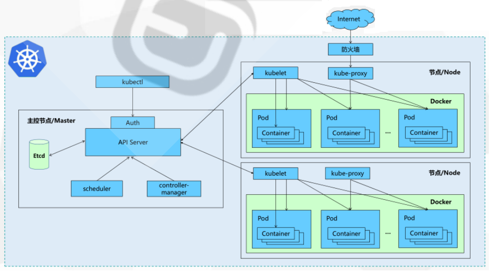
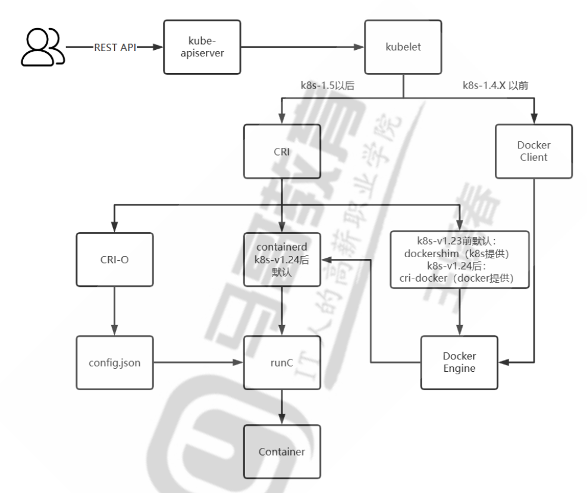

## Kubernetes架构
Kubernetes主要分为master节点和Woker节点，其中Master节点为了高可用，至少3个
### Kubernetes组件


Kubernetes组件分为三种
- Control Plane Components 控制平台组件(Master)
  - API Server
    - K8S内部通信的总入口
    - `API Server是Kubernetes集群中唯一能够与etcd通信的组件`
  - scheduler
  - controller-mananger
  - Etcd(集群状态存储系统，用于存储集群状态) - Node Components 节点组件
  - Kubelet
    - 接收从master节点发过来的指令(通过API Server)
    - 支持从API Server以配置清单形式接受Pod资源定义
    - 从指定本地目录中加载静态Pod清单`/etc/kubenetes/manifests`，并通过容器运行时创建、启动和监视容器
    - Kubelet会持续监视当前节点上的各Pod的健康状态，包括基于用户自定义的探针进行存活状态探测，并在任何Pod出现问题时将其重建为新实例
  - Container RUNTIME(容器运行时)
    - 从kubelet接收指令，去管理容器
  - Kube_Proxy(生成iptables规则)
    - 负载均衡：
      - kube-proxy 实现了对服务的负载均衡，将客户端的请求分发到对应的后端 Pod。
    - 服务发现：
      - kube-proxy 根据 Kubernetes API 服务器的更新，动态维护和更新集群内的网络规则，以确保服务 IP 地址和端口的正确性。
    - 网络规则管理:
      - kube-proxy 使用多种方式（如 iptables、IPVS）来管理集群节点上的网络规则，确保请求能够被正确转发
    - 它是Service资源的实现
      - 对内：ClusterIP：在集群内部访问。
      - 对外
        - NodePort
        - LoadBalancer
- Addons 附件(插件)
  - CoreDNS：


### Kubernetes组件间安全通信
Kubernetes集群中有三套CA机制
- etcd-ca ETCD集群内部的 TLS 通信
- kubernetes-ca kubernetes集群内部节点间的双向 TLS 通信(包括APIserver与Kubelet之间的安全通信，contruler和schedular之间的通信证书)
- front-proxy-ca Kubernetes集群与外部扩展服务简单双向 TLS 通信


### Kubernetes网络基础
#### 四种通信类型
- 同一Pod内的容器间通信
- 各Pod彼此间通信
- Pod与Service间的通信
- 集群外部的流量与Service之间的通信
#### 三种网络
- 节点网络（宿主机）
- Pod网络（Pod对象所属网络）
  - Pod之间的网络有CNI插件管理
- Service网络（ClusterIP,NodePort,LoadBalancer）
  - Service网络由Kubenetes分配和管理

### Kubernetes版本

1.24版本之后，Kubernetes不再直接支持Docker

### Kubernetes扩展接口

- 容器运行时接口(CRI：Container Runtime Interface)
  - 从Kubernetes1.5开始，CRI成为Kubernetes与容器运行时交互的标准接口，使得Kubernetes可以与各种容器运行时进行通信，从而增加了灵活性和可移植性
  - Kubernetes对于容器的解决方案，只是预留了网络接口，只要符合CNI标准的接口方案都可用
- 容器网络接口CNI(Container Network Interface)
  - Kubernetes对于网络的解决方案，只是预留了网络接口，只要符合CNI标准的解决方案都可以用
- 容器存储接口CSI：Container Storage Interface
  - Kubernetes对于存储的解决方案，只是预留了存储接口，只要符合CSI标准的解决方案都可以使用此接口，非必须



## Kubernetes安装
- K8S集群主节点1
  - IP: 10.0.0.201
  - 主机名：master1.feng.org
- K8S集群主节点2
  - IP: 10.0.0.202
  - 主机名：master2.feng.org
- K8S集群主节点3
  - IP: 10.0.0.203
  - 主机名：master3.feng.org
- K8S集群工作节点1
  - IP: 10.0.0.204
  - 主机名：node1.feng.org
- K8S集群工作节点2
  - IP: 10.0.0.205
  - 主机名：node2.feng.org
- K8S集群工作节点3
  - IP: 10.0.0.206
  - 主机名：node3.feng.org


- 负载均衡haproxy
  - IP: 10.0.0.3
  - 主机名：ha1.feng.org
- 负载均衡haproxy2
  - IP: 10.0.0.13
  - 主机名：ha2.feng.org

### 基于kubeadm和docker安装k8s高可用集群
#### 基础系统环境设置
- 主机时间同步
- 防火墙设置
- 禁用swap
- 确保MAC地址及product_id的唯一性

#### 配置容器运行引擎
- 安装docker
- 配置cri-dockerd

#### 安装kubeadm，kubelet和kubectl

#### 初始化控制平面()

#### 配置命令行工具kubectl

#### 向集群添加master节点

#### 向集群添加worker节点

上述详情见ansible自动化脚本

### 基于containerd安装k8s高可用集群
#### 环境初始化，同上
#### 内核参数调整
```shell
# 方法1：安装docker，自动修改内核参数，并自动安装containerd
apt update && apt -y install docker.io

# 方法2：加载模块
modprobe overlay
modprobe br_netfilter

# 开机加载
cat <<EOF | tee /etc/modules-load.d/k8s.conf
overlay
br_netfilter
EOF

# 设置所需的sysctl参数，参数在重启后保持不变
cat <<EOF | tee /etc/sysctl.d/k8s.conf
net.bridge.bridge-nf-call-iptables = 1
net.bridge.bridge-nf-call-ip6tables = 1
net.ipv4.ip_forward = 1
EOF

# 重启内核参数
sysctl --system
```
#### 安装containerd
```shell
apt install -y containerd

# 修改containerd配置
mkdir /etc/containerd
containerd config default > /etc/containerd/config.toml

# 将sandbox_image镜像源设置为阿里云google_containers镜像源
sed -i "s#registry.k8s.io/pause#registry.aliyuncs.com/google_containers/pause#g" /etc/containerd/config.toml

# 配置containerd cgroup 驱动程序systemd, ubuntu22.04较新内核必须修改，ubuntu20.04旧版内核不用改
sed -i 's#SystemdCgroup = false#SystemdCgroup = true#g' /etc/containerd/config.toml

# 镜像加速
vim /etc/containerd/config.toml
# 在行下面加行
[plugins."io.containerd.grpc.v1.cri".registry.mirrors]
       ###########################镜像加速###############################     
      #新版
  [plugins."io.containerd.grpc.v1.cri".registry.mirrors."docker.io"]
    endpoint = ["https://docker.m.daocloud.io","https://docker.1panel.live"]

# 重启containerd
systemctl restart containerd
```

#### 在所有主机安装kubeadm、kubelet和kubectl
后续同上, 详情见ansible自动化脚本


### 基于kubeasz安装二进制k8s高可用集群
#### 部署架构
- k8s主节点1
  - IP：10.0.0.131
  - 主机名：master1.feng.org
- k8s主节点2
  - IP：10.0.0.132
  - 主机名：master2.feng.org
- k8s主节点3
  - IP：10.0.0.133
  - 主机名：master3.feng.org
- k8s-workder-node1
  - IP：10.0.0.134
  - 主机名：node1.feng.org
- k8s-workder-nodej
  - IP：10.0.0.135
  - 主机名：node2.feng.org
- k8s-workder-node6
  - IP：10.0.0.136
  - 主机名：node3.feng.org
- ansible
  - 10.0.0.131

#### 下载kubeasz
```shell
# 下载ezdown脚本
export release=3.6.4
wget https://github.com/easzlab/kubeasz/releases/download/${release}/ezdown

# 加执行权限
chmod +x ezdown
./ezdown

# 下载相关文件到/etc/kubeasz
./ezdown -D

# 环境初始化
./ezdown -S

# 创建集群的初始配置信息，指定集群名称k8s-mycluster-01
dk ezctl new k8s-mycluster-01

# 修改/etc/kubeasz/clusters/k8s-mycluster-01/hosts文件

# 执行ansible，创建k8s集群
dk ezctl setup k8s-mycluster-01 all

```


## Kubernetes资源种类
查看kubernetes资源种类
```shell
kubectl api-resources
```

## Kubernetes与集群进行交互的主要方式
### RESTful API
#### 获取所有Pod
- 请求方法：GET
- 请求URL：`/api/v1/namespaces/{namespace}/pods`
- 示例
```shell
GET /api/v1/namespace/default/pods
```

#### 创建一个新的Pod
- 请求方法：POST
- 请求URL：`/api/v1/namespace/{namespace}/pods`
```shell
POST /api/v1/namespaces/default/pods
Content-Type: application/json

{
  "apiVersion": "v1",
  "kind": "Pod",
  "metadata": {
    "name": "my-pod"
  },
  "spec": {
    "containers": [
      {
        "name": "my-container",
        "image": "nginx",
        "ports": [
          {
            "containerPort": 80
          }
        ]
      }
    ]
  }
}
```

#### 删除一个Pod
- 请求方法：DELETE
- 请求URL：`/api/v1/namespace/{namespace}/pods/{name}`
```shell
DELETE /api/v1/namespaces/default/pods/my-pod
```

#### 更新一个Pod
- 请求方法：PUT
- 请求URL`/api/v1/namespace/{namespace}/pods/{name}`
- 示例：更新名为`my-pod`的Pod(注意，更新Pod通常使用的是`PATCH`请求，但这里以`PUT`为例)
```shell
PUT /api/v1/namespaces/default/pods/my-pod
Content-Type: application/json

{
  "apiVersion": "v1",
  "kind": "Pod",
  "metadata": {
    "name": "my-pod"
  },
  "spec": {
    "containers": [
      {
        "name": "my-container",
        "image": "nginx:latest",
        "ports": [
          {
            "containerPort": 80
          }
        ]
      }
    ]
  }
}

```

## Kubectl命令和资源管理
Kubectl的核心功能在于通过API Server操作Kubernetes的各种资源对象

### kubectl的命令格式
```shell
kubectl [command] [TYPE] [NAME] [flags]
```

#### 常用操作示例
```shell
# 创建一个名称空间
kubectl create namespace dev
# 创建一个deployment控制器管理下的Pod在命名空间dev下
kubectl create deployment demoapp --image="ikubernetes/demoapp:v1.0" -n dev
# 创建一个service网络
kubectl create service clusterip demoapp -tcp=80 -n dev

# 创建自主式Pod
kubectl run demoapp --image="ikubernetes/demoapp:v1.0"

kubectl run demoapp-$RANDOM --image="ikubernetes/demoapp:v1.0" --rm -it --command -- /bin/sh
# --command -- /bin/sh
# --command 选项表示将指定的命令作为容器的入口点（entrypoint）。
# -- 用于分隔选项和命令，确保 kubectl 能够正确识别命令部分，即使命令部分包含选项。
```

#### 查看资源对象`get`


#### 打印资源对象的详细信息
每个资源对象都有用户期望的状态(spec)和现有的实际状态(Status)两种状态信息

```shell
# 查看kube-system名称空间中API Server相关Pod对象的资源配置清单，并输出为YAML格式
kubectl get pods kube-apiserver-k8s-master01.ilinux.io -o yaml -n kube-system

# 查看kube-system名称空间中拥有标签component=kube-apiserver的Pod对象的详细描述信息
kubectl describe pods -l component=kube-apiserver -n kube-system
```

#### 打印容器中的日志信息`logs`

```shell
kubectl logs ...
# -f，相当于tail -f，不多解释
```

#### 在容器中执行命令`exec`
```shell
kubectl exec kube-apiserver-master.ilinux.io -n kube-system -- ps
# 如果pod中有多个业务容器，可以用-c指定容器
```

#### 删除资源对象`delete`
```shell
# 删除Service资源对象
kubectl delete services demoapp-svc

# 删除名称空间内的某种类型对象--all
kubectl delete pods --all -n kube-public  # 如果没有--all，则是删除名称空间连同里面的所有对象

# 删除宽限期，默认30秒
kubectl delete pods demoapp --force --grance-period=0 # 立即删除
# 使用--now和--grace-period会覆盖默认宽限期
```

#### kubectl插件

显示所有kubectl插件，所有插件一定是以kubectl_开头
```shell
kubectl plugin list
```
插件管理：Krew(Krew自身也表现为kubectl的一个插件)

- 安装krew插件脚本
```shell
#!bin/bash
set -x; cd "$(mktemp) -d"

curl -fSLO "https://github.com/kubernetes-sigs/krew/releases/latest/download/krew.{gar.rz,yaml}"
tar zxvf krew.tar.gz
KREW=./krew-"$(uname | tr '[:upper:]' '[:lower:]')_amd64"

"$KREW" install --manifest=krew.yaml --archive=krew.tar.gz
"$KREW" update
```

## Kubernetes资源管理
### 工作负载型资源

### 发现与负载均衡 
#### ReplicationController(上一代无状态应用控制器，不建议使用)
- 用于确保每个Pod副本在任意时刻均能满足目标数量，即它用于保证每个容器或容器组总是运行并可访问
#### ReplicaSet
- 新一代ReplicationController，与ReplicationController唯一不同的：
  - 支持的标签选择器不同，不仅支持等值选择器，还支持基于集合的`选择器`

#### Deployment
- 用于管理无状态的持久化应用，例如HTTP服务等
- 用于为Pod和ReplicaSet提供声明式更新，是构建在ReplicaSet之上的更高级的控制器

#### StatefulSet
- 用于管理有状态的持久化应用
- 为每个Pod创建一个独有的持久性标识符，并确保各Pod间的`顺序性`

#### DaemonSet
- 用于确保每个节点都运行了某Pod的一个副本，包括后来新增的节点
- 常用于运行各类系统级守护进程

#### Job
- 用于管理运行完成后即可终止的任务，例如批处理作业任务；
- Job创建一个或多个Pod，并确保其符合目标数量，直到应用完成而终止
- `Cronjob`控制器对象，还能为Job型任务提供定期执行机制


### 发现与负载均衡
#### Service
- 用于为工作负载实例提供固定的访问入口及负载均衡服务
- 它把每个后端实例定义为`Endpoint`，简称ep

#### Ingress
- 为工作负载提供7层代理(HTTP/HTTPS)及负载均衡功能


### 配置与存储
#### ConfigMap
- 以环境变量或存储卷的方式，接入Pod资源的容器中，并可被多个同类的Pod共享引用
- 从而做到`一次修改，多处生效`

#### Secret
- 适用于存储敏感数据
- 例如：证书，私钥和密码等

#### CSI(存储)


### 集群型资源
- 用于定义集群自身的配置信息

#### 名称空间NameSpace

#### Node
- Kubernetes并不能直接管理工作节点
- 它把由管理员添加进来的任何形式的工作节点映射为一个Node资源对象(待理解)

#### Role
- 角色，隶属于名称空间，代表名称空间级别由规则组成的权限集合
- 可被`RoleBinding`引用

#### ClusterRole
- 集群角色，隶属于集群，由规则组成的权限集合
- 可被`RoleBinding`和`ClusterRoleBinding`引用

#### RoleBinding
- 用于将Role中的许可权限绑定在一个或一组用户上，从而完成用户授权
- 仅作用于名称空间级别

#### Clusterole
- 同上，但是是集群级别


### 元数据型资源
此类资源对象用于为集群内部其他资源对象配置其行为或特性

#### Pod模版

#### LimitRange


## Pod资源
### Pod资源分类
- 自主式Pod
- 由Workload Controller管控的Pod
- 静态Pod

### 自主式Pod支持三种方法创建
#### 指令式命令创建Pod
通过kubectl命令行工具指令选项创建Pod，适合临时工作
```shell
kubectl run NAME --image=image [--port=port]
# 这里--port仅是声明要暴露的端口

# 删除pod
kubectl delete pod NAME --grace-period=5
# 立即删除
kubectl delete pod NAME --grace-period=0 --force
```

### Pod资源清单说明
#### Pod资源清单必须存在的属性
- apiVersion
  - 这里指的是K8S API的版本，目前是基于V1的，可以通过`kubectl api-versions`查询

- kind
  - 这里指的是yaml文件定义的资源类型和橘色，比如我们创建一个Pod，他就是pod类型，如果创建的是一个deployment，就是deployment类型

- metadata
  - 元数据对象，固定值就写metadata，也就意味着，这个字段对象里面写的是他的一些元数据类型，这个对象类型主要有两个字段
    - metadata.name
    - metadata.namespace

- spec
  - 这里写的是spec对象的容器列表定义，是一个列表
    - 第一个主要元素name
    - 第二个主要元素image

## Pod生命周期
### init container
```yaml
apiVersion: v1
kind: Pod
metadata:
  name: example-pod
spec:
  initContainers:
  - name: init-container-1
    image: busybox
    command: ['sh', '-c', 'echo Init Container 1; sleep 5']
  - name: init-container-2
    image: busybox
    command: ['sh', '-c', 'echo Init Container 2; sleep 5']
  containers:
  - name: app-container
    image: myapp:latest
    ports:
    - containerPort: 80
```

- 在Pod的生命周期内，首先启动Pause容器以提供基础环境，然后按顺序启动init Container执行初始化任务，最后启动业务容器以运行应用程序

### 两种钩子PostStart和PreStop
- 关于钩子函数的执行主要由两种方式
  - Exec，在钩子事件触发时，直接在当前容器中运行由用户定义的命令，用于执行一段特定的命令，不过要注意的是该命令消耗的资源会被计入容器
  - HTTP，在当前容器中向某URL发起HTTP请求

#### poststart示例
```yaml
[root@master1 yaml]#cat pod-poststart.yaml
apiVersion: v1
kind: Pod
metadata:
 name: pod-poststart
spec:
 containers:
  - name: busybox
   image: busybox:1.32.0
   lifecycle:
     postStart:
       exec:
         command: ["/bin/sh","-c","echo lifecycle poststart at $(date) > /tmp/poststart.log"]
   command: ['sh', '-c', 'echo The app is running at $(date) ! && sleep 3600']
```

PostStart钩子函数和主容器启动可以看作是同时进行

#### PreStop示例
```yaml
#由于默认情况下，删除的动作和日志我们都没有办法看到，那么我们这里采用一种间接的方法，在删除动作之前，给本地目录创建第一个文件，输入一些内容
[root@master1 yaml]#cat pod-prestop.yaml
apiVersion: v1
kind: Pod
metadata:
 name: pod-prestop
spec:
 volumes:
  - name: vol-prestop
   hostPath:
     path: /tmp
 containers:
  - name: prestop-pod-container
   image: busybox:1.32.0
   volumeMounts:
    - name: vol-prestop
     mountPath: /tmp
   command: ['sh', '-c', 'echo The app is running at $(date) ! && sleep 3600']
   lifecycle:
     postStart:
       exec:
         command: ['/bin/sh', '-c','echo lifecycle poststart at $(date) > /tmp/poststart.log']
```

```yaml
apiVersion: v1
kind: Pod
metadata:
  name: pod-prestop
spec:
  volumes:
  - name: vol-prestop
    hostPath:
      path: /tmp
  containers:
  - name: prestop-pod-container
    image: buxybox-1.32.0
    volumeMounts:
    - name: vol-prestop
      mountPath: /tmp
    command: ['sh', '-c', 'echo The app is running at $(date) ! && sleep 3600']
    lifecycle:
      postStart:
        exec:
          command: ['/bin/sh', '-c', 'echo Lifecycle poststart at $(date)' > /tmp/poststart.log]
      preStop:
        exec:
          command: ['/bin/sh', '-c', 'echo Lifecycle poststart at $(date)' > /tmp/poststart.log]
```


## Pod资源限制
### 可限制资源单位
- CPU
  - 在Kubernetes中，通常以千分之一的CPU(core)为最小单元，用毫m表示，即一个CPU核心表示1000m
- 内存

### 资源限制实现
要实现资源限制，需要先安装metrics-server
```shell
curl -LO https://github.com/kubernetes-sigs/metrics-server/releases/download/v0.7.1/components.yaml

# 默认文件需要修改
apiVersion: apps/v1
kind: Deployment
metadata:
labels:
  k8s-app: metrics-server
name: metrics-server
namespace: kube-system
spec:
selector:
  matchLabels:
  k8s-app: metrics-server
strategy:
  rollingUpdate:
  maxUnavailable: 0
template:
  metadata:
  labels:
    k8s-app: metrics-server
  spec:
  containers:
  - args:
    - --cert-dir=/tmp
    - --secure-port=4443
    - --kubelet-preferred-address-types=InternalIP,ExternalIP,Hostname
    - --kubelet-use-node-status-port
    - --metric-resolution=15s
    - --kubelet-insecure-tls   #添加本行和下面两行
    image: registry.cn-hangzhou.aliyuncs.com/google_containers/metrics-server:v0.7.1  # 或者开代理
 #image: registry.cn-hangzhou.aliyuncs.com/google_containers/metrics-server:v0.6.1
 #image: k8s.gcr.io/metrics-server/metrics-server:v0.6.1
 imagePullPolicy: IfNotPresent
 livenessProbe:

# 应用此文件
kubectl apply -f components.yaml
# 查看性能性能
kubectl top nodes
```

### 资源限制
```yaml
apiVersion: v1
kind: Pod
metadata:
 name: pod-limit-request
spec:
 containers:
  - name: pod-limit-request-container
   image: registry.cn-beijing.aliyuncs.com/wangxiaochun/nginx:1.20.0
   imagePullPolicy: IfNotPresent
   resources:
     requests:
       memory: "200Mi"
       cpu: "500m"
     limits:
       memory: "200Mi"
       cpu: "500m"
```
提示：为保证性能，生产推荐Requests和Limits设置为相同的值
limit数值可以超过实际大小，但是requests不可以
- 如果requests的数值大小，没有任何节点可以满足，则调度器无法完成调度，则会卡在pending状态，详情可以查看pod创建流程

- 如果限制资源后，无法满足容器实际所需的资源大小，则会触发OOMkilled，在OOMKILLED和重启之间反复循环


#### LimitRange实现使用资源限制
后续有时间可以了解


## Pod安全

### 容器安全上下文
安全上下文是一组用于决定容器是如何创建和运行的约束条件，它们代表着创建和运行容器时使用的运行时参数

它根据约束的作用范围主要包括三个级别：
- Pod级别
  - 针对Pod范围内的所有容器
- 容器级别
  - 仅针对Pod范围内的指定容器
- PSP级别
  - PodSecurityPolicy，全局级别的Pod安全策略，涉及到准入控制相关的知识

### 资源策略
#### 用户级别
默认Pod容器进程是以root身份运行，可以通过下面属性指定其他用户
- runAsUser
- runAsGroup

默认情况下，一旦Pod创建好后，是不允许对用户归属权限进行任意修改的，所以需要修改的话，必须先关闭，在开启

添加安全上下文属性实现指定用户身份运行Pod内的进程
```yaml
[root@master1 yaml]#cat pod-securitycontext-runasuser.yaml 
apiVersion: v1
kind: Pod
metadata:
 name: pod-securitycontext-runasuser
 namespace: default
spec:
 containers:
  - name: pod-test
   image: registry.cn-beijing.aliyuncs.com/wangxiaochun/pod-test:v0.1
   imagePullPolicy: IfNotPresent
   env:
    - name: PORT
     value: "8080"
   securityContext:
     runAsUser: 1001     #指定运行身份
     runAsGroup: 1001
# 注意，普通用户无法监控特权端口0~1023
```
- 扩展知识
```shell
# 内核中有个参数可以控制特权端口的范围
sysclt -a | grep net.ipv4.ip_unprivileged_port_start
net.ipv4.ip_unprivileged_port_start=0
# 有的容器该参数默认为0，则即使是普通用户也能监控特权端口
```

#### 资源能力
Linux中相关的资源能力
```shell
CAP_CHOWN           # 改变文件的所有者和所属组
CAP_MKNOD           # mknod()，创建设备文件
CAP_NET_ADMIN       # 网络管理权限
CAP_SYS_TIME        # 更改系统的时钟
CAP_SYS_MODULE      # 装载卸载内核模块
CAP_NET_BIND_SERVER # 允许普通用户绑定1024以内的特权端口
CAP_SYS_ADMIN       # 大部分的管理权限，基本相当于root权限
```

可以在容器内部通过command+args运行一个自定义的容器启动命令
```yaml
# [root@master1 yaml]#cat pod-securitycontext-capabilities.yaml 
apiVersion: v1
kind: Pod
metadata:
 name: pod-securitycontext-capabilities
 namespace: default
spec:
 containers:
  - name: pod-test
   image: registry.cn-beijing.aliyuncs.com/wangxiaochun/pod-test:v0.1
   imagePullPolicy: IfNotPresent
   command: ["/bin/sh","-c"]
   args: ["/sbin/iptables -t nat -A PREROUTING -p tcp --dport 8080 -j REDIRECT --to-port 80 && /usr/bin/python3 /usr/local/bin/demo.py"]
```

通过add添加特权
```yaml
apiVersion: v1
kind: Pod
metadata:
 name: pod-securitycontext-capabilities
 namespace: default
spec:
 containers:
  - name: pod-test
   image: registry.cn-beijing.aliyuncs.com/wangxiaochun/pod-test:v0.1
   imagePullPolicy: IfNotPresent
   command: ["/bin/sh","-c"]
   args: ["/sbin/iptables -t nat -A PREROUTING -p tcp --dport 8080 -j REDIRECT -
-to-port 80 && /usr/bin/python3 /usr/local/bin/demo.py"]
#添加下面三行
   securityContext:
     capabilities:
       add: ['NET_ADMIN']
       drop: ['CHOWN']

# 注意add后面的权限能力使用单引号('')，也可以使用双引号("")
# drop可以删除特权
```

#### Pod中的内核参数
Pod安全上下文级别默认只支持为数不多的内核安全参数
```shell
net.ipv4.ip_local_port_range
net.ipv4.ip_unprivileged_port_start
net.ipv4.tcp_syncookies
kernel.shm_rmid_forced
```

上面的几个内核参数可以在Pod内部的容器名称空间的内核级别进行调整，被视为安全参数
但其他的绝大部分参数不支持直接修改，被视为不安全参数
如果想对其他不安全内核参数修改，必须要所在的node节点上修改kubelet的配置
```shell
KUBELET_EXTRA_ARGS='--allowed-unsafe-sysctls=net.core.somaxconn,net.ipv4.ip_nonlocal_bind'
```
示例
```yaml
apiVersion: v1
kind: Pod
metadata:
 name: pod-sysctl
spec:
 securityContext:
   sysctls:
      - name: kernel.shm_rmid_forced
       value: "1"
      - name: net.ipv4.ip_unprivileged_port_start
       value: "60"
    # - name: net.core.somaxconn
    #   value: "6666"
 containers:
  - name: pod-sysctl
   image: registry.cn-beijing.aliyuncs.com/wangxiaochun/pod-test:v0.1
   securityContext:
     runAsUser: 1001
     runAsGroup: 1001
```


#### 特权
添加privileged特权
```yaml
apiVersion: v1
kind: Pod
metadata:
 name: pod-privileged-demo
spec:
 initContainers:  
  - name: set-sysctl
   image: registry.cn-beijing.aliyuncs.com/wangxiaochun/admin-box:v0.1
   command: ["sysctl","-w","vm.max_map_count=6666666"]
   securityContext:         #添加特权
     privileged: true
 containers:
  - name: pod-privileged-demo
   image: registry.cn-beijing.aliyuncs.com/wangxiaochun/pod-test:v0.1
```

#### 服务质量分类
QoS(服务质量等级)是作用在Pod上的一个配置
当Kubernetes创建一个Pod时，它就会给这个Pod分配一个Qos等级
- 低优先级BestEffort：没有任何一个容器设置了requests或limits属性(最低优先级)
- 中优先级Burstable: Pod至少有一个容器设置了CPU或内存的requests和limits，且不相同
- 高优先级Guaranteed：Pod内的每一个容器同时设置了CPU和内存的requests和limits，而且所有值必须相等

当主机出现OOM时，先删除服务质量低的, 服务质量高的最后删除


## 单节点多容器模式
### Init Container模式
```yaml
#通过init模式实现iptables规则的端口重定向
[root@master1 yaml]#cat pod-init-container.yaml 
apiVersion: v1
kind: Pod
metadata:
 name: pod-init-container
 namespace: default
spec:
 initContainers:
  - name: iptables-init
   image: registry.cn-beijing.aliyuncs.com/wangxiaochun/admin-box:v0.1
   imagePullPolicy: IfNotPresent
   command: ['/bin/sh','-c']
   args: ['iptables -t nat -A PREROUTING -p tcp --dport 8080 -j REDIRECT --to-port 80']
   securityContext:
capabilities:
       add:
        - NET_ADMIN
 containers:
  - name: demo
   image: registry.cn-beijing.aliyuncs.com/wangxiaochun/pod-test:v0.1
   imagePullPolicy: IfNotPresent
   ports:
    - name: http
     containerPort: 80
```

### sideCar模式
在一个pod内启动两个容器，访问B容器的时候，都需要经过A容器，只有通过A处理后的数据才会发送给B容器。
在整个过程中，A容器就是B容器应用的代理服务器
```yaml
apiVersion: v1
kind: Pod
metadata:
 name: sidecar-test
spec:
 containers:
  - name: proxy
   image: envoyproxy/envoy-alpine:v1.14.1
   command: ['sh', '-c', 'sleep 5 && envoy -c /etc/envoy/envoy.yaml']
   lifecycle:
     postStart:
       exec:
         command: ["/bin/sh","-c","wget -O /etc/envoy/envoy.yaml 
http://www.wangxiaochun.com/kubernetes/yaml/envoy.yaml"]
  - name: pod-test
   image: registry.cn-beijing.aliyuncs.com/wangxiaochun/pod-test:v0.1
   env:
    - name: HOST
     value: "127.0.0.1"
    - name: PORT
     value: "8080"
```
这里设计云原生的envoy组件，有时间可以学习下


## Pod健康性检查

### Pod中的健康检查流程
- 初始启动容器的时候，有一个初始化时间（InitialDelaySeconds，可自定义，如5s）
- 5s后启动第一个探针，`Startup Probe`，初始化时间是为了确保程序已经运行，因为有些程序启动可能较慢，`Startup Probe`一般在服务启动后探测
- Startup Probe如果探测失败，容器将立即重启
- Startup Probe探测成功后，进入下一阶段，此时Startup Probe将不会再执行
- 在该阶段初始也会有一个`InitalDelaySceonds for Livness Probe`和`InitalDelaySceonds for Readiness Probe`即启动后续探针的等待时间
- 后续有两个探针：Livness Probe和Readiness Probe
- 如果Livness检测失败，则重启Pod
- 如果Readiness检查失败，Pod不会重启，而是会将其从SerVice资源的端点控制器中的调度列表移除，待后续检查成功，在将其从调度列表恢复


### Pod健康性检查的方法
- Exec探测方法
- TCPSocket探测方法
- HTTPGET探测方法
- gRPC探测方法

### 探针案例
#### Exec方式案例

```yaml
apiVersion: v1
kind: Pod
metadata:
 name: pod-startup-exec
 namespace: default
 labels:
   app: pod-startup-exec
spec:
 containers:
  - name: pod-startup-exec-container
   image: registry.cn-beijing.aliyuncs.com/wangxiaochun/pod-test:v0.1
   imagePullPolicy: IfNotPresent
   startupProbe:
     exec:
       command: ['/bin/sh', '-c', '[ "$(curl -s 127.0.0.1/livez)" == "OK" ]']
     initialDelaySeconds: 60
     timeoutSeconds: 1
     periodSeconds: 5
     successThreshold: 1
     failureThreshold: 1
```

```yaml
apiVersion: v1
kind: Pod
metadata:
 name: pod-liveness-exec-cmd
 namespace: default
spec:
 containers:
  - name: pod-liveness-exec-cmd-container
   image: busybox:1.32.0
   imagePullPolicy: IfNotPresent
   command: ["/bin/sh","-c","touch /tmp/healthy; sleep 3; rm -f 
/tmp/healthy;sleep 3600"]
   livenessProbe:
     exec:
       command: ["test", "-e","/tmp/healthy"]
     initialDelaySeconds: 1
     periodSeconds: 3
```

#### Tcpsocket方式案例
使用此配置，kubelet将尝试在指定端口上打开容器的套接字，如果可以建立连接，则容器被认为是健康的，如果不能则认为是失败的，其实就是在检查端口是否开启
```yaml
apiVersion: v1
kind: Pod
metadata:
name: pod-liveness-tcpsocket
 namespace: default
spec:
 containers:
  - name: pod-liveness-tcpsocket-container
   image: registry.cn-beijing.aliyuncs.com/wangxiaochun/pod-test:v0.1
   imagePullPolicy: IfNotPresent
   ports:
    - name: http           #给指定端口定义别名
     containerPort: 80
   securityContext:  #添加特权，否则添加iptables规则会提示：getsockopt failed strangely: Operation not permitted
     capabilities:
       add:
        - NET_ADMIN
   livenessProbe:
     tcpSocket:
       port: http        #引用上面端口的定义
     periodSeconds: 5
     initialDelaySeconds: 5
#注意：由于此镜像应用对外暴露的端口是80端口，所以要探测80端口
```

Readness的Tcpsocket探针
```yaml
apiVersion: v1
kind: Pod
metadata:
 name: pod-readiness-tcpsocket
 labels:
   app: pod-readiness-tcpsocket
spec:
 containers:
  - name: pod-readiness-tcpsocket-container
   image: registry.cn-beijing.aliyuncs.com/wangxiaochun/nginx:1.20.0
   readinessProbe:
     tcpSocket:
       port: 80
     initialDelaySeconds: 5
     periodSeconds: 10
   livenessProbe:
     tcpSocket:
       port: 80
     initialDelaySeconds: 15
     periodSeconds: 20
---
apiVersion: v1
kind: Service
metadata:
 name: pod-readiness-tcpsocket-svc
spec:
 ports:
  - name: http
   port: 80
   protocol: TCP
   targetPort: 80
 selector:
   app: pod-readiness-tcpsocket  #指定上面Pod相同的标签
```


#### HTTPGET方式案例
HTTP探测通过对容器内容开放的Web服务，进行http方法的请求探测，如果探测成功（即响应码为2XX,3XX），否则就失败

HTTP Probes允许针对httpGet配置额外的字段
```shell
host：连接使用的主机名，默认是 Pod 的 IP。也可以在 HTTP 头中设置 “Host” 来代替。一般不配置此
项
scheme ：用于设置连接主机的方式（HTTP 还是 HTTPS）。默认是 "HTTP"。一般不配置此项
path：访问 HTTP 服务的路径。默认值为 "/"。一般会配置此项
port：访问容器的端口号或者端口名。如果数字必须在 1～65535 之间。一般会配置此项
httpHeaders：请求中自定义的 HTTP 头。HTTP 头字段允许重复。一般不配置此项
```
```yaml
# [root@master1 yaml]#cat pod-liveness-http.yaml 
apiVersion: v1
kind: Pod
metadata:
 name: pod-liveness-http
spec:
 containers:
  - name: pod-liveness-http-container
   image: busybox:1.32.0
   ports:
    - name: http
     containerPort: 80
   livenessProbe:
     httpGet:
       port: http    #或者指定80，如果非标准端口可以指定端口号
       path: /index.html
     initialDelaySeconds: 1
     periodSeconds: 3
```

## 工作负载
### 工作负载资源分类
- 无状态应用编配
  - Deployment
  - ReplicaSet
- 有状态应用编排
  - StatefulSet
- 系统级应用
  - DaemonSet
- 工作类应用
  - Job
  - CronJOb

### 标签（键值对）
#### 查看标签
```shell
kubectl pod --show-labels
kubectl <资源类型> --show-labels
```
#### 添加标签
```shell
# kubectl label <资源对象> <对象名称> <key1> <value1> <key2> <value2>...
kubectl label pod myapp class=m58 title=k8s
```

#### 更改原有标签
```shell
kubectl label pod myapp class=m59 title=k8s --overwrite=true
```

#### 删除标签
```shell
kubectl label 资源类型 资源名称 label_name- [label_name]-...
kubectl label pod myapp title-
```

#### Yaml方法
```yaml
metadata:
  labels:
    key1: value1
    key2: value2
    ...
# 注意：labels复数
```

### 标签选择器 Label Selector
Label附加到Kubernetes集群中的各种资源对象上，目的是对这些资源对象可以进行后续的分组管理
而分组管理的核心就是：`标签选择器Label Selector`

#### 等值匹配
```shell
# 等值
name = nginx
name == nginx
name            # 表示匹配存在name标签的资源对象

# 不等值
！name          # 表示匹配不存在name标签的资源对象
name != nginx   # 匹配所有没有name标签或者标签name的值不等于nginx的资源对象
```

应用示例
```yaml
apiVersion: v1
kind: Pod
metadata:
 name: cuda-test
spec:
 containers:
 - name: cuda-test
     image: "registry.k8s.io/cuda-vector-add:v0.1"
     resources:
       limits:
         nvidia.com/gpu: 1
 nodeSelector:
   accelerator: nvidia-tesla-p100
```

应用示例2
```yaml
apiVersion: v1
kind: Service
metadata:
 name: service-loadbalancer-lbaas
spec:
 type: LoadBalancer
 externalTrafficPolicy: Local
 selector:
   app: myapp
 ports:
  - name: http
   protocol: TCP
   port: 80
   targetPort: 80
```

#### 集合匹配
```shell
# 集合匹配相当于“或”
#示例：
env in (dev, test)        #匹配所有具有标签 env = dev 或者 env = test 的资源对象
name notin (frontend,backent)    #匹配所有不具有标签name=frontend或者name=backend或者没有name标签的资源对象
```

#### 匹配标签matchLabels
```shell
#匹配标签：
   matchLabels:
     name: nginx
     app: myapp
#当 matchLabels 中有多个标签时，它们之间的关系是逻辑与（AND）关系
#如下所示：
matchLabels:
 app: frontend
 environment: production
#那么只有那些标签中同时包含 app=frontend 和 environment=production 的资源才会被选中。
```
#### 匹配表达式
```shell
#匹配表达式：
   matchExpressions:
      - {key: name, operator: NotIn, values: [frontend]}
#当 matchExpressions 中包含多个标签表达式时，它们之间的关系是逻辑与（AND）关系
#常见的operator操作属性值有：
   In、NotIn、Exists、NotExists等
   Exists和NotExist时，values必须为空，即 { key: environment, opetator: Exists,values:}
#注意：这些表达式一般应用在RS、RC、Deployment等其它管理对象中。
```

```yaml
matchExpressions:
  - key: environment
   operator: In
   values:
      - production
      - staging
  - key: app
   operator: NotIn
   values:
      - test
#那么只有那些标签满足以下两个条件的资源才会被选中：
- 标签中 environment 的值是 production 或 staging
- 标签中 app 的值不是 test
```

### 标签选择器操作方式
- 命令
- 文件

#### 命令方式
```shell
#多个SELECTOR表示并且的关系
kubectl get TYPE -l SELECTOR1[,SELECTOR2,...]
kubectl get TYPE -l SELECTOR1 [-l SELECTOR2] ...
#额外针对指定的每一个标签单独一列来显示对应的值
kubectl get TYPE -L label_name
```

### Replica Set 工作机制(RS)
#### 查看资源清单写法
```shell
kubectl explain 资源类型
```

#### Replica Set基础管理Replica Set资源清单示例
```yaml
apiVersion: apps/v1
kind: ReplicaSet   # 注意大小写
metadata:
  name: _
  namespace: _
spec:
  minReadySeconds <int>
  replicas <int>
  selector:
    matchExpression <[]object>
    matchLabels <map[string]string>
  template:
    metadata:
      labels:   # 这个地方定义具体Pod的标签一定要和selector标签选择器规则匹配
    spec:
    ...
```

```yaml
apiVersion: apps/v1
kind: ReplicaSet
metadata:
  name: controller-replicaset-test
spec:
  minReadySeconds: 0
  replicas: 3    # 修改此行
  selector:
    matchLabels:
      app: rs-test
      release: stable
      version: v1.0
  template:
    metadata:
      labels:
        app: rs-test
        release: stable
        version: v1.0
    spec:
      containers:
      - name: rs-test
        images: registry.cn-beijing.aliyuncs.com/wangxiaochun/pod-test:v0.1
```

#### ReplicaSet扩容和缩容
```shell
# 方法1：修改yaml文件中replicas的参数

# 方法2：
kubectl scale replicaset controller-replicaset-test --replicas 2
```

#### 更新镜像版本
```yaml
apiVersion: apps/v1
kind: ReplicaSet
metadata:
  name: controller-replicaset-test
spec:
  minReadySeconds: 0
  replicas: 3    # 修改此行
  selector:
    matchLabels:
      app: rs-test
      release: stable
      version: v1.0
  template:
    metadata:
      labels:
        app: rs-test
        release: stable
        version: v1.0
    spec:
      containers:
      - name: rs-test
        images: registry.cn-beijing.aliyuncs.com/wangxiaochun/pod-test:v0.2 #修改此行
```

必须要手动将旧的删除后，再重新创建才能更新成功
虽然镜像模版信息更新了，但是pod并没有升级镜像，RS不支持自动更新

#### 蓝绿发布示例
```yaml
apiVersion: v1
kind: Service
metadata:
  name: svc-replicaset-blue-green
spec:
  type: ClusterIP
  selector:
    app: rs-test
    ctr: rs-${DEPLOY}
    version: ${VERSION}
  ports:
  - name: http
    port: 80
    protocol: TCP
    targetPort: 80
---
apiVersion: apps/v1
kind: ReplicaSet
metadata:
  name: rs-${DEPLOY}
spec:
  minReadySeconds: 3
  replicas: 2
  selector:
    matchLabels:
      app: rs-test
      ctr: rs-${DEPLOY}
      version: ${VERSION}
  template:
    metadata:
      labels:
        spp: rs-test
        ctr: rs-${DEPLOY}
        version: ${VERSION}
    spec:
      containers:
      - name: pod-test
        image: registry.cn-beijing.aliyuncs.com/wangxiaochun/pod-test:${VERSION}
```
```shell
# 访问
DEPLOY=blue VERSION=v0.1 envsubst < controller-replicaset-blue-green.yaml|kubectl apply -f -
# envsubst命令
用环境变量的值替换掉标准输入的内容
root@master101:~/mypod# NAME=feng envsubst
i'm $NAME
i'm feng
```


### Deployment

Deployment相对于RS的一个最大升级是：支持滚动发布策略，其他功能几乎一样

#### 创建Deployment
```shell
kubectl create deployment myapp --image registry.cn-beijing.aliyuncs.com/wangxiaochun/pod-test:v0.1 --replicas 3 --dry-run=client -o yaml

root@master101:~/mypod# kubectl create deployment myapp --image registry.cn-beijing.aliyuncs.com/wangxiaochun/pod-test:v0.1 --replicas 3 --dry-run=client -o yaml
apiVersion: apps/v1
kind: Deployment
metadata:
  creationTimestamp: null
  labels:
    app: myapp
  name: myapp
spec:
  replicas: 3
  selector:
    matchLabels:
      app: myapp
  strategy: {}
  template:
    metadata:
      creationTimestamp: null
      labels:
        app: myapp
    spec:
      containers:
      - image: registry.cn-beijing.aliyuncs.com/wangxiaochun/pod-test:v0.1
        name: pod-test
        resources: {}
status: {}
# 同replicaset基本一致
```
```shell
# 查看标签
root@master101:~/mypod# kubectl get pod --show-labels
NAME                               READY   STATUS    RESTARTS   AGE     LABELS
controller-replicaset-test-64x48   1/1     Running   0          96m     app=rs-test,release=stable,version=v1.0
controller-replicaset-test-jc5h4   1/1     Running   0          105m    app=rs-test,release=stable,version=v1.0
controller-replicaset-test-sngj8   1/1     Running   0          96m     app=rs-test,release=stable,version=v1.0
controller-replicaset-test-xjlft   1/1     Running   0          96m     app=rs-test,release=stable,version=v1.0
controller-replicaset-test-zjx9b   1/1     Running   0          105m    app=rs-test,release=stable,version=v1.0
myapp-547df679bb-9p82b             1/1     Running   0          77s     app=myapp,pod-template-hash=547df679bb
myapp-547df679bb-cwknj             1/1     Running   0          6m11s   app=myapp,pod-template-hash=547df679bb
myapp-547df679bb-djpkh             1/1     Running   0          6m11s   app=myapp,pod-template-hash=547df679bb
myapp-547df679bb-ftxlg             1/1     Running   0          6m11s   app=myapp,pod-template-hash=547df679bb
myapp-547df679bb-ssdk5             1/1     Running   0          77s     app=myapp,pod-template-hash=547df679bb
```

#### DEployment扩容与缩容
```shell
# 基于资源对象调整
kubectl scale --current-replicas=<新副本数>] --replicas=[副本数] deployment /deploy_name

# 基于文件调整
kubectl scale --replicas=<新副本数> -f deploy_name.yaml
```

Deployment创建后的名称组成为name+rs_name_随机字符串

#### Deployment动态更新和回滚
```shell
# 更新命令
kubectl set SUBCOMMAND [options] 资源类型 资源名称
# 示例
kubectl set image deployment/myapp pod-test=registry.cn-beijing.aliyuncs.com/wangxiaochun/pod-test:v0.2 --record=true

# 参数详情
--record=true      # 更改时，将会信息转增到历史

# 查看版本更新状态和历史
kubectl rollout history deployment myapp

# 撤销回退上次的更改，注意只能回退一次
kubectl rollout undo deployment myapp

# 回退到指定历史
kubectl rollout undo --to-revision=2 deployment myapp
```

#### 批量更新
```shell
# 多次更新合并为一次更新
# 暂停更新
kubectl rollout pause deployment pod-test

# 第一次更新
kubectl set image deployment/myapp pod-test=registry.cn-beijing.aliyuncs.com/wangxiaochun/pod-test:v0.2 --record=true

# 第二次修改
kubectl set resources deployment/myapp -c pod-test --limits=cpu=200m,memory=128Mi --requests=cpu=200m,memory=128Mi

# 此时还没有更新

# 恢复批量更新
kubectl rollout resume deployment myapp
```

#### Deployment实现滚动更新策略
金丝雀发布示例
```yaml
apiVersion: apps/v1
kind: Deployment
metadata:
  name: deployment-rolling-update-canary
spec:
  replicas: 3
  selector:
    matchLabels:
      app: pod-test
  template:
    metadata:
      labels:
        app: pod-test
    spec:
      containers:
      - name: pod-rolling-update-canary
        image: registry.cn-beijing.aliyuncs.com/wangxiaochun/pod-test:v0.1
  strategy:  # 更新策略
    type: RollingUpdate
    # 滚动更新类型，可用值有Recreate（删除所有旧Pod再创建新Pod）和RollingUpdate
    rollingUpdate:
      maxSurge: 1     # 先加后减
      maxUnavaliable: 0
---
apiVersion: v1
kind: Service
metadata:
  labels:
    app: pod-test
  name: pod-test
spec:
  ports:
  - name: "80"
    port: 80
    protocol: TCP
    targetPort: 80
  selector:
    app: pod-test
  tyep: ClusterIP
```

滚动发布
```shell
# 发布
kubectl apply -f controller-deployment-rollupdate-canary.yaml

# 版本升级
sed -i 's/pod-test:v0.1/pod-test:v0.2/' controller-deployment-rollupdate-canary.yaml

# 滚动发布
kubectl apply -f controller-deployment-rollupdate-canary.yaml && kubectl rollout pause deployment deployment-rolling-update-canary`

# 如果确认没问题继续更新
kubectl rollout resume deployment deployment-rolling-udpate-canary && kubectl rollout pause deployment deployment-rolling-update-canary
```

### Daemon工作机制
#### 扩展：污点容忍度
```yaml
...
  tolerations:
  - operator: Exists
```

#### 注意daemonSet对象不支持pause动作（暂停更新）

#### DaemonSet案例-node-exporter
```yaml
apiVersion: apps/v1
kind: DaemonSet
metadata:
  name: daemonset-demo
  namespace: default
  labels:
    app: prometheus
    component: node-exporter
spec:
  selector:
    matchLabels:
      app: prometheus
      componennt: node-exporter
  template:
    metadata:
      name: prometheus-node-exporter
      labels:
        app: prometheus-node-exporter
        component: node-exporter
    spec:
      # 污点容忍度
      #tolerations:
      #- key: node-role.kubernetes.io/control-plane
      #  operator: Exists
      #  effect: NoSchedule
      #- key: node-role.kubernetes.io/master
      #  operator: Exists
      #  effect: NoSchedule
      containers:
      - image: prom/node-exporter:v1.2.2
        name: prometheus-node-exporter
        ports:
        - name: prom-node-exp
          containerPort: 9100
          # hostPort: 9100, 和hostNetwork二选一即可，要吗只保露节点端口，要吗直接使用节点网络
        livenessProbe:
          tcpSocket:
            port: prom-node-exp
          initialDelaySeconds: 3
        readinessProbe:
          httpGet:
            path: '/metrics'
            port: prom-node-exp
            scheme: HTTP
          initialDelaySeconds: 5
      hostNetwork: true
      hostPID: true
```

#### 仅在指定标签的每个主机上运行一个Pod
```shell
# 贴标签
kubectl label node node1.wang.org node2.wang.org ai=true
# 查看标签
kubectl get nodes --show-lables
```

```yaml
apiVersion: apps/v1
kind: DaemonSet
metadata:
  name: controler-daemonset-label-test
spec:
  selector:
    matchLabels:
      ai: "true"
  template:
    metadata:
      labels:
        app: pod-test
    spec:
      nodeSelector:
        ai: "true"
      container:
      - name: pod-test
        image: registry.cn-beijing.aliyuncs.com/wangxiaochun/pod-test:v1.0
```

#### 滚动更新
```yaml
...
  updateStrategy:
    rollingUpdate:
      maxSurge: 0
      maxUnavaiable: 1
    type: RollingUpdate  #pod自动更新
```

### Job工作机制
Job负责编排运行有结束时间的“一次性”任务
- 控制器要确保Pod内的进程“正常（成功完成任务）”退出
- 非正常退出的Pod可以根据需要重启，并在重试指定的次数后终止
- Job可以是单次任务，也可以是在多个Pod分别各自运行一次，实现运行多次（次数通常固定）
- job支持同时创建及并行运行多个Pod以加快任务处理速度，job控制器支持用户自定义其并行度

关于job的执行主要有两种并行度的类型：
- 串行job：即所有job任务都在上一个job执行完成后，再开始执行
- 并行job：如果存在多个job，可以设定并行执行的job数量

job资源同样需要标签选择器和Po的模版，但它不需要指定replicas，且需要给定completions，即需要完成的作业次数，默认为1次
- job资源会为其Pod对象自行添加"job-name=JOB_NAME"和"controller-uid=UID"标签，并使用标签选择器完成对controller-uid标签的关联，因此，selector并非必选字段
- Pod的命名格式：$(job-name)-$(index)-$(random-string)，其中的$(index)字段取值与completion和completionMode有关

注意
- job资源是标准API资源类型
- job资源所在群组为"batch/v1"
- job资源中，Pod的RestartPolicy的取值只能为Never和OnFailure

#### Job属性解析
```shell
apiVersion: batch/v1               # API群组及版本
kind: Job                          # 资源类型特有标识
metadata：
  name <string>                    # 资源名称，在作用域中要唯一
  namespace <string>               # 名称空间，job资源隶属名称空间级别
spec:
  selector <object>                # 标签选择器，必须匹配template字段中Pod模版中的标签
  suspend <boolean>                # 是否挂起当前Job的执行，挂起作业会重置StartTime字段的值
  template
  completions <int>                # 期望的完成作业次数，成功运行结束的Pod数量
  completionMode <string>          # 追踪Pod完成模式，支持有序的Index和无序的Noindexed (默认)
  ttlSecondsAfterFinished          # Completed终止状态作业的生存时长，超时将被删除
  parallelism <int>                # 作业的最大并行度：默认为1
  backoffLimit <int>               # 将作业标记为Failed之前的重试次数，默认为6
  activeDeadlineSeconds <int>      # 作业启动后可处于活动状态的时长
```

#### 并行配置示例
```yaml
# 串行运行共5次任务
spec:
  parallelism: 1
  completion: 5

# 并行2个队列，总共运行6次任务，也就是说并行运行3次即可
spec:
  parallelism: 2
  completion: 6
```

#### 多个串行任务示例
```yaml
apiVersion: batch/v1
kind: Job
metadata:
  name: job-multi-serial
spec:
  completions: 5
  parallelism: 1
  #completionMode: Indexed
  template:
    spec:
      containers:
      - name: job-multi-serial
        image: busybox:1.30.0
        command: ["/bin/sh", "echo serial job; sleep 3"]
        restartPolicy: OnFailure
```

#### 并行任务
```yaml
apiVersion: batch/v1
kind: Job
metadata:
  name: job-multi-parallel
spec:
  completions: 6
  parallelism: 2
  ttlSecondsAfterFinished: 3600
  backoffLimit: 3
  activeDeadlineSeconds: 1200 2
  ttlSecondsAfterFinished: 3600
  backoffLimit: 3
  activeDeadlineSeconds: 1200 
  template:
    spec:
      containers:
      - name: job-multi-parallel
        image: busybox:1.30.0
        command: ["/bin/sh","-c","echo parallel job; sleep 3"]
      restartPolicy: OnFailure
```
- 扩展资料activeDeadlineSeconds
```shell
开始计时：
当 Job 被创建时，Kubernetes 开始计时 activeDeadlineSeconds。
超过时间限制：

如果 Job 的所有 Pod 在 1200 秒内没有完成，无论当前有多少 Pod 仍在运行，Kubernetes 会终止所有 Pod。
状态更新：

Job 的状态会被标记为 Failed，并附带一个消息，说明 Job 超过了 activeDeadlineSeconds。
```
- 扩展资料backoffLimit
- 测试backoffLimit参数
```yaml
apiVersion: batch/v1
kind: Job
metadata:
  name: example-job
spec:
  backoffLimit: 4  # 最多重试 4 次
  template:
    metadata:
      name: example-job-pod
    spec:
      containers:
      - name: example
        image: busybox
        command: ["sh", "-c", "exit 1"]
      restartPolicy: Never
```
```shell
初始创建：
Kubernetes 创建一个 Pod 来执行 Job。
Pod 执行 exit 1 命令，返回失败状态。
重试：

Kubernetes 根据 backoffLimit 开始重试。
每次重试后，Kubernetes 会根据指数退避算法（exponential backoff）增加重试间隔时间。
超过限制：

如果 Job 的 Pod 连续失败 4 次（包括初始创建），Kubernetes 将停止重试，并将 Job 的状态标记为 Failed。
状态更新：

Job 的状态会更新为 Failed，并附带一个消息，说明 Job 因重试次数超过 backoffLimit 而失败
```

### CronJob工作机制
- CronJob案例
```yaml
apiVersin: batch/v1
kind: CronJob
metadata:
  name: cronjob
spec:
  schedule: "*/2 * * * *" #每2分钟执行1次
  jobTemplate:
    spec:
      #parallelism: 2
      #completions: 2
      template:
        spec:
          restartPolicy: OnFailure
          containers:
          - name: cronjob
            image: busybox:1.30.0
            command: ["/bin/sh","-c","echo Cron Job"]
```

## 服务发现 Service

- service只能做四层代理
- Ingress有七层负载能力  

### Service核心能力
- 服务发现：利用标签选择器，在同一个namespace中筛选符合的条件的pod，从而实现发现一组提供了相同服务的Pod
- 负载均衡：Service作为流量入口和负载均衡器，其入口为ClusterIP，这组筛选出的Pod的IP地址，将作为该Service的后端服务器
- 名称解析：利用Cluster DNS，为该组Pod所代表的服务提供一个名称，在DNS中对于每个Service，自动生成一个A、PTR和SRV记录

### Endpoints
当创建Service资源的时候，最重要的就是Service指定能够提供服务的标签选择器

Service Controller就会根据标签选择器会自动创建一个同名的Endpoint资源对象，Kubernetes新版中还增加了endpointerslices资源
- Endpoint Controller使用Endpoint的标签选择器（继承自Service标签选择器），筛选符合条件（包括符合标签选择器条件和处于Ready状态）的Pod资源
- Endpint Controller将符合要求的pod资源绑定到Endpoint上，并告知给Service资源谁可以正常提供服务
- Service会自动获取一个固定的cluster IP向外提供由Endpoint提供的服务资源
- Service其实就是为动态的一组Pod资源对象提供一个固定的访问入口。即Service实现了后端Pod应用服务发现的发现功能

- 每创建一个Service，自动创建一个与之同名的API资源类型Endpoints
- Endpoints负载维护由相关Service标签选择器匹配的Pod对象
- Endpoints对象上保存Service匹配到的所有Pod的IP和Port信息，称之为端点
- ETCD是K/V数据库，而一个Endpoints对象对应一个Key，所有后端Pod端点信息为其Value
- 当一个Endpoints对象对应后端每个Pod的每次变动，都需更新整个Endpoints对象，并将新的Endpoints对象重新保存至API Server和ETCD
- 此外还需要将该对象同步至每个节点的kube-proxy
- 在ETCD中的对象默认最大为1.5MB，一个Endpoints对象至多可以存储5000个左右的端点信息，这意味着平均每个端点占300KB

### EndpointSlice
- 基于Endpoints机制，即便只有一个Pod的IP等信息发生变动，就需要向集群中的每个节点上的kube-proxy发送整个Endpoints对象
- 比如: 一个由2000个节点组成的集群中，更新一个有5000个Pod IP占用1.5MB空间的Endpoints 对象，就需要发送3GB的数据若以滚动更新机制，一次只升级更新一个Pod的信息，这将导致更新这个Endpoints对象需要发送15T的数据
- EndpointSlice资源通过将Endpoints切片为多片来解决上述问题
- 自Kubernetesv1.16引入EndpointSlice
- 每个EndpointSlice默认存储100个端点信息，不会超过etcd对单个对象的存储限制
- 可在kube-controller-manager程序上使用 --max-endpoints-per-slice选项进行配置
- EndpointSlice并未取代Endpoints，二者同时存在


### Endpoint实战示例 
通过手动创建 Kubernetes Endpoints 并将其与外部服务器的地址关联，从而使集群内的 Pod 可以访问集群外部的服务器服务

- 创建一个 Service：
  - 首先，创建一个 Kubernetes Service，但不指定任何 selector，这样 Kubernetes 不会自动创建对应的 Endpoints。

- 手动创建 Endpoints：
  - 手动创建一个 Endpoints 对象，其中包含外部服务器的 IP 地址和端口。

创建一个没有selector的service服务，没有selector,因此也不会为它自动创建endpoint
```shell
apiVersion: v1
kind: Service
metadata:
  name: external-service
  namespace: default
spec:
  ports:
  - port: 80
    targetPort: 80
```

手动创建endpoint
```shell
apiVersion: v1
kind: Endpoints
metadata:
  name: external-service
  namespace: default
subsets:
  - addresses:
      - ip: 192.168.1.100   # 外部服务器的 IP 地址
    ports:
      - port: 80            # 外部服务器的端口
```

执行资源清单
```shell
kubectl apply -f external-service.yaml
kubectl apply -f external-endpoints.yaml

# 现在，集群内的 Pod 可以通过 external-service Service 的 DNS 名称来访问外部服务器的服务。
curl http://external-service.default.svc.cluster.local
```

### Service服务的执行过程

运维（写一个资源清单） ----> API Server ------> etcd数据库
API Serser同时 ----> service controller ----> API Server
----> kube-proxy -----> iptables/ipvs/nftables


### Service类型(四种)

- CluterIP
- NodePort
- LoadBalancer
- ExteralName


### Service类型之ClusterIP

此为Service的默认类型
为集群内部的客户端访问，包括节点和Pod等，外部网络无法访问

### ClusterIP实现
```shell
# 在命令行中，ClusterIP Name很重要，这个name必须和pod的app:~标签一致，否则匹配不到pod
kubectl create service clusterip NAME [--tcp=<port>:<targetrPort>] [--dry-run=server|client|none] [options]

# 示例
kubectl create service myapp --tcp 88:80 --dry-run=client -o yaml
```

### Service类型之NodePort

本质上就是把Port的端口暴露给宿主机的端口
nodePort = pod:port --> node:port
- 这里的node可以是任意节点，因为集群中所有节点都有kube-proxy，都能实现调度，但是本地local更快
- 默认随机端口范围30000-32767，可指定为固定端口 

#### NodePort实现
```yaml
apiVersion: v1
kind: Service
metadata:
  name: myapp-service-nodeport
spec:
  ports:
  - name: 80-80
    port: 80
    protocol: TCP
    targetPort: 80
  selector:
    app: myapp
  type: NodePort
```
指定暴露端口
```yaml
apiVersion: v1
kind: Service
metadata:
  name: myapp-service-nodeport
spec:
  ports:
  - name: 80-80
    port: 80
    protocol: TCP
    targetPort: 80
    nodePort: 32000   # 指定暴露端口
  selector:
    app: myapp
  type: NodePort
```
#### 资源清单解析
端口映射详解
- Service 内部端口 (port: 80):
  - 这是 Service 对外提供的端口，客户端（例如其他 Pods）可以通过这个端口访问 Service。

- 目标端口 (targetPort: 80):
  - 这是 Service 选择器匹配到的 Pod 上的端口。Service 将请求转发到这个端口上的 Pod。也就是说，当请求到达 Service 的 80 端口时，它将转发到 Pod 的 80 端口。
NodePort (nodePort: 32000):

这是在每个节点上暴露的端口，用于将外部流量路由到 Service。外部客户端可以通过节点的 IP 地址和 32000 端口来访问 Service，Kubernetes 将这个流量转发到 Service 的 80 端口，然后再转发到 Pod 的 80 端口。

端口映射总结
外部流量访问: 外部客户端可以通过访问节点的 IP 地址和 32000 端口（例如 http://<node-ip>:32000）来访问你的 Service。

内部流量处理: Kubernetes 将这些请求转发到 Service 的 80 端口，然后再转发到与 Service 选择器匹配的 Pod 的 80 端口。


#### 内部流程策略
```yaml
apiVersion: v1
kind: Service
metadata:
  name: myapp-service-nodeport
spec:
  ports:
  - name: 80-80
    port: 80
    protocol: TCP
    targetPort: 80
    nodePort: 32000   # 指定暴露端口
  selector:
    app: myapp
  type: NodePort
  internalTrafficPolicy: # 内部流程策略处理方式，Local表示由当前节点处理，Cluster表示向集群范围调度，默认Cluster
  externalTrafficPolicy: # 外部流程策略处理方式，默认Cluster，当为Local时，表示由当前节点处理，性能较好，但无负载均衡功能，且可以看到真实客户IP，Cluster表示向集群范围调度，和Local相反，基于性能原因，生产更建议Local
  # 此方式仅支持type是NodePort和LoadBlance
```

外部流量策略本质
- Cluster：本质是FULLNAT
- Local：本质是DNAT

### Service类型之LoadBalancer

#### LoadBalancer类型实现

LoadBalancer类型默认无法获取loadBalancerIP

```yaml
# 清单文件
# cat service-loadbalancer.yaml
apiVersion: v1
kind: Service
metadata:
  name: service-loadbalancer
spec:
  type: Load Balancer
  externalTrafficPolicy: Local
  selector:
    app: myweb
  ports:
  - name: http
    protocol: TCP
    port: 80
    targetPort: 80
    # loadBalancerIP: 6.6.6.6 #指定地址后，还需要连接云服务商的LBaas服务才能真正获得此地址，否则为pending状态
```

注意：LoadBalancer本身是一个增强的Nodeport类型的Service

使用openelb实现LoadBalancer
```shell
# 国内镜像地址
# 青云项目
image: registry.cn-beijing.aliyuncs.com/wangxiaochun/ingress-nginx-kube-webhook-certgen:v1.1.1
image: registry.cn-beijing.aliyuncs.com/wangxiaochun.kubesphere/openelb.v0.5.1

# 谷歌项目：MetalLB实现
METALLB_VERSION='v0.14.7'
wget https://mirror.ghproxy.com/https://raw.githubusercontent.com/metallb/metallb/${METALLB_VERSION}/config/manifests/metallb-native.yaml

# 直接执行
kubectl apply -f metallb-native.yaml

#指定IP地址池
[root@master1 yaml]#cat service-metallb-IPAddressPool.yaml 
apiVersion: metallb.io/v1beta1
kind: IPAddressPool
metadata:
 name: localip-pool
 namespace: metallb-system
spec:
 addresses:
  - 10.0.0.10-10.0.0.50
 autoAssign: true
 avoidBuggyIPs: true
  
[root@master1 yaml]#cat service-metallb-L2Advertisement.yaml 
apiVersion: metallb.io/v1beta1
kind: L2Advertisement
metadata:
 name: localip-pool-l2a
 namespace: metallb-system
spec:
 ipAddressPools:
  - localip-pool
 interfaces:
  - eth0

# 执行
kubectl apply -f service-metallb-IPAddressPool.yaml -f service-metallb-L2Advertisement.yaml

# 创建Deployment和LoadBalancer类型的Service，测试地址池是否能给Service分配LoadBalancer IP
kubectl create deployment myapp --image=registry.cn-beijing.aliyuncs.com/wangxiaochun/pod-test:v0.1 --replicas=3

# 创建Service
[root@master1 yaml]#cat service-loadbalancer-lbaas.yaml 
apiVersion: v1
kind: Service
metadata:
 name: service-loadbalancer-lbaas
spec:
 type: LoadBalancer
 externalTrafficPolicy: Local
 selector:
   app: myapp
 ports:
  - name: http
   protocol: TCP
   port: 80
   targetPort: 80
```

### externallPs
如果当前底层没有laas服务，也没有LBaas服务，但是想直接通过众所周知的服务端口地址来进行访问，可以通过externallPS实现

在任意主机上，配置一个地址
```shell
# 这里模拟外网ip，必须被宿主机能够访问，而且与Kubernetes的集群Pod网段不一样
ip a a 10.0.0.66 dev eth0 label 0:1

#配置清单文件
[root@master1 yaml]#cat service-loadbalancer-externalip.yml 
apiVersion: v1
kind: Service
metadata:
 name: service-loadbalancer-externalip
spec:
 type: LoadBalancer
 ports:
  - port: 80
 selector:
   app: myweb
 externalIPs:
  - 10.0.0.66
#注意：这里的externalIPs对于使用哪种Service类型无关

# 这里创建nodeport，然后加externalIPS是一样的
```

### Service类型之externalname
externalname实现
```yaml
# vim service-externalname-redis.yaml
kind: Service
apiVersion: v1
metadata:
 name: svc-externalname-web
 namespace: default
spec:
 type: ExternalName
 externalName: www.wangxiaochun.com   #外部服务的FQDN,不支持IP
 # 使用外部DNS的同时需要修改coreDNS
 ports:                               #以下行都可选
  - protocol: TCP
   port: 80
   targetPort: 8888                    #外部服务端口
   nodePort: 0
 selector: {}                         #没有标签选择器，表示不关联任何Pod
```

pod域名固定写法：`Service名+namespace名+svc.cluster.local`

- cluster.local是在安装k8s的时候指定的
- 查看方法`kubectl cluster-info dump|grep cluster.local`
- 访问：`curl sev-externalname-web.default.svc.cluster.local:8888`


#### 使用自建的Endpoint实现基于ClusterIP类型的Service代理集群外部服务
- 手动创建一个Endpoints资源对象，直接把外部端点的Ip地址，放入可用地址列表
- 额外创建一个不带selector的同名的Service对象

```yaml
# vim service-endpoints.yaml
---
kind: Endpoints
apiVersion: v1
metadata:
  name: service-redis
  namespace: default
subsets:
  - addresses:
    - ip: 10.0.0.101    # 外部服务的FQDN或IP
  # - ip: 10.0.0.102   可以有多个外部主机
    ports:
      - name: redis
        port: 6379
        protocol: TCP
---
apiVersion: v1
kind: Service
metadata:
  name: service-redis  # 和上面的endpoints必须同名, 后续靠域名访问，即service-redis
  namespace: default
spec:
  type: ClusterIP
  # clusterIP: "None"
  ports:
    - name: redis
      port: 6379
      protocol: TCP
      targetPort: 6379
```

### 会话粘滞
```shell
# 创建一个clusterip
kubectl create svc clusterip myapp --tcp 80:80
```
默认没有开启会话粘滞
```yaml
kubectl create deployment myweb --image=wangxiaochun/pod-test:v0.1 --replicas=3

# cat service-test.yaml
kind: Service
apiVersion: v1
metadata:
  name: service-test
spec:
  selector:
    app: myweb
  ports:
  - name: http
    protocol: TCP
    port: 80
    targetPort: 80
```

实现会话粘滞
```yaml
# cat service-session.yaml
apiVersion: v1
kind: Service
metadata:
  name: service-session
spec:
  type: LoadBalancer
  ports:
  - port: 80
  selector:
    app: myweb
  sessionAffinity: ClientIP  # 客户端IP的亲缘性，实现1800s内的会话保持
  sessionAffinityConfig:
    ClientIP:
      timeoutSeconds: 1800
```

### IPVS
#### 查看当前模式
```shell
#查看当前模式
[root@master1 ~]#curl 127.0.0.1:10249/proxyMode
iptables
```

#### 更改模式
更改kube-proxy为IPVS模式方法说明
```shell
#方法1： 在集群创建的时候，修改kubeadm-init.yml 添加如下配置，此方法是生产中推荐
[root@master1 ~]#kubeadm config print init-defaults > kubeadm-init.yaml
#在文件最后面添加以下几行
[root@master1 ~]#vim kubeadm-init.yaml
---
apiVersion: kubeproxy.config.Kubernetes.io/v1alpha1
kind: KubeProxyConfiguration
featureGates:
 SupportIPVSProxyMode: true
mode: ipvs

#方法2：在测试环境中，临时修改一下configmap中proxy的基本属性，此方式在测试环境中推荐使用
root@master1:~# kubectl edit configmap kube-proxy -n kube-system
 ...
   mode: "ipvs"  #修改此行，默认为空”“表示iptables模式

#所有的规则都是 ipvs本身的调度规则，可以在node节点上查看效果(master也可以)
ipvsadm -Ln
# 保存后立即生效，但是pod需要删除重新生成
```

## 使用K8S实现wordpress架构
### 创建wordpress的Service网络
```shell
kubectl create svc loadbalancer wordpress --tcp 80:80 --dry-run=client -o yaml > wordpress-mysql-svc-deployment.yaml
```

### 创建deployment类型编排的wordpress
```shell
kubectl create deployment wordpress --image registry.cn-beijing.aliyuncs.com/wangxiaochun/wordpress:php8.2-apache--dry-run=client -o yaml >> wordpress-mysql-svc-deployment.yaml kubectl cre
```

### 创建mysql的Service网络
```shell
kubectl create svc clusterip mysql --tcp 3306:3306 --dry-run=client -o yaml > wordpress-mysql-svc-deployment.yaml
```

### 创建mysql的deployment类型
```shell
kubectl create deployment mysql --image registry.cn-beijing.aliyuncs.com/wangxiaochun/mysql:8.0.29-oracle --dry-run=client -o yaml >> wordpress-mysql-svc-deployment.yaml 
```

### 在最开始定义一个名称空间，整理yaml文件如下
```yaml
apiVersion: v1
kind: Namespace
metadata:
  name: wordpress
---
apiVersion: v1
kind: Service
metadata:
  labels:
    app: wordpress
  name: wordpress
spec:
  ports:
  - name: 80-80
    port: 80
    protocol: TCP
    targetPort: 80
  selector:
    app: wordpress
  type: LoadBalancer

---
apiVersion: apps/v1
kind: Deployment
metadata:
  labels:
    app: wordpress
  name: wordpress
spec:
  progressDeadlineSeconds: 600
  replicas: 1
  revisionHistoryLimit: 10
  selector:
    matchLabels:
      app: wordpress
    type: RollingUpdate
  template:
    metadata:
      labels:
        app: wordpress
    spec:
      containers:
      - image: registry.cn-beijing.aliyuncs.com/wangxiaochun/wordpress:php8.2-apache--dry-run=client
        imagePullPolicy: IfNotPresent
        name: wordpress

---

apiVersion: v1
kind: Service
metadata:
  creationTimestamp: null
  labels:
    app: mysql
  name: mysql
spec:
  ports:
  - name: 3306-3306
    port: 3306
    protocol: TCP
    targetPort: 3306
  selector:
    app: mysql
  type: ClusterIP

---
apiVersion: apps/v1
kind: Deployment
metadata:
  labels:
    app: mysql
  name: mysql
spec:
  replicas: 1
  selector:
    matchLabels:
      app: mysql
  template:
    metadata:
      creationTimestamp: null
      labels:
        app: mysql
    spec:
      containers:
      - image: registry.cn-beijing.aliyuncs.com/wangxiaochun/mysql:8.0.29-oracle
        name: mysql
```

### 在执行资源清单的时候，指定一开始创建的namespace，并记得把环境变量写上
```yaml
apiVersion: v1
kind: Namespace
metadata:
  name: wordpress
---
apiVersion: v1
kind: Service
metadata:
  labels:
    app: wordpress
  name: wordpress
spec:
  ports:
  - name: 80-80
    port: 80
    protocol: TCP
    targetPort: 80
  selector:
    app: wordpress
  type: LoadBalancer

---
apiVersion: apps/v1
kind: Deployment
metadata:
  labels:
    app: wordpress
  name: wordpress
spec:
  replicas: 1
  selector:
    matchLabels:
      app: wordpress
  template:
    metadata:
      labels:
        app: wordpress
    spec:
      containers:
      - image: registry.cn-beijing.aliyuncs.com/wangxiaochun/wordpress:php8.2-apache
        imagePullPolicy: IfNotPresent
        name: wordpress
        env:
        - name: WORDPRESS_DB_HOST
          value: mysql.wordpress.svc.cluster.local.
        - name: WORDPRESS_DB_USER
          value: wordpress
        - name: WORDPRESS_DB_PASSWORD
          value: "123456"
        - name: WORDPRESS_DB_NAME
          value: wordpress

---
apiVersion: v1
kind: Service
metadata:
  labels:
    app: mysql
  name: mysql
spec:
  ports:
  - name: 3306-3306
    port: 3306
    protocol: TCP
    targetPort: 3306
  selector:
    app: mysql
  type: ClusterIP
---
apiVersion: apps/v1
kind: Deployment
metadata:
  name: mysql
spec:
  replicas: 1
  selector:
    matchLabels:
      app: mysql
  template:
    metadata:
      labels:
        app: mysql
    spec:
      containers:
      - image: registry.cn-beijing.aliyuncs.com/wangxiaochun/mysql:8.0.29-oracle
        name: mysql
        env: 
        - name: MYSQL_ROOT_PASSWORD
          value: "123456"
        - name: MYSQL_DATABASE
          value: "wordpress"
        - name: MYSQL_USER
          value: wordpress
        - name: MYSQL_PASSWORD
          value: "123456"
```
### 启用资源清单
```shell
kubectl apply -f wordpress-mysql-svc-deployment.yaml -n wordpress 
```
## CoreDNS
### CoreDNS解析流程
- Client Pod查询自身的/etc/resolv.conf文件中指向的DNS服务器地址，此地址为kube-dns service的地址，即将解析请求转发给名为kube-dns的service

- kube-dns service会将请求转发到后端CoreDNS Pod，为了DNS的高可用，通常有两个CoreDNS Pod，并位于kube-system名称空间

- Coredns Pod根据Corefile的配置会连接到在default名称空间的名为kubernetes的service，而Kubernetes service对应的Endpoints为所有kube-apiserver:6443的地址

- Kubernetes service监视Service IP的变动，维护DNS解析记录，并将变化发送至ETCD实现DNS记录的存储

- CoreDNS查询到Service name对应的IP后返回给客户端

- 如果查询的是外部域名，CoreDNS无法解析，就转发给指定的域名服务器，一般是宿主机节点上/etc/resolv.conf的服务器解析


### 查看Pod内部的域名解析
```shell
# 进入容器内部
[root@master201 ~]#kubectl exec -it myapp-547df679bb-5hk2w -- sh
[root@myapp-547df679bb-5hk2w /]# host kubernetes.default
kubernetes.default.svc.cluster.local has address 10.96.0.1
[root@myapp-547df679bb-5hk2w /]# cat /etc/resolv.conf 
# 执行CoreDNS的service IP
nameserver 10.96.0.10
search default.svc.cluster.local svc.cluster.local cluster.local
# ndots:5 表示点少于5个的时候，补search后面的后缀，超过5个不补
options ndots:5
# 如果CoreDNS查不到，则使用宿主机的resolv.conf上的域名服务器进行查询
[root@myapp-547df679bb-5hk2w /]# host www.baidu.com
www.baidu.com has address 220.181.38.149
www.baidu.com has address 220.181.38.150
www.baidu.com has IPv6 address 240e:83:205:58:0:ff:b09f:36bf
www.baidu.com has IPv6 address 240e:83:205:5a:0:ff:b05f:346b
www.baidu.com is an alias for www.a.shifen.com.
```

### 基于二进制Kubernetes集群中的CoreDNS部署
```shell
# 下载coredns的yaml文件
wget -O coredns.yaml https://raw.githubusercontent.com/coredns/deployment/master/kubernetes/coredns.yaml.sed

# 修改
apiVersion: v1
kind: ServiceAccount
metadata:
name: coredns
 namespace: kube-system
---
apiVersion: rbac.authorization.k8s.io/v1
kind: ClusterRole
metadata:
 labels:
   kubernetes.io/bootstrapping: rbac-defaults
 name: system:coredns
rules:
  - apiGroups:
    - ""
   resources:
    - endpoints
    - services
    - pods
    - namespaces
   verbs:
    - list
    - watch
  - apiGroups:
    - discovery.k8s.io
   resources:
    - endpointslices
   verbs:
    - list
    - watch
---
apiVersion: rbac.authorization.k8s.io/v1
kind: ClusterRoleBinding
metadata:
 annotations:
   rbac.authorization.kubernetes.io/autoupdate: "true"
 labels:
   kubernetes.io/bootstrapping: rbac-defaults
 name: system:coredns
roleRef:
 apiGroup: rbac.authorization.k8s.io
 kind: ClusterRole
 name: system:coredns
subjects:
- kind: ServiceAccount
 name: coredns
 namespace: kube-system
---
apiVersion: v1
kind: ConfigMap
metadata:
 name: coredns
 namespace: kube-system
data:
 Corefile: |
   .:53 {
       errors
       health {
         lameduck 5s
       }
       ready
#此处CLUSTER_DOMAIN修改cluster.local,REVERSE_CIDRS 修改为 in-addr.arpa ip6.arpa
       kubernetes CLUSTER_DOMAIN REVERSE_CIDRS {  
         fallthrough in-addr.arpa ip6.arpa
       }
       prometheus :9153
       forward . UPSTREAMNAMESERVER {     #此处UPSTREAMNAMESERVER修改为/etc/resolv.conf
         max_concurrent 1000
       }
       cache 30
       loop
       reload
       loadbalance
   }STUBDOMAINS
---
apiVersion: apps/v1
kind: Deployment
metadata:
 name: coredns
 namespace: kube-system
 labels:
   k8s-app: kube-dns
   kubernetes.io/name: "CoreDNS"
spec:
  # replicas: not specified here:
  # 1. Default is 1.
  # 2. Will be tuned in real time if DNS horizontal auto-scaling is turned on.
 replicas: 2                   #添加此行为多副本,默认为1
 strategy:
   type: RollingUpdate
   rollingUpdate:
     maxUnavailable: 1
 selector:
   matchLabels:
     k8s-app: kube-dns
 template:
   metadata:
     labels:
       k8s-app: kube-dns
   spec:
     priorityClassName: system-cluster-critical
     serviceAccountName: coredns
     tolerations:
        - key: "CriticalAddonsOnly"
         operator: "Exists"
     nodeSelector:
       kubernetes.io/os: linux
     affinity:
         podAntiAffinity:
           requiredDuringSchedulingIgnoredDuringExecution:
           - labelSelector:
               matchExpressions:
               - key: k8s-app
                 operator: In
                 values: ["kube-dns"]
             topologyKey: kubernetes.io/hostname
     containers:
  - name: coredns
       image: coredns/coredns:1.9.4
       imagePullPolicy: IfNotPresent
       resources:
         limits:
           memory: 170Mi  #此处的资源限制修改为合适的值,比如:4096Mi
         requests:
           cpu: 100m      #此处的资源限制修改为合适的值
           memory: 70Mi   #此处的资源限制修改为合适的值
       args: [ "-conf", "/etc/coredns/Corefile" ]
       volumeMounts:
        - name: config-volume
         mountPath: /etc/coredns
         readOnly: true
       ports:
        - containerPort: 53
         name: dns
         protocol: UDP
        - containerPort: 53
         name: dns-tcp
         protocol: TCP
        - containerPort: 9153
         name: metrics
         protocol: TCP
       securityContext:
         allowPrivilegeEscalation: false
         capabilities:
           add:
            - NET_BIND_SERVICE
           drop:
            - all
         readOnlyRootFilesystem: true
       livenessProbe:
         httpGet:
           path: /health
           port: 8080
           scheme: HTTP
         initialDelaySeconds: 60
         timeoutSeconds: 5
         successThreshold: 1
         failureThreshold: 5
       readinessProbe:
         httpGet:
           path: /ready
           port: 8181
           scheme: HTTP
     dnsPolicy: Default
     volumes:
        - name: config-volume
         configMap:
           name: coredns
           items:
            - key: Corefile
             path: Corefile
---
apiVersion: v1
kind: Service
metadata:
name: kube-dns
 namespace: kube-system
 annotations:
   prometheus.io/port: "9153"
   prometheus.io/scrape: "true"
 labels:
   k8s-app: kube-dns
   kubernetes.io/cluster-service: "true"
   kubernetes.io/name: "CoreDNS"
spec:
 selector:
   k8s-app: kube-dns
 clusterIP: CLUSTER_DNS_IP  #修改此处为kube-dns SVC的地址,比如:10.96.0.10,可通过查看Pod的/etc/resolv.conf 获取
 ports:
  - name: dns
   port: 53
   protocol: UDP
  - name: dns-tcp
   port: 53
   protocol: TCP
  - name: metrics
   port: 9153
   protocol: TCP
```
```shell
#修改上面文件内容汇总
[root@master1 ~]#vim coredns.yaml
CLUSTER_DOMAIN: cluster.local
REVERSE_CIDRS: in-addr.arpa ip6.arpa
UPSTREAMNAMESERVER: /etc/resolv.conf
CLUSTER_DNS_IP: 10.96.0.2
#应用创建coredns的Pod
[root@master1 ~]#kubectl apply -f coredns.yaml
```

### CoreDNS工作机制
每个Service资源对象，在CoreDNS上都会自动生成如下格式的名称，结合该名称会生成对应的一些不同类型的DNS资源记录
```shell
<service>.<ns>.svc.<zone>
<service>： #当前Service对象的名称
<ns>：      #当前Service对象所属的名称空间
<zone>：    #当前Kubernetes集群使用的域名后缀，默认为“cluster.local” ，用 kubeadm init --service-dns-domain 指定
```

Kuberadm安装方式时查看默认Zone名称
```shell
[root@master1 ~]#kubeadm config print init-defaults |grep dns
dns: {}
dnsDomain: cluster.local
```

### CoreDNS的配置策略
Kubernetes支持单个Pod资源规范上自定义DNS解析策略和配置，并组合生效
- pod.spec.dnsPolicy: 解析策略
- pod.spec.dnsConfig: 名称解析机制

#### pod.spec.dnsPolicy策略
- Default： 从运行在宿主机节点/etc/resolv.conf继承DNS名称解析相关的配置
- ClusterFirst: 
  - 此为默认值，优先使用集群内DNS服务上的即系集群域内的名称，其他域名解析则交由宿主机节点/etc/resolv.conf的名称服务器
- ClusterFirstWithHostNet:
  - 在容器使用宿主机网络的情况下，仍然使用ClustFirst策略
- None
  - 用于忽略Kubernetes集群的默认设定，仅使用由dnsConfig自定义的配置
  

#### pod.spec.dnsConfig
- nameservers <[]string>：DNS名称服务器列表，附加于由dnsPolicy生成的DNS名称服务器之后
- searches <[]string>：DNS名称解析时的搜索域，附加由于dnsPolicy生成的搜索域之后
- options <[]Object>：DNS解析选项列表，同dnsPolicy生成的解析选项合并成最终生效的定义

### 创建pod并修改CoreDNS配置
相当于指定pod的专有DNS解析方式（很不方便）
```shell
[root@master1 yaml]#cat service-pod-with-dnspolicy.yaml 
apiVersion: v1
kind: Pod
metadata:
 name: service-pod-with-dnspolicy
 namespace: default
spec:
 containers:
  - name: demo
   image: registry.cn-beijing.aliyuncs.com/wangxiaochun/pod-test:v0.1
   imagePullPolicy: IfNotPresent
 dnsPolicy: None
 dnsConfig:         # 修改DNS配置
   nameservers:
    - 10.96.0.10
    - 180.76.76.76
    - 223.6.6.6
   searches: 
    - svc.cluster.local
    - cluster.local
    - wang.org
   options:
    - name: ndots
     value: "5"    #意味着如果域名中只有5个或更少的点，则系统会尝试在其末尾添加搜索域。
```


### CoreDNS配置
```shell
#coredns的配置是存放在 configmap中
[root@master1 ~]#kubectl get cm -n kube-system
NAME                                 DATA   AGE
coredns                              1     27d
.....

[root@master1 ~]#kubectl get cm coredns -n kube-system -o yaml
apiVersion: v1
data:
 Corefile: |
   .:53 {
errors
       health {
           lameduck 5s
       }
       ready
       kubernetes cluster.local in-addr.arpa ip6.arpa {
           pods insecure
           fallthrough in-addr.arpa ip6.arpa
           ttl 30
       }
       prometheus :9153
       forward . /etc/resolv.conf {
           max_concurrent 1000
       }
       cache 30
       loop
       reload
       loadbalance
   }
kind: ConfigMap
metadata:
 creationTimestamp: "2021-03-04T15:36:36Z"
 name: coredns
 namespace: kube-system
 resourceVersion: "219"
 uid: d6307d21-8c84-4302-9b95-a8058188333e
```


不使用默认的转发策略，使用自定义的转发策略
```shell
#修改配置文件
root@master1:~# kubectl edit cm coredns -n kube-system
...
       rewrite name myapp.wang.org myapp.default.svc.cluster.local #将集群外的域名
重写为集群内的域名再进行解析
       kubernetes cluster.local in-addr.arpa ip6.arpa
       forward . /etc/resolv.conf {
           max_concurrent 1000
           except www.baidu.com.                    #排除www.baidu.com，不进行解析，
注意：最后面的点
       }
       hosts {                                     #添加三行，实现指定域名的解析,此优
先级比forward高
           10.0.0.100 harbor.cluster.local harbor.wang.org
           10.0.0.101 nfs.wang.org
           fallthrough
       }
       ...
#注意：多个dns地址间用空格隔开,排除的域名最好在末尾添加 “.”，对于之前的旧版本来说可能会出现无法查询的现象
#重建CoreDNS，加快DNS配置信息生效
[root@master1 ~]#kubectl delete pod -l Kubernetes-app=kube-dns -n kube-system
```

## Headless Service 

### 无头服务使用场景

#### 有标签选择器，或者没有标签选择器但是有与Service同名的Endpoint资源
主要应用于有状态服务的stateful资源对象

#### 无标签选择器且也没有与Service对象同名的Endpoint资源
主要用于集群外部ExternalName类型的Service

#### 无头服务管理域名格式
```shell
$(service_name).$(Kubernetes_namespace).svc.cluster.local
```

#### 案例
```shell
# 无头服务标志就是clusterip为none
kubectl create service clusterip service-headless-cmd --clusterip="None"
```

## 存储管理
存储卷的配置由两部分组成
- 通过spec.volumes字段定义在pod之上的存储卷列表，它经由特定的存储插件并结合特定的存储供给方的接口进行定义
- 嵌套定义在容器的`volumeMounts`字段上的存储卷挂载列表，它只能挂载当前Pod对象中定义的存储卷

Pod内部容器使用存储卷有两步
- 在Pod上定义存储卷，并关联至目标存储服务上Volumes
- 在需要用到存储卷的容器上，挂载其其所属的pod中pause的存储卷volumesMount

Pod的卷资源对象属性
```yaml
apiVersion: v1
kind: Pod
metadata:
  name: <string>
  namespace: <string>
spec:
  volumes:                     # 定义卷, spec.volumes
  - name: <string>             # 卷名
  VOL_TYPE <object>            # 类型
  containers:
  - name:
    image:
    volumeMounts:               # 引用卷, spec.containers.volumeMounts
      - name: <string>          # 引用卷名
        mountPath: <string>
        readOnly: <bool>
        subPath: <string>
        subPathExpr: <string>
```
### emptyDir

emptyDir 数据存放在宿主机路径如下
```shell
/var/lib/kubelet/pods/pod_id/volumes/kubernetes.io~empty-dir/<volume_name>/<FILE>
# 此目录随着Pod的删除，也会随之删除，不能实现持久化
```

#### emptyDir特点
- 此为默认存储类型
- 此方式只能临时存放数据，不能实现数据持久化
- 跟随Pod初始化而来，开始是空数据卷
- Pod被删除，emptyDir对应的宿主机目录也被删除，当然目录内的数据随之永久消除 
- emptyDir主机可以为同一个Pod内多个内容共享
- emptyDir容器数据的临时存储目录主要用于数据缓存和同一个Pod内的多个容器共享使用

#### emptyDir属性解析
```shell
kubectl explain pod.spec.volumes.emptyDir
    medium      # 指定媒介类型，主要由default和memory
    sizeLimit   # 当前存储卷的空间限额，默认值为nil表示不限制

kubectl explain pod.spec.containers.volumeMounts
    mountPath   # 挂载到容器中的路径，此目录会自动生成
    name        # 指定挂载的volumes名称
    readonly    # 是否只读挂载
```

#### 示例
```yaml
# cat storage-emptydir-2.yaml
apiVersion: v1
kind: Pod
metadata:
  name: storage-emptydir
spec:
  volumes:
  - name: nginx-data
    emptyDir: {}
  containers:
  - name: storage-emptydir-nginx
    image: registry.cn-beijing.aliyuncs.com/wangxiaochun/nginx:1.20.0
    volumeMounts:
    - name: nginx-data
      mountPath: /usr/share/nginx/html/
  - name: storage-emptydir-busybox
    image: registry.cn-beijing.aliyuncs.com/wangxiaochun/busybox:1.32.0
    volumeMounts:
    - name: nginx-data
      mountPath: /data/
    command:
    - "/bin/sh"
    - "-c"
    - "while true; do date > /data/index.html; sleep 1; done"
```

### hostPath
hostPath可以将宿主机上的目录挂载到Pod中作为数据的存储目录

#### hostPath的使用场景
- 容器应用程序中某些文件需要永久保存
- Pod删除，hostPath数据对应在宿主机文件不受影响，即hostPath的生命周期和Pod不同，而和节点相同
- 宿主机和容器的目录都会自动加载 (目录自动生成)
- 某些容器应用需要用到容器自身的内部数据，可将宿主机的/var/lib/[docker|containerd]挂载到Pod中

#### hostPath使用注意事项
- 不同宿主机的目录和文件不一定完全相同，所以Pod迁移前后的访问效果不一样
- 不适合Deployment这种分布式资源，更适合DaemonSet
- 宿主机的目录不属于独立的资源对象的资源，所以对资源设置的资源配额限制对hostPath目录无效

#### 配置属性
```shell
# 配置属性
kubectl explain pod.spec.volumes.hostPath
path  # 指定哪个宿主机的目录或文件将共享给Pod使用
type  # 指定路径的类型，一共有7种，
     空字符串  # 默认配置，在关联hostPath存储卷之前不进行任何检查，如果宿主机没有对应的目录，会自动创建
     DirectoryOrCreate   # 宿主机上不存在，创建此755权限的空目录，属主属组均为kubelet
     Directory  # 必须存在，挂载已存在的目录
     FileorCreate #宿主机上不存在挂载文件，就创建0644权限的空文件，属主属组同为kubelet
     File         # 必须存在的文件
     Socket       # 事先必须存在Socket文件路径
     CharDevice   # 事先必须存在字符设备文件路径
     BlockDevice  # 事先必须存在的块设备文件路径
```

#### 示例
```yaml
apiVersion: v1
kind: Pod
metadata:
  name: test-pod
spec:
  containers:
  - image: registry.k8s.io/test-webserver
    name: test-container
    volumeMounts:
    - mountPath: /test-pod
      name: test-volume
  volumes:
  - name: test-volume
    hostPath:
      path: /data
      type: Directory
```

#### 实现Redis数据持久化
```yaml
apiVersion: v1
kind: Pod
metadata:
  name: hostpath-redis
spec:
  nodeName: node.wang.org    # 指定运行在指定Worker主机上
  volumes:
  - name: redis-backup
    hostPath:
      path: /backup/redis
  containers:
    - name: hostpath-redis
      image: redis:6.2.5
      volumeMounts:
      - name: redis-backup
        mountPath: /data
```


### 网络存储共享

#### 实现NFS的网络共享存储

使用NFS提供的共享目录存储数据时，需要在系统中部署一个NFS环境，通过volume的配置，实现pod的容器间共享NFS目录

属性解析
```shell
# 配置属性
kubectl explain pod.spec.volumes.nfs
server         # 指定nfs服务器的地址
path           # 指定nfs服务器暴露的共享地址
readOnly       # 是否只读，默认false

# 配置格式
  volumes:
  - name: <卷名>
    nfs:
      server: nfs_server_address
      path: "共享目录"
      readOnly: false

# 注意：要求Kubernetes所有集群都必须支持nfs客户端命令，所有节点都必须执行 apt -y install nfs-common
```

示例
```yaml
apiVersion: v1
kind: Pod
metadata:
  name: test-pod
spec:
  containers:
  - image: registry.k8s.io/test-webserver
    name: test-container
    volumeMounts:
      - mountPath: /my-nfs-data
        name: test-volume
  volumes:
  - name: test-volume
    nfs:
      server: my-nfs-server.example.com
      path: /my-nfs-volume
      readOnly: true
```

#### 案例
使用集群外的NFS存储
```shell
# NFS服务器软件安装
apt update && apt install -y nfs-kernel-server 或者 nfs-server

# 配置共享目录
mkdir /nfs-data
echo '/nfs-data *(rw,all_squash,anonuid=0,anongid=0)' >> /etc/exports

# 重启服务
exportfs -r
# 查看nfs
exportfs -v
```

资源清单
```yaml
apiVersion: v1
kind: Pod
metadata:
  name: volumes-nfs
spec:
  volumes:
  - name: redisdatapath
    nfs:
      server: nfs.feng.org
      path: /data/nfs/redis
  containers:
  - name: redis
    image: registry.cn-beijing.aliyuncs.com/wangxiaochun/redis:6.2.5
    volumeMounts:
    - name: redisdatapath
      mountPath: /data
```

更改DNS设置，转发只指定DNS服务器
```shell
kubectl edit cm coredns -n kube-system
```
```yaml
apiVersion: v1
data:
  Corefile: |
    .:53 {
        errors
        health {
           lameduck 5s
        }
        ready
        kubernetes cluster.local in-addr.arpa ip6.arpa {
           pods insecure
           fallthrough in-addr.arpa ip6.arpa
           ttl 30
        }
        prometheus :9153
        # 添加转发
        forward . 10.0.0.129 {
           max_concurrent 1000
        }
        cache 30
        loop
        reload
        loadbalance
    }
kind: ConfigMap
metadata:
  creationTimestamp: "2024-07-15T05:08:40Z"
  name: coredns
  namespace: kube-system
  resourceVersion: "599520"
  uid: e766f12b-6f34-4acc-be90-65130bc4ee69
```

### PV和PVC
PVC负责提出需求
PV负责提供解决方案
客户(Pod)提出PVC的需求，PVC根据需求匹配PV（解决方案）来达到存储目的

PV(Persistent Volume)
- 工作中的存储资源一般都独立于Pod的，将之称为资源对象PV，是由管理员设置的存储，它是Kubernetes集群的一部分，PV是Volume之类的卷插件，但是具有独立于PV的Pod的生命周期

PV与Volume的区别
- PV是集群级别的资源，负责将存储空间引入到集群中，通常有管理员定义
- PV就是Kubernetes集群中的网络存储，不属于Namespace，Node，Pod等资源，但可以被他们访问
- PV有自己独立的生命周期

#### PV和PVC的配置流程

- 集群管理员创建一个存储解决方案（比如NFS）
- 管理员创建一个PV，PV定义了一个存储的具体实现，保留使用多大存储，哪种模式等
- 用户提出PVC
- 如果PVC能够匹配到合适的PV，则实现绑定
- 用户创建一个pod并使用卷关联PVC 

#### PV的两种解决方案
- 静态
  - 集群管理员预先手动创建一些PV。它们有可供集群用户使用的实际存储细节

- 动态
  - 集群尝试根据用户请求动态地自动完成创建卷，此配置基于StorageClass；PVC必须请求存储类，并且管理员必须预先创建并配置该StorageClass才能进行动态创建
  - 声明该类为""（空字符），可以有效地禁用其动态配置

#### PV属性
```shell
# pv 作为存储资源，主要包括存储能力，访问模式，存储类型，回收策略等关键信息
kubectl explain pv.spec
    capacity(容量)        # 定义pv使用多少资源，仅限于空间的设定
    accessModes          # 访问模式，支持单路读写，多路读写，单路只读，多路只读，可同时支持多种模式
    volumeMode            # 文件系统或块设备，默认文件系统·
    mountOptions          # 挂载选项：比如["ro","soft"]
    persistentVolumeReclaimPolicy  # 资源回收策略，主要三种Retain,Delete,Recycle
    存储类型               # 每种存储类型的样式的属性名称都是专有的
    storageClassName      # 存储类的名称，如果配置必须和PVC的storageClass一致

# 示例
# PV在意存储细节，需明确具体实现
apiVersion: v1
kind: PersistentVolume
matadata:
  name: pv0003
  labels:
    release: "stable"    # 便签可以支持匹配过滤PVC
spec：
  capacity:
    storage: 5Gi
  volumeMode: Filesystem
  accessModes:
    - ReadWriteOnce
  persistentVolumeReclaimPolicy: Recycle
  storageClassName: slow   # 必须和PVC匹配
  mountOptions:
    - hard
    - nfsvers=4.1
  nfs:
    path: /tmp
    server: 172.17.0.2
```

#### PVC属性
```shell
PVC属性信息，与所有空间都能使用的PV不一样，PVC是属于名称空间级别的资源对象，即只有特定的资源才能使用
kubectl explain pvc.spec
    accessModes     # 访问模式
    resources       # 资源限制
    volumeMode      # 后端存储卷的模式，文件系统或块，默认为文件系统
    volumeName      # 指定绑定的卷(pv)的名称

kubectl explain pods.spec.volumes.persistentVolumeClaim
    claimName
    readOnly       # 设定pvc是否只读
    storageClassName    # 存储类的名称，如果配置必须和PV的storageClassName相同才能绑定
    selector            # 标签选择器实现选择绑定PV
    # selector 选择算符
    # PVC可以设置标签选择算符，来进一步过滤集合，只有标签与选择算符相匹配的卷能够绑定到PVC上。选择算符包含两个字段
    matchLabels - 卷必须包含带有此值的标签
    matchExpressionis - 通过设定键(key)、值列表和操作符(operator)来构造的需求。合法的操作符有In、NotIn、Exists和DoesNotExists
```

- 示例
```yaml
apiVersion: v1
kind: PersistentVolumeClaim
metadata:
  name: myclaim
spec:
  accessModes:
    - ReadWriteOnce
  volumeMode: Filesystem
  resources:
    request:
      storage: 8Gi
  storageClassName: slow  # 必须和PV相同
  selector:
    matchLabels:
      release: "stable"
    matchExpressions
      - {kye: environment, operator: In, values: [dev]}
```


### 属性进阶
#### PV状态(面试重点)
Create PV ---> Pending ---> Avaliable ---> Bound ---> Released ---> Delete
Create PV ---> Pending ---> Avaliable ---> Bound ---> Released ---> Faild

状态解析：
- Availabled:
  - 空闲状态，表示PV没有被其他PVC对象使用
- Bound：
  - 绑定状态，表示PV已经被其他PVC对象使用
- Release
  - 未回收状态，表示PVC已经被删除了，但资源还没有被回收
- Faild
  - 资源回收失败

Create PVC ---> Pending ---> Bound ---> Delete

#### AccessMode 访问模式

- ReadWriteOnde(RWO)
  - 单节点读写，卷可以被`一个节点`以读写方式挂载
  - ReadWriteOnce访问模式仍然可以在同一节点上运行的多个Pod,访问该卷即不支持并行写入（非并发）
- ReadOnlyMany(ROX)
  - 多节点只读
- ReadWriteMany(RWX)
  - 多节点读写
- ReadWriteOncePod(RWOP)
  - 卷可以被单个Pod以读写方式挂载
  - 如果你想确保整个集群中只有一个Pod可以读取或写入该PVC，请使用RWOP访问模式

#### PV资源回收策略
当Pod结束volume后可以回收资源对象，删除PVC，而绑定关系就不要存在了，当绑定关系不存在后，这个PV如何处理，这里PC的回收策略告诉集群在存储卷声明释放后应如何处理该PV卷。目前，volume的处理策略有`保留`，`回收`和`删除`

- Retain
  - 保留PV和存储空间数据，后续数据的删除需要人工干预，一般推荐使用此项，对于手动创建的PV，此为默认值
- Delete
  - 相关的存储实例PV和数据都一起删除，需要支持删除功能的存储才能实现，动态存储一般会默认采用此方式
- Recycle
  - 已废弃

#### PV和PVC使用流程
实现方法
- 准备存储
- 基于存储创建PV
- 根据需求创建PVC
  - PVC会根据capacity和accessMode及其它条件自动找到相匹配的PV进行绑定，一个PVC对应一个PV
- 创建Pod
  - 在Pod的volumes指定调用上面创建PVC的名称
  - 在Pod中的容器中的VolumeMounts指定PVC挂载容器内的目录路径

#### PV和PVC使用案例
```yaml
# 创建service网络, 无头服务
apiVersion: v1
kind: Service
metadata:
  name: mysql
spec:
  ports:
  - port: 3306
  selector:
    app: mysql
  clusterIP: None   # 只能用域名访问：mysql.default.svc.cluster.lical
---
# 创建Deployment
apiVersion: apps/v1
kind: Deployment
metadata:
  name: mysql
spec:
  selector:
    matchlabels:
      app: mysql
  strategy:
    type: Recreate
  template:
    metadata:
      labels:
        app: mysql
    spec:
      containers:
      - image: mysql:8.0
        name: mysql
        env:
          # 实际中使用secret
        - name: MYSQL_ROOT_PASSWORD
          value: password
        ports:
        - containerPort: 3306
          name: mysql
        volumeMounts:
        - name: mysql-persistent-storage
          mountPath: /var/lib/mysql
      volumes:
      - name: mysql-persistent-storage
        persistentVolumeClaim:
          claimName: mysql-pv-claim
---
apiVersion: v1
kind: PersistentVolume
metadata:
  name: mysql-pv-volume
  labels:
    type: local
spec:
  storageClassName: manual
  capacity:
    storage: 20Gi
  accessModes:
    - ReadWriteOnce
  hostPath:            # 用的本地存储
    path: "/mnt/data"
---
apiVersion: v1
kind: PersistentVolumeClaim
metadata:
  name: mysql-pv-claim
spec:
  storageClassName: manual
  accessModes:
    - ReadWriteOnce
  resources:
    requests:
      storage: 20Gi
```

#### 以NFS类型创建一个3G大小的存储资源对象PV
```yaml
# 准备NFS共享存储
# 在所有worker节点安装nfs软件
# 准备pv，定制一个具体空间大小的存储对象
apiVersion: v1
kind: PersistentVolume
metadata:
  name: pv-test
spec:
  capacity:
    storage: 3Gi
  accessModes:
    - ReadWriteOnce
    - ReadWriteMany
    - ReadOnlyMany
  nfs:
    path: /nfs-data
    server: nfs.wang.org  # 需要域名解
```

#### subPath

`volumeMounts.subPath`属性可用于指定所引用的卷内的子路径，而不是其根路径
```yaml
apiVersion: v1
kind: Pod
metadata:
  name: my-lamp-site
spec:
  containers:
  - name: mysql
    image: mysql:8.0
    env:
    - name: MYSQL_ROOT_PASSWORD
      value: "rootpasswd"
    volumeMounts:
    - mountPath: /var/lib/mysql
      name: site-data
      subPath: mysql
  - name: php
    image: php:8.1-apache
    volumeMounts:
    - mountPath:L /var/www/html
      name: site-data
      subPath: html      # 假设PV的指定路径是/data/nfs
                         # 则该挂载路径是/data/nfs/html
  volumes:
  - name: site-data
    persistentVolumeClaim:
      claimName: my-lamp-site-data
```

### StorageClass

#### 基于StorageClass的动态置备

- 在Kubernetes中，StorageClass是集群级别的资源，而不是名称空间级别

StorageClass对象会定义下面两部分内容
- PV的属性，比如存储类型，volume的大小等
- 创建这种PV需要用到的存储插件

提供以上两个信息，Kubernetes就能够根据用户提交的PVC，找到一个对应的StorageClass，之后Kubernetes就会调用该StorageClass声明的存储插件，进而创建出需要的PV

要使用StorageClass，就得安装对应的自动配置程序，比如存储后端使用的是nfs，那么就需要使用到一个nfs-client的自动配置程序，也称为Provisioner，这个程序使用已经配置好的nfs服务器，来自动创建持久卷PV


StorageClass API

每个SorageClass都包含`provisioner`,`parameters`和`reclaimPolicy`字段，这些字段会在StorageClass需要动态置备PersistentVolume时会使用到。
StorageClass对象的命名很重要，用户使用这个命名来请求生成一个特定的类。当创建StorageClass对象时，管理员设置StorageClass对象的命名和其他参数

```yaml
apiVersion: storage.k8s.io/v1
kind: StorageClass
metadata:
  name: standard
provisioner: kubernetes.io/aws-ebs
parameters:
  type: gp2
reclaimPolicy: Retain
allowVolumeExpansion: true
mountOptions:
  - debug
volumeBindingMode: Immediate | waitForFirstConsumer
# immediate pod创建后立即绑定PV和PVC
# waitForFirstConsumer Pod准备好后，根据Pod的情况再创建PV和PVC

# 管理员可以为没有申请绑定到特定StorageClass的PVC指定一个默认的存储类
apiVersion: v1
kind: PersistentVolumeClaim
metadata:
  name: myclaim
spec:
  accessModes:
    - ReadWriteOnce
  volumeMode: Filesystem
  resources:
    requests:
      storage: 8Gi
  storageClassName: standard
  selector:
    matchLabels:
      release: "stable"
    matchExpressions:
      - {key: environment, operator: In, values: [dev]}
```

存储制备器
- 每个StorageClass都有一个制备器（Provisioner），用于提供存储驱动，用来决定使用哪个卷插件制备PV。该字段必须指定

#### NFS的制备器解决方案

Kubernetes不包含内部NFS驱动。需要使用外部驱动创建StorageClass
- NFS Ganesha服务器和外部驱动
- NFS subdir外部驱动
```shell
# kubernetes-sigs k8s兴趣小组
https://github.com/kubernetes-sigs/nfs-subdir-external-provisioner
```

### Local Volume

#### hostPath存在的问题
- 由于集群内每个节点的差异化，要使用hostPath Volume，我们需要通过NodeSeletor等方式进行精确调度，这种事情多了，你就会不耐放，暴躁，疯狂，啊啊啊啊啊啊啊！！！
- 注意DirectoryOrCreate和FileOrCreate两种类型的hostPath，当Node上没有对应的File/Directory时，你需要保证kubelet有在Node上Create File/Directory的权限
- Scheduler并不会考虑hostPath volume的大小，hostPath也不能申明需要的storagesize，这样调度时存储的考虑，就需要人为检查并保证

#### Local PV使用场景
Local Persistent Volume它的使用范围非常固定
- 高优先级的系统应用
  - 需要在多个不同节点上存储数据
  - 对I.O要求较高
  - 比如：
    - 分布式数据存储MongoDB
    - 分布式文件系统Ceph
- 其次，使用Local Persistent Volume的应用必须具备数据备份和恢复的能力，允许你把这些数据定时备份在其他位置

#### Local PV和hostPath的区别
常规的PV(hostPath)是先调度Pod到某个节点，然后在持久化这台机器上的Volume目录
- 也就是说挂载的实际目录是在确定Pod调度到某节点之后，再决定的，实际挂载目录依赖于Pod调度到的节点

Local PV允许用户通过标准PVC接口以简单可移植的方式访问node节点的本地存储。
- PV的定义中需要包含描述节点亲和性的信息，K8s系统则使用该信息将容器调度到正确的node节点
- Local类型的PV是一种更高级的本地存储抽象，它可以允许通过StorageClass来进行管理
- 与`hostPath`相比，`local Volume`可以声明为动态供应，并且可以利用节点标签(nodeAffinity)实现存储亲和性，确保Pod调度到包含所需数据的节点上。而`hostPath`卷在Pod重建后可能会调度至新的节点，而导致旧的数据无法使用。

- 总结：Local PV因为是抽象成一种PV资源对象，因此可以限制大小，且可以挂载到指定节点

#### Local PV的风险
`local`卷仍然取决于底层节点的可用性，并不适合所有应用的程序。如果节点变得不健康，那么`local`卷也将变得不可被Pod访问。使用它的Pod将不能运行。使用local卷的应用程序必须能够容忍这种可用性的降低，以及因底层磁盘的耐用性特征而带来的潜在的数据丢失风险

#### Local卷的创建
```yaml
apiVersion: storage.k8s.io/v1
kind: StorageClass
metadata:
  name: local-storage
# 表示存储类不使用任何provisioner，即不支持动态分配持久卷。这意味着管理员需要手动创建并管理持久卷
provisioner: kubernetes.io/no-provisioner
volumeBindingMode: WaitForFirstConsumer  # 延迟绑定
---
apiVersion: v1
kind: PersistentVolume
metadata:
  name: example-pv
spec:
  capacity:
    storage: 100Gi
  volumeMode: Filesystem
  accessModes:
  - ReadwriteOnce
  persistentVolumeReclaimPolicy: Delete
  StorageClassName: local-storage
  local:
    # 实现准备目标节点目录，对于本地存储kubernetes本身不会自动创建路径
    # 因为kubernetes不能控制节点上的本地存储，因此无法自动创建
    path: /mnt/disks/ssd1
  nodeAffinity:
    required:
      nodeSelectorTerms:
      - matchExpressions:
        - key: kubernetes.io/hostname
          operator: In
          values:
          - example-node:w
```
- 使用`local`卷时，需要设置PersistentVolume对象的nodeAffinity字段。Kubernetes调度器使用PersistentVolume的nodeAffinity信息来将使用`local`卷的Pod调度到正确的节点。
- 使用`local`卷时，建议创建一个StorageClass并将其`volumeBindingMode`设置为`WaitForFirstConsumer`。      

使用Local卷的流程
- 创建PV，使用nodeAffinity指定绑定的节点提供存储
- 创建PVC，绑定PV的存储条件
- 创建Pod，引用前面的PVC和PV实现Local存储

```yaml
apiVersion: storage.k8s.io/v1
kind: StorageClass
metadata:
  name: local-storage
provisioner: kubernetes.io/no-provisioner
volumeBindingMode: WaitForFirstConsumer 
# 延迟绑定，只有Pod启动后再绑定PV到Pod所在节点，否则PVC处于Pending状态
---
apiVersion: v1
kind: PersistentVolume
metadata:
  name: pv-sc-local
spec:
  capacity:
    storage: 100Gi
  volumeMode: Filesystem
  accessModes:
  - ReadWriteOnce
  persistentVolumeReclaimPolicy: Delete
  storageClassName: local-storage
  local:
    path: /data/www/
  nodeAffinity:
    required:
      nodeSelectorTerms:
      - matchExpressions:
        - key: kubernetes.io/hostname
          operator: In
          values:
          - node2.wang.org
---
apiVersion: v1
kind: PersistentVolumeClaim
metadata:
  name: pvc-sc-local
spec:
  storageClassName: local-storage
  accessModes: ["ReadWriteOncde"]
  resources:
    requests:
      storage: 100Mi
---
apiVersion: v1
kind: pod
metadata:
  name: pod-sc-local-demo
spec:
  containers:
  - name: pod-sc-local-demo
    image: registry.cn-beijing.aliyuncs.com/wangxiaochun/nginx.1.20.0
    volumeMounts:
      - name: pvc-sc-local
        mountPath: "/usr/share/nginx/html/"
  restartPolicy: "Never"
  volumes:
    - name: pvc-sc-local
      persistentVolumeClaim:
        claimName: pvc-scp-local
```

### NFS的存储制备器方案
#### 基于nfs-subdir-external-provisione创建NFS共享存储的storageclass

创建NFS共享存储的storageclass步骤如下
- 创建NFS共享
- 创建Service Account并授予管控NFS provisioner在k8s集群中运行的权限
- 部署NFS-Subdir-External-Provisioner对应的Deployment
- 创建StorageClass负责建立PVC并调用NFS provisioner进行预定的工作，并让PV与PVC建立联系
- 创建PVC时自动调用SC创建PC

在NFS服务器上增加一个规则
```shell
# vim /etc/exports
/data/sc-nfs *(rw,no_root_squash)

# 创建该目录
mkdir -p /data/sc-nfs
# 添加权限
chmod 777 /data/sc-nfs
# 加载配置
exportfs -r
```

创建ServiceAccount并授权
```shell
# ls
namespace.yaml
nfs-client-provisioner.yaml 
nfs-storageClass.yaml 
rbac.yaml
```

创建一个名称空间（生产环境中，独立项目建议单独创建一个名称空间中）
```yaml
# cat namespace.yaml
apiVersion: v1
kind: Namespace
metadata:
  name: sc-nfs
```

创建ServiceAccount（rbac）,创建账号并授权
```yaml
# cat rbac.yaml
apiVersion: v1
kind: ServiceAccount   # 账号
metadata:
  name: nfs-client-provisioner
  namespace: sc-nfs
---
apiVersion: rbac.authorization.k8s.io/v1
kind: ClusterRole   # 权限
metadata:
  name: nfs-client-provisioner-runner
rules:
  - apiGroups: [""]
    resources: ["nodes"]
    verbs: ["get","list","watch"]
  - apiGroups: [""]
    resources: ["persistentvolumes"]
    verbs: ["get","list","watch","create","delete"]
  - apiGroups: [""]
    resources: ["persistentvolumeclaims"]
    verbs: ["get","list","watch","update"]
  - apiGroups: ["storage.k8s.io"]
    resources: ["storageclasses"]
    verbs: ["get","list","watch"]
  - apiGroups: [""]
    resources: ["events"]
    verbs: ["create","update","patch"]
---
apiVersion: rbac.authorization.k8s.io/v1
kind: ClusterRoleBinding
metadata:
  name: run-nfs-client-provisioner
subjects:
  - kind: ServiceAccount
    name: nfs-client-provisioner
    namespace: sc-nfs
roleRef:
  kind: ClusterRole
  name: nfs-client-provisioner-runner   # 将权限关联给账号使用
  apiGroup: rbac.authorization.k8s.io
---
apiVersion: rbac.authorization.k8s.io/v1
kind: Role
metadata:
  name: leader-locking-nfs-client-provisioner
  namespace: sc-nfs
rules:
  - apiGroups: [""]
    resources: ["endpoints"]
    verbs: ["get","list","watch","create","update","patch"]
---
apiVersion: rbac.authorization.k8s.io/v1
kind: RoleBinding
metadata:
  name: leader-locking-nfs-client-provisioner
  namespace: sc-nfs
subjects:
  - kind: ServiceAccount
    name: nfs-client-provisioner
    namespace: sc-nfs
roleRef:
  kind: Role
  name: leader-locking-nfs-client-provisioner  # 将权限关联给账号使用
  apiGroup: rbac.authorization.k8s.io
```

部署NFS-Subdir-External-Provisioner对应的Deployment
这个镜像就是提供nfs制备器的应用程序
```yaml
# cat nfs-client-provisioner.yaml
apiVersion: apps/v1
kind: Deployment
metadata:
  name: nfs-client-provisioner
  labels:
    app: nfs-client-provisioner
  # replace with namespace where provisioner is deployed
  #namespace: default
  namespace: sc-nfs
spec:
  replicas: 1
  strategy:
    type: Recreate
  selector:
    matchLabels:
      app: nfs-client-provisioner
  template:
    metadata:
      labels:
        app: nfs-client-provisioner
    spec:
      serviceAccountName: nfs-client-provisioner
      containers:
        - name: nfs-client-provisioner
          image: registry.cn-beijing.aliyuncs.com/wangxiaochun/nfs-subdir-external-provisioner:v4.0.2
          #image: wangxiaochun/nfs-subdir-external-provisioner:v4.0.2
          #image: k8s.gcr.io/sig-storage/nfs-subdir-external-provisioner:v4.0.2
          imagePullPolicy: IfNotPresent
          volumeMounts:
            - name: nfs-client-root
              mountPath: /persistentvolumes
          env:
            - name: PROVISIONER_NAME
              value: k8s-sigs.io/nfs-subdir-external-provisioner #名称确保与 nfs-StorageClass.yaml文件中的provisioner名称保持一致
            - name: NFS_SERVER
              value: nfs.feng.org # NFS SERVER_IP 
            - name: NFS_PATH
              value: /data/sc-nfs  # NFS 共享目录
      volumes:
        - name: nfs-client-root
          nfs:
            server: nfs.feng.org  # NFS SERVER_IP 
            path: /data/sc-nfs  # NFS 共享目录
```

创建StorageClass用来引用制备器
```yaml
#cat nfs-StorageClass.yaml
apiVersion: storage.k8s.io/v1
kind: StorageClass
metadata:
  name: sc-nfs 
  annotations:
    storageclass.kubernetes.io/is-default-class: "false"  # 是否设置为默认的storageclass
provisioner: k8s-sigs.io/nfs-subdir-external-provisioner # or choose another name, must match deployment's env PROVISIONER_NAME'
parameters:
  archiveOnDelete: "true" # 设置为"false"时删除PVC不会保留数据,"true"则保留数据
```
后续只要使用StorageClass创建PVC，就会自动创建PV

测试用例
```yaml
# cat pvc.yaml
apiVersion: v1
kind: PersistentVolumeClaim
metadata:
  name: pvc-nfs-sc
spec:
  storageClassName: sc-nfs
  accessModes: ["ReadWriteMany","ReadOnlyMany"]
  resources:
    requests:
      storage: 100Mi
```
```yaml
# cat pod-test.yaml
apiVersion: v1
kind: Pod
metadata:
  name: pod-nfs-sc-test
spec:
  containers:
  - name: pod-nfs-sc-test
    image: registry.cn-beijing.aliyuncs.com/wangxiaochun/nginx:1.20.0
    volumeMounts:
      - name: nfs-pvc
        mountPath: "/usr/share/nginx/html/"
  restartPolicy: "Never"
  volumes:
    - name: nfs-pvc
      persistentVolumeClaim:
        claimName: pvc-nfs-sc  #指定前面创建的PVC名称
```

## 配置管理
### ConfigMap
Kubernetes提供了对Pod中容器应用的集中配置管理组件：ConfigMap
通过ConfigMap来实现向pod中的容器中注入配置信息的机制
可以把ConfigMap理解为Linux系统中的/etc/目录，专门用来存储配置文件的目录

ConfigMap不仅仅可以保存单个属性，也可以用来保存整个配置文件
虽然ConfigMap可以对各种应用程序提供定制配置服务，但是一般不用它来替代专门的配置文件

从Kubernetesv1.19版本开始，ConfigMap和Secret支持使用immutable字段创建不可变实例，实现不可变基础设施效果

注意：ConfigMap属于名称空间级别，只能被同一个名称空间的Pod引用


#### configmap基本属性
```shell
kubectl explain cm
    binaryData           # 二进制数据
    data                 # 文件数据，支持变量和文件
    immutable <boolean>  # 设为true，不能被修改只能删除，默认为nil可以随时被修改
# 注意：基于data的方式传递信息的话，会在pod容器内部生成一个单独的数据文件
```

#### 数据配置格式
```shell
# 单行配置数据格式
属性名称key: 属性值value       # 单行配置内容，一般保存变量，参数等
文件: 单行内容                 # 配置文件如果只有一行，也使用此方式，key为文件名，value为内容

# 多行文件数据格式
文件名称1: |                   # 注意：|是多行键值的标识符
    文件内容1                  # 内容大小不能超过1M
    文件内容2
    ...
文件名称2: |                   # 注意：|是多行键值的标识符
    文件内容1                  # 内容大小不能超过1M
    文件内容2
    ...

# 一般多行文件数据格式不需要自己写，可以直接生成
```

### ConfigMap创建和更新
#### 命令行创建方式
```shell
kubectl create configmap NAME [--from-file=[key=]source] [--from-literal=key1=value1] [--dry-run=server|client|none] [-n namespace] [option]

# 参数详解：
--from-literal=key1=value1             # 以设置键值对的方式实现变量配置数据
--from-env-file=/PATH/TO/FILE          # 以环境变量专用文件的方式实现配置数据
--from-file=[key=]/PATH/TO/FILE        # 以配置文件的方式创建配置文件数据，如不指定key，FILE名称为KEY名,key表示后续在pod中生成的文件名，FILE表示当前文件名
--from-file=/PATH/TO/DIR               # 以配置文件所在目录的方式创建文件数据

--dry-run=client -o yaml               # 测试运行并显示cm内容以yaml格式

# 查看configmap
kubectl create configmap <cm_name> -n <namesapce> [-o yaml] --dry-run=client
kubectl get configmap <cm_name> -n <namespace>
kubectl describe configmap <cm_name> -n <namespace>

# 删除configmap
kubectl delete configmap <cm_name> [-n <namespace>]
```


#### 命令行创建方式案例
命令行创建基于key/value形式的变量配置
```shell
root@master101:~# kubectl create cm cm-test1 --from-literal=key1=value1 --from-literal=key2=value2
configmap/cm-test1 created
root@master101:~# kubectl get cm
NAME               DATA   AGE
cm-test1           2      12s
kube-root-ca.crt   1      8d

root@master101:~# kubectl get cm cm-test1 -o yaml
apiVersion: v1
data:
  key1: value1                  # 如果键是数字，必须加双引号或单引号
  key2: value2
kind: ConfigMap
metadata:
  creationTimestamp: "2024-07-25T17:33:52Z"
  name: cm-test1
  namespace: default
  resourceVersion: "40963"
  uid: 7970123b-44ab-4c8c-8100-12570464f5c3
```

#### 命令行创建多个配置文件
```shell
root@master101:~# kubectl create cm cm-test2 --from-file=conf/app1.conf --from-file=conf/app2.conf --dry-run=client -o yaml
apiVersion: v1
data:
  app1.conf: |
    server {
        listen 80；
        server_name web.wang.org;
        root /data/web01;
    }
  app2.conf: |
    server {
        listen 88；
        server_name web.wang.org;
        root /data/web02;
    }
kind: ConfigMap
metadata:
  creationTimestamp: null
  name: cm-test2
```

#### 资源清单文件格式
一般不会手写，建议直接生成后修改，即可使用


### ConfigMap使用
使用ConfigMap主要有两种方式
- 通过环境变量的方式直接传递pod
- 使用volume的方式挂载到pod内的文件中

注意
- configmap必须在Pod之前创建
- 与configmap在同一个namespace的pod才能使用configmap，即configmap不能跨命名空间调用
- Configmap通常存放的数据不要超过1M(从性能方面考虑)
- CM支持实时更新，在原来的pod里面直接看到效果

#### 通过环境变量的方式直接传递pod
方式1：env对指定的变量一个一个赋值
```shell
kubectl explain pod.spec.containers.env
    name         # 手工定制环境变量，设置环境变量的名称，必选字段
    value        # 手工定制环境变量时，直接设置环境变量的属性值，不通过CM获取配置，可选字段
    valueFrom    # 手工定制环境变量时，设置环境变量来源，可以支持CM，secret，downwordAPI获取

kubectl explain pod.spec.containers.env.valueFrom.configMapKeyRef
    name         # 引用指定的configmap
    key          # 引用指定的configmap中的具体哪个key
    optional     # 如果设置为false，标识该项是必选项，如果设置为true，标识这个key是可选项
```

方式2：envFrom使用CM的所有变量实现对变量的批量赋值，此方式生产更为推荐
```shell
kubectl explain pod.spec.containers.envFrom
    configMapRef    # configmap对象中的所有key
    secretKeyRef    # secret对象中的所有key
    prefix          # 为configMap中的每个属性都添加前缀标记
```
#### ConfigMap-env变量案例
```yaml
apiVersion: v1
kind: ConfigMap
metadata:
  name: cm-nginx-config
data:
  port: "10086"
  user: "www"
---
apiVersion: v1
kind: Pod
metadata:
  name: configmap-env-test
spec:
  containers:
  - name: configmap-env-test
    image: registry.cn-beijing.aliyuncs.com/wangxiaochun/nginx.1.20.0
    env:
    - name: NGINX_HOST
      value: "10.0.0.100"  # 直接变量赋值
    - name: NGINX_PORT
      valueFrom:
        configMapKeyRef:
          name: cm-nginx-config
          key: port
          optional: true  # 表可选项
    - name: NGINX_USER
      valueFrom:
        configMapKeyRef:
          name: cm-nginx-config
          key: user
          optional: false  #表必选项
```

#### 范例：envFrom批量导入所有变量
```yaml
# cat storage-configure-simple-envfrom.yaml
apiVersion: v1
kind: ConfigMap
metadata:
  name: cm-nginx
data:
  NGINX_PORT: "10086"
  NGINX_USER: "www"
---
apiVersion: v1
kind: Pod
metadate:
  name: configmaq-envfrom-test
spec:
  containers:
  - name: configmap-envfrom-test
    image: registry.cn-beijing.aliyuncs.com/wangxiaochun/nginx:1.20.0
    envFrom:
    - configMapRef:
        name: cm-nginx   # 所有变量从cm中读取
        ...
```
#### 使用volume的方式挂载到Pod内的文件中
#### 范例：volume生成配置文件并更新生效
```yaml
apiVersion: v1
kind: ConfigMap
metadata:
  name: cm-volume
data:
  author: wangxiaochun
  file.conf: |
    [app]
    config1
    cnnfig2
---
apiVersion: v1
kind: Pod
metadata:
  name: pod-volume-test
spec:
  volumes:
    - name: volume-config
    configMap:
      name: cm-volume
  containers:
    - name: nginx
      image: regsitry.cn-beijing.aliyuncs.com/wangxiaochun/nginx:1.20.0
      volumeMounts:
      - name: volume-config   # 调用前面定义的卷面
        mountPath: /cmap/     # 指定Pod中的挂载目录
```

在线修改configMap中的值，pod内的配置文件也会变，本质是因为configMap挂载的配置文件本质上是一个双层软连接，
```shell
file.conf -> ..data/file.conf
..data/file.conf -> ..<timetemp> # 该时间戳就是configmap的生成时间，configmap一变，这个时间戳文件也会变，里面的内容就也会变
```
#### kubectl cp命令
```shell
kubectl cp pod-volume-test:/etc/nginx/nginx.conf ./nginx.conf
```

#### volume挂载CM中部分文件
```shell
# 准备配置文件
ls nginx-conf.d/
default.conf myserver.conf myserver-gzip.cfg myserver-status.cfg

# 配置文件
[root@master1 ~]#cat nginx-conf.d/myserver.conf 
server {
   listen 8888;
   server_name www.wang.org;
   include /etc/nginx/conf.d/myserver-*.cfg;
   location / {
       root /usr/share/nginx/html;
   }
}

#子配置文件,注意:文件是以cfg为后缀,不能以conf文件后缀,会导致冲突
[root@master1 ~]#cat nginx-conf.d/myserver-gzip.cfg 
gzip on;
gzip_comp_level 5;
gzip_proxied     expired no-cache no-store private auth;
gzip_types text/plain text/css application/xml text/javascript;
[root@master1 ~]#cat nginx-conf.d/myserver-status.cfg 
location /nginx-status {
   stub_status on;
   access_log off;
}

# 创建cm
kubectl create cm cm-nginx-conf-files --from-file=nginx-conf.d/

# 清单文件
cat storage-configmap-nginx-subfile.yaml
```
```yaml
apiVersion: v1
kind: ConfigMap
metadata:
  name: cm-nginx-index
data:
  index.html: "Nginx sub configmap Page!\n"
---
apiVersion: v1
kind: pod
metadata:
  name: pod-cm-nginx-conf
spec:
  volumes:
  - name: nginx-conf
    configMap:
      name: cm-nginx-conf-files
      items:                        # 指定cm中的key
      - key: myserver.conf          # cm中key的名称
        path: myserver.conf         # pod中的文件名
        mode: 0644                  # Pod中的文件权限
      - key: myserver-status.cfg
        path: myserver-status.cfg
        mode: 0644
      - key: myserver-gzip.cfg
        path: myserver-gzip.cfg
        mode: 0644
      optional: false
  - name: nginx-index
    configMap:
      name: cm-nginx-index
      optional: false
  containers:
  - image:  registry.cn-beijing.aliyuncs.com/wangxiaochun/nginx:1.20.0
    name: pod-cm-nginx-conf-container
    volumeMounts:
    - name: nginx-conf
      mountPath: /etc/nginx/conf.d/
      readOnly: true
    - name: nginx-index
      mountPath: /usr/share/nginx/html/
      readOnly: true
```


#### volume基于subpath实现挂载CM部分文件并修改配置文件名称
```yaml
apiVersion: v1
kind: ConfigMap
metadata:
  name: cm-nginx-index
data:
  index.html: "Nginx sub configmap Page!\n"
---
apiVersion: v1
kind: pod
metadata:
  name: pod-cm-nginx-conf
spec:
  volumes:
  - name: nginx-conf
    configMap:
      name: cm-nginx-conf-files
      optional: false
  - name: nginx-index
    configMap:
      name: cm-nginx-index
      optional: false
  containers:
  - image:  registry.cn-beijing.aliyuncs.com/wangxiaochun/nginx:1.20.0
    name: pod-cm-nginx-conf-container
    volumeMounts:
    - name: nginx-conf
      mountPath: /etc/nginx/conf.d/myserver2.conf   # 修改生成的配置文件名
      subPath: myserver.conf     # 指定nginx-conf中的特定文件，而非所有文件
      readOnly: true
    - name: nginx-conf
      mountPath: /etc/nginx/conf.d/myserver-gzip2.cfg
      subPath: myserver-gzip.cfg
      readOnly: true
    - name: nginx-index
      mountPath: /usr/share/nginx/html/
      readOnly: true
```

#### volume基于subPath挂载CM部分文件并保留原目录中的其他文件
```yaml
apiVersion: v1
kind: Pod
metadata:
  name: pod-cm-nginx-conf
spec:
  volumes:
  - name: volume-nginx-conf
    configMap:
      name: cm-nginx-conf
      items:
      - key: nginx.conf
        path: etc/nginx/nginx.conf  # 必须是相对路径，且和下面subPath路径相同
  containers:
  - image: registry.cn-beijing.aliyuncs.com/wangxiaochun/nginx:1.20.0
    name: pod-cm-nginx-conf-conftainer
    command: ["sh","-c","sleep 3600"]
    volumeMounts:
    - name: volume-nginx-conf
      mountPath: /etc/nginx/nginx.conf
      subPath: etc/nginx/nginx.conf
```

### Secret
#### Secret分类
- generic
  - opaque
  - kubernetes.io/service-account-token
  - kubernetes.io/ssh-auth
  - kubernetes.io/basic-auth
  - bootstrap.kubernetes.io/token
- tls
  - kubernetes.io/tls
- docker-registry
  - kubernetes.io/dockerconfigjson
  - kubernetes.io/dockercfg

#### Secret创建方式
- 手动创建：用户执行创建的Secret常用来存储用户私有的一些信息
- 自动创建：集群自动创建的Secret用来作为集群中各个组件之间的通信的身份校验使用

#### Secret命令式创建
```shell
# generic类型
kubectl create secret generic NAME [--type=string] [--from-file=[key=]source] [--from-literal=key1=value1]

# --from-literal=key1=value1   以命令行设置键值对的环境变量方式配置数据
# --from-env-file=/PATH/FILE   以环境变量的专用文件的方式配置数据
# --from-file=[key=]/PATH/FILE 以配置文件的方式创建配置数据
# --from-file=/PATH/FILE       以配置文件所在目录的方式创建配置数据

# 该命令中的--type选项进行定义除了后面docker-registry和tls命令之外的其他子类型，有些类型有key的特定要求

# tls命令
kubectl create secret tls NAME --cert=/path/file --key=/path/file
# 其保存cert文件内容的key名称不能指定自动为tls.crt,而保持private key的key不能指定自动为tls.key

# docker-registry类型
# 方式1：基于用户名和密码方式实现
kubectl create secret docker-registry NAME --docker-username=user --docker-password=password --docker-email=email [--docker-server=string] [--from-file=[key=]source]

# 方式2：基于dockerconfig文件方式实现
kubectl create secret docker-registry KEYNAME --from-file=.dockerconfigjson=path/to/.docker/config.json
```

#### Secret引用
secret资源在Pod中引用的方式有三种
- 环境变量
- secret卷
- 拉取镜像

#### Generic案例
```shell
# 命令式创建
kubectl create secret generic secret-mysql-root --from-literal=username=root --from-literal=password=123456

#
[root@master201 nginx]#kubectl get secrets
NAME                TYPE     DATA   AGE
secret-mysql-root   Opaque   2      3s
[root@master201 nginx]#kubectl describe secrets secret-mysql-root 
Name:         secret-mysql-root
Namespace:    default
Labels:       <none>
Annotations:  <none>

Type:  Opaque

Data
====
password:  6 bytes
user:      4 bytes 

# 账号密码被base64编码
[root@master201 nginx]#kubectl get secrets secret-mysql-root -o yaml
apiVersion: v1
data:
  password: MTIzNDU2
  user: cm9vdA==
kind: Secret
metadata:
  creationTimestamp: "2024-07-28T06:25:33Z"
  name: secret-mysql-root
  namespace: default
  resourceVersion: "737849"
  uid: f438d3be-8755-4bb5-8870-7277256a907f
type: Opaque
[root@master201 nginx]#echo MTIzNDU2 | base64 -d
123456
```

#### stringData明文数据
```shell
cat storage-secret-Opaque-stringData.yaml
apiVersion: v1
kind: Secret
metadata:
  name: secret-stringdata
  namespace: default
type: Opaque
# stringData表示明文存放数据，data表示必须以base64编码存放
stringData:
  user: 'admin'
  password: 'password'
```

#### secret引用实例
```yaml
apiVersion: v1
kind: Secret
metadata:
  name: secret-mysql
  type: kubernetes.io/basic-auth
data:
  username: cm9vdAo=      # key名称：username
  password: MTIzNDU2      # key名称：password
---
apiVersion: v1
kind: Pod
metadata:
  name: pod-secret-mysql-init
spec:
  containers:
  - name: mysql
    image: registry.cn-beijing.aliyuncs.com/wangxiaochun/mysql:8.0.29-oracle
    env:
    - name: MYSQL_ROOT_PASSWORD
      valueFrom:
        secretKeyRef:
          name: secret-mysql      # 引用指定的secret
          key: password           # 引用指定的secret中对应的key
          optional: false         # 必须存在
```

#### 通过卷调用secret
```yaml
# 清单文件
# cat storage-secret-test-pod.yaml
apiVersion: v1
kind: Secret
metadata:
  name: secret-test
type: kubernetes.io/basic-auth
data:
  username: YWRtaW4=
  password: cGFzc3dvcmQ=
# 使用命令行的时候，命令行变量无需加密，但是清单的命令必须加密
---
# 调用secret的清单文件
apiVersion: v1
kind: Pod
metadata:
  name: secret
spec:
  volumes:
  - name: secret
    secret:
      secretName: secret-test   # 指定secret的名称
  containers:
    - name: secret-test-container
      image: registry.cn-beijing.aliyuncs.com/wangxiaochun/nginx:1.20.0
      volumeMounts:
      - name: secret
        mountPath: /secret/
        readOnly: true
```

### TLS
TLS类型的Secret主要用于对https场景的证书和密钥文件来进行加密传输
```shell
# tls类型格式
kubectl create secret tls NAME --cert=/path/file --key=/path/file

# 注意：
# 保存cert文件内容的key名称不能指定，自动为tls.crt,卷挂载后生成的文件名也为tls.crt
# 保持private key文件内容的key不能指定，自动为tls.key,卷挂载后生成的文件名也为tls.key
```

#### TLS案例
创建TLS证书文件
```shell
# 生成私钥
openssl genrsa -out nginx-certs/www.wang.org.key 2048

# 生成自签名证书
openssl req -new -x509 -key nginx-certs/www.wang.org.key -days 3650 -out nginx-certs/wang.org.crt -subj/C=CN/ST=Beijing/L=Beijing/O=DevOps/CN=www.wang.org
# 注意：CN指向的域名必须是nginx配置中使用的域名信息

# 创建tls类型的secret
kubectl create secret tls secret-nginx-ssl --cert=nginx-crets/www.wang.org.crt --key=nginx-certs/www.wang.org.key
```

准备Nginx配置文件
```shell
# nginx主配置文件 myserver.conf
cat > myserver.conf
server {
    listen 80;
    server_name www.wang.org;
    return 301 https://$host$request_uri;
}

server {
    listen 443 ssl;
    server_name www.wang.org;

    ssl_certificate /etc/nginx/certs/tls.crt;
    ssl_certificate_key /etc/nginx/certs/tls.key;

    ssl_session_timeout 5m;

    ssl_protocols TLSv1 TLSv1.1 TLSv1.2;

    ssl_ciphers ECDHE-RSA-AES128-GCM-SHA256:HIGH:!aNULL:!MD5:!RC4:!DHE; 
    ssl_prefer_server_ciphers on;

    include /etc/nginx/conf.d/myserver-*.cfg;

    location / {
       root /usr/share/nginx/html;
    }
}

# nginx的压缩配置文件：myserver-gzip.cfg
cat > myserver-gzip.cfg
gzip on;
gzip_comp_level 5;
gzip_proxied     expired no-cache no-store private auth;
gzip_types text/plain text/css application/xml text/javascript;

# nginx的状态页配置文件myserver-status.cfg
cat > myserver-status.cfg
location /status {
   stub_status on;
   access_log off;
}
```

创建配置文件对应的Configmap
```shell
kubectl create configmap cm-nginx-ssl-conf --from-file=nginx-ssl-conf.d/
```

创建引用Secret和configmap资源配置文件
```yaml
# 创建资源配置文件
# cat storage-secret-nginx-ssl.yaml
apiVersion: v1
kind: Pod
metadata:
  name: pod-nginx-ssl
  namespace: default
spec:
  volumes:
  - name: nginx-certs
    secret:
      secretName: secret-nginx-ssl
  - name: nginx-confs
    configMap:
      name: cm-nginx-ssl-conf
      optional: false
  containers:
  - image: registry.cn-beijing.aliyuncs.com/wangxiaochun/nginx:1.20.0
    name: nginx-ssl-server
    volumeMounts:
    - name: nginx-certs
      mountPath: /etc/nginx/certs/
      readOnly: true
    - name: nginx-confs
      mountPath: /etc/nginx/conf.d/
      readOnly: true
```

### Docker-registry
#### Secret实现Docker私有仓库
方法1：通过命令创建
```shell
kubectl create secret docker-registry KEYNAME --docker-server=DOCKER_REGISTRY_SERVER --docker-username=DOCKER_USER --docker-password=DOCKER_PASSWORD --docker-email=EMAIL
```

#### 注意事项总结
- 将harbor的域名加入到docker-daemon.json的非安全组中
- 将dns指向harbor域名所在DNS或者直接写hosts文件
- 建议将harbor.yaml中的hostname改为域名

### downwardAPI
downwardAPI不是一种独立的API资源类型，只是一种引用Pod自身的运行环境信息
downwardAPI包括Pod的metadata，spec或status字段值，将这些信息注入到容器内部的方式

DownwardAPI提供了两种方式用于将Pod的信息注入到容器内部
- 环境变量：用于单个变量，可以将Pod信息和容器信息直接注入容器内部
- Volume挂载：将Pod信息生成为文件，再挂载到容器内部中

#### downwardAPI案例
获取基本的变量信息通过变量方式引用
```yaml
# cat storage-downwardapi-env-test.yaml
apiVersion: v1
kind: Pod
metadata:
  name: downwardapi-env-test
  labels:
    app: downwardapi-env
spec:
  containers:
    - name: downwardapi-env-test
      image: registry.cn-beijing.aliyuncs.com/wangxiaochun/pod-test:v0.1
      resource:
        requests:
          memory: "32Mi"
          cpu: "250m"
        limits:
          memory: "64Mi"
          cpu: "500m"
      env:
        - name: THIS_POD_NAME
          valueFrom:
            fieldRef:
              fieldPath: metadata.name
        - name: THIS_POD_NAMESPACE
          valueFrom:
            fieldRef:
              fieldPath: metadata.namespace
        - name: THIS_APP_LABEL
          valueFrom:
            fieldRef:
              fieldPath: metadata.labels['app']
        - name: THIS_CPU_LIMIT
          valueFrom:
            resourceFieldRef:
              resource: limits.cpu
        - name: THIS_MEM_REQUEST
          value.From
            resourceFieldRef:
              resource: requests.memory
              divisor: 1Mi
        - name: VAR_REF
          value: $(THIS_POD_NAMESPACE).wang.org  # 变量引用格式：$(VAR_NAME)
```

存储卷方式使用
```yaml
# cat storage-downwardapi-volume-test.yaml
apiVersion: v1
kind: Pod
metadata:
  name: downwardapi-volume-test
  labels:
    zone: Beijing
    rack: zhongguancun
    app: redis-master
  annotations:
    region: Asia-China
spec:
  volumes:
  - name: podinfo
    downwardAPI:
      defaultMode: 0420  #文件权限，默认0644
      items:
      - fieldRef:
          fieldPath: metadata.namespace
        path: pod_namespace
      - fieldRef:
          fieldPath: metadata.labels
        path: pod_labels
      - fieldRef:
          fieldPath: metadata.annotations
        path: pod_annotations
      - resourceFieldRef:
          containerName: downwardapi-volume-test
          resource: limits.cpu
        path: "cpu_limit"
      - resourceFieldRef:
          containerName: downwardapi-volume-test
          resource: requests.memory
          divisor: "1Mi"
        path: "mem_request"
  containers:
    - name: downwardapi-volume-test
      image: registry.cn-beijing.aliyuncs.com/wangxiaochun/pod-test:v0.1
      resources:
        requests:
          memory: "32Mi"
          cpu: "250m"
        limits:
          memory: "64Mi"
          cpu: "500m"
      volumeMounts:
      - name: podinfo
        mountPath: /etc/podinfo
        readOnly: false
# 属性解析：defaultMode 表示挂载文件后，文件的权限限制，items定制自己的一些名称
#应用资源对象
[root@master1 ~]#kubectl apply -f storage-downwardapi-volume-test.yaml

#查看效果
[root@master1 ~]#kubectl get pod
NAME                     READY   STATUS   RESTARTS   AGE
downwardapi-volume-test   1/1     Running   0         2s

[root@master1 ~]#kubectl exec -it downwardapi-volume-test -- ls /etc/podinfo/
cpu_limit       pod_annotations pod_namespace
mem_request     pod_labels
```

### Projected
之前的CM，Secret等卷资源在Pod内的一个目录同时只能挂载一个卷，而我们有时希望在一个目录内生成来自多个卷的多个文件
Projected volumes是一种特殊的卷类型，支持同时投射多个卷至同一个挂载点

Projected Volume仅支持对如下四种类型的卷（数据源）进行投射操作
- Secret：投射Secret对象
- ConfigMap：投射ConfigMap对象
- DownwardAPI：投射Pod元数据
- ServiceAccountToken: 投射ServiceAccountToken

#### Projected案例
```yaml
cat storage-projected-demo.yaml
apiVersion: v1
data:
  username: d2FuZ3hpYW9jaHVu
kind: Secret
metadata:
  name: mysecret
  namespace: default
type: Opaque
---
apiVersion: v1
data:
  myconfig: Hello,Myconfig
kind: ConfigMap
metadata:
  name: myconfigmap
  namespace: default
---
apiVersion: v1
kind: Pod
metadata:
  name: projected-volume-demo
spec:
  containers:
  - name: container-test
    image: registry.cn-beijing.aliyuncs.com/wangxiaochunpod-test:v0.1
    volumeMounts:
    - name: all-in-one
      mountPath: "/projected-volume"
      readOnly: true
  volumes:
  - name: all-in-one
    projected:
      sources:
      - secret:
          name: mysecret
          items:
            - key: username
              path: my-group/my-username
      - downwardAPI:
          items:
            - path: "labels"
              fieldRef:
                fieldPath: metadata.labels
            - path: "cpu_limit"
              resourceFieldRef:
                containerName: container-test
                resource: limits.cpu
      - configMap:
          name: myconfigmap
          items:
            - key: myconfig
              path: my-group/my-config
```

#### projected案例2
```yaml
apiVersion: v1
kind: Pod
metadata:
 name: volume-test
spec:
 containers:
  - name: container-test
   image: busybox:1.28
   volumeMounts:
    - name: all-in-one
     mountPath: "/projected-volume"
     readOnly: true
 volumes:
  - name: all-in-one
   projected:
     sources:
      - secret:
         name: mysecret
         items:
            - key: username
             path: my-group/my-username
      - secret:
         name: mysecret2
         items:
            - key: password
             path: my-group/my-password
             mode: 511
```

## Kubernetes流量调度Ingress
### Ingress原理
Ingress主要包含两个组件Ingress API和Ingress Controller
Ingress其具备了动态更新并加载新配置的特性。而且Ingress本身是不具备实现集群内外流量通信的功能的，这个功能是通过controller来实现的。Ingress Controller本身是运行于集群中的Pod资源对象

Ingress不会公开任意端口或协议，将HTTP和HTTPS以外的服务公开到Internet时，通常使用`Service.Type=NodePort`或`Service.Type=LoadBlancer`类型的Service

#### Ingress访问过程
- 从外部流量调度到Kubernetes中Ingress Service，有多中实现方案，比如使用节点网络中的ExternalIP或者NodePort方式
- 从Service调度到Ingress-Controller
- ingress-controller根据Ingress Pod中的定义，比如虚拟主机或者后端的URL
- 根据虚拟主机名直接调度到后端的一组应用pod中

注意：
- 整个流程中涉及了两处Service内容
- Service Ingress-nginx是帮助Ingress controller Pod接入外部流量的
- 后端的服务对应的Service只起到帮助Ingress Controller Pod找到具体的服务的Pod，即只用于服务发现，而流量不需要经过后端服务的Service，直接从Ingress Controller Pod转到具体的Pod
- 后端Service负责服务发现，然后有Ingress直接访问后端的Pod


#### Ingress controller常见的解决方案
Ingress资源配置指定Ingress Controller类型的方法
- 专用的annotation：Kubernetes.io/ingress.class(旧)
- Ingress资源的spec的专有字段：ingressClassName，引用的IngressClass是一种特定的资源类型(新)

### 基于Yaml mainifests部署Ingress-nginx
```shell
# 获取配置文件
wget https://raw.githubusercontent.com/kubernetes/ingress-nginx/controller-v1.11.1/deploy/static/provider/cloud/deploy.yaml

# 下载后，修改镜像地址
# 建立多副本，就是将Deployment添加replicas=2
# 添加Prometheus的检测端口
```

### Ingress命令式实现
```shell
# 创建Ingress的命令
kubectl create ingress NAME --rule=host/path=service:port[,tls[-secret]] [options]

# 常用选项
-- annotation=[]  # 注解信息，格式"annotation=value"
-- rule=[]        # 代理规则，注意：rule中外部域名要在所有名称空间唯一
-- class=''       # 此Ingress适配的Ingress Class Controller

# 基于URI方式代理不同应用的请求时，后端应用的URI若与代理时使用的URI不同，则需要启用URL Rewrite完成URI的重写
```

#### 准备后续实验中需要的Service服务及后端pod
```shell
# 准备Deployment
kubectl create deployment myapp1 --image=registry.cn-beijing.aliyuncs.com/wangxiaochun/pod-test:v0.1 --replicas=3

# 创建对应的service
kubectl create service clusterip myapp1 --tcp=80:80
```

#### 使用ingress将集群暴露出去
```shell
# 单域名不支持子URL
kubectl create ingress ingress-myapp1 --rule=myapp1.feng.org/=myapp1:80 --class=nginx
G
[root@master201 ingress-nginx]#kubectl get ingress
NAME             CLASS    HOSTS             ADDRESS   PORTS   AGE
ingress-myapp1   <none>   myapp1.feng.org             80      8s
```

#### 支持子路径
```shell
# 要想支持子路径，后面加*
kubectl create ingress ingress-myapp1 --rule=myapp1.feng.org/*=myapp1:80 --class=nginx
```

#### 单域名多URL(不支持子URL)
```shell
# 准备第二套Deployment和service
kubectl create deployment myapp2 --image=registry.cn-beijing.aliyuncs.com/wangxiaochun/pod-test:v0.2 --replicas=3

kubectl create svc clusterip myapp2 --tcp=80:80

# 实现单域名多URL, 这种方法会报错
# 因为域名上/v1，后端的service也会/v1，但是后端service没有/v1这个url
kubectl create ingress ingress-myapp --rule=myapp.feng.org/v1=myapp1:80 --rule=myapp.feng.org/v2=myapp2:80 --class=nginx
# 报错
[root@ubuntu2204 ~]#curl -H"host: myapp.feng.org" 10.0.0.12/v2
<!DOCTYPE HTML PUBLIC "-//W3C//DTD HTML 3.2 Final//EN">
<title>404 Not Found</title>
<h1>Not Found</h1>
<p>The requested URL was not found on the server. If you entered the URL manually please check your spelling and try again.</p>

# 解决方案，加一个注解，表示重写后端的请求转发转到后端的根上
kubectl create ingress ingress-myapp --rule=myapp.feng.org/v1=myapp1:80 --rule=myapp.feng.org/v2=myapp2:80 --class=nginx --annotation nginx.ingress.kubernetes.io/rewrite-target="/"

```

#### 单域名多URL支持子URL
```shell
kubectl create ingress demo-ingress2 --rule='myapp.feng.org/v1(/|$)(.*)=myapp1:80' --rule='myapp.feng.org/v2(/|$)(.*)=myapp2:80' --class=nginx --annotation nginx.ingress.kubernetes.io/rewrite-target='/$2'
``` 

#### 多域名多URL支持子URL
```shell
kubectl create ingress ingress-myapp --rule="myapp1.feng.org/*=myapp1:80" --rule="myapp2.feng.org/*=myapp2:80" --class=nginx
```

### Ingress实现HTTPS
#### 命令式实现HTTPS
```shell
# 基于TLS的Ingress要求事先准备专用的"kubernetes.io/tls"类型的Secret资源对象
(umask 077; openssl genrsa -out feng.key 2048)

# 生成证书
openssl req -new -x509 -key feng.key -out feng.crt -subj /C=CN/ST=Beijing/O=SRE/CN=www.feng.org -days 365

# 创建secret
kubectl create secret tls tls-feng --cert=./feng.crt --key=./feng.key

# 创建虚拟主机代理规则，同时将主机定义为TLS类型，默认HTTP自动跳转至HTTPS
kubectl create ingress tls-feng-ingress --rule='www.feng.org/*=myapp1:80,tls=tls-feng' --class=nginx

# 注意：启用tls后，该域名下的所有URI默认为强制将http请求利用308跳转至https，若不希望使用跳转功能，可以使用如下注解选项
--annotation nginx.ingress.kubernetes.io/ssl=redirect=false
# 即如下所示
kubectl create ingress tls-feng-ingress --rule='www.feng.org/*=myapp1:80,tls=tls-feng' --class=nginx --annotation nginx.ingress.kubernetes.io/ssl-redirect=false
```

#### 证书更新
HTTPS的证书的有效期一般为1年，到期前需要提前更新证书
```shell
# 重新颁发证书
(umask 077; openssl genrsa -out feng.key 2048)

# 生成证书
openssl req -new -x509 -key feng.key -out feng.crt -subj /C=CN/ST=Beijing/O=SRE/CN=www.feng.org -days 365

# 方法1：
# 在线修改证书配置，需要提前先将新证书文件用base64编码并删除换行符
cat feng.crt|base64 | tr -d '\n'
cat feng.key|base64 | tr -d '\n'
# 上述生成的内容其他换下面命令的内容，立即生效
kubectl edit secrets tls-wang

# 方法2
# 删除旧证书配置
kubectl delete secrets tls-wang
# 创建新证书配置
kubectl create secret tls tls-feng --cert=./feng.crt --key=./feng.key
```

#### 获取客户端真实IP
```yaml
apiVersion: networking.k8s.io/v1
kind: Ingress
metadata:
  generation: 1
  name: ingress-myapp
  namespace: default
  annotations:
    nginx.ingress.kubernetes.io/enable-real-ip: "true"  # 允许IP透传
spec:
  ingressClassName: nginx
  rules:
  - host: www.wang.org
    http:
      paths:
      - backend:
          service:
            name: myapp
            port:
              number: 80
        path: /
        pathType: Prefix
```

### 案例：Ingress Nginx实现蓝绿发布
```yaml
# cat ingress-pod-test.yaml
apiVersion: networking.k8s.io/v1
kind: Ingress
metadata:
  name: pod-test
  #annotations:
  #  kubernetes.io/ingress.class: nginx
spec:
  ingressClassName: nginx  # 建议使用新版写法
  rules:
  - host: www.feng.org
    http:
      paths:
      - backend:
          service:
            name: myapp1      #myapp2  切换这里直接变更发布, 指向所需切换版本的svc
            port:
              number: 80
        path: /
        pathType: Prefix
```

### 案例：Ingress Nginx实现金丝雀（灰度）发布

Ingress Nginx的Annotation支持的Canary规则，Annotation和Label相似，也是保存资源对象上的元数据，但不能被标签选择器选择，且没有Labels的名称最长63个字符的限制

- nginx.ingress.kubernetes.io/canary-weight
  - 基于服务权重进行流量切分，适用于蓝绿或灰度发布，权重范围0-100按百分比将请求路由到Canary Ingress中指定的服务
  - 权重为0意味着该金丝雀规则不会向Canary入口的服务发送任何请求
  - 权重为100意味着所有请求都将被发送到Canary入口

- nginx.ingress.kubernetes.io/canary-by-cookie:
  - 基于cookie的流量切分，适用于灰度发布与A/B测试
  - Cookie值设置为always时，它将被路由到Canary入口
  - Cookie值设置为never时，请求不会被发送到Canary入口
  - 对于任何其它值，将忽略cookie并将请求与其他金丝雀规则进行优先级比较

- nginx.ingress.kubernetes.io/canary-by-header
  - 基于该Annotation中指定Request Header进行流量切分，适用于灰度发布以及A/B测试
  - 在请求报文中，若存在该Header且其值为always时，请求将被发送到Canary版本，注意always大小写敏感
  - 若存在该Header且其值为never，请求将不会被发送至Canary版本
  - 若存在该Header且其值为其他任意值，将忽略该Annotation指定的Header，并按优先级将请求与其他金丝雀规则相比较
  - 若不存在Header时，请求将不会被发送到Canary
  
- nginx.ingress.kubernetes.io/canary-by-header-value
  - 基于该Annotation中指定的Request Header的值进行流量切分，Header名称则由前一个Annotation(nginx.ingress.kubernetes.io/canary-by-header)进行指定
  - 请求报文中存在指定的Header，且其值与该Annotation的值匹配时，它将被路由到Canary版本
  - 对于其他任何值，将忽略该Annotation

- nginx.ingress.kubernetes.io/canary-by-header-pattern
  - 同canary-by-header-value的功能类似，但该Annotation基于正则表达式匹配Request Header的值
  - 若该Annotation与canary-by-header-value同时存在，则该Annotation被忽略

#### 规则应用次序
- 优先级从低到高：canary-weight -> canary-by-cookie -> canary-by-header

#### 实战案例(前期准备)
- 初始环境，准备新旧两个版本应用及ingress
```shell
# 准备Deployment
kubectl create deployment myapp1 --image=registry.cn-beijing.aliyuncs.com/wangxiaochun/pod-test:v0.1 --replicas=3

# 创建对应的service
kubectl create service clusterip myapp1 --tcp=80:80

# 准备第二套Deployment和service
kubectl create deployment myapp2 --image=registry.cn-beijing.aliyuncs.com/wangxiaochun/pod-test:v0.2 --replicas=3

kubectl create svc clusterip myapp2 --tcp=80:80
```

- 创建Ingress对应旧版本的应用
```yaml
# cat ingress-pod-test.yaml
apiVersion: networking.k8s.io/v1
kind: Ingress
metadata:
  name: pod-test
spec:
  ingressClassName: nginx
  rules:
  - host: www.feng.org
    http:
      paths:
      - backend:
          service:
            name: myapp1
            port:
              number: 80
        path: /
        pathType: Prefix
```

- 循环测试
```shell
[root@ubuntu2204 ~]#while true; do curl -H'host:www.feng.org' 10.0.0.12;sleep 1;done
kubernetes pod-test v0.1!! ClientIP: 10.244.5.62, ServerName: myapp1-57c65fd549-xkqsm, ServerIP: 10.244.4.85!
kubernetes pod-test v0.1!! ClientIP: 10.244.5.62, ServerName: myapp1-57c65fd549-xxp4k, ServerIP: 10.244.3.62!
kubernetes pod-test v0.1!! ClientIP: 10.244.5.62, ServerName: myapp1-57c65fd549-v6fbm, ServerIP: 10.244.5.58!
kubernetes pod-test v0.1!! ClientIP: 10.244.5.62, ServerName: myapp1-57c65fd549-xkqsm, ServerIP: 10.244.4.85!
kubernetes pod-test v0.1!! ClientIP: 10.244.5.62, ServerName: myapp1-57c65fd549-xxp4k, ServerIP: 10.244.3.62!
kubernetes pod-test v0.1!! ClientIP: 10.244.5.62, ServerName: myapp1-57c65fd549-xxp4k, ServerIP: 10.244.3.62!
kubernetes pod-test v0.1!! ClientIP: 10.244.5.62, ServerName: myapp1-57c65fd549-v6fbm, ServerIP: 10.244.5.58!
kubernetes pod-test v0.1!! ClientIP: 10.244.5.62, ServerName: myapp1-57c65fd549-v6fbm, ServerIP: 10.244.5.58!
```

#### 范例：基于权重的金丝雀发布
```yaml
# cat canary-by-weight.yaml
apiVersion: networking.k8s.io/v1
kind: Ingress
metadata:
  annotations:
    nginx.ingress.kubernetes.io/canary: "true"
    nginx.ingress.kubernetes.io/canary-weight: "30" # 通过更改比例，逐级发布
  name: pod-test-canary-by-weight
spec:
  ingressClassName: nginx
  rules:
  - host: www.feng.org
    http:
      paths:
      - backend:
          service:
            name: myapp2
            port:
              number: 80
        path: /
        pathType: Prefix
```

#### 范例：基于Cookie实现金丝雀发布
```yaml
# cat canary-by-cookie.yaml
apiVersion: networking.k8s.io/v1
kind: Ingress
metadata:
  annotations:
    nginx.ingress.kubernetes.io/canary: "true"
    nginx.ingress.kubernetes.io/canary-by-cookie: "vip_user" # cookie中vip_user=always时才用金丝雀发布下面新版本
  name: pod-test-canary-by-cookie
spec:
  ingressClassName: nginx
  rules:
  - host: www.feng.org
    http:
      paths:
      - backend:
          service:
            name: myapp2
            port:
              number: 80
        path: /
        pathType: Prefix
```

- 验证是否成功
```shell
[root@ubuntu2204 ~]#while true; do curl -H'host:www.feng.org' -b"vip_user=always" 10.0.0.12;sleep 1;done
kubernetes pod-test v0.2!! ClientIP: 10.244.5.62, ServerName: myapp2-79c9d694f5-sfwpt, ServerIP: 10.244.4.81!
kubernetes pod-test v0.2!! ClientIP: 10.244.5.62, ServerName: myapp2-79c9d694f5-vjmxc, ServerIP: 10.244.5.60!
kubernetes pod-test v0.2!! ClientIP: 10.244.5.62, ServerName: myapp2-79c9d694f5-sfwpt, ServerIP: 10.244.4.81!
kubernetes pod-test v0.2!! ClientIP: 10.244.5.62, ServerName: myapp2-79c9d694f5-sctbx, ServerIP: 10.244.3.59!
kubernetes pod-test v0.2!! ClientIP: 10.244.5.62, ServerName: myapp2-79c9d694f5-vjmxc, ServerIP: 10.244.5.60!
kubernetes pod-test v0.2!! ClientIP: 10.244.5.62, ServerName: myapp2-79c9d694f5-sctbx, ServerIP: 10.244.3.59!
```

#### 范例：基于请求Header固定值的金丝雀发布
```yaml
# cat canary-by-header.yaml
apiVersion: networking.k8s.io/v1
kind: Ingress
metadata:
  annotations:
    nginx.ingress.kubernetes.io/canary: "true"
    nginx.ingress.kubernetes.io/canary-by-header: "X-Canary" # X-Canary首部字段为always时才使用金丝雀发布下面新版本，否则为旧版
  name: pod-test-canary-by-header
spec:
  ingressClassName: nginx
  rules:
  - host: www.feng.org
    http:
      paths:
      - backend:
          service:
            name: myapp2
            port:
              number: 80
        path: /
        pathType: Prefix
```

- 验证结果
```shell
[root@ubuntu2204 ~]#while true; do curl -H'host:www.feng.org' -H"X-Canary: always" 10.0.0.12;sleep 1;done
kubernetes pod-test v0.2!! ClientIP: 10.244.5.62, ServerName: myapp2-79c9d694f5-sctbx, ServerIP: 10.244.3.59!
kubernetes pod-test v0.2!! ClientIP: 10.244.5.62, ServerName: myapp2-79c9d694f5-sfwpt, ServerIP: 10.244.4.81!
kubernetes pod-test v0.2!! ClientIP: 10.244.5.62, ServerName: myapp2-79c9d694f5-sctbx, ServerIP: 10.244.3.59!
kubernetes pod-test v0.2!! ClientIP: 10.244.5.62, ServerName: myapp2-79c9d694f5-vjmxc, ServerIP: 10.244.5.60!
kubernetes pod-test v0.2!! ClientIP: 10.244.5.62, ServerName: myapp2-79c9d694f5-sfwpt, ServerIP: 10.244.4.81!
```

#### 范例：基于请求Header精确匹配指定值的金丝雀发布
```yaml
# cat > canary-by-header-value.yaml
apiVersion: networking.k8s.io/v1
kind: Ingress
metadata:
  annotations:
    nginx.ingress.kubernetes.io/canary: "true"
    nginx.ingress.kubernetes.io/canary-by-header: "IsVIP"
    nginx.ingress.kubernetes.io/canary-by-header-value: "true" # IsVIP首部字段的值为true就是用金丝雀发布新版，否则旧版
  name: pod-test-canary-by-header-value
spec:
  ingressClassName: nginx
  rules:
  - host: www.feng.org
    http:
      paths:
      - backend:
          service:
            name: pod-test-v2
            port:
              number: 80
        path: /
        pathType: Prefix
```

- 验证结果
```shell
[root@ubuntu2204 ~]#while true; do curl -H'host:www.feng.org' -H"IsVIP: true" 10.0.0.12;sleep 1;done
kubernetes pod-test v0.2!! ClientIP: 10.244.5.62, ServerName: myapp2-79c9d694f5-vjmxc, ServerIP: 10.244.5.60!
kubernetes pod-test v0.2!! ClientIP: 10.244.5.62, ServerName: myapp2-79c9d694f5-sfwpt, ServerIP: 10.244.4.81!
kubernetes pod-test v0.2!! ClientIP: 10.244.5.62, ServerName: myapp2-79c9d694f5-sctbx, ServerIP: 10.244.3.59!
kubernetes pod-test v0.2!! ClientIP: 10.244.5.62, ServerName: myapp2-79c9d694f5-sfwpt, ServerIP: 10.244.4.81!
kubernetes pod-test v0.2!! ClientIP: 10.244.5.62, ServerName: myapp2-79c9d694f5-vjmxc, ServerIP: 10.244.5.60!
```

#### 范例：基于请求Header正则表达式模式匹配的指定值的金丝雀发布
```yaml
# cat canary-by-header-pattern.yaml
apiVersion: networking.k8s.io/v1
kind: Ingress
metadata:
  annotations:
    nginx.ingress.kubernetes.io/canary: "true"
    nginx.ingress.kubernetes.io/canary-by-header: "Username"
    nginx.ingress.kubernetes.io/canary-by-header-pattern: "(vip|VIP)_.*"
    # 首部字段有Username且正则匹配时，用新版，否则用旧版
  name: pod-test-canary-by-header-pattern
spec:
  ingressClassName: nginx
  rules:
  - host: www.feng.org
    http:
      paths:
      - backend:
          service:
            name: myapp2
            port:
              number: 80
        path: /
        pathType: Prefix
```

- 验证结果
```shell
[root@ubuntu2204 ~]#while true; do curl -H'host:www.feng.org' -H"Username: vip_hahaha" 10.0.0.12;sleep 1;done
kubernetes pod-test v0.2!! ClientIP: 10.244.5.62, ServerName: myapp2-79c9d694f5-sctbx, ServerIP: 10.244.3.59!
kubernetes pod-test v0.2!! ClientIP: 10.244.5.62, ServerName: myapp2-79c9d694f5-vjmxc, ServerIP: 10.244.5.60!
kubernetes pod-test v0.2!! ClientIP: 10.244.5.62, ServerName: myapp2-79c9d694f5-vjmxc, ServerIP: 10.244.5.60!
kubernetes pod-test v0.2!! ClientIP: 10.244.5.62, ServerName: myapp2-79c9d694f5-sfwpt, ServerIP: 10.244.4.81!`
```


## Kubernetes安全机制
### Kubernetes中的用户
#### User Account(UA)
Kubernetes并不包含用来代替普通用户账号UA的对象。普通用户的信息无法通过API调用添加到集群中

尽管无法通过 API 调用来添加普通用户， Kubernetes 仍然认为能够提供由集群的证书机构签名的合法证书的用户是通过身份认证的用户。 基于这样的配置，Kubernetes 使用证书中的 'subject' 的通用名称（Common Name）字段 （例如，"/CN=bob"）来确定用户名。 接下来，基于角色访问控制（RBAC）子系统会确定用户是否有权针对某资源执行特定的操作。

#### 用户组
Kubernetes中没有直接的方式去查看用户或用户组
对于用户组，Kubernetes RBAC可以使用“Group”字段来限定对某些资源的访问。例如，您可能有一个RoleBinding或ClusterRoleBinding，其subjects字段包括一个特定的group，这就意味着这个绑定是对应的用户组
- 示例
```shell
kubectl get clusterrolebindings.rbac.authorization.k8s.io kubeadm:cluster-admins -o yaml
apiVersion: rbac.authorization.k8s.io/v1
kind: ClusterRoleBinding
metadata:
  creationTimestamp: "2024-07-15T05:08:32Z"
  name: kubeadm:cluster-admins
  resourceVersion: "217"
  uid: e83fa8a5-7f9b-4e4a-a293-9e9a7216ce62
roleRef:
  apiGroup: rbac.authorization.k8s.io
  kind: ClusterRole
  name: cluster-admin #经该权限绑定到cluster-admins组上
subjects:
- apiGroup: rbac.authorization.k8s.io
  kind: Group    # subject中使用Group类型表示组
  name: kubeadm:cluster-admins
```
- 查看cluster-admin权限
```yaml
# [root@master201 pki]#kubectl get clusterrole cluster-admin -o yaml
apiVersion: rbac.authorization.k8s.io/v1
kind: ClusterRole
metadata:
  annotations:
    rbac.authorization.kubernetes.io/autoupdate: "true"
  creationTimestamp: "2024-07-15T05:08:27Z"
  labels:
    kubernetes.io/bootstrapping: rbac-defaults
  name: cluster-admin
  resourceVersion: "69"
  uid: 0713e60a-f683-4589-ba64-44b19a2faac0
rules:
- apiGroups:
  - '*'
  resources:
  - '*'
  verbs:
  - '*'
- nonResourceURLs:
  - '*'
  verbs:
  - '*'
```
- 证书上使用O(organization)表示组
```shell
openssl x509 -in apiserver-kubelet-client.crt -text -noout
Certificate:
    Data:
        Version: 3 (0x2)
        Serial Number: 914152039183806867 (0xcafb86fae3ff193)
        Signature Algorithm: sha256WithRSAEncryption
        Issuer: CN = kubernetes
        Validity
            Not Before: Jul 15 05:03:13 2024 GMT
            Not After : Jul 15 05:08:14 2025 GMT
            # O表示组
        Subject: O = kubeadm:cluster-admins, CN = kube-apiserver-kubelet-client
        Subject Public Key Info:
            Public Key Algorithm: rsaEncryption
                Public-Key: (2048 bit)
                Modulus:
                    00:db:eb:ed:5a:06:11:6b:31:3c:d7:80:f8:d4:58:
                    12:ac:54:96:b3:20:70:3b:ba:5e:6c:0b:20:9b:d8:
                    66:bf:02:ba:d1:e2:27:6e:d9:0c:53:bf:cc:19:82:
                    6d:83:fc:74:64:b5:b8:ef:4c:18:cd:ac:d9:4c:20:
                    ...
```

### 认证机制-认证插件

#### kubelet启用身份认证
- kubelet的REST API端点默认通过TCP协议的10250端口提供，支持管理操作
- Kubectl API
  - /pods
    - 列出当前kubelet节点上的pid
  - /run
    - 在一个容器内运行指定的命令
  - /exec
    - 在一个容器内运行指定的命令
  - /configz
    - 设置Kubelet的配置文件参数
  - /debug
    - 调试信息
```shell
# 没有权限，需要验证后才能访问
[root@master201 pki]#curl -k https://127.0.0.1:10250/pods
Unauthorized
```

- 查看Kubelet的认证机制
```shell
#在每个worker节点查看
[root@node1 ~]#cat /var/lib/kubelet/config.yaml
apiVersion: kubelet.config.k8s.io/v1beta1
authentication:
 anonymous:
   enabled: false      #匿名认证，true为允许匿名访问，但是权限不足
 webhook:
...
```

#### X509客户端认证
- 案例：创建基于X509客户端普通的用户证书
```shell
# 查看到以下内容，表示默认kubernetes的CA签发的证书，都是k8s客户端的用户
[root@master201 pki]#grep '\-\-client-ca-file' /etc/kubernetes/manifests/kube-apiserver.yaml 
    - --client-ca-file=/etc/kubernetes/pki/ca.crt

# 在master节点创建test用户证书
# 创建test私钥
mkdir pki
(umask 077; openssl genrsa -out pki/test.key 4096)

# 生成证书申请文件，加入ops组只具有普通权限
openssl req -new -key pki/test.key -out pki/test.csr -subj "/CN=test/O=ops"

# 使用kubernetes-ca颁发证书
openssl x509 -req -days 3650 -CA /etc/kubernetes/pki/ca.crt -CAkey /etc/kubernetes/pki/ca.key -CAcreateserial -in pki/test.csr -out pki/test.crt

# 复制证书文件到worker节点
scp -r pki/ node1

# 指定apiserver地址和证书信息等信息，执行可以看到已识别用户test,但无权访问资源
kubectl get pod --server=https://kubeapi.feng.org:6443 --client-certificate=pki/test.crt --client-key=pki/test.key --certificate-authority=/etc/kubernetes/pki/ca.crt
Error from server (Forbidden): pods is forbidden: User "test" cannot list resource "pods" in API group "" in the namespace "default"
```

- 案例：创建X509客户端管理员的用户证书，并使用此证书访问Kubernetes集群
```shell
# 创建管理员用户feng的证书
(umask 077; openssl genrsa -out pki/feng.key 4096)

# 生成证书申请文件，注意，加入system:masters组或kubeadm:cluster-admins组才具有管理权限
openssl req -new -key pki/feng.key -out pki/feng.csr -subj "/CN=feng/O=kubeadm:cluster-admins"

# 使用kubernetes-ca颁发证书
openssl x509 -req -days 3650 -CA /etc/kubernetes/pki/ca.crt -CAkey /etc/kubernetes/pki/ca.key -CAcreateserial -in pki/feng.csr -out pki/feng.crt

# 使用该证书执行kubectl指令
[root@node204 pki]#kubectl get pod --server=https://kubeapi.feng.org:6443 --client-certificate=./feng.crt --client-key=./feng.key --certificate-authority=/etc/kubernetes/pki/ca.crt
NAME                      READY   STATUS    RESTARTS        AGE
configmap-env-test2       1/1     Running   4 (6h21m ago)   2d4h
myapp1-57c65fd549-v6fbm   1/1     Running   2 (6h21m ago)   41h
myapp1-57c65fd549-xkqsm   1/1     Running   2 (6h21m ago)   41h
myapp1-57c65fd549-xxp4k   1/1     Running   2 (6h21m ago)   41h
myapp2-79c9d694f5-sctbx   1/1     Running   1 (6h21m ago)   18h
myapp2-79c9d694f5-sfwpt   1/1     Running   1 (6h21m ago)   18h
myapp2-79c9d694f5-vjmxc   1/1     Running   1 (6h21m ago)   18h
pod-cm-nginx-conf         1/1     Running   4 (6h21m ago)   2d4h
pod-nginx-ssl             1/1     Running   4 (6h21m ago)   2d
pod-secret-volume         1/1     Running   4 (6h21m ago)   2d1h
```

#### 静态令牌认证
静态令牌认证的配置说明
- 令牌信息保存于格式为CSV的文本文件，每行定义一个用户，由“令牌，用户名，用户ID和所属的用户组”四个字段组成，用户组为可选字段
```shell
格式：token,user,uid,"group1,group2..."
```
- 由kube-apiserver在启动时通过--token-auth-file选项加载
- 加载完成后如果再由文件变动，需要通过重启kube-apiserver进行重载
- 可在客户端在HTTP请求中，通过“Authorization Bearer TOKEN”标头附带令牌以完成认证

静态令牌认证的配置过程
- 生成token，命令：`echo "$(openssl rand -hex 3).$(openssl rand -hex 8)"`
```shell
echo "$(openssl rand -hex 3).$(openssl rand -hex 8)"
```
- 生成static token文件
- 配置kube-apiserver加载该静态令牌文件以启用相应的认证功能
- 测试命令
```shell
# 方法1：
curl -k -H "authorization: Bearer $TOKEN" https://API_SERVER:6443/api/v1/namespace/default/pods/

# 方法2
kubectl --insecure-skip-tls-verify --token=$TOKEN -s https://kubeapi.feng.org:6443 get pod
```

范例：基于静态token令牌向API Server添加认证用户
```shell
# 在所有Master节点上配置下面过程，如果只有一个Master节点配置，只能连接此Master节点测试
# 准备Token文件存放的独立目录
mkdir /etc/kubernetes/auth

# 创建静态令牌文件并添加用户信息
echo "$(openssl rand -hex 3).$(openssl rand -hex 8),feng,1001,ops" > /etc/kubernetes/auth/token.csv
echo "$(openssl rand -hex 3).$(openssl rand -hex 8),test,1002,dev" >> /etc/kubernetes/auth/token.csv

# 先备份配置文件，注意，不要将备份文件放在原目录下
cp /etc/kubernetes/manifests/kube-apiserver.yaml /tmp/

# 修改kube-apiserver.yaml, 共改三处
[root@master1 ~]#vim /etc/kubernetes/manifests/kube-apiserver.yaml 
......
  - command:
    - kube-apiserver
    - --advertise-address=10.0.0.200
    - --allow-privileged=true
    - --authorization-mode=Node,RBAC
    - --client-ca-file=/etc/kubernetes/pki/ca.crt
    - --token-auth-file=/etc/kubernetes/auth/token.csv  #指定前面创建文件的路径
.....
   volumeMounts:
   ......
    - mountPath: /etc/kubernetes/auth                   #添加三行,实现数据卷的挂载配
置
     name: static-auth-token
     readOnly: true
 hostNetwork: true
......
 volumes:
 .......
  - hostPath:                                           #添加三行数据卷定义
     path: /etc/kubernetes/auth
     type: DirectoryOrCreate
   name: static-auth-token
#上面文件修改后,Kubernetes会自动重启名为kube-apiserver-master1.wang.org的Pod,可能需要等一会儿才能启动成功
[root@master201 auth]#kubectl get pod -n kube-system kube-apiserver-master201.feng.org 
NAME                                READY   STATUS    RESTARTS   AGE
kube-apiserver-master201.feng.org   1/1     Running   0          3m43s

# 验证
TOKEN="cfbf31.2b7641894ef09341";curl -k -H "Authorization: Bearer $TOKEN" https://kubeapi.feng.org:6443/api/v1/namespaces/default/pods/

# 验证2
TOKEN="cfbf31.2b7641894ef09341";kubectl -s "https://kubeapi.feng.org:6443" --token="$TOKEN" --insecure-skip-tls-verify=true get pod -n kube-system
```

### Kubeconfig管理
#### Kubeconfig文件格式
```yaml
clusters:
- cluster:
  name:
...

users:
- name:
  user:
...

contexts:
- context:
    cluster:
    user:
  name:
...

current-context: user@cluster
```
- cluster: 每个Kubernetes集群的信息，包括集群对应访问端点(API Server)的地址
- users: 认证到API Server的用户的身份凭据列表
- contexts：将每个user同可认证的cluster建立关联关系的上下文列表
- current-context: 当前默认使用的context
  
客户端程序kubectl加载的kubeconfig文件的途径及从高到低优先级次序
- `--kubeconfig`选项，只支持一个文件
- KUBECONFIG环境变量：其值是包含有kubeconfig文件的列表，支持多个文件，用冒号隔离
- 默认路径：$HOME/.kube/config

#### Kubeconfig创建和管理
`kubectl config`命令可以创建和管理kubeconfig文件

kubectl config简述
```shell
# 结果显示：对于一个用户账号，至少包含三部分
1. 用户条目-credentials 设定具体的user account名称
2. 集群-cluster 设定该user account所工作的区域
3. 上下文环境-context 设定用户和集群的关系
```

在集群外节点安装kubectl工具
```shell
#在集群外节点安装kubectl工具
#方法1
curl -s https://mirrors.aliyun.com/kubernetes/apt/doc/apt-key.gpg | apt-key add -

cat << EOF > /etc/apt/sources.list.d/kubernetes.list
deb https://mirrors.aliyun.com/kubernetes/apt/ kubernetes-xenial main
EOF

cat /etc/apt/sources.list.d/kubernetes.list
deb https://mirrors.aliyun.com/kubernetes/apt/ kubernetes-xenial main

apt update &> /dev/null
apt install -y kubectl

# 方法2
scp /usr/bin/kubectl 10.0.0.129:/usr/local/bin/
```

创建和使用kubeconfig流程
```shell
# 1. 在kubeconfig中添加集群信息
kubectl config set-cluster mykube --embed-certs=true --certificate-authority=/etc/kubernetes/pki/ca.crt --server="https://kubeapi.feng.org:6443" --kubeconfig=$HOME/.kube/mykube.conf

# 2. 在kubeconfig中添加用户凭证
# 方式1: X509数字证书认证
kubectl config set-credentials feng --embed-certs=true --client-certificate=./feng.crt --client-key=./feng.key --kubeconfig=$HOME/.kube/mykube.conf

# 方式2：静态令牌凭证
kubectl config set-credentials feng --token="XXXX" --kubeconfig=$HOME/.kube/mykube.conf

# 3. 在kubeconfig中添加context，实现集群和用户关联
kubectl config set-context feng@mykube --cluster=mykube --user=feng --kubeconfig=$HOME/.kube/mykube.conf

# 测试
kubectl --context='feng@mykube' get pods --kubeconfig=$HOME/.kube/mykube.conf

# 设置默认context
kubectl config use-context feng@mykube --kubeconfig=$HOME/.kube/mykube.conf

# 查看kubeconfig内容
kubectl config view --kubeconfig=$HOME/.kube/mykube.conf --raw

# 使用kubeconfig内容
1. kubectl get pods --kubeconfig=$HOME/.kube/mykube.conf
# 使用环境变量可以同时使多个文件生效，注意文件顺序，左边优先生效
# export KUBECONFIG="$HOME/.kube/kubeusers.conf:/etc/kubernetes/admin.conf"
2. export KUBECONFIG="$HOME/.kube/mykube.conf"; kubectl get pods
3. kubectl get pods # 将生成的文件改名为config，并放入默认路径
```

### Service Account管理
ServiceAccount
- 基于资源对象保持ServiceAccount的数据
- 认证信息保存于ServiceAccount对象专用的Secret中(v1.23版本前会自动创建和SA同名的Secret，之后需要手动创建secret)
- 隶属于名称空间级别，专供集群上的Pod中的进程访问API Server时使用
- 需要用到特殊权限时，可为Pod指定要使用的自定义ServiceAccount资源对象
- 每个命名空间自动生成一个名称为default的sa用户
- 每个命名空间可以有很多SA
- SA内部有secret类型的token

在Pod上使用Service Account
- 自动设定
  - Service Account通常有API Server自动创建并通过ServiceAccount准入控制器自动关联到集群中创建的每个Pod上
  - Kubernetes会自动为每个名称空间创建一个名为default的SA账号，并作为默认Pod使用的SA账号
  - K8S自动为每个Pod注入一个同一个名称空间名为default的ServiceAccount及配套的令牌
  - default的SA账号权限有限，无法实行Kubernetes管理性任务
- 自定义
  - 在Pod规范上，使用ServiceAccountName指定要使用的特定ServiceAccount
- Pod中的字段spec.imagePullSecrets
  - 可为Pod提供从私有image registry获取时使用的docker-registry类型的secret的认证凭证
  - 为Pod提供向私有image registry提供认证凭据的方法
    - pods.spec.imagePullSecrets: 直接调用的方式
    - Pods.spec.serviceAccountName之地都给你使用的特有ServiceAccount,而后在ServiceAccount资源对象上，使用serviceaccounts.imagePullSecrets指定secret，此为间接调用的方式
- Kubernetes基于三个组件完成Pod上Service account的自动化
  - ServiceAccont Admission Controller
  - Token Controller
  - ServiceAccount Controller

- ServiceAccount和Token
  - ServiceAccount使用专用的secret对象(Kubernetesv1.23)存储相关的敏感信息
  - Secret对象的类型标识为“kubernetes.io/serviceaccount”
  - 该Secret对象会自动附带认证到APIServer用到的Token，也称为ServiceAccountToken
  - 特殊场景：若需要一个永不过期的Token，可手动创建ServiceAccount专用类型的Secret，并将其关联到ServiceAccount上

#### 创建和使用SA账号
```shell
# 命令格式
# kubectl create seviceaccount NAME [--dry-run] [options]

# 文件格式
apiVersion: v1
kind: ServiceAccount
metadata:
  name: <SA名称>
  namespace: <名称空间名称>
```


#### 应用SA
在pod资源中一个属性专门来设置该资源属于哪个SA管理
```shell
kubectl explain pod.spec.serviceAccountName 
```

验证SA
```shell
#方法1:在集群节点上执行
kubectl --insecure-skip-tls-verify  --token=$TOKEN -s
https://kubeapi.wang.org:6443 get pod
#方法2:在集群节点上执行
curl -s -H "Authorization: Bearer $TOKEN"  --cacert /etc/kubernetes/pki/ca.crt 
https://API_SERVER:6443/api/v1/namespaces/default/pods/
#方法3:在Pod内执行下面命令
curl --cacert /etc/kubernetes/pki/ca.crt -H "Authorization: Bearer ${token}"
https://kubernetes.default/api/v1/pod/namespaces/{namespace}
```

对应SA创建对应的Token
```yaml
# 清单文件
# cat yaml/security-sa-admin.yaml
apiVersion: v1
kind: ServiceAccount
metadata:
  name: admin
---
# v1.24版之后添加下面内容手动创建secret
apiVersion: v1
kind: secret
type: kubernetes.io/service-account-token
metadata:
  name: admin-secret
  annotations:
    kubernetes.io/service-account.name: "admin"
---
apiVersion: v1
kind: Pod
metadata:
  name: pod-sa-admin
spec:
  containers:
  - name: pod-sa-admin
    image: registry.cn-beijing.aliyuncs.com/wangxiaochun/pod-test:v0.1
    imagePullPolicy: IfNotPresent
  serviceAccountName: admin #使用sa
```

为SA账号创建kubeconfig
```yaml
# 创建SA并获取token
apiVersion: v1
kind: ServiceAccount
metadata:
  name: admin
---
# v1.24版本之后添加下面内容手动创建secret
apiVersion: v1
kind: Secret
type: kubernetes.io/service-account-token
metadata:
  name: admin-secret
  annotations:
    kubernetes.io/service-account.name: "admin`"
```
```shell
kubectl apply -f yaml/security-sa-admin.yaml

# 获取SA账号的Token
# 方法1
KUBEADMIN_TOKEN=$(kubectl get secret admin-secret -n default -o jsonpath='{.data.token}' | base64 -d) 
# 方法2:
kubectl describe secrets admin-service | awk '/^token/(pring $12)'

# 设置用户信息
kubectl config set-credentials kubeadmin --toke=$KUBEADMIN_TOKEN --kubeconfig=/root/kubeadmin.conf

# 设置集群信息
kubectl config set-cluster kubernetes --certificate-authority=/etc/kubernetes/pki/ca.crt --serve="https://kubeapi.feng.ory:6443" --embed-certs=true --kubeconfig=/root/kubeadmin.conf

# 设置上下文信息Context
kubectl config set-context kubeadmin@kubernetes --cluster=kubernetes --user=kubeadmin --kubeconfig=/root/kubeadmin.conf

# 指定默认Context
kubectl config use-context kubeadmin@kubernetes --kubeconfig=/root/kubeadmin.conf

# 验证kubeconfig,权限不足
kubectl get pod --kubeconfig=/root/kubeadmin.conf`
```

### 授权机制-RBAC机制
#### RBAC基础概念
- 实体(Entity): 在RBAC也称为Subject，通常指的是User、Group或者ServiceAccount，即对哪些人进行授权
- 资源(Resource): 在RBAC中也称为Object，指代Subject期望操作的目标，例如Secret、Pod及Service对象等
  - 仅限于/api/v1 或 /apis/group/version/开始的路径
  - 其他路径对应的端点均被视为“非资源类请求”，例如/healthz端点
- 动作(action):
  - Object
    - 读操作：get,list,watch
    - 写操作：create, update, patch, delete, deletecollection等
- 规则(rules): Resource + action
- 角色：规则的集合
  - Role: 名称空间级别
  - ClusterRole: 集群级别
- 角色绑定（Role Binding）
  - RoleBinding
  - ClusterRoleBinding

#### 查看默认role和clusterrole
```shell
kubectl get role -A
kubectl get clusterrole
```

查看超级管理员cluster-admin格式
```yaml
#  kubectl get clusterrole cluster-admin -o yaml
apiVersion: rbac.authorization.k8s.io/v1
kind: ClusterRole
metadata:
  annotations:
    rbac.authorization.kubernetes.io/autoupdate: "true"
  creationTimestamp: "2024-07-16T18:17:02Z"
  labels:
    kubernetes.io/bootstrapping: rbac-defaults
  name: cluster-admin
  resourceVersion: "78"
  uid: b35abec6-afb3-4e69-83b7-f04b291ec626
rules:   # 规则
- apiGroups:  # 分组
  - '*'
  resources:   # 分组下的资源
  - '*'
  verbs:      # 动作：读(get,list,watch), 写（create,delete,update,patch...）
  - '*'
- nonResourceURLs:
  - '*'
  verbs:
  - '*'
```

#### ClusterRole和ClusterRoleBinding组合实现
```shell
kubectl create clusterrolebinding NAME --clusterrole=NAME [--user=username] [--group=groupname] [--serviceaccount=namespace:serviceaccountname]

# 示例，view系统自带clusterrole
kubectl create clusterrolebinding admin-default-view --clusterrole=view --serviceaccount=default:admin
```

#### clusterrolebinding清单格式
```yaml
apiVersion: rbac.authorization.k8s.io/v1
kind: ClusterRoleBinding
metadata:
  name: feng-edit
roleRef: # 关联的规则
  apiGroup: rbac.authorization.k8s.io
  kind: ClusterRole
  name: edit
subjects: # 关联的对象
- apiGroup: rbac.authorization.k8s.io
  kind: User
  name: feng
```

#### Role和RoleBinding组合实现
```shell
kubectl create rolebinding NAME --clusterrole=NAME|--role=NAME [--user=usernmae] [--group=gruopname] [--serviceaccount=namespace:serviceaccountname]
```
#### role和ClusterRole的命令行操作方法
```shell
# role
kubectl create role NAME --verb=verb --resource=resource.group/subresource [--resource-name=resourcename]
[--dry-run=server|client|none] [options]

# cluserrole
kubectl create clusterrole NAME --verb=verb --resource=resource.group [--resource-name=resourcename]
[--dry-run=server|client|none] [options]`
```


## DashBoard
### 官方DashBoard
```shell
wget https://raw.githubusercontent.com/kubernetes/dashboard/v2.0.0/aio/deploy/recommended.yaml
```

### kuborad


## Kubernetes有状态服务管理

### StatefulSet工作机制
#### StatefulSet特定
- 每个Pod都有稳定、唯一的网络访问标识
- 每个Pod彼此间的通信基于Headless Service实现
- StatefulSet控制的Pod副本启动、扩展、删除、更新等操作都是有顺序的
- StatefulSet里的每个Pod存储的数据不同，所以采用专用的稳定独立的持久化存储卷，用于存储Pod的状态数据

#### StatefulSet对用Pod的网络标识
- 每个StatefulSet对象对应于一个专用的Headless Service对象
- 使用Headless Service给每一个StatefulSet控制的Pod提供一个唯一的DNS域名来作为每个成员的网络标识
- 每个Pod都有一个从0开始，从小到大的序号的名称，创建和扩容时序号从小到大，删除，缩容和更新镜像时，从大到小
- 通过ClusterDNS解析为Pod的地址，从而实现集群内部成员之间使用域名通信
```shell
$(statefulset_name)-$(orederID).$(headless_service_name).$(namespace_name).svc.cluster.local

# 示例
mysql-0.mysql.wordpress.svc.cluster.local
mysql-1.mysql.wordpress.svc.cluster.local
mysql-2.mysql.wordpress.svc.cluster.local
```

#### StatefulSet的Pod管理策略Pod Management Policy
定义创建，删除及扩缩容等管理操作期间，在Pod副本上的创建两种模式
- `OrderedReady`
  - 创建或扩容时，顺次完成各Pod副本的创建，且要求只有前一个Pod转为Ready状态后，才能进行后一个Pod副本的创建
  - 删除或缩容时，逆序，依次完成相关Pod副本的终止
- `Parallel`
  - 各Pod副本的创建或删除操作不存在顺序方面的要求，可同时进行

#### StatefulSet的存储方式
- 基于podTemplate定义Pod模版
- 在podTemplate上使用volumeTemplate为各Pod副本动态置备PersistentVolume
- 因为每个Pod存储的状态数据不尽相同，所以在创建每一个Pod副本时绑定至专有的固定的PVC
- PVC的名称遵循特定的格式，从而能够与StatefulSet控制器对象的Pod副本建立紧密的关联关系
- 支持从静态置备或动态置备的PV中完成绑定
- 删除Pod(例如缩容)，并不会一并删除相关的PVC

#### StatefulSet组件
- Headless Service
  - 一般的Pod名称是随机的，而为了StatefulSet的唯一性，所以借用headless service通过唯一的“网络标识”来直接指定的Pod应用，所以它要求我们的dns环境完好
  - 当一个StatefulSet挂掉，新创建的StatefulSet会被赋予跟原来的Pod一样的名字，通过这个名字来匹配到原来的存储，实现了状态的保存

- volumeClaimTemplate
  - 有状态中的副本数据是不一样的，如果用共享存储的话，会导致多副本间 的数据被覆盖，为了StatefulSet数据持久化，需要将pod和其申请的数据卷隔离开，每一种pod都有其独立的对应的数据卷配置模版，来满足该要求


### StatefulSet配置
- 注意：StatefulSet除了需要定义自身的标签选择器和Pod模版等属性字段，StatefulSet必须要配置一个专用的Headless Service，而且还可能要根据需要，编写代码完成扩容，缩容等功能所依赖的操作
```yaml
# 格式
apiVersion: apps/v1
kind: StatefulSet
metadata:
  name <string>                         # 资源名称，在作用域中要唯一
  namespace <string>                    # 名称空间：StatefulSet隶属名称空间级别
spec:
  replicas: <integer>                   # 期望的Pod副本数，默认为1
  selector: <object>                    # 标签选择器，须匹配Pod模版中的标签
  template: <object>                    # pod模版对象，必选字段
  revisioinHistoryLimit: <integer>      # 滚动更新历史记录数量，默认为10
  updateStrategy: <Object>              # 滚动更新策略
    type: <string>                      # OnDelete和Rollingupdate
    rollingupdate: <object>             # 滚动更新参数，只有在手动删除旧Pod后才会触发更新
      maxUnavailable: <integer>         # 更新期间可比期望的Pod数量缺少的数量或比例
      partition: <integer>              # 分区值，表示只更新大于等于此索引值的Pod，默认为0，一般用于金丝雀场景，更新和缩容都是索引号的Pod从大到小进行
  serviceName: <string>                 # 相关的Headless Service的名称，必选字段
    apiVersion: <string>
    kind: <string>                      # PVC资源类型表示，可省略
    metadata: <Object>                  # 卷申请模版元数据
    spec: <Object>
  podManagementPolicy <string>          # Pod管理策略，默认OrderedReady表示顺序创建并逆序删除，“Parallel”表示并行模式
  volumeClaimTemplates: <[]object>      # 指定PVC的模版，存储卷申请模版，实现数据持久化
  - metadata:
      name: <string>                    # 生成的PVC名称格式为<volumeClaimTemplates>.<StatefulSet>-<orderID>
    spec:
      accessModes: ["ReadWriteOnce"]
      storageClassName: "sc-nfs"        # 如果有动态置备的StorageClass，可以指定名称
      resources:
        requests:
          storage: 1Gi
```

范例：简单statefulset
```yaml
# cat statefulset-demo.yaml
apiVersion: v1
kind: Service
metadata:
  name: nginx
  labels:
    app: nginx
spec:
  ports:
  - port: 80
    name: http
  clusterIP: None
  selector:
    app: nginx
---
apiVersion: apps/v1
kind: StatefulSet
metadata:
  name: web
spec:
  serviceName: "nginx"
  replicas: 2
  selector:
    matchLabels:
      app: nginx
  template:
    metadata:
      labels:
        app: nginx
    spec:
      containers:
      - name: nginx
        image: registry.cn-beijing.aliyuncs.com/wangxiaochun/pod-test:v0.1
        ports:
        - containerPort: 80
          name: http
```

#### StatefulSet扩缩容
```shell
kubectl scale sts <sts_name> --replicas <num>

# 示例
kubectl scale sts web --replicas 5
```

#### StatefulSet简单案例
- 准备NFS服务
  - 建议直接搭建nfs动态置备
- Service资源
```yaml
# 准备headless服务
apiVersion: v1
kind: Service
metadata:
  name: statefulset-headless
spec:
  ports:
  - port: 80
  clusterIP: None
  selector:
    app: myapp-pod
```

- 创建statefulSet资源
```yaml
apiVersion: apps/v1
kind: StatefulSet
metadata:
  name: myapp
spec:
  serviceName: statefulset-headless
  replicas: 3
  selector:
    matchLabels:
      app: myapp-pod
  template:
    metadata:
      labels:
        app: myapp-pod
    spec:
      containers:
      - name: myapp
        image: registry.cn-beijing.aliyuncs.com/wangxiaochun/nginx:1.20.0
        volumeMounts:
        - name: myappdata
          mountPath: /usr/share/nginx/html
  volumeClaimTemplates:
  - metadata:
      name: myappdata
    spec:
      accessModes: [ "ReadWriteOnce" ]
      storageClassName: "sc-nfs"
      resources:
        requests:
          storage: 1Gi
```

#### 案例：MySQL主从复制集群
- 准备NFS服务（推荐动态置备）
- 创建ConfigMap
```yaml
# cat statefulset-mysql-configmap.yaml
apiVersion: v1
kind: ConfigMap
metadata:
  name: mysql
  labels:
    app: mysql
    app.kubernetes.io/name: mysql
data:
  primary.cnf: |
    [mysqld]
    log-bin    
  replica.cnf: |
    [mysqld]
    super-read-only  
```

- 创建Service
```yaml
# cat statefulset-mysql-svc.yaml
# 为StatefulSet成员提供稳定的DNS表项的无头服务(Headless Service)
# 主节点的对应的Service
apiVersion: v1
kind: Service
metadata:
  name: mysql
  labels:
    app: mysql
    app.kubernetes.io/name: mysql
spec:
  ports:
  - name: mysql
    port: 3306
  clusterIP: None
  selector:
    app: mysql
---
# 用于连接到任一Mysql实例执行读操作的客户端服务
# 对于写操作，必须连接到主服务器：mysql-0.mysql
# 从节点的对应的Service，注意：此处无需无头服务
# 下面的Service可以不创建，直接使用无头服务mysql也可以
apiVersion: v1
kind: Service
metadata:
  name: mysql-read
  labels:
    app: mysql
    app.kubernetes.io/name: mysql
spec:
  ports:
  - name: mysql
    port: 3306
  selector:
    app: mysql
```
- 创建statefulset
```yaml
# cat statefulset-mysql-statefulset.yaml
apiVersion: apps/v1
kind: StatefulSet
metadata:
  name: mysql
spec:
  selector:
    matchLabels:
      app: mysql
      app.kubernetes.io/name: mysql
  serviceName: mysql
  replicas: 3
  template:
    metadata:
      labels:
        app: mysql
        app.kubernetes.io/name: mysql
    spec:
      initContainers:
      - name: init-mysql
        #image: mysql:5.7
        image: registry.cn-beijing.aliyuncs.com/wangxiaochun/mysql:5.7
        command:
        - bash
        - "-c"
        - |
          set -ex
          # 基于 Pod 序号生成 MySQL 服务器的 ID。
          [[ $HOSTNAME =~ -([0-9]+)$ ]] || exit 1
          ordinal=${BASH_REMATCH[1]}
          echo [mysqld] > /mnt/conf.d/server-id.cnf
          # 添加偏移量以避免使用 server-id=0 这一保留值。
          echo server-id=$((100 + $ordinal)) >> /mnt/conf.d/server-id.cnf
          # 将合适的 conf.d 文件从 config-map 复制到 emptyDir。
          if [[ $ordinal -eq 0 ]]; then
            cp /mnt/config-map/primary.cnf /mnt/conf.d/
          else
            cp /mnt/config-map/replica.cnf /mnt/conf.d/
           fi          
        volumeMounts:
        - name: conf
          mountPath: /mnt/conf.d
        - name: config-map
          mountPath: /mnt/config-map
      - name: clone-mysql
        #image: gcr.io/google-samples/xtrabackup:1.0
        image: registry.cn-beijing.aliyuncs.com/wangxiaochun/xtrabackup:1.0
        command:
        - bash
        - "-c"
        - |
          set -ex
          # 如果已有数据，则跳过克隆。
          [[ -d /var/lib/mysql/mysql ]] && exit 0
          # 跳过主实例（序号索引 0）的克隆。
          [[ `hostname` =~ -([0-9]+)$ ]] || exit 1
          ordinal=${BASH_REMATCH[1]}
          [[ $ordinal -eq 0 ]] && exit 0
          # 从原来的对等节点克隆数据。
          ncat --recv-only mysql-$(($ordinal-1)).mysql 3307 | xbstream -x -C /var/lib/mysql
          # 准备备份。
          xtrabackup --prepare --target-dir=/var/lib/mysql          
        volumeMounts:
        - name: data
          mountPath: /var/lib/mysql
          subPath: mysql
        - name: conf
          mountPath: /etc/mysql/conf.d
      containers:
      - name: mysql
        #image: mysql:5.7
        image: registry.cn-beijing.aliyuncs.com/wangxiaochun/mysql:5.7        
        env:
        - name: MYSQL_ALLOW_EMPTY_PASSWORD
          value: "1"
        ports:
        - name: mysql
          containerPort: 3306
        volumeMounts:
        - name: data
          mountPath: /var/lib/mysql
          subPath: mysql
        - name: conf
          mountPath: /etc/mysql/conf.d
        resources:
          requests:
            cpu: 500m
            memory: 1Gi
        livenessProbe:
          exec:
            command: ["mysqladmin", "ping"]
          initialDelaySeconds: 30
          periodSeconds: 10
          timeoutSeconds: 5
        readinessProbe:
          exec:
            # 检查我们是否可以通过 TCP 执行查询（skip-networking 是关闭的）。
            command: ["mysql", "-h", "127.0.0.1", "-e", "SELECT 1"]
          initialDelaySeconds: 5
          periodSeconds: 2
          timeoutSeconds: 1
      - name: xtrabackup
        #image: gcr.io/google-samples/xtrabackup:1.0
        image: registry.cn-beijing.aliyuncs.com/wangxiaochun/xtrabackup:1.0
        ports:
        - name: xtrabackup
          containerPort: 3307
        command:
        - bash
        - "-c"
        - |
          set -ex
          cd /var/lib/mysql
          # 确定克隆数据的 binlog 位置（如果有的话）。
          if [[ -f xtrabackup_slave_info && "x$(<xtrabackup_slave_info)" != "x" ]]; then
            # XtraBackup 已经生成了部分的 “CHANGE MASTER TO” 查询
            # 因为从一个现有副本进行克隆。(需要删除末尾的分号!)
            cat xtrabackup_slave_info | sed -E 's/;$//g' > change_master_to.sql.in
            # 在这里要忽略 xtrabackup_binlog_info （它是没用的）。
            rm -f xtrabackup_slave_info xtrabackup_binlog_info
          elif [[ -f xtrabackup_binlog_info ]]; then
            # 直接从主实例进行克隆。解析 binlog 位置。
            [[ `cat xtrabackup_binlog_info` =~ ^(.*?)[[:space:]]+(.*?)$ ]] || exit 1
            rm -f xtrabackup_binlog_info xtrabackup_slave_info
            echo "CHANGE MASTER TO MASTER_LOG_FILE='${BASH_REMATCH[1]}',\
                  MASTER_LOG_POS=${BASH_REMATCH[2]}" > change_master_to.sql.in
          fi
          # 检查是否需要通过启动复制来完成克隆。
          if [[ -f change_master_to.sql.in ]]; then
            echo "Waiting for mysqld to be ready (accepting connections)"
            until mysql -h 127.0.0.1 -e "SELECT 1"; do sleep 1; done
            echo "Initializing replication from clone position"
            mysql -h 127.0.0.1 \
                  -e "$(<change_master_to.sql.in), \
                          MASTER_HOST='mysql-0.mysql', \
                          MASTER_USER='root', \
                          MASTER_PASSWORD='', \
                          MASTER_CONNECT_RETRY=10; \
                        START SLAVE;" || exit 1
            # 如果容器重新启动，最多尝试一次。
            mv change_master_to.sql.in change_master_to.sql.orig
          fi
          # 当对等点请求时，启动服务器发送备份。
          exec ncat --listen --keep-open --send-only --max-conns=1 3307 -c \
            "xtrabackup --backup --slave-info --stream=xbstream --host=127.0.0.1 --user=root"          
        volumeMounts:
        - name: data
          mountPath: /var/lib/mysql
          subPath: mysql
        - name: conf
          mountPath: /etc/mysql/conf.d
        resources:
          requests:
            cpu: 100m
            memory: 100Mi
      volumes:
      - name: conf
        emptyDir: {}
      - name: config-map
        configMap:
          name: mysql
  volumeClaimTemplates:
  - metadata:
      name: data
    spec:
      accessModes: ["ReadWriteOnce"]
      storageClassName: "sc-nfs"  #如果使用StorageClass,启用此行
      resources:
        requests:
          storage: 10Gi
```

测试
```shell
# 部署一个测试节点
kubectl run client-test-$RANDOM --image registry.cn-beijing.aliyuncs.com/wangxiaochun/ubuntu:22.04 --restart=Never --rm -it --command -- /bin/bash
```

## CRD定制资源
扩展Kubernetes API常用方法
- 二次开发API Server源码，适合在添加新的核心类型时采用
- 开发自定义API Server并聚合至主API Server，富于弹性但代码工作量大
- 使用CRD（Custom Resource Definition）自定义资源类型，易用但限制较多，对应的控制器还需自行开发

### CRD资源清单实现
```yaml
# cat crd-user.yaml
apiVersion: apiextensions.k8s.io/v1
kind: CustomReasourceDefinition
metadata:
  name: users.auth.democrd.io
spec:
  group: auth.democrd.io            #定义该资源属于哪个组
  names:
    kind: User
    plural: users  # 复数
    singular: user # 单数
    shortNames:    # 缩写
    - u
  scope: Namespaced    # 表明该资源是名称空间级的资源
  version:
  - served: true
    storage: true
    name: vlalpha1
    schema:
      openAPIV3Schema:
        type: object
        properties:
          spec:
            type:
            properties:
              userID:
                type: integer
                minimum: 1
                maximum: 65535
              groups:
                type: array
                items:
                  type: string
              email:
                type: string
              password:
                type: string
                format: password
            required: ["userID","groups"]
```

## Operator
### Operator应用网站
```shell
https://operatorhub.io
```

### Operator安装部署流程
```shell
# 安装Operator
# 创建(一些)crd
kubectl create -f 
https://download.elastic.co/downloads/eck/2.12.1/crds.yaml`

# 查看创建的相关CRD
kubectl get crd --sort-by='{.metadata.creationTimestamp}'|tail

# 安装operator相关RBAC规则
kubectl apply -f 
https://download.elastic.co/downloads/eck/2.12.1/operator.yaml

# 在elastic-system，名称空间查看相关资源
kubectl get all -n elastic-system
```

### 部署Elasticsearch
```shell
# 准备业务的名称空间
kubectl create ns demo

# 准备elasticsearch-cluster清单文件
apiVersion: elasticsearch.k8s.elastic.co/v1
kind: Elasticsearch
metadata:
 name: my-es-cluster
  #namespace: elastic-system
 namespace: demo
spec:
  #version: 8.13.2
 version: 8.14.0
 nodeSets:
  - name: default
   count: 3                  #3个节点的集群
   config:
      node.store.allow_mmap: false
   volumeClaimTemplates:
    - metadata:
       name: elasticsearch-data
     spec:
       accessModes: ["ReadWriteOnce"] 
       resources:
         requests:
           storage: 2Gi
       storageClassName: sc-nfs     #需要提前准备sc-nfs的storageClass
# 注意：节点内存需要4G以
```

- 执行清单文件
```shell
kubectl apply -f operator-elasticsearch-cluster.yaml
```

## Kubernetes包管理器Helm
### Helm相关概念
- Helm: Helm的客户端工具，负责和API Server通信
  - 和kubectl类似，也是Kubernetes API Server的命令行客户端工具
  - 支持kubeconfig认证文件

- Chart：打包文件，将所有相关的资源清单文件YAML的打包文件

- Release: 表示基于chart部署的一个实例。通过chart部署的应用都会生成一个唯一的Release

- Repository：chart包存放的仓库，相当于APT和YUM仓库

### Helm3和Helm2的变化
- Tiller服务器被废弃，仅保留helm客户端，helm通过kubeconfig认证到API Server
- Release可以在不同名称空间重用
- 支持将Chart推送到Docker镜像仓库
- Helm3默认使用Secret来存储发行信息，提供了更高的安全性
  - Helm2默认使用configmaps存储发行信息
- 不再需要requirements.yaml,依赖关系式直接在Chart.yaml中定义

### Chart仓库
用于实现Chart包的集中存储和分发，类似于Docker仓库Harbor

Chart仓库
- 官方仓库：`https://artifacthub.io`
- 微软仓库：推荐使用，`http://mirror.azure.cn/kubernetes/charts/`
- 阿里云仓库：`http://kubernetes.oss-cn-hangzhou.aliyuncs.com/charts`
- Harbor仓库：新版支持基于OCI://协议， 将Chart存放在公共的docker镜像仓库

### Helm部署应用流程
- 安装Helm工具
- 查找合适的chart仓库
- 配置chart仓库
- 定位chart
- 通过向Chart中模版文件中字符串赋值完成其实例化，即模版渲染，实例化的结果可以部署到目标Kubernetes上（模版字符串的定制方式三种）
  - 默认使用Chart中的value.yaml中定义的默认值
  - 直接在helm install的命令行，通过--set选项进行
  - 自定义values.yaml，由Helm install -f values.yaml命令加载文件

### Helm二进制安装
```shell
#在kubernetes的管理节点部署
[root@master1 ~]#wget https://get.helm.sh/helm-v3.12.0-linux-amd64.tar.gz
[root@master1 ~]#tar xf helm-v3.12.0-linux-amd64.tar.gz -C /usr/local/
[root@master1 ~]#ls /usr/local/linux-amd64/
helm LICENSE README.md
[root@master1 ~]#ln -s /usr/local/linux-amd64/helm /usr/local/bin/
```

```shell
# 查看helm版本
helm version
```

### Helm命令用法
```shell
# 仓库管理
helm repo list    #列出已添加的仓库
helm repo add [REPO_NAME] [URL]   # 添加远程仓库并命名，如下所示
# 添加仓库示例
helm repo add bitnami https://charts.bitnami.com/bitnami
# 添加harbor仓库
helm repo add myharbor https://harbor.wangxiaochun.com/charrepo/myweb --username admin --password 123456

# 删除仓库
helm repo remove [REPO1 [REPO2...]]

# 更新仓库
helm repo update   相当于apt update

# 从artifacthub网站搜索，无需配置本地仓库，相当于docker search
helm search hub [KEYWORD]

# 从本地仓库搜索，需要配置本地仓库才能搜索，相当于apt search
helm search repo [KEYWORD]

# 查看chart信息
helm show chart [CHART]

# 拉取chart到本地
helm pull repo/chartname   # 下载charts到当前目录，表现为tgz文件，默认最新版本

# 新版路径支持OCI
helm pull oci://

# 下载指定版本的Chart包并解压
helm pull myrepo/myapp --version 1.2.3 --untar

# 安装
helm install [NAME] [CHART] [--version <string>] # 安装指定版本的chart
helm install [CHART] --generate-name             # 自动生成 RELEASE_NAME
helm install --set KEY1=VALUE1 --set KEY2=VALUE2 RELEASE_NAME CHART... #指定属性实现定制配置
helm install -f value.yaml RELEASE_NAME CHART...   # 引用文件实现定制配置
helm install --debug --dry-run RELEASE_NAME CHART   # 调试并不执行，可以查看到执行的渲染结果

# 删除
helm uninstall RELEASE_NAME    # 卸载RELEASE

# 查看release
helm list     # 列出安装的release
helm status RELEASE_NAME       # 查看RELEASE状态
helm get values RELEASE_NAME -n NAMESPACE > values.yaml

# 查看RELEASE的生成的资源清单文件
helm get manifest RELEASE_NAME -n NAMESPACE

# 升级和回滚
helm upgrade RELEASE_NAME CHART --set key=newvalue
helm upgrade RELEASE_NAME CHART -f mychart/values.yaml

# release回滚到指定版本，如果不指定版本，默认回滚至上一个版本
helm rollback RELEASE_NAME [REVISION]

# 查看历史
helm history RELEASE_NAME

# 打包
helm package mychart/  # 将指定目录的chart打包为.tgz到当前目录下
```

helm install说明
```shell
#安装的CHART有六种形式
1. By chart reference: helm install mymaria example/mariadb  #在线安装,先通过helm 
repo add添加仓库，才能在线安装
2. By path to a packaged chart: helm install myweb ./nginx-1.2.3.tgz  #离线安装
3. By path to an unpacked chart directory: helm install myweb ./nginx #离线安装
4. By absolute URL: helm install myweb https://example.com/charts/nginx-1.2.3.tgz #在线安装
5. By chart reference and repo url: helm install --repo https://example.com/charts/ myweb nginx #在线安装
6. By OCI registries: helm install myweb --version 1.2.3 oci://example.com/charts/nginx #在线安装。
```

### 案例：部署Mysql(单机版)
- 查看chart包的参数变量
```shell
helm show values bitnami/mysql --version 11.1.14 > values.yaml

# 去掉注释
grep -v "#" values.yaml 

# 安装时必须指定存储卷，否则会处于pending状态
helm install mysql bitnami/mysql --version 11.1.14 --set primary.persistence.storageClass=sc-nfs
```

### 案例：部署Mysql主从复制
```shell
helm install mysql \
    --set auth.rootPassword='P@ssw0rd' \
    --set global.storageClass=sc-nfs \
    --set auth.database=wordpress \
    --set auth.username=wordpress \
    --set auth.password='P@ssw0rd' \
    --set architecture=replication \
    --set secondary.replicaCount=1 \
    --set auth.replicationPassword='P@ssw0rd' \
   bitnami/mysql \
    -n wordpress --create-namespace
```

### 案例：部署wordpress
```shell
helm install wordpress \
    --version 21.0.10 \
    --set mariadb.enabled=false \
    --set externalDatabase.host=mysql-primary.wordpress.svc.cluster.local \
    --set externalDatabase.user=wordpress \
    --set externalDatabase.password='P@ssw0rd' \
    --set externalDatabase.database=wordpress \
    --set externalDatabase.port=3306 \
    --set wordpressUsername=admin \
    --set wordpressPassword='P@ssw0rd' \
    --set persistence.storageClass=sc-nfs \
    --set ingress.enabled=true \
    --set ingress.ingressClassName=nginx \
    --set ingress.hostname=wordpress.wang.org \
    --set ingress.pathType=Prefix \
    --set wordpressUsername=admin \
    --set wordpressPassword='P@ssw0rd' \
    ./wordpress-21.0.10.tgz \
    -n wordpress --create-namespace
```

### 自定义Chart
#### Helm chart
```shell
mychart/
  Chart.yaml
  values.yaml
  charts/
  templates/
  ...
```

- `Chart.yaml`文件
  - 必选项
  - 包含了该chart的描述，你可以从模版中访问它
  - `helm show chart [CHART]`查看到即此文件内容

- `templates/`目录
  - 必选项
  - 包括了各种资源清单的模版文件。比如：`deployment,service,ingress,configmap`
  - 可以是固定内容的文本，也可以包含了一些变量，函数等模版语法
  - 当Helm评估chart时，会通过模版渲染引擎将所有文件发送到`templates/`目录中。然后收集模版的结果并发送给Kubernetes。

- `values.yaml`文件
  - 可选项
  - 如果`templates/`目录下文件都是固定格式，此文件无需创建
  - 如果`templates`目录中包含变量时，可以通过此文件提供变量的默认值
  - 这些值可以在用户执行`helm install`或`helm upgrade`时被覆盖
  - `helm show values [CHART]`查看到即此文件内容
  
- `charts/`目录
  - 可选项
  - 可以包含依赖的其他的chart，称之为子chart


#### 常用内置对象
- Release对象
```shell
# 描述应用发布自身的一些信息
.Release.Name      #release 的名称
,Release.Namespace #release 的命名空间
.Release.Revision  #获取此次修订的版本号。初次安装时为1，每次升级或回滚都会递增
.Release.Service   #获取渲染当前模板的服务名称。一般都是 Helm
.Release.IsInstall #如果当前操作是安装，该值为 true
.Release.IsUpgrade #如果当前操作是升级或回滚，该值为true
.Release.Time      #Chart发布时间

#引用
{{ .Release.Name }}
```
- Values对象
```shell
# 变量赋值
key1: value1
info:
 key2: value2

# 变量引用
#注意: 大写字母V
{{ .Value.key1 }}
{{ .Value.info.key2 }}

```
- Chart对象
- Capabilities对象
- Template对象