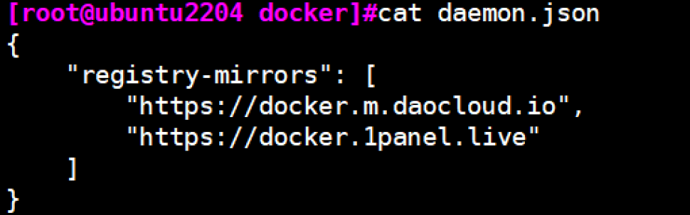

## Prometheus监控应用

Prometheus基于http的方式采集
- 被采集应用需要提供一个http访问路径
- `http:/xxx:port/metrics`
- 通过上述方式将待采集数据暴露出来

## 解决操作系统的数据指标暴露问题
### nodeexporter


## pushgateway采集自定义数据
### 安装pushgateway

```shell
# 官网：https://prometheus.io/download/#pushgateway
wget https://github.com/prometheus/pushgateway/releases/download/v1.9.0/pushgateway-1.9.0.linux-amd64.tar.gz

tar xf pushgateway-1.9.0.linux-amd64.tar.gz -C /usr/local/
ln -s pushgateway-1.9.0.linux-amd64/ pushgateway
mkdir /usr/local/pushgateway/bin
mv /usr/local/pushgateway/pushgateway /usr/local/pushgateway/bin
useradd -r -s /sbin/nologin prometheus
ln -s /usr/local/pushgateway/bin/pushgateway /usr/local/bin/
```

- 准备service
```shell
[Unit]
Description=Prometheus Pushgateway
After=network.target

[Service]
Type=simple
ExecStart=/usr/local/pushgateway/bin/pushgateway
#ExecReload=/bin/kill -HUP $MAINPID
Restart=on-failure
User=prometheus
Group=prometheus

[Install]
WantedBy=multi-user.target
```

### 配置Prometheus收集Pushgateway数据
#### 静态发现
```yaml
# vim /usr/local/prometheus/conf/prometheus.yml
- job_name: "pushgateway"
  honor_labels: true   # 可选项，设置为true，那么Prometheus将使用Pushgateway上的job和instance标签。如果设置为false那么它将重命名这些值，在它们前面加上exported_前缀，并在服务器上为这些标签附加新值
  scrape_interval: 10s # 可选项
  static_config:
    - targets: # 可以写在同一行：比如：["pushgateway.wang.org:9091"]
      - "pushgateway.wang.org:9091"
```
```shell
# 使用promtool check config /usr/local/promtheus/conf/prometheus.yml 检查配置文件语法
```

#### 基于文件形式自动发现形式
```yaml
# vim /usr/local/prometheus/conf/prometheus.yml
- job_name: pushgateway
  honor_labels: true
  file_sd_configs:
  - files:
    - targets/pushgateway/*.json
    refresh_interval: 5m
```

### 配置客户端发送数据给Pushgateway

#### 方法1：向执行url标准输入指定数据
- 推送Metric格式
```shell
http://<pushgateway_address>:<push_port>/metrics/job/<jpb_name>/[<label_name>/<label_value>][<label_name>/<label_value>]

# <job_name> 在Prometheus中指标的新加标签exported_job的值，在pushgateway中是job的指标值
# <label_name>/<label_value> 将成为额外的标签/值对

# 示例：echo "age 18" | curl --data-binary @- http://10.0.0.118:9091/metrics/job/pushgateway/instance/`hostname -I`
# --data-binary：表示提交的是二进制数据
# @- 表示读取标准输入
```

- 通用脚本`pushgateway_metric.sh`
```shell
#!/bin/bash
METRIC_NAME=mem_free
METRIC_VALUE_CMD="free -b | awk 'NR==2{print \$4}'"
METIRC_TYPE=gauge
METIRC_HELP="free memory"

PUSHGATEWAY_HOST=10.0.0.205:9091
EXPORITED_JOB=pushgateway_test
INSTANCE=`hostname -I| awk '{print $1}'`
SLEEP_TIME=1

CURL_URL="curl --data-binary @- http://${{PUSHGATEWAY_HOST}}/metrics/job/${EXPORITED_JOB}/instance/${INSTANCE}"

push_metric() {
    while true ;do
      VALUE=`eval "$METRIC_VALUE_CMD"`
      echo $VALUE
      cat << EOF | $CURL_URL  # 这里是将cat的内容，利用管道发送给$CURL_URL
# HELP ${METRIC_NAME} ${METRIC_HELP}
# TYPE ${METRIC_NAME} ${METRIC_TYPE}
${METRIC_NAME} ${VALUE}
EOF
      sleep $SLEEP_TIME
    done
}
push_metric
```

## PromQL
### 指标数据

Prometheus基于指标名称(metrics name)以及附属的标签集(labelset)唯一定义一条时间序列
- 指标名称代表着监控目标上某类可测量属性的基本特征标识
- 标签则是这个基本特征上再次细分的多个可测量维度
- 示例
```shell
request_total{path="/status",method="GET"}
request_total{path="/",method="POST"}
```

### 数据模型
Prometheus中，每个时间序列都由指标名称(Metric Name)和标签(Label)来唯一标识
Metric Name的表示方法有下面两种
```shell
# 方式1
<metric name>{<label name>=<label value>,...}

# 示例
http_requests_total{status="200", method="GET"}

# 方式2
<__name__="metric name",<label name>=<label value>,...> #通常用于Prometheus内部

# 示例
{__name__="http_requests_total",status="200",method="GET"}
```
### 样本数据
Prometheus的每个数据样本由两部分组成
- key:包括三部分：
  - Metric名称
  - Label
  - Timestamp(毫秒精度的时间戳)
- value: float64格式的数据

- 示例
```shell
...
http_requests_total{status="200",method="GET"} @1434317560938  94355
...
```

### PromQL基础
- Prometheus提供一个内置的函数表达式语言PromQL，可以帮助用户实现实时地查找和聚合时间序列数据
- 默认情况下，是以当前时间为基准点，来进行数据的获取操作

#### 表达式形式
每一个PromQL其实都是一个表达式，这些语句表达式或子表达式的计算结果可以为以下`四种类型`
- `instant vector` 即时向量，瞬时数据
- `range vector` 范围向量
- `scalar`标量
  - 一个简单的浮点类型数值
- `string`字符串(用的比较少)

#### 使用url查询数据
- 访问即时数据，指定时间点的数据`--data time="timestmp"`
```shell
curl --data 'query=<指标>' --data time="<时间戳>" '<Prometheus_address:port>/api/v1/query'

# 示例
[root@ubuntu2204 conf]#curl --data 'query=up' --data time=1720451038 'http://10.0.0.206:9090/api/v1/query'|jq
  % Total    % Received % Xferd  Average Speed   Time    Time     Time  Current
                                 Dload  Upload   Total   Spent    Left  Speed
100   395  100   371  100    24  36522   2362 --:--:-- --:--:-- --:--:-- 39500
```
```json
{
  "status": "success",
  "data": {
    "resultType": "vector",
    "result": [
      {
        "metric": {
          "__name__": "up",
          "instance": "localhost:9090",
          "job": "prometheus"
        },
        "value": [
          1720451038,
          "1"
        ]
      },
      {
        "metric": {
          "__name__": "up",
          "instance": "10.0.0.206:9100",
          "job": "node_exporter"
        },
        "value": [
          1720451038,
          "1"
        ]
      },
      {
        "metric": {
          "__name__": "up",
          "instance": "10.0.0.205:9091",
          "job": "pushgateway"
        },
        "value": [
          1720451038,
          "1"
        ]
      }
    ]
  }
}
```

- 范围数据，指定时间前1分钟的数据
```shell
curl --data 'query=node_memory_MemFree_bytes{instance=~"10.0.0.(101|102):9100"}[1m]' --data time=<时间戳> 'http://10.0.0.206:9090/api/v1/query'|jq
```
```json
{
  "status": "success",
  "data": {
    "resultType": "matrix",
    "result": [
      {
        "metric": {
          "__name__": "node_memory_MemFree_bytes",
          "instance": "10.0.0.206:9100",
          "job": "node_exporter"
        },
        "values": [ // 刮擦的时间是15s
          [
            1720450988.082,
            "1343700992"
          ],
          [
            1720451003.085,
            "1343700992"
          ],
          [
            1720451018.082,
            "1343700992"
          ],
          [
            1720451033.085,
            "1343700992"
          ]
        ]
      }
    ]
  }
}
```

#### 数据选择器
所谓的数据选择器，其实指的是获取实时数据或者历史数据的一种方法
```shell
metrics_name{筛选label=值,...}<时间范围> offset <偏移>
```
#### 即时向量选择器
示例
```shell
node_memory_MemFree_bytes{instance=~"10.0.0.(101|102):9100"}
```
#### 范围选择器
示例
```shell
prometheus_http_requests_total{job="prometheus"}[5m]
# 表示过去5分钟之内的监控数据
```


#### 指标的类型
- counter(计数器)
  - counter特点是，值一定是不断增大
- gauge（计量器）
  - 当前的值大小，一种度量标准
- histogram
  - 直方图
- summary
  - 摘要

### PromQL运算
- 算数运算
  - 略

- 比较运算
  - 略

- 逻辑运算
  - and
  - or
  - unless

- 正则表达式
```shell
node_memory_MemAvailable_bytes{instance =~ "10.0.0.20[12]:9100"}
node_memory_MemAvailable_bytes{instance =~ "10.0.0.20[1-3]:9100"}
...
```

- 集合处理
  - 并集or
  - 交集and
  - 补集unless

### 聚合运算
```shell
sum()
avg()
count()
min()
max()
...
```

### without和by
- without
  - 表示显示信息的时候，排除此处指定的标签列表，对以外额标签进行分组统计，即，使用除此标签之外的其他标签进行分组统计

- by
  - 表示显示信息的时候，仅显示指定的标签的分组统计，即针对哪些标签分组统计

```shell
# 两种格式：先从所有数据中利用数据表达式过滤出部分数据，进行分组后，再进行聚合运算，最终得出结果
# 格式1
聚合操作符(数据选择表达式) without|by (<label list>)
# 格式2
聚合操作符 without|by (<label list>) (数据选择表达式)
```

```shell
# 示例
# 按instance分组统计内存总量
sum(node_memory_MemTotal_bytes) by (instance)

# 按handle,instance分组统计
max(prometheus_http_requests_total) by (handle,instance)

# 获取前5个最大值
topk(5, prometheus_http_requests_total)
```

### 功能函数
示例
```shell
# increase(): 增长量，即last值-last前一个值
# 示例：最近1分钟内CPU处于空闲状态时间
increase（node_cpu_seconds_total {cpu"=0", nod="idle"})

# rate(): 平均变化率：计算在指定时间范围内，计数器每次增加量的平均值，即（last值-first值）时间差的秒数，常用语counter

# irate(): 查看瞬时变化率（last值-first值）/ 时间戳插值，
# 示例
irate(promethous_http_requests_total{code="200"}, handle="/-/ready"...}[1m]
```

### 定制开发Exporter
#### python

#### Golang

## 标签管理
### 增加标签
```yaml
scrape_config:
  - job_name: "node exporter"
    metrics_path: /metrics
    scheme: http
    static_configs:
      - targets:
        - "10.0.0.100:9100"
        - "10.0.0.101:9100"
        - "10.0.0.102:9100"
        labels:
          node: "worker node"
          type: "test"
          class: "M58"
```

### 基于source_labels的值赋值给新的标签名
```yaml
scrape_configs:
  ...
  - job_name: 'consul'
    honor_labels: true  # 如果抓取的原有标签和Prometheus配置的标签冲突，保留原有标签，避免标签冲突
    consul_sd_configs:
      - server: 'consul-node1.wang.org.8500'
        service: []
    relabel_configs:
      - source_labels: ['__meta_consul_service'] # 基于source_labels的值赋值给新的标签consul_service
        target_label: 'consul_servcie'
      - source_labels: ['__meta.consul_dc'] # 基于source_labels的值赋值给新的标签datacente
        target_label: 'consul_servcie'
      - source_label: ['__meta_consul_tags']
        regex: "consul" 
          action: drop 
```

### 将Target的默认标签修改为定制的新标签
```yaml
scrape_config:
...
  - job_name: 'k8s-node'
    statuc_configs:
    - targets: [10.0.0.104:9100]
    relabe_configs:
    - source_labels:
      - __Scheme__
      - __addressh
      - __cemetric_path__
      regex: "(http|https)(.*)"
      separator: ""  #将source_labels指定的label连接在还一起，成为一个字符串，每个label间没有分隔符
      target_label: "endpoint"
      replacement: "${1}://${2}"
      action: replace 
      # 基于默认属性，重写了一个新的标签

    - regex: "(job|app)"
      replacement: ${1}_name
      action: labelmap  
      # labelmap: 一般用于生成新的标签，将regex对source labels中指定的标签名称进行匹配，而后将匹配到的标签的值赋值给replacement字段指定的标签；通常用于取出匹配的签名的一部分生成新标签，旧的标签仍然存在
      # 本质就是拷贝一个标签，然后更改标签名，值不变
    metric_relabel_configs:
      - source_labels:
        - __name__    # 删除指标
        regex: 'go.*'
        action: drop
```

## 记录和告警规则

### 记录规则
规则语法检查
```shell
promtool check rules promtheus_rues_file.yml
```
可以在promtheus.yaml配置文件中通过rule_files属性进行导入
```yaml
# vim prometheus.yaml
rule_files:
  - "first_rules.yml"
  - "second_fules.yml"
  - "../rules/" ".yml"
```

```yaml
# 规则文件的语法
groups:
  [ - <rule_group> ]

# 简单的规则文件示例
groups:
  - name: example
    interval: 10s # 定制规则执行的间隔时间
    limit: <init> | default=0
    rules:
    - record: job:http_inprogress_requests:sum  # 记录规则
      expr: sum(http_inprogress_requests) by (job)
      labels: 
        [ <labelname>:<labelvalue> ]
```

## 告警
### 告警组件
告警能力在Prometheus的架构中被划分为两个独立的部分
- 通过在Prometheus中定义AlertRule(告警规则)，Prometheus会周期性的对告警规则进行计算，如果满足告警触发条件，就会向Alertmanager发送告警信息
- 然后，Alertmanager管理这些告警，包括进行重复数据删除，分组和路由，以及告警的静默和抑制等

### 告警种类
- 去重
- 分组
- 抑制（告警信息之间的依赖关系）
- 静默(暂时不告警)
- 路由(根据不同条件，发送给不同的目标)
### alertmanager部署

```shell
#软件安装
wget https://github.com/prometheus/alertmanager/releases/download/v0.23.0/alertmanager-0.23.0.linux-amd64.tar.gz

# 解压软件
tar xf alertmanager-0.23.0.linux-amd64.tar.gz -C /usr/local
ln -s /usr/local/alertmanager-0.23.0.linux-amd64 /usr/local/alertmanager

# 准备工作
cd /usr/local/alertmanager
mkdir {bin,conf,data}
mv alertmanager amtool bin/
cp alertmanager.yaml conf/
useradd -r -s /sbin/nologin prometheus
chown -R prometheus.prometheus /usr/local/alertmanager
```
创建服务文件
```shell
[Unit]
Description=alertmanager project
After=network.target

[Service]
Type=simple
ExecStart=/usr/local/alertmanager/bin/alertmanager --config.file=/usr/local/alertmanager/conf/alertmanager.yml --storage.path=/usr/local/alertmanager/data --web.listen-address=0.0.0.0:9093
ExecReload=/bin/kill -HUP $MAINPID
Restart=on-failure
User=prometheus
Group=prometheus

[Install]
WantedBy=multi-user.target
```
#### 容器部署

#### Prometheus集成
```shell
vim prometheus.yml
- job_name: "alertmanager"
  static_configs:
    - target:
      - "10.0.0.100:9093"
```
### 告警规则
在Prometheus中一条告警规则主要由以下几部分组成
- 告警名称：用户需要为告警规则命名，当然对于命名而言，需要能够直接表达出该告警的主要内容
- 告警规则：告警规则实际上主要由PromQL进行定义，其实际意义是当表达式查询结果持续多长时间后发出告警

在Prometheus中，还可以通过Group(告警组)对一组相关的告警进行统一定义

#### 告警规则文件示例
```yaml
# 确认包含rules目录中的yaml文件
cat /usr/local/prometheus/conf/prometheus.yml
rule_files:
  - "../rules/*.yml"

# 准备告警rule文件
vim /usr/local/prometheus/rules/prometheus_alert_rules.yml
groups:
  - name: example
    rules:
    - alert: HighRequestLatency
      #expr: up == 0
      expr: job:request_latency_seconds:mean5m{job="myjob"} > 0.5
      for: 10m
      labels:
        severity: warning
        project: myproject
      annotations:
        summary: "Instance {{ $labels.instance }} down"
        description: "{{ $labels.instance }} of job {{ $labels.job }} has been down for more than 1 minutes"
```

#### Alertmanager配置文件
Alertmanager配置文件格式说明
```yaml
# 配置文件总共定义了五个模块：global, templates, route, receivers, inhibit_rules
```
### 告警模版编辑
模版文件使用标准go语法，并暴露了一些包含时间标签和值的变量
该模版必须在alertmanager所在的机器上创建目录，以及建立模版文件
```shell
mkdir /usr/lcoal/alermanager/tmpl

# 基于go的模版内容
vim /usr/local/alertmanager/tmpl/email.tmpl
```
### 告警路由

新版中使用指令`matchers`替换了`match`和`match_re`指令

路由示例
```yaml
route:
  group_by: ['alertname', 'cluster']
  group_wait: 10s
  group_interval: 10s
  repeat_interval: 10s
  receiver: 'email'    # 兜底规则，默认路由, 所有规则都不匹配走默认路由
```

通过在Prometheus中给不同的告警规则添加不同的label，再在Alertmanager中添加针对不同的label使用不同的路由至不同的receiver,即可实现路由的分组功能

Alertmanager的相关配置
```yaml
matchers:
  - alertname = Watchdog
  - severity =~ "warning|critical"
```

配置示例
```yaml
# 1.在Prometheus上定制告警规则
groups:
- name: example
  ...

- name: nodes_alerts
  rules:
  - alert: DiskWillFillIn12Hours
    expr: predict_linear(node_filesystem_free_bytes{mountpoint="/"}[1h], 12*3600)
    for: 1m
    labels:
      severity: critital
    annotations: 
      discription: Disk on {{ $label.instance }} will fill in approximately 12 hours
- name: prometheus_alerts
  rules:
  - alert: PrometheusConfigReloadFailed
    expr: prometheus_config_last_reload_successful == 0
    for: 3m
    labels:
      severity: warning
    annotations: 
      discription: Reloading Prometheus configuration has failed on {{ $label.instance }}

# 2.在alertmanager 定制路由
global:
  ...
templates:
  ...
route:
  group_by: ['instance']
  ...
  receiver: email-receiver
  routes:
  - match：
      severity: critical
    receiver: leader-team
  - match_re:
      severity: ^(warning)$
      # project: myproject
    receiver: ops-team
# 新版
#- receiver: 'leader-team'
#  matchers:
#  - severity = "critical"
#- receiver: 'leader-team'
#  matchers:
#  - severity = ^(warning)$

receivers:
  - name: 'leader-team'
    email_configs:
    - to: 'XXXXX@qq.com'
  - name: 'ops-team'
    email_configs:
    - to: 'XXXXX@qq.com'
```

### 抑制告警
配置实例
```yaml
inhibit_rules:               # 抑制告警
- source_match:              # 源标签警报触发时会抑制含有目标标签的警报
    alertname: NodeDown      # 可以针对某一个特定的警报动作规则
    severity: critical       # 限定源告警规则的等级
  target_match:
    severity: normal
  equal:
    - instance
```


### 邮件告警实现
- vim /usr/local/alertmanager/conf/alertmanager.yml
```yaml
# 全局配置
global:
  resolve_timeout: 5m  # 解析的超时时长
  smtp_smarthost: 'smpt.qq.cm:25或465'  # 基于全局块指定发件人信息
  smtp_from: '3140394153@qq.com'
  smtp_auth_username: '3140394153@qq.com'
  smtp_auth_password: 'XXXXXXXXXXX'  # 授权码
  smtp_hello: 'qq.com'
  smtp_require_tls: false     # 启用tls安全，默认true, 此处为false

# 定义模版路径
templates:
  - "../tmpl/*.tmpl" # 相对路径是相对于altermanager.yml文件的路径

# 路由配置
route:
  group_by: ['alertname', 'cluster']  # 分组依据
  group_wait: 10s
  group_interval: 10s
  repeat_interval: 10s  # 此值不要过低，否额短期内会收到大量邮件
  receiver: 'email'  # 指定接收者名称

# 收信人员
receivers:
- name: 'email'  # 这个地方和route->receiver的值匹配
  email_configs:
  - to: 'root@XXXX.com'  # 收件人邮箱 
  send_resolved: true    # 问题解决后也会发送恢复通知
  # 发件人信息写在receivers也可以
  # from: '3140394153@qq.com'
  # smarthost: 'smtp.qq.com:25或465'
  # auth_username: '3140394153@11.com'
  # auth_password: 'xxxxxxxxxx'
  # require_tls:false

# 抑制规则（可选）
inhibit_rules
```

告警规则语法检查
```shell
amtool check-config /usr/local/alertmanager/conf/alertmanager.ymlj
```

### 微信告警实现

### 钉钉告警实现


## 服务发现

### 文件发现
文件发现原理
- Target的文件可由手动创建或利用工具生成。例如Ansible等配置管理系统，也可能是由脚本基于CMDB定期查询生成
- 文件可使用YAML和JSON格式，它含有定义的Target列表，以及可选的标签信息，Yaml适合于运维场景，JSON更适合开发场景
- Promethemus定期从文件中加载Target信息，根据文件内容发现相应的Target

#### 示例：YAML格式
通过Yaml格式的文件发现，将所有节点都采用自动发现机制
```shell
# 创建目标目录
mkdir /usr/local/prometheus/conf/targets
cd /usr/local/promtheus/conf/targets

# 添加linux主机目标
ls /usr/local/prometheus/conf/targets
prometheus-flask.yml prometheus-node.yaml prometheus-server.yaml

# 创建prometheus的服务配置
cat prometheues-server.yml
- targets:
  - 10.0.0.101:9090
 labels:
   app: prometheus-server
   job: prometheus-server
    
cat prometheues-node.yml
- targets:
  - 10.0.0.101:9100
 labels:
   app: prometheus
   job: prometheus
- targets:
  - 10.0.0.104:9100
  - 10.0.0.105:9100
 labels:
   app: node-exporter
   job: node
cat prometheues-flask.yml 
- targets:
  - 10.0.0.101:8000
 labels:
   app: flask-web
   job: prometheus-flask
```

- 修改Prometheus配置
```shell
rule_file:
  - "../rules/*.yml"

scrape_configs:
  - job_name: "file_sd_prometheus"
    scrape_interval: 10s
    file_sd_configs:
    - files: 
      - targets/prometheus-server.yml
      refresh_interval: 10s  # 指定重读文件的时间间隔

  - job_name: "file_sd_prometheus"
    file_sd_configs:
    - files: 
      - targets/prometheus-node.yml
      refresh_interval: 10s  # 指定重读文件的时间间隔

  - job_name: "file_sd_prometheus"
    file_sd_configs:
    - files: 
      - targets/prometheus-flask.yml
      refresh_interval: 10s  # 指定重读文件的时间间隔
```
### DNS发现
基于DNS的服务发现针对一组DNS域名进行定期查询，已发现待监控的目标
- 查询时使用的DNS服务器由Prometheus服务器的/etc/resolve.conf文件指定
- 该发现机制依赖于A、AAAA和SRV资源记录，且仅支持该类方法，尚不支持RFC6763中的高级DNS发现方式

基于DNS服务发现会自动生成的元数据标签
```shell
__meta_dns_name
    the record name that produced the discovberd target
__meta_dns_srv_record_target
    the target field of the SRV record
__meta_dns_srv_record_port
    the prot field of the SRV record
```

SRV记录
- SRV记录是服务器资源记录的缩写，记录服务器提供过的服务，SRV记录的作用是说明一个服务器能够提供什么样的服务
- 在RFC2052中才对SRV记录进行了定义，很多老版本的DNS服务器不支持SRV记录
- SRV资源记录允许为单个域名使用多个服务器，轻松地将服务从一个主机移动到另一个主机，并将某些主机指定为服务的主服务器，将其他主机指定为备份
- 客户端要求特定域名的特定的服务/协议，并获取任何可用服务器的名称


```shell
SRV的定义格式
_Service._Proto.Name TTL Class SRV Priority Weight Port Target

# 格式解析
Service     # 所需服务的符号名称，在Assigned Numbers或本地定义，服务标识符前面加上下划线(_),以避免与常规出现的DNS标签发生冲突
Proto       # 所需协议的符号名称，该名称不区分大小写。_TCP和_UDP目前是该字段最常用的值，前面加下划线_,以防止与自然界中出现的DNS标签发生冲突
NAME        # 此RR所指的域名。在这个域名下SRV RR是唯一的
CLASS       # 定制DNS记录类，他主要有以下三种情况：
            # 对于涉及Internet的主机名，IP地址等DNS记录，记录的CLASS设置为IN。
            # 其他两类用的比较少，比如CS(CSNET类)，CH(CHAOS类)，HS(Hesiod)等
PORT        # 服务在目标主机上的端口。
Target      # 目标主机的域名。域名必须有一个或多个地址记录，域名绝不能是别名
            # 敦促(但不强求)实现在附加数据部分中返回地记录
            # 值为“.”，表示该域名明确无法提供该服务
```

#### 下载bind9并修改配置文件
```shell
# 定制正向解析zone的配置
cat >> /etc/bind/named.conf.default-zones
// 定制网站主域名的zone配置
zone "feng.org" {
    type master;
    file "/etc/bind/feng.org.zone";
};

# 定制主机名的zone文件
vim /etc/bind/feng.org.zone
;

$TTL   604800
@    IN    NS    SOA     ns.fang.org. admin.feng.org. (1  604800 84600 2419200 604800)
master IN A 10.0.0.100
node1 IN A 10.0.0.101
node2 IN A 10.0.0.102
node3 IN A 10.0.0.103
flask IN A 10.0.0.101

_prometheus._tcp.feng.org. 1H 1N SRV 10 10 9100 node1.feng.org   # 加点表示不补预后追
_prometheus._tcp.feng.org. 1H 1N SRV 10 10 9100 node2.feng.org  
_prometheus._tcp.feng.org. 1H 1N SRV 10 10 9100 node3.feng.org   # 前面一定要将node{1,2,3}feng,org的域名做解析

# 重启服务
systemctl restart named
```

#### 配置Prometheus配置文件
```yaml
scrape_configs:
  - job_name: "prometheus"
  ...

# 添加下面所有行
  - job_name: 'dns_sd_flask':
  dns_sd_configs:
  - name: ['flask.feng.org']     
    type: A                        # 指定记录类型，默认SRV
    port: 8000                     # 不是SRV时，需要指定Port号
    refresh_interval: 10s 

  - job_name: 'dns_sd_node_exporter'          # 实现批量主机解析
    dns_sd_configs:
    - names: ['_prometheus._tcp.feng.org']    # SRV记录必须通过DNS的实现
      refresh_interval:10
    
# 重启Prometheus
systemctl reload prometheus
```


### 基于consul集群实现服务发现
Consul提供服务发现，服务网格，流量管理和网路基础设施设备的自动更新

Consul是一个用来实现分布式系统的服务发现与配置的开源工具

Consul采用golang开发

COnsul的一致性协议采用更流行的Raft算法（Paxos的简单版本），用来保证服务的高可用


Consul的关键特性
- 服务注册
- 服务发现
- 健康检查
- 配置中心


Consul的工作原理
- Consul分为客户端和服务端，客户端和服务端之间的通讯使用PRC协议
- 客户端之间使用GOSSIP谣言协议


#### Consul部署
```shell
# 二进制安装
wget https://releases.hashicorp.com/consul/1.19.0/consul_1.19.0_linux_amd64.zip
# 解压缩
unzip consul_1.19.0_linux_amd64.zip -d /usr/local/bin
# 实现自动补全
consul -autocomplete-install
# 创建用户账号
useradd -s /sbin/nologin consul

# 创建目录
mkdir -p /data/consul /etc/consul.d
chown -R consul.consul /data/consul /etc/consul.d

# 以server模式启动服务consul agent
/user/local/bin/consul agent -server -ui -bootstrap-expect=1 -data-dir=/data/consul -node=consul -client=0.0.0.0 -config-dir=/etc/consul.d
# -server  定义agent运行在server模式
# -bootstrap-expect   在一个datacenter中期望提供的server节点数目，当该值提供的时候，consul一直等到达到指定server数目的时候才会引导整个集群，该标记不能和bootstrap共用
# -bind     该地址用来在集群内部通讯，集群内的所有节点到地址都必须是可达的，默认0.0.0.0
# -node     节点在集群中的名字，在一个集群中必须是唯一的，默认该节点的主机名
# -ui       提供web ui的http功能
# -rejoin   使consul忽略先前的离开，再次启动后仍旧尝试加入集群中
# --config-dir   配置文件目录，里面所有以.json结尾的文件都会被加载
# -client        consul服务侦听地址，默认127.0.0.1，要对外提供服务改成0.0.0.0

#创建service文件
[root@ubuntu2204 ~]#cat > /lib/systemd/system/consul.service <<EOF
[Unit]
Description="HashiCorp Consul - A service mesh solution"
Documentation=https://www.consul.io/
Requires=network-online.target
After=network-online.target
[Service]
Type=simple
User=consul
Group=consul
ExecStart=/usr/local/bin/consul agent -server -bind=10.0.0.100 -ui -bootstrap-expect=1 -data-dir=/data/consul -node=consul -client=0.0.0.0 -config-dir=/etc/consul.d
#ExecReload=/bin/kill --signal HUP \$MAINPID
KillMode=process
KillSignal=SIGTERM
Restart=on-failure
LimitNOFILE=65536
[Install]
WantedBy=multi-user.target
EOF
```

#### Consul自动注册和删除服务
```shell
# 列出数据中心
curl http://consul.feng.org:8500/v1/catalog/datacenters

# 列出节点
curl http://consul.feng.org:8500/v1/catalog/nodes

# 列出服务
curl http://consul.feng.org:8500/v1/catalog/services

# 提交Json格式的数据进行注册服务
curl -X PUT -d '{"id": "myservice-id","name": "myservice","address": "10.0.0.201","port": 9100,"tags": ["service"],"checks": [{"http": "http://10.0.0.201:9100/","interval": "5s"}]}' http://consul.wang.org:8500/v1/agent/service/register

# 查询指定节点以及指定的服务信息
curl http://consul.wang.org:8500/v1/catalog/service/<service_name> 

#删除服务，注意：集群模式下需要在service_id所有在主机节点上执行才能删除该service
curl -X PUT http://consul.wang.org:8500/v1/agent/service/deregister/<service_id>
```

#### 使用consul services命令注册和注销服务
```shell
# 注册服务
consul services register /path/file.json
# 注册单个服务时，file.json文件使用service进行定义，注册多个服务时，使用service以列表式进行定义

# 删除服务
consul services deregister -id myservice3-id
```

定义单个要注册的服务
```shell
{
  "service": {
      "id": "myservice-id",
      "name": "myservice",
      "address": "node1.wang.org",
      "port": 9100,
      "tags": ["node_exporter"],
      "checks": [{
        "http": "http://node1.wang.org:9100/metrics",
        "interval": "5s"
     }]
 }
}
```

以多个服务的格式给出定义
```shell
{
  "services": [
     {"id": "myservice1-id",
      "name": "myservice1",
      "address": "node1.wang.org",
      "port": 9100,
      "tags": ["node_exporter"],
      "checks": [{
        "http": "http://node1.wang.org:8080/metrics",
        "interval": "5s"
     }]
   },
     {"id": "myservice2-id",
      "name": "myservice2",
      "address": "node2.wang.org",
      "port": 9100,
      "tags": ["node_exporter"],
      "checks": [{
        "http": "http://node2.wang.org:8080/metrics",
        "interval": "5s"
       }]
     },
     {.......}
   ]
}

# 主机名不能有域名后缀
hostname consul
# 运行指定
consul services register services.json
```


#### 配置Prometheus使用Consul服务发现
```shell
# 使用Relabeling实现Target实例中包含的metadata标签，动态的添加或者覆盖标签
vim /usr/local/prometheus/conf/prometheus.yml
......
  - job_name: 'consul'
   honor_labels: true  #如果标签冲突，覆盖Prometheus添加的标签，保留原标签
   consul_sd_configs:
      - server: 'consul-node1.wang.org:8500'
       services: []  #指定需要发现的service名称,默认为所有service，或者如下面两行指定只
从consul中加载特定的service
        #tags:       #可以过滤具有指定的tag的service
        #- "service"  
        #refresh_interval: 2m #刷新时间间隔，默认30s
      - server: 'consul-node2.wang.org:8500'  #添加其它两个节点实现冗余
      - server: 'consul-node3.wang.org:8500'  #添加其它两个节点实现冗余
   relabel_configs:
    - source_labels: ['__meta_consul_service']  #生成新的标签名
     target_label: 'consul_service'
    - source_labels: ['__meta_consul_dc']       #生成新的标签名
     target_label: 'datacenter'  
    - source_labels: ['__meta_consul_tags']     #生成新的标签名
     target_label: 'app'
    - source_labels: ['__meta_consul_service']  #删除consul的service,此service是consul内置,但并不提供metrics数据
     regex: "consul"
     action: drop
```

#### 部署consul集群
集群中三个节点数据是一样的
```shell
#node1:
consul agent -server -bind=10.0.0.201 -client=0.0.0.0 -data-dir=/data/consul -node=node1 -ui  -bootstrap
#node2:
consul agent -server -bind=10.0.0.202 -client=0.0.0.0 -data-dir=/data/consul -node=node2  -retry-join=10.0.0.201 -ui -bootstrap-expect 2
#node3:
consul agent -server -bind=10.0.0.203 -client=0.0.0.0 -data-dir=/data/consul -node=node3  -retry-join=10.0.0.201 -ui -bootstrap-expect 2
```


## 各种Exporter
### node exporter增加配置
```shell
#在node1节点修改node_exporter配置文件
vim /lib/systemd/system/node_exporter.service
[Unit]
Description=node exporter project
After=network.target
[Service]
Type=simple
#只收集指定服务
ExecStart=/usr/local/node_exporter/bin/node_exporter --collector.systemd --collector.systemd.unit-include=".*(ssh|mysql|node_exporter|nginx).*"
Restart=on-failure
[Install]
WantedBy=multi-user.target

# 重启
systemctl daemon-reload
systemctl restart node_exporter.service
```

### Mysql exported配置
```shell
#更新mysql配置，如果MySQL和MySQL exporter 不在同一个主机，需要修改如下配置
sed -i 's#127.0.0.1#0.0.0.0#' /etc/mysql/mysql.conf.d/mysqld.cnf
systemctl restart mysql
#为mysqld_exporter配置获取数据库信息的用户并授权
mysql 
mysql> CREATE USER 'exporter'@'localhost' IDENTIFIED BY '123456' WITH 
MAX_USER_CONNECTIONS 3;
mysql> GRANT PROCESS, REPLICATION CLIENT, SELECT ON *.* TO 
'exporter'@'localhost';
mysql> flush privileges;

#获取软件
wget https://github.com/prometheus/mysqld_exporter/releases/download/v0.13.0/mysqld_exporter-0.13.0.linux-amd64.tar.gz
#解压软件
tar xf mysqld_exporter-0.13.0.linux-amd64.tar.gz -C /usr/local
ln -s /usr/local/mysqld_exporter-0.13.0.linux-amd64 /usr/local/mysqld_exporter
cd /usr/local/mysqld_exporter/
mkdir bin
mv mysqld_exporter bin/
#在mysqld_exporter的服务目录下，创建 .my.cnf 隐藏文件，为mysqld_exporter配置获取数据库信
息的基本属性
vim /usr/local/mysqld_exporter/.my.cnf
[client]
host=127.0.0.1
port=3306
user=exporter
password=123456
#修改node_exporter的服务启动文件
vim /lib/systemd/system/mysqld_exporter.service
[Unit]
Description=mysqld exporter project
After=network.target
[Service]
Type=simple
ExecStart=/usr/local/mysqld_exporter/bin/mysqld_exporter --config.my-cnf="/usr/local/mysqld_exporter/.my.cnf"
Restart=on-failure
[Install]
WantedBy=multi-user.target
#配置解析：在原来的配置文件基础上，添加了 --config.my-cnf属性
#重载并重启服务
systemctl daemon-reload
systemctl enable --now mysqld_exporter.servicev
systemctl status mysqld_exporter.service
```

### Java程序的exported
```shell
# 安装tomcat

# 安装Jmx Exporter

# 下载tomcat.yml
wget https://github.com/prometheus/jmx_exporter/blob/main/example_configs/tomcat.yml

#修改tomcat的启动脚本 catalina.sh
#方式1：包安装tomcat，9527为监听的端口号
vim /usr/share/tomcat9/bin/catalina.sh
.......
# 这里注意版本和地址和自己下载的一致
JAVA_OPTS="-javaagent:/usr/share/tomcat9/jmx_prometheus_javaagent-0.16.1.jar=9527:/usr/share/tomcat9/tomcat.yml"

# 修改 Prometheus 配置

vim /usr/local/prometheus/conf/prometheus.yml
...
  - job_name: "mertics_from_tomcat"
   static_configs:
      - targets: ["10.0.0.106:2022"]
      
#重启服务
systemctl reload prometheus.service
```

### Redis exported配置
```shell
[root@node03 ~]#apt update && apt -y install redis 
[root@node03 ~]#vim /etc/redis/redis.conf
bind 0.0.0.0
requirepass 123456
[root@node03 ~]#systemctl restart redis
[root@node03 ~]#tar xf redis_exporter-v1.58.0.linux-amd64.tar.gz -C /usr/local/
[root@node03 ~]#cd /usr/local/
[root@node03 local]#ln -s redis_exporter-v1.58.0.linux-amd64/ redis_exporter
[root@node03 redis_exporter]#./redis_exporter -redis.password 123456

# 配置 Prometheus 监控 Redis Exporter
[root@ubuntu2204 ~]#vim /usr/local/prometheus/conf/prometheus.yml 
.......
  - job_name: "redis-exporter"
   static_configs:
      - targets: ["10.0.0.101:30121"]
.......
[root@ubuntu2204 ~]#systemctl resload prometheus.service

```

### Nginx配置
Nginx 默认自身没有提供 Json 格式的指标数据,可以通过下两种方式实现 Prometheus 监控
方法1：
通过nginx/nginx-prometheus-exporter容器配合nginx的stub状态页实现nginx的监控
方法2
需要先编译安装一个模块nginx-vts,将状态页转换为Json格式
再利用nginx-vts-exporter采集数据到Prometheus

#### nginx/nginx-prometheus-expor

- 开启nginx的状态页stub_status
```shell
[root@node01 ~]#vim /etc/nginx/sites-enabled/default
location /stub_status {
      stub_status;
}
```

- 直接使用docker拉镜像
docker配置代理


- 前台执行
```shell
docker run -p 9113:9113 nginx/nginx-prometheus-exporter:1.1.0 --
nginx.scrape-uri=http://localhost/stub_status
```

- 实际场景中应该后台执行
```shell
docker run -p 9113:9113 -d --restart=always nginx/nginx-prometheus-exporter:1.1.0 --
nginx.scrape-uri=http://localhost/stub_status
```

- 配置 Prometheus 监控 Redis Exporter
```shell
[root@ubuntu2204 ~]#vim /usr/local/prometheus/conf/prometheus.yml
.....
  - job_name: "nginx-exporter"
   static_configs:
      - targets: ["nginx-exporter服务器地址:9113"]
.....
[root@ubuntu2204 ~]#systemctl reload prometheus
```

### 配置consul exporter
- 下载程序包和展开程序包
```shell
#先安装consul.再部署consul_exporter
curl -LO
https://github.com/prometheus/consul_exporter/releases/download/v0.8.0/consul_ex
porter-0.8.0.linux-amd64.tar.gz
tar xf consul_exporter-0.8.0.linux-amd64.tar.gz -C /usr/local/
ln -sv /usr/local/consul_exporter-0.8.0.linux-amd64 /usr/local/consul_exporter
```
- 创建用户
  - 若consul用户已经存在，可略过该步骤：
```shell
useradd -r consul
```
- 配置service文件
```shell
#vim /lib/systemd/system/consul_exporter.service
[Unit]
Description=consul_exporter
Documentation=https://prometheus.io/docs/introduction/overview/
After=network.target
[Service]
Type=simple
User=consul
EnvironmentFile=-/etc/default/consul_exporter
# 具体使用时，若consul_exporter与consul server不在同一主机时，consul server要指向实际的
地址；
ExecStart=/usr/local/consul_exporter/consul_exporter \
            --consul.server="http://localhost:8500" \
            --web.listen-address=":9107" \
            --web.telemetry-path="/metrics" \
            --log.level=info \
            $ARGS
ExecReload=/bin/kill -HUP $MAINPID
TimeoutStopSec=20s
Restart=always
[Install]
WantedBy=multi-user.target
#启动服务
systemctl daemon-reload
systemctl enable --now consul_exporter.service
```

- 修改prometheus配置文件监控 consul_exporter
```shell
vim /usr/local/prometheus/conf/prometheus.yml
.....
  - job_name: "consul_exporter"
   static_configs:
      - targets: ["10.0.0.203:9107"]
.....
```

### 黑盒监控

tegton