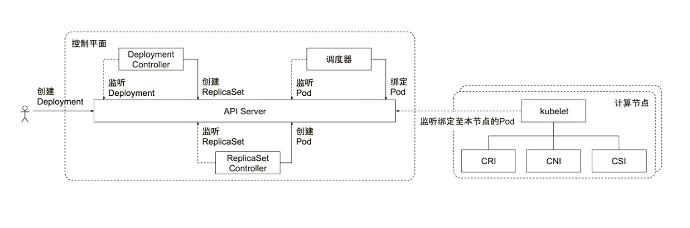

# Go
## 统一思想-12 factors
1. 基准代码： 
一份基准代码，多份部署

2. 依赖
显示声明依赖关系

3. 配置
在环境中存储配置

4. 后端服务
把后端服务当做附加资源

5. 构建，发布，运行
严格分离构建和运行

6. 进程
以一个或多个无状态进程运行应用

7. 端口绑定
通过端口绑定提供服务

8. 并发
通过进程模型进行扩展

9. 易处理
快速启动和优雅终止最大化健壮性

10. 开发环境与线上环境等价
尽可能的保持开发，预发布，线上环境相同

11. 日志
把日志当做事件流

12. 管理进程
后台管理任务当做一次性进程运行

## Go语言的原则
- Less is exponentially more

- Do Less, Enable More

## Goy语言不支持的特性
- 不支持函数重载和操作符重载
- 为了避免在C/C++开发中的一些Bug和混乱，不支持隐式转换
- 支持接口抽象，不支持继承
- 不支持动态加载代码
- 不支持动态链接库
- 通过recover和panic来替代异常机制
- 不支持断言
- 不支持静态变量

## 为什么需要Go语言
- 其他编程语言的弊端
  - 硬件发展速度远远超过软件
  - C语言等原生语言缺乏好的依赖管理(依赖头文件)
  - Java和C++等语言过于笨重
  - 系统语言对垃圾回收和并行计算等基础语言功能缺乏支持
  - 对多核计算机缺乏支持

- GO语言是一个可以`编译高效`，`支持高并发的`，`面相垃圾回收`的全新语言
  - 秒级完成大型程序的单节点编译
  - 依赖管理清晰
  - 不支持继承，程序员无需花费精力定义不同类型之间的关系
  - 支持垃圾回收，支持并发执行，支持多线程通讯
  - 对多核计算机支持友好

## Go的常用命令
- go build
```shell
go build       

# 示例：
go build main.go
# 运行编译好的go程序
./main

# 交叉编译，编译要在其他操作系统运行的go程序
GOOS=linux go build main.go   #生成main二进制可执行文件
```

- go fmt
```shell
go fmt main.go    # 将代码格式化为标准格式
```

- go get
```shell
# 当项目需要依赖，可以使用go get将依赖下载下来
```

- go install
```shell
# complie and install packages and dependencies
# 常规方式：go build生成可执行文件，然后ADD的方式添加到dockerfile
# 为了保证go程序在镜像环境更够运行，将源代码放入dockerfile，通过go install直接在容器里面编译安装
```

- go mod
```shell
# module maintenance
# 依赖管理
```

- go test
```shell
# 做性能测试，基准测试
```

- go tool
```shell
# 做性能分析
```

### 交叉编译
```shell
# 指定输出目录
go build -o bin/mybinary

# 常用环境变量设置编译操作系统和CPU架构
GOOS=linux GOARCH=amd64 go build

# 全支持列表查看
$GOROOT/src/go/build/syslist.go
```

### Go test
Go语言原生自带测试
```go
import "testing"

func TestIncrease(t *testing.T) {
    t.Log("Start testing")
    increase(1,2)
}
// go test ./... -v 运行测试
// go test命令扫描所有*_test.go为结尾的文件，惯例将测试代码和正式代码放在同目录
// 如foo.go的测试代码一般写在foo_test.go
```
示例
```go
// main_test.go
package main

import (
    "testing"
    "github.com/stretchr/testify/assert"
)

func increase(a, b int) int {
    return a + b
}

func TestIncrease(t *testing.T) {
    t.Log("Start testing")
    result := add(1, 2)
    assert.Equal(t, result, 3)
}
```

### Go vet
代码静态检查，发现可能的bug或可疑的构造
```go
// print-format错误，检查类型不匹配的print
str := "hello world"
fmt.Printf("%d\n", str)
```

```go
// Boolean错误，检查一直为true，false或者冗余的表达式
fmt.Println(i != 0 || i != 1)
```

### 控制结构
#### if
```go
// 基本形式
if condition1 {
    // do something
} else if condition2 {
    // do someting else
} else {
    // catch-all or default
}

// if的简短语句
// 同for一样，if语句可以在条件表达式前执行一个简单的语句
if v:=x-100; v < 0 {
    return v
}
```

#### switch
```go
switch var1 {
    case val1: //空分支
    case val2:
        fallthrough // 执行case3中的f()
    case val3:
        f()
    default: //默认分支
    ...
} // 默认每个分支后自带break
```

#### for
Go只有一种循环结构：for循环
```go
// 计入计数器的循环
// for 初始化语句; 条件语句; 修饰语句 {}
for i:=0; i<10; i++ {
    sum += 1
}

// 初始化语句和后置语句是可选的，此场景与while等价(Go语言不支持while)
for; sum<1000; {
    sum += sum
}

// 无限循环
for {
    if condition1 {
        break
    }
}
```

#### for-range
遍历数组，切片，字符串，Map等
```go
for index, char:= range myString {
  ...
}

for key, value:=range MyMap {
  ...
}

for index,value:=range MyArray {
  ...
}

// 需要注意：如果for range遍历指针数组，则value取出的指针地址为源指针地址的拷贝
```
示例
```go
package main

import (
	"fmt"
)

func main() {
	fullString := "hello, world"
	fmt.Println(fullString)
	for i, c := range fullString {
		fmt.Printf("index: %d, character: %c\n", i, c)
	}
}
```

#### K8S任何程序初始化
```go
package main

import (
	"flag"
	"fmt"
	"os"
)

// 这段代码在任何k8s初始化的时候都会这样设计, 通过flag来获取命令行参数
func main() {
	// flag.String() 函数的第一个参数是选项名称，第二个参数是默认值，第三个参数是说明信息。
	// 该函数返回一个字符串指针，这个指针对应着一个存储命令行选项值的变量。
	name := flag.String("name", "everyone", "The greeting object.")
	// flag.Parse() 函数用于真正解析命令行参数，并把它们的值赋给相应的变量。
	// 在调用该函数之前，所有定义的 flag 都还是默认值。
	flag.Parse()
	// os.Args 变量是一个字符串切片，用来存储所有的命令行参数（不包括命令本身）。
	fmt.Println("os args is :", os.Args)
	fmt.Println("os args is :", os.Args[0])
	fmt.Println("os args is :", os.Args[1])
	fmt.Printf("Hello, %s!\n", *name)
	fmt.Println(name)
	fullString := fmt.Sprintf("Hello, %s!\n", *name)
	fmt.Println("fullString is :", fullString)
}
```

### 变量与常量
- 常量
  - const identifier type
- 变量
  - var identifier type

#### 短变量声明
- 在函数中，简洁赋值语句:=可在类型明确的地方代替var声明
- 函数外的每个语句都必须以关键字开始(var, func等等)，因此:=结构不能在函数外使用
- c,python,java:=true,false,"no!"

#### 类型转换
- 表达式T(v)将值v转换为类型T
  - 一些关于数值的转换
    - `var i int = 42`
    - `var f float64 = float64(i)`
    - `var u uint = uint(f)`
  - 或者，更加简单的形式：
    - `i:=42`
    - `f:=float64(i)`
    - `u:=uint(f)`

#### 类型推导
- 在声明一个变量而不指定其类型时（即使用不带类型的:=语法或var=表达式语法），变量的类型由右值推到得出
  - var i int
  - j := i // j(也是一个int)

#### 关于变量定义的经典错误
```go
package main

import (
    "fmt"
)

func main() {
    i := 0
    i = 1  // i:=1，会触发重复定义，非常经典的错误
    fmt.Println(i)
}
```

### 数组
- 相同类型且长度固定连续内存片段
- 以编号访问每个元素
- 定义方法：`var identifier [len]type`
- 示例
  - `myArray:=[3]int{1,2,3}`

### 切片
- 切片是对数组一个连续片段的引用
- 数组定义中不指定长度即为切片
  - var identifier []type
- 切片在未初始化之前默认为nil，长度为0
- 常用方法
```go
func main() {
    myArray := [5]int{1,2,3,4,5}
    mySlice := myArray[1:3]
    fmt.Printf("mySlice %+v\n", mySlice)
    fullSlice := myArray[:]
    remove3rdItem := deleteItem(fullSlice,2)
    fmt.Printf("remove3rdItem %+v\n", remove3rdItem)
}

func deleteItem(slice []int, index int) []int {
    return append(slice[:index], slice[index+1:]...)
}
```
#### Make和New
- New返回指针地址
- Make返回第一个元素，可预设内存空间，避免未来的内存拷贝
- 示例
```go
mySlice1:=new([]int)           // mySlice1: <*[]int>(0xc00000c030)
mySlice2:=new([]int, 0)        // mySlice2: <[]int> (length: 0, cap: 0)
mySlice3:=new([]int, 10)       // mySlice3: <[]int>(length: 10, cap: 10)
mySlice4:=new([]int, 10, 20)   // mySlice4: <[]int>(length: 10, cap: 20)
```

#### 关于切片的常见问题
- 切片是连续内存并且可以动态扩展，由此引发的问题
```go
a := []int
b := []int{1,2,3}
c := a
a = append(b, 1)
// 这里很有可能a的扩展会导致地址变化，由于之前c的地址已经等于a的地址，而之后a的地址由于动态扩展，重新分配了地址导致c和a的地址不一致
// 最佳实践：尽量自己传递给自己，a = append(a, 1)
```
- 修改切片的值
```go
// 问题代码
mySlice := []int{10,20,30,40,50}
for_, value:=range mySlice {
    value *= 2
}
fmt.Printf("mySlice %+v\n", mySlice) //此时切片值并未发生变化

// 正确写法
for index := range mySlice {
    mySlice[index] *= 2
}
fmt.Printf("mySlice %+v\n", mySlice)
```
#### fmt常见用法
```go
fmt.Println()
fmt.Printf()
fmt.Sprintf()
fmt.Errorf()
```

### Map
```go
func main() {
    myMap := make(map[string]string, 10)
    myMap["a"] = "b"
    myFuncMap := map[string]func() int {
        "funcA": func() int { return 1},
    }
    fmt.Println(myFuncMap)
    f := myFuncMap["funcA"]
    fmt.Println(f())
    value, exists := myMap["a"]
    if exists {
        println(value)
    }
    for k, v := range myMap {
        println(k, v)
    }
}
```

### 结构体和接口
```go
package main

import "fmt"

// 接口定义行为
type IF interface {
    getName() string
}

// 结构体里面定义属性
type Human struct {
    firstName, lastName string
}

func (h *Human) getName() string {
    return h.firstName + "," + h.lastName
}

type Car struct {
    factory, model string
}

func (c *Car) getName() strng {
    return c.factory + "-" + c.model
}

func main() {
    interfaces := []IF{}
    h := new(Human)  // 通过new创建一个结构体实例，返回的就是这个实例的指针
    h.firstName = "first"
    h.lastName = "last"
    interfaces = append(interfaces, h)
    c := new(Car)
    c.factory = "benz"
    c.model = "c"
    interfaces = append(interfaces, c)
}
```

#### 结构体标签
- 结构体中的字段除了有名字和类型外，还可以有一个可选的标签(tag)
- 使用场景：Kubernetes API Server对所有资源的定义都用json tag和protoBuff tag
  - NodeName string `json: "nodeName, omitempty" protobuf: "bytes, 10, opt, name=nodeName"`

- 代码示例
```go
type MyType struct {
    Name string `json:"name"`
}
func main() {
    mt := MyType{Name:"test"}
    myType := reflect.TypeOf(mt)
    name := myType.Field(0)
    tag := name.Tag.Get("json")
    println(tag)
}
```

### 类型别名
```go
// Service Type string describes ingress methods for a service
type ServiceType string

const (
    // ServiceTypeClusterIP means a service will only be accessiable 
    // inside the cluster, via the Clusterip
    ServiceTypeClusterIP ServiceType="ClusterIP"

    // ServiceTypeNodePort means a service will be exposed on one port of
    // every node, in addition to 'ClusterIP'type
    ServiceTypeNodePort ServiceType="NodePort"
    
    // ServiceTypeLoadBalancer means a service will be exposed via an
    // external load balancer (if the cloud provider supports it), in addition to 'NodePort' type
    ServiceTypeLoadBalancer ServiceType="LoadBalancer"

    // ServiceTypeExternalName means a service consists of only a reference to 
    // an exteranl name that kubedns or equivalent will return as a CNAME
    // record, with no exposing or proxying or any pods involved
    ServiceTypeExternalName ServiceType="ExternalName"

)
```


# Docker
## 微服务架构出现的大前提
有一个服务通信的双方，比如A服务去调用B服务，这中间肯定要现有一种服务发现机制，知道B服务在哪，其次，要通过网路调用去调用B服务的IP和端口
这就意味着每一个服务微服务都要发布出来，我任何一个应用的进程都要Listen在一个Ip+port的地址上，也就是要有独立的网络配置

## Docker核心技术
Docker的优势，也就是为什么要用Docker
- 更高效的利用系统资源
  - 相比于虚拟机，虚拟机本身是要基于一个完整的操作系统，光一个操作系统可能就要吃掉几百兆的内存，而容器不是这样，容器本身共享宿主机的内核，也就是说我几乎所有的资源都给到应用服务本身，所以容器可以更高效的利用系统资源

- 更快速的启动速度
  - 容器不像虚拟机，它不需要额外去启动一个操作系统，不需要操作系统的启动时间，没有bootloader的时间，所以它的启动速度更快

- 一致的运行环境
  - 基于Namespace和Cgroup，overlayFS等技术，使得这个容器可以构建成镜像，镜像可以被分发到不同的环境，当你运行容器的时候，本质上相当于将镜像重放一遍，它这个容器镜像里面就在运行的时候提供了一个完全封装掉的跟外面隔离的环境
  - 就仿佛一个箱子，你这个箱子在这个房间打开，还是在另一个房间打开，它里面的东西一定是一样的，所以他有一致性的运行环境

- 更轻松的迁移
  - 因为有了一致性的运行环境，所以它的迁移就更容器

- 持续部署和交付更容易
  - 有了上述特性，持续部署肯定也变得非常简单
  - 持续部署无非就是你把这个盒子从不同的房间打开一遍而已

### 容器标准
- OCI(Open Container Initiative)轻量级开放式管理处：主要定义两个规范
  - Runtime Specification
    - 文件系统包(image)如何解压至硬盘，共运行时运行，运行时运行的时候如何隔离，如何做资源管控
    - 依托Namespace和Cgropu技术
  - Image Specification
    - 如何通过构建系统打包，生成镜像清单(Manifest)、文件系统序列化文件、镜像配置
    - Docker公司自己的技术优势UnionFS主要在这部分

### 容器的主要特性
- 安全性(因为天然隔离，因此具有安全性)
- 隔离性(namespace)
- 便携性(overlayfs,namespace)
- 可配额（Cgroup）

### Namespace
- Linux Namespace是一种Linux Kernel提供的资源隔离方案
  - 系统可以为进程分配不同的Namespace
  - 并保证不同的Namespace资源独立分配，进程彼此隔离，即不同的Namespace下的进程互不干扰


#### Linux内核代码中Namespace的实现
```C
// 进程数据结构
struct task_struct {
    ...
    /* namesapce */
    struct nsproxy *nsproxy;
    ...
}

// Namespace数据结构
struct nsproxy {
    atomic_t count;
    struct uts_namespace *uts_ns;
    struct ipc_namespace *ipc_ns;
    struct mnt_namespace *mnt_ns;
    struct pid_namespace *pid_ns_for_children;
    struct net_namespace *net_ns;
}
```

#### Linux对Namespace操作的方法
一个进程是如何分Namespace的？
- 首先第一个进程(systemd)，pid为1的进程，它会被分配一个默认的Namespace
- 当init进程要起其他进程的时候，fork或者clone
  - clone(在clone的时候是可以指定新的Namespace的)
    - 在创建新进程的系统调用时，可以通过flags参数指定新建的Namespace类型：
    ```C
    // CLONE_NEWCGROUPS / CLONE_NEWPIC / CLONE_NEWNET / CLONE_NEWNS / CLONE_NEWPID / CLONE_NEWUSER / CLONE_NEWUTS
    int clone(int(*fn)(void*), void*child_stack, int flags, void *arg)
    ```
  - setns
    - 该系统调用可以让调用进程加入某个已经存在的Namespace中
    ```C
    int setns(int fd, int nstype)
    ```
  - unshare
    - 该系统调用可以将调用进程移动到新的Namespace下：
    ```C
    int unshare(int flags)
    ```

#### PID Namespace
- 不同用户的进程就是通过Pid Namespace隔离开的，且不同Namespace中可以有相同pid
- 有了Pid Namespace，每个namespace中的Pid能相互隔离
- pid namespace的意义
  - 一个主机可能有上千个进程，很难管理，但是使用namespace隔离开后，管理上更清晰
  - 进程将彼此隔离，则A进程无法杀死B进程，因为不同namespace下，进程相互看不到


#### Network Namespace
- 网络隔离是通过net namespace实现的，每个net namespace有独立的network devices, ip address, IP routing tables, /proc/net目录
  - 实现了微服务中，给每个服务分配自己的IP，实现服务间通信
- Docker默认采用veth的方式，将container中的虚拟网卡同host上的一个docker bridge：docker0连接在一起


#### IPC namespace
- Container中，进程交互还是采用Linux常见的进程间交互方法，包括常见的信号量，消息队列和共享内存
- container的进程间交互实际上还是host上具有相同pid namespace中的进程间交互，因此需要在IPC资源申请时加入namespace信息-每个IPC资源有一个唯一的32位ID

#### mnt namespace
- mnt namespace允许不同namespace的进程看到的文件结构不同，这样每个namespace中的进程所看到的文件目录就被隔离开了

#### uts namespace
UTS("UNIX Time-sharing System")namespace允许每个Container拥有独立的Hostname和domain name，使其在网络上可以被视作一个独立的节点而非Host上一个进程

#### user namespace(独立的用户管理)
每个Container可以有不同的user和group id，也就是说可以在Container内部用container内部的用户执行程序而非Host上的用户

#### 关于Namespace的常用操作
- 查看当前系统的namespace
```shell
# 相当于list当前主机的namespace
lsns -t <type>
```

- 查看某进程的namespace
```shell
ls -la /用于Pod的环境准备，准备网络栈和存储卷的基础容器proc/<pid>/ns/

# 示例
[root@ubuntu2204 ~]#ls -la /proc/827/ns
总计 0
dr-x--x--x 2 root root 0  8月  6 10:17 .
dr-xr-xr-x 9 root root 0  8月  6 10:16 ..
lrwxrwxrwx 1 root root 0  8月  6 10:17 cgroup -> 'cgroup:[4026531835]'
lrwxrwxrwx 1 root root 0  8月  6 10:17 ipc -> 'ipc:[4026531839]'
lrwxrwxrwx 1 root root 0  8月  6 10:17 mnt -> 'mnt:[4026531841]'
lrwxrwxrwx 1 root root 0  8月  6 10:17 net -> 'net:[4026531840]'
lrwxrwxrwx 1 root root 0  8月  6 10:17 pid -> 'pid:[4026531836]'
lrwxrwxrwx 1 root root 0  8月  6 10:22 pid_for_children -> 'pid:[4026531836]'
lrwxrwxrwx 1 root root 0  8月  6 10:17 time -> 'time:[4026531834]'
lrwxrwxrwx 1 root root 0  8月  6 10:22 time_for_children -> 'time:[4026531834]'
lrwxrwxrwx 1 root root 0  8月  6 10:17 user -> 'user:[4026531837]'
lrwxrwxrwx 1 root root 0  8月  6 10:17 uts -> 'uts:[4026531838]'
```

- 进入某namespace运行命令（非常常用）
  - 当需要对docker容器进行调试，由于容器本身很小，没有调试工具，因此需要使用`nsenter`从主机进入该容器进行调试
```shell
 nsenter -t <pid> -n ip addr

# 第一步先去查容器id
docker ps|grep <container_name>

# 第二步通过docker inspect 去查找该容器在宿主机的Pid
docker inspect <docker_id> | grep -i pid

# 第三步使用nsenter进入该pid的net namespace
nsenter -t <pid> -n ip addr
```

- unshare，将进程移入新的ns
```shell
# 此时sleep 120这个进程会在新的ns中执行
unshare -fn sleep 120

# 使用ps查看sleep 120的pid
[root@ubuntu2204 ~]#ps -ef|grep sleep
root        3533    1024  0 10:47 pts/0    00:00:00 unshare -fn sleep 120
root        3534    3533  0 10:47 pts/0    00:00:00 sleep 120
root        3536    3446  0 10:47 pts/1    00:00:00 grep --color=auto sleep

# 使用nsenter就可以看到这个进程的网路是独立的
# 但是此时网络插件帮该进程去配ip
# docker中，由网络插件，默认bridge去给docker的容器也就是进程配置一个网络ip
[root@ubuntu2204 ~]#nsenter -t 3533 -n ip a
1: lo: <LOOPBACK> mtu 65536 qdisc noop state DOWN group default qlen 1000
    link/loopback 00:00:00:00:00:00 brd 00:00:00:00:00:00

# 文件系统也是独立的
[root@ubuntu2204 ~]#nsenter -t 3533 -m ls
bin   dev  home  lib32  libx32      media  opt   root  sbin  swap.img  tmp  var
boot  etc  lib   lib64  lost+found  mnt    proc  run   srv   sys       usr# 查看sleep 120的pid
ps aux|grep sleep    # pid为
```

### Cgroup
- Cgroup(Control Cgrous)是Linux下用于对一个或一组进程进行资源控制和监控的机制；
- 可以对诸如CPU使用时间，内存，磁盘I/O等进程所需的资源进行限制
- 不同资源的具体管理工作由相应的Cgroup子系统(Subsystem)来实现
- 针对不同类型的资源限制，只要将限制策略在不同的子系统上进行关联即可
- Cgroups在不同的系统资源管理子系统中以层级树(Hierarchy)的方式来组织管理
  - 每个Cgroup都可以包含其他的子Cgroup，因此子Cgroup能使用的资源除了受本Cgroup配置的资源参数控制，还受到父Cgroup设置的资源限制

#### Linux内核代码中Cgroups的实现
- 进程数据结构
```C
struct task_struct
{
    #ifdef CONFIG_CGROUPS
    struct css_set __rcu *cgroups;
    struct list_head cg_list;
    #endif
}

// css_set是cgroup_subsys_stat对象的集合数据结构
struct css_set {
    /*
     * Set of subsystem states, one for each subsystem. This array is 

     * immutable after creation apart form the init_css_set during
     * subsystem registration (at boot time)
    */
    struct cgroup_subsys_state
    *subsys[CGRUOUP_SUBSYS_COUNT];
};
```

Cgroups实现了对资源的配额和度量
- blkio: 这个子系统设置限制每个设备的输入输出控制。例如：磁盘，光盘以及USB等
- CPU: 这个子系统使用调度程序为cgroup任务提供CPU的访问
- cpuacct: 产生cgroup任务的CPU资源报告
- cpuset：如果是多核CPU，这个子系统会为cgroup任务分配单独的CPU和内存
- devices：允许或拒绝任务对设备的访问

#### CPU子系统
控制CPU使用时间的相对
- cpu.shares
  - 可出让的能够获得CPU使用时间的相对值
  - 如果CGroupA的shares:512; CGroupB的shares：1024
  - 那么意味着CGroupA可以得到1/3cpu时间，CGrouB：可以得到2/3cpu时间

控制CPU使用时间的绝对值
- cpu.cfs_period_us: cfs_period_us
  - 用来配置时间周期长度，单位为us(微妙)，通常默认值是100000
- cpu.cfs_quota_us: cfs_quata_us用来配置当前Cgroup在cfs_period_us时间内最多使用的CPU时间数，单位为us(微妙)
- period/quota流量控制，这个商决定该进程最多可以分配多少cpu时间

- cpu.stat：Cgroup内的进程使用的CPU时间统计
- nr_periods: 经过cpu.cfs_period_us的时间周期数量
- nr_throttled: 在经过的周期内，有多少次因为进程在指定的时间周期内用光配额时间而受到限制
- throttled_time: Cgroup中的进程被限制使用CPU的总用时，单位ns

#### Linux调度器
内核默认提供了5个调度器，Linux内核使用struct sched_class来对调度器进行抽象
- Stop调度器
  - stop_sched_class: 优先级最高的调度类，可以抢占其他所有进程，不能被其他进程抢占
- Deadline调度器
  - dl_sched_class: 使用红黑树，把进程按照绝对截止期限进行排序，选择最小进程调度运行
- RT调度器
  - rt_sched_class: 实时调度器，为每个优先级维护一个队列
- CFS调度器（重要）
  - cfs_sched_class: 完全公平调度器，采用完全公平调度算法，引入虚拟时间概念
- IDLE-Task调度器
  - idle_sched_class: 空闲调度器，每个CPU都会有一个idle线程，当没有其他进程可以调度时，调度运行idle线程

#### CFS调度器
- CFS 是 Completely Fair Scheduler 简称，即完全公平调度器。
- CFS 实现的主要思想是维护为任务提供处理器时间方面的平衡，这意味着应给进程分配相当数量的处理器。
- 分给某个任务的时间失去平衡时，应给失去平衡的任务分配时间，让其执行。
- CFS 通过虚拟运行时间（vruntime）来实现平衡，维护提供给某个任务的时间量。
  - vruntime = 实际运行时间*1024 / 进程权重
- 进程按照各自不同的速率在物理时钟节拍内前进，优先级高则权重大，其虚拟时钟比真实时钟跑得慢，但获得比较多的运行时间。

#### Vruntime红黑树
CFS调度器没有将进程维护在运行队列中，而是维护了一个以运行时间为顺序的红黑树


#### CFS进程调度过程


#### CPU子系统练习
```shell
# 5.x的内核和4.x的内核略有不同，下面的demo用4.x的内核
cd /sys/fs/cgroup/cpu
```
```golang
// vim ./busyloop
package main
func main() {
    go func() {
        for {

        }() // 这个for循环，死循环，栈指针上下来回跳，吃CPU资源
    }
    for {

    } //同理，吃cpu资源
}
// 这个go程序，两个携程，吃两个CPU的资源
// go build
```
```shell
# 运行./busyloop，这个进程会吃掉两个CPU的资源
# 使用Cgroup限制它
[root@rocky8 /sys/fs/cgroup/cpu]$ ls
cgroup.clone_children  cpuacct.usage             cpuacct.usage_percpu_user  cpu.cfs_quota_us   cpu.stat
cgroup.procs           cpuacct.usage_all         cpuacct.usage_sys          cpu.rt_period_us   notify_on_release
cgroup.sane_behavior   cpuacct.usage_percpu      cpuacct.usage_user         cpu.rt_runtime_us  release_agent
cpuacct.stat           cpuacct.usage_percpu_sys  cpu.cfs_period_us          cpu.shares         tasks

# 创建一个新的子目录在该Cgroup的文件系统下
mkdir cpudemo
[root@rocky8 /sys/fs/cgroup/cpu/cpudemo]$ ls
cgroup.clone_children  cpuacct.usage         cpuacct.usage_percpu_sys   cpuacct.usage_user  cpu.rt_period_us   cpu.stat
cgroup.procs           cpuacct.usage_all     cpuacct.usage_percpu_user  cpu.cfs_period_us   cpu.rt_runtime_us  notify_on_release
cpuacct.stat           cpuacct.usage_percpu  cpuacct.usage_sys          cpu.cfs_quota_us    cpu.shares         tasks

# 查看cpu限制的相关文件
[root@rocky8 /sys/fs/cgroup/cpu/cpudemo]$ cat cpu.shares 
1024
[root@rocky8 /sys/fs/cgroup/cpu/cpudemo]$ cat cpu.cfs_period_us 
100000
# 这里-1表示不限制cpu的绝对时间
[root@rocky8 /sys/fs/cgroup/cpu/cpudemo]$ cat cpu.cfs_quota_us 
-1
# cgroup.procs作用是该子文件系统控制哪些进程
# 这个文件里填写pid，就可以把相应进程和该子系统关联
echo `pidof -x cgrouptest.sh > cgroup.procs`

# 控制cpu的绝对时间，仅允许其最多吃1/10的cpu
# cpu.cfs_period_us=100000; 10000/100000=0.1
echo 10000 > cpu.cfs_quota_us
```

#### cpuacct子系统
用于统计Cgroup及其子Cgroup下进程的CPU的使用情况
- cpuacct.usage
  - 包含该Cgroup及其子Cgroup下进程使用CPU的时间，单位是ns
- cpuacct.stat
  - 包含该Cgroup及其子Cgroup下进程使用的CPU时间，以及用户态和内核态的时间

#### Memory子系统
- memory_usage_in_bytes
  - cgroup下进程使用的内存，包含cgroup及其子cgroup下的进程使用功能的内存
- memory.max_usage_in_bytes
  - cgroup下进程使用内存的最大值，包含子cgroup的内存使用量
- memory.limit.in.bytes(k8s控制该文件限制内存)
  - 设置Cgroup下进程最多能使用的内存，如果设置为-1，表示对该cgroup的内存使用不限制
- memory.soft_limit_in_bytes（软限制）
  - 这个限制并不会阻止进程使用超过限额的内存，只是在系统内存足够时，会优先回收超过限额的内存，使之向限定值靠拢
- memory.oom_control（K8S使用策略）
  - 设置是否在Cgroup中使用OOM（Out of Memroy）Killer，默认为使用，当属于该cgroup的进程使用的内存超过最大的限定值时，会立刻被OOM killer处理

#### cgroup的删除
```shell
# 安装cgroup-tools
apt install -y cgroup-tools
# 删除 cgroup下cpu的子系统cpudemo
cgdelete cpu:cpudemo
```

#### 关于cgroup drive导致的k8s部署问题
systemd:
• 当操作系统使用 systemd 作为 init system 时，初始化进程生成一个根 cgroup 目录结构并作为 cgroup管理器。
• systemd 与 cgroup 紧密结合，并且为每个 systemd unit 分配 cgroup。
cgroupfs:
• docker 默认用 cgroupfs 作为 cgroup 驱动。
存在问题：
• 在 systemd 作为 init system 的系统中，默认并存着两套 groupdriver。
• 这会使得系统中 Docker 和 kubelet 管理的进程被 cgroupfs 驱动管，而 systemd 拉起的服务由systemd 驱动管，让 cgroup 管理混乱且容易在资源紧张时引发问题。
因此 kubelet 会默认--cgroup-driver=systemd，若运行时 cgroup 不一致时，kubelet 会报错。

解决方案：
```shell
# 更改docker配置
# vim daemon.json
# 将docker的Cgroup drive改成systemd
{
    "exec-opts": ["native.cgroupdrive=systmd"]
}
systemctl daemon-reload
systemctl restart docker
```

### Union FS
- 将不同目录挂载到同一个虚拟文件系统下(unite several directories into a single virtual filesystem的文件系统)
- 支持为每一个成员目录(类似Git Branch)设定readonly、readwrite和whiteout-able权限
- 文件系统分层，对readonly权限的branch可以逻辑上进行修改(增量地，不影响readonly部分的)
- 通常Union FS有两个用途，一方面可以将多个disk挂到同一个目录下，另一个更常用的就是将一个readonly的branch和一个writeable的branch联合在一起

#### Docker的文件系统
典型的Linux文件系统组成
- Bootfs(boot file system)
  - Bootloader - 引导加载kernel
  - Kernel - 当kernel被加载到内存中后umount bootfs
- rootfs(root file system)
  - /dev, /proc, /bin, /etc等标准目录和文件
  - 对于不同的Linux发行版，bootfs基本是一致的，但rootfs会有差别

Docker没有bootfs，它复用主机的Kernel
Docker有自己的rootfs，该rootfs有容器驱动加载出来

#### Docker启动
Linux
- 在启动后，首先将rootfs设置为readonly，进行一系列检查，然后将其切换为"readwrite"供用户使用

Docker
- 初始化时也是将rootfs以readonly方式加载并检查，然后接下来利用union mount的方式将一个readwrite文件系统挂载在readonly的rootfs之上
- 并且允许再次将下层的FS(file system)设定为readonly并向上叠加
- 这样一组readonly和一个writeable的结构构成一个container的运行时态，每一个FS被称为FS层

#### 特点1：写操作
由于镜像具有共享特性，所以对容器可写层的操作需要依赖存储驱动提供的写时复制和用时分配机制，以此来支持对容器可写层的修改，进而提高对存储和内存资源的利用率

- 写时复制
  - 写时复制，即Copy-on-Write。一个镜像可以被多个容器使用，但是不需要在内存和磁盘上做多个拷贝。
  - 在需要对镜像提供的文件进行修改时，该文件会从镜像的文件系统被复制到容器的可写层的文件系统进行修改，而镜像里面的文件不会改变。不同容器对文件的修改都相互独立，互不影响

- 用时分配
  - 按需分配空间，而非提前分配，即当一个文件被创建出来后，才会分配空间

#### OverlayFS文件系统练习
```shell
mkdir upper lower merged work
echo "from lower" > lower/in_lower.txt
echo "from upper" > upper/in_upper.txt
echo "from lower" > lower/in_both.txt
echo "from upper" > upper/in_both.txt

mount -t overlay overlay -o lowerdir=`pwd`/lower,upperdir=`pwd`/upper,workdir=`pwd`/work `pwd`/merged

cat merged/in_both.txt
from upper
```

#### Docker文件系统的本质
就是一次次的`mount -t overlay overlay -o <下层>,<上层> <合并>`
通过这种方式，确保进程所需要的所有依赖和配置都在我的隔离环境中，这样迁移到其他环境中，才能完整的replay出来

### OCI容器标准
Open Container Initiative
- OCI组织于2015年创建，是一个致力于定义容器镜像标准和运行时标准的开放式组织
- OCI定义了镜像标准(Image Specification)、运行时标准(Runtime Specification)和分发标准(Distribution Specification)
  - 镜像标准定义应用如何打包
  - 运行时标准定义如何解压应用并运行
  - 分发标准定义如何分发容器镜像

#### Docker引擎架构
`docker container run...` --> docker daemon --> Containerd --> shim --> runc

- 在最早docker有一个很大的问题，在linux中，所有的进程都是父进程fork出来的，在docker设计的初期，`docker deamon`是主进程，任何container进程都是`docker daemon`fork出来的
  - 这种架构就会出现一个问题，就是当docker本身要重启升级的时候，父进程是要销毁的，父进程一旦销毁，子进程就会出问题，即docker一旦重启升级，所有的容器应用都会问题
  
- 后面出现containerd，它有一个container shim，containerd只是一个单纯的daemon，它fork的子进程，父进程并不是自己，它将这个关系解绑了，它为每一个容器进程构建了一个shim,作为它的父进程，而shim的父进程就是systemd，即1号进程
  - 也就是说，真正的用户态的进程跟containerd的daemon进程是没有任何关系的，所以containerd无论怎么升级，我的应用是解绑的，是不受影响的

### 网络
- Null(--net=None)
  - 把容器放入独立的网络空间但不做任何网络配置
  - 用户需要通过运行docker network命令来完成网络配置

- Host
  - 使用主机网络名空间，复用主机网路
  - 本质是告诉操作系统在fork这个进程的时候，不新建namespace，而复用主机的namespace

- Container
  - 重用其他容器的网络

- Bridge(--net=bridge)
  - 使用Linux网桥和iptables提供容器互联，Docker在每台容器上创建换一个名叫docker0的网桥，通过veth pair来连接该主机的每个Endpoint


#### 跨主机的网络通信的两种方法
- Underlay
  - 使用现有底层网络，为每一个容器配置可路由的网络IP
- Overlay
  - 通过网络封包实现

#### Null模式

- Null模式是一个空实现
- 可以通过Null模式启动容器并在宿主机通过命令为容器配置网络
- 网络配置示例
```shell
# create network ns
mkdir -p /var/run/netns
find -L /var/run/netns -type l -delete

# start nginx docker with non network mode
docker run --network=none -d nginx

# check corresponding pid
docker ps | grep nginx
docker inspect <containerid> | grep -i pid

# check network config for the container
nsenter -t <pid> -n ip a

# Link network namespace
export pid=<pid>
ln -s /proc/$pid/ns/net /var/run/netns/$pid
ip netns list    # 能看到pid

# create veth pair
ip link add A type veth peer name B

# config A
brctl addif docker0 A
ip link set A up

# config B
SETIP=172.17.0.10
SETMASK=16
GATEWAY=172.17.0.1

ip link set B netns $pid
ip netns exec $pid ip link set dev B name eth0
ip netns exec $pid ip link set eth0 up
ip netns exec $pid ip addr add $SETIP/$SETMASK dev eth0
ip netns exec $pid ip route add default via $GATEWAY
```

#### 默认模式-网桥和NAT 
为主机eth0分配ip 192.168.0.101
启动docker daemon，查看主机iptables
- `POSTROUTING -A POSTROUTING -s 172.17.0.0/16 ! -o docker0 -j MASQUERADE`
在主机启动容器：
- `docker run -d --name ssh -p 2333:22 centos-ssh`
- Docker会以标准模式配置网络
  - 创建veth pair;
  - 将veth pari的一端连接到docker0网桥
  - veth pair的另外一端设置为容器名称空间的eth0
  - 为容器名空间的eth0分配ip
  - 主机上Iptables规则：`PREROUTING -A DOCKER ! -i docker0 -p tcp -m tcp -dport 2333 -j DNAT --to-destination 172.17.0.2:22`


#### Underlay
- 采用Linux网桥设备(sbrctl)，通过物理网络连通容器；
- 创建新的网络设备mydr0；
- 将主机网卡加入网桥
- 把主机网卡的地址配置到网桥，并把默认路由规则转移到网桥mydr0;
- 启动容器
- 创建veth对，并且把一个peer添加到网桥mydr0
- 配置容器把veth的另一个peer分配给容器网卡


#### Overlay network sample-Flannel
- 同一主机内的Pod可以使用网桥进行通信
- 不同主机上的Pod将通过flanneld将其流量封装在UDP数据包中

- 本质是在原始的数据包外又封装了一层数据包

### 创建docker镜像
#### 定义dockerfile
```dockerfile
FROM ubuntu

# so apt-get doesn't complain
ENV DEBIAN_FRONTEND=noninteractive
RUN sed -i 's/^exit 101/exit 0/' /usr/sbin/policy-rc.d
RUN \
  apt-get update && \
  apt-get install -y ca-certificates && \
  apt-get install -y curl && \
  rm -rf /var/lib/apt/lists/*

ADD ./bin/eic eic
ENTRYPOINT["/eic"]
# docker build
```

#### docker的最佳实践
- 运行环境中，应用程序通常是以一个和多个进程运行的
  - 12-Factor应用的进程必须无状态(stateless)且无共享(Share nothing)
- 任何需要持久化的数据都要存储在后端服务内，比如数据库
  - 应在构建阶段将源代码编译成待执行应用
- Session Sticy是12-Factor极力反对的
  - Session中的数据应该保存在诸如Memcached或Redis这样的带有过期时间的缓存中

#### 理解构建上下文
- 当运行docker build命令时，当前工作目录被称为构建上下文
- docker build默认查找当前目录的Dockerfile作为构建输入，也可以通过-f指定Dockerfile
  - docker build -f ./Dockerfile
- 当docker build运行时，首先会把构建上下文传输给docker daemon，把没用的文件包含在构建上下文时，会导致传输时间长，构建需要的资源多，构建出的镜像大等问题
  - 试着到一个包含文件很多的目录运行下面的命令，会感受到差异；
  - docker build -f $GOPATH/src/github.com/cncamp/golang/httpserver/Dockerfile;
  - docker build $GOPATH/src/github.com/cncamp/golang/httpserver/Dockerfile;
  - 也可以通过.dockerignore文件从编译上下文排除某些文件

- 因此需要确保构建上下文清晰，比如创建一个专门的目录放置Dockerfile，并在目录中运行docker build

- 镜像构建日志-辅助理解
```shell
docker build $GOPATH/src/github.com/cncamp/golang/httpserver/
Sending build context to Docker daemon 14.57MB  # 将上下文中的文件传输给daemon，如果文件很多，比如10G，构建就会很慢
Step 1/4: FROM ubuntu      # 每条指令都是一个层，docker会为每层计算一个checksum(校验和), 如果校验和一致，他就会用原来的缓存
---> cf0f3ca922e0
Step 2/4: ENV MY_SERVICE_PORT=80
---> Using cache
---> a7d824f74410
Step 3/4: ADD bin/amd64/httpserver/httpserver
---> Using cache
---> 00bb47fce704
Step 4/4: ENTRYPOINT /httpserver
---> Using cache
---> f77ee3366d08
Successfully built f77ee3366d08
```

#### 最佳实践1
- 一定要创建专门的目录放置dockerfile，因为在执行docker build的时候，会将当前目录下的所有文件都传输给docker daemon然后在构建
  - 比如：如果在根目录下构建dockerfile，即使镜像本身很小，但是创建的时间会非常长
  - 也可以通过.dockerignore文件从编译上下文排除某些文件


#### Build Cache
构建容器镜像时，Docker依次读取Dockerfile中的指令，并按顺序依次执行构建指令
Docker读取指令后，会先判断缓存中是否有可用的已存镜像，只有已存镜像不存在时才会重新构建
- 通常Docker简单判断Docker中的指令和镜像
- 针对ADD和COPY指令，Docker判断该镜像层每一个文件的内容并生成一个checksum，与现存镜像比较时，Docker比较的是二者的checksum
- 其他指令，比如RUN apt-get -y update, Docker 简单比较与现存镜像中的指令字符串是否一致
- 当某一层cache失效后，这层上面的所有层cache均一并失效，后续指令都重新构建镜像

#### 最佳实践2
- 因为某一层cache失效后，这层上面的所有层cache均一并失效，后续指令都重新构建镜像
- 所以变动越不频繁的层，越放在下面
- 也就是在写dockerfile的时候，那些几乎不变的部分放在前面，变动比较多的部分放在dockerfile的后面，从而最大利用缓存

#### 多段构建
```dockerfile
# 有效减少镜像层级的方式
FROM golang:1.16-alpine AS build
RUN apk add --no-cache git
RUN go get github.com/golang/dep/cmd/dep

COPY Gopkg.lock Gopkg.toml /go/src/project/
WORKDIR /go/src/project/
RUN dep ensure -vendor-only

COPY ./go/src/project
# 只有这个二进制文件是产线需要的，其他都是waste
RUN go build -o /bin/project

FROM scratch
COPY --from=build /bin/project /bin/project
ENTRYPOINT ["/bin/project/*"]
CMD ["--help"]
```

#### Docker常用命令
- FROM: 选择基础镜像，推荐alpine,scratch(空)

- LABELS: 按标签组织项目
LABEL multi.label1="value1" multi.label2="value2" other="value3"
配合label filter 可过滤镜像查询结果
```shell
docker images -f label=multi.label1="value1"
```

- RUN: 执行命令
最常见的用法是`RUN apt-get update && apt-get install`，这两条命令应该永远用&&连接，如果分开执行，`RUN apt-get update`构建层被缓存，可能会导致新package无法安装
```shell
# 减少镜像层级的常见用法
RUN \
  apt-get update && \
  apt-get install -y ca-certificates && \
  apt-get install -y curl && \
  rm -rf /var/lib/apt/lists/*

# 镜像层级越少，效率越高
```

- CMD: 容器镜像中包含应用的运行命令，需要带参数
`CMD ["executable","param1","param2"...]`

- EXPOSE: 发布端口
`EXPOSE <port> [<port>/<protocol>...]`
  - 是镜像创作者和使用者的约定
  - 在docker run -P时，docker会自动映射expose的端口到主机大端口，如0.0.0.0:32768->80/tcp

- ENV：设置环境变量
```dockerfile
ENV <key>=<value>...
```

- ADD: 从源地址（文件，目录或者URL）复制文件到目标路径
```dockerfile
ADD [--chown=<user>:<group>] <src> ... <dest>
ADD [--chown=<user>:<group>] [ "<src>" ... "<dest>" ]  (路径中有空格时使用)
```
  - ADD支持Go风格的通配符，如ADD check* /testdir/
  - src如果是文件，则必须包含在编译上下文中，ADD指令无法添加编译上下文之外的文件
  - src如果是URL
    - 如果dest结尾没有/,那么dest是目标文件名，如果dest结尾有/，那么dest是目标目录名
  - 如果src是一个目录，则所有文件都会被复制到dest
  - 如果src是一个本地压缩文件，则在ADD的同时完成解压操作
  - 如果dest不存在，则ADD指令会创建目标目录
  - 应尽量减少通过ADD URL添加remote文件，建议使用curl或者wget && untar

- COPY: 从源地址(文件，目录或者URL)复制文件到目标路径
```dockerfile
COPY [--chown=<user>:<gruop>]<src>...<dest>

COPY [--chown=<user>:<gruop>] [ "<src>",..."<dest>" ]   # 路径中有空格时使用
```
- COPY的使用与ADD类似，但有如下区别
  - COPY只支持本地文件的复制，不支持URL
  - COPY不解压文件
  - COPY可以用于多阶段编译场景，可以用前一个临时镜像中拷贝文件
  - COPY --from=build/bin/project/bin/project
  COPY语义上更直白，复制本地文件时，优先使用:w

- ENTRYPOINT: 定义可以执行的容器镜像入口命令
```dockerfile
# doker run 参数追加模式
ENTRYPOINT ["executable", "param1", "param2"]  
# doker run 参数替换模式
ENTRYPOINT command param1 param2
```
  - docker run -entrypoint可替换Dockerfile中定义的ENTRYPOINT
  - ENTRYPOINT的最佳实践是用ENTRYPOINT定义镜像命令，并通过CMD定义主要参数
  - 也通常ENTRYPOINT用于环境初始化，CMD用于执行命令
  ```dockerfile
  CMD ["nginx","-g","daemon off;"]
  ENTRYPOINT ["start.sh"]
  ```
  - vim start.sh
  ```shell
  # 环境初始化后面追加CMD指令
  # exec的功能是使用指令命令，替换当前进程
  ...
  exec "$@"
  ```

- VOLUME

- USER: 切换运行镜像的用户和用户组，因安全要求，越来越多的场景要求容器应用要以non-root身份运行
  - `USER <user>[:<group>]`

- WORKDIR: 等于cd, 切换工作目录
  - `WORKDIR /path/to/workdir`

#### 最佳实践3:
在打镜像的时候，按标签组织项目，方便以后使用label对镜像进行筛选查找
- 比如：该镜像是前端用的，后端用的，是生产用的还是测试用的，作者是谁

#### 最佳实践总结
- 不要安装无效软件包
- 应简化镜像中同时运行的进程数，理想状况下，每个镜像应该只有一个进程
- 当无法避免同一镜像运行多进程时，应选择合理的初始化进程(init process)
- 最小化层级数
  - 最新的docker只有RUN,COPY,ADD，创建新层，其他指令创建临时层，不会增加镜像大小
    - 比如`EXPOSE指令`不会生成新层
  - 多条RUN命令可通过连接符连接成一条指令集以及减少层数
  - 通过多段构建减少镜像层数
- 把多行参数按字母排序，可以减少可能出现的重复参数，并且提高可读性
- 编写dockerfile时，应该把变更频率低的编译指令优先构建以便放在镜像底层以有效利用build cache
- 复制文件时，每个文件应独立复制，这确保某个文件变更时，只影响该文件对应的缓存

总体目标
```shell
目标：易管理，少漏洞，镜像小，层级少，利用缓存
```

#### 多进程的容器镜像
- 选择适当的init进程
  - 需要捕获SIGTERM信号并完成子进程的优雅终止
  - 负责清理退出的子进程以避免僵尸进程（很容易出现成百上千的僵尸进程导致pid被耗光的情况）

- 开源项目
```shell
# 如果一个容器需要多个进程并行时，可以使用tini作为初始化进程
https://github.com/krallin/tini
```

#### docker镜像管理
```shell
docker build
docker tag
docker push/pull
docker save/load
```

### Docker tag与github的版本管理合力
- Kubernetes为例
  - 开发分支
    - git checkout master
  - Release分支
    - git checkout -b release-1.21
  - 在并行期，所有的变更同时进master和release branch
  - 版本发布
    - 以release branch为基础镜像，并为镜像标记版本信息
    ```shell
    docker tag XXXXXX k8s.io/kubernetes/apiserver:v1.21
    ```

  - 在github中保存release代码快照
    - git tag v1.21


## 云计算
### 什么是云计算
云计算是对所有计算单元，网络单元，存储单元的一种抽象

### 云计算平台分类
#### 以Openstack为典型的虚拟化平台

#### 以谷歌borg为典型的基于进程的作业调度平台


#### 资源类型分类
- 可压榨的(compressible)，CPU是可压榨资源，资源耗尽不会终止进程；
- 不可压榨的(non-compressible)，内存是不可压榨资源，资源耗尽进程会被终止，所以对内存需要额外关照

### 什么是Kubernetes(K8S)
Kubernetes是谷歌开源的容器集群管理系统，是Google多年大规模容器管理技术Borg的开源版本，主要功能
- 基于容器的应用部署，维护和滚动升级
- 负载均衡和服务发现
- 跨机器和跨地区的集群调度
- 自动伸缩
- 无状态服务和有状态服务
- 插件机制保护扩展性

### 命令式系统(Imperative)VS声明式系统(Declarative)
- 命令式系统
  - 在软件工程领域，命令式系统是写出解决某个问题，完成某个任务或者达到某个目标的明确步骤，此方法明确写出系统应该执行的某指令，并期待系统返回预期结果

- 声明式系统
  - 在软件工程领域，声明式系统指程序代码描述系统应该做什么而不是怎么做。仅限于描述要达到什么目的，如何达到目的交给系统

#### 相关概念总结
- 命令式
- 声明式
- 幂等性
- 面向对象

## Kubernetes
### Kubernetes的主节点(Master Node)
在整个K8S的主节点组件中，API Server和etcd没有逻辑，逻辑(也就是让整个集群动起来的)是由Scheduler和Controller负责, 它们会去监控API Server
#### API服务器（API Server）
这是Kubernetes控制面板中唯一带有用户可访问API以及用户可交互的组件。API服务器会暴露一个RESTful的KubernetesAPI并使用JSON格式的清单文件(manifest files)
- API Server
  - 本身没有逻辑
  - 它仅仅实现认证，授权，准入
  - 将请求发到etcd保持下来

#### etcd
etcd是CoreOS基于Raft开发的分布式key-value存储，可用于服务发现，共享配置以及一致性保证(如：数据库选主，分布式锁)
- 基本的key-value存储
- 监听机制
  - 作为客户端，去访问etcd数据库的时候，通过watch的方式，当数据库中相应数据发生变化时，由数据库主动通知，而不是客户端一直轮询
  - etcd提供了一个异步的一个消息机制，watch机制，使得整个集群可以通过etcd的event联动起来

在集群中直接访问etcd
```shell
# ks => alias ks='kubectl -n kube-system'
ks exec -it etcd-master201.feng.org sh

# 查看所有etc数据库中存储的记录
export ETCDCTL_API=3

etcdctl --endpoints https://localhost:2379 --cert /etc/kubernetes/pki/etcd/server.crt --key /etc/kubernetes/pki/etcd/server.key --cacert /etc/kubernetes/pki/etcd/ca.crt get --keys-only --prefix /

# 监听对象变化
# etcdctl --endpoints https://localhost:2379 --cert /etc/kubernetes/pki/etcd/server.crt --key /etc/kubernetes/pki/etcd/server.key --cacert /etc/kubernetes/pki/etcd/ca.crt watch --prefix <存储记录中显示的资源路径>
etcdctl --endpoints https://localhost:2379 --cert /etc/kubernetes/pki/etcd/server.crt --key /etc/kubernetes/pki/etcd/server.key --cacert /etc/kubernetes/pki/etcd/ca.crt watch --prefix /registry/pods/default/pod-test
```

#### APIserver与etcd的联动
- 在Master节点中，除了API Server没有任何组件和etcd连接，也就是说，API Server是唯一和etcd通信的组件
- API Server在启动的时候，会构建一个watch-catch，会对etcd里面的所有数据进行监听，然后把监听到的数据，放到api server中进行缓存，
- api server同样提供watch机制，所有的k8s组件连接到apiserver，
  - 一样通过list把当前的状态查询出来
  - 通过watch的机制保持跟api server的长连接
  - APIServer如何发生任何变更，都通过这种event的方式通知每个组件
  - watch是一个长连接

### API Server详解
Kube-APIServer是Kubernetes最重要的核心组件之一，主要提供以下功能：
- 提供集群管理的REST API接口，包括
  - 认证 Authentication
  - 授权 Authorization
  - 准入 Admission（Mutating & Valiating）

- 提供其他模块之间的数据交互和通信的枢纽(其他模块通过APIServer查询或修改数据，只有APIServer才直接操作etcd)
- APIServer提供etcd数据缓存以减少集群对etcd的访问

### Controller Manager
- Contoller Manager是集群的大脑，是确保整个集群动起来的关键；
- 作用是确保Kubernetes遵循声明式系统规范，确保系统的真实状态(Actual State)与用户定义的期望状态(Desired State)一致
- Controller Manager是多个控制器的组合，每个Controller事实上都是一个control loop, 负责监听器管控的对象，当对象发生变更时完成配置
- Controller配置失败通常会触发自动重试，整个集群会在控制器不断重试的机制下确保最终一致性（Eventual Consistency）
- 本质上是一个生产者消费者模型

#### 控制器协同工作原理


### Kubernetes的工作节点(Worker Node)

#### Kubelet
- 负责调度到对应节点的Pod的生命周期的管理，执行任务并将Pod状态报告给主节点的渠道
- 通过容器运行时来运行容器
- 定期执行被请求的容器的健康探测程序

#### Kube-proxy
- 它负责节点的网络，在主机上维护网络规则并执行连接转发
- 负责对正在服务的Pods进行负载均衡


# Kubernetes
## Google Borg简介
- 特性
  - 物理资源利用率高
  - 服务器共享，在进程级别做隔离
  - 应用高可用，故障恢复时间短
  - 调度策略灵活
  - 应用接入和使用方便，提供了完备的Job描述语言，服务发现，实时状态监控和诊断工具

- 优势
  - 对外隐藏底层资源管理和调度，故障处理等
  - 实现应用的高可靠和高可用
  - 足够弹性，支持应用跑在成千上万的机器上

## 什么是Kubernetes
Kubernetes是谷歌开源的容器集群管理系统，是Google多年大规模容器管理技术Borg的开源版本，主要功能包括：
- 基于容器的应用部署、维护和滚动升级；
- 负载均衡和服务发现
- 跨机器和跨地区的集群调度
- 自动伸缩
- 无状态服务和有状态服务；
- 插件机制保证扩展性

## Kubernetes: 声明式系统
Kubernetes的所有管理能力构建在对象抽象的基础上，核心对象包括：
- Node：计算节点的抽象，用来描述计算节点的资源抽象，健康状态等
- Namespace：资源隔离的基本单位，可以简单理解为文件系统中的目录结构
- Pod：用来描述应用实例，包括镜像地址，资源需求等。Kubernetes中最核心的对象，也是打通应用和基础架构的秘密武器
- Service：服务如何将应用发布成服务，本质上是负载均衡和域名服务的声明

## Kubernetes组件
- Master Node
  - API Server
    - API网关，接收所有请求，负责做认证授权，准入(校验该请求是否合法)， API Server上没有太多业务逻辑，主要就是被动的接受请求，然后将这些请求转发到etcd数据库中
  - etcd
  - Controller manager
    - 用来观察整个集群，用来监听不同的Kubernetes对象，不同的Controller角色用来观察不同的Kubernetes对象，一但Kubernetes对象发生变化，对应的Controller就会发起重新配置的动作，用来确保所有的对象都是健康的
  - Schedular:
    - 只关注创建出来，但是没有绑定node的pod，它会从API Server这里获得所有节点的数据，然后根据调度算法，为pod选择一个合适的节点，并且将该节点的名字更新到pod的属性里面。一旦pod和某个node发生绑定关系，对应的node上的kubelet就会发现这种变化，就会调用各种接口（CRI,CNI,CSI），完成pod的启动，

- Worker Node
  - kubelet
    - 负责调度到对应节点的Pod的生命周期管理，执行任务并将Pod状态报告给主节点的渠道，通过容器运行时（拉取镜像、启动和停止容器等）来运行这些容器。它还会定期执行被请求的容器的健康探测程序。
  - Kube-Proxy
    - 它负责节点的网络，在主机上维护网络规则并执行连接转发。它还负责对正在服务的Pods进行负载均衡


总结：在整个master上，API Server和etcd都是没有逻辑的，而Controller manager和Schedular负责处理业务逻辑

### etcd
etcd是CoreOS基于Raft协议开发的分布式key-value存储，可用于服务发现，共享配置以及一致性保障（如数据库选主，分布式锁等）
- 基本的key-value存储；
- 监听机制(客户端使用watch机制，长连接etcd，每次更新会告知etcd)；
- key的过期及续约机制，用于监控和服务发现
- 原子CAS和CAD，用于分布式锁和leader选举

#### Raft协议
Raft协议分为以下三个主要组成部分
- Leader选举：集群中的节点通过投票选举产生一个Leader节点。Leader负责处理客户端的所有请求，并将状态更新复制到其他节点上（称为Follower节点）
- 日志复制：Leader节点负责将所有写请求记录到日志中，并将日志条目复制到集群的其他Follower节点上，确保日志在集群中保持一致
- 安全性和容错：Raft确保只要大多数节点达成一致（通常为多数投票原则，即集群中的半数以上节点同意），系统就可以容忍少数节点的故障，并继续正常工作

#### Raft工作机制
- Leader选举
  - 初始状态：所有节点都处于Follower状态
  - 超时机制：如果Follower在一段时间内没有收到来自Leader的心跳(Heartbeat)或其他有效信息，它将切换为Candidate，并发起一次新的选举
  - 选举过程：Candidate节点会向其他节点请求投票。如果该Candidate收到超过半数节点的投票支持，它就会成为Leader，接管集群的控制权
  - 心跳维持：当一个Leader选举成功后，它会不断向其他Follower节点发送心跳信号，以维持其Leader身份，如果心跳超时，Follower节点会再次发起新一轮选举

- 日志复制
  - Leader处理客户端请求：客户端的所有更新操作都会发送给Leader
  - 日志追加：Leader将接收到的更新操作记录在日志中，并将日志条目复制到所有Follower节点
  - 一致性保证：Leader在收集到大多数节点的日志确认后，才会认为这条日志是已提交的，并将更新应用到系统状态中
  - 失败处理：如果某些节点无法接收到日志（例如因为网络分区或节点故障），Leader仍然可以继续正常操作，只要能保证与大多数节点的通信

- 安全和容错
  - Raft确保在任何情况下，每一条日志都至少被大多数节点确认后，才会被提交并生效
  - 即便Leader节点崩溃，新的Leader选举过程也能保证系统不会丢失已提交的日志
  - Raft还提供了机制来确保集群中的日志顺序一致，避免数据的丢失或分裂

#### 直接访问etcd数据
```shell
# 查看kuberbetes组件
kubectl get pod -n kube-system
NAME                                         READY   STATUS    RESTARTS   AGE
coredns-cb4864fb5-nblwb                      1/1     Running   0          31m
coredns-cb4864fb5-pgsjz                      1/1     Running   0          31m
etcd-master201.feng.org                      1/1     Running   0          31m
etcd-master202.feng.org                      1/1     Running   0          27m
etcd-master203.feng.org                      1/1     Running   0          27m
kube-apiserver-master201.feng.org            1/1     Running   0          31m
kube-apiserver-master202.feng.org            1/1     Running   0          27m
kube-apiserver-master203.feng.org            1/1     Running   0          27m
kube-controller-manager-master201.feng.org   1/1     Running   0          31m
kube-controller-manager-master202.feng.org   1/1     Running   0          27m
kube-controller-manager-master203.feng.org   1/1     Running   0          27m
kube-proxy-27pvj                             1/1     Running   0          27m
kube-proxy-5n7x5                             1/1     Running   0          27m
kube-proxy-ksf8w                             1/1     Running   0          31m
kube-proxy-mlcsn                             1/1     Running   0          25m
kube-proxy-mz8bt                             1/1     Running   0          25m
kube-proxy-wsmwt                             1/1     Running   0          25m
kube-scheduler-master201.feng.org            1/1     Running   0          31m
kube-scheduler-master202.feng.org            1/1     Running   0          27m
kube-scheduler-master203.feng.org            1/1     Running   0          27m

## 进入etcd容器
kubectl -n kube-system exec -it etcd-master201.feng.org -- sh

## 查询数据
export ETCDCTL_API=3
etcdctl --endpoints https://localhost:2379 --cert/etc/kubernetes/pki/etcd/server.crt --key /etc/kubernetes/pki/etcd/server.key --cacert /etc/kubernetes/pki/etcd/ca.crt get --keys-only --prefix /

## 监听对象（响应pod）变化
etcdctl --endpoints https://localhost:2379 --cert/etc/kubernetes/pki/etcd/server.crt --key /etc/kubernetes/pki/etcd/server.key --cacert /etc/kubernetes/pki/etcd/ca.crt watch --prefix /registry/services/specs/default/mynginx
```

### APIServer

Kube-APIServer是Kubernetes最重要的核心组件之一，主要提供以下功能：
- 提供集群管理的REST API接口，包括：
  - 认证 Authentication（AuthN）
  - 授权 Authorization（AuthZ）
  - 准入 Admission (Mutating & Valiating)
- 提供其他模块之间的数据交互和通信的枢纽（其他模块通过APIServer 查询或修改数据，只有APIServer才直接操作etcd）
- APIServer提供etcd数据缓存以减少集群对etcd的访问，除非请求参数里面指定，否则k8s其他组件不会击穿APIServer，直接去访问etcd，大部分读操作在APIServer这里就处理了，写操作会回到etcd

### Controller Manager
控制器有很多种，但是里面的逻辑是一样的，都是thinkloop, 每一个Controller都是一个生产者，消费者模型，一边监控API Server的变化，API Server支持watchable,任何事件发生了变化，通过watch机制就会通知，controller manager中的生产者就会观测到这些变化，这些变化发生后，会有将其放入中心队列中，消费者从这里取数据，取出来之后去做配置，所以任何控制器都是生产者消费者模型

- Controller Manager是集群大脑，是确保整个集群动起来的关键；
- 作用是确保Kubernetes遵循声明式系统规范，确保系统的真实状态(Actual State)与用户定义的期望状态（Desired State）一致；
- Controller Manager是多个控制器的组合，每个Controller事实上都是一个Controll loop，负责侦听其管控的对象，当对象发生变更时完成配置；
- Controller配置失败通常会触发自动重试，整个集群会在控制器不断重试的机制下确保最终一致性（Eventual Consistency）

#### 控制器工作流程


Informer and lister Overview
- Informer: Informers are responsible for watching Kubernetes resources and reacting to changes(events).They efficiently monitor resouces state by subscribing to API events like `add`,`update`and`Delete`.These events are produced by the Kubernetes API Server whenever relevant objects changed

- Lister: Listers provide cached access to resources. Instead of directly querying the API server, they interact with a local cache that is populated by informers. This makes controllers more efficient by reducing the number of API requests needed to get the current state of objects

Event Handling with Informers
- Event Registration: Informers register event handlers to listen for changes(like add, update,delete)to resources. Whenerver an event occurs (e.g.,a Pod is added or deleted), the informer triggers the corresponding handler

- Key Extraction: The handler processes the event by extracting the key of the affected object, typically composed of its namespace and name. This key uniquely identifies the object in the cluster

Queue and Rate-Limited Queue
- Work Queues: when an event occurs, instead of processing it immediately, the object's key is placed into a rate-limited queue. the rate-limiting aspect helps prevent overwhelming the controllers with too many requests, especially if there are repeated failures. if a failure occurs, the item can be re-enqueued after a delay based on the rate-limiting policy

- Rate Limiting: Rate limiting is crucial for handing failures gracefully. If processing an event fails (e.g., due to a temporary error or unavailability of resources),the object is re-enqueued after a backoff period, allowing the controller to retry the operation without overloading the system.

Worker and Consumer Logic:
- Workers: On the other side of the queue, worker goroutines continuously dequeue and process these events.Each worker pull a key from the queue and reconclies the state of the corresponding object by querying its details using the lister and then performing the required actions to converge the cluster's state towards the desired configuration.
- Reconciliation Loop: The worker performs a reconciliation loop,which consists of checking the current state of the resource,comparing it to the desired state, and taking corrective action if there is a discrepancy.For instance, if a Pod should be running but isn't the controller will take steps to start it.

Error Handling and Retry
- If the processing of an event fails, the key is re-queued with a delay(rate limiting) so that the controller can retry later. This mechanism helps handle transient error without discarding events and ensures that all objects eventually converge to their desired state.

Producer-Consumer Model
- THis entire flow is a classic producer-consumer model:
  - Producers: The informers produce events and enqueue the affected objects'keys.
  - Consumers: Workers act as consumers, dequeueing keys, and processing them until the queue is empty.

- 注意：
  - Informer 监听的是当前状态的变化，通过处理 API Server 推送的事件，确保本地缓存中的数据始终与 Kubernetes 集群中的实际状态保持同步。
  - Lister 提供的是对当前状态的访问，但这个状态是从 informer 的缓存中获取的。它是为了减少频繁的 API 请求，提升访问性能。

#### Informer的内部机制


- kubernetes提供了一系列的项目，该项目叫code generator，（Kubernetes 提供了工具，如 code-generator，可以自动为你生成 Go 语言的客户端、informer、lister 和深度拷贝函数。这些工具能大大简化自定义控制器的开发。你只需专注于定义自定义资源的结构体，剩下的代码生成工作交由 code-generator 完成。）这个项目的作用就是你要定义任何Kubernetes对象，定义这些对象时，只需要去定义它的数据结构，这个数据结构一旦创建好，在API Server这边发布，你就可以通过api Server去访问这个数据

- Informer首先会提供一个list&watch机制（informer在启动后会发起一个长连接到API server，通常来讲，会在第一时间list一下，比如一个pod list&watch，它会把当前所有的podlist下来，然后回创建watch连接，那么api server上有哪些pod的变化，就会告诉informer）
  - API Server是一个标准的RESTfulAPI， 它提供了一个string，一个json格式的序列化数据，如果我们的程序要去消费这个序列化的数据，那么就要反序列化，（就是把这个字符串转换为一个个go对象，这里使用反射机制实现，反射机制回去解析api server中的key，每一个对象的定义，它都会有json_tag，通过json tag，我们就会知道，这个json的key,对应go语言中的哪个属性，通过这种反射机制，就把一个序列化的对象，转换为go的struct）
  - 后续有一个Delta buff，一个环状内存结构（任何时候都可以一直往里写），如果我的buffer满了，就会自动覆盖最老的数据的
  - 然后他会做一个通知，让informer来处理这些数据
  - informer会把这些反序列化好的数据，放入thread Safe Store里面，这里有indexer，会有索引，我们在未来要去访问这些Kubernete对象的时候，就不需要去api server去访问了，我们只需要对local store访问，减少对api server的访问，然后同时这个对象的变化会通过event发给event handler，然后将对应的key提取出来放入queue中，由另一边的woker将其取走进行处理


- 任何的控制器都应该使用shareinformer的freemoke，所有的对象只要用了shareinformer的freemoke，所有对象在客户端，比方你要写个控制器，在你控制器端，所有api server对象已经有一份本地的缓存了，由shareinformer保证本地缓存和apiserver中对象的版本一致性，所以当我们写控制器代码的时候，应该避免直接访问api server。读取任何对象都应该去local store去读取（Thread safe store），而不是直接去api server去读。一般来讲，只有更新一个对象的时候才会去apiserver中更新，要去调用api server. 

- 注意上述的local store指的是代码里，内存里的store不是本地的那个cache目录，那个地方只是去拉取一下当前支持的api，它不会存储对象，真实的对象是存在控制器的local store的


#### 控制器的协同工作原理


- 创建一个deployment的资源清单，使用kubectl在客户端创建后，发给API Server
```shell
kubectl apply -f myapp-deployment.yaml
```
- API Server对我进行认证（通过读本地配置文件，知道我是谁），然后鉴权，因为我用的是admin的身份去登录的，所以我是有创建deployment的权限的，然后我的deployment又是合法的，所以我得deployment对象被API Server接收，并存入etcd中
- `kube-controller-manager`里面有一个deployment controller，顾名思义，它感兴趣的对象是deployment，它回去根据资源清单的属性，去创建一个replicaset的对象
```shell
# 查看deployment对象
kubectl describe deployment myapp -n learn01
Name:                   myapp
Namespace:              learn01
CreationTimestamp:      Tue, 01 Oct 2024 16:02:31 +0800
Labels:                 app=myapp
Annotations:            deployment.kubernetes.io/revision: 1
Selector:               app=myapp
Replicas:               3 desired | 3 updated | 3 total | 3 available | 0 unavailable
StrategyType:           RollingUpdate
MinReadySeconds:        0
RollingUpdateStrategy:  25% max unavailable, 25% max surge
Pod Template:
  Labels:  app=myapp
  Containers:
   pod-test2:
    Image:         registry.cn-beijing.aliyuncs.com/wangxiaochun/pod-test:v0.1
    Port:          <none>
    Host Port:     <none>
    Environment:   <none>
    Mounts:        <none>
  Volumes:         <none>
  Node-Selectors:  <none>
  Tolerations:     <none>
Conditions:
  Type           Status  Reason
  ----           ------  ------
  Available      True    MinimumReplicasAvailable
  Progressing    True    NewReplicaSetAvailable
OldReplicaSets:  <none>
NewReplicaSet:   myapp-7547f4df6 (3/3 replicas created)
Events:
  Type    Reason             Age    From                   Message
  ----    ------             ----   ----                   -------
  Normal  ScalingReplicaSet  6m31s  deployment-controller  Scaled up replica set myapp-7547f4df6 to 3
```

- `kube-controller-manager`里面又有ReplicaSet Controller，它也在监听API Server，然后它监听到需要创建3个pod，然后当前pod不存在，一次就需要它去创建这3个pod，然后这个pod的对象由replicaset发到API Server
```shell
[root@master201 iventory]#kubectl get replicaset -n learn01
NAME              DESIRED   CURRENT   READY   AGE
myapp-7547f4df6   3         3         3       7m37s
[root@master201 iventory]#kubectl describe replicaset -n learn01
Name:           myapp-7547f4df6
Namespace:      learn01
Selector:       app=myapp,pod-template-hash=7547f4df6
Labels:         app=myapp
                pod-template-hash=7547f4df6
Annotations:    deployment.kubernetes.io/desired-replicas: 3
                deployment.kubernetes.io/max-replicas: 4
                deployment.kubernetes.io/revision: 1
Controlled By:  Deployment/myapp
Replicas:       3 current / 3 desired
Pods Status:    3 Running / 0 Waiting / 0 Succeeded / 0 Failed
Pod Template:
  Labels:  app=myapp
           pod-template-hash=7547f4df6
  Containers:
   pod-test2:
    Image:         registry.cn-beijing.aliyuncs.com/wangxiaochun/pod-test:v0.1
    Port:          <none>
    Host Port:     <none>
    Environment:   <none>
    Mounts:        <none>
  Volumes:         <none>
  Node-Selectors:  <none>
  Tolerations:     <none>
Events:
  Type    Reason            Age   From                   Message
  ----    ------            ----  ----                   -------
  Normal  SuccessfulCreate  8m5s  replicaset-controller  Created pod: myapp-7547f4df6-fr2hh
  Normal  SuccessfulCreate  8m5s  replicaset-controller  Created pod: myapp-7547f4df6-nkgnd
  Normal  SuccessfulCreate  8m5s  replicaset-controller  Created pod: myapp-7547f4df6-s74wv
```
- API Server将该POd对象固化下来，存入etcd
- Pod对象被创建下来后，在初始状态下，pod内的nodename属性是没有被写值的
```shell
kubectl get pod myapp-7547f4df6-fr2hh -n learn01 -o yaml|grep -i nodename
nodeName: node205.feng.org
```

- 这个时候由于nodename是空，此时调度器Scheduler就会去做调度，调度器在API Server上watch了没有调度过的(nodename为空)pod对象，以及当前节点的所有节点，然后根据调度策略，判断当前那个节点最适合这个pod，然后将这个节点和pod做绑定，并将结果写入API Server

- 写回到API Server后，节点上的kubelet会关注当前API Server中，跟我的节点相关的pod有哪些，该节点发生了一个pod绑定后，会被kubelet发现，就会去本地查当前运行的pod有没有这个pod，如果没有，就会进入create pod的流程，起pod，如果pod没有外挂存储，就会使用runtime拉起pod，并调用网络插件为pod setup网络，如果需要外挂存储，就需要使用csi，为这个pod挂载磁盘


- 如果我删除一个pod，此时依然会产生一个事件event，这个事件是pod delete事件，该事件被replicaset controller监听到，它的职责是里面的所有pod的数量也用户的期望的数量应该是一样的，我删除了一个，此时实际pod数量和期望数量不等，就会被replicaset监测到，此时为了确保一致，他就会去创建一个新的pod

### Scheduler
特殊的Controller，工作原理和其他控制器无差别
Scheduler的特殊职责在于监控当前集群所有未调度的Pod，并且获取当前集群所有节点的健康状况和资源使用情况，为待调度Pod选择最佳计算节点，完成调度

调度阶段分为：
- Predict：过滤不能满足业务需求的节点，如资源不足，端口冲突等
- Priority：按既定要素将满足调度需求的节点评分，选择最佳节点
- Bind：将计算节点与Pod绑定，完成调度

### Kubelet
Kubernetes的初始化系统（init system）
- 从不同源获取Pod清单，并按需求启停Pod的核心组件
  - Pod清单从本地文件目录，给定的HTTPServer或Kube-APIServer等源头获取
  - Kubelet将运行时，网络和存储抽象成了CRI,CNI,CSI
- 负责汇报当前节点的资源信息和健康状态
- 负责Pod的健康检查和状态汇报

### Kube-proxy
- 监控集群中用户发布的服务，并完成负载均衡配置
- 每个节点的Kube-Proxy都会配置相同的负载均衡策略，使得整个集群的服务发现建立在分布式负载均衡器上，服务调用无需经过额外的网络跳转（Network Hop）
- 负载均衡配置基于不同插件实现
  - userspace
  - 操作系统网络协议栈不同的Hooks点和插件
    - iptables
    - ipvs

### Kubectl
```shell
# 打开debug logs查看kubectl做了什么
kuebctl get ns default -v 9

I1001 17:06:27.999997  123076 loader.go:395] Config loaded from file:  /root/.kube/config
I1001 17:06:28.020459  123076 round_trippers.go:466] curl -v -XGET  -H "Accept: application/json;as=Table;v=v1;g=meta.k8s.io,application/json;as=Table;v=v1beta1;g=meta.k8s.io,application/json" -H "User-Agent: kubectl/v1.30.5 (linux/amd64) kubernetes/74e84a9" 'https://kubeapi.feng.org:6443/api/v1/namespaces/learn01'
I1001 17:06:28.029777  123076 round_trippers.go:495] HTTP Trace: DNS Lookup for kubeapi.feng.org resolved to [{10.0.0.100 }]
I1001 17:06:28.032368  123076 round_trippers.go:510] HTTP Trace: Dial to tcp:10.0.0.100:6443 succeed
I1001 17:06:28.079026  123076 round_trippers.go:553] GET https://kubeapi.feng.org:6443/api/v1/namespaces/learn01 200 OK in 57 milliseconds
I1001 17:06:28.079359  123076 round_trippers.go:570] HTTP Statistics: DNSLookup 4 ms Dial 2 ms TLSHandshake 13 ms ServerProcessing 30 ms Duration 57 ms
I1001 17:06:28.079624  123076 round_trippers.go:577] Response Headers:
I1001 17:06:28.079863  123076 round_trippers.go:580]     X-Kubernetes-Pf-Prioritylevel-Uid: 413549d4-b384-473a-8b74-30f33eced23a
I1001 17:06:28.080190  123076 round_trippers.go:580]     Content-Length: 1685
I1001 17:06:28.080437  123076 round_trippers.go:580]     Date: Tue, 01 Oct 2024 09:06:28 GMT
I1001 17:06:28.080483  123076 round_trippers.go:580]     Audit-Id: 2312659a-818d-4a53-b8ac-57664cda365a
I1001 17:06:28.080518  123076 round_trippers.go:580]     Cache-Control: no-cache, private
I1001 17:06:28.080553  123076 round_trippers.go:580]     Content-Type: application/json
I1001 17:06:28.080586  123076 round_trippers.go:580]     X-Kubernetes-Pf-Flowschema-Uid: 10e4a62c-0bb3-4d5a-a950-46b82f94b291
I1001 17:06:28.080645  123076 request.go:1212] Response Body: {"kind":"Table","apiVersion":"meta.k8s.io/v1","metadata":{"resourceVersion":"31022"},"columnDefinitions":[{"name":"Name","type":"string","format":"name","description":"Name must be unique within a namespace. Is required when creating resources, although some resources may allow a client to request the generation of an appropriate name automatically. Name is primarily intended for creation idempotence and configuration definition. Cannot be updated. More info: https://kubernetes.io/docs/concepts/overview/working-with-objects/names#names","priority":0},{"name":"Status","type":"string","format":"","description":"The status of the namespace","priority":0},{"name":"Age","type":"string","format":"","description":"CreationTimestamp is a timestamp representing the server time when this object was created. It is not guaranteed to be set in happens-before order across separate operations. Clients may not set this value. It is represented in RFC3339 form and is in UTC.\n\nPopulated by the system. Read-only. Null for lists. More info: https://git.k8s.io/community/contributors/devel/sig-architecture/api-conventions.md#metadata","priority":0}],"rows":[{"cells":["learn01","Active","68m"],"object":{"kind":"PartialObjectMetadata","apiVersion":"meta.k8s.io/v1","metadata":{"name":"learn01","uid":"8cb4eed3-adc2-4606-b635-8ed9ba3be5ba","resourceVersion":"31022","creationTimestamp":"2024-10-01T07:57:51Z","labels":{"kubernetes.io/metadata.name":"learn01"},"managedFields":[{"manager":"kubectl-create","operation":"Update","apiVersion":"v1","time":"2024-10-01T07:57:51Z","fieldsType":"FieldsV1","fieldsV1":{"f:metadata":{"f:labels":{".":{},"f:kubernetes.io/metadata.name":{}}}}}]}}}]}
NAME      STATUS   AGE
learn01   Active   68m
```

#### Kubectl常用命令