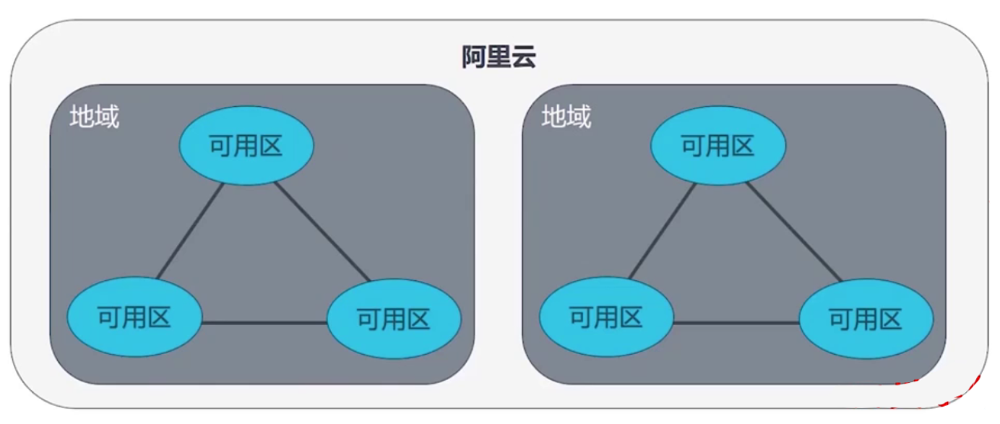
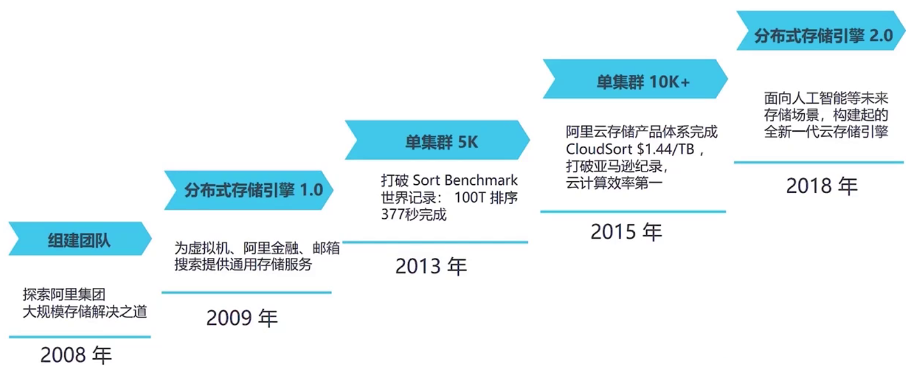
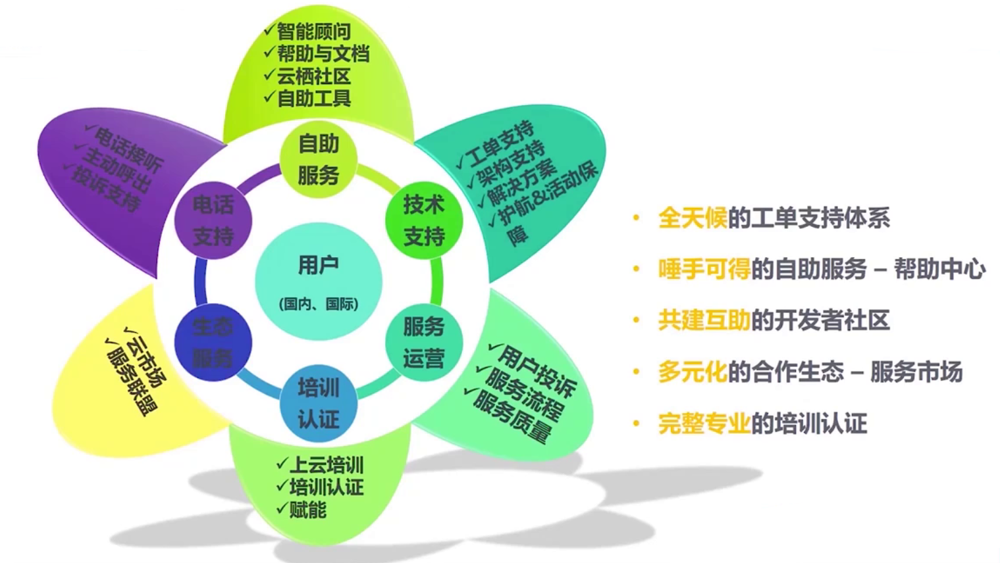
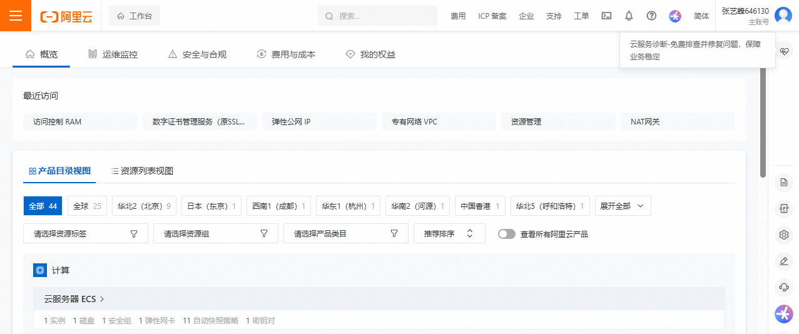
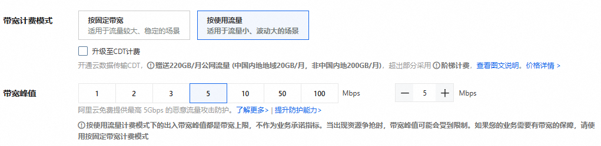
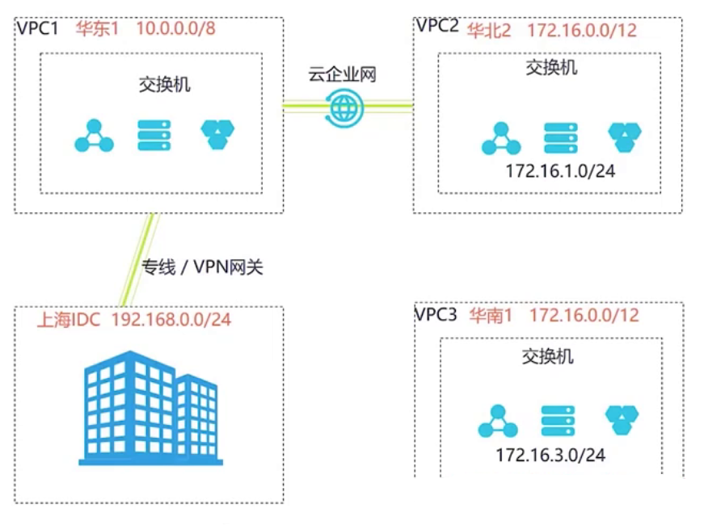

# ACP


## **内容概述**


- **阿里云整体架构**
- **弹性计算 ECS**
- **专有网络 VPC**
- **云数据库 RDS**
- **负载均衡 SLB 和弹性伸缩 AS**
- **对象存储 OSS**
- **内容分发网络 CDN**
- **阿里云安全**
- **阿里云云计算ACP认证考试介绍**


## 阿里云整体架构


- **了解阿里云及其发展历程**
- **了解阿里云整体架构**
- **掌握阿里云地域和可用区的特点（重点）**
- **了解阿里云平台优势**


### 阿里云发展历程


```bat
AWS 在 2006 3月发布第一个产品 S3(Simple Storage Server)，这是 AWS 提供的 第一个正式对外商用的云计算服务，标志着 AWS 进入公共云服务市场。
8 月 → Amazon Elastic Compute Cloud (EC2) 发布测试版立
```


致力于打造公共、开放的以数据为中心的云计算服务平台，借助技术创新，不断提升计算能力与规模效益，将云计算变成真正意义上的公共服务，为下一代信息经济构建新的基础设施。


#### 创立阶段（2009 年）

- **2009 年**：
  - 阿里金融（后来的蚂蚁金服）成立，阿里云同时启动。
  - 这标志着阿里开始布局云计算，目标是为集团和电商业务（淘宝、天猫等）提供高弹性、高可靠的计算资源。
  - 内部代号 **飞天** 的云计算平台开始开发，奠定技术基础。


#### 内部服务 → 外部应用（2010–2011 年）

- **2010 年**：
  - 阿里云成为 **阿里集团 IT 基础设施**，支撑整个阿里巴巴业务运行。
  - 这意味着阿里云首先是面向内部大规模应用的“自用云”。
- **2011 年**：
  - 首批互联网公司、游戏公司接入阿里云。
  - 云计算能力开始对外提供，形成最初的公有云雏形。


#### 走向企业级应用（2012–2013 年）

- **2012 年**：
  - CCTV、联想等传统行业客户开始采用阿里云服务。
  - 阿里云开始涉足政企市场，服务范围扩大。
- **2013 年**：
  - 数据量大、安全合规要求高的金融机构（如天弘基金）上云。
  - 阿里云支撑双 11 购物狂欢节，实现大规模流量调度。
  - 这一年标志着阿里云的 **技术可靠性和安全性** 得到验证。


#### 国际化起步（2014 年）

- **2014 年**：
  - 香港节点上线，正式 **开启国际化征程**。
  - 推出大数据产品 **MaxCompute**（原 ODPS），服务数据计算场景。


#### 大规模行业上云（2015 年）

- **2015 年**：
  - 在新加坡、美国西部建设大型数据中心。
  - 启动全球合作伙伴计划。
  - 国企、大型企业（如中石油、中车）上云，阿里云深入工业、能源等领域。


#### AI + 云服务（2016 年）

- **2016 年**：
  - 发布全球首个“城市大脑”，用 AI+云计算进行城市治理。
  - 打破 CloudSort 世界纪录，证明阿里云计算性能。
  - 重工业企业也开始采用阿里云。


#### 全球影响力扩大（2017 年）

- **2017 年**：
  - 成为奥运会全球指定云服务商（国际影响力大幅提升）。
  - 支持 BMW、Ford 等全球知名企业。
  - 付费用户突破百万，标志阿里云商业化成功。


#### IoT 与边缘计算（2018 年）

- **2018 年**：
  - 全面进入 IoT（物联网）领域，推出首个边缘计算产品。
  - 支持 FIFA、上海地铁等大型项目。
  - 数字中国战略全面落地，阿里云成为推动数字化转型的重要力量。


### 阿里云技术架构


2013年8月15日，单集群规模5000台服务器的飞天集群正式开始生产运营，标志着阿里集团从此成为世界上独立拥有相关技术能力的屈指可数的公司之一。


#### 阿里云产品架构：ACID+S


### 地域和可用区

#### 阿里云中的地域（Region）

地域是阿里云定义的Region，每个地域完全独立。**资源创建后不能更换地域。**


#### 可用区 AZ

一个地域内，有多个可用区。

一个可用区，由一个或多个数据中心组成。（数据中心通常是 **物理建筑**（确实可能是一栋楼或者园区内几栋楼））。可用区内的数据中心**独立供电，供网**。


可用区是指同一地域内，电力和网络互相独立的物理区域。同一可用区内实例之间的网络延迟更小。

在同一地域内可用区与可用区之间**内网互通**，可用区之间能做到故障隔离。是否将实例放在同一可用区内，主要取决于对容灾能力和网络延时的要求。

- 如果应用需要**较高的容灾能力**，建议将实例部署在同一地域的不同可用区内。
- 如果应用需要实例之间的**网络延时较低**，建议将实例创建在同一可用区内。


```bat
一个地域中，不同可用区之间，通常相隔100公里以内，一般最佳是40公里内的不同可用区。40公里内，网络延迟效果最佳。
将核心业务部署在不同可用区，这种通常叫同城容灾。
```


#### 地域和可用区

每个地域完全独立。每个可用区完全隔离，但同一个地域内的可用区之间，使用低时延链路相连。地域和可用区之间的关系如下图所示




#### 如何选择地域和可用区

选择地域时，需要考虑以下几个因素：

- 实例所在的地域，您以及您的目标用户所在的地理位置

  > 比如：我是做线上直播的，我的用户大多在杭州，那肯定是购买杭州可用区的实例
  >
  > 这样杭州的客户直接连接杭州本地的设备，网络延迟就很低。

- 阿里云产品之间的关系

  > 不同地域之间的ECS,RDS，OSS不互通，所以可能要考虑VPC之间如何打通，这个是后面需要考虑的
  >
  > 负载均衡无法跨地域连接不同地域的ECS，怎么做这个架构设计，如何考虑

- 资源的价格

  > 比如用户在北京，但是北京服务器比较贵，这个时候，可以考虑买北京周边的可用区（比如张家口）的设备，然后使用北京的可缓存的CDN。
  >
  > 要同时考虑 **价格** 和 **性能** 这两方面。

- 某些地区的特殊要求，如中国大陆地域的ECS实例用作Web服务器，需要完成经营许可证备案


多个阿里云产品一起搭配使用，需要注意：

- 不同地域的云服务器ECS、关系型数据库RDS、对象存储服务OSS内网不互通。
- 不同地域之间的云服务器ECS不能跨地域部署负载均衡，即在不同的地域购买的ECS实例不支持跨地域部署在同一负载均衡实例下。


### 阿里云平台优势

#### 强大的基础设施


#### 进阶的产品技术：计算


**阿里云的云盘分为三类**

- **对象存储 OSS**

  > **特点**
  >
  > - 存储单位：**对象（Object）**，通过 **RESTful API** 访问，不是挂载型文件系统。
  > - **高扩展性** → 支持海量非结构化数据（图片、视频、备份等）。
  > - **成本低** → 归档存储价格极低（几毛钱/G/月）。
  > - **持久性高** → 99.9999999999%（12个9），数据多副本冗余存储。
  > - **延迟相对高** → 不适合高 IOPS、低延迟的数据库场景。
  >
  > **典型使用场景**
  >
  > - 图片/视频/音频文件存储（CDN 加速）
  > - 备份归档、日志存储
  > - 大数据分析的底层数据湖

- **块存储（EBS 类似，阿里云叫 ESSD / 云盘）**

  > **特点**
  >
  > - 通过 **块级存储协议** 提供存储 → 挂载到 ECS 后表现为 **一块硬盘（/dev/vdb）**。
  > - **高性能、低延迟** → 适合数据库和操作系统。
  > - **支持快照** → 便于备份和恢复。
  > - 类型：
  >   - **高效云盘（SATA SSD）**：价格低，适合普通业务。
  >   - **SSD 云盘**：高 IOPS，适合中高负载数据库。
  >   - **ESSD（增强型 SSD）**：极高 IOPS 和吞吐，适合核心数据库业务。
  >
  > **典型使用场景**
  >
  > - ECS 操作系统盘
  > - MySQL、MongoDB、Redis 等数据库存储
  > - 需要高性能的业务存储

- **文件存储 NAS**

  > **特点**
  >
  > - 通过 **NFS/SMB 协议** 挂载，提供 **共享文件系统**。
  > - **多 ECS 可同时挂载** → 共享访问同一份文件。
  > - **支持 POSIX 语义**（文件级锁等）。
  > - 性能比 OSS 好，但不及块存储；价格介于二者之间。
  >
  > **典型使用场景**
  >
  > - 多台 ECS 需要共享文件存储（如 Web 服务器集群共享静态资源）
  > - 大数据处理、AI 训练（读取大量小文件）
  > - 容器共享存储卷（Kubernetes PV）


#### 进阶的产品技术：存储




#### 进阶的产品技术：网络


#### 丰富的专家经验

依托阿里巴巴集团多件技术/业务/服务的深厚积累，集业内顶级专家

```bat
如果你遇到了解决不了的问题，或者阿里云本身有问题，外面的人也解决不了，这种情况可以提交工单。
如果公司使用的阿里云的产品规模比较大，会有专门的架构师对接。
```


#### 完整的服务体系





## 弹性计算服务ECS


- **掌握云服务器的特点，与传统服务器的区别**
- **掌握阿里云ECS的功能、组成、应用场景**
- **掌握ECS的基本操作（创建、管理、部署和监控等）**
- **了解阿里云其他种类的弹性计算服务**
- **了解块存储的概念及产品特性**
- **掌握如何使用块存储**
- **掌握本地盘和共享块存储的功能特性**


### 阿里云云服务器ECS


#### 阿里云ECS的概念

##### 服务器发展历史

服务器的部署模式：


##### 云服务器ECS的优势


##### 云服务器的灵魂：虚拟化技术


阿里云底层虚拟化使用的 KVM


##### 云服务器ECS概念

云服务器（Elastic Compute Service，简称ECS）是阿里云提供的性能卓越、稳定可靠、弹性扩展的 laas (infrastructure as a Service) 级别云计算服务。云服务器ECS免去了采购IT硬件的前期准备，像使用水、电、天然气等公共资源一样便捷、高效地使用服务器，实现计算资源的即开即用和弹性伸缩。阿里云ECS持续提供创新型服务器，解决多种业务需求，助力业务发展。


#### ECS实例

##### 云服务器ECS的组件

| 组件       | 说明                                                         |
| ---------- | ------------------------------------------------------------ |
| **实例**   | 一台虚拟服务器，内含CPU、内存、操作系统、网络配置、磁盘等基础的计算组件。实例的计算性能、内存性能和适用业务场景由实例规格决定，其具体性能指标包括实例vCPU核数、内存大小、网络性能等。 |
| **镜像**   | 提供实例的操作系统、初始化应用数据及预装的软件。操作系统支持多种Linux发行版和多种Windows Server版本。 |
| **块存储** | 块设备类型产品，具备高性能和低时延的特性。提供基于分布式存储架构的云盘、共享块存储以及基于物理机本地存储的本地盘 |
| **快照**   | 某一时间点一块云盘或共享块存储的数据状态文件。常用于数据备份、数据恢复和制作自定义镜像等 |
| **安全组** | 由同一地域内具有相同保护需求并相互信任的实例组成，是一种虚拟防火墙，用于设置实例的网络访问控制 |
| **网络**   | - 专有网络（Virtual Private Cloud）：逻辑上彻底隔离的云上私有网络。可以自行分配私网IP地址范围、配置路由表和网关等。<br />- 经典网络：所有经典网络类型实例都建立在一个共用的基础网络上。由阿里云统一规划和管理网络配置。 |

**注意：**

- 在部署应用程序的时候，数据不要放在本地盘，要再加一块盘，然后将数据都放在非本地盘上。

  > ECS重启通常有两种可能：
  >
  > 1. 普通Reboot，此时不会重新分配物理资源，本地盘上面的数据保留
  > 2. 当宿主机异常时，重启ECS可能会发生一件事，也就是将实力迁移到新的物理机，这种情况下，可能会导致本地盘上的数据丢失。（这也是之所以ECS出问题，重启一下就能解决的原因，本质上其实是换了一台物理机，然后拷贝操作系统等数据。）
  >
  > ！！应用数据应存放在云盘（或 OSS/NAS），以保证持久性和高可用。千万不要放在本地盘上。


##### 选购云服务器

按照用户群体不同，选购云服务器主要有下面分类：


##### 实例规格

实例是能够为业务提供计算服务的最小单位，不同的实例规格可以提供的计算能力不同。根据业务场景和使用场景，ECS实例可以分为多种实例规格族。根据CPU、内存等配置，一种实例规格族又分为多种实例规格。ECS实例规格定义了实例的基本属性：CPU和内存（包括CPU型号、主频等）


注意：ECS实例只有同时配合块存储、镜像和网络类型，才能唯一确定一台实例的具体服务形态。

各个地域下可供售卖的实例规格可能存在差异，可以前往ECS实例可购买地域，查看实例的可购情况


##### ECS实例生命周期


##### 镜像的概念

镜像是云服务器实例运行环境的模版，模版中包括了特定的操作系统和运行时环境，也可能包含预装的应用程序。阿里云镜像分类：


##### 阿里云网络VPC概述

阿里云推荐使用专有网络VPC（Virtual Private Cloud），专有网络之间逻辑上彻底隔离。VPC作为用户上云首选的产品，主要有如下特点：


##### 网络规划

基于容灾方面的考虑，建议将不同的弹性裸金属服务器放置在不同可用区下


##### 安全组的作用

安全组是一种虚拟防火墙，用来控制出站和入站流量。

在同一个VPC内，位于相同安全组的实例私网互通。默认安全组的规则：


默认安全组中的默认规则如下：

- 入站方向：默认拒绝所有访问。为了方便您管理云服务器，默认安全组包含了ICMP协议，SSH22端口，RDP3389端口的放行规则，您还可以勾选放行HTTP 80端口和HTTPS 443端口。
- 出站方向：允许所有访问。


##### VPC 安全组


#### ECS的优势

##### ECS产品优势


##### ECS与IDC优势


### ECS的使用方法

#### 阿里云账号创建

##### 创建阿里云账户及子账户

```http
https://aliyun.com
```


**可以使用支付宝扫码注册，也可以账号密码注册**


**注册好后登录账号**


**登录账号后，进入控制台**




选择费用，点击充值（开通按量付费计费类型的云服务器ECS,要求你的阿里云账号余额至少有100元人民币,现金金额和代金券都可以,加起来总面值不得小于100元。 ）


##### 主账户安全加固

建议绑定手机号（方便找回密码等）和开启虚拟MFA二次校验（本人使用的是Google Authenticator）


##### 创建子账户

```bat
场景：在公司你是管理员，管理阿里云的总账户，但是公司的开发人员，测试人员需要用阿里云的一些功能，比如：OSS，DB等，这个时候就需要给这些人员开子账户。
```


在右上角图标处，点击访问控制


在RAM里面，阿里云的管理分为：**权限管理** 和 **资源管理**（所谓资源就是指对外提供的服务，比如数据库，OSS对象存储等）

在公司有很多人需要使用阿里云的资源，这部分人根据职能可以分为开发人员，测试人员等。这个时候可以通过创建用户组为其创建子账户。


创建用户组


创建用户组成功


创建好用户组后，为这个组**分配权限**


可以看到权限策略很多，这里的权限策略实质上就是资源的操作权限。

范例：给 dev 组 ECS的管理权限（ECS管理权限包含只读权限）


创建好用户组后，接下来创建用户


用户的访问方式分为两种：

- 控制台访问

  > 通过 **阿里云管理控制台（Web UI）** 登录访问。
  >
  > 用户使用 **用户名/密码**（或绑定的多因素认证 MFA）登录控制台，所有操作通过浏览器发起，阿里云后台验证身份和权限（基于 RAM 策略）。
  >
  > 操作通过 **GUI** 进行，调用 API 由控制台代理完成。
  >
  > **使用场景**
  >
  > - **运维人员、管理员** 通过**浏览器**进行日常管理：
  >   - 创建/配置/删除 ECS 实例、VPC、安全组等
  >   - 查看监控、费用、日志
  > - **一次性或低频操作**：适合人工配置和管理。
  > - **企业内部**常用于 IT 管理员给用户分配 RAM 子账号进行控制台登录。

- 使用AccessKey访问

  > AccessKey（AK）由 **AccessKey ID** 和 **AccessKey Secret** 组成，类似于用户名 + 密钥。
  >
  > 用于 **签名 API 请求**，通过 API、SDK、CLI、**Terraform** 等方式访问阿里云服务。
  >
  > AK 直接调用 ECS 等云服务的 OpenAPI，无需登录控制台。
  >
  > **使用场景**
  >
  > - **程序化访问**（自动化场景）：
  >   - 例如 CI/CD 系统、脚本、运维工具、应用程序需要管理 ECS。
  > - **自动化部署和集成**：
  >   - DevOps 工具（如 Terraform、Ansible）调用 ECS API
  > - **服务对服务**访问：
  >   - 例如 Kubernetes Controller 调用 ECS API 进行弹性扩缩容


子账户创建好后，为账户分配权限有两种：

- 直接为该账户设置权限
- 将该账户加入用户组，使其继承用户组的权限（企业中建议使用这个方式）


这里演示将用户加入之前创建的开发组，以继承开发组权限


##### RAM角色管理

RAM 角色不是用户，而是一种 **可被“扮演（Assume）”的身份**。

它没有固定的凭证（密码/AK），需要 **通过可信实体（如 RAM 用户、ECS 实例、阿里云账号、外部身份提供商）临时扮演**，获取临时凭证（STS Token）后才可访问资源。

**特点**

- 角色需要 **AssumeRole API** 才能使用。
- 可用于跨账号、跨服务、临时授权。
- **角色 ≈ 临时授权身份**。

**使用场景**

1. **跨账号访问**
   - 账号 A 的用户可以扮演账号 B 的角色来访问 B 的资源。
2. **ECS 实例角色**
   - 给 ECS 绑定一个角色 → 运行在该 ECS 上的程序可使用角色凭证调用阿里云 API，无需硬编码 AK。
3. **临时访问控制**
   - 使用 STS（Security Token Service）给临时用户颁发短期凭证。


###### RAM应用案例

**实际案例1**

**ECS 实例无密钥访问云服务**

- **需求**：ECS 上运行的应用需要访问 OSS，但不希望在代码中写死 AK/SK。
- **解决**：
  - 绑定 **ECS 实例角色** → ECS 内的应用通过 **RAM Role + STS 临时凭证** 自动获取权限访问 OSS。
- **用户组为什么不行？**
  - 用户组是给人用的，没有办法把权限直接挂到 ECS 上，也没有临时凭证机制。


**实际案例2**

 **Kubernetes / Serverless 自动扩缩容**

- **需求**：Kubernetes 控制器需要自动调用 ECS API（比如弹性扩容），但不能暴露长期 AK。
- **解决**：
  - 使用 **RAM 服务角色（Service Role）** → 控制器扮演角色调用 ECS API。
- **用户组为什么不行？**
  - 用户组没有 STS 机制，无法给程序临时授权。


**实际案例3**

**第三方公司代运维（临时授权）**

- **需求**：第三方运维公司需要短期访问你的阿里云资源，但不能给他们创建长期用户/密码。
- **解决**：
  - 创建一个 **跨账号 RAM 角色**（只授予有限权限 + 短期 STS Token）。
  - 让第三方通过 `AssumeRole` 获取临时访问权限，过期即失效。
- **用户组为什么不行？**
  - 用户组绑定权限后用户可以长期登录，无法实现 **短期动态授权**。


###### 创建角色时的信任主体类型解读

**云账号 (Alibaba Cloud Account)**

**实际用途**

- 信任实体是 **阿里云账号**（可以是当前账号，也可以是其他账号）。
- 允许 **RAM 用户** 或 **其他阿里云账号** 中的用户扮演此角色（AssumeRole）。

🔹 **典型场景**

- **同账号**：
  - 例如，你在账号A创建一个角色，信任实体也是账号A → 账号A下的 RAM 用户可以扮演它。
- **跨账号授权**：
  - 例如，你在账号A创建一个角色，信任实体是账号B → 账号B的用户可以通过 `sts:AssumeRole` 临时访问账号A资源。

💡 **所以“云账号”既可以给同账号用户授权，也可以用于跨账号客户授权**。


**云服务 (Alibaba Cloud Service)**

**实际用途**

- 信任实体是 **阿里云服务本身**（如 ECS、OSS、Function Compute、Kubernetes 等）。
- 允许 **阿里云服务实例（如 ECS 实例）** 扮演此角色，以便无密钥调用 API。

🔹 **典型场景**

- **ECS 实例角色**：
  - 给 ECS 绑定角色 → 应用程序可通过实例元数据服务获取临时凭证访问 OSS、SLB 等资源。
- **Kubernetes on ACK**：
  - Pod 通过服务账号（ServiceAccount）+ 角色授权访问阿里云 API。
- **云上服务自动化调用**：
  - 例如云监控服务自动获取 ECS 信息。

💡 **所以“云服务”并不是给“外部服务”用的，而是专门给阿里云托管的资源（ECS/ACK/Function Compute等）授权的。**


**身份提供商 (Identity Provider, IdP)**

**实际用途**

- 信任实体是 **外部身份系统（IdP）**，如企业的 **AD/LDAP、OIDC、SAML** 或第三方身份管理系统（Okta、Azure AD 等）。
- 允许 **外部用户** 通过 SSO（单点登录）或 OIDC/SAML 等协议，临时扮演此角色。

🔹 **典型场景**

- **企业 SSO**：
  - 企业用户通过 AD 登录 → 通过身份提供商（IdP）映射到阿里云 RAM 角色 → 临时访问云资源。
- **OIDC for Kubernetes ServiceAccount**：
  - Kubernetes Pod 通过 OIDC 身份提供商扮演阿里云角色，获取临时凭证访问 API。

💡 **所以“身份提供商”是用于外部用户（IdP）到阿里云的单点登录（SSO）场景，不是直接给客户跨账号用的。**

> **IdP** → 认证外部用户身份（AD/Okta/OIDC/SAML）
>
> **SSO** → 用户一次登录就能访问多个系统（例如企业门户 → 阿里云）

```bat
对于身份提供商IdP的生产实践，基本应用于大型金融或互联网公司

某金融企业
使用 ADFS（Active Directory Federation Services） 作为 IdP
员工通过企业内网登录 → 无需再输入密码 → 直接访问阿里云控制台、AWS 控制台。

跨云 DevOps 团队
使用 Okta 管理身份
统一给开发人员分配 "Developer" 角色 → 自动映射到阿里云、AWS、GCP 上对应的权限。
```


##### RAM子账户访问管理

使用RAM子账户登录


使用刚才创建的RAM子账户登录


绑定MFA设备


后续绑定MFA，绑定MFA后，会要求重置密码


关于**切换身份**的解读


一般来说，开发人员会向管理员要企业别买和角色名，用来给程序访问阿里云资源的权限


或者客户也可以在 **控制台 → 右上角 → 角色切换**

输入：

- **企业别名/UID** → 1111111111111111
- **角色名** → CrossAccountAccessRole

即可直接切换到角色权限界面。


#### ECS创建

正常来讲，不会先创建ECS，而是会先规划网络，但是这里学习原因，我们先学习创建ECS


##### 创建ECS虚机


###### 付费模式讲解


付费模式分为：

- 包年包月

  > 对于包年来说，不同的年限，半年、一年，两年，不同的年限的折扣不同（通常年数越多，折扣最大），企业中需要计算如何购买成本最低。

- 按量付费

  > 先用后付，按需付费。

- 抢占式实例

  > 抢占式比付费便宜很多，抢占式指使用机房闲置设备，费用便宜，但是不稳定。
  >
  > 抢占式资源稳定期为1小时，1小时后，当市场价格高于当前出价或资源供需关系变化时，抢占式实例会被自动释放，需做好数据备份工作。
  >
  > 通常在临时测试。


###### 地域与可用区选择技巧

```bat
建议可用区选择编号大的，顺序从A到Z，通常字母越大，说明可用区的越新，相当在使用客户越少。
```


本节讲解ECS计算，因此关于网络的问题，后续在专用网络VPC的时候讲解，这里选择默认即可。


###### ECS规格选用


**阿里云实例架构分为：**

- **X86计算**

- Arm 计算

- **GPU异构**

- **弹性裸金属服务器**

  > 通常用于很重的，对稳定性要求高的业务。裸金属服务器就是指将一整台服务器虚拟化。CPU和内存的规格都很高。

- 高性能计算


###### 镜像选择


镜像分为：

- 公共镜像

  > 由 **阿里云官方** 提供和维护的标准镜像。
  >
  > 包含常见操作系统（Linux/Windows）基础版本，有的还带有少量预装工具。
  >
  > 🔹 **特点**
  >
  > - 由阿里云持续更新和安全加固，可靠性高。
  > - 包括 CentOS、Ubuntu、Debian、Windows Server 等。
  >
  > 🔹 **使用场景**
  >
  > - **新建 ECS 时使用最广泛**。
  > - **标准操作系统部署**：用户希望在干净的操作系统上自行安装业务软件。
  > - **开发/测试/生产环境**：适合大部分场景。

- 自定义镜像

  > 由 **用户自己创建** 的镜像，通常基于已有 ECS 实例制作。
  >
  > 可包含用户自定义的操作系统、软件、配置。
  >
  > **特点**
  >
  > - 适用于快速复制环境（可将配置好的 ECS 复制成多个实例）。
  > - 支持备份和恢复（灾备场景）。
  >
  > 🔹 **使用场景**
  >
  > - **标准化环境复制**：公司内部标准软件环境、应用配置打包成镜像。
  > - **快速扩容**：基于一台配置好业务环境的 ECS 制作镜像，快速创建更多同环境实例。
  > - **灾难恢复**：制作自定义镜像后，系统崩溃时可快速恢复。

- 共享镜像

  > 由 **其他阿里云账号（用户）** 共享给你的镜像。
  >
  > 镜像所有者主动授权共享，你的账号可基于该镜像创建 ECS。
  >
  > 🔹 **特点**
  >
  > - 不属于公共资源，只有被授权的账号能使用。
  > - 镜像本身不会被复制，使用时仍然引用原账号的镜像。
  >
  > 🔹 **使用场景**
  >
  > - **企业内部多账号共享镜像**：母公司账号创建镜像 → 子公司账号使用。
  > - **合作伙伴共享业务环境**：合作方为你准备了一个带业务环境的镜像。

- 云市场镜像

  > 由 **阿里云云市场** 提供的镜像，通常包含 **第三方厂商** 预装的软件或应用环境。
  >
  > 例如 LNMP/LAMP 环境、数据库、应用服务器、中间件、安全软件等。
  >
  > 🔹 **特点**
  >
  > - 可直接购买使用，有的镜像需要付费（包含软件许可费用）。
  > - 部分镜像免费，但仍由第三方维护。
  >
  > 🔹 **使用场景**
  >
  > - **快速部署商业应用**：如 WordPress、Magento、电商系统。
  > - **专业软件环境**：如 Oracle Database、SAP HANA。
  > - **安全防护/监控软件**：预装安全防护程序或监控系统。

- 社区镜像

  > 由 **阿里云社区用户** 提供并公开共享的镜像，任何人都可以免费使用。
  >
  > 通常包含一些预装应用或特定环境。
  >
  > 🔹 **特点**
  >
  > - 由社区用户上传，不保证安全性和稳定性（**需要自行评估**）。
  > - 可能存在版本不一致、缺乏维护等风险。
  >
  > 🔹 **使用场景**
  >
  > - **测试/学习**：快速尝试一些社区打包的特殊环境。
  > - **非关键业务**：避免在生产环境直接使用，除非确认来源可靠。


###### 存储


存储分为本地盘（系统盘）和 数据盘。通常建议将服务的数据放在数据盘上。不要放在本地盘。

同时如果需要加密的话，需要提前开通（**ACE会考**）


在阿里云 ECS 购买云服务器时，你可以选择不同类型的块存储（云盘）。**ESSD**（Enhanced SSD）系列是阿里云的高性能云盘产品，细分为：**ESSD Entry**、**ESSD 云盘（PL0/PL1/PL2/PL3）** 和 **ESSD AutoPL**。它们主要区别在于 **性能等级（IOPS、吞吐）** 和 **适用场景**。


**ESSD Entry（入门级 ESSD）**

🔹 **定义**

- 入门级增强型 SSD，价格较低，性能介于 **高效云盘（SATA）** 和 **标准 ESSD（PL1）** 之间。

🔹 **性能**

- IOPS 和吞吐 **比普通 SSD 高**，但 **低于 PL1/PL2/PL3**。
- 适用于 **中低负载** 的业务。

🔹 **使用场景**

- **开发/测试环境**
- **小型网站/轻量级应用**
- **日志存储/备份**（性能需求不高）


**ESSD 云盘（PL0 / PL1 / PL2 / PL3）**

🔹 **定义**

- 标准增强型 SSD，分 **性能等级（Performance Level）**：
  - **PL0**：较低性能（入门）
  - **PL1**：通用性能（默认选择）
  - **PL2**：高性能
  - **PL3**：超高性能

🔹 **性能**

- 性能 **随等级提升**，IOPS/吞吐明显增加：
  - **PL1**：适合大多数通用业务
  - **PL2**：高 IO 负载（数据库）
  - **PL3**：超高性能（金融级别、高频交易）

🔹 **使用场景**

- **PL0** → 低 IO 业务（日志、小型应用）
- **PL1** → Web 应用、中小型数据库
- **PL2** → 大型数据库、高并发服务
- **PL3** → 金融交易、实时计算、大规模高并发业务


**ESSD AutoPL（自动性能云盘）**

🔹 **定义**

- **自动调节性能的 ESSD**：云盘性能可根据业务负载自动升降，**无需用户手动选择 PL1/PL2/PL3**。

🔹 **特点**

- **按需弹性性能**：低负载时按 PL1 收费，高负载时自动提升到 PL2/PL3 性能（按使用时长计费）。
- **节省成本**：无需为高峰期长期购买高等级云盘。

🔹 **使用场景**

- **负载波动明显的业务**：如 **电商促销、直播系统、秒杀活动**。
- **需要性能突增但不想长期付高价**。
- **适合对成本敏感又需要保障性能的场景**。


**补充：在购买ECS的时候，发现系统盘的性能只有PL0和PL1，为什么？不是还有性能更好的PL2和PL3吗？**

**原因：PL2/PL3/AutoPL 不是所有规格都支持**

阿里云 **ESSD PL2、PL3 和 AutoPL** 只有在以下条件满足时才会显示：

🔹 **1. 区域限制**

- 不是所有地域都支持 **PL2、PL3、AutoPL**。
- 例如部分二线或冷门地域（如边缘节点）只支持 PL0/PL1。
- 在 **华北2（北京）、华东1（杭州）、华南1（深圳）** 等核心地域通常支持所有等级。


🔹 **2. ECS 实例规格限制**

- 低规格实例（如 **突发性能型 t6、t5、小型共享实例**）**不支持**高性能云盘（PL2/PL3）。
- 高性能云盘要求 **计算型 c6、通用型 g6、大型规格** 才支持。


🔹 **3. 云盘类型限制**

- 你当前选择的是 **系统盘（40 GiB）** → **阿里云要求 PL2/PL3 只支持 ≥500 GiB 的云盘**（部分地域是 100 GiB 以上）。
- 系统盘小容量时，默认只允许 PL0/PL1。


**当把系统盘扩大到2048G，则会发现PL2和PL3都是支持的**


###### 快照服务讲解

```bat
先了解概念，后续有单独章节讲解快照操作
```

快照服务分为**标准快照**与**归档快照**


**标准快照（Standard Snapshot）**

🔹 **定义**

- 默认类型的快照，存储在 **高性能的快照存储系统** 中。
- 快速创建、快速恢复。

🔹 **特点**

- **恢复速度快**（秒级到分钟级）。
- **适合频繁访问和快速恢复的场景**。
- 价格高于归档快照。

🔹 **使用场景**

- **生产环境的日常备份**（需要随时恢复）。
- **数据库备份**（需要快速恢复业务）。
- **测试环境快速回滚**。


**归档快照（Archive Snapshot）**

🔹 **定义**

- 存储在 **低成本归档存储** 中，类似阿里云 OSS 的 Archive 存储层。
- 适合长期保存、不常用的快照。

🔹 **特点**

- **价格低**（比标准快照便宜 50% 以上）。
- **恢复速度慢**：恢复前需要 **解冻（解归档）**，解冻时间 **1~12 小时**。
- **解冻期间不能使用**，解冻完成后可恢复成云盘。

🔹 **使用场景**

- **长期归档**（法规合规、历史数据保存）。
- **不需要频繁恢复的备份**（如半年/一年才用一次）。
- **成本敏感型业务**。


**价格对比（收费方式）**

阿里云快照收费主要包含两部分：

- **存储费用**（按快照占用存储容量 GB/月）
- **操作费用**（一般无额外费用，归档快照有解冻费用）

| 类型         | 存储费用                   | 恢复费用                   | 恢复速度  |
| ------------ | -------------------------- | -------------------------- | --------- |
| **标准快照** | 高（如 ￥0.35~0.50/GB/月） | 免费                       | 秒级恢复  |
| **归档快照** | 低（如 ￥0.15~0.20/GB/月） | **解冻费用**（按 GB 收费） | 1~12 小时 |

> **实际价格**会根据地域不同略有差异。归档快照解冻一次也会产生少量额外费用。


**选择建议**

| 需求                       | 选择快照类型   |
| -------------------------- | -------------- |
| **频繁恢复/快速回滚**      | ✅ **标准快照** |
| **生产环境日常保护**       | ✅ **标准快照** |
| **合规存档（保存几年）**   | ✅ **归档快照** |
| **历史备份（几乎不恢复）** | ✅ **归档快照** |


- **标准快照** → **性能好，恢复快，价格高** → 适合 **生产环境备份**
- **归档快照** → **价格便宜，恢复慢（需解冻），有额外解冻费用** → 适合 **长期存档**


###### 带宽选择与计费详解




在阿里云中，公网带宽通常有两种计费方式：

**① 按固定带宽计费**

- **计费方式**：按你选择的带宽峰值（Mbps）收取固定费用。
- **费用特点**：无论流量多少，每小时/每天按带宽值固定计费。
- **适用场景**：
  - **业务流量较大且稳定**（如企业网站、直播、长期在线服务）。
  - **需要带宽保障**（不会因竞争而被限制带宽）。


**② 按使用流量计费**

- **计费方式**：按照 **实际公网出流量（GB）** 计费，而不是固定带宽。
- **费用特点**：流量少时很省钱，但大流量业务可能费用高。
- **适用场景**：
  - **业务流量波动大**（如临时活动、测试环境）。
  - **访问量低**（偶尔访问，不想长期付带宽费）。


```bat
 CDT（云数据传输）：这是阿里云跨地域带宽优化服务，通常不必选，除非做跨区域高带宽传输。
```


**带宽峰值（Peak Bandwidth）**

🔹 **定义**

- **带宽峰值**就是 **公网最大出网速率**（Mbps）。
- 如果选择 **按固定带宽计费**，费用按这个值算。
- 如果选择 **按流量计费**，带宽峰值只是个物理限制，不直接影响计费（但太低会限速）。


🔹 **如何判断带宽峰值大小？**

| 业务类型                   | 建议带宽峰值  |
| -------------------------- | ------------- |
| **个人网站/小型应用**      | 1~5 Mbps      |
| **公司官网/中等流量应用**  | 5~20 Mbps     |
| **视频流/直播/高并发业务** | 50~100+ Mbps  |
| **下载服务/CDN源站**       | 100 Mbps 以上 |

**计算方式（粗略）：**

```css
带宽（Mbps） ≈ (并发用户数 × 每用户平均速率) / 1.2
```

例如：100 个并发用户，每人 200 KB/s（≈1.6 Mbps）→ 需要 ≈ 130 Mbps。

```bat
问题：
100 个并发用户在传统意义上属于“小型网站”，但用 200 KB/s（≈1.6 Mbps） 作为每个用户的平均速率确实会得到一个较高的总带宽需求（≈130 Mbps）。为什么？

解答：
200 KB/s（1.6 Mbps）/用户 这个速率 非常高，相当于用户 持续下载 数据（如视频流或文件下载）。
对于 普通小型网站（主要是 HTML/图片/少量 API），每用户实际速率可能只有 50 KB/s（0.4 Mbps） 或更低。
如果改用 0.4 Mbps 计算：
100 × 0.4 Mbps ≈ 40 Mbps
➜ 40 Mbps 就比较符合小型网站的带宽需求。
```


**不同业务模型推荐带宽参考**

| 业务类型     | 并发用户数 | 典型每用户速率        | 推荐峰值带宽 | 理由说明                             |
| ------------ | ---------- | --------------------- | ------------ | ------------------------------------ |
| Web 小型网站 | ≤50        | 0.2–0.4 Mbps          | 5–10 Mbps    | 内容小（文本、图片），带宽需求低     |
| API 服务     | 100 并发   | 0.3–0.6 Mbps          | 10–20 Mbps   | 接口响应小但并发高，对延迟响应敏感   |
| 视频流服务   | 50 并发    | 1–2 Mbps（标清/720p） | 50–100 Mbps  | 视频流耗带宽高，需要流畅播放         |
| 大文件下载   | 100 并发   | 1–5 Mbps              | ≥100 Mbps    | 下载业务持续高流量，需要较高峰值带宽 |

```bat
按使用流量计费适用于流量峰值不高的场景，但在高带宽配置下成本反而更高。
```


###### 安全组

可以看做软件防火墙，后续讲解VPC网络的时候会详细讲解


###### 弹性网卡

弹性网卡（ENI, Elastic Network Interface）可以看作是 **在 ECS 上增加的一块“虚拟网卡”**，并且 **常用于管理网络和业务网络分离**、**集群心跳检测** 等场景。

常见的使用场景：

- **管理网络和业务网络分离**
   常见做法是在 ECS 上绑定 **主网卡（业务网络）** 和 **辅助网卡（管理网络）**，实现运维与业务流量隔离，提高安全性和可维护性。
- **集群心跳检测**
   在高可用集群（如数据库主备、Keepalived、Hadoop）中，使用 **辅助 ENI** 在专用子网进行心跳通信，避免和业务流量干扰。

- **高可用/快速故障切换**

  弹性网卡可 **独立于 ECS 生命周期** 进行绑定/解绑。

  当 ECS 宕机时，可以 **快速将 ENI 挂到另一台 ECS**，迁移 IP 以实现业务高可用（类似于虚拟 IP 漂移）。

- **容器化/微服务网络**

  在 Kubernetes 等场景下，一个 Pod 可以直接绑定一个弹性网卡（ENI）以获取独立 VPC 内网 IP（阿里云 Terway CNI 就基于 ENI）

  提升容器网络性能，减少 NAT

- **多子网/跨可用区网络**

  一个 ECS 主网卡只能在一个子网，但可以通过附加 ENI **同时连接多个子网**，实现跨子网通信。

- **云防火墙/流量隔离**

  通过 ENI 绑定不同安全组策略，实现更细粒度的流量控制。


**阿里云弹性网卡 vs 传统“加网卡”**

| 特性                  | 传统网卡（物理/虚拟） | 阿里云弹性网卡（ENI）            |
| --------------------- | --------------------- | -------------------------------- |
| **IP 是否随网卡迁移** | ❌ IP 依赖实例         | ✅ ENI 带 IP，可挂到不同 ECS      |
| **支持多子网**        | ❌ 受限于主网卡        | ✅ 可接入不同子网/VSwitch         |
| **安全组独立配置**    | ❌ 通常跟随实例配置    | ✅ ENI 可单独关联安全组           |
| **生命周期独立**      | ❌ 依赖 ECS 生命周期   | ✅ ENI 可独立存在/绑定解绑        |
| **应用场景**          | 限于基本多网卡通信    | 管理隔离/高可用/容器化等高级场景 |

 	

###### 管理设置


ECS登录凭证可以选择密钥对登录或密码登录，这里不做过多解读


###### 高级选项

**CPU选项：**相当于管理是否开启逻辑核


**实例 RAM 角色**

**实例 RAM 角色（Instance RAM Role）** 主要就是让 ECS **安全地访问其他阿里云服务** 的一种方式。(实际操作在ACE讲解，这里了解概念即可）


**资源组**

**资源组**是阿里云 **资源管理（Resource Management）** 中的一种 **逻辑分组**功能。

允许用户将 ECS、RDS、SLB 等云资源划分到不同组进行 **权限隔离** 和 **管理分类**。

**特点**

- 仅为逻辑管理，不影响资源的运行和网络配置。
- 可以结合 **RAM（访问控制）** 设置子账号仅能访问特定资源组内的资源。

**使用场景**

- **企业多部门管理**：
  - 按部门（开发、测试、生产）创建不同资源组，分配权限。
- **项目隔离**：
  - 不同项目使用不同资源组，避免误操作。
- **计费管理**：
  - 通过资源组统计费用，便于成本核算。


**部署集**（ACE中会有相关实操）

**部署集**是 **ECS 的高可用策略**，定义了多台 ECS 在 **物理宿主机上的分布策略**。

主要有两种策略：

- **同一部署集内的 ECS 尽量分布在不同宿主机上**（反亲和性，防止单点故障）
- 或者 **集中在同一宿主机上**（亲和性，适用于低延迟业务）

**使用场景**

- **高可用集群（HA）**：
  - 例如 MySQL 主备、Zookeeper、Kubernetes Master → 将实例放入同一部署集（反亲和性），避免所有节点落在同一宿主机。
- **多可用区容灾**：
  - 结合多可用区和部署集，进一步提升业务容错能力。
- **低延迟业务**（特殊场景）：
  - 某些业务需要实例靠近，可使用“亲和”模式（但阿里云默认不开放，需联系客服）。


配置好所有选项后，下单购买即可，购买实例创建成功后，如图所示


## 专用网络VPC


- **了解专有网络VPC的产生背景以及优势**
- **了解专有网络VPC及相关组件的概念和使用方法**
- **掌握专有网络VPC的使用场景和最佳实践**


### VPC的概念

#### 网络产品概览


#### VPC中的概念

专有网络 VPC (Virtual Private Cloud) 是基于阿里云构建的一个隔离的网络环境，专有网络之间逻辑上彻底隔离。VPC主要提供了两个能力：

- 用户可以自定义网络拓扑，包括选择自有IP地址范围、划分网段、配置路由表和网关等。
- 通过专线或 VPN 与原有数据中心连接，云上和云下的资源使用同一个网络地址规划，实现应用的平滑迁移上云。


#### VPC的原理

网络虚拟化：引入 **Overlay 技术** & 引入 **SDN 技术**


##### overlay技术


#### VPC网络的组成

- 每个VPC都由一个私网网段，一个路由器和至少一个交换机组成。
- **路由器**（VRouter）是专有网络的枢纽。作为专有网络中重要的功能组件，它可以连接VPC内的各个交换机，同时也是连接VPC和其他网络的网关设备
- **交换机**（VSwitch）是组成专有网络的基础网络设备，用来连接不同的云产品实例。


### VPC的组件


#### 虚拟路由器


#### 虚拟交换机


#### 路由表


#### **安全组**


```bat
考试题：要把 ECS1 和 ECS2 能够相互访问，通过配安全组有几种方式

答案：
2种方式
方式1：将 ECS1 和 ECS2 放在一个安全组里
方式2：ECS1 和 ECS2 在各自的安全组配置，能够访问对方的 IP 和 Port
```


#### 弹性公网 IP


```bat
思考：弹性公网IP地址，是动态IP地址，还是静态IP地址？

答案：静态
```


#### 云企业网

云企业网（**C**loud **E**nterprise **N**etwork）提供一种快速构建混合云和分布式业务系统的全球网络，协助用户打造一张具有企业级规模和通信能力的云上网络


云企业网的应用场景

- 通过 CEN，可以 **互通不同 VPC**（即使跨地域、跨账号）

- 通过 **CEN + 专线/ VPN/ SAG（智能接入网关）**，本地 IDC 可以与阿里云 VPC 建立高性能私网互通。

- 通过 CEN，可以连接 **阿里云 VPC** 与 **AWS/Azure/GCP** 等其他云服务商的网络（通过第三方云互联或专线）。适合企业多云架构。

- CEN 利用阿里云的全球骨干网，**实现跨地域网络低延迟互通**。

  > 例如：中国总部 VPC ↔ 美国分支 VPC ↔ 欧洲 VPC → 通过 CEN 互通时延远低于公网 VPN。

- 通过 **CEN + 智能接入网关（SAG）**，全国/全球的分支机构都能通过私网接入总部 VPC 或数据中心，实现统一办公网络。

- CEN 支持 **多线冗余、动态路由、自动故障切换**。


#### VPN网关


#### NAT网关


**左侧（ECS → Internet）**

NAT 网关位于 VPC 和 Internet 之间，ECS 通过 NAT 网关 **共享公网带宽** 出网。

**主用 NAT + 备用 NAT** 形成 **高可用架构**，确保 NAT 设备出现故障时业务不中断。


**右侧（Internet → ECS）**

NAT 网关通过 **EIP + 端口转发** 实现 **公网访问内网 ECS 服务**。

支持 **一个公网 IP 映射多个 ECS 服务（不同端口）**，简化公网 IP 资源使用。


##### NAT 网关在生产中的主要功能

🔹 **① SNAT（源网络地址转换）**

- **场景**：**内网 ECS 主动访问公网**（例如更新软件、访问外部 API）。
- **功能**：ECS 内网 IP 通过 NAT 网关转换为一个 **公网 IP（EIP）** 访问 Internet。
- **生产价值**：
  - 节省公网 IP（多个 ECS 共享一个 EIP）
  - 增加安全性（ECS 无需暴露公网 IP）
  - 便于统一带宽管理


🔹 **② DNAT（目的网络地址转换）**

- **场景**：**外部用户访问 VPC 内 ECS 服务**（如网站/应用）。
- **功能**：NAT 网关将 **公网 IP + 端口** 转发到 **指定 ECS 内网 IP + 端口**。
- **生产价值**：
  - 可通过 **一个 EIP** 暴露多个 ECS 服务（端口映射）
  - 适合节省公网 IP 的中小型应用


🔹 **③ 高可用 + 带宽共享**

- **主/备 NAT 双实例**：保证业务出入公网高可用。
- **带宽共享**：多 ECS 共享一个 NAT 网关的带宽，降低成本。


##### **生产中的典型使用场景**

| 场景                                   | 说明                                | NAT 网关优势                           |
| -------------------------------------- | ----------------------------------- | -------------------------------------- |
| **企业内网 ECS 访问公网（无公网 IP）** | 例如 ECS 需拉取外部依赖、推送日志   | **使用 SNAT**，无需为每台 ECS 分配 EIP |
| **多个 ECS 服务共用一个公网 IP**       | 如 ECS1:80（Web），ECS2:8080（API） | **DNAT 端口转发**，节约公网 IP 资源    |
| **业务高可用**                         | 主/备 NAT 保障公网连通性            | 无需人工切换，云上自动故障转移         |
| **安全隔离**                           | 内网 ECS 不暴露公网                 | 降低攻击面                             |


### VPC的规划


- **问题1：应该使用几个VPC？**
- **问题2：应该使用几个交换机？**
- **问题3：应该选择什么网段？**
- **问题4：VPC 与 VPC 互通或者与本地数据中心如何互通？**


#### 应该使用几个VPC

**单个VPC简单部署**

- 是否有多地域部署系统的要求：**否**
- 各系统之间是否有通过VPC隔离的需求：**没有**


**不同应用或同应用不同环境的隔离部署，需要多个VPC**

- VPC是地域级别的资源，是否有多地域部署系统的要求？
- 可以通过哪些产品实现VPC的互联？

```bat
1. 云企业网（CEN, Cloud Enterprise Network）
推荐用于企业级 大规模 VPC 互通（跨地域/跨账号）
适用场景：
	多 VPC + 多地域 + 高性能需求。
	
2. VPN 网关（VPN Gateway）
用于 点对点 VPC 互联（或 VPC ↔ IDC）
适用场景：
	跨 VPC 测试环境互通
	中小企业、低带宽需求
	
3. VPC 对等连接（VPC Peering）
阿里云原生 VPC Peering（点对点直连）
适用场景：
	两个 VPC 之间简单互通。
	
4. 共享带宽 + 公网互访（不推荐）
通过 EIP + 安全组 让不同 VPC 通过公网访问。
使用场景：
	临时调试。

5. 高速通道（Express Connect）
专线形式直接连接多个 VPC（甚至跨账号）
适用场景：
	金融/政企高安全场景，或混合云（IDC ↔ VPC）。
```


**多业务系统隔离**

多业务系统是否需要严格隔离?


#### 应该使用几个交换机

尽量使用至少两个交换机，并且两个交换机分布在不同可用区

应用的不同部分，如前端服务和数据库服务使用不同的交换机


#### 应该使用几个网段


ACE考试题：

```bat
IDC机房的某个设备和阿里云VPC中的设备，IP冲突，此时打通内网，会出现问题，如何解决：

方法1：
	重新规划冲突IP
	使用Nat做转发解决冲突问题
```


#### VPC与VPC互通或者与本地数据中心互通

- 当用户有VPC互通或和本地IDC互通的需求时，确保VPC的网段和要互通的网络的网络都不冲突
- 在多VPC的情况下，建议遵循如下的网络规划原则：
  - 尽可能做到不同VPC的网段不同，不同VPC可以使用标准网段的子网来增加VPC可用的网段数。
  - 如果不能做到不同VPC的网段不同，则尽量保证不同VPC的交换机的网段不同。
  - 如果也不能做到交换机网段不同，则保证要通信的交换机网段不同。




#### 常见问题

- **每个专有网络可以有多个路由器？**

  每个专有网络有且只有一个路由器，每个路由器维护一个路由表

- **如何选择交换机的网段**

​	交换机的网段必须从属于所属专有网络的网段。如果交换机网段和所属的VPC的网段相同，VPC内就只能创建一个交换机。

​	阿里云VPC提供了`192.168.0.0/16, 172.16.0.0/12, 10.0.0.0/8`以及它们的子网供用户选择使用


#### 使用限制


```bat
路由表条目限制：目前已提升至每表 200 条（旧版本为 48 条）
```


#### 安全组概述

安全组是一种虚拟防火墙，具备状态监测包过滤公共能。安全组用于设置单台或多台云服务器的网络访问控制，它是重要的网络安全隔离手段，用于在云端划分安全域。

安全组是一个逻辑上的分组，这个分组是由同一个地域（Region）内具有相同安全保护需求并相互信任的实例组成。每个实例至少属于一个安全组，在创建的时候就需要指定。同一安全组内的实例之间网络互通，不同安全组的实例之间默认内网不通。可以授权两个安全组之间互访。

**最小原则：**

```bat
安全组应该是白名单性质的，所以需尽量开放和暴露最少的端口，同时尽可能少地分配公网IP
```


#### 安全组规则

**入方向：**授权/拒绝某个IP或CIDR通过某个协议类型访问安全组内部实例指定的端口范围

**出方向：**授权/拒绝安全组内部实例通过某个协议访问某个IP或CIDR的指定的端口范围

```bat
当访问控制规则冲突时，优先级高的规则生效，优先级相同时，“拒绝”的规则生效
```


#### 系统路由

创建专有网络后，系统会自动为用户创建一张默认路由表并为其添加系统路由来管理专有网络的流量。一个VPC只有一张系统路由表。该系统路由表在创建VPC的时候自动为用户创建，用户不能手动创建也不能删除默认系统路由表。


#### VPC互连

##### 路由表和路由条目—VPC互连（VPN网关）


##### 路由表和路由条目—VPC互连（云企业网）

云企业网（Cloud Enterprise Network）在VPC间，VPC与本地数据中心间搭建私网通信通道，通过自动路由分发及学习，提高网络的快速收敛和跨网络通信的质量和安全性，实现全网资源的互通。


##### 路由表和路由条目—连接本地（VPN网关）


### VPC实操


# ACE


