# 协议层次和服务模型

我们首先要承认一点，网络是一个非常复杂的系统。

为什么复杂呢？因为在网络中有各种各样的复杂应用，各种各样的终端形式，各种各样的链路形式，
网络所具备的功能除了
- 局部的点到点的传输功能外， --------- MAC 链路层
- 还有端到端的路由的功能，   --------- IP  网络层
- 还有可靠数据传输的功能，   --------- TCP 传输层
- 还有各种各样的网络应用的功能 -------  APP 应用层

由此可以得出一个结论，就是计算机网络是一个异常复杂的“大系统”

从互联网的角度来看，互联网有数百亿个设备，几十亿个用户，数千种流行的应用,可以说是人类历史上最复杂的规模最大的人工系统。

那么问题来了，当初的工程师群体，科学家实体们，如何设计实现组织这样庞大复杂的计算机网络的功能呢？

解决这个问题的思路：就是模块化的思路，模块化的方式就是把一个比较复杂的功能，分解为一个个的模块，模块之间相互调用，而且是平面调用，任何一个模块都可以调用任何其他模块所提供的功能和服务，这样就可以把比较复杂的功能通过模块化的分解和实现，将一个复杂问题拆解成多个简单的小问题，这样才有希望将其设计出来。

而互联网解决的方法就是分层的方法，来解决：将一个复杂的功能分为一个个的模块，而模块和模块之间调用与被调用的关系是仅相邻的两层的模块之间能够调用和被调用，它不允许或者说不推荐跨层的调用

计算机网络就是采用这种分层的方式，这种特殊的模块化的方式，来解决设计和实现的。这样将功能非常复杂的计算机网络的功能，分解为一个个功能明确的层次，每一层实现了一个或一组功能，而每一层的功能通过层间的接口，向上层提供服务，这样的话，一层落一层，一层落一层，最后实现比较复杂的计算机网络的功能

我们的计算机网络，包括互联网都是采用分层的方法来设计和实现的，那么我们具体来看计算机网路如何通过分层的方法来解决计算机网络的设计和实现的。我们举两个现实生活中的例子来方便大家理解

## 两个异地哲学家做思想交流

场景：两个异地的哲学家，要使用不同的语言，来进行哲学思想的沟通

哲学家A          --------------------------             哲学家B


翻译A           ----------------------------             翻译B


秘书A            ----------------------------            秘书B

           这种运输形式（马车，飞鸽，物流，圆通，京东）


我们来看一下，两个异地哲学家使用不同语言来进行哲学思想交流这种复杂的问题，是如何解决的

我们设置三个层次：
- 最下面的是秘书层：解决异地通讯问题

- 翻译层：解决表示转换的问题，比如哲学家A原来用的英语，哲学家用的法语或者德语，翻译将这两个哲学家的语言做一个转换，转换成一个公用的语言，来进行交流

- 哲学家层：两个哲学家交换哲学思想，从而完成深层次的哲学的学术交流，对应我们的网络就是两个应用进程交换应用报文，来实现各种各样丰富多彩的网络应用，包括电子交易，数据库查询，包括域名解析，包括远程登录，包括文件上传下载


那么我们是如何利用这三层解决这个问题的呢：

哲学家把他的哲学思想通过本地的层间接口，交给下层的翻译层，

翻译层拿到这个哲学的思想之后，把上面交下来的信件，转换成双方商量好的公用语言描述的文稿，加上一些头部信息，一些控制信息（比如交给对方的那个秘书，哪个翻译），让翻译好的文稿交给秘书层

秘书层借助于下层所一共的服务，下层可以是电信公司提供的服务，可以马车提供的服务，也可以是飞鸽传书，当然也可以是互联网提供的服务来传递这个信件


信件到了对方的秘书层，得到这封信，将信封拆下来，交给相应的翻译B，翻译B根据他们两者商量好的语言，将其翻译成哲学家B所能够理解的语言

此时哲学家B就能收到哲学家A发出的哲学上探讨的文本，而且是语义层面上收到的

总的来说，它设置了3个层面来解决两个异地哲学家使用不同语言做哲学交流的复杂问题


秘书层： 解决异地通讯问题

翻译层：解决表示转换问题

应用层，也就是哲学家层：在下面两层所提供的服务基础上，完成了哲学思想的交流。

这里我们之前说的，两个翻译，所商量好的共用的语言，就是他们的“协议”所规范的内容  ------------ 协议

两个秘书所采用的通信方式，也是他们协议所规范的内容


由此我们很直接的看到这种分层解决问题所带来的两个好处：

- 我们可以把一个非常复杂的问题，把它转换成3个子问题，每个问题的解决相对比较独立，比较单一

- 秘书层之间通信的方式，可以使用新的技术来替换老的技术，比如原来使用马车通信，现在使用电报，电话通信； 两个翻译之间的语言也可以比如之前使用英语，现在可以换成效率更高的语言。

也就是说使用层次化解决问题的最大的好处：
- 把大的问题分解成小问题，便于问题的解决
- 各层之间相对独立，便于采用新技术，而不会影响其他层


## 网络分层

这里我们把分层的思想做一个正式的描述，就是把网络非常复杂的功能，分解成若干个功能明确的层次

每一层实现一个或一组功能，其中有的功能可以被上层通过层间接口调用，上层的一些模块可以使用下层提供的功能，这个功能的子集，我们把它叫做服务 -------- 服务

我有很强大的功能，但是不能为别人所用，算不算服务？ --- 当然不算，所谓服务是功能的一部分，是上层面可以通过接口使用下层提供的功能，我们把这种功能的子集叫做服务Servers

每个层次通过层间接口向上层提供服务，对等层的模块（协议实体）通过协议来交换控制信息，从而实现各自的功能

这里如何将PDU（协议数据单元）在两个对等层实体之间进行传递：借助下层所提供的服务，通过层间接口上层使用下层的服务，

也就是说，本层协议实体要交换PDU（协议数据单元），要通过层间接口，访问下层提供的服务，这样对等层之间才能交换PDU(即数据)

那对等层协议实体交换报文的目的是什么：通过本地的处理，通过与对等层信息的交换，通过一些协议的动作，来实现更复杂的功能，而更复杂的功能，通过上层的层间接口，再向紧邻的上层来提供服务


总结起来就是：把计算机网络复杂的功能分层一个个功能明确的层次，每一层通过层间接口向上层提供服务，
这里每一层如何向上层提供服务（它的功能怎么来呢）：要借助于下层提供的服务，来跟对方交换PDU，包括内部的一些处理，从而加上下层的服务，加上它跟对方的交流，实现更复杂，更新特性的功能，通过层间接口，再向上层提供更好的服务，这样一层落一层，一层落一层，最终实现比较复杂的计算机网络功能

这里本层协议实体交互的过程当中，应该遵守的动作的规则的集合，我们将其称之为协议。
协议的目的是什么：是为了向上层提供更好的服务；
协议怎么实现：通过层间接口，访问下层提供的服务才能实现

这就是协议和服务之间的关系，协议是对等的水平关系，而服务是垂直关系

这部分内容是整个网络核心的架构性内容，就是怎么设计，实现，组织比较复杂的计算机网络的这样一个功能，

就是把它分成一个个功能明确的层次，每一层实现一个或一组功能，具体实现的时候，就采用协议实体的相关动作来实现的

协议实体如何实现的，如何实现交互的动作？借助于层间的接口，借助于下层提供的服务，来交换相应的PDU来实现的，实现PDU的协议动作的目的：是为了向上层提供更好的服务，每一次层向上层提供的服务，包括了所有下层向上提供服务的总和，还包括跟对等层实体在交互过程中，形成的新的服务特性，通过层间接口，向上提供服务。


## 术语
- 服务（Service）：底层实体向上提供他们之间的通信的能力
    - 服务用户(Service user)
    - 服务访问点：(Service provider)

- 服务访问点SAP(Service Access Point)：上层使用下层提供的服务通过层间的接口——地点：
    - 比如TCP向一些应用提供服务，这些应用就是服务用户，TCP实体就是服务提供者，在哪里提供服务：SAP服务访问点（这个场景下就是Port）
    - 下层的一个实体支撑着上层的多个实体，SAP有标志不同上层实体的作用
    - SAP是一个抽象的概念，用于标识传输层服务和应用层服务之间的接口，比如，端口号在传输层就是一种SAP，帮助传输层将数据传输到对应的应用程序
    - 例子：传输层的SAP：端口Port

- 原语(Primitive)：上层使用下层服务的形式，高层使用低层提供的服务，以及低层向高层提供服务都是通过服务访问原语来进行交互的---形式

                  A1（telnet）             A2(ftp)              A3(http)

-----------------    (sap)      ----------  (sap)     --------   (sap)      ------------

                                           TCP实体

这里服务可能有一个服务用户和服务访问点的问题，所谓服务用户就是：例如，TCP实体上有很多应用（A1（telnet）, A2(fpt), A3(web)），比如在tcp实体上可以跑telnet应用，可以跑FTP应用，可以跑http应用，那么此时对于这个TCP实体来说，是不是有三个同时存在的用户，TCP实体向三个应用提供服务，这里TCP实体是“服务的提供者”，A1, A2, A3是“服务的用户”
而服务访问点是：TCP实体同时向三个应用实体提供服务，这里就有一个问题，就是来了报文之后，我要区分出，这个报文是给A1的，还是给A2的，还是给A3的，为了解决这个问题，就有服务访问点，也就是在层间接口上有一系列点，用来区分不同的上层用户，例如：套接字，就是层间的SAP的一种实现，它里面包含着端口信息，

寄信人 -------->     邮政公司  ---------->   寄给谁

例如：邮政公司，我们都要通过它寄信，谁寄给它的，最后它寄给谁，这里邮政公司就相当于服务访问点，用于下层的服务提供者来区分不同上层用户的一些信息，穿过层间访问点，这个信息就叫做服务访问点，比如传输层向应用层提供的服务socket(4元组)，从上层应用层传下来到传输层的时候加以标注，传输到对方后加以区分，从而知道是谁传输给谁，就是层间的服务访问点

再举例：比如顺丰快递，寄快递要标注谁寄的，寄给谁，

总结：主体问题就是服务用户，和服务提供者，在哪里：层间界面上的SAP（服务访问点），形式呢？就是所谓的原语,即服务用户究竟使用什么形式来使用服务提供者提供的服务，服务提供者采用什么形式向服务用户提供服务，即使所谓的原语

比如：Socket API，应用程序接口，上面的一堆函数，就是原语
Socket API，就是应用程序接口，通过这个应用程序接口，可以采用应用进程和操作系统约定的一系列函数来创建Socket，使用SOcket进行发送，来关闭socket，都是一系列的函数，这些函数在这个场景中就是原语

形式就是所谓的原语，即服务用户使用什么形式，来使用服务提供者提供的服务,例如传输层向应用层提供服务，其实现方式就是Socket API，即各种socket函数，而Tcp

当然网络层向TCP/UDP提供的服务，也有形式问题，也就是所谓的原语


## 服务的类型
- 面向连接的服务
  - 两个通讯进程在实质性通讯之前，需要握手建立连接，即TCP
- 无连接的服务
  - 两个通讯进程在实质性通讯之前，不需要握手建立连接，即UDP


服务和协议的差别
协议是什么呢，对等层的实体在通信的过程当中遵守规则的许可，服务是什么呢？通过层间的接口，在系统的内部，通过层间的接口，在SAP上，通过原语的形式，向上层提供服务，为什么使用SAP呢，因为很多用户都可以使用下层的服务，下层的协议实体可以同时为多个用户提供服务，必须要用SAP来区分，那么形式呢，通过原语形式加以规范和区分


服务与协议的差别
本层协议实现的时候，要借助下层所提供的服务才能实现。实现本能协议的目的是什么？是为了向上层提供更好到的服务，这样，比较复杂的网络功能，就可以通过一层落一层，一层落一层而得以实现


## 数据单元
SDU: 上层传递到下层的数据就是SDU（Service Date Unit），当然在传输SDU的过程中，需要穿过层间接口，可能要添加一些本层需要附加的控制信息（头部），形成本层的PDU，这个控制信息叫做ICI（Interface Contorl Information）接口控制信息，ICI加SDU要传的数据，一起叫IDU

PDU：上层来的数据SDU，加上本层的控制信息ICI（头部），形成本层的PDU(Protocl Data Unit)，对等层协议实体在交换的过程中，都是由第N层的PDU来交换的

当然情况可能没有那么简单，上层来的SDU，刚好作为本层的数据部分是一种理想情况，还有两种常见情况，SDU过大，我们必须将SDU分解成一个个小块，每一块是SDU的一部分，在加上第N成的头部，形成第N层的PDU，还有一种情况就是，SDU很小，在穿过层间接口的时候，将多个SDU串联在一起，再加上前面的头部信息，形成第N层的PDU


头部信息的来源，一部分是ICI转过来的，一部分是本层附加上去的

每一层的PDU都有它自己的称呼
- 应用层：message 应用报文
- 传输层：segment 报文段
- 网络层：package 分组
- 链路层：iframe  帧
- 物理层： bit    位


## (TCP/IP)网络协议栈

TCP/IP协议栈没有表示层和会话层！！，这两层的功能交给应用层去做

### 物理层
对于物理层来说，上层交下来的帧iframe，把帧中的每个bit，变成物理信号，在介质中传送给对方，这是发送端做的事，接收端负责把物理媒体上承载的物理信号，电磁波信号，光信号，把它还原回原来的数字数据0101

### 链路层
链路层的作用：在物理层提供服务的基础上，在相邻的两点之间，传输以帧为单位的数据，

### 网络层
在链路成提供的相邻两点数据传输的服务的基础上，传输以分组为单位的端到端的数据传输
转发（局部），路由（全局）

### 传输层
仅仅有端到端的数据传输还不够，传输层在网络层之上，借助于以分组为单位的主机到主机的数据传输的基础上，完成进程到进程的区分，
其次，网络层提供的传输本身是不可靠的，可能会发生数据包丢了，错了，乱序，重复等等，传输层另一个可能得服务是需要将网络层提供的不可靠的数据传输，把它变成可靠的数据传输

(表示层)

(会话层)

### 应用层
应用进程在传输层所提供的服务的基础上，完成应用报文之间的交互，从而实现各种各样的功能，比如订单查询，文件上传，文件下载，邮件通信等等


## 封装与解封装
在源端和目标端，要做一个大封装和解封装，在路由器上还要做一个三层封装和解封装，假设一个路由器两个网卡，从其中一个链路的网卡上收到电磁波信号，通过物理层将一个个信号还原出数字信号，然后区分出哪里是帧头哪里是帧尾，然后把帧里的数据部分取出来交给网络层，网络层分析分组的头部，头部有一些目标IP地址等控制信息，根据目标IP地址，使用路由表决定将给分组通过另一个网卡放出去，，将分组交给另一个网卡，然后该网卡拿到分组后，再封装上链路层的头部形成链路层的帧，在交给物理层，将每个bit变成电信号或光信号将其打出去。到交换机的时候还要进行一个两层的解封装


# 网络协议
## ARP


### ARP实验

```bash
# 设备1: 10.0.0.132
# 设备2: 10.0.0.133

# 将10.0.0.133的arp关掉
ip link set arp off dev eth0
```


## Gentuitous ARP 

## STP（最小生成树）

## TCP
### TCP/IP协议发展

- 最初在1973年，提出了TCPv1版本，此时还没有提出IP协议，IP协议所有的功能都融合在TCP协议中，可以查看(RFC675文档)，该文档描述了TCPv1所有的功能
- 1977年，推出了TCPv2
- 1978年，推出了TCPv3
  - 1978年，国际标准化组织ISO的与会专家提出来当下的TPC协议没有安装OSI进行分层，把网络层和传输层放在同一套协议中，他建议进行分层
- 所以，在1978年开始，历经2年，到1980年，TPC被分层，推出了TCPv4 + IPv4,这就是IPv4是怎么来的，为什么没有ipv1,ipv2..

TCP解决的是任意长度的数据包的可靠传输

### TCP的作用


通常上图最常见的访问Web页面的场景了解TCP发挥了哪些作用
上图其实有3个网络
- 客户所在的客户端的网络Client Network
- 中间是一个广域网（骨干网），可能是光纤、海底电缆等等
- 企业IDC的内部网络

网络请求过程
- 首先在客户端发起了一个http request的get请求
- http request通过蓝色的线，先由数据链路层将数据包发送到路由器上
- 然后根据网络层也就是IP层，选择最短/最优的路径
- TCP层把不定长度的HTTP请求切分成TCP认为合适的segment(段)，然后将这些切分后的包发送到HTTP Server上，在中间的任意节点中，报文都有可能被丢掉，而且路径也可能发生变化，TCP来保证每一个Segment都能到达http Server
- HTTP Server接收到tcp segment后通常TCP层都是由操作系统内核实现的，操作系统上的kernel按照相同的顺序把http request发给web服务（nginx或者tomcat或者其他）处理，web服务器处理完数据后，将响应数据通过相同的路径将其发送给客户端

在整个过程中
- 如何选择跨越不同的网络是由IP层及其之下的数据链路层实现的
- 如何构造一条消息，如何生成一条响应，是由传输层之上的应用成解决的
- 该消息如何可靠的发送，如何保证顺序，都是有TCP层实现的

### TCP的定义
TCP: 面向连接的、可靠的、基于字节流的传输层通信协议
- 面向连接指的是
  - 面向连接的一定是一对一才能连接，TCP不能像UDP那样一个主机同时向多个主机发送同一条消息
- 可靠的指的是
  - 无论网络链路出现了怎样的链路变化，TCP可以保证报文一定能最终到达接收端
- 基于字节流：
  - 表示消息是没有边界的，无论消息有多大，都可以使用TCP传输
  - 其次，基于字节流，它是一个有序的，当前一个字节，接收端没有收到的时候，即使它先收到了后一个字节，也不能扔给应用层去处理

### TCP功能的实现
TCP众多功能的实现是基于层层嵌套的TCP协议的报文头部实现的

### TCP协议的特点
- 点对点（不能广播，多播），面向连接
- 双向传递 (全双工)
- 字节里：打包成报文段，保证有序接受，重复报文自动丢弃
  - 缺点：不维护应用报文的边界
    - 对比http,使用\r\n，content length来自定义维护报文边界
  - 优点：不强制要求应用必须离散的创建数据块，不限制数据块大小
- 流量缓冲：解决速度不匹配问题
- 可靠的传输服务（保证可达，丢包时通过重发进而增加时延实现可靠性）--- 滑动窗口
- 拥塞控制

### TCP协议的任务
- 主机内的进程寻址
- 创建、管理、终止连接
- 处理并将字节(8bit)流打包成报文段(如IP报文)
- 传输数据
- 保持可靠性与传输质量
  - 保证报文不失序，不乱序，不出错，不丢失
- 流控制与拥塞控制
  - 流控制：解决传输两端传输速度不匹配的问题
  - 拥塞控制：面向整个网络，防止网络中出现恶性拥塞

### TCP三次握手
#### 握手目标
- 同步Sequence序列号
  - 初始序列号ISN(Initial Sequence Number)
- 交换TCP通讯参数
  - 如MSS、窗口比例因子，选择性确认，指定校验和算法

#### 三次握手过程中的状态变迁
三次握手设计到的状态
- CLOSED
- LISTEN
- SYN-SENT
- SYN-RECEIVED
- ESTABLISHED

查看三次握手的状态
```shell
netstat -anp | grep tcp

# netstat用法

interval    # 重新显示选定的统计信息，各个显示间暂停的间隔秒数
-a          # 显示所有连接和侦听端口
-n          # 以数字形式(如IP地址)显示地址和端口号
-r          # 显示路由表
-s          # 显示每个协议的统计信息
-b(Windows)/-p(Linux)    # 显示对应的可执行程序名
```


#### 补充概念TCB
TCB: Transmission Control Block：
保存连接使用的源端口，目的端口，目的IP，序号，应答序号，对方窗口大小，己方窗口大小，tcp状态，tcp输入/输出队列，应用层输出队列，tcp的重传有关变量等

#### 三次握手过程中的性能优化与安全问题


- 客户端发送SYN网络分组 ---> 到达服务器（服务器内核中有对TCP层的实现）
- 在内核中，将SYN分组插入SYN队列中（tcp_max_syn_backlog）；同时会发出一个SYN/ACK网络分组；此时使用netstat查看连接状态，会发现SYN_RECEIVED的状态
- 当服务器收到客户端返回的ACK网络分组后，连接状态会进入ESTABLISHED状态
  - 同时在内核中
    - 将之前插入的SYN网络分组从SYN队列中移除
    - 将其塞入ACCEPT队列
    - 服务器上的应用程序，比如Nginx在调用accept()时，会从ACCEPT队列中，将刚刚的连接取出，在web服务器中处理使用

整个过程可以发现`SYN队列`和`ACCEPT队列`的长度和负载都是相关的，如果该服务器是一个面向每秒几十万请求的高负载的机器，那么上述两个队列的长度是一定要延长的

#### 关于内核处理TCP协议栈
在Linux内核中，处理TCP协议栈的模块是网络子系统(Networking Subsystem)，具体负责TCP协议栈的部分位于几个内核模块和代码路径中
1. `net/ipv4/`：主要负责IPv4协议及其相关的TCP协议的处理。TCP协议的核心实现文件是`tcp.c`，该文件包含了TCP协议的主要逻辑，包括连接管理，数据传输，拥塞控制等

2. `net/core/`：负责网络核心层，包括通用的socket接口，协议族的注册和网络设备接口的管理等

3. `include/ipv6/`：与`net/ipv4/`类似，但负责IPv6下的TCP协议处理

4. `kernel/`：虽然不是直接负责TCP，但与内存管理，调度等密切相关的部分也影响TCP协议栈的性能和行为

这些模块协同工作来处理TCP协议的各种功能，包括连接的建立与终止、数据包的收发、拥塞控制、流量控制等。


#### 高并发场景下的资源消耗
1. CPU资源消耗
1.1 任务调度和上下文切换
任务调度：
在高并发场景下，CPU需要频繁调度不同的线程或进程，以确保每个请求都能被处理。
调度开销：随着并发量增加，调度频率提升，导致CPU花费更多时间在任务切换上，而非实际计算。

上下文切换：
当CPU在多个任务之间切换时，必须保存当前任务的状态（如寄存器、程序计数器等），并恢复下一个任务的状态。
上下文切换开销：大量上下文切换会导致CPU时间片被大量消耗在保存和恢复任务状态上，而非处理实际业务逻辑。

1.2 锁竞争
同步与锁机制：
多线程环境下，多个线程可能需要访问共享资源，如内存数据结构、文件等，为避免竞态条件，使用锁来同步线程。

锁竞争：高并发场景下，大量线程同时争夺锁资源，会导致线程频繁进入等待状态，进而影响CPU的利用率。

自旋锁：
自旋锁让线程在获取锁前持续轮询，而不是进入睡眠状态，虽然避免了线程调度开销，但在高并发下可能导致CPU资源被大量消耗在无效的自旋操作上。

2. 内存资源消耗
2.1 堆内存消耗
对象创建与销毁：
在高并发场景下，每个请求可能会触发大量的对象创建，如请求参数解析、响应数据封装等。

垃圾回收：频繁的对象创建和销毁会导致垃圾回收器频繁运行，尤其是当对象生命周期短暂时，可能导致内存碎片化和垃圾回收暂停（GC Pause），影响系统性能。

2.2 内存泄漏
未释放资源：
在处理高并发请求时，如果程序未能及时释放不再使用的资源（如未关闭的文件句柄、数据库连接等），这些资源会继续占用内存，导致内存泄漏。

内存占用：随着时间推移，内存泄漏会逐渐占满系统内存，最终导致系统崩溃或性能严重下降。

2.3 内存缓存与分页
缓存机制：
系统或应用程序可能会使用内存缓存来提高访问速度。在高并发场景下，缓存大小可能增长迅速，占用大量内存。

分页：当内存不足时，操作系统会将部分内存页面交换到磁盘上（分页），频繁的分页操作会导致性能下降（因为磁盘IO比内存访问慢得多）。

3. IO资源消耗
3.1 磁盘IO
读写请求：
高并发请求可能涉及大量磁盘读写操作，如日志记录、文件存取、数据库查询等。

磁盘瓶颈：如果磁盘IO无法跟上请求速度，会导致请求阻塞，形成IO瓶颈。磁盘的机械性质（如磁头寻道时间）决定了它的并发处理能力有限。

磁盘竞争：
当多个线程或进程同时访问磁盘时，会出现磁盘竞争，导致IO操作排队和延迟。

3.2 网络IO
网络带宽消耗：
高并发的网络请求会消耗大量带宽，尤其是在处理大数据量传输时。
网络拥塞：带宽有限时，大量并发请求可能导致网络拥塞，增加数据包的丢失率和重传率，从而进一步降低系统性能。

网络延迟：
高并发下，网络设备（如路由器、交换机）处理大量数据包，可能导致延迟增加，影响响应时间。

4. 连接池资源消耗
4.1 连接池的工作机制
连接池简介：
连接池用于管理数据库连接、HTTP连接等资源，通过复用连接来减少连接建立和销毁的开销。
高并发场景下，连接池有助于降低连接创建和销毁的频率，但同时也带来了管理和资源占用问题。

4.2 连接耗尽与资源争用
连接耗尽：
在高并发场景下，如果请求数量超过了连接池的容量，新的请求将被阻塞，直到有空闲连接可用。这种情况下，可能导致连接耗尽，影响系统的处理能力。

连接超时：
高并发可能导致连接池中的连接频繁超时。连接超时会导致资源释放不及时，甚至可能导致连接池内连接资源的枯竭。

4.3 连接池的管理开销
连接的创建与销毁：
尽管连接池能够复用连接，但在高并发下，仍可能因为连接池达到上限而触发频繁的连接创建和销毁操作，增加了系统开销。

锁机制：
连接池内部通常需要使用锁来管理连接资源，保证并发访问的安全性。高并发下，锁的竞争会导致连接获取的延迟。

5. 总结
在高并发场景下，系统中的每种资源都会面临不同程度的消耗和压力：

CPU资源：主要被任务调度、上下文切换、锁竞争所消耗。优化策略包括减少上下文切换、使用无锁数据结构等。

内存资源：主要消耗在对象创建与垃圾回收、内存泄漏、缓存与分页上。可以通过优化内存管理、合理设置缓存大小来缓解。

IO资源：包括磁盘和网络IO的瓶颈，优化手段包括使用缓存、优化文件存储策略、使用更高效的网络协议等。

连接池资源：通过合理设置连接池大小、超时策略、连接复用等，可以有效缓解连接资源的枯竭问题。

了解和优化这些资源的消耗过程，是设计和开发高性能、高可用系统的关键。在实际应用中，常常需要结合具体的业务场景、系统瓶颈、性能测试结果来采取针对性的优化措施。

#### 高并发场景下解决方案
- 应用层connect超时时间调整
```shell
# connect timeout定义
connect timeout 是指应用程序在尝试与服务器建立连接时，等待连接成功的最大时间。如果在这个时间内连接未成功建立，连接操作就会超时并失败

# 调整connect timout的好处
## 快速失败机制
设置较短的 connect timeout 时间，意味着在连接请求未能快速建立时，应用程序能够更快地放弃该请求，并释放相关资源（如线程、连接池等）。这避免了连接长期占用资源，导致系统资源耗尽。

## 降低负载
连接失败的时间缩短时，服务器可以避免处理过多积压的连接请求，从而减少负载，并让系统更快地恢复到稳定状态。

## 改善用户体验
长时间的连接等待会导致用户感知到的延迟增加，这在用户体验上是不可接受的。通过缩短 connect timeout，可以更快地通知用户当前的网络或服务异常，从而提升用户体验。
```


### 通过实验深入了解TCP连接的建立和关闭
### 前置知识补充
#### tcpdump的使用
```shell
# tcpdump的用法
# 捕获指定接口的流量
tcpdump -i eth0

# 捕获指定数量的数据包
tcpdump -c 10

# 用于显示捕获的数据包的十六进制和ASCII格式内容
tcpdump -X
# 这个选项告诉"tcpdump"，在捕获并显示数据包时，不仅要显示数据包的头部信息，还要显示数据包的负载(payload)部分

# 过滤数据包
# 捕获特定协议数据包
tcpdump icmp     # 只捕获ICMP协议的数据包

# 捕获特定主机的数据包
tcpdump host 192.168.0.2  # 捕获来自或发往IP地址192.168.0.2的数据包

# 捕获特定端口的数据包
tcpdump port 80           # 只捕获TCP或UDP端口为80的数据包(常用于HTTP流量分析)

# 捕获来自指定源或目的数据包
tcpdump src port 22
tcpdump dst port 53

# 高级用法
# 显示更详细的包信息：
tcpdump -vv

# 显示链路层头信息：
tcpdump -e      # 显示数据链路层的头信息，如MAC地址

# 组合使用（组合过滤条件）
tcpdump tcp and port 80 and host 192.168.1.1
```

#### nc的使用
```shell
# -l选项(监听模式/listen mode)
# 这个选项使nc进入监听模式，充当一个服务器，等待传入的连接。通常用于创建一个简单的TCP或UDP服务器，监听指定的端口并接收连接请求
# 示例
nc -l 12345   # 监听当前机器的12345端口,等待其他客户端的连接

# -k选项（保持连接/keep-open）
# 这个选项通常与-l结合使用，告诉nc在当前连接关闭后继续保持监听状态，不退出，从而允许新的连接再次连接到同一个端口
# 在不使用"-k"时，nc在接收一个连接并关闭连接后会退出。如果你希望nc能持续接收多个连接而不退出，就需要使用-k选项
nc -l -k 12345
```

#### TCP连接的建立
- 开启抓包
```shell
# 在10.0.0.122主机上
# 抓取TCP端口为9527的数据包
tcpdump -s0 -X -nn "tcp port 9527" -w tcp.pcap --print

# 在10.0.0.122主机上使用nc监听9527端口
nc -k -l 10.0.0.122 9527

# 查看端口状态
[root@worker1 ~]#netstat -anpo|grep Recv-Q;netstat -anpo | grep 9527
Proto Recv-Q Send-Q Local Address           Foreign Address         State       PID/Program name     Timer
tcp        0      0 10.0.0.122:9527         0.0.0.0:*               LISTEN      152632/nc            关闭 (0.00/0/0)

# 在10.0.0.121上查看服务端和客户端的连接信息
[root@master1 ~]#netstat -anpo|grep Recv-Q;netstat -anpo | grep 9527
Proto Recv-Q Send-Q Local Address           Foreign Address         State       PID/Program name     Timer
tcp        0      0 10.0.0.121:38114        10.0.0.122:9527         ESTABLISHED 117704/nc            关闭 (0.00/0/0)

# 此时在10.0.0.122上用nc监听的上面可以看到3次握手的信息
13:38:34.306735 IP 10.0.0.121.38114 > 10.0.0.122.9527: Flags [S], seq 1420407109, win 64240, options [mss 1460,sackOK,TS val 2998988679 ecr 0,nop,wscale 7], length 0
	0x0000:  4500 003c 4f91 4000 4006 d638 0a00 0079  E..<O.@.@..8...y
	0x0010:  0a00 007a 94e2 2537 54a9 b145 0000 0000  ...z..%7T..E....
	0x0020:  a002 faf0 d5cb 0000 0204 05b4 0402 080a  ................
	0x0030:  b2c0 ef87 0000 0000 0103 0307            ............
13:38:34.306792 IP 10.0.0.122.9527 > 10.0.0.121.38114: Flags [S.], seq 2715825113, ack 1420407110, win 65160, options [mss 1460,sackOK,TS val 2679345721 ecr 2998988679,nop,wscale 7], length 0
	0x0000:  4500 003c 0000 4000 4006 25ca 0a00 007a  E..<..@.@.%....z
	0x0010:  0a00 0079 2537 94e2 a1e0 33d9 54a9 b146  ...y%7....3.T..F
	0x0020:  a012 fe88 1521 0000 0204 05b4 0402 080a  .....!..........
	0x0030:  9fb3 9239 b2c0 ef87 0103 0307            ...9........
13:38:34.307293 IP 10.0.0.121.38114 > 10.0.0.122.9527: Flags [.], ack 1, win 502, options [nop,nop,TS val 2998988680 ecr 2679345721], length 0
	0x0000:  4500 0034 4f92 4000 4006 d63f 0a00 0079  E..4O.@.@..?...y
	0x0010:  0a00 007a 94e2 2537 54a9 b146 a1e0 33da  ...z..%7T..F..3.
	0x0020:  8010 01f6 f5d9 0000 0101 080a b2c0 ef88  ................
	0x0030:  9fb3 9239                                ...9
```

使用wireshark打开tcp.pcap文件


#### TCP协议头解析


该报文的TCP协会头共40字节
- TCP头：20字节
- Options(20 bytes): 20字节

这个握手包恰好覆盖了 1、2、3、4、8 这五种常见的 options 字段：


- Kind: Maximum Segment Size(2)
  - 告知对端自己的MSS值
  - MSS 选项传输的头是 MTU 减去 IP 基本头（v4 20 字节，v6 40 字节）和 TCP 基本头（20字节）的值，不考虑扩展头。从 ifconfig 的输出能看出来 MTU 是 1500，减去 IPv4 的 20 字节和 TCP 的 20 字节恰好是 1460 字节。
```shell
eth0: flags=4163<UP,BROADCAST,RUNNING,MULTICAST>  mtu 1500
      inet 10.0.0.122  netmask 255.255.255.0  broadcast 10.0.0.255
      inet6 fe80::250:56ff:fe21:355c  prefixlen 64  scopeid 0x20<link>
      ether 00:50:56:21:35:5c  txqueuelen 1000  (以太网)
      RX packets 105591  bytes 39257832 (39.2 MB)
      RX errors 0  dropped 0  overruns 0  frame 0
      TX packets 72146  bytes 6799365 (6.7 MB)
      TX errors 0  dropped 0 overruns 0  carrier 0  collisions 0

# MTU知识点补充
# MTU定义
# MTU是网络接口能处理的最大数据包大小，包含数据和协议头部
# 例如：MTU为1500表示这个网络接口能够处理的最大数据包大小为1500字节

# MTU作用：
# 数据包作用：如果一个数据包大于MTU，它会被分段(或分片)成多个较小的数据包进行传输。这种分段在传输过程中可能会增加延迟和降低效率
# 避免数据包分片：通过设置合理的MTU值，可以尽量避免数据包在传输过程中被分片
# 分片的数据包在传输时，如果其中一个片段丢失，整个数据包必须重新传输，这会增加网络负载
```

- Kind: SACK Permitted(4)
  - 该选项在后续“TCP 发送和接收数据”的讲解中在详细叙述
  - Linux 内核参数 net.ipv4.tcp_sack 可以控制这个特性的开关。
  ```shell
  $ sysctl net.ipv4.tcp_sack
  net.ipv4.tcp_sack = 1
  ```

- Kind: Time Stamp Option(8)
  - 时间戳标记
  - 内核使用 TCP 时间戳来更好地估算 TCP 连接中的往返时间 (RTTM, Round Trip Time Measurement)，可以更准确的进行 TCP 窗口和缓冲区的计算。
  - 这个特性的开关可以用内核参数 net.ipv4.tcp_timestamps 控制
  ```shell
  $ sysctl net.ipv4.tcp_timestamps
  net.ipv4.tcp_timestamps = 1 
  # 0 表示TCP 时间戳被禁用，1 表示 TCP 时间戳被启用（默认），2 表示 TCP 时间戳被启用，但没有随机偏移
  ```

- Kind：No-Operation(1)
  - NOP 一般是占位对齐用的。因为 TCP 包头 offset 字段的值是以 4 字节为单位的，所以 TCP 头的大小也只能是 4 的倍数。

- Kind: Window scale(3)
  - 表示 TCP 窗口缩放
  - TCP 协议头的窗口大小由 2 字节表示（最大 65535 字节），但实际上内核默认的 TCP 缓存区大小比这个值大很多：


### TCP头部解析
#### MSS

#### 重传与确认


### TCP三次握手
#### 握手的目标
- 同步Sequence序列号
  - 初始序列号ISN(Initial Sequence Number)

- 交换TCP通讯参数
  - 如MSS、窗口比例因子，选择性确认，指定校验和算法 

#### 三次握手详解
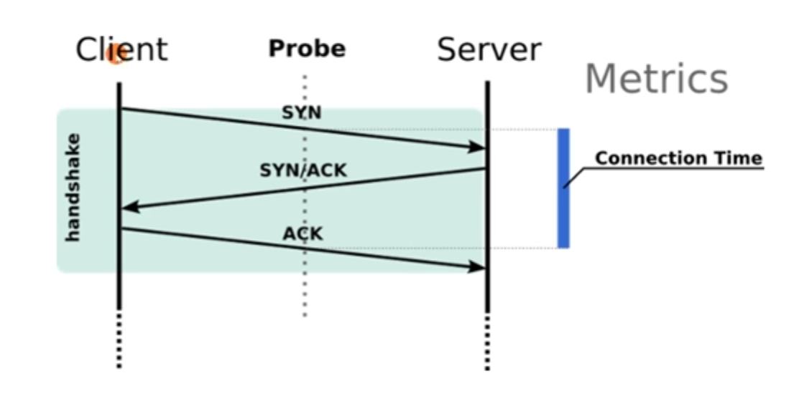

SYN: synchronous 同步
ACK: acknowledge 确认

- Client首先把它的SYN发给Server
- Server如果确认收到了SYN，需要回一个ACK（确认号码是所确认序列号+1），那么Client就知道Server收到了自己发的SYN
- 同时Server也要发一个自己的SYN，给到Client，让Client知道我的序列号在哪里
- Client收到序列号也要回个ACK

抓包查看三次握手
```shell
tcpdump -i lo port 80 -c 3 -S 
# -S, 使用绝对序列号替换相对序列号
```

三次握手报文
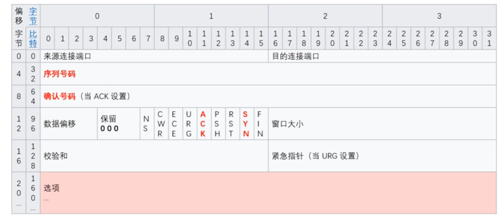

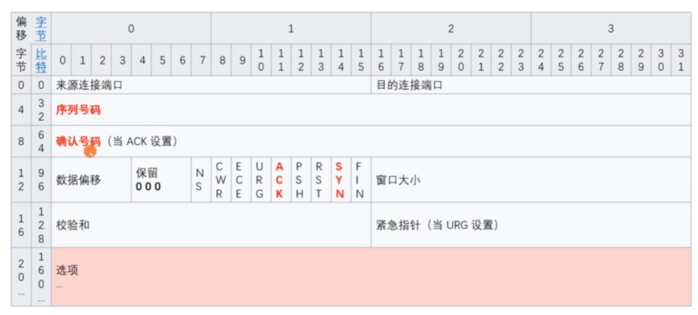

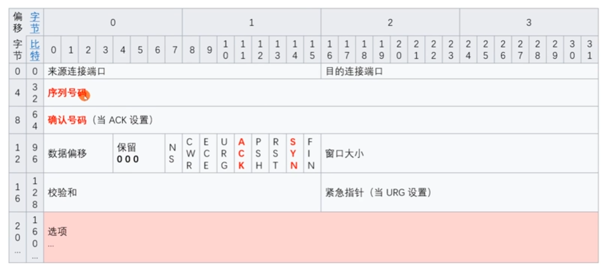

当执行三次握手的时候，客户端和服务器关于这条连接的状态都在发生变迁的，而我们了解了TCP连接的状态如何变迁的，我们才能更有效的定位一些困难的网路问题


#### 三次握手中TCP连接的状态变迁
当我们的服务器同时处理成千上万的TCP连接时，理解三次握手中的状态变迁，对我们定位复杂的网络问题是有帮助的

三次握手过程中涉及的5种状态
- CLOSE
- LISTEN
- SYN-SENT
- SYN-RECEIVED
- ESTABLISHED

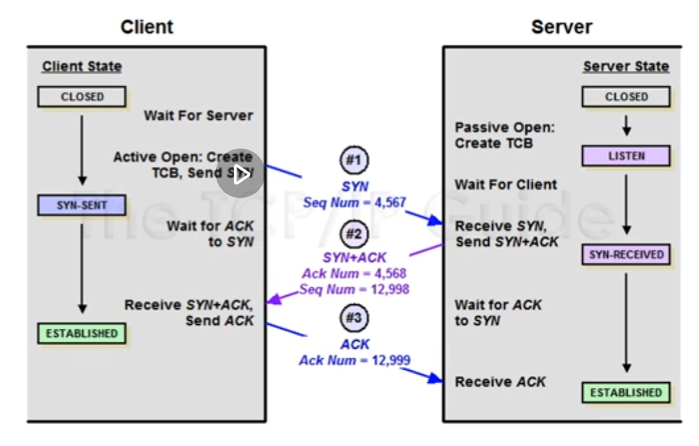

- 最初大家都是CLOSE状态，由于Server需要监听80或者443端口，因此Server处于Listen状态
- 在三次握手完成之后，大家都要处于ESTABLISHED的状态
- 状态的查看方法
```shell
# Linux上查看
netstat -anp | grep tcp;

# Windows查看
netstat - anop
```

- 首先我们的客户端发送一个SYN包，此时客户端会立即变为SYN-SENT状态（正常情况下，我们在netstat中很难看到SYN-SENT的状态，因为当我们收到了SYN+ACK包以后，就会从SYN-SENT进入到ESTABLISHED状态，这个过程非常短，大概只有几百ms）
- 当服务器收到SYN包后，就会从LISTEN状态进入SYN-RECEIVED状态，这个状态会延续到CLIENT返回ACK包，当Server端收到来自Client的ACK包，就会从SYN-RECEIVED状态进入ESTABLISHED

- TCB：Transmission Controller Block，保持连接使用的源端口，目的端口，目的ip，序号，应答序号，对方窗口大小，己方窗口大小，tcp状态，tcp输入/输出队列，应用层输出队列，tcp重传有关变量等


#### 服务器三次握手流程示例
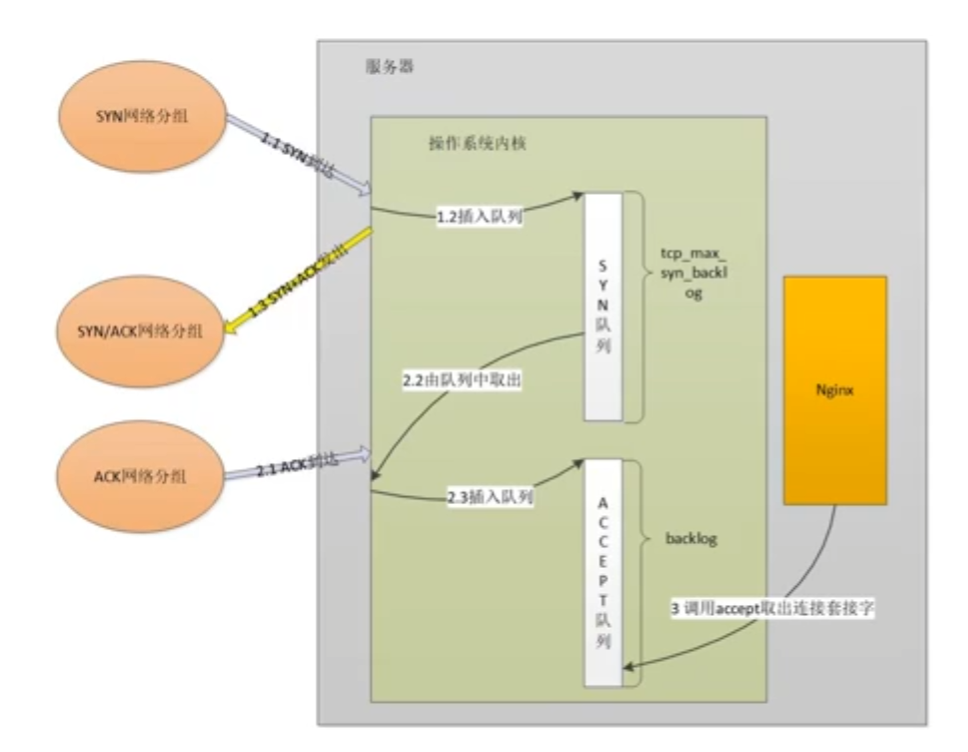

首先以服务器为例，看一下三次握手的流程
- 客户端发来SYN分组，到达了服务器，首先在服务器内核中（也就是我们对TCP层的实现），会把这个SYN分组插入到SYN队列中，同时会发送一个SYN+ACK数据分组给客户端，此时服务端处于SYN-RECEIVED状态
- 当客户端返回ACK分组后，服务端会进入ESTABLISHED状态
- 但实际上，在我们的kernel中，会把之前放入SYN队列中的SYN分组移出，将其放入ACCEPT队列，这样当我们的应用程序，比如Nginx，在调用accept方法时，就会从ACCEPT队列中，将刚刚的连接拿出来，交给相关的方法去使用
- 在上述过程中可以看到，在SYN队列长度和ACCEPT队列长度，跟我们的负载都是相关的，如果我们这是一个面向每秒服务几十万请求的高负载机器时，我们的SYN队列是一定要延长的，ACCEPT队列也是要延长的


#### 超时时间与缓冲队列
客户端调整
- **应用层Connect超时时间调整**：当然我们的客户端也可以调整，比如客户端调用connect方法时，通常会有一个connect_timeout,可以设置超时时间

服务器端设置(操作系统内核限制调整)
- 服务端SYN_RCV状态
  - net.ipv4.tcp.max.syn.backlog: SYN_RCVD状态链接的最大个数（即调整SYN队列大小）
  - net.ipv4.tcp_synack_retries：被动建立连接时，发SYN/ACK的重试次数(当我们发送了SYN/ACK后，一定时间内，没有收到ACK后的重试次数)

- 客户端SYN_SENT状态
  - 客户端在处于SYN_SENT状态时，如果对Linux这样一个负载均衡，或者需要向其他服务进行大量的TCP连接时，可以更改下述内核参数
  - net.ipv4.tcp_syn_retries=6 主动建立连接时，发SYN的重试次数
  - net.ipv4.ip_local_port_rang=32768 60999 建立连接时的本地端口可用范围

- ACCEPT队列设置
  - 设置ACCEPT队列长度(backlog)


#### Fast Open 降低时延
前提概念补充：
在TCP连接中，RTT（Round-Trip Time，往返时间）是指从发送一个数据包到接收到该数据包的确认所需的时间。具体来说，RTT包括以下几个阶段：

- 发送数据包：客户端发送一个数据包到服务器。
- 服务器处理：服务器接收到数据包并处理，然后发送一个确认包（ACK）回客户端。
- 接收确认包：客户端接收到服务器发送的确认包。

RTT时间是这整个过程所花费的时间。RTT是网络性能的重要指标之一，它反映了网络的延迟情况。较低的RTT表示网络延迟较小，数据传输速度较快；较高的RTT则表示网络延迟较大，数据传输速度较慢。

- TCP Fast Open (net.ipv4.tcp_fastopen)

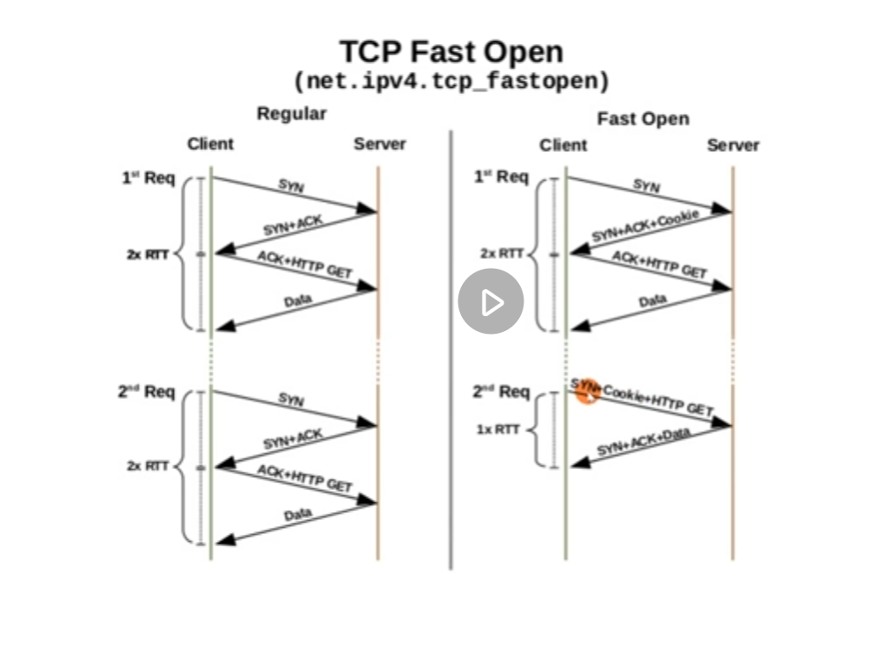

在我们发送一个http-get请求时，我们需要三次握手，收到一个SYN，还会收到一个ACK，在ACK中携带一个GET请求，这里一共用了两个RTT的时间（在TCP连接中，RTT,round-trip-Time,往返时间，是指从发送一个数据包到接受到该数据包的确认所需的时间），TCP提供了FAST OPen的功能，它所做的功能是
- 第一次建立连接的时候，Server端会生成一个Cookie，在发送SYN+ACK的时候，将Cookie发送给Client，Client会缓存这个Cookie，所以第一个发起连接的时候，还是需要2个RTT时间
- 但在第二次发送请求的时候，我们就跳过了3次握手，因为我们的Cookie中维护了我们上次建立连接的时候的相关信息，比如窗口，timestamp，TCP各种options等，我们直接把Cookie在SYN的时候发给Sever，同时将HTTP-GET请求也发给Server，此时只需要一个RTT时间就可以，相当与消除了三次握手的RTT的时延

#### Linux上打开TCP Fast Open
- `net.ipv4.tcp_fastopen`: 系统开启TFO功能
  - 0：关闭
  - 1：作为客户端时可以使用TFO
  - 2：作为服务器时可以使用TFO
  - 3：无论作为客户端还是服务端都可以使用TFO


注意：某些网络设备或防火墙可能不支持TFO，此外，在某些情况下，TFO可能会引入安全隐患，因此需要根据具体情况谨慎使用


#### 如何应对SYN攻击

攻击者短时间伪造不同IP地址的SYN报文，快速占满backlog队列，使服务器不能为正常用户服务

使用`tcp_syncookies`应对攻击

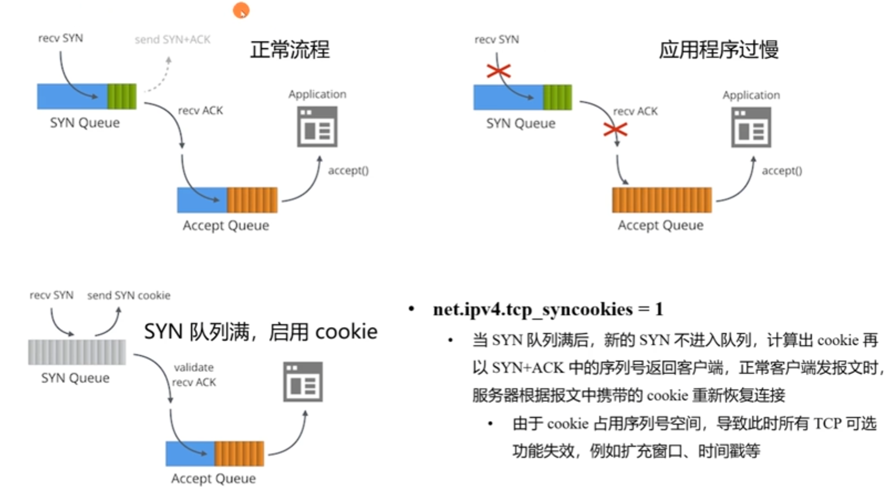

**tcp_syncookies**的问题是TCP的报文头部默认20个字节，所以在启用cookie的时候，实际上是占用了序列号空间，以及使得很多TCP可选功能失效


#### TCP_DEFER_ACCEPT

正常来说，服务器在收到ACK分组后，会将SYN分组从SYN队列转移到ACCEPT队列，然后应用程序从ACCEPT队列中，获取该分组进行处理
但启动了TCP_DEFER_ACCEPT之后，SYN分组到达ACCEPT后，并不会触发应用程序，而是直到后续data数据包到达后，再进行统一处理，这样效率更高


下面讲述：在已经建立好的连接中，是如何可靠的传输数据的？


### 数据传输与MSS分段
TCP是一个面向字节流的协议，它不限制应用层传输消息的长度，但实际上在TCP之下的网络层和链路层由于它们在发送报文时所使用的内存是有限的，所以它一定会限制报文的长度，因此**TCP必须把它从应用层那里接收到的任意长度的字节流，切分成许多个报文段**，那么切分报文段的依据是什么？又是怎样进行拆分的？


#### TCP应用层编程示例

```C
// client                                                      // server
int s = socket(2);                                             int s = socket(2);
                                  init                         bind(2);
gethostbyname(3);                                              listen(2);

connect(2)     ------------------------------------------>     accept(2)
    
read/write(2)                     I/O                          read/write(2)   // 操作系统会在这部中将我们发送的报文拆分成报文段
               ------------------------------------------>       
close(2)                                                       close(2)
```


#### 如何基于MSS最大报文段大小，来进行TCP报文段的拆分

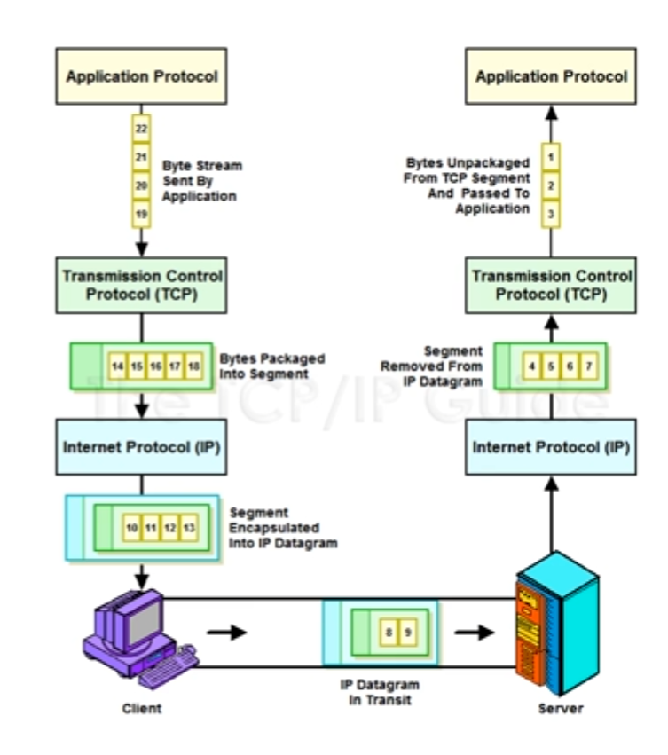

- **流分段的依据**
  - MSS: 防止IP层分段
    - 如果TCP不分层，IP层一定会分层，我们要避免IP层分层，因为IP层分层是很低效的
  - 流控：接收端的能力
    - 比如接收端一次只能接受4个字节，因为我的服务器此时可能非常繁忙，内存可能已经不够用了，或者应用程序没有及时将缓存区的内容读取出来，所以需要进行流控，此时也会影响分段大小

**MSS: MAX Segment Size**

- 定义：仅指TCP承载数据，**不包含TCP头部的大小**，参见RFC879
- MSS选择目的
  - 尽量每个Segment报文段携带更多的数据，以减少头部空间占用比率
  - 防止Segment被某个设备的IP基于MTU拆分,ip层拆分报文很低效，如果出现报文丢失，所有报文都要重传
- 默认MSS：536字节（默认MTU576字节,20字节IP头部，20字节TCP头部）
- 握手阶段协商MSS
- MSS分类
  - 发送方最大报文段SMSS：Sender Maximum segment size
  - 接收端最大报文段RMSS：Receiver Maximum segment size

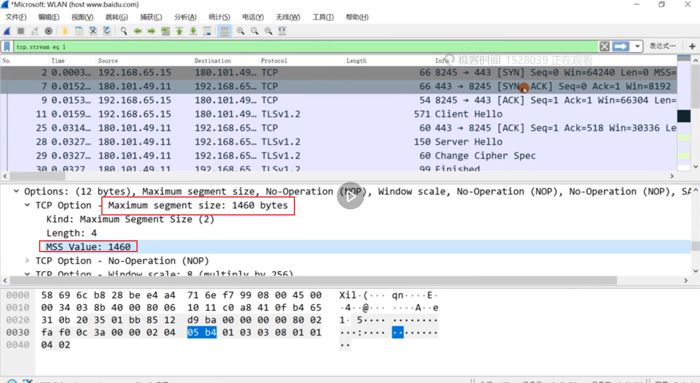
客户端发送MSS,告诉服务端，我使用1460字节

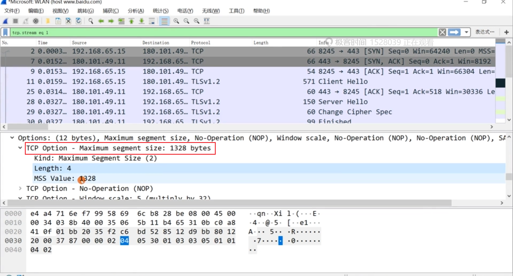
服务端也会发送MSS，给客户端，表示我的MSS是1328字节


将这些报文段发送给对方的时候，如何确定的对方是否收到，如果没有收到，是否需要重传

### 重传与确认
TCP通过重传与确认来保证每个Segment段一定会到达对方

- 理解：重传与确认演变为滑动窗口的过程
- 演化为滑动窗口后，定义TCP的序号，以及确认序列号

#### 序列号的设计理念
这里介绍序列号的设计理念

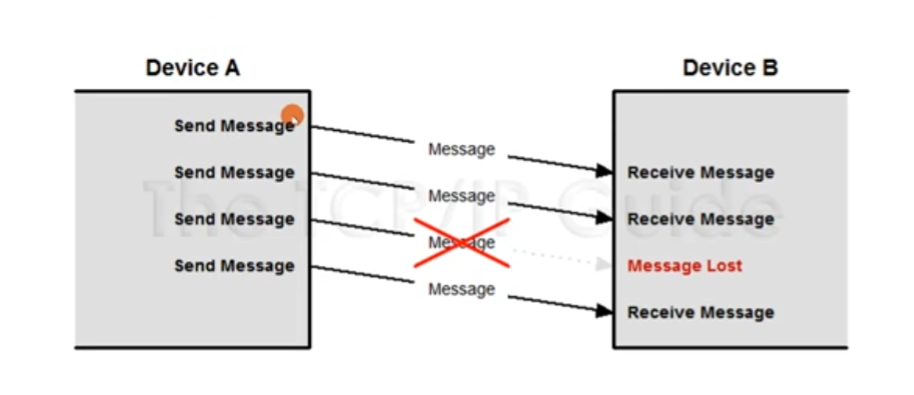

如图，这里发送了4条消息，当第3条消息丢了以后，如何解决

解决方法1：简单的使用定时器来重传
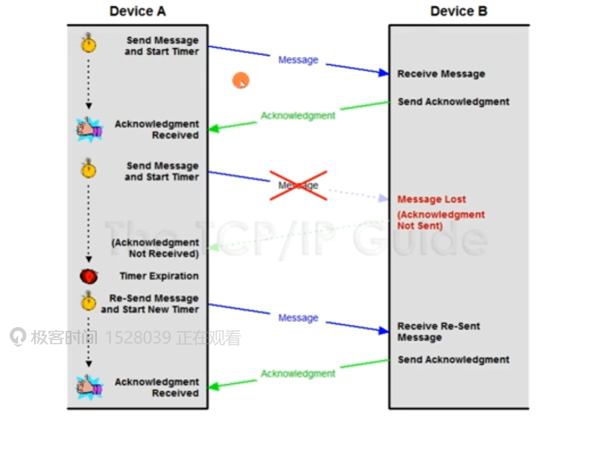

**PAR:  `Positive Acknowledgment with Retransmission`**
比如发送第一个消息的时候，启动一个定时器，第一个消息没发送完之前，无法发送第二个消息，直到在超时时间内，客户端接收到服务器发送的确认后，客户端发送第二个消息，发送第二个消息的时候，再启用一个定时器，如果在第二个超时时间内，没有接收到第二次的确认，就重新发送第二个消息，重发的时候，重启定时器，由此完成一个简单的重发确认功能

- 问题：
  - 效率低下：因为第一个消息没发送完之前，是不能发送第二个消息的，必须一个消息一个消息的串行发送

解决方案2：提升并发能力的PAR改进版
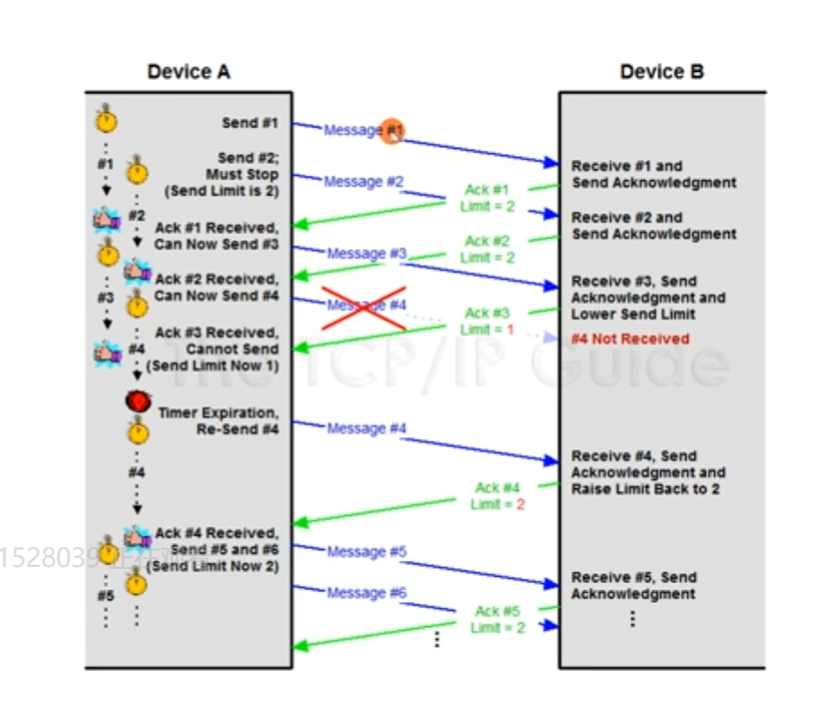

- 接收缓冲区的管理
  - Limit限制发送方

在发送消息的时候，添加#1的标识，返回响应的时候，也发送我响应的是哪个消息的标识ACK #1,从而可以实现并发的发送消息，但是这里有个问题，就是我的服务端的内存和处理能力是有限的，必须限制设备A，不能无限制的发送，所以需要添加一个Limit字段，告诉客户端，现在还有几个缓冲区，如果服务端现在还有2个缓冲区，则客户端只能向服务端发送两个消息，而不能是第三个消息，从而实现流控

解决方案3（真实的TCP实现）:Sequence序列号/Ack序列号
TCP中的序列号是针对每个字节的，而不像上面的那样是仅针对报文的，

- 设计目的：解决应用层字节流的可靠发送
  - 跟踪应用层的发送端数据是否送达
  - 确定接收端有序的接收到字节流

- 序列号的值针对的是字节而不是报文
发送SYN报文段
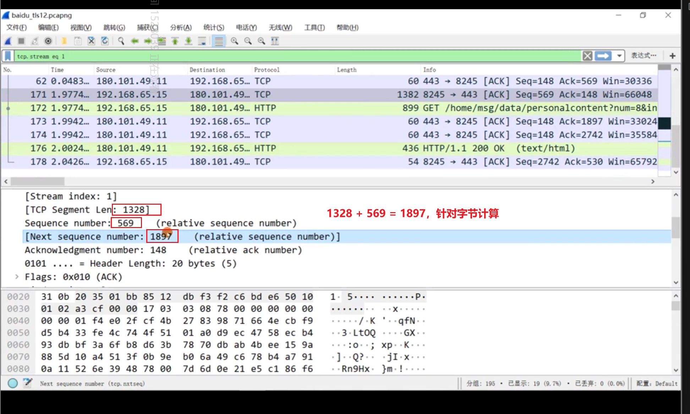
确认报文，确认SYN=1897的序列号的报文 
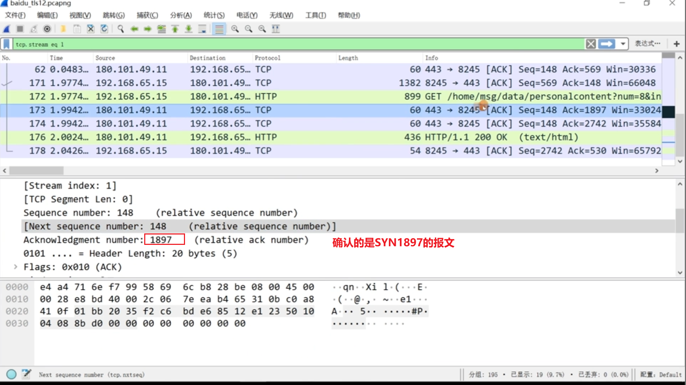
Windows size value = 1032，后续还可以发送1032字节
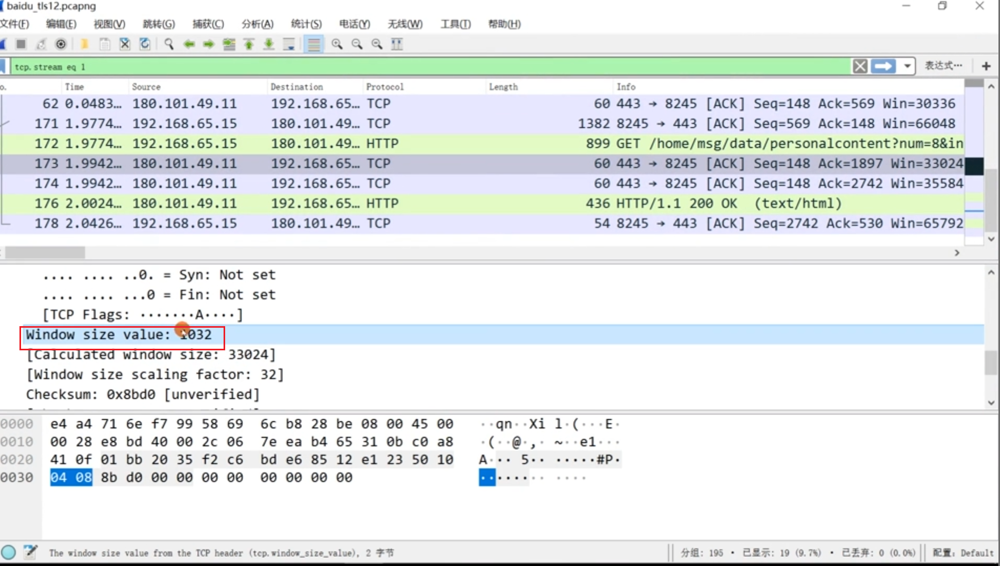

TCP序列号由于是32位，导致如果我们发送2^32，约4G数据后，还在连接状态数据传输，我们就需要复用最初的SYN序列号，此时就会出现问题，该问题就是PAWS

**PAWS (Protect Against Wrapped Sequence number) 防止序列号回绕**
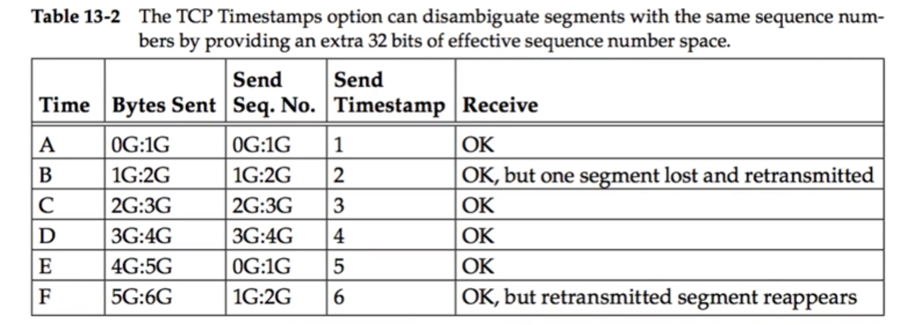

比如在A时间点发送0G到1G字节，此时相对序列号就是0G到1G，B时间点发送1G到2G，但是此时B时间点的数据包丢失了，在后续F时间点重传，在后面E时间点，此时已经发生了SYN复用问题，发生了回绕，在F时间点，就需要发送1G到2G的序列号，但是B时间点重发的1G到2G和F时间点发的新的1G到2G同时发送到接收端，此时接收端就无法判断到底哪个才是真实的消息，就会把消息覆盖掉

这个问题通过TCP Timestamp可以解决，我们发生消息的时候，带上时间戳，

**TCP Timestamp（TCP timestamp在TCP options中使用）**

- 更精准的计算RTO
- PAWS


TCP为了保证Segment段能够可靠的送到接收方，使用了确认与重传机制，其中我们重传的时候，需要设置一个定时器，这个定时器的时间，究竟应该设置为多大，是非常有技术含量的，下面我们学习计算重传计时器的时间该如何设置


#### RTO—重传定时器的计算
当指定时间内，我们没有收到对方的确认，我们需要重传这个Segment，这个时间究竟是多长


**计算RTT的方法**

我们每次发送的报文都有一个Seq序列号，当我们收到回来的ACK的时候，ACK的确认报文的Seq和我们发送的Seq，是可以对照起来的，而我们发送的每一个Seq，在我们的Kernel中会有一个数据结构TCB，这个数据结构中是有时间的，我们一减就能得到RTT时间


但实际上RTT的计算更为复杂，因为这里设计到重传


一共有两种重发的场景，在第一种情况，以RTT2为准，在第二种情况，以RTT1为准
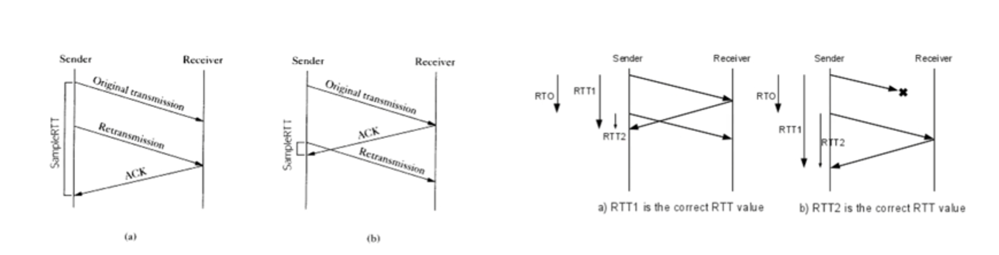

所以没有办法很好的同时照顾两种场景，所以需要采用另一种RTT的测量方法

**RTT测量的第2种方法**

- 发送时间
  - 数据包中Timestamp选项的回显时间
  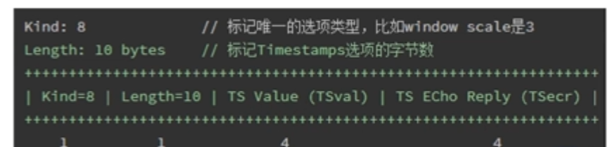

Timestamp上有发送的时间，也有重发的时间，这样就可以更精准的测量


RTO（Retransmission Timeout）应该设置多大
- **RTO应当略大于RTT**，但是由于网络状态和链路时常会变动，因此RTO也需要响应改变，因此RTO应该有平滑性

- **平滑RTO：RFC793，降低瞬时变化**
  - 具体计算方法（略）
- **追踪RTT方差**
  - RFC6298，其α= 1/8，β=1/4，k=4，G为时间最小颗粒 -------- 上述参数是根据统计总结出来的，没有什么理论基础，但是实际效果不错，大部分操作系统，都在使用这种方式计算RTO
    - 首次计算RTO，R为第一次测量出的RTT
      - SRTT（smoothed round-trip time） = R
      - RTTVAR (round-trip time variation) = R/2
      - RTO = SRTT + max(G, K*RTTVAR)

    - 后续计算RTO，R‘为最新测量出的RTT
      - SRTT = (1 - α) * SRTT + α * R'
      - RTTVAR= (1 - β) * RTTVAR + β * |SRTT - R'|
      - RTO = SRTT + max(G, K*RTTVAR)


上面介绍了RTO重传计时器的计算方式，但是实际上发送数据或者重传数据，还必须考虑接收方的处理能力，而这部分的问题使用滑动窗口解决


### 滑动窗口：发送窗口与接收窗口

#### 发生窗口快照
1. 已发送并收到Ack确认的数据：1-31字节
2. 已发送未收到Ack确认的数据：32-45字节
3. 未发送但总大小在接收方处理范围内：46-51字节
   - 我们还没有发送，但是对方的接收窗口只有这么大，也就是说我们只能发送这么多，是在对方的处理范围之内的
4. 未发送但总大小超出接收方处理范围：52-字节
   - 我们的应用程序已经明确的调用write等方法告诉我们需要发送的字节，但是这些字节是在接收方处理范围之外的

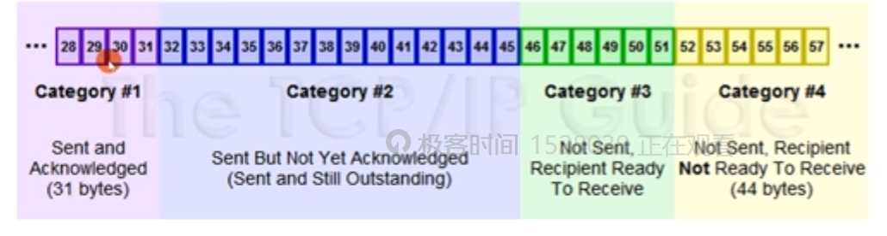

#### 可用窗口/发送窗口
- 可用窗口：46-51字节
- 发送窗口：32-51字节
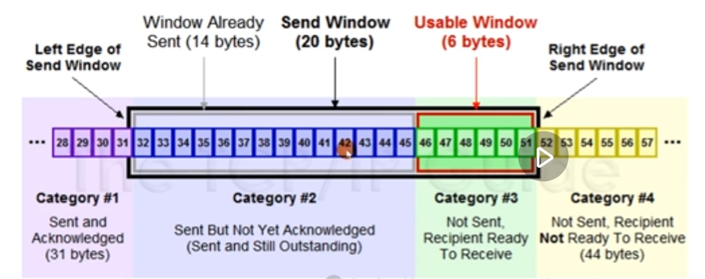

当46-51字节已发送，此时可用窗口耗尽
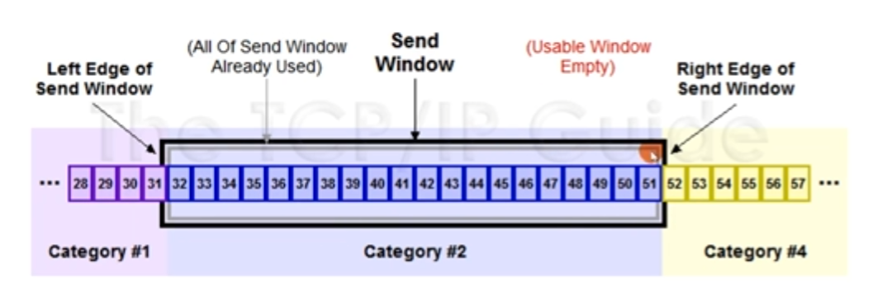

当32-36字节已确认
- 发送窗口移动
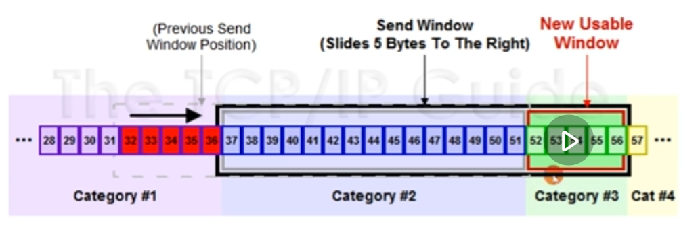

因为我收到了5个字节，这样，发送窗口右移5个字节，此时，新的可用窗口（52-56），此时又可以发送5个字节，这就是所谓的滑动窗口

发送窗口
- SND.WND（Send Window）：发送窗口(20字节)
- SND.UNA：一个指针，指向已发送未收到ACK的首部
- SND.NXT：指向可用窗口的第一个字节的指针

所以：Usable Window Size = SND.UNA + SND.WND - SND.NXT


#### 接受窗口
通常接收窗口约等于对端发送窗口的接收窗口
- RCV.WND
  - 接收窗口，与我们的内存缓存区大小设置有关，通常接收窗口和发送窗口应该是相等的，但是我们的滑动窗口并不是一成不变的，如果我们的应用进程读取速度过快，我的接收窗口可以很快空出来，空出来之后，需要通过TCP报文中的Windows字段来传递，这个传递是有时间延迟的，随意这里是约等于的关系

- RCV.NXT
  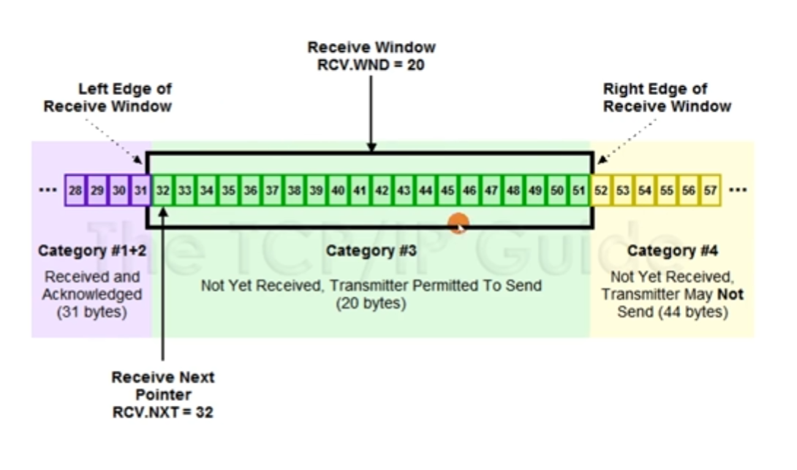

### 滑动窗口实例：
前提：MSS不产生影响（MSS是与网络路径相关的，而TCP连接中的网络路径是有可能变化的，这里简化，默认不产生影响），窗口不变（实际情况中，发送和接收窗口的大小与我们的缓冲区相关，也与进程读取缓冲区的速度有关）
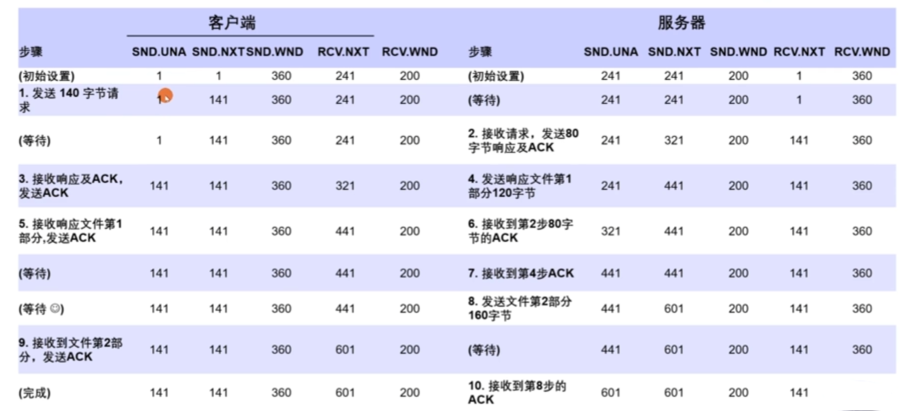

- 首先客户端发送一个http-get请求,该请求大小140字节，此时SND.NXT=141
- 服务器接收到该请求后，要返回一个响应，该响应有一个80字节的头部+280字节的body，首先先发送80字节的头部，并且告诉客户端140字节已收到，发送一个ACK报文
  - 此时服务器的RCV.NXT变为141，SND.NXT=241+80=321
- 客户端收到80字节后，接收窗口RCV.NXT=321，同时收到了ACK，因此SND.UNA=141，并向服务端发送ACK(第3步发送的Ack，第6步才到)
- 服务器读取自身280字节大小的文件，那现在能不能发送280字节的文件呢，这个时候流控就发生了影响！服务器发送body部分的280字节，但是由于此时可用窗口为241+200-321，只有120字节，因此此时流控发生作用，这里只能发送120字节，SND.NXT变为441
- 客户端收到响应文件的第1部分，此时接收窗口变为321+120=441，同时发送ACK给服务端，
- 服务端此时先收到第3步发送的ack，知晓第一个响应头部的80字节已经被确认了，SDN.UNA=241+80=321(理论上此时服务端的可用窗口应该向后滑动80字节)
- 紧接着收到第四步，也就是第二个响应文件120字节的ACK包，SDN.UNA=321+120=441,又腾出了120字节，此时服务器的可用窗口大小应该为200字节
- 第8步，因为此时可用窗口为200字节，满足剩下的160字节，因此将剩下的全部发送给客户端，此时可用窗口还剩40字节，SND.NXT=441+160=601字节
- 第9步中，接收到文件第2部分，发送ack，RCV.NXT=441+160=601,
- 在第10步，服务器收到了第160字节的响应报文的ACK，此时SND.UNA=441+160,变为601，此时可用窗口再次变为200字

#### 客户端发送消息的角度
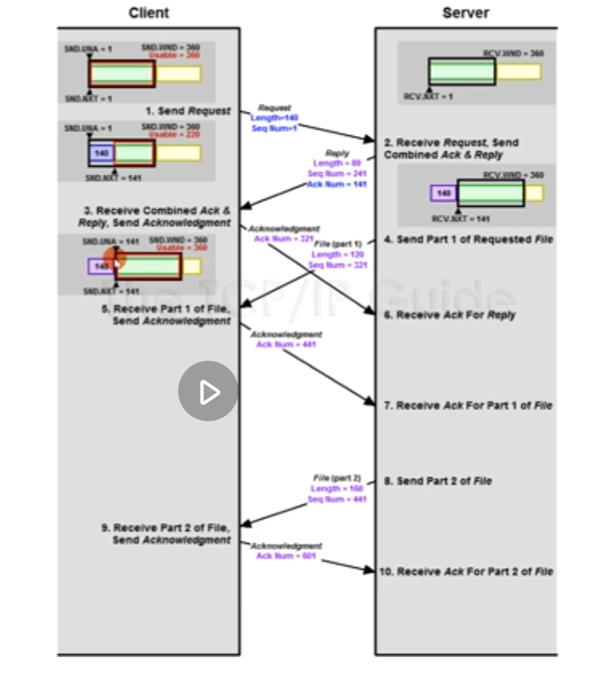

- 客户端发送消息，最初发送窗口是360字节，可用窗口也是360字节，当发送140字节的请求后
- 可用窗口减少为220字节，所以此时的SDN.UNA不变，SDN.NXT指向141
- 当后续收到Server发回来的ACK后，SDN.UNA向后移动140字节，此时可用窗口又变成了360字节

#### 服务器发送消息的角度
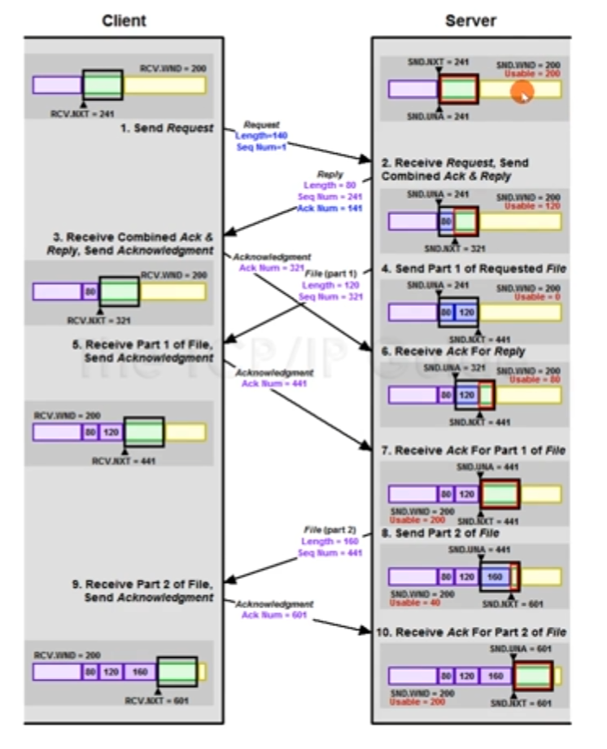

- 最初服务端的发送窗口的可用窗口是200字节，但它的发送窗口也是200字节，然后它发送了一个80字节的header，响应包的头部信息，发送完后，可用窗口变为120字节，
- 紧接着它要发送一个280字节的文件，但是此时它的可用窗口只有120字节，所以它只能把文件拆成两部分，一个120字节，一个160字节，发送完120字节后，它的可用窗口变为0（即窗口关闭）
- 当在 后续收到客户端发过来的80字节的ACK包后，Server此时又空出了80字节，但是此时80字节还是不够，后续等到又收到客户端发过来的120字节的ACK包后，此时可用窗口变为200字节，大于160字节，所以在第8步发送了剩余160字节的数据，此时可用窗口还剩40字节
- 当最后收到客户端发过来的160字节的ACK包后，可用窗口变为了200字节


### 操作系统的缓冲区和滑动窗口之间的关系
在上述示例，假定MSS不产生影响，窗口不变，但是实际上，发送窗口和接收窗口所存放的字节数都是放在操作系统的缓冲区中的

而操作系统的缓冲区会被操作系统调整，当我们的应用进程无法及时读取缓冲区中的内容时，也会对缓冲区造成影响

#### 窗口与缓存
- 应用层没有及时读取缓存
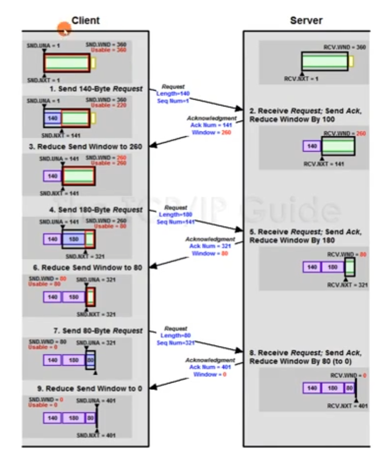

- 起初，客户端的发送窗口是360字节，它的可用窗口也是360字节；而服务器端的接收窗口也是360字节
- 第一步，客户端向服务端发送140字节给服务器，所以客户端的发送窗口仍然是360字节，但是它的可用窗口变为360-140=220字节，
- 服务器收到140字节后，它的接收窗口却变为了260字节，因为此时应用进程将140字节读取了40字节，还有100字节，进程没有读取，因此我们本身窗口是360字节，但是因为缓存里有100字节没有被读取，被占用了，导致接收窗口变为了360-100=260字节（接收窗口的第一次收缩）
- 服务端的接收窗口收缩后，通过TCP报文的Window字段（此时Window=260），带给客户端，客户端此时就会把发送窗口也从360减为260
- 第四步，客户端向服务端发送180字节，因为180字节小于当前可用窗口260字节，所以发送了180字节后，可用窗口变为了260-180=80字节，但是此时发送窗口仍然是260字节
- 第五步，服务端收到180字节后，我们假定我们的应用进程仍然没有读取新来的180字节，所以我们的接收窗口又收缩为260-180=80字节
- 服务端在向客户端发送ACK报文的时候，又会携带Window=80字段
- 客户端收到后，发送窗口变为80字节
- 第七步，客户端向服务端发送80字节后，可用窗口为0
- 服务器收到客户端发送的80字节后，本身的接收窗口收缩为0，因为应用进程仍然没有读取这个数据，而是占用了缓存，
- 此时服务端在向客户端发送ACK包时，携带window=0，告诉客户端
- 客户端的可用窗口收缩为0，**窗口关闭**


#### 收缩窗口导致丢包


- 客户端发送一个140的请求，当然双方的窗口都是360字节，发送完140字节到服务后，服务器上发生了缓存收缩的行为
  -  比如服务器本来运行100个进程，但是如果此时是500个进程，那么此时我们的内存是紧张的，内存紧张后，就会导致每个socket，或者每个连接的缓存往下降一降，此时将360字节的缓存降为240字节，我们的服务在接受到140字节后，由于进程繁忙，仍然没有读取这140字节，所以此时我们的接收窗口就会变为100字节（240-140），然后在ack中将windows的值变为100发给客户端，但是这个ack到达客户端是比较久的

-  所以在第三步的时候，客户端并不知道server的接收窗口只有100字节，在它看来可用窗口仍是220字节，所以此时想服务端发送一个100字节的请求，这180字节其实已经大于100字节了，已经超出了服务端的接收窗口的大小，因此此时就要把这个报文丢弃掉
- 第五步的时候，客户端才收到ack返回的包从而将发送窗口同步到100字节，但此时客户端的已发送未确认是180字节，所以必须再向左收缩80字节
- 实际操作系统是不会让上述事情发生的，因为不会既收缩窗口又降低缓存，而是先收缩窗口再降低缓存，来避免上述事情的发生
- 上述情况中，我们客户端的发送窗口为0了，但是客户端是不能被动等待对方发送一个tcp报文，其中报文的windows字段大于0，这个是不可靠的，因为可能服务端后续就不发送报文了，也不会发送ack，因为之前的ack都已经发送给client了，所以此时客户端需要定时的发送一种探测窗口给server，如果server此时的窗口从0变为正数打开后，我们的client就会及时知道


#### Linux中对TCP缓冲区的调整方式
- net.ipv4.tcp_rmem=4096 87380 6291456
  - 读缓存最小值，默认值，最大值，单位字节，覆盖net.core.remem_max
- net.ipv4.tcp_wmem=4096 16384 4194304
  - 写缓存最小值，默认值，最大值，单位字节，覆盖net.core.wmem_max
- net.ipv4.tcp_mem=1541646 2055528 3083292
  - 系统无内存压力，启动压力模式阈值，最大值，单位为页的数量
- net.ipv4.tcp_moderate_rcvbuf=1
  - 开启自动调整缓存模式

在linux中，当我们的操作系统现在压力非常大， 比如说从100个进程变到了1000个进程时，此时内存非常紧张，此时我们可以将缓存像小调一些

当我们进程少以后，可以在调大一些


**实际上当我们发送报文的时候，我们不止要考虑发送窗口中的可用窗口，还需要考虑发送效率**


### 如何减少小报文提高网络效率
当我们的TCP segment报文段中承载的信息数据非常少的时候，例如只有几个字节，整个网络的效率是很低的，因为每个TCP segment中都会有固定的20个字节的TCP头部，也会有固定的20个字节的IP头部，这样在整个TCP segment中，有效信息所占的比重就会非常的低。我们应该尽量在合理范围内，避免大量传输小报文

#### SWS(Silly Window syndrome)糊涂窗口综合征
场景：Server当前非常繁忙
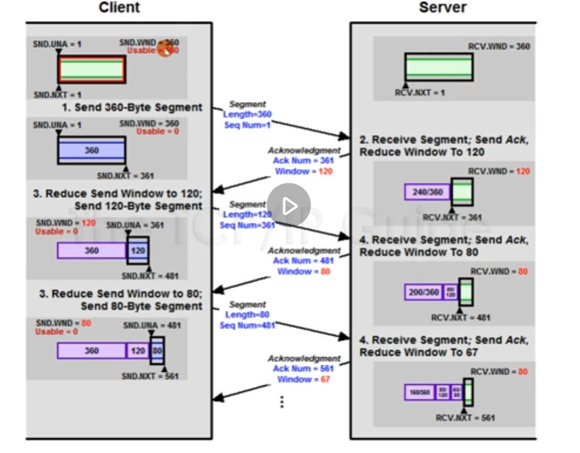

- 初始客户端的发送窗口和可用窗口都是360字节，而Server的接收窗口也是360字节
- 客户端向服务端发送一个大报文，直接用光360字节，而此时Server端由于程序进程繁忙，可能只能处理120字节的数据，而还有240字节会缓存在缓冲区，因此此时我们的发送窗口从360字节降低为120字节，我们把120字节的窗口通过ack传递给客户端
- 此时客户端的发送窗口变为120字节，虽然客户端有大量数据要发送，但此时它只能发送120字节了
- 这120字节发送给server后，Server本来进程处理的速度已经很慢了，此时Server只能再次把40字节传递给应用进程，此时接收窗口就从120字节降低为80字节，并通过ACK包传递给客户端
- 客户端发现可用窗口变为80字节，于是，只能继续发送80字节数据给Server
- Server此时可能只处理了13个字节，Server只能将可用窗口降低为67字节，有告诉了客户端
- 以此往复，服务端的接收窗口会越来越少，整个网络中的效率会越来越低

实际上更好的解决方法是：应该等等Server让它有时间把缓冲区中的数据处理掉，实际上就不会出现反复传输效率低下的TCP Segment

#### SWS避免算法

- 接收端
  - David D Clark算法：窗口边界移动值小于min(MSS,缓存/2)时，通知窗口为0

- 发送方：

  

  - Nagle算法：TCP_NODELAY用于关闭Nagle算法
    - 没有已发送未确认报文段时，立刻发送数据
    - 存在未确认报文段时，直到：1-没有已发送未确认报文段，或2-数据长度达到MSS时再发送

#### TCP delayed acknowledgment 延迟确认
实时上，当没有携带数据的ACK它的网络效率也很低，因此衍生出一个TCP delayed acknowledgment的延迟确认

- 当有响应数据要发送时，ack会随着响应数据立即发送给对方
- 如果没有响应数据，ack的发送将会有一个延迟，以等待看是否有响应数据可以一起发送
- 如果在等待发送ack期间，对方的第二个数据段又到达了，这时要立即发送ack

延迟时间算法(HZ大小和时钟频率有关，每个操作系统可能都不一样)
```c++
#define TCP_DELACK_MAX ((unsigned)(HZ/5))
#if HZ >= 100
#define TCP_DELACK_MIN ((unsigned)(HZ/25))
#define TCP_ATO_MIN ((unsigned(HZ/25)))
#else
#define TCP_DELACK_MIN 4U
#define TCP_ATO_MIN 4U
#endif 
```

HZ的查询方法
```shell
cat /boot/config-`uname -r` | grep '^CONFIG_HZ='
```

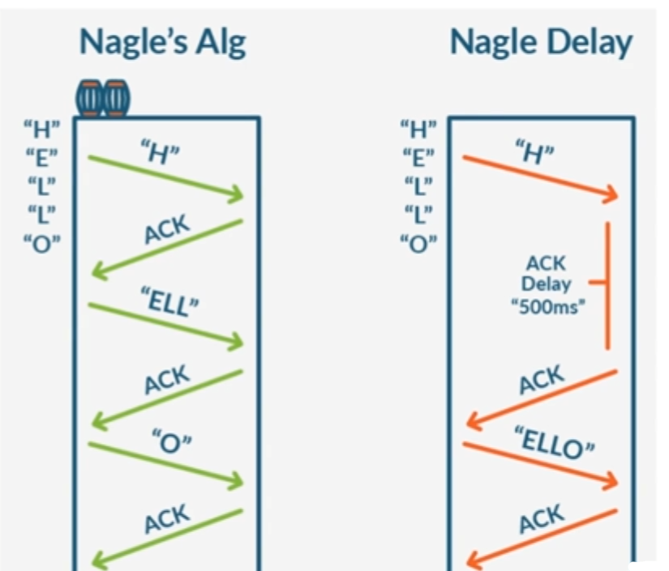

Nagle算法和 Delay之间会出现问题，因为我们一开始发送一个小数据包，客户端等不到ACK包就不会发送下一个包，而服务端等不到对方第二个数据段，就会有会延迟产生

如何解决Nagle算法下，一定会有一个小报文在网络中发送，后续的报文都在等这个小报文的ACK，才能继续发送，而延迟确认又会导致ACK Delay一定会发生

解决方案：
- 关闭delayed ACK: TCP_QUICKACK
- 关闭Nagle：TCP_NODELAY（关闭发送端）


**Linux上更为激进的“nagle”：TCP_CORK**

- 需结合sendfile零拷贝技术使用


#### 扩展：零拷贝技术
我们本身在linux上需要把一个磁盘中的文件，通过TCP发给客户端，我们需要先把这个文件读取到用户态的内存中，在从用户态的内存中，发给linux Kernel的缓冲区，经过发送窗口，再发送给客户端

但是有了sendfile，可以直接由内核把磁盘中的文件读入到TCP发送缓冲区中直接发送，这样就减少了两次拷贝


### 拥塞控制
由于TCP协议向应用层提供不定长的字节流发送方法，使得TCP协议先天性的就有意愿去占满网络中的每个带宽，但是当网络中许多TCP来来连接同时试图去占满整个带宽时，就有可能出现恶行拥塞事件，所以TCP的拥塞算法是十分必要的，当它们实施以后也能够有效的降低网络中的拥塞，提升所有TCP连接的发送速度


**全局思考：拥塞控制**

- **慢启动**
- **拥塞避免**
- **快速重传**
- **快速恢复**


**理想中的情况**：当没有达到1000M的时候，吞吐量是缓慢上升的，到了1000M就保持在1000M的水平

**实际情况**：比如从R1过来的流量是700M/s，从R2过来的流量是600M/s，但是实际上R3能够传输的流量是1000M每秒，所以一定会有300M的数据被R3丢掉，当R3发生丢弃过载的数据包的时候，R3上的队列也会非常的长，使得每个报文在网络中待的事件也会更长，RTT时延也会过长，所以实际上发生的这样的，当轻度拥塞的时候，吞吐量就已经下降了，当重度拥塞的时候，实际上整个网络是非常糟糕的，而拥塞控制实际上包含四部分：慢启动、拥塞避免、快速重传、快速恢复


#### 拥塞控制历史

- **以丢包作为依据**
  - New Reno：RFC6582
  - BIC：Linux2.6.8-2.6.18
  - CUBIC（RFC8312）：Linux2.6.19
- **以探测带宽作为依据**
  - BBR(Google)：Linux4.9


#### 慢启动

- **拥塞窗口cwnd（congestion window）**
  - 通告窗口rwnd（receiver's advertised window）
    - 在TCP的报文头部，有一个Window字段，window字段就是通告窗口，也就是对方的接收窗口
  - 发送窗口swnd = min(cwnd, rwnd)


最初的时候，我们的拥塞窗口只有一个MSS，比如一个Pakcet，当我收到一个ack后（即没有发生丢包），这个时候将1个cwnd扩展成2个cwnd，当两个cwnd对应的ack收到后，认为没有发生丢包，此时就可以发送4个cwnd，...后续以次类推，它是以指数的方式非常快速的去上升发送窗口的


上述慢启动过程解决的问题是：当一开始不清楚当前网络中的状态的时候，应该先少发一些飞行中的报文，当我确定网络中没有丢包的时候，我再快速增加拥塞窗口，这就是慢启动的意义所在


上述例子中，我们初始的是1个MSS，但实际上现在的慢启动，初始是10个MSS


**慢启动的初始窗口**

- **慢启动初始窗口IW（Initial Window）**的变化

  - 1 SMSS：RFC2001（1997）
  - 2-4 SMSS：RFC2414（1998）
    - IW = min (4*MSS，max(2 * MSS, 4380))
  - 10 SMSS：RFC6928（2013）
    - IW = min (10*MSS，max(2 * MSS, 14600))

  


最初的时候也就是1997年，规定的是1个SMSS，到了1998年，重新定义了IW的公式，在这个公式中，我们的初始窗口是2个到4个，如果我们要发送的报文占有3个SMSS，那一次性就发完了，如果是6个，需要2个RTT，10个需要3个RTT；后面谷歌发现互联网中的网页通常需要10个RTT左右，这个时候，如果我们还采取初始的3个SMSS，那么会使得一定会浪费3个RTT去传递最初的HTML信息，随意Google建议使用初始SMSS=10

```ABAP
慢启动增长的是发送窗口（cwnd），这导致发送的包的数量增加，而不是包的大小。每次收到 ACK 后，发送窗口扩展，允许发送更多的包。最终表现为在一个 RTT 内，TCP 发出的包数量随着 cwnd 增长而增加。
```


**慢启动一定要和拥塞避免同时使用**


#### 拥塞避免算法

慢启动算法是以指数级来增加拥塞窗口的，所以当出现丢包时，丢包的数量一定会非常大，拥塞避免则可以很好的解决这个问题


- **慢启动阈值ssthresh(slow start threshold)：**
  - 达到ssthresh后，以**线性方式**增加cwnd
    - cwnd += SMSS * SMSS/cwnd

 


- 最初以4个MSS作为IW，以2倍的速度改为8
- 然后依次增长为16、32、64
- 当达到64，此时还没有达到最初的慢启动阈值的时候，就已经发生丢包了
- 出现丢包后，此时拥塞窗口是64，所以将新的慢启动阈值设置为32，即拥塞窗口的一半
- 然后重新从4个mss作为初始拥塞窗口，然后在32的时候做拥塞避免，开始以线性的方式增长
- 当到达红色点的进入快速恢复，快速重传，
- 当后续出现丢包的时候再次进入慢启动


当出现丢包时，我们将重新执行慢启动，此时意味着拥塞窗口大幅度下降，我们发送数据也会大幅度下降，当丢包出现的还不是很严重的时候，我们还可以通过快速重传与快速恢复这个阶段


#### 快速重传和快速恢复


**为何会接收到一个失序数据段？**

- 若报文丢失，将会产生连续的失序ACK段
- 若网络路径与设备导致数据段失序，将会产生少量的失序ACK段
- 若报文重复，将产生少量的失序ACK段


拥塞控制解决的是第一种情况，防止出现连续的失序ACK段


##### 快速重传


- **接收方**：
  - 当接受到一个失序数据段时，立刻发送它所期待的缺口ACK序列号
  - 当接收到填充失序缺口的数据段时，离开发送它所期待的下一个ACK序列号


- **发送方**
  - 当接收到3个重复的失序ACK段（4个相同的失序ACK段）时，不再等待重传定时器的触发，立刻基于快速重传机制重传报


收到重复ACK，意味着网络仍在流动，我们没有必要进入慢启动，可以进入快速恢复


##### 快速恢复

- 启动快速重传且正常未失序ACK段到达前，启动快速恢复
  - 将ssthresh设置为当前拥塞窗口cwnd的一半，设当前cwnd为ssthresh加上3*MMS
  - 每收到一个重复ACK，cwnd增加1个MSS
  - 当新数据ACK到达后，设置cwnd为sshtresh


 

由于TCP的确认号采用的是累计确认的方式，所以当接收方没有收到报文5，而是收到了报文6,7,8，它只能反复的向发送方返回ACK5，此时发送方并不知道报文5没有发过去，但是6,7,8是否发过去了，所以发送方要么采用积极的方法，重传报文5,6,7,8，要么选择乐观的方法，只重传报文5


#### 选择性确认协议


它将可以更有效的仅重传丢失的报文段


#### Google-BBR拥塞控制算法


**基于测量驱动的拥塞控制算法**


**基于Pacing_gain调整**


### TCP四次挥手


- 首先Client和Server都处于ESTABLISH的状态
- Client首先发起关闭连接，它是主动发起关闭的一方，它会发送一个报文，这个报文的flags标志位的FIN置为1，发送完FIN包后自动进入FIN-WAIT-1状态
- 服务器接收到FIN分组后，在操作系统的内核层会自动回一个ACK，并且将状态从ESTABLISH转变为CLOSE-WAIT状态
- 当Client一旦收到这个ACK分组，会自动从FIN-WAIT-1转变为FIN-WAIT-2
- 当Server进入CLOSE-WAIT状态后，如果Server上的APP没有去处理这样一个的事件，那么连接的状态将永远处于CLOSE-WAIT状态，当我们有一些web应用出现bug的使用，就很容易观察到CLOSE-WAIT的状态
- 当APP通过read()函数接受到0的时候，它就知道它应该关闭这个连接了，当它调用了CLOSE()这个socket之后，我们的Server就会发一个FIN包给Client，当Server发完FIN包之后，Server连接状态就会进入LAST-ACK状态
- 当FIN包到达Client之后，Client的状态就会自动进入TIME-WAIT状态，表示主动关闭连接
- 当Clinent收到第二个FIN分组后，它就会发送一个ACK
- Server收到ACK分组后，就会进入CLOSE状态
- 而Client发完ACK后，要等待两个MSL时间（TCP报文段能够存活的最长时间），才会进入CLOSED状态


**下面是数据包示例**

这里的ACK是确认上一个包的确认包，FIN置为1，此时101.227.172.11就会进入FIN-WAIT-1状态


当192.168.65.15，收到了101.227.172.11的FIN分组，就会进入CLOSE-WAIT状态，等待APP调用CLOSE() Socket方法

这个ACK一但到达101.227.172.11，101.227.172.11关于这条连接就会进入FIN-WAIT-2状态


 当192.168.65.15执行了CLOSE() Socket，就会从CLOSE-WAIT状态变为LAST-ACK状态，并发送FIN,ACK分组


当101.227.172.11收到第二个FIN分组后，就会进入TIME-WAIT状态，那么它同时会发送最后一个ACK

192.168.65.15收到这个ACK后，就会从LAST-ACK置为CLOSED状态


#### 两端同时关闭连接


#### 优化关闭连接时的TIME-WAIT状态

主动关闭连接的一方在最后会进入TIME-WAIT状态，TIME-WAIT状态通常会保持在2分钟左右，也就是说有2分钟左右，这个端口是被占用的，这对于同时处理大量TCP连接的服务器来说，是非常大的负担。所以我们总是在想办法减少TIME-WAIT的时间


**TIME-WAIT状态过短或者不存在会怎么样？**


右边这张图中，发送三个报文，1,2都正常被接收到了，3丢弃掉了，这个时候，如果右边的一端主动发送了FIN分组，进入FIN-WAIT1，然后客户端也发送了FIN-ACK，正常的关闭，如果没有TIME_WAIT状态，或者TIME_WAIT时间过短，就会发生问题


比如：我们同时又复用了这个端口，因为一个连接是通过端口+IP这样的一个四元组来标识的，因此当我们复用这个端口的时候，就相当于使用之前的那个连接，我们建立好3次握手后，发送数据的时候，假定之前的报文3不是丢失了，而是在网络中被延迟了，现在它收到了就会对接收方造成数据错乱的影响，所以TIME_WAIT状态是有保护的效果的，**防止延迟的数据扰乱新连接**


#### Linux下TIME_WAIT优化：tcp_tw_reuse


使用这个内核参数的危险性比较小，因为当开启这个功能后，它仅仅意味着，当作为客户端的时候，建立一个新连接时，可以使用仍然处于time_wait状态的端口，前面提到过TCP有一个timestamp这样一个功能，由于有timestamp，所以我们可以拒绝迟到的报文，因为上面有时间戳，能够知道它是属于上一个连接的报文，而不是当前的连接的报文，**所以两个参数要同时启用**


## WebSocket协议


### Wireshark过滤器

- **捕获过滤器**
  - 用于减少抓取的报文体积
  - 使用BPF语法，功能相对有限
- **显示过滤器**
  - 对已经抓取到的报文过滤显示
  - 功能强大


####  捕获过滤器


##### BPF过滤器：Wireshark捕获过滤器

- **Berkeley Packet Filter**，在设备驱动级别提供抓包过滤接口，多数抓包工具都支持此语法
- **expression表达式**：由多个原语组成


##### Expression表达式

- primitives原语：由名字或数字，以及描述它的多个限定词组成
  - qualifiers限定词
    - Type：设置数字或者名称所指示类型，例如：`host www.baidu.com`
    - Dir：设置网络出入方向，例如：`dst port 80`
    - Proto：指定协议类型，例如：`udp`
    - 其他
- 原语运算符
  - 与：&& 或者 and
  - 或：|| 或者 or
  - 非：！或者 not

- 示例

```bash
src or dst portrange 6000-8000 && tcp or ip6
```


Type：设置数字或者名称所示类型

- host、port
- net，设定子网，`net 192.168.0.0 mask 255.255.255.0` 等价于 `net 192.168.0.0/24`
- portrange，设置端口范围，例如：`portrange 6000-8000`


Dir：设置网络出入方向

- src，dst，src or dst，src and dst


Proto：指定协议类型

- tcp, udp, ether，arp


其他

- gateway：指明网关IP地址，等价于`ether host ehost and not host host`

- broadcast：广播报文，例如：`ether broadcast 或者 ip broadcast`
- multicast：多播报文，例如`ip multicast`
- less，greater：大于或者小于


#### 显示过滤器


**过滤属性**


**多个表达式间组合**


**[ ]中的数字表示字节**


**显示过滤器的可视化对话框**


