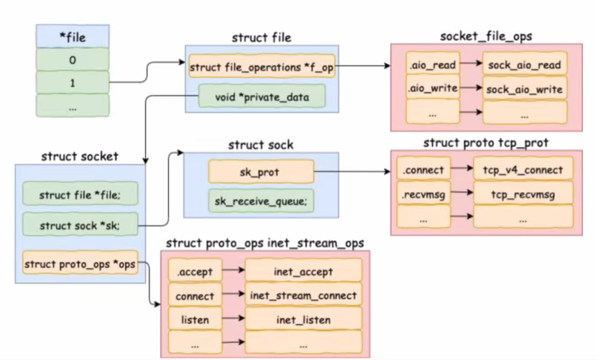

# 网络管理

## 三次握手内部实现原理

- 从实现层次深度理解socket
- 理解bind底层工作原理
- 理解listen系统调用底层原理
- 理解connect系统调用原理
- 深度理解三次握手在内核中的实现


### 客户端

```C
// 客户端核心代码
int main() {
    fd = socket(AF_INET, SOCK_STREAM, 0);
    connect(fd, ...);
    ......
}
```


### 服务端

```C
// 服务端核心代码
int main(int argc, char const *argv[]) {
    int fd = socket(AF_INET, SOCK_STREAM, 0);
    bind(fd, ...);
    listen(fd, 128);
    accept(fd, ...);
} 
```


### socket 内核数据结构




### listen函数原理


#### 半连接队列（链表）

半连接队列的长度由 `/proc/sys/net/ipv4/tcp_max_syn_backlog`

**半连接队列真正的意义是：**

| 意义             | 解释                                                     |
| ---------------- | -------------------------------------------------------- |
| 缓存握手中连接   | 保留处于 `SYN_RECV` 状态的连接，等第三次握手             |
| 限制资源占用     | 防止攻击者不断发 SYN 占用资源（配合 SYN cookie）         |
| 配合内核超时重传 | 如果客户端不响应第二次握手，内核会重发 SYN+ACK，直到超时 |
| 提高抗压能力     | 半连接队列容量决定了系统并发处理新连接的能力上限之一     |


#### 全连接队列（hash表）


**全连接队列真正的意义是：**

全连接队列作用：对于服务器来说，TCP 连接的建立和维护涉及两个层次：**内核态协议栈**和**用户态应用程序**；

用户程序通过调用 `accept()` 主动从全连接队列中**取出已完成的连接**。

> 全连接队列的作用是：在客户端完成三次握手、连接状态达到 `ESTABLISHED` 后，**内核会将该连接放入全连接队列**，等待用户态应用程序通过 `accept()` 系统调用将其取出。
>
> 这个过程涉及两个层次：
>
> - 内核态负责管理 TCP 协议状态与连接队列；
> - 用户态程序负责调用 `accept()` 来获取连接并进一步处理。
>
> 所以，全连接队列的本质是：**内核维护的“已完成连接等待用户处理”的缓冲区**。


**全连接队列是操作系统内核维护的一个缓冲区，用于缓存已完成三次握手但尚未被用户态程序 accept 的连接。它的作用是：**

🟡 **“连接缓冲”** + 🟢 **“速率解耦”** + 🔵 **“保护用户态程序免于瞬时并发打爆”**

------

**✅ 全连接队列的作用详解：**

| 作用                 | 解释                                                         |
| -------------------- | ------------------------------------------------------------ |
| 🟡 **连接缓冲**       | 已完成握手的连接先进入队列，不必立即交给应用程序。           |
| 🟢 **速率解耦**       | 应用程序 accept() 的速度可以和客户端连接的速度解耦，临时排队处理。 |
| 🔵 **保护用户态进程** | 防止用户进程未及时响应导致连接丢失，提升抗瞬时高并发能力。   |
| 🔴 **连接控制**       | 若全连接队列已满，新的握手完成的连接将被内核丢弃，客户端可能收到 RST。 |


**✅ 1. `listen(fd, backlog)` 函数的 backlog 参数**

- 应用程序调用 listen 时会传一个 `backlog` 参数，例如：

```C
listen(sockfd, 1024);  // 表示允许最多排队 1024 个已完成连接
```

但这个值**不是最终有效值**，它有**上限限制**，见下。


**对于服务程序的backlog设置**

**对于 Nginx：**

```nginx
# nginx.conf
listen 80 backlog=1024;
```

如果你没设置 backlog，它默认是 511。

**对于 Node.js：**

```javascript
server.listen(port, backlog)
```

默认 backlog 是 511。

**对于 Java Netty/Tomcat：**

通过设置：

```java
serverSocketChannel.socket().bind(socketAddress, backlog);
```


**✅ 2. 内核限制值：`/proc/sys/net/core/somaxconn`**

- Linux 内核会将 `listen()` 传入的 backlog 与 `somaxconn` 进行比较，**取两者较小值**作为真正的全连接队列长度：

```bash
cat /proc/sys/net/core/somaxconn
# 默认值常见为 128，可以调大
```

所以如果你写 `listen(fd, 1024)`，但系统 `somaxconn = 128`，那么实际能排队的全连接最多是 **128**。


**补充：**

半连接队列用于保存处于 `SYN_RECV` 状态的连接，通常用简单的线性结构（链表或数组）来实现，便于快速处理、超时重发等。

而三次握手完成后的连接会进入全连接队列，等待用户态程序 `accept()`，这是一个严格的 FIFO 队列，并不是哈希表。

实际用于哈希表结构的是 TCP 协议栈维护的**连接状态哈希表（TCP hash table）**，用于快速定位 ESTABLISHED 状态的连接。


而listen函数的一个最重要的作用就是初始化这两个连接队列


#### 全连接队列与半连接队列的（调优思路）

**🛠 建议 1：调整 somaxconn**

```bash
echo 2048 > /proc/sys/net/core/somaxconn
```

**🛠 建议 2：调大 tcp_max_syn_backlog（配合半连接队列）**

```bash
echo 2048 > /proc/sys/net/ipv4/tcp_max_syn_backlog
```

**🛠 建议 3：确保你的 Web 服务程序显式设置了合适的 backlog 参数**

如：

- Nginx: `listen 80 backlog=2048;`
- Node.js: `server.listen(port, 2048);`
- Tomcat: `acceptCount="2048"`


### connect函数原理


**客户端调用 `connect()` 的时候，确实就是触发 TCP 三次握手的起点和时机**。


**详细过程说明：**

当你在客户端代码中写下：

```C
connect(sockfd, (struct sockaddr *)&server_addr, sizeof(server_addr));
```

背后发生了以下关键动作：

| 步骤 | 动作                                                    | TCP 状态变化             |
| ---- | ------------------------------------------------------- | ------------------------ |
| ①    | 客户端向内核请求建立连接（调用 `connect()`）            | `CLOSED → SYN_SENT`      |
| ②    | 内核构造并发送 **SYN** 报文                             |                          |
| ③    | 等待服务端响应 SYN+ACK                                  |                          |
| ④    | 一旦收到 SYN+ACK，内核立刻自动发出 ACK 报文             | `SYN_SENT → ESTABLISHED` |
| ⑤    | 此时 `connect()` 系统调用返回，用户空间认为“连接已建立” |                          |


**补充：`connect()` 是阻塞 or 非阻塞的关键点**

- **默认情况下，`connect()` 是阻塞的**：直到三次握手完成或超时。
- 如果设置了 `O_NONBLOCK`，则 `connect()` 会立即返回，握手在后台进行，你需要用 `select()/poll()` 等方式判断是否建立成功。


**客户端调用 `connect()` 就是 TCP 三次握手的触发点**，一切 TCP 连接的开始都源自这个系统调用，它在内核层发出第一个 SYN 报文。


第一次发送SYN握手包，握手包的样子：


源端口需要被connect()函数初始化，选择一个源端口号，

```C
// file:net/ipv4/inet_hashtables.c
int __inet_hash_connect(...) {
    // 是否绑定过端口
    const unsigned short snum = inet_sk(sk)->inet_num;
    
    // 获取本地端口配置
    inet_get_local_port_range(&low, &high);
    remaining = (high - low) + 1;
    
    if (!sum) {
        // 遍历查找
        for (i = 1; i <= remaining; i++) {
        port = low + (i + offset) % remaining;
        ......
        }
    }
}
```

`inet_get_local_port_range()` 函数读取的是 ：**net.ipv4.ip_local_port_range** 这个内核参数，默认（32768 61000）


根据可用端口号范围，通过遍历找到可用端口号，然后就可以内核构造并发送 **SYN** 报文，发起TCP连接的第一次握手


### 三次握手的内核工作过程


## 常见三次握手的网络异常

- 认识到connect可能发生的问题
- （服务器端）队列溢出可能导致接口超时
- 掌握三次握手相关的优化方法


### connect函数中的异常

#### 问题发生背景：CPU消耗从15%突增到80%

线上一直4核单实例，每个实例支持2000QPS一直无异常，CPU利用率维持在15%左右，但某次上线后，每次请求中只增加了一次的Redis访问，线上CPU利用率飙升至80%

导致下面两种情况的不同场景：

正常情况：主机上的多个连接，做了hash，连接到不同的redis服务器

异常情况：为了省事，所有的连接，连接到同一个redis服务器，结果……由于本身的端口号数量不足，导致后续遍历寻找端口号时间过长，负载增加


 **`strace -cp <PID>` 的作用：**

> **对指定进程（PID）进行系统调用的汇总统计**，展示**每类系统调用花了多少时间、调用了多少次、占比多少**。


connect系统调用会选择一个端口发起请求， 问题是端口选择时遍历查找……，且32768到61000中的端口基本用尽，就剩一个端口可用了，在这种情况下，遍历的耗时会很长……，同时内核为了防止端口号冲突，所以在找端口号的时候会加锁，因此这两个原因加起来就导致如果本地可用端口号范围过小，就会导致connect耗时大幅上涨


### 服务端连接队列问题

#### 现象2：偶发的线上访问耗时，如何排查和处理


```bash
就平时很快，偶尔，基本没十几次，访问耗时很长，设置超时
```


客户端connect包发出时会启动重传定时器

```C
// file:net/ipv4/tcp_output.c
int tcp_connect(struct sock *sk)
{
    ...
    // 实际发出 syn
    err = tp->fastopen_req ? tcp_send_syn_data(sk, buff):
    tcp_transmit_skb(sk, buff, 1, sk->sk_allocation);
    
    // 启动重传定时器
    inet_csk_reset_xmit_timer(sk, ICSK_TIME_RETRANS, inet_csk(sk)->icsk_rto, TCP_RTO_MAX);
}

//file: include/net/tcp.h
#define TCP_TIMEOUT_INIT ((unsigned)(1*HZ))  # 定时器首次默认超时时间是1s
```

重传定时器的作用是，当客户端syn包第一次发出后，如果服务端没有响应，则超过1s，超时重传


但是由于服务端的半连接队列满了，将第一次syn包丢弃掉了。丢弃后，1s后重传。老版本内核默认是3s重传，根本原因就是半连接队列满了


通过上图可见，客户端在1s以后进行了第二次握手重试，接下来依次又分别在3s，7s，15s，31s，63s等时间重试了6次（重试6次是因为tcp_syn_retries当时设置是6）

**假如服务器上出现了半/全连接队列溢出导致的丢包，那接口响应时间将至少是1s以上。**


### 三次握手中性能优化

- 如果请求频繁，弃用短连接改用长连接
- 尽可能合并请求
- 客户端注意iip_local_port_range要够用，最大65535，默认32768到61000
- 客户端连接不同的服务器
- 打开SYN cookie避免半连接队列溢出
- 服务端通过backlog 和 net.core.somaxconn控制合适的全连接队列长度
- 服务端应该尽快accept让应用取走连接


## 同步阻塞的内核实现


- 掌握同步阻塞原理
- 理解阻塞为什么性能差


同步阻塞代码示例

```C
int main() {
    int sk = socket(AF_INET, SOCK_STREAM, 0);
    connect(sk, ...)
    recv(sk, ...) //接收处理返回的数据
}
```


后续讲解：

- socket的创建
- 同步阻塞recv实现
- 数据到达内核唤醒


 


