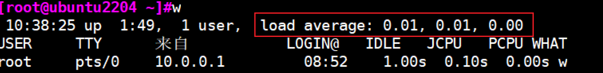
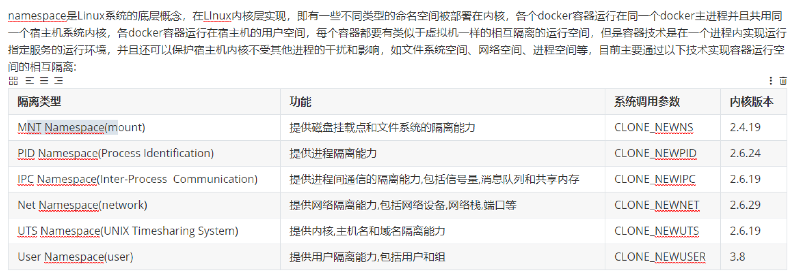
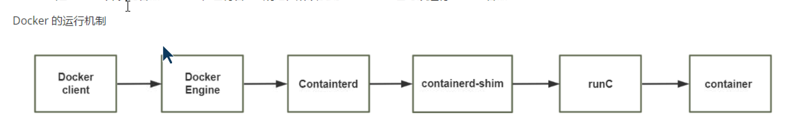

# 指标状态
## uptime,top

- 1,5,15min


# Net
## TCP三次握手与四次挥手
## Nginx
### nginx -s reload 热加载原理
### nginx 平滑升级原理

# Zabbix

### 自定义监控模版的实现流程


### Zabbix的主动模式和被动模式
  - Zabbix-Server:10051（主动）
  - agent:10050(被动)

### 告警,问你们公司是怎么做告警策略的
- 一旦发生告警，显示给我们运维人员发
- 然后规定一段时间内（一般半个小时左右），如果解决不了，就会发邮件给他的小组负责人发
- 如果仍然解决不了，则发给这个项目组的直属领导发

### 机器多的话，如何批量添加主机进行监控（即自动化）

### javagateway的用法

### proxy的使用场景


# Docker

## Docker的核心技术

### 六种命名空间



### Control group

作用：资源限制

### Docker的运行机制




### 优化

### 排错


### 有哪些命令

### 查找nginx的文件列表

nginx -T|grep ~

#### 查询正在使用文件列表
lsof -p [process_pid]


#### cmd和entrypoint的区别


## Redis

### Redis的应用场景

### Redis是单线程吗

### 缓存穿透，缓存击穿，缓存雪崩

#### 缓存穿透（都没有）


#### 缓存击穿（MySQL有）
- 解决方案：设置热点数据，永不过期

### 性能优势：Pipeline


### Redis性能优化


开启Redis的三个优化

- overcommit
- transparent huge page(透明大页)  
  - 建议关闭nerver,新版内核是madvise
- 全连接队列（大于511）
  - 新版默认4096
  - 旧版内核是128，需要加大

配置文件优化
- 客户端最大连接数
  - maxclients 10000（默认10000）
- 最大使用内存
  - maxmemory:0 (默认0，不限制，单位以字节为单位`<bytes>`)
  - 建议物理内存的一半
- 内存使用策略
  - maxmemory-policy，当内存快满的时候，redis如何处理
  - lru,lfu

### Redis配置热加载
#### 使用Config命令实现
```shell
CONFIG GET
CONFIG SET
# 示例
CONFIG SET maxmemory 88888

# 临时设置密码
CONFIG SET requirepass 123456

# 查看所有设置
CONFIG GET *
```

### 慢查询

`slow-log-slower-than`，默认10000微秒，算慢查询

#### 开启慢查询
```shell
slowlog-max-len # 默认128

# 查看慢查询指令
SLOWLOG LEN     # 查询慢的指令数量
SLOWLOG GET     # 查询所有
SLOWLOG GET [n] # 查n个查询指令
```

### Redis持久化（面试经典问题）

两种备份方式

### RDB默认（全量备份）
配置文件
```shell
dir

dirname  dump.rdb  # 默认叫dump.rdb

# 手动触发备份
# 方法1：同步，同步期间会占用线程，慎重使用，因为redis是单线程
SAVE
# 方法2：后台备份，会生成一个独立的进程用来在后台运行
BGSAVE  
# 持久化备份信息
rdb_bgsave_in_progress:0 # 0表示备份完了，1表示没备份完了

# redis自动触发备份，使用save策略
save <seconds> <changes> [<seconds> <changes>...]

# 查看策略
config get save
# 默认 save 3600 1 300 100 60 10000
```

### AOF (增量备份)

AOF默认是禁用的，需要手动启用
```shell
# 旧版指令

# 新版指令，6版本开始，实时数据放在了子目录里
appenddirname "appendonlydir"

# 开启AOF
cat redis.conf # 查看redis配置文件
appendonly no  # 默认不开启，开启改为yes
appendfilename "appendonly.aof"
appenddirname "appendonlydir"
```

#### 重大问题
如果AOF和RDB同时启用，则AOF优先级高，AOF是新生成的，RDB中的数据读取不到
会导致redis数据库启动时，无数据，不会读取RDB中的数据

#### 正确的开启AOF的方式
```shell
# 先使用CONFIG热加载
CONFIG SET appendonly yes  # 现在redis数据库中临时开启

# 再在配置文件中修改开启appendonly
# 不用再重启redis
```
#### AOF的优势
- 可以实时备份
- 可以修复数据库

#### AOF的缺点
- 因为是实时备份，io比较多
  - 解决方法：使用appendfsync everysec策略，每秒落盘1次
  - appendfsync always，实时落盘，性能差，但是安全
  - appendfsync no 默认30s落盘1次

#### AOF Rewrite重写机制（即清理机制）
可以手动执行`bgrewriteaof`触发AOF
```shell
bgrewriteaof
```

自动触发策略
```shell
auto-aof-rewrite-percentage 100
auto-aof-rewrite-min-size 64mb
#两个策略合起来的策略
```


### 危险命令
- flushall

- showdown

## 消息队列

## 发布者与订阅者

订阅：SUBSCRIBE
SUBSCRIBE 103.9

发布：PUBLISH
eg：publish 103.9 "qing he du che"


先发订阅后发布，发布消息后，多个订阅者都能收到消息，所以消息是发布者先发布，订阅者再接收

```shell
# 可以订阅多个频道
PSUBSCRIBE 频道1，频道2...

# 订阅所有频道
PSUBSCRIBE *

# 取消订阅
UNSUBSCRIBE
```

## 主从复制实现

主节点要开启持久化，从节点建议开启持久化

### 主从命令配置
```shell
# 主节点设置密码
vim redis.conf
requirepass 123456
# 建议主节点配置上写
masterauth 123456

# 从节点配置
REPLICAOF MASTER_IP PORT # 新版推荐

# 旧版
SLAVEOF MasterIP Port

CONFIG SET masterauth <masterpass>

# 从节点设置密码
# 直接直接写到配置文件上
requirepass 123456
REPLICAOF MASTER_IP PORT
masterauth 123456

# 从节点输入密码,查看同步情况
auth 123456

# 查看角色
role

# 从节点独立
REPLICAOF no one
```
配置主从集群后，从节点源数据被冲掉（删掉）

从节点默认只读

建议：所有主从节点都配置相同`密码requirepass`和都设置`masterauth`,当以后主节点坏掉后，可能会降级为从节点,此时只要再重新添加`replicaof`指向新的主节点即可

### Redis的级联复制

## 哨兵 Sentinel

### 更改集群中master节点的角色
```shell
# 在redis-sentinet执行
redis-cli -a 26379

# 更改master节点
sentinel failover <mastername>
```

1w5,2点面试、
mysql zabbix 

nginx 2种模式 在哪个模块

nginx --- keepalive timeout

nginx 
ansible 


# Prometheus
## node exporter
## pushgateway
## promQL
##


# k8s
## 指令
kubectl get all -n kube-flannel
`kubectl get all -n <ns_name>`


## 创建名称空间
命令：`kubectl create namespace <namespace_name>`
```shell
# 输出yaml文件
kubectl create namespace <ns_name> --dry-run=client -o yaml
# 执行yaml文件，apply具有幂等性
kubectl apply -f <yaml_file>

# 创建资源，建议指定名声空间
kubectl create deployment -n <ns_name>

# 删除名声空间,危险操作，删除名声空间，空间内所有资源一起删除
# delete不具备幂等
kubectl delete namespaces <ns_name>

# 使用现有资源生成yaml文件
kubectl get pod <容器名> -o yaml
```

指令式

声明式


## pod
含有多个具有“亲缘”关系的容器的集合，一般由Pause容器(一个)和业务容器组成(一个以上)
因此Pod至少2个容器

```shell
# 显示所有ns上的容器
kubectl get pod -A -o wide
```

### pod分类

- 自主式pod
```shell
# 创建一个pod，run=create+exec
# kubectl run <自定义容器名> --image=<容器>
kubectl run mynginx --image=nginx

# 查询pod创建的地址
kubectl get pod -n <ns_name> -o wide
# 查看全部pod详细信息，包括地址
kubectl get pod -A -o wide
```

- 由Workload Controller管理的pod

- 静态pod
  - /etc/kubenetes/manifests/*.yaml


### pod资源清单（Yaml）
```shell
# 在线直接编辑，不建议使用
kubectl edit pod pod-test1

# 建议修改yaml后apply

# 显示pod详情，通常通过Events排错
kubectl describe pod -n <ns_name> pod_name
# 常见日志
kubectl logs [-f] pod_name
# 查看具体容器日志
kubectl logs [-f] pod_name -c container_name

# 进入容器执行
kubectl exec pod_name [-c container] -- COMMAND [options]
```

### k8s错误状态（面试常问）
ImagePullBackoff --- 再次拉取错误
ErrImagePull  ---  镜像拉取错误
Error --- 启动错误
CrashLoopBackoff --- 循环启动失败
RunContainerError --- 容器启动失败

### 定制pod
#### command 
- 指定启动命令

#### args
- 指定启动参数

### Pod创建流程（面试重点）
- 16:49G

### Pod生命周期流程
- 17:22


### 删除容器
```shell

```

### pod重启策略（面试重点）
always

never


### pod镜像拉取状态（面试重点）
always
ifnotpresent
never


### pod健康检测的3个探针（面试重点）

### 资源限制
#### requests 下限
- 满足不了的话，会处于pending状态

#### limit 上限
- 如果超出上限，会oomkilled

### 使用deployment实现滚动发布，金丝雀发布和蓝绿发布


##  PV与PVC

Pod <------- PVC <------ PV <------- Volume

PV：提供服务
- 集群级别资源

PVC: 客户
- 名称空间级别资源

### PV实现
#### 静态
#### 动态
- 基于storageClasses

#### pV和PVC的状态
pv:pending available bund release delete
pvc:pending  bund  delete

#### pv资源回收策略


### PV和PVC的实现

## storageClass
用于自动创建pv
pvc需要指定的storageClasses名称来决定哪个storageClasses来创建pv