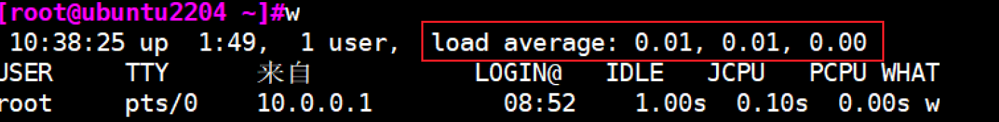
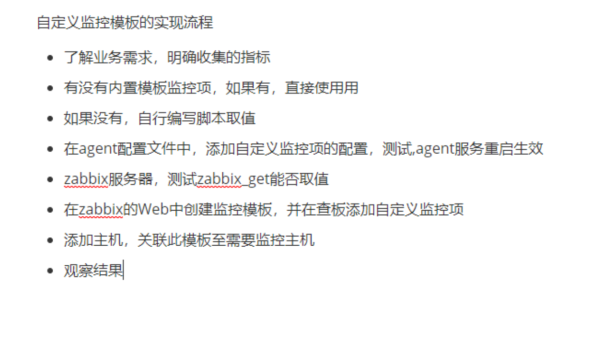

# 指标状态
## uptime,top

- 1,5,15min

# Net
## TCP三次握手与四次挥手

# Zabbix

### 自定义监控模版的实现流程

### Zabbix的主动模式和被动模式
  - Zabbix-Server:10051（主动）
  - agent:10050(被动)

### 告警,问你们公司是怎么做告警策略的
- 一旦发生告警，显示给我们运维人员发
- 然后规定一段时间内（一般半个小时左右），如果解决不了，就会发邮件给他的小组负责人发
- 如果仍然解决不了，则发给这个项目组的直属领导发

### 机器多的话，如何批量添加主机进行监控（即自动化）

### javagateway的用法

### proxy的使用场景